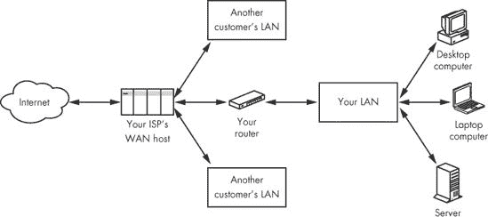
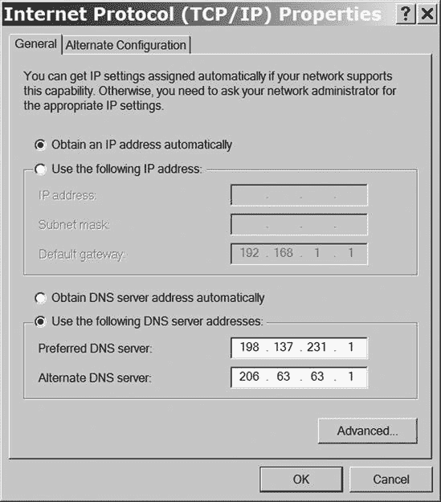
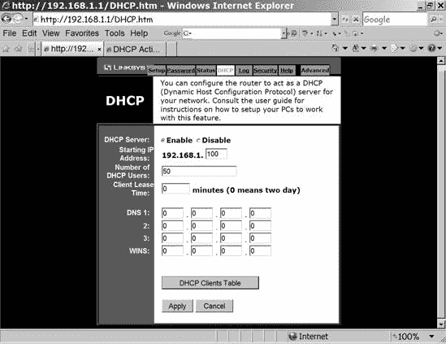

# 第十章。连接您的网络到互联网

家庭网络的所有其他好处——文件共享、内部网站托管等等——都很方便，但大多数人想要将所有家庭计算机连接在一起的主要原因是为了共享高速互联网连接。在企业中，这些其他服务比在家中的更重要，但每个人的互联网接入仍然很重要。本章解释了如何将网络连接到互联网以及如何设置每台计算机通过网络连接到互联网。

互联网通常被描述为“网络的网络”。换句话说，互联网为您自己的局域网和数百万其他网络之间交换数据提供了一种方式。然而，在您可以在本地网络和互联网之间交换数据之前，您（或您的网络管理员）必须配置您的网络网关，并且您必须配置计算机的互联网设置，才能通过该网关将计算机连接到互联网。

# 互联网：从云端到您

网络图传统上显示互联网为一个巨大的云。在这个云内部有数百万台计算机、路由器和位于世界各地的其他设备，但该设备的内部操作是别人的问题；当您连接自己的网络时，互联网只是一个巨大、无形的*东西*，以可预测的方式运行。

图 10-1 展示了从互联网通过您的本地网络到个别计算机的连接。这些计算机可以是任何类型的网络连接设备，例如打印机、网络连接存储(NAS)设备硬盘驱动器或口袋大小的智能手机，但为了讨论方便，让我们将这些视为计算机的类型。为了在您的计算机和互联网之间发送和接收数据，您必须向互联网提供某些信息，而互联网则向您提供其他信息。

**图 10-1. 互联网通过本地网络与您的计算机通信。**

## 调制解调器

您的局域网可能通过高速电话线或有线电视系统连接到互联网。将数字数据从局域网转换到可以通过电话线或电缆传输的信号的设备是*调制解调器（*调制器/解调器）*。在大多数情况下，调制解调器与网关路由器结合使用，但一些有线电视公司和电话公司提供独立的调制解调器，可以直接连接到单个计算机，或者通过路由器或交换机连接到局域网。

在本章的目的上，您可以将调制解调器视为一种路由器。调制解调器和路由器之间的区别在于，调制解调器包括执行*调制*和*解调*活动的内部硬件以及提供连接设置的软件。控制互联网和您的本地网络之间连接的配置设置在调制解调器和路由器中通常是相同的。

### 注意

使用语音电话网络连接您的计算机到互联网的拨号调制解调器以类似的方式运行，但它的连接速度要慢得多。

## 网关路由器

如第三章所述，连接互联网到您本地网络的网关路由器在两个不同的网络中都有一个存在点：您的互联网服务提供商的广域网（WAN）和您自己的局域网（LAN）。WAN 是更大的互联网云的一部分。

因此，路由器有两个不同的地址：WAN 上的一个地址和 LAN 上的另一个地址。路由器的任务是在这两个网络之间交换数据。在某种程度上，互联网对待路由器的方式与路由器对待网络上的其他计算机的方式相同，但互联网使用不同的地址来实现这些目标。在路由器内部发生的重要活动之一是网络地址转换。

您的路由器设置实用程序显示了两组设置：一组用于 WAN，另一组用于 LAN。WAN 端使用一个唯一的数字地址来识别路由器到互联网。该地址可以是*固定*的或*静态*的，这意味着它始终完全相同，或者*动态*的，这意味着每次路由器连接到 WAN 时，WAN 上的服务器都会从地址池中分配下一个可用的地址。动态地址分配使用称为动态主机配置协议（DHCP）的过程，这在 DHCP 服务器开启或关闭中进行了描述。

网关路由器通常指定一个或多个*域名系统（DNS）*服务器的数字地址，这些服务器将使用单词（如[nostarch.com](http://nostarch.com)）的互联网地址转换为数字地址。如果没有 DNS 服务器进行查询，WAN 将不知道将电子邮件消息、网页请求或任何其他与互联网上的目标通信的尝试发送到何处。您的互联网服务提供商将提供一个或多个 DNS 服务器的地址。

路由器还需要一个 *网关地址* 和一个 *子网掩码*。*网关* 是 WAN 和互联网其他部分之间的下一个路由器；子网掩码告诉 WAN 路由器 IP 地址中的哪些数字标识路由器，哪些通用数字标识 WAN。例如，最常用的子网掩码是 255.255.255.0，这意味着四个数字中的最后一个对每个节点都是不同的。换句话说，如果你的 WAN 控制着 123.223.123.*XXX* 组中的所有地址，那么你的地址可能是 123.223.123.103，而在同一 WAN 上的另一个客户的地址可能是 123.223.123.117。

路由器使用的具体数字绝对至关重要；如果你没有完全正确，路由器将无法连接到互联网。但理解它们的意义不如正确使用它们重要。当你设置新账户时，你的互联网服务提供商将提供要使用的数字。将这些数字写在保存账户号码和其他重要计算机相关信息的同一地方。

### 注意

当在网关路由器和互联网之间有一个独立的 DSL 或电缆调制解调器时，调制解调器通常向互联网和本地网络提供静态 IP 地址和其他信息。在这种情况下，网关路由器在调制解调器和本地网络的其他部分之间中继必要的地址。

你路由器或调制解调器的局域网设置控制着你的本地网络如何运行。连接到网络的每台计算机的具体设置必须在路由器或调制解调器定义的范围内。下一节将解释这些局域网设置中的每一个是如何工作的。

## 单独的计算机

连接到局域网的每台计算机都必须在与路由器的关系上具有相同的配置设置：一个数字 IP 地址、一个网络掩码以及指向互联网的网关地址和一个或多个 DNS 服务器。作为你网络的责任人，你必须设置一个 DHCP 服务器，或者将这些值提供给每个用户并确保他们正确输入，或者亲自将它们输入到每台计算机和网络设备中。

设置路由器与互联网通信和设置计算机与局域网通信之间的区别是：(1) 路由器有两个设置组（WAN 和 LAN），但计算机只有一个；以及(2) 路由器从你的互联网服务提供商那里获取其 WAN 设置，但本地计算机从路由器那里获得许多相同的设置。因此，你应该几乎总是首先设置你的网络中的网关路由器——在你向网络添加计算机之前。

### 注意

当你通过高速（DSL 或电缆）调制解调器直接将一台计算机连接到互联网时，你必须使用你的 ISP 或调制解调器提供的设置。

通过局域网连接计算机到互联网的基本设置与您用来设置调制解调器和路由器的设置类似。接下来的几节将解释如何处理每个设置。

### DHCP 服务器开启或关闭

DHCP 服务器会自动将 IP 地址和其他配置信息分配给网络中的所有设备。在局域网（LAN）中，DHCP 服务器通常是连接该网络到互联网的路由器或调制解调器的一部分，或者集成在网络集线器中。在大多数小型网络中，使用 DHCP 服务器比逐个为网络设备分配静态 IP 地址更方便。

DHCP 设置是连接问题的一个常见原因。如果计算机配置为从 DHCP 服务器获取其 IP 地址和其他设置，则路由器或调制解调器上的 DHCP 服务器必须处于活动状态。当同时有多个服务器处于活动状态时，可能会出现其他（较少见）的 DHCP 问题。在某些情况下，其他网络设备将从“错误的”服务器获取 DHCP 设置，或者设置不允许您连接到互联网。如果在测试网络时无法通过您的局域网成功连接计算机到互联网，您应该始终检查 DHCP 服务器设置。

在局域网中使用 DHCP 时，有几个重要的事项需要了解：

+   网络只能有一个活动的 DHCP 服务器。

+   当网络使用 DHCP 服务器时，连接到网络的每台计算机和其他设备（如打印机或游戏机）都必须配置为接受来自 DHCP 服务器的地址。在 Windows 中，必须激活“自动获取 IP 地址”选项，如图图 10-2 所示。

    

    **图 10-2. 当自动获取 IP 地址选项激活时，Windows 使用网络的 DHCP 服务器设置其 IP 地址。**

    在 Macintosh OS X 中，必须将“配置 IPv4”选项设置为“使用 DHCP”，如图图 10-3 所示。

+   DHCP 服务器分配的 IP 地址必须位于保留范围之一。在几乎所有情况下，您都不需要更改服务器的默认值。

大多数集线器、路由器、调制解调器和 Wi-Fi 接入点使用一个或多个基于网页的页面（例如图 10-4 所示）来显示和更改 DHCP 服务器的设置。然而，几乎每种网络控制设备的页面组织方式都有所不同。因此，您必须查阅您设备的说明书或制造商的网站以获取具体说明。

**图 10-3. 在 OS X 中，选择使用 DHCP 选项从服务器获取 IP 地址。**

在这个例子中，重要的设置是 DHCP 服务器和起始 IP 地址。当 DHCP 服务器启用时，服务器为整个网络提供 IP 地址。当服务器禁用时，每个计算机和网络节点使用静态地址，您必须在计算机或节点上设置该地址。

**图 10-4. DHCP 服务器为整个网络设置 IP 地址。**

起始 IP 地址设置指定了服务器将分配给客户端设备的最低 IP 地址编号。DHCP 用户数量设置定义了地址范围中的最高编号（在本例中为 192.168.1.149）。在某些系统中，服务器要求输入一个数字范围而不是起始编号和用户数量。在任何情况下，请确保 DHCP 用户数量多于当前连接到网络的计算机数量，以便服务器在您添加更多设备后仍能继续支持您的网络。

### 子网掩码

子网掩码设置指定了网络中每个连接到网络的设备 IP 地址的哪一部分会发生变化。除非您有使用不同掩码的理由，否则将子网掩码设置为 255.255.255.0。如果网络使用 DHCP 分配 IP 地址，您不需要在每个客户端设备上输入子网掩码。

对于我们大多数人来说，子网掩码是那些我们必须正确输入以使网络正常工作的设置之一，但我们实际上并不需要知道它的含义。然而，在大型或复杂的网络中，您可以使用子网掩码将网络划分为更小的辅助网络，或称为*子网*。同一子网内的计算机和其他网络节点可以更快地交换数据，因为它们不需要完全到达更大的 WAN 或互联网然后再返回来定位彼此。

如您所知，数字 IP 地址被分为四组数字，每组数字的范围从 0 到 255。地址的一部分标识网络，另一部分标识特定的计算机。例如，您的 ISP 可能使用具有网络地址 203.23.145.*XXX* 的广域网；连接到该广域网的个别计算机和局域网将具有从 203.23.145.000 到 203.23.145.255 的地址。在这种情况下，子网掩码将是 255.255.255.0，因为本地地址仅限于地址的最后一部分（零）。最多可以连接 256 个设备（编号从 0 到 255）到这个子网。

在您的局域网内部，您可以使用子网掩码将网络划分为两个或更多个子网。当您想要将有线连接与 Wi-Fi 接入点分开，或者您想要使用内部防火墙将包含敏感人员或财务数据的计算机与网络的其他部分隔离开来时，将网络划分为子网非常有用。要将您的局域网划分为两个大小相等的子网，将子网掩码 *XXX*.*XXX*.*XXX*.0 分配给一个子网，并使用从 1 到 126 的本地地址（路由器使用 0）。对于另一个子网，使用子网掩码 *XXX*.*XXX*.*XXX*.128 并分配从 129 到 255 的地址。您需要为每个子网配备一个单独的路由器。

### 注意

使用子网将局域网划分为独立的组是一种高级网络实践；你不太可能在简单的家庭网络或非常小的商业网络中看到这种配置。

### IP 地址

如第四章所述，已经为连接到局域网的计算机和其他设备预留了几个数字 IP 地址组。因为这些地址仅在各自的局域网内可见，所以在不同的网络中使用相同的地址是实用的。连接到您的网络中的每台计算机和每个其他设备都必须在这些预留的数字范围内有一个不同的地址。

每个网络设备，包括路由器本身的局域网部分，必须从预留组中有一个不同的 IP 地址。一个 DHCP 服务器（通常是路由器或调制解调器的一部分）会自动处理此事，并在用户将另一台计算机连接到网络时分配新的地址。如果用户将笔记本电脑和其他便携式设备连接到网络并断开连接，这会特别方便。

如果您不使用 DHCP 服务器，您将必须逐个为每个设备设置地址。路由器或调制解调器的局域网通常有一个默认地址，您可以使用它来访问其配置实用程序（请在设备的手册中查找地址）。您不需要更改路由器或其他控制设备上的默认地址，除非另一个设备（例如 Wi-Fi 接入点）具有相同的默认地址。为了确保您没有为多个设备分配相同的地址，请保留一个包含网络中每个设备的 IP 地址的主列表，包括笔记本电脑和其他使用临时连接的可携带设备。您可以将列表保存在您自己的计算机上的文本文件中，但也应该打印当前列表（包括日期）并单独保存。当需要添加一个或多个额外设备时，请查阅列表以找到并添加一个尚未分配的新地址。

### DNS 服务器

您的局域网需要一个或多个 DNS 服务器将互联网地址转换为数字 IP 地址，但 DNS 服务器不必是局域网的一部分；您可以在互联网上的任何地方使用 DNS 服务器。为每个计算机使用与路由器 WAN 端相同的 DNS 服务器地址。

### 注意

如果您无法从您的 ISP 那里获取 DNS 服务器地址，请运行网络搜索以查找*公共 DNS 服务器*以找到替代服务器的地址。一个广泛使用的公共 DNS 是 OpenDNS ([`www.openDNS.com/`](http://www.openDNS.com/))。

### 网关

*网关*地址是路由器或其他控制设备的地址，该设备在局域网上的计算机和互联网之间中继数据。这个网关有时被称为*默认网关*。网关地址与路由器局域网端使用的数字地址相同。请查阅路由器手册以找到您网络的正确地址。

连接到网络的计算机不使用与路由器或调制解调器相同的网关地址。路由器/调制解调器是您网络和 ISP 的 WAN 之间的网关。您的 ISP 的网关地址标识了它们 WAN 与互联网其余部分之间的路径。

# 配置网络网关

要找到配置调制解调器、路由器或其他网络控制设备 WAN 端的特定说明，最佳地点是您的 ISP 提供的信息。具体来说，当您设置新的 ISP 账户时，您应该获取您的连接的静态 IP 地址或 DHCP 设置、DNS 服务器地址、子网掩码和网关地址。ISP 可能会同时为您提供电子邮件账户的地址和密码，但您不需要它们来配置网络连接（尽管您需要它们来发送和接收消息）。

如果您的 ISP 每次连接时都需要登录名和密码，您将需要一个使用与 ISP 的设备期望的相同连接规则（即*协议*）的路由器或调制解调器。如果您的 ISP 不提供调制解调器，请向他们索取兼容的品牌和型号列表。

路由器的局域网端使用地址和其他设置，这些设置不会超出您的网络范围，因此您的网络可以使用与邻居网络相同的设置。因此，许多制造商在路由器中预设了应该适用于大多数网络的地址。设备附带的用户手册或设置指南通常包含更改设置的逐步说明。如果您找不到打印的手册副本，请在网上制造商的网站上查找。

### 注意

第十一章包含了使用 Windows、Macintosh OS X、Linux 或 Unix 连接路由器的详细说明。要将 NAS 设备、打印机或其他设备连接到网络，请遵循每个设备提供的说明。

# 摘要

您的网络通过一个网关路由器连接到互联网，该路由器在您的局域网和 ISP 的广域网（WAN）上均表现为一个节点。为了在网络上的一台计算机和互联网之间交换数据，您必须使用 ISP 提供的地址和选项配置路由器的广域网（WAN）端。

路由器的局域网（LAN）端控制着您的网络如何与互联网进行通信。因此，路由器的局域网端设置必须与连接到局域网的每台计算机和其他设备的设置兼容。
