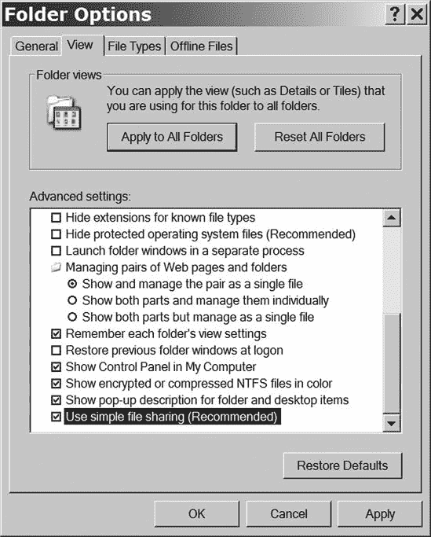
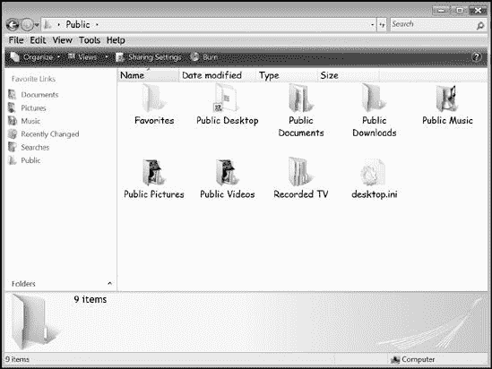
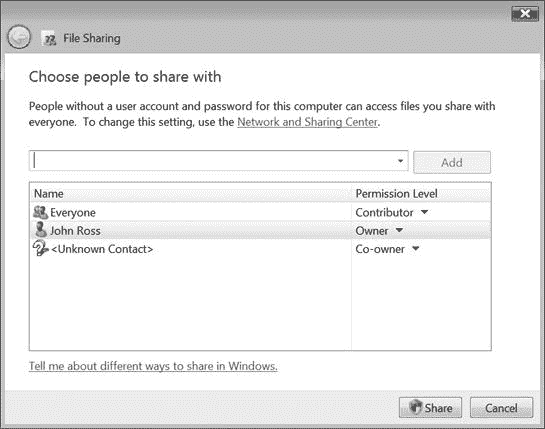
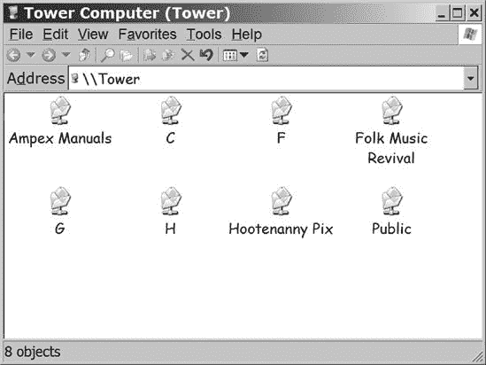
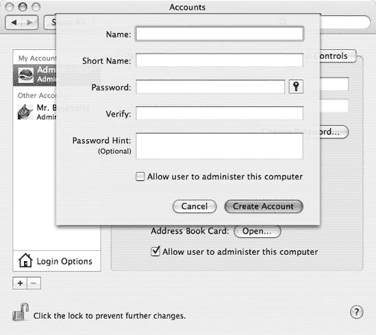
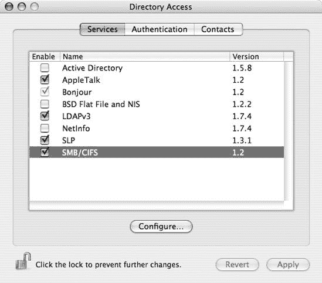
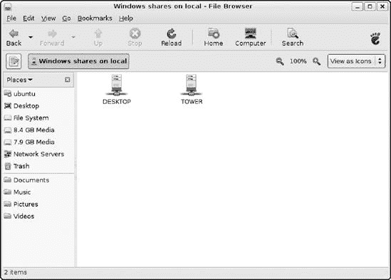
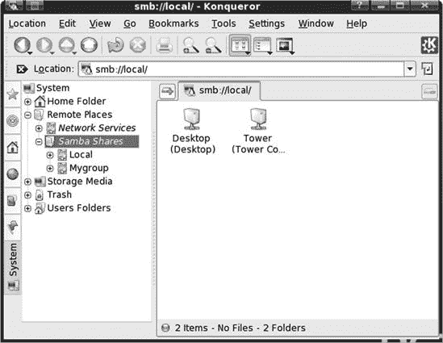
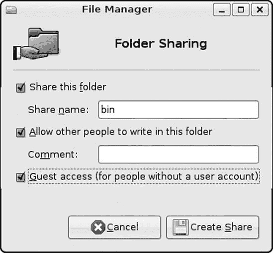
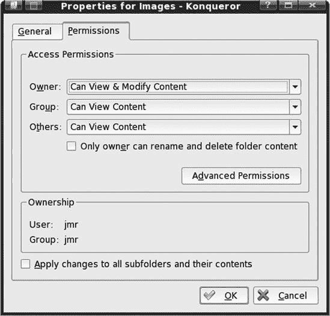

# 第十二章. 通过网络共享文件

文件共享需要在便利性和安全性之间做出妥协。您希望让存储在您计算机上的某些文件可供其他人使用，但您可能还有其他包含您希望保持私密的信息的文件。因此，Windows 和其他网络操作系统允许您将不同的文件或目录分配到不同的访问级别。一些文件可供所有网络用户访问，而其他文件可能仅限于特定用户，还有一些文件仅对文件的所有者可用。

在共享文件、打印机和其它资源的最常见的网络系统之一是服务器消息块（SMB）协议。此协议是 Microsoft Windows 网络的核心，它也适用于 Macintosh OS X 和 Linux/Unix 系统。因此，在运行不同操作系统的计算机之间交换文件不是问题，尽管文件本身可能并不总是兼容（例如，您可能无法在 Linux 系统上运行为 Windows 编写的程序）。

许多操作系统支持多种网络协议，但当您运行混合网络，或者如果远程可能有一个使用不同类型计算机（如 Mac 或 Linux 笔记本电脑）的访客想要连接到您的网络时，最好使用最常用的协议。

文件共享的控制权在于持有每个文件的计算机，因此其他人未经您的许可无法打开和阅读您的文件——即使他们在同一台计算机上拥有登录账户（或他们使用的是访客账户）。为了与其他用户共享文件，您必须启用操作系统的文件共享服务，然后为每个文件夹或目录分配一个访问级别（通用、限制或无）。本章将解释如何在 Windows XP 和 Vista、Macintosh OS X 以及许多 Linux 和 Unix 发行版使用的 Gnome 和 KDE 环境中设置文件共享。

# Windows XP 中的文件共享

Windows XP 使用一组称为*简单文件共享*的程序，在网络上交换计算机之间的文件。在 XP 家庭版中，简单文件共享始终开启；在 XP 专业版中，文件共享通常是开启的，但您可以开启或关闭它。

要在 XP 专业版中打开或关闭简单文件共享，请按照以下步骤操作：

1.  从 Windows 桌面，打开我的电脑。

1.  选择**工具**菜单并选择**文件夹选项**。

1.  在文件夹选项窗口中，单击**查看**选项卡以打开图 12-1 所示的窗口。

    

    **图 12-1. 使用文件夹选项窗口打开或关闭简单文件共享。**

1.  在高级设置框中，滚动到最底部。

1.  要开启或关闭简单文件共享，请点击**使用简单文件共享（推荐）**复选框。当您在复选框中看到勾选标记时，文件共享功能处于活动状态。

1.  点击**确定**以保存您的设置并关闭文件夹选项窗口。

尽管名为简单文件共享，但它提供了五个访问级别，您可能会认为这比简单更复杂。然而，五个级别中的每一个在特定情况下都很有用。

| 第一级 | 我的文档（私有） | 文件仅对文件所有者可访问。 |
| --- | --- | --- |
| 第二级 | 我的文档（默认） | 文件对所有者和管理员可访问。 |
| 第三级 | 本地共享文档 | 本地和网络用户只能以只读方式访问；文件所有者和管理员拥有完全访问权限。 |
| 第四级 | 只读共享文档 | 本地和网络用户具有只读访问权限；文件所有者和管理员拥有完全访问权限。 |
| 第五级 | 读写 | 所有用户都有完全的读写访问权限。 |

### 警告

如果您想限制对任何文件的访问，请确保使用密码保护您的 Windows 用户帐户。

## 第一级

第一级文件和文件夹的所有者是唯一可以读取它们的人。第一级文件夹中的所有文件也都是私有的。

第一级文件和文件夹仅限于您的用户配置文件内（例如，我的文档、我的音乐、我的图片以及其他位于 *<驱动器号>:\Documents and Settings\<用户名>* 中的文件夹）。

要将文件夹或磁盘驱动器分配到第一级访问，请按照以下步骤操作：

1.  从 Windows 桌面，打开我的电脑。

1.  选择**文档和设置**，然后选择**用户名**文件夹。

1.  如果您想分配到第一级的文件夹在“我的电脑”窗口中不可见，请打开包含该文件夹的驱动器或文件夹。

1.  右键单击驱动器或文件夹图标。

1.  从弹出菜单中选择**共享和安全**。将显示显示在 图 12-2 中的属性窗口。

    

    **图 12-2. 勾选“使此文件夹私有”复选框以限制对文件夹的访问。**

1.  勾选**使此文件夹私有**复选框以限制对文件夹中文件的访问。再次点击以取消勾选，允许其他用户查看此文件夹。

1.  点击**确定**以保存您的选择并关闭属性窗口。

## 第二级

存储在第二级驱动器和文件夹中的文件，可由这些驱动器和文件夹的所有者以及拥有计算机管理员级别帐户的人访问。本计算机上的其他用户以及通过网络连接到本计算机的其他计算机上的所有用户都无法打开这些文件。

要将驱动器或文件夹分配到第二级，请按照以下步骤操作：

1.  在我的电脑中，右键单击你想要分配给 2 级的驱动器或文件夹图标。一个弹出菜单将出现在图标旁边。

1.  选择**共享和安全**。将出现一个属性窗口，其中共享标签可见。

1.  禁用**使此文件夹私有**选项和**在网络上共享此文件夹**选项。如果任一框中出现了勾选标记，请点击框以移除它。

1.  点击**确定**以保存你的选择并关闭属性窗口。

## 3 级

3 级文件夹和文件的所有者以及在同一台计算机上具有管理员级别账户的任何用户可以读取、更改或删除 3 级文件夹和文件；使用同一台计算机的所有其他用户可以读取或打开这些文件，但不能更改或删除它们。在 Windows XP 中，Power Users 也可以更改和删除 3 级文件。这些文件通过网络不可访问。

所有 3 级文件和文件夹都位于*<驱动器号>:\Documents and Settings\All Users\Shared Documents*文件夹中。要将文件或文件夹分配给 3 级，只需将其复制或拖动到共享文档文件夹中即可。

如果你预计要创建许多 3 级文件和文件夹，考虑在 Windows 桌面上创建一个共享文档的快捷方式。将图标拖到快捷方式上与直接将文件或文件夹拖到原始文件夹上的效果相同。

## 4 级

4 级驱动器、文件和文件夹作为只读文档通过网络访问。任何有网络连接的人都可以打开和读取 4 级文件，但只有文件所有者和本地计算机的管理员可以更改或删除文件。

要将驱动器、文件夹或文件分配给 4 级，请按照以下步骤操作：

1.  在我的电脑中，右键单击你想要分配给 4 级的驱动器或文件夹图标。将出现一个弹出菜单。

1.  从弹出菜单中选择**共享和安全**。将出现一个属性窗口，其中共享标签可见。

    

    **图 12-3. 选择在网络上共享此文件夹以将驱动器或文件夹分配给 4 级。**

1.  在属性窗口的网络共享和安全部分，勾选**在网络上共享此文件夹**选项。

1.  确保在**允许网络用户更改我的文件**复选框中没有勾选标记。点击框以移除现有的勾选标记。

1.  点击**确定**以保存你的更改并关闭属性窗口。

## 5 级

5 级驱动器、文件和文件夹对任何网络用户的更改或删除都没有保护。任何可以访问 5 级文件的人，无论是同一台计算机还是通过网络，都可以添加、更改或删除该文件。在 5 级文件夹中，任何用户也可以创建新的文件或文件夹或删除现有的一个。

显然，5 级是安全级别最低的（实际上几乎没有安全措施），因此您应该只为那些希望允许网络上所有人更改或删除的文件使用 5 级。作为额外的保护措施，确保您的网络受到防火墙的保护；如果网络包括一个或多个 Wi-Fi 接入点，请务必使用 WPA 加密。

另一方面，不要让这些安全顾虑让您在适当的时候不敢使用 5 级访问。在一个有两个人或更多人共同完成同一项目的商业环境中，您将希望允许相关人员创建或更改相关文档。在家庭网络中，您可能希望提供对音乐、照片、视频文件以及家长可能希望在提交之前查看的学校学期论文等文件的通用访问权限。如果您在家庭或办公室电脑和笔记本电脑之间共享文件，您将希望在这两者之间允许 5 级访问。

要将驱动器或文件夹的内容分配到 5 级，请按照以下步骤操作：

1.  在我的电脑中，右键单击您想要分配到 5 级的驱动器或文件夹的图标。将出现一个弹出菜单。

1.  从弹出菜单中选择**共享和安全**。将出现一个属性窗口，其中共享标签可见。此窗口与您用于将文件或文件夹分配到 4 级的窗口相同（图 12-3）。

1.  在属性窗口的网络共享和安全部分，选中**在网络上共享此文件夹**选项。

1.  选中**允许网络用户更改我的文件**复选框。

1.  点击**确定**以保存您的更改并关闭属性窗口。

# Windows Vista 中的文件共享

微软在 Windows Vista 中引入了一种全新的文件共享方法。仍然需要启用文件共享，但整个过程不再像早期的“简单文件共享”方法那样复杂，因为许多网络文件共享功能都整合到了如图图 12-4 所示的“网络和共享中心”。要打开网络和共享中心，从控制面板开始，选择**网络和互联网** ▸ **网络和共享中心**。如果您正在使用控制面板的经典视图，可以直接转到网络和共享中心。

**图 12-4. 网络和共享中心控制许多文件共享功能。**

## 网络发现

Vista 中的一个重要新设置称为**网络发现**。当网络发现开启时，您的计算机对同一局域网上的其他计算机可见，并且您的计算机可以检测到其他计算机；当网络发现关闭时，计算机无法看到其他计算机，其他用户也无法看到您的计算机。换句话说，网络发现是必须开启以在计算机之间查看文件的一个额外设置。如果防火墙异常已被禁用或控制网络发现的某个服务未激活，您可能会遇到一个自定义状态。

要在“网络和共享中心”中开启或关闭网络发现，请点击**开启**或**关闭**按钮，或者点击网络发现选项最右侧的箭头，然后点击**开启**或**关闭**按钮，并点击**应用**。

## 文件共享

Vista 通过网络允许两种类型的文件共享：从公共文件夹共享和从任何文件夹共享。在使用之前，您必须在“网络和共享中心”中开启其中一种方法。

### 公共文件夹共享

当您在“网络和共享中心”中开启公共文件夹共享时，公共文件夹中的任何文件夹或文件都对网络上的任何人可访问。您可以设置公共文件夹为只读访问，或者允许任何用户创建新文件以及读取、更改和删除现有文件，如图 12-5 所示，但您不能为特定用户设置不同的访问级别；公共文件夹是一个全有或全无（或者更准确地说，是人人有或人人无）的安排。

**图 12-5. 网络和共享中心控制公共文件夹的访问级别。**

不论网络访问设置如何，使用本地计算机的其他人始终可以打开和编辑公共文件夹中的文件。

当您希望将所有共享文件集中在一个地方，且与您希望保持私密的文件和文件夹分开时，通过公共文件夹共享是一个不错的选择。公共文件夹也是与网络上的每个人共享文件的一个简单方法，无需为单个用户设置特定权限。

要打开公共文件夹，请选择**开始**菜单并选择**文档** ▸ **文档**。然后从文档窗口左侧面板中的“常用链接”列表中选择**公共**。如果左侧面板不可见，请直接从菜单栏下方的任务栏中选择**组织**，然后选择**布局** ▸ **导航窗格**。图 12-6 显示了公共文件夹。

**图 12-6. Windows Vista 的公共文件夹包含不同类别共享文件的子文件夹。**

要将文件夹或文件添加到公共文件夹，请将文件或文件夹移动或复制到公共文件夹或其子文件夹中。预设的子文件夹旨在用于常见文件类型，如文档、音乐、照片和视频；您可以根据自己的需求和偏好添加新类别或删除现有类别。

您还可以将本地文件和网页的快捷方式放置在公共文件夹中。如果您将您的收藏夹文件夹（*<驱动器号>:\ Users\<用户名>\ Favorites*）复制到 Public\ Favorites 文件夹中，您就可以与其他网络用户共享您的 Internet Explorer 收藏夹列表。

要从同一网络上的另一台计算机打开或查看公共文件夹中的文件或文件夹，请使用该计算机的网络浏览器，并打开目标计算机的 *<驱动器号>:\Users\ Public* 文件夹。

### 从任何文件夹共享

公共文件夹的替代方案是分别处理每个共享文件或文件夹。在公共文件夹之外，您可以分别为每个文件夹或单个文件设置共享权限，以允许特定用户或用户组仅读或读写访问。共享文件夹也称为 *网络共享* 或简称为 *共享*。

要在公共文件夹之外共享文件夹或文件，请按照以下步骤操作：

1.  从我的电脑，选择您想要共享的一个或多个文件夹或驱动器。

1.  在窗口顶部的工具栏中单击 **共享**。共享图标仅在您已选择一个或多个驱动器或文件夹时可见；它不适用于单个文件。显示在图 12-7 中的文件共享对话框将出现。

    

    **图 12-7. 文件共享对话框指定了您可以与其共享文件夹内容的人员。**

1.  要将个别名称添加到有权访问此文件夹的人员列表中，请单击对话框顶部附近空白字段旁边的箭头，然后从列表中选择该人员的名称或从下拉菜单中选择 **创建新用户**。

1.  如果您选择创建新用户，将出现用户账户对话框。选择 **管理其他账户**，然后在管理账户对话框中选择 **创建新账户**。

1.  按步骤完成其余过程以创建新账户，然后返回文件共享对话框。现在您应该可以在下拉菜单中看到新账户的名称。

1.  选择您想要与共享此文件夹的人，然后点击**添加**按钮。该名称将出现在用户列表中，如图 12-8 所示。

    

    **图 12-8. 文件共享对话框现在包括新用户的名称。**

1.  点击每个用户名称右侧的**权限级别**以为此人分配此文件夹中共享文件的一个权限：

    **读者**

    读者可以查看文件内容，但不能编辑或删除它们。

    **贡献者**

    贡献者可以查看文件并将新文件添加到文件夹中，但不能编辑或删除现有文件。

    **共同所有者**

    文件或文件夹的共同所有者可以打开和查看文件，创建新文件，以及编辑或删除现有文件。

1.  点击对话框底部的**共享**按钮以保存更改并关闭窗口。

1.  文件共享实用程序将显示一个窗口，确认要共享的文件夹现在已与网络上的其他计算机共享。实用程序提供向其他用户发送电子邮件以通知他们新共享文件夹的选项，但您不需要发送此类消息；新的共享将在授权用户打开指向您的计算机的链接时自动出现（如图 12-9 所示）。

    

    **图 12-9. 此网络链接显示一个带有四个硬盘（C:、F:、G:和 H:）的计算机，以及三个共享文件夹和一个公共文件夹。**

1.  点击对话框底部的**完成**按钮以关闭窗口。

要更改共享文件夹中单个文件的权限，请按照以下步骤操作：

1.  打开包含文件的文件夹。

1.  右键单击您想要更改权限的文件名称或图标。将出现该文件的属性窗口。

1.  点击**安全**选项卡以查看图 12-10 所示的对话框。

1.  在“组或用户名”列表中，选择每个用户的名称以查看当前权限。如果您看不到您想要的名称，请使用列表右侧的滚动条。

1.  要更改用户对此文件的访问权限，请点击**编辑**按钮。将显示图 12-11 所示的权限对话框。

    

    **图 12-10. 安全标签控制单个文件的文件共享权限。**

    

    **图 12-11. 使用权限对话框更改一个或多个用户的权限设置。**

1.  对话框的下半部分包括六个不同选项的允许和拒绝复选框。要更改设置，请单击相应的框以添加或删除复选标记。选项包括：

    **完全控制**

    拥有完全控制权限的用户可以读取和写入数据文件，运行程序文件，编辑或删除文件，以及更改文件的权限。

    **修改**

    拥有修改权限的用户可以运行程序文件，并读取、写入或删除数据文件。

    **读取和执行**

    拥有读取和执行权限的用户可以查看文件内容并运行程序文件，但不能进行更改或删除文件。

    **读取**

    拥有读取权限的用户可以查看数据文件的内容，但不能进行任何更改或删除文件。

    **写入**

    拥有写入权限的用户可以做出更改，但不能删除文件。

    **特殊权限**

    特殊权限是大多数用户不需要的行政控制。单击**高级**按钮来设置这些选项。

1.  显然，一些权限存在重叠，例如，如果您允许完全控制，您也将允许修改、读取和写入文件的权限。要保存您的选择并关闭属性对话框，请单击**确定**。

## 打印机共享

网络和共享中心还控制打印机共享。第十四章解释了如何使用此功能。

## 密码保护共享

密码保护为共享文件提供了一层额外的安全级别。当启用密码保护共享时，没有该计算机的用户账户和密码，您无法打开或编辑文件。

## 媒体共享

Windows Vista 中的媒体共享通过您的网络传输音乐、静态图片或视频到*数字媒体接收器（DMR）*，例如游戏控制台或兼容的家庭影院接收器。第十五章解释了如何使用媒体共享。

# Macintosh 上的文件共享

从 OS X 10.2 开始，Macintosh 操作系统支持 Windows 文件共享（SMB），因此这是在网络上通过更新后的 Mac 与其他计算机交换文件的最佳方式。我将在本节后面讨论如何将旧版 Mac 连接到网络。

如果您的家庭或企业仅使用 Macintosh 计算机，您可以使用旧版的 Apple 共享服务，但您将自行负责；我们在这里关注的是将您的 Mac 连接到非专有网络。

## 将 Mac 连接到 Windows (SMB) 网络

当 Macintosh 连接到 SMB（Windows）网络时，它看起来与网络上的任何其他计算机连接时相同：你可以直接从 Windows 或 Linux/Unix 桌面找到连接到 Mac 的驱动器、目录、文件和其他资源。

在大多数情况下，将 Mac 连接到 Windows 网络是一个即插即用的过程。只需将以太网线插入插座或打开你的 Wi-Fi 适配器，计算机就会自动检测网络。然而，除非另一台计算机上登录的用户在你的 Mac 上也有账户，否则你的计算机不会接受来自网络的连接。与 Windows 不同，Mac OS X 不会接受来自访客账户的连接。

### 添加新账户

要在 Mac OS X 中创建新账户，请按照以下步骤操作：

1.  从**苹果**菜单中选择**系统偏好设置**。

1.  选择**查看** ▸ **账户**。

1.  在 OS X 10.2 中，选择**新用户**；在后续版本中，点击**+**按钮。将显示图 12-12 所示的窗口。

    

    **图 12-12. 使用此窗口创建新账户。**

1.  输入新账户的名称和简称。简称应与用户的 Windows 或 Linux/Unix 用户名相同。

1.  在相应的字段中输入用户的密码。

1.  在 OS X 10.2 中，勾选**允许用户从 Windows 登录**复选框，然后点击**确定**。

1.  关闭系统偏好设置窗口。

当现有用户想要连接到 Mac 时，用户的计算机应自动在 OS X 10.3 之后的版本中设置链接，但有时你必须指导 Mac 接受链接。在 OS X 10.2 中，这始终是必需的。按照以下步骤允许用户从 Windows 网络登录：

1.  从**苹果**菜单中选择**系统偏好设置**。

1.  选择**查看** ▸ **账户**。

1.  选择你想要授权的账户。

1.  如果计算机请求密码，请在相应的字段中输入。

1.  勾选**允许用户从 Windows 登录**复选框。系统将指导你重置密码。

1.  输入现有密码或新密码，然后点击**保存**按钮。

1.  确认你现在可以从连接到网络的另一台计算机登录到 Mac。如果成功，则过程完成。

1.  如果你无法从另一台计算机登录到 Mac，请尝试更改用户的密码。

### 设置工作组名称

网络上的每台计算机都应该使用相同的 SMB 工作组名称，但在 Mac OS X 中的默认名称是 WORKGROUP，这可能是你的 Windows 网络不使用的名称。

要更改 Mac 上的工作组名称，请按照以下步骤操作：

1.  选择**应用程序** ▸ **实用工具** ▸ **目录访问**。

1.  点击锁形图标以证明你是管理员。

1.  从列表中选择**SMB/CIFS**，如图图 12-13 所示。

    

    **图 12-13. 从列表中选择 SMB/CIFS。**

1.  选择**配置**。程序将扫描网络并显示工作组列表。在大多数小型网络中，您将只看到一个工作组名称。

1.  选择您想要使用的工作组名称，然后点击**确定**。

1.  点击**应用**并退出目录访问。

### 启用 Windows 文件共享

在您可以通过 Mac 共享文件之前，您必须启用 Windows 文件共享：

1.  从**苹果**菜单中选择**系统偏好设置**。

1.  选择**视图** ▸ **共享**。

1.  在服务列中勾选**Windows 共享**，如图图 12-14 所示。现在网络首选项列表将包括 Windows 共享已开启。

    

    **图 12-14. 在服务列中选择 Windows 共享。**

### 连接到 Windows 文件共享

要通过网络查看或打开另一台计算机上的共享文件，请按照以下步骤操作：

1.  点击 Dock 中的 Finder 图标，然后从**前往**菜单中选择**连接到服务器**。

1.  当出现**连接到服务器**对话框时，您可以通过浏览找到您想要的共享，或者使用以下格式输入地址：*smb://<ServerName>/<ShareName>*。

1.  点击**连接**按钮以建立连接。

## 从旧版 Mac 版本连接

苹果直到 OS X 10.2 才在 Mac OS 中包含 SMB 文件共享。您可以使用苹果的共享服务之一，通过网络使用旧版软件与另一台计算机共享 Mac 文件，但过程略有不同。

要将 OS X 10.1 或 10.2 的文件与其他同一网络上的计算机共享，请选择**前往** ▸ **连接到服务器**。将出现其他计算机的列表。选择包含您想要使用的文件的计算机名称，然后点击**连接**按钮。

要从 OS 8 或 9 连接到另一台计算机，请按照以下步骤操作：

1.  从**苹果**菜单中选择**选择器**。

1.  点击 AppleShare 图标。

1.  如果出现 AppleTalk 区域列表，请选择包含您想要连接的计算机的区域。

1.  从列表中选择包含您想要打开的文件或其他资源的计算机名称，然后点击**确定**按钮。

# Linux 和 Unix 中的文件共享

最新版的 Linux 和 Unix 发行版都包括对 Windows 文件共享（SMB）协议的支持，因此与其他操作系统（或其他 Linux/Unix 发行版）的计算机共享文件应该很容易。术语可能并不总是相同，但如果你理解网络文件共享中涉及的基本原理，你应该不会在与混合网络一起工作时遇到任何麻烦。

### 注意

在本节中，我描述的是 Linux 和 Unix 最常用的桌面环境——Gnome 和 KDE——中共享文件的工具。如果您是一位使用命令行而不是桌面的核心用户，我假设您已经知道如何创建和使用网络共享，或者如果您不知道，您可以从 man 页面和其他文档中找到具体说明。

## 从 Linux 或 Unix 计算机共享

两个主要的 Linux/Unix 桌面环境——Gnome 和 KDE——都包括相对容易使用的网络文件浏览器。在 Gnome 中，该程序称为 Nautilus，如图 图 12-15 所示。要打开网络文件浏览器，请转到 Gnome 桌面上的 **位置** 菜单，并选择 **网络**。

**图 12-15. Gnome 的 Nautilus 文件浏览器包括对网络共享的访问。**

在 KDE 中，类似的功能是 Konqueror 文件管理器的一部分，如图 图 12-16 所示。

**图 12-16. 在 Konqueror 中，网络计算机作为远程位置下的 Samba 共享可访问。点击图标打开驱动器或文件夹。**

Nautilus 和 Konqueror 都是基本的图形浏览器，支持一组常见的文件管理活动：您可以点击图标打开文件夹或文件，或者拖放文件从一个计算机复制到另一个计算机。

## 在 Linux 和 Unix 计算机上创建共享

在 Gnome 和 KDE 中创建共享目录的一般步骤相似：打开包含您想要共享的目录的浏览器窗口，右键单击目录，并更改一些设置。

### 从 Gnome 共享

从 Gnome 文件浏览器中，按照以下步骤创建共享：

1.  右键单击您想要共享的文件夹。将出现一个弹出菜单。

1.  从菜单中选择 **共享选项**。将打开如图 图 12-17 所示的对话框。

1.  选择 **共享此文件夹** 选项。如图 图 12-18 所示的附加选项将变得可用。

    

    **图 12-17. 使用文件夹共享对话框配置目录为网络共享。**

    

    **图 12-18. 当你开启“共享此文件夹”选项时，文件夹共享对话框会显示更多选项。**

1.  选择你想要应用于此共享的选项，然后点击**创建共享**按钮以保存你的选择。

### 从 Konqueror 进行共享

如果你的桌面使用 KDE 和 Konqueror，请按照以下步骤创建共享：

1.  右键点击你想要共享的文件夹或驱动器。

1.  在弹出属性窗口中选择权限选项卡，如图图 12-19 所示。

    

    **图 12-19. Konqueror 的权限选项卡控制对文件夹内容的网络访问。**

1.  要将文件夹配置为共享，使用组和其他旁边的下拉菜单更改访问权限，并勾选**将更改应用于所有子文件夹及其内容**选项。

## Samba

Samba 是一套使用 SMB 协议的程序，它允许非 Windows 操作系统（包括 Linux、Unix 和其它几个）进行文件和打印共享。如果它没有包含在你的 Linux 或 Unix 包中，你可以从[`samba.org/`](http://samba.org/)下载它。

Samba 本身使用文本命令而不是*图形用户界面（GUI）*，但 Samba 网站上提供了几个附加的 GUI 界面。除非你的网络中使用的 Linux 或 Unix 用户习惯于使用命令行 shell，否则你将希望至少安装一个这些 GUI 界面，与 Samba 一起使用。

# 使用共享

*共享文件夹*和*目录*（这两个名称指的是同一种资源）是基本的网络工具。任何时候，当两个人或更多人想要在项目上协作时，他们可以通过创建项目共享并允许组内任何成员对这些文件进行工作，来共享对文档和信息文件的访问。

你的计算机显示共享文件夹和其他网络资源，就像存储在你自己计算机上的文件和文件夹一样，所以文件实际存储的位置并不重要——你可以在桌面上放置一个共享的快捷方式，通过几点击鼠标就可以打开共享文档或其他文件，就像文件存储在你自己的计算机上一样。
