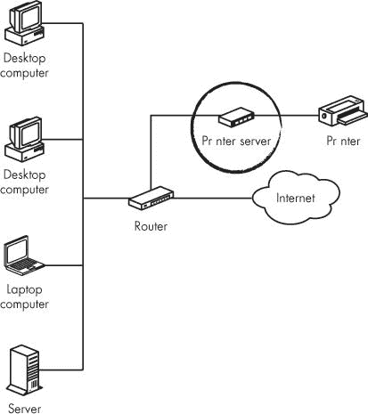
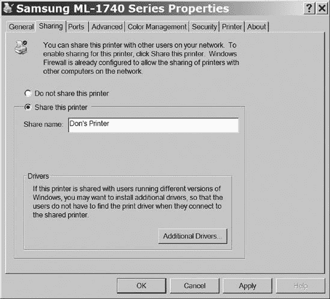
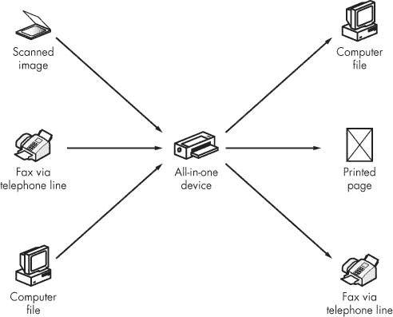

# 第十四章：打印机和您的网络上的其他设备

网络给小型企业或电脑用户众多的家庭带来的一个好处是，所有网络用户可以方便地共享一台或多台打印机。你无需将每个文件的副本携带到连接打印机的电脑上，无论是通过磁盘还是闪存驱动器，你只需在自己的电脑上点击打印命令，让网络自动将文件发送到打印机。

即使是非常小的网络也可能包含多台打印机。例如，您可能使用黑白激光打印机处理常规文档和报告，使用彩色喷墨或激光打印机制作精美的演示文稿和学校项目，以及使用特殊用途的彩色打印机打印数码照片。如果您有多台打印机，您可以为每项工作选择最佳的打印机。这些打印机可能位于不同的房间，靠近使用频率最高的人，或者在一个中央房间，对所有网络用户都同样方便。

# 如何将打印机连接到您的网络

您可以通过多种方式将打印机连接到网络：您可以使用外部打印机服务器、内置在打印机中的服务器、直接连接到每台打印机的自动开关，或者通过电脑连接。所有这些方法都能完成相同的事情：将格式化的文档或图像发送到打印机，生成纸质副本。将打印机连接到您的网络的最佳方法取决于您的预算、您的便利性以及您的网络布局。

## 外部打印机服务器

*外部网络打印机服务器*是一种连接到网络作为独立网络节点，并具有以太网端口，为独立打印机提供并行端口连接或 USB 连接的设备。图 14-1 显示了通过外部打印机服务器连接到网络的打印机。

**图 14-1. 外部打印机服务器通过并行端口或 USB 端口将打印机连接到网络**

### 注意

当您购买打印机服务器时，请寻找与您的打印机使用相同类型打印端口的服务器。大多数现代打印机都有 USB 端口，但带有并行端口的旧型号仍然很常见。如果您的打印机同时具有 USB 和并行端口，请使用 USB 端口。

当您的网络包括多个房间的计算机并且您在网络集线器或路由器上至少有一个备用端口时，外部打印机服务器是一个不错的选择。您可以直接从同一房间的集线器或另一房间的未使用墙壁插座将以太网电缆运行到服务器单元。如果您想在放置打印机服务器的房间中没有足够的以太网端口，可以通过如图图 14-2 所示的廉价以太网数据交换机将计算机和打印机服务器连接到网络。

**图 14-2。如果您没有为打印机服务器预留网络插座，请使用一个小型以太网数据交换机。**

### 注意

当您为家庭或小型企业网络安装以太网电缆时，请考虑您可能想要安装打印机的位置。在该房间和您的网络集线器之间额外运行一根以太网电缆，并使用带有两个或更多 RJ-45 插座的墙壁插座板（或表面安装盒）。为每个插座使用不同的颜色插座，以便一目了然地识别它们。

将打印机服务器添加到您的网络类似于添加计算机，但您将不得不从计算机远程配置打印机服务器。常规程序是将服务器连接到网络，将打印机连接到服务器，然后使用基于 Web 的配置实用程序设置服务器的网络地址和其他选项。按照服务器附带说明加载打印机驱动程序。

使用直接连接到网络的打印机的另一个优点是它独立于网络上的其他计算机运行。当打印机通过计算机连接时，该计算机必须始终开启，或者您必须创建一个“公共”账户，以便家人或办公室的其他人可以使用该账户打印。这种设置比通过服务器打印的安全性要低得多。

## Wi-Fi 打印机服务器

如果您的网络已经包括一个 Wi-Fi 接入点，您可以使用 Wi-Fi 打印机服务器将您的打印机连接到网络。打印机服务器应自动检测来自接入点的 Wi-Fi 信号，并在打印机与发起打印请求的计算机之间建立双向连接（数据输入和打印机状态输出）。Wi-Fi 链接应使用与您的其他 Wi-Fi 连接相同的所有安全工具（如 WPA 加密）。

Wi-Fi 打印机与你的网络上其他 Wi-Fi 链接共享相同的无线频道，因此大型文档可能会降低网络的性能，但除非你的网络承载了大量的流量，否则性能下降不太可能成为问题。你可以通过添加一个使用不同频道并专门为一个或多个打印机设置的第二接入点来解决这个问题。

### 警告

当你设置 Wi-Fi 链接时，确保将打印机服务器连接到自己的接入点，而不是连接到邻居拥有的网络。

Wi-Fi 打印机服务器提供以下好处：

+   打印机可以位于 Wi-Fi 网络信号范围内的任何位置。

+   你不需要为打印机服务器预留专用的以太网端口。

+   如果你需要移动打印机，你不需要重新布线网络。

## 内置打印机服务器

当你在网络上购买一台新打印机时，考虑一台内置网络打印机服务器，同时带有常用的 USB 和/或并行端口。内置的打印机服务器将像通过外部打印机服务器连接的打印机一样运行，但安装起来更简单，因为你不需要连接额外的电缆。

带内置网络接口的打印机是为小型企业和其他工作组设计的，这些工作组通常打印的页面数量比典型的家庭网络或单个用户更多。它们通常比低端独立打印机和单独的打印机服务器设备组合要贵一些，因为它们通常是更耐用、功能更多更好的打印机。但如果你的网络用户打印的页面足够多，可以证明工作组打印机的成本是合理的，那么额外的成本通常会得到更好的性能的回报。

## 自动打印机切换

当你的两台或多台计算机位于同一房间或相邻房间时，自动打印机切换可能是一个比网络打印机服务器更经济的替代方案。正如其名所示，自动切换会检测来自两个或更多输入连接器的打印请求，并将它们自动转发到打印机，并将打印机的状态信息返回到发起请求的计算机。当它同时收到多个打印请求时，打印机切换会将第一个发送到打印机，并将其他请求保留在缓冲区中，直到第一个完成打印。对于每个连接到开关的计算机来说，打印机都是直接连接到该计算机的。

当你的网络中的计算机位于相隔较远的房间时，打印机开关不太实用，因为必须从每台计算机到开关运行电缆。

## 使用计算机作为打印机服务器

对于超过一个或两个房间的网络，打印机服务器的替代方案是将打印机直接连接到网络中的一台计算机，并将所有其他计算机的打印请求通过这台计算机发送。

这种方法有几个优点：

+   您可以使用连接到您的计算机的任何打印机。

+   您不需要单独的打印机服务器设备或具有内置网络服务器的打印机。

+   您可以将打印机放置在任何地方，而不仅仅是您有可用网络端口或插座的地方。

+   在一个网络中，不同用户拥有不同类型的打印机（例如激光打印机和喷墨打印机，彩色和黑白打印机，或用于照片或大型文档的特殊格式），使用计算机作为打印机服务器可以让每个人都能利用每台打印机的特性。

+   您不需要在网络集线器或路由器上额外的端口。

另一方面，这种方法也有一些可能的缺点：

+   作为打印机服务器的计算机必须在有人想要打印时始终开启；这可能会成为安全问题。

+   当打印机在没有警告的情况下开始打印时，可能会分散连接到打印机的计算机使用者的注意力。

+   当其他用户来到打印机所在办公室或工作区取回他们的打印作业时，这可能会成为作为打印机服务器的计算机操作员的另一个干扰。

如果您的网络还使用专用文件服务器，您可以通过使用同一台计算机作为网络打印机服务器来消除安全和干扰问题。或者，如果您有一个放在壁橱里积满灰尘的旧计算机，您可以用它作为独立的打印机服务器（尽管您可能需要添加网络接口和可能是在插件扩展卡上的 USB 端口）。然而，最常见的方法是将打印机连接到现有计算机，并将网络中其他所有计算机的打印命令直接通过服务器打印。

在 Windows 中，设置打印机服务器是一个三步过程，将在以下各节中描述。

### 在网络卡上启用打印机共享

按照以下步骤在您的网络接口上启用打印机共享：

1.  从控制面板中选择**网络连接**。网络连接窗口将打开。

1.  右键单击**本地连接**并从弹出菜单中选择**属性**。要使用无线连接共享，请右键单击**无线网络连接**。

1.  确认 Microsoft 网络文件和打印机共享选项处于活动状态，如图 14-3 所示。图 14-3。如果您没有看到此选项旁边的复选标记，请勾选该框以启用它。

    

    **图 14-3. Microsoft 网络文件和打印机共享必须处于活动状态，才能共享打印机访问权限。**

1.  点击**确定**以保存您的设置并关闭属性窗口。

### 指示作为打印机服务器的计算机共享打印机

按照以下步骤共享打印机：

1.  从控制面板中选择**打印机和传真**（在 Windows XP 中）或**打印机**（在 Windows Vista 中）。将打开一个包含连接到此计算机的所有打印机和虚拟打印机的链接的窗口。

1.  右键点击您想要与网络共享的打印机。将出现一个弹出菜单。

1.  从弹出菜单中选择**共享**。该打印机的属性对话框将打开，并显示共享标签，如图图 14-4 所示。

    

    **图 14-4. 使用打印机属性对话框的共享标签来启用共享。**

1.  在 Windows XP 中，选择**共享此打印机**选项。在 Vista 中，点击**更改共享选项**按钮，在用户账户控制窗口中点击**继续**，然后选择**共享此打印机**。

1.  在共享名称字段中，输入一个标识此打印机的名称，例如**Don 的打印机**。

在 Windows Vista 中，共享标签包括一个选项，可以在客户端计算机上渲染打印作业。如果网络上的其他计算机使用 Windows XP 或某些其他操作系统，请关闭此选项。但如果其他 Vista 计算机将向此打印机发送打印作业，您可以通过选中此选项来加快打印机的性能。

### 在每台计算机上安装打印机

在您设置计算机作为打印机服务器以通过您的网络接收打印作业后，您还必须将服务器添加到每台计算机的打印机列表中。按照以下步骤在 Windows XP 中添加网络打印机：

1.  从控制面板中选择**打印机和传真**。将打开包含连接到此计算机的所有打印机和虚拟打印机的链接的窗口。

1.  双击**添加打印机**以打开添加打印机向导。将出现欢迎屏幕。

1.  点击**下一步**。将出现本地或网络打印机屏幕。

1.  选择网络打印机选项并点击**下一步**。将出现一个包含图 14-5 所示的浏览打印机屏幕，以及连接到此网络的共享打印机列表。

    

    **图 14-5. 浏览打印机屏幕显示连接到此网络的共享打印机列表。**

1.  选择您想要使用的打印机名称并点击**下一步**。向导将询问您是否想要使用此打印机作为默认打印机。

1.  如果您想将此计算机作为默认打印机发送打印作业到该打印机，请点击是。如果想要它在菜单中作为次要选择出现，请点击否。

1.  点击**下一步**。向导将确认您已将打印机添加到本计算机的列表中。

1.  点击**完成**以完成向导并关闭窗口。新添加的打印机名称应在打印机（或打印机及传真）窗口中可见。

在 Windows Vista 中，过程类似，但添加打印机命令位于窗口直接上方的工具栏中，如图 图 14-6 所示。

1.  点击**添加打印机**。

1.  点击**添加网络、无线或蓝牙打印机**选项。向导将显示连接到此网络的所有共享打印机和打印机服务器列表。

1.  从这台电脑中选择您想使用的打印机，然后点击**下一步**。

1.  向导会将此打印机添加到您的列表中。

    

    **图 14-6. 添加打印机图标位于打印机窗口上方的工具栏中。**

# CUPS：通用 Unix 打印系统

CUPS 是 Unix 和 Linux 系统的打印机控制程序，它将应用程序（如文字处理程序或网页浏览器）的页面描述转换为个别打印机使用的特定指令。如果您从 Unix 或 Linux 发行版打印需要复杂的命令行指令，CUPS 可以提供一个更简单的解决方案；您可以从 [`www.cups.org/`](http://www.cups.org/) 查找免费下载。CUPS 还提供了 Windows 的打印机驱动程序，作为 Windows 随附的 PostScript 驱动程序的扩展。它可在 [`www.cups.org/windows`](http://www.cups.org/windows) 获取。CUPS 可以打印连接到您自己的计算机的打印机，或者通过网络打印到打印机服务器。

# 多功能一体机

大多数办公室都会执行几种不同的纸张处理活动：复印、打印、扫描和传真。所有这些活动都使用一些相同核心功能的组合，因此通常将几个活动组合在一个机器中是有意义的，该机器可以将数字文件或扫描图像发送到纸张或另一个数字文件。这种结合这些功能的设备类别被相当宏伟地称为 *多功能一体机*，或简称为 *多功能机*。多功能一体机几乎总是比单独的打印机、扫描仪、复印机和传真机便宜且占用空间小；然而，大量特性和功能通常意味着它比简单的单功能设备更难操作。

图 14-7 是一个功能流程图，显示了一体化设备可以处理的来源和目的地类型。该设备可以从计算机或通过电话线路接收图像，或者它可以为物理图像（如打印页面、幻灯片或放置在扫描仪表面的小型物体）创建数字副本。该设备可以将数字图像发送到多个不同的目的地：打印机、计算机文件或远端的传真机。如果你的一体化设备还包括网络接口，你可以通过以太网网络接受打印作业或发送传真，并将扫描图像和接收到的传真发送到同一网络上的任何计算机。一些一体化设备还可以通过互联网作为电子邮件附件发送图像。

**图 14-7. 一体化设备可以从不同的来源获取图像并将它们发送到多个目的地之一。**

每个一体化设备的活动都是输入和输出的特定组合：

| **扫描** | 从扫描图像到计算机文件 |
| --- | --- |
| **复印** | 从扫描图像到打印页面 |
| **打印** | 从计算机文件到打印页面 |
| **接收传真** | 从电话线路到打印页面或计算机文件 |
| **发送传真** | 从扫描图像或计算机文件到电话线路 |

连接到网络的计算机将一体化设备视为每个单独的设备。当你想要打印文档时，打印机会出现在 Windows、Mac OS 或 Linux/Unix 显示的菜单中；像任何其他打印机一样，你必须将其添加到每台计算机的打印机列表中，并在该计算机上加载打印机驱动程序。扫描仪使用 TWAIN 或 WIA 接口将图像直接导入应用程序程序，传真程序将一体化设备检测为传真机。复印功能将扫描图像直接发送到打印机，因此它不会出现在网络上。

不打算进行完整网络操作的一体化设备仍然可以作为网络打印机运行。然而，扫描仪和传真功能可能只能从直接连接到一体化单元的计算机上工作。一般来说，你可以假设通过以太网端口直接连接到网络的一体化设备将支持其所有功能，从网络上的任何计算机上。但如果该设备通过 USB 端口连接到打印机，它可能不会接受来自远程计算机的命令。

安装一体机就像安装打印机一样：将 USB 连接器连接到您想要用作打印机服务器的计算机，或者直接将以太网端口连接到网络集线器或路由器。如果服务器没有自动检测到一体机设备，请加载设备提供的软件。如果所有其他方法都失败，请按照一体机设备提供的安装说明进行操作。
