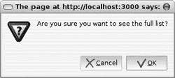
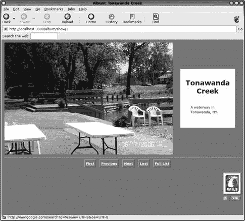
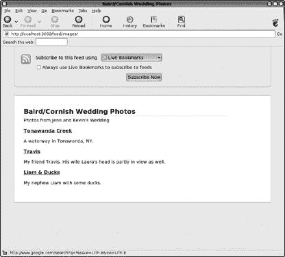
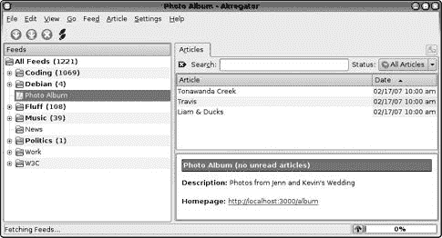

# 第十三章。一个简单的 Rails 项目


在上一章中，你安装了 Rails 并熟悉了 Rails 应用程序内部结构的基本知识。在本章中，我们将创建一个稍微复杂一些的 Rails 应用程序——它从数据库中检索给定数据类型的多个实例，并对这些实例进行迭代以进行展示。我们还将探讨一些在 Rails 中组织代码的更复杂方法。

# 创建应用程序

对于我们的目的，任何简单的应用程序都足够了。我选择创建一个相册应用程序，它将展示我婚礼的一些照片。它将能够以缩略图的形式列出所有照片，并附带描述性文字，同时还能以更详细的方式展示每张单独的图片。它还将提供导航工具，使用户能够在列表中跳转。所有这些都将通过 HTML 完成，这是 Web 的默认展示格式。此外，该应用程序还将提供一个 RSS 订阅源（我们在`currency_converter2.rb`中用作数据源的 XML 格式），用于描述所有图片。

## 初始创建

我们将在适当的目录下使用命令`rails photo_album`创建我们的应用程序（称为`photo_album`）。然后输入`cd photo_album`和`ruby script/server`来启动应用程序。我们可以通过浏览到 http://localhost:3000 来验证 Rails 是否正在运行，就像我们在第 230 页的查看你的 Rails 应用程序中做的那样。

## 准备数据库

对于这个应用程序，我将使用 MySQL 数据库。我将假设你可以在你的机器上运行 MySQL，并且能够执行简单的查询。如果不是这样，你可能需要通过一本专门介绍该主题的书籍来复习 MySQL，例如乔治·里斯、兰迪·贾伊·亚加尔和蒂姆·金合著的《管理和使用 MySQL》（O’Reilly，2002 年）。如果你使用的是 MySQL 以外的数据库，我将假设你能够凭借数据库供应商提供的文档以及[`rubyonrails.org`](http://rubyonrails.org)上的文档，自己解决 Rails 应用程序中存在的细微差异。

你可能需要做的一件事是修改`config/database.yml`文件，尤其是如果你使用的是 MySQL 以外的数据库程序。我不得不编辑`socket:`的值，使其变为`/var/run/mysqld/mysqld.sock`。如果你收到错误`No such file or directory - /tmp/mysql.sock`，那么最可能的原因是套接字描述不匹配。Rails 正在寻找位于`/tmp/mysql.sock`的 MySQL 套接字文件，你需要将其设置为正确的文件位置。你可以在类 Unix 操作系统中使用以下命令（最好是作为 root 用户）来查找套接字文件的位置：`find / mysqld.sock | grep mysqld.sock`。

## 添加数据

照片应用与第十二章 Chapter 12 中的简单结构示例不同，因为它在数据库中有真实数据，我们假设现在正在处理这些数据。管理 Rails 数据（尤其是像我们这样的简单测试数据）的最方便方法之一是使用迁移。Rails 中的 *迁移* 是 Ruby 中数据的描述，根据需要创建和删除。让我们看看我们的迁移文件 `db/migrate/001_create_photos.rb`：

```
  class CreatePhotos < ActiveRecord::Migration    *Migrations*
❶   COLUMN_NAMES = [:description, :image_path, :title, :photographer]

❷   SAMPLE_PHOTOS = [
      {
        :title        => 'Tonawanda Creek',
        :description  => 'A waterway in Tonawanda, NY.',
        :image_path   => '001_creek.jpg',
        :photographer => 'Vince',
      },
      {
        :title        => 'Travis',
        :description  => %q[My friend Travis. His wife Laura's head is partly in
  view as well.],
        :image_path   => '002_travis.jpg',
        :photographer => 'Vince',
      },
      {
        :title        => 'Liam & Ducks',
        :description  => 'My nephew Liam with some ducks.',
        :image_path   => '003_liam.jpg',
        :photographer => 'Vince',
      },
    ]

❸   def self.up

❹     create_table :photos do |t|
        COLUMN_NAMES.each { |c| t.column c, :text }
      end

❺     SAMPLE_PHOTOS.each do |sp|
        p = Photo.create(sp)
        p.save!
      end

    end

❻   def self.down
      drop_table :photos
    end
  end
```

在 ❶ 和 ❷，我们为 `COLUMN_NAMES` 和 `SAMPLE_PHOTOS` 定义了常量，我们使用它们进行数据插入。`COLUMN_NAMES` 应该很明显，`SAMPLE_PHOTOS` 的每个元素都是一个表示数据库记录的哈希，其中每个键是列名称的符号表示，值是数据库字段中的数据。在 ❸，我们定义了 `self.up` 方法，它包含在我们执行迁移时将运行的代码。

`self.up` 中的最重要的任务之一是创建表，这是在 ❹ 处完成的。`create_table` 方法接受一个用于表名的符号参数和一个描述对该表应执行什么操作的块。在我们的情况下，`create_table` 遍历 `COLUMN_NAMES`，为表 `t` 创建一个名为当前 `c` 值的列，类型为文本。

### 注意

*我们数据库的所有表字段都是文本类型。如果我们有更复杂的数据，具有不同类型，我们可能会用名为 *`COLUMNS`* 的哈希来替换 Array *`COLUMN_NAMES`*，其中每个键将是列的名称，每个键的值将是列的数据类型*。

在 ❺，我们创建了一个名为 `p` 的新 Photo 实例；它基于 `SAMPLE_PHOTOS` 的每个成员，我们将其称为 `sp`。然后我们为每个版本的 `p` 执行 `save!`，将其数据存储到数据库表中。在 ❻，我们显示当迁移完成后，`:photos` 表将被删除。我们使用命令 `rake db:migrate` 执行迁移。让我们检查结果。

### 注意

*请注意，*`save!`* 带有感叹号，因为它具有破坏性（因为它会保存到数据库）。此外，运行 *`rake db:migrate`* 将运行你定义的任何迁移，以使迁移保持最新。我们只有一个，所以只有一个运行*。

```
== CreatePhotos: migrating
====================================================
-- create_table(:photos)
   -> 0.1226s
== CreatePhotos: migrated (0.3359s)
===========================================
```

迁移成功。我们可以通过查询 MySQL（或你使用的任何数据库）来双重检查。

### 注意

*在提示符下，我输入了我为特定的 MySQL 安装已经设置的密码。你的密码是你已经选择的，或者可能是未设置的。这取决于你在机器上安装 MySQL 的具体方式*。

```
echo 'select * from photo_album_development.photos' | mysql -uroot -p
Enter password:
id      description     image_path      title   photographer
1       A waterway in Tonawanda, NY.    001_creek.jpg   Tonawanda Creek Vince
2       My friend Travis. His wife Laura's head is partly in view as well.
002_travis.jpg   Travis  Vince
3       My nephew Liam with some ducks. 003_liam.jpg    Liam & Ducks    Vince
```

现在我们可以看到，数据库中已经有了我们 Rails 应用程序使用的数据。让我们继续创建应用程序的其他部分。

## 创建模型和控制器

正如你在上一章中已经看到的，Rails 使得创建模型、控制器和视图变得非常容易。对于照片相册应用程序，我们将创建一个名为*Photo*的模型和名为*Album*和*Feed*的控制器。

### 创建 Photo 模型

在`photo_album`目录中，执行`ruby script/generate model photo`，这将创建模型文件`app/models/photo.rb`。

### 创建 Album 和 Feed 控制器

接下来，在`photo_album`目录中，执行`ruby script/generate controller album index show`和`ruby script/generate controller feed images`。这些命令创建了带有`index`和`show`视图的 Album 控制器以及带有`images`视图的 Feed 控制器，这些视图由`app/controllers`和`app/views`子目录中的多个文件实现。

# 分析应用程序

现在我们已经创建了应用程序的基本框架，让我们来看看它是如何工作的。将这一节视为与之前章节中的代码或工作原理类似。

## 分析 Photo 模型

我们的照片相册应用程序有一个基本的数据块，由名为 Photo 的模型表示。让我们添加一些代码到现有的内容中，并探索它的功能。编辑`app/models/photo.rb`以匹配以下内容：

```
  class Photo < ActiveRecord::Base

  =begin explain
  Closely follows Object-Relational Model, each instance is
  also a record in the table called 'photos'.
  =end
❶   def next_id()
      return Photo.minimum(:id) if last_id?
      next_id = @attributes['id'].to_i.succ
      next_id.succ! until Photo.find(next_id)
      next_id.to_s
    end

❷   def prev_id()
      return Photo.maximum(:id) if first_id?
      prev_id = (@attributes['id'].to_i - 1)
      prev_id = (prev_id - 1) until Photo.find(prev_id)
      prev_id.to_s
    end

    private

❸   def last_id?()
      @attributes['id'] == Photo.maximum(:id).to_s
    end

❹   def first_id?()
      @attributes['id'] == Photo.minimum(:id).to_s
    end

  end
```

在❶和❷处，我们有`next_id`和`prev_id`方法，分别。在它们内部，我们自由使用内置的 Rails 方法。其中之一是`minimum`方法，它对所有模型都可用；它接受一个符号参数，用于确定该模型的最小状态将基于哪个属性。另一个方法是`find`方法，它是 SQL 中 SELECT 语句的包装器，它接受用于过滤的特定参数。Rails 中还有`@attributes`实例变量，它是一个哈希，其键是数据库表中的字段名，其值是模型特定实例的该列内容。例如，代表数据库记录 ID 为`2`的 Photo 实例的`@attributes['id']`将等于`2`。

在❸和❹处，我们还有两个私有谓词，分别告诉我们我们的 Photo 实例是否是具有`last_id?`和`first_id?`的那个。我们通过使用已知的最大和最小`id`值进行一些简单的等式测试来实现这一点。请注意，从`maximum`和`minimum`返回的`id`值是整数，而存储在`@attributes`中的值是字符串。因此，`photo.rb`模型根据需要大量使用`to_i`和`to_s`方法。

## 分析控制器

现在我们已经理解了我们的 Photo 模型，我们需要以某种方式与之交互。这就是一个或多个控制器的工作。我们的照片相册应用程序有两个控制器，Album 和 Feed，每个控制器都有自己的视图。

### 分析 Album 控制器

与我们对照片模型所做的一样，让我们向专辑控制器添加代码并探索它的功能。编辑`app/controllers/album_controller.rb`以匹配以下内容：

```
  class AlbumController < ApplicationController

  =begin explain
  This metaprogramming directive allows us to define a specific
  helper called FooterHelper in app/helpers/footer_helper.rb
  that can be shared among multiple Controllers.
  =end
❶   helper :footer

  =begin explain
  As with HTML files, this is the default implicit behavior.
  all_photos is found in app/controllers/application.rb
  =end
❷   def index()
      @photos = all_photos()
    end

  =begin explain
  Set up any instance variables to be used in the View
  or Helper, such as @photo here.
  =end

❸   def show()
      @photo = Photo.find(params[:id])
    end

  end
```

在 MVC 应用程序中，按照惯例，`album_controller.rb`将负责以与我们照片专辑相关的方式操纵和处理数据。在这种情况下，`album_controller.rb`的方法通常将重定向到另一个文件中定义的内容，或者简单地提供一个有用的快捷方式。

对于这个演示 Rails 应用程序，我想要一个 HTML 页脚，它能在专辑控制器中的多个页面保持一致性。那么问题来了，如何实现这个功能以及在哪里放置相应的代码。一个答案可能是在每个包含页脚的视图中复制必要的代码，但这不是好的设计。更好的选择是将页脚创建代码放在合适的控制器中，并在需要的地方简单地调用该代码。

然而，有些情况下你可能希望代码位于基础控制器之外。如果你想在多个控制器中实现一个通用功能怎么办？在 Rails 应用程序中，每个控制器都是下一个文件（我们将要查看的`app/controllers/application.rb`）的子类，所以将代码放在那个文件中是一个选择。另一个选择是使用 Rails 所称的助手（Helpers）。*助手*是 MVC 框架的附加组件，类似于我们在第十章（第十章）中的`to_lang.rb`中使用的混合概念。在`album_controller.rb`的第❶处，我们可以从 RDoc 中看到我们的页脚相关代码在一个名为`app/helpers/footer_helper.rb`的独立文件中，我们可以在`album_controller.rb`中通过简单地包含行`helper :footer`来使用这段代码。如果我们有一个助手在`app/helpers/credit_card_authorization_helper.rb`中，我们可以在控制器中使用`helper :credit_card_authorization`的行来使用其代码，依此类推。按照真正的面向对象风格，这允许我们根据问题域或主题在单独的文件中组织代码，在需要的地方使用它们，而不必担心具体的实现。当然，当我们到达`app/helpers/footer_helper.rb`时，我们将讨论页脚代码的实现，但`album_controller.rb`不需要关心那么详细的级别。

### 注意

*助手被定义为模块，就像传统的混合一样。这个应用程序在助手文件中有大量的代码，我将在讨论控制器之后简要描述*。

除了在❶处包含辅助器之外，我们还在❷和❸处定义了与 `index` 和 `show` 视图对应的方法。❸处的 `show` 方法仅仅是内置 Rails 方法 `find` 的快捷方式。在这种情况下，它接受一个参数 `id`，这是传递到 Web 应用程序中的参数，我们可以通过 `params[:id]` 获取它。这就是我们展示特定请求的图片的方式。❷处的 `index` 方法（正如我们从第十二章中知道的那样）是当没有明确提供时默认调用的方法。它只是在控制器中创建一个名为 `@photos` 的实例变量。为此，它调用一个名为 `all_photos` 的方法，该方法定义在我们的下一个文件 `app/controllers/application.rb` 中。

### 注意

*Rails 应用程序中的 *`params`* 哈希等同于 *`cgi.params`*，我们在第十一章中的 *`simple_cgi.rb`* 脚本中看到过*。

### 分析应用程序控制器

任何 Rails 应用程序中的 `application.rb` 文件描述了所有控制器的超类。如果你想要在所有控制器中实现真正通用的行为或特性，这个位置就是放置它们的地方。

### 注意

*请注意，你可以将代码模块化（即，按主题分解为辅助器）并仍然使其通用。只需将代码组织到辅助器中，然后在 `app/controllers/application.rb` 中通过 `helper` 行包含所有这些辅助器。很简单*。

编辑 `app/controllers/application.rb` 以匹配以下内容：

```
  # Filters added to this Controller apply to all Controllers in the
  application.
  # Likewise, all the methods added will be available for all Controllers.

  class ApplicationController < ActionController::Base
    # Pick a unique cookie name to distinguish our session data from others'
    session :session_key => '_photo_album_session_id'

  =begin explain
  Now all_photos() can be used in any other Controller.
  =end
❶   def all_photos()
      Photo.find(:all)
    end

  end
```

我们在这个文件中所做的所有事情就是定义了❶处的 `all_photos` 方法。这在某种程度上可能有点愚蠢，因为它只提供了一种稍微简短的方式来调用 `Photo.find(:all)`。然而，这主要是一个演示应用程序，它确实显示了 `all_photos` 现在可以在应用程序的任何地方的任何控制器中使用。

### 注意

*会话信息是自动的，它帮助 Rails 区分同时使用应用程序的多个用户。例如，我可以使用相册的 *`index`* 视图浏览整个照片列表，而你同时可以更详细地查看相册的第二个照片的 *`show`* 视图*。

### 分析 Feed 控制器

相册控制器不是我们唯一的控制器。我还想提供有关这些图像信息的 RSS 源，Feed 控制器就是我们实现这一点的途径。就像 `album_controller.rb` 一样，它从 `app/controllers/application.rb` 继承，所以它可以使用 `all_photos` 方法。

编辑 `app/controllers/feed_controller.rb` 以匹配以下内容：

```
  class FeedController < ApplicationController

❶   CONTENT_TYPE = 'application/rss+xml'

  =begin explain
  all_photos() found in app/controllers/application.rb
  =end
❷   def images()
      @photos = all_photos()
      @headers['Content-Type'] = CONTENT_TYPE
    end

  end
```

在❶处，我们定义了一个用于 `CONTENT_TYPE` 的常量，声明了适合 RSS 订阅的内容。然后在❷处，我们声明了唯一的方法 `images`。它就像 `album_controller.rb` 一样设置了 `@photos` 实例变量，并且也设置了 `@headers[‘Content-Type’]`。正如你可能预想的，`@headers` 变量是用来定义应用程序输出的 HTTP 头的变量。在继续到视图之前，让我们看看我们的 Helper 文件中发生了什么。

## 解构 Helper

模型、控制器和视图并不是 Rails 应用中唯一的文件类型。在我们讨论照片模型时，我提到了 Helper 的概念，但现在我们将深入探讨它们。

### 解构专辑 Helper

编辑 `app/helpers/album_helper.rb` 以匹配以下内容：

```
  module AlbumHelper

❶   CONFIRM_MESSAGE = %q[Are you sure you want to see the full list?]

    NUMBER_OF_ROW_TYPES_FOR_DISPLAY = 3

    LISTING_HEADER_COLUMNS =<<END_OF_HERE_DOC
    <tr>
      <th>Image</th>
      <th>Description</th>
    </tr>
  END_OF_HERE_DOC

❷   IMAGE_STYLE = {
      :base  => 'margin-bottom: 0.5em; padding: 0.5em;',
      :thumb => 'height:48px; width:64px;'
    }
  =begin explain
  Outputs a CSS classname used for prettification.
  =end
❸   def row_class_from_index(i)
      'row' + ((i % NUMBER_OF_ROW_TYPES_FOR_DISPLAY) + 1).to_s
    end

❹   def show_listing_header_columns()
      LISTING_HEADER_COLUMNS
    end

❺   def show_photo(photo)
      image_tag(
        photo.image_path,
        :alt => "Photo of #{photo.title}"
      )
    end

❻   def show_thumbnail_for_list(photo)
      image_tag(
        photo.image_path,
        :alt   => "Photo of #{photo.title}",
        :style => IMAGE_STYLE[:thumb]
      )
    end

❼   def page_title()
      @photo ? @photo.title : controller.action_name
    end

❽   def title_with_thumbnail(photo)
        [h(photo.title), show_thumbnail_for_list(photo)].join(
            ApplicationHelper::HTML_BREAK
          )
    end

  end
```

在❶处，我们开始定义一些有用的常量，包括我们的一位老朋友，一个具有符号键的哈希表，在❷处。在❸处，我们定义了一个名为 `row_class_from_index` 的方法，其 RDoc 解释说它仅仅输出表示适当 CSS 类的文本。这允许我们轻松地更改行的 CSS 样式，并且模运算使其重复。在❹处，我们有一个名为 `show_listing_header_columns` 的方法，它简单地返回相应的常量。在❺处的 `show_photo` 方法使用了内置的 Rails 方法 `image_tag`，它将图像的位置（即 `img` 标签的 `src` 属性）作为第一个参数。第二个参数是一个哈希表，其键可以是任何额外的 `img` 属性，其值将用作相应 `img` 属性的值。位置（即 `img src`）是 `photo` 的 `image_path`，由于所有 `img` 标签都应该有一个 `alt` 属性，我们提供了这个属性，并使用基于 `photo` 的 `title` 的适当标识字符串。在❻处，我们定义了 `show_thumbnail_for_list`，这是一个用于展示的 Helper 方法，它与 `show_photo` 非常相似。它唯一的区别是包含了一个 `style` 属性，其值是 `IMAGE_STYLE[:thumb]`。

### 注意

*重构此代码（即在不改变其整体行为的情况下改变其内部结构）的一个简单方法是将 *`show_photo`* 和 *`show_thumbnail_for_list`* 合并成一个单一的 *`show_photo`* 方法，该方法接受一个可选的第三个参数，该参数声明照片是否是缩略图。你可以在 Martin Fowler 的书籍* Refactoring (*Addison-Wesley Professional, 1999*)中了解更多关于重构过程的信息*。

接下来，在第❼行，我们定义了`page_title`。如果有`@photo`存在，`page_title`将返回那个`@photo`的`title`。如果没有`@photo`，它将回退到`controller`的`action_name`。这意味着什么？`@photo.title`应该是直接的。`action_name`基本上是 View 的名称。这意味着当我们使用`index` View（或`action_name`）浏览，并且还没有使用`show` View 选择一个特定的照片进行更详细查看时，`page_title`将简单地是`index`。

最后，在第❽行，我们定义了`title_with_thumbnail`。它使用了几个其他方法和常量。Rails 有一个内置的方法叫做`h`，它为 HTML 展示格式化其输入。例如，`h(&)`返回`&amp;`。这在我们的应用中很有用，因为我们有一个标题为*Liam & Ducks*的照片，但我们不希望这个和号破坏输出的 HTML 有效性。`title_with_thumbnail`方法使用了我们自制的`show_thumbnail_for_list`，并用`join`将其与`page_title`连接起来，使用我们在`ApplicationHelper`中定义的`HTML_BREAK`。

WHERE TO PUT CODE: CONTROLLER OR HELPER (OR ELSEWHERE)?

如您所见，专辑助手的大小明显大于它所帮助的控制器。你什么时候应该在控制器中放代码，什么时候应该在助手中放代码？这是一个好问题。当没有明确的主题划分时，例如下面的`footer_helper.rb`，回答就变得更加困难。当某件事真正与数据的基本性相关，例如直接与 ids 相关的照片方法时，它可能属于模型。当某件事完全是展示特定时，它可能可以放在适当的视图中。然而，在视图中放置过多的动态内容被认为是不良风格。任何比遍历一组项目更复杂的代码都应该抽象成一个方法，而不是放在视图中本身。

这就留下了控制器或助手的选择。如您所见，我倾向于有一个相当稀疏、极简的控制器——批评者可能会说这使我的助手变得过于繁忙。其他程序员可能会直接在控制器中放置许多方法，几乎不使用助手。还有一些人可能会将任何与缩略图图像相关的内容拆分到另一个名为`thumbnail_helper.rb`的助手中。

有很多选择。只要你不把与展示相关的代码放在你的模型中，并且你保持你的视图相对没有实际做*事情*的代码（而主要是包含*展示内容*的代码），你很可能做得很好。

### 分析`ApplicationHelper`

我们已经看到`album_helper.rb`在`ApplicationHelper`中期望有一个对`HTML_BREAK`的定义。让我们看看它是如何做到的。

编辑`app/helpers/application.rb`以匹配以下内容：

```
# Methods added to this helper will be available to all templates in the
application.
module ApplicationHelper

  HTML_BREAK = '<br />'

end
```

这里没有太多内容——基本上只是我们预期的常量定义。为什么它在这里定义，而不是在 `AlbumHelper` 中定义？因为我们还需要在 `FooterHelper` 中使用它。请注意，虽然控制器自动继承自 `ApplicationController`，但助手类并不自动继承自 `ApplicationHelper`。

### 解构 FeedHelper

编辑 `app/helpers/feed_helper.rb` 以匹配以下内容：

```
  module FeedHelper

❶   AUTHOR      = 'Kevin C. Baird'

    DESCRIPTION = %q{Photos from Jenn and Kevin's Wedding}

    ICON        = {
      :url    => 'rails.png',
      :width  => 77,
      :height => 69,
    }

    LANGUAGE    = 'en-us'

❷   LINK_OPTIONS_DEFAULTS = {
        :only_path  => false,
        :controller => 'album',
    }

❸   LINK_OPTIONS = {
      :index => LINK_OPTIONS_DEFAULTS.merge( { :action => 'index' } ),
      :show  => LINK_OPTIONS_DEFAULTS.merge( { :action => 'show'  } ),
    }

    RSS_OPTIONS = {
      'version'  => '2.0',
      'xmlns:dc' => 'http://purl.org/dc/elements/1.1/'
    }
    TITLE       = 'Baird/Cornish Wedding Photos'

❹   def feed_description()
      h( DESCRIPTION )
    end

❺   def rss_url_for_image(image)
      return url_for( FeedHelper::LINK_OPTIONS[:index] ) unless image
      url_for( FeedHelper::LINK_OPTIONS[:show].merge( { :id => image } ) )
    end

  end
```

在❶处，我们开始进行我们通常的常量声明。这包括在❷处对 `LINK_OPTIONS_DEFAULTS` 的声明，它存储了跨多种类型链接的通用信息，以及在❸处对 `LINK_OPTIONS` 的声明，它使用这些默认值并添加了一对键为 `:action` 的值，可以是 `:index` 或 `:show`，具体取决于如何调用。这些 `:index` 和 `:show` 值当然代表了专辑控制器中的视图，因为 `LINK_OPTIONS_DEFAULTS` 中 `:controller` 的值表示。`FeedHelper` 还定义了几个其他常量，这些常量的值对 RSS 流很有用。

在❹处，有一个名为 `feed_description` 的方法，它只是将 `DESCRIPTION` 常量的值通过 Rails 内置方法 `h` 传递，我们之前已经见过，该方法用于格式化 HTML 展示。最后，`rss_url_for_image` 在❺处是我们围绕 Rails 方法 `url_for` 构建的包装器，它的工作方式正如其名。（它在 [`api.rubyonrails.org/classes/ActionView/Helpers/UrlHelper.html#M000484`](http://api.rubyonrails.org/classes/ActionView/Helpers/UrlHelper.html#M000484) 中有更详细的描述。）如果没有传递 `image`，`rss_url_for_image` 返回适用于 `:index` 视图的 `url_for` 的 `LINK_OPTIONS`。如果有 `image`，`rss_url_for_image` 返回适用于 `:show` 视图的 `url_for` 的 `LINK_OPTIONS`，并包含要显示的 `image` 的 `:id`。

### 注意

*`rss_url_for_image` 的行为，根据是否有 `image` 而有所不同，类似于之前提出的将 *`AlbumHelper.show_photo`* 和 *`AlbumHelper.show_thumbnail_for_list`* 结合起来的潜在融合*。

### 解构 FooterHelper

编辑 `app/helpers/footer_helper.rb` 以匹配以下内容：

```
  module FooterHelper
❶   BAR_SEPARATOR = %q[ | ]

    RSS = {

      :icons => %w[feed-icon16x16.png xmlicon.png],

      :link_options => {
        :action     => %q[images],
                :controller => %q[feed],
         }

         }

❷      def show_footer()
       '<p id="rails_img_wrapper">' +
       [rails_link_to_top, rss_icon_links].join(
         ApplicationHelper::HTML_BREAK
       ) + '</p>'
      end

      private

❸     def rails_link_to_top()
        link_to(    *The **`link_to`** and **`image_tag`** Methods*
          image_tag(
            'rails.png',
            :alt    => 'Home',
            :border => 0,
            :id     => 'rails_img',
            :style  => AlbumHelper::IMAGE_STYLE[:base]
          ), :controller => 'album'
        )
      end

❹     def rss_icon_links()
        RSS[:icons].map do |icon|
          link_to(
            image_tag(
            icon,
            :alt   => 'RSS Feed',
            :class => 'xmlicon'
          ), RSS[:link_options]
        )
      end.join(BAR_SEPARATOR)
    end

  end
```

在❶处，我们定义了两个常量，`BAR_SEPARATOR` 和 `RSS`。`BAR_SEPARATOR` 常量是一个简单的分隔符，用于展示，而 `RSS` 是另一个包含符号键的哈希，分别详细说明了与 `:icons` 和 `:link_options` 相关的信息。在这些定义中，我使用了 `%q[]` 而不是单引号来定义 `BAR_SEPARATOR`，仅作为一个提醒，选项是可用的.^([37])

在第❷行，我们的主要公共方法 `show_footer` 只返回私有方法 `rails_link_to_top` 和 `rss_icon_links` 的输出，这些输出通过我们之前看到的 `HTML_BREAK` 常量连接，并且全部包裹在一个具有 id `rails_img_wrapper` 的 HTML 段落标签中。我们以传统的方式创建段落标签——通过输出纯文本。你仍然可以在 Rails 中这样做，尽管 `url_for` 和 `image_tag` 等方法的可用性使得这种做法变得不常见。

那么，私有方法都做了些什么呢？第❸行的 `rails_link_to_top` 方法只是使用 Rails 内置的 `link_to` 创建了一个链接，它接受链接参数和一个描述要使用的 `:controller` 的 Hash：在这个例子中是 `'album'`。如果需要，这个 Hash 也可以描述 `:action`。第❹行的 `rss_icon_links` 方法将一个操作映射到 `RSS[:icons]` 的每个成员上。这个操作也是一个对 `link_to` 的调用，其中链接的图像是 `RSS[:icons]` 中的当前元素（称为 `icon`），而描述 `:controller` 和 `:action` 的 Hash 总是 `RSS[:link_options]`。`map` 操作的结果数组然后通过 `BAR_SEPARATOR` 连接。

## 拆解专辑控制器的视图

现在，让我们转向视图。由于我们已经在模型、控制器或各种助手中的方法中定义了应用的大部分内容，所以我们的视图应该相当稀疏。视图文件与之前看到的文件不同，因为它们是 .rhtml 文件（类似于 `mod_ruby_demo.rhtml`），而不是纯 Ruby .rb 文件。这也是不建议在视图文件中包含太多动态 Ruby 内容的原因之一（除了良好的应用设计原则之外）。在 Ruby 中调试 Ruby 相对容易，但当你需要在 Ruby 和 HTML 之间来回切换时，这就不那么容易了。

### 拆解索引视图

编辑 `app/views/album/index.rhtml` 以匹配以下内容：

```
❶ <!--
  row_class_from_index()
  show_listing_header_columns()
  show_thumbnail_for_list()
  all in app/helpers/album_helper.rb

  @photos derived from AlbumController's index method

  -->

  <h1>Listing photos</h1>

  <table>

❷   <%= show_listing_header_columns() %>

❸   <% @photos.each_with_index do |photo,i| -%>
    <tr>

❹         <td class="<%= row_class_from_index(i) %>">
❺         <%=
                   link_to(
                       title_with_thumbnail(photo),
                       :action => 'show',
                       :id => photo.id
                   )
          %>
        </td>
❻         <td class="<%= row_class_from_index(i) %>">
❼         <%= photo.description %>
      </td>

      </tr>
❽     <% end %>

  </table>

  <hr />

❾ <%= show_footer %>
```

在第❶行，我们有 HTML 注释解释了我们在这个文件中使用的函数的位置。然后文件继续使用普通、不出所料的 HTML。你可能想知道为什么没有 `<html>`, `<head>` 或 `<body>` 标签。对于这个答案，你将不得不等到我们介绍布局的概念，并在本章后面描述 `app/views/layouts/album.rhtml` 文件。

Ruby 首次出现在第❷行，是一个对 `show_listing_header_columns` 的调用，我们知道（并且我们的 HTML 注释提醒我们）这个方法定义在 `app/helpers/album_helper.rb` 中。这允许视图调用一个名字就能说明其功能的函数，而不必担心其实现。接下来，在第❸行，我们将遍历 `@photos` 中的每个 `photo`，以及它的索引，我们将称之为 `i`。你会注意到 `each_with_index` 行以 `-%>` 结束 Ruby 转义，而不是仅仅 `%>`。这告诉 Rails 在解释输出中不应该有自动的换行符。这里不是特别关键，但你可以想象这在一个 `<pre>` 标签内可能非常有用。

我们对每个`photo`做什么？我们将在一个表格中展示它，将`row_class_from_index(i)`的 CSS 类应用于每个❹的`<td>`元素。该`<td>`元素中的内容将是始于❺的多行 Ruby 调用的结果。它的值是对`title_with_thumbnail`上的`link_to`调用的结果，指向`‘show’ :action`并显示由`photo.id`标识的照片。

除了缩略图`<td>`单元格之外，我们还想再有一个包含照片描述的`<td>`单元格。这始于❻，通过另一个对`row_class_from_index`的调用。它的`<td>`单元格只包含`photo.description`在❽。然后我们用`end`在❸关闭`each_with_index`调用。最后，在❾我们调用`show_footer`，这已经在`footer_helper.rb`中讨论过。

### 分析 show 视图

现在我们来看看`show`视图，它以更详细的方式显示特定的照片。编辑`app/views/album/show.rhtml`以匹配以下内容：

```
  <!--
  image_tag is built in to Rails
  prev_id and next_id are in app/models/photo.rb
  show_photo is in app/helpers/album_helper.rb
  -->

  <table id="dark_bg">
    <tr>
      <td>
        <div class="photo">
❶           <%= show_photo( @photo ) %>
        </div>
      </td>

      <td class="desc_wrapper">
        <div class="description">
❷           <h1><%= h(@photo.title) %></h1>
❸           <p class="description"><%= @photo.description %></p>
        </div>
      </td>
    </tr>
  </table>

  <hr style="clear:both;" />

  <ul class="navlinks">
❹     <li><%=
           link_to 'First',
               :action => 'show',
               :id     => Photo.minimum(:id)
       %></li>

❺      <li><%=
            link_to 'Previous',
                :action => 'show',
                :id     => @photo.prev_id %></li>

❻      <li><%=
            link_to 'Next',
                :action => 'show',
                :id     => @photo.next_id     %></li>

❼      <li><%=
            link_to 'Last',
                :action => 'show',
                :id     => Photo.maximum(:id) %></li>

       <!-- You have the option of some GUI helpers in the optional parameters
   hash -->

       <!-- like :confirm for a JS confirm box -->
❽      <li><%= link_to(
            'Full List',
            { :action  => 'index' },
            { :confirm => AlbumHelper::CONFIRM_MESSAGE }
       ) %></li>

      <!--
           See RSS[:link_options] in app/helpers/footer_helper.rb
           for how to link across multiple Controllers
      -->

  </ul>

❾ <%= show_footer %>
```

我们再次从一些 HTML 提醒注释开始。真正的 Ruby 代码首次出现在❶——这是一个从 AlbumHelper 调用`show_photo`的方法，传递了`@photo`，它是与用于调用`show`视图的`id`参数匹配的特定照片实例。然后在❷，我们通过`h`格式化方法传递`@photo`的`title`，在❸，我们将`@photo`的`description`包裹在一个适当类别的段落标签中。

在一条水平线下面，我们有一个无序列表，列表中的每一项都是对`link_to`方法的调用。在❹，我们提供了一个名为`‘First’`的链接，它通过`minimum :id`显示照片。在❺，链接目的地通过文本`‘Previous’`显示具有前一个`id`的照片，在❻，目的地通过文本`‘Next’`显示具有`next_id`的 Photo。在❼，它显示`‘Last’`照片，定义为具有最大`id`的照片。

到目前为止的所有链接都格式化为简单的`<a href>`样式，但还有其他选项可用。例如，Rails 提供了许多内置方法来执行一些常见的 JavaScript 操作。其中之一是确认框，它会通过一个询问你确认某些问题的框来中断你的浏览。我确信你在浏览时已经见过它们，但图 13-1 显示了在 Ubuntu 的 Epiphany 浏览器中的一个。

在❽处编写的代码为我们创建了这个框。选择`取消`会使它不执行任何操作，而选择`确定`则会使它像标准链接一样继续执行，这次链接到``index` :action`。描述这一功能的代码还向`link_to`添加了第二个 Hash，键为`:confirm`，值为从`AlbumHelper::CONFIRM_MESSAGE`常量中获取。请注意，此链接提供了用于 Hash 的括号分隔符，以显示哪些对与哪个 Hash 相对应。确认框链接的文本是`‘完整列表’`，因为它带我们回到了`index`视图。在更多的 HTML 注释之后，我们看到在❾处调用了`show_footer`。



图 13-1. 由 Rails 自动生成的确认框

## 分析 Feed 控制器中的图像视图

通常，我所说的关于 Album 控制器视图的内容也适用于 Feed 控制器视图。相同的基本设计原则适用。然而，有一些细微的差别。Feed 控制器更轻量级，责任更少。它也只有一个视图，我们即将探讨。

如前所述，Album 不是我们唯一的控制器。我们还想使用 Feed 在 RSS Feed 中显示我们的图像。让我们看看这是如何实现的。编辑`app/views/feed/images.rxml`以匹配以下内容。请注意，文件扩展名是.rxml 而不是.rhtml，因为我们正在为 RSS Feed 创建 XML 而不是常规 HTML。

```
  =begin explain
  The various FeedHelper:: Constants are in app/helpers/feed_helper.rb,
  as are the feed_description() and rss_url_for_image() methods.
  =end

❶ xml.instruct!    *Outputting XML*

❷ xml.rss( FeedHelper::RSS_OPTIONS ) do

❸   xml.channel do
      xml.title       FeedHelper::TITLE
      xml.language    FeedHelper::LANGUAGE
      xml.link        rss_url_for_image( nil )
      xml.pubDate     Time.now
      xml.description feed_description()

❹     xml.image do
        xml.title       FeedHelper::TITLE
        xml.link        rss_url_for_image( nil )
        xml.url         FeedHelper::ICON[:url]
        xml.width       FeedHelper::ICON[:width]
        xml.height      FeedHelper::ICON[:height]
        xml.description feed_description()
      end

❺     @photos.each do |image|
        xml.item do
          xml.title       image.title
          xml.link        rss_url_for_image( image )
          xml.description h( image.description )
          xml.pubDate     Time.now
          xml.guid        rss_url_for_image( image )
          xml.author      FeedHelper::AUTHOR
          # image.photographer could also be the author
        end
      end

    end

  end
```

此文件使用了一个名为 XML::Builder 的项目([`rubyforge.org/projects/builder`](http://rubyforge.org/projects/builder))，这是一个内置到 Rails 中的 XML 生成库。在❶处，我们调用`xml.instruct!`，这开始了 XML 文档。由于 XML::Builder 与 Rails 的关系，`xml`变量是可用的，我们事先不需要做任何事情。然后在❷处，我们通过调用`xml.rss`并使用`FeedHelper::RSS_OPTIONS`来设置我们的 RSS Feed。每个 RSS Feed 都有一个`channel`，我们在❸处建立它，还有一个相关的`image`，我们在❹处定义它。

我们 RSS Feed 中的内容（或文章）是每张照片及其相关的描述性文本。在❺处，我们使用`FeedController`的`images`方法中的`@photos`，逐个遍历它们，依次称它们为`image`。然后我们创建一个`xml.item`，传递一个定义每个适当特征的块。请注意，其中许多都可以表示为一个常量（例如`FeedHelper::TITLE`）或方法调用的结果（例如`rss_url_for_image`，带或不带`image`参数）。

## 分析 Album 控制器布局

记得我第一次谈到`app/views/album/index.rhtml`并提到该文件缺少某些预期的 HTML 内容，比如`<html>`标签吗？花点时间思考一下。你可能会期望这样的内容出现在每个视图的.rhtml 文件中，但那会产生大量的重复内容。重复正是程序员试图避免的，因此我们应该找到其他解决方案来解决这个问题。一种方法是在控制器或助手中定义方法，如`doctype_tag, html_tag, head_tag`等，类似于 Rails 已经为我们提供的`image_tag`方法。

这将是一个合理的做法，但不可避免的是，正在创建的内容格式与特定类型的视图紧密绑定，最常见的是 HTML。我们已经有.rhtml 文件来专门实现这个目的。我们难道不应该找到一种方法来拥有某种.rhtml 模板吗？

这正是布局的作用。它们将视图输出包裹在模板中。编辑`app/views/layouts/album.rhtml`以匹配以下内容：

```
  <!--
  This (app/views/layouts/album.html)
  is a "wrapper" that encloses all Views for the
  Album Controller.
  -->

  <html lang="en-us">

  <head>

  <title>
❶ Album: <%= page_title %>
  </title>

❷ <%= stylesheet_link_tag('master') %>    *CSS Link Tag*
❸ <%= stylesheet_link_tag(controller.action_name) if controller %>

  </head>

  <body>

  <!--
  "yield :layout" outputs the View's results, whichever it is.
  -->

❹ <%= yield :layout %>

  </body>

  </html>
```

在❶处，我们使用`app/helpers/album_helper.rb`中的`page_title`来设置`<title>`。在❷和❸处，我们使用 Rails 内置的`stylesheet_link_tag`方法来包含样式表。我们总是想要`master.css`样式表，如果控制器有`action_name`，我们也想要相关的样式表。最后，在❹处，我们看到`yield :layout`。这会做什么？

我们已经知道，在接收`block_argument`参数的方法中使用`yield`与`block_argument.call`的作用相同。这与此类似，只是请求的视图的输出取代了块。这相当于说*总是将请求的内容包裹在我里面，并将请求的内容放置在这个位置*。

### 注意

*如果你已经了解 Rails，你知道还有其他解决这个问题的方法，比如使用部分视图，这种方法是从底部向上解决问题，而不是从顶部向下。如果你感兴趣，可以阅读[`wiki.rubyonrails.org/rails/pages/Partials`](http://wiki.rubyonrails.org/rails/pages/Partials)*。

## 使用 CSS

`master.css` 样式表在整个应用程序中都被使用，每个动作都会自动包含一个与同名的样式表（参见 Dissecting the Album Controller’s Layout 中`app/views/layouts/album.rhtml`的❷和❸）。当我们使用`show`视图浏览时，我们会使用`show.css`样式表，例如。如果你对 CSS 感兴趣，你可以在像[`csszengarden.com`](http://csszengarden.com)这样的网站上了解更多。样式表`master.css, public.css`和`index.css`可以在本书的网站上下载。

* * *

^([37]) 例如，你可能想使用`%q[]`而不是引号，如果要定义的字符串包含了引号；一些程序员可能只是更喜欢使用`%q[]`。

# 使用应用程序

到目前为止，我们已经有了一个照片专辑应用程序，以及对其组件部分如何组织以及它们如何单独工作以及作为整体一部分工作的相当不错的理解。现在让我们看看这个应用程序的实际运行情况，首先在网页浏览器中打开它。

图 13-2 展示了当使用 Epiphany 网络浏览器查看时，专辑控制器的默认动作的外观。在其他图形浏览器（如 Firefox 或 Internet Explorer）中，其外观应该只有细微的差异。图 13-3 展示了专辑控制器 `show` 视图显示的第一张图片的外观。

图 图 13-4 和 图 13-5 展示了 Feed 控制器的 `images` 视图的外观。图 图 13-4 再次展示了它在 Epiphany 浏览器中的样子，而 图 13-5 展示了它在 Akregator 中的样子，Akregator 是一个专门设计用于查看 RSS 源的程序。


图 13-2. 浏览专辑控制器



图 13-3. 显示专辑控制器中的第一张图片



图 13-4. 使用 Epiphany 浏览 Feed 控制器中的 RSS 图片



图 13-5. 使用 Akregator RSS 阅读器浏览

# 学习更多关于 Rails

本章只是触及了 Rails 的表面。我仅仅描述了一些 Helper 方法（如 `image_tag` 和 `link_to`），甚至还没有涉及到 ActiveRecord 在多个模型之间创建关系、Rails 中的单元测试、Rails 中的表单、用户创建和认证、会话处理等话题。即便如此，这已经是试图专注于 Ruby 而非 Rails 的 Ruby 书籍中最长的章节——而且我甚至不得不在上一章中描述 Rails 应用程序的基本结构。在 Rails 中有很多东西要学习，你可以在 [`rubyonrails.org`](http://rubyonrails.org) 上阅读更多内容。只是不要忘记，Ruby 除了 Rails 之外还有很多东西可以提供，正如本书的其他章节所展示的那样。

# 章节回顾

本章有哪些新内容？

+   使用 Rails 与 MySQL

+   使用迁移文件添加数据

+   创建模型

+   创建多视图控制器

+   向模型和控制器添加方法

+   ApplicationController 超类

+   使用助手

+   ApplicationHelper 模块

+   MVC 与控制器和助手的关系

+   将视图创建为 .rhtml 文件

+   使用 Rails 内置的 Helper 方法进行常见的 JavaScript 操作

+   使用布局并整合 [view].rhtml 的结果

+   使用按视图类型模块化的样式表

我希望这本书已经给你提供了一些关于 Ruby 编程的有用信息。我试图发挥我认为该语言最大的优势：可读性、高度抽象（以及扩展这种抽象到更高层次的极大便利性）、内部一致性，以及概念上的优雅。所有这些 Ruby 的特性，无论你是否在 Rails 中工作，都依然存在。如果你发现自己正在使用 Rails，不要忘记，除了 `each` 之外，你仍然可以使用 `map` 和 `inject`。

感谢阅读。
