# 第三部分. 野外

*一旦你上网，就会变得复杂*

—

# 第九章. 外国口音

*被动指纹识别：我们行为中的微妙差异可以帮助他人识别我们*

—

在互联网，这个网络的网络中，发送给远程方的信息超出了发送者的控制和监督。与通常是一个安全港，直到陌生人闯入的本地以太网不同，一旦数据进入野外，就不再可能估计和有效管理它可能面临的威胁，因为没有单一个人可以控制数据的路径或确定所有参与通信方的意图，更不用说确定他们如何处理安全问题。在这样的复杂网络中，中间方变得恶意既不是微不足道的，也不是容易评估的。事实上，甚至与你建立合法通信的人也可能有隐藏的议程，或者只是有点好奇。

未经请求的数据获取尝试，换句话说，在互联网上进行时，由于其他几个原因，也有所不同。最重要的是，它们不需要有针对性，并且不限于特定的物理基础设施部分。由于它们对攻击者来说需要付出如此少的努力，因此它们成为在确定如何从这种知识中获利或以其他方式从中受益的确切方法之前获取可能有趣的数据的可行途径。此外，好与坏之间的界限变得更加模糊：攻击者可以是你最好的朋友。为了市场侦察和配置文件目的的一般间谍活动和监控的盈利性对许多人来说太诱人了，以至于难以抗拒；服务提供的世界不是非黑即白，灵活的道德观对许多人来说只是一个可行的商业模式。

这一部分的书主要关注互联网开放设计固有的威胁，以及他人获取比你预期的更多关于你的信息的能力——而且比他们为了提供像有趣网站或令人愉快的基于网络的电子游戏这样的服务所需的更多。一旦上网，敌人就不再是坐在街对面的孤独的疯子，通过高科技望远镜镜头观察交换机的 LED 灯。这里涵盖的暴露使得进行大规模的配置文件、跟踪、信息收集、工业间谍活动、网络侦察和攻击前分析成为可能——而且比之前描述的场景更加真实。

为了保持对隐私保护的知情水平，或者为了部署有效的监控，无论是针对你的用户还是完全陌生的人，当他们接近你的系统时，你需要了解这些威胁。了解也是在一个隐私关注与临床偏执之间的界限相当微薄的世界中保持理智的关键。

我将从检查一组在互联网上使用的核心网络协议及其隐私影响开始。我们开始吧？

# 互联网的语言

互联网的官方语言被称为*互联网协议*，最流行的方言被标记为版本 4。该协议，在 RFC793 中指定，^([74])提供了一种以尽可能少的努力在广阔的距离和各种网络上传输数据的标准方法。IP 数据包构成了之前讨论的 OSI 模型的第三层，包含一个包含将数据的一部分发送到其最终目的地——*远程端点*——所需信息的报头，以及紧随报头数据之后构建的更高层信息有效载荷。

发送者在发送 IP 数据包之前在数据包内提供的路由信息包括源地址和目标地址以及一组简化数据传输过程或提高其可靠性和性能的参数。当本地网络上的计算机想要与一个通过网络无法直接到达的远程方进行通信——至少根据主机的知识是这样的——它将一个带有最终接收者目标地址的 IP 数据包转发出去，该数据包封装在一个指向本地机器的更低层帧中，该机器被认为是从发送者所在网络到外界的网关。网关机器不过是一个多宿主设备——它在多个网络中都有存在，作为它们之间的连接点。网关预计知道如何将数据包路由到外界，对数据包做什么，以及如果数据在到达接收者之前必须涉及更多方，下一个应该接收数据的人是谁。

涉及路由流量的系统，从本地网关到目标网络，读取 IP 层提供的信息，以决定如何将数据进一步沿其路径中继，基于它们对如何到达某些网络的了解。（在这个上下文中，网络被定义为位于特定位置的地址池。）

## 天真的路由

在其基本形式中，路由器使用一个固定的路由表，通过它区分一组本地网络（它可以直接向其发送流量）和外界，后者是未知的。因此，所有目的地在本地网络之外的数据流量都必须被转发到一个更高阶的路由器，该路由器可能对数据发送的目的地有更好的了解。

图 9-1 展示了示例路由结构。发送者（如图左侧所示）试图向一个地址属于网络 C 的系统发送数据包，而发送者对此一无所知。为了便于交付，这个人将流量发送到本地网关，希望它知道在哪里寻找接收者。然而，这个系统，即路由器 1，只能到达发送者自己的网络和网络 A，另一个与 C 无关的网络。因为目标不在它们的本地网络中，路由器决定最好是将数据包发送到更高等级的 WAN 路由器（路由器 2），它恰好能够本地到达。


图 9-1.一个简单的广域网路由方案

此设备与网络 C 没有直接连接；它只能直接到达网络 B 和 D 上的主机。然而，它知道路由器 3 正在服务目标地址，因此肯定知道该怎么做。因此，数据包被转发到那里，路由器 3 现在可以本地交付流量给最终接收者，此时所有人都可以欢欣鼓舞，庆祝另一个成功的实现。

## 现实世界的路由

实际上，网络通常是高度冗余的，并且没有严格的线性架构。它们具有复杂的树状结构，如果我们使用静态配置，选择最优和最经济的路径将变得困难。（更不用说随着网络的扩展，保持所有基础设施变化同步的挑战了。）

因此，一旦流量到达骨干路由器，就实施了一种更合理的路由策略。由网络运营商运营的骨干路由器是一种专用 WAN 设备，将特定提供商控制的多个网络绑定成一个称为自主系统的复杂实体。骨干路由器通常配备与其他大型路由器的接口，并使用高级路径发现算法和大量的“电话簿”式网络块及其位置信息，这些信息由边界网关协议动态控制，以找到将数据路由到目标系统的最佳路径，而不会盲目地将交付流量的任务交给某个系统，希望它能够正确中继。

## 地址空间

如果目标网络仅由分配给世界各地设备的任意地址集组成，这个过程当然会非常不切实际。自治系统的定义将不得不列出所有地址，并且可能轻易地增长到巨大的规模。为了解决这个问题，连续的地址空间块被分配给骨干服务提供商；提供商随后将较小的块租给最终用户或较小的服务提供商。向提供商网络的路由基于在分配给该实体的地址范围内查找目标 IP，然后在基于更详细的路由表的额外查找中基于该网络。因此，自治系统可以被定义为 IPv4 地址的范围（或一组这样的范围），使用子网掩码方法。

用于在所有互联网协议通信中唯一标识端点系统的单个 IPv4 地址具有相当简单的结构，由 32 位组成，为了方便起见分为 4 个字节，共有 4,294,967,296 个可能的地址。地址传统上写作四个介于 0 到 255 之间的 8 位值，每个值之间用点分隔。例如，195.117.3.59 对应于 32 位整数值 3241036664。

持续的 IP 地址块是数据包路由的基础。它们是在 IPv4 地址的基础上定义的，通过定义属于自治系统所有系统的 IP 地址中固定且恒定的部分，以及由网络所有者设置为各种值以赋予计算机唯一标识符的地址部分。

在定义网络时，IP 地址的一组更高位——理论上从 1 到 31 位；实际上从 8 到 24 位——被保留作为*网络地址*。这个地址的固定部分为属于（并且可能路由到）这个特定网络的地址所共享。较低位的剩余位可以随意设置，以分配网络内系统的地址。

历史上（根据 RFC796^([75]))，网络的大小或重要锁定位的数量是地址的函数，可以从网络地址本身确定。仅根据每个地址的最重要位，地址被分组构成 A 类网络（其中 8 个最高位是固定的，提供超过 1600 万个可能的用户地址）、B 类网络（其中 16 位是固定的，提供超过 65000 个主机）或 C 类网络（24 位固定，有 256 个可能的主机）。因此，如果你的系统 IP 地址以数字 1 开头，你可以判断你的系统是 A 类网络，并且所有具有此前缀的其他系统都紧挨着你的设备。

尽管当时这似乎很方便，但随着互联网的最初实施者（美国陆军、施乐、IBM 和其他巨头）在互联网早期被分配了一小撮 A 类网络地址，并且似乎并不急于放弃它们，尽管他们甚至没有使用他们得到的公共基础设施空间的一小部分。此外，一旦互联网商业化，IP 地址成为用户必须付费的资源，用户就要求更适合他们需求的地址空间块；有些人只需要四个地址，而其他人则需要连续的 8000 个地址。用户开始转售或以其他方式划分他们的互联网空间。

结果是，当前的地址空间以奇特的方式划分，通常排除了小块地址空间，并将它们从更大的、本应连续的块中重新路由，而对此原始划分方案不予考虑。现在，每个网络地址都伴随着一个子网掩码规范，因为仅凭 IP 本身已无法确定系统所在的网络。子网掩码的位被设置在应该在网络地址中固定的位置，并在可以自由操作于网络内的位置置零。

如图 9-2 所示，通过在 195.117.3.0 网络中固定 24 位，我们最终得到 8 位可变的尾端位。这使我们能够在 195.117.3.0 和 195.117.3.255 之间创建 256 个地址，这些地址属于此网络（尽管某些实现可能会强制保留第一个和最后一个地址用于特殊目的，从而只剩下 254 个可能的宿主）。通过这样相对简单的地址网络规范，很容易确定哪些地址属于此网络，因此哪些应该被发送到作为其网关的系统（以及哪些不应该）。

尽管这种寻址方案可能看起来令人困惑且过于复杂，但它却取得了成功：它使我们能够将地址池与特定的系统关联起来，并以最小的计算努力区分系统。互联网在其所有复杂性中，通常能够在非常短的时间内找到系统，而无需太多维护。


图 9-2. 网络寻址规则

## 信封上的指纹

我们知道数据是如何从 A 点传输到 B 点的——但沿途发生的事情比确定路径本身更有趣。那么，让我们更仔细地看看路由器与我们的端点系统之间交换的内容。尽管你可能认为在互联网上发送的包内的实际数据负载包含最有趣的信息（考虑到每秒钟都在全球范围内交换的私人电子邮件和奇怪的内容），但事实远不止如此。

用于路由数据的 IP 数据包格式和用于封装实际应用层数据的第四层信息，由 RFCs 相当严格且出人意料地没有歧义地定义。然而，即使有合格的 TCP 堆栈实现，底层信息也能为接收者提供相当多且一致的价值，比它实际接收到的有效载荷数据还要多。在这一层面上的披露是不经意的和意外的，但为了了解更多关于它，我们需要更仔细地查看底层协议的设计。

# 互联网协议

首先，基础。互联网协议在 OSI 模型的第三层提供了一个通用的长途传输机制。它包含一组参数，这些参数旨在被中间系统解释和最终修改。头部在图 9-3 中显示。


图 9-3. IP 头部结构

## 协议版本

这是一个固定为 4（0100）的四位值，在所有 IPv4 数据包中都是如此。IPv4 是互联网上的标准（并且在许多情况下，是唯一支持的）三层协议。向更高级的实现，IPv6，迈进的努力到目前为止并不特别成功——作者愿意猜测这可能是因为新的、扩展的 IP 地址格式对典型的系统管理员来说要难以记住。

## 头部长度字段

这是一个四位的值，用于指定 IP 头本身的长度总和，以 4 字节块的数量表示（这使得可以使用字段中的 16 个值来表示从 0 到 60 字节的长度）。此参数告诉实现程序在哪里停止解析 IP 头（由于可以在头部末尾附加额外的“选项”，并且紧接在更高层内容之前，IP 头的长度可能是可变的）。它还使得在不查看选项或完全理解它们的情况下跳过 IP 头的一部分成为可能，并直接跳到数据部分。

由于 IP 选项通常不用于除诊断之外的其他任何目的（它们可以做到像强制特定的数据包路由这样的功能，但不多），在野外观察到的几乎所有 IP 数据包都是 20 字节长（这意味着此字段设置为 5），这是头部固定部分的长度。小于 20 的值自然是错误的，这样的数据包不会被理智的实现所认可。（然而，理智并不是一个规则。）

## 服务类型字段（八位）

该领域的意义通常相当边缘化。它提供了一个基于荣誉的路由优先级描述，其中发送者被信任以诚信行事，并允许指定此流量是否特别重要或需要特殊处理。此值有时用于本地安装中，在这些安装中可以行使这种信任水平，但在开放的互联网上通常被忽略。

该字段由三个部分组成：

+   前三位指定优先级。

+   接下来的四个表示所需的路由方法（使用诸如“高可靠性”或“低延迟”等抽象概念，并让路由器进行解释）。

+   最后的部分，一个单独的位，是保留的，应当设置为 0（是的，没错）。

## 总包长度（16 位）

这个 2 字节字段指定了此 IP 数据包的总长度，包括其有效载荷。尽管可能的最大值是 65,535，但数据包的最大大小通常由底层协议的限制限制在一个更小的值。例如，以太网的最大传输单元（MTU）为 1,500 字节；因此，连接到以太网的系统不会发送超过此限制的数据包。超过大约 16 到 18 千字节 MTU 的情况实际上很少见；576 到 1,500 字节之间的值是最常见的。

### 注意

有趣的事实：IP 数据包的大小限制，N 字节（由 MTU 参数产生），也强加了任何 IP 流量的最小带宽开销限制：在更高层发送的 N-20 字节数据中，将始终至少添加 20 字节的头部。

## 源地址

这个 32 位值——一个格式如前所述的 IP 地址——应该代表通信的起始端点。因为 IP 数据包是由发送者准备的，而且几乎没有动力让任何人在起始网络的边缘检查此参数的正确性，因此这个值本身并不能真正被信任。尽管如此，它确实提供了一个很好的线索，告诉我们应该与谁进行通信——如果我们有理由信任这个线索，我们可以用它来与发送者进行通信。故意伪造此值的行为通常被称为*IP 欺骗*。

## 目的地址

这个 32 位值指定了流量的最终目的地。像所有其他 IP 参数一样，它由发送者自行选择，并由中间系统用来适当地引导数据包。

## 第四层协议标识符

这是一个 8 位值，指定了 IP 数据包的有效载荷中携带的内容——TCP、UDP、ICMP 或我们将在稍后更详细讨论的更奇特选项。

## 存活时间（TTL）

TTL 是一个用于 IP 流量的 8 位“终止计数器”。为了避免路由表出现严重问题时陷入无限循环，每当它通过一个中间系统或停留在传输队列中一段时间，计数器就会减一。当计数器达到零时，数据包就会被丢弃，发送者可能会通过一个 ICMP 数据包得到通知。TTL 值，像所有其它值一样，由发送者自行选择，但由于其位宽，不能超过 255。

TTL 计数器的有趣副作用是它可以用来绘制远程系统的路由图：一个 TTL 值为 1 的消息在其前往指定目的地途中遇到的第一台路由器上就会过期（并且发送者会收到来自路由器的 ICMP 消息）；一个 TTL 设置为 2 的消息会在下一个跳转点过期，依此类推。通过发送逐渐增加 TTL 值的数据包并监控 ICMP “生存时间超时”响应的来源，可以绘制出前往目的地的路由器和其它 IP 兼容设备的集合。这种技术被称为 *traceroute*，是诊断路由问题以及进行攻击前分析的一种常用方法。

对攻击者来说，有用之处在于，可以在不实际损害目标受害者的情况下实现某些效果：要损害 [www.microsoft.com](http://www.microsoft.com)，你可能会选择攻击托管此服务器的网络的路由器，或者他们的 ISP 的路由器，希望拦截所有流量并返回伪造的响应。这将有效地切断实际服务器，并通过伪装，使外界看起来像 [www.microsoft.com](http://www.microsoft.com) 网站已被更改。当然，这只是一个例子。

## 标志和偏移参数

这些 16 位值控制着 IP 数据包路由的一个有趣——也许是最有缺陷——方面。当一个大数据包必须通过一个中间系统在 MTU 小于数据包大小的链路上转发时，会使用这些参数。在这种情况下，数据包不会以原样“适应”介质。

以一个任意为例，一个连接到以太网的发送者可以发送大小最多为 1,500 字节的数据包，通常也会这样做。然而，如果一个数据包遇到的第一台路由器将本地局域网与 DSL 调制解调器桥接，就会出现问题：DSL 链路的一个常见 MTU（它本身通常是一个在其他协议封装上的奇怪组合）是 1,492。因此，一个 1,500 字节的数据包将无法适应。

考虑到构成互联网的链接种类繁多，这是一个严重的问题。它通过将 IP 包或更确切地说，其有效负载分成几个独立的 IP 包，并添加使接收者能够在将其传递到更高层之前重新组装有效负载的信息来解决。结果是形成了一组适合该特定链路的新包。每个分片上指定的偏移量指示当最终接收者尝试重新组装原始包时，每个有效负载部分应该如何插入。

除了最后一个分片之外，所有分片在其头部都设置了特殊的更多分片（MF）标志。当目标系统接收到一个带有 MF 标志的包，或者一个设置了块偏移但没有 MF 标志的包（这表示分割包的最后一个块）时，目标系统就知道需要分配一个临时内存区域来促进原始包的重新组装，并在处理包之前等待所有其他剩余的块。

图 9-4 展示了分片和重组的过程，其中一个大包首先被分成两个块，然后由接收者完全重新组装，尽管块是按顺序到达的。

尽管这个过程是可行的，但它有些低效。系统需要时间来分片和重组流量，并且尾部块通常携带很少的有效负载——只有那些不适合通过不同类型链路的几个字节。当然，如果发送者能够确定它们的位置和目的地之间的最低 MTU（也称为路径 MTU 或简称 PMTU）并据此构建它们的包，那就更好了。不幸的是，IP 并没有提供一种灵活且干净的方式来实施这一点，但这并没有阻止研究人员想出一种巧妙的解决方案。

根据这个解决方案，实现 PMTU 发现的系统会在所有发出的流量上设置一个特殊的标志，DF（不要分片）。如果一个路由器无法在不分片的情况下转发 DF 包，它应该将其丢弃，并发送一个适当的 ICMP 消息，内容为“需要分片，但设置了 DF”。发送者在收到这样的消息后，可以相应地调整他们的期望，缓存这个发现，并继续使用更合适的包大小。


图 9-4. 数据包分片和重组过程

### 注意

这种做法，在 RFC1191 中指定，^([76])认为重新发送丢失的数据包的单次开销比由于需要分片而造成的持续性能损失更好。然而，这项技术也相当有争议，因为并非所有设备都发送适当的 ICMP 通知，并且从历史上看，没有这样的要求。因此，启用 PMTUD（PMTU 发现）可能导致发送者无法与某些站点通信，或者导致停滞不前的文件传输，这些文件传输非常难以诊断。

## 识别号

识别号（ID）是一个 16 位值，当发生分片时用于区分 IP 数据包。如果没有 IP IDs，如果两个数据包同时分片，重组将严重扭曲、交换或以其他方式损坏同时分片的两个数据包的片段。

IP IDs 唯一标识了不同数据包的几个重组缓冲区。用于此目的的值通常简单地通过每发送一个数据包就递增一个计数器来选择；系统发送的第一个数据包的 IP ID 为 0，第二个为 ID 1，依此类推。

### 注意

在启用 PMTUD 的系统上，不需要唯一的 IPIDs，因为在理论上不会发生分片，该值通常设置为 0（尽管，可以说，并不特别明智，因为一些相当流行的设备倾向于忽略 DF 标志）。

## 校验和

校验和是一个 16 位数字，提供了一种简单的错误检测方法。校验和必须在每个跳数上重新计算（因为如 TTL 之类的参数会发生变化），因此设计为使用快速算法，这并不特别可靠。尽管在当今世界，“校验和”只是名称上的总和（使用如 CRC32 或密码学安全的快捷函数之类的算法），但 IP 校验和实际上是一个总和，或其变体，其中加入了一些位取反操作^([15])以混淆对手（并且，更严重的是，在常见的传输错误发生时，使校验和保持正确性更不可能）。

* * *

^([15]) 从技术上来说，尽管它对讨论没有特别的重要性，IP 校验和是基于校验和数据的 1 的补码的总和的 16 位 1 的补码。

# 互联网协议之外

在设计 IPv4 时做出的许多设计决策的一个后果是，即使网络本身运行可靠，也无法提供合理的可靠性保证。尽管 IP ID 号码旨在最小化重组冲突的风险，但它们相对较小的 16 位大小（允许 65,536 个可能的值）使得当两个具有相同 IP ID 的数据包同时重组时，偶尔会出现问题。此外，IP 头部校验和不足以提供可靠的完整性保护；尽管不太可能，但数据包中随机的变化仍然可能给出相同的校验和。同样，如果网络实际上失败了，也没有办法找出哪些数据丢失了，即使失败的原因是单个网络组件短暂的过载这样简单的原因。

最后，互联网协议不提供任何验证消息发送者的方式，只是简单地相信真正的发送者是 IP 头部中列出的那个人。这留给了更高层的协议在必要时提供一些完整性和可靠性保证功能——而且通常情况下，这是必要的。因此，需要 IP 之上的更高层协议。

TCP，以及在一定程度上 UDP，不仅为流量提供了必要的保护，还使用户能够在比指向某个特定系统更高的层面上指定接收者（或发送者）。

与 IP 头部仅包含足够的信息来在两个系统之间路由流量，但不足以决定信息应该发送到哪个应用程序相比，UDP 和 TCP 更进一步：它们进入了端点系统的领域，告诉接收者应该将传入的数据发送到哪个应用程序。

# 用户数据报协议

如 RFC768 所定义，^([77]) UDP 提供了 IP 功能的最小超集。UDP 添加了本地交付数据的机制，但仍然接近底层的不可靠性水平（以及其低开销）。使用 UDP 进行通信可以比作一种电话服务，其中有时单词会被交换或从句子中删除，而且没有可靠的来电显示——但通话成本低，而且你的电话会被迅速接听。

UDP 头部(图 9-5)具有最小的一组功能，相对简单。它引入了一组可以由目标系统解释的参数，并可用于将数据包路由到特定的应用程序或验证数据包有效载荷在传输过程中没有被破坏。

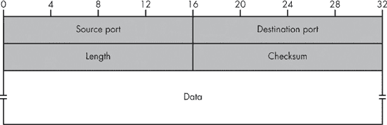

图 9-5. UDP 头部结构

UDP 用于单次查询，在其他不需要维护状态信息的情况下，以及当性能和低开销比可靠性更重要时。例如，UDP 通常用于域名系统（DNS）名称解析、简单的网络引导和自动配置协议（BOOTP）、流媒体技术、网络文件系统共享等。

## 端口寻址简介

UDP 引入了源端口和目的端口的概念，除了源地址和目的地址之外，它与 TCP（一个更高级的四层协议，我将在下一章介绍）共享这一概念。*端口*是一个特定的 16 位数字，要么由愿意发送或接收数据的端点应用程序选择，要么由操作系统分配给它（称为*临时端口*）。

端口作为将数据路由到多任务系统上的特定应用程序或服务的一种手段，以便程序之间可以发生同时通信。例如，一个名称服务器进程可以决定在端口 53 上监听传入的查询，而一个系统日志服务可以监听指向端口 514 的流量。端口使得客户端可以同时与这些进程进行通信。此外，当实现支持适当的源端口和目的端口对的分离时，使用不同临时源端口的两个客户端可以同时与同一服务（例如，端口 514）通信，而不会造成关于哪个客户端应用程序应该从远程服务获得哪个响应的混淆。 

为了使目的系统能够区分针对特定应用程序的通信并将其按预期交付，发送者必须在所有流量中指定目的端口号。发送者为每个客户端应用程序指定不同的源端口，以便一旦服务器回复，答案就会发送到正确的组件。

在这种端口寻址方案中，使用四个值——源主机、源端口、目的主机和目的端口——以确保在特定系统上同时发起或终止的连接能够正确地进行流量分离和会话管理。这种设计意味着单个 IP 地址最多可以有 65,535 个客户端连接到外部世界，并且任何时刻最多只能有 65,535 个服务监听单个 IP 地址；也就是说，没有一些巧妙的黑客手段的话。（我们不太可能很快就会遭受这种限制带来的严重后果。）

## UDP 头部摘要

之前在图 9-5 中显示的 UDP 头部遵循 IP 头部，并位于 UDP 数据包中的实际用户空间数据之前。它包含少量字段：源端口和目的端口（每个 16 位），数据包长度，以及一个 16 位的校验和，用于额外的完整性验证。

现在，让我们来点完全不同的内容，是……

* * *

^([16]) 技术上，这是 65,536；然而，端口号 0 不应被使用。操作系统及其应用程序自然可能允许这样做，但这可能违反了标准。

# 传输控制协议数据包

TCP（RFC793^([78]))，其头部结构如图图 9-6 所示，旨在提供一种可靠、基于流的通信方法，以在两个系统之间建立有意义的对话。TCP 比 UDP 更适合用于所有应用程序，除了那些必须交换比简单、短消息和单个呼喊更多的应用程序。

虽然技术上是通过在网络中穿越的单独的 IP 数据报实现的，但已建立的 TCP 连接——从应用程序的角度来看是一个虚拟通道——允许通信模式类似于常规的电话对话。与 UDP 流量不同，使用 TCP 时，你可以确信接收方总是以发送的方式接收数据（或者如果错误恢复不可能，整个对话将被丢弃）。在正常情况下，你也可以确信呼叫者的身份，但这种便利性是以更高的成本和较低的性能为代价的。


图 9-6. TCP 头部结构

在 TCP 协议中，两个端点首先使用所谓的三次握手算法建立一个连接。通常情况下，使用特殊的空包（只有头部没有实际数据负载的包），双方就意图达成一致，确认彼此的身份，并就初始序列号和确认号达成一致。这些数字（一组 32 位值）确保了可靠且无缝的传输，因为随着数据的发送，这些数字会递增。这反过来又允许接收方按正确顺序排队等待接收到的数据包，并确定数据中是否有任何部分缺失。

## 控制标志：TCP 握手

当一个远程系统表达出连接到目标机器上特定端口的愿望时，TCP 会话就开始了。远程系统向目标发送一个带有 SYN 标志（意味着在头部设置了指定的位）和设置在头部中的初始序列号的空包。在接收到这个包之后，任何对包的响应都必须引用序列号才能得到认可。如果目标机器在合理的时间内没有发送正确的响应，该包将被重新发送，直到交付成功或发送方认为已经过去了足够的时间并断开连接。

序列号确保对数据包的响应来自实际的接收方，而不是一个知道将要发生通信并打算捕获它的外部人员。序列号还确保响应不是一个丢失的、误导的、来自之前会话的数据包，它最终回到了这里，而是对发送方这个特定请求的响应。（使用 32 位数字和 4,294,967,296 个可能的值，碰撞的可能性远小于在 IP ID 中使用的 16 位，使得意外事故和外部人员的成功猜测都极不可能。）

预期接收方会对一个 SYN 请求用一个类似的、针对发送方和所使用的源端口的包进行响应。这个包应该设置 RST 标志（再次，头部中的另一个位）来表示他们不愿意建立会话。（没有程序准备好在这个端点上回答连接。）这个包还必须引用原始序列号以及响应。或者，在不太可能的情况下，如果接收方实际上愿意建立连接并与陌生人聊天，他们应该用一个类似的结构进行响应，但设置 SYN 和 ACK 标志，表示接受请求。他们还应该包括他们期望在所有与这个会话相关的响应中使用的序列号。

作为握手的最后一部分，发送方交换一个单独的 ACK 数据包，只是为了确保双方都知道之前交换的序列号和确认号，并且他们在交易方面处于同一页面上。假设他们的通信已经达到这一点，两个端点可以合理地假设发送方和接收方都是他们所声称的身份。为什么？因为每个都可以观察到发送到其地址的流量。否则，如果有一个端点只是伪造其 IP 地址，以他人的名义建立虚假连接，它将不知道在对其另一方的响应中包含什么数字。（并且另一方会对有人试图发送未经请求的 SYN+ACK 或 ACK 数据包感到非常惊讶。）

这个握手协议消除了外部人员简单地伪造流量的可能性，但并没有消除在系统之间合法路径上的敌对特权方发起攻击的可能性（尽管与盲目的伪造场景相比，这种事件不太可能发生）。

### 注意

不言而喻，尽管使用难以预测的初始序列号的问题并未被视为问题，许多系统使用了如简单递增生成器等设计，但随着时间的推移，通过欺骗特定源的 TCP 握手盲目建立会话或由外部人员注入已建立连接的数据的可能性已经变得有些问题。17] 现在仔细选择 TCP 初始序列号，以确保旁观者无法预测你的系统将如何对即将到来的数据包做出响应，被认为是必要的，并且已经设计出几种方法来解决这个问题。79]

一旦完成握手，各方可以交换数据，每次互相确认它们的序列号；序列号发生大于允许“窗口”的错配的包将被简单地忽略。从现在起，这些数字也将稳步增加，以反映到该点发送的数据量，这使得即使在它们到达顺序错误的情况下，也能在目的地正确处理数据包。为了确保可靠性，如果在合理的时间内没有确认部分数据，则必须重新传输该数据包（或数据包）。

当任何一方收到带有适当确认号的 FIN 数据包时，会话终止。如果在任何时候，其中一个系统变得非常激动并希望突然终止会话（可能是因为从他们的角度来看，没有什么可说的，会话超时，或者他们的方严重违反了约定），则会发送一个 RST 数据包。

一个成功的合法 TCP 握手过程如图图 9-7（在左侧所示）。右侧展示了针对无辜旁观者（无意与目标交换任何数据）创建会话的典型 IP 欺骗攻击失败情况。攻击者无法看到或预测其试图代表系统发送的响应，因此无法完成握手，更不用说在 TCP 会话中进行任何实际的数据交换了。

正如所建议的，TCP 提供了对网络可靠性问题的合理保护，并且更适合有序的基于会话的通信。但代价是额外的开销，这来自于完成握手的需求，以及两端维护连接控制信息的需求。维护这种状态需要付出沉重的代价，因为每个连接都必须跟踪序列号和流的当前状态（握手阶段、数据交换阶段、关闭阶段），保留所有已发送但尚未确认的数据的副本，以防需要重新发送，等等。

由于它们的内存和性能成本，TCP 堆栈实现是常见的拒绝服务攻击向量。

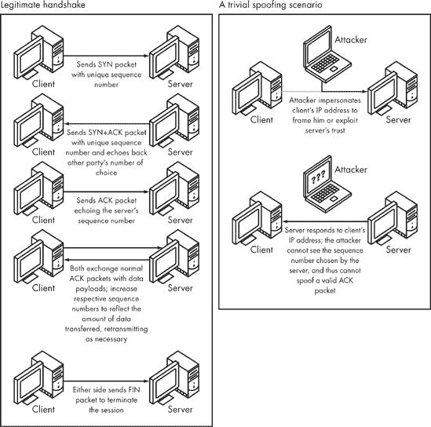

图 9-7. 完整的 TCP 握手和常见的欺骗尝试失败

## 其他 TCP 头部参数

其他 TCP 头部参数也控制了数据包解释和交付的重要方面。当我们试图仅通过查看他们提供的数据包数据来获取发送者的信息时，这些信息将非常有用。图 9-6，在本章前面已展示，提供了 TCP 字段的完整列表。

**源和目标端口**

这些 16 位值标识了源和目标机器上的逻辑起点和终点。它们类似于 UDP 中使用的源和目标端口参数，尽管在系统级别上 UDP 和 TCP 端口空间是分开的——这意味着一个应用程序可以监听 UDP 端口 1234，而另一个应用程序可以在 TCP 空间中监听相同的端口号。流量是根据 IP 头中的协议规范来定向的。

**序列号和确认号**

这些 32 位值确保会话完整性。序列号是发送者期望回显的值。确认号是回显给发送者的值，只有在 ACK 标志被设置的情况下才有意义。

**数据偏移（不要与 IP 分片偏移参数混淆）**

此字段中的信息指示了数据包中头部结束和有效负载开始的位置。与 IP 头部一样，如果在其末尾附加了某些可变长度设置，TCP 头部的长度可能会变化。这些信息使得只需跳到实际数据，而无需遍历所有头部信息变得容易。

**标志**

这些 8 位值定义了数据包的特殊属性。此字段中指定的每个位代表一个独特的标志，可以独立打开或关闭；因此，TCP 标志可以任意重新组合。"主要标志"（SYN、ACK、RST 和 FIN）定义了如何根据前面讨论的方式解释数据包，作为 TCP 会话的一部分；"次要标志"控制有效负载交付的某些方面和其他扩展功能，如拥塞通知，但不用于改变连接本身的状态。

### 注意

尽管可以随意组合标志，但许多可能的组合都是非法的或无效的。（例如，SYN+RST 没有意义，从正式的角度来说，是不允许的。）只有一些组合对于握手和正常数据处理是有意义的。不同的系统对非法标志组合的反应不同，因此发送带有不寻常标志的无效数据包是一种流行的操作系统检测机制。

**窗口大小**

这个 16 位值控制了在不等待确认数据包的情况下可以发送的最大数据量。更高的值允许一次性发送更多数据，而无需等待确认接收，但如果数据在传输中丢失或未确认并需要重发，可能会对性能造成惩罚。

**校验和**

这种简单的 16 位方法保护了第四层数据的完整性，类似于 UDP 和 IP 头部中使用的数据包校验和机制。

**紧急指针**

当数据包中设置了次要标志之一 URG 时，该字段仅由接收者解释。如果未设置 URG，则在此头部区域中指定的值将被简单地忽略。此标志表示发送者要求接收者将特定消息转发给处理流量的应用程序，这可能是由于“紧急”情况，因此数据包将被插入到逻辑流中比其原本应属于的位置更早的位置；确切的偏移量由紧急指针值控制。此机制在正常通信中很少使用。

## TCP 选项

头部末尾的变长选项块可以指定数据包的附加设置或参数。在某些情况下，它将是空的（长度为零），但它更常用于实现后来设计的协议的附加扩展，而不会破坏无法理解它们的旧实现。选项块的设计使得无法识别特定选项的系统可以安全地忽略它。最流行的选项包括以下内容。

**最大分段大小 (MSS)**

这个 16 位值等于发送者网络上的最大传输单元减去低层头部的尺寸。它表示可以在不引起途中分片的情况下发送给接收者的最大数据包长度。发送者使用 MSS 设置来确保在接收者返回大量数据时始终获得最佳性能，这些数据如果不进行分片，将需要额外的带宽开销。不幸的是，MSS 选项由端点系统根据其对直接网络邻居可以处理的数据包大小的最佳知识来设置；它无法避免在中间系统上发生的常见问题，即中途分片（因此需要在 IP 层上实现 PMTU 发现，如前所述）。

**窗口缩放**

RFC1232 中描述的此 8 位值扩展了 TCP 头部中最初指定的窗口大小字段的范围。根据经验，我们发现，在传输大量数据（如多媒体文件）时，每 64 千字节的数据（16 位窗口大小参数表示的最大值）可以创建性能瓶颈，尤其是在高带宽但高延迟的链路上。窗口缩放是一种扩展窗口大小的方法，允许发送更多数据而无需等待确认。这加快了数据传输，但当一个数据包丢失时，也可能需要重新传输更多数据。

**选择性确认选项（RFC2018**）

当使用更大的窗口大小时，丢失单个数据包需要重新传输整个尚未确认的数据组，这是一种带宽的巨大浪费。为了防止这种情况，设计了一种机制，用于对数据块进行选择性确认。端点首先通过指定选择性确认允许选项来声明其能力和意愿实现此功能，然后最终使用头部中的实际选择性确认选项来确认非连续的数据块。实施此技术可以显著提高性能，但代价是增加一定的内存和数据处理开销。

**时间戳选项（两个 32 位值**）

这是在 RFC1232 中建议的另一个高性能扩展。这种发送和回显时间戳（通常以某种方式对应于系统时间或运行时间）的机制为每个端点提供了一种估计流量往返时间的方法。此选项的主要优点是发送者可以测量数据包到达目的地所需的时间，并在没有响应的情况下更早地进行 TCP 重传。时间戳选项的另一个应用是防止序列号冲突（PAWS，防止序列号[号码]回绕），例如，当在交换了几吉字节的数据之后，序列号计数器回绕之后，一个早已消失的数据包到达目的地时。

**EOL**

此选项应解释为选项的结束；它告诉接收者不要将任何尾随数据作为头部的一部分进行处理。因为 TCP 头部大小是以超过单个字节的单位定义的，所以在将所有相关选项放置在数据开始之前，但在有效载荷数据开始之前（这仅在完整的四字节边界上才可能）之后，可能会留下一些未使用的空间。EOL 选项可以用来防止接收者尝试分析这些数据。

**NOP 选项**

这个选项意味着“什么也不做”，并且简单地被接收方忽略。发送者可以使用 NOPs（无操作）在数据包中填充，以确保某些多字节选项的正确对齐（由于性能和某些处理器的架构限制，这些选项必须对齐^([18]))。

**T/TCP (事务性 TCP**)

这种神秘的扩展为在已建立的 TCP 会话内提供独立的虚拟会话（事务）支持。这使得在每次想要与一次性服务执行特定操作时，可以避免因完成握手而产生的开销——如果应用程序想要与服务器处理多个单独的事务，这种方法更为常见。这个扩展很少使用，并且对于某些数据库系统非常有用（参见 RFC1644^([82])）。

* * *

^([17]) 凯文·米特尼克，最著名且最具争议的黑帽黑客之一，通过使用 TCP 欺骗冒充他们的一个受信任工作站，破坏了 Tsutomu Shimomura 的计算机——这一行为让 Tsutomu 先生非常不安，据大多数说法，这对凯文长期来说并没有真正帮助。

^([18]) “必须”指的是“为了确保适当处理而必须具备的条件。”一些处理器在访问未对齐 32 或 64 位的多字节数据结构时会有显著的性能损失；而另一些处理器则要求它们必须以这种方式对齐，否则会引发致命异常（执行陷阱）并拒绝执行操作。当然，一个淘气的发送者可能会故意在缓冲区中放置未对齐的数据，并希望接收方的系统在接收到这样的数据包时崩溃。当然，一个理智的操作系统会首先检查这一点，或者在处理之前尝试将选项数据复制到一个正确对齐的区域。然而，系统的理智并不应该被理所当然地接受。

# 互联网控制消息协议数据包

ICMP 数据包（参见 RFC792^([83]))用于发送其他协议类型的诊断信息和通知。从逻辑上讲，ICMP 数据包是第三层的组成部分，作为 IP 数据包的有效负载传输，因此与第四层有效负载没有区别。ICMP 不携带任何新的用户空间数据，而是为 IP 提供了一种简单的信号方法。图 9-8 显示了 ICMP 头部结构。


图 9-8. ICMP 头部结构

使用 ICMP 发送了各种消息，以响应 TCP 或 UDP 流量，通常表示某个特定的数据包无法投递、在传输中过期或由于某些原因被拒绝。可以自发地发送几种类型的 ICMP，例如路由器广告、回显请求（ping）等。

与 UDP 数据包一样，ICMP 头部很简单。它由以下字段组成。

**消息类型**

这个八位字段列出了导致发送此数据包的事件的一般类别（例如“目标不可达”）。此字段还可以携带独立的消息，尽管这种用法不常见。

**消息代码**

如果适用，这个八位值描述了确切的问题。它取决于消息类型，可能更详细地描述条件（“网络不可达”、“主机不可达”、“端口不可达”、“通信被管理禁止”）。在消息类型字段中应包含的详细程度与应留给消息代码的内容之间的区别尚不明确。

**数据包校验和**

此字段验证数据包未被损坏（类似于 UDP 和 TCP）。

ICMP 数据包的头部相当简单，本身并不提供足够的信息来成功解决它试图报告的问题，或识别生成此消息的流量类型。这些信息在数据包的有效负载中传达，并紧随数据包头部之后。

尽管 ICMP 数据包的有效负载取决于消息类型，但它通常引用触发响应的数据包的开始部分。这使得接收者能够确定消息适用的通信以及应该通知哪个应用程序出现的问题。它还可以用来确保 ICMP 数据包的发送者实际上位于两台机器之间的合法网络路由上，而不是它们的外部。否则，发送者将无法看到实际交换的数据。（特别是，他们无法确定 TCP 数据包的确切序列号。）这阻止了恶意旁观者发送虚假消息宣布连接问题，并迫使端点之一断开连接——至少在理论上是如此。当然，由于一些系统臭名昭著地篡改或误引原始数据，区分好与坏可能相当困难。

# 进入被动指纹识别

这个协议的设计如何与用户隐私相关？答案是有点奇怪：尽管 IP、TCP、UDP 和 ICMP 数据包的设计通常相当严格，并且这些头部中传输的信息并不特别冗长，但各种操作系统向这些数据包添加信息的方式的不同使得可以判断出正在使用的操作系统类型，甚至可以判断出机器实例的具体版本。当处理在规范中未明确讨论或未在正常质量保证程序中分析（例如，带有非法标志组合的传入数据包，如 SYN+RST）的流量时，这些差异尤其明显。

通过对系统实现进行压力测试的深入研究，已经表明可以安全地得出结论，操作系统中的任何两个 IP 套件实现都是不同的。通常，可以使用复杂分析来区分在略微不同的平台上运行的相同系统，或者区分系统略微不同的版本。像 Fyodor 的 NMAP 这样的活跃分析工具，一个 TCP/UDP 指纹识别器和端口扫描器，以及 Ofir Arkin 的 Xprobe，一个 ICMP 指纹识别器，通过发送各种类型的不规则或异常数据包来利用每个系统的缺陷或异常，并通过测量和分析这些数据包引发的响应来识别操作系统类型和版本。

## 检查 IP 数据包：早期阶段

但系统指纹识别的技术并没有停止在这里。实际上，通过发送可疑且易于检测的数据来远程系统“戳探”可能是处理这个问题的最不微妙的方法。

在 2000 年初，Subterrain 安全小组的两名成员，分别以昵称*bind*和*aempirei*著称，证明了在没有与远程方进行任何侵入性通信，甚至没有发起任何通信的情况下，通常可以获取网络上远程实体的信息。（他们的代码和发现最初在 2000 年的 DefCON 8 上展出，这是一个略过誉的黑客交易会。）他们的技术，现在被称为*被动指纹识别*，涉及被动地（duh）观察来自远程系统的合法流量。尽管这种技术使用的指标比 Fyodor 和他的前辈们使用的指标更为微妙和有限，但大量的研究（我很自豪地贡献了其中的一些）已经提供了足够的观察结果，达到了相当惊人的精确度。

为了更好地理解从网络上接收到的单个数据包可以告诉我们什么，让我们来看看我们可以基于被动指纹识别的指标，并检查它们可以告诉我们关于另一方的什么信息。这次探索基于分析互联网上最受欢迎的流量类型——IP 封装中的合法 TCP 数据包。

## 初始生存时间（IP 层）

回想一下，TTL 字段控制着数据包在被丢弃为不可投递之前可以经过多少个系统。每当数据包通过一个路由器时，它的 TTL 值就会减少，直到 TTL 达到零，此时数据包就会被丢弃。

因为没有严格的要求说明发送者应该如何设置此字段，许多 IP 堆栈开发者在确定他们宠爱的系统的默认值时只是掷骰子。尽管没有额外的测试，旁观者无法确定包的确切初始值（因为包在观察之前肯定已经穿越了几个路由器），但他们知道其初始值必须高于实际观察到的状态。此外，到互联网上远程计算机的平均距离通常不超过 15 跳，两个系统之间超过 30 跳的情况很少见。因此，你可以安全地假设原始值位于观察到的 TTL 和观察到的 TTL + 30 之间（但当然小于 256）。

因为我们知道流行操作系统的初始值，我们可以专注于发送者可能运行的操作系统类型。（Linux 和 BSD 衍生系统通常坚持使用 64；Windows 开发者使用 128，而一些真正的 Unix 后裔使用 255。）然后，一旦我们确定了发送包的操作系统，基于这一点和其他因素，我们可能还能够通过从已知的初始值中减去观察到的 TTL 来确定发送者距离观察点的距离。通过将此值与之前观察到的或已知的网络距离相关联，我们可能然后能够对发送者内部网络的组织得出一些结论。

## 不分片标志（IP 层）

DF 标志表示，“如果这个包不适合特定的网络链路，不要分片它；只需丢弃它。”通过观察这个标志是否被设置，我们可以确定系统是否使用之前描述的 PMTUD 机制，这又给我们提供了关于正在使用的操作系统的另一个线索。这也区分了两个庞大的系统群体：只有较新的 IP 实现使用这种技术，而所有其他系统对在它们发送的包中启用此标志都没有兴趣。

## IP ID 号（IP 层）

如前所述（在讨论分片不足的讨论中），某些启用 PMTUD 的系统在某些（或所有）出站流量中将 IP ID 号设置为零，因为他们假设流量不会分片，并且出于对显示 IP ID 号的安全担忧（正如你在第十三章中看到的）。因此，我们可以通过检查传入的包是否将 IP ID 号设置为零来识别这些系统。

然而，这里有一个陷阱。尽管一些启用 PMTUD（路径最大传输单元发现）的操作系统总是将 IP ID 设置为零，但一些其他系统在某些时候也可以将 IP ID 设置为零，仅仅是因为可供选择的 IP ID 可能性并不多。换句话说，如果你看到一个 IP ID 非零的数据包，可以安全地假设这不是一个对所有出站通信都使用零值的系统。然而，如果你看到一个数据包中的 IP ID 为零，你可能看到的是一个特定的启用 PMTUD 的系统，但你也可能看到的是一个“普通”系统，它只是偶然选择了零值来标记这个数据包。

虽然这种情况发生的概率很低，但也不是完全可以忽略不计。你可能要么对零 IP ID 的情况持保留态度（并且只使用非零 IP ID 观察结果来缩小可能的操作系统范围），要么对同一源进行多次观察以确认零值总是被使用。

## 服务类型（IP 层）

按设计，这个字段应该被选择以对应于流量优先级和类型，以便给中间系统提供关于如何处理数据包的提示，但它几乎从未这样做。大多数操作系统将此字段设置为任意固定值，因为开发者可以随意设置值，而实际上不会影响 TCP 网络的操作。根据开发者的自尊心，他们可能只是将此参数默认设置为零，或者认为将来自他们系统的所有通信标记为“低延迟”、“高可靠性”或其他设置（使用此字段中的位组合）是合适的。^[[19]]

这应该给我们带来优势——通过了解特定系统的默认值，我们再次可以缩小发送者可能使用的系统数量。然而，由于某些不守规矩的 DSL 运营商和其他 ISP 可能会更改此字段的值以应用于所有出站流量，这增加了混乱。他们的希望是，地球另一端的某些远程路由器会被这个伎俩欺骗，相信标记为“高优先级”的流量值得优先处理，并将其优先于其他连接，从而为该 ISP 的客户提供更快的浏览速度（这令人怀疑）。

就像操作系统一样，ISP 选择服务类型参数的选择相当随意。（例如，一家瑞典提供商使用了一个相当独特且有趣的优先级位组合，将值设置为 3，并使用服务类型位设置为“高吞吐量”。）这种做法反过来使得通过观察它们独特的服务类型位选择来检测来自特定 ISP 的流量变得相当容易，而无需执行如 WHOIS 注册查询源 IP 的主动分析。

## 非零未使用和必须为零的字段（IP 和 TCP 层）

IP 和 TCP 规范要求为未来使用保留一定数量的字段。所有当前系统都应该将这些字段设置为 0，以便将来在数据包中的这些位置分配非零值具有特殊含义。

不言而喻，在发送之前，这些字段在某些实现中并未被清零，正如它们应该的那样。这个问题在质量保证阶段可能不会被捕捉到，因为它不会引起任何明显的问题——其他系统认为“安全第一”更好，并且不会仅仅因为这种麻烦而拒绝数据包——因此，这种缺陷可能持续很长时间（也许直到这些位实际上被用作某些 TCP 扩展的一部分，导致在与这些损坏的系统通信时失败得非常明显）。再次强调，检查这些值的能力是宝贵的信息来源，可以引导我们更准确地识别发送者的操作系统。

## 源端口（TCP 层）

源端口标识发送方连接的参与者。每个系统都有不同的策略来分配所谓的临时（起源）端口用于出站连接，通过检查观察到的端口号，通常可以确定源操作系统。此外，执行伪装的系统通常为此目的使用相当具体的端口范围。（伪装，或多对一的网络地址转换，涉及重写来自私有网络的出站流量，使得所有连接看起来都起源于伪装系统，并且所有响应在系统接收到时都转换回并交付给实际的发送者。）

伪装在企业和家庭网络中都被广泛使用，以保留地址空间。内部网络可以使用大量地址，从技术上讲，这些地址并未分配给他们，并且从互联网（或任何其他地方）也没有路由到那里。然而，使用这些地址的系统仍然可以通过将它们的出站连接转发到使用其自己的、合法的公共地址的代理盒，以发起者的名义到达远程系统，从而访问互联网。这种方法还可以保护内部系统，使得外部人士无法直接发起未经请求的连接到系统，同时只允许内部人士连接到外部。

检查对方选择的源端口范围，可以使我们更好地猜测发送者所使用的操作系统，并且（一旦该范围与其他观察结果相关联）确定发送者是否在使用地址转换的私有网络中（在这种情况下，系统预期的源端口范围和实际观察到的范围很可能不匹配）。如果发送者的网络正在使用地址转换，还可以根据不同产品使用的不同范围，推断出地址转换设备的类型。

## 窗口大小（TCP 层）

回想一下，窗口大小设置决定了在不确认的情况下可以发送的数据量。具体的设置通常根据开发者的个人神秘规则和其他宗教信仰来选择。两种最流行的方法认为该值应该是 MTU 减去协议头部的倍数（称为最大分段大小，或 MSS），或者简单地足够高且“圆滑”。Linux 的旧版本（2.0）使用 2 的幂次方值（例如，16384）。Linux 2.2 改为使用 MSS 的倍数（11 或 22 倍的 MSS，原因不明），而 Linux 的新版本通常使用 2 到 4 倍的 MSS。网络连接的家用游戏机 Sega Dreamcast 使用 4096 的值，而 Windows 通常使用 64512。

应用程序有时可以更改操作系统设置的窗口大小值以提升性能，但这很少发生。（存在一个与我们预期操作系统的默认值不匹配的值，是检测特定应用程序的好方法；这类应用程序的少数例子之一是 Opera，一个中等受欢迎的网页浏览器。）

## 紧急指针和确认号值（TCP 层）

在紧急指针（16 位）和确认号（32 位）字段中指定的值仅在数据包中设置了相应的 TCP 标志（URG 或 ACK）时使用。如果没有设置这些标志，则这些值应该为零，但它们通常不是。一些系统只是将它们初始化为非零值，这不会引起真正的问题：因为如果没有设置适当的标志，这些值将不会被解释，它们只是用来识别特定系统。

然而，在某些情况下，这些值根本未初始化，而是简单地从正在用于构建 TCP 数据包的缓冲区中复制。我在进行被动操作系统指纹识别工作时观察到 Windows 2000 和 XP 堆栈实现的行为：每当同时发生两个 TCP 会话时，这些值会将前一个会话的一些信息泄露给当前会话（我们将在第十一章中再次讨论的情况）。这表明该人在后台做其他事情，并泄露了一些传输给另一方的信息。哈利路亚！

## 选项顺序和设置（TCP 层）

数据包中选项的确切顺序和选择是每个系统的独特之处。因为没有规则规定选项在数据包中的顺序，所以存在某些“签名”组合。例如，Windows 在 SYN 数据包上使用一个特征序列的“MSS, NOP, NOP, Selective ACK Permitted”选项；Linux 通常坚持使用“MSS, Selective ACK Permitted, Timestamp, NOP, Window scale。”自然地，这又是一次区分系统的绝佳方式。

## 窗口缩放（TCP 层，选项）

窗口大小的缩放因子通常设置为零。然而，一些系统在得出这样做合理的结论时，要么默认为更高的值，要么永久性地增加特定类型流量的参数，例如，如果用户刚刚从 P2P 网络下载了盗版电影或完成了大量不同类型的下载（后者自然不太可能）。

## 最大分段大小（TCP 层，选项）

在某些系统中，此字段固定为特定值；在其他系统中，它表示设备的直接网络连接类型。不同类型的网络有不同的 MTU，这使得可以判断一个人是否使用高速 DSL 链路或微弱的调制解调器线路。

## 时间戳数据（TCP 层，选项）

由于此值通常对应于系统运行时间，因此通常可以通过观察时间戳选项来确定它。此外，给定一组操作系统，可以通过检查传入流量中的时间戳变化来区分它们并跟踪每个系统：不同的系统将有不同的运行时间（并且不太可能有相同的启动时间），而同一台计算机将保持持续增加的时间戳参数值。

这在两种情况下非常有用。第一种情况是一组系统在单个 IP 下运行，就像伪装一样。在这种情况下，好奇的网站管理员可以确定来自公司 X 有多少独特用户访问了他们的页面，以及每个访问者访问他们运营的网站的位置，即使所有请求都来自一个地址，并且最初看起来无法区分。

另一个应用是追踪单个用户，无论出于什么原因，他们可能会跳转 IP 地址。为什么要费这个功夫，对方为什么又想确定用户是否在这样做呢？例如，他们可能在动态 IP 地址池（通过断开再连接）之间切换，希望他们的攻击尝试看起来像是一系列无意义、不相关的活动，而不是一个精心策划、广泛的探测。或者他们可能想要绕过在线论坛、在线调查或投票竞赛（使用一些老式的票箱填充）的限制，等等。这些都是新一代的常见娱乐活动。

时间戳选项的时间测量通常非常精确，因为它基于一个最常见的时钟，每秒滴答声为 100 或 1,000 赫兹（尽管一些系统使用 64 或 1,024 赫兹，以及介于两者之间的值）。这种精度足以区分即使在电源故障后几乎同时启动的相似盒子，因此它提供了极高的准确性。

## 其他被动指纹识别场所

在本章中，我们探讨了用于确定远程主机操作系统（以及跟踪其用户）的最常用指标，而这些指标的使用完全在用户不知情的情况下。但是，许多激动人心且尚未充分探索的通信方面，可以用来达到相同的目的，甚至更多。

例如，指纹识别的一个有趣变体与检查数据包本身无关，而是测量某些 ICMP 消息、TCP 重传和类似特性的时序和响应速率。所有超时和重传计数设置所使用的值提供了一个精确且独特地识别系统的良好方法。一个基于 Franck Veysset、Olivier Courtay 和 Olivier Heen（Intranode 研究团队）的研究的 CRONOS 项目旨在提供一个基于这些指标的主动指纹识别工具，但被动指纹识别应用同样具有吸引力。

另一个有希望的线索是尝试结合和测量许多其他异常或不常见的设置，例如发送者使用特定的时间戳值、序列号与确认号相同，或非同寻常的标志，以及控制包中的数据负载、使用 EOL 选项等。这些特征也可以用来区分操作系统，尽管这些特征通常只针对一小部分实现。（选择初始序列号的算法通常是宝贵的信息来源，您将在下一章中看到。）

* * *

^([19]) 一些开发者甚至选择设置此参数的“必须为零”位——这在合法应用程序中永远不会设置——可能只是为了做出一种风格声明。

# 实践中的被动指纹识别

这些指标使得精确识别操作系统及其配置、网络参数以及高效且无声地跟踪用户成为可能。尽管这可能看起来难以置信，但我开发的一个工具 p0f 实现了大多数基于分析 SYN、SYN+ACK 和 RST 数据包的完全被动方式收集和分析信息的技术，成功率很高。

让我们通过一个示例数据包来看看这种方法的有效性。以下是从实际捕获的 TCP 数据包中提取的一组重要参数。这能告诉我们发送者的操作系统是什么？

| **互联网协议（版本 4）** |
| --- |
| 源主机 | nimue (10.3.0.1) |
| 目的主机 | nightside (10.3.0.3) |
| 标志 | DF |
| 生存时间 | 57 |
| 标识号 | 4428 |
| 无 IP 选项（数据包大小 = 20） |   |
| **传输控制协议** |
| 源端口 | 3803 |
| 目标端口 | 80 (HTTP) |
| 标志 | SYN |
| 序列号 | 1418000073 |
| 确认号 | 0 |
| 窗口大小 | 32120 |
| **TCP 选项** |
| #1 最大分段大小 | 1460 |
| #2 允许选择性确认 |   |
| #3 时间戳 | 170330930 |
| #4 窗口缩放 | 0 |

很多。以下是我们可以从这些观察中推断出的内容：

+   因为 IP 头中的 DF 标志被设置，系统必须使用路径 MTU 发现。使用路径 MTU 发现的匹配系统是 Linux 的新版本、FreeBSD、OpenBSD、Solaris 和 Windows。我们可以排除 IRIX、AIX、许多商业防火墙^([20])以及其他出于可靠性原因不实现 PMTUD 的系统。

+   数据包的生存时间（TTL）为 57。我们知道初始 TTL 值不可能更低，因为它在传输过程中可能会降低，而且不太可能超过 87（这将是一个非常远的系统）。我们可以将此与许多 Unix 系统（所有这些系统都使用初始 TTL 为 64）相匹配，但我们排除了 Windows（初始 TTL 为 128）、Solaris 8 之前的版本（255）和几个网络设备（32）。

+   数据包的标识号不为零。这排除了 Linux 2.4 及更高版本，以及其他一些流行操作系统的最新版本。

+   源端口位于最常用的范围内（1,024 到 4,095）。虽然这本身并不能帮助我们排除任何系统，但我们可以安全地假设，在这个连接之前，该系统已经建立了超过 2,700 个连接，并且不太可能隐藏在伪装背后。

+   选项选择和排序（MSS、选择性 ACK、时间戳、窗口缩放）是 Linux 2.2 及更高版本特有的。

+   窗口大小是 MSS 的倍数，即 MSS*22。唯一符合这一条件的系统是 Linux 2.2。

+   在数据包中没有观察到异常、RFC 违规或其他怪异现象，这证实了 Linux 是正在运行的系统的假设。

+   最大分段大小指示以太网或调制解调器 PPP 连接（MTU 为 1,500）。

+   系统的运行时间大约为 19 天，并且它位于 7 个系统之外。

当然，单个指标可以被应用程序或用户调整所修改。（例如，用户倾向于在阅读网络优化指南或运行“系统医生”应用程序后修改 TTL 或启用或禁用某些设置。）然而，通过基于我们的观察得出一系列结论，我们找到了一种可靠的方法，通过识别在大多数类别中似乎是最匹配的系统来确定机器的操作系统。

在这种情况下，我们有充分的理由相信所讨论的系统是 Linux 2.2，并且发送者通过以太网或拨号调制解调器连接到互联网。基于这个假设，我们还可以得出结论，该系统距离 7 跳（64-57，其中 64 是 Linux 系统的初始 TTL）并且其运行时间接近 20 天。如果更多用户隐藏在这个特定的 IP 后面，我们可以轻松地计数它们，并根据它们的系统特征和时间戳数据（如果有的话）区分它们的会话。

* * *

^([20)) 防火墙本质上是一个过滤路由器，通常也具备理解和基于高层流量特征做出决策的能力。

# 探索被动指纹识别的应用

当被接收者或旁观者（例如发送者和接收者之间的 ISP）观察时，网络流量可以提供超出实际交换数据的信息，包括发送者系统的一些参数。正如之前所建议的，这种暴露很重要，也非常有趣，因为与应用程序传输的数据不同，它并不一定明显，而且披露往往超出了任何用户的控制。尽管用户可以更改浏览器设置和其他应用程序的设置，以防止被监控、识别和追踪，但较低 IP 或 TCP 层发生的披露很容易破坏这种努力，向观察者透露的信息与受害者试图隐藏的信息一样多。它还可以携带对基础设施安全具有更基本意义的数据，包括一些关于受害者网络结构和保护的有用提示。

话虽如此，在没有侵犯隐私的情况下，被动指纹识别也可以用于相当合法的侦察任务。被动指纹识别的实用（和常见部署）应用范围涵盖了整个道德光谱，从恶意到正当防御。

## 收集统计数据和事件记录

被动指纹识别的一个更合法的用途是监控网络，以执行对平台和网络环境的非侵入性和客观分析，以确保用户获得针对其软件优化的服务，并保证没有大规模的用户群体以某种方式被忽视。此外，通过使用被动指纹识别，收集有关潜在攻击者或其他未授权活动的数据可以大大增强。事实上，被动指纹识别在蜜罐研究领域特别受欢迎。

### 备注

蜜罐是 Sun Microsystems 的 Lance Spitzner 积极推广和研究的一个概念。^([[84)]] 目标是让所有者了解他们的对手及其目标，使用（蜜罐）这种设备的价值在于其未经授权和非法使用，并且对基础设施没有任何实际意义，尽管它们被设计成看起来好像有。

## 内容优化

被动指纹识别的一个活跃应用是基于对客户端使用来访问服务器的设置进行即时分析，提供针对特定接收者的优化服务。我认为我有责任在这里无耻地推荐我之前提到的一个工具，p0f。p0f 提供了一种查询其关于来自其他应用程序的最近传入连接参数的方法，这使得内容优化的任务变得容易得多：一个网络脚本不需要了解很多 TCP 和 IP，只需简单地问 p0f，“嘿，我和谁在说话？”然后就会得到一个有用的响应。

## 策略执行

检测和最终阻止过时或不合规的系统（例如，违反企业政策或构成安全风险的设备）或未经授权的网络连接的侵扰是被动指纹识别的另一个有趣应用。自 3.4 版本以来，OpenBSD 提供了一种基于操作系统检测结果进行路由和重定向流量的方法，因此基于远程操作系统特性的策略执行变得相当可行。现在，同样的功能作为 Linux netfilter patch-o-matic 代码的一部分提供。这两个实现都受到了 p0f 的密切启发或基于 p0f。

## 贫民窟式安全

被动指纹识别也可以用来最小化某些类型的暴露。尽管经过一些努力可以欺骗指纹识别技术，但指纹识别可能被用来阻止某些类型的客户端（例如 Windows 系统，这是一个最常被间谍软件、后门和蠕虫感染的平台，通常被用于未经请求的大规模电子邮件分发或攻击跳转）使用网络上的某些底层服务，同时允许“不太可疑”的实体访问它们。

## 安全测试和预先攻击评估

活动指纹识别通常会被防火墙和其他仔细过滤和分析 IP 流量的解决方案阻止。然而，被动指纹识别可以检查甚至受到积极保护的系统，并且可以在不触发任何警报的情况下绘制网络图。

使用被动指纹技术进行安全测试和评估的方法有两个方面。首先，它可以用来分析传入流量。尽管观察者必须等待远程方连接到他们的系统，但这种连接可以非常容易地诱导而不会引起怀疑。事实上，通常只需向受害者发送一封特定的电子邮件或一个指向网站的链接，即使是最复杂的包过滤解决方案也无法检测到。其次，被动指纹技术可以用来分析对可用服务的合法流量的响应，以确定远程方的参数。如果一个黑帽黑客知道如何破坏内部网络，但想了解更多关于其内部的信息，以最大限度地减少被过早检测到的风险，那么被动指纹技术可能会派上用场。同样，这也可以适用于为进行测试的实体付费的合法安全测试。

## 客户配置文件和隐私侵犯

许多公司不遗余力地收集和出售有关人们习惯、偏好和行为的有价值信息。尽管这些信息通常用于营销目的，但理论上可以用来针对特定个人。通过关联他们在多个地点访问的指纹识别结果来跟踪用户的能力，无论是为了绘制内部网络和使用的软件、追踪个人还是收集其他有价值的数据，这可能是一种信息来源，它本身可能具有相当大的价值，或者可以用来增强其他不太道德的提供的吸引力。

## 间谍活动和秘密侦察

收集有关竞争对手网络架构和用户行为及偏好的额外信息通常非常有吸引力。尽管这听起来可能像糟糕的科幻小说，但这实际上只是上述讨论的配置文件类型的一种更精确的形式。

# 防止指纹识别

由于典型 IP 堆栈的复杂性，通常很难防止指纹识别，但可以通过确定它最依赖的参数并对其进行更改，来解决特定问题并禁用已知指纹识别软件的特定类型。例如，某些包过滤解决方案，如 OpenBSD 中的`pf`，提供了一种包标准化服务，确保所有传出流量“看起来相同”。尽管这可能在一定程度上防止了指纹识别的一些方面，或者可能只是通过使一些流行的程序不够准确而使指纹识别更加困难，但它并没有完全解决问题。

尽管彻底和看似详尽的操作系统设置或 TCP 参数的修改或自动化修改可能会使系统识别变得更加困难，但某些行为深深埋藏在内核中，并且不可定制。例如，改变数据包中的选项顺序相当困难。此外，当用户进行手动修改时，他们可能会将独特的特征引入来自他们系统的数据包中，这只会进一步影响他们的隐私和匿名性。

幸运的是，某些解决方案确实解决了特定类型的测试。例如，Gael Roualland 和 Jean-Marc Saffroy 的 IP Personality 通过修改 TCP 堆栈，使其对特定工具看起来像来自不同的操作系统。如果你喜欢，你可以使用 IP Personality 让 NMAP 认为你的系统是一个惠普激光打印机。然而，也会出现一些问题。首先，试图模仿使用弱堆栈的设备实际上可能会削弱系统的 TCP 堆栈。例如，如果你为了符合打印机的特定特性，在所有连接上使用简单的序列号，那么有人迟早会利用这一点来轻易地干扰或篡改你的流量。此外，像 IP Personality 这样的软件只能针对最流行、最知名、最文档化的工具，但它对其他工具的成功没有保证，因为每个工具检查的特征以及这些特征的解释方式在不同地方是不同的。你只能希望愚弄那些最不坚定、最天真、使用你已知工具的“主流”攻击者。

### 注意

与伪装代理不同，代理类型防火墙和其他代理设备不会转发数据包，而是拦截连接并使用它们自己的 IP 堆栈启动新的连接。这些是解决第三和第四 OSI 层指纹的唯一完整解决方案，但它们对性能有严重影响，并且由于引入了极大的复杂性，更容易出现问题。此外，对应用程序本身的更高层指纹识别仍然是可能的。

# 思考：IP 分片致命缺陷

在讨论互联网协议的标志性特征时，我随意地提到，数据包分片和重组的过程存在致命的缺陷。这个观点主要来源于我在撰写本书时一个相当有趣的观察。尽管这个概念与一个活跃且明显的攻击有关，该攻击由一个公开的恶意实体执行（尽管很难追溯到该实体），但它却是互联网协议设计中固有的独特且有趣的缺陷。这并非一个明确定义的错误的结果，而更多是不同设计层上范式冲突的结果，这两者都由 IP 套件的创始人之一乔恩·波斯特尔（Jon Postel）奇特地指定。我决定将其包含在这里，作为对那些对计算机缺陷病理感兴趣的人的思考材料。

首先，让我们看看今天的状况，或者可能是昨天，因为我们正在回顾一个相当古老的攻击技术，在之前的 TCP 讨论中已经提到。这个技术，即*盲注攻击*，最初由罗伯特·T·莫里斯（Robert T. Morris）在 20 世纪 80 年代中期描述。^([85)] 它在其十年后的黄金时代达到了顶峰，但自那以后其重要性已经降低。我们将关注盲注攻击的一个具体例子，即将某些数据注入现有会话中，以破坏它，让服务器相信其用户已发出特定命令，或者让用户相信他们正在从服务器获得特定响应。这种技术通常被称为*连接劫持*。

在正常情况下，一个恶意旁观者想要将数据注入现有的 TCP 流中，首先需要确定至少一方使用的序列号。尽管这种攻击高度时间敏感，并且必须针对特定的现有连接进行，但当序列号可预测时，它可以（并且已经被多次成功执行）执行。事实上，在 20 世纪 90 年代末，许多工具被用来干扰 Windows TCP 会话到互联网中继聊天（IRC）网络（为了娱乐或其他目的），利用 Windows 脆弱的初始序列号（ISN）选择算法；在这里注入单个 RST 数据包是微不足道的，这会将一个人从聊天服务器上踢出去。这就是我们当时所说的乐趣。

今天，情况略有不同。多亏了许多研究者的努力（包括这些文字最谦卑的作者），开发人员努力使 TCP 连接的初始序列号更难以预测。许多尝试改进流行操作系统中序列号生成器质量和强度的尝试，最终使得 ISN 预测攻击变得更加困难，只有少数相当不引人注目的例外。使用顺序 ISN 号的系统在很大程度上已经灭绝；攻击者无法确定与另一方对话中使用的数字，被迫在整个 32 位可能值空间中搜索，以便执行精确的数据插入攻击（如果他们只想终止或永久损坏会话，则更少）。这大约有 4,294,967,296 种组合，这种攻击要求攻击者平均发送大约 80 GB 的数据才能成功。不用说，这并不被认为特别可行。

然而，关于从成功的数据注入攻击中可以获得的实际好处，几乎没有变化。尽管越来越多的通信是在支持加密的通道中进行的，但此类攻击的相关性并没有显著下降；许多有成果的攻击场景仍然存在。以下是一些例子。

+   数据可以被插入到未加密的服务器到服务器或路由器到路由器流量中，例如电子邮件交换、DNS 区域传输、BGP 通信等。大量服务器到服务器的流量可以由攻击者生成，同时包含敏感或受信任的信息，这使得有针对性的定时攻击更加可行。

+   数据可以被插入到未加密的客户端到服务器流量中，例如文件传输协议（FTP）文件下载或超文本传输协议（HTTP）响应。这种攻击可以用来向知名服务器的访问者提供恶意、有罪或贬低的内容，或者使其看起来像妥协尝试来自无辜的访问者。

+   数据可以被插入到现有的会话中，以利用服务在非认证用户无法访问的阶段存在的漏洞。这既适用于加密流量，也适用于未加密流量。例如，像 POP3（存在点，远程邮箱访问协议）这样的服务只能接受各种命令，前提是用户之前成功登录。在登录之前，可用的唯一命令是直接与认证过程相关的命令（如`USER`和`PASS`指令）。如果没有有效的密码，攻击者无法利用后来可用的某个命令（如用于从邮箱中检索特定消息的`RETR`命令）中的漏洞。然而，如果攻击者能够将恶意的 RETR 请求注入到已认证用户的现有会话中，他们就会获胜。

+   即使是安全且加密的、完整性受保护的数据流，在会话被单个精心制作的包中断或终止时，也容易受到拒绝服务攻击。

因此，能够轻松注入数据，而无需遍历所有可能的序列号范围，这很诱人。而这就是碎片化大有用武之地。

## 将 TCP 拆分为碎片

当携带 TCP 有效负载的 IP 数据包被拆分（可以说，在文件传输中这是一个常见的情况，而且仅仅通过设置 DF 标志并不能总是防止这种情况，就像一些系统所做的那样），数据就会在网络中以多个块的形式传输，并且只有在到达接收方时才会重新组装。一个聪明的攻击者，在预料到这种拆分的情况下，可以发送一个特别定制的、非法的 IP 碎片，伪装成来自预期发送者的碎片。在接收到这个碎片后，接收方可能会（如果运气好的话，这是一个精确时间的问题），最终使用它而不是真正的碎片来重新组装原始数据包。

在这个攻击场景中，第一个碎片（包含完整的 TCP 头部，包括确切的端口、序列号等）与攻击者伪造的恶意有效负载合并。因此，攻击者不需要知道序列号或其他会话参数，就可以将他们的数据插入帧中，从而有效地破坏整个 ISN 生成过程。一旦攻击完成，接收方最终处理的数据包由从合法碎片复制来的有效头部数据和攻击者注入的恶意有效负载组成。

### 备注

攻击者可以通过在碎片之间指定轻微的重叠来替换第一个碎片中的任何部分；许多系统都尊重碎片之间的重叠，并用较新的副本覆盖之前接收到的数据。在极端情况下，攻击者可以成功替换 TCP 数据包中的所有数据，除了序列号。

自然地，拼图中的一些部分仍然缺失。但是，除了需要精确的时间和了解传输发生的时间之外^([21))，在这个场景中的攻击者必须克服仅有的两个障碍：

+   碎片必须有一个正确的 IP ID 号才能被合并。幸运的是，在许多系统中，这并不是一个问题，因为 IP 标识符是按顺序选择的。因此，当前可能使用的数字可以通过尝试测试连接来简单地推断出来。一些系统，特别是 OpenBSD、FreeBSD 和 Solaris，提供随机化的 ID 号，这可能会使攻击更加困难，但仍然不能阻止它。攻击者只需检查数千（而不是数十亿）种组合，因为 IP ID 字段相当小（只有两个字节）。

+   TCP 头部包含一个校验和，在重组后进行验证，攻击者修改的数据的校验和必须与原始有效载荷的校验和相同。然而，由于 TCP 校验和的设计非常简单（只是一个直接的 16 位和的变体），你可以构建一个不改变数据包校验和的有效载荷，只要攻击者知道要替换的原始部分。这种情况最常见，尤其是在文件传输期间，攻击者想在公开可用的数据部分插入恶意代码或内容。

以下是一个由头部单词 H1 和 H2 以及有效载荷单词 P1、P2 和 P3 组成的数据包的简化校验和示例：

| C = H1 + H2 ... + P1 + P2 + P3 ... |
| --- |

H1、H2 和 C 对攻击者来说是未知的。（头部包含序列号，校验和受此数据影响。）攻击者实际上无法检查这个数据包，但知道受害者会在应用层执行特定的（可预测的）交易（例如，检查他们的邮件，下载网页，与朋友聊天等）。攻击者可以推断出有效载荷数据 P1、P2 和 P3，并希望用他们自己的恶意单词 N1 和 N2 来替换它，使用第三个单词作为校验和补偿（CC），以便数据包仍然有效。

| C = H1 + H2 ... + N1 + N2 + CC ... |
| --- |

解这些方程式以得到 CC，我们得出结论，校验和必须通过 CC = (P1 + P2 + P3 - N1 - N2) 来补偿。攻击者可以修改数据包，使校验和保持不变，而无需知道整个数据包；他们只需要替换的位。这足以正确计算补偿位并保留校验和。

* * *

^([21]) 计时本身并不像最初看起来那样成问题。攻击者可以选择提前发送他们的恶意第二个片段；接收者随后创建一个重组缓冲区，并等待剩余部分在一定时间内到达。一旦第一个合法片段到达，缓冲区内容就被认为是完全重建的，无需等待真正的第二个块到达。

# 第十章。高级羊计数策略

*在这里我们剖析确定网络架构和计算机位置的古艺术*

—

网络侦察和映射是利用互联网核心通信协议中固有的信息泄露向量来识别系统和网络或识别和追踪潜在违法者、用户、客户或竞争对手的艺术。这可能是迄今为止最发达、最广泛部署、最具有意义和最直接有用的被动数据分析应用，但它也存在一些问题，这些问题影响了其在某些场景下的准确性和可用性。这对于已知和测试过的 TCP/IP 被动指纹识别技术尤其如此。

# 传统被动指纹识别的利弊

使用上一章中讨论的被动指纹识别度量标准将使你能够轻松地识别源系统和网络的一些特征。此外，在某些情况下，这些技术将使追踪个人在更改地址或与其他单个网络用户共享地址时成为可能。只要你能够说服被观察的地球人（地球人）与特定网络互动，或者只要他们的网络通信通过一个足够好奇的人控制的特定系统集，你就可以使用这些技术而无需与远程方互动。因此，除了其他用途之外，被动指纹识别使服务器所有者或特定的 ISP 能够轻易地获取大量且完全隐蔽的信息。

被动指纹识别为第三方提供了一把双刃剑。你可以部署它来获取有关网络内部结构的有用数据，以便使攻击更容易或更深入地了解所使用的网络技术（即使是在相当复杂的环境中，如图 10-1)，以便使攻击更容易或更深入地了解所使用的网络技术。你也可以（完全有理由）用它来监控自己的网络以发现违规行为（如非法连接或连接内部网络与外部世界的接入点）或追踪攻击者。

对于单个用户而言，由此产生的隐私损失通常是可以忽略不计的，除非将用户偶然进行的活动与通过指纹识别获得的附加数据联系起来，或者追踪单个用户跨域的能力是一个特定问题（这很可能只有在用户的行为一开始就值得怀疑的情况下才是真的）。但是，所有用户隐私的累积损失可能会非常令人担忧，通过指纹识别或辅助跟踪收集的信息可能会具有明显的市场价值。（如果你的个人数据与你的偏好和兴趣信息相结合，它可以卖给广告商的价格会更高。）此外，暴露网络的内部技术运作确实可能对公司和敏感基础设施的其他部分来说是不受欢迎的。

尽管如此，目前还没有完全失去希望。正如之前所指出的，使用被动指纹识别来获得准确结果存在一些问题。传统被动操作系统指纹识别技术的可靠性问题源于通过仔细调整受观察系统使用的某些或所有网络设置来欺骗观察者的容易程度。即使完全更改所有设置并不特别容易，部分修改可能足以阻止某些自动化分析尝试（万岁！）或误导调查恶意事件的研究人员（哎呀）。尽管这不是一个大规模问题，因此不是统计分析的担忧，但可靠性问题可能在个别情况下引起关注。

此外，我们在第九章（第九章. 外国口音

图 10-1. 您可以使用被动指纹识别通过观察某些节点（最重要的是测量操作系统特征、TTL 和 MSS 值）的流量来映射一个复杂甚至无法访问的网络，然后推断其他组件的存在以匹配观察到的特征差异。留给读者去确定如何仅通过观察外部的流量来最终绘制出这个网络。

然而，另一种可能更有趣、有希望且具有挑战性的被动指纹识别方法，却很容易解决被动指纹识别的不足。这种新的方法使得误导远程观察者变得极其困难，并且几乎适用于所有跟踪系统。更有趣的是，这项技术使得区分在完全相同的配置下完全相同的系统实例成为可能，将伪装检测提升到了全新的水平。这项技术利用了 TCP/IP 中序列号生成机制的属性，并且还能生成一些相当漂亮的图片。

# 序列号简史

回想一下上一章的内容，初始序列号是 TCP 内部使用的一种机制，用于确保会话完整性，并且实际上可以保证其最基本的安全弹性。

要真正保护纯文本 TCP/IP 会话免受完全陌生人的数据注入、劫持或伪造，唯一真正通用的方法就是确保初始序列号的选择方式对攻击者来说是不可预测的。这降低了他们正确猜测（并伪造一个将被接受为他人会话合法部分的包）的机会，以至于在现实世界中这种风险几乎可以忽略不计，即使攻击者控制了系统，发送成千上万的包，希望至少有一个与序列号大致匹配。

在 20 世纪 80 年代初，基于 TCP 的通信的安全性似乎并不是一个值得担忧的问题：互联网是一个相当小、自成一体的，也许有点精英主义的由科学家等使用的环境。因此，TCP 协议的 RFC 规范没有指定初始序列号选择的要求，几乎所有早期的（以及一些不那么早期的）TCP/IP 堆栈实现都使用了简单、基于时间或计数器的算法，这些算法为后续连接返回后续数字。当时，随机化这些数字的想法似乎是一种不必要的浪费宝贵的计算能力。此外，这样做，会增加序列号碰撞的可能性。（碰撞是指为后续连接到主机的两个 ISN 选择得太相似，从而产生旧数据包在不当时间到达时可能被解释为错误连接的上下文的可能性。显然，在短期内随机选择数字比选择顺序递增的数字更有可能产生碰撞。）

自 20 世纪 80 年代以来，互联网已经取得了很大的进步，当然，其可用性增加，用户基础快速变化和增长；随着越来越多的重要数据通过电线发送，安全问题变得更加相关。不幸的是，流行的可靠完整性和隐私保护机制尚未跟上互联网的扩张：并非所有服务都支持加密，并非所有用户都知道何时使用它，更重要的是，大多数用户不知道如何正确验证远程方提供的加密证书。

随着时间的推移，尤其是在 20 世纪 90 年代中期弱 ISN 生成机制的广泛滥用（尽管主要限于在线聊天服务等等），很明显，有必要为 TCP/IP 流提供基本的完整性保护。这对于所有流量中实际加密保护的那一小部分来说也很重要，因为通过注入垃圾数据或 RST 数据包来破坏传输层同样不受欢迎，即使影响仅限于断开连接（拒绝服务），而不是数据注入。

因为修复问题的唯一方法（无需对人类已知的大多数基于 TCP 的通信方案进行重大改造）就是使协议本身难以被攻击，许多开发者开始努力摆脱过时且危险的简单递增 ISN 生成机制。尽管这些努力确实有助于提高连接对盲伪造攻击的弹性，但也开启了几个有趣的信息收集途径，允许对系统和网络进行更高级别的指纹识别，无论是为了安全评估还是计划中的攻击。

# 从序列号中获得更多

自然，能够区分好的 ISN 生成实现和差的实现，对于质量保证和安全测试都很重要。直到最近，评估生成初始序列号质量的传统方法要么依赖于源代码分析，要么依赖于对后续 ISN 比特流的某些一维测试，以估计输出中每个比特携带的熵。前者通常复杂且成本高昂，容易出错，并且并不总是可行（在没有特定系统公开可用的源代码的情况下）。后者缺乏以可靠和可读的方式捕捉更细微的序列依赖性和生成器的其他特性的能力，而是更多地关注统计上的不完美，而不是后续连接返回值之间的相关性。显然，仅通过观察输出来证明实现的安全性几乎是不可能的，但检查某些常见问题并确保底层算法足够稳健是容易的。然而，即使在这里，我们用来检查这些的方法在最好情况下也是相当薄弱的。

原始的不安全 ISN 生成器设计和一些今天的解决方案都是基于基于加法、迭代的算术系统，它们根据之前的输出计算新值；只有重新计算算法的复杂性和在过程中引入的实际不可预测性的数量似乎有所不同。唯一不基于传统算术的可靠设计是一些使用相对较慢但加密安全的快捷函数来实现迭代系统的较新设计。然而，在所有情况下，寻找生成器为新连接产生的后续结果之间的非平凡相关性，以检测算法设计中的可能缺陷，将是有趣的。

显然，如果观察到 ISN 生成器在时间 *t* 和时间 *t+x* 的输出之间存在明显的依赖关系，攻击者可以选择在希望干扰或伪造的连接之前连接，只是为了获得时间 *t* 的 ISN 输出。基于他们对返回序列号的观察，他们可以确定未来(*t+x*)另一方将生成的响应。因此，攻击者可以在无法直接观察到所使用的 ISN 的情况下，伪造一个针对新连接的有效数据包。

在这种想法的指导下，2001 年我进行了一些研究，旨在为从远程系统获取的 ISN 序列中不太明显的时间依赖性提供一种统一的方法。我的工作产生了一篇论文，详细研究了 ISN 生成算法的一些方面，提供了一种方法来检测超出我们已知的最明显模式和缺陷的细微之处。这篇题为“奇异吸引子和 TCP/IP 序列号分析”的论文^([86])采用了在应用数学领域广为人知的方法，但在网络领域却相当新颖。

# 延迟坐标：捕捉时间序列的图像

当处理今天某些封闭源代码系统中的一个黑盒 ISN 生成器时，你只能看到它的输出，即由 TCP/IP 数据包携带的 32 位值序列，而不是底层的算法。对于许多操作系统，代码是专有的并且受到严格保护，普通人是无法触及的。即使在开源系统中，源代码也可能很复杂且具有误导性，你可能会重复原始开发者的错误。

我们需要评估的典型输入可能看起来像这样：

```
S0 = 244782
S1 = 245581
S2 = 246380
S3 = 247176
S4 = 247975
S5 = 248771
...
```

这些数字之间的依赖关系是否立即显而易见？如果是的话，是否存在一种相对通用的方法供计算机遵循这一依赖关系以及更复杂的方案？

一个优雅的解决方案似乎遥不可及。我希望开发一种方法，仅基于对输出的观察来识别 ISN 底层算法的一些通用属性。但在做这件事之前，为了使分析更容易，假设许多实现基于重复某些算术操作，观察后续结果之间的变化比观察绝对值更好是可取的，并且相当方便。观察变化对这类算法有利，并且不会对其他可能的生成器造成太大伤害。为了实现这一点，我们必须计算输入序列的离散导数：*S*中元素之间的增量。结果序列*Δ*，显然从*t = 1*开始，由以下方程给出：

| *D[t]* = *S[t]* − *S*[*t* − 1] |
| --- |

在这个例子中，结果序列*Δ*如下：

```
D1 = 799
D2 = 796
D3 = 799
D4 = 796
D5 = 799
...
```

通过忽略实际值，只观察 ISN 的动态，潜在的依赖关系变得更加明显，并且对于所有依赖于此类算术的实现通常都会如此。（对于不基于简单迭代算术的系统，这几乎没有任何相关性，并且不会显著影响分析目的的数据质量。）

### 注意

一个特别挑剔的研究者还会补偿样本采集过程中的时间不规则性；在这里，我们假设在采集之间始终存在固定的时间量，一个基数为 1 的时间单位。然而，在高速采集过程中，网络性能和其他事件可能会显著影响时间。为了确保这些时间差异不会影响使用时钟输入作为 ISN 生成过程一部分的算法，可能更安全地使用以下方程（其中 T[t]表示采集 S[t-1]和 S[t]之间的延迟）：D[t] = (S[t] − S[t−1])/T[t]。

这种方法应用于迭代算术系统时的优势相当明显。然而，除了简单情况之外，这种方法本身几乎是不够的：我们只是从一个相当难以分析的数据平面序列移动到另一个。

接下来，我选择将 delta 序列转换为一种可以由人类或机器轻松检查的形式，以检查可能比前一个例子不那么明显的相关类型。对于数据的第一组预期受众，没有比系统动态的三维模型更好的方法了。不幸的是，对于 ISN，我们只有足够的信息在单轴上绘制一维图。那么我们如何将我们的信息转换成整洁的三维形状呢？

解决方案是通过应用一种称为 *延迟坐标* 的坐标重建策略来扩展数据集。我们使用的方法是通过构建基于先前样本的虚拟坐标来扩展每个样本。如果现有的样本被认为是 *x* 坐标值，我们可以使用这项技术为每个现有样本分配 *y* 和 *z* 值，从而构建一个坐标三元组—*x*，*y*，和 *z*—足以将每个样本映射到三维空间中的单个点（在这里，像素）。（这项技术不仅限于三维。然而，出于可视化和数据分析的双重目的，选择更高的维度似乎不切实际。无论如何，大多数人在清醒状态下并不擅长处理更多的维度。）

延迟坐标的计算是为了构建第二个坐标，使用的是在 *t−1* 时刻采样的值，第三个坐标对应于在 *t−2* 时刻观察到的值，以此类推。在这个特定的应用中，时间 *t* 的数据坐标由以下一组方程给出：

| *x[t]* = *D[t]* = *S*[*t*] − S[t − 1] |
| --- |
| *y[t]* = *D*[*t* − 1] = *S*[*t* − 1] − *S*[*t* − 2] |
| *z[t]* = *D*[*t* − 2] = *S*[*t* − 2] − *S*[*t* − 3] |

对于一个正在测试时间依赖性的系统，给定一系列新构建的 (*x,y,z*) 三元组，可以在三维空间中绘制 ISN 生成系统的行为。因为表示给定样本的像素位置既取决于“当前”值，也取决于多个先前结果，许多甚至相当复杂的依赖关系在相空间中产生了抽象但可观察的不规则密度模式，从而为底层算法创造了一个独特的轮廓。（当用于这样的轮廓时，术语 *吸引子* 表示映射系统动态的形状。这个形状（集合，空间）代表系统在独立运行时循环或演变的“轨迹”。）

图 10-2 是一组数据的表示，原始看起来如下：

```
4293832719
3994503850
4294386178
134819
4294768138
191541
4294445483
4294608504
4288751770
88040492
...
```

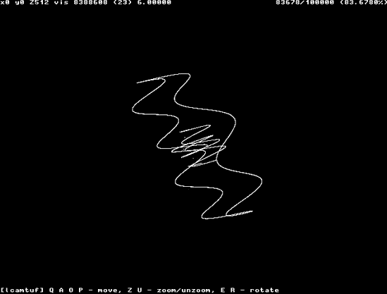

图 10-2. 文本中描述的数据集的三维表示

图 10-3 到 图 10-5 展示了其他一些常见但并不一定明显的依赖模式。

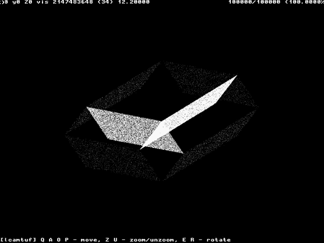

图 10-3. 从复杂但不可靠的随机数生成函数获取的数据集的三维呈现

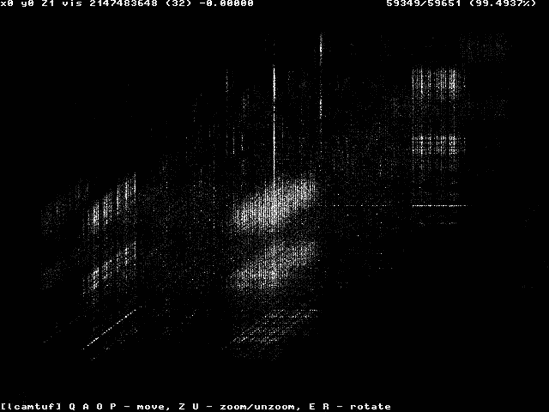

图 10-4. 没有强烈相关性但有可察觉的统计偏差的 PRNG 呈现

# 美丽的图片：TCP/IP 堆栈图库

可视化方法似乎效果神奇，为许多被认为相对安全的实现产生了独特且往往本能上令人担忧的迷人模式；许多这些图片可以在下一页上找到。但这些图片能做的不仅仅是给我们一个难以量化的参数和特性的视觉表示吗？攻击者能否以有意义的方式使用这些神秘的三维形状，或者计算机能否以某种方式检查它们，给我们一个关于什么是对的、什么是错的明确答案？一个向日葵形状的生成器是否比一个砖块形状的生成器更容易破解？ 

在回答这个问题之前，请允许我打断自己，并展示一些在撰写原始论文过程中获得的一些更有趣的结果的简要图库。这应该有助于展示一些观察到的模式的广泛多样性和美丽，遵循古老的规则，即三维图比千言万语更有价值。图 10-6 通过图 10-14 展示了几个操作系统的 PRNG 轮廓。

并非所有图表都绘制在相同的比例上；一些形状比其他形状小得多。比例和其他参数可以从每个图表的顶部行中读取，如图图 10-6 所示。


图 10-5. 在测试条件不完美的情况下观察到的常见时间依赖性模式


图 10-6. Windows 98\. 这里显示的集合直径约为 128，这表明后续的 ISN 通过一个包含大约 7 位“随机性”的数字增加。在集合内，存在一个与上一节中讨论的示例相似的强烈频率模式，可能表明所有结果中存在微小的时序依赖性。吸引子的大小令人担忧地小。


图 10-7. FreeBSD 4.2\. 一个 16 位宽的均匀立方体，可能是每一步真正随机增加的小量迹象

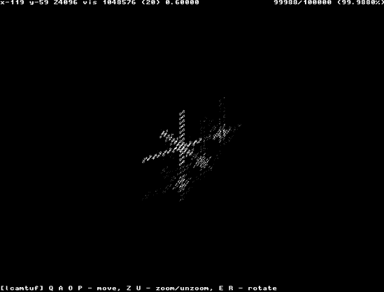

图 10-8. HP/UX 11\. 一个奇怪的 X 形结构，宽度为 18 位但显然不规则，可能是存在缺陷的伪随机数生成器高相关性水平的迹象

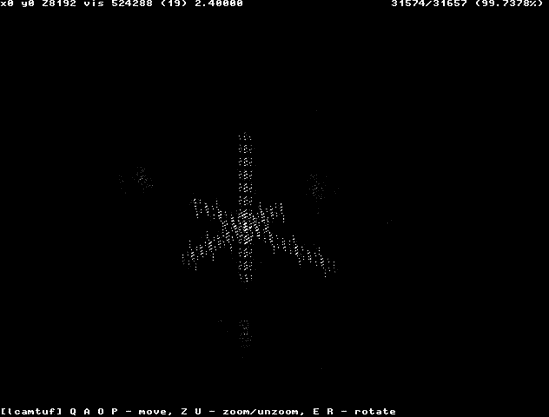

图 10-9. Mac OS 9\. 一个类似但略有不同的 17 位结构


图 10-10. Windows NT 4.0 SP3\. 再次，一个强烈的吸引模式和一个微小的 8 位宽吸引子


图 10-11. *IRIX* 6.5\. 一个 16 到 18 位宽的高度不规则随机云；可能是一个有缺陷的算法


图 10-12. NetWare 6\. 一个看似随机的系统，具有 32 位宽的吸引子云，但由大量高密度点组成，并不均匀

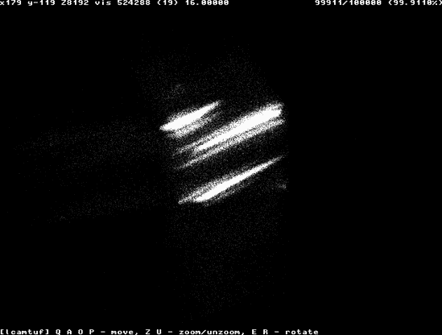

图 10-13. UNICOS 10.0.0.8\. 一个 17 位宽的奇怪云，具有不规则的较高命中概率段

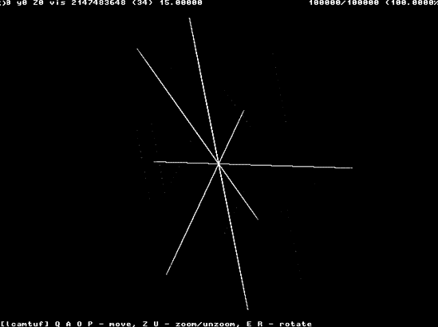

图 10-14. OpenVMS 7.2（默认 TCP/IP 堆栈）。一个 32 位宽的结构，几乎无随机性，显示出强烈的但相当不寻常的相关模式，表明 PRNG 设计有缺陷

# 利用吸引子进行攻击

现在，回到向日葵与砖块的问题。是的，这些漂亮图片的相关性不仅超越了视觉上的愉悦，对于硬核计算机爱好者来说也是如此。事实证明，为每个系统捕获的吸引子结构创建了一个可能的 ISN 行为模式矩阵，其密度对应于在一段时间内出现特定类型的时间依赖性或统计模式的概率。吸引子中的高密度区域对应于历史相关性，也更有可能在将来发生；人口较少的区域不太可能被访问。因此，一旦绘制出特定系统的近似吸引子，攻击者就可以猜测未来的结果。但是，这些形状究竟如何映射到确切的 ISN 值呢？

成功攻击的关键在于认识到吸引子中每个点的 *x* 坐标取决于 *D[t]* 的值——即时间 *t* 和 *t-1* 观察到的序列号（因为 *D[t]* = *S[t]*- *S[t-1]*）。另一方面，*y* 坐标取决于 *D[t-1]*（*t-1* 和 *t-2* 时的 ISN），而 *z* 坐标取决于 *D[t-2]*（*t-2* 和 *t-3* 时的 ISN）。

假设攻击者向一个远程系统发送了三个探测，该系统的操作系统已经绘制了吸引子结构图。这些探测对应于时间 *t−3*、*t−2* 和 *t−1*，并且——自然地——足以重建在吸引子结构上标记系统在此特定时间行为的点的 *y* 和 *z* 坐标。

攻击者可以利用这些信息，根据迄今为止观察到的吸引子结构中的不规则性，推断出比其他值更有可能发生的 *x* 对于已知的 *y* 和 *z* 的值。*y* 和 *z* 坐标对应于吸引子空间中的一条直线，垂直于 *x* 平面（如图 图 10-15 值，如下所示：

| *S[t]* = *x + S*[*t* − 1] |
| --- |

在采样了三个先前的序列号 *S[t-3]*、*S[t-2]* 和 *S[t-1]* 之后，攻击者可以确定一组可能的候选序列号 *S[t]*，这很可能会被攻击系统（攻击者没有发起，但他希望干扰的系统）选择用于下一个连接。攻击者可以通过发送带有候选序列号的 TCP/IP 数据包来执行攻击；他不需要一开始就做对，因为所有错误的猜测都将被远程实现简单地忽略。然而，一旦任何伪造的数据包的值与预期的数字在预期的窗口大小内一致，流量就会被接受，从而破坏了 TCP/IP 提供的会话完整性保护。


图 10-15. 一条“攻击线”与吸引子相交

当然，攻击也有一些注意事项：

+   他们观察到的动态可能仅限于观察条件或来源本身——尽管从这种技术针对常见实现取得的成功比率来看，这似乎不太可能。

+   如果候选集特别大——例如，对于产生没有明显不规则性的均匀吸引子云的算法——这种技术就相当不实用，因为它需要太多的尝试来做出正确的猜测。

+   由于在系统中采样 ISN 实现生成的整个值序列通常不切实际（一些系统有长周期甚至无限周期），因此无法构建完整的吸引子。为了解决这个问题，必须使用近似方法：如果在一个特定的(*y,z*)线上的一个特定点周围给定半径内存在一个点，则选择该值作为候选值，从而补偿吸引子中即使相当密集的区域也可能存在空隙的事实。

为了使结果有意义，并建立一个用于比较评估 ISN 生成器质量的方法，我决定通过有限的尝试次数来经验性地估计成功率。具体来说，我想确定在 5,000 次尝试中击中正确数字的可能性，基于假设一个使用低端到中端网络连接的攻击者可能在短时间内最多发送 5,000 个数据包.^([22])

为了测试该方法的有效性，我选择将来自远程系统的输入数据分为两部分：一部分用于构建吸引子，另一部分用于执行实际测试。测试一次读取四个连续的序列号，然后将其中三个输入到一个基于吸引子数据生成最多 5,000 个值的实现中。最后，将输出与从测试数据集中获取的第四个数字进行比较。对于每个吸引子，重复数百次测试以确定 ISN 四元组的近似成功猜测百分比，这在实践中表示攻击者使用这种方法成功的可能性。

以下是吸引子画廊中系统的部分结果：

| 操作系统 | 攻击可行性 |
| --- | --- |
| IRIX 6.5.15 | 25%（100 次尝试中的 25 次） |
| OpenVMS 7.2 | 15.00% |
| Windows NT 4.0 SP3 | 97.00% |
| Windows 98 | 100.00% |
| FreeBSD 4.2 | 1% |
| HP/UX 11 | 100.00% |
| Mac OS 9 | 89.00% |

这种方法显然相当有效^([23])，促使许多供应商重新设计他们的算法或重新审视他们对算法安全性的声明。（我一年后（2002 年）发表的后继研究回顾了这些变化中的一些，其中并非所有都令人满意。）

但真正的问题是，这与被动操作系统指纹识别有什么关系？

* * *

^([22]) 最小的 SYN 数据包有 40 字节；因此，发送 5,000 个 SYN 数据包至少需要 200 千字节的带宽。这么多数据可以在 10-20 秒内通过 V42.bis 调制解调器压缩在调制解调器线上成功发送。这个阈值的选取相当随意，但似乎合理。

^([23]) 这些结果适用于需要精确数据注入或欺骗的场景。如果所需的精度较低，或者攻击者的唯一目标是造成干扰，远程方不仅会接受具有确切序列号的包，还会接受那些在 TCP/IP 参数指定的窗口大小范围内的包（参见第九章，并想确定该网站有多少个系统。我们首先将[www.example.com](http://www.example.com)识别为系统 Y，建立几个后续连接，然后观察到的 ISN 如下：10，11，534，13，540，19。

显然，较低的数字形成了一个序列，这个序列来自处理较少流量或运行时间较短的计算机（10, 11, 13, 19），而较高的数字则对应于另一个系统。因此，两台计算机可能在同一个公共 IP 地址后“共同服务”，可能位于负载均衡器后面。此外，通过改变采样间隔，我们可以仔细检查负载均衡器的类型、其请求分配策略以及它接收到的流量。

这种方法不仅可以区分隐藏在常用地址背后的系统，还可以跟踪系统 Y 的用户，当他们从一个 IP 跳转到另一个 IP 时，只要他们不重启机器（因此重置 ISN 计数器）。对于提供比我们示例中更复杂 ISN 生成方案的系统，区分可能更困难，但只要 ISN 不是在所有 32 位上都是纯随机的，这肯定是可能的。（如果是，就会引发与碰撞相关的问题。）

这里使用的方法仅仅要求 ISN 生成算法中存在一定的可预测性。因此，TCP/IP 初始序列号分析似乎是一个有希望的替代方案或补充，可以用于传统的被动指纹识别——并且遗憾的是，也可以作为侵犯隐私和用户跟踪的有用工具。

# 防止被动分析

防御序列号预测相对简单，像 Steven M. Bellovin 的 RFC1948^([87])规范这样的良好解决方案已经存在很长时间了。然而，防止对数字进行被动分析相当困难，因为问题不仅源于算法的弱点，还源于使用的算法多样性，这导致很少有系统共享相同的 ISN 足迹。即使在实现 RFC1948 或使用其他基于密码学安全、外部熵的生成器的系统中，行为模式也可能因算法的微妙差异和实施者对足以阻止攻击的值的假设而显著不同。

通过部署一个重写所有出站数据包序列号的状态包防火墙，可以实现对一定程度的预防[24]；这使得受保护网络内的所有系统看起来大致相同。不幸的是，只有一些防火墙提供这种功能，也只有一些可以从这种功能中受益。

* * *

^([24]) Solar Designer 指出，从技术上讲，这也可以作为一个巧妙的黑客攻击在无状态防火墙中实现。防火墙可以通过 XOR 等操作将原始序列号与一个秘密密钥的安全哈希值相结合，再加上一个唯一标识连接的地址和端口号的四元组。返回的数据包可以移除哈希值（通过后续的 XOR 操作），使得数据包在交付时与内部主机的连接想法相匹配，但在防火墙外部仅以不可预测的随机 32 位形式存在。这对于除了最不稳定的（频繁重复且容易发生冲突）ISN 实现之外的所有情况都适用。

# 思考题

相空间分析方法在远超序列号生成领域的领域中很有用。其他一些参数，如伪随机选择或根据某些内部方案选择的参数——例如 IP 数据包 ID 字段、DNS 请求标识符（如图 10-16 所示 Figure 10-16)、由应用程序生成的“秘密”cookie，用于标识用户会话等——可以成功分析，无论是为了发现设计中的缺陷，还是为了识别实现并简化进一步分析或便于攻击。


图 10-16. Linux 名称解析实现的一个有趣的吸引子模式

在这个方向上的一些工作已经完成或正在进行中；在一篇与我原始研究部分相关的论文中，Joe Steward 对 DNS 系统中随着序列号预测机制的发展而出现的一些问题提供了见解^([88])。他指出，不仅基于 UDP 的 DNS 协议提供的请求验证方法不足以抵御甚至“低成本”的欺骗攻击，而且各种实现生成的唯一请求标识符的低质量进一步削弱了该方案，使其轻易地受到恶意数据注入的攻击。鉴于 DNS 是互联网的核心服务之一，以及欺骗一个知名网站的 DNS 响应以将特定网络的所有用户重定向到不同的网页并不是完全没有诱惑力，DNS 污染是我列出的互联网中被低估的威胁之一。

Dan Kaminsky 在 [`www.doxpara.com/pics/index.php?album=phentropy`](http://www.doxpara.com/pics/index.php?album=phentropy) (Figure 10-17")) 提供了一些有趣的、更高级的随机数据的可视化，绝对值得一读。


图 10-17. Dan 的 BSD 内核随机性再现（由[www.doxpara.com](http://www.doxpara.com)提供）

# 第十一章. 异常识别

*或者可以从网络流量的微妙不完美中学习到什么*

—

在前几章中，我剖析并分析了从嫌疑人通过网络传输的每条消息中附带看似无关的、“技术”参数中提取可能和很可能有价值信息的方法。正如我希望你看到的，我们可以获得大量关于发送者的数据，而这些数据发送者肯定不知道自己提供了（或者至少，不太愿意经常无法选择不提供这些数据）。通过使用一系列的包和流分析技巧，在一个完美和快乐的世界里，我们可以测量远程方的许多特征，并将他们的行为映射到特定系统的签名和网络配置。

然而，现实情况略有不同：一些观察到的参数至少在一定程度上偏离了与嫌疑人使用的特定设备或网络配置通常相关的一组预期值。尽管你可能简单地忽略这些看似无意义的偶然差异，并仍然成功地识别出原始系统或追踪其用户，但这样做并不一定明智。我们学会了不对这种看似无意义的烦恼给予关注，但世界上没有一件事情发生是没有好理由的（至少在“好”的定义相当宽松的情况下），探索这些看似随机的异常和少数模式背后的机制，而不是忽略它们，可以提供有关网络配置先前未见具体细节的有价值信息。

在本章中，我更深入地研究了可能影响系统观察特征的一些过程。我解释了这些技术导致这种行为的根本原因、目的（或缺乏目的），以及这些技术的后果。

不言而喻，这里讨论的大多数可复制的 IP 数据包修改都源自更高级的 IP 感知中间系统。因此，我将从两个长期被忽视的主题开始考虑：一般性的防火墙，特别是网络地址转换（NAT）。

防火墙旨在保持隐秘的堡垒，对其他人使用的了解越少，对他来说越好。然而，尽管有严格的防火墙策略和设置，随着这些设备复杂性的增加和它们更好地适应处理今天的网络安全挑战，它们也变得更容易使用间接或被动探测技术进行检查。

# 数据包防火墙基础

流行防火墙^([89])在本质上是一类中间路由器设备，其设计目的是违反中间路由器设备的基本设计。与真正的路由器不同，那些预期基于第三层 OSI 编码的信息做出非歧视性路由决策的系统，防火墙通常会在更高层（如 TCP 甚至 HTTP）上解释、执行或甚至修改信息。尽管防火墙技术相对较新，但它提供了一套成熟且易于理解的解决方案，可以在家庭网络和大型企业中找到。防火墙被配置为拒绝、允许或重定向针对特定服务的特定类型流量，并且（不出所料）被用来限制所有通过此类设备的流量对某些功能和资源的访问。因此，它们提供了一种强大、尽管有时被过度炒作和过度依赖的安全和网络管理解决方案。

防火墙在所有网络环境中取得成功的关键在于，它们使用单一且相对更健壮的组件来保护一系列复杂的系统，并在配置问题暴露受保护服务器上的易受攻击的服务或功能时提供一种安全措施。在极端情况下，防火墙被用来掩盖受保护系统的配置不当和维护不足，通常会导致灾难性的后果。

## 无状态过滤和分段

基本防火墙是无状态数据包过滤器。它们只是检查每个数据包的某些特征，例如传输控制协议 SYN 连接尝试的目标端口。然后，它们仅基于这些特征来决定是否允许数据包通过。无状态设计极其简单、可靠，且内存和资源效率高。例如，无状态防火墙可以通过丢弃所有非目标端口 25（SMTP）的 SYN 数据包，仅允许针对该端口的 SYN 数据包，来限制对邮件服务器的入站连接。因为没有任何连接可以在没有这个初始 SYN 数据包的情况下建立，攻击者无法以有意义的方式与其他端口上的应用程序交互。为了实现这一点，防火墙不需要像邮件服务器本身那样既快又复杂，因为它不需要记录当前建立的连接及其确切状态。

这种完全透明的保护类型的问题在于，防火墙和最终接收者可能对某些参数有不同的理解。例如，假设攻击者说服防火墙它正在连接到一个允许的端口，但构建了其流量，使得最终接收者以不同的方式读取它，并建立了与防火墙本应保护端口的连接。因此，攻击者可以访问易受攻击的服务或管理接口，我们就会陷入麻烦。

虽然造成这种误解听起来不太可能，但借助我们老朋友数据包碎片化，使用通常被称为“重叠碎片攻击”的方法（由 RFC1858 在 1995 年描述），实际上实现起来相当容易（^[90])。在这种情况下，攻击者向一个由受害者防火墙允许的端口（例如上述端口 25）发送一个初始数据包，该数据包包含传输控制协议 SYN 请求的开始部分。数据包在末尾缺少一小部分，并且在其 IP 头部中设置了“更多碎片”标志，但为什么防火墙要关心数据包末尾的数据呢？

防火墙检查数据包，由于这是一个 SYN 数据包，因此它的目标端口也被检查，并发现是可接受的。数据包被通过，但接收者不会立即解释它（还记得在第九章中讨论的重组过程吗？第九章？）。相反，数据包被保留，等待碎片重组成功完成，而这不会发生在最后一个尾部数据块到达之前。

接下来，攻击者发送第二个数据包碎片。这个第二个数据包被创建出来，足以与原始数据包重叠，从而在重组缓冲区中的位置覆盖目标端口（TCP 头部的一个字段）。这个碎片被精心制作，以从非零偏移量开始，并且缺少大部分 TCP 头部，除了被覆盖的位。

由于这个原因（以及因为它缺少检查 TCP 数据包标志或其他防火墙可能用来确定是否允许或阻止此流量的关键参数所需的信息），第二个碎片通常会被无状态防火墙原样转发。当接收者将其与第一个数据包结合时，这个第二个数据包会覆盖原始目标端口，改为攻击者选择的更恶意的值，实际上打开了一个应该由防火墙保护的端口。

哎呀。

### 注意

为了防止这种攻击，一个设计良好的无状态防火墙在分析数据包之前先进行初始的碎片重组。然而，这使其在一定程度上失去了“无状态”的特性，并且变得不那么透明。

## 无状态过滤和不同步流量

无状态包过滤器的另一个问题是，它们并不像我们希望的那样严格。过滤只能在单个数据包包含所有必要信息，以便过滤器能够做出明智的决定来处理该数据包时进行。因为，在初始握手之后，TCP 连接在很大程度上是对称的，双方拥有平等的权利，并使用相同类型的流量（ACK 数据包）来交换数据，因此很难对连接的初始阶段以外的任何内容应用有意义的过滤器。没有方法可以确定（如果有的话）谁通过交换 ACK 数据包发起了连接，而不需要实际跟踪和记录连接。因此，很难以有意义的方式定义防火墙应尝试应用于 ACK 和其他中途数据包（如 FIN 或 RST）的过滤策略。

无法过滤 SYN 通常不是问题。毕竟，如果攻击者无法发送初始 SYN 数据包，他们就无法建立连接。但是有一个问题：系统如何处理特定端口上的非 SYN 流量取决于端口是否关闭或系统是否在该端口上监听。例如，一些操作系统会对漂流的 FIN 数据包回复 RST，而在开启（监听）状态的端口上不产生任何回复.^([25])

技术如 FIN 扫描或 ACK 扫描（后者最初由 Uriel Maimon^([91])在*Phrack 杂志*中描述），以及 NUL 扫描和 Xmas 扫描（分别使用没有设置标志的非法数据包和所有标志都设置的数据包进行扫描）可以用来对抗无状态包过滤器，以收集关于远程系统上哪些端口是开启的攻击前证据，或者绘制防火墙丢弃的流量图。在没有能力建立到特定端口的正确连接的情况下，了解特定端口是开启的本身并不是一个直接的威胁。然而，这种类型的扫描通常会泄露关于网络内部（如正在运行的操作系统和服务）的极其有价值的信息，这些信息可以在第一道防线被攻破或绕过后，帮助实施更好、更高效且更难检测的攻击。因此，这被视为无状态防火墙的潜在弱点。

可能与 SYN cookies 的机制结合使用时，更严重的安全威胁相关。SYN cookies 用于保护操作系统免受资源耗尽攻击，在这种攻击中，攻击者向主机发送大量伪造的连接请求（这本身并不是一个难以执行的操作）。这迫使接收方发送虚假的 SYN+ACK 响应，并在将即将建立的连接添加到其 TCP 状态表时分配内存和消耗其他资源。在这种攻击下，大多数系统最终会消耗过多的资源而变得缓慢，或者在某些时候拒绝为所有客户端提供服务，直到那些虚假的连接超时。

为了处理这个潜在的问题，SYN cookies 在 ISN 字段内的所有 SYN+ACK 响应中使用一个加密签名（实际上是一个快捷方式，用于唯一标识连接），然后完全忘记这个连接。只有当来自主机的 ACK 响应到达，并且只有当确认号通过加密过程验证后，连接才会被添加到状态表。

然而，SYN cookies 的问题在于，在这种设计中，存在一种可能性，即 SYN（以及 SYN+ACK 响应）从未被发送过。如果攻击者可以创建一个能够验证主机 SYN cookie 算法的 ISN cookie（可能是因为攻击者有足够的带宽，或者因为算法较弱），他可以发送一个 ACK 数据包，这将触发远程主机向其状态表添加一个新的连接，尽管如前所述，从未发送过 SYN 和接收过 SYN+ACK。无状态防火墙将无法知道连接刚刚建立，因为它从未收到过打开请求！因为没有初始的 SYN 数据包，目标 IP 和端口无法被防火墙检查并批准或拒绝，然而，连接突然就建立了。

这真的很糟糕。

## 状态包过滤器

为了解决无状态过滤器的这些问题，我们需要在防火墙上存储一些关于先前流量和已建立流的状态信息。这是唯一一种可以透明地预测解碎片化结果或获取中间连接数据包的上下文，并决定它们是否是不合法的应该被丢弃，还是预期的应该被传递的方法。

随着可负担的高性能计算的增加，设计出比我们想象的更复杂和先进的防火墙系统成为可能。因此，我们已经发展到状态连接跟踪，在这种情况下，防火墙不仅检查单个数据包，还记住连接的上下文，并验证每个数据包是否与这些数据匹配。这使得防火墙能够紧密地封闭网络，并在不依赖接收方始终能够区分好流量和坏流量的能力的情况下，忽略不希望或意外的流量。状态数据包过滤器试图跟踪连接，并只允许属于活动会话之一的流量；因此，它们提供了更好的保护和日志记录功能。

状态过滤的任务当然比无状态过滤更具挑战性，并且消耗的资源要多得多，尤其是在一个大型网络被此类设备保护时。当保护一个大型网络时，防火墙突然需要大量的内存和快速的处理器来存储和查找有关线路上发生的事情的信息。

状态分析也更容易引起问题或混淆。一旦防火墙和端点对给定 TCP/IP 会话当前状态的理解不同，就会产生问题；鉴于规范的不确定性和使用的堆栈的多样性，这种情况并不罕见。例如，当接收到一个不在接收方接受的序列号限制范围内的 RST 数据包时，一个比最终接收方更宽松地应用序列号检查的防火墙可能会得出连接已关闭的结论，而接收方可能会得出会话仍然开放的结论，并愿意接受与此连接相关的进一步通信，反之亦然。最终，状态检查是有代价的。

## 数据包重写和 NAT

提高数据包解释能力，以及提供更好的保护以抵御如使用数据包分片绕过防火墙规则之类的攻击的解决方案，是赋予防火墙不仅能够转发，还能重写传输流量部分的能力。例如，一种方法试图通过在将数据包与网络管理员配置的任何访问规则进行比较之前执行强制数据包分片（重组）来消除歧义。

随着更复杂解决方案的发展，很明显，数据包重写不仅会惠及网络，而且通过部署诸如 NAT（网络地址转换）等极其有用的技术，还能为网络安全和功能带来质的飞跃。NAT 是在转发之前将某些 IP 地址映射到另一组 IP 地址，并对受保护系统发送回来的响应进行解包的实践。状态 NAT 机制可以用于多种应用，例如实现容错设置，其中单个公开可访问的 IP 地址由多个内部服务器提供服务。或者为了节省地址空间并提高安全性，可以实现 NAT，允许内部网络使用一组私有、非公开可访问的地址，同时使网络上的主机能够通过“伪装”为单个公共 IP 机器来与互联网通信。

在第一种情况下，NAT 将传入数据包的目标地址重写到防火墙后面的多个私有系统中。这提供了一种容错负载均衡设置，其中对热门网站（例如[`www.microsoft.com`](http://www.microsoft.com)，或许）或其他关键服务的后续请求可以在一系列系统中分配，如果任何一个系统失败，其他系统可以接管。这项任务有时是通过专用设备（不出所料地被称为*负载均衡器*）完成的，但通常也由启用 NAT 的防火墙支持。

后一种情况，通常被称为*伪装*，依赖于重写传出数据包的源地址，这样多个私有、受保护的系统（可能使用的是从互联网路由到该网络的私有地址，例如 10.0.0.0）可以通过防火墙拦截和重写它们的传出连接来连接到外部世界。这些系统隐藏在防火墙后面，它们的行为在外部 NAT 保护网络的外部接收者看来似乎是从防火墙发起的。连接被映射到特定的公共 IP 地址和特定的端口，然后流量被推出去。所有从目标返回到该 IP 和端口的流量都会被重写，指向发起连接的私有系统，并转发到内部网络。这使得整个不打算向互联网提供任何服务的私有工作站网络不会直接从外部世界访问，从而大大提高了网络的安全性，隐藏了其部分结构，并保留了本应购买以容纳每个系统的昂贵公共 IP 地址空间。使用这个系统，即使只有一个公共 IP 路由到他们，一个实体也可以构建一个由数百或数千台计算机组成的网络，并为它们提供互联网接入。

## 翻译中的迷失

再次强调，地址转换比听起来更复杂：一些高级协议并不像仅仅是连接到远程系统并发送一系列命令那样直接。例如，古老但广受欢迎的文件传输协议（FTP）在其最基本和最广泛支持的模式中，依赖于从服务器到客户端建立返回（反向方向）连接，用于传输请求的数据；客户端发起的初始连接仅用于发出命令。许多其他协议——最值得注意的是一些聊天协议、对等协作或数据共享工具、媒体广播服务等等——也使用奇怪或非传统的设计，需要反向连接和端口跳跃或允许特定的无会话流量（如用户数据报协议[UDP]数据包）返回工作站。

为了应对这些挑战，任何不旨在使这些协议失效的伪装实现都必须配备一系列协议助手。这些协议检查连接内交换的应用数据，有时甚至重写其中一些数据，并在防火墙中打开临时孔洞以允许返回连接。

正如 Mikael Olsson 多年前在 FTP 助手中发现的问题一样，这是另一个问题，后来由本书作者等人对其他协议助手进行了研究。问题是，这些助手根据工作站通过特定协议发送到远程系统的信息决定在防火墙中打开孔洞。它们假设由系统产生的流量是在用户的代表和用户的知情下传输的。不用说，一些程序，如网络浏览器，可能会被欺骗发送某些类型的网络流量，包括看起来像程序不原生支持的协议的流量，甚至可以通过构建特定的恶意内容并将其发送到应用程序来强制其自动这样做。这种欺骗流量可能会欺骗助手程序在防火墙中打孔。

这种攻击的一个经典例子是滥用通用网络浏览器：通过在非标准 HTTP 端口（然而，对于 FTP 流量来说却相当标准）上添加对攻击者系统上某个网页或网页元素的引用，客户端可以被强制连接到这个资源并尝试发出 HTTP 请求。因为建立的连接端口通常用于 FTP，防火墙的 FTP 助手开始监听对话，希望在必要时提供帮助。

以下示例 URL 会导致 HTTP 客户端连接到 FTP 端口并发出看似 FTP `PORT`命令，这将由防火墙助手捕获：

```
HTTP://SERVER:21/FOO<RETURN>PORT MY_IP,122,105<RETURN>
```

客户端发出的请求对另一端的合法 FTP 服务来说将毫无意义，而该服务的响应对发起此请求的 Web 客户端来说也是无法理解的——但这不是重点。重要的是，攻击者可以控制请求的一部分——客户端将从服务器请求的文件名。这个由恶意者选择的虚构文件名可以包含恶意者希望包含的任何数据。通过使文件名包含通常与 FTP 请求相关联的子串，攻击者可以欺骗一个正在监听此连接以特定文本命令（`PORT`）的 FTP 协议助手，使其相信用户正在尝试下载特定文件。因此，远程服务器暂时被允许连接到受害者（在这里，到一个听起来很调皮的端口 31337——122*256+105=31337）。因此，我们让攻击者进入，而受害者却不知道。哎呀——又超过了我们的预期。

***

^([25]) 此行为的一些方面（对关闭端口上的意外和未预期的数据包回复 RST，以及对监听连接端口的相同流量简单忽略）是由 RFC793 规定的，而另一些则是特定实施者群体选择的做法。

# 伪装的后果

所述的所有场景都与伪装滥用有关，但伪装本身的存在可以为我们提供有关另一方的有趣信息。

如前所述，伪装不是非侵入性的。其基本操作原理是通过重写部分流量来改变出站流量。在这个过程中，它不仅超越了仅仅调整地址，而且不仅使得可以得出伪装正在进行的结论，而且还使仔细的观察者能够识别正在使用的特定防火墙系统。具体来说，当使用伪装时，我们可能会遇到以下一些变化：

+   到达数据包的 TTL（时间到寿命）与预期或测量的目标网络距离之间将存在观察到的差异。在伪装背后发起的流量至少比直接从受保护网络获取 IP 地址用于出站连接的系统发起的包“老”一个跳数。

+   在大多数情况下，原始网络中可以找到各种操作系统或略有不同的系统配置（或运行时间）。这些系统具有略微不同的 TCP/IP 特性，如第九章“外国口音”和第十章“高级羊计数策略”中所述。如果我们观察到从同一 IP 地址看似发起的连接中存在各种 TCP/IP 指纹，我们可以得到一个强有力的提示，即在其内部网络背后的特定机器上是否存在 NAT。

+   最后，远程观察者可能会注意到*源端口偏移*。这是一种不寻常的异常情况，因为它是由来自网络的连接使用临时源端口引起的，而这些端口不在特定操作系统的正常范围内。

每个操作系统都为所有出站连接保留了一组特定的源端口，以建立本地端点标识符。然而，防火墙通常使用不同的端口范围来映射伪装连接，这取决于 NAT 设备的操作系统。在这种情况下，如果观察到的范围与检测到的操作系统预期的范围不符（例如，如果 Linux 通常在 1024 到 4999 的范围内运行，但看起来正在使用非常高的端口号），则可以推断出存在地址转换，有时甚至可以确定正在使用的防火墙类型。

这些技术通常被使用，并构成了伪装检测和伪装网络侦察的基础。但还有其他几种检测数据包重写的方法。

# 分段大小轮盘赌

检测数据包重写设备和了解更多关于网络配置的较不明显且因此不太受欢迎的方法之一是分析传入流量中的最大分段大小字段。

由于 IP 数据包分片会给分片流量增加明显的开销，因此它通常被视为性能噩梦，许多实施者试图防止它。另一方面，如前所述，由于似乎几乎不可能在通信之前准确、快速、可靠地确定路径上的最大传输单元（MTU），因此分片难以消除。即使是最好的方法，路径 MTU 发现，也远非完美，并且在触发时仍然会影响性能。为了通过试错来检测正确的 MTU 设置，可能需要丢弃一些不合适的包并重新发送。

为了防止路径 MTU 发现对性能和可靠性的影响，并减少分片的开销，许多重写出站流量某些参数的 NAT 防火墙也会更改从私有网络发起的连接上的 TCP 头部中的声明的最大分段大小（MSS）参数，使其更适合网络的对外链路。这个新设置可能比局域网的设置略窄（MTU 更低）。这种修改确保接收方不会尝试发送无法通过该链路传输的数据，如果该链路跨越具有最低 MTU 的特定基础设施部分，从而降低分片发生的可能性。（这假设任何 MTU 不兼容性最有可能发生在所谓的最后一英里处的发送方或接收方系统上，在那里经常可以发现各种类型的低 MTU 链路，如 DSL 连接或无线线路，数据包可能需要“缩小”以通过这些管道。）

仅 MSS 的这种减少并不容易检测。事实上，无法确定 MSS 是否被发送方设置为特定值，或者在某些地方被修改。也就是说，除了一个微小的细节。回想一下第九章中提到的，许多今天系统的窗口大小选择算法有一些特殊之处：

> 窗口大小设置决定了可以发送而不需要确认的数据量。具体的设置通常根据开发者的个人神秘规则和其他宗教信仰来选择。两种最流行的方法认为该值应该是 MTU 减去协议头部的倍数（称为最大分段大小，或 MSS）或者简单地足够高且“圆整”。Linux 的旧版本（2.0）使用的是 2 的幂次方（例如，16384）。Linux 2.2 版本改为 MSS 的倍数（11 或 22 倍 MSS，原因不明），而 Linux 的新版本通常使用 2 到 4 倍的 MSS。网络功能齐全的 Sega Dreamcast 使用 4,096 的值，而 Windows 通常使用 6,4512。

今天越来越多的系统（包括 Linux 和 Solaris 的新版本，某些版本的 Windows 和 SCO UnixWare）使用的是 MSS 的倍数作为窗口大小设置。因此，当数据包中的 MSS 设置被篡改时，很容易就能发现，因为结果数据包的窗口大小将不再是 MSS 的特定倍数。实际上，它可能根本不再能被 MSS 整除。

通过比较 MSS 和窗口大小，你可以可靠地检测到支持 MSS *clamp*（调整以匹配链路）的一组防火墙存在于各种系统中。尽管在 Linux 和 FreeBSD 上 clamp 是可选的，但家庭防火墙、智能 DSL 路由器或其他家庭网络通常会自动执行。因此，异常的 MSS 设置不仅表明存在一个包重写设备，而且还与 NAT 功能相关联，这可以被视为发送者网络连接的指标。

# 状态跟踪和意外响应

状态连接跟踪和包重写的一个重要后果是，一些由 RFC 规定的响应是由防火墙而不是发送者生成的。这使得攻击者能够相当高效地发现和探测这样的设备。当一个连接从 NAT 状态表中删除（无论是由于超时还是由于一个端点发送了 RST 包，而这个 RST 包没有到达另一端）时，本会话中的进一步流量将不会转发给接收者，就像无状态包过滤器那样。相反，它将由防火墙直接处理。

TCP/IP 规范要求接收者对所有意外的 ACK 包回复 RST，以告知发送者，他们试图继续的会话不再被接收者尊重或从未被尊重。一些防火墙可能会违反 RFC，拒绝回复此类流量，简单地丢弃看起来不属于现有会话的包。（这并不总是明智的，因为它可以在合法连接由于间歇性网络问题而断开时造成不必要的延迟。）

然而，许多设备会回复一个合法且预期的 RST 包。这为检测和仔细指纹识别防火墙设备开辟了另一条途径。因为数据包是由防火墙从头创建的，所以其参数与防火墙相关，而不是与防火墙所保护的内容相关。这使得可以在第九章中讨论的传统指纹识别技术（例如检查 DF 标志、TTL、窗口大小、选项类型、值和顺序等）被用来识别防火墙。

根据 RFC1122，还存在另一种可能性：^([95])

> 4.2.2.12 RST 段：RFC-793 第 3.4 节
> 
> TCP 应该允许接收到的 RST 段包含数据。
> 
> 讨论内容：有人建议 RST 段可以包含 ASCII 文本，该文本编码并解释了 RST 的原因。但目前还没有为这类数据建立标准。

事实上，尽管没有建立标准，一些系统在遇到意外的 ACK 时选择以冗长的（尽管通常是晦涩的）RST 消息回复，希望对方能够从知道出了什么问题中得到安慰。这些回复通常包括内部关键字，或者看起来像是某种奇怪的极客幽默尝试，可能是特定于操作系统的，例如`no tcp, reset`；`tcp_close, during connect`（Mac OS）；`tcp_fin_wait_2_timeout; No TCP`（HP/UX）；`new data when detached; tcp_lift_anchor, can't wait`（SunOS）。

每当我们看到在网络问题或意外发送到主机的流量中响应的这种冗长的 RST 数据包，并且我们知道它起源于的远程系统不使用这种冗长的消息时，我们就会得到一个提示。我们可以推断出在我们和接收者之间有一个设备，很可能是一个有状态防火墙，我们可以通过将响应与已知消息进行匹配来识别其操作系统，这些消息是由常见的和不太常见的操作系统产生的。

这两种指纹技术被证明在短期网络问题期间可以观察到网络流量时，在检测状态包过滤器的存在方面极为有效。这些技术还可以通过向目标发送意外的 ACK 数据包来用于主动指纹，而不针对防火墙设备本身，以区分无状态和有状态过滤器。根据目标对数据包的响应，攻击者可以制定最佳方法来接近防火墙（或以其他方式使用获得的知识）。

# 可靠性或性能：DF 位的争议

路径 MTU 发现（PMTUD）是一个与第九章中描述的 IP 分片避免方案密切相关的指纹场所第九章。

Linux 内核的最近版本（2.2、2.4、2.6）和 Windows（2000 和 XP）默认实现并启用 PMTUD。因此，除非更改此设置，否则从它们起源的所有流量都将设置不进行分片（DF）位。再次强调，路径发现算法在罕见但并非完全未听闻的情况中往往会引起问题。

## 路径 MTU 发现失败场景

PMTUD（路径最大传输单元发现）的问题在于，它依赖于数据包发送者接收 ICMP 错误消息“*需要分片但设置了 DF 位*”的能力，并确定连接的最佳设置。触发该消息的数据包在到达目的地之前被丢弃，并需要重新调整大小后再次发送。

如果发送者没有收到这条消息，他们就会对自己的数据包没有通过保持无知。这最多会导致延迟，在最坏的情况下会导致连接无限期地锁定，因为重传也不太可能通过一个最大允许数据包大小小于发送者试图推送的数据包大小的链路。

当数据包对于链路来说太大时生成的 ICMP 消息并不保证能到达发送者。在某些网络中，由于一个旨在提高安全性的不切实际的尝试，所有 ICMP 消息都被简单地丢弃。最后，即使设备发送了这样的消息，它也可能无法送达。

为什么会丢弃 ICMP 消息呢？因为历史上，许多此类消息都已知会导致安全问题：某些过大的或分片后的 ICMP 数据包在许多系统中损坏了内核内存（也称为“死亡之 ping”）。发送到广播地址的 ICMP 消息也被用于触发名为“Smurf”的攻击中对伪造源地址的响应风暴，以及执行 DoS 攻击。此外，配置不当的系统通常将特定类型的 ICMP 广播，即路由器通告消息^([26])解释为修改其网络设置的命令。由于它们会接受这些消息，无论这些消息是否可信，这又开辟了另一个有趣的攻击途径。因此，ICMP 被许多人所恐惧并被阻止。

### 注意

在一些简单的安全指南中，经常会建议拒绝所有 ICMP 流量，并且一些系统管理员会遵循这一建议。我甚至在一个著名审计员的职业渗透测试建议中看到过这一点，遗憾的是，我无法在此透露他的名字。

另一个问题可能会使 PMTUD 变得不可靠，那就是一些接收到的错误消息来自使用私有地址空间的设备。有时，为了保留有限的公共 IP 地址空间（这通常很昂贵），连接远程网络的路由器和防火墙的电缆接口是从为私有、本地使用保留的地址池中选择，而不是从实际上从外部世界路由到特定网络的地址中选择。

不幸的是，使用私有地址空间可能会破坏 PMTUD。为什么？因为如果来自外部世界的数据包太大，无法由接收方的防火墙转发到目的地，防火墙会发送一个带有防火墙自身源地址的 ICMP 错误消息，该地址属于私有地址池。原始数据包发送方的防火墙随后可以拒绝这样的响应数据包，因为它看起来来自外部世界，但带有来自私有地址池的 IP 地址（可能甚至来自与发送方私有 LAN 相同的池）。防火墙拒绝这种流量，因为它通常是一个试图冒充受信任内部主机的欺骗尝试的迹象。然而，在这种情况下，这个决定破坏了一个相对较新的 PMTU 发现机制，并使原始发送者无法意识到他们的数据包没有通过。

更糟糕的是，即使所有条件都恰到好处，并且数据包到达了目的地，许多现代设备也会限制 ICMP 响应速率，并在特定时间段内不会发送超过一定数量的消息。这也被实施作为一种安全措施。由于 ICMP 消息最初是为了信息目的而设计的，并且在 PMTUD 算法引入之前并不对通信至关重要，因此速率限制似乎是一种合理的防御某些类型的 DoS 或带宽饥饿攻击的方法。

## 与 PMTUD 的斗争及其后果

鉴于上述情况，有些人认为 PMTUD 是一个相当糟糕的设计。它带来了一点点性能提升，但代价是偶尔出现但持续且通常难以诊断的问题，这些问题可能会阻止用户访问特定的服务器或导致他们的连接意外中断。尽管已经设计了多种“黑洞检测”算法来检测应该禁用 PMTUD 的主机或网络（并且这些算法的效果各不相同），但这并没有完全解决问题，并且可能会引入额外的延迟——通常在不太希望的时候。

为了解决这些问题并避免投诉，一些商业防火墙供应商配置他们的解决方案执行一个肮脏的伎俩：他们在所有出站流量上清除 DF 标志。这是一个微妙且通常受到赞赏的修改，但也是一个很好的方法来识别存在数据包过滤和重写设备。如果在某个地址或某个网络观察到启用了 PMTUD 系统的特征，但预期的入站数据包缺少 DF 标志，那么细心的观察者可以推断出防火墙的存在和类型，从而获得另一小块数据，而无需与受害者有任何交互。

***

^([26]) 路由器广告的目的是允许网络主机自动配置，而无需手动输入任何设置。路由器定期或根据请求广播一条消息，内容是：“我在这里。使用我。”默认情况下，一些系统在几乎没有犹豫的情况下接受未经请求的广告——这是一个糟糕的想法。

# 思考材料

这就结束了关于如何通过使防火墙更好、更强大以防止渗透和直接侦察，同时也使它们更容易通过间接评估来检查的简短故事。但请允许我简要地偏离一下。

可能最奇特且有趣的发现之一是我 1999 年左右在某个地方遇到的。尽管这与防火墙的设计没有直接关系，但它仍然为对被动指纹识别临时系统问题感兴趣的人提供了有趣的思考材料。

我曾短暂地与 Jacek P. Szymanski 共事，后来我有幸与他讨论了一些不寻常和可疑的网络流量模式^([27])，他注意到端口 21536（以及在一定程度上，如端口 18477 或 19535）接收到的严重损坏的 TCP/IP 数据包突然增加。这些损坏的数据包总是来自端口 18245、21331 或 17736，并且来自由波兰国家电信运营商 Telekomunikacja Polska 运营的大量拨号地址空间中的系统。

一旦捕获了几次这些数据包，流量就变得严重且奇怪地扭曲。数据包到达时 IP 头部完好（协议类型设置为 TCP），但紧接着就是 TCP 有效载荷——TCP 头部消失了。观察到的端口组合是由将有效载荷的前四个字节解释为一对数字（如果那里有 TCP 头部，则对应源端口和目的端口组合）得出的。这对 18245 和 21536 仅是文本字符串“GET ”的表示——这四个字符是大多数通过网络传输的 HTTP 请求的开头。同样，18477 和 21331 代表 SSH-，这是每个 Secure Shell 会话的开头短语。而 19535 和 17736 代表 EHLO，这是一个打开所有 ESMTP（扩展 SMTP）会话的命令。

然而，这种类型的流量突然出现的原因仍然是个谜。同样，为什么它只来自这个特定的网络？而且，如果某些网络设备确实产生了这种类型的包损坏，为什么这种类型的包损坏不会导致用户连接问题或其他不便？

答案很快就来了。结果证明，所有观察到的流量都来自 Nortel CVX 设备，这是一种调制解调器接入系统，该电信运营商已经开始使用。问题仅在负载过重时偶尔发生。因此，只有一小部分不完整的数据包被发送，而且只有这么少的数据包到达了接收者（令他们非常惊讶）。最可能的原因是不正确的队列锁定或缓冲区管理，只有在大量会话几乎同时处理时才能注意到这个问题。在这种情况下，某些数据包似乎发送得太早，还在“建设中”，或者被实现方式扭曲了。

该公司在波兰部署后不久就修复了他们的 TCP/IP 实现，从此之后一切顺利。但正如你可以想象的那样，他们并不是第一个也不是最后一个在传输的数据包中无意中留下系统独特印记的公司。

这个故事的意义在于，忽视我们通常忽略的东西再次显得过于天真。在当今的联网世界中，细微的暗示、不寻常或出乎意料且未解释的观察结果极其宝贵。它们很容易找到，但很难分析。

也许值得思考并进一步探索的领域是各种用来阻止系统指纹识别的方法。各种防火墙供应商都试图通过调整各种 TCP/IP 参数（如互联网协议 ID、TCP 序列号等）来整合抗指纹识别措施，以改变一些数据包的特征。不用说，这种解决方案实际上帮助了攻击者，并产生了与预期完全相反的结果：除非所有易受指纹识别的特征都改变并统一（包括序列号、重传时间、时间戳值等），否则不仅可能检测到底层操作系统，还可以检测到用于保护网络的防火墙。

C’est la vie.

* * *

^([27]) 在某个时候，这种合作导致了一个松散的波兰研究小组的创建，该小组在 1999 年和 2000 年期间通过网络关联、跟踪和试图解释许多奇怪的意外流量模式。

# 第十二章。堆栈数据泄露

*又一个关于如何找到我们根本不想发送出去的东西的短篇故事*

—

有时候，找到关于你的网络同胞和他们所在之处的微妙但引人入胜且有用的提示，只需要一点运气。至少，这对我来说是如此，我在 2003 年发现了一个相当有趣且极其难以捉摸的信息披露向量，那是在几周令人沮丧的搜索之后。

# 克里斯蒂安的服务器

首先。几年前，我请求我的一个朋友，克里斯蒂安，让我在他的机器上使用一些磁盘空间，这样我就可以在一个可靠且快速的系统上托管我的几个项目。他同意了，不久之后，我开始逐渐将我的大部分程序和论文转移到它们的新家。在我转移的项目中，有一个是我被动操作系统指纹识别工具 p0f 的新版本（你可能还记得第九章中的“Chapter 9. 外国口音”）。这个不起眼的小工具实现了一些有趣的被动分析技术，但要真正强大，它需要附带一个强大且最新的操作系统签名数据库。手动维护它很困难，我很快就没有了可以指纹识别并添加到其中的神秘系统。

幸运的是，虽然收集用于主动指纹识别软件的签名通常需要与目标进行令人反感的交互（引起争议、拉扯网络链路，有时还会导致特别糟糕实现的 TCP/IP 堆栈崩溃），而被动指纹识别则无需此类行动，并且可以在连接到 Kristjan 系统以获取我页面的所有系统上轻松执行。为了鼓励提交，我设置了一个子页面，任何用户都可以立即看到他们的指纹，并纠正系统报告的方式或添加新的签名。这个页面证明是收集签名和改进软件的绝佳方式，但这并不是故事的结局。

在一个奇怪的事件转折中，Kristjan 决定在他的系统上托管一个不同的、盈利性的网站，以便他的系统能够支付自己的账单。正如你可能想象的那样，该网站根本不是致力于网络安全、园艺或其他高尚事业。相反，它关注我们生活中一些不那么显赫，但可能更具吸引力的方面：性、裸露和与之相关的一切。我欣喜若狂，就像任何自重的极客一样，不是因为他所提供的内容，而是因为数百万个连接签名在几小时内开始涌入，由我正在开发的软件进行分析。阿门！

# 惊人的发现

宁可安全也不后悔：在设计 p0f 的新代码时，我决定实施一系列健全性检查，以检测传入流量中甚至最奇特、最不可能或闻所未闻的模式，涵盖所有可能的非法或无意义的 TCP/IP 设置组合。尽管常识建议我永远不应该遇到参数以奇特方式损坏的包（至少在与流行且因此经过良好测试的系统通信时不会），但实施此功能似乎并无害处。此外，如果一个系统确实被发现正在发送表现出特定类型异常的包，检测它的能力将提供一种很好的方法来区分这个特定的操作系统和外观相似但不存在这种缺陷的实现。

在这个神圣的签名风暴的欢乐月份里，我看到了最奇怪的事情。我最终设法解释了一些这些事情，并为 p0f 记录下来，而有些则仍然是个谜。我之前实施的多数异常检查都准确无误，我立即找到了确实共享更多不寻常 TCP/IP 实现怪癖的系统。但有一件事特别令人不安，难以置信，所以我决定更加关注它。

两个测试——一个是在 TCP/IP 头部 ACK 标志未设置时检查 ACK 值（实际上是一个徒劳的行为），另一个是在 URG 标志未设置时检查 URG 值——一开始似乎相对没有意义，从未产生有趣的结果，直到我注意到一些非常不寻常的事情。我发现一些连接到 Kristjan 服务器的 Windows 2000 和 XP 系统，有时在既未设置 ACK 标志也未设置 URG 标志的数据包中，URG 或 ACK 值不为零（最值得注意的是，SYN 数据包用于打开新的连接）。

当未设置相应的标志时设置 URG 或 ACK 值并不严格是一个问题。根据 RFC793，在这种情况下，这些值将完全失去意义；例如：

> 紧急指针：16 位
> 
> 此字段表示当前紧急指针的值，作为从该段序列号的正偏移量。紧急指针指向紧急数据后的八位序列号。此字段仅在设置了 URG 控制位的段中解释。

RFC793 以一种非常特殊的方式告诉我们，这种异常不太可能导致任何网络问题，因此它可能永远没有被注意到。但我就注意到了，因为它有点奇怪。

我最初认为某个特定的网络设备是问题的原因，就像在第十一章中描述的大多数问题一样，但事实并非如此。这些击中来自单个系统，而不是整个网络，并且它们不是持续的；它们只是在几个数据包（值保持不变或随机变化）中显示，然后消失，在随后的连接中再也没有出现。此外，这个问题似乎仅限于 Windows；在表现出这种问题的系统组中，根本没有任何少数操作系统。

我发现自己花了一周又一周的时间试图追踪这个问题。作为我的搜索的一部分，我在更受控的环境中部署了一些其他安装；令我惊讶的是，即使在本地网络中，即使在最新的系统中，这个问题也出现了，尽管只是短暂的时间。用户无法回忆起当这种类型的流量从他们的系统中发生时，他们做了任何不寻常的事情，我也无法追踪到任何特定的通信或一系列动作来触发它；似乎没有模式。

令人困惑。

# 揭示：现象重现

我几乎要放弃了。我将我的观察结果发布到几个公共邮件列表（最著名的是由 Security Focus 主办的流行漏洞讨论列表 VULN-DEV），寻求其他研究人员进一步分析和反馈，但并未得到任何结果。然后，仅凭运气，我在处理一个完全不同的问题时，捕捉到我的一个测试站正在生成这种确切的行为模式。我恰好有一个嗅探器在后台运行（我们难道不是都有吗）。

很快，我就有了诊断结果：当工作站在进行后台文件传输或其他网络密集型操作时尝试建立连接时，问题发生了。在几乎所有的操作系统中，要发送到线上的数据包首先在系统主内存中构建，使用的是*静态缓冲区*（内存中用于此目的的固定位置）或*动态缓冲区*（根据需要分配，可能之前用于其他目的的内存）。在这个特定场景中，当两个连接几乎同时发生时，用于在发送到网卡之前构建出站数据包的缓冲区似乎在使用前没有正确初始化；也就是说，它没有被清除任何剩余内容，因为缓冲区最后用于了不同的目的。实现代码假设缓冲区的内容都是零，并且不费心去接触那些它不需要初始化到特定值的（正如在相应的标志未设置时 ACK 和 URG 值的情况一样）。结果，一些剩余内容被发送到线上。

自然地，所有其他 IP 和 TCP 字段都已被正确初始化，正如它们应该的那样；只有 URG 和 ACK 被省略了，因为在这个特定上下文中它们没有相关性。但这个遗漏意味着一小部分属于不同连接（或计算机操作的另一个方面）的数据被发送给了另一方。这个问题仅在多个会话期间（在网页浏览、后台下载和类似场景中很常见）表现出来，而在系统空闲时则不会。

在这种情况下披露的信息的相关性有两方面：

+   这可以被视为一个传统的信息披露场景。尽管在每包没有正确初始化 URG 和 ACK 值的包中披露的信息量可能相当小，并且不一定具有意义（除非缓冲区一开始就包含了一些有趣的内容），但在某些情况下可能是有价值的，尤其是在一个可以包含敏感信息，甚至可以触发漏洞的外部实体同时进行的会话中。

+   这个漏洞可以被认为是一个方便的指纹识别指标，它揭示了关于操作系统及其状态的额外信息——一种简单的方法来区分大量使用网络的系统和空闲系统。

就这样。尽管这个发现的重大意义可能容易被高估，但我决定将其包含在这里，以体现其娱乐价值，并说明即使不询问，从远程方获取复杂数据是多么容易。

# 思考的食物

很容易将责任归咎于开发者。尽管开发者没有正确初始化内存是自然错误的，但将 TCP 中字段的“启用器”分开的概念可能本身就是 TCP 本身的设计缺陷，并可能导致这类问题。类似的微妙之处困扰着协议规范，正如在第七章（第七章。交换网络中的安全）中所示，其中类似类型的漏洞是由于过于紧密地遵循规范而造成的，没有充分考虑其潜在的副作用。

# 第十三章。烟雾与幻影

*或者如何优雅地消失*

—

到目前为止讨论的许多信息泄露场景都需要仔细分析远程系统发送的信息，以便推断发送者的某些事实或拦截他们最初未意识到的额外数据。然而，在几种情况下，只能收集到某些形式活动的环境证据。正如在第一章（第一章。我能听到你在打字）和第二章（第二章。额外的努力永远不会被忽视）中讨论的那样，通过精确解释这些证据，你可以确定用户或处理敏感数据的应用程序的可能位置，从而间接揭露受害者的机器的秘密，而无需访问数据本身。

IP 的一些特性使得许多其实施方案容易受到环境证据信息泄露漏洞的影响，这与我们之前在某种类型的系统伪随机数生成器或可变复杂度数据处理算法中看到的情况非常相似。仔细观察并解读这些信息可能是有益的，至少可以为我们提供关于对手一般习惯或他们参与的特定活动的急需情报。

迄今为止，本书的这一部分主要关注需要直接观察来自发送者的流量，尽管通常不需要与受害者交互的 IP 层攻击。然而，在本章中，我们将窥视一种非常活跃但间接的基于 IP 的攻击，攻击者通过对其无法看到的内容做出明智的猜测来对其受害者进行画像。他们通过与一个无辜的旁观者互动来实现这一点，这个旁观者不是测试的真正对象，并且没有得到这一方的同意或知情，从而了解他们关于实际受害者的信息。

这种方法听起来并不是收集数据的简单方法。所以，本着极客精神，为什么不选择风景优美的路线，尽管可能需要更长的时间，并且更详细地研究它呢？

# 滥用 IP：高级端口扫描

恶意网络用户经常使用端口扫描进行攻击前的侦察和系统指纹识别。在端口扫描时，潜在的攻击者尝试与系统上的每个端口建立短暂的连接，并绘制出所有监听网络流量的程序。通过这种方式，他们可以确定攻击目标，通过找到系统上任何有漏洞或可能有趣的网络服务。此外，在许多情况下，他们还可以确定受害者正在使用哪种操作系统，因为默认服务通常是针对特定操作系统的。

传统扫描的第一个问题是它相当嘈杂——受害者很可能会注意到对不寻常端口的连接尝试风暴或甚至持续的流动。隐藏也不容易；攻击者必须能够看到他们对 SYN 数据包的响应，以确定端口是打开的还是关闭的。打开的端口会响应 SYN+ACK，关闭的端口会响应 RST，而通过防火墙过滤的端口可能会产生没有响应或互联网控制消息协议（ICMP）消息。因此，攻击者不能简单地伪造所有传出数据包的源地址；他们必须通过提供可以路由回他们正在监听以接收传入流量的网络的源地址来揭示他们的身份。

## 森林中的树：隐藏自己

不论是出于好奇（例如，查看竞争对手正在运行什么操作系统）还是跟随攻击尝试，他们通常都希望留下尽可能少的痕迹并避免引起受害者的警觉。网络管理员和某些当局通常对主机和网络扫描持相当负面的看法。尽管关于这些扫描是否应被视为恶意行为仍在进行辩论，但在愤怒的系统管理员决定提交滥用报告或如果你的竞争对手确定你的员工试图探测他们的网络时，好奇的测试者几乎总是输掉比赛，无论其真实意图和进一步的计划如何。

混淆端口扫描的一种常见方法是部署“诱饵”扫描，其中攻击者从多个虚假地址以及他们的实际 IP 地址向每个端口发送 SYN 数据包。受害者将这些伪造的数据包处理得就像真实数据包一样，只不过伪造数据包的响应当然会被发送到空旷无人的地方。因此，受害者很难确定真正是谁在背后进行扫描，因为他们必须通过仔细分析或简单的试错来消除所有诱饵系统从数据包源列表中。尽管如此，只要有决心，还是可以在不求助当局的情况下定位发送者，尽管攻击者希望通过使完全解决这样一个小事件变得过于耗时来阻止受害者。

## 空闲扫描

防止被发现的最终极手段，就像它经常做的那样，来自于一个手头时间太多并且浪费时间去阅读协议规范而不是做些有用事情的人。因此，一种叫做“空闲”扫描的技术应运而生。最初由 Salvatore“antirez”Sanfilippo 在 1998 年设计，它很快就被广泛实施，并在黑客中（无论是好奇的还是恶意的）变得相当流行。（^[96]）

空闲扫描基于一个重要的观察。引用 RFC793：

> 作为一般规则，当到达一个明显不是当前连接意图的数据段时，必须发送重置（RST）。如果情况不明确，则不应发送重置。

传输控制协议 RST 数据包用于无条件终止连接，并告诉发送方停止任何进一步的通信尝试。系统在几乎没有犹豫的情况下，根据 RFC793 中的规则，在遇到意外流量时发送 RST。（当然，RST 数据包本身，即使是不预期的，也不会被回复；如果回复了，那么在轻微的网络中断时，RST 数据包会来回弹跳。）

空闲扫描利用并巧妙地滥用了一个旁观者，即见证主机，会以这种方式处理所有意外数据包的事实。这种攻击使得恶意网民能够扫描他们不打算直接与之通信的受害者。当进行空闲扫描时，攻击者使用一个不知情且随机选择的互联网系统来扫描第三系统（真正的受害者），而永远不会透露他们的真实身份。

空闲扫描是这样工作的：攻击者伪造一个 SYN 数据包到他们想要在受害系统上检查的特定端口。这个数据包是针对受害主机的，但使用的是见证系统的伪造回传地址而不是攻击者的系统。单凭这一点听起来并不是一个很好的完成任务的方法，但请稍等片刻。

接下来会发生什么取决于端口是否开放：

+   如果受害系统的被探测端口向见证主机回复了 RST，见证主机会收到它，并且只是默默地思考这个 RST，而不向受害系统发送任何回传流量。

+   如果被探测的端口是开放的，受害系统会回复 SYN+ACK。见证者，带着极大的怀疑，得出结论，他们一开始根本就没有发送 SYN 数据包，因此发送 RST 来指示受害方他们犯了一个严重的错误，并且最好立即停止。受害者尴尬地接受了这个响应，并丢弃了它希望接受的连接的所有记录。

这种区别的相关性一开始很难理解。但回到第九章，并回忆一下 IP 头中的一个字段的相关信息：

> 标识号（ID）是一个 16 位值，当发生分片时用于区分 IP 数据包。如果没有 IP ID，如果两个数据包同时分片，重新组装将会严重扭曲、交换或以其他方式损坏同时分片的数据包的片段。IP ID 唯一标识不同数据包的几个重新组装缓冲区。用于此目的的值通常是通过每次发送数据包时递增计数器来选择的；系统发送的第一个数据包的 IP ID 为 0，第二个为 1，依此类推。

因为攻击者选择了一个确实使用这种 IP ID 选择方案的见证主机（可供选择的人选有很多），他们现在可以轻松地确定见证主机是否在给定时间段内发送了 IP 数据包。他们通过在真实探测前后向见证系统发送一些无意义的流量，并比较它发送的响应中的 IP ID 值来实现这一点。如果观察到的两个 IP ID 只相差 1，则见证系统在这之间没有发送任何数据包。然而，如果差异超过 1，确实交换了一些数据包，尽管我们无法确定是与谁交换的。

攻击者也可以在向受害者发送伪造数据包之前和之后立即发起探测。因此，他们可以根据见证主机的回复确定端口是开启还是关闭。如果见证主机的 IP ID 增加了，它很可能向受害者回复了一个 RST，这意味着受害者最初必须向伪造的数据包发送了 SYN+ACK。然后攻击者可以得出结论，该端口是开放的。另一方面，如果见证主机产生下一个预期的 IP ID，则它没有从受害者那里收到任何流量，或者它决定忽略接收到的 RST 数据包。

当然，还有一些实际考虑因素。最重要的是，见证主机在空闲扫描期间应该相对空闲，并且测试应该重复进行几次以消除假阳性；否则，我们可能会错误地将见证方的一些第三方通信解释为告诉我们受害者的某个端口是开放的。

### 注意

然而，这两个问题都没有证明是多大的问题，许多高级工具（从 1999 年的 idlescan 开始，现在还有巧妙的 NMAP）实现了空闲扫描，并且做得很好。

空闲扫描的重要性在于，它可以通过实际抑制来自攻击者的任何可识别通信，而不是仅仅试图阻止受害者，来模糊扫描的来源。这使得在没有目击主机所有者（它本身可以作为合法流量的一部分，如 HTTP 会话，被攻击者查询 IP ID，因此很难确定它是否被用作攻击工具）或外部实体（执法机构和 ISP）的帮助下追踪攻击者变得更加困难。由于执法响应通常是在系统被入侵后而不是仅仅被探测（好奇的竞争对手可以安心睡觉）时启动的，并且需要受害者承认系统被入侵（这对某些大型公司来说并不总是方便的），因此攻击者感到相当安全。

### 注意

尽管最初看起来与常规的 SYN 扫描在提供的结果上没有不同，但空闲扫描提供了一个相当独特的扫描视角。使用目击者扫描使得从目击者的视角观察目标系统成为可能。如果目击者对受害者系统有更高的访问权限（例如，它是一个位于防火墙后面的受保护网络内的系统，或者是一个为了便于访问企业网络而设置了某些宽松的 IP 过滤规则的系统等），你可以使用空闲扫描来发现受保护网络的内部运作。

# 防御空闲扫描

目前还没有针对空闲扫描的直接防御措施，也没有简单的方法来区分它和常规的 SYN 扫描。然而，通过使用随机或固定的 IP ID，可以很容易地防御成为目击主机，正如在第九章中讨论的那样。尽管这样做不会使针对你的攻击——或者一般的攻击——变得更加困难（许多系统总是会使用连续的标识符），但它将防止你的网络被滥用。

为了避免防火墙绕过（“视角”）攻击，在设计外部系统的访问通道时使用常识，并在网关系统上使用适当的入口过滤，丢弃所有来自互联网且源地址似乎属于受保护网络的数据包。尽管，如前所述，这种过滤可能会破坏路径最大传输单元（PMTU）发现机制，但它通常解决的问题比它破坏的问题要多。

# 思考食物

尽管不太可行，但仍然可以使用 IP ID 来对 IP 活动进行一般性分析。实际上，当受害者与远程系统建立交互会话时，IP ID 甚至可以用来计时按键或类似操作，从而将这种技术转变为之前讨论过的定时攻击场景之一。同样，通过测量特定主机在两次访问受监控网络之间的数据包数量，你可以增强用户跟踪能力。

你也可以在某些系统上使用 TCP 序列号来实现与 IP ID 分析相同的功能，具体取决于 ISN 生成器的设计。我鼓励你更详细地探索这个想法。

至于追踪空闲扫描（或任何其他欺骗性攻击）的源头，请参阅第十七章。

# 第十四章。客户端识别：请出示您的证件！

*看穿薄薄的伪装在许多场合可能很有用*

—

确定软件的真实身份及其合法性的挑战，在运行该软件的计算机上可以相当容易地解决。但在网络上这样做就不那么容易了。

系统管理员和应用程序开发人员经常试图识别网络会话另一端的软件，成功率各不相同。我们试图识别软件有几个原因。对于万维网（World Wide Web），最常见的目标是根据所使用的渲染引擎优化提供给客户端的内容——无论该内容是合法的还是恶意的。在许多其他通信方案（如即时消息、邮件客户端等）中，识别客户端的目标是确保政策合规性，并检测来自可能危险或不可接受的应用程序的通信。最后但同样重要的是，程序员 themselves 尝试识别软件以防止未经批准（或未经许可）的软件使用特定的网络服务（可能剥夺他们的一些收入）或检测此类情况并采取纠正措施。

识别对方的最为简单和常见的方式是检查远程系统自愿提供的信息。这些信息可能包括简单地注意到服务器提供的“欢迎”横幅，查看客户端发送的协议头部（例如电子邮件中的 *X-Mailer*，WWW 会话中的 *User-Agent* 等），以及分析服务在响应某些类型流量时使用的文本状态、错误或警告信息。^([[28])]不幸的是，第一种方法极其不可靠，并且很容易被试图隐藏某些信息的使用者破坏；最后一种方法侵入性很强，而且很难在不引起问题的情况下用于客户端。（大多数客户端软件在遇到第一个错误条件时会退出并抱怨；由于尝试识别他们的软件而遇到错误信息且无法合法访问服务的用户，不会留下深刻印象。）

# 伪装

检查客户端产生的文本公告并不可靠，不仅是因为用户*可以*通过伪装他们的互联网软件（网络浏览器、邮件客户端等）来模仿最流行客户端的响应，而且因为他们通常也有很好的动机去尝试：要么与大众融为一体，要么简单地欺骗那些通常更清楚访客需要运行哪个程序版本的服务器。这样做很简单，要么使用客户端内置的功能，要么使用众多免费工具之一修改程序源代码或二进制文件。

同样，由于许多企业环境已经开始实施更严格的内容过滤以阻止不受欢迎的流量，一些从事更具争议性应用的程序员为了应对这种情况，开始模仿无害的软件。不久前，对等音乐共享应用、恶意木马和间谍软件开始假装成最普遍使用的网络浏览器，微软互联网浏览器，在其出站通信中。对于全球范围内许多由低劣营销业务使用的地址收集型网络爬虫来说，情况也是如此。

其他协议也受到模仿者的困扰。不出所料，大多数被垃圾邮件发送者和骗子所憎恨的大规模邮件发送软件假装成微软 Outlook、PINE、Mutt、Eudora、The Bat! 或 Netscape Mail 等程序。基本前提是隐藏在伪装之下，以避开网络管理员，如果他们意识到软件的存在，会发现很容易将其阻止。没有理智的垃圾邮件发送者会宣布他们的电子邮件来自“伯尼叔叔臭名昭著的大规模邮件发送者，终极版”，因为这会很容易被用户或垃圾邮件过滤器过滤掉。

## 接近问题

由于修改程序返回的基本文本响应和横幅非常简单，我们需要找到一种比简单的文本响应匹配更好的方法来检测欺诈行为，以便以合理的准确性识别客户端软件。仅仅检查不那么明显的参数或响应的解决方案注定会在某个时候失败：尽管在几乎所有情况下，都可以设计一个单独的检查来识别特定类型的不可取软件，但三头怪物会取代被砍掉的那一个。

很快，尝试解决恶意软件的每一个版本都变得不切实际。在某些情况下，通过简单地检查明显表明我们希望防止的滥用类型的模式，可以实现一般的恶意客户端检测：合法邮件客户端与垃圾邮件发送软件之间的区别在于，前者不太可能一次性发送 1,0000,000 封邮件。然而，这种方法非常有限：对于某些协议和一些明确定义的攻击，这可能像魔法一样有效；对于 WWW 流量，这又是另一回事，而且很难击中正确的位置，而不会导致过多的误报或漏检程序。

由于它被视为所有面向最终用户的互联网服务的核心，WWW 是少数必须对几乎所有用户开放的协议之一，因此，网页流量通常被不良应用程序用来伪装其在系统中的行为以及它们传输到远程主机的数据。网页浏览器触发到各种网站的连接爆发或每小时执行数千次请求并不罕见。同时，在单个简短的连接中发送敏感信息到远程主机也不是不可能的。在这里，流量分析几乎无法提供答案。

## 向解决方案迈进

考虑到这一切，区分间谍软件或特洛伊木马与合法应用程序可能极其困难。然而，实际上，有一些很好的工具可以精确地识别这类软件，从而使得感兴趣的相关方能够更准确、更精确地识别客户端应用程序。最有希望且最通用的方法，通常被称为**行为分析**（一个对旧式“时间模式”的华丽说法），旨在分析后续流量部分之间微妙内部依赖关系，而不是查看单个请求中的实际数据交换或在一段时间内连接的纯粹数量。因为这些依赖关系与内部算法和程序性能紧密相关，所以它们比我们可能检查的大多数其他指标更难以伪造。我将在本章中讨论这种方法，并提出一个基本的分析工具集，以实现这种准确性和详细程度，并以万维网流量作为一个方便的例子。

但在我们深入细节之前，我们需要一点背景知识。让我们快速浏览一下万维网（WWW）的历史、网络客户端的设计以及它们与服务器通信所使用的协议。这一切都要早于你的想象……

* * *

^([28]) 使用指纹分析响应的流行工具是 THC 的 AMAP；你可以在[`www.thc.org/releases.php`](http://www.thc.org/releases.php)了解更多信息。Fyodor 的 NMAP 可以通过分析横幅来识别服务。

# 网络的简要历史

万维网的概念并不特别难以理解：万维网背后的想法是让用户能够即时访问大量交叉引用、相互链接的文档，这些文档结合了不同类型的信息。这很简单。

我们今天所知道的万维网主要由文本和元数据（如对其他文件的引用、格式化元素、注释、动态或交互式元素）组成，通常还增强了各种多媒体（视频、音乐和各种应用程序）。它代表了我们的时代精神，标志着一种全新的沟通和信息查找方法。但万维网的想法并不新。它是在许多年前，在技术使电子文档实现这一系列功能成为可能之前就产生的——也许在电子文档甚至被认为是一个严肃的可能性之前很久。

根据万维网联盟（W3C）发布的时间线^([97))，超链接的概念最早是在 1945 年由范内瓦·布什提出的，当时他是二战期间及战后的科学研究和开发办公室的主任。他在《大西洋月刊》^([98))上讨论了这个概念。

布什提出了一种名为 Memex 的设备，这是一个个人、机电单元，实际上可以看作是今天 PDA 的早期前身。Memex 为用户的文档和个人文件提供存储，旨在提供直观的数据访问机制。Memex 的一个特性是能够创建和跟踪存储在缩微胶片上的文档之间的链接。由于某种原因，一个运行在缩微胶片上的极其复杂的机械设备的想法当时并没有真正流行起来。

超链接的概念在后来的几年里多次出现，导致在 20 世纪 60 年代出现了基于计算机的第一个实现。尽管这些尝试并不特别成功，但主要是因为当时所需的计算能力还需要几年时间才能让这项技术对用户有吸引力。

正确的时间是在 20 世纪 80 年代末。在微型计算机热潮之后，以及个人电脑平台的前夕，在核子研究欧洲委员会（Conseil Européen pour la Recherche Nucléaire^([29))，即 CERN）提出了一系列关于超链接可能性的谦逊建议。蒂姆·伯纳斯-李，CERN 的研究员之一，据说是官方上应该负责孕育超文本标记语言（HTML）的人，这是一种在文本文档中嵌入元数据、链接和媒体资源的一套控件。（说实话，HTML，我们今天所知道的网络的基石，几乎不是一个全新的设计，它借鉴了一些来自 1986 年 ISO 8879 标准的通用标记语言 SGML 的想法。）第一个网络浏览器随后在现在几乎无人知晓，但当时是一个创新且先进的计算机平台 NeXT 上诞生。这个浏览器被赋予了无处不在的名字——万维网。

现在我们想出了一个吸引人的名字，革命就势不可挡了。1992 年，伯纳斯-李提交了超文本传输协议（HTTP）的初始规范草案^([99]），这是一个用于封装 HTML 数据和其他资源在服务器到客户端通信中的工具。1993 年，几个网络浏览器引擎变得可用，一些网络服务器已经向好奇的访客提供内容。当然，HTTP 只占所有骨干网络流量的 0.01%，但它在增长！

第一个流行的网络浏览器 Mosaic 是在伊利诺伊大学的超级计算应用国家中心开发的。它借鉴了伯纳斯-李的代码，但增加了对除文本之外的内容的支持，并引入了可填写的表单和许多我们现在视为理所当然的功能。Mosaic 的代码最终演变成了 Mozilla，反过来，它又成为了 Netscape Navigator 的核心代码（后来分支成为开源项目 Mozilla，其代码库随后被用作后续几代 Netscape Navigator 的基础——简单，不是吗？）。与此同时，为了进一步混淆用户，一家名为 Spyglass 的公司将 Mosaic 转变为将成为 Netscape 主要竞争对手的 Microsoft Internet Explorer 的核心。

1994 年，为了监督 Web 的发展而设立的 W3C 组织成立。伯纳斯-李、Roy T. Fielding 和 Henrik Frystyk 在 1996 年提交了该协议的第一个官方、改进和扩展版本，随后很快是 HTML 3.2 规范。在随后的几年里，我们看到了 HTTP 和 HTML 的新版本和增强版本，现在由 W3C 管理。你们都知道故事的结局；或者这只是个开始？

* * *

^([29]) 瑞士日内瓦欧洲粒子物理实验室。

# 超文本传输协议入门

HTTP^([100]) 是一个令人惊讶的直接、基于文本的协议，建立在 TCP/IP 之上。该协议的客户端连接到远程服务器上的一个支持 HTTP 的服务，并发出请求，请求服务器上的特定资源。HTTP 请求在查询的第一行包含以下参数：

+   访问资源的方发。通常，客户端只需发出一个 GET 请求来请求检索一个文件（尽管存在其他方法用于提交表单数据、执行诊断、在服务器上存储数据或执行某些扩展）。

+   通用资源标识符（URI）。这是一个指向静态文件或指向请求主题的动态可执行文件的路径。如果文件是动态可执行文件，也可以将适当编码的额外参数作为 URI 的一部分传递给此程序。

+   客户端支持的协议版本以及想要使用的版本。如果客户端使用的版本不受支持，服务器可以选择以较低的协议版本回复。（如果缺少此信息，则假定客户端正在使用 HTTP/0.9，这是协议的一个早期和过时的版本，我们在此不予讨论。）

例如，一个 HTTP 请求可能看起来像这样：

```
GET /show_plush_toys.cgi?param1=value&param2=this+is+a+test HTTP/1.1
Host: www.plush-penguins.com
User-Agent: Joe's Own Web Client (UnixWare)
Accept: text/html, text/plain, audio/wav
Accept-Language: pl, en
Connection: close
```

这个请求要求获取一个名为 `/show_plush_toys.cgi` 的资源，位于 [www.plush-penguins.com](http://www.plush-penguins.com)。根据文件的 `cgi` 扩展名判断，这是一个动态执行的程序，通过两个参数（`param1` 和 `param2`）调用，这些参数列在问号之后。

客户端请求可以（在这个例子中确实如此）后面跟着多个文本头部，每个头部一行，指定额外的参数。这些可以是任何东西，从客户端识别（如前面提到的 User-Agent 字段），到内容的首选语言（这里为波兰语和英语），到客户端引用的虚拟服务器的规范。（如果多个域名指向单个 IP 地址，这个规范使得服务器能够确定用户是否正在寻找[www.squeaky-ducks.com](http://www.squeaky-ducks.com)和[www.plush-penguins.com](http://www.plush-penguins.com)，这两个网站可能托管在同一个系统上。）

协议强制要求一些这些头部。所需头部的集合取决于其版本，但大多数服务器相当宽松，如果省略一些头部也不会大惊小怪。除此之外，一些头部指定了超出协议本身规范的功能。

每个请求都必须以一个空行结束，表示客户端头部的结束。在此之后，对于大多数类型的请求，服务器应处理查询并生成回复。服务器通常以与查询类似的结构返回消息，以 HTTP 返回代码和一些描述性文本开始，如下所示：

```
HTTP/1.0 404 Not Found
Content-Type: text/plain
Server: Uncle Mary's Cookie Recipe Server (Linux and proud of it!)
Date: Mon, 09 Feb 2004 19:45:56  GMT

The document you are looking for is nowhere to be found.
```

返回代码或消息可能报告各种条件，例如请求的成功完成、指示浏览器查找其他位置的指令，或者“文件未找到”或“权限拒绝”之类的错误消息。这些信息后面跟着一组与请求接受的格式类似的头部。这些描述了各种参数，例如服务器软件版本、浏览器应继续前往的位置、返回文件的内容类型规范、用于区分图像与纯文本或 HTML 文档与二进制文件的设置等。如果有实际内容，则紧随其后。

如您所见，基本的 HTTP 相当简单。尽管它确实提供了一些高级功能，但大多数要么有些奇怪，要么很少使用。（我猜您不会每天看到“402 支付所需”的错误消息。）然而，认为基本协议足以满足当今用户的需要和期望是过于天真的。

# 使 HTTP 变得更好

那个典型的网站由几千字节静态文本和一些次要的图形元素组成的时代已经一去不复返了。随着计算机变得越来越强大，而 300 bps 的调制解调器在博物馆里比在每家每户中更容易找到，形式已经开始在互联网上占据实质性的位置。数百千字节的照片、子页面、子框架和客户端脚本通常被用来使网站更具吸引力和专业性，但效果各不相同。对于许多网站来说，多媒体内容实际上已经成为提供的主要信息类型，而 HTML 仅仅为图像、视频、嵌入的 Java 程序或游戏提供了一个占位符。总的来说，互联网不再仅仅是告诉别人你的私人项目或兴趣的一种方式；其背后的驱动力是能够以比以往任何时候都便宜和快速的方式营销和销售产品和服务。而营销需要产品的引人注目的展示。

网络浏览器、网络服务器以及 HTTP 本身都必须适应这种不断变化的事实，以便轻松部署新技术并跟随新趋势。方便的是，在这个过程中引入的许多技术对普通人来说具有有趣的安保影响，也可以帮助我们以透明的方式识别线另一端的客户端。因此，我们必须考虑自互联网诞生以来引入的可选功能和扩展。

## 延迟减少：一个糟糕的修补

互联网和一些其他当前协议的问题在于，由单一多媒体网站提供给用户的必须从各种来源（包括完全不同的域名）获取，然后组合。网页的文本和格式信息与实际的图像和其他大量好东西（对于那些带宽有限且只想直接到达目的地的人来说，这种做法确实值得赞扬）是分开的。

这种情况使得客户端必须发出多个请求才能渲染一个网页。最天真实现这一点的办法是逐个请求每一部分，按顺序进行，但在现实世界中这并不是最佳实践，因为它会导致瓶颈：为什么因为横幅服务器运行缓慢就要等待页面加载呢？因此，为了提高内容检索速度，浏览器会同时发出多个请求。

而这正是 HTTP 的第一个缺点：它没有提供原生能力来服务并发请求。相反，请求必须按顺序发出。

*顺序*（也称为*串行*）*获取*模型如果网页中的一个元素需要从慢速服务器下载，或者通过信号不稳定链接，或者服务器需要一段时间来准备和发送特定元素，那么它会导致相当大的性能损失。如果顺序获取是唯一的选择，那么任何此类慢速请求都会阻止后续请求的发出和提供，直到（慢速请求）被满足。

由于 HTTP 的新版本并没有改善这种情况，大多数客户端软件实现了一个修补程序：网络浏览器简单地打开多个同时的、独立的 TCP/IP 会话到服务器或一组服务器，并尝试一次性发出多个请求。当页面从多个不同的机器请求资源时，这种解决方案实际上是相当合理的。然而，当请求的资源位于单个系统上时，所有请求都可以在一个会话中完成，并由服务器合理管理，这并不是一个好的解决方案。原因如下：

+   服务器没有机会确定处理请求的最佳顺序。（如果它能，它将最后处理耗时、体积大或最不相关的对象。）它被迫几乎同时处理所有请求，这仍然可能导致最重要的内容因 CPU 负载增加而被无谓地延迟。

+   如果同时提供几个较大的资源，并且操作系统调度程序在会话之间切换，那么由于需要在两个可能相距较远的文件之间反复快速地寻找，结果可能会因为磁盘驱动器需要频繁地寻找而造成相当大的性能负面影响。

+   完成新的 TCP/IP 握手通常会有相当大的开销（尽管在 HTTP 的新版本中，通过保持连接的能力有所减轻）。在单个连接中发出所有请求更有效率。

+   打开一个新的会话并创建一个新的进程来处理请求，这在操作系统级别会产生开销，并给诸如状态防火墙等设备带来压力。尽管现代网络服务器试图通过保留一些备用、持久化的进程来接受到达的请求以最小化这个问题，但问题很少被完全消除。单个会话避免了不必要的开销，并让服务器仅分配绝对必要的资源来异步处理选定的请求。

+   最后但同样重要的是，如果瓶颈是网络而不是服务器，那么随着来自多个来源的数据同时到达，链路饱和时数据包丢失，性能实际上可能会下降。

无论如何，这种架构目前仍然存在，并且它比串行获取要好。我们应该承认它的存在，并学会利用它。

这种特性如何帮助我们识别客户端使用的软件呢？很简单。并行文件获取对浏览器指纹识别目的的重要性应该是相当明显的：没有两个并发获取算法是完全相同的，而且有很好的方法来衡量这一点。

但在我们转向并行获取之前，我们需要看看 Web 安全和隐私方程中的另外两个重要组成部分：缓存和身份管理。尽管表面上看似无关，但最终它们构成了一个逻辑整体。因此，这里有一个简短的休息。

## 内容缓存

在过去几年中，随着网络的快速扩张，保持从服务器接收到的文档的本地缓存是网络的一个重要特性.^([30]) 没有它，运营这项业务的成本将会显著更高。

典型网站重量和复杂性的增加问题在于它需要越来越多的带宽（对于企业来说，这通常相当昂贵），以及更好的服务器以合理的速度提供服务。

如果性能不受带宽瓶颈的影响，那么像并发会话（如前所述）这样的解决方案会给服务提供商带来额外的压力。原因可能相当令人惊讶：如果一个人在相当慢的链路上（例如调制解调器）打开四个后续会话来获取一个相当简单的页面，服务器上需要保持四个连接和四个进程或线程的活跃，从而从那些更快连接的用户那里夺取资源。

最后，事情变得更糟，更重、更复杂的网站并不总是与用户的期望相匹配。曾经被认为相当不错的相对较长的网页加载时间现在似乎很烦人，并驱使用户离开。事实上，研究表明，平均的网页用户在页面下载前不会等待超过 10 秒，然后才会继续浏览.^([101]) 结果是，公司和服务提供商需要更多的资源以及更好的链接来处理涌入的流量。实际上，如果事情按照最初的设计进行，对服务器端资源的需求可能早就超过了我们满足需求的能力。

有一些帮助的是，提供给网络浏览者的内容是静态的或者很少变化，至少与用户检索资源的速度相比是这样的。（这对于大型文件尤其如此，例如图形、视频、文档、可执行文件等等。）通过在更靠近最终用户的地方缓存数据——无论是在 ISP 层面还是在终端浏览器本身——我们可以显著减少后续访问共享相同缓存引擎的用户所使用的带宽，并减轻处理流量的服务器的负担。ISP 也因此受益，降低了带宽消耗，能够在不投资新设备和新连接的情况下服务更多的客户。然而，HTTP 需要的是一个机制来保持缓存准确和更新。页面作者（无论是人类还是机器）需要能够告诉缓存引擎何时获取文档的新版本。

为了实现文档缓存，HTTP 提供了两个内置功能：

+   一种以最小的努力来判断数据的一部分自缓存引擎最近版本（即上次访问时记录的文档）以来是否已被修改的方法。

+   一种确定哪些数据部分不应缓存的机制，无论是出于安全原因还是因为数据每次请求资源时都是动态生成的。

在实践中，这种功能相当简单实现：服务器通过常规的 HTTP 会话返回所有可缓存的文档，但会额外添加一个协议级别的头部，即 Last-Modified。不出所料，这个头部代表了服务器认为该文档最后修改的时间。另一方面，无法缓存的文档则由服务器通过头部 Pragma: no-cache（在 HTTP/1.1 中为 Cache-Control: no-cache）进行标记。

客户端浏览器（或由 ISP 运行的中间缓存引擎）应基于适当头部的存在以及最后修改信息缓存每个可缓存的页面副本。它应尽可能长时间地保留缓存的页面，除非用户配置的缓存限制被超过或用户手动清除缓存，除非有特定的 Expires 头部指示在特定日期后丢弃它。

之后，当再次访问网站时，客户端会得出结论，他们在磁盘上缓存了该页面的先前实例，并在访问它时遵循略微不同的程序。只要文档存在于缓存中，客户端就会在用户每次重新访问网站时尝试获取文件，但会使用每次请求中 Last-Modified 头部中看到的值作为 If-Modified-Since 头部的值。服务器预计会将其对给定资源的最后修改时间的了解与 Modified-Since 值进行比较。如果自那时起资源没有发生变化，则返回 HTTP 错误消息“304 Not Modified”，而不是请求的数据。因此，实际文件传输被抑制，从而节省带宽（在此通信期间仅交换了数百字节）。客户端（或中间缓存引擎）预计会使用之前缓存的资源副本，而不是再次下载。

### 注意

一种更现代的方法，即 ETag 和 If-None-Match 头部，是 HTTP/1.1 实体标签功能的一部分，其工作方式类似，但旨在解决围绕文件修改时间解释的歧义：在短时间内（低于用于 Last-Modified 数据的时钟分辨率）多次修改文件的问题，以及从备份中恢复文件（修改时间早于最后缓存的副本）等问题。

## 会话管理：Cookies

对于 HTTP 来说，另一个重要且看似无关的要求是它能够区分会话并在连接之间跟踪它们，存储会话设置和身份信息。例如，一些网站极大地受益于能够适应个人的偏好，并在用户每次访问网站时恢复用户选择的界面和感觉。自然地，用户的身份可以通过每次查看页面时提示登录名和密码来建立，此时可以加载用户的个人设置，但这种额外的努力大大减少了愿意为此访问页面的人数。

需要一种透明且持久的方式来存储和检索客户端机器上的某些信息，以确保无缝且个性化的访问网络论坛、公告板、聊天以及许多其他定义了许多人浏览体验的功能。另一方面，通过为返回访客分配一个唯一的标签并在之后检索它，网络服务器管理员能够识别和识别访客，这意味在换取一点便利的同时牺牲了匿名性。这样的机制会给那些道德等级较低的公司提供一个强大的工具来追踪和建立用户档案，记录他们的购物和浏览偏好，确定他们的兴趣等等。搜索引擎可以轻易地将同一用户的请求关联起来，而提供如广告横幅等资源的内容提供商可以利用这些信息来追踪人们，即使在没有他们的许可或网站运营商知情的情况下。^([31)] 然而，不管怎样，似乎没有更好的、足够通用的替代机制。因此，网络 cookies 应运而生。

根据 RFC2109 的规定，^([102)] Cookies 是由服务器在客户端连接到它时发出的小段文本。服务器在响应访客时指定一个 Set-Cookie 头。这部分文本通过其附加参数，其范围被限制在特定的域名、服务器或资源，并且有有限的生命周期。Cookies 由启用 cookie 功能的客户端软件存储在特殊的容器文件或文件夹中（通常被称为“cookie jar”），并在再次建立到特定资源的连接时，通过 Cookie 头自动发送回服务器。

服务器可以选择在 Set-Cookie 头中存储（或推送）用户设置，并在后续访问时读取它们；在理想的世界里，这就是 cookie 功能结束的地方。不幸的是，计算机没有方法知道 cookie 中存储了什么。服务器可以选择使用 Set-Cookie 头为客户端分配一个唯一的标识符，然后读取它以将当前用户活动与系统中的先前操作联系起来。

这种机制普遍被认为具有严重的隐私影响。一些活动家直言不讳地讨厌 Cookie，但如今对这种技术的反对声音越来越小。禁用 Cookie 浏览网页变得越来越困难——一些网站甚至拒绝来自未通过 Cookie 检查的客户端的流量。幸运的是，许多浏览器提供了广泛的 Cookie 接受、限制或拒绝设置，甚至可以在接受之前提示每个 Cookie（尽管后者并不特别实用）。这使得您能够合理地保护您的隐私，至少可以通过定义“好人”是谁以及谁值得信赖来实现。

但我们的隐私真的在我们手中吗？

## 当 Cookie 和缓存混合时

网络浏览的隐私长期以来一直被视为一个热点问题，并非没有理由。许多人不希望别人窥探他们的偏好和兴趣，即使他们的行踪并不特别可疑。为什么？有时，你只是不希望一家糟糕的广告公司知道你在阅读关于特定医疗状况的内容，然后能够将此信息与你在一个专业论坛上的账户联系起来，尤其是因为无法知道这些信息最终会去哪里。

Cookie 控制使我们的浏览体验相对舒适，同时将坏人拒之门外。但即使关闭 Cookie 也无法阻止信息存储在用户的系统中，以便稍后发送回服务器。在受害者机器上存储和检索数据的所需功能早已存在于所有浏览器中，无论 Cookie 策略设置如何。这两种必要的技术以类似的方式工作，只是在预期用途上有所不同：Cookie 和文件缓存。

在 2000 年左右，Martin Pool 在 Bugtraq 邮件列表上发布了一条相当简短但富有洞察力的信息^([103])，分享了一个有趣的观察，并用一些实际代码来支持它。他得出结论，对于不使用集中式代理缓存并且将已获取的文档副本存储在本地磁盘上的系统（对我们大多数人来说都是如此），Set-Cookie 和 Cookie 功能与 Last-Modified 和 If-Modified-Since 之间没有显著差异。恶意网站管理员可以在受害者访问的页面返回的 Last-Modified 头中存储几乎任何信息（或者，如果这个头进行了合理性检查，它可能会简单地使用一个唯一的、任意的日期来唯一标识这个访问者）。当页面被重新访问时，客户端会发送 If-Modified-Since，其中包含由恶意操作员在他们的计算机上存储的唯一标识符的精确副本。“304 未修改”响应确保这个“Cookie”不会被丢弃。

## 防止缓存 Cookie 攻击

使用浏览器稍微调整 Last-Modified 数据作为响应似乎是一种防止此类暴露（同时引入一些缓存不准确）的整洁方法，但这并非如此。这种攻击的另一种变体是依赖于存储在缓存文档中的数据，而不是直接使用标签：当网站首次访问时，恶意操作者可以为受害者准备一个特殊页面。该页面包含对作为嵌入资源的唯一文件名的引用（例如，一个图像）。当客户端重新访问此页面时，服务器会注意到 If-Modified-Since 头，并回复 304 错误消息，提示使用旧版本的页面。旧页面包含一个唯一的文件引用，然后从服务器请求该文件，使得将客户端的 IP 映射到之前返回该文件名的会话成为可能。哎呀。

自然地，基于缓存的“cookies”的寿命受缓存大小和用户配置的缓存文档过期设置的限制。然而，这些值通常相当慷慨，对于每隔几周访问一次的资源，存储在元数据中的信息可以持续数年，直到手动清除缓存。对于为数百或数千个网站提供通用组件的公司（再次以横幅为例），这并不是一个问题。

与真正的 cookies 相比，这些缓存 cookies 的主要区别不在于它们提供的功能，而在于控制上述暴露的容易程度。（缓存数据还必须服务于其他目的，并且在不影响性能的情况下，不能轻易限制，否则会与禁用部分或全部缓存相关联的性能影响。）

在这个奇怪的转折中，你可以看到网络的两个方面如何碰撞，有效地抵消了围绕其中一个方面构建的安全保障。实践表明，意图并不总是足够的，因为恶棍们并不总是愿意按照规则行事并使用我们希望他们使用的技术。也许关闭 cookies 最终并没有太大的区别？

但这时，我们讨论的主题应该回到正题。

* * *

^([30]) 然而，它的重要性正在逐渐降低：随着越来越多的网页是动态生成的，我们的互联网骨干网变得更加成熟和强大，缓存注定会失去其重要性。

^([31]) 如果广告横幅或网站的任何其他元素放置在共享服务器上，例如[`banners.evilcompany.com`](http://banners.evilcompany.com)，那么[evilcompany.com](http://evilcompany.com)的操作员可以在任何使用他们提供的横幅的合法网站被访问时发布和检索 cookies。不用说，大多数横幅提供商都会发布 cookies 并跟踪用户，尽管主要是为了市场研究目的。

# 揭露背叛

检测欺诈和准确指纹识别客户端软件的主题。我迄今为止提到，检测欺骗客户端的任务很复杂，但并非不可能，并且行为分析，即对相关浏览器产生的事件序列的仔细监控，是一条值得探索的途径。

HTTP 是一个特别适合研究的主题，因为我们已经看到，大部分活动都是并行或几乎并行的，而确切的排队和数据处理的算法对每个客户端来说都是相当微妙且独特的。通过测量一次性下载的文件数量、请求之间的相对时间延迟、请求的顺序以及其他会话的细微但明显的细节，可以测量系统的独特特征，这在用户难以干预的层面上要困难得多。因此，你可以毫不费力地区分冒名顶替者和守法公民。

为了以尽可能简单的方式提供一个现实世界的例子，并且尽可能接近实际应用，我决定看看从你们中许多人可能拥有的现有、相当有限的数据样本中可以讲述多少内容，因此我拿出了超过一百万次请求的标准日志，这些请求是针对一个相对受欢迎的网站的。用于此分析的数据是典型的 Apache 网络服务器访问日志，包含请求完成时间、请求 URI、来自 User-Agent 头部的广告浏览器数据以及此类基本信息的其他信息。保留日志的页面由一组相对较小的、大小相仿的图片和一个调用所有这些图片的单一 HTML 文档组成。

## 行为分析的一个简单案例

Apache 在请求完成后而不是在请求发出时记录请求的做法，可能会被视为一个问题，但实际上却非常有帮助，假设请求的文件集相对同质。请求发起顺序通常更多地受主页面中引用资源的顺序的影响，而完成时间则是一个更复杂的生物。

完成顺序的概率取决于请求的数量、请求间的延迟以及其他参数，这些参数微妙但明显地因浏览器而异。特别是，始终只保持一个连接打开的浏览器总是以已知顺序发出请求，A-B-C-D；同时打开三个连接并快速发出请求的浏览器同样可能产生 B-A-C-D、C-B-A-D、C-A-B-D……在这些后一种情况下，请求排队和会话管理最为重要。

自然地，我们不能忘记观察到的顺序也受到网络延迟、可靠性和其他随机问题的影响。尽管如此，对于如此大量的样本，这些非浏览器特定的效应要么会平均化，要么以类似的方式影响所有客户端的数据。当这种情况发生时，我们希望看到浏览器之间在友好用户界面之下存在的细微差异。

图 14-1 显示了之前提到的包含十个元素的网页在数据集中四个最受欢迎的网络客户端中的加载尝试的统计分布。每个图表被分为十个主要部分。第一个对应于主要的 HTML 文件，它被直接请求并自然成为网站的第一个元素。其余的九个主要部分对应于从该 HTML 引用的九个图像，按照它们在 HTML 中调用的顺序。

每个部分进一步在 X 轴上分为十个离散位置（在此处未明确显示，以避免图表杂乱）。给定部分中第 n 个离散位置的图表高度代表该特定文件作为第 n 个顺序项被加载的可能性。

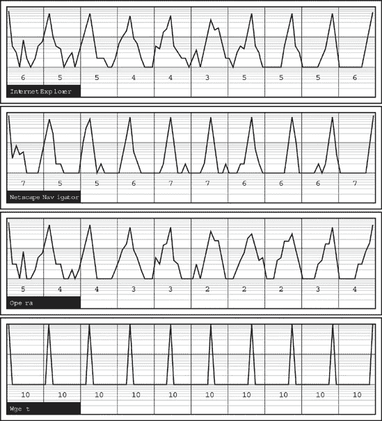

图 14-1. 流行网络客户端的行为模式差异

为了使图表更易于阅读，分布概率以 1 到 100 之间的百分比形式给出（对应于百分比，所有小于 1%的值向上取整），并且离散点用线条连接。然后，图表在以对数尺度（log10，主要指南在 1、10 和 100）上绘制，以便使细微特征更加明显，并更容易进行视觉比较。

在一个完美的世界中，如果浏览器完全按顺序且可预测，第一个部分将只包含第一个（最左侧）离散位置的一个峰值；第二个部分将只在第二个位置有一个峰值，以此类推。然而，在实践中，一些浏览器会同时发出许多请求，因此顺序更容易被打乱：第三个引用的文件可能先于第二个或后于第四个加载。每个部分中单个峰值越不明显，浏览器获取算法看起来就越激进——这意味着这个文件被无序加载的概率越均匀。

这些差异应该清晰可见，即使在历史上基于相同引擎的浏览器之间：Mozilla 和 Internet Explorer。所有客户端似乎都观察到了在主文档中引用文件的顺序，因此后续的峰值会缓慢地从左到右穿过各个段。然而，正如你所看到的，Mozilla 通常比 Internet Explorer 更不急躁，并且更经常按照请求的顺序完成文件的下载。另一方面，被誉为地球上最快的浏览器 Opera，其顺序性要差得多（许多文件有两个或三个几乎同样明显的峰值，这表明一组请求被迅速发出，完成顺序几乎是任意的，并且主要受网络抖动的影响）。Wget，一个流行的开源网络爬虫，用于比较，顺序性完美（这是自动化爬虫的常见模式），使用单个连接，并按相同的顺序加载所有文件。

## 给出漂亮的图片含义

图片和图表很漂亮，但对于自动化策略执行或滥用检测几乎没有价值。为了以某种方式量化观察到的模式，并使指纹识别更加现实，我决定引入一个简单的指标，当只有一个峰值时，会给段一个更好的分数（在 0 到 10 的范围内），而当分布更加任意时，会给一个较低的分数。这可以允许为特定的软件创建一个简单的十值指纹，然后匹配观察到的活动与一系列签名，以确定最佳匹配。

为了构建一个表示在主要段 *s* 上观察到的行为相对质量（线性度） *Q* 的指标，我使用了以下公式（*f[n]* 表示文件出现在获取序列中位置 *n* 的概率，为了方便和打扰纯粹主义者，用百分比表示）：

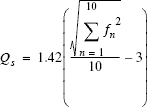

这个方程，虽然乍一看令人畏惧，但实际上非常直接。我希望公式能够优先考虑这种情况：在这个特定的文件在序列中固定位置加载的情况最为常见（也就是说，一个 *f* 值接近 100%，其余概率接近 0%）而不是所有位置都同样可能发生的情况（所有 *f* 值均为 10%）。

因为 *f* 的所有元素之和是固定的（100%），实现这一点最简单的方法是使用平方和：对于任何非零数字序列；这些数字的平方和总是小于总和的平方。最高和最低结果如下：

| 10² + 10² + 10² + 10² + 10² + 10² + 10² + 10² + 10² + 10² = 1,000 |
| --- |
| 100² + 0² + 0² + 0² + 0² + 0² + 0² + 0² + 0² + 0² = 10,000 |

除了主要总和之外，剩余的数学计算仅用于将结果映射到合理的 0 到 10 的尺度（当四舍五入时）。

计算每个浏览器每个观察到的流量段的此指标的结果叠加在图 14-1 上，作为一个描述图表每个部分的数值。正如预期的那样，Wget 在每个部分都取得了完美的分数。其他浏览器的分数证实了之前的视觉观察，并使它们更加具体。尽管 Internet Explorer 和 Mozilla/Netscape 引擎的图表看起来大致相似，但在第 4 至 6 项的加载图表周围以及在整个获取序列中可以观察到明显的差异。Opera 明显与其他浏览器拉开距离，每个部分的分数都持续较低。

因此，通过应用一个相当简单的分析工具，我们最终制定了一个实用的方法框架，用于识别浏览器并在用户 HTTP 流量中检测到统计上有意义的欺骗行为。你可以通过分析其他自动加载元素，如脚本、HTML 样式表、图像映射、框架和其他显示更大浏览器间差异的文件来增强模型。今年圣诞老人可能更容易准备出淘气的用户名单。

## 除此之外……

我仅仅希望展示通过观察其行为，而不做任何具体假设或剖析程序内部结构，如何轻松地检测未知应用程序的隐藏特性。上述确切数字可能并不直接适用于我使用的网站以外的任何网站，因此如果你发现这项技术有潜在用途，请鼓励你自己做些研究。一旦你对某个网站或一组网站进行了分析，你可以使用这些数据来高效地识别基于其随时间活动模式的变化的系统。

不言而喻，我在这里使用的方法是一种（可能过于）简化的行为分析方法，基于所有可能场景中最简单的一种；我提供它作为鼓励，并诱使你寻找更多。在复杂情况下，你可以轻松地使用在框架、表格和其他视觉容器中渲染内容的过程，或者获取和渲染特殊类型的文件，以确定正在使用的浏览器，即使不进行统计分析——在浏览器活动的各种高度具体方面，差异变得更为明显。巧妙地应用差分时间也可能很有前景。

考虑这一点：你可以将更深入的行为分析形式推进一步，并部署它们不是为了区分不同的渲染引擎，而是为了区分机器和人类，甚至识别单个用户。如第八章所述，键盘使用模式对个人来说通常是如此独特，以至于可以使用它们进行生物识别。同样，研究表明，我们可以使用用户点击链接、做出选择、阅读信息等方式来表明一组请求背后是谁或是什么。^([104)) 虽然现在这更接近科学推测而不是事实，但这是一个值得探索和玩耍的奇妙领域。

## . . . 以及超越识别

浏览器活动和行为分析应用不仅限于检测浏览器软件——实际上，一些应用已经进入用户隐私和匿名性的领域。

2000 年，Edward Felten 和 Michael Schneider 发表的一项有趣的研究^([105)) 对该技术的潜在应用做出了令人着迷的贡献，这种能力与今天引擎中部署的缓存机制密切相关，将我们带到所有之前讨论的元素最终汇聚在一起的时刻。

他们研究的基本前提是，通过在特定网站上插入对文件的引用，然后测量浏览器下载它时遇到的延迟，可以判断用户是否在最近几天访问过该网站。这很简单。

我将省略对理论、预测和推测的漫长探索（就这一次），而是提出一个接近现实世界的例子。假设我正在运行[www.rogue-severs.com](http://www.rogue-severs.com)。我决定，出于某种原因，我的主页将引用一张图片（例如首页标志），这张图片来自[www.kinky-kittens.com](http://www.kinky-kittens.com)；我将这个视觉元素设置得难以找到或缩小到无法看到，但它仍然会被浏览器加载。

一个未察觉的用户访问我的网站。如果他们从未访问过[www.kinky-kittens.com](http://www.kinky-kittens.com)，那么他们需要一段时间才能下载我引用的图片。然而，如果他们是常客，那么图片已经存在于他们的缓存中，几乎可以立即获取。

由于对[www.kinky-kittens.com](http://www.kinky-kittens.com)资源的引用前后都跟着对我的网站上其他视觉元素的需求，通过部署巧妙的时机启发式算法，可以可靠地测量整个标志是否已被获取，或者它是否已经在缓存中。所有这些足以确定访问我页面的新来者是否确实是某个特定网站（或网站的一个特定部分）的常客，并且有效地粗暴地侵犯了他们的隐私。尽管这种场景不太可能被用于广泛部署的常规间谍活动（主要是因为留下了明显的证据，可能会被我们想要窥探的服务器运营商注意到），但针对性攻击可能非常有效。

最后，所有的拼图碎片都拼在了一起，也许不是很紧密，但仍然拼在了一起。用户、程序和习惯都可以通过仔细滥用流行的互联网协议的现代功能轻易地暴露出来。这对[www.kinky-kittens.com](http://www.kinky-kittens.com)的宝贵访客来说，可能并不总是令人安慰的。

# 预防

完全匿名化一个人的网络浏览体验似乎已经是一场已经输掉的战斗。尽管一些提高在线网络用户隐私和匿名性的做法被普遍接受，但这些功能可以很容易地被恶意网站规避。

很不幸，这个问题太严重了，不能被忽视。当我们决定信任某个实体（比如 ISP）时，它知道我们的活动是另一回事，但当那些我们不愿意经常打交道的一方收集敏感的个人信息，并且可能像他们的商业模式一样，同样频繁地将其转售给他人时，这完全是一个不同的问题。即使对于那些每天不戴锡箔帽和铝制内衣的人来说，这也足以引起他们的关注。

另一方面，在必须允许 HTTP 流量，同时用户应得到保护并受到监督，而不违反他们隐私的基本必要性的环境中，保持完全匿名或看起来完全无害的相对难度很重要。在企业网络中，能够在不手动检查数据的情况下跟踪违规系统，这对用户和系统管理员来说都真正宝贵且受到欢迎。

# 思考的食物

HTTP 的任何一个组成部分都没有设计不当、损坏或不合理。然而，当我们把它们放在一起时，许多安全和隐私功能似乎都相互抵消了，用户被暴露在肆无忌惮的窃听者面前。遗憾的是，我们无法在不从头开始的情况下做些什么，而且无法保证结果会像 HTTP、HTML 和 WWW 客户端现在提供的那样好，甚至提供更多的隐私。

# 第十五章. 成为受害者的好处

*在我们得出结论，以适当的乐观态度生活可能有助于我们追踪到攻击者*

—

我讨论了各种可能对日常通信产生重大累积影响的问题，这些问题我们并不总是感到舒适。你已经看到其他人如何利用网络窃取信息，或者获取比你预期或允许的更多的信息，以及如何使用这些技术来收集更多关于你的企业或家庭网络的信息，以及针对这些网络进行攻击的攻击者。

我希望我已经提供了关于这类问题产生的原因以及如何尽可能避免它们的见解。我试图表明，安全和隐私的影响仅仅是每个活动的组成部分，而且仅仅通过做出正确的设计决策、安装正确的软件或建立和执行适当的政策是无法完全消除的。信息泄露根本无法完全抑制，我们唯一的希望是拥有足够的信息和知识关于潜在的泄露或攻击场景，以便在特定应用中尽可能减轻最严重的影响。

这本书的第三部分，主要关注广域网及其潜在威胁。尽管这部分内容最长，现在也即将结束，但它离提供一个开放网络中可能出现的所有问题的全面视角还相去甚远。实际上，讨论所有问题的变体将非常困难，而且很大程度上是徒劳的；因此，我选择只涵盖主机之间通信中最复杂、最具挑战性或最迷人的方面。我专注于发现不同协议层和不同抽象级别上的攻击场景，而不是列举那些重复旧想法且对主题没有新贡献的概念和攻击向量。我希望到目前为止提供的信息能帮助你并鼓励你在网络和计算的其他领域找到这些问题的其他表现形式——也许甚至更远。

在下一部分书中，我们将进行一次重大的范式转变，探讨如何通过仔细观察整个网络（而不是单个系统）来保护自己或攻击他人。但在我们这样做之前，让我们看看网络监控中一个较为不寻常领域的其他可能性：被动反情报——即通过分析他们的行为来了解更多关于攻击者或他们的目标。以这种方式收集的数据可以提供一套强大的调查线索，使识别攻击者的意图、工具集甚至攻击者本人变得容易。构建攻击者档案、试图解读他们的想法，甚至与他们玩一场欺骗游戏，通常本身就是一种令人兴奋的经历。

# 定义攻击者指标

如预期的那样，你只需应用一些之前讨论过的常见 TCP/IP 流量指标——例如被动操作系统指纹识别——到观察到的流量中，就可以从远程恶意实体中获得大量信息。例如，你可以识别用于端口扫描的具体工具。

类似地，我们也可以将行为分析应用于攻击者的行为特征，例如请求间的延迟和请求顺序（例如，端口扫描的顺序和速度）。我们可以使用行为分析在一定程度上追踪程序，或者在手动进行的入侵或未经授权的评估尝试中，甚至可以确定攻击者的个人特征（例如他们的计算机技能）。

我们可以部署的一个特别有趣的方法来识别攻击者用于扫描我们网络的工具，是应用第九章中讨论的方法之一——端口序列指纹识别——到一个全新的任务上；这是基于观察，目前大多数扫描器要么按顺序从最低端口或地址扫描网络和系统，要么随机化访问资源的顺序。后者更常被使用，并且被认为更好，因为它可以平衡负载并使扫描检测稍微困难一些。但出人意料的是，随机性的使用可能会以几种奇怪的方式对攻击者产生反作用。

问题在于，它们的作者没有将网络扫描工具视为具有高安全要求的任务关键型应用。在不要求加密安全输出的程序中实现伪随机数生成器最常见（也是最容易）的方法是调用标准系统或内置语言功能。世界上使用最广泛的编程语言 C 的 ISO 标准^([106]) 建议使用简单的线性同余算法来实现标准 C 库伪随机数生成器（在第一章中讨论）。标准提出的构建和使用生成器的方案如下：

1.  生成器应该通过调用标准库函数 `srand()` 使用一个初始的 32 位值（S[0]）来初始化。如果生成器没有被初始化，它将使用一个固定的默认种子，并在所有情况下产生相同的输出序列。

1.  在每次调用 `rand()` 时，主函数会反复调用以获取用于用户应用程序的后续伪随机数，种子 S 会按照以下方式重新计算：S[t+1] = S[t] * 1103515245 + 12345。结果被截断到 32 位（模 4294967296）。

1.  每个 `rand()` 调用的返回值是 S[t+1] 的更重要的字，模 32768。在 32 位变体中，这是今天计算机上更常用的算法之一，这个步骤和前一个步骤会重复多次，以计算结果值的后续位部分。

所有线性同余生成器，包括这里描述的生成器，都容易受到 20 世纪 90 年代 H. Krawczyk 提出的通用密码分析方法的影响，如第一章中提到的。基于对几个后续（或有序）输出的观察，有可能重建生成器的内部状态，从而预测其所有先前和未来的输出。

自然地，这种可能性的直接含义——受害者根据对先前尝试的了解，确定攻击者将按什么顺序尝试攻击机器或网络上的其他资源——本身并不特别令人兴奋或有价值。然而，在网络探测尝试的背景下，这种可能性有两个重要的后果：

+   我们可能能够确定 *S*[0]。如果我们知道或可以估计生成器开始工作的时间（或者，作为替代，初始种子应显示的一般属性），就有可能重建用于初始化生成器的值。因为 S[0]是算法的唯一输入，它必须对相同的种子值产生相同的行为——因此，我们可以通过观察 PRNG 输出来追踪种子。

+   我们可能能够确定 *t* 增量。一旦我们重建了生成器状态，就有可能通过在扫描器用于获取值（端口号或主机地址）的两个调用之间调用 `rand()` 来确定扫描器请求了多少随机值。

这个设计的第一种后果的重要性，即我们重建用于初始化生成器的值的能力，可能并不立即明显。但我们还有另一个谜团需要考虑。初始化随机数生成器的一种常见方法是用一个方便的 32 位值，这个值变化足够频繁，不会太频繁地导致相同的 PRNG 行为。系统时间计数器常用于此目的，有时还会与另一个小数字结合使用，例如当前进程 ID（PID），以降低两个在短时间内运行的程序产生相似结果的可能性。

通过将此知识应用于计算出的 *S*[0]，探测受害者可以揭示攻击者的系统时间（GMT 或本地时间，取决于操作系统设置和扫描器类型）。了解系统的本地时间可以以最简单的方式给观察者提供关于攻击者来源和身份的线索。如果他们试图通过伪造来自各种来源的数据包来迷惑我们，我们可以通过排除那些 S[0]显示的时间区域与源地址所属的地理区域不匹配的感知来源来获得幸运。例如，如果我们通过比较攻击者的估计系统时间与 GMT，确定攻击者的时间比格林威治标准时间慢五小时，我们可能会得出结论，他们很可能位于美国东海岸而不是中国。因此，通过将我们对时区的最佳猜测与各种 IP 地址块的记录进行比较，我们可以判断，在所有观察到的“诱饵”扫描源中，攻击者的真实身份更有可能隐藏在来自波士顿 ISP 的数据包后面，而不是来自北京 ISP 的数据包后面。

此外，一旦我们知道攻击者的本地时间，我们可以通过测量他们的系统时钟与真实时间的距离（以及长期来看其漂移速度）来追踪他们。由于计算机时钟通常不太准确，并且在不定期与外部源同步时（在某些情况下，每天可能漂移几分钟），这可能是一种很好的方法来关联同一人进行的攻击。不同的机器可能系统地偏离不同的时间量，这些时间量会以独特的比率变化。

最后，当 PID 作为初始化种子的一部分与系统时间一起使用，并且已知攻击者的系统时间在某个范围内时，PID 可以用来确定大约的系统运行时间或两次扫描之间的任务执行数量。因为机器上的每个新进程都被分配一个更高的 PID 号，这种依赖性相当直接。^([[32)]]

通过重建 PRNG 状态，我们还可以看到在接收方接收到的两个数据包生成之间生成了多少随机数。当只有一个系统正在被扫描时，应该没有任何间隙，或者只有由于网络问题引起的微小差异。然而，当多个系统正在被扫描时，这些间隙（由发送到不同目标的数据包引起）可以很容易地被检测到。通过检测它们，我们可以确定同时被针对的系统数量。

此外，当扫描软件生成看似来自随机主机的虚假诱饵数据包时，可以消除伪造的地址——那些使用伪随机数生成器（PRNG）生成的地址（因此匹配其可能的输出）并确定哪个不匹配，因此必须是真实的——从而明确指向攻击的真正肇事者。例如，如果我们的重建 PRNG 数据显示来自以下地址的流量：

| 198.187.190.55 (十进制表示：3334192695) |
| --- |
| 195.117.3.59 (十进制表示：3279225659) |
| 207.46.245.214 (十进制表示：3475961302) |

我们可以确定，3334192695 和 3475961302 都是使用 S[0] 作为种子生成的生成器的最初输出之一；而 3279225659 似乎不是任何重建的伪随机数生成器的最初输出，因此很可能是真实的地址。

我们可以利用所有这些信息来确定攻击者的意图和他们使用的软件。我们甚至可以使用它来追踪他们正在工作的系统，将其与其他数据关联起来以确定他们的真实身份和地理位置，有时甚至可以确定他们随着扫描的进行是如何使用他们的计算机的。

### 注意

NMAP 为了应对上述的运行时间和扫描历史披露问题，试图使用安全的系统随机数生成器设施（如 /dev/random，如第一章所述第一章)来生成随机数，而不是依赖于标准的 C 库工具。然而，这种方法在许多操作系统（如 Windows）上不可用，其他扫描器也没有采取类似的步骤来防御攻击者。

* * *

^([32]) 尽管一些系统提供可选的 PID 随机化，目的是使某些无关类型的本地攻击更加困难。

# 保护自己：观察观察

在过去的十年中，互联网已经成为一个巨大的战场。新连接的机器立即被自动攻击探测、蠕虫和其他类型的信息所淹没，这些信息对它们的网络安全造成压力。传统的、现在相当流行的入侵检测和预防运动旨在通过警告管理员正在使用特别定制的流量分析工具进行预攻击探测来发现和阻止攻击。在异构或简单足够复杂的环境中，这些通常会产生比一个人能够处理的更多噪音和假阳性。

然而，在某些情况下，观察攻击及其引发的响应能力是管理员了解网络问题和攻击发生情况的一种很好的方式（尽管这些事件本身通常并不引人注目）。首先，在某些网络中，由于政策规定、缓慢的周转时间、很少开放的维护窗口等原因，主动发现和资产扫描以确保政策合规和系统配置难以启动或执行起来过于麻烦。在这样的环境中，能够窥视并确定流氓看到的内容可能是一种非常有价值的替代方案，以进行本地启动的主动侦察。

此外，定期的主动发现可能不足以应对某些威胁；因此，仅通过观察他人得到的结果来了解某事突然出错的能力可能非常有价值。当然，这是一把双刃剑——一个已经破坏或计划破坏网络、但希望保持低调并提前规划步骤的黑客，可以观察其他发现尝试产生的流量，以构建他们对特定系统的知识。

理论上，窃取攻击者获得的知识似乎很简单；然而，关联和处理结果，尤其是在分析大型环境或仅基于来自不同地点的单独攻击尝试的零星信息时，并非易事。尽管如此，一些用于通过“被动扫描”促进网络和系统映射的工具正逐渐出现在地平线上——Preston Wood 的 DISCO^([107])就是一个典型的例子。

# 思考的食物

我发现奇怪的是，本章中描述的技术通常没有得到全面的研究、发表的白色纸张或易于获取的工具的支持。随着 Lance Spitzner 的蜜罐研究引发的攻击跟踪热潮，以及入侵检测系统等产品的推动，人们本应看到更少的努力去识别攻击（这些攻击通常并不特别引人注目，并且通常使用经过良好记录的向量和方法），而更多的努力去确定攻击的意图和来源，以及关联那些单独看来没有意义但结合在一起可以表明问题的活动。

我只能对冰山一角进行一些探讨，但不用说，这可能是研究和贡献的更具吸引力的领域之一。

*现在，让我们来点完全不同的内容……*
