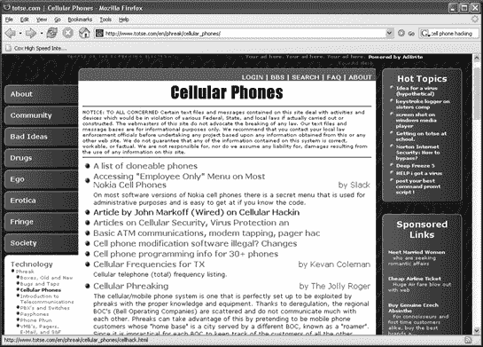
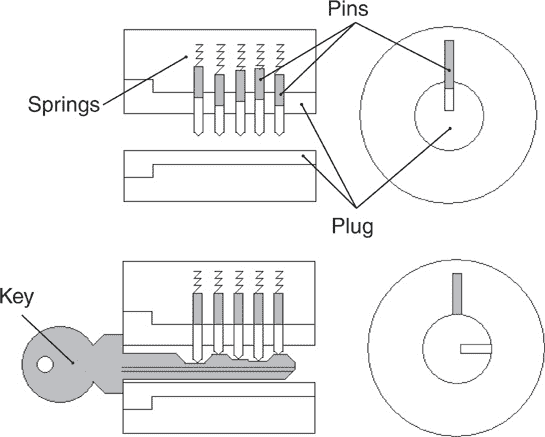
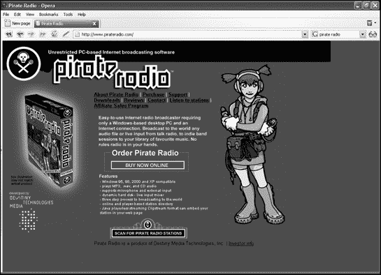

# 第一部分. 早期黑客

# 第一章. 黑客心态

幸福是一种意识状态，它源于实现个人价值观。

—— 艾恩·兰德

黑客并不比律师、政治家或电视福音传教士更像是罪犯。（好吧，也许这不是最好的类比。）重点是成为黑客并不一定意味着你会成为罪犯。你的态度使你成为黑客，但如果你不小心，你的行为可能会使你成为罪犯。

随着新闻媒体总是将每一次计算机故障归咎于恶意黑客，太多的人形成了这样一个片面的观点：黑客只是完全邪恶的，一心想要破坏文明世界的不满分子，他们最喜欢的事情就是摧毁社会中的所有美好事物，并在其后留下恐怖和混乱。（当然，这也是用来诽谤一些人成为“恐怖分子”或“叛乱分子”的同一片面观点，而其他人则称那些完全相同的人为“自由斗士”和“爱国者”，但这将是第十七章的主题。）

一个黑客是否符合典型的书呆子形象——口袋里装着保护套、厚重的眼镜和笨拙的社交技巧，这并不重要（而且大多数人都不符合）。黑客不是由他的外表或行为来定义的，而是由他的思维方式来定义的，培养真正的黑客心态最关键的是学会独立思考。

# 对权威的质疑

要真正开始独立思考，首先要质疑权威。这并不意味着反抗、推翻或忽视权威。这意味着要倾听任何权威人物或组织告诉你的内容，并辨别他们的动机。正如每个骗子都知道的，让别人做你想做的事的第一步是隐藏自己的动机，假装你真的想帮助他们。（有关网络骗局如何运作的更多信息，请参阅第十三章。）质疑权威不过是询问如果按照权威人物或组织的要求去做，他们会从中得到什么好处。

有三个可能的原因，权威人物或组织会告诉你某些事情：

+   这真的是为了你自己的好处。

+   他们目前只知道这些。

+   这真的是为了他们的好处，而不是你的。

父母告诉孩子吃蔬菜，并不是因为他们想折磨孩子或让他们痛苦，而是因为均衡饮食实际上对孩子的健康有益，无论他们可能觉得西兰花或菠菜有多难吃。同样，政府告诉公民如何应对自然灾害或避免在国外旅行时的麻烦，因为这些信息真的可以帮助人们生存。父母可能通过拥有更健康的孩子们并节省购买胡萝卜和芹菜而不是汉堡和薯条的钱而受益，但经济动机是次要的，他们的孩子的健康才是首要的。同样，政府可能从拥有活着的纳税人而不是死去的公民中受益，但那也是次要的，真正的动机是基本公共安全。很多时候，比许多人愿意承认的还要多，权威人士和组织确实以你的最大利益为重，这就是为什么盲目地反抗所有形式的权威最终与忽视交通信号灯以抗议政府干预一样，最终是适得其反的——当你撞车时受伤——或者伤害了别人。

当然，权威人士和组织并不总是怀有如此纯洁、无私的动机。这就是为什么质疑权威很重要。很多时候，当局真的不知道他们在做什么。如果你不加质疑地服从他们的命令，受苦的将是你，而不是他们。

当美国政府在 20 世纪 50 年代将陆军士兵暴露在原子弹爆炸中时，如图图 1-1,他们并不想让士兵受到辐射伤害，以便他们后来死于白血病。当时，政府想研究原子弹爆炸对常规军事部队的影响，因此他们采取了他们认为必要的所有预防措施来保护士兵的福利。在这种情况下，政府的行动源于无知。然而，随后的决定隐瞒有问题的测试结果，避免对士兵的健康承担责任，更属于恶意自私的范畴。只有当无知与问责相结合时，才能原谅无知，而这是少数当局愿意承担的责任。你应始终质疑不仅任何权威人士希望你做什么，而且他们为什么应该首先对你拥有任何权威。

更令人恐惧的是，当当局纯粹为了自己的利益而盗窃、伤害或杀害我们其他人时。历史上，中国、德国、阿富汗、朝鲜、伊拉克、津巴布韦、日本、伊朗、古巴、俄罗斯和沙特阿拉伯等国的独裁政权，通常会处决或监禁任何质疑他们权威的人。在这样的独裁政权下，公民应该做所有的工作，而当局则享受所有的金钱（这在 4 月 15 日国会投票给自己加薪并休会之前，大多数美国人都能感同身受，因为那时是收入税的时间）。

这种明显的滥用职权行为不仅由个人和公司，也由政府实施。例如，考虑一下吉姆·琼斯，他创立了人民圣殿，作为一个城市基督教传教团体，提供免费餐食、睡眠床铺，甚至工作，以及社区感。在团体定居的旧金山，市长乔治·莫斯科尼、监督员哈维·米尔克和众议员威利·布朗支持了琼斯（作为选举时对人民圣殿的支持回报）。甚至报纸，包括《旧金山纪事报》，也赞扬了琼斯和他的人民圣殿为建立药物治疗诊所、儿童护理服务和老年人项目。

这样的仁慈行为掩盖了吉姆·琼斯的个人崇拜，他最终将他的教会带到了圭亚那，在那里他在命令信徒通过饮用含有氰化物的果汁自杀之前，对他们进行了身体和情感上的虐待。

图 1-1。为了避免直接面对原子弹爆炸，美国士兵用手遮住脸。这是政府当局后来用来避免直接面对这些退伍军人，同时拒绝为他们因过量辐射暴露而患上的疾病提供赔偿时的同一姿势。

虽然烟草公司可能在投入资金进行反吸烟广告，但他们仍在生产和销售香烟的业务中。美国可能觉得使用军事力量在伊拉克推广民主是正当的，但它还没有派遣海军陆战队到沙特阿拉伯推广民主。伊斯兰激进分子可能声称他们在中东与亲西方的独裁政权作战，但他们仍在用汽车炸弹炸死无辜的穆斯林妇女和儿童。特蕾莎修女可能有一些批评者，但没有人能否认她试图做好事。吉姆·琼斯有一些支持者，但没有人能否认他故意做了坏事。

过于频繁地，好的行为可能会掩盖不良意图。这就是为什么你需要质疑权威。如果不这样做，你可能会成为问题的一部分，或者如美国法律体系喜欢说的那样，“犯罪的帮凶”。

# 质疑假设

任何压迫性的威权政权都知道，身体上的限制不如心理上的限制有效。为什么建造监狱，当你可以洗脑人们去做你想要的事情？因为你的思想定义了你的局限，你必须质疑你自己的假设。

假设并不一定是坏事。当你发送电子邮件时，你假设它会到达预期的收件人。当你保存文件时，你假设下次需要时它会在你的硬盘上。假设基本上是一种心理捷径，让你可以思考其他事情。如果人们必须担心邮件是否真的会到达目的地，那么很少有人会发送邮件，而且几乎没有人会使用计算机，除非他们可以假设保存文件后文件仍然会在他们的硬盘上。不幸的是，假设并不总是正确的。邮件并不总是到达预期的收件人，有时当你保存文件时，病毒或计算机崩溃可能会使其消失。

尽管有用，但假设可能导致几个问题：

+   假设可能基于信念而非事实。

+   假设可能基于脱离上下文的事实。

+   假设，无论基于事实还是信念，都会限制和约束思维。

在技术世界中，贝尔电话公司建立了其电话垄断地位，并假设人们会按照贝尔电话公司的意图使用它来打电话。当电话黑客们违反这一假设，自行翻查电话系统时，事实证明了黑客们正在以甚至电话公司从未梦想过的方式操纵电话系统。（更多关于电话黑客的内容，请参阅第二章。）

计算机安全中的许多缺陷源于基于信念而非事实的假设。计算机科学家认为某个程序是安全的——直到黑客发现以未预期的方式操纵程序功能可以破解该计算机的防御。

有时候，假设可能基于在某些情况下成立但在其他情况下不成立的事实。当微软创建 MS-DOS 和 Windows 时，它假设这些操作系统是安全的，它们确实是——直到人们开始将计算机连接到局域网（LAN）和互联网。在孤立状态下，MS-DOS 和 Windows 是安全的平台。在网络中，这些相同的操作系统变成了病毒、特洛伊木马和蠕虫的滋生地（请参阅第四章和第五章）。

当计算机科学家为在互联网上发送和接收电子邮件制定标准时，他们假设人们只会给认识的人发送电子邮件。不幸的是，他们从未预见到免费消息传递会吸引无耻的销售人员并产生被称为垃圾邮件的麻烦（见第十八章）。

即使假设基于事实，它们仍然限制你的思维。面对计算机登录屏幕时，大多数人会自动假设通过这一道防线的方法只有输入有效的用户名和密码，无论是通过盗窃还是猜测。然而，如果你做出这个假设，你可能永远不会想到其他方法，比如向计算机发送大量带有可执行程序的数据块。这可能会超载计算机的内存，并允许可执行程序在没有计算机识别的情况下运行，本质上绕过了任何安全措施，包括请求有效密码。（有关绕过计算机防御的更多信息，请参阅第九章。）

通过识别假设，你可以更好地理解它们可能如何影响了你的当前思想和行为。然后，你可以通过挑战你的假设来故意打破它们固有的限制。你只需从另一个角度看待世界，就可能发现一些新事物。

# 培养价值观

当然，如果你只是质疑权威和假设，你最终会反应生活而不是追求生活，就像青少年通过反抗父母的愿望和价值观来定义自己，而不是选择他们自己想要的生活一样。

因此，除了质疑权威和假设之外，黑客还培养了一种价值观感来指导他们的行为。价值观，就像假设一样，是信念，但它们是从内部产生的信念，而不是由他人强加的，例如父母或政府。在最简单的层面上，价值观帮助人们做出选择，例如他们是否选择 Linux 而不是 Windows，或者学习 Perl 编程语言而不是 C++。

共同的价值观可以建立友谊（例如，人们使用技术来推广他们的想法，请访问[www.republicanvoices.org](http://www.republicanvoices.org)的“共和党声音”)；冲突的价值观可能会撕裂人们（有关仇恨组织和网络恐怖分子的更多信息，请参阅第十七章）。

任何人都可以选择价值观，尤其是那些能够赢得他人好感的价值观。例如，政治家可能会支持宗教组织的价值观，只是为了获得他们的政治支持，然后在最终当选为公职后立即忽视那些相同的宗教价值观（“不可通奸”或“不可杀人”）。比你所选择的价值观更重要的是，你是否始终遵守它们，或者只是在方便的时候才遵守，这揭示了你的*真正*价值观。

虚伪是首先引发叛乱的原因，导致他人质疑权威人物作为权威的地位，并拒绝任何该人可能想要强加给他们的价值观（有关互联网上的政治活动，请参阅第十六章以获取更多信息）。当权威人物想要掩盖自己的虚伪时，他们通常会诉诸审查（有关审查信息，请参阅第十一章）和谎言（有关宣传，请参阅第十五章以获取更多信息）。

在计算机黑客的世界里，人们只能通过你的在线行为来了解你是谁。你的身份可能是匿名的，但你的真实个性不是，这就是为什么计算机的世界既解放又令人恐惧，这取决于你真正的身份。

# 黑客的三个阶段

无论黑客是仅仅探索一个新的操作系统还是学习工作场合的社会技能，黑客的心态通常都会经历三个阶段：

+   第一阶段：好奇心

+   第二阶段：控制

+   第三阶段：有意识的意图

黑客来自不同的背景和文化，但每个黑客都拥有最初吸引他们进入技术的相同的好奇心。在最初的兴趣阶段，黑客只想知道事物是如何运作的，无论是研究互联网、受版权保护的 DVD 还是电话系统。一开始，黑客只想了解可能性和原因。

一旦他们对某个特定系统有了足够的了解，黑客就可以进入黑客活动的第二阶段，在这个阶段，他们逐渐学会控制和操纵系统。在这个阶段，黑客造成的问题，如崩溃计算机或擦除硬盘，更多的是出于纯粹的笨拙而不是故意的意图。

当黑客将新获得的技术用于某个目的时，他们就达到了第三个也是最后一个阶段。在这个阶段，黑客寻求一个具体的结果；无论是好是坏都无关紧要。黑客想要实现他们为自己设定的任何目标，并且他们愿意以坚定不移的决心去追求，直到实现目标。

无论意图或结果如何，黑客行为都涉及应对新挑战和激发思维。有时这涉及到违法和侵犯他人财产，但很多时候只是关于玩乐。无论黑客是重新路由电话、修改软件还是在互联网上窃取密码，黑客行为并不是为了证明任何人错误。黑客行为是为了证明其他做事方式也可以是正确的。

# 第二章. 第一批黑客：电话黑客

自我提升程序《心理控制术》的创造者

如果生活中没有要征服的障碍和要实现的目标，我们就无法找到真正的满足或幸福。

—— 马克斯韦尔·马尔茨

第一批电话黑客是青少年男孩。

单就这一事实而言，并不太令人惊讶，直到你意识到，第一批黑客出现在 1878 年，当时青少年男孩在新兴的贝尔电话网络中担任电话操作员。雇佣青少年男孩似乎是合理的；电报办公室经常雇佣他们从事类似的职位，如电报递送信使。让青少年男孩负责电话网络直到他们开始随机混合电话线，以恶作剧的方式将陌生人连接起来，只是为了取乐，还开始回电话客户的电话，只是为了好玩而干扰他们的对话。

贝尔电话公司很快用更可靠的女性操作员取代了那些未成年男性操作员。然而，那些青少年最初表现出的嬉戏精神很快就会再次出现，困扰电话网络。

当电话公司在 20 世纪 60 年代用自动电子交换系统（ESS）取代人工操作员时，电话黑客（也被称为他们更丰富多彩的昵称，*电话黑客*）发现了新的机会来玩弄电话系统。

你不可能总是欺骗人工操作员让你免费打电话，但你却可以欺骗电话网络的自动交换系统来实现这一点。凭借只有原始计算机在国内外路由电话，电话黑客迅速学会，如果你知道正确的信号，你可以让电话系统做任何事情，从提供免费长途电话到让你连接多条电话线进行电话会议——这一切都是在电话公司不知情的情况下完成的。

# 电话黑客简史

与通常可以在单个个人计算机上独立实践的计算机黑客行为不同，电话黑客行为相当复杂，因此需要更广泛的准备。你可能在某一刻重新编程电话公司的计算机，下一刻焊接电线来改变投币电话，然后与电话员工聊天以获取电话系统不同部分的密码。就像计算机黑客行为一样，电话黑客行为是一种智力游戏，玩家试图尽可能多地了解系统（通常是）而不被抓住。

可能最著名的电话黑客是约翰·德雷珀 ([www.webcrunchers.com/crunch](http://www.webcrunchers.com/crunch))，因为他偶然发现了一种独特的使用 Cap'n Crunch 谷物早餐盒中玩具哨子的方法，而被昵称为“Crunch 船长”。他发现，将这个玩具哨子吹入电话的话筒中会发出 2600Hz 的音调，这正是电话公司用来指令交换系统进行免费电话通话的确切频率。

很快，其他人也发现了这个秘密，有些人甚至发展出了吹出完美 2600Hz 音调的能力。对于那些无法获得原始 Cap'n Crunch 玩具哨子的人来说，企业家开始销售名为“蓝盒子”的设备，这些设备可以发出 2600Hz 音调和其他电话公司信号音调。苹果电脑的创始人史蒂夫·沃兹尼亚克和史蒂夫·乔布斯甚至向大学生出售蓝盒子，以便他们可以从宿舍里打免费电话。

只要电话公司依赖旧的机电交换系统，蓝盒子就能正常工作。但最终，这些系统被新的电子交换系统（ESSs）所取代，这使得蓝盒子（以及臭名昭著的 2600Hz 音调）变得无用（尽管蓝盒子可能在美国以外的旧电话系统中仍然可以使用）。

当然，ESSs 带来了全新的问题。在旧的机电交换系统中，技术人员必须物理操作开关和电线来修改交换系统。在 ESS 中，技术人员可以通过电话线远程更改交换系统。

然而，如果技术人员能够在电话上施展这种魔法，那么电话黑客也能做到——如果他们知道正确的代码和程序。显然，电话公司想要保守这个秘密，但电话黑客们却想让每个人都知道电话系统是如何工作的（这也是电话公司和电话黑客之间持续斗争的部分原因）。

### 注意

想了解更多关于电话黑客的信息，请访问 Hack Canada ([www.hackcanada.com](http://www.hackcanada.com)) 或 Phone Losers of America ([www.phonelosers.org](http://www.phonelosers.org))。或者尝试访问 alt.phreaking 和 alt.2600.phreakz 新闻组，以获取有关电话黑客的消息。

# 电话黑客都市传说

如果你有一部电话，世界上任何地方的人，包括那些只是在电话系统中闲逛的电话黑客，都可以给你打电话。据报道，史蒂夫·沃兹尼亚克曾经打电话给梵蒂冈，假装是亨利·基辛格。其他电话黑客曾试图通过白宫热线打电话给克里姆林宫，并将一位著名电视福音派传教士的商业电话号码改接到 1-900 色情热线。

因为大部分电话黑客传说涉及进行越来越离谱的行为，然后炫耀这些行为，所以以下电话黑客故事可能真可能假。不过，它们会给你一个想法，了解在适当的信息下电话黑客能取得什么成就。（这些是互联网上流传的“都市传说”，这里为了清晰和解释的目的进行了轻微编辑。）

## 洛杉矶的卫生纸危机

*电话黑客的乐趣之一是发现公众通常无法访问的电话网络区域。在 20 世纪 70 年代初，两名电话黑客发现了一个未列出的电话号码，只有少数人有权知道。他们决定用它来打一个终极恶作剧电话。以下是一个黑客的亲身经历编辑版*。

[在恶作剧发生时，]电话黑客们进入电话公司的 AutoVerify 中继线非常容易。这个程序用于有人合法需要打断繁忙的电话线时使用。通常，过程是这样的：

接线员选择一个特殊的（电话线）中继线，这个中继线被标记为（保留）用于这项服务，然后拨打电话号码的最后五位数字，或者一个特殊的终止长途电话中心（TTC）代码，如 052，然后是整个七位数字。之后，接线员在电话线上听到混乱的对话。正在通话的双方听不到任何声音，甚至没有点击声。

接下来，接线员通过让设备发送 2600Hz 的音调脉冲来“快速前进”，这会建立一个三方连接，并在电话线上放置一个蜂鸣声，这样双方都能听到点击（在这种情况下是闪光）后跟着一个高音调的蜂鸣声。这时，双方都能听到接线员和对方。在合法中断的情况下，接线员宣布有紧急情况，应该释放线路。这项服务今天需要支付 2 美元的费用（某些地区为 1 美元）。

之前，我已经通过扫描整个 800-424 前缀，绘制了所有以华盛顿特区结束的 800 号码。这次扫描发现了一大堆美味的号码，允许免费访问国会电话线、特别白宫接入号码等等。

当我扫描 800-424 时，我遇到了这个态度恶劣的家伙，他的态度引起了我的注意。我决心找出他是谁。我回拨电话说：“这是白原市 AT&T 的复式办公室，我们接到了哪个用户的电话？”

这个人说：“这是白宫 CIA 危机热线！”

“哦！”我说，“我们遇到了交叉线路的问题。现在我知道这是谁了，我可以解决这个问题。感谢您的时间——再见！”

我有一个非常特别的 800 号码。

最终，我和我的朋友们进行了一次信息交换狂潮，我把这件事告诉了他们。一个朋友想立刻拨打，但我劝他等等。我想在电话线上出现，使用 AutoVerify 来监听对话。

但首先我们需要确定这个号码终止在哪个交换机上，因为 AutoVerify 不知道 800 号码。

当时，所有 800 号码都与前缀和区号一一对应。例如，800-424 = 202-*xxx*，其中*xxx*是由最后四位数字确定的三个数字交换机。在这种情况下，800-424-9337 映射到 202-227-9337。227（可能是错误的）是一个用于传真、电报，以及在这种情况下用于 CIA 危机线的特殊白宫前缀。

接着，我们进入了标记为干线的班级（抓取时会有不同的声音），将 KP-054-227-9337-ST 通过这个特殊标记的干线 MF'ed。("MF"代表多频率，这是电话黑客将特定代码发送到电话干线的手段。) 我们立刻听到连接音，并将其调到扬声器上，这样我们就会知道何时有电话进来。

几个小时后，一个电话打进来了。它似乎有与 CIA 相关的谈话，并且使用了代号“Olympus”来召唤总统。我当时在建筑物的另一部分，我冲进房间，及时听到了对话的尾声。

我们有一个密码词可以召唤尼克松接电话。几乎立刻，另一个朋友开始拨打电话号码。我阻止了他，并建议他在将电话接到白宫之前至少堆叠四个串联（连接不同电话网络线路或干线的交换机）。（堆叠串联意味着在多个交换机之间路由电话通话，使得任何人都不容易追踪到确切的你从哪个电话号码拨打。在通过多个交换机路由电话通话后，循环连接呼叫者到所需的电话号码。）

果不其然，另一端的人说“9337”。

我的另一个朋友说：“Olympus，请！”

另一端的人说：“先生，请稍等！”大约一分钟后，一个听起来非常像尼克松的人说：“发生了什么事？”

我的伙伴说：“我们在洛杉矶这里有个危机！”

尼克松说：“危机的性质是什么？”

我的伙伴用严肃的语气说：“先生，我们用完卫生纸了！”

尼克松说：“你是谁？”

我的伙伴随后挂断了电话。我们从未弄清楚那盘磁带发生了什么，但我认为这可能是最有趣的恶作剧之一。

根据我的记忆，这大约是在尼克松因水门事件辞职前四个月左右。

## 圣巴巴拉核骗局

*打恶作剧电话很有趣，而且随着你愚弄越来越多的人，这种兴奋感会更大。然而，正如以下例子中的两个电话黑客所发现的那样，有时候恶作剧电话可能会走得太远*……

两位来自南加州的电话黑客曾经利用海滩上并排的两个电话亭和一些非常简单的电话黑客设备，将所有通往圣巴巴拉的长途电话线路全部占线。当人们试图拨打到圣巴巴拉时，他们的电话被转接到这两个黑客那里，他们告诉所有来电者，一场神秘的爆炸摧毁了整个城市。

第一通电话是一位母亲打给她在加州大学圣巴巴拉分校的儿子。两个黑客告诉这位女士，他们是国民警卫队紧急通信中心的工作人员，并且已经没有加州大学圣巴巴拉分校了。他们以急促的语调说，校园以及整个圣巴巴拉市在一场奇怪的核事故中被摧毁；他们告诉她这是一场“核熔毁”。她被礼貌地要求挂断电话，以便为紧急电话腾出线路。

几分钟后，那位惊恐的母亲打回电话，这次有接线员协助。电话黑客们平静地向接线员重复了他们的故事，要求她不要给圣巴巴拉打电话，并告诉她不要担心。

几分钟内，来自全国各地的报纸、电视记者、联邦调查局特工和警察开始打电话。数百个听说“熔毁”事件的人们打电话来查看亲戚和朋友的情况。黑客们告诉来电者，他们已经联系到了距离灾难现场 50 英里外的国民警卫队基地，并且已经连接到紧急电路。大约一个小时后，两个黑客因为造成的混乱而感到害怕，他们恢复了电话系统的正常运作。他们从未被抓住。

第二天，《洛杉矶时报》刊登了一篇简短的新闻文章，标题为“圣巴巴拉的核骗局”。文章解释了当局是如何惊慌失措以及他们有多么困惑。电话公司评论说：“我们并不真正知道这是怎么发生的，但它很快就澄清了！”

## 总统的秘密

“电话黑客并不一定滥用他们对电话系统的控制权；他们只是想探索电话网络的每一个部分，并了解它是如何运作的。但正如这位电话黑客发现的，有时候某些电话号码最好是让它保持原样*。”

几年前，西北部的一位电话狂热者对弗吉尼亚州的 804 区号（804-840-*xxxx*）做出了一个有趣的发现。他发现 804 区号中的 840 交换机有些奇怪的行为。在拨打除一个号码外的所有 804-840-*xxxx*电话号码时，他会听到一个录音，仿佛交换机不存在。然而，如果他拨打 804-840 后跟四个相当可预测的数字（如 1-2-3-4），他会听到铃声！

在一两个铃声之后，有人接了电话。因为他有这方面的经验，他能判断出这个电话没有"supe"，也就是说，打电话给这个号码不会产生费用。（通常，那些让你得到错误信息或特殊接线员的电话不会"supe"，即不会产生费用。）一个带有南方口音的女声说："接线员，我能帮您什么忙吗？"

"是的，"他说，"我拨到了哪个号码？"

"先生，您刚才拨了哪个号码？"

他编了一个类似的号码。

"对不起。这不是您拨打的号码。" 点击。

他感到非常好奇。这究竟是怎么回事？他知道他会回拨，但在回拨之前，他尝试了更多的实验。他尝试了几个其他区号的 840 交换机。在一些区号中，它显示为一个有效的交换机。在其他区号中，发生了完全相同的事情——相同的最后四位数字，同样的南方美女。

他后来注意到，那个号码能够正常工作的区号从华盛顿特区一直延伸到宾夕法尼亚州的匹兹堡。他从付费电话回拨。

"接线员，我能帮您什么忙吗？"

"是的，这是电话公司。我在测试这条线路，但我们似乎没有找到您电路的识别信息。请问这是哪个办公室？"

"您想拨打哪个号码？"

"我并不是在尝试拨打任何号码。我是在尝试识别这个电路。"

"对不起，我帮不了您。"

"女士，如果我在这条线上找不到身份证，我就不得不断开它。我们这里没有它的记录。"

"请稍等，先生。"

大约一分钟之后，她回来了。"先生，我可以让人和您通话。请告诉我您的号码，好吗？"

他已经预料到了这一点，并且准备好了付费电话的号码。在给出号码后，她说："XXX 先生会立即回电给您。"

"谢谢。"他挂断了电话。电话立刻响了。"哦，我的天哪，"他想，"他们不是在询问我的号码——他们是在确认它！"

"你好，"他说，试图显得权威。

"我是 XXX 先生。您刚才是否向我办公室询问过一个电话号码？"

"是的。我需要一个身份证明……"

"你需要的是建议。永远不要再拨打那个号码。忘记你曾经知道它。"

在这个时候，我的朋友非常紧张，他立刻挂断了电话。他预计电话会再次响起，但它没有。

在接下来的几天里，他绞尽脑汁试图弄清楚这个号码是什么。他知道这肯定是一件大事——如此之大，以至于这个号码被编程到全国每个总机中。他知道这一点，因为如果他尝试拨打该交换机中的其他任何号码，他会收到一个本地错误信息，就像这个交换机不存在一样。

最后他想起来了。他有一个叔叔在联邦机构工作。如果他怀疑这是政府相关的，他的叔叔可能能找出这是什么。第二天他问了，他的叔叔答应会调查。

当他们再次见面时，他的叔叔非常愤怒。他颤抖着说：“你从哪里得到那个号码的？你知道我差点因为询问这个号码而被解雇吗？他们一直想知道我是从哪里得到的！”

我们的朋友无法抑制他的兴奋。他恳求道：“是什么？数字是多少？”

“那是总统的掩体！”

从那以后，他再也没有拨打过那个号码。他知道，通过拨打那个号码并说些像“华盛顿的天气不好。我们要过来拜访。”之类的话，他可能会引起相当大的轰动。但我的朋友很聪明。他知道有些事情最好是别说也不做。

# 真实且经过验证的电话黑客故事

之前的电话黑客故事可能更多的是虚构而非事实。然而，以下的故事是真实的，也许比任何人能编造的任何事情都更令人恐惧。

## 免费打电话，多亏了以色列军队

以色列军队被认为是世界上最好的；即使是它的广播电台也享有武装士兵全天候巡逻周边的保护。但那些广播电台并不安全，因为电话黑客可以透过电话线探测网络。正如盲人电话黑客 Munther "Ramy" Badir 解释的那样，军队的前哨站有电话线，警察无法窃听，因此没有监控。“这是做事情最安全的线路。”

1993 年，Ramy 和他的两个兄弟 Muzher 和 Shadde Badir，自出生以来就完全失明，当他们闯入以色列最大的电信提供商 Bezeq 国际时，引起了当局的注意。在黑客攻击 Bezeq 的电话网络并赋予自己通话权限后，Badir 兄弟达成协议，将电话转接到多米尼加共和国的电话色情服务，并为每次通话获得报酬。（访问任何黑客网站，你都会看到将访客引导到色情服务作为赚钱方案是很常见的。）

为了确保他们能尽可能地得到报酬，Badir 兄弟亲自给多米尼加共和国的色情服务打电话，将电话费用记在诸如 Nortel 和 Comverse 等公司名下。当 Bezeq 国际的反欺诈工程师发现了 Badir 兄弟使用的线路并阻止了它们时，兄弟们只是给 Bezeq 国际打电话，模仿反欺诈工程师的声音，要求解封线路。

接下来，兄弟们攻击了一家以色列电话色情服务，说服秘书透露她老板的电脑密码。有了这些信息，他们黑入了电话色情服务的电脑，并盗取了 20,000 个客户信用卡号码。当色情服务的老板面对他们时，他们通过编程让他的所有电话持续响铃，但没有人接听。

根据当局的说法，Badir 兄弟随后闯入了一个以色列军队电台的电话系统，并激活了一个名为直接内部系统访问（DISA）的功能。这不仅允许多个人共享一条电话线，还使任何人都可以拨打长途电话，费用将由以色列军队电台承担。

接着，兄弟俩出售了对被黑电话系统的访问权限，这样任何人都可以从他们的家中、克隆的手机或加沙地带沿线的电话亭免费打电话。随着以色列当局对他们步步紧逼，兄弟俩通过关闭警方电话系统、崩溃他们的电脑甚至窃听他们的电话来进行反击。

当以色列警方最终突袭 Badir 兄弟的家时，他们发现的唯一有罪证据不过是一台普通的笔记本电脑。“所有的一切都在我们的脑子里，”Ramy 说。“警察拿走了我的笔记本电脑，里面装有快速运行数千个号码的程序，但我设计它，如果有人不是我自己打开，就会擦除硬盘上的所有内容。他们失去了所有资料。”

在 1999 年至 2004 年期间，Ramy 最终在监狱里度过了略多于四年的时间，他的兄弟们服了社区服务并获得了缓刑。像许多改过自新的黑客一样，Ramy 坚持说他现在将从事安全工作。“我正在发明一个 PBX 防火墙。我知道电话系统的所有最薄弱环节。我可以保护任何系统免受渗透。我要转到另一边，想出能将黑客拒之门外的设备。”

## 拉斯维加斯的电话黑客为陪护服务

当大多数电话黑客使用他们的技能来拨打免费电话或玩弄电话系统时，一些人则利用他们的技能帮助有组织的犯罪集团在拉斯维加斯周围重新路由电话。

如果你曾经走过拉斯维加斯大道，你一定会被分发各种成人娱乐服务的传单和小册子的人潮所淹没。紧贴人行道的自动售货机也随意分发类似的色情“读物”，上面展示着身体、名字和电话号码。鉴于如此多的色情材料触手可及，任何过路人都会认为这些陪护服务会接到来自全城酒店房间中孤独游客的大量电话。

在过去，这是真的。然而，如今，尽管广告繁多，这些成人娱乐业务每晚能接到一两个电话就不错了，而且不可避免的是，这些电话来自拉斯维加斯以外的人，或者是从付费电话或手机打来的。这些电话并不是通过拉斯维加斯的大型赌场/酒店交换机转接的。如果有人试图从拉斯维加斯酒店房间的电话里拨打这些服务，电话要么无法接通，要么神秘地被重新路由到竞争对手的成人娱乐服务（可能是受有组织犯罪控制）。自然地，大多数打电话的人并没有意识到他们的电话被转接到他们所拨打的不同的服务提供商，因为他们最终会得到一个女孩来他们的房间。

有时候电话并不是被重新路由，而是被追踪。所以当一个打电话的人到达成人娱乐服务时，一个追踪电话线的竞争对手服务会先派一个女孩去顾客那里。等到原本成人服务的女孩到达时，顾客已经被竞争对手的女孩服务了。

下次你如果在拉斯维加斯，从赌场外地带取一份成人娱乐业务的传单，并用你的酒店房间电话拨打。接下来的 10 到 15 分钟里提出问题，然后不要求女孩就挂断电话。如果竞争对手的成人服务一直在追踪你的电话，一个女孩应该在 15 分钟内出现在你的酒店房间，问：“你是打电话叫表演者吗？”问女孩她来自哪个服务，她可能会给出一个非承诺性的回答，比如：“你打的是哪个服务？我为几家工作。”

然后，你可能想完全避免这个实验，因为浪费有组织犯罪者的时间和金钱很少是一个明智的决定。

# 电话黑客工具和技术

每个电话黑客的目标是更多地了解电话系统，最好是在这个过程中不支付任何电话费用。无论他们是从自己家里的电器、公共付费电话还是别人的“借用”（偷窃）的电话线访问电话系统，电话黑客们已经找到了各种避免为他们的电话付费的方法。

## 肩膀窥视

最原始的电话黑客级别被称为肩膀窥视，这仅仅是当另一个人在公共付费电话上输入他们的电话卡号码时，从他们的肩膀上看过去。

肩膀窥视的最佳地点是机场，那里的旅客更可能使用电话卡而不是换零钱来打电话。鉴于典型机场的繁忙性质，很少有人注意到有人在他们的肩膀上窥视，当他们输入电话卡号码时，或者当他们向接线员提供号码时在偷听。

一旦你得到了另一个人的电话卡号码，你可以随意拨打尽可能多的电话，直到受害者收到下一份账单并注意到你的神秘电话。当然，一旦受害者通知电话公司，那个电话卡号码通常会被取消。（由于偷窥涉及从个人那里窃取，真正的电话黑客看不起这种行为，认为它只配得上普通小偷和青少年犯罪分子。真正的电话黑客只相信从电话公司窃取服务，而且即使如此，他们也不认为自己在造成任何伤害或使公司损失任何金钱。）

随着越来越多的人依赖手机而越来越少的人使用投币电话和电话卡，偷窥技术正逐渐消失，但它仍然可以从使用电脑或自动取款机的人那里窃取密码或 PIN 码时派上用场。

## 使用颜色盒子进行电话黑客活动

避免为电话付费的另一种方法是欺骗电话公司，使其认为你已经为它们支付了费用，或者你从未最初就拨打过它们。为了物理操纵电话网络，电话黑客通过电话颜色盒子欺骗电话系统，这些盒子要么发出特殊的音调，要么物理改变电话线的布线。

虽然互联网上充斥着构建各种电话颜色盒子的说明和计划，但许多较老的盒子，如蓝色盒子，在美国的今天电话系统中已经不再工作——尽管它们可能在其他国家仍然有效，尤其是在旧技术被重新部署的第三世界国家。

这里有一些关于其他人制作和使用的各种颜色盒子的描述。但首先，一位电话黑客关于构建和使用此类盒子的合法性的警告：

> 您通过 neXus 获得了这些信息。我们并不声称自己是黑客、电话黑客、海盗、叛徒等。我们只相信，作为阻止人们做坏事的一种手段，将某些信息/想法非法化——是使信息自由，并教育人们如何负责任地处理自由信息。请思考和行动负责任。不要自满，不要过于强硬。总会有人能打败你。记住这一点。

### 蓝色盒子

蓝色盒子，电话颜色盒子的第一种，据说得名于警察查获的第一个恰好是蓝色的。要使用蓝色盒子，电话黑客会拨打一个电话号码以连接到电话网络，然后打开盒子以发出其 2600Hz 的音调。这个技巧欺骗了电话系统，使其认为他们已经挂断电话。然后电话黑客可以吹奏不同的音调或使用额外的颜色盒子来发出可以拨打实际电话号码的音调。由于蓝色盒子已经欺骗了电话系统，使其认为呼叫者已经挂断电话，因此后续拨打的电话将不会收费。

### 红色盒子

当你将硬币投入投币电话时，它会触发一个继电器，发出特定于该硬币的音调（镍币的声音与一角或二十五分硬币不同）。一个*红色盒子*模拟硬币投入投币电话的声音。电话系统监听所有发出的音调以确定投入了多少钱。当投入的总金额等于打电话所需的金额时，电话系统将投币电话连接到网络。

### 绿色盒子

一个*绿色盒子*可以产生三个音调来控制投币电话：硬币收集（CC）、硬币退还（CR）和回铃音（RB）。发生的情况是，一个电话黑客使用一个普通的投币电话给一个连接了绿色盒子的电话黑客打电话。接听电话的黑客可以激活绿色盒子来发送硬币收集（CC）音调（欺骗投币电话认为电话黑客投入了硬币），硬币退还（CR）音调（迫使投币电话将硬币吐回投币口），或者回铃音（RB）音调（使绿色盒子电话呼叫投币电话，允许投币电话处的电话黑客免费接听电话并与对方通话）。

### 黑盒

与蓝色盒子或红色盒子不同，它们可以阻止你为打电话付费，而*黑盒*可以阻止别人在你打电话时被计费。

黑盒通过控制电话线路上的电压来工作。在你接收到电话之前，电压为零。然而，电话一响，电压就跳升到 48V。当你拿起电话时，电压立即下降到 10V，电话公司开始向通话方计费。

黑盒将电话线路上的电压保持在稳定的 36V，这样它永远不会低到足以让电话公司开始计费。在电话公司看来，你的电话一直在响，因为你还没有接听，即使你正快乐地和朋友们聊天。（然而，黑盒电话应该保持简短，因为如果电话长时间“响”而没有通话方挂断，电话公司可能会产生怀疑。）

### 银色盒子

一个*银色盒子*修改你的电话以产生四个指定的特殊音调，分别是“A”——闪灯，“B”——优先级闪灯，“C”——优先通信，“D”——优先级覆盖（顶级军事）。尽管电话公司从未为这些额外的音调指定任何官方用途，但这并没有阻止电话黑客对它们进行实验。例如，电话黑客发现，如果你产生“D”音调并按下 6 或 7，你可以到达环路端点，这是电话公司用来测试连接的两个电话号码。如果两个电话黑客同时访问这些环路端点，他们可以互相免费打电话。

## 使用彩色盒子程序的电话黑客

制作电话颜色盒子通常涉及焊接或连接电线、电阻和电容器。但随着个人计算机的出现，人们发现他们可以编写程序来模拟不同的电话颜色盒子。通过在笔记本电脑或便携式计算机上运行这些程序，并将电话听筒放在计算机扬声器上，电话黑客可以操纵电话系统，而无需构建实际的盒子。

尽管电话颜色盒子在很大程度上已经过时，但许多电话黑客已经创建了他们最喜欢的软件实现，被称为*音调发生器*。例如，Hack Canada ([www.hackcanada.com](http://www.hackcanada.com)) 提供了一个红色盒子程序（称为 RedPalm），它可以在 Palm 便携式计算机上运行，而且一些黑客网站仍然提供名为 Switchboard 的红色/蓝色组合盒子程序（参见图 2-1）。

记住，音调发生器只是播放不同的音调，就像 MP3 播放器一样。为什么不简单地将这些音调保存为 MP3 文件，以便在任何数字音频设备上播放呢？为什么不这样做是正确的。要下载 MP3 音调，请访问 Phreaks and Geeks 网站 ([www.phreaksandgeeks.com](http://www.phreaksandgeeks.com))。

图 2-1. 交换机程序模拟了一个蓝色、红色、绿色和银色的盒子，从计算机中发出声音。

## 使用战拨器和恶作剧程序进行电话黑客活动

除了编写模拟电话颜色盒子的程序外，电话黑客还创建了名为*战拨器*或*恶作剧拨号器*的程序。战拨器是一种古老但仍然有效的方法，用于入侵另一台计算机（参见图 2-2）。

战拨器尝试一系列电话号码，以寻找连接到调制解调器和计算机的电话线路，这使得每个人、公司和组织都成为潜在的目标。战拨器记录了以熟悉的计算机（或传真）调制解调器嗡嗡声响应的电话号码，然后黑客可以使用这个列表并逐个拨打每个号码，以确定他达到了哪种类型的计算机以及他可能如何入侵它。

例如，许多公司有特殊的电话线路，允许出差员工使用他们的笔记本电脑和远程控制软件（如 pcAnywhere 或 LapLink）控制他们的台式计算机。如果黑客找到了这个特殊的电话号码并使用相同软件的副本，猜猜看？有了正确的密码，他也可以接管台式计算机，然后删除或复制所有文件。

由于战拨器会重复拨打一系列电话号码，例如 483-1000，483-1001，483-1002 等等，许多公司试图找到并阻止任何此类重复拨号。为了应对这种情况，战拨器可以被重新编程，以非顺序的方式拨打一系列电话号码，从而避开任何可能的检测尝试。

图 2-2. 战拨器可以扫描一系列电话号码，以找到另一端有等待的计算机和调制解调器的号码。

### 注意

为了击败战拨器，许多公司使用一种仅设计用来接受特定号码的回叫设备。当有人想要连接到公司计算机时，他们需要从回叫设备内存中存储的预先批准的号码之一进行拨打。一旦连接，他们向回叫设备发送信号，使其回拨到预先批准的电话号码之一。然后，通话者挂断电话并等待那个电话。由于回叫设备限制了允许连接到计算机的电话号码，黑客实际上被阻止通过调制解调器入侵计算机（希望如此）。

与任何工具一样，战拨器可以被黑客用来入侵计算机，或者被安全专业人士用来探测公司的漏洞。由于计算机安全非常有利可图，SandStorm Enterprises ([`sandstorm.net`](http://sandstorm.net)) 销售一款名为 PhoneSweep 的商业战拨器，专为安全专业人士设计，用于测试公司电话系统中连接的任何未加密的调制解调器。与大多数黑客战拨器不同，PhoneSweep 可以生成报告和图表，显示拨打过的电话号码中有多少百分比有调制解调器或返回忙信号。

作为 PhoneSweep 的免费替代品，从 SecureLogix 下载 TeleSweep Secure 的副本（[www.securelogix.com](http://www.securelogix.com)）。SecureLogix 最初以商业方式销售 TeleSweep Secure，但现在免费提供，希望满意的客户会升级到其语音防火墙产品。

由于战拨器可以重复拨打号码，它们也可以用来骚扰他人。一些更不寻常的骚扰程序可以在随机间隔内重复拨打单个号码，或者当有人拿起电话时播放计算机生成的声音来侮辱通话者（参见图 2-3 中的 Shit Talker）。但如果你使用它，请记住，来电显示现在是常见的功能，允许受害者追踪你的电话号码，所以小心。

图 2-3. 许多黑客程序专门设计用来骚扰他人。

## 破解手机

手机电话的普及吸引了直接的窃贼和电话黑客。在最简单的层面上，窃取手机服务可能只需使用伪造或被盗的身份注册，尽管直接偷走某人的手机并使用它直到真正的用户取消服务更为容易。

当然，这两种方法都相当原始。为了更复杂地窃取手机服务，窃贼们转向了*克隆*。

每部手机都包含一个独特的电子序列号（ESN）和移动识别号码（MIN）。每次有人使用手机时，他都会向手机网络发送其独特的 ESN 和 MIN，网络会验证 ESN/MIN 组合的有效性。

问题在于，当较老的模拟手机在每次通话开始时传输其 ESN/MIN 号码时，任何拥有手机扫描仪的人都可以拦截这些号码并将它们存储在另一部手机上，本质上克隆了有效手机的 ESN/MIN 号码。通过这部“克隆”手机发出的任何通话都会出现在合法手机用户的账单上。

由于克隆手机只能使用到真正的手机用户注意到账单上显示的额外通话数量异常时，一些窃贼采取了一种称为*滚动*的技术。最初，滚动意味着使用随机的 ESN 和 MIN 号码进行免费通话。一旦手机公司收到这些随机 ESN/MIN 号码，他们必须验证这些号码。由于这个过程可能需要时间，手机公司通常允许随机 ESN/MIN 号码进行一次免费通话而不验证号码。最终，手机公司几乎可以瞬间验证 ESN/MIN 号码，因此滚动采取了新的形式，即窃贼偷取多个有效的 ESN/MIN 号码组合，并在每次打电话时使用不同的一个。滚动将非法通话的数量分散到大量合法手机用户中，他们更有可能接受（或没有注意到）每月一两个奇怪的通话，而不是数十个。

为了部分保护用户免受克隆欺诈，手机公司引入了数字传输和加密技术，通常用一些难以理解的名称进行宣传，如 TDMA（时分多址）、CDMA（码分多址）、GSM（全球移动通信系统）或扩频。模拟手机使用 FDMA，即频分多址。

除了加密手机的 ESN/MIN 号码外，许多手机网络现在还包括语音和射频认证。语音认证可以识别不熟悉的通话模式，射频认证可以识别每部手机的独特射频特征（称为指纹）。

这样的防御措施成本高昂，这意味着它们更常用于大城市，而农村地区则缺乏保护。为了保护自己，每个月都要仔细查看你的手机账单，以识别奇怪的通话。此外，在机场候机楼或停车场等手机窃贼可能扫描人群使用手机频率较高的地方，尽量减少在这些地方使用手机。

要了解最新的手机黑客新闻和信息，请访问手机黑客网站([www.cellphonehacks.com](http://www.cellphonehacks.com))、Collusion 杂志([www.collusion.org](http://www.collusion.org))或尖叫电子神殿([www.totse.com](http://www.totse.com))，如图 2-4 所示。图 2-4. 黑客网站和电子杂志提供有关克隆手机和窃取手机服务的信息。

虽然电话黑客不太可能针对你的个人手机，但他们很可能会针对像帕丽斯·希尔顿（如果你可以合法地将帕丽斯·希尔顿称为“名人”）这样的名人手机。2005 年，一名 17 岁的马萨诸塞州少年黑入了帕丽斯·希尔顿的手机，并在互联网上散布了她的手机号码，以及 Ashlee Simpson、Christina Aguilera、Ashley Olsen、Vin Diesel、前 O.J.辛普森律师 Robert Shapiro、Anna Kournikova、Eminem 和 Lindsay Lohan 的手机号码和电子邮件地址。

并非不出所料，这名少年并没有利用一些未知的漏洞黑入帕丽斯·希尔顿的手机。相反，这名少年利用了帕丽斯·希尔顿的手机被密码保护的事实。如果帕丽斯·希尔顿忘记了密码，她仍然可以通过回答默认问题“你最喜欢的宠物的名字是什么？”来访问她的手机。

由于帕丽斯·希尔顿对她的吉娃娃 Tinkerbell 的爱和感情没有保密，所以输入“Tinkerbell”以获取访问帕丽斯·希尔顿手机的方法是一件简单的事情。正如这个帕丽斯·希尔顿手机黑客事件所显示的，有时候最简单的解决方案是绕过任何技术防御的最佳方式。

图 2-4. 黑客网站和电子杂志提供有关克隆手机和窃取手机服务的信息。

## 黑入语音信箱

语音信箱是企业对答录机的替代品。而不是给每位员工一个单独的答录机，语音信箱在单一机器上提供多个邮箱。由于语音信箱系统不过是一个可编程的计算机，电话黑客很快找到了在合法语音信箱系统中设置他们自己的私人语音邮箱的方法。

要找到语音信箱系统，电话黑客只需使用战拨器找到企业语音信箱系统的电话号码。（许多甚至提供免费电话号码，以方便企业高管。）在拨打语音信箱系统后，用户通常需要按下一个键，如*或#，以进入信箱。录音通常会要求输入有效的信箱号码，通常是三到四位数字。最后，用户输入密码以访问信箱，播放消息或录制新的消息或问候。

大多数人选择容易记住（也容易猜测）的密码。有些人基于他们的信箱号码设置密码，无论是信箱号码本身还是信箱号码的倒序（如果信箱号码是 2108，尝试将 8012 作为密码）。其他人可能会使用由重复数字（如 3333）或简单序列（6789）组成的密码。

一旦电话黑客找到语音信箱系统的电话号码，下一步就是猜测一个或多个信箱的密码，可以通过输入一系列密码或运行像 VMB Hacker 这样的语音信箱破解程序来实现，该程序拨打一系列三位或四位数字，直到找到可以工作的组合（见图 2-5）。

图 2-5. 一个语音信箱破解程序可以尝试不同的数字组合，直到找到可以访问语音信箱的组合。

一旦访问到现有的语音信箱，电话黑客可以收听消息，了解更多关于某个个人或公司的信息，以便收集可能对以后深入调查特定公司的计算机系统有用的信息。

此外，大多数语音信箱系统在任何时候都有几个空信箱，要么是前员工的遗留物，要么是为预期的新来者预留的额外容量，电话黑客可以接管这些空信箱，并在一家不知情的公司内部为自己设立虚拟存在。而且，如果语音信箱系统提供免费电话号码，电话黑客可以从任何地方接收免费电话消息。

### 注意

即使语音信箱系统没有提供免费电话号码，电话黑客通常也可以重新编程语音信箱系统，将他们的电话转接到世界任何地方，实际上是在被黑客攻击的公司费用下获得长途电话服务。

防止语音信箱破解的最简单方法是关闭电话转接功能，这将使系统对电话黑客来说不那么具有吸引力。接下来，确保未使用的信箱确实是空的，并且没有未发送的消息。

尽管有这些预防措施，语音信箱黑客相对简单，即使频繁更改密码也只会迫使黑客推迟攻击，迫使他们找到一个新的信箱来攻击和接管。因此，许多公司只是忽略或容忍这种轻微的违规行为。只要黑客不破坏合法用户的语音信箱系统，通常假装他们根本不存在于系统中会更便宜。

## VoIP 黑客技术

尽管电话黑客的早期策略在今天的电话系统中不再有效，但随着电话网络转向 VoIP（基于互联网的语音协议），电话黑客可能会很快重新获得人气。VoIP 将语音通话部分或全部通过互联网传输。而早期的电话黑客可以通过电话公司的交换机重定向电话通话，VoIP 电话黑客将能够访问、拦截和操纵实际的声音，这些声音在通过互联网的电话通话中存储在数据包中。

例如，像 Vomit ([`vomit.xtdnet.nl`](http://vomit.xtdnet.nl))这样的程序，代表 Voice Over Misconfigured Internet Telephones，或者 Cain & Abel ([www.oxid.it](http://www.oxid.it))，可以从 VoIP 对话中捕获数据包并将它们转换为音频文件，这样你就可以像在电话系统早期那样窃听 VoIP 电话通话。当然，VoIP 电话黑客可能会遵循他们前辈的相同路径，最终不仅会窃听他人的电话，还会干扰它们。

通过访问单个语音数据包，VoIP 电话黑客可以将自己的数据包注入 VoIP 电话通话中，包括粗话或其他会改变通话性质的字眼。例如，说话者可能只说“Madge 和孩子们怎么样？”但另一端的人会听到原始句子加上 VoIP 电话黑客添加的任何粗话或其他评论。你可以想象出各种可能性。

将单个 VoIP 语音数据包插入对话中可能会令人烦恼，但更严重的是，电话黑客可能会阻断一个有效的电话通话，并用一个完全不同的通话来替换。说话者认为他在说一件事，但听者却听到了另一件事。由于每个 VoIP 通话都会通过互联网经过多个计算机路由，黑客有可能入侵计算机，拦截所有 VoIP 电话通话，并在它们经过时修改语音信息。

通过捕获语音数据包并在音频编辑程序中编辑它们，电话黑客可以伪造整个消息并将它们留在受害者未察觉的语音信箱中。受害者会听到似乎是一个可信人的声音，但信息可能是打电话者从未说过的话。

*来电显示欺骗*，即 VoIP 黑客可以隐藏他们的真实电话号码并冒充另一个电话号码，这甚至更加简单。欺骗来电显示可以诱使人们接听电话推销员的电话，或者可以使身份盗贼的电话线路看起来来自像 eBay 或红十字会这样的可信企业或组织。

通过追踪数据包的路径，VoIP 电话黑客甚至可以追踪从一个人到另一个人的电话，这有助于找到其他人的电话号码。例如，如果你要窃听一个已知毒贩的 VoIP 电话，你可以追踪他的通话以找到他的供应商（或与腐败警察官员有联系的人）的电话号码，或者窃听一个电影明星经纪人的 VoIP 网络以找到他的客户的电话号码（然后窃听他的电话通话并将任何有趣的八卦卖给娱乐小报，就像记录汤姆·克鲁斯和妮可·基德曼之间手机通话的记者一样）。

正如电子邮件允许人们免费发送垃圾邮件一样，VoIP 也将允许电话黑客劫持 VoIP 网络并使用*互联网电话垃圾邮件（SPIT）*对其进行淹没。因此，人们不仅会在他们的电子邮件账户中收到垃圾邮件，而且使用 VoIP，他们还可能面临接到语音邮箱的电话推销电话的风险。

或者，如果电话黑客只是想骚扰人们，他们可以向网络发送虚假数据，创建*截断*攻击，这可以干扰或“截断”你的电话通话，使人们只能听到每句话的第二个或第三个词。一个更恶意的电话黑客可能会选择*V-bombing*，即向语音邮箱发送大量数据，以阻止某人接收有效消息。

在过去，关闭像孟山都或哈利伯顿这样的大公司的整个电话网络，需要了解电话网络是如何工作的。但随着越来越多的公司依赖 VoIP 电话网络，关闭电话系统只需要进行简单的*拒绝服务（DoS）*攻击，即向网络发送比其处理能力更多的数据，从而有效地阻止所有电话服务以及其他互联网传输。为了采取更微妙的方法，电话黑客可以选择性地阻塞用于进行 VoIP 电话通话的端口，这样，尽管电话系统其余部分看起来运行正常，但某些人将无法拨打电话或接收电话。

当然，电话黑客并不是唯一的威胁。早期的 VoIP 提供商 Vonage 曾因两家宽带提供商 Madison River 和 Clearwire 的服务中断而受到影响，这两家公司认为其服务是一个潜在的竞争对手。Madison River 阻止了所有 Vonage VoIP 通话，直到联邦通信委员会对其处以 1.5 万美元的罚款。Clearwire 也阻止了 Vonage VoIP 通话，但 Vonage 只是开发了技术解决方案来规避数字封锁。

这场 Vonage 与 Madison River/Clearwire 之间的战斗可能不是 VoIP 提供商和互联网服务提供商之间发生的唯一战斗。如果电话黑客想通过黑客电话系统来赚钱，他们可能会发现对他们的服务需求最大的来自希望“阻止”客户从宽带提供商的自身电话服务转向 VoIP 服务的宽带提供商。VoIP 还受到那些想要保护其国家电话服务垄断地位政府的攻击。例如，哥斯达黎加的 Instituto Costarricense de Electricidad (ICE)试图将 VoIP 作为其国家电话服务的一部分进行监管，其他国家也可能采取同样的做法。

即使是 FBI 也认为 VoIP 是一个威胁。该机构讽刺地说，监听 VoIP 通话比传统电话通话要困难得多，因此 VoIP 可能成为“罪犯、恐怖分子和间谍的避风港。”（尽管计算机安全专家警告说 VoIP 更容易受到窃听，但 FBI 的说法正好相反。真是令人费解。）

### 备注

想了解更多关于 VoIP 安全的信息，请访问 Voice over IP Security Alliance 网站[www.voipsa.org](http://www.voipsa.org)。

随着 VoIP 电话网络的普及，它们的简单性减少了我们对传统固定电话和蜂窝电话网络的依赖。毕竟，当你可以通过 VoIP 电话以固定的月费进行相同的电话通话时，为什么还要为手机通话计划付费呢？也许之前在手机上进行的所有电话黑客技巧都会逐渐转移到移动 VoIP 电话上。

就像手机一样，你不能指望 VoIP 来保护你的通话隐私，甚至无法连接到你拨打的电话号码。但至少你的长途电话费用应该会降低，这使得避免长途电话费用成为 VoIP 可能不会复兴的少数电话黑客技巧之一。

VoIP（网络电话）可能面临的最大威胁并不是保护你的隐私，而是首先提供这项服务。与独立电网运行的固定电话服务不同，VoIP 电话服务依赖于互联网和计算机来保持运行。如果发生停电，无论是自然灾害还是故意破坏，猜猜看？固定电话系统可能仍然可以工作，但 VoIP 电话系统将无法使用。使用 VoIP，你能够进行的 simplest denial of service attack（最简单的拒绝服务攻击）就是简单地找到一种拔掉插头的方法。

# 第三章. 黑客、地点和事物

艺术家

相信你脑海中那个说“如果……会很有趣呢。”的小声音，然后付诸行动。

— 杜安·米查尔斯

漏洞攻击不仅仅是操纵计算机。正如电话黑客在试图控制电话系统时所发现的，漏洞攻击可以针对任何事物，而且正如你很快就会看到的，人们多年来一直在以各种方式漏洞攻击。漏洞攻击包括研究一个系统以了解它是如何工作的，与系统互动以了解如何控制它，然后操纵系统以将其置于你的控制之下。

# 社会工程：漏洞攻击的艺术

可能最古老的漏洞攻击形式是*社会工程*，它涉及利用人们来获取你想要的东西。与窃取金钱的骗局不同，社会工程窃取信息。但由于社会工程的受害者不知道他们已经被欺骗，他们通常愿意再次帮助那些一次又一次欺骗他们的人。（政治家可能是终极的社会工程师。）

例如，假设一个黑客想要获取某个特定公司的密码。他可能不会直接询问那个人（这很可能会失败），而是可能会尝试一个更容易操纵的来源，比如秘书。黑客可能会故意破坏该公司的一台电脑，然后冒充技术人员打电话给秘书，询问她是否注意到电脑有任何问题。当秘书说有问题时，这个“技术人员”声称修复问题需要（想要的）密码。通常情况下，秘书会给出这个密码，而这个“技术人员”会修复他最初创建的问题。电脑问题“神秘地”消失了，而秘书认为现在一切正常，没有意识到她刚刚把老板的密码给了黑客。秘书没有遭受任何损失，而密码的所有者并不知道密码已经被盗。

而不是通过另一个人，黑客可能会直接对目标进行社会工程。例如，一个黑客可能会发现企业技术支持电话号码，然后将这些电话转接到自己那里。当目标发现他的电脑突然无法工作时，他会打电话给技术支持。黑客接听电话并要求目标提供密码。由于目标是发起通话，他可能会提供任何请求的信息，只是为了让电脑恢复正常工作。一旦目标给了黑客密码，黑客“修复”了电脑，问题再次“神秘地”消失。黑客成功地获得了密码，而目标从未意识到他已经泄露了密码。

## 研究目标

社会工程在一点一点收集信息方面可能特别有效。虽然黑客可以在不了解他们、他们所在的公司或他们所做的工作类型的情况下对人们进行社会工程，但在尝试社会工程之前研究目标可能会收集到更多有用的信息。

研究目标的一个最喜欢的策略是*垃圾桶搜索*。正如其名所示，这项活动涉及翻阅公司垃圾桶中的有价值的信息碎片，例如过时的电话簿（可以提供姓名、电话号码和部门名称）、名片（可以将姓名与头衔和部门匹配），以及手写笔记（可以揭示密码或当前项目名称）。

垃圾桶搜索帮助黑客规划最佳的攻击方式，而目标永远不会意识到黑客的存在。然而，在某些情况下，垃圾桶搜索可能不会提供足够的信息。在这种情况下，黑客可能会选择风险更高的途径，比如装扮成清洁工、临时工或新员工，在场地内四处走动，记录他们所见到的设备和位置。如果这种监视发生在下班时间或午餐时间，黑客甚至可以窥视工人的办公桌并检查电脑。有了物理访问权限，黑客可以尝试从受信任的电脑访问网络，或者安装键盘记录程序，在用户输入密码时捕捉他们的密码（有关这些技术的更多信息，请参阅第九章破解密码）。

对于某些黑客来说，亲自访问目标公司可能太危险或不切实际（一个 13 岁的孩子很可能难以伪装成临时员工），因此黑客可能会联系某些人，要么从他们那里获取信息，要么发现其他可以提供信息的人的名字。

在打电话时，黑客经常伪装声音并扮演不同的角色。因此，黑客可能会使用多种声音给同一个工人打电话，让受害者认为每次都在向不同的人提供信息。（很少有工人会对十个人分别打电话来获取信息表示怀疑，但同一个人反复打电话肯定会引起怀疑。）

拥有关于目标的一点点个人信息，黑客通常可以在互联网上四处游荡，收集有关人们的更多信息，从他们的个人网页，到他们在求职网站上发布的简历（如[Monster.com](http://monster.com)），到他们在公司网页下列出的传记。黑客收集关于目标的信息越多，他越有可能显得“可信”，并成功地通过社会工程学手段从目标那里获取有价值的信息。

## 熟悉环境

社会工程的关键在于赢得他人的信任。这通常是通过认可而不是质疑目标的位置或权威，并与目标建立联系来实现的。例如，被骚扰的秘书不太可能回答一个完全陌生人的问题，但一旦黑客与她或他建立了联系（比如通过以秘书可能感兴趣的方式嘲笑自己的老板），黑客就可以消除任何怀疑。如果黑客能够像在公司工作或与之合作了几年的某人一样熟悉地抛出重要人物、项目或程序的名字，这种方法尤其有效。

在建立了联系之后，社会工程师接下来会请求受害者提供帮助。由于帮助他人——尤其是被认为值得信赖的人——可以让人们感到重要，大多数社会工程的受害者都会愿意向黑客提供所需的信息。受害者并不觉得自己真的失去了什么；毕竟，黑客只是请求信息，而不是像金钱这样的有形物品。

黑客很少会直接索要信息。相反，他们通过随意的求助请求和友好的闲聊来掩盖自己的真实目的。例如，一个黑客可能会向秘书抱怨公司的办公条件，随意提到他自己在 F 楼（任何在公司的人都知道这栋楼与其他公司建筑是隔离的），然后突然说他在另一栋楼里的办公桌上忘记了自己的密码，那栋楼在停车场另一边。他可能会问受害者是否知道另一个可以暂时借用的密码。受害者可能会主动提供别人的密码，或者更有可能的是，直接给出自己的密码。无论如何，黑客现在得到了他想要的东西。

在这个时候，黑客可以简单地挂断电话并大喊“笨蛋！！！”，然而，他不想引起怀疑，所以可能会多聊一些关于公司和涉及的人的话题，然后完成他最初需要密码来完成的任务。

社会工程的受害者很少意识到自己已经成为了受害者。即使人们后来得知有人使用被盗的密码入侵了计算机网络，社会工程的受害者通常认为他或她提供密码是为了帮助员工而不是黑客。因此，黑客可以经常重复地攻击同一个目标。

如果你会被魔术师的障眼法所欺骗，你也会被社会工程所欺骗。事实上，你很可能已经成为了社会工程的受害者，甚至自己都不知道。

## 社会工程的关键

社交工程之所以有效，是因为它是一种低风险活动。如果黑客要求密码而有人拒绝甚至产生怀疑，黑客可以简单地挂断电话并询问其他人。无论目标多么可疑，他们永远找不到黑客。即使他们费尽周折追踪黑客的电话号码，当局也无法逮捕他或她，因为没有犯罪行为。即使面对最长的几率，只要时间足够，黑客总会成功。

社交工程之所以如此有效，另一个原因是它涉及间接攻击，这使得黑客可以避免引起怀疑并掩盖自己的行踪。没有人会想到将电脑入侵与三天内打给三个不同人的三个不同电话联系起来。你不能用防火墙阻止社交工程，鉴于任何公司都有大量员工，一个人成为社交工程受害者不仅可能，而且是必然的。

许多大型公司现在提供持续的教育项目，警告员工常见的社交工程策略。尽管如此，无论有多少员工抵制社交工程师，只要有一个员工上当受骗，黑客就能成功。

# 拆锁技巧

向黑客展示一扇锁着的门，他们首先想做的就是弄清楚门后是什么。无论是门后隐藏着清洁工的储藏室、半建成的洗手间，还是存放着金币和珠宝的保险库，都无关紧要。黑客只想到达另一边，而锁着的门只是阻碍了他们的道路。而且，不出所料，许多黑客在破解电脑和物理锁方面同样熟练。

大多数物理锁之所以能够成功阻止进入，并不是因为它们在机械上复杂，而是因为人们不知道它们是如何工作的。一扇锁着的屏幕门可以像锁着的汽车门一样有效地阻止一个两岁的婴儿，尽管一个有知识的锁匠或汽车窃贼可以在几秒钟内用金属细长条打开大多数汽车门。考虑到他们的心态，黑客也喜欢拆锁并不足为奇。

## 拆锁理论

拆锁有几种方法。在最粗糙的水平上，你可以使用暴力破解，只是不停地用锤子砸，直到它打开。在另一端，你可以找到一个意想不到的技巧来打开锁，就像人们发现他们可以通过将普通圆珠笔的顶部插入 Kryptonite Evolution 2000 U-Lock 的钥匙孔来打开它([www.kryptonitelock.com](http://www.kryptonitelock.com))。公司后来纠正了这个明显的缺陷，但在此之前已经造成了相当大的尴尬；你可以在这里看到教学视频：[`media.weblogsinc.com/common/videos/pt/lock.wmv`](http://media.weblogsinc.com/common/videos/pt/lock.wmv)。)

当然，与其直接攻击锁，通常更容易攻击锁周围的较薄弱区域。例如，虽然你可以撬开防汽车盗窃装置“Club”上的锁，但打破方向盘、滑下“Club”并带着损坏的方向盘开车离开，绕过“Club”的全部安全措施，会更简单。

类似地，弹簧锁（如通常用于保护办公室门的那些）通常可以通过滑动信用卡或其他薄工具来撬开闩锁，而无需费心去撬开锁。

要撬锁，你必须首先了解该锁的工作原理。尽管有许多不同类型的锁设计，但最常见的是弹子锁设计，如图图 3-1 所示。

这种设计使用五个或六个销钉来锁定锁，每个销钉分为两半。弹簧将销钉的两半向下推，以防止插销转动。当你将钥匙插入插销时，钥匙的粗糙脊会推起每个销钉，使每个销钉的断裂处与插销顶部齐平。一旦所有销钉的一半都对齐，你就可以转动插销来打开锁。因此，要撬开一个弹子锁，你需要推起所有销钉，并保持它们的位置，直到你可以转动插销。

## 工具和技术

两种常见的撬锁工具是撬棍和张力扳手。撬棍（如图图 3-2 所示）看起来像一把牙医的工具。张力扳手可以像平口螺丝刀一样简单，用于在所有销钉的断裂处与插销对齐后转动插销。

图 3-1. 弹子锁设计使用向下降落的销钉来固定锁。

要撬锁，你使用撬棍将每个销钉推起，直到其两半的断裂处与插销齐平。如果一个销钉没有固定在原位，它就会掉下来，所以锁匠会稍微转动插销到一侧以形成一个脊。一旦锁匠将单个销钉的两半推至与插销齐平，轻微的转动就会使销钉向侧面移动，这样，销钉的一半尖端就会如图图 3-2 所示地停留在扭曲插销的脊上。

图 3-2. 撬棍将每个销钉推起，使其位于插销的边缘（或脊）上。

开锁者会重复这一步骤，直到每个弹珠的一半都位于扭转插头到一侧时形成的轻微脊上。一旦达到这个目标，开锁者就会扭转张力扳手来模仿钥匙，并打开锁。

虽然在概念上很简单，但开锁需要练习，而且很难感觉到（或听到）每个弹珠是否正确定位。开锁者有时会使用一种更快的技术，称为*raking*，在这种技术中，他们在扭转插头的同时，用开锁工具刷或扫过弹珠下方，以一次快速动作将所有弹珠推起。这通常会导致一个或多个弹珠的一半推到插头的脊上，此时开锁者只需要单独推起剩余的弹珠来打开锁。

经验丰富的开锁者通常会携带各种不同尺寸的开锁工具，以适应不同类型的锁。有些人使用电动开锁枪，当插头被扭转时，它会振动以推动弹珠上升。

您可以从各种网站上购买开锁书籍和工具，其中之一如图图 3-3 所示。与计算机黑客行为一样，开锁并不是犯罪，但您应该明智地使用您的技能。

图 3-3. 您可以在网上购买开锁工具和指导书籍。

如需了解更多关于开锁的信息，请阅读[www.indra.com/archives/alt-locksmithing](http://www.indra.com/archives/alt-locksmithing)上的 alt.locksmithing FAQ。要了解其他开锁方法，如锁锤击，请阅读[www.toool.nl/bumping.pdf](http://www.toool.nl/bumping.pdf)上的 Bumping Locks 文件。

# 探索城市区域

与支付费用去游乐园体验其消毒过的体验相比，许多黑客更喜欢探索周围建筑物的刺激和不可预测性。城市探险者通常会参观废弃的建筑，以了解其历史价值（关闭的地铁隧道、空置的工厂、被封的酒店或废弃的导弹发射井）。他们还喜欢在目前正在使用的建筑周围徘徊，例如会议中心下的公用设施隧道、仓库屋顶或建筑工地。如果普通公众通常永远不会看到的地方，城市探险者则希望在那里。

虽然爬过老旧的污水管道或在废弃矿井底部泥泞的水中行走可能听起来并不吸引人，但这并不比在森林中露营、忍受蚊子叮咬、鸟粪和原始的厕所设施（或者每周五天在无菌的办公室隔间里，穿着商务西装，忍受刺眼的荧光灯，数着直到你逃离的时间）更不舒服。

城市探险者的目标是像现代考古学家一样漫步和探索，欣赏我们周围的奇迹。要了解更多关于城市探险这门精致艺术的细节，请访问 Infiltration Magazine ([www.infiltration.org](http://www.infiltration.org))，如图 3-4 所示。这本杂志提供了从明显实用的建议（穿着舒适的衣物和厚底鞋，并带上手电筒）到更不为人知的建议（挂钩可以用来攀登建筑物，但如果遇到保安就不太实用了）的城市探险技巧。

图 3-4. Infiltration Magazine 提供了丰富的故事和图片，鼓励你掌握渗透城市地区的正确技巧。

城市探险的目标并不是偷窃或破坏任何东西，而仅仅是四处看看，即使这可能涉及到一点点的非法侵入。有时这可能需要一些社会工程学技巧（比如绕过保安或避免被逮捕），一点点的耐力（比如爬楼梯或穿过墙壁上的洞），以及大量的解决问题的能力（比如在不掉落的情况下，想出如何穿过三楼高的工字梁，以便逃离凶猛的看门狗）。

城市探险可能会让政府感到尴尬（但也很有用）。例如，俄罗斯城市探险团队地下星球挖掘者曾经发现了一个斯大林据说建造的秘密地铁系统，位于莫斯科之下，以便政府当局在紧急情况下能迅速逃离城市。这些城市探险者获得的知识在 2002 年 10 月非常有用，当时车臣叛军占领了莫斯科的一个剧院，并扣押了超过 900 名人质。地下星球挖掘者团队的瓦迪姆·米哈伊洛夫带领俄罗斯当局通过一条鲜为人知的地下路线到达剧院，这条路线叛军和当局甚至都不知道。

不论城市探险者是想看看五星级酒店地下室里的员工休息室，还是绘制大学校园下方的蒸汽隧道地图，目标都是玩得开心，看到一些可以事后谈论的酷炫事物，并且完好无损地回来再次进行探险。

# 空中黑客

在美国，联邦通信委员会（FCC）——[www.fcc.gov](http://www.fcc.gov)——是一个政府机构，通过无线电、电视、有线、卫星和电缆监管州际和国际通信。除非您获得 FCC 对特定频率的批准，否则不允许广播任何内容。监管可以防止设备和无线电信号相互干扰，但批评者声称这也赋予了 FCC 拒绝普通人民广播信息许可的权力，同时授予公司同样的权利。对频谱的监管可以有效地转化为审查，正如中国和古巴等国家所展示的那样。

为了对抗明显的审查或企业监管的广播，一些人创建了*海盗电台*来广播音乐、新闻和信息，而不需要他们政府的批准。海盗电台通常秘密运营（直到当局关闭它们）或半合法运营。一些英国海盗电台曾经从英国领海外的船只上广播，从而规避了英国关于广播的法律。（当然，英国法律禁止人们*收听*这些相同的海盗广播，但至少电台可以不受惩罚地运营。）

在监管广播的国家边境附近的电台常常规避接收其广播的国家法律。例如，墨西哥电台通常以 250,000 瓦特的功率广播英语节目，远远超过了 FCC 规定的 50,000 瓦特的限制。同样，美国对将其“美国之音”广播节目播送到古巴、越南和中国等国的法律并不在意。一如既往，任何事物的合法性完全取决于所做的事情和做这件事的人，而不管他们的理由是什么。

为了避免与笨重的发射器纠缠并冒扰当局的风险，许多人开始转向他们的个人电脑和音频文件（通常是 MP3 文件）来广播他们想要分享的信息。通过在互联网上发送流式音频，想要成为广播员的业余爱好者可以向全世界广播任何内容，而不会触犯任何法律。（当然，他们可能仍在违反他们政府的言论自由法，但这又是另一个故事。）图 3-5 展示了 Pirate Radio（[www.pirateradio.com](http://www.pirateradio.com)）程序的广告，该程序可以将您的音频文件广播到世界各地，供任何愿意聆听的人收听。

事实上，你甚至可以将普通的 iPod 变成盗版电台发射器。iPod 盗版电台广播员只需将音频文件加载到 iPod 中，连接一个发射器，并在车身上贴上广告频率的贴纸，就可以开车广播。任何人都可以将汽车收音机调到这个频率，并听到 iPod 盗版电台的广播——直到司机开得太远，信号消失。

一些流行的 iPod FM 发射器包括 iTrip ([www.griffintechnology.com](http://www.griffintechnology.com))、TuneFM ([www.belkin.com](http://www.belkin.com)) 和 iRadio ([www.ipodworld.co.uk](http://www.ipodworld.co.uk))。

一些 iPod 盗版电台宁愿占用一个正在使用的频率，而不是广播在未使用的频率上，例如当地说唱音乐电台使用的频率。当一辆车在路口停下，窗户降下，扬声器中播放着说唱音乐时，附近的 iPod 盗版电台广播员只需打开音乐并占用说唱音乐电台的频率。受影响的司机现在可能听到 Barry Manilow、John Tesh、Yanni 或其他任何 iPod 所有者决定通过其汽车扬声器播放的音乐。相反。

图 3-5。使用个人电脑和像 Pirate Radio 这样的程序，任何人都可以通过互联网广播音频信息。

更简单的是*播客*，预先录制的 MP3 音频文件存储在网站上，任何人都可以方便地下载和收听。播客完全避免了政府的无线电波监管（尽管它们也可能规避关于*内容*的政府规定）。[Podcast.net](http://podcast.net) ([www.podcast.net](http://www.podcast.net)) 通过类别和内容组织了数千个不同的音频节目。

一些流行的商业 Windows 播客创建程序包括 ePodCastProducer ([www.industrialaudiosoftware.com](http://www.industrialaudiosoftware.com))、RecorderPro ([www.soniclear.com](http://www.soniclear.com)) 和 WebPodStudio ([www.lionhardt.ca](http://www.lionhardt.ca))。

对于 Macintosh，播客程序包括 CastEasy ([www.casteasy.com](http://www.casteasy.com)) 和 RapidWeaver ([www.realmacsoftware.com](http://www.realmacsoftware.com))。

# Hacking History (或，胜利的大麻)

Hacking 是关于发现真相的，而没有任何东西像历史一样扭曲、扭曲和扭曲真相，或者说得更确切一点，是官方和普遍接受的历史版本。过去真正发生的事情与当局认为或说的（或希望）真正发生的事情之间有很大的不同。因此，看似建立在坚实事实基础上的历史，实际上不过是由选择性的事实和有教育背景的以及不那么有教育背景的猜测混合而成的。

历史是可以塑形的，可以根据政府的需要而改变。如果你打算开始像黑客一样思考，那就从质疑所有最大的假设开始：你的学校、文化、老师、父母、教堂和历史书籍可能告诉你的关于过去的一切。

## 日本教科书争议

日本政府有一个问题。一方面，他们想向日本学生教授历史，但另一方面，他们对报告日本政府在二战期间对中国、韩国、美国、菲律宾、泰国以及他们所战斗或征服的几乎所有其他国家所做的事情并不热情。毕竟，为什么日本政府要让它的学校儿童知道日本将韩国女兵关押起来，作为日本士兵的性奴隶？或者它的军队在南京城杀害、强奸和屠杀数千名中国平民，以至于纳粹党代表甚至向阿道夫·希特勒呼吁停止暴行？

### 备注

迄今为止，日本政府拒绝承认南京大屠杀的暴行。不了解这一小点常识，你就无法完全理解当前中日关系的本质，这可能会使你在亚洲外交事务方面的无知与普通美国国会议员处于同一水平。

如果一个国家的公民了解到关于前政府可能令人不安的事实，这会不会削弱他们对当前政府的信心和信仰？或许会，这正是历史教科书在塑造未来一代思想方面如此重要的原因。马萨诸塞大学日本历史学教授、著有《胜利者的正义：东京战争罪行》和《苏斯博士去打仗》一书的理查德·H·迈纳教授这样回答了这个问题：“作为一名实践中的历史学家，我在每个转折点都遇到了教科书对学生思想的影响力……我们的学生坚信他们在教科书中读到的一切。”

东京大学教育学教授藤冈信胜决定通过强调日本过去的“积极观点”并删除他所说的“黑暗历史”的任何教科书引用来“纠正历史”。藤冈成立了日本历史教科书改革协会（[www.tsukurukai.com](http://www.tsukurukai.com)），并出版了《新历史教科书》。这本教科书在中国、朝鲜半岛以及日本国内都引发了争议，声称日本军队在二战期间试图从西方殖民统治下解放亚洲，以下为相关摘录：

> 当 1942 年日军占领，击败荷兰军队后，印度尼西亚人沿着道路欢呼。日军是一支解放军队，帮助他们摆脱荷兰的统治。在持续了三年半的占领期间，日军训练了 PETA（一支军事力量），开设了中学，并建立了一种共同语言。实施的多项改革为未来的独立奠定了基础。但当战争临近尾声，食物稀缺时，日军警察有时强迫当地人做苦力，并以其他方式残酷对待当地人民。

## 隐藏历史以保护现状

重写的历史不仅可以重新解释过去，还可以完全抹去它。例如，在 1998 年 3 月 2 日的《时代》杂志上，当时的总统乔治·H·W·布什和他的国家安全顾问布伦特·斯考克罗夫特发表了一篇题为“为什么我们没有推翻萨达姆”的文章，阐述了总统在伊拉克第一次战争后留下萨达姆·侯赛因在权力位置的正当性：

> 当我们希望民众起义或政变推翻萨达姆时，美国和该地区的国家都不希望看到伊拉克国家的分裂。我们担心海湾地区的长期力量平衡。试图消除萨达姆……将承担无法估量的巨大的人力和政治代价……我们将被迫占领巴格达，实际上统治伊拉克。联军将立即崩溃，阿拉伯人愤怒地退出，其他盟友也会撤出……单方面进入并占领伊拉克，超出了联合国授权的范围，将破坏我们希望建立的针对侵略的国际反应先例。如果我们选择了入侵路线，美国可能仍然是一个在充满敌意的土地上占领的权力。

然而，正如《记忆洞》（[www.thememoryhole.org](http://www.thememoryhole.org)）报道的那样，这篇论文奇怪地消失在杂志自己的网站上。您可以在《记忆洞》（[www.thememoryhole.org/mil/bushsr-iraq.htm](http://www.thememoryhole.org/mil/bushsr-iraq.htm)）上阅读全文。

为什么《时代》杂志会完全抹去其页面内出现的一篇论文的所有证据？政府可能会因为其过去而感到尴尬，但一个自称客观的新闻杂志也会这样吗？

## 为了娱乐和宣传而观看电影

历史常常让当代人感到尴尬，因此当权者，就像乔治·奥威尔的小说《1984》中描述的虚构的奥克西亚政府一样，如果历史与当前的思想路线相矛盾，就会例行公事地改写历史。幸运的是，像位于互联网档案馆网站上的普林格档案（[www.archive.org](http://www.archive.org)）这样的网站，保存了通过各种公司和政府机构多年来制作的影片所展现的历史。

这些 20 世纪 50 年代的影片有趣、幽默，往往无意中令人捧腹，例如《你受欢迎吗？》，教导青少年正确的礼仪；《躲藏与覆盖》，教导孩子们如何生存核战争；《男孩小心》，教导青少年如何避免潜在的性侵犯者。通过观看这些影片，你可以了解人们过去是如何生活和思考的。

但也许更令人震惊的是，美国政府制作的针对日本（在第二次世界大战期间，中国是我们的朋友）和针对中国（在朝鲜战争期间，日本是我们的朋友）的各种宣传影片。派拉蒙电影公司甚至制作了一部名为《最后时刻》的超级人卡通，其中超人潜入一个日本二战造船厂并破坏了日本的战争努力。政府宣传影片会向你展示政府是如何妖魔化过去的敌人，就像他们妖魔化今天的敌人一样。

其中一部最奇怪的影片是由美国农业部制作的，名为《胜利的麻》。这部电影颂扬了麻农作的好处，并声称种植麻有助于战争努力。图 3-6 展示了电影中的画面，包括一张政府发行的印花税票，自豪地标识了某些农民为爱国的麻农。

图 3-6. 在第二次世界大战期间，政府鼓励麻农作为爱国行为，而今天的政府宣布麻农非法和不道德。你应该相信哪个政府？

观看像《胜利的麻》这样的老电影会让你意识到任何政府的“合法性”定义都可能随时间而改变。如果昨天的爱国者今天成了罪犯，那么今天的爱国者难道不会成为明天的罪犯吗？仅仅因为某件事物今天合法，并不意味着它就是正确的。

黑客总是质疑权威及其所制定的规则（和法律）。但质疑并不总是意味着造反或拒绝。有时质疑可能只是回溯时间，了解某些法律最初是如何产生的。如果你不想通过研究过去来质疑现在，你不必这么做。只需继续服从命令，在今天的法律框架内，你将成为政府一直希望你成为的守法公民。
