# 第三部分. 网络黑客

# 第七章. 黑客在哪里

在个人层面，疯狂是罕见的；但在群体、政党、国家和时代中，疯狂是常态。

—— 弗里德里希·尼采

黑客是人，就像大多数人一样，黑客矛盾地拥抱他们的个性，同时沉浸在他们作为叛逆者、自由思想者、恶作剧者和技术大师的集体身份中。尽管外表可能相反，人们成为黑客并不是因为他们看起来如何、穿着如何或说话如何。人们成为黑客是因为他们的思考和所做的事情。

在黑客的世界里，有“好”黑客（被称为*白帽黑客*）和“坏”黑客（被称为*黑帽黑客*）。介于两者之间的是所谓的*灰帽黑客*，他们根据当时对他们来说方便与否跨越好与坏的界限（就像世界上大多数的人一样）。

即使是“黑客”的定义也仍然存在争议。有些人把好黑客和坏黑客混为一谈，但其他人将“黑客”定义为仅仅好奇的人，并使用“黑客”一词来指那些故意恶意的人。

无论你如何称呼他们，黑客都是人，就像任何一群人（美国人、警察、教师、会计、基督徒）一样，有些人会做好事，有些人会做坏事。但与大多数其他群体不同，黑客通常完全依赖于技术，以电脑和互联网的形式相互沟通。

如果你知道该往哪里找，在互联网上找到黑客相当容易，就像你在城市里知道该往哪里找就能找到毒贩子或警察一样（根据城市不同，警察可能就是毒贩子）。

# 黑客网站

有两种类型的黑客网站：一种是由黑客运营的，另一种是由改过自新的黑客运营的，这些人决定成为安全专家更有利可图。最初，许多黑客使用免费网络托管服务建立网站，如 Tripod ([www.tripod.lycos.com](http://www.tripod.lycos.com))、Geocities ([`geocities.yahoo.com`](http://geocities.yahoo.com)) 和 AngelFire ([`angelfire.lycos.com`](http://angelfire.lycos.com))。这样的网站通常寿命很短，因为黑客厌倦了更新它们。此外，很少有人对充斥着广告的个人网站感兴趣，如图 7-1 所示。

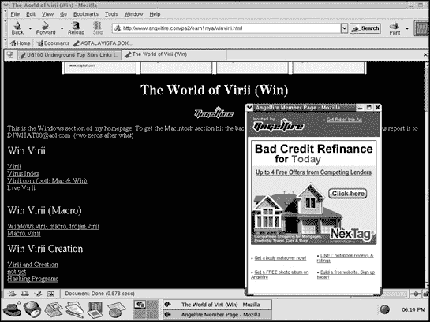

图 7-1. 黑客经常在免费网络托管服务上建立网站，如 Tripod 或 AngelFire。

在罕见的情况下，一个雄心勃勃的黑客可能会花费时间和金钱来创建一个带有描述性域名的网站。就像他们的免费网络托管同行一样，这些黑客网站很少能持久，因为任何被认为过于争议性的内容（例如，活计算机病毒和旨在绕过微软 Windows 产品激活功能的软件补丁）都可能迅速让网站运营商陷入麻烦，当局可能会将其关闭。据说，当黑客开始分发一个禁用 Windows XP 产品激活功能的程序时，例如，微软迅速关闭了提供该程序的任何网站。

## 黑客网站：娱乐与盈利

尽管个人黑客很少再建立网站，但黑客团体经常这样做，以提供一个发表观点的平台，以及一个他们可以发布黑客工具或通过销售 T 恤或 CD 等黑客商品来盈利的地方。本节列出了其中一些更稳定的黑客组织网站。

### [Attrition.org](http://attrition.org)

该网站提供有关计算机安全的当前和存档新闻，包括计算机安全业务中涉嫌欺诈的个人和组织名单([www.attrition.org](http://www.attrition.org)).

### AusPhreak

AusPhreak 为澳大利亚和国际黑客提供了一个聚会和分享想法的网站([www.ausphreak.com](http://www.ausphreak.com)).

### 混沌计算机俱乐部

欧洲最古老的黑客组织之一，也是最大的组织之一，混沌计算机俱乐部可能因其与西德黑客卡尔·科赫的松散联系而闻名，卡尔·科赫被指控入侵美国政府计算机网络并向苏联克格勃情报机构出售军事机密([www.ccc.de](http://www.ccc.de))).

### 死牛崇拜者

死牛崇拜者（见图 7-2)).


图 7-2. 像死牛崇拜者这样的黑客组织经常建立网站以供娱乐并分发自己的黑客软件。

### 新秩序

New Order 提供黑客软件、安全漏洞以及一些有趣的项目列表，例如 GhostProxy，它设计用来让您匿名浏览互联网；MD5 反向查找数据库，帮助您破解用于保护密码的 MD5 加密文件（也称为 *hashes*）；以及 Slut-Box，一个专门设置的服务器，允许人们练习破解计算机而不会被逮捕（[`neworder.box.sk`](http://neworder.box.sk)）。

### 诺玛移动研究中心

提供大量针对寻找流行程序漏洞的黑客工具和研究论文（[www.nmrc.org](http://www.nmrc.org)）。

### Shmoo Group

安全专业人士的网站，他们捐赠自己的时间来创建用于黑客攻击或捕捉黑客的有用工具（[www.shmoo.com](http://www.shmoo.com)）。

### 地下新闻

黑客工具和新闻在地下新闻上发布，同时还有计算机行业流传的最新谣言（[www.undergroundnews.com](http://www.undergroundnews.com)）。

## 计算机安全“黑客”网站

大多数黑客不再建立自己的网站的主要原因是因为其中没有钱可赚。在运营网站的成本、设计和维护所需的时间以及提供可能鼓励盗版的程序可能产生的法律责任之间，大多数黑客选择更有利可图的路线，自称“安全专业人士”。与其冒着因黑客攻击而入狱的风险，这样的改过自新的黑客/安全专业人士将他们的黑客技能卖给出价最高的人。

一家著名的黑客组织，被称为 L0pht Heavy Industries，将自己从黑客组织转变为名为 @Stake 的计算机安全公司，随后又被 Symantec 收购。在服刑时间和合法黑客攻击获得报酬之间做出选择，很容易理解为什么黑客会选择成为安全专业人士。

### AntiOnline

这个黑客新闻、病毒源代码和特洛伊木马程序的来源还提供各种论坛，安全专业人士可以在其中聊天和交流信息（[www.antionline.com](http://www.antionline.com)）。

### DShield

从防火墙收集信息以跟踪世界各地发生的不同类型的黑客攻击（[www.dshield.org](http://www.dshield.org)）。

### [Hideaway.net](http://hideaway.net)

[Hideaway.net](http://hideaway.net) 提供新闻、信息和不同类型的网络安全软件以及匿名网络浏览网站的链接（[www.hideaway.net](http://www.hideaway.net)）。

### [Insecure.org](http://insecure.org)

Nmap 安全扫描器的家园，该网站还列出了保护您的计算机和网络免受攻击的顶级安全工具（[www.insecure.org](http://www.insecure.org)）。

### PacketStorm

提供关于黑客和最新漏洞的历史和当前信息及工具（[`packetstormsecurity.org`](http://packetstormsecurity.org)）。

### 安全新闻门户

Security News Portal ([www.securitynewsportal.com](http://www.securitynewsportal.com))提供了一个包含各种计算机安全资源、新闻、公司和安全威胁链接的大型目录。

### SecureRoot

该网站按类别组织了各种黑客和计算机安全资源的链接，方便浏览（[www.secureroot.com](http://www.secureroot.com)），如图 7-3 所示。


图 7-3。SecureRoot 提供了一个类似 Yahoo 的门户，包含指向黑客网站、详细说明操作系统漏洞和电话黑客信息的链接。

### SecurityFocus

BugTraq 邮件列表的最新漏洞之家，SecurityFocus 还提供安全程序库以及与安全相关的职位银行（[www.securityfocus.com](http://www.securityfocus.com)）。

### [Startplaza.nu](http://startplaza.nu)

另一个包含不同计算机安全公司、黑客团体和安全软件工具的大型目录可在[Startplaza.nu](http://startplaza.nu) ([www.startplaza.nu](http://www.startplaza.nu))找到。

### Sys-Security Research

该网站提供关于计算机安全问题的白皮书，特别强调 VoIP（[www.sys-security.com](http://www.sys-security.com)）。

### Talisker 的安全门户

英国安全网站，为政府、军事组织（以及访问其网站的任何人）提供实时安全警报和更新——[www.securitywizardry.com](http://www.securitywizardry.com)。

### WindowsSearch

该网站将计算机安全（专注于 Windows）的覆盖范围打包，并提供在线木马扫描器、电子邮件漏洞扫描器和网络安全扫描器（[www.windowsecurity.com](http://www.windowsecurity.com)）。

### Wiretapped

Wiretapped 专注于密码学和网络监控，提供了大量关于数据包捕获、网络映射和网络入侵检测软件的链接（[www.wiretapped.net](http://www.wiretapped.net)）。

## Hacker search engines

要找到更多黑客和安全相关的网站，你可以使用普通的搜索引擎，如 Google，但你将不得不筛选大量无关的链接。为了更精确的替代方案，请使用专门的黑客搜索引擎 AstalaVista ([www.astalavista.com](http://www.astalavista.com))。AstalaVista 可以帮助你追踪从最新蠕虫或病毒的源代码到用于探测另一台计算机防御的端口扫描器当前版本的一切。

如果 AstalaVista 找不到适合你的黑客网站，它还会提供一系列你可以使用的额外黑客搜索引擎列表，如图 7-4 所示 Figure 7-4，或者你可以尝试[`astalavista.box.sk`](http://astalavista.box.sk)。

# Hacker Magazines

孩子们可能会阅读 *Teen People* 杂志，而成年人可能会阅读 *Time* 或 *Newsweek*（或 *Weekly World News*）。黑客们也喜欢阅读自己的杂志。尽管这些标题在超市的结账通道中并不显眼，但它们可以在一些大型书店以及互联网上找到。黑客杂志通常有非规律的出版时间表，所以如果最新一期杂志已经几个月前出版，或者杂志已经完全停止出版，请不要感到惊讶。

## 2600

每季度出版一次的 *2600* 是最古老和最受尊敬的黑客杂志之一。其网站不提供杂志文章，但提供最新的黑客新闻以及黑客大会的列表（[www.2600.com](http://www.2600.com)）。

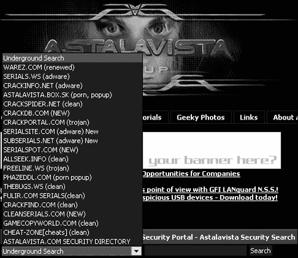

图 7-4. AstalaVista 列出了各种黑客搜索引擎，并警告你哪些搜索引擎在访问时会尝试加载间谍软件或特洛伊木马。Figure 7-4。

## Blacklisted! 411

另一本偶尔出版的黑客杂志是 *Blacklisted! 411*（如图 7-5 所示 Figure 7-5)。其网站提供往期文章以及最新的黑客新闻（[www.blacklisted411.net](http://www.blacklisted411.net)）。

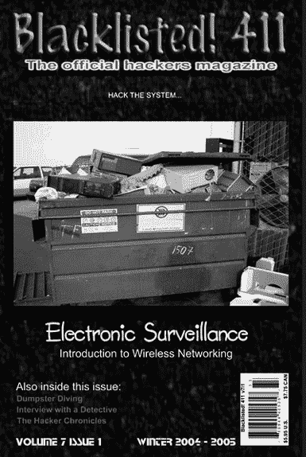

图 7-5. 黑客杂志努力制作有趣的封面，描绘黑客文化的一些方面，如翻垃圾桶。

### Hacker News Magazine

这本有趣的法国黑客杂志提供黑客工具、新闻和文章供浏览（当然，前提是你能阅读法语）——[www.hackermag.com](http://www.hackermag.com)。

### The Hackademy Premium

这本面向白帽黑客的法国杂志，提供法语、西班牙语和英语的文章和新闻。该团队还在巴黎的黑客学校提供培训课程（[`premium.thehackademy.net`](http://premium.thehackademy.net)）。

### Phrack

*Phrack* 是一本历史悠久的黑客杂志，自 1985 年以来一直在运营，报道了网络、电话、电话黑客和其他计算机黑客主题，直到最近停止出版。也许在你读到这本书的时候，另一个团体已经站出来继续出版这本杂志([www.phrack.com](http://www.phrack.com))。

### 私线

*私线* 是一本专注于电话黑客所有方面的不寻常的杂志，包括移动电话、VoIP 以及普通固定电话系统([www.privateline.com](http://www.privateline.com))。

# 黑客 Usenet 新闻组

黑客经常通过 Usenet 新闻组的匿名性进行交流，在侮辱、病毒源代码帖子、快速致富计划的广告以及链接到每个人都应该在关闭之前访问的最新临时黑客网站之间分享信息和回答问题。

## 通用黑客新闻组

要开始学习一般黑客技术，请尝试以下列出的通用黑客新闻组之一。与其他专注于集邮或摄影等主题的新闻组不同，黑客新闻组往往偏离其主题。例如，alt.binaries.hacking.beginner 新闻组声称它关于帮助新黑客找到和使用黑客程序，但经常充满关于病毒编程和加密的讨论，或者恶意的侮辱战争。其他黑客新闻组包括 alt.hacker, alt.hacking, alt.binaries.hacking.beginner, alt.binaries.hacking.websites, alt.2600.hackers, 和 comp.hackers。

## 计算机病毒新闻组

计算机病毒编写者经常在新新闻组中发布他们的最新作品（或发布您可以下载它们的 URL）。如果您想找到最新的活病毒（或病毒源代码），请访问以下新闻组之一：alt.comp.virus, alt.comp.virus.source, alt.comp.virus.source.code, 或 comp.virus。

## 加密新闻组

由于黑客经常规避他们国家法律的界限，他们明智地使用加密技术隐藏他们的身份或信息，这种技术与政府机构用来保护国家机密的技术相同。要了解有关使用和编写加密来保护您的敏感数据的最新信息（您将在第二十二章中了解更多），请访问以下新闻组之一：alt.cypherpunks, alt.security, alt.sources.crypto, misc.security, sci.crypt, 或 sci.crypt.research。

## 破解新闻组

大多数游戏和应用程序都受到版权保护，以防止软件盗版。同样，许多共享软件程序在用户支付代码或密钥以解锁附加功能之前提供有限的功能。

一些黑客试图绕过或破解受版权保护的和“锁定”的共享软件程序。破解方法包括共享序列号、解锁代码和使用旨在解锁或复制受版权保护游戏的程序。要了解这些程序和技术，请访问以下新闻组之一：alt.2600.crack、alt.2600.crackz、alt.binaries.cracked 或 alt.cracks。

# 在 IRC 上找到黑客

你可以在几乎每个互联网中继频道（IRC）网络上出现的众多黑客聊天室之一中与黑客进行实时聊天。在你电脑上安装了 IRC 客户端程序，如 mIRC ([www.mirc.co.uk](http://www.mirc.co.uk))之后，你需要选择一个要加入的 IRC 网络。一些更受欢迎的网络包括 EFnet、DALnet、Undernet 和 2600 net（由黑客杂志*2600*运营）。

一旦你连接到 IRC 网络服务器，你就可以创建一个新的聊天室或加入一个现有的聊天室。要找到黑客聊天室，寻找像#2600、#phreak、#carding、#cracks、#anarchy 或其他听起来像黑客的短语命名的房间。

使用 IRC 本身是一项特殊技能，许多黑客可能会因为你在他们的聊天室中打扰而感到不悦，所以在探索不同的网络和聊天室时要小心。只要有足够的耐心，你最终可以在不同的聊天室中遇到并交朋友，成为经验丰富的 IRC 用户。要获取更多关于使用 IRC 的帮助，可以阅读由 No Starch Press 出版的 Alex Charalabidis 的*The Book of IRC*([www.nostarch.com/irc.htm](http://www.nostarch.com/irc.htm))。

# Hacker Conventions

黑客大会是结识那些你只在聊天室或新闻组中交流过的人，以及聆听来自世界各地讨论计算机安全最新趋势的演讲者的绝佳场所。由于许多黑客团体在黑客大会上宣布他们的最新黑客工具和技术，因此黑客界以及计算机地下世界的执法部门，包括 FBI 和特工处特工，都可以在这些会议上暗中观察。

任何人都可以参加黑客大会，包括黑客、执法机关人员和那些只是好奇计算机黑客世界生活的人。

## DefCon

DefCon 是一个每年在拉斯维加斯举行的年度大会，通常有来自世界各地的黑客、媒体和政府官员参加。一个受欢迎的比赛是“Spot the Fed”，参赛者试图找到在会议中监视的 FBI 特工([www.defcon.org](http://www.defcon.org))。

## HOPE (Hackers on Planet Earth)

由黑客杂志*2600*举办，这个会议关注黑客的所有方面，包括电话黑客、病毒编写、社会工程和信息战([www.2600.com](http://www.2600.com))。

## Chaos Communication Congress

欧洲最大的黑客会议 Chaos Communication Congress 由德国的 Chaos Computer Club 运营([www.ccc.de/congress](http://www.ccc.de/congress))。

## PH-Neutral

德国黑客会议，面向欧洲人和任何有足够钱飞往柏林的人（[`ph-neutral.darklab.org`](http://ph-neutral.darklab.org)）。

## RuxCon

澳大利亚安全会议，专注于澳大利亚地区的黑客活动（[www.ruxcon.org.au](http://www.ruxcon.org.au)）。

## ShmooCon

这是一个年度东海岸黑客会议，有众多演讲者和讨论计算机安全的机会（[www.shmoocon.org](http://www.shmoocon.org)）。

## SummerCon

夏季黑客大会，每年在不同的城市举行，以便来自世界各地的黑客都能参加（[www.summercon.org](http://www.summercon.org)）。

## ToorCon

ToorCon 是一个较新的计算机安全会议，由黑客组织，他们希望将他们对黑客技术的热爱与圣地亚哥的阳光相结合（[www.toorcon.org](http://www.toorcon.org)）。

# 别慌张：黑客也是人

你遇到的黑客越多，无论是通过新闻组、网站，还是在黑客大会上亲自见面，你对黑客的看法就越有可能改变。一些黑客符合黑客的刻板印象，但其他人则与任何先入为主的观念大相径庭。

当然，就像任何一群人一样，总会有一些你最好避免的人。其中一些恶意黑客可能会试图诱捕你的信用卡号码，在网上使用你的身份，或者只是通过将 1-900 色情热线路由到你的家用电话来骚扰你。

其他黑客可能会看不起你，称你为 *新手*，这是对新来者的贬义词。忽略这些令人讨厌的人，因为他们曾经也是新手。只需继续自学，并从愿意帮助你的人那里学习，不久你也会被认为和他们一样有知识。当这种情况发生时，你必须决定你希望世界如何看待你——作为一个聪明和好奇的人，还是作为一个恶意和破坏的人。无论你希望人们如何看待黑客，这都取决于你。

# 第八章.追踪计算机

前费城警察局长和市长

费城街道很安全。只是有些人使它们变得不安全。

— 弗兰克·里佐

就像汽车窃贼一样，黑客通常以他们找到的第一个防御薄弱的计算机为目标。如果一台计算机太难破解，黑客通常会寻找更容易的目标。原因很简单。除非黑客有特定的理由要破解特定的计算机，否则他们可以在任何未受保护的机器上实现目标，而无需浪费时间尝试破解一个保护得很好的机器。

另一方面，如果黑客真的想破解你的计算机，因为它包含黑客想要的文件，或者因为你的计算机提供了通往更受保护的计算机网络的最低保护路径，你无法阻止黑客尝试。唯一安全的计算机是永远没有开启过的计算机。

# 为什么黑客会选择他们的目标

有时黑客入侵计算机只是为了好玩，看看他们是否能够做到，或者为了练习他们的技能。黑客通常针对企业计算机以获取其大量的存储空间，这对于存放盗版软件或电影来说可能是完美的。通过在别人的电脑上存储大量非法材料，黑客将责任从自己转移到毫无察觉的陌生人身上。

有时黑客针对企业计算机是为了获取其中的信息。在彼得·施瓦茨的书籍《友好间谍》中，他声称德国资助黑客进行名为“拉哈伯”的项目，该项目绘制了法国、日本、英国和美国政府所属计算机网络的架构和漏洞。同样，中国被指控利用黑客探测其他国家计算机网络的弱点，而且很可能美国和俄罗斯也开发了这种能力。

即使你的电脑不属于顶级机密的政府网络或大型企业，黑客也可能出于好玩的目的攻击你的电脑，但越来越频繁的是，他们这样做是为了盈利。很少有黑客关心某人访问了哪些网页，但许多人会对看到某人输入特定网页上的信用卡号码非常感兴趣。为了捕捉这类信息，黑客通常会安装远程访问木马（参见第五章第五章。木马和蠕虫了解更多关于 RATs 的信息），这些木马可以捕获按键或屏幕图像，并在稍后发送给黑客。

黑客还会入侵个人拥有的计算机，以安装名为“僵尸程序”的程序，这些程序允许他们远程控制该计算机。与允许黑客完全控制受感染计算机的 RATs（远程访问木马）不同，僵尸程序是更小的程序，它们接受并执行更有限的命令范围。通过将感染了僵尸程序的计算机连接起来，黑客可以创建一支“僵尸”或“无人机”军队。通过一个命令，他们可以被指示向另一台计算机发送大量数据，使其关闭（拒绝服务攻击），或者发送大量垃圾邮件（垃圾邮件）。(连接到高速互联网连接的个人电脑，如 DSL 或电缆调制解调器，特别受重视，因为它们始终可用，并且可以以高速发送信息，如垃圾邮件。)

总会有一些黑客出于某种原因想要入侵任何特定的系统，包括你的系统，无论你是负责企业计算机安装还是仅仅管理自己的个人电脑。

# 寻找目标

当军队需要找到目标时，他们会派出侦察兵试图渗透敌军领土并报告他们所发现的情况。同样，当黑客想要入侵计算机时，他们需要侦察可能的目标以确定哪些要攻击。如果黑客没有特定的计算机要攻击，他们通常会使用战拨、端口扫描和战车侦察来寻找机会目标。

## 战拨

在互联网兴起之前，战拨是找到攻击计算机的最佳方式。即使在今天，尽管对互联网的依赖很重，许多公司仍然使用电话调制解调器，允许销售人员通过 pcAnywhere 或 LapLink 等程序远程连接和控制办公室计算机。如果计算机同时连接到网络和外线电话，黑客通常可以通过电话线悄悄潜入，绕过网络上的防御措施。（如果计算机只能通过电话线从外部访问，战拨可能是进入的唯一方式。）电话线路通常没有防火墙或入侵检测系统。

许多公司从知道调制解调器的电话号码没有公开列出中获得了虚假的安全感。但仅仅因为黑客不知道特定计算机的电话号码，并不意味着他找不到它。这就是战拨的全部内容。

大多数公司的电话号码都使用相同的区号。例如，具有 239 区号的公司的内部电话线路可能都有像 239-1029 或 239-8953 这样的号码。黑客可以整夜拨打不同的电话号码，直到找到一个另一端有调制解调器的号码，或者简单地让计算机通过运行战拨器（见第二章）来完成这项繁琐的工作。

战拨器可以自动拨打一系列电话号码，例如从 239-1000 到 239-9999。对于它尝试的每个号码，它都会监听回答调制解调器的明显吱吱声，如果听到，就会记录电话号码。黑客可以让战拨器整夜运行，第二天早上醒来时，会有一份电话号码列表，包括已列出的和未列出的，每个号码都连接到一个调制解调器。

然后，他可以逐个拨打每个电话号码。在计算机允许通过电话线访问之前，它通常会要求密码。黑客需要做的就是猜测正确的密码，然后计算机就会敞开大门让黑客进入。

防止战拨的最简单的方法之一是回叫设备。当有人（有效用户或入侵者）给计算机打电话时，回叫设备会挂断并拨打一个预先安排的电话号码，只有有效用户才会接听。当然，一个真正有决心的黑客可能会以某种方式找到回叫设备使用的电话号码，然后使用该号码的呼叫转接功能将电话转接到黑客的电话号码。

## 端口扫描

端口扫描的工作方式类似于拨号攻击，但不同的是，扫描器探测一系列互联网协议（IP）地址，如图 8-1 所示。

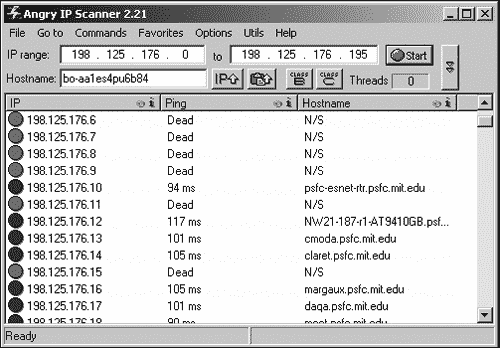

图 8-1. 端口扫描器可以扫描一系列 IP 地址以找到要攻击的计算机。

每台连接到互联网的计算机都使用端口，为黑客提供了无数可以用来访问计算机的门。表 8-1 列出了更常见的端口，但请记住，计算机在任何给定时间可能都有数百个端口是开放的。

计算机可以通过两种协议在互联网上进行通信，即 TCP 和 UDP。通常，当一台计算机想要通过端口使用 TCP 协议与另一台计算机通信时，第一台计算机向第二台计算机发送一个同步（SYN）消息，这实际上是在告诉它，“我准备好连接到你的端口。”第一台计算机想要发起的通信类型决定了它使用的端口号，例如使用端口 110 发送电子邮件或使用端口 80 发送网页。当目标计算机接收到这条消息时，它会发送一个同步/确认（SYN/ACK）消息，表示，“好的，我也准备好了。”现在第一台计算机可以向第二台计算机的特定开放端口发送数据。

表 8-1. 通过互联网可访问的服务器上常见的端口类型

| 服务 | 端口 |
| --- | --- |
| 文件传输协议 (FTP) | 21 |
| Telnet | 23 |
| 简单邮件传输协议 (SMTP) | 25 |
| Gopher | 70 |
| Finger | 79 |
| 超文本传输协议 (HTTP) | 80 |
| 邮局协议，版本 3 (POP3) | 110 |

TCP 协议通常在可靠性比速度更重要时使用，因为不断确认其他计算机可能会减慢通信速度。这就是为什么发送电子邮件或传输文件通常使用 TCP。

UDP 协议最常用于流媒体视频或互联网电话，在这些应用中，速度更为关键。UDP 协议节省时间，因为它不需要像 TCP 协议那样经过“握手”过程，但就像 TCP 一样，UDP 仍然可能被利用。

在合法交互中，在端口上接收 TCP 同步消息并不是警钟，但意外且大量地接收它们可能是一个试图探测计算机防御的明显迹象，就像小偷大声摇晃建筑上每扇门的把手，试图看看哪些是锁着的。

因此，为了掩盖他们的探测尝试，端口扫描器使用各种规避技术。虽然这些技术并不总是有效，但这些策略的组合可以帮助识别进入计算机的不同方式，如下所示：

**TCP 连接扫描**

通过发送一个同步 (SYN) 数据包来连接到一个端口，等待返回的确认数据包 (SYN/ACK)，然后发送另一个确认数据包以建立连接 (ACK)。这种扫描类型是两台计算机通过端口通信时通常发生的情况。这种扫描很容易被目标计算机识别并记录下来，以警告系统管理员可能存在的黑客攻击。

**TCP SYN 扫描**

通过发送一个 SYN 数据包来连接到一个端口，并等待返回的确认数据包 (SYN/ACK)，这表明端口正在监听，但永远不会向目标计算机发送确认的 ACK 数据包。这种被称为半扫描的技术，比普通的 TCP 连接扫描更不容易被记录和检测，尽管现在许多安全程序专门寻找这种类型的扫描，仅仅是因为它更可能被黑客用来隐藏他们的探测尝试。

**TCP FIN 扫描**

通过向端口发送一个“无更多数据来自发送者” (FIN) 数据包来连接到一个端口。关闭的端口会响应一个重置 (RST) 消息，而开放的端口简单地忽略 FIN 数据包，从而揭示其作为开放端口的身份。

**分段扫描**

将初始 SYN 数据包分割成更小的部分，以掩盖其存在，从而避开保护目标计算机的任何数据包过滤器或防火墙。与 TCP 连接、TCP SYN 或 TCP FIN 扫描等其他扫描技术结合使用。

**FTP 弹跳攻击**

使用另一台计算机的 IP 地址和端口号从目标系统上的 FTP 服务器请求一个文件，从而掩盖攻击源（黑客的计算机）。成功的文件传输表明目标计算机上有一个开放的端口，但不会泄露黑客的 IP 地址。

**UDP (用户数据报协议) 扫描**

使用 UDP 而不是 TCP。当关闭的 UDP 端口收到一个探测时，它会发送一个 ICMP_PORT_UNREACH 错误消息。没有发送 ICMP_PORT_UNREACH 错误消息的端口是开放的。

一旦端口扫描确定特定 IP 地址上的计算机有开放的端口可供攻击，下一步就是确定目标计算机正在使用哪种操作系统和服务器软件。为了做出这种判断，黑客向不同的端口发送数据，并分析计算机的响应方式，如图 8-2 中的端口扫描器截图所示。

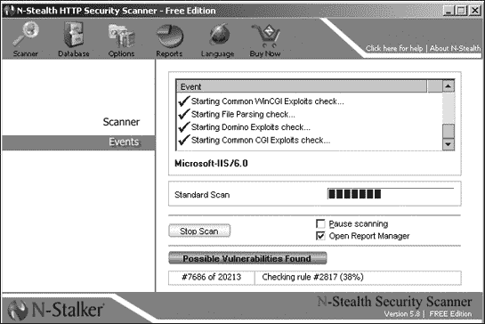

图 8-2。N-Stealth 端口扫描器已识别出这个特定的目标计算机正在运行 Microsoft IIS，版本 6.0。

端口扫描器使用各种平台探测技术，包括以下几种：

**FIN 探测**

向一个端口发送一个 FIN（“发送方没有更多数据”）数据包并等待响应。Windows 系统会对 FIN 数据包响应以 Reset（RST）消息，因此如果收到 RST 消息，计算机很可能正在运行 Windows。

**FIN/SYN 探测**

向一个端口发送 FIN/SYN 数据包并等待响应。Linux 系统会以 FIN/SYN/ACK 数据包响应。

**TCP 初始窗口检查**

检查从目标计算机返回的数据包的窗口大小。AIX 操作系统的窗口大小为 0x3F25，而 OpenBSD 或 FreeBSD 的窗口大小为 0x402E。

**ICMP 消息引用**

向一个关闭的端口发送数据并等待接收错误消息。所有计算机都应该将数据的初始 IP 头返回，并附加额外的八个字节。然而，Solaris 和 Linux 系统返回的字节超过八个。

一旦黑客知道了目标计算机的 IP 地址、该目标计算机上可用的开放端口以及目标计算机使用的操作系统类型，黑客就可以制定他的入侵策略，就像小偷在试图闯入房屋之前可能会先踩点，以确定最佳路线。

如果你想看看端口扫描器是如何工作的，你可以尝试 Angry IP Scanner（[www.angryziber.com/ipscan](http://www.angryziber.com/ipscan)）；Nessus（[www.nessus.org](http://www.nessus.org)）；iNetTools（[www.wildpackets.com](http://www.wildpackets.com)）；N-Stealth（[www.nstalker.com/eng/products/nstealth](http://www.nstalker.com/eng/products/nstealth)）；Nmap（[www.insecure.org/nmap](http://www.insecure.org/nmap)）；SAINT（[www.saintcorporation.com](http://www.saintcorporation.com)）；或 SARA（[`www-arc.com/sara`](http://www-arc.com/sara)）。

Nmap 被认为是首屈一指的端口扫描工具，它提供了各种扫描和规避技术。由于现在大多数网络都使用防火墙和入侵检测系统（IDS）来检测端口扫描器，Nmap 会将数据包分成更小的片段，这样就可以欺骗防火墙或 IDS，使其无法识别正在进行的端口扫描。

Nmap 还允许你伪造数据来源。如果一个防火墙或 IDS 检测到大量数据从一个计算机发来，它可能会正确地得出结论，黑客正在探测其防御。但通过使用 Nmap，黑客仍然可以探测计算机，但每次探测看起来都来自不同的计算机（实际上是从同一台计算机）。无论防火墙或 IDS 多么出色，它们都无法达到 100%的可靠性，而像 Nmap 这样的端口扫描器不断进化，以利用最新的技巧。

## 战术驾驶

与通过有线电缆将电脑物理连接起来形成网络相比，许多公司和个人正在转向无线网络。这个想法很简单。你插入一个称为路由器或接入点的设备，它将信号从任何带有无线网络接口卡（NIC）的电脑中转发出去。这些电脑可以像通过电缆物理连接一样访问由此产生的无线网络。

任何无线接入点范围内的带有无线网卡的电脑都可以访问无线网络。不幸的是，这也意味着街对面的黑客将无线网卡插入笔记本电脑后，也能访问相同的网络。当你设置无线网络时，就像在建筑物的每个窗户上都伸出一条线缆的普通有线网络，任何人都可以随时将其电脑插入并使用它来访问你的网络，而你可能根本不知道。

随着如今如此多的公司和个人转向无线网络，黑客只需用笔记本电脑、无线网络接口卡和扫描程序在街区周围驾驶，就可以定位无线网络。有时黑客还会包括全球定位系统（GPS）来绘制他们找到的无线网络的精确位置。在街区周围驾驶和扫描无线网络的过程被称为*战车驾驶*。（还有战步、战飞和战船，但每种情况的主要思想都是相同的：在街区巡航并搜索无线网络。）

一旦你有了具有无线功能的笔记本电脑或手持电脑，你只需在附近漫步到一个未受保护的无线“热点”（一个提供无线接入的区域）附近，就可以直接用它连接到互联网。

虽然咖啡馆和公共图书馆提供免费无线互联网接入作为吸引顾客的服务，但许多个人和企业无意中也在提供免费无线互联网接入。当人们设置无线网络时，他们通常只是将无线路由器连接到他们的互联网连接（如电缆或 DSL 调制解调器）上，然后立即就有无线接入。不幸的是，这些人没有意识到互联网接入的范围通常超出了他们家或办公室的物理边界，并溢出到街道和人行道上。任何人都可以通过这些无意的无线热点访问互联网。

如前所述，要找到无线（WiFi）热点，你可以带着你的笔记本电脑或手持电脑四处走动，或者你可以使用方便的 WiFi 定位设备，例如 WiFi Seeker（[www.wifiseeker.com](http://www.wifiseeker.com)）或 Intego（[www.intego.com/wiFiLocator](http://www.intego.com/wiFiLocator)）制造的设备，如图 8-3 所示。


图 8-3。一个 WiFi 定位器设备让你在没有电脑的情况下扫描 WiFi 热点。

在许多令人惊讶的情况下，人们会设置无线网络时没有考虑到安全性，这意味着你只需打开无线功能的电脑就可以访问那个 WiFi 网络。为了防止这种情况，一些人会开启 WiFi 加密，这被称为有线等效隐私（WEP）。

WEP 加密会混淆通过 WiFi 网络发送的任何数据，这实际上阻止了陌生人访问 WiFi 网络。原始的 WEP 加密标准仅使用了 40 位的加密密钥，但更安全的新 WEP 加密使用了 128 位的密钥。用于加密数据的密钥越长，加密就越难破解。这有点像尝试猜测 1 到 10 之间的数字与尝试猜测 1 到 999,999,999 之间的数字一样。

为了破解 WEP 加密，黑客使用特殊的嗅探程序，从 WiFi 网络中捕获数据以进行密码分析。嗅探程序捕获的数据越多，它破解 WiFi 网络加密方式的机会就越大。给定足够的时间，大多数嗅探程序最终都能破解 WEP 加密，让黑客进入网络。

新的无线网络现在使用 WiFi 保护接入（WPA），这是一个更强的加密标准。然而，即使这样也不是完全不可攻破的，因为黑客已经开发了一个名为 coWPAtty 的程序，它从无线网络中捕获足够的数据，然后使用字典攻击（参见第九章了解更多关于使用字典攻击破解密码的信息）来找到访问无线网络所需的密码。

黑客已经为所有类型的电脑和操作系统开发了嗅探程序，包括 Windows、Linux、Macintosh，甚至 Palm 和 PocketPC 手持电脑。要找到嗅探程序，请访问[WarDriving.com](http://wardriving.com) ([www.wardriving.com](http://www.wardriving.com))。对于专门设计用于嗅探 WiFi 网络的操作系统，请下载并运行一个独特的 Linux 发行版，称为 WarLinux ([`sourceforge.net/projects/warlinux`](http://sourceforge.net/projects/warlinux))。

为了击败嗅探程序，一些企业网络依赖于客户端证书，这些证书验证特定电脑是否有权访问网络。如果电脑试图在没有适当客户端证书的情况下访问网络，网络会将其切断。客户端证书使访问无线网络变得更困难，但如果黑客劫持了一台允许访问网络的电脑，黑客可以通过“受信任”的电脑访问网络，这证明了实际上并不存在“受信任”的电脑。

### 访问 WiFi 网络的步骤

访问 WiFi 网络的第一步是找到 WiFi 信号，无论是通过使用 WiFi 定位设备还是让你的 WiFi 设备扫描无线电波。由于两个 WiFi 网络可能相互重叠，每个网络都会用一个*服务集标识符（SSID）*来标识自己，这是一个独特且描述性的网络名称。计算机必须知道 WiFi 网络的 SSID 才能连接到它。

黑客可以通过两种方式检索这些信息。首先，他们可以使用嗅探程序从空中捕捉数据包并检查它们，以拼凑出 SSID。其次，他们可以预料到网络管理员可能已经保留了 WiFi 网络的默认制造商设置，包括默认 SSID，这通常是制造 WiFi 路由器的公司的名称，例如*LinkSys*或*NetGear*。因此，当在无线电波中搜索时，黑客首先会尝试所有不同 WiFi 制造商使用的各种默认密码。

一些 WiFi 网络可能需要用户名和密码才能访问。然而，与 SSID 设置一样，几乎所有 WiFi 设备都附带默认用户名和密码，而且很少有人会费心更改。因此，黑客首先尝试向 WiFi 网络提供已知默认密码和特定 WiFi 制造商的用户名。如果这不起作用，黑客可以使用嗅探程序研究 WiFi 网络使用的数据包，并窃取合法用户的用户名和密码。为了阻止入侵者，一些 WiFi 网络只会允许具有特定（MAC）地址的网络接口访问，这些地址唯一地标识了 WiFi 网络上的计算机。然而，要找到一个有效的 MAC 地址，黑客可以执行与窃取用户名和密码相同的基本操作。

如果你有一个 WiFi 网络，请考虑它容易受到攻击。总有人会尝试从隔壁、街道上或从停在你窗外的汽车中访问它。（快！现在看看！）

### 寻找 WiFi 网络

如果你想找到一个公开接受用户（免费或付费）的 WiFi 网络，请访问 WiFi 热点搜索引擎，例如 HotSpot Haven（[www.hotspothaven.com](http://www.hotspothaven.com)）或 WiFiMaps.com（[www.wifimaps.com](http://wifimaps.com)）。通过提前规划，你总是可以靠近一个 WiFi 热点，无论你是在匹兹堡还是帕萨迪纳。

然而，如果你想找到一个不对公众开放的 WiFi 网络，你可以访问无线地理日志引擎（[www.wigle.net](http://www.wigle.net)），它列出了世界各地已知的 WiFi 热点，如图 8-4 所示。

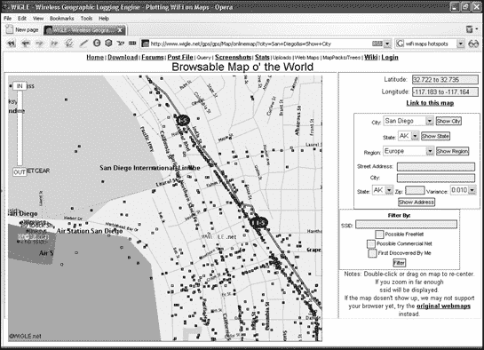

图 8-4. 一个 WiFi 地图可以显示你家乡附近可能的热点。

为了使找到 WiFi 网络更加容易，黑客们采用了 19 世纪末和 20 世纪初流浪汉的技术，他们曾在树木和建筑物上雕刻或绘制标记，以警告其他流浪汉不友好的城镇、同情家庭或跳上过往火车的良好地点。同样，今天的战标（访问[www.warchalking.org](http://www.warchalking.org)）涉及在社区周围绘制标记，以识别特定无线网络的位置和特征，如图 8-5 所示。


图 8-5. 用战标符号来识别无线网络的位置和状态。

一旦第一个黑客发现了一个 WiFi 网络并留下了一个战标标记，其他黑客很可能会探索这个无线网络。尽管许多公司制造无线设备，但许多无线黑客工具，如 Kismet ([www.kismetwireless.net](http://www.kismetwireless.net))，都包含每个制造商的默认无线配置数据库。由于大多数人从未更改这些默认设置，因此使用 Kismet（或类似的无线黑客工具）的黑客通常可以立即访问无线网络。

在网络中，如此多的不受欢迎的入侵者四处游荡，他们中任何一个不小心或故意破坏、删除或修改一些重要文件，只是时间问题。

### 保护 WiFi 网络

保护 WiFi 网络免受入侵者攻击很容易：只需将其关闭。当然，当您在使用时关闭它并不实用，所以这里有一些简单的技巧，可以帮助保护您的 WiFi 网络免受不受欢迎的入侵者。

首先，尝试降低无线网络接入点的信号强度。通过降低信号，您可以限制其范围超出您需要的区域。接下来，更改 WiFi 设备的所有默认设置，例如其 SSID 标识符、用户名和密码。接下来，打开 MAC 地址过滤，以便您的 WiFi 网络只允许具有特定 MAC 地址的网络接口的计算机访问网络。最后，打开 WEP 加密。虽然 WEP 加密不能保护您的网络免受决心黑客的攻击，但它可以阻止寻找容易访问的 WiFi 网络的偶然黑客。新的 WiFi 设备支持一种改进的加密标准，称为 WiFi 保护接入（WPA）。如果可以选择，请使用 WPA 加密而不是 WEP 加密。

对于那些喜欢采取主动立场来防御黑客的人来说，可以尝试运行一个名为 Fake AP 的程序，该程序由 Black Alchemy 创建（[www.blackalchemy.to](http://www.blackalchemy.to)）。Fake AP 程序会在无线电波中充斥着虚假的 SSID。现在，如果黑客试图找到你的 WiFi 网络，他必须穿过这个虚假 SSID 的洪水，这降低了黑客真正找到，更不用说入侵，你的 WiFi 网络的机会。

## 通过 Google 漏洞探测网站

破入任何计算机的关键是了解它运行了什么类型的软件。虽然通过直接连接到目标计算机并运行许多黑客程序之一来探测计算机的安全边界，从而获取此类信息是可能的，但这就像一个打算闯入房屋的窃贼透过窗户窥视一样。这可能有效，但风险是会警告目标它正在被监视，并且还留下了可能导致入侵者追踪的线索。

因此，为了避免这种风险，黑客简单地让 Google 为他们找到这些信息。这不仅隐藏了黑客的身份，还阻止了目标知道正在对其进行探测。

### 使用 Google 查找特定的网络服务器软件

黑客通常专注于破解特定的网络服务器程序，他们可以使用 Google 来帮助他们找到更多易受攻击的计算机进行攻击。要搜索运行特定网络服务器程序的网站，只需输入您想要找到的服务器软件名称，例如 *Microsoft IIS 5.0* 或 *Red Hat Server 3.0*，使用以下查询格式：

```
intitle:index.of "*`Software name`*"
```

| **`intitle`** | 搜索包含特定单词或短语的标题的网页 |
| --- | --- |
| **`index.of`** | 指定网站的目录列表，通常在页面顶部附近有“索引”的标题 |
| **`"`***`软件名称`***`"`** | 指定特定的网络服务器程序名称，例如 *Microsoft IIS 6.0* 或 *Apache 2.2* |

这种类型的 Google 查询检查网站的目录列表，以揭示网站组织文件的方式以及运行其上的网络服务器软件的名称和版本，如图 图 8-6 所示。

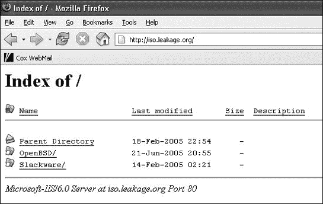

图 8-6. 一个网站的目录列表揭示了存储关键文件的目录以及网络服务器软件的名称和版本号。

### 搜索特定的网站

另一个强大的 Google 搜索工具是 `site` 操作符，它将您的搜索范围缩小到特定的网站域名。它具有以下格式：

```
site:"*`Domain name`*" "*`Search term`*"
```

| **`site`** | 在特定域名下的网站上搜索网页 |
| --- | --- |
| **`"`***`域名`***`"`** | 指定域名，例如.edu 或 army.mil |
| **`"`***`搜索词`***`"`** | 指定一个搜索词或短语 |

虽然这个查询可以在特定类型的网站上找到特定类型的信息时很有用，例如在所有“.gov”网站域名上查找有关“恐怖主义”的信息，但 site 操作符真正的威力在于它与 intitle 操作符结合使用时。这种组合可以搜索特定域名下运行特定 web 服务器程序的网站。

所以如果你知道如何入侵 Apache web 服务器，并且想知道哪些美国陆军网站可能在使用它，你可以使用以下查询，它将显示如图 8-7 所示的列表：

```
site:army.mil intitle:index.of apache
```

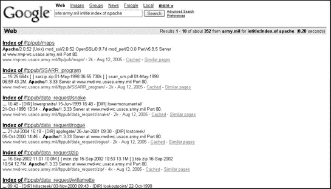

图 8-7。通过使用 intitle 和 site 关键词，你可以找到运行特定 web 服务器程序的一批网站列表。

一旦你知道你目标网站运行了特定版本的 web 服务器程序（例如 Apache 1.3），你就可以再次使用 Google 搜索“Apache 漏洞”或类似的字符串，以查看该特定 web 服务器程序中已知缺陷的信息。

### 注意

除了使用 Google 搜索软件漏洞外，你还可以浏览计算机安全网站，如[Packetstormsecurity.org](http://packetstormsecurity.org)和[CERT.org](http://cert.org)，这些网站列出了在 web 服务器中发现的最新软件漏洞。

安全公告旨在提醒系统管理员应立即修补的缺陷。然而，许多系统管理员要么从未看到这些公告，要么没有立即实施它们。因此，黑客也可以使用安全公告来寻找易受攻击的网站（许多人确实这样做）。

例如，假设你发现了一份安全公告，其中指出了 Apache 的一个漏洞并建议用户升级到 Apache 版本 1.3.27。有了这个信息，你只需搜索运行 Apache 早期版本的任何网站，你就会知道它很可能容易受到安全公告中描述的特定漏洞的影响。在许多情况下，安全公告对黑客和系统管理员同样有帮助。

### 探测网站的防御措施

许多系统管理员运行安全扫描器以探测他们网站上的漏洞。这通常会产生一份报告供系统管理员研究。不出所料，许多系统管理员从未删除这些安全扫描器报告，一旦您知道安全扫描器在其报告上始终存储的标题，您可以使用带有`intitle`操作符的谷歌查询来查找它们。

例如，一个流行的安全扫描器是 Nessus（[www.nessus.org](http://www.nessus.org)），您可以使用以下查询格式来搜索其报告：

```
intitle:"*`Scanner header`*"
```

要查找 Nessus 安全扫描器报告，扫描器标题搜索字符串是`"Nessus Scan Report"`：

```
intitle:"Nessus Scan Report" "This file was generated by Nessus"
```

这将帮助您在其他网站上找到安全扫描器报告，如图 8-8 所示。

即使安全扫描器报告的漏洞已被关闭，安全扫描器报告仍可以帮助黑客更好地了解目标计算机的防御措施。由于安全扫描器无法检测到所有可能的安全漏洞，它们可能会给懒惰的系统管理员带来虚假的安全感。如果一个知识渊博的黑客知道扫描器无法检测到的安全漏洞，系统管理员可能也没有检测到这个漏洞，黑客有很大机会利用这个漏洞。

除了安全扫描器外，许多系统管理员还依赖于入侵检测工具，例如流行的开源 Snort（[www.snort.org](http://www.snort.org)）。为了创建报告，Snort 用户通常会运行一个名为 SnorfSnarf 的程序。再次强调，如果系统管理员没有从他们的系统中删除 SnortSnarf 文件，黑客可以通过在谷歌上搜索“SnortSnarf 警报页面”来找到它们。这不仅会警告黑客某个网站正在运行 Snort 入侵检测系统，而且检索到的 SnortSnarf 报告还将显示其他黑客尝试过的攻击类型（并且据推测已经失败），如图 8-9 所示。

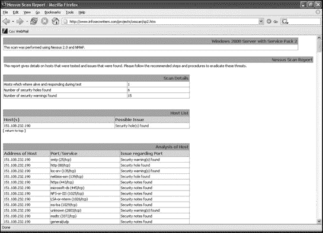

图 8-8。通过搜索安全扫描器报告，您可以了解系统上可能仍然开放的漏洞。

将“SnortSnart 警报页面”查询与`site`操作符结合，您可以使用如下查询找到运行 Snort 入侵检测程序的网站：

```
site:edu snortsnarf alert page
```

上述查询指示谷歌搜索所有使用 SnortSnarf 程序创建报告的教育网站（.edu）。

### 使用谷歌查找和复制文件

而不是入侵网站（并冒着被抓住的风险），黑客通常可以通过 Google 获取他们想要的网站文件。许多系统管理员将用户名、地址、电话号码甚至社会保障号码存储在 Microsoft Access 数据库文件中，通常称为 admin.mdb。要搜索这些类型的文件，你只需使用 `allinurl` 操作符。此查询的格式如下：

```
allinurl:"*`Filename`*"
```

| **`allinurl`** | 在网页定位字符串中搜索包含 `"`*`文件名`*`"` 的网页 |
| --- | --- |
| **`"`***`文件名`***`"`** | 指定要查找的文件 |

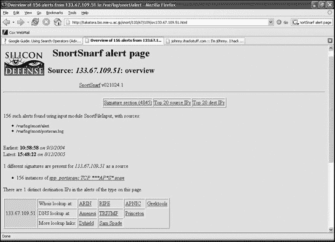

图 8-9. 查看网站扫描器的报告文件可以提前告诉你它已经保护了哪些类型的攻击。

因此，要找到通常包含敏感信息的 admin.mdb 文件，你只需使用这个查询：

```
allinurl:admin.mdb
```

使用 Google 找到此文件后，您可以通过 Google 下载并查看它，如图 图 8-10

图 8-10. 在通过 Google 查询找到文件后，你可以从网站上下载它。

另一个有助于查找特定类型文件的 Google 搜索操作符是 `filetype` 操作符。其格式如下：

```
filetype:"*`File extension`*" "*`Search term`*"
```

| **`filetype`** | 搜索具有由 `"`*`文件扩展名`*`"` 识别的扩展名的文件 |
| --- | --- |
| **`"`***`文件扩展名`***`"`** | 指定要搜索的文件类型，例如 PDF（Adobe Acrobat 文件）或 DOC（Microsoft Word 文件） |
| **`"`***`搜索词`***`"`** | 指定在这些文件中要查找的单词或短语 |

所以，如果你想找到包含短语 *仅限内部使用* 的 Microsoft Word 文档，你可以使用这个查询：

```
filetype:doc "for internal use only"
```

将 `filetype` 操作符与 `site` 操作符结合使用，您可以在军事网站上搜索所有包含 *仅限内部使用* 的 Microsoft Word 文档，如下所示：

```
site:mil filetype:doc "for internal use only"
```

`filetype` 操作符不太可能揭露包含绝密文件或阴谋证据的文件，但它可以是一种探测网站内部运作的额外方式。此外，`filetype` 操作符展示了 Google 在索引信息方面的入侵性，这些信息大多数网站管理员甚至不知道已经被暴露给了全世界。

### 防御 Google 黑客

为了防御谷歌黑客，请将任何敏感文件从您的网络服务器上移除。仅仅因为文件无法通过您的网页访问，并不意味着黑客无法找到该文件。即使一个敏感文件只是暂时存在于您的网站上，您也不安全。

然后尝试对您的自己的网络服务器进行谷歌黑客攻击，看看您能找到什么。您可能会惊讶于谷歌可能已经知道您服务器上的多少信息，以及您的电脑可能实际上有多脆弱。

搜索引擎如谷歌不断扫描不同的网站，并将找到的文件存储在称为缓存的存储区域中。一旦您的网站文件被存储在谷歌的（或某些其他搜索引擎的）缓存中，任何人都可以通过使用缓存操作符来查看它们。例如，如果您想查看之前由某个网站显示的页面，您可以使用以下示例中的`cache`操作符后跟网站地址：

```
cache:cnn.com
```

这个谷歌查询将显示谷歌目前存储在[CNN.com](http://cnn.com)网站上的网页。即使[CNN.com](http://cnn.com)在此期间删除或更改了页面，这些页面也将保留在谷歌的缓存中，直到谷歌下次通过访问[CNN.com](http://cnn.com)网站刷新其缓存。

谷歌，像大多数定期“爬取”互联网以找到要索引的网站的大多数搜索引擎一样，在访问网站时遵循某些规则。其中之一是网站管理员可以创建一个特殊的 robots.txt 文件，指定搜索引擎不应探索和存储在缓存中的网站部分。因此，如果您电脑上有您不想让别人看到的敏感文件，您可以创建一个 robots.txt 文件来告诉谷歌不要索引它们。（当然，最初不将敏感文件放在您的网络服务器电脑上要安全得多。）要了解更多关于 robots.txt 文件如何工作，请访问[www.robotstxt.org](http://www.robotstxt.org)。但请注意，黑客也可以查看您的 robots.txt 文件，以了解您想保护的信息类型，然后他们会确切知道在您的电脑中寻找哪种类型的信息。

另一个选择是请求搜索引擎（例如，谷歌）完全忽略您的网站。然而，虽然这可以防止黑客使用搜索引擎扫描您的网站，但它也会阻止合法用户通过这种方式找到它。要请求谷歌从其索引中删除您的网站，请遵循[www.google.com/remove.html](http://www.google.com/remove.html)上列出的步骤。

最后，访问谷歌黑客数据库（GHDB）——[`johnny.ihackstuff.com`](http://johnny.ihackstuff.com)，看看谷歌是如何使其他网站暴露于攻击之下的。这样（希望）您可以了解如何不成为相同伎俩的受害者。

互联网上的每一个工具都可以用来做好事或坏事，谷歌也不例外。如果你运营一个网站，你必须了解谷歌黑客技术，以便加固你系统的防御。如果你只是一个好奇且非恶意的个人，可以尽情地用谷歌进行实验。你可能会发现比你想象的还要多。

# 下一步

通过拨号攻击、端口扫描、驾驶攻击和谷歌黑客技术，黑客可以找到几乎任何连接到电话线或互联网的计算机。不幸的是，一旦黑客找到这样的计算机，他们往往无法抗拒入侵它的诱惑并探索它。一旦黑客破解了计算机，结果可能从黑客简单地浏览但什么都没改变到彻底摧毁整个系统，破坏所有可见的东西。如果你负责一个系统的安全，那么尝试防御许多可能被用来监视你系统的手段将是一件有趣的事情。如果你是一个黑客，你可以选择尝试哪种策略来首先突破计算机的安全防线。无论你使用哪种方法，都有很大可能性其中之一会成功，并帮助你绕过世界上甚至最昂贵的计算机安全系统。

# 第九章.破解密码

厌倦的解药是好奇心。对好奇心的解药却无迹可寻。

—— 多萝西·帕克

找到一台要攻击的计算机是第一步。破解这台计算机是第二步。大多数黑客的成功并非因为他们本身的内在才华，而是因为受害者方面的无知。

保护大多数计算机的第一道防线通常不过是一个独特的字母和数字组合，这就是我们所说的密码。密码的目的是阻止除合法用户之外的人访问，但实际上它们是任何安全系统中最薄弱的环节。最安全的密码通常是长度的，由数字、符号以及大小写字母的随机组合组成。然而，大多数人倾向于选择简单、易于记忆的密码。他们还倾向于为几个不同的系统（例如，他们的工作电脑、美国在线账户和 Windows 屏保）使用相同的密码。如果你发现了一个人的密码，你通常会得到打开他或她大量信息的钥匙，即使这些信息存储在几个不同的账户中。

当计算机需要你不知道的密码时，你有几个选择：

+   窃取一个有效的密码

+   猜测密码

+   强制破解密码

# 密码窃取

如果你能够接触到一台电脑，窃取密码最简单的方式就是通过“偷窥” —— 在别人输入密码时从其肩膀上方窥视。你也可以尝试在别人的桌子上四处翻找。大多数人发现密码很难记住，所以他们会把它们写下来并存储起来，以便于参考，可能是在显示器上的便利贴里或者桌子的抽屉里。这就是为什么黑客经常找清洁工的工作。在深夜没有人时打扫办公室，给他们提供了充足的机会去探索每个人的桌子，甚至可以在公司的电脑上进行实验。

如果黑客找不到明显写出的密码，他们可能会尝试通过社会工程学从易受骗的用户那里获取密码（参见第三章)，或者尝试使用常见设备（如思科路由器）附带的默认密码。要获取默认设备密码列表，请访问默认密码列表（[www.phenoelit.de/dpl/dpl.html](http://www.phenoelit.de/dpl/dpl.html)）、[CIRT.net](http://cirt.net) ([www.cirt.net/cgi-bin/passwd.pl](http://www.cirt.net/cgi-bin/passwd.pl)) 或其他名为默认密码列表的网站（[`defaultpassword.com`](http://defaultpassword.com)）。

如果社会工程学或默认密码失败，下一个最好的方法是使用以下方法之一来窃取密码：

+   键盘记录器

+   桌面监控程序

+   密码恢复程序

### 注意

所有这些程序都需要你能够访问受害者的电脑，这样你才能在不被他们知道的情况下安装或运行程序。

## 使用键盘记录器

一个*键盘记录器*或*键盘记录程序*会记录下一个人输入的每一个按键，并将这些信息保存在一个黑客可以稍后检查的文件中。通过使用键盘记录器，你可以恢复电子邮件地址、电子邮件和即时消息、信用卡号码，当然还有密码。一些键盘记录器甚至可以定期捕获屏幕截图，这样你就可以看到在输入某些按键时，某人正在使用哪个程序。

图 9-1 展示了一些设置键盘记录器的不同选项，例如在哪里存储捕获的按键，以及是否在电脑启动时自动加载。

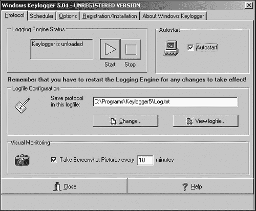

图 9-1. 键盘记录器可以在用户不知情的情况下监视电脑。

与大多数程序不同，这些程序会在 Windows 开始菜单和 Windows 任务栏等地方显示其名称和伴随的图标，按键记录器则隐藏在后台，这样受害者甚至不知道它们正在运行。尽管可以通过搜索电脑的内存、Windows 注册表或硬盘来找到正在运行的按键记录器，但如果受害者一开始就怀疑没有任何间谍软件在监视他们，他们就不会费心去寻找。

由于这些软件按键记录器总是有可能被检测到，并且每个程序只与某些操作系统兼容，例如 Windows，因此第二个选择是使用基于硬件的按键记录器。这类按键记录器插在电脑和键盘之间。

当然，仅通过查看电脑背面就可以发现外围硬件，但对于运行在该电脑上的任何软件来说，它是完全不可见的。有些人从不查看自己机器的背面，尤其是在工作中。最好的是，硬件按键记录器与任何操作系统兼容，包括 FreeBSD、Linux 或 Windows XP。

一些流行的硬件按键记录器包括 KeyGhost ([www.keyghost.com](http://www.keyghost.com))、Hardware Keylogger ([www.amecisco.com](http://www.amecisco.com))、Key Phantom ([www.keyphantom.com](http://www.keyphantom.com))和 KEYKatcher ([www.keykatcher.com](http://www.keykatcher.com))。要找到软件按键记录器，请访问[visitKeylogger.com](http://visitKeylogger.com) ([www.keylogger.org](http://www.keylogger.org))，该网站根据其功能和易用性对不同的按键记录器进行评级。

硬件按键记录器的一个问题是它们只能存储有限数量的按键，例如 128,000 个按键存储在 128Mb 中。虽然这听起来像很多按键，但用户在玩视频游戏时可能会输入 128,000 个按键，这会填满按键记录器的内存，然后按键记录器将没有更多空间来存储 128,001 到 128,009 个按键，而这些按键可能包含你想要的密码。

按键记录器从法律角度来看会引发额外的问题。有些人认为按键记录应该被视为窃听并定为非法，除非是法院授权使用。另一些人认为在自己的设备上使用按键记录器是可以接受的，即使这意味着监视其他用户。直到法院决定如何对按键记录器进行分类，使用它们可能意味着违反了你甚至不知道存在的法律。

## 使用桌面监控程序进行间谍活动

桌面监控程序是具有额外功能的强力按键记录器。它们不仅能够记录按键，还能秘密追踪某人使用哪些程序，使用每个程序的时间长度，以及查看过的每一个网站。为了识别在任何给定时间使用电脑的人，桌面监控程序还可以秘密开启摄像头来监视坐在屏幕前的人，如图图 9-2 所示。

要查找桌面监控程序，可以尝试以下网站：AppsTraka ([`appstraka.hypermart.net`](http://appstraka.hypermart.net))、PC Spy ([www.softdd.com](http://www.softdd.com))、Desktop Surveillance ([www.omniquad.com](http://www.omniquad.com))或 NetSpy ([www.skysof.com](http://www.skysof.com))。

你甚至可以在不物理接触受害者电脑的情况下远程安装一些桌面监控程序。要远程安装桌面监控程序，你可以给受害者发送一封看似无害的电子邮件，其中包含一个链接，让他们查看问候卡。然而，一旦他们点击这个链接，他们就会看到问候卡，并同时安装桌面监控程序。现在，桌面监控程序可以像远程控制木马（RAT）一样，从远处监视受害者（见第五章）。


图 9-2. 桌面监控程序可以追踪某人使用的每一个程序，甚至可以拍照。

许多公司现在使用桌面监控程序来保护自己，以防员工在公司时间内开始发送不适当的电子邮件给他人。一些公司甚至更进一步，使用桌面监控程序来确保员工在工作而不是在网上查看体育比分。

许多公司甚至将桌面监控程序作为监视配偶、孩子或男朋友/女朋友的方式，以确保他们没有做你不希望他们做的事情。当然，如果你觉得有必要监视（间谍）你亲近的人，你可能面临的问题不仅仅是知道他们在电脑上做什么。

## 使用密码恢复程序

因为反复输入密码以访问程序可能会很麻烦，许多程序允许用户存储密码。出于安全考虑，密码在屏幕上被隐藏在一串星号后面。但人们经常忘记他们的密码，然后无法访问他们的程序或文件。这时就出现了密码恢复程序，当然，这些程序也可以用来恢复他人的密码。通过运行这些密码恢复程序之一，并将鼠标指针移到隐藏的星号密码上，你可以看到下面的纯文本，如图图 9-3 所示。

一些流行的密码恢复程序包括 ActMon Password Recovery XP ([www.actmon.com/password-recovery](http://www.actmon.com/password-recovery))、Password Recovery Toolkit ([www.lostpassword.com](http://www.lostpassword.com))、Peek-a-Boo Password Viewer ([www.corteksoft.com](http://www.corteksoft.com)) 和 Revelation ([www.snadboy.com](http://www.snadboy.com))。

除了限制对特定程序的访问外，密码还可以阻止对单个文件（如 WordPerfect 文档或 Microsoft Excel 电子表格）的访问。

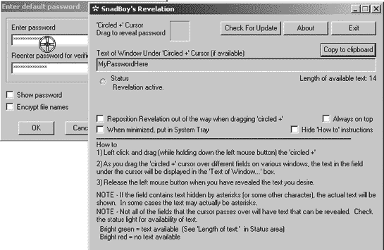

图 9-3. Revelation 密码恢复程序可以揭示隐藏在星号掩码后面的任何密码。

要恢复或破解受密码保护的文件，可以从以下公司之一获取特殊程序：Access Data ([www.accessdata.com](http://www.accessdata.com))、Passware ([www.lostpassword.com](http://www.lostpassword.com))、ElCom ([www.elcomsoft.com](http://www.elcomsoft.com))、Password Crackers Inc. ([www.pwcrack.com](http://www.pwcrack.com)) 或 Alpine Snow ([www.alpinesnow.com](http://www.alpinesnow.com))，如图图 9-4 所示。

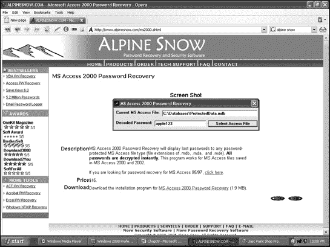

图 9-4. 你可以购买专门的软件来破解某些文件的密码，例如由 Microsoft Access 创建的文件。

# 字典攻击

理想情况下，密码应该是一组随机的数字、符号、大写和小写字母的集合，但很少有人愿意浪费时间创建一个他们可能会忘记的困难密码。相反，大多数人选择容易记住的普通单词作为密码。为了找到这样的简单密码，黑客们创建了特殊的密码破解程序，这些程序使用字典文件（有时也称为单词列表）。

图 9-5 展示了名为 Brutus 的密码破解程序，它试图使用两个文件，users.txt 和 words.txt，来破解网站。users.txt 文件包含常用用户名列表，words.txt 文件包含常用密码。通过混合和匹配不同的用户名和密码，Brutus 可以尝试无数组合，直到找到有效的用户名和对应用户名的密码。


图 9-5. Brutus 密码破解器可以不断混合各种用户名和密码的组合，直到破解进入网站。

字典文件仅包含人们可能用作记忆密码的常用单词，例如演员的名字、流行卡通角色、摇滚乐队、*Star Trek*术语、常见的男性和女性名字、与科技相关的单词以及大多数字典中都能找到的其他单词。

密码破解程序从字典文件中取一个单词，并尝试这个单词作为密码来访问计算机。如果第一个单词不正确，程序会尝试字典文件中的另一个单词，直到找到正确的密码或者用完所有的单词。当然，黑客可以不断尝试不同的字典文件；如果密码是一个普通单词，那么字典攻击找到它只是时间问题。

为了增加发现密码的机会，一些密码破解程序不仅会尝试字典文件中的每个单词，还会尝试每个单词的微妙变化，例如将单词拼写反序或添加不同的数字到末尾。因此，即使像*SNOOPY12*这样的密码在普通字典文件中找不到，密码破解程序仍然可以通过操纵其字典文件中的每个单词来发现这个密码。

最受欢迎的密码破解工具之一是 John the Ripper([www.openwall.com/john](http://www.openwall.com/john))，而最大的单词列表集合之一可以在 Wordlist Project([www.gattinger.org/wordlists](http://www.gattinger.org/wordlists))找到，该项目提供包括英语、西班牙语、日语和俄语在内的多种语言的列表。

要找到其他密码破解程序，请访问俄罗斯密码破解器([www.password-crackers.com](http://www.password-crackers.com))、AntiOnline([www.antionline.com](http://www.antionline.com))和 New Order([`neworder.box.sk`](http://neworder.box.sk))。

# 暴力破解密码攻击

字典攻击可以找到普通单词或单词变体作为密码，但有时密码由随机字符组成。在这种情况下，唯一的解决方案是使用暴力破解攻击。

正如其名所示，暴力攻击会穷尽所有可能的数字、字母和符号组合，直到找到正确的密码。因此，即使某人的密码像*NI8$FQ2*那样晦涩，暴力攻击最终也会找到它（以及该电脑上的其他所有密码）。

暴力攻击的主要缺点是耗时。你可以坐在银行的组合锁前尝试所有可能的三个数字组合，但找到能打开锁的那个可能需要很长时间。同样，暴力攻击可能需要几千年才能找到一个有效的密码。

因此，暴力攻击通常对受强密码（由随机字母、数字和符号组成）保护的个人电脑来说是无用的。然而，在网络中它们仍然可能有效。使用网络的用户越多，至少有一个人选择一个简单且容易记住的密码的可能性就越大，比如她的狗的名字或她家电话号码的前三个数字。暴力攻击将发现网络中最薄弱的密码，这就是黑客所需要的全部。

# 密码：第一道防线

选择一个独特且难以猜测的密码可能会阻止所有但最坚定的黑客。（如果你记不住它，它也可能阻止你。）为了阻止大多数黑客，只需在你的密码中添加一些随机字符（如符号和数字）或使用专门的程序，例如 Quick Password Generator ([www.quickysoftware.com](http://www.quickysoftware.com))，Masking Password Generator ([www.accusolve.biz](http://www.accusolve.biz))，或 RandPass ([www.randpass.com](http://www.randpass.com))，这些程序可以创建不同长度的真正随机密码，如图 9-6 所示。

当然，试图记住一个随机密码可能会很麻烦，所以许多人会基于他们不会忘记的有意义短语来创建密码，例如"IhtP2004"，它可以代表"I hate the President"，后面跟着一个选举年份。通过取一个容易记住的短语的第一个字母，并添加只有你才明白的数字或其他字符，你可以创建一个难以猜测的密码。

通常情况下，密码越长，别人猜测或破解的难度就越大。在 Windows NT 中，密码尤其容易被破解，因为它们由 14 个大写字母组成，分为两个 7 字符的部分。因此，与其强迫黑客破解一个 14 字符的密码，Windows NT 允许黑客分两次破解一个 7 字符的密码，这要简单得多。

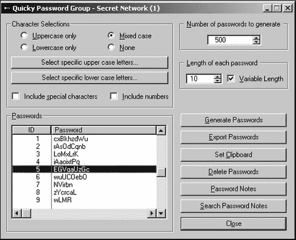

图 9-6. 一个密码生成程序可以创建一个真正随机的密码，这将挫败大多数黑客。

# 使用生物识别技术阻止访问

阻止访问计算机的另一种方式是通过*生物识别技术*，它通过用户的独特指纹、视网膜扫描、声音或其他生理或行为特征来识别授权用户。黑客总是可以窃取或猜测像*sex*或*password*这样的明显密码，但要窃取他人的指纹模式——并且几乎不可能猜测——则要困难得多。

生物识别技术基于这样一个原则：每个人都有独特的特征，这些特征是无法复制的；即使是同卵双胞胎也有不同的指纹组合。通常，生物识别安全系统通过将试图访问系统的个人收集的数据与授权数据模式数据库进行比较来工作。因此，首先，每个授权用户的生物识别数据必须存储在数据库中，以便生物识别设备可以检查并决定接受谁、拒绝谁。

一旦您为生物识别设备提供了每个人的数据样本，您需要测试该设备以确保它可以准确地识别个人。生物识别设备最大的问题是找到错误接受和错误拒绝之间的适当平衡。

正如其名所示，*错误接受*意味着生物识别设备的标准接受太多数据作为有效数据，因此任何指纹与授权用户略有相似的人都可能被授予访问权限。*错误拒绝*意味着生物识别设备的标准过于严格，这意味着即使是授权用户也可能难以让设备识别他们并允许他们访问。

## 生物识别设备

最常见的生物识别设备，也是最容易实现的，是指纹扫描仪。要了解更多关于指纹生物识别设备的信息，请访问 DigitalPersona([www.digitalpersona.com](http://www.digitalpersona.com))、Keytronic([www.keytronic.com](http://www.keytronic.com))、Precise Biometrics([www.precisebiometrics.com](http://www.precisebiometrics.com))或 Ultimaco Safeware([www.ultimaco.com](http://www.ultimaco.com))。

与指纹一样，没有两个人的签名是相同的，因此许多公司销售签名识别设备。有关这些设备的信息，请访问通信智能公司([www.cic.com](http://www.cic.com))或 CyberSign([www.cybersign.com](http://www.cybersign.com))。

将摄像头连接到您的计算机上，并使用适当的软件，您可以通过面部识别验证授权用户。用户盯着摄像头，计算机将其识别为授权用户。要了解更多关于面部识别的信息，请访问面部识别主页([www.face-rec.org](http://www.face-rec.org))。

想要查看面部检测算法演示，请访问匹兹堡模式识别网站([`demo.pittpatt.com`](http://demo.pittpatt.com))。这个演示允许访客上传不同人的照片，以查看面部识别算法如何在不同姿势和背景下准确识别相同的面孔。

语音安全系统([www.voice-security.com](http://www.voice-security.com))使用语音指纹来拒绝或允许访问。没有两个人的说话方式完全相同，因此语音识别系统训练计算机去聆听每个人的独特说话风格。（不幸的是，如果那个人感冒了，语音识别系统甚至可能无法识别有效用户的语音。）

爱迪安技术公司([www.iridiantech.com](http://www.iridiantech.com))提供了一种更奇特的生物识别设备，该设备扫描眼睛的视网膜以识别授权用户。SAFlink([www.saflink.com](http://www.saflink.com))不仅依赖于单一的生物识别测量，而是更进一步，使用语音、面部和指纹识别结合，通过普通的数字相机、麦克风和指纹读取器来识别授权用户。另一家公司 BioID([www.bioid.com](http://www.bioid.com))使用面部、语音和唇部动作识别来识别授权用户。即使有人欺骗了一个生物识别设备，他们可能也无法欺骗第二个和第三个设备。

## 打败生物识别

理论上，没有人可以复制另一个人的指纹、签名或面部扫描，因此生物识别应该是保护计算机访问的终极解决方案，对吗？错。

生物识别可以被轻易欺骗。这就是为什么大多数生物识别设备都与人身安全保卫员或监控摄像头结合使用，这些摄像头的录像可以事后审查。除了向授权用户拔枪并强迫他扫描视网膜或切断一个人的手指以通过指纹扫描仪等更粗糙的方法外，还有更微妙、更不暴力的方式来欺骗生物识别设备。

当授权用户将指尖放在指纹扫描仪上时，计算机验证他的访问权限，然后他离开。当然，他的有效指纹印仍然留在指纹读取设备玻璃上。许多指纹扫描仪可以通过将双手捧起并在设备上呼吸来被欺骗，这会导致授权用户的指纹残留重新出现。扫描仪再次看到有效的指纹，并允许访问。

您可以通过在指纹扫描仪上撒上石墨粉，然后覆盖一片普通透明胶带的方式，轻松捕捉一个有效的指纹以备将来使用。指纹被捕捉在胶带的粘性一面。现在您可以将这块胶带贴在指纹扫描仪上，它将识别出这属于一个有效用户。

面部识别设备更容易被欺骗。只需拍摄一个授权用户的照片，将其举到扫描相机前，生物识别面部识别设备很可能会认为这是一个有效用户。（较新的面部识别系统会要求人们稍微转动头部，以验证相机是否看到的是真实的人脸而不是二维图片。）

一些视网膜扫描仪也可以用同样的方式欺骗，前提是你能获取到授权用户视网膜的图片。

欺骗语音识别设备可能同样简单。隐藏一个录音机，站在一个授权用户说话的麦克风附近。然后播放这个录音，你就得到了一个生物识别设备能够识别的有效语音指纹。（更先进的语音识别设备可能会记录数十个不同的单词，并随机要求用户重复其中一个。系统可能会要求用户一次说出“bubbles”，另一次说出“balloon”，因此一个人的语音录音通常不会起作用。）

欺骗任何生物识别设备的最佳方法可能是拦截从生物识别读取器到计算机的数据。如果你能在生物识别设备和计算机之间悄悄放置一个硬件设备，例如 USB Agent ([www.hitex.com](http://www.hitex.com))，你就能捕获有效用户输入的信息。现在你可以将这些生物识别数据传输到其他计算机，并欺骗这些计算机认为你就是另一个人，这可能是最极端的身份盗窃技术。

为了拦截通过 USB 电缆发送的数据的另一个工具，你可以获取 Windows 版本的 USB Sniffer ([`sourceforge.net/projects/usbsnoop`](http://sourceforge.net/projects/usbsnoop)) 或 USB Snoopy ([`mxhaard.free.fr/snoopy.html`](http://mxhaard.free.fr/snoopy.html)) 的副本。这两个程序都能捕获数据，这样你就可以分析有效用户的生物识别数据，然后稍后将其重新输入到计算机中。

无论生物识别设备可能多么先进，总会有一种方法可以欺骗它们，尽管这可能并不容易。为了防止有人欺骗生物识别设备，你需要一个守卫来监视它。当然，如果你能负担得起在计算机旁边安排守卫，你可能一开始就不需要生物识别设备。

# 足够安全的防护

无论你使用密码、生物识别设备还是插入计算机以验证身份的硬件认证设备，都无法保证永远阻止黑客入侵计算机。但如果你使入侵变得更加困难，大多数黑客可能会去寻找更容易的目标。不幸的是，如果你的计算机连接到网络，最容易被入侵的目标可能是你旁边的计算机。尽管如此，阻止入侵者进入你的计算机仍然很重要，因为一旦他们进入，找到黑客并将其驱逐出去将需要更多的工作。

# 第十章. 使用 Rootkits 深入计算机

战争的艺术很简单。找出敌人的位置。

—— ULYSSES S. GRANT

窃取计算机并不容易，因此一旦黑客进入，他们的首要目标通常是确保他们可以随时轻松地返回该计算机。最好的方法是在计算机上控制系统管理员账户，也就是所谓的*root 账户*或简单的*root*。

为了获得并保持 root 权限，黑客们创建了特殊的工具，称为*根套件*，这些是程序，或者程序组，旨在在计算机的防御中制造漏洞。这样，如果系统管理员发现并阻止了黑客最初用来访问计算机的路径，根套件就会为黑客创建几个备选路径，以便他们可以再次进入。一些根套件，如 Hacker Defender ([www.hxdef.org](http://www.hxdef.org))，甚至有自己的网站，你可以从中了解它们的最新进展。

一些更常见的根套件工具包括嗅探器和按键记录器（用于捕获额外的密码），日志清理工具（用于隐藏黑客在系统中的存在），用于查找常见可利用漏洞的程序（用于利用操作系统或服务器软件中的漏洞），以及特洛伊木马（用于打开计算机的后门并掩盖入侵者的活动）。一旦黑客在计算机上安装了根套件，他就可以随时悄无声息地返回，而不必担心被发现。

# 操作系统是如何工作的

根套件直接操作操作系统，这可以比作用尖锐的针和镊子探测计算机的大脑。要理解根套件是如何工作的，你需要了解操作系统是如何工作的。

在最基本层面上，操作系统控制着计算机的所有不同部分。计算机可能拥有硬盘、内存、键盘和鼠标，但如果没有操作系统，这些设备都不知道如何与其他组件协同工作。

较旧的操作系统，如 MS-DOS 和 CP/M-80，一次只能运行一个程序，但现代系统，如 Linux、Windows 和 Mac OS X，可以同时运行多个程序。因此，操作系统还需要管理哪些程序被加载到内存中，哪些程序可以使用 CPU，同时它还要检查键盘或鼠标的输入，并将输出发送到计算机屏幕。

在所有这些识别和管理硬件资源的工作之上，操作系统还可能加载额外的程序，称为设备驱动程序，这些是简单的程序，告诉操作系统如何与外部设备协同工作，例如打印机或扫描仪。当文字处理程序等程序需要打印数据时，它会将此信息发送到操作系统，操作系统使用设备驱动程序将其发送到打印机。

最后，操作系统运行其他程序并将它们隔离，这样它们就不能自己操作计算机的硬件。程序，无论是数据库还是游戏，都会向操作系统发送信息，然后操作系统将此信息保存到硬盘上。图 10-1 显示了操作系统的不同任务以及应用程序和设备驱动程序是如何协同工作的。


图 10-1. 操作系统阻止应用程序（如游戏和电子表格实用程序）直接访问计算机的硬件。

# 根套件的进化

根套件已经存在多年，可能甚至比病毒和蠕虫还要久。根套件特别危险的地方在于它们如何进化，变得更加隐蔽和难以捉摸，以更好地避免被检测。

这种隐蔽性本身就很令人担忧，因为一旦黑客在计算机上安装了根套件，几乎不可能在不重新格式化硬盘和重新安装操作系统的情况下将其从系统中清除。根套件的最大危险在于它们被用作结合了特洛伊木马/蠕虫/间谍软件感染工具。通常，当恶意软件感染计算机时，找到并移除它相对容易。但通过将根套件技术与特洛伊木马和蠕虫相结合，恶意软件制作者可以开发出不仅会感染计算机，还能避开任何检测程序的程序。

更令人恐惧的是，根套件技术被应用于所谓的合法商业用途。2005 年底，为了保护其音频 CD 不被复制，索尼使用了 First 4 Internet（[www.first4internet.com](http://www.first4internet.com)）创建的数字版权管理（DRM）技术。这种复制保护方法借鉴了根套件技术，通过在计算机上安装自身并在内存中隐藏，即使在复制保护的 CD 不再在计算机中时也是如此。移除此软件可能很困难，即使成功，也可能禁用计算机的光驱，使其无法播放合法购买的 CD。不用说，索尼因此受到了很多激烈的批评。

卡巴斯基实验室（[www.kaspersky.com](http://www.kaspersky.com)）和 Sophos（[www.sophos.com](http://www.sophos.com)）都将索尼的版权保护方案归类为“间谍软件”，因为它可以使计算机崩溃并削弱其安全性，允许黑客将特洛伊木马、病毒和自己的根套件藏匿在索尼根套件所在的同一隐藏区域。在公司受到强烈反对后，索尼迅速发布了一个补丁，使其更容易移除他们的根套件。然而，这个补丁实际上使计算机更容易崩溃。如果所谓的合法公司如索尼可以“合法”地使用根套件技术，那么黑客可能根本就没有做错什么。他们只是没有为正确的人做“错误”的事情。

## 修改日志文件

根套件可以删除或修改计算机的日志文件。为了避免被系统管理员发现，它们试图隐藏自己的存在。日志文件记录了谁使用了计算机，他们做了什么，以及他们使用计算机的时间长短。当计算机很贵，公司向其他人出售计算机的空闲时间（称为分时）时，这些信息尤其重要，但同样重要的是，日志文件还可以确定计算机在崩溃前正在做什么。当黑客开始入侵计算机时，日志文件又起到了另一个作用：它们记录了黑客何时到达，黑客做了什么，以及黑客在计算机上停留了多久——就像监控摄像头可以记录窃贼闯入商店一样。在许多情况下，日志文件还可以追踪黑客使用了哪台计算机来访问另一台计算机，这有助于当局追踪肇事者。

因此，黑客一旦获得对计算机的访问权限，就会立即寻找记录他们进入的日志文件。日志文件可能包含以下信息，这些信息可能有助于计算机的所有者追踪黑客：

+   执行了在目标计算机上进行的动作或“请求”的机器的 IP 地址

+   用户名，它简单地标识了正在使用的账户（一个完全有效的用户名可能掩盖了秘密劫持该用户账户的黑客的存在）

+   特定动作的日期和时间

+   用户向目标计算机给出的确切命令或“请求”

+   目标计算机返回给用户的 HTTP 状态码（该状态码显示了目标计算机在响应用户的命令或“请求”时执行了什么动作）

+   转移给用户的字节数

拥有这些信息，系统管理员通常可以确定黑客何时入侵了他们的系统，还可以推断黑客是如何入侵他们的系统的。

脚本小子（通常是那些对不同的操作系统不熟悉的初级黑客）通常会删除日志文件以防止管理员看到他们确切做了什么。不幸的是，删除日志文件就像用一根炸药杆炸掉监控摄像头一样明显地宣布了入侵者的存在。一旦管理员注意到有人删除了日志文件，他或她立即就会知道系统中一定有黑客。

与通过删除整个日志文件来宣布其存在相比，更聪明且技术熟练的黑客会选择性地删除他们自己的活动，而留下其余的日志文件保持完整。粗略一看，系统管理员会发现日志文件似乎没有受到任何影响。

在许多情况下，仅仅编辑日志文件就可以隐藏黑客的踪迹，但系统管理员有自己的技术来确保日志文件的一致性。其中最简单的一种方法是在日志文件生成时将其打印出来。这样，如果黑客在某个时候删除或修改了日志文件，打印的副本仍然会揭示他的存在。如果系统管理员怀疑有问题，他或她可以将硬盘上的日志文件与打印出的日志文件进行比较。

另一种技术是研究日志文件的时间戳。如果黑客修改了日志文件，计算机将使用修改的时间日期来标记修改后的日志文件，这可以精确地指出黑客在计算机上的时间。

管理员保留日志文件并保护自己的另一种方式是创建副本。原始日志文件出现在黑客预期找到的地方，而副本则存储在另一台计算机上，最好是无人可以修改或删除的计算机，包括拥有 root 或管理员账户的人。一旦黑客修改了第一个日志文件，系统管理员就可以使用日志文件分析程序来检测任何差异。

虽然黑客可能阻止计算机将其日志文件复制到另一台机器，但另一台机器上缺少重复的日志文件会明显表明有黑客尝试入侵。黑客仍然可能尝试修改日志文件的副本，但这假设黑客知道日志文件正在被复制到另一台机器，并且黑客能够访问这台机器。

要了解各种日志文件分析程序的功能，请访问以下链接之一：Analog ([www.analog.cx](http://www.analog.cx))、Sawmill ([www.sawmill.net](http://www.sawmill.net)) 和 Webalizer ([www.mrunix.net/webalizer](http://www.mrunix.net/webalizer))。

## 木马二进制文件

修改日志文件可以隐藏黑客过去所做的事情，但黑客仍然需要在计算机上活跃时隐藏他们的存在。因此，在日志文件之后，黑客的第二目标就是那些帮助系统管理员注意到任何变化的程序。

在 Windows 计算机上，rootkits 使用一种称为*注册表 DLL 注入*的技术。Windows 操作系统实际上由多个 DLL（动态链接库）文件组成，这些文件协同工作，而不是一个庞大的文件。

当你在运行 Windows 的计算机上安装程序时，程序会在一个称为注册表的数据库中存储它运行所需的信息。每次程序运行时，它都会检查注册表以找到它可能需要使用的附加 DLL 文件的位置。

因此，注册表 DLL 注入只是将一个合法 DLL 文件的木马二进制文件添加到计算机中，同时保留原始的 Windows DLL 文件不变。然后它修改注册表，使得当程序尝试使用原始的 Windows DLL 文件时，它会被重定向到被木马化的二进制版本。

由于原始的 DLL 文件未被修改，任何文件完整性检查器都会得出结论，没有任何问题，因此没有 rootkit 存在。除非系统管理员发现被木马化的二进制 DLL 文件或指向被木马化的 DLL 文件的修改过的注册表，否则黑客可以随意操控这台计算机。

在 Unix/Linux 的世界里，黑客试图篡改的最常见的命令包括：

| **`find`** | 查找文件组 |
| --- | --- |
| **`ls`** | 列出当前目录的内容 |
| **`netstat`** | 显示网络状态，包括端口信息 |
| **`ps`** | 显示当前正在运行的过程 |
| **`who`** | 显示当前登录的所有用户的名字 |
| **`w`** | 打印系统使用情况、当前登录的用户以及每个用户正在做什么 |

黑客简单地用他们自己的篡改版或携带木马版本的程序（也称为二进制文件）替换了计算机当前的程序。然后，如果一个毫无戒心的系统管理员使用了这些被篡改的程序，命令看起来可能正常工作，但实际上它们秘密地隐藏了黑客的活动。这为黑客提供了额外的时间来造成损害或打开额外的后门，以便他可以在稍后返回。

当然，当黑客用他自己的欺骗性版本替换原始程序或二进制文件时，他冒着以另一种方式暴露自己的风险。问题发生是因为每个文件都包含两个独特的属性：创建日期和时间，以及文件大小。如果一个系统管理员注意到一个程序的创建日期是昨天，这是一个程序已被修改的明确迹象，她很可能会知道黑客已经渗透了系统。

为了保护他们的文件不被篡改，系统管理员使用文件完整性程序，该程序根据文件的大小计算一个数字，称为*校验和*。一旦有人更改文件的大小，即使是很小的变化，校验和也会改变。

为了避免被检测到，熟练的黑客可能会运行文件完整性检查程序，并为所有文件（包括已修改的文件）重新计算新的校验和。如果系统管理员没有跟踪旧的校验和值，文件完整性检查程序将不会注意到任何差异。

通过一点调整，黑客可以使他们修改后的版本与要替换的文件大小完全相同。如果他们还将修改后的文件日期和时间更改为与真实文件匹配，校验和比较将无法检测到替换。

为了使文件完整性检查器有效，系统管理员必须在设置计算机后立即运行检查。系统管理员等待的时间越长，黑客修改文件的机会就越多。

更重要的是，系统管理员需要使用 MD5（消息摘要算法 5）或 SHA-1（安全散列算法）等算法计算加密校验和。与普通校验和不同，加密校验和很难伪造，这意味着黑客无法修改校验和值。

当然，黑客可以破解 MD5 或 SHA-1 加密，并查看使用这些加密算法加密的任何文件。更有揭示性的是，安全研究员 Dan Kaminsky（[www.doxpara.com/md5_someday.pdf](http://www.doxpara.com/md5_someday.pdf)）的一篇论文，解释了如何使用名为 StripWire 的工具创建具有相同校验和但内容不同的文件，这可以用来欺骗文件完整性检查器。

想了解更多关于系统管理员使用的各种文件完整性程序，请访问 Samhain ([www.la-samhna.de](http://www.la-samhna.de))、TripWire ([www.tripwiresecurity.com](http://www.tripwiresecurity.com))、GFI LANguard ([www.gfi.com](http://www.gfi.com)) 或 AIDE（高级入侵检测环境）—[`sourceforge.net/projects/aide`](http://sourceforge.net/projects/aide)。

## 钩子程序调用

每个程序都需要一种与操作系统通信的方式，以便执行保存数据或将数据发送到打印机等命令。因此，操作系统提供了一组函数（称为*应用程序编程接口*或*API*），所有程序都可以使用这些函数发送命令。为了帮助程序员创建和调试他们的应用程序，特殊函数会监控操作系统在任何给定时间所做的事情，例如从键盘或调制解调器接收数据。

允许另一个程序窥视操作系统内部工作的函数被称为*钩子*。钩子对于编写诊断或故障排除实用程序很有用，但它们也可以被根套程序用来破坏操作系统。这被称为*钩子攻击*。按键记录程序（见第九章破解密码。按键记录程序也会钩入操作系统以避免被发现正在运行或在内存或硬盘的任何地方存在。

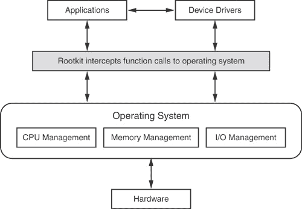

图 10-2. 根套程序可以拦截应用程序对操作系统的功能调用。

根套程序使用相同的原理来掩盖它们在计算机上的存在。当一个程序尝试列出所有当前运行的应用程序时，根套程序会钩入操作系统，拦截功能调用，并替换为另一个报告所有当前运行的应用程序（除了根套程序）的调用。这就像邮递员将替代信件递送，而不是发送者最初放入邮箱的信件。发送者和接收者都不会知道有任何区别。

根套程序可以使用本地或全局钩子。本地钩子拦截来自特定程序（如电子邮件程序）的功能调用。全局钩子拦截来自任何当前运行程序的功能调用。

为了防止根套程序感染，有一些程序可以监控和保护操作系统，例如 Anti Hook ([www.infoprocess.com.au](http://www.infoprocess.com.au)) 或 Process Guard ([www.diamondcs.com.au/processguard](http://www.diamondcs.com.au/processguard))，如图 10-3 所示。图 10-3。（当然，总是有可能在您安装这些操作系统监控程序之前，根套程序已经感染了您的计算机，这意味着根套程序可能只是向这些监控程序提供虚假信息……）

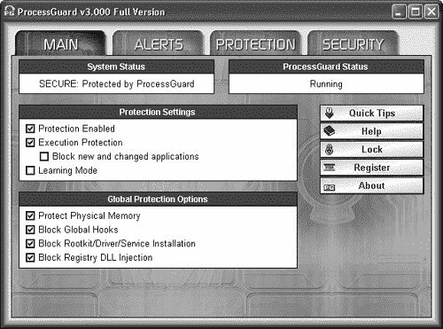

图 10-3. Process Guard 可以阻止远程访问木马（RATs）、间谍软件、根套程序以及任何其他试图破坏您计算机操作系统的恶意软件程序。

为了获得更高的安全性，Novell 提供了一款开源程序，名为 AppArmor ([`en.opensuse.org/Apparmor`](http://en.opensuse.org/Apparmor))，它允许您配置 Linux 操作系统的每个部分可以做什么和不可以做什么。通过强制操作系统以特定方式行事，管理员可以防止黑客欺骗操作系统执行它不应该做的事情。

## 可加载内核模块（LKM）的 rootkit

系统管理员可以击败被修改或被特洛伊木马化的程序的最简单方法是将黑客通常试图修改并重新复制的程序的未修改副本存储起来，并将它们重新复制回计算机。使用各种监控程序的干净副本，系统管理员可以在计算机周围搜寻，找到黑客隐藏起来的新痕迹。

为了解决这个问题，黑客开始利用可加载内核模块（LKMs），这些模块通常在基于 Unix 的系统（如 Linux）中找到。在以前，如果你想在 Linux 中添加一个功能，你必须修改并重新编译操作系统的整个源代码。LKMs 通过允许你将新命令附加到 Linux 内核（操作系统的核心）而无需重新编译源代码（错误可能发生的地方）来消除这一要求。如果你作为 LKM 修改代码，Linux 内核仍然可以加载，即使你的 LKM 中的代码失败，整个操作系统也不会崩溃。

因此，而不是替换现有的程序并冒着被检测到的风险，LKM rootkit 只是将它们自己的程序加载到内存中，这样，如果系统管理员检查各种监控工具的文件完整性，它们看起来没有改变（因为它们确实没有改变）。但是，如果他尝试运行这些看似未更改的程序，黑客的 LKM 模块会拦截命令并运行自己的程序，这掩盖了黑客的存在。一些流行的 LKM rootkit 有像 SuckIT、Knark、Rial、Adore 和 Tuxkit 这样的奇怪名称。

# 打开后门

在计算机中打开后门最常见的方式是通过打开一个端口，通常是一个不太为人所知的端口，不太可能已经被占用（除非另一个黑客先一步到达那里）。如果黑客在连接到计算机之前花时间插入了监控程序的特洛伊木马版本，那么这些程序将忽略开放的端口（将其报告为仍然关闭），以及任何从这个后门发出的活动。

由于系统管理员可能在例行扫描她的系统时发现这个开放的端口，黑客可以创建特殊的“芝麻开门”后门，直到黑客向计算机发送特定的命令。当计算机接收到这个看似无害的命令时，后门打开一个端口，黑客就可以顺利通过。

# 窃取更多密码

根套件（rootkit）的另一个组成部分是嗅探器，黑客可以在系统上安装它来捕捉通过网络传输的密码、信用卡号码或其他有价值的信息。嗅探器比键盘记录器提供了更多的灵活性，因为黑客只需要在一台计算机上安装它，然后将该计算机的网络接口卡（NIC）设置为混杂模式。通常，网络上的每台计算机只窥视专门针对它的流量，但当设置为混杂模式时，计算机可以窥视通过的所有数据。

为了击败网络嗅探器，一些管理员创建了交换网络。在非交换网络中，数据从一个计算机传递到另一个计算机，每个计算机都会检查它是否应该接收那些数据。在交换网络中，一台计算机将数据发送到交换机，然后交换机将数据路由到应该接收它的计算机。

为了击败交换网络，黑客也可能使用一种称为*arp 欺骗*的技术，它欺骗计算机将数据发送到被劫持的计算机而不是交换机。被黑客控制的劫持计算机模仿交换机，但现在可以窥视网络上的所有数据。

一旦嗅探器检索到一个或多个有效密码，黑客就可以使用它们来劫持合法用户的账户，并在他想要的时候进入系统。作为一个看似合法的用户，黑客可以悠闲地浏览计算机，更好地了解所使用的软件和网络配置。

如果嗅探器意外地捕捉到系统管理员的密码，黑客将获得 root 权限，这允许他创建额外的账户，甚至具有系统管理员权限的账户，以便以后访问计算机。

要了解更多关于嗅探器功能的信息，请访问 WinDump ([www.winpcap.org/windump](http://www.winpcap.org/windump))、Ethereal ([www.ethereal.com](http://www.ethereal.com))、Sniffer ([www.networkgeneral.com](http://www.networkgeneral.com))、EtherPeek ([www.wildpackets.com](http://www.wildpackets.com))、Analyzer ([`analyzer.polito.it`](http://analyzer.polito.it))、tcpdump ([www.tcpdump.org](http://www.tcpdump.org)) 或 Sniffit ([www.tengu.be](http://www.tengu.be))。

网络嗅探器确实有合法用途，用于分析和修复网络，但很少有人希望一个完全陌生的人在他们的网络上运行嗅探器。与其检查计算机的网卡是否可能处于混杂模式，系统管理员可以运行各种工具来帮助他们找到网络上运行的任何恶意嗅探器。

要找出是否有人在您不知情的情况下在您的网络上安装了嗅探器，请下载以下程序之一：AntiSniff ([`packetstormsecurity.nl/sniffers/antisniff`](http://packetstormsecurity.nl/sniffers/antisniff))、PromiscDetect ([`ntsecurity.nu`](http://ntsecurity.nu))、PromiScan ([www.securityfriday.com](http://www.securityfriday.com))或 The Sentinel Project ([www.packetfactory.net/Projects/sentinel](http://www.packetfactory.net/Projects/sentinel))。

# 杀死根 kits

保持计算机无黑客可能是不可能的。系统管理员可能勤奋地清除所有 rootkits 并关闭所有后门，但仍无法保证没有遗漏。唯一确保从计算机中移除黑客的方法是从头开始擦除并重新安装一切，但这是一种极端、耗时且可能只是暂时成功的措施。

尽管系统管理员尽了最大努力，但他们不可能完美无缺，黑客只需要一次幸运的机会就能潜入计算机而不被察觉。然而，专门的 rootkit 检测器通过扫描计算机以寻找泄露 rootkit 存在的迹象，有助于将平衡偏向系统管理员。微软开发了其自己的 rootkit 检测器，名为 Strider GhostBuster ([`research.microsoft.com/rootkit`](http://research.microsoft.com/rootkit))。F-Secure 开发了一个类似的 rootkit 检测器，名为 BlackLight ([www.f-secure.com/blacklight](http://www.f-secure.com/blacklight))，如图图 10-4 所示。要获取各种检测 rootkit 的工具列表，请访问安全研究员 Joanna Rutkowska 的网站([www.invisiblethings.org](http://www.invisiblethings.org))、荷兰的 rootkit.nl 网站([www.rootkit.nl](http://www.rootkit.nl))、chkrootkit ([www.chkrootkit.org](http://www.chkrootkit.org))或 SysInternals ([www.sysinternals.com](http://www.sysinternals.com))以获取 RootkitRevealer 的副本。

如果您能阅读中文，请尝试下载备受推崇的中文 rootkit 检测器 IceSword ([`xfocus.net/tools/200505/1032.html`](http://xfocus.net/tools/200505/1032.html))，它甚至得到了 rootkit 创建者的好评。


图 10-4. 要在未来完全保护您的计算机，您可能需要一个防火墙、一个防病毒程序以及一个如 BlackLight 这样的 rootkit 检测器，如图中所示。

系统管理员还应该运行扫描器来检测任何开放的端口——这是管理疏忽或黑客留下的后门的迹象。

在首次设置电脑时，任何系统管理员都应该为所有重要文件创建加密校验和，并将这些校验和存储在单独的位置，例如只能写入一次的光盘上。系统管理员还应该在光盘上保存关键程序工具的备用副本。现在如果黑客入侵了电脑，系统管理员至少可以相信存储在光盘上的文件完整性。

最后，系统管理员需要跟上最新的安全漏洞和弱点，以便他们可以修补它们或警惕可能利用它们的黑客。要了解更多关于不同 rootkit 的信息，请访问 Rootkit ([www.rootkit.com](http://www.rootkit.com))，如图 10-5 所示。


图 10-5. [Rootkit.com](http://rootkit.com) 提供了各种 rootkit 工具的源代码，包括特洛伊木马和隐藏黑客活动的补丁。

无论系统管理员做什么，总有可能在任何给定的时间，任何给定的电脑中潜伏着黑客。一些系统管理员只要黑客不触碰他们的重要数据，就会对黑客置之不理，但大多数系统管理员会不断尝试将黑客从系统中驱逐出去，即使黑客一次又一次地带着新技术、新工具和新想法回来。

# 第十一章：信息审查

俄罗斯诗人

烧书并不是最严重的罪行之一。其中之一是不读书。

—— 约瑟夫·布罗茨基

谁有权决定你能看到什么、读到什么或做什么？答案总是相同的——那些有权惩罚你的人。政府可以通过死刑进行身体上的惩罚，或者通过监禁或罚款进行经济上的惩罚。教会可以开除你的教籍。你的老板可以解雇你，你的父母可以不给你甜点就把你关进房间。

当然，告诉人们该做什么是一回事。让他们服从则是另一回事。只要人们有反抗的自由，就总有人会这么做。为了确保服从，审查员必须消除所有反抗的机会，并恐吓他们的臣民，让他们从一开始就不敢反抗。

# 网络审查

完全审查整个互联网是不可能的，但限制或甚至完全阻止访问它是可能的。大多数政府审查员使用各种过滤和阻止技术来屏蔽他们不喜欢的互联网部分，而不是完全切断访问。例如，朝鲜政府禁止除少数可信赖和受监控的人之外的所有人访问互联网（这鼓励这些个人保持“可信赖”）。

## URL 过滤

要审查互联网的一种最简单的方法是创建一个人们可以访问的受信任网站列表。如果有人输入不在批准列表上的域名，他们将什么也看不到，只会看到一个错误或警告信息。这种方法的问题在于，很难跟上不断涌现的新网站。将每个新的受信任网站添加到批准列表中是不切实际的。相反，大多数互联网过滤程序通过阻止某些统一资源定位符（URL）地址来完成其任务，例如 [`www.playboy.com`](http://www.playboy.com)。

### 注意

术语 *域名* 和 *URL 地址* 通常可以互换使用。技术上讲，URL 地址是用于标识计算机的完整文本，例如 [`www.website.com/`](http://www.website.com/)，而域名只是 [www.website.com](http://www.website.com)。

当用户将 URL 地址输入到网页浏览器中时，过滤器会将其与黑名单上的地址列表进行比较，以阻止访问。过滤器甚至可能会通知当局注意试图访问被禁止网站的人。

弱 URL 过滤器只是扫描 URL 地址中包含的指控性词汇，如 *Playboy* 或 *CNN*。用户可以通过使用 nslookup 命令找到网站的数字互联网协议（IP）地址来绕过这些过滤器。输入 IP 地址而不是网站的描述性 URL 可以避免与黑名单匹配。图 11-1 展示了通过 [KLOTH.NET](http://kloth.net) 网站使用 nslookup 命令的示例。


图 11-1. nslookup 命令可以将描述性 URL 地址转换为神秘的数字 IP 地址。

因此，您不必在浏览器中输入 [www.2600.com](http://www.2600.com)（地下黑客杂志 *2600* 的网站），而是可以输入等效的 IP 地址 [`207.99.30.226`](http://207.99.30.226)。如果 URL 过滤器足够智能，可以阻止被禁止网站的 IP 地址，那么您可以更进一步，将 IP 地址的每一部分转换为等效的二进制数：

| 207 = 11001111 |
| --- |
| 99 = 01100011 |
| 30 = 00011110 |
| 226 = 11100010 |

将数字连在一起，创建一个巨大的二进制数：

| 11001111011000110001111011100010 |
| --- |

最后，将这个巨大的二进制数转换为它的十进制等价数：

| 11001111011000110001111011100010 = 3479379686 |
| --- |

所以，您可以直接输入[`3479379686`](http://3479379686)来加载与[www.2600.com](http://www.2600.com)完全相同的网页。大多数互联网过滤器会阻止描述性 URL，但不会阻止其任何数字等价物。

## 内容过滤

互联网审查软件通常将 URL 过滤与内容过滤相结合，它扫描网页上存储的单词或短语以决定是否应该阻止。内容过滤器通常扫描明显的单词，如*sex*或*breasts*，但每个过滤器都有自己的算法来决定在网页上出现多少次某些单词之前才会被认为是不恰当的。

例如，仅仅因为一个网页上有“breast”这个词，就可能会意外地阻止一个销售鸡肉“胸肉”的超市网站或讨论“breast”癌症的医疗网站。因此，仅靠内容过滤本身就容易出错，要么让可疑网站溜过去，要么完全阻止合法网站。（宾夕法尼亚州的贝弗学院实际上不得不将其名称更改为 Arcadia 大学，因为太多的内容过滤器阻止了人们访问其网站。）

内容过滤如此不可靠，以至于它甚至可能阻止支持此类互联网过滤的人的网站。1997 年 7 月，一名名为大卫·巴特的图书管理员启动了现已关闭的[FilteringFacts.org](http://filteringfacts.org)网站，该网站倡导在公共图书馆中使用过滤软件。具有讽刺意味的是，一个名为 SurfWatch 的家长控制程序阻止了他的网站，将其归类为令人反感的“毒品/酒精”网站，如图 11-2 所示。显然，在解释使用过滤器阻止令人反感的内容的重要性时，[FilterFacts.org](http://filterfacts.org)网站给出了某些触发词的例子。内容过滤器按设计工作，并在网站上发现这些词时阻止了 FilterFacts。

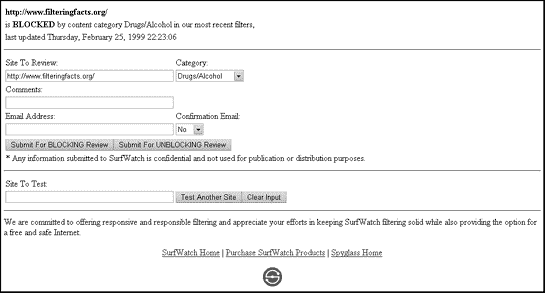

图 11-2. SurfWatch 阻止了支持互联网审查的网站访问。

无论内容过滤器多么精细，它们永远不会达到 100%的准确性。这里还有一个例子。2002 年 7 月，互联网过滤程序出版商 WebSense 吹嘘，竞争产品允许访问几个著名的色情网站。因此，通过那些其他互联网过滤程序访问网络的用户只需访问 WebSense 网站，就可以获取那些过滤器无法阻止的色情网站列表。最初作为一种诋毁竞争者的营销策略，最终变成了一个定期更新的色情列表，任何想绕过过滤器的人都可以查阅。

## DNS 中毒

可能最微妙的互联网审查方法是 DNS（或域名系统）中毒。当您输入诸如[www.cnn.com](http://www.cnn.com)之类的域名时，您的计算机会将此信息发送到您的互联网服务提供商（ISP），ISP 随后将其发送到 DNS 服务器。DNS 服务器将域名与其数字 IP 地址匹配，并将网页发送到您的浏览器。

DNS 中毒的工作原理是这样的。ISP 将用户的域名请求路由到返回与实际网站完全不同 IP 地址的 DNS 服务器。如果有人输入[www.yahoo.com](http://www.yahoo.com)，DNS 服务器应返回有效的 Yahoo! IP 地址为 68.142.226.32。但如果 DNS 服务器已被中毒，它将返回与[www.yahoo.com](http://www.yahoo.com)域名相关联的任何 IP 地址。这可能是一条解释请求的网站被阻止的消息，或者是一个设计得像真实网站一样的虚假网站。

通过用一个虚假网站替换一个真实网站，审查者可以欺骗用户，让他们认为他们正在访问被禁止的网站，而实际上他们正在查看虚假网站。替换的网站甚至可能包含细微的修订，让用户认为他们正在阅读被禁止的新闻，而实际上他们正在阅读巧妙伪装的宣传。因此，下次您在网上冲浪时，请记住，有人可能正在操纵您看到的信息，而您可能永远不知道这一点。

为了绕过 DNS 中毒，请配置您的互联网连接使用除您的互联网服务提供商（ISP）自动使用的 DNS 服务器之外的 DNS 服务器。要获取 DNS 服务器列表，请访问 ftp://ftp.rs.internic.net/domain/named.root 或[ftp://ftp.orsn.org/orsn/orsn.hint]，或使用以下以下非审查 DNS 服务器之一：

| **dns2.de.net** | 194.246.96.49 | 法兰克福，德国 |
| --- | --- | --- |
| **ns1.de.eu.orsn.net** | 217.146.139.5 | 希尔德斯海姆，德国 |
| **resolver.netteam.de** | 193.155.207.61 | 阿尔弗特-伊姆佩科文，德国 |
| **sunic.sunet.se** | 192.36.125.2 | 斯德哥尔摩，瑞典 |
| **master.ns.dns.be** | 193.109.126.140 | 列日，比利时 |
| **ns1.lu.eu.orsn.net** | 195.206.104.98 | 贝尔瓦克斯，卢森堡 |
| **merapi.switch.ch** | 130.59.211.10 | 苏黎世，瑞士 |
| **prades.cesca.es** | 192.94.163.152 | Barcelona, Spain |
| **michael.vatican.va** | 212.77.0.2 | Vatican City, Italy |
| **dns.inria.fr** | 193.51.208.13 | Nice, France |
| **ns0.ja.net** | 128.86.1.20 | London, UK |
| **nic.aix.gr** | 195.130.89.210 | Athens, Greece |
| **ns.ati.tn** | 193.95.66.10 | Tunis, Tunisia |
| **ns1.relcom.ru** | 193.125.152.3 | Moscow, Russia |
| **trantor.umd.edu** | 128.8.10.14 | College Park, MD, USA |
| **ns1.berkeley.edu** | 128.32.136.9 | Berkeley, CA, USA |
| **merle.cira.ca** | 64.26.149.98 | Ottawa, Canada |
| **ns2.dns.br** | 200.19.119.99 | Sao Paulo, Brazil |
| **ns2.gisc.cl** | 200.10.237.14 | Santiago, Chile |
| **ns.uvg.edu.gt** | 168.234.68.2 | Guatemala, Guatemala |
| **ns1.retina.ar** | 200.10.202.3 | Buenos Aires, Argentina |
| **ns.unam.mx** | 132.248.253.1 | Mexico City, Mexico |
| **ns.wide.ad.jp** | 203.178.136.63 | Osaka, Japan |
| **ns.twnic.net** | 192.83.166.11 | Taipei, Taiwan |
| **ns3.dns.net.nz** | 203.97.8.250 | Wellington, New Zealand |
| **box2.aunic.net** | 203.202.150.20 | Melbourne, Australia |

要在 Windows XP 上配置您的互联网连接以使用不同的 DNS 服务器，请按照以下步骤操作：

1.  点击“开始”按钮并点击“控制面板”。

1.  点击“网络和互联网连接”。

1.  点击“网络连接”。

1.  右键点击您的互联网连接图标，当弹出菜单出现时，点击“属性”。将出现一个如图 图 11-3 所示的属性窗口。

    

    图 11-3. 右键点击您的互联网连接图标以显示属性窗口。

1.  点击“互联网协议 (TCP/IP)”并点击“属性”。将出现一个如图 图 11-4 所示的互联网协议 (TCP/IP) 属性窗口。

    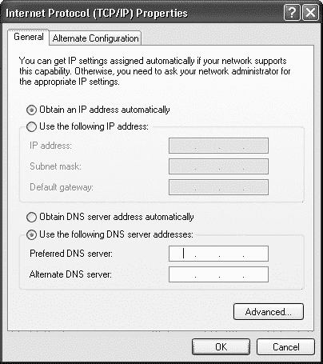

    图 11-4. 而不是自动接受 DNS 服务器，您可以指定要使用的 DNS 服务器。

1.  点击“使用以下 DNS 服务器地址”单选按钮，并在首选 DNS 服务器字段中输入一个 DNS IP 地址；您也可以在第二个框中指定一个备用 DNS 服务器。

1.  点击“确定”。

## 端口阻塞

另一种互联网审查的方式涉及端口阻塞。如前几章所述，互联网上的每台计算机都使用某些端口来发送和接收信息。例如，端口 80 用于接收网页，文件传输协议（FTP）使用端口 21，而电子邮件使用端口 25。因此，为了阻止文件传输和电子邮件，政府只需阻塞端口 21 和 25。用户可以做任何他们想做的事情——除了传输文件或发送和接收电子邮件，这就像说囚犯拥有所有他们想要的自由，只要他们不想走出监狱的墙壁。图 11-5 展示了端口阻塞如何阻止计算机访问互联网或 IRC 聊天室。

为了绕过端口阻塞，你可以使用一种称为隧道的技术。这本质上让一个端口执行其他端口的职能。

隧道通过连接到另一台计算机，称为代理服务器，通过你的计算机可以访问的任何开放端口来实现。 图 11-6 展示了一台计算机通过防火墙进行隧道连接。这台计算机不是通过端口 21 发送 FTP 文件传输或通过端口 80 发送网页请求，而是通过防火墙允许的唯一端口 25 发送所有这些信息。这些信息被发送到防火墙另一侧的代理服务器，然后代理服务器访问通过 FTP（端口 21）或访问网页（端口 80）所需的正常端口。对于审查防火墙来说，计算机似乎只在使用端口 25。


图 11-5. 防火墙可以阻止某些端口，以防止访问网页或 FTP 文件传输。


图 11-6. 通过防火墙隧道连接到代理服务器可以访问被禁止的互联网服务。

为了检测防火墙隧道，一些防火墙不仅会阻止端口，还会分析通过其开放端口传输的数据，这个过程称为协议分析。加密可以隐藏你的数据，但如果防火墙无法识别通过其开放端口传输的任何数据，它可能会完全阻止它们。

# 互联网审查者

最大的互联网审查者是各国政府，但如果没有那些专门向家长、学校、企业以及（当然）压迫性独裁政权出售互联网审查技术的公司的帮助，他们无法如此有效地进行审查。当涉及到从互联网审查技术中获利时，言论自由的价格总是可以协商的。

## 监管互联网的国家

问题是不仅仅是哪些国家实行审查制度，甚至不仅仅是他们如何实行，而是为什么他们要这样做。具体来说，政府害怕他们的公民可能会看到什么？

结合着增长最快的经济体和精通互联网、受过教育的民众，中国面临一个问题。如何让数百万人利用互联网进行商业活动，同时防止他们使用同样的技术来抗议政府？中国的答案很简单：在更大的互联网内部创建一个仅限中国的互联网，其中所有令人反感的网站（如 CNN 和*《纽约时报》*）都被屏蔽。

> 任何单位或个人不得利用互联网制作、复制、检索或传播以下类型的资料：
> 
> 1.  煽动抗拒或违反宪法、法律或行政规章的实施；
> 1.  
> 1.  煽动颠覆政府或社会主义制度；
> 1.  
> 1.  煽动国家分裂，损害国家统一；
> 1.  
> 1.  煽动民族仇恨或歧视，或损害民族团结；
> 1.  
> 1.  制造虚假信息或歪曲事实，散布谣言，破坏社会秩序；
> 1.  
> 1.  提倡封建迷信、色情内容、赌博、暴力、谋杀；
> 1.  
> 1.  参与恐怖主义或煽动他人从事犯罪活动；公然侮辱他人或歪曲事实以诽谤他人；
> 1.  
> 1.  侵犯国家机关声誉；
> 1.  
> 1.  其他违反宪法、法律或行政法规的活动。

注意到条款 1、2、3 和 8 都涉及保护政府（这并不令人惊讶），但条款 5 和 7 似乎会阻止政府发布任何形式的宣传，这可能会扭曲事实并诽谤其他国家的政府。

不幸的是，上述指南也赋予了中国政府随意定义“恐怖主义”和“犯罪活动”的权利（就像世界上所有其他政府一样），因此，某人仅仅通过讨论民主改革就可能被认定为“煽动推翻政府或社会主义制度”的罪犯。

一个人，比尔·夏，创立了动态互联网技术公司 ([www.dit-inc.us](http://www.dit-inc.us))，为敌对气候下的用户提供互联网服务。夏声称他的网站 ([`www.1.beijing999.com`](https://www.1.beijing999.com)) 可以作为代理服务器，允许中国用户通过他的网站访问他们政府禁止的网站。（当然，直到中国政府意识到并封锁了对夏的网站的访问。）

图 11-7 展示了夏的网站。页面中间显示一个文本框，用户可以在其中输入另一个网站的 URL 地址，例如[www.dajiyuan.com](http://www.dajiyuan.com)。

图 11-8")显示了[www.dajiyuan.com](http://www.dajiyuan.com)网站，但请注意，浏览器实际上是通过夏的网站访问此网站的，如地址[`www.1.beijing999.com/dmirror/http://www.dajiyuan.com/index.htm`](https://www.1.beijing999.com/dmirror/http://www.dajiyuan.com/index.htm)所示。

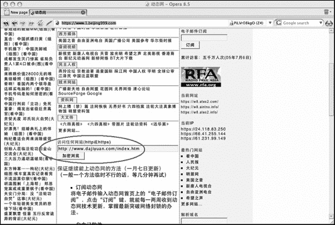

图 11-7. 用户可以将比尔·夏的网站作为浏览器来查看其他网站。

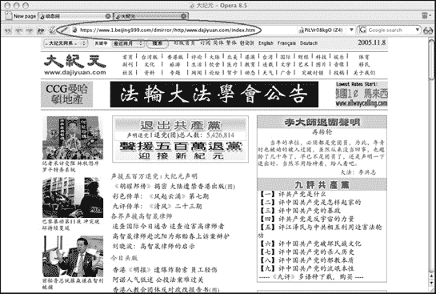

图 11-8. 当您通过夏的网站访问其他网站时，您在浏览器中仍然会看到他的 URL 地址 ([`www.1.beijing999.com`](https://www.1.beijing999.com))。

### 沙特阿拉伯的互联网审查员

沙特阿拉伯的互联网服务单元(ISU)——[www.isu.net.sa](http://www.isu.net.sa)——倾向于最关心保护国家的伊斯兰价值观。ISU 声称“过滤互联网内容是为了防止与我们的信仰相矛盾的材料或可能影响我们文化的材料。”与中国的互联网审查更关注敏感问题如民主和自由不同，沙特阿拉伯的互联网审查更关注宗教。

任何支持犹太教或以色列的内容都被 ISU 禁止，包括“与毒品、炸弹、酒精、赌博相关的页面，以及侮辱伊斯兰宗教或沙特法律和法规的页面。”哈佛法学院的一项研究，题为“沙特阿拉伯互联网过滤文档”([`cyber.law.harvard.edu/filtering/saudiarabia`](http://cyber.law.harvard.edu/filtering/saudiarabia))，发现过滤相当随意。带有女性内衣和泳装图片的网站、倡导女性权利的网站和同性恋社区网站通常会被屏蔽，但令人惊讶的是，仍有大量色情网站可以访问。

自然地，国际人权组织的网页被屏蔽，尤其是那些批评沙特阿拉伯的，如人权观察网站([www.hrw.org](http://www.hrw.org))和阿拉伯伊斯兰改革运动(MIRA)——[www.islah.tv](http://www.islah.tv)。然而，普通新闻网站，如 CNN，仍然可以访问。显然，ISU 集中精力屏蔽那些定期宣传反沙特观点的网站，但许多其他网站则被忽略。

尽管如此，正如哈佛法学院的研究所示，沙特阿拉伯的互联网过滤器相对容易绕过。最简单的方法是通过长途电话拨打到另一个国家的 ISP，然后从那里上网。

### 古巴卡斯特罗的审查员

与朝鲜一样，古巴有一种简单的方式来审查互联网：完全禁止其使用。只有像医生这样的受信任的个人才能获得使用互联网的许可证。即便如此，唯一的互联网网关是通过古巴国有的电信运营商 Cuba's Empresa de Telecomunicaciones de Cuba (ETECSA)——[www.etecsa.cu](http://www.etecsa.cu)——该运营商实行审查。

另一方面，互联网访问相当无用，因为古巴还使拥有电脑成为非法。该国现有的几家网吧仅供游客使用，并且受到严格控制。

然而，成千上万的古巴人通过盗版或电话黑客攻击 ETECSA 电话网络来获取互联网访问。一旦上网，古巴人可以访问一个更突出的反卡斯特罗团体，即古巴美国国家基金会(CANF)的网站[www.canfnet.org](http://www.canfnet.org)。CANF 提供了古巴人权侵犯的第一手报道（由古巴难民撰写），以及关于宗教镇压和美国对古巴的外交政策的辩论。

另一个网站，CubaNet ([www.cubanet.org](http://www.cubanet.org))，发布它从古巴地下民主运动接收到的信息（西班牙语、法语和英语），并将电子邮件发送回古巴。一旦古巴国内的异见人士从 CubaNet 获得信息，他们就可以通过整个国家传播这些信息。

### 全球互联网审查

中国、沙特阿拉伯和古巴可能是最突出的互联网审查国家，但它们远非唯一，或是最压迫性的。缅甸（缅甸）的军事政府将互联网访问限制在少数几位受信任的官员。即便如此，访问也被严格限制在批准的网站上。政府完全封锁了包括由流亡海外的缅甸公民创办的在线杂志《 Irrawaddy》在内的网站([www.irrawaddy.org](http://www.irrawaddy.org))。

突尼斯封锁了数千个网站和端口，以防止使用电子邮件、FTP 传输和对等服务。阿拉伯联合酋长国（UAE）禁止访问任何被认为会损害 UAE 道德价值观的网站（尽管审查显然不是其中之一）。韩国封锁了对朝鲜表示同情的网站，甚至澳大利亚也通过了严厉的审查法律（尽管在澳大利亚的情况下，这些法律很少得到执行），根据开放网络倡议([www.opennetinitiative.net](http://www.opennetinitiative.net))。

如果你特别对东欧感兴趣，请访问自由欧洲电台([www.rferl.org](http://www.rferl.org))网站。通过在任何可用的形式（互联网、报纸、广播等）促进言论自由，自由欧洲电台希望创造一个信息丰富的公民社会，这将作为仍在努力摆脱共产主义统治遗留的破坏性影响的国家的民主基础的基石。

关于世界各地审查制度的信息，一些有用的网站包括电子前沿基金会([www.eff.org](http://www.eff.org))、电子隐私信息中心([www.epic.org](http://www.epic.org))、全球互联网自由运动([www.gilc.org](http://www.gilc.org))、互联网自由表达联盟([www.ifea.net](http://www.ifea.net))、无国界记者([www.rsf.org](http://www.rsf.org))、[Oppression.org](http://oppression.org) ([www.oppression.org](http://www.oppression.org))以及审查指数([www.indexonline.org](http://www.indexonline.org))。

## 限制互联网的公司

幸运的是，大多数政府并不足够聪明，无法自行审查互联网。但这并没有阻碍他们。相反，世界各国政府并不试图自己开发过滤技术，而是转向美国公司，以开发他们用来压制人民的审查技术。

美国政府抱怨其他国家（除了那些目前对美国友好的压迫性政府）侵犯人权，即便如此，美国公司仍从审查和追踪异见网站和用户的业务中获利。那么，真正进行审查的是谁呢？是那些封锁被禁网站的门阀政府？还是那些向压迫性政府出售用于审查技术的美国公司？

# 家内审查：家长控制软件

正如国家政府使用过滤软件来屏蔽某些网站一样，父母可以使用软件来监控和过滤孩子的互联网活动。很少有人否认父母有权决定孩子能看到什么，因此在这个问题上的争论集中在家长控制程序屏蔽的网站类型上。大多数家长控制程序会屏蔽明显的违规网站，例如避孕国家、花花公子或 Hustler。但是，由于每天都有新的色情网站出现，家长控制软件的出版商必须不断更新被禁止网站的列表以保持有效性，这带来了时间和资源的问题。他们无法承担雇佣足够的人去访问和检查可疑网站的费用，因此大多数出版商使用自动扫描互联网并搜索关键词的程序。

当这些程序确定一个网站包含过多被禁止的关键词时，它们会将该网站的地址存储在其更新的黑名单中。结果是，许多无辜的网站与违规网站一起被封锁。更糟糕的是，许多被封锁的网站甚至不知道自己被某个特定的家长控制程序单独选中。

尽管这种审查可能看似为了保护儿童而合理，但围绕任何形式的审查始终存在一个问题：谁决定什么可以看，什么不可以看，为什么任何人应该成为规则的例外？

## 父母控制软件变坏：阻止政治和教育网站

阻止色情内容是家长控制程序应有的功能。但令人意外的是，由于一两个令人反感的关键词，许多科学、政治和无害的网站也被广泛屏蔽。以下是家长控制程序过去屏蔽的一些例子：

+   SmartFilter ([www.securecomputing.com](http://www.securecomputing.com)) 阻挡了保守组织传统价值观联盟([www.traditionalvalues.org](http://www.traditionalvalues.org))的首页，该组织希望“从美国公民自由联盟和反上帝的左派手中夺回法庭。”SmartFilter 还阻止了对提及《圣经》、《美国宪法》、《独立宣言》、反毒品信息、莎士比亚的所有戏剧、《福尔摩斯探案集》和《古兰经》的网页的访问。

+   Net Nanny ([www.netnanny.com](http://www.netnanny.com)) 阻挡了卡内基梅隆大学的禁书页面 ([`www.cs.cmu.edu/People/spok/banned-books.html`](http://www.cs.cmu.edu/People/spok/banned-books.html))，并在检测到单词 *dick* 后，还阻止了众议院多数党领袖理查德·“迪克”·阿姆斯特朗的官方网站。

家长控制软件并不完美，也从未声称完美，但它阻止某些网站时犯下的荒谬错误，展示了任何形式的审查的流动性。

## 家长控制软件真的出了问题：CYBERsitter

可能最具争议性的家长控制程序是 CYBERsitter ([www.cybersitter.com](http://www.cybersitter.com))，它阻止了 NOW（全国妇女组织）[www.now.org](http://www.now.org)和人类意识研究所([www.hai.org](http://www.hai.org))的网站，后者举办以爱情、亲密和性为主题的个人成长研讨会。

与大多数家长控制程序允许网站申诉阻止不同，CYBERsitter 似乎建立了一道自以为是的墙。例如，当 NOW 通过 CYBERsitter 申诉其禁令时，Solid Oak Software（CYBERsitter 的出版商）的首席执行官布莱恩·米尔本回答说：“如果 NOW 不喜欢，那就难了……我们不会也不会向任何与我们哲学观点不一致的组织低头。”

### CYBERsitter 的进攻

CYBERsitter 和 Peacefire 的联合创始人本尼特·哈塞尔顿（[www.peacefire.org](http://www.peacefire.org)）之间展开了一场激烈的战斗。哈塞尔顿在 Peacefire 网站上发布了批评 CYBERsitter 的信息，以及禁用各种家长控制程序的说明后，Peacefire 迅速被添加到 CYBERsitter 的禁止网站列表中。

Peacefire 也声称，在安装试用版时，如果 CYBERsitter 发现用户访问了 Peacefire 网站（如文件 peacefire.html 或 peacefire.gif）的证据，它将扫描用户的 Internet Explorer 缓存，并以一个神秘的错误信息终止安装。

米尔本在 PC World NewsRadio 的采访中为他的公司软件辩护说：“我们保留决定谁可以免费安装我们软件的权利。这是我们的软件——我们拥有它，我们发布它，我们绝对有法律权利以任何方式、形状或形式保护我们的软件免受黑客攻击。”

### Cyber Patrol 对 cphack

在类似的争议中，Cyber Patrol 的出版商 Microsystems Software 曾起诉两名计算机程序员 Eddy L.O. Jansson 和 Matthew Skala，因为他们创建了 cphack 程序，该程序允许孩子们发现父母的密码并查看 Cyber Patrol 超过 10 万个被禁止网站的完整列表。

斯卡拉说：“我基于哲学原因反对使用互联网过滤软件。”“这里的问题是看看 Cyber Patrol 实际上阻止了什么。父母有权利知道他们得到的是什么，没有我们的工作，他们就不会知道。”

为了避免漫长的法律辩论，Microsystems 于 2000 年宣布，Jansson 和 Skala 已与公司达成和解，并授予他们 cphack 程序的所有权利，代价是一加元，如 CNN 报道。Microsystems 现在声称，发布 cphack 程序的网站侵犯了其版权。

## 项目诱饵和切换：审查的双重标准

为了证明家长控制软件的任意性，Peacefire 进行了一项实验，看看个人网页上托管的内容是否会被像在大型、资金雄厚且知名组织的网站上找到的相同内容一样对待。

Peacefire 研究人员从家庭研究委员会([www.frc.org](http://www.frc.org))、关心美国的女性([www.cwfa.org](http://www.cwfa.org))、家庭关注([www.family.org](http://www.family.org))和广播名人劳拉·斯莱辛格博士([www.drlaura.com](http://www.drlaura.com))的网站上收集了反同性恋引语。然后他们在免费网站上发布了这些反同性恋引语，并将这些页面匿名提交给了 SurfWatch、Cyber Patrol、Net Nanny、Bess、SmartFilter 和 WebSense 的出版商。

所有公司都同意阻止一些或全部的诱饵页面（因为这些页面符合他们“基于性取向贬低人们”的标准），此时[Peacefire.org](http://peacefire.org)揭示了这些引语的真正来源网站。不出所料，没有任何出版商同意阻止这四个原始网站中的任何一个，尽管这些反同性恋引语是相同的。

## 研究家长控制程序

如果你打算使用家长控制程序，了解它们阻止的网站类型（以及原因），并决定你是否希望使用他人的标准来限制孩子的访问。如果你不希望陌生人告诉你可以和不可以让孩子看到和阅读的内容，你希望家长控制程序做同样的事情吗？

如需更多信息，请访问反对审查的家庭([www.netfamilies.org](http://www.netfamilies.org))和审查软件项目([`censorware.net`](http://censorware.net))。

# 避免互联网审查

即使 URL 过滤可以被欺骗，内容过滤永远无法达到 100%的有效性，但这些方法在协同工作时仍然可以限制对互联网的访问。与其试图击败互联网过滤程序，不如通过电子邮件、代理和加密完全绕过它们。

## 通过电子邮件访问被禁止的网页

阻止访问特定网站很容易。扫描电子邮件以确定某人是否正在发送或接收被禁止的信息则要耗费更多的时间和劳动。为了利用大多数互联网过滤器的这一缺陷，程序员开发了一种通过所谓的 webmail 服务器通过电子邮件检索网页的方法。

要阅读被过滤器阻止的网站，只需向网页邮箱服务器发送一封包含您想查看的网页 URL 地址的电子邮件（例如 [`www.cnn.com`](http://www.cnn.com)）。几分钟后，几小时或几天（取决于服务器），您将收到一封包含网页的电子邮件，内容为纯文本或 HTML 代码，绕过过滤。

例如，您可以使用以下信息向 agora@dna.affrc.go.jp 服务器发送邮件：

> 收件人：agora@dna.affrc.go.jp
> 
> 主题：[无]
> 
> 发送 [`www.cnn.com`](http://www.cnn.com)

在此示例中，SEND 字段标识了您想查看的网页的 URL 地址。基本上，只需要两个项目：

+   网页邮箱服务器的电子邮件地址

+   您想查看的网页的 URL 地址

如果您输入任何其他信息，例如在电子邮件消息末尾的签名，大多数网页邮箱服务器将忽略它们，但最好还是删除它们以确保无误。

这里有一些网页邮箱服务器以及您需要在邮件正文中使用的语法。在所有情况下，请留空主题行。

| WEBMAIL 地址 | 使用语法 |
| --- | --- |
| agora@dna.affrc.go.jp | 发送 <URL> |
| agora@kamakura.mss.co.jp | 发送 <URL> |
| agora@capri.mi.mss.co.jp | 发送 <URL> |
| (如果您想以 HTML 附件的形式接收页面，请省略 GET 命令。) |
| www4mail@access.bellanet.org | 获取 <URL> |
| www4mail@wm.ictp.trieste.it | 获取 <URL> |
| www4mail@ftp.uni-stuttgart.de | 获取 <URL> |
| www4mail@collaborium.org | 获取 <URL> |
| www4mail@kabissa.org | 获取 <URL> |
| www4mail@www4mail.org | 获取 <URL> |

要了解更多关于设置自己的 www4mail 服务器以帮助他人通过电子邮件访问互联网的信息，请访问 www4mail ([www.www4mail.org](http://www.www4mail.or)).

### 注意

由于网页邮箱服务器经常变动，请务必在 [www.expita.com/servers.html](http://www.expita.com/servers.html) 上检查正在运行的网页邮箱服务器列表。

要访问其他允许您通过电子邮件检索网页的服务，请访问以下之一：

| **ILIAD** | [`prime.jsc.nasa.gov/iliad`](http://prime.jsc.nasa.gov/iliad) |
| --- | --- |
| **PageGetter** | [www.pagegetter.com](http://www.pagegetter.com) |
| **Webgate** | [`vancouver-webpages.com/webgate`](http://vancouver-webpages.com/webgate) |

## 通过代理服务器访问被禁止的网页

互联网过滤器可能会阻止你访问特定的网站，例如[www.playboy.com](http://www.playboy.com)，但它不一定阻止你访问看似无害的网站。一旦你访问了这个看似无害的网站，你可以将其用作浏览器来访问被禁网站，如端口阻塞中所述。

要找到一个代理服务器，请访问公共代理服务器([www.publicproxyservers.com](http://www.publicproxyservers.com))。然后你将需要配置你的浏览器以访问该代理服务器，如图图 11-9 所示。


图 11-9. Firefox 浏览器允许你定义用于访问不同服务的代理服务器和端口号。

访问代理服务器可以绕过互联网过滤器，但你从代理服务器发送和接收的信息仍然可能被监控。为了保护你的隐私，你可以使用以下方法之一来加密你的信息：

| **ProxyWay Pro** | [www.proxyway.com](http://www.proxyway.com) |
| --- | --- |
| **Anonymizer Total Net Shield** | [www.anonymizer.com](http://www.anonymizer.com) |
| **Secure-Tunnel** | [www.secure-tunnel.com](http://www.secure-tunnel.com) |

尽管如此，互联网过滤器仍然可以阻止与代理服务器通信所需的端口，因此许多人会使用不常用的端口。要找到使用不常用端口的代理服务器列表，请访问 Proxylist([www.web.freerk.com/proxylist.htm](http://www.web.freerk.com/proxylist.htm))，该列表每周更新。

互联网审查员可能会对已知的代理服务器产生怀疑，但他们对个别计算机的怀疑可能性较小。因此，帮助击败互联网审查的一种方法是将你的计算机变成他人的代理服务器。

例如，Peekabooty 项目([www.peek-a-booty.org](http://www.peek-a-booty.org))允许任何人运行一个程序，将他的个人计算机连接到 Peekabooty 网络，该网络由遍布世界各地的个人计算机组成。

当有人想访问被禁网站时，他可以连接到 Peekabooty 网络，该网络会从其网络中随机选择一台计算机。然后这台计算机抓取请求的网页并将其发送回用户。

Peacefire 提供了一个类似程序，称为 Circumventer。一旦你在计算机上安装了 Circumventer，你将获得一个 URL 地址，你可以将其提供给任何被互联网过滤器困住的人（例如在沙特阿拉伯或缅甸的人，或者只是电脑上装有 NetNanny 或 CyberPatrol 的儿童）。那个人然后可以通过你的计算机浏览互联网。

为了更高的安全性，尝试使用六/四程序([`sourceforge.net/projects/sixfour`](http://sourceforge.net/projects/sixfour))或 JAP 匿名代理([`anon.inf.tu-dresden.de/index_en.html`](http://anon.inf.tu-dresden.de/index_en.html))，这在图 11-10 中有展示。JAP 加密您的信息并通过多个服务器混合，因此没有人，甚至服务器本身，也不知道哪些信息被发送到哪台电脑。

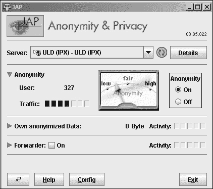

图 11-10. JAP 匿名代理程序可视化显示您的网络匿名级别。

有时候，访问互联网并不像匿名发布信息那么重要。如果您想在网络上与他人分享信息，但又想保持您的身份秘密，请访问 FreeNet([`freenet.sourceforge.net`](http://freenet.sourceforge.net))。

如果有人生活在压迫性的独裁统治下，试图通过互联网与人联系，他的通信可能会被监控，他可能会受到惩罚。因此，他可以选择将信息隐藏在普通的图形文件（称为隐写术）中，并将这个 GIF 图像发布在任何人都可以访问的批准网站上。

当用户访问这个批准的网站时，他们只会看到一个普通的 GIF 图像，但如果他们使用名为 Camera/Shy([`sourceforge.net/projects/camerashy`](http://sourceforge.net/projects/camerashy))的程序访问这个相同的网站，Camera/Shy 会自动检测并检索隐藏在图形图像中的信息。

# 在线阅读禁书

在 1726 年，乔纳森·斯威夫特发表了其经典小说《格列佛游记》，该小说讽刺了人类的弱点。除了前往一个居住着矮小的人类的国家，在那里格列佛是一个巨人，以及前往一个居住着巨人的国家，在那里格列佛变得渺小之外，格列佛还前往了一个由科学家管理的漂浮岛屿，这些科学家如此专注于他们的研究以至于他们的家园正在崩塌。之后，格列佛前往了一个居住着智能马的国家，在那里人类被称为“野胡”，他们花费时间为了在岸边找到的毫无用处的宝石而互相争斗。遗憾的是，200 多年后，《格列佛游记》依然完全相关，揭示了人们如何为了琐事争吵，以及他们如何被情感而非理性所统治。

当然，根据你当时居住的地方，你可能从未有机会阅读《格列佛游记》、《杀死一只知更鸟》、《麦田里的守望者》或《汤姆叔叔的小屋》，因为这些书在历史上某个时期都曾被禁。美国图书馆协会([www.ala.org](http://www.ala.org))报告称，书籍焚烧仍然定期发生，如图 11-11 所示。


图 11-11。美国图书馆协会报告称，书籍焚烧在 21 世纪依然盛行。

许多父母、教师和政府当局仍然坚持认为，他们有权禁止他们认为有害于他人智力、情感或精神发展的书籍。为确保这种审查不会成功，一些网站致力于分发著名作品的免费电子副本，例如《哈克贝利·费恩历险记》、《德古拉》和《双城记》。这些书籍以纯 ASCII 文本文件的形式提供，任何电脑都可以显示和打印。无论烧毁多少书籍，总会有人可以打印或从互联网上阅读的副本。

要找到禁书的在线版本，请访问 Banned Books Online([`digital.library.upenn.edu/books/banned-books.html`](http://digital.library.upenn.edu/books/banned-books.html))或 Project Gutenberg([www.promo.net/pg](http://www.promo.net/pg))。

要搜索版权已过期的历史书籍，请访问 Google Print([`print.google.com`](http://print.google.com))或开放内容联盟([www.opencontentalliance.org](http://www.opencontentalliance.org))，其合作伙伴包括 Yahoo!和 Microsoft。Google Print 和开放内容联盟都专注于保存较老的书籍，但你也可以使用这两项服务来帮助你找到禁书。

当然，你仍然需要上网下载一本免费的电子书。但一旦你下载了，你就可以与他人分享。通过复制和分享电子书，你可以保留阅读其他人（你的父母、老板或政府）不希望你看到的内容的权利。

## 在光天化日之下秘密阅读禁书

当然，获得禁书的途径并不能解决所有问题。如果你在电脑屏幕上阅读禁书被别人发现，你仍然会遇到麻烦。

为了隐藏你正在阅读的内容，可以使用 AceReader（[www.stepware.com](http://www.stepware.com)）等程序，如图 11-12 所示，该程序以大字体逐词显示 ASCII 文档的全文，速度高达每分钟 1,000 个单词，因此几乎不可能有人一眼就能认出你在读什么。使用这个程序，你可以在父母、学校官员或政府当局面前阅读他们不希望你阅读的书籍的 ASCII 文本，而他们却丝毫不知情。（只是确保他们不要在你的硬盘上找到 ASCII 文本文件。）

## 在大白天秘密浏览网页

有时候你可能想上网，但你的老板、父母、老师或其他权威人士有不同的看法。与其偷偷浏览一个网站并冒着浏览器窗口暴露你的风险，不如尝试运行 Ghostzilla（[www.ghostzilla.com](http://www.ghostzilla.com)）。

Ghostzilla 是基于 Firefox 的浏览器，可以在其他程序窗口（如 Outlook Express）中显示，如图 11-13 所示。

在打开另一个程序窗口的情况下，将鼠标指针移到屏幕的左侧，然后移到右侧，再回到左侧，Ghostzilla 就会在当前活动的程序窗口中弹出。现在你可以随意浏览互联网。当有人从你肩上偷看时，点击 Ghostzilla 显示区域外的鼠标，你的正常程序就会重新出现。只要没有人监视你的活动，你就可以在看似做其他事情的同时安全地查看互联网。


图 11-12. AceReader 程序在屏幕上逐词闪烁文本，这样你可以逐词阅读整本小说。

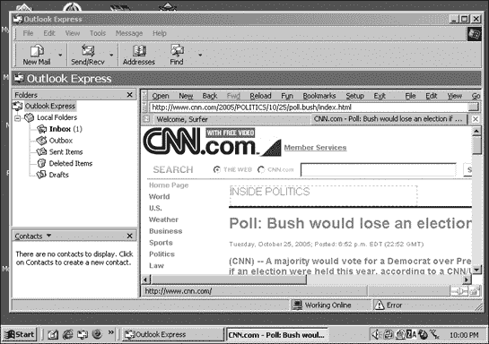

图 11-13. Ghostzilla 让你可以在其他程序窗口（如 Outlook Express）中秘密浏览互联网。

# 有没有人审查审查者？

即使在今天，许多人仍然坚持认为某种形式的审查是必要的——只要他们有权挑选和决定别人能看到什么，不能看到什么。

具有讽刺意味的是，对于这本书的一些外国翻译版本，某些章节在政府允许出版之前必须被删除。如果某些信息被认为对公众过于有害，那么它对审查者来说不也应该同样有害吗？

幸运的是，无论人们可能使用什么障碍来阻止他人获取信息，总会有方法来击败或避开它们。只需要一点点的创造力。也许我们唯一需要担心的审查形式就是自我审查，当人们因为害怕而无法坦诚和公开地说话时。一旦发生这种情况，通常是在“政治正确”的幌子下，审查可能最终成功地永远压制了言论自由。

# 第十二章：文件共享网络

经济学家

犯罪者：具有掠夺性本能但没有足够资本成立公司的人。

— 霍华德·斯科特

所有这一切始于 1999 年，当时一个名叫肖恩·范宁的 18 岁大学辍学生厌倦了试图从互联网上寻找和下载音乐文件。于是他编写了一个程序，可以搜索和共享音乐文件，并与互联网上的其他人交换即时消息。当范宁发布他的作品，名为 Napster 时，他并不知道他将最终改变世界。

### 注意

如需了解更多关于文件共享的信息，请购买由 No Starch Press 出版的《偷窃这份文件共享书籍》。

# 互联网文件共享简史

范宁并没有用 Napster 发明互联网文件共享，但他确实使它变得更加方便。当然，人们多年来一直在共享记录信息。软件盗版者复制软盘，后来是 CD，并相互交换（有关软件盗版的更多信息，请参阅第六章 Chapter 6")），音乐爱好者在互联网文件共享存在之前就录制并交换他们最喜欢的专辑的磁带。

人们通过网站、FTP 站点和 Usenet 新闻组在互联网上共享文件，只要这种技术存在。尽管这些工具使文件共享变得容易，但搜索文件却很困难。

你可以使用像 Google 这样的搜索引擎在不同的网站上找到特定的文件，但你最终会筛选出大量的无关链接。或者你可以使用特殊的 FTP 搜索引擎来找到存储在世界各地 FTP 服务器上的特定类型的文件，但你必须为每个文件重复搜索，并分别访问和搜索每个 FTP 站点。

Usenet 新闻组非常适合匿名共享文件（因为没有人知道谁发布了任何文件），但它们是不可搜索的；人们只能接受当时可用的任何内容。

Napster 的美在于它将搜索文件和方便地下载文件的能力结合在一个程序中。尽管最初设计用于仅共享音乐文件，通常是存储在 MP3 文件格式中的文件，但 Napster 定义了基本的文件共享模型：创建一个计算机网络，该网络可以搜索并与其他同一网络上的计算机共享文件。

# 文件共享是如何工作的

在最简单的层面上，当两台或多台计算机相互连接时，文件共享成为可能。要在原始 Napster 上搜索文件，人们直接连接到 Napster 的服务器并提交他们的请求，然后服务器查询所有其他连接的计算机以确定哪些计算机拥有请求的文件，如图 图 12-1 所示。


图 12-1. Napster 的网络使用了一个集中式服务器。

由于所有搜索请求都通过那个主要服务器进行，美国唱片工业协会（RIAA）通过获得一份要求 Napster 关闭其服务器的法院命令，成功地关闭了 Napster。没有服务器，就无法进行搜索请求，因此也就无法进行文件共享。就 RIAA 而言，它通过阻止人们交换他们最喜欢的歌曲的 MP3 文件，消除了版权侵权的泛滥源头。

## Gnutella 的诞生

在研究了 Napster 集中式服务器网络设计的弱点之后，一位名叫 Justin Frankel 的程序员创建了一个类似的文件共享网络，命名为 Gnutella。与 Napster 不同，搜索请求通过网络中连接的每台计算机，而不仅仅是中央服务器，如图 图 12-2 所示。因此，Gnutella 网络永远不会在单一瓶颈点被关闭。


图 12-2. Gnutella 创建了一个几乎不可能关闭的去中心化网络。

为了宣传 Gnutella 的存在，Justin 于 2000 年 3 月 14 日在一家名为 NullSoft 的公司网站上发布了 Gnutella 的源代码，以便其他人可以研究他的作品。几小时内，美国在线（NullSoft 的所有者）下令删除源代码，但在此之前，副本已经成功传播到整个互联网上，一个新的文件共享网络就此诞生。

由于其去中心化的性质，没有人真正控制 Gnutella，这意味着也没有人能够真正关闭它。随着时间的推移，许多被称为“客户端”的程序被编写出来，允许用户接入 Gnutella 网络。尽管有数十种不同的 Gnutella 客户端可供选择，但其中两个更受欢迎的是 BearShare ([www.bearshare.com](http://www.bearshare.com)) 和 LimeWire ([www.limewire.com](http://www.limewire.com))，如图 12-3 所示。

### 警告

许多文件共享客户端程序可能预装了广告软件/间谍软件。如有疑问，请始终寻找明确宣传其无广告和间谍软件的客户端。

由于许多人创建了访问 Gnutella 网络的客户端，因此很难在没有每个人合作的情况下更新和改进 Gnutella 网络。因此，程序员创建了一个类似但更先进的版本，称为 Gnutella2，或简称 G2 ([www.gnutella2.com](http://www.gnutella2.com))。

虽然基于 Gnutella，但 Gnutella2 是一个完全独立的文件共享网络，旨在加速文件搜索。尽管有所改进，但大多数 Gnutella2 客户端仍然连接到较旧的 Gnutella 网络，使用户能够同时在这两个网络上搜索文件。

两个流行的 Gnutella 和 Gnutella2 客户端是 Gnucleus ([www.gnucleus.com](http://www.gnucleus.com)) 和 Shareaza ([`shareaza.sourceforge.net`](http://shareaza.sourceforge.net))。


图 12-3. LimeWire 是少数可以在 Windows、Macintosh 和 Linux 上运行的 Gnutella 网络客户端之一。

## Ares 网络

每天有成百上千的客户端程序接入 Gnutella 网络。不幸的是，Gnutella 的流行也限制了其增长。由于没有人有效控制它，网络无法改变或改进，除非所有 Gnutella 客户端同时改变和改进，而这几乎是不可能的。

此外，尽管 Gnutella 最大的优势是其去中心化网络，但这同时也导致文件搜索需要花费很长时间，因为每个文件请求都必须通过网络上的每一台计算机。鉴于这些限制，许多前 Gnutella 客户端已经分道扬镳，开始建立自己的文件共享网络。这些例子中之一被称为 Ares ([`aresgalaxy.sourceforge.net`](http://aresgalaxy.sourceforge.net))。

Ares 文件共享网络主要传输 MP3 音乐文件，但您也可以找到各种其他类型的文件。图 12-4 显示了在 Ares 网络上找到的一些微软 Windows XP 的盗版副本，以及 Windows XP 破解工具和密钥生成器。

## FastTrack 网络

可能是最臭名昭著的文件共享网络是 FastTrack，它只能通过同一家公司开发的 Kazaa ([www.kazaa.com](http://www.kazaa.com)) 客户端官方访问。与 Gnutella 不同，FastTrack 是一个封闭的、专有的网络，只有获得许可的客户端才能访问。

与 Gnutella 一样，FastTrack 是一个去中心化的网络，但它提供了三个主要优势。首先，FastTrack 可以从多个来源下载文件以加快文件传输并确保您获得想要的文件，即使网络中的一台或多台计算机断开连接。其次，FastTrack 可以恢复中断的文件传输，这样您就不必从头开始。第三，FastTrack 可以通过将其网络划分为称为*节点*的部分来快速搜索文件，每个节点都链接到一个指定的超级节点计算机。


图 12-4. Ares 是一个独立的文件共享网络，让您可以交换音乐、视频和软件。

与 Gnutella 搜索网络上的每一台计算机不同，FastTrack 只搜索每个超级节点；每个超级节点搜索其链接的节点以查找请求的文件。这加速了文件搜索，因此，无论网络连接了多少台计算机，文件搜索都不会变慢，这在 Gnutella 网络上可能会发生。

FastTrack 网络的最大缺点是 Kazaa 的免费版本预装了广告软件/间谍软件。图 12-5 显示了一份典型的协议，规定了在您安装 Grokster 文件共享客户端程序时可能安装到您计算机上的所有不同类型的广告软件/间谍软件，该程序一旦连接到 FastTrack 网络就像 Kazaa 一样。

如果你不想在计算机上安装广告软件/间谍软件，但仍然想访问 FastTrack 网络，你可以为 Kazaa 的非广告软件/间谍软件版本付费，或者你可以使用一个非官方的 FastTrack 客户端，称为 KLT K++（[www.klitetools.com](http://www.klitetools.com)）。然而，FastTrack 的所有者 Sharman Networks 并不赞成任何非官方的 FastTrack 客户端，因此他们不断改变网络，以防止像 KLT K++这样的恶意客户端程序工作。但随后 KLT K++的程序员重新编写他们的客户端程序，再次连接到 FastTrack，直到 Sharman Networks 再次更改 FastTrack。

为了使连接到 FastTrack 网络更加简单，请获取 Kazaa 的副本以及 Diet K 的副本（[www.dietk.com](http://www.dietk.com)）。Diet K 将移除 Kazaa 安装的所有广告软件/间谍软件，而不会牺牲官方客户端程序的所有好处。


图 12-5. 安装许多免费文件共享客户端，你必须首先同意在计算机上加载广告软件/间谍软件。

# 分享大文件

无论出现多少文件共享网络，它们都基于原始 Gnutella 设计的去中心化网络。不同网络之间的细微差别主要涉及不同文件的搜索和下载。

已经讨论过的文件共享网络对于音乐文件（通常是 3MB 到 10MB 大小的 MP3 文件）来说很棒，但它们并不适合分享整个 CD 或 DVD 的内容的大文件，如 Adobe Photoshop 或《星球大战》的非法视频文件副本。分享 CD（通常大小为 650MB）或 DVD（通常大小为 4.7GB）的内容需要太长时间，多达几个小时。

因此，程序员很快就想出了专门用于大文件的文件共享网络。其中最受欢迎的是 eDonkey 和 BitTorrent。

在大多数文件共享网络中，你必须先从另一台计算机上下载完文件，才能开始共享任何文件。在 eDonkey（[www.edonkey.com](http://www.edonkey.com)）和 BitTorrent（[www.bittorrent.com](http://www.bittorrent.com)）中，你可以在接收文件的同时开始共享文件，这意味着你可以同时下载和共享文件，使大文件传输更快、更可靠。

# 文件共享的问题

从技术角度来看，文件共享没有问题。许多文件类型的生产者和所有者希望尽可能自由地广泛分发它们。许多音乐家发布他们歌曲的 MP3 文件，希望吸引听众。有抱负的广播电台主持人可以将采访存储为 MP3 文件，并以称为*播客*的声音文件的形式分发，任何人都可以随时下载和收听。要查找不同的播客，请访问播客目录([www.podcast.net](http://www.podcast.net))。

业余电影制作者可能会通过文件共享网络发布他们的项目以传播信息，软件出版商通常也会通过文件共享网络发布他们产品的演示版。许多 Linux 发行版实际上依赖于人们使用文件共享网络将其传播到世界各地。

因此，从技术角度来看，文件共享对于想要分发自己版权材料的人来说是很好的。问题是，合法的文件共享应用被广泛非法应用所掩盖。

由于 BitTorrent 和 eDonkey 都针对大文件共享进行了优化，您通常可以在这些网络上找到最新的好莱坞电影正在交换，有时甚至在它们正式上映之前。BitTorrent 和 eDonkey 也是交换整个音乐专辑、CD 或流行程序（如 Microsoft Office 或 Adobe Illustrator）的热门网络。

如果他们只想从专辑中获取个别歌曲，大多数人会涌向较老的文件共享网络，如 Gnutella 或 FastTrack。在那里，他们可以从专辑中复制最好的歌曲，将其存储为 MP3 文件，然后四处传播。它们的便利性和易用性使得文件共享网络成为软件、音乐和视频版权侵犯的避风港，如图图 12-6 所示。


图 12-6. 在典型的文件共享网络中，您可以找到可供非法下载和共享的盗版《哈利·波特》电影、有声书和印刷书籍。

RIAA、电影制片厂和图书出版商正在试图打击这种明显的版权侵权行为，但由于有如此多的不同文件共享网络可用，且几乎没有人特别控制，试图关闭一个文件共享网络几乎是不可能的。追踪个别违规者通常成本高昂且耗时，除非在极端情况下，个人分享数百或数千部电影或歌曲，或在电影或备受期待的流行专辑正式发布之前分发最新的热门电影或专辑。

尽管 RIAA 在起诉明显的版权侵犯者方面取得了一定的成功，但它对最初制作文件共享程序的公司的法律行动却取得了更大的成功。2005 年，美国法院关闭了 Grokster，这是获准访问 FastTrack 网络的少数几个授权客户端之一。同年，他们也关闭了 WinMX，这是一个最初接入 OpenNap 网络的文件共享程序，但后来演变成一个独立的文件共享网络。RIAA 可能会继续对任何通过销售文件共享程序赚钱的公司采取法律行动。（这仍然让免费文件共享程序不受影响。）

无论你喜不喜欢，文件共享都将持续存在。真正的辩论不是如何阻止它，而是如何合法地利用它。RIAA 和好莱坞电影制片厂声称文件共享损害了他们的业务。2004 年炸弹电影《Soul Plane》的制作者甚至声称这部电影在票房表现不佳，因为太多人从文件共享网络下载了提前拷贝，而不是在电影院观看。对于还没有看过《Soul Plane》的人来说，这部电影的质量可以用互联网电影数据库网站上一个人的评论来概括：“很高兴我没有花钱看这部电影。”

即使是音乐家们也在文件共享的利弊之间犹豫不决。有些人声称这损害了专辑销量，但其他人说它增加了他们的潜在观众，并实际上鼓励人们购买他们的专辑。乐队 Queen 甚至收集了他们旧演唱会的最佳翻版录音，并在自己的网站上出售。

想了解更多关于最新出现的或被关闭的文件共享网络的信息，请访问 ZeroPaid ([www.zeropaid.com](http://www.zeropaid.com)) 或 Slyck ([www.slyck.com](http://www.slyck.com))，如图 12-7 所示。


图 12-7. Slyck 网站可以让你了解最新的文件共享网络技术和新闻。

文件共享网络对一些人来说代表了一个新的机遇，对另一些人来说则是一个威胁。你在辩论中站在哪一边完全取决于你如何从文件共享技术的持续增长中获利（或亏损）。
