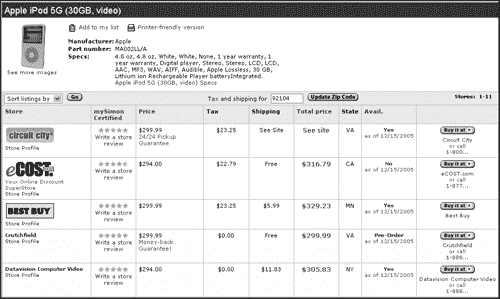
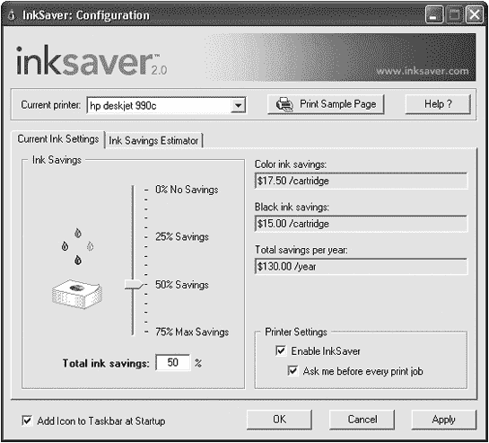
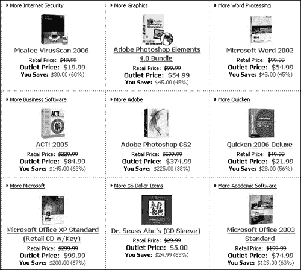
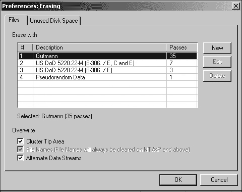
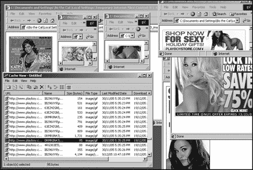
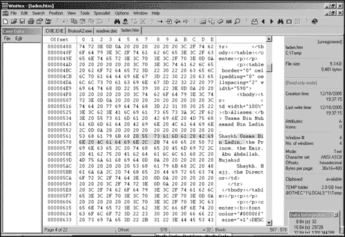
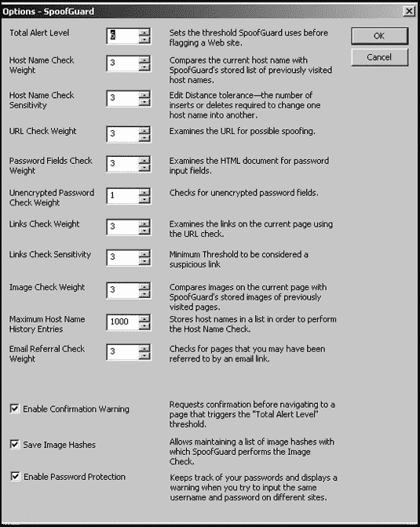

# 第六部分。保护您的电脑和您自己

# 第二十一章。小本经营：几乎免费获得东西

电视福音传教士

我总是说购物比看心理医生便宜。

—— 坦米·费伊·巴克

互联网可能会改变人们的购物、学习和沟通方式，但对于那些没有电脑的人来说，它可能就像科幻小说一样。然而，通过一点研究和创造力，即使是资金最紧张的网络冲浪者也可以免费或几乎免费地获得一台电脑并安装软件。

# 互联网比较购物

无论您想要一台新相机、电脑、打印机、扫描仪还是其他什么，您都不应该在在线找到的任何高科技或电子产品上支付全额零售价。在购买之前，四处看看。

在过去，四处逛逛意味着开车数小时到不同的商店比较价格。如今，通过访问正确的购物搜索引擎，您可以在全国各地的零售商之间进行比较购物，而不需要做任何比在键盘上打字更累人的事情。

购物搜索引擎，如图图 21-1 所示，可以帮助您找到特定商品的最佳价格，并且通常包括对产品的评论、对零售商客户服务的评估以及您可能想要考虑的类似产品列表。低价可能看起来很有吸引力，但如果它来自一个在按时发货或对有缺陷商品的投诉做出回应方面有不良记录的零售商，您可能希望将您的业务转移到一家更让人有信心的商家，并支付稍高的价格。

一些流行的购物搜索引擎包括 Froogle ([www.froogle.com](http://www.froogle.com))、Kelkoo ([www.kelkoo.co.uk](http://www.kelkoo.co.uk))、MSN 购物 ([`shopping.msn.com`](http://shopping.msn.com))和 Yahoo 购物 ([`shopping.yahoo.com`](http://shopping.yahoo.com))。

这些购物搜索引擎比较不同产品的价格，但它们列出与查询匹配的零售商的顺序可能至关重要。搜索结果中列出的前五家零售商通常获得最多的业务，无论价格如何。了解这一点后，许多零售商愿意支付额外费用，以便在搜索结果中排在最前面，以期增加潜在的销售量。作为替代方案，可以考虑使用 PriceScan ([www.pricescan.com](http://www.pricescan.com))，它拒绝接受费用以提高零售商在其结果列表中的地位。

图 21-1. 一个购物搜索引擎，例如 mySimon，可以比较不同零售商的价格，甚至计算订单的总成本，包括销售税和运费。

为了节省更多金钱，请访问 Woot! ([www.woot.com](http://www.woot.com)) 或 [Specialoffers.com](http://specialoffers.com) ([www.specialoffers.com](http://www.specialoffers.com))，这些网站会提供最新折扣和促销信息，由不同商家提供。

在线购买任何东西时，尽量寻找其他人关于卖家的评论。像 Amazon.com 这样的网站允许买家对不同的商家进行速度、可靠性和可靠性的评分。如果一个商家提供低价但与其他买家有不良记录，你可能想避免这个商家，而选择支付更多从更可靠的商家购买。

# 购买翻新电脑

在互联网比较购物部分列出的任何购物搜索引擎都能帮助你找到新电脑设备的最优价格，但要节省更多，可以考虑购买翻新电脑。

翻新电脑是那些因为缺陷或不再需要而被退回的机器。一旦制造商收到一台退回的电脑，它就会被拆解，组件会被测试，然后重新组装成全新的样子。只有一个问题。法律上，制造商不能将退回的电脑作为新产品出售。

由于制造商已经因为接受退回的电脑用于转售而损失了金钱，他们会大幅降低价格，只是为了将其处理掉。如果电脑再次出现故障并迫使另一位客户退回，制造商将再次损失更多金钱来修复它，因此翻新电脑通常比新电脑检查得更仔细。

如果你不在乎购买一台别人可能已经使用过的电脑，翻新电脑可以是一个以顶级价格购买顶级机器的好方法，而不必支付顶级价格。翻新电脑享有与完全全新的型号相同的售后服务和保修，但有一个主要缺点。当你购买翻新电脑时，你只能购买制造商当天库存中的产品。如果你想定制电脑，你可能不得不购买新的东西，或者准备购买你想要的配件并自行安装。

然而，你不会在您最喜欢的商店找到翻新的电脑。大多数电脑制造商只在零售网站如 Amazon.com([www.amazon.com](http://www.amazon.com))、Dell Computers([www.dell.com/factoryoutlet](http://www.dell.com/factoryoutlet))、Gateway([www.gateway.com](http://www.gateway.com))、Overstock.com([www.overstock.com](http://www.overstock.com))、PC Factory Outlet([www.pcfactoryoutlet.com](http://www.pcfactoryoutlet.com))、PC Nomad([www.pcnomad.com](http://www.pcnomad.com))和 SonyStyle([www.sonystyle.com](http://www.sonystyle.com))上销售它们。

### 注意

有些人可能会使用电脑然后后来归还，这意味着翻新的电脑可能仍然在硬盘上留有其他人的数据，你可以恢复并查看这些数据。有关恢复已删除数据的信息，请参阅第二十二章。

# 在打印机用品上节省开支

几乎每个人都需要一台打印机，但要注意。许多打印机制造商以低廉的喷墨机型价格吸引你，然后却在替换墨盒上大肆加价。两到三个墨盒的成本可能和打印机的原始价格一样高，喷墨打印机往往消耗墨水很快。

一款名为 Ink Saver([www.inksaver.com](http://www.inksaver.com))的程序（如图 21-2 所示），声称可以在不降低打印质量的情况下减少打印机使用的墨水量。Ink Saver 与大多数 Epson、Canon 和 Hewlett-Packard 打印机兼容，但你也可以下载试用版来查看它是否与你的特定喷墨打印机兼容。

图 21-2。InkSaver 每次调整流量时都会跟踪你节省的墨水量。

无论像 Ink Saver 这样的程序能帮你节省多少墨水，你最终都需要购买替换墨盒。与其从打印机制造商那里购买，不如从 Amazon Imaging([www.amazonimaging.com](http://www.amazonimaging.com))或 RhinoTek([www.buyrhinotek.com](http://www.buyrhinotek.com))购买补充套件或替代墨盒。要找到更多销售替换墨盒的在线零售商，请访问 Buy Ink [Cartridges.com](http://cartridges.com) ([www.buyinkcartridges.com](http://www.buyinkcartridges.com))。这些第三方墨盒公司为大多数打印机提供补充套件和替换墨盒，价格仅为原始制造商收费的一半。

如果你正在寻找喷墨打印机，首先比较替换墨粉盒的价格。今天看起来如此吸引人的打印机可能会在未来仅因替换喷墨墨粉盒就花费你几百美元。寻找最便宜的墨粉盒，然后找到与之兼容的打印机。

为了挫败那些提供廉价替代墨粉盒的公司，打印机制造商已经想出了一些策略，迫使消费者只能从他们那里购买喷墨墨粉盒。惠普公司在喷墨墨粉盒中放置了计算机芯片，以防止它们被补充。一旦墨粉盒中的墨粉用完，芯片就会阻止它再次被使用，无论你用多少替代墨粉补充，尽管你可以从 SmartChipSolutions（[www.smartchipsolutions.com](http://www.smartchipsolutions.com)）购买新芯片来欺骗打印机接受第三方替代墨粉盒。然而，利盟和惠普甚至已经为某些喷墨墨粉盒的打印头申请了专利，从而阻止任何人制造兼容的替代墨粉盒。如果你无法从第三方找到适合你打印机的墨粉盒，现在你知道为什么了。

如果你有一台激光打印机，不要扔掉你的旧墨粉盒。在当地黄页的计算机用品部分查找，寻找销售或为你的特定型号补充或销售二手墨粉盒的商店（或联系亚马逊成像）。 

# 免费和几乎免费的软件

可用的两种主要软件类型是商业软件和开源软件。商业软件需要付费，尽管在共享软件或由广告赞助的程序中，这种费用可能非常低。开源软件是免费的。你可以随意复制开源程序，甚至如果你知道自己在做什么，还可以修改它们。在很多情况下，开源程序的功能可以与它们的商业版本相媲美，但不要完全忽视商业软件。有方法可以以比你想的更低的价格获得商业软件。

## 以较低（且合法）的价格获取商业软件

软件盗版很容易（见第六章），但这对于大多数人来说既不实用也不合法。在购买任何东西之前，尝试以下方法之一以免费或以较低的成本获得相同的程序。

### 捆绑软件

许多硬件制造商将“免费”软件捆绑到他们的产品中，以吸引顾客。大多数电脑都预装了操作系统（如 Windows XP），但许多公司还包括额外的软件。例如，索尼电脑通常包括数字视频软件，而其他电脑制造商则提供 WordPerfect 或 Microsoft Works。

类似地，扫描仪公司通常会捆绑图形编辑程序或光学字符识别软件，外部硬盘制造商提供免费备份软件，而可擦写 CD/DVD 驱动器通常包括光盘刻录程序。捆绑软件通常是当前应用程序程序的简化版或旧版本，但如果它具备您需要的功能，捆绑交易可能会让您选择购买某个制造商的设备而不是另一个。

### 购买过时软件、升级和 OEM 版本

捆绑软件很有价值，因为它赋予您购买升级的合法权利，这意味着您可以用最低的成本购买程序的完整版本，而无需支付新版本的全部费用。如果您没有与您的计算机设备捆绑的任何旧软件，您通常可以通过像[Oldsoftware.com](http://oldsoftware.com) ([www.oldsoftware.com](http://www.oldsoftware.com))、Software & Stuff ([www.softwareandstuff.com](http://www.softwareandstuff.com))、DirectDeals ([www.directdeals.com](http://www.directdeals.com))和 Software Outlet ([www.softwareoutlet.com](http://www.softwareoutlet.com))这样的在线零售商以深度折扣的价格购买。

旧软件可以完美运行，同时为您节省高达最新版本零售价的 90%。如果您仍然想要最新版本，可以购买旧版本，然后支付升级费用。旧版本加上升级的总费用几乎总是低于您直接购买完整版本的费用。

获取程序最新版本的另一种方式是购买原始设备制造商（OEM）版本。许多软件出版商将他们的最新程序与各种硬件捆绑在一起，但您可以在网上零售商处单独购买这些 OEM 版本。OEM 程序与零售包装相同，但没有花哨的包装，有时甚至没有（几乎无用的）印刷手册。图 21-3 显示了您可以在一些流行程序的 OEM 版本上享受的价格节省。

图 21-3. OEM 程序与完整零售版相同，但没有花哨的包装。

### 以学术折扣购买软件

学校书店通常以大幅折扣出售几乎所有主要软件的学术版本，因为软件出版商希望让学生养成使用他们产品的习惯，而不是竞争对手的产品。因此，通常售价 495 美元的程序可能在大学书店以 100 美元的价格出售。

当然，前提是你必须有一个有效的学生证才能利用大学书店的优惠。如果你认识现在还在大学里的人，请他为你购买软件（作为交换，你可以为他买啤酒）。作为另一种选择，只需报名参加一门课程，获取你的学生证，然后使用你的学生证以学术折扣购买你想要的全部软件。

### 分享软件和免费软件

分享软件允许你在试用期内免费复制和使用一个程序，通常为 30 天，之后除非你付费，否则程序可能停止工作。令人惊讶的是，分享软件通常与价格更高的品牌产品一样好（甚至更好），而且无论你需要什么类型的程序（病毒扫描器、文字处理器、绘图程序等），你几乎总能找到一个好的分享软件版本。

免费软件是免费提供的——你可以合法地使用和拥有它们，而无需支付任何费用。一些免费软件是制造商已放弃的软件，或者是一个旨在帮助推广商业版本的程序缩略版。想法是，如果你喜欢免费软件版本，你可能想稍后升级到商业版本以获得更多功能。要找到优秀的免费软件和分享软件集合，请访问 Simtel ([www.simtel.net](http://www.simtel.net))，[Shareware.com](http://shareware.com) ([www.shareware.com](http://www.shareware.com))，Tucows ([www.tucows.com](http://www.tucows.com))，SnapFiles ([www.snapfiles.com](http://www.snapfiles.com))，ZDNet 下载 ([`downloads-zdnet.com.com`](http://downloads-zdnet.com.com))，SoftwareArchives ([www.softwarearchives.com](http://www.softwarearchives.com))，或 Jumbo ([www.jumbo.com](http://www.jumbo.com)))。

### 品牌替代品

商业软件通常有大型公司的支持，它们可以负担得起定期支持和升级其产品。因此，许多客户，尤其是企业，更喜欢拥有可以求助（或可以责备）的人带来的安全感。

在评估商业软件时，通常避免最流行的程序，转而使用不太知名但同样胜任的竞争对手程序会更便宜。例如，微软 Office 标准版的零售价为 399 美元，但可以考虑以下这些更便宜的替代品：WordPerfect Suite（299 美元）——[www.corel.com](http://www.corel.com)，StarOffice（69.95 美元）——[www.sun.com](http://www.sun.com)，或 ThinkFree Office（49.95 美元）——[www.thinkfree.com](http://www.thinkfree.com)。

或者看看这个。Photoshop 的完整零售价为 649 美元，但看看这些更便宜的替代品：Photoshop Elements（99.95 美元）——[www.adobe.com](http://www.adobe.com)——或 Corel Paint Shop Pro（129 美元）——[www.corel.com](http://www.corel.com)。

价格较低的名牌替代品可能不会提供更成熟程序的所有功能，但它们几乎与那些昂贵程序的文件格式完美兼容。例如，如果你绝对不需要 Microsoft Word，为什么还要浪费钱购买它呢？

## 寻找开源程序

开源程序不仅免费使用和复制；它们还可以根据你的意愿自由修改。或许最著名的开源程序是 Linux 操作系统，它具有与 Microsoft Windows 相媲美的功能，但具有更好的可靠性和安全性。由于任何人都可以修改开源程序，许多公司提供略微不同的 Linux 版本，这些版本被称为 Linux *发行版*。你可以购买 Linux 发行版，或者从互联网上免费下载副本。一些流行的 Linux 发行版包括 Red Hat Software ([www.redhat.com](http://www.redhat.com))、Mandriva Linux ([wwwnew.mandriva.com/en/community](http://wwwnew.mandriva.com/en/community))、Debian ([www.debian.org](http://www.debian.org))、Ubuntu Linux ([www.ubuntulinux.org](http://www.ubuntulinux.org))和 SUSE Linux ([www.opensuse.org](http://www.opensuse.org))。实际上有数百种不同的 Linux 发行版可供选择，除了上面列出的这些，所以如果你想探索更多选项，请访问 DistroWatch ([`distrowatch.com`](http://distrowatch.com))。

如果你没有时间或耐心下载 Linux 的副本，也不想从商店购买全价盒装零售版，你可以从[Cheapbytes.com](http://cheapbytes.com) ([www.cheapbytes.com](http://www.cheapbytes.com))订购 Linux 光盘。Cheapbytes 只销售光盘，没有花哨的零售包装或任何手册，但你可以在仍然获得最新 Linux 发行版的同时节省高达 90%的零售价。

对于真正的计算机叛逆者，跳过 Microsoft Windows 和 Linux，选择纯 Unix 环境，形式为 FreeBSD ([www.freebsd.org](http://www.freebsd.org))或 OpenBSD ([www.openbsd.org](http://www.openbsd.org))。Linux、FreeBSD 和 OpenBSD 更适合那些不怕深入研究操作系统内核并输入晦涩命令的人。如果你不符合这种描述，你可能想坚持使用更友好的操作系统，如 Windows 或 Mac OS X。

除了 Linux，另一个流行的开源程序是[OpenOffice.org](http://openoffice.org)办公套件([www.openoffice.org](http://www.openoffice.org))。[OpenOffice.org](http://openoffice.org)基本上复制了 Microsoft Office 套件的应用程序和功能，但它可以免费复制、赠送和使用。[OpenOffice.org](http://openoffice.org)实际上是 StarOffice 的免费版本，所以使用[OpenOffice.org](http://openoffice.org)就像使用商业程序一样，但无需支付费用。

两个与 Photoshop 竞争的流行开源程序包括 GIMP（GNU 图像处理程序）——[www.gimp.org](http://www.gimp.org)——和 Paint.NET ([www.eecs.wsu.edu/paint.net](http://www.eecs.wsu.edu/paint.net))，如图 21-4 所示。

要寻找更多开源程序，请访问 SourceForge ([`sourceforge.net`](http://sourceforge.net)). 不仅你可以下载额外的开源程序，你还可以为现有的开源项目做出贡献或启动你自己的开源程序。

# 免费互联网接入

电视网络是免费的，因为广告商通过向广大观众推广他们的产品来补偿制作节目的成本。同样，许多互联网服务提供商现在如果同意让他们在你的电脑屏幕上投放广告或追踪你的在线使用情况用于营销目的，就会提供免费账户。许多这些服务都有限制或限制，这些限制会随时间变化，所以请仔细阅读他们的描述。

例如，两家流行的互联网服务提供商，Juno ([`www.juno.com`](http://www.juno.com)) 和 NetZero ([`www.netzero.net`](http://www.netzero.net))，都限制客户每月免费使用时间最多为十小时。要找到最新的免费互联网服务提供商，请访问 Internet 4 Free 网站 ([www.internet4free.net](http://www.internet4free.net))。

如果你没有自己的电脑或互联网连接，大多数公共图书馆都有连接到互联网的电脑。你可能不需要为在线访问付费，但使用终端可能会有时间限制，如果你需要打印任何东西，可能需要支付费用。

图 21-4. 免费的 Paint.NET 程序看起来和作用就像更昂贵的 Photoshop 程序。

# 免费电子邮件账户

如果你需要发送不希望追踪到你的个人信息的消息，免费电子邮件账户是完美的。它们也便于创建临时电子邮件地址，你可以在注册不同网站时使用这些地址，知道这次注册不可避免地会吸引垃圾邮件，从而保持你的个人或工作电子邮件账户不受垃圾邮件侵扰。

许多免费电子邮件账户提供特殊功能，包括加密（以保护你的电子邮件免受窥探之眼）、自我销毁功能（在指定时间后删除你的电子邮件）、多语言支持以及匿名性（隐藏你的真实身份，不让全世界知道）。一些流行的免费电子邮件账户提供商包括 Hotmail ([www.hotmail.com](http://www.hotmail.com))、Yahoo! Mail ([`mail.yahoo.com`](http://mail.yahoo.com))、anonMail ([www.anonmail.de](http://www.anonmail.de))、Hushmail ([www.hushmail.com](http://www.hushmail.com))和 myTrashMail ([www.mytrashmail.com](http://www.mytrashmail.com))。

# 免费网页和博客空间

许多在线服务和互联网提供商为你提供数兆字节的存储空间，以便你可以开始自己的网站。不幸的是，可用的空间可能太小，无法让你发挥创意，或者互联网提供商可能会审查你发布的信息。例如，美国在线通常不赞成任何人使用其服务发布反美国在线的评论。

如果你当前互联网提供商的规则或存储空间不满意，可以尝试许多提供免费网站的公司的服务。这些公司通常不关心你发布什么类型的信息——他们真正关心的是吸引人们访问他们的网站，以便他们可以销售广告。一些流行的免费网站托管服务包括 GeoCities ([`geocities.yahoo.com`](http://geocities.yahoo.com))、Tripod ([www.tripod.lycos.com](http://www.tripod.lycos.com))、AngelFire ([www.angelfire.lycos.com](http://www.angelfire.lycos.com))和 Zero Catch ([www.0catch.com](http://www.0catch.com))。

如果你想免费尝试博客，可以尝试 Blogthing ([www.blogthing.com](http://www.blogthing.com))、Blogfuse ([www.blogfuse.com](http://www.blogfuse.com))或 Blogger ([www.blogger.com](http://www.blogger.com))，如图 21-5 所示。图 21-5

图 21-5. 有了免费的网页和博客空间，任何人都可以向全世界发表自己的想法。

# 生活中最好的东西都是免费的

想要获取更多免费资源，请访问免费网站（[www.thefreesite.com](http://www.thefreesite.com)）、免费物品中心（[www.freestuffcenter.com](http://www.freestuffcenter.com)）或完全免费物品（[www.totallyfreestuff.com](http://www.totallyfreestuff.com)），你可以获得从免费铃声到免费明信片，甚至免费安全套，以及你想要的免费软件、免费打印机和免费电子邮件账户。

虽然电脑的成本可能会扩大有者和无者之间的差距，但不必是这样的。只要有一点创意和大量的坚持，任何人都可以接入互联网。谁知道呢？一旦接入互联网，你可能会有一天帮助改变政治政策，结识新朋友，或者只是在家中舒适地探索整个世界，而无需破产购买大量昂贵的电脑设备、软件和服务，而这些你实际上并不需要。

# 第二十二章。计算机取证：删除和恢复数据的艺术

我相信，如果存在死刑，那么今天的人们还会活着。

—— 南希·里根

和大多数罪犯一样，黑客们常常因为未能消除他们犯罪的所有痕迹而自食其果。许多黑客不仅留下了指控性的笔记和最新攻击的打印输出散落在各处，而且他们还忍不住在公共聊天室中炫耀自己的成就。然而，即使这种明显的失态也不会造成如此大的损害，如果这些黑客没有无意中在自己的电脑上留下指控性的证据的话。

# 恢复已删除数据

电子数据与传统数据之间最大的区别是，一旦你在任何形式的磁性媒体上存储电子数据，它可以比预期的更长时间地保留在那里。要了解为什么可以恢复已删除的文件，你需要了解电脑如何在磁盘上存储和组织文件。

当电脑在磁盘上存储信息时，它不能随意丢弃，因为这会使再次找到它变得困难——就像把你的袜子扔在卧室地板上，然后当你需要时却找不到一双匹配的袜子一样。为了帮助组织数据，电脑将磁盘划分为多个*磁道*，你可以把它们想象成磁盘表面的圆形存储箱。

每个磁道被划分为更小的部分，称为*扇区*。一组扇区称为*簇*。当你将数据保存到磁盘时，你的电脑会将你的文件存储在多个扇区中。当你向文件添加或从文件中删除数据时，用于存储文件的扇区总数相应地增加或减少。基本上，扇区是一个包含单个文件部分的小盒子。

理想情况下，您的电脑会尝试将文件存储为一条连续的轨迹，这使得它能够快速检索数据。然而，您保存、编辑和删除文件越多，电脑不得不将文件的一部分存储在一个扇区，而另一部分存储在另一个扇区，在磁盘的完全不同部分的可能性就越大。当您对硬盘进行碎片整理时，您实际上是在重新排列所有文件，以便每个文件的数据再次存储在相邻的扇区中。

为了跟踪哪些扇区包含哪些文件，每个磁盘都包含一个特殊的目录，有时称为文件分配表（FAT）或主文件表（MFT）。FAT 或 MFT（或你特定计算机使用的任何名称）列出了磁盘上存储的所有文件，以及标识每个文件确切磁道和扇区的指针。

当你删除一个文件时，你的计算机采取了一种捷径。计算机不是物理地销毁数据，而是简单地从磁盘目录中删除其存在，假装该文件不再存在，尽管文件的内容仍然完好无损。只有当计算机需要已删除文件占用的空间时，它才会用新数据覆盖旧信息。这就像你搬出去时从公寓楼的目录中删除你的名字，但把不想要的物品留在你的旧公寓里。只有当其他人搬进来时，公寓的旧内容才会被扔掉。

如果你的磁盘有足够的额外空间，你可以在几周、几个月甚至几年内都不会覆盖那些已删除扇区中的数据。（然而，通过定期对硬盘进行碎片整理，你也可以达到几乎相同的效果。）

你通常可以通过立即运行一个恢复删除文件的工具程序来恢复被删除的文件。恢复删除文件的工具程序只是简单地更改磁盘目录以识别任何“已删除”的文件，这样计算机就能再次识别这些文件。当然，你等待运行工具程序的时间越长，你的计算机就越有可能覆盖了某些，甚至可能是所有特定已删除文件的内容，这使得恢复原始内容变得困难，甚至不可能。

一些实用程序程序，如 Norton Utilities，带有文件删除保护功能，可以将任何已删除的文件保存在一个特殊的文件夹中，这样你就可以在未来的任何时候快速准确地恢复它们。显然，如果你不小心删除了重要的东西，这个功能可以救命，但它也可能对你不利，因为它保留了你认为几个月前已经删除的敏感文件。

要找到恢复删除文件程序，可以尝试 Norton Utilities ([www.symantec.com](http://www.symantec.com))、Active@DELETE ([www.active-undelete.com](http://www.active-undelete.com))、Restorer 2000 ([www.bitmart.net](http://www.bitmart.net))或 Undelete ([www.execsoft.com](http://www.execsoft.com))。Undelete 的制造商 Executive Software 还提供免费的删除文件分析工具（见图 22-1)，该工具检查你的硬盘以查看可能恢复的已删除文件数量。结果可能会让你感到惊讶。

图 22-1. Executive Software 的已删除文件分析工具可以揭示你过去删除的所有文件，有人可能仍然能够恢复和读取。

# 文件粉碎器

如果你删除了一个文件，等待一两天，然后尝试运行恢复程序，有很大可能性操作系统已经覆盖了该文件的所有或部分内容。

如果你想要故意覆盖被删除文件所属的旧数据，你可以使用专门的文件粉碎程序。文件粉碎器会将随机字符覆盖被删除文件曾经使用的存储空间，一次或多次。因此，即使恢复删除文件的老磁盘目录条目的恢复程序成功，它也只会找到那里存储的随机数据。

然而，并非所有文件粉碎器都相同。例如，为了击败普通的恢复程序并更快地完成任务，文件粉碎器可能只需遍历一次，用随机数据填充你已删除文件的老数据区域。虽然这种快速擦除可以击败大多数恢复程序，但它不能击败专业的计算机取证工具。一个好的文件粉碎器提供了几种粉碎文件的方法，以平衡速度和安全性，如图图 22-2 所示。

图 22-2. 文件粉碎器可以提供不同的文件粉碎方式，让你在速度和安全性之间做出选择。

大多数文件粉碎器会对被删除的文件进行多次遍历以提供额外的安全性；遍历次数越多，删除所需的时间越长，但消除恢复所有希望的可能性就越大。

国防部（DoD）甚至有自己的粉碎标准，称为 DoD 5220.22-M ([www.dss.mil/isec/nispom.htm](http://www.dss.mil/isec/nispom.htm))，该标准定义了删除计算机文件的可接受政府标准。DoD 技术将文件擦除七次，每次遍历都用一组不同的随机数据替换被删除的数据，从而进一步掩盖原始数据。七次遍历几乎可以消除原始文件的几乎所有痕迹，尽管理论上可能使用磁传感器或电子显微镜在原子尺度上扫描存储介质来恢复一些或全部信息。

Gutmann 算法比 DoD 数据删除标准更安全，需要遍历文件磁盘存储区域 35 次以擦除原始内容的所有可能痕迹。有关安全销毁数据的更多信息，请访问 Peter Gutmann 的网页 ([www.cs.auckland.ac.nz/~pgut001](http://www.cs.auckland.ac.nz/~pgut001)) 并阅读他的论文，“从磁性和固态存储器中安全删除数据。”

# 存储已删除数据

无论你删除了多少次文件或使用了什么删除方法，几乎总会有一种方法可以再次检索它。最直接的方法是通过分析硬盘上的磁迹来恢复被覆盖文件的数据片段，如上所述。一个更实际且更简单的方法是在电脑的其他地方寻找该文件的未删除痕迹。

### 注意

如果你试图销毁数据，仅仅加密或删除文件永远是不够的。加密和文件删除隐藏了特定文件的內容，但对隐藏或擦除从文件复制到硬盘上的临时文件中的信息没有任何作用。例如，Microsoft Word 通常会创建你文档的临时副本作为紧急备份，以防你的电脑崩溃或断电。然后你可以通过加载这个临时文件来恢复你的工作。然而，如果你创建了一个敏感文档并对其加密，所有敏感数据仍然保留在 Word 的文件紧急备份副本中，任何人都可以打开并阅读。

## 在空闲空间中查找存储的数据

在 Microsoft Windows 中，电脑将磁性媒体（硬盘、软盘、可擦写光盘等）划分为固定大小的块，称为簇。当你存储一个文件时，整个文件很少能完全适合一个单独的簇，因此 Windows 会将其存储在多个簇中。几乎不可避免的是，文件的最后一部分不会完全填满其簇，而这额外的空间就被称为 *空闲空间*。

计算机经常使用空闲空间来存储有关该特定文件的信息。例如，当你打开一个文件（比如，用于编辑）并从键盘输入任何内容时，操作系统可能会暂时将你的按键存储在称为键盘缓冲区的内存部分。如果没有键盘缓冲区，你可能打字太快，电脑无法反应，可能会丢失按键。当你关闭文件时，电脑可能会通过将内容倒入该文件的空闲空间来清除键盘缓冲区。

如果你删除了文件的一部分，该文件的空闲空间就会增加，并且会留下之前文件版本的痕迹。如果你删除或加密了一个文件，空闲空间仍然保持不变，因为它实际上并不是文件的一部分。直到你用随机数据覆盖空闲空间，任何被丢弃到那里的信息仍然可以被恢复。

为了最大程度的安全，不仅要加密你的文件，还要加密你的整个硬盘。这不仅会保护你的文件，还会加密你电脑上其他地方散布的数据的任何痕迹。

## 在交换文件中查找存储的数据

你的电脑中特别脆弱的区域之一是交换文件。*交换文件*为临时存储来自其工作内存（称为*随机存取存储器（RAM）*）的数据分配了硬盘的一部分，这样电脑就可以释放一些空间，以便按需运行程序。如果没有交换文件，你的电脑将不得不在 RAM 中存储正在运行的程序和它正在使用的任何打开的文件。所以，如果你打开了一个非常大的文件，这可能会消耗掉你所有的内存，并阻止其他程序运行。通过在硬盘和 RAM 之间选择性地交换数据，操作系统可以同时运行多个程序，即使它们的总内存需求理论上超过了实际可用的内存。（计算机用来管理运行程序的这个技巧就是“交换文件”名称的由来。）

因此，当你运行一个程序，如文字处理器或电子表格程序时，你的操作系统会不时地将一些相关数据临时存储在交换文件中，例如你正在处理的报告或预算的内容，通常在程序暂时空闲时。当你保存或删除数据文件时，文件的大部分数据可能仍然留在交换文件中。

## 存储在网页浏览器缓存中的你的历史记录

当你在互联网上搜索时，你的浏览器会将你访问的页面中的图形图像存储（或*缓存*）在所谓的*缓存目录*中。这样，如果你稍后再次访问相同的网站，你的电脑可以从其缓存中检索这些图形，而不是直接从互联网上获取，这可以加快页面加载的时间。

通过浏览某人的浏览器缓存目录，你可以看到他们访问过的网站以及他们看到的图形图像，如图 22-3 所示。图 22-3. 查看浏览器缓存的目录内容，可以揭示最近查看的网站和图形图像。

图 22-3. 查看浏览器缓存的目录内容，可以揭示最近查看的网站和图形图像。

要查看 Internet Explorer 的缓存，请获取 BCIView([www.debryansk.ru/~kamkov](http://www.debryansk.ru/~kamkov))或 Cache Auditor([www.webknacks.com](http://www.webknacks.com))的副本。对于其他浏览器，如 Opera 和 Firefox，请获取 Cache View([www.progsoc.uts.edu.au](http://www.progsoc.uts.edu.au))的副本。

如果你不想让任何人知道你在网上看过什么，只需记住，清理缓存只是删除它包含的文件，并不会物理上移除它们——任何人都可以稍后恢复被删除的缓存目录。为了更高的安全性，请使用文件粉碎机，如 Shred XP ([www.gale-force.com](http://www.gale-force.com))、12Ghosts Wash ([www.12ghosts.com](http://www.12ghosts.com))、Window Washer ([www.webroot.com](http://www.webroot.com)) 或 BCWipe ([www.jetico.com](http://www.jetico.com))，这些程序还可以清除指定文件的空闲空间并删除网页缓存文件。对于 Macintosh 和 Windows 文件粉碎机，请获取 ShredIt ([www.mireth.com](http://www.mireth.com)) 的副本。

为了增加保护，请使用特殊的缓存清理程序，如 IEClean/NSClean ([www.nsclean.com](http://www.nsclean.com))，它与 Internet Explorer 和 Mozilla /Firefox 都兼容，以及 Cache Cleaner ([www.northernsoftworks.com](http://www.northernsoftworks.com))，它可以清理 Mac OS X Safari 浏览器的浏览器缓存。

如果你认为清理缓存和删除临时文件太麻烦，猜猜看？这正是计算机取证专家在检查嫌疑人的计算机时所依赖的。

黑客也可以通过潜入计算机并寻找包含防火墙或安全程序日志的已删除文件来利用计算机取证，这些日志可以识别正在运行的防火墙或安全程序类型，以及可能的工作方式。如果你是系统管理员，只需记住，你的计算机的日志文件可能被隐藏或加密，但黑客总有办法使用计算机取证找到它们。

# 计算机取证工具

根据犯罪的严重性和恢复存储在磁盘上的数据的重要性，计算机取证专家在恢复删除数据时通常依赖于四种基本工具：文件恢复程序、十六进制编辑器、磁传感器和电子显微镜。

## 文件恢复程序

如本章前面所述，文件恢复程序，如 Norton Utilities 等程序中提供的，通常足以捕捉到试图删除犯罪证据文件（如儿童色情图片）的新手。但它们只有在文件内容尚未在您的硬盘上被覆盖的情况下才有效，因此恢复程序是相对较弱的取证工具。

## 十六进制编辑器

*十六进制编辑器*是特殊的程序，允许你查看存储在磁盘上的物理内容。程序员经常使用十六进制编辑器来修改或检查文件，而黑客经常使用十六进制编辑器查看受版权保护的游戏的内部结构，以便移除安全措施或修改视频游戏以找到并启用隐藏功能。

十六进制编辑器可以探测任何磁盘的内容。它不会强迫你像操作系统通常向用户显示的那样，将磁盘内容视为组织成分区、目录和文件，而是允许你以磁盘的物理布局来检查磁盘内容，例如从磁盘的外边缘扫描到内边缘的存储媒体表面。

通过使用十六进制编辑器，计算机取证专家可以识别和检索操作系统通常无法访问的信息。如图 图 22-4 所示，十六进制编辑器不依赖于操作系统服务来打开和访问“文件”。相反，它们使用十六进制代码表示实际数据字节来显示包含文件内容的物理磁盘区域。

图 图 22-4

使用十六进制编辑器来检查整个硬盘就像在摩天大楼内部搜寻指纹一样，因此它们最好只用于搜索可能包含所需信息的驱动器特定部分。尽管如此，十六进制编辑器通常可以恢复已删除文件的一些或全部数据，这些数据你可能无法以其他方式访问，例如在文件的空闲空间中。要查看十六进制编辑器可以在你的硬盘上找到什么，请下载并尝试 Hex Workshop ([www.bpsoft.com](http://www.bpsoft.com))、UltraEdit ([www.idmcomp.com](http://www.idmcomp.com))、WinHex ([www.x-ways.net](http://www.x-ways.net)) 或 VEDIT ([www.vedit.com](http://www.vedit.com))。

## 磁场传感器和电子显微镜

无论你覆盖文件多少次，格式化或分区硬盘多少次，原始数据的痕迹可能仍然存在。文件粉碎机会使恢复变得更加昂贵和困难，但并非不可能。

你删除的每个文件都会留下自己的残余磁性痕迹。每次计算机覆盖文件内容时，磁盘头相对于媒体表面的对齐可能略有不同，删除文件的碎片可能随后仍然存在。取证专家可以使用传感器来测量磁盘表面的磁场变化，然后重建已删除文件的部分或全部字节，或者他们可以使用电子显微镜来完成同样的工作。电子显微镜——虽然价格昂贵，但许多政府机构都可以使用——也可以测量原始数据留下的微小磁场变化，即使是覆盖也无法完全消除。 

人们可能会烧毁他们的软盘或硬盘，将其压碎和扭曲，将其切成碎片，往上面倒酸，并以无数种方式对其进行物理破坏，认为这样就没有可能在另一台电脑上再次使用它们了。然而，即使是软盘或硬盘的物理破坏也不能保证数据已经被安全地销毁，因为像 FBI 和 CIA 这样的政府机构能够实践一种称为磁盘拼接的专业技术。磁盘拼接涉及将软盘或硬盘的碎片尽可能重新排列回其原始状态。然后，磁传感器或电子显微镜扫描磁盘表面仍存储的信息痕迹。

显然，磁盘拼接是一个耗时且昂贵的程序，所以不要期望你当地的警方拥有那种知识、技能或设备。但是，如果你销毁了可能引起 NSA、CIA 或 FBI 兴趣的证据，不要期望一个扭曲的磁盘能隐藏你的秘密，避免被富有的政府机构的电子眼睛窥探。事实上，美国政府甚至有一个名为“国防计算机取证实验室”（[www.dcfl.gov](http://www.dcfl.gov)）的特殊实验室，位于马里兰州林蒂希姆，专门从计算机中恢复信息，无论硬件或磁盘处于何种状态。

需要学习的最终课程是，如果你不想冒险从你的硬盘或软盘中恢复信息，你唯一绝对保险的选择是首先避免在任何电脑上存储它。

# 商业取证工具

身份盗窃、网络跟踪、网络性侵者、网络犯罪和恐怖主义——这些都是承诺将推动与 Windows、Linux 和 Mac OS X 兼容的新计算机取证技术发展的活动。要了解执法机构可用的某些工具，请访问数字智能（[www.digitalintelligence.com](http://www.digitalintelligence.com)），它销售一种独特的取证工具 DriveSpy，用于通过纯 BIOS（Int13 或 Int13x）调用访问物理驱动器，从而绕过操作系统。这不仅允许 DriveSpy 访问任何类型操作系统创建的磁盘分区，而且还确保操作系统在正常使用 DriveSpy 期间不会修改或删除数据（例如，通过更改交换文件）。

DriveSpy 允许你执行以下操作：

+   检查硬盘分区

+   将文件复制到指定的工作区域，而不更改文件访问/修改日期

+   恢复文件并将它们放入指定的工作区域，而不更改文件访问/修改日期

+   在驱动器、分区和文件中搜索文本字符串或数据序列

+   将整个分区的空闲空间存储在一个单独的文件中以便检查

+   将一个或多个连续扇区（磁盘上的物理区域）保存到文件或从文件中恢复

对于需要比 DriveSpy 提供的更多功能的人来说，Digital Intelligence 还销售专用计算机取证工作站、取证恢复证据设备（别出心裁地称为 FREDs）和便携式版本，称为 Forensic Recovery Evidence Device Diminutive Interrogation Equipment (FREDDIEs)。如果你看到警察将 FRED 或 FREDDIE 拖进你的电脑室，请做好准备。他们能够从任何硬盘或其他可移动存储设备中复制数据，如可擦写 DVD；创建整个硬盘的镜像；直接连接到你的计算机并监控你的朋友试图发送给你的任何通信；检查任何可见和隐藏分区中的数据；并捕捉现场设备和位置的图像。

要了解执法机构使用的其他取证工具，请访问 Guidance Software ([www.guidancesoftware.com](http://www.guidancesoftware.com)) 了解其 EnCase 程序。EnCase 可以检查 MS-DOS/Windows、Macintosh 和 Linux 计算机。EnCase 可以通过并行电缆连接到目标计算机，扫描硬盘中的图形文件（用于追查儿童色情分子），将它们复制到另一台计算机，然后显示或打印这些图形文件的内容。

EnCase 还可以搜索文本和其他文件——无论是由什么应用程序或操作系统创建的——以找到针对犯罪分子或恐怖分子的证据。一旦 EnCase 找到包含特定单词或短语的文件，它可以将这些文件列出或复制以供进一步检查。

要了解更多关于政府如何使用计算机取证追踪犯罪分子的信息，请访问美国电子犯罪任务组 ([www.ectaskforce.org](http://www.ectaskforce.org)) 和苏格兰国家高科技犯罪单位 ([www.sdea.police.uk/nhtcus.htm](http://www.sdea.police.uk/nhtcus.htm))。

要在自己的电脑上尝试一些取证工具，请获取 Sleuth Kit ([www.sleuthkit.org](http://www.sleuthkit.org)) 或 F.I.R.E. ([`fire.dmzs.com`](http://fire.dmzs.com)) 的副本。更多取证工具的链接可在计算机安全、网络犯罪和隐写术资源 ([www.forensics.nl](http://www.forensics.nl))、Talisker 安全巫师门户 ([www.networkintrusion.co.uk](http://www.networkintrusion.co.uk)) 或 Alexander Geschonneck 安全网站 ([www.geschonneck.com/security/forensic.html](http://www.geschonneck.com/security/forensic.html)) 找到。

下次你得到一台二手计算机时，使用这些取证工具之一来查看硬盘的内容。许多人出售二手计算机时不会费心擦除他们的个人数据，这意味着你很可能还能找到别人的财务记录、个人信息，甚至信用卡号码。如果你打算赠送一台计算机，确保尽可能彻底地擦除硬盘，然后希望没有人会幸运地找到一些仍然隐藏在你已擦除的硬盘上的有用信息。

# 保护自己

即使你虔诚地销毁文件，执法官员和其他人也可能有各种各样的计算机取证工具来挖掘你已删除文件可能隐藏的任何秘密。那么，你如何保护你的计算机不受他们的窥探呢？基本上，你无法做到。虽然你可以通过定期清理缓存目录和在可移动磁盘（如可擦写 DVD）上存储文件，并在之后物理销毁它们来使数据恢复更困难，但请记住，你在计算机上所做的每一件事都可能被恢复并在以后进行检查。

要快速销毁硬盘内容，获取 DiskZapper([`diskzapper.com`](http://diskzapper.com))的副本，它可作为可引导软盘或 CD 使用。如果你从 DiskZapper 磁盘启动，程序会立即开始擦除你的硬盘。当你需要快速销毁数据时，它是一个很有用的工具。

如果你是一名程序员，并且想了解文件粉碎器是如何工作的，可以下载由萨米·托尔瓦内恩编写的 Eraser 的源代码([www.tolvanen.com/eraser](http://www.tolvanen.com/eraser))。这个文件粉碎器对任何人都是绝对免费的，并且还附带 Microsoft Visual C++源代码，这样你可以看到它是如何工作的，甚至可以根据自己的特定需求进行定制。

Linux 用户可以下载一个名为 Wipe 的文件删除程序([`gsu.linux.org.tr/wipe`](http://gsu.linux.org.tr/wipe))。和 Eraser 一样，Wipe 是免费的，并且包含了 C 源代码，这样你可以查看其内部结构，甚至可以自己改进程序以更安全地擦除数据。

但不要以为即使你已经彻底清理了硬盘直到它发出吱吱声，你就可以安心了。就像每一颗发射的子弹都可能追溯到特定的枪一样，只要条件合适，并且搜索者足够坚定，计算机上创建的每一件事都可以追溯到特定的机器。

爱德华·德尔普([`dynamo.ecn.purdue.edu/~ace`](http://dynamo.ecn.purdue.edu/~ace))是普渡大学电气与计算机工程系的教授，他开发了一种基于打印机微妙差异来识别打印机独特“签名”的技术。美国联邦调查局特别感兴趣这项技术，用于追踪文件和假钞回到特定的打印机。

加州大学的一位博士研究生 Tadayoshi Kohno 甚至找到了一种通过互联网识别个别电脑的方法，这在研究论文《远程物理设备指纹识别》([www.caida.org/outreach/papers/2005/fingerprinting](http://www.caida.org/outreach/papers/2005/fingerprinting))中有详细记录。该技术通过“利用设备硬件中的微小、微观偏差：时钟偏差”来实现。本质上，Kohno 的技术分析了一个特定电脑的时钟如何对它通过互联网发送的信息进行时间戳，这可以用来唯一识别该特定电脑，即使它位于防火墙后面或通过多个代理服务器连接到互联网。

因此，如果你的硬盘数据即使在你尽力销毁它的情况下仍然可以恢复，如果你的打印机和电脑硬件可以泄露你的活动，你还能保持任何东西的私密性吗？答案是肯定的——除非，当然，你只使用别人的电脑。你真的需要走这么远吗？这个答案取决于你自己。

# 第二十三章。锁定你的电脑

演讲者

我们彼此隐藏自己的力量是仁慈地赋予的，因为人类是野性十足的野兽，如果没有这种保护，他们就会互相吞噬。

——亨利·沃德·比彻

可能保护电脑免受物理盗窃的最好方法是将它放在一个上锁的房间里，并牢固地固定在一个地方。

大多数笔记本电脑都有一个可以固定电缆的安全插槽，但台式机通常需要一个特殊的板子，用胶水粘附在电脑、显示器或桌子的一侧。像自行车锁一样的安全电缆可以阻止新手和机会主义者，但无法阻止一个决心已定的盗贼。如果时间足够长，普通的指甲油去除剂可以溶解用来粘附电缆附件到电脑上的粘合剂，而且可以用锤子几击就能破坏笔记本电脑的安全锁。更有耐心的盗贼可能会用钢丝钳将限制电缆折断。

在你成为盗窃的受害者之前，确保你在安全的地方记录下你的电脑的型号、制造商和序列号。然后，如果有人偷了它，你可以将信息输入到被盗电脑登记处([www.stolencomputers.org](http://www.stolencomputers.org))，这是一个维护被盗物品数据库的免费服务。正如网站解释的那样：“买家、转售商、保险公司、执法部门和安保专业人员会将可疑电脑与该列表进行比对。当找到被盗设备时，登记处会提供信息并协助恢复和归还财产给合法所有者。”

为了额外的保护，使用蚀刻笔在电脑机箱内部（盗贼不太可能找到的地方）或外部（为了降低设备的转售价值，因为盗贼在转卖之前必须移除该标识）刻上你的驾照号码或其他身份证明。

# 保护你的电脑（及其部件）

有时偷走整个电脑太明显或太难，但取走里面的组件则挑战较小。毕竟，当电脑突然从桌子上消失时，任何人都能看到，但谁会注意到电脑突然丢失硬盘（以及存储在其上的所有数据）呢？

为了防止别人打开你的电脑，购买一个保护罩，这是一个金属外壳，可以覆盖普通电脑机箱并将其锁在桌子或桌子上。这种保护性金属外壳不仅阻止小偷偷走电脑，还阻止他们打开电脑以获取里面的任何东西。

尽管许多人担心外部黑客入侵他们的电脑并删除他们的数据，但事实是许多黑客攻击来自已经拥有合法访问权限的人，例如同事、顾问或技术人员。为了防范这些人，购买保护磁盘驱动器的锁，这些锁覆盖驱动器的前面，阻止任何人插入携带病毒或特洛伊木马的可移动磁盘或 CD/DVD。当然，在你开始锁定你雇主拥有的工作电脑之前，你可能需要先与 IT 部门联系。

要了解更多关于物理安全设备的信息，例如电缆、锁和防护罩，你可以浏览 CompuCage ([www.compucage.com](http://www.compucage.com))、Computer Security Products ([www.computersecurity.com](http://www.computersecurity.com))、FMJ/Pad.Lock ([www.fmjpadlock.com](http://www.fmjpadlock.com))、Kensington ([www.kensington.com](http://www.kensington.com))、PC Guardian ([www.pcguardian.com](http://www.pcguardian.com))或 Secure-It ([www.secure-it.com](http://www.secure-it.com)))的商品。

## USB 拦截器

许多公司现在销售 USB 驱动器，它们可以像便携式硬盘一样携带数据或程序。人们使用它们在工作和家庭之间的电脑之间交换数据，但小偷也可以使用这些相同的 USB 驱动器来窃取和传输信息。

虽然 Windows Vista 可以阻止 USB 驱动器，但其他版本的 Windows 则不能。为了防止任何人将 USB 驱动器插入你的电脑并复制你的数据，请使用诸如 Sanctuary Device Control ([www.securewave.com](http://www.securewave.com))、USB Port Protector ([www.portprotector.com](http://www.portprotector.com))或 DeviceWall ([`devicewall.centennial-software.com`](http://devicewall.centennial-software.com))之类的程序。安装了这些工具之一后，你的电脑将无法识别未经授权的 USB 驱动器，小偷也无法使用它从你的电脑上复制任何数据，即使他们能够物理访问你的电脑。

## 警报

警报可以作为威慑手段，因为窃贼最不想的就是任何会吸引对其活动注意力的东西。许多公司制造的运动检测警报器可以插入电脑的普通扩展槽，并使用它们自己的电源，这样无论电脑是开启还是关闭，它们都可以工作。当警报检测到异常运动，表明有人正在移动电脑时，警报会发出尖锐的尖叫声。

Barracuda 安全设备([www.barracudasecurity.com](http://www.barracudasecurity.com))销售另一种运动探测器，当它检测到内部环境光的变化时会自动启动，这表明外壳已被打开。如果没有输入有效的 PIN 码，设备会发出刺耳的警报，并拨打传呼机或数字手机号码，以通知用户有盗窃企图。可选的爆炸染料胶囊还会在电脑（以及窃贼）上喷洒墨水，使部件易于识别（并且更难出售）。

笔记本电脑更容易被盗。例如，Trust ([www.trust.com](http://www.trust.com)) 销售的笔记本电脑警报器由两部分组成：一个附着在笔记本电脑上的传感器和另一个由用户携带的传感器（附着在钥匙链上或放在口袋里）。当你与笔记本电脑的距离固定（例如 15 英尺）时，警报就会响起。如果这不能立即让窃贼放下笔记本电脑，你可以跟随刺耳的尖叫声，并希望亲自找回它。

如果窃贼带着你的笔记本电脑逃走，运动检测警报可以密码保护并加密你的硬盘，从而基本上阻止他复制任何数据。

## 远程跟踪服务

另一种保护机制是隐藏在笔记本电脑硬盘上的追踪或监控程序。每次你连接到互联网时，跟踪程序都会联系一个特殊的服务器，并发送笔记本电脑当前位置的 IP 地址。如果你报告你的笔记本电脑被盗，服务器会等待你的笔记本电脑再次联系它并更新其新位置。然后，跟踪软件公司会联系当局以帮助追踪丢失的电脑。

为了使跟踪程序正常工作，你必须确保你配置了防火墙以允许跟踪程序访问互联网。否则，你自己的防火墙可能会阻止跟踪程序，最终帮助窃贼。

为了增加安全性，服务器还可以命令远程跟踪软件加密你的硬盘，以防止窃贼访问你的数据。

如需了解更多关于适用于笔记本电脑的各种远程跟踪程序的信息，请访问 Advatrack ([www.absolute-protect.com](http://www.absolute-protect.com))、CompuTrace ([www.computrace.com](http://www.computrace.com))、CyberAngel ([www.sentryinc.com](http://www.sentryinc.com)) 或 zTrace ([www.ztrace.com](http://www.ztrace.com))。

# 保护你的数据

锁、警报和追踪服务对病毒、蠕虫或事故毫无作用。因此，在物理保护您的计算机之后，请花时间保护存储在其中的数据。

## 备份您的数据

如果您的硬盘崩溃，您的办公室发生火灾，或者小偷偷走了您的计算机，您将希望有一个您无法访问的宝贵数据的副本。也许定期备份数据的简单方法就是使用外部硬盘，它通常连接到 USB 端口。只需运行一个程序，例如 Retrospect Backup ([www.dantz.com](http://www.dantz.com))，并安排它自动将您的文件复制到外部硬盘。

当然，如果火灾、洪水或其他事故摧毁了您的整个家庭或办公室，您存储在外部硬盘上的数据也可能丢失。为了更高的安全性，您可以使用订阅服务将数据离线存储，例如 @Backup ([www.backup.com](http://www.backup.com))，该服务会将您的数据复制到公司的计算机上。现在，如果您的机器发生任何问题，您可以通过互联网方便地从 @Backup 恢复所有数据。

Streamload ([www.streamload.com](http://www.streamload.com)) 提供了 25GB 的免费存储空间，这使得它成为将文件安全地复制到异地服务器的另一种选择。无限存储空间需要额外付费，并且根据订阅计划而异，您或授权用户每月可以从您的账户下载的数据量有限。

## 更新和修补您的操作系统

可用最安全的操作系统是 OpenBSD ([www.openbsd.org](http://www.openbsd.org))，但除非您愿意切换到它，否则您最好的选择是保持当前操作系统更新到最新的安全补丁。（请记住，没有操作系统是完全安全的，有时安装安全补丁实际上可能会因为补丁本身的错误而使您的计算机变得不那么安全。）

最新版本的 Microsoft Windows 可以自动下载和安装更新，但您也应该关注有关操作系统漏洞和黑客可能利用的漏洞的最新消息。您可以从 NTBugTraq ([`ntbugtraq.ntadvice.com`](http://ntbugtraq.ntadvice.com))、Security Focus newsletters ([www.securityfocus.com/newsletters](http://www.securityfocus.com/newsletters))、Symantec Security Response ([`securityresponse.symantec.com`](http://securityresponse.symantec.com)) 和 The Security News Portal ([www.securitynewsportal.com](http://www.securitynewsportal.com)) 获取更多信息。

## 识别和关闭默认弱点

无论您的计算机和操作系统多么安全，您都必须防御试图入侵或安装恶意软件的黑客。

许多操作系统天生不安全。补丁和更新消除了大多数缺陷，但对故意为合法目的而留下的开放端口没有任何作用。例如，Windows 2000/XP 的默认安装会打开一个端口来运行 Windows 信使服务，该服务最初是为了让网络管理员向用户发送消息而设计的。然而，这个开放的端口也为不受欢迎的访客提供了一个直接进入您计算机的门。

为了利用这个巨大的漏洞，许多不道德的供应商扫描 IP 地址范围，以寻找 Windows 2000/XP 计算机上信使服务端口仍然开启的情况。然后他们通过这个开放的端口发送弹出广告，广告的是可以防止更多弹出广告通过这个同样的漏洞出现的反弹窗软件，实际上是通过敲诈勒索来说服你购买他们的产品。

而不是浪费你的钱在反弹窗广告程序上，你可以免费关闭信使服务。

要在 Windows 2000 中关闭信使服务，请按照以下步骤操作：

1.  点击“开始”按钮，选择“设置”，然后点击“控制面板”。控制面板窗口将出现。

1.  双击“管理工具”。管理工具窗口将出现。

1.  双击“信使”。将出现一个信使对话框。

1.  在“启动类型”列表框中点击，并选择“已禁用”。

1.  点击“应用”并关闭服务窗口和管理工具窗口。

要在 Windows XP 中关闭信使服务，请按照以下步骤操作：

1.  点击“开始”按钮，然后点击“控制面板”。控制面板窗口将出现。

1.  点击“性能和维护”。将出现一个性能和维护窗口。

1.  点击“管理工具”。管理工具窗口将出现。

1.  双击“服务”。服务窗口将出现。

1.  双击“信使”。将出现一个信使对话框。

1.  在“启动类型”列表框中点击，并选择“已禁用”，如图图 23-1 所示。

1.  点击“应用”并关闭服务窗口和管理工具窗口。

图 23-1. 您可以在 Microsoft Windows 中选择启动类型列表框中的禁用选项来关闭信使服务。

手动关闭开放的端口并不困难，但你必须知道要关闭哪些端口。作为替代方案，可以考虑使用类似计算机安全工具([www.computersecuritytool.com](http://www.computersecuritytool.com))的东西，它可以扫描 Windows 电脑的不安全默认设置并为你修复它们，如图图 23-2 所示。Linux 和 Mac OS X 用户可以使用 Bastille([www.bastille-linux.org](http://www.bastille-linux.org))来保护他们的操作系统。

图 23-2. 计算机安全程序可以识别操作系统中默认设置的弱点并自动修复。

只需记住，当你手动关闭端口或通过安全程序关闭端口时，你可能会意外地阻止合法程序运行。

## 选择防火墙

在你的操作系统经过修补且不必要的漏洞被关闭后，你的电脑可以尽可能安全——直到你连接到互联网。在你甚至考虑上网之前，你绝对必须安装一个防火墙。不同的防火墙有不同的功能，但你一次只能使用一个防火墙，因此选择一个提供最大保护同时需要你最小配置的防火墙是很重要的。

区分优秀防火墙和较差防火墙的是防火墙的技术能力，以及其默认设置。仅仅因为你安装了防火墙并不意味着你就能抵御所有类型的攻击。为了测试你的防火墙能力并查看它忽略了多少开放的端口没有关闭，请访问 LeakTest([`grc.com/lt/leaktest.htm`](http://grc.com/lt/leaktest.htm))、HackerWatch([www.hackerwatch.org/probe](http://www.hackerwatch.org/probe))、AuditMyPC([www.auditmypc.com/freescan/scanoptions.asp](http://www.auditmypc.com/freescan/scanoptions.asp))、OutBound([www.hackbusters.net/ob.html](http://www.hackbusters.net/ob.html))或防火墙漏洞测试器([www.firewallleaktester.com](http://www.firewallleaktester.com))。

尽管大多数防火墙提供相似的技术能力，但在默认设置方面却往往不尽如人意。很少有人会在安装防火墙后费心去配置它，因此确保你的防火墙默认设置能够提供最大限度的保护而不需要额外努力是很重要的。

防火墙无法区分试图访问互联网的合法程序和试图做同样事情的间谍软件或特洛伊木马程序。因此，每次程序尝试连接到互联网时，防火墙都可能询问您是否希望授予它权限，如图 23-3 所示。

图 23-3. 一些防火墙会在不熟悉的程序尝试访问互联网时（令人烦恼地）询问您。

很不幸，很多人无法区分合法程序和间谍软件，这使得防火墙的警报几乎毫无用处。为了避免让用户面对他们可能不理解的选择，一些防火墙会编译一个可接受程序的列表，并且只有在未知程序尝试访问互联网时才会发出警报。然而，这仍然留下了无知的空间。防火墙为保护您的计算机提供了一个技术解决方案，但您，作为用户，必须提供智慧来训练防火墙允许和阻止的内容。

## 切换到更安全的浏览器

因为其随每个 Microsoft Windows 副本一起提供，因此 Internet Explorer 是最受欢迎的浏览器。结果，它的流行使其成为间谍软件的最大目标。为了防止恶意网站自动在您的计算机上安装间谍软件，您可以选择修改 Internet Explorer 的 Active X 控件设置（见第二十章) 或 Firefox ([www.mozilla.com](http://www.mozilla.com)))。这些替代方案还内置了弹出广告拦截器和隐私控制，用于清理浏览器缓存和历史记录，这些记录揭示了您最近访问的网站，如图 23-4 所示。

图 23-4. Firefox 提供了一项点击鼠标即可清除浏览历史的功能。

苹果用户往往对安全性自鸣得意；大多数已报告的漏洞都出现在 Windows 系统上。但 Mac 可能并不像其所有者想象的那样安全。2006 年，一名黑客发布了一个概念验证蠕虫，该蠕虫利用了 Safari 浏览器的漏洞。因此，如果你想保持你的 Macintosh 安全，就停止使用 Safari（因为大多数黑客会攻击它，因为它是每台 Macintosh 电脑的默认浏览器），并开始使用 Firefox、Opera 或 Camino 等替代浏览器([www.caminobrowser.org](http://www.caminobrowser.org))。只需记住，每个程序都有可能被利用的漏洞。随着像 Firefox 这样的替代浏览器的越来越受欢迎，预计黑客将开始像针对 Internet Explorer 漏洞一样频繁地利用 Firefox 漏洞。

如果你的浏览器没有提供缓存清理功能，尝试使用一个单独的（且免费的）程序，如 CoffeeCup Privacy Cleaner([www.coffeecup.com](http://www.coffeecup.com))或 Crap Cleaner([www.ccleaner.com](http://www.ccleaner.com))。

## 保护你的电子邮件账户免受垃圾邮件侵扰

现在，大多数互联网服务提供商（ISPs）都提供免费的病毒扫描和垃圾邮件过滤功能，但你需要确保你开启了这些功能。（如果你的 ISP 不提供这些服务，考虑更换供应商。）无论你的 ISP 声称其垃圾邮件过滤器多么神奇，可能性很大，它们仍然不足以满足需求，因此考虑使用一个单独的垃圾邮件过滤器。

对于一个免费的垃圾邮件过滤程序，尝试 CoffeeCup Spam Blocker([www.coffeecup.com](http://www.coffeecup.com))或 Ella for Spam Control([www.openfieldsoftware.com](http://www.openfieldsoftware.com))。两者都可以拦截 ISP 过滤器可能错过的垃圾邮件。

即使如此，垃圾邮件仍然有可能溜过去，所以请确保你开启了你的电子邮件客户端的垃圾邮件过滤功能。Microsoft Outlook 自带垃圾邮件过滤器，但许多蠕虫都知道如何利用 Outlook 向你的地址簿中的每个人发送自己的副本。相反，考虑切换到由 Firefox 浏览器的开发者 Mozilla 带来的免费 Thunderbird 电子邮件程序([www.mozilla.com/thunderbird](http://www.mozilla.com/thunderbird))。Thunderbird 不仅可以阻止群发蠕虫，还可以同时过滤垃圾邮件。通过将垃圾邮件通过你的 ISP 的垃圾邮件过滤器、一个单独的垃圾邮件过滤器以及最后你的电子邮件程序的垃圾邮件过滤器运行，尽管你仍然无法消除所有不想要的邮件，但你将把邮件的洪流减少到仅仅的涓流。

## 防止钓鱼

钓鱼发生在在线骗子使用未经请求的电子邮件（垃圾邮件）引导受害者访问假冒网站，这些网站伪装成合法网站（见第十三章）。一旦钓鱼受害者在其通过点击电子邮件中的链接访问的网站上输入她的信用卡号码、密码或银行账户号码，盗贼就可以访问受害者的个人账户和资金。

为了挫败钓鱼尝试，永远不要相信来自任何银行或信用卡公司的未经请求的电子邮件。（如果你仍然无法确定电子邮件是否合法，请直接联系银行或信用卡公司，并要求他们验证消息的真实性。）

为了识别钓鱼攻击提供更多帮助，请下载 SpoofGuard ([`crypto.stanford.edu/SpoofGuard`](http://crypto.stanford.edu/SpoofGuard)) 的副本用于 Internet Explorer。SpoofGuard 检查网站的地址，并使用各种标准，如混合在网站地址中的不寻常字母或数字，来评估网站的合法性，如图 23-5 所示。

图 23-5. SpoofGuard 使用不同的标准来识别假冒网站。

为了另一种识别假冒网站的方法，下载 Earthlink 工具栏 ([www.earthlink.net/software/free/toolbar](http://www.earthlink.net/software/free/toolbar)) 或 Netcraft 工具栏 ([`toolbar.netcraft.com`](http://toolbar.netcraft.com))。这两个工具栏都将网站地址与已知的钓鱼网站列表进行比较，当发现匹配项时会发出警告。

由于钓鱼者不断创建新的假冒网站，Earthlink 和 Netcraft 工具栏都允许用户将地址提交到一个中央数据库，这有助于保持其更新和全面性。

其他提供反钓鱼工具的网站有 PhishGuard ([www.phishguard.com](http://www.phishguard.com))、SiteAdvisor ([www.siteadvisor.com](http://www.siteadvisor.com)) 和 PhishFighting ([www.phishfighting.com](http://www.phishfighting.com))。这两个程序都依赖于用户贡献以保持有效性。当有人发现钓鱼网站时，她可以将 URL 地址转发给使用该程序的所有人，以警告他们关于假冒网站，证明了“人多力量大”的古老理论。

# 接下来是什么？

如果你物理锁定你的电脑，更新和修补你的操作系统，切换到一个更安全的浏览器，并安装防火墙、防病毒程序、反间谍软件程序、垃圾邮件过滤器以及反钓鱼工具，你将拥有一个更安全的电脑——但仅仅是一瞬间。锁定电脑的最终一步需要你了解最新的在线骗局、恶意软件威胁、钓鱼技术以及其他潜伏在互联网上的危险。你对过去、现在和未来的威胁了解得越多，你越有可能在为时已晚之前识别并避开它们。为了获取更多关于保护电脑的帮助，请访问 CastleCops ([`castlecops.com`](http://castlecops.com))、[LabMice.net](http://labmice.net) ([`labmice.techtarget.com`](http://labmice.techtarget.com))、TweakHound ([www.tweakhound.com](http://www.tweakhound.com)) 和 SecureMac ([www.securemac.com](http://www.securemac.com))。

无论你向问题抛出多少技术解决方案，唯一可靠的保障始终将是你的知识和教育——这不仅仅适用于计算机黑客，还适用于更多的事情。

# 附录 A. 结语

黑客不仅适用于计算机。黑客是一种超越界限思考、看到另一边是什么的实践。黑客本身并没有固有的好与坏。它只是存在。

你可以破解计算机、锁着的门、废弃的建筑，甚至另一个人。如果你是那种不断学习、实验和测试周围世界的人，你就是黑客，你可能甚至不知道这一点。

黑客以许多不同的名字和伪装出现。他们被称为计算机专家、电话黑客、破解者、白帽/黑帽黑客、社会工程师、城市探险者、骗子、跟踪者、骗子、活动家、恐怖分子、仇恨团体、垃圾邮件发送者、麻烦制造者、小偷和罪犯。但事实上，黑客也应该被称为警察、记者、广播员、科学家、学生、教师、作家、哲学家、会计师、律师、法官、销售人员、沙文主义者、女权主义者、工程师、医生和政治家。每个人都是黑客，每个人都知道某个黑客，无论他们是否意识到这一点。

黑客擅长以任何形式管理信息，无论是存储为计算机程序、书面文字、物理对象（如锁）、一系列程序，还是某人头脑中的思想。黑客永远不是一个计算机问题；它始终是一个人的问题。

如果你从这本书中得不到其他任何东西，请记住这一点：你的一生每天都在被黑客攻击——远不止是计算机病毒或身份盗窃的简单威胁。广告商（在广告牌和电视商业广告、杂志广告以及臭名昭著的垃圾邮件和间谍软件中）试图改变你的思维方式。政治家和政府已经通过在学校教授的“历史”、他们散布的“新闻”以及他们通过的旨在限制你行动的“法律”来塑造你的思想。实际上，历史不过是一套信仰，新闻不过是一种观点，法律不过是为了合法化政府行为而使用的工具。

真正的威胁并不来自那些意图让你生活痛苦的匿名黑客大军。真正的威胁来自那些意图让你生活痛苦的匿名罪犯大军，无论他们是东欧身份盗窃团伙的一部分，还是南加州一个无聊的青少年在互联网聊天室中窃取信用卡号码，还是电子入侵银行的犯罪团伙，还是公共关系公司向“信誉良好”的报纸和杂志植入虚假故事，还是举行新闻发布会却只提供空洞的泛泛之谈的政治家，或者是宗教领袖声称只有遵循他们的指示才能进入天堂。

真正的威胁永远不会来自任何单一、可识别的人群。真正的威胁始终来自任何被不诚实和贪婪所驱使的个人。

最终，黑客教给你的是，除了你自己，没有人真正关心你的最大利益。任何告诉你不同的人，不过是一个黑客。

# 附录 B. *《偷走这台电脑书 4.0》CD 上有什么*

该 CD 包含 648MB 的免费软件程序，您可以复制、赠送并使用这些程序来保护自己免受互联网上最新威胁的侵害，包括病毒、蠕虫、特洛伊木马和间谍软件。

尽管编写这些程序的程序员尽力做到最好，但仍有可能出现错误，导致您的计算机出现各种问题。如果有疑问，请在安装到包含重要数据的机器之前，在可以承受损坏的计算机上测试这些程序。作者和 No Starch Press 不对这些程序可能的工作方式或行为承担任何责任。

### 注意

本 CD 上的所有文件都是为在 Windows 下运行而设计的，除非特别标注为其他操作系统，如（Mac OS X）或（Linux）。

# 解压缩、解压、解 StuffIt，等等

许多这些程序都是压缩的，如它们的扩展名所示。在运行它们之前，您必须扩展或解压缩这些程序。

+   .zip 文件是 Windows 文件，可以使用 StuffIt Expander 或 WinZip 进行“解压”。

+   .exe 文件是程序文件；在 Windows 中双击它们以提取并运行应用程序。

+   .sit 和.sitx 文件是 Macintosh StuffIt 文件，可以使用 StuffIt Expander 进行“解 StuffIt”。

+   .dmg 文件是 Mac OS X 磁盘映像文件，您可以双击访问其内容。

+   .gz 和.tar 是经过 gzip 或 tar 处理的 Linux 文件，可以使用 LinZip 或 tar 进行解压缩。

# 第一章——黑客心态

| **Beginner** | 包含“黑客和电话黑客入门指南”的文本文件。 |
| --- | --- |
| **Cracker** | Network Security Solutions 发布的白皮书“系统破解者在尝试闯入企业或敏感私人网络时所采用的技术”。 |
| **Hacknov** | 包含“黑客新手指南”的文本文件。 |

# 第二章——第一代黑客：电话黑客

| **Att_ccg.zip** | AT&T 信用卡呼叫号码生成器。 |
| --- | --- |
| **CA_setup** | Network Security Solutions 发布的白皮书“系统破解者在尝试闯入企业或敏感私人网络时所采用的技术”。 |
| **Ccnum.zip** | 信用卡号码生成器，包含用 Pascal 编写的源代码。 |
| **Cphreak.zip** | Windows 的电话盒程序。 |
| **Hackvmb** | 解释如何破解语音邮件系统的文本文件。 |
| **Phonetag.zip** | 战术拨号器。 |
| **Phreakmaster.zip** | 蓝盒子程序。 |
| **Pgpfone10b2.zip** | 将您的计算机变成一个安全、加密的电话。 |
| **Redpalm++.zip** | 加拿大电话网络的红色盒子程序，设计用于在 Palm OS 3.0 手持计算机上运行。 |
| **Shittalker.zip** | 允许您的电脑进行拨号骚扰的搞笑程序。 |
| **Switchboard.zip** | 模拟不同电话颜色盒子的程序。 |
| **Vmbhackr.zip** | 用于破解语音邮件系统的程序。 |
| **Vmbhaq** | 解释如何破解语音邮件系统的文本文件。 |
| **(Linux) Vomit-0.2c.tar** | 将截获的 VoIP 电话通话转换为 WAV 音频文件的程序。 |
| **Winphreak.zip** | 电话拳击程序。 |

# 第三章——黑客攻击人、地点和事物

| **Artoflockpick** | 解释开锁基本知识的文本文件。 |
| --- | --- |
| **Basictrashing** | 解释如何进行垃圾箱搜索以获取有用物品或信息的文本文件。 |
| **Carlocks** | 解释汽车锁的工作原理和如何开启它们的文本文件。 |
| **Combolocks** | 解释如何开启和打开组合锁的文本文件。 |
| **Hemp_for_victory_1942** | 鼓励农民种植大麻以支持战争努力的农业部门纪录片。 |
| **jPodder-Setup** | 用于检索播客的 jPodder 程序。 |
| **Juice22setup** | 用于捕获和收听 iPod 播客的 Juice 程序。 |
| **(Mac OS X) Juice_2.2_install.dmg.gz** | 用于在 Macintosh 上捕获和收听 iPod 播客的 Juice 程序。 |
| **开锁技巧** | 另一个解释如何开启组合锁的文本文件。 |
| **Podifier_v2.1_setup** | 用于创建自己的播客的程序。 |
| **(Mac OS X) Podifier_v2.1.hqx** | 用于在 Macintosh 上创建播客的程序。 |
| **Social** | 解释如何使用社会工程学的文本文件。 |
| **Socialfaq** | 回答关于社会工程学最常见问题的文本文件。 |
| **Sparks** | BlogMatrix Sparks!程序，用于创建自己的播客。 |
| **Trash** | 另一个解释如何进行垃圾箱搜索的文本文件。 |
| **丢弃** | 另一个解释如何进行垃圾箱搜索的文本文件。 |
| **Trashingguide** | 另一个解释垃圾箱搜索的文本文件。（通过阅读各种垃圾箱搜索教程，您可以了解哪些技术对不同问题最有效。） |

# 第四章——ANSI 炸弹和病毒

| **Ansibomb** | 解释 ANSI 炸弹如何工作的文本文件。 |
| --- | --- |
| **Bombansi** | 包含示例 ANSI 炸弹源代码的文本文件，该炸弹将格式化您的硬盘。 |
| **Chaos07** | 解释如何制作 ANSI 炸弹的文本文件。 |
| **Clamwin-0.87.1-setup** | 开源 Clam 防病毒程序。 |
| **(Mac OS X) ClamXav_1.0.1.dmg** | 针对 Macintosh 的开放源代码 Clam 防病毒程序。 |
| **Darkangel** | 解释如何编写病毒的文本文件。 |
| **Removeit_pro** | 用于检测和删除病毒的 RemoveIT-Pro 程序。 |
| **Sdefendi** | Script Defender 程序，可防止运行脚本语言（如 VBScript 或 JavaScript）的所有形式的恶意代码（如宏病毒）。 |
| **Strap** | ScripTrap 程序，用于阻止病毒运行脚本。 |

# 第五章——特洛伊木马和蠕虫

| **Asviewer.zip** | 监控在您启动 Windows 时自动启动和运行的程序。可用于检测在您不知情的情况下在后台运行的特洛伊木马或间谍软件。 |
| --- | --- |
| **Comp_trojans** | 文本文件，解释了不同类型的特洛伊木马以及它们如何感染您的计算机。 |
| **Errsource.zip** | 简单特洛伊木马的 Delphi 源代码，该特洛伊木马在屏幕上显示“致命网络错误”消息，然后提示用户输入用户名和密码。 |
| **Fake_freeav.zip** | 特洛伊木马，显示一个伪造的 AltaVista 登录界面，诱骗人们输入有效的用户名和密码。 |
| **HoneyPotv1.0-Download2.zip** | HoneyPot 程序，用于监视访问您计算机端口的黑客活动。 |
| **Irclean** | 阻止蠕虫通过 IRC 聊天室传播。 |
| **Jammer17f** | 用于防御 Back Orifice 和 NetBus 远程访问特洛伊木马的保护程序。 |
| **LameBus** | LameBus 程序的 Delphi 源代码，旨在阻止 NetBus 远程访问特洛伊木马。 |
| **Morris Internet worms source code.zip** | 1988 年导致互联网瘫痪的著名网络蠕虫的 C 源代码。 |
| **Netbuster 1.31.zip** | NetBuster 程序，用于检测和阻止 NetBus 远程访问特洛伊木马。 |
| **Nps16.zip** | NetBus 保护系统，用于保护您的计算机免受 NetBus 远程访问特洛伊木马的影响。 |
| **Remover** | 检测并删除蠕虫和特洛伊木马。 |
| **Slap** | 允许您向试图通过您的计算机端口潜入的任何黑客发送消息。 |
| **StartUpMonitor.zip** | 监控所有自动启动的程序。对于捕捉在不知情的情况下运行的特洛伊木马或间谍软件非常有用。 |
| **(Mac OS X) Zebrascanner3.0.2.zip** | Zebra Scanner，用于检测特洛伊木马。 |

# 第六章——盗版（软件盗版）

| **Kf141.zip** | 密钥查找程序，用于从 Windows 注册表中恢复 Microsoft 产品密钥。 |
| --- | --- |
| **RockXP3** | 从所有已安装的 Microsoft 产品中检索产品密钥，并保存 Windows XP 产品激活文件。 |

# 第七章——黑客在哪里

| **Hacker Sites** | 列出不同的计算机安全和黑客网站的网页。 |
| --- | --- |
| **Netirc** | NetIRC 程序，用于参与 IRC 聊天室。 |
| **Virc200** | 用于在 IRC 聊天室中进行通信的 Visual IRC 程序。 |

# 第八章——追踪计算机

| **(Mac OS X) CrackAirport01.dmg** | 破解无线网络的 WEP 加密。 |
| --- | --- |
| **(Linux) Cst1_41.tar** | CUM 安全工具包，包括端口扫描器和脚本扫描器，用于欺骗入侵检测系统（IDS）。 |
| **eMmyIP20** | Email My IP 程序，用于识别计算机的 IP 地址并将其通过电子邮件发送给您。 |
| **Honeyd-0.5a-win32.zip** | Honeyd 程序，用于在端口上创建“蜜罐”以检测和跟踪黑客活动。 |
| **Iploc17.zip** | Atelier Web IP 定位程序，用于追踪 IP 地址的物理位置。 |
| **(Mac OS X) IPLocator.wdgt.zip** | 可提供与 IP 地址或 URL 域名关联的物理位置的 Dashboard 小工具。 |
| **Ipscan** | 可扫描 IP 地址范围的愤怒 IP 扫描器。 |
| **(Mac OS X) KisMACR65.zip** | 用于从无线网络嗅探数据的 KisMAC 程序。 |
| **Lanspy.zip** | 允许远程检查局域网上的另一台计算机。 |
| **NBrute10** | NetBrute 程序，用于扫描和检测开放端口，并测试网站的密码安全性。 |
| **Netscan** | NetScan 程序，用于在另一台计算机上扫描开放端口。 |
| **Netstumblerinstaller_0_4_0** | 用于检测 WiFi 网络的 NetStumbler 程序。 |
| **PCscanner** | 扫描计算机的开放端口。 |
| **SimpleScan.zip** | 简单端口扫描器的 Visual Basic 5 源代码。 |
| **Spade114** | Sam Spade 互联网工具，提供 ping、nslookup、WHOIS、IP 封锁、dig、traceroute 和 finger 命令。 |
| **Tjping.zip** | Ping、traceroute 和查找实用程序。 |
| **(Mac OS X) WAP_Map.dmg.gz** | 无线网络映射工具，可定位无线网络中的接入点。 |
| **(Mac OS X) whatPorts.dmg.sit** | whatPorts 程序，用于扫描端口。 |
| **Wups** | Windows 的 UDP 端口扫描器。 |

# Chapter 9—破解密码

| **Actualkeylogger** | 用于捕获按键的 Actual Keylogger 程序。 |
| --- | --- |
| **Creating a VB Keylogger** | 解释如何使用 Visual Basic 捕获按键的文本文件。 |
| **Freekgbkeylogger-193** | 可捕获外文字符的独特按键记录器。 |
| **Freelogger** | 用于捕获按键的免费 Key Logger 程序。 |
| **Homekeylogger.zip** | 用于捕获按键的家用 Keylogger。 |
| **John-16w.zip** | John the Ripper 密码破解器。 |
| **Kbhook.zip** | 解释如何使用 Visual C++源代码捕获按键。 |
| **Keylogger.zip** | 按键记录程序。 |
| **Keylogger-king-free-13** | 用于捕获按键的 Keylogger King 程序。 |
| **Kreview.zip** | 比较并列出不同按键记录程序的信息。 |
| **Logger.zip** | Adiscon Logger 按键记录器。 |
| **(Mac OS X) Logkext.dmg** | 用于捕获按键的 Keylogger 程序。 |
| **(Mac OS X) Mkrack.dmg** | MacKrack 密码破解程序。 |
| **PeekaBoo** | 检索隐藏在星号后面的密码。 |
| **PWReveal10setup** | 可以“窥视”由星号掩盖的密码，并揭示隐藏在下面的实际密码的密码揭示器。 |
| **RevelationV2.zip** | 显示隐藏在星号后面的密码。 |
| **Screenlog.zip** | ScreenLog Version 1 程序，定期捕捉计算机屏幕快照以记录显示内容。 |
| **SnoopyPro-0.22.zip** | Snoopy Pro 程序，用于通过 USB 连接嗅探数据。 |
| **(Linux) Snort-2.4.3.tar.gz** | Snort 网络入侵检测系统，能够在 IP 网络上执行实时流量分析和数据包记录。 |
| **Tkey-setup.zip** | Tiny Keylogger 程序。（需要 Microsoft .NET 框架 1.1。） |
| **Unmaskit.zip** | 揭示屏幕上由星号隐藏的任何密码。 |
| **Wssetup** | 超级 WinSpy 程序，用于监控您计算机上的活动。 |

# 第十章——使用 Rootkits 深入挖掘计算机

| **AriesRemoverInst** | ARIES 根 kit 清除工具，用于移除 First4Internet 开发的根 kit，该根 kit 被用于某些索尼 CD 上以隐藏其数字版权管理 (DRM) 软件。 |
| --- | --- |
| **Fmbb_404** | 用于检测未知文件突然出现在您的硬盘上的 FileMap 程序。 |
| **RootkitRevealer.zip** | 扫描 Windows 注册表，寻找您计算机上潜伏的内核模式 rootkits 的迹象。 |

# 第十一章——信息审查

| **匿名代理服务器** | 列出多个允许您匿名浏览互联网的免费网站的网页。 |
| --- | --- |
| **Bmppacker.zip** | 隐藏数据在 BMP 图形文件中。 |
| **CameraShy.0.2.23.1** | Camera/Shy 工具，用于自动从网页下载隐写术图像。 |
| **Cameleon.zip** | 使用 AES 加密在 GIF 文件中隐藏数据的法语隐写程序。 |
| **(Mac OS X) Ciphire-mail-01.1.015-osx-ppc.dmg** | Ciphire 邮件程序，用于加密您的电子邮件。 |
| **Dpt32** | 数据隐私工具加密程序，可以将数据隐藏在图形文件中。 |
| **GhostzillaCD-1.0.1-free-v1.zip** | 允许您在另一个程序内浏览互联网的 GhostZilla 程序。 |
| **Handbook_bloggers_cyberdissidents-GB** | PDF 文件，包含指导如何在政府当局不被发现的情况下分享信息的博客手册。 |
| **如何绕过互联网审查** | 解释克服互联网审查不同技术的网页。 |
| **ImageHide.zip** | ImageHide 程序，用于在图形图像中隐藏数据。 |
| **Infostego3** | Info Stego Personal 3.0 程序，用于在 BMP 图形文件中隐藏数据。 |
| **Kidlogger** | KidLogger 程序用于记录按键、捕获访问的网站以及存储聊天室对话。包含 Visual C++源代码。 |
| **MP3Stego_1_1_17.zip** | MP3Stego 程序用于在 MP3 音频文件中隐藏数据，包含 Visual C++源代码。 |
| **Netdogv1.1.10** | NetDog 互联网过滤软件，用于阻止访问色情网站。 |
| **(Mac OS X) PictureSpy.sit** | PictureSpy 程序用于在图像中隐藏数据。 |
| **S-tools4.zip** | S-Tools 隐藏数据于图形和音频文件中的隐写术程序。 |
| **Setup_en** | 奈米过滤程序，用于屏蔽不适合儿童访问的网站。 |
| **Setupex** | Gif-It-Up 程序，用于在 GIF 图形文件中隐藏数据。 |
| **Stegdetect-0.4.zip** | StegDetect 用于检测图形文件中的隐藏信息。 |

# 第十二章——文件共享网络

| **Binjet-107** | 用于从 Usenet 新闻组检索大型文件（音乐、电影、软件等）的 BinJet 程序。 |
| --- | --- |
| **Einstein10** | 为学生设计，用于共享家庭作业、学期论文和测试的文件共享程序。 |
| **File Sharing** | 描述典型文件共享程序如何工作的 Flash 电影。 |
| **Grabit153b** | 用于从 Usenet 新闻组查找和检索音频、视频和程序文件的 GrabIt 程序。 |
| **IRC example** | 展示如何从 IRC 聊天室下载文件的 Flash 电影。 |
| **Ksr.zip** | 删除由 Kazaa 文件共享程序安装的所有间谍软件。 |
| **Newsgroups** | 展示如何从新闻组下载文件的 Flash 电影。 |
| **(Mac OS X) PeerGuardian_1.2.zip** | 用于阻止可能试图查看你共享文件类型警察和音乐标签的 Macintosh Peer Guardian 程序。 |
| **Pg2-050918-nt** | 用于阻止可能试图查看你共享文件类型警察和音乐标签的 Windows Peer Guardian 程序。 |
| **Tribalweb_setup** | 用于与朋友创建自己的私人文件共享网络的 TribalWeb 程序。 |
| **Web site example** | 展示网站如何共享人们可以下载的文件的 Flash 电影。 |

# 第十三章——互联网骗子

| **CallingID** | 使用多达 52 种不同的验证测试来识别虚假钓鱼网站。 |
| --- | --- |
| **Megahack.zip** | 程序设计用于颠覆在线连锁信诈骗 Mega$Nets。包含 Visual Basic 3.0 源代码。 |
| **PhishGuard-1-2-186** | 检测旨在骗取密码、账户号码或信用卡号码的虚假钓鱼网站。 |
| **TrustToolbar** | 当你访问疑似钓鱼网站时，可以提醒你的 Internet Explorer 插件。 |

# 第十四章——在互联网上寻找人们

| **Stalking Fact Sheet** | 由跟踪资源中心生产的跟踪事实和信息的 PDF 文件。 |
| --- | --- |
| **Stalking Investigation Guide** | 英国指南的 PDF 文件，帮助警察调查跟踪犯罪。 |

# 第十五章——宣传作为新闻和娱乐

| **Newspk21.zip** | 将普通文本翻译成政治正确语言的 Newspeak 程序。 |
| --- | --- |
| **NewsraiderP.zip** | 从不同报纸和杂志中抓取新闻文章并收集供你方便查看的 NewsRaider 程序。 |
| **NewzieSetup** | 从多个来源检索新闻。 |
| **Online News Sources** | 列出全球新闻来源的网页，包括报纸、杂志和新闻服务。 |
| **Search Engine List** | 列出不同搜索引擎的网页，包括专业和国际搜索引擎。 |

# 第十六章——黑客活动：在线活动

| **Pakistan Zindabad hack** | 展示政治动机网站破坏的 Flash 电影。 |
| --- | --- |
| **September 12th** | 展示九月十二日政治活动家视频游戏如何工作的 Flash 电影。 |
| **Ztps.zip** | 查帕蒂斯塔端口扫描器。 |

# 第十七章——互联网上的仇恨团体和恐怖分子

| **(Mac OS X) CostOfWar.wdgt.zip** | 估算伊拉克战争当前成本的 Dashboard 小工具。 |
| --- | --- |
| **Fallout Meter** | 解释如何创建自己的辐射测量仪的 PDF 文件。 |
| **FBI 执法通报** | 描述仇恨团体七阶段模型的 PDF 文件。 |
| **Terrorism News Links** | 包含提供关于恐怖主义和仇恨犯罪新闻的不同网站链接的网页。 |
| **Threat-1.0.4.zip** | 显示当前恐怖主义威胁级别的颜色。 |

# 第十八章——身份盗窃和垃圾邮件

| **CoffeeSpamBlocker41R** | 垃圾邮件过滤器。 |
| --- | --- |
| **Ellafree_full** | 用于通过 Microsoft Outlook 过滤垃圾邮件的 Ella for Spam Control 程序。 |
| **EmC817** | EmC 垃圾邮件过滤器。 |
| **Extractor.zip** | 从文本文件中提取电子邮件地址的电子邮件提取程序。 |
| **(Mac OS X) isafe.zip** | 将密码、信用卡联系信息和其他有价值信息存储在一个方便位置的 iSafe 程序。 |
| **MailWasherFree** | 可以将带有“地址未知”信息的垃圾邮件退回给发送者的垃圾邮件过滤器。 |
| **Mbdisp2** | 用于过滤垃圾邮件的邮件箱调度程序。 |
| **Spamhilator_0_9_9_9** | 垃圾邮件过滤器。 |
| **SpamAware-Setup** | 用于 Microsoft Outlook 和 Outlook Express 的垃圾邮件过滤器。 |
| **SpamExperts Home Installer** | SpamExperts 垃圾邮件过滤器。 |
| **(Mac OS X) Spam_UCE_1.0_scpt.zip** | 与 Mac OS X Mail 程序配合使用，自动将垃圾邮件转发到联邦贸易委员会，并将其退回给发送者。 |
| **SpoofMail v1-1-7.zip** | 展示如何伪造电子邮件头部的 SpoofMail 程序。 |
| **(Mac OS X) TheObfuscator.wdgt.zip** | 将电子邮件地址的文本转换为等效 ASCII 代码表示的 Dashboard 小工具。 |
| **Vengine** | 检查网站并提醒您可能正在钓鱼您的密码或信用卡号的欺诈网站的验证引擎。 |

# 第十九章——横幅广告、弹出广告和搜索引擎垃圾邮件

| **Ad.htm, Fileshare.jpg, Home.htm, and HTML.gif** | 展示网站如何创建弹出广告的示例 JavaScript 代码。 |
| --- | --- |
| **PopUpStopperFree** | 用于阻止弹出广告的 Pop-Up Stopper 程序。 |
| **Seosurfsetup** | 帮助您优化网站以在各个搜索引擎中获得最高排名的 SEOSurf 程序。 |
| **Sfg800c** | SafeGuard 弹出窗口拦截器。 |
| **SmartPopupBlocker101** | 杀死弹出广告并保护您的首页不被间谍软件更改的 Smart Popup Blocker 程序。 |

# 第二十章——广告软件和间谍软件

| **A2freesetup** | 扫描并删除蠕虫、特洛伊木马和间谍软件。 |
| --- | --- |
| **A2hijackfree** | 删除浏览器助手（间谍软件）并监视活动程序以帮助检测间谍软件。 |
| **Aawsepersonal** | Ad-Aware Standard Edition 个人间谍软件移除程序。 |
| **Ashield_1_setup_314** | Arovax Shield 程序，可检测试图更改 Windows 注册表或将自己安装为浏览器工具栏的间谍软件。 |
| **ASRSetup—Advanced Spyware Remover** | 扫描并移除间谍软件。 |
| **Assassin.zip** | 无需将 Windows 重新启动到安全模式即可清除间谍软件。 |
| **BHODemon20setup_2022** | 用于移除由间谍软件程序安装的浏览器工具栏的浏览器辅助对象（BHO）Demon 程序。 |
| **BHR4.1** | 当间谍软件试图更改您浏览器的首页设置时，会发出警告的浏览器劫持反击程序。 |
| **Cwshredder** | 用于移除 CoolWeb（目前感染计算机的最狡猾且难以移除的间谍软件之一）的 CoolWebShredder 程序。 |
| **D3tr** | 运行 Internet tracert 命令，但以彩色 3D 图形显示结果。 |
| **DisspySetupLITE** | 间谍软件移除程序。 |
| **Enough** | Enough is Enough!程序，用于锁定 Internet Explorer，防止其允许间谍软件。注意：也可能阻止 IE 浏览有效网站。 |
| **Eulalyzersetup** | EULAlyzer 分析程序附带的使用者许可协议（EULA），以寻找间谍软件或广告软件的迹象。 |
| **HijackThis** | 防止间谍软件重定向您的浏览器并接管您的首页。 |
| **Iespyad2** | 锁定 Internet Explorer，防止间谍软件悄悄进入您的计算机。 |
| **Regprot.zip** | 监控 Windows 注册表，并在程序（如特洛伊木马或间谍软件）试图在您不知情的情况下更改它时通知您。 |
| **Spybotsd14** | 间谍软件移除器。 |
| **Spywareblastersetup351** | 试图防止间谍软件首先安装在您的计算机上的 SpywareBlaster 程序。 |
| **Spywareguardsetup** | 间谍软件卫士程序，用于扫描文件中的间谍软件。 |
| **StartupList** | 列出在 Windows 启动时自动启动的所有程序。有助于捕捉间谍软件和特洛伊木马的痕迹。 |
| **Winmaid.zip** | WinMaid 程序，用于检测间谍软件。 |
| **Wpsetup** | WinPatrol 程序，用于检测在您不知情的情况下运行的可疑程序（如间谍软件）。 |

# 第二十一章——在预算有限的情况下进行计算：免费获取东西

| **(Mac OS X) Backup_Files.zip** | Macintosh 备份与恢复程序，用于备份您的数据。 |
| --- | --- |
| **Computing on a Shoestring** | 列出链接到流行免费软件程序的网页，包括类似 Microsoft Office 的程序和防病毒程序。 |
| **Framxpro.zip** | 用于优化和管理内存，使您的计算机运行更高效的 Free RAM Pro 程序。 |
| **Ntregopt-setup** | 优化 Windows 注册表，使您的计算机运行更快。 |
| **SpeeDefrag.zip** | 硬盘碎片整理程序。 |

# 第二十二章——计算机取证：删除和恢复数据的艺术

| **Bciview.zip** | 浏览器缓存索引查看程序，可读取 Internet Explorer URL 缓存的内容并跟踪您访问过的网站。 |
| --- | --- |
| **Ccsetup126** | Crap Cleaner 程序，可以清除你的浏览器缓存和 Windows 注册表。 |
| **CoffeePrivacyCleaner20R** | 擦除你在互联网上查看的所有痕迹。 |
| **Cryle** | Cryptainer LE 程序，可以创建“保险库”，其中可以存储自动加密的文件和文件夹。 |
| **Cshred110** | CyberShredder 程序，用于安全地覆盖和删除数据。 |
| **(Mac OS X) DashShredder.wdgt.zip** | 用于安全地粉碎文件的 Dashboard 小工具。 |
| **(Mac OS X) DashCrypt.wdgt.zip** | 使用 AES 政府标准加密文件的 Dashboard 小工具。 |
| **Dban-1.0.6_i386.iso** | Darik 的 Boot and Nuke 程序的磁盘镜像，用于擦除硬盘上存储的数据。 |
| **Dclean157_all.zip** | Disk Cleaner 程序，用于安全地删除临时文件。 |
| **(Mac OS X) DestroyerX.dmg** | DestroyerX 程序，用于安全地删除数据。 |
| **(Mac OS X) DisApPeAr.zip** | DisApPeAr 程序，用于选择性地隐藏文件和文件夹。 |
| **Diskzapr.flp** | Disk Zapper 程序的软盘镜像，可以擦除并覆盖你的硬盘上的随机数据。 |
| **Diskzapr.iso** | Disk Zapper 程序的 CD 磁盘镜像，可以擦除并覆盖你的硬盘上的随机数据。 |
| **Dskinv** | Disk Investigator 程序，用于查看和恢复已删除的数据。 |
| **Eraser57setup** | 文件粉碎程序。 |
| **Free-hex-editor** | 用于检查磁盘扇区的十六进制编辑器程序。 |
| **Krlite** | Kryptel Lite 文件加密程序。 |
| **Pci_filerecovery.exe** | PC Inspector 的文件恢复程序。 |
| **PrivateSurf** | 清除浏览器缓存，这样没有人能看到你访问过的网站。 |
| **RawCopy.zip** | 原始复制程序，用于按扇区复制磁盘，而不是按文件复制。 |
| **Security-toolkit** | 加密并安全地从你的硬盘和其他可移动媒体删除数据。 |
| **Sfs.zip** | Simple File Shredder 程序，用于安全地删除你的文件。 |
| **TracesViewer** | 显示 Internet Explorer 缓存的内容。 |
| **Unlocker1.7.6** | 解锁文件和文件夹的程序，以便你可以访问它们。 |
| **Unstopcp.zip** | Unstoppable Copier 程序，用于从划痕的 CD 或损坏的软盘恢复数据。 |
| **Xcleaner_free** | X-Cleaner 程序的免费版本，可以清理你的 Internet 缓存。 |
| **Xvi32.zip** | XVI32 十六进制编辑器。 |

# 第二十三章——锁定你的电脑

### Note

虽然这张 CD 包含多个不同的防火墙，但你一次只能运行一个。安装两个或更多的防火墙不会使你的电脑更安全，而且多个防火墙可能会相互混淆和冲突。

| **AntiHookProSetup25.msi** | AntiHook 程序，可以防止键盘记录器、间谍软件、特洛伊木马和 rootkits 拦截操作系统功能调用。 |
| --- | --- |
| **Autopatcher_xp_dec_2005_lite_english** | 根据微软的最新建议自动修补 Windows XP。 |
| **Dlpnpauditor.zip** | Device Lock Plug and Play Auditor 跟踪通过 USB 端口连接到您的计算机的任何设备。 |
| **(Mac OS X) Dtd-200.dmg** | Deny Thumb Drivers 程序，可防止任何人通过 USB 便携式存储设备访问您的计算机。 |
| **English_Free_CompuSec.zip** | CompuSec 程序，可加密您的硬盘并防止未经您授权的其他人登录。 |
| **Firewall** | Firewall 2004 程序。 |
| **Firewall_setup** | SoftPerfect 防火墙程序。 |
| **FileShield Encryption** | 加密单个文件或整个文件夹。 |
| **Ghostwall_setup** | Ghost Wall 防火墙程序。 |
| **Hardenit** | 检查您的网络，并自动关闭漏洞。 |
| **(Mac OS X) Hide-Out! v2.1.sitx** | Hide-Out 程序，可隐藏您的 Mac OS X 计算机上的文件夹。 |
| **Ipig-setup** | 用于保护 Wi-Fi 无线网络中计算机的 iPIG 安全程序。 |
| **Jpfwall** | Jetico 防火墙。 |
| **Patchwrk** | PatchWork 程序检查 FBI 确定的漏洞，如果发现任何漏洞，会指向可以修复它们的微软补丁。 |
| **Pcsecuritytest.zip** | PC 安全测试程序，测试您的计算机的防御能力，以确定您的计算机可能对常见的黑客攻击有多安全（或不安全）。 |
| **Preview-setup** | Preview 程序分析并评估您的计算机可能对黑客和恶意软件威胁有多安全。 |
| **Pshld100.zip** | SnoopFree Privacy Shield 检测键盘记录程序和其他可能监视您计算机的活动监控程序。 |
| **Qpassgen** | Quicky 密码生成器，帮助您创建独特且难以猜测的密码（这些密码可能也难以记住）。 |
| **Secretmakersetup** | Secret Maker 程序，用于阻止弹出广告、过滤垃圾邮件、清理您的互联网缓存并阻止横幅广告。 |
| **Secure-It** | 检查您的 Windows 计算机，并自动关闭漏洞。 |
| **Securepoint_pcfirewall_setup_3.6** | SecurePoint 防火墙。 |
| **(Mac OS X) sunShield1.02.sit** | 用于配置内置 Mac OS X 防火墙的 SunShield 程序。 |
| **Xp-AntiSpy_setup-english** | 锁定 Windows XP，防止其向微软发送可疑信息。 |
| **Xpy-0.9.4-bin.zip** | 关闭 Windows XP 中已知的漏洞。 |
