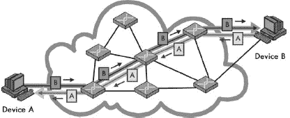

# 第一部分-1. 网络基础

TCP/IP 概述和背景信息

他们说最好的开始方式是从一开始，而你现在正处在这个起点。本节包含了一些背景信息，这些信息将帮助你理解网络是什么以及 TCP/IP 在整体方案中的位置。这些介绍性信息将帮助你轻松地进入 TCP/IP 的学习，对于初涉网络世界的人来说尤其有价值。

本节包含三个部分。第一部分涵盖了网络的一些重要基本方面，讨论了它们的使用方式、定义它们的标准、描述它们的术语以及更多内容。第二部分描述了重要的 OSI 参考模型，这是理解网络技术功能和组织的一个基本工具。第三部分对 TCP/IP 协议套进行了高级概述，这将为本书中后两节对单个 TCP/IP 协议的更完整讨论奠定基础。

让我们开始吧！

第一章

第二章

第三章

第四章

与许多其他 TCP/IP 相关资源的作者不同，我并不假设读者已经知道网络是什么。毕竟，这就是你读这本书的原因！

本部分提供了关于网络的一些基本问题的概述。它包括对一些最基本网络概念和思想的讨论。它不仅为你提供了有用的背景材料，而且作为一个通用信息的存储库，这样我就不需要在书的其他许多地方重复它（如果你已经了解了这些基础知识，你也不需要在其他许多地方跳过它们）。这里涉及的主题对于理解某些 TCP/IP 概念是有用的。然而，其中一些材料非常广泛地面向整个网络，并不特定于 TCP/IP 互连网络。

本部分包含四章。第一章从广义上介绍了网络，描述了其基本特征，并区分了网络的大小和类型。第二章讨论了与网络性能相关的许多不同问题。第三章解释了网络标准和标准组织的重要性。最后，第四章提供了有关数据在计算机中存储和操作背景信息；如果你是计算机新手，在阅读本书的其他部分时，这些信息可能很有用。如果你在计算机网络和相关技术方面有经验，你可能希望跳过本书的这一部分。或者，你可以扫描章节的标题；如果你理解标题中提到的术语，你可能会跳过讨论。本书其他部分的相关交叉引用会根据适当的信息引用本部分内容，因此，如果你需要即时填补特定基本知识的空白，你可以很容易地做到这一点。

# 第一章：网络简介、特征和类型

对于网络新手来说，通常会有一些非常重要的问题。网络究竟是什么？描述网络的最重要的属性是什么？以及存在哪些类型的网络？讨论网络基础知识的明显起点是使用对整个网络的高层次介绍来回答这些问题。

本章分为三个部分。第一部分提供了对网络的快速介绍。我用最基本的方式来定义网络，然后通过描述一些优点和好处以及一些缺点和成本，将网络置于整体环境中。

第二部分讨论了描述和区分不同网络和网络技术的关键概念。在这里，我将定义你在学习网络时无法避免的术语和“热门词汇”。这里包括对协议、交换方法、网络消息类型、消息格式以及消息寻址方式的解释。我还讨论了客户端/服务器网络和对等网络之间的区别。

在最后一节中，我通过根据它们的大小和范围来区分它们，描述了主要网络类型，并展示了如何使用每种类型和大小。我讨论了局域网（LAN）、无线局域网（WLAN）和广域网（WAN），以及这三个主要类别的一些变体。我还探讨了与网络各种大小相关的许多术语，以及它们的使用方式，包括段、子网、互联网、内联网和外联网。

# 网络简介

在这个时代，网络无处不在，尤其是以互联网的形式。作为终极网络的互联网不仅改变了计算机世界，也改变了数百万人的生活。我们往往认为计算机应该连接在一起。事实上，现在，每当我在同一个房间里有两台电脑时，我很难*不*将它们连接起来！

考虑到网络的普遍性，很难相信这个领域仍然相对年轻，尤其是在连接个人电脑方面。在讨论网络时，退一步从更高层次看待网络非常有用。它究竟是什么，为什么现在被认为如此重要，以至于大多数个人电脑和其他设备都会联网？

## 什么是网络？

对于这样一个包含众多不同技术、硬件设备和协议的广泛而复杂主题，网络实际上非常简单。一个 *网络* 仅仅是计算机或其他硬件设备通过特殊硬件和软件连接在一起的一个集合，这些连接可以是物理的也可以是逻辑的，使得设备能够交换信息和协作。“网络”这个术语描述了设计、实施、升级、管理和与其他网络和网络技术合作所涉及的过程。

### 小贴士

**关键概念** 网络是一组物理上或逻辑上连接在一起的硬件设备。这使它们能够交换信息。

网络被用于各种令人难以置信的目的。大多数学习网络知识的人会想到网络是连接个人电脑和其他“真正的”电脑，但你每天都会使用各种类型的网络。每次你拿起电话、在商店使用信用卡、从自动取款机取款，甚至插入电器时，你都在使用某种类型的网络。

实际上，这个定义甚至可以扩展到技术领域之外。我相信你已经听说过“networking”这个术语，用来描述通过朋友和同事寻找雇主或雇员的过程。同样，这里的想法是，独立的单元连接在一起以共享信息和协作。

个人电脑的广泛联网是一个相对较新的现象。在它们存在的头十年左右，个人电脑在很大程度上是“孤岛”，很少连接在一起。在 20 世纪 90 年代初，随着企业意识到网络可以提供的优势，个人电脑联网开始变得流行。到了 20 世纪 90 年代末，拥有两台或更多电脑的家庭网络也开始真正兴起。

这种小型设备的互联，从某种意义上说，是回到了主机计算机的黄金时代。在计算机变得小型和个人化之前，它们是大型且集中的机器，许多用户通过远程终端共享这些机器。尽管将所有这些计算机功能集中在一个地方有许多缺点，但一个好处是所有用户都连接在一起，因为他们共享中央计算机。

个人电脑消除了这种优势。网络试图将计算移动到一个中间地带。它为 PC 用户提供了两全其美的优势：个人电脑的独立性和灵活性，以及主机计算机的连接性和资源共享。事实上，如今网络被认为如此重要，以至于很难想象一个拥有两台或更多计算机的组织不会想要将它们连接起来！

## 网络的优势和好处

你无疑听说过“整体大于部分之和”这个表达。这个短语很好地描述了网络，并解释了为什么它变得如此受欢迎。网络不仅仅是几台通过电线连接在一起的计算机。如果正确实施，网络是一个为用户提供独特功能、超越单个机器及其软件应用所能提供功能的系统。

网络的大多数好处可以分为两大基本类别：*连接性* 和 *共享*。网络允许计算机及其用户相互连接。它们还允许轻松共享信息和资源，以及以其他方式简单合作。由于现代商业如此依赖信息的智能流动和管理，这种易用性告诉你很多关于为什么网络如此有价值的原因。

在这里，不分先后顺序，列举了一些通常与网络相关联的具体优势：

**连接性和通信** 网络连接计算机及其用户。建筑物内或工作组内的个人可以通过 *局域网 (LANs)* 连接；远距离的局域网可以相互连接形成更大的 *广域网 (WANs)*。一旦计算机连接，网络用户就可以使用电子邮件等技术相互通信。这使得商业（或非商业）信息的传输比没有网络时更容易、更高效、更便宜。

**数据共享** 网络最重要的用途之一是允许数据共享。在联网变得普遍之前，一个想要为她的经理准备报告的会计员工必须在她自己的电脑上制作报告，把它放在软盘上，然后走过去给经理，经理会将数据传输到她的电脑硬盘上。（这种基于“鞋”的网络有时被讽刺性地称为 *sneakernet*。）

真正的网络允许成千上万的员工比这更容易、更快地共享数据。它还使得许多应用程序成为可能，这些应用程序允许许多人访问和共享相同的数据，例如数据库、团队软件开发等等。

**硬件共享** 网络促进了硬件设备的共享。例如，你不必给部门中的每个员工配备昂贵的彩色打印机（或者再次求助于 sneakernet），你可以在网络上放置一台打印机供大家共享。

**互联网接入** 互联网本身就是一个巨大的网络，所以每次你访问互联网时，你都在使用网络。今天互联网的重要性很难夸张！

**互联网接入共享** 小型计算机网络允许多个用户共享单个互联网连接。特殊的硬件设备使得连接的带宽可以轻松地分配给需要的人，这些设备允许组织购买一个高速连接而不是多个较慢的连接。

**数据安全和管理工作** 在商业环境中，网络允许管理员更好地管理公司的关键数据。管理员不必像用户创建数据时那样随意地在几十甚至几百台小型计算机上分散数据，而是可以将数据集中存储在共享服务器上。这使得每个人都能轻松找到数据，并使管理员能够确保数据定期备份。管理员还可以实施安全措施来控制谁可以读取或更改各种关键信息。

**性能提升与平衡** 在某些情况下，你可以使用网络将计算任务分配到网络上的多台计算机上，从而提高某些应用程序的整体性能。

**娱乐** 网络促进了多种类型的游戏和娱乐。互联网本身提供了许多娱乐资源。此外，许多多人游戏在局域网（LAN）上运行。许多家庭网络正是出于这个原因而建立的，并且通过广域网（WAN，包括互联网）进行游戏也已经变得相当流行。当然，如果你在经营一家企业，并且有容易被娱乐的员工，你可能会坚持认为这实际上是网络的一个*缺点*而不是优点！

### **提示**

**关键概念** 在高层次上，网络的优势在于它们允许计算机和人们连接在一起，以便他们可以共享资源。网络的一些具体好处包括通信、数据共享、互联网接入、数据安全和管理工作、应用性能提升和娱乐。

## **网络的不利因素和成本**

现在我已经讨论了网络的重要价值和许多有用的好处，我必须用那个老对手——现实主义的宿敌 TANSTAAFL（There ain't no such thing as a free lunch，即“没有免费的午餐”）来让你回到现实。对于那些不是海因莱因粉丝的人来说，这个首字母缩略词代表“没有免费的午餐”。尽管网络确实代表了一个整体，其价值大于其各部分的总和，但它确实与一些真实且重要的成本和缺点相关。

这里有一些网络的不利之处：

**网络硬件、软件和设置成本** 当然，计算机并不是神奇地自己形成网络的。设置网络需要投资硬件和软件，以及用于规划、设计和实施网络的资金。对于一个有两个或三个 PC 的小型家庭网络来说，这相对便宜。考虑到今天网络硬件的低价格，这大约是一百美元左右，考虑到操作系统已经为网络设计，实际上几乎没有设置成本。然而，对于一家大公司来说，成本可能轻易达到数万美元或更多。

**硬件和软件管理及行政成本** 在除了最小的实施之外的所有情况下，网络的持续维护和管理需要 IT 专业人士的关心和注意。在一个已经有系统管理员的较小组织中，网络可能属于这个人的工作职责范围，但这会占用其他任务的时间。在更实质性的组织中，可能需要雇佣网络管理员，在大公司中，可能需要一个整个部门。

**不希望共享** 好事多磨；虽然网络使得有用信息的共享变得容易，但它也允许不希望的数据共享。在这方面，一个显著的共享问题与病毒有关，病毒在网络和互联网上很容易传播。减轻这些影响需要时间、金钱和行政努力。

**非法或不希望的行为** 与前一点类似，网络促进了有用的连接和通信，但也带来了困难。典型的问题包括滥用公司资源、减少生产力的干扰、下载非法或非法材料，甚至软件盗版。在较大的组织中，这些问题必须通过明确的政策和监控来管理，这再次增加了管理成本。

**数据安全担忧** 如果网络得到适当的实施，可以大大提高重要数据的安全性。相反，一个安全措施不足的网络将使关键数据面临风险，使其暴露于黑客、未经授权的访问甚至破坏的潜在问题。

大多数这些成本和潜在问题都可以由那些建立和运行网络的人来管理。最终，是否使用网络的选择是一个权衡利弊的问题。如今，几乎每个人都认为网络是有价值的。

### 小贴士

**关键概念** 网络有一些缺点，你可以权衡其许多积极方面。建立网络需要硬件、软件、维护和管理成本。还必须管理网络以确保其平稳运行并解决可能的滥用问题。当计算机连接在一起时，数据安全也成为了一个更大的关注点。

# 基本网络特性

有许多不同类型的网络和网络技术被用来创建它们。网络方法的激增通常有非常好的理由：不同的需求需要不同的解决方案。这种做法的缺点是，对于网络学生来说，有如此多的不同类型的协议和技术需要理解！

在你真正比较这些方法之前，你需要了解一些使网络成为其自身的最基本的特性。尽管网络类型可能非常不同，但它们通常基于许多共同属性来描述和甚至对比，我将在以下章节中讨论这些属性。

## 网络层、模型和架构

许多人发现网络难以学习的一个原因是它可能是一个非常复杂的话题。造成这种复杂性的主要原因是网络由如此多的硬件和软件元素组成。虽然网络用户可能认为他只在使用一个计算机程序（如网页浏览器）和一件硬件（如个人电脑），但这些只是更大谜团的一部分。为了在网络上完成最简单的任务，必须由数十个不同的组件通过传递控制信息和数据来协作，以实现网络通信的整体目标。

理解任何复杂系统的最佳方式是将它分解成部分，然后分析这些部分的功能以及它们是如何相互作用的。最合逻辑的方法是将整体功能集划分为模块化组件，每个组件负责特定的功能。同时，你还需要定义这些组件之间的接口，这些接口描述了它们是如何结合在一起的。这样，你可以通过以可消化的块来处理网络，从而简化网络的复杂性。

网络技术通常通过将它们的函数划分为*层*来以这种方式进行细分，每一层都包含硬件和软件元素。每一层负责执行特定类型的任务，并与它上面的层和下面的层交互。层在概念上被排列成一个垂直的*堆栈*。底层负责更具体的工作，如硬件信号和低级通信；它们为高层提供服务。高层反过来使用这些服务来实现更抽象的功能，例如实现用户应用程序。

以这种方式将网络划分为层有点像制造设施中的劳动分工，并且会产生类似的好处。每个硬件设备或软件程序都可以专门化以执行该层所需的函数，就像装配线上的受过良好训练的专家一样。不同的模块可以根据需要以不同的方式组合。这样，也更容易理解网络的整体功能。

分层的一个其他重要好处是它使得由不同群体定义的技术能够互操作。为了实现这一点，每个人都需要就如何定义和使用层达成一致。为此最常用的工具是*网络模型*。该模型描述了网络中的不同层，每一层负责做什么，以及它们如何交互。一个普遍接受的模式确保了在创建硬件和软件时，每个人都处于同一页面上。

目前最常用的通用模型是开放系统互联（OSI）参考模型，它由七个堆叠层组成。这些层从底层的物理层（层 1），负责低级信号，到顶层的应用层（层 7），其中实现了应用软件。理解 OSI 模型对于理解整个网络是至关重要的。我在本书的第一部分-2 中对模型和层进行了更详细的解释，并提供了 OSI 参考模型的完整描述。

与模型的概念密切相关的是架构的概念。架构本质上是一组规则，它描述了构成堆叠层的一部分硬件和软件的功能。这样的规则集通常以规范或标准的形式出现，描述了使用该技术的设备和程序必须如何行为。网络架构旨在实现与 OSI 参考模型中特定连续层集相关的功能，无论是正式的还是非正式的。

在这本书中，我讨论了 TCP/IP，这是运行互联网的协议套件。TCP/IP 是一套复杂的技术，跨越了 OSI 模型的多层。通过检查 TCP/IP 的各个组成部分以及它们如何实现不同的 OSI 模型层，你将真正了解 TCP/IP 是如何工作的。首先，这个套件的名称 TCP/IP 来源于传输控制协议（TCP），它在 OSI 模型的第 4 层运行，以及互联网协议（IP），它在 OSI 模型第 3 层运行。IP 为第 4 层提供服务，并使用其下第 2 层的服务。TCP 使用 IP 的功能，并为它上面的层提供功能。

我将通过查看其架构以及一个专门为理解 TCP/IP 而开发的第二个特殊模型来开始对 TCP/IP 的更全面检查。这两个模型都在第八章中进行了探讨。

## 协议：它们究竟是什么？

如果你在这本书中会经常看到的一个词，那就是*协议*。你会看到对网络协议、互联网协议、高级协议、低级协议、协议栈、协议套件、子协议等的引用。显然，协议很重要，但许多参考资料和标准反复使用这个术语，却从未对其进行解释。这可能是因为这个术语有些模糊，可以有多种含义。

在某些情况下，如果你回到查看术语在日常英语中的使用方式，理解一个技术术语可能更容易。在现实世界中，协议通常指的是外交官遵守的行为准则或礼仪形式。这些人必须遵循一定的礼仪和正式规则，以确保他们能够有效地沟通而不会引起冲突。他们还必须了解在与来自其他国家的代表互动时，对他们有什么期望，确保例如，他们不会因为对当地习俗的不熟悉而冒犯任何人。事实上，大多数人都会遵循各种协议；它们是社会中的某种不成文规则。

这可能看起来与网络无关，但实际上，这是对网络协议的相当好的高级描述。它们定义了一种语言和一套规则和程序，使设备和系统能够进行通信。显然，计算机没有当地习俗，它们几乎不必担心犯下可能引起另一台计算机反感的错误。网络协议关注的是确保网络或互联网上的所有设备在通信过程中的各种操作上达成一致。

因此，协议基本上是一种确保设备能够有效通信的方式。在大多数情况下，一个单独的协议描述了在两个或更多设备中的一个特定软件或硬件元素之间如何完成通信。

在 OSI 参考模型的背景下，协议正式定义为规范同一层实体之间通信的规则集。例如，TCP 负责 TCP/IP 网络上的特定功能集。TCP/IP 网络上的每个主机都有一个 TCP 实现，这些主机在 OSI 模型的第 4 层逻辑上相互通信。

### 注意

*“协议”一词的正式化 OSI 参考模型意义在 OSI 参考模型主题“横向层通信”（在第五章[Chapter 5. GENERAL OSI REFERENCE MODEL ISSUES AND CONCEPTS]中讨论，标题为“协议：横向（对应层）通信”）中有所涵盖*。

尽管 OSI 参考模型定义有时过于理论化，但这个协议的定义在评估现实世界网络中的协议时相当准确。如果某物没有指定通信方式，那么它可能不是协议。

### 提示

**关键概念** 网络协议定义了一组规则、算法、消息和其他机制，使得网络设备中的软件和硬件能够有效通信。通常，一个协议描述了在两个或更多设备中同一 OSI 参考模型层上的对应实体之间的通信方式。

尽管如此，术语*协议*在口语中经常用来指代网络中的许多不同概念。这里列出了该词的一些更常见的替代用法：

**协议套件** 很常见听到将协议这个词用来指代一组更恰当称为协议套件（或堆栈，指层堆栈）的协议。例如，当 TCP/IP 实际上是一组（大型）协议时，它通常被称为只是一个协议。

**Microsoft Windows Protocols** 将协议套件称为单个协议的问题的一个重要例子是微软 Windows 中的网络软件。它通常将完整的网络栈，如 TCP/IP 或 IPX/SPX，仅仅称为一个协议。然而，当你安装这些所谓的协议之一时，你实际上得到的是一个支持完整协议套件的软件模块。

**其他技术** 有时，一些根本不是协议的技术被称为协议，要么是出于惯例，也许是因为人们认为听起来不错。例如，TCP/IP 远程网络监控（RMON）通常被称为协议，而实际上它只是简单网络管理协议（SNMP）的增强，而 SNMP 本身就是一个协议！（有关 SNMP 和 RMON 的详细信息，请参阅第 III-4 部分[pt15.html "Part III-4. TCP/IP NETWORK MANAGEMENT FRAMEWORK AND PROTOCOLS"]。）

那么，一个协议是否真的是“真正的”协议，这真的重要吗？嗯，网络硬件设备和软件程序当然不在乎。但希望你在阅读了关于这个术语及其含义之后，在你学习过程中遇到这个术语时能够更好地理解它——尤其是在它可能并不总是与正式定义完全一致的情况下。

## 电路交换和分组交换网络

网络是通过特殊硬件和软件连接在一起的设备，这些硬件和软件允许它们交换信息。这句话中最重要的词是最后一个词：*信息*。正如你将在本书的探索中看到的那样，有许多方法可以在网络设备之间交换信息。还有许多方法可以对这些方法和使用它们的网络类型进行分类和描述。

区分网络技术的一个基本方法是基于确定信息将流经的设备之间路径的方法。用高度简化的术语来说，有两种方法：可以在设备之间预先设置路径，或者将数据作为单独的数据元素通过可变路径发送。

### 电路交换

在*电路交换*网络方法中，用于整个通信的连接称为*电路*，在两个设备之间建立。关于电路性质的信息由网络维护。电路可以是始终存在的固定电路，也可以是根据需要创建的电路。即使两个通信设备之间可能存在许多通过中间设备的潜在路径，也只会使用其中一条路径进行任何给定的对话，如图图 1-1 所示。

电路交换网络的经典例子是电话系统。当你打电话给某人并且她接听时，你会建立一个电路连接，可以稳定地传输数据。这个电路无论使用多少中间设备来传递你的声音，其功能都是一样的。你使用它直到你需要它，然后终止电路。下次你打电话时，你会得到一个新的电路，这个电路可能（很可能）使用了与第一个电路不同的硬件，这取决于当时网络中可用的硬件。

图 1-1. 电路交换 在电路交换网络中，在两个设备之间发生通信之前，会在它们之间建立电路。这以从设备 A 到设备 B 的数据导线的较暗线条表示，以及从 B 回 A 的匹配较亮线条。一旦建立，这些设备之间的所有通信都通过这条电路进行，尽管还有其他可能的数据通过网络设备之间传递的方式。将此图与图 1-2 进行比较。

### 数据包交换

在*数据包交换*网络类型中，没有使用特定的路径进行数据传输。相反，数据被切割成称为*数据包*的小块，并通过网络发送。您可以根据需要路由、组合或分割数据包，以便将它们发送到最终目的地。在接收端，过程相反——数据从数据包中读取并重新组装成原始数据。数据包交换网络更类似于邮政系统，而不是电话系统（尽管这种比较并不完美）。一个例子在图 1-2 中显示。

图 1-2. 分组交换 在分组交换网络中，在设备之间发送数据之前不设置电路。数据块，即使来自同一文件或通信，也可能在从一台设备到另一台设备的旅途中采取任意数量的路径。将此与图 1-1 进行比较。

### 小贴士

**关键概念** 网络技术的一种分类方式是基于用于在设备之间传输数据的路径。在电路交换中，首先建立电路，然后使用该电路来传输设备之间的所有数据。在分组交换中，在通信的设备之间不创建固定路径；它被分成数据包，每个数据包可能从发送者到接收者采取不同的路径。

### 应该选择哪种交换方法？

考虑这些替代方案时，一个常见的诱惑是询问哪个更好；答案是都不是。有些地方更适合其中一个，但如果其中一个明显优于另一个，两种方法就不会都被使用。

选择交换方法的一个重要问题是网络介质是**共享**的还是**专用**的。你的电话线可以用来建立电路，因为你可能是唯一可以使用它的人——假设你能让那个讨厌的配偶/孩子/姐妹/兄弟/父亲/母亲远离它。然而，这并不适用于通常使用单一共享介质和基带信令的局域网。如果两个设备要建立连接，它们将锁定所有其他设备长达一段时间。将数据分成小块并逐个发送更有意义。然后，如果其他两个设备想要通信，**它们的**数据包可以交错，每个人都可以共享网络。

能够在没有专用数据路径的情况下让许多设备同时通信的能力是分组交换成为今天主流的一个原因。然而，与电路交换相比，分组交换也有一些缺点。其中之一是，由于所有数据在设备之间不采取相同的可预测路径，因此某些数据块可能在传输过程中丢失或以错误的顺序出现。在某些情况下，这并不重要，但在其他情况下，这确实非常重要。

尽管电路交换和分组交换之间的理论差异非常明确，但了解如何使用它们要复杂一些。主要问题之一是，在现代网络中，它们通常被结合使用。

例如，假设你使用拨号调制解调器连接到互联网。你将使用 IP 数据报（分组）来携带高层数据，但将通过电路交换的电话网络发送。然而，数据可能以数字分组形式通过电话系统发送。因此，在某种程度上，电路交换和分组交换同时被使用。

另一个问题在于电路交换和分组交换之间的关系，以及一项技术是否是面向连接的或无连接的。这两个概念相关但并不相同，你很快就会看到这一点。

### 注意

*“分组”这个词只是用来指代通过网络发送的消息的几个术语之一。你还会遇到的其他术语包括帧、数据报、单元格和段。你将在本章后面了解更多关于这些术语的信息*。

## 面向连接和无连接协议

我刚刚根据技术是否使用专用路径或*电路*来发送数据来比较了网络技术。区分技术和协议的另一种方式是它们是否在设备之间使用*连接*。这个问题与分组交换与电路交换的问题密切相关。

根据它们使用连接的方式，协议被分为以下两个类别：

**面向连接协议** 这些协议要求你在传输数据之前在两个设备之间建立逻辑连接。这通常是通过遵循一组特定的规则来完成的，这些规则指定了如何启动、协商、管理和最终终止连接。通常，一个设备会首先发送一个请求来打开连接，另一个设备会响应。设备会传递控制信息以确定是否以及如何建立连接。如果成功，数据将在设备之间发送。当它们完成时，连接会被断开。

**无连接协议** 这些协议不会在设备之间建立连接。一旦设备有数据要发送给另一个设备，它就会立即发送。

### 小贴士

**关键概念** 面向连接的协议是指在发送数据之前，设备之间首先建立逻辑连接的协议。在无连接协议中，数据只是发送，而不创建连接。

你可能立即就能看到电路和连接这两个概念之间的关系。显然，为了在两个设备之间建立电路，你必须将它们连接起来。因此，电路交换网络本质上基于连接。这导致了*电路交换*和*面向连接*这两个术语可以互换使用。

然而，这是一个由常见的逻辑谬误导致的过度简化——人们犯了一个错误，认为如果 A 意味着 B，那么 B 意味着 A，这就像说，因为所有苹果都是水果，所以所有水果都是苹果！电路需要连接，但电路并不是连接的先决条件。因此，即使它们根本不基于基于电路的网络的使用，也存在面向连接的协议。

这些面向连接的协议很重要，因为它们使得在没有任何内在连接感的分组交换网络上实现需要连接的应用程序成为可能。例如，要使用 TCP/IP 文件传输协议（FTP），你希望能够连接到服务器，输入登录名和密码，然后执行命令来更改目录、发送或检索文件等。这需要建立一个可以传递命令、回复和数据连接。同样，Telnet 协议（TP）也涉及建立连接——它允许你远程使用另一台机器。然而，这两个协议（间接地）都是基于 IP 工作的，而 IP 是基于数据包的使用，通过分层的重要原则（参见第五章中的“数据封装、协议数据单元（PDUs）和服务数据单元（SDUs）”部分，以了解这方面的讨论。

我还应该指出，有一些协议使用不寻常的名称，这些名称在网络的其它地方并不常用，用来指代它们的消息。一个突出的例子是 TCP，它将其消息称为*段*。

### 小贴士

**关键概念**在分组交换网络中的设备之间的通信基于最一般地称为消息的项目。这些信息片段也有其他名称，如包、数据报、帧和信元，这些名称通常对应于 OSI 参考模型特定层的协议。OSI 的正式术语是*协议数据单元（PDU）*和*服务数据单元（SDU）*。

在这本书中，我特意避免仅根据消息使用的名称来暗示其性质，但我确实遵循了特定技术最常用的名称。例如，通过以太网发送的消息几乎总是被称为以太网帧——它们通常不被称为以太网数据报，例如。然而，我并不将讨论的结构设计成仅通过消息使用的名称来确定其类型。

## 消息格式：标题、有效载荷和页脚

*消息*是用于在网络中发送信息的结构。它们在用途上从一种协议或技术到另一种有很大的不同，正如刚才所描述的，它们也被许多不同的名称所称呼。莎士比亚关于名称的想法是正确的。消息最重要的区别不在于它们的名称，而在于它们的*内容*。

每个协议都使用一种特殊的*格式化方法*来决定其使用的消息的结构。显然，旨在连接 Web 服务器和 Web 浏览器的消息将与在低级别连接两个以太网卡的消息大不相同。这就是为什么我在本书的各个领域分别描述了数十种不同协议消息的格式。

尽管特定消息类型的格式完全取决于使用它的技术的性质，但整体上，消息往往遵循相当统一的结构。用通用术语来说，每条消息包含以下三个要素（参见图 1-3

图 1-3.网络消息格式在最一般的意义上，一个消息由一个将要通信的数据有效载荷组成，由一组页眉和页脚字段包围。在网络协议中发送的任何特定消息的数据本身将包含一个封装的更高层消息，该消息包含页眉、数据和页脚。这种“嵌套”可以在数据通过协议堆栈传递时发生多次。页眉在大多数协议消息中都可以找到；页脚只在某些消息中。

由于页眉和页脚可以包含控制和信息字段，你可能会正确地想知道为什么还要有一个单独的页脚。一个原因是某些类型的控制信息是使用数据本身的值来计算的。在某些情况下，在数据有效载荷发送时执行此计算会更有效，然后将在页脚中传输结果。页脚中经常找到的一个字段示例是冗余数据，如循环冗余校验（CRC）代码，该代码可以被接收设备用于错误检测。页脚通常与低层协议相关联，尤其是在 OSI 参考模型的数据链路层。

### 小贴士

**关键概念**网络消息的一般格式由一个*页眉*组成，后面跟着消息的*数据*或*有效载荷*，然后可选地跟着一个*页脚*。页眉和页脚信息在功能上相同，只是在消息中的位置不同；页脚字段仅在某些情况下使用，尤其是在字段中的数据基于传输的数据的值进行计算的情况下。

一般而言，任何特定的协议只关心它自己的**头部**（如果有的话）。它不太关心消息数据部分的内容，就像快递员只关心驾驶卡车而不是它里面装的是什么一样。在数据开始的地方，通常会有其他协议的头部，这些协议在协议栈中更高层；这一点也在图 1-3 中有所展示。在 OSI 参考模型中，由特定协议处理的消息被称为其 PDU；它有效载荷中携带的数据是其 SDU。较低层协议的 SDU 通常是较高层协议的 PDU。关于数据封装的讨论在第五章中包含了这一重要概念的完整解释。

## 消息寻址和传输方法：单播、广播和多播

在使用消息发送数据的网络技术中，你必须完成一系列任务才能成功地将数据从一地传输到另一地。其中一个是简单地**寻址**消息——给它加上地址，以便系统知道它应该去哪里。另一个是**传输**消息，即将其发送到预期的接收者。

在网络中传递消息有几种不同的方式。其中一种区分消息的方式是它们是如何被寻址的，以及有多少接收者会收到它们。所使用的方法取决于消息的功能，以及发送者是否具体或一般地知道他们试图联系的人。

为了帮助解释这些不同的方法，我将使用一个现实世界的类比。考虑一个在大型礼堂举行的 300 人的社交活动。这些人正在交谈和进行不同的对话。在这个环境中，你可能需要发送不同类型的消息，就像网络一样。

图 1-4. 单播、多播和广播消息寻址和传输 本图展示了简化局域网中的三种基本寻址和消息传输类型。设备 6 正向设备 2 发送单播消息，用深色粗箭头表示。设备 4 正向多播组 X 发送多播消息，用中等粗细的箭头表示。在这种情况下，该组包括设备 1 和 3，它们被突出显示。最后，设备 5 正在发送广播消息，该消息将发送到局域网上的所有其他设备，用细而淡的箭头表示。

考虑到这个类比，考虑以下三种消息传输方式，如图 1-4 所示：

**单播消息** 这些是从一个设备发送到另一个设备的消息；它们不是给其他人的。如果你在这个社交活动中有一个朋友，这相当于把他拉到一边进行私人谈话。当然，活动中还有其他人可能无意中听到你的谈话——甚至可能窃听。在网络上也是如此——将消息地址指定给特定的计算机并不能保证其他人不会阅读它；只是他们通常不会这么做。

**广播消息** 如其名所示，这些消息发送到网络上的每个设备。当你需要将一条信息传达给网络上的每个人时，或者当发送站点需要将其发送给单个收件人，但不知道其地址时，你会使用它们。例如，假设社交聚会的新来者看到停车场里有一辆蓝色轿车，车灯还亮着。她不知道这辆车属于谁。传达这个信息的最佳方式是通过主持人进行公告，这样所有人包括车主都能听到。在网络中，广播消息用于各种目的，包括查找特定站点或管理不同服务的设备的位置。

**多播消息** 这些消息是前两种类型的折中方案。多播消息发送给一组满足特定条件的站点。这些站点通常以某种方式相互关联。例如，它们执行共同的功能或被设置成特定的*多播组*。（注意，你也可以将广播消息视为一种特殊的多播情况，其中组是“所有人”。）

回到我们的类比：这就像一群朋友去这个大型社交大厅，然后在一个小讨论组中聚在一起——或者也许使用无线电从远处交谈。多播需要特殊的技巧，以清楚地表明谁在预期的收件人组中。

由于这些传输方法根据接收传输的设备和设备类型而有所不同，它们直接与寻址方法相关联，如下所示：

**单播寻址** 单播投递要求消息应发送给特定的收件人。这是最常见的信息传递类型，因此这种寻址能力几乎存在于所有协议中。

**广播寻址** 广播通常通过一个专门为该功能保留的地址来实现。当设备看到发送到该地址的消息时，它们都会将其解释为“这条消息发送给所有人。”

**多播寻址** 多播是最复杂的一种消息类型，因为它需要一种方法来识别一组特定的设备，这些设备将接收消息。通常需要创建几个这样的组，这些组在成员资格上可能部分重叠。需要某种机制来管理哪些设备在哪些组中。

### 小贴士

**关键概念** 用于在联网设备之间寻址和传输数据的基本方法有三种。*单播*传输从一个设备到另一个确切设备；这是大多数消息交易中最常用的方法。*广播*传输从一个设备发送到网络上的所有连接设备。*多播*传输被寻址并发送到一组选定的设备。

最后，在寻址领域的一个特殊情况值得提及。在某些网络或链路中，只有两个设备连接在一起，形成了通常所说的*点对点网络*。在这种情况下，一个设备发送的任何内容都隐含地旨在发送给另一个设备，反之亦然。因此，在点对点链路上对消息进行寻址并不是严格必要的。

### 注意

*在 IP 版本 6（IPv6）中定义了一种新的消息寻址方法：任播消息。这个术语标识了一条应该发送到一组设备中最接近成员的消息。第二十五章描述了这种寻址和传输类型*。

# 网络结构模型和客户端-服务器与对等网络

在我讨论网络优势的讨论中提到，网络通常是为了两个主要目的而设置的：*连接性*和*共享性*。如果你有一个连接了多台不同机器的网络，每台计算机都可以与其他计算机的硬件和软件交互，这使得你可以执行各种任务。实际上如何做到这一点在很大程度上取决于网络的总体设计。

网络设计中一个非常重要的问题是如何配置网络以共享资源。具体来说，网络设计者必须决定是否将资源管理功能分配给构成网络的设备。在某些网络中，所有设备在这方面都被同等对待，而在其他网络中，每台计算机负责提供服务的整体功能中的特定工作。在这种后一种安排中，设备有时被称为具有*角色*，类似于戏剧中的演员。

以下两个常用术语用于描述设置网络的不同方法：

**对等网络**在一个严格的对等网络设置中，每台计算机都是平等的，是网络中的*对等体*。每台机器都可以与其他任何机器共享资源。没有为任何特定设备分配角色，并且每个设备通常运行类似的软件。任何设备都可以并发送请求到任何其他设备，如图图 1-5 所示。

**客户端-服务器网络** 在这种设计中，少量计算机被指定为集中式的*服务器*，并负责为称为*客户端*的更多用户机器提供服务，如图图 1-6 所示。服务器通常是具有大量内存和存储空间以及快速网络连接的强大计算机。客户端通常是较小的、常规的计算机，如 PC；它们针对人类使用进行了优化。

术语*客户端-服务器*也经常指代那些设计有匹配、互补组件的协议和软件。通常，服务器软件运行在服务器硬件上，而客户端软件则用于连接到这些服务器的客户端计算机上。网络上的大多数交互都是在客户端和服务器之间进行的，而不是在客户端之间。服务器软件旨在高效地响应请求，而客户端软件则提供网络用户的人机界面。

### **提示**

**关键概念** 网络通常配置为使用两种基本*结构模型*之一来共享资源。在*对等网络*中，每个设备都是平等的，没有分配特定的任务。然而，在*客户端-服务器网络*中，设备被分配了特定的角色——少量强大的计算机被设置为*服务器*，并响应来自其他设备的请求，这些设备被称为*客户端*。客户端-服务器计算还指代互补协议元素和软件程序之间的交互。由于其广泛用于 TCP/IP 和互联网应用，因此其受欢迎程度正在上升。

图 1-5. 对等网络 在这个模型中，网络上的每个设备都被视为对等方，或平等。每个设备都可以发送请求和响应，没有特别指定执行特定角色。这种模型更常用于非常小的网络。与图 1-6。

客户端-服务器或对等网络的选择有时被称为为网络选择一种 *结构模型*。与大多数使用两种不同方案的情况一样，在这方面没有正确答案。你的选择完全取决于特定网络的需求。

对等网络的主要优势是简单和低成本，这意味着它传统上被用于小型网络。客户端-服务器网络在性能、可扩展性、安全性和可靠性方面提供优势，但设置起来更复杂且成本更高。这使得它更适合大型网络。然而，随着时间的推移，即使是小型网络也朝着客户端-服务器网络的方向稳步发展。许多年前，即使是拥有 20 到 50 台机器的网络也普遍使用对等模型；今天，即使是只有几台机器的网络有时也会以客户端-服务器模式设置，因为集中式资源服务的优势。

客户端-服务器网络流行的兴起有些讽刺，因为在某些方面，它实际上是对几十年前大型主机的回归。一个连接有终端的主机可以被视为客户端-服务器网络，其中主机本身是服务器，而终端是客户端。当然，这种类比并不完美，因为现代客户端计算机比主机的哑终端要完成更多的工作。

客户端-服务器结构模型成为主导地位的一个原因是它是世界上最大的网络——互联网的主要模型。客户端-服务器架构是大多数 TCP/IP 协议和服务的基础。例如，“网页浏览器”这个术语实际上是网页客户端的另一个名称，而“网站”实际上是一个网页服务器。

### 注意

*关于客户端-服务器计算的信息，我建议您阅读第八章“TCP/IP 服务和客户端/服务器操作”部分。该主题还包含了一个非常相关的关于客户端和服务器在硬件、软件和交易环境中的不同含义的阐述*。

图 1-6. 客户端-服务器网络 在客户端-服务器模型中，少数设备被指定为服务器，并配备了特殊的硬件和软件，这使得它们能够高效且同时与多个客户端机器交互。尽管客户端之间仍然可以相互交互，但大多数时候它们会向服务器发送各种请求，而服务器则向它们发送响应。这与图 1-5 中的对等网络示例形成对比。

# 网络的类型和大小

理解网络有时可能困难的原因之一是存在如此多的不同类型！当某人谈论网络时，她可以指从公寓里连接的两台计算机到覆盖全球的拥有数百万节点的实体。每个网络都是独特的，每个网络都在满足不同个人和组织在通信和数据共享方面的需求中扮演着重要的角色。事实上，网络多样性和灵活性的巨大优势是其最重要的优势之一。

区分和对比各种网络的最基本两种方式是它们连接的设备之间的相对距离以及它们之间通信的一般机制。做出这些区分的原因是，网络的科技需求根据你试图覆盖的地域大小以及你想要传输和接收信息的方式有很大差异。

很多人，包括我，喜欢将现有的许多种类的网络分为三大类，如下所示：

**局域网（LANs）** 是指连接相对较近的计算机的网络——通常是在同一个房间或建筑物内。当大多数人想到网络化个人电脑和其他小型计算机时，他们通常是指这种情况。绝大多数常规局域网使用电缆连接，因此“LAN”这个术语本身通常意味着有线局域网，但并不总是这样。

**无线局域网（WLANs）** 是指通过无线电频率或光连接设备的局域网。WLANs 可以是完全无线的，但大多数不是。它们通常将无线设备相互连接，同时也连接到网络的有线部分。由于大多数无线技术的限制，WLANs 通常连接彼此非常接近的设备，通常最多在几百英尺范围内。

**广域网（WANs）** 是指连接设备或其他网络，距离比局域网实际适用的距离更远的网络。如果设备之间的距离可以用英里来衡量，你通常会使用广域网技术而不是局域网技术来连接它们。

更多的时候，广域网（WANs）用于连接物理上距离较远的局域网。例如，一个在两个不同城市有地点的公司通常会为每座建筑设置一个局域网，然后通过广域网将它们连接起来。我也认为大多数互联网接入技术都是广域网的一种形式，尽管有些人可能不同意这一点。还有术语 *无线广域网（WWAN）*，它仅仅指的是使用无线技术的广域网。

就像网络世界中的大多数其他区分和分类一样，这些不同定义之间的界限并不非常明确。正如我之前提到的，WLANs 通常不是完全无线的，因为它们包含有线元素。同样，绝对地说一个网络是“本地”的还是“广域”的是困难的。

在精确区分这些网络类别上花费太多精力也是没有意义的。在某些情况下，不是定义决定了使用哪种技术，而是技术本身表明了你拥有什么样的网络！由于一些协议是为广域网设计的，如果你在使用它们，许多人会说你有广域网，即使那个技术中的所有设备都彼此很近。另一方面，一些局域网技术允许使用可以运行数英里的电缆；大多数人仍然认为一英里长的以太网光纤连接是局域网连接，即使它可能跨越广域网的距离。

LAN 和 WAN 技术在许多方面都有所不同；其中最重要的两个是 *成本* 和 *性能*。在同一个房间内的两个系统之间建立高速数据通道很容易，但如果两个系统在不同的州，那就困难得多。这意味着在广域网的世界里，要么支付更多，要么吞吐量大大减少——通常两者都会发生。

每年，局域网（LAN）和广域网（WAN）之间的灰色区域变得越来越模糊。一个原因是出现了介于这些更熟悉术语之间的中间网络类型。以下两种较为常见：

**校园区域网络（CANs）** 一个*CAN*是为了跨越同一地点的多栋建筑而创建的，例如大学的校园。校园区域网络是一个灰色区域，因为单独的局域网或广域网并不总是适合这种类型的应用。通常，根据校园的特点和组织的需要，会使用局域网和广域网的混合技术进行校园网络建设。

**城域网（MANs）** 你有时可能会看到另一个中间术语*MAN*。正如其名所示，这指的是跨越特定小区域或城市的网络。MANs 可以被认为是覆盖有限地理区域的较小广域网，或者覆盖面积大于通常与本地网络相关联的较大局域网。无线 MANs 有时被称为*WMANs*；IEEE 802.16 是 WMAN 标准的一个例子。

最后，还有一个偶尔使用的术语，我应该提一下：*个人区域网络（PAN）*。这种类型的网络通常意味着一个非常小的局域网，范围只有几英尺。PANs 主要连接由单个个人（或非常小的小组）使用的设备。这个术语最常用于蓝牙/IEEE 802.15 无线技术，因此有时你会看到*无线个人区域网络（WPAN）*和*PAN*这两个术语被交替使用。

### 小贴士

**关键概念** 网络通常根据大小和一般的通信方法分为三类。*局域网（LANs）*通常连接附近的设备，通常使用电缆。*无线局域网（WLANs）*类似于有线局域网，但使用无线电频率或光技术连接设备，无需电缆。*广域网（WANs）*连接远程设备或局域网。*校园区域网络（CANs）*和*城域网（MANs）*在整体大小上介于局域网和广域网之间。*个人区域网络（PANs）*类似于非常小的局域网，通常以*无线个人区域网络（WPANs）*的形式出现。

# 段落、网络、子网络和互联网

网络之所以如此强大，其中一个原因是可以用来连接不仅单个计算机，还可以是计算机组。因此，网络连接可以存在于多个级别；一个网络可以连接到另一个网络，整个网络又可以连接到另一组网络，依此类推。当然，这种连接的终极例子是互联网，它是一个由许多网络相互连接而成的巨大集合……我敢说，是一个网络？

这意味着一个较大的网络可以被描述为由几个较小的网络或甚至网络的部分组成，这些部分相互连接。相反，我们也可以谈论将单个网络或网络部分组装成更大的结构。这个概念之所以重要，是因为某些技术最好在高级别上查看整个大型网络时进行解释，而其他技术则真正需要你深入到构成网络部件的详细级别。

随着时间的推移，在计算机网络领域，一系列术语已经发展起来，用于描述较大和较小网络的相对大小。以下是一些最常见的术语：

**网络** 这是这里提到的术语中最不具体的一个。基本上，*网络* 可以是几乎任何大小，从两个设备到数千个。然而，当网络变得非常大，并且显然由较小的网络连接在一起时，它们通常不再被称为网络，而是称为 *互联网*，正如你马上就会看到的。尽管如此，听到有人提到像“微软的企业网络”这样的东西是很常见的，显然它包含数千甚至数万台机器。

**子网（子网）** 一个 *子网* 是网络的一部分，或者是一个属于更大互联网的网络。这个术语也是一个相当主观的术语；当它们是大型网络的一部分时，子网可以相当大。

缩写词 *子网* 可以泛指子网络，但在 TCP/IP 地址的上下文中也有特定的含义（参见第十八章）。

**段（网络段）** 一个 *段* 是网络的一个小部分。在某些上下文中，段与子网络相同，这两个术语可以互换使用。然而，更常见的是，*段* 这个术语意味着比子网络更小。网络通常设计得使相互关联的计算机或被同一组人员使用的计算机放置在同一网络段上。

一些局域网技术——包括以太网——使用 *段* 这个术语专门指代一组地理位置相近的机器，这些机器通过单根电缆或单个设备（如集线器）直接相互连接。这些技术有关于在段上可以放置多少设备、可以连接多少段等具体规则，这些规则取决于你使用的网络互连设备。

**互联网（或 Internetwork）** 最常见的是指通过连接较小的网络而形成的一个更大的网络结构。同样，这个术语可以根据上下文具有泛指或具体含义。在某些技术中，互联网只是一个由网络作为组件的非常大的网络。在其他技术中，网络与互联网的区别在于设备是如何连接在一起的。

后者定义的一个重要例子是 TCP/IP，其中*网络*通常指在 OSI 参考模型的第 2 层连接的一组机器，使用像以太网或令牌环这样的技术，以及像集线器和交换机这样的互连设备。当这些网络在第 3 层通过传递 IP 数据报文相互连接时，就形成了互联网。当然，这非常简化，但在学习 TCP/IP 时，当你遇到“网络”和“互联网”这两个术语时，你应该记住这一点。

### 注意

*“互联网”这个词的简称（internet）通常被那些希望避免与专有名词形式（Internet）混淆的人所避免。后者，当然，仅指众所周知的全球互联网及其提供的一切服务。我个人在这本书中大多数时候尝试使用“互联网”这个词，而不是“internet”，*正是因为这个原因*。*

理解这些不同的术语不仅对于帮助你理解关于网络的阅读内容很重要，而且因为它们是网络设计中的重要概念。这在局域网（LAN）中尤其如此，关于如何设置段以及如何将它们相互连接的决定对网络的总体性能和可用性有重要影响。

### 小贴士

**关键概念** 常常使用几个术语来描述网络和网络的各个部分的大小。最基本的术语是“网络”本身，它可以指代几乎所有事物，但通常指的是使用 OSI 层 2 技术连接的一组设备。*子网络*是网络（或互联网）的一部分，*段*也是如此，尽管在特定技术中后者通常有更具体的含义。*互联网*泛指一个非常大的网络，或者具体来说，是指使用第 3 层路由器连接的第 2 层网络集合。

术语*段*特别有问题，因为它通常以两种不同的方式使用，尤其是在与以太网相关的讨论中。传统上，“段”指的是特定的电缆。最早的以太网使用同轴电缆，同轴电缆段是共享的，并成为网络的冲突域。*冲突域*是一个术语，通常指一组硬件设备，其中一次只能有一个设备传输。像集线器和中继器这样的设备被用来通过将这些电缆段连接起来形成更宽的网络来扩展冲突域。随着时间的推移，“冲突域”和“段”这两个术语开始被互换使用。因此，今天，“段”可以指特定的电缆，也可以指代表单个冲突域的连接在一起的电缆集合。

### 注意

*就像“段”这个词的使用可能存在的潜在歧义还不够糟糕一样，它还有一个完全无关的含义：它是 TCP 中发送的消息的名称！*

# 互联网、内联网和外联网

我在前面关于段、网络、子网络和互联网的讨论中提到，互联网实际上是互联网之王。毕竟，除非你基本上定义了它，否则你不会被称为“the”某物！

事实上，互联网不仅仅是一个大型互联网，而且更多。互联网的定义不仅仅是连接到一起的全球计算机，还包括它提供的各种服务和功能。更重要的是，互联网定义了一种特定的方式，即人们和公司之间共享信息和资源的方式。尽管这样说可能有点夸张，但对许多人来说，互联网是一种生活方式。

在 20 世纪 90 年代互联网使用爆炸式增长时，许多人意识到，如果将这些在互联网上使用的技术和技术应用到内部公司网络上，将会很有用。术语*内联网*被创造出来，指的是像私人互联网一样运作的内部网络。它来自前缀“intra”，意味着内部。当然，“inter”是“intra”的反义词，所以这让一些人认为内联网是互联网的反义词。实际上，大多数内联网也是互联网！

就从术语的角度来看，这已经够糟糕的了，但那些时髦词汇的鸟儿们似乎还想更进一步。如果一个内部网络被扩展，允许不仅组织内部的人或团体访问，还包括外部公司的人或团体，那么这有时被称为*外联网*。当然，“extra”是一个前缀，意味着外面或超出。

因此，外联网是一种内部、私有的互联网，但并不是完全内部。外联网是扩展的内联网，实际上是一种像互联网一样工作的互联网。（您现在可以开始理解为什么我不是这些花哨术语的大粉丝了。但话又说回来，我无法选择它们；我只需帮助您理解它们！）外联网不是公开的，不对所有人开放——它由一个私人组织控制。同时，它也不是完全私有的。

### 小贴士

**关键概念** 通用名词*互联网*是单词 internetwork 的缩写，而专有名词*互联网*指的是我们所有人都知道并使用的全球 TCP/IP 网络互连。术语*内联网*指的是使用与互联网相同 TCP/IP 技术的内部网络。*外联网*就像是一个扩展到公司外部个人或组织的内联网。所有这些术语都可以模糊使用，因此您必须小心确定在任何特定情况下它们的确切含义。

如您所见，从一开始，互联网、内联网和外联网之间的界限就相当模糊，随着整个计算世界的更加紧密集成，这些概念正迅速融合成一个模糊的灰色整体。例如，即使您有一个完全私有的内联网，您也会想要将其连接到互联网，以便与外界沟通并允许访问互联网资源。外联网可能部分通过公共互联网基础设施实现，使用如虚拟专用网络（VPN）等技术。我想您已经明白了这个道理。

将所有这些概念联系在一起的关键是它们都使用*互联网技术*，这是一个有些模糊的术语。这通常指的是使用 TCP/IP 协议套件，它是互联网的定义性技术，也是互联网上可用的服务集合。

重要的是，被告知一家公司有一个内联网或外联网——而不是一个普通无聊的网络——实际上并没有告诉您多少信息。最好不要依赖口号，而是查看网络或互联网本身的潜在特征。此外，在设计此类网络时，您应该专注于使用有意义的技

# 第二章：网络性能问题和概念

网络在很大程度上是关于连接设备，以便它们之间可以共享信息。由于想法是将数据从一个地方发送到另一个地方，因此任何网络的一个重要特征是其*速度*：数据可以传输和接收多快？这个速度问题最终只是决定网络整体*性能*的几个问题之一。

在计算世界中，性能通常是最被讨论但最不被理解的系统或硬件设备的特性之一。这在网络领域也是如此。例如，大多数人知道他们网络硬件的原始吞吐量评级，他们甚至可能开始根据这些数字得出关于其能力的结论。然而，许多人并没有意识到，他们永远不会在现实世界中真正实现那个评级数量的性能。

与性能相关的其他许多微妙问题通常也被忽视或误解，例如软件驱动程序对硬件性能的影响，以及某些应用程序需要的不仅仅是原始比特速度——它们需要*可靠*的数据传输。但即使超出所有这些，与网络性能相关的一个最重要的问题是理解你的需求，因为这样你就可以确保你不会为不需要的性能花费过多的金钱——或者更糟糕的是，创建一个无法满足你要求的网络。

在本章中，我讨论了与网络相关的各种性能问题和概念。首先，我试图将性能置于适当的背景中，并与非性能问题进行对比。然后，我讨论了几个关键的性能术语和指标：速度、带宽、吞吐量和延迟。我还讨论了用于衡量网络性能的一些单位。接着，我解释了实际网络性能与其理论性能之间的差异，并讨论了影响网络性能的因素。最后，我对比了全双工和半双工网络操作，并讨论了服务质量，这是一个在实时应用（如流媒体）中使用网络时特别重要的概念。

# 将网络性能置于适当的背景

*性能*可能是计算机行业所有流行词汇的母亲。许多人认为它是任何计算机或计算机系统，乃至任何网络的最终目标。许多人花费了大量的金钱和时间来试图最大化它。这有很好的理由：性能*确实*非常重要。一个不能提供足够性能的网络将无法完成那些依赖它的人的工作。然而，保持性能的客观性非常重要。成功最大化性能需要你首先退一步，从大局出发来看待问题。

你必须问自己的第一个问题也是最基本的问题：性能对你来说有多重要？在你回答这个问题之前，回想一下古老的汽车拉力赛格言：“速度要花钱——你想要多快？”虽然有些情况下，你只需多花一点钱就能在网络中获得更好的性能，但总的来说，你不付费就无法获得更多的性能。这可能意味着网络成本更高，或者可能意味着牺牲一些非性能特性。

如果你正在设计或指定一个网络，你必须记住，你的目标是设计出一个系统，该系统能够满足在需求分析期间确定的网络需求。这意味着设计一个性能水平与需求相匹配且留有扩展空间的网络。除非你有无限的预算——谁有呢？——你的目标不是“不惜一切代价追求性能”。而是要创建一个满足*所有*用户需求的网络，包括平衡性能和非性能特性，正如你很快就会看到的。

### 注意

*消费者请注意。公司不断推出“最新和最先进的”高性能网络技术。他们通常试图通过说服你，没有这项最新进展你将无法生活；你需要立即升级——如果不早点的话！然而，事实并非如此。例如，尽管你可以找到理论吞吐量为每秒 10,000 兆比特的以太网硬件，但许多旧网络仍然以 1/100 的速度——甚至 1/1,000 的速度——正常工作。*

最后，请记住，设计网络通常不是一个不可逆转的、永久的决定。网络可以升级和扩展。虽然为网络留出一些余量以允许增长是谨慎的，但在可以稍后进行更改的情况下，花费太多时间和金钱来规划未来是不明智的。考虑到网络硬件价格随时间下降，这一点尤其正确。再次强调，这是在未来的性能规划和预算之间找到一个适当的平衡的问题。

# 平衡网络性能与关键非性能特性

我们都知道性能对任何网络都非常重要。然而，任何构建网络的人也必须关注许多不同的非性能特性。根据网络的不同，这些特性可能和性能一样对网络用户至关重要，甚至可能更加关键。更重要的是，非性能问题通常与性能*权衡*，实际上，很多时候它们必须被降低以增加性能。

在你能够创建一个非常高性能的网络之前，你必须了解你可能需要妥协的关键非性能网络特性。以下是一些这些问题：

**设计和实施成本** 除非你的钱包深不可测，否则你必须关注网络的成本。如前所述，成本是性能的主要权衡因素。运行得更快通常需要更多的金钱。

**质量** 网络的质量取决于所用组件的质量以及它们的安装方式。质量很重要，因为它影响所有其他因素，如可靠性、易于管理以及性能。质量并不直接与性能进行交易——你可以设计出高质量、高性能的网络——但它确实在预算资源上与性能竞争。在其他条件相同的情况下，实现高质量、高性能网络的成本远高于高质量、低速网络。

**标准化** 网络协议和硬件可以设计为符合普遍接受的标准或非标准、专有的标准。标准设计几乎总是更可取，因为它们使互操作性、升级、支持和培训变得更容易。专有标准可能包括提高性能的增强功能，但可能会增加成本或使管理更加困难。

**可靠性** 这与几个其他问题相关，尤其是质量和性能。快速网络并不一定比慢速网络更不可靠，但它们更难且更昂贵地确保可靠运行。

**可扩展性和可升级性** 在创建网络时始终为未来规划是非常重要的。高性能网络可能更难扩展，而且它们扩展的成本肯定更高。再次强调，现在实施具有未来需求容量的网络，而不是在必要时升级，这是一个重要的网络设计决策。

**易于管理和维护** 高性能网络需要更多的工作和资源来管理和维护，并且它们比低速网络更可能需要故障排除。

**场所和公用事业问题** 高速网络的实施可能受到物理场所的限制，或者可能影响它们的布局方式。选择更高速的选项可能需要更多的基础设施，从而增加成本。这一问题的经典例子是在家庭或小型办公室网络中选择有线和无线选项。你可以通过有线连接达到更高的速度，但你真的想铺设它们吗？

### **提示**

**关键概念** 虽然性能是任何网络最重要的特性之一，但还有其他一些特性同样重要。在许多情况下，你必须权衡网络的整体性能与成本、质量、可靠性、可扩展性、可维护性等其他属性之间的关系。你希望网络运行得越快，就越难确保这些其他属性保持在足够高的水平。

# 性能测量：速度、带宽、吞吐量和延迟

有许多术语常用于指代网络性能的各个方面。其中一些彼此非常相似，你经常会看到它们被使用——在许多情况下，甚至被误用或滥用！我将逐一检查它们，看看它们通常是如何被使用的，以及它们的真正含义。

### 备注

然而，除了与性能相关的不同术语的问题之外，更重要的是，性能有多个*方面*。根据应用的不同，数据通过网络传输的方式可能比数据传输的原始速度更重要。特别是，许多多媒体应用需要实时性能；它们需要以稳定的方式发送数据。对于这些目的，原始速度并不像*一致性*速度那样重要。这是一个常常没有得到充分认识的问题。

## 速度

*速度*是网络中使用的最通用的性能术语。因此，它可以指代几乎所有的事情。然而，最常见的情况下，它指的是特定网络技术的*额定*或*名义*速度。例如，快速以太网的名义速度为 100 Mbps（每秒兆比特）；因此，它通常被称为 100 Mbps 以太网，或者被赋予如 100BASE-TX 这样的标识。

额定速度是网络性能中最大的魔法数字——你看到它被用来标记硬件设备，许多人随意地提及这些数字，好像这些数字实际上代表了网络的实际速度。使用名义速度等级的问题在于，它们仅仅是*理论上的*，因此只能讲述一个不完整的故事。没有任何网络技术能够达到其全部的额定速度，许多技术的运行速度甚至*大大低于*额定速度，这是由于现实世界的性能因素造成的。

诸如 100 Mbps 以太网这样的速度等级也常被称为该技术的*吞吐量*，尽管技术的最大理论速度与带宽更相似，而不是吞吐量，两者并不相同。

## 带宽

带宽是一个广泛使用的术语，通常指的是网络或数据传输介质的数据承载能力。它表示在单位时间内可以从一个点传输到另一个点的最大数据量。这个术语来自电磁辐射的研究，在那里它指的是用于传输数据的频率带的宽度。它通常在理论背景下给出，尽管并非总是如此。

带宽仍然用于这两种意义上：频率带宽和数据容量。例如，无线电频率被用于无线技术，这些技术的带宽可以指无线电频率带的宽度。然而，更常见的是，带宽指的是网络中可以发送的数据量，并且通常用于相对术语。例如，对于互联网接入，电缆或 xDSL 连接被认为是宽带接入；使用常规的模拟调制解调器是窄带接入。

## 吞吐量

通过量是衡量在单位时间内通过网络、信道或接口可以发送多少实际数据的指标。虽然通过量可以是一个理论术语，就像带宽一样，但它更常在实际意义上使用——例如，用于衡量在现实世界中通过网络实际发送的数据量。通过量受带宽或额定速度的限制：如果一个以太网网络的额定速度为 100 Mbps，那么这是通过量的绝对上限，尽管你通常会得到少得多的速度。因此，你可能会看到有人说他们使用的是 100 Mbps 的以太网连接，但他们的网络通过量仅为，比如说，71.9 Mbps。

术语*带宽*和*通过量*经常被互换使用，尽管它们实际上并不完全相同。

## 延迟

*延迟*是一个非常重要但经常被忽视的术语，它指的是在通信信道或网络上的数据传输的*时间*。延迟的一个重要方面是从请求数据的时间开始直到它开始到达所需的时间。另一个方面是设备对发送数据的时序控制程度，以及网络是否可以安排以允许在一段时间内持续传输数据。低延迟被认为比高延迟好。

## 性能测量总结

与所有网络术语一样，没有硬性规则；许多人对于与性能测量相关的术语使用相当宽松。你甚至可能会看到诸如*通过量带宽*、*带宽通过量*和其他来自冗余部门的迷人发明。更常见的是，你会看到很多混乱的术语使用，特别是基于网络的额定速度得出关于网络可以处理哪些数据流的错误结论。更糟糕的是，速度评级通常以每秒比特数指定，但通过量可能以每秒比特或字节给出。

### 小贴士

**关键概念** 最常用来指代网络整体性能的三个术语是*速度、带宽*和*通过量*。它们是相关的，并且经常被互换使用，但并不相同。术语*速度*是最通用的，通常指网络技术的额定或标称速度。"带宽"可以指一个技术使用的频率带的宽度，或者更普遍地，数据容量，其中它被用作更理论性的度量。"通过量"是在给定时间内通过信道的具体数据流量度量。它通常是一个实际测量值。

通常，*速度、带宽*和*通过量*会受到很多关注，而*延迟*则很少受到关注。然而，对于许多实时应用，如流式音频和视频以及交互式游戏，延迟的考虑非常重要。事实上，它们往往比原始带宽更重要。

例如，假设你搬到了一个乡村家庭，你选择的互联网接入方式是一个普通的 28.8 Kbps 调制解调器连接或者时尚的卫星互联网。销售卫星连接的公司将其称为“宽带”，并宣传非常高的速度——400 Kbps 或更高。他们大肆宣传这比拨号快“十倍”，并且当然为此非常高科技的服务收取高额费用。这是板上钉钉的事情，对吧？

错误。卫星连接具有高带宽，但由于信号往返卫星所需的时间，其延迟（高延迟）非常差。对于从微软下载那个小巧的 150 MB 补丁来说，它确实比调制解调器好得多。然而，由于传输中的延迟或 *延迟*，它对于与你的朋友在网上玩最新的在线视频游戏来说要差得多。在你游戏中做出的每一个动作都会因为信号在卫星和地球之间弹跳而被延迟超过半秒钟，这使得在线游戏几乎不可能进行。因此，卫星互联网是否值得额外付费完全取决于你打算用它做什么。

### 注意

*与延迟密切相关的一个重要问题是服务质量，这是一个通用术语，指的是（在其他方面）网络为需要带宽和可靠数据传输的应用程序提供所需带宽的能力。请参阅本章后面的“服务质量（QoS）”部分*。

### 小贴士

**关键概念** 带宽和吞吐量表明数据在网络中移动的速度，而 *延迟* 描述了数据传输的性质。它最常用来描述数据请求时间和到达时间之间的延迟。具有非常高的吞吐量和较差（高）延迟的网络技术对于某些应用程序来说可能比具有相对较低的吞吐量和良好（低）延迟的技术更差。

# 理解性能测量单位

制作网络硬件的人，或者编写试图教你怎么操作它的材料的人，会使用许多术语来描述性能，例如 *吞吐量* 和 *带宽*。（这些术语在上一节中已解释。）此外，他们还使用几个不同的 *单位* 来衡量性能。不幸的是，这些单位经常被错误地使用，而且它们在名称上也非常相似。更糟糕的是，它们还有重叠的缩写，很多人使用这些缩写时并没有清楚地说明他们在谈论什么。这不是很棒吗？

## 比特和字节

第一个问题是不为人知的字母 *B*。或者更确切地说，我应该说是大 *B* 和小 *b* 的问题。根据普遍的惯例，大写 *B* 应该用于字节，小写 *b* 用于比特——这就是本书中这些缩写总是被使用的方式。

### 注意

*一个字节通常是八个比特；有时会使用术语*八位组*来代替。如果你不熟悉这些术语，请参阅第四章，那里有关于二进制基础入门的介绍，你还可以找到有关字节和八位组的小争议的讨论*。

不幸的是，这个惯例并不是每个人都严格遵守的。因此，有时你可能会看到 *b* 被用来指代字节，而 *B* 被用来指代比特。这种 *b* 和 *B* 的问题有时会导致极大的混淆，人们可能会把比特误认为是字节，并错误地认为网络运行的速度比实际快或慢八倍。

在查看速度评级时，请记住，它们几乎总是以比特为单位给出，而不是字节。调制解调器评级中的 56K 表示 56,000 比特，而不是 56,000 字节的理论传输速度。（即使有人称之为“56K”调制解调器，这也同样适用。）同样，快速以太网以每秒 100 兆*比特*的速度运行，而不是兆字节，一个 1.544 Mbps 的 T1 链路每秒发送的理论最大比特数为 1,544,000。至少，这通常是相当一致的。

然而，在吞吐量测量方面，比特和字节都被使用，所以你必须小心。原始吞吐量值通常以每秒比特数给出，但许多软件应用程序报告的传输速率是以每秒字节数，包括许多网络浏览器和 FTP 客户端程序。这通常导致用户疑惑为什么他们只能获得预期下载或传输速度的八分之一。

### 小贴士

**关键概念** 在大多数关于网络性能的讨论中，小写字母 *b* 指的是比特，大写 *B* 指的是字节。然而，这些惯例并不总是被普遍遵循，因此必须根据上下文来解释特定的测量值。

比特吞吐量的标准单位是每秒比特，通常简写为 bit/s、bps 或 b/s。字节单位是每秒字节，简写为 bytes/s、Bps 或 B/s——除非某些残忍的作者决定使用小写 *b* 只是为了混淆你！这意味着 100BASE-TX（100 Mbps）以太网的最大理论吞吐量约为 12 MB/s。在上下文不明确的情况下，最好将单位完整写出，如 100 Mbits/s 或 12 Mbytes/s，当然，我在这本书中也尽量这样做。

你偶尔也会看到，尤其是在通信领域，吞吐量以每秒字符数（cps）来衡量。在大多数计算机系统（包括 PC）中，每个字符占用一个字节，所以 cps 相当于 bytes/s、B/s 或 Bps。

当然，大多数网络技术每秒并不只是移动几个比特和字节；它们每秒移动的是数千、数百万甚至数十亿。因此，大多数速度等级不是以每秒比特数来衡量的，而是以 *千* 比特（Kb）、*兆* 比特（Mb）或 *吉* 比特（Gb）每秒来衡量的，同样也可以应用于字节。因此，你会看到诸如 100 Mbps 以太网或 700 kb/s ADSL 这样的术语。

这里，你遇到了另一个问题：存在 *千*、*兆* 和 *吉* 的十进制和二进制版本。例如，百万（兆）的前缀的十进制形式是 10⁶ 或 1,000,000，而二进制形式是 2²⁰ 或 1,048,576。这种大约 5% 的差异导致了各种混淆。当你看到这些缩写时，请记住，在网络中，它们几乎总是指十进制形式。因此，100 Mbps 以太网的速度是每秒 100,000,000 比特，而不是每秒 104,857,600 比特。

### 小贴士

**关键概念** 最常用来表示网络吞吐量的单位是 *每秒比特数* 或 *bps*。这个术语通常以千、百万或十亿来表示，如 *Kbps*、*Mbps* 或 *Gbps*。它几乎总是使用十进制而不是二进制的千、兆或吉乘数。

## 波特率

最后，还有一个术语，你会在讨论调制解调器和其他一些技术时经常遇到：*波特率*。这个单位是以电报先驱让-莫里斯-埃米尔·波多（Jean-Maurice-Émile Baudot，1845–1903）的名字命名的，它衡量每秒信号中发生的转换次数或变化次数。所以，如果信号每秒从一位值变为零值（或反之）一百次，那么这就是 100 波特的速率。

在非常慢的调制解调器早期，每个比特转换编码一个数据比特。因此，300 波特率的调制解调器每秒理论上最多发送 300 比特的数据。这导致人们混淆了 *波特率* 和 *每秒比特数* 的术语——这两个术语仍然被 *过于频繁* 地互换使用。例如，你经常会听到人们将 28.8 Kbps 的调制解调器称为以 28,800 波特率运行。

但这两个单位实际上并不相同；一个衡量数据（通道的吞吐量），另一个衡量转换（称为 *信号速率*）。现代调制解调器使用高级调制技术，可以将多个比特的数据编码到每个转换中。一个 28,800 bps 的调制解调器通常将九个比特编码到每个转换中；它的波特率是 3,200 波特，而不是 28,800 波特（后者是 3,200 和 9 的乘积）。实际上，在传统的电话线上以 28,800 波特率运行调制解调器是不可能的——这超出了电话线的频率带宽。这就是为什么使用高级调制技术将更多数据编码到每个转换中的原因。

### 小贴士

**关键概念** *波特率* 和 *比特率* 单位通常被视为等效，但实际上并不相同。*波特率* 衡量的是网络的信号速率，即信号在每秒内改变值的次数。由于现代编码和调制技术通常在每个这样的转换中编码大于或小于一个比特值，因此网络技术的吞吐量和波特率通常是不同的。

# 理论吞吐量和实际吞吐量，以及影响网络性能的因素

在评估网络性能时，请记住，理论速度评级和实际吞吐量之间始终存在差异。如果你的网络设置得当，这种差异相对较小但仍很重要。否则，差异可能非常大。（请注意，理论和实际性能之间的差异永远不会可以忽略不计。）

网络或通信方法应该能够做到什么和实际上能够做到什么之间存在差异的原因有很多。这些原因通常分为三类：正常网络开销、外部性能限制和网络配置问题。

### 注意

*有许多不同的方式来衡量和评估性能。合成基准程序通常用于衡量吞吐量，并可以产生令人印象深刻的性能分数，但这些分数通常与网络实际运行方式几乎没有关系。这些指标最好用于比较目的，通过显示一个网络或系统比另一个更快，而不是过分关注指标产生的实际数字。然而，即使在进行比较时，谨慎也是明智的*。

## 正常网络开销

每个网络都有一定程度上的正常网络开销，这保证了你永远无法使用任何连接的全部带宽进行数据传输。以 10 Mbps 以太网为例。当然，线路每秒可以传输 1000 万个比特，但并非所有这些比特都是数据！其中一些用于包装和寻址数据——数据不能以原始形式直接扔到网络上。此外，许多比特用于一般开销活动，它们处理传输中的冲突和其他问题。任何网络技术都存在固有的低效率。

即使如此，还存在其他开销问题。任何网络事务都涉及多个不同的硬件和软件层，每个层都存在开销，从应用和操作系统到硬件。这些开销意味着你通常至少会损失局域网（LAN）技术额定速度的 20%，有时甚至更多。例如，在常规的 10 Mbps 以太网网络上，7 Mbps 的用户数据吞吐量实际上是非常好的。

## 外部性能限制因素

有外部因素限制了网络的性能。这里重要的问题包括硬件处理数据的能力以及两个节点之间数据传输链路中存在的任何带宽限制。硬件问题通常在非常快的网络技术中表现出来。

考虑两个普通 PC 之间的千兆（1,000 Mbps）以太网连接。从理论上讲，这个连接应该允许每秒传输 1 GB 的数据。即使超出了之前提到的开销问题，没有任何普通 PC 能够每秒传输这么多数据。只有高端服务器才有这种能力——即使它们什么也不做，也可能会遇到问题。较老 PC 的硬盘可能甚至无法以足够快的速度传输数据，以保持 100 Mbps 以太网连接忙碌。因此，将较老机器中的 100 Mbps 以太网卡升级到千兆可能不会像你期望的那样有帮助。

带宽限制导致网络吞吐量问题，因为整个网络只能以最慢的链路速度运行。这些瓶颈造成了性能下降。以一个常见的例子来说，假设你有一个 1 Mbps 下载速度的电缆调制解调器连接到互联网。它可能大多数时候都非常快，但如果你访问的网站完全卡顿或者它本身存在连接问题，你将无法以 1 Mbps 的速度从这个网站下载。实际上，你的下载速度可能甚至接近不了那个速度。

最后，还重要的是要记住，有许多技术并不总是以恒定的固定速度运行，尽管它们可能会根据物理网络特性改变速度。一个很好的例子是模拟调制解调器，它的性能可能会根据它运行的线路质量有很大的变化。

## 网络配置问题

我之前提到的问题通常是您无法做任何事情的问题；这只是网络野兽的本质。性能限制的第三类，*配置错误*，是不同的。这指的是由于硬件或软件设置不正确而发生的网络减速。糟糕的布线、配置错误的接口卡或糟糕的驱动程序可以*严重*降低网络的性能——降低 90%甚至更多。

这些问题通常可以纠正，但前提是你正在寻找它们。驱动程序问题尤其狡猾，因为当出现减速时，人们的自然倾向是将责任归咎于硬件。然而，没有适当的软件来运行，你无法充分利用你的硬件设备。实际上，这些问题在尖端硬件中比在成熟产品中更为重要。

本类别的问题还包括由于设计不当而引起的问题。例如，将 30 个工作站放在共享的 10 Mbps 以太网段上很可能会导致性能不佳——使用交换机会好得多。另一个常见的错误是在客户端/服务器设置中不提供“更粗的管道”（更高带宽的连接）给服务器。这些问题可以通过重新配置网络来避免或改善——甚至更好的是，从一开始就正确设计它，对吧？

## 不对称性

请记住，许多网络技术，尤其是用于互联网接入的技术，都是*不对称*的，这意味着它们在一个方向的带宽比另一个方向高得多。通常，这是安排得更多带宽流向用户，而不是从用户流向网络，因为大多数互联网用户下载的数据远多于上传。然而，始终重要的是要弄清楚速度评级是针对两个方向的，还是仅针对一个方向，如果是后者，那么另一个方向的速度是多少。具有不对称性能的常见技术包括 56K 调制解调器、非对称数字用户线路（ADSL）、电缆调制解调器和卫星互联网接入。小心，因为销售这些技术的营销人员通常会试图隐藏他们服务的对称性，通常只突出更大的下载数值，而避免提及较慢的上传速度。

不对称性也可能对网络性能产生意想不到的影响，因为大多数通信，即使看起来是单向的，实际上并非如此。最常见的情况是，当一种互联网接入技术的下载带宽远高于上传带宽时。当使用 TCP/IP 下载数据时，必须定期发送确认信息。如果上游带宽太低，这可能会使得无法充分利用链路的下载带宽。

### 小贴士

**关键概念** 网络的理论额定速度在实际中从未达到，原因有很多。*开销*问题意味着网络的可能容量并非全部可用于数据传输。*外部因素*，例如硬件带宽限制，会限制数据的输入和输出。*配置问题*也可能大大降低实际性能。最后，重要的是要记住，许多技术是不对称的，一个方向的速率比另一个方向高，而且通常，较大的数值是广告中宣传的数值。

# 单向、全双工和半双工操作

另一个值得关注的性能方面是网络或连接的操作模式。显然，无论何时我们将设备 A 和设备 B 连接在一起，都必须有一种方式让设备 A 向设备 B 发送信息，同时设备 B 也能向设备 A 发送信息。然而，许多人并没有意识到，网络技术在处理这两个方向的通信方式上可能存在差异。根据网络的设置和所使用技术的特性，您可能通过选择性能增强模式来提高性能。

让我们从查看任何网络连接、通信信道或接口可能存在的三种基本操作模式开始。

## 单工操作

在*单工*操作中，网络电缆或通信信道只能在一个方向上发送信息；它是一条单行道。这可能会让人感觉有些不合逻辑：单向传输的通信有什么意义呢？实际上，在现代网络中，至少有两个不同的地方会遇到单工操作。

第一种情况是使用两个不同的信道进行通信：一个从 A 传输到 B，另一个从 B 传输到 A。这出奇地常见，尽管这并不总是显而易见的。例如，大多数如果不是所有光纤通信都是单工的，这意味着它使用一根光纤发送每个方向的数据。但如果一对光纤线缆被合并成一根电缆，这可能并不明显。

单工操作也用于特殊类型的技术，尤其是那些不对称的技术。例如，一种卫星互联网接入类型只在下载时通过卫星发送数据，而常规的拨号调制解调器用于向服务提供商上传。在这种情况下，卫星链路和拨号连接都在单工模式下运行。

## 半双工操作

采用*半双工*操作的技术能够在两个节点之间双向发送信息，但一次只能使用一个方向。当设备之间只有单一网络介质（电缆、无线电频率等）时，这是一种相当常见的操作模式。

虽然这个术语通常用来描述一对设备的行为，但它可以更一般地指任何数量的轮流传输信息的连接设备。例如，在传统的以太网网络中，任何设备都可以传输，但一次只能有一个设备进行传输。因此，常规（未切换）的以太网网络通常被称为半双工，尽管这样描述局域网可能看起来有些奇怪。

## 全双工操作

在*全双工*操作中，两个设备之间的连接能够同时向两个方向发送数据。全双工通道可以是成对的简单链路（如前面所述）或使用一个设计为允许双向同时传输的通道。全双工链路只能连接两个设备，因此如果需要连接多个设备，就需要许多这样的链路。

### 注意

*“全双工”这个术语有些多余；*双工*就足够了，但每个人仍然说全双工（可能是为了区分这种模式与半双工）*。

在这三个选项中，全双工显然是提供最高性能的一个。全双工操作将连接的理论带宽翻倍。如果一个链路通常以 1 Mbps 的速度运行，但可以工作在全双工模式下，它实际上有 2 Mbps 的带宽（每个方向 1 Mbps）。然而，记住关键词*理论*——在现实生活中，你并不会真正获得双倍的性能，因为通信通常不会同时向两个方向发送大量数据。但是，你确实会比在半双工模式下获得更好的吞吐量。

在某些情况下，操作模式是技术决定的，无法更改。然而，在其他情况下，全双工模式是正确硬件设置的问题，以及软件是否支持全双工操作。因此，在这个领域获得更高的性能有时仅仅是确保适当配置的问题。

全双工操作在通信中已经相当普遍，多年以来都被视为理所当然。更有趣的发展是全双工操作在局域网中的重要性日益上升。传统上，局域网始终在共享访问介质上使用半双工操作。随着交换机的使用增加，为每台计算机提供专用带宽，全双工操作变得非常流行。以太网中的全双工操作不仅允许双向同时传输数据，而且消除了以前共享访问介质的竞争——因此，不再发生冲突。这两种效果的组合提高了性能，有时甚至显著提高。

### 小贴士

**关键概念** 描述网络中连接设备之间数据发送的基本操作模式有三个。在*单工*操作中，数据只能在两个设备之间单向流动。*半双工*网络允许任何设备传输，但一次只能有一个设备进行传输。*全双工*操作意味着两个连接的设备可以同时发送和接收数据。后者提供了最大的潜在性能，因为强迫一个设备在发送数据前等待另一个设备不会降低吞吐量。

# 服务质量（QoS）

在本章前面关于常见网络性能测量的讨论中，我提到网络性能有许多不同的方面。我还介绍了*延迟*的概念，它衡量数据穿越网络所需的时间。延迟是网络中一个更大的问题的一部分，有时被称为*服务质量*或*QoS*。

大多数网络技术的固有性质是，它们更关注尽可能快地将数据从一个地方泵送到另一个地方，而不是关注数据是如何发送的。例如，互联网是在互联网协议（IP）之上设计的，这是一种分组交换技术（在第一章网络介绍、特性和类型中描述），旨在以最有效的方式将数据包从 A 点传输到 B 点，而不需要用户了解将采取什么路由。事实上，同一数据流中的某些数据包可能沿不同的路由发送。数据包可能在转发到目的地之前存储一段时间，甚至可能被丢弃并重新传输。

对于大多数应用，例如简单的文件或消息传输，这完全没问题。然而，有些应用这类服务代表低质量。在这些情况下，数据交付的性质比仅仅速度更重要，需要提供 QoS 的技术或协议。这个通用术语可以包括以下相关功能：

**带宽预留** 指在网络或接口中为一段时间预留一部分带宽的能力，以便两个设备可以依赖在特定操作中拥有该带宽。这用于需要实时流式传输数据的多媒体应用，如果数据包重路由和重传会导致问题。这也被称为*资源预留*。

**延迟管理** 一个功能，限制任何数据传输中两个设备之间的延迟在一个已知值。

**流量优先级** 在传统网络中，所有数据包都是平等的。一个有用的 QoS 功能是处理数据包的能力，以便更重要的连接比不那么重要的连接获得优先权。

**流量整形** 这指的是使用缓冲区和限制，两者都限制连接上的流量低于预定的最大值。

**网络拥塞避免** 这个 QoS 功能指的是监控网络中的特定连接，并在网络中的特定部分变得拥塞时重新路由数据。

因此，从本质上讲，网络环境中的 QoS 与现实世界中的 QoS 类似。它是在一家不错的法国餐厅点外卖和坐下来用餐之间的区别——两者都能解决饥饿，但它们满足的需求非常不同。一些应用程序，尤其是语音、音乐和视频等多媒体应用程序，是时间依赖的，并且比原始带宽更需要一个持续的信息流。

### 小贴士

**关键概念** 通用术语*服务质量（QoS）*描述的是数据在设备之间传输的特性，而不是传输速度。QoS 功能旨在提供更可预测的数据流，而不是更快的流。此类功能的例子包括带宽预留、最小延迟、流量优先级和整形以及拥塞限制。对于专业应用程序，如多媒体，QoS 比常规应用程序（如传输文件或消息）更为重要。

为了支持 QoS 需求，许多新技术已经被开发或增强，以向它们添加 QoS 功能。这包括支持*等时传输*的能力，可以在一段时间内预留一定量的带宽来支持必须实时发送数据的应用程序。一种因其 QoS 功能而受到大量关注的技术是异步传输模式（ATM）。ATM 旨在支持那些在未优化以提供 QoS 功能（如以太网）的网络上通常不可用的流量管理功能。

QoS 最近已经成为一个热门词汇。仅凭这个词本身，它传达的技术提供的信息与被告知它具有高性能的信息相差无几。你必须超越营销术语，找出确切提供的 QoS 功能是什么。

# 第三章：网络标准和标准组织

在不很快遇到与主题相关的大量标准以及创建这些标准的组织之前，你无法研究网络及其相关技术。网络标准促进了网络技术的互操作性，并且非常重要。说没有标准网络就不会存在可能有些夸张，但说没有标准我们就不会知道现在的网络可能并不夸张。网络实际上无处不在，每个硬件设备或协议至少受一个标准管理，通常受多个标准管理。

在本章中，我简要探讨了经常被忽视的主题——网络标准和标准组织。我首先讨论了标准的重要性，强调了专有、事实和开放标准之间的差异。我概述了网络标准的总体情况，然后描述了与网络相关的最重要的国际标准组织和行业集团。接着，我描述了负责互联网标准的组织的结构，包括负责管理地址、域名和协议值等资源的注册机构和注册处。最后，我讨论了用于创建互联网标准的请求评论（RFC）过程。

# 专有、开放和事实标准

标准为什么重要？计算机界有一句老话：“标准的美丽之处在于选择众多。”这个小小的笑话反映了技术人员在行业中发现的数千个标准所感受到的挫败感。除了在内容上有所不同——描述的技术和协议——标准在类型和产生方式上也有所不同。事实上，有时某个特定领域有如此多的选择，部分原因就是它们是如何产生的。

## 专有标准

在计算机的早期阶段，许多人并不完全理解通用标准的重要性。大多数公司由熟练的发明家经营，他们提出了新技术的大胆想法，但他们对分享这些想法并不特别感兴趣。与其他公司分享新发明的信息并不被视为明智的商业行为——竞争！当然，公司认为标准很重要，但他们认为更重要的是由**他们**来控制这些标准。

例如，设想一下，现在是 1985 年，我刚刚发明了一种出色的网络技术，并将其集成到一个名为 SooperDooperNet 的新颖局域网产品中。SooperDooperNet 是我的产品。我对这项技术拥有专利，我控制其设计和制造，而且我当然不会告诉任何人它是如何工作的，因为如果我这样做，别人就会模仿我。

我可以销售 SooperDooperNet 的接口卡、电缆和配件，想要使用它的公司可以在所有 PC 上安装这些卡，并确保这些计算机能够相互通信。通过创建一个“SooperDooperNet 标准”，这解决了该公司的互操作性问题。这是一个**专有**标准的例子——它归一个公司或个人所有。

专有标准的问题在于，其他公司被排除在标准开发过程之外，因此几乎没有动力与标准所有者合作。事实上，恰恰相反：他们有很强的动机开发一个竞争性的专有标准，即使它没有改进现有的标准。

所以当我的竞争对手看到我在做什么时，他不会也创建可以与 SooperDooperNet 一起工作的网络接口卡，这将需要向我支付版税。相反，他将开发一系列名为 MegaAwesomeNet 的新网络硬件，它在操作上与 SooperDooperNet 非常相似，但使用不同的连接器、电缆和逻辑。他也会试图向我的客户销售大量的卡片和电缆。

这里的问题是，市场最终会出现不同公司使用不同产品，而这些产品无法协同工作。如果你安装了 SooperDooperNet，你*必须*来找我进行任何升级或更改——你没有任何选择。更糟糕的是，如果拥有 50 台运行 SooperDooperNet 的 PC 的 Acme 制造业与拥有 40 台运行 MegaAwesomeNet 的 PC 的 Emca 制造业合并会发生什么？IT 人员会遇到问题。当然，会有解决方法，但不是每个人一开始就避免这些困难会更好吗？而且，如果每个人的网络都使用不同的“标准”，你如何能创造出像互联网这样的东西呢？

## 开放标准

最终，公司们意识到，拥有一个大家都能接受的标准化体系对他们更有利。这在网络领域尤其如此，因为设备需要相互通信。如果许多公司联合起来并同意合作，他们可以创建一个*开放标准*，而不是一堆专有标准。这个名字本身就很有说明性；与一个组织的严格保密不同，开放标准对任何有兴趣使用它的人都是开放的。

开放标准成功的关键之一是建立一个指导组织来推广它。通常，会建立一个中立的、非营利性的贸易协会或工作组来制定标准，各种盈利的硬件和软件公司加入这个团体并为其提供财务支持。这些团体还与标准审批机构如国际电信联盟（ITU）和国际标准化组织（ISO）合作，以获得其标准的认可。这些以及其他标准组织将在本章后面的“国际网络标准组织”部分进行描述。

当然，公司并不是为了取悦客户才这样做。在创建开放标准时，他们会在彼此之间分割市场份额，但通过吸引更多客户，他们使市场份额变得更大。客户更喜欢开放标准而不是专有标准，因为这些标准为他们提供了更多选择，并增加了他们与其他公司互动、解决问题、雇佣熟练工人以及在将来扩展的能力。至于公司，他们仍然在他们的特定产品上竞争，所以并不是他们最终都生产相同的产品。出于所有这些原因，开放标准现在比专有标准更为常见。

然而，创建这些标准的过程通常很困难。在某些情况下，标准组织会从头开始制定标准，但在其他情况下，它可能从提交的几种技术中选择一种作为标准的基础，这在通常被称为“技术烘焙”的过程中进行。因此，许多不同的公司可能会带着不同的方法来到桌前，每个公司都在争取被选为该组使用的标准。政治因素可能导致团体陷入多年关于各种选择的斗争，甚至分裂成多个团体。好的例子是 100VG-AnyLAN 支持者与快速以太网支持者之间的冲突，以及困扰电力线网络世界的标准政治问题。

此外，还有一些公司仍然强烈相信专有标准，因为他们真的想控制和引导市场。在这方面最著名（臭名昭著）的一个例子是索尼，这是一家制造优秀硬件的公司，但经常拒绝接受既定标准。因此，有些人避免使用索尼的产品，尽管它们很好，因为他们想坚持行业标准。

## 事实标准

这让我想到了计算机界常见的一种标准类型：*事实标准*。“De facto”在拉丁语中意为“实际上”。事实标准是指那些因为随着时间的推移而被广泛使用，而并非因为标准是由标准委员会开发和批准的，而被用作通用标准的。

事实标准的一个好例子是调制解调器使用的 AT 命令集。几乎所有的调制解调器都使用它，但这种接受并不是由行业团体同意采用和部署的结果。相反，它是 Hayes 这家先驱调制解调器公司单方面开发的，然后几乎所有的其他调制解调器制造商都采用了它，直到它成为标准。

专有标准有时仍然存在的一个原因是，一些公司希望生产一个将被普遍使用，从而成为事实上的标准，这样它们就可以在该市场中占据领导地位。再次，据我所知，索尼属于这一类别——开发者经常想按自己的方式行事，并创建他们试图通过强大的市场影响力推广的专有标准。

有时这会成功，但往往不会，导致不兼容产品的市场碎片化。一个很好的例子是，索尼为数码相机的闪存创建了一种新的格式（记忆棒），而不是使用其他相机制造商使用的 CompactFlash 格式。最终结果是，并非每个人都使用记忆棒，正如索尼所希望的那样，现在有两种不兼容的标准，增加了混乱，并没有给顾客带来真正的利益。

### 小贴士

**关键概念** 网络标准可以分为*专有、开放*或*事实上的标准*。专有标准归一个特定组织所有。如果该组织在市场上具有足够的影响力，并且该行业缺乏其标准的替代品，那么整个行业可能会采用它，使其成为事实上的标准。然而，通常不同的专有标准会相互竞争，导致市场碎片化。相比之下，开放标准不属于任何人——它们是由中立组织创建的，以确保许多不同的公司可以设计和开发兼容的产品。这使得顾客的生活更加便利，同时也促进了整个市场的繁荣。

# 网络标准

所有网络技术都有与之相关的标准。这些通常是高度技术性的文件，并且它们通常假设读者对网络有一定的了解。如果你不是专家，你可能会在理解网络标准时遇到一些困难。

事实上，许多技术都有相当多的标准与之相关。一种网络技术可能因为以下任何一个或所有原因而有多个标准：

+   原始标准已被修订或更新。

+   技术足够复杂，需要用多份文件来描述。

+   技术借鉴或基于相关技术中使用的文档。

+   有多个组织参与了这项技术的发展。

在美国创建的标准文件通常用英语开发，但也经常翻译成其他语言。欧洲标准通常同时用英语、法语、德语以及可能还有其他语言发布。

现在，几乎所有网络标准都是开放标准，由标准组织或行业团体管理。正如我在上一节中解释的那样，开放标准在计算机行业中比专有标准更受欢迎，这在网络领域尤其如此。事实上，那些没有普遍接受的开源标准的少数技术正在失去市场份额，尤其是在无线局域网和家庭网络领域。这几乎证明了开放过程的重要性。

### 注意

*在这本书中，你会找到关于各种标准的讨论。这些讨论通常可以在介绍每种技术类型的概述章节中找到，尽管更复杂的协议讨论包括一个讨论相关标准的部分*。

# 国际网络标准组织

开放标准的兴起对计算机和网络产品的客户以及销售给他们的制造商来说都是一个巨大的福音。然而，为了促进开放标准的发展，我们需要那些将协调这些文档的创建和发布的组织。通常，这些是非营利组织，它们在技术问题上持中立立场，并为整个行业的改善而努力。

这里是一个精选的列表，列出了一些你可能在阅读有关网络和互联网的书籍时可能遇到的标准组织：

**国际标准化组织（ISO）** 可能是世界上最大的标准组织，ISO 实际上是来自数十个国家的标准组织的联盟。在网络领域，ISO 最著名的是其 OSI 参考模型，该模型在本书的第一部分-2 中有所讨论。

### 注意

*国际标准化组织的缩写确实是 ISO，而不是你可能想象中的 IOS。实际上，它根本不是一个首字母缩略词。由于该机构的全称在不同的语言中有所不同，因此对该名称的任何首字母缩略词也会有所不同。相反，该组织从希腊语单词*isos*中选择了 ISO，其含义为“相等”。许多人，尤其是在美国，认为 ISO 是国际标准化组织的缩写，但这是不正确的*。

**美国国家标准协会（ANSI）** ANSI 是美国负责协调和发布计算机和信息技术的标准的主要组织。尽管许多人认为该组织开发和维护标准，但实际上它既不开发也不维护标准。相反，它监督和认证那些实际创建标准的组织，将它们认定为*标准制定组织（SDO）*。ANSI 还发布 SDO 创建的标准文件，并作为美国代表参与 ISO。

**信息技术产业理事会 (ITIC)** ITIC 是由几十家信息技术（计算机）行业公司组成的团体。ITIC 是 ANSI 批准的开发和处理与许多计算机相关主题相关的标准的 SDO。它以前被称为 *计算机和商业设备制造商协会 (CBEMA)*。

**信息技术国家标准委员会 (NCITS)** NCITS 是 ITIC 建立的委员会，负责开发和维护与信息技术世界相关的标准。NCITS 以前被称为 *Accredited Standards Committee X3, Information Technology*，或更常见地，仅称为 *X3*。它维护几个子委员会，这些子委员会开发和维护各种技术主题的标准。

**电气和电子工程师协会 (IEEE)** IEEE（发音为“eye-triple-ee”）是一个为电气或电子领域（包括计算机和网络）的专业人士所熟知的知名组织。IEEE 在网络行业的主要成就是 IEEE 802 项目，该项目涵盖了包括以太网在内的许多流行的网络技术。

**电子工业协会 (EIA)** EIA 是一个国际行业协会，最出名的是发布电气布线和传输标准。

**电信行业协会 (TIA)** TIA 是 EIA 的通信部门，负责制定通信标准。由于通信、布线和传输都是相关的，而且由于 TIA 和 EIA 组织也是相关的，因此由 EIA 或 TIA 制定的标准通常带有 EIA/TIA 或 TIA/EIA 的组合前缀。

**国际电信联盟——电信标准化部门 (ITU-T)** ITU-T 是另一个大型国际机构，负责为电信行业制定标准。ITU-T 以前被称为国际电话电报咨询委员会 (CCITT；缩写来自组织的法语名称：*Comité Consultatif International Téléphonique et Télégraphique*)。

**欧洲电信标准研究院 (ETSI)** 这是一个拥有来自数十个国家的成员的组织，包括欧洲内外，致力于为欧洲市场（及其他地方）制定电信标准。ETSI 以监管欧洲的无线电频谱使用以及制定如 HiperLAN 等标准而闻名。

许多这些组织实际上并不开发各种标准。通常，这些是监管机构——可以称之为高级管理层——它们与许多其他较小的团体合作，这些团体实际上负责制定标准。此外，在许多情况下，一个特定的标准可能由多个标准组织发布，因此它可能带有多个名称。

### **注意**

*负责创建互联网标准的组织集合未在此列表中显示，因为我在本章后面的两个专门部分中选择了覆盖它们，即互联网标准组织和注册机构*。

### 小贴士

**关键概念** 在开放网络标准的开发中，有一些国际组织扮演着重要的角色。其中一些最重要的组织包括 ISO、ANSI、ITIC、IEEE、EIA/TIA、ITU-T 和 ETSI。这些是监管组织，负责整体管理标准开发过程，而不是个别标准的创建细节。

# 网络行业团体

尽管大多数开放标准都是由少数几个大型、通常为国际性的标准组织协调和发布的，但这些并不是唯一参与网络和互联网技术标准开发的团体。许多不同的网络*行业团体*在标准创建过程中发挥着重要作用。

网络行业团体与标准组织在几个方面有所不同。它们通常致力于推广特定的技术，而标准组织则更为通用，监管数百个不同的技术。行业团体通常也比标准组织规模小，成员主要来自为该团体推广的技术创造产品的开发者和制造商领域。

也许是更重要的是，行业团体通常实际上编写并维护标准，而标准组织通常作为监管者，确保标准足够清晰以便实施。然而，一些行业团体只关注市场营销和推广活动。

显然，这些行业团体与标准组织紧密合作。在某些情况下，它们甚至可能是同一个整体组织的一部分，所有不同的团体都以某种方式相互关联。例如，IEEE 802 项目由多个工作组组成，负责维护和开发特定的技术标准，这些标准由更大的 IEEE 组织批准和发布。

其中一个工作组是 802.11 工作组，该工作组负责开发无线以太网技术。与此同时，有一个名为*无线以太网兼容性联盟（WECA）*的行业团体。该团体致力于确保 802.11b 无线网络硬件和软件的跨厂商兼容性。

其他行业团体专门成立，以开发未经正式标准化程序批准的独立标准。例如，包括 HomePNA、IrDA 和 HomeRF 等团体。

这些团体的问题之一是它们通常不将标准对公众开放。这无疑是由于某种安全担忧或希望保持其技术的内部运作秘密。不幸的是，对于这些团体来说，这种政策损害了普通人了解他们的技术是如何工作的能力。

### 注意

*以下是我所说的封闭标准的一个例子，我可以指出我在撰写本文和其他参考作品时的个人经历。我几乎总是无法从大多数私营行业集团获得规范。他们要么拒绝让我获取文档，要么为了这种特权向我收取大量费用（在某些情况下，费用高达数千美元）。通过这样做，这些团体损害了自己的事业，从而使得对他们的技术感兴趣的人了解这些技术变得更加困难。这是拥有由 ANSI 或 IEEE 等公共组织管理的开放标准的一个重要优势*。

# 互联网标准组织（ISOC、IAB、IESG、IETF、IRSG 和 IRTF）

随着使用网络的用户数量的增加，高质量、广泛接受的开放标准变得越来越重要。所有网络中最大的当然是*互联网*，它将数百万人在数千个独立网络中连接成一个全球性的互联网。互联网不仅改变了网络和计算，还改变了通信、商业，甚至整个社会。互联网成功的一个关键因素是其使用开放标准的发展。

当然，没有人有一天坐下来说过，“嘿，让我们创建互联网！”（不，甚至不是戈尔。）它最初是一个小型研究网络，随着时间的推移，与实现它的技术集（TCP/IP）同时发展。最初，一个相对较小的组织足以管理互联网标准的发展和监督其活动，但随着互联网的持续增长，这个组织变得不足。最终，需要一个更正式的组织结构来管理互联网发展过程和其他活动。这确保了互联网及其所依赖的 TCP/IP 技术的持续成功和增长。

今天，有六个组织负责互联网架构、标准和政策以及相关活动的发展。它们之间紧密相关，某些组织负责监督其他组织。这些组织执行许多任务，由于许多组织名称和职责相似，理解起来可能有些令人困惑。因此，我将主要集中讨论它们在互联网标准发展中的作用，因为这是本次讨论的主要兴趣点。

这里简要描述了关键的互联网标准组织，相对简化：

**互联网协会 (ISOC)** 一个负责与互联网的管理、发展和推广相关的普遍、高级活动的专业协会。ISOC 有数千名个人和组织成员，他们参与研究、教育、公共政策发展和标准化等活动。它负责向本章中列出的其他组织提供财务和管理支持。从标准开发的角度来看，ISOC 的关键作用是其对 IAB 的监督责任。

**互联网架构委员会 (IAB)** 之前称为 *互联网活动委员会*，IAB 负责对互联网标准发展的整体管理。它做出与互联网技术和结构应如何运作相关的“大局”政策决策。这确保了各种标准化努力协调一致，并与互联网的整体发展保持一致。它负责发布互联网标准（RFC），如本章末尾的“互联网标准和请求评论（RFC）流程”部分所述。它向 ISOC 提供建议，并监督 IETF 和 IRTF；它还作为对 IETF 执行的标准化活动投诉的申诉机构。IAB 的章程在 RFC 2850 中描述。

**互联网工程任务组 (IETF)** IETF 关注与当前互联网和 TCP/IP 技术发展相关的问题。它分为多个 *工作组*，每个工作组负责特定领域（如路由或安全）的标准和技术开发。每个领域由一个 *领域指导委员会* 管理，该委员会是 IESG 的成员。IETF 直接由 IESG 和 IAB 监督；它在 RFC 3160 中进行了描述。

**互联网工程指导组 (IESG)** IESG 直接负责管理 IETF 和互联网标准开发流程。它由每个 IETF 领域指导委员会成员组成，他们负责对提议的标准进行最终批准的决定，并努力解决标准化过程中可能出现的任何问题。从技术角度来看，IESG 是 IETF 的一部分，并在 RFC 3160 中进行了描述。

**互联网研究任务组 (IRTF)** 当 IETF 主要关注短期发展问题时，IRTF 负责与互联网和 TCP/IP 技术相关的长期研究。它是一个比 IETF 小得多的组织，由一组 *研究小组* 组成，这些小组类似于 IETF 的工作组。IRTF 由 IRSG 和 IAB 监督，并在 RFC 2014 中进行了描述。

**互联网研究指导组 (IRSG)** IRSG 以类似 IESG 管理 IETF 的方式管理 IRTF。它由每个 IRTF 研究小组的主席组成，并与整个 IRTF 的主席合作，就研究活动做出适当的决策。它也在 RFC 2014 中进行了讨论。

图 3-1 展示了互联网标准协会之间的关系。ISOC 监督 IAB，IAB 再指导 IETF 和 IRTF。IETF 负责开发当前的互联网和 TCP/IP 标准，由 IESG 领导，管理 IETF 工作组。IRTF 是 IETF 的研究对应机构，包含由 IRSG 领导的 *研究小组*。

图 3-1. 互联网标准组织 ISOC 负责监督 IAB，而 IAB 则负责两个工作组，即 IETF 和 IRTF，它们分别由 IESG 和 IRSG 领导。

在这些组织中，IETF 是你最常听到的，因为它直接负责大多数互联网标准的发展。因此，每当我在本书中提到互联网标准发展工作时，我指的是 IETF 这个执行工作的组织。当然，这有点过于简化，因为所有这些组织都在标准制定过程中发挥作用，正如本章后面在讨论 RFC 流程时所述。

许多这些组织负责的不仅仅是标准制定。特别是对于 ISOC 来说，标准化只是众多活动之一。IAB 也执行一些与标准制定不直接相关的职能，包括管理由互联网数字分配机构（Internet Assigned Numbers Authority）执行的协议值分配，以及作为互联网标准组织和其他标准机构之间的联络人。

### 提示

**关键概念** 一组相关组织负责 TCP/IP 标准和互联网技术的发展。*互联网协会（ISOC）* 对许多互联网活动负有总体责任，包括标准制定。它监督 *互联网架构委员会（IAB）*，该委员会负责对互联网技术发展做出高级决策。创建当前互联网标准的实际工作大多由 *互联网工程任务组（IETF）* 完成，该组由 *互联网工程指导组（IESG）* 管理。长期研究由 IETF 的姊妹组织 *互联网研究任务组（IRTF）* 完成，该组由 *互联网研究指导组（IRSG）* 领导。

# 互联网注册机构和注册处（IANA、ICANN、APNIC、ARIN、LACNIC 和 RIPE NCC）

全球互联网的成功依赖于协议和其他技术的普遍接受标准的开发。因此，像 IETF 这样的互联网标准组织至关重要。它们管理标准开发过程，确保每个人都同意如何创建硬件和软件，以便它们可以一起工作以实现全球通信。

虽然标准化协议的需求看似明显，但互联网标准化还有其他一些同样重要但可能并不那么为人所理解的方面：

**参数标准化** 大多数协议都依赖于使用控制其功能的参数。仅举两个众多例子中的例子，IP 有一组数字定义了不同的 IP 选项，而地址解析协议（ARP）有一个可以取许多不同值的操作码字段。正如设备必须同意使用哪些协议一样，它们也必须同意为这些协议使用哪些参数，如果想要通信成功的话。

**全球资源分配和标识符唯一性** 互联网上使用的一些资源必须从一组固定的值中进行分配。这些值的分配唯一性对于这些资源至关重要。最明显的例子是，每个 TCP/IP 主机都必须有一个唯一的 IP 地址。另一个重要的例子是确保只有一个组织使用给定的域名系统（DNS）域名。如果两个设备有相同的 IP 地址或两个组织试图使用相同的域名，结果将是不可预测的，但几乎可以肯定是不好的！

在这两种情况下，都需要某种形式的集中组织。我们需要一个团队来负责管理参数。它必须确保每个人都使用相同的参数和协议。我们还需要协调分配标识符，如地址和名称。这确保了标识符的创建和分配方式对所有参与者都是可接受的。在互联网的世界里，这些有时被称为*管理机构*或*注册机构*。

## 互联网集中注册机构

原来负责管理参数和标识符的组织是互联网分配号码权威机构（IANA）。令人惊讶的是，尽管名字听起来像 IANA 是一个庞大的官僚机构，但实际上它只由一个人负责：乔纳森·B.（乔恩）·波斯尔，他是互联网和 TCP/IP 技术最重要的先驱之一。乔恩·波斯尔一直领导 IANA，直到他在 1998 年不幸去世。

IANA 最初负责管理分配给不同公司和群体的 IP 地址块，并维护定期发布的互联网参数列表，如 UDP 和 TCP 端口号。它还负责 DNS 域名的注册，这些注册由美国政府管理的互联网网络信息中心（InterNIC）直接处理。后来，网络解决方案公司（NSI）获得了管理 InterNIC 的合同，并最终被 VeriSign 收购。

随着互联网的持续增长，在 1990 年代中期开始了一项努力，旨在定义一个新的组织，该组织将负责互联网地址和名称的中央注册。这以一个名为互联网名称与数字地址分配机构（ICANN）的新私有、非营利公司的形式出现。ICANN 正式承担了我之前提到的所有集中注册任务，包括 IP 地址分配、DNS 域名分配和协议参数管理。

在一个更简单的世界里，这一发展意味着 ICANN 将取代 IANA，而 IANA 将不再存在。相反，ICANN 保留了 IANA，让该组织负责监督 IP 地址注册和互联网参数。现在，ICANN 负责 IANA，因此这两个组织都对 IP 地址和参数负责。这往往会导致混淆，而且更糟糕的是，经常看到 IANA 和 ICANN 一起提及，作为 IANA/ICANN 或 ICANN/IANA。

### 小贴士

**关键概念** 互联网注册机构是负责协调协议参数和全球分配资源（如 IP 地址）的集中化组织。第一个这样的组织是*互联网数字分配机构（IANA）*，最初负责 IP 地址分配、DNS 域名管理和协议参数。如今，*互联网名称与数字地址分配机构（ICANN）*对这些活动负有总体责任；IANA 在 ICANN 的监督下运作，并仍负责 IP 地址分配和参数协调。

## 注册机构现代层次结构

在原始的“类”IP 地址方案中，地址是由 IANA 直接分配给组织的，以地址块的形式：A 类、B 类和 C 类。今天，使用的是一种称为*无类域间路由（CIDR）*的分层、无类地址系统。CIDR 中的地址分配涉及地址块的分层分配，从分配给大型组织的大块地址开始，这些组织再将它们分割分配给更小的群体。（关于这些方法的更多详细信息可以在第第十六章到第二十章，该章节涵盖了 IP 地址分配问题。）

名称注册在过去几年中发生了变化。它不再是 IANA 的责任，ICANN 已经开放了名称注册业务，因此不再是单一组织如 InterNIC/NSI/VeriSign 的专属。现在，许多不同的认证注册商可以用于许多流行的顶级域名中的名称注册。这将在第五十四章中讨论，该章节涵盖了 DNS 公共注册。包含互联网和 TCP/IP 参数的完整文档列表可以在 IANA 的网站上找到，网址为[`www.iana.org/numbers.html`](http://www.iana.org/numbers.html)。

# 互联网标准和请求评论（RFC）流程

现代互联网的先驱是一小群计算机科学家和工程师开发和运行的微型网络。这些技术人员知道，开发开放、广泛采用的标准对于互联网和 TCP/IP 协议套件的最终增长至关重要。但在当时，还没有正式化的标准开发机制。

标准化主要通过就新技术和协议进行讨论来达成共识。如果有人提出了一个新的协议或技术的提案，或者对现有协议的变更想法，那个人将创建一份描述它的备忘录并将其分发给他人。由于目标是征求对提案的评论，这些备忘录被称为*请求评论（RFCs）*。并非所有 RFC 都描述了正式化的标准；许多只是描述性文件、澄清或包含杂项信息。

### 注意

*定义早期标准的文档最初被称为* 互联网工程笔记 (IENs) *，在它们被称为 RFC 之前*。

当然，今天互联网已经非常庞大，有一个官方的互联网标准组织结构，负责创建新的互联网和 TCP/IP 标准。由于有成千上万的人在积极开发互联网技术，一个任何人都可以随意撰写 RFC 的非正式系统会导致混乱。因此，互联网和 TCP/IP 标准仍然被称为 RFC，但今天创建一个的过程要正式和有组织得多。

IETF 是最直接负责创建互联网标准的标准机构。IETF 的工作组在 IESG 和 IAB 的监督下，持续开发新的协议和技术，这些发展在 RFC 中得到正式化。

RFC 编辑办公室负责 RFC 的发布。从 1969 年开始，近 30 年来，RFC 编辑一直是互联网先驱乔恩·波斯尔。他在 1998 年去世后，该职能被分配给了南加州大学信息科学研究所（ISI）的网络部门，乔恩·波斯尔曾担任所长。RFC 编辑的职能是发布和存档 RFC，并维护一个在线文档库，以便互联网社区可以访问和使用这些文档。

RFC 的开放和免费访问极大地促进了互联网的成功。即使今天，如果你考虑到标准机构为访问单个标准收取数千美元的费用，能够登录并立即检索数千个 RFC 的能力也是值得注意的。

### 注意

*最新的 RFC 列表，每个文档都有超链接（除了早期的一些文档），可以在 RFC 编辑办公室找到。请访问* [`www.rfc-editor.org/rfc-index.html`](http://www.rfc-editor.org/rfc-index.html)。

## RFC 类别

正如我提到的，并非所有 RFC 都是官方互联网标准。这一点很重要要记住。每个 RFC 都有一个与之相关的 *类别* 或 *状态*，表明其处理方式：

**建议标准/草案标准/标准** 这些文档描述了处于标准化轨道上的技术。这意味着它们要么已经被正式批准为标准，要么未来有可能成为标准。在许多情况下，文档只是列在“标准化轨道”下，而不是这三个精确标签之一。

**最佳实践** 提供指南信息或来自 IETF 的建议的文档，但不是正式标准。

**信息性** 提供一般信息或评论的文档。

**实验性** 一个非标准化轨道的实验性标准的提案。在某些情况下，未被接受为正式标准的协议或对现有协议的提案更改可能会变为实验性状态。

**历史性** 已被淘汰的前期标准。

## 互联网标准化流程

在一个提案将被考虑为互联网标准化过程之前，它必须以*互联网草案（ID）*的形式发布。IETF 发布了一系列指南，规定了 ID 必须如何创建和提交。IETF 内部工作组中的成员，参与特定项目的人员编写了大多数 ID。然而，由于标准过程是开放的，任何公众成员都可以独立提交一个标准供审查，方法是创建一个 ID 供 IETF 和 IESG 考虑。ID 通常会根据 IETF 内部其他工作组反馈多次修订。

如果一个 ID 经过审查并被认为有价值、易于理解且稳定（意味着它不是通过新的修订快速更新的），它可能成为标准化的候选人。IESG 可以通过将其状态更改为*提议标准*将 ID 置于互联网标准跟踪中。处于这种状态的文档通常被认为是基本完整的，但可能根据进一步的审查、测试和技术实验进行修订。

一旦规范足够成熟且被广泛接受，它可能从提议的标准提升为*草案标准*。此类提升的关键要求是技术必须在至少两个独立且互操作的实施中证明其功能。这证明了该标准已被清除并完成，并且至少有两个不同的团体能够兼容地实施它。

当 IETF 社区认为文档在技术上成熟且规范完整时，文档才会达到草案标准。通常只有对草案标准进行更改，以纠正测试中遇到的问题或解决出现的新问题。

互联网标准跟踪的最终站点是*互联网标准*。这个名称仅适用于非常成熟、流行且被广泛实施的规范。达到这一状态的文档通常描述的是一种即将或已经普遍实施的技术，并分配了一个 STD（标准）编号。

RFC 开发过程可能需要数月甚至数年，具体取决于技术的复杂程度、对文档所需更改的数量以及提案是否被认为重要或有趣。许多 RFC 从未正式达到互联网标准状态；草案标准状态通常被认为是足够稳定的，以至于当达到这一水平时，公司通常会实施该技术。一些 RFC 甚至从未达到草案标准状态，它们所描述的技术仍在产品中使用。

一旦 RFC 发布，就不能更改。这是一个特定的政策决定，旨在避免由于存在多个版本的同一 RFC 而可能产生的混淆。RFC 发布流程包含多个步骤，在这些步骤中，RFC 作者可以修订他们的文档并检查编辑遗漏和错误。

每次更改都需要新文档的需求也是为什么提案通常以标准轨道类别而不是建议标准、草案标准和互联网标准发布的原因。这消除了在提案在标准轨道上前进时需要发布新 RFC 的需要，除非需要更改类别以外的任何实际更改。

我在这里概述了创建和发布互联网标准的过程。标准流程的完整细节可以在 RFC 2026 中找到（还能在哪里找到？）。

### 小贴士

**关键概念** 互联网标准在一系列称为 *请求评论 (RFCs)* 的文档中描述。RFC 流程描述了互联网标准通常是如何创建的。一个新技术或改进的想法始于创建一个 *互联网草案 (ID)*。经过审查和反馈后，如果提案得到支持，它可能被放置在互联网标准轨道上，其状态将更改为 *建议标准*。随着这个新兴标准的成熟，其状态可能提升到 *草案标准*，最终成为 *互联网标准*。然而，许多 RFC 在没有达到互联网标准状态的情况下被用于产品中。还有一些 RFC 定义了实验性技术或提供信息，而没有描述官方互联网标准。

# 第四章。数据表示和计算数学的回顾

我们使用十进制（基数为 10）数字来表示数值信息，并使用各种字母表和符号系统来表示其他类型的信息。相比之下，计算机只理解一种基本类型的信息：一和零，这些本身代表设备硬件中的开或关的电气状态。这些一和零以各种方式组合，形成我们在计算机中习惯看到的数据元素：常规数字、字符和文件。然而，所有这些都是抽象的；一和零始终在计算机内部使用的任何逻辑结构之下。

同样的基本基础，即一和零，也适用于网络。尽管网络中的大部分信息是在高层协议之间以逻辑方式交换的，但通过网络介质发送的一和零是所有网络结构的基础。理解数据在计算机系统中的表示和处理方式对于理解许多不同的技术非常重要。计算机数据表示和数学对于解释低级物理层调制和解码技术的工作方式至关重要。这两个元素甚至对于更高级的概念，如如何在互联网上设置和使用 IP 地址，也起着作用。

在本章中，我提供了一些关于如何在计算机和网络硬件中表示、存储和处理数值数据的通用背景信息。我首先描述了二进制数以及用于指代不同大小二进制信息集合的不同术语。我描述了计算机系统中使用的不同编号系统，例如八进制、十进制和十六进制，以及如何在这些不同类型之间转换数据。我解释了如何在二进制和十六进制数上执行算术运算。然后，我讨论了布尔逻辑以及如何使用逻辑函数来操作二进制数据。

这些解释构成了讨论如何使用逻辑函数来设置、清除、反转和掩码位的依据。这些操作在特定的网络技术和协议中被广泛使用。掩码操作特别常用于 IP 地址中，所以尽管这一部分看起来相当底层，但它与 TCP/IP 世界非常相关。

### 注意

*不用说，你可能已经知道本章中的大部分或全部信息，所以如果你已经了解这些内容，可以自由跳过（或只是浏览）那些你已经知道的主题。我提供这些背景细节是为了那些对计算机新接触者或需要复习的人。然而，即使那些知道位和字节是什么，以及知道二进制和十进制数之间区别的人，也可能发现位掩码的讨论值得一读*。

# 二进制信息和表示：位、字节、半字节、八位字节和字符

计算的本质是*信息*。计算机硬件和软件被设计成允许输入、存储、传输和表达各种类型的信息。区分信息类型的一种主要方式是将其分为*模拟*或*数字*。

以一个开关和一个调光器为例。开关允许灯光打开或关闭；没有中间状态。这些离散状态，开或关，代表数字信息。相比之下，调光器允许你从全开调到全关，中间有无限多个中间状态；这是模拟信息。

## 二进制信息

现代数字计算机以数字方式存储信息。就像灯泡只有开启或关闭的值一样，存储和操作计算机内部信息的组件也是如此。数百万个*晶体管*组成计算机处理器和其他电路，以高度简化的形式，它们是数字开关。因此，计算机中的所有信息都是以可以只有开启或关闭的集合形式操作的信息片段。

由于只有两种可能的状态——开启或关闭，这被称为*二进制*信息（前缀*bi*表示两个）。使用二进制表示信息有几个优点。这是一种简单的方式来表示许多类型的信息，无论是灯开关是开启还是关闭，还是文件是否成功复制。也可以组合二进制值来表示更复杂的信息。

也许最重要的是，二进制信息是*明确的*：开总是开，关总是关。这个特性很重要，因为它允许设备清楚地检测特定信息片段的值。计算机喜欢黑白分明；它们在处理灰色阴影方面并不擅长。（这在网络领域尤为重要，因为数据的传输可能导致信号受到噪声的污染。）

二进制值的开启或关闭状态可以用多种方式表达。在逻辑表达式中，我们可以认为该值为真或假。当表示数学值时，最常见的方式是表示为 1（开启）或 0（关闭）。

## 二进制信息表示和组

计算机信息的基本构建块是*比特*（*binary digit*的缩写）。每个比特可以是 0 或 1。将比特值设为 1 通常称为*设置*比特；将其更改为 0 称为*重置*或*清除*。

当然，比特只代表非常少量的信息：一个事实或值。我们必须将这些比特组合起来，以便我们可以使用它们来存储大量信息和更复杂的数据类型。最常见的组合是将 8 个比特作为一个单元来引用。8 个比特的集合在技术上称为*八位组*，但更常见的是称为*字节*（稍后将有更多介绍）。

*字节*是对术语*比特*的一种幽默的戏称。随着时间的推移，各种大小的比特集合已经被定义。一些极客喜剧演员决定，如果 8 比特组成一个字节，那么 4 比特必须是一个*nybble*（或“nibble”）。好笑，不是吗？更大的集合也被定义，并赋予了各种名称。表 4-1 总结了最常见的比特组表示及其术语；它们的大小关系也在图 4-1 中用图形表示。

表 4-1. 二进制信息组表示和术语

| 比特数 | 常见表示术语 |
| --- | --- |
| 1 | 比特/数字/标志 |
| 4 | Nybble/Nibble |
| 8 | 字节/八位字节/字符 |
| 16 | 双字节/字 |
| 32 | Double Word/Long Word |
| 64 | 非常长字 |

表 4-1 中出现的一些新术语值得特别提及。比特有时也被称为*标志*；这个术语最常在比特单独用来表示特定的信息状态时听到。例如，计算机可能使用一个更改标志来表示某个特定文件是否已被修改；这是一个将旗帜升起或降下来指示条件的类比。这些标志在网络消息格式中经常可以看到。

术语*字符*也用来表示一组 8 比特。这种用法来源于计算机通常将字母数字字符，如字母和数字，存储在一个字节中。16 位的*字*使用相当频繁，但远不如*字节*。更大的比特集合，如双字等，在日常用语中很少遇到；它们用于在硬件设计或编程等技术领域表示数据块。

图 4-1. 二进制信息表示和术语 此图显示了最常见的二进制信息集合的大小关系。

注意，这些术语中每个术语使用的比特数都是 2 的幂。正如你将在本节后面看到的那样，这是因为当比特以 2 的幂为大小成组出现时，它们更容易表示和操作。

### 提示

**关键概念** 计算机以*二进制数字形式*存储所有信息。这意味着所有数据——无论是文本、照片、音频还是其他任何东西——都是由一组零和一组成的。数字信息的基本构建块是*二进制位*或*比特*，它代表单个零或一的状态。为了表示更大的信息量，比特可以被收集成 4、8、16、32 或 64 位的组合，分别称为*半字节、字节、字、长字和超长字*。

## 字节与八位组

关于使用单词*字节*和*八位组*的问题，已经有一些分歧，甚至争议。传统上，*字节*是表示 8 位集合的最常用术语，尤其是在北美。然而，从技术上讲，这并不是一个正确的术语。

一个字节，正式上讲，是计算机系统中一次可以读取或写入的最小数据单位。在几乎所有情况下，这确实是 8 位，但也有一些系统中的字节不是 8 位。一些较老的 36 位计算机使用了 9 位字节，而其他一些则具有 6 位或 7 位的字节大小，甚至还有可变大小的字节。因此，许多人，尤其是技术专业人士，更喜欢使用术语*八位组*，这个术语明确且无歧义地暗示了 8 位。这个术语在北美之外更为常见。

### 注意

*关于八位组和字节的问题*是计算机人员所喜爱的那种茶壶风暴。然而，在现代计算机系统中，底线是八位组是一个字节，一个字节也是一个八位组，这两个术语通常可以互换使用而不会造成太大的危险。你更经常会在技术标准中看到*八位组*的使用。在这本书中，我使用术语*字节*，因为这是大多数人熟悉的概念。

### 小贴士

**关键概念** 正式上讲，*八位组*是恰好 8 位的正确术语，而*字节*是计算机系统中可以访问的最小位数，它可能等于也可能不等于 8 位。在实践中，现代计算机使用 8 位字节，这两个术语可以互换使用（在北美，*字节*更为常见，而在欧洲*八位组*通常更受欢迎）。

# 十进制、二进制、八进制和十六进制数

我们在日常生活中习惯使用的数字称为*十进制数*。单词*十进制*指的是数字 10。每个数字可以取十个值之一：0 到 9。在十进制数上进行的算术运算也称为*十进制数学*，因为它是围绕数字 10 的这种取向。（为什么数字 10 是我们正常数学系统的基础？举起双手并数数！）

然而，计算机系统没有手指或脚趾；它们只处理二进制数，这些数只有两个值。每个比特只能表示 0 或 1。单个 0 或 1 值足以编码一个单一的事实，比如某事是真是假，或者答案是是或否。但是一个比特不足以存储更复杂的信息，比如你的银行账户余额、一个文本文档，或者黄石峡谷的图片。

## 二进制数及其十进制等价数

因此，计算机科学家创建了更大的比特集合，如字节（八位）、字等。当单个比特以这种方式收集成集合时，它们可以表示更大的整数，称为*二进制数*。由于二进制数中每个数字只有两种可能的值（0 或 1），因此二进制数也称为*二进制*数。

理解二进制数的关键是意识到它们与十进制数完全相同，只是每个数字的值在 0 到 1 之间，而不是 0 到 9 之间。例如，当你用十进制计数时，个位上的数字会增加到 9，然后你需要第二个位置来表示十。如果你超过 99，你需要第三个位置来表示百。在左边添加的每个额外位置都是十的更高次幂。

二进制与十进制相同，但每一位的极限是 1 而不是 9。因此，在二进制中，个位上的数字会增加到 1，然后需要第二个位置来表示 2（而不是十）。如果你超过 3，你需要第三个位置来表示 4（而不是百）。每个增加的数字都是 2 的后续更高次幂，而不是 10 的。

因此，当用十进制计数时，计数为 0，1，2，3，4，5，6，7，8，9，10，11，12，13 等等，而用二进制计数时，计数为 0，1，10，11，100，101，110，111，1000，1001，1010，1011，1100，1101。例如，十进制的 13 与二进制中的 1101 相同。为什么？因为在十进制中，个位上有 3，加上十位上的 1，其值为 10。这是 3 + 10，或 13。在二进制中，我们从个位上的 1 开始，加上四位上的 1（值为 4），再加上八位上的 1，值为 8。这是 1 + 4 + 8，或 13。

以一个更复杂的例子来说明，十进制的 211 在二进制中是 11010011。表 4-2 展示了这两个数是如何等价的，通过为每个有 1 的二进制位加值。从左到右，从上到下阅读。从最左边的列开始，你可以看到示例数字在 128 位上有 1。所以你从 128 开始计算总和。在下一列中，64 位上有 1，所以加上 64，得到 192 的累计总和。但在 32 位上，二进制位值是 0，所以你不需要将 32 加到总和中。如果你继续向下到个位，你会得到二进制数的十进制等价值。

表 4-2. 二进制和十进制数等价表

| 二进制数 | 1 | 1 | 0 | 1 | 0 | 0 | 1 | 1 |
| --- | --- | --- | --- | --- | --- | --- | --- | --- |
| 二的幂 | 2⁷ | 2⁶ | 2⁵ | 2⁴ | 2³ | 2² | 2¹ | 2⁰ |
| 数字位值 | 128 | 64 | 32 | 16 | 8 | 4 | 2 | 1 |
| 此数字的值 | 128 | 64 | 0 | 16 | 0 | 0 | 2 | 1 |
| 从左到右的运行总和 | 128 | 128+64 = 192 | 192 | 192+16 = 208 | 208 | 208 | 208+2 = 210 | 210+1 = 211 |

如你所见，一个有*N*位的二进制数可以存储多达 2^(*N*)个值。所以一个 8 位的字节可以存储 2⁸，即 256 个不同的值，这些值从 0 到 255 编号。一个 16 位的字可以存储 2¹⁶，即 65,536 个值。

## 通过分组位使二进制数更容易使用

二进制数的一个问题是，尽管计算机喜欢它们，但人们却难以处理它们，因为它们很快就会变得很长且难以操作。例如，十进制系统中的 1,000,000 在二进制系统中是 11110100001001000000。为了使二进制数更容易处理，已经定义了两种不同的缩写表示法。在这两种表示法中，不是单独处理每个位，而是将数字收集成小组，每个小组在另一种计数系统中分配一个单独的数字。

## 八进制数

考虑二进制数 11110100，它在十进制中是 244。不是单独查看每个位，而是从右开始将它们分成三位的组：11110100 变为(11)(110)(100)。这些组中的每个组都有三个位，因此每个组可以有 2³ 个值：从 0 到 7。在这种情况下，(11)(110)(100) = (3)(6)(4)，或者 364 在*八进制*或*基 8*计数系统中（见图 4-2). 与二进制一样，八进制数与十进制数相同，只是它们使用基 8 而不是基 10。所以八进制中的 364 是 3 x 64 + 6 x 8 + 4，即 244。正如你所看到的，八进制比二进制简单得多，尤其是在处理较大的数字时。在十进制系统中，1,000,000 是八进制的 3641100。与二进制的 11110100001001000000 相比。

图 4-2. 二进制、八进制和十六进制数表示法 一个二进制数可以通过将其位分组为三组来表示为八进制形式，或者通过使用四位的组来表示为十六进制。这些以 8 和 16 为基数的数字比二进制数字短得多，因此更容易处理。

## 十六进制数

八进制数曾经相当普遍，但现在不太受欢迎。八进制的问题在于它将比特分成三组，但二进制数的集合通常使用的比特数是 4 的倍数。

*十六进制*或*基 16*计数系统是一种类似于八进制的方法，但它使用四组。由于每组有 4 个比特，每个可以有一个 16 个值。十六进制通常简称为*hex*。

### 小贴士

**关键概念** 常规数字被称为*十进制数*，因为它们建立在数学的 10 进制系统之上。计算机使用由一个或零个比特组成的集合，称为*二进制数*，这些数字可以像常规数字一样处理，除了每个数字只能是 0 或 1 而不是 0 到 9。二进制数中的比特可以表示为*八进制数*，通过将三个比特组合成一个范围从 0 到 7 的*八进制*数字，或者使用四个比特的集合来创建一个从 0 到 15 的单个*十六进制*数字。为了使用单个字符表示十六进制数中的 10 到 15 的值，你使用字母 A 到 F。

### 注意

*十六进制的术语*并不是计算中首次用于基 16 数字的名字。最初，这些被称为*sexadecimal*数字。这实际上是正确的术语，因为拉丁前缀*(sexa-)通常用于数字，而不是希腊前缀*(hexa-)。*然而，在 20 世纪 50 年代初，IBM 决定这个词*sexadecimal*对他们来说有点过于挑衅，所以他们将其改为*hexadecimal*。*IBM 作为 IBM——尤其是在当时——意味着其他人也跟着这样做*。

现在回到之前的例子：二进制的 11110100，十进制的 244。接下来，你将其分成四组，得到(1111)(0100)。二进制值 1111 是 15，0100 是 4，所以你有(15)(4)。你需要能够表示 15，但你只有十个数字。为了解决这个问题，十六进制中的 10、11、12、13、14 或 15 分别用字母 A、B、C、D、E 和 F 表示。所以二进制的 11110100 是(15)(4)，或者十六进制的 F4（也显示在图 4-2）。

在某些方面，十六进制数甚至比二进制数更不直观（需要一些练习才能习惯将字母视为数字）。尽管如此，十六进制作为一种紧凑表示二进制信息的方法特别有用。在十进制数中，1,000,000 是二进制的 11110100001001000000，而在十六进制数中，它只是 F4240——甚至比十进制数更短，因为 16 比 10 大。此外，一个字节有 8 位，因此它只能用两个十六进制位来表示。这就是为什么十六进制数在计算和网络中被广泛使用。例如，你经常会看到十六进制数被用作网络地址或表示帧或数据包格式中的不同类型信息。

### 注意

*如果你看到一个包含从 A 到 F 字母的数字，你知道它是一个十六进制数，但并非所有十六进制数都使用这些字母。十六进制数通常以特殊符号表示，以避免与十进制数混淆。这个符号可以是* 0x *的前缀或* h *的后缀（有时两者都有）。因此，数字 54 就是 54，但 0x54 在十六进制数中表示 54，即 5 乘以 16 加 4，或者十进制数中的 84。务必注意这些表示方法*。

# 十进制、二进制、八进制和十六进制数转换

由于人和计算机使用不同的数字语言，通常需要将数字从一种系统转换为另一种系统。执行转换的最简单方法是使用科学计算器。然而，有些情况下你需要手动进行转换。

### 注意

*如果你没有科学计算器，Windows 计算器程序是一个合理的替代品。打开它，转到视图菜单，将设置从标准更改为科学。点击旁边的数字系统按钮。然后输入一个数字，如果你点击旁边不同数字系统类型的按钮，数字会为你转换。UNIX 和 Mac OS 也有类似的工具*。

## 二进制、八进制和十六进制转换

在二进制、八进制和十六进制之间转换时，记住每个八进制位是三个二进制位，每个十六进制位是四个二进制位。进行转换时，分组数字，并将每个组转换为八进制或十六进制位。要从十六进制或八进制转换为二进制，将每个十六进制或八进制位转换为位集。表 4-3 显示了从每个八进制和十六进制单个值到二进制的转换（为了方便起见，还加入了十进制位）。

表 4-3. 二进制、八进制和十六进制位转换

| 二进制位 | 八进制位 | 十六进制位 | 十进制位 |
| --- | --- | --- | --- |
| 0000 | 0 | 0 | 0 |
| 0001 | 1 | 1 | 1 |
| 0010 | 2 | 2 | 2 |
| 0011 | 3 | 3 | 3 |
| 0100 | 4 | 4 | 4 |
| 0101 | 5 | 5 | 5 |
| 0110 | 6 | 6 | 6 |
| 0111 | 7 | 7 | 7 |
| 1000 | - | 8 | 8 |
| 1001 | - | 9 | 9 |
| 1010 | - | A | - |
| 1011 | - | B | - |
| 1100 | - | C | - |
| 1101 | - | D | - |
| 1110 | - | E | - |
| 1111 | - | F | - |

这里有一些例子：

**二进制转八进制** 从二进制数 110101001010 开始。将其分成三组：(110)(101)(001)(010)，然后将每组转换为 0 到 7 之间的数字（如果你练习一下，这在大脑中做起来很容易）。结果是 (6)(5)(1)(2)，或者 6512 八进制。

**十六进制转二进制** 从十六进制数 0x4D1B 开始。按照 表 4-3 中的说明转换每个数字。现在你有 0x4D1B = (0100)(1101)(0001)(1011)，或者 0100110100011011。

## 从二进制、八进制或十六进制到十进制的转换

到和从十进制转换更复杂，因为 2、8 和 16 是 2 的幂，但 10 不是。在这两个方向中，到十进制的转换更容易：你取每个二进制、八进制或十六进制数字的值，将其转换为十进制，然后乘以数字位在数中代表的 2、8 或 16 的幂。然后将所有数字加在一起。我用十进制数 211 的例子做了这个（见 表 4-2）。

表 4-4 显示了十六进制数 0x830C 转换为十进制（八进制使用类似的过程）。从左到右，从上到下阅读表格；每个数字的值乘以适当的 16 的幂，然后相加，得到十进制结果 33,548。

表 4-4. 十六进制到十进制数转换

| **十六进制数** | **8** | **3** | **0** | **C** |
| --- | --- | --- | --- | --- |
| **数字的十进制值** | 8 | 3 | 0 | 12 |
| **16 的幂** | 16³ | 16² | 16¹ | 16⁰ |
| **数字位值** | 4096 | 256 | 16 | 1 |
| **此数字的值** | 8 x 4096 = 32768 | 3 x 256 = 768 | 0 x 16 = 0 | 12 x 1 = 12 |
| **从左到右的累积和** | 32768 | 32768+768 = 33536 | 33536 | 33536+12 = 33548 |

## 从十进制到二进制、八进制或十六进制的转换

从十进制转换需要你执行之前计算的相反操作：你进行除法和减法而不是乘法和加法。

### 从十进制到二进制的转换

从十进制到二进制的转换是最简单的三种转换之一。因为每个数字的最大值是 1，所以不需要除法，只需要减法。要执行转换，请执行以下操作：

1.  找到小于该数的最大 2 的幂。

1.  在那个 2 的幂的位上放一个 1，并从十进制数中减去那个 2 的幂。

1.  重复步骤 1 和 2，直到你减到零。

使用示例和表格来解释会更简单。让我们将十进制数 689 转换，如表 4-5 所示。再次，从左上角开始阅读表格，然后向下再向右。你首先注意到 1024 不小于或等于 689，所以 1024 位得到一个 0。在下一个位置，512 小于 689，所以你将 512 位设为 1，并从 689 中减去 512，剩下 177。计算继续进行，最终显示 689 的十进制数是 1010110001 的二进制数。

表 4-5. 十进制到二进制数转换

| 考虑此数字位之前的十进制值 | 689 | 689 | 177 | 177 | 49 | 49 | 17 | 1 | 1 | 1 | 1 |
| --- | --- | --- | --- | --- | --- | --- | --- | --- | --- | --- | --- |
| 2 的幂 | 2¹⁰ | 2⁹ | 2⁸ | 2⁷ | 2⁶ | 2⁵ | 2⁴ | 2³ | 2² | 2¹ | 2⁰ |
| 数字位值 | 1024 | 512 | 256 | 128 | 64 | 32 | 16 | 8 | 4 | 2 | 1 |
| 数字位值是否小于或等于当前十进制数？ | 否 | 是 | 否 | 是 | 否 | 是 | 是 | 否 | 否 | 否 | 是 |
| 减法步骤 | 跳过 | 689 - 512 = 177 | 跳过 | 177 - 128 = 49 | 跳过 | 49 - 32 = 17 | 17 - 16 = 1 | 跳过 | 跳过 | 跳过 | 1 - 1 = 0 |
| 二进制数字 | 0 | 1 | 0 | 1 | 0 | 1 | 1 | 0 | 0 | 0 | 1 |

### 从十进制到八进制或十六进制的转换

八进制和十六进制的处理过程几乎相同，只是你必须除以 2 的幂，而不是像这里所示的那样只是减去。

1.  从小于该数的最高次幂的 16（十六进制）或 8（八进制）开始。

1.  将十进制数除以该幂，只保留结果的整数部分。

1.  在除法完成后保留余数。

1.  重复步骤 1 到 3，直到到达个位，然后输入高位数字完成后的剩余部分。

表 4-6 显示了与表 4-5 相同的示例，但它是从十进制到十六进制而不是从十进制到二进制：十进制中的 689 是十六进制的 0x2B1。

表 4-6. 十进制到十六进制数转换

| 考虑此数字位之前的十进制值 | 689 | 689 | 177 | 1 |
| --- | --- | --- | --- | --- |
| 16 的幂 | 16³ | 16² | 16¹ | 16⁰ |
| 数字位值 | 4096 | 256 | 16 | 1 |
| 数字位值小于当前十进制数？ | 否 | 是 | 否 | n/a |
| 除法步骤 | 跳过 | 689/256 = 2.691（为此位使用 2） | 177/16 = 11.0625（为此位使用 B） | n/a |
| 除法后的余数 | 跳过 | 177 | 1 | n/a |
| 十六进制数字 | 0 | 2 | B | 1 |

# 二进制、八进制和十六进制算术

我们每天都在使用算术来提供我们做出决策所需的信息。就像我们一样，计算机在正常操作中不断执行算术运算，只不过计算机使用二进制数来执行它们的计算，速度非常快。

二进制、八进制和十六进制数字本质上都是数字的不同表示形式，因此它们与十进制数字并没有太大的区别；它们只是每个数字位有不同的值。在类似的方式中，用二进制、八进制或十六进制数字进行算术运算与十进制数字的等效运算并没有太大的区别。你只需要记住，你正在处理 2、8 或 16 的幂，而不是 10，这并不总是那么容易。

与数字系统转换一样，如果你需要用二进制、八进制或十六进制数字进行数学运算，计算器通常是首选。如果你的计算器只能进行十进制数字的运算，你可以使用将数字转换为十进制，然后进行运算并将结果转换回来的技巧。然而，通过使用 Windows 计算器程序，你可以相当容易地在二进制、八进制或十六进制数字上进行相同的加法、减法、乘法和除法运算，就像你在十进制数字上做的那样。

计算机经常需要执行二进制数的乘法和除法运算，但与计算机打交道的人并不经常执行这些运算。加法和减法是更常见的运算（尤其是加法），而且它们还有一个额外的优点，就是更容易解释。你可能不会经常需要做这种类型的算术，但了解它是好的。我将提供几个例子来给你一个大致的概念。

## 二进制算术

让我们从二进制开始。加二进制数与加十进制数相同，只是由于每个数字位允许的值很少，你最终会进行很多 1 的进位。表 4-7 显示了一个例子，每列有一个数字；就像你通常手动加法那样，从右到左、从上到下读取它。你首先从第一个数的个位上的 1 加上第二个数那个位置的 1，从而得到一个原始的数字和为 2。这意味着个位的结果是 1，并且你将 1 进位到十位。你继续这个过程，直到你加完所有的数字。

表 4-7. 二进制加法

| 进位 |   | 1 | 1 |   |   | 1 | 1 | — |
| --- | --- | --- | --- | --- | --- | --- | --- | --- |
| 第一个二进制数 | 1 | 0 | 1 | 1 | 0 | 0 | 1 | 1 |
| 第二个二进制数 | 0 | 0 | 1 | 1 | 1 | 0 | 0 | 1 |
| 原始数字和 | 1 | 1 | 3 | 2 | 1 | 1 | 2 | 2 |
| 结果 | 1 | 1 | 1 | 0 | 1 | 1 | 0 | 0 |
| 进位到下一个更高位数字 |   |   | 1 | 1 |   |   | 1 | 1 |

## 八进制和十六进制算术

八进制和十六进制基本上是相同的，只是当某个位上的和超过 8 或 16 时，你需要进位。十六进制更常见，也更有趣，所以让我们来看看如何加两个十六进制数。在执行运算时，你需要将单个十六进制数字转换为十进制，然后再转换回来，但这并不太难。

表 4-8 中所示示例应从右向左读取。你首先将个位上的 8（十进制 8）加到 A（十进制 10）上。这得到一个原始和 18，从中进位 16 作为 1 到 16 位，留下结果 2。你将这个 1 加到 16 位上的 D（值 13）和 E（值 14）上。这是总共 28，留下 12（十六进制的 C），并向 256 位进位 1。这个过程一直持续到只剩下和 6DC2h。

表 4-8. 十六进制加法

| 载入 |   | 1 | 1 |   |
| --- | --- | --- | --- | --- |
| 第一个十六进制数 | 2 | C | D | 8 |
| 第二个十六进制数 | 4 | 0 | E | A |
| 原始数字和 | 2+4 = 6 | 1+12+0 = 13 | 1+13+14 = 28 | 8+10 = 18 |
| 结果 | 6 | D | C | 2 |
| 向更高位进位 |   |   | 1 | 1 |

# 布尔逻辑和逻辑函数

你会记得，计算机系统中的每个位都可以存储 1 或 0 的值，这代表着二进制数字系统中固有的基本开或关状态，并且你可以将这些开或关值解释为真或假状态。这些值可以代表系统中的各种逻辑条件，你可以使用各种逻辑运算来操作和组合这些值以表示更复杂的逻辑状态。

英国数学家乔治·布尔（1815–1864）是逻辑方程中二进制值应用的先驱之一，为了表彰他的贡献，我们称之为*布尔逻辑*。

## 布尔逻辑函数

布尔逻辑定义了多种*布尔逻辑函数*，有时也称为*运算符*。这些函数中的每一个都使用逻辑算法根据一个或多个输入的值来计算输出值。算法根据输入的真和假值的组合来确定输出何时为真。因此，显示逻辑函数输入和输出的表称为*真值表*。每个逻辑函数都与现实世界中的逻辑操作相对应，你可以使用这些操作来定义各种逻辑情况（你很快就会看到）。

### NOT

考虑最简单的函数：*NOT*。正如你所预期的那样，这只是一个否定；输出是输入的反面。NOT 函数只接受一个输入，因此它被称为*一元*函数或运算符。NOT 的真值表显示在表 4-9 中。正如你所见，当输入为假时输出为真，反之亦然。

表 4-9. NOT 运算符真值表

| 输入 | 输出 |
| --- | --- |
| 假 | 真 |
| 真 | 假 |

NOT 函数逻辑上表示条件的反面。例如，假设你有一个名为 B1 的位，其逻辑意义是当位为真时，屏幕上的特定像素被点亮。那么*布尔表达式* NOT B1 将是相反的：当像素被点亮时，它将是假的，因此只有当像素*未*被点亮时才是真的。

由于在计算机中，真值和假值用 1 或 0 的值表示，布尔逻辑通常用一和零来表示，而不是用真和假。计算机处理器和其他设备内部的电路直接使用这些函数直接操作一位和零位。在某些（但不是所有）情况下，它们将一和零解释为真和假，但在任何情况下，两种表示在功能上是等效的。

表 4-10 显示与 表 4-9 相同的真值表，但使用位值。每个真值用 1 表示，每个假值用 0 表示。

表 4-10. NOT 运算符真值表（使用位值）

| 输入 | 输出 |
| --- | --- |
| 0 | 1 |
| 1 | 0 |

### AND 和 OR

另外两个广泛使用的布尔函数是 *AND* 和 *OR*。AND 函数的输出仅在它的第一个、第二个、第三个输入等等都为真时才为真。OR 函数的输出在第一个输入为真 *或* 第二个输入为真，等等时为真。

AND 和 OR 都可以有任意数量的输入，但至少有两个。 表 4-11 显示 AND 函数的真值表，有两个输入。你可以看到，只有当两个输入都是 1 时，输出才是 1，否则是 0。

表 4-11. AND 运算符真值表

| 输入 1 | 输入 2 | 输出 |
| --- | --- | --- |
| 0 | 0 | 0 |
| 0 | 1 | 0 |
| 1 | 0 | 0 |
| 1 | 1 | 1 |

与 NOT 类似，AND 表示的逻辑运算类似于我们在日常用语中如何使用单词 *and*。例如，在午餐时间，我可能会对同事说：“我们去外面吃午餐 *和* 停在邮局。”

OR 函数的真值表（再次是两个输入）显示在 表 4-12 中。在这里，只要至少有一个输入出现 1，输出就是 1，而不一定是像上一个表中的两个输入都出现 1。

表 4-12. OR 运算符真值表

| 输入 1 | 输入 2 | 输出 |
| --- | --- | --- |
| 0 | 0 | 0 |
| 0 | 1 | 1 |
| 1 | 0 | 1 |
| 1 | 1 | 1 |

有趣的是，与 AND 不同，OR 函数的意义并不像我们在日常英语中所理解的 *or* 的意义。在布尔逻辑中，OR 意味着只要 *任何* 输入为真，输出就是真。

### 排他或 (XOR 或 EOR)

OR 的一种修改称为 *独立或*（简称为 *XOR* 或 *EOR*），它代表了我们在现实世界中通常使用 *或* 的方式。其输出只有在其中一个输入为真时才为真，但不是两者都为真。XOR 的真值表如表 4-13 所示。注意这个表与表 4-12 的区别：当两个输入都是 1 时，输出为 0。

表 4-13. 独立或（XOR）运算符真值表

| 输入 1 | 输入 2 | 输出 |
| --- | --- | --- |
| 0 | 0 | 0 |
| 0 | 1 | 1 |
| 1 | 0 | 1 |
| 1 | 1 | 0 |

## 组合布尔表达式

之前描述的函数也可以任意组合，以产生更复杂的逻辑条件。例如，当在网络上搜索时，你可能会在搜索引擎中输入“cheese AND (cheddar OR swiss) NOT wisconsin”。作为回应，搜索引擎可能会返回包含单词 *cheese* 和单词 *cheddar* 或 *swiss*（或两者）的页面，但不会返回包含单词 *wisconsin* 的页面。

布尔函数很重要，因为它们是计算机硬件中大部分电路的构建块。这些函数作为微小的 *门* 实现，设计目的是根据函数如非、与、或等真值表描述的输入组合，只允许电能流向输出。在网络中，布尔逻辑对于描述网络操作中的某些条件和函数非常重要。布尔函数也非常重要，因为它们用于设置、清除和掩码二进制数字串，我将在下一节中探讨这一点。

### 小贴士

**关键概念** *布尔逻辑* 是一种使用布尔函数根据输入数据的各种条件产生输出的系统。最常见的布尔函数如下：*非*，其输出是其输入的反义；*与*，只有当所有输入都为真时才为真；*或*，只要其输入中的任何一个为真就为真；以及*异或*，只有当其输入中恰好有一个为真时才为真（即，如果输入不同）。这些函数可以用于布尔逻辑表达式，以表示用于做出决策的条件状态，并且它们也可以用于位操作。

# 使用布尔逻辑函数进行位掩码（设置、清除和反转）

NOT、AND、OR 和 XOR 等布尔函数描述了逻辑表达式可以用来操作真值以表示简单和复杂决策或条件的不同方式。然而，这些函数也可以以更平凡的方式使用，以允许直接操作二进制数据。这种布尔逻辑的使用在网络中的许多不同应用中非常重要。

您应该记得，当您给一个位赋值时，您是“设置”该位，而当您给它赋值为 0 时，您是“重置”或“清除”它。在某些情况下，位是单独处理的，并且通过将 0 或 1 的值分配给每个位来简单地设置或清除。然而，当需要同时设置或清除多个位时，通常会有一组大型的位被共同使用来表示大量信息。在这种情况下，布尔函数就派上用场了。

## 使用 OR 设置位组

您可以使用 OR 函数批量设置位。回想一下，OR 的输出为真（等于 1），如果其任一输入为真（等于 1）。因此，如果您将一个位与已知为 1 的值进行 OR 操作，结果将始终为 1，无论其他值是什么。相比之下，如果您与 0 进行 OR 操作，原始值，1 或 0，将不会改变。

通过在特定位置使用包含 0 和 1 的字符串，您可以设置某些位为 1，同时保持其他位不变。这个过程类似于画家使用塑料或可能使用遮蔽胶带遮蔽他不想被涂色的区域。因此，这个过程被称为“遮蔽”。在操作中使用的数字字符串称为“位掩码”，或简称为“掩码”。

例如，假设您有一个 12 位的二进制输入数 101001011010，并且您想将中间六个位都设置为 1。为此，您需要将数字与 12 位的掩码 000111111000 进行 OR 操作。表 4-14 展示了如何通过在结果中加粗显示更改的位来实现这一点——您只需将输入中的每个位与其掩码中的对应位进行 OR 操作：

表 4-14. 使用 OR 位掩码设置位

| 输入 | 1 | 0 | 1 | 0 | 0 | 1 | 0 | 1 | 1 | 0 | 1 | 0 |
| --- | --- | --- | --- | --- | --- | --- | --- | --- | --- | --- | --- | --- |
| 掩码 | 0 | 0 | 0 | 1 | 1 | 1 | 1 | 1 | 1 | 0 | 0 | 0 |
| OR 操作的结果 | 1 | 0 | 1 | 1 | 1 | 1 | 1 | 1 | 1 | 0 | 1 | 0 |

## 使用 AND 清除位

要清除特定的位模式，您执行类似的遮蔽操作，但使用 AND 函数而不是 OR 函数。如果您将一个位与 0 进行 AND 操作，它将清除为 0，无论该位之前是什么值，而与 1 进行 AND 操作将保持位不变。例如，要清除 表 4-14 中的中间六个位，您需要与逆位掩码 111000000111 进行 AND 操作。

表 4-15 和 图 4-3 展示了如何使用位掩码清除二进制数中的某些位，同时保留其他位。每个 1 代表一个“透明”区域，保持相应的输入位值，而每个 0 代表原始值需要清除的位。在对每一对位执行 AND 操作后，前三位和最后三位被保留，而中间六位，由于它们各自与 0 进行 AND 操作，因此在输出中被强制设置为 0。

图 4-3. 使用 AND 位掩码清除位 应用位掩码到输入二进制数，使用 AND 函数将掩码位为 0 的所有位清除为 0，而保留掩码位为 1 的位。

表 4-15. 使用 AND 位掩码清除位

| 输入 | 1 | 0 | 1 | 0 | 0 | 1 | 0 | 1 | 1 | 0 | 1 | 0 |
| --- | --- | --- | --- | --- | --- | --- | --- | --- | --- | --- | --- | --- |
| 掩码 | 1 | 1 | 1 | 0 | 0 | 0 | 0 | 0 | 0 | 1 | 1 | 1 |
| AND 操作结果 | 1 | 0 | 1 | 0 | 0 | 0 | 0 | 0 | 0 | 0 | 1 | 0 |

你也可以从不同的角度看待这个清除功能。你正在清除掩码为 0 的位，并在这样做的同时选择掩码为 1 的位。因此，与位掩码进行 AND 操作本质上意味着你保留掩码为 1 的位，并移除掩码为 0 的位。

## 使用 XOR 反转位

也有情况下你想反转一些位；也就是说，将 1 值改为 0，或将 0 值改为 1。为此，你使用 XOR 函数。虽然这不如掩码直观，但如果你参考 XOR 真值表(表 4-13 运算符真值表"))，你会看到，如果你与 1 进行 XOR 操作，输入值会被翻转，而与 0 进行 XOR 操作会导致输入保持不变。要了解这是如何工作的，请使用相同的输入示例并反转中间六位，如表 4-16 所示。

表 4-16. 使用 XOR 位掩码反转位

| 输入 | 1 | 0 | 1 | 0 | 0 | 1 | 0 | 1 | 1 | 0 | 1 | 0 |
| --- | --- | --- | --- | --- | --- | --- | --- | --- | --- | --- | --- | --- |
| 掩码 | 0 | 0 | 0 | 1 | 1 | 1 | 1 | 1 | 1 | 0 | 0 | 0 |
| XOR 操作结果 | 1 | 0 | 1 | 1 | 1 | 0 | 1 | 0 | 0 | 0 | 1 | 0 |

在网络世界中，位掩码最常用于操作地址。特别是，掩码最著名的用途是在区分互联网协议（IP）地址的主机部分和子网（subnet）部分之间，这个过程称为 *子网掩码*（参见第十八章（Chapter 18 CONCEPTS")），其中讨论了 IP 子网地址划分））。

### 注意

*掩码通常以十六进制或十进制表示法表示，以简化表示，如第十八章（Chapter 18 CONCEPTS")）中的 IP 子网划分摘要表所示。然而，掩码始终以二进制方式应用，如前所述。如果您想确切地看到掩码操作将如何工作，应将掩码转换为二进制*。

### 小贴士

**关键概念** *OR* 和 *AND* 布尔函数的特性使它们在需要设置（改变为 1）或清除（改变为 0）数据项的某些位时非常有用。这个过程称为 *位掩码*。要设置位为 1，创建一个掩码并将其与输入进行位位 OR 操作。当掩码的值为 1 时，位被强制设置为 1，而每个 0 位则保持相应的原始位不变。同样，与 AND 函数一起使用的掩码会清除某些位；掩码中的每个 1 位保持原始位不变，而每个 0 位则将输出强制设置为 0。最后，*XOR* 可以使用掩码来反转选定的位。
