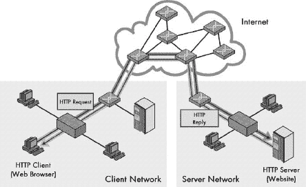

# 第一部分-3. TCP/IP 协议套件和架构

第八章

在本节“TCP/IP 概述和背景信息”的前两部分中，我已经为理解网络在一般意义上的工作原理奠定了基础。现在我们可以开始关注本书的主要主题：TCP/IP。正如以太网在局域网（LAN）技术中占据主导地位，IEEE 802.11 是无线局域网（WLAN）世界的领导者，TCP/IP 在现代互联网，包括互联网的世界中占据主导地位，甚至定义了这一领域。

由于 TCP/IP 是本书的主题，你可能想知道为什么这一部分如此之小，只包含一个章节。原因是它只提供了 TCP/IP 协议套件的高级概述。TCP/IP 是一系列几十个构成协议和技术。这些在本书的下两个部分中描述，分别涵盖底层和应用协议。这些协议在随后的 TCP/IP 简介章节中进行了总结，该章节还简要介绍了 TCP/IP 的历史，并描述了其服务和模型。

# 第八章。TCP/IP 协议套件和架构

以其两个关键协议命名，TCP/IP 协议套件已经持续使用和开发大约三十年。在这段时间里，它已经从一种用于连接少量研究计算机的实验性技术，演变为历史上最大、最复杂的计算机网络——全球互联网的强大动力：连接数百万网络和终端设备。

在本章中，我们开始了一次神奇的旅行，简要回顾了 TCP/IP 的有趣历史，并对其进行了概述。我讨论了 TCP/IP 网络提供的服务，然后解释了 TCP/IP 下使用的架构模型。接着，我简要描述了本书余下部分讨论的每个最重要的 TCP/IP 协议。

# TCP/IP 概述和历史

对 TCP/IP 进行考察的最佳起点可能就是其名称本身。事实上，TCP/IP 由数十种不同的协议组成，其中两种通常被认为是最重要的。*互联网协议（IP）*是 OSI 模型网络层（第 3 层）的主要协议，它提供了寻址、数据报路由和其他互联网中的功能。*传输控制协议（TCP）*是传输层（第 4 层）的主要协议，负责连接建立和管理，以及设备上软件进程之间的可靠数据传输。由于这两个协议如此重要，它们的缩写已经代表整个套件：TCP/IP。

IP 和 TCP 之所以重要，是因为 TCP/IP 的许多关键功能都是在第 3 层和第 4 层实现的，这些协议就存在于这些层。然而，TCP/IP 不仅仅是 TCP 和 IP。整个协议套件需要许多不同协议和技术的工作，才能构建一个能够为用户提供所需应用的正常工作的网络。

TCP/IP 使用它自己的四层架构（这大致对应于 OSI 参考模型），为组成它的各种协议提供框架。它还包括许多高级应用，其中一些对互联网用户来说很熟悉，他们可能没有意识到它们是 TCP/IP 的一部分，例如超文本传输协议（HTTP，它是万维网的动力）和文件传输协议（FTP）。在即将进行的关于 TCP/IP 架构和协议的讨论中，我们将探讨大多数重要的 TCP/IP 协议以及它们是如何协同工作的。

## TCP/IP 历史与发展

互联网的历史和 TCP/IP 的历史密切相关，以至于很难讨论一个而不提及另一个。它们是共同发展的，TCP/IP 为互联网的实现提供了机制。多年来，TCP/IP 一直在不断进化，以满足互联网以及使用该技术的较小、私有网络的需求。我们在这里简要回顾一下这一历史。

TCP/IP 协议最初是美国**国防高级研究计划署**（*DARPA* 或 *ARPA*）开发的研究网络的一部分。最初，这个名为 *ARPAnet* 的网络是一个新兴网络，设计用于使用从现有技术中改编的一系列协议。然而，它们在概念或实际应用方面（例如在 ARPAnet 上使用时的容量）都存在缺陷或限制。新网络的开发者认识到，试图使用这些现有协议可能会随着 ARPAnet 规模的扩大和适应新的用途和应用而最终导致问题。

1973 年，为 ARPAnet 开发一套完整的互联网络协议系统的工作开始了。有趣的是，该技术的早期版本只包括一个核心协议：TCP。实际上，这些字母甚至不表示它们今天所做的事情；它们代表的是*传输控制程序*。现代 TCP 的前身——这个程序的第一个版本是在 1973 年编写的，然后在 1974 年 12 月发布的 RFC 675 中进行了修订和正式文档化，该文档名为《互联网传输控制程序规范》。

### 注意

*互联网标准是在称为请求评论（RFCs）的文档中定义的。这些文档以及创建它们的过程在第三章中有所描述*。

TCP 的测试和开发持续了几年。1977 年 3 月，TCP 的第二个版本被记录下来。1977 年 8 月，TCP/IP 的发展迎来了一个重要的转折点。Jon Postel，互联网和 TCP/IP 最重要的先驱之一，发布了一系列关于 TCP 状态的评论。在这份文件（被称为*互联网工程笔记第 2 号*，或*IEN 2*）中，他提供了一个极好的例子，说明了参考模型和层不仅仅是教科书中的内容：

> 我们在设计互联网协议时违反了分层原则，这是我们的错误。具体来说，我们试图让 TCP 做两件事：作为主机级别的端到端协议，以及作为互联网封装和路由协议。这两件事应该以分层和模块化的方式提供。我建议需要一个全新的、独立的互联网协议，并且 TCP 应该严格用作主机级别的端到端协议。
> 
> —Jon Postel，IEN 2，1977

Postel 基本上是在说，1970 年代中期创建的 TCP 版本试图做太多。具体来说，它包含了 OSI 层 3 和层 4 的活动。他的愿景是预言性的，因为我们现在知道，让 TCP 处理所有这些活动确实会导致未来的问题。

Postel 的观察导致了 TCP/IP 架构的定义，以及将 TCP 拆分为传输层的 TCP 和网络层的 IP。将 TCP 拆分为两部分的进程始于 1978 年的 TCP 版本 3。用于现代网络中使用的 IP 和 TCP 版本（版本 4）的第一个正式标准是在 1980 年创建的。

TCP/IP 很快成为了运行 ARPAnet 的标准协议集。在 20 世纪 80 年代，越来越多的机器和网络通过 TCP/IP 协议连接到不断发展的 ARPAnet，从而诞生了 TCP/IP 互联网。

### 提示

**关键概念** TCP/IP 最初在 20 世纪 70 年代作为定义一组操作新兴互联网技术的努力的一部分而开发。TCP/IP 这个名字是在原始的*传输控制程序（TCP）*被拆分为*传输控制协议（TCP）*和*互联网协议（IP）*时出现的。这两个关键协议的第一个现代版本分别在 1980 年作为 TCP 版本 4 和 IP 版本 4 被记录下来。

## TCP/IP 成功的重要因素

TCP/IP 曾经只是许多可以用来提供网络层和传输层功能的不同协议集之一。今天，仍然有其他互联网协议选项，例如 Novell 的 IPX/SPX，但 TCP/IP 是全球公认的世界标准。

TCP/IP 的普及增长归因于许多重要因素。其中一些是历史的，例如它与前面描述的互联网紧密相连，而其他一些则与协议套件的自身特性有关。

**集成寻址系统** TCP/IP（主要是作为 IP 的一部分）包含一个用于识别和寻址小型和大型网络中设备的系统。寻址系统被设计成允许设备被寻址，而不管构成每个网络的底层细节如何。随着时间的推移，TCP/IP 中寻址的机制得到了改进，以满足不断增长的网络的需求，特别是互联网。寻址系统还包括一个集中管理的功能，以确保每个设备都有一个唯一的地址。

**设计用于路由** TCP/IP 是专门设计来简化在任意复杂网络中信息路由的。实际上，TCP/IP 在概念上更关注连接网络而不是连接设备。TCP/IP 路由器通过将数据一步一步地从网络移动到下一个网络，使不同网络上的设备之间能够传递数据。TCP/IP 中的一些支持协议被设计用来允许路由器交换关键信息，并管理从网络到网络的效率信息流。

**底层网络独立性** TCP/IP 主要在层 3 及以上操作，并包含允许其在几乎任何底层技术（包括局域网（LAN）、无线局域网和多种类型的广域网（WAN））上运行的条款。这种灵活性意味着您可以混合和匹配各种不同的底层网络，并使用 TCP/IP 将它们全部连接起来。

**可扩展性** TCP/IP 最令人惊叹的特性之一是其协议的可扩展性。几十年来，它已经证明了自己在互联网从小型网络发展到拥有数百万台主机的巨大互联网的过程中具有强大的实力。虽然为了支持这种增长，定期需要进行一些更改，但这些更改都是作为 TCP/IP 开发过程的一部分进行的，而且 TCP/IP 的核心基本上与 25 年前相同。

**开放标准和开发过程** TCP/IP 标准不是专有的，而是开放的，对公众免费提供。此外，用于开发 TCP/IP 标准的过程也是完全开放的。TCP/IP 标准和协议是通过独特的、民主的请求评论（RFC）过程（在第三章中描述，Chapter 3）开发和修改的，所有感兴趣的相关方都被邀请参与。这确保了任何对 TCP/IP 协议感兴趣的人都有机会对其发展提供反馈，同时也确保了协议套件的全球接受度。

**通用性** 每个人都使用 TCP/IP，因为每个人都在使用它！这个最后一点，也许有些讽刺，可能是最重要的。TCP/IP 不仅互联网的底层语言，而且今天在大多数私有网络中也使用 TCP/IP 来传输流量。

### 小贴士

**关键概念** 虽然 TCP/IP 不是唯一的网络互联协议套件，但它无疑是其中最重要的一个。它的无与伦比的成功归因于许多因素。这些包括其技术特性，如路由友好设计、可扩展性，它在互联网协议套件中的历史角色，以及其开放标准和开发过程，这些都降低了 TCP/IP 协议的接受障碍。

# TCP/IP 服务

TCP/IP 通常是通过其基于层的架构和在不同层提供的协议来研究的。然而，这些协议代表了 TCP/IP 如何工作的技术细节。对我们这些技术学习者来说，这些细节是有趣的，但对于不需要看到 TCP/IP 内部结构的用户来说，这些细节通常是隐藏的。在深入这些细节之前，让我们先从更宏观的角度来看一下 TCP/IP 是做什么的。

在讨论 OSI 参考模型概念（在第五章第五章. 一般 OSI 参考模型问题和概念）。

正如客户端/服务器网络适用于硬件一样，TCP/IP 协议和软件应用的设计也基于同样的概念，如图 8-1 所示（ch08s03.html#tcpip_clientserver_operation_most_tcpip_ "图 8-1. TCP/IP 客户端/服务器操作 大多数 TCP/IP 协议涉及两个设备之间的通信，通常是客户端和服务器，例如通过互联网进行的这种网页（HTTP）事务。"）。

TCP/IP 协议并非设置成两个想要通信的机器使用相同的软件。相反，人们有意识地决定使用匹配的、互补的客户端和服务器软件对来实现通信功能。客户端通过向服务器发送请求以获取数据或其他信息来启动通信。然后服务器向客户端回复，提供客户端请求的内容，或者以其他方式回复，例如错误消息或关于其他可能找到数据的地方的信息。大多数（但不是所有）TCP/IP 功能都以这种方式工作。

图 8-1. TCP/IP 客户端/服务器操作 大多数 TCP/IP 协议涉及两个设备之间的通信，通常是客户端和服务器之间的通信，例如通过互联网进行的这种网页（HTTP）事务。

图 8-1 是一个简化的示意图，展示了常见的例子——使用 HTTP 的网页事务。网页浏览器是 HTTP 客户端，通过向网站发送请求文件或其他资源来启动通信，该网站是 HTTP 服务器。服务器向客户端提供请求的信息。（服务器通常同时响应多个客户端。）

在 TCP/IP 中，客户端/服务器操作有许多优点。正如客户端硬件和服务器硬件可以根据其非常不同的工作定制一样，客户端软件和服务器软件也可以优化以尽可能高效地执行其工作。例如，要从网络获取信息，网页客户端软件（通常称为 *浏览器*）向网页服务器发送请求。然后，网页服务器响应请求的内容。（当然，这不仅仅是那样，但对用户来说就是这样。）在众多功能中，网页浏览器允许用户与网页服务器通信；网页服务器软件旨在接收并响应请求。

在 TCP/IP 中，*客户端* 和 *服务器* 这些术语可能会令人困惑，因为它们被用于多种不同的方式，有时甚至同时使用。

### 小贴士

**关键概念** TCP/IP 协议套件围绕 *客户端/服务器* 网络通信的概念构建。并非所有设备和协议软件元素都设计为对等体，而是构建为匹配的集合。客户端通常通过发送请求来启动通信，服务器响应这些请求，向客户端提供所需的数据或信息性回复。

## 硬件和软件角色

*客户端* 和 *服务器* 这些术语通常指的是网络硬件扮演的主要角色。客户端计算机通常是个人使用的 PC 或 Macintosh，它主要通过发送请求来启动对话。*服务器* 通常是一台高性能机器，专门用于响应客户端请求，位于某个计算机室中，除了其管理员外，没有人会看到。

如前所述，TCP/IP 使用不同的软件来实现许多协议的客户端和服务器角色。例如，网页浏览器是一块客户端软件，而网页服务器软件则完全不同。客户端软件通常位于客户端硬件上，服务器软件位于服务器硬件上，但某些设备可能同时运行客户端和服务器软件。

## 事务角色

在任何信息交换中，客户端通常是启动通信或发送查询的设备，然后服务器响应，通常是通过提供信息。再次强调，客户端设备上的客户端软件通常启动事务。

在典型的组织中，会有许多较小的个人计算机被指定为客户端，以及少数较大的服务器。服务器通常运行服务器软件，而客户端运行客户端软件。但服务器也可以配置客户端软件，客户端也可以配置服务器软件。

例如，假设你是一名管理员，在服务器 1 的计算机室工作，需要将文件传输到服务器 2。你启动 FTP 会话，以与服务器 2 开始文件传输。在这个事务中，服务器 1 充当客户端，因为它正在发起通信。理论上，你甚至可以从服务器 1 开始向特定客户端的 FTP 传输，如果该客户端有 FTP 服务器软件来响应服务器的请求。（这不太常见，因为服务器软件通常不会安装在客户端计算机上。）

当某些协议中的服务器之间发生通信时，事务角色就会发挥作用。例如，当两个简单邮件传输协议（SMTP）服务器通信以交换电子邮件（尽管它们都是运行在服务器硬件上的服务器程序）时，在任何事务中，一个设备充当客户端，而另一个设备充当服务器。在某些情况下，设备甚至可以在会话中途交换客户端和服务器角色。

### 小贴士

**关键概念** 在 TCP/IP 中理解客户端/服务器计算概念变得更加复杂，因为客户端和服务器这两个术语在不同的上下文中可能有非常不同的含义。这两个术语可以指代*硬件角色*——根据硬件设备通常作为客户端还是服务器来命名的标识。这些术语也可以指代*软件角色*，即协议软件组件是否作为客户端或服务器运行。它们还可以指代*事务角色*，即设备在数据交换中的任何特定情况下是否作为客户端或服务器。

### 注意

*我讨论的客户端和服务器角色是传统的角色。强大个人电脑的兴起和互联网的普及（尤其是始终在线的宽带连接）导致了客户端和服务器硬件和软件的显著模糊化。许多客户端计算机现在都包括服务器软件，允许它们，例如，响应来自其他客户端的万维网查询。此外，许多文件共享程序允许客户端使用对等结构模型进行通信。然而，大多数 TCP/IP 通信仍然是客户端/服务器性质，因此牢记这些角色很重要*。

# TCP/IP 架构和 TCP/IP 模型

OSI 参考模型的七层将实现网络所需的任务进行了划分，正如本书第 I-2 部分 Part I-2 所描述。然而，这并非唯一的模型。实际上，TCP/IP 协议套件是在 OSI 参考模型之前开发的；因此，其发明者没有使用 OSI 模型来解释 TCP/IP 架构（尽管今天在 TCP/IP 讨论中经常使用 OSI 模型）。TCP/IP 的开发者创建了自己的架构模型，该模型有不同的名称，包括*TCP/IP 模型*、*DARPA 模型*（以主要负责开发 TCP/IP 的机构命名）和*DoD 模型*（以美国国防部命名）。大多数人称之为 TCP/IP 模型。

无论你使用哪种模型来表示网络的功能，该模型的功能基本上是相同的。TCP/IP 模型和 OSI 模型实际上非常相似，即使它们在划分网络功能的方式上并不完全相同。

由于 OSI 模型被广泛使用，因此在解释 TCP/IP 架构时，通常会同时从 TCP/IP 层和相应的 OSI 层来阐述。图 8-2 展示了这两个模型之间的关系。TCP/IP 模型没有涉及物理层，即硬件设备所在层。接下来的三个层——*网络接口、互联网*和*主机到主机传输*——对应 OSI 模型的第 2、3 和 4 层。TCP/IP 的*应用*层在概念上模糊了 OSI 模型的上三层。请注意，有些人认为 OSI 会话层的一些方面是 TCP/IP 主机到主机传输层的一部分。

如图 8-2 所示，TCP/IP 模型使用四层，逻辑上跨越了 OSI 模型顶部六层的等价部分。（物理层未由 TCP/IP 模型涵盖，因为数据链路层被认为是 TCP/IP 堆栈与底层网络硬件之间接口发生的点。）从底部开始，以下各节将描述 TCP/IP 层。

## 网络接口层

如其名所示，网络接口层是更高层的 TCP/IP 协议与本地网络接口的地方。这一层有些有争议，因为有些人甚至不认为它是 TCP/IP 的合法部分，通常是因为核心 IP 协议没有在这一层运行。尽管如此，网络接口层是架构的一部分。它相当于 OSI 参考模型中的数据链路层（第 2 层），有时也称为*链路层*。你也许还会看到使用*网络接入层*这个名字。

图 8-2. OSI 参考模型和 TCP/IP 模型层 TCP/IP 架构模型有四层，大致对应 OSI 参考模型的七层中的六层。

在许多 TCP/IP 网络上，这一层根本就没有运行 TCP/IP 协议，因为这根本不是必需的。例如，如果你在以太网上运行 TCP/IP，那么以太网就处理了第 2 层（以及第 1 层）的功能。然而，TCP/IP 标准确实定义了没有自己的第 2 层实现的 TCP/IP 网络协议。这些协议，即串行线路互联网协议（SLIP）和点对点协议（PPP），填补了网络层和物理层之间的空白。它们通常用于促进通过直接串行线路连接（如拨号电话网络）和其他直接在物理层运行的技术上的 TCP/IP。

## 互联网层

互联网层对应于 OSI 参考模型中的网络层（因此即使在 TCP/IP 模型讨论中，有时也称之为*网络层*）。它负责典型的第 3 层工作，例如逻辑设备寻址、数据封装、处理和传输，以及路由。在这一层，你可以找到 IP，这可以说是 TCP/IP 的核心，以及支持协议，如互联网控制消息协议（ICMP）和路由协议（RIP、OSFP、BGP 等）。下一代 IP，即 IPv6，也位于这一层。

## 主机到主机传输层

主机到主机传输层的主要任务是促进在互联网上端到端的通信。它负责允许在设备之间建立逻辑连接，以便数据可以无保证地（没有任何保证它会被送达）或可靠地（协议跟踪发送和接收的数据，以确保其到达，并在必要时重新发送）发送。这里还完成了特定源和目的应用进程的识别。

这个层的正式名称通常被简称为*传输层*。本层的核心 TCP/IP 协议是 TCP 和 UDP。TCP/IP 传输层对应于 OSI 模型中同名层（第 4 层），但包括某些可以说是 OSI 会话层的一部分的元素。例如，TCP 建立一个可以持续很长时间的连接，这使一些人认为 TCP 连接更像是一个会话。

## 应用层

应用层是 TCP/IP 模型的最高层。这是一个相当广泛的层，涵盖了 OSI 模型中的第 5 层到第 7 层。虽然与 OSI 模型相比这似乎丢失了一些细节，但这可能是一件好事。TCP/IP 模型更好地反映了 OSI 模型中高层功能之间划分的某种模糊性，这在实际应用中往往显得相当任意。实际上，很难根据它们包含的第 5、6 或 7 层的哪些部分来区分某些协议。

许多协议位于应用层。这些包括提供终端用户服务的应用协议，如 HTTP、FTP 和 SMTP，以及管理协议，如简单网络管理协议（SNMP）、动态主机配置协议（DHCP）和域名系统（DNS）。

### 注意

*互联网和主机到主机的传输层通常被认为是 TCP/IP 架构的核心，因为它们包含了实现 TCP/IP 互连网络的大多数关键协议*。

在下一节中，我将简要介绍本书详细介绍的每个 TCP/IP 协议，并更详细地说明它们在 TCP/IP 架构中的位置。我还将讨论几个有趣的事实，即这些协议实际上并不很好地适应 TCP/IP 层模型。

### 提示

**关键概念** TCP/IP 协议套件的架构通常用一种称为*TCP/IP 模型、DARPA 模型*或*DoD 模型*的分层参考模型来描述。TCP/IP 模型包括四个层：*网络接口层*（负责将套件与它运行的物理硬件接口），*互联网层*（在这里进行设备寻址、基本数据报通信和路由），*主机到主机传输层*（在这里管理连接并确保可靠通信），以及*应用层*（在这里驻留终端用户应用程序和服务）。前三个层分别对应 OSI 参考模型的第 2 层到第 4 层；应用层相当于 OSI 的第 5 层到第 7 层。

# TCP/IP 协议

由于 TCP/IP 是一个协议套件，它通常按其组成的协议来讨论。每个协议都位于我刚才讨论的 TCP/IP 架构模型的特定层级，并负责执行实现 TCP/IP 网络或应用所需的总功能的一部分。这些协议共同工作，使 TCP/IP 作为一个整体能够运行。

### 注意

*有时你会听到 TCP/IP 只被称为一个协议而不是协议套件。这是一个简化，虽然技术上不正确，但被广泛使用。我相信这很大程度上是由于微软在它的操作系统中将协议套件称为协议而引起的。我在第一章中更详细地讨论了这个问题*。

如前所述，一些 TCP/IP 协议通常被称为套件的内核，因为它们负责其基本操作。在这个核心中，大多数人会将互联网和传输层的主要协议包括在内：IP、TCP 和 UDP。这些核心协议支持许多其他协议，以便在每个 TCP/IP 模型层执行各种功能。

### 注意

*总的来说，有数百个 TCP/IP 协议和应用，我无法在本书中涵盖每一个。我确实包括了一些章节，其中我讨论了几十个我认为出于某种原因很重要的协议。这些协议的全面覆盖（以不同详细程度）可以在本书的第二部分和第三部分找到*。

表 8-1 包含了本书中讨论的每个 TCP/IP 协议的摘要。我已经按照层级组织它们，并为每个协议讨论的章节提供了交叉引用。TCP/IP 协议套中的协议组织也可以通过图 8-3 一目了然。我还在网络接口层展示了 TCP/IP 硬件驱动程序的概念位置；这些驱动程序在 TCP/IP 在 LAN 或 WAN 技术上实现时用于第 2 层，而不是使用 SLIP 或 PPP。

表 8-1. TCP/IP 协议

| TCP/IP 层级 | 协议名称 | 协议缩写 | 描述 |
| --- | --- | --- | --- |
| 网络接口（第 2 层） | 串行线路互联网协议 | SLIP | 通过在两个设备之间通过串行线路创建第 2 层连接，提供基本的 TCP/IP 功能。参见第九章。 |
|   | 点对点协议 | PPP | 提供类似于 SLIP 的第 2 层连接，但更加复杂和强大。PPP 本身是一套协议（如果你愿意称之为子协议），允许进行诸如身份验证、数据封装、加密和聚合等功能，从而促进 TCP/IP 在 WAN 链路上的操作。参见第九章和点对点协议(PPP)概述和基础")至第十二章。 |
| 网络接口/互联网（第 2/3 层） | 地址解析协议 | ARP | 用于将第 3 层 IP 地址映射到第 2 层物理网络地址。参见第十三章")。 |
|   | 反向地址解析协议 | RARP | 从机器的第 2 层地址确定其第 3 层地址。现在主要被 BOOTP 和 DHCP 取代。参见第十四章")。 |
| 网络层（第 3 层） | 互联网协议，互联网协议版本 6 | IP, IPv6 | 在 TCP/IP 网络上提供传输层消息的封装和无连接交付。还负责寻址和路由功能。参见第二部分-3")和第二部分-4")。 |
|   | IP 网络地址转换 | IP NAT | 允许私有网络上的地址自动转换为公共网络上的不同地址，从而提供地址共享和安全优势。（请注意，有些人不认为 IP NAT 在严格意义上是一个协议。）参见第二十八章协议")。 |
|   | IP 安全 | IPsec | 一组与 IP 相关的协议，提高了 IP 传输的安全性。参见第二十九章协议")。 |
|   | 互联网协议移动支持 | Mobile IP | 解决与移动设备相关的某些 IP 问题。参见第三十章")。 |
|   | 互联网控制消息协议 | ICMP/ICMPv4, ICMPv6 | 一种支持 IP 和 IPv6 的协议，为主机提供错误报告和信息请求-响应功能。参见第二部分-6。 |
|   | 邻居发现协议 | NDP | 一种新的 IPv6 支持协议，包括由传统 IP 中的 ARP 和 ICMP 执行的一些功能。参见第三十六章协议")。 |
|   | 路由信息协议、开放最短路径优先、网关到网关协议、HELLO 协议、内部网关路由协议、增强内部网关路由协议、边界网关协议、外部网关协议 | RIP、OSPF、GGP、HELLO、IGRP、EIGRP、BGP、EGP | 用于支持 IP 数据报的路由和路由信息交换的协议。参见第二部分-7。 |
| 主机到主机传输层（第 4 层） | 传输控制协议 | TCP | TCP/IP 的主要传输层协议。在设备之间建立和管理连接，并确保使用 IP 进行可靠和流量控制的可靠数据传输。参见第二部分-8。 |
|   | 用户数据报协议 | UDP | 一种可以被认为是 TCP 严重简化版本的传输协议。它用于在应用进程之间以简单的方式发送数据，没有 TCP 的许多可靠性和流量管理功能，但通常效率更高。参见第四十四章。 |
| 应用层（第 5/6/7 层） | 域名系统 | DNS | 允许使用名称而不是仅使用数值 IP 地址来引用 IP 设备。允许机器将这些名称解析为其相应的 IP 地址。参见第三部分-1。 |
|   | 网络文件系统 | NFS | 允许在 TCP/IP 网络上无缝共享文件。参见第五十八章。 |
|   | 引导协议 | BOOTP | 开发用于解决 RARP 的一些问题，并以类似的方式使用：允许在启动时配置 TCP/IP 设备。通常被 DHCP 取代。参见第六十章。 |
|   | 动态主机配置协议 | DHCP | 一种用于配置 TCP/IP 设备和管理 IP 地址的完整协议。它是 RARP 和 BOOTP 的后继者，包括许多功能和能力。参见第三部分-3。 |
|   | 简单网络管理协议 | SNMP | 一种用于网络和设备远程管理的全功能协议。参见第三部分-4。 |
|   | 远程监控 | RMON | 一种用于远程监控网络设备的诊断“协议”（实际上是 SNMP 的一部分）。参见第六十九章。 |
|    | 文件传输协议，简单文件传输协议 | FTP, TFTP | 设计允许将所有类型的文件从一个设备传输到另一个设备的协议。见第三部分-6。 |
|    | RFC 822，多用途互联网邮件扩展，简单邮件传输协议，邮局协议，互联网消息访问协议 | RFC 822，MIME，SMTP，POP，IMAP | 定义在 TCP/IP 网络上电子邮件消息格式、投递和存储的协议。见第三部分-7。 |
|    | 网络新闻传输协议 | NNTP | 通过在主机之间传输 Usenet 新闻消息来启用 Usenet 在线社区的操作。见第八十五章。 |
|    | 超文本传输协议 | HTTP | 在主机之间传输超文本文档；实现了万维网。见第三部分-8。 |
|    | Gopher 协议 | Gopher | 一种较老的文档检索协议，现在主要由万维网取代。见第八十六章。 |
|    | Telnet 协议 | Telnet | 允许一台机器上的用户在另一台机器上建立远程终端会话。见第八十七章。 |
|    | Berkeley "r"命令 | — | 允许在一台机器上执行另一台机器上的命令和操作。见第八十七章。 |
|    | Internet 中继聊天 | IRC | 允许 TCP/IP 用户之间的实时聊天。见第八十七章。 |
|    | 管理和故障排除工具和协议 | — | 一组软件工具，允许管理员管理、配置和故障排除 TCP/IP 互连网络。见第八十八章。 |

图 8-3. TCP/IP 协议 此图展示了本书涵盖的所有 TCP/IP 协议，按 TCP/IP 和 OSI 参考模型层排列（除管理工具外）。

你可以在前一个表格和图中看到，ARP 和 RARP 是异类。在某些方面，它们属于第 2 层和第 3 层，而在其他方面，它们不属于任何一层。它们实际上是为了连接网络接口层和互联网层。因此，我认为它们位于这两层之间，并将它们称为“层连接”协议。参见第第十三章")和第十四章")了解更多相关信息。
