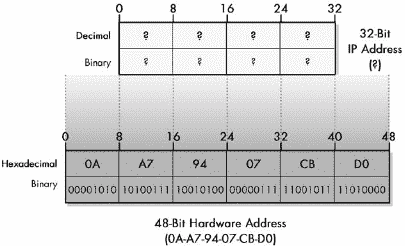
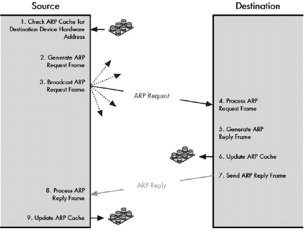

# 第二部分-2. TCP/IP 网络接口/互联网层连接协议

第十三章

第十四章

OSI 参考模型的第二层是*数据链路层*；它对应于 TCP/IP 的*网络接口层*。在这一层，定义了大多数局域网（LAN）、广域网（WAN）和无线局域网（WLAN）技术，如以太网和 IEEE 802.11。

OSI 参考模型的第三层是*网络层*，在 TCP/IP 模型中也称为*互联网层*。在这一层，定义了互联网协议，其中最著名的是互联网协议（IP）。

第二层和第三层密切相关，因为网络层发送的消息必须在数据链路层通过单个物理网络传输。它们执行不同的任务，但作为协议栈中的邻居，它们必须相互协作。

一组协议承担着将这两层连接起来并使它们协同工作的重任。问题是决定这些协议应该放在哪里。它们在网络世界中有点像“黑羊”。没有人否认它们的重要性，但他们总是认为它们属于“别人的”层。例如，由于这些协议在层 2 网络上传递数据，处理层 2 技术的那些人认为这些协议属于层 3。但那些与层 3 协议工作的人认为这些低级协议为层 3 提供服务，因此将它们视为层 2 的一部分。

那么，这些协议去哪里呢？在一定程度上，这并不真的重要。我认为它们有些特别，所以我为它们提供了一个自己的家。欢迎来到网络层混沌之地，也称为 OSI 模型 2.5 层。这就是我将一些作为数据链路层和网络层之间粘合剂的协议放在一起的地方。这里的主要工作是地址解析，或者提供层 2 和层 3 地址之间的映射。这种解析可以是双向的，在本部分中描述的两个 TCP/IP 协议中得到了体现：地址解析协议（ARP）和反向地址解析协议（RARP），尽管它们有相似之处，但用于相当不同的目的。

我建议在继续之前熟悉层 2 和层 3 的基础知识（在第 I-2 部分和 I-3 部分中描述），特别是对 IP 地址的某些理解有帮助，尽管不是严格必要的。

# 第十三章。地址解析与 TCP/IP 地址解析协议（ARP）

在互联网上的通信是通过在第 3 层使用网络层地址发送数据来完成的，但实际上数据的传输是在第 2 层使用数据链路层地址进行的。这意味着每个具有完全指定的网络协议栈的设备都将拥有第 2 层和第 3 层的地址。有必要定义一种方法来将这些地址联系起来。通常，这是通过获取网络层地址并确定与之相对应的数据链路层地址来实现的。这个过程被称为*地址解析*。

在本章中，我从概念和实际层面探讨了地址解析的问题，当然，重点是它在 TCP/IP 协议套件中的实现方式。我首先概述了地址解析的一般概念，它描述了过程中涉及的问题。然后，我详细描述了 TCP/IP 地址解析协议（ARP），这可能是最知名和最常用的地址解析技术。然后，我简要地探讨了在互联网协议（IP）中如何进行多播地址的地址解析，最后，介绍了新 IP 版本 6（IPv6）中使用的方法。

# 地址解析的概念和问题

由于 TCP/IP 在网络领域的突出地位，大多数关于地址解析的讨论都直接跳到了 TCP/IP 的 ARP。这个协议确实很重要，我们将在本章后面讨论它。然而，地址解析的基本问题并不特定于任何处理它的特定实现，如 ARP。为了更好地理解数据链路层和网络层之间解析地址的问题，并支持我们对 ARP 的考察，我们将首先从更一般的角度来探讨这个问题。

我首先从一般意义上讨论地址解析的需求。然后描述了解决地址解析问题的两种主要方法：直接映射和动态解析。我还探讨了实际动态地址解析中的一些效率问题，重点关注缓存的重要性。

## 地址解析的需求

有些人可能对地址解析的概念以及执行此功能的协议的需求感到犹豫。在第五章中关于 OSI 参考模型的讨论中，我详细地谈到了拥有概念层的目的在于分离逻辑功能，并允许高层协议隐藏于底层细节之外。鉴于这一点，为什么你需要将协议和层联系起来的地址解析协议呢？

这是真的。然而，OSI 参考模型正是这样一个*模型*。常常会出现一些需要解决方案的实际情况，这些解决方案并不严格符合层模型。当模型不符合现实时，模型必须让步。因此，在处理地址解析问题时也是如此。

### 第 2 层和第 3 层的地址解析

当你考虑 OSI 参考模型的七层时，有两层与寻址有关：数据链路层和网络层。物理层根本不严格涉及寻址，而是仅在位级别上进行发送。网络层以上的所有层都使用网络层地址。

但为什么要在两个不同的层级上进行寻址呢？答案是它们是用于不同目的的非常不同类型的地址。第 2 层地址（如 IEEE 802 MAC 地址）用于在可以直接通信的硬件设备之间进行本地传输。它们用于实现基本局域网（LAN）、无线局域网（WLAN）和广域网（WAN）技术。相比之下，第 3 层地址（最常见的是 IP 地址）用于互联网互连，以在网络层创建一个庞大的虚拟网络。

这些类型地址之间最重要的区别在于第 2 层和第 3 层：第 2 层处理直接连接的设备（在同一网络中），而第 3 层处理*间接*连接的设备（以及直接连接的设备）。比如说，你想连接到[`www.tcpipguide.com`](http://www.tcpipguide.com)上的 Web 服务器。这是一个运行在服务器上的网站，该服务器内置了以太网卡，用于连接到其互联网服务提供商站点。然而，即使你知道它的 MAC 地址，你也不能使用它通过你家用 PC 中的以太网卡直接与该服务器通信，因为设备位于不同的网络中——实际上，它们可能位于不同的洲！

相反，你在第 3 层进行通信，使用 IP 和更高层协议，如传输控制协议（TCP）和超文本传输协议（HTTP）。你的请求从你的家用机器出发，通过一系列路由器到达“TCP/IP 指南”服务器，响应信息再返回给你。从逻辑上讲，通信是在第 3 层及以上进行的；你发送请求不是直接到服务器的网络卡的 MAC 地址，而是发送到服务器的 IP 地址。

然而，尽管你可以在第 3 层**虚拟地**连接设备，但这些连接实际上只是概念上的。当你使用 IP 发送请求时，请求是逐个**跳**发送的，从一个物理网络到下一个。在每个这样的跳中，物理和数据链路层都会发生实际传输。当你的请求发送到第 3 层的本地路由器时，实际的请求会封装在一个使用你物理连接到路由器的任何方法创建的帧中，然后通过路由器的数据链路层地址传递给路由器。后续的每个步骤都会发生同样的情况，直到最终，离目的地最近的路由器使用其数据链路（MAC）地址将数据发送到目的地。这如图图 13-1 所示。

图 13-1. 为什么地址解析是必要的 虽然在概念上客户端和服务器在第三层直接连接，但在现实中，它们之间传递的信息要经过多个第二层链接。在这个例子中，本地网络上的一个客户端正在访问互联网上的某个服务器。在逻辑上，这个连接可以直接在客户端和服务器之间建立，但在现实中，它是一系列第二层的物理链接。在这种情况下，有六个这样的链接，其中大多数位于客户端和服务器之间的路由器之间。在每一步，决定将数据发送到哪里的决策是基于第三层地址，但实际的传输必须使用路由中下一个预期接收者的第二层地址来执行。

基本问题是，IP 地址对于网络上的物理硬件来说层级太高，它们不理解它们是什么。当你的请求到达连接到**《TCP/IP 指南》**的路由器时，它可以看到[`www.tcpipguide.com`](http://www.tcpipguide.com)服务器的 IP 地址，但这并没有帮助：它需要发送到服务器的**MAC 地址**。

即使是在局域网内的设备之间进行通信，也存在相同的问题。即使 Web 服务器和客户端坐在同一张桌子上，通信在逻辑上是 IP 层，但必须在数据链路层完成。这意味着你需要一种在两个层之间转换地址的方法。这个过程被称为**地址解析**。

### 小贴士

**关键概念** 地址解析是必需的，因为互联网设备使用第三层地址进行逻辑通信，但设备之间的实际传输使用的是第二层（硬件）地址。

### 通用地址解析方法

实际上，你不仅需要有一种进行这种转换的方法，还需要关注它是如何进行的。由于这种转换发生在通过互联网发送的每个数据报的每个跳转中，因此这个过程的高效性非常重要。你不想使用占用大量网络资源的解析方法。

地址解析可以通过两种基本方式实现：直接映射和动态解析。

### 注意

*由于必须性，不可能有一个完全通用的自动地址解析方法。因为它涉及到将数据链路层地址与网络层地址链接起来，所以实现必须针对这些层中每个层所使用的特定技术。唯一可以考虑为通用方法的是使用静态、手动更新的表格，例如，将这个第 3 层地址链接到这个第 2 层地址。"当然，这并不是自动的，并带来了手动配置的所有局限性*。

## 通过直接映射进行地址解析

在每个数据报穿越互联网的过程中，网络层地址必须多次解析为数据链路层地址。因此，你希望这个过程尽可能简单和高效。实现这一点的最简单方法是在这两种类型的地址之间进行*直接映射*。

### 直接映射是如何工作的

在直接映射技术中，使用一个公式将高层地址映射到低层地址。这是一种更简单、更有效的方法，但它有一些局限性，尤其是在数据链路层地址和网络层地址的大小比较方面。

直接映射背后的基本思想是选择一种第 2 层和第 3 层地址的方案，以便你可以使用简单的算法从其中一个确定另一个。这使得你可以通过简短的程序将第 3 层地址转换为第 2 层地址。本质上，只要你有了第 3 层地址，你就已经有了第 2 层地址。

直接映射的最简单例子可能是，如果你为数据链路层和网络层地址使用了相同的结构和语义。这通常是不切实际的，因为这两种类型的地址服务于不同的目的，因此基于不兼容的标准。然而，如果你有足够的灵活性来创建足够大的第 3 层地址，以便在其中编码完整的链路层地址，你仍然可以进行直接映射。然后确定第 2 层地址就变成了简单地从第 3 层地址中选择一定部分的问题。

以一个简单的局域网技术，如 ARCNet 为例。它使用一个短的 8 位数据链路层地址，有效值为 1 到 255，可以由管理员分配。你可以在这样的 LAN 上轻松设置一个 IP 网络，通过使用 ARCNet 数据链路层作为最后一个八位字节来从类 C 网络中获取。因此，如果网络是，例如，222.101.33.0，你可以将 IP 地址 222.101.33.1 分配给具有 ARCNet 地址#1 的设备，将 IP 地址 222.101.33.29 分配给具有 ARCNet 地址#29 的设备，依此类推，如图 13-2 所示。在一个小的硬件地址大小下，你可以轻松地将每个硬件地址映射到一个第 3 层地址。如图所示，当硬件地址较小时，定义一个直接对应于第 3 层地址一部分的映射是很容易的。在这个例子中，一个 8 位的 MAC 地址，如 ARCNet 所使用的，被映射到设备的 IP 地址的最后字节，从而使地址解析变得微不足道。

图 13-2. 通过直接映射进行地址解析 由于硬件地址尺寸较小，你可以轻松地将每个硬件地址映射到第 3 层地址。如图所示，当硬件地址较小时，定义一个直接对应于第 3 层地址一部分的映射非常容易。在这个例子中，一个 8 位的 MAC 地址，例如用于 ARCNet 的地址，被映射到设备的 IP 地址的最后字节，从而使地址解析变得非常简单。

这个系统的吸引力是显而易见的。从概念上讲，理解起来非常简单——要获取设备的硬件地址，你只需使用 IP 地址的最后八位即可。编程设备执行操作也非常简单，效率极高，根本不需要在网络上交换数据。

### 小贴士

**关键概念** 当第 2 层地址小于第 3 层地址时，可以在它们之间定义一个直接映射，以便可以直接从网络层地址确定硬件地址。这使得地址解析变得极其简单，但减少了地址分配的灵活性。

### 直接映射的问题

不幸的是，直接映射仅在数据链路层地址可以表示为网络层地址的函数时才有效。考虑一下相同的 IP 地址，222.101.33.29，它在以太网网络上运行。在这里，数据链路层地址是硬编码在硬件本身中的（有时可以覆盖，但通常不这样做）。更重要的是，MAC 地址是 48 位宽，而不是 8 位。这意味着第 2 层地址比第 3 层地址大，无法进行直接映射，如图 13-3 所示。如图所示，当第 2 层地址的尺寸大于第 3 层地址时，无法定义一个用于地址解析的映射。

图 13-3. 使用大硬件地址大小的地址解析问题 当第 2 层地址的大小大于第 3 层地址时，直接映射是不可能的。

### 注意

*当硬件地址大小超过网络层地址大小时，你可以进行部分映射。例如，你可以使用 IP 地址来获取*部分*的 MAC 地址，并希望你在未使用的位上没有重复。这种方法不适合常规传输，但用于在 IPv4 中解析多播地址到以太网地址。你将在本章末尾看到这是如何完成的*。

因此，一般来说，当第 3 层地址小于第 2 层地址时，直接映射是不可能的。考虑到以太网是第 2 层最流行的技术，使用 48 位地址，而 IP 是第 3 层最流行的技术，使用 32 位地址。这就是为什么直接映射是一种不太广泛使用的技术的原因。

那下一代 IP 呢？IPv6 支持大量的 128 位地址（见第二十五章)。此外，常规（单播）地址甚至是通过一种方法定义的，该方法使用特殊映射从数据链路层地址创建它们。在理论上，这将允许 IPv6 使用直接映射进行地址解析。

然而，决定让 IPv6 使用与 IPv4 一样动态解析。一个可能的原因是历史原因，因为 IPv4 使用动态解析。然而，更大的原因可能是直接映射的缺点：它的不灵活性。动态解析是一个更通用的解决方案，因为它允许数据链路层和网络层地址独立，并且其缺点可以通过仔细的实现大部分得到中和，正如你将看到的。

实际上，这种证据可以在 IP 的动态解析定义在 ARCNet 的事实中看到，我刚才提到的例子。你可以在那里进行直接映射，但它限制了你使用一定模式的 IP 地址，这减少了灵活性。

## 动态地址解析

你刚才看到，直接映射提供了一种简单且非常高效的将网络层地址解析为数据链路层地址的方法。不幸的是，这是一种在大多数情况下你既不能使用也不应该使用的技术。当数据链路层地址的大小大于网络层地址的大小时，你不能使用它。当你需要灵活性时，你不应该使用它，因为直接映射要求你使第 3 层和第 2 层地址相对应。

直接映射的替代方法是称为 *动态地址解析* 的技术。这使用一种特殊的协议，允许只有 IP 地址的设备确定对应的数据链路层地址，即使这两种地址类型完全不同。这通常是通过查询本地网络中的一个或多个其他设备来确定与给定 IP 地址相对应的数据链路层地址来完成的。这比直接映射更复杂、效率更低，但更灵活。

### 动态寻址的工作原理

要了解动态寻址是如何工作的，你可以考虑一个简单的类比。我敢肯定你见过在机场等待接人的豪华轿车司机。（嗯，你在电影里见过，不是吗？）这与这里的问题类似：司机知道将被运输的人的名字，但不知道那个人的面孔（从某种意义上说，这是一种“本地地址”！）。为了找到那个人，司机举起了写有那个人名字的卡片。除了那个人之外的其他人都忽略了这张卡片，但被点名的人应该认出它并走向司机。

在网络中，动态地址解析做的是同样的事情。假设设备 A 想要向设备 B 发送数据，但只知道设备 B 的网络层地址（它的“名字”），而不是它的数据链路层地址（它的“面孔”）。它广播一个包含设备 B 的第三层地址的层 2 帧——这就像拿着写有某人名字的卡片一样。除了设备 B 之外的其他设备不识别这个第三层地址，并忽略它。然而，设备 B 知道自己的网络层地址。它在广播帧中识别出这一点，并直接向设备 A 发送响应。这告诉设备 A 设备 B 的层 2 地址，解析完成。图 13-4 展示了这个过程。

### 小贴士

**关键概念** *动态地址解析* 通常是通过一种特殊的协议来实现的。一个只知道另一个设备的网络层地址的设备可以使用此协议来请求该设备的硬件地址。

图 13-4. 动态地址解析 想要发送数据的设备广播一个请求，要求从另一设备获取响应的硬件地址。设备 A 需要向设备 B 发送数据，但只知道其 IP 地址（IPB），而不知道其硬件地址。设备 A 广播一个请求，要求使用 IP 地址 IPB 发送该设备的硬件地址。设备 B 直接向设备 A 响应，提供硬件地址。

虽然直接映射非常简单，但正如你所见，动态解析也不完全是火箭科学！它是一种简单易行且易于实现的技术。此外，它消除了与直接映射相关的限制。网络层地址和数据链路层地址之间不需要任何特定的关系；它们可以具有完全不同的结构和大小。

尽管直接映射涉及快速计算，但动态解析并不完全是火箭科学！它是一种简单易行的技术，可以消除与直接映射相关的限制。网络层地址和数据链路层地址之间不需要任何特定的关系；它们可以具有完全不同的结构和大小。

### 动态地址解析与效率问题

你现在已经看到了动态地址解析如何消除了你在直接映射中看到的限制，从而允许你轻松地关联任何大小或结构的 2 层和 3 层地址。它的唯一问题是，每个地址解析都需要你发送一条额外的消息，这在直接映射中是不必要的。更糟糕的是，由于你不知道接收者的 2 层身份，你必须使用广播消息（或者至少是多播），这意味着本地网络上的许多设备必须消耗资源来检查数据帧并确定正在解析哪个 IP 地址。

当然，发送一条额外的消息可能看起来不是什么大问题，因为帧不需要非常大，因为它只包含网络层地址和一些控制信息。然而，当你必须为每个数据报传输的每个跳步都这样做时，开销真的会累积起来。因此，尽管基本的动态地址解析简单且功能性强，但通常不足以满足需求。你必须向地址解析的实现中添加一些**智能**，以减少对持续地址解析性能的影响。

考虑到局域网上的大多数设备只向少数几个物理设备发送数据，并且往往反复这样做。这种现象被称为*引用局部性*，它在计算领域的许多不同领域都有观察到。如果你从你的办公 PC 向互联网网站发送请求，它首先需要到达你的公司网络本地路由器，因此你需要解析路由器的层 2 地址。如果你稍后点击该网站上的链接，该请求也需要发送到路由器。实际上，你几乎在本地网络之外所做的一切可能首先都会发送到同一个路由器（通常称为*默认网关*）。每次都必须进行新的解析将是愚蠢的。这就像每次你想给最好的朋友打电话说你好时，都必须查找他们的电话号码一样。

为了避免被指责设计出愚蠢的地址解析协议，设计者通常会包括一个*缓存*机制。当一个设备的网络层地址解析为数据链路层地址后，这两个地址之间的连接会在设备内存中保持一段时间。当它下次需要层 2 地址时，设备只需在其缓存中进行快速查找。这意味着，你不需要在每一个数据报上执行广播，而只需在整个数据报序列中执行一次。

缓存是动态解析中最重要的性能提升工具。它将原本可能非常浪费的过程转变为在大多数情况下与直接映射一样高效的过程。然而，它确实增加了复杂性。缓存表条目必须得到维护。还有一个问题，表中的信息可能会随着时间的推移而变得*过时*。如果你更改了设备的网络层地址或数据链路层地址会发生什么？因此，缓存条目必须定期过期。本章后面关于 TCP/IP 的 ARP 中缓存的讨论展示了如何处理这些问题的某些细节。

### 动态解析的其他增强

基本动态解析方案也可以进行其他增强。让我们再次考虑我们的例子，即向互联网发送请求。你发送一个需要发送到本地路由器的请求，因此你解析其地址并发送请求。片刻之后，回复返回到路由器，以便发送给你，因此路由器需要*你的*地址。因此，即使你刚刚交换了帧，它也必须对你进行动态解析。这同样是愚蠢的。相反，你可以通过*交叉解析*来提高效率；当设备 A 解析设备 B 的地址时，设备 B 也会将其条目添加到*自己的*缓存中。

还可以进行其他改进。如果你这么想，局域网中的设备将会相当频繁地相互通信，即使它们现在没有聊天。如果设备 A 正在解析设备 B 的网络层地址，它将广播一个所有设备 C、D、E 等都能看到的帧。为什么不让它们也更新*它们*的缓存表，以备将来使用解析信息呢？

这些以及其他增强功能都是为了减少动态地址解析的效率问题。它们结合起来使得动态解析在整体能力上接近直接映射，因此没有很好的理由不使用它。再次强调，你可以在描述 ARP 缓存功能的章节中看到更多关于这方面的细节。

顺便提一下，在这次讨论中，有时还会提出一个提高性能的想法：为什么不直接广播数据报，而不是先进行额外的广播步骤来解析地址呢？实际上你可以这样做，如果数据报足够小，这将更有效率。然而，通常情况下，数据报很大，而解析帧可以相当紧凑；进行小范围的广播然后进行大范围的单播是有意义的，而不是进行大范围的广播。此外，假设你广播了这个数据报。下一个数据报和再下一个数据报怎么办？这些数据报也需要广播。当你使用缓存进行解析时，你只需要偶尔广播一次，而不是持续不断地广播。

# TCP/IP 地址解析协议 (ARP)

ARP 是一个功能齐全的动态解析协议，用于将 IP 地址与底层的数据链路层地址匹配。最初是为以太网开发的，但现在已被推广，允许 IP 在多种 2 层技术上进行操作。

### 注意

*这里描述的地址解析协议用于解析互联网协议第 4 版（IPv4）中的单播地址。IPv4 中的多播地址使用直接映射方法，而 IPv6 使用新的邻居发现（ND）协议而不是 ARP。这两种方法都在本章末尾进行讨论*。

### 小贴士

**相关信息** *有关具有移动 IP 设备的网络中 ARP 相关问题的讨论，请参阅第三十章*。

### 小贴士

**相关信息** *用于在主机上管理 TCP/IP ARP 实现的软件应用`arp`，在第八十八章中有详细说明*。

物理网络在 OSI 参考模型的第 1 层和第 2 层运行，并使用数据链路层地址。相比之下，互联网协议在第三层运行，将这些物理网络互联起来，创建一个可能非常大的设备互联网，这些设备使用网络层地址指定。地址解析是将网络层地址解析为数据链路层地址的过程。这允许数据在互联网中逐跳发送。

地址解析问题在 TCP/IP 协议套件的开发一开始就很明显。IP 的早期开发大部分是在当时新兴的以太网局域网技术上进行的；这甚至是在以太网被正式标准化为 IEEE 802.3 之前。有必要定义一种将 IP 地址映射到以太网地址的方法，以便在以太网网络上进行通信。

正如我们在本章中已经看到的，关联 IP 和以太网地址有两种基本方法：直接映射或动态解析。然而，以太网地址是 48 位长，而 IP 地址只有 32 位，这立即排除了直接映射。此外，IP 的设计者希望使用动态解析模型带来的灵活性。为此，他们开发了 TCP/IP *地址解析协议（ARP）*。该协议在互联网 RFCs 中描述，这些 RFC 是最早的，现在仍在普遍使用：RFC 826，“一个以太网地址解析协议”，于 1982 年发布。

从名称上可以看出，ARP 最初是为以太网开发的。因此，它代表了最流行的第 2 层局域网协议和最流行的第 3 层互联网协议之间的一个枢纽。即使二十年后，这一点仍然是正确的。然而，从一开始就很明显，尽管以太网是传输 IP 的一种非常常见的方式，但它不会是唯一的方式。因此，ARP 被设计成一个通用协议，能够从 IP 解析到以太网以及其他多种数据链路层技术。

ARP 的基本操作涉及在广播消息中编码目标接收者的 IP 地址。它被发送到本地网络，以便 IP 数据报的目标接收者能够用其数据链路层地址对源进行响应。这是通过简单的请求和回复方法完成的。ARP 消息使用特殊格式，这些消息被传递到本地数据链路层进行传输。

### 小贴士

**关键概念** *ARP*（地址解析协议）是为了促进 IP 和以太网之间的动态地址解析而开发的，现在也可以用于其他第 2 层技术。它通过允许 IP 设备在本地网络发送广播，并从同一本地网络上的另一设备请求一个硬件地址来工作。

这种基本操作通过提高性能的方法得到了补充。由于从一开始就知道必须对每个数据报使用广播进行解析是荒谬的低效，因此 ARP 始终使用一个缓存，在该缓存中它保留本地网络中 IP 地址和数据链路层地址之间的绑定。随着时间的推移，已经开发出各种技术来改进用于维护缓存条目的方法。在过去的几年中，还定义了改进和附加功能，例如支持设备对之间的交叉解析以及代理 ARP，并将这些功能添加到基本的 ARP 功能集中。

## ARP 地址规范和一般操作

当 IP 网络上的源设备有一个要发送的 IP 数据报时，ARP 事务就开始了。它必须首先决定目标设备是在本地网络还是远程网络。如果是前者，它将直接发送到目标；如果是后者，它将数据报发送到物理网络上的一个路由器以进行转发。无论哪种方式，它都将确定本地网络上需要成为其 IP 数据报直接目标设备的 IP 地址。在封装数据报后，它将将其传递给其 ARP 软件进行地址解析。

ARP 的基本操作是在本地网络上进行的一对请求和响应传输。源（需要发送 IP 数据报的一方）广播包含有关目标（数据报的预期接收者）的信息。然后目标通过单播向源响应，告诉源目标的硬件地址。

### ARP 消息类型和地址指定

*源*和*目标*这两个术语在整个事务中适用于相同的设备。然而，在 ARP 中发送了两种不同的消息：一种是从源到目标的消息，另一种是从目标到源的消息。对于每个 ARP 消息，*发送者*是正在传输消息的一方，而*目标*是接收它的一方。因此，发送者和目标的身份在每个消息中都会改变。以下是请求和回复中发送者和目标身份的工作方式：

**请求** 对于初始请求，发送者是源（要发送 IP 数据报的设备），目标是目标。

**回复** 对于 ARP 请求的回复，发送者是目标。它向源回复，源成为目标。

任何消息中的双方都有两个地址（二层和三层）需要关注，因此每个消息都涉及以下四个不同的地址：

**发送者硬件地址** ARP 消息的发送者的二层地址。

**发送者协议地址** ARP 消息的发送者的三层（IP）地址。

**目标硬件地址** ARP 消息的目标的二层地址。

**目标协议地址** 目标的三层（IP）地址。

这些地址在 ARP 消息格式中都有位置，我们将在稍后进行考察。

### ARP 通用操作

在有了这个背景之后，让我们看看在 ARP 事务中发生的步骤。（这些步骤也在 图 13-5 事务处理过程 ARP 通过源设备广播一个请求以查找目标，目标使用回复消息进行响应。ARP 缓存也会被咨询并更新。") 中的插图中有图形展示。）此图显示了典型 ARP 事务中发生的步骤序列，以及源设备和目标设备之间的消息交换，以及缓存检查和更新功能。（顺便说一句，那些小堆栈是硬盘，而不是汤罐头！）

1.  **源设备检查缓存** 源设备首先会检查其缓存以确定是否已经解析了目标设备。如果是这样，它可以直接跳到步骤 9。

1.  **源设备生成 ARP 请求消息** 源设备生成一个 ARP 请求消息。它将自己的数据链路层地址作为发送者硬件地址，自己的 IP 地址作为发送者协议地址。它填写目标设备的 IP 地址作为目标协议地址。（它必须将目标硬件地址留空，因为它正在尝试确定这个地址！）

1.  **源设备广播 ARP 请求消息** 源设备在本地网络上广播 ARP 请求消息。

    

    图 13-5. 地址解析协议 (ARP) 事务处理过程 ARP 通过源设备广播一个请求以查找目标，目标使用回复消息进行响应。当需要时，ARP 缓存也会被咨询并更新。

1.  **本地设备处理 ARP 请求消息** 消息被本地网络上的每个设备接收。它被处理，每个设备都会寻找与目标协议地址匹配的匹配项。那些不匹配的将丢弃消息并采取进一步行动。

1.  **目标设备生成 ARP 回复消息** 那个 IP 地址与消息中的目标协议地址内容匹配的设备将生成一个 ARP 回复消息。它从 ARP 请求消息中获取发送者硬件地址和发送者协议地址字段，并使用这些值作为回复的目标硬件地址和目标协议地址。然后它填写自己的第 2 层地址作为发送者硬件地址，自己的 IP 地址作为发送者协议地址。其他字段按以下章节中 ARP 消息格式描述的解释进行填写。

1.  **目标设备更新 ARP 缓存** 如果源设备现在需要向目标发送 IP 数据报，那么目标设备可能很快需要向源设备发送响应是有意义的。（毕竟，网络上的大多数通信都是双向的。）接下来，作为一个优化，目标设备将在其 ARP 缓存中添加一个条目，包含发送 ARP 请求的源的硬件和 IP 地址。这可以节省目标设备在以后不需要进行不必要的解析周期。

1.  **目标设备发送 ARP 回复消息** 目标设备发送 ARP 回复消息。然而，这个回复是单播发送给源设备的，因为不需要广播。

1.  **源设备处理 ARP 回复消息** 源设备处理来自目标的回复。它将发送者硬件地址作为目标层的 2 层地址存储，并使用该地址发送其 IP 数据报。

1.  **源设备更新 ARP 缓存** 源设备使用发送者协议地址和发送者硬件地址来更新其 ARP 缓存，以便在将来向该设备传输时使用。

### 小贴士

**关键概念** ARP 是一种相对简单的请求-回复协议。源设备广播一个 ARP 请求，根据设备的 IP 地址寻找特定的设备。该设备通过 ARP 回复消息回复其硬件地址。

注意，这个描述超出了地址解析的基本步骤，因为提到了两个增强功能。一个是缓存，你很快就会了解。另一个是交叉解析（在本章关于动态解析缓存问题的概述中描述），这是过程的第 6 步。这就是为什么源设备在请求中包含其 IP 地址的原因。实际上并不需要其他原因，所以你可以看到这个功能是从 ARP 一开始就被构建在内的。

## ARP 消息格式

你刚刚看到了如何在 ARP 中通过源设备寻求解析和响应它的目标设备之间的消息交换来完成地址解析。与其他协议一样，使用特殊的*消息格式*来包含解析过程中每一步所需的信息。

ARP 消息使用相对简单的格式。它包括一个字段，描述消息的类型（其*操作码*或*opcode*）以及关于第 2 层和第 3 层地址的信息。为了支持可能具有不同长度的地址，格式指定了第 2 层和第 3 层使用的协议类型，以及在这些层中使用的地址长度。然后包括空间以容纳本章前面描述的所有四种地址组合：发送者硬件地址、发送者协议地址、目标硬件地址和目标协议地址。

ARP 消息的格式在 表 13-1 中描述。 图 13-6 展示了 ARP 消息格式是如何设计以适应各种大小的层 2 和层 3 地址的。此图显示了最常用的实现，它使用 32 位用于层 3（"协议"）地址，48 位用于层 2 硬件地址。这些数字对应于以太网使用的 IPv4 和 IEEE 802 MAC 地址的大小。

表 13-1. ARP 消息格式

| 字段名称 | 大小（字节） | 描述 |
| --- | --- | --- |
| HRD | 2 | 硬件类型：此字段指定用于传输 ARP 消息的本地网络的硬件类型；因此，它也标识了使用的寻址类型。此字段最常见的值显示在 表 13-2 字段值") 中。 |
| PRO | 2 | 协议类型：此字段是硬件类型字段的补码，指定消息中使用的层 3 地址的类型。对于 IPv4 地址，此值是 2048（十六进制 0800），对应于 IP 的 EtherType 代码。 |
| HLN | 1 | 硬件地址长度：指定此消息中硬件地址的长度。对于以太网或其他使用 IEEE 802 MAC 地址的网络，此值是 6。 |
| PLN | 1 | 协议地址长度：同样，是前一个字段的补码；指定此消息中协议（层 3）地址的长度。对于 IPv4 地址，此值是 4。 |
| OP | 2 | 操作码：此字段指定发送的 ARP 消息的性质。前两个值（1 和 2）用于常规 ARP。还定义了多个其他值以支持使用 ARP 帧格式的其他协议，如 RARP，如 表 13-3 字段值") 所示。某些协议比其他协议更广泛使用。 |
| SHA | 变量，等于 HLN 字段中的值 | 发送者硬件地址：发送此消息的设备的硬件（层 2）地址，在请求中是 IP 数据报源设备，在回复中是 IP 数据报目标。 |
| SPA | 变量，等于 PLN 字段中的值 | 发送者协议地址：发送此消息的设备的 IP 地址。 |
| THA | 变量，等于 HLN 字段中的值 | 目标硬件地址：此消息要发送到的设备的硬件（层 2）地址。在请求中这是 IP 数据报目标设备，在回复中是 IP 数据报源。 |
| TPA | 变量，等于 PLN 字段中的值 | 目标协议地址：此消息要发送到的设备的 IP 地址。 |

表 13-2. ARP 硬件类型 (HRD) 字段值

| 硬件类型 (HRD) 值 | 硬件类型 |
| --- | --- |
| 1 | 以太网（10 Mb） |
| 6 | IEEE 802 网络 |
| 7 | ARCNeT |
| 15 | 帧中继 |
| 16 | 异步传输模式 (ATM) |
| 17 | 高级数据链路控制 (HDLC) |
| 18 | 光纤通道 |
| 19 | 异步传输模式 (ATM) |
| 20 | 串行线路 |

表 13-3. ARP 操作码（OP）字段值

| 操作码 | ARP 消息类型 |
| --- | --- |
| 1 | ARP 请求 |
| 2 | ARP 回复 |
| 3 | RARP 请求 |
| 4 | RARP 回复 |
| 5 | DRARP 请求 |
| 6 | DRARP 回复 |
| 7 | DRARP 错误 |
| 8 | InARP 请求 |
| 9 | ARP 回复 |

图 13-6. ARP 消息格式

一旦 ARP 消息被组成，它就会被传递到数据链路层进行传输。ARP 消息的整个内容成为实际在网络中发送的消息的有效负载，例如在以太网 LAN 上的以太网帧。请注意，ARP 消息的总大小是可变的，因为地址字段长度是可变的。然而，通常这些消息相当小。例如，它们在携带 IPv4 数据报的 IEEE 802 MAC 地址网络上只有 28 字节。

## ARP 缓存

ARP 是一种动态解析协议，这意味着每次解析都需要在网络上交换消息。每次设备发送 ARP 消息时，都会占用本地网络，消耗无法用于其他流量的网络带宽。ARP 消息并不大，但需要为每个 IP 数据报的每个跳步发送它们，这将对网络性能造成不可接受的负面影响。与简单的直接映射解析方法相比，这也浪费了时间。此外，ARP 请求消息是广播的，这意味着本地网络上的每个设备都必须花费 CPU 时间检查每个消息的内容。

动态解析效率问题的通用解决方案是采用 *缓存*。除了减少网络流量外，缓存还确保常用地址的解析速度快，从而使整体性能与直接映射相当。因此，缓存功能从一开始就被集成到 ARP 中。

### 静态和动态 ARP 缓存条目

ARP 缓存以包含匹配的硬件和 IP 地址对的表格形式存在。网络上的每个设备都管理自己的 ARP 缓存表。缓存条目可以以两种不同的方式放入 ARP 缓存：

**静态 ARP 缓存条目** 这些是手动添加到设备缓存表的地址解析，并且永久保留在缓存中。静态条目通常使用如 arp 软件工具（见第八十八章）等工具进行管理。

**动态 ARP 缓存条目** 这些是软件根据过去成功完成的 ARP 解析添加到缓存的硬件和 IP 地址对。它们只在缓存中保留一段时间，然后被删除。

设备的 ARP 缓存可以包含静态和动态条目，每个条目都有其优缺点。然而，动态条目使用得最频繁，因为它们是自动的，不需要管理员干预。

静态 ARP 条目最适合用于需要定期与之通信的设备。例如，工作站可能为其本地路由器和文件服务器设置静态 ARP 条目。由于条目是静态的，它总是在 ARP 事务过程的第 1 步中找到，并且不需要为该条目中的目标发送解析消息。缺点是这些条目必须手动添加，如果条目中任何硬件的硬件或 IP 地址发生变化，它们也必须更改。此外，每个静态条目都会占用 ARP 缓存的空间，因此你不希望过度使用静态条目。例如，为网络上的每个设备设置静态条目可能不是个好主意。

### 缓存条目过期

动态条目根据需要自动添加到缓存中，因此它们代表设备正在积极使用的宿主机和路由器的映射。它们不需要手动添加或维护。然而，重要的是要认识到，动态条目不能永久留在缓存中——长时间留在原地的动态条目可能会变得过时。

考虑设备 A 的 ARP 缓存，其中包含对设备 B 的动态映射，设备 B 是网络上的另一个主机。如果动态条目永远留在缓存中，可能会出现以下情况。

**设备硬件更改** 设备 B 可能会遇到需要更换其网络接口卡的硬件故障。由于条目中的硬件地址不再在网络上，设备 A 的缓存中的映射将变得无效。

**设备 IP 地址更改** 类似地，如果设备 B 的 IP 地址更改，设备 A 的缓存中的映射也会变得无效。

**设备移除** 假设设备 B 从本地网络中移除。设备 A 将永远不会在数据链路层再次向它发送数据，但映射将保留在设备 A 的缓存中，浪费空间，并可能占用搜索时间。

为了避免这些问题，动态缓存条目必须设置为在一段时间后自动过期。这由 ARP 实现自动处理，典型的超时值是 10 或 20 分钟。在特定条目超时后，它将从缓存中删除。下次需要地址映射时，将执行新的解析以更新缓存。这比静态条目稍微低效一点，但每 10 或 20 分钟发送两个 28 字节的消息并不是什么大问题。

如 ARP 操作概述中所述，动态缓存条目不仅在设备启动解析时添加，当它是目标设备时也会添加。这是另一个减少不必要的地址解析流量的增强功能。

### 其他缓存功能

根据实现方式，通常还会实施其他增强功能。标准 ARP 要求，如果设备 A 通过广播启动解析，网络上的每个设备都应该更新自己的设备 A 的缓存条目，即使它们不是设备 A 试图到达的设备。然而，在这些情况下，“第三方”设备**不需要**为设备 A 创建新的缓存条目。

这里的问题是一个权衡。创建一个新的缓存条目将使这些设备中的任何一个在未来不需要解析设备 A 的地址。然而，这也意味着网络上的每个设备都会很快将 ARP 缓存表填满，其中包含网络上大多数其他设备的地址。这在较大的网络中可能不是所希望的。即使在较小的网络中，这种模式可能也不合理，因为现代计算本质上是客户端/服务器模式，局域网上的对等设备可能不会经常直接通信。一些设备可能会选择创建这样的缓存条目，但它们可能会将它们设置为在非常短的时间内过期，以避免填满缓存。

每个 ARP 实现还负责维护缓存所需的所有其他家务工作。例如，如果一个设备在一个有大量主机的本地网络上，并且其缓存表太小，那么可能有必要删除较旧、使用频率较低的条目，为新条目腾出空间。理想情况下，缓存应该足够大，可以容纳设备在网络上定期通信的所有其他设备，以及一些偶尔与之通信的设备的空间。

## 代理 ARP

ARP 被设计为供直接连接在本地网络上的设备使用。网络上的每个设备都应该能够直接向彼此发送单播和广播传输。通常，如果设备 A 和设备 B 通过路由器分离，它们就不会被认为是彼此的本地设备。设备 A 不会直接向设备 B 发送，反之亦然；它们会在第二层向路由器发送，并在第三层被认为是两个跳数之隔。

然而，在某些网络情况下，可能会有两个物理网络段位于同一 IP 网络或子网络中，并通过路由器连接。换句话说，设备 A 和设备 B 可能在数据链路层级别位于不同的网络，但在同一 IP 网络或子网中。当这种情况发生时，设备 A 和设备 B 在尝试发送 IP 数据报时，都会认为对方位于本地网络中。

在这种情况下，假设设备 A 想要向设备 B 发送数据报。它没有在缓存中找到设备 B 的硬件地址，因此开始地址解析。然而，当它广播 ARP 请求消息以获取设备 B 的硬件地址时，它将很快遇到一个问题：设备 B 不在设备 A 的本地网络中。它们之间的路由器不会将设备 A 的广播传递到设备 B 的网络部分，因为路由器不会传递硬件层的广播。设备 B 永远不会收到请求，因此设备 A 将不会收到包含设备 B 硬件地址的回复。

这种情况下的解决方案被称为*ARP 代理*或*代理 ARP*。在这种技术中，位于本地网络之间的路由器被配置为代表设备 B 响应设备 A 的广播。它不会将设备 B 的硬件地址发送回设备 A。由于它们不在同一个网络中，设备 A 无论如何也无法直接向设备 B 发送数据。相反，路由器将发送设备 A 自己的硬件地址。然后设备 A 将消息发送给路由器，路由器将消息转发到另一个网络中的设备 B。当然，路由器也会代表设备 A 为设备 B 做同样的事情，以及为两个网络上的其他每个设备做同样的事情，当发送的广播消息的目标设备不在与解析发起者相同的实际物理网络上时。这如图图 13-7 所示。

代理 ARP 为那些主机实际上不在同一个物理网络上，但被配置为在网络层上的网络提供了灵活性。它可以用于在其他特殊情况下提供支持，在这些情况下，设备无法直接响应 ARP 消息广播。当防火墙出于安全目的配置时，可能会使用它。在移动 IP 中，也使用一种代理类型来解决移动设备离开其本地网络时地址解析的问题。

### 小贴士

**关键概念** 由于 ARP 依赖于广播进行地址解析，而广播不会在物理网络之外传播，因此 ARP 不能在位于不同物理网络上的设备之间工作。当需要此类操作时，可以将设备（如路由器）配置为 ARP 代理，代表不同网络上的设备响应 ARP 请求。

图 13-7. ARP 代理操作 这两个示例展示了作为 ARP 代理的路由器如何响应一个设备对另一网络地址的请求，返回其自己的硬件地址。在这个所示的小型互联网中，一个路由器连接了位于同一 IP 网络或子网上的两个局域网。该路由器不会传递 ARP 广播，但已被配置为作为 ARP 代理。在这个例子中，设备 A 和设备 D 都试图向对方发送 IP 数据报，因此每个都广播了一个 ARP 请求。路由器响应设备 A 发送的请求，就像它是设备 D 一样，向设备 A 提供其自己的硬件地址（而不传播设备 A 的广播）。它将设备 A 发送给设备 D 的消息转发到设备 D 的网络。同样，它以设备 A 的身份响应设备 D，提供自己的地址，然后将设备 D 发送给它的消息转发到设备 A 所在的网络。

代理的主要优势是它对不同物理网络段上的主机是透明的。然而，这项技术也有一些缺点。首先，它引入了额外的复杂性。其次，如果多个路由器使用相同的网络 ID 连接两个物理网络，可能会出现问题。第三，它引入了潜在的安全风险；因为它本质上意味着路由器通过充当代理来冒充设备，因此设备冒充另一个设备的可能性是真实的。出于这些原因，如果可能的话，最好重新设计网络，以便在由路由器分隔的物理网络之间进行路由。

# TCP/IP 地址解析用于 IP 组播地址

与大多数关于地址解析的讨论一样，到目前为止，本章的大部分内容都集中在单播通信上，其中数据报从一个源设备发送到单个目标设备。无论使用直接映射还是动态解析来解析网络层地址，当只有一个预期的数据报接收者时，解析地址相对简单。正如你所看到的，TCP/IP 使用 ARP 进行其动态解析方案，该方案仅设计用于单播解析。

然而，IP 也支持数据报的 *组播*，正如我在第二十三章（第二十三章。IP 路由和组播）和第十七章（第十七章。类地址（传统）寻址）中关于 IP 组播和 IP 组播地址的章节中解释的那样。在这种情况下，数据报必须发送到多个接收者，这大大增加了复杂性。您需要在 IP 组播组地址和数据链路层设备的地址之间建立某种关系。您可以通过在数据链路层将 IP 组播数据报转换为单个单播传输来实现这一点，每个都使用 ARP 进行解析，但这将非常低效。

当可能时，IP 利用底层网络的组播寻址和交付能力，在物理网络上交付组播数据报。也许令人惊讶的是，尽管 ARP 使用动态解析，但组播地址解析是使用直接映射技术的一种版本。通过定义 IP 组播组和数据链路层组播组之间的 *映射*，您使物理设备知道何时关注组播数据报。

最常用的具有组播功能的数据链路层寻址方案是 IEEE 802 寻址系统，它最著名的用途是在以太网网络中。这些数据链路层地址有 48 位，分为两个 24 位的块。高 24 位被组织成一个称为 *组织唯一标识符 (OUI)* 的块，不同的值分配给各个组织；然后低 24 位用于特定设备。

互联网分配号码权威机构 (IANA) 本身有一个用于将组播地址映射到 IEEE 802 地址的 OUI。这个 OUI 是 01:00:5E。为了形成以太网的映射，使用 24 位用于这个 OUI，第 25 位（48 位中的第 25 位）始终为零。这留下了原始 48 位中的 23 位来编码组播地址。为了进行映射，组播地址的低位 23 位被用作以太网地址的最后 23 位，以 01:00:5E 开头发送组播消息。

图 13-8

### 提示

**关键概念** IP 多播地址通过使用 23 位 IP 多播组地址的直接映射技术解析为 IEEE 802（以太网）MAC 地址。

当然，IP 多播地址中有 28 个独特的比特位，所以这有点问题！这意味着 IP 多播地址和以太网多播地址之间没有唯一的映射关系。由于多播组的 28 位中的 5 位无法编码到以太网地址中，因此 32 个（2⁵）不同的 IP 多播地址映射到每个可能的以太网多播地址。在理论上，这可能会成为一个问题，但在实践中，它并不是。在单个网络中，任何两个 IP 多播地址同时映射到相同的以太网多播地址的概率相当小。

图 13-8. 多播 IP 地址到 IEEE 802 多播 MAC 地址的映射 多播 IP 地址通过复制 IANA 多播 OUI 值（01-00-5E）到最高 24 位，将第 25 位设置为零，并将多播地址的最低 23 位复制到剩余的 23 位，映射到 IEEE 802 多播 MAC 地址。为了创建一个 48 位的多播 IEEE 802（以太网）地址，最高 24 位填充了 IANA 的多播 OUI，01-00-5E。第 25 位为零，多播组的最低 23 位放入 MAC 地址的最低 23 位。这留下了 5 位（以虚线表示）没有映射到 MAC 地址，这意味着 32 个不同的 IP 地址可能有相同的多播 MAC 地址映射。

尽管如此，可能存在两个 IP 多播组在同一物理网络上使用，并映射到相同的数据链路层多播地址的情况。因此，设备不能假设它们接收到的所有多播消息都是为它们的组设计的；它们必须将消息传递到 IP 层以检查完整的 IP 多播地址，以确保它们确实应该接收它们接收到的多播数据报。如果它们意外地收到一个旨在为它们不是成员的多播组设计的消息，它们将丢弃它。这种情况很少发生，因此相对缺乏效率不是一个大问题。

# TCP/IP 地址解析针对 IP 版本 6

TCP/IP ARP 是一个相当通用的协议，用于动态地将网络层地址解析为数据链路层地址。尽管它是为 IPv4 设计的，但消息格式允许硬件和网络层使用可变长度的地址。这种灵活性意味着理论上可以使用它来处理 IP 的新版本，IPv6。可能需要一些小的改动，但技术可能大致相同。

然而，IPv6 的设计者选择不这样做。改变 IP 是一项庞大的工作，已经进行了多年，提供了改变 TCP/IP 各个方面的罕见机会。互联网工程任务组（IETF）决定利用 IPv6 的变化来彻底改革 IP 本身，以及支持或协助它的许多协议。在 IPv6 中，ARP 的地址解析任务与原始 TCP/IP 套件中由互联网控制消息协议（ICMP）执行的一些功能相结合，补充了额外的功能，并定义为新的邻居发现（ND）协议。

IPv6 中的术语 *邻居* 简单地指的是本地网络上的设备，正如其名所示，ND 负责与邻居（以及其他事物）之间通信信息的相关任务。我在 第三十六章 协议") 中简要介绍了 ND，包括讨论它执行的各种任务。在这里，我特别关注 ND 如何执行地址解析。

IPv6 ND 中地址解析的基本概念与 IPv4 ARP 中的概念并没有太大的不同。解析仍然是动态的，并且基于使用一个缓存表来维护 IPv6 地址和硬件地址的配对。物理网络上的每个设备都会跟踪其邻居的这些信息。当一个源设备需要向本地网络邻居发送 IPv6 数据报，但没有其硬件地址时，它将启动解析过程。为了在文本中清晰起见，让我们说，像往常一样，设备 A 正在尝试向设备 B 发送数据。

相比于发送 ARP 请求消息，设备 A 创建了一个 ND 邻居请求消息。现在，从这里我们可以看到从 ARP 的第一个重大变化。如果底层数据链路协议支持多播，就像以太网一样，邻居请求消息就不会广播。相反，它被发送到要解析的 IPv6 地址的设备的请求节点地址。所以设备 A 不会广播消息，但它会将消息多播到设备 B 的请求节点多播地址。

请求节点多播地址是从每个多播能力网络设备的多播地址创建的特殊映射；它在第二十五章（第二十五章。IPv6 寻址）中关于 IPv6 多播地址的讨论中描述。请求节点地址对于每个 IPv6 地址并不是唯一的，但在给定网络上任何两个邻居具有相同地址的概率很小。每个接收到多播邻居请求的设备仍然需要检查以确保它就是源设备试图解析的设备。

如果设备仍然需要检查每条消息，为什么还要这样做呢？多播最多只会影响少数设备。使用广播，本地网络上的每个设备都会接收到消息，而使用请求节点地址意味着最多只有几台设备需要处理它。其他设备甚至不需要麻烦检查邻居请求消息。

设备 B 将接收邻居请求并回应对设备 A 的邻居通告。这类似于 ARP 回复，并告诉设备 A 设备 B 的物理地址。然后设备 A 将设备 B 的信息添加到其邻居缓存中。为了提高效率，支持跨解析，就像 IPv4 地址解析一样。这是通过设备 A 在邻居请求中包含其自己的第 2 层地址来实现的，假设它知道这个地址。设备 B 将记录这个地址以及设备 A 的 IP 地址到设备 B 的邻居缓存中。

### 小贴士

**关键概念** IPv6 中的地址解析使用新的*邻居发现（ND）协议*而不是地址解析协议（ARP）。试图发送 IPv6 数据报的设备会发送一个邻居请求消息以获取另一个设备的地址，该设备会响应一个邻居广告。当可能时，为了提高效率，请求会使用一种特殊的组播地址而不是广播发送。

这实际上是对 IPv6 中解析工作原理的相对简化解释，因为邻居发现（ND）相当复杂。邻居请求和广告也用于其他功能，例如测试节点的可达性以及确定是否有重复地址在使用。ND 还处理许多特殊情况问题，以确保在地址解析过程中不会出现任何问题。ND 还支持代理地址解析。

### 注意

*尽管我把这次讨论放在了接近其他地址解析讨论的位置，但 ND 实际上并不是一个像 ARP 那样的层连接或底层协议。它在角色和功能上与 ICMP (第三十一章)相似，并且实际上使用了 ICMP(v6)消息。这种架构变化的一个优点是减少了对外部网络特性的依赖，因此解析是以更类似于其他网络支持活动的方式完成的。因此，可以利用适用于所有 IP 数据报传输的设施，例如 IP 安全特性。第三十六章包含更多关于这个主题的信息*。

# 第十四章。反向地址解析和 TCP/IP 反向地址解析协议（RARP）

在第十三章中，你探讨了 TCP/IP 地址解析协议（ARP）的操作。当设备需要确定其他设备的第 2 层（硬件）地址但只知道其第 3 层（网络，IP）地址时，会使用 ARP。它会广播一个硬件层请求，目标设备会响应一个与已知 IP 地址匹配的硬件地址。

理论上，也可以以相反的方式使用 ARP。如果你知道设备的硬件地址但不知道其 IP 地址，你可以广播一个包含硬件地址的请求，并得到一个包含 IP 地址的响应。在本章中，你将简要探讨这种*反向地址解析*的概念。

显然，首先的问题是你为什么要做这件事？既然你正在处理基于互联网协议（IP）的通信，你总是知道你需要发送的数据报的 IP 地址——它就在数据报本身中。你也知道自己的 IP 地址。或者你不知道？

在传统的 TCP/IP 网络中，网络上的每个普通主机都知道自己的 IP 地址，因为它的 IP 地址存储在机器的某个地方。当你打开你的 PC 时，TCP/IP 软件会从文件中读取 IP 地址，这使得你的 PC 能够学习和开始使用它的 IP 地址。然而，有些设备，如无盘工作站，没有任何存储 IP 地址的手段，以便可以轻松检索。当这些单元启动时，它们只知道自己的物理地址（因为它是通过硬件连接的），但不知道自己的 IP 地址。

你需要解决的问题在计算机行业中通常被称为*引导*。这指的是从零状态开始某事的概念；它类似于“自己拉起自己的靴带”。这似乎是不可能的，就像使用 TCP/IP 来配置 TCP/IP 通信所需的 IP 地址一样似乎矛盾。然而，通过使用广播，即使不知道目标地址，也可以实现这一点，这是可能的。

# 反向地址解析协议（RARP）

解决 TCP/IP 启动问题所采用的第一种方法是反向使用 ARP，这在上一章中已有描述。这种技术被正式化在 1984 年发布的 RFC 903，“反向地址解析协议（RARP）”。ARP 允许设备 A 说：“我是设备 A，我拥有设备 B 的 IP 地址。设备 B，请告诉我你的硬件地址。”RARP 由设备 A 用来表示：“我是设备 A，我正在使用我的硬件地址发送这个广播；请有人告诉我我的 IP 地址？”

RARP 的兩步操作如图 14-1 所示。正如其名称所暗示的，RARP 的工作方式与 ARP 相反，这就是为什么这个图与图 13-4 相似。 

那么接下来的问题是，如果设备 A 不知道，谁知道设备 A 的 IP 地址？答案是必须配置一个特殊的*RARP 服务器*来监听 RARP 请求，然后对它们做出响应。每个使用 RARP 的物理网络都必须至少在一台机器上运行 RARP 软件。

RARP 不仅与 ARP 非常相似，实际上它基本上就是 ARP。RFC 903 并没有从头定义一个全新的协议；它只是描述了一种使用 ARP 来执行其正常功能相反的新方法。RARP 使用与 ARP 相同的格式（在第十三章中描述）的 ARP 消息，但使用不同的操作码来完成其反向功能。与 ARP 一样，在交换中使用了请求和回复。地址字段的意义也是相同的：发送者是传输消息的设备，而目标是接收它的设备。

### 小贴士

**关键概念** *反向地址解析协议（RARP）* 是最早且最简单的协议，旨在允许设备在 TCP/IP 网络上获取 IP 地址。它直接基于 ARP，基本上以相同的方式工作，但相反：设备发送包含其硬件地址的请求，而设置为 RARP 服务器的设备则响应并提供设备的分配 IP 地址。

图 14-1. 反向地址解析协议 (RARP) 操作 RARP 与 ARP 类似，但方向相反；设备广播其硬件地址，RARP 服务器以其 IP 地址响应。在这里，不是设备 A 提供另一个设备的 IP 地址并请求其硬件地址，而是提供自己的硬件地址并请求可以使用的 IP 地址。在这种情况下，答案是设备 D 提供的，它作为该网络的 RARP 服务器。

# RARP 通用操作

图 14-2 操作 RARP 包括一个广播请求消息和一个单播回复消息的交换。") 展示了 RARP 事务中遵循的步骤。如您所见，RARP 使用简单的请求和回复交换，允许设备获取 IP 地址。

图 14-2. 反向地址解析协议 (RARP) 操作 RARP 包括一个广播请求消息和一个单播回复消息的交换。

这里是每个步骤发生的情况：

1.  **源设备生成 RARP 请求消息** 源设备生成一个 RARP 请求消息。因此，它在消息中使用值 3 作为 *opcode*。它将自己的数据链路层地址作为发送者硬件地址和目标硬件地址。它将发送者协议地址和目标协议地址留空，因为它不知道这些信息。

1.  **源设备广播 RARP 请求消息** 源设备在本地网络上广播 ARP 请求消息。

1.  **本地设备处理 RARP 请求消息** 该消息被本地网络上的每个设备接收并处理。未配置为作为 RARP 服务器的设备会忽略该消息。

1.  **RARP 服务器生成 RARP 响应消息** 网络上任何设置为充当 RARP 服务器的设备都会对源设备的广播做出响应。它使用操作码值为 4 生成一个 RARP 响应。它将发送者硬件地址和发送者协议地址设置为它自己的硬件和 IP 地址，因为它是对话的发送者。然后，它将目标硬件地址设置为原始源设备的硬件地址。它在表中查找源设备的硬件地址，确定该设备的 IP 地址分配，并将其放入目标协议地址字段。

1.  **RARP 服务器发送 RARP 响应消息** RARP 服务器将 RARP 响应消息单播发送给正在尝试配置的设备。

1.  **源设备处理 RARP 响应消息** 源设备处理来自 RARP 服务器的响应。然后，它使用 RARP 服务器提供的目标协议地址中的 IP 地址来配置自己。

### 注意

*如果任何本地网络上配置了两个或更多的 RARP 服务器，则可能有多于一个的 RARP 服务器响应请求。源设备通常会使用第一个响应并丢弃其他响应*。

# RARP 的局限性

RARP 是我所说的*主机配置协议*类别中最早且最基础的协议之一，我在第五十九章中以一般术语描述了这些协议。作为这些协议中的第一个，RARP 在 20 世纪 80 年代初对 TCP/IP 来说是一个有用的补充，但它有几个缺点，其中最重要的是以下这些：

**低级硬件导向** RARP 使用硬件广播工作。这意味着如果你有一个由许多物理网络组成的大型互连网络，你需要在*每个*网络段上都有一个 RARP 服务器。更糟糕的是，如果你需要可靠性来确保 RARP 即使在某个 RARP 服务器宕机的情况下也能继续运行，你需要在每个物理网络上配置*两个*RARP 服务器。这使得 IP 地址的集中管理变得困难。

**手动分配** RARP 允许主机自动配置自己，但 RARP 服务器仍需手动设置硬件与 IP 地址之间的绑定表。这些绑定表需要为每个服务器维护，这又给管理员带来了大量工作。

**有限信息** RARP 只为主机提供其 IP 地址。它无法提供其他所需信息，例如，例如，子网掩码或默认网关。

自 20 世纪 80 年代初以来，主机配置的重要性显著增加。许多组织甚至为具有磁盘存储的主机动态分配 IP 地址，因为这种做法在管理和地址空间的高效使用上提供了许多优势。因此，RARP 已被两种更高级的技术所取代，这些技术运行在 TCP/IP 协议栈的更高层：BOOTP 和 DHCP。它们在主机配置协议的应用层部分中进行了讨论，从第第六十章")到第第六十四章。
