# 第二部分-3. 互联网协议版本 4 (IP/IPV4)

第十五章

第十六章

第十七章 寻址")

第十八章 概念")

第十九章

第二十章/超网")

第二十一章

第二十二章

第二十三章

如果考虑到网络中任何一种协议比其他协议更重要，那么这种想法似乎有点没有意义。协议和技术作为一个团队工作，以实现网络通信的目标。就像任何团队一样，无论成员多么优秀，没有单个成员能够独立完成任务。尽管如此，如果我们试图在网络世界中挑选一个“最有价值球员”，那么可以说我们找到了 TCP/IP 的 *互联网协议 (IP)*。

即使在 TCP/IP 协议套件的名称中它排在第二位，IP 协议仍然是 TCP/IP 的主力。它实现了关键的网络层功能，包括寻址、数据报处理和路由，并且是其他 TCP/IP 协议建立的基础。即使是 TCP/IP 架构中较低层的协议，如地址解析协议 (ARP) 和点对点协议 (PPP)，在了解 IP 协议的工作原理后也更容易理解。

本部分包括九个章节，对 IP 协议进行了相当全面的介绍。第一章对 IP 协议的整体进行了概述，包括对其版本的讨论，而其余章节则专注于当前最受欢迎的协议版本——*IP 版本 4 (IPv4)* 的操作细节。

第二至第六章详细讨论了 IP 寻址的概念和实践。第二章提供了 IPv4 寻址概念和问题的概述。第三章讨论了原始的基于类别的 (*类别*) IP 寻址方案以及不同类别的工作方式。第四和第五章致力于 IP 子网和子网寻址。它们讨论了子网划分的概念，并包括了一个实际步骤的子网划分示例。第六章描述了新的无类别寻址系统，有时也称为 *超网*。

第七章到第九章讨论了与 IPv4 数据报创建和处理相关的重要实际问题。你将在第七章中找到 IPv4 消息格式和选项的完整描述；第八章中解释了 IP 数据报的大小、分片和重组；第九章涵盖了路由和多播。

如本部分标题所示，这里的覆盖范围仅限于 IPv4。为了简单起见，在本部分中，我使用更简单的标识符*IP*而不是*IPv4*，除非需要清晰地区分版本号。IPv6（IP 版本 6）在其单独的部分（第二部分-4"))中介绍，以及与 IP 相关的协议。尽管如此，这里的一些原则也将以有限的方式适用于 IPv6，以及 IP 网络地址转换（NAT）、IPsec 和移动 IP（第二部分-4"))。

# 第十五章：互联网协议版本、概念和概述

互联网协议（IP）是互联网互连中非常重要的一个协议。可以说，没有对 IP 的良好理解，你实际上是无法真正理解现代网络的。不幸的是，IP 可能有些难以理解。多年来，大量复杂性与之相关联，这使得它能够满足所面临的众多需求。

在深入探讨 IP 的工作原理之前，我们将先了解 IP 的基本概念。在本章中，我将用基本术语解释 IP 的工作原理以及它完成工作的最重要的方面。我们将探讨其主要功能、历史以及它是如何催生多个与 IP 相关的协议的发展。

# IP 概述和关键操作特性

IP 是 TCP/IP 协议族的核心，也是网络层的主要协议。网络层主要关注在不同网络之间传输数据，这些网络以任意方式相互连接。换句话说，就是一个*互联网*。IP 是通过这种机制在 TCP/IP 网络上发送数据（当然，也需要网络层其他协议的帮助）。

让我们来看看 TCP/IP 层模型，并从架构的角度考虑 IP 的功能。作为第 3 层协议，它为 TCP/IP 堆栈的第 4 层提供服务，主要由传输控制协议（TCP）和用户数据报协议（UDP）代表（见第二部分-8）。IP 接收由 TCP 或 UDP 打包的数据，根据需要对其进行操作，并将其发送出去（见图 15-1）。

这种服务有时被称为互联网数据报传输。有许多细节解释了这项服务是如何完成的，但简而言之，IP 通过连接的网络互联网从 A 点发送数据到 B 点。

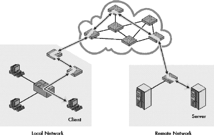

图 15-1. IP 的主要功能：互联网数据报传输 IP 的整体责任是在未连接的网络设备之间传输数据。此图展示了 IP 如何在互联网中从一个设备向另一个设备传输数据报；在这种情况下，远程客户端和服务器通过在一系列互联网络中传递 IP 数据报来相互通信。

### 提示

**关键概念** 虽然互联网协议有许多功能和特性，但它可以归结为一个主要目的：在连接的网络互联网中传输数据报。

当然，有许多方法可以实现 IP 来完成这项任务。为了了解 TCP/IP 的设计者是如何让 IP 工作的，让我们来看看描述 IP 的关键特性以及它的一般操作方式：

**通用寻址** 为了从 A 点发送数据到 B 点，必须确保设备知道如何识别 B 点。IP 定义了网络的寻址机制，并使用这些地址进行传输目的。

**底层协议无关** IP 被设计成允许数据跨越任何类型的底层网络传输，这些网络被设计成与 TCP/IP 堆栈一起工作。它包括允许其适应各种底层协议（如以太网或 IEEE 802.11）要求的条款。IP 还可以在为它专门创建的特殊数据链路协议上运行，例如串行线路接口协议（SLIP）和点对点协议（PPP）（请参阅第二部分第一章到第二十章/超网")中进行了全面探讨。

**数据封装和格式化/包装** 作为 TCP/IP 网络层协议，IP 从传输层协议 UDP 和 TCP 接收数据。然后，它使用一种特殊格式在传输之前将此数据封装成 IP 数据报。

**分片和重组** IP 数据报被传递到数据链路层，以便在本地网络上进行传输。然而，使用 IP 的每个物理和数据链路网络的最大帧大小可能不同。因此，IP 包括将 IP 数据报分成片段的能力，这样它们就可以分别携带到本地网络。接收设备使用*重组*功能来重新创建整个 IP 数据报。尽管很明显它们是互补的，但有些人将分片和重组视为不同的功能，而我将它们视为同一工作的组成部分。

**路由和间接投递** 当一个 IP 数据报必须发送到同一本地网络上的目的地时，你可以通过使用网络的底层局域网（LAN）、无线局域网（WLAN）或广域网（WAN）协议，以所谓的*直接投递*方式轻松完成。然而，在许多（如果不是大多数情况下），最终目的地是在一个与源不直接相连的远程网络上。在这种情况下，数据报必须间接投递。这是通过将数据报通过中间设备（*路由器*）进行路由来实现的。IP 与包括互联网控制消息协议（ICMP）和 TCP/IP 网关/路由协议（如路由信息协议 RIP 和边界网关协议 BGP）在内的其他协议的支持下完成这一任务。

# IP 的历史、标准、版本和密切相关协议

由于 IP 实际上是整个 TCP/IP 协议套件的架构基础，你可能预计它是最先被创建的，其他协议都是建立在它之上的。毕竟，这是构建结构的方式！然而，IP 的历史要复杂得多。它的功能在协议诞生时就已经定义，但在定义协议套件的最初几年里，IP 本身并不存在。

我在第八章中探讨了 TCP/IP 的早期阶段，该章提供了整个套件的概述。IP 发展的一个显著特点是，它的功能最初是 TCP 的一部分。作为一个正式的协议，IP 是在 20 世纪 70 年代为现代互联网的前身开发的一个早期版本的 TCP 中，当它在第 4 层分割成 TCP，在第 3 层分割成 IP 时诞生的。IP 发展的关键里程碑是 1981 年 9 月发布的 RFC 791，“互联网协议”。这个标准是前一年类似 RFC 760 的修订版，定义了在过去二十年里广泛使用的 IP 版本的核心功能和特性。

## IP 版本和版本号

在 RFC 791 中定义的 IP 是第一个广泛使用的 IP 版本。然而，有趣的是，这并不是 IP 的第 1 版，而是第 4 版！这当然意味着在某个时候，该协议有更早的版本。然而，实际上并没有。IP 是在其功能从早期版本的 TCP 中分离出来时创建的，该 TCP 结合了 TCP 和 IP 的功能。TCP 通过三个更早的版本演变，并在第 4 版时被分割成 TCP 和 IP。这个版本号被应用于 TCP 和 IP 以保持一致性。

### 小贴士

**关键概念** 第 4 版的*互联网协议*（IP）实际上是第一个广泛部署的版本，目前仍在广泛使用。

因此，当你今天使用 IP 时，你使用的是 IP 版本 4，通常简称为 IPv4。除非另有说明，否则可以安全地假设*IP*指的是 IP 版本 4——至少在未来几年内是这样。（这个版本号包含在所有 IP 数据报的适当字段中，如第二十一章中讨论的 IP 数据报格式所述。）

考虑到它最初是为一个比我们当前互联网小得多的互连网设计的，IPv4 已经证明了自己具有非凡的能力。随着时间的推移，对 IP 的使用方式进行了各种补充和变更，尤其是在地址方面，但核心协议基本上与 20 世纪 80 年代初相同。这有很好的理由。改变像 IP 这样基本的东西需要大量的开发工作，并且在过渡期间也会引入复杂性。

IPv4 为我们服务得很好，但人们理解，由于各种原因，最终将需要一个新的 IP 版本。由于进行如此重要变更的困难，这个新版本的 IP 开发实际上从 20 世纪 90 年代中期就开始了。这个新版本的 IP 正式称为*互联网协议版本 6（IPv6）*，有时也被称为*IP 下一代*或*IPng*。我在本书的第二部分-4")中详细讨论了 IPv6 的开发原因以及它与 IPv4 的不同之处。

在这个阶段，一个自然的问题就是，“IP 的第五版发生了什么？”答案是它根本不存在。虽然这可能会让人感到困惑，但第五版实际上是有意跳过的，以*避免*混淆，或者至少是纠正它。第五版的问题与一个名为*互联网流协议，版本 2*的实验性 TCP/IP 协议有关，最初在 RFC 1190 中定义。这个协议最初被一些人视为 TCP/IP 架构中互联网层 IP 的同等协议，在其标准版本中，这些数据包被分配了 IP 版本 5，以区分它们与正常的 IP 数据包（版本 4）。这个协议显然并没有走得太远，但为了绝对确保不会有混淆，版本 5 被跳过，转而使用版本 6。

## 与 IP 相关的协议

除了旧的和新的 IP 版本之外，还有一些*与 IP 相关的*协议。这些协议是为了在特殊情况下增强或扩展 IP 功能，但它们不是 IP 本身的一部分。具体如下：

**IP 网络地址转换（IP NAT 或 NAT）** 该协议提供了 IP 地址转换功能，允许以灵活的方式将私有网络连接到公共网络。它允许共享公共 IP 地址，并通过使公共网络上的主机更难未经授权访问主机来提高安全性。它通常被称为*NAT*。本协议在第二十八章中进行了讨论。

**IP 安全（IPsec）** IPsec 定义了一组子协议，提供了一种使用 IP 安全传输数据的机制。作为能够启用虚拟专用网络的安全协议，它正迅速增长其受欢迎程度。本协议在第二十九章中进行了讨论。

**移动 IP** 这是一个协议，用于解决在使用 IP 时，频繁在不同网络间移动的计算机所遇到的一些困难。它提供了一种机制，允许数据自动路由到移动主机（如笔记本电脑），而无需不断重新配置设备的 IP 地址。本协议在第三十章中进行了讨论。

# 第十六章。IPV4 寻址概念和问题

互联网协议（IP）的主要任务是传递设备之间的消息，就像任何优秀的递送服务一样，如果不知道收件人的位置，它就无法很好地完成其工作。显然，IP 最重要的功能之一就是*寻址*。IP 寻址不仅用于唯一标识 IP 地址，而且还用于在互联网中路由 IP 数据报。IP 地址在 TCP/IP 网络中被广泛使用和提及。

尽管原始的 IP 寻址方案相对简单，但随着对其进行的修改以适应各种寻址需求，它已经变得复杂。更高级的 IP 寻址风格，如子网划分和无类别寻址，是现代网络中最常用的。然而，它们可能有点难以理解。为了帮助理解它们，我们必须从讨论 IP 寻址的基本原理开始。

在本章中，我通过解释 IP 地址背后的关键概念和问题，开始对 IP 地址分配进行更深入的研究。我首先概述 IP 地址分配，并讨论其内容。我描述了 IP 地址的大小、其地址空间的概念以及通常用于 IP 地址的表示法。我提供了关于 IP 地址结构的基本信息以及它是如何分为网络标识符和主机标识符的。然后，我描述了不同类型的 IP 地址以及通常伴随 IP 地址出现在大型网络中的附加信息，如子网掩码和默认网关。我简要描述了有时将多个地址分配给单个设备的原因。最后，我描述了公共 IP 地址的注册和管理过程，以及执行这项工作的组织。

### 小贴士

**背景信息** *如果你不熟悉至少二进制数的基本工作原理，以及如何将二进制数和十进制数相互转换，我建议你在继续阅读之前阅读第四章，该章节提供了关于数据表示和计算数学的一些背景信息*。

# IP 地址分配概述和基础知识

IP 地址分配非常重要，因为它促进了 IP 的主要功能：在互联网中传递数据报。当你更详细地检查这一点时，你会发现 IP 地址实际上有两个不同的功能，如下所示：

**网络接口标识** 就像街道地址一样，IP 地址为设备与网络之间的接口提供了唯一的标识。这是确保数据报被交付给正确收件人的必要条件。

**路由** 当 IP 数据报的源和目标不在同一网络时，必须通过中间系统间接交付数据报。这个过程称为 *路由*。IP 地址是用于路由数据报的系统的基本组成部分。

你可能已经注意到了这个简短列表中的几个问题。一个是我说 IP 地址标识的是 *网络接口*，而不是标识 *设备* 本身。这种区别很重要，因为它强调了 IP 是围绕连接到大型、虚拟网络的概念，该网络位于第 3 层，可以跨越多个物理网络。一些设备，如路由器，将拥有多个网络连接，这是必要的，以便从一个网络中提取数据报并将它们路由到另一个网络。这意味着它们也将拥有多个 IP 地址——每个连接一个。

你可能也会觉得奇怪，我之前说 IP 地址有助于路由。它是如何做到这一点的呢？答案是，这个地址系统是设计成具有一种结构，可以解释为允许路由器根据地址中的值来确定对数据报的处理方式。与 IP 地址相关的数字，如使用子网划分时的子网掩码，支持这一功能。

让我们一般性地探讨一些与 IP 地址相关的重要问题和特性。

## 每个设备的 IP 地址数量

任何在网络层发送数据给它的设备至少有一个 IP 地址：每个网络接口一个。这意味着像计算机和网络打印机这样的普通主机通常只有一个 IP 地址，而路由器则拥有多个 IP 地址。如果某些特殊主机是多宿主的——连接到多个网络——它们可能拥有多个 IP 地址。

较低级别的网络互联设备，如中继器、网桥和交换机，不需要 IP 地址，因为它们根据第二层（数据链路层）地址传递流量。通过网桥和交换机连接的网络段形成一个单一的广播域，并且任何连接到它们的设备都可以直接发送数据给对方，而无需路由。对于 IP 来说，这些设备基本上是看不见的；它们的重要性不比连接设备的电线大（有几个例外）。然而，这些设备可能为了管理目的而选择性地拥有一个 IP 地址。在这方面，它们表现得就像网络上的普通主机。

图 16-1 展示了几个常见局域网设备的 IP 接口，以小圆圈表示。每个正常主机有一个接口，而服务于这个局域网的路由器有三个，因为它连接到三个不同的网络。请注意，局域网交换机没有 IP 接口；它在第二层连接主机和路由器。（也参见图 16-5,它展示了更复杂配置中设备的 IP 接口。)

图 16-1.常见网络设备的 IP 接口常规主机有一个接口；路由器通常有多个；而交换机没有（因为它们在层 2 操作）。

## 地址唯一性和网络特定性

单个互联网上的每个 IP 地址都必须是唯一的。（这似乎非常明显，尽管在 IPv6 中存在例外，形式为特殊的任播地址，如第二十五章第二十五章。IPv6 寻址中所述。）

由于 IP 地址代表网络接口并用于路由，因此 IP 地址特定于连接的网络。如果设备移动到新的网络，IP 地址通常也必须更改。关于这一点的完整原因，请参阅本章后面关于基本 IP 地址结构的讨论。这个问题是创建移动 IP（在第三十章第三十章。互联网协议移动支持（移动 IP）")中介绍）的主要动机之一。

## 对比 IP 地址和链路层地址

IP 地址用于在互联网中跨网络层的数据传输。这使得 IP 地址与设备的链路层地址（如其以太网 MAC 地址）有很大不同。（在 TCP/IP 术语中，这些有时被称为*物理地址*或*硬件地址*。）

在网络层，一个数据报可以从设备 A 发送到设备 B。然而，如果设备 A 和设备 B 不在同一网络中，实际的数据报交付可能需要它通过十几个或更多的物理设备。

还需要提供一个将 IP 地址和链路层地址之间进行映射的功能。在 TCP/IP 中，这是地址解析协议（ARP）的工作（见第十三章第十三章。地址解析和 TCP/IP 地址解析协议（ARP）")）。

在一个物理网络（如以太网）中，MAC 地址是发送设备之间数据所需的所有信息。相比之下，IP 地址仅代表数据报的最终交付点。所采取的路径取决于源设备和目标设备之间网络路径的特性。甚至可能不存在任何两个设备之间的路由，这意味着即使它们知道彼此的地址，两个设备也无法交换数据！

## 私有和公共 IP 网络地址

使用 IP 地址设置网络有两种不同的方式。在*私有网络*中，单个组织控制所有设备的地址分配；他们在选择数字方面几乎有绝对的自由，只要每个地址都是唯一的。

相比之下，在*公共网络*上，需要一个机制来确保组织不会使用重叠的地址，并且能够有效地在组织之间路由数据。最著名的例子是互联网，为了解决这个问题，已经创建了公共 IP 注册和管理设施。现在还有一些高级技术，如 IP 网络地址转换（NAT），允许使用私有地址的网络与公共 TCP/IP 网络接口。

## IP 地址配置和寻址类型

IP 地址可以设置为静态或动态配置。在*静态配置*设置中，每个设备都会手动配置一个不会改变的 IP 地址。这对于小型网络来说是可以的，但在大型网络中，当需要更改时，这会迅速变成一个管理噩梦。另一种选择，*动态配置*，允许在软件控制下分配和更改 IP 地址。为了填补这一后者的功能，创建了两种主机配置协议，即 BOOTP 和 DHCP（参见第三部分-3）。

此外，IP 寻址方案还包括所有三种基本寻址类型：单播、多播和广播。

### 小贴士

**关键概念** IP 地址具有设备标识和路由的双重功能。每个网络接口需要一个 IP 地址，这是网络特定的。IP 地址可以是静态或动态分配的，并且有单播、多播和广播形式。

# IP 地址的大小、地址空间和表示法

现在您已经了解了与 IP 地址相关的一般问题和特征，是时候超越介绍，深入探讨 IP 地址的“实质”讨论了。让我们首先看看 IP 地址的物理结构和大小，以及它是如何被引用和使用的。

## IP 地址大小和二进制表示法

在最简单的情况下，IP 地址只是一个 32 位的二进制数：一组 32 个 1 或 0。在最低级别，计算机总是以二进制形式工作，这同样适用于网络硬件和软件。虽然地址中的不同位被赋予了不同的含义，但地址本身只是一个 32 位的二进制数。

人们不太擅长处理二进制数，因为它们很长且复杂，仅使用两个数字使得它们难以区分。（快，以下哪个更大：11100011010100101001100110110001 还是 11100011010100101001101110110001？）因此，当使用 IP 地址时，除非绝对必要，否则不会以二进制形式处理它们。

人们自然会对一长串比特进行的第一件事就是将其分成四个八位字节（或者字节，尽管这两个词在技术上并不完全相同；参见第四章)，以便更容易管理。所以 11100011010100101001101110110001 将变成 11100011 - 01010010 - 10011101 - 10110001。然后你可以将每个字节转换成一个更易管理的两位十六进制数，得到以下结果：E3 - 52 - 9D - B1。实际上，这是 IEEE 802 MAC 地址所使用的表示法，只是它们是 48 位长的，所以它们有六个两位的十六进制数，并且通常用冒号而不是破折号分隔，就像我这里所做的那样。

（顺便提一下，第二个二进制数是较大的那个。）

## IP 地址点分十进制表示法

大多数人仍然觉得十六进制数有点难以处理。因此，IP 地址通常以每个八位字节转换为十进制数，并且字节之间用点（*点*）分隔来表示。因此，前面的例子将变成 227.82.157.177，如图 16-2 所示。这通常被称为*点分十进制表示法*，原因相当明显。IP 地址中的每个八位字节可以取从 0 到 255 的值，因此最低值理论上为 0.0.0.0，最高值为 255.255.255.255。

### 小贴士

**关键概念** IP 地址是 32 位的二进制数，可以用二进制、十六进制或十进制形式表示。最常见的是，它们通过将 32 位分成四个字节并将每个字节转换为十进制来表示，然后用点分隔这些数字以创建点分十进制表示法。

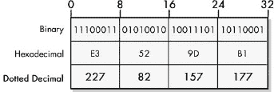

图 16-2. IP 地址的二进制、十六进制和点分十进制表示形式。IP 地址的二进制、十六进制和十进制表示都是等效的

点分十进制表示法为人们在通信中处理 IP 地址提供了一个方便的方法。永远不要忘记，对于计算机来说，IP 地址始终是一个 32 位的二进制数；当你查看下一个主题中 IP 地址的逻辑组成部分时，以及当你检查操作 IP 地址的技术，如子网划分时，你会理解这一点的重要性。

## IP 地址空间

由于 IP 地址是 32 位宽，这提供了理论上的*地址空间*为 2³²，或 4,294,967,296 个地址。这似乎有很多地址，从某些方面来看确实是这样的。然而，正如您将看到的，由于 IP 地址的结构和分配方式，并非所有这些地址都可以实际使用。

IP 最初是在一个相当小的互联网上创建的，这一事实的一个不幸遗产是，所做的决定浪费了大部分地址空间。例如，所有以 127 开头的第一个八位字节中的 IP 地址都保留用于环回功能。仅此一项决定就使得总地址的 1/256，即 16,277,216 个地址不再可用。还有其他一些方式没有保存 IP 地址空间。随着互联网规模的扩大，这造成了困难。（您将在第十七章中了解更多关于这一点，该章涵盖了类别地址。）

### 提示

**关键概念** 由于 IP 地址是 32 位长，因此 IPv4 的总地址空间为 2³²或 4,294,967,296 个地址。然而，由于各种原因，并非所有这些地址都可以使用。

这个 IP 地址空间决定了每个 IP 互联网中可寻址接口数量的限制。因此，如果您有一个私有网络，从理论上讲，您可以拥有超过四十亿的地址。然而，在像互联网这样的公共网络中，所有设备必须共享可用的地址空间。设计诸如无类别域间路由（CIDR）、超网技术或 NAT 等技术部分是为了更有效地利用现有的互联网 IP 地址空间。IPv6 将 IP 地址的大小从 32 位扩展到 128 位，地址空间增加到极其庞大的数字，使得整个地址空间大小的问题变得无关紧要。

# IP 基本地址结构和主要组件

正如我在 IP 地址概述中提到的，IP 地址被用来促进 IP 互联网中数据报的路由。这是由于 IP 地址的结构以及网络路由器如何解释这种结构而成为可能。

## 网络 ID 和主机 ID

正如您刚才看到的，每个 IPv4 地址都是 32 位长。当您引用 IP 地址时，您使用点分十进制表示法，而计算机将其转换为二进制。然而，尽管这些 32 位的集合被视为一个单一实体，但它们包含两个组成部分的内部结构：

**网络标识符（网络 ID）** 从最左边的位开始的一定数量的位用于标识主机或其他网络接口所在的网络。这有时也被称为*网络前缀*，甚至只是*前缀*。

**主机标识符（主机 ID）** 剩余的位用于标识网络上的主机。

### 注意

按照惯例，为了简便起见，IP 设备通常被称为主机，正如我在本书中一直所做的那样。尽管每个主机通常只有一个 IP 地址，但你应该记住，IP 地址严格关联于网络层的网络接口，而不是物理设备，因此一个设备可能拥有多个 IP 地址（尤其是路由器或多宿主主机）。

如您在图 16-3 中可以看到，这实际上是一个相当简单的概念。IP 地址位的根本划分是网络 ID 和主机 ID。在此图中，网络 ID 长度为 8 位，主机 ID 长度为 24 位。这与北美电话号码的结构相似。电话号码（401）555-7777 是一个十位数的号码，通常被称为一个单独的电话号码。然而，它有一个结构。特别是，它有一个区号（401）和一个本地号码（555-7777）。

网络 ID 包含在 IP 地址中，这在地址已知时部分促进了 IP 数据报的路由。路由器查看 IP 地址的网络部分，首先确定目标 IP 地址是否与主机 IP 地址在同一网络上。然后根据路由器保留的有关各种网络位置的信息做出路由决策。再次强调，这与电话网络中相当于路由器的实体使用区号切换电话呼叫的概念上是相似的。地址的主机部分由网络本地部分的设备使用。

图 16-3. 基本 IP 地址划分：网络 ID 和主机 ID 此图展示了将 IP 地址划分为网络 ID 和主机 ID 的多种方法之一。

## 网络 ID 和主机 ID 之间的划分位置

IP 地址和电话号码之间的一个区别是，用于标识网络和标识主机的位之间的划分点不是固定的。它取决于地址的性质、所使用的寻址类型和其他因素。

以先前的例子 227.82.157.177 为例（见图 16-2)。可以将其划分为网络 ID 227.82 和主机 ID 157.177。或者，网络 ID 可能是 227，而网络内的主机 ID 可能是 82.157.177。

为了将网络 ID 和主机 ID 表示为 32 位地址，你需要添加零来替换缺失的部分。以网络 ID 为 227 和主机 ID 为 82.157.177 为例，网络地址变为 227.0.0.0，主机地址为 0.82.157.177。（在实践中，这种类型的网络地址通常会看到添加的零；网络 ID 以这种方式以 32 位形式出现的频率不高。）

不要认为从这些例子中可以得出分割必须总是在整个八位字节之间进行的结论，你应该知道它也可以在八位字节的中部进行分割。例如，你可以将 IP 地址 227.82.157.177 分割，使得网络 ID 有 20 位，主机 ID 有 12 位。过程是相同的，但确定点分十进制 ID 值更为复杂，因为在这里，157 被分割成两个二进制数。结果是网络 ID 为 227.82.144.0，主机 ID 为 0.0.0.13.177，如图 16-4 所示。图 16-4。

由于 IP 地址通常表示为四个点分十进制数字，教育资源通常会显示网络 ID 和主机 ID 在八位字节边界上的分割。然而，必须记住，分割点通常出现在这些八位数字的中间。在图 16-4 中，网络 ID 为 20 位，主机 ID 为 12 位。这导致原始 IP 地址的第三个数字 157 被分割成 144 和 13。

为了让像路由器这样的设备知道如何解释地址，必须知道网络 ID 和主机 ID 之间的分割位置。这个信息要么隐含地传达，要么明确地传达，具体取决于使用的 IP 地址类型，正如我接下来要讨论的。

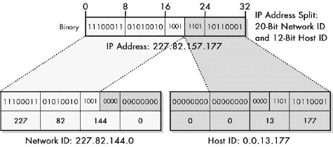

图 16-4. 中八位字节 IP 地址分割 IP 地址不需要在八位字节边界上分割网络 ID 和主机 ID。这里的分割是一个 20 位网络 ID 和一个 12 位主机 ID。

### 提示

**关键概念** IP 地址的基本结构由两个部分组成：网络 ID 和主机 ID。32 位地址的分割点不是固定的，而是取决于多个因素，并且可能出现在各种位置，包括点分十进制八位字节的中部。

由于 IP 地址可以被分成网络 ID 和主机 ID 组件，因此根据上下文，也可以单独使用其中一个或另一个。这些地址被赋予了特殊的意义。例如，如果使用全 1 作为主机 ID 的网络 ID，这表示向整个网络广播。同样，如果主机 ID 单独使用，网络 ID 为全 0，这表示发送到本地网络中该 ID 主机的 IP 地址，无论该主机是什么。这将在第十七章中详细解释。

正是网络 ID 包含在每个网络上的每个主机的 IP 地址中，才使得 IP 地址具有网络特定的性质。如果你将设备从一个网络移动到另一个网络，网络 ID 必须更改为新网络的网络 ID。因此，IP 地址也必须更改。这是一个不幸的缺点，在处理移动设备时最常见；请参阅第三十章。

# IP 寻址类别和 IP 寻址辅助

我们刚刚探讨了 IP 地址中的 32 位是如何在本质上分为网络 ID 和主机 ID 的。网络 ID 用于路由目的，而主机 ID 唯一标识网络上的每个网络接口。为了设备能够知道如何在网络上使用 IP 地址，它们必须能够判断哪些位用于每个 ID。然而，这条分界线并不是预先定义的。它取决于网络中使用的寻址类型。

了解这些 ID 如何确定，使我们进入了对 IP 寻址方案三个主要类别的更广泛讨论：分类、子网化和无类。每个都使用稍微不同的系统来指示主机 ID 在 IP 地址中的位置。

## 传统的（分类）寻址

原始的 IP 寻址方案被设置为仅在少数几个位置之一发生分界：在八位字节边界上。根据用于网络 ID 和主机 ID 的八位字节数，区分了三个主要类别的地址——A、B 和 C。例如，C 类地址将 24 位用于网络 ID，8 位用于主机 ID。这种寻址方式现在通常被称为虚构的词 *classful*，以区分较新的无类方案。

这种最基本的寻址类型使用最简单的方法来划分网络 ID 和主机 ID：将类别及其分界点编码到每个地址的前几位中。路由器可以通过这些位判断哪些八位字节属于哪个标识符。

## 子网化分类寻址

在子网寻址系统中，通过从类别 A、B 或 C 的主机 ID 中取出一些位，并将它们用于一个*子网标识符（子网 ID）*，将 IP 地址的网络和主机部分从两层系统扩展为三层系统。网络 ID 保持不变。子网 ID 用于在构成整个网络的各个子网络之间进行路由，从而为管理员提供额外的灵活性。例如，考虑一个通常使用前 24 位作为网络 ID 和剩余 8 位作为主机 ID 的类别 C 地址。主机 ID 可以被分成，比如说，3 位用于子网 ID 和 5 位用于主机 ID。

该系统基于原始的类别方案，因此网络 ID 和完整主机 ID 之间的分割线仍然基于地址的前几位，就像之前一样。子网 ID 和“子主机”ID 之间的分割线由一个称为*子网掩码*的 32 位数字表示。在先前的例子中，子网掩码将是 27 个 1 位后面跟着 5 个 0 位——0 位表示地址的哪一部分是主机。以点分十进制表示，这将表示为 255.255.255.224。

## 无类别寻址

在无类别系统中，原始 IP 寻址方案中的类别被摒弃。网络 ID 和主机 ID 的分割可以发生在任意点，而不仅仅是类别方案中的八位边界。

通过在地址后放置用于网络 ID 的位数，即所谓的*前缀长度*，来指示分割点。（回想一下，网络 ID 位有时也被称为*网络前缀*，因此网络 ID 的大小就是前缀长度。）例如，如果 227.82.157.177 是使用前 27 位作为网络 ID 的网络的一部分，那么该网络将被指定为 227.82.157.160/27。/27 在概念上等同于 255.255.255.224 子网掩码，因为它有 27 个 1 位后面跟着 5 个 0 位。

### 小贴士

**关键概念** 决定一个 IP 地址如何被解释的一个基本因素是它所使用的寻址方案。这三种方法按照年龄、复杂性和灵活性的递增顺序排列，分别是类别寻址、子网类别寻址和无类别寻址。

这篇关于类别寻址、子网寻址和无类别寻址概念的介绍旨在展示它们如何影响 IP 地址的解释方式。我在这里大大简化了重要概念。所有三种方法都在各自的章节中进行了详细解释。

## 子网掩码和默认网关

在原始的类别划分方案中，网络 ID 和主机 ID 之间的划分是隐含的。然而，如果使用子网划分或无类别寻址，则需要*子网掩码*（或*斜杠号*，两者等价）来完全指定地址。这些数字被视为 IP 地址的补充，通常与地址一起提及，因为没有它们，就无法知道网络 ID 在哪里结束，主机 ID 在哪里开始。

与设备 IP 地址一起经常指定的另一个数字是*默认网关*标识符。简单来说，这是为特定设备提供默认路由功能的路由器的 IP 地址。当一个 IP 网络上的设备想要向其本地 IP 网络上看不到的设备发送数据报时，它会将其发送到默认网关，该网关负责路由功能。没有这个，每个 IP 设备都需要了解路由功能和路由，这将是不高效的。参见第二十三章，其中讨论了 IP 路由概念，以及从第三十七章到 41 章，这些章节涵盖了 TCP/IP 路由协议，以获取更多信息。

# IP 地址数量和多宿主

在 IP 互联网上的每个网络接口都有一个独立的 IP 地址。在一个经典网络中，每台常规计算机，通常称为*主机*，只连接到网络的一个地方，因此它只有一个 IP 地址。这是我们使用 IP 网络时最熟悉的情况（这也是为什么大多数人使用术语*主机*而不是*网络接口*的原因）。

如果一个设备与互联网有多个接口，它将拥有多个 IP 地址。最明显的例子是路由器，它们连接不同的网络，因此必须为每个接口分配一个 IP 地址。然而，主机也可能拥有多个 IP 地址。这样的设备有时被称为*多宿主*。

主机可以多宿主有两种方式：

**同一网络上的两个或更多接口** 服务器或高性能工作站等设备可能出于性能和可靠性原因配备了连接到同一网络的两个物理接口。它们将在同一网络上有两个具有相同网络 ID 的 IP 地址。

**连接到两个或更多不同网络的接口** 设备可能具有连接到不同网络的多个接口。IP 地址通常包含不同的网络 ID。

图 16-5 展示了这两种类型的多宿主设备的示例。当然，这些可以组合，一个主机可以有一个连接到一个网络，另一个连接到另一个网络。还有一些其他特殊情况，例如一个具有单个网络连接的主机有多个 IP 地址别名。

### 注意

*当使用子网划分时，可以在同一子网或不同子网的多宿主之间做出相同的区分*。

现在，让我们考虑第二种情况。如果一个主机连接到两个或更多不同的网络，它能否在这两个网络之间传递 IP 数据报？是的，如果它在上面运行了正确的软件。那么这不会使主机变成一种路由器吗？实际上，这正是这种情况。一个具有连接到两个网络的接口的多宿主主机可以使用软件作为路由器。这有时被称为*软件路由*。

与硬件路由器相比，使用主机作为路由器具有某些优点和缺点。一个多宿主的服务器可以执行路由功能，同时，嗯，充当服务器。专门设计的硬件路由器是为了路由任务而设计的，通常会比在主机上运行的软件程序更有效率。

### 小贴士

**关键概念** 拥有多个 IP 网络接口的主机被称为多宿主。一个多宿主设备可以连接到同一网络、不同网络或两者。一个连接到两个网络的主机可以被配置为作为路由器。

多宿主曾经被认为是一种相当晦涩的应用，但近年来变得更加普遍。这在软件路由用途的多宿主不同网络方面也是正确的。实际上，你可能在家里做着这样的事情而自己并没有意识到。

假设你有两台联网的 PC 和一个电话线路来连接到互联网。一台计算机拨号连接到你的互联网服务提供商（ISP），并运行如微软的互联网连接共享（ICS）软件，以便另一台计算机可以访问互联网。每天有成千上万的人这样做——他们有一个多宿主系统（连接到互联网和另一台 PC），其中 ICS 充当软件路由器的角色（尽管 ICS 和真正的路由器之间当然有一些技术差异）。

# IP 地址管理、分配方法和权限

如果你告诉某人你住在 34 号橡树街，当他驶入你的道路时，发现四栋房子上都有 34 号，会发生什么？他可能最终会找到你的地方，但不会太高兴。你和你家的信使也不会高兴。而且你们都比计算机聪明得多。就像街道地址一样，IP 地址也必须是唯一的，才能发挥作用。

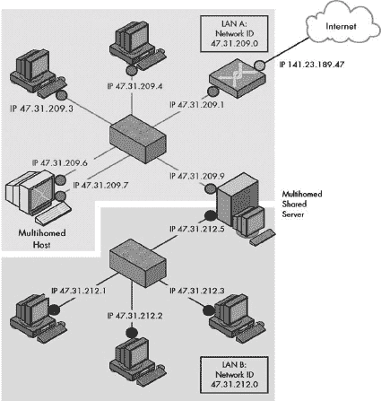

图 16-5. IP 互联网上的多宿主设备 该互联网由两个局域网 A（上方）和 B（下方）组成。局域网 A 有一个多宿主工作站，用两个 IP 网络接口“圆圈”表示。两个局域网通过一个配置为在它们之间路由流量的多宿主共享服务器连接在一起。请注意，该服务器还处理所有在局域网 B 和互联网之间传递的流量（因为互联网连接仅在局域网 A 中）。

由于 IP 数据报只发送在 IP 互联网的范围内，它们必须在每个互联网内是唯一的。如果你是一家拥有自己的私有互联网的公司，这并不是一个大问题。负责维护互联网的人会保留一个列表，记录哪些数字在哪里被使用，并确保没有两个设备被分配相同的地址。然而，在公共网络中，有多个不同的组织会发生什么？在这里，确保 IP 地址空间在组织间得到管理，以确保它们使用不同的地址是至关重要的。让每个组织与其他组织协调其活动是不切实际的。因此，需要某种形式的集中式*管理机构*。

在你需要有人确保地址分配没有冲突的同时，你不想让网络的用户每次需要更改他们的网络时都要去这个中央机构。根据他们想要连接到网络的设备数量，由该机构分配块或块状数字更有意义。组织可以根据自己的需要管理这些块，而权威机构的任务也因为处理的是块而不是数十亿个单独的地址和机器而变得更容易。

互联网作为大的 IP 互联网，需要为全球数百万组织执行这项协调任务。最初，管理互联网上 IP 地址分配的工作由一个组织执行：互联网分配号码权威机构 (IANA)。IANA 负责分配 IP 地址，以及管理其他重要的集中式协调功能，例如管理用于 TCP/IP 协议的通用参数。在 1990 年代末，一个新的组织——互联网名称和数字地址分配公司 (ICANN) 被创建。ICANN 现在负责监督 IANA 的 IP 地址分配任务，以及管理其他任务，如域名系统 (DNS) 名称注册（参见第五十四章）。

IP 地址最初是直接分配给组织的。原始的 IP 地址方案基于类别，因此 IANA 会分配 A 类、B 类和 C 类块中的地址。今天，地址是无类的，使用 CIDR 的分层地址方案。IANA 不直接分配地址，而是将它们委派给区域互联网注册机构 (RIRs)。这些是 APNIC、ARIN、LACNIC 和 RIPE NCC。每个 RIR 可以反过来将地址块委派给低级注册机构，如国家互联网注册机构 (NIRs) 和本地互联网注册机构 (LIRs)。

最终，地址块由 ISP 获取，用于分配给最终用户组织。一些 ISP 的客户是最终用户组织，但其他的是（较小的）ISP 本身。他们可以反过来使用或委派他们块中的地址。这可以以分层的方式继续进行几个阶段。这种安排有助于确保 IP 地址以最有效的方式分配和使用。有关如何工作的更多信息，请参阅第二十章/超网")，其中讨论了 CIDR。

IANA、ICANN 和 RIRs 负责的不仅仅是 IP 地址分配，尽管我这里主要关注 IP 地址，这是显而易见的原因。有关 IANA、ICANN、APNIC、ARIN、LACNIC 和 RIPE NCC 的更一般信息，可以尝试一罐字母汤——或者查看第三章，其中提供了互联网注册机构的概述。

# 第十七章。类地址（传统）地址

原始的 IP 地址地址方法将 IP 地址空间划分为五个不同大小的块，称为 *类别*，并根据组织的大小和需求从这些类别中分配地址块。在这个分类地址方案中，每个类别都保留用于特定目的，主要地址类别根据用于网络标识符（网络 ID）的八位组数量以及用于主机标识符（主机 ID）的八位组数量来区分。

在本章中，我描述了分类 IP 地址。我首先概述了该概念和不同类别的通用描述。我讨论了与不同类别相关的网络标识符和主机标识符以及地址范围。我讨论了常用类别的容量，即每个类别包含多少网络以及每个网络可以包含多少主机。我讨论了分配给某些 IP 地址模式的特殊含义以及为私有 IP 地址、环回功能和多播保留的特殊范围。我最后讨论了这种地址类型的问题，这些问题导致了它被弃用，转而采用子网划分，最终实现了 IP 地址空间的非分类分配。

### 注意

*分类地址方案已被第二十章中描述的无类别地址系统所取代（ch20.html "第二十章. IP 无类别地址——无类别域间路由（CIDR）/超网”）。然而，我认为了解这个原始系统是如何运作的仍然很重要，因为它构成了更复杂地址机制的基础。*

# IP 地址分类概述及地址类别

互联网协议（IP）的开发者认识到，组织的大小各不相同，因此需要在互联网上使用不同数量的 IP 地址。他们设计了一个系统来将 IP 地址空间划分为 *类别*，每个类别包含总地址的一部分，并专门用于特定用途。一些类别将用于互联网上的大型网络，而其他类别则保留给较小的组织或特殊用途。

这个原始系统没有名称；它只是“IP 地址系统”。今天，它被称为 *分类地址方案*，以区分较新的无类别方案。

## IP 地址类别

在分类系统中，有五个类别，分别用字母 A 到 E 表示。表 17-1 提供了有关类别、其旨在用途和其特性的某些一般信息。

表 17-1. IP 地址类别及其特性与用途

| IP 地址类别 | 总 IP 地址空间的比例 | 网络标识符位数 | 主机标识符位数 | 旨在用途 |
| --- | --- | --- | --- | --- |
| **类别 A** | 1/2 | 8 | 24 | 用于连接到互联网的非常大型组织，拥有数十万或数百万个主机 |
| **类别 B** | 1/4 | 16 | 16 | 用于连接到互联网的中等到大型组织，拥有数百到数千个主机 |
| **类别 C** | 1/8 | 24 | 8 | 用于连接到互联网的小型组织，不超过约 250 个主机 |
| **类别 D** | 1/16 | n/a | n/a | IP 多播 |
| **类别 E** | 1/16 | n/a | n/a | 保留用于实验用途 |

通过查看这张表格（以及图 17-1)，您可以看到类别 A、B 和 C 占据了大部分的总地址空间（七分之八）。这些类别用于 *单播* IP 地址和发送到单个网络接口的消息。（这些块还包括这些网络的关联广播地址。）这就是我通常认为的正常 IP 地址。

图 17-1. IPv4 地址空间的类别划分

您可以将类别 A、B 和 C 视为传统 IP 地址中的大熊爸爸、大熊妈妈和小熊宝宝。它们允许互联网为少量非常大的网络、中等数量的中等规模组织和大量的小公司提供地址。这大致反映了现实世界中组织规模的分布，尽管每个地址类别允许的最大主机数量之间的巨大差距导致了一定的不灵活性，我将在本章后面讨论这一点。

如您所见，类别之间的区别在于它们在地址的网络 ID 和主机 ID 部分之间划定的界限。然而，在每种情况下，划分都是在八位字节边界上进行的。在类别地址中，划分不会在八位字节内部发生。

类别 D 和 E 是特殊的——以至于许多人甚至没有意识到它们的存在。类别 D 用于 IP 多播，而类别 E 保留用于实验用途（由互联网的设计师）。我在本章后面讨论 IP 多播地址。

### 小贴士

**关键概念** 类别 IP 地址方案将 IP 地址空间划分为五个不同大小的类别，从 A 到 E。类别 A、B 和 C 是最重要的，指定用于传统单播地址，占据了地址空间的七分之八。类别 D 保留用于 IP 多播，类别 E 保留用于实验用途。

## 类别地址划分的原理

虽然今天经常讨论类别寻址方案的缺点（您将在本章后面看到），但了解在开发此系统时互联网的大小是很重要的。当时互联网很小，与创造者多年后预想的机器数量相比，32 位地址空间似乎巨大无比。公平地说，也应该记住 25 年前开发的类别寻址系统的以下优点：

**简单明了** 可供选择的类别只有几个，理解地址如何划分非常简单。类别的区别清晰且明显。A、B 和 C 类中网络 ID 和主机 ID 之间的划分在八位字节边界上，这使得确定任何地址的网络 ID 变得容易。

**合理的灵活性** 三种粒度级别与大型、中型和小型组织的规模相当匹配。原始系统提供了足够的容量来处理当时互联网预期的增长速度。

**路由便捷性** 如您很快就会看到的，地址类别被编码到地址中，以便路由器知道任何地址的哪一部分是网络 ID，哪一部分是主机 ID。不需要附加信息，如子网掩码。

**保留地址** 某些地址被保留用于特殊目的。这不仅包括 D 类和 E 类，还包括用于私有寻址的特殊保留地址范围。

当然，后来发现原始 IP 寻址方案中的一些决策是令人遗憾的——但这正是事后诸葛亮的益处。我相信我们都会希望收回为 E 类保留的约 2.68 亿个地址。虽然现在看来为实验用途保留地址空间的三分之一似乎有些浪费，但请记住，即使在 10 年前，也从未预料到互联网的当前规模，更不用说 25 年前了。此外，为任何稀缺资源预留一部分以备将来使用是良好的实践。

# IP 类别寻址网络和主机标识及地址范围

类别 IP 寻址方案将整个 IP 地址空间划分为 A 到 E 五个类别。相对简单的类别寻址方案的一个好处是，关于类别的信息直接编码到 IP 地址中。这意味着你可以事先确定哪些地址范围属于每个类别。这也意味着相反的情况是可能的：你只需检查地址的一小部分就能确定与任何地址关联的类别。这种后者的好处是类别寻址系统最初创建的主要动机之一。

## 类别寻址类别确定算法

当 TCP/IP 最初创建时，计算机技术还处于起步阶段。路由器需要能够快速做出关于如何移动 IP 数据报的决定。IP 地址空间被划分为类别，使得通过查看任何 IP 地址的前几个比特，路由器可以轻松地判断如何选择网络 ID 和主机 ID，从而确定对数据报的处理方式。

路由器需要查看的位数可能从 1 位到 4 位不等，这取决于它开始查找时发现的内容。用于确定类别的算法对应于用于划分地址空间的系统，如图 17-2 所示。

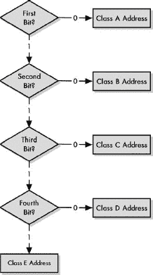

图 17-2. 类别确定算法用于类别 IP 地址 类别 IP 地址的简单性可以从用于确定地址类别的非常简单的算法中看出。

这里是算法中的四个非常基本的步骤：

1.  如果第一个比特是 0，则这是一个 A 类地址，任务完成。（地址空间的一半以 0 作为第一个比特，这就是为什么 A 类占据一半地址空间的原因。）如果它是 1，继续到步骤 2。

1.  如果第二位是 0，则这是一个 B 类地址，任务完成。（剩余的非 A 类地址的一半，或者总量的四分之一。）如果它是 1，继续到步骤 3。

1.  如果第三位是 0，则这是一个 C 类地址，任务完成。（剩余部分再减半，或者总量的八分之一。）如果它是 1，继续到步骤 4。

1.  如果第四位是 0，则这是一个 D 类地址。（剩余部分的一半，或者地址空间的十六分之一。）如果它是 1，则是一个 E 类地址。（另一半，十六分之一。）

大概就是这样。

## 从第一个八位字节位模式确定地址类别

当然，作为人类，我们通常使用点分十进制地址而不是二进制地址来工作，但很容易看出与类别相对应的范围。例如，考虑 B 类。第一个八位字节的头两位是 10。剩余的位可以是任意组合的 1 和 0。这通常表示为 10xx xxxx（为了可读性，显示为两组四个）。因此，第一个八位字节的二进制范围可以从**10**00 0000 到**10**11 1111（十进制中的 128 到 191）。因此，在类别方案中，任何第一个八位字节在 128 到 191（含）之间的 IP 地址都是 B 类地址。

表 17-2 显示了每个五个类别的位模式以及如何计算第一个八位字节的范围。第一列显示了 IP 地址第一个八位字节的格式；*x*可以是零或一。接下来是每个类别的最低和最高值列（固定的几个位以粗体字打印，以便您可以看到它们在变化时保持不变），然后是第一个八位字节的对应范围，以十进制表示。

表 17-2. IP 地址类别位模式、第一个八位字节范围和地址范围

| IP 地址类别 | IP 地址的第一个八位字节 | 第一个八位字节的最低值（二进制） | 第一个八位字节的最大值（二进制） | 第一个八位字节的值范围（十进制） | 网络 ID/主机 ID 的八位字节 | 理论上的 IP 地址范围 |
| --- | --- | --- | --- | --- | --- | --- |
| **A 类** | **0**xxx xxxx | **0**000 0001 | **0**111 1110 | 1 to 126 | 1 / 3 | 1.0.0.0 to 126.255.255.255 |
| **B 类** | **10**xx xxxx | **10**00 0000 | **10**11 1111 | 128 to 191 | 2 / 2 | 128.0.0.0 to 191.255.255.255 |
| **C 类** | **110**x xxxx | **110**0 0000 | **110**1 1111 | 192 to 223 | 3 / 1 | 192.0.0.0 to 223.255.255.255 |
| **D 类** | **1110** xxxx | **1110** 0000 | **1110** 1111 | 224 to 239 | — | 224.0.0.0 to 239.255.255.255 |
| **E 类** | **1111** xxxx | **1111** 0000 | **1111** 1111 | 240 to 255 | — | 240.0.0.0 to 255.255.255.255 |

此表还显示了每个类别的*理论*最低和最高 IP 地址范围。这意味着它们是取每个类别中可能的完整二进制数范围的结果。实际上，某些值可能无法用于常规使用。例如，尽管 192.0.0.0 到 192.0.0.255 的范围在技术上属于 C 类，但它被保留，并且实际上并未被互联网上的主机使用。

此外，某些 IP 地址不能使用，因为它们具有特殊含义。例如，255.255.255.255 是一个保留的广播地址。类似地，请注意，A 类的范围是从 1 到 126，而不是您可能预期的 0 到 127。这是因为 A 类网络中的 0 和 127 是保留的；127 是包含 IP 环回地址的网络。这些特殊和保留的地址将在本章后面讨论。

回想一下，类别 A、B 和 C 在网络 ID 和主机 ID 之间的分割线是不同的：类别 A 为网络 1 位，主机 3 位；类别 B 为每个 2 位；类别 C 为网络 3 位，主机 1 位。基于这种分割，我在 表 17-2 中突出了每个类别 A、B 和 C 的 IP 地址范围中的网络 ID 部分。纯文本对应于每个允许的网络 ID 的主机 ID 范围。图 17-3 以图形方式展示了每个类别中位的使用情况。

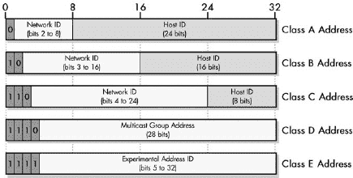

图 17-3. IP 地址类别位分配和网络/主机 ID 大小 此图示展示了 IP 地址的 32 位是如何分配给五个 IP 地址类别的。类别 A、B 和 C 是用于常规单播地址的正常类别；每个类别在网络 ID 和主机 ID 之间都有不同的分割点。类别 D 和 E 是特殊的，并且不以这种方式分割。

### 小贴士

**关键概念** 在类别 IP 地址方案中，IP 地址的类别是通过查看地址的第一位、两位、三位或四位来确定的。这既可以通过处理这些地址的人类完成，也可以通过做出路由决策的路由器完成。使用这些位模式意味着不同类别的 IP 地址落入特定的地址范围，通过查看其点分十进制地址的第一字节即可确定地址的类别。

例如，考虑类别 C。最低的 IP 地址是 **192.0.0**.0，最高的 IP 地址是 **223.255.255**.255。前三个八位字节是网络 ID，其范围从 **192.0.0** 到 **223.255.255**。对于该范围内的每个网络 ID，主机 ID 的范围从 0 到 255。

### 注意

*通常人们会看到资源将类别地址的网络 ID 仅指包括重要的位；也就是说，只有那些不属于该类别所有网络的位。例如，你可能会看到一个类别 B 网络 ID 在图中显示为 14 位，其中起始所有此类网络的 10 位被单独显示，好像它不是网络 ID 的一部分。记住，网络 ID 也包括这些位；对于类别 A 是 8 个完整的位，对于类别 B 是 16 位，对于类别 C 是 24 位。在类别 D 地址的情况下，所有的 32 位都是地址的一部分，但只有低位的 28 位是组播组地址的一部分；有关更多内容，请参阅本章后面的多播地址主题*。

# IP 地址类别 A、B 和 C 的网络和主机容量

到目前为止，我已经介绍了 IP 地址类别的概念，并展示了类别如何与 IP 地址的范围相关联。在五个类别中，D 和 E 类别是专门用于特殊目的的，所以我现在将暂时不讨论这些。类别 A、B 和 C 是实际分配用于在 IP 互联网上执行正常（单播）地址目的的类别，因此它们是我们持续关注的重点。

正如你所见，类别之间的区别在于用于网络 ID 的位数（和八位字节）与用于主机 ID 的位数。每个类别可能的不同网络数量是分配给网络 ID 的位数的一个函数，同样，每个网络可能的主机数量取决于为主机 ID 提供的位数。你还必须考虑到，IP 地址中的 1、2 或 3 位被用来指示类别本身，因此实际上这些位被排除在用于确定网络数量的计算之外（尽管它仍然是网络 ID 的一部分）。

根据这些信息，你可以计算出每个类别的网络数量，以及每个类别的每个网络的主机 ID 数量。表 17-3 显示了计算结果。

表 17-3. IP 地址类别网络和主机容量

| IP 地址类别 | 网络 ID/主机 ID 的总位数 | IP 地址的第一个八位字节 | 用于识别类别的网络 ID 位数 | 可用的网络 ID 位数 | 可能的网络 ID 数量 | 每个网络 ID 的主机 ID 数量 |
| --- | --- | --- | --- | --- | --- | --- |
| **类别 A** | 8/24 | 0xxx xxxx | 1 | 8-1 = 7 | 2⁷-2 = 126 | 2²⁴-2 = 16,277,214 |
| **类别 B** | 16/16 | 10xx xxxx | 2 | 16-2 = 14 | 2¹⁴ = 16,384 | 2¹⁶-2 = 65,534 |
| **类别 C** | 24/8 | 110x xxxx | 3 | 24-3 = 21 | 2²¹ = 2,097,152 | 2⁸-2 = 254 |

让我们来看一下这个表格中的一行，以便您了解它是如何工作的，以 B 类为例。基本的划分是 16 位用于网络 ID，16 位用于主机 ID。然而，所有 B 类地址的前两位必须是 10，这样就只剩下 14 位来唯一标识网络 ID。这给我们提供了总共 2¹⁴ 或 16,384 个 B 类网络 ID。对于这些中的每一个，您都有 2¹⁶ 个主机 ID，减去两个，总共为 65,534。

为什么减去两个？对于每个网络 ID，有两个主机 ID 不能使用：全零的主机 ID 和全一的主机 ID。这些地址具有特殊含义，如下一节所述。同时请注意，从 A 类网络 ID 的数量中减去两个。这是因为两个 A 类网络 ID（0 和 127）被保留。

在这里展示的三个类中，都预留了几个其他的地址范围。它们将在本章后面的“IP 保留、私有和环回地址”部分列出。

### 小贴士

**关键概念** 在按类 IP 编址方案中，一个 A 类网络包含大约 1600 万个网络接口的地址；一个 B 类网络包含大约 65,000 个；一个 C 类网络包含 254 个。

如您所见，在这些类中，每个网络可用的主机数量差异很大。如果一个组织需要 1,000 个 IP 地址，它必须使用四个 C 类或者一个 B 类（这样做会浪费 B 类网络中超过 90%的可能地址）。请记住，全球只有大约 16,000 个 B 类网络 ID 可用，您开始理解按类编址的一个大问题。

# 具有特殊含义的 IP 地址

一些 IP 地址并不直接指向特定的硬件设备；相反，它们被用来间接地指向一个或多个设备。为了与语言进行类比，大多数 IP 地址指的是专有名词，如“John”或“角落里的那张红桌子。”然而，有些被用来更类似于您使用代词的方式，如“这个”或“那边的那组。”我把这些具有*特殊含义*的 IP 地址称为特殊 IP 地址。

这些特殊地址是通过在 IP 地址中将正常的网络 ID 或主机 ID（或两者）替换为两种特殊模式之一来构建的：

**全零** 当网络 ID 或主机 ID 位被一组全零位替换时，特殊含义等同于代词*这个*，指代被替换的内容。它也可以解释为*默认*或*当前*。例如，如果您用全零替换网络 ID，但保留主机 ID 不变，那么得到的地址意味着“具有给定主机 ID 的设备，在*这个网络*上，”或“具有指定主机 ID 的设备，在*默认网络*或*当前网络*上。”

**全一** 当网络 ID 或主机 ID 位被全部为一的集合替换时，这具有“所有”的特殊含义，意味着 IP 地址指的是网络上的所有主机。这通常用作广播地址，向所有人发送消息。

### 小贴士

**关键概念** 当 IP 地址的网络 ID 或主机 ID 被全部为一的图案替换时，结果是具有特殊含义的地址。此类地址的示例包括“所有主机”广播地址和指向特定主机或整个网络的地址。

存在许多特殊地址。其中一小部分适用于整个 TCP/IP 网络，而其他则存在于每个网络或主机 ID。由于两个特殊模式可以应用于网络 ID、主机 ID 或两者，因此有六种可能的组合，每种组合都有其自己的含义。其中五种被使用。

表 17-4 描述了这些特殊含义，并包括 A、B、C 类中的示例。注意，每个常见类别的 IP 地址如何修改以具有特殊含义形式。 (第一行显示了它们的正常形式，供参考。)

表 17-4. 特殊含义的 IP 地址模式

| 网络 ID | 主机 ID | A 类示例 | B 类示例 | C 类示例 | 特殊含义和描述 |
| --- | --- | --- | --- | --- | --- |
| **网络 ID** | **主机 ID** | 77.91.215.5 | 154.3.99.6 | 227.82.157.160 | **正常含义**: 指的是特定的设备。 |
| **网络 ID** | **全零** | 77.0.0.0 | 154.3.0.0 | 227.82.157.0 | **指定的网络**: 这种表示法，地址末尾有一个 0，指的是整个网络。 |
| **全零** | **主机 ID** | 0.91.215.5 | 0.0.99.6 | 0.0.0.160 | **指定网络上的主机**: 当网络 ID 未知或不需要明确指出时，此地址指向当前或默认网络上的主机。 |
| **全零** | **全零** | 0.0.0.0 | **我**: 当设备不知道自己的 IP 地址时，用于指代自身。（或者“此主机”、“当前/默认主机”）。最常见的用法是当设备尝试使用如 DHCP 之类的主机配置协议确定其地址时。也可以用来表示多宿主机的任何地址都可以使用。 |
| **网络 ID** | **全一** | 77.255.255.255 | 154.3.255.255 | 227.82.157.255 | **指定网络上的所有主机**: 用于向本地网络上的所有主机广播。 |
| **全一** | **全一** | 255.255.255.255 | **网络上的所有主机**: 指定向直接连接的网络上的所有主机进行全局广播。请注意，没有地址可以暗示向全球互联网上的所有主机发送，因为这会非常低效且成本高昂。 |

### 备注

*表 17-4 中缺失的组合是网络 ID 全为 1 而主机 ID 正常的情况。从语义上讲，这将指代“所有网络上的特定 ID 的主机”，这在实践中并没有什么实际意义，所以它没有被使用。注意，从理论上讲，一个特殊地址，其中网络 ID 全为零而主机 ID 全为 1，将具有与全一有限广播地址相同的含义。然而，后者被使用，因为它更通用，不需要知道网络 ID 和主机 ID 之间的划分在哪里。

由于全零和全一的模式被保留用于这些特殊含义，因此它们不能用于常规 IP 地址。这就是为什么，当你查看每个类别的网络中每台主机的数量时，你必须从理论上的最大值中减去两个：一个用于全零的情况，一个用于全一的情况。

同样，网络 ID 也不能全为零。然而，这不需要特定的排除，因为第一个八位字节中包含 0 的整个地址块（0.x.x.x）是保留的 IP 地址集合之一。这些在下一节中描述的保留地址，进一步限制了某些地址在 IP 地址空间中的常规使用。

# IP 保留地址、私有地址和环回地址

除了刚才讨论的具有特殊含义的不可用数字外，还有几组 IP 地址有特殊用途，因此它们不可用于常规地址分配。这些通常分为三类：保留地址、私有地址和环回地址。

## 保留地址

几个地址块被指定为保留，但没有给出它们被保留的具体用途。也许它们是为未来的实验或为在互联网内部使用而预留的。（一般来说，为未预见的需要预留任何有限资源的一部分是个好主意。）

这些块在每个主要类别（A、B 和 C）的开始和结束处都出现。 （由于 D 类和 E 类不用于常规寻址，所以它们也是保留的。）

## 私有、未注册、不可路由地址

你会记得，在第十六章的 IP 地址概述中，我对比了私有和公共 IP 地址。IP 网络上的每个 IP 地址都必须是唯一的。在公共 IP 网络的情况下，地址由中央机构分配，以确保没有重叠。相比之下，在私有网络中，你可以使用你想要的任何地址。

那为什么不随便选择任何 A 类、B 类或 C 类地址块来为你的私有网络使用呢？你可以这样做，有些人确实这样做了。例如，如果你没有连接到互联网，你可以使用互联网上预留给麻省理工学院（MIT）的 A 类网络 18.x.x.x。由于你没有连接到 MIT，你可能认为这不会有什么影响。

然而，随着互联网的发展，那些独立的私有网络最终需要连接到公共互联网，然后它们就产生了冲突。如果它们使用 18.x.x.x 地址，它们就必须重新分配所有设备的地址，以避免引起一大群计算机极客的愤怒。（实际上，有些公司不小心将属于其他公司的 IP 地址空间中的机器连接到互联网上，在这个过程中造成了一些混乱。）

RFC 1918（取代 RFC 1597）提供了解决方案。它定义了一组专为私有地址而设的不可路由的特殊地址块。这些地址在公共互联网上根本不存在。因此，它们不像其他公共地址那样注册；有时被称为*未注册的*。任何人都可以使用它们，但它们不能连接到互联网，因为路由器没有编程来转发这些地址范围内的流量到本地组织之外。RFC 1918 的发布是为了鼓励使用这些私有块，以减少公共互联网上不需要公开访问的设备数量。这是对节约公共地址空间需求的回应。

### 注意

*为了将使用私有地址的网络连接到公共互联网，需要使用额外的硬件和软件。可以使用网关机器作为公共网络和私有网络之间的接口。网络地址转换（NAT；见第二十八章 Chapter 28. IP 网络地址转换（NAT）协议）等技术通常与私有 IP 地址一起使用，以允许这些主机在公共 IP 网络上进行通信*。

### 小贴士

**关键概念** 私有地址块是为了允许使用不会与公共 IP 地址冲突的地址来创建私有 IP 互联网而创建的。它们通常用于未连接到全球互联网的互联网中；使用它们的设备也可以通过使用 NAT 来访问全球互联网。

## 回环地址

通常，当一个 TCP/IP 应用程序想要发送信息时，该信息会沿着协议层向下传输到 IP 层，在那里它被封装在一个 IP 数据报中。然后该数据报会传递到设备的物理网络的数据链路层，以便在前往 IP 目标的过程中传输到下一个跳点。

然而，有一组特殊的地址范围，从 127.0.0.0 到 127.255.255.255，被预留用于*环回*功能。主机发送到 127.x.x.x 环回地址的 IP 数据报不会传递到数据链路层进行传输；相反，它们在 IP 层回环到源设备。本质上，这绕过了正常的协议栈；数据由设备的第 3 层 IP 实现发送，然后立即被它接收。

这个环回范围用于在主机上测试 TCP/IP 协议的实现。由于底层被短路，向环回地址发送允许你隔离并测试高层（IP 及以上）而不会受到底层干扰。127.0.0.1 是最常用的测试地址。

### 小贴士

**关键概念** IP 地址空间的部分被预留用于预留、私有和环回地址。

## 预留、私有和环回地址块

表 17-5 显示了从正常的 IP 地址空间中预留的所有特殊块，按数字顺序排列，并简要说明了每个块的使用方法。它列出了表示每个块的类地址和无类地址表示，因为现在互联网使用无类地址，并且因为一些私有块不对应于单个 A、B 或 C 类网络。

特别注意从 192.168.0.0 到 192.168.255.255 的私有地址块。这是一个 B 类网络的大小，但在类地址方案中不是 B 类，因为 192 的第一个八位字节将其放在地址空间的 C 类部分。它实际上是 256 个连续的 C 类网络。

你也可能注意到特殊的 B 类(/16)块 169.254.x.x。这是为*自动私有 IP 地址分配(APIPA)*预留的，在第六十四章中讨论。配置为使用此功能的系统将自动从该块分配系统地址，以便它们即使在找不到服务器进行适当的 IP 地址分配（使用动态主机控制协议 DHCP）的情况下也能进行通信。

表 17-5. 预留、私有和环回 IP 地址

| 范围起始地址 | 范围结束地址 | 类地址等效 | 无类地址等效 | 描述 |
| --- | --- | --- | --- | --- |
| **0.0.0.0** | **0.255.255.255** | A 类网络 0.x.x.x | 0/8 | 预留 |
| **10.0.0.0** | **10.255.255.255** | A 类网络 10.x.x.x | 10/8 | A 类私有地址块 |
| **127.0.0.0** | **127.255.255.255** | A 类网络 127.x.x.x | 127/8 | 环回地址块 |
| **128.0.0.0** | **128.0.255.255** | B 类网络 128.0.x.x | 128.0/16 | 预留 |
| **169.254.0.0** | **169.254.255.255** | Class B 网络 169.254.x.x | 169.254/16 | 保留，用于自动私有地址分配（有关详细信息，请参阅第六十四章） |
| **172.16.0.0** | **172.31.255.255** | 从 172.16.x.x 到 172.31.x.x 的 16 个连续的 Class B 网络 | 172.16/12 | Class B 私有地址块 |
| **191.255.0.0** | **191.255.255.255** | Class B 网络 191.255.x.x | 191.255/16 | 保留 |
| **192.0.0.0** | **192.0.0.255** | Class C 网络 192.0.0.x | 192.0.0/24 | 保留 |
| **192.168.0.0** | **192.168.255.255** | 从 192.168.0.x 到 192.168.255.x 的 256 个连续的 Class C 网络 | 192.168/16 | Class C 私有地址块 |
| **223.255.255.0** | **223.255.255.255** | Class C 网络 223.255.255.x | 223.255.255/24 | 保留 |

# IP 多播寻址

IP 互联网上的绝大多数流量是*单播*，即一个源设备向一个目的设备发送。IP 还支持*多播*，即源设备向一组设备发送。尽管在当今的互联网上多播使用不多，主要是因为缺乏广泛的硬件支持，但在某些情况下它很有用，尤其是在作为广播的更有效替代方案时。

类别 IP 寻址方案将地址空间的六分之一留作多播地址，作为 D 类。多播地址通过前四位中的模式 1110 来识别，这对应于第一个八位字节为 224 到 239。因此，多播地址的全范围是从 224.0.0.0 到 239.255.255.255。

由于多播地址代表一组 IP 设备（有时称为*主机组*），它们只能作为数据报的目的地使用，而不能作为源地址。

## 多播地址类型和范围

IP 地址中的其他 28 位定义了*多播组地址*。因此，D 类多播地址空间的大小是 2²⁸，即 268,435,456 个多播组。这 28 位没有子结构定义其用途，也没有像 A、B 和 C 类中那样的网络 ID 和主机 ID 的具体概念。然而，地址空间的一部分被留作特定用途。表 17-6 和图 17-4 显示了 D 类地址空间的一般分配。

表 17-6。IP 多播地址范围和用途

| 范围起始地址 | 范围结束地址 | 描述 |
| --- | --- | --- |
| **224.0.0.0** | **224.0.0.255** | 保留用于特殊知名多播地址 |
| **224.0.1.0** | **238.255.255.255** | 全局范围（互联网范围）多播地址。 |
| **239.0.0.0** | **239.255.255.255** | 管理范围（本地）多播地址 |

### 注意

*与其他 IP 地址类一样，地址的整个 32 位始终被使用。只有最低的 28 位是有趣的，因为最高 4 位永远不会改变*。

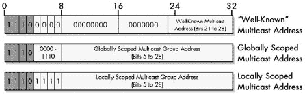

图 17-4。IP 多播地址范围和用途 所有多播地址以 1110 开头。知名组的多播组地址的前 20 位为零，有 8 位可用于定义 255 个特殊的多播地址。以 1110 1111 开头的多播地址是本地范围的；所有其他地址都是全局范围的（这包括以 1110 0000 开头但不是 255 个知名地址的地址）。

### 小贴士

**相关信息** *多播地址范围的概念在 IPv6 中得到了更完整的定义，我在第二十五章中对其进行了更详细的讨论*。

地址空间的大部分在中段多播范围内。这些是正常的多播地址，就像 A 类、B 类和 C 类单播地址一样，它们可以被分配给各种组。

最后的地址范围是用于*管理范围*的多播组。这是一个用于私人组织内部的多播组的术语。这个块代表了总多播地址空间的六分之一，与本章前面看到的私有地址相当。它进一步细分为站点本地多播地址、组织本地地址等。

## 知名多播地址

第一块 256 个地址用于定义特殊、知名的多播地址块（表 17-7 有选择性列表）。这些地址不代表任意设备组，也不能以这种方式分配。相反，它们具有特殊含义，允许源向预定义的组发送消息。

表 17-7。知名 IP 多播地址

| 范围起始地址 | 描述 |
| --- | --- |
| **224.0.0.0** | 保留；未使用 |
| **224.0.0.1** | 子网上的所有设备 |
| **224.0.0.2** | 子网上的所有路由器 |
| **224.0.0.3** | 保留 |
| **224.0.0.4** | 使用 DVMRP 的所有路由器 |
| **224.0.0.5** | 使用 OSPF 的所有路由器 |
| **224.0.0.6** | 使用 OSPF 指定的路由器 |
| **224.0.0.9** | 使用 RIP-2 指定的路由器 |
| **224.0.0.11** | 移动代理（用于移动 IP） |
| **224.0.0.12** | DHCP 服务器/中继代理 |

由于存在多个接收者，IP 多播流量的传输比单播流量更复杂。不是通过用于单播数据报的地址解析协议（ARP）的正常解析方法，而是将 IP 多播组和硬件多播组进行映射。

# 分类 IP 寻址的问题

分类寻址系统是第一个尝试定义大型 IP 互联网通用寻址方法的重大尝试。正如我在分类方案概述中提到的，该系统有一个合理的理论基础，并且鉴于它是几十年前为规模有限的网络开发的，它在长时间内出色地完成了任务。

没有人曾预料到互联网会发展到如今这样的规模。随着互联网的发展，分类的 IP 寻址机制出现了一些问题。

分类寻址的三个主要问题如下：

**内部地址灵活性不足** 大型组织被分配了大型、单一的地址块，这与它们底层内部网络的架构并不匹配。

**地址空间使用效率低下** 只存在三种块大小（A 类、B 类和 C 类）会导致有限的 IP 地址空间浪费。

**路由器表条目激增** 随着互联网的增长，路由器需要更多的条目来路由 IP 数据报。这导致路由器性能问题。试图减少低效的地址空间分配会导致更多的路由器表条目。

第一个问题主要源于分类系统中，大型公司被分配了相当大的（B 类）或真正巨大的（A 类）地址块。它们被互联网路由器视为一个单一的网络，具有一个网络 ID。现在想象一下，你正在经营一个中等至大型公司，拥有 5,000 台计算机，并且你的网络被分配了一个 B 类地址。你真的有 5,000 台计算机都连接到一个单一的网络中吗？我肯定希望你不是！然而，你将被迫在原始的分类方法中将所有这些设备都放入一个 IP 网络中。无法创建地址的内部层次结构。

第二个和第三个问题都源于这样一个事实，即类地址系统中的粒度太低，在大规模互联网中不实用；可用的网络大小选择太少。原则上，三种大小看起来是合适的，但大小之间的差距巨大，而且大小与现实世界中组织的分布不太匹配。考虑 C 类和 B 类网络之间的大小差异——从 254 个主机直接跳到超过 65,000 个！有许许多多的公司需要的 IP 地址数量超过 254 个，但远少于 65,000 个。那么 A 类呢？有多少公司需要 1600 万个 IP 地址，即使是真正的大型公司？如果你这么想，可能没有，但那占了 IP 地址空间的一半。

拥有 5000 台计算机的公司应该使用哪种网络类别？如图 17-5 所示，类地址方案无法满足这家公司的需求。如果它被分配了一个 B 类地址，那么超过 90%的 IP 地址将会被浪费。

浪费所有这些 IP 地址的替代方案是给这家虚构的公司分配一大堆 C 类地址而不是一个 B 类地址；但它们需要 20 个这样的地址。虽然这样做会使地址空间的使用效率更高，但它导致了第三个问题：互联网上的每个路由器都必须将单个 B 类路由表条目替换为 20 个 C 类路由表条目。将这个数字乘以几千家中等规模的公司，你就会发现这种方法会极大地增加路由表的大小。这些表越大，路由器做出路由决策所需的时间就越长。

图 17-5. 类地址的主要问题 在这个比例图中，每个方块代表 50 个可用的地址。由于 C 类地址只有 254 个地址，而 B 类包含 65,534 个地址，拥有 5000 个主机的组织处于中间位置。它只能选择浪费 B 类地址的 90%或者使用 20 个不同的 C 类网络。

类寻址的问题通过三个增强得到了解决，您将在后面的章节中看到。第一个，主要解决第一个问题，是子网划分的发展。第二个是转向无类寻址和路由，用具有更高粒度的新方法替换了类寻址系统。这通过根据实际组织需求分配地址来解决第二个和第三个问题，而不需要为每个组织创建大量的路由表条目。第三个改进是新的 IP 版本 6（IPv6），它最终摒弃了拥挤的 32 位 IP 地址空间，转而采用巨大的 128 位地址空间。

其他支持技术，如 NAT，通过允许多个设备共享公共地址，帮助延长了 IPv4 的生命周期。这本身就让 IPv4 寻址系统的寿命增加了数年。

# 第十八章. IP 子网寻址（子网划分）概念

在上一章中，我们探讨了原始的类 IP 寻址方案，从概念上讲，它将大型互联网划分为一个简单的两级层次结构，包括许多不同大小的*网络*，每个网络包含一定数量的*主机*。该系统对于可能将所有机器连接到单个网络的小型组织来说效果很好。然而，对于通常有许多子网络或*子网*的大型组织来说，它缺乏灵活性。为了更好地满足大型组织的行政和技术需求，通过称为*子网寻址*或更简单的*子网划分*的技术增强了类 IP 寻址系统。

在本章中，我描述了与 IP 子网寻址相关的概念和一般技术。我首先概述了子网划分，包括对该系统动机及其优点的讨论。我讨论了传统的两级 IP 地址划分方法如何变为三级子网划分。我谈论了子网掩码及其在寻址和路由计算中的应用。我讨论了在子网环境中用于表示类 A、B 和 C 网络的默认子网掩码，然后讨论了如何为这些类别使用自定义子网掩码。然后我讨论了子网标识符以及在子网环境中确定子网和主机地址的一般概念。我提供了子网划分 A 类、B 类和 C 类网络的总结表格。我最后简要讨论了*可变长度子网掩码（VLSM）*，这是对传统子网划分的增强，进一步提高了其灵活性。

### 注意

*我详细介绍了子网划分，因为理解它是了解 IP 地址如何工作以及 TCP/IP 如何工作的重要部分。然而，这项技术今天主要被认为是历史的，因为它基于类地址。子网和子网掩码的概念当然没有消失，但被分配一个 A 类、B 类或 C 类互联网地址块然后明确划分它的想法已经不再相关了*。

### 小贴士

**相关信息** *这是两章中关于 IP 地址子网划分的第一章。第十九章描述了使用示例的子网划分的逐步过程。如果你在阅读了这一概念部分后仍然不太理解子网划分，可以尝试阅读基于示例的部分，可能会发现这有助于使一切变得清晰。另一方面，如果你已经对子网划分有些了解，你可能发现可以跳过这一概念部分，直接进入逐步示例。你将在那一章中找到关于子网掩码、子网地址和主机地址计算的更多详细信息。将实际细节放在那里，使得这一部分可以专注于概念，而不至于过于陷入数字*。

### 小贴士

**背景信息** *理解子网划分需要熟悉二进制数及其操作方式。这包括使用布尔运算符，如* AND *来“屏蔽”二进制位。如果你读到最后一句话感到困惑，我强烈建议你在继续之前先复习一下计算数学的背景部分（第四章"))进行更改，以处理子网和子网掩码。

### 小贴士

**关键概念** 子网地址通过将组织的 IP 网络划分为子网，为 IP 地址的解释增加了另一个层次化级别。这使得每个组织都能将其地址空间结构化以匹配其内部物理网络，而不是被迫将它们视为平面块。这解决了原始类地址方案中的许多问题，但需要改变地址和路由的工作方式，以及修改几个 TCP/IP 协议。

虽然有趣，但与较旧的地址方案相比，子网划分的主要缺点更多地与理解子网划分的工作原理有关，而不是与这项技术本身有关。在子网环境中处理地址和路由需要更多的努力，管理员必须学习如何将他们的网络划分为子网，并正确分配地址。这对子网划分的新手来说可能有点令人困惑。然而，今天这项技术已经相当成熟，所以这并不是一个大问题。

# IP 子网划分：三级层次化 IP 子网地址

如我之前所述，子网划分在 IP 地址使用的结构层次中增加了一个额外的层次。为了支持这一点，IP 地址必须被分成三个元素而不是两个。这是通过保持网络 ID 不变，并将主机 ID 划分为子网 ID 和主机 ID 来实现的。这些子网 ID 位用于识别网络中的每个子网。主机以对网络最有意义的方式分配到子网中。

有趣的是，之前对电话号码的类比在子网划分的世界中仍然适用，并展示了子网划分如何改变对 IP 地址的解释方式。例如，像(401) 555-7777 这样的电话号码有一个区号(401)和一个本地号码(555-7777)。然而，本地号码本身可以分解为两部分：交换机(555)和本地分机(7777)。这意味着电话号码实际上由三个层次化的组件组成，就像子网划分中的 IP 地址一样。

当然，IP 地址中的位数是固定的，为 32 位。这意味着在将主机 ID 划分为子网 ID 和主机 ID 时，你减小了地址中主机 ID 部分的尺寸。本质上，你是在从主机 ID 中窃取位数来用于子网 ID。A 类网络有 24 位可以分配给子网 ID 和主机 ID；B 类网络有 16 位；C 类网络只有 8 位。

### 提示

**关键概念** 类地址通过将主机 ID 部分进行划分来进行子网划分，保留一些位用于主机 ID，而将其他位分配给新的子网 ID。这些位随后用于识别网络中的各个子网，主机被分配到这些子网中。

现在记住，当我们查看上一章中每个主要类的大小的时候，我们看到了对于每个类，网络的数量和每个网络的主机数是每个类使用的位数的函数。同样适用于主机 ID 的划分。由于我们处理的是二进制数，子网的数量是子网 ID 字段大小的 2 的幂。同样，每个子网的主机数是主机 ID 字段大小的 2 的幂（减去两个排除的特殊情况）。

让我们通过一个简短的例子来看看这是如何工作的。想象一下，你从一个 B 类网络 154.71.0.0 开始，网络 ID（154.71）有 16 位，主机 ID 也有 16 位。在常规的类地址中，没有子网，总共有 65,534 个主机。为了划分这个网络，你可以决定如何划分那 16 位，以最好地满足网络的需求：1 位用于子网 ID 和 15 位用于主机 ID，或者 2 和 14，3 和 13，等等。只要总数是 16，大多数任何组合都是可行的；我在图 18-1 中使用了 5 和 11。从主机 ID 中为子网 ID 窃取的位数越多，你可以拥有的子网就越多，但每个子网的主机数就越少。

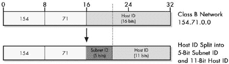

图 18-1. 子网划分 B 类网络 我们从 B 类网络 154.71.0.0 开始，该网络在其主机 ID 块中有 16 位。然后我们通过将主机 ID 划分为子网 ID 和主机 ID 来划分这个网络。在这种情况下，5 位被分配给了子网 ID，剩下 11 位用于主机 ID。

在设置子网 IP 网络时，如何将主机 ID 分割成子网位和主机位是设计时最重要的考虑因素之一。子网的数量通常基于整个组织网络中物理子网的数量来确定，并且每个子网中的主机数量不能超过你所选择的特定子网划分允许的最大值。如何将原始的主机 ID 位分割成子网 ID 位和主机 ID 位有时被称为*自定义子网划分*，本章后面将更详细地描述。

# IP 子网掩码、表示法和子网计算

子网划分将组织的网络划分为一个完全内部且对互联网上所有其他组织隐藏的两级结构：子网和主机。其许多优点之一是每个组织都可以根据自己的选择来划分类别的主机 ID 为子网 ID 和主机 ID。

在非子网划分的类环境，路由器使用 IP 地址的第一个八位字节来确定地址的类别，并据此知道哪些位是网络 ID，哪些位是主机 ID。当你使用子网划分时，这些路由器也需要知道如何将主机 ID 划分为子网 ID 和主机 ID。然而，这种划分对每个网络来说是任意的。此外，仅通过查看 IP 地址就无法判断属于每个类别的位数。

在子网划分环境中，关于哪些位是子网 ID 位和哪些位是主机 ID 位的信息必须传达给解释 IP 地址的设备。这些信息以一个 32 位的二进制数的形式给出，称为*子网掩码*。术语*掩码*来自二进制数学概念中的*位掩码*。这是一种技术，可以使用特殊的 1 和 0 的模式与布尔函数（如 AND 和 OR）结合使用，以选择或清除数字中的某些位。（我在关于二进制数和数学的背景部分中解释了位掩码，在第四章中。）

## 子网掩码的功能

子网掩码似乎让人感到不安，尤其是如果他们对二进制数不熟悉的话。然而，其背后的理念非常简单。掩码是一个 32 位的数字，就像 IP 地址也是一个 32 位的数字一样。子网掩码中的每一个 32 位对应于 IP 地址中相同位置的位。任何给定子网中掩码的位被选择，使得用于网络 ID 或子网 ID 的位是 1，而用于主机 ID 的位是 0。

### 小贴士

**关键概念** 子网掩码是一个 32 位二进制数，与 IP 地址一起使用。它是这样创建的，即对于 IP 地址中属于其网络 ID 或子网 ID 的每个对应位都有一个 1 位，而对于 IP 地址的主机 ID 的每个位都有一个 0 位。因此，掩码告诉 TCP/IP 设备哪些位属于网络 ID 和子网 ID，哪些位是主机 ID 的一部分。

为什么要用 32 位二进制数来做这件事呢？答案是布尔逻辑的魔力。你通过将布尔 AND 函数应用于子网掩码和 IP 地址来使用子网掩码。对于 IP 地址和子网掩码中的每个 32 个“位对”，你使用 AND 函数，其输出只有当两个位都是 1 时才为 1。这在实际意义上的含义如下，对于每个 32 位：

**子网位为 1** 在这种情况下，你正在将 IP 地址中的 0 或 1 与 1 进行 AND 操作。如果 IP 地址位是 0，AND 操作的结果将是 0；如果是 1，AND 操作将是 1。换句话说，*当子网位为 1 时，IP 地址保持不变*。

**子网位为 0** 在这种情况下，你正在与 0 进行 AND 操作，所以结果总是 0，无论 IP 地址是什么。因此，*当子网位为 0 时，IP 地址位总是被清除为零*。

因此，当你在 IP 地址上使用子网掩码时，网络 ID 和子网 ID 中的位保持不变，而主机 ID 位被移除。就像一个只遮挡你面部一部分但让其他部分露出的面具一样，子网掩码遮挡了地址的一部分位（主机位），而其他位保持不变（网络和子网位）。执行此功能的路由器将保留子网的地址。由于它知道从网络类别中哪个部分是网络 ID，它也知道地址位于哪个子网。

### 小贴士

**关键概念** 要使用子网掩码，设备会在子网掩码的每一位与 IP 地址的对应位之间执行布尔 AND 操作。结果 32 位数字仅包含地址的网络 ID 和子网 ID，主机 ID 被清除为零。

## 子网掩码表示法

就像 IP 地址一样，子网掩码在计算机中总是以 32 位二进制数的形式使用。并且，就像 IP 地址一样，将它们作为 32 位二进制数使用对人类来说很困难。因此，它们通常被转换为点分十进制表示法以便于使用，就像 IP 地址一样。

例如，假设你决定使用 5 位作为子网 ID 和 11 位作为主机 ID 来子网化 B 类网络 154.71.0.0（参见图 18-2）。在这种情况下，子网掩码将有 16 个 1 用于网络部分（因为这是 B 类），然后是 5 个 1 用于子网 ID，接着是 11 个 0 用于主机 ID。这在二进制中表示为 11111111 11111111 **11111**000 00000000，其中对应子网 ID 的位被突出显示。在点分十进制中，子网掩码将是 255.255.248.0。

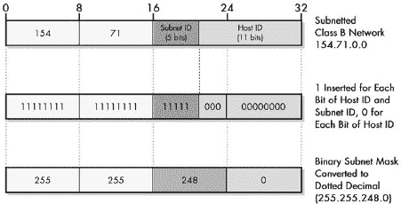 在此图中，显示的是从顶部开始的 B 类网络，其中 5 位分配给了子网 ID，剩下 11 位用于主机 ID。要创建子网掩码，你需要将一个 32 位的数字填充为每个网络 ID 和子网 ID 位为 1，每个主机 ID 位为 0。然后你可以将其转换为点分十进制。

图 18-2. 确定子网化网络的子网掩码。图 18-1 中的 B 类网络从顶部开始，分配了 5 位给子网 ID，剩下 11 位用于主机 ID。要创建子网掩码，你需要将一个 32 位的数字填充为每个网络 ID 和子网 ID 位为 1，每个主机 ID 位为 0。然后你可以将其转换为点分十进制。

## 应用子网掩码：示例

现在，让我们看看子网掩码可能如何被使用。假设你在这个网络上有主机，其 IP 地址为 154.71.150.42，而路由器需要确定这个地址所在的子网。为此，它执行了表 18-1 和图 18-3 中显示的掩码操作。

表 18-1. 通过子网掩码确定 IP 地址的子网 ID

| 组件 | 八位字节 1 | 八位字节 2 | 八位字节 3 | 八位字节 4 |
| --- | --- | --- | --- | --- |
| **IP 地址** | 10011010 (154) | 01000111 (71) | 10010110 (150) | 00101010 (42) |
| **子网掩码** | 11111111 (255) | 11111111 (255) | **11111**000 (248) | 00000000 (0) |
| **AND 掩码结果** | 10011010 (154) | 01000111(71) | **10010**000 (144) | 00000000 (0) |

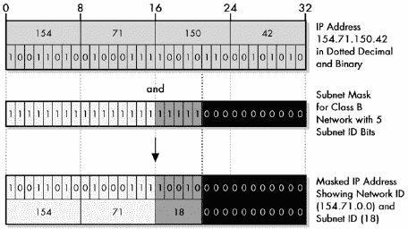

图 18-3. 通过子网掩码确定 IP 地址的子网 ID 子网掩码涉及在子网掩码和 IP 地址的每个对应位之间执行布尔 AND 操作。子网掩码可以比作物理掩码；其中的每个 1 都允许 IP 地址的对应位显示出来，而每个 0 则阻止 IP 地址的对应位。这样，地址的主机 ID 位就被剥离，以便设备可以确定地址所属的子网。

这个结果，154.71.144.0，是 154.71.150.42 所属子网的 IP 地址。由于你仍在使用类别地址，因此没有必要明确区分网络 ID 位和子网 ID 位。任何路由器都可以看到，由于地址的前两位是 10，这是一个 B 类地址。因此，网络 ID 是 16 位，这意味着子网 ID 必须是从左边数起的第 17 到 21 位。在这里，子网是之前突出显示的部分：10010，或子网 18。（我将在本章后面的“IP 自定义子网掩码”部分更好地解释这一点。）

### 小贴士

**关键概念** 子网掩码通常以点分十进制表示法表示，以便于使用，但计算机将其用作二进制数，通常必须以二进制形式表示，以便理解掩码的工作原理以及它所代表的子网 ID 位数。

## 子网掩码表示法的理由

从实际的角度来看，子网掩码实际上只传达一条信息：子网 ID 和主机 ID 之间的界限。那么为什么还要费心使用一个大的 32 位二进制数，而不是只指定发生分割的位数呢？为什么不在 21 位之后直接分割 IP 地址？即使设备想要执行掩码操作，它们不能按需创建掩码吗？

这是一个非常好的问题。有两个历史原因：效率考虑和对非连续掩码的支持。子网掩码表达式是高效的，因为它允许路由器快速执行掩码操作以确定子网地址。（考虑到今天机器的速度，这实际上并不是一个问题。）

当将主机 ID 中的位分割为子网 ID 和主机 ID 时，RFC 950 指定它们可以在多个地方分割。在先前的例子中，你不仅可以把 16 位分割成 5 位作为子网 ID 和 11 位作为主机 ID，还可以将其分割为 2 位作为子网 ID，然后 4 位作为主机 ID，接着再分割 3 位作为子网 ID，最后再分割 7 位作为主机 ID。对于这 16 位，子网掩码模式将是 11000011 10000000（紧随网络 ID 的 16 个 1 之后）。当然，以这种方式进行子网划分会使得分配地址变得极其混乱。因此，虽然技术上合法，但非连续子网掩码不被推荐，并且在实践中也不这样做。

由于非连续掩码不再使用，并且今天的计算机速度更快，现在经常使用仅用一个数字来表示掩码的替代方法。与其写“IP 地址为 154.71.150.42，子网掩码为 255.255.248.0”，你只需简单地写“154.71.150.42**/21**”。这有时被称为*斜线表示法*或*无类别域间路由（CIDR）表示法*。虽然这在可变长度子网掩码（VLSM）环境中更为常见，并且在 CIDR 地址方案下指定无类别地址是标准（见第二十章 总结了每个类别的默认子网掩码。它们也以图形方式显示在图 18-4 中。

表 18-2. Class A、Class B 和 Class C 网络的默认子网掩码

| IP 地址类别 | 网络 ID/主机 ID 的总位数 | 默认子网掩码 |
| --- | --- | --- |
|   |   | 第一字节 | 第二字节 | 第三字节 | 第四字节 |
| --- | --- | --- | --- | --- | --- |
| Class A | **8/24** | 11111111 (255) | 00000000 (0) | 00000000 (0) | 00000000 (0) |
| Class B | **16/16** | 11111111 (255) | 11111111 (255) | 00000000 (0) | 00000000 (0) |
| Class C | **24/8** | 11111111 (255) | 11111111 (255) | 11111111 (255) | 00000000 (0) |

图 18-4. Class A、Class B 和 Class C 网络的默认子网掩码

因此，三个默认子网掩码分别是 Class A 的 255.0.0.0，Class B 的 255.255.0.0，以及 Class C 的 255.255.255.0。

虽然所有默认子网掩码都只使用 255 和 0，但并非所有包含 255 和 0 的子网掩码都是默认的。还有一些自定义子网在八位边界上划分，如下所示：

**255.255.0.0** 这是 Class B 的默认掩码，但也可以是使用 8 位子网 ID（为主机 ID 留下 16 位）来划分 Class A 网络的自定义子网掩码。

**255.255.255.0** 这是 Class C 的默认子网掩码，但可以是具有 16 位子网 ID 的自定义 Class A 或具有 8 位子网 ID 的 Class B。

### 提示

**关键概念** 每个三个 IP 单播和广播地址类别，A、B 和 C，都有一个 *默认子网掩码* 定义，该掩码在每个类别的网络 ID 的位上有一个 1，在其主机 ID 的位上有一个 0，并且没有子网 ID 位。三个默认子网掩码分别是 Class A 的 255.0.0.0，Class B 的 255.255.0.0，以及 Class C 的 255.255.255.0。

# IP 自定义子网掩码

默认子网掩码实际上并不代表子网划分，因为您正在将零位分配给子网 ID。要进行真正的子网划分，您必须将 presubnetted 主机 ID 的至少一位位分配给子网 ID。

由于你可以选择子网 ID 和主机 ID 之间的分隔点以适应网络，这有时被称为*定制子网划分*。在创建定制子网时使用的子网掩码，反过来，被称为*定制子网掩码*。定制子网掩码由网络硬件用于确定如何在网络中将子网 ID 从主机 ID 中划分。

## 决定使用多少子网位

定制子网划分中的关键决策是从 IP 地址的主机 ID 部分取出多少位放入子网 ID。你会记得，网络中可能的子网数量是用于表示子网 ID 的位的数量的 2 的幂，每个子网可能的主机数量是主机 ID 中剩余位的 2 的幂（减去两个，如我在本节后面解释的那样）。

因此，决定为每个子网 ID 和主机 ID 使用多少位代表了子网寻址中的一个基本权衡：

+   从主机 ID 中取出的每个位用于子网 ID，都会使网络中可能的子网数量加倍。

+   从主机 ID 中取出的每个位用于子网 ID（大约）将网络中每个子网内可能的主机数量减半。

例如，假设你从一个 B 类网络开始，网络地址为 154.71.0.0。由于这是 B 类，16 位用于网络 ID（154.71）和 16 位用于主机 ID。在默认情况下，没有子网，总共有 65,534 个主机。要划分这个网络，你可以使用以下方法：

+   子网 ID 使用 1 位，主机 ID 使用 15 位。如果你这样做，子网总数将是 2¹，即 2。第一个子网是 0，第二个是 1。每个子网可用的主机数量是 2¹⁵–2，即 32,766。

+   子网 ID 使用 2 位，主机 ID 使用 14 位。在这种情况下，子网数量加倍。现在你有 2²，即 4 个子网：00、01、10 和 11（子网 0、1、2 和 3）。但主机数量现在只有 2¹⁴–2，即 16,382。

+   任何位组合，只要总和为 16，并且每个子网至少有 2 个主机：4 和 12，5 和 11 等等。

你决定如何将类 C 主机 ID 划分为子网 ID 和主机 ID 位是子网划分中的关键设计决策。你的选择基于网络中的子网数量，以及网络中每个子网需要分配的最大主机数量。例如，如果你有 10 个总子网用于你的 B 类网络，你需要 4 位来表示这一点，因为 2⁴是 16，而 2³只是 8。这留下了 12 位用于主机 ID，每个子网最多有 4,094 个主机。

然而，假设你有 20 个子网。如果是这样，子网 ID 的 4 位将不足以使用；你需要 5 位（2⁵=32）。这意味着你现在只有 11 位用于主机 ID，每个子网最多有 2,046 个主机。（第十九章中的实际子网划分示例的第二步详细讨论了这些决策。）

现在你有 20 个子网，并且每个子网最多需要 3,000 个主机，你遇到了问题。你需要 5 位来表示 20 个不同的子网，但你需要 12 位来表示主机的 ID 号。这是 17 位——太多了。解决方案是什么？你可能能够重新排列你的物理网络，使得你只有 16 个。如果不能，你需要第二个 B 类网络。

### 小贴士

**关键概念** 子网划分的基本权衡是，每个子网 ID 位（因此，从主机 ID 中减去该位）的增加都会使子网数量翻倍，并且大约将每个子网中的主机数量减半。从子网 ID 中减去位（并将该位加到主机 ID 上）会做相反的事情。

## 确定自定义子网掩码

一旦你确定了分配给子网和主机 ID 的位数，你就可以确定子网掩码。你从网络适当类别的默认子网掩码的二进制形式开始。你从该掩码中最左边的零开始，将你分配给子网 ID 的位数改为一，此时你可以用点分十进制形式表示子网掩码。图 18-5 显示了如何为 Class C 网络的每个子网划分选项确定自定义子网掩码，既以二进制形式又以十进制形式。

考虑图 18-5 中的 Class C 网络 200.13.94.0。原始主机 ID 中有 8 位，这为你提供了六种不同的子网划分选项（你无法使用七位或八位作为子网 ID，原因我将在稍后讨论）。假设你使用其中的三位作为子网 ID，剩下五位作为主机 ID。为了确定自定义子网掩码，你从 Class C 默认子网掩码开始：

| 11111111 11111111 11111111 00000000 |
| --- |
| 然后你将前三个零改为一，以获得自定义子网掩码： |
| 11111111 11111111 11111111 **111**00000 |
| 以点分十进制格式，这表示为 255.255.255.224. |

### 注意

*一旦你选择了子网划分的方法，你就可以通过从网络的默认子网掩码开始，将每个子网 ID 位从零改为一来确定自定义子网掩码*。

### 注意

*在常规子网划分中，用于子网 ID 的位数在整个网络中是固定的。你不能有不同大小的子网——它们必须相同。因此，最大子网中的主机数将决定你需要多少位用于主机 ID。这意味着在先前的例子中，如果你有一个奇怪的配置，其中 19 个子网每个只有 100 个主机，但第 20 个子网有 3,000 个，你将遇到问题。如果这种情况发生，你可以通过将那个超大的子网分成两个或更多较小的子网来轻松解决这个问题。子网划分的一个增强功能，称为可变长度子网掩码（VLSM），在很大程度上是为了消除这一限制。VLSM 将在本章后面进行描述*。

图 18-5. C 类网络的自定义子网掩码 由于 C 类网络地址中有主机 ID 位，因此网络可以有六种不同的子网划分方式。每种方式对应一个不同的自定义子网掩码，这是通过将分配的子网 ID 位从零改为一来创建的。

## 从每个子网的主机数中减去两个，以及（可能）从每个网络中的子网数中减去两个

你已经看到了在常规的类地址中，你必须从每个网络允许的主机数中减去两个。这是必要的，因为每个子网中有两个主机 ID 有特殊含义：全零的主机 ID（表示“此网络”）和全一的主机 ID（表示向网络上的所有主机广播）。这些限制也适用于子网划分下的每个子网，这就是为什么你必须继续从每个子网的主机数中减去两个的原因。（这也是为什么将 C 类网络的八个主机 ID 位分为七个用于子网 ID 和一个用于主机 ID 是没有意义的：它留下了 2¹–2 = 0 个主机每个子网，这并不特别有用。）

子网 ID 也存在类似的问题。当最初在 RFC 950 中定义子网划分时，标准明确排除了使用全零和全一的子网。这是由于担心路由器可能会被这些情况弄混淆。后来的标准 RFC 1812，“IP 版本 4 路由器的要求”，在 1995 年移除了这一限制。因此，现代硬件现在对全零或全一的子网没有问题，但一些非常旧的硬件可能仍然会对此表示抗拒。

### 提示

**关键概念** 每个子网允许的主机数是子网划分后剩余的主机 ID 位数的二进制幂减去二。减去两个是因为每个子网内的全零和全一主机 ID 被保留用于两个特殊意义地址：指代子网本身和指代其本地广播地址。在某些实现中，子网的数量也减少了两个，因为最初不允许使用全零和全一的子网 ID。

因此，有时你会看到排除这些情况的子网划分讨论。当这样做时，你会失去两个潜在的子网：全零和全一的子网。如果你这样做，那么选择一个位作为子网 ID 就不再有效，因为它会产生 2¹–2=0 个子网。如果你需要两个子网，你必须选择两个位。

### 注意

*在这本书中，我假设你正在处理现代硬件，不排除全零和全一的子网，但我确实会在相关的地方明确指出这一点。本章后面的总结表格显示了 A、B 和 C 类每个子网划分的权衡，以及每个选择的子网掩码*。

# IP 子网标识符、子网地址和主机地址

与子网相比，传统的不使用子网的类属地址的主要优势是简单性。例如，尽管在单个 B 类网络中管理数千个设备可能会有问题，但在网络内分配地址是简单的：它们都被合并在一起，所以可以在主机 ID 中使用任何位组合（除了全零和全一）。

当你进行子网划分时，然而，你会在类属主机 ID 内部创建一个两级结构：子网 ID 和主机 ID。这意味着你必须更仔细地选择设备的 IP 地址。从理论上讲，你正在选择子网以对应组织内的物理网络，因此你希望以与物理网络结构一致的方式分配 IP 地址。

## 子网标识符

一旦你决定将有多少个子网，你需要识别子网并确定它们的地址。你从*子网标识符*开始，即我们网络中任何子网的*子网 ID*。子网从零开始编号，增加到小于最大子网数，这是子网 ID 中位数数的函数。（如果排除全零和全一的子网 ID，如 RFC 950 中指定，则第一个子网 ID 为 1。）

当然，你可能不需要定义的所有子网。例如，如果你有 20 个子网，你需要五个位作为子网标识符，这允许理论上的最大 32 个子网。你将只使用子网 0 到 19；20 到 31 将被保留供将来使用。这些子网可以用十进制形式（0，1，2……直到 19）或二进制形式（00000，00001，00010，等等，直到 10011）表示。

## 子网地址

对于每个子网，你也可以确定其**子网地址**。为此，你需要从整个网络的 IP 地址开始，该地址在类别的主机 ID 字段中所有位都是零（8 位、16 位或 24 位）。然后，你将特定子网的子网 ID 插入指定的子网位中。

例如，要子网化图 18-2 中显示的 154.71.0.0 的 B 类网络，其中你使用五个子网 ID 位，你从以下带有高亮显示的子网 ID 位的网络 IP 地址开始：

| 10011010 01000111 **00000**000 00000000 |
| --- |

要找到例如子网 11 的地址，你需要将这些位替换为 01011，保留主机 ID 位为零，如下所示：

| 10011010 01000111 **01011**000 00000000 |
| --- |

然后，你可以将其从二进制形式转换为点分十进制，得到子网地址为 154.71.**88**.0。

### 小贴士

**关键概念** 子网的**标识符**就是其子网 ID。子网的子网地址是通过将子网 ID 替换到整个网络地址的子网位中确定的。

当你查看子网寻址时，尤其是在按顺序替换子网 ID 时，一个模式会立即变得明显。第一个子网地址总是整个网络的地址，因为子网 ID 全部为零。然后，通过向一个八位字节添加一个特定的二倍数来找到十进制形式的第二个子网地址。然后，通过将这个相同的数字添加到第二个地址来找到第三个地址，依此类推。

事实上，每个子网地址的十进制值可以表示为一个公式，基于原始网络的类别和用于子网 ID 的位数。例如，考虑一个具有整体地址 x.y.0.0 的 B 类网络（对于这些目的，x 和 y 是什么并不重要）。现在假设你使用两个位作为子网 ID。这里有四个子网地址：

+   子网 0 的地址将与网络地址相同：x.y.0.0。

+   子网 1 的地址是通过将 01 替换为第三个八位字节的前两位来找到的。这产生了一个地址为 x.y.01000000.0000000，或者说是 x.y.64.0 的纯十进制形式。

+   子网 2 的地址是通过将 10 替换为子网 ID 位来找到的，因此它是 x.y.10000000.0000000，或者说是 x.y.128.0 的纯十进制形式。

+   子网 3 的地址将是 x.y.192.0。

因此，在这种情况下，子网*N*的公式是 x.y.*N*^*64.0\. 如果您为子网使用五个比特，公式是 x.y.*N*^*8.0\. 正如您之前看到的，网络 154.71.0.0 中子网 11 的子网地址是 154.71.**88**.0\. 我已经在子网划分总结表中（表 Table 18-3，Table 18-4，和 Table 18-5）展示了所有子网 ID 和主机 ID 大小组合的公式。一旦您对子网划分更加熟悉，这些公式可以真正节省时间。

## 每个子网内的主机地址

一旦您知道了特定子网的子网地址，您就可以通过将值插入剩余的主机 ID 比特中来分配 IP 地址。您跳过全零值，因此子网中的第一个主机的主机 ID 除了最右边的比特位置为 1 之外都是零。然后下一个主机除了末尾的"10"（十进制中的 2）之外都是零。您可以一直做到全一的值之前的一个值。同样，然后您将每个 IP 地址从二进制转换为十进制。

### 注意

*您可以在第十九章实际子网划分的覆盖中找到这些详细信息*。

# A 类、B 类和 C 类网络的 IP 子网划分总结表

由于 A 类、B 类和 C 类网络的子网划分选项有限，我在总结表 Table 18-3 到 Table 18-5 中列出了每个类别的选项。这些表格可以帮助您快速决定子网 ID 和主机 ID 应使用多少比特，以及选择它们的子网掩码是什么。它们还很好地总结了本章到目前为止我所讨论的内容。

每个表格的每一行显示了该类的一个可能的子网划分选项，包括子网 ID 和主机 ID 的比特数，以及基于比特数的子网和主机数量。然后我展示了子网掩码的二进制和十进制形式，以及 CIDR 表示法（在第二十章无类别 IP 地址——无类别域间路由（CIDR）/超网中介绍）。最后，我包括了每个选项下计算每个子网地址的公式。

关于这些表格，有一些额外的解释性说明是必要的：

+   每个网络中子网数目的值假设允许全零和全一子网。如果不允许，则必须从这些数字中减去两个。这也意味着仅使用一个比特位用于子网 ID 的选项变得无效，子网地址公式也不再按所示工作。

+   每个子网的主机数不包括全零和全一的情况，因此是主机 ID 比特数的 2 的幂次，减去 2。

+   每个表格的第一行显示了默认情况，其中子网位数为零，因此子网掩码是类默认子网掩码。

+   在所有选项的子网掩码中，除了默认选项外，我都突出了对应于子网 ID 的子网掩码部分，以增强清晰度。这已经针对二进制掩码的每个单独比特位以及掩码的点分十进制表示中的每个八位字节（其中包含子网 ID 的一部分）进行了操作。

+   在查看这些表格时，你会发现并非所有的划分在现实世界中都有很大的意义，尽管你可能感到惊讶。例如，乍一看，认为你可能想要将类 B 主机 ID 的 14 位分配给子网 ID，并留下 2 位用于主机 ID 似乎很荒谬——什么样的真实网络会有 16,384 个子网，每个子网有两个主机？然而，一些大型互联网服务公司确实在设置路由器之间的连接或其核心网络与客户之间的连接时可能需要成千上万的微小子网。

+   每个表格最后一列的子网地址公式显示了子网*N*（从零开始编号，到最大子网数减一）的地址。请参阅逐步子网划分讨论的步骤 4 的结尾（第十九章** | **24** | 1 | 16,277,214 | 11111111.00000000.00000000.00000000255.0.0.0 | /8 | — |
| **1** | **23** | 2 | 8,388,606 | 11111111.**1**0000000.00000000.00000000255.**128**.0.0 | /9 | x.N*128.0.0 |
| **2** | **22** | 4 | 4,194,302 | 11111111.**111**000000.00000000.00000000255.**192**.0.0 | /10 | x.N*64.0.0 |
| **3** | **21** | 8 | 2,097,150 | 11111111.**111**00000.00000000.00000000255.**224**.0.0 | /11 | x.N*32.0.0 |
| **4** | **20** | 16 | 1,048,574 | 11111111.**1111**0000.00000000.00000000255.**240**.0.0 | /12 | x.N*16.0.0 |
| **5** | **19** | 32 | 524,286 | 11111111.**11111**000.00000000.00000000255.**248**.0.0 | /13 | x.N*8.0.0 |
| **6** | **18** | 64 | 262,142 | 11111111.**111111**00.00000000.00000000255.**252**.0.0 | /14 | x.N*4.0.0 |
| **7** | **17** | 128 | 131,070 | 11111111.1111111**0.00000000.00000000255.**254**.0.0 | /15 | x.N*2.0.0 |
| **8** | **16** | 256 | 65,534 | 11111111.11111111.00000000.00000000255.**255**.0.0 | /16 | x.N.0.0 |
| **9** | **15** | 512 | 32,766 | 11111111.11111111.10000000.00000000255.**255.128**.0 | /17 | x.N/2.(N%2)*128.0 |
| **10** | **14** | 1,024 | 16,382 | 11111111.11111111.11000000.00000000255.**255.192**.0 | /18 | x.N/4.(N%4)*64.0 |
| **11** | **13** | 2,048 | 8,190 | 11111111.11111111.11100000.00000000255.**255.224**.0 | /19 | x.N/8.(N%8)*32.0 |
| **12** | **12** | 4,096 | 4,094 | 11111111.11111111.**1111**0000.00000000255.**255.240**.0 | /20 | x.N/16.(N%16)*16.0 |
| **13** | **11** | 8,192 | 2,046 | 11111111.11111111.**11111**000.00000000255.**255.248**.0 | /21 | x.N/32.(N%32)*8.0 |
| **14** | **10** | 16,384 | 1,022 | 11111111.11111111.**111111**00.00000000255.**255.252**.0 | /22 | x.N/64.(N%64)*4.0 |
| **15** | **9** | 32,768 | 510 | 11111111.11111111.**1111111**0.00000000255.**255.254**.0 | /23 | x.N/128.(N%128)*2.0 |
| **16** | **8** | 65,536 | 254 | 11111111.11111111.**11111111**.00000000255.**255.255**.0 | /24 | x.N/256.N%256.0 |
| **17** | **7** | 131,072 | 126 | 11111111.11111111.**11111111**.**1**0000000255.**255.255.128** | /25 | x.N/512.(N/2)%256.(N%2)*128 |
| **18** | **6** | 262,144 | 62 | 11111111.11111111.11111111.**11**000000255.**255.255.192** | /26 | x.N/1024.(N/4)%256.(N%4)*64 |
| **19** | **5** | 524,288 | 30 | 11111111.11111111.**11111111**.**111**00000255.**255.255.224** | /27 | x.N/2048.(N/8)%256.(N%8)*32 |
| **20** | **4** | 1,048,576 | 14 | 11111111.11111111.**11111111**.**1111**0000255.**255.255.240** | /28 | x.N/4096.(N/16)%256.(N%16)*16 |
| **21** | **3** | 2,097,152 | 6 | 11111111.11111111.**11111111**.**11111**000255.**255.255.248** | /29 | x.N/8192.(N/32)%256.(N%32)*8 |
| **22** | **2** | 4,194,304 | 2 | 11111111.11111111.**11111111**.**111111**00255.**255.255.252** | /30 | x.N/16384.(N/64)%256.(N%64)*4 |

Table 18-4. 子网划分汇总表，适用于 B 类网络

| 子网 ID 位数 | 主机 ID 位数 | 每个网络中的子网数量 | 每个子网中的主机数量 | 子网掩码（二进制/点分十进制） | 子网掩码（斜杠/ CIDR 表示法） | 子网地址#N 公式（N=0, 1, 子网数量-1） |
| --- | --- | --- | --- | --- | --- | --- |
| 0 (默认) | 16 | 1 | 65,534 | 11111111.11111111.00000000.00000000255.255.0.0 | /16 | - |
| 1 | 15 | 2 | 32,766 | 11111111.11111111.10000000.00000000255.255.**128**.0 | /17 | x.y.N*128.0 |
| 2 | 14 | 4 | 16,382 | 11111111.11111111.**11**000000.00000000255.255.**192**.0 | /18 | x.y.N*64.0 |
| 3 | 13 | 8 | 8,190 | 11111111.11111111.**111**00000.00000000255.255.**224**.0 | /19 | x.y.N*32.0 |
| 4 | 12 | 16 | 4,094 | 11111111.11111111.**1111**0000.00000000255.255.**240**.0 | /20 | x.y.N*16.0 |
| 5 | 11 | 32 | 2,046 | 11111111.11111111.**11111**000.00000000255.255.**248**.0 | /21 | x.y.N*8.0 |
| 6 | 10 | 64 | 1,022 | 11111111.11111111.**111111**00.00000000255.255.**252**.0 | /22 | x.y.N*4.0 |
| 7 | 9 | 128 | 510 | 11111111.11111111.**1111111**0.00000000255.255.**254**.0 | /23 | x.y.N*2.0 |
| 8 | 8 | 256 | 254 | 11111111.11111111.**11111111**.00000000255.255.**255**.0 | /24 | x.y.N.0 |
| 9 | 7 | 512 | 126 | 11111111.11111111.**11111111**.**1**0000000255.255.**255.128** | /25 | x.y.N/2.(N%2)*128 |
| 10 | 6 | 1,024 | 62 | 11111111.11111111.**11111111**.**11**000000255.255.**255.192** | /26 | x.y.N/4.(N%4)*64 |
| 11 | 5 | 2,048 | 30 | 11111111.11111111.**11111111**.**111**00000255.255.**255.224** | /27 | x.x.N/8.(N%8)*32 |
| 12 | 4 | 4,096 | 14 | 11111111.11111111.**11111111.1111**0000255.255.**255.240** | /28 | x.y.N/16.(N%16)*16 |
| 13 | 3 | 8,192 | 6 | 11111111.11111111.**11111111.11111**000255.255.**255.248** | /29 | x.y.N/32.(N%32)*8 |
| 14 | 2 | 16,384 | 2 | 11111111.11111111.**11111111.111111**00255.255.**255.252** | /30 | x.y.N/64.(N%64)*4 |

表 18-5. C 类网络的子网划分汇总表

| 子网 ID 位数 | 主机 ID 位数 | 每个网络中的子网数 | 每个子网中的主机数 | 子网掩码（二进制/点分十进制） | 子网掩码（斜杠/ CIDR 表示法） | 子网地址#N 公式（N=0, 1, 子网数-1） |
| --- | --- | --- | --- | --- | --- | --- |
| 0 (默认) | 8 | 1 | 254 | 11111111.11111111.11111111.00000000255.255.255.0 | /24 | — |
| 1 | 7 | 2 | 126 | 11111111.11111111.11111111.**1**0000000255.255.255.**128** | /25 | x.y.z.N*128 |
| 2 | 6 | 4 | 62 | 11111111.11111111 .11111111.**11**000000255.255.255.**192** | /26 | x.y.z.N*64 |
| 3 | 5 | 8 | 30 | 11111111.11111111.11111111.**111**00000255.255.255.**224** | /27 | x.y.z.N*32 |
| 4 | 4 | 16 | 14 | 11111111.11111111.11111111.**11110**000255.255.255.**240** | /28 | x.y.z.N*16 |
| 5 | 3 | 32 | 6 | 11111111.11111111.11111111.**11111**000255.255.255.**248** | /29 | x.y.z.N*8 |
| 6 | 2 | 64 | 2 | 11111111.11111111.11111111.**111111**00255.255.255.**252** | /30 | x.y.z.N*4 |

# IP 可变长度子网掩码（VLSM）

传统子网划分的主要弱点在于子网 ID 仅代表 IP 地址解释和使用路由中的**一个**额外的层次级别。

看起来贪婪地看待子网划分并说，“什么，只有**一个**额外的级别？”然而，在大型网络中，将整个网络仅划分为一个级别的子网并不代表 IP 地址块的最佳使用。

此外，您已经看到，由于子网 ID 在整个网络中长度相同，如果您有子网数量差异很大的子网，可能会出现问题。子网 ID 必须根据具有最大主机数的子网来选择，即使大多数子网的主机数要少得多。即使在小型网络中，这也可能是不高效的，并且可能导致需要使用额外的地址块，同时浪费每个块中的许多地址。

例如，考虑一个相对较小的公司，拥有一个 C 类网络，201.45.222.0/24。管理员在其网络中有六个子网。前四个子网（S1、S2、S3 和 S4）相对较小，每个子网只包含 10 个主机。然而，其中一个（S5）是为他们的生产线而设，有 50 个主机，最后一个（S6）是他们的开发和工程团队，有 100 个主机。因此，所需的总主机数为 196。

在没有子网划分的情况下，公司在其 C 类网络中有足够的主机来处理它们。然而，当他们尝试进行子网划分时，他们会遇到一个大问题。为了拥有六个子网，他们需要使用三个位来表示子网 ID。这仅留下五个位用于主机 ID，这意味着每个子网都有相同的容量，即 30 个主机，如图 18-6 所示。这对于较小的子网来说是足够的，但对于较大的子网来说则不够。除了重新排列物理子网之外，使用传统子网划分的唯一解决方案是为两个大子网获取另一个 C 类地址块，并使用原始的地址块来处理四个小子网。但这很昂贵，意味着浪费了数百个 IP 地址！

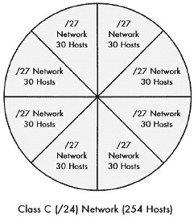

图 18-6。C 类（/24）网络划分为八个传统子网。使用传统子网划分，所有子网必须具有相同的大小，当某些子网的大小远大于其他子网时，这会引发问题。与此相对比图 18-7。

## 解决方案：可变长度子网掩码

解决方案是对基本子网寻址方案的一种增强，称为*可变长度子网掩码（VLSM）*。其理念是，你首先对网络进行子网划分，然后对子网进行子网划分，就像你最初对网络进行子网划分一样。实际上，你可以多次这样做，创建子网中的子网网段，次数取决于你的地址块中主机 ID 的位数。

可以选择将这种多级分割仅应用于某些子网，从而允许您有选择地切割 IP 地址块，使得一些块比其他块大。这意味着在先前的例子中，公司可以创建六个子网来满足其网络的需求，如图图 18-7 网络进行分割。使用 VLSM，一个组织可以多次将其 IP 网络分割成与其实际网络大小要求更匹配的子网。与图 18-6 进行比较。")所示。

图 18-7. 使用 VLSM 对 C 类(/24)网络进行分割。使用 VLSM，一个组织可以多次将其 IP 网络分割成与其实际网络大小要求更匹配的子网。与图 18-6 网络分割成八个传统子网。在传统子网划分中，所有子网必须具有相同的大小，当某些子网比其他子网大得多时，这会引发问题。与图 18-7 进行比较。")。

### 小贴士

**关键概念** *可变长度子网掩码（VLSM）* 是一种技术，通过迭代多次进行子网划分，允许网络被划分为大小不同的子网层次结构。这使得组织能够更好地匹配其子网的大小以满足其网络的需求。

## 使用 VLSM 进行多级子网划分

VLSM 子网划分与常规子网划分的方式相同；它只是涉及额外的子网划分层次级别。要实现它，您首先将网络划分为大型子网，然后根据需要进一步分解一个或多个子网。您为每个次子网和次次子网添加位到子网掩码，以反映它们较小的尺寸。

在 VLSM 中，通常使用无类别地址的斜线表示法而不是二进制子网掩码（它的工作方式非常类似于 CIDR），因此我将使用这种方法。

### 注意

*如果您对子网划分的工作方式感到有些不舒服，在继续进行下面的 VLSM 示例之前，请考虑阅读关于实际子网划分的章节(第十九章)*。

例如，考虑 C 类网络，201.45.222.0/24。您按照以下方式执行三次子网划分（参见图 18-8 以展示过程）。

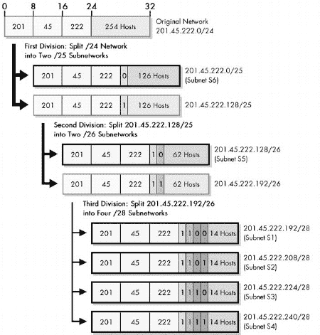

图 18-8. VLSM 示例 此图展示了文本中描述的示例，即一个使用三个分层级别划分的 C 类（/24）网络。它首先被划分为两个子网；其中一个子网被划分为两个二级子网；而一个二级子网被划分为四个三级子网。结果显示的六个子网，用粗黑边框表示，最大容量分别为 126、62、14、14、14 和 14 个主机。

+   您首先使用一个位作为子网 ID 进行初始子网划分，留下七个位用于主机 ID 和两个子网：201.45.222.0/25 和 201.45.222.128/25。每个子网最多可以容纳 126 个主机。您将这些中的第一个留作子网 S6 及其 100 个主机。

+   您选择第二个子网，201.45.222.128/25，并从主机 ID 中剩余的七个位中取出一个位，这为您提供了两个二级子网：201.45.222.128/26 和 201.45.222.192/26，每个子网可以容纳 62 个主机。您将这些中的第一个留作子网 S5 及其 50 个主机。

+   您选择第二个二级子网，201.45.222.192/26，并将其进一步划分为四个三级子网。您从主机 ID 中剩余的六个位中取出两个位，这为您提供了四个三级子网，每个子网最多可以容纳 14 个主机。这些用于 S1、S2、S3 和 S4。

虽然我选择了这些数字以确保它们完美匹配，但您应该已经明白了。VLSM 大大提高了子网划分的灵活性和效率。

### 注意

*为了使用 VLSM，必须使用支持 VLSM 路由协议的路由器。VLSM 还要求在构建路由表时更加小心，以确保对网络中地址的解释没有歧义*。

如我之前所述，VLSM（可变长度子网掩码）在概念上与 CIDR（无类别域间路由）的执行方式相似。VLSM 与 CIDR 之间的主要区别在于关注的焦点不同。VLSM 处理的是私有组织内单个网络的子网。CIDR 将你在 VLSM 中看到的理念扩展到整个互联网，通过改变组织网络的分配方式，用多层层次结构取代了单层类别的层次结构。

# 第十九章。IP 子网划分 实践子网设计和地址确定示例

当教育工作者询问学生他们认为在了解网络时最令人困惑的方面是什么时，许多人说那是 IP 地址子网划分。虽然子网划分在概念上并不那么困难，但它可能会让人感到有些令人困惑，部分原因是因为需要操作二进制数。许多人理解子网划分背后的理念，但发现难以跟随实际的网络子网划分步骤。

因此，尽管我在上一章详细解释了子网划分的概念，但我认为再有一个提供逐步查看如何执行自定义子网划分的章节将非常有价值。本章将子网划分分为五个相对简单的阶段，包括确定需求；决定用于子网 ID 和主机 ID 的位数；然后确定诸如子网掩码、子网地址和主机地址等重要数字。

我在这里的重点是展示子网划分的实用“如何做”。这些主题通过使用 B 类和 C 类示例网络进行两个示例来说明子网划分是如何进行的，并且我在展示如何计算一切时是明确的。这意味着本节数字较多。此外，我尽量不重复前节中涵盖的概念问题，尽管确实存在一定程度的重叠。总的来说，如果你对子网划分的工作方式完全不熟悉，你将首先想要阅读上一章。我在适当的地方引用了那一章的内容，特别是总结表。顺便说一下，我只在这里介绍传统的子网划分，而不是可变长度子网掩码（VLSM）。

本节可能对已经熟悉基础知识但只想回顾子网划分步骤的人来说是一个有用的复习或总结。再次提醒，子网划分基于较旧的类别 IP 地址方案，而今天的互联网是无类别的，使用无类别域间路由（CIDR；见第二十章）。

### 注意

*如果在阅读本章时，你发现自己想要进行二进制到十进制的转换或二进制数学运算，请记住，大多数版本的 Windows（以及许多其他操作系统）都有一个包含科学功能的计算器程序*。

# IP 子网划分步骤 1：分析需求

当你作为一个整体构建或升级网络时，第一步不是购买硬件，也不是确定协议，甚至不是设计。而是**需求分析**，即确定网络需要做什么的过程。没有这个基础，你可能会实施一个与你的设计完美匹配的网络，但无法满足你组织的需求。同样的规则也适用于子网划分。在你查看主机地址和子网掩码的详细信息之前，你必须决定如何划分网络。为了做到这一点，你必须了解网络的需求。

分析网络划分的需求并不困难，因为只有几个问题需要考虑。由于需求分析通常是通过提问来完成的，以下是在分析子网划分需求时最重要的问题列表：

+   IP 地址块属于哪一类？

+   现在网络上有多少物理子网络？（一个**物理子网络**通常指的是 LAN 上的广播域——由路由器界定的物理网络上的主机集合。）

+   你预计在不久的将来会添加任何更多的物理网络吗？如果是这样，那么会有多少？

+   你现在最大的子网络中有多少主机？

+   你预计在不久的将来最大的子网络中会有多少主机？

### 小贴士

**关键概念** 要成功划分网络，你必须首先了解网络的需求。最重要的参数是确定所需的子网数量和每个子网络所需的最大主机数。数字不应仅基于当前需求，还应考虑近期预期的需求。

第一个问题很重要，因为子网划分中的所有内容都是围绕划分 A 类、B 类或 C 类网络进行的，所以你需要知道你正在处理哪一类。如果你正在从头开始设计网络，还没有 A 类、B 类或 C 类块，那么你将根据组织的近似规模来确定你需要哪一类。

之后，你需要确定两个关键数字：你有多少物理子网络，以及每个子网络的最大主机数。你需要了解这些数字不仅是为了现在的网络，也是为了**近期未来**。这两个数字的当前值代表了网络今天应该如何设计。然而，只为现在设计并不是一个好主意。

假设你现在网络中恰好有四个子网络。从理论上讲，你只需要两个比特位来表示子网 ID，因为 2 的平方等于 4。然而，如果公司正在快速发展，这将是一个糟糕的选择。当你需要添加第五个子网络时，你会遇到问题！

类似地，考虑子网中主机数量的增长。如果当前最大的子网有 60 个主机，你不想为主机 ID 分配六个比特位，因为这会限制你只能有 62 个主机。你可以将大型子网划分为更小的子网，但这可能只是意味着不必要的额外工作。

那么，“近期”是什么意思呢？这个术语必然是模糊的，因为它取决于组织想要展望多远的未来。一方面，如果你有足够的 IP 地址，规划几年的增长是有意义的。另一方面，你不想规划得太远，因为短期内可能的变化可能会让你不得不完全重新设计你的网络。

# IP 子网划分步骤 2：划分网络地址主机位

在完成简短的需求分析后，你应该知道你必须有两个关键参数才能对网络进行子网划分：网络所需的子网数量和每个子网的最大主机数量。在使用这些数字来设计子网化网络时，你将面临子网划分的关键设计决策：如何将类地址的主机 ID 中的 8、16 或 24 比特位划分为子网 ID 和主机 ID。

换句话说，你需要决定从主机 ID 中窃取多少比特位用于子网 ID。正如我在上一章关于自定义子网掩码的部分所解释的，选择这个数字的基本权衡如下：

+   从主机 ID 中为子网 ID 取出的每个比特位将网络中可能的子网数量翻倍。

+   从主机 ID 中为子网 ID 取出的每个比特位（大约）将网络中每个子网可能的主机数量减半。

对于 C 类网络，有六种可能的决策方式，如图 19-1 所示。图 19-1

图 19-1. C 类网络的子网设计权衡图。这幅图显示了 C 类网络子网化的选项。随着主机 ID 比特位的增加，子网的数量增加，但每个子网的大小减少。

比特位与子网数量和主机数量的关系如下：

+   网络中允许的子网数量是子网 ID 比特位数量的 2 的幂。

+   每个子网允许的主机数量是主机 ID 比特位数量的 2 的幂，减去 2。

你需要从每个子网的主机数中减去两个，以排除主机 ID 全零或全一的具有特殊意义的案例。正如我在上一章中解释的，这种排除最初也应用于子网 ID，但在较新的系统中不再如此。

要选择用于子网的位数，你可以使用试错法。我的意思是，你可以先尝试使用一个位作为子网 ID，其余位留给主机 ID 来计算子网和主机的数量。然后你可以尝试使用两个位作为子网 ID，接着是三个位，以此类推。然而，这样做会很愚蠢；它既耗时又难以让你选择最佳选项。有一个更简单的方法：你可以使用上一章中介绍的子网划分总结表。它们让你可以看到所有选项，你通常可以立即看到最适合你的选项。

## C 类子网划分设计示例

让我们举一个例子。假设你有一个 C 类网络，基本地址为 211.77.20.0，总共需要七个子网。每个子网的最大主机数是 25。查看 C 类子网划分总结表（第十八章中的表 18-5），答案立刻清晰：你需要三个位用于子网 ID。为什么？这允许你拥有八个子网，每个子网有 30 个主机。如果你尝试选择两个位，你无法定义足够多的子网（只有四个）。正如图 19-2 所示，如果你选择四个位作为子网 ID，那么每个子网就只能有 14 个主机。

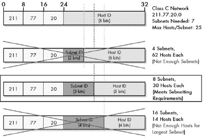

图 19-2. C 类子网划分示例 在这个特定的例子中，需要七个子网，最大的子网需要 25 个主机，只有一个子网 ID 大小的选择符合要求。这是一个简单的决定！

## B 类子网划分设计示例

在某些情况下，尤其是对于较大的网络，你可能有多重选择。以一个更有趣的例子来说明，更大的 B 类网络 166.113.0.0，其中总共有 15 个子网，最大的子网有 450 个主机。查看 B 类网络的子网汇总表（表 18-4，位于第十八章）表明有四种可接受的选择，如图图 19-3

图 19-3. B 类子网划分示例 这个 B 类网络至少需要 15 个子网，并且必须允许每个子网最多 450 个主机。三个子网 ID 位太少，而八个位意味着每个子网只有 254 个主机，这不够。这留下了四个可接受的选择，所以你必须明智地选择。

### 小贴士

**关键概念** 如果有多个子网 ID 和主机 ID 大小的组合可以满足要求，尽量选择一个折中的选项，以最好地预测未来的增长需求。如果没有组合满足要求，则必须更改要求！

# IP 子网划分步骤 3：确定自定义子网掩码

一旦你决定了用于子网 ID 的位数以及用于主机 ID 的位数，你就可以确定网络的自定义子网掩码。现在，不要因为我而躲起来。很多人一提到子网掩码就会眼花缭乱，但一旦你完成了在第 2 步中做出的设计决策的作业，它实际上是非常简单的。事实上，有两种方法来做这件事；一种比另一种工作量小，但它们都很简单。我本来想称它们为“难方法”和“易方法”，但相反，我将称它们为“简单”和“更简单”。

## 计算自定义子网掩码

让我们从简单方法开始，即根据你已有的关于网络的信息，以二进制形式计算子网掩码，然后将掩码转换为十进制。为了刷新你的记忆并指导这个过程，请记住这一点：子网掩码是一个 32 位的二进制数，其中一位代表网络 ID 或子网 ID 的一部分，而零代表主机 ID 的一部分。

### C 类自定义子网掩码计算示例

参考上一节中的 C 类示例（图 19-2)：

1.  **确定默认子网掩码** 对于 B 类，子网掩码是 255.255.0.0。在二进制中，它是这样的：

    | 11111111 11111111 00000000 00000000 |
    | --- |

1.  **将最左边的零位转换为子网位的一** 如果你使用五个位作为子网 ID，你将五个最左边的零位从 0 转换为 1，如粗体所示，以得到二进制自定义子网掩码，如下所示：

    | 11111111 11111111 **11111**000 00000000 |
    | --- |

    

    图 19-4. 确定 C 类网络的自定义子网掩码

1.  **将子网掩码转换为点分十进制表示** 你将子网掩码中的每个八位字节转换为十进制，以得到 255.255.**248**.0 的自定义子网掩码。

1.  **以斜杠表示法表达子网掩码** 你可以将子网掩码 255.255.248.0 表示为/21，因为它有 21 个 1 后面跟着 11 个 0。换句话说，它的前缀长度是 21。

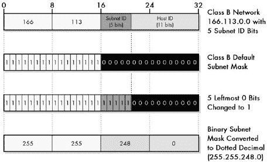

图 19-5. 确定 B 类网络的自定义子网掩码

## 使用子网划分表确定自定义子网掩码

现在，还有什么比这更容易的吗？嗯，你可以简单地参考第十八章中提供的子网划分摘要表第十八章。找到适合的类别的表格，然后找到你在上一步中选择的行，该行与你想使用的子网 ID 位数相匹配。你可以在那里看到匹配的子网掩码。

（嘿，知道如何自己做到这一点是很好的！你可能并不总是有表格可以参考！）

# IP 子网划分步骤 4：确定子网标识符和子网地址

分配给网络的网络 ID 适用于整个网络。这包括所有子网以及所有子网中的所有主机。然而，每个子网都需要一个唯一的*子网标识符*或*子网 ID*，以便可以将其与网络中的其他子网区分开来。这就是你在子网划分中从主机 ID 位中提取的子网 ID 位的目的。在你识别了每个子网之后，你需要确定每个子网的地址，以便可以在分配主机特定 IP 地址时使用。

这是子网划分中的一个步骤，实际上并不难理解或执行。理解如何确定子网 ID 和子网地址的关键是始终以二进制形式工作，然后稍后转换为十进制。你还将查看一个直接确定十进制地址的捷径，这更快，但概念上不太简单。

### 注意

*我假设在这个描述中，你将使用全零和全一的子网号。在原始 RFC 950 子网划分系统中，这两个子网没有被使用，这改变了以下大多数计算。参见第十八章以获取解释*。

你从 0 开始编号子网，然后是 1，2，3，依此类推，直到你需要的高个子网 ID。你确定子网 ID 和地址如下：

**子网 ID** 这只是子网号，它可以以二进制或十进制形式表示。

**子网地址** 这是通过将整个网络的地址替换为（二进制）子网 ID 来形成的地址。你需要以二进制形式这样做，但只针对有子网 ID 位的八位字节；那些只有网络 ID 位或只有主机 ID 位的字节保持不变。

看起来很复杂？让我们回到例子，你会发现这实际上并不复杂。

## C 类子网 ID 和地址确定示例

你会记得 C 类示例网络，211.77.20.0。该网络的二进制地址如下：

| 11010011 01001101 00010100 00000000 |
| --- |

你使用三个位作为子网 ID 进行子网划分，剩下五位用于主机 ID。现在让我们看看带有粗体子网位的网络地址：

| 11010011 01001101 00010100 **000**00000 |
| --- |

这些是你可以用子网 ID 替换的位。注意，由于前三个八位字节包含网络 ID 位，并且每个子网的网络 ID 都是相同的，所以它们永远不会改变。尽管如此，你实际上并不需要查看它们的二进制形式，但为了清晰起见，你将在这里这样做。

这就是确定子网 ID 和地址的方法，再次强调，从 0 开始（见图 19-6)):

**子网 0** 这个子网的子网 ID 是 0，或二进制的 000。要找到地址，你从二进制的网络地址开始，用 000 替换子网 ID 位。哎呀，这些位已经都是零了！这意味着子网 0 的地址与整个网络的地址相同：211.77.20.0。这始终是这种情况：子网 0 始终与网络的地址相同。

**子网 1** 这个子网的子网 ID 是十进制的 1 或二进制的 001。要找到地址，你需要用 001 替换子网 ID 位，得到以下结果：

| 11010011 01001101 00010100 **001**00000 |
| --- |
| 转换为十进制，得到 211.77.20.32。 |

**子网 2** 这个子网的子网 ID 是 2，或二进制的 010。要找到它的地址，你需要用 010 替换子网 ID 位，得到以下结果：

| 11010011 01001101 00010100 **010**00000 |
| --- |
| 这在二进制中是 211.77.20.64。 |

**子网 3** 这个子网的子网 ID 是 011。正如你所看到的，地址的前三个八位组总是 211.77.20。这里的最后一个八位组是**011**00000，在十进制中是 96，所以整个地址是 211.77.20.96。

你开始看到模式了吗？是的，任何子网的地址都可以通过将前一个子网的最后一个八位组加 32 来找到。这个模式适用于所有子网划分选择；增量取决于你为子网 ID 使用的位数。在这里，增量是 32，即 2⁵；5 是在你取了三个子网 ID 位之后剩下的主机 ID 位的数量。

**子网 4** 这个子网的子网 ID 是 100。它的地址是 211.77.20.128。

**子网 5** 这个子网的子网 ID 是 101。它的地址是 211.77.20.160。

**子网 6** 这个子网的子网 ID 是 110。它的地址是 211.77.20.192。

**子网 7** 这个子网的子网 ID 是 111。它的地址是 211.77.20.224。

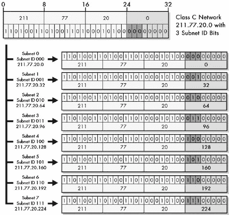

图 19-6. 确定 C 类网络的子网地址 此图显示了在 C 类网络中使用三个位作为子网 ID 时创建的八个可能的子网。二进制的子网 ID 简单地替换了子网位，得到的 32 位数字被转换为点分十进制形式。

### 提示

**关键概念** 在子网化网络中，子网地址总是以数值均匀分布，间隔取决于子网 ID 位的数量。

这个例子只需要七个子网，从 0 到 6。子网 7 将是备用。注意，最后一个子网与网络的子网掩码具有相同的最后一个八位字节？这是因为我在子网掩码计算中用 111 替换了子网 ID 位。

## B 类子网 ID 和地址确定示例

让我们看看另一个例子，B 类网络 166.113.0.0。在二进制中，它如下所示：

| 0100110 01110001 00000000 00000000 |
| --- |

你正在使用五个位作为子网 ID，剩下 11 个主机 ID 位。具有突出显示的子网 ID 位的网络地址如下：

| 0100110 01110001 **00000**000 00000000 |
| --- |

在这里，只有第三个八位字节会因不同的子网而改变。前两个始终是 166.113，最后一个八位字节始终是 0。共有 32 个可能的子网；我将列出前几个，以便你可以看到模式（参见图 19-7）：

**子网 0** 这具有子网 ID 00000。这意味着地址将是 166.113.0.0，正如你所期望的那样，这是网络地址。

**子网 1** 这具有子网 ID 00001。地址变为

| 10100110 01110001 **00001**000 00000000 |
| --- |
| 这是以十进制表示的 116.113.8.0。 |

**子网 2** 这具有子网 ID 00010，地址为 116.113.**00010**000.0 或 116.113.16.0。

**子网 3** 这具有子网 ID 00011 和子网地址 116.113.24.0。

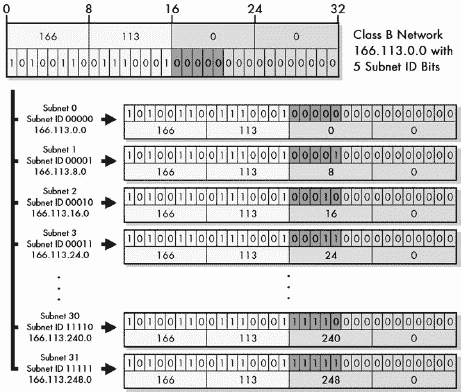

图 19-7。确定 B 类网络的子网地址 这与图 19-6 相同，但针对具有五个子网 ID 位的 B 类网络（出于明显的原因，我没有显示所有 32 个子网）。

再次，这里的模式很明显：你将第三个八位字节加八以获得连续的地址。这里的最后一个子网是 31，其子网地址为 116.113.248.0，其第三个和第四个八位字节与子网掩码 255.255.248.0 相同。

## 使用子网地址公式计算子网地址

由于子网地址形成一种模式，而这种模式取决于子网 ID 位的数量，因此可以使用单个公式来表示每个子网选项的子网地址。我在第十八章的子网划分总结表中展示了 A、B 和 C 类每个类的公式。这些公式可以直接计算子网*N*的地址，其中*N*从 0 开始编号，直到少于总子网数，正如我之前所做的那样。

在这些公式中，网络 ID 位以 x.、x.y.或 x.y.z.的形式表示三个类别。这仅仅意味着子网地址具有与网络地址中相应八位相同的数字。在示例中，x.y 对于 B 类网络将是 166.113，而 x.y.z 对于 C 类网络将是 211.77.20。

当子网位数为大于八位时，一些八位的形式是*N*除以一个整数，例如*N*/8。这是一个整数除法，意味着将*N*除以 8，保留整数部分，并丢弃小数部分或余数。其他八位基于*N*的模数计算，表示为*N*%8。这是完全相反的：这意味着将*N*除以 8，丢弃整数，并保留余数。例如，在整数数学中 33/5 是 6（6 余 3，丢弃余数，或者换句话说，6.6，丢弃小数），而 33%5 是 3（6 余 3，丢弃 6，保留余数）。

在具有三个子网 ID 位的 C 类网络中，表中的公式是 x.y.z.*N**32\. 对于这个网络，所有子网都采用 211.77.20.*N**32 的形式，其中*N*从零到七。因此，子网 5 是 211.77.20.(5*32)，即 211.77.20.160，正如你之前看到的。同样，在具有五个子网 ID 位的 B 类网络中，公式是 x.y.*N**8.0\. 在这种情况下，x.y 是 166.113\. 子网 26 将具有地址 166.113.(26*8).0，或者 166.113.208.0。

这相当简单，这使得公式成为快速确定子网地址的好方法，尤其是在有多个子网的情况下。它们也可以用在电子表格中。

使用公式时唯一需要小心的地方是当子网位数为九位或更多时。这意味着子网标识符跨越了八位边界，这导致公式变得更加复杂。

当子网位数为八位或更少时，公式相对简单，只需计算一个八位，例如*N**4 或*N**32 的乘法。这通常是这种情况，因为子网的数量通常少于 256，这两个示例都是这种情况。

让我们以 B 类网络为例，假设出于某种奇怪的原因，你决定使用 10 位作为子网 ID 而不是 5 位。在这种情况下，公式是 x.y.*N*/4.(N%4)*64。在这种情况下，子网 23 的地址将是 166.113.23/4.(23%4)*64。23 除以 4 等于 5（小数点后的.75 被省略）。23 模 4 等于 3，乘以 64 得到 192。因此，子网地址是 166.113.5.192。子网 709 将是 116.113.709/4.(709%4)*64，即 116.113.177.64。

好吧，现在让我们进入真正的乐趣！如果你使用超过 16 位用于子网 ID 的 Class A 地址进行子网划分，你将跨越*两个*八位字节边界，公式变得非常……有趣，涉及到整数除法和模数。假设你负责 Class A 地址 21.0.0.0，并决定对其进行子网划分。然而，你在办公室的节日派对上喝了几杯烈酒之后才开始做这件事，所以你的判断有点受损。你决定选择 21 位作为子网 ID 是一个很好的主意，因为你喜欢数字 21。这给你带来了几百万个子网。

在这种情况下，子网地址的公式相当长且复杂：x.*N*/8192.(*N*/32)%256.(*N*%32)*8。哎呀。这有点复杂——复杂到可能更容易直接取一个子网号，用二进制的方式来做。但让我们用一个例子来看看它对子网 987654 是如何工作的。第一个八位字节是 21。第二个八位字节是 987654/8192，整数除法。这是 120。第三个八位字节是(987654/32)%256。除法的结果是 30864（省略小数部分）。然后你取 30864%256，得到余数 144。第四个八位字节是(987654%32)*8。这是 6*8 或 48。因此，子网地址 987654 是 21.120.144.48。

（不要酒后驾车。也不要酒后子网划分。）

# IP 子网划分步骤 5：确定每个子网的主机地址

一旦你知道了网络中每个子网地址，你就可以将这些地址作为分配给每个子网中各个主机 IP 地址的基础。你首先将每个物理网络与一个子网基本地址关联起来（因为至少在理论上，子网对应于物理网络）。然后，你按顺序在子网内为各个主机分配特定的 IP 地址（或者如果你愿意的话，用不同的方式！）。

一旦你知道了子网地址，确定主机地址实际上非常简单。你所做的就是用数字 1、2、3 等替换子网地址中的主机 ID 位。你必须用二进制来做这件事，然后转换成十进制形式。再次提醒，一旦出现了如何分配地址的相当明显的模式，你就可以采取一些捷径。你将在本章的末尾看到这些。

## C 类主机地址确定示例

让我们再次从 Class C 示例开始，211.77.20.0，你使用三个子网位将其划分为八个子网。以下是带有子网位（粗体）和主机 ID 位（斜体）显示的地址：

| 11010011 01001101 00010100 **000**00000 |
| --- |

第一个子网是子网 0，这些子网位全部为零，因此与整个网络的地址相同：211.77.20.0。你用 1、2、3 等数字替换斜体位以获得主机 ID。记住，这里你不从零开始，因为对于主机 ID，全零和全一的二进制模式有特殊含义。所以它如下所示：

第一个主机地址的主机 ID 为 1，或者二进制表示为 00001。因此，它如下所示：

| 11010011 01001101 00010100 **000**00001 |
| --- |

在十进制中，这是 211.77.20.1。

第二个主机地址的主机 ID 为 2，或者二进制表示为 00010。它的二进制值如下所示：

| 11010011 01001101 00010100 **000**00010 |
| --- |

在十进制中，这是 211.77.20.2。

我相信你已经明白了；第三个主机将是 211.77.20.3，第四个是 211.77.20.4，以此类推。每个子网最多有 30 个主机，正如你之前看到的。因此，这个子网的最后一个主机将通过将 30（二进制中的 11110）替换为主机 ID 位来找到，结果是一个十进制地址 211.77.20.30。

你可以为其他每个子网做同样的事情；唯一改变的是子网 ID 位中的值。以子网 6 为例。它的子网位是 110，而不是 000。因此，它的子网基本地址是 211.77.20.192，或者

| 11010011 01001101 00010100 **110**00000 |
| --- |

你可以通过替换主机 ID 位中的 00001、然后 00010、然后 00011 来分配主机到这个子网，如前所述。让我们逐个考虑主机：

第一个主机地址如下所示：

| 11010011 01001101 00010100 **110**00001 |
| --- |

或者 211.77.20.193。

第二个主机地址是

| 11010011 01001101 00010100 **110**00010 |
| --- |

或者 211.77.20.194。

以此类推，直到子网的最后一个主机，即 211.77.20.222。图 19-8 显示了如何计算此示例网络的子网和主机地址。

你可能还想计算的是子网的广播地址。这是一个特殊情况，如第十八章第十八章中讨论的那样，通过将所有位替换为主机 ID 来找到。对于子网 0，这将是在 211.77.20.31。对于子网 6，它将是 211.77.20.223。这就是全部内容。

图 19-8. 确定 C 类网络的宿主地址 此图展示了通过两步过程确定子网地址和宿主地址的方法。子网地址是通过将子网 ID 值（粗体显示）替换网络子网 ID 位来找到的。然后，对于任何给定的子网地址，你可以通过在该子网内将一个宿主号（粗体和斜体显示）替换宿主 ID 位来确定一个宿主地址。例如，子网 6 中的宿主 2 具有 110 作为子网 ID 和 00010 作为宿主 ID，最终八位字节值为 11000010，或 194。

## B 类宿主地址确定示例

你当然也可以为 B 类网络做同样的事情。该网络的地址是 166.113.0.0。现在假设你想定义要放入子网 13 的宿主。你将 13 的二进制（01101）替换为子网 ID 位，得到以下子网地址，子网 ID 位用粗体显示，宿主 ID 位用斜体显示：

| 10100110 01110001 **01101**000 00000000 |
| --- |

这是子网地址 166.113.104.0。现在你有 11 位宿主 ID，所以你可以有最多 2046 个宿主。第一个是通过将 000 00000001 替换为宿主 ID 位来找到的，这给出了地址 166.113.104.1。第二个宿主是 166.113.104.2，以此类推。最后一个是通过将 111 11111110 替换，这给出了地址 166.113.111.254。注意，由于宿主 ID 位跨越了两个八位字节，当你增加宿主 ID 时，两个八位字节都会改变，这与 C 类示例不同。广播地址是 166.113.111.255。

### 小贴士

**关键概念** 在子网化网络中，子网号*S*内宿主 H 的地址是通过将*S*的二进制值插入网络的子网 ID 位，将*H*的二进制值插入子网的宿主 ID 位来找到的。

## 计算宿主地址的快捷方式

如你所见，定义主机 ID 实际上非常直接。如果你能替换位并转换为十进制，你就知道所有你需要知道的信息了。你还可以看到，正如定义子网地址的情况一样，在定义主机 ID 和理解它们如何工作方面，你可以使用一些模式。这些通常定义了你可以通过直接在十进制中工作而不是烦恼二进制替换来更快地确定某些主机地址的方法。这个概念上稍微复杂一些，所以只有当你感到有点勇敢时才继续。

在确定子网环境中的主机 IP 地址时，你可以使用以下一些快捷方式：

**第一个主机地址** *第一个主机地址总是子网地址，最后八位加 1*。所以在 C 类示例中，子网 3 的基本地址是 211.77.20.96。因此，子网 3 的第一个主机地址是 211.77.20.97。

**后续主机地址** 找到第一个主机地址后，要获取下一个地址，你只需将前一个地址的最后八位加 1。如果这使得最后八位为 256（这只有在有超过八位的主机 ID 位时才会发生），你“回绕”到零并增加第三八位。

**直接计算主机地址** 如果主机 ID 的位数是八位或更少，你可以通过将 N 加到最后八位的十进制值来找到主机*N*的地址。例如，在 C 类示例中，子网 3 的基本地址是 211.77.20.96。因此，这个子网中的主机 23 的地址是 211.77.20.119。如果有超过八位的主机 ID 位，这仅适用于前 255 个主机，之后你需要回绕并增加第三八位的值。再次考虑 B 类示例中的子网 13，其基本地址为 166.113.104.0。这个子网上的主机 214 的地址是 166.113.104.0，但主机 314 不是 166.113.104.314。它是 166.113.105.58（主机 255 是 166.113.104.255，然后主机 256 是 166.113.105.0，你再数 58 个（314-256）以得到 314，166.113.105.58）。

**主机地址范围** 对于任何子网的主机范围，第一个地址是子网的基本地址，最后八位加 1。最后一个地址是此子网之后下一个子网的基本地址，最后八位减 2（这可能需要将最后八位中的 0 改为 254，并将第三八位的值减少 1）。例如，考虑 B 类示例中的子网 17。其子网地址是 166.113.136.0。子网 18 的地址是 166.113.144.0。因此，子网 17 的主机地址范围是 166.113.136.1 到 166.113.143.254。

**广播地址** *子网的广播地址总是比下一个子网的基本地址少 1*。或者，也可以说是比子网的最后一个实际主机地址多 1。所以在 B 类示例中的子网 17，广播地址是 166.113.143.255。

我是不是让你困惑了？好吧，记住这些只是捷径，有时当你走捷径时，你可能会迷失方向。开个玩笑；一旦你玩得多了，其实并不难。

在结束之前，当在子网环境中处理 IP 地址时，请记住以下快速总结：

+   网络 ID 对于所有子网中的所有主机以及网络中的所有子网都是相同的。

+   子网 ID 对于每个子网中的所有主机都是相同的，但在网络中每个子网是唯一的。

+   主机 ID 在每个子网内是唯一的。每个子网都有相同的主机 ID 集合。

+   子网编址很有趣！（好吧，好吧，对不起……）

# 第二十章。IP 无类编址—无类域间路由（CIDR）/超网

随着互联网的急剧增长，在前面章节中描述的原有按类编址方案出现了三个主要问题。这些问题部分通过子网编址得到解决，这为互联网上各个网络的管理员提供了更多的灵活性。然而，子网编址并没有真正从一般意义上解决这些问题。由于使用了类别，一些问题仍然存在。

虽然在 20 世纪 90 年代中期开始开发互联网协议（IPv6；参见第二部分-4)及其宽敞的 128 位编址系统，但开发者认识到，在 IPv6 得到广泛部署之前还需要许多年。为了在新的版本完成之前延长 IPv4 的生命周期，有必要采取一种新的方法来编址 IPv4 设备。这个新系统要求完全消除地址类别的概念，创建一个新的*无类编址*方案，有时称为*无类域间路由（CIDR）*。

在本章中，我描述了现代的无类 IP 编址。我首先概述了无类编址背后的概念和*超网*背后的想法，包括为什么它被创建以及它的优缺点。然后我定义了 CIDR，并更详细地描述了该系统的工作原理，包括用于地址块的符号。我列出了每个 CIDR 地址块的大小，并展示了它们如何与较老的 A 类、B 类和 C 类网络相关联。最后，我给出了一个 CIDR 编址示例，它与第十九章中的示例类似，但这个示例专注于 CIDR，并且更加简洁。

# 无类 IP 编址和超网概述

子网地址划分是 IP 地址划分演变过程中的一个重要发展，因为它解决了传统两级基于类别的地址方案的一些重要问题。子网划分对 IP 地址划分灵活性的贡献是允许每个网络拥有自己的两级层次结构，从而为每个网络管理员提供了相当于互联网内部的互联网。

当你在第十八章中看到子网划分的优势时，你会发现子网划分在每个组织内部是局部的，对其他组织来说是不可见的。这是一个优势，因为它允许每个组织根据需要定制其网络，而无需其他团体担心如何操作的细节。不幸的是，这种不可见性也代表了子网化类地址划分的一个关键*缺点*：它不能纠正与那种类型地址划分相关的根本低效，因为组织仍然根据类别分配地址块。

## 类地址划分的主要问题

子网划分系统的关键弱点是其粒度低。一个 B 类地址块包含一个非常大的地址数量（65,534），但一个 C 类地址块只有相对较小的数量（254）。有成千上万的组织中等的组织需要超过 254 个 IP 地址，但其中只有一小部分需要 65,534 个或任何接近这个数量的地址。（图 17-5 说明了在第十七章中中等规模组织与 5,000 个主机匹配不良的问题。）当这些公司和团体设置他们的网络时，他们往往会请求 B 类地址块而不是 C 类地址块，因为他们需要超过 254 个主机，而不考虑他们实际上会使用 65,000 多个地址中的多少。

由于旧系统中的类别设计方式，有超过两百万个 C 类地址块，但只有 16,384 个 B 类网络。乍一看，16,384 似乎很多，但世界上有成千上万的组织和公司。B 类分配正在迅速消耗，而较小的 C 类网络相对未被使用。

分配互联网地址的人们需要一种更好的方式来利用地址空间，以便在过渡到 IPv6 之前不会耗尽。子网划分在这方面并没有太大的帮助。为什么？因为它只适用于**类别**地址块内部。如果一个需要 2,000 个 IP 地址的组织请求一个 B 类块，他们可以使用子网划分来更有效地管理他们的块。然而，子网划分对这样一个事实无能为力：这个组织永远不会使用其块中超过 62,000 个地址——大约 97%的分配地址空间。

解决这个问题的唯一方法就是说服——在最坏的情况下，强迫——公司使用许多较小的 C 类块而不是浪费 B 类分配的大部分。许多组织由于涉及到的复杂性而抵制这种做法，这导致了另一个主要问题，即子网划分没有解决的问题：互联网路由表的增长。用一个 B 类网络替换 10 个 C 类网络意味着路由器需要维护的条目数量增加了十倍。

## 解决方案：消除地址类别

很明显，只要网络只有三种大小，分配效率问题就永远无法得到妥善解决。解决方案是完全取消类别，转而采用**无类别**分配方案。这个系统将解决类别地址的主要两个问题：地址空间使用效率低下和路由表指数级增长。

这个系统是在 20 世纪 90 年代初开发的，并在 1993 年的 RFC 1517、1518、1519 和 1520 中正式化。这项技术被称为**无类别域间路由（CIDR）**。尽管这个名字如此，但该方案处理了地址和路由问题，因为它们是密不可分的。

CIDR 背后的想法是将单个网络的子网划分概念应用到整个互联网上。本质上，无类别地址意味着你不需要将特定网络划分为子网，而是可以将网络聚合到更大的“超网”中。正因为如此，CIDR 有时被称为**超网划分**：它将子网划分的原则应用到更大的网络上。正是这种将网络聚合到超网中的做法，使得 CIDR 能够解决互联网路由表增长的问题。

当然，如果你打算将子网划分的概念应用到整个互联网上，你需要能够拥有不同大小的子网。毕竟，消除类别的一个主要目标就是实现这一点。因此，更准确地说，CIDR 不仅是在整个互联网上应用了一级子网划分，还包括了在第十八章所示。或者换一种方式思考，一个 B 类网络的等效地址可以由需要 8,190 个或更少 IP 地址的八家公司共享。

**消除类别不平衡** 没有更多 A 类、B 类和 C 类网络，因此不存在某些地址空间部分被广泛使用而其他部分被忽视的问题。

**高效的路由条目** CIDR 的多级分层结构允许少量路由条目代表大量网络。网络描述可以被聚合并由单个条目表示。由于 CIDR 是分层的，因此可以隐藏低级别、较小网络的详细信息，这些信息对于在大型网络组之间移动流量的路由器来说是隐藏的。这一点在第二十三章中有更详细的讨论，该章节涵盖了 IP 路由问题。

**无需单独的子网划分方法** CIDR 在互联网本身中实现了子网划分的概念。一个组织可以使用在互联网上使用的相同方法将其内部网络划分为任意复杂性的子网，而无需单独的子网划分机制。

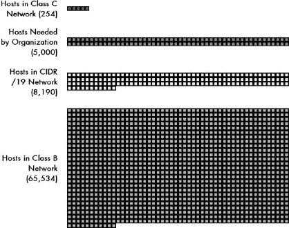

图 20-1. 无类地址（CIDR）解决了粒度问题图 17-5 在第十七章中说明了类别地址的主要问题：B 类和 C 类网络大小之间的巨大差距。CIDR 通过允许使用任意数量的位来表示网络 ID 来解决这一问题。对于一个拥有 5,000 个主机的组织，可以分配一个/19 网络，包含 8,190 个主机。这减少了此类组织地址空间的浪费，大约 95%。

由于类别地址的主要优点是其简单性，因此 CIDR 的主要缺点是其复杂性增加也就不足为奇了。一个问题是通过查看第一个八位字节，现在无法确定 IP 地址中有多少位代表网络 ID，有多少位代表主机 ID。在设置路由器时也需要更加小心，以确保正确完成路由。

# IP 超网：CIDR 分层地址和表示法

当你第一次在第十七章中查看 IP 地址时，你看到 IP 地址被设计成分为网络标识符（网络 ID）和主机标识符（主机 ID）。然后，当引入子网时，你从主机 ID“偷取”位来创建子网 ID，使 IP 地址具有总共三个层次。使用 VLSM，你进一步对子网进行子网划分，从主机 ID 中取出更多位，从而得到一个多级层次结构，包括子子网、子子子网等等。

在无类环境中，你通过应用 VLSM 概念，不仅针对一个网络，而是针对整个互联网，完全改变了看待 IP 地址的方式。本质上，互联网变成了一个巨大的网络，被划分为多个大型块。其中一些大型块随后被划分为更小的块，这些块又可以进一步划分。这种划分可以多次发生，允许你将互联网地址的“饼”分割成许多不同大小的片，以满足组织的需要。

如其名所示，无类别寻址完全消除了之前的类别概念。不再有 A 类、B 类和 C 类块，它们由地址的前几位来划分。在 CIDR 下，所有互联网块都可以是任意大小。你不必让所有网络都使用 8 位（A 类）、16 位（B 类）或 24 位（C 类）作为网络 ID，你可以有大型网络，例如，使用 13 位作为网络 ID（留下 19 位用于主机 ID），或者非常小的网络，使用 28 位作为网络 ID（只有 4 位用于主机 ID）。网络的大小仍然基于主机 ID 位数的二进制幂。

## CIDR（斜线）表示法

你会记得，当你使用子网划分时，你遇到了一个问题：子网划分可以通过取任意数量的可用主机 ID 位来完成，那么设备如何知道子网 ID 和主机 ID 之间的界限在哪里？在 CIDR 下也会出现同样的问题。没有类别，所以通过查看 IP 地址的前几位无法得知任何信息。由于地址的主机 ID 和网络 ID 之间的分隔点可以出现在任何位置，因此你需要额外的信息来正确解释 IP 地址。在 CIDR 下，这不仅影响组织内的地址，还影响整个互联网的地址，因为不存在类别，每个网络都可以是不同的大小。

因此，正如子网划分需要使用子网掩码来显示哪些位属于网络 ID 或子网 ID，哪些位属于主机 ID 一样，CIDR 也使用子网掩码来显示主机 ID 和网络 ID 之间的界限在哪里。然而，为了简化，在 CIDR 下，你通常不使用 32 位的二进制子网掩码。相反，你使用*斜线表示法*，更准确地称为*CIDR 表示法*。这种表示法通过在 IP 地址后跟一个整数来显示网络的大小，有时称为*前缀长度*，这个整数告诉你用于网络 ID（前缀）的位数。

### 小贴士

**关键概念** 由于 CIDR 中没有地址类别，你不能仅从地址本身判断网络 ID 的大小。在 CIDR 中，前缀（网络 ID）的长度通过在地址后跟一个斜线来表示。这被称为*CIDR 表示法*，或*斜线表示法*。

例如，考虑网络规范 184.13.152.0/22。这里的 22 表示这个网络有 22 位用于网络 ID，10 位用于主机 ID。这相当于指定一个地址为 184.13.152.0，子网掩码为 255.255.252.0 的网络，正如你可以在图 20-2 中看到的那样。这个示例网络总共提供了 1,022 个主机（2¹⁰-2）。下一节中的表格显示了在 CIDR 下可以配置的所有不同可能的网络大小。

图 20-2. CIDR（斜杠）表示法及其子网掩码等效图。无类别网络通常在 CIDR 或斜杠表示法中指定，例如这个示例：184.13.152.0/22。这里，/22 表示地址的前 22 位是网络 ID。等效的子网掩码可以通过创建一个 32 位数字，其中前 22 位是 1，后面跟着 10 位是 0 来计算。

### 注意

*你可能还记得，在类别子网划分中，用于子网 ID 的位不需要连续。尽管这种能力几乎从未被用来避免混淆，但非连续的子网 ID 位是可能的。在 CIDR 中，对连续子网 ID 位的要求已经正式化——否则你不能使用斜杠表示法*。

## 超网划分：互联网的子网划分

理论上，CIDR 所做的是为中央地址分配权威机构提供灵活性，根据组织的需求分配不同大小的地址块。然而，当 CIDR 被开发时，公共 IP 地址分配的方法发生了变化。让世界上每个人都试图从一个组织获取地址并不是最好的方法。在类别子网划分方案下这是必要的，因为层次结构只有两层深。互联网数字分配机构（IANA）向每个人分配网络 ID，然后他们分配主机 ID（或进行子网划分）。

在 CIDR 下，你有许多分层级别：你将大块分割成小块，然后再将小块分割成更小的块，依此类推。以类似分层的方式管理块是有意义的。所以，实际上，IANA/ICANN 将地址划分为大块，并将其分配给四个*区域互联网注册机构（RIRs）*：APNIC、ARIN、LACNIC 和 RIPE NCC。然后，它们进一步将地址块分割并分配给下一级的国家互联网注册机构（NIRs）、本地互联网注册机构（LIRs）和/或个人组织，例如互联网服务提供商（ISPs）。这一切都在第三章中关于互联网权威机构和注册机构的背景讨论中解释。

然后，ISP 可以将这些块分割成更小的块，并将它们分配给客户。这些客户有时本身就是较小的 ISP，它们会重复这个过程。他们将块分割成不同大小的块，并将它们分配给客户，其中一些客户甚至是更小的 ISP，还有一些是最终用户。这种分割可以发生的次数仅限于原始块中的地址数量。

值得注意的是，尽管 CIDR 基于子网划分的概念，但子网划分本身并不用于 CIDR——至少，不是在类地址方式下使用的那种方式。CIDR 中没有使用子网 ID 进行显式子网划分。所有 IP 地址仅被解释为具有网络 ID 和主机 ID。组织通过使用与 ISP 相同的一般方法将其自己的网络划分为子网，这相当于子网划分。这可能会有些令人困惑。在本章的后面部分，我将提供一个详细的分层地址块分配示例以及 CIDR 下的分割是如何工作的。

## 类地址和无类地址的共同特点

在“类地址”方案下定义的一些地址方面在 CIDR 下并没有改变：

**私有地址块** 某些地址块仍然保留用于私有网络地址。这些地址不能直接在互联网上路由，但可以与网络地址转换（NAT；参见第二十八章）结合使用，以允许没有公共地址的 IP 主机访问互联网。

**具有特殊含义的地址** 某些网络 ID 和主机 ID 模式所赋予的特殊含义与之前相同。这也是为什么你仍然必须从每个网络的主机数中减去两个的原因。这些代表整个网络的全部零地址和用于广播的全一地址。

**环回地址** 网络 127.0.0.0 仍然保留用于环回功能。（在 CIDR 中，它被表示为 127.0.0.0/8。）

最后，请注意，使用无类地址需要设计用于处理它的硬件和软件。如果硬件和软件仍然假设它们在类环境中运行，它们将无法正确解释地址。由于 CIDR 现在已经存在十多年了，这在现代系统中通常不是问题。

# 无类地址块大小和类网络等效

由于 CIDR 允许你根据任何位边界将 IP 地址划分为网络 ID 和主机 ID，因此它可以创建数十种不同大小的网络。与子网划分一样，网络的大小是网络 ID 位数和主机 ID 位数之间的权衡。与传统的子网划分不同，在传统的子网划分中，所有子网都做出单一的选择，而 CIDR 允许对互联网进行多级分层划分，因此存在许多不同大小的网络。较大的网络被创建并进一步划分为较小的网络。

由于许多人习惯于根据它们的类大小查看 IP 地址块，因此通常用它们的类等效来表示 CIDR 地址块。首先，在这个阶段，应该很容易看出 CIDR /8 网络的大小与 A 类网络相等，/16 与 B 类网络等效，/24 与 C 类网络等效。这是因为 A 类网络使用 8 位作为网络 ID，B 类网络使用 16 位，C 类网络使用 24 位。然而，请记住，这些 CIDR 等效不需要像类方案那样有特定的第一个八位字节范围。

每次你减少前缀长度，你都在定义一个大约是前一个具有更高数字的网络大小两倍的网络，因为你已经通过增加主机 ID 中的一个位数。因此，/15 网络的大小等于两个/16 网络。

表 20-1 显示了在 CIDR 下将 IP 地址的 32 位划分为网络 ID 和主机 ID 位数的所有可能的理论方法。对于每一种方法，我都展示了每个网络中的主机数量，以及每种大小的网络在斜杠表示法和传统子网掩码中的表示方式。我还展示了每个的 A 类、B 类和 C 类网络的等效数量。

在查看此表时，请记住以下几点：

+   显示的一些条目比实际更理论化，仅为了完整性而包含。这尤其适用于较大的网络。例如，我怀疑没有人真正使用过/1 或/2 CIDR 网络；前者只有两个，后者有四个，涵盖了整个 IP 地址空间！大多数时候，你将处理较小的网络，/16 以下。

+   在正常情况下，您不能有/31 或/32 CIDR 网络，因为它将没有有效的主机 ID。（有一个特殊情况：/31 网络可以用于点对点链路，在这种情况下，每个传输的预期接收者很明显，并且不需要广播。这已在 RFC 3021 中描述。）

+   在显示等效 A、B 和 C 类网络数量的列中，为了简化，我只显示了 1/256 到 256 范围内的数字。显然，/6 网络除了与四个 A 类网络大小相等外，还等于 1,024 个 B 类网络和 262,144 个 C 类网络，但很少有人会费心将/6 网络称为 262,144 个 C 类网络。

表 20-1. CIDR 地址块和类地址等效

| 网络 ID 位数 | 主机 ID 位数 | 每个网络的主机数 | 斜杠表示法中的前缀长度 | 等效子网掩码 | 等效类地址网络数 |
| --- | --- | --- | --- | --- | --- |
|   |   |   |   |   | A 类 | B 类 | C 类 |
| --- | --- | --- | --- | --- | --- | --- | --- |
| 1 | 31 | 2,147,483,646 | /1 | 128.0.0.0 | 128 | — | — |
| 2 | 30 | 1,073,741,822 | /2 | 192.0.0.0 | 64 | — | — |
| 3 | 29 | 536,870,910 | /3 | 224.0.0.0 | 32 | — | — |
| 4 | 28 | 268,435,454 | /4 | 240.0.0.0 | 16 | — | — |
| 5 | 27 | 134,217,726 | /5 | 248.0.0.0 | 8 | — | — |
| 6 | 26 | 67,108,862 | /6 | 252.0.0.0 | 4 | — | — |
| 7 | 25 | 33,554,430 | /7 | 254.0.0.0 | 2 | — | — |
| 8 | 24 | 16,777,214 | /8 | 255.0.0.0 | 1 | 256 | — |
| 9 | 23 | 8,388,606 | /9 | 255.128.0.0 | 1/2 | 128 | — |
| 10 | 22 | 4,194,302 | /10 | 255.192.0.0 | 1/4 | 64 | — |
| 11 | 21 | 2,097,150 | /11 | 255.224.0.0 | 1/8 | 32 | — |
| 12 | 20 | 1,048,574 | /12 | 255.240.0.0 | 1/16 | 16 | — |
| 13 | 19 | 524,286 | /13 | 255.248.0.0 | 1/32 | 8 | — |
| 14 | 18 | 262,142 | /14 | 255.252.0.0 | 1/64 | 4 | — |
| 15 | 17 | 131,070 | /15 | 255.254.0.0 | 1/128 | 2 | — |
| 16 | 16 | 65,534 | /16 | 255.255.0.0 | 1/256 | 1 | 256 |
| 17 | 15 | 32,766 | /17 | 255.255.128.0 | — | 1/2 | 128 |
| 18 | 14 | 16,382 | /18 | 255.255.192.0 | — | 1/4 | 64 |
| 19 | 13 | 8,190 | /19 | 255.255.224.0 | — | 1/8 | 32 |
| 20 | 12 | 4,094 | /20 | 255.255.240.0 | — | 1/16 | 16 |
| 21 | 11 | 2,046 | /21 | 255.255.248.0 | — | 1/32 | 8 |
| 22 | 10 | 1,022 | /22 | 255.255.252.0 | — | 1/64 | 4 |
| 23 | 9 | 510 | /23 | 255.255.254.0 | — | 1/128 | 2 |
| 24 | 8 | 254 | /24 | 255.255.255.0 | — | 1/256 | 1 |
| 25 | 7 | 126 | /25 | 255.255.255.128 | — | — | 1/2 |
| 26 | 6 | 62 | /26 | 255.255.255.192 | — | — | 1/4 |
| 27 | 5 | 30 | /27 | 255.255.255.224 | — | — | 1/8 |
| 28 | 4 | 14 | /28 | 255.255.255.240 | — | — | 1/16 |
| 29 | 3 | 6 | /29 | 255.255.255.248 | — | — | 1/32 |
| 30 | 2 | 2 | /30 | 255.255.255.252 | — | — | 1/64 |

# IP CIDR 地址示例

CIDR 的多个分层级别使这项技术看起来相当复杂。然而，如果你已经知道如何进行子网划分，理解 CIDR 的工作原理实际上并不困难。特别是，如果你知道 VLSM 的功能，你基本上已经知道了 CIDR 的工作原理，因为它们基本上是同一件事。它们的不同之处仅在于网络分层划分的实现方式和术语。

为了展示 CIDR 如何更好地工作，让我们举一个例子，这个例子将说明无类别地址的强大功能：它能够选择性地将一个大块地址细分为适合各种组织需求的小块。由于 CIDR 中的地址分配通常从较大的 ISP 拥有的较大块开始，因此我们也从这里开始。

假设你有一个刚刚起步的 ISP。它不是一个主要 ISP，而是一个规模适中的 ISP，只有少数客户，因此它只需要相对较小的分配。它从 71.94.0.0/15 这个块开始。块地址末尾的/15 告诉你，这是一个地址块，其中前 15 位是网络 ID，后 17 位是宿主 ID。这个块是从一个更大的 ISP 那里获得的，由该 ISP 从一个更大的地址块中切割而来。例如，71.94.0.0/15 等于 71.92.0.0/14 地址块的一半，71.88.0.0/13 块的四分之一，等等。

该 ISP 的地址块大小等于两个 B 类网络的大小，总共有 131,070 个可能的宿主地址。这个 ISP 可以选择以各种方式划分这个地址块，这取决于其客户的需求以及其自身的内部使用。然而，这个 ISP 刚刚起步，甚至还不确定其最终需求是什么。假设它预计将大约一半的地址空间转售给其他 ISP，但还不确定他们需要多大的地址空间。在剩下的另一半中，它计划将其分成四种不同大小的块，以适应不同规模组织的需要。

为了想象 ISP 如何划分其地址空间，你可以考虑将一块饼切开的类比。ISP 首先将饼切成两半，保留一半给未来的 ISP 客户。然后，它将另一半切成一些大块和一些小块。这如图图 20-3 所示。（好吧，我知道它是一个方形的饼。我想按比例展示单独的小块。）

实际的划分过程可能遵循以下章节中描述的进展，并在 图 20-4 中展示。

## 第一层划分

“饼”最初是通过使用单个最左边的宿主 ID 位作为额外的网络位来切成两半的。以下是网络地址块，71.94.0.0/15 的二进制表示，其中最左边的宿主 ID 位以粗体显示：

| 01000111 0101111**0** 00000000 00000000 |
| --- |

图 20-3. /15 CIDR 地址块的分层划分示例 此图展示了 ISP 如何将相对较大的 /15 地址块（131,070 个主机）进行分层划分的一种方法。在这种情况下，它首先被分成两个 /16 块。其中一个被保留，而另一个被分成四个 /18 块。这些块被进一步划分为不同大小的块，以便分配给需要 62、126、254 或 510 个主机的组织。

要进行划分，你将一个网络设置为具有高亮显示的位保持为零的该二进制网络地址，另一个网络则将其改为一位。这创建了两个子网络——不是在类 B 意义上的子网，而是原始网络的部分——我根据将替代新网络 ID 位的数值进行编号，如下所示：

| 子网络 0: 01000111 0101111**0** 00000000 00000000 |
| --- |
| 子网络 1: 01000111 0101111**1** 00000000 00000000 |

因为第 16 位现在也是网络地址的一部分，这些是 /16 网络，相当于一个类 B 网络的大小。因此，子网络如下：

| 子网络 0: 71.94.0.0/16 |
| --- |
| 子网络 1: 71.95.0.0/16 |

你会注意到子网络 0 与它所来自的较大网络的 IP 地址相同；在网络的子网络 0 中，这始终是正确的。

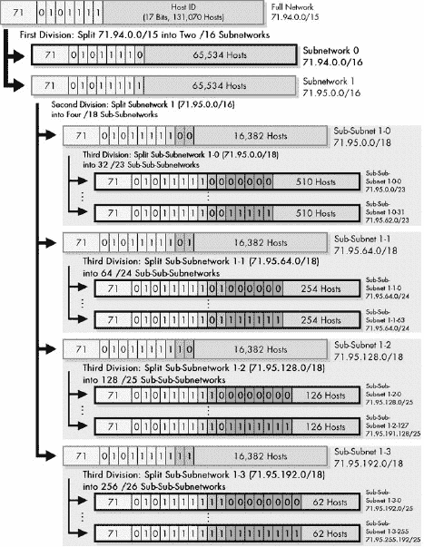

图 20-4. 使用 CIDR 进行分层地址划分

## 第二层划分

假设你之前为未来的 ISP 分配保留了子网络 0。然后你选择将第二个子网络分成四份。然后你将进一步将这些子网络划分为不同的大小以满足客户的需求。要将它们分成四组，你需要从子网络 1 的主机 ID 中再借用两个位，如下所示，粗体和下划线显示在原始子网位旁边：

| 01000111 0101111**1 00**000000 00000000 |
| --- |

这两个位被替换为模式 00、01、10 和 11，以获得四个子子子网络。它们将是/18 网络，因为您从/16 的主机 ID 中提取了两个额外的位，如下所示：

| 子子子网络 1-0: 01000111 0101111**1 00**000000 00000000 (71.95.0.0/18) |
| --- |
| 子子子网络 1-1: 01000111 0101111**1 01**000000 00000000 00000000 (71.95.64.0/18) |
| 子子子网络 1-2: 01000111 0101111**1 10**000000 00000000 (71.95.128.0/18) |
| 子子子网络 1-3: 01000111 0101111**1 11**000000 00000000 (71.95.192.0/18) |

每个都有 16382 个地址。

## 第三级划分

现在，您将每个四个/18 网络进一步细分。您希望每个都包含不同大小的块，以对应潜在的客户。一种方法如下：

**大型组织** 需要最多 510 个地址的客户需要/23 网络。您通过从主机 ID 字段中提取五个位来分割子子子网络 1-0，71.95.0.0/18：

| 01000111 0101111**1 00**000000 00000000 |
| --- |

您将这些五位替换为 00000、00001、00010 等，从而在这个块中提供 32 个不同的/23 网络，每个网络包含九位用于主机 ID，共 510 个主机。第一个将是子子子子网络 1-0-0，71.95.0.0/23；第二个是子子子子网络 1-0-1，71.95.2.0/23；最后一个将是子子子子网络 1-0-31：71.95.62.0/23。

**中型组织** 对于需要最多 254 个地址的客户，您可以通过从主机 ID 字段中提取六个位来分割子子子网络 1-1，71.95.64.0/18：

| 01000111 0101111**1 01**000000 00000000 |
| --- |

这为您提供了 64 个不同的/24 网络。第一个将是子子子子网络 1-1-0，71.95.64.0/24，第二个是子子子网络 1-1-1，71.95.65.0/24，依此类推。

**小型组织** 对于拥有最多 126 个主机的客户，您可以通过从主机 ID 字段中提取七个位来分割子子子网络 1-2，71.95.128.0/18，如下所示：

| 01000111 0101111**1** **10**000000 00000000 |
| --- |

七位允许在/18 块内包含 128 个这些/25 网络。第一个将是 71.95.128.0/25，第二个是 71.95.128.128/25，第三个是 71.95.129.0/25，依此类推。

**微型组织** 对于拥有最多 60 个主机的客户，您可以通过从主机 ID 字段中提取八个位来分割子子子网络 1-3，71.95.192.0/18：

| 01000111 0101111**1 11**000000 00000000 |
| --- |

这在/18 块内为您提供了 256 个不同的/26 网络。第一个将是 71.95.192.0/26，第二个是 71.95.192.64/26，依此类推。

此示例仅显示了分割这个蛋糕的许多不同方法之一。ISP 可能会决定预先创建四种不同大小的客户网络不是正确的做法。它可能会选择将蛋糕分成两半，然后再分成两半，依此类推，直到创建出正确大小的块。或者，如果大多数客户需要的主机数量大约是 50、100、200 或 500，那么前面的例子可能是最容易管理的。

如果 ISP 需要这样做，他们仍然可以将任何较小的块进一步分割。例如，他们可以将一个/26 子子子网络分割成四个/28 子子子子网络，以适应非常小的客户。同样，这个 ISP 的个别客户也可以做同样的事情，将其自己的块分割以适应其网络的内部结构。

# 第二十一章. 互联网协议数据报封装和格式

互联网协议（IP）的主要任务是将在互联网中不同设备之间传输的数据。在互联网中两个主机之间的旅程中，这些数据可能穿越许多物理网络。为了确保数据被正确发送和接收，它被封装在一个称为*IP 数据报*的消息中。这个数据报包含几个字段，有助于管理 IP 的操作并确保数据到达它需要去的地方。

在本章中，我探讨了 IP 协议如何从上层接收数据并将其打包以进行传输。我首先对 IP 数据报和封装进行了概述性讨论。然后，我描述了 IP 数据报的一般格式，包括 IP 头部中使用的字段及其解释方式。我还简要讨论了 IP 数据报选项及其用途。

### 提示

**背景信息** *本章假定至少对 IP 寻址概念有基本的了解，这些概念在第十六章–第二十章/超网")中概述。它还参考了关于数据报分片和重组的章节(第二十二章)*。

### 注意

*IP 数据报有时被称为* IP 数据包。*数据报*或*数据包*哪个是首选术语似乎取决于你问的是谁；甚至标准也不使用一个术语。另一方面，我见过 IP 数据报被称为*IP 帧*，这绝对是错误的！第一章更完整地描述了这些术语*。

# IP 数据报封装

在第五章中，我描述了 OSI 参考模型的概念，我探讨了网络协议栈中各层协议之间相互交互的几种方式。在协议间操作中最重要的概念之一就是*封装*。大多数数据都起源于 OSI 模型的高层。这些层的协议将数据向下传递到较低层进行传输，通常是以离散消息的形式。在接收时，每个较低层的协议都会接收到的整个消息内容，并将其封装成自己的消息格式，可能还会添加一个头部和可能的尾部，这些头部和尾部包含重要的控制信息。

你可能会把封装想象成类似于将一封信装入信封的过程。你写一封信，放入一个带有名字和地址的信封中，但如果你要通过快递员进行隔夜送达；快递员会取走那个信封，并将其放入一个更大的快递信封中。以类似的方式，在网络协议栈中，较高层的消息会被封装在较低层的消息中，而这些较低层的消息又可以进一步封装。

由于 TCP/IP 的突出地位，IP 是现代网络中数据封装发生的重要位置之一。数据通常从两个主要的传输层协议之一传递给 IP：传输控制协议（TCP）或用户数据报协议（UDP）。这些数据已经以 TCP 或 UDP 消息的形式存在，带有 TCP 或 UDP 头部。然后这些数据被封装进 IP 消息的主体中，通常称为*IP 数据报*或*IP 数据包*。IP 数据报的封装和格式化有时也被称为*包装*——再次强调，信封是一个明显的类比。

图 21-1 展示了整个过程，这个过程看起来与 OSI 参考模型的整体绘制非常相似，如图 5-5 在第五章中所示。正如您所看到的，上层消息被封装成 TCP 或 UDP 消息。然后它成为 IP 数据报的有效负载，这里只显示了一个头部（事情可能比这复杂一些）。然后 IP 数据报被传递到第 2 层，在那里它被封装成某种局域网（LAN）、广域网（WAN）或无线局域网（WLAN）帧，然后转换为比特并在物理层传输。

如果要传输的消息太大，无法通过底层网络传输，它可能首先被分片。这类似于将一个大件拆分成多个较小的信封或盒子。在这种情况下，每个 IP 数据报只携带高层消息的一部分。接收设备必须从 IP 数据报中重新组装消息。

图 21-1. IP 数据报封装上层消息被封装成 TCP 或 UDP 消息，这成为 IP 数据报的有效负载。然后 IP 数据报被传递到第 2 层，在那里它被封装在 LAN、WAN 或 WLAN 帧中。随后它被转换为比特并在物理层传输。

在概念上，IP 数据报与以太网或其他数据链路层使用的帧有些相似，但 IP 数据报的设计是为了促进跨互联网的传输，而数据链路层帧仅用于物理网络内的直接交付。IP 头部中包含的字段用于管理互联网数据报的交付。这包括交付的关键信息，如目标设备的地址、帧类型的标识和控制位。头部遵循您将很快要检查的格式。

一旦数据被封装进 IP 数据报，它就会被传递到数据链路层，以便在互联网的当前“跳”中进行传输。在那里，它被进一步封装，包括 IP 头部，进入一个数据链路层帧，例如以太网帧。IP 数据报可能被封装进许多这样的数据链路层帧，因为它在互联网中路由；在每次跳转中，IP 数据报从数据链路层帧中移除，然后重新封装成一个新的帧，以便进行下一跳。然而，IP 数据报在到达最终目的地之前不会改变（除了某些控制字段）。

# IP 数据报通用格式

使用 IP 在互联网上传输的数据被包含在称为*IP 数据报*的消息中。与所有网络协议消息一样，IP 为其数据报使用特定的格式。在这里，我将讨论 IP 版本 4（IPv4）数据报格式，该格式在 RFC 791 中定义，与 IPv4 的其他部分一起。

IPv4 数据报在概念上分为两部分：*头部*和*有效载荷*。头部包含寻址和控制字段，而有效载荷携带要发送到互联网的实际数据。与某些消息格式不同，IP 数据报在有效载荷之后没有跟随着尾部。

尽管 IP 是一个相对简单、无连接和不可靠的协议，但 IPv4 头部携带了相当多的信息，这使得它相当大。它至少有 20 字节长，带有选项时可以更长。IP 数据报格式在表表 21-1 数据报格式")、表 21-2 和表 21-3 中描述，并在图 21-2 中展示。

表 21-1. 互联网协议版本 4（IPv4）数据报格式

| 字段名称 | 大小（字节） | 描述 |
| --- | --- | --- |
| 版本 | 1/2（4 位） | 识别用于生成数据报的 IP 版本。对于 IPv4，这个数字是 4。该字段确保了可能运行不同 IP 版本设备之间的兼容性。一般来说，运行较旧 IP 版本设备将拒绝由较新实现创建的数据报，假设较旧版本可能无法正确解释较新的数据报。 |
| IHL | 1/2 (4 bits) | 指定 IP 头部长度，以 32 位字为单位。这包括任何选项字段和填充的长度。当不使用选项时，此字段的正常值为 5（5 个 32 位字 = 5*4 = 20 字节）。与表中较长的总长度字段进行对比。 |
| TOS | 1 | 这是一个设计用来携带信息以提供服务质量功能的字段，例如为 IP 数据报提供优先级交付。这并没有像最初定义的那样被广泛使用，并且其含义已被重新定义为使用称为*区分服务（DS）*的技术，如本章“IP 数据报服务类型（TOS）字段”部分所述。 |
| TL | 2 | 指定 IP 数据报的总长度，以字节为单位。由于此字段为 16 位宽，IP 数据报的最大长度为 65,535 字节，尽管大多数数据报的长度要小得多。 |
| Identification | 2 | 此字段包含一个 16 位值，该值属于特定消息的每个分片；对于原本未分片发送的数据报，此字段仍然填写，以便在数据报在传输过程中必须由路由器分片时使用。接收方使用此字段重新组装消息，而不会意外地将来自不同消息的分片混合在一起。这是必要的，因为分片可能来自多个混合在一起的消息，因为 IP 数据报可以从任何设备无序接收。（有关 IP 消息分片的讨论，请参见第二十二章。） |
| Flags | 3/8 (3 bits) | 三个控制标志，其中两个用于管理分片（如分片主题中所述），另一个保留。参见表 21-2。 |
| Fragment Offset | 1 5/8 (13 bits) | 当发生消息分片时，此字段指定偏移量或位置，即此分片中的数据在消息中的位置，以 8 字节（64 位）为单位。第一个分片的偏移量为 0。（有关该字段的使用方法，请参见第二十七章中的分片讨论。） |
| TTL | 1 | 这指定数据报在网络中允许存活的时间，以路由器跳数为单位。每个路由器在传输之前都会递减 TTL 字段的值（减一）。如果 TTL 字段降至零，则假定数据报已采取过长的路由，并将其丢弃。（有关更多信息，请参见本章后面的“IP 数据报生存时间（TTL）字段”部分。） |
| 协议 | 1 | 识别数据报中携带的更高层协议（通常是传输层协议或封装的网络层协议）。表 21-3 显示了此字段的协议值，这些值最初由 IETF“分配号码”标准 RFC 1700 定义，现在由互联网分配号码权威机构（IANA）维护。 |
| 头部校验和 | 2 | 对头部进行校验和计算，以提供对传输中损坏的基本保护。这不是数据链路层技术（如以太网）通常使用的更复杂的循环冗余检查（CRC）代码；它只是一个 16 位的校验和。它是通过将头部字节分成字（一个字是两个字节）然后将它们相加来计算的。只有头部被校验和；不是数据。在每个跳转点，接收数据报的设备执行相同的校验和计算，如果存在不匹配，它将丢弃数据报作为损坏的数据报。 |
| 源地址 | 4 | 这是数据报发起者的 32 位 IP 地址。请注意，尽管中间设备如路由器可能处理数据报，但它们通常不会将它们的地址放入此字段——地址始终是最初发送数据报的设备的地址。 |
| 目标地址 | 4 | 这是数据报预期接收者的 32 位 IP 地址。尽管路由器等设备可能是数据报的中间目标，但此字段始终用于指定最终目的地。 |
| 选项 | 可变 | 在某些 IP 数据报的标准头部之后，可以包含几种类型的选项之一，如本章后面“IP 数据报选项和选项格式”部分所述。 |
| 填充 | 可变 | 如果包含一个或多个选项，并且用于它们的位数不是 32 的倍数，则需要添加足够的 0 位来填充头部，使其成为 32 位的倍数（四个字节）。 |
| 数据 | 可变 | 这是将在数据报中传输的数据。它可以是整个高层消息或其一部分。 |

表 21-2. IPv4 标志子字段

| 子字段名称 | 大小（字节） | 描述 |
| --- | --- | --- |
| 保留 | 1/8（1 位） | 未使用。 |
| DF | 1/8（1 位） | 当设置为 1 时，这意味着数据报不应该被分段。由于分段过程通常对高层来说是不可见的，大多数协议都不关心这一点，也不设置此标志。然而，它用于测试链路的最大传输单元（MTU）。 |
| MF | 1/8 (1 位) | 当设置为 0 时，表示消息中的最后一个分段；当设置为 1 时，表示在分段消息中还有更多分段尚未到来。如果消息未使用分段，则只有一个分段（整个消息），此标志为 0。如果使用分段，除了最后一个分段之外的所有分段都将此标志设置为 1，以便接收者知道何时已发送所有分段。 |

表 21-3. IPv4 协议子字段

| 十六进制值 | 十进制值 | 协议 |
| --- | --- | --- |
| 00 | 0 | 保留 |
| 01 | 1 | ICMP |
| 02 | 2 | IGMP |
| 03 | 3 | GGP |
| 04 | 4 | IP-in-IP 封装 |
| 06 | 6 | TCP |
| 08 | 8 | EGP |
| 11 | 17 | UDP |
| 32 | 50 | 封装安全载荷（ESP）扩展头部 |
| 33 | 51 | 认证头部（AH）扩展头部 |

### 备注

*表 21-3 的最后两个条目用于在数据报中插入额外的头部：AH 或 ESP 头部。更多信息请参见第二十九章*。

图 21-2. IPv4 数据报格式 此图显示了至关重要的 IPv4 数据报格式。前 20 个字节是固定的 IP 头部，后面是可选的选项部分，以及可变长度的数据区域。注意，服务类型字段显示的是 IPv4 标准中最初定义的形式。

## IP 数据报生存时间（TTL）字段

让我们看看生存时间（TTL）字段。由于 IP 数据报在穿越互联网时作为路由器到路由器的传输，一个数据报可能会从路由器 A 传递到路由器 B，再到路由器 C，然后又回到路由器 A。这被称为*路由器循环*，这是我们不想发生的事情。

为了确保数据报不会无限循环，TTL 字段被设计为包含一个时间值（以秒为单位），在数据报最初发送时填充。路由器会定期减少时间值，如果时间值达到零，则销毁数据报。TTL 字段也被设计用来确保时间敏感的数据报不会过时或错过其到期日期。

在实践中，这个字段并不是以这种方式使用的。今天的路由器速度很快，通常在不到一秒的时间内就可以转发一个数据报，这使得测量数据报存活时间变得不切实际。相反，这个字段被用作数据报的最大跳数。每次路由器处理一个数据报时，它都会将 TTL 字段的值减一。如果这样做导致字段为零，则称数据报已过期，此时它将被丢弃，并且通常会发送一个 Internet 控制消息协议（ICMP）超时消息，通知消息的发送者该消息已过期。TTL 字段是网络保护免受路由器环路的主要机制之一。（有关 TTL 如何帮助 IP 处理路由器环路的更多内容，请参阅第三十二章中 ICMP 超时消息的描述。）

## IP 数据报服务类型（TOS）字段

服务类型（TOS）字段是一个一字节的字段，最初旨在为 IP 数据报的交付提供某些服务质量（QoS）特性。它允许 IP 数据报被标记上信息，不仅表明它们的优先级，而且还表明它们应该以何种方式交付。它被划分为多个子字段，如表 21-4 和图 21-2 所示。

长久以来，缺乏服务质量（QoS）特性一直被认为是 IP 的一个弱点。但正如你在表 21-4 中可以看到的，这些特性从一开始就被构建到 IP 中。事实上，尽管这个字段在 20 世纪 80 年代初的标准中就已经定义，但它并没有被硬件和软件广泛使用。多年来，它只是以所有位都为零的形式传递，大部分时间都被忽略了。

互联网工程任务组（IETF）看到这个字段未被使用，试图复兴其使用。1998 年，RFC 2474 重新定义了 TOS 字段的前六位，以支持一种称为*区分服务（DS）*的技术。在 DS 下，TOS 字段中的值被称为*代码点*，并与不同的服务级别相关联。（有关所有详细信息，请参阅 RFC 2474。）

### 小贴士

**相关信息** *务必阅读本章剩余部分以获取有关如何在数据报中使用 IP 选项的更多信息，并在第二十二章中了解有关使用与分片相关的字段（如标识符、分片偏移和更多分片）的更多背景信息*。

表 21-4. IPv4 服务类型（TOS）字段的原始定义

| 子字段名称 | 大小（字节） | 描述 |
| --- | --- | --- |
| 优先级 | 3/8 (3 bits) | 表示数据报优先级的字段。定义了八个值，从最低到最高优先级：000：常规 001：优先 010：立即 011：闪光 100：闪光优先 101：CRITIC/ECP110：互联网控制 111：网络控制 |
| D | 1/8 (1 bit) | 设置为 0 以请求正常交付延迟；如果请求低延迟交付，则设置为 1。 |
| T | 1/8 (1 bit) | 设置为 0 以请求正常交付吞吐量；如果请求更高的吞吐量交付，则设置为 1。 |
| R | 1/8 (1 bit) | 设置为 0 以请求正常交付可靠性；如果请求更高的可靠性交付，则设置为 1。 |
| 保留 | 2/8 (2 bits) | 未使用。 |

# IP 数据报选项和选项格式

所有 IP 数据报都必须包含包含数据报源和目的地址、分片控制参数、长度信息等关键信息的标准 20 字节报头。除了这些固定字段外，IPv4 的创建者还包括了添加*选项*的能力，这些选项为 IP 处理数据报提供了额外的灵活性。当然，使用这些选项是可选的。然而，所有处理 IP 数据报的设备都必须能够正确读取和处理它们。

IP 数据报可能包含零个、一个或多个选项，因此 IP 头中选项字段的长度是可变的。每个选项可以是单个字节或多个字节，具体取决于选项需要传达多少信息。当包含多个选项时，它们被连接起来作为一个整体放入选项字段中。由于 IP 头必须是 32 位的倍数，如果所有选项中的位数不是 32 位的倍数，则包括一个填充字段。

每个 IP 选项都有自己的子字段格式，通常结构如表 21-5 和表 21-6 所示，并在图 21-3 中说明。对于大多数选项，都使用所有三个子字段：选项类型、选项长度和选项数据。然而，对于一些简单的选项，这种复杂的子结构是不必要的。在这些情况下，选项类型本身就包含了所需的所有信息，因此只出现选项类型字段，省略了选项长度和选项数据子字段。

表 21-5. IPv4 选项格式

| 子字段名称 | 大小（字节） | 描述 |
| --- | --- | --- |
| 选项类型 | 1 | 选项类型子字段分为三个子子字段，如表 21-6 所示。 |
| 选项长度 | 0 或 1 | 对于可变长度选项，指示整个选项的大小，包括此处显示的所有三个子字段，以字节为单位。 |
| 选项数据 | 0 或可变 | 对于可变长度选项，包含作为选项一部分发送的数据。 |

表 21-6. IPv4 选项：选项类型子字段

| 子子字段名称 | 大小（字节） | 描述 |
| --- | --- | --- |
| 复制标志 | 1/8 (1 位) | 如果选项旨在在数据报分片时复制到所有分片中，则此位设置为 1；如果选项不应复制到分片中，则清除为 0。 |
| 选项类别 | 2/8 (2 位) | 指定选项所属的四个潜在值之一，表示选项的一般类别。实际上，只使用了其中的两个值：0 用于控制选项，2 用于调试和测量。 |
| 选项编号 | 5/8 (5 位) | 指定选项的类型。对于两个选项类别中的每一个，可以指定 32 个不同的值。其中，一些值更常用。有关特定选项的更多信息，请参阅表 21-7。 |

表 21-7 列出了最常见的 IPv4 选项，显示了每个选项的选项类别、选项编号和长度（长度为 1 表示选项仅由选项类型字段组成）。该表还提供了每个选项的简要使用说明。

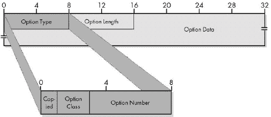

图 21-3. IPv4 选项字段格式 此图显示了 IPv4 选项的完整字段格式。请注意，一些简单的选项可能仅包含选项类型子字段，省略了选项长度和选项数据子字段。

表 21-7. 常见 IPv4 选项

| 选项类 | 选项号 | 长度（字节） | 选项名称 | 描述 |
| --- | --- | --- | --- | --- |
| 0 | 0 | 1 | 选项列表结束 | 包含单个零字节的选项，用于标记选项列表的结束。 |
| 0 | 1 | 1 | 无操作 | 一种“虚拟选项”，用作内部填充，以便在需要时将某些选项对齐到 32 位边界。 |
| 0 | 2 | 11 | 安全 | 为军事部门提供的一个选项，用于指示 IP 数据报的安全分类。 |
| 0 | 3 | 可变 | 松散源路由 | IP 数据报源路由的两种选项之一。 |
| 0 | 7 | 可变 | 记录路由 | 允许将数据报使用的路由记录在数据报本身的头部中。如果源设备发送包含此选项的数据报，则处理数据报的每个路由器都会将其 IP 地址添加到此选项中。接收者可以提取 IP 地址列表，以查看数据报所经过的路由。请注意，此选项的长度由源设备设置。在数据报路由过程中不能扩大，如果它在到达目的地之前填满，则只能记录部分路由。 |
| 0 | 9 | 可变 | 严格源路由 | IP 数据报源路由的两种选项之一。 |
| 2 | 4 | 可变 | 时间戳 | 与记录路由选项类似，但每个设备都会放入一个时间戳，因此接收者可以看到数据报在路由器之间传输所需的时间。与记录路由选项一样，此选项的长度由源设备设置，中间设备不能扩大。 |
| 2 | 18 | 12 | 跟踪路由 | 用于跟踪路由实用程序的增强实现，如 RFC 1393 所述。另见第三十三章，其中讨论了 ICMP 跟踪路由消息。 |

### 提示

**关键概念** 每个 IPv4 数据报包含一个 20 字节的强制头，并且可能包含一个或多个*选项*。每个选项都有自己的字段格式，并且大多数的大小是可变的。

通常，IP 数据报在没有任何特定指令的情况下被路由，这些指令说明数据报应从源到目的地采取的路径。这是路由器的任务，使用路由协议并找出这些细节。然而，在某些情况下，让数据报的源指定数据报在网络中采取的路径可能是有利的。这个过程被称为*源路由*。

有两种 IP 选项支持源路由。在每个选项中，选项包括一个 IP 地址列表，指定了必须使用的路由器以到达目的地。当使用*严格*源路由时，选项中指定的路径必须完全、按顺序使用，不允许其他路由器处理数据报。相比之下，*宽松*源路由指定了一个必须按顺序遵循的 IP 地址列表，但它允许列表中设备之间的中间跳数。（有关每种选项类型使用的确切结构的完整详细信息，请参阅 RFC 791。）

# 第二十二章。IP 数据报大小、分片和重组

互联网协议（IP）的主要责任是在互连设备之间传输数据。正如你在上一章中看到的，这要求从高层接收到的数据必须封装成 IP 数据报进行传输。然后，这些数据报被传递到数据链路层，在那里它们通过物理网络链路发送。为了使这个过程正常工作，每个数据报必须足够小，以便能够适应底层技术的帧格式。如果消息比底层网络的帧大小最大值还要大，可能需要将消息分片。然后，这些数据报单独发送，并重新组装成原始消息。

IP 被设计用来管理数据报大小，并使分片和重组无缝。本章探讨了与 IP 数据报大小管理相关的问题。我从对数据报大小问题的概述和网络的传输单元（MTU）这一重要概念进行讨论开始，讨论为什么分片是必要的。然后，我描述了消息如何由源设备分片，以及可能由路径上的路由器分片，以及它们如何被接收者重新组装。

### 小贴士

**背景信息** 理解分片和重组需要一些关于 IP 数据报基本格式及其包含的一些字段的知识。如果你还没有阅读描述第二十一章中 IP 数据报通用格式的章节第二十一章，你可能希望在继续之前先复习一下。

# IP 数据报大小、MTU 和分片概述

作为 TCP/IP 协议套件的核心网络层协议，IP 被设计用来实现可能非常大的设备互联网。当我们使用 IP 时，我们习惯了主机能够相互发送信息，尽管这些主机可能相隔甚远。尽管我们通常可以将 TCP/IP 互联网视为一个大型、抽象的虚拟设备网络，但我们必须始终记住，在网络层之下，数据总是穿越一个或多个物理网络。IP 的实现必须考虑到这一现实。

为了使用 IP 发送消息，我们将高层数据封装成 IP 数据报。然后，这些数据报必须发送到数据链路层，在那里它们被进一步封装成用于物理传输的帧格式，无论是直接发送到目的地还是间接发送到旅程中的下一个中间步骤。数据链路层实现将整个 IP 数据报放入其帧格式的数据部分（有效载荷），就像 IP 将传输层消息——包括传输头——放入其 IP 数据字段一样。这立即向我们提出了一个潜在问题：匹配 IP 数据报的大小与底层数据链路层帧大小。

## IP 数据报大小和底层网络帧大小

设备用于连接其他设备的底层网络可能是局域网（LAN）连接（如以太网或令牌环），无线局域网（WLAN）链路（如 802.11），拨号连接，数字用户线路（DSL）连接，T1 链路，或其他广域网（WAN）连接。每个物理网络通常使用自己的帧格式，每种格式都有限制，即单帧可以发送多少数据。如果 IP 数据报太大，无法适应数据链路层帧格式的有效载荷部分，我们就遇到了问题！

例如，考虑一个光纤分布式数据接口（FDDI）网络。FDDI 数据字段的最大大小约为 4,470 字节。这意味着 FDDI 可以处理最大为 4,470 字节的 IP 数据报。相比之下，常规以太网帧使用一个帧格式，限制了其发送的有效载荷大小为 1,500 字节。这意味着以太网无法处理大于 1,500 字节的 IP 数据报。

现在，请记住，在发送数据报跨互联网时，它可能穿过多个物理网络。例如，为了访问互联网上的一个站点，我们通常通过我们的本地路由器发送请求，然后该路由器连接到其他路由器，最终将请求转发到互联网站点。数据报在转发过程中每跳可能使用不同的物理网络，具有不同的最大帧大小。

网络层协议背后的整个想法是实现这个虚拟网络的概念，在这个网络中，设备可以在很远的距离上通信。这意味着高层不需要担心底层数据链路层技术的尺寸限制等细节。这项任务由 IP 层负责。

## MTU 和数据报分片

IP 互联网上的每个设备都必须知道其与其它设备直接数据链路层连接的容量。这个容量被称为网络的*最大传输单元（MTU）*，也称为*最大传输单元*。

如果 IP 层收到一个需要通过互联网发送的消息，它会查看消息的大小，然后计算在添加 20 个或更多字节（用于 IP 头部）后，IP 数据报的大小。如果总长度超过底层网络的 MTU（最大传输单元），IP 层将把消息分成多个 IP 片段。因此，如果一个主机通过以太网局域网连接到其本地网络，它可能为 IP 数据报使用 1,500 字节的 MTU，并且它会将任何更大的数据报进行分片。

图 22-1 展示了不同 MTU 和分片的例子。

### 提示

**关键概念** 可以通过物理网络传输的最大 IP 数据报的大小被称为该网络的*最大传输单元（MTU）*。如果一个数据报从一个 MTU 较高的网络传递到 MTU 较低的网络，它必须被分片以适应另一个网络较小的 MTU。

由于设备之间的路径上的一些物理网络可能具有比其他网络更小的 MTU，可能需要多次分片数据报。例如，假设源设备想要发送一个 12,000 字节长的 IP 消息。它的本地连接 MTU 为 3,300 字节。它需要将这个消息分成四个片段进行传输：三个大约 3,300 字节长，一个剩余大约 2,100 字节长。（我在简化过程中忽略了额外的头部；本章后面的“IP 消息分片过程”部分包括了分片过程的全部细节。）

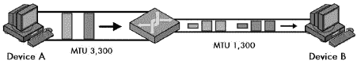

图 22-1. IP 最大传输单元 (MTU) 和分片 在这个简单的例子中，设备 A 通过一个由一个路由器和两个物理链路组成的小型互联网向设备 B 发送数据。从设备 A 到路由器的链路 MTU 为 3,300 字节，但从路由器到设备 B，仅为 1,300 字节。因此，任何大于 1,300 字节的 IP 数据报都需要进行分片。

## 多阶段分片

当 IP 分片在传输过程中，它们可能需要通过一个物理网络 MTU 只有 1,300 字节的两个路由器之间的跳。在这种情况下，每个分片又需要再次分片。3,300 字节的分片最终将分成三块（两块大约 1,300 字节和一块大约 700 字节），最后的 2,100 字节分片将变成一个 1,300 字节和一个 800 字节的分片。因此，我们最终将得到 11 个分片（3*3+1*2），如图 图 22-2 所示。

图 22-2. IPv4 数据报分片。此示例说明了大型 IP 数据报的两步分片。方框代表数据报或数据报片段，并按比例显示。原始数据报为 12,000 字节，由大灰框表示。为了通过第一个本地链路传输这些数据，设备 A 将其分成四个片段，如图左侧所示。第一个路由器必须将这些每个分片进一步分割成更小的片段，以便通过 1,300 字节的 MTU 链路发送，如图底部所示。请注意，第二个路由器不会重新组装 1,300 字节的片段，尽管其连接到设备 B 的链路的 MTU 为 3,300 字节。（本章后面的“IP 分片过程”部分将描述创建此示例中片段的过程。）

## 互联网最小 MTU：576 字节

路由器需要处理至少 576 字节的 MTU（最大传输单元）。这个值在 RFC 791 中指定；它被选择以允许至少 512 字节的数据块，以及标准 IP 头和选项的空间。由于这是 IP 标准中指定的最小尺寸，576 字节已成为用于 IP 数据报的常见默认 MTU 值。即使主机通过大于 576 字节的 MTU 的本地网络连接，它也可能选择使用 576 字节的 MTU 值，以确保中间路由器不需要进一步分片。

### 注意

*虽然中间路由器可能会进一步分片已经分片的 IP 消息，但它们不会重新组装片段。重新组装仅由接收设备完成。这有一些优点和缺点，我们将在本章后面的“IP 消息重新组装”部分检查重新组装过程时看到。*

## MTU 路径发现

当我们试图发送大量数据时，消息传输的效率变得很重要。我们发送的 IP 数据报越大，用于开销（如头部字段）的字节浪费百分比就越小。这意味着，理想情况下，我们希望使用尽可能大的 MTU，而无需对其进行传输分片。

要确定两个设备之间路由的最佳 MTU，我们需要知道该路由上每个链路的 MTU——这是连接端点所没有的信息。然而，连接端点可以通过使用*MTU 路径发现*来确定整个路由的 MTU，该机制使用 TCP/IP 互联网控制消息协议（ICMP）中内置的错误报告机制。

在 ICMP 版本 4（ICMPv4）中定义的消息类型之一是目标不可达消息（见第三十二章），在 IP 数据报无法交付的各种情况下返回。这些情况之一是当数据报太大，无法通过物理链路上的路由器转发，但该数据报的“不要分片”（DF）标志被设置为防止分片。在这种情况下，必须丢弃数据报并向源发送目标不可达消息。设备可以通过使用不同大小的数据报测试路径来利用这种功能，以查看它们必须有多大才会被拒绝。

源节点通常发送一个具有其本地物理链路 MTU 的数据报，因为这代表从该设备到任何路径的上限。如果这个数据报没有错误地通过，设备就知道它可以使用这个值来发送到该目的地的未来数据报。如果它收到任何“目标不可达 - 需要分片和 DF 设置”消息，它就知道它和目的地之间的链路有一个更小的 MTU。它再次尝试使用更小的数据报大小，并继续直到它找到路径上可以使用的最大 MTU。

# IP 消息分片过程

如前所述，当一个 IP 数据报对于用于其旅程下一阶段的底层数据链路层技术的 MTU 太大时，它必须在发送到网络之前进行分片。要传输的较高层消息不是在一个单独的 IP 数据报中发送，而是分解成单独发送的片段。在某些情况下，这些片段本身可能还需要进一步分片。

分片是实现独立于底层细节的网络层互连的关键，但它给 IP 带来了显著复杂性。记住，IP 是一个不可靠的无连接协议。IP 数据报可以从源到目的地的任何路径中选择，有些甚至可能根本无法到达目的地。当消息被分片时，这会将单个数据报转换为多个，从而引入几个新的问题：

**序列化和放置** 片段通常按照从消息开始到结束的顺序发送，但它们不一定按照发送的顺序出现。接收设备必须能够确定片段的顺序，以便按正确顺序重新组装它们。实际上，某些实现首先发送最后一个片段，这样接收设备就会立即知道原始完整数据报的大小。这使得跟踪段顺序变得更加重要。

**碎片化消息的分离** 源设备可能需要一次发送多个碎片化消息，或者它可能发送在途中被碎片化的多个数据报。这意味着目标设备可能正在接收多组碎片，这些碎片需要重新组合。想象一个包含来自两个、三个或更多拼图碎片的大盒子，你就理解这个问题了。

**完成** 目标设备必须能够判断它是否已经收到了所有碎片，以便知道何时开始重组（或者如果它没有收到所有碎片，何时放弃）。

为了解决这些担忧并允许正确重组碎片化的消息，IP 协议在 IP 格式头部中包含几个字段，这些字段从源地址传递到目标地址有关碎片的信息。其中一些字段包含消息所有碎片的公共值；而其他字段则对每个碎片不同。

## IP 碎片化过程

执行碎片化的设备遵循一个特定的算法将消息分成用于传输的碎片。碎片化过程的精确实现取决于设备。例如，考虑一个宽度为 12,000 字节（包括 20 字节 IP 头部）的 IP 消息，需要通过一个 MTU 为 3,300 字节的链路发送。图 22-3 描述了执行这种碎片化的一种典型方法。

图 22-3. IPv4 数据报碎片化过程 在此图中，每个碎片的 MF 和碎片偏移字段以供参考。数据字段按比例显示（每个的长度与碎片中的字节数成正比)

图 22-3 中显示的四个碎片创建如下：

+   第一个碎片是通过取 12,000 字节 IP 数据报的前 3,300 字节创建的。这包括原始头部，它成为第一个碎片的 IP 头部（某些字段已更改，如下一节所述）。因此，第一个碎片中有 3,280 字节的数据。这留下了 8,700 字节（11,980-3,280）需要封装。

+   接下来的 3,280 个字节的数据是从第一个分片构建后剩余的 8,700 字节中提取的，并与一个新的头部配对以创建第二个分片。这留下了 5,420 个字节。

+   第三段是从接下来的 3,280 个字节的数据中创建的，包含一个 20 字节的头部。这留下了 2,140 个字节的数据。

+   剩余的 2,140 个字节被放入第四个分片，包含一个 20 字节的头部。

这里有两个重要的点。首先，IP 分片并不是通过将原始 IP 消息完全封装到分片的数据字段中来工作的。如果是这样的话，第一个分片数据字段的头 20 个字节将包含原始 IP 头部。（这种技术被一些其他协议使用，例如第九章中讨论的 PPP 多链路协议。）原始 IP 头部被转换成第一个分片的 IP 头部。

其次，请注意，传输的字节总数增加了：我们现在发送 12,060 字节（3,300*3+2,160），而不是 12,000 字节。额外的 60 字节来自第二、第三和第四分片中的附加头部。（如果头部包含选项，理论上大小增加可能会更大。）

## 分片相关 IP 数据报头部字段

当一个发送设备或路由器对数据报进行分片时，它必须提供信息，以便接收设备能够识别分片并将它们重新组装成原始数据报。这些信息由分片设备在 IP 数据报头部的一些字段中记录：

**总长度** 分片后，总长度字段表示每个分片的长度，而不是整个消息的长度。通常，分片大小被选择以匹配字节的 MTU 值。然而，分片必须具有是 8 的倍数的长度，以便正确指定偏移量（由分片偏移量字段处理）。最后一个分片通常会比其他分片短，因为它将包含剩余的部分，除非消息长度恰好是分片大小的整数倍。

**标识** 为了解决同一盒子里多个拼图碎片的问题，为每个正在分片的消息分配一个唯一的标识符。这就像在将拼图碎片扔进盒子之前，在每个拼图碎片底部写上不同的数字。这个值放在每个发送的分片 IP 头部的标识字段中。标识字段是 16 位宽，因此总共可以使用 65,536 个不同的标识符。显然，我们想确保每个正在分片以供传输的消息都有一个不同的标识符。源可以决定如何生成唯一的标识符。这可能通过某种简单的方法实现，比如每次创建一个新的分片集时，计数器就会增加。

**更多分片** 更多分片标志对所有分片都设置为 1，除了最后一个分片，它的设置为 0。当看到更多分片标志值为 0 的分片时，目标设备就知道它已经收到了消息的最后一个分片。

**分片偏移** 分片偏移字段通过指示接收设备在每个整体消息中每个特定分片应该放置的位置来解决分片排序的问题。该字段宽度为 13 位，因此偏移量可以从 0 到 8,191。分片以 8 字节为单位指定，这就是为什么分片长度必须是 8 的倍数。巧合的是，8,191 乘以 8 等于 65,528，这几乎是 IP 数据报允许的最大大小。在图 22-3 中所示示例中，第一个分片的分片偏移为 0，第二个分片的偏移为 410（3,280/8），第三个分片的偏移为 820（6,560/8），第四个分片的偏移为 1,230。

一个 IP 数据报还有一些与分片相关的其他字段。首先，如果一个包含选项的数据报必须进行分片，那么一些选项可能会被复制到每个分片中。这是通过每个选项字段中的复制标志来控制的。

其次，在 IP 头部中，有一个称为“不要分片”的标志。这个字段可以被发送设备设置为 1，以指定数据报在传输过程中不应该被分片。这可能在某些情况下使用，例如，由于某种原因整个消息必须完整地交付。如果目标设备具有有限的 IP 实现，无法重新组装分片，也可以使用它，并且它也用于测试链路的 MTU。然而，通常设备不会关心分片，这个字段保留为 0。

如果一个路由器遇到一个太大而无法通过下一个物理网络传输的数据报，但“不要分片”位设置为 1，它不能分片数据报，也不能将其传递下去，因此它就卡住了。它通常会丢弃数据报，并返回一个 ICMP 目标不可达错误消息：“需要分片，但设置了不要分片位。”这用于 MTU 路径发现，如本章前面所述。

### 小贴士

**关键概念** 当 MTU（最大传输单元）要求迫使数据报被分片时，它会被分割成几个较小的 IP 数据报，每个数据报都包含原始数据报的一部分。原始数据报的头部被改变为第一个分片的头部，并为其他分片创建新的头部。每个分片的标识值被设置为相同的值，以标记它们是同一原始数据报的一部分。每个分片的分片偏移量被设置为分片在原始数据报中的位置。除了最后一个分片外，所有分片的更多分片字段都被设置为 1，以便让接收方知道何时已收到所有分片。

# IP 消息重组

当数据报被分片时，它变成了多个分片数据报。整体消息的目的地必须收集这些分片并将它们重新组装成原始消息。

虽然重组是分片的补充，但这两个过程并不对称。两者之间的主要区别在于，中间路由器可以分片单个数据报或进一步分片已经分片的数据报，但中间设备不执行重组；重组仅在消息的最终目的地发生。因此，如果一个在具有 1,300 字节 MTU 的物理网络一侧的中间路由器上的数据报导致 3,300 字节数据报的分片，那么该 1,300 MTU 链路另一端的路由器*不会*将 3,300 字节的数据报恢复到其原始状态。它将发送所有 1,300 字节的分片，如图 22-2

互联网协议（IP）数据报封装和寻址的基本功能有时可以比作将一封信放入信封，然后在上面写上收件人的地址。一旦我们的 IP 数据报“信封”被填写并贴上标签，它就准备出发了，但它仍然放在我们的桌子上。IP 的最后一个主要功能是将信封送到预期的收件人那里。这是数据报的*投递*过程。当收件人不在我们本地网络时，这种投递需要将数据报从我们的网络路由到目的地所在的网络。

本章通过讨论 IPv4（互联网协议版本 4）在互联网上路由数据报的一些具体细节来结束我们对 IPv4 的探讨。我首先概述了这个过程，并对比了设备之间直接和间接的数据传输。我讨论了在互联网上路由数据报的主要方法，并简要解释了 IP 路由表是如何构建和维护的。我还描述了从类别到无类别寻址的迁移，即使用无类别域间路由（CIDR）对路由的影响。

我最后简要地看了看与 IP 多播相关的问题。多播实际上并不是路由的一部分，但多播中的许多问题都与数据报的投递和路由有关。

### 小贴士

**相关信息** *本章重点介绍与 IP 工作方式直接相关的路由问题。路由是网络中的一个复杂且重要的话题，你可以在第第三十七章到第四十一章中找到更多关于它的信息*。

# IP 数据报交付

IP 的整体任务是将在更高层协议中传输的消息通过设备互联网传输。这些消息必须被封装和标记地址，如果需要，还要进行分片，然后它们必须被*交付*。交付过程可以是简单的也可以是复杂的，这取决于源设备和目标设备之间的距离。我们可以将所有 IP 数据报交付分为两种一般类型：直接交付和间接交付。图 23-1 展示了 IP 数据报交付类型的示例。

图 23-1. IP 数据报的直接和间接（路由）交付 此图展示了 IP 数据报交付的三个示例。第一个传输（#1，深色箭头）显示了本地网络中两个设备之间的直接交付。第二个（#2，浅色箭头）显示了本地网络内的间接交付，客户端和服务器之间由路由器隔开。第三个（#3，中等箭头）显示了更远的间接交付，本地网络中的客户端和互联网上的服务器之间。

## 直接数据报交付

当数据报在相同物理网络上的两个设备之间发送时，数据报可以直接从源发送到目标。例如，如果你想给你的街上的邻居送信，你可能会直接在信封上写上她的名字，然后直接放入她的邮箱。

直接投递显然是一种简单的投递方法。源端只需将 IP 数据报发送到其数据链路层实现。数据链路层将数据报封装在帧中，并通过物理网络直接发送到接收者的数据链路层，该层再将数据报向上传递到 IP 层。

## 间接数据报投递（路由）

当两个设备不在同一物理网络中时，从一个设备到另一个设备的数据报投递是 *间接的*。由于源设备在其本地网络中看不到目的地，它必须通过一个或多个中间设备发送数据报以进行投递。间接投递就像给不同城市的友人寄信一样。你不会亲自投递；你使用邮政系统。信件通过邮政系统旅行，可能经过几个中间步骤，最终到达你的友人的街区，那里的邮递员将其放入他的邮箱。

间接投递要复杂得多，因为我们不能直接将数据发送给接收者。实际上，我们通常甚至不知道接收者的确切位置。当然，我们有它的地址，但我们可能不知道它所在的网络，或者该网络相对于我们自己的网络的位置。（如果我告诉你我的地址，你就会知道它在佛蒙特州的贝宁顿，但你能找到它吗？）就像我们必须在信封类比中依赖邮政系统一样，我们必须依赖互联网本身来间接投递数据报。而且就像邮政系统一样，IP 不要求你知道如何将消息送到接收者；你只需将其放入系统。

实现这种间接投递魔法的设备通常被称为 *路由器*，而间接投递更常见地被称为 *路由*。就像将一封信托付给当地的邮递员或邮箱一样，需要将消息发送到远程设备的宿主机通常会将数据报发送到其本地路由器。路由器连接到一个或多个其他路由器，并且它们各自维护有关如何发送数据报以到达最终目的地的信息。

与远程设备（如互联网或广域网（WAN）链接上的设备）通信时，几乎总是需要间接投递。然而，即使要发送的消息是给办公室隔壁的设备，如果该设备在第二层没有直接连接到你的设备，也可能需要间接投递。

### 注意

*在过去，路由器通常被称为网关。今天，这个术语更普遍地可以指代以各种方式连接网络的设备。你有时仍会听到路由器被称为网关，尤其是在默认网关等术语的上下文中，但由于其含糊不清，更倾向于使用路由器这个术语*。

## 数据报路由与寻址之间的关系

每次发送数据报时，发送者必须首先确定是否可以直接交付，或者是否需要路由。IP 编址允许设备快速确定它是否与其预期接收者位于同一网络。以下是有三种主要编址类别（请参阅第十六章)：

**传统按类编址** 通过查看地址的前几位，我们可以知道每个地址的类别。这告诉我们地址中哪些位是网络 ID。如果目标地址的网络 ID 与我们的相同，则接收者位于同一网络；否则，它不在。有关按类编址的更多信息，请参阅第十七章。

**子网划分的按类编址** 我们使用子网掩码来确定我们的网络 ID 和子网 ID 以及目标地址的网络 ID 和子网 ID。如果网络 ID 和子网相同，则接收者位于同一子网。如果只有网络 ID 相同，则接收者位于同一网络的不同子网。如果网络 ID 不同，则目标位于完全不同的网络。请参阅第十八章以了解子网划分的全面讨论。

**无类编址** 与子网划分的按类编址使用相同的基本技术，只是没有子网。我们使用斜杠数字来确定地址的哪一部分是网络 ID，并像以前一样比较源地址和目标地址；请参阅第二十章。（然而，这里有一些复杂性，将在本章后面的“子网或无类编址（CIDR）环境中的 IP 路由”部分讨论。）

### 小贴士

**关键概念** IP 数据报的交付分为两类：*直接*和*间接*。当两个设备位于同一物理网络时，可以进行直接交付。当它们不在同一网络时，需要间接交付，通常称为*路由*，才能将数据报从源传输到目标。设备可以通过查看目标 IP 地址以及补充信息（如子网掩码）来确定需要哪种类型的交付，这些补充信息告诉设备它位于哪个网络或子网。

确定需要哪种类型的交付是源决定将数据报发送到何处的第一步。如果它意识到目的地在同一本地网络，它将在数据链路层直接将数据报地址发送给接收者。否则，它将数据报发送到它连接的一个路由器的数据链路层地址。数据报的 IP 地址仍然是最终目的地的地址。IP 地址与数据链路层地址之间的映射是通过使用 TCP/IP 地址解析协议（ARP）完成的，该协议在第十三章中讨论（ch13.html "第十三章。地址解析和 TCP/IP 地址解析协议（ARP）"）。

路由是通过间接交付来完成的，以便将数据报发送到接收者的本地网络。一旦数据报被路由到接收者的物理网络，它就会通过接收者的本地路由器发送给接收者。因此，可以说间接交付包括直接交付作为其最终步骤。

### 注意

*严格来说，任何在源设备和目的地设备之间的交付过程都可以被认为是路由，即使这些设备在同一网络中。然而，通常将路由过程更具体地指代为间接交付*。

# IP 路由概念和下一跳路由过程

IP 路由信息的能力使我们能够使用它来创建一个跨越可能成千上万个物理网络的虚拟互联网，即使设备位于地球两端也能进行通信。让我们简要地看一下关键的 IP 路由概念。

继续使用我们的邮政系统类比，我可以从我在美国的家中给印度某地的人寄一封信，两个国家的邮政系统都会工作（或者应该工作）以将信件送到目的地。然而，当我把信件投入邮箱时，并不是有人出现，拿起信件，然后亲手将其送到印度的正确地址。信件从邮箱运送到我的本地邮局。从那里，它可能被送到一个区域配送中心，然后从那里送到国际邮件枢纽。它可能通过一个中间国家运往印度。当它到达印度时，印度邮政系统使用其自己的办公室和设施网络将信件路由到目的地。信封从一个地点跳到另一个地点，直到到达目的地。

IP 路由以非常相似的方式工作。尽管 IP 允许设备通过间接交付连接到互联网，但所有数据报的实际通信都是通过物理网络使用路由器进行的。我们不知道目标设备网络的确切位置，当然也没有任何方法直接连接到那里成千上万的网络。相反，我们依赖于这些中间设备——路由器，它们以各种方式相互物理连接，形成一个包含数百万网络之间路径的网状结构。数据报从一个路由器传递到下一个，直到到达目标设备物理网络。这个过程称为*下一跳路由*，如图图 23-2 所示。

这是 IP 工作方式中的一个关键概念：路由是逐步进行的，一次跳一步。当我们决定向远程网络上的设备发送数据报时，我们不知道数据报将采取的确切路径；我们只有足够的信息将其发送到我们连接的正确路由器。然后，该路由器查看目标 IP 地址并决定数据报应该跳转到下一个位置。这个过程会一直持续到数据报到达目标主机的网络。

起初，下一跳路由可能看起来像是一种在互联网中发送数据报的奇怪方式。实际上，它是使 IP 如此强大的部分原因之一。在前往任何其他主机的每一步中，路由器只需要知道数据报的下一步在哪里。如果没有这个概念，每个设备和路由器都需要知道如何到达互联网上每个其他主机的路径，这将非常不切实际。

### 小贴士

**关键概念** 使用称为*下一跳路由*的过程来实现 IP 数据报的间接交付，其中每个消息从一个路由器传递到下一个，直到到达目标网络的网络。这种方式的主要优势是每个路由器只需要知道哪个相邻路由器应该是给定数据报的下一个接收者，而不是需要知道到达每个目标网络的精确路由。

图 23-2. IP 数据报下一跳路由 这与图所示相同，但它明确显示了三个样本传输的跳转。第一次传输的直接交付只有一个跳转（记住交换机不计入，因为在第 3 层它是不可见的）。本地间接交付通过一个路由器，因此有两个跳转。互联网交付有六个跳转。（实际的互联网路由可以更长。）

与下一跳路由原则相关的另一个关键概念是，路由器而不是主机被设计用来完成路由任务。大多数主机仅通过一个路由器连接到互联网的其余部分（或互联网）。如果需要给每个主机提供智能以知道如何路由到其他每个主机，那将是一场维护噩梦。相反，主机只需决定它们是发送到自己的本地网络还是另一个网络。如果目的地是另一个网络，主机只需将数据报发送到其路由器，并说：“这里，*你*来处理这个。”如果一个主机连接到多个路由器，它只需知道为某些远程网络集使用哪个路由器。

再次强调，每个跳转都包括物理网络的遍历。一旦源主机将其数据报发送到其本地路由器，路由器上的数据链路层将数据报向上传递到路由器的 IP 层。在那里，检查数据报的报头，路由器决定哪个设备应该接收下一个数据报。然后，它将数据报向下传递到数据链路层，通过路由器的物理网络链路发送，通常是发送到另一个路由器。路由器将记录其连接的路由器的物理地址，或者它将使用 ARP 来确定这些地址。

# IP 路由和路由表

如前所述，路由器负责在 IP 互联网上转发流量。每个路由器从各种来源接收数据报，检查目的地的 IP 地址，并决定数据报需要采取的下一个跃点，以便更接近其最终目的地。但是，路由器如何知道将不同数据报发送到何处？

每个路由器维护一组信息，这些信息提供了不同网络 ID 与其连接的其他路由器之间的映射。这些信息包含在一个通常称为 *路由表* 的数据结构中。表中的每个条目，称为 *路由条目*，提供有关一个网络（或子网络或主机）的信息。它基本上说，“如果这个数据报的目的地在这个网络中，你应该采取的下一步是到以下设备。”每次接收到数据报时，路由器都会将其目的 IP 地址与其表中的路由条目进行比较，以决定将数据报发送到何处，然后将其发送到下一个跃点。

### 小贴士

**关键概念** 路由器通过其内部 *路由表* 来决定如何路由数据报。该表包含条目，指定数据报应发送到哪个路由器，以便到达特定的网络。

显然，表中条目越少，路由器决定如何处理数据报的速度就越快。（这是无类别寻址动机的一部分，它将路由聚合到超网络中，以减少路由表的大小，如下一节所述。）一些路由器只连接到两个其他设备，因此它们没有太多决策要做。通常，路由器将简单地从其接口接收数据报，如果需要，通过另一个接口发送它们。例如，考虑一个小公司的路由器作为三个主机网络与互联网之间的接口。从这个网络的主机发送到路由器的任何数据报都需要通过路由器与互联网服务提供商（ISP）的路由器连接。

当路由器连接到两个以上的设备时，事情会变得相当复杂。使用特定的连接，某个远程网络可能更容易到达。路由表不仅包含有关直接连接到路由器的网络的信息，还包含路由器关于更远程网络的信息。

展示了包含四个路由器的示例。路由器 R1、R2 和 R3 以三角形的形式连接，这样每个路由器都可以直接向其他路由器发送数据，以及向其自己的本地网络发送。R1 的本地网络是 11.0.0.0/8，R2 的是 12.0.0.0/8，R3 的是 13.0.0.0/8。R1 知道任何以 11 开头的八位字节的数据报都在其本地网络中。它还将有一个路由条目，说明任何以 12 开头的 IP 地址应发送到 R2，任何以 13 开头的 IP 地址应发送到 R3。R1 还连接到路由器 R4，其本地网络为 14.0.0.0/8。R1 将有一个关于这个本地网络的条目，但 R2 和 R3 也需要知道如何到达 14.0.0.0/8，即使它们没有直接连接到其路由器。很可能会有一个条目说明，任何针对 14.0.0.0/8 的数据报应发送到 R1。然后 R1 将它们转发到 R4。同样，R4 将任何针对 12.0.0.0/8 或 13.0.0.0/8 的流量通过 R1 发送。

图 23-3. IP 路由和路由表 此图显示了一个由四个局域网组成的小型、简单的互联网，每个局域网都由一个路由器提供服务。每个路由表列出了应将每个目标网络的报文发送到哪个路由器。注意，由于三角形的结构，R1、R2 和 R3 可以相互发送数据。然而，R2 和 R3 必须通过 R1 来将数据发送到 R4，而 R4 必须使用 R1 来到达其中的任何一个。

现在，想象这个过程被扩展以处理成千上万的网络和路由器。路由器不仅需要知道它们为每个网络使用哪个本地连接，而且如果可能的话，它们还想知道每个网络的最佳连接是什么。由于路由器以网状形式相互连接，通常任何两个设备之间都有多条路由，但我们希望尽可能选择最佳路由。这可能是最短的路由，最不拥挤的路由，或者基于其他标准被认为是最佳的路由。

确定我们应该为不同的网络使用哪些路由是一项重要但非常复杂的工作。路由器通过使用 IP *路由协议*来规划路由并交换有关路由和网络的信息。R2 和 R3 使用这些协议来找出 14.0.0.0/8 的存在以及它是通过 R1 连接到它们的。（我在第三十七章到第四十一章中讨论了这些支持协议。）

### 注意

*可路由协议和路由协议之间是有区别的。IP 是一个可路由协议，这意味着它的消息（数据报）可以被路由。路由协议的例子有路由信息协议（RIP）和边界网关协议（BGP），它们用于在路由器之间交换路由信息（见第三十八章")和第四十章"))*。

# 子网或无类别地址（CIDR）环境中的 IP 路由

如前几章所述，IP 寻址主要有三种类型：类别寻址、子网类别寻址和无类别寻址。确定是否需要直接或间接交付数据报的方法因寻址类型而异。网络中使用的寻址类型也会影响路由器在互联网中转发流量的决策。

传统基于类别的寻址方案被创造出来的主要原因是它使得寻址和路由相对简单。记住，IPv4 是在 20 世纪 70 年代末开发的，当时我们今天视为理所当然的廉价且强大的计算机硬件仍然是科幻。为了使互联网能够正常工作，路由器需要能够查看 IP 地址并快速决定如何处理它。

类别寻址旨在实现这一点。整个互联网只有两级层次结构：网络 ID 和主机 ID。路由器可以通过查看 IP 地址的前四个比特来判断任何 IP 地址中的哪些比特是网络 ID，哪些是主机 ID。然后他们只需要查阅他们的路由表来找到网络 ID 并查看哪个路由器提供了到达该网络的最佳路由。

在传统寻址中添加子网并没有真正改变互联网主要路由器的情况，因为子网是组织内部的。处理互联网上大量流量的主要路由器根本不查看子网。子网所代表的额外层次结构仅存在于选择使用子网的组织内部的路由器中。这些路由器在决定如何处理组织网络内的数据报时，需要提取不仅包括 IP 地址的网络 ID，还包括子网 ID。这告诉它们哪个内部物理网络应该接收数据报。

无类别寻址正式称为*无类别域间路由（CIDR）*。名字中包含*路由*但不包含*寻址*的事实表明，CIDR 在很大程度上是为了提高路由效率而引入的。这种改进发生是因为无类别网络使用多级层次结构。每个网络都可以分解成子网络、次子网络等等。这意味着当我们决定在 CIDR 环境中如何路由时，我们也可以以层次化的方式描述路由。许多较小的网络可以使用单个高级网络描述来描述，该描述代表它们在互联网其他路由器中的所有信息。这种技术有时被称为*路由聚合*，可以减少路由表的大小。

让我们回顾一下我在第二十章中提供的详细示例。一个 ISP 从 71.94.0.0/15 块开始，多次细分以为自己和客户创建更小的块。对于这个块的客户和用户来说，这些较小的块必须区分开来；ISP 显然需要知道如何将流量路由到正确的客户。然而，对于互联网上的其他人来说，这些细节在决定如何将数据报路由到该 ISP 块中的任何人的时候并不重要。

例如，假设我正在使用一个 IP 地址为 211.42.113.5 的主机，我需要向 71.94.1.43 发送消息。我的本地路由器和互联网上的主要路由器不知道该地址在 71.94.0.0/15 块中的哪个位置，而且它们不需要知道。它们只知道任何前 15 位包含 71.94 的二进制等效值的地址都发送到处理 71.94.0.0/15 的聚合地址的路由器。他们是整个块的聚合地址。他们让 ISP 的路由器确定其构成子网络中包含 71.94.1.43 的是哪一个。

将此与类别环境进行对比。在这里，这个 ISP 的每个客户可能都有一个或多个 C 类地址块，每个块都需要一个单独的路由条目，并且这些块需要为互联网上的所有路由器所知。因此，而不是只有一个 71.94.0.0/15 条目，每个客户网络都会有数十个甚至数百个条目。在无类别方案中，只有一个条目存在，即为父 ISP。

CIDR 为路由提供了好处，但也增加了其复杂性。在 CIDR 下，我们不能仅从 IP 地址中确定哪些位是网络 ID，哪些位是主机 ID。更糟糕的是，我们可以有网络、子网络、次子网络等等，它们都具有相同的基址！

在我们的例子中，71.94.0.0/15 是完整网络，子网络 0 是 71.94.0.0/16。它们有不同的前缀长度（网络 ID 位的数量），但相同的基址。如果一个路由器以这种方式对网络 ID 有多个匹配项，它必须首先使用具有最长网络标识符的匹配项，因为它代表了一个更具体的网络描述。

# IP 多播

TCP/IP 通信的大部分都使用 IP 将消息从一台源设备发送到一台接收设备，这个过程被称为*单播*通信。这是我们通常使用 TCP/IP 进行消息传递的类型，因此当你使用互联网时，你实际上几乎在所有情况下都在使用单播。

然而，IP 也支持一个设备向一组接收者发送消息的能力。这被称为*多播*。IP 多播自 IPv4 首次定义以来就已经得到官方支持，但多年来并没有得到广泛的应用，这主要归因于许多硬件设备对多播的支持不足。近年来，对多播的兴趣有所增加，并且多播支持已成为下一代 IP 版本 6（IPv6）协议的标准部分。在这里，我们将简要地看看多播，这是一个庞大而复杂的话题。

IP 多播背后的想法是允许 IP 互联网上的一个设备向任意集合的其他设备发送数据报，而不仅仅是向一个接收者发送。IP 多播是模仿在数据链路层使用类似功能，允许单个硬件设备向组内的多个成员发送数据。在数据链路层，多播相对容易，因为所有设备都可以直接通信。相比之下，在网络层，我们正在连接可能相隔甚远的设备，必须在不同的网络之间路由数据报。这必然会使使用 IP 进行的多播变得复杂（除非在特殊情况下，我们只在同一数据链路层网络上的设备之间使用 IP 多播）。

实现 IP 多播必须执行三个主要功能：寻址、组管理和数据报处理/路由。

## 多播寻址

多播必须使用特殊的寻址方式。一个*多播地址*标识的不是单个设备，而是一个*多播组*的设备，这些设备会监听发送给它们的特定数据报。在 IPv4 中，整个地址空间中有一六分之一被留给了多播地址：原始的类地址方案中的 D 类块。使用各种技术来定义该块中地址的含义，以及定义 IP 多播地址与数据链路层多播地址之间的映射。（参见第十七章关于 IP 多播地址的讨论 Chapter 17 ADDRESSING")；第十三章讨论了 IP 多播地址到硬件层多播地址的映射 Chapter 13")。）

## 多播组管理

组管理包括设置设备组所需的所有活动。设备必须能够动态地加入和离开组，并且关于组的信息必须在 IP 互联网中传播。为了支持这些活动，需要额外的技术。*互联网组管理协议（IGMP）*是用于此目的的主要工具。它定义了一种消息格式，允许在互联网上的设备和路由器之间发送有关组和组成员的信息。

## 多播数据报处理和路由

在多播环境中处理和路由数据报可能是最复杂的函数。这里有几个问题：

+   由于我们是将数据从一台设备发送到多台，因此实际上需要为交付创建多个数据报副本，这与单播情况中使用的单个数据报不同。路由器必须能够判断何时需要创建这些副本。

+   路由器必须使用特殊的算法来确定如何转发多播数据报。由于每个数据报都可能导致发送到各个地方的多份副本，因此效率很重要，以避免产生不必要的流量。

+   即使源不是组成员，路由器也必须能够处理发送到多播组的数据报。

在多播环境中进行路由需要路由硬件具备显著更多的智能。一些特殊的协议，例如距离矢量多播路由协议（DVMRP）和开放最短路径优先（OSPF）的多播版本，被用来使路由器能够有效地转发多播流量。这些算法必须在确保组内每个设备都能接收到为该组设计的所有数据报的同时，防止不必要的流量在互联网中传输。

### 小贴士

**关键概念** IP 多播允许开发特殊的应用程序，其中一个设备可以向多个设备发送信息，这些设备位于私有互联网或全球互联网中。与传统的单播 IP 相比，它更为复杂，需要特别注意，尤其是在地址和路由方面。

本概述只是对 IP 多播的表面进行了探讨。处理组和将消息转发到多播组所涉及到的复杂性是支持该功能相当不均匀的一个原因，因此，它并没有被广泛使用。另一个问题是多播的苛刻性：它需要大量的网络带宽来复制消息，同时也要求已经忙碌的路由器做更多的工作。
