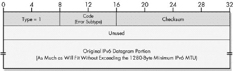
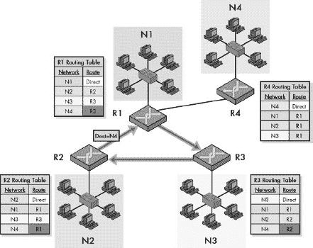
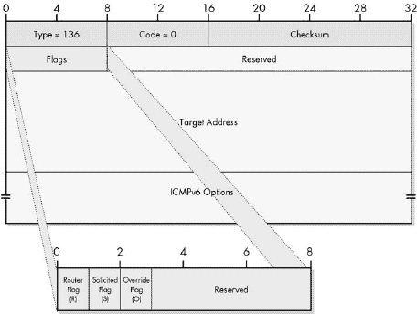
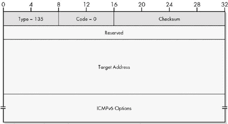
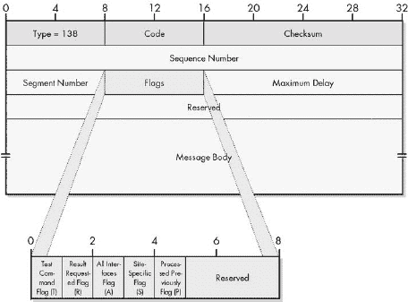
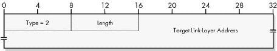

# 第二部分-6. IP 支持协议

第三十一章

第三十二章

第三十三章

第三十四章

第三十五章

第三十六章 协议")

互联网协议 (IP) 是实现 TCP/IP 协议套件的关键网络层协议。由于 IP 是提供在设备之间传递数据报机制的协议，因此它被设计得相对简单。例如，它缺乏允许错误报告回发送设备以及完成测试和特殊任务的方法。然而，这些辅助功能对于互联网的操作是必要的，因此 TCP/IP 包括 *支持协议* 来帮助 IP 执行这些任务。本部分探讨了两个主要的 IP 支持协议：*互联网控制消息协议 (ICMP)* 和 *邻居发现 (ND)* 协议。

本部分的大部分内容详细描述了 ICMP，它最初是为了作为原始 IP 版本 4 (IPv4) 的配套而开发的。随着 IP 版本 6 (IPv6) 的创建，一个新的 ICMP 版本也被创建，称为 ICMP 版本 6 (ICMPv6)。原始的 ICMP 现在有时被称为 *ICMPv4* 以区分它，就像原始的 IP 现在通常被称为 IPv4 一样。

ICMP 的两个版本在具体方面有一些差异，但它们在总体操作上非常相似。因此，我将本部分的两个版本的 ICMP 的一般操作描述整合到了第一章。ICMPv4 和 ICMPv6 最不同的地方在于特定的消息类型和格式，因此这些内容在第二到第五章中分别进行了描述。这些章节描述了每个版本中的错误消息和信息消息。

最后一章描述了 ND，它专门创建来协助 IPv6 的操作，并且与 ICMPv6 密切相关。

由于 ICMP 与 IP 之间的紧密关系，本部分假设您熟悉基本的 IP 概念，包括 IP 地址、IP 数据报的一般格式以及它们的路由方式（在第 II-3 部分[pt06.html "第 II-3 部分. 互联网协议版本 4 (IP/IPV4)"]中介绍）。为了更好地理解 ICMPv6 的细节，您可能还需要参考 IPv6 地址和数据报封装信息（在第 II-4 部分[pt07.html "第 II-4 部分. 互联网协议版本 6 (IPV6)"]中介绍）。

# 第三十一章. ICMP 概念和一般操作

互联网控制消息协议（ICMP）是网络世界中未被充分重视的“工蜂”之一。每个人都清楚关键协议如互联网协议（IP）对 TCP/IP 的重要性，但很少有人意识到整个套件依赖于 ICMP 提供的许多功能。最初创建是为了允许报告一小组错误条件，ICMP 消息现在被用来实现广泛的错误报告、反馈和测试功能。虽然每种消息类型都是独特的，但它们都是使用通用消息格式实现的，然后根据相对简单的协议规则发送和接收。这使得 ICMP 成为最容易理解的 TCP/IP 协议之一。（是的，我在这本书中确实说过一些事情是容易的！）

在本章中，我提供了 ICMP 的一般描述。我首先概述 ICMP，讨论其目的、历史以及定义它的版本和标准。我描述了 ICMP 的一般操作方法，并讨论了如何以及何时创建和处理的规则。然后，我概述了协议第 4 版和第 6 版（ICMPv4 和 ICMPv6）中使用的 ICMP 消息的常见格式，以及它们在一般术语中如何封装数据。最后，我讨论了 ICMP 消息的分类，并总结了 ICMPv4 和 ICMPv6 的不同消息类型和代码。

# ICMP 概述、历史、版本和标准

IP 是 TCP/IP 协议套件的基础，因为它负责交付数据报的机制。描述 IP 数据报交付方法的三个主要特征是*无连接的*、*不可靠的*和*无确认的*。这意味着数据报只是在互联网上发送，没有建立先前的连接，没有保证它们会出现，也没有向发送者发送确认它们已到达的确认。表面上，这似乎会导致一个难以使用且无法依赖的协议，因此不适合设计协议套件。然而，尽管 IP 没有保证，它仍然工作得非常好，因为大多数时候，IP 互联网足够健壮，消息能够到达它们需要去的地方。

即使是最精心设计的系统仍然会遇到问题，这是当然的。偶尔会发送错误的包，硬件设备出现问题，找到无效的路由，等等。IP 设备也需要共享特定信息以便引导它们的操作，并且它们需要执行测试和诊断。然而，IP 本身并没有提供允许设备交换低级控制消息的条款。相反，这些功能以 IP 的伴随协议的形式提供，称为*互联网控制消息协议（ICMP）*。

IP 和 ICMP 之间关系的良好类比是考虑一个高功率执行者和她经验丰富的行政助理之间的关系。执行者很忙，她的时间是极其宝贵的。她被雇佣来做一项具体的工作，并且要做好这项工作，而不是花时间在行政工作上。然而，如果没有人在做这些工作，执行者就无法正确地完成她的工作。行政助理做重要的支持工作，使得执行者能够专注于她的工作。他们之间的工作关系非常重要；一个好的搭档会像一个团结的团队一样一起工作，甚至预见彼此的需求。

在 TCP/IP 中，IP 是执行者，而 ICMP 是其行政助理。IP 专注于其核心活动，如寻址、数据报封装和路由。ICMP 通过提供允许 IP 设备之间进行不同类型通信的*ICMP 消息*来为 IP 提供关键支持。这些消息使用一个通用的通用格式，并封装在 IP 数据报中进行传输。它们被分为不同的类别，每种类型都有特定的用途和内部字段格式。

正如行政助理在组织结构图上通常有一个特殊的位置，并且通常用虚线直接连接到她所协助的执行者一样，ICMP 在 TCP/IP 协议架构中占据一个独特的位置（见第八章）。技术上，你可能认为 ICMP 属于第 4 层，因为它创建的消息封装在 IP 数据报中，并使用第 3 层的 IP 发送。然而，在最初定义它的标准中，ICMP 被明确声明不仅属于网络层，而且，正如 RFC 792 中所述，它是“IP 的真正组成部分，[必须]由每个 IP 模块实现。”这是 ICMP 的初始定义标准，标题简单地称为“互联网控制消息协议”。它与 IP 的标准同时发布，即 RFC 791。这进一步表明 IP 和 ICMP 确实是一对搭档。

由于两者之间关系密切，当 1990 年代中期开发新的互联网协议第 6 版（IPv6）时，有必要定义一个新的 ICMP 版本。这当然被称为“互联网控制消息协议（ICMPv6）用于互联网协议第 6 版（IPv6）规范”。它最初于 1995 年作为 RFC 1885 发布，并在 1998 年作为 RFC 2463 进行了修订。正如原始 IP 现在通常称为 IPv4 以区分 IPv6 一样，原始的 ICMP 现在也称为*ICMPv4*。

### 小贴士

**关键概念** 在 TCP/IP 中，互联网层中的诊断、测试和错误报告功能由*互联网控制消息协议（ICMP）*执行，它类似于 IP 的“行政助理”。原始版本，现在称为 ICMPv4，与 IPv4 一起使用，而较新的 ICMPv6 与 IPv6 一起使用。

这两个 RFC，792 和 2463，分别定义了 ICMPv4 和 ICMPv6 的基本操作，并描述了每种协议版本所支持的 ICMP 消息类型。ICMPv4 和 ICMPv6 在大多数方面非常相似，尽管它们有一些差异，这些差异大多是由于对 IP 本身的直接更改而产生的。另一份文档 RFC 1122，“互联网主机需求——通信层”，包含了关于如何使用 ICMPv4 的规则，正如你将在本章后面关于 ICMP 消息创建和处理惯例的部分中看到的。RFC 1812，“IP 版本 4 路由器需求”也是相关的。

该协议的两个版本都定义了一个通用消息系统，该系统被设计为可扩展的。这意味着除了在 ICMP 标准本身中定义的消息之外，其他协议也可以定义在 ICMP 中使用的消息类型。其中一些更重要的是在表 31-1 中展示的。

表 31-1. 定义 ICMP 消息的非 ICMP 互联网标准

| ICMP 版本定义的消息类型 | RFC 编号 | 名称 | ICMP 消息类型定义 |
| --- | --- | --- | --- |
|   | 950 | 互联网标准子网划分过程 | 地址掩码请求，地址掩码回复 |
|   | 1256 | ICMP 路由器发现消息 | 路由器通告，路由器请求 |
| ICMPv4 | 1393 | 使用 IP 选项进行 Traceroute | Traceroute |
|   | 1812 | IP 版本 4 路由器需求 | 定义了目的地不可达消息的三个新代码（子类型）。 |
| ICMPv6 | 2461 | IP 版本 6（IPv6）的邻居发现 | 路由器通告，路由器请求，邻居通告，邻居请求，重定向 |
|   | 2894 | IPv6 路由器重新编号 | 路由器重新编号 |

本章包括本书中涵盖的 ICMPv4 和 ICMPv6 消息类型的完整列表以及定义每个消息类型的标准。

# ICMP 通用操作

ICMP 是 TCP/IP 协议套中最简单的协议之一。大多数协议实现特定类型的功能，以促进网络栈的一部分或应用程序的基本操作。为此，它们包括许多特定的算法和任务，这些定义了协议，这也是大多数复杂性的来源。相比之下，ICMP 正是其名称所暗示的：一个定义控制消息的协议。因此，ICMP 的大部分内容都是提供一种机制，使任何 IP 设备都能向另一设备发送控制消息。

## ICMP 消息传递服务

ICMP 定义了各种消息类型，允许交换不同类型的信息。这些通常是为了报告错误或交换保持 IP 平稳运行所需的不同类型的重要信息而生成的。ICMP 本身并不定义所有不同 ICMP 消息的使用方式；这是由使用这些消息的协议来完成的。以这种方式，ICMP 为其他协议描述了一个简单的消息传递服务。

### 小贴士

**关键概念** ICMP 与其他大多数 TCP/IP 协议不同，它不执行特定任务。它定义了一种机制，通过该机制可以传输和接收各种控制消息以实现各种功能。

如前所述，尽管 ICMP 使用 IP 发送其消息，但它被认为是 IP 的一个组成部分。通常，ICMP 的操作涉及机器上 TCP/IP 协议软件的一部分检测到导致其生成 ICMP 消息的条件。这通常是 IP 层本身，尽管也可能是软件的另一个部分。然后，消息被封装并像任何其他 TCP/IP 消息一样传输，与其他 IP 数据报相比没有特殊处理。消息通过网络发送到接收设备的 IP 层，如图图 31-1 所示。

再次强调，由于许多 ICMP 消息实际上是为了向设备的 IP 软件传达信息，因此一旦接收方收到该消息，IP 层本身可能就是 ICMP 消息的最终目的地。在其他情况下，最终目的地可能是 TCP/IP 协议软件的另一个部分，这取决于接收到的消息类型。ICMP 不使用端口，如用户数据报协议（UDP）或传输控制协议（TCP）来将消息定向到主机上的不同应用程序。软件识别消息类型，并在软件内部相应地引导它。

ICMP 最初的设计理念是大多数消息将由路由器发送，但它们也可以由路由器和普通主机发送，具体取决于消息类型。有些显然只由路由器发送，例如重定向消息；而其他可能由路由器或主机发送。许多 ICMP 消息都是成对使用的，尤其是在各种请求和回复消息以及广告和请求消息中。

图 31-1. ICMP 通用操作 AICMP 的典型用途是在发送 IP 消息时提供反馈机制。在这个例子中，设备 A 试图向设备 B 发送一个 IP 数据报。然而，当它到达路由器 R3 时，检测到某种问题导致数据报被丢弃。路由器 R3 向设备 A 发送一个 ICMP 消息，告知它发生了某些事情，希望提供足够的信息让设备 A 纠正问题，如果可能的话。路由器 R3 只能将 ICMP 消息发送回设备 A，而不能发送给路由器 R2 或 R1。

## ICMP 错误报告限于数据报源

ICMP 操作的一个有趣的一般特征是，当检测到错误时，可以使用 ICMP 报告错误，但只能报告给数据报的原始源。这实际上是 ICMP 工作方式的一个重大缺点。请参阅图 31-1 并再次考虑客户端主机 A 向服务器主机 B 发送消息，由路由器 R3 检测到数据报中的问题。即使路由器 R3 怀疑问题是由处理消息的前一个路由器（如路由器 R2）引起的，它*也不能*向路由器 R2 发送问题报告。它只能将 ICMP 消息发送回主机 A。

这种限制是 IP 工作方式的产物。你可能还记得查看 IP 数据报格式时，唯一的地址字段是用于数据报的原始源地址和最终目的地址。（唯一的例外是如果使用了 IP 记录路由选项，但设备不能依赖这一点。）当路由器 R3 从路由器 R2 接收数据报，而路由器 R2 又从路由器 R1（以及在那之前，从设备 A）接收数据报时，数据报中只有设备 A 的地址。因此，路由器 R3*必须*将问题报告发送回设备 A，而设备 A 必须决定如何处理它。设备 A 可能决定更改它使用的路由，或者生成一个管理员可以用来调试路由器 R2 的错误报告。

除了这个基本限制之外，还制定了一些特殊的规则和惯例来规范 ICMP 消息生成、发送和处理的条件。我将在本章后面讨论这些内容。

### 小贴士

**关键概念** 在响应在 IP 数据报中看到的某个问题时发送的 ICMP 错误报告消息只能发送回原始设备。中间设备不能成为 ICMP 消息的接收者，因为它们的地址通常不在 IP 数据报的头部中携带。

# ICMP 消息类别、类型和代码

ICMP 消息用于允许在互联网中的 IP 设备之间通信不同类型的信息。这些消息本身用于广泛的目的，并且它们被组织成一般类别以及许多特定类型和子类型。

## ICMP 消息类别

在最高级别上，ICMP 消息分为两大类：

**错误消息** 这些消息用于向源设备提供有关已发生错误的反馈。它们通常专门针对某种操作生成，通常是数据报的传输，如图 31-1 所示。错误通常与数据报的结构或内容有关，或者与在数据报路由过程中在互联网中遇到的问题情况有关。

**信息性（或查询）消息** 这些是用于让设备交换信息、实现某些 IP 相关功能以及执行测试的消息。它们不指示错误，并且通常不会在常规数据报传输的响应中发送。它们是在应用程序的指示下生成或在常规基础上定期生成，以向其他设备提供信息。信息性 ICMP 消息也可能在响应另一个信息性 ICMP 消息时发送，因为它们通常出现在请求/响应或请求/公告功能对中。

### 小贴士

**关键概念** ICMP 消息分为两大类：*错误消息*，用于报告问题条件，以及*信息性消息*，用于诊断、测试和其他目的。

## ICMP 消息类型

ICMP 中的每种独立消息类型都分配了一个唯一的类型值，该值放入 ICMP 公共消息格式中同名字段。该字段宽度为 8 位，因此可以定义的理论最大消息类型数为 256。为 ICMPv4 和 ICMPv6 的每个版本维护一组单独的类型值。

在 ICMPv4 中，类型值是按照先来先服务的原则（某种程度上）连续分配给错误和信息性消息的，所以我们不能仅通过类型值来判断每种消息的类型。ICMPv6 中的一项微小改进是将消息类型分开。在 IPv6 中，错误消息的类型值为 0 到 127，信息性消息的类型值为 128 到 255。目前只定义了部分类型值。

### 小贴士

**关键概念** 对于 ICMPv4 和 ICMPv6，可以定义总共 256 种不同的可能消息类型。每个消息的头部中出现的类型字段指定了 ICMP 消息的类型。在 ICMPv4 中，类型值与消息类型之间没有关系。在 ICMPv6 中，错误消息的类型值为 0 到 127，信息性消息的类型值为 128 到 255。

## ICMP 消息代码

消息类型指示每种 ICMP 消息的一般用途。ICMP 还在每个消息类型内部提供了一种额外的详细级别，形式为一个代码字段，该字段也是 8 位。您可以将此字段视为消息子类型。因此，每种消息类型可以有最多 256 个子类型，这些子类型是消息整体功能的更详细细分。一个很好的例子是目标不可达消息，当数据报无法投递时会产生此消息。在此消息类型中，代码值提供了关于为什么投递不可能的具体信息。

## ICMP 消息类别和类型摘要

书的下一章描述了 ICMPv4 和 ICMPv6 的所有主要 ICMP 消息类型。为了方便，我已经将这些消息类型总结在表 31-2 中，该表显示了本书涵盖的每个消息的类型值、每个消息的名称、其目的的非常简短的摘要以及定义它的 RFC。为了使表格不至于过大，我没有显示每个类型值的每个代码值；这些可以在单独的消息类型描述中找到。该表按与描述 ICMP 消息类型的四个章节相对应的节组织，但此表在每个类别内按类型值升序排序，以便于参考。

表 31-2. ICMP 消息类别、类型和代码

| 消息类别 | 类型值 | 消息名称 | 消息类型摘要描述 | 定义 RFC 编号 |
| --- | --- | --- | --- | --- |
|   | 3 | 目标不可达 | 表示数据报无法送达其目标。代码值提供了关于错误性质更多信息的详细信息。 | 792 |
| ICMPv4 错误消息 | 4 | 源抑制 | 允许拥塞的 IP 设备告诉发送数据报的设备减慢发送数据报的速度。 | 792 |
|   | 5 | 重定向 | 允许路由器通知主机使用更好的路由发送数据报。 | 792 |
|   | 11 | 时间超限 | 发送时，由于生存时间字段已过期，数据报在交付前被丢弃。 | 792 |
|   | 12 | 参数问题 | 表示在交付数据报时出现的一些问题（由代码值指定）。 | 792 |
|   | 0 | 回声响应 | 作为对回声（请求）消息的回复发送；用于测试连通性。 | 792 |
|   | 8 | 回声（请求） | 由设备发送，以测试与互联网上另一设备的连通性。消息名称中有时会出现“请求”一词。 | 792 |
|   | 9 | 路由器通告 | 由路由器用于告知主机其存在和能力。 | 1256 |
| ICMPv4 信息消息（第一部分，共 2 部分） | 10 | 路由器请求 | 由主机使用，以提示任何监听路由器发送路由器通告。 | 1256 |
|   | 13 | 时间戳（请求） | 由设备发送，请求另一设备发送时间戳值以进行传播时间计算和时钟同步。消息名称中有时会出现“请求”一词。 | 792 |
|   | 14 | 时间戳响应 | 作为对时间戳（请求）的响应发送，以提供时间计算和时钟同步信息。 | 792 |
|   | 15 | 信息请求 | 最初用于从其他设备请求配置信息。现在已过时。 | 792 |
|   | 16 | 信息响应 | 最初用于在信息请求消息的响应中提供配置信息。现在已过时。 | 792 |
| ICMPv4 信息性消息（第二部分，共 2 部分） | 17 | 地址掩码请求 | 用于请求设备发送子网掩码。 | 950 |
|   | 18 | 地址掩码回复 | 包含在回复地址掩码请求时发送的子网掩码。 | 950 |
|   | 30 | 跟踪路由 | 用于实现实验性的增强型跟踪路由实用程序。 | 1393 |
|   | 1 | 目的地不可达 | 表示数据报无法递送到其目的地。*代码*值提供有关错误性质的更多信息。 | 2463 |
| ICMPv6 错误消息 | 2 | 数据包过大 | 当数据报因为对于路由中下一跳的最大传输单元（MTU）来说太大而无法转发时发送。此消息在 IPv6 中是必需的，而在 IPv4 中不是，因为在 IPv4 中，路由器可以分片过大的消息，但在 IPv6 中它们不能。 | 2463 |
|   | 3 | 时间超出 | 当数据报在交付前被丢弃，因为跳数限制字段减少到零时发送。 | 2463 |
|   | 4 | 参数问题 | 表示在递送数据报时出现了一些问题（由*代码*值指定）。 | 2463 |
|   | 128 | 回显请求 | 由设备发送以测试与互联网上另一设备的连通性。 | 2463 |
|   | 129 | 回显应答 | 作为对回显（请求）消息的回复发送；用于测试连通性。 | 2463 |
|   | 133 | 路由器请求 | 促使路由器发送路由器通告。 | 2461 |
| ICMPv6 信息性消息 | 134 | 路由器通告 | 由路由器发送，告知本地网络上的主机路由器存在。它还描述了其功能。 | 2461 |
|   | 135 | 邻居请求 | 由设备发送以请求另一设备的第 2 层地址，同时提供自己的地址。 | 2461 |
|   | 136 | 邻居通告 | 向网络上的其他设备提供有关主机的信息。 | 2461 |
|   | 137 | 重定向 | 将传输从主机重定向到网络上的直接邻居或路由器。 | 2461 |
|   | 138 | 路由器重新编号 | 传达路由器重新编号的信息。 | 2894 |

你可以看到，在 ICMPv4 和 ICMPv6 中，许多消息类型相当相似，但也有一些细微的差异。一个明显的差异是，在 ICMPv4 中，重定向被视为错误消息，但在 ICMPv6 中它是信息性消息。消息的使用方式也经常不同。在 IPv6 中，许多 ICMP 信息性消息的使用在邻居发现（ND）协议中有描述，这是 IPv6 中新的（见第三十六章）。

注意，信息请求和信息回复消息最初是为了允许设备确定 IP 地址以及可能的其他配置信息而创建的。这个功能后来通过主机配置协议如反向地址解析协议（RARP；参见第十四章"))、引导协议（BOOTP；参见第六十章"))和动态主机配置协议（DHCP，在第第六十一章至第六十四章中讨论）来实现。这些消息类型现在已过时。

# ICMP 消息创建和处理约定和规则

在本章前面关于 ICMP 的概述中，我把 IP 和 ICMP 之间的关系比作行政主管和行政助理之间的关系。许多主管在优秀的助理身上看重的特点之一是助理能够独立工作，不会造成不必要的干扰。一个好的助理应该节省主管的时间，而不是浪费她的时间。

作为 IP 的助手，ICMP 必须同样帮助 IP 正常工作，同时不占用太多资源。在这里，所节约的资源不是时间，而是带宽。ICMP 消息很重要，但必须被视为运行网络的开销的一部分。它们不携带用户数据，因此每一条都代表着网络中整体最终用户带宽的小损失。因此，我们只想在必要时发送它们，并且要仔细控制它们生成的条件。

行政助理相对于网络协议有一些明显的优势：常识和经验。他们通常知道帮助和阻碍之间的界限在哪里；计算机则不知道。为了部分弥补这一点，ICMP 的操作由一套关于如何创建和处理消息的*约定*或*规则*来指导。对于 ICMPv4，这些约定部分地描述在定义 RFC 792 中，但在 RFC 1122，“对互联网主机的要求——通信层”中描述得更多，该文档提供了在主机设备中实现 TCP/IP 的具体信息。在 ICMPv6 中，RFC 1122 中出现的与 ICMP 实现相关的信息已被大量纳入定义 ICMPv6 的主要文档 RFC 2463 中。

与消息生成相关的大部分问题都与错误消息有关，而不是信息消息。后一类消息通常不会引起问题，因为它们是根据使用它们的协议中已经建立的特定规则生成的。例如，路由器定期发送路由器通告消息，并且确保这是不频繁的。它们也是响应主机偶尔发送的路由器请求消息而发送的，只要主机不出现混乱并开始发送大量的请求，就不会有问题。即使在这种情况下，你也可以给路由器足够的智能，使其不会太频繁地发送路由器通告。

## ICMP 消息响应的限制

问题出现在错误消息上，特别是因为它们是针对许多情况发送的。潜在地，它们甚至可能相互响应。如果没有特别的注意，可能会发生循环或消息生成级联。例如，考虑这样一种情况：设备 A 遇到错误并向设备 B 发送错误报告。设备 B 发现设备 A 的消息中存在错误，并向设备 A 发送错误报告。这可能导致数十亿条消息在设备之间来回发送，从而阻塞网络，直到有人发现出了什么问题并修复它。

为了防止出现此类问题，在以下任何情况下都不应生成 ICMP 错误消息 *必须不*：

**一个 ICMP 错误消息** 这防止了前面提到的循环。然而，请注意，ICMP 错误消息 *可以* 在响应 ICMP 信息消息时生成。

**一个广播或多播数据报** 如果一个数据报被广播到 5,000 个主机，并且每个主机都发现其中的错误并尝试向源发送报告，会发生什么？结果可能很糟糕！

**除了第一个数据报片段之外** 在许多情况下，可能导致设备对某个片段生成错误的情况也会影响到后续的每个片段，从而造成不必要的 ICMP 流量。因此，当一个数据报被分片时，设备可能只在第一个片段出现问题时发送错误消息。

**非单播源地址的数据报** 如果一个数据报的源地址没有定义一个唯一的单播设备地址，则无法向该源发送错误消息。这防止了 ICMP 消息被广播、单播或发送到非路由的特殊地址，例如回环地址。

### 小贴士

**关键概念** 为了防止网络上发送过多的 ICMP 消息，有一套特殊的规则来规定何时以及如何创建它们。其中大部分都是为了消除在特定事件发生时会产生大量 ICMP 错误消息的情况。

这些规则适用于 ICMPv4 和 ICMPv6，但在 ICMPv6 中存在一些特殊情况。在特定情况下，ICMPv6 数据包太大消息可能被发送到多播地址，因为这是路径 MTU 发现（在第二十七章中描述）正常工作所必需的。第二十七章。某些参数问题消息也可能被发送到多播或广播地址。最后，除了上述规则外，IPv6 实现还特别指示要限制发送 ICMPv6 消息的整体速率。

## ICMP 消息处理约定

消息处理通常按照在 ICMP 一般操作部分中较早描述的方式进行，ICMP 消息根据需要交付给 IP 软件或其他协议软件实现。对消息的处理通常取决于其类型。一些消息仅针对 IP 软件本身，但许多消息旨在针对生成导致错误的分组的上层协议。在下一节中，您将看到 ICMP 错误消息包含允许上层协议被提取的信息，以便将消息传递到适当的软件层。

在 IPv6 中，可以通过类型值确定消息类别（错误或信息）。然后可以使用此知识来指导处理具有未知类型值的 ICMP 消息。规则是，具有未知类型值的 ICMP 错误消息必须传递给适当的上层协议。具有未知类型值的信息消息将被丢弃，而不采取任何行动。

除了这些一般规则外，还制定了特定规则来指导处理某些消息类型。我在讨论单个 ICMP 消息的章节中描述了这些约定。

一个重要的最终观点是，ICMP 消息，尤其是错误消息，并不被认为对处理它们的设备具有约束力。继续使用办公室类比，它们在办公室中的地位相当于仅相当于一个信息备忘录，而不是一项任务。通常情况下，设备在处理 ICMP 消息后*应该*采取行动，但设备并不需要这样做。例外情况再次是当信息消息用于特定目的时。例如，大多数成对出现的消息都是设计成请求导致匹配的回复，而请求则产生广告。

### 小贴士

**关键概念** 接收 ICMP 消息的设备不需要采取行动，除非使用消息类型的协议指定了对特定消息类型的特定响应。特别是，当接收 ICMP 错误消息时，设备不需要执行任何特定任务。

# ICMP 通用消息格式和数据封装

如本章中迄今为止所看到的，ICMP 与其说是一个执行特定功能的协议，不如说是一个交换错误报告和信息的基础框架。由于每种消息类型都用于不同的目的，它们包含的信息类型不同。这意味着每个 ICMP 消息都有略微不同的格式。然而，同时，ICMP 消息类型也有一定程度的共性——每种消息类型之间有部分内容是共同的。

## ICMP 通用消息格式

你可以将 ICMP 消息的结构想象成一个*通用部分*和一个*独特部分*。通用部分由三个字段组成，这些字段在所有 ICMP 消息中具有相同的大小和相同的含义（尽管每个 ICMP 消息类型字段中的值并不相同）。独特部分包含特定于每种消息类型的字段。

有趣的是，通用消息格式对于 ICMPv4 和 ICMPv6 基本上是相同的。它在表 31-3 中描述，并在图 31-2 中展示。

表 31-3. ICMP 通用消息格式

| 字段名称 | 大小（字节） | 描述 |
| --- | --- | --- |
| 类型 | 1 | 识别 ICMP 消息类型。对于 ICMPv6，0 到 127 的值是错误消息，128 到 255 的值是信息消息。该字段的常见值在表 31-2 中给出。 |
| 代码 | 1 | 识别每个 ICMP 消息类型值内的消息子类型。因此，可以为每种消息类型定义多达 256 个子类型。该字段的值将在以下章节中关于单个 ICMP 消息类型的章节中展示。 |
| 校验和 | 2 | 一个 16 位的校验和字段，其计算方式类似于 IPv4 中的 IP 头校验和。它为整个 ICMP 消息提供错误检测覆盖。注意，在 ICMPv6 中，为校验和计算预先附加了 IPv6 头字段的一个伪头；这与在 TCP 中执行的方式相似。 |
| 消息体/数据 | 可变 | 包含用于实现每种消息类型的特定字段。这是消息的独特部分。 |

图 31-2. ICMP 通用消息格式 这个通用的整体消息格式用于 ICMPv4 和 ICMPv6 消息类型。

## 在 ICMP 错误消息中包含原始数据报

消息体通常包含一个或多个字段，这些字段携带与每种特定类型 ICMP 消息相关的信息。所有 ICMP 错误消息都包括导致生成 ICMP 错误消息的原始 IP 数据报的一部分。这有助于通过允许将错误传达给高层来诊断导致生成 ICMP 消息的问题。

对于两种 ICMP 版本，包含原始 IP 数据报信息的方式不同：

**ICMPv4 错误消息** 每个错误消息都包括完整的 IP 报头和有效负载的前 8 个字节。由于有效负载的开始将包含封装的更高层报头，因此 ICMP 消息还携带完整的 UDP 报头或 TCP 报头的前 8 个字节。在两种情况下，源端口和目的端口号码都是包含的部分。如果原始报头是一个没有选项的标准 IP 报头，则消息体长度为 28 字节；如果有选项，则长度更大。

**ICMPv6 错误消息** 每个错误消息都包括尽可能多的 IPv6 数据报，而不会导致 ICMPv6 错误消息（包括其 IP 报头封装）的大小超过最小 IPv6 最大传输单元大小，即 1280 字节。与 ICMPv4 相比，这为诊断提供了额外的信息，同时确保没有 ICMPv6 错误消息会太大，以至于无法在任何物理网络段中传输。包含数据的较大大小允许在错误消息中包含 IPv6 扩展报头，因为错误可能出现在这些扩展报头之一中。

### 注意

*记住，在 IPv6 中，路由器不能分片 IP 数据报；任何超出底层物理网络大小的数据报都会被丢弃。因此，ICMPv6 被设计成通过不创建超过通用 IPv6 MTU 大小（1280 字节）的 ICMPv6 数据报来确保这一点*。

### 小贴士

**关键概念** 每种 ICMP 消息都包含该消息类型独有的数据，但所有消息都根据通用的 ICMP 消息格式进行结构化。ICMP 错误消息在其消息体字段中始终包含导致生成错误的部分原始 IP 数据报。

## ICMP 数据封装

在将 ICMP 消息格式化后，它就像任何其他 IP 消息一样封装在 IP 数据报中。这就是为什么有些人认为 ICMP 在架构上比 IP 层次更高，尽管如我之前讨论的，它实际上更像是一个特殊情况。你还可以看到，当生成 ICMP 错误消息时，我们最终会得到原始 IP 报头和部分或全部的有效负载，这些都被封装在 ICMP 消息中，而该消息反过来又封装在一个新的 IP 报头中，该报头将作为错误报告发送回去，通常发送给发送原始 IP 消息的设备。

# 第三十二章. ICMPV4 错误消息类型和格式

路由器和主机使用互联网控制消息协议（ICMP）错误消息来告知发送数据报的设备在投递过程中遇到的问题。原始的 ICMP 版本 4（ICMPv4）定义了五种不同的错误消息，这些消息都在原始 ICMP 标准 RFC 792 中进行了描述。这些是最重要的 ICMP 消息之一。它们提供了关于错误条件的关键反馈，并可能帮助发送设备采取纠正措施，以确保可靠和高效的数据报投递。

在这四章关于特定 ICMP 类型的章节中，我首先探讨 ICMPv4 错误消息。我从目的地不可达消息开始，这些消息是由于数据报投递失败而发送的，以及源端抑制消息，这些消息用于告诉设备减慢发送数据报的速度。接下来，我描述了超时消息，这些消息是在数据报在网络中传输时间过长或从片段重新组装所需时间过长时发送的，以及重定向消息，这些消息允许路由器向主机提供关于更好路由的反馈。最后，我讨论了参数问题消息，这些是用于其他 ICMP 错误消息未涵盖的问题的通用消息。

# ICMPv4 目的地不可达消息

由于互联网协议（IP）是一个不可靠的协议，因此无法保证一个设备发送给另一个设备的数据报最终会到达。主机和路由器的互联网将尽力投递数据报，但由于各种原因，它可能无法到达目的地。IP 网络上的设备理解这一点，并且相应地设计。IP 软件从不假设其数据报总是会收到，而像传输控制协议（TCP）这样的高层协议负责为需要这些功能的程序提供可靠性和接收数据的确认。

这种设置，由高层处理失败投递，在某些情况下是足够的。例如，假设设备 A 试图向设备 B 发送数据，但设备 B 附近的路由器过载，因此它丢弃了数据报。在这种情况下，问题可能是间歇性的，因此设备 A 可以重传并最终到达设备 B。但是，如果设备试图向一个不存在的 IP 地址发送数据，或者存在不易纠正的路由问题，该怎么办呢？在这种情况下，让源端不断重试至少是不高效的。

IP 协议设计为允许 IP 数据报投递失败，我们应该认真对待任何此类失败。我们真正需要的是一个反馈机制，能够告诉源设备发生了不适当的事情以及原因。在 IP 版本 4（IPv4）中，这项服务是通过传输*目标不可达*ICMP 消息来提供的。当一个源节点收到这些消息之一时，它知道发送数据报出现了问题，然后可以决定是否采取任何行动。像所有 ICMP 错误消息一样，目标不可达消息包含无法投递的数据报的一部分，这有助于错误接收者找出问题所在。

## ICMPv4 目标不可达消息格式

表 32-1 和图 32-1

图 32-1. ICMPv4 目标不可达消息格式

## ICMPv4 目标不可达消息子类型

有许多不同的原因可能导致数据报无法到达其目的地。其中一些可能是因为错误的参数（如前面提到的无效 IP 地址示例）。路由器可能因为任何原因无法到达特定的网络。也可能存在其他更奇特的原因，这些原因与数据报无法投递有关。

因此，ICMPv4 目标不可达消息类型可以被视为一类相关的错误消息。收到目标不可达消息告诉设备它发送的数据报无法交付，并且 ICMP 头部中的代码字段指示了非交付的原因。表 32-2 显示了不同的代码值、相应的消息子类型以及每个的简要说明。

表 32-2. ICMPv4 目标不可达消息子类型

| 代码值 | 消息子类型 | 描述 |
| --- | --- | --- |
| 0 | 网络不可达 | 数据报无法发送到 IP 地址网络 ID 部分指定的网络。这通常意味着存在路由问题，但也可能是由于地址错误引起的。 |
| 1 | 主机不可达 | 数据报被发送到 IP 地址的网络 ID 部分指定的网络，但无法发送到地址中指定的特定主机。同样，这通常意味着存在路由问题。 |
| 2 | 协议不可达 | 传输数据报的主机中指定的协议在协议字段中无效。 |
| 3 | 端口不可达 | UDP 或 TCP 头部指定的目标端口无效。 |
| 4 | 需要分片且设置了 DF 标志 | 这是那些晦涩难懂的代码之一。通常，如果 IPv4 路由器接收到的数据报太大，无法适应下一个物理网络链路的最大传输单元（MTU），则会自动分片数据报。然而，如果 IP 头部中的 DF（不要分片）标志被设置，这意味着数据报的发送者不希望数据报被分片。这使路由器处于两难境地，它将被迫丢弃数据报并使用此代码发送错误消息。这种消息类型通常被巧妙地用于故意发送越来越大尺寸的消息，以发现链路可以处理的最大传输单元（MTU）大小。这个过程被称为路径 MTU 发现（在第二十七章中描述，第二十七章）。 |
| 5 | 源路由失败 | 如果在数据报的选项中指定了源路由，但路由器无法将数据报转发到路由中的下一个步骤，则会生成此错误。 |
| 6 | 目标网络未知 | 未使用；使用代码 0 代替。 |
| 7 | 目标主机未知 | 指定的主机未知。这通常由目标主机本地的路由器生成，通常意味着地址错误。 |
| 8 | 源主机隔离 | 已过时，不再使用。 |
| 9 | 与目标网络的通信被管理员禁止 | 源设备不允许向目标设备所在的网络发送数据。 |
| 10 | 与目标主机通信被管理员禁止 | 源设备允许发送到目标设备所在的网络，但不能发送到该特定设备。 |
| 11 | 由于服务类型无法到达目标网络 | 由于无法提供数据报头部服务类型字段中指定的服务，无法到达 IP 地址中指定的网络。 |
| 12 | 由于服务类型无法到达目标主机 | 由于无法提供数据报服务类型字段中指定的服务，无法到达 IP 地址中指定的目标主机。 |
| 13 | 管理性禁止通信 | 由于基于内容过滤阻止消息的过滤导致数据报无法转发。 |
| 14 | 主机优先级违规 | 当服务类型字段中的优先级值不被允许时，由第一个路由器（处理发送数据报的第一个路由器）发送。 |
| 15 | 优先级截止生效 | 当路由器收到一个优先级值（优先级）低于当时网络允许的最小值的数据报时发送。 |

如您在表 32-2 中看到的，目前并不是所有这些代码都在积极使用。例如，代码 8 已过时，代码 0 代替了 6。此外，一些与服务类型字段相关的较高数字没有积极使用，因为服务类型没有被积极使用。

### 小贴士

**关键概念** ICMPv4 *目的地不可达* 消息用于通知发送设备 IP 数据报交付失败。消息的代码字段提供了关于交付问题性质的信息。

## 目的地不可达消息的解释

需要记住的是，就像 IP 是尽力而为一样，使用 ICMP 报告不可达目的地也是尽力而为。意识到这些 ICMP 消息本身是在 IP 数据报中传输的。更重要的是，记住可能存在阻止路由器检测 ICMP 消息交付失败的问题，例如低级硬件问题。理论上，即使检测到交付失败，路由器也可能被阻止发送 ICMP 消息。

因此，应将发送目的地不可达消息视为补充。不能保证发送数据报的每个问题都会导致相应的 ICMP 消息。没有任何设备应该期望在失败交付时收到 ICMP 目的地不可达消息，就像它最初期望交付一样。这就是为什么在讨论开始时提到的上层机制仍然很重要的原因。

# ICMPv4 源抑制消息

当源设备发送数据报时，它将穿越互联网，最终到达其预期的目的地（至少，这是我们希望发生的事情）。在那个时刻，目标设备负责通过检查它并确定要将数据报交给哪个高层软件进程来处理数据报。

如果目标设备以相对较慢的速度接收数据报，它可能能够在接收的同时即时处理每个数据报。然而，在典型的互联网中，数据报的接收可能会不均匀或突发，流量速率交替上升和下降。为了允许数据报到达速度超过其处理速度的时间，每个设备都有一个*缓冲区*，它可以暂时存储它已经接收到的数据报，直到它有机会处理它们。

然而，这个缓冲区本身的大小是有限的。假设设备已经得到适当的设计，缓冲区通常足以在大多数时候平滑处理高流量和低流量时段。仍然可能发生某些情况，其中流量接收速度如此之快，以至于缓冲区完全填满。以下是一些可能发生这种情况的场景示例：

+   单个目标设备被来自许多源的数据报淹没，例如，一个流行的网站被 HTTP 请求淹没。

+   设备 A 和设备 B 正在交换信息，但设备 A 比设备 B 快得多，可以比设备 B 更快地生成出站数据报和处理入站数据报。

+   路由器通过高速链路接收大量需要通过低速链路转发的数据报；它们在等待通过慢速链路发送时开始堆积。

+   硬件故障或其他情况导致数据报在设备上停留，无法被处理。

当设备没有更多缓冲区空间时，它被迫丢弃数据报，并被说成是*拥塞的*。由于 IP 本身是不可靠的且未确认的，因此，虽然简单地允许高层协议检测丢弃的数据报并生成替代品是可能的，但让拥塞设备通过告诉源它已过载来向源提供反馈要合理得多。

在 IPv4 中，由于拥塞而被迫丢弃数据报的设备会通过向其发送 ICMPv4 *源抑制*消息向使其过载的源提供反馈。正如你用水来扑灭火焰一样，源抑制消息是一个试图抑制发送速度过快的源设备的信号。换句话说，这是一种礼貌的方式，让一个 IP 设备告诉另一个设备，“慢一点！”当一个设备收到这样的消息时，它知道它需要降低向发送它的设备发送数据报的速度。

## ICMPv4 源抑制消息格式

表 32-3 和 图 32-2 展示了 ICMPv4 源抑制消息的具体格式。

表 32-3. ICMPv4 源抑制消息格式

| 字段名称 | 大小（字节） | 描述 |
| --- | --- | --- |
| 类型 | 1 | 识别 ICMP 消息类型；对于源抑制消息，此值设置为 4。 |
| 代码 | 1 | 识别正在通信的错误子类型。对于源抑制消息，此字段未使用，并设置为 0。 |
| 校验和 | 2 | ICMP 头的 16 位校验和字段（见第三十一章

图 32-2. ICMPv4 源抑制消息格式

## 源抑制消息的问题

源抑制格式的有趣之处在于它基本上是一个空消息。它告诉源目标已拥塞，但并未提供关于该情况的具体信息，也没有指定目标确切希望源如何减少其传输速率。也没有方法让目标向源发出信号，表明它不再拥塞，源应恢复其先前的发送速率。这意味着源抑制消息的响应留给接收它的设备。通常，设备会减少其传输速率，直到不再收到这些消息，然后它可能尝试缓慢地再次增加速率。

以类似的方式，关于何时以及如何生成源抑制消息没有规则。一个常见的约定是，对于每个被丢弃的数据报生成一条消息。然而，更智能的算法可能在高端路由器上被采用，以预测设备缓冲区何时会满，并预先抑制发送速度过快的某些源。设备还可以决定在变得繁忙时是否抑制所有源，或者只抑制某些源。与其他 ICMP 错误消息一样，设备不能指望在繁忙设备丢弃其数据报时发送源抑制消息。

源抑制消息中传达的信息不足，使它们成为管理拥塞的相当原始的工具。一般来说，在两个设备之间调节消息发送的过程称为 *流量控制*，这通常是传输层的功能。TCP 实际上有一个流量控制机制（在第四十九章 49 中讨论），它比使用 ICMP 源抑制消息的使用要优越得多。

源抑制消息的另一个问题是它们可能会被滥用。恶意用户发送这些消息可能会导致主机在没有合理原因的情况下变慢。这个问题与 TCP 流量控制方法的优越性相结合，导致源抑制消息的使用在很大程度上不再受欢迎。

### 小贴士

**关键概念** ICMPv4 的 *源抑制* 消息是由设备发送的，以请求另一个设备降低发送数据报的速度。与 TCP 提供的更强大机制相比，这些消息是一种相当原始的流量控制方法。

# ICMPv4 时间超限消息

大型 IP 互联网可以拥有成千上万的互联路由器，它们在各个网络之间的设备之间传递数据报。在大互联网中，路由器之间的连接拓扑可能变得复杂，这使得路由更加困难。路由协议通常允许路由器在网络上找到最佳路由，但在某些情况下，可能会选择一个低效的路由。在最坏的情况下，可能会发生 *路由环路*。这种情况的一个例子是，路由器 A 认为发往网络 X 的数据报应该发送到路由器 B，而路由器 B 认为它们应该发送到路由器 C，而路由器 C 认为它们需要发送回路由器 A。（有关路由环路说明的示例，请参阅第三十四章中的 ICMPv6 时间超限消息描述。）

如果发生这样的环路，进入该互联网部分的网络 X 的数据报将永远循环，消耗带宽，最终导致网络无法使用。为了防止这种情况发生，每个 IP 数据报在其报头中都包含一个生存时间（TTL）字段。该字段最初旨在限制数据报在互联网上存在的最大时间（以秒为单位），但现在通过限制数据报从一个设备传递到下一个设备的次数来限制数据报的生命周期。TTL 由源设备设置，表示它希望数据报经过的最大跳数。每个路由器都会递减该值；如果它达到零，则称数据报已 *过期* 并被丢弃。

当数据报因 TTL 字段过期而被丢弃时，丢弃数据报的设备将通过发送一个 ICMPv4 *时间超限* 消息来通知源设备这一事件，如图图 32-3 所示。收到此消息表明，原始发送设备在向该特定目的地发送时存在路由问题，或者最初设置的 TTL 字段值太低。与所有 ICMP 消息一样，接收该消息的设备必须决定是否以及如何对此消息做出响应。例如，它可能首先尝试以更高的 TTL 值重新发送数据报。

图 32-3. IP 数据报过期和时间超限消息生成示例 在本例中，设备 A 向设备 B 发送一个 IP 数据报，设备 B 的生存时间（TTL）字段值仅为 4（可能没有意识到设备 B 距离有七个跳数）。在第四跳时，数据报到达路由器 R4，其将 TTL 字段减至 0，然后因过期而丢弃。路由器 R4 随后向设备 A 发送一个 ICMP 时间超限消息。

还有一种时间超限情况，ICMP 时间超限消息被使用。当一个 IP 消息被分成片段时，目标设备负责将它们重新组装成原始消息。一个或多个片段可能无法到达目的地，因此为了防止设备无限期地等待，当第一个片段到达时，它设置了一个计时器。如果这个计时器在收到其他片段之前到期，设备将放弃此消息。片段被丢弃，并生成一个时间超限消息。

## ICMPv4 时间超限消息格式

表 32-4 和 图 32-4 展示了 ICMPv4 时间超限消息的具体格式。

表 32-4. ICMPv4 时间超限消息格式

| 字段名称 | 大小（字节） | 描述 |
| --- | --- | --- |
| 类型 | 1 | 识别 ICMP 消息类型；对于超时消息，此值设置为 11。 |
| 代码 | 1 | 识别正在通信的错误子类型。值为 0 表示 IP TTL 字段的过期；值为 1 表示分段重组时间已超过。 |
| 校验和 | 2 | ICMP 头部的 16 位校验和字段（见第三十一章）。 |
| 未使用 | 4 | 留白且未使用的 4 个字节。 |
| 原始数据报部分 | 可变 | 由于 TTL 字段过期或重组定时器到期而被丢弃的数据报的完整 IP 头和负载的前 8 个字节。 |

图 32-4. ICMPv4 超时消息格式

## 超时消息的应用

ICMP 超时消息通常是对表 32-4 中描述的两个条件之一的响应：TTL 或重组定时器到期。通常，路由器在尝试路由数据报时生成 TTL 过期消息，而端主机指示重组违规。然而，实际上这些消息有一个非常巧妙的用途，这与报告错误毫无关系。

TCP/IP 的*traceroute*（或*tracert*）实用程序用于显示数据报在源和目的地之间特定路由上传递的设备序列。traceroute 实用程序还显示了数据报到达该路由中每个跳所需的时间。该实用程序最初是通过发送具有递增 TTL 值的数据报并使用超时消息实现的。

首先，发送一个 TTL 值为 1 的虚拟数据报，导致路由中的第一个跳丢弃数据报并发送一个 ICMP 超时消息；然后可以测量这个过程中的时间。然后，发送一个 TTL 值为 2 的数据报。这会导致路由中的第二个设备报告一个超时消息，依此类推。通过继续增加 TTL 值，你可以从路由中的每个跳获取报告。参见第八十八章了解更多关于 traceroute 操作细节。

### 小贴士

**关键概念** ICMPv4 的*超时*消息在两种不同的时间相关情况下发送。第一种情况是，如果数据报的生存时间（TTL）字段减少到零，导致其过期并丢弃数据报。第二种情况是，在接收方的重组定时器到期之前，未接收到分段消息的所有片段。

# ICMPv4 重定向消息

在互联网中，每个设备都需要能够向其他所有设备发送数据。如果主机负责确定每个可能目的地的路由，那么每个主机都需要维护一个庞大的路由信息集。由于互联网上有如此多的主机，这将是一个非常耗时且维护密集的情况。

相反，IP 互联网的设计基于一个基本的设计决策：路由器负责确定路由并维护路由信息。主机只确定何时需要将数据报路由，然后将数据报交给本地路由器发送到所需的位置。我在对 IP 路由概念的概述中详细讨论了这一点（见第二十三章）。

由于大多数主机不维护路由信息，它们必须依赖路由器来了解路由以及将数据报发送到不同目的地的情况。通常，一个 IP 网络上的主机最初会拥有一个基本的路由表，告诉它将本地网络之外的所有内容发送到单个*默认路由器*，然后该路由器将确定如何处理它。显然，如果网络中只有一个路由器，主机将使用该路由器作为所有非本地流量的默认路由器。然而，如果有两个或更多路由器，将所有数据报发送到单个路由器可能没有意义。可能手动配置主机以知道为哪些目的地使用哪个路由器，但 IP 中的一种机制可以允许主机自动学习这一点。

考虑一个包含多个主机（H1、H2 等）和两个路由器 R1 和 R2 的网络 N1。主机 H1 已被配置为将所有数据报发送到路由器 R1，作为其默认路由器。假设它想向网络 N2 上的设备发送数据报。然而，网络 N2 最直接地通过路由器 R2 而不是 R1 连接到网络 N1。数据报首先会被发送到路由器 R1，R1 将查看其路由表，并看到网络 N2 的数据报需要通过路由器 R2 发送。“但是等等，”R1 说。“R2 在本地网络中，H1 也在本地网络中——那么我作为中间人有什么用？H1 应该直接将 N2 的数据报发送到 R2，而不用我。”

在这种情况下，路由器 R1 将向主机 H1 发送一个 ICMPv4 *重定向* 消息，告诉它将来应直接将此类数据报发送到路由器 R2。这种情况在 图 32-5 中显示。路由器 R1 还会将数据报转发到路由器 R2 以进行投递，因为没有理由丢弃数据报。因此，尽管通常与真正的 ICMP 错误消息一起分组，但重定向消息实际上根本不是错误消息。它们代表只存在低效，而不是明显的错误。实际上，在 ICMPv6 中，它们已被重新分类。

## ICMPv4 重定向消息格式

表 32-5 和 图 32-6 展示了 ICMPv4 重定向消息的具体格式。

图 32-5. 使用 ICMP 重定向消息进行主机重定向 在本例中，主机 H1 向路由器 R1 发送一个目的地为网络 N2 的数据报。然而，路由器 R1 注意到路由器 R2 在同一网络中，并且是到达网络 N2 的更直接路由。它将数据报转发到路由器 R2，同时也向主机 H1 发送一个 ICMP 重定向消息，告诉它下次使用路由器 R2。

表 32-5. ICMPv4 重定向消息格式

| 字段名称 | 大小（字节） | 描述 |
| --- | --- | --- |
| 类型 | 1 | 识别 ICMP 消息类型；对于重定向消息，此值为 5。 |
| 代码 | 1 | 识别重定向消息的意义或范围。有关此字段在重定向消息中如何使用的说明，请参阅 表 32-6

图 32-6. ICMPv4 重定向消息格式

## 重定向消息解释代码

当设备接收到重定向消息时，它会检查原始数据报包含的部分。由于这包含重定向目标设备的原始目标地址，这告诉原始发送者哪些地址应在未来进行重定向。互联网地址字段告诉它应使用哪个路由器进行后续数据报。代码字段告诉发送者如何广泛地解释重定向。有四个不同的代码值，如表 32-6 所示。

表 32-6. ICMP 重定向消息解释代码

| 代码值 | 消息子类型 | 含义 |
| --- | --- | --- |
| 0 | 为网络（或子网）重定向数据报 | 重定向所有未来发送到导致此重定向的设备地址的数据报，以及该设备所在网络（或子网）上的所有其他设备。（此代码现已过时；请参阅此表后面的注释。） |
| 1 | 为主机重定向数据报 | 仅针对原始数据报发送的特定设备地址重定向所有未来数据报。 |
| 2 | 为服务类型（TOS）和网络（或子网）重定向数据报 | 与代码值 0 相同，但仅针对与原始数据报具有相同 TOS 值的前瞻数据报。（此代码现已过时；请参阅此表后面的注释。） |
| 3 | 为 TOS 和主机重定向数据报 | 对于代码值 1，但仅针对与原始数据报具有相同 TOS 值的未来数据报。 |

### 注意

*对于整个网络的重定向存在一个问题，即在网络划分或无类别寻址的环境中，网络规范可能是不明确的。因此，RFC 1812 禁止使用代码值 0 和 2；在现代互联网上，这些值被认为是过时的*。

显然，路由器通常生成重定向消息并将它们发送到主机；主机通常不会创建它们。重定向消息何时创建的具体规则可能相当复杂，因为可能存在许多条件阻止这些消息被发送。特别是，当路由器可能重定向整个网络（或子网）而不是单个主机时，存在特殊的规则。此外，请记住，TOS 字段是可选的，通常不使用，因此代码值为 2 或 3 的重定向比代码值为 0 和 1 的重定向更不常见。

## 重定向消息的限制

请记住，ICMP 重定向消息**不是**实现 IP 中一般路由过程的机制；它们只是一个辅助功能。它们是主机通过本地路由器获得路由信息的一种方便方式，但不用于在路由器之间通信路由信息。

这意味着重定向消息可以告诉主机使用一个更高效的第一个跳转路由器，但不能告诉路由器使用一个更高效的第二个跳转路由器。在先前的例子（如图 32-5 所示链接 和 图 32-7 展示了 ICMPv4 参数问题消息的特定格式。

图 32-7. ICMPv4 参数问题消息格式

表 32-7. ICMPv4 参数问题消息格式

| 字段名称 | 大小（字节） | 描述 |
| --- | --- | --- |
| 类型 | 1 | 识别 ICMP 消息类型；对于参数问题消息，此值为 12。 |
| 代码 | 1 | 识别正在通信的问题子类型。有关此字段与参数问题消息相关的更多信息，请参阅 表 32-8 展示了三个代码值，并对每个代码值进行了简要说明。

表 32-8. ICMPv4 参数问题消息解释代码

| 代码值 | 消息子类型 | 描述 |
| --- | --- | --- |
| 0 | 指针指示错误 | 这是参数问题消息的正常用途。当使用此代码值时，指针字段指示问题的位置。 |
| 1 | 缺少必需的选项 | IP 数据报需要包含一个缺失的选项。由于选项缺失，无法指向它。 |
| 2 | 错误长度 | 数据报的总长度不正确，表明整个消息存在一般性问题。同样，指针字段在这里没有意义。 |

### 提示

**关键概念** ICMPv4 **参数问题** 消息是一个通用的万能工具，可以用来传达 IP 数据报中任何类型的错误。通常使用一个特殊的指针字段来指示消息接收者，问题出在原始数据报的哪个位置。

注意，指针字段只有八位宽，但由于这允许值高达 256，因此足以允许它指向 IP 头部内的任何位置。指针字段可以指向 IP 选项内的一个字段。

# 第三十三章。ICMPV4 信息消息类型和格式

在上一章中我们检查的五个互联网控制消息协议 (ICMP) 错误消息类型，在互联网协议 (IP) 内部网络操作过程中遇到错误或问题条件时，传达了重要的信息。相比之下，另一类 ICMP 消息包含那些消息，它们是 **信息性的**。它们不是对常规 IP 数据报中某个问题的响应，而是用于实现 IP 的各种支持功能。信息性消息用于测试和诊断目的，以及允许设备共享它们正常工作所需的临界信息。

在本章中，我描述了九种不同的 ICMP 版本 4（ICMPv4）信息消息。由于许多这些消息用于功能集，因此相关消息的对一起描述。我首先讨论了用于网络测试的回声（请求）和回声应答消息，以及用于时钟同步的时间戳（请求）和时间戳应答消息。我解释了路由器通告和路由器请求消息的使用和格式，这些消息允许主机发现本地路由器的身份并了解它们的重要信息。我还描述了用于通信子网掩码信息的地址掩码请求和地址掩码应答消息。最后，我审视了 Traceroute 消息，它实现了 traceroute 实用程序的更复杂版本。

### 注意

*原始的 ICMP 标准还定义了两种更多的信息消息类型：信息请求和信息应答。这些消息旨在允许设备确定 IP 地址以及可能的其他配置信息。这个功能后来通过主机配置协议如反向地址解析协议（RARP）、引导协议（BOOTP）和动态主机配置协议（DHCP）来实现。这些消息类型现在已过时；因此，它们在本章中未讨论*。

# ICMPv4 回声（请求）和回声应答消息

ICMP 信息消息的主要目的之一是启用测试和诊断，以帮助识别和纠正互联网中的问题。两个设备之间可以进行的最基本的测试就是简单地检查它们是否能够互相发送数据报。通常的做法是让一个设备向第二个设备发送测试消息，第二个设备接收消息并回复告诉第一个设备它已收到消息。

ICMPv4 包括一对专门用于连接测试的消息。假设设备 A 想看看它是否能到达设备 B。设备 A 通过向设备 B 发送 ICMPv4 *Echo* 消息来开始测试过程。当设备 B 接收到回声时，它会向设备 A 发送一个*Echo* 应答消息。当设备 A 接收到这条消息时，它就知道它能够与设备 B 成功通信（发送和接收）。

### 注意

*该对中第一条消息的名称通常被称为回声请求。虽然这确实传达了回声和回声应答消息的配对性质，但标准中使用的正式名称只是一个回声消息*。

## ICMPv4 回声和回声应答消息格式

表 33-1 和 图 33-1 展示了 ICMPv4 回显和回显应答消息的格式。

表 33-1. ICMPv4 回显和回显应答消息格式

| 字段名称 | 大小（字节） | 描述 |
| --- | --- | --- |
| 类型 | 1 | 识别 ICMP 消息类型。对于回显消息，值为 8；对于回显应答消息，值为 0。 |
| 代码 | 1 | 不用于回显和回显应答消息；设置为 0。 |
| 校验和 | 2 | ICMP 头部的一个 16 位校验和字段（见第三十一章

图 33-1. ICMPv4 Echo 和 Echo Reply 消息格式 这些消息的格式中使用了两个特殊字段。它们允许设备将 Echo 和 Echo Reply 消息配对，并交换一系列消息。标识符字段原本设想为用作高级标签，如会话标识符，而序列号被视为用于识别一系列中的单个测试消息。然而，这些字段的使用取决于特定的实现。在某些情况下，标识符字段被填充为使用 Echo 或 Echo Reply 消息的应用程序进程号，以便多个用户可以使用 ping 等工具而不会相互干扰。

## Echo 和 Echo Reply 消息的应用

你最可能使用 Echo 和 Echo Reply 消息的方式是通过流行的实用工具*ping*，它用于测试主机可达性。虽然基本测试只是简单地发送一个 Echo 消息并等待 Echo Reply 消息，但 ping 的现代版本相当复杂。它们允许用户指定许多参数，包括发送的 Echo 消息数量、发送频率、传输的消息大小等等。它们还提供了大量有关连接的信息，包括接收到的 Echo Reply 消息数量、交换这对消息所花费的时间以及更多。有关 ping 的完整说明，请参阅第八十八章。

### 小贴士

**关键概念** ICMPv4 的*Echo (请求)*和*Echo Reply*消息用于促进网络可达性测试。一个设备可以通过发送 Echo 消息并等待另一个设备返回 Echo Reply 消息来测试其与另一个设备进行基本通信的能力。ping 实用工具是 TCP/IP 因特网中广泛使用的诊断工具，它利用了这些消息。

# ICMPv4 时间戳（请求）和时间戳回复消息

因特网上的所有主机和路由器都是相互独立运行的。这种自主性的一个方面是每个设备都维护一个独立的系统时钟。然而，有一个问题：即使是非常精确的时钟，在保持时间的准确性以及启动时初始化的时间上也有细微的差异。这意味着在正常情况下，因特网上的任何两个设备都不保证具有完全相同的时间。

TCP/IP 的创造者认识到，如果一对设备之间的系统时钟差异太大，某些应用程序可能无法正常工作。为了支持这一需求，他们创建了一对 ICMP 消息，允许设备交换系统时间信息。发起设备创建一个时间戳消息并将其发送给它希望同步的设备。该设备以时间戳回复消息的形式进行响应。这些消息中的时间戳字段用于标记消息发送和接收的时间，以便同步设备的时钟。

### 注意

*与上一节中描述的回显消息一样，时间戳消息有时被视为时间戳请求，尽管其正式名称中并没有出现“请求”一词*。

## ICMPv4 时间戳和时间戳回复消息格式

ICMPv4 的*时间戳*和*时间戳回复*消息具有相同的格式。发起设备填写一些字段，而响应设备填写其他字段。格式如表 33-2 和图 33-2 所示。

表 33-2. ICMPv4 时间戳和时间戳回复消息格式

| 字段名称 | 大小（字节） | 描述 |
| --- | --- | --- |
| 类型 | 1 | 识别 ICMP 消息类型。对于时间戳消息，值为 13；对于时间戳回复消息，值为 14。 |
| 代码 | 1 | 对于时间戳和时间戳回复消息未使用；设置为 0。 |
| 校验和 | 2 | ICMP 头部（见第三十一章

图 33-2. ICMPv4 时间戳和时间戳回复消息格式

所有三个时间戳都表示自午夜以来的毫秒数，*世界时* (*UT*)（也称为*格林威治平均时间*或*GMT*）。之所以有三个时间戳而不是你通常期望的两个，是因为响应设备在接收到时间戳消息和生成时间戳回复时记录了单独的时间戳。当回复消息被原始设备接收时，它就有了时间戳和时间戳回复消息发送的时间。这使得原始设备能够区分在网络中传输数据报所需的时间和另一设备处理时间戳消息并将其转换为时间戳回复消息所需的时间。

## 使用时间戳和时间戳回复消息的问题

实际上，即使有这三个时间戳字段，在互联网（尤其是像互联网这样的大型互联网）上协调系统时钟也很困难。主要问题是发送数据报所需的时间因数据报而异。再次强调，由于 IP 不可靠，数据报接收的时间可能是无限的。事实上，它可能被路由器丢失或丢弃。

这意味着简单的交换时间戳和时间戳回复消息并不是一个足够可靠的保证，以确保在典型的 IP 互联网上两个设备同步。因此，现代设备通常使用更复杂的方法进行时间同步，例如网络时间协议（NTP）。

注意，与许多其他 ICMP 消息类型不同，对时间戳和时间戳回复消息的支持是可选的，对于主机和路由器都是如此。

# ICMPv4 路由器通告和路由器请求消息

在第二十三章中，我讨论了 IP 互联网设计的关键方面：路由器与主机在路由方面的角色差异。路由器负责路由数据报，因此需要知道路由并交换路由信息。主机通常对路由了解不多；它们依赖路由器来传递发往本地网络外目的地的数据报。

这种依赖性意味着在主机真正参与互联网之前，它需要知道本地网络中至少一个路由器的身份。确保这一点的一种方法是为每个主机手动配置本地路由器的地址作为其默认路由器。这种方法很简单，但具有与手动过程相关的典型缺点：设置耗时，维护困难，缺乏灵活性。

## 路由器发现过程

如果有一种方法可以让宿主机自动发现本地路由器的身份并了解它们的重要信息，那就更好了。在 IP 中，这个过程称为*路由器发现*，最初在 RFC 1256，“ICMP 路由器发现消息”中定义。RFC 标题中引用的消息是 ICMP 路由器广告消息和路由器请求消息。它们被添加到在较早标准（如 RFC 792）中定义的 ICMP 消息类型中。

路由器负责发送*路由器广告*消息。这些消息告诉监听设备路由器存在，并提供有关路由器的重要信息，例如其地址（或地址，如果它有多个地址）以及宿主机应保留关于路由器信息的时间。常规路由器广告消息定期发送，管理员可以配置消息之间的时间（通常在七到十分钟之间）。宿主机监听这些消息；当收到广告时，宿主机会处理它并将有关路由器的信息添加到其路由表中。

一台没有手动配置路由信息的宿主机在首次开机时将没有任何关于路由器的知识。让它坐等数分钟以寻找常规的路由器广告消息是不高效的。而不是等待，宿主机可以在其本地网络（s）上发送一个*路由器请求*消息。这将促使任何听到它的路由器立即向该宿主机发送额外的路由器广告消息。

## ICMPv4 路由器广告消息格式

ICMPv4 路由器广告消息格式在表 33-3 和图 33-3 中显示。

表 33-3. ICMPv4 路由器广告消息格式

| 字段名称 | 大小（字节） | 描述 |
| --- | --- | --- |
| 类型 | 1 | 识别 ICMP 消息类型。对于路由器广告消息，值为 9。 |
| Code | 1 | 通常设置为 0。当一个移动 IP 代理发送带有代理广告扩展的路由器广告时，只有当设备是移动代理且不打算处理正常流量时，它才可以将值设置为 16。有关移动 IP 代理发现的讨论，请参阅第三十章的详细信息。 |
| 校验和 | 2 | ICMP 头部的一个 16 位校验和字段（见第三十一章）。 |
| 地址数量 | 1 | 包含在此广告中的与此路由器关联的地址数量。 |
| 地址条目大小 | 1 | 地址条目大小——每个地址包含的信息的 32 位字数。由于在此消息格式中，每个路由器地址都有一个 32 位的地址和一个 32 位的优先级级别，因此此值固定为 2。 |
| 生存时间 | 2 | 主机应认为此消息中的信息有效的秒数。 |
| 路由器地址条目 | Num Addrs 字段值 * 8 | 路由器地址条目数量等于 Num Addrs 字段值。每个条目为 8 字节，包含两个子字段，每个子字段大小为 4 字节。路由器地址子字段是发送此消息的路由器接口的有效地址。优先级级别子字段是该地址的优先级级别。当广告中包含多个地址时，此字段指示路由器希望主机使用的地址。值越大表示优先级越高。 |

图 33-3. ICMPv4 路由器通告消息格式

## ICMPv4 路由器请求消息格式

ICMPv4 路由器请求消息非常简单，因为它们只需要传达以下单一信息：“如果你是路由器并且可以听到这个，请向我发送路由器通告。”因此，格式只是表 33-4 中显示的平凡字段集，并在图 33-4 中说明。

表 33-4. ICMPv4 路由器请求消息格式

| 字段名称 | 大小（字节） | 描述 |
| --- | --- | --- |
| 类型 | 1 | 识别 ICMP 消息类型。对于路由器请求消息，值为 10。 |
| 代码 | 1 | 未使用；值设置为 0。 |
| 校验和 | 2 | ICMP 头部（见第三十一章

图 33-4. ICMPv4 路由器请求消息格式

## 路由器通告和路由器请求消息的寻址和使用

如果可能，路由器通告和路由器请求消息都作为多播发送以提高效率。路由器通告使用“所有设备”多播地址（224.0.0.1），因为它们是针对主机接收的。*路由器请求*消息使用“所有路由器”多播地址（224.0.0.2）。如果本地网络不支持多播，则消息将通过广播（发送到地址 255.255.255.255）发送。

重要的是要记住，就像 ICMP 重定向消息一样，路由器通告消息不是交换路由信息的通用方法。它们仅是一个支持机制，用于通知主机关于路由器的存在。路由器之间使用路由协议（如路由信息协议（RIP）和开放最短路径优先（OSPF））来交换关于路由的详细信息。

虽然路由器发现是手动配置主机默认路由器的一种替代方案，但还有其他替代方案。例如，像动态主机配置协议（DHCP）这样的主机配置协议可以使主机学习到本地网络中默认路由器的地址。

最后，请注意，当实现移动 IP 时，路由器通告消息被用作移动 IP 意识路由器发送代理通告的基础。在常规路由器通告格式中添加了一个或多个特殊扩展来创建代理通告。这在第三十一章（第三十一章. ICMP 概念和一般操作）中关于移动 IP 代理发现的章节中进行了详细讨论。

### 提示

**关键概念** ICMP *路由器通告* 消息由 IP 路由器定期发送，以通知主机其存在和特性。这样，主机就知道使用它们将数据报文发送到远程主机。一个新加入网络并希望立即了解现有路由器的主机可以发送一个 *路由器请求* 消息，这将促使监听路由器发送路由器通告消息。

# ICMPv4 地址掩码请求和回复消息

当 IP 首次开发时，IP 地址基于简单的两级结构，包括网络标识符（网络 ID）和主机标识符（主机 ID）。为了提供更多灵活性，很快开发了一种称为 *子网划分* 的技术。子网划分将寻址方案扩展为三级结构，每个地址包含网络 ID、子网标识符和主机 ID。*子网掩码* 是一个 32 位数字，告诉设备（和用户）哪些位是子网标识符的一部分，与主机 ID 相比。所有这些都在 IP 寻址部分（第二部分-3")）中进行了详细描述。

为了在子网环境中正常工作，每个主机都必须知道与其分配的每个地址相对应的子网掩码。没有掩码，它无法正确解释 IP 地址。正如在确定本地路由器身份时，主机可以通过手动或自动方式得知本地网络的子网掩码。手动方法是将子网掩码手动分配给每个主机。自动方法利用了一对用于确定子网掩码的 ICMP 消息，这些消息在 RFC 950 中定义，该标准本身也定义了子网划分。

要使用此方法，主机在本地网络上发送一个*地址掩码请求*消息，通常是为了从路由器获取响应。如果它知道本地路由器的地址，它可以直接发送请求（单播）；否则，主机将广播请求到任何监听的路由器。本地路由器（或其他设备）将接收此消息，并回复一个包含本地网络子网掩码的*地址掩码回复*消息。这个过程与主机用于请求路由器响应路由器通告消息的机制类似，但路由器不会定期发送子网掩码信息——该信息必须被请求。

## ICMPv4 地址掩码请求和地址掩码回复消息格式

地址掩码请求和地址掩码回复，就像其他一些请求和回复对一样，具有相同的基本格式。主机创建请求时，除了子网掩码值本身外，所有字段都已填写，路由器提供掩码并发送回复回主机。格式在表 33-5 中描述，并在图 33-5 中展示。

表 33-5. ICMPv4 地址掩码请求和地址掩码回复消息格式

| 字段名称 | 大小（字节） | 描述 |
| --- | --- | --- |
| 类型 | 1 | 识别 ICMP 消息类型。对于地址掩码请求消息，值为 17；对于地址掩码回复消息，值为 18。 |
| 代码 | 1 | 不用于任何消息类型；设置为 0。 |
| 校验和 | 2 | 用于 ICMP 头的 16 位校验和字段（见第三十一章

图 33-5. ICMPv4 地址掩码请求和地址掩码回复消息格式

标识符和序列号字段可以用来匹配请求和回复，因为它们用于回声和回声回复消息。然而，主机通常不会像发送用于测试的回声消息那样发送多个地址掩码请求。因此，标识符和序列号字段可能被某些实现忽略。

## 使用地址掩码请求和地址掩码回复消息

注意，使用地址掩码请求和地址掩码应答消息是可选的，就像上一节中描述的路由器发现一样。除了这些消息或手动配置之外，还可以使用其他方法来告诉主机使用哪个子网掩码。同样，对于这种情况，ICMP 的一个常见替代方案是使用主机配置协议，如 DHCP。路由器确实需要能够对选择发送地址掩码请求的主机的地址掩码请求做出响应。

# ICMPv4 Traceroute 消息

在本章前面看到的回声和回声应答消息用于在两个设备之间进行的最基本的测试：检查它们是否可以通信。还可以进行更复杂的测试，不仅可以看到设备是否能够通信，还可以发现用于在它们之间移动数据报的确切路由器序列。在 TCP/IP 中，这种诊断是通过 traceroute（或 tracert）实用程序来执行的。

*traceroute*的第一个实现使用了一种巧妙的时间超限错误消息的应用，如前一章所述。通过首先向目的地发送一个 TTL 值为 1 的测试消息，然后是 2，然后是 3，依此类推，源和目的地之间的每个路由器都会依次丢弃测试消息并发送回时间超限消息。然后每个路由器会显示两个主机之间的路由器序列。这种小技巧在一般意义上效果很好，但在几个方面都不是最优的。例如，它要求源设备为路径中的每个路由器发送一个测试消息，而不是只发送一个测试消息。它也没有考虑到两个设备之间的路径在测试期间可能发生变化的可能性。

认识到这些限制后，1993 年开发了一个新的实验性标准，定义了进行 traceroute 的更有效的方法：RFC 1393，“使用 IP 选项的 traceroute”。正如标题所暗示的，这种进行 traceroute 的方法是通过源设备向目的地发送包含特殊 Traceroute IP 选项的单个数据报来实现的。在测试消息沿路由进行的过程中，每个看到该选项的路由器都会向原始源发送 ICMP Traceroute 消息，该消息也在 RFC 1393 中定义。

## ICMPv4 Traceroute 消息格式

由于*Traceroute*消息是专门为 traceroute 实用程序设计的，因此可以在其中包含额外的信息，以便路由追踪的主机可以使用。消息格式如表 33-6 和图 33-6 所示。

表 33-6. ICMPv4 Traceroute 消息格式

| 字段名称 | 大小（字节） | 描述 |
| --- | --- | --- |
| 类型 | 1 | 识别 ICMP 消息类型；在这种情况下，为 30。 |
| 状态码 | 1 | 如果源设备发送的数据报成功发送到下一个路由器，则设置为 0，或者设置为 1 以指示数据报被丢弃（意味着 traceroute 失败）。 |
| 校验和 | 2 | ICMP 头部的一个 16 位校验和字段（见第三十一章）。 |
| ID 号 | 2 | 一个标识字段，用于将此 Traceroute 消息与源端发送的原始消息（包含 Traceroute IP 选项的消息）匹配。 |
| 未使用 | 2 | 未使用，设置为 0。 |
| 输出跳数 | 2 | 原始消息已经经过的路由器数量。 |
| 返回跳数 | 2 | 返回消息经过的路由器数量。 |
| 输出链路速度 | 4 | Traceroute 消息正在发送的链路速度，以每秒字节数表示。 |
| 输出链路 MTU | 4 | Traceroute 消息正在发送的链路的最大传输单元（MTU），以字节为单位。 |

图 33-6. ICMPv4 Traceroute 消息格式

## Traceroute 消息的使用

尽管这种实现 traceroute 的方法比旧的 Time Exceeded 消息方法有优势，但它也存在一个关键缺陷：它需要修改主机和路由器以支持新的 IP 选项和 Traceroute ICMP 消息。人们并不热衷于改变，尤其是当涉及到 IP 的基本操作时。因此，RFC 1393 从未超出实验状态，大多数 IP 设备仍然使用旧的 traceroute 实现方法。然而，你可能会遇到 ICMP Traceroute 消息，所以了解它们的存在是好的。

### 提示

**关键概念** ICMP *Traceroute*消息被设计为提供一种更强大的实现 traceroute（tracert）工具的方法。然而，大多数 TCP/IP 实现仍然使用 ICMP Time Exceeded 消息来完成这项任务。

# 第三十四章. ICMPV6 错误消息类型和格式

为互联网协议第四版（IPv4）定义的原始互联网控制消息协议（ICMP）包含多个错误消息，允许在互联网内部进行问题通信。当开发 IP 版本 6（IPv6）时，IPv4 和 IPv6 之间的差异足够大，以至于还需要一个新的 ICMP 版本：版本 6 *(ICMPv6)*，它目前由 RFC 2463 指定。与 ICMPv4 一样，ICMPv6 定义了多个错误消息，用于通知源端出现了一些问题。

在本章中，我描述了 RFC 2463 中定义的四个 ICMPv6 错误消息。我首先讨论 ICMPv6 目的地不可达消息，这些消息用于告知设备它发送的数据报由于各种原因无法交付。我描述了数据包过大错误消息，当数据报因为太大而无法通过它需要穿越的底层网络时，会发送这些消息。我解释了时间超时消息的使用，这些消息表明完成传输花费了太多时间。最后，我审视了参数问题消息，这些消息提供了一种通用的方式来报告前述任何 ICMPv6 错误消息类型未描述的错误。

### 注意

*四个 ICMPv6 错误消息中的三个（除了数据包过大之外的所有消息）与具有相同名称的 ICMPv4 错误消息等效。然而，为了使本章能够独立存在，我详细描述了每一个，并指出了 ICMPv4 和 ICMPv6 消息版本之间的任何重大差异*。

# ICMPv6 目的地不可达消息

IPv6 在较旧版本 4 上包含一些重要增强，但两种协议的基本操作仍然本质上是相同的。与 IPv4 一样，IPv6 是一个不可靠的网络协议，它尽力交付数据报，但并不保证它们总能到达。正如它们在 IPv4 中所做的那样，IPv6 网络上的设备不能假设发送到目的地的数据报总会被接收。

当数据报无法交付时，从这种状态中恢复通常落在传输控制协议（TCP）等高层协议上，这些协议将检测到通信错误并重新发送丢失的数据报。在某些情况下，例如由于路由器拥塞而丢弃的数据报，这可能足够了，但在其他情况下，数据报可能因为发送方式本身存在固有问题而无法交付。例如，源可能指定了一个无效的目的地址，这意味着即使重发多次，数据报也永远不会到达预期的接收者。

通常，如果源只知道重新发送未交付的数据报而不知道它们丢失的原因，这是低效的。更好的是有一个反馈机制，可以告知源设备关于无法交付的数据报，并提供一些关于数据报交付失败原因的信息。与 ICMPv4 一样，在 ICMPv6 中，这是通过*目的地不可达*消息来完成的。每个消息都包含一个代码，指示导致数据报无法交付的基本问题性质，以及未交付的数据报的全部或部分，以帮助源设备诊断问题。

## ICMPv6 目的地不可达消息格式

表 34-1 和图 34-1 显示了 ICMPv6 目的地不可达消息的具体格式。

图 34-1. ICMPv6 目的地不可达消息格式

表 34-1. ICMPv6 目的地不可达消息格式

| 字段名称 | 大小（字节） | 描述 |
| --- | --- | --- |
| Type | 1 | 标识 ICMPv6 消息类型；对于目的地不可达消息，此值设置为 1。 |
| Code | 1 | 标识正在通信的不可达错误子类型。请参阅表 32-2 以获取完整代码列表及其含义。 |
| 校验和 | 2 | ICMP 头部的 16 位校验和字段（见第三十一章显示了不同的代码值、相应的消息子类型以及每个子类型的简要说明。

表 34-2. ICMPv6 目的地不可达消息子类型

| 代码值 | 消息子类型 | 描述 |
| --- | --- | --- |
| 0 | 无路由到目的地 | 数据报无法投递，因为它无法路由到目的地。由于这意味着数据报无法发送到目的地设备的本地网络，这基本上等同于 ICMPv4 中的网络不可达消息子类型。 |
| 1 | 由于基于内容过滤而禁止与目的地通信 | 由于基于内容过滤而阻止消息转发。等同于 ICMPv4 中具有相同名称（和 *Code* 值 13）的消息子类型。 |
| 3 | 地址不可达 | 尝试将数据报交付到目标地址中指定的主机时出现了问题。此代码等同于 ICMPv4 主机不可达代码，通常意味着目标地址不正确或解析成层 2 地址时存在问题。 |
| 4 | 端口不可达 | UDP 或 TCP 报头中指定的目标端口无效或不存在于目标主机上。 |

注意，代码值 2 未使用。此外，仅在交付特定数据报存在基本问题时才会发送目标不可达消息；当数据报因路由器拥塞而丢弃时，不会发送这些消息。

## 处理目标不可达消息

ICMPv6 目标不可达消息的接收者需要决定如何处理它。然而，就像原始数据报可能无法到达其目的地一样，目标不可达消息也可能如此。因此，设备不能依赖于接收这些错误消息中的任何一个来通知它每个交付问题。考虑到可能存在一些不可达的目标问题无法检测到，这一点尤其正确。

### 小贴士

**关键概念** ICMPv6 的 *目标不可达* 消息与 ICMPv4 的目标不可达消息以相同的方式使用：用于通知发送设备无法交付 IP 数据报。消息的代码字段提供了有关交付问题性质的信息（尽管代码值与 ICMPv4 中的不同）。

# ICMPv6 数据包过大消息

在版本 6 中对 IP 操作所做的最有趣的变化之一与数据报分片和重组过程有关。在 IPv4 中，主机可以发送任何允许的 IP 规范大小的数据报到互联网。如果路由器需要通过最大传输单元（MTU）大小小于数据报大小的物理链路发送数据报，它将自动分片数据报并单独发送这些片段，以便它们可以适应。目标设备将接收这些片段并将它们重新组装。我在 第二十二章 中解释了这一过程的基本原理。

尽管主机能够依赖路由器自动根据需要分片消息很方便，但路由器花费时间做这件事是不高效的。因此，在 IPv6 中，开发者决定不允许路由器分片数据报。这把责任放在了每个主机上，以确保它们发送的数据报足够小，可以适应它们与任何目的地之间的每个物理网络。这是通过使用 IPv6 默认最小 MTU 1280 实现的，每个物理链路都必须支持，或者通过一个特殊的路径 MTU 发现过程来确定一对设备之间的最小 MTU。再次强调，详细内容请参阅第二十二章。

如果 IPv6 路由器不允许分片一个太大而无法适应下一个物理链路的数据报，它应该怎么办？数据报无法转发，因此路由器别无选择，只能丢弃它。当这种情况发生时，路由器必须使用 ICMPv6 *数据包过大*消息向最初发送数据报的设备报告这一事件。源设备将知道它需要分片数据报，以便它能够成功到达目的地。

### 注意

*回想一下，数据包是数据报的同义词，所以你可以把它看作是“数据报过大”消息*。

## ICMPv6 数据包过大消息格式

表 34-3 和图 34-2 显示了 ICMPv6 数据包过大消息的格式。

表 34-3. ICMPv6 数据包过大消息格式

| 字段名称 | 大小（字节） | 描述 |
| --- | --- | --- |
| 类型 | 1 | 识别 ICMPv6 消息类型；对于数据包过大的消息，此值设置为 2。 |
| Code | 1 | 此消息类型未使用；设置为 0。 |
| 校验和 | 2 | ICMP 头部（见第三十一章

图 34-2. ICMPv6 数据包过大消息格式

### 提示

**关键概念** 在 IPv6 中，路由器不允许将太大而无法通过它们连接的物理链路发送的数据报进行分段。过大的数据报将被丢弃，并向数据报的原始发送者发送一个 ICMPv6 *数据包过大*消息，通知它这一情况。

## “数据包过大”消息的应用

虽然“数据包过大”显然是一个错误消息，但它还有另一个用途：路径 MTU 发现的实现。这个过程在 RFC 1981 中描述，定义了一种设备确定到达目的地路径的最小 MTU 的方法。为了执行路径 MTU 发现，源设备发送一系列测试消息，逐渐减小数据报的大小，直到它不再收到对其测试的“数据包过大”消息为止。有关此过程的更多详细信息，请参阅第二十七章。

### 注意

*“数据包过大”消息是 ICMPv6 中新的。然而，它的使用方式与 ICMP4 目标不可达消息类型中的“需要分段”和“DF 设置”版本的使用方式有些相似，后者作为 IPv4 路径 MTU 发现功能的一部分使用*。

顺便提一下，“数据包过大”是 ICMP 消息仅在响应单播数据报时发送的规则的一个例外；它可能是在响应一个过大的多播数据报时发送的。如果发生这种情况，重要的是要意识到，一些多播的预期目标仍然可能已经收到了它，如果多播到达它们的路径没有经过导致错误的具有小 MTU 的链路。

# ICMPv6 超时消息

首先设计 IP 的工程师意识到，由于互联网中路由工作的性质，总有可能数据报在系统中丢失，花费太多时间从一个路由器传递到另一个路由器。他们在 IPv4 数据报中包含了一个名为*生存时间（TTL）*的字段，该字段旨在由发送数据报的设备设置时间值，并用作计时器，如果数据报到达目的地花费时间过长，则丢弃数据报。

最终，这个字段的含义发生了变化，因此它代表的是数据报允许穿越的跳数数量，而不是秒数。在 IPv6 中，当这个字段被重命名为*跳数限制*时，其新的含义得到了正式化。无论其名称如何，该字段仍然具有相同的基本目的：通过限制路由器转发数据报的次数，它限制了数据报在互联网上存在的时间。这是特别设计来防止大型或配置不当的互联网中可能出现的路由器循环。这种情况的一个例子是，路由器 A 认为发往网络 X 的数据报应该下个路由到路由器 B，而路由器 B 认为它们应该路由到路由器 C，路由器 C 又认为它们需要路由回路由器 A。如果没有跳数限制，这样的数据报将永远循环，堵塞网络，永远不会完成任何有用的任务。图 34-3 说明了路由器循环问题。

每当路由器传递一个 IPv6 数据报时，它会减少跳数限制字段。如果该值达到零，数据报就会过期并被丢弃。当这种情况发生时，丢弃数据报的路由器会向数据报的发送者发送一个 ICMPv6 超时消息，通知它数据报已被丢弃。这基本上与 ICMPv4 的*超时*消息相同。与 ICMPv4 的情况一样，接收消息的设备必须决定是否以及如何响应消息的接收。例如，由于使用跳数限制过低的设备可能引起错误，设备可能会在得出存在路由问题并放弃之前，尝试使用更高的值重新发送数据报。(第三十二章说明了 TTL 过期的工作原理。)

就像 ICMPv4 的等效物一样，也存在另一种时间超时情况，其中使用 ICMPv6 超时消息。当一个 IP 消息被分割成独立发送的片段时，目标设备负责将这些片段重新组装成原始消息。然而，一个或多个片段可能无法到达目的地。为了防止设备永远等待，当第一个片段到达时，它设置了一个计时器。如果这个计时器在所有其他片段都收到之前到期，设备将放弃这个消息。这些片段将被丢弃，并生成一个超时消息。

图 34-3. 路由环路的一个示例 此图显示了一个由四个网络组成的简单互联网，每个网络都由一个路由器提供服务。这是对图 23-3 的改编，但在这个情况下，路由表设置不正确。路由器 R1 认为它需要将任何旨在发送到网络 N4 的流量路由到路由器 R3，而 R3 认为它应该发送到路由器 R2，而 R2 认为它应该返回到路由器 R1。这意味着当任何设备尝试发送到网络 N4 时，数据包将在这个三角形中循环，直到其跳数限制达到，此时将生成一个 ICMPv6 超时消息。

## ICMPv6 超时消息格式

表 32-4 和图 34-4 显示了 ICMPv6 超时消息的格式。

表 34-4. ICMPv6 超时消息格式

| 字段名称 | 大小（字节） | 描述 |
| --- | --- | --- |
| 类型 | 1 | 识别 ICMPv6 消息类型；对于超时消息，此值设置为 3。 |
| 代码 | 1 | 识别正在通信的时间错误的子类型。值为 0 表示跳转限制字段的过期；值为 1 表示分段重组时间已超过。 |
| 校验和 | 2 | ICMP 头部的一个 16 位校验和字段（见第三十一章

图 34-4. ICMPv6 时间超限消息格式

### 小贴士

**关键概念** 与它们的 ICMPv4 同名者一样，ICMPv6 *时间超限*消息在两种不同的时间相关情况下发送。第一种情况是如果数据报的 *跳转限制* 字段减少到零，从而使其过期并丢弃数据报。第二种情况是在接收者的重组定时器过期之前，没有接收到分段消息的所有部分。

## 时间超限消息的应用

在 IPv4 中，ICMP 时间超限消息既用作错误消息，又巧妙地应用于实现 TCP/IP 的 traceroute 命令。这是通过首先发送一个具有 TTL 值为 1 的虚拟数据报来完成的，从而使得路由中的第一个跳点丢弃数据报并发送回一个 ICMP 时间超限消息。然后向同一目的地发送第二个数据报，其 TTL 值为 2，从而使得路由中的第二个设备报告一个时间超限消息，依此类推。

有一个 IPv6 版本的 traceroute，有时被称为 *traceroute6*。由于 IPv6 及其协议和应用仍在开发中，我还没有能够确定 traceroute6 是否使用前面描述的方式通过 ICMPv6 时间超限消息实现，但我相信这是可能的（这确实是有意义的）。有关 traceroute 的更多信息，请参阅第八十八章。

# ICMPv6 参数问题消息

前一节中描述的 ICMPv6 目标不可达、数据包过大和时间超限消息用于向数据报的原始发送者指示特定的错误条件。认识到路由器或主机在处理数据报时可能会遇到这些问题，而这些问题没有被上述任何消息类型所涵盖，ICMPv6 包括了一个通用的错误消息类型，就像 ICMPv4 一样。这被称为 ICMPv6 *参数问题*消息。

如其名所示，参数问题消息表示设备在尝试通过 IPv6 数据报的头部（或多个头部）时发现了一个参数（数据报字段的一个别名）问题。此消息仅在遇到严重错误，设备无法理解数据报并不得不丢弃它时才会生成。因此，如果发现一个设备能够从中恢复的错误（不需要丢弃数据报），则不会创建参数问题消息。

与此消息的 ICMPv4 版本一样，ICMPv6 消息被设计为通用，因此它可以指示原始数据报中基本上任何字段中的错误。使用了一个特殊的指针字段，该字段指向数据报中遇到错误的位置。通过查看原始消息的结构（如您所记得，它包含在 ICMP 消息格式中，直到一定大小），原始设备可以确定哪个字段包含问题。代码值也用于传达有关问题性质的附加一般信息。

## ICMPv6 参数问题消息格式

表 34-5 和 图 34-5 展示了 ICMPv6 参数问题消息的格式。

表 34-5. ICMPv6 参数问题消息格式

| 字段名称 | 大小（字节） | 描述 |
| --- | --- | --- |
| 类型 | 1 | 识别 ICMPv6 消息类型；对于参数问题消息，此值设置为 4。 |
| 代码 | 1 | 识别参数问题的通用类别。有关更多信息，请参阅 表 34-6。 |
| 校验和 | 2 | ICMP 头部的 16 位校验和字段（见 第三十一章）。 |
| 指针 | 4 | 一个偏移量，指向原始数据报中导致生成参数问题消息的字节位置。接收 ICMP 消息的设备可以使用此值来了解原始消息中哪个字段存在问题。 |
| 原始数据报部分 | 可变 | 在不导致 ICMPv6 错误消息（包括其自己的 IP 头部）大小超过最小 IPv6 MTU 1280 字节的情况下，IPv6 数据报中可以容纳的部分。 |

图 34-5. ICMPv6 参数问题消息格式

## 参数问题消息解释代码和指针字段

Pointer 字段在 ICMPv4 中只有 8 位宽，在 ICMPv6 中已扩展到 32 位，以便在隔离错误时提供更大的灵活性。Code 值在 ICMPv6 中的使用方式与在 ICMPv4 版本的此消息类型中有所不同。在 ICMPv4 中，只有在 Code 字段为 0 时才使用 Pointer，其他代码值表示其他问题类别，对于这些类别，Pointer 字段没有意义。在 ICMPv6 中，Pointer 字段与所有 Code 类型一起使用，以指示问题的总体性质。这意味着 Pointer 字段告诉消息接收者问题发生在消息的哪个位置，而 Code 字段告诉它问题的性质。表 34-6 显示了三个 Code 值，并对每个值进行了简要说明。

表 34-6. ICMPv6 参数问题消息解释代码

| 代码值 | 消息子类型 | 描述 |
| --- | --- | --- |
| 0 | 遇到错误的头部字段 | 指针字段指向一个包含错误或无法处理的头部的头部。 |
| 1 | 遇到未识别的下一个头部类型 | 如第二十六章所述，在 IPv6 中，一个数据报可以包含多个头部，每个头部都包含一个指向数据报中下一个头部的 Next Header 字段。此代码表示指针字段指向一个包含未识别值的 Next Header 字段。 |
| 2 | 遇到未识别的 IPv6 选项 | 指针字段指向一个处理设备未识别的 IPv6 选项。 |

### 小贴士

**关键概念** ICMPv6 *参数问题*消息是一个通用错误消息，可以用来传达 IP 数据报中任何类型的错误。Pointer 字段用于向消息接收者指示问题在原始数据报中的位置。

# 第三十五章. ICMPv6 信息性消息类型和格式

在上一章中，我们探讨了多种互联网控制消息协议第 6 版（ICMPv6）错误消息。当原始发送者检测到错误，使得错误无法被传递时，这些错误消息会被发送回 IPv6 数据报的原始发送者。与原始的 ICMP（ICMPv4）版本一样，ICMPv6 还定义了另一个消息类别：*信息性*消息。这些 ICMPv6 消息不是用来报告错误的，而是用来共享实施各种测试、诊断和支持功能所需的信息，这些功能对于 IPv6 的运行至关重要。

在本章中，我描述了八个不同的 ICMPv6 信息消息，分为五个主题（其中六个消息是成对使用的，这些对一起描述）。我首先描述了 ICMPv6 回显请求和回显应答消息，这些消息用于网络连通性测试。我解释了路由器通告和路由器请求消息的格式，这些消息用于让主机发现本地路由器并从它们那里学习必要的参数。然后，我描述了 ICMPv6 邻居通告和邻居请求消息，这些消息用于本地网络中主机之间的各种通信，包括 IPv6 地址解析。我还讨论了 IPv6 重定向消息，这些消息让路由器通知主机更好的下一跳路由器，以及 IPv6 路由器重新编号消息。

一些 ICMPv6 信息消息包括额外的信息，这些信息根据生成消息的环境是可选的、推荐的或强制性的。其中一些在消息类型之间共享，因此它们在章节末尾的单独主题中进行了描述。

在 IPv4 中，许多 ICMP 信息消息的使用在各种不同的标准中进行了描述。在 IPv6 中，许多使用信息消息的功能已经汇集在一起，并在 IPv6 *邻居发现（ND）协议*中正式化。本地路由器和相邻主机的请求和通告，以及重定向信息的通信都是 ND 负责的活动示例。实际上，本章中描述的五个 ICMP 消息实际上是在 ND 标准 RFC 2461 中定义的。

### 小贴士

**相关信息** *邻居发现（ND）和 ICMPv6 显然密切相关，因为 ND 描述了几个 ICMP 消息的使用：路由器通告、路由器请求、邻居通告、邻居请求和重定向。因此，就像 ICMPv4 是 IPv4 的重要助手一样，ICMPv6 和 ND 都是 IPv6 的重要助手。在这本书中，我提供了关于这些消息如何使用的描述，这些描述将在下一章中讨论 ND。在这一章中，我主要提供这些消息使用的简要总结，同时主要关注消息格式以及该格式中每个字段的含义*。

# ICMPv6 回显请求和回显应答消息

IP 是一个相对简单的协议，它不包含任何在设备之间执行测试的方法，以帮助诊断互联网问题。这意味着这项工作，就像其他支持任务一样，落到了 ICMP 头上。当使用 TCP/IP 出现问题时，通常进行的 simplest 测试通常是检查一对设备能否互相发送数据报。这通常是通过一个发起设备向第二个设备发送测试消息来完成的，第二个设备接收它并回复告诉第一个设备它已经收到了消息。

与 ICMPv4 一样，ICMPv6 包含了一对专门用于连接测试的消息。要使用它们，设备 A 通过向设备 B 发送 ICMPv4 *回显请求*消息来开始测试过程，设备 B 会以*回显响应*消息的形式回应设备 A。当设备 A 接收到此消息时，它知道它可以成功与设备 B 进行通信（发送和接收）。

### 注意

*在 ICMPv4 中，第一个消息类型仅被命名为*回显*，但通常被称为*回显请求*。*在 ICMPv6 中*，*请求*是正式消息名称的一部分——这是一个既谦虚又实用的改进，从清晰度的角度来看。|

## ICMPv6 回显和回显响应消息格式

ICMPv6 回显请求和回显响应消息的格式与 ICMPv4 版本非常相似，如表 35-1 和图 35-1 所示。

表 35-1. ICMPv6 回显请求和回显响应消息格式

| 字段名称 | 大小（字节） | 描述 |
| --- | --- | --- |
| 类型 | 1 | 识别 ICMPv6 消息类型；对于回显请求消息，值为 128，对于回显响应消息，值为 129。（在 ICMPv6 中，信息消息始终具有 128 或更高的类型值。） |
| 码 | 1 | 未使用；设置为 0。 |
| 校验和 | 2 | 用于 ICMP 头部的一个 16 位校验和字段（见第三十一章

图 35-1. ICMPv6 回显请求和回显响应消息格式

经常需要将回显响应消息与导致其生成的回显请求消息进行匹配。这些消息的格式中使用了两个特殊字段，以便将回显请求和回显响应消息匹配在一起，并允许交换一系列消息。标识符字段提供了一种方法，可以识别特定的测试会话，而序列号字段允许对会话中的测试进行编号。这两个字段的使用是可选的。

## 回显和回显响应消息的应用

ICMPv6 回显请求和回显响应消息通过 IPv6 版本的 IP ping 工具使用，通常称为 *ping6*。像它的 IPv4 前身一样，这个工具允许管理员配置多个测试选项，以执行一对设备之间简单或严格的连接测试。参见 第八十八章 以获得完整说明。

### 提示

**关键概念** ICMPv6 的 *回显请求* 和 *回显响应* 消息用于促进网络可达性测试。一个设备通过发送回显请求消息并等待相应的回显响应来测试其与另一个设备通信的能力。*ping* 工具，作为 TCP/IP 互联网中广泛使用的诊断工具，利用了这些消息。

# ICMPv6 路由器通告和路由器请求消息

在最高层面上，我们可以将 IP 设备分为两组：主机和路由器。两者都参与互联网的使用，但它们有不同的角色。与这种划分相关的一个重要 IP 原则是，路由器负责路由——在网络上移动数据——而主机通常不需要担心这项工作。主机依赖于它们本地网络中的路由器，以便与其他所有主机（除了本地网络上的主机）进行通信。

这的后果是明显的：一个主机在知道至少一个本地路由器的身份以及如何使用该路由器的方法之前，实际上无法真正使用互联网。在 IPv4 中，发明了一种称为 *路由器发现* 的技术，它提供了一种主机可以定位路由器并学习与本地网络操作相关的重要参数的方法。IPv6 中的路由器发现以非常相似的方式工作，通过路由器定期发送 *路由器通告* 消息，并在主机使用 *路由器请求* 消息提示时响应。路由器发现功能已被纳入 ND 协议，它是更大类工具的一部分，我将其称为 *主机-路由器发现* 功能。

## ICMPv6 路由器通告消息格式

ICMPv6 路由器通告和路由器请求消息与 ICMPv4 的对应消息相当相似。主要区别在于所传递的参数。由于在 IPv6 中，路由器比在 IPv4 中负责更多的功能，因此 ICMPv6 的路由器通告消息比旧版本多了几个字段。

ICMPv6 路由器通告消息的格式在 表 35-2 中描述，并在 图 35-2 中展示。

图 35-2. ICMPv6 路由器通告消息格式

表 35-2. ICMPv6 路由器通告消息格式

| 字段名称 | 大小（字节） | 描述 |
| --- | --- | --- |
| 类型 | 1 | 识别 ICMPv6 消息类型；对于路由器通告消息，值为 134。 |
| 代码 | 1 | 未使用；设置为 0。 |
| 校验和 | 2 | ICMP 头部的一个 16 位校验和字段（请参阅第三十一章 | 其他状态配置标志：当设置时，这告诉主机对于地址以外的信息使用管理或状态自动配置方法。 |
| 保留 | 6/8 (6 位) | 保留供将来使用；发送为零。 |

## ICMPv6 路由器请求消息格式

ICMPv6 路由器请求消息的格式显示在表 35-4 和图 35-3 中。

表 35-4. ICMPv6 路由器请求消息格式

| 字段名称 | 大小（字节） | 描述 |
| --- | --- | --- |
| 类型 | 1 | 识别 ICMPv6 消息类型；对于路由器请求消息，值为 133。 |
| 代码 | 1 | 未使用；设置为 0。 |
| 校验和 | 2 | 用于 ICMP 头部的 16 位校验和字段（见第三十一章

图 35-3. ICMPv6 路由器请求消息格式

## 路由器通告和路由器请求消息的寻址

路由器请求消息通常发送到 IPv6 的“所有路由器”多播地址；这是最有效的方法，因为路由器需要订阅此多播地址，而主机将忽略它。一个常规（非请求）的路由器通告消息发送到使用本地网络“所有节点”多播地址的所有设备。响应路由器请求消息发送的路由器通告消息以单播形式返回到发送请求的设备。

### 提示

**关键概念** ICMPv6 *路由器通告* 消息由 IPv6 路由器定期发送，以通知主机其存在和特性，并为主机提供它们在本地网络中正常工作所需的参数。想要立即了解哪些路由器存在的宿主机可以发送一个 *路由器请求* 消息，这将促使监听的路由器发送路由器通告。

# ICMPv6 邻居通告和邻居请求消息

前一节描述了路由器通告和路由器请求消息，这些消息用于协助主机-路由器发现功能，作为 IPv6 ND 协议的一部分。ND 负责的另一组主要任务是处理同一网络上的相邻主机之间的信息交换。我称这些为 *主机-主机通信* 或 *主机-主机发现* 功能。

不可否认，ND 协议最重要的补充是那些形式化参数交换的功能以及确定相邻主机存在的方法。这些任务包括 IPv6 中新的地址解析方法，以及下一跳确定和邻居不可达检测的过程。它们需要使用两个 ICMPv6 消息：*邻居请求消息*和*邻居通告消息*。

邻居请求消息允许设备检查邻居是否存在且可到达，并允许设备启动地址解析。邻居通告消息确认主机或路由器的存在，并在需要时提供层 2 地址信息。正如您所看到的，这两条消息与路由器通告和路由器请求消息类似，但它们的使用方式不同，并且包含不同的参数。

## ICMPv6 邻居通告消息格式

邻居通告消息的格式显示在表 35-5 和图 35-4 中。

表 35-5. ICMPv6 邻居通告消息格式

| 字段名称 | 大小（字节） | 描述 |
| --- | --- | --- |
| 类型 | 1 | 识别 ICMPv6 消息类型；对于邻居通告消息，值为 136。 |
| 代码 | 1 | 未使用；设置为 0。 |
| 校验和 | 2 | ICMP 头部的 16 位校验和字段（见第三十一章中所述。 |
| 目标地址 | 16 | 如果邻居通告是响应邻居请求而发送的，则此值与请求中的目标地址字段相同。此字段通常包含设备的 IPv6 地址，从而发送邻居通告，但并非所有情况都是如此。例如，如果设备作为邻居请求目标的代理进行响应，则目标地址字段包含目标地址，而不是发送响应的设备地址。（有关地址解析代理的详细信息，请参阅第十三章"))。如果邻居通告是无请求发送的，则这是发送它的设备的 IPv6 地址。 |
| 选项 | 可变 | 当作为对多播邻居请求的响应发送时，邻居通告消息必须包含一个目标链路层地址选项，该选项携带发送消息的设备的链路层地址。这是一个实际上并非“可选”的选项的例子。当邻居通告作为对单播邻居请求的响应发送时，此选项在技术上不是必需的（因为请求的发送者必须已经拥有目标链路层地址才能发送单播）。尽管如此，它通常仍然被包含，以确保目标链路层地址在发送邻居请求的设备的缓存中得到更新。 |

图 35-4. ICMPv6 邻居通告消息格式

表 35-6. ICMPv6 邻居通告消息标志

| 子字段名称 | 大小（字节） | 描述 |
| --- | --- | --- |
| R | 1/8（1 位） | 路由器标志：当路由器发送邻居通告时设置，当主机发送时清除。这标识了发送数据报的设备类型，并用于作为邻居不可达性检测的一部分，以检测设备从充当路由器变为作为常规主机时的变化。 |
| S | 1/8（1 位） | 请求标志：当设置时，表示此消息是在响应邻居请求消息时发送的。对于非请求的邻居通告清除。 |
| O | 1/8（1 位） | 覆盖标志：当设置时，告诉接收方，此消息中的信息应覆盖该设备链路层地址的任何现有缓存条目。此位通常在非请求的邻居通告中设置，因为这些消息是在主机需要强制更改其邻居缓存中的信息时发送的。 |
| 保留 | 3 5/8（29 位） | 一组大的保留位。 |

## ICMPv6 邻居请求消息格式

邻居请求消息的格式非常简单，如表 35-7 和图 35-5 所示。

表 35-7. ICMPv6 邻居请求消息格式

| 字段名称 | 大小（字节） | 描述 |
| --- | --- | --- |
| 类型 | 1 | 标识 ICMPv6 消息类型；对于邻居请求消息，值为 135。 |
| 代码 | 1 | 未使用；设置为 0。 |
| 校验和 | 2 | ICMP 头部（见第三十一章中关于 IPv6 地址解析的讨论。） |

图 35-5. ICMPv6 邻居请求消息格式

## 邻居通告和邻居请求消息的寻址

邻居请求消息要么是单播发送到目标设备的地址，要么发送到目标设备的请求节点多播地址。后者是一种特殊类型，允许设备发送一个多播，该多播将被尝试解析地址的目标设备听到，但不会被大多数其他设备听到；这已在第二十五章中解释，该章节描述了 IPv6 地址解析。

当响应邻居请求消息生成邻居通告消息时，它将单播发送回发送请求消息的设备，除非该消息是从未指定地址发送的，在这种情况下，它将多播发送到“所有节点”多播地址。如果邻居通告消息是非请求发送的（例如，由希望通知他人链路层地址变化的设备发送），它将发送到“所有节点”多播地址。

### 小贴士

**关键概念** ICMPv6 *邻居通告* 和 *邻居请求* 消息在许多方面与路由器通告和路由器请求消息相似。然而，它们不是用来从路由器向主机传递参数，而是用于物理网络中主机之间的各种通信，例如地址解析、下一跳确定和邻居不可达检测。

# ICMPv6 重定向消息

由于在 IPv6 互联网中路由器和主机扮演着不同的角色，因此主机不需要了解太多的路由信息。它们直接将目的地为本地网络的数据报发送出去，而对于其他网络的数据报，则发送给本地的路由器，让它们“驾驶”，换句话说。

如果一个本地网络只有一个路由器，它将所有此类非本地流量发送到该路由器。如果有多个本地路由器，那么主机必须决定为哪种流量使用哪个路由器。一般来说，主机不会知道为它可能需要发送的每种数据报选择最有效路由器的方法。实际上，许多节点最初都有一个有限的路由表，指示将*所有*流量发送到单个默认路由器，即使网络上有多个路由器。

当路由器接收到指向某些网络的数据报时，它可能会意识到如果本地网络上不同路由器上的主机发送此类流量会更有效率。如果是这样，它将通过向发送原始数据报的设备发送 ICMPv6 *重定向* 消息来调用重定向功能。这是 IPv6 中 ND 协议执行的最后一个功能，并在第三十六章 协议")中解释。

### 备注

*在 ICMPv6 中，重定向消息是信息性的，不再被视为错误消息，就像在 ICMPv4 中那样*。

## ICMPv6 重定向消息格式

ICMPv6 重定向消息的格式显示在表 35-8 和图 35-6 中。

表 35-8. ICMPv6 重定向消息格式

| 字段名称 | 大小（字节） | 描述 |
| --- | --- | --- |
| 类型 | 1 | 标识 ICMPv6 消息类型；对于重定向消息，值为 137。 |
| 代码 | 1 | 未使用；设置为 0。 |
| 校验和 | 2 | ICMP 头部的 16 位校验和字段（见第三十一章

图 35-6. ICMPv6 重定向消息格式

重定向消息始终以单播方式发送到最初发送原始数据报并创建重定向消息的设备的地址。

## 重定向消息的应用

重定向消息一直有点儿另类。在 ICMPv4 中，它被视为错误消息，但这使其与其他错误消息不同。首先，它实际上并不是错误，因为它并不代表交付失败，而只是交付过程中的低效。因此，在 ICMPv6 中，它被移动到了信息消息类型集合中。在这里，它也并不真正与其他消息相匹配，因为它是对常规 IP 消息的反应，并且它还包含（部分）产生它的数据报的副本，就像错误消息一样。

### 小贴士

**关键概念** ICMPv6 *重定向*消息由路由器用来通知主机一个更好的路由器，用于将来发送到特定主机或网络的报文。然而，它们并不用于更改路由器之间的路由。

# ICMPv6 路由器重新编号消息

在 IPv6 中做出的更有趣的决定之一是选择了一个非常大的 128 位地址大小。这提供了一个远远超过人类可能需要的地址空间，实际上可能比 IPv6 严格来说所需的还要大。这些比特的丰富性提供了为地址结构中的不同比特分配含义的灵活性。这反过来又为诸如 IPv6 地址的自动配置和自动重新编号等重要特性奠定了基础。

## IPv6 路由器重新编号

IPv6 中的重新编号功能对网络管理员来说特别有趣，因为它有可能使大型网络迁移和合并变得更加简单。2000 年 8 月，IETF 发布了 RFC 2894，“IPv6 路由器重新编号”，它描述了一种类似的技术，允许自治系统中的路由器通过给它们新的前缀（网络标识符）来进行重新编号。

路由器重新编号实际上是一个相当简单的过程，特别是如果我们避免那些血腥的细节，这正是我的意图。网络管理员使用互联网上的设备生成一个或多个*路由器重新编号命令*消息。这些消息提供了一个要重新编号的路由器前缀列表。每个路由器处理这些消息，以查看它们接口上的地址是否与指定的前缀匹配。如果是这样，它们将匹配的前缀更改为消息中指定的新前缀。路由器重新编号命令消息中还包含其他信息，以控制重新编号如何以及何时进行。

如果请求，每个处理命令消息的路由器将响应一个*路由器重新编号结果*消息。这作为对命令消息发起者的反馈，表明重新编号是否成功，以及是否进行了任何更改。

路由重编号标准还定义了一些重要的管理功能。其中许多反映了大规模重编号路由器的强大功能，因此，它们代表了这种权力被滥用的潜在可能性。命令消息可以在测试模式下发送，此时它们会被处理，但实际的重编号并不会执行。消息包括一个序列号以防止重放攻击，并且可以使用特殊的*序列号重置*消息来重置之前发送的序列号信息。为了增加安全性，标准规定消息必须经过身份验证，并检查其身份。

## ICMPv6 路由重编号消息格式

路由重编号消息的格式显示在表 35-9 和图 35-7 中。

图 35-7. ICMPv6 路由重编号消息格式

表 35-9. ICMPv6 路由重编号消息格式

| 字段名称 | 大小（字节） | 描述 |
| --- | --- | --- |
| 类型 | 1 | 识别 ICMPv6 消息类型；对于路由重编号消息，该值为 138。 |
| 代码 | 1 | 指示路由重编号消息的子类型：0 = 路由重编号命令 1 = 路由重编号结果 255 = 序列号重置 |
| 校验和 | 2 | ICMP 头部的一个 16 位校验和字段（见第三十一章中所述。 |
| 最大延迟 | 2 | 告知接收消息的路由，在发送回复之前允许的最大延迟时间（以毫秒为单位）。 |
| 保留 | 4 | 4 个保留字节。 |
| 消息体 | 可变 | 对于路由器重新编号命令，消息体包含两套信息。第一套是正在重新编号的前缀的匹配前缀部分。第二套是描述每个匹配的新前缀的一个或多个使用前缀部分。接收命令的路由器检查其自己的接口地址，如果它们与匹配前缀部分匹配，则使用使用前缀部分数据来完成重新编号。对于路由器重新编号结果，消息体包含零个或多个匹配结果条目，描述路由器从路由器重新编号命令中匹配的每个前缀。每个条目都提供有关前缀重新编号是否成功的信息。 |

表 35-10 显示了路由器重新编号消息标志。前四个标志（T、R、A 和 S）控制命令消息的操作。它们只是从导致结果消息创建的命令消息中逐字复制到结果消息中。P 标志仅在结果消息中使用（命令消息中为 0）。

表 35-10. ICMPv6 路由重新编号消息标志

| 子字段名称 | 大小（字节） | 描述 |
| --- | --- | --- |
| T | 1/8（1 位） | 测试命令标志：当设置为 1 时，此标志将此命令消息标记为测试消息。这告诉接收者仅模拟处理重新编号，而不要实际执行。 |
| R | 1/8（1 位） | 请求结果标志：当设置为 1 时，请求在处理命令消息后发送结果消息。当设置为 0 时，表示不发送。 |
| A | 1/8（1 位） | 所有接口标志：当此标志清除（0）时，命令消息不应用于任何已由管理员关闭的路由器接口。当为 1 时，它应用于所有接口。 |
| S | 1/8（1 位） | 站点特定标志：当路由器将其接口视为属于不同站点时，此标志才有意义。如果是这样，值为 1 表示仅将命令消息应用于与接收命令消息的接口相同的站点的接口。值为 0 表示应用于所有接口，无论站点如何。 |
| P | 1/8（1 位） | 之前已处理标志：此标志通常为 0，表示命令消息之前未见过，结果消息包含处理它的报告。当为 1 时，这表示命令消息的接收者认为它之前已经见过，并且不会处理它。（测试命令不包括在评估命令消息之前是否已见过。） |
| 保留 | 3/8（3 位） | 保留用于未来标志的 3 位。 |

## 路由器重新编号消息的寻址

由于路由器重新编号消息旨在发送到站点的所有路由器，它们通常发送到“所有路由器”多播地址，使用链路本地或站点本地范围。它们也可以发送到本地单播地址。

# ICMPv6 信息消息选项

协议定义并使用的五种 ICMPv6 信息消息类型中，每种类型都有一个选项字段，可以插入一个或多个选项。这些数据集可能不是最好的名称，因为它们在某些情况下是可选的。实际上，在某些情况下，选项实际上是消息的全部目的。例如，包含地址解析链路层地址的邻居通告消息将其包含在选项字段中，但如果没有它，消息将没有太大用处！

每个选项都有其自己的子字段结构，基于在许多消息格式中使用的经典类型、长度和值三元组。类型子字段指示选项类型，长度字段指示其长度，这样处理选项的设备就可以确定其结束位置。值可能包含在一个或多个字段中，这些字段包含选项所使用的实际信息。

一些选项仅用于一种类型的 ICMPv6 消息；而另一些则用于多种类型。因此，它们最好被视为根据需要在不同类型消息中使用的模块化组件。我在以下各节中描述了这些五个选项的格式。

## 源链路层地址选项格式

源链路层地址选项携带发送 ICMPv6 消息的设备的链路层地址，如表 35-11 和图 35-8 所示。它在路由器通告、路由器请求和邻居请求消息中使用。

表 35-11. ICMPv6 源链路层地址选项格式

| 字段名称 | 大小（字节） | 描述 |
| --- | --- | --- |
| 类型 | 1 | 识别 ICMPv6 选项类型。对于源链路层地址选项，其值为 1。 |
| 长度 | 1 | 整个选项（包括类型和长度字段）的长度，以 8 个八位字节（64 位）为单位。 |
| 源链路层地址 | 可变 | 发送 ICMPv6 消息的设备的链路层（第 2 层）地址。 |

图 35-8. ICMPv6 源链路层地址选项格式

## 目标链路层地址选项格式

目标链路层地址选项携带与邻居通告和重定向消息中的目标地址字段相对应的链路层地址。其格式如表 35-12 和图 35-9 所示。

表 35-12. ICMPv6 目标链路层地址选项格式

| 字段名称 | 大小（字节） | 描述 |
| --- | --- | --- |
| 类型 | 1 | 识别 ICMPv6 选项类型。对于目标链路层地址选项，值为 2。 |
| 长度 | 1 | 整个选项的长度（包括类型和长度字段），以 8 个八位字节（64 位）为单位表示。 |
| 目标链路层地址 | 可变 | 目标设备的链路层（第 2 层）地址。 |

图 35-9. ICMPv6 目标链路层地址选项格式

## 前缀信息选项格式

*前缀信息*选项在路由器通告消息中提供前缀和相关信息。这是选项中最长且最复杂的，如表 35-13 和图 35-10 所示。

表 35-13. ICMPv6 Prefix Information Option Format

| 字段名称 | 大小（字节） | 描述 |
| --- | --- | --- |
| 类型 | 1 | 识别 ICMPv6 选项类型。对于前缀信息选项，值为 3。 |
| 长度 | 1 | 整个选项的长度（包括类型和长度字段），以 8 个八位字节（64 位）为单位表示。前缀信息选项的大小固定为 32 字节，因此长度字段的值为 4。 |
| 前缀长度 | 1 | 前缀字段中作为网络标识符一部分的位数（其余用于主机标识符并被忽略）。有关前缀长度的详细信息，请参阅第二十五章。 |
| 标志 | 1 | 一对标志，传达有关前缀的信息，如表 35-14 中所述。 |
| 有效期限 | 4 | 消息接收者应考虑此选项前缀在链路确定目的上有效的秒数（参见表 35-14 中 L 标志的描述）。全为 1 的值表示无限（永远）。 |
| 推荐寿命 | 4 | 当前缀的接收者使用它来自动生成地址时，这指定了此类地址保持首选（即有效且可自由使用）的秒数。全为 1 的值表示无限（永远）。 |
| 保留 | 4 | 发送为零的 4 个未使用字节。 |
| 前缀 | 16 | 在路由器通告消息中从路由器发送到主机的正在通信的前缀。前缀长度字段指示该字段中多少个 128 位是有效的（网络 ID 的一部分）。只有这些位被放置在前缀字段中；其余位被清除为零。 |

图 35-10. ICMPv6 前缀信息选项格式

表 35-14. ICMPv6 前缀信息选项标志

| 子字段名称 | 大小（字节） | 描述 |
| --- | --- | --- |
| L | 1/8 (1 位) | 链接标志：当设置为 1 时，告诉选项的接收者此前缀可用于链路确定。这意味着前缀可用于决定地址是否*在链路上*（在接收者的本地网络中）。当为 0 时，发送者没有关于是否可以使用此前缀的声明。 |
| A | 1/8 (1 位) | 自动地址配置标志：当设置为 1 时，指定此前缀可用于 IPv6 地址自动配置。（有关 IPv6 自动配置的详细信息，请参阅第二十五章 | 6 个保留位以零的形式发送。 |

## 重定向头部选项格式

在重定向消息中，*重定向头部*选项提供了导致生成重定向消息的原始消息（或其一部分）的副本。此选项的格式显示在表 35-15 和图 35-11 中。

表 35-15. ICMPv6 重定向头部选项格式

| 字段名称 | 大小（字节） | 描述 |
| --- | --- | --- |
| 类型 | 1 | 识别 ICMPv6 选项类型。对于重定向头部选项，值为 4。 |
| 长度 | 1 | 整个选项的长度（包括类型和长度字段），以 8 个八位字节（64 位）为单位表示。 |
| 保留 | 6 | 以零的形式发送的 6 个保留字节。 |
| IP 头部 + 数据 | 可变 | 在不导致 ICMPv6 错误消息（包括其自身的 IP 头部）的大小超过最小 IPv6 MTU 1280 字节的情况下，尽可能多的原始 IPv6 数据报。 |

图 35-11. ICMPv6 重定向头部选项格式

## MTU 选项格式

*MTU*选项允许路由器在路由器通告消息中传达推荐的 MTU 值。其格式显示在表 35-16 和图 35-12 中。

表 35-16. ICMPv6 MTU 选项格式

| 字段名称 | 大小（字节） | 描述 |
| --- | --- | --- |
| 类型 | 1 | 识别 ICMPv6 选项类型。对于 MTU 选项，其值为 5。 |
| 长度 | 1 | 整个选项的长度（包括类型和长度字段），以 8 个八位字节（64 位）为单位表示。MTU 选项的长度固定为 8 字节，因此此字段的值为 1。 |
| 保留 | 2 | 发送为零的 2 个保留字节。 |
| MTU | 4 | 路由器推荐用于本地链路上的 MTU 值，以字节为单位。 |

图 35-12. ICMPv6 MTU 选项格式

# 第三十六章. IPV6 邻居发现 (ND) 协议

新的互联网协议版本 6 (IPv6) 是对久经考验的 IP 的演进。它保持了与 IPv4 相同的基本操作原则，但在地址领域进行了一些重要的修改。实际上，IPv6 中的一些更显著的变化实际上并不在 IP 本身，而是在支持 IP 的协议中。其中最有趣的一个是为 IPv6 创建了一个全新的支持协议。它结合了 IPv4 中其他协议以前执行的一些任务，添加了一些新功能，并对整个包进行了许多改进。这个新标准被称为 IPv6 *邻居发现 (ND)* 协议。

在本章中，我描述了 IPv6 中使用的新 ND 协议。我首先概述了该协议，讨论了其历史、创建动机以及定义它的标准。然后以一般术语描述其操作，列出 ND 执行的基本功能，这些功能分为三个组，以及用于执行这些功能的 Internet 控制消息协议版本 6 (ICMPv6) 消息类型。我描述了 ND 与 IPv4 中执行其功能的方式之间的关键区别。然后提供了关于 ND 中的三个功能组的更多信息：涉及从路由器发现重要互联网信息的功能组，涉及主机之间地址解析和邻居通信的功能组，以及涉及路由器重定向的功能组。

### 小贴士

**背景信息** *本章假设对 IPv6 有基本理解，而这反过来又需要理解 IPv4。ND 使用 ICMPv6 消息，因此我参考了第 第三十一章 到 第三十五章，这些章节讨论了它们。最后，由于 ICMP 执行了 IPv4 中地址解析协议 (ARP) 执行的一些功能，如果您不熟悉 ARP 的操作，可能需要参考 第十三章")。|

# IPv6 ND 概述

网络层协议如 IP 的目的在于提供一种将单个本地网络连接起来以创建更大互联网的手段。对于高层协议和用户来说，这个互联网在大多数方面表现得就像一个单一的大型网络，因为低层隐藏了将各个网络连接在一起的细节。任何设备都可以向任何其他设备发送信息，无论其位置如何，就像魔法一样，它将工作——至少在大多数时候。

互联网的存在意味着设备可以将所有其他设备视为对等体，至少从高层协议和应用的视角来看是这样。然而，从低层角度来看，位于主机本地网络上的设备和位于其他地方的网络设备之间存在一个非常重要的区别。在一般意义上，大多数设备与其本地网络上的设备的关系比与其远端设备的关系更为重要。设备必须特别与其他本地网络上的设备执行的一些最明显的任务包括以下内容：

**直接数据报传输** 设备直接将其数据传输到其本地网络上的其他设备，而前往远程设备的数据必须间接传输（路由）。

**层 2 寻址** 为了便于直接传输，设备需要知道本地网络上其他设备的层 2 地址；对于非本地设备，它们不需要知道这些地址。

**路由器识别** 为了间接传输，设备需要在其本地网络上找到一个可以与之通信的路由器。

**路由器通信** 本地路由器必须将其信息传达给使用它的每个本地主机，以便主机知道如何最好地使用它。

**配置** 主机通常会寻求本地设备提供的信息，以便它们执行配置任务，例如确定自己的 IP 地址。

为了支持这些和其他要求，与原始 IP（版本 4）一起开发了几个特殊的协议和功能。IP 寻址方案让设备能够区分本地地址和远程地址。地址解析协议（ARP）让设备能够从层 3 地址确定层 2 地址。ICMP 提供了一种消息系统，以支持本地设备之间的各种通信需求，包括主机找到本地路由器以及路由器向本地主机提供信息的能力。

这些特性在 IPv4 中都正常工作，但它们是以一种临时的方式开发的。它们不是定义在一个地方，而是在各种不同的互联网标准中定义的。这些本地设备功能的实现方式也存在一些局限性。

## 正式化本地网络功能：邻居概念

IPv6 代表了数十年来对 IP 本身以及整个 TCP/IP 套件的重大变化。因此，它为正式化和整合与本地设备间通信相关的许多不同功能和任务提供了理想的机会。结果是创建了一个新的协议：*IPv6 版本的邻居发现*，也通常称为 *IPv6 邻居发现* 协议。由于这个协议在 IPv6 中是新的，因此没有 IPv4 版本，所以这个名字通常只被看作是没有任何进一步说明的 *ND* 协议；它的使用与 IPv6 是隐含的。

“邻居”这个术语多年来在各种网络标准和技术中被用来指代彼此相邻的设备。在当前讨论的上下文中，如果两个设备位于同一本地网络中，它们就是“邻居”，这意味着它们可以直接向对方发送信息。这个术语可以指代一个普通的主机或一个路由器。我认为这与人类称呼附近居住或工作的人的方式相似。就像我们中的大多数人都会与邻居有特殊的关系，并且比与远方的人交流更多一样，IP 设备也是如此。

由于邻居是本地设备，ND 协议的名称似乎表明 ND 主要关于邻居如何发现彼此的存在。然而，在这个协议的上下文中，“发现”这个术语有更广泛的意义：它不仅指发现谁是邻居，还指发现关于它们的重要信息。除了让设备识别它们的邻居外，ND 还促进了前面列出的所有任务，包括地址解析、参数通信、自动配置等功能，您将在本章中看到。

### 小贴士

**关键概念** 新的 *IPv6 邻居发现 (ND)* 协议为 IPv6 正式定义了一系列与本地网络中设备间通信相关的功能，这些功能在 IPv4 中由 ARP 和 ICMP 等协议执行。ND 被视为 IPv6 的另一个辅助协议，并且与 ICMPv6 密切相关。

## 邻居发现标准

ND 协议最初在 1996 年 8 月发布的 RFC 1970 中定义，并在 1998 年 12 月发布的当前定义标准 RFC 2461 中进行了修订。ND 协议的大部分功能都是通过一组五个特殊的 ICMPv6 控制消息实现的，这些消息在上一章中已有讨论。因此，从某种程度上说，ND 的操作部分由 ICMPv6 标准，RFC 2463 所描述。ICMPv4 可以被认为是 IPv4 的“行政助理”，而 IPv6 实际上有两个这样的助理紧密协作：ICMPv6 和 ND。我在本章后面将讨论 IPv4 和 IPv6 实现 ND 功能之间的更多差异。

# IPv6 ND 通用操作概述

正如我刚才提到的，ND 协议的名称实际上并不能真正体现其价值。该协议不仅促进了邻近设备的发现，还涉及大量与本地网络连接、数据报路由和配置相关的功能。在 IPv6 环境中，无论是常规主机还是路由器，都依赖于 ND 协议来促进对正确互联网操作至关重要的信息交换。

ND 协议与 ICMP 有许多相似之处。其中之一是，像 ICMP 一样，ND 是一种 *消息* 协议。它不实现单一特定的功能，而是通过消息交换执行一系列活动。这意味着我无法通过具体描述 ND 做了什么来解释 ND 的操作，而必须通过 ND 提供的消息列表及其具体使用方式来定义其操作。

互联网上的任何本地网络都将包含常规主机和路由器，术语 *邻居* 可以指代任一。当然，主机和路由器在网络中扮演不同的角色，因此 ND 在每个网络中都非常不同。ND 标准描述了协议执行的九个具体功能。为了更好地理解这些功能及其相互关系，我们可以根据通信类型和涉及的设备类型将它们分为三个功能组，如图 36-1 所示。

图 36-1. 邻居发现（ND）协议功能组和功能

ND 中的主要功能分为两组：处理路由器发现和处理主机间通信的功能。第三组功能仅包括重定向功能。

## 主机-路由器发现功能

ND 主机-路由器发现功能是指促进本地路由器发现以及路由器和主机之间信息交换的功能。这包括以下四个具体功能：

**路由器发现（RD）** RD 是该组的核心功能。它是主机在其本地网络上定位路由器的方法。

**前缀发现** 与 RD 过程密切相关的是前缀发现。回想一下，术语 *前缀* 指的是 IP 地址的网络标识符部分。主机使用此功能来确定它们所在的网络，这反过来又告诉他们如何区分本地和远程目的地，以及是否尝试直接或间接交付数据报。

**参数发现** 也与 RD 密切相关，这是主机学习有关本地网络和/或路由器的重要参数的方法，例如本地链路的最大传输单元（MTU）。

**地址自动配置** IPv6 中的主机被设计成能够自动配置自己，但这需要由路由器提供的信息。

## 主机-主机通信功能

另一个主要的功能组与信息确定和节点之间的直接通信有关，通常涉及主机。其中一些功能可以在主机和路由器之间执行，但这个组并不专门与 RD 相关。主机-主机通信功能包括以下内容：

**地址解析** 设备通过该设备的第 3 层（IP）地址确定本地网络上另一个设备的第 2 层地址的过程。这是 IPv4 中 ARP 执行的任务。

**下一跳确定** 查看 IP 数据报的目的地址并确定它应该发送到哪里的方法。

**邻居不可达性检测** 确定邻居设备是否可以直接联系的过程。

**重复地址检测** 确定设备希望使用的地址是否已经在网络上存在。

## 重定向功能

最后一个功能组只包含一个功能：*重定向*。这是一种路由器通知主机使用更好的下一跳节点来路由特定目的地的技术。

### 小贴士

**关键概念** ND 包含九个独立的功能，其中许多相互关联。它们被组织成三个功能组：*主机-路由器发现功能*、主机-主机通信功能和*重定向功能*。

## 功能之间的关系

将 ND 的整体功能划分为三个组中的九个任务在一定程度上是任意的，但为理解协议的功能提供了一个良好的参考框架。不同组中的某些功能是相关的；下一跳确定使用参数发现获得的信息。重定向功能也是路由器-主机通信的一种形式，但与 RD 不同。

## ND 使用的 ICMPv6 消息

正如 ND 在操作上与 ICMP 相似，这两个协议在另一个方面也有关系：它们执行消息的方式。ND 实际上使用 ICMPv6 消息来实现其功能。ND 标准中描述了五种消息类型：

**路由器通告消息** 路由器定期发送，告知主机它们的存在，并向它们提供重要的前缀和参数信息。

**路由器请求消息** 由主机发送，请求任何本地路由器发送路由器通告消息，这样它们就不必等待下一个常规通告消息。

**邻居通告消息** 由主机发送，以表明主机存在并提供有关该主机的信息。

**邻居请求消息** 发送到验证另一个主机存在并请求它传输邻居通告消息。

**重定向消息** 由路由器发送，告知主机一种更好的路由数据到特定目的地的方案。

我们将在本章后面讨论这些消息类型的使用方法。参见第三十五章，了解 ND 使用的这五种 ICMPv6 消息类型的结构。

# IPv6 ND 功能与等效 IPv4 功能的比较

IPv6 ND 协议的独特之处在于它是作为 IPv6 核心部分创建的唯一真正新的协议；没有 ND 的先前版本。当然，ND 提供给 IPv6 的大多数服务在 IPv4 中也是必需的。它们只是被提供在一系列相当多样化的协议和标准中，而 ND 协议将这些标准化、集成并改进。

这意味着虽然 ND 是新的，但它所做的工作与 IPv4 中其他几个协议执行的任务相当。具体来说，ND 的大部分功能对应于以下 IPv4 中的标准、特性和消息类型集：

**ICMPv4 路由发现** ND 中与识别和从路由器获取信息相关的许多功能都是基于 RFC 1256 中定义的 ICMPv4 路由器通告和路由器请求消息的使用。

**地址解析协议** ND 提供了增强的地址解析功能，这与 IPv4 中 ARP 提供的功能类似。

**ICMPv4 重定向** ND 的重定向功能和重定向消息基于 IPv4 和 ICMPv4 中定义的类似功能。

ND 还有其他一些方面与 IPv4 中的工作方式只有一定程度的关联。与这些 IPv4 功能相比，也有一些改进或新功能。其中一些是由于 IPv6 本身与 IPv4 相比的操作方式的不同。例如，ND 中的前缀发现与 ICMPv4 中的地址掩码请求和地址掩码回复消息有关。

总体而言，ND 与 IPv4 中完成其工作的方式相比，有显著的改进。像 IPv6 本身一样，ND 通常更适合现代网络的需求，而不是较老的协议。与 IPv4 中完成其工作的方式相比，ND 在以下方面做出了一些更重要且具体的改进：

**路由发现的形式化** 在 IPv4 中，RD 和请求的过程可以说是事后才考虑的。ND 形式化了这个过程，并将其作为 TCP/IP 协议套件核心的一部分。

**地址解析的形式化** 以类似的方式，ND 在地址解析方面以更优越的方式处理，它位于第 3 层，与 IP 紧密相连，就像 ICMP 一样。不再需要像 ARP 这样的模糊分层协议，其实现很大程度上依赖于底层物理和数据链路层。

**安全执行功能** ND 在网络层运行，因此可以利用 IPsec 的认证和加密功能来执行地址解析和 RD 等任务。

**自动配置** 与 IPv6 内建的功能结合使用，ND 允许许多设备自动配置自己，无需像动态主机配置协议（DHCP）服务器这样的东西（尽管 DHCPv6 也存在）。

**动态路由器选择** 设备使用 ND 来检测邻居是否可达。如果一个设备正在使用一个不再可达的路由器，它将检测到这一点，并自动切换到另一个路由器。

**基于多播的地址解析** 地址解析使用特殊的组播地址而不是广播，从而在需要发送解析消息时减少对“无辜旁观者”不必要的干扰。

**更好的重定向** 生成和使用重定向消息的方法已经得到了改进。

# IPv6 ND 主机-路由器发现功能

将单个网络连接在一起创建互连网络。负责这种网络连接的设备是路由器，它们将数据从一个网络发送到下一个网络。主机必须依赖路由器将传输转发到本地网络以外的所有设备。因此，在主机能够正确使用互连网络之前，它需要找到一个本地路由器，并了解关于路由器和网络本身的重要信息。启用这种信息交换是 IPv6 ND 协议最重要的任务之一。

在本地网络上描述主机和路由器之间大部分 ND 通信的一般术语是*发现*。正如我在本章前面提到的，这个术语不仅包括路由器的发现，还包括重要参数的通信。大部分这种通信都是从路由器流向主机的，因为路由器控制每个网络的使用方式。它们向主机提供信息，以便主机知道如何最佳地操作。

与主机-路由器通信相关的各种发现功能都是由两种不同的 ICMPv6 消息类型的相同交换所促进的。路由通告消息仅由路由器发送，并包含关于路由器及其所在网络的信息。路由请求消息是可选的，当主机想要找到一个本地路由器时，会发送这些消息。这些消息的格式在第三十五章中进行了描述。

注意，路由通告（Router Advertisement）和路由请求（Router Solicitation）消息都可能包含发送消息的设备的可选二层地址。这用于更新地址解析缓存，以便在需要地址解析时节省时间。

使用这些消息的机制实际上并不复杂。要了解发现过程的整体工作方式，最好的方法是查看在 ND 中路由器和主机执行的具体任务。让我们首先看看路由器执行的功能。

## 路由器执行的主机-路由器发现功能

路由器负责以下功能：

**常规通告** 路由器在 ND 中的主要任务是定期传输路由器通告消息。每个路由器都维护一个计时器，控制广告发送的频率。在出现任何特殊情况下也会发送广告。例如，如果路由器的重要信息发生变化，如其在本地网络上的地址，则会发送消息。路由器通告消息包括关于路由器和网络的关键信息。有关路由器通告消息格式的完整描述，请参阅第三十五章。

**参数维护** 路由器负责维护有关本地网络的关键参数，以便它们可以在广告中发送。这些包括网络上的主机应使用的默认跳数限制字段值、网络的默认 MTU 值以及用于主机首次路由和自动配置的网络前缀等信息。有关这些的更多详细信息，请参阅第三十五章。

**请求处理** 路由器监听路由器请求消息。当接收到请求时，它们将立即向请求的主机发送路由器通告。

## 主机执行的主机-路由器发现功能

对于它们的部分，主机负责三个主要功能：

**广告处理** 主机监听其本地网络上的广告并进行处理。然后，它们根据这些消息中的信息设置适当的参数。这包括维护各种数据结构，例如前缀列表和路由器列表，这些结构会随着新广告信息的到来而定期更新。

**生成请求** 在某些条件下，主机将生成路由器请求并将其发送到本地网络。这个非常简单的消息只是请求任何听到它的本地路由器立即向请求该消息的设备发送路由器通告消息。这通常在主机首次开启时进行，这样它就不必等待下一次常规通告。

**自动配置** 当需要时，如果网络支持该功能，主机将使用来自本地路由器的信息来自动配置自己，包括 IP 地址和其他参数。

### **提示**

**关键概念** ND 的两个主要功能组之一是*主机-路由器发现*功能集。它们允许本地网络上的主机发现本地路由器的身份，并学习有关如何使用网络的重要参数。主机-路由器发现操作是通过使用 ICMPv6 路由器通告和路由器请求消息来执行的。

# IPv6 ND 主机-主机通信功能

在 IP 中，数据报的交付可以分为两种方法：直接和间接。间接数据报交付需要路由器为主机提供帮助，这导致了前一小节中描述的主机-路由器发现功能。数据报的直接交付是在同一网络上的一个主机到另一个主机之间进行的。这不需要使用路由器，但需要其他涉及本地主机之间直接通信的 IPv6 ND 协议功能。这些包括下一个跳数确定、地址解析、邻居不可达检测和重复地址检测。

## 下一个跳数确定

任何主机在想要发送数据报时必须执行的第一项任务是*下一个跳数确定*。这是通过检查数据报中的目标地址，并决定是否需要直接或间接交付的过程。在早期的 IPv4 中，这是通过查看地址类别来完成的，后来则通过使用子网掩码。在 IPv6 中，从本地路由器获得的前缀信息与数据报的目标地址进行比较，以确定目标设备是本地还是远程。如果是本地，下一个跳数与目标地址相同；如果不是本地，则从设备的本地路由器列表中选择下一个跳数（这些路由器是通过手动配置或使用 ND 的主机-路由器发现功能确定的）。

为了提高效率，主机不会为每个数据报都执行下一个跳数确定。它们维护一个包含有关最近发送数据报的主机的下一个跳数信息的缓存。每次为特定目标执行下一个跳数确定时，该确定的信息将被输入到缓存中，以便在下一次向该设备发送数据报时使用。

## 地址解析

如果主机确定数据报的目标是本地，那么它将需要将数据报发送到该设备。实际的传输将使用实现本地网络的物理层和数据链路层技术来完成。这要求主机知道目标的主机 2 层地址，尽管它通常只有数据报中的第 3 层地址。从第 3 层地址到第 2 层地址的转换被称为地址解析问题。

在 IPv6 中，ND 协议负责地址解析。当一台主机想要获取数据报目的地的第 2 层地址时，它会发送一个包含目标设备 IP 地址的 ICMPv6 邻居请求消息，该地址是它希望确定其第 2 层地址的设备。该设备会以包含其第 2 层地址的邻居通告消息作为回应。为了避免使用广播干扰本地网络上的每个设备，请求是通过一个特殊的组播发送到目标设备的请求节点地址。有关 IPv6 中地址解析的更多信息，请参阅第第十三章和第二十五章。

注意，尽管这次讨论主要集中在主机之间的通信上，但在主机需要向本地路由器发送数据报且其目标缓存中没有该路由器的条目时，也可能进行地址解析。在地址解析的上下文中，目标设备只是一个邻居。它是一个主机还是路由器，只有在数据报发送和接收之后发生的事情中才有意义。换句话说，这些主机到主机的功能之所以这样命名，仅仅是因为它们不像上一节中的任务那样特定于主机和路由器之间的通信。

## 使用邻居通告消息更新邻居

设备不会像路由器发送路由通告消息那样定期发送邻居通告消息。实际上，这并不是必需的：邻居地址在一段时间内变化不大，随着设备之间发送数据报，解析会自然发生。此外，让网络上这么多设备定期发送通告将是浪费的。

然而，在某些条件下，主机可能会发送一个未经请求的邻居通告消息，在这种情况下，它认为有必要立即向本地网络上的其他邻居提供更新的信息。一个很好的例子是硬件故障——特别是网络接口卡的故障。当卡被更换时，设备的第 2 层（MAC）地址将改变。假设设备的 IP 层能够检测到这一点，它就可以发送一个未经请求的邻居通告消息，告诉其他设备使用新的 MAC 地址更新它们的解析缓存。

## 邻居不可达检测和邻居缓存

邻居请求和邻居通告消息通常与地址解析相关联，但它们也有其他用途。其中之一是邻居不可达性检测。每个设备都维护有关其每个邻居的信息，并根据网络条件的变化动态更新这些信息。这些信息保留在本地网络上的主机和路由器设备中。知道一个设备已变得不可达很重要，因为主机可以相应地调整其行为。在不可达主机的案例中，设备可能在尝试向不可达主机发送数据报之前等待一段时间，而不是在网络中重复尝试发送到主机。另一方面，不可达的路由器是设备需要找到新路由器来使用的信号，如果可用的话。

每个主机维护一个包含关于邻居设备信息的邻居缓存。每次主机从邻居接收数据报时，它知道邻居在那一刻是可达的，因此设备在缓存中为邻居创建一个条目以指示这一点。当然，从邻居接收数据报仅意味着邻居现在可达；自上次接收到数据报以来经过的时间越长，邻居不再可达的可能性就越大。

因此，邻居可达性信息必须被视为临时的。每次将一个邻居添加到缓存中作为可达时，都会启动一个计时器。当计时器到期时，该邻居的可达性信息被认为是过时的，不再假设该邻居可达。当从该邻居接收到新的数据报时，计时器重置，并将缓存再次设置为指示该设备可达。主机在过期之前应认为邻居可达的时间量是通过本地路由器使用路由器通告消息中的一个字段来通信的。

如果主机需要知道其可达性状态，它也可以动态地寻找邻居。它向设备发送邻居请求消息并等待响应的邻居通告消息。然后根据需要更新缓存。

## 地址冲突检测

我们一直在讨论的这两个消息的最后一个用途是用于地址冲突检测。当主机使用 IPv6 自动配置功能时，该过程的一个步骤是确保它试图使用的地址在网络中尚未存在。这是通过向设备希望使用的地址发送邻居请求消息来完成的。如果收到响应的邻居通告消息，则该地址已被使用。

### 小贴士

**关键概念** ND 的两个主要功能组中的第二个是 *主机-主机通信* 功能集。定义了两种 ICMPv6 消息，即邻居通告和邻居请求。它们使得在本地网络中相邻主机之间进行各种类型的必要通信成为可能。这包括地址解析、确定数据报应发送的下一跳，以及评估邻居设备的可达性。

# IPv6 ND 重定向功能

IPv6 ND 协议的最后一个主要责任是 *重定向* 功能。该功能由路由器用于通知主机，对于已发送到特定目的地的数据报，应使用更好的路由。可以争辩说，重定向功能应该是主机-路由器组的一部分，因为它代表了路由器与普通主机之间的一种通信形式。然而，它与其他发现功能略有不同，因此标准将其单独处理。

路由器负责检测本地网络中某个主机在首次路由决策上做出了低效的选择，并尝试进行纠正。例如，考虑一个网络上有两个路由器，R1 和 R2。主机 H1 想要将数据报发送到另一个网络上的设备 X2，该网络通过路由器 R2 连接到主机 H1 的网络。如果主机 H1 将数据报发送到路由器 R1，那么该路由器将知道它必须通过路由器 R2，并将其发送到那里。看到路由器 R2 也在本地网络中，因此路由器 R1 知道主机 H1 做了一个糟糕的初始路由决策：数据报应该直接发送到路由器 R2，而不是路由器 R1。如果这听起来非常类似于 ICMPv4 的重定向功能，那是因为它就是！

作为回应，路由器 R1 将创建一个特殊的 ICMPv6 重定向消息。此消息将告诉主机 H1，对于任何后续发送到设备 X2 的数据报，应首先发送到路由器 R2，而不是路由器 R1。也有可能路由器会确定其他情况下特定主机的第一跳应该不同，并使用重定向消息建议主机。这如图 图 36-2 所示。

只有路由器会发送重定向消息，而不是主机。主机负责寻找这些重定向消息并处理它们。接收到此类消息的主机将检查其中哪个目的地的数据报导致了重定向通知，以及路由器表示主机未来应为此目的地使用的新第一个跳。在这个例子中，主机 H1 将看到路由器 R1 表示，任何发往设备 X2 的进一步数据报都应该发送到路由器 R2 而不是路由器 R1。主机 H1 将相应地更新其设备 X2 的目标缓存。

图 36-2. 使用 ICMPv6 重定向消息进行 ND 主机重定向。主机 H1 向路由器 R1 发送一个目的地为网络 N2 上设备的 IPv6 数据报。然而，路由器 R1 注意到路由器 R2 与源设备位于同一网络，并且是到达网络 N2 的更直接路径。它将数据报转发到路由器 R2，同时也向主机 H1 发送一个 ICMPv6 重定向消息，告知它下次使用路由器 R2。

### 提示

**关键概念** ND *重定向* 功能允许路由器告诉主机在未来的传输中为特定目的地使用不同的路由器。它与 IPv4 重定向功能类似，并使用 ICMPv6 重定向消息实现。

当路由器发送重定向消息时，它还可能在消息中包含它要重定向到的目的地的数据链路层地址。如果需要，该地址由主机用于更新其地址解析缓存。这可能会在未来节省带宽，通过消除地址解析周期，当重定向主机尝试向新的重定向位置发送时。在这个例子中，路由器 R1 可能会在重定向消息中包含路由器 R2 的自身层 2 地址。这可以在主机 H1 下次有发往设备 X2 的数据报时使用。

IPv6 还支持对重定向消息进行身份验证，以防止未经授权的设备通过发送不适当的重定向消息造成混乱。主机可能被配置为丢弃未经适当身份验证的重定向消息。
