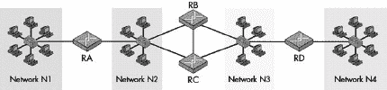
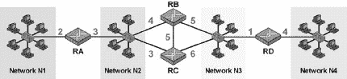
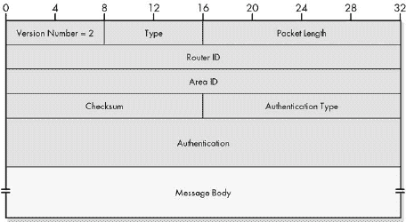
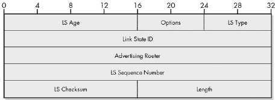
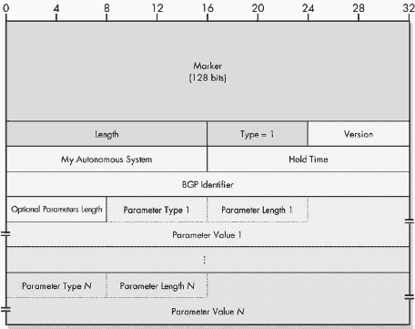
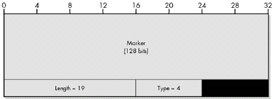

# 第二部分-7. TCP/IP 路由协议（网关协议）

第三十七章

第三十八章")

第三十九章")

第四十章")

第四十一章

路由不仅仅是网络层发生的最重要的活动之一；它还是真正*定义*OSI 参考模型第 3 层的功能。路由是使小型本地网络能够连接起来形成可能巨大的互联网的功能，这些互联网可以跨越城市、国家，甚至整个地球。路由的工作由称为*路由器*的特殊设备完成，它们将数据报从网络转发到网络，允许任何设备向任何其他设备发送信息，即使源设备不知道目的地在哪里。

严格来说，可以争论一些路由协议不属于第 3 层。例如，许多这些协议在第四层使用传输控制协议（TCP）或用户数据报协议（UDP）发送消息。尽管如此，路由本质上是一种第 3 层活动，因此，传统上认为路由协议是第 3 层的一部分。

路由是一个复杂的话题。简而言之，这个过程是路由器根据数据报的目的地址来决定如何转发数据报，这个地址与路由器在特殊路由表中保存的信息进行比较。这些表包含了路由器所知的每个网络条目，告诉路由器数据报应该发送到哪个相邻路由器，以便最终到达目的地。

如你所想，路由表对于路由过程至关重要。这些表可以由网络管理员手动维护，但这既繁琐又耗时，而且不允许路由器处理互联网中的变化或问题。相反，大多数现代路由器都设计有功能，允许它们与其他路由器共享路由信息，从而使它们能够自动更新其路由表。这种信息交换是通过使用*路由协议*来完成的。

这一部分包含五章，描述了在 TCP/IP 中使用的最常见路由（或*网关*）协议。第一章提供了各种重要概念的概述，这些概念对于理解路由协议的工作方式至关重要，包括对内部和外部路由协议之间差异的解释。这为后续章节奠定了基础。

在第二和第三章中，我详细解释了 TCP/IP 中最常用的两种内部路由协议：路由信息协议（RIP）和开放最短路径优先（OSPF）协议。在第四章中，我描述了边界网关协议（BGP），这是今天互联网上使用的外部路由协议。第五章简要讨论了五种历史、专有或较少使用的路由协议。

您可能会注意到，这一部分的标题同时提到了*路由协议*和*网关协议*。这两个术语可以互换使用，而且*网关*这个词出现在几个协议的名称中。这是由于在早期的 TCP/IP 标准中，*网关*一词的历史用法是指我们现在称之为路由器的设备。今天，*网关*一词通常不指路由器，而是指不同类型的网络互连设备，这可能会特别令人困惑。现在更倾向于使用*路由协议*这个术语，这也是我使用的术语。

就像所有与路由相关的主题一样，路由协议通常相当复杂。我在这里详细介绍了主要的路由协议，比大多数一般性的网络参考资料都要详细，但即便如此，我也只是触及了表面，尤其是像 OSPF 这样的更复杂的协议。如果您想了解更多细节，可以查看所引用的互联网标准（RFC）。此外，请注意，这里没有涵盖 IP 网络上使用的某些路由协议，例如 IS-IS（实际上是一个 OSI 协议，并不是 TCP/IP 的正式部分）。

# 第三十七章：概述关键路由协议概念

路由协议在互联网的路由整体过程中扮演着重要的角色。因此，在讨论路由的总体框架中理解它们是最容易的。在没有一些关于路由协议如何工作的背景信息的情况下，很难描述单个 TCP/IP 路由协议。因此，我认为简要地查看一些关键的路由协议概念是有价值的，这样您在理解下一章中描述的路由协议时就会更有运气。

在本章中，我将概述路由协议架构、协议类型、算法和度量标准。

# 路由协议架构

让我们从路由协议架构开始探讨。在这个语境中，*架构*一词指的是互联网的结构方式。一旦您有一些想要连接起来的网络和路由器，您有无数种方法可以做到这一点。您选择的架构基于路由器之间的连接方式，这会影响路由的执行方式和路由协议的操作。

## 核心架构

TCP/IP 和互联网是同时开发的，因此 TCP/IP 路由协议随着互联网本身的发展而发展。互联网的早期架构由少量包含关于互联网的全面信息的*核心*路由器组成。当互联网非常小的时候，向这个核心添加更多路由器可以扩展它。然而，每次核心扩展时，需要维护的路由信息量都会增加。

最终，核心变得太大，因此形成了一个两级层次结构，以允许进一步扩展。*非核心*路由器位于核心的边缘，只包含部分路由信息；它们依赖于核心路由器进行跨互联网的传输。在互联网的核心内部使用了名为*网关到网关协议（GGP）*的特殊路由协议，而在非核心路由器和核心路由器之间使用了另一个名为*外部网关协议（EGP）*的协议。非核心路由器有时是单个独立路由器，将单个网络连接到核心，或者它们可以是组织的一组路由器。

这种架构在一段时间内有效，但随着互联网的增长，它并没有很好地扩展。问题主要在于该架构只有一个级别：核心中的每个路由器都必须与其他每个路由器通信。即使外围路由器被保持在核心之外，核心中的流量量仍在不断增加。

## 自治系统（AS）架构

为了解决缩放问题，创建了一种新的架构，该架构从核心集中式概念转向更适合更大和不断增长的互联网架构。这种去中心化架构将互联网视为一组独立的组，每个组被称为*自治系统（AS）*。一个 AS 由一组由特定组织或管理实体控制的路由器和网络组成，该实体使用单一一致的政策进行内部路由。

该系统的优势在于，整个互联网上的路由发生在 AS 之间，而不是单个路由器之间。信息在 AS 中的每个路由器之间共享，而不是每个 AS 中的每个路由器。AS 内部的路由细节也隐藏在互联网的其他部分。这既为每个 AS 提供了灵活性，使其能够根据需要执行路由（因此得名*自治*），又为整体互联网提供了效率。每个 AS 都有自己的编号，这些编号在全球范围内管理，以确保它们在互联网（如互联网）中是唯一的。

### 小贴士

**关键概念** 大型现代 TCP/IP 互联网可以包含数千个路由器。为了更好地管理这种环境中的路由，路由器被分组到称为*自治系统（ASes）*的结构中，每个自治系统由特定组织或实体独立管理的一组路由器组成。

## 现代协议类型：内部和外部路由协议

AS 内部和 AS 之间的路由性质的不同可以从以下事实中看出：每种类型都使用以下不同的 TCP/IP 路由协议集：

**内部路由协议** 这些协议用于在 AS 内部的路由器之间交换路由信息。内部路由协议不用于 AS 之间。

**外部路由协议** 这些协议用于在 AS 之间交换路由信息。在某些情况下，它们也可能用于 AS 内部的路由器之间，但它们主要处理在 AS 之间交换信息。

### 小贴士

**关键概念** 内部路由协议用于在自治系统内部共享路由信息；由于系统是自主的，因此每个 AS 可能使用不同的内部路由协议。外部路由协议在 AS 之间传递路由数据；每个 AS 必须使用相同的协议来确保其能够通信。

由于 AS（自治系统）只是一组路由器的集合，你通过将一个 AS 中的路由器连接到另一个 AS 中的路由器来连接 AS。在架构上，一个 AS 由一组具有两种不同连接类型的路由器组成：

**内部路由器** AS 中的某些路由器仅连接到同一 AS 中的其他路由器。这些运行内部路由协议。

**边界路由器** AS 中的某些路由器既连接到 AS 内部的路由器，也连接到一个或多个其他 AS 中的路由器。这些设备负责在 AS 和互联网的其余部分之间传递流量。它们运行内部和外部路由协议。

由于其优势，AS 架构（例如，图 37-1

图 37-1. TCP/IP 自治系统（AS）路由架构 此图显示了由三个 AS 组成的简化互联网，每个 AS 都独立于其他 AS 进行管理。每个 AS 内的通信使用该 AS 管理员选择的内部路由协议（细线）。AS 之间的通信必须使用通用的外部路由协议（粗线）。内部路由器以浅色文字显示，边界路由器以黑色文字显示。

# 路由协议算法和度量

路由协议的另一个关键区别在于它们所使用的**算法**和**度量**。算法指的是协议用于确定任意一对网络之间最佳路由以及路由器之间共享路由信息的方法。度量是一种衡量“成本”的指标，用于评估特定路由的效率。由于互联网可能非常复杂，因此协议的算法和度量非常重要，它们可能是决定一个协议优于另一个协议的决定性因素。

最常见的两种路由协议算法是距离矢量算法和链路状态算法。还有一些协议结合了这些方法或其他方法。

## 距离矢量（Bellman-Ford）路由协议算法

一种**距离矢量**路由算法，也称为以两位发明者命名的**Bellman-Ford**算法，是根据网络之间的距离来选择路由的。距离度量很简单——通常是它们之间的**跳数**或路由器的数量。

使用此类协议的路由器在表中维护有关所有已知网络的距离信息。它们会定期将此表发送给它们直接连接的每个路由器（它们的**邻居**或**对等方**）。然后这些路由器更新它们的表并将这些表发送给它们的邻居。这导致距离信息在互联网中传播，因此最终每个路由器都能获得互联网上所有网络的距离信息。

距离矢量路由协议在选择最佳路由方面能力有限。它们在操作中也存在某些问题，必须通过添加特殊启发式和功能来解决。它们的主要优点是简单性和历史（它们已经使用了很长时间）。

## 链路状态（最短路径优先）路由协议算法

*链路状态*算法根据任何两个网络之间最短路径的动态评估来选择路由。因此，它也被称为*最短路径优先*方法。

使用这种方法，每个路由器都维护一张描述互联网当前拓扑结构的地图。这张地图通过测试互联网不同部分的可达性，以及与其他路由器交换链路状态信息来定期更新。最佳路由（或最短路径）的确定可以根据多种指标进行，这些指标表示通过特定路由发送数据报的真实成本。

链路状态算法比距离矢量算法更强大。它们可以动态适应互联网条件的变化，并且还允许根据比网络间跳数更现实的成本指标来选择路由。然而，它们设置和使用起来更复杂，比距离矢量算法消耗更多的计算机处理资源，并且还没有那么成熟。

## 混合路由协议算法

此外，还有一些混合协议结合了两种算法的特征，以及其他使用完全不同算法的协议。例如，*边界网关协议（BGP）*是一种路径矢量算法，它在某种程度上类似于距离矢量算法，但交换的路线信息更加详细。它包含了一些距离矢量和链路状态协议的属性，但不仅仅是两者的组合。

# 静态和动态路由协议

最后，你也可能偶尔看到将路由协议按类型分为*静态*和*动态*。这个术语有些误导。

*静态路由*这个术语仅仅是指路由表是手动设置的，因此保持静态。相比之下，*动态路由*是使用路由协议动态更新路由表。因此，所有路由协议都是动态的。不存在静态路由协议（除非你将编辑路由表的网络管理员视为协议）。

# 第三十八章. 路由信息协议（RIP、RIP-2 和 RIPNG）

TCP/IP 内部路由协议中最受欢迎的是*路由信息协议（RIP）*。名称的简单性符合协议的简单性。在所有路由协议中，RIP 是最容易配置的之一，对资源的需求也最少。它的流行既归因于这种简单性，也归因于其悠久的历史。事实上，RIP 的支持已经集成到操作系统中，与 TCP/IP 本身存在的时间一样长。

RIP 有三个版本：RIP 版本 1 和 2 用于 IP 版本 4（IPv4），以及 RIPng 用于 IP 版本 6（IPv6）。这三个版本的基本操作大致相同，但它们之间也有一些明显的差异，尤其是在发送消息的格式方面。

RIP 是 TCP/IP 中最早使用的内部路由协议之一。20 多年后，它仍然被广泛使用。尽管 RIP 存在重要的局限性，但它至今在 TCP/IP 路由中仍然占有重要位置。RIP 有未来的证据可以在创建协议的 IPv6 版本 RIPng 中看到。

我将以对 RIP 特性的整体描述和它在一般意义上的工作原理来开启 RIP 的考试。我首先概述了该协议的历史，包括对其不同版本和定义它们的标准的简要讨论。我描述了 RIP 用来确定路由的方法以及用于评估路由成本的度量标准。我还描述了该协议的一般操作，包括消息类型和发送时间。然后，我描述了 RIP 最重要的局限性和问题，以及为解决基本 RIP 算法中的几个问题而添加到协议中的特殊功能。最后，我更详细地查看每个版本，展示每个版本使用的消息格式，并讨论版本特定的功能。

# RIP 概述

多年来，RIP 一直是 TCP/IP 协议套件中最受欢迎的内部路由协议。该协议的历史以及它是如何获得显著地位的是一个相当有趣的故事。与 TCP/IP 套件中的许多其他重要协议不同，RIP 并不是首先通过 RFC 标准化过程正式开发的（参见第三章）。相反，它作为一个事实上的行业标准而演变，后来成为互联网标准。

RIP 的历史与另一个网络巨头——以太网——有着某种共同之处。就像那个强大的局域网技术一样，RIP 的根源可以追溯到那个计算先驱——施乐帕洛阿托研究中心（PARC）。在以太网被开发用于连接局域网的同时，PARC 创建了一个在以太网上运行的更高层协议，称为施乐帕洛阿托通用协议（PUP）。PUP 需要一个路由协议，因此施乐创建了一个名为网关信息协议（GWINFO）的协议。后来，该协议被更名为路由信息协议，并作为施乐网络系统（XNS）协议套件的一部分使用。

当加州大学伯克利分校的开发者将其用于 UNIX 操作系统的伯克利标准分布（BSD）时，RIP 进入了主流。RIP 首次出现在 1982 年的 BSD 版本 4.2 中，当时它被实现为 UNIX 程序*routed*（发音为"route-dee"，不是"rout-ed"—其中的"d"代表"daemon"，是 UNIX 中用于服务器进程的常见术语）。

BSD 曾经（并且现在仍然是）一个非常流行的操作系统，尤其是对于连接到早期互联网的机器。因此，RIP 被广泛部署，并成为了内部路由协议的行业标准。它被用于 TCP/IP 和其他协议套件。实际上，许多其他路由协议，如 AppleTalk 套件中的 RTP 协议，都是基于这种早期的 RIP 版本。

## RIP 标准化

一段时间内，BSD 实现的 routed 实际上被认为是该协议的标准。然而，这并不是一个正式定义的标准，这意味着没有正式的定义来确切说明它是如何工作的。这导致了该协议在不同实现之间的细微差异。为了解决实现之间的潜在互操作性问题，互联网工程任务组（IETF）在 1988 年 6 月发布的互联网标准 RFC 1058，“路由信息协议”（Routing Information Protocol）中正式指定了 RIP。这个 RFC 直接基于 BSD 的 routed 程序。这个原始版本的 RIP 现在有时也被称为 RIP 版本 1 或 RIP-1，以区分后来的版本。

RIP 的流行很大程度上归因于它被包含在 BSD 中，而它之所以被包含在 BSD 中，是因为该协议相对简单。

## RIP 操作概述、优势与局限性

RIP 使用距离矢量算法来确定路由，如第三十七章所述。每个路由器维护一个路由表，包含互联网中各种网络或主机的条目。每个条目包含两个主要信息：网络或主机的地址以及到它的距离，以跳数衡量，这仅仅是数据报必须通过的路由器的数量以到达其目的地。

定期地，互联网中的每个路由器都会在其连接的每个网络上发送一个特殊消息，其中包含其路由表，使用的是用户数据报协议（UDP）。其他路由器接收这些表，并使用它们来更新自己的表。这是通过将它们接收到的每个路由增加一个额外的跳数来完成的。例如，如果路由器 A 从路由器 B 收到指示，表示网络 N1 距离四跳，由于路由器 A 和路由器 B 是相邻的，因此从路由器 A 到网络 N1 的距离是五跳。在路由器更新其表后，它会将此信息发送到其本地网络上的其他路由器。随着时间的推移，所有网络的路由距离信息在整个互联网中传播。

RIP 在操作上简单明了，易于实现，对路由器处理能力的要求不高，这使得它在较小的自治系统 (AS) 中特别有吸引力。然而，由于协议的简单性，也出现了一些重要的限制。首先，跳数往往不是选择路由的最佳度量标准。还有许多与算法本身相关的问题。这些问题包括收敛缓慢（所有路由器就相同的路由信息达成一致时的延迟）以及处理网络链路故障的问题。RIP 包含了几个特殊功能来解决这些问题中的某些问题，但其他问题是协议的固有限制。例如，RIP 只支持目的地之间最多 15 跳，这使得它不适用于非常大的 AS，并且这一点无法更改。

在首次创建二十多年后，RIP 仍然是一种流行的内部路由协议。其限制导致许多互联网专家希望该协议最终会被技术上更优越的新协议，如开放式最短路径优先 (OSPF) 所取代。有些人甚至讽刺地建议，也许 RIP R. I. P. 会是最好的。然而，一旦一个协议变得流行，就很难抵挡其势头，RIP 很可能在未来许多年里继续被使用。

### 小贴士

**关键概念** 路由信息协议 (RIP) 是最古老且最受欢迎的内部路由协议之一。每个路由器使用距离矢量算法来维护一个表，该表指示如何到达 AS 中的各种网络以及到达该网络的跳数。RIP 流行是因为它已经建立并且简单，但它有许多重要的限制。

## RIP 版本 2 (RIP-2) 和 RIPng for IPv6 的开发

由于该协议是在 20 世纪 80 年代初期开发的，当时 TCP/IP 还处于初级阶段，RIP 出现了一些其他问题。随着时间的推移，随着 TCP/IP 协议的使用发生变化，RIP 变得过时。作为回应，在 20 世纪 90 年代初期创建了 *RIP 版本 2* 或 *RIP-2*。

RIP-2 为 RIP 定义了新的消息格式，并包括许多新特性，包括对无类别寻址、身份验证以及使用多播而非广播的支持，这些特性提高了网络性能。它首次在 1993 年 1 月发布的 RFC 1388，“RIP 版本 2 带有附加信息”中被定义。该 RFC 在 RFC 1723 中进行了修订，并在 1998 年 11 月发布的 RFC 2453，“RIP 版本 2”中最终确定。

为了确保 RIP 能够与 TCP/IP 在未来一起工作，有必要定义一个与 IPv6 兼容的版本。1997 年，发布了 RFC 2080，标题为“RIPng for IPv6”。*ng* 代表 *下一代*；你可能会记得 IPv6 也被称为 *IPng*。

*RIPng*不仅仅是一个新的 RIP 版本，就像 RIP-2 一样，但它被定义为一个新的独立协议。然而，它却紧密基于原始的 RIP 和 RIP-2 标准。由于 IPv4 和 IPv6 之间的变化，需要一个独立的协议（而不是原始协议的修订），尽管 RIP 和 RIPng 以相同的基本方式工作。RIPng 有时也被称为*RIPv6*。

### 小贴士

**关键概念** 原始版本的 RIP 功能最少，现在被称为*RIP-1*。*RIP-2*是为了添加对无类别寻址和其他功能的支持而创建的。*RIPng*是为与 IPv6 兼容而创建的版本。

# RIP 路由确定算法和度量

正如我在上一章提到的，任何路由协议的一个定义特征就是它用于确定路由的算法。RIP 属于使用距离矢量或贝尔曼-福特路由算法的协议类别。为了帮助您理解 RIP 如何确定路由，本节将介绍 RIP 算法的具体实现并提供一个示例。

注意，这里提供的描述是 RIP 使用的基算法。这个算法在特定情况下会进行一些修改，以解决由于算法工作方式而产生的某些问题。在本章的后面部分，我们将探讨这些问题以及 RIP 包含的用于解决这些问题的特殊功能。

## RIP 路由信息与路由距离度量

RIP 的任务，就像任何路由协议一样，是提供一个机制来交换路由信息，以便路由器可以保持它们的路由表是最新的。RIP 互联网中的每个路由器都在其路由表中跟踪互联网中的所有网络（以及可能个别的主机）。对于每个网络或主机，设备包括各种信息，其中以下信息是最重要的：

+   网络或主机的地址

+   从该路由器到网络或主机的距离

+   路由的第一个跳：数据报必须首先发送到的设备，以便最终到达网络或主机

理论上，距离度量可以是任何成本评估，但在 RIP 中，距离是以跳数来衡量的。您可能已经知道，在 TCP/IP 术语中，数据报通过路由器时进行一次*跳*。因此，RIP 中路由器与网络之间的距离衡量的是数据报必须通过多少个路由器才能到达网络。如果一个路由器直接连接到网络，那么距离是 1 跳。如果它通过一个路由器，距离是 2 跳，依此类推。在 RIP 中，任何网络或主机的最大跳数限制为 15 跳。值 16 被定义为无穷大，所以其中包含 16 的条目意味着“此网络或主机不可达。”

## RIP 路由确定算法

定期地，每个运行 RIP 的路由器都会发送其路由表条目，以向其他路由器提供有关它知道如何到达的网络和主机的信息。与发送此信息的同一网络上的任何路由器都能够根据接收到的信息更新自己的表。

任何从同一网络上的另一个路由器收到消息，表明它可以以 *N* 的成本到达网络 X 的路由器都知道，通过向它收到消息的路由器发送，它可以以 *N*+1 的成本到达网络 X。

## RIP 路由确定和信息传播

让我们通过一个具体的例子来帮助你理解路由是如何确定的，以及如何使用 RIP 传播路由信息。考虑一个相对简单的互联网，包含四个单独的网络，如下所示连接：

+   路由器 RA 将网络 N1 连接到网络 N2。

+   路由器 RB 和路由器 RC 将网络 N2 连接到网络 N3。

+   路由器 RD 将网络 N3 连接到网络 N4。

此示例 AS 在 图 38-1 中说明。

图 38-1. 示例 RIP AS 这是一个包含四个物理网络和四个路由器的简单 AS 的示例。

现在假设我们刚刚开启了路由器 RA。它看到它直接连接到网络 N1 和网络 N2，因此在其路由表中将有一个条目，表明它可以以 1 的成本到达网络 N1，我们可以将其表示为 {N1,1}。关于网络 N1 的信息将通过以下步骤（如图 38-2 所示）在互联网中传播（这些步骤在 图 38-2

图 38-2。使用 RIP 传播网络路由信息。此复合图说明了从路由器 RA 传播关于网络 N1 路由信息的五个步骤。在第 1 步，信息从路由器 RA 发送到其连接的两个网络。在第 2 步，它到达路由器 RB 和 RC，然后它们知道它们可以通过路由器 RA 以额外跳数 1 到达网络 N1。在第 3 步，这两个路由器将此信息发送到它们的网络，在第 4 步，它到达路由器 RD。在第 5 步，路由器 RD 发送出信息，但没有其他路由器在附近接收它。

这种网络路由信息的传播是定期发生的，也发生在网络结构发生变化（由于地形的有意变化或链路或路由器的故障）时。当这种情况发生时，更改信息将通过互联网传播，以便最终更新所有路由器。例如，假设从路由器 RC 到网络 N1 添加了一个连接。如果路由器 RD 之前有{N1,RB,3}条目，它最终会将其更改为{N1,RC,2}，因为它现在可以通过路由器 RC 更快地到达网络 N1。

## 默认路由

在某些情况下，对于大型互联网中的每个网络或主机来说，使用自己的路由条目进行完全指定可能不方便。那么，为网络指定一个默认路由，以便在它们没有信息的情况下访问主机或网络，可能是有益的。最常见的例子是当一个自治系统（AS）通过单个路由器连接到公共互联网时。除了那个路由器之外，本地网络的其他部分不需要知道如何访问互联网。

在 RIP 中，默认路由的信息是通过打算处理此类流量的路由器发送关于一个地址为 0.0.0.0 的“虚拟”网络的信息来传递的。当在互联网上使用 RIP 消息传播路由信息时，这被视为一个常规网络，但其他设备识别这个特殊地址并理解它意味着默认路由。

# 悼念通用操作、消息和定时器

RIP 是一种交换路由信息的协议，因此其操作最好用用于交换这些信息的消息以及发送消息的规则来描述。每个路由器中的 RIP 软件在响应某些事件以及由计时器触发的触发器时，都会发送消息并采取其他行动。计时器还用于确定当路由信息未更新时应该丢弃路由信息的时间。

## RIP 消息和基本消息类型

在互联网中路由器上的 RIP 软件元素之间的通信是通过使用 *RIP 消息* 完成的。这些消息使用 UDP 发送，UDP 端口号 520 保留给 RIP-1 和 RIP-2，521 保留给 RIPng。因此，尽管 RIP 被视为与其他路由协议一样属于第 3 层，但在发送消息方面它更像是一个应用程序。消息的确切格式取决于版本，本章后面将详细描述所有三种格式（RIP、RIP-2 和 RIPng）。RIP 消息可以发送到特定设备，也可以发送给多个设备接收。如果指向一个设备，它们是单播发送；否则，它们在 RIP 中是广播，在 RIP-2 和 RIPng 中是组播。

对于 RIP 的所有三个版本，只有两种基本消息类型：

**RIP 请求** 路由器发送给另一个路由器的消息，要求它发送其路由表的全部或部分。

**RIP 响应** 包含路由器路由表全部或部分的消息。请注意，尽管名称如此，此消息并非仅作为对 RIP 请求消息的响应发送，正如您将看到的。

### 注意

*原始的 RIP 还定义了几种其他消息类型：Traceon、Traceoff 和为 Sun Microsystems 保留的特殊消息类型。这些已经过时，不再使用。它们已被从 RIP-2 和 RIPng 标准中删除*。

## RIP 更新消息和 30 秒计时器

当路由器需要立即提供路由信息时，会在特殊情况下发送 RIP 请求消息。最常见的例子是当路由器首次开机时。初始化后，路由器通常会在其连接的网络中发送一个 RIP 请求消息，以请求从任何相邻路由器获取的最新路由信息。RIP 请求消息也可以用于诊断目的。

接收到 RIP 请求消息的路由器将处理该消息，并发送一个 RIP 响应消息，其中包含其路由表的全部或仅请求的消息条目，根据情况而定。然而，在正常情况下，路由器通常不会发送特定的 RIP 请求消息来请求路由信息。相反，每个 RIP 路由器都有一个特殊的计时器，每 30 秒触发一次。（在 RIP 标准中，此计时器没有特定的名称；它只是 30 秒的计时器。）

每当计时器到期时，都会发出一个包含路由器整个路由表的 RIP 响应消息的无请求（未请求）广播或多播。然后重置计时器，30 秒后再次启动，导致发送另一个常规的 RIP 响应消息。这个过程确保路由信息定期在互联网上发送，因此路由器始终能够了解路由信息。

### 小贴士

**关键概念** RIP 使用两种基本消息类型：RIP 请求和 RIP 响应。两者都使用用户数据报协议（UDP）发送。尽管名为 RIP 响应消息，但它们既用于常规周期性路由表更新，也用于响应 RIP 请求消息。请求仅在特殊情况下发送，例如当路由器首次加入网络时。

## 防止过时信息：超时计时器

当路由器接收到路由信息并将其输入其路由表时，该信息不能无限期地被认为是有效的。在“RIP 路由确定和信息传播”部分前面给出的示例中，假设在路由器 RB 通过路由器 RA 安装到网络 N1 的路由后，路由器 RA 和网络 N2 之间的链路失败。一旦发生这种情况，网络 N1 就无法从路由器 RB 访问，但路由器 RB 有一个指示它可以访问网络 N1 的路由。

为了防止这个问题，路由仅在路由表中保留有限的时间。每当在路由表中安装路由时，就会启动一个特殊的超时计时器。每当路由器收到包含该路由信息的另一个 RIP 响应消息时，该路由被认为是刷新的，并且其超时计时器被重置。只要路由继续刷新，计时器就不会到期。

然而，如果包含该路由的 RIP 响应消息停止到达，计时器最终会到期。当发生这种情况时，通过将路由的距离设置为 16（你可能记得这是 RIP 无穷大，表示不可达的网络）来标记路由为删除。超时计时器的默认值通常是 180 秒。这允许在路由器得出路由不可达的结论之前，错过几个路由的周期性更新。

## 移除过时信息：垃圾收集计时器

当一个路由被标记为删除时，也会启动一个新的垃圾收集计时器。“垃圾收集”是计算机行业术语，指查找已删除或无效信息并将其清理的任务。因此，这是一个在从表中实际删除新无效路由之前计算秒数的计时器。此计时器的默认值为 120 秒。

使用这种两阶段删除方法的原因是给声明了不再可达的路由的路由器一个机会，让它将此信息传播给其他路由器。在垃圾收集计时器到期之前，该路由器将包括该路由，其不可达度量值为 16 跳，在其自己的 RIP 响应消息中，以便将该路由的问题传达给其他路由器。当计时器到期时，该路由被删除。如果在垃圾收集期间收到该路由的新 RIP 响应消息，则删除过程被中止。在这种情况下，垃圾收集计时器被清除，该路由再次标记为有效，并启动一个新的超时计时器。

## 触发更新

除了已经描述的两种情况下发送 RIP 响应——回复 RIP 请求消息和在 30 秒计时器到期时——当路由发生变化时，也会发送 RIP 响应消息。

这个动作，对基本 RIP 操作的一种增强，称为*触发更新*，旨在确保路由变化的信息尽可能快地在互联网中传播。这将有助于减少 RIP 中的缓慢汇聚问题。例如，在路由超时和垃圾收集计时器启动的情况下，会立即发送关于现在无效路由的触发更新。这将在本章后面的“RIP 解决 RIP 算法问题的特殊功能”部分中更详细地描述。

# RIP 问题及其解决方案

RIP 的简单性经常被列为它受欢迎的主要原因。简单性大多数时候都是好的，但在很多情况下，简单性的不幸代价是问题会出现，通常是在不寻常的情况或特殊情况下，RIP 也是如此。直接的距离矢量算法和操作机制在大多数情况下工作得很好，但它们有一些重要的弱点。我们需要检查这些问题，以了解 RIP 的限制以及为解决这些问题而添加到协议中的一些复杂性。

## RIP 算法的问题

我们在 RIP 中遇到严重问题的最重要领域是本节前面描述的基本距离矢量算法的基本功能以及用于实现它的消息的使用方式，如以下各节所述。

### 汇聚缓慢

距离矢量算法被设计成所有路由器定期共享它们的所有路由信息。随着时间的推移，所有路由器最终都会拥有关于网络位置和到达它们最佳路由的相同信息。这被称为*汇聚*。不幸的是，基本的 RIP 算法在实现汇聚方面相当慢。所有路由器获取相同信息需要很长时间，特别是拓扑变化信息传播需要很长时间。

考虑两个由 15 个路由器分隔的网络的最坏情况。由于路由器通常每 30 秒才发送一次 RIP 响应消息，因此这对网络中一个网络的变化可能要过好几分钟才会被另一个网络最近的路由器看到——在网络术语中这是一个漫长的等待。

当涉及到路由故障的传播时，收敛缓慢的问题更为明显。路由故障的检测仅通过 180 秒超时计时器的到期来完成，这导致在收敛甚至开始之前还要额外增加三分钟的延迟。

### 路由环路

当路由器 A 有一个条目指示它将网络 1 的数据报发送到路由器 B，而路由器 B 有一个条目表示网络 1 的数据报应该发送到路由器 A 时，就会发生路由环路。更大的环路也可能存在：路由器 A 指示发送到 B，B 指示发送到 C，C 又指示发送到 A。在正常情况下，这些环路不应该发生，但在特殊情况下它们可能会发生。

RIP 没有包括任何特定的机制来检测或防止路由环路。它所能做的最好的事情就是试图避免它们。

### 无限计数

收敛缓慢的特殊情况可能导致路由环路情况，其中一个路由器向另一个路由器传递错误信息，该路由器又向另一个路由器发送更多错误信息，如此循环。这种情况有时被描述为协议不稳定。这个问题被称为*无限计数*，原因你很快就会看到。

要理解这是如何发生的，让我们修改“RIP 路由确定和信息传播”部分中前面提到的示例，如图图 38-3

图 38-3. RIP 计数到无穷大问题 这个复合图展示了之前在图 38-1 中提到的 AS 的一部分。顶部面板（1）显示了网络的正常状态，其中路由器 RB 能够以 2 的成本通过路由器 RA 到达网络 N1。在面板 2 中，路由器 RA 和网络 N1 之间的链路中断。路由器 RA 将其到达网络 N1 的成本更改为 16（RIP 无穷大）。在面板 3 中，在路由器 RA 可以将此更新发送给路由器 RB 之前，它收到了来自路由器 RB 的常规 RIP 消息，表明可以通过 2 的成本到达网络 N1。然后，路由器 RA 被误导，认为它可以使用路由器 RB 作为到达网络 N1 的备用路由，尽管路由器 RB 的信息最初是从路由器 RA 那里来的。在面板 4 中，路由器 RA 随后发送了这条虚假信息，该信息在面板 5 中被路由器 RB 接收。然后，路由器 RB 将其成本增加到 4，在其下一个周期将发送此信息给路由器 RA，路由器 RA 的成本将增加到 5，依此类推。这个周期将持续下去，两个路由器都将“计数到无穷大”（成本为 16）。

现在假设路由器 RB 的常规 30 秒计时器在路由器 RA 的下次广播之前触发。路由器 RB 将发送其正常的路由表，*其中包含一条到网络 N1 的路由，成本为 2*。路由器 RA 会看到这一点，并说：“嘿，看，路由器 RB 有一条到网络 N1 的路由，成本为 2！这意味着我可以以 3 的成本到达那里，这肯定比我目前的 16 成本低。让我们使用它！”因此，路由器 RA 安装了这条路由并取消了其超时计时器。当然，这是虚假信息——路由器 RA 没有意识到路由器 RB 能够到达网络 N1 的声明是基于来自路由器 RA 自己的旧信息！

从那里开始，情况变得更糟。当路由器 RA 的常规路由表更新时间到来时，它将广播一条到网络 N1 的路由，成本为 3。现在路由器 RB 会看到这一点，并说：“嗯，我的到网络 N1 的路由是通过路由器 RA 的。路由器 RA 之前说它的成本是 1；但现在它说成本是 3。这意味着我必须将我的成本改为 4。”

路由器 RB 稍后会发送回路由器 RA，他们就这样来回发送，每次增加 2 的成本。这不会停止，直到无限大成本的 16 值被触及——因此得名“无限计数”。在这种情况下，两个路由器最终会同意网络 N1 不可达，但如您所见，这需要很长时间才能发生。

### 小无限

使用相对较小的无限大成本值限制了缓慢收敛问题。即使在计数到无限大的情况下，经过的总时间也是至少可以管理的。（想象一下，如果无限大被定义为比如说 1,000！）不幸的是，这种做法的缺点是限制了可以使用 RIP 的互联网的大小。

许多人对 RIP 中 15 个路由器的跨度限制感到犹豫，但说实话，我认为这不过是小题大做，好吧，如果不是无关紧要的话，那么就是无关紧要的。15 个值并不是你总共可以使用路由器的数量限制，而是任何两个网络之间路由器的数量限制。考虑到大多数互联网都是按层次结构设置的。即使你有一个相当复杂的四级层次结构，你也不会接近 15 个路由器的限制。实际上，你可以创建一个拥有数千个路由器的大型自治系统，而任何两个设备之间都不会超过 15 个路由器。因此，这只是一个针对非常大 AS 的限制。

另一方面，RIP 每小时需要多次发送其整个路由表，这使得它无论无限大=16 的问题如何，都可能是一个大型互联网的潜在较差选择。在一个拥有许多路由器的互联网中，RIP 产生的流量可能会变得过多。

### 小提示

**关键概念** RIP 操作中存在的一个最重要问题是收敛速度慢，这描述了网络变化信息在路由器之间传播可能需要很长时间的事实。这个问题的一个具体实例是无限计数问题，其中过时的信息导致许多虚假的 RIP 消息在路由器之间关于不可达网络的交换。

公平地说，这些问题主要是针对距离矢量路由算法的，而不是针对 RIP 本身。其中一些问题通过在算法或 RIP 消息发送的规则下实施具体更改得到纠正，如下一节所述。根据 RFC 2453，实际上有一个提议将 RIP 的无限成本增加到 16 以上的一个数字，但这会导致与旧设备（将任何度量值为 16 或更高的路由视为不可达）的兼容性问题，因此被拒绝了。

## RIP 度量的问题

除了对算法本身的这些担忧之外，RIP 还经常因其度量选择而受到批评。这里的首要问题是 RIP 使用跳数作为距离度量。简单来说，跳数是发送数据报文在两个网络之间成本的一个糟糕度量。我相信 RIP 中将跳数作为度量部分是由于对简单性的渴望（当跳数是所有路由器需要考虑的时，使协议工作变得容易）。但使用跳数也是 RIP 存在超过 20 年的部分原因。

几十年前，计算机速度慢，所以每次数据报通过路由器时，可能都会有一个显著的延迟。即使在那时，跳数也不是一个完美的度量，但我认为它比现在更符合数据报在互联网中传输所需的时间。

现代路由器非常快速，使得跳数成为衡量网络距离的一个有缺陷的方法。跳数的数量通常与实际在路由上传输数据所需的时间没有关联。为了举一个极端的例子，考虑两个通过 56K 调制解调器直接拨号电话网络连接连接的网络。假设它们还通过使用高速 DS-3 线路的三个路由器序列连接。RIP 会认为 56K 链路是一个更好的路由，因为它有更少的跳数，尽管它显然要慢得多。

另一个问题是没有支持 RIP 的动态（实时）度量。即使 RIP 使用比跳数更有意义的度量，算法也要求每个链路的度量应该是固定的。没有方法让 RIP 像 OSPF 这样的协议那样根据各种链路的实时数据计算最佳路由（见第三十九章）。

大多数这些问题都内置在 RIP 中，无法解决。有趣的是，一些 RIP 实现似乎允许管理员“调整”某些路由，以补偿跳数度量指标的局限性。例如，前面提到的 56K 链路两端的路由器可以被配置为将 56K 链路视为跳数为十而不是一。这将导致使用该链路的任何路由都比 DS-3 路径更昂贵。这是聪明的，但几乎不是一个优雅或通用的解决方案。

注意，除了我提到的相当长的问题列表之外，RIP 的第一个版本还有一些具体问题。其中一些更重要的问题包括不支持无类别域间路由（CIDR）、缺乏认证以及由于使用广播进行消息传递而导致的性能下降。这些问题大部分通过 RIP-2 的扩展得到了解决。

## 解决 RIP 算法问题的 RIP 特殊特性

RIP 的简单性是其最吸引人的特性，但正如你所看到的，这导致了它在操作上的一些问题。这些限制中的大多数都与用于确定路由的基本算法以及实现该算法的消息传递方法有关。为了使 RIP 成为一个有用的协议，需要解决这些问题，形式上是对我们在本节 earlier 探讨的基本 RIP 算法和操作方案的改变。

由于 RIP 过于简单而产生的问题的解决方案是添加复杂性，以特征的形式增加 RIP 操作方式的智能。在接下来的几节中，我们将探讨其中的四个：*分割水平*、*分割水平带毒反转*、*触发更新*和*保持状态*。

注意，虽然我把这些描述为“特性”，但至少其中一些是确保 RIP 正确功能所必需的。因此，它们通常被认为是 RIP 的标准部分，甚至在最早的 RIP 文档中就有描述。然而，有时当使用这些技术时，尤其是在组合使用时，可能会出现性能或稳定性问题。因此，不同的 RIP 实现可能会省略一些特性。例如，保持状态会减慢路由恢复，当使用其他特性如分割水平时可能就不需要了。像往常一样，必须小心确保所有路由器都使用相同的特性，否则可能会出现更大的问题。

此外，请参阅本章后面的 RIP-2 特定特性的即将到来的部分，以了解下一跳特性的描述，该特性有助于在 RIP 使用时减少收敛和路由问题。

### 分割水平

无限计数问题是基本 RIP 算法中最严重的问题之一。在前一个部分的例子中，问题的原因立即很明显：在 N1 网络失败并且路由器 RA 注意到它失败后，路由器 RB 通过向路由器 RA 发送到 N1 的路由广告来“欺骗”路由器 RA，让它认为它有一个到达 N1 的替代路径。

如果你仔细想想，在任何情况下，让路由器 RB 向路由器 RA 发送关于一个只能通过路由器 RA 访问的网络的路由广告，这实际上在**任何**情况下都没有意义。在路由失败的情况下，这会导致这个问题，这显然是一个很好的理由不这么做。但是即使路由是可操作的，路由器 RB 告诉路由器 RA 这个路由有什么意义呢？路由器 RA 已经有一个到网络的更短连接，因此它无论如何都不会将意图发送到网络 N1 的流量发送到路由器 RB。

显然，最好的解决方案是让路由器 RB 在其发送给路由器 RA 的任何 RIP 响应消息中不提及到网络 N1 的路由。我们可以通过向 RIP 操作添加一条新规则来概括这一点：当路由器在它连接的任何网络上发送 RIP 响应消息时，它省略了从该网络最初学习到的任何路由信息。这个功能被称为**分割水平**，因为路由器实际上分割了其对互联网的看法，在某些链路上发送的信息与在其他链路上发送的信息不同。

使用这个新规则，让我们考虑路由器 RB 的行为。它有一个连接到网络 N2 的接口，它与路由器 RA 共享。因此，当它在网络 N2 上发送时，它将不会包含从路由器 RA 那里最初获得的路由信息。这将防止你在前一个部分中看到的无限计数循环。同样，因为路由器 RD 在网络 N3 上，路由器 RB 在发送到网络 N3 时，不会发送从路由器 RD 那里获得的任何路由信息。

然而，需要注意的是，分割水平（split horizon）并不总是能解决无限计数问题，尤其是在多个路由器间接连接的情况下。一个经典的例子是三个路由器配置成三角形。在这种情况下，由于任何两个路由器之间传播的数据是双向的，可能会出现问题。在这种情况下，稍后描述的保持下降（hold down）功能可能会有所帮助。

### 分割水平与中毒反转

添加“中毒反转”（poisoned reverse）增强了基本的分割水平功能。在发送 RIP 响应消息时，不是从特定接口省略从该接口学习到的路由，而是包括这些路由，但将它们的度量设置为 RIP 无穷大，即 16。所以，在先前的例子中，路由器 RB 会在其发送到网络 N2 的传输中包含到网络 N1 的路由，但它会说到达网络 N1 的成本是 16，而不是其实际成本（即 2）。

“中毒反转”指的是我们正在中毒那些我们想要确保接口上的路由器不使用的路由。路由器 RA 将看到路由器 RB 通告网络 N1，但成本为 16，这作为对路由器 RA 的一个明确信息：“你绝对不可能通过路由器 RB 到达网络 N1。”这比常规的分割水平特性提供了更多的保险，因为如果路由器 RA 到网络 N1 的链路中断，路由器 RA 将确定它不能尝试通过路由器 RB 获取新的路由。图 38-4 展示了分割水平与中毒反转是如何工作的。

这种技术也在正常情况下（意味着没有像网络链路中断这样的问题）有效。在这种情况下，路由器 RA 将定期从路由器 RB 接收成本为 16 的更新，但路由器 RA 永远不会尝试通过路由器 RB 到达网络 N1，因为它直接连接到网络 N1（成本为 1）。

### 触发更新

在本章前面我们讨论的路由环路问题发生，是因为路由器 RB 向路由器 RA 通告了路由器 RA 的路由。这个问题还有一个重要的方面：当路由器 RA 发现连接到网络 N1 的链路失败后，它必须等待多达 30 秒，直到下一个预定传输时间才能通知其他路由器关于链路失败的情况。

为了使 RIP 工作良好，当发生重大事件时，我们希望立即通知互联网上的其他路由器。因此，应该向基本的 RIP 路由器操作中添加一条新规则：每当路由器更改其路由的度量值时，它必须（几乎）立即发送一个 RIP 响应消息，通知其直接相邻的路由器关于更改的情况。如果这些路由器看到这个更改，它们将更新它们的路由信息，然后它们反过来必须发送更新。因此，任何网络路由信息的变化都会导致整个互联网上发送级联更新，显著减少缓慢收敛问题。请注意，这包括由于超时定时器的到期而删除路由的情况，因为删除路由的第一步是将路由的度量值设置为 16，这会触发一个更新。

图 38-4. 使用带毒回溯的分割视域解决 RIP 问题 图表的上面板（1）显示了与图 38-3。在面板 2 中，与之前一样，RA 路由器与网络 N1 之间的链路已断开，正如 RB 路由器准备发送其常规更新。然而，分割视域带毒回溯功能意味着它在两个链路上发送不同的消息。在连接到 RA 路由器的网络上，它发送一个成本为 16 的路由通告。在面板 3 中，RA 路由器收到这个通告，它将丢弃这个通告，确保不会出现无限计数问题。在 RA 路由器的下一个周期，它将更新 RB 路由器，告诉它网络 N1 不再可达。](httpatomoreillycomsourcenostarchimages288035.png.jpg)

你可能已经注意到我说触发的更新是“几乎”立即发送的。事实上，在发送触发更新之前，路由等待一个随机的时长，从 1 到 5 秒。这样做是为了减少由许多路由器几乎同时发送更新消息而对互联网造成的负载。

### 按住

分隔水平尝试通过抑制关于失败路由的无效信息传输来解决计数到无限问题。为了额外的保险，我们可以实现一个功能，该功能在收到失败路由信息时改变接收路由信息处理方式。*保持*功能通过让每个路由器在首次收到关于不可达网络的信息时启动计时器来实现。在计时器到期之前，路由器将丢弃任何后续的路由消息，这些消息表明该路由实际上是可达的。典型的保持计时器运行时间为 60 或 120 秒。

这种技术的优点是，路由器不会因为收到关于路由可访问的虚假信息而困惑，因为它刚刚被告知该路由不再有效。它提供了一个时间段，让过时的信息从系统中清除，这在复杂的互联网中尤其有价值。将保持功能添加到分隔水平也可以帮助在仅分隔水平不足以防止计数到无限的情况下的情况，例如，当三个路由器以三角形的形式相互连接时，如前所述。

保持的主要缺点是它迫使路由器在路由修复后延迟响应。假设由于某种原因，路由仅关闭了五秒钟。当网络再次上线后，路由器将再次想要了解这一点。然而，保持计时器必须到期，路由器才会再次尝试使用该网络。这使得使用保持功能的互联网响应修正路由相对较慢，并且可能导致间歇性失败的网络的访问延迟。

### 小贴士

**关键概念** 四个特殊功能代表了 RIP 操作的变化，这些变化改善了或消除了基本协议操作中的问题。*分隔水平*和*分隔水平带毒反转*防止路由器将其从最初学习路由的路由器发送无效的路由信息。*触发更新*通过立即传播更改后的路由信息来减少缓慢收敛问题。最后，*保持*功能可以在收到失败路由信息时提供鲁棒性。

# RIP 版本特定的消息格式和功能

正如我之前提到的，RIP 已经广泛使用超过二十年了。在这段时间里，互联网和互联网技术已经发生了变化。为了跟上时代的步伐，RIP 也进行了演变，如今有三个不同的版本。这三个版本的基本操作相当相似，这在前面的章节中已经描述过。正如你所预期的，版本之间也有一些差异。其中之一是每个版本中 RIP 消息的格式，以及该格式中字段的含义和使用。

现在是时候查看 RIP 三个版本各自使用的消息格式，以及某些并非所有版本都有的特定功能了。我首先介绍原始的 RIP，现在也被称为*RIP 版本 1*。然后，我描述 RIP 的更新版本，称为*RIP 版本 2*或*RIP-2*。最后，我讨论*RIPng*，有时也称为*RIPv6*；这是用于 IPv6 的 RIP 版本。（注意，这并不是原始 RIP 的新版本，而是一个基于早期 RIP 版本的新协议。）

## RIP 版本 1（RIP-1）消息格式和功能

RIP 作为一个行业标准而发展起来，并通过其包含在伯克利标准分布的 UNIX（BSD UNIX）中而普及。RIP 的第一个版本（现在有时称为 RIP-1，以区分后续版本）最终在 RFC 1058 中标准化。作为该标准的一部分，定义了原始的 RIP-1 消息格式，当然这服务于*RIP-1*本身，也是后续版本格式的基础。

### RIP-1 消息

如前几节中关于 RIP 操作的通用讨论所述，RIP 通过发送两种不同类型的 RIP 消息来交换路由信息：RIP 请求和 RIP 响应。这些消息作为常规 TCP/IP 消息通过 UDP 传输，UDP 使用保留的端口号 520。该端口号的使用如下：

+   RIP 请求消息发送到 UDP 目标端口 520。它们可能具有源端口 520 或可能使用一个临时端口号（有关临时端口号的解释，请参阅第四十三章）。

+   作为对 RIP 请求的回复发送的 RIP 响应消息使用源端口 520 和与 RIP 请求使用的源端口相等的目标端口。

+   无请求的 RIP 响应消息（定期发送，而不是响应请求）使用源端口和目标端口，这两个端口都设置为 520。

### RIP-1 消息格式

RIP-1 的基本消息格式在表 38-1 中描述，并在图 38-5 中展示。

表 38-1. RIP-1 消息格式

| 字段名称 | 大小（字节） | 描述 |
| --- | --- | --- |
| 命令 | 1 | 命令类型：标识发送的 RIP 消息类型。值为 1 表示 RIP 请求，而 2 表示 RIP 响应。最初，还定义了三种其他值和命令：3 和 4 用于 Traceon 和 Traceoff 命令，5 为 Sun Microsystems 保留。这些已过时，不再使用。 |
| 版本 | 1 | 版本号：对于 RIP 版本 1 设置为 1。 |
| 必须为零 | 2 | 字段保留；值必须设置为全零。 |
| RIP 条目 | 20 至 500，以 20 为增量 | RIP 消息的主体由 1 至 25 组 RIP 条目组成。这些条目包含消息传达的实际路由信息。每个条目长 20 字节，并具有表 38-2 中显示的子字段。 |

表 38-2. RIP-1 RIP 条目

| 子字段名称 | 大小（字节） | 描述 |
| --- | --- | --- |
| 地址族标识符 | 2 | 这是一个用于标识条目中地址类型的字段的别称。路由器使用 IP 地址，该字段的值为 2。 |
| 必须为零 | 2 | 字段保留；值必须设置为全零。 |
| IP 地址 | 4 | 路由器发送信息关于的路由地址。在 RIP 中，不对不同类型设备的地址进行区分，因此地址可以是网络、子网或单个主机。也可以发送全零的地址，这被解释为网络中其他设备用于到达没有指定路由条目的路由的默认路由。这通常用于允许网络访问互联网。 |
| 必须为零 | 4 | 字段保留；值必须设置为全零。 |
| 必须为零 | 4 | 字段保留；值必须设置为全零。（是的，连续两个都是。） |
| 度量值 | 4 | 由 IP 地址字段中指示的网络的距离。1 到 15 的值表示到达网络的跳数，而 16 的值表示无穷大（不可达的目的地）。有关度量值的使用，请参阅本章前面关于 RIP 算法的一般讨论。 |

图 38-5. RIP-1 消息格式 RIP-1 消息格式可以包含多达 25 个 RIP 条目。在此，展示了 RIP 条目 1 及其所有构成子字段。

如果你像我一样，看到这个消息格式后首先想到的是：所有这些额外的空间是干什么的？我的意思是，我们有四个不同的保留字段（必须为零），甚至大多数其他字段都比所需的要大（一个 1 到 16 的度量值只需要 4 位，而不是 32 位）。如果不需要，命令类型和版本号也可以很容易地只占用 4 位，甚至更少。而且，既然我们只处理 IP 地址，为什么还要有一个 2 字节的字段来标识地址类型呢？

这种看似浪费的做法实际上是原始 RIP 设计通用性的产物。该协议旨在能够支持各种不同互连协议的路由，而不仅仅是互联网协议（IP）。记住，它最初甚至没有考虑到 IP。因此，地址族标识符被包括在内以指定地址类型，并且 RIP 条目被设计得足够大，可以处理大型地址。IP 只需要每个地址 4 个字节，所以一些空间没有被使用。

### RIP-1 版本特定功能

由于 RIP-1 是协议的第一个版本，其特性构成了未来 RIP 版本的基础；它实际上并没有任何版本特定功能。RIP-1 所具有的是一些限制，例如不支持指定无类别地址以及没有认证手段。RIP-2 的创建是为了解决 RIP-1 的一些不足。正如你将在下一节中看到的那样，RIP-2 的功能充分利用了 RIP-1 格式中的“必须为零”字节！

### 小贴士

**关键概念** RIP-1 是 RIP 的第一个版本，在操作和功能方面是最简单的。一个 RIP-1 消息的大部分由一组 RIP 条目组成，这些条目指定路由地址和到达该路由的跳数。

## RIP 版本 2（RIP-2）消息格式和功能

原始的 RIP（RIP-1）存在许多问题和限制。随着 TCP/IP 协议套件的演变和变化，RIP-1 的问题由于变得有些过时而加剧。它无法处理新的 IP 功能。有些人认为，存在更新、更好的内部路由协议意味着最好是完全放弃 RIP，转而使用类似 OSPF 的协议。

然而，RIP 的吸引力从未在于其技术优势，而在于其简单性和在行业中的普遍性。到 20 世纪 90 年代初，RIP 已经在成千上万的网络中使用。对于那些喜欢 RIP 的人来说，迁移到一个新版本，该版本解决了 RIP-1 的一些不足，比转向一个完全不同的协议更有意义。为此，开发了一个新的协议版本，即 RIP-2。它最初于 1993 年在 RFC 1388 中发布。现在，它在 1998 年 11 月发布的 RFC 2453，“RIP 版本 2”中定义。

### RIP-2 版本特定功能

RIP-2 对基本的 RIP 进行了非常小的改动。RIP-2 与 RIP-1 以相同的基本方式工作。实际上，RIP-2 中引入的新特性被描述为对基本协议的**扩展**，从而传达了它们是建立在常规 RIP-1 功能之上的这一事实。五个关键的 RIP-2 扩展如下：

**无类别地址支持及子网掩码指定** 当 RIP-1 开发时，IP 中的子网使用（如 RFC 950 中所述）尚未正式定义。仍然可以通过使用启发式方法来确定目的地是网络、子网还是主机来使用 RIP-1 与子网。然而，使用 RIP-1 消息无法明确指定地址的子网掩码。RIP-2 通过允许每个网络地址的路由条目中包含子网掩码来显式支持子网。它还提供了对可变长度子网掩码（VLSM；见第十八章)和 CIDR 的支持。

**下一跳指定** 在 RIP-2 中，每个 RIP 条目都包含一个空间，可以输入一个显式的 IP 地址作为该条目网络的数据报的下一跳路由器。这个特性可以通过消除发送到某些目的地的数据报的不必要额外跳数来帮助提高路由效率。这个字段的常见用途是当到达网络的最有效路由是通过不运行 RIP 的路由器时。这样的路由器不会交换 RIP 消息，因此通常不会被 RIP 路由器选为任何网络的下一跳。显式的下一跳字段允许路由器在这种情况下被选为下一跳。

**认证** RIP-1 没有包含认证机制，这是一个问题，因为它可能允许恶意主机通过发送虚假的 RIP 消息来攻击互联网。RIP-2 提供了一个基本的认证方案，允许路由器在它接受来自该路由器的 RIP 消息之前确定该路由器的身份。

**路由标记** 每个 RIP-2 条目都包含一个路由标记字段，可以存储关于路由的附加信息。这些信息会随着路由的其他数据一起在互联网中传播，当 RIP 条目在互联网中发送时。这个字段的常见用途是在从不同的 AS 学习路由时，以便识别获取路由的 AS。

**多播的使用** 为了帮助减少网络负载，RIP-2 允许路由器配置为使用多播而不是广播来发送未经请求的 RIP 响应消息。这些数据报使用特殊的保留多播地址 224.0.0.9 发送。如果要让这正常工作，互联网上的所有路由器都必须使用多播。

正如你所见，许多这些扩展都需要在每个广告路由中包含更多信息。这就是 RIP-1 路由条目消息格式中所有额外空间派上用场的地方，你很快就会看到。

### 小贴士

**关键概念** RIP-2 是 IPv4 中使用的最新版本的 RIP。它包括对原始 RIP-1 的许多改进，包括对子网掩码和无类别寻址的支持、显式下一跳指定、路由标记、身份验证和组播。为了兼容性，它使用与 RIP-1 相同的消息格式，将所需的新功能信息放入 RIP-1 消息格式的某些未使用字段中。

### RIP-2 消息传递

RIP-2 消息的交换使用与 RIP-1 消息相同的基本机制。存在两种不同的消息类型：RIP 请求和 RIP 响应。它们使用 UDP 发送，UDP 使用保留端口号 520。此端口的用法语义与 RIP-1 相同。为了方便，我在此处重复描述：

+   RIP 请求消息发送到 UDP 目的端口 520。它们可能具有源端口 520 或可能使用一个临时端口号。

+   响应 RIP 请求消息的 RIP 响应消息的源端口为 520，目的端口等于 RIP 请求消息使用的源端口。

+   非请求的 RIP 响应消息（定期发送，而不是响应请求）的源端口和目的端口都设置为 520。

### RIP-2 消息格式

RIP-2 的基本消息格式与 RIP-1 基本相同，版本字段设置为 2，以便清楚地识别该消息为 RIP-2。表 38-3 和图 38-6 说明了 RIP-2 的消息格式。真正的区别在于单个 RIP 条目，如表 38-4 所示。

表 38-3. RIP-2 消息格式

| 字段名称 | 大小（字节） | 描述 |
| --- | --- | --- |
| 命令 | 1 | 命令类型：标识发送的 RIP 消息类型。值为 1 表示 RIP 请求，而 2 表示 RIP 响应。 |
| 版本 | 1 | 版本号：设置为 2 表示 RIP 版本 2。 |
| 必须为零 | 2 | 字段保留；值必须设置为全零。 |
| 路由表条目（RTEs） | 20 至 500，以 20 为增量 | 与 RIP-1 一样，RIP-2 消息的主体由 1 至 25 组路由信息组成。在 RIP-2 中，这些被标记为路由表条目，或 RTEs。每个 RTE 长度为 20 字节，并具有表 38-4 中显示的子字段（其他字段已汇总以节省空间）。 |

表 38-4. RIP-2 路由表条目（RTEs）

| 子字段名称 | 大小（字节） | 描述 |
| --- | --- | --- |
| 地址族标识符 | 2 | 与 RIP-1 相同，值为 2 用于标识 IP 地址。 |
| 路由标记 | 2 | 需要与此路由一起携带的附加信息。 |
| IP 地址 | 4 | 与 RIP-1 相同：路由器发送信息关于的路由地址。在 RIP 中不区分不同类型设备的地址，因此地址可以是网络、子网或单个主机。也可以发送全零地址，这被解释为默认路由，如在 RIP-1 中。 |
| 子网掩码 | 4 | 与此地址关联的子网掩码。 |
| 下一个跃点 | 4 | 作为此条目中广告的网络的下一个跃点的设备地址。 |
| 距离度量 | 4 | 由 IP 地址指示的网络距离，如在 RIP-1 中。值 1 到 15 表示到达网络所需的跳数（如本章前面关于 RIP 算法的讨论所述），而值为 16 表示无穷大（不可达的目的地）。 |

如您所见，未使用的字段允许在不改变 RIP 条目基本结构的情况下实现新的 RIP-2 功能。这允许 RIP-1 和 RIP-2 消息和设备在同一网络中共存。一个 RIP-2 设备可以处理 RIP-1 和 RIP-2 消息，并且会查看版本号以确定消息的版本。一个 RIP-1 设备应以相同的方式处理 RIP-2 和 RIP-1 消息，简单地忽略它不理解的多余的 RIP-2 字段。

### 注意

*如果使用身份验证，其中一个 RTE 包含身份验证信息，因此将消息限制为 24 个“真实”RTE*。

图 38-6. RIP-2 消息格式 RIP-1 中的 RIP 条目在 RIP-2 中称为路由表条目（RTEs）；消息格式可以包含多达 25 个。这里显示了 RTE 1 的格式，以及它的各个子字段（其他字段为了节省空间进行了总结）。

## RIPng（RIPv6）消息格式和功能

TCP/IP 的未来是 IPv6，这给 IP 带来了非常重要的变化，特别是在地址方面。由于 IPv6 地址与 IPv4 地址不同，与 IP 地址一起工作的所有内容都必须更改才能在 IPv6 下运行。这包括路由协议，它们交换地址信息。

为了确保 RIP 的未来，必须开发一个与 IPv6 兼容的新版本。这个新版本于 1997 年在 RFC 2080 中发布，名为*RIPng for IPv6*，其中*ng*代表下一代（IPv6 有时也称为*IP next generation*）。

由于显而易见的原因，RIPng 有时也被称为 RIPv6，它被设计成尽可能类似于当前版本的 IPv4 RIP，即 RIP-2。实际上，RFC 2080 将 RIPng 描述为对 RIP 进行最小更改，以便使其能够在 IPv6 上工作。尽管做出了这些努力，但无法将 RIPng 定义为仅是较老 RIP 的新版本，就像 RIP-2 一样。RIPng 是一种新的协议，这是由于 IPv4 和 IPv6 之间变化的重大意义所必需的——特别是 IPv6 中从 32 位到 128 位的地址变化，这需要新的消息格式。

### RIPng 版本特定功能

尽管 RIPng 是一种新的协议，但仍然做出了特定的努力使其类似于其前辈。其基本操作几乎完全相同，它使用与本章前面看到的相同的整体算法和操作。与 RIP-2 相比，RIPng 也没有引入任何特定的新功能，除了在 IPv6 上实现 RIP 所必需的功能。

RIPng 保留了 RIP-2 中引入的大多数增强功能；一些按 RIP-2 中的方式实现，而其他则以修改后的形式出现。以下是 RIP-2 中的五个扩展如何在 RIPng 中实现的具体说明：

**无类别地址支持和子网掩码指定** 在 IPv6 中，所有地址都是无类别的，并使用地址和前缀长度指定，而不是子网掩码。因此，为每个条目提供了一个前缀长度字段，而不是子网掩码字段。

**下一跳指定** 该功能在 RIPng 中得到保留，但实现方式不同。由于 IPv6 地址的长度较大，如果在 RIPng 格式中包含下一跳字段，RTEs 的每个条目的大小几乎会翻倍。由于下一跳是一个可选功能，这将是一种浪费。相反，当需要下一跳时，它将在单独的路由条目中指定。

**认证** RIPng 不包括自己的认证机制。假设如果需要认证和/或加密，它们将通过标准 IPsec 功能提供，这些功能在 IPv6 的 IP 层中定义。这比让像 RIPng 这样的单个协议执行认证更有效。

**路由标记** 该字段与 RIP-2 中的实现方式相同。

**多播的使用** RIPng 使用多播进行传输，具体使用保留的 IPv6 多播地址 FF02::9。

### RIPng 消息

RIPng 有两种基本的消息类型，即 RIP 请求和 RIP 响应，它们使用 UDP 进行交换，就像 RIP-1 和 RIP-2 一样。由于 RIPng 是一种新的协议，它不能使用与 RIP-1/RIP-2 相同的保留 UDP 端口号 520，该端口号用于 RIP-1/RIP-2。相反，RIPng 使用已知的端口号 521。该端口号的使用语义与 RIP-1 和 RIP-2 中使用的端口号 520 的语义相同。为了方便，这里再次列出规则：

+   RIP 请求消息发送到 UDP 目的端口 521。它们可能具有源端口 521 或可能使用一个临时端口号。

+   响应 RIP 请求消息发送的 RIP 响应消息使用源端口 521，目的端口等于 RIP 请求消息使用的源端口。

+   无请求的 RIP 响应消息（定期发送，而不是响应请求）的源端口和目的端口都设置为 521。

### RIPng 消息格式

RIPng 的消息格式与 RIP-1 和 RIP-2 类似，除了 RTEs 的格式。它显示在表 38-5 中，并在图 38-7 中说明。

表 38-5. RIPng 消息格式

| 字段名称 | 大小（字节） | 描述 |
| --- | --- | --- |
| Command | 1 | 命令类型：标识发送的 RIPng 消息类型。值为 1 表示 RIPng 请求，而值为 2 表示 RIPng 响应。 |
| 版本 | 1 | 版本号：设置为 1（不是 6，因为这是新协议 RIPng 的第一个版本）。 |
| 必须为零 | 2 | 保留字段；值必须设置为全零。 |
| 路由表条目（RTEs） | 可变 | RIPng 消息的主体由一个可变数量的路由表条目（RTEs）组成，这些条目包含有关路由的信息。每个条目长度为 20 字节，并具有表 38-6 中显示的子字段。 |

表 38-6. RIPng RTEs

| 子字段名称 | 大小（字节） | 描述 |
| --- | --- | --- |
| IPv6 前缀 | 16 | 包含在此 RTE 中的网络信息的 128 位 IPv6 地址。 |
| Route Tag | 2 | 与此路由一起携带的附加信息，如 RIP-2 中定义。 |
| 前缀长度 | 1 | IPv6 地址中网络部分（其余为主机部分）的位数。这是在指定 IPv6 网络地址时通常出现在斜杠后面的数字。它类似于 IPv4 子网掩码。有关 IPv6 前缀记法的更多详细信息，请参阅第二十五章中的描述。 |
| Metric | 1 | 由 IP 地址指示的网络距离，如 RIP-1 中所述。值为 1 到 15 表示到达网络的路由跳数（如本章前面关于 RIP 算法的一般讨论中所述），而值为 16 表示无穷大（不可达的目的地）。 |

图 38-7。RIPng 消息格式 RIPng 保留了 RIP-2 中使用的 RTEs，但它们的格式已经改变，以适应更大的 IPv6 地址大小。每条消息的条目限制也已被消除。

RIPng 中的 RTE 最大数量不受 RIP-1 和 RIP-2 中 25 个的限制。它仅受发送消息的网络最大传输单元（MTU）的限制。

### 小贴士

**关键概念** RIPng 是为在 IPv6 互联网上使用而开发的 RIP 版本。从技术上讲，它与 RIP-1 和 RIP-2 是不同的协议，但与两者非常相似。它保留了 RIP-2 中对 RIP 所做的增强，并在需要与 IPv6 兼容的地方对这些特性和 RIP 消息格式进行了修改。

当需要指定下一跳字段时，会包含一个特殊的路由条目（RTE），正如我之前提到的。这个 RTE 包含在所有它适用的 RTE 之前。它具有与表 38-6 中显示的常规 RTE 相同的基本结构，IPv6 前缀子字段包含下一跳地址，路由标记和前缀长度字段设置为 0，度量字段设置为 255（0xFF）。

# 第三十九章。开放最短路径优先（OSPF）

使用距离矢量路由算法的内部路由协议，例如我们在上一章中探讨的路由信息协议（RIP），有着悠久的历史，在小型路由器组中运行良好。然而，它们在可扩展性和性能方面也存在一些严重的限制，这使得它们不适合较大的自治系统（AS）或具有特定性能问题的系统。许多最初使用 RIP 的组织很快就会发现自己遇到的限制和问题使其远非理想。

为了解决这个问题，在 20 世纪 80 年代末开发了一种新的路由协议。这个协议被称为*开放最短路径优先（OSPF）*，它使用更强大（也更复杂）的链路状态或*最短路径优先*路由算法。它解决了 RIP 的许多问题，并允许根据网络当前状态动态选择路由，而不仅仅是静态的连接图。它还具有许多高级功能，包括支持分层拓扑和路由之间的自动负载均衡。然而，它是一个复杂的协议，这意味着除非真的需要，否则通常不会使用。这使得它成为 RIP 的补充，也是它们两者都在 TCP/IP 路由协议谱系中有位置的原因。

在本章中，我提供了对 OSPF 背后概念和操作的浓缩解释。像往常一样，我首先概述了该协议，讨论了其发展、版本以及定义它们的标准。我描述了 OSPF 背后的概念，包括基本拓扑和链路状态数据库。然后，我讨论了更复杂的可选分层拓扑以及在此拓扑下路由器扮演的角色。我简要解释了在 OSPF 中确定路由的方法，以及该协议中使用的通用操作和消息，包括对五种 OSPF 消息类型的描述。最后，我描述了用于 OSPF 消息的格式。

### 注意

*网络技术的难点在于，有如此多的协议和技术如此复杂，每个都值得一本自己的书。OSPF 本身就是一个很好的例子，它足够复杂，以至于定义 OSPF 版本 2 的 RFC 文档有超过 240 页！因此，尽管本章相当全面，但只是对 OSPF 的高层次描述*。

# OSPF 概述

在 TCP/IP 的早期，RIP 几乎默认成为了自治系统（AS）内部路由的标准协议。RIP 有两个很大的优势：它简单易用，并且从 1982 年开始就被包含在流行的伯克利标准分布（BSD）UNIX 中。大多数使用 TCP/IP 的组织最初使用的是相对较小的网络，并且能够以某种程度成功使用 RIP。

然而，正如我在第三十八章")中讨论的那样，该协议存在一些严重的技术问题，并且在 RIP 在较大的自治系统（AS）中使用时这些问题会加剧。RIP 的许多问题都源于它是一个距离矢量协议，因为该算法本身仅仅限制了 RIP 选择最佳路由和适应网络变化的能力。RIP 的其他问题基于其实现，例如选择 16 作为无穷大的成本值，这使得在设备之间可能发生超过 15 跳的情况下无法使用 RIP。RIP 版本 2 解决了诸如不支持无类别寻址等问题，但作为整体协议的基本困难仍然存在。

## OSPF 的发展和标准化

互联网工程任务组（IETF）认识到，仅凭 RIP 本身无法满足互联网上所有 AS 的需求。它在 1988 年成立了一个工作组，以开发一种基于更强大的链路状态算法的新路由协议，也称为最短路径优先（SPF）。对这类协议的研究早在 20 世纪 70 年代就已经开始，其中一些研究是在互联网的前身 ARPAnet 上进行的，TCP/IP 的大部分内容都是在那里开发的。

这个新协议的名称传达了其两个最重要的特性。第一个词指的是该协议，像所有 TCP/IP 标准，是使用开放和公共的 RFC 流程开发的，因此它不是专有的，并且不需要许可证来使用它。名称中的 SPF 部分指的是它使用的算法类型，该算法旨在允许路由器动态确定任何两个网络之间的最短路径。

OSPF 的第一个版本在 1989 年 10 月发布的 RFC 1131 中进行了描述。这很快被 1991 年 7 月发布的 OSPF 版本 2 所取代，该版本在 RFC 1247 中进行了描述。从那时起，OSPF 版本 2 标准已经进行了几次修订，包括 RFC 1583、2178 和 2328，其中最后一个是现在的标准。OSPF 版本 2 是今天使用的唯一版本，因此当人们（包括我自己）提到 OSPF 时，通常是指这个版本。

## OSPF 运作概述

OSPF 背后的基本概念是一个称为 *链路状态数据库 (LSDB)* 的数据结构。一个自治系统 (AS) 中的每个路由器都维护这个数据库的一个副本，其中包含以有向图形式的信息，描述了 AS 的当前状态。每个网络或另一个路由器的链路都由数据库中的一个条目表示，并且每个条目都有一个相关的成本（或度量）。度量可以包括许多不同的路由性能方面，而不仅仅是像 RIP 中使用的简单跳数。

关于 AS 的信息以 *链路状态通告 (LSA)* 的形式在 AS 中传播，这些是让每个路由器告诉其他路由器它目前对 AS 状态了解的消息。随着时间的推移，每个路由器关于 AS 的信息与其他路由器收敛，并且它们都有相同的数据。当互联网状态发生变化时，路由器发送更新以确保所有路由器都保持最新。

为了确定实际路由，每个路由器使用其 LSDB 构建一个最短路径树。这棵树显示了从路由器到每个其他路由器和网络的链路，并允许确定到任何位置的最低成本路由。当关于互联网状态的新信息到达时，这棵树可以重新计算，因此根据网络条件动态调整最佳路由。当存在多个具有相同成本的路径时，流量可以在这些路径之间共享。

## OSPF 特点和缺点

除了链路状态算法的明显好处之外，OSPF 还包括其他一些有价值的特性，特别是对大型组织来说。它支持用于安全性的身份验证和所有三种主要的 IP 地址类型（类别、子网类别和类别无类）。对于非常大的 AS，OSPF 还允许将路由器分组并安排成层次拓扑。这有助于更好的组织和通过减少 LSA 流量来提高性能。

自然地，OSPF 的优越功能和许多特性并非没有代价。在这种情况下，主要的代价是复杂性。与 RIP 简单易用相比，OSPF 需要更多的工作和专业知识来正确配置和维护。这意味着尽管 OSPF 通常被认为比 RIP 更好，但从技术上讲，它并不适合每个人。OSPF 的明显角色是作为大型或高性能 AS 的路由协议，而将 RIP 留给覆盖较小和较简单的互联网。

### 小贴士

**关键概念** *开放最短路径优先（OSPF）*是在 20 世纪 80 年代末开发的，旨在为那些 RIP 服务不佳的大型或更复杂的 AS 提供更强大的内部路由协议。它使用动态最短路径优先或链路状态路由算法，每个路由器维护一个包含关于互联网状态和拓扑信息的数据库。随着互联网的变化，路由器会发送更新的状态信息，这使得每个路由器可以动态地计算出在任何时间点到达任何网络的最佳路由。OSPF 是 RIP 的补充，因为 RIP 简单但有限，而 OSPF 功能更强大但更复杂。

# OSPF 基本拓扑和链路状态数据库（LSDB）

OSPF 旨在促进较小和较大 AS 的路由。为此，该协议支持两种拓扑。当只有少量路由器时，整个 AS 被视为一个单一实体。这没有特定的名称，但我将其称为*OSPF 基本拓扑*，以传达拓扑的简单性，并与下一节中将要探索的分层拓扑进行对比。

当使用 OSPF 基本拓扑时，AS 中的所有路由器都作为对等体工作。每个路由器与其他每个路由器通信路由信息，并且每个路由器都维护一个关键 OSPF 数据结构的副本：链路状态数据库（LSDB），这本质上是对 AS 拓扑的计算机化表示。它是路由器查看 AS 中链路状态的方法——因此得名*链路状态数据库*（并且就 OSPF 而言，整个链路状态算法类别的名称，其中 OSPF 是其中之一）。

链路状态数据库（LSDB）有点难以可视化，但最好将其视为一组数据，相当于一个图形化图片，展示了 AS 的拓扑结构。在这样的图中，我们通常将路由器和网络作为节点显示，将路由器与网络之间的连接作为连接它们的线条。OSPF 链路状态数据库将那些信息放入表中，以便路由器可以维护 AS 中所有路由器与网络之间连接的虚拟图像。

因此，链路状态数据库（LSDB）指示哪些路由器可以直接到达哪些其他路由器，以及每个路由器可以到达哪些网络。此外，它为这些链接中的每一个存储一个到达网络的*成本*。这个成本是一个任意度量，可以根据管理员认为重要的任何标准设置。OSPF 不限于在 RIP 中使用的过于简单的跳数度量。

## OSPF 基本拓扑

例如，让我们考虑你在第三十八章中检查的 RIP 路由确定算法相同的 AS。这个互联网有四个独立网络，如下所示连接：

+   路由器 RA 将网络 N1 连接到网络 N2。

+   路由器 RB 和 RC 将网络 N2 连接到网络 N3。

+   路由器 RD 将网络 N3 连接到网络 N4。

为了使这个例子更有趣，我在路由器 RB 和 RC 之间添加了一个直接链接。

结果的 AS 如 图 39-1 所示。表 39-1”) 显示了该 AS 的 LSDB 可能看起来是什么样子。

图 39-1. 示例 OSPF AS 这是你在第三十八章中查看的相同 AS，但增加了路由器 RB 和 RC 之间的链接（如图 38-1 所示）。

表 39-1. 示例 OSPF 链路状态数据库（LSDB）

| 到路由器/网络 | 从路由器 | 从网络 |
| --- | --- | --- |
|   | RA | RB | RC | RD | N1 | N2 | N3 | N4 |
| --- | --- | --- | --- | --- | --- | --- | --- | --- |
| **RA** |   |   |   |   | 0 | 0 |   |   |
| **RB** |   |   | • |   |   | 0 | 0 |   |
| **RC** |   | • |   |   |   | 0 | 0 |   |
| **RD** |   |   |   |   |   |   | 0 | 0 |
| **N1** | • |   |   |   |   |   |   |   |
| **N2** | • | • | • |   |   |   |   |   |
| **N3** |   | • | • | • |   |   |   |   |
| **N4** |   |   |   | • |   |   |   |   |

在实践中，表 39-1") 中的每个项目符号（•）将被一个表示从特定路由器发送数据报文到另一个路由器或网络的成本的度量值所取代。请注意，图表是对称的，因为如果路由器 RB 可以到达路由器 RC，那么路由器 RC 也可以到达路由器 RB。然而，*成本* 不一定是对称的。可能存在路由器 RB 到路由器 RC 的度量值高于路由器 RC 到路由器 RB 的情况。

还要注意，从网络 *到达* 路由器没有成本。这确保了路由器在网络上发送到另一个路由器时只应用一个成本。成本是从路由器到达网络。这很有意义，因为每个路由器都是其连接的网络的一个成员。

## LSDB 信息存储和传播

关于 LSDB 的重要事项是，尽管每个路由器都维护它，但数据库并不是从单个路由器的视角构建的。一个路由器的 LSDB 代表整个 AS 的拓扑结构，包括与它可能相当遥远的路由器之间的链路。因此，例如，路由器 RA 会将其存储区域中的整个数据库保持在其存储区域中，包括关于路由器 RC 和路由器 RD 的信息，而它与这些路由器没有直接连接。

由于在基本拓扑中，所有路由器都是对等的，并维护整个 AS 的信息，在理论上，它们应该具有完全相同的 LSDB 内容。当路由器首次启动时，它可能与其邻居有不同的 LSDB 信息，但将通过包含 LSA 的更新消息的交换来纠正这一点。最终，所有路由器都应该收敛到相同的信息。你将在本章后面的关于 OSPF 消息传递的部分中看到这是如何工作的。

OSPF 作为一种内部路由协议，仅在 AS 内部使用。在大多数情况下，AS 将通过其一个或多个路由器连接到其他 AS。连接 AS 到其他 AS 的路由器通常被称为 *边界路由器*。这些设备将使用 OSPF 在 AS 内部进行通信，并使用外部路由协议（通常是 BGP）与 AS 外部的路由器进行通信。其名称中的 *边界* 一词指的是这些设备通常位于 AS 的外围。

### 小贴士

**关键概念** 在基本的 OSPF 拓扑中，运行 OSPF 的每个路由器都被视为其他路由器的对等体。每个路由器维护一个 *链路状态数据库 (LSDB)*，其中包含整个 AS 的拓扑信息。每个路由器与网络或两个路由器之间的链路都由 LSDB 中的一个条目表示，该条目指示通过链路发送数据的成本。LSDB 通过交换 OSPF *链路状态通告 (LSA)* 定期更新。

# OSPF 分层拓扑

当一个 AS 中的路由器数量相对较少时，使用之前描述的基本拓扑结构效果良好。每个路由器都维护一个网络拓扑的公共视图，形式为一个相同的链路状态数据库（LSDB）。路由器使用链路状态通告（LSA）作为对等体进行通信。尽管 AS 中的变化可能导致路由器暂时拥有与其对等体不同的信息，但常规的数据交换将保持所有 LSDB 同步并更新，而且由于 AS 较小，不需要发送太多信息。

这种更简单的拓扑结构可以合理地扩展，并且可以支持许多较小的甚至中等规模的 AS。然而，随着路由器数量的增加，更新链路状态数据库（LSDB）所需的通信量也会增加。在一个拥有数十个甚至数百个路由器的非常大的互联网中，使用基本拓扑结构让所有路由器都成为 OSPF 对等体可能会导致性能下降。这个问题是由于需要传递的巨大路由信息量以及每个路由器都需要维护一个包含整个 AS 中每个路由器和网络的庞大 LSDB 而产生的。

## OSPF 区域

为了更好地支持这些大型互联网，OSPF 支持使用更高级、分层的拓扑结构。在这种技术中，自治系统（AS）不再被视为一个由相互连接的路由器组成的单一、扁平的结构，其中所有路由器都是对等体。相反，构建了一个两级分层拓扑结构。AS 被划分为称为 *区域* 的结构，每个区域包含一定数量的连续路由器和网络。这些区域被编号，并由其内部的路由器独立管理，因此每个区域几乎就像是一个独立的 AS。这些区域通过相互连接，以便在整个 AS 中共享区域间的路由信息。

理解这种分层拓扑的最简单方法是将每个区域视为 AS 整体中的子 AS。任何区域内的路由器维护一个包含该区域内部路由器和网络信息的 LSDB。位于多个区域内的路由器维护关于它们所属的每个区域的 LSDB，并且它们还连接这些区域以在它们之间共享路由信息。

### 小贴士

**关键概念** 为了更好地控制和管理大型互联网，OSPF 允许将大型 AS 结构化为分层形式。连续的路由器和网络被分组到区域中，这些区域通过逻辑骨干连接在一起。这些区域在较大的 AS 中充当较小 AS 的等效体，从而提供与 AS 为大型组织间互联网提供本地化控制和流量管理相同的益处。

## OSPF 分层拓扑中的路由器角色

描述的拓扑结构是分层的，因为 AS 中的路由器不再是单个组中的所有对等体。两级层次结构包括包含单个区域的较低级别，以及将它们连接在一起的高级别，这被称为*骨干*，并指定为 Area 0。路由器根据它们的位置和连接方式扮演不同的角色。在此配置中，对路由器应用了三个不同的标签：

**内部路由器** 这些是只连接到单个区域内的其他路由器或网络的路由器。它们只为该区域维护一个 LSDB，并且不知道其他区域的拓扑结构。

**区域边界路由器** 这些是连接到多个区域内的路由器或网络的路由器。它们为它们所参与的每个区域维护一个 LSDB。它们还参与骨干。

**骨干路由器** 这些是 OSPF 骨干的一部分。根据定义，这些包括所有区域边界路由器，因为那些路由器在区域之间传递路由信息。然而，骨干路由器也可能是一个只连接到其他骨干（或区域边界）路由器的路由器，因此它不属于任何区域（除了 Area 0）。

总结来说，*区域边界路由器*也总是*骨干路由器*，但骨干路由器不一定是区域边界路由器。

### 注意

*我刚才提到的分类与将路由器指定为上一节中描述的*边界路由器*的指定无关。边界路由器是那些与 AS 外部的路由器或网络通信的路由器。边界路由器也经常是区域边界路由器或骨干路由器，但这并不一定。边界路由器可能是一个区域内的内部路由器*。

所有这些的目的与最初使用 AS 架构的目的相同。每个区域的拓扑结构只对那个区域内的设备有意义。这意味着该拓扑结构的变化只需要在该区域内传播。这也意味着 Area 1 内部的内部路由器不需要了解 Area 2 内部发生的事情，也不需要维护关于任何其他区域的信息。只有骨干路由器（每个区域至少包含一个区域边界路由器）需要了解整个 AS 的详细信息。这些骨干路由器将区域的信息压缩，以便只在骨干上发布每个区域拓扑的摘要。

在分层拓扑结构的 AS 中执行路由的方式有两种，这取决于设备的位置：

+   如果源和目的地在同一区域，则路由仅在該区域的网络和路由器上发生。

+   如果源和目标在不同的区域，数据报将从源区域的路由器边界路由器路由，经过骨干到目标区域的路由器边界路由器，然后最终交付给目标。

再次强调，这与在大图景互联网中 AS 之间的路由工作方式类似。

让我们通过一个例子来帮助使事情更加具体。我们可以使用前面例子中的 AS。这个 AS 足够小，以至于我们不太可能使用分层拓扑，但为了说明目的，它还是足够的。让我们将这个 AS 分为两个区域，如下（参见图 39-2）：

+   区域 1 包含网络 N1、路由器 RA、网络 N2、路由器 RB 和路由器 RC。

+   区域 2 包含路由器 RB、路由器 RC、网络 N3、路由器 RD 和网络 N4。

图 39-2. 示例 OSPF 分层拓扑 AS 这是你在图 39-1，但它被组织成 OSPF 分层拓扑。AS 已经被均匀地分为区域 1 和区域 2。区域 0 包含路由器 RB 和 RC，它们是本例中区域 1 和区域 2 的区域边界路由器。")

在这个例子中，路由器 RA 和路由器 RD 是内部路由器。路由器 RB 和 RC 是构成互联网骨干（区域 0）的区域边界路由器。RA、RB 和 RC 路由器将维护描述区域 1 的 LSDB，而 RB、RC 和 RD 路由器将维护描述区域 2 的 LSDB。RB 和 RC 路由器维护一个独立的 LSDB 用于骨干。除了区域边界路由器 RB 和 RC 之外，没有其他骨干路由器。然而，假设我们有一个只有直接连接到路由器 RB 和 RC 的路由器 RE。这将是一个仅作为骨干的路由器。

这个例子说明了本章前面提到的分层拓扑的主要缺点：复杂性。然而，对于大型 AS 来说，与将每个路由器都视为对等体相比，它具有显著的优势。同时，由于需要非常仔细的设计，特别是骨干的设计，概念复杂性变得更糟。如果层次结构设置不当，路由器之间链路的单个故障可能会破坏骨干并隔离一个或多个区域（包括该区域内所有网络上的所有设备！）。

# 使用 SPF 树进行 OSPF 路由确定

每个 OSPF AS 中的路由器维护的关键数据结构是 LSDB，它包含整个 AS（在基本拓扑中）或单个区域（在分层拓扑中）的拓扑表示。正如你所看到的，AS 或区域中的每个路由器都有相同的 LSDB，因此它代表了路由器与网络之间连接的中立视图。

## SPF 树

每个路由器需要参与保持 LSDB 更新，但它也有自己的关注点。它需要能够确定它应该使用哪些路由来处理从其连接的网络接收到的数据报——毕竟，这就是路由协议的全部目的。为了找到最佳路由，它必须确定自己与 AS 或区域中每个路由器或网络之间的最短路径。为此，它需要的不是对互联网的中立视图，而是从其自身视角的视图。

路由器通过将 LSDB 中的信息转换为**SPF 树**来创建这种视角。术语**树**指的是一个具有根节点，从根节点延伸出分支指向其他节点，这些节点也有分支的数据结构。整体结构看起来像一棵倒置的树。在这种情况下，SPF 树显示了 AS 或区域的拓扑信息，其中构建树的路由器位于顶部。每个直接连接的路由器或网络在树中向下一步；然后连接到这些第一级路由器或网络的每个路由器或网络，依此类推，直到整个 AS 或区域都被表示。

再次强调，路由器并不真正**制造**树；它只是路由器内部计算机执行的一种算法计算。然而，一旦完成这个计算，这个逻辑结构就可以用来计算该路由器到达 AS（或区域）中任何路由器或网络的成本。在某些情况下，到达路由器或网络可能有多种方式，因此树被构建来显示到达网络的唯一最短（最低成本）路径。

每个路由器只负责在其旅程的下一阶段发送数据报，而不负责整个旅程的任何情况。一旦创建了 SPF 树，路由器将创建一个路由表，其中包含每个网络的条目，显示到达该网络的成本，以及用于到达该网络的下一条路由器。

SPF 树是根据 LSDB 的当前状态动态创建的。如果 LSDB 发生变化，则重新计算 SPF 树和路由信息。

### 小贴士

**关键概念** 要确定它应该使用哪些路由来到达其 AS 中的网络，路由器从其 LSDB 生成一个 *最短路径优先树（SPF 树）*。此树包含与 LSDB 相同的基本信息，但以进行计算的路由器的视角呈现，这样路由器就可以看到到达不同网络的各个路径的成本。

## OSPF 路由确定

我几乎能看到你的眼睛开始发直，所以我们回到本章中一直在使用的例子。为了简单起见，我们假设我们正在查看基本拓扑中的整个 AS。表 39-2 重复了之前在表 39-1 中显示的此 AS 的 LSDB，但我已经自由地将项目符号替换为成本度量；这些在图 39-3 中也有显示。再次提醒，从网络到达路由器没有成本，所以这些链接只有从路由器到网络的方向才有非零成本。

表 39-2. 带成本的样本 OSPF LSDB

| 到路由器/网络 | 从路由器 | 从网络 |
| --- | --- | --- | --- | --- | --- | --- | --- | --- |
|   | RA | RB | RC | RD | N1 | N2 | N3 | N4 |
| --- | --- | --- | --- | --- | --- | --- | --- | --- |
| **RA** |   |   |   |   | 0 | 0 |   |   |
| **RB** |   |   | 5 |   |   | 0 | 0 |   |
| **RC** |   | 5 |   |   |   | 0 | 0 |   |
| **RD** |   | --- | --- | --- | --- | --- | 0 | 0 |
| **N1** | 2 |   |   |   |   |   |   |   |
| **N2** | 3 | 4 | 3 |   |   |   |   |   |
| **N3** |   | 5 | 6 | 1 |   |   |   |   |
| **N4** |   |   |   | 4 |   |   |   |   |

图 39-3. 带成本的样本 OSPF AS 这与图 39-1,是相同的样本 AS，但为路由器和网络之间的每个连接分配了成本。路由器和网络之间的成本仅在从路由器到网络的方向上应用。

现在我们来构建 RC 的 SPF 树。我们可以通过迭代来完成，如下所示（参见图 39-4）。

图 39-4. 使用 SPF 算法确定 OSPF 路由 此图图形化地展示了路由器（在本例中为路由器 RC）如何确定到达各种网络的最佳路径。这里的箭头表示的不是数据的传输，而是从路由器到其他路由器或网络的链路检查。在面板 1 中，路由器 RC 检查其链路状态数据库（LSDB），并确定其直接连接的每个设备的成本。在面板 2 中，通过将这些数字与面板 1 中找到的路由器/网络连接的所有路由器/网络的成本相加，构建了 SPF 树的第二级。（黑色箭头表示在先前步骤中返回的方向，我们不继续追踪。）在面板 3 中，过程继续进行，最终确定路由器 RC 到达网络 N1 的成本为 5，到达网络 N4 的成本为 10。

### 第一级

要构建树的第一个级别，我们寻找所有路由器 RC 可以直接到达的设备。我们找到了以下设备：

+   路由器 RB，成本为 5

+   网络 N2，成本为 3

+   网络 N3，成本为 6

### 第二级

要构建第二级，我们寻找第一级可以直接到达的所有设备。然后我们将到达第一级每个设备的成本加到第二级每个设备的成本上。

**RB**: 路由器 RB 的成本为 5，可以到达以下：

+   路由器 RC，成本为 5，总成本为 10

+   网络 N2，成本为 4，总成本为 9

+   网络 N3，成本为 5，总成本为 10

**N2**: 网络 N2 的成本为 3，可以到达以下：

+   路由器 RA，成本为 0，总成本为 3

+   路由器 RB，成本为 0，总成本为 3

+   路由器 RC，成本为 0，总成本为 3

**N3**: 网络 N3 的成本为 6，可以到达以下：

+   路由器 RB，成本为 0，总成本为 6

+   路由器 RC，成本为 0，总成本为 6

+   路由器 RD，成本为 0，总成本为 6

你可能立即就能看出，我们最终得到了到达相同设备或网络的不同路径的数量，其中一些路径没有意义。例如，我们并不关心任何通往路由器 RC 的路径，因为我们就是路由器 RC！同样，我们可以立即排除某些路径，因为我们已经找到了到达它们的更短路径。当我们可以在第一级直接以 6 的成本到达时，通过路由器 RB 到网络 N3 的路径成本为 10 是没有意义的。因此，在分离出杂质后，我们在第二级得到了以下谷物：

+   网络 N2 到路由器 RA，成本为 3

+   网络 N3 到路由器 RD，成本为 6

### 第三级

我们通过寻找连接到我们在第二级找到的已筛选设备（这次我只显示有意义的设备）来继续这个过程：

**RA**: 路由器 RA 连接到网络 N1，成本为 2，总成本为 5。

**RD**: 路由器 RD 连接到网络 N4，成本为 4，总成本为 10。

在这个简单的例子中，我们只需要三个级别来构建路由器 RC 的树。（对于路由器 RA 或 RD，我们可能需要更多级别。）最终结果将是图 39-5 中显示的树，以及 RC 到四个网络的路由信息，如表 39-3 所示。

图 39-5. OSPF 计算的 SPF 树 这是对 图 39-4 |
| **N3** | 6 | (本地) |
| **N4** | 10 | RD |

在这个非常简单的例子中，这正是你所期望的。请注意，没有为其他路由器指定特定的条目，因为它们是到达网络的手段。然而，如果其他路由器是连接 AS 和外部世界的边界路由器，那么将会有连接到这些网络的条目，这样路由器 RC 就知道将那些网络的流量发送到该边界路由器。

# OSPF 通用操作

作为一种路由协议，OSPF 的主要任务是促进路由器之间路由信息的交换。在一个运行 OSPF 软件的 OSPF AS 中，每个路由器都负责各种任务，例如设置计时器来控制必须定期发生的某些活动，以及维护重要的数据结构，如链路状态数据库 (LSDB)。最重要的是，每个 OSPF 路由器都必须生成并响应 OSPF 消息。正是这种消息系统使得重要的路由信息能够在 AS 或区域内共享，这使得理解 OSPF 的工作方式变得至关重要。因此，通过查看消息类型及其使用方式来讨论 OSPF 的操作是值得的。

## OSPF 消息类型

与 RIP 不同，OSPF 不使用用户数据报协议 (UDP) 来发送其信息。相反，OSPF 直接形成 IP 数据报，使用协议号 89 对 IP 协议字段进行打包。OSPF 定义了五种不同的消息类型，用于各种类型的通信：

**Hello** 如其名所示，这些消息用作问候的形式，允许路由器发现其本地链路和网络上的其他相邻路由器。这些消息在相邻设备（称为*邻接*)之间建立关系，并传达有关如何在 AS 或区域中使用 OSPF 的关键参数。

**数据库描述** 这些消息包含 AS 或区域的拓扑描述；也就是说，它们将 AS 或区域的 LSDB 内容从一台路由器传递到另一台路由器。由于 LSDB 可能很大，可能需要发送多个消息；这是通过指定发送设备为主设备并按顺序发送消息来实现的，从设备（LSDB 信息的接收者）则以确认的方式响应。

**链路状态请求** 这些消息由一台路由器用于从另一台路由器请求 LSDB 某部分的更新信息。该消息指定了请求设备希望获取更多当前信息的链路。

**链路状态更新** 这些消息包含关于 LSDB 中某些链路状态的更新信息。它们作为对链路状态请求消息的响应发送，并且路由器会定期广播或组播这些消息。它们的内含用于更新接收它们的路由器的 LSDB 中的信息。

**链路状态确认** 这些消息通过明确确认接收链路状态更新消息来为链路状态交换过程提供可靠性。

## OSPF 消息

这些消息的使用方法大致如下。当路由器首次启动时，它会发送一个 Hello 消息以查看是否有运行 OSPF 的相邻路由器，并且它还会定期发送这些消息以发现可能出现的任何新邻居。当与一个新路由器建立邻接关系时，随后会发送数据库描述消息以初始化路由器的 LSDB。

已初始化的路由器进入稳定状态模式。它们将例行地向本地网络中洪泛链路状态更新消息，以通告其链路的状态。当它们检测到需要通告的拓扑结构变化时，它们也会发送更新。它们将接收来自其他设备的链路状态更新消息，并相应地发送链路状态确认。路由器还可以使用链路状态请求消息请求更新。

当使用分层拓扑时，内部路由器维护单个 LSDB，并在一个区域内执行消息传递。区域边界路由器有多个 LSDB，并在多个区域内执行消息传递。它们以及任何其他 OSPF 骨干路由器，还在骨干上交换消息信息，包括它们边界的区域摘要链路状态信息。

再次强调，这一切都高度简化了；OSPF 标准包含大量详细规则和程序，规定了发送和接收消息的确切时间。

### 小贴士

**关键概念** OSPF 的操作涉及五种消息类型。Hello 消息在路由器之间建立联系。数据库描述消息初始化路由器的 LSDB。通过链路状态更新消息发送常规 LSDB 更新，并使用链路状态确认进行确认。设备还可以使用链路状态请求消息请求特定的更新。

## OSPF 消息认证

OSPF 标准规定，所有 OSPF 消息都必须进行身份验证以确保安全。然而，这有点误导，因为支持的认证方法之一是空认证，这意味着不使用任何认证。使用可选的简单密码认证方法可以提供更多的安全性，而使用加密认证则可以获得最高的安全性。这些方法在 RFC 2328 的附录 D 中进行了描述。

### 注意

*OSPF 中使用的 Hello 消息有时也被称为* Hello 协议。*这是一个特别糟糕的术语，因为实际上有一个名为 HELLO 协议的实际路由协议。*这两个协议没有关系。然而，我怀疑 OSPF 的 Hello 消息可能被这样命名是因为它们与独立 HELLO 协议中使用的消息具有类似的作用*。

# OSPF 消息格式

如前所述，OSPF 使用五种不同类型的消息在 AS 或区域内的路由器之间通信链路状态和一般信息。为了帮助说明如何使用 OSPF 消息，查看这些消息的格式是值得的。

## OSPF 通用头部格式

自然地，每种类型的 OSPF 消息都包含一组略有不同的信息；否则，就不会有不同类型的消息。然而，所有消息类型都共享一个类似的消息结构，从共享的 24 字节头部开始。这个通用头部允许以一致的方式传达某些标准信息，例如生成消息的 OSPF 版本号。它还允许接收 OSPF 消息的设备快速确定它接收到的消息类型，从而知道是否需要检查消息的其余部分。表 39-4 和图 39-6 显示了常见的 OSPF 头部格式。

表 39-4. OSPF 通用头部格式

| 字段名称 | 大小（字节） | 描述 |
| --- | --- | --- |
| 版本号 | 1 | 设置为 2 表示 OSPF 版本 2。 |
| 类型 | 1 | 表示 OSPF 消息的类型：1 = Hello2 = 数据库描述 3 = 链路状态请求 4 = 链路状态更新 5 = 链路状态确认 |
| 数据包长度 | 2 | 消息的长度，以字节为单位，包括此头部的 24 字节。 |
| 路由器 ID | 4 | 生成此消息的路由器 ID（通常是发送消息的接口上的 IP 地址）。 |
| 区域 ID | 4 | 当使用区域时，此消息所属的 OSPF 区域的标识。 |
| 校验和 | 2 | 以类似于标准 IP 校验和的方式计算的一个 16 位校验和。整个消息包含在计算中，除了认证字段之外。 |
| 认证类型 | 2 | 指示用于此消息的认证类型：0 = 无认证 1 = 简单密码认证 2 = 密码学认证 |
| 认证 | 8 | 用于消息认证的 64 位字段，如有需要。 |

图 39-6. OSPF 通用头部格式 在此头部之后，消息体包括一个可变数量的字段，这些字段取决于消息类型。每种消息格式都在 RFC 2328 中详细描述。由于有些相当长，所以我将只简要描述它们的字段。

## OSPF Hello 消息格式

Hello 消息的头部 Type 值为 1，消息体中的字段结构如表 39-5 和图 39-7 所示。

表 39-5. OSPF Hello 消息格式

| 字段名称 | 大小（字节） | 描述 |
| --- | --- | --- |
| 网络掩码 | 4 | 路由器发送到的网络的子网掩码。 |
| Hello 间隔 | 2 | 路由器在发送 Hello 消息之间等待的秒数。 |
| 选项 | 1 | 指示路由器支持哪些可选的 OSPF 功能。 |
| 路由器优先级 | 1 | 在选择备用指定路由器时，指示路由器的优先级。 |
| 路由器死亡间隔 | 4 | 路由器在被认为是失败之前可以沉默的秒数。 |
| 指定路由器 | 4 | 在某些网络中指定用于特定特殊功能的路由器的地址。如果没有指定路由器，则设置为全零。 |
| 备用指定路由器地址 | 4 | 备用指定路由器的地址。如果没有备用指定路由器，则设置为全零。 |
| 邻居 | 4 的倍数 | 从最近接收到的 Hello 消息的每个路由器的地址。 |

图 39-7. OSPF Hello 消息格式

## OSPF 数据库描述消息格式

数据库描述消息在头部中的类型值为 2，其体结构如图表 39-6 和图 39-8 所示。

表表 39-6

| 字段名称 | 大小（字节） | 描述 |
| --- | --- | --- |
| 接口 MTU | 2 | 在此路由器接口上可以发送的最大 IP 消息的大小，无需分片。 |
| 选项 | 1 | 指示路由器支持几个可选的 OSPF 功能中的哪一个。 |
| 标志 | 1 | 特殊标志，用于指示数据库描述消息交换的信息，如图表 39-7 所示。 |
| 数据库描述序列号 | 4 | 用于对数据库描述消息进行编号，以便保持它们的顺序。 |
| LSA 头部 | 可变 | 包含 LSA 头部，它们携带有关 LSDB 的信息。请参阅本章后面的“OSPF 链路状态广告和 LSA 头部格式”部分以获取有关 LSA 的更多信息。请添加正确的交叉引用信息。 |

表表 39-7

| 子字段名称 | 大小（字节） | 描述 |
| --- | --- | --- |
| 保留 | 5/8 (5 位) | 保留：发送和接收时均为零。 |
| I | 1/8 (1 位) | I 位：设置为 1 以指示这是数据库描述消息序列中的第一个（初始）消息。 |
| M | 1/8 (1 位) | M 位：设置为 1 以指示在此消息之后还有更多的数据库描述消息。 |
| MS | 1/8 (1 位) | MS 位：如果发送此消息的路由器是通信中的主设备，则设置为 1；如果是从设备，则设置为 0。 |

图图 39-8

## OSPF 链路状态请求消息格式

链路状态请求消息在头部中的类型值为 3。在头部之后，跟随一个或多个由三个字段组成的集合，每个字段都标识一个路由器请求更新的 LSA，如图图 39-9 所示。每个 LSA 标识的格式在表 39-8 中描述。

表表 39-8

| 字段名称 | 大小（字节） | 描述 |
| --- | --- | --- |
| LS 类型 | 4 | 正在寻找的 LSA 的类型。 |
| 链路状态 ID | 4 | LSA 的标识符，通常是路由器或网络链接的 IP 地址。 |
| 广播路由器 | 4 | 创建正在寻找更新的 LSA 的路由器的 ID。 |

图 39-9. OSPF 链路状态请求消息格式

## OSPF 链路状态更新消息格式

链路状态更新消息在头部有一个类型值为 4，以及 表 39-9 和 图 39-10 中展示的字段。

表 39-9. OSPF 链路状态更新消息格式

| 字段名称 | 大小 (字节) | 描述 |
| --- | --- | --- |
| # LSAs | 4 | 此消息中包含的 LSA 数量。 |
| LSAs | 可变 | 包含一个或多个 LSA。有关更多详细信息，请参阅本章后面的“OSPF 链路状态通告和 LSA 头部格式”部分。 |

图 39-10. OSPF 链路状态更新消息格式

## OSPF 链路状态确认消息格式

链路状态确认消息在头部有一个类型值为 5。然后，它们包含一个与被确认的 LSA 对应的 LSA 头部列表，如 表 39-10 和 图 39-11 所示。

表 39-10. OSPF 链路状态确认消息格式

| 字段名称 | 大小 (字节) | 描述 |
| --- | --- | --- |
| LSA 头部 | 可变 | 包含标识被确认的 LSA 的 LSA 头部。 |

图 39-11. OSPF 链路状态确认消息格式

## OSPF 链路状态通告和 LSA 头部格式

前几个消息类型包括 LSA，这些字段实际上携带了关于 LSDB 的拓扑信息。有几种类型的 LSA，用于传达有关不同类型链路的信息。与 OSPF 消息本身一样，每个 LSA 都有一个 20 字节的通用头部，然后是一系列描述链路的附加字段。

LSA 头部包含足够的信息来识别链路。它使用 表 39-11 和 图 39-12 中所示的子字段结构。

表 39-11. OSPF 链路状态通告头部格式

| 子字段名称 | 大小 (字节) | 描述 |
| --- | --- | --- |
| LS 年龄 | 2 | 自 LSA 创建以来经过的秒数。 |
| 选项 | 1 | 指示路由器支持几种可选的 OSPF 功能之一。 |
| LS 类型 | 1 | 指示此 LSA 描述的链接类型，如 表 39-12 所示。 |
| 链路状态 ID | 4 | 识别链接。这通常是路由器或该链接所代表的网络的 IP 地址。 |
| 广告路由器 | 4 | 发起 LSA 的路由器 ID。 |
| LS 序列号 | 4 | 用于检测旧或重复 LSA 的序列号。 |
| LS 校验和 | 2 | 用于数据损坏保护的 LSA 校验和。 |
| 长度 | 2 | LSA 的长度，包括头部的 20 个字节。 |

表 39-12. OSPF 链路状态通告头部 LS 类型

| 值 | 链接类型 | 描述 |
| --- | --- | --- |
| 1 | 路由器-LSA | 连接到路由器的链路。 |
| 2 | 网络-LSA | 连接到网络的链路。 |
| 3 | 摘要-LSA (IP 网络) | 当使用区域时，会生成关于网络的摘要信息。 |
| 4 | 摘要-LSA (ASBR) | 当使用区域时，会生成关于连接到 AS 边界路由器的链路摘要信息。 |
| 5 | AS-外部-LSA | AS 外部的链路。 |

图 39-12. OSPF 链路状态通告头部格式

在 LSA 头部之后是 LSA 的主体。主体中的特定字段取决于 LS 类型字段的值（参见 表 39-12）。以下是摘要：

+   对于到路由器的普通链接，LSA 包含了路由器的标识和到达它的度量，以及有关路由器的详细信息，例如它是否是边界或区域边界路由器。

+   网络链路状态通告包括子网掩码以及关于网络中其他路由器的信息。

+   摘要 LSA 包含度量、汇总地址以及子网掩码。

+   外部链路状态通告包含一些额外的字段，允许外部路由器进行通信。

如果您想了解 LSA 主体中字段的详细信息，请参阅 RFC 2328 的附录 A。

# 第四十章. 边界网关协议 (BGP/BGP-4)

现代 TCP/IP 互连网络由独立运行的自治系统（AS）组成。每个自治系统可能使用内部路由协议，如路由信息协议（RIP）、开放最短路径优先（OSPF）、内部网关路由协议（IGRP）或增强型内部网关路由协议（EIGRP）来选择 AS 内网络之间的路由。为了形成更大的互连网络，特别是“所有互连网络之母”——互联网，这些自治系统必须连接在一起。这需要使用所有自治系统都能达成一致的统一外部路由协议，在今天的 TCP/IP 中，该协议就是 *边界网关协议（BGP）*。

如果你要求普通互联网用户，甚至典型的网络管理员列出十个最重要的 TCP/IP 协议，BGP 可能不会频繁出现。路由协议是 TCP/IP 协议套件的工蜂，它们并不非常吸引人。然而，现实情况是，BGP 对于大型互联网和互联网本身的运行至关重要。它是将较小的互联网（AS）粘合在一起的东西，并确保每个组织都能共享路由信息。正是这个功能使我们能够将不同的网络和互联网连接起来，并从任何主机找到到任何其他主机的有效路由，无论位置如何。

在本章中，我描述了 BGP（边界网关协议）的特点、一般操作和详细操作。我像往常一样，首先概述了该协议，并讨论了其历史、标准和版本，包括对其关键特性和特性的讨论。然后，我涵盖了基本操作概念，包括拓扑、BGP 发言人概念和邻居关系。我讨论了 BGP 流量类型以及如何使用策略来控制互联网上的流量。我解释了 BGP 路由器如何存储和通告路由以及路由信息库如何工作。我描述了 BGP 使用的算法以及路径属性如何描述路由。我提供了 BGP 路由选择过程操作的总结。然后，我给出了 BGP 操作的一般描述及其对各种消息的高级使用。最后，我更详细地分析了不同消息类型、它们的使用方式和格式。

BGP 是庞大的一组协议和技术中的一个，其复杂性如此之大，以至于需要数十章才能公正地描述。因此，我在这里包含了一个相当标准的免责声明，你将在本章中只看到 BGP 的相对高级概述。如果你需要更多细节，你需要参考 BGP 标准（在 BGP 标准和版本部分描述）。

### 注意

*当前 BGP 的版本是版本 4，也称为* BGP-4。*这是今天广泛使用的唯一版本，所以除非另有说明，否则在你看到* BGP 的地方，假设我在谈论 BGP-4。*

# BGP 概述

正如我在第三十七章中简要描述的路由协议概念概述中所述，早期互联网中路由器之间的连接方式与今天大不相同。早期的互联网有一组作为核心自治系统（AS）的集中式路由器。这些路由器在 AS 内部使用网关到网关协议（GGP）进行通信，并使用恰如其分的称为外部网关协议（EGP）与核心外的路由器通信。GGP 和 EGP 在第四十一章中讨论。

当互联网增长并转向 AS 架构时，EGP 仍然能够作为互联网的外部路由协议运行。然而，随着互联网中 AS 数量的增加，它们之间通信的重要性也随之增长。EGP 虽然功能齐全，但存在一些弱点，随着互联网的扩展，这些弱点变得更加突出。有必要定义一个新的外部路由协议，该协议将为日益增长的互联网提供增强的功能。

1989 年 6 月，本新路由协议的第一个版本通过发布 RFC 1105，“一个边界网关协议（BGP）”而正式化。BGP 标准的这个初始版本定义了协议背后的大多数概念，以及关键的基本要素，如消息、消息格式以及设备在一般意义上的操作。它确立了 BGP 作为互联网未来外部路由协议的地位。

## BGP 版本和定义标准

由于跨越互联网的协议的重要性，在最初标准发布后，对 BGP 的工作持续了许多年。BGP 的开发者需要纠正初始协议的问题，细化 BGP 的操作，提高效率，并添加功能。还必须进行调整，以使 BGP 能够跟上 TCP/IP 协议套件中的其他变化，例如无类别地址和路由的发明。

这项持续工作的结果是，BGP 经历了几个版本和标准的演变。这些有时被称为 BGP-*N*，其中*N*是版本号。表 40-1 显示了 BGP 标准的历史，提供了 RFC 编号和名称，以及每个版本所做的简要更改。

表 40-1. 边界网关协议（BGP）版本和定义标准

| RFC 编号 | 日期 | 名称 | BGP 版本 | 描述 |
| --- | --- | --- | --- | --- |
| 1105 | 1989 年 6 月 | 一个边界网关协议（BGP） | BGP-1 | BGP 的初始定义。 |
| 1163 | 1990 年 6 月 | 一个边界网关协议（BGP） | BGP-2 | 这个版本的 BGP 清理了 BGP-1 中的几个问题，并细化了某些消息类型的意义和使用。它还增加了重要的路径属性概念，用于传递有关路由的信息。BGP-1 是基于方向拓扑的概念设计的，某些路由器相对于彼此是上升、下降或水平；BGP-2 去除了这个概念，使 BGP 更适合任意 AS 拓扑。（注意，RFC 标题没有打字错误；他们没有在标题中放入“版本 2”。） |
| 1267 | 十月 1991 | 边界网关协议 3 (BGP-3) | BGP-3 | 此版本优化并简化了路由信息交换，向用于建立 BGP 通信的消息中添加了标识能力，并纳入了其他一些改进和修正。（出于某种原因，他们从标题中省略了 "A" 字母。） |
| 1654 | 七月 1994 | 边界网关协议 4 (BGP-4) | BGP-4 | BGP-4 的初始标准，在 RFC 1771 中进行了修订。 |
| 1771 | 三月 1995 | 边界网关协议 4 (BGP-4) | BGP-4 | BGP-4 的当前标准。BGP-4 的主要变化是支持无类别域间路由 (CIDR)。该协议被修改，允许指定表示一组聚合网络的前缀。还对协议进行了其他一些小的改进。 |

如你所想，更改像 BGP 这样的协议版本并不是一项容易的任务。对协议的任何修改都需要许多不同组织的协调。互联网规模越大，这越困难。因此，尽管在 20 世纪 90 年代初期频繁进行版本更改，但 BGP-4 仍然是当前的标准版本，并且是广泛使用的版本。除非另有说明，本书中提到的任何 BGP 都指的是 BGP-4。

补充 RFC 1771 的还有三个连续编号的 RFC，它们与 RFC 1771 同时发布，提供了关于 BGP 功能和使用的支持信息，如 表 40-2 所示。

表 40-2. BGP-4 的附加定义标准

| RFC 编号 | 名称 | 描述 |
| --- | --- | --- |
| 1772 | 互联网中边界网关协议的应用 | 提供了关于 BGP 运作以及如何在互联网上应用和使用的额外概念信息。这份文档有时被认为是 RFC 1771 的配套文件，两者共同定义了 BGP-4。 |
| 1773 | BGP-4 协议的经验 | 描述了测试和使用 BGP-4 的人的经验，并提供了证明其作为标准被接受的信息。 |
| 1774 | BGP-4 协议分析 | 提供了关于 BGP-4 运作的更详细的技术信息。 |

### 提示

**关键概念** 现代 TCP/IP 互联网中使用的边界路由协议是 *边界网关协议 (BGP)*。BGP 最初在 20 世纪 80 年代末期开发，作为外部网关协议 (EGP) 的继任者，BGP 已多次修订；当前版本是 4，因此 BGP 也常被称为 BGP-4。BGP 的主要功能是在自治系统 (AS) 之间交换网络可达性信息，以便互联网上的每个 AS 都能高效地向其他 AS 发送消息。

## BGP 功能和特性概述

如果我要用一个短语来总结 BGP 的工作，那将是交换 AS（自治系统）之间的网络可达性信息，并从这个信息中确定到达网络的路径。在一个典型的互联网（以及因特网）中，每个 AS 指定一个或多个运行 BGP 软件的路由器。每个 AS 中的 BGP 路由器与一个或多个其他 AS 中的路由器相连。每个 BGP 路由器在一系列路由信息库（RIBs）中存储有关网络及其路径的信息。这种路由信息在 BGP 路由器之间交换，并在整个互联网中传播，使得每个 AS 能够找到到达其他 AS 的路径，从而在整个互联网中实现路由。

BGP 支持任意拓扑结构的 AS，这意味着它们可以以任何方式连接。一个 AS 至少必须有一个运行 BGP 的路由器，但可以有多个。也有可能使用 BGP 在同一 AS 内部的 BGP 路由器之间进行通信。

BGP 使用一个相当复杂的系统来确定路由。该协议超越了仅考虑网络下一跳的有限概念，就像 RIP 这样的距离矢量算法所做的那样。相反，BGP 路由器存储了从自身到网络的路由（AS 序列）的更完整信息。特殊的路径属性描述了路径的特性，并在路由选择过程中使用。由于其存储路径信息，BGP 有时被称为 *路径向量* 协议。

BGP 使用一种确定性的算法来选择路由，该算法评估路径属性并选择一条高效的路由，同时避免路由器环路和其他问题条件。BGP 路由器选择路由的过程也可以通过一组 BGP 策略来控制，这些策略可以指定，例如，AS 是否愿意承载来自其他 AS 的流量。然而，BGP 不能保证到达任何目的地的最有效路由，因为它无法知道每个 AS 内部发生的情况以及穿越每个 AS 的成本。

BGP（边界网关协议）的操作基于执行不同功能的消息交换。BGP 路由器使用 Open 消息来联系相邻路由器并建立 BGP 会话。它们通过交换 Update 消息来沟通关于可达网络的详细信息，根据需要只发送部分信息。它们还使用 Keepalive 和 Notification 消息来维护会话并通知对等体错误条件。这些消息的使用将在本章后面详细解释。

### 小贴士

**关键概念** BGP 支持任意拓扑结构的 AS。每个使用 BGP 的 AS 分配一个或多个路由器来实现该协议。这些设备随后交换消息以相互建立联系，并通过传输控制协议（TCP）在互联网中共享关于速率的信息。BGP 使用一种复杂的路径向量路由计算算法，该算法根据描述如何到达不同网络的路径属性来确定路由。

BGP 使用传输控制协议（TCP）作为可靠的传输协议，以便可以利用该协议的许多连接设置和维护功能。这也意味着 BGP 不需要担心诸如消息排序、确认或丢失传输等问题。由于未经授权的 BGP 消息可能会对互联网的运行造成破坏，因此 BGP 包括一个用于安全性的身份验证方案。

### 注意

*BGP 与较老的外部路由协议 EGP 保持向后兼容*。

# BGP 拓扑

在上一节中，我将 BGP 的功能总结如下：在路由器网络的 AS 之间交换网络可达性信息，并据此确定路由。然而，BGP 实际用来完成这一任务的方法相当复杂。

BGP 最重要的特性之一是其灵活性。该协议可以使用任意拓扑连接任何 AS 的内部网络。唯一的要求是每个 AS 至少有一个能够运行 BGP 的路由器，并且该路由器至少连接到一个其他 AS 的 BGP 路由器。除此之外，“天高任鸟飞”，正如他们所说。BGP 可以处理一组以全网状拓扑（每个 AS 连接到每个其他 AS）、部分网状、AS 链（一个 AS 链接到下一个 AS）或其他任何配置连接的 AS。它还可以处理随时间可能发生的拓扑变化。

BGP 做出的另一个重要假设是它对 AS 内部发生的事情一无所知。这是 AS 自主性的一个重要前提——它有自己的内部拓扑并使用自己的选择的路由协议来确定路由。BGP 只是从 AS 接收到的信息，并将其与其他 AS 共享。

## BGP 发言人、路由器角色、邻居和对等体

创建 BGP 内部网络始于在每个 AS 中指定某些路由器作为将运行该协议的路由器。在 BGP 术语中，这些被称为*BGP 发言人*，因为它们使用 BGP 语言。一个协议可以合理地被称为一种语言，但我还没有在其他任何协议中遇到过这种发言人的概念，所以这是一个相当有趣的术语。

一个 AS 可以包含许多以任意拓扑连接的路由器。我们可以区分 AS 中仅连接到 AS 内其他路由器的路由器与连接到其他 AS 的路由器。前者组中的路由器通常被称为*内部路由器*，而后者组中的路由器在 BGP（以及其他协议中的类似名称；例如，在 OSPF 中它们被称为*边界路由器*）中被称为*边界路由器*。

边界这个概念是 BGP（边界网关协议）名称的基础。要实际创建 BGP 内部网，每个 AS（自治系统）边界的 BGP 发言人需要物理连接到其他 AS 中的一个或多个 BGP 发言人，无论内部网设计者指定了何种拓扑结构。当一个 AS 中的 BGP 发言人与另一个 AS 中的 BGP 发言人生成连接时，它们被认为是*邻居*。它们之间的直接连接使得它们能够交换关于它们所属 AS 的信息。

大多数 BGP 发言人将连接到多个其他发言人。这既提供了更多直接路径到不同网络的更高效率，也提供了冗余，以便内部网能够应对设备或连接故障。一个 BGP 发言人与其他 BGP 发言人建立邻居关系，既可能在其自己的 AS 内部，也可能在其 AS 外部。AS 内部的邻居被称为*内部对等体*，而 AS 外部的邻居被称为*外部对等体*。内部对等体之间的 BGP 有时被称为*内部 BGP (IBGP)*；外部对等体之间协议的使用被称为*外部 BGP (EBGP)*。这两个协议相似，但在某些领域有所不同，尤其是在路径属性和路由选择方面。您可以在图 40-1 中看到一个 BGP 拓扑和内部与外部对等体的指定示例。

此图是第三十七章中图 37-1 的一个变体。它显示了 BGP 用于指代不同类型路由器和 AS 的名称。内部路由器以较淡的文字显示，而边界路由器以粗体显示。在一个 AS 内进行通信的 BGP 发言人是内部对等体，而在 AS 之间进行通信的是外部对等体。这个高度简化的内部网显示了两个只有连接到多宿主 AS 2 的端点 AS。BGP 发言人之间的对等连接可以是使用某种形式的第 2 层技术的直接链路，也可以是使用 TCP 的间接链路。这允许 BGP 发言人在本章后面部分看到的报文系统中建立 BGP 会话并交换路由信息。它也是实际用户流量在 AS 之间移动的手段。外部对等体通常直接连接，而内部对等体通常间接连接。

你很快就会看到 AS 连接的方式对互联网的整体功能和流量在其上的传输方式有重要影响。

图 40-1. 样本 BGP 拓扑和命名

### 小贴士

**关键概念** 配置为使用 BGP 的每个路由器称为 BGP **发言人**；这些设备使用 BGP **消息系统**交换路由信息。仅连接到同一 AS 内其他路由器的路由器称为**内部路由器**，而连接到其他 AS 的路由器称为**边界路由器**。同一 AS 中的相邻 BGP 发言者称为**内部对等体**，而不同 AS 中的称为**外部对等体**。

## BGP AS 类型、流量和路由策略

当我们将自治系统（AS）连接起来形成一个互联网时，AS 边界路由器之间的路径形成了消息从一个 AS 移动到另一个 AS 的通道。仔细控制 AS 之间的消息流动非常重要。根据情况，我们可能希望限制或甚至禁止某些类型的消息进入或离开某个 AS。这些决定反过来又直接影响 BGP 路由的确定。

### BGP 流量和流量类型

互联网中的消息流动有时统称为**流量**。这个术语提供了一个很好的类比，因为我们可以以与城市街道相同的方式考虑 BGP 互联网中的流量控制问题。你可能见过住宅街道上的标志，上面写着“禁止通过交通”或“仅限本地交通”。这些都是试图控制那些街道上交通流动的尝试。一个更极端的例子是我以前住的那个社区中的一条街道，其中在中间故意设置了一个路障，将繁忙的通过街道变成一对死胡同。再次强调，目标是交通控制。

这些措施突出了本地流量和邻域中通过流量之间的关键区别。正如这里所示，这种分类在 BGP 中同样重要：

**本地流量** 在 AS 内部携带的流量，要么起源于该 AS，要么打算在 AS 内部交付。这就像街道上的本地交通。

**转接流量** 在该 AS 外部生成并打算在 AS 外部交付的流量。这就像街道上的通过流量。

### BGP AS 类型

在上一节中，我讨论了 AS 内部路由器和边界（或边界）路由器之间的区别。我们可以根据它们在整体 BGP 拓扑中的互联方式，在 AS 的不同类型之间做出类似的区分。主要有两种类型的 AS：

**末端 AS** 这是一个只连接到另一个 AS 的 AS。在道路类比中，它相当于一个死胡同（死胡同街道）；通常，只有来自或前往该街道上房屋的车辆才会出现在那条街道上。

**多宿主 AS** 这是一个连接到两个或更多其他 AS 的 AS。在道路类比中，它相当于一条过境街道，因为车辆可能进入街道并穿过它，而不在任何街道房屋处停车。

在示例 BGP 内部网络 图 40-1 中，我已经将 AS 2 的边界路由器链接到 AS 1 和 AS 3。虽然 AS 2 的流量可以流向 AS 1 和 AS 3，但也可能存在 AS 1 的流量流向 AS 3 以及相反的情况。AS 2 作为这些数据报的“过境街道”。

### BGP AS 路由策略

BGP 区分流量类型和 AS 类型的原因与在街道上这样做的原因相同：许多人对外来交通持保留态度。在社区中，每个人都希望能够从家中到达城市中他们需要去的地方，但他们不希望很多人使用他们的街道。同样，每个 AS 都必须至少使用另一个 AS 与远程 AS 进行通信，但许多人并不热衷于成为大量外部交通的通道。

这种犹豫在许多情况下确实是有道理的，无论是社区的情况还是 BGP 的情况。许多汽车和卡车在住宅街道上可能会带来多种问题：安全问题、道路磨损、污染等等。同样，如果一个多宿主 AS 被迫携带其他 AS 想要发送给它的所有过境交通，它可能会过载。

为了控制过境交通的携带，BGP 允许一个自治系统（AS）设置和使用路由策略。这些是一系列规则，用于规定一个 AS 如何处理过境交通。在 AS 如何处理过境交通方面存在很大的灵活性。许多选项中包括以下内容：

**无过境策略** 一个 AS 可以有一个策略，即完全不处理过境交通。

**受限 AS 过境策略** 一个 AS 可以允许处理来自某些 AS 的流量，但不允许处理其他 AS 的流量。在这种情况下，它告诉那些它将处理流量的 AS，它们可以发送流量给它，但不对其他 AS 说同样的话。

**基于标准的过境策略** 一个 AS 可以使用多个不同的标准来决定是否允许过境交通。例如，它可能只在特定时间或在其有足够的额外容量时允许过境交通。

### 注意

*愿意携带过境交通的 AS 有时被称为过境 AS*。

以类似的方式，可以设置策略来控制一个 AS 如何由其他 AS 处理其自身的流量。一个末端 AS 将始终作为一个整体连接到互联网，使用它所连接的单个 AS。然而，一个多宿主 AS 可能有政策，通过指定在什么条件下应该使用一个 AS 而不是另一个 AS 来影响路由选择。这些政策可能基于安全（如果一个连接的 AS 被认为比另一个更安全）、性能（如果一个 AS 比另一个更快）、可靠性或其他因素。

### 小贴士

**关键概念** 在 BGP 中，一个重要的问题是处理 AS 之间的流量流动。在 BGP 互联网中的每个 AS 要么是只连接到另一个 AS 的*末端 AS*，要么是连接到两个或更多其他 AS 的*多宿主 AS*。BGP 允许多宿主 AS 的管理员建立路由策略，这些策略指定在什么条件下 AS 愿意处理中继流量（源和目的地都位于该 AS 之外的消息）。

### 路由策略和互联网设计问题

如果每个街道只允许本地交通，一个城市会怎样？这将非常难以出行。当然，这个问题在精心设计的城市中永远不会发生，因为交通规划者理解了在住宅区连接性和避免中继交通的双重需求。城市以某种层次结构的方式布局，因此本地交通汇集到专门用于携带非本地交通的干道。

在互联网中存在相同的基本情况。如果每个自治系统（AS）都声明它不感兴趣于携带中继流量，那么这不会运作得很好！通常，互联网的设计是为了让某些 AS 有意承担大量中继流量。这通常是高速、高容量骨干连接的功能，这些连接作为其他 AS 的客户。一个 AS 通常只会在有安排允许这样做的情况下携带另一个 AS 的流量。

# BGP 路由存储和公告

BGP（边界网关协议）的职责是促进 BGP 设备之间路由信息的交换，以便每个路由器都能确定到达 IP 互联网上每个网络的效率最高的路由。这意味着路由描述是 BGP 设备处理的关键数据。每个 BGP 发言人都有责任根据 BGP 标准中确立的具体指南管理路由描述。

## BGP 路由信息管理功能

从概念上讲，路由信息管理的整体活动可以被认为是包括四个主要任务：

**路由存储** 每个 BGP 在一系列特殊数据库中存储如何到达网络的信息。它还使用数据库来保存从其他设备接收到的路由信息。

**路由更新** 当 BGP 设备从其对等体之一接收到更新消息时，它必须决定如何使用这些信息。应用特殊技术来确定何时以及如何使用从对等体接收到的信息来正确更新设备对路由的了解。

**路由选择** 每个 BGP 使用其路由数据库中的信息来选择互联网上每个网络的良好路由。

**路由通告** 每个 BGP 发言人定期告诉其对等体它所了解的关于各种网络及其到达方法。这被称为*路由通告*，并使用 BGP 更新消息来完成。你将在本章后面了解更多关于这些消息的内容。

## BGP 路由信息库（RIBs）

BGP 路由信息管理和处理系统的核心是存储路由的数据库。这个数据库统称为*路由信息库（RIB）*，但实际上它不是一个单一的整体。它由三个独立的部分组成，这些部分被 BGP 发言人用来处理路由信息的输入和输出。其中两个部分由几个单独的部分或副本组成。

三个 RIB 部分（使用 BGP 标准给它们起的神秘名称）如下：

**Adj-RIBs-In** 一组输入数据库部分，包含从对等 BGP 发言人接收到的路由信息。

**Loc-RIB** 本地 RIB。这是核心数据库，存储了由该 BGP 设备选定的路由，并被认为是有效的。

**Adj-RIBs-Out** 一组输出数据库部分，包含有关该 BGP 设备选定要传播给其对等体的路由的信息。

因此，根据你的视角，RIB 可以被视为一个单独的数据库或一系列相关数据库。（之前的划分是概念性的；整个 RIB 可以作为一个具有表示不同组件的内部结构的单一数据库实现，或者作为单独的数据库实现。）

RIB 是一个相当复杂的数据结构，不仅因为这种多部分结构，还因为 BGP 设备存储了比简单路由协议更多的路由信息。在 BGP 中，路由也称为*路径*，它们的详细描述以特殊 BGP 路径属性的形式存储，我们将在稍后进行考察。

RIB 的三个部分是 BGP 发言人管理信息流的方式。从对等 BGP 发言人通过更新消息传输的数据被保存在 Adj-RIBs-In 中，每个 Adj-RIB-In 保存来自一个对等体的输入。然后分析这些数据，并从中选择适当的部分来更新 Loc-RIB，这是该 BGP 发言人正在使用的路由的主要数据库。定期地，Loc-RIB 中的信息被放入 Adj-RIBs-Out 中，通过更新消息发送给其他对等体。这种信息流是通过称为 BGP 决策过程的系统的一部分来完成的，即路由更新、选择和广告，我将在本章后面的“BGP 路由确定和 BGP 决策过程”部分中讨论。

### 小贴士

**关键概念** BGP 的常规操作需要 BGP 发言人存储、更新、选择和广告路由信息。用于此目的的中心数据结构是*BGP 路由信息库（RIB）*。实际上，RIB 由三个部分组成：一组输入数据库*(Adj-RIBs-In)*，它保存从对等体接收到的路由信息；一个本地数据库*(Loc-RIB)*，它包含路由器的当前路由；以及一组输出数据库*(Adj-RIBs-Out)*，路由器使用这些数据库将其路由信息发送到其他路由器。

# BGP 路径属性和算法概述

使用距离矢量算法的路由协议，如 RIP，在很大一部分上相对简单，因为每个设备存储的关于每条路由的信息本身很简单。每个路由器只知道它可以通过特定的下一跳路由器以特定的成本到达一个网络。它没有关于数据报将如何到达这些网络的任何路由知识。这种知识水平对于像 BGP 这样的协议的需求来说是不够的。

为了处理在 AS 的任意拓扑中计算有效、无环路由的计算，我们需要知道的不只是我们必须将网络 N7 发送到路由器 R4，还包括从我们到网络 N7 的整个路径的特性。通过存储这些附加信息，我们可以根据路由器与网络之间的整个路径的知识来做出关于如何计算和更改路由的决定。因此，BGP 设备不是以目的地和到达该目的地的距离来广告网络，而是广告网络作为目的地地址和到达这些目的地的路径描述。这意味着 BGP 使用的是*路径矢量算法*，而不是距离矢量算法。

可达网络的每次通信都提供了关于到达目的地的整个路由器序列的大量信息。由于包含拓扑信息，路径向量协议有时被描述为距离向量算法和链路状态算法的组合。然而，这并不真正公正，因为它们并不像这两种算法类型那样工作。（如果你对路径向量算法的更多信息感兴趣，可以在 RFC 1322，“跨域路由的统一方法”中找到一些信息。（警告：在操作重型机械之前不要阅读。）

到每个路由的路径信息以 BGP 路径属性的形式存储在每个 BGP 发言人的 RIB 中。这些属性用于在 BGP 设备发送更新消息时向网络宣传路由。路径属性的存储、处理、发送和接收是路由器决定如何创建路由的方法，因此理解它们显然非常重要。

存在几种不同的路径属性，每种属性都描述了路由的特定特征。根据其重要性和特定的管理规则，属性被分为不同的类别。最重要的路径属性被称为*已知属性*；每个 BGP 发言人都必须识别和处理这些属性，但只有一些需要在每个路由中发送。其他属性是可选的，可能或不实现。这些属性进一步根据它们在由不识别它们的设备接收时的处理方式来区分。

## BGP 路径属性类别

路径属性的四种正式分类如下：

**已知强制性** 这些是最重要的路径属性。它们必须包含在更新消息中的每个路由描述中，并且必须由接收它们的每个 BGP 设备进行处理。

**已知任意性** 如果收到，BGP 设备必须识别这些路径属性，但它们可能包含在更新消息中，也可能不包含。因此，对于信息发送者来说，它们是可选的，但对于信息接收者来说，它们是必须处理的。

**可选传递性** 这些路径属性可能被 BGP 路由器识别，并可能包含在更新消息中。在宣传路由时，即使由不识别该属性的设备接收，也必须传递给其他 BGP 发言者。

**可选非传递性** 可选属性可能被 BGP 设备识别，并可能包含在更新消息中。如果被不识别该属性的设备接收，则会被丢弃，不会传递给下一个路由器。

### 小贴士

**关键概念** 与仅存储有限关于如何到达网络信息的简单路由协议不同，BGP 存储了关于到达各种网络的完整路由的详细信息。这些信息以*路径属性*的形式存在，描述了通过连接路由器到目的网络连接的 AS 的各种特征。

### 注意

*正如你可能想象的那样，所有已知的属性在定义上都是传递性的——它们必须从一台 BGP 发言人传递到下一台*。

## BGP 路径属性特征

表 40-3 提供了描述到目的地路由的每个最常见 BGP 路径属性的特征摘要。它还提供了分配给 BGP 更新消息中每个特征的属性类型代码的摘要。

表 40-3. BGP 路径属性摘要

| BGP 路径属性 | 分类 | 属性类型 值 | 描述 |
| --- | --- | --- | --- |
| 起源 | 已知强制 | 1 | 指定路径信息的来源。此属性指示路径最初是否来自内部路由协议、较老的外部路由协议或其他来源。 |
| AS 路径 | 已知强制 | 2 | 描述通过该路由描述已通过的 AS 序列的 AS 号码列表。这是一个至关重要的属性，因为它包含到达网络的实际 AS 路径。它用于计算路由和检测路由循环。 |
| 下一个跃点 | 已知强制 | 3 | 用于到达此目的地的下一个跃点路由器。 |
| 多出口度量（MED） | 可选非传递 | 4 | 当路径包含多个进入或离开 AS 的出口或入口点时，此值可以用作区分它们的度量（即，选择一个出口或入口点而不是其他）。 |
| 本地优先级 | 已知任意 | 5 | 用于同一 AS 内 BGP 发言人间通信，以指示对特定路由的优先级水平。 |
| 原子聚合 | 已知任意 | 6 | 在某些情况下，BGP 发言人可能会接收到一组重叠的路由，其中一个是比另一个更具体的。例如，考虑一个到网络 34.15.67.0/24 和网络 34.15.67.0/26 的路由。后者是前者的子集，使其更具体。如果 BGP 发言人使用较不具体的路由（在这种情况下，34.15.67.0/24），它将此路径属性设置为 1，以指示已这样做。 |
| 聚合器 | 可选传递 | 7 | 包含执行路由聚合的路由器的 AS 号码和 BGP ID；用于故障排除。 |

这些路径属性中的一些是直接的；其他则是相当晦涩难懂，可能令人困惑。深入探讨路径属性将引导我们进入详细描述跨 AS 路由计算的全面描述。我们将在下一节中在一定程度上探讨这一点。

# BGP 路由确定和 BGP 决策过程

你现在已经了解了 BGP 设备如何存储和管理网络路由信息的基本原理。这包括了对 BGP 发言人执行的四个路由信息管理活动的概述：路由存储、更新、选择和公告。路由存储是每个 BGP 发言人的 RIB 的功能。路径属性是 BGP 存储关于路由的详细信息并描述这些细节给 BGP 对等体的机制。

## BGP 决策过程阶段

正如你所见，RIB 还包含用于存储从 BGP 对等体接收到的输入信息的部分，以及用于存储每个 BGP 设备想要发送给这些对等体的输出信息。路由更新、选择和公告的功能涉及分析这些输入信息。它们还决定在本地数据库中包含什么，更新该数据库，然后从其中选择要发送给对等设备的路由。在 BGP 中，一个称为*决策过程*的机制负责这些任务。它包括三个总体阶段：

**第一阶段** 从相邻 AS 中的 BGP 发言人所接收到的每个路由都会被分析并分配一个优先级。然后，根据优先级对这些路由进行排序，并选择每个 AS 内向其他 BGP 发言人公告的最佳路由。

**第二阶段** 根据优先级从传入数据中选择每个目的地的最佳路由，并使用它来更新本地路由信息库（Loc-RIB）。

**第三阶段** 从 Loc-RIB 中选择路由发送到其他 AS 中的相邻 BGP 发言人。

## 分配路由优先级的标准

显然，如果 BGP 发言人只知道一个网络的单一路由，它将安装并使用该路由（假设没有问题）。当 BGP 发言人收到特定网络的多条路由时，分配路由优先级才变得重要。优先级可以根据许多不同的标准确定。以下是一些典型的标准：

+   路由器与网络之间的 AS 数量（通常越少越好）。

+   存在某些可能使某些路由不可用的策略；例如，一个路由可能穿过一个 BGP 发言人不愿意与其数据信任的 AS。

+   路径的起源——即它从何而来。

在一组到达同一网络的路由都被计算为具有相同优先级的情况下，将使用一种决断方案从中选择。额外的逻辑用于处理特殊情况，例如重叠网络的情况（例如，在表 40-3 中对 Atomic_Aggregate 路径属性的描述中可以看到这种情况的例子）。

在第 3 阶段向其他路由器传播路由的选择基于一个相当复杂的算法，我无法在这里充分解释。路由公告受到我在本章前面讨论的路由策略的指导。与外部对等体相比，用于向内部对等体公告路由的规则不同。

### 小贴士

**关键概念** BGP 发言人用来确定从其对等体接受哪些新路由以及向其公告哪些路由的方法被称为*BGP 决策过程*。这是一个涉及基于现有路径信息和传入路径信息计算最佳路由的复杂算法，分为三个阶段。

## BGP 选择高效路由的能力的限制

在考虑路由选择时，非常重要的一点是要记住 BGP 是一种在 AS（自治系统）之间运行的路由协议。因此，路由是在 AS 之间选择的，而不是在 AS 内部单个路由器级别上选择的。所以，例如，当 BGP 存储关于到达某个网络的路径信息时，它将其存储为一系列 AS，而不是一系列特定的路由器。

BGP 无法处理 AS 内的单个路由器，因为根据定义，AS 内部发生的事情的细节应该对外界保密。它不知道其自身之外 AS 的结构。这对 BGP 选择路由有重要影响：BGP 不能保证它会为每个网络选择最快、成本最低的路由。它可以选择一个最小化其与特定网络之间 AS 数量的路由，但当然，AS 并不都是一样的。一些 AS 很大，由许多慢速链路组成；而另一些 AS 则较小且速度快。选择通过两种后一种类型的 AS 的路由将比选择通过前一种类型的 AS 的路由更好，但 BGP 无法知道这一点。可以使用策略在一定程度上影响 AS 选择，但总的来说，由于 BGP 不知道 AS 内部发生的事情，它不能保证路由的整体效率。（顺便说一句，这也是为什么 BGP 中没有一般成本或距离路径属性的原因。）

### 小贴士

**关键概念** 作为一种外部路由协议，BGP 在 AS 级别运行。它的路由是基于 AS 之间的路径计算的，而不是单个路由器。由于 BGP，根据定义，不知道 AS 内路由器的内部结构，因此它不能确定在给定的 AS 中发送数据报的成本。这意味着 BGP 不能总是保证它将选择任何两个网络之间的绝对最低成本的路径。

## 发起新的路由和撤回不可达的路由

自然地，存在一种设施，允许 BGP 发言人发起到达网络的新的路由。BGP 发言人可以从直接连接的 AS 上的内部路由协议中获得有关新路由的知识，然后它可以选择与其他 AS 共享此信息。它将为该网络创建一个新的条目并将其发送给其他 BGP 对等体。

BGP 还包括一种机制来宣传它无法到达的路由。这些被称为不可行或撤回的路由，并在 Update 消息中提及，以表明路由器无法再到达特定的网络。

# BGP 的一般操作和消息

在前面的章节中，您已经看到了 BGP 如何存储有关路由的信息，以及它是如何使用这些信息来确定到达各种网络的路径。现在，让我们从一般的角度来了解一下 BGP 的操作。像本书中介绍的其他许多协议一样，BGP 的操作主要可以通过消息的形式来描述。消息的使用是 BGP 对等体之间传递路由信息的手段。这最终使得如何到达网络的知识在整个互联网中传播开来。

## 演讲者指定和连接建立

在开始消息之前，BGP 发言人必须被指定并连接在一起。BGP 标准没有指定如何确定相邻发言人；这必须在协议之外完成。一旦完成，AS 就被连接到一个启用了 BGP 的互联网中。拓扑链接提供了物理连接和使数据报在 AS 之间流动的手段。此时，舞池已经准备好了，但没有人跳舞；BGP 可以工作，但尚未开始运行。

BGP 的操作从 BGP 对等体形成传输协议连接开始。BGP 使用 TCP 作为其可靠的传输层，因此两个 BGP 发言人建立了一个在后续消息交换过程中保持的 TCP 会话。当这样做之后，每个 BGP 发言人发送一个 BGP Open 消息。这个消息就像一个舞会邀请，它开始了在设备之间设置 BGP 链接的过程。在这个消息中，每个路由器都标识了自己及其 AS，并告诉其对等体它希望用于链接的参数。这包括认证参数的交换。假设每个设备都认为其对等体的 Open 消息内容是可以接受的，它将通过 Keepalive 消息进行确认，然后 BGP 会话开始。

在正常情况下，大多数 BGP 发言者将与多个其他 BGP 发言者保持同时会话，这些会话既在发言者自己的 AS 内，也在其 AS 外。AS 之间的链接使得 BGP 路由器能够学习如何在互联网中路由。AS 内部的链接对于确保 AS 中的每个 BGP 发言者保持一致的信息非常重要。

## 路由信息交换

假设链路已初始化，两个对等体开始一个持续的过程，告诉对方他们所了解的网络以及如何到达这些网络。每个 BGP 发言者将其 RIB 中的信息编码成 BGP 更新消息。这些消息包含已知网络地址列表，以及关于到达各种网络路径的信息，正如您已经看到的，这些信息以路径属性的形式描述。然后，这些信息被用于路由确定，如前所述。

当两个对等体之间首次建立连接时，这些对等体会通过交换它们的完整路由表来确保每个路由器持有完整的信息。随后，会发送更新消息。这些消息只包含关于已更改路由的增量更新。根据需要仅交换更新信息可以减少网络上的不必要带宽，从而使 BGP 比如果它定期发送完整的路由表信息更有效率。

## 连通性维护

BGP 之间的 TCP 会话可以保持很长时间开放。只有当路由发生变化时才需要发送更新消息，这些变化通常很少发生。这意味着更新消息的传输之间可能经过许多秒。

为了确保对等体之间保持联系，当它们没有其他信息要发送时，它们都会定期发送 Keepalive 消息。这些是空消息，不包含数据，只是告诉对等设备“我还在这里。”这些消息发送得不太频繁——不超过每秒一次——但足够规律，以至于对等体不会认为会话被中断。

## 错误报告

最后一种 BGP 消息是 BGP 通知消息。这是一个错误消息；它告诉对等体发生了问题，并描述了错误条件的性质。在发送 BGP 通知消息后，发送该消息的设备将终止对等体之间的 BGP 连接。然后需要协商一个新的连接，可能是在导致通知消息的问题得到纠正之后。

### 小贴士

**关键概念** BGP 通过 BGP 发言人之间交换四种不同的消息类型来实现。BGP 会话从两个路由器之间建立 TCP 连接并相互发送 Open 消息开始。BGP 更新消息是设备之间交换路由信息的主要机制。小的 BGP 保活消息用于在需要交换信息期间保持设备之间的通信。最后，通知消息用于问题报告。

# BGP 详细消息、操作和消息格式

到目前为止，我已经讨论了 BGP 的概念和一般操作。为了更好地理解 BGP 的确切工作方式，详细查看其四种不同的消息类型——Open（打开）、Update（更新）、Keepalive（保活）和 Notification（通知）——以及它们的使用方法是非常有帮助的。在这个过程中，我们可以检查每种消息类型中的字段，以便你不仅能理解消息是如何完成的，还能理解路由数据是如何实际传递的。让我们从描述 BGP 消息生成和传输的常见属性以及所有 BGP 消息使用的通用格式开始。

## BGP 消息生成和传输

每个运行 BGP 的路由器都会生成消息以实现协议的各种功能。其中一些消息在 BGP 软件的正常操作过程中定期创建。这些通常由设置和倒计时的计时器控制，以使它们被发送。其他消息是在接收到来自 BGP 对等体的消息后发送的，可能是在处理步骤之后。

与大多数其他路由协议不同，BGP 从一开始就被设计为使用可靠的消息传递方法。TCP 存在于每个互联网协议（IP）路由器的软件中，因此在 TCP/IP 互联网中进行可靠的数据通信时，它显然是最佳选择，这也是 BGP 所使用的。路由协议通常被认为是第 3 层的一部分，但这个协议是在第 4 层协议上运行的，因此 BGP 是架构模型最好仅作为指南的绝佳例子。

TCP 通过处理会话设置和管理的大部分细节，为 BGP 提供了众多优势，从而使得 BGP 能够专注于需要发送的数据。TCP 负责会话设置和协商、流量控制、拥塞处理以及丢失消息的必要重传，从而确保消息被接收并确认。BGP 使用众所周知的 TCP 端口 179 进行连接。

## BGP 通用消息格式

TCP 的使用也对 BGP 消息的结构方式产生了有趣的影响。当你查看 BGP 消息格式（你很快就会看到）时，一个突出的问题是 BGP 消息可以具有奇数个字节。大多数路由协议以 4 或 8 字节为单位进行尺寸划分，但由于 TCP 以八位组流的形式发送数据，因此 BGP 消息不需要在 32 位或 64 位边界上断开。另一个影响是需要一个特殊的标记字段来帮助确保 BGP 消息可以在 TCP 流中区分开来（稍后将有更多关于这个问题的讨论）。

与大多数消息协议一样，BGP 为其四种消息类型中的每一种都使用一个通用的消息格式。每个 BGP 消息在概念上分为一个头部和一个主体（在 BGP 标准中称为 *数据部分*）。头部有三个字段，长度固定为 19 字节。主体长度可变，在 Keepalive 消息中完全省略，因为它们不需要它。

所有 BGP 消息类型的通用格式显示在 表 40-4 中，并在 图 40-2 中说明。

表 40-4. BGP 通用消息格式

| 字段名称 | 大小（字节） | 描述 |
| --- | --- | --- |
| 标记 | 16 | 每条 BGP 消息开始处的这个大字段用于同步和认证。 |
| 长度 | 2 | 消息的总长度（以字节为单位），包括头部字段。此字段的最低值为 19（用于 Keepalive 消息）；可能高达 4096。 |
| 类型 | 1 | 表示 BGP 消息类型：1 = Open2 = Update3 = Notification4 = Keepalive |
| 消息体/数据部分 | 可变 | 包含用于实现每种消息类型（Open、Update 和 Notification）的具体字段。 |

图 40-2. BGP 通用消息格式

标记字段是 BGP 消息格式中最有趣的一个。它用于同步和认证。BGP 使用单个 TCP 会话连续发送多个消息。TCP 是一种面向流的传输协议，它发送字节穿越链路，而不了解这些字节代表什么。这意味着使用 TCP 的协议负责决定数据单元之间的界限在哪里——在这种情况下，BGP 消息。

通常，长度字段告诉每个 BGP 设备在哪里划分一条线，从一条消息的结束到下一条消息的开始。然而，由于各种条件，设备可能会失去对消息边界的跟踪。标记字段填充了一个可识别的模式，清楚地标记了每条消息的开始；BGP 对等体通过寻找这个模式来保持同步。

在建立 BGP 连接之前，标记字段被填充为全 1。因此，这是 Open 消息使用的模式。一旦协商了 BGP 会话，如果两台设备之间就认证方法达成一致，标记字段将承担额外的认证角色。BGP 设备不再寻找包含全 1 的标记字段，而是寻找使用约定的认证方法生成的模式。检测到这个模式同时同步设备并确保消息是真实的。

在极端情况下，BGP 对等体可能无法保持同步，如果是这样，将生成一个通知消息并关闭会话。如果启用认证时标记字段包含错误数据，也会发生这种情况。

### 小贴士

**关键概念** 所有四种 BGP 消息类型都使用一种通用的消息格式，该格式包含三个固定头部字段——标记、长度和类型——以及用于不同消息类型的不同消息体的空间。大的标记字段用于表示新 BGP 消息的开始，并且它还用于简化 BGP 认证方法。

## BGP 连接建立：Open 消息

在可以使用 BGP 会话交换路由信息之前，必须在 BGP 对等体之间建立连接。这个过程从设备之间创建 TCP 连接开始。一旦完成，BGP 设备将通过交换 BGP Open 消息来尝试创建 BGP 会话。

### BGP 开放消息功能

Open 消息有两个主要目的。第一个是识别和初始化两个设备之间的连接；它允许一个对等体告诉另一个，“我是一个名为 X 的 BGP 说话人，在 AS Y 上，我想与你开始交换 BGP 信息。”第二个是协商会话参数。这些是 BGP 会话将如何进行的条款。使用 Open 消息协商的一个重要参数是每个设备想要用于认证的方法。BGP 的重要性意味着为了防止不良信息或恶意人员破坏路由，认证是必不可少的。

每个接收 Open 消息的 BGP 都会处理它。如果消息的内容是可以接受的，包括其他设备想要使用的参数，它将以确认消息的形式响应。每个对等体必须发送一个 Open 消息并接收一个 Keepalive 确认消息，以便初始化 BGP 连接。如果任一对等体不愿意接受 Open 消息的条款，则不会建立连接。在这种情况下，可能会发送一个通知消息来传达问题的性质。

### BGP 开放消息格式

BGP Open 消息的具体格式显示在表 40-5 和图 40-3 中。

表 40-5. BGP 开放消息格式

| Field Name | Size (Bytes) | 描述 |
| --- | --- | --- |
| Marker | 16 | 每个 BGP 消息开头的这个大字段用于同步和认证。 |
| Length | 2 | 消息的总长度（以字节为单位），包括头部字段。Open 消息的长度是可变的。 |
| Type | 1 | BGP 消息类型；值为 1 表示 Open 消息。 |
| Version | 1 | 表示发送 Open 消息的发送者使用的 BGP 版本。此字段允许设备拒绝与使用它们可能无法理解的版本的设备建立连接。当前值为 4，用于 BGP-4，并被大多数，如果不是所有，当前的 BGP 实现所使用。 |
| My Autonomous System | 2 | 识别发送 Open 消息的发送者的 AS 号。AS 号在互联网上以类似于 IP 地址管理的方式集中管理。 |
| Hold Time | 2 | 此设备提议用于 BGP 保持计时器的秒数，该计时器指定 BGP 对等体允许在接收到 BGP 消息后连接保持沉默的时间。如果 BGP 设备不喜欢其对等体建议的值，它可能会拒绝连接；然而，通常两个设备会同意使用每个设备建议的值中的较小者。该值必须至少为 3 秒，或 0。如果为 0，则指定不使用保持计时器。有关保持计时器的更多使用信息，请参阅本章后面的 Keepalive 消息讨论。 |
| BGP Identifier | 4 | 识别特定的 BGP 说话者。您会记得，IP 地址与接口相关联，而不是与设备相关联，因此每个路由器至少有两个 IP 地址。通常，BGP 标识符被选择为这些地址之一。一旦选择，此标识符就用于与 BGP 对等体的所有 BGP 通信。这包括从选择标识符的接口上的 BGP 对等体，以及其他接口上的 BGP 对等体。因此，如果一个具有两个接口的 BGP 说话者有 IP1 和 IP2 地址，它将选择其中一个作为其标识符，并在其两个接口上使用它。 |
| Opt Parm Len | 1 | 用于可选参数的字节数（见下一条记录）。如果为 0，则此消息中没有可选参数。 |
| Optional Parameters | 可变 | 允许 Open 消息在 BGP 会话设置期间通信任意数量的额外参数。每个参数都使用一个相当标准的类型/长度/值三元组进行编码，如表 40-6 所示。 |

表 40-6. BGP Open 消息可选参数

| Subfield Name | Size (Bytes) | 描述 |
| --- | --- | --- |
| Parm Type | 1 | 参数类型：可选参数的类型。目前只定义了一个值，1，用于认证信息。 |
| Parm Length | 1 | 参数长度：指定参数值子字段的长度（因此，此值是整个参数的长度减去 2）。 |
| 参数值 | 可变 | 参数值：正在通信的参数的值。 |

BGP 开放消息目前仅使用一个可选参数：认证信息。其参数值子字段包含一个字节的认证代码子子字段，指定设备希望使用的认证类型。随后是一个可变长度的认证数据子子字段。认证代码指定了如何执行认证，包括认证数据字段的含义，以及如何计算标记字段。

### 提示

**关键概念** BGP 会话从连接中的每个对等体向另一个发送 BGP 开放消息开始。此消息的目的是在设备之间建立联系，识别消息的发送者和其 AS，并协商重要的参数，这些参数决定了会话的进行方式。

## BGP 路由信息交换：更新消息

一旦 BGP 说话者建立了联系并使用开放消息建立了链接，设备就开始实际交换路由信息的过程。每个 BGP 路由器使用本章前面描述的 BGP 决策过程来选择某些要通告给其对等体的路由。然后，这些信息被放入 BGP 更新消息中，这些消息被发送到已建立会话的每个 BGP 设备。这些消息是网络可达性知识在互联网中传播的方式。

图 40-3. BGP 开放消息格式

### BGP 更新消息内容

每个更新消息包含以下一个或两个：

**路由通告** 单个路由的特性。

**路由撤销** 一系列不再可达的网络。

更新消息中只能通告一个路由，但可以撤销多个。这是因为撤销路由很简单；只需要移除路由的网络地址。相比之下，路由通告需要描述一组相当复杂的路径属性，这需要占用相当大的空间。（注意，更新消息可以仅指定撤销的路由，而不通告任何路由。）

### BGP 更新消息格式

由于它包含的信息量及其复杂性，BGP 更新消息使用 TCP/IP 中最复杂的结构之一。消息的基本结构在表 40-7 中描述，并在图 40-4 中说明。正如您可以从表中看到的，几个字段有自己的子结构。路径属性字段具有复杂的子结构，我在其他表中单独展示了它。

表 40-7. BGP 更新消息格式

| 字段名称 | 大小（字节） | 描述 |
| --- | --- | --- |
| 标记 | 16 | 每个 BGP 消息开头的这个大字段用于同步和认证。 |
| 长度 | 2 | 消息的总长度，以字节为单位，包括头部字段。更新消息的长度是可变的。 |
| 类型 | 1 | BGP 消息类型；值为 2 表示更新消息。 |
| 不可行路由长度 | 2 | 退回路由字段长度，以字节为单位。如果为 0，则没有路由被退回，并且退回路由字段被省略。 |
| 退回路由 | 可变 | 指定正在从使用中退回路由的网络地址。每个地址使用两个子字段指定。1 字节长度的长度字段是 IP 地址前缀子字段中有效的位数。可变长度的前缀子字段是正在退回路由的网络的前缀 IP 地址。如果前缀中的位数不是 8 的倍数，则此字段用零填充，以便落在字节边界上。如果前一个长度字段为 8 或更少，则此字段长度为 1 字节；如果为 9 到 16，则长度为 2 字节；如果为 17 到 24，则长度为 3 字节；如果为 25 或更大，则长度为 4 字节。 |
| 总路径属性长度 | 2 | 路径属性字段的长度，以字节为单位。如果为 0，表示在此消息中没有广告路由，因此省略路径属性和网络层可达性信息。 |
| 路径属性 | 可变 | 描述广告路由的路径属性。由于某些属性需要比其他属性更多的信息，因此使用灵活的结构来描述属性，以最小化与使用固定字段相比的消息大小，而固定字段通常为空。不幸的是，这也使得字段结构变得复杂。每个属性都有表 40-8 中显示的子字段。 |
| 网络层可达信息 (NLRI) | 可变 | 包含正在宣布的路由的 IP 地址前缀列表。每个地址都使用与用于撤回路由相同的通用结构进行指定。1 字节长度子字段是前缀子字段中有效位数的数量。可变长度前缀子字段是正在宣布路由的网络的前缀 IP 地址。如果前缀中的位数不是 8 的倍数，则在此字段中填充零，以便它落在字节边界上。如果前面的长度字段为 8 或更少，则此字段长度为 1 字节；如果为 9 到 16，则长度为 2 字节；如果为 17 到 24，则长度为 3 字节；如果为 25 或更大，则长度为 4 字节。与更新消息中的大多数其他字段不同，NLRI 字段的长度不是明确声明的。它是从整体消息长度字段中减去其他明确指定的字段长度计算得出的。 |

表 40-8. BGP 更新消息路径属性

| 子字段名称 | 大小（字节） | 描述 |
| --- | --- | --- |
| 属性类型 | 2 | 定义属性类型并对其进行描述。此子字段本身具有两级子结构，包括属性类型标志和属性类型代码，因此甚至无法在这里全部展示！请参阅表格 表 40-9 和 表 40-10 以获取详细信息。 |
| 属性长度 | 1 或 2 | 属性的字节数。此字段通常为 1 字节，因此允许字段长度最多为 255 字节。对于更长的属性，设置扩展长度标志（见 表 40-9)，表示此属性长度字段为 2 字节，对于长度最多为 65,535 字节的属性。 |
| 属性值 | 可变 | 属性的值。此字段的大小和含义取决于路径属性的类型。例如，对于起源属性，它是一个表示路由起源的单个整数值；对于 AS_Path 属性，此字段包含到达网络的路径中 AS 的可变长度列表。 |

图 40-4. BGP 更新消息格式此图显示了完整的 BGP 更新消息格式，包括一组已撤销的路由、路径属性和 NLRI 条目。分解视图显示了路径属性字段属性类型子字段的子结构，如表 40-9 和表 40-10 中所述。

表 40-9 显示了路径属性字段属性类型子字段的属性标志子子字段的结构。此子字段包含一组标志，用于描述属性的性质以及如何处理它。您可能需要参考本章前面“BGP 路径属性和算法概述”部分中的路径属性描述来理解这些标志。

表 40-9. BGP 更新消息属性标志

| 子子子字段名称 | 大小（字节） | 描述 |
| --- | --- | --- |
| 可选 | 1/8 (1 bit) | 对于可选属性设置为 1；对于已知属性设置为 0。 |
| 传递 | 1/8 (1 bit) | 对于可选传递属性设置为 1；对于可选非传递属性设置为 0。对于已知属性始终设置为 1。 |
| 部分信息 | 1/8 (1 bit) | 当为 1 时，表示有关可选传递属性的信息是部分信息。这意味着由于它是可选的且传递的，所以经过路径的其中一个或多个路由器没有实现该属性，但被迫传递它，因此关于它的信息可能缺失（未由未识别它的路由器提供，但只是传递）。如果为 0，则表示信息是完整的。此位仅对可选传递属性有意义；对于已知或非传递属性，它为 0。 |
| 扩展长度 | 1/8 (1 bit) | 对于长属性设置为 1，以指示属性长度字段大小为 2 字节。通常为 0，表示属性长度字段为单字节。 |
| 保留 | 4/8 (4 bits) | 设置为 0 并忽略。 |

路径属性字段属性类型子字段的属性类型子子字段包含一个数字，用于标识属性类型。表 40-10 显示了当前值。

表 40-10. BGP 更新消息属性类型代码

| 值 | 属性类型 |
| --- | --- |
| 1 | Origin |
| 2 | AS_Path |
| 3 | Next_Hop |
| 4 | Multi_Exit_Disc (MED) |
| 5 | Local_Pref |
| 6 | Atomic_Aggregate |
| 7 | Aggregator |

虽然我之前说过更新消息只广告一条路由，但似乎在网络层可达信息（NLRI）字段中可以有多于一个前缀，这可能会让人感到困惑。实际上，这里并没有不一致之处。单条路由可能关联多个网络；换句话说，多个网络可能有相同的路径和路径属性。在这种情况下，在同一个更新消息中指定多个网络前缀比为每个网络生成一个新的更有效。

### 小贴士

**关键概念** BGP 中最重要的消息类型是更新消息，它用于发送 BGP 设备之间路由的详细信息。它使用一种复杂的结构，允许 BGP 说话者有效地指定新路由、更新现有路由以及撤回不再有效的路由。每条消息可能包括一条现有路由的完整描述，也可能撤回多条路由的使用。

## BGP 连通性维护：保活消息

一旦使用 Open 消息建立 BGP 连接，BGP 对等体最初将使用更新消息相互发送大量路由信息。然后，它们将进入一个常规流程，维护 BGP 会话，但仅在需要时发送更新消息。由于这些更新对应于路由变化，而路由变化通常是很少发生的，这意味着在连续的更新消息之间可能经过许多秒。

### BGP 保活消息间隔

保持计时器和当 BGP 对等体等待接收下一个更新消息时，它就像是被电话中的某人挂起一样。现在对我们来说，几秒钟可能不算什么，但对计算机来说，它们是非常长的时间。就像你一样，被挂起太久的 BGP 说话者可能会变得不耐烦，并开始怀疑对方是否挂断了电话。计算机不会因为被挂起而生气，但它们可能会怀疑是否出现了导致连接中断的问题。

为了跟踪已保持多长时间，每个 BGP 设备维护一个特殊的 *保持计时器*。每次其对等体发送 BGP 消息时，都会将其设置为初始值。计时器随后倒计时，直到收到下一个消息，然后重置。如果保持计时器过期，则假定连接已被中断，BGP 会话被终止。

保持计时器的长度作为会话设置的一部分通过 Open 消息协商。它必须至少为三秒长，或者可以协商为零的值。如果为零，则不使用保持计时器；这意味着设备有无限的耐心，不关心消息之间经过多少时间。

为了确保计时器不会在长时间内不需要发送更新消息的情况下超时，每个对等方会定期发送 BGP Keepalive 消息。正如其名所示：该消息只是保持 BGP 连接活跃。Keepalive 消息的发送速率取决于实现方式，但标准建议它们以保持计时器值的三分之一为间隔发送。因此，如果保持计时器的值为三秒，则每个对等方每秒发送一个 Keepalive 消息（除非在该秒需要发送其他类型的消息）。为了防止过度使用带宽，Keepalive 消息必须每秒发送一次，因此这是最小间隔，即使保持计时器的值小于三秒。

### BGP Keepalive 消息格式

Keepalive 消息的重点是消息本身；没有要传达的数据。实际上，我们希望消息简短明了。因此，它实际上是一个只包含 BGP 头部（在那么长的更新消息格式之后是一种很好的变化）的虚拟消息。Keepalive 消息的格式在表 40-11 和图 40-5 中显示。

表 40-11. BGP Keepalive 消息格式

| 字段名称 | 大小（字节） | 描述 |
| --- | --- | --- |
| 标记 | 16 | 每个 BGP 消息开头的这个大字段用于同步和认证。 |
| Length | 2 | 消息的总长度（字节），包括头部字段。Keepalive 消息的长度固定为 19 字节。 |
| 类型 | 1 | BGP 消息类型；对于 Keepalive 消息，值为 4。 |

图 40-5. BGP Keepalive 消息格式

Keepalive 消息也有特殊用途：它们确认在初始 BGP 会话设置期间收到了有效的 Open 消息。

### 小贴士

**关键概念** BGP Keepalive 消息在空闲期间定期发送，在这些期间不需要在连接的 BGP 发言人之间发送实际信息。它们仅用于保持会话活跃，因此只包含 BGP 头部而没有数据。

## BGP 错误报告：通知消息

一旦建立，BGP 会话将保持开启状态一段时间，允许设备之间定期交换路由信息。在操作过程中，可能会出现某些错误条件，可能会干扰 BGP 对等方之间的正常通信。

### BGP 通知消息功能

出现的一些错误条件足够严重，以至于必须终止 BGP 会话。当这种情况发生时，检测到错误的设备将通过发送 BGP 通知消息来告知其对等方的错误性质，然后关闭连接。

当然，有人告诉你“我发现了一个错误，所以我退出了”并没有太大的价值。因此，BGP 通知消息包含多个字段，提供有关导致消息发送的错误性质的信息。这包括一组主要错误代码以及一些错误代码中的子代码。根据错误的性质，还可能包含一个额外的数据字段，以帮助诊断问题。

除了使用通知消息来传达错误的发生之外，此消息类型还用于其他目的。例如，如果两个设备无法就如何协商会话达成一致，这严格来说并不是错误。通知消息还用于允许设备出于与错误无关的原因终止 BGP 会话。

### BGP 通知消息格式

BGP 通知消息的格式在表 40-12 中详细说明，并在图 40-6 中展示。 |

表 40-12. BGP 通知消息格式

| 字段名称 | 大小（字节） | 描述 |
| --- | --- | --- |
| 标记 | 16 | 每个 BGP 消息开头的这个大字段用于同步和认证。 |
| 长度 | 2 | 消息的总长度（字节），包括头部字段。通知消息的长度是可变的。 |
| 类型 | 1 | BGP 消息类型；对于通知消息，值为 3。 |
| 错误代码 | 1 | 指定错误的通用类别。表 40-13 显示了可能的错误类型及其简要描述。 |
| 错误子代码 | 1 | 为三个错误代码值提供对错误原因的更具体指示。此字段对于每个错误代码值的可能值显示在表 40-14 中。 |
| 数据 | 变量 | 包含帮助诊断错误的附加信息。其含义取决于错误代码和错误子代码字段中指定的错误类型。在大多数情况下，此字段填充了导致错误发生的任何不良值。例如，对于“消息头错误/错误消息类型”错误，错误的类型字段值被放置在这里。 |

图 40-6. BGP 通知消息格式

表表 40-13 和表 40-14 显示了错误代码和错误子代码字段允许的值，从而提供了通知消息可以报告的错误类型的良好总结。它们还展示了消息类型的其他非错误用途。

表 40-13. BGP 通知消息错误代码

| 错误代码值 | 代码名称 | 描述 |
| --- | --- | --- |
| 1 | 消息头错误 | 检测到 BGP 头的内容或长度存在问题。错误子代码字段提供了关于问题性质的更多详细信息。 |
| 2 | 开启消息错误 | 在开启消息体中发现了问题。错误子代码字段详细描述了问题。注意，认证失败或无法就保持时间等参数达成一致的情况也包括在内。 |
| 3 | 更新消息错误 | 在更新消息体中发现了问题。同样，错误子代码字段提供了更多信息。许多属于此代码的问题都与更新消息中检测到的路由数据或路径属性问题相关，因此这些消息向发送错误数据的设备提供了有关此类问题的反馈。 |
| 4 | 保持计时器超时 | 在保持时间到期之前没有收到消息。有关此计时器的详细信息，请参阅本章前面关于保持消息的描述。 |
| 5 | 有限状态机错误 | BGP 有限状态机指的是对等体上的 BGP 软件根据事件（有关此概念的一些背景信息，请参阅第四十七章中关于 TCP 有限状态机的描述）从一个操作状态移动到另一个操作状态的机制。如果发生对当前状态的对等体来说意外的事件，它将生成此错误。 |
| 6 | 停止 | 当 BGP 设备因与错误代码中描述的其他错误条件无关的原因想要断开与对等体的连接时使用。 |

表 40-14. BGP 通知消息错误子代码

| 错误类型 | 错误子代码值 | 子代码名称 | 描述 |
| --- | --- | --- | --- |
| 消息头错误（错误代码 1） | 1 | 连接未同步 | 标记字段中的预期值未找到，表明连接已不同步。请参阅 BGP 通知消息格式中标记字段的描述。 |
|   | 2 | 消息长度错误 | 消息长度小于 19 字节，大于 4096 字节，或者与预期消息类型不一致。 |
|   | 3 | 消息类型错误 | 消息的类型字段包含一个无效的值。 |
| 打开消息错误（错误代码 2） | 1 | 不支持版本号 | 设备不支持其对等方试图使用的版本号。 |
|   | 2 | 错误的 Peer AS | 路由器不识别对等方的 AS 号或不愿意与其通信。 |
|   | 3 | 错误的 BGP 标识符 | BGP 标识符字段无效。 |
|   | 4 | 不支持的可选参数 | 消息中的可选参数是接收者不理解的。 |
|   | 5 | 认证失败 | 认证信息可选参数中的数据无法进行认证。 |
|   | 6 | 不可接受的保持时间 | 路由器拒绝打开会话，因为其对等方在其 Open 消息中指定的提议保持时间不可接受。 |
| 更新消息错误（错误代码 3） | 1 | 属性列表格式错误 | 消息路径属性的总体结构不正确，或者属性出现了两次。 |
|   | 2 | 不可识别的已知属性 | 必须的已知属性之一未被识别。 |
|   | 3 | 缺少的已知属性 | 必须的已知属性之一未指定。 |
|   | 4 | 属性标志错误 | 一个属性有一个设置为与属性类型代码冲突的标志。 |
|   | 5 | 属性长度错误 | 属性的长度不正确。 |
|   | 6 | 无效的起源属性 | Origin 属性具有未定义的值。 |
|   | 7 | AS 路由环路 | 检测到路由环路。 |
|   | 8 | 无效的 Next_Hop 属性 | Next_Hop 属性无效。 |
|   | 9 | 可选属性错误 | 在可选属性中检测到错误。 |
|   | 10 | 无效的网络字段 | 网络层可达信息字段不正确。 |
|   | 11 | AS_PATH 格式错误 | AS_Path 属性不正确。 |

注意，可能具有讽刺意味的是，没有机制可以报告通知消息本身的错误。这可能是由于在发送此类消息后，通常终止了连接。

### 提示

**关键概念** BGP 通知消息用于 BGP 对等体之间的错误报告。每个消息都包含一个错误代码字段，指示发生了哪种类型的问题。对于某些错误代码字段，错误子代码字段提供了有关问题具体性质的额外详细信息。尽管这些字段名称如此，通知消息也用于其他类型的特殊非错误通信，例如终止 BGP 连接。

# 第四十一章。其他路由协议

路由信息协议（RIP）、开放最短路径优先（OSPF）和边界网关协议（BGP）——如前几章所述——是 TCP/IP 协议族中最著名的三个路由协议。但还有几个其他的 TCP/IP 路由协议，它们可以分为两大类。一些协议现在不再使用，但从历史角度来看仍然有趣。其他是一些专有的 RIP 和 OSPF 替代品，你可能在今天的网络世界中偶尔会遇到。

在本章中，我简要介绍了五种额外的 TCP/IP 路由协议。我首先回顾了两个在早期互联网中扮演重要角色的过时内部路由协议：网关到网关协议（GGP）和 HELLO 协议。然后，我描述了两个内部路由协议（由思科系统开发），这些协议有时在业界被视为 RIP 和 OSPF 的替代品：内部网关路由协议（IGRP）和增强型内部网关路由协议（EIGRP）。最后，我讨论了外部网关协议（EGP），这是在 BGP 之前的外部路由协议。

# TCP/IP 网关到网关协议（GGP）

在第三十七章中，我描述了 TCP/IP 路由架构的演变。现代互联网基于独立自治系统（AS）的概念，这些系统在其内部运行内部路由协议，在其之间运行外部路由协议。然而，早期的互联网相对简单。它由相对较少的核心路由器组成，这些路由器携带有关整个互联网的详细信息，以及非核心路由器，它们只知道整个互联网的部分信息，并位于核心周围。

这些核心路由器使用一种特殊的路由协议进行通信，称为*网关到网关协议（GGP）*。Bolt、Beranek 和 Newman 是互联网和 TCP/IP 的先驱之一，他们在 20 世纪 80 年代初最初开发了 GGP。该协议在 1982 年 9 月发布的 RFC 823，“DARPA 互联网网关”中进行了记录。这个协议现在已经过时，但它通过引入开发者在后来的路由协议中使用的某些概念，在早期互联网中发挥了重要作用。

GGP 在一般操作上与 RIP（在第三十八章中描述）相似，因为它使用距离矢量算法来确定设备之间的最佳路由。像 RIP 一样，度量是一个简单的跳数计数，所以 GGP 会选择跳数最少的路由。尽管你看到在 RIP 中跳数并不总是路由器成本的最佳度量标准，但当时它实际上是一个相当好的路由确定方法。这是因为早期的互联网使用了当时被认为是极其缓慢的计算机和链路，因此与现代路由相比，每个跳数在发送数据所需的时间上相当昂贵。

使用 GGP 的路由器最初处于空状态。然后，它通过查看是否可以在网络上发送和接收消息来测试其本地网络的状态。每 15 秒，路由器向其每个邻居发送一个 GGP 回显消息。如果邻居收到消息，它会用一个 GGP 回显应答消息进行响应。发送回显消息的路由器如果收到一定比例（默认为 50%）的消息回复，就会认为邻居是可达的。

### 注意

*这些消息在功能上与互联网控制消息协议版本 4（ICMPv4）的回显和回显应答消息（在第三十三章中描述）类似，但并不相同。*

实际的路由信息是通过发送 GGP 路由更新消息来传递的。这些消息在本质上类似于 RIP 中使用的 RIP 响应消息。每个路由更新消息都包含了发送路由器的路由表信息，它指定了路由器可以到达的网络以及每个网络的成本（以跳数表示）。

接收到路由更新消息的路由器知道它可以到达发送更新的路由器。因此，它可以以额外跳数的成本到达其他路由器可达的所有网络。路由器使用这些信息来更新其内部的目的地表和度量表，然后在自己的连接网络上发送自己的路由更新。这样，它可以在自己的网络上传播从其他路由器获得的信息。这个过程会一直持续，直到最终，GGP 路由器的路由信息在整个互联网中传播开来，就像 RIP 中的这个过程一样。

GGP 与 RIP 之间一个有趣的不同之处在于，在 GGP 网络中，网络和成本不是成对发送的。相反，GGP 路由器以组的形式发送其路由表。如果它可以直接与三个网络通信，成本为 1，它就会将这些网络以距离值为 1 的组发送。接下来，如果 GGP 路由器可以以成本 2 到达一些网络，它就会将这些网络以距离值为 2 的组发送，依此类推。

另一个不同之处在于 GGP 路由更新消息会被确认。每个路由更新消息都会附带一个序列号，这确保了过时信息不会被传播。如果收到路由更新并且它有一个新的序列号（表示它包含最新信息），处理该路由更新的路由器会向发送者返回一个 GGP 确认消息。如果序列号表明消息已过时，则会发送一个否定确认，并丢弃该消息。

作为使用跳数作为度量标准距离矢量算法，GGP 与 RIP 共享了大部分相同的优缺点。它在简单性方面占优势，但存在许多问题，如收敛速度慢和无限计数问题。然而，GGP 比 RIP 更原始，并且不包括 RIP 中用于处理此类问题的许多功能，例如分割水平。由于 GGP 的年代久远，它也仅限于未子网化的类网络。

当互联网架构转向使用自治系统（AS）时，GGP 被淘汰。虽然它是 TCP/IP 历史的重要组成部分，但今天它并不正式被认为是 TCP/IP 协议套件的一部分。

### 小贴士

**关键概念** *网关到网关协议（GGP）*曾用于在早期互联网的核心路由器之间通信路由信息。它是一种距离矢量协议，其操作方式与 RIP 非常相似。每个路由器定期向相邻路由器发送其路由表，以便每个路由器都能学习到达 AS 中每个网络的跳数成本。GGP 现在被认为是一个历史协议，不再是 TCP/IP 的一部分。

# HELLO 协议（HELLO）

我们今天所知道的 TCP/IP 互联网是在几十年的时间里逐步演变的。它始于由美国国防部高级研究计划局（DARPA 或 ARPA）发起的一个实验性研究项目。该项目被称为 ARPAnet，通过添加其他网络（如国家科学基金会（NSF）开发的重要 NSFnet）而逐渐发展壮大。NSFnet 骨干网在多年的时间里不断扩展，对于最终创建现代互联网起到了关键作用。

原始的 NSFnet 骨干网由六台位于美国各地的数字设备公司（多年前被康柏公司收购）LSI-11 计算机组成。这些计算机运行了被俗称为“fuzzball”的特殊软件。这种软件使计算机能够作为路由器运行。这些 fuzzball 路由器将各种网络连接到 NSFnet 和 ARPAnet。

六个 NSFnet 路由器作为一个 AS 工作，就像任何 AS 一样，使用内部路由协议来交换路由信息。这些早期路由器使用的路由协议被称为*HELLO 协议*。在 20 世纪 80 年代初开发，它记录在 1983 年 12 月发布的 RFC 891，“DCN Local-Network Protocols”中。*HELLO*这个名字首字母大写，但它不是一个缩写；它仅仅指的是单词*hello*，因为该协议使用的是类似于路由器相互问候的消息。

### 注意

*OSPF 路由协议有一个名为* Hello 的消息类型。*这些消息的使用有时被称为* Hello 协议。*OSPF 与本章中描述的 HELLO 协议没有直接关系，除了一个自治系统（AS）可以使用这两个协议进行路由的事实。OSPF 可能从 HELLO 协议那里借用了 Hello 这个名字*。

HELLO 协议使用距离矢量算法，就像 RIP 和 GGP 一样。然而，有趣的是，与 RIP 和 GGP 不同，HELLO 不使用跳数作为度量值。相反，它试图通过评估网络延迟并选择延迟最短的路径来选择最佳路由。

使用 HELLO 的路由器的一项关键任务是计算向其邻居发送和接收数据报所需的时间延迟。定期地，路由器交换包含时钟和时间戳信息的 HELLO 消息。通过使用特殊的算法来比较消息中的时钟值和时间戳与其自己的时钟，接收设备可以计算发送数据报通过链路所需时间的估计值。

就像 RIP 和 GGP 消息一样，HELLO 消息也包含以目的地和度量值对的形式的路由信息。这些表示发送路由器能够到达的地方以及与每个地方通信的成本。然而，在 HELLO 中，度量值是每个目的地的往返延迟成本的估计。这些信息被添加到接收路由器接收消息的链路的计算往返延迟时间中，并用于更新接收路由器自己的路由表。

这看起来有点令人困惑，但实际上与像 RIP 这样的跳数距离矢量协议的工作方式非常相似。路由器 A 使用 RIP 从路由器 B 接收 RIP 响应消息，知道它可以到达路由器 B 可以到达的每个目的地，但代价是额外一跳（从路由器 A 到路由器 B 的跳数）。同样，路由器 A 收到来自路由器 B 的 HELLO 消息，知道它可以到达路由器 B 可以到达的每个目的地，但代价是计算路由器 A 和路由器 B 之间链路的延迟。

在理论上，使用延迟计算应该比简单地使用跳数算法选择路由更高效，但这会增加复杂性。这使得 HELLO 协议确实非常有趣，尤其是对于一个超过 20 年的协议来说。然而，由于链路的延迟通常与其带宽无关，使用时间延迟作为链路度量可能会导致虚假的结果。

此外，任何链路上的延迟随时间变化是正常的；例如，如果两条路由的成本相似，每条路由的延迟波动可能会导致路由之间快速切换（这种现象有时被称为*路由波动*）。需要对 HELLO 协议的基本操作概述进行调整，以避免这类问题。

就像其他早期的路由协议一样，HELLO 协议不包括像认证这样的复杂功能。在互联网的早期，当互联网互连规模小且容易控制时，这些功能是不需要的。随着互联网的发展，像 RIP 这样的新路由协议最终取代了 HELLO。现在它被认为是一个历史性的协议（换句话说，已经过时），并且不再被使用。

### 小贴士

**关键概念** HELLO 协议在互联网的早期路由器及其前身上用于交换路由信息。它是一个距离矢量协议，类似于 RIP 和 GGP，但它不同之处在于它使用计算出的延迟而不是跳数作为度量。就像 GGP 一样，它现在被认为是一个历史性协议，不再是 TCP/IP 的一部分。

# 内部网关路由协议（IGRP）

我非常偏好通用的开放标准而不是专有标准。我在第三章中解释了原因，该章节讨论了网络标准。我并不孤单在这个观点上，说 TCP/IP 和互联网的大部分成功与它们都是通过开放的 RFC 过程开发和仍在开发的事实紧密相关，并不夸张。

话虽如此，在特定情况下，如果以下两个因素中的至少一个是真的，专有协议可以带来好处，甚至可以取得相当大的成功：

+   现有的开放协议在功能覆盖上存在不足或空白，这为专有协议的成功提供了机会。

+   专有协议必须由行业中的大玩家发起或大力支持。这有助于确保其他公司会注意到并给这个协议一个成为标准的机会。

这种情况在 20 世纪 80 年代的路由协议世界中出现。当时，最受欢迎的内部路由协议是 RIP，它基本上做得很好，但存在一些固有的限制和问题，这些问题是协议本身的，并且不容易解决。在 20 世纪 80 年代中期，像 OSPF 这样的开放替代品尚未存在；即使存在，OSPF 也比 RIP 复杂得多，因此有时不是 RIP 的好替代品。

思科系统——无疑是网络、互连和路由领域的知名企业——决定开发一种新的路由协议，该协议将与 RIP 相似，但将提供更强大的功能并解决 RIP 的一些固有问题。该协议被称为*内部网关路由协议（IGRP）*，其名称中方便地使用了*网关*和*路由*这两个词，说明了这两个词在互连标准中可以互换使用。思科将其设计为 RIP 的替代品。它在许多方面都很相似，并保留了 RIP 的简单性，这是其关键优势之一。同时，IGRP 克服了 RIP 的两个关键限制：将跳数单纯作为路由度量以及 15 个跳数的限制。

与 RIP 一样，IGRP 是一种距离矢量路由协议，专为与自治系统（AS）一起使用而设计，因此使用相同的机制来确定路由。每个路由器定期在每个连接的本地网络上发送一条消息，该消息包含其路由表的一个副本。此消息包含可达网络及其到达每个网络的成本（度量标准）的成对信息。接收此消息的路由器知道只要它能到达发送消息的路由器，它就可以到达消息中的所有网络。它通过将到达发送消息的路由器的成本加到网络的成本上来计算到达这些网络的成本。路由器相应地更新它们的表，并在下一次常规更新中发送此信息。最终，AS 中的每个路由器都将了解到达其内部每个网络的成本。

然而，RIP 和 IGRP 之间存在一个重要的区别。RIP 只允许以跳数来表示到达网络的成本；IGRP 提供了一个更为复杂的度量标准。在 IGRP 中，到达网络的总体成本是基于多个个别度量标准计算的，包括网络延迟、带宽、可靠性和负载。管理员可以通过设置反映该自治系统优先级的组件度量标准的相对权重来自定义成本的计算。因此，如果某个管理员认为强调可靠性而不是带宽将最好地最小化路由成本，他可以这样做。这样的系统在 RIP 的僵化跳数系统中提供了巨大的灵活性。与 RIP 不同，IGRP 在网络之间也没有固有的 15 跳限制。

在这个基本算法的基础上，IGRP 增加了一个名为*多路径路由*的功能。这允许自动使用多个路由之间的路径，并在这之间共享流量。流量可以均匀共享，也可以根据每条路径的相对成本度量不均匀分配。这提供了改进的性能和灵活性。

由于 IGRP 与 RIP 一样是一个距离矢量协议，因此它共享许多 RIP 的算法问题。不出所料，因此 IGRP 必须包含与 RIP 相同的许多稳定性功能，包括使用分割水平、分割水平带毒反转（在特定情况下）以及使用保持时间计时器。与 RIP 一样，IGRP 也使用计时器来控制更新发送的频率、路由器保持时间以及路由在路由表中过期之前保持的时间。

思科最初为互联网协议（IP）网络开发了 IGRP，由于 IP 在行业中占主导地位，因此这些网络是最常看到 IGRP 的地方。然而，IGRP 并不仅限于 IP，如果为它们实现，也可以与其他互连网络协议一起使用。正如您将看到的，思科还使用 IGRP 作为改进路由协议 EIGRP 的基础，该协议是在原始协议几年后开发的。

### 小贴士

**关键概念** 在 20 世纪 80 年代，思科系统公司创建了*内部网关路由协议（IGRP）*，作为对行业标准协议 RIP 的改进。与 RIP 一样，IGRP 是一个距离矢量协议，但它包括几个增强功能。最重要的是，它消除了路由器之间的 15 跳限制，并提供了使用除跳数之外的其他度量来确定最佳路由的能力。

# 增强型内部网关路由协议（EIGRP）

如前所述，IGRP 在 RIP 之上代表了一个重大的改进，但像任何成功的公司一样，思科并不满足于安于现状。思科的开发者知道 IGRP 有很大的改进空间，因此他们在 20 世纪 90 年代初着手创建一个更好的 IGRP 版本。结果是*增强型内部网关路由协议（EIGRP）*。

与原始协议相比，EIGRP 更像是一种演变而不是革命。EIGRP 仍然是一个距离矢量协议，但它比 IGRP 或 RIP 等其他距离矢量协议更复杂，并且包括一些更常与链路状态路由协议（如 OSPF）而不是距离矢量算法相关的功能。此外，由于思科开发者意识到许多决定使用 EIGRP 的组织将是从 IGRP 迁移过来，因此他们采取了特殊措施确保两者之间的兼容性。

IGRP 和 EIGRP 之间的主要区别不在于它们做什么，而在于它们是如何做的。为了提高路由收敛的效率和速度（即提高互联网中不同路由器之间的协议一致性），EIGRP 改变了路由计算的方式。EIGRP 基于一种新的路由计算算法，称为*扩散更新算法（DUAL）*，由 SRI 国际的 J. J. Garcia-Luna-Aceves 博士开发。

DUAL 与典型的距离矢量算法的主要区别在于，它维护比 RIP 或 IGRP 更多的互联网拓扑信息。它使用这些信息自动选择网络之间的最低成本、无环路由。EIGRP 使用一个度量值，该度量值结合了对链路带宽的评估以及通过该链路发送的总延迟。（其他度量值也可以配置，尽管不推荐。）当相邻路由器发送更改后的度量信息时，路由将被重新计算，并按需发送更新。如果需要（例如，如果现有路由失败），DUAL 将查询相邻路由器以获取可达性信息。

这种“按需”的操作特性突出了 EIGRP 相对于 IGRP 在性能提升方面的一个重要方式。EIGRP 不会发送常规的路由更新，而是根据需要只发送部分更新，从而减少了路由器之间产生的流量。此外，这些更新被设计成只有需要更新信息的路由器才会接收它们。

为了构建计算路由所需的信息表，EIGRP 要求路由器与其本地网络中的其他路由器建立并保持联系。为此，EIGRP 集成了邻居发现和恢复过程。该系统涉及交换小的 Hello 消息，让路由器发现本地网络中的其他路由器，并定期检查它们是否可达。这与 OSPF 中同名 Hello 消息的使用方式非常相似（如第三十九章所述），因为消息很小且发送频率低，所以对带宽的使用影响很小。

IGRP 中的一些特性延续到了其继任者中，例如使用带有中毒反转的分割水平以增强稳定性。除了算法本身带来的基本效率提升和路由收敛改进外，EIGRP 还包括一些其他特性。这些特性包括对可变长度子网掩码（VLSM）的支持以及支持多个网络层协议。这意味着 EIGRP 可以被配置在运行 IP 协议以及另一个第 3 层协议的网络中工作。

### 小贴士

**关键概念** 20 世纪 90 年代开发的*增强型内部网关路由协议（EIGRP）*是 Cisco 的 IGRP 的改进版本。它在许多方面与 IGRP 相似，但它使用了一种更复杂的路由计算方法，称为*扩散更新算法（DUAL）*。EIGRP 还包括一些使它在计算路由方面更加智能化的特性；它借鉴了链路状态路由协议的概念，并使用更有效的部分更新，而不是发送整个路由表。

# TCP/IP 外部网关协议（EGP）

在早期互联网时代，一小部分集中式核心路由器维护有关网络可达性的完整信息，负责路由。这些核心路由器使用我们在本章前面考察的历史内部路由协议 GGP 交换信息。其他位于核心外围的非核心路由器，无论是独立的还是成组的，都使用第一个 TCP/IP 外部路由协议：*外部网关协议（EGP）*与核心路由器交换网络可达性信息。

互联网先驱 Bolt、Beranek 和 Newman 在 20 世纪 80 年代初开发了 EGP。它首次在 1982 年 10 月发布的互联网标准 RFC 827，“外部网关协议（EGP）”中正式描述，该文件后来被 1984 年 4 月发布的 RFC 904，“外部网关协议正式规范”所取代。像 GGP 一样，EGP 现在被认为是过时的，因为它已被 BGP 所取代。然而，像 GGP 一样，它是 TCP/IP 路由历史的一个重要部分，因此简要考察它是值得的。

### 注意

*正如我在第三十七章中解释的那样，路由器在过去常常被称为网关。因此，外部路由协议被称为外部网关协议。这里讨论的 EGP 协议是外部网关协议（也称为 EGP）的一个具体实例。因此，你有时可能会看到 BGP 也被称作*外部网关协议*或*EGP*，这是该术语的通用用法*。

EGP 负责在可能或可能不在不同 AS 中的相邻路由器之间通信网络可达性信息。EGP 的操作与 BGP（在第四十章中讨论）的操作有些相似。每个 EGP 路由器维护一个关于它可以到达哪些网络以及如何到达它们的数据库。它定期将此信息发送给它直接连接的每个路由器。路由器接收这些消息并更新它们的路由表，然后使用这些新信息更新其他路由器。关于如何到达每个网络的信息在整个互联网中传播。

交换路由信息的实际过程涉及几个步骤，这些步骤用于发现邻居并设置和维护通信。步骤如下：

1.  **邻居获取** 每个路由器通过发送邻居获取请求消息来尝试与每个相邻路由器建立连接。当一个邻居听到请求时，它可以回复一个邻居获取确认消息，表示它已识别请求并希望连接。它也可以通过回复一个邻居获取拒绝消息来拒绝获取。为了在两个邻居之间建立 EGP 连接，每个消息必须首先通过确认消息成功获取对方。

1.  **邻居可达性** 在获取一个邻居之后，路由器会定期检查以确保邻居可达并且正常工作。这是通过向已建立连接的每个邻居发送 EGP 问候消息来完成的。邻居会回复一个我听到了你（IHU）消息。这些消息在某种程度上类似于 BGP 保持活动状态消息，但它们是成对使用的。

1.  **网络可达性更新** 路由器定期向其每个邻居发送轮询消息。邻居会回复一个更新消息，其中包含它能够到达的网络详情。这些信息用于更新发送轮询消息的设备的路由表。

一个邻居可以通过发送停止消息（称为*邻居去获取*）来决定终止一个连接；邻居会回复一个停止-确认（确认）消息。

定义了一个错误消息，它在角色和结构上类似于 BGP 通知消息（见第四十章"))。邻居可能会在收到 EGP 消息时发送此消息作为响应，无论是消息本身存在问题（例如消息长度不良或字段中的数据不可识别）还是表示消息使用方式存在问题（例如以被认为过高的速率接收问候或轮询消息）。与 BGP 通知消息不同，EGP 路由器在发送错误消息时并不一定关闭连接。

### 提示

**关键概念** *外部网关协议（EGP）* 是第一个 TCP/IP 外部路由协议，在早期互联网上与 GGP 一起使用。它以类似于 BGP 的方式工作。例如，EGP 路由器会与相邻路由器建立联系并与之交换路由信息。还提供了一个机制来维护会话并报告错误。EGP 在功能上比 BGP 有限，现在被认为是一个历史协议。

早期的互联网设计是为了将边缘路由器或路由器组连接到互联网核心。因此，它是在假设互联网以层次树状结构连接的情况下设计的，核心作为根节点。EGP 就是基于这种树状结构的假设设计的，因此，它无法处理像 BGP 那样的任意拓扑结构的 AS。同样，如果相邻路由器之间的互联中存在路由循环，它也无法保证不存在路由循环。这也是为什么随着互联网向更任意的 AS 连接结构发展，BGP 需要被开发出来，在这种结构中，如果不采取措施避免，循环是可能出现的。
