# 第二部分-8. TCP/IP 传输层协议

第四十二章

第四十三章

第四十四章")

第四十五章

第四十六章基础和一般操作")

第四十七章

第四十八章

第四十九章

OSI 参考模型的前三层——物理层、数据链路层和网络层——对于理解网络如何工作非常重要。物理层在电线上移动比特；数据链路层在网络中移动帧；网络层在互联网中移动数据报。作为一个整体，它们是协议堆栈的组成部分，负责将数据从一地传输到另一地。

在这三层之上立即是 OSI 参考模型的第四层：传输层，在 TCP/IP 模型中称为主机到主机的传输层。这一层很有趣，因为它位于模型的非常核心的架构中。因此，它代表了在下面的硬件相关层（执行基础工作）和上面的更软件导向和抽象的层之间的重要过渡点。

在传输层运行的协议负责提供几个重要的服务，以使高层软件应用能够在互联网上工作。它们通常负责在可能位于远程机器上的软件服务之间建立和维护连接。许多高层应用需要以可靠的方式发送数据，而无需担心错误纠正、丢失数据或流量管理。然而，网络层协议通常是不可靠的且未确认的。传输层协议通常与直接位于其下的网络层协议非常紧密地绑定，并专门设计来处理那些协议未处理的功能。

本部分描述了 TCP/IP 协议集中使用的传输层协议和相关技术。在这一层有两个主要的协议：传输控制协议(TCP)和用户数据报协议(UDP)。UDP 比 TCP 简单，解释起来也不需要花费太多时间。相比之下，TCP 是一个相当复杂的协议，也是 TCP/IP 协议集中的非常重要的部分，因此需要更多的解释。

本部分的第一章简要概述了这两个协议在 TCP/IP 协议族中的作用，讨论了它们为何都如此重要，并总结了它们的关键属性。第二章描述了这两个协议用于寻址的方法，即使用传输层端口和套接字。第三章讨论了 UDP。

剩下的五章涵盖了 TCP 的概念、特性和功能的全面描述。本部分第四章概述了 TCP，描述了其历史、功能以及工作原理。第五章涵盖了理解 TCP 操作所需的一些重要背景信息，解释了诸如流和段、滑动窗口以及 TCP 端口和连接等关键概念。第六章描述了 TCP 建立、维持和终止会话的过程。第七章描述了 TCP 消息及其格式化和传输方式。最后，本部分最后一章展示了 TCP 如何提供可靠性以及其他重要的传输层功能，如流量控制、丢失数据的重传和拥塞避免。

由于 TCP 建立在互联网协议（IP）之上，在描述 TCP 时，我假设您至少对 IP 有基本的了解（在第二部分-3"); 特别是，参见第十五章(ch15.html "第十五章. 互联网协议版本、概念和概述")和第十六章(ch16.html "第十六章. IPv4 寻址概念和问题")，其中描述了基本 IP 概念)）。

# 第四十二章：TCP 和 UDP 的概述与比较

TCP/IP 是世界上最重要的互联网协议族。它是互联网的基础，也是世界上绝大多数联网计算机所使用的“语言”。TCP/IP 包括一组在网络层及其以上层运行的协议。整个套件以互联网协议（IP）为基础，许多人都认为这是网络世界中最重要的单一协议。

当然，网络层和在其之上运行的层中的应用程序之间存在一定的*架构距离*。IP 是执行使互联网工作所需的大部分功能的协议，但它不包括许多应用程序需要的某些功能。在 TCP/IP 中，运行在传输层的两个协议执行这些任务。这些协议是*传输控制协议（TCP）*和*用户数据报协议（UDP）*。

在这两个协议中，TCP 受到了最多的关注。它是与 TCP/IP 最常相关联的传输层协议。它也是许多互联网上最受欢迎的应用程序使用的传输协议。

另一方面，UDP 排在第二位。然而，UDP 和 TCP 实际上是同等级别的，在 TCP/IP 中扮演着相同的作用。它们功能非常不同，为使用它们的应用程序提供不同的优势和劣势。但它们对整个协议套件来说都很重要。本章介绍了 TCP 和 UDP 的功能，并突出了它们之间的相似之处和不同之处。

# TCP/IP 传输层需求的两项协议

在协议套件中，传输层负责一组特定的功能。因此，你可能期望 TCP/IP 套件会有一个单一的、主要的传输协议来执行这些功能，就像它在网络层有 IP 作为核心协议一样。但有两个不同的广泛使用的 TCP/IP 传输层协议，这种安排可能是协议分层力量的最佳例子之一（表明学习理解第五章到第七章中令人烦恼的 OSI 参考模型所花费的所有时间是值得的）。

让我们从回顾第 3 层开始。在我的第十五章中关于 IP 的关键操作特性的概述中，我描述了 IP 的几个限制。最重要的限制是 IP 是**无连接的**、**不可靠的**和**无确认的**。使用尽力而为的范式，数据在没有首先建立连接的情况下被发送到 IP 互联网。消息**通常**会到达它们需要去的地方，但没有保证，发送者通常甚至不知道数据是否到达了目的地。

这些特性给软件带来了严重的问题。许多，如果不是大多数，应用程序都需要能够依赖它们发送的数据能够无损失或无错误地到达目的地。应用程序还希望两个设备之间的连接能够自动管理，如拥塞和流量控制等问题能够按需解决。除非在较低层提供某种机制，否则每个应用程序都需要执行这些任务，这将造成巨大的重复劳动。

事实上，你可能会争辩说，建立连接、提供可靠性、处理重传、缓冲和数据流都是足够重要的，可能最好直接将这些能力构建到 IP 中。有趣的是，TCP/IP 的早期阶段正是如此。最初只有一个名为 TCP 的协议。它结合了 IP 的任务以及我刚才提到的可靠性和会话管理功能。然而，这有一个大问题：建立连接、提供可靠性机制、管理流量控制、管理确认和管理重传都会带来时间和带宽的开销。将这些能力构建到一个跨越层 3 和 4 的单一协议中意味着所有应用程序都会获得可靠性的好处，但也会承担相应的成本。虽然这种方法对许多应用程序来说都是可行的，但还有一些应用程序要么不需要可靠性，要么无法承担提供可靠性所需的开销。

解决方案很简单：让网络层（IP）负责在互联网上处理基本的数据移动，并在传输层定义两个协议。一个协议将为需要该功能的应用程序提供丰富的服务集，并且在使用此协议时，理解到需要一些开销。另一个协议会更简单，在经典层 4 功能方面提供很少的服务，但它会更快、更易于使用。因此，结果是两个 TCP/IP 传输层协议：

**传输控制协议 (TCP)** TCP 是一个功能齐全、面向连接、可靠的 TCP/IP 应用传输协议。它提供了传输层寻址，允许多个软件应用程序同时使用单个 IP 地址，并允许一对设备建立虚拟连接，然后双向传递数据。传输使用特殊的 *滑动窗口* 系统进行管理，未确认的传输会被检测到并自动重传。额外的功能允许管理设备间的数据流，并解决特殊情况。

**用户数据报协议 (UDP)** 相比之下，UDP 是一个非常简单的传输协议，它提供了类似于 TCP 的传输层寻址，但除此之外几乎没有其他功能。UDP 仅仅是一个包装协议，为应用程序提供访问 IP 的方式。没有建立连接，传输不可靠，数据可能会丢失。

### 小贴士

**关键概念** 许多 TCP/IP 应用需要不同的传输需求，因此需要两个 TCP/IP 传输层协议。*传输控制协议（TCP）*是一个功能齐全、面向连接的协议，在管理流量和处理诸如拥塞和传输丢失等问题时，提供数据的确认交付。相比之下，*用户数据报协议（UDP）*是一个更简单的协议，它只专注于交付数据，以便在不需要 TCP 的功能时最大化通信速度。 

# TCP 和 UDP 的应用

用一个类比来说，TCP 就像一辆配备司机和卫星跟踪/导航系统的全负荷豪华性能轿车。它提供了很多奢华、舒适和性能。它几乎保证你能够无任何问题地到达目的地，并且任何出现的问题都可以得到纠正。相比之下，UDP 就像一辆简化的赛车。它的目标是简单和速度；其他一切都是次要的。你可能能够到达目的地，但可能会遇到赛车难以保持运行的问题。

拥有如此互补的优缺点两个传输层协议，为网络软件的创造者提供了相当大的灵活性。

## TCP 应用

大多数典型应用都需要 TCP 提供的可靠性和其他服务，而大多数应用并不介意因为 TCP 的开销要求而损失一小部分性能。例如，大多数在机器之间传输文件或重要数据的应用都使用 TCP，因为文件任何部分的丢失都会使数据变得无用。例如，包括以下知名应用在内的例子：超文本传输协议（HTTP），它是万维网（WWW）使用的；文件传输协议（FTP）；以及简单邮件传输协议（SMTP）。我在第三章中更详细地描述了 TCP 应用。

## UDP 应用

有什么样的应用不关心其数据是否到达，为什么有人会想使用这种不可靠的应用？你可能感到惊讶。许多 TCP/IP 协议使用 UDP。当应用本身不介意一些数据丢失时，它是一个很好的匹配，例如在流式传输视频或多媒体时。应用不会注意到丢失的一个字节的数据。当应用本身选择提供其他机制来弥补 UDP 功能不足时，UDP 也是一个很好的匹配。

发送非常少量数据的应用通常使用 UDP，并假设如果发送请求但没有收到回复，客户端稍后会发送新的请求。这提供了足够的可靠性，而没有 TCP 连接的开销。我在第四十四章")中讨论了一些常见的 UDP 应用。

### 小贴士

**关键概念** 大多数典型应用程序，尤其是发送文件或消息的应用程序，都需要数据可靠传输，因此使用 TCP 进行传输。对于使用 UDP 或使用自己特定的应用程序程序处理潜在交付问题的应用程序来说，少量数据的丢失通常不是问题。

注意，尽管 TCP 通常被描述为比 UDP 慢，但这是一种相对测量。TCP 是一个非常优秀的协议，能够进行高度有效的数据传输。它之所以慢，只是因为建立和管理连接的开销。这种差异可能是显著的，但不是巨大的。

顺便说一句，如果您想了解为什么同时拥有 UDP 和 TCP 有价值，可以考虑域名系统（DNS）中的消息传输。如第五十七章所述，DNS 实际上使用 UDP 进行某些类型的通信，而使用 TCP 进行其他类型的通信。

# UDP 和 TCP 的总结比较

在接下来的几章中，我们将更详细地探讨 UDP 和 TCP。我将帮助你更好地理解这两种协议的优缺点。虽然这些章节信息丰富，但阅读起来耗时较长。因此，为了您的方便，我包括了表 42-1，它描述了这两种协议最重要的属性以及它们之间的对比。

表 42-1. UDP 和 TCP 的总结比较

| 特征/描述 | UDP | TCP |
| --- | --- | --- |
| 一般描述 | 简单、高速、功能低下的包装器，将应用程序与网络层接口，但做不了其他事情 | 功能齐全的协议，允许应用程序可靠地发送数据，无需担心网络层问题 |
| 协议连接设置 | 无连接；数据发送无需设置 | 有连接；传输前必须建立连接 |
| 数据与应用程序的接口 | 基于消息；应用程序以离散的数据包发送数据 | 基于流；应用程序发送无特定结构的数据 |
| 可靠性和确认 | 不可靠，尽力交付，不进行确认 | 消息可靠交付；所有数据都得到确认 |
| 重传 | 不执行；应用程序必须检测丢失的数据并在需要时重新传输 | 所有数据的交付都得到管理，丢失的数据会自动重传 |
| 管理数据流的功能 | 无 | 使用滑动窗口进行流量控制；窗口大小调整启发式算法；拥塞避免算法 |
| 开销 | 非常低 | 低，但高于 UDP |
| 传输速度 | 非常高 | 高，但不如 UDP |
| 数据量适用性 | 小到中等的数据量（多达几百字节） | 小到非常大的数据量（多达几个吉字节） |
| 使用该协议的应用类型 | 数据传输速度比完整性更重要，发送数据量较小，或使用组播/广播的应用 | 必须可靠接收的数据传输协议，包括大多数文件和消息传输协议 |
| 已知应用和协议 | 多媒体应用、DNS、BOOTP、DHCP、TFTP、SNMP、RIP、NFS（早期版本） | FTP、Telnet、SMTP、DNS、HTTP、POP、NNTP、IMAP、BGP、IRC、NFS（后期版本） |

# 第四十三章：TCP 和 UDP 寻址：端口和套接字

互联网协议（IP）地址是 TCP/IP 网络中使用的最主要寻址形式。这些网络层地址唯一标识每个网络接口，因此，它们作为数据在互联网上正确路由到特定网络，然后到达该网络正确设备的机制。

但在 TCP/IP 协议栈的传输层，存在一个额外的寻址层级，这位于 IP 地址之上。TCP/IP 传输协议中的两个协议——传输控制协议（TCP）和用户数据报协议（UDP）——都使用*端口*和*套接字*的概念来进行虚拟软件寻址。端口和套接字使得许多应用程序能够在 IP 设备上同时运行。

在本章中，我描述了 TCP 和 UDP 寻址的特殊机制。我首先讨论 TCP/IP 应用程序进程，包括通信的客户端/服务器特性，这为解释端口和套接字的使用提供了背景。然后，我概述了端口的概念以及它们如何使数据在 IP 地址上复用。我描述了端口号码如何按范围分类并分配给常见应用程序的服务器进程。我解释了用于客户端的短暂端口号码的概念。然后，我讨论了套接字及其在连接识别方面的使用，包括多个设备如何与另一设备上的单个端口通信的手段。接着，我提供了最常见的已注册端口号码的总结表。

# TCP/IP 进程、复用和客户端/服务器应用角色

了解 TCP/IP 协议套件如何工作的最合理起点是检查 IP 本身，以及在网络层与之协同工作的支持协议。IP 是 TCP/IP 其余部分的基础。它是数据在 TCP/IP 互联网中打包和路由的机制。

因此，当我们从 IP 的角度检查 TCP/IP 的操作时，我们非常笼统地谈论发送和接收数据报。对于发送和接收 IP 数据报的 IP 层软件来说，数据报来自哪个高级应用程序以及数据报去向哪个高级应用程序实际上并不重要。对 IP 来说，一个数据报就是一个数据报。所有数据报都以相同的方式打包和路由，IP 主要关注以高效方式在设备之间移动它们的基础层面。然而，重要的是要记住，这实际上是为了描述第三层操作而进行的抽象。它没有考虑数据报在第三层以上是如何真正生成和使用的。

第四层代表了 OSI 模型中硬件相关层（1、2 和 3）与软件相关层（5 到 7）之间的一个过渡点。这意味着 TCP/IP 传输层协议，TCP 和 UDP，需要关注软件使用 TCP/IP 的方式，即使 IP 实际上并不需要这样做。

最终，拥有网络、互联网和像 TCP/IP 这样的协议套件的全部目的，是为了使网络*应用程序*能够运行。大多数互联网用户每天都在使用这些应用程序。事实上，我们中的大多数人同时运行许多不同的应用程序。例如，你可能使用网页浏览器来查看新闻，使用文件传输程序（FTP）客户端上传一些图片与家人分享，或者使用互联网中继聊天（IRC）程序与朋友或同事讨论某事。实际上，拥有多个单个应用程序的实例是很常见的。最常见的例子是同时打开多个网页浏览器窗口（我有时发现自己一次有 30 个窗口在运行！）。

## 多路复用和解复用

TCP/IP 中的大多数通信都是以一个设备上运行的程序与另一个设备上运行的匹配程序之间交换信息的形式进行的。每个应用程序实例代表该应用程序软件的一个副本，需要发送和接收信息。这些应用程序实例通常被称为*进程*。TCP/IP 应用程序进程是指使用 TCP/IP 协议套件发送和接收信息的任何网络软件。这包括前面描述的经典终端用户应用程序，以及当它们发送消息时表现得像应用程序的支持协议。后者的例子包括像简单网络管理协议（SNMP；见第第六十五章至第六十九章"))这样的网络管理协议，甚至发送消息的方式与应用程序相同的路由协议边界网关协议（BGP；见第四十章"))。

因此，一个典型的 TCP/IP 主机有多个进程，每个进程都需要发送和接收数据报。然而，所有这些数据报都必须使用相同的接口发送到互联网，使用 IP 层。这意味着所有应用的数据（可能有一些例外）最初都会被引导到传输层，在那里 TCP 或 UDP 处理它们。从那里，消息传递到设备的 IP 层，在那里它们被封装成 IP 数据报并发送到互联网上的不同目的地。这个技术的术语是**复用**。这个术语简单意味着组合，这里的用法是软件上的复用方式（例如，如何将单个电话通话封装）的类比。

一种互补机制负责接收数据报。在 IP 层将数据报复用到多个应用进程以发送的同时，它也接收许多旨在发送到不同进程的数据报。IP 层必须处理这一系列无关的数据报，并将它们传递给正确的进程（通过其上的传输层协议）。这是**分解复用**，与复用相反。

您可以在图 43-1 中看到 TCP/IP 进程复用和分解复用概念的解释。

### 小贴士

**关键概念** TCP/IP 被设计成允许许多不同的应用在同一台设备上使用相同的 IP 软件同时发送和接收数据。为了实现这一点，必须将来自许多源的数据在传递到 IP 层时进行**复用**。在接收到一系列 IP 数据报的同时，它们会被**分解复用**，并将适当的数据传递给接收主机上的每个应用软件实例。

## TCP/IP 客户端进程和服务器进程

TCP/IP 软件通常是**非对称的**。这意味着当一个计算机上的 TCP/IP 应用进程试图与另一台计算机上的应用进程通信时，这两个进程通常并不完全相同。相反，它们是彼此的**补充**，设计成一起作为一个团队工作。

正如我在第八章中对 TCP/IP 的概述描述中解释的那样，大多数网络应用都使用*客户端/服务器*模型进行操作。这个术语可以用来指代计算机的角色，其中*服务器*是一个相对强大的机器，为大量由用户操作*客户端*提供服务。它也适用于软件。在软件环境中，*客户端进程*通常运行在客户端机器上，并启动联系以执行某种功能。*服务器进程*通常运行在硬件服务器上，监听来自客户端的请求，并对它们进行响应。

这种客户端/服务器操作的典型例子是万维网（WWW）。网络使用超文本传输协议（HTTP；见第八十章)，这是一个应用协议的好例子。网络浏览器是 HTTP 客户端，通常运行在最终用户客户端机器上。它通过向网络（HTTP）服务器发送请求来启动 HTTP（网络）数据的交换。该网络服务器上的服务器进程听到请求后，要么回复请求的项目（网页或其他数据），要么回复错误信息。服务器通常专门设计来处理大量的客户端请求，在许多情况下，没有其他用途。

为什么我要在本来应该解释 TCP 和 UDP 端口的章节中讲述这些内容？我之所以从这里开始，是因为许多应用进程是同时运行的，并且它们的数据被复用进行传输。应用进程的并发性和数据的复用是为什么在 TCP/IP 中高级寻址成为必要性的推动力。TCP/IP 使用的客户端/服务器配置对端口的使用方式和端口分配的机制有重要影响。接下来的两个章节将更全面地探讨这些概念。

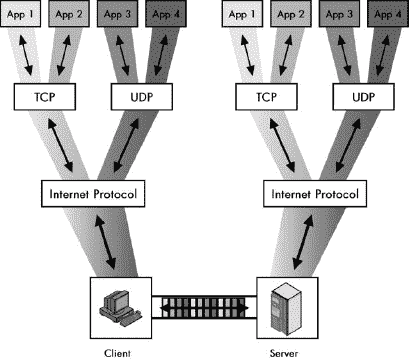在一个典型的运行 TCP/IP 的机器中，同时运行着许多不同的协议和应用。这个例子展示了四个不同的应用在客户端和服务器机器之间进行通信。所有四个应用都使用相同的 IP 软件和物理连接进行复用传输；接收到的数据被解复用并传递到相应的应用。IP、TCP 和 UDP 提供了一种方法，以确保每个应用的数据都是独立的。

图 43-1. TCP/IP 中的进程复用和解复用在一个典型的运行 TCP/IP 的机器上，同时运行着许多不同的协议和应用。此示例显示了四个不同的应用在客户端和服务器机器之间进行通信。所有四个都使用相同的 IP 软件和物理连接进行复用传输；接收到的数据被解复用并传递到适当的应用。IP、TCP 和 UDP 提供了一种方法，以保持每个应用的数据独立。

# TCP/IP 端口：TCP/UDP 寻址

在 TCP/IP 互联网中，一个典型主机上同时运行着许多不同的软件应用进程。每个进程生成数据，并将其发送到 TCP 或 UDP，然后由 IP 层进行传输。IP 层将这个复用数据报流发送到不同的目的地。同时，每个设备的 IP 层正在接收来自其他主机上多个应用进程的数据报。这些数据报需要被解复用，以便它们最终到达接收它们的设备上的正确进程。

## 使用端口进行复用和解复用

问题是，我们如何解复用一系列需要发送到许多不同应用进程的 IP 数据报？让我们考虑一个具有单个网络接口并带有 IP 地址 24.156.79.20 的主机。通常，IP 层接收到的每个数据报都将在此 IP 目标地址字段中包含此值。IP 层接收到的连续数据报可能包含您使用网络浏览器下载的文件的一部分，您兄弟发给您的电子邮件，以及一个在 IRC 聊天频道中写下的朋友的一行文本。如果它们都具有相同的 IP 地址，IP 层如何知道哪些数据报该去哪里？

答案的第一部分在于每个 IP 数据报头部中包含的协议字段。该字段携带一个代码，用于标识将数据报中的数据发送到 IP 的协议。由于大多数最终用户应用在传输层使用 TCP 或 UDP，因此接收到的数据报中的协议字段告诉 IP 根据需要将数据传递给 TCP 或 UDP。当然，这仅仅是将问题推迟到了传输层。

许多应用同时使用 TCP 和 UDP。这意味着 TCP 或 UDP 必须确定将数据发送到哪个进程。为了实现这一点，需要额外的寻址元素。此地址允许在特定的 IP 地址内识别一个更具体的地址——一个软件进程。在 TCP/IP 中，这个传输层地址被称为*端口*。

## 源端口和目标端口号码

在 UDP 和 TCP 消息中，出现了两个地址字段：一个*源端口*和一个*目的端口*。这些字段与 IP 层上的源地址和目的地址字段类似，但更详细。它们标识了源机器上的发起进程和目标机器上的目标进程。TCP 或 UDP 软件在传输之前填充这些字段，并将数据引导到目标设备上的正确进程。

### 注意

*“端口”这个词除了在 TCP/IP 中的这个含义之外，还有许多其他含义。例如，网络设备中的物理出口通常被称为端口。* 通常，你可以从上下文中判断所讨论的端口是指硬件端口还是软件端口。

TCP 和 UDP 端口号的长度为 16 位。有效的端口号理论上可以取从 0 到 65,535 的值。你将在下一节中看到，这些值被划分为不同的范围，用于不同的目的，某些端口被保留用于特定的用途。

有时候可能会有些令人困惑的一个事实是，UDP 和 TCP 都使用相同的端口号范围，但它们是独立的。从理论上讲，UDP 端口号 77 可以指代一个应用程序进程，而 TCP 端口号 77 可以指代一个完全不同的进程。至少对于计算机来说，这没有歧义，因为如前所述，每个 IP 数据报都包含一个协议字段，用于指定它携带的是 TCP 消息还是 UDP 消息。IP 将数据报传递给 TCP 或 UDP，然后使用 TCP 或 UDP 头中的端口号将消息发送到正确的进程。这一机制在图 43-2 中得到了说明。

图 43-2. 使用 TCP/UDP 端口的 TCP/IP 进程多路复用/解复用 本图是图 43-1 的一个更具体版本，展示了 TCP 和 UDP 端口如何实现软件多路复用和解复用。再次，有四个不同的 TCP/IP 应用程序在进行通信，但这次我只展示了从客户端到服务器的流量。其中两个应用程序使用 TCP，另外两个使用 UDP。客户端上的每个应用程序都使用特定的 TCP 或 UDP 端口号发送消息。服务器上的 UDP 或 TCP 软件使用这些端口号将数据报传递给适当的应用程序进程。

在实践中，TCP 和 UDP 使用不同的端口号可能会造成混淆，尤其是对于常用应用程序使用的保留端口号。为了避免混淆，按照惯例，大多数保留端口号都为 TCP 和 UDP 保留。例如，端口 80 为 HTTP 保留，用于 TCP 和 UDP，尽管 HTTP 只使用 TCP。我们将在下一节中更详细地探讨这一点。

### 小贴士

**关键概念** TCP/IP 传输层地址是通过使用 TCP 和 UDP *端口* 来实现的。特定 IP 设备内的每个端口号标识一个特定的软件进程。

## 数据报传输和接收端口使用总结

下面是如何在 TCP 和 UDP 中实现传输层地址（端口地址）的：

**发送数据报** 应用程序指定它希望用于通信的源端口和目标端口。端口号被编码到 TCP 或 UDP 头部，具体取决于应用程序使用的传输层协议。当 TCP 或 UDP 将数据传递给 IP 时，IP 在 IP 数据报的协议字段中指示适用于 TCP 或 UDP 的协议类型。源端口和目标端口作为 TCP 或 UDP 消息的一部分封装在 IP 数据报的数据区域中。

**接收数据报** IP 软件接收数据报，检查协议字段，并决定数据报属于哪个协议（在这种情况下，是 TCP 或 UDP）。TCP 或 UDP 接收数据报，并根据目标端口号将其内容传递给适当的过程。

### 小贴士

**关键概念** TCP/IP 中应用程序进程的多路复用和解复用是通过 IP 协议字段以及 UDP/TCP 源端口和目标端口字段实现的。在传输过程中，协议字段被赋予一个数字来指示是否使用了 TCP 或 UDP，端口数字被填充以指示发送和接收的软件进程。接收数据报的设备使用协议字段来确定是否使用了 TCP 或 UDP，然后将数据传递给目标端口号指示的软件进程。

# TCP/IP 应用程序分配和服务器端口号范围

我刚才讨论的端口号提供了一种传输层寻址方法，允许许多应用程序同时使用 TCP 和 UDP。通过指定适当的目标端口号，发送数据的程序可以确保目标设备上的正确进程将接收消息。不幸的是，仍然有一个问题需要解决。

让我们回到使用万维网。你打开一个网页浏览器，这是一个客户端软件，它使用 HTTP 发送请求。你需要知道你想要访问的网站的 IP 地址，或者你可能让域名系统（DNS）自动为你提供 IP 地址。一旦你有了地址，网页浏览器就可以生成一个 HTTP 消息并将其发送到网站的 IP 地址。

这个 HTTP 消息是为了发送到你试图访问的网站上的 Web 服务器进程。问题是网页浏览器（客户端进程）如何知道分配给网站服务器进程的端口号？端口号的范围从 0 到 65535，这意味着有很多选择。而且，从理论上讲，每个网站都可以为其 Web 服务器进程分配不同的端口号。

有几种不同的方法可以解决这个问题。TCP/IP 采取了可能是最简单的方法：它为特定应用程序*保留*了某些端口号。

## 保留端口号

监听该应用程序请求并对其做出响应的服务器进程为每个常见应用程序分配一个特定的端口号。为了避免混乱，实现特定服务器进程的软件通常在每台 IP 设备上使用相同的保留端口号，以便客户端可以轻松找到它。

在使用网页浏览器访问网站的例子中，HTTP 保留的端口号是 80。每个网页浏览器都知道，网页设计者设计网站是为了监听发送到端口 80 的请求。因此，网页浏览器将使用这个值在请求中，以确保网页浏览器的 IP 和 TCP 软件将 HTTP 消息直接导向 Web 服务器软件。虽然特定的 Web 服务器可以使用不同的端口号，但在此情况下，Web 服务器必须以某种方式通知用户这个数字，并且必须明确告诉网页浏览器使用它而不是默认端口号（80）。

### 小贴士

**关键概念** 为了使客户端设备更容易建立到 TCP/IP 服务器的连接，常见应用程序的服务器进程使用通用服务器端口号。客户端预先编程，默认使用这些端口号。

为了使这个系统运行良好，对端口号分配的普遍同意是必不可少的。因此，这又是一个需要中央权威机构来管理大家使用的端口号分配列表的情况。对于 TCP/IP 来说，负责分配和协调其他集中管理数字的同一权威机构负责这项工作，包括 IP 地址、IP 协议号等：互联网数字分配机构（IANA；见第三章）。

## TCP/UDP 端口号范围

正如你所见，有 65,536 个端口号可用于进程。但也有相当多的 TCP/IP 应用程序，并且这个列表每年都在增长。IANA 需要仔细管理端口号地址空间，以确保端口号不会被浪费在不会广泛使用的协议上。同时，IANA 还需要为必须使用不为人知的组织提供灵活性。为此，TCP 和 UDP 的全部端口号范围被划分为三个范围：

**已知（特权）端口号（0 到 1023）** IANA 管理这些端口号，并将它们仅保留给最通用的 TCP/IP 应用程序。IANA 只将这些端口号分配给使用 TCP/IP RFC 流程标准化的协议，正在标准化过程中的协议，或预计未来可能标准化的协议。在大多数计算机上，只有由系统管理员或特权用户运行的服务器进程使用这些端口号。这些进程通常对应于实现关键 IP 应用程序的进程，例如 Web 服务器、FTP 服务器等。因此，这些进程有时被称为 *系统端口号*。

**已注册（用户）端口号（1024 到 49151）** 许多需要使用 TCP/IP 的应用程序没有在 RFC 中指定，或者不像其他应用程序那样被普遍使用，因此它们不配拥有全球知名的端口号。为了确保这些不同的应用程序之间不会相互冲突，IANA 使用了大部分端口号范围作为已注册端口号。任何创建可行的 TCP/IP 服务器应用程序的人都可以请求预留这些端口号之一，如果请求得到批准，IANA 将注册该端口号并将其分配给该应用程序。系统上的任何用户通常都可以访问已注册端口号；因此，它们有时被称为 *用户端口号*。

**私有/动态端口号（49152 到 65535）** IANA 既不保留也不维护这些端口。任何人都可以在不注册的情况下用于任何目的，因此它们适用于仅由特定组织使用的私有协议。

### 小贴士

**关键概念** IANA 管理端口号分配以确保全球互联网的通用兼容性。这些数字分为三个范围：用于最常见应用的知名端口号，用于其他应用的注册端口号，以及无需 IANA 注册即可使用的私有/动态端口号。

使用这些范围确保了在如何访问最常见 TCP/IP 协议的服务器进程方面将达成全球共识。它们还允许特殊应用有灵活性。大多数 TCP/IP 应用和应用协议使用知名端口号范围中的数字作为其服务器的端口号。这些端口号通常不用于客户端进程，但也有一些例外。例如，端口号 68 保留用于使用引导协议（BOOTP）或动态主机配置协议（DHCP）的客户端。

# TCP/IP 客户端（短暂）端口和客户端/服务器应用端口使用

在详细检查端口号的使用时，TCP/IP 中客户端和服务器之间的不对称性变得明显。由于客户端使用 TCP 和 UDP 来初始化应用数据传输，因此它们需要知道服务器进程的端口号。因此，服务器需要使用普遍知晓的端口号。因此，知名和注册的端口号用于标识服务器进程。发送请求的客户端使用知名或注册的端口号作为目标端口号。

相比之下，服务器响应客户端；它们不会主动与他们接触。因此，客户端不需要使用保留端口号。实际上，这真的是一种低估。服务器不应该使用知名或注册的端口号来向客户端发送响应，因为有可能同一台机器上运行着同一协议的客户端和服务器软件。如果服务器在其机器的 80 端口上收到 HTTP 请求，并将回复发送回客户端机器的 80 端口，那么服务器就会将回复发送到客户端机器上的 HTTP 服务器进程（如果存在），而不是发送给发送初始请求的客户端进程。

为了知道将回复发送到哪里，服务器必须知道客户端正在使用的端口号。客户端在请求中将端口号作为*源端口号*提供，然后服务器使用源端口号作为目标端口号来发送回复。客户端进程不使用知名或注册端口。相反，每个客户端进程都会为其分配一个临时端口号供其使用。这通常被称为*短暂端口号*。

### 注意

*今日 10 词:* 临时：*"短暂存在的；仅存在或持续很短的时间。" ——韦伯斯特修订版无删节词典*。

## 临时端口号分配

TCP/IP 软件根据需要将临时端口号分配给进程。显然，每个同时运行的客户端进程都需要使用一个唯一的临时端口号，因此 TCP 和 UDP 层必须跟踪哪些端口号正在使用中。TCP/IP 软件通常以伪随机方式从预留的数字池中分配这些端口号。我之所以说伪随机，是因为分配给进程的临时端口号没有特定的意义，因此 TCP/IP 软件可以为每个客户端进程选择一个随机的端口号。然而，由于需要随着时间的推移重复使用这个池中的端口号，许多实现使用一套规则来最小化由于重复使用而造成的混淆。

考虑一个仅使用临时端口号 4121 发送请求的客户端进程。客户端进程收到回复后终止。假设你立即将 4121 重新分配给其他进程。然而，先前使用端口号 4121 的用户访问服务器，由于某种原因，服务器发送了额外的回复。这个回复将发送到新的进程，从而造成混淆。为了避免这种情况，最好尽可能等待一段时间后再将端口号 4121 重新用于另一个客户端进程。因此，一些实现会循环使用端口号，以确保在连续使用相同的临时端口号之间有尽可能长的时间间隔。

### 小贴士

**关键概念** 对于服务器进程来说，需要已知的和注册的端口号，因为客户端必须知道服务器的端口号才能发起联系。另一方面，客户端进程可以使用任何端口号。每次客户端进程发起 UDP 或 TCP 通信时，TCP/IP 软件都会为其分配一个临时或*临时*端口号，用于那次对话。TCP/IP 软件以伪随机方式分配这些端口号，因为软件使用的确切数字并不重要，只要每个进程有不同的数字即可。

## 临时端口号范围

TCP/IP 软件在设备上用于临时端口号的端口号范围也取决于实现。伯克利标准分布（BSD）UNIX 中的 TCP/IP 实现确立了经典的临时端口号范围。BSD UNIX 将其定义为 1024 到 4999，从而提供了 3,976 个临时端口号。这似乎是一个非常大的数字，实际上通常对于典型的客户端来说已经足够了。然而，这个数字的大小可能会误导。许多应用程序使用多个进程，理论上在非常繁忙的 IP 设备上可能会耗尽临时端口号。因此，大多数情况下，临时端口号的范围可以更改。默认范围可能因其他操作系统而异。

就像众所周知并注册的端口号用于服务器进程一样，临时端口号仅用于客户端进程。这意味着从 1024 到 4999 的地址范围的使用不会与该范围用于注册端口号的使用发生冲突。我在上一节“临时端口号分配”中讨论了这一点。

## 客户端/服务器交换期间的端口号使用

现在让我们回到客户端/服务器应用程序消息交换的问题。一旦客户端分配了一个临时端口号，该端口号就用作客户端请求 TCP/UDP 消息中的源端口。服务器接收请求并生成一个回复。在形成这个响应消息时，服务器*交换*源端口号和目标端口号，就像它交换源和目标 IP 地址一样。因此，服务器的回复是从服务器进程的已知或注册端口号发送回客户端机器上的临时端口号。

现在回到网页浏览器的例子。具有 IP 地址 177.41.72.6 的网页浏览器想要向 IP 地址为 41.199.222.3 的特定网站发送 HTTP 请求。TCP/IP 软件使用*目标端口*号 80（为 HTTP 服务器保留的端口）发送 HTTP 请求。TCP/IP 软件从临时端口池中分配*源端口*号；假设它是端口 3022。当 HTTP 请求到达 Web 服务器时，它被传递到端口 80，HTTP 服务器接收它。这个过程生成一个回复并发送回 IP 地址 177.41.72.6，使用*目标端口*3022 和*源端口*80。每当 TCP/IP 软件交换源端口号和目标端口号以及源和目标 IP 地址时，这两个进程就可以来回交换信息。这个例子在图 43-3 中有说明。

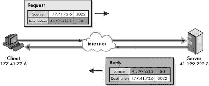

图 43-3. TCP/IP 客户端/服务器应用程序端口机制 这个高度简化的例子展示了客户端和服务器如何使用端口号进行请求/回复交换。客户端正在发送一个 HTTP 请求，并将其发送到 HTTP 的已知端口号 80。此交换的端口号是伪随机选择的 3022。服务器将其回复发送回该端口号，该端口号是从请求中读取的。

### 提示

**关键概念** 在大多数 TCP/IP 客户端/服务器通信中，客户端使用一个随机的临时端口号，并向服务器 IP 地址上的适当保留端口号发送请求。服务器将其回复发送回请求源端口号字段中找到的任何端口号。

# TCP/IP 套接字和套接字对：进程和连接标识

在本章中，我讨论了在 IP 层和应用进程层面地址之间的关键区别。总结来说，在第 3 层，IP 地址对于在 IP 设备之间正确传输数据来说至关重要。相比之下，应用协议必须关注分配给每个应用程序实例的端口号，以便协议可以正确使用 TCP 或 UDP。

因此，一个应用程序过程的整体标识实际上使用的是它在运行的宿主机的 IP 地址——或者更精确地说，是它所使用的网络接口——以及分配给它的端口号的组合。这个组合地址被称为*套接字*。套接字使用< *IP 地址*>:< *端口号*>的表示法指定。例如，如果你有一个运行在 IP 地址 41.199.222.3 上的网站，该网站对应的 HTTP 服务器套接字将是*41.199.222.3:80*。

### 提示

**关键概念** 设备上 TCP/IP 应用程序过程的整体标识符是其 IP 地址和端口号的组合，这被称为*套接字*。

你有时也会看到使用主机名而不是 IP 地址来指定套接字，如下所示：< *主机名*>:< *端口号*>。要使用此描述符，网络浏览器必须首先使用 DNS 将名称解析为 IP 地址。例如，你可能找到一个网站 URL，如[`www.thisisagreatsite.com:8080`](http://www.thisisagreatsite.com:8080)。这告诉网络浏览器首先使用 DNS 将名称[www.thisisagreatsite.com](http://www.thisisagreatsite.com)解析为 IP 地址。然后它告诉浏览器使用非标准服务器端口号 8080 向该地址发送请求，浏览器偶尔会使用端口号 8080 而不是端口号 80。（有关更多信息，请参阅第七十章中关于使用 URL 进行应用层地址讨论的内容。）

套接字是 TCP/IP 应用程序操作的基本概念。实际上，它是与同名的 TCP/IP 应用程序程序接口（API）的基础：套接字。Windows 上的这个 API 版本被称为*Windows 套接字*或*Winsock*，您可能之前听说过。这些 API 允许应用程序程序轻松地使用 TCP/IP 进行通信。

因此，一对设备之间的数据交换由从一台设备的套接字发送到另一台设备的套接字的一系列消息组成。每个设备通常会有多个同时进行的对话。在 TCP 的情况下，每个设备对在通信会话期间都会建立一个连接。这些连接必须被管理，并且需要它们具有唯一标识。这是通过连接的两个设备的套接字标识来完成的。

### 小贴士

**关键概念** 每个设备在任何给定时间都可能有多条 TCP 连接处于活动状态。每个连接都通过客户端套接字和服务器套接字的组合唯一标识，这些套接字又包含四个元素：客户端 IP 地址和端口号，以及服务器 IP 地址和端口号。

让我们回到图 43-3 中的例子。您正在从客户端 177.41.72.6 向网站 41.199.222.3 发送 HTTP 请求。该网站的服务器将使用已知的端口号 80，因此它的套接字是 41.199.222.3:80，正如您之前所看到的。您为网络浏览器分配了临时的端口号 3022，因此客户端套接字是 177.41.72.6:3022。这些设备之间的整体连接可以使用这个套接字对来描述：(41.199.222.3:80, 177.41.72.6:3022)。

要了解更多关于 TCP 如何识别连接的信息，请参阅第四十六章中关于 TCP 端口和连接识别的主题。

与 TCP 不同，UDP 是一种无连接协议，因此它显然不使用连接。发送和接收设备上的套接字对仍然可以用来识别正在交换数据的两个进程，但由于没有连接，套接字对在 TCP 中的重要性并不相同。

# 常见的 TCP/IP 应用程序和已知及注册的端口号

TCP/IP 协议套件的巨大普及导致了成千上万种不同应用程序和协议的发展。其中大多数都使用了我在本章前面讨论过的客户端/服务器操作模型。特定应用程序的服务器进程被设计为使用特定的保留端口号，而客户端使用一个短暂的（临时）端口号来与服务器建立连接。为了确保每个人都同意每个服务器应用程序应该为每个应用程序使用哪个端口号，端口号由 IANA 集中管理。

最初，IANA 将已知和注册的端口号列表保存在一个冗长的文本文档中，其中还包含了 IANA 负责的许多其他参数（如 IP 协议字段编号、ICMP 的类型和代码字段值等）。这些端口号定期在名为“分配号码”的互联网（RFC）标准文档中发布。这种系统在互联网的早期阶段运行良好，但到了 20 世纪 90 年代中期，这些值变化得太快，使用 RFC 流程已不可行。发布它们的工作量太大，而且 RFC 发布后实际上就过时了。

最后的“分配号码”标准是 RFC 1700，该标准于 1994 年 10 月发布。在那之后，IANA 转向使用一组包含他们管理的参数的万维网文档。这使得 IANA 能够不断更新列表，并使 TCP/IP 用户能够获取更准确的信息。RFC 1700 于 2002 年被正式废除。

您可以在[`www.iana.org/numbers.html`](http://www.iana.org/numbers.html)找到 IANA 维护的所有参数的完整信息。包含 TCP/UDP 端口分配的文件的 URL 是[`www.iana.org/assignments/port-numbers`](http://www.iana.org/assignments/port-numbers)。

本文档是所有已知和注册的 TCP 和 UDP 端口分配的最终列表。每个端口号都分配了一个简短的*关键字*，以及使用该协议的简要描述。这份文档有两个问题。首先，它非常长；包含超过 10,000 行文本。其中提到的绝大多数协议都是用于晦涩的应用程序，你可能以前从未听说过（我肯定大多数都没听说过！）。这使得很难轻松地看到最常用协议的端口分配。

这份文档的另一个问题是，它显示同一个端口号既为 TCP 又为 UDP 的应用程序所保留。正如我之前提到的，TCP 和 UDP 端口号实际上是独立的，因此，从理论上讲，一个端口号可以分配 TCP 端口 80 给一种服务器应用程序类型，而将 UDP 端口 80 分配给另一种。人们认为这会导致混淆，因此，除了极少数例外，同一应用程序的 TCP 和 UDP 列表中显示的端口号是相同的。尽管如此，在列表中显示这一点也有一个缺点：您无法知道应用程序实际使用的是哪种协议，以及哪种只是为了保持一致性而保留的。

考虑到所有这些，我决定包括几个总结表格，显示最常见 TCP/IP 应用程序的已知和注册端口号。我指出了协议是否使用 TCP、UDP 或两者都使用。表 43-1 列出了最常见 TCP/IP 应用协议的已知端口号。

表 43-1. 常见 TCP/IP 已知端口号和应用

| 端口号 | TCP/UDP | 关键词 | 协议缩写 | 应用或协议名称/注释 |
| --- | --- | --- | --- | --- |
| 7 | TCP + UDP | echo | — | 回声协议 |
| 9 | TCP + UDP | discard | — | 丢弃协议 |
| 11 | TCP + UDP | systat | — | 活跃用户协议 |
| 13 | TCP + UDP | daytime | — | 白天协议 |
| 17 | TCP + UDP | qotd | QOTD | 每日名言协议 |
| 19 | TCP + UDP | chargen | — | 字符发生器协议 |
| 20 | TCP | ftp-data | FTP（数据） | 文件传输协议（默认数据端口） |
| 21 | TCP | ftp | FTP（控制） | 文件传输协议（控制/命令） |
| 23 | TCP | telnet | — | Telnet 协议 |
| 25 | TCP | smtp | SMTP | 简单邮件传输协议 |
| 37 | TCP + UDP | time | — | 时间协议 |
| 43 | TCP | nicname | — | Whois 协议（也称为 Nicname） |
| 53 | TCP + UDP | domain | DNS | 域名服务器（域名系统） |
| 67 | UDP | bootps | BOOTP/DHCP | 引导协议/动态主机配置协议（服务器） |
| 68 | UDP | bootpc | BOOTP/DHCP | 引导协议/动态主机配置协议（客户端） |
| 69 | UDP | tftp | TFTP | 简单文件传输协议 |
| 70 | TCP | gopher | — | Gopher 协议 |
| 79 | TCP | finger | — | Finger 用户信息协议 |
| 80 | TCP | http | HTTP | 超文本传输协议（万维网） |
| 110 | TCP | pop3 | POP | 邮政协议（第 3 版） |
| 119 | TCP | nntp | NNTP | 网络新闻传输协议 |
| 123 | UDP | ntp | NTP | 网络时间协议 |
| 137 | TCP + UDP | netbios-ns | — | NetBIOS（名称服务） |
| 138 | UDP | netbios-dgm | — | NetBIOS（数据报服务） |
| 139 | TCP | netbios-ssn | — | NetBIOS（会话服务） |
| 143 | TCP | imap | IMAP | 互联网消息访问协议 |
| 161 | UDP | snmp | SNMP | 简单网络管理协议 |
| 162 | UDP | snmptrap | SNMP | 简单网络管理协议（陷阱） |
| 179 | TCP | bgp | BGP | 边界网关协议 |
| 194 | TCP | irc | IRC | 互联网中继聊天 |
| 443 | TCP | https | HTTP over SSL | 超文本传输协议安全套接字层 |
| 500 | UDP | isakmp | IKE | IPsec 互联网密钥交换 |
| 520 | UDP | router | RIP | 路由信息协议（RIP-1 和 RIP-2） |
| 521 | UDP | ripng | RIPng | 路由信息协议 - 新一代 |

注册端口号按照定义是用于未使用 RFC 过程标准化的协议，因此它们大多是神秘的应用程序，我认为没有必要列出所有这些。表 43-2 展示了其中一些我认为特别有趣的应用。

表 43-2. 常见 TCP/IP 注册端口号和应用

| 端口号 | TCP/UDP | 关键词 | 协议缩写 | 应用或协议名称/注释 |
| --- | --- | --- | --- | --- |
| 1512 | TCP + UDP | wins | WINS | 微软 Windows 互联网命名服务 |
| 1701 | UDP | l2tp | L2TP | 层 2 隧道协议 |
| 1723 | TCP | pptp | PPTP | 点对点隧道协议 |
| 2049 | TCP + UDP | nfs | NFS | 网络文件系统 |
| 6000–6063 | TCP | x11 | X11 | X 窗口系统 |

# 第四十四章：TCP/IP 用户数据报协议（UDP）

TCP/IP 协议套件以互联网协议（IP）和传输控制协议（TCP）的名字命名，这本身就暗示了这两个是套件中的两个关键协议。IP 位于网络层，而 TCP 位于传输层。难怪很多人甚至没有意识到 TCP/IP 中还有一个第二层传输层协议。

就像害羞的小弟弟一样，*用户数据报协议（UDP）*在阴影中坐着，而 TCP 却得到了荣耀。这个更花哨的兄弟确实应该得到很多这样的关注，因为 TCP 可以说是两者中更重要的一方。然而，UDP 在 TCP/IP 协议套件中填补了一个关键的角色，因为它允许许多应用程序在使用 TCP 时达到最佳状态。

在本章中，我讨论了 UDP，这是一种更简单、不太为人所知的 TCP/IP 传输协议。我首先概述了该协议，并描述了其历史和标准。我概述了 UDP 的工作方式，并解释了 UDP 消息使用的格式。最后，我讨论了使用 UDP 的应用类型以及分配给它们的知名或注册端口号。

# UDP 概述、历史和标准

我想，我在本节引言中提到的兄弟姐妹竞争的比喻可能有点愚蠢。我高度怀疑协议会在夜晚醒来担心我们使用它们的程度。然而，考虑到与 TCP 相比得到的关注如此之少，发现 UDP 实际上有多么重要是非常有趣的。事实上，在真正的哥哥，抢风头的风格中，你甚至无法真正理解 UDP 的历史，除非首先讨论 TCP。

在第八章中，我描述了 TCP/IP 的历史，我解释说，在协议套件的早期开发阶段，只有一个协议处理 IP 和 TCP 执行的功能。这个协议被称为 TCP，它提供了类似于 IP 的网络层连接性，并建立了连接，提供了可靠性，并处理了与现代 TCP 相关联的典型传输层质量要求，例如流量控制和重传处理。

在开发初期的联合 TCP 协议的开发者很快意识到，将这些功能混合在一起是一个错误。虽然大多数传统应用需要经典的传输层可靠性功能，但有些则不需要。这些特性引入了开销，无论应用是否真的需要可靠性功能，都会增加这种开销。更糟糕的是，对于某些应用来说，这些特性不仅没有价值，反而有害，因为即使是由于开销导致的微小性能损失也会成为一个问题。

解决方案是将原始协议分离成 IP 和 TCP。IP 将执行基本互连，而 TCP 将执行可靠性功能。这为创建一个替代传输层协议——UDP——铺平了道路，该协议适用于不需要或不需要 TCP 提供的功能的应用。

与 UDP 相关联的两个主要属性始终是简单和快速。UDP 是一个简单的协议，它使用一个非常直接的消息结构，这与许多其他 TCP/IP 协议使用的消息格式相似（与 TCP 使用的更复杂的数据结构——流和段相对比）。实际上，当你把它简化到极致，UDP 的唯一真正目标是作为在更高层运行的网络应用进程之间的接口，以及 IP 的互连能力。

与 TCP 类似，UDP 通过使用 UDP 端口号在 IP 之上叠加了一种传输层寻址方法（因此，进程标识）。UDP 包括一个可选的校验和功能用于错误检测，但几乎不添加其他功能。

要看到 UDP 的简单性，最好的办法是查看定义它的标准。或者，我应该说*标准*（单数形式），因为只有一个。UDP 在 1980 年的 RFC 768，“用户数据报协议”中被定义。这份文件长度为三页，而且没有人需要修订它。

UDP 是一种快速协议，这正是因为它没有 TCP 的所有花哨功能。这使得它对于许多，如果不是大多数典型的网络应用来说，都不适合使用。但对于某些应用来说，这种速度正是它们从传输层协议中想要的，即一种能够快速将应用数据打乱并迅速将其下放到 IP 层，而无需太多麻烦的东西。选择使用 UDP，应用程序编写者自己承担起处理诸如可靠性、重传等问题，如果需要的话。这可能是成功或失败的因素，取决于应用以及编写者如何仔细使用 UDP。

### 小贴士

**关键概念** *用户数据报协议（UDP）*是为那些在传输层不需要可靠性、确认或流量控制功能的应用协议而开发的。它被设计成简单快捷。它只提供传输层寻址（以 UDP 端口号的形式），可选的校验和功能，以及很少的其他功能。

# UDP 操作

UDP 非常简单，以至于我无法详细说明它是如何工作的。它被设计成尽可能少地做事情。

## UDP 做什么

UDP 的唯一真正任务是接收来自高层协议的数据并将其放置在 UDP 消息中，然后将其传递给 IP 进行传输。使用 UDP 进行传输的基本步骤如下：

1.  **高层数据传输** 应用程序向 UDP 软件发送消息。

1.  **UDP 消息封装** 高层消息被封装在 UDP 消息的数据字段中。UDP 消息的头部被填写，包括发送数据的源端口号和目标端口号。校验和值也可能被计算。

1.  **将消息传递给 IP** UDP 消息被传递给 IP 进行传输。

就是这样。当然，当目标设备接收到消息时，这个简短的过程会被反转。

## UDP 不做什么

UDP 非常简单，其操作通常用它不做什么来描述，而不是它做什么。作为一个传输协议，UDP 不执行以下操作：

+   在发送数据之前建立连接。它只是打包数据并发送。

+   提供确认以显示数据已被接收。

+   提供任何保证其消息将到达。

+   检测丢失的消息并重新传输它们。

+   确保数据以发送的相同顺序接收。

+   提供任何机制来处理拥塞或管理设备之间的数据流。

### 小贴士

**关键概念** UDP 可能是 TCP/IP 中所有协议中最简单的一个。它接收传递给它的应用层数据，将其封装在简化的消息格式中，然后将其发送给 IP 进行传输。

如果这些限制听起来与 IP 的限制相似，那么你注意到了。UDP 基本上是带有传输层端口地址的 IP。（因此，UDP 有时被称为*包装协议*，因为它所做的只是将应用数据包装在其简单的消息格式中，并将其发送到 IP。）

然而，尽管有前面的列表，UDP 中确实存在一些有限的反馈和错误检查机制。一个是可选的校验和功能，它可以允许检测传输中的错误或 UDP 消息被错误地发送到错误位置的情况（参见下一节“UDP 消息格式”的详细信息）。另一个是互联网控制消息协议（ICMP）错误报告（参见第三十一章和图 44-1 显示了 UDP 消息的格式。

UDP 校验和字段是协议中有点令人困惑的一个区域。校验和的概念本身并不新颖；校验和在网络协议中被广泛使用，以提供对错误的保护。有点奇怪的是，这个计算校验和的概念不仅适用于常规数据报，还适用于伪头部。因此，UDP 软件不是只计算 UDP 数据报中的字段校验和，而是首先构建一个包含以下字段的假附加头部：

+   IP 源地址字段

+   IP 目标地址字段

+   IP 协议字段

+   UDP 长度字段

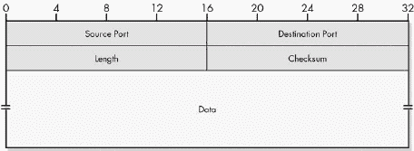

图 44-1. UDP 消息格式

表 44-1. UDP 消息格式

| 字段名称 | 大小（字节） | 描述 |
| --- | --- | --- |
| 源端口 | 2 | 在源设备上发起 UDP 消息的进程的 16 位端口号。这通常是一个客户端（临时）端口号，客户端向服务器发送请求，或者是一个已知/已注册（服务器）端口号，服务器向客户端发送回复。（有关详细信息，请参见第四十三章）。 |
| 长度 | 2 | 整个 UDP 数据报的长度，包括头部和数据字段。 |
| 校验和 | 2 | 可选的 16 位校验和，计算整个 UDP 数据报加上特殊字段伪头部。有关更多信息，请参阅下文。 |
| 数据 | 可变 | 将要发送的封装的高层消息。 |

UDP 伪头部格式在图 44-2 中展示。

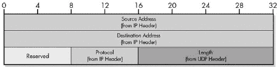

图 44-2. UDP 伪头部格式

这个伪头部的总长度是 11 字节。它通过一个字节的零填充到 12 字节，然后附加到真实的 UDP 消息前。然后计算伪头部和真实 UDP 消息的组合校验和，并将值放入校验和字段。伪头部仅用于此计算，然后被丢弃；它实际上并不传输。目标设备中的 UDP 软件在计算其校验和时创建相同的伪头部，以便与 UDP 头部中传输的进行比较。

在常规 UDP 字段上计算校验和可以保护 UDP 消息免受位错误的影响。添加伪头部允许校验和也保护 UDP 消息免受其他类型的问题，最值得注意的是意外将消息发送到错误的目的地。UDP 中的校验和计算，包括使用伪头部，与 TCP 中使用的方法完全相同（除了 TCP 中的长度字段不同）。有关伪头部为什么重要的完整描述以及使用 IP 字段在传输层数据报计算中的有趣影响的详细信息，请参阅第四十八章。

### 提示

**关键概念** UDP 将应用层数据打包成一个非常简单的消息格式，该格式仅包含四个头部字段。其中一个是可选的校验和字段。当使用校验和字段时，校验和是在真实头部和来自 UDP 和 IP 头部的字段的一个特殊伪头部上计算的，其方式与 TCP 校验和计算非常相似。

注意，在 UDP 中，使用校验和字段是可选的。如果 UDP 不使用校验和字段，它将将其设置为全零的值。然而，这可能会引起混淆，因为当 UDP 使用校验和时，计算有时会导致零值。为了避免让目的地认为在这种情况下 UDP 没有使用校验和，UDP 将这个零值表示为全一的值（十进制的 65,535）。

# UDP 常见应用程序和服务器端口分配

正如你所看到的，UDP 包含的功能非常少。除了 UDP 端口代表的重要寻址能力之外，使用 UDP 在很大程度上类似于使用 IP。这意味着 UDP 具有与 IP 相同的许多缺点。它不会在设备之间建立持久的连接；它不会确认接收到的数据或重传丢失的消息；并且它当然不关心诸如流量控制和拥塞管理之类的奥秘。

这些功能的缺失使得 UDP 对于大多数经典网络应用来说根本不适用。这些应用程序通常需要建立连接，以便两个设备可以交换数据。许多应用程序还必须具备偶尔或定期发送大量数据的能力，这些数据必须完整接收才有价值。例如，考虑一个像超文本传输协议（HTTP）这样的消息传输协议。如果只有网页的一部分从服务器传回网页浏览器，那么它是无用的。HTTP 和其他类似的文件和消息传输协议需要 TCP 的功能。

## 为什么一些 TCP/IP 应用程序使用 UDP

那么，哪些应用程序使用 UDP 呢？UDP 的经典限制是，因为它不提供可靠性功能，所以使用 UDP 的应用程序需要负责这些功能。实际上，如果一个应用程序需要 TCP 提供的功能，但不包括 UDP 提供的功能，那么允许应用程序实现这些功能是不高效的，除非在特殊情况下。如果应用程序需要 TCP 提供的东西，它应该直接使用 TCP！然而，仅需要 TCP 实现部分功能的应用程序有时使用 UDP 并在应用层实现这一有限功能集会更好。

因此，在 UDP 上运行的应用程序通常是那些不需要 TCP 所具有的所有或大多数功能的应用程序。这些应用程序可以从避免与 TCP 相关的设置和开销带来的效率提升中受益。通常（但不总是）这些应用程序符合这一描述，因为它们发送的数据属于以下两个类别之一：

**性能比完整性更重要的数据** 这个类别的经典例子是多媒体应用程序。对于在互联网上流式传输视频片段，最重要的功能是流开始快速流动并保持流动。人类只注意到这类信息流动中的重大中断，因此由于丢失的数据报而丢失的几个字节并不是大问题。此外，即使有人使用 TCP 进行类似操作并注意到并重传丢失的数据报，这将是无用的，因为丢失的数据报将属于剪辑中很久以前的部分——在该重传中花费的时间可能会使当前部分的视频片段迟到。显然，UDP 最适合这种情况。

**“简短而甜蜜”的数据交换** 在许多 TCP/IP 应用程序中，底层协议仅由非常简单的请求/回复交换组成。客户端向服务器发送简短请求消息，然后服务器将简短回复消息发送回客户端。在这种情况下，实际上没有必要像 TCP 那样建立连接。此外，如果客户端只发送一条简短消息，单个 IP 数据报就可以携带该消息。这意味着没有必要担心数据到达顺序、设备间的流量控制等问题。那么请求或回复的丢失怎么办？这些可以在应用层使用计时器简单地处理。如果客户端发送请求而服务器没有收到，服务器将不会回复，客户端最终会发送替换请求。如果服务器发送的响应从未到达，同样的逻辑也适用。

这些是最常见的 UDP 使用情况，但还有其他原因。例如，如果一个应用程序需要多播或广播数据，它必须使用 UDP，因为 TCP 仅支持两个设备之间的单播通信。

### 小贴士

**关键概念** 协议在两种情况下使用 UDP 而不是 TCP。第一种情况是当应用程序更重视及时交付而非可靠交付，并且当 TCP 重传丢失的数据价值有限或甚至没有价值时。第二种情况是当简单的协议可以在应用层使用计时器/重传策略来处理 IP 数据报本身的潜在丢失，并且当 TCP 的其他特性不是必需时。需要多播或广播传输的应用程序也使用 UDP，因为 TCP 仅支持两个设备之间的单播通信。

顺便提一下，我阅读过关于过去在 UDP 应用程序中发生的问题。有时，程序员没有意识到 UDP 做得有多少，它如何让应用程序负责处理互联网环境中的所有潜在的不确定性。编写基于 UDP 的应用程序的人必须始终牢记，没有人可以假设目标是否会接收任何消息。测试不足可能导致在更大互联网环境中的最坏情况下的灾难，尤其是互联网。

## 常见 UDP 应用程序和服务器端口使用

表 44-2 展示了一些使用 UDP 的更有趣的协议以及每个协议用于其服务器进程的知名和注册端口号。它还简要说明了为什么这些协议使用 UDP 而不是 TCP。

## 同时使用 UDP 和 TCP 的应用程序

有些协议同时使用 TCP/IP 传输层协议。这通常发生在设计为接受两种传输层协议连接的实用协议中，或者在某些情况下需要 TCP 的好处，而在其他情况下则不需要。

后者的经典例子是 TCP/IP 域名系统 (DNS)，它通常使用 UDP 端口 53 进行简单的请求和回复，这些请求通常较短。需要可靠交付的较大消息，如区域传输，则使用 TCP 端口 53。请注意，在 表 44-2 中，我省略了一些不太重要的协议，例如用于诊断目的的协议（回声、丢弃、字符生成等）。有关所有常见应用程序的完整列表，请参阅 第四十三章。

表 44-2. 常见 UDP 应用程序和服务器端口分配

| 端口号 | 关键词 | 协议 | 备注 |
| --- | --- | --- | --- |
| 53 | 域名 | 域名系统 (DNS) | 使用简单的请求/回复消息系统进行大多数交换（但也会使用 TCP 进行较长的交换）。 |
| 67 和 68 | bootps/bootpc | 引导协议 (BOOTP) 和动态主机配置协议 (DHCP) | 由简短的请求和回复交换组成的宿主配置协议。 |
| 69 | tftp | 简单文件传输协议 (TFTP) | TFTP 是一个专门为 UDP 设计的协议的绝佳例子，尤其是与常规 FTP 相比。后者使用 TCP 在两个设备之间建立会话，然后利用其庞大的命令集和 TCP 的特性，以确保可能非常大的文件的可靠传输。相比之下，TFTP 是为快速轻松地传输小文件而设计的。为了避免文件损坏，TFTP 包含了 TCP 的一些简单版本的功能，例如确认。 |
| 161 和 162 | snmp | 简单网络管理协议 | 一种使用相对较短消息的行政协议。 |
| 520 和 521 | router/ripng | 路由信息协议 (RIP-1, RIP-2, RIPng) | 与像 BGP 这样更复杂的路由协议不同，RIP 使用简单的请求/回复消息系统，不需要连接，并且确实需要多播/广播。这使得它成为 UDP 的一个自然选择。如果由于请求而发送的路由更新丢失，可以通过发送新的请求来替换。在下一个周期中，丢失的常规（非请求）更新将被替换。 |
| 2049 | nfs | 网络文件系统 | NFS 是一个有趣的案例。由于它是一个文件共享协议，您可能会认为它应该使用 TCP 而不是 UDP，但最初它是为了性能原因而设计为使用 UDP。许多人认为这不是最佳的设计决策，后来的版本转向使用 TCP。最新的 NFS 版本仅使用 TCP。 |

# 第四十五章。TCP 概述、功能和特性

正如我在第四十二章中提到的，传输控制协议（TCP）是 TCP/IP 协议套件中的一个关键部分。它也是一个相当复杂的协议，包含许多重要的概念和机制，您需要理解。老笑话说“吃象最好的方法是每次咬一口。”同样，在这里，您可以通过逐步理解这个复杂的协议，从对其高层次的观察开始，了解其来源和作用，来最好地理解其操作。

在本章中，我首先向您介绍 TCP。我首先提供 TCP 的概述和历史，然后描述定义它的标准。然后，通过列出其功能和解释 TCP 的工作原理，即描述其最重要的特性，来展示 TCP 实际上做什么。这将让您对 TCP 有一个大致的了解，并为后续章节中更复杂的技术讨论奠定基础。

# TCP 概述、历史和标准

在 OSI 参考模型中，第 3 层和第 4 层代表网络软件（需要通过网络移动数据的应用程序）和网络硬件（在网络中传输数据的设备）之间的接口。任何协议套件都必须有一个或一组协议来处理这些第 3 层和第 4 层功能。

TCP/IP 协议套件是以提供这些功能的两个主要协议命名的。TCP 和互联网协议（IP）都允许软件在互连网络上运行。IP 处理互连网络数据报的交付和路由，而 TCP 处理连接并提供可靠性。然而，有趣的是，在协议套件的早期阶段，实际上根本不存在 TCP/IP。

## TCP 历史

由于 TCP 在网络历史中扮演着突出的角色，不回顾协议套件的早期阶段就无法描述 TCP。在 20 世纪 70 年代初，我们今天所知道的全球互联网是一个名为*ARPAnet*的小型研究型互连网络，这个名字来源于美国国防高级研究计划局（DARPA 或 ARPA）。这个网络使用了一种名为*网络控制协议（NCP）*的技术，它允许主机相互连接。NCP 大致完成了今天 TCP 和 IP 一起完成的相同工作。

由于 NCP 的限制，开始开发一个新的协议，该协议更适合不断增长的互连网络。这个新协议首次在 RFC 675 中正式化，被称为互联网*传输控制程序（TCP）*。像其前身 NCP 一样，TCP 负责实现应用程序在互连网络上运行所需的所有基本功能。因此，最初 TCP 既是 TCP 也是 IP。

正如我在第八章中详细解释的那样，在调整和修订 TCP 的过程中花费了几年时间，该协议的第二个版本于 1977 年进行了记录。虽然 TCP 的功能稳步提升，但协议背后的基本概念存在问题。让 TCP 处理数据报传输、路由（第 3 层功能）、连接、可靠性和数据流管理（第 4 层功能）意味着 TCP 违反了协议分层和模块化的关键概念。TCP 迫使所有应用程序使用第 4 层功能才能使用第 3 层功能。这使得 TCP 缺乏灵活性，不适合仅需要低层功能而不需要高层功能的应用程序的需求。

因此，决定将 TCP 分为两部分：保留了第 4 层的功能，将 TCP 更名为**传输控制协议**（与传输控制程序相对）。第 3 层的功能变成了互联网协议。这种分割在 TCP 的第 4 个版本中得到最终确定，因此第一个 IP 也被赋予了“版本 4”的名称，以保持一致性。1981 年 9 月发布的 RFC 793，“传输控制协议”，定义了 TCP 版本 4，并且至今仍然是标准的当前版本。

尽管它已经超过 20 年历史，并且是大多数人首次使用的第一个版本，但版本 4 是经过多年工作和在早期互联网上测试的许多早期 TCP 版本的结果。因此，对于其年龄来说，这是一个非常成熟的协议。可以说是一个早熟的协议。（为了公平起见，其他标准已经描述了许多对 TCP 的附加功能和修改，而不是升级主要文档。）

## TCP 操作概述

TCP 是一个功能齐全的传输层协议，它提供了典型应用程序在任意互联网上可靠传输数据所需的所有功能。它以 TCP 端口的形式为应用程序进程提供传输层寻址，允许机器使用这些端口来建立它们之间的连接。一旦设备相互连接，它们就可以在它们之间双向传递数据。应用程序可以将数据作为简单的字节流发送到 TCP，而 TCP 负责将数据打包并发送为 TCP 打包成 IP 数据报的段。接收设备的 TCP 实现会逆转这个过程，将设备最初发送的数据流传递给应用程序。

TCP 包含了一套广泛的机制。这些机制确保数据能够可靠、一致且及时地从源传输到目的地。其操作的关键在于**滑动窗口确认系统**，它允许每个设备跟踪其已发送的字节数据，并确认从连接的另一台设备接收到的数据。未确认的数据最终会自动重传，并且系统的参数可以根据设备和连接的需求进行调整。这个相同的系统还提供了设备之间的缓冲和流量控制能力。这些能力处理不均匀的数据传输速率和其他问题。

### 小贴士

**关键概念** TCP/IP 协议套件中的主要传输层协议是 *传输控制协议 (TCP)*。TCP 是一种面向连接、确认、可靠的、功能齐全的协议，旨在为应用程序提供一种可靠的方式来使用不可靠的互联网协议 (IP) 发送数据。它允许应用程序以字节流的形式发送数据字节，并自动将它们打包成适当大小的段进行传输。它使用特殊的滑动 *窗口确认系统* 来确保其接收者收到所有数据，处理必要的重传，并提供流量控制，以便连接中的每个设备可以管理其他设备向其发送数据的速率。

由于 TCP 具有许多功能，因此该协议很可能满足几乎所有需要可靠、面向连接的数据传输的应用程序。TCP 的一个主要目标是可靠的数据传输，这意味着高层应用程序不需要提供 TCP 的常见功能。因为大多数传统的消息传递应用程序都使用它，所以 TCP/IP 传输协议是最广泛使用的传输协议。

## TCP 标准

RFC 793 是 TCP 的定义性标准，但它并没有包括现代 TCP 运行的所有细节。其他几个标准包括关于协议如何工作的附加信息，并描述了多年来开发的基本 TCP 机制的一些增强。其中一些相当晦涩，但它们对于获得对 TCP 的更完整理解是有用的。我在表 45-1 中列出了一些。

表 45-1. 补充 TCP 标准

| RFC # | Name | Description |
| --- | --- | --- |
| 813 | TCP 中的窗口和确认策略 | 讨论了 TCP 滑动窗口确认系统，描述了可能与之相关的问题，并提供了纠正这些问题的方法。 |
| 879 | TCP 最大段大小及相关主题 | 讨论了控制 TCP 消息大小的关键最大段大小 (MSS) 参数，并将其与 IP 数据报大小相关联。 |
| 896 | IP/TCP 互连网络中的拥塞控制 | 讨论了拥塞问题以及如何使用 TCP 来处理这些问题。注意正常的协议套件名称的有趣反转：IP/TCP。 |
| 1122 | 互联网主机要求 — 通信层 | 描述了 TCP 应在主机上实现的重要细节。 |
| 1146 | TCP 替代校验和选项 | 指定了一种机制，允许 TCP 设备使用替代的校验和生成方法。 |
| 1323 | TCP 高性能扩展 | 定义了用于高速链路和新 TCP 选项的 TCP 扩展。 |
| 2018 | TCP 选择性确认选项 | 一种增强基本 TCP 功能的方法，允许 TCP 设备选择性地指定特定段进行重传。 |
| 2581 | TCP 阻塞控制 | 描述了在 TCP 网络中用于阻塞控制的四种算法：慢启动、拥塞避免、快速重传和快速恢复。 |
| 2988 | 计算 TCP 的重传计时器 | 讨论了与设置 TCP 重传计时器相关的问题，该计时器控制设备在重传发送的数据之前等待确认的时间长度。 |

有数百种高层应用协议使用 TCP，因此它们的定义标准至少对它有简要的提及。

TCP 是设计用来使用 IP 的，因为它们是共同开发的，正如您所看到的，它们甚至曾经是同一规范的一部分。后来，为了尊重架构分层原则，它们被拆分了。因此，TCP 尽量对其运行的底层协议做出尽可能少的假设。它并不像您想象的那么严格地绑定到 IP 的使用，您甚至可以将其适应用于其他网络层协议。然而，就我们的目的而言，这应该主要被视为一个有趣的旁白。

# TCP 功能

您现在已经看到了 TCP 的来源以及描述它的标准。正如我在本章引言中所说，TCP 是一个复杂的协议，因此解释它是如何工作的需要一些时间。在这里，我将描述 TCP 做了什么以及它没有做什么。

## TCP 执行的功能

尽管 TCP 很复杂，但我可以通过描述其主要功能来简化其基本操作。以下是我认为 TCP 执行的五个主要任务：

**寻址/多路复用** 许多不同的应用使用 TCP 作为传输协议。因此，就像它的简单兄弟用户数据报协议（UDP）一样，将 TCP 从这些不同进程接收到的数据多路复用，以便可以使用底层网络层协议发送数据，对于 TCP 来说是一项重要的工作。同时，这些高层应用进程使用 TCP 端口进行标识。第四十三章 包含了大量关于这种寻址如何工作的详细信息。

**建立、管理和终止连接** TCP 提供了一套设备可以遵循的流程，以便在数据可以传输的 TCP 连接上进行协商和建立。一旦连接打开，TCP 包括管理连接和处理可能由此产生的连接问题的逻辑。当设备完成 TCP 连接时，会遵循一个特殊的过程来终止它。

**处理和打包数据** TCP 定义了一种机制，使得应用能够从高层向 TCP 发送数据。然后，这些数据被打包成消息，这些消息将被发送到目标 TCP 软件。目标软件解包数据并将其交给目标机器上的应用。

**传输数据** 从概念上讲，发送设备上的 TCP 实现负责将打包的数据传输到另一设备上的 TCP 进程。遵循分层原则，这种传输是通过发送机器上的 TCP 软件将数据包传递给底层网络层协议来完成的，这通常意味着 IP。

**提供可靠性和传输质量服务** TCP 包含一系列服务和功能，允许应用程序将协议视为发送数据的可靠手段。这意味着通常 TCP 应用程序不需要担心数据发送后从未出现或以错误顺序到达。这也意味着如果直接使用 IP，可能会出现的其他常见问题得到了避免。

**提供流量控制和拥塞避免功能** TCP 允许控制和管理两个设备之间的数据流。它还包括处理设备在相互通信过程中可能遇到的拥塞问题的功能。

## TCP 不执行的功能

显然，TCP 负责了相当数量的关键功能。前一部分列出的项目可能看起来并不那么令人印象深刻，但这只是对协议的高层次概述。当你详细查看这些功能时，你会发现每个功能实际上都涉及到 TCP 需要完成的大量工作。

相反，有时 TCP 被描述为执行应用程序使用互联网所需的所有操作。然而，该协议并不是万能的。它有局限性，并且某些领域是其设计者明确没有涉及的。以下是一些 TCP 不执行的重要功能：

**指定应用程序使用** TCP 定义了传输协议。它并不具体说明应用程序应该如何使用 TCP。这取决于应用程序协议。

**提供安全性** TCP 不提供任何确保它传输的数据的真实性或隐私性的机制。如果应用程序认为真实性和隐私性很重要，它们必须使用其他方式来实现，例如使用 IPsec。

**维护消息边界** TCP 以连续流的形式发送数据，而不是离散的消息。指定一个消息在哪里结束，下一个消息在哪里开始的责任在于应用程序。

**保证通信** 等一下；TCP 不是应该保证数据能够到达目的地吗？嗯，是的，也不是。TCP 会检测未确认的传输，并在需要时重新发送。然而，如果某种问题阻止了可靠的通信，TCP 唯一能做的就是不断尝试。它不能做出任何保证，因为有许多事情超出了它的控制范围。同样，它可以尝试管理数据流，但不能解决每个问题。

这个最后一点可能听起来有点繁琐，但这一点很重要，尤其是许多人倾向于认为 TCP 是坚不可摧的。通信的整体成功完全取决于底层互联网及其构成的各个网络。链条的强度取决于最薄弱的环节，如果底层存在问题，TCP 能做的任何事都无法保证数据传输的成功。

### 提示

**关键概念** TCP 通过检测失败的传输并重新发送它们来提供可靠的通信。它不能保证任何特定的传输，因为它依赖于不可靠的 IP。它所能做的就是如果初始交付尝试失败，就不断尝试。

# TCP 特性

在许多方面，研究 TCP 如何完成其工作比研究其功能更有趣。通过检查 TCP 及其操作的最重要属性，你可以更好地了解 TCP 的工作方式。你还可以看到它与其更简单的传输层兄弟 UDP 相比的许多不同之处。

TCP 具有以下特性，使其能够执行其功能：

**面向连接**的 TCP 要求设备在发送数据之前首先相互建立连接。这种连接在单元之间创建了一个相当于电路的连接；它类似于电话通话。发生一个协商过程，这个过程建立了连接，从而确保两个设备都同意他们如何交换数据。

**双向** 一旦建立了连接，TCP 设备就双向发送数据。连接上的两个设备都可以发送和接收，无论哪个设备启动了连接。

**多连接和端点识别** 用于连接的两个设备使用的套接字对标识了 TCP 连接的端点。这种识别方法允许每个设备打开多个连接，无论是到同一个 IP 设备还是不同的 IP 设备，并且可以独立处理每个连接，而不会发生冲突。

**可靠** 使用 TCP 的通信被认为是可靠的，因为 TCP 跟踪已发送和接收的数据，以确保所有数据都到达目的地。正如你在前面的部分中看到的，TCP 实际上不能保证数据总是会被接收。然而，它可以保证所有发送的数据都会被检查接收情况，检查数据完整性，并在需要时重新传输。

**确认** 提供可靠性的关键是 TCP 层确认所有传输。此外，TCP 不能保证远程应用程序会接收到所有这些传输。接收方必须告诉发送方，“是的，我收到了”每份数据传输。这与典型的消息协议形成鲜明对比，在典型的消息协议中，发送者永远不知道其传输发生了什么。正如你将看到的，这种确认是 TCP 整体操作的基础。

**面向流** 大多数底层协议被设计成，为了使用它们，高层协议必须以块的形式发送数据。IP 是这方面的最佳例子；你发送一个要格式化的消息给 IP，IP 将其放入数据报。UDP 也是这样工作的。相比之下，TCP 允许应用程序发送连续的数据流进行传输。应用程序不需要担心将这个流分成块进行传输；TCP 会处理这一点。

**无结构数据** TCP 的流导向特性的重要后果是，在应用程序的数据流中，数据元素之间没有自然的分隔。当通过 TCP 发送多个消息时，应用程序必须提供一种方法来区分一条消息（数据元素、记录等）与下一条消息。

**管理数据流** TCP 不仅仅是将数据打包并发送得尽可能快。TCP 连接被管理以确保数据均匀、平滑地流动，并且该连接包括处理沿途出现问题的能力。

你会注意到我没有把“慢”列为 TCP 的特性之一。确实，当应用程序出于性能原因不想处理 TCP 为连接和可靠性所包含的额外开销时，它们会使用 UDP。然而，这并不意味着 TCP 非常慢。实际上，它非常高效——如果不是这样，它可能永远不会得到如此广泛的应用。

### 小贴士

**关键概念** 为了总结 TCP 的关键特性，我们可以这样说：它是面向连接的、双向的、多连接的、可靠的、确认的、面向流的，并且管理流量。

# **鲁棒性原则**

TCP 标准指出，TCP 遵循*鲁棒性原则*，其描述如下：“在做什么方面要保守；在从别人那里接受什么方面要宽容。”这条规则意味着每个 TCP 实现都试图避免做任何可能给其他设备的 TCP 层造成问题的任何事情。同时，每个 TCP 实现也在尝试预测其他 TCP 可能引起的问题，并试图优雅地处理这些问题。

这个原则代表了一种“双重保险”的方法，有助于在 TCP 操作中提供额外的保护，以应对异常情况。实际上，这个一般原则被应用于 TCP/IP 协议套件中的许多其他协议，这也是它多年来证明如此强大的部分原因。这个原则允许 TCP 和其他协议处理在大规模互联网（如互联网）的困难环境中可能出现的不预期问题。

# 第四十六章. 传输控制协议（TCP）基础和一般操作

许多人很难理解传输控制协议（TCP）的工作原理。在花费了数十个小时撰写了近 100 页关于该协议的文档后，我深感同情！我认为困难的主要原因在于，许多关于该协议的描述过于迅速地从简短的介绍跳到了 TCP 操作的令人困惑的细节。问题是 TCP 以一种非常特殊的方式工作。其操作建立在几个非常重要的基本原理之上，你绝对必须理解这些原理，否则 TCP 操作细节将难以理解。

在本章中，我描述了 TCP 的一些关键操作原理。我首先讨论了 TCP 如何处理数据，并介绍了流、段和序列的概念。然后，我描述了非常重要的 TCP 滑动窗口系统，该系统用于确认、可靠性和数据流控制。我还讨论了 TCP 如何使用端口以及如何识别连接。我还描述了使用 TCP 的最重要应用以及它们用于服务器应用所使用的端口。

# TCP 数据处理和处理

在 OSI 参考模型上层中大多数协议的操作中，一个既定的事实是，这些协议是围绕消息的使用而构建的。这些消息类似于一个包含特定信息的信件，放在一个信封里。它们从高层传递到低层，在那里它们被封装在低层头部（就像放入另一个信封一样），然后继续向下传递，直到它们在物理层实际发送出去。

你可以通过查看用户数据报协议（UDP），TCP 的传输层对等协议，来看到一个很好的例子。要使用 UDP，应用程序将其一个独特的、通常相当短的数据块传递给它。该块被封装成一个 UDP 消息，然后发送到互联网协议（IP）。IP 将消息打包成一个 IP 数据报，最终将其传递给第二层协议，如以太网。在那里，IP 将其放入一个帧中，然后发送到第一层进行传输。

## 提高应用程序数据处理灵活性：TCP 的流导向

使用离散消息的使用相当简单，并且显然工作得很好，因为大多数协议都使用了它。然而，它本质上是有局限性的，因为它迫使应用程序创建离散的数据块以进行通信。有许多应用程序需要连续发送信息，这种方式不适合创建“数据块”。其他应用程序需要发送的数据块如此之大，以至于应用程序根本无法在较低层作为单个消息发送它们。

要使用像 UDP 这样的协议，许多应用程序将被迫人为地将它们的数据分成没有固有意义的消息大小。这会立即引入新的问题，需要应用程序做更多的工作。应用程序必须跟踪哪些数据在哪个消息中，并替换任何丢失的数据。它需要确保消息可以被正确顺序地重新组装，因为 IP 可能会以错误的顺序交付它们。

当然，你可以编写应用程序来执行此操作，但这几乎没有意义，因为这些功能已经是 TCP 负责处理的功能。相反，TCP 的设计者采取了非常聪明的通用化 TCP 的方法，使其能够接受任何大小和结构的应用程序数据，而无需要求数据是离散的部分。更具体地说，TCP 将来自应用程序的数据视为**流**——因此，TCP 被描述为**面向流的**。每个应用程序将希望传输的数据作为稳定的字节流（字节）发送。应用程序不需要将数据分割成块或担心如何将长流传输到互联网。它只需“向 TCP 泵字节”。

## TCP 数据打包：段

TCP 必须从应用程序接收字节，并使用网络层协议发送它们，在这种情况下是 IP。IP 是一个面向消息的协议；它不是面向流的。因此，我们只是“推卸责任”给了 TCP，它必须从应用程序接收流并将其分割成离散的消息供 IP 使用。这些消息被称为**TCP 段**。

### 注意

段**是网络世界中最为混乱的数据结构名称之一。从词典定义的角度来看，将流的一部分称为**段**是有意义的，但大多数与网络打交道的人并不认为消息是一个段。在行业中，该术语还指代电缆的长度或局域网（LAN）的一部分，等等，所以要注意这一点**。

IP 将 TCP 段视为所有其他离散消息进行传输。IP 将它们放入 IP 数据报中，并将它们传输到目标设备。接收方解包段并将它们传递给 TCP，TCP 将它们转换回字节流以便发送到应用程序。这个过程在图 46-1 中说明。

### **提示**

**关键概念** TCP 被设计为让应用程序以字节流的形式向它发送数据，而不是要求使用固定大小的消息。这为各种用途提供了最大的灵活性，因为应用程序不需要担心数据打包，可以发送任何大小的文件或消息。TCP 负责将这些字节打包成称为**段**的消息。

设备上的 TCP 层会累积从应用程序进程流接收到的数据。在常规间隔内，TCP 层会形成它将通过 IP 传输的段。有两个主要因素控制段的大小。首先，有一个段大小的整体限制，这是为了防止在 IP 层发生不必要的分段。一个称为**最大段大小（MSS）**的参数控制这个大小限制。MSS 在连接建立期间确定。其次，TCP 被设计成一旦建立连接，每个设备都会告诉对方它随时准备接受多少数据。如果数据量低于 MSS 值，设备必须发送更小的段。这是本章稍后描述的滑动窗口系统的一部分。

## TCP 数据标识：序列号

TCP 将来自应用程序的数据视为字节流的事实，对协议的操作有几个非常重大的影响。第一个与数据标识相关。由于 TCP 是可靠的，它需要跟踪从应用程序接收到的所有数据，以确保目标接收所有数据。此外，TCP 必须确保目标以应用程序发送数据的顺序接收数据，并且目标必须重新传输任何丢失的数据。

如果一个设备以块状消息的形式将数据传递给 TCP，那么通过给每个消息添加一个标识符来跟踪数据将相对简单。然而，由于 TCP 是面向流的，这种标识必须对每个数据字节进行！这可能会让人感到惊讶，但实际上这正是 TCP 通过使用序列号来实现的。每个数据字节都被分配一个序列号，用于在传输、接收和确认过程中跟踪它（尽管在实践中，使用块的开头和结尾的字节序列号来管理多个字节的块）。这些序列号用于确保发送应用程序传输并重新组装分段数据成为原始数据流。序列号是实施滑动窗口系统所必需的，这使 TCP 能够提供可靠性和数据流控制。

图 46-1. TCP 数据流处理和分段封装 TCP 与大多数协议不同，因为它不需要使用它的应用程序以消息的形式向它发送数据。一旦建立 TCP 连接，应用程序协议就可以向 TCP 发送一个稳定的字节流，这些字节不需要遵循任何特定的结构。TCP 将这些字节打包成基于多个不同参数大小的段。这些段被传递给 IP，在那里它们被封装成 IP 数据报并传输。接收设备会逆转这个过程：从 IP 数据报中移除段，然后从段中取出字节，并将它们作为字节流传递到适当的接收应用程序协议。

### 提示

**关键概念** 由于 TCP 与单个数据字节而不是离散消息一起工作，它必须使用在字节级别上工作的标识方案来实现其数据传输和跟踪系统。这是通过为 TCP 处理的每个字节分配一个序列号来实现的。

## 应用数据定界的需求

当 TCP 将传入数据视为流时，使用 TCP 的应用程序接收到的数据被称为**非结构化**。在传输过程中，数据流进入发送设备上的 TCP，在接收过程中，数据流返回接收设备上的应用程序。尽管 TCP 将流分解成段进行传输，但这些段是 TCP 级别的细节，对应用程序来说是隐藏的。当设备想要发送多个数据块时，TCP 不提供指示这些数据块之间分隔线的机制，因为 TCP 不检查数据的含义。应用程序必须提供一种方法来做这件事。

以一个发送数据库记录的应用程序为例。它需要传输来自 Employees 数据库表的记录 579，然后是记录 581 和记录 611。它将这些记录发送给 TCP，TCP 将它们作为一个字节流整体处理。TCP 会将这些字节打包成段，但以应用程序无法预测的方式。每个字节最终可能出现在不同的段中，但更有可能它们都在一个段中，或者每个记录的一部分最终出现在不同的段中，这取决于它们的长度。记录必须有一些明确的标记，以便接收设备可以知道一个记录在哪里结束，下一个在哪里开始。

### 小贴士

**关键概念** 由于应用程序将数据作为字节流而不是预包装的消息发送给 TCP，因此每个应用程序都必须使用自己的方案来确定一个应用程序数据元素在哪里结束，下一个在哪里开始。

# TCP 滑动窗口确认系统

与像 UDP 这样的简单传输协议相比，TCP 与设备之间发送数据的方式的质量不同。TCP 不会只是将数据放入消息中，然后说“出发”，而是仔细跟踪它发送的数据。这种数据管理对于满足协议的两个关键要求是必要的：

**可靠性** 确保发送的数据实际上到达了目的地，如果没有到达，检测到这一点并重新发送。

**数据流控制** 管理发送数据的速率，以确保它不会使接收设备超载。

为了完成这些任务，整个协议的操作都是围绕所谓的**滑动窗口确认系统**进行的。说理解滑动窗口的工作方式对于理解 TCP 中的几乎所有其他内容至关重要，这并不夸张。不幸的是，如果你试图一次性掌握它，这可能会有些难以理解。我想确保我详细解释了机制，而不假设你已经理解了它。因此，我将从解释滑动窗口背后的概念开始，特别是这项技术是如何工作的以及为什么它如此强大。

## 不可靠协议的问题：缺乏反馈

一个简单的“发送后即忘”协议，如 IP，是不可靠的，并且没有流量控制，主要原因在于它是一个开环系统，其中发送者无法从接收者那里获得反馈。（在此讨论中，我忽略了使用 ICMP 等方式发送的错误报告。）发送了一个数据报，它可能到达也可能不到达，但发送者将永远无法知道，因为没有反馈机制。这一概念在图 46-2 中得到了说明。

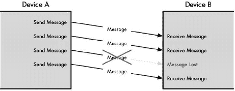

图 46-2. 不可靠协议的运行在一个像 IP 所使用的系统，如果一条消息成功到达目的地，那当然很好；否则，没有人会知道发生了什么。需要某种外部机制来处理丢失的消息，除非协议根本不在乎其消息流中是否缺少一些比特和片段。

## 使用带有重传的正确认认（PAR）提供基本可靠性

在像 IP 这样的不可靠协议上运行的协议中的基本可靠性可以通过关闭循环来实现，使接收者向发送者提供反馈。这最简单的方法是使用一个简单的确认系统。设备 A 向设备 B 发送数据，设备 B 接收数据并发送一个确认信息说：“设备 A，我已收到你的消息。”然后设备 A 就知道它的传输是成功的。

但是，由于 IP 是不可靠的，那条消息实际上可能永远无法到达目的地。设备 A 会坐等确认，但永远不会收到。相反，也有可能设备 B 从设备 A 那里收到了消息，但确认信息本身却神秘消失了。在两种情况下，我们都不希望设备 A 永远等待一个永远不会到达的确认。

为了防止这种情况发生，设备 A 在首次向设备 B 发送消息时启动一个计时器，这允许足够的时间让消息到达设备 B，确认消息返回，以及一些合理的时间来应对可能的延迟。如果在收到确认消息之前计时器已经到期，设备 A 会假设存在问题并重新传输其原始消息。由于这种方法涉及肯定确认（“是的，我收到了你的消息”）以及在需要时进行重传的功能，它通常被称为*带重传的肯定确认（PAR）*，如图 46-3 所示。

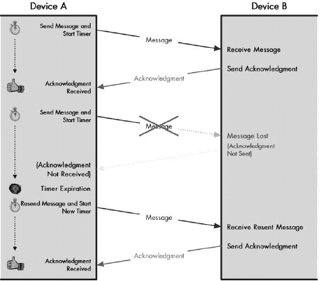

图 46-3. 基本可靠性：带重传的肯定确认（PAR）此图展示了确保可靠性最常见和简单的方法之一。每次设备 A 发送消息时，它都会启动一个计时器。设备 B 在接收到消息后，会向设备 A 发送一个确认消息，这样设备 A 就知道消息已成功传输。如果消息丢失，计时器会超时，设备 A 会重新传输数据。请注意，任何时候只能有一个消息处于待处理状态，这使得该系统相当慢。

### 小贴士

**关键概念** 确保通信可靠性的基本技术使用一条规则，要求设备在每次成功接收传输后发送一个确认。如果设备在一段时间后没有确认传输，其发送者会重新传输确认。这种系统被称为*带重传的肯定确认（PAR）*。这种基本方案的一个缺点是，在第一个设备确认第一个消息之前，发送者不能发送第二个消息。

PAR 是一种在计算机网络和通信中广泛使用的协议技术，用于交换相对较小的数据量或交换数据频率较低的协议。基本方法是功能性的，但并不适合像 TCP 这样的协议。一个主要原因是它*效率低下*。设备 A 发送一条消息，然后等待确认。设备 A 在收到设备 B 确认它已收到原始消息之前不能向设备 B 发送另一条消息，这是非常浪费的，会使协议变得极其缓慢。

## 改进 PAR

我们可以对 PAR 系统进行的第一个改进是为发送的消息以及确认提供一些识别手段。例如，我们可以在消息头中添加一个消息 ID 字段。发送消息的设备将唯一标识它，接收方将使用这个标识符在确认中。例如，设备 A 可能通过消息 ID 1 发送一块数据。设备 B 将接收这条消息，然后向设备 A 发送自己的消息，说：“设备 A，我已收到你的消息 1。”这个系统的优点是设备 A 可以一次发送多条消息。它必须跟踪它发送的每一条消息，以及设备 B 是否发送了确认。每个设备还需要一个单独的计时器，但这不是什么大问题。

当然，我们还需要从设备 B 的角度考虑这种交换。以前，设备 B 一次只能处理来自设备 A 的一条消息。现在，它可能一次会有几条消息同时出现。如果设备 B 已经忙于处理来自其他设备（或十个设备）的传输怎么办？我们需要一种机制让设备 B 能够说：“我一次只能处理你发来的以下数量消息。”我们可以通过让确认消息包含一个字段，例如发送限制，来指定设备 A 一次允许发送给设备 B 的最大未确认消息数量。

设备 A 将使用这个发送限制字段来限制它向设备 B 发送消息的速率。设备 B 可以根据其当前负载和其他因素调整这个字段，以最大化与设备 A 的通信性能。因此，这个增强的系统将提供可靠性、效率和基本的数据流控制，如图图 46-4 所示。

### 小贴士

**关键概念** 通过标识要发送的每个消息，可以增强基本的 PAR 可靠性方案，这样一次可以有多个消息在传输中。发送限制的使用允许机制提供流量控制能力，通过允许每个设备控制其他设备向其发送数据的速率。

## TCP 的面向流的滑动窗口确认系统

那么 TCP 是否使用这种 PAR 的变体呢？当然不是！那会太简单了。从概念上讲，TCP 滑动窗口系统与这种方法非常相似，这就是为什么理解它很重要。然而，它需要进行一些调整。主要原因与 TCP 处理数据的方式有关：与本章前面讨论的消息导向相比，这是流导向的问题。我概述的技术涉及对消息的显式确认和（如果需要）重传。因此，它非常适合交换相对较大消息且频率较低的协议。

另一方面，TCP 将数据字节视为一个流来处理。逐个字节发送并逐个确认显然是荒谬的。这将需要太多的工作，即使是在重叠传输的情况下（即，在发送下一份数据之前不等待确认），结果也会非常慢。

图 46-4. 增强的 PAR 此图显示了从图 46-3 此图显示了确保可靠性最常见和简单的方法之一。每次设备 A 发送消息时，它都会启动一个计时器。设备 B 在接收到消息后向设备 A 发送确认，这样设备 A 就知道它成功传输了消息。如果消息丢失，计时器就会响起，设备 A 会重新传输数据。请注意，任何时候只能有一个消息处于待处理状态，这使得该系统相当慢。")的基本 PAR 方案的两个增强。首先，现在每个消息都有一个标识号；每个消息都可以单独确认，因此可以在给定时间内有多个消息在传输中。其次，设备 B 定期向设备 A 发送一个发送限制参数，该参数限制设备 A 一次可以有多少个待处理消息。设备 B 可以调整此参数以控制从设备 A 流向的数据流。

这种延迟是为什么 TCP 不会单独发送字节，而是将它们分成段的原因。一个段中的所有字节都是一起发送和接收的，并且因此一起被确认。TCP 使用了我之前描述的方法的变体，其中我之前讨论的序列号用于标识发送和确认的数据。我们不是通过使用类似消息 ID 字段的东西来确认使用，而是使用段中最后一个数据字节的序列号来确认数据。因此，我们正在处理每个情况下的字节范围，而这个范围代表了段中所有字节的序列号。

### TCP 传输流分类的概念性划分

想象一下设备 A 和设备 B 之间新建立的 TCP 连接。设备 A 有一个长的字节流要传输，但设备 B 不能一次接受所有这些字节，因此它限制设备 A 一次只能发送特定数量的字节，直到已发送的段中的字节被确认。然后设备 A 被允许发送更多字节。每个设备都跟踪哪些字节已被发送和哪些尚未发送，以及哪些已被确认。

在任何时刻，我们都可以对这个过程进行“快照”。如果我们这样做，我们可以从以下四个类别概念性地划分发送 TCP 缓冲区中的字节，并将它们视为时间线（参见图 46-5)：

1.  **已发送并确认的字节** 流中最早的字节已经发送并被确认。这些字节基本上是从发送数据设备的视角来看待的。在图 46-5 的例子中，已有 31 个字节数据被发送并确认。这些将属于类别 1。

1.  **已发送但尚未确认的字节** 这些是设备已发送但尚未收到确认的字节。发送方在收到确认之前不能认为这些字节已被处理。在图 46-5 中，这里有 14 个字节，属于类别 2。

1.  **尚未发送但接收方已准备好的字节** 这些是设备尚未发送，但根据其最近与发送方的通信（关于它一次愿意处理多少字节）而留有空间的字节。发送方将尝试立即发送这些字节（受某些算法限制，你将在后面探索）。在图 46-5 中，类别 3 中有 6 个字节。

1.  **尚未发送且接收方尚未准备好的字节** 这些是流中更下面的字节，发送方尚未被允许发送，因为接收方尚未准备好。在图 46-5 中，类别 4 中有 44 个字节。

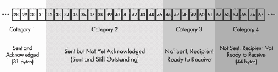

图 46-5. TCP 传输流的概念划分

### 注意

*我在这里使用非常小的数字来简化示例，并使图表更容易构建！出于效率原因，TCP 通常不会发送大量字节*。

接收设备使用类似的系统来区分已接收并被确认的数据、尚未接收但准备接收的数据，以及尚未接收且尚未准备好接收的数据。实际上，两个设备都维护一组独立的变量来跟踪它们发送的流中字节所属的类别，以及它们接收的流。这将在第四十八章（ch48.html "第四十八章. TCP 消息格式和数据传输"）的“TCP 滑动窗口数据传输和确认机制”部分中进一步探讨，该部分描述了详细的滑动窗口数据传输过程。

### 提示

**关键概念** TCP *滑动窗口*系统是对增强型 PAR 系统的一种变体，对系统进行了修改以支持 TCP 的流方向。每个设备都会跟踪它需要发送的字节流的状态。设备通过将字节流划分为四个概念类别来跟踪状态：已发送并被确认的字节、已发送但尚未被确认的字节、尚未发送但可以立即发送的字节，以及尚未发送且在接收方表示准备好接收之前不能发送的字节。

### 序列号分配和同步

发送方和接收方必须就它们将分配给流中字节的序列号达成一致。这被称为*同步*，并在 TCP 连接建立时完成。为了简单起见，让我们假设第一个字节是用序列号 1 发送的（这通常不是情况）。因此，在图 46-5 中显示的示例中，四个类别的字节范围如下：

1.  发送并被确认的字节是第 1 到第 31 字节。

1.  已发送但尚未被确认的字节是第 32 到第 45 字节。

1.  接收方已准备好接收但尚未发送的字节是第 46 到第 51 字节。

1.  接收方尚未准备好接收的字节是第 52 到第 95 字节。

### 发送窗口和可用窗口

整个过程操作的关键是接收者允许发送者在一次时间内未确认的字节数。这被称为*发送窗口*，或者通常简称为*窗口*。窗口决定了发送者允许传输的字节数，等于类别 2 和类别 3 中字节数的总和。因此，最后两个类别（接收者已准备好接收的字节和接收者尚未准备好的字节）之间的分界线是由将窗口加到流中第一个未确认字节的字节数来确定的。在图 46-5 所示的示例中，第一个未确认的字节是 32。总窗口大小为 20。

术语*可用窗口*定义为在给定未确认数据量的情况下，发送器仍允许发送的数据量。因此，它正好等于类别 3 的大小。你也许还会经常听到窗口的*边缘*被提及。左侧边缘标记窗口中的第一个字节（字节 32）。右侧边缘标记窗口中的最后一个字节（字节 51）。参见图 46-6 以了解这些概念。

### 小贴士

**关键概念** 发送*窗口*是整个 TCP 滑动窗口系统的关键。它表示设备一次允许未确认的字节数的最大值。*可用窗口*是发送窗口中发送者仍允许在任何时间点发送的数据量；它等于发送窗口的大小减去已传输的未确认字节数。

图 46-6. TCP 传输流类别和发送窗口术语 此图显示了与 图 46-5 中相同的类别，但同时也显示了发送窗口。黑色方框代表整体发送窗口（类别 2 和 3 合并）；浅灰色方框表示已发送的字节（类别 2），深灰色方框是可用窗口（类别 3）。

### 发送可用窗口字节后的 TCP 类别和窗口大小更改

现在假设在 图 46-6 所示的示例中，没有任何阻止发送者立即传输类别 3（可用窗口）中的 6 个字节。当发送者传输这些字节时，这 6 个字节将从类别 3 移动到类别 2。字节范围现在如下（参见 图 46-7

图 46-7. 发送可用窗口字节数后的 TCP 流类别和窗口 此图显示了设备发送其可用窗口内允许传输的所有字节的后果。它与图 46-6 相同，除了类别 3 中的所有字节都移动到了类别 2 中。现在可用窗口为零，并且将保持如此，直到它收到类别 2 中字节的确认。

### 处理确认和滑动发送窗口

在一段时间之后，目标设备向发送方发送一条消息并提供确认。目标设备不会具体列出它已确认的字节，因为正如我之前所说的，列出字节将是不高效的。相反，目标设备将确认一个字节范围，这代表了它自上次确认的字节以来接收到的最长连续字节序列。

例如，假设示例开始时已发送但尚未确认的字节（32 到 45）被传输在四个不同的段中。这些段分别携带字节 32 到 34、35 到 36、37 到 41 和 42 到 45。第一、第二和第四个段到达了，但第三个没有到达。接收方只会对字节 32 到 36（32 到 34 和 35 到 36）发送确认。接收方将保留字节 42 到 45 但不会确认它们，因为这会意味着接收方已经接收了字节 37 到 41，而这些字节尚未出现。这是必要的，因为 TCP 是一个累积确认系统，它只能使用一个数字来确认数据。这个数字是流中成功接收到的最后一个连续字节的编号。让我们也假设目标设备保持窗口大小不变，为 20 字节。

### 注意

*一个名为选择性确认的可选功能允许确认非连续的数据块。这将在第四十九章的“TCP 非连续确认处理和选择性确认（SACK）”部分中解释；我们现在将忽略这个复杂性*。

当发送设备收到此确认时，它将能够将一些类别 2 中的字节转移到类别 1，因为它们现在已被确认。当它这样做时，会发生一些有趣的事情。由于已确认 5 个字节，而窗口大小没有变化，发送方被允许发送 5 个额外的字节。实际上，窗口在时间轴上向右移动或滑动。同时，5 个字节从类别 2 移动到类别 1，5 个字节从类别 4 移动到类别 3，为后续传输创建了一个新的可用窗口。因此，在组收到确认后，它们将看起来像你在图 46-8 中看到的那样。字节范围如下：

1.  已发送并确认的字节是 1 到 36。

1.  尚未发送且尚未确认的字节是 37 到 51。

1.  已准备好发送但尚未发送的字节是 52 到 56。

1.  尚未发送且接收方尚未准备好的字节是 57 到 95。

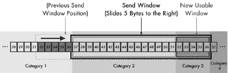

图 46-8. 滑动 TCP 发送窗口 在收到字节 32 到 36 的确认后，字节从类别 2 移动到类别 1（以深色阴影显示）。图 46-7 中显示的发送窗口向右滑动 5 个字节；将 5 个字节从类别 4 移动到类别 3，并打开一个新的可用窗口。

每次收到确认时，都会发生此过程，从而使得窗口在整个流中滑动以进行传输。因此，女士们先生们，你们有了 TCP 滑动窗口确认系统！

这是一个非常强大的技术，允许 TCP 使用单个确认号轻松地确认任意数量的字节。它为面向字节的协议提供了可靠性，而不需要在过多的确认上浪费时间。为了简单起见，我这里使用的示例保留了窗口大小不变，但在现实中，它可以调整以允许接收者控制数据发送的速度，从而实现流量控制和拥塞处理。

### 小贴士

**关键概念** 当设备收到一个字节范围的确认时，它知道目标设备已成功接收了它们。它将它们从“已发送但未确认”类别移动到“已发送且已确认”类别。这导致发送窗口向右滑动，允许设备发送更多数据。

### 处理丢失的确认

但在图 46-8 中给出的示例中，字节 42 到 45 又是怎么回事呢？直到包含字节 37 到 41 的段 3 出现，接收设备才不会为这些字节发送确认，也不会为之后出现的任何其他字节发送确认。发送设备将能够发送添加到类别 3 的新字节，即字节 52 到 56。然后发送设备将停止，窗口将停留在字节 37 到 41 上。

### 小贴士

**关键概念** TCP 确认是累积的，并告知发送器接收设备已成功接收了确认中指示的序列号所表示的所有字节。因此，如果接收设备接收到顺序错误的字节，设备必须等到所有前面的字节都接收完毕后才能确认它们。

与 PAR 系统一样，TCP 包括一个用于定时传输和重传的系统。最终，TCP 设备将重新发送丢失的段。不幸的是，TCP 的一个缺点是，由于它不单独确认段，它可能需要重新传输接收者实际上已接收的其他段（例如字节 42 到 45 的段）。正如我在第四十九章中讨论 TCP 重传主题时所说的，这开始变得非常复杂。

## 关于 TCP 滑动窗口的更多信息

尽管这个解释的篇幅较长，但前面的内容只是滑动窗口整体操作的简要描述。本章并未包括现代 TCP 中使用的所有修改！正如你所见，滑动窗口机制是 TCP 整体操作的核心。在描述分段和讨论数据传输的章节中，你将更详细地了解 TCP 发送者如何决定何时以及如何创建用于传输的分段。第四十九章提供了更多关于滑动窗口如何使设备在 TCP 连接上管理数据流的信息。它还讨论了如果窗口大小没有仔细管理可能会出现的特殊问题，以及如何通过对本节中描述的基本滑动窗口机制进行关键更改来避免 TCP 实现中的拥塞等问题。

# TCP 端口、连接和连接识别

两个 TCP/IP 传输层协议，TCP 和 UDP，在协议套件中扮演相同的架构角色，但实现方式却大相径庭。实际上，这两个协议共同拥有的少数功能之一是它们都提供了一种传输层寻址和复用方法。通过使用*端口*，这两个协议都允许来自许多不同应用进程的数据被聚合并通过 IP 层发送，然后返回到目标设备上的正确应用进程。我在第四十三章中详细解释了 TCP 端口。

尽管存在这种共性，TCP 和 UDP 在处理进程方面还是有所区别。UDP 是一种无连接协议，这意味着在发送数据之前，设备不需要建立正式的连接。UDP 不需要使用滑动窗口或跟踪 UDP 发送传输的时间长短等。当设备上的 UDP 层接收到数据时，它只需将其发送到目标端口指示的进程，然后任务完成。UDP 可以无缝地处理发送给它消息的任何数量的进程，因为 UDP 以相同的方式处理它们。

相比之下，由于 TCP 是面向连接的，它承担着更多的责任。每个 TCP 软件层都需要能够同时支持与其他多个 TCP 的连接。每个连接的操作都是独立的，TCP 软件必须独立管理每个操作。TCP 必须确保它不仅将数据路由到正确的进程，而且还要在每个连接上管理传输的数据，确保没有重叠或混淆。

这种情况的第一后果是 TCP 必须唯一标识每个连接。它是通过使用对应于连接两端端点的套接字标识符对来实现的，其中套接字简单地是每个进程的 IP 地址和端口号的组合。这意味着套接字对包含四条信息：源地址、源端口、目的地址和目的端口。因此，TCP 连接有时被称为由这个地址四元组来描述。

我在第四十三章中介绍了这个概念，其中我给出了一个客户端向位于 177.41.72.6 的网站发送的 HTTP 请求的例子，该网站位于 41.199.222.3。该网站的服务器将使用众所周知的端口号 80，因此服务器的套接字是 41.199.222.3:80。如果服务器为网络浏览器分配一个临时端口号 3022，则客户端套接字是 177.41.72.6:3022。这些设备之间的整体连接可以使用这个套接字对来描述：(41.199.222.3:80, 177.41.72.6:3022)。

使用客户端和服务器套接字来标识连接，这为我们提供了在互联网上可能视为理所当然的设备之间进行多个连接的灵活性。例如，繁忙的应用程序服务器进程（如 Web 服务器）必须能够处理来自多个客户端的连接；否则，网络几乎无法使用。由于客户端和服务器套接字标识连接，因此这不成问题。在 Web 服务器维护连接的同时，它可以轻松地与另一个连接，比如 IP 地址 219.31.0.44 的端口号 2199，建立连接。表示这个连接的标识符如下：(41.199.222.3:80, 219.31.0.44:2199)。

实际上，你可以从同一个客户端到同一个服务器建立多个连接。每个客户端进程将被分配一个不同的临时端口号，所以即使它们都试图访问同一个服务器进程（如位于 41.199.222.3:80 的 Web 服务器进程），它们也将拥有不同的客户端套接字，并代表唯一的连接。这种差异使得你能够从你的计算机向同一个网站发出多个并发请求。

再次强调，TCP 独立跟踪每个这些连接，所以每个连接都不了解其他连接。TCP 可以处理数百甚至数千个并发连接。唯一的限制是运行 TCP 的计算机的容量以及连接到它的物理连接的带宽——同时运行的连接越多，每个连接就必须共享的资源就越有限。

### 小贴士

**关键概念** 每个设备可以处理到一台或多台设备上多个不同进程的 TCP 连接。连接中设备的套接字编号，称为连接的*端点*，标识每个连接。每个端点由设备的 IP 地址和端口号组成，因此客户端 IP 地址和端口号与服务器 IP 地址和端口号之间的四次通信标识了每个连接。

# TCP 常见应用和服务器端口分配

在第四十五章中 TCP 的概述中，你看到该协议最初包括了现代 TCP 和 IP 的功能。TCP 被分割成 TCP 和 IP，以便不需要 TCP 复杂性的应用程序可以绕过它，使用更简单的 UDP 作为传输层协议。这个绕过是 TCP/IP 协议套件发展中的一个重要步骤，因为有几个重要的协议 UDP 非常适合，甚至有些对于 TCP 来说更多的是麻烦而不是好处。

然而，UDP 通常仅在特殊情况下使用。我在第四十四章")中描述了两种可能比 TCP 更适合 UDP 的应用类型：那些速度比可靠性更重要，以及那些不经常发送短消息的应用。大多数 TCP/IP 应用都不属于这些类别。因此，尽管 TCP 和 IP 的分层意味着大多数协议不需要使用 TCP，但它们大多数仍然这样做。使用 TCP 的大多数协议都使用其提供的所有或至少大多数功能。对于许多交互式协议，如 Telnet，以及发送命令和状态回复的协议，如 HTTP，建立持久连接是必要的。对于像文件传输协议(FTP)或电子邮件协议这样的协议，它们发送大文件，可靠性和流量控制是必不可少的。

表 46-1 显示了在 TCP 上运行的一些更重要的应用协议。对于每个协议，我都显示了为该协议的服务器进程保留的已知或注册的端口号（客户端使用临时端口，而不是表中的端口号）。我还为每个端口分配显示了特殊的关键字快捷方式，并提供了关于为什么该协议非常适合 TCP 的简要说明。

表 46-1。常见的 TCP 应用和服务器端口分配

| 端口号 | 关键字 | 协议 | 备注 |
| --- | --- | --- | --- |
| 20 和 21 | ftp-data/ftp | 文件传输协议(FTP，数据和控制) | 用于发送大文件，因此非常适合 TCP。 |
| 23 | telnet | Telnet 协议 | 基于交互式会话的协议。需要 TCP 的连接特性。 |
| 25 | smtp | 简单邮件传输协议（SMTP） | 使用命令交换，并在设备之间发送可能很大的文件。 |
| 53 | domain | 域名服务器（DNS） | 使用 UDP 和 TCP 的协议的示例。对于简单的请求和回复，DNS 使用 UDP。对于较大的消息，特别是区域传输，DNS 使用 TCP。 |
| 70 | gopher | Gopher 协议 | 一种已被万维网 largely 取代的消息协议。 |
| 80 | http | 超文本传输协议（HTTP/万维网） | TCP 基于消息协议的经典示例。 |
| 110 | pop3 | 邮局协议（POP 版本 3） | 使用 TCP 交换命令和数据来检索电子邮件消息的协议。 |
| 119 | nntp | 网络新闻传输协议（NNTP） | 用于传输 NetNews（Usenet）消息，这些消息可能很长。 |
| 139 | netbios-ssn | NetBIOS 会话服务 | 一种会话协议，显然比 UDP 更适合 TCP。 |
| 143 | imap | 互联网消息访问协议（IMAP） | 另一种电子邮件消息检索协议。 |
| 179 | bgp | 边界网关协议（BGP） | 虽然内部路由协议如 RIP 和 OSPF 使用 UDP 或 IP 直接，但 BGP 在 TCP 上运行。这允许 BGP 在发送数据时即使是在可能的长距离上也能假设可靠的通信。 |
| 194 | irc | 互联网中继聊天（IRC） | IRC 与 Telnet 类似，它是一种基于客户端和服务器之间持久连接的交互式协议。 |
| 2049 | nfs | 网络文件系统（NFS） | 由于性能原因，NFS 最初使用 UDP 实现。鉴于它负责大量文件传输，以及 UDP 的不可靠性，NFS 可能不是最佳选择，因此开发人员创建了 TCP 版本。NFS 的最新版本仅使用 TCP。 |
| 6000–6063 | TCP | x11 | 用于 X Window 图形系统。多个端口被分配以允许多个会话。 |

表 46-1 中的某些协议同时使用 TCP 和 UDP，以便兼得两者之长。UDP 可以发送简短、简单的消息，而 TCP 可以传输较大的文件。实际上，许多同时使用 TCP 和 UDP 的协议实际上是实用程序/诊断协议（如回声、丢弃和时间协议）。这些是特殊情况，因为开发人员特别设计了它们以使用 UDP 和 TCP，以便在两种协议上都可以用于诊断。|

我没有在 表 46-1 中包含 TCP 应用程序的详尽列表。请参阅 第四十二章 了解常见的 TCP/IP 应用程序和端口号，以及已知和注册的 TCP 服务器端口的完整（庞大的）列表。

# 第四十七章。TCP 基本操作：连接建立、管理和终止

虽然我已经将传输控制协议 (TCP) 描述为**面向连接的**，但这个术语不仅仅是 TCP 的某个老特性。整个协议的整体操作可以用 TCP 软件如何准备、协商、建立、管理和终止连接来描述。TCP 实现确实不仅仅是处理连接，但它们执行的另一个主要任务，如数据处理和提供可靠性和流量控制，只能在稳定的连接上发生。这种稳定性使得连接成为探索 TCP 工作细节的逻辑起点。

在本章中，我将从始至终描述 TCP 连接。我首先通过提供正式定义连接阶段的**有限状态机**的摘要来概述 TCP 的操作。当你在标准中阅读它们时，状态机可能会让你感到有些令人困惑，但一个简化的、解释过的版本提供了对连接生命周期的优秀高级视图，因此这是一个很好的起点。

从那里，我将继续提供有关 TCP 处理连接的详细信息。我描述了如何准备和设置连接以及**传输控制块 (TCBs**)，并解释了被动套接字打开和主动套接字打开之间的区别。我解释了你可以用来创建连接的三次握手，以及参数交换和序列号同步的方法。我讨论了如何管理已建立的连接，包括 TCP 处理问题条件和在必要时重置连接的方法。最后，我描述了当不再需要连接时如何终止连接。

### 小贴士

**背景信息** *以下详细章节假设你已经熟悉上一章中的概念，特别是序列数的概念*。

# TCP 操作概述和 TCP 有限状态机 (FSM)

所有实现网络协议的设备都必须以一致的方式进行。否则，一个设备可能会以其他设备无法预期的行为运行。自然，这种不一致性正是存在描述每个协议操作标准的原因。像 TCP 这样的协议问题在于它执行了如此多的任务，以至于很难简洁地指定协议所有方面的确切操作。

计算机科学家描述复杂协议工作方式的一种方法是使用一种称为**有限状态机 (FSM**) 的理论工具。有限状态机试图通过将其视为一个虚拟机来描述协议或算法，该虚拟机根据各种事件响应，依次通过一系列操作阶段。

## 基本有限状态机概念

为了理解有限状态机的工作原理，你需要了解以下四个基本概念：

**状态** 描述机器在特定时间点上协议软件的特定情况或状态。

**转换** 从一个状态移动到另一个状态的行为。

**事件** 导致状态之间发生转换的事情。

**动作** 在设备转换到另一个状态之前对事件做出的响应。

有限状态机通过解释协议可以处于的所有不同状态、每个状态中可能发生的事件、对事件采取的动作以及由此产生的转换来描述协议。协议通常在首次运行时从特定的 *初始状态* 开始。然后它遵循一系列步骤进入常规操作状态，并响应特定类型的输入或其他情况移动到其他状态。状态机被称为 *有限* 的，因为状态的数量是有限的。

## 简化的 TCP FSM

在 TCP 的情况下，有限状态机（FSM）描述了连接的生命周期。每个 TCP 设备之间的连接都是从无连接的空状态开始的，然后通过一系列状态直到建立连接。连接保持在该状态，直到发生某些事情导致连接再次关闭，此时它将通过另一系列转换状态并返回到关闭状态。

### 提示

**关键概念** 许多计算机科学家使用 *有限状态机（FSM）* 来描述协议或算法的操作。有限状态机通过定义有限数量的操作 *状态*、可以导致状态之间 *转换* 的 *事件* 以及对事件采取的 *动作* 来描述软件随时间采取的不同动作。

TCP 连接中状态、事件和转换的完整描述既冗长又复杂。这并不奇怪，因为这三个元素将涵盖整个 TCP 标准的大部分内容。这样的细节可能会很好地治疗失眠，但不会带来太多其他好处。然而，对 TCP FSM 的简化观察将有助于您对 TCP 建立连接以及连接创建后的功能有一个良好的整体感觉。

表 47-1 状态、事件和转换") 简要解释了 TCP 连接中的每个 TCP 状态、每个状态中发生的主要事件以及由此产生的动作和转换。为了简洁起见，使用了三个缩写来表示控制状态之间转换的三种类型的信息，这些缩写对应于设置为指示消息执行该功能的 TCP 报头标志。具体如下：

**SYN** 一个 *同步* 消息；用于发起和建立连接。之所以这样命名，是因为它的一个功能是在设备之间同步序列号。

**FIN** 一个*结束*消息，这是一个设置了 FIN 位的 TCP 段；它表示设备想要终止连接。

**ACK** 一个*确认消息*；表示已收到像 SYN 或 FIN 这样的消息。

再次强调，我没有展示所有可能的转换，只是展示了在连接生命周期中通常遵循的转换。错误条件也会引起转换，但包括这些转换会使我们远远超出简化的状态机。FSM（包括状态转换如何发生）在图 47-1 中进行了说明。

重要的是要记住，这个状态机适用于每个连接。这意味着，在任何给定时间，TCP 可能在一个连接到套接字*X*时处于一个状态，而在另一个连接到套接字*Y*时处于另一个状态。此外，特定连接中两个进程之间在状态之间的典型移动不是对称的，因为设备的作用不是对称的。例如，一个设备发起连接，另一个设备响应；一个设备开始终止，另一个设备回复。如果两个设备同时发起连接和终止（这不太常见，但可能发生），也会采取替代路径。这通过图 47-1 中的阴影部分来表示。

表 47-1. TCP 有限状态机（FSM）状态、事件和转换

| 状态 | 状态描述 | 事件和转换 |
| --- | --- | --- |
| CLOSED | 每个连接在建立过程开始之前都处于的默认状态。在标准中，该状态被称为“虚构的”，因为此状态表示设备之间没有连接的情况。它要么尚未创建，要么刚刚被销毁（如果这样有意义）。 | 被动打开：服务器通过在 TCP 端口上进行被动打开开始连接设置过程。同时，它设置它需要以管理连接所需的数据结构（传输控制块，或 TCB）。然后它过渡到 LISTEN 状态。 |
|   |   | 激活打开，发送 SYN：客户端通过发送一个 SYN 消息开始连接设置，并为该连接设置一个 TCB。然后它过渡到 SYN-SENT 状态。 |
| LISTEN | 设备（通常是服务器）正在等待从客户端接收一个 SYN 消息。它尚未发送自己的 SYN 消息。 | 接收客户端 SYN，发送 SYN+ACK：服务器设备收到来自客户端的 SYN。它发送一个包含自己的 SYN 并确认它收到的消息。服务器移动到 SYN-RECEIVED 状态。 |
| SYN-SENT | 设备（通常是客户端）已发送一个 SYN 消息并正在等待来自另一设备的匹配 SYN（通常来自服务器）。 | 接收 SYN，发送 ACK：如果发送了 SYN 消息的设备收到了来自另一设备的 SYN 但没有对其自己的 SYN 的 ACK，它将确认收到的 SYN，然后过渡到 SYN-RECEIVED 状态以等待对其自己的 SYN 的确认。 |
|   |   | 接收 SYN+ACK，发送 ACK：如果发送了 SYN 的设备收到了对其 SYN 的确认和来自另一设备的 SYN，它将确认收到的 SYN，然后直接移动到 ESTABLISHED 状态。 |
| SYN-RECEIVED | 设备已从其伙伴那里收到一个 SYN（连接请求）并发送了自己的 SYN。现在它正在等待对它的 SYN 的 ACK 以完成连接设置。 | 接收 ACK：当设备收到它发送的 SYN 的 ACK 时，它过渡到 ESTABLISHED 状态。 |
| ESTABLISHED | 开放 TCP 连接的稳定状态。一旦连接中的两个设备都进入此状态，它们就可以自由交换数据。这将继续，直到它们关闭连接。 | 关闭，发送 FIN：设备可以通过发送带有 FIN 位设置的消息来关闭连接，然后它可以过渡到 FIN-WAIT-1 状态。 |
|   |   | 接收 FIN：设备可能从其连接伙伴那里收到一个请求关闭连接的 FIN 消息。它将确认此消息并过渡到 CLOSE-WAIT 状态。 |
| CLOSE-WAIT | 设备已从另一设备收到一个关闭请求（FIN）。它现在必须等待本地设备上的应用程序确认此请求并生成一个匹配的请求。 | 关闭，发送 FIN：使用 TCP 的应用程序在被告知另一进程想要关闭后，向其运行的机器上的 TCP 层发送一个关闭请求。然后 TCP 向已请求终止连接的远程设备发送一个 FIN。此设备现在过渡到 LAST-ACK。 |
| LAST-ACK | 已经收到关闭请求并确认的设备已发送自己的 FIN 并正在等待对此请求的 ACK。 | 接收 FIN 的 ACK：设备收到了其关闭请求的确认。我们现在已发送我们的 FIN 并得到了确认，收到了另一设备的 FIN 并对其进行了确认，所以我们直接过渡到 CLOSED 状态。 |
| FIN-WAIT-1 | 处于此状态的设备正在等待对它发送的 FIN 的 ACK，或者正在等待来自另一设备的连接终止请求。 | 接收 FIN 的 ACK：设备收到了其关闭请求的确认。它过渡到 FIN-WAIT-2 状态。 |
|   |   | 接收 FIN，发送 ACK：设备没有收到自己 FIN 的 ACK，但收到了来自另一设备的 FIN。它确认了它，然后移动到 CLOSING 状态。 |
| FIN-WAIT-2 | 处于此状态的设备已收到其终止连接请求的 ACK，并现在正在等待来自另一设备的匹配 FIN。 | 接收 FIN，发送 ACK：设备收到来自另一设备的 FIN。它确认了它，然后移动到 TIME-WAIT 状态。 |
| CLOSING | 设备已从另一设备收到一个 FIN 并对其发送了 ACK，但尚未收到对自己 FIN 消息的 ACK。 | 接收 FIN 的 ACK：设备收到了其关闭请求的确认。它过渡到 TIME-WAIT 状态。 |
| TIME-WAIT | 设备已从另一设备收到一个 FIN 并确认了它，并发送了自己的 FIN 并收到了对其的 ACK。我们已经完成，除了等待确保收到 ACK 以及防止与新的连接发生潜在的重叠。（有关此状态的更多详细信息，请参阅本章后面的“TCP 连接终止”部分。） | 计时器超时：在指定等待期后，设备过渡到 CLOSED 状态。 |

因此，例如，在连接建立的开始，两个设备将采取不同的路径到达 ESTABLISHED 状态。一个设备（通常是服务器）将通过 LISTEN 状态，而另一个（客户端）将通过 SYN-SENT 状态。同样，一个设备将发起连接终止，并通过 FIN-WAIT-1 状态路径返回 CLOSED 状态；另一个将经过 CLOSE-WAIT 和 LAST-ACK 状态。然而，如果两者同时尝试打开，它们将分别通过 SYN-SENT 和 SYN-RECEIVED 状态，如果两者同时尝试关闭，它们将大致同时通过 FIN-WAIT-1、CLOSING 和 TIME-WAIT 状态。

虽然 FSM 一开始可能有些令人畏惧，但如果你花几分钟时间了解它，你就可以很好地掌握 TCP 的工作原理。FSM 将在理解本章后面讨论的连接建立和终止过程中非常有用，阅读这些部分将帮助你理解 FSM。

### 小贴士

**关键概念** TCP 有限状态机（FSM）描述了在 TCP 会话中，两个设备在建立、管理和关闭连接时采取的步骤序列。每个设备可能通过不同的状态路径，因为在正常情况下，协议的操作不是对称的——一个设备发起连接建立或终止，另一个设备响应。

图 47-1. TCP 有限状态机（FSM）此图说明了简化的 TCP FSM。阴影部分不是 FSM 定义的官方部分；我添加它们是为了更清楚地显示两个设备打开和关闭连接的序列。对于建立和终止，有一个常规序列，其中发起和响应设备通过不同的状态，以及一个同时序列，其中每个设备使用相同的序列。

# TCP 连接准备

在第四十三章中，我提出了一个关于 TCP 操作的重要观点，特别是它必须能够同时处理多个连接。因此，我们必须使用每个连接上两个设备的套接字标识符（IP 地址和端口号）的四元组来唯一标识每个连接。为每个连接设置、管理和终止连接的过程是独立进行的。

## 存储连接数据：传输控制块 (TCB)

由于每个连接都是独特的，我们必须分别维护每个连接的数据。TCP 使用一个特殊的数据结构来此目的，称为 *传输控制块 (TCB)*。TCB 包含有关连接的所有重要信息，例如标识它的两个套接字编号以及指向包含传入和传出数据的缓冲区的指针。TCB 还实现了滑动窗口机制。它包含跟踪接收和确认的字节数、接收但尚未确认的字节数、当前窗口大小等变量的变量。每个设备都维护自己的连接 TCB。

在设置 TCP 连接的过程开始之前，每个端点的设备必须执行一些“准备工作”。为了准备连接，所需的任务之一是设置将用于存储有关连接信息的 TCB。这是在连接建立过程的开始时进行的，当时每个设备从关闭状态过渡出来。

## 主动和被动打开

TCP/IP 基于客户端/服务器模型进行操作，TCP 连接设置也是基于这些角色的存在。客户端和服务器各自通过执行一个 *打开* 操作来准备连接。然而，存在两种不同的打开操作：

**主动打开** 使用 TCP 的客户端进程扮演主动角色，通过发送一个 TCP 消息来启动连接（一个 SYN 消息）来初始化连接。

**被动打开** 设计用于使用 TCP 的服务器进程采取了一种更“放松”的方法。它通过联系 TCP 并说，“我在这里，我在等待可能想和我交谈的客户端通过以下端口号发送给我消息”来执行一个 *被动打开*。这个打开被称为 *被动*，因为除了表明进程正在监听外，服务器进程不做任何事情。被动打开可以指定服务器正在等待来自特定客户端的主动打开，尽管并非所有 TCP/IP API 都支持这种功能。更常见的是，服务器进程愿意接受所有来者的连接。这种被动打开被称为 *未指定*。

### 提示

**关键概念** 客户端进程通过执行一个主动的 *打开* 操作，向服务器发送一个 SYN 消息来初始化一个 TCP 连接。使用 TCP 的服务器进程通过执行一个 *被动打开* 操作来准备接收进入的连接请求。对于每个 TCP 会话，两个设备都会创建一个数据结构，称为 *传输控制块 (TCB)*，用于存储与连接相关的重要数据。

## 连接准备

客户端和服务器在执行打开操作时都会为连接创建 TCB。客户端已经知道它试图连接的客户端进程和服务器进程的 IP 地址和端口号，因此可以使用这些信息来唯一标识连接及其相关的 TCB。

对于服务器来说，在这个游戏阶段，TCB 的概念要复杂一些。如果服务器正在等待特定的客户端，它可以使用自己的套接字和它正在等待的客户端的套接字来识别连接。然而，通常情况下，服务器不知道哪个客户端正在尝试连接它。实际上，可能有多个客户端几乎同时联系它。

在这种情况下，服务器创建了一个具有未指定（零）客户端套接字号的 TCB，并等待接收一个活跃的 Open。然后，它将客户端的套接字号绑定到 TCB，作为连接过程的一部分进行被动打开。为了允许服务器处理多个传入连接，服务器进程可能同时执行多个未指定的被动打开。

连接的 TCB 在整个连接过程中保持，并在连接完全终止时销毁，设备返回到 CLOSED 状态。TCP 确实包括处理两个设备同时执行主动打开的情况的进程，正如我在下一节讨论的那样。

# TCP 连接建立过程：三次握手

在 TCP 可以用于任何实际有用的目的——即发送数据之前——必须在希望通信的两个设备之间建立连接。这个过程通常称为*连接建立*，涉及交换消息，将两个设备从它们的初始连接状态（CLOSED）转换到正常操作状态（ESTABLISHED）。

## 连接建立功能

连接建立过程实际上在创建一个适合数据交换的连接时完成了以下任务：

**联系和通信** 客户端和服务器通过相互发送消息来建立联系并建立通信。在此点之前，服务器通常甚至不知道它将和哪个客户端交谈，因此它会在连接建立过程中发现这一点。

**序列号同步** 每个设备让对方知道它希望用于第一次传输的初始序列号。

**参数交换** 两个设备交换控制 TCP 连接操作的某些参数。

我将在本章后面的“TCP 连接建立序列号同步和参数交换”部分讨论序列号同步和参数交换任务。

## 用于连接建立的控制消息：SYN 和 ACK

TCP 使用控制消息来管理联系和通信的过程。然而，并没有任何特殊的 TCP 控制消息类型；所有 TCP 消息都使用相同的段格式。TCP 头部的一组控制标志指示一个段是否用于控制目的还是仅用于携带数据。正如我在本章前面关于 TCP FSM 的讨论中提到的，在连接设置中使用了两种控制消息类型，这些类型通过设置以下两个标志来指定：

**SYN** 表示该段用于初始化连接。SYN 代表*同步*，指的是连接建立过程中的序列号同步任务。

**ACK** 表示发送段落的设备正在传达对已接收消息（如 SYN）的确认。

还有其他控制位（*FIN*、*RST*、*PSH*和*URG*），它们对于连接建立并不重要，因此我将在其他主题中讨论它们。在常见的 TCP 术语中，设置控制位的消息通常以该位命名。例如，如果设置了 SYN 控制位，该段通常被称为 SYN 消息。同样，设置了 ACK 位的段是 ACK 消息，甚至只是 ACK。

## 正常连接建立：三次握手

要建立连接，每个设备都必须发送一个 SYN 消息并从另一个设备接收对该消息的 ACK 消息。因此，从概念上讲，我们需要在设备之间传递四个控制消息。然而，当可以同时通信时，将 SYN 和 ACK 分别发送在单独的消息中是不高效的。因此，在连接建立过程中的正常事件顺序中，其中一个 SYN 和一个 ACK 通过设置相关位（有时称为*SYN+ACK*的消息）一起发送。这使得总共只有三条消息，因此连接过程被称为*三次握手*。

### 小贴士

**关键概念** TCP 客户端和服务器之间建立连接的正常过程涉及以下三个步骤：客户端发送一个*SYN*消息。服务器发送一个消息，该消息包含对客户端*SYN*的*ACK*以及服务器的 SYN。然后客户端对服务器的 SYN 发送 ACK。这被称为*TCP 三次握手*。

表 47-2 详细描述了三次握手是如何工作的（包括对上一节中讨论的准备的总结）。它改编自描述 TCP 有限状态机（FSM）的表格（表 47-1 状态、事件和转换"）），但显示了服务器和客户端随时间发生的情况。每一行显示了设备开始时的状态，在该状态下采取的动作，以及转换到的状态。握手过程的三个步骤中的发送和接收部分也显示了出来。同样的过程也在 47-2 中进行了说明。

表 47-2. TCP 三次握手连接建立过程

| 客户端 | 服务器 |
| --- | --- |
| 开始状态 | 动作 | 转换到状态 | 开始状态 | 动作 | 转换到状态 |
| --- | --- | --- | --- | --- | --- |
| CLOSED | The client cannot do anything until the server has performed a passive Open and is ready to accept a connection. | — | CLOSED | The server performs a passive Open, creating a TCB for the connection and readying itself for the receipt of a connection request (SYN) from a client. | LISTEN |
| CLOSED | Step 1 Transmit: The client performs an active Open, creating a TCB) for the connection and sending a SYN message to the server. | SYN-SENT | LISTEN | The server waits for contact from a client. | — |
| SYN-SENT | The client waits to receive an ACK to the SYN that it has sent, as well as the server's SYN. | — | LISTEN | Step 1 Receive, Step 2 Transmit: The server receives the SYN from the client. It sends a single SYN+ACK message back to the client that contains an ACK for the client's SYN, as well as the server's own SYN. | SYN-RECEIVED |
| SYN-SENT | Step 2 Receive, Step 3 Transmit: The client receives from the server the SYN+ACK containing the ACK to the client's SYN, and the SYN from the server. It sends the server an ACK for the server's SYN. The client is now finished with the connection establishment. | ESTABLISHED | SYN-RECEIVED | The server waits for an ACK to the SYN it sent previously. | — |
| ESTABLISHED | The client is waiting for the server to finish connection establishment so they can operate normally. |   | SYN-RECEIVED | Step 3 Receive: The server receives the ACK to its SYN and is now finished with connection establishment. | ESTABLISHED |
| ESTABLISHED | The client is ready for normal data transfer operations. |   | ESTABLISHED | The server is ready for normal data transfer operations. |  |

图 47-2. TCP 三次握手连接建立过程 此图展示了客户端和服务器如何建立传统连接。它显示了在过程中发送的三个消息以及每个设备如何从关闭状态通过中间状态过渡到已建立的会话状态。

## 同步打开连接建立

TCP 也被设置为处理两种设备都执行主动打开而不是一个执行被动打开的情况。这种情况可能发生在两个客户端试图互相连接而不是客户端和服务器之间。然而，这种情况并不常见，并且仅在特定情况下发生。同时建立连接也仅当其中一个设备使用一个知名端口作为其源端口时才会发生。

在同时打开连接建立的情况下，对于两个设备，步骤是不同的。每个客户端将执行主动打开，然后通过 SYN-SENT 和 SYN-RECEIVED 状态，直到客户端相互确认对方的 SYN。这意味着没有三次握手；相反，有类似两个同时双向握手的操作。每个客户端发送一个 SYN，接收对方的 SYN，通过发送一个 ACK 来确认对方的 SYN，然后等待自身的 ACK。

我以简化的方式描述了同时建立打开连接的交易，并在表 47-3 中进行了说明，并在图 47-3 中进行了说明。为了限制表格大小，我显示了两个设备同时进行的操作（在同一行）。实际上，这些动作不需要在完全相同的时间发生，可能也不会。为了遵循同时过程，必须发生的事情是每个设备在收到对自身 SYN 的 ACK 之前都收到一个 SYN，如图 47-3 所示。

表 47-3. TCP 同时打开连接建立过程

| 客户端 A | 客户端 B |
| --- | --- |
| 开始状态 | 动作 | 转变到状态 | 开始状态 | 动作 | 转变到状态 |
| --- | --- | --- | --- | --- | --- |
| 关闭 | 客户端 A 第一步发送：客户端 A 执行主动打开，创建一个 TCB 并向服务器发送一个 SYN。 | SYN-SENT | 关闭 | 客户端 B 第一步发送：客户端 B 执行主动打开，创建一个 TCB 并向服务器发送一个 SYN。 | SYN-SENT |
| SYN-SENT | 客户端 B 第一步接收并第二步发送：客户端 A 接收到客户端 B 的 SYN 并向其发送一个 ACK。它仍在等待对自身 SYN 的 ACK。 | SYN-RECEIVED | SYN-SENT | 客户端 A 第一步接收并第二步发送：客户端 B 接收到客户端 A 的 SYN 并向其发送一个 ACK。它仍在等待对自身 SYN 的 ACK。 | SYN-RECEIVED |
| SYN-RECEIVED | 客户端 A 第二步接收：客户端 A 收到客户端 B 对其 SYN 的 ACK，完成连接建立。 | ESTABLISHED | SYN-RECEIVED | 客户端 B 第二步接收：客户端 B 收到客户端 A 对其 SYN 的 ACK，完成连接建立。 | ESTABLISHED |

图 47-3. TCP 同时打开连接建立过程 此图显示了当两个设备同时尝试相互打开连接时会发生什么。在这种情况下，而不是三次握手，每个设备都发送一个 SYN 并接收一个 ACK。它们遵循相同的序列状态，这与正常的三次握手的两个序列都不同。

### 提示

**关键概念** 如果一个设备在确认其 SYN 之前向另一个设备发送了一个 SYN，并且收到了来自另一个设备的 SYN，那么这两个设备将执行一个*同时打开*操作，这包括交换两个独立的 SYN 和 ACK 消息集。最终结果是与传统的三次握手相同，但达到 ESTABLISHED 状态的过程是不同的。

# TCP 连接建立序列号同步和参数交换

TCP 三次握手描述了消息交换机制，允许一对 TCP 设备从关闭状态移动到就绪状态，即已建立的连接。连接建立不仅仅是设备之间传递消息以建立通信，设备上的 TCP 层还必须交换每个设备想要用于其第一次数据传输的序列号信息。层还必须交换关于将控制连接操作参数的信息。序列号交换通常称为*序列号同步*，它是连接建立如此重要的部分，以至于每个设备发送以启动连接的消息被称为*SYN（同步）*消息。

您可能还记得，从第四十六章中的 TCP 基础知识讨论中，TCP 对每个数据字节进行单独引用，并使用序列号来跟踪哪些字节已被发送和接收。由于每个字节都有一个序列号，我们可以确认每个字节，或者更有效地，使用一个单一的数字来确认接收到的字节范围。

在我在第四十六章中给出的例子中，我假设每个设备都会通过给它们之间发送的第一个数据字节分配序列号 1 来启动一个连接。一个合理的问题是，为什么我们不会*总是*通过发送序列号为 1 的第一个数据字节来启动每个 TCP 连接？毕竟，序列号是任意的，这是最简单的方法。在一个理想的世界里，这可能会起作用，但我们并不生活在一个理想的世界里。

以序列号 1 开始每个连接的问题在于，它引入了不同连接的段可能混淆的可能性。假设我们建立了一个 TCP 连接并发送了一个包含字节 1 到 30 的段。然而，由于互联网的问题，这个段出现了延迟，最终 TCP 连接本身被终止。然后我们启动了一个新的连接，并再次使用了起始序列号 1。然而，当这个新连接开始时，旧的包含字节 1 到 30 的段出现了。其他设备会错误地认为这些字节是*新*连接的一部分。

这只是可能出现的几个类似问题之一。为了避免这些问题，每个 TCP 设备在建立连接时，都会为该连接选择一个 32 位的*初始序列号（ISN）*。每个设备都有自己的 ISN，而且这些 ISN 通常不会相同。

## 初始序列号选择

传统上，每个设备通过使用一个定时计数器来选择 ISN，就像某种时钟，每 4 微秒增加一次。TCP 在启动时初始化计数器，然后计数器的值每 4 微秒增加 1，直到达到可能的 32 位最大值（4,294,967,295），此时它回绕到 0 并继续增加。每次建立新的连接时，ISN 都是从计时器的当前值中取出的。由于以每增加 4 微秒计数，从 0 到 4,294,967,295 需要超过 4 小时，这几乎确保了每个连接都不会与之前的任何连接冲突。

这种方法的一个问题是它使得 ISN 可预测。恶意的人可以编写代码来分析 ISN，然后根据之前使用的 ISN 预测后续 TCP 连接的 ISN。恶意黑客过去已经利用了这种安全风险（例如著名的米特尼克攻击）。为了击败恶意黑客，现在的实现现在在 ISN 选择过程中使用随机数。

## TCP 序列号同步

一旦每个设备选择其 ISN，它就会在设备的初始 SYN 消息的序列号字段中将 ISN 值发送给另一个设备。接收 SYN 的设备会以一个确认 ACK 消息响应，确认 SYN（该消息可能还包含其自己的 SYN，如三次握手的第二步）。在 ACK 消息中，确认号字段设置为从另一个设备接收到的 ISN 的值*加一*。这代表设备期望从其对等方接收的下一个序列号；ISN 实际上代表已接收的最后字节的序列号（在这种情况下是虚构的，因为连接是新的，还没有收到任何东西）。

### **提示**

**关键概念** 作为连接建立过程的一部分，TCP 连接中的两个设备中的每一个都会告知对方它计划用于其第一次数据传输的序列号。每个设备通过在其 SYN 消息的序列号字段中放置前一个序列号来告知对方。对方通过增加该值并将其放入其 ACK 消息的确认号字段中来确认这一点，告诉对方这是它期望用于第一次数据传输的序列号。这个过程被称为*序列号同步*。

这里是一个简化了的三次握手步骤的例子（见图 47-4). 我选择了小的 ISN 以提高可读性，但请记住，ISN 可以是任何 32 位数字。

1.  **客户端的连接请求** 客户端为其传输选择了一个 ISN 为 4,567。它发送一个 SYN，其序列号字段设置为 4,567。

1.  **服务器的确认和连接请求** 服务器为其传输选择了一个 ISN 为 12,998。它接收到了客户端的 SYN。它发送一个 SYN+ACK，其确认号字段值为 4,568（比客户端的 ISN 多一个）。此消息的序列号字段值为 12,998。

1.  **客户端的确认** 客户端发送一个 ACK，其确认号字段设置为 12,999。

连接现在建立后，客户端将发送数据，其第一个字节的序列号将为 4,568。服务器的第一个数据字节的序列号将为 12,999。

图 47-4. TCP 序列号同步 此图说明了我在图 47-2 中介绍的相同的三次握手连接建立过程，但这次我展示了每个消息中的序列号和确认号字段，以便你可以看到两个设备如何使用它们来为数据交换建立初始序列号。

## TCP 参数交换

除了初始序列号之外，SYN 消息还旨在传达有关连接应如何操作的重要参数。TCP 包括一种灵活的方案来携带这些参数，以 TCP 段格式中的可变长度 *选项* 字段的形式，该字段可以扩展以携带多个参数。在 RFC 793 中，仅定义了一个参数在连接设置期间进行交换：*最大分段大小（MSS）*。我在第四十八章中讨论 TCP 数据传输时解释了此参数的重要性。

每个设备都会发送它想要用于连接的 MSS；也就是说，如果设备希望使用非默认值。当收到 SYN 时，服务器记录客户端发送的 MSS 值，并且它永远不会向客户端发送大于该值的段。客户端也会对服务器做同样的事情。客户端和服务器 MSS 值是独立的，因此它们可以建立一种连接，其中客户端可以接收比服务器更大的段，反之亦然。

后续的 RFCs 定义了在连接设置期间可能交换的附加参数。以下是一些包括的内容：

**窗口缩放因子** 允许一对设备指定比通常情况下由 TCP *窗口*字段的 16 位大小所允许的更大的窗口大小。

**允许选择确认** 允许一对设备使用可选的选择确认功能，仅允许某些丢失的数据段被重传。

**交替校验和法** 允许设备指定一种不同于标准 TCP 校验和机制的校验和计算方法。

# TCP 连接管理及问题处理

一旦 TCP 连接中的两个设备完成连接设置并进入 ESTABLISHED 状态，TCP 软件就处于其正常操作模式。TCP 软件将使用第四十八章中描述的机制将数据字节打包成段进行传输。TCP 将使用滑动窗口方案来控制段大小，并提供流量控制、拥塞处理和必要的重传。

一旦进入滑动窗口模式，两个设备可以无限期地保持在该模式。一些 TCP 连接可以非常持久——实际上，一些用户可能会连续数小时甚至数天保持某些连接，如 Telnet 会话。以下两种情况可能导致连接从 ESTABLISHED 状态移出：

**连接终止** 任何一个设备都可以决定终止连接。这涉及到一个特定的程序，我将在本章后面的“TCP 连接终止”部分进行介绍。

**连接中断** 发生某种问题并中断了连接。

## TCP 重置功能

为了使其能够胜任作为一个可靠和健壮协议的职责，TCP 包括智能功能，使其能够检测和响应在建立连接期间可能发生的各种问题。其中最常见的是*半开连接*。这种情况发生在由于某种问题，一个设备关闭或终止连接，而另一个设备并不知道这一点。这意味着一个设备处于 ESTABLISHED 状态，而另一个可能处于 CLOSED 状态（无连接）或某种其他短暂状态。例如，如果一个设备发生软件崩溃，有人在连接中间重新启动它，或者某种类型的故障导致两个设备的状态变得不同步，就可能出现这种情况。

为了处理半开连接和其他问题情况，TCP 包括一个特殊的*重置功能*。*重置*是 TCP 发送的带有*RST*标志设置为 1 的 TCP 段。一般来说，TCP 软件在发生意外情况时生成重置。以下是一些 TCP 软件生成重置的最常见情况：

+   接收到来自任何设备的 TCP 段，而接收该段的设备目前没有与该设备建立连接（除了请求新连接的 SYN）

+   接收到一个包含无效或错误的序列号或确认号字段的报文，表明该报文可能属于先前的连接或以某种方式是虚假的

+   在没有进程监听连接的端口上接收到 SYN 消息

## 处理重置段

当设备收到带有 RST 位的段时，它会告诉另一个设备重置连接，以便设备可以重新建立连接。像所有段一样，重置本身必须进行检查以确保它是有效的（通过查看其序列号字段值）。这项检查防止了虚假的重置关闭连接。假设重置是有效的，消息的处理取决于接收该消息的设备状态，如下所示：

+   如果设备处于 LISTEN 状态，它会忽略重置并保持在该状态。

+   如果设备处于 SYN-RECEIVED 状态但之前处于 LISTEN 状态（这是服务器建立新连接的正常事件流程），它会返回到 LISTEN 状态。

+   在任何其他情况下，重置会导致设备终止连接，并返回到该连接的 CLOSED 状态。设备将通知使用 TCP 的高层进程它已关闭连接。

### 小贴士

**关键概念** TCP 包含一个特殊的 *连接重置功能*，允许设备处理问题情况，例如 *半开连接* 或接收到的意外消息类型。要使用此功能，检测到问题的设备会发送一个带有 RST（重置）标志设置为 1 的 TCP 段。接收设备要么在连接建立过程中返回 LISTEN 状态，要么关闭连接并返回 CLOSED 状态，等待新的会话协商。

## 空闲连接管理及保活消息

TCP 中最后一个连接管理问题是如何处理空闲连接；也就是说，一个活跃但长时间没有设备传输数据的 TCP 会话。TCP 标准规定在这种情况下应采取的适当行动是不采取任何行动。原因是，严格来说，在 TCP 中没有必要做任何事情来维护空闲连接。该协议完全愿意允许两个设备长时间停止传输。然后它简单地允许每个设备在它们有数据要发送时恢复数据段和确认段的传输。

然而，就像人们在电话通话中长时间听不到任何声音时会变得焦躁不安一样，一些 TCP 实现者担心空闲的 TCP 连接可能意味着连接出了问题。

因此，TCP 软件通常包括一个非官方功能，允许具有 TCP 链接的设备定期向连接上的对等设备发送一个空段，该段不包含数据。如果连接仍然有效，另一台设备会以包含确认的段进行响应；如果它无效，另一台设备将像前面描述的那样以连接重置段进行回复。这些段有时被称为 TCP *心跳消息*，或简称为*心跳*。它们类似于边界网关协议（BGP）的心跳消息（在第四十章中描述）。

使用这些消息的使用相当有争议，因此并不普遍。那些反对使用它们的人认为它们并不是真正必要的，发送它们代表了互联网带宽的浪费，以及在计费链路上的可能额外成本（那些按每个数据报计费的网络）。他们的关键点是，如果连接目前没有被使用，那么它是否仍然有效并不重要；一旦连接再次被使用，如果它在同时已经中断，TCP 可以使用前面提到的重置功能来处理。

从理论上讲，发送一个心跳消息可能会不必要地中断一个良好的 TCP 会话。这可能会发生在客户端和服务器之间存在间歇性故障的时候。否则，在发送下一块实际数据之前，故障可能会自行纠正。此外，一些 TCP 实现可能无法正确处理这些段落的接收。

赞成使用心跳的人指出，每个 TCP 连接都会消耗一定量的资源，这可能会成为一个问题，尤其是对于繁忙的服务器。如果许多客户端连接到这样的服务器并且没有正确地终止 TCP 连接，服务器可能会长时间保持空闲连接，使用系统内存和其他它本可以用于其他地方的资源。

由于对使用此功能没有广泛接受，实现此功能的设备包括一种在必要时禁用它的方法。设备也被编程，以便它们不会仅仅因为没有收到单个心跳消息的响应就终止连接。如果它们在一段时间内发送了多次此类消息后仍未收到回复，它们可能会终止连接。

# TCP 连接终止

正如俗话所说，所有美好的事物都有结束的时候，TCP 连接也不例外。在没有任何问题迫使设备终止连接的情况下，一对设备之间的连接可以保持开启状态一段时间。然而，最终，连接中的一方或双方将没有数据可以发送，并将关闭 TCP 会话，或者用户将指示设备关闭。

## 连接终止的要求和问题

正如 TCP 遵循一系列有序的操作来建立连接一样，它也包括一个特定的连接终止程序。与连接建立一样，每个设备都从一个状态移动到下一个状态以终止连接。这个过程比你想象的要复杂。实际上，对 TCP 状态机（FSM）的检查表明，在关闭连接中涉及的不同状态比在设置连接时更多。

连接终止之所以复杂，是因为在正常操作期间，两个设备同时发送和接收数据。通常，连接终止从一个设备向 TCP 指示它想要关闭连接开始。另一设备上的匹配过程可能根本不知道其对等方想要结束连接。需要几个步骤来确保两个设备都能优雅地关闭连接，并且在过程中不会丢失任何数据。

最终，关闭 TCP 连接需要连接两端的进程都认识到“连接的终结即将到来”，并且它们应该停止发送数据。因此，连接终止的实现是让每个设备分别终止其连接的末端。一个设备关闭连接的行为意味着该设备将不再发送数据，但可以继续接收数据，直到另一设备决定停止发送。这允许在连接结束之前，双方通信中所有待发送的数据都被刷新。

## 正常连接终止

在正常情况下，每一端通过发送一个设置了 FIN（完成）位的特殊消息来终止其连接的末端。FIN 消息作为连接终止请求发送给另一设备，同时可能携带像常规段一样的数据。接收 FIN 消息的设备会以一个确认响应，表明它已收到确认。直到双方都发送了 FIN 并收到了 ACK，双方才认为连接已终止，从而完成关闭过程。

因此，终止过程不是像建立连接那样的三次握手。它是一对双向握手。在正常连接关闭过程中，连接中的两个设备所经历的状态不同，因为启动关闭的设备必须与接收终止请求的设备有不同的行为。特别是，接收初始终止请求的设备上的 TCP 必须通知其应用进程，并等待一个信号，表明进程已准备好继续进行。启动设备不需要这样做，因为应用进程首先开始了这个过程。

### 小贴士

**关键概念** TCP 连接通过一种特殊的过程终止，该过程允许每一方独立关闭其连接的端点。连接通常从应用程序进程向其 TCP 层发出信号开始，表示会话不再需要。该设备发送一个 FIN 消息告诉另一设备它想要结束连接，另一设备会进行确认。当响应设备准备好时，它也会发送一个 FIN，另一设备会进行确认；在等待一段时间以接收设备的 ACK 后，设备关闭会话。

表 47-4 详细描述了连接终止过程是如何工作的。您还可以在图 47-5 中看到状态和交换的消息的进展。表格是从表 47-1 状态、事件和转换")改编的，它描述了 TCP FSM，但显示了在连接关闭期间服务器和客户端随时间发生的情况。任何设备都可以启动连接终止；在这个例子中，我假设客户端这样做。每一行显示了每个设备开始的状态，它在该状态下采取的动作，以及它转变到的状态。我还展示了客户端和服务器关闭操作的每一步的发送和接收阶段。

表 47-4. TCP 连接终止过程

| 客户端 | 服务器 |
| --- | --- |
| 起始状态 | 动作 | 转变到状态 | 起始状态 | 动作 | 转变到状态 |
| --- | --- | --- | --- | --- | --- |
| ESTABLISHED | 客户端关闭步骤 1：传输：使用 TCP 的应用程序表示连接不再需要。客户端 TCP 发送一个设置了 FIN 位的段，请求关闭连接。 | FIN-WAIT-1 | ESTABLISHED | 在这个阶段，服务器仍然处于正常操作模式。 | — |
| FIN-WAIT-1 | 客户端发送了 FIN 后，正在等待设备确认，并等待服务器发送其自己的 FIN。在此状态下，客户端仍然可以接收来自服务器的数据，但将不再接受来自其本地应用程序的数据发送到服务器。 | — | ESTABLISHED | 客户端关闭步骤 1 接收和步骤 2 发送：服务器接收客户端的 FIN。它发送一个 ACK 来确认 FIN。服务器必须等待使用它的应用程序被告知另一端正在关闭，因此这里的应用程序可以完成它正在做的事情。 | CLOSE-WAIT |
| FIN-WAIT-1 | 客户端关闭步骤 2 接收：客户端接收其 FIN 的 ACK。它现在必须等待服务器关闭。 | FIN-WAIT-2 | CLOSE-WAIT | 服务器等待其端的应用程序进程发出准备关闭的信号。 | — |
| FIN-WAIT-2 | 客户端正在等待服务器的 FIN。 | — | CLOSE-WAIT | 服务器关闭步骤 1 发送：服务器的 TCP 从本地应用程序收到通知，表示它已完成。服务器向客户端发送其 FIN。 | LAST-ACK |
| FIN-WAIT-2 | 服务器关闭步骤 1 接收和步骤 2 发送：客户端接收服务器的 FIN 并发送回 ACK。 | TIME-WAIT | LAST-ACK | 服务器正在等待它发送的 FIN 的 ACK。 | — |
| TIME-WAIT | 客户端等待一个等于最大段生存时间（MSL）双倍的时间段；这个等待确保它发送的 ACK 已被接收。 | — | LAST-ACK | 服务器关闭步骤 2 接收：服务器接收其 FIN 的 ACK 并关闭连接。 | CLOSED |
| TIME-WAIT | 定时器在双倍的最大段生存时间（MSL）时间后到期。 | CLOSED | CLOSED | 服务器端关闭连接。 |   |
| CLOSED | 连接已关闭。 |   | CLOSED | 连接已关闭。 |   |

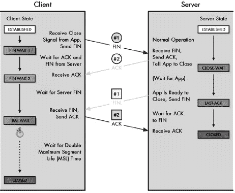

图 47-5. TCP 连接终止过程 此图展示了 TCP 会话的传统终止过程，其中一个设备发起终止，另一个设备响应。在这种情况下，客户端发起；它发送一个 FIN，服务器进行确认。服务器等待服务器进程准备好关闭，然后发送其 FIN，客户端进行确认。客户端等待一段时间以确保设备收到其 ACK，然后进入 CLOSED 状态。

接收初始 FIN 的设备可能需要在 CLOSE-WAIT 状态中等待相当长的时间（从网络术语来说），以便为其所服务的应用程序指示它已准备好关闭。TCP 无法对这需要多长时间做出任何假设。在这段时间内，前一个示例中的服务器可能会继续发送数据，客户端将接收这些数据。然而，客户端不会向服务器发送数据。

最终，第二个设备（例如示例中的服务器）将发送一个 FIN 来关闭其连接的一端。最初发起关闭的设备（客户端）将为这个 FIN 发送一个 ACK。然而，客户端在发送 ACK 后不能立即进入 CLOSED 状态，因为它必须允许 ACK 到达服务器的时间。通常情况下，这会很快，但延迟可能会稍微减慢这个过程。

## TIME-WAIT 状态

TIME-WAIT 状态需要两个主要原因：

+   为了确保另一设备收到 ACK，并在它丢失时重新传输

+   为了在这条连接的结束和任何后续连接之间提供一个缓冲期。如果没有这个时间段，不同连接的包可能会混合，从而造成混乱。

该标准规定，客户端应在关闭连接之前等待两倍于特定时间长度的时段，这个时长被称为*最大分段生存时间（MSL）*。TCP 标准将 MSL 定义为 120 秒（2 分钟）。在现代网络中，这几乎是一个永恒的时间，因此 TCP 允许实现选择一个更低的值，如果它认为这将导致更好的操作。

## 同时连接终止

正如如果两个设备决定相互主动打开连接，可以改变正常的连接建立过程一样，两个设备也可以尝试同时终止一个连接。这个术语“同时”并不意味着它们会同时决定关闭——网络延迟的差异意味着在任何互联网环境中都不可能真正同时发生。这仅仅意味着，在前面的例子中，客户端决定关闭并发送一个 FIN，但服务器在客户端的 FIN 出现在服务器之前就发送了自己的 FIN。在这种情况下，会遵循不同的程序，如表 47-5 中所述，并在图 47-6 中所示。

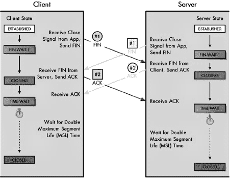

图 47-6. TCP 同时连接终止过程在某些情况下，两个设备可能会同时决定终止一个连接，或者几乎是同时。在这种情况下，每个设备都会发送一个 FIN，在收到对该 FIN 的 ACK 之前，会接收到另一个设备的 FIN。每个设备都会确认对方的 FIN，并在关闭连接之前等待一段时间。注意通过 CLOSING 状态的转换，该状态仅作为同时终止的一部分使用。

表 47-5. TCP 同时连接终止过程

| 客户端 | 服务器 |
| --- | --- |
| 起始状态 | 动作 | 转换到状态 | 起始状态 | 动作 | 转换到状态 |
| --- | --- | --- | --- | --- | --- |
| 建立连接 | 客户端关闭步骤 1 传输：使用 TCP 的应用程序表示连接不再需要。客户端的 TCP 发送下一个段，并将 FIN 位设置为 1，表示请求关闭连接。 | FIN-WAIT-1 | 建立连接 | 服务器关闭步骤 1 传输：在服务器能够接收客户端发送的 FIN 之前，服务器上的应用程序也发出关闭信号。服务器也发送一个 FIN。 | FIN-WAIT-1 |
| FIN-WAIT-1 | 服务器关闭步骤 1 接收和步骤 2 传输：客户端已发送一个 FIN 并正在等待其被确认。相反，它接收到了服务器发送的 FIN。它用 ACK 确认服务器的关闭请求，并继续等待自己的 ACK。 | 关闭中 | FIN-WAIT-1 | 客户端关闭步骤 1 接收和步骤 2 传输：服务器已发送一个 FIN 并正在等待其被确认。相反，它接收到了客户端发送的 FIN。它用 ACK 确认客户端的关闭请求，并继续等待自己的 ACK。 | 关闭中 |
| 关闭中 | 客户端关闭步骤 2 接收：客户端接收其 FIN 的 ACK。 | TIME-WAIT | 关闭中 | 服务器关闭步骤 2 接收：服务器接收其 FIN 的 ACK。 | TIME-WAIT |
| TIME-WAIT | 客户端等待的时间是两倍的 MSL 时间。这为确保它发送给服务器的 ACK 被接收提供了足够的时间。 | — | TIME-WAIT | 服务器等待的时间是两倍的 MSL 时间。这为确保它发送给客户端的 ACK 被接收提供了足够的时间。 | — |
| TIME-WAIT | 定时器在两倍的 MSL 时间后到期。 | 关闭 | TIME-WAIT | 定时器在两倍的 MSL 时间后到期。 | 关闭 |
| 关闭 | 连接已关闭。 | — | 关闭 | 连接已关闭。 | — |

如您所见，在这种情况下，过程具有更高的对称性，两个设备都通过相同的状态进行转换。在任何情况下，最终结果都是相同的，即连接处于关闭状态——意味着没有连接。每个 TCP 都会确保所有未发送的数据被发送到应用程序，有时这被称为隐含的 *推送*（有关此术语的解释，请参阅第四十八章中的推送功能描述）。当连接关闭时，两个设备上建立的 TCB 被销毁。

### 提示

**关键概念** 正如两个设备可以同时打开一个 TCP 会话一样，它们也可以同时终止它。在这种情况下，遵循不同的状态序列，每个设备对其接收到的对方的 FIN 响应以 ACK，然后等待接收自己的 ACK，并暂停一段时间以确保对方在结束连接之前收到了它的 ACK。

# 第四十八章。TCP 消息格式和数据传输

上一章描述了使用传输控制协议（TCP）的两个设备如何建立 TCP 连接，以及如何管理和最终终止该连接。虽然连接是 TCP 工作方式的关键部分，但它们实际上只是协议最终目标的手段：发送数据。通过使用 TCP 滑动窗口机制、特殊的段格式和几个功能，TCP 设备能够打包并发送数据，从而使得应用程序能够进行通信。

本章描述了 TCP 消息格式化的实际机制以及设备之间数据传输的过程。我首先查看重要的*TCP 段格式*，它描述了每个 TCP 消息中的字段以及它们的使用方式。接下来，我提供了计算 TCP（以及 UDP）消息校验和的方法的描述，并解释了为什么使用特殊的伪头部。然后，我讨论了最大段大小（MSS）参数及其重要性。随后，我详细说明了滑动窗口机制是如何用于传输和确认数据的。最后，我描述了两种特殊的数据传输特性：用于立即数据传输的推送功能，以及用于优先数据传输的紧急功能。

**背景信息**本章假设你已经熟悉 TCP 概念，如序列号、段和 TCP 滑动窗口机制的基本原理。如果你不熟悉，请在继续阅读本章之前先阅读第四十六章。

# TCP 消息（段）格式

在第四十五章的 TCP 概述中，我描述了 TCP 执行的最有趣的任务之一：它允许应用程序以无结构的字节序列发送数据，透明地将这些数据打包成由 TCP 使用的底层协议（通常是 IP）所需的不同消息。TCP 消息被称为*段*，这个名字指的是每个段都是设备之间整体数据流的一部分。

TCP 段非常类似于“万能的”信息——它们灵活且服务于多种目的。所有段都使用单一的字段格式，其中包含多个头部字段，以实现 TCP 所负责的众多功能和特性。TCP 段最显著的特点之一是它们被设计为可以同时携带控制信息和数据。这减少了发送的段的数量，因为一个段可以执行多个功能。

例如，在 TCP 中不需要发送单独的确认，因为每个 TCP 消息都包含一个确认字节号的字段。同样，可以在发送数据的同时请求关闭连接。每个 TCP 段的特点通过使用几个特殊控制位来指示。可以发送多个位以允许一个段执行多个功能，例如，当一位用于指定初始序列号（ISN）并确认接收了另一个这样的段时。

为了这种灵活性，我们付出的代价是 TCP 头很大：常规段为 20 字节，携带选项的段则更多。这也是为什么一些协议在不需要 TCP 功能时更倾向于使用用户数据报协议（UDP）的原因之一。TCP 头字段用于以下一般目的：

**进程寻址** 源设备和目标设备上的进程使用端口号进行标识。

**实现滑动窗口系统** 序列号、确认号和窗口大小字段实现了 TCP 滑动窗口系统（在本章后面的“TCP 滑动窗口数据传输和确认机制”部分中讨论）。

**设置控制位和字段** 这些是执行各种控制功能以及携带指针和其他所需数据的特殊位。

**携带数据** 数据字段携带设备之间发送的实际数据字节。

**执行其他功能** 这包括数据保护用的校验和以及用于连接设置的选项。

TCP 消息（段）的格式在表 表 48-1 到 表 48-3 中进行了详细描述，并在 图 48-1 中进行了说明。

表 48-1. TCP 段格式

| 字段名称 | 大小（字节） | 描述 |
| --- | --- | --- |
| 源端口 | 2 | 这是源设备上发起 TCP 段的进程的 16 位端口号。这通常是一个客户端的临时（客户端）端口号，用于客户端向服务器发送请求，或者是一个已知/已注册（服务器）端口号，用于服务器向客户端发送回复。 |
| 目标端口 | 2 | 这是目标设备上消息最终预期接收者的 16 位端口号。这通常是一个客户端请求的已知/已注册（服务器）端口号，或者是一个服务器回复的临时（客户端）端口号。 |
| 序列号 | 4 | 对于正常传输，这是此段中数据第一个字节的序列号。在连接请求（SYN）消息中，此字段携带源 TCP 的 ISN。数据的第一字节将赋予此字段内容之后的下一个序列号，如第四十七章中所述。 |
| 确认号 | 4 | 当 ACK 位被设置时，此段作为确认（除其他可能的职责外），并且此字段包含源端期望目的地发送的下一个序列号。有关详细信息，请参阅本章后面的“TCP 滑动窗口数据传输和确认机制”部分。 |
| 数据偏移 | 1/2 (4 bits) | 这指定了 TCP 头部中的 32 位字节数。换句话说，此值乘以四等于头部的字节数，这必须始终是 4 的倍数。它被称为数据偏移，因为它指示数据开始相对于 TCP 段开始的 32 位字数。 |
| 保留 | 3/4 (6 bits) | 此字段为 6 位保留，供将来使用；发送时作为零。 |
| 控制位 | 3/4 (6 bits) | TCP 不使用单独的控制消息格式。相反，某些位被设置为指示控制信息的通信。这 6 位在表 48-2 中描述。 |
| 窗口 | 2 | 这表示发送此段的发送者愿意一次从接收者那里接受多少个八位字节的数据。这通常对应于为接受此连接分配的当前缓冲区大小。换句话说，此字段是发送此段的设备的当前接收窗口大小，也是段接收者的发送窗口。有关详细信息，请参阅本章后面的“TCP 滑动窗口数据传输和确认机制”部分。 |
| 校验和 | 2 | 这是一个用于数据完整性保护的 16 位校验和，计算整个 TCP 数据报，以及一个特殊的伪头部字段。它用于保护整个 TCP 段免受传输错误和交付错误的侵害。也支持可选的替代校验和方法。 |
| 紧急指针 | 2 | 此字段与 URG 控制位一起用于优先数据传输（见表 48-2）。此字段包含紧急数据的最后一个字节的序列号。有关详细信息，请参阅本章后面的“TCP 优先数据传输：紧急功能”部分。 |
| 选项 | 可变 | TCP 包含一个通用机制，用于在 TCP 段中包含一个或多个可选数据集。每个选项可以是 1 个字节长或可变长。第一个字节是选项-类型子字段，其值指定了选项类型，进而指示选项是单个字节还是多个字节。多个字节的选项由三个字段组成，这些字段在表 48-3 | 紧急位：当设置为 1 时，表示已调用此段的优先级数据传输功能，并且紧急指针字段是有效的。 |
| ACK | 1/8 (1 位) | 确认位：当设置为 1 时，表示此段携带确认信息，确认号字段的有效值表示从该段的接收方期望的下一个序列号。 |
| PSH | 1/8 (1 位) | 推送位：此段发送方正在使用 TCP 推送功能，请求将此段中的数据立即推送到接收设备上的应用程序。 |
| RST | 1/8 (1 位) | 重置位：发送方遇到问题并希望重置连接。 |
| SYN | 1/8 (1 位) | 同步位：此段是请求同步序列号并建立连接的请求；序列号字段（见表 48-1 | 结束位：段发送方请求关闭连接。 |

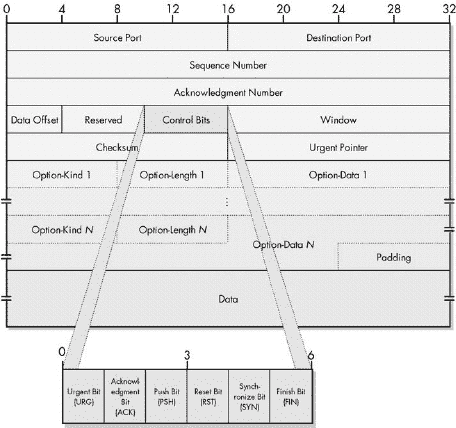

图 48-1. TCP 段格式

表 48-3. TCP 段选项子字段

| 子字段名称 | 大小（字节） | 描述 |
| --- | --- | --- |
| 选项-类型 | 1 | 这指定了选项类型。 |
| 选项-长度 | 1 | 这是整个选项的长度（以字节为单位），包括选项-类型和选项-长度字段。 |
| 选项-数据 | 可变 | 此字段包含选项数据本身。在至少一个异常情况下，此字段被省略（使选项长度等于 2）。 |

表 48-4 显示了当前为 TCP 定义的主要选项

表 48-4. 一些 TCP 选项

| 选项-类型 | 选项-长度 | 选项-数据 | 描述 |
| --- | --- | --- | --- |
| 0 | — | — | 选项列表结束：一个单字节选项，用于标记包含在此分段中的所有选项的结束。仅在选项的结束与 TCP 头部结束不一致时需要包含。 |
| 1 | — | — | 无操作：一个“填充符”，可以在选项之间包含，以便在需要时将后续选项对齐到 32 位边界。 |
| 2 | 4 | 最大分段大小值 | 最大分段大小：传达发送方希望接收的最大分段大小。仅在连接请求（SYN）消息中使用。 |
| 3 | 3 | 窗口大小位移位 | 窗口缩放：实现了可选窗口缩放功能，允许设备指定比正常窗口字段可能的大得多的窗口大小。Option-Data 中的值指定了窗口字段应该乘以的 2 的幂，以获得选项发送方实际使用的真实窗口大小。例如，如果 Option-Data 的值为 3，这意味着窗口字段中的值应该乘以 8，前提是两个设备都同意使用此功能。这允许在高性能链路上在需要时宣布非常大的窗口。有关详细信息，请参阅本章后面的“TCP 滑动窗口数据传输和确认机制”部分。 |
| 4 | 2 | — | 允许选择性确认：指定此设备支持选择性确认（SACK）功能。这作为一个 2 字节选项实现，没有 Option-Data 字段，而不是像选项列表结束或无操作那样的单字节选项。这是必要的，因为它是在原始 TCP 规范之后定义的，因此需要一个显式的选项长度来指示向后兼容性。 |
| 5 | 可变 | 选择性确认数据块 | 选择性确认：允许支持可选选择性确认功能的设备指定已接收的非连续数据块，这样在中间分段未出现且需要重传时，它们不会被重传。 |
| 14 | 3 | 交替校验算法 | 交替校验请求：允许设备请求使用除标准 TCP 算法之外的校验生成算法来处理此连接。两个设备必须同意使用该算法。 |
| 15 | 可变 | 交替校验 | 交替校验：如果实现交替校验所需的校验值太大，无法放入标准的 16 位校验字段中，则将其放置在此选项中。 |

表格并未包含每个 TCP 选项；它只显示了在 RFC 793 中定义的基本选项以及一些有趣的其他选项，这些选项与本书其他部分描述的功能相对应。请注意，大多数选项仅在连接请求（SYN）段中发送。这包括最大段大小、窗口缩放、选择性确认允许和备用校验和请求选项。相比之下，选择性确认和备用校验和选项在它们被使用时出现在常规数据段中。

# TCP 校验和计算与 TCP 伪头部

TCP 是设计用来在 IP 网络中一对设备之间提供可靠的数据传输。确保数据段可靠传输所需的大部分努力都集中在确保数据在传输过程中不会丢失的问题上。但还有另一个重要的关键障碍，即数据在穿越互联网过程中被引入 *错误* 的风险。

## 使用校验和检测传输错误

如果数据到达了它需要去的地方，但被破坏了，而我们没有检测到这种破坏，这在某些方面比它根本没出现还要糟糕。为了提供对传输错误的基本保护，TCP 在其头部包含一个 16 位的校验和字段。校验和背后的思想非常简单：将数据字节串相加，然后将这个总和与数据流一起发送，并让接收方检查这个总和。在 TCP 中，发送段的设备使用一个特殊的算法来计算这个校验和。然后，接收方使用相同的算法来检查它接收到的数据，并确保没有错误。

TCP 使用的校验和计算与常规校验和算法略有不同。常规校验和是在校验和旨在保护的所有字节上执行的，并且它可以检测到这些字段中的大多数位错误。TCP 的设计者想要这种位错误保护，但他们还想要对其他类型的问题进行保护。为此，对 TCP 校验和的计算方式进行了修改。这个特殊的 TCP 校验和算法最终也被用于 UDP；参见第四十四章")。

## 增加检测错误范围：TCP 伪头部

在计算 TCP 段的实际数据字段校验和之前，创建了一个 12 字节的 TCP *伪头*。这个头包含了从 TCP 头和将要封装 TCP 段在内的互联网协议（IP）数据报中的字段中提取的重要信息（有关 IP 数据报格式的描述，请参阅第二十一章）。TCP 伪头的格式在表 48-5 中描述，并在图 48-2 中展示。

表 48-5。用于校验和计算的 TCP 伪头

| 字段名称 | 大小（字节） | 描述 |
| --- | --- | --- |
| 源地址 | 4 | 这是数据报发起者的 32 位 IP 地址，来自 IP 头。 |
| 目标地址 | 4 | 这是数据报预期接收者的 32 位 IP 地址，也来自 IP 头。 |
| 保留 | 1 | 这由 8 个零位组成。 |
| 协议 | 1 | 这是来自 IP 头的协议字段。这表示 IP 数据报中携带的更高层协议。当然，我们已经知道这个协议是 TCP。因此，这个字段通常具有值 6。 |
| TCP 长度 | 2 | 这是 TCP 段的大小，包括头部和数据。请注意，这并不是 TCP 头中的一个特定字段；它是计算得出的。 |

图 48-2。用于校验和计算的 TCP 伪头

一旦形成这个 96 位的头，它就被放置在缓冲区中，然后是 TCP 段本身。然后计算整个数据集（伪头加 TCP 段）的校验和。校验和的值放置在 TCP 头的校验和字段中，伪头被丢弃；它不是 TCP 段的实际部分，也不会被传输。这个过程在图 48-3 中展示。

### 注意

校验和字段本身也是 TCP 头的一部分，因此是计算校验和的字段之一，造成了一种“鸡生蛋，蛋生鸡”的情况。在计算校验和时，假设这个字段全部为零。

当 TCP 段到达其目的地时，接收 TCP 软件执行相同的计算。它形成伪头部，将其附加到实际的 TCP 段上，然后进行校验和（计算时将校验和字段设置为零，如之前所述）。如果其计算值与源设备放入校验和字段的值不匹配，这表明发生了某种错误，并且通常将段丢弃。

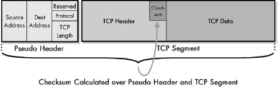

图 48-3. TCP 头部校验和计算 为了计算 TCP 段头部的校验和字段，首先构建 TCP 伪头部并将其逻辑上放置在 TCP 段之前。然后，对伪头部和 TCP 段进行校验和计算。伪头部随后被丢弃。

## 伪头部方法的优势

那么，为什么还要使用这个伪头部呢？源设备和目标设备都使用这个伪头部中的字段来计算校验和。这意味着，如果由于任何原因，两个设备在伪头部中使用的值不同，校验和将失败。当我们考虑头部中的内容时，我们发现这意味着校验和现在不仅保护 TCP 段字段中的错误，还保护以下问题：

**分段交付错误** 如果源指定的目标地址与接收段的目标地址不匹配，校验和将失败。如果源地址不匹配，也会发生相同的情况。

**协议错误** 如果由于某种原因，数据报被路由到 TCP，而实际上它属于不同的协议，这可以立即检测到。

**分段长度错误** 如果 TCP 段的一部分被意外省略，源设备和目标设备使用的长度将不匹配，校验和将失败。

伪头部聪明的地方在于，通过使用它进行校验和计算，我们可以提供这种保护，而实际上并不需要发送伪头部本身中的字段。这消除了在 TCP 头部中重复使用伪头部中使用的 IP 字段，这将是不必要的且浪费带宽。伪头部方法的缺点是它使得校验和计算需要更多的时间和精力（尽管这在今天并不是一个大问题）。

### 提示

**关键概念** TCP 校验和不仅计算 TCP 分段，还包括包含 TCP 分段长度以及 IP 源地址、目的地址和协议字段的 TCP 伪头部。由于这些字段是校验和的一部分，如果分段被错误设备接收或协议字段或分段长度不正确，它将被拒绝。这种技术很巧妙，因为即使伪头部本身实际上并没有传输，校验和也能提供这种保护。

在当今现代、高速、高度可靠的网络的背景下，使用伪头部有时似乎有些过时。数据报被错误地址交付的可能性有多大？不太可能。然而，在 TCP 创建的时候，人们却对 IP 层上数据报的端到端交付检查可能不正确表示了极大的担忧。将 IP 信息包含在 TCP 校验和中被视为一种有用的额外保护层。

### 注意

TCP 伪头部有一个有趣的含义：它违反了 TCP 设计者在将 TCP 和 IP 分割开来时试图尊重的架构分层原则。对于校验和，TCP 必须知道它技术上不应该知道的网络信息。例如，TCP 校验和计算需要将 IP 头部的协议号从携带该分段的 IP 数据报中提供给接收设备的 TCP 层。TCP 伪头部是严格分层被实用性所取代的一个很好的例子。

TCP 还支持一种可选的方法，让两个设备就一个替代校验和算法达成一致。这必须在建立连接期间协商。

# TCP 最大分段大小（MSS）

TCP 分段是携带 TCP 设备之间数据的消息。数据字段是实际传输数据被携带的地方，由于 TCP 中数据字段的长度是可变的，这引发了一个有趣的问题：我们应该在每个分段中放入多少数据？TCP 从使用它的应用程序接受一个恒定的数据流，这意味着它必须决定在每个发送的消息中放入多少字节。

决定在分段中发送多少数据的一个主要因素是接收方滑动窗口机制当前的状态。当设备 A 从设备 B 接收 TCP 分段时，它会检查窗口字段的值，以了解设备 B 允许设备 A 在其下一个分段中发送的数据量限制。（这个过程在本章后面的“TCP 滑动窗口数据传输和确认机制”部分中描述。）在选择和调整窗口大小方面也存在一些重要问题，这些问题会影响整个 TCP 系统的操作，这些问题将在第四十六章中讨论。

除了当前窗口大小的规定之外，每个 TCP 设备还与其关联一个 TCP 大小的上限——一个永远不会超过的段大小。这被称为**最大段大小（MSS）**。在决定将多少数据放入一个段时，TCP 连接中的每个设备都会根据当前窗口大小，结合第四十六章中描述的各种算法来选择数据量，但它永远不会大到超过它发送的设备 MSS。

### 注意

最大段大小的名称具有误导性。该值实际上指的是一个段可以容纳的最大数据量。它不包括 TCP 头部。因此，如果 MSS 是 100，实际的最高段大小可能是 120（对于常规 TCP 头部）或更大（如果段包含 TCP 选项）。

## MSS 选择

MSS 的选择基于在 TCP/IP 网络上传输数据时需要平衡各种相互竞争的性能和实现问题。主要的 TCP 标准，RFC 793，对 MSS 没有太多说明，因此可能会对如何使用该参数产生混淆。RFC 879 在 TCP 标准发布后几年发布，以阐明该参数及其相关问题。

MSS 的一些问题相当平凡；例如，某些设备在缓冲区中用于存储 TCP 段的空间有限，因此可能希望将段大小限制在一个相对较小的值。然而，总的来说，MSS 必须在两个相互竞争的性能问题之间进行权衡：

**开销管理** TCP 头部占用 20 字节的数据（或使用选项时更多）；IP 头部也使用 20 或更多字节。这意味着它们之间，至少需要 40 字节用于头部，而这全部是非数据开销。如果我们设置 MSS 太低，这将导致带宽使用非常低效。例如，如果我们将其设置为 40 字节，每个段的**最大**50% 实际上是数据；其余的只是头部。许多段数据报在效率方面会更差。

**IP 分片** TCP 段将被封装成 IP 数据报。正如你在第二十二章中看到的，数据报有自己的大小限制问题：底层网络的最大的传输单元（MTU）问题。如果一个 TCP 段太大，它将导致一个无法不进行分片发送的过大的 IP 数据报。分片降低了效率，并增加了 TCP 段的一部分丢失的可能性，导致整个段需要重新传输。

## TCP 默认 MSS

解决开销管理和 IP 分段这两个相互竞争的问题的方案是，为 TCP 建立一个尽可能大的默认 MSS，同时避免大多数传输段发生分段。这是通过从 IP 网络的最低 MTU 576 字节开始计算的。所有网络都必须能够处理这个大小的 IP 数据报而不会分段。从这个数字中，我们减去 20 字节用于 TCP 头部和 20 字节用于 IP 头部，剩下 536 字节。这是 TCP 的标准 MSS。

### 提示

**关键概念**TCP 被设计为限制它发送的段的大小，以一定的最大限制，以减少在 IP 层传输时需要分段的可能性。TCP *最大分段大小（MSS）* 指定了 TCP 段数据字段中的最大字节数，无论其他影响段大小的因素如何。TCP 的默认 MSS 是 536 字节，这是通过从最低 IP MTU 576 字节开始，并为 IP 和 TCP 头部各减去 20 字节计算得出的。

选择这个 MSS 值是一种折衷。这意味着大多数 TCP 段将无分段地跨越 IP 互联网发送。然而，如果使用了任何 TCP 或 IP 选项，最小 MTU 为 576 字节将被超过，并且会发生分段。尽管如此，允许一些段进行分段比使用一个远小于 MSS 的值以确保它们永远不会分段更有意义。如果我们选择，比如说，400 字节的 MSS，我们可能永远不会发生分段，但我们会降低所有段的数据/头部比率从 536:40（93%数据）到 400:40（91%数据）。

## 非默认 MSS 值指定

自然地，会有一些情况，默认 MSS 值并不理想。TCP 提供了一种机制，允许设备指定它想要使用的 MSS 值要么小于或大于 536 字节的默认值。设备可以通过在建立连接过程中交换参数来通知其他设备它想要使用的 MSS 值。选择这样做的设备会在其 SYN 消息中包含一个称为最大分段大小的 TCP 选项。其他设备接收到这个选项并记录连接的 MSS。每个设备都可以独立指定它希望接收的段所使用的 MSS。

### 注意

在设置过程中交换 MSS 值有时被称为 MSS 协商。这实际上是一个误导性的术语，因为它暗示两个设备必须就一个共同 MSS 值达成一致，而这并不是事实。每个设备使用的 MSS 值可能不同，并且根本不存在协商。

如果设备知道将要传输的段将通过的网络 MTU 大于 IP 的最小值 576 字节，它们可能会希望使用更大的 MSS。这种情况在大量数据在本地网络中发送时最为常见。正如第二十二章中所述的 MTU 路径发现过程，用于确定适当的大小。如果设备知道 TCP 段使用某个特定的可选功能，该功能会持续增加 IP 头的大小，例如当段使用 IPsec 进行安全时（参见第二十九章），它们可能会使用较小的 MSS。

### 小贴士

**关键概念** 设备可以通过在它们用于建立连接的 SYN 消息中包含最大段大小选项来指示它们希望使用与默认值不同的 MSS 值。连接中的每个设备都可能使用不同的 MSS 值。

# TCP 滑动窗口数据传输和确认机制

TCP 连接建立过程是由一对设备使用的，用于在它们之间创建 TCP 连接。一旦所有设置完成——传输控制块（TCBs）已设置，参数已交换，等等——设备就准备好开始传输数据了。

在连接中，TCP 设备之间数据的发送是通过我们在第四十六章中探讨的滑动窗口系统完成的。在这里，我们将更详细地探讨滑动窗口是如何实现的，以便发送和接收数据。为了便于解释，我们假设我们的连接是在客户端和服务器之间——这比整个“设备 A/设备 B”的业务要简单。

## 滑动窗口发送和接收类别

连接上的两个设备都必须跟踪它们发送的数据以及从另一设备接收的数据。这是通过概念上将字节划分为*类别*来完成的。对于正在传输的数据，有四个发送类别：

**发送类别 1** 已发送并确认的字节

**发送类别 2** 已发送但尚未确认的字节

**发送类别 3** 已发送但尚未准备好接收的字节

**发送类别 4** 已发送但尚未准备好接收的字节

对于正在接收的数据，没有必要像发送方将其前两个类别分为“已发送并确认”和“已发送但尚未确认”那样，将其分为“已接收并确认”和“已接收但尚未确认”。原因是发送方必须等待每次传输的确认，但接收方不需要确认它已收到某些内容。因此，一个接收类别对应于传输类别 1 和 2，而另外两个分别对应于传输类别 3 和传输类别 4，总共三个接收类别。为了帮助更清楚地说明类别之间的关系，我按如下方式编号：

**接收类别 1+2** 已接收并确认的字节。这是接收方对传输类别 1 和 2 的补充。

**接收类别 3** 尚未接收但接收方已准备好的字节。这是接收方对传输类别 3 的补充。

**接收类别 4** 尚未接收但接收方尚未准备好的字节。这是接收方对传输类别 4 的补充。

## 发送（SND）和接收（RCV）指针

客户端和服务器都必须跟踪通过连接发送的两个流。这是通过一组称为指针的特殊变量来完成的，这些指针将字节流划分为上一节中描述的类别。

四个传输类别是通过三个发送（SND）指针来划分的。其中两个指针是绝对的（参考特定的序列号），另一个是添加到绝对指针之一上的偏移量，如下所示：

**发送未确认（SND.UNA）** 已发送但尚未确认的数据的第一个字节的序列号。这标志着传输类别 2 的第一个字节；所有之前的序列号都指的是传输类别 1 中的字节。

**发送下一个字节（SND.NXT）** 下一个要发送到另一设备（在这种情况下是服务器）的数据字节的序列号。这标志着传输类别 3 的第一个字节。

**发送窗口（SND.WND）** 发送窗口的大小。回想一下，窗口指定任何设备在任何时刻可能有的未确认的字节数量。因此，将第一个未确认字节的序列号（SND.UNA）和发送窗口（SND.WND）相加，标志着传输类别 4 的第一个字节。

另一种看待这些指针的方法是它们如何指示在任何时刻传输设备可以发送的字节数——即传输类别 3 中的字节数。传输类别 3 的开始由 SND.NXT 标记，结束由传输类别 4 的第一个字节标记，该字节由 SND.UNA+SND.WND 给出。因此，传输类别 3 中的字节数由以下公式给出：

SND.UNA + SND.WND - SND.NXT

这被称为*可用窗口*，因为它表示发送器在任何时刻可以使用的字节数。当数据被确认时，这会导致字节从传输类别 2 移动到传输类别 1，通过增加 SND.UNA 的值。假设发送窗口大小不变，这将导致窗口向右*滑动*，允许发送更多数据。图 48-4 说明了 SND 指针。

### 提示

**关键概念** TCP 滑动窗口方案使用三个指针来跟踪四个传输类别中的每个字节的传输情况。SND.UNA 指向第一个未确认的字节，并指示传输类别 2 的开始；SND.NXT 指向下一个要发送的数据字节，并标记传输类别 3 的开始。SND.WND 包含发送窗口的大小；它被添加到 SND.NXT 上，以标记传输类别 4 的开始。将 SND.WND 添加到 SND.UNA，然后减去 SND.NXT，得到当前可用的传输窗口大小。

图 48-4. TCP 传输类别、发送窗口和指针 此图与图 46-6。"）(在第四十六章)相同，但显示了 TCP 发送指针。SND.UNA 指向传输类别 2 的开始，SND.NXT 指向传输类别 3 的开始，SND.WND 是发送窗口的大小。可用窗口的大小（阴影矩形）可以通过这三个指针计算得出。

三种接收类别是通过两个指针来划分的：

**接收下一个字节（RCV.NXT）** 从其他设备期望接收的下一个字节的序列号。这标志着接收类别 3 中的第一个字节。所有之前的序列号都指的是已接收并确认的字节，在接收类别 1 和 2 中。

**接收窗口（RCV.WND）** 向其他设备广告的接收窗口大小。这指的是设备一次愿意从其对等方接受的字节数，这通常是为接收此连接的数据分配的缓冲区大小。当与 RCV.NXT 指针相加时，此指针标记接收类别 4 的第一个字节。

接收类别和指针在图 48-5 中说明。

SND 和 RCV 指针是互补的，就像类别一样，每个设备都管理自己的数据发送和从对等方接收数据。假设我们有一个客户端和一个服务器，这些指针之间的关系如下：

**客户端** SND 指针跟踪客户端的输出数据流；RCV 指针指向从服务器传入的数据。客户端的 SND 类别对应于服务器的 RCV 类别。

**服务器** SND 指针跟踪服务器的输出数据流；RCV 指针指向从客户端接收的数据。服务器的 SND 类别对应于客户端的 RCV 类别。

图 48-5. TCP 接收类别和指针 此图是图 48-4,展示了接收设备如何设置类别。由于“已接收未确认”和“已接收已确认”之间没有区别，因此类别 1 和 2 已经被合并。此示例显示了接收设备在收到图 48-4 中已发送的 14 个字节之前的状态。

### 小贴士

**关键概念** 每个设备都维护一组*接收（RCV）指针*。这些接收指针是*发送（SND）指针*的补充。设备的发送指针跟踪其发出的数据，而接收指针跟踪接收到的数据。两个接收指针是 RCV.NXT，它指示从另一设备期望的下一个字节的编号，以及 RCV.WND，它是该设备的接收窗口大小。一个设备的 RCV.WND 等于连接的另一设备的 SND.WND。

由于 SND 和 RCV 值是互补的，一个设备的发送窗口是另一个设备的接收窗口，反之亦然。然而，需要注意的是，两个设备上的指针值并不总是完全匹配，因为在任何给定时间，一些字节可能正在两个设备之间传输。图 48-5,例如，显示了接收者在接收到字节 32 到 45 之前的接收指针，这些字节在图 48-4 详细描述了该过程，展示了每一步中两个设备的发送和接收指针。它相当大，所以请注意。交易也以图形方式展示在图 图 48-6 和 图 48-7 中。两者都展示了相同的信息交换，使用 表 48-6 的步骤编号，但从一个设备的视角来看。图 48-6 展示了服务器的发送指针和客户端的接收指针。图 48-7 展示了客户端的发送指针和服务器的接收指针。（我本想将它们全部放在一个图中，但它们放不下！）

表 48-6. 带有发送和接收指针的 TCP 交易示例

|   |   |   |   |   |   |   |   |   |   | 客户端 | 服务器 |
| --- | --- | --- | --- | --- | --- | --- | --- | --- | --- | --- | --- |
| 处理步骤 | SND.UNA | SND.NXT | SND.WND | RCV.NXT | RCV.WND | 处理步骤 | SND.UNA | SND.NXT | SND.WND | RCV.NXT | RCV.WND |   |   |   |   |   |   |   |   |   |   |
| --- | --- | --- | --- | --- | --- | --- | --- | --- | --- | --- | --- | --- | --- | --- | --- | --- | --- | --- | --- | --- |
|   |   |   |   |   |   |   |   |   |   | 描述 | 描述 |
| --- | --- | --- | --- | --- | --- | --- | --- | --- | --- | --- | --- |
| **(设置)** | 1 | 1 | 360 | 241 | 200 | **(设置)** | 241 | 241 | 200 | 1 | 360 |
|   |   |   |   |   |   |   |   |   |   | 在建立连接过程中，客户端根据设置期间交换的参数设置其指针。注意，SND.UNA 和 SND.NXT 的值相同。尚未发送任何数据，因此没有未确认的数据。RCV.NXT 是服务器期望接收的第一个字节的值。 | 服务器像客户端一样设置其指针。注意，其值是客户端值的补数。 |
| **1. 发送请求** | 1 | 141 | 360 | 241 | 200 | **(等待)** | 241 | 241 | 200 | 1 | 360 |   |   |   |   |   |   |   |   |   |
|   |   |   |   |   |   |   |   |   |   | 客户端向服务器发送一个请求。假设请求长度为 140 字节。它将形成一个具有该长度数据字段的数据段，并将序列号设置为 1（第一个字节的序列号）来传输它。一旦发送了这些数据，客户端的 SND.NXT 指针将增加到 141，以指示这是要发送给服务器的下一个数据。 | 服务器不采取任何行动，等待请求。 |
| **(等待)** | 1 | 141 | 360 | 241 | 200 | **2. 接收请求，发送确认和回复** | 241 | 321 | 200 | 141 | 360 |   |   |   |   |   |   |   |   |   |
|   |   |   |   |   |   |   |   |   |   | 此时，客户端尚未收到对其请求的确认。目前，SND.UNA+SND.WND 的值为 361，而 SND.NXT 的值为 141。这意味着当前可用的窗口为 220 字节。客户端在收到确认之前可以发送多达 220 字节的更多数据。现在，假设它没有更多要传输的数据。 | 服务器从客户端接收 140 字节的请求。服务器发送一个 80 字节的响应，该响应也确认了客户端的 TCP 段。序列号字段将为 241，这是服务器 80 字节数据的第一个序列号。确认号将为 141，告诉客户端这是服务器期望听到的下一个序列号，从而隐式确认接收了从第 1 个字节到第 140 个字节的数据。服务器将其 RCV.NXT 指针增加到 141，以反映接收到的 140 字节的数据。它将其 SND.NXT 指针增加 80。 |
| **3. 接收确认和回复，发送确认** | 141 | 141 | 360 | 321 | 200 | **4. 发送文件的第一部分** | 241 | 441 | 200 | 141 | 360 |   |   |   |   |   |   |   |   |   |
|   |   |   |   |   |   |   |   |   |   | 客户端接收到了服务器的响应。它看到确认号为 141，知道字节 1 到 140 已被成功接收。它将 SND.UNA 增加到 141，实际上是通过滑动发送窗口 140 个字节。客户端还接受了服务器发送的 80 字节数据，将 RCV.NXT 指针增加 80。假设它没有更多数据要发送，它发送了一个纯确认的 TCP 段，以确认服务器的响应。这个段没有数据，确认号值为 321。 | 当客户端接收其响应时，服务器的 TCP 被提供了一个 280 字节的文件要发送给客户端。然而，它不能在一个段中发送所有这些。当前 SND.UNA+SND.WND 的值为 441，而 SND.NXT 为 321。因此，服务器的可用窗口包含 120 字节数据。它创建了一个包含这么多数据和序列号 321 的 TCP 段。它将 SND.NXT 指针增加到 441。现在服务器已经填满了发送窗口。请注意，服务器不需要等待对步骤 2 中发送的回复的确认。这是 TCP 确保高吞吐量的关键因素之一。 |
| **5. 接收文件第一部分，发送确认** | 141 | 141 | 360 | 441 | 200 | **6. 接收回复的确认** | 321 | 441 | 200 | 141 | 360 |   |   |   |   |   |   |   |   |   |   |
|   |   |   |   |   |   |   |   |   |   | 客户端接收到了服务器发送的文件的前 120 字节部分。它将 RCV.NXT 指针增加到 441，并带着确认号 441 发送了一个确认。再次，如果它有其他对服务器的请求，它也可以在这里包含，但我们假设它没有。 | 服务器接收到了客户端对其先前 80 字节响应的确认（在步骤 2 中发送）。它将 SND.UNA 增加到 321。由于它刚刚收到了 80 字节的确认（并且客户端的窗口没有改变），服务器的可用窗口现在是 80 字节。然而，正如我们将在第四十九章中看到的，发送这样小的段可能会引起性能问题。假设服务器被编程为在有很多数据要传输时不会发送小于 100 字节的段。它决定等待。 |
| **(等待**) | 141 | 141 | 360 | 441 | 200 | **7. 接收文件第一部分的确认** | 441 | 441 | 200 | 141 | 360 |   |   |   |   |   |   |   |   |   |   |
|   |   |   |   |   |   |   |   |   |   | 客户端等待文件的其余部分。 | 服务器接收到了文件第一部分的确认。它将 SND.UNA 增加到 441。这现在恢复了完整的 200 字节窗口。 |
| **(仍在等待？**) | 141 | 141 | 360 | 441 | 200 | **8. 发送文件第二部分** | 441 | 601 | 200 | 141 | 360 |   |   |   |   |   |   |   |   |   |   |
|   |   |   |   |   |   |   |   |   |   | 客户端继续等待文件的其余部分。 | 服务器将文件中剩余的 160 字节数据在一个段中发送。它将 SND.NXT 增加 160，并使用序列号值为 441 的数据发送。 |
| **9. 接收文件第二部分，发送确认** | 141 | 141 | 360 | 601 | 200 | **(等待)** | 441 | 601 | 200 | 141 | 360 |   |   |   |   |   |   |   |   |   |   |
|   |   |   |   |   |   |   |   |   |   | 客户端收到文件的其余部分并确认它。它将 RCV.NXT 增加到 601，并发送一个确认号为 601 的段。 | 服务器目前完成。它等待文件第二部分的确认。 |
| **(完成)** | 141 | 141 | 360 | 601 | 200 | **10. 接收文件第二部分确认** | 601 | 601 | 200 | 141 | 360 |   |   |   |   |   |   |   |   |   |   |
|   |   |   |   |   |   |   |   |   |   | 客户端完成这次交换。 | 服务器收到第二个确认，并将发送窗口向前滑动 160 字节。事务现在完成。 |

图 48-6. TCP 事务示例，展示服务器的发送指针。从服务器的视角看表 48-6 的事务。查看图 48-7 以查看客户端的指针。

图 48-7. TCP 事务示例，展示客户端的发送指针。从客户端的视角看表 48-6 的事务。查看图 48-6 以查看服务器的指针。

## 滑动窗口机制的实际情况复杂性

我相信前一部分概述的过程看起来相当复杂，但实际上，示例被高度**简化**，以向您展示基本数据传输机制是如何在没有太多干扰的情况下工作的。可怕，不是吗？现实世界的连接将包括几个复杂性：

**重叠传输** 我故意只展示了客户端的一个请求和服务器的一个响应。在现实中，客户端和服务器可能会以快速连续的方式互相发送许多请求和响应。客户端会通过包含新请求的段来确认从服务器接收到的段，依此类推。

**多个段的确认** 我也没有展示一个案例，其中两个段被设备接收并使用单个确认进行确认，尽管这确实可能发生。假设在示例中，280 字节的文件的两个部分同时发送并被客户端同时接收。客户端将通过发送一个带有确认号 601 的单个段来确认这两个部分。请记住，这个字段是所有包含数据的段的*累积*确认，通过它前面的数字来表示，因此这将确认所有数据直到字节 600。

**流量控制中的波动窗口大小** 示例中的窗口大小保持不变，但在实际连接中，情况并不总是如此。一个非常繁忙的服务器可能无法像确认那样快速处理和从其缓冲区中移除数据。它可能需要缩小接收窗口以减少发送给客户端的数据量，然后在有更多空间可用时增加窗口。这就是 TCP 实现流量控制的方式，您将在下一章中看到。

**丢失的传输** 在实际连接中，一些传输的段会丢失并需要重传。这由 TCP 的重传方案（在第四十九章中描述）处理。

**避免小窗口问题** 在示例的描述中，我暗示我们并不总是想尽可能快地发送数据，以避免发送一个非常小的段。原因是这可能导致性能下降，包括称为*愚蠢窗口综合征*的现象。这将在下一章中探讨，我们将看到如何处理它需要我们改变迄今为止所检查的简单滑动窗口方案。

**拥塞处理和避免** 基本的滑动窗口机制在多年中已经改变，以避免 TCP 连接引起互联网拥塞，并在检测到拥塞时处理拥塞。正如您可能猜到的，拥塞问题将在下一章中讨论。

# TCP 立即数据传输：推送功能

TCP 将来自进程的传入数据视为一个无结构的字节流，这使得它在满足大多数应用程序的需求方面具有很大的灵活性。应用程序不需要创建块或消息；它只需在准备传输时将数据发送到 TCP。至于 TCP，它对数据流中字节的含义没有任何了解或兴趣。它们只是字节，TCP 发送它们时并不真正关心它们的结构或目的。

这对应用程序的工作方式有几个有趣的影响。一个是 TCP 不提供任何关于数据分界点的自然指示，例如数据库记录或文件。应用程序必须负责这一点。TCP 字节导向的另一个结果是，TCP 不能根据数据的内文来决定何时形成段并将在设备之间发送的字节。TCP 通常会在缓冲区中累积应用程序进程发送给它的数据。它选择何时以及如何发送数据，完全基于前一小节讨论的滑动窗口系统，并结合帮助确保协议高效运行的逻辑。

这意味着虽然应用程序可以控制向 TCP 发送数据的速率和时机，但它不能本质上控制 TCP 本身在互联网上发送数据的时机。现在，如果我们发送一个大型文件，例如，这并不是一个大问题。只要我们继续发送数据，TCP 就会继续在互联网上转发它。在这种情况下，让 TCP 用数据填满其内部传输缓冲区并形成发送的段通常是没问题的。

然而，在某些情况下，让 TCP 在传输之前累积数据可能会引起严重的问题。这个经典的例子是交互式应用程序，如 Telnet 协议（见第八十七章

传输控制协议（TCP）的主要任务很简单：打包和发送数据。当然，几乎每个协议都会打包和发送数据！区分 TCP 与其他协议的是我们在上一章中探讨的滑动窗口机制，该机制控制设备之间的数据流。这个系统不仅管理基本的数据传输过程，而且还确保数据可靠地发送，并管理设备之间的数据流，以有效地传输数据，避免任何设备发送数据速度超过另一个设备接收速度的情况。

为了使 TCP 能够提供应用程序所需的功能和数据传输质量，该协议需要在前面章节中看到的简化数据传输机制之外进行增强。开发者需要给协议添加额外的“智能”来处理潜在的问题，并改变设备发送数据的基本方式，以避免可能产生的低效。

在本章中，我描述了 TCP 如何确保 TCP 连接上的设备以可靠和高效的方式进行通信。我首先解释了 TCP 检测丢失段并重新传输它们的基本方法。我讨论了与 TCP 确认方案相关的一些问题以及一个可选功能，以提高其效率。然后，我描述了 TCP 通过调整它决定一个段丢失之前将等待多长时间的系统。我讨论了如何调整窗口大小以实现流量控制以及窗口大小管理中的一些问题。这包括对臭名昭著的“愚蠢窗口综合症”问题的分析，以及针对与窗口大小相关的问题的特殊启发式方法，这些方法修改了基本的滑动窗口方案。最后，我讨论了 TCP 处理和避免拥塞的机制。

### 小贴士

**背景信息** 本节假设您已经熟悉 TCP 序列号和段，以及 TCP 滑动窗口机制的基本知识。它还假设您已经阅读了关于 TCP 消息格式和数据传输的章节。如果没有，您可能需要至少回顾第四十八章中关于 TCP 数据传输机制的章节。本章中的几个部分将扩展对 TCP 数据传输的简化讨论，以展示在非理想条件下的情况。

# TCP 段重传计时器和重传队列

TCP 的基本数据传输和确认机制使用每个设备维护的一组变量来实现滑动窗口系统。这些指针跟踪每个设备发送和接收的字节数据，以及区分已确认和未确认的传输。在前一章中，我描述了这种机制，并给出了一个简化的示例，展示了客户端和服务器如何使用它进行基本数据传输。

那个示例之所以简化，是因为服务器发送的每个数据段都被客户端接收，反之亦然。如果我们可以始终依赖这种情况发生，那将是很好的，但正如我们所知，在互联网环境中，这是不现实的。由于各种条件——如硬件故障、互联网协议（IP）数据报损坏或路由器拥塞——TCP 数据段可能被发送但从未被接收。为了成为可靠的传输协议，TCP 必须能够检测丢失的数据段并*重新传输*它们。

## 使用重传队列管理重传

检测丢失的数据段并重新传输的方法在概念上是简单的。每次发送数据段时，我们都会启动一个*重传计时器*。这个计时器从预定的值开始，随着时间的推移而递减。如果在收到数据段的确认之前计时器到期，我们将重新传输该数据段。

TCP 使用这种基本技术，但以略微不同的方式实现。这样做的原因是需要有效地处理可能同时未确认的多个数据段，以确保在需要时它们各自在适当的时间重新传输。TCP 系统按照以下特定顺序工作。

**放置在重传队列中，计时器启动** 一旦传输包含数据的数据段，该数据段的副本就被放置在一个称为*重传队列*的数据结构中。当数据段被放置在队列中时，为该数据段启动一个重传计时器。因此，在某个时刻，*每个*数据段都会被放置在这个队列中。队列按照重传计时器剩余时间排序，这样 TCP 软件可以跟踪哪些计时器在到期前剩余时间最少。

**确认处理** 如果在计时器到期之前收到数据段的确认，则从重传队列中删除该数据段。

**重传超时** 如果在数据段的计时器到期之前没有收到确认，将发生*重传超时*，该数据段将自动重新传输。

当然，我们对于重新传输的数据段能否被接收的保证并不比原始数据段更多。因此，在重新传输数据段后，它将保留在重传队列中。重传计时器被重置，并重新开始倒计时。如果未收到重传的确认，数据段将再次重新传输，并重复此过程。

某些条件可能导致即使重复重传数据段也会失败。我们不希望 TCP 无限期地重传，因此 TCP 只会在确定存在问题并终止连接之前重传丢失的数据段一定次数。

### 小贴士

**关键概念** 为了提供发送数据的基本可靠性，每个设备的 TCP 实现都使用一个 *重传队列*。每个发送的数据段都会放入队列中，并为它启动一个 *重传定时器*。当接收到数据段中数据的确认时，它将从重传队列中移除。如果在收到确认之前定时器已经超时，该段将被重传，定时器也会重新启动。

## 识别数据段是否完全确认

但我们如何知道一个数据段是否已被完全确认呢？重传是在数据段的基础上处理的，但正如我们所见，TCP 确认是基于累积的，使用序列号。每当设备 A 向设备 B 发送数据段时，设备 B 会查看数据段中确认号字段的值。所有序列号低于该值的字节数据都已由设备 A 接收。因此，当设备 B 向设备 A 发送的数据段中所有发送的字节序列号都低于设备 B 向设备 A 发送的最后一个确认号时，该数据段被认为是已确认的。这是通过计算数据段最后一个序列号（使用其序列号字段中的第一个字节编号和数据段数据字段的长度）来确定的。

### 小贴士

**关键概念** TCP 使用一个 *累积确认* 系统。设备接收到的数据段中的确认号字段表示，所有序列号小于该值的字节数据都已成功被另一设备接收。当一个数据段的全部字节都被确认时，该段被认为是已确认的；换句话说，当接收到一个包含比其最后一个字节的序列号更大的值的确认号时。

让我们使用图 49-1 中的示例来说明确认和重传在 TCP 中是如何工作的。假设连接中的服务器发送出四个连续的段（为了清晰起见，从 1 开始编号）：

**段 1** 序列号字段为 1，段长度为 80。因此，段 1 中的最后一个序列号是 80。

**段 2** 序列号字段为 81，段长度为 120。段 2 中的最后一个序列号是 200。

**段 3** 序列号字段为 201，段长度为 160。段 3 中的最后一个序列号是 360。

**段 4** 序列号字段为 361，段长度为 140。段 4 中的最后一个序列号是 500。

再次强调，这些段可以依次发送，无需等待每个前一个传输被确认。这是 TCP 滑动窗口机制的主要优势。

现在假设客户端接收了前两个传输。它将发送一个确认，其中确认号字段值为 201。这告诉服务器，前两个段已经被客户端成功接收；它们将从重传队列中移除（并且服务器的发送窗口将向右滑动 200 字节）。段 3 将保留在重传队列中，直到接收到一个确认号字段值为 361 或更高的段；段 4 需要一个确认值至少为 501。

现在，让我们进一步假设在这个例子中，段 3 在传输过程中丢失，但段 4 被接收。客户端将段 4 存储在其接收缓冲区中，但无法确认它，因为 TCP 的累积确认系统——确认段 4 意味着也接收了段 3，而这从未出现。因此，客户端需要等待段 3。最终，服务器为段 3 启动的重传计时器将到期。服务器然后将重传段 3。客户端将接收它，然后能够向服务器确认段 3 和段 4。

然而，这里还有一个重要的问题：服务器应该如何处理第 4 个段？当客户端等待缺失的第 3 个段时，服务器没有收到任何反馈，因此它不知道第 3 个段已经丢失，也不知道第 4 个段（或任何后续传输）发生了什么。可能的情况是客户端已经收到了第 4 个段，但无法确认它。另一方面，第 4 个段也可能丢失了。一些实现可能选择只重发第 3 个段，而另一些可能选择重发第 3 个和第 4 个段。这是我们接下来要讨论的重要问题。

图 49-1. 带重传的 TCP 事务示例 此图说明了简单的事务，并显示了服务器的发送指针和客户端的接收指针。服务器连续向客户端发送三个段，并为每个段设置重传定时器。第一部分和第二部分被接收，客户端为它们发送确认。收到此确认后，第一部分和第二部分从重传队列中移除。然而，第三部分在传输过程中丢失。当收到第四部分时，客户端无法确认它；这会暗示收到了缺失的第三部分。最终，第三部分的重传定时器到期，它被重新传输，此时第三部分和第四部分都被确认。

最后一个问题是在将段放入重传队列时，我们应该使用什么值作为重传定时器。如果设置得太低，会发生过多的重传；如果设置得太高，由于重发丢失段的外部延迟，性能会降低。实际上，TCP 不能使用单个数字来表示这个值。它必须使用称为自适应重传的过程动态确定这个值，我们将在本章后面讨论这个问题。

# TCP 非连续确认处理和选择性确认（SACK）

计算机科学人员有时使用*优雅*这个词来描述一个简单但有效的解决方案。我认为这个术语相当适用于 TCP 滑动窗口系统的一部分累积确认方法。通过一个单一的数字，在 TCP 段的确认号字段中返回，发送段的设备不仅可以确认它从连接对等方接收到的单个段，而且可能还有几个段。我们在第四十六章中讨论滑动窗口的基本原理时看到了这一点，也在之前的重传讨论中再次看到了这一点。

即使是最优雅的技术也有一定的弱点。在 TCP 确认系统的案例中，它无法有效地处理接收到的*非连续*TCP 段。确认号指定了发送该数字的设备已经接收了所有低于其值的序列号。如果我们收到两个非连续范围内的序列号的字节，就没有办法用一个单一的数字来指定这一点。

这可能会导致潜在的严重性能问题，尤其是在高速运行或在本质上不可靠的物理网络上运行的互联网中。为了了解问题所在，让我们回到图 49-1 中展示的例子。在那里，服务器发送了四个段，并收到了一个确认，其确认号值为 201。因此，段 1 和段 2 被认为是已确认的。它们将被从重传队列中移除，这也允许服务器的发送窗口向右滑动 80+120 字节，从而允许发送 200 更多字节的数据。

然而，让我们再次想象，从序列号 201 开始的第 3 个段在传输过程中丢失了。由于客户端从未收到这个段，它永远无法发送一个确认号高于 201 的确认。这导致滑动窗口系统卡住。服务器可以继续发送额外的段，直到填满客户端的接收窗口，但直到客户端发送另一个确认，服务器的发送窗口不会滑动。

我们看到的另一个问题是，如果第 3 个段丢失了，客户端没有方法告诉服务器它已经收到了任何*后续*的段。客户端完全可能已经收到了服务器的第 4 个段和后续段，直到窗口填满。但是，客户端不能发送一个值为 501 的确认来表示已收到第 4 个段，*因为这暗示了已收到第 3 个段*。

### 注意

在某些情况下，客户端在收到第 4 个段后仍然可能会发送一个确认，但只包含对到第 2 个段末尾的字节的重复确认。请参阅本章后面的拥塞避免部分以获取解释。

在这里，我们可以看到 TCP 的单数值累积确认系统的缺点。我们可以想象一个最坏的情况，即服务器被告知它有一个 10,000 字节的窗口，并发送了 20 个每个 500 字节的段。第一个段丢失了，其他 19 个段被接收。但是，由于第一个段从未出现，所以其他 19 个段都无法被确认！

### 小贴士

**关键概念** TCP 的确认系统是累积的。这意味着如果传输过程中丢失了一个段，那么在丢失的段被重传并成功接收之前，不能确认后续的段。

## 处理未确认段落的策略

当存在超出丢失段的后续段时，我们如何处理重传？在我们的例子中，当服务器在第 3 个段上遇到重传超时时，它必须决定对第 4 个段做什么，因为它根本不知道客户端是否收到了它。在我们的最坏情况下，我们可能有 19 个段，这些段可能在丢失的第一个段之后出现在客户端，也可能没有。

我们有两种处理这种情况的可能方法：

**仅重传超时段** 这是一种更为保守，或者如果你愿意，更为乐观的方法。我们只重传超时的那个段，希望其他超出它的段已经成功接收。如果超时段之后的段实际上已经出现，这种方法效果最好。如果它们没有出现，效果就不那么好了。在后一种情况下，每个段都需要单独超时并重传。想象一下，在我们最坏的情况下，所有的二十个 500 字节的段都丢失了。我们需要等待第 1 个段超时并重传。这个重传会被确认（我们希望），然后我们会陷入等待第 2 个段超时并被重传的困境。我们需要这样做很多次。

**重传所有未确认的段** 这是一种更为激进，或者说是悲观的方法。每当一个段超时时，我们不仅重传那个段，而且重传所有其他尚未确认的段。这种方法确保了，在任何确认出现延误的情况下，我们都会刷新所有未确认的段，给另一个设备一个额外的机会接收它们，以防它们也丢失了。在所有 20 个段都丢失的情况下，这种方法比乐观的方法节省了大量时间。问题是，这些重传可能并不必要。如果前 20 个段中的第一个丢失，而其他 19 个实际上已经接收到了，我们就会无端地重传 9500 字节的数据（包括头部）。

由于 TCP 不知道这些其他段是否出现，它无法知道哪种方法更好。它必须简单地做出决策，选择一种方法或另一种方法，并寄希望于最好的结果。在图 49-1 中所示的情况下，我演示了保守、乐观的方法：只有文件丢失的段被重新传输。图 49-2 展示了另一种积极、悲观的重传方法。

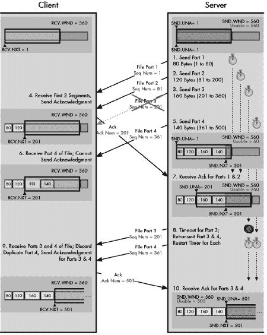

图 49-2. TCP 积极重传示例 此示例与图 49-1 中的示例相同，只是在这里，服务器正在采取一种“积极”的方法来重传丢失的段。当第 3 个段超时时，第 3 个段和第 4 个段都被重新传输，并且它们的重传定时器被重新启动。（在这种情况下，第 4 个段已经到达，所以这次额外的传输并没有用。）

### 小贴士

**关键概念** 在 TCP 中处理重传有两种方法。在更保守的方法中，只有定时器到期的段被重新传输。这可以节省带宽，但如果连续丢失多个段，可能会导致性能下降。另一种方法是，当一个段的重传定时器到期时，它和所有后续未确认的段都被重新传输。如果丢失多个段，这可以提供更好的性能，但可能会在不必要的情况下浪费带宽。

对非连续段缺乏了解是问题的核心。解决方案是在基本的 TCP 滑动窗口算法中增加一个可选功能，允许设备单独确认非连续段。这个功能在 RFC 1072 中引入，并在 RFC 2018 中完善，被称为 TCP *选择性确认*，简称 *SACK*。

## 更好的解决方案：选择性确认（SACK）

要使用 SACK，连接上的两个设备都必须支持该功能，并且必须通过在它们用来建立连接的 SYN 段中协商选择性确认允许（SACK-Permitted）选项来启用它。假设这样做，任何设备都可以在常规 TCP 段中包含一个选择性确认（SACK）选项。此选项包含一个已接收但尚未确认的数据段序列号范围列表，因为这些段是非连续的。

每个设备都会修改其重传队列，以便每个段包含一个标志，如果该段已被选择性确认——即 SACK 位，则该标志被设置为 1。设备随后使用图 49-2 选项，以标识已接收但尚未确认的非连续段。这可以节省原始发送者重新传输它们的需求。

例如，在我们的四个段的情况下，如果客户端收到了段 4 但没有收到段 3，当它发送一个带有确认号字段值为 201（用于段 1 和段 2）的段时，它可以包含一个 SACK 选项，指定“我已经收到了字节 361 到 500，但它们尚未被确认。”如果段 4 在段 1 和段 2 之后到达得很好，这也可以在第二个确认段中完成。服务器会识别这作为段 4 的字节范围，并打开段 4 的 SACK 位。当段 3 被重传时，服务器看到段 4 的 SACK 位已打开，因此不会重传它。这可以在图 49-3 中看到。

在段 3 重传后，段 4 的 SACK 位被清除。这是为了稳健性，以处理由于任何原因，客户端改变主意认为已收到段 4 的情况。客户端*应该*发送一个确认，其确认号为 501 或更高，正式表示已收到段 3 和段 4。如果这种情况没有发生，服务器必须接收到另一个针对段 4 的选择性确认，以将其 SACK 位重新打开。否则，它将在其定时器到期或段 3 被重新传输时自动重新发送。

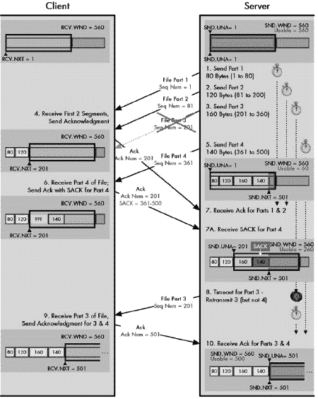

图 49-3. 使用选择性确认（SACK）的 TCP 重传 这是来自图图 49-1 和图 49-2 的示例，改为使用可选的选择性确认功能。在收到文件的 1、2 和 4 部分后，客户端为 1 和 2 发送确认，其中包含对部分 4 的 SACK。这告诉服务器在部分 3 的定时器到期时不要重新发送部分 4。

# TCP 自适应重传和重传定时器计算

每当发送一个 TCP 段时，它的一个副本也会放在重传队列中。当段被放入队列时，就会为该段启动一个重传计时器，它从一个特定的值开始并倒数到零。这个计时器控制了在发送者放弃、得出段已丢失的结论并再次发送它之前，一个段可以保持未确认的最长时间。

因此，我们用于重传计时器的时长非常重要。如果设置得太低，我们可能会开始重传一个实际上已经接收到的段，因为我们没有等待足够长的时间来等待该段的确认到达。相反，如果我们设置计时器太长，我们会浪费时间等待永远不会到达的确认，从而降低整体性能。

理想情况下，我们希望将重传计时器设置为略大于两个 TCP 设备之间**往返时间（RTT）**的值；也就是说，从客户端发送一个段到服务器，以及服务器将确认发送回客户端（或者当然相反）的典型时间。问题是，**并没有**这样一个典型的 RTT。有两个主要原因：

**连接距离的差异** 假设你在美国工作，在午餐时间，你使用 100 Mbps 快速以太网在你的工作站和本地服务器之间传输一个大型文件。同时，你从你姐姐的个人网站上下载你侄子的照片，该网站通过连接到秘鲁利马附近一个小镇的 ISP 的模拟调制解调器连接到互联网。你希望这两个 TCP 连接使用相同的重传计时器值吗？我当然希望不是！

**瞬态延迟和可变性** 由于互联网中的各种事件，任何两个设备之间发送数据所需的时间会随时间变化：流量波动、路由器负载等等。为了亲自看看这个例子，尝试从连接到互联网的 PC 的命令行中输入`ping www.tcpipguide.com`，你会看到报告的时间如何变化。

正是因为这些原因，TCP 不会尝试使用一个静态的单一数字作为其重传计时器的值。相反，TCP 使用一个动态的，或称**自适应**的重传方案。

## 基于 RTT 计算的自适应重传

TCP 试图确定设备之间的近似 RTT，并随着时间的推移进行调整，以补偿平均延迟的增加或减少。如何做到这一点的问题很重要，但在 TCP 的主要标准中并没有详细说明。然而，RFC 2988，“计算 TCP 的重传计时器”对此问题进行了广泛讨论。

RTT 可能会上下波动，因此我们希望为连接找到一个*平均*的 RTT 值。这个平均值应该对 RTT 的上下波动做出响应，而不会对几个非常慢或非常快的确认过度反应。为了实现这一点，RTT 的计算使用了一个*平滑*公式：

新 RTT = (α * 旧 RTT) + ((1-α) * 最新 RTT 测量值)

其中α（alpha）是介于 0 和 1 之间的*平滑因子*。α的值越高（越接近 1），平滑效果越好，可以避免由于一个非常快或非常慢的 RTT 测量结果而导致的突然变化。相反，这也减慢了 TCP 对 RTT 更持续变化的反应速度。α的值越低（越接近 0），RTT 对测量 RTT 的变化反应越快，但 RTT 波动剧烈时可能会引起过度反应。

## 确认模糊性

测量两个设备之间的 RTT 在概念上很简单：注意发送段的时刻，注意收到确认的时刻，然后相减。然而，在实际实现中，这个测量更为复杂。

主要的潜在“陷阱”之一发生在假设一个段丢失并重新传输时。重传的段没有任何可以将其与原始段区分开来的东西。当收到这个段的确认时，不清楚这是否对应于重传或原始段。尽管我们决定该段已丢失并重新传输，但该段最终可能经过很长时间才到达，或者该段快速到达但*确认*花费了很长时间！

这被称为*确认模糊性*，解决它并不简单。我们不能简单地决定假设一个确认总是与发送的段的最旧副本一起，因为这会使往返时间（RTT）看起来太高。我们也不想仅仅假设确认总是与段的最新发送一起，因为这可能会人为地降低平均 RTT。

## RTT 计算和卡尔算法的改进

TCP 的解决方案基于使用一种称为*卡尔算法*的技术，以发明者菲尔·卡尔的名字命名。这个算法的主要变化是将平均 RTT 的计算与用于重传段计时器的值的计算分开。

在卡尔算法下进行的第一个改变是不在计算连接的整体平均 RTT 时使用任何重传段的测量 RTT。这完全消除了确认模糊性问题。

然而，仅此并不能允许由于重传而增加的延迟影响平均 RTT。为此，我们需要第二个变化：为重传段引入*计时器退避*方案。我们首先根据当前的平均 RTT 为每个新传输的段设置重传计时器。当一个段被重传时，计时器不会被重置为最初传输时设置的相同值。它通过乘数（通常是 2）进行“退避”，或增加，以给重传更多的时间被接收。计时器会继续增加，直到重传成功，达到一定的最大值。这防止了重传发送得太快，从而进一步增加网络拥塞。

一旦重传成功，往返时间（RTT）将保持在较长的（退避的）值，直到可以在没有重传的情况下发送并确认的段上测量到一个有效的 RTT。这允许设备对偶尔导致连接上延迟持续一段时间的情况使用较长的计时器进行响应，而当正常条件恢复时，最终将 RTT 调整回长期平均值。

### 小贴士

**关键概念** TCP 使用一种*自适应*的重传方案，该方案根据设备之间发送段所需平均时间自动调整重传计时器的设置时间。这有助于避免太早或太晚重传可能丢失的段。

# TCP 窗口大小调整和流量控制

我们已经看到了*窗口大小*的概念对 TCP 滑动窗口机制的重要性。在客户端和服务器之间的连接中，客户端告诉服务器它愿意一次从服务器接收多少字节的数据；这是客户端的*接收窗口*，它成为服务器的*发送窗口*。同样，服务器告诉客户端它愿意一次从客户端接收多少字节的数据；这是服务器的*接收窗口*和客户端的*发送窗口*。

这些窗口的使用在第四十八章中得到了演示，我们讨论了 TCP 的基本数据传输和确认机制。然而，正如该章节中的示例简化了因为我没有展示丢失段的情况，还有另一种方式它并不反映实际互联网的真实情况：在通信过程中，发送和接收窗口的大小从未改变。

要理解窗口大小可能波动的原因，我们需要了解它代表什么。考虑窗口大小的最简单方式是，它表示设备特定连接的接收缓冲区的大小。也就是说，窗口大小表示设备在将数据传递给应用程序进程之前，一次可以从其对等方处理多少数据。让我们考虑第四十八章中的例子。我说服务器的窗口大小是 360。这意味着服务器一次愿意从客户端接收不超过 360 字节。

当服务器从客户端接收数据时，它将其放入此缓冲区。然后服务器必须对这份数据执行两个不同的操作：

**致谢** 服务器必须向客户端发送一个确认，以表明数据已被接收。

**传输** 服务器必须处理数据，将其传输到目标应用程序进程。

区分这两种活动至关重要。不幸的是，TCP 标准在这方面做得并不出色，这使得它们很难理解。关键点是，在基本的滑动窗口系统中，数据在接收时会被确认，但*不一定*立即从缓冲区中传输出来。这意味着缓冲区可能会以接收 TCP 无法清空的速度更快地填满接收到的数据。当这种情况发生时，接收设备可能需要调整窗口大小以防止缓冲区过载。

由于窗口大小可以用来以这种方式管理连接两端设备之间数据流动的速率，因此它是 TCP 实现*流量控制*的方法之一，这是传输层的经典任务。流量控制对 TCP 至关重要，因为它是设备相互通信状态的方法。通过减小或增加窗口大小，服务器和客户端都确保对方设备发送数据的速度与接收方处理数据的速度相匹配。

## 通过减小发送窗口大小来降低发送数据速率

要理解窗口大小调整，让我们回到我们之前的例子第四十八章，但做一些修改。首先，为了使事情简单，我们只需查看客户端向服务器发送的传输，而不是服务器的回复（除了确认）——这如图图 48-7 所示。与之前一样，客户端向服务器发送 140 字节。发送 140 字节后，客户端在其可用窗口中剩余 220 字节：发送窗口中的 360 字节减去它刚刚发送的 140 字节。

在某个时候之后，服务器接收到了 140 字节并将它们放入缓冲区。现在，在一个理想的世界里，140 字节进入缓冲区，它们被确认并立即从缓冲区中移除。另一种思考方式是，缓冲区是无限大小的，可以容纳客户端发送的所有数据。缓冲区的空闲空间保持 360 字节大小，因此可以再次向客户端宣传相同的窗口大小。这就是前一个示例中的简化。

只要服务器能够以与数据到达速度相同的速度处理数据，它就会保持窗口大小为 360 字节。客户端在收到 140 字节的确认和之前相同的窗口大小时，将整个 360 字节的窗口向右滑动 140 字节。由于现在没有未确认的字节，客户端现在可以再次发送 360 字节的数据。这些对应于之前在可用窗口中的 220 字节，加上刚刚确认的 140 个新字节。

然而，在现实世界中，该服务器可能正在处理数十、数百甚至数千个 TCP 连接。TCP 可能无法立即处理数据。或者，可能由于某种原因，应用程序本身可能还没有准备好处理 140 字节的数据。在任何情况下，服务器的 TCP 可能无法立即从缓冲区中移除所有 140 字节。如果是这样，当向客户端发送确认时，服务器将希望更改它向客户端宣传的窗口大小，以反映缓冲区部分已满的事实。

假设我们收到了 140 字节，但只能向应用程序发送 40 字节，留下 100 字节在缓冲区中。当我们发送 140 字节的确认时，服务器可以将发送窗口减少 100 字节，变为 260 字节。当客户端从服务器接收到这个段时，它将看到发送的 140 字节的确认，并将窗口向右滑动 140 字节。然而，在滑动这个窗口时，它将窗口大小减少到只有 260 字节。我们可以将这视为将窗口的*左边缘*向右滑动 140 字节，但*右边缘*只向右滑动 40 字节。新的、更小的窗口确保服务器从客户端接收的最大字节数为 260 字节，这将适合其接收缓冲区中剩余的 260 字节。这在上面的图 49-4 的第一次消息交换（步骤 1 至 3）中得到了说明。

图 49-4. TCP 窗口大小调整和流量控制 此图显示了三个消息周期，每个周期都会导致服务器减少其接收窗口。在第一个周期中，服务器将其从 360 字节减少到 260 字节，因此当客户端收到服务器的确认时，其可用窗口只能增加 40 字节。在第二个和第三个周期中，服务器通过接收到的数据量来减少窗口大小，这暂时冻结了客户端的发送窗口大小，阻止其发送新数据。

## 减少发送窗口大小以停止发送新数据

如果服务器如此繁忙以至于无法处理接收到的任何字节怎么办？假设客户端的下一个传输大小为 180 字节，但服务器如此繁忙以至于无法移除任何字节。

在这种情况下，服务器可以缓冲 180 字节，并在它发送的这些字节的确认中，将窗口大小减少相同的量：从 260 字节减少到 80 字节。当客户端收到 180 字节的确认时，它会看到窗口大小也减少了 180 字节。它会将窗口滑动相同的量，就像窗口大小减少一样！这实际上就像服务器说：“我确认收到了 180 字节，但不允许你发送任何新字节来替换它们。”另一种看待方式是，窗口的左边缘滑动 180 字节，而右边缘保持固定。只要窗口的右边缘不移动，客户端就不能发送比确认接收之前更多的数据。这是图 49-4 中的中间交换（步骤 4 到 6）图 49-4。

## 关闭发送窗口

这个窗口调整的过程可以继续，当然，这可以通过两个设备来完成，尽管我们在这里只考虑等式中的客户端发送到服务器的一侧。如果服务器从客户端接收数据的速度超过了它可以将数据泵送到应用程序的速度，它将继续减少其接收窗口的大小。

继续我们的例子，假设在发送窗口减少到 80 字节后，客户端发送了第三个请求，这次请求长度也是 80 字节，但服务器仍然很忙。然后服务器将窗口大小降低到 0，这被称为*关闭*窗口。这告诉客户端服务器非常繁忙，它应该完全停止常规的数据发送，如图 49-4 底部三分之一所示。稍后，当服务器负载减轻时，它可以再次增加此连接的窗口大小，允许传输更多数据。

### 小贴士

**关键概念** TCP 滑动窗口系统不仅用于通过确认和重传确保可靠性，它也是 TCP 流量控制机制的基础。通过增加或减少其接收窗口的大小，一个设备可以提高或降低其连接伙伴向其发送数据的速率。在设备变得极其繁忙的情况下，它甚至可以将接收窗口减少到零。这将关闭窗口并停止任何进一步的数据传输，直到窗口重新打开。

虽然从概念上讲很简单，但使用窗口大小调整进行流量控制可能会非常复杂。如果我们不仔细考虑如何更改窗口大小，我们可能会在 TCP 的操作中引入严重问题。还有一些特殊情况可能会发生，尤其是在窗口大小因设备变得繁忙而减小的情况下。接下来的两个部分将探讨窗口管理问题以及需要对这些基本滑动窗口系统进行哪些更改来解决这些问题。

# TCP 窗口管理问题

TCP 连接上的两个设备中的每一个都可以调整它向另一个设备广告的窗口大小，以控制通过连接的数据流。减小窗口大小迫使另一个设备发送更少的数据；增加窗口大小允许更多数据流动。在理论上，我们应该能够让每个设备上的 TCP 软件根据数据进入缓冲区和从缓冲区移除以发送到接收应用程序的速度来按需更改窗口大小。

不幸的是，窗口大小的某些变化可能会导致不希望的结果。这些情况不仅发生在窗口大小减小的时候，也发生在窗口大小增加的时候。因此，我们需要考虑与*窗口大小管理*相关的一些问题。正如前几节所做的那样，我们将使用之前在第四十八章中引入的相同的客户端/服务器示例进行说明。

## 缩小 TCP 窗口相关的问题

一个与窗口大小管理相关的问题是与设备在变得繁忙时如何快速减小其接收窗口大小。假设服务器从 360 字节的接收窗口开始，正如上述示例中所述，并接收了 140 字节的数据，它确认了这些数据，但无法立即从缓冲区中移除。服务器可以通过减小它向客户端广告的窗口大小来响应。在无法从缓冲区中移除任何字节的情况下，窗口大小会减少 140 字节，这是添加到缓冲区中的相同字节。这冻结了客户端发送窗口的右边缘，因此当它收到确认时，无法发送任何额外的数据。

如果服务器超载到实际上需要减小*缓冲区*本身的大小怎么办？比如说内存不足，操作系统说：“我知道你为这个连接分配了 360 字节的接收缓冲区，但我需要释放内存，所以现在你只有 240 字节。”服务器仍然不能立即处理它接收到的 140 字节，因此它需要将发送给客户端的窗口大小从 360 字节减少到 100 字节（总缓冲区 240 字节减去已接收的 140 字节）。

实际上，这样做实际上是将客户端发送窗口的右边缘*向左移动*。它说：“当你收到这个确认时，不仅不能发送更多数据，而且你现在发送的数据*更少*。”在 TCP 术语中，这被称为*缩小窗口*。

然而，这样做有一个非常严重的问题：当原始的 140 字节从客户端传输到服务器时，客户端仍然认为它有 360 字节的窗口大小，其中 220 字节是*可用的*（360 减去 140）。客户端很可能已经向服务器发送了那 220 字节数据中的一些，在它收到服务器缩小窗口的通知之前！如果是这样，并且服务器将缓冲区减少到 140 字节使用后 240 字节，当那 220 字节到达服务器时，只有 100 字节可以容纳，任何额外的字节都需要被丢弃。这将迫使客户端需要重新传输那些数据，这是低效的。图 49-5 直观地说明了这种情况会如何发展。

图 49-5. 缩小 TCP 窗口的问题 在对图 49-4,客户端的可用窗口大小从 360 字节开始。它发送了一个 140 字节的段，然后不久之后发送了一个 180 字节的段。然而，服务器很忙，当它收到第一次传输时，它决定将缓冲区减少到 240 字节。它保留了刚刚接收到的 140 字节，并将接收窗口一直减少到 100 字节。当客户端的 180 字节段到达时，服务器缓冲区中只有 100 字节的空间。当客户端收到新的窗口大小广告为 100 时，它将遇到问题，因为它已经发送了 180 字节但尚未得到确认。

## 减少缓冲区大小而不缩小窗口

为了防止与窗口缩小相关的问题发生，TCP 向基本的滑动窗口机制添加了一条简单规则：不允许设备缩小窗口。

注意，这里存在一个潜在的术语模糊性。在日常讨论中，*缩小*和*减少*这两个词有时被同义使用。正如我们所见，*减少*窗口大小并没有什么问题。*缩小*窗口的问题仅指我们减少窗口大小到与先前的窗口广告相矛盾，通过*收回*发送一定数量字节的权限。

另一种看待这个问题的方式是，*缩小*发生在服务器发送回的窗口大小广告小于客户端认为其当时可用窗口大小的时候。在这种情况下，服务器缩小了窗口，因为在它确认 140 字节的时候，它发送回的窗口大小为 100，这小于客户端当时的 220 字节可用窗口。

当然，可能会有需要减少缓冲区的情况，那么应该如何处理呢？与缩小窗口不同，服务器必须更加耐心。在上一节中的例子中，当缓冲区需要减少到 240 字节时，服务器必须发送一个窗口大小为 220 的字节，从而冻结客户端发送窗口的右边缘。客户端仍然可以填满 360 字节的缓冲区，但不能发送超过这个量。一旦从服务器的接收缓冲区中移除 120 字节，缓冲区就可以在不丢失数据的情况下减小到 240 字节。然后服务器可以恢复正常操作，随着从接收缓冲区中取走字节，增加窗口大小。

### 小贴士

**关键概念** 当一个设备将其接收窗口减小到足以使对方设备的可用发送窗口缩小（意味着其发送窗口的右边缘向左移动）的程度时，就会发生称为 *窗口缩小* 的现象。由于这可能导致正在传输的数据需要被丢弃，因此设备必须更逐渐地减小其接收窗口的大小。

## 处理关闭的窗口和发送探测段

另一个特殊的窗口管理问题是如何处理一个设备必须将发送窗口大小减小到零的情况。如前所述，这被称为 *关闭接收窗口*。由于服务器的接收窗口是客户端的发送窗口，将其大小减小到零意味着客户端无法发送任何数据。这种情况将持续到客户端从服务器接收到一个包含非零窗口字段的新的确认段，从而重新打开窗口。然后客户端能够再次发送数据。

这种情况的问题在于客户端必须依赖于从服务器接收“窗口打开”段。像所有 TCP 段一样，这个段是通过 IP 传输的，这是不可靠的。记住，TCP 之所以可靠，是因为它会确认发送的数据，并在必要时重新传输丢失的数据，但它永远不能 *保证* 任何特定的段能够到达目的地。这意味着当服务器尝试通过包含较大窗口字段的确认段重新打开窗口时，客户端可能永远不会收到这条消息。客户端可能会得出结论，发生了问题，并终止连接。

为了防止这种情况发生，客户端可以定期向服务器发送特殊的 *探测* 段。这些探测的目的在于促使服务器发送包含当前窗口大小的段。探测段可以包含零个或一个字节的数据，即使窗口关闭时也是如此。探测将定期发送，直到窗口重新打开，具体的实现决定了探测生成的速率。

### 小贴士

**关键概念** 将接收窗口减少到零的设备被称为*关闭*了窗口。另一个设备的发送窗口因此关闭；它可能不会发送常规数据段。然而，它可以发送探测段来检查窗口的状态，从而确保在窗口重新打开时不会错过通知。

当服务器决定重新打开关闭的窗口时，还有一个潜在的风险：将窗口打开得太小。一般来说，当接收窗口太小时，这会导致生成许多小段，大大降低 TCP 的整体效率。下一节将探讨这个众所周知的问题以及它是如何通过改变基本的滑动窗口机制来解决的。

# TCP 愚蠢窗口综合征

在第四十八章中描述 TCP 的最大段大小（MSS）参数时，我解释了确定 TCP 段最佳大小的权衡。如果段太大，我们可能会在 IP 层上使它们碎片化。如果它们太小，我们会因为在一个至少有 40 字节头开销的段中发送少量数据而大大降低性能。我们还消耗了处理这些小段所需的有价值的处理时间。

MSS 参数确保我们不会发送过大的段；TCP 不允许创建大于 MSS 的段。不幸的是，基本的滑动窗口机制并没有提供任何*最小*的段大小，可以传输。实际上，设备发送非常小、效率低下的段是*可能*的，而使用不受限制的窗口大小调整的最简单流量控制实现*确保*在重负载条件下，窗口大小会变得很小，从而导致性能显著下降！

## 愚蠢窗口综合征是如何发生的

为了了解*愚蠢窗口综合征（SWS）*是如何发生的，让我们考虑一个例子，这个例子是对本节中我们一直在使用的例子的一个变体。我们假设 MSS 是 360 字节，一个客户端/服务器对，其中服务器的初始接收窗口设置为这个相同的值，360。这意味着客户端可以向服务器发送一个完整大小的段。只要服务器能够以与客户端发送的速度一样快地从缓冲区中移除数据，我们就应该没有问题。（实际上，缓冲区的大小通常会比 MSS 大。）

现在，想象一下，如果服务器因为某种原因而变得繁忙，而客户端需要向它发送大量数据。为了简单起见，让我们假设服务器只能从缓冲区中移除每个接收到的 3 字节中的 1 字节数据。让我们还说，在下一个客户端段到达的时间内，它还从缓冲区中移除了额外的 40 字节。以下是会发生的事情：

1.  客户端的发送窗口是 360 字节，并且它有很多数据要发送。它立即向服务器发送一个 360 字节的段。这用完了它的整个发送窗口。

1.  当服务器收到这个段时，它会进行确认。然而，它只能删除 120 字节，因此服务器将窗口大小从 360 字节减少到 120 字节。它在确认的窗口字段中发送这个信息。

1.  客户端收到 360 字节的确认，并看到窗口大小已减少到 120 字节。它想尽快发送数据，因此发送了一个 120 字节的段。

1.  当 120 字节的段到达时，服务器已经从缓冲区中删除了 40 更多字节。因此，缓冲区包含 200 字节（第一个段中的 240 字节减去删除的 40 字节）。服务器能够立即处理这 120 字节中的三分之一，即 40 字节。这意味着向已经留在缓冲区中的 200 字节中添加了 80 字节，所以用掉了 280 字节。服务器必须将窗口大小减少到 80 字节。

1.  客户端将看到这个减少的窗口大小，并发送一个 80 字节的段。

1.  服务器最初有 280 字节，删除了 40 字节，所以剩下 240 字节。它从客户端接收 80 字节，并删除三分之一，因此向缓冲区中添加了 53 字节，缓冲区变为 293 字节。它将窗口大小减少到 67 字节（360 减去 293）。

这个过程，如图图 49-6,将会进行多轮，窗口大小会越来越小，尤其是如果服务器负载进一步增加。它清空缓冲区的速度可能会进一步降低，窗口甚至可能完全关闭。

假设这种情况发生。最终，服务器将从该缓冲区中删除一些数据。比如说，当客户端的第一个关闭窗口探测到达时，服务器已经删除了 40 字节。然后服务器将窗口重新打开到 40 字节的大小。客户端仍然急于尽可能快地发送数据，因此它生成一个 40 字节的段。就这样，很可能所有剩余的数据都以极小的段从客户端传递到服务器，直到客户端数据耗尽或服务器更快地清空缓冲区。

现在想象一下最坏的情况。这次，是服务器上的应用程序过程过载。它一次从缓冲区中提取一个字节的数据。每次它从服务器的缓冲区中移除一个字节，服务器的 TCP 就会打开一个窗口大小正好为 1 的窗口，并在对客户端的确认中将这个值放入窗口字段。然后客户端发送一个正好包含一个字节的数据段，直到应用程序提取出下一个字节，缓冲区再次被填满。

这一切并不代表滑动窗口机制的**失败**本身。它正在正常工作，以保持服务器的接收缓冲区充满并管理数据流。问题是滑动窗口机制只关注管理缓冲区。它没有考虑到当窗口大小以这种方式微管理时，产生的较小数据段的低效性。本质上，通过发送小窗口大小的广告，我们赢得了战斗但输掉了战争。

早期发现这一现象的 TCP/IP 研究人员将其称为**愚蠢窗口综合征（SWS**），这是对“滑动窗口系统”这一短语的戏谑，表达了他们对系统进入这种状态时行为的看法。

图 49-6. TCP 愚蠢窗口综合征（SWS）此图展示了 TCP 愚蠢窗口综合征这一现象的一个例子。客户端试图尽可能快地将数据发送到服务器，而服务器非常繁忙，无法及时清除其缓冲区。每当客户端发送数据时，服务器都会减小其接收窗口。客户端发送的消息大小会缩小，直到它只发送非常小、低效的数据段。注意，在此图中，我将服务器的缓冲区固定在位置，而不是像本章其他图中的那样向右滑动。这样，你可以更容易地看到接收窗口大小的减小。

讨论中的示例展示了 SWS 是如何由接收设备广告的小窗口大小引起的。如果发送设备在生成传输段时不够小心，即使接收方的缓冲区状态如何，也可能发生 SWS。例如，假设示例中的客户端 TCP 以每次 10 字节的数据块从发送应用程序接收数据。图 49-6 此图展示了 TCP silly window syndrome 这一现象的一个例子。客户端试图尽可能快地将数据发送到服务器，服务器非常繁忙，无法及时清除其缓冲区。每次客户端发送数据时，服务器都会减小其接收窗口。客户端发送的消息大小会缩小，直到它只发送非常小、效率低下的段。注意，在此图中，我将服务器的缓冲区固定在位置，而不是像本章其他图那样向右滑动。这样，你可以更容易地看到接收窗口大小的减小。")，然而，发送 TCP 如此急切地想要将数据发送到客户端，以至于它将每个 10 字节的数据块立即打包成一个段，即使下一个 10 字节的数据块很快就会到来。这会导致不必要的、效率低下的 10 字节段的蜂拥而至。

### Tip

**关键概念** 基本的 TCP 滑动窗口系统不对传输段设置最小大小。在特定情况下，这可能导致发送许多小、效率低下的段，而不是少量大段。亲切地称为 silly *window syndrome* (SWS)，这一现象可能是由于接收方广告的窗口大小太小或发送方过于积极立即发送非常小的数据量而引起的。

## Silly Window Syndrome Avoidance Algorithms

由于 SWS 是由基本的滑动窗口系统没有关注创建小段的决定的结果引起的，因此处理 SWS 在概念上是简单的：改变系统，使我们避免广告小窗口大小，同时，也避免发送小段。由于数据发送方和接收方都参与了 SWS，因此对两者的行为都进行了修改以避免 SWS。这些更改统称为*SWS 避免算法*。

### Receiver SWS Avoidance

让我们从接收方的 SWS 避免开始。正如我们在前面的例子中所看到的，接收方通过减小其接收窗口的大小到更小的值来对 SWS 做出了贡献。这导致发送方发送窗口的右边缘以越来越小的增量移动，从而产生越来越小的数据段。为了避免 SWS，我们简单地制定了一条规则，即接收方不得以这种方式更新其广告的接收窗口，以至于在发送方部分留下太少可用的窗口空间。换句话说，我们限制接收方通过过小的量移动窗口的右边缘。边缘可能移动的通常最小值是 MSS 参数的值或缓冲区大小的一半，取较小者。

让我们看看我们如何在图 49-6 中展示的例子中使用它。当服务器从客户端接收初始 360 字节的段并且只能处理 120 字节时，它不会将窗口大小减小到 120。它将窗口大小一直减小到零，关闭窗口。然后它将这个信息发送回客户端，客户端将停止发送小段。一旦服务器从缓冲区中移除 60 个字节，现在将有 180 个字节空闲，是缓冲区大小的一半。现在它将窗口大小增加到 180 字节，并将新的窗口大小发送给客户端。

它将继续只宣传 0 字节或 180 字节或更多字节，而不是介于两者之间的较小值。这似乎会减慢 TCP 的操作，但实际上并没有。因为服务器过载，连接整体性能的限制因素是服务器清除缓冲区的速率。我们只是在交换许多小段为几个大段。

### 发送方 SWS 避免和 Nagle 算法

发送方通过在传输 TCP 部分施加“限制”来避免 SWS。我们不是尽可能快地发送数据，而是等待直到我们有一个合理大小的数据段。完成此操作的具体方法被称为*Nagle 算法*，以发明者约翰·史密斯的名字命名。（开个玩笑，其实是约翰·Nagle。）简化地说，这个算法的工作原理如下：

+   只要连接上没有未确认的数据，一旦应用程序想要发送数据，就可以立即发送。例如，在像 Telnet 这样的交互式应用程序的情况下，单个按键可以推送到一个段中。

+   尽管存在未确认的数据，但所有后续要发送的数据都保留在传输缓冲区中，直到所有未确认的数据被确认，或者我们积累了足够的数据来发送一个完整大小的（MSS 大小的）段。即使用户请求了推送，这也适用。

这可能看起来很奇怪，尤其是关于即使有推送请求也要缓冲数据的那部分！你可能会认为这会导致像 Telnet 这样的应用程序崩溃。实际上，Nagle 算法是一种非常聪明的解决方案，它适合像 Telnet 这样的低数据速率交互式应用程序和高带宽文件传输应用程序的需求。

如果你使用的是像 Telnet 这样的东西，其中数据到达非常缓慢（与计算机相比，人类非常慢），初始数据（第一个按键）可以立即推送。下一个按键必须等待确认，但相对于按下下一个键所需的时间，这可能会相对较快。相比之下，生成大量数据的更传统应用程序将自动将数据积累成更大的段以提高效率。

Nagle 算法实际上比这个描述要复杂得多，但这一部分已经太长了。RFC 896 在（更多）细节中讨论了它。

### 小贴士

**关键概念** 现代 TCP 实现包含一套*SWS 避免算法*。在接收时，设备被编程为不宣传非常小的窗口，而是等待直到缓冲区中有足够的空间容纳一个合理大小的窗口。发送者使用*Nagle 算法*来确保在存在未确认的字节时不会生成小的段。

# TCP 拥塞处理和拥塞避免算法

通过改变设备向 TCP 连接上的对等方宣传的窗口大小，设备可以增加或减少其对等方发送给它的数据速率。这就是 TCP 滑动窗口系统如何在两个连接设备之间实现流量控制。我们已经在本章中看到了它是如何工作的，包括对基本机制所做的更改，以确保通过减少发送的小段数量来保持性能。

流量控制是调节设备间数据传输的重要部分，但在以下方面有限制：它只考虑连接中每个设备内部发生的事情，*而不是*它们之间设备发生的事情。实际上，这种“自我中心”是分层架构的典型症状。由于我们处理的是第 4 层中典型服务器和客户端之间 TCP 的工作方式，所以我们不担心数据如何在它们之间传输；这是第 3 层 IP 的工作。

## 拥塞考虑

在实践中，第三层发生的事情可能非常重要。从抽象的角度来看，我们的服务器和客户端可能直接使用 TCP 连接，但我们发送的所有段都通过它们之间的互联网和路由器传输。这些网络和路由器也在携带来自许多其他连接和高层协议的数据。如果互联网变得非常繁忙，我们连接端点之间传输段的速率将会降低，甚至可能会被丢弃。这被称为*拥塞*。

再次强调，在 TCP 层面，没有直接理解导致拥塞的原因或原因的方法。它只是被视为从一台设备向另一台设备传输数据时的低效，这需要某些段需要重传。然而，尽管 TCP 对互联网上发生的事情大多视而不见，但它*必须*足够聪明，以了解如何处理拥塞，而不是加剧它。

回想一下，每个传输的段都会放入重传队列，并设置一个重传定时器。现在，假设互联网上的拥塞急剧增加，并且没有机制来处理拥塞。段将被延迟或丢弃，这会导致它们超时并被重传。这将增加我们客户端和服务器之间互联网上的流量。此外，可能有数千个其他 TCP 连接以类似的方式行为。每个都会不断重传越来越多的段，进一步增加拥塞，形成一个恶性循环。整个互联网的性能将急剧下降，导致一种称为*拥塞崩溃*的状态。

消息很明确：TCP 不能仅仅忽略其连接端点之间互联网上发生的事情。为此，TCP 包含了几种特定的算法，这些算法旨在响应拥塞或从一开始就避免它。从某种意义上说，许多这些技术可以被认为是使 TCP 连接不那么自私的方法；也就是说，它试图考虑到它所操作的互联网上其他用户的存在。虽然单个连接本身无法解决整个互联网的拥塞，但所有设备共同实施这些措施可以减少由 TCP 引起的拥塞。

第一个问题是我们需要知道何时发生拥塞。根据定义，拥塞意味着中间设备——路由器——过载。路由器通过丢弃数据报来响应过载。当这些数据报包含 TCP 段时，这些段无法到达目的地，因此它们未被确认，最终会过期并被重传。这意味着当一个设备发送 TCP 段而没有收到它们的确认时，可以假设在大多数情况下，它们已被中间设备由于拥塞而丢弃。通过检测未确认发送的段的数量，TCP 设备可以推断出自身与 TCP 连接对端之间的网络拥塞程度。

## TCP 拥塞处理机制

在获取有关拥塞的信息之后，我们必须决定如何处理这些信息。主要的 TCP 标准 RFC 793 包含很少关于 TCP 拥塞处理问题的信息。这是因为基于这个标准的 TCP 早期版本没有包括拥塞处理措施。这些早期实现的问题导致发现拥塞是一个重要的问题。现代设备使用的措施是在多年中开发的，并最终在 RFC 2001 中记录下来，“TCP 慢启动、拥塞避免、快速重传和快速恢复算法”。

### 小贴士

**关键概念** TCP 流量控制是调节 TCP 设备之间流量流的一个基本部分，但它只考虑两个 TCP 端点的繁忙程度。同样重要的是要考虑任何 TCP 会话建立的网络的拥塞可能性，这可能导致通过丢弃段的不效率。为了处理拥塞并避免不必要地贡献拥塞，现代 TCP 实现包括一系列拥塞避免算法，这些算法改变了滑动窗口系统的正常操作，以确保更有效的整体操作。

RFC 2001 提到了四种算法：慢启动、拥塞避免、快速重传和快速恢复。在实践中，这些特性都是相互关联的。慢启动和拥塞避免是不同的算法，但它们使用单一机制实现，涉及定义一个*拥塞窗口*，该窗口限制传输的大小，其大小根据拥塞水平增加或减少。快速重传和快速恢复作为对实现慢启动和拥塞避免机制的更改来实现。

以下部分提供了这些算法工作原理的简化总结。我的目标仅仅是帮助您大致了解 TCP 中如何处理拥塞。

### 注意

拥塞处理是一个相当复杂的过程。如果您想了解更多，RFC 2001 包含了技术细节，展示了每个算法在每个设备中的实现方式。

### 慢启动

在 TCP 的原始实现中，一旦两个设备之间建立连接，它们就可以各自“尽情地”发送数据段，只要另一个设备的接收窗口还有空间。在一个繁忙的互联网中，大量新流量的突然出现可能会加剧现有的拥塞。为了缓解这种情况，现代 TCP 设备在最初发送数据段的速度上受到限制。

每个发送者在最初都限制只能发送等于一个完整数据段大小的数据量——即等于连接的 MSS 值。每次收到确认后，设备可以发送的数据量会增加另一个完整数据段的大小。因此，设备在发送数据量方面开始较慢，发送的数据量逐渐增加，直到达到完整的窗口大小或检测到链路上的拥塞。在后一种情况下，将使用下面描述的拥塞避免功能。

### 避免拥塞

当在 TCP 链路上检测到潜在的拥塞时，设备会通过降低发送数据段的速度来响应。使用一种特殊的算法，允许设备在发生拥塞时快速降低发送数据段的速度。然后，设备使用慢启动算法逐渐增加传输速率，以尝试在不发生拥塞的情况下最大化吞吐量。

### 快速重传

我们在查看 TCP 数据段重传时已经看到，当设备接收到非连续顺序的数据段时（即乱序），接收方只会确认连续接收到的那些。确认号字段将指定它期望接收的下一个字节的序列号。因此，在该节给出的示例中，数据段 1 和 2 被确认，而数据段 4 没有被确认，因为数据段 3 没有被接收。

当 TCP 设备接收到乱序数据段时，它可以简单地通过重复说明它正在等待特定的字节数来响应确认。因此，当示例中的客户端收到数据段 4 而不是数据段 3 时，它可以发送一个确认说：“我正在等待数据段 3 的第一个字节。”

现在，假设这种情况反复发生。服务器没有意识到数据段 3 已丢失，因此发送了数据段 5、6 等等。每次接收到数据段时，客户端都会发送一个确认，指定数据段 3 的第一个字节数。最终，服务器可以合理地得出结论，数据段 3 已丢失，即使其重传计时器尚未到期。

快速重传功能规定，如果收到三个或更多这样的确认，都表示“我想要从字节 *N* 开始的段”，那么很可能从字节 *N* 开始的段已经丢失，通常是因为它由于拥塞而被丢弃。在这种情况下，设备将立即重传丢失的段，而不经过正常的重传队列过程。这通过消除会暂停链路上有效数据流的延迟来提高性能。

### 快速恢复

当使用快速重传来重发丢失的段时，使用该功能的设备执行拥塞避免，但不会使用慢启动来再次增加传输速率。这样做的原因是，由于发送方收到了多个确认，所有这些确认都表示收到了乱序的段，这表明两个设备之间的段流中已经移除了几个段。出于效率的考虑，因此，传输速率可以比其他方式发生拥塞时更快地增加。这比在快速重传后使用常规的拥塞避免算法提高了性能。
