# 第三部分-1. 命名系统与 TCP/IP 命名注册及名称解析

TCP/IP 应用层协议

OSI 参考模型用于描述网络协议和技术的架构，并展示它们如何相互关联。在第五章（第五章

第五十一章

第五十二章

第五十三章

第五十四章

第五十五章

第五十六章

第五十七章

人类和计算机在几十年前开始相互打交道。总的来说，人类（和女性！）与机器的关系相当不错，这反映在计算机曾经只是技术人员的领域，而现在已经成为*主流*的事实上。然而，有些领域人类和计算机根本无法达成共识。其中之一就是我们处理信息的方式。

计算机最适合处理数字，而大多数人更喜欢不处理数字。这种根本性的差异给网络技术的设计者带来了问题。从技术角度来看，使用简单的数字标识符设计网络和互联网的寻址方案是合理的，因为这样可以简化并提高效率。不幸的是，使用数字地址来识别计算机对人类来说很麻烦，随着网络设备数量的增加，这种情况变得更加麻烦。为了解决这个问题，技术人员开始努力工作，并为网络发明了*名称系统*。这些机制允许计算机继续使用简单、高效的数字地址，同时让人类指定名称来识别网络设备。

本部分包括八个章节，解释了网络名称系统背后的理论和实践。第一章描述了名称系统的动机以及它们工作背后的重要概念和技术。第二章介绍了 TCP/IP 上的名称系统，并对简单的主机表名称系统进行了简要描述。

剩余章节详细介绍了非常重要的域名系统（DNS）。第三章提供了 DNS 的概述，包括对其特性和组件的描述。第四章讨论了 DNS 命名空间和架构，第五章涵盖了 DNS 名称注册过程，包括分层权限和管理。第六章描述了 DNS 名称服务器以及它们在解析调用时如何表示、管理和提供数据。第七章描述了 DNS 客户端，称为*解析器*，它们如何启动解析以及解析过程中涉及的步骤。最后，第八章通过查看这些单元之间的消息交换，并描述消息、资源记录和 DNS 主文件的格式，将有关名称服务器和解析器的信息联系起来。本章还简要介绍了对 DNS 所做的更改，以支持互联网协议（IPv6）的新版本及其更长的地址。

注意，尽管缩写*DNS*通常代表*域名系统*，但你有时也会看到*S*代表其他单词，特别是*服务*或*服务器*。此外，一些文档将这个名称系统称为*the DNS*。大多数人只是说*DNS*，不带定冠词，这也是我在这里遵循的惯例。

一组相关的 TCP/IP 实用工具，称为*nslookup、host*和*dig*，可以被管理员用来查询 DNS 名称服务器以获取信息。它们用于各种目的，包括手动确定主机的 IP 地址、检查为 DNS 名称维护的特定资源记录，以及验证名称解析功能。你可以在第三部分-10 中找到更多关于这些实用工具的信息。

# 第五十章 名称系统问题、概念和技术


可以将名称系统视为网络协议栈的使节。正如政治使节擅长使用多种语言并确保那些可能以不同方式看待世界的人之间良好沟通一样，名称系统弥合了计算机喜欢使用的数字地址和人类更偏好的简单名称之间的鸿沟。

在查看具体的名称系统之前，讨论它们的一般性是有意义的。这将帮助你理解为什么这些系统很重要，以及所有名称系统（无论其具体实现如何）背后的概念。

我以对名称系统的概述和讨论其为何被创造开始本章。然后，我讨论名称系统的三个主要功能：名称空间、名称注册和名称解析。接着，我扩展了这个功能概述，说明了名称空间和架构是如何工作的，名称注册和管理背后的问题，以及最后，名称解析技术和解析过程中的实际问题。

本章介绍了名称系统，但不讨论具体的名称系统。我喜欢用例子来解释概念，为此，有时会提到 TCP/IP 域名系统（DNS）。然而，你不需要熟悉 DNS 就能理解本章内容。

# 名称系统概述

人类与计算机之间几个重要差异之一是我们处理信息的方式。计算机处理数字，而很少有人喜欢这样做。当我们观察标识符或地址如何分配给网络设备时，这种区别变得尤为重要。

## 用于寻址的符号名称

对于计算机来说，给网络上的每个设备分配一个数字并使用这些数字来移动信息没有任何问题。如果你的电脑被分配了一个像 341,481,178,295 这样的数字，并且你网络上的所有其他机器也是如此，那么你的电脑会非常高兴。你可以发出这样的命令：“将这个文件发送到机器 56,712,489,901。”然而，大多数人不想以这种方式使用网络。这些长而神秘的数字对他们来说没有任何意义。他们希望告诉他们的机器：“将这个文件发送到乔的电脑上，”或者“在销售部门的彩色激光打印机上打印这个文件，”或者“检查 CNN 网站上最新的头条新闻。”

这种差异导致了名称系统的开发。这些技术允许网络上的计算机同时拥有一个传统的数字地址和一个更用户友好、人类可读的名称，由字母、数字和其他特殊符号组成。有时被称为“符号名称”，这可以作为设备寻址的替代形式。名称系统负责管理此系统的必要功能，包括确保名称唯一性、从名称到数字的转换以及管理名称和数字列表。

## 悖论：名称系统既是必需的又是非必需的

名称系统有趣的地方在于，它们对网络来说极其重要，但与此同时，它们对于网络的运行往往并不是严格必要的。这种看似矛盾的悖论再次源于人类与计算机之间的差异。计算机只需要数字寻址方案，而不需要分配给它们的名称。因此，没有名称系统，计算机和网络仍然可以工作，但人们使用它们会变得非常困难！

这种情况的例子最容易被看到，当一个问题使提供互联网命名服务的 DNS 的一部分无法运行时。技术上讲，使用互联网的大部分内容并不需要 DNS，因为所有通信都使用 IP 地址。这意味着尽管你通常可以通过[www.cnn.com](http://www.cnn.com)访问 CNN 的网站，但你也可以只使用 IP 地址 64.236.16.20。

问题在于，在阅读这篇文章之前，你可能不知道 CNN 网站的 IP 地址，对其他使用该网站的几乎每个人来说也是如此。此外，你可能还想检查的不仅仅是 CNN 网站，可能是 1、2 或 20 个其他新闻网站。记住互联网上成千上万个不同网站中的数字对即使是少数人来说也是困难的，所以每次你想访问资源时，你都需要手动查找其地址，如图图 50-1 所示。


图 50-1. 无命名系统时的互联网访问 当没有命名系统时，用户必须知道他们想要在互联网上访问的任何设备的地址。由于我们大多数人的数字记忆有限，这意味着每次访问之前都必须进行低效、繁琐的手动地址查找。

相比之下，记住资源的名称要容易得多。有了命名系统，你只需输入设备的名称，命名系统就会将其转换为地址，如图图 50-2 所示。这就是为什么即使网络技术本身不需要，命名系统仍然如此重要的原因。事实上，对像 DNS 这样的命名系统的依赖如此之大，以至于许多人甚至没有意识到他们可以在他们的网络浏览器中输入 IP 地址！

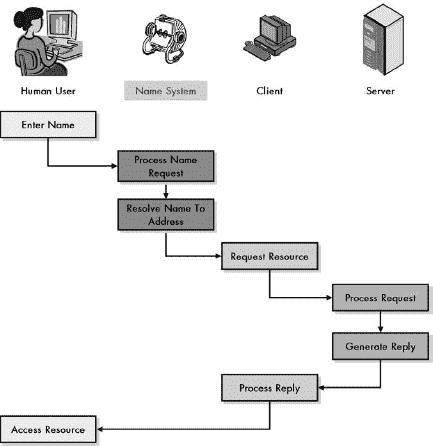

图 50-2. 使用命名系统的互联网访问

当一个互联网配备了一个命名系统时，用户不再需要知道设备的地址来访问它。他或她输入名称，命名系统会自动将其转换为地址，就像一个计算机化的旋转索引卡，如下所示。然后命名系统将地址传递给客户端软件，该软件使用该地址来访问请求的资源，就像用户直接输入它一样。

## 决定命名系统必要性的因素

更普遍地说，命名系统的重要性在很大程度上取决于它所使用的网络的特征。以下是在确定命名系统需求时需要考虑的三个主要问题：

**网络规模** 在一个非常小的网络和只有几台计算机的情况下，让人类用户记住这些机器的数字地址至少是可行的，如果不是理想的话。例如，一个有两三台机器的小型家庭网络在理论上并不真的*需要*一个命名系统。然而，如果你有成千上万或数百万的设备，命名系统就变得至关重要了。

**地址大小和复杂性** 数字地址方案越复杂，或使用的数字越大，人类记住这些数字就越困难。这使得对于这些地址的用户来说，拥有一个命名系统变得尤为重要。

**用户基础规模和技能** 在网络早期，只有少数技术精湛且受过良好训练的工程师使用它们，这些人有时只是记住了他们每天使用的机器的数字。在拥有成千上万或数百万普通用户的现代网络中，期望普通人记住设备号码是不合理的。

### 小贴士

**关键概念** 网络命名系统之所以重要，是因为它们允许设备被分配有效的数字地址，同时仍然允许人类使用更容易记住的名称来访问它们。随着网络规模、地址或用户基础的增大，命名系统变得更加重要。当用户基础在技能或经验方面有限时，它们也变得更加必要。

观察这些问题，我们可以看到，当今网络的趋势都是朝着增加命名系统重要性的方向发展。我们的网络，无论是私有的还是公共的，都在不断增长，使用它们的人数也在增加，包括更多没有技术背景的人。我们也在从小的地址转向更大的地址。最好的例子是即将到来的 IP 变化。虽然 DNS 对于 IPv4 中使用的 32 位地址很重要，但它对于处理 IPv6 的巨大 128 位地址来说甚至*更重要*（见第二部分-4")）。

## 基本命名系统功能：命名空间、名称注册和名称解析

虽然数字地址和符号名称之间的差异对网络设备的用户来说非常显著，但重要的是要记住，数字和名称实际上都服务于相同的基本目的：*设备识别*。即使我们使用名称系统使设备更容易访问，计算机本身仍然通常需要使用底层的数字标识符。本质上，每个设备最终都会拥有（至少）两个标识符：一个数字 *和一个名称*。

设备最终拥有多个标识符的事实使得人们和他们的机器可以使用他们偏好的识别方法。然而，这意味着必须有一种管理名称分配和它们之间转换的方法。名称系统不仅涉及在计算机上贴上名称，而必须是一个完整的 *系统*，允许人类使用名称，而设备继续使用数字标识符。

在最高层次上，名称系统必须处理三个基本功能：

**命名空间定义** 命名系统为它运行的联网系统定义了一个 *命名空间*。命名空间，有时也称为 *命名架构*，描述了命名结构和使用规则。它还定义了单个设备名称与系统中其他设备名称之间的关系，以及如何确保没有无效的名称会导致整个系统出现问题。

**名称注册** 为了实现名称系统，必须为网络上的每个设备分配一个名称。像任何寻址系统一样，除非系统中的每个名称都是唯一的，否则名称系统无法正常工作。我们需要某种方式来管理名称的分配，以便结果是有意义的。将特定名称与特定设备链接的过程通常称为 *名称注册*。

**名称解析** 尽管人类喜欢符号名称，但计算机通常对它们用处不大。有必要定义一种机制，通过该机制可以将设备的符号名称转换为它的数字地址。这个过程通常称为 *名称解析*。

命名空间更多的是一种描述性功能，它定义了系统中的命名是如何工作的。名称注册和解析是更主动的功能，每个名称系统都包括一个或多个特定程序，用于执行这些任务。在某种程度上，名称注册和解析是相互补充的，因此某些注册技术通常与特定的解析方法相关联。反过来，可能的注册和解析方法的类型取决于命名空间，特别是其架构。这些关系以简化的形式在图 50-3 中展示。


图 50-3. 命名系统功能

此图显示了名称系统三个主要功能之间的关系。名称空间定义了名称系统的结构和创建名称的规则。名称空间用作名称注册方法的依据，该方法定义了名称和地址之间的映射。当用户想要通过名称访问设备时，使用名称解析方法来咨询名称空间，确定与名称关联的地址，然后将名称转换为地址。注册和解析的过程可能非常简单，也可能相当复杂，这取决于所使用的名称系统类型。简单的名称系统在操作上主要手动进行，易于理解，最适合用于较小的网络。较大的、更复杂的网络和互联网需要更复杂的注册和解析方法，这些方法涉及较少的管理员干预，并且随着网络中新机器的增加而更好地扩展。

虽然名称注册和名称解析在最高级别上作为功能工作，但它们可能更好地被视为功能的集合。名称注册必然与名称系统管理和维护等问题相关联，而理解解析需要我们查看效率性和可靠性领域的一些重要实现问题。本章的其余部分通过更详细地考虑这三个功能中的每一个来扩展这个概述。

### 提示

**关键概念** 名称系统由三个理论上的高级功能组成：名称空间，它描述了名称的创建和组织方式；名称注册技术，它用于建立名称和地址之间的关系；以及名称解析方法，它负责将名称转换为地址。

# 名称空间和名称架构

名称系统的核心思想是提供一种使用符号名称识别设备的方法。像任何识别机制一样，在可以使用之前，我们必须定义识别将如何执行的方式。数字寻址方案（如 IP 地址）有关于地址创建的规则，并将地址分配给每个设备，这些地址来自它们的地址空间。以类似的方式，名称系统中的设备从系统的名称空间中获得名称。

## 名称空间功能

在名称系统的三个主要组成部分中，名称空间是最抽象的。它也是系统最基本的部分，因为它实际上描述了名称是如何创建的。名称空间在名称系统中定义了几个方面：

**名称大小和最大名称数量** 名称空间指定了组成名称的字符（符号）数量。它还定义了系统中可以出现的最大名称数量。

**名称规则和语法** 名称空间指定了在名称中允许使用的字符和符号。这用于允许为所有设备选择合法的名称，同时避免非法名称。

**命名架构和语义** 每个命名空间使用特定的架构或结构，这描述了名称是如何构建和解释的。

名称大小和名称语法的概念相对简单。名称架构可能是名称系统最重要的区分特征。因此，命名空间有时甚至被称为名称架构。名称空间的架构决定了名称是否被分配和使用为简单的无结构符号集，或者具有更复杂的内部结构。在后一种情况下，名称空间还必须定义特定名称的元素之间是如何相互关联的。

理论上，可能存在许多不同的命名架构。在实践中，大多数可以分为两类：平面和层次。

## 平面命名架构（平面命名空间）

在平面命名架构中，名称被分配为一系列符号，这些符号被解释为一个单一的、整体的标签，没有任何内部结构。任何名称与其他名称之间没有明确的关系。

这种架构的一个例子是，计算机被分配无结构的名称，如工程工作站 1 或乔安妮的 PC，如图 50-4 中的示例所示。

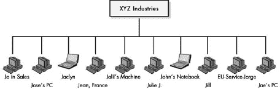

图 50-4. 平面命名架构（平面命名空间）此图展示了平面命名架构的一个示例。没有结构来组织名称或规定它们必须如何构建。逻辑上，每个设备都是其他每个设备的对等体。

## 层次命名架构（结构化命名空间）

在层次命名架构或结构化命名空间中，名称是一系列符号，但这些符号使用特定的和清晰的架构进行分配。每个名称由相互关联的离散元素组成，通常通过使用层次父子语义。在许多不同环境中，有许多使用这种类型层次结构的命名架构。例如，考虑一个大公司如何设置组织结构图并命名组织中的高管和官员。一个假设的层次命名架构示例如图图 50-5 所示。

分层名称空间最著名的现实世界例子是 DNS（名称空间）的名称空间（见第五十三章)，它使用由点（或*点*）分隔的文本标签来形成内部结构。系统中的所有名称都组织成一个结构，并且可以通过查看其名称来确定特定设备在结构中的位置。例如，[www.tcpipguide.com](http://www.tcpipguide.com)指的是*TCP/IP 指南*的万维网服务器，该服务器位于商业公司（.com）的伞下。


图 50-5. 分层名称架构（结构化名称空间）

此图包含与图 50-4,相同的设备，但它们是使用分层、结构化的名称架构排列的。在这种情况下，组织选择首先按设施位置来结构化其设备名称，然后按部门。每个名称都以类似 USA-Service-或 EU-Mfg-的某种东西开头。这通过提供对设备命名的本地控制而无需担心冲突，带来了直接的好处。如果有人名叫 John 被雇佣到美国销售团队，他的机器可以被命名为 USA-Sales-John，而不会与欧洲销售团队（EU-Sales-John）拥有的 John 的机器发生冲突。这种结构还使得立即知道设备在组织中的位置变得更加容易。

## 比较名称架构

正如您将在本章接下来的两个部分中看到的那样，名称空间的架构与名称的注册和管理方式密切相关，最终与它们的解析方式密切相关。平面名称空间需要一个某种形式的中央权威来为系统中的所有设备分配名称以确保唯一性。分层名称架构非常适合更分散的注册方案，允许许多权威机构共同参与注册和管理过程。

所有这些都意味着这些架构的优缺点并不是一个很大的谜团。平面名称空间具有简单性和创建简短且易于记忆的名称的能力，如图 50-4 所示。然而，由于确保每个名称都是唯一的困难，它们在包含数百或数千台机器的名称系统中扩展性不好。例如，如果有四个人都叫约翰，他们都试图将他们的电脑命名为约翰的 PC，会发生什么？另一个问题是集中管理这些名称所需的开销。

相比之下，分层名称空间更复杂、更灵活，因为它们允许使用逻辑结构来分配名称。我们可以使用反映我们组织结构的分层结构来命名我们的机器，例如，并授权组织的不同部分管理名称空间的一部分。只要每个部门都有独特的名称，并且这个独特的部门名称是每个机器名称的一部分，我们就不必担心在整个组织中分配的每个名称都是唯一的；它只需要在部门内部是唯一的。因此，我们可以有四台不同的机器，它们的名称由部门名称和约翰组成，如图 50-5 所示。这种灵活性的代价是需要更长的名称和在名称注册和解析中更多的复杂性。

### 小贴士

**关键概念** 最常见的两种名称架构类型是平面名称空间和分层名称空间。平面名称空间中的名称都是对等的，没有关系。在分层架构中，使用多级结构以特定方式组织名称。平面系统更简单，对于小型网络来说是令人满意的。分层名称空间更灵活、更强大，更适合大型网络和互联网。

# 名称注册方法、管理和权限

显然，为了实施我们的名称系统，我们需要一种方法来为将使用该系统的每个设备分配名称。正如名称系统有一个与寻址系统的地址空间相当的名字空间，它也必须实施一套规则和程序来分配名称，类似于寻址系统分配地址的方式。这被称为*名称注册*。

## 名称注册功能

通常，名称注册包括以下四个概念和任务：

**名称分配和唯一性保证** 名称注册过程的核心任务是给设备分配名称。像所有识别方案一样，名称注册的一个关键要求是确保每个名称都是唯一的。重复的名称会导致歧义，并使得一致的名称解析变得不可能。

**中央注册权威机构指定** 确保名称的唯一性需要有人负责名称分配过程。这个**中央注册权威机构**可能是一个维护包含名称的文件的单一个人，或者是一个负责整个名称注册过程的组织。该机构还负责解决注册过程中可能出现的任何问题和冲突。

**注册权威机构委派** 在较小的名称系统中，中央注册权威机构可能负责所有设备的实际注册过程。在较大、分层的名称系统中，集中处理这一过程是不切实际的。相反，中央注册权威机构将名称空间划分，并将注册不同部分名称的权力委派给下属组织。这需要制定并实施委派政策。

**分层结构定义** 当使用分层名称空间时，中央权威机构负责定义结构的外观。这反过来又决定了如何在层次结构的各个部分注册名称，当然，这也影响了权力的委派。

名称注册过程的复杂性在很大程度上取决于整个名称系统的大小和复杂性，特别是名称空间的架构。在简单使用平面名称空间的名称系统中，注册通常通过单一权威机构完成。没有结构，通常也没有权力委派，因此注册过程相对简单。对于分层名称系统，名称注册与用于名称的层次结构紧密相关。

## 分层名称注册

中央权威机构定义了层次结构的结构，并决定如何将层次结构划分为可以由其他权威机构独立管理的子集。这些权威机构反过来也可能将它们名称空间的部分子集委派出去，从而创建一个灵活且可扩展的系统。

能够委派名称注册的权限是层次结构名称空间最强大的好处之一。例如，在 DNS 中，中央权威机构负责整个名称注册。这个中央权威机构负责决定哪些顶级域名——例如.com、.edu、.info 和.uk——被允许存在。管理全球层次结构中这些子集的权限随后被委派给其他组织。这些组织根据自身情况继续划分层次结构的过程。最终，每个组织都能够独立决定如何为其内部系统命名；例如，IBM 可以在 ibm.com 名称下以任何它认为合适的方式注册名称。

## 名称注册方法

实际注册过程通常有几种常见方法。这些包括表名注册、广播名称注册和数据库注册。每种方法都有其优势和劣势，再次强调，有些更适合扁平名称空间，而有些则更适合层次结构名称空间。

## 表名注册

使用表名注册，名称分配由管理员在表中维护。当需要添加、删除或更改名称时，表格会被编辑。

这种技术通常与小型、扁平名称空间名称系统相关联。它具有与扁平架构相同的优点和缺点：简单且易于实现，但扩展性不佳，不适合较大的系统。对于十几台机器，有人编辑名称注册表是可行的；但对于成千上万的机器来说，则不可行。它也不利于存在多个权威机构的层次结构系统，因为表格需要保存在一个地方。

在较大的互联网中，表格可能被用作其他更复杂注册技术的一种辅助手段。

## 广播名称注册

广播名称注册是一种试错技术。一个想要使用特定名称的设备会向网络上的所有其他设备发送消息，询问是否有人已经在使用它。如果是这样，它会选择一个不同的名称。如果不是，该名称就被认为是已注册的，然后可以开始使用。

这种技术比使用表格更复杂，但它仍然限于在相对较小的系统中使用。尝试向成千上万的系统广播是不切实际的，并且这种方法不能在互联网上使用，因为在互联网中无法向每个网络设备广播。

## 数据库注册

使用数据库注册，维护一个名称分配的数据库。要注册一个名称，必须向数据库提交请求以添加名称分配。如果名称系统的权限完全集中，则数据库将集中并由该权限机构维护。如果层次结构的一部分权限被委派，则使用*分布式数据库*进行注册，每个权限机构维护描述其层次结构部分的数据库部分。

这是最复杂的技巧，通常与像 DNS 这样的分层名称系统相关联。它具有几个优点，包括灵活性、可靠性和维护工作的分布。其主要缺点是复杂性。

### 提示

**关键概念** *名称注册*是将名称与名称系统中的地址链接起来的过程。它包括中央注册机构授权和委派以及名称空间结构管理等活动。最常见的名称注册方法，按能力递增和复杂性递增的顺序排列，是手动表维护、广播注册和数据库注册。

# 名称解析技术和元素

正如我们在本章前面讨论的那样，使用名称系统为计算机创建了两个并行识别系统：机器使用的数字和人们使用的名称。名称系统的任务是整合这两个方案。名称注册允许人类指定哪些机器使用哪些名称。然而，这只是一个过程的一半；我们还需要一种方法，让机器能够将人类给它们的名称翻译成它们实际用于通信的数字地址。这被称为*名称解析*。

名称解析，有时也称为*名称翻译、映射*或*绑定*，是名称系统最知名的部分，因为它是在这里发生名称系统大部分“重活”的地方。名称空间通常只设置一次，名称注册很少发生——仅在必须创建或更改名称时发生。相比之下，名称系统的每个用户每天都会指示他们使用的机器执行名称解析，数百次甚至数千次。

## 名称解析方法

可以使用几种不同的技术进行名称解析。此功能的实现方式在很大程度上取决于其他两个名称系统功能：名称空间和名称注册。正如你可能想象的那样，具有简单名称注册方法的简单名称系统通常会使用简单的解析方法。具有分布式数据库的复杂分层系统在名称解析方面需要更多的复杂性。有三种常见的名称解析方法：表名称解析、广播名称解析和客户端/服务器名称解析。

## 基于表的名称解析

当需要执行解析时，设备会咨询用于基于表的名称注册的表。该表告诉设备如何将需要联系的主机的名称转换成地址。

这种技术显然对应于表名称注册。这是三种方法中最简单且功能最弱的一种。表名称解析仅适用于非常小的名称系统中的独立使用，但它也可以作为其他方法的补充。

## 广播名称解析

当设备需要解析一个名称时，它会广播一个查询，内容如下：“我需要发送到名为 *X* 的设备。它是谁？”名为 *X* 的设备回应：“我是 *X*，我的数字地址是 *N*。”

这是广播名称注册的补充。它也只能在简单系统中使用，在这些系统中每个设备都能听到广播。使用广播也会造成网络带宽的浪费。

## 客户端/服务器名称解析

在客户端/服务器名称解析中，服务器被编程为能够响应客户端发送的名称解析请求。这些服务器在请求中查找相关的数字标识符，并在响应中将其发送回去。

这种技术通常与数据库名称注册结合使用。这是最复杂的名称解析方法，但也是最有效率的，也是唯一能够在大型、分布式分层名称系统上真正正常工作的方法。

## 客户端/服务器名称解析功能元素

客户端/服务器名称解析是大多数大型、现代名称系统使用的方法。客户端/服务器请求/回复解析方法与许多其他协议的功能相似。然而，名称解析的一个独特之处在于，名称解析通常不是由客户端直接调用的。例如，用户很少会说“请解析以下名称。”我们当然也不希望用户每次想要联系设备时都需要手动将名称解析为地址，因为这会很麻烦。

相反，系统通过软件自动接受用户输入的机器名称。软件通过将其传递给 *名称解析器* 软件组件来解析名称。解析器在名称解析过程中充当客户端。它联系 *名称服务器*，该服务器响应请求。名称解析器和名称服务器构成了名称解析中的两个主要功能元素。

### 小贴士

**关键概念**名称解析可以说是名称系统的主要功能元素中最重要的，因为它是将名称转换为地址的系统部分。名称解析的两个主要组件是**名称解析器**，它在解析过程中充当客户端，以及**名称服务器**。三种主要的名称解析方法——基于表格、广播和客户端/服务器——与名称注册的表格、广播和数据库方法紧密对应。

在用于分层名称系统的分布式数据库中，可能需要多个请求，因为名称服务器只会包含某些机器的信息，而不是所有机器。解析器遵循一个特殊程序来遍历层次结构，直到找到包含所需信息的服务器。再次强调，DNS 的名称解析是这种方法的最佳例子。

# 效率、可靠性及其他名称解析考虑因素

如前所述，名称解析的主要功能是允许人类使用名称来识别设备，然后将这些名称转换为数字，以便计算机可以使用这些数字。这个基本任务在概念上相当简单，但在实现上可能会变得相当复杂。原因是名称解析与其他名称系统执行的任务如此不同的关键特性：它执行的频率。

名称注册很少进行，但名称解析非常频繁。如果你考虑一个有数千用户运行各种应用程序的大型互联网，每天必须解析数百万个名称。现在，考虑像互联网这样的系统，它每天必须处理数十亿客户端/服务器请求和回复！确保这些系统能够正常工作，我们需要做的不仅仅是实现一个解析过程；我们必须添加确保解析尽可能有效进行的设施。

## 效率考虑

名称解析的第一个主要问题是**效率**。名称解析会消耗系统资源，尤其是在需要发送请求和回复的解析技术中。这意味着我们希望尽可能减少解析的次数。现在，考虑许多人会频繁地重复访问相同的机器。例如，如果你第一次访问名为[www.thisisasite.com](http://www.thisisasite.com)的网站，你的系统将需要解析该名称。在该网站的首页加载后，如果你点击该网站上的另一个页面链接，该页面也将以相同的名称找到：[www.thisisasite.com](http://www.thisisasite.com)。因此，如果需要再次解析该名称将是浪费的。

为了避免这种情况，名称系统几乎总是包括某种形式的**缓存**能力，这允许设备记住最近的名字解析，并在一段时间内保留从名称到地址的映射。每当需要解析一个名称时，都会首先检查缓存，然后再通过正式的解析过程。缓存的使用消除了绝大多数实际名称解析请求，否则这些请求是必需的。

缓存的缺点是它需要一些自己的系统资源，并且会增加系统的复杂性。一个问题是决定在缓存中保留数据的时间长度。如果我们保留得太短，就会产生额外的、不必要的解析请求。如果我们保留得太长，如果机器的名称分配发生变化，映射可能会变得过时。这些都是一个复杂的名称系统必须处理的问题。一个典型的解决方案是允许每个名称注册指定有关该名称到地址链接的信息可以缓存多长时间。

## 可靠性考虑

在效率之后的主要关注点是名称解析的**可靠性**。正如我在本章前面所说的，对于计算机来说，拥有一个名称系统并不是严格必要的，但对于用户来说，尤其是在像互联网这样的大型网络中，它非常重要。

虽然有一个单一的中心位置维护关于名称系统的所有信息可能会使管理变得简单，但它创建了一个危险的单点故障。如果存储信息的设备发生任何问题，整个名称系统都会失败。现代名称系统采用冗余来防止整个系统依赖于任何特定设备进行解析。在客户端/服务器系统中，一个典型的方法是在不同位置（或连接到不同的网络）拥有多个服务器，这些服务器可以响应名称解析请求。

### 小贴士

**关键概念** 由于名称解析是名称系统中使用最频繁的部分，因此我们必须在这里仔细注意实现问题。最重要的两个问题是效率和可靠性。效率对于每天在大系统上执行成千上万或数百万次解析至关重要。可靠性是一个考虑因素，因为名称系统的用户很快就会依赖它，因此我们必须确保它是健壮的。

## 其他考虑因素

一些名称解析系统中的一个可选功能是**负载均衡**。当正确实现时，负载均衡允许一个名称映射到多个底层地址。这允许发送到特定虚拟设备的请求实际上被导向多个不同的实际物理设备，从而在多台机器上分散负载。这个功能的常见用途是用于经常访问的非常受欢迎的网站。

最后，虽然名称解析显然是为了允许将名称映射到地址，但在某些情况下，我们可能希望朝相反的方向进行：给定一个数字地址，找到与之对应的名称。这个过程称为*反向解析*，类似于拥有一个电话号码并试图找到属于该号码的个人信息或公司。正如我们无法轻易通过传统的电话簿找到匹配电话号码的名称（我们需要扫描每一页以查找号码），反向解析需要名称系统提供特殊支持。如果名称系统数据分布在多个服务器上，这一点尤为重要。

# 第五十一章。TCP/IP 名称系统概述和主机表名称系统


TCP/IP 已经足够流行，以至于许多人——甚至不是极客的人——都相当舒适地使用它的数字标识符（IP 地址）。即便如此，使用名称比使用数字要容易得多，而且名称的记忆性也更强。我们还可以考虑，当在更大的网络上使用时，名称系统变得更加重要，而 TCP/IP 被用来实现互联网，这是世界上最大的互联网。拥有一个好的名称系统对于互联网的运行至关重要，因此，已经成为 TCP/IP 整体的一个重要元素。

在本章中，我首先回顾了 TCP/IP 中主机名称的使用历史以及其名称系统的早期发展。然后，我描述了简单的主机表名称系统，这是在协议集中首次使用的。我讨论了为什么主机表被域名系统（DNS）所取代，以及即使在今天，它们也可以用来补充 DNS 功能。

### 小贴士

**背景信息** *本章假设您已经熟悉了上一章中解释的名称系统的一般概念和问题*。

# TCP/IP 主机名称和名称系统简史

在上一章中，我描述了一个有趣的悖论：尽管名称系统对于网络系统的运行并不是严格必要的，但它们使人们使用网络变得如此容易，以至于被认为是大多数网络的一个基本组成部分。没有比在 TCP/IP 中名称系统的发展历史中更好的证据了。

## 开发第一个名称系统：ARPAnet 主机名称列表

TCP/IP 协议集中名称系统的发展历史实际上可以追溯到在传输控制协议（TCP）和互联网协议（IP）本身被创造之前很久。在 20 世纪 60 年代末和 70 年代初，当互联网的前身，被称为*ARPAnet*，正在开发时，它使用了较老的联网协议，这些协议今天与 TCP 和 IP 的功能相同。

与今天的标准相比，ARPAnet 非常小，最初只包含几台机器，被称为*主机*，就像 TCP/IP 机器今天通常被称为一样。地址方案也很简单，仅由每个主机的计算机号和端口号组合而成。只有少数机器名，很容易记住地址，但随着 ARPAnet 发展到几十台机器，这种方案变得不可行。

早在 1971 年，设计 ARPAnet 的工程师们就明显意识到，与数字地址相比，符号名称对每个人来说都更容易操作。他们开始为网络上的每个设备分配简单的主机名。每个站点管理自己的*主机表*，列出了名称到地址的映射。

自然，ARPAnet 工程师立即认识到每个站点维护可能不一致的主机名列表的危险。由于当时互联网只是一个小的“俱乐部”，他们使用请求评论（RFC）过程本身来记录标准的域名到地址映射。RFC 226，“主机助记符标准化”，是我能找到的第一个显示主机名如何分配的 RFC。它于 1971 年 9 月 20 日发布。

这个初始的命名系统几乎和手动操作一样。随着网络中添加和更改的增加，主机名列表在新的 RFC 中被更新，导致在 20 世纪 70 年代出版了一系列 RFC。每个主机管理员仍然维护自己的主机表，当新的 RFC 发布时进行更新。在这段时间里，主机名的结构仍在讨论中，并且随着新想法的探索和细化，对命名系统的几乎所有方面都进行了更改。

## 在主机表文件中存储主机名

在 ARPAnet 非常小的时候，这个早期的命名系统运行得很好，但随着互联网的发展，它提出了许多问题。一个问题是在对网络修改做出响应时非常缓慢，因为只有在发布新列表之后，才会将添加和更改输入到设备表中。此外，即使有集中的列表，仍然存在潜在的一致性问题，因为站点管理员可能忘记更新文件或犯打字错误。

第一个改进是将主机名分配的列表变成一个标准的“主”文本文件，该文件由中心管理，可以使用文件传输协议（FTP）等网络协议下载。该文件存储在斯坦福大学的网络信息中心（NIC）。定义和使用此文件的过程在 1973 年 12 月和 1974 年 1 月分别发布的 RFC 606 和 RFC 608 中进行了描述，这两个 RFC 的标题都是“在线主机名”。这些文件还正式指定了 TCP/IP 主机表名称系统的语法，这在本章后面将进行描述。

使用集中管理的主机表一直持续到 20 世纪 70 年代。当 TCP/IP 被开发时，系统得到了维护，并且主机名与 32 位 IP 地址之间的映射被建立。RFC 810，“DoD Internet Host Table Specification”展示了如何为主机表定义与 IP 地址一起使用。它于 1982 年 3 月发布。

## 超越主机表名称系统，转向 DNS

ARPAnet/Internet 的持续增长表明，简单的主机表名称系统最终将变得难以管理。随着最初几十个，然后是数百个和数千个新主机连接到互联网，一个位于中央位置的单个文本文件根本无法胜任这项任务。

将名称系统迁移到基于*域名*概念的分层名称系统的想法最早在 1981 年 9 月的 RFC 799，“Internet Name Domains”中提出。在 20 世纪 80 年代初，对这个概念进行了大量的讨论和发展。到 1983 年，一项计划被制定，从平面主机表名称系统迁移到新的域名系统（DNS）。这个名称系统发展的详细历史在第五十二章中概述。

# TCP/IP 主机表名称系统

现代互联网的先驱们在早期 ARPAnet 创建包含机器名称和地址的简单文件时，为 TCP/IP 套件创建了第一个名称系统，正如前文所述。这个系统非常简单，最初甚至没有正式指定为名称系统本身。由于文件包含网络主机的名称，将名称与地址关联的过程简单地称为*主机名机制*。后来，这些文件被称为*主机表*，因此，这项技术通常被称为 TCP/IP *主机表名称系统*。

作为一种系统，它极其简单，因为它仅由网络上每台机器上维护的文本文件组成。在 UNIX 系统中，这个文件通常被称为/etc/hosts，而在 Windows 系统中被称为 HOSTS（通常位于主 Windows 目录中）。文件通常以一些注释行开始，然后列出 IP 地址和主机名的配对。一个非常简化的例子（使用现代的表结构，这与原始的主机表格式略有不同）在示例 51-1 中展示。

```
# Host Database
# This file should contain the addresses and aliases
# for local hosts that share this file.
#
# Each line should take the form:
# <address>              <host name>
#
127.0.0.1                localhost
209.68.14.80             www.pcguide.com
216.92.177.143           www.desktopscenes.com
198.175.98.64            ftp.intel.comHost Table Name Space

```

示例 51-1. TCP/IP 主机表示例

主机表名称系统的命名空间和架构在理论上来说是扁平的，每个名称都可以采取任何形式，没有任何实际结构。尽管如此，为了保持一致性，最终还是制定了一些关于名称创建的规则，如第五十三章中所述。你将在本章后面了解到，使用主机表也可以支持实现层次名称空间，这意味着名称的创建需要使用该名称空间的规则。

## 主机表名称解析

主机表名称系统中的名称解析非常简单。每个设备在启动时将主机表读入内存。系统用户可以通过使用名称而不是数字 IP 地址来调用各种应用程序中的名称来引用该主机表中的名称。当软件检测到名称以这种方式使用时，它会将该名称指向设备内部的解析例程，该例程在内存中的主机表中查找名称并返回其地址。不需要任何传输或联系服务器；解析完全是局部的。

## 主机表名称注册

现在，这里是我应该说出在主机表名称系统中的名称注册同样简单的那部分，对吧？好吧，是的，也不是。从纯粹的技术角度来看，它确实很简单。当名称和相应的 IP 地址被输入到设备的主机表中时，名称就在特定设备上注册了，就是这样。

然而，从管理角度来看，名称注册要复杂得多，这也是使用主机表的主要弱点。每个网络设备都维护自己的主机表，独立于其他设备，通常存储在其本地硬盘上的文件中。这与数据库注册系统（见第五十章中看到的示例），但这并不是一个理想的解决方案。

所有这些原因都说明了互联网的设计者最终放弃了在整个互联网上使用主机表，转而采用了更强大的 DNS。

### **提示**

**关键概念** *主机表名称系统* 是早期互联网上用于实现名称的原初机制。它简单地由一组表组成，包含在每个网络中的每台机器上维护的名称与地址之间的映射。当需要解析名称时，会查阅该表以确定适当的地址。这个系统非常简单，但功能有限，并且不适合大型全球互联网，这就是为什么它最终被 DNS 所取代。

## **现代网络中使用主机表名称系统**

虽然主机表名称系统存在关键弱点，但它并未完全消失。本节中解释了两种情况下这种技术仍然有价值。

### 小型“岛屿”网络

如果你正在使用 TCP/IP 设置一个小型局域网（LAN），并且不需要你的设备名称被网络外的人访问，那么猜猜看：你拥有某种形式的早期互联网。在这种情况下，主机表系统对你来说就像它在 20 世纪 70 年代的互联网上一样适用。你可以在每个设备上简单地设置主机表并手动管理它们。

只要局域网足够小，定期编辑这些文件不会造成麻烦，这实际上是一个快速有效的命名系统，因为不需要交换消息进行解析。你甚至可以在一台机器上维护一个主文件，并在需要更改时使用脚本将其复制到其他机器上，以节省时间。

### 补充 DNS 的本地名称映射

尽管现代系统通常使用 DNS 进行大多数名称解析，但它们通常仍然支持使用主机表文件。你可以手动将常见的名称映射输入到这个文件中，即使是全球互联网上的设备也可以。然后，你的系统可以设置为在利用其分配的 DNS 服务器之前先咨询这个列表。

将 HOSTS 文件与 DNS 结合使用允许你手动指定常用网站的映射，这可能由于无需访问服务器而提供轻微的性能提升。由于 HOSTS 文件不对名称施加任何特定的结构，因此自然可以将 DNS 风格的分层名称放入文件中，就像我在示例 51-1 中展示的那样。该文件被加载到内存中，并用于*覆盖*其中列出的名称的正常 DNS 过程。

当然，然后你必须承受手动编辑文件可能带来的所有潜在维护问题。你必须更新这些文件，因为 DNS 系统中的主机名或地址发生变化。因此，这种将 HOSTS 文件用于由 DNS 服务的网站的第二种用途不如用于本地机器的用途受欢迎。

### 小贴士

**关键概念** 尽管主机表名称系统不是 TCP/IP 命名的首选机制，但它仍然在两种情况下使用。第一种是在小型本地 TCP/IP 互联网中实现基本命名系统。第二种是作为 DNS 的辅助工具，它允许在需要时创建手动映射来覆盖 DNS 过程。

# 第五十二章。域名系统（DNS）概述、功能和特性


创建主机表将计算机名称映射到地址大大提高了早期互联网和实现它的 TCP/IP 协议套件的可用性。不幸的是，尽管主机表名称系统在互联网规模较小的时候运行良好，但它并没有很好地扩展，随着互联网开始增长其规模和复杂性。名称系统必须保留，但必须放弃使用主机表，转而采用一个更新、更强大的系统。

在过去几年里，许多工程师致力于创建一个系统，这个系统能够满足当时 TCP/IP 互联网的需求，同时也能适应未来的需求。新的命名系统基于网络按层次划分成组和子组，名称反映了这种结构。它被设计成以分布式方式存储数据，以促进分散控制和高效运行，并包括灵活和可扩展的名称注册和解析机制。这个新的 TCP/IP 命名系统被称为*域名系统（DNS）*。

我们将在本章中开始对 DNS 的探讨。我首先提供 DNS 的发展、历史和标准的概述，继续在 TCP/IP 名称系统的整体概述中开始的历史。我讨论了 DNS 创建者的设计目标和目的，以帮助您更好地理解设计者试图做什么。然后，我谈论 DNS 的主要组件和它执行的功能，将这些与在名称系统概述部分解释的基本功能联系起来。

# DNS 概述、历史和标准

大多数人对尝试记住数字标识符的反感导致了为我们现在所说的互联网的先驱设备快速采用命名系统。在 20 世纪 60 年代和 70 年代初，机器被赋予名称，这些名称被保存在主机表中。TCP/IP 主机表名称系统（在第五十一章中描述 Chapter 51）在多年中运行良好，一个由设备管理员使用的集中维护的主列表确保了网络的一致视图。

不幸的是，这样的系统只有在设备数量较少时才能很好地工作。随着互联网的成长，主机表方法中的许多弱点变得明显，正如我在第五十一章中详细描述的那样 Chapter 51。此外，系统的问题并不是可以通过小改动轻易修复的；问题是结构性的，是主机表整体基本想法的一部分。对于如何在互联网上使用名称，需要一种全新的方法。

## 早期 DNS 发展和向分层域的转变

TCP/IP 工程师做出的最重要的范式转变是决定将名称系统从使用单一集中式名称列表转变为更加分散的系统。这个想法是在 1981 年 9 月发布的 RFC 799，“互联网名称域”中首次提出的，即在结构化的拓扑中组织名称为*域*。

RFC 799 实际上更多地描述了在域之间传递电子邮件消息的机制，而不是域本身。有趣的是，该标准在其讨论中假设域具有平面结构，同时提到了创建层次结构结构的可能性。正是决定采用这种层次名称空间来创建 DNS，才导致了我们今天所知道的 DNS 形式的产生。

在 20 世纪 80 年代初，发布了大量描述 DNS 不同方面发展的 RFC 文档。DNS 历史上的第一个真正里程碑可能是 1983 年 11 月发布的三个初始文档，讨论了 DNS 概念：

+   RFC 881，“域名计划与时间表”，讨论了实施新 DNS 以及如何从较旧的宿主表系统迁移的问题。

+   RFC 882，“域名：概念与设施”，相当详细地描述了 DNS 的概念和功能元素。它包括对名称空间、资源记录以及名称服务器和解析器如何工作的讨论。

+   RFC 883，"域名：实现规范"，提供了 DNS 消息和操作的详细细节。

## DNS 标准化和初始定义标准

1983 年 11 月发布的三个“域名”RFC 文档在接下来的几个月里被频繁讨论，基本的 DNS 机制被多次修订。随后还发布了几个后续 RFC，更新了 DNS 过渡计划和时间表。最后，在 1987 年 11 月，关于系统操作的协议最终确定，并发布了四篇新的 RFC，首次正式化了 DNS 系统：

+   RFC 1032，“域名管理员指南”，规定了运行域的管理程序和策略。

+   RFC 1033，"域名管理员操作指南"，提供了关于如何操作 DNS 服务器的技术细节，包括如何维护 DNS 分布式数据库中的名称部分。

+   RFC 1034，“域名 - 概念与设施”，取代了 RFC 882，提供了 DNS 的介绍和概念描述。

+   RFC 1035，"域名 - 实现与规范"，是 RFC 883 的更新，详细说明了 DNS 的工作原理，包括资源记录定义、消息类型、主文件格式以及解析器和名称服务器的实现细节。

这最后两个文档，RFC 1034 和 1035，被认为是 DNS 操作的权威原始规范。虽然它们现在已经很多年了，但它们仍然提供了 DNS 工作原理的基本描述。

随着互联网的发展，包括成千上万个网站，DNS 的重要性也随之增长。如今，大多数人几乎每次使用 TCP/IP 访问互联网时都会使用 DNS。它已经从应用程序的替代寻址形式转变为大多数用户首选的形式。它也是为 TCP/IP 开发的更完整的应用层寻址方案的一个重要组成部分：统一资源标识符（URIs）（在第七十章中描述）。

DNS 名称空间的分层性质使得互联网能够通过使名称的分配和映射变得可管理来增长。权威结构（它定义了谁负责名称空间的部分）也是分层的，这使本地管理员能够控制他们管理的设备名称，同时确保整个层次结构中的名称一致性。使用多个名称服务器和遵循标准消息协议的标准解析技术来分配数据提供了效率和可靠性。随着我们在本章后面的部分更全面地探索 DNS，这些概念将变得更加清晰。

## DNS 的发展与重要附加标准

自从 1987 年以来，TCP/IP 和互联网都发生了很大的变化，当然，DNS 也必须做出相应的改变。自 1980 年代末基础文档发布以来，已经编写了许多 RFC，其中大部分进一步阐明了 DNS 的操作，扩展了其功能，或为其定义了新的特性。您可以通过在 RFC 列表中搜索“域名”或“DNS”来找到所有这些内容。这些 RFC 有数十个。以下是一些更有趣的例子：

+   RFC 1183，“新的 DNS RR 定义”，定义了几个新的实验性资源记录类型。其他后续的 RFC 也定义了新的资源记录。

+   RFC 1794，“DNS 对负载均衡的支持”，讨论了 DNS 服务器中为了提高性能的负载均衡。

+   RFC 1995，“DNS 中的增量区域传输”，指定了一个新功能，该功能允许只将区域的一部分传输到辅助名称服务器以提高效率。

+   RFC 1996，“快速通知区域更改（DNS NOTIFY）的机制”，向 DNS 添加了一种新的消息类型，允许主（权威）DNS 服务器告诉辅助服务器主数据库中的信息已更改。

+   RFC 2136，“域名系统（DNS）中的动态更新（DNS UPDATE）”，描述了一种在 DNS 数据库中动态进行资源记录更改的技术（也称为*动态 DNS*）。

+   RFC 2181，“DNS 规范的澄清”，讨论了在 RFC 1034 和 RFC 1035 中定义的主要 DNS 标准中存在的一些问题以及如何解决这些问题。

+   RFC 2308，“DNS 查询的负缓存（DNS NCACHE）”，指定了负缓存的操作，这是一个允许服务器更有效地维护关于不存在名称的信息的功能。

## DNS 适应互联网协议第 6 版

互联网协议第 6 版（IPv6，在第 II-4 部分中介绍 Part II-4"))从 20 世纪 90 年代中期开始开发，并带来了对 DNS 操作进行更改和改进的需求。（尽管 DNS 在高层运行，但它与地址紧密相关，而地址在 IPv6 中已经改变，如第二十五章 Chapter 25 中所述。）允许 DNS 支持 IPv6 所需的修改首先在 RFC 1886，“IPv6 DNS 扩展”中定义，这是介绍 IPv6 基础的一组 RFC 的一部分。从那时起，已经发布了几个后续标准；这些标准在第五十七章中 IPv6 DNS 部分进行了讨论。

本章的其余部分通过讨论其创造者的设计目标和协议的关键特性，提供了对 DNS 及其发展的更全面概述。

# DNS 设计目标、目标和假设

正如我们刚才看到的，从讨论 TCP/IP 域名系统的第一个 RFC 到发布描述 DNS 操作的官方标准，所经过的时间超过了六年。对于一个系统的发展来说，这是一个非常长的时间，但这并不令人惊讶。在创建 DNS 时，必须投入大量的思考，以确保它能够满足所有即将对其提出的众多需求。

第一个问题是 DNS 的创造者需要担心如何定义新系统以及如何从旧系统迁移。他们花费了大量时间来弄清楚如何将所有现有的主机迁移到新的 DNS 命名空间，以及如何在它们上实施交换 DNS 信息的新的协议。

DNS 的创造者知道他们正在创建一个新系统，因为旧系统扩展性并不好。他们也知道，如果当时存在的少量主机迁移已经是一个难题，那么如果他们未来需要迁移到另一个新系统，这将会更加困难。这使得 DNS 的关键挑战在于创建一个能够满足互联网需求的系统，不仅是在它被引入的那一天，或下一年，甚至是在十年或更长时间之后。

## DNS 设计目标和目标

回到 20 世纪 80 年代，没有人能想到互联网会像过去十年那样增长。DNS 仍然像现在这样工作，是对其设计师技能的证明。这种成功的大部分归功于在系统设计早期所打下的基础。DNS 工程师记录了他们认为在创建过程中的一些主要设计目标，这有助于我们不仅了解 DNS 做什么，还了解为什么这样做。以下设计目标和目标如下：

**创建一个全球、可扩展、一致的命名空间** 命名空间需要能够跨越包含数百万台机器的大型、全球互联网。它必须提供一种一致且可预测的方法来命名设备和资源，以便它们可以轻松找到。显然，避免名称重复也是必不可少的，即使潜在的冲突可能发生在不同大陆的设备之间。

**对本地资源的本地控制** 互联网上整个网络和小型互联网网络的管理员需要能够控制他们自己的设备命名。对于需要通过中央权威机构为每个对象命名，或者每个管理员都需要知道其他所有人的网络和机器的名称，这都是不可接受的。

**分布式设计以避免瓶颈** DNS 的设计者知道他们需要放弃集中式数据库的想法，转而采用分布式数据存储方法，以避免使用 DNS 时因多设备使用而产生的瓶颈。

**应用通用性** 该系统需要足够通用，以支持各种应用。例如，它需要支持主机识别、邮件投递和其他功能。

**多种底层协议支持** DNS 需要能够内在地支持不同的底层协议。许多人没有意识到，例如，DNS 不仅可以支持 IP 地址，还可以支持其他类型的地址，这仅仅是因为在今天的网络中 IP 如此主导。

**硬件通用性** 大型和小型计算机都需要能够使用该系统。

在你学习更多关于 DNS 的知识时，请牢记这些目标，它们将帮助你更好地理解为什么选择了某些设计属性。例如，如果我们考虑列出的前两个目标，它们似乎几乎相互矛盾：如果个人管理员能够分配本地名称，我们如何能有一个具有唯一名称的全局命名空间？正如你将看到的，这正是 DNS 分层命名空间的强大之处得以体现的地方。

## DNS 设计假设

设计目标告诉我们 DNS 的创造者希望确保新系统能够解决的问题。此外，参与协议实现细节的工程师需要根据某些关于其使用方式的假设做出决策：

**数据库规模快速增长** 到 1980 年代中期，很明显，DNS 名称数据库将从一个相对较小的规模开始，但会迅速增长。系统需要能够处理这种快速增长。

**可变数据修改率** 命名数据库中的大部分数据只会偶尔更改，但有些数据会比这更频繁地更改。这意味着在处理数据更改以及如何传达这些更改的信息方面需要灵活性。

**可委托的组织责任** 名称数据库的部分责任将主要基于组织边界进行委托。许多组织也会运行自己的硬件和软件来实施整个系统的一部分。

**名称信息访问的相对重要性** 假设 DNS 最重要的任务是提供可靠的名字解析，因此系统被创建得总是允许用户访问名称并确定其地址。在创建系统时的一个关键决策是，即使信息略有过时，也比没有信息要好。如果名称服务器无法提供最新数据来满足请求，它将返回它拥有的最佳信息。

**处理缺失信息请求** 由于名称数据将被分发，一个特定的名称服务器可能没有用户请求的信息。在这种情况下，名称服务器不应只是说，“我不知道。”它应提供对更有可能提供信息的来源的引用，或者通过发出自己的请求来寻找数据。这导致了几个 DNS 名称解析技术的创建：本地、迭代和递归。

**缓存的使用以提高性能** 从一开始，就假设 DNS 会大量使用缓存来避免对包含分布式名称数据库部分的服务器进行不必要的查询。

在创建这个系统时，可以说做出了很多假设，正如在开发每个系统时的情况一样。例如，DNS 需要对其数据的确切存储方式、消息传输机制、管理员的角色等做出假设。随着我们逐步了解该系统，您将了解更多关于这些内容。

# DNS 组件和一般功能

为了满足其设计者设定的许多目标，DNS 需要大量的功能。它是一个真正的名称系统，强调的是*系统*，因此比 TCP/IP 早期使用的宿主表名称系统复杂得多。在第五十章中，我将一个功能齐全的名称系统的许多任务分为三个类别。DNS 包括所有这些类别的功能，因此使用这些类别是了解 DNS 工作方式的好方法（参见图 52-1）。

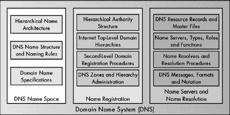

图 52-1. DNS 功能 DNS 由三个主要功能类别组成：域名空间、域名注册和域名服务器/解析。每个类别都包含一系列具体任务和责任。

## DNS 域名空间

DNS 使用一个由单一、复杂、多级结构组成的层次化域名空间，系统中的所有名称都适合这个结构。域名空间从单个根开始组织，其中放置了容器（称为 *域名*）。每个容器可以包含单个设备名称或更具体的子容器。整体结构在某种程度上类似于计算机目录系统从一般到具体组织文件的方式，使用一种可以优化到各种需求的任意结构。使用特定的语法来定义有效名称，并使用特殊术语来描述结构的一部分和识别域名，从根到设备级别。

## 域名注册（包括管理和权限）

DNS 域名注册用于将单个名称输入到 DNS 分布式数据库中。DNS 使用一种层次化的权限安排，这与层次化的域名空间相辅相成。一个中央权限机构决定了域名空间的整体形状和结构，并处理最高级别的名称注册。权限随后被 *委托* 给不同的组织来管理域名空间的各个部分。一套通用政策控制注册过程，并处理问题和冲突。

## 域名解析

DNS 使用了一种强大、分布式、客户端/服务器模式的域名解析机制。这可能是 DNS 设计中需要投入最多关注的地方，以确保其能够扩展以处理每天数百万甚至数十亿次的域名解析请求。

域名解析过程是通过两个基本的软件元素来实现的，这两个元素分别扮演服务器和客户端的角色：域名服务器和域名解析器。

DNS 域名服务器是在硬件服务器上运行的特殊程序，是 DNS 的核心。这些服务器由拥有 DNS 域名空间部分管理权的组织维护。它们包含 *资源记录*，这些记录描述了该域名空间部分的名字、地址和其他特性。因此，服务器本身被组织成一个类似于域名空间的层次结构，尽管在结构上并不完全相同。

域名服务器的主要任务是接收域名解析请求，并响应请求，要么提供数据库中请求的数据，要么提供指向另一个将导致所需信息的域名服务器的名称。域名服务器还负责数据缓存和其他管理任务，以确保整个系统的有效运行。

名称解析器是名称解析过程中的常规客户端。当用户在网络应用程序中引用一个名称时，该名称会被传递给解析器，解析器向名称服务器发出请求。根据配置，可能需要多个请求，并且可能将几个不同的解析过程组合起来以找到所需的信息。解析器还可能使用缓存或实现其他功能。

### 注意

*解析器和服务器之间的划分基于角色。当我们查看名称解析时，你将看到名称服务器也可能在某些数据交换中充当客户端。参见第五十六章以了解这种看似矛盾的说明*。

如果这听起来很像我在第五十章中给出的经典命名系统描述，那不是巧合。DNS 被认为是*唯一*的命名系统，通常与其他大多数命名系统进行比较。如果你理解了这些高级描述，那么你已经知道了 DNS 工作的基本原理。接下来的三章将更详细地探讨这三个功能区域，并将帮助你真正了解 DNS 是如何工作的。

### 小贴士

**关键概念** 作为完整的命名系统，DNS 提供了实现三个基本命名系统功能的各种能力。DNS 的*命名空间*是分层的，并使用具有特定命名规则的多级结构进行组织。DNS 的*名称注册*系统基于域的层次结构和负责它们的注册机构的概念。DNS 的*名称解析*也是分层的，它围绕*名称解析器*和*名称服务器*软件组件之间的交互设计，这些组件咨询 DNS 的*资源记录*数据库，并使用特殊的消息协议进行通信以回答客户端查询。

# 第五十三章。DNS 命名空间、架构和术语


命名空间是任何命名系统的最基本部分，因为它定义了名称本身是如何创建的。命名空间告诉我们名称可能采取的形式，并提供了创建它们的规则。最重要的是，它指定了名称的*架构*——名称本身的内部结构。这反过来又对名称注册和解析的工作方式产生关键影响，使得对命名空间和架构问题的研究成为学习域名系统（DNS）细节的明显起点。

在本章中，我描述了 DNS 名称空间及其结构背后的概念。我首先概述了 DNS 名称空间及其使用的分层架构。然后，我解释了常用来指代名称空间各部分的术语。接下来，我提供了 DNS 标签的正式描述以及创建域名时的官方和非官方规则。最后，我描述了域名规范，并解释了资格的概念以及完全限定名和部分限定名的区别。

# DNS 域和 DNS 分层名称架构

名称系统名称空间的最重要元素是其*名称架构*，它描述了名称是如何构建和解释的。DNS 的架构显然是基于一个称为*域*的抽象概念。这显然是解释 DNS 如何工作的一个很好的起点。

## DNS 名称空间中的基本概念：域

“域”这个词的词典定义通常传达了影响范围或控制或统治区域的概念。一个基本的概念是，在不同的语境中，控制或权威可以在许多不同的层面上施加。一个影响范围可能包含较小的范围，而这些较小的范围又可以包含更小的范围。这意味着这样的域自然地按层次排列。

以地缘政治域为例。我们地球上没有集中的“世界政府”，但我们有联合国，它处理全球性问题。在下一级，我们有各个国家。一些国家有州和省这样的划分。更低的级别有县、市镇、社区以及单个住宅或企业。这些“域”在组织上天生就是分层的。

DNS 使用“域”这个词的方式与这非常相似，并且它采用了一种分层结构，其工作方式与地缘政治示例非常相似。在 DNS 中，“域”被定义为单个对象或一组基于某种共同性收集在一起的对象。通常，在 DNS 中，这种共同性是它们都由同一个组织或权威机构管理，这使得名称层次紧密地与 DNS 分层权威结构（见第五十四章）的概念相关联。

### 注意

*术语“域”在网络世界的其他语境中也被使用。最显著的例子是在微软网络中，其中“域”也用来表示一组在共同权威下集合的对象。然而，这两种类型的域在概念层面上完全不同，并且没有超出这一层面的关联*。

## 名称的 DNS 分层树结构

我们可以构建一个树状图，将联合国置于顶部，线条指向世界上的每个国家。然后，在美国内部，我们可以画出线条指向每个州。在每个州内部，我们可以画出线条指向每个县，以此类推。结果将是一个倒置的树状结构，如图图 53-1 所示。这被称为*树结构*。

树结构在计算和网络中很常见。例如，树是用于将网络连接成局域网的一种拓扑类型。

对于理解 DNS 来说，树结构的最佳例子是用于在计算机硬盘上存储文件的目录树。根目录位于结构顶部，可能包含命名文件和/或命名目录。每个目录本身可以包含单个文件或子目录，这些子目录又可以包含它们自己的子目录，以此类推。DNS 中的域名结构在概念上以相同的方式排列，但 DNS 处理的是命名对象，通常是像互联网协议（IP）主机这样的设备。

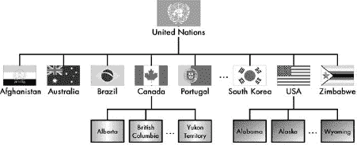

图 53-1. 全球分层域架构示例 此图展示了基于政治划分的分层架构示例。联合国是一个代表（在某种程度上）世界上所有国家的伞状组织。它是树的根；在其下方我们发现各个国家。每个国家随后以它选择的方式进一步细分。例如，加拿大有省和地区，而美国有各个州。这些可以以任何数量的方式进一步细分。

最高级别仍然是树的*根节点*。它包含多个域名，每个域名可以包含单个对象（名称）和/或低级别的域名。低级别域名反过来又可以有更低级别的域名，使得整个树可以具有任意结构。

类似于目录结构，DNS 层次结构命名架构允许从最一般到最具体的组织名称。它还具有完全的灵活性，允许我们以任何我们想要的方式安排结构。例如，我们可以创建一个与图 53-1 中显示的地理政治组织图完全平行的名称系统。我们可以让名称结构的根代表联合国，并为每个国家创建一个域名。然后，对于有州的那些国家，我们可以在那些国家域名内创建州域名。不需要这些域名的较小国家可以直接在国家域名下拥有城市域名。层次结构是灵活的，因为在每个级别，它都可以被赋予一个合适的子结构。

### 小贴士

**关键概念** 域名空间被组织成一个类似倒置树的*域名层次结构*。它在结构上类似于文件系统的目录结构，有一个根节点，包含多个域名，每个域名可以包含子域名以及更多。

重要的是要记住，每个独立的互联网网络都可以有自己的域名空间和独特的层次结构。很多时候，人们会将*一个*域名空间的概念与*该*域名空间的概念混淆。后者指的是用于全球互联网的 DNS 层次结构，很明显，这值得极大的关注。但这只是无限多种可能结构中的一种可能安排，尽管它很重要。

### 注意

*第五十四章提供了关于互联网 DNS 层次结构的更具体信息。正如您将看到的，地缘政治结构实际上被用来为互联网的一些计算机分配名称，但层次结构的其他部分是不同的*。

# DNS 结构元素和术语

现在我们已经回顾了 DNS 名称空间的基本知识，让我们更详细地看看其结构。同时，我将定义许多用于指代 DNS 域名层次结构各部分的术语。

## DNS 树相关术语

正如我在上一节中解释的那样，DNS 名称结构在某种程度上类似于一棵树。在计算机网络中，结构化元素与树的比较是常见的。技术与生物学的区别在于 DNS 树是从上往下生长的，而不是向天空伸展。将树作为类比自然导致在描述 DNS 名称结构时使用几个与树相关的术语，其中一些在图 53-2 中有说明。

**根** 这是 DNS 名称结构的概念性顶部。DNS 中的 *根* 域包含整个结构。根据定义，它没有名称；它是 *空* 的。

**分支** 一个 *分支* 是 DNS 层次结构中的任何连续部分。它由一个域及其内部的所有域和对象组成。所有分支都连接到根，就像在真实树木中一样。（是的，如果将根称为 *树干* 会更好，但显然计算机科学专业的学生没有选修植物学选修课。）

**叶子** 这是结构中的末端对象；也就是说，一个下面没有任何内容的域。将叶子作为一系列分支的末端的类比是恰当的。

没有特定的术语来指代不是叶子的域。这些有时被称为 *内部节点*，意味着它们位于结构中间。*节点* 是拓扑或结构中对象的通用计算机术语。因此，在 DNS 中，每个节点都是一个域，它可能是一个包含附加域和/或对象的内部节点，也可能是一个特定的、有名称的设备。因此，术语 *域* 有点含糊，因为它可以指代代表树的一个分支的对象集合，也可以指代一个特定的叶子。

## DNS 域相关术语

还有几个类似域名的术语经常用来指代层次结构中不同级别的域名。这些术语也显示在图 53-2:

**根域名** 这是树的根。

**顶级域名（TLDs）** 这些是树根下面的最高级域名。它们有时也被称为*一级域名*。

**二级域名** 令人惊讶的是，这些域名位于顶级域名直接下方。

**子域名** 在某些上下文中，这个术语仅指位于二级域名直接下方的域名。


图 53-2. DNS 树相关和域名相关术语 DNS 名称空间的顶部是树的根，它没有名称。在根下面可以有任意数量的顶级域名（TLDs）。在每个这些下面可以放置二级域名，然后在这些子域名下面，依此类推。这里也显示了 DNS 中使用的部分树术语。浅色阴影的部分是一个分支；较暗的区域突出显示该分支内的较小子分支。该区域内最暗的节点是该较小分支的叶子。

### 小贴士

**关键概念** DNS 名称空间的顶部是*根*。在根下面是*顶级域名*，在这些顶级域名下面是*二级域名*，然后是*子域名*。理论上，可以创建任意数量的子域名级别。分支是 DNS 树中的任何连续部分。叶子是一个在结构中没有下级的域名，它通常代表一个单一设备。

术语*子域*也可以像*域*这个词本身一样通用。在这种情况下，它仅仅指的是两个域之间的关系，其中子域在结构上位于另一个域之下。这意味着，例如，顶级域可以说成是根域的子域；每个二级域都是顶级域的子域，依此类推。但再次强调，有时*子域*特指三级或更低级的域。

## DNS 相关术语

与 DNS 相关的另一组术语将树结构比作不是一棵活树，而是另一个类比：家谱。这些术语通常用来描述特定域与其周围的其他域或子域之间的关系，因此它们是相对术语。以下常见的家谱相关术语（参见图 53-3)）。

**父域** 这是指在本层级之上的一级域。例如，根域是所有顶级域的父域。

**子域** 这是指在本层级之下的一级域。因此，顶级域是根域的**子域**。

**同级域** 这是指在本层级与当前域相同级别且具有相同父域的域。因此，所有顶级域都是根域的**同级域**；特定顶级域内的所有二级域都是同级域，依此类推。

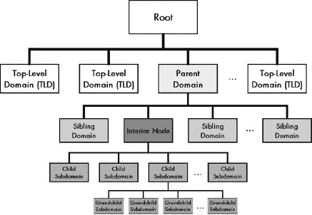

图 53-3. DNS 名称空间“家谱图”此图与图 53-2,但节点被标记以显示 DNS 中有时使用的以家庭为导向的术语。在这种情况下，名称相对于较暗阴影中的内部节点。位于其上方的域名是其父节点。同一级别的其他节点是兄弟节点，而该节点内的子域名是该节点的子节点。

### 提示

**关键概念** 在 DNS 名称空间中位于给定域名之上的域名称为其*父域名*。在同一父节点内同一级别的域名是*兄弟节点*。子域名被称为该域名的*子节点*。

就像一棵真正的树一样，DNS 名称结构在其结构上必须是一个真正的树。每个域名只能有一个父节点（除了根节点），就像树的每一枝（除了根/树干）只能连接到一个树枝一样。此外，结构中不能出现循环；你不能有一个子节点也是其父节点的域名，例如。

### 提示

**关键概念** DNS 名称空间必须作为一个真正的拓扑树来组织。这意味着每个域名只能有一个父节点，结构中不允许有循环。

请记住，尽管名称层次结构代表了命名设备的组织方式，但它只是一种逻辑结构。它与设备的物理位置没有必然的联系。一个有 10 个子域名的域名可能代表 11 个位于 11 个不同国家的设备。我们将在下一章讨论 DNS 授权结构时进一步探讨这一点。

# DNS 标签、名称和语法规则

我们已经看到 DNS 名称空间层次结构如何使我们能够将域名组织成一个虚拟树，该树反映了设备本身的组织特性。虽然使用层次名称空间在本质上比平面名称空间更复杂，但它产生了一个强大的结果：能够指定可以在本地管理的同时保持全局唯一性的名称。同时，树的复杂性带来了相对简单的名称构造的好处，这使用户标识符来实现。

## DNS 标签和标签语法规则

DNS 中的命名从给 DNS 名称空间中的每个域名或节点分配一个文本*标签*开始。标签标识结构中的域名，并必须遵循几个语法规则：

**长度** 每个标签理论上可以从 0 到 63 个字符长。在实践中，长度为 1 到大约 20 个字符是最常见的，对于分配给树根的标签（如下一节所述，长度为 0 个字符）有一个特殊例外。

**符号** 允许使用字母、数字以及破折号字符（-）。不允许使用其他标点符号。例如，下划线（_）不能用于标签中。

**大小写** 标签不区分大小写。例如，*Jabberwocky* 和 *jabberwocky* 是等效的域名标签。

每个标签必须在它的父域内是唯一的。所以，例如，如果我们有一个名为 Rocks 的顶级域，我们可以在 Rocks 内只有一个名为 Crystal 的子域。由于标签的不区分大小写，我们无法在 Rocks 内同时有 CRYSTAL 和 Crystal，因为它们被认为是相同的。

正是这种在父域内的*本地唯一性*概念确保了名称的整体唯一性，同时允许对命名进行本地控制。无论谁负责 Rocks 域，都可以为尽可能多的单个对象或子域分配名称，只要这些名称在域内是唯一的。其他人，比如 Glass 域的维护者，也可以在 Glass 内创建一个名为 Crystal 的子域。不会发生冲突，因为 Glass 和 Rocks 域是分开的。当然，由于所有顶级域都有相同的父级（根），所有顶级域都必须是唯一的。

### 小贴士

**关键概念** DNS 名称空间中的每个节点都通过一个标签来标识。每个*标签*必须在父域内是唯一的，但不需要在整个域名空间内唯一。这允许每个域对子域的名称进行本地控制，而不会在全球层面上创建的完整域名中引起任何冲突。

## 域名构造

可以使用从树根开始并向下到该域的标签序列来唯一标识域名结构中的每个单独的域。在层次结构中的每个级别的标签按顺序列出，从最高级别开始，从右到左，由点分隔。结果是*域名*的正式定义。

名称空间的根默认被赋予一个零长度的空名称；也就是说，根的标签存在，但它是空的。这样做是因为从技术上讲，根是每个域名的一部分，所以它必须包含在每个域名中。如果它像 Root 那样很长，我们就需要在每个域名的末尾包含它。这只会使每个名称更长，而实际上并没有添加任何有用的信息——我们已知每个域名都在根之下。

考虑一个顶级域名为 Rocks 的例子，其中包含一个二级域名 Crystal。Rocks 的域名是 Rocks.，点分隔 Rocks 和空标签（空根）。在实践中，尾随的点通常被省略，因此顶级域名 Rocks 的域名可以被认为是仅仅是 Rocks。Rocks 中的子域 Crystal 的域名是 Crystal.Rocks。如果我们有一个名为 Salt 的设备位于 Crystal.Rocks 域中，它将被称为 Salt.Crystal.Rocks。这相当直接，如图 53-4 所示。

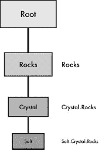

图 53-4. DNS 标签和域名构造 DNS 名称空间中的每个节点都有一个标签（根节点除外，其标签为空）。节点的域名通过将树顶部的标签顺序排列到单个域名，从右到左，用点（句号）分隔每个标签来简单地构造。

我们可以使用这些名称轻松地识别特定域的子域。例如，如果我们从 Salt.Crystal.Rocks 开始，很明显 Crystal.Rocks 是其父域。这也清楚地表明，Crystal.Rocks 和 Salt.Crystal.Rocks 都是 Rocks 的子域；一个比 Rocks 低一个级别，另一个低两个级别。

注意，为了实施目的，完整的域名有一个最大字符限制为 255 个字符。实际上，大多数域名都比这个限制短得多，如果我们让它们变得如此之长以至于没有人能记住它们，这将违背域名整体的目的。

### 小贴士

**关键概念** 域名是一个文本字符串，它唯一地标识了名称空间中的特定节点。节点的域名是通过将 DNS 树分支中的所有标签从树顶开始到特定节点按右到左的顺序连接起来来构造的，每个标签之间用点（句号）分隔。

最后，请注意，在许多协议中，通过在名称之后提供目录结构，可以指定域名内的特定资源。这是使用标准的 TCP/IP URL 语法完成的，其中路径是通过斜杠分隔子目录来指示的。例如，位于 Salt.Crystal.Rocks 的特定文件可能位于 Salt.Crystal.Rocks/chem/composition。虽然 DNS 名称不区分大小写，但路径中的标签是区分大小写的。因此，此示例与 Salt.Crystal.Rocks/chem/Composition 不同。有关 URL 语法的讨论，请参阅第七十章的更多详细信息。

# 绝对（完全限定）和相对（部分限定）域名规范

如前所述，我们可以通过从根节点开始并按顺序跟随子域的序列到所讨论的节点，列出每个级别的标签并用点分隔，来指定 DNS 名称层次结构中任何节点的域名。当我们这样做时，我们得到一个唯一标识特定设备名称的单个名称。在实践中，域名可以通过它们的完全限定名称或部分限定名称来指定。

## 完全限定域名

技术上，如果一个顶级域名 A 包含一个子域名 B，而 B 又包含子域名 C，那么 C 的完整域名就是 C.B.A.. 这被称为节点的*完全限定域名（FQDN）*。在这里，单词*限定*与*指定*同义。域名 C.B.A.是完全限定的，因为它给出了整个 DNS 名称空间中特定域名所在的全局位置。

FQDN 有时也称为*绝对*域名。这个术语反映了这样一个事实：您可以使用 FQDN 从名称空间的任何其他部分无歧义地引用任何设备的名称。使用 FQDN 始终指示解释名称的人或软件从根开始，然后从右到左按顺序跟随域名标签的序列，在树中从上到下。

## 部分限定域名

在某些情况下，您可能使用不完整的名称规范来引用设备。这被称为*部分限定域名（PQDN）*，这意味着该名称仅部分指定了设备的位置。根据定义，PQDN 是模糊的，因为它没有给出完整的域名路径。因此，您只能在已知特定父域的绝对域名的情况下使用 PQDN。

我们可以通过将部分名称附加到父域的绝对名称上来找到部分指定的域名的 FQDN。例如，如果我们有一个在 FQDN Y.X.上下文中的 PQDN Z，我们知道 Z 的 FQDN 是 Z.Y.X。

为什么要这样做呢？答案是方便。一个域的管理员可以使用 PQDN 作为缩写来引用设备或子域名，而无需重复整个全名。例如，假设你是 Widgetopia 大学计算机科学系的负责人。整个系的域名是 cs.widgetopia.edu.，而你管理的单个主机以水果命名。在你维护的 DNS 文件中，你可以每次都通过 FQDN 来引用每个设备；例如，apple.cs.widgetopia.edu.，banana.cs.widgetopia.edu.等等。但告诉软件“如果你看到一个不是完全限定的名称，假设它位于 cs.widgetopia.edu 域中”会更简单。然后你只需称这些机器为 apple、banana 等等。每当 DNS 软件看到像 kiwi 这样的 PQDN 时，它将把它视为 kiwi.cs.widgetopia.edu。

### 小贴士

**关键概念** 一个*完全限定域名（FQDN）*是一个完整的域名，它通过给出从树根到该节点的完整标签路径，唯一地标识 DNS 命名空间中的一个节点。它定义了域的绝对位置。相比之下，一个*部分限定域名（PQDN）*仅指定域名的一部分。它是一个相对名称，仅在特定上下文中才有意义。部分名称必须在该上下文中解释，才能完全识别节点。

我在本章前面提到，对于空根域的尾随点通常省略。这在日常用语中以及当用户在应用程序中指定域名时是正确的。例如，你不会在网页浏览器中使用尾随点。然而，点用于在 DNS 主文件中清楚地区分 FQDN 和 PQDN。这允许我们同时使用 FQDN 和 PQDN。在我们的例子中，apple 将指 apple.cs.widgetopia.edu.，但 apple.com.将指苹果电脑公司的 FQDN。你必须小心观察这里的点，因为 apple.com（没有尾随点）将是一个 PQDN，它将指 apple.com.cs.widgetopia.edu.，而不是苹果电脑的域。

# 第五十四章。DNS 域名注册、公共管理、区域和权威机构


前一章解释了域名系统（DNS）命名空间由一系列域名和子域名组成。从根开始，我们有一系列顶级域名，然后是它们下面的二级域名，再下面是更低级的域名。那么，显然的问题就变成了：我们如何确定命名空间的形状和结构，以及谁将管理它？更具体地说，谁将控制树的根并决定顶级域的名称？我们如何对剩余的命名空间进行细分控制？我们如何确保在域内选择兄弟子域的名称时没有冲突？

DNS 可以用于由单个组织控制的私有网络，如果是这样，那么该组织显然负责名称空间。我们将讨论私有命名，但实际上，这并不那么有趣。DNS 的大多数使用都发生在公共互联网上。在这里，我们面临着一个更大的挑战，因为我们需要构建一个跨越全球并覆盖由不同组织管理的数百万台机器的名称空间。为此，我们需要一个非常强大的**名称注册**过程和支撑它的管理方法。

在本章中，我将描述名称注册的过程以及如何在 DNS 中管理权限，重点关注公共互联网。我首先描述 DNS 的分层权限结构以及它与分层命名空间的关系，并讨论 DNS 分布式名称数据库背后的概念。我描述了互联网的组织和地缘政治顶级域名，以及它们是如何由不同的权限机构管理的。然后，我讨论了权限是如何委派给二级和更低级域的，以及域名公共注册的工作方式，包括如何解决公共注册的问题和问题。我解释了 DNS 名称空间是如何划分为权限管理区的，然后我简要讨论了私人 DNS 名称注册。

### 小贴士

**相关信息** *大多数 TCP/IP 实现都包含一个名为 whois 的特殊实用程序，可以用来查询 DNS 分布式名称数据库以获取域名的注册信息。这个应用程序在故障排除中非常有用。有关详细信息，请参阅讨论 whois 的第八十八章部分*。

# DNS 分层权限结构和分布式名称数据库

在上一章中，我解释了 DNS 中命名的核心概念是基于**域名**的。每个域名都可以被认为类似于一个影响或控制的范围。一个域名“展开其翅膀”覆盖了它包含的所有对象和子域名。由于这种影响的概念，当我们考虑任何 DNS 名称空间时，我们会看到它是分层的，因为它反映了控制域名及其内部节点的组织层次结构。这意味着存在一个**分层权限结构**，它补充了 DNS 中的分层名称结构。

名称空间分层导致权限分层的主要原因是对兄弟子域名在域名内唯一性的要求。一旦我们有了唯一性的需求，我们就必须有一些形式的权限或过程来确保每个子域名或对象在该域名内选择不同的名称。这正是名称注册的全部内容。

这种分层权限结构的概念有点抽象，但如果我们检查一个示例 DNS 名称空间并讨论其中涉及的问题，就更容易理解。自然地，我们希望从名称层级的顶部开始，即根域，null。

## DNS 根域中央权限机构

要开始名称空间，我们必须在根域内创建顶级域名 (TLD)。现在，每个都必须是唯一的，因此必须有一个权限机构来管理所有 TLD 的创建。这意味着控制根域的权限机构控制整个名称空间。

在互联网的情况下，这个中央权限机构最终对 DNS 中的每个名称负责。最初控制 TLD 创建的互联网中央 DNS 权限机构被称为 *网络信息中心*。后来，它被称为 *互联网分配号码权威机构 (IANA)*，它还负责协议号码、IP 地址等。这些功能现在由 IANA 和 *互联网名称与数字地址分配机构 (ICANN)* 共享。我们将在下一章讨论互联网的具体 TLD；IANA、ICANN 和相关组织在 第三章 中的互联网注册权限机构部分进行讨论。

## TLD 权限机构

在权限层级的下一级，我们在每个 TLD 内创建二级域名。每个 TLD 必须使用协调权限机构进行管理，但这不一定是运行根域（IANA）的组织。IANA *委派* 一些 TLD 的权限给其他组织。

IANA 可以将每个 TLD 的控制权委派给层级中的不同权限机构。实际上，在管理二级域名的创建方面，一个 TLD 可能会有与另一个 TLD 完全不同的规则。在某些 TLD 中，存在多个权限机构共同进行名称注册。

## 低级别权限委派

随着我们向下移动名称空间层级，权限委派的过程继续进行。在每一级，名称空间变得更加具体。

如果我们使用组织层级，例如 .COM TLD，我们通常将每个二级域名的权限委派给代表该名称的组织。例如，IBM.COM 由 IBM 管理。由于 IBM 规模庞大，它可能进一步细分权限结构，但较小的组织可能不会这么做。

## 权限层级与名称层级的关系

授权层次结构与名称层次结构是互补的；它们并不完全相同。并不一定需要在层次结构的每个级别都有一个不同的授权。在许多情况下，一个单一的授权机构可以管理跨越结构多个级别的名称空间的一部分。例如，IANA 管理互联网根域名（null）和.int 顶级域，但其他顶级域由其他组织管理。名称层次结构被划分为*授权区域*，这些区域反映了管理名称空间部分授权的层次结构。

此外，对一个域的管辖权并不一定意味着物理控制。一个域可以包含由不同大陆上的组织管理的子域，而且一个单独的子域也可以包含位于不同大陆上的命名设备。

## DNS 分布式名称数据库

当然，有了权限也就有了责任，一个授权机构对一个域的主要责任是在域内注册名称。当名称被注册时，就会为其创建一组数据，然后这些数据可以被互联网设备用来解析名称到地址或执行其他功能。

描述所有 DNS 域的所有数据集构成了 DNS 的*名称数据库*。正如注册权限是分布的和分层的，这个数据库也是分布的和分层的。换句话说，没有单一的地方存储所有 DNS 名称信息。相反，DNS 服务器携带资源记录（见第五十七章）。

**.COM** 公司和企业

**.EDU** 大学和其他教育机构

**.GOV** 政府机构

**.MIL** 军事组织

**.NET** 实施、处理或管理网络技术以及/或互联网的组织

**.ORG** 不适合任何先前分类的其他组织

初看这似乎是一种合理的方式来涵盖世界上的组织。然而，由于.ARPAnet 域名（其名称指的是 ARPAnet，现代互联网的前身，如第八章所述）是临时的，这为所有其他组织留下了只有六个类别。此外，TLDs 并没有像最初预期的那样被全部使用。例如，.GOV 和.MIL 域名并没有用于所有类型的政府和军事组织，而主要是用于美国联邦政府和军事。.EDU 域名最终只用于大学，同样是在美国。

这使得只有三个常见的顶级域名——.COM、.NET 和.ORG——几乎适用于所有其他希望使用组织层次结构的团体和公司。由于只有这三个顶级域名，它们很快就变得非常拥挤，尤其是.COM 域名。不久之后，又增加了一个新的第四个域名——.INT，用于国际组织。然而，它仅打算用于少数几个组织，例如国际标准机构。

当然，没有固有的理由说明通用域名应该仅限于最初创建的少数几个。

## 新的通用顶级域名

在过去的几年里，提出了许多关于新的通用顶级域名的建议，这些域名将扩大可能的二级域名的数量，并为不同的组织类型提供更好的分类——也就是说，使通用顶级域名不那么通用。最初对这些新名称的采用存在一些阻力，特别是因为关于应该创建哪些新顶级域名的想法有很多不同。

IANA 从很多人那里收集了意见，并遵循了一个复杂的程序来确定应该创建哪些新的顶级域名。在 2001 年和 2002 年，批准创建了几个新的顶级域名，并做出了关于管理它们的权威机构的决定。

在过去几年中批准的新顶级域名中，据我所知，没有哪一个实现了广泛的流行。人类是惰性的生物，大多数人仍然习惯于以.COM、.NET 或.ORG 结尾的名称。随着时间的推移，这可能会改变，但可能需要几年时间。

### 注意

*有些人实际上觉得增加新的通用顶级域名是一个糟糕的想法，因为这可能会使组织更难定位（由于域名可能以各种不同的顶级域名结尾）。然而，这还是有争议的，尤其是由于现有顶级域名的地址空间耗尽，许多公司已经不得不选择不直观的域名了*。

表 54-1 展示了所有当前的通用顶级域名，并描述了它们的使用方式，并列出了管理每个域名的当前中央权威机构。原始顶级域名以斜体突出显示（我将 .INT 作为原始顶级域名包括在内，因为它是在“新”的之前创建的）。图 54-1 以图形形式显示了 15 个通用顶级域名。


图 54-1. 互联网 DNS 组织（通用）顶级域名 目前为互联网定义了 15 个通用顶级域名。它们按字母顺序排列在此，原始顶级域名以浅色阴影显示，而 2001/2002 年新增的顶级域名以深色阴影显示。

表 54-1. 互联网 DNS 组织（通用）顶级域名

| 通用顶级域名 | 缩写 | 权威机构 | 描述 |
| --- | --- | --- | --- |
| .AERO | 航空航天 | 国际航空航天电信公司（SITA） | 用于航空航天行业的成员，如航空公司和机场。（是的，这是法语！） |
| *.ARPA* | 地址和路由参数区域 | IANA/ICANN | 最初定义为从较旧的宿主表系统迁移的临时域名，当然，*ARPA*最初代表高级研究计划署，互联网前身创造者。今天，.ARPA 域名用于内部互联网管理目的；表中显示的扩展名称，我相信是为了符合缩写。此域名最著名的用途是用于反向 DNS 查找。 |
| .BIZ | 商业 | NeuLevel 公司 | 用于商业。旨在与.COM 竞争。 |
| *.COM* | 商业组织 | VeriSign 公司 | 最初旨在为公司和其它商业利益使用，.COM 也被广泛用于其他目的，包括小型企业和甚至喜欢.COM 域名流行度的个人。 |
| .COOP | 合作协会 | Dot Cooperation 公司 | 用于合作协会。 |
| *.EDU* | 教育 | Educause | 最初旨在为所有类型的学校组织使用，.EDU 现在仅用于在美国获得认证的学位授予高等教育机构。其他教育机构，如公立学校通常使用国家代码顶级域名。 |
| *.GOV* | 政府 | 美国总务管理局 | 保留供美国联邦政府使用。 |
| .INFO | 信息 | Afilias 公司 | 一个非常通用的顶级域名，旨在用于各种类型的信息资源。它是无限制的，任何人都可以在.INFO 中注册任何类型的组织。它也被定位为.COM 的替代品。 |
| *.INT* | 国际 | IANA .int 域名注册处 | 仅用于由国际条约建立的大型组织。 |
| *.MIL* | 军事 | 美国国防部网络信息中心 | 保留供美国军事使用。 |
| .MUSEUM | 博物馆 | 博物馆域名管理协会 | 猜猜看。查看 http://index.museum 获取使用此顶级域名的完整博物馆列表。 |
| .NAME | 名称 | 全球名称注册 | 在原始的通用层次结构中，没有为个人预留注册自己名称的地方，因此人们会创建像 jonesfamily.org 这样的域名。这并不理想，因此创建了.NAME 作为个人和家庭注册自己名称域名的场所。.NAME 还与国家代码顶级域名竞争。 |
| *.NET* | 网络 | VeriSign, Inc. | 这原本只用于互联网服务提供商（ISPs）和其他与互联网或网络紧密合作的组织。然而，由于.COM 和.ORG 中的名称空间耗尽，许多.NET 域名被注册给了其他组织。 |
| *.ORG* | 组织 | 公共利益注册局 | 最初是为不适合其他通用顶级域的组织设计的，.ORG 很快与专业和非营利组织相关联。然而，有盈利公司可以使用.ORG 名称。 |
| .PRO | 专业 | RegistryPro | 保留给有资质的专业人士，如律师和医生。 |

### 小贴士

**关键概念** 互联网的 DNS 名称空间被划分为两种方式之一是使用一组通用顶级域名（TLDs）。这些 TLDs 旨在为所有公司和组织提供一个基于其组织类型命名的场所。最初有六个这样的域名，但现在已经扩展到有 15 个。

# DNS 地缘政治（国家代码）顶级域名和机构

理论上，通用顶级域名应该足以满足世界上所有个人、公司和团体的需求。这一点尤其正确，因为根据定义，.ORG 是一个可以包括任何人或任何事物的通用域名。因此，在一个理想的世界里，世界上每个人都能在这些简单的域名中找到一个位置。

然而，在 DNS 的早期，其创造者意识到通用顶级域名可能无法满足世界上所有人的需求，尤其是在某些情况下。这有几个原因：

**通用域名的美国中心主义** 我并不是在批评这一点（我是一个美国公民，热爱我的国家！）。然而，无可争议的是，美国组织和公司在通用顶级域名中占据主导地位。考虑到互联网最初是在美国开发的，这一点并不令人惊讶，但它仍然给某些群体带来问题。例如，如果美国军方控制着.MIL 域名，那么比如大不列颠的军方在名称空间中该如何定位？

**语言** 大多数通用域名由主要用英语进行商业活动的组织占据。然而，世界上有数百种语言，对于那些语言的说话者来说，如果他们能够更容易地找到他们能理解的资源，那就更容易了。

**本地控制** 世界各地的国家很少达成一致，他们当然在如何安排其国家内组织互联网存在方面存在差异。许多人希望允许国家能够为自己设置命名空间的一部分。

由于这些以及其他原因，互联网的命名空间被设置了一套与通用顶级域名平行的*国家代码* TLDs，有时被称为*ccTLDs*。我称这些为*地缘政治* TLDs，因为它们基于世界的地缘政治划分（类似于我在第五十三章中概述 DNS 命名空间时使用的例子）。在这个等级结构中，世界上每个国家都被分配了一个特定的两位字母代码作为 TLD，并指定一个特定的权威机构负责管理该域名。例如，大不列颠的 ccTLD 是 .UK，加拿大的是 .CA，日本的则是 .JP。这些代码在本地语言中往往比在英语中更有意义。例如，德国的是 .DE，瑞士的是 .CH。

## 国家代码指定

当我说国家很少达成一致时，我并不是在开玩笑。事实上，他们甚至不能就什么是国家达成一致！为了是否某个领土是独立还是另一个国家的组成部分而进行的真实射击战争已经发生，DNS 的创造者不想参与这种争议。正如 IANA 网站所说：“IANA 不参与决定什么是国家，什么不是国家，以及哪些代码字母适用于特定国家。”

为了保持中立，IANA 的 ccTLD 代码直接来自国际标准化组织（ISO）维护的 ISO 标准 3166-1 中的标准国家缩写。当一个国家被 ISO 认可并分配了此列表上的代码时，IANA 就将其创建为 TLD。目前有超过 200 个不同的地缘政治 TLDs。您可以在[`www.iana.org/cctld/cctld-whois.htm`](http://www.iana.org/cctld/cctld-whois.htm)找到 IANA 国家代码 TLDs 的当前列表。

### 小贴士

**关键概念** 由于通用 TLDs 的限制，创建了一套*国家*代码顶级域名。这种*地缘政治层次结构*允许地球上每个国家根据自己的需求建立自己的命名系统，并以他们认为合适的方式管理它。根据 ISO 的官方决定，IANA 确定什么是国家。

## 国家代码 TLD 权威机构

每个国家都有权根据自己的选择设置其 TLD 的内部子结构；这再次显示了层次结构的权力。

一些国家在较低级别强制实施进一步的地理子结构。例如，美国的 .US 域最初被设置，以便所有二级域名都是两位字母的州缩写（这后来有所改变）。

其他国家实际上可能在它们的国代码中使用组织子域名。例如，大不列颠有 .CO.UK 用于该国的公司（就像 .COM 但仅限于英国；他们省略了 *M*），而 .COM.AU 是用于澳大利亚的公司的。

其他国家可能根本没有任何特定的子结构，尤其是如果它们很小的话。

## 国家代码域名的租赁/销售

有趣的是，一些具有可识别国家代码的小国家，尤其是对英语使用者来说，已经将它们的代码用于非常创造性的目的，包括将名称空间出售或出租给有进取心的公司。

一个很好的例子是 .TV 域名，技术上属于岛国 *图瓦卢*。当然，对大多数人来说，“TV”意味着完全不同的东西。有些人认为以 .TV 结尾的域名可能在英语世界很受欢迎，所以他们成立了一家名为 The .TV Corporation 的公司，并与图瓦卢政府协商使用 .TV 域名。如今，这个 TLD 的管理机构就是这家总部位于加利福尼亚的公司！类似的安排也可以在 .CC、.NU、.TO 以及其他 TLDs 中找到。

这提醒我们，名称空间是逻辑的，而不是物理的。显然，拥有 .TV 名称的许多计算机实际上并不位于南太平洋的一个偏远岛屿上。同样，如果一个网站以 .CA 结尾，例如，它可能代表一个加拿大组织，但这并不一定意味着该网站本身实际上托管在加拿大。

## 地缘政治 TLDs 的缺点

地缘政治域名在特定用途中非常受欢迎。国家政府和其他官方机构喜欢使用它们，这是显而易见的。输入 www.gov.*xx* 或 www.government.*xx*（*xx* 是国家代码），很可能会把你带到大多数国家的国家政府网站。一些公司和组织使用 ccTLDs，因为它们允许他们选择在通用层次结构中已被占用的名称，或者简单地表达民族自豪感。

然而，对于许多其他公司和组织来说，通用顶级域名（TLDs）比国家代码更受欢迎。我认为最重要的原因是组织使用通用域名更容易定位。

这里有一个很好的例子来说明我的意思。在我居住的城镇附近，一家名为 Aldi 的新杂货店最近开业了。我喜欢这家商店，并想了解更多关于它的信息，所以我打开了我的网络浏览器，并寻找它的网站。是的，我可以在搜索引擎中输入它，但像大多数人一样，我很懒。直接在我的浏览器中输入 www.aldi.com 要容易得多，结果，Aldi 国际的网站就弹出来了。

现在，Aldi 实际上总部位于德国，该公司确实有一个位于 www.aldi.de 的网站。但我不知情。我通过访问 www.aldi.com 轻易地找到了他们，因为我不需要知道他们的物理位置，而且我知道大多数大公司都有 .COM 域名。当然，可查找性非常重要，尤其是对于试图开展商业活动的商业组织。

另一个很好的例子是美国，它除了主导通用 TLD 外，还有自己的国家代码 .US。负责该域名的权威机构最初选择使其遵循严格的地理层级结构，因此每个域名都必须是 *organization.city.state-code*.us 的形式。因此，要使用这部分命名空间，波士顿的公司必须位于 .boston.ma.us 域名下。这非常整洁且逻辑性强，但它使得名称比通用等价物更长且更难猜测。

假设你想获取金属巨头 Alcoa 的信息。如果你在行业里，你可能知道 Alcoa 位于匹兹堡，但如果你不在，哪个更容易找到：www.alcoa.pittsburgh.pa.us 还是 www.alcoa.com？这里有人知道如何拼写阿尔伯克基吗？

正因如此，.US 域名在某些社会群体中取得了成功，但在其他群体中却没有，尤其是商业实体（公司）。严格的层级结构确实有一些实际优势，例如避免命名空间冲突，但其缺点如此之多，以至于最近在 .US 域名中放宽了规则。

# 二级和更低级别域名的公共注册

IANA 负责决定哪些 TLD 存在于互联网名称空间中，因此，他们最终对互联网中的所有名称负责。然而，权威层级的整个目的在于 IANA 不应负责整个命名空间。因此，尽管 IANA 维护对某些 TLD（如 .INT 和 .ARPA）的控制，但管理其他 TLD 的控制权被委派给了每个 TLD 的二级权威机构。

正如 IANA 有权选择如何将权限委派给根域的子域一样，负责每个顶级域（TLD）的组织也有权决定如何在 TLD 下创建二级域。

在许多 TLD 中，尤其是通用 TLD，二级域名直接分配给个人或组织。例如，名为 XYZ Industries 的公司可能想要获得 xyzindustries.com 的域名。

在其他 TLD 中，二级域名的设置遵循特定的结构，就像 .US 域名中使用的州代码。在那里，你需要向下走更多层级，但最终你会到达公司和个人注册自己域名的点。例如，在 .US 域名中，XYZ Industries 如果总部位于凤凰城，可能会想要注册 xyz.phoenix.az.us。

这个从被授权负责部分名称空间的权威机构到希望获取名称的普通人和团体之间的过渡点很重要。必须建立一个*公开注册*的过程，以允许以一致和可管理的方式发生此类名称分配。当最初创建通用的顶级域名和国家代码顶级域名时，这并不难实现。当时互联网相当小，让每个顶级域名的管理机构在该顶级域名内执行注册是有意义的。这确保了在顶级域名内没有名称重复，而且没有太多麻烦。

## 注册管理机构

对于像.COM、.NET 和.ORG 这样非常重要的通用顶级域名，负责注册的权威机构是互联网网络信息中心（InterNIC）。InterNIC 是由美国政府管理的服务，后来将管理它的合同授予了 Network Solutions Inc.（NSI）。NSI 最终被 VeriSign 收购，后来将其作为独立的企业分离出来。（网络世界的变化真是快！）

多年来，NSI 独立执行了.COM、.NET 和.ORG 顶级域名内的所有注册。然而，原始通用顶级域名的流行导致了 20 世纪 90 年代这些域名名称注册需求的激增。有一个公司负责注册导致这成为互联网域名系统中的另一个瓶颈。还有很多人不喜欢单一垄断负责注册所带来的缺乏责任感和竞争。InterNIC 可以自行设定价格，最初每个域名每年收费 35 美元，后来增加到每年 50 美元。

在 20 世纪 90 年代末，域名注册的责任被赋予了 ICANN。注册过程被*去监管化*，借用一个指从发电等行业中去除垄断的术语。截至 1999 年 12 月，每个顶级域名（包括.COM、.NET 和.ORG）仍然只有一个负责整体管理的单一机构。

现在，NSI 仍然是运行.COM 和.NET 的权威机构。然而，它并不是唯一注册这些顶级域名下名称的组织。它进一步将注册管理权委托给许多其他公司，称为*认证注册商*。任何注册商都可以为其认证的顶级域名(s)注册名称。

## 注册协调

当有多个公司在顶级域名下注册名称时，自然协调变得更加重要。遵循一套特殊的技性行政程序，以确保不会出现问题，例如两个注册商同时试图抢注一个名称。

该系统运行良好，现在希望使用存在竞争的 TLDs 的公司可以选择各种注册公司。这一结果最引人注目的是最可预测的：在非监管的通用 TLDs 中注册域名的成本通常远低于最初由 InterNIC 收取的费用。

一旦公司、个人或组织注册了低级域名，他/她/它就成为了该域名的权威。域名的使用因此变得私密，但根据域名的使用方式，可能还需要进一步进行公共名称注册。有关私人注册的讨论，请参阅本章末尾，以获取更多信息。

# DNS 公共注册争议和争议解决

互联网最初是一种研究网络的中介，后来发展成为连接科学家的系统，最终成为几乎每个人都使用的全球通信工具。作为这一演变的一部分，互联网也成为了世界上商业活动的重要组成部分。20 世纪 90 年代初，金钱开始进入互联网领域，仅仅几年后，它对互联网的影响就如此之大，以至于 20 世纪 90 年代末股市飙升的现象现在常被称为“互联网泡沫”。

## 公共注册争议

不幸的是，互联网对商业利益的重要性日益增加，与互联网技术的非商业原始设计发生了正面冲突，这在 DNS 中尤为明显。由于只有少数通用 TLDs，TLD 内的每个名称都必须是唯一的，而人类往往是好斗的生物，因此很快就出现了关于谁可以使用什么名称以及为什么的争论。当然，从那里开始，不久之后，诉讼和其他不愉快的事情就变得司空见惯了。

与公共注册域名相关的重大问题数量惊人：

**公司名称冲突** .COM 域名是针对公司的，但许多公司拥有相同的名称。ACME 家具公司、ACME 餐饮用品公司以及 ACME 鞋业公司，都可能希望拥有 acme.com 域名。但在.COM 中只能有一个这样的域名。（这些都是虚构的例子；acme.com 实际上由一个名为*Acme Labs*的组织拥有。）

**公司/个人/小型企业名称冲突** 许多公司拥有与个人姓名相似甚至完全相同的名称，这可能导致潜在的冲突。例如，假设你的名字是 Wendy，你拥有一家名为 Wendy's Fabrics 的小型布料店。但你很懂互联网，并在 1993 年一听到互联网就决定注册 wendys.com。然后这家大型汉堡连锁店出现了，并对此产生了问题。

### 注意

*据我所知，温迪公司并没有出现此类问题，但实际上有一个广为人知的案例，展示了大多数公司最近在域名命名方面是如何脱离轨道的。1994 年，《连线》杂志的一名撰稿人惊讶地发现，mcdonalds.com 这个域名尚未注册！为了展示注册过程是多么不受监管，他自己注册了这个域名，并因此引起了一些骚动。最终，金拱门的人通过友好的安排从他那里购买了该域名，他放弃了名称，他们向慈善机构捐赠了一笔钱*。

**企业战争** 当公司故意通过注册与自身公司无关的名称来试图从对方那里夺取业务时，就会发生一种特别丑陋的冲突。一个例子是，如果汉堡王试图注册 mcdonalds.com 并用来宣传汉堡王的产品。（顺便说一句，他们并没有这样做，所以请不要起诉我！）另一个例子是，公司试图使用替代顶级域名（TLD），例如注册 burgerking.org 来混淆试图找到 burgerking.com 的人。事实上，许多公司已经采取了在许多不同 TLD 上注册自己名称的措施，以防止这类事情发生。

**网络域名抢注** 一些雄心勃勃（用这个词来形容很合适）的个人，很早就意识到某些名称的潜在价值，注册了大量名称，希望将来转售。许多人谴责这种行为是剥削性的，因此创造了“网络域名抢注”这个术语来指代这种活动。不幸的是，通过这种方式赚了很多钱，至今仍有许多域名因为被某些人或个人无限期保留而无法使用。

**误导性命名实践** 另一种有点邪恶的创造力体现在那些试图利用我们中一些人拼写能力不足的人身上。例如，如果你是一家名为 Superb Transceivers Inc.的大公司的竞争对手，该公司注册了 superbtransceivers.com，你可能会注册 superbtranscievers.com，并将流量从那里重定向到你的域名。另一个例子是利用字母*O*和数字 0（零）之间的常见混淆。例如，一家软件公司曾经注册了 micros0ft.com，这让华盛顿州雷德蒙德的软件巨头感到非常不快。

顺便提一下，正是这些荒谬的事情部分导致了对新通用顶级域名的强烈呼声。尽管像.US 这样的顶级域使用的更复杂的方案并不受欢迎，但它们在通用域名上具有巨大的优势。由于所有这些注册都是地域性的，因此冲突要少得多。例如，ACME 家具公司可能会使用 acme.seattle.wa.us，ACME 餐饮供应公司可能拥有 acme.mendocino.ca.us，而 ACME 鞋业公司则可以选择 acme.anchorage.ak.us。只有在组织名称相同且位于同一州和城镇时，才会出现争议。你仍然可以在芝加哥有三个乔的比萨店竞争，但这不太可能成为大公司的问题。

## 注册争议解决方法

那么，我们如何解决这些情况呢？俗话说，这可以通过简单或困难的方式完成。以下是一些用于争议解决的方法：

**域名共享**有时，对立双方会同意一个富有成效的解决方案。一个特别有建设性的想法是同意*共享*域名。例如，三个不同的 ACME 公司可以各自创建自己的更具特定名称的域名，例如 acmefurniture.com、acmerestaurantsupply.com 和 acmefootwear.com。然后他们可能同意将 www.acme.com 注册给无人使用，通过一家公司注册但不用于任何目的。更好的是，他们可以设置一个简单的网页，说明域名是共享的，并提供到三个网站的链接。不幸的是，似乎小学生比大多数企业高管更理解共享的概念，因此这种解决方案很少见。

**域名购买**另一个选择是购买。如果一家大公司想要购买一个个人或小企业已经注册的域名，它通常会直接购买该域名，因为这是最容易的做法。在互联网狂热的高峰期，有些域名以*数百万*美元的价格出售——仅仅是使用该名称的权利！许多网络抢注者和其他投机者通过出售域名而致富。

**诉讼**通常，争斗者不会表现得很好，通常会发生：威胁、恐吓、诉讼等等。有时，一封律师函就足以解决争议，特别是当一些拥有网站的可怜个人受到大公司的法律行动威胁时——这种情况已经发生很多次。然而，经常有争议的各方坚持自己的立场，特别是当两家公司发生冲突，他们的律师拒绝退让时。通常，事情最终会进入法院，以某种方式解决。通常，商标侵权的主张会被挑战先前域名注册的公司使用。

## 统一域名争议解决政策

诉讼费用高昂且耗时，因此人们希望存在其他机制来解决这些冲突。由于每个顶级域（TLD）的权威机构控制着其内部发生的事情，因此它也有权制定自己的政策来处理这类问题。对于通用顶级域，原始注册机构 InterNIC 曾有一个争议解决政策，允许对某个名称有商标利益的人挑战域名注册。这项政策因多个原因而备受争议，其中最不重要的是，它导致一些域名在没有任何商标侵权证据的情况下被成功挑战。

当前通用顶级域的权威机构 IANA/ICANN 于 1999 年创建了一个新的统一域名争议解决政策（UDRP），以更好地处理域名冲突。这项政策规定了一个程序，即如果一个公司拥有有效的商标，并且如果该域名侵犯了商标、与商标混淆相似或被他人恶意注册，它可以挑战该域名。同时，它还列出了原始注册人可以证明注册有效并应予以维持的方法。这个新系统消除了与域名公开注册相关的大多数问题——如欺骗性命名、企业战争和域名抢注——同时不会自动允许后来者关闭合法域名。

# DNS 名称空间管理层次结构分区：DNS 授权区域

我在本章前面解释过，DNS 名称空间是按层次结构排列的，并且还有一个与该层次结构名称相关的权威机构层次结构。然而，这两个层次结构并不完全相同。如果它们是相同的，我们将在树的每一级为每个域名都需要一个单独的权威机构，而这在我们结构的任何地方都是不太可能想要实现的。

在 DNS 树的最顶层，我们可能希望在结构的每一级都指定一个单独的权威机构似乎是合理的。考虑地缘政治名称层次结构；IANA/ICANN 管理根域名，但每个国家顶级域（ccTLD）都由一个独特的国家权威机构管理。

然而，当我们到达结构的较低层次时，通常不方便或根本不可能让每一级都对应一个单独的权威机构。例如，假设你负责 Googleplex 大学 IT 部门，该部门运行自己的 googleplex.edu 域名 DNS 服务器。假设这所大学只有两所学校，分别是艺术系和计算机科学系。假设计算机名称空间被分为三个子域：finearts.googleplex.edu、compsi.googleplex.edu 和 admin.googleplex.edu（包括 IT 部门在内的中央行政职能）。

很可能，你不想也不需要艺术系运行自己的 DNS 服务器。同样，对于管理机器来说，情况可能也是如此。然而，计算机科学系可能确实希望运行自己的 DNS 服务器，因为这个部门可能比其他部门拥有更多的计算机，而且员工可能会将运行 DNS 服务器作为课程的一部分。

在这种情况下，你可能希望你自己，即 googleplex.edu 的管理员，维护 finearts.googleplex.edu 和 admin.googleplex.edu 子域及其内部的一切的权限，同时将 compsci.googleplex.edu 的权限委托给计算机科学部门中指定的任何人。DNS 被特别设计为允许在名称层次结构和权限结构之间创建这些划分。

## 将命名空间划分为权限区域的方法

完整的 DNS 名称结构是通过在相邻节点之间进行“切割”（如 RFC 1034 所称呼的）来划分的，从而在结构中创建连续节点的组。每个组被称为“权限区域”，或者更常见的是，简单地称为“区域”。每个区域通常由区域中最高级节点的域名来标识；即，离根节点最近的那个。DNS 中的区域在定义上是“非重叠”的——每个域或子域都恰好属于一个区域。命名空间划分为区域的方式可以是任意的。在一种极端情况下，我们可以在每个节点之间放置一个切割，从而将整个命名空间划分为每个域（以及子域等）都是一个单独区域的区域。如果我们这样做，整个 DNS 树中的名称层次结构和权限层次结构确实会是相同的。在另一端，我们可能一个切割都不用，定义一个包含整个 DNS 结构的单个区域。这意味着根节点是整个树的权限。

当然，在实践中，这两种方法都不是特别有用，因为它们都没有反映现实世界中 DNS 管理的方式。相反，我们通常根据命名空间不同部分的需求，在多个地方划分名称结构。有许多情况，我们可能想要创建一个负责其自身 DNS 服务器操作的子域；也有其他情况，我们可能不希望这样做。在名称层次结构中的这种划分的意义在于，这种划分本质上代表了被划分节点相对于其上方节点的“DNS 独立声明”。

回到我们的例子，如果 googleplex.edu 负责其自己的 DNS 服务器，那么在下一个更高级别的名称空间中，将在 googleplex.edu 和.EDU 之间进行切割。这意味着.EDU 的 DNS 服务器不再负责 googleplex.edu 域的 DNS；相反，要么是大学本身，要么是雇佣的第三方必须提供 DNS 服务。在这种情况下，我们假设 Googleplex 大学的员工自己运行他们的 DNS。如果没有进行其他切割，googleplex.edu 域将是一个包含该名称以下所有内容的单个区域，包括 finearts.googleplex.edu 和 compsi.googleplex.edu。

然而，在我们的例子中，我们会在 googleplex.edu 和 compsi.googleplex.edu 之间进行另一个切割。这实际上*解放*了 compsi.googleplex.edu，允许其管理员负责他们自己的 DNS 服务器。这样做，我们最终得到两个不同的区域：一个包括 googleplex.edu、finearts.googleplex.edu 和 admin.googleplex.edu（以及它们下面的所有内容），另一个是 compsi.googleplex.edu（以及它下面的所有内容）。这如图图 54-2 所示。

## 区域对名称解析的影响：授权服务器

区域的概念对于理解 DNS 名称服务器的工作方式至关重要，因此，对于名称解析的执行方式也是如此。区域中关于子域和单个设备的所有信息都是通过在 DNS 名称服务器上存储的一组资源记录来表示的。通常，这个名称服务器与区域中最高级别的域名相关联。包含区域最终信息的名称服务器被称为该区域的*授权*服务器。

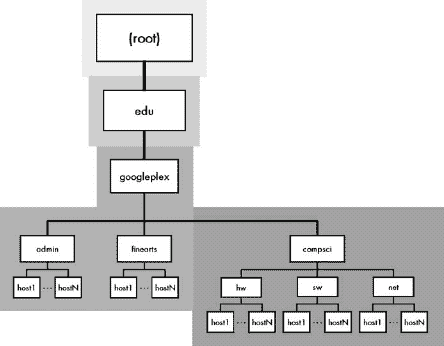

图 54-2. DNS 授权区域划分可以在 DNS 名称树中的节点之间进行，以创建名称权威的任意层次结构。此示例显示了 googleplex.edu 的 DNS 树分支，每个区域使用不同的阴影表示。IANA/ICANN 负责根域，一个名为 Educause 的独立权威机构负责.EDU。第三个区域覆盖了 googleplex.edu 的大部分，除了在 googleplex 和 compsci 之间进行了切割，以创建 compsci.googleplex.edu 的独立授权区域。

一个区域的权威服务器是指维护该区域官方信息的服务器，以及最终负责提供关于该区域名称解析信息的服务器。我们将在第五十六章关于 DNS 服务器和名称解析的部分中讨论这一点。

### 小贴士

**关键概念** DNS 名称注册层次结构被划分为称为*授权区域*的区域。每个区域代表一个独立管理的区域，由 DNS 名称树的连续段组成。

每个 DNS 区域都有一组权威服务器，通常是一对称为*主服务器*（或*主服务器*）和*辅助服务器*（或*从服务器*）。然而，单个 DNS 名称服务器也可能对多个区域具有权威性。

如前所述，域的实际所有者并不总是需要为其提供 DNS 服务。非常常见的是，特别是对于由小型企业或个人拥有的域，DNS 服务通常由第三方提供，通常是 ISP。例如，自从 1997 年以来，我就已经将 pcguide.com 注册为一个域，但我的长期网络托管提供商 pair Networks 从一开始就为我提供了 DNS 服务。这意味着 pair 的 DNS 服务器在 pair.com 的层次结构中负责 pcguide.com。它们还负责该公司客户的其他许多域。

# DNS 私有名称注册

我们现在已经审查了 DNS 名称空间的层次结构性质以及管理它的权威结构。名称注册从名称层次结构根部的通用和国家代码顶级域开始，然后继续到顶级域内的二级域，然后是那些二级域下的更低级子域。随着我们沿着名称树向下移动，我们从最一般的公共权威（IANA/ICANN，它运行所有的 DNS）通过高级顶级域权威，最终下降到个人组织、公司和个人的层面。

公共当局和私人当局之间的这种界限在名称结构中的许多不同地方都会出现。无论它出现在哪里，在该线以下，域的责任就变成了注册该域的组织。该组织可以进一步细分名称空间，将其部分授予其他组织，甚至可以转售。或者，一个组织可能决定使用名称空间来创建一个纯粹内部的结构。我称这种做法为*私有名称注册*，与本章前面描述的*公共名称注册*相对。

例如，如果一家名为 XYZ 工业的公司注册了 xyzindustries.com，那么该公司不仅成为该域名名的所有者，而且成为该公司可能选择创建的任何子域结构或命名项的所有者。这是授权委派和分层结构的美丽和强大之处。然而，该公司必须做出一个重要的决定：他们是否希望创建成为全球 DNS 名称结构一部分的名称，或者是否仅在结构内部使用名称。

## 使用公开可访问的私有名称

如果一个组织的管理员希望其域内的名称成为全球 DNS 名称结构的一部分，他们必须完成必要的设置和管理工作，以确保这些名称适合 DNS。最常见的例子是创建一个公共的万维网服务器。大多数公司以 www 开头命名此类服务器，因此 XYZ 工业公司可能希望将其 Web 服务器地址命名为 www.xyzindustries.com。

显然，XYZ 工业公司的所有者希望并且需要互联网上的任何人都能找到这个服务器。因此，尽管他们拥有 xyzindustries.com 域的私人控制权，并且拥有 www.xyzindustries.com 的名称，但他们必须遵循适当的程序来确保为他们的 www 子域设置 DNS 资源记录，以便互联网上的每个人都能找到它。如果他们运行自己的 DNS 服务器，他们可以自己这样做，或者可以由 ISP 或其他第三方代为完成，如前所述。

## 用于内部使用的私有名称

另一种选择是为仅在组织内部使用的名称创建纯粹私有的名称。例如，即使 XYZ 希望有一个公共的 Web 服务器，管理员可能也希望为仅在公司内部访问的其他许多机器命名。在这种情况下，他们不需要设置这些机器以便它们可以被公开识别。他们可以创建私有机器名称，并在自己的网络内部管理它们。

### 小贴士

**关键概念** 一旦一个组织注册了特定的域名，它就成为了该域名的所有者，并可以决定是否以及如何在该域名内创建子结构。如果一个组织希望域名内的对象可以在公共互联网上访问，它必须将其域名结构化以符合互联网 DNS 标准。或者，它可以创建一个完全私有的域名，使用它喜欢的任何结构和规则。

常见的做法之一是利用较旧的宿主表名称系统。这个系统现在对于大型互连网络来说已经过时，但由于其简单性，在较小的公司中仍然经常使用。通过将其添加到组织内每台计算机的宿主表中，一个名称就会被*注册*，当宿主机的操作系统在执行标准 DNS 解析方法之前检查此文件时，该名称就会被*解析*。在这种情况下，宿主表补充了 DNS（它实际上不是 DNS 的一部分）。这两个系统是互补的，可以一起工作，如第五十一章中所述。

## 在不连接到互联网的网络中使用私有名称

注意，如果你正在运行一个完全私有的网络，完全不连接到互联网，你实际上可以设置自己的完全私有的名称层次结构并自行运行 DNS。在这种情况下，你是 DNS 根的负责人，可以使用你喜欢的任何命名系统。

这种方法有时被认为很有吸引力，因为你可以然后在小型网络中使用非常简单的机器名称，而无需进行任何公共注册或使用与全球层次结构相对应的名称。例如，XYZ 工业的会计计算机可以命名为 accounting，而不是 accounting.xyzindustries.com，在内部它可以是 accounting。在访问资源时，你也可以将这些名称与真实 DNS 名称混合使用。例如，Joe 的机器可以简单地称为 joe，而 UPS 的网站当然仍然是 www.ups.com。

这种私有和公共名称混合的最常见例子是为计算机的环回地址定义私有本地名称。大多数 Windows 和 UNIX 机器将名称*localhost*定义为地址 127.0.0.1，这意味着在任何 TCP/IP 机器上都是“这台计算机”。

# 第五十五章。DNS 名称服务器概念和操作


在所有组合起来形成域名系统（DNS）的组件和功能元素中，名称服务器可能是最重要的。这些服务器可以是专用设备，也可以是在执行其他任务的机器上运行的软件进程。它们存储和管理有关域的信息，并响应用户的解析请求——在某些情况下，每天可能数百万次。了解它们如何执行这项最基本的工作以及它们负责的许多支持性工作对于理解 DNS 的整体运作至关重要。

在本章中，我将介绍与 DNS 名称服务器相关的概念，并解释它们是如何运作的。我首先概述 DNS 名称服务器功能和一般操作。我描述了 DNS 名称服务器数据如何存储在资源记录中以及类别的角色。我讨论了 DNS 中名称服务器的不同角色，并解释了至关重要的根名称服务器。我还讨论了 DNS 区域的管理、域名联系和区域传输的概念，以及如何使用缓存和负载均衡来提高 DNS 的效率。最后，我简要概述了几个对基本 DNS 服务器操作进行改进的增强功能，包括新的 Notify 和 Update 消息类型以及增量区域传输。

### 小贴士

**相关信息** *本节中的信息应被视为与以下章节中 DNS 解析器相关的补充信息*。

# DNS 一般操作

命名系统的三个主要功能是创建命名空间、执行命名注册以及提供命名解析服务。前几章描述了 DNS 如何使用分层树结构来构建其命名空间（第五十三章)：

**RR 字段格式（二进制）表示** 命名服务器需要通过在 DNS 消息中发送 RR 来响应对名称信息的查询。显然，我们希望尽可能高效地完成这项工作，因此每个 RR 都使用一种特殊的字段格式内部存储，这种格式类似于其他协议中用于消息的许多字段格式。所有 RR 都使用一种通用的字段格式来表示它们的一些字段，然后有一个特定于 RR 类型的独特部分。

**主文件（文本）表示** 计算机乐于交换二进制编码的字段格式，并且没有问题记住例如，RR 类型 15 对应于邮件交换（MX）记录。然而，人类管理员希望能够快速轻松地维护 DNS 信息，而无需记住难以理解的代码或处理二进制值。因此，DNS 使用*主文件*格式作为其用户-机器界面，这使得可以以文本形式指定 RR，以便更容易维护。


图 55-1. DNS RR 主文件和二进制字段格式

为了满足人类和计算机的需求，DNS 为 RR 中存储的数据使用两种表示形式。管理员在文本 DNS 主文件中输入和维护信息。这些文件由 DNS 服务器软件读取，并在内部以二进制格式存储，以回答 DNS 请求。

## RRs 和主文件的使用

每个节点可能具有可变数量的记录，具体取决于节点类型和为其保留的信息。当 DNS 信息发生变化时，通过修改服务器计算机上的文本主文件的管理员添加、更改或删除 RR。然后，DNS 服务器软件将这些文件读入内存，解析（解释），并转换为二进制形式。然后它们就准备好用于解决 DNS 名称请求和其他查询。我在 第五十七章 中描述了二进制 RR 字段格式和主文件格式。

### 小贴士

**关键概念** DNS 命名服务器以 *资源记录 (RR)* 的形式存储 DNS 信息。每个 RR 包含 DNS 树中节点特定类型的信息。RR 有两种表示形式：传统的二进制字段格式用于 DNS 命名服务器和解析器之间的通信，而文本 *主文件* 由管理员编辑以管理 DNS 区域。

## 常见 RR 类型

主要 DNS 标准，RFC 1034 和 1035，定义了多种 RR 类型。随着时间的推移，该列表已发生变化，新的 RR 类型在后续标准中被创建，而其他 RR 的使用方式发生了变化。与其他互联网参数一样，DNS RR 类型的列表由互联网数字分配机构 (IANA) 维护。同样，与其他互联网参数一样，DNS 中实际上定义了数十种 RR，但只有少数被广泛使用；其他现在已过时，用于特殊目的或具有实验性质。当前 DNS 资源记录列表维护在一个文件中，该文件可以在 [`www.iana.org/assignments/dns-parameters`](http://www.iana.org/assignments/dns-parameters) 找到。

表 55-1 总结了最重要的 RR 类型。对于每一种类型，我都展示了记录的数值类型值，该值用于在消息交换中识别 RR 类型，以及在主文件中使用的文本代码。

表 55-1. 常见 DNS 资源记录摘要

| RR 类型值 | RR 文本代码 | RR 类型 | 描述 |
| --- | --- | --- | --- |
| 1 | A | 地址 | 包含一个 32 位 IP 地址。这是 DNS 的“精髓”，因为它是存储节点地址以进行名称解析的地方。 |
| 2 | NS | 命名服务器 | 指定权威于该区域的 DNS 命名服务器名称。每个区域必须至少有一个指向其主 DNS 服务器的 NS 记录，并且该名称也必须有一个有效的地址 (A) 记录。 |
| 5 | CNAME | 规范名称 | 用于定义指向节点真实名称的别名。CNAME 记录提供了此别名与节点规范（真实）名称之间的映射。它通常用于通过让外部用户使用不变的别名来隐藏内部 DNS 结构的变化，同时根据组织的需求修改内部名称。有关示例，请参阅第五十六章中关于名称解析的讨论。第五十六章。 |
| 6 | SOA | 权限起始 | 用于标记 DNS 区域的开始并提供有关该区域的重要信息。每个区域必须恰好有一个 SOA 记录，其中包含区域名称、其主（主）授权服务器名称以及技术细节，例如管理员电子邮件地址和从（辅助）名称服务器更新的参数。 |
| 12 | PTR | 指针 | 提供对名称空间中另一个位置的指针。这些记录最著名的用途是通过 IN-ADDR.ARPA 域（在第五十四章中描述）进行反向解析。 |
| 15 | MX | 邮件交换 | 指定负责处理发送到该域的电子邮件的位置（设备名称）。 |
| 16 | TXT | 文本字符串 | 允许存储与域名相关联的任意附加文本。 |

所有这些 RR 都以不同的方式用于定义区域及其内部的设备，然后允许进行名称解析和其他功能。您将在第五十六章（涵盖名称解析）中详细了解它们的使用方法。您还可以在第五十七章（专门介绍 RR 字段格式）中找到一些更详细的描述。第五十七章。

### 小贴士

**相关信息** *有关 IPv6 DNS 支持的特定 RR 类型，请参阅第五十七章末尾的主题。第五十七章。*

## RR 类别

最后，我想提及关于资源记录（RR）的一个历史性注释。当 DNS 首次创建时，其发明者希望它尽可能通用。为此，他们设计得使其能够理论上为多种底层协议提供名称服务；也就是说，DNS 可以同时支持 TCP/IP 以及其他协议。

当然，协议有不同的寻址方案，对名称解析的需求也各不相同。因此，DNS 被定义为每个协议都可以有一组独特的 RR 类型。每组 RR 类型被称为一个*类别*。技术上，必须使用类别标识符和 RR 类型来标识 RR。与 RR 类型一样，类别有一个数字代码和一个文本缩写。TCP/IP 的类别使用数字 1，文本代码为 IN（代表互联网）。

实际上，这种关于多个 RR 类别的概念从未流行起来。据我所知，今天 DNS 仅用于 TCP/IP。（可能有少数例外。）RFC 1035 定义了几个其他类别，并在 IANA DNS 参数列表中列出，但它们是相对不为人知的、实验性的或过时的网络类型，例如 CSNET、CHAOS 和 Hesiod。你仍然会在 DNS 消息和 RR 格式的规范中看到这个类别的概念，但今天实际上只有一个类别：IN，代表 TCP/IP。因此，在大多数情况下，可以在 DNS 相关命令和数据条目中省略类别名称，默认情况下将假设为 IN。

### 小贴士

**关键概念** DNS 标准最初是为了允许它们与多个协议一起工作而创建的，通过指定每个 RR 的类别。今天，唯一常用的类别是 TCP/IP 的类别，称为 IN（代表互联网）。

# DNS 名称服务器类型和角色

到目前为止，我们已经探讨了 DNS 服务器的功能，重点是存储名称服务器信息的重要任务。互联网上有数以千计的 DNS 服务器，并且它们并不都以相同的方式使用。每个 DNS 服务器在名称系统的整体运行中都有特定的角色。不同类型的服务器也以各种方式相互交互。

## 主（主）/从（辅助）服务器

每个区域至少需要一个负责该区域的 DNS 名称服务器。这些 DNS 名称服务器被称为该区域的*权威*服务器，因为它们包含描述该区域的完整 RR 集合。当任何互联网设备想要了解有关区域的信息时，它会咨询其权威服务器之一。

从严格的理论角度来看，每个区域或域有一个名称服务器就足以提供整个 DNS 名称结构的名称解析服务。然而，从实现的角度来看，每个名称空间部分只有一个名称服务器并不是一个明智的选择。相反，每个区域通常至少与两个名称服务器相关联：一个*主*或*主控*名称服务器，以及一个*辅助*或*从属*名称服务器。一些区域可能有多个辅助名称服务器。

### 注意

*在 DNS 标准中，经常使用主和从术语来指代区域两个权威服务器的角色。然而，现在主和从是首选术语，因为主和从有些含糊不清，并在其他上下文中使用。你应该准备好看到这两个术语都被使用*。

主域名服务器显然是最重要的服务器。该区域的 RR 主文件保存在这个域名服务器上，因此主域名服务器是关于该区域信息的最终权威。然而，有几个原因说明从服务器也很重要：

**冗余** 如果只有一个域名服务器并且它失败了，将没有人能够将诸如[www.xyzindustries.com](http://www.xyzindustries.com)之类的名称解析为 IP 地址，这将是一件糟糕的事情。从域名服务器作为它们支持的主服务器的备份。冗余是在设置主从域名服务器时最重要的考虑因素。在服务器室中将两台机器并排放置，连接到相同的电源服务，都连接到互联网，使用相同的互联网服务提供商（ISP），并将一台作为主 DNS 服务器，另一台作为从服务器并不是一个明智的选择。理想情况下，主服务器和辅助服务器应该尽可能独立；它们应该在物理上相距很远，并且有独立的互联网连接。

**维护** 当有多个服务器时，我们可以在需要时轻松地将主服务器关闭进行维护，而不会中断域名解析服务。

**负载处理** 忙碌的区域可以使用多个服务器来分散域名解析请求的负载，以提高性能。

**效率** 在许多情况下，为了提高效率，将域名服务器放置在特定的地理位置是有利的。例如，一家公司可能在遥远的地方有一个办公室，使用低速广域网链路连接。为了减少通过该链路的域名解析流量，让该区域的信息在连接两端的域名服务器上可用是有意义的，这需要两个物理服务器。

正如“master”和“slave”这两个名称所暗示的，辅助域名服务器不是关于一个区域信息的原始来源。它们通常不是从人工编辑的主文件中获取 RR，而是从主服务器的更新中获取。这是通过一个称为“区域传输”的过程来完成的。这些传输定期执行，以确保从服务器保持最新。从服务器然后可以响应带有当前信息的域名解析请求。主服务器和从服务器都被认为是该区域的权威。

## 域名服务器角色

一个区域的 master 和 slave 角色是逻辑上的，并不总是对应于单个物理硬件设备。在以下情况下，单个物理域名服务器可以扮演多个角色：

+   它可以是一个区域的主域名服务器，也可以是多个区域的主域名服务器。在这种情况下，每个区域都有一个独特的 RR 集合，这些 RR 集合被保存在单独的主文件中。

+   它可以是为多个区域提供从域名服务器。

+   它也可以是某些区域的主域名服务器，同时也是其他区域的主域名服务器。

然而，请注意，单个物理名称服务器不能是同一区域的 master 和 slave 服务器。

### 小贴士

**关键概念**一个区域的 master DNS 服务器是其主服务器，它维护 DNS 信息的主副本。大多数 DNS 区域也至少有一个从服务器或辅助 DNS 服务器。这些服务器很重要，因为它们作为主服务器的备份，还可以帮助分担繁忙区域中响应请求的负载。辅助名称服务器定期从主服务器获取信息。主服务器和从服务器都被认为是它们维护的数据所在区域的权威服务器。

## 仅缓存名称服务器

为了提高效率，所有 DNS 服务器——无论是主服务器还是从服务器——都会执行 DNS 信息的缓存，以便在不久的将来如果需要再次使用。 (缓存将在本章后面的“名称服务器缓存”部分中描述。)缓存的重要性非常显著，以至于一些服务器仅用于从其他 DNS 服务器缓存信息。不出所料，这些被称为*仅缓存*名称服务器。

这些名称服务器对任何区域或域名都不是权威的，并且它们不维护任何 RR。它们只能通过联系其他权威的名称服务器来回答名称解析请求，然后转达信息。然后它们将信息存储起来以供未来的请求使用。为什么这样做？原因在于性能。通过战略性的放置，仅缓存服务器可以通过减少对权威服务器的请求来显著提高某些网络中的 DNS 解析性能。

### 小贴士

**关键概念**有一些 DNS 服务器不维护自己的 DNS RR，但仅保留来自其他区域的最近使用的信息。这些被称为*仅缓存*名称服务器，并且对任何区域都不是权威的。

# DNS 区域管理、联系人和区域传输

特定 DNS 区域的权威性负责执行各种任务以管理它。*区域管理*包括与区域相关的所有工作的范围：决定区域内的名称层次结构、指定名称注册的程序、与保持 DNS 服务器运行相关的技术工作，以及各种类型的行政开销。这项工作可能非常小，也可能非常大，具体取决于组织的类型。个人拥有的小型域名不需要太多工作来管理，而大型公司的域名可能需要专门的员工来维护。

## 域名联系人

重要的是，任何在互联网上的人都能确定域的所有者是谁，这样那个人就可以因为任何原因被找到。在互联网上，每个 DNS 域都与一组三个*联系人*相关联，这些联系人负责管理域的不同方面：

**管理联系人**主要联系人，负责整个域名。这个个人或组织被认为是域的总体所有者。

**账单联系人** 负责处理域名服务和其他会计事项的付款。

**技术联系人** 负责处理为域名设置 DNS 并确保其正常工作的技术细节的联系人。

对于较小的域名，通常没有单独的账单联系人；它与行政联系人相同。相比之下，在大型和小型域名中，技术联系人通常与行政联系人不同。大型组织会将技术联系人指定为信息技术部门的人员。小型组织通常让他们的 ISP 提供 DNS 服务，在这种情况下，技术联系人将是该 ISP 的某位人员。

### 小贴士

**关键概念** 每个 DNS 域名都与一组三个联系人名称相关联，指示谁负责管理它。*行政联系人*是对域名负有总体责任的个人。*账单联系人*负责付款问题；这可能与行政联系人相同。*技术联系人*负责域的技术事宜，通常与行政联系人不同，尤其是在 DNS 服务外包的情况下。

## 区域传输

区域管理的最终目的是确保区域的信息在区域的主和从域名服务器上保持最新，以便可以有效地提供给名称解析器。因此，区域管理始于决策和行政行动，这些行动导致区域 RR 的变化。这些变化反映在区域主（主）DNS 服务器上的 DNS 主文件的变化中。

相比之下，每个区域的二级 DNS 服务器作为主主服务器的从服务器。它们携带有关区域的信息，但不会从本地编辑的本地主文件中加载信息。相反，它们定期从主域名服务器获取信息。负责此过程的程序称为*区域传输*。

主域名服务器的记录可以随时更新。一旦主域名服务器的记录被更改，从域名服务器的信息就会变得部分过时。这通常不是什么大问题，因为大部分数据仍然准确，二级服务器将继续使用它所拥有的最新信息来响应解析请求。然而，定期更新从服务器显然很重要；如果不这样做，最终它们的数据将变得陈旧且不可靠。为此，有必要定期执行区域传输。

### 控制区域传输发生的时间

控制区域传输发生的时间需要实现在服务器之间的通信过程，该过程包括两个基本部分。首先，我们需要一个机制，允许从属服务器定期检查主服务器上的数据变化。其次，当需要时，我们必须有一个机制从主域名服务器复制区域记录（RR）到从服务器。

这两种机制都使用了标准的 DNS 查询/响应设施和区域 RR 的特殊字段。特别重要的是区域的权威开始（SOA）记录，它包含几个参数，用于控制区域状态检查和区域传输。虽然这些参数的正式描述可以在 RR 格式描述的第五十七章中找到，但我将在这里讨论它们的使用方法。

当从属域名服务器启动时，它可能对区域一无所知，或者它可能在其本地存储中存储了区域 RR 的副本，这是它上次运行时的情况。在前一种情况下，它必须立即执行完全区域传输，因为它没有任何信息。在后一种情况下，它将从本地存储中读取其最后已知的区域副本；根据配置，它可能立即在主服务器上执行一个*轮询*以查看数据是否已更改。轮询是通过请求区域的 SOA RR 来完成的。

SOA 记录中的序列号字段包含一个序列号（可能是任意的，也可能被编码以具有特定的含义），它充当主服务器区域数据库的版本号。每当区域的主文件被修改（无论是通过手动编辑还是通过其他方式自动修改）时，此序列号都会增加。因此，从属服务器可以通过查看最近 SOA 记录中的序列号是否大于从属服务器上次轮询主服务器时存储的序列号来检测主服务器上的更改。如果序列号已更改，从属服务器将开始区域传输。

SOA 记录中的其他三个字段控制从属域名服务器用于轮询和更新其信息的时机：

**刷新** 此字段指定从属服务器在尝试检查主服务器上的更新之间等待的秒数。假设从属服务器可以建立联系，这是从属服务器上的数据在主服务器发生变化时可能变得过时的最长时间段。

**重试** 此字段控制从属服务器在尝试再次与主服务器联系之前必须等待多长时间，如果其最后一次尝试失败。这用于防止快速连续尝试联系主服务器，这可能会阻塞网络。

**过期** 如果由于任何原因，从属名称服务器无法与主服务器联系给定字段值表示的几秒钟，它必须假设它拥有的信息已过时，并停止使用它。这意味着它将停止作为该区域的权威名称服务器行事，直到它收到更新。

这些参数是区域 SOA 记录的一部分，这使区域管理员完全控制主名称服务器更新的频率。在一个变化很少的小区域中，从属服务器进行检查的间隔可以增加；对于较大的区域或经常更改的区域，刷新间隔可以减少。

### 区域传输机制

当需要区域传输时，它通过向主服务器发送 DNS 查询来完成，使用的是用于名称解析的常规 DNS 查询/响应消息方法（下一节将讨论）。用于启动区域传输的特殊 DNS 问题类型称为 AXFR（地址传输）。服务器随后将使用一系列 DNS 响应消息传输该区域的 RR（假设请求传输的服务器有权这样做）。由于区域传输必须可靠地接收，并且要发送的数据量很大且需要管理，因此必须首先建立并使用传输控制协议（TCP）会话来执行区域传输。这与用于常规 DNS 消息的更简单的用户数据报协议（UDP）传输方式形成对比（如第五十七章开头讨论的 DNS 中使用 UDP 和 TCP 的部分所述）。

一旦区域传输完成，从属名称服务器将更新其数据库并返回常规操作。它将继续每刷新秒对主服务器进行常规轮询。如果它遇到常规轮询的问题，它将在重试秒后再次尝试。最后，如果经过的时间等于过期秒数，主名称服务器将停止从该区域提供数据，直到它与主名称服务器重新建立联系。

### 小贴士

**关键概念** 从属名称服务器不是由管理员直接管理其 DNS 信息。相反，它们通过称为区域传输的过程定期从其主名称服务器获取信息。在权威起始（SOA）DNS RR 中的几个字段控制区域传输过程，包括指定传输的频率以及从属名称服务器如何处理无法联系主服务器等问题条件。

注意，DNS *通知*功能是对基本区域状态检查/区域传输模型的增强。它允许主服务器在主数据库发生变化时通知从服务器。另一个新功能允许只传输区域的一部分而不是整个区域。有关更多信息，请参阅本章后面关于 DNS 名称服务器增强的讨论。

# DNS 根名称服务器

DNS 强烈围绕分层结构的概念。名称空间、注册机构和名称服务器都排列成树状结构。像这些结构一样，名称解析过程也是分层的。正如第五十三章中解释的那样，完全合格域名（FQDN）是通过从最不具体的域名元素（标签）开始，逐步向最具体的一个进行解析。

自然地，每个名称的最不具体部分是整个 DNS 结构存在的根节点。这意味着，如果没有缓存和其他性能增强，所有名称解析都从名称树的根开始。我们在这里找到一组负责 DNS 根的名称服务器功能：DNS *根名称服务器*。

像所有名称服务器一样，DNS 根名称服务器存储有关根区域内所有节点的信息，并提供名称解析服务。这包括某些特定的顶级域名（TLD）和子域名。然而，大多数 TLD 都有自己的区域。根名称服务器被用作获取每个这些 TLD 的权威服务器的名称和地址的“首选”地点。例如，如果我们想解析名称[www.xyzindustries.co.uk](http://www.xyzindustries.co.uk)，根名称服务器就是解析器找到负责.UK 的名称服务器的地方。

## 根名称服务器冗余

显然，这些根名称服务器对于整个 DNS 系统的运行至关重要。如果发生任何导致根名称服务器停止运行的情况，整个 DNS 系统将基本关闭。因此，显然不仅仅有一个根服务器，也不是两个或三个；目前有（目前）十三台不同的根名称服务器。

事实上，实际上物理服务器的数量远超过 13 台。这 13 个名称服务器中的大多数都是几个独立物理硬件服务器的集群实现。有些是分布在不同物理位置的分布式服务器集合。最好的例子是 F 根服务器，它已经在世界各地以超过一打的*镜像*形式实现，以提供更好的服务。

对于选择一个常规域的辅助域名服务器而言，冗余原则是一个好主意，显然这一点在根域名服务器上更是如此。这就是为什么组成 13 个根服务器的各种物理设备都分布在全球不同的地方。其中许多位于美国，但这些服务器遍布全国许多地方（尽管集中在加利福尼亚的几个热点地区以及华盛顿特区附近），并且配置了不同的网络来连接互联网。

根域名服务器当然非常强大。尽管有几十台硬件设备来分散负载，但它们必须每天 24 小时处理大量数据。它们由网络专业人员运行，确保它们高效运行。互联网标准 RFC 2870，“根域名服务器操作要求”，规定了这些域名服务器的基本规则和实践。它规定了确保服务器安全以及避免由于它们的关键作用而导致的性能问题的详细程序。

### 小贴士

**关键概念** DNS 根及其顶级域（TLD）的信息由一组*根域名服务器*管理。这些服务器对于 DNS 的运行至关重要。它们被安排成 13 个组，并在全球范围内物理分布。

尽管已经采取了所有努力以确保根服务器广泛分布且安全，但它们仍然共同代表了全球互联网的一个弱点。数以百万计的人依赖于这些服务器。过去曾发生过互联网上的恶意元素试图通过攻击根域名服务器来破坏 DNS 的事件。一个广为人知的事件是 2002 年 10 月 21 日对根服务器的拒绝服务（DoS）攻击。攻击失败了，但它显著提高了人们对这些服务器重要性的认识以及 DNS 安全的重要性。

## 当前根域名服务器

最初，根域名服务器被赋予了反映运行它们的组织的域名。在这些历史名称中，我们可以看到互联网发展中的大玩家的名单：信息科学研究所（ISI）、国家航空航天局（NASA）、美国军事以及其他机构。其中一些服务器仍然由政府机构或美国军事运行，在这些机构中可以实施额外的安全措施来保护它们。然而，为了方便起见，现在所有根域名服务器都在特殊域名 root-servers.net 中赋予字母名称。

表 55-2 显示了截至本书出版日期的 DNS 根域名服务器的最新信息。为了您的兴趣和娱乐，我还将这些服务器的位置绘制在 图 55-2 中。

表 55-2. 因特网 DNS 根域名服务器

| 根服务器名称 | IP 地址 | 历史名称 | 位置 |
| --- | --- | --- | --- |
| a.root-servers.net | 198.41.0.4 | ns.internic.net | Dulles, VA, U.S. |
| b.root-servers.net | 128.9.0.107 | ns1.isi.edu | Marina Del Rey, CA, U.S. |
| c.root-servers.net | 192.33.4.12 | c.psi.net | Herndon, VA and Los Angeles, CA, U.S. |
| d.root-servers.net | 128.8.10.90 | terp.umd.edu | College Park, MD, U.S. |
| e.root-servers.net | 192.203.230.10 | ns.nasa.gov | Mountain View, CA, U.S. |
| f.root-servers.net | 192.5.5.241 | ns.isc.org | Auckland, New Zealand; Sao Paulo, Brazil; Hong Kong, China; Johannesburg, South Africa; Los Angeles, CA, U.S.; New York, NY, U.S.; Madrid, Spain; Palo Alto, CA, U.S.; Rome, Italy; Seoul, Korea; San Francisco, CA, U.S.; San Jose, CA, U.S.; Ottawa, ON, Canada |
| g.root-servers.net | 192.112.36.4 | ns.nic.ddn.mil | Vienna, VA, U.S. |
| h.root-servers.net | 128.63.2.53 | aos.arl.army.mil | Aberdeen, MD, U.S. |
| i.root-servers.net | 192.36.148.17 | nic.nordu.net | Stockholm, Sweden; Helsinki, Finland |
| j.root-servers.net | 192.58.128.30 | — | Dulles, VA, U.S.; Mountain View, CA, U.S.; Sterling, VA, U.S.; Seattle, WA, U.S.; Atlanta, GA, U.S.; Los Angeles, CA, U.S.; Amsterdam, The Netherlands |
| k.root-servers.net | 193.0.14.129 | — | London, UK; Amsterdam, The Netherlands |
| l.root-servers.net | 198.32.64.12 | — | Los Angeles, CA, U.S. |
| m.root-servers.net | 202.12.27.33 | — | Tokyo, Japan |


图 55-2. 因特网 DNS 根域名服务器的地理位置

当前根域名服务器的列表可以在文件 ftp://ftp.rs.internic.net/domain/named.root 中找到。您也可以在 [`www.root-servers.org`](http://www.root-servers.org) 以更用户友好的格式找到这些信息。

# DNS 命名服务器缓存

名称服务器所做的大部分基础工作是对名称解析请求做出响应。繁忙的服务器——如根名称服务器、携带顶级域名（TLD）区域信息的那些服务器，以及服务于非常繁忙区域的服务器——必须每秒处理数百甚至数千个名称解析请求。每个请求都需要时间和资源来解析，并且会占用网络带宽来传输数据。因此，DNS 服务器实现必须采用机制来提高其效率并减少不必要的名称解析请求。其中最重要的机制之一就是 *缓存*。

## 名称服务器缓存

单词 *cache* 指的是存储的地方，或者存放某物的场所。在计算机世界中，这个术语通常指的是为存储最近获取的信息而保留的内存区域，以便再次使用。在 DNS 的情况下，缓存是由 DNS 名称服务器用来存储最近名称解析和其他请求的结果，这样如果请求再次发生，就可以从缓存中满足请求，而不需要再次完整地运行名称解析过程。由于大多数人使用计算机的方式，一个特定的请求通常会被对同一名称的另一个请求所跟随，因此缓存可以显著减少导致完整名称解析过程的请求数量。

举例说明是最好的方式。假设你正在使用公司局域网上的一个主机。这个主机可能被配置为使用公司的 DNS 名称服务器来处理解析请求。你将 [www.xyzindustries.com](http://www.xyzindustries.com) 输入到你的网络浏览器中，这会导致对该地址进行解析尝试。很可能你的本地 DNS 服务器不知道这个名称，因此它将遵循完整的名称解析过程（在 第五十六章 中描述）来获取其地址。完成这些后，你的本地 DNS 服务器将 *缓存* 名称 [www.xyzindustries.com](http://www.xyzindustries.com) 及其相关的地址。

如果你点击该网站页面的链接，新页面可能也位于 [www.xyzindustries.com](http://www.xyzindustries.com) 网站上。这将导致另一个 DNS 解析请求被发送到你的本地 DNS 服务器。然而，这一次，本地服务器不需要执行解析。它记得这个名称已经在它的缓存中，并立即返回保存的地址。哇！你得到了更快的答案，并且避免了不必要的互联网流量。

### 小贴士

**关键概念** *缓存* 是一个提高效率的重要特性，通过消除对最近已解析名称的不必要请求来减少 DNS 消息流量。每当解析一个名称时，产生的 DNS 信息就会被缓存，以便在之后不久发生的后续请求中使用。

当然，事情并不完全这么简单。在包括 DNS 中使用的缓存系统在内的每个缓存系统中都会出现一个非常重要的问题，那就是缓存的新鲜度问题。

## 缓存数据持久性和生存时间间隔

假设您的本地 DNS 服务器解析了名称[www.xyzindustries.com](http://www.xyzindustries.com)，然后缓存了其地址。在这个例子中，如果您在 XYZ Industries 主页加载后几秒钟点击链接，您可能不太关心 DNS 数据的新鲜程度。但如果您关闭计算机去度假两周，然后回来工作并在浏览器中再次输入该名称，如果您的本地服务器仍然在缓存中保留该名称，您如何知道[www.xyzindustries.com](http://www.xyzindustries.com)的 IP 地址在那两周期间没有发生变化？

使用两种不同的机制来解决这个问题。第一种机制是，当数据被缓存时，缓存服务器也会记录下数据来源的授权服务器。当一个解析器（客户端）请求域名解析，并且地址是从缓存中获取的，服务器会将答案标记为*非授权的*，以清楚地告诉客户端该名称来自缓存。服务器还会提供最初提供数据的授权服务器名称。

客户端然后有选择权：它可以使用非授权的答案，或者从授权服务器发出请求以获取新的名称解析。这是性能（使用缓存数据）和时效性（每次都请求新的解析）之间的权衡。通常，可以安全地使用缓存数据，因为 DNS 信息并不经常改变。

确保缓存数据不会过时的第二种技术是限制 DNS 缓存数据的*持久性*的程序。每个 RR 都与一个时间间隔相关联，称为*生存时间（TTL）*。每当从服务器读取 RR 时，记录的 TTL 也会被读取。任何缓存记录的服务器都应该在该时间间隔过期后丢弃该记录。

每个区域也与应用于该区域所有记录的 TTL 字段的默认值相关联。这允许管理员为区域中的所有记录选择一个 TTL 值，而无需为每个记录单独输入 TTL 数字。同时，管理员可以为需要不同默认值的任何记录分配一个覆盖 TTL 值。这个默认 TTL 最初保存在每个区域的特殊 SOA RR 中，但现在使用区域主文件中的特殊指令来处理。

### 注意

*这个生存时间（TTL）字段与在互联网协议（IP）数据报中使用的字段无关（见第二十一章). 显然，IP 和 DNS 是完全不同的协议，而且不仅如此，IP 和 DNS 中的 TTL 字段根本不具有相同的含义*。

值得强调的是，DNS 将缓存控制权交给了记录的所有者，而不是运行 DNS 服务器进行缓存的人。虽然特定的缓存服务器可以覆盖 TTL 并指定数据在其缓存中保留的时间，但 DNS 不应该这样工作。按记录指定 TTL 的能力允许根据个别数据元素的需求调整缓存数据的持久性。经常变化的数据可以分配较小的 TTL 值；不常修改的记录可以分配较高的 TTL。选择 TTL 值必须谨慎。这是性能（通过较高的 TTL 值优化，减少对缓存数据的查询次数）和数据新鲜度（随着 TTL 值的降低而增加）之间的另一个权衡。

### 小贴士

**关键概念** 缓存信息可能会随着时间的推移而变得过时，并导致向查询发送错误响应。每个 RR 都可以与一个时间间隔相关联，称为*生存时间（TTL）*，它指定记录可以在缓存中保留多长时间。此字段的值由 RR 的所有者控制，可以针对每种 RR 类型的具体需求进行调整。

## 负缓存

经典 DNS 缓存只存储成功的名称解析结果。DNS 服务器也可以缓存名称解析尝试失败的结果；这被称为*负缓存*。为了扩展本节中使用的示例，假设你错误地认为公司网站的名称是[www.xyz-industries.com](http://www.xyz-industries.com)并将其输入到浏览器中。你的本地 DNS 服务器将无法解析该名称，并将其标记为无法解析的缓存条目——一个负缓存条目。

假设你因为有人在内部备忘录中打字错误而错误地输入了名称。如果同事后来尝试了相同的名称，DNS 服务器会说：“我已经知道这是一个无效的名称，”并且不会再次尝试解析它。由于没有无效名称的 RR，服务器本身必须决定缓存这些负面信息的时间。负缓存可以提高性能，因为解析一个不存在的名称需要资源，就像解析一个现有的名称一样。请注意，常规缓存有时被称为*正缓存*，以区别于负缓存。

在区域中用于负缓存的值现在由每个区域的 SOA RR 中的最小字段指定。如前所述，这以前用于指定区域的默认 TTL。

# DNS 名称服务器负载均衡

地址记录（A）RR 是 DNS 中最基本的一个，因为它记录了域名与 IP 地址之间的实际映射。让我们暂时详细考虑这个句子中的一个单词。不，我的意思不是 *address* 或 *RR* 或 *mapping*。我是指单词 *an*！

地址记录只提及每个域名的一个地址。这意味着每个域名只映射到单个物理硬件设备。当特定服务器或其他设备需要处理的请求数量相对较少时，这并不是问题；通常可以使用单个物理硬件设备来实现该功能。如果服务器变得更繁忙，通常的解决方案是向问题投入更多硬件——获得更大的机器。

然而，在大型互联网上的一些主机，特别是互联网，拥有必须处理来自许多客户端的大量流量的服务器。例如，像 [www.cnn.com](http://www.cnn.com) 或 [www.microsoft.com](http://www.microsoft.com) 这样的网站，根本不存在可以轻松处理这些流量而不变得难以管理的单个硬件设备。这些网站必须使用一种称为 *负载均衡* 的技术来分散对多个硬件服务器的请求。

## 使用多个地址记录来分散对域名的请求

实现负载均衡的一种简单方法是有多个机器名称。例如，CNN 可以创建几个不同的网站，称为 [www1.cnn.com](http://www1.cnn.com)、[www2.cnn.com](http://www2.cnn.com) 等，每个网站都指向不同的硬件设备。DNS 当然支持这种类型的解决方案。这种解决方案的问题在于它很麻烦；它要求用户记住多个服务器名称。

如果我们能自动平衡负载那就更好了。DNS 通过提供一种简单的方式来实施负载均衡来支持这一点。而不是为名称指定单个地址记录，我们可以创建多个这样的记录，从而将多个 IP 地址与特定的 DNS 名称关联起来。当我们这样做时，每次该名称存在的区域的主权名称服务器解析该名称时，它都会将列表上的所有地址发送回请求者。服务器会改变响应中提供的地址的顺序，随机或顺序、循环方式选择顺序。客户端通常会使用服务器返回的列表中的第一个地址，因此通过改变列表，服务器确保对该设备名称的请求被解析到多个硬件单元。

### 小贴士

**关键概念** 与为 DNS 域名创建单个地址（A）RR 相比，可以创建多个。这会将多个 IP 地址与一个名称关联起来，可以用来将一个域名的多个请求分散到多个物理 IP 设备上。这允许 DNS 为繁忙的互联网服务器实现负载均衡。

随着互联网流量的增加，负载均衡变得越来越流行。在 2003 年初，我看到一项调查表明，当时大约有 10%的互联网名称使用了负载均衡——这是一个相当大的数字。大多数使用了两个或三个地址，但有些使用了多达六十个地址！顺便说一下，在最后一次检查时，[www.cnn.com](http://www.cnn.com)与八个不同的 IP 地址相关联。（您可以使用描述在第八十八章中的`host`命令来检查与名称相关联的地址数量。） 

## 使用多个 DNS 服务器分散 DNS 请求

术语*DNS 负载均衡*与我在上一节中描述的含义完全不同。在讨论 DNS 服务器角色时，我提到了每个区域除了主（主）服务器外，至少应该有一个从（辅助）DNS 服务器。通常认为这样做的主要原因是冗余，以防主服务器出现故障。然而，拥有一个从服务器还可以允许 DNS 解析请求的负载在服务器之间进行平衡。实际上，一些繁忙的域名正是因为这个原因而拥有超过两个服务器。

因此，*DNS 负载均衡*可以指使用 DNS 将请求（如网页请求）的负载分散到使用 DNS 命名的设备，或者是指将 DNS 请求本身的负载进行分散。

# DNS 名称服务器增强

DNS 服务器操作的基本原理，如本章前面各节所述，已在主要的 DNS 标准 RFC 1034 和 1035 中指定。按照计算机行业的标准，这些文件相当古老；它们是在 1987 年发布的。DNS 的设计者值得赞扬，他们最初在 DNS 协议中放入的大部分内容至今仍然有效并在使用中。DNS 的创造者知道它必须能够扩展到非常大的规模，并且该系统已经成功处理了互联网扩展到远远超出 15 年前任何人所能想象的程度。

如最初定义的那样，DNS 要求通过编辑主服务器上的主文件来手动更新区域的信息。然后，使用本章前面描述的轮询/区域传输机制，将整个区域复制到从服务器。当互联网相对较小且区域变化不频繁时，这种方法是令人满意的。然而，在现代互联网中，大型区域可能需要几乎持续不断地更改其 RR。手动编辑和不断复制主文件可能不切实际，尤其是当它们变得很大时，而从服务器在区域传输之间过时可能会导致可靠性和性能问题。因此，多年来提出了对 DNS 服务器操作的几个改进。在这里，我们将更详细地探讨其中的三个：DNS Notify、增量区域传输和动态 DNS。

## 自动化区域传输：DNS Notify

许多 DNS 管理员想要解决的第一个问题是依赖轮询来更新从服务器。想象一下，你在你最喜欢的在线音乐商店订购了一张新的音乐 CD，但它缺货——已预订。哪种方式更有意义：每六小时给你打电话询问你的 CD 是否到了，还是商店在 CD 出现时直接给你打电话？

答案如此明显，以至于问题似乎很荒谬。然而，DNS 使用第一种模型：从服务器必须不断调用其区域主服务器并询问他们：“有什么变化吗？”这不仅产生了不必要的流量，而且导致从服务器在主服务器*确实*更改直到下一次轮询执行期间过时。调整区域的刷新时间只允许在变化发生时在更多轮询和更多陈旧性之间做出选择；两者都不是真正的好方法。

为了改善这种情况，一种新的技术被开发并在 1996 年发布的 RFC 1996 中正式化（奇怪的巧合！）。这个标准，“一种用于快速通知区域变化的机制（DNS NOTIFY）”，定义了一种新的 DNS 消息类型，称为*Notify*，并描述了其使用协议。Notify 消息是标准 DNS 消息类型的一种变体，其中一些字段被重新定义以支持这个新特性。

如果主服务器和从服务器都支持这个特性，当对一个 RR 进行修改时，主服务器将自动向其从服务器发送一个 Notify 消息，说：“你的 CD 已经到了！”嗯…“数据库已经更改。”然后从服务器就像其刷新计时器刚刚到期一样行动。启用此功能允许刷新间隔显著增加，因为从服务器不需要不断轮询主服务器以获取更改。

### 小贴士

**关键概念** 可选的 DNS Notify 功能允许主名称服务器在区域中更改时通知从属名称服务器。这有两个优点：它减少了从属服务器查找 DNS 信息是否已更改的不必要轮询，并且它还减少了从属名称服务器具有过时记录的时间。

## 提高区域传输效率：增量传输

正常 DNS 的第二个问题是，每当对区域任何部分进行更改时，都需要传输整个区域。互联网上有许多区域具有真正巨大的主文件，这些文件不断变化。例如，考虑 .COM 区域的主文件。每次更改甚至一条记录时都必须将整个数据库复制到从属名称服务器，这效率低下——简直是疯狂！

RFC 1995，“DNS 中的增量区域传输”指定了一种新的区域传输类型，称为 *增量区域传输*。当在区域的名称服务器上实现此功能时，主服务器会跟踪对数据库所做的最新更改。每次从属服务器确定已发生更改并且从属服务器的数据库需要更新时，它都会向主服务器发送一个包含从属服务器当前数据库副本序列号的 IXFR（增量传输）查询。然后主服务器查看自该序列号以来哪些 RR 已更改，并将仅更新的 RR 发送到从属服务器。

为了节省存储空间，主服务器显然不会永远保留对其数据库所做的所有更改。它通常会跟踪数据库的最后几次修改，并关联每个修改的序列号。如果从属服务器发送一个包含序列号的 IXFR 请求，该序列号对应的主服务器上仍有最近更改的信息，则只发送更改作为回复。如果请求的序列号如此之旧，以至于主服务器不再具有自该数据库版本以来某些更改的信息，则执行完整区域传输而不是增量传输。

### 小贴士

**关键概念** DNS 的 *增量区域传输* 增强功能使用一种特殊的消息类型，允许从属名称服务器确定自上次与主服务器同步以来发生了哪些变化。通过仅传输更改，可以显著减少区域传输所需的时间和带宽。

## 处理动态 IP 地址：DNS 更新/动态 DNS

经典 DNS 的第三个问题是它假设对区域的更改不频繁，因此可以通过手动编辑主文件来处理。有些区域非常大，手动编辑主文件几乎会持续不断。然而，问题不仅仅是不便。常规 DNS 假设主机的 IP 地址相对静态。然而，现代网络利用诸如动态主机配置协议（DHCP）等主机技术（在第三部分-3 中描述），动态地为设备分配 IP 地址。当使用 DHCP 时，一个区域中每个主机的 IP 地址可能每周、每天甚至每小时都会改变！显然，使用人类和文本编辑器跟上这种变化速度是不可能的。

1997 年 4 月，RFC 2136，“域名系统（DNS）中的动态更新（DNS UPDATE）”被发布。该标准描述了基本 DNS 操作的一个增强，允许 DNS 信息动态更新。当此功能实现时，所得到的系统有时被称为*动态 DNS（DDNS）*。

RFC 2136 定义了一种新的 DNS 消息类型：更新消息。像通知消息一样，更新消息是围绕常规 DNS 消息的结构设计的，但对几个字段的含义进行了更改。正如其名所示，更新消息允许在区域的权威名称服务器中选择性地更改 RR。使用特殊消息语法，可以添加、删除或修改 RR。

显然，在使用此功能时必须谨慎，因为我们不希望任何人都可以随意更改我们的主记录。标准指定了一个详细的过程来验证更新消息，以及必须实施的安全程序，以确保服务器只从某些个人或系统接受此类消息。

动态 DNS 允许管理员更容易地进行更改，但它的真正力量只有在将其用于将 DNS 与其他地址相关协议和服务集成时才会显现。动态 DNS 解决了传统 DNS 的一个主要弱点：无法轻松地将主机名与使用类似 DHCP 协议分配的地址关联起来。

当 DNS 服务器支持此功能时，DNS 和 DHCP 可以集成，允许自动地址和名称分配，并在主机的 IP 地址更改时自动更新 DNS 记录。动态 DNS 的一个常见应用是允许那些使用动态分配 IP 地址的服务提供商接入互联网的人使用 DNS 名称。动态 DNS 也被某些目录服务使用，特别是微软的 Active Directory，以将地址与设备名称关联起来。

### 提示

**关键概念** 域名系统的一个增强功能，通常称为*动态 DNS（DDNS）*，允许服务器数据库中的 DNS 信息自动更新，而不是总是需要手动编辑主文件。这不仅可以为管理员节省时间和精力，而且还能使 DNS 更好地处理动态地址分配，例如 DHCP 等主机配置协议所执行的类型。

# 第五十六章。DNS 解析概念和解析器操作


在前三个章节中，我描述了域名系统（DNS）的命名空间、授权、注册机制和名称服务器。所有这些元素都可以被认为是 DNS 基础设施的一部分；它们是系统必须首先建立的部分，以便能够使用。一旦我们有了这些组件，我们就可以真正着手处理手头的工作：名称解析。这是通过 DNS 客户端执行的一系列特定程序来完成的，这些程序被称为*解析器*。

在本章中，我描述了 DNS 名称解析器和名称解析的过程。我首先概述了 DNS 解析器执行的功能以及它们在一般意义上的工作方式。然后，我描述了 DNS 中使用的两种基本名称解析方法：迭代解析和递归解析。我讨论了解析器如何通过本地解析和缓存来提高效率。我描述了实际名称解析算法的步骤。然后，我涵盖了名称解析的两个特殊情况：使用特殊 IN-ADDR.ARPA 域的逆向名称解析，以及 DNS 如何使用邮件交换资源记录提供邮件支持。

### 小贴士

**相关信息** *本节的信息补充了上一章关于 DNS 名称服务器的信息。在此，我假设你对 DNS 服务器至少有基本的了解*。

# DNS 解析器功能和一般操作

名称服务器可以说是 DNS 系统整体中最重要的部分。毕竟，它们存储了系统上的所有数据，并在名称被提供时实际上提供了我们需要的地址。没有这些服务器，DNS 将不复存在。当然，如果没有人请求服务，服务器有什么用呢？系统中的客户端，称为*解析器*，也很重要，因为它们启动了名称解析的过程。可以说，解析器是“接触地面”的地方。

DNS 解析器的操作在两个主要的 DNS 标准中进行了说明。RFC 1034 描述了解析器执行的功能以及它们在一般意义上的工作方式，包括讨论用于执行名称解析的算法。RFC 1035 更多地涉及解析器的实现细节以及它们如何完成工作的细微之处。几个后续标准对这些基本标准进行了修改，以不同的方式改变了解析器的工作方式。

## 名称解析服务

就像 DNS 服务器的主要工作是存储 DNS 名称数据并在收到请求时提供服务一样，DNS 解析器的主要工作就是解析。虽然大多数人认为名称解析仅仅是将 DNS 名称转换为 IP 地址的过程，但这只是 DNS 执行的多种解析服务类型之一。以下是一些最常见的 DNS 解析类型：

**标准名称解析** 以 DNS 名称作为输入，并确定其对应的 IP 地址。

**反向名称解析** 以 IP 地址作为输入，并确定与之关联的名称。

**电子邮件解析** 根据消息中使用的电子邮件地址确定发送电子邮件（email）消息的位置。

## 名称解析器执行的功能

还有其他类型的解析活动，尽管再次强调，大多数名称解析请求都是标准类型的，这使得它成为我们讨论的主要焦点。为了完成这项任务，名称解析器执行一系列相关功能：

**提供用户界面** 正常的名称解析通常不需要显式运行解析器软件。在你的网页浏览器中，你不必说，“请找到[www.xyzindustries.com](http://www.xyzindustries.com)的 IP 地址，”然后说，“请连接到这个 IP 地址以访问 XYZ Industries。”你只需输入[www.xyzindustries.com](http://www.xyzindustries.com)，名称解析就会发生。这里没有魔法。解析器只是被隐式地调用，而不是显式地调用。网页浏览器识别到输入的是名称而不是 IP 地址，并将其传递给解析器，说，“我需要你解析这个名称，请。”（嘿，礼貌一点总是好的。）解析器负责解析并提供 IP 地址给网页浏览器，浏览器连接到该网站。因此，解析器是用户（无论是人类用户还是软件用户，即浏览器）和 DNS 系统之间的接口。

**形成和发送查询** 给定一个要解析的名称，DNS 解析器必须使用 DNS 消息系统创建一个适当的查询，确定要执行哪种解析类型，并将查询发送到相应的名称服务器。

**处理响应** 解析器必须接收来自其发送查询的 DNS 服务器的响应，并决定如何处理回复中的信息。正如你将看到的，可能需要联系多个服务器才能完成特定的名称解析。

### 小贴士

**关键概念** DNS 中的主要客户端是称为 DNS *名称解析器*的软件模块。它们负责从客户端软件接收名称，向 DNS 服务器生成解析请求，并处理和返回响应。

这些任务看起来相当简单，在某些方面确实如此，但实施起来可能会相当复杂。解析器可能需要同时处理多个未完成的名称解析。它必须跟踪不同的请求、查询和响应，并确保一切保持清晰。

名称解析器不需要执行像名称服务器那样多的管理任务；在这一点上，客户端通常比服务器简单。然而，许多名称解析器执行的一个重要支持功能是缓存。像名称服务器一样，名称解析器可以缓存它们执行的名称解析结果，以节省时间，如果需要再次进行相同的解析。但是，并非所有解析器都执行缓存。

尽管解析器是与名称解析最相关的 DNS 组件，但名称服务器也可以在某些类型的名称解析中充当客户端。实际上，可以设置一个网络，使得每个客户端机器上的解析器除了将解析请求提交给本地 DNS 服务器外，别无他事。在这种情况下，客户端解析器几乎只是一个外壳，有时被称为*stub 解析器*。这有利于集中网络中的名称解析，但可能存在性能降低的潜在缺点。

# DNS 名称解析技术：迭代和递归解析

传统名称解析将 DNS 名称转换为 IP 地址。在最高层次上，这个过程可以被认为有两个阶段。在第一阶段，我们找到拥有所需信息的 DNS 名称服务器：与特定名称相对应的地址。在第二阶段，我们向该服务器发送包含我们想要解析的名称的请求，然后它返回所需的地址。

有点讽刺的是，第二阶段（将名称映射到地址的实际过程）相当简单。第一阶段——找到正确的服务器——可能是困难的，并且代表了 DNS 名称解析中的大部分工作。虽然这可能令人惊讶，但这却是 DNS 结构的一个可预测的结果。DNS 中的名称信息不是集中的，而是分布在整个服务器层次结构中，每个服务器负责 DNS 名称空间中的一个区域。这意味着我们必须遵循一系列特殊的步骤来找到拥有所需信息的服务器。

域名解析的正式过程与 DNS 名称空间、权威机构和服务器类似树状层次结构。特定 DNS 名称的解析从名称的最一般部分开始，逐步到最具体部分。自然地，每个名称的最一般部分是 DNS 树的*根*，在名称中以尾随点（.）表示，有时省略。下一个最具体的部分是顶级域名（TLD），然后是二级域名，依此类推。DNS 名称服务器之间是相互连接的，即某一层的 DNS 服务器知道下一层负责子域的服务器的名称。

假设我们以 C.B.A.作为完全限定域名（FQDN）。正式来说，每次名称解析都从树的根开始——这就是为什么根名称服务器如此重要的原因。根名称服务器可能对这个名称有权威性，但这可能不是情况；这不是根名称服务器通常被用于的目的。根名称服务器知道的是负责 TLD 的服务器名称：A.. A.的名称服务器可能拥有解析 C.B.A.所需的信息，但它仍然处于较高层次，所以 C.B.A.可能不在其区域内。在这种情况下，它将不知道我们寻求的地址，但它将知道负责 B.A.的服务器名称。反过来，那个名称服务器可能对 C.B.A.有权威性，或者它可能只知道 C.B.A.服务器的地址，该服务器将拥有我们所需的信息。正如你所看到的，在名称解析中可能需要几个不同的服务器。

### 小贴士

**关键概念** 由于 DNS 名称信息存储为分布式的数据库，分布在许多服务器上，因此通常不能使用单个请求/响应通信来执行名称解析。首先需要找到拥有解析器所需信息的服务器。这通常需要一系列的消息交换，从根名称服务器开始，逐步向下到包含客户端所需资源记录（RRs）的特定服务器。

DNS 标准实际上定义了两种不同的方法来遵循这个服务器层次结构以发现正确的一个。它们最终都会到达正确的设备，但在需要多个步骤进行解析时，它们在分配解析责任的方式上有所不同。这两种技术是*迭代解析*和*递归解析*。

## 迭代解析

当客户端向域名服务器发送迭代请求时，服务器会以以下两种方式之一响应：*或*提供请求的答案（对于常规解析，是我们想要的 IP 地址）或者提供另一个拥有信息或更接近该信息的服务器名称。原始客户端随后必须通过向该引用服务器发送新的请求来进行*迭代*，该服务器再次可能回答它或提供另一个服务器名称。这个过程会一直持续，直到找到正确的服务器。迭代解析方法在图 56-1 中说明。

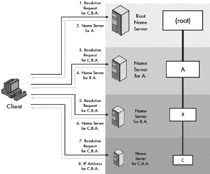

图 56-1. 迭代 DNS 名称解析在这个例子中，客户端正在使用严格迭代解析对 C.B.A.进行名称解析。因此，它负责形成所有 DNS 请求并处理所有回复。它首先向这个神话般的根域名服务器发送请求。该服务器没有 C.B.A.的地址，因此它不是仅仅将 A.名称服务器的地址返回给客户端，而是向该服务器本身发送请求。该名称服务器然后将客户端指向 B.A.的服务器。该名称服务器将客户端引荐给实际拥有 C.B.A.地址的名称服务器，该服务器将其返回给客户端。这与图 56-2

图 56-2. 递归 DNS 名称解析 这与图 56-1 中显示的理论 DNS 解析相同（图 56-1, 但这次，客户端请求名称服务器执行递归解析，并且它们同意这样做。与迭代情况一样，客户端将其初始请求发送到根名称服务器。该服务器没有 C.B.A. 的地址，但它没有仅仅返回给客户端 A 名称服务器的地址，而是向该服务器本身发送了一个请求。该名称服务器向 B.A. 的服务器发送请求，该服务器再向 C.B.A. 的服务器发送请求。C.B.A. 的地址随后沿着请求链向上传递，从 C.B.A. 的服务器到 B.A. 的服务器，然后是 A.，然后是根，最后回到客户端。

相比之下，假设你打电话给乔，乔说：“我不知道，但我认为我知道怎么找到答案。”他打电话给约翰，然后是黛比，然后给你打电话，告诉你电话号码。这就像递归解析。

所以，本质上，迭代就像是亲自做这项工作，而递归则像是推卸责任。你可能认为每个人都会总是想使用递归，因为这样可以让别人做工作。这是真的，但如果没有得到允许就推卸责任，这并不被视为好的行为。并不是所有的域名服务器都支持递归，尤其是那些处于层级顶部的服务器。显然，我们不希望某些域名服务器——如根域名服务器、处理.COM 的域名服务器和其他关键顶级域名服务器——因为递归而变得低效。正因为如此，客户端必须请求域名服务器为他们执行递归。递归经常被用在网络上的本地域名服务器中。而不是让客户端的解析器执行迭代解析，解析器通常会产生一个递归请求到本地 DNS 服务器，然后根据需要生成迭代请求到其他服务器。正如你所看到的，递归和迭代请求可以在单个解析过程中结合使用，为整个过程提供显著的灵活性。这一点在本书后面的“DNS 名称解析过程”部分的一个更现实的例子中得到了演示。

再次提醒，为了理解解析的目的，DNS 服务器可以充当客户端。一旦 DNS 服务器接受了一个它自己无法解析的名称的递归解析请求，它就成为了该过程中的客户端。此外，解析器通常知道不止一个本地 DNS 服务器的名称，所以如果到达第一个服务器有问题，他们可以尝试第二个。

### 小贴士

**关键概念** DNS 中的名称解析有两种方法：*迭代解析*和*递归解析*。在迭代解析中，如果客户端向一个没有所需信息的域名服务器发送请求，服务器会返回一个指向不同域名服务器的指针，客户端会向那个服务器发送新的请求。在递归解析中，如果客户端向一个没有所需信息的服务器发送请求，该服务器会承担向其他服务器发送请求以找到必要记录的责任，然后将它们返回给客户端。执行此操作的服务器在其对其他服务器的请求中扮演客户端的角色。

# DNS 名称解析效率改进：缓存和本地解析

从算法的角度来看，基本解析技术——迭代和递归——可以被认为是完整的。通过从顶部（根）开始，逐步向下工作，我们“保证”最终会到达拥有所需信息的服务器。我把“保证”这个词加了引号，因为，就像往常一样，在网络上没有真正的保证——我们可能请求了一个不存在的名称，或者服务器可能有错误的数据，例如。但在没有这种典型问题的情况下，这个过程最终会引导我们找到信息。

问题在于最后一个词：“最终”。迭代和递归解析都会带我们到达正确的服务器，但它们需要很长时间才能完成，尤其是如果我们试图解析的名称位于 DNS 层次结构的深层（例如，F.E.D.C.B.A.）。由于解析经常进行，定义对基本解析过程的改进，尽可能提高效率是有帮助的。

## 缓存的动机：引用局部性

计算机科学中的一个原则叫做*引用局部性*，它描述了与计算机（和网络）的使用相关的两种常见现象。第一种，有时被称为*空间局部性引用*，观察到如果资源靠近最近被引用的另一个资源，那么它更有可能被引用。第二种，*时间局部性引用*，表示如果资源最近被访问过，那么它更有可能被访问。

我们可以通过浏览网页的例子来观察这两种现象。为了观察空间局部性，注意当你访问像[`www.tcpipguide.com`](http://www.tcpipguide.com)这样的网站时会发生什么。最初的请求是向服务器请求*《TCP/IP 指南》*的主索引文档。然而，该文档包含指向几个图像和其他项目的链接，所有这些项目也都位于域名[tcpipguide.com](http://tcpipguide.com)下。当你浏览网站时，你会点击链接转到其他网页。同样，其中大部分也将位于相同的域名[tcpipguide.com](http://tcpipguide.com)下。

这意味着如果我们解析了一个特定的域名，我们很可能在不久的将来还需要再次解析它。每次都询问同一个域名服务器，要求它解析相同的名称，这将是愚蠢的。

第二种现象，*时间局部性引用*，是你自己可能已经注意到的。你访问最近使用过的资源比访问一年前没有看过的资源更有可能。这意味着维护关于最近使用过的资源的信息可以具有固有的优势。

这两种现象是计算机世界中缓存的一般理由，尤其是在 DNS 服务器中，正如你在第五十五章中看到的。相同的优势也适用于解析器，并且许多解析器也以与服务器类似的方式执行缓存。

## 名称解析器缓存

在特定的客户端计算机上，一旦解析了特定的名称，它就会被缓存并准备好下一次需要时使用。再次强调，这减少了 DNS 服务器上的流量和负载。（注意，然而，并非所有解析器都会执行缓存。）

你可能想知道为什么我们同时在解析器和服务器上设置缓存。这并不是多余的，看起来可能如此。或者更确切地说，它是多余的，但以好的方式。要理解为什么，我们必须认识到缓存的一个基本权衡是，缓存越靠近数据请求者，性能越好，但覆盖范围越广，距离用户越远。

如果解析器不缓存结果，但我们的本地服务器缓存了，我们可以从服务器的缓存中获取信息，但这需要等待查询和响应的交换。解析器的缓存更靠近用户，因此更高效。同时，这并不免除我们在网络本地 DNS 服务器上进行缓存的需要。服务器距离用户更远，但它的缓存被许多机器共享。它们都可以从其缓存中受益。例如，如果你查找了特定的名称，然后几分钟后另一个人也查找，她可以使用你的缓存解析，即使她第一次输入这个名称。

### 小贴士

**关键概念** 除了 DNS 名称服务器执行的缓存外，许多（但并非所有）DNS 解析器还会缓存最近解析请求的结果。在开始名称解析之前检查此缓存，以在多次请求同一名称时节省时间。

名称解析器的缓存遵循与名称服务器缓存相同的一般原则和规则，这些原则和规则在第五十五章（ch55.html "第五十五章。DNS 名称服务器概念和操作"）中概述。资源记录（RR）在缓存中保留的时间由其生存时间（TTL）值指定。此外，解析器不会缓存某些查询的结果，例如反向查找，并且如果它们怀疑（无论什么原因）返回的数据不可靠或损坏，也可能不会缓存解析。

## 本地解析

另一个可以提高解析效率的领域是，当我们试图解析我们自身组织中的计算机名称时。假设你是 XYZ 工业公司的一名员工，想通过文件传输协议（FTP）从[sales.xyzindustries.com](http://sales.xyzindustries.com)获取一些销售信息。你的 FTP 客户端将调用你的本地解析器来解析该名称，通过将其发送到你的本地 DNS 服务器。现在，这个位于公司内部的 DNS 服务器从根域名服务器开始解析过程，这明智吗？实际上并不明智。

接受来自网络中解析器本地解析请求的本地 DNS 服务器可能是[sales.xyzindustries.com](http://sales.xyzindustries.com)的权威名称服务器。在其他情况下，它可能知道如何直接回答某些解析请求。显然，在向根服务器发起正式自顶向下的解析过程之前，服务器检查是否能够回答解析器的查询是有意义的，因为这可以为客户端提供更快的答案并节省互联网流量。这被称为*本地解析*。

大多数 DNS 服务器都会在开始正式自顶向下的解析过程之前执行此检查，以查看它们是否拥有请求所需的信息。例外的是不维护任何区域信息的 DNS 服务器：*仅缓存服务器*。在某些情况下，客户端机器上的 DNS 解析器也可能有权访问某些本地区域信息，在这种情况下，它们可以使用这些信息而不是发送解析查询。

### 注意

*大多数操作系统都支持使用旧的主机表机制（在第五十一章中描述，第五十一章），这对于网络上的本地机器很有用。如果一个主机有主机表，解析器将在开始耗时更多的 DNS 解析过程之前检查主机表，看是否可以找到名称的映射。这虽然不是 DNS 的技术组成部分，但通常与 DNS 一起使用*。

# DNS 名称解析过程

在本章的前半部分，我描述了名称解析器的作用，解释了使用迭代和递归解析的基本自顶向下的解析过程，并讨论了如何使用本地解析和缓存来提高解析性能。现在，是时候将这些背景材料结合起来，看看整个名称解析过程是如何工作的了。

如同往常，最好的做法是通过例子来说明。在这里，我将结合两个之前用过的例子：虚构的公司 XYZ 工业公司和不存在的大学，谷歌 plex 大学。

## DNS 名称解析的一个简单例子

假设 XYZ 工业公司运行自己的 DNS 服务器，用于[xyzindustries.com](http://xyzindustries.com)区域。主域名服务器被称为[ns1.xyzindustries.com](http://ns1.xyzindustries.com)，而从域名服务器是[ns2.xyzindustries.com](http://ns2.xyzindustries.com)。这些也被用作客户端机器上解析器的本地 DNS 服务器。在这个例子中，我们将假设，正如通常情况那样，我们的 DNS 服务器将接受公司内部机器的递归请求，但我们不会假设其他机器会接受此类请求。同时，我们也假设服务器和解析器都执行缓存，并且缓存为空。

假设 Googleplex 大学运行自己的 DNS 服务器，用于 googleplex.edu 域名，正如第五十四章中的示例。有三个子域名：finearts.googleplex.edu、compsci.googleplex.edu 和 admin.googleplex.edu。在这些子域名中，compsci.googleplex.edu 位于一个独立的区域，并使用专用服务器，而其他子域名位于 googleplex.edu 区域（见图 54-2。用简化的术语来说，这个过程将涉及以下步骤（图 56-3 传递给它。

1.  解析器检查其缓存以查看是否已经存储了该名称的地址。如果有，它会立即将其返回给网页浏览器，但在这个假设的情况下，我们假设它没有。解析器还会检查是否有本地主机表文件。如果有，它会扫描文件以查看该名称是否有静态映射。如果有，它会立即使用这些信息解析名称。再次假设它没有，因为那样会很无聊。

1.  解析器生成一个递归查询并将其发送到[ns1.xyzindustries.com](http://ns1.xyzindustries.com)（当然使用解析器知道的该服务器的 IP 地址）。

1.  本地 DNS 服务器接收请求并检查其缓存。再次假设它没有所需的信息。如果有，它会将信息返回给解析器，并标记为非权威信息。服务器还会检查其区域资源记录中是否有可以解析[www.net.compsci.googleplex.edu](http://www.net.compsci.googleplex.edu)的记录。当然，在这种情况下，它没有，因为它们位于完全不同的域中。

1.  [ns1.xyzindustries.com](http://ns1.xyzindustries.com)为该名称生成一个迭代请求并将其发送到根名称服务器。

1.  根名称服务器不解析名称。它返回.edu 域的名称服务器名称和地址。

1.  [ns1.xyzindustries.com](http://ns1.xyzindustries.com)生成一个迭代请求并将其发送到.edu 域的名称服务器。

1.  .edu 域的名称服务器返回 googleplex.edu 域的名称服务器名称和地址。

1.  [ns1.xyzindustries.com](http://ns1.xyzindustries.com)生成一个迭代请求并将其发送到 googleplex.edu 域的名称服务器。

1.  googleplex.edu 域的名称服务器查阅其记录。然而，它看到这个名称位于 compsci.googleplex.edu 子域中，该子域位于一个单独的区域中。它返回那个区域的名称服务器。

1.  [ns1.xyzindustries.com](http://ns1.xyzindustries.com)生成一个迭代请求并将其发送到 compsci.googleplex.edu 域的名称服务器。

1.  compsci.googleplex.edu 的名称服务器是[www.net.compsci.googleplex.edu](http://www.net.compsci.googleplex.edu)的权威名称服务器。它将那个主机的 IP 地址返回给[ns1.xyzindustries.com](http://ns1.xyzindustries.com)。

1.  [ns1.xyzindustries.com](http://ns1.xyzindustries.com)缓存了这个解析结果。

1.  本地名称服务器将解析结果返回到您本地机器上的解析器。

1.  您的本地解析器也会缓存信息。

1.  本地解析器将地址提供给您的浏览器。

1.  您的浏览器开始向 Googleplex 机器的 IP 地址发起 HTTP 请求。

这似乎相当复杂且缓慢。当然，计算机的工作速度比你能读（或者我打字的速度）要快。即使如此，缓存的优点也是显而易见的——如果名称在解析器或本地 DNS 服务器的缓存中，那么大多数这些步骤都可以避免。

注意，这个例子非常简化，并且只展示了服务器可能设置的一种方式。例如，即使 compsci.googleplex.edu 与 googleplex.edu 在不同的区域，它们也可能使用相同的服务器。在这种情况下，处理过程中的一个迭代可能会被跳过。这个例子也没有展示如果处理过程中发生错误会发生什么。此外，如果输入的名称是一个别名，由 CNAME 记录指示，这也会改变处理过程。


图 56-3. DNS 名称解析过程的示例 这个相当复杂的例子说明了使用迭代和递归解析的典型 DNS 名称解析。用户在网页浏览器中输入 DNS 名称 ([www.net.compsci.googleplex.edu](http://www.net.compsci.googleplex.edu))，这会导致从她的客户端机器的解析器向本地 DNS 名称服务器发出 DNS 解析请求。该名称服务器同意代表解析器递归解析该名称，但使用迭代请求来完成。这些请求被发送到 DNS 根名称服务器，然后依次是 .edu、googleplex.edu 和 compsci.googleplex.edu 的名称服务器。然后，IP 地址被传递到本地名称服务器，然后返回到用户的解析器，最后到达她的网页浏览器软件。

## 处理别名（CNAME 记录）的解析更改

CNAME 记录用于允许设备向外界展示一个恒定的名称，同时允许与该名称对应的实际设备在组织内部变化。当使用 CNAME 时，它通过添加一个额外的步骤来改变名称解析过程：首先，我们将别名解析为规范名称，然后我们解析规范名称。

例如，Web 服务器几乎总是以 www.开头命名，所以在 XYZ Industries，我们希望人们能够通过[www.xyzindustries.com](http://www.xyzindustries.com)找到我们的网站。然而，Web 服务器可能与[bigserver.xyzindustries.com](http://bigserver.xyzindustries.com)上的其他服务共享。我们可以设置一个 CNAME 记录，将[www.xyzindustries.com](http://www.xyzindustries.com)指向[bigserver.xyzindustries.com](http://bigserver.xyzindustries.com)。解析 www 将导致一个指向 bigserver 的 CNAME，然后它本身被解析。如果将来我们的业务增长，我们决定将我们的 Web 服务升级到在[biggerserver.xyzindustries.com](http://biggerserver.xyzindustries.com)上运行，我们只需更改 CNAME 记录，用户就不会受到影响。

# 使用 IN-ADDR.ARPA 域进行 DNS 逆向名称解析

如果大多数人被要求将 DNS 的核心功能归纳为一个功能，他们可能会说它是将对象的名称转换为与之关联的数字 IP 地址。 (好吧，如果他们对 DNS 了解很多的话。) 因此，DNS 有时被比作电话簿，或者电话 411（信息服务）。这种类比存在某些问题，但在最高层面上，它是有效的。在两种情况下，我们取一个名字，咨询一个数据库（一种或另一种类型），并从中产生一个与该名字匹配的数字。

在现实世界中，有时你可能不想找到与名字对应的电话号码，而是拥有一个电话号码，想知道它属于哪个人。例如，这可能发生在你的电话记录了来电号码，但你没有来电显示来显示与号码关联的名字时。你也可能在一张纸上找到电话号码，但记不起它是谁的。

类似地，在网络世界中，有许多情况下我们有一个 IP 地址，想知道与之对应的名称。例如，一个万维网服务器在其服务器日志中记录了连接到它的每个设备的 IP 地址，但这些数字对人类来说通常是没有意义的，他们更喜欢看到与之相关的名字。一个更严重的例子可能是一个试图破解你电脑的黑客；通过将 IP 地址转换为名称，你可能会发现他来自哪个国家，他使用的是哪个互联网服务提供商（ISP），等等。也有许多原因使得网络管理员可能想要找出与地址对应的名称，用于设置或故障排除目的。

DNS 最初包含一个名为*逆向查询*的功能，它将允许这种“相反”的解析。

## 原始方法：逆向查询

对于反向查询，解析器可以发送一个查询，其中不包含填入名称和供服务器填入 IP 地址的空间，而是包含 IP 地址和供名称填入的空间。服务器会检查其 RR（资源记录）并返回名称给解析器。

在理论上，这行得通，甚至在实践中，如果互联网非常小的话。然而，记住，由于 DNS 信息的分布式特性，解析工作的最大部分是找到正确的服务器。现在，在常规解析的情况下，我们可以通过遍历服务器的层次结构来轻松地找到正确的服务器。这是可能的，因为服务器是按照名称的层次结构连接在一起的。

然而，DNS 服务器并不是根据 IP 地址来排列的。这意味着要使用反向查询，我们需要使用正确的名称服务器来解析我们想要解析成名称的 IP 地址，而且没有简单的方法可以找到它。当然，我们可以尝试向每个区域的权威 DNS 服务器发送反向查询。如果你尝试这样做，可能比你写这本书的时间还要长，所以我们不要走那条路。所有这些最终的结果是，反向查询从未流行过，除了用于本地服务器故障排除。它们在 2002 年 11 月通过发布 RFC 3425 正式从 DNS 中移除。

那么，我们该怎么办呢？问题是服务器是按名称而不是按 IP 地址排列的。因此，解决方案就像听起来那么简单：按 IP 地址排列服务器。这并不意味着我们移除名称层次结构，或者复制所有服务器，或者任何愚蠢的事情。相反，我们创建了一个额外的、数字的层次结构，它与名称层次结构共存。然后我们使用这个层次结构从数字中找到名称，这个过程通常称为*反向名称解析*。

## 反向解析的 IN-ADDR.ARPA 名称结构

互联网的名称层次结构是通过一个称为*IN-ADDR.ARPA*的特殊域名实现的，该域名位于保留的.ARPATLD（*IN-ADDR*代表*INternet ADDRess*）内部。回想一下第五十四章中的讨论，.ARPA 最初用于将旧互联网主机过渡到 DNS，现在被互联网的运行者用于各种目的。

在 IN-ADDR.ARPA 内部创建了一个特殊的数字层次结构，覆盖了整个 IP 地址空间（参见图 56-4 的 IP 地址是 191.27.203.8，那么其区域的 DNS 服务器将有一个地址（A）RR 来指示这一点。在主文件文本格式中，它可能会这样表示：

```
www.xyzindustries.com.  A  191.27.203.8
```


图 56-4. DNS IN-ADDR.ARPA 反向名称解析层次结构 特殊的 IN-ADDR.ARPA 层次结构是为了允许轻松进行 DNS 名称的反向查找而创建的。IN-ADDR.ARPA 包含 256 个子域，编号从 0 到 255，每个子域又有 256 个子域，编号从 0 到 255，以此类推，直到四个级别。因此，每个 IP 地址都在这个层次结构中有代表。这个例子显示了 DNS 域名 [www.xyzindustries.com](http://www.xyzindustries.com)。它将有一个指向其 IP 地址 191.27.203.8 的常规 RR，以及一个在 8.203.27.191.IN-ADDR.ARPA 的反向解析记录，指向域名 [www.xyzindustries.com](http://www.xyzindustries.com)。

然而，在 IN-ADDR.ARPA 域中也会为其创建以下条目：

```
8.203.27.191.IN-ADDR.ARPA  PTR  www.xyzindustries.com
```

### 注意

*请记住，DNS 名称不区分大小写，因此* IN-ADDR.ARPA *也可以写成* in-addr.arpa。

完成这一步后，可以通过对 8.203.27.191.in-addr.arpa 进行名称解析来轻松执行反向名称解析。如果我们这样做，IN-ADDR.ARPA 域的服务器将返回给我们域名 [www.xyzindustries.com](http://www.xyzindustries.com)。这如图 图 56-4 所示。

### 小贴士

**关键概念** 大多数名称解析都需要我们将 DNS 域名转换为 IP 地址。然而，有些情况下我们希望执行 *反向名称解析*，即从 IP 地址开始，找出与之匹配的域名。使用传统的 DNS 分布式名称层次结构来做这件事是困难的，因为没有简单的方法可以找到包含特定 IP 地址条目的 DNS 服务器。为此，专门建立了一个名为 *IN-ADDR.ARPA* 的特殊层次结构，用于反向名称查找。这个层次结构包含四个级别的数字子域，结构是这样的：每个 IP 地址都有一个自己的节点。IP 地址的节点包含一个指向与该地址相关联的 DNS 域名的条目。

我相信你已经注意到了 IN-ADDR.ARPA 域中的数字是倒序的。我们之前已经看到了这个原因：名称解析是从最不具体到最具体的元素进行的，从右到左进行。相比之下，IP 地址的最不具体八位字节在左边，最具体的在右边。因此，我们将其反转以保持与 DNS 命名空间的连贯性。

这立即带来一个额外的好处。正如我们可以将常规名称空间的部分权限委派出去，例如，让 XYZ Industries 负责[xyzindustries.com](http://xyzindustries.com)中的所有内容，我们也可以将 IN-ADDR.ARPA 名称空间的部分权限委派出去。例如，由于麻省理工学院（MIT）拥有所有以 18 为第一个八位的 IP 地址（至少，我认为它仍然如此），如果 MIT 想要的话，它也可以控制 18.IN-ADDR.ARPA 域名以及反向查询。没有反转八位字节，这是不可能的。

注意，为了使该系统可靠地工作，确保常规名称空间和反向名称空间中的数据保持一致是至关重要的。每当注册一个新的 DNS 名称时，必须在 IN-ADDR.ARPA 中做出适当的条目。已经实施了特殊程序，以允许自动创建这些指针条目。

### 提示

**相关信息** *在互联网协议（IPv6）的第六版中，使用不同反向域的类似方案用于 DNS。有关更多信息，请参阅第五十七章*。

# DNS 电子邮件支持及邮件交换（MX）资源记录

大多数聪明的互联网用户都知道 DNS 的存在，并且通常将它与最常用的互联网应用联系起来。在这些应用中，“大鲸鱼”就是万维网。可能的情况是，大多数 DNS 名称解析请求都是由于每天在浏览器中输入数十亿次 Web 服务器域名，以及由用户鼠标点击和基于 Web 的应用程序生成的命名页面请求而产生的。

当然，DNS 并非特定于任何单一的应用。我们可以在任何需要 IP 地址的地方指定名称。例如，你可以使用 DNS 名称而不是地址来指定 FTP 客户端，甚至用于故障排除工具如 traceroute 或 ping（参见第八十八章）。在每个情况下，解析器都会为你处理名称的转换。

有一个应用始终使用 DNS，但当你想到 DNS 时，它通常不会立刻出现在你的脑海中：电子邮件（在第 III-7 部分[pt18.html "第 III-7 部分。TCP/IP 电子邮件系统：概念和协议"]中讨论）。实际上，电子邮件对 DNS 的依赖性比其他任何 TCP/IP 应用都要大。考虑一下，虽然你可能有时会为 traceroute 之类的命令输入 IP 地址，或者甚至将其输入浏览器，但你可能从未通过在电子邮件客户端输入 joe@14.194.29.60 来给任何人发送过邮件。你输入的是 joe@xyzindustries.com，DNS 会负责确定 XYZ Industries 的电子邮件应该发送到哪里。

## 电子邮件名称解析的特殊要求

电子邮件地址的名称解析与其他 DNS 应用不同，原因有三（我在第七十五章（"第七十五章. TCP/IP 电子邮件地址和地址解析"）的讨论中详细描述了这些原因）：

+   我们可能不希望电子邮件直接发送到地址中指定的确切机器。

+   我们需要能够更改服务器名称，而无需更改每个人的电子邮件地址。

+   我们需要能够支持多个服务器来处理邮件。

例如，XYZ 工业公司可能希望使用一个名为[mail.xyzindustries.com](http://mail.xyzindustries.com)的专用邮件服务器来处理收件邮件，但实际上构建所有电子邮件地址使用@xyzindustries.com。这使得地址更短，并且可以在不影响用户地址的情况下更改服务器的名称。如果公司愿意，它可能会决定使用两个服务器，[mail1.xyzindustries.com](http://mail1.xyzindustries.com)和[mail2.xyzindustries.com](http://mail2.xyzindustries.com)，以实现冗余，并且仍然只使用@xyzindustries.com 作为地址。

为了允许这些情况下所需的灵活性，定义了一种特殊的 DNS RR 类型，称为*邮件交换（MX）记录*。

## 邮件交换（MX）记录及其用途

每个 MX 记录指定了一个特定的邮件服务器，用于处理特定域的收件邮件。一旦这个记录建立，电子邮件消息的解析基本上与常规解析相似。假设您想向 joe@xyzindustries.com 发送消息。基本过程如下：

1.  您的电子邮件客户端会在本地机器上调用解析器，以对[xyzindustries.com](http://xyzindustries.com)执行电子邮件解析。

1.  您的本地解析器和本地 DNS 服务器将遵循本章前面描述的过程，以找到[xyzindustries.com](http://xyzindustries.com)的授权服务器，即[ns1.xyzindustries.com](http://ns1.xyzindustries.com)。

1.  [ns1.xyzindustries.com](http://ns1.xyzindustries.com)找到[xyzindustries.com](http://xyzindustries.com)的 MX 记录，并回复指示应使用[mail.xyzindustries.com](http://mail.xyzindustries.com)进行电子邮件处理。

电子邮件客户端实际上无法向[mail.xyzindustries.com](http://mail.xyzindustries.com)发送任何内容；它需要其 IP 地址。因此，它需要解析该名称。这个解析请求很可能会回到刚刚处理 MX 请求的同一个 DNS 名称服务器。为了消除两次单独解析的低效率，DNS 名称服务器可以将信息合并。在我们的例子中，[ns1.xyzindustries.com](http://ns1.xyzindustries.com)将在它发送的 DNS 消息的附加部分中包含[mail.xyzindustries.com](http://mail.xyzindustries.com)的 A（地址）RR。

### 注意

*RFC 1035 最初还定义了与电子邮件相关的其他几种 RR 类型：邮箱（MB）、邮件组（MG）和邮件重命名（MR）。这些在标准中被称为“实验性的”。我认为无论实验是什么，它都失败了，因为这些在今天似乎没有被使用。还有两个更早的与邮件相关的 RR，邮件目的地（MD）和邮件转发器（MF），它们肯定曾经被使用过，但在 RFC 1035 本身被编写的时候就已经过时了*。

对于特定的域名，也可以指定多个 MX 记录，每个记录指向不同的邮件服务器的名称。这提供了冗余性，因此如果有一个邮件服务器出现问题，另一个可以填补空缺。DNS 允许为每个邮件服务器指定一个*优先级*值，这样您可以清楚地指出哪个是主邮件服务器，哪个是第一备份，第二备份，依此类推。DNS 服务器将首先选择优先级值最低的邮件服务器，然后是下一个最高优先级的，依此类推。

### 小贴士

**关键概念** 由于电子邮件是通过主机名而不是 IP 地址发送的，因此 DNS 包含特殊规定以支持站点之间电子邮件的传输。设置了特殊的*邮件交换（MX）* DNS RR，其中包含域名想要用于处理传入电子邮件的邮件服务器名称。在向站点发送电子邮件之前，设备执行名称解析以获取该站点的 MX 记录，以便知道将消息发送到哪里。

# 第五十七章. DNS 消息和消息、资源记录以及主文件格式


网络完全是关于连接设备之间信息交流的。在域名系统（DNS）的情况下，在 DNS 执行的各种操作中的每一次，都会交换关于互联网上名称和对象的信息。这涉及到在设备之间发送*消息*。像大多数协议一样，DNS 使用自己的一套消息，具有独特的字段格式，并遵循特定的规则来生成和通过互联网传输它们。

在本章中，我解释了 DNS 中消息的生成和发送方式，并描述了用于消息和资源记录（RR）的格式。我首先对 DNS 消息及其生成和传输进行概述性讨论。我概述了通用 DNS 消息格式及其包含的五个部分。我描述了用于名称的表示法以及有助于保持 DNS 消息大小的特殊压缩方法。然后，我展示了 DNS 消息头和问题部分中的字段。我说明了用于所有 RR 的常见字段格式以及最重要的记录类型中的特定字段。我还提供了用于 DNS 文本主文件的格式描述。

我以对 DNS 为支持互联网协议版本 6（IPv6）所做的更改的简要讨论作为结论。其中大部分更改（但并非全部）与消息格式和 RR（本章节的主题）相关。

### 小贴士

**背景信息** *本章假设你已经熟悉 DNS 概念和操作，这些内容在第五十二章到第五十六章中已有描述*。

# DNS 消息生成和传输

在本书本部分的先前章节中，我们探讨了服务器和解析器执行的各种不同任务：常规名称解析、反向名称解析、电子邮件解析、区域传输等。这些操作中的每一个都需要在 DNS 设备对之间交换信息。像许多其他 TCP/IP 协议一样，DNS 被设计用来通过客户端/服务器模型完成这种信息传输。所有 DNS 交换都以客户端发送请求和服务器响应答案开始。

## DNS 客户端/服务器消息概述

在第八章中对 TCP/IP 的客户端/服务器性质的概述中，我解释了关于这些术语的一个潜在的混淆来源：它们指的是硬件角色、软件角色和事务角色。这个问题在 DNS 的情况下肯定适用。你已经看到 DNS 实现由两组软件元素组成：作为客户端的解析器和作为服务器的域名服务器。解析器软件通常运行在客户端机器上，如 PC，而域名服务器软件通常运行在专用服务器硬件上。然而，这些命名是基于硬件和软件的整体角色的。

从消息的角度来看，客户端是通信的发起者，无论这种发起是由哪种类型的机器完成的，服务器是响应客户端的设备。解析器通常充当客户端，域名服务器充当服务器。然而，在特定的交换中，DNS 域名服务器可以充当客户端，至少有两种情况。首先，在递归名称解析中，服务器生成对其他服务器的请求，因此充当客户端。其次，在诸如区域传输之类的管理功能中，一个服务器充当客户端并向另一个服务器发送请求。（顺便说一句，据我所知，DNS 中没有解析器充当服务器的案例。）

DNS 中的大多数事务都由单个查询消息和单个响应消息的交换组成。作为事务客户端的设备创建查询并发送给服务器；然后服务器发送回响应。在某些需要发送大量数据的情况下，例如区域传输，服务器可能会发送多个消息。可能需要多个此类事务才能完成完整的名称解析，正如前一章中 DNS 解析过程的示例所示。

## 使用 UDP 和 TCP 进行 DNS 消息传输

TCP/IP 有两个不同的传输层协议：用户数据报协议（UDP）和传输控制协议（TCP）（见第二部分-8）。UDP 和 TCP 在 TCP/IP 模型中共享第 4 层，因为它们在功能和操作方面非常不同。一些应用层协议需要 TCP 的服务，可以使用它来利用这些服务，而其他协议则更适合使用更简单的 UDP。DNS 本身就是在协议套件中同时拥有 UDP 和 TCP 的有效理由的完美例子（见第四十二章），因为它同时使用它们。

UDP 是一种简单的无连接协议，它不提供真正的功能但非常快速。它非常适合小而快速的信息交换，并且可以比 TCP 更快，因为不需要建立连接。这使得它成为 DNS 中大多数传统查询的好选择，因为它们通常非常短，快速的数据交换很重要。因此，DNS 标准建议在常规和反向名称解析中使用 UDP 进行查询和回复。UDP DNS 消息限制为 512 字节；较长的消息将被截断，并且头部中设置了一个特殊位来指示这种情况。如果被截断的消息对其接收者造成问题，则必须使用 TCP 重新发送查询。

### 注意

*DNS UDP 消息的 512 字节限制可以通过实现可选的 DNS 扩展机制（EDNS0）来超越。这些机制在 RFC 2671 中有描述*。

由于 UDP 不提供消息的可靠交付，DNS 客户端必须跟踪它们已发送的请求。如果在特定时间内没有收到响应，则必须重新发送请求。处理这些细节的需要被认为是与 UDP 的低设置成本（例如，不需要连接）的可接受的权衡。重传的发送速率通常设置为至少每两到五秒，以防止在互联网上产生过多的 DNS 流量。

对于某些特殊的 DNS 事务，UDP 显然是不合适的。这类事务中最常见的例子是区域传输。虽然区域传输的查询大小很小，但响应发送的数据量可能相当大。UDP 的 512 字节限制甚至远远不够。此外，我们确实需要确保区域传输能够可靠地完成，并具有流量控制和其它数据传输管理功能，否则我们可能会在辅助 DNS 服务器数据库中拥有损坏的区域信息。

解决方案是使用 TCP 进行这些类型的交换。TCP 允许消息具有任意长度，作为一个面向连接、确认、可靠的协议，自动提供我们确保区域传输和其他长时间操作成功完成的机制。代价是需要建立连接的小量开销，但鉴于区域传输不频繁（与常规名称解析的巨大数量相比），这并不是问题。

您可以了解到 DNS 如何很好地说明了 TCP 和 UDP 在 TCP/IP 中的作用。由于这两种传输协议都可以使用，域名服务器在同一个众所周知的端口号 53 上监听 UDP 和 TCP 请求。作为客户端的设备使用一个临时端口号进行事务处理。所有 DNS 消息都是单播从一台设备直接发送到另一台设备。

### 小贴士

**关键概念** DNS 使用 UDP 和 TCP 发送消息。常规的消息交换很短，因此非常适合使用非常快速的 UDP；DNS 本身处理丢失请求的检测和重传。对于更大或更重要的信息交换，尤其是区域传输，使用 TCP——既因为其可靠性，也因为它能够处理任意大小的消息。

## DNS 消息处理和通用消息格式

正如我们刚才讨论的，DNS 消息交换都是基于客户端/服务器计算的原则。在特定的交换中，一台设备充当客户端，通过发送查询来启动通信；另一台设备充当服务器，通过回答查询来响应。这种查询/响应行为是 DNS 的一个基本组成部分，并在 DNS 消息的格式中得到体现。

DNS 查询和响应使用一个常见的消息格式。这个消息格式包含五个部分，为客户端提出的查询、服务器提供的答案以及控制整个过程的头部信息提供了位置。表 57-1 描述了 DNS 通用消息格式，提供了每个部分的简要总结及其使用方法。您还可以在图 57-1 中看到消息格式的简化示意图。

表 57-1. DNS 通用消息格式

| 部分名称 | 描述 |
| --- | --- |
| 头部 | 包含描述消息类型并提供有关其重要信息的字段。还包含指示消息其他部分条目数的字段。 |
| 问题 | 包含一个或多个问题——即发送到 DNS 名称服务器的信息查询。 |
| 答案 | 包含一个或多个 RR（资源记录），用于回答问题部分中指出的一个问题或多个问题。 |
| 权限 | 包含一个或多个指向权威名称服务器的 RR（资源记录），这些服务器可用于继续解析过程。 |
| 附加 | 传达一个或多个 RR（资源记录），这些 RR 包含与查询相关的附加信息，这些信息对于严格回答消息中的查询（问题）不是必需的。 |

头部部分始终存在于所有消息中，并且长度固定。除了包含重要的 DNS 控制信息外，它还有一个标志（QR），指示消息是查询还是响应。它还具有四个“计数”字段，告诉接收者其他四个部分中的条目数。

当客户端发起查询时，它会创建一个消息，其中包含已填写在头部部分的字段，并在问题部分中包含一个或多个查询（信息请求）。它将 QR（查询/响应）标志设置为 0，以指示这是一个查询，并在头部部分的 QDCount 字段中放置一个数字，该数字表示问题部分中的问题数量。其他部分的条目数通常为 0，因此它们的计数字段（ANCount、NSCount 和 ARCount）在头部部分中设置为 0。（尽管可以将多个问题放入一个查询中，但通常只包含一个。）

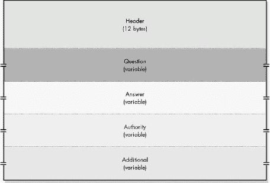

图 57-1. DNS 通用消息格式

当服务器接收到查询时，它会处理它并执行请求的信息检索操作（如果可以的话）。然后，它使用查询作为其响应消息的基础。头部和问题部分被复制到响应消息中，并将 QR 标志设置为 1，以指示该消息是回复。头部部分的一些字段也会更改，以向客户端提供信息。例如，服务器将 RCode（响应代码）字段设置为指示查询是否成功或是否发生错误，如果发生错误，则指示问题所在。本章的下一节将说明所有头部字段，并说明客户端和服务器如何使用每个字段。

服务器还负责填写消息的其他三个部分：答案、授权和附加。这些部分具有相同的基本格式，每个部分都携带一个或多个使用通用记录格式的 RR。每个部分中的记录数量由消息头中的计数字段指示。这些部分的不同之处仅在于它们携带的记录类型。答案记录与提出的问题直接相关，而授权记录携带标识其他名称服务器的 RR。因此，当服务器没有客户端请求的信息时，授权记录是名称服务器通过层次结构链接的手段。

附加部分的存在是为了特定地提高 DNS 效率。有些情况下，服务器会提供一个答案，它有理由相信这将导致一个后续问题，该服务器也可以回答。例如，假设服务器在授权部分（一个 NS RR）中提供了另一个名称服务器的名称。客户端可能没有该服务器的地址，这意味着它必须执行额外的名称解析才能联系引用的服务器。如果提供 NS 记录的服务器已经知道该名称服务器的 IP 地址，它可以将它包含在附加部分中。正如我在上一章关于 DNS 邮件支持的讨论中所解释的，提供 MX 记录的服务器也是如此。

### 小贴士

**关键概念** DNS 为所有消息使用一个通用的消息格式。它由一个固定的 12 字节头部、包含查询的问题部分，以及随后可以携带不同类型 RR 的三个附加部分组成。答案部分通常包含直接回答消息中问题的记录；授权部分包含发送回客户端的名称服务器名称；附加部分包含可能对客户端有价值的信息，例如在授权部分中提到的名称服务器的 IP 地址。

DNS 的另一个优化是使用一种特殊的压缩技术来减少 DNS 消息的大小。这将在本章后面的“DNS 名称表示法和消息压缩”部分进行解释。

注意，特殊的“通知”和“更新”消息的格式与常规 DNS 查询/响应消息不同。这些特殊消息（其使用方法在第五十五章中关于 DNS 服务器增强的部分进行描述）基于常规格式，但某些字段的含义已改变。您可以在 RFC 1996 和 RFC 2136 中找到这些字段格式。

DNS 中的客户端/服务器信息交换是通过查询/响应消息来实现的。查询和响应具有相同的一般格式，包含最多五个独立部分，携带信息。其中，两个通常在查询和响应中都存在：头部部分和问题部分。我们将首先查看这两个部分，然后检查服务器用于其他三个消息部分的 RR 格式。

# DNS 消息头格式

头部是任何消息最重要的部分，因为它是关键控制字段携带的地方。在 DNS 消息中，头部部分携带了几个关键控制标志，并且它还指示消息中使用了哪些其他部分。检查头部部分可以帮助你理解 DNS 中消息工作的一些细微之处。

所有 DNS 消息中使用的头部部分格式如图图 57-2 所示，并在表表 57-2、表 57-3 和表 57-4 中详细描述。在交换中，客户端和服务器使用不同的字段时，我在表 57-2 中提到了如何在这两个之间区分使用。

注意，当前有效的查询类型、查询操作码和响应码列表由互联网数字分配机构（IANA）作为其众多互联网参数列表之一维护。响应码 0 到 5 是常规 DNS 的一部分，并在 RFC 1035 中定义；码 6 到 10 实现了动态 DNS，并在 RFC 2136 中定义。

表 57-2. DNS 消息头部格式

| 字段名称 | 大小（字节） | 描述 |
| --- | --- | --- |
| ID | 2 | 标识符：由创建 DNS 查询的设备生成的 16 位标识字段。服务器将其复制到响应中，因此该设备可以使用它将查询与从 DNS 服务器收到的相应回复匹配。这类似于在许多互联网控制消息协议（ICMP）消息类型中使用的标识符字段的方式。 |
| QR | 1/8 (1 位) | 查询/响应标志：区分查询和响应。当查询生成时设置为 0；当响应服务器将该查询转换为响应时，更改为 1。 |
| OpCode | 1/2 (4 位) | 操作码：指定消息携带的查询类型。此字段由查询的创建者设置，并在响应中不变地复制。有关操作码值，请参阅表 57-3。 |
| AA | 1/8 (1 bit) | 权威回答标志：在响应中设置为 1，表示创建响应的服务器是位于问题部分中指定的域名所在区域的权威服务器。如果为 0，则响应非权威。 |
| TC | 1/8 (1 bit) | 截断标志：当设置为 1 时，表示消息由于长度超过所使用的传输机制允许的最大长度而被截断。TCP 没有消息长度限制；UDP 消息限制为 512 字节，因此发送此位通常表示消息使用 UDP 发送且过长无法适应。客户端可能需要建立 TCP 会话以获取完整消息。另一方面，如果截断的部分是额外部分的一部分，它可以选择不麻烦。 |
| RD | 1/8 (1 bit) | 递归期望：当在查询中设置时，请求接收查询的服务器尝试递归地回答查询，如果服务器支持递归解析。此位的值在响应中不改变。 |
| RA | 1/8 (1 bit) | 递归可用：在响应中设置为 1 或清除为 0，以指示创建响应的服务器是否支持递归查询。这可以由发送查询的设备记录下来以供将来使用。 |
| Z | 3/8 (3 bits) | 零：三个保留位设置为 0。 |
| RCode | 1/2 (4 bits) | 响应代码：在查询中设置为 0，然后由响应服务器在响应中更改以传达查询处理的结果。此字段用于指示查询是否成功回答或是否发生了某种错误。请参阅表 57-4 以获取 RCode 值。 |
| QDCount | 2 | 问题计数：指定消息中问题部分的题目数量。 |
| ANCount | 2 | 答案记录计数：指定消息中答案部分的 RR 数量。 |
| ARCount | 2 | 额外记录计数：指定消息中额外部分的 RR 数量。 |

表 57-3. Header OpCode Values

| OpCode Value | 查询名称 | 描述 |
| --- | --- | --- |
| 0 | Query | 标准查询。 |
| 1 | IQuery | 反向查询；现已废弃。RFC 1035 将反向查询定义为执行反向 DNS 查找的可选方法；即，从 IP 地址找到名称。由于实施困难，该方法从未得到广泛部署，而是使用 IN-ADDR.ARPA 域名进行反向映射。OpCode 值的这种使用在 RFC 3425 中正式废弃，发布于 2002 年 11 月。 |
| 2 | Status | 服务器状态请求。 |
| 3 | 保留 | 保留，未使用。 |
| 4 | 通知 | RFC 1996 添加的一种特殊消息类型。它由主（主服务器、授权服务器）服务器用于告知辅助服务器（从服务器）某个区域的数据已更改，并提示它们请求区域传输。有关 DNS 服务器增强功能的讨论，请参阅 第五十五章 以获取更多详细信息。 |
| 5 | 更新 | RFC 2136 添加的一种特殊消息类型，用于实现动态 DNS。它允许选择性地添加、删除或更新 RR。有关 DNS 服务器增强功能的讨论，请参阅 第五十五章 以获取更多详细信息。 |

表 57-4. 头部 RCode 值

| RCode 值 | 响应代码 | 描述 |
| --- | --- | --- |
| --- | --- | --- |
| 0 | 无错误 | 未发生错误。 |
| 1 | 格式错误 | 服务器由于查询构建方式的问题无法响应用户查询。 |
| 2 | 服务器故障 | 服务器由于自身问题无法响应用户查询。 |
| 3 | 名称错误 | 查询中指定的名称在域名中不存在。此代码可以由区域（因为区域服务器知道域名中的所有对象和子域）的授权服务器或实现负缓存的缓存服务器使用。 |
| 4 | 未实现 | 接收到的查询类型不受服务器支持。 |
| 5 | 拒绝 | 服务器拒绝处理查询，通常是由于策略原因而不是技术原因。例如，某些类型的操作，如区域传输，受到限制。服务器只会从某些设备处尊重区域传输请求。 |
| 6 | YX 域 | 当不应存在名称时存在名称。 |
| 7 | YX RR 集合 | 存在不应存在的 RR 集合。 |
| 8 | NX RR 集合 | 应存在的 RR 集合不存在。 |
| 9 | 非授权 | 接收查询的服务器不是指定区域的授权服务器。 |
| 10 | 非区域 | 消息中指定的名称不在消息中指定的区域内。 |

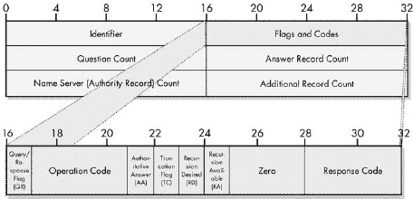

图 57-2. DNS 消息头部格式

# DNS 问题部分格式

DNS 查询始终包含至少一个在问题部分中的条目，该条目指定了交换中的客户端试图找出什么。这些条目在响应消息中不变地复制，以便在需要时供客户端参考。DNS 消息问题部分中每个条目所使用的格式在表 Table 57-5 和 Table 57-6 中详细描述，并在 Figure 57-3 中展示。

表 57-5. DNS 消息问题部分格式

| 字段名称 | 大小（字节） | 描述 |
| --- | --- | --- |
| --- | --- | --- |
| QName | 变量 | 问题名称：包含查询的对象、域名或区域名称，使用标准 DNS 名称表示法编码，将在本章后面解释。 |
| QType | 2 | 问题类型：指定客户端设备所询问的问题类型。此字段可能包含与请求的特定 RR 类型相对应的代码号。（表 55-1 在第五十五章中包含最常见的 RR 的编号。）如果是这样，这意味着客户端正在请求发送给 QName 中列出的域名的那种类型的记录。QType 字段还可以包含表 57-6 中列出的代码之一，对应于特殊类型的请求。 |
| QClass | 2 | 问题类：指定请求的 RR 的类别，通常是因特网（IN）的值 1。有关类别和 RR 类型的讨论，请参阅第五十六章中的解释。此外，QClass 值 255 被定义为具有特殊意义“任何类别”。 |

表 57-6. 问题部分 QType 值

| QType 值 | 问题类型 | 描述 |
| --- | --- | --- |
| 251 | IXFR | 按照 RFC 1995 请求增量（部分）区域传输 |
| 252 | AXFR | 请求区域传输 |
| 253 | MAILB | 请求与邮箱相关的记录（RR 类型 MB、MG 或 MR；现已废弃） |
| 254 | MAILA | 请求邮件代理 RR（现已废弃；现在使用 MX 记录代替） |
| 255 | * (星号) | 请求所有记录 |


图 57-3. DNS 消息问题部分格式

# DNS 消息资源记录字段格式

如你在本章和上一章所学，DNS 中的信息交换由一系列客户端/服务器事务组成。客户端向服务器发送请求，或称为*查询*，服务器则返回*响应*。DNS 服务器是数据库服务器，它们以 RR（资源记录）的形式存储 DNS 名称数据库信息。客户端提出的问题是从 DNS 服务器数据库请求信息，并由 DNS 服务器通过查找请求的 RR 并将它们放入 DNS 响应消息中回答。

DNS 消息格式的答案、授权和附加部分是服务器放置要发送回客户端的 DNS RR 的地方。每个部分由零个或多个记录组成，理论上，任何记录都可以放置在任何部分。这些部分的不同之处仅在于客户端从记录在某一部分而不是另一部分中得出的语义（意义）。

RRs 有两种表示形式：二进制和文本。文本格式用于由人类编辑的主文件，将在本章后面的“DNS 主文件格式”部分讨论。二进制表示由常规数字和文本字段组成，就像 DNS 消息格式中的其他字段一样。

## DNS 通用 RR 格式

存在着某些类型的信息是所有 RR 共有的，而其他类型的信息是每种记录类型独有的。为了处理这种情况，所有 RR 都使用一个通用的字段格式来表示，该格式包含一个随记录类型而变化的单个 RData 字段。通用 RR 格式在表 57-7 中描述，并在图 57-4 中展示。

表 57-7. DNS 通用资源记录格式

| Field Name | 大小（字节） | 描述 |
| --- | --- | --- |
| Name | 可变 | 名称：包含 RR 的主题对象、域名或区域名称，使用标准 DNS 名称表示法编码，将在本章后面解释。RR 中的所有信息都与该对象相关联，我将其称为记录的命名对象。 |
| Type | 2 | 类型：指定资源记录类型的代码值。最常见 RR 的类型值在表 55-1 中显示，在第五十五章中，以及本章的以下各节中。 |
| Class | 2 | 类：指定请求的 RR 的类别，通常为因特网（IN）的值 1。参见第五十五章以了解解释。 |
| TTL | 4 | 存活时间：指定记录应在读取记录的设备的缓存中保留的秒数。参见第五十五章中关于 DNS 名称服务器缓存的讨论，以获得完整解释。值为 0 表示仅为此当前名称解析使用此信息；不要缓存它。 |
| RDLength | 2 | 资源数据长度：指示 RData 字段的大小，以字节为单位。 |
| RData | 可变 | 资源数据：RR 的数据部分。 |

## 通用 RR 的 RData 字段格式

RData 字段由一个或多个子字段组成，这些子字段携带 RR 的实际有效负载。以下各节介绍了最常见的 RR 类型。对于每种类型，我都指出了 RR 的文本代码、名称和类型值；提供了 RR 用途的简要概述；并在表中显示了 RData 字段的结构。

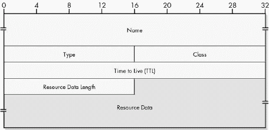

图 57-4. DNS 通用 RR 格式

### A (地址) RR (类型值 1)

A (地址) 是 DNS 中的主要 RR 类型。它包含与域名关联的 32 位 IP 地址，如表 57-8 所示。

表 57-8. DNS 地址 RR 数据格式

| 子字段名称 | 大小（字节） | 描述 |
| --- | --- | --- |
| Address | 4 | 地址：与该记录的命名对象对应的 32 位 IP 地址。 |

### NS (名称服务器) RR (类型值 2)

The NSDName 数据字段携带名称服务器的域名，如表 57-9 所示。

表 57-9. DNS 名称服务器 RR 数据格式

| 子字段名称 | 大小（字节） | 描述 |
| --- | --- | --- |
| NSDName | 可变 | 名称服务器域名：一个名称服务器的可变长度名称，该名称服务器应负责该记录的命名对象。像所有名称一样，此名称使用标准的 DNS 名称表示法编码。请求此 RR 类型通常会导致在响应的附加部分返回指定的名称服务器的 A 记录，如果可用的话。 |

### CName (规范名称) RR (类型值 5)

CName 数据字段包含使用别名引用的命名对象的实际名称，如表 57-10 所示。

表 57-10. DNS 规范名称 RR 数据格式

| 子字段名称 | 大小（字节） | 描述 |
| --- | --- | --- |
| CName | 可变 | 规范名称：命名对象的规范（实际）名称。然后使用标准的 DNS 解析过程解析此名称，以获取最初指定的名称的地址。 |

### SOA (授权开始) RR (类型值 6)

SOA 记录标记 DNS 区域的开始，并包含有关如何管理和使用区域的关键信息。SOA 记录是 DNS RR 类型中最复杂的。其格式在表 57-11 中解释，并在图 57-5 RR 数据格式")中说明。有关此 RR 中字段的使用信息，请参阅第五十五章中关于区域传输的讨论。

表 57-11. DNS 授权开始 RR 数据格式

| 子字段名称 | 大小（字节） | 描述 |
| --- | --- | --- |
| MName | 可变 | 主名称：提供区域数据的数据源名称服务器的域名。这通常是区域的主授权服务器。它使用标准的 DNS 名称格式编码。 |
| RName | 可变 | 负责人名称：负责此区域的人员的电子邮件地址。DNS 中的电子邮件地址使用本章后面讨论的特殊变体编码的常规 DNS 名称表示法。 |
| 序列号 | 4 | 序列号：此区域 RR 数据库的序列号或版本号。用于确定何时对数据库进行了更改以触发区域传输。 |
| 刷新 | 4 | 刷新间隔：此区域二级域名服务器在尝试检查主域名服务器上对区域数据库所做的更改之间等待的秒数。 |
| 重试 | 4 | 重试间隔：二级域名服务器在尝试再次检查主域名服务器以查找更改之前等待的秒数，如果其之前的尝试失败。 |
| 过期 | 4 | 过期间隔：在二级域名服务器必须认为其持有的信息已过时之前，可以经过的成功联系主域名服务器的秒数。 |
| 最小值 | 4 | 负缓存 TTL：最初携带未指定显式 TTL 值的记录的默认 TTL 值。现在表示区域的负缓存 TTL。请参阅第五十五章中关于 DNS 名称服务器缓存的讨论。 |

### PTR (指针) RR (类型值 12)

PTR 记录携带一个指向 RR 的指针。它用于反向地址查找。它包含一个数据字段，如表 57-12 所示。

表 57-12. DNS 指针 RR 数据格式

| 子字段名称 | 大小（字节） | 描述 |
| --- | --- | --- |
| PTRDName | 可变 | 指针域名：一个可变长度的域名。这是由 RR 指向的名称。有关此记录类型最常见使用方式的描述，请参阅第五十六章。 |

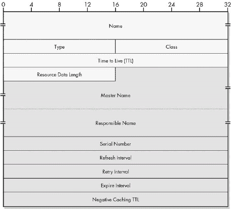

图 57-5. DNS 起始授权 (SOA) RR 数据格式

### MX (邮件交换) RR (类型值 15)

特殊的 MX 记录包含有关用于向域名发送电子邮件的邮件服务器（请参阅第五十六章）的信息。每个记录包含两个字段，如表 57-13 所示。

表 57-13. DNS 邮件交换 RR 数据格式

| 子字段名称 | 大小（字节） | 描述 |
| --- | --- | --- |
| 优先级 | 2 | 优先级值：此邮件交换的优先级级别。较低的值表示较高的优先级。 |
| 交换 | 变量 | 交换域名：愿意为该命名对象提供邮件交换服务的宿主机的域名，使用标准 DNS 名称表示法编码。 |

### TXT (文本) RR (类型值 16)

TXT 记录包含有关命名对象的附加描述信息，如表 57-14 所示。

表 57-14. DNS 文本 RR 数据格式

| 子字段名称 | 大小（字节） | 描述 |
| --- | --- | --- |
| TXT-数据 | 可变 | 文本数据：可变长度的描述性文本。 |

# DNS 名称表示法和消息压缩

显然，整个 DNS 协议都是围绕处理域名、子域名和对象名称来设计的。正如你在前面的主题中看到的，DNS 消息和 RR 中有许多字段携带对象、名称服务器等的名称。DNS 在 RR 和字段中使用特殊的编码名称表示法，这是电子邮件地址表示法的变体，以及一种特殊的压缩方法，该方法可以减少消息的大小以提高效率。

## 标准 DNS 名称表示法

在第五十三章中，你学习了 DNS 名称是如何构建的。名称层次结构中的每个节点都与一个标签相关联。特定设备的完全限定域名（FQDN）由从树根开始并向下到该设备的标签序列组成。层次结构中每个级别的标签按顺序列出，从最高级别开始，从右到左，由点分隔。这产生了我们习惯使用的域名，例如[www.xyzindustries.com](http://www.xyzindustries.com)。

将这些名称直接编码到 RR 或其他 DNS 消息字段中是可能的：将字母*W*放入名称的前三个字节中，然后在第四个字节中放入一个点（.），在第五个字节中放入一个*x*，依此类推。这种方法的缺点是，当计算机读取名称时，它无法判断每个名称何时结束。我们需要为每个名称包含一个长度字段。

相反，DNS 使用特殊的表示法来表示 DNS 名称。每个标签按顺序编码在名称字段中。在每个标签之前，使用一个字节来表示标签中的字符数。然后，将标签的字符编码，每个字节一个字符。名称的结束由一个空标签表示，代表根；这个长度为零，因此每个名称都以一个 0 字符结束，表示这个零长度的根标签。

注意，标签之间的点是不必要的，因为长度数字界定了标签。读取名称的计算机也知道自己正在读取的每个标签中有多少字节，因此它可以在读取名称时轻松地为标签分配空间。

例如，[www.xyzindustries.com](http://www.xyzindustries.com)将被编码如下：

```
[3] w w w [13] x y z i n d u s t r i e s [3] c o m [0]
```

我已经用方括号标出了标签长度以区分它们。请记住，这些标签长度是二进制编码的数字，所以一个字节可以存储从 0 到 255 的值；[13] 是一个字节，而不是两个，正如你在 图 57-6 中看到的。标签实际上限制在最多 63 个字符，你很快就会看到这一点的重要性。

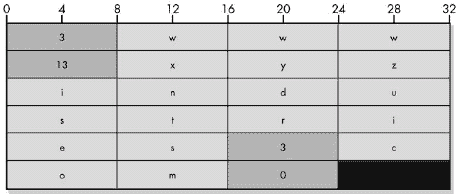

图 57-6. DNS 标准名称表示法 在 DNS 中，每个命名对象或其他名称都由一系列标签长度和标签组成，每个标签长度占用一个字节，每个标签占用一个字符的字节。本例显示了名称 [www.xyzindustries.com](http://www.xyzindustries.com) 的编码。

## DNS 电子邮件地址表示法

电子邮件地址用于某些 DNS 资源记录中，例如 SOA RR 中的 RName 字段。电子邮件地址的形式为 <*name*>@<*domain-name*>。DNS 以与常规 DNS 域名完全相同的方式对这些进行编码，只是将 @ 视为另一个点。因此，johnny@somewhere.org 将被视为 johnny.somewhere.org，并按以下方式编码：

```
[6] j o h n n y [9] s o m e w h e r e [3] o r g [0]
```

注意，这里没有特定的指示表明这是一个电子邮件地址。根据上下文，该名称被解释为电子邮件地址而不是设备名称。

## DNS 消息压缩

单个 DNS 消息可能包含许多域名。现在，考虑当某个名称服务器发送包含多个域名的响应时，它们通常都在同一个区域或与该区域相关。这些名称中的大多数将具有它们名称的共同元素。

考虑我们之前邮件示例中客户请求的 [xyzindustries.com](http://xyzindustries.com) 的 MX 记录。对此客户的回复将包含以下两个记录：

**MX 记录** 记录中的名称字段包含 [xyzindustries.com](http://xyzindustries.com)，而 RData 字段包含 [mail.xyzindustries.com](http://mail.xyzindustries.com)。

**A 记录** 假设域名服务器知道 [mail.xyzindustries.com](http://mail.xyzindustries.com) 的 IP 地址，附加部分将包含一个 A 记录，名称字段包含 [mail.xyzindustries.com](http://mail.xyzindustries.com)，而 RData 字段包含其地址。

这只是名称重复的一个小例子。在其他类型的 DNS 消息中，它可能更加极端，某些字符串模式可能会重复多次。通常，这需要使用这里描述的编码方法将每个名称完整拼写出来。但这样做将是浪费的，因为这些名称中的大部分是通用的。为了减少这种重复，使用了一种称为*消息压缩*的特殊技术。

### 使用消息压缩避免完整名称重复

使用消息压缩，而不是使用标签和标签长度的组合来编码 DNS 名称，一个两字节的子字段代表指向消息中另一个位置的*指针*。这个子字段的第一个两位被设置为 1（二进制中的值 11），剩余的 14 位包含一个*偏移量*，它指定了在消息中可以找到名称的位置，以消息的第一个字节（ID 字段的第一个字节）为 0 开始计数。

让我们回到我们的例子。假设在 DNS 消息中，MX 记录的 RData 字段，包含[mail.xyzindustries.com](http://mail.xyzindustries.com)，从字节 47 开始。在这个第一个实例中，我们会找到名称按如下方式完整编码：

```
[4] m a i l [13] x y z i n d u s t r i e s [3] c o m [0]
```

然而，在第二个实例中，当[mail.xyzindustries.com](http://mail.xyzindustries.com)出现在 A 记录的名称字段中时，我们会用两个 1 位，然后是 47 的二进制编码。所以，这将是一个 16 位的二进制模式 11000000 00101111，或者两个数值字节 192 和 47。这个第二个实例现在只占用 2 个字节，而不是像第一个实例那样需要重复 24 个字节。

读取名称字段的设备如何区分指针和真实名称？这就是为什么字段开始处使用 11 的原因。这样做可以保证指针的第一个字节总是具有 192 或更大的值。由于标签的长度限制在 63 或更短，当主机读取名称的第一个字节时，如果它看到一个字节中的值为 63 或更少，它知道这是一个真实名称；值为 192 或更多表示它是一个指针。

### 使用消息压缩避免名称部分重复

之前的例子展示了如何使用指针来消除整个名称的重复：名称[mail.xyzindustries.com](http://mail.xyzindustries.com)在两个地方使用，而第二个地方使用了指针。然而，指针的功能甚至更强大。它们也可以用来指向真实名称的一部分，或者可以与额外的标签结合，以提供与 RR 中另一个名称相关的名称的压缩表示。这提供了更大的空间节省。

在前面的例子中，这意味着即使是 [mail.xyzindustries.com](http://mail.xyzindustries.com) 的第一个实例也可以被压缩。回想一下，MX 记录将在名称字段中包含 [xyzindustries.com](http://xyzindustries.com)，在 RData 字段中包含 [mail.xyzindustries.com](http://mail.xyzindustries.com)。如果该记录的名称字段从字节 19 开始，那么我们可以将 RData 字段编码如下：

```
[4] m a i l [pointer-to-byte-19]
```

读取记录的设备将获取第一个标签的 "mail"，然后从名称字段读取 "[xyzindustries.com](http://xyzindustries.com)" 以获取完整名称，[mail.xyzindustries.com](http://mail.xyzindustries.com)。

类似地，假设我们在这个消息中有一个包含对 [xyzindustries.com](http://xyzindustries.com) 的父域 "com." 的引用的记录，这可以简单地编码如下：

```
[pointer-to-byte-33]
```

原因是字节 33 是我们找到名称字段中包含 `[13] x y z i n d u s t r i e s [3] c o m [0]` 的 `[3] c o m [0]` 部分。

# DNS 主文件格式

DNS 服务器通过发送包含 RR 的回复消息来响应用户的查询。您在本章中已经看到了用于编码这些 RR 的二进制消息格式。这些消息格式非常适合传输消息，因为它们紧凑且高效。计算机可以快速读取字段并知道如何解释特定的字符串。

与此相反，人类并不擅长处理二进制中的晦涩代码。在服务器可以提供 RR 之前，需要人类管理员告诉服务器这些记录是什么以及它们包含的信息。为了使这项工作更容易，DNS 包含一个用于区域和 RR 的特殊文本表示。管理员编辑描述区域及其包含的记录的特殊 *主文件*。然后，这些文件被服务器的 DNS 软件读入内存，并转换为二进制形式以响应用户请求。这更详细地描述在 第五十六章。

每个主文件由一个简单、扁平的文本文件组成，可以使用任何类型的文本编辑器创建。每个文件包含使用一组简单的语法规则表示的若干行，这些规则描述了一个区域及其中的记录。DNS 主文件的基本语法规则在 RFC 1035 的第 5.1 节中指定。尽管某些 DNS 实现在其标准语法上有所变化，但它们都非常相似。

## DNS 常见主文件记录格式

正如所有 RR 都使用一个共同的字段格式存储在内部一样，它们也使用一个共同的主文件格式。每个记录通常在文件的单独一行上出现。此格式如下，方括号中显示的是可选字段：

```
<*`domain-name`*>  [<*`ttl`*>]  <*`class`*>  <*`type`*>  <*`rdata`*>
```

字段如下：

``<*`域名`*>`` DNS 域名，可以是完全合格域名 (FQDN) 或部分合格域名 (PQDN)。

``<*ttl*>`` 记录的 TTL 值，以秒为单位。如果省略，则使用区域默认的 TTL 值。实际上，大多数 RR 没有指定的 TTL，而是使用 SOA 记录提供的默认值。

``<*class*>`` RR 类。对于现代 DNS，此字段是可选的，默认为 IN，代表互联网。

``<*type*>`` RR 类型，使用文本代码（如 A 或 NS）指定，而不是数字代码。

``<*rdata*>`` RR 数据，它是一组由空格分隔的条目，这取决于记录类型。

`<rdata>` 可以是单个信息或一组条目，具体取决于记录类型。在较长的记录类型中，特别是 SOA 记录的情况下，多个 `<rdata>` 字段会分布在几行中，并用括号括起来；括号使得所有条目都像在单行上一样。请注意，如果存在 `<ttl>` 字段，则 `<ttl>` 字段和 `<class>` 字段的顺序可以互换，而不会出现任何问题，因为一个是数字，另一个是文本（IN）。

## 部分限定域名（PQDNs）的使用和解释

域名可以在 FQDNs 和 PQDNs（在第五十三章中描述）之间混合使用。PQDNs 用于使主文件创建更快、更易读，通过减少名称的公共部分。它们在某种程度上是 DNS 消息压缩的人类等效物。FQDN 以点（.）结尾的完整域名表示，以表示 DNS 名称树的根。PQDN 只给出一个没有根的局部名称，并由读取主文件的软件解释为 FQDN。（有关更多信息，请参阅下一节中 `$ORIGIN` 指令的描述。）

记住使用尾随点来标记完全限定域名（FQDNs）是很重要的。如果原始域名是 [xyzindustries.com](http://xyzindustries.com) 并且在其区域文件中出现了 bigisp.net 这个名称，服务器将读取为 [bigisp.net.xyzindustries.com](http://bigisp.net.xyzindustries.com)——这很可能不是你想要的。此外，电子邮件地址，如 SOA 记录中的 `<r-name>` 字段，将电子邮件地址的 @ 符号转换为点，遵循标准的 DNS 习惯。

## 主文件指令

除了资源记录（RRs）之外，大多数主文件实现还支持使用 *指令*。这些是用于指定某些重要信息以指导如何解释主文件的命令。以下是最常见的三个指令：

`$ORIGIN` 指定附加到未限定规范中的域名。这是将 PQDN 转换为 FQDN 的基础。例如，如果起源是 [xyzindustries.com](http://xyzindustries.com)，则 PQDN “sales” 将被解释为 [sales.xyzindustries.com](http://sales.xyzindustries.com)。一旦定义，起源可以通过仅使用 @ 而不是名称来引用，正如你将在本节末尾显示的示例主文件中看到的那样。

`$TTL` 指定用于任何未在记录本身中指定 TTL 值的 RR 的默认 TTL 值。（此值以前由 SOA 记录中的最小字段指定。）

`$INCLUDE` 允许一个主文件包含另一个文件的 内容。这有时用于在区域之间保存某些条目的重复。

## 主文件语法规则

DNS 主文件有一些其他的语法规则，其中一些是为了节省管理员的时间和精力：

**多记录缩写** 如果多个连续的记录属于同一域名，则第一个记录指定 `<`*`域名`*`>`，然后后续的可以留空。服务器将假设任何没有 `<`*`域名`*`>` 标示的 RR 应用于它最后看到的 `<`*`域名`*`>`。

**注释** 分号 (;) 标记注释。从分号到行尾的任何文本都将被忽略。

**转义字符** 反斜杠 (\) 用于“转义”字符的特殊含义。例如，双引号 (quote) 标记用于分隔文本字符串；字面双引号字符由反斜杠-双引号组合 (\") 表示。

**空白** 制表符和空格用作分隔符，空白行将被忽略。为了可读性，大多数智能管理员使用制表符缩进来明确哪些记录属于哪些名称，并使用空白行和注释来分组记录。

**大小写** 与 DNS 域名一样，主文件条目不区分大小写。

## 特定 RR 语法和示例

以下部分展示了每种常见 RR 类型的特定格式和示例。字段基本上与在 NS 二进制记录格式中解释的字段相同。示例中使用了 DNS 注释格式进行说明。假设这些示例适用于 googleplex.edu 区域。

### A (地址) RR

A 记录的格式如下：

```
<*`domain-name`*> [<*`ttl`*>] IN A <*`ip-address`*>

```

以下是一个示例：

```
admin1.googleplex.edu IN A 204.13.100.3    ; An FQDN
admin2 IN A 204.13.100.44                  ; A PQDN equivalent to
                                           ; admin2.googleplex.edu
```

### NS (域名服务器) RR

NS 记录的格式如下：

```
<*`domain-name`*>  [<*`ttl`*>]  IN  NS  <*`name-server-name`*>
```

以下是一个示例：

```
< googleplex.edu. IN NS custns.bigisp.net  ; Secondary NS
```

### CName (规范名称) RR

CName 记录的格式如下：

```
<*`domain-name`*>  [<*`ttl`*>]  IN  CNAME  <*`canonical-name`*>
```

以下是一个示例：

```
www IN CNAME bigserver   ; www.googleplex.edu is really
                         ; bigserver.googleplex.edu.
```

### SOA (授权开始) RR

SOA 记录的格式如下：

```
<*`domain-name`*> [<*`ttl`*>] IN SOA <*`m-name`*> <*`r-name`*> (
      <*`serial-number`*>
      <*`refresh-interval`*>
      <*`retry-interval`*>
      <*`expire-interval`*>
      <*`default-ttl`*>)
```

以下是一个示例：

```
< googleplex.edu. IN SOA ns1.googleplex.edu it.googleplex.edu (
      42     ; Version 42 of the zone.
      21600  ; Refresh every 6 hours.
      3600   ; Retry every hour.
      604800 ; Expire after one week.
      86400) ; Negative Cache TTL is one day.
```

### PTR (指针) RR

PTR 记录的格式如下：

```
<*`reverse-domain-name`*> [<*`ttl`*>] IN PTR <*`domain-name`*>
```

以下是一个示例：

```
3.100.13.204.IN-ADDR.ARPA. IN PTR admin1.googleplex.edu.
```

注意，PTR 记录实际上位于 IN-ADDR.ARPA 域。

### MX (邮件交换) RR

MX 记录的格式如下：

```
<*`domain-name`*> [<*`ttl`*>] IN MX <*`preference-value`*> <*`exchange-name`*>
```

以下是一个示例：

```
googleplex.edu.     IN MX 10 mainmail.googleplex.edu.
                    IN MX 20 backupmail.googleplex.edu
```

### TXT (文本) RR

TXT 记录的格式如下：

```
<*`domain-name`*> [<*`ttl`*>] IN TXT <*`text-information`*>

```

这里有一个例子：

```
googleplex.edu. IN TXT "Contact Joe at X321 for more info."
```

## 样本主文件

以下是一个 DNS 主文件的真实世界示例，取自我的[pcguide.com](http://pcguide.com)服务器（略有修改），由[pair.com](http://pair.com)的优秀人士托管（并提供 DNS 信息）。注意使用@作为“此域名”的快捷方式（[pcguide.com](http://pcguide.com)）。

```
$ORIGIN pcguide.com.
@ IN SOA ns23.pair.com. root.pair.com. (
      2001072300  ; Serial
      3600        ; Refresh
      300         ; Retry
      604800      ; Expire
      3600 )      ; Minimum

@ IN NS ns23.pair.com.
@ IN NS ns0.ns0.com.

localhost  IN A  127.0.0.1
@          IN A  209.68.14.80
           IN MX 50  qs939.pair.com.

www    IN CNAME   @
ftp    IN CNAME   @
mail   IN CNAME   @
relay  IN CNAME   relay.pair.com.
```

# 支持 IPv6 的 DNS 更改

互联网协议第 4 版（IPv4）是今天互联网的基础，也是 TCP/IP 协议套件建立的基础。虽然 IPv4 在过去二十多年里为我们服务得很好，但它有一些重要的缺点，如果继续使用，将限制未来的互连网络。因此，下一代 IP，即 IP 版本 6（IPv6），已经开发多年。IPv6 最终将取代 IPv4 并将 TCP/IP 带入未来。

从 IPv4 到 IPv6 的转换将对其他 TCP/IP 协议产生影响，包括 DNS。DNS 是一个高级协议，因此根据分层原理，IP 的变化不应该影响它。然而，这又是分层并不总是适用的另一个例子。DNS 直接与 IP 地址工作，IPv6 对 IP 的最重要修改之一是在地址领域，这意味着在 IPv6 上使用 DNS 需要对协议的工作方式做出一些更改。

## IPv6 DNS 扩展

事实上，由于 DNS 在第三层的 IP 架构上与 IP 相距甚远，所需的变化并不广泛。1995 年 12 月发布的 RFC 1886，“IPv6 DNS 扩展”，是互联网工程任务组（IETF）首次正式尝试描述 DNS 在支持 IPv6 方面所需的变化。它定义了 DNS 在 IPv6 中的三个具体修改：

**新的 RR 类型—AAAA（IPv6 地址）** 常规 DNS 地址（A）RR 是为 32 位 IPv4 地址定义的，因此创建了一个新的类型，以便将域名与 128 位 IPv6 地址关联起来。四个*A*（AAAA）是一个助记符，表示 IPv6 地址是 IPv4 地址的四倍大小。AAAA 记录的结构与二进制和主文件格式中的 A 记录非常相似；只是更大。AAAA 的 DNS RR 类型值为 28。

**新的反向解析层次结构** 为 IPv6 反向查找定义了一个类似于 IN-ADDR.ARPA 的新层次结构，但 IETF 将其放在了一个不同的顶级域名（TLD）中。新域名是*IP6.INT*，其使用方式与 IN-ADDR.ARPA 类似。然而，由于 IPv6 地址是用十六进制表示而不是点分十进制，IP6.INT 有 16 个子域 0 到 F，每个子域也有 16 个子域 0 到 F，以此类推，共 16 层深。是的，这可能导致一个潜在的巨大反向解析数据库！

**查询类型和解析程序的更改** 所有与 A 记录一起工作或导致 A 记录包含在回复的附加部分中的查询类型都必须更改，以处理 AAAA 记录。此外，通常会导致在附加部分返回 A 记录的查询必须仅在答案部分返回相应的 AAAA 记录，而不是在附加部分。

### 小贴士

**关键概念** 尽管 DNS 位于 TCP/IP 协议栈架构中 IP 之上，但它与 IP 地址紧密协作。因此，需要进行一些更改以使其能够支持新的 IPv6。这些更改包括定义一个新的 IPv6 地址 RR（AAAA）、一个新的反向解析域层次结构以及某些对消息传递方式的更改。

## 对 IPv6 DNS 扩展的提议性更改

2000 年，IETF 发布了 RFC 2874，“支持 IPv6 地址聚合和重新编号的 DNS 扩展”。该标准提出用新的记录类型 A6 来替代 RFC 1886 中引入的 IPv6 支持，而不是使用 RFC 1886 的 AAAA。AAAA 记录与 A6 记录的主要区别在于，前者只是像 A 记录一样的完整地址，而 A6 记录可以包含完整或部分地址。

RFC 2874 背后的想法是，A6 记录可以以补充 IPv6 单播地址格式（见[第二十五章](ch25.html "第二十五章。IPv6 寻址"））的方式设置。然后，名称解析将涉及一种称为*链式*的技术，从一组部分指定的地址组件中确定名称的完整地址。本质上，这将使地址的行为与分层名称本身的工作方式非常相似，提供一些潜在的灵活性优势。

在几年时间里，RFC 1886 和 RFC 2874 都被提出作为标准，这导致了相当大的混淆。2002 年 8 月，发布了 RFC 3363 和 RFC 3364，这些文件澄清了这两个提案的情况。RFC 3363 代表了“最高法院的决定”，即 RFC 2874 和 A6 记录应改为实验性状态，而 RFC 1886 的 AAAA 记录应保留为 DNS IPv6 标准。

对于这一决定的完整解释可以在 RFC 3364 中找到。简而言之，它归结为 IETF 认为 RFC 2874 的成功实施存在重大潜在风险。虽然 A6 记录的功能很有趣，但并不清楚它们是否是必需的，考虑到这些风险，IETF 认为坚持使用 RFC 1886 是更好的选择。
