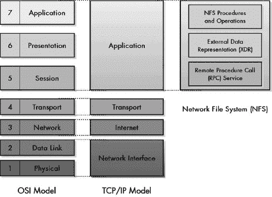

# 第 III-2 部分：网络文件和资源共享协议

第五十八章")

对于普通用户来说，网络的创建主要是出于一个原因：允许信息共享。计算机上的大多数信息都以文件的形式存在，这些文件存储在硬盘等存储设备上；因此，网络的一个主要目的是让用户能够共享文件。文件传输和消息传输协议允许用户手动将文件从一个地方移动到另一个地方，但在许多情况下，更自动化的方法更受欢迎。互联网协议提供了一种以*网络文件和资源共享协议*的形式来实现这些功能的能力。

在这部分简短的介绍中，我将从 TCP/IP 网络的角度描述网络文件和资源共享协议。这一章提供了这类协议的概念和操作概述，讨论了不同类型协议中的一些共同元素。然后，它描述了为 TCP/IP 特定定义的最常见协议：网络文件系统（NFS）。

显然，网络文件和资源共享协议和服务与我之前提到的文件和消息传输协议密切相关。例如，NFS 可以用来完成与 TCP/IP 文件和消息传输应用程序（如文件传输协议（FTP）和超文本传输协议（HTTP））执行的任务类似的任务。我认为这些协议更像是特定的终端用户应用程序，因此将在后面的应用协议部分（第 III-6 部分 中的 FTP 和 第 III-8 部分") 中的 HTTP）中描述它们。我意识到这种手动和自动文件传输之间的区别有些武断，但在这个广阔的网络世界中，许多其他事情也都是这样。

# 第五十八章：网络文件和资源共享与 TCP/IP 网络文件系统（NFS）

文件和资源共享协议很重要，因为它们允许用户在网络中无缝共享文件。由于微软操作系统在行业中的主导地位，许多人熟悉微软网络如何以这种方式使用。然而，微软在文件共享协议方面可以说是“后来者”。在微软 Windows 存在之前很久，*网络文件系统（NFS）*就已经让用户使用 UNIX 操作系统在网络上共享文件。

在本章中，我简要介绍了 TCP/IP 中的网络文件和资源共享，重点关注 NFS 的操作。我首先概述了文件和资源共享协议的概念。然后，我提供了 NFS 的概述和历史，讨论了其常见版本和标准。我描述了 NFS 的架构和组成它的三个组件。接着，我描述了 NFS 文件系统模型以及如何使用*外部数据表示（XDR）*标准进行数据编码。我解释了 NFS 的客户端/服务器操作，使用*远程过程调用（RPCs）*。然后，我列出了 NFS 中使用的程序和操作，并以对用于将网络资源附加到设备的独立 NFS 挂载协议的描述结束。

# 文件和资源共享概念和组件

网络和互联网创建的一个主要原因是允许文件和其他资源在计算机之间共享。因此，在任何互联网协议栈中，我们需要某种机制，使用户能够以简单的方式轻松地在网络上移动文件。为了这个目的，创建了应用层文件和消息传输协议，如文件传输协议（FTP）和超文本传输协议（HTTP）。这些协议的目的是让用户能够访问网络上的资源，同时隐藏它们在下面操作层的细节。

然而，尽管这些协议隐藏了底层，但它们在本质上有些*手动*。它们需要用户调用应用程序协议并使用特定的命令来完成基于网络的资源访问。事实上，这类协议的问题并不在于它们需要手动干预，而在于它们使共享变得更加困难，因为它们不允许文件直接在另一个资源上使用。

考虑像 FTP 这样的协议。它确实允许你在机器之间共享文件，但它清楚地区分了属于你的文件和属于别人的文件。如果你想使用乔机器上的文件，你必须将其传输到你的机器上，使用它，然后再传输回来。此外，如果你不将文件传回，乔可能永远也看不到更新的版本。

## 文件和资源共享协议的力量

当我们能够隐藏文件所在位置和移动它们的命令的细节时，我们就达到了文件和资源共享的极致。这样的系统将使用一种*自动*共享协议，允许文件和资源在网络中无缝使用。一旦设置好，这种方案中的网络资源就可以像本地计算机上的资源一样使用。这些协议有时被称为*网络文件和资源共享协议*。

正是这种本地文件和远程文件之间界限的模糊，使得文件和资源共享协议如此强大。一旦系统设置完成，用户就可以像访问自己的主机上的资源一样轻松地访问另一台主机上的资源。这是一种极其有用的功能，尤其是在客户端/服务器计算的现代时代。例如，它允许公司在一个共同的地方存储许多个人使用的信息，例如在服务器上的目录中，这样每个人都可以访问它。本质上，有一个跨越网络设备的虚拟文件系统，而不是仅仅在单台计算机的一个存储设备上。

## 文件和资源共享协议的组成部分

文件和传输协议使用户能够轻松共享文件，但这并不意味着没有工作要做。工作仍然存在，但由编写协议和负责其操作的人员承担。一般来说，这些协议至少需要以下一般组件：

**文件系统模型和架构** 定义要共享的资源文件，并描述虚拟文件系统如何工作的机制。

**资源访问方法** 描述用户如何将远程资源附加或从其本地主机分离的操作过程。

**操作集** 一组操作，用于完成用户需要在其他主机上的文件上执行的各种任务。

**消息协议** 携带要执行的操作、状态信息等消息格式，以及在这些设备之间交换这些消息的协议。

**管理工具** 支持协议操作并将其他元素结合在一起所需的辅助功能。

# NFS 设计目标、版本和标准

如我在 第八章 中讨论的那样，TCP/IP 和互联网的历史密不可分。然而，还有一个第三合作伙伴，虽然不常被提及，但却是这些技术发展历史的重要组成部分。那就是早期互联网上运行的操作系统，今天仍然被大量互联网服务器使用：*UNIX* 操作系统。

Sun Microsystems 是 UNIX 和 TCP/IP 网络开发的早期先驱之一。在 TCP/IP 早期的发展中，创建了一些工具，允许用户通过网络访问另一台机器——毕竟，这可以说是网络的核心目的。远程访问协议如 Telnet 允许用户登录到另一台主机计算机并使用那里的资源。FTP 允许人们从远程机器复制文件到自己的机器并编辑它。然而，这两种解决方案都无法真正满足用户以类似本地文件使用方式访问远程机器上的文件的需求。为了满足这一需求，Sun 创建了 *网络文件系统 (NFS)*。

## NFS 设计目标

NFS 专门设计的目标是消除本地和远程文件之间的区别。对于用户来说，在完成适当的设置后，远程计算机上的文件可以像在用户的本地机器上的硬盘上一样使用。Sun 还专门设计了 NFS 以确保硬件的厂商独立性，以确保 Sun 和其他公司制造的硬件能够互操作。

NFS 最重要的设计目标之一是性能。显然，即使你将文件设置在远程机器上，就像它是本地的一样，实际的读写操作也必须跨越网络。通常，这比在计算机内部发送数据花费的时间要多，因此协议本身需要尽可能精简高效。这个决定导致了一些有趣的选择，例如在 TCP/IP 中使用不可靠的用户数据报协议（UDP）进行传输，而不是像大多数文件传输协议那样使用可靠的传输控制协议（TCP）。这反过来又对整个协议的工作方式产生了有趣的影响。

NFS 的另一个关键设计目标是简单性（这当然与性能相关）。据说 NFS 服务器是无状态的，这意味着协议被设计成服务器不需要跟踪哪些客户端打开了哪些文件。这允许请求相互独立地发出，并允许服务器优雅地处理诸如崩溃等事件，而无需复杂的恢复程序。

该协议还设计成，如果请求丢失或重复，不会发生文件损坏。

### 小贴士

**关键概念** 网络文件系统（NFS）的创建是为了允许客户端主机像访问本地文件一样访问远程服务器上的文件。它主要设计的目标是性能、简单性和跨厂商兼容性。

## NFS 版本和标准

由于它最初是由 Sun 设计和推广的，NFS 最初是一个事实上的标准。NFS 的第一个广泛使用的版本是版本 2（NFSv2），这仍然是该协议最常用的版本。NFSv2 最终在 1989 年发布的 RFC 1094，“NFS：网络文件系统协议规范”中被正式确定为 TCP/IP 标准。

随后开发了 NFS 版本 3（NFSv3），并于 1995 年作为 RFC 1813，“NFS 版本 3 协议规范”发布。它与 NFSv2 相似，但进行了一些更改并添加了一些新功能。这些包括对大文件和文件传输的支持，更好的文件属性设置支持，以及几个新的文件访问和操作过程。

NFS 版本 4（NFSv4）于 2000 年作为 RFC 3010，“NFS 版本 4 协议”发布。与 NFSv3 只包含对先前版本相对较小的更改相比，NFSv4 几乎是对 NFS 的完全重写。它包括许多更改，最值得注意的是以下内容：

+   反映现代互连网络的需求，NFSv4 更加重视安全性。

+   NFSv4 引入了 *复合过程* 的概念，允许将几个更简单的过程作为一个组从客户端发送到服务器。

+   NFSv4 几乎将客户端在访问 NFS 服务器上的文件时可以使用的单个过程数量翻了一番。

+   NFSv4 在消息传递方面进行了重大改变，指定 TCP 作为 NFS 的传输协议。

+   NFSv4 将挂载协议的功能集成到基本的 NFS 协议中，消除了作为单独协议的存在，就像在之前的版本中那样。

与早期标准相比，NFSv4 标准在实现和可选功能方面有更多细节——它长达 275 页。这就是简单性的代价！RFC 3010 后来在 2003 年 4 月被 RFC 3530 更新，即 "网络文件系统 (NFS) 版本 4 协议"。该标准对 NFSv4 的操作进行了进一步的修订和澄清。

# 网络文件系统架构和组件

NFS 遵循经典的 TCP/IP 客户端/服务器操作模型。管理员可以将特定计算机的硬盘或存储设备上的目录设置为共享资源。然后，客户端计算机可以访问此资源，通过 *挂载* 共享驱动器或目录，使其在客户端机器上看起来就像是一个本地目录。有些计算机可能只作为服务器或只作为客户端；而其他计算机可能两者都是，共享它们的一些资源并访问他人提供的资源。

从整个 TCP/IP 协议套件的视角来看，NFS 是一个位于 TCP/IP (DOD) 模型应用层的单一协议（在 第八章 中描述）。此 TCP/IP 层包括 OSI 参考模型（在 第六章 中描述）的会话、表示和应用层。正如我在本书中之前所说，我通常不认为在大多数情况下尝试区分第 5 层到第 7 层有很大的价值。然而，在某些情况下，这些层可以帮助理解协议的架构，而 NFS 就是这种情况。

## 网络文件系统主要组件

网络文件系统 (NFS) 的操作以三个主要组件的形式定义，这些组件可以视为位于三个 OSI 模型层中，对应于 TCP/IP 应用层，如图 图 58-1 所示：

**远程过程调用 (RPC)** RPC 是一种通用的会话层服务，用于实现客户端/服务器互连功能。它将程序在特定主机计算机上调用本地过程的概念扩展到通过网络在远程设备上调用过程。

**外部数据表示 (XDR)** XDR 是一种描述性语言，它允许以一致的方式定义数据类型。从概念上讲，XDR 位于表示层。它的通用表示允许使用 NFS 在可能使用非常不同的内部数据存储方法之间的计算机之间交换数据。

**NFS 程序和操作** NFS 的实际功能以程序和操作的形式实现，从概念上讲，这些程序在 OSI 模型的第 7 层运行。这些程序指定在网络上的文件上执行特定任务，使用 XDR 表示数据，并通过 RPC 在互联网上传输命令。

这三个关键的“子协议”，如果你愿意这样称呼，构成了 NFS 协议的大部分。每个子协议在本章的单独部分中都有更详细的描述。

图 58-1. NFS 架构组件

### 提示

**关键概念** 从架构上讲，NFS 位于 TCP/IP 应用层。尽管在 TCP/IP 模型中，OSI 参考模型第 5 层至第 7 层的功能通常没有明确的区分，但 NFS 的三个子协议很好地对应了这三个层次，如图所示。NFS 位于 TCP/IP 模型的应用层。其功能主要通过三个不同的功能组件来实现，这些组件实现了 OSI 参考模型第 5 层至第 7 层的功能：*远程过程调用 (RPC)*，提供会话层服务；*外部数据表示 (XDR)* 标准，管理数据表示和转换；以及 *NFS 程序和操作*，允许使用其他两个组件在应用层执行任务。

## 其他重要的 NFS 功能

除了这三个主要组件之外，NFS 协议作为一个整体还涉及许多其他功能，最值得注意的是以下功能：

**挂载协议** NFS 的创建者做出了一个特定的决定，即不处理文件打开和关闭的细节。相反，使用一个名为 *挂载* 的单独协议来处理这个问题。通过网络访问文件或其他资源首先需要使用此协议进行 *挂载*。挂载协议在架构上是独立的，但显然与 NFS 密切相关，甚至在 NFS 标准的附录中定义。我在本章的最后部分对其进行了描述。（注意，在 NFSv4 中，挂载协议的功能已被纳入到 NFS 本身。）

**NFS 文件系统模型** NFS 使用特定的模型来实现使用它的系统的目录和文件结构。这个模型与 UNIX 文件系统模型紧密相关，但并不仅限于该操作系统。它在本章末尾关于挂载协议的解释中进行了讨论。

**安全性** NFS 的版本 2 和 3 仅包含有限的安全措施。它们使用 UNIX 风格的认证来检查各种操作的权限。NFSv4 大大增加了 NFS 实现可用的安全选项。这包括多个认证和加密算法的规定，以及整个协议的许多变化，使其更加安全。

# 使用外部数据表示（XDR）标准的 NFS 数据定义

NFS 背后的整体思想是允许你像在本地机器上一样轻松地从另一台计算机的文件中读取或写入。当然，你本地机器上的所有文件都存储在同一个文件系统中，使用相同的文件结构和表示不同类型数据的方式。当你访问远程设备时，你无法确定这种情况是否成立，这会引发一点巴别塔问题。

一种方法是将访问限制仅限于使用相同操作系统的机器上的远程文件。然而，这将大大降低 NFS 的有效性。要求每台计算机都理解其他每台计算机的内部表示方式也非常不切实际。需要一种更通用的方法，以便即使是非常不同的机器也能共享数据。为此，NFS 的创造者定义了 NFS，使其使用通用数据描述语言来处理数据。这种语言被称为*外部数据表示（XDR）*标准，最初在 RFC 1014 中描述。它在 1995 年的 RFC 1832，“XDR：外部数据表示标准”中进行了更新。

## 一种通用数据交换方法：XDR

XDR 背后的思想很简单，可以通过类比轻松理解。如果你在大会上有 50 种不同语言的代表，他们很难进行沟通。你可以雇佣翻译人员来协助，但你永远找不到能够处理所有可能的语言组合的翻译人员。一个更实际的解决方案是宣布一种语言，例如英语，作为通用语言。然后你只需要 49 名翻译人员：一个将英语翻译成每种非英语语言，然后再翻译回来。要从瑞典语翻译成葡萄牙语，你需要先将瑞典语翻译成英语，然后再从英语翻译成葡萄牙语。通用语言可以是法语、西班牙语或其他任何语言，只要能够找到从所有其他语言到这种语言的翻译人员。

XDR 以相同的方式工作。当需要将如何访问文件的信息从设备 A 传输到设备 B 时，设备 A 首先将它从设备 A 的内部表示转换为这些数据类型的 XDR 表示。信息通过网络使用 XDR 编码进行传输。然后设备 B 将 XDR 转换回其自身的内部表示，以便将其作为本地文件系统上的内容呈现给用户。每个设备只需要知道如何将其自己的语言转换为 XDR 并再次转换回来；设备 A 不需要知道设备 B 的内部细节，反之亦然。这种转换是表示层的典型工作，而 XDR 正位于 OSI 参考模型中的表示层。XDR 本身基于一个称为“抽象语法符号”的国际标准化组织 (ISO) 标准。

### 注意

*XDR 的理念也被用于其他协议中，以允许在底层系统的性质无关的情况下交换数据。例如，类似的想法在简单网络管理协议 (SNMP) 中用于交换管理信息，这在第六十六章 和管理信息库 (MIBs)")中有描述。同样基本的思想是 Telnet 协议中使用的重要的网络虚拟终端 (NVT) 范式的基础，这在第八十七章中有描述*。

### 提示

**关键概念** 外部数据表示 (XDR) 标准的目的是定义表示常见数据类型的通用方法。使用这种通用表示，数据可以在使用不同内部文件系统的设备之间进行交换。这使得 NFS 能够在可能使用非常不同的硬件和软件平台的客户端和服务器之间交换文件数据。

## XDR 数据类型

为了使 XDR 具有通用性，它必须允许描述计算机中使用的所有常见数据类型。例如，它必须允许整数、浮点数、字符串和其他数据结构进行交换。XDR 标准使用与 C 编程语言类似的一种符号来描述许多数据类型的结构。正如您可能知道的，这是计算历史上最受欢迎的语言之一，它与 UNIX 密切相关（因此，也与某些 TCP/IP 技术相关）。

表 58-1 数据类型") 展示了 XDR 定义的可以用于 NFS 在客户端和服务器之间交换数据的类型。对于每一种类型，我都包括了数据类型代码、其大小（以字节为单位）和简要描述。

表 58-1. NFS 外部数据表示 (XDR) 数据类型

| 数据类型代码 | 大小（字节） | 描述 |
| --- | --- | --- |
| int | 4 | 有符号整数：以二进制补码表示的 32 位有符号整数，能够存储从-2,147,483,648 到+2,147,483,647 的值。 |
| unsigned int | 4 | 无符号整数：32 位无符号整数，范围从 0 到 4,294,967,295。 |
| enum | 4 | 枚举：表示有符号整数的一种替代方法，其中一些整数值用于表示特定的常量值。例如，您可以通过定义值为 1 表示紫色，2 表示蓝色，等等来表示彩虹的颜色。 |
| bool | 4 | 布尔值：整数的逻辑表示，类似于具有两个级别的枚举，其中 0 值定义为 FALSE，1 值定义为 TRUE。 |
| hyper | 8 | 有符号超整数：与常规有符号整数相同，但宽度为 8 字节，以允许更大的数字。 |
| unsigned hyper | 8 | 无符号超整数：与常规无符号整数相同，但宽度为 8 字节，以允许更大的数字。 |
| float | 4 | 浮点数：32 位有符号浮点数。1 位用于符号（正或负），8 位用于指数（幂），以 2 为基数，23 位用于尾数（数字的小数部分）。 |
| double | 8 | 双精度浮点数：与 float 相同，但具有更多的位以允许更高的精度。1 位用于符号，11 位用于指数，52 位用于尾数。 |
| quadruple | 16 | 四倍精度浮点数：与 float 和 double 相同，但具有更多的位以允许更高的精度。1 位用于符号，15 位用于指数，112 位用于尾数。 |
| opaque | Variable | 不可见数据：在设备之间传递的数据，不使用 XDR 给出特定的表示。术语*不可见*意味着数据被处理为一个“黑盒”，其内部无法看到。显然，任何使用此数据类型的机器都必须自己知道如何处理它，因为 NFS 不知道。 |
| 字符串 | 变量 | 字符串：ASCII 字符的变长字符串。 |
| (数组) | Variable | 数组：可以是上述任何单一类型的元素组，如整数、浮点数等，可以指定为数组，以允许将多个元素作为一个单元引用。它们不使用单独的数据类型代码表示。 |
| struct | Variable | 结构体：包含来自此表的其他数据元素的任意结构。这允许定义复杂的数据类型。 |
| union | Variable | 判别联合：一种复杂的数据类型，其中使用称为“判别符”的代码值来确定其余结构体的性质。有关详细信息，请参阅 RFC 1014 的第 3.14 节。 |
| void | 0 | 空类型：一个不包含任何内容的空数据类型。 |
| const | 0 | 常量：用于其他表示的常量值。 |

正如你所见，XDR 提供了相当多的数据描述能力。如果你了解 C 语言，表 58-1 中的大部分内容可能对你来说很熟悉。不幸的是，没有将这变成 C 编程指南，我无法真正描述许多更复杂的数据类型。

XDR 还提供了一种定义新数据类型和指定可选数据的方法。这为已经具体描述的大量特定类型提供了更多的灵活性。NFS 的每个版本都支持略微不同的数据类型列表。

# 使用远程过程调用（RPC）的 NFS 客户端/服务器操作

几乎所有应用程序都处理文件和其他资源。当特定计算机上的软件程序想要读取文件、写入文件或执行相关任务时，它需要使用为此目的的正确软件指令。要求每个软件程序都包含这些指令的副本将是不高效的，因此，它们被编码为标准化的软件模块，有时称为*过程*。为了执行一个动作，软件*调用*这个过程。过程暂时接管主程序并执行读取或写入数据等任务。然后，过程将程序的控制权返回给调用它的软件，并且可以选择性地返回数据。

由于 NFS 的关键概念是使远程文件访问看起来像本地文件访问，因此它是围绕使用基于网络的这种过程调用方法的版本来设计的。一个想要对文件进行操作的软件应用程序仍然会进行过程调用，但它调用的是另一台计算机上的过程，而不是本地计算机。使用一组特殊的例程来处理调用在网络中的传输，对执行调用的软件来说，这种方式在很大程度上是透明的。

这种功能本来可以直接在 NFS 中实现，但 Sun 创建了一个名为*远程过程调用（RPC）*的独立会话层协议组件，它定义了如何实现这一点。RPC 最初是作为 NFS 的一个子组件创建的，但它足够通用且有用，以至于它已被用于 TCP/IP 中的其他客户端/服务器应用程序。因此，在许多方面，它实际上被认为是一个独立的协议。

由于 RPC 是 NFS 中实际通信的过程，因此 NFS 本身与许多其他 TCP/IP 协议不同。它的操作不能像 HTTP 或动态主机配置协议（DHCP）或甚至 TCP 那样用特定的消息交换和状态图来描述，因为 RPC 做了所有这些。NFS 是用一组 RPC 服务器过程和操作来定义的，这些过程和操作允许 NFS 服务器向 NFS 客户端提供，每个过程和操作都允许对文件执行特定类型的操作，例如从它读取、写入或删除它。

## RPC 操作和传输协议使用

当客户端想要在特定机器上的文件上执行某种操作时，它使用 RPC 来调用该机器上的 NFS 服务器。服务器接受请求并执行所需操作，然后根据请求返回一个结果代码和可能的数据，返回给客户端。结果代码指示操作是否成功。如果是的话，客户端可以假设它请求执行的操作已经完成。例如，在写入数据的情况下，客户端可以假设数据已经成功写入长期存储。

### 小贴士

**关键概念** NFS 不使用像大多数其他协议那样的专用消息格式。相反，客户端和服务器使用*远程过程调用（RPC）*协议来交换文件操作请求和数据。

NFS 可以在任何具有有效 RPC 实现的会话层传输机制上运行。NFS 在其传输协议的使用上经历了一定程度的演变。NFSv2 标准指出它通常使用 UDP 进行操作，这仍然是 NFS 信息传输的一种常见方式。NFSv3 表示可以使用 UDP 或 TCP，但 NFSv4 指定使用 TCP 来传输数据。NFS 使用的标准注册端口号为 2049，但有时会通过使用 RPC 的*端口映射器*功能来使用其他端口号。

## NFS 中的客户端和服务器责任

由于 UDP 不可靠，使用该协议传输重要信息可能看起来很奇怪。例如，我们显然不希望试图写入文件的数据在传输过程中丢失。然而，请记住，UDP 并不排除使用确保可靠通信的措施；它只是不提供这些功能。UDP 可以被 NFS 使用，因为该协议本身设计为能够容忍传输数据的丢失并从中恢复。

与此概念一致，NFS 的一般设计将实现协议的大部分责任放在客户端，而不是服务器上。正如 NFSv3 标准所说，“NFS 服务器是简单的，NFS 客户端是智能的。”这意味着服务器只专注于响应请求，而客户端必须处理协议的大部分繁琐细节，包括从失败的通信中恢复。当使用 UDP 时，这是一个常见的要求，因为如果客户端请求在传输过程中丢失，服务器就无法知道它曾经被发送过。

如本章前面提到的 NFS 概述中所述，NFS 服务器被设计成无状态的。简单来说，这意味着 NFS 服务器不会跟踪客户端从一个请求到另一个请求的状态。每个请求都是独立的，服务器本质上没有记忆它在收到客户端的新命令之前做了什么。这又要求客户端投入更多的智能，但具有简化服务器崩溃时恢复的重要优势。由于服务器没有为客户端跟踪任何东西，所以没有东西可以丢失。这是确保文件不会因为网络问题或拥塞而损坏的重要部分。

## 客户端和服务器缓存

无论是 NFS 客户端还是服务器，都可以利用缓存来提高性能。服务器可能使用缓存来存储最近请求的信息，以防再次需要。它们也可能使用*预测性*缓存，有时也称为*预取*。在这种技术中，当服务器收到读取文件数据块的请求时，它可能会将下一个数据块加载到内存中，基于它可能会被下一个请求调用的理论。

客户端缓存用于满足应用程序对 NFS 的重复请求，同时避免额外的 RPC 调用。与 NFS 的其他许多方面一样，缓存在 NFSv4 中的实现比之前的版本更为彻底。

### 小贴士

**关键概念** NFS 被设计成一个无状态的协议，具有智能的客户端和相对简单的服务器，服务器响应请求而不维护关于正在使用的文件的状态信息。NFS 最初被设计为使用 UDP 进行传输，以提高效率。这要求 NFS 客户端负责检测丢失的请求并重新传输它们。NFSv4 使用 TCP 来利用 TCP 的可靠性和其他特性。

# NFS 服务器程序和操作

实际上，NFS 客户端和服务器之间的信息交换是通过底层的 RPC 协议完成的。因此，NFS 功能不是通过具体的协议操作来描述的，而是通过界定客户端可能对服务器上的文件执行的不同操作来描述的。在 NFS 的原始版本 NFSv2 中，这些被称为 NFS *服务器程序*。

每个程序代表客户端可能执行的一个特定操作，例如从文件中读取、写入文件或创建或删除目录。对文件执行的操作需要使用称为文件句柄的数据结构来引用文件。正如其名所示，文件句柄，就像真实对象的句柄一样，允许客户端和服务器“抓住”文件。本章后面将描述的挂载协议用于挂载文件系统，以便文件句柄可以被访问并用于 NFS 程序。

NFSv3 使用与服务器程序相同的基本模型，但进行了一些更改。删除了两个 NFSv2 程序，并添加了几个新程序以支持新功能。分配给识别每个程序的数字也发生了变化。

## NFS 版本 2 和版本 3 服务器程序

表 58-2 显示了 NFS 版本 2 和版本 3 中定义的服务器程序。该表显示了 NFSv2 和 NFSv3 的进程编号，以及每个程序的名称和它所执行的操作的描述。我已将描述保持简短，以便表格可以作为 NFS 能做什么的有用摘要。它们按照 NFSv2 中使用的进程编号顺序列出。

表 58-2. NFS 版本 2 和版本 3 服务器程序

| 程序编号（v2） | 程序编号（v3） | 程序名称 | 程序摘要 | 描述 |
| --- | --- | --- | --- | --- |
| 0 | 0 | null | 无操作 | 为测试目的提供的虚拟程序。 |
| 1 | 1 | getattr | 获取文件属性 | 从远程服务器检索文件的属性。 |
| 2 | 2 | setattr | 设置文件属性 | 设置（更改）远程服务器上文件的属性。 |
| 3 | — | root | 获取文件系统根（已废弃） | 该程序最初被定义为允许客户端找到远程文件系统的根，但现在已废弃。此功能现在作为挂载协议的一部分实现。它在 NFSv3 中被删除。 |
| 4 | 3 | lookup | 查找文件名 | 返回文件句柄供客户端使用。 |
| 5 | 5 | readlink | 从符号链接读取 | 读取使用符号链接指定的文件名。 |
| 6 | 6 | read | 从文件读取 | 从文件中读取数据。 |
| 7 | — | writecache | 写入缓存 | 建议用于 NFSv2 的未来使用，但已被放弃并在 NFSv3 中删除。 |
| 8 | 7 | write | 写入文件 | 将数据写入文件。 |
| 9 | 8 | create | 创建文件 | 在服务器上创建文件。 |
| 10 | 12 | remove | 删除文件 | 从服务器删除文件。 |
| 11 | 14 | rename | 重命名文件 | 更改文件的名称。 |
| 12 | 15 | link | 创建文件链接 | 创建指向文件的硬（非符号）链接。 |
| 13 | 10 | symlink | 创建符号链接 | 创建指向文件的符号链接。 |
| 14 | 9 | mkdir | 创建目录 | 在服务器上创建目录。 |
| 15 | 13 | rmdir | 删除目录 | 删除目录。 |
| 16 | 16 | readdir | 从目录读取 | 读取目录内容。 |
| 17 | — | statfs | 获取文件系统属性 | 向客户端提供有关远程文件系统的一般信息，包括文件系统的大小和剩余的可用空间。在 NFSv3 中，这被 fsstat 和 fsinfo 所取代。 |
| — | 4 | access | 检查访问权限 | 确定用户对特定文件系统对象具有的访问权限。这是 NFSv3 中的新功能。 |
| — | 11 | mknod | 创建特殊设备 | 创建特殊文件，如命名管道或设备文件。这是 NFSv3 中的新功能。 |
| — | 17 | readdirplus | 扩展目录读取 | 从目录中检索附加信息。这是 NFSv3 中的新功能。 |
| — | 18 | fsstat | 获取动态文件系统信息 | 返回易变（动态）文件系统状态信息，例如当前文件系统的可用空间和空闲文件槽的数量。这是 NFSv3 中的新功能。 |
| — | 19 | fsinfo | 获取静态文件系统信息 | 返回有关文件系统的静态信息，例如文件系统使用的一般数据和请求服务器应如何结构化的参数。这是 NFSv3 中的新功能。 |
| — | 20 | pathconf | 获取 POSIX 信息 | 为文件或目录检索附加信息。这是 NFSv3 中的新功能。 |
| — | 21 | commit | 在服务器上提交缓存数据到稳定存储 | 将服务器持有的任何写入缓存中的数据刷新到存储中。这用于确保客户端已发送给服务器但服务器尚未写入存储的数据被写入。这是 NFSv3 中的新功能。 |

客户端可能希望对文件执行多个操作是很常见的，例如连续的多次读取。NFSv2 和 NFSv3 中服务器过程系统的一个问题是，每个客户端操作都需要一个单独的过程调用。这在 NFS 通过高延迟链路使用时效率较低。

## NFS 版本 4 服务器过程和操作

为了提高服务器过程的效率，NFSv4 对服务器过程的实现方式进行了重大改变。不是每个客户端操作都是一个单独的过程，而是定义了一个单一的过程，称为*复合过程*。在这个复合过程中，封装了大量的*服务器操作*。这些操作作为一个单元发送，服务器按顺序解释和执行每个操作中的指令。

这个改变意味着在 NFSv4 中实际上只有两个 RPC 过程，如表 58-3 所示。

表 58-3. NFS 版本 4 服务器过程

| 过程编号 | 过程名称 | 过程摘要 | 描述 |
| --- | --- | --- | --- |
| 0 | null | 不执行任何操作 | 为测试目的提供的虚拟过程。 |
| 1 | compound | 复合操作 | 将多个 NFS 操作组合成一个单一请求。 |

所有真实客户端操作都定义为复合过程内的操作，如表 58-4 所示。你会注意到，NFSv4 操作的数量比 NFSv2 和 NFSv3 中的程序数量多得多。这既是因为 NSFv4 中增加了功能，也是因为它结合了以前由单独的挂载协议执行的功能。

表 58-4. NFS 版本 4 服务器操作

| 操作编号 | 操作名称 | 操作摘要 | 描述 |
| --- | --- | --- | --- |
| 3 | access | 检查访问权限 | 确定用户对对象的访问权限。 |
| 4 | close | 关闭文件 | 关闭文件。 |
| 5 | commit | 提交缓存数据 | 将服务器在写缓存中持有的任何数据刷新到存储中，以确保任何挂起的数据被永久记录。 |
| 6 | create | 创建非常规文件对象 | 这类似于 NFSv3 中的 mknod 程序；它创建一个“非常规”（特殊）对象文件。（常规文件使用打开操作创建。） |
| 7 | delepurge | 清除待恢复的委托 | NFSv4 具有一个功能，即服务器可以委托客户端负责某些文件。此操作从客户端移除等待恢复的委托。 |
| 8 | delegreturn | 返回委托 | 返回客户端授予的服务器委托。 |
| 9 | getattr | 获取属性 | 获取文件的属性。 |
| 10 | getfh | 获取当前文件句柄 | 返回一个文件句柄，这是一个逻辑对象，用于允许访问文件。 |
| 11 | link | 创建文件链接 | 创建指向文件的硬链接（非符号链接）。 |
| 12 | lock | 创建锁 | 在文件上创建锁。锁用于管理对文件的访问——例如，防止两个客户端同时尝试写入文件，从而损坏它。 |
| 13 | lockt | 测试锁 | 测试对象上锁的存在，并返回有关它的信息。 |
| 14 | locku | 解锁文件 | 移除之前在文件上创建的锁。 |
| 15 | lookup | 查找文件名 | 查找或找到文件。 |
| 16 | lookupp | 查找父目录 | 返回对象的父目录的文件句柄。 |
| 17 | nverify | 验证属性差异 | 检查文件上的属性是否已更改。 |
| 18 | open | 打开常规文件 | 打开文件。 |
| 19 | openattr | 打开命名属性目录 | 打开与文件关联的属性目录。 |
| 20 | open_confirm | 确认打开 | 确认与打开文件相关的信息。 |
| 21 | open_ downgrade | 降低打开文件访问权限 | 调整已打开文件的访问权限。 |
| 22 | putfh | 设置当前文件句柄 | 用另一个文件句柄替换一个文件句柄。 |
| 23 | putpubfh | 设置公共文件句柄 | 将当前文件句柄设置为服务器的公共文件句柄。这可能或可能不与根文件句柄相同。 |
| 24 | putrootfh | 设置根文件句柄 | 将当前文件句柄设置为服务器文件系统的根。 |
| 25 | read | 从文件读取 | 从文件中读取数据。 |
| 26 | readdir | 读取目录 | 读取目录的内容。 |
| 27 | readlink | 读取符号链接 | 读取使用符号链接指定的文件名。 |
| 28 | remove | 移除文件系统对象 | 移除（删除）一个对象。 |
| 29 | rename | 重命名目录条目 | 更改对象名称。 |
| 30 | renew | 续订租约 | 续订服务器做出的 NFS 委托。（注意，这些租约与 DHCP 租约无关，DHCP 租约在第六十一章中讨论。） |
| 31 | restorefh | 恢复保存的文件句柄 | 允许将先前保存的文件句柄恢复为当前文件句柄。 |
| 32 | savefh | 保存当前文件句柄 | 允许保存文件句柄，以便在需要时可以稍后恢复。 |
| 33 | secinfo | 获取可用安全信息 | 获取 NFS 安全信息。 |
| 34 | setattr | 设置属性 | 更改一个或多个文件的属性。 |
| 35 | setclientid | 协商客户端 ID | 允许客户端向服务器传达有关客户端如何使用 NFS 的信息。 |
| 36 | setclientid_confirm | 确认客户端 ID | 用于通过 setclientid 确认先前协商的结果。 |
| 37 | verify | 验证相同属性 | 允许客户端在执行特定操作之前验证某些属性。 |
| 38 | write | 写入文件 | 将数据写入文件。 |
| 39 | release_lockowner | 释放锁所有者状态 | 由客户端用于告诉服务器释放与文件锁相关的某些信息。 |
| 10044 | illegal | 非法操作 | 当客户端请求中使用无效操作时，用于支持错误报告的占位符（虚拟）操作。 |

### 提示

**关键概念** 在 NFS 中，文件操作是通过 NFS *服务器过程*来执行的。在 NFS 的 2 和 3 版本中，每个过程执行一个动作，例如从文件中读取数据。在 NFSv4 中，定义了一个特殊的 *复合* 动作，允许将多个单个 *操作* 在一个请求中发送到服务器。

# NFS 文件系统模型和挂载协议

由于 NFS 允许客户端模拟对远程文件系统的访问，就像它们是本地的一样，因此协议必须将远程系统的文件呈现给本地用户。就像本地存储设备上的文件使用特定的文件系统进行组织一样，NFS 使用 *文件系统模型* 来表示文件如何呈现给用户。

## NFS 文件系统模型

NFS 使用的文件系统模型是我们大多数人所熟悉的：包含文件和子目录的目录的分层排列。分层结构的顶部是*根目录*，它包含任意数量的文件和一级目录。每个目录可以包含更多的文件或其他目录，允许创建任意树形结构。

一个文件可以通过其*文件名*和显示从根目录到该文件所需遍历的目录序列的*路径名*来唯一指定。由于 NFS 与 UNIX 相关联，NFS 讨论中的文件通常以 UNIX 格式表示；例如，*/etc/hosts*。同样的基本树形概念也可以使用 Windows 操作系统遵循的方法来表示：*C:\WINDOWS\HOSTS*。

## 挂载协议

在 NFS 可以使用来允许客户端访问远程服务器上的文件之前，客户端必须有一种访问文件的方式。这意味着必须将远程文件系统的一部分提供给客户端，并打开文件以供访问。在创建 NFS 时，做出了一个特定的决定，即不在 NFS 本身中放置文件访问、打开和关闭功能。相反，创建了一个单独的协议与 NFS 一起工作，这样如果以后需要更改提供文件访问的方法，就不需要修改 NFS 本身。这个单独的机制被称为*挂载协议*，并在 RFC 1094（NFSv2）附录 A 中描述。请注意，尽管它在功能上独立，但挂载被视为 NFS 整体包的一部分。

当 NFS 修订到版本 3 时，挂载协议也相应地进行了修改。NFSv3 版本的挂载协议在 RFC 1813（NFSv3）附录 I 中定义。它包含了一些对协议工作方式的变化，但 NFS 挂载的两个版本的整体操作基本上是相同的。

“挂载”这个术语实际上是一个与硬件术语相对应的术语，指的是使物理存储卷可用。在过去，存储设备通常是可移动的磁盘包，要使用它，你需要将其挂载到驱动器单元上。以类似的方式，NFS 资源通过挂载协议在逻辑上挂载，从而使共享文件系统对客户端可用。然后可以打开一个文件，并将文件句柄返回给 NFS 客户端，以便它可以引用该文件进行读取和写入等操作。

### 小贴士

**关键概念** NFS 的版本 2 和 3 不包括在远程服务器上打开或关闭资源的流程。在这些版本上完成 NFS 任务之前，必须使用特殊的*挂载*协议来挂载文件系统并创建一个文件句柄以访问该文件系统上的文件。当不再需要时，该协议也用于卸载文件系统。挂载协议的实现方式与 NFS 本身类似，定义了一系列使用 RPC 和 XDR 的流程。在 NFSv4 中，挂载协议不再需要，因为它执行的任务已经被实现为 NFSv4 操作。

挂载协议的实际实现与 NFS 本身非常相似。像 NFS 一样，挂载协议使用 XDR 来定义客户端和服务器之间交换的数据类型，并使用 RPC 来定义一组客户端可以用来执行不同操作的服务器流程。挂载与 NFS 之间的主要区别仅仅是挂载定义了与打开和关闭文件系统相关的流程，而不是文件访问操作。表 58-5 显示了挂载协议中使用的服务器流程。

表 58-5. NFS 挂载协议服务器流程

| 流程编号 | 流程名称 | 流程摘要 | 描述 |
| --- | --- | --- | --- |
| 0 | null | 不做任何事情 | 提供的用于测试的虚拟流程。 |
| 1 | mnt | 添加挂载条目 | 通过将服务器上的路径映射到客户端使用的文件句柄来执行挂载操作。 |
| 2 | dump | 返回挂载条目 | 返回远程挂载的文件系统列表。 |
| 3 | umnt | 删除挂载条目 | 通过删除挂载条目来执行卸载操作。（是的，应该是*dismount*；技术人员通常不是英语专业。） |
| 4 | umntall | 删除所有挂载条目 | 删除所有挂载条目，从而消除服务器和客户端之间的所有挂载文件系统。 |
| 5 | export | 返回导出列表 | 返回导出的文件系统列表，并指示哪些客户端被允许挂载它们。这用于让客户端看到哪些被服务的文件系统可供使用。 |

再次强调，NFSv4 摒弃了单独的挂载协议的概念，直接将文件挂载操作纳入 NFS。
