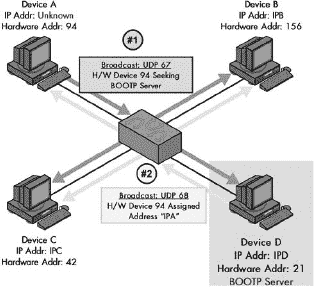
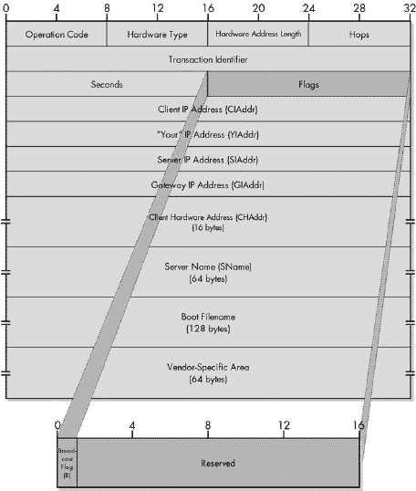
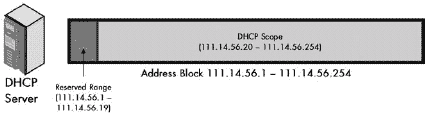
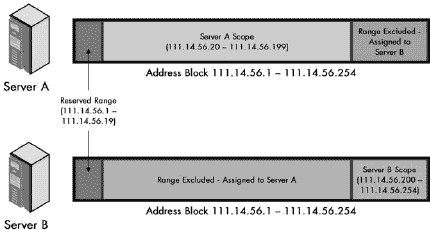
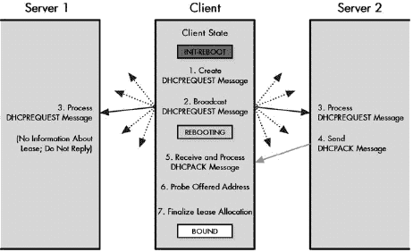
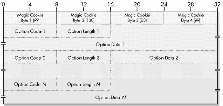

# 第三部分-3. 主机配置和 TCP/IP 主机配置协议

第五十九章

第六十章")

第六十一章

第六十二章

第六十三章

第六十四章

每个放置在网络上或互联网上的主机在使用之前都必须进行设置和配置。配置确保主机正常工作，并告知它与其他主机和设备成功通信所需的参数。在美好的旧日子里，管理员会手动设置每个主机，每当它被添加到网络时，他们也会根据需要手动更改配置。

然而，现代网络非常大，手动配置主机是一项耗时的工作。此外，我们经常需要只有自动化配置才能提供的功能，尤其是对于没有内部存储的特殊主机。正因为如此，才开发了 *主机配置* 协议。

本部分包括六章，描述了主机配置协议背后的概念，并说明了目前使用中最重要的两个协议的操作。第一章是主机配置概念和问题的概述，这将帮助您理解为什么这些协议如此重要。第二章，我描述了 TCP/IP 引导协议 (BOOTP)，这是第一个真正有能力的为互联网协议 (IP) 主机提供自动化配置的工具。

本部分剩余的章节涵盖了 BOOTP 的继任者，功能丰富的动态主机配置协议 (DHCP)。第三章介绍了 DHCP，并讨论了 DHCP 分配地址的不同方式，重点关注动态寻址。第四章讨论了 DHCP 的操作，包括配置参数管理以及分配地址和管理这些分配的流程。第五章描述了 DHCP 消息，并说明了 DHCP 消息格式。最后一章详细介绍了 DHCP 客户端和服务器，探讨了 DHCP 的特殊特性和问题，并描述了 DHCP 对支持新 IP 版本 6（IPv6）所做的更改。

从技术上讲，TCP/IP 的第一个主机配置协议是反向地址解析协议（RARP）。RARP 是一个简单、原始的协议，允许执行非常基本的主机配置，但除此之外很少。RARP 与 BOOTP 和 DHCP 非常不同，不仅因为它的功能更有限，还因为它在 2 层和 3 层之间运行，就像它所基于的地址解析协议（ARP）一样。因此，它包含在第二部分-2 中，该部分还描述了 ARP。

# 第五十九章。主机配置概念、问题和动机

将主机置于互联网中需要遵循某些设置和配置程序。必须选择和设置硬件，并在硬件上选择和安装软件。一旦软件设置完成，我们还没有完成。我们还需要执行其他配置任务，告诉软件我们希望它如何运行，并给它一些参数，以便它知道自己在网络中的角色以及如何运行。

在这一简短的章节中，我讨论了主机配置的目的、与之相关的问题以及主机配置协议。

# 主机配置的目的

在互联网中为每个主机执行的最重要配置任务可能是为其赋予一个*身份*，形式为一个仅属于它的唯一地址。在 TCP/IP 网络中，每个设备都必须分配一个 IP 地址。主机通常还需要其他参数以确保它们正常运行。对于 TCP/IP 网络，我们可能希望告诉每个主机以下信息：

+   本地网络上默认路由器的地址

+   主机应使用的网络掩码

+   为主机提供特定服务的服务器地址，例如邮件服务器或域名系统（DNS）名称服务器

+   本地网络的最大传输单元（MTU）（见第二十二章

在 TCP/IP 网络上，一个设备能够有效通信之前，它需要知道自己的 IP 地址。虽然传统的网络主机可以从其内部磁盘读取此信息，但某些设备没有存储空间，因此没有这种奢侈。它们需要网络上的另一个设备提供 IP 地址以及其他它们需要成为活跃的互联网协议（IP）主机所需的信息和/或软件。将新机器启动并运行的问题通常被称为*引导启动*，为了向 IP 主机提供这种能力，TCP/IP 的*引导协议（BOOTP）*被创建。

在本章中，我详细介绍了 BOOTP。我首先概述了该协议的历史和标准，然后讨论了 BOOTP 的客户端/服务器特性以及客户端和服务器之间通信中的寻址方式。我逐步描述了 BOOTP 的操作，并说明了 BOOTP 消息的格式。最后，我描述了 BOOTP 供应商扩展，这些扩展用于允许在 BOOTP 消息中发送的信息进行定制，并讨论了 BOOTP 中继代理，这些代理允许协议在 BOOTP 服务器和客户端位于不同网络时也能运行。

### 小贴士

**相关信息** *BOOTP 是动态主机配置协议（DHCP）的前身。DHCP 被构建为与 BOOTP 高度兼容，因此这两个协议有相当程度的相似性。为了避免重复，某些信息仅包含在以下关于 DHCP 的章节中（在适当的地方引用本章节）。另一方面，一些历史背景信息，如供应商信息扩展和中继代理，这些功能最初是为 BOOTP 开发的，后来被 DHCP 采用，包含在本章中，并从 DHCP 章节中引用。如果您计划阅读关于 DHCP 和 BOOTP 的内容，我建议首先阅读本节。如果您不打算了解 DHCP，您可能希望查看第六十四章中关于 DHCP/BOOTP 互操作性的讨论*。

# BOOTP 概述、历史和标准

TCP/IP 协议套件已经陪伴我们超过二十年了，而如何在 IP 主机上自动配置参数的问题几乎与它一样历史悠久。在 20 世纪 80 年代初，网络规模小且相对简单，因此手动配置并不困难。自动主机配置主要需要，因为这是配置无盘工作站等设备唯一的方式。

正如我在第五十九章中讨论的那样，如果没有某种形式的内部存储，设备每次开机时都必须依赖某人或某物来告诉它“它是谁”（它的地址）以及如何操作。当这种设备开机时，它处于一个困难的境地：它需要使用 IP 与另一个设备通信，该设备将告诉它如何使用 IP 进行通信！这个过程被称为*引导*或*启动*，它来源于一个人“用自己的靴带把自己拉起来”的类比。你可能以前遇到过这个术语，如果不是在其他时候，那么可能是在某个技术支持人员告诉你“重新启动”你的计算机的时候。

## BOOTP：纠正 RARP 的弱点

反向地址解析协议（RARP）是解决这个引导问题的第一次尝试。RARP 是在 1984 年创建的，它是将 IP 地址绑定到链路层硬件地址的低级地址解析协议（ARP）的直接改编（见第十三章）。RARP 能够通过主机和 RARP 服务器之间简单的请求和回复客户端/服务器交换，为无盘设备提供其 IP 地址。

RARP 的困难在于它有很多限制。它在一个相当低级的层面上使用硬件广播进行操作，因此需要针对不同硬件类型进行调整。每个物理网络都需要一个 RARP 服务器来响应第 2 层的广播。每个 RARP 服务器都必须由管理员手动提供地址分配。最糟糕的是，RARP 只向主机提供一个 IP 地址，而不会提供主机可能需要的其他任何信息。（我在第十四章中详细描述了这些问题。）

RARP 显然不足以满足 TCP/IP 的主机配置需求。为了支持无盘主机和其他需要自动配置好处的情况，创建了 BOOTP。BOOTP 在 1985 年 9 月发布的 RFC 951 中被标准化。这个相对简单的协议是专门设计来解决 RARP 的不足的：

+   BOOTP 仍然基于客户端/服务器交换，但作为更高层的软件协议实现，使用用户数据报协议（UDP）进行消息传输（见第四十四章）。它不依赖于网络的具体硬件，如 RARP 所做的那样。

+   它支持向客户端发送除 IP 地址之外的其他配置信息。为了提高效率，这些额外信息通常可以包含在一个消息中。

+   它可以处理客户端和服务器位于互联网的不同网络中。这使得提供 IP 地址的服务器管理更加集中化，从而节省了金钱以及管理时间和麻烦。

应该注意的是，尽管 BOOTP 的名字暗示它定义了无存储设备启动所需的一切，但这并不是真的。正如 BOOTP 标准本身所描述的，引导通常需要两个阶段。在第一阶段，客户端被提供地址和其他参数。在第二阶段，客户端下载软件，如操作系统和驱动程序，使其能够在网络上运行并执行其他任务。BOOTP 实际上只处理这些阶段中的第一个：地址分配和配置。第二个阶段假定使用简单的文件传输协议，如简单文件传输协议（TFTP，在第七十三章中讨论，Chapter 73")）。

### 小贴士

**关键概念** TCP/IP 的第一个广泛使用的主机配置协议是*引导协议（BOOTP）*。它是专门创建的，旨在在解决 RARP 的许多弱点的同时实现主机配置。BOOTP 旨在作为无存储设备两阶段引导过程的第一阶段使用。在通过 BOOTP 获取 IP 地址和其他配置参数后，设备使用 TFTP 等协议下载在网络上运行所需的软件。

## 供应商特定参数

在创建 BOOTP 时做出的一个明智的决定是包含一个*供应商特定区域*。这是为了提供一个地方，让硬件供应商可以定义与其产品相关的参数。随着 TCP/IP 的复杂性增加，人们意识到这个字段可以用来定义一种方法，以通信 IP 主机通常需要的某些参数，实际上这些参数与供应商无关。这首先在 1988 年 2 月发布的 RFC 1048，“BOOTP 供应商信息扩展”中提出。

事实是，BOOTP 不仅可以向客户端提供 IP 地址之外的信息，这使得即使在设备已经知道其地址的情况下，它仍然很有用。BOOTP 可以用来发送管理员希望所有主机都具有的参数，以确保它们以一致的方式使用网络。此外，对于具有本地存储（因此不需要 BOOTP 获取 IP 地址）的设备，BOOTP 仍然可以用来让这些设备获取引导阶段第二阶段所需的引导文件名称，在这个阶段，客户端下载软件。

## BOOTP 的变化和 DHCP 的发展

从 20 世纪 80 年代中期到 90 年代末，BOOTP 一直是 TCP/IP 主机配置协议的首选。RFC 1048 中引入的供应商扩展很受欢迎，并且多年来，定义了额外的供应商扩展。RFC 1048 随后被 RFC 1084、RFC 1395 和 RFC 1497 依次取代。

在过去几年中，关于 RFC 951 的某些部分应该如何解释以及某些 BOOTP 功能如何工作也存在一些混淆。1993 年 10 月发布的 RFC 1542，“引导协议的澄清和扩展”旨在解决这个问题，并对协议的操作进行了一些轻微的更改。（RFC 1542 实际上是与几乎相同的 RFC 1532 的更正，后者有一些小错误。）

虽然 BOOTP 显然非常成功，但它也存在某些弱点。其中最重要的一个就是缺乏对 *动态* 地址分配的支持。在 1990 年代后期互联网真正开始起飞时，对动态分配的需求变得更加明显。这直接导致了动态主机配置协议（DHCP）的发展。

虽然 DHCP 取代了 BOOTP 成为首选的 TCP/IP 主机配置协议，但说 BOOTP 已经消失是不准确的。它至今仍在某些网络中使用。此外，DHCP 直接基于 BOOTP，并且它们共享许多属性，包括一个通用的消息格式。BOOTP 供应商扩展被用作 DHCP *选项* 的基础，这些选项以相同的方式工作，但包括额外的功能。实际上，RFC 1497 的继任者是 RFC 1533，它正式将 BOOTP 供应商扩展和 BOOTP 选项合并到同一标准中。

# BOOTP 客户端/服务器消息和寻址

虽然 BOOTP 可以用于各种设备，但其创建背后的一个主要动机是为没有存储的“笨拙”设备提供一种自动配置的方法。这些设备中的大多数在功能上相对有限，因此要求它们支持复杂的引导协议是没有意义的。因此，BOOTP 是一种简单的协议，它通过不涉及太多复杂的概念或实现要求来完成主机配置。

与许多其他 TCP/IP 协议一样，BOOTP 在本质上是一种客户端/服务器架构。该协议的操作由一个 *BOOTP 客户端* 和一个 *BOOTP 服务器* 之间的单一消息交换组成。任何需要配置的设备都可以是 BOOTP 客户端。BOOTP 服务器是一种特别设置以响应 BOOTP 客户端请求的网络设备，并且已经编程了它可以在需要时提供给客户端的寻址和其他信息。

BOOTP 服务器维护一组关于其服务的客户端的特殊信息。其中关键的一部分是一个将每个客户端的硬件（第 2 层，数据链路层）地址映射到分配给该设备的 IP 地址的表。客户端在其请求中指定其硬件地址，服务器使用该地址查找客户端的 IP 地址并将其返回给客户端。（也可以使用其他技术，但映射表是最常见的。）

## BOOTP 消息和传输

由于几个原因，BOOTP 消息使用 UDP 作为其第 4 层传输协议：

+   UDP 比其他层 4 传输协议（传输控制协议 TCP）简单得多，非常适合像 BOOTP 这样的简单请求/回复协议。

+   由于客户端显然不知道 BOOTP 服务器的地址，因此请求会在其本地网络中广播。UDP 支持广播；TCP 不支持。

UDP 为 BOOTP 服务器使用一个特殊的已知（保留）端口号：UDP 端口 67。BOOTP 服务器在端口 67 上监听客户端发送的这些广播 BOOTP 请求。在处理请求后，服务器将回复发送回客户端。这如何处理取决于客户端是否知道自己的地址。

BOOTP 通常用于向不知道其地址的客户端提供 IP 地址。这有时被称为“鸡生蛋还是蛋生鸡”的问题，因为它代表了一种循环，就像古老的谜题：是鸡先还是蛋先？为了解决这个困境，BOOTP 服务器有两个选择。如果操作系统支持，服务器可以使用客户端的硬件地址为设备创建一个 ARP 条目，然后使用层 2 单播来发送回复。否则，它必须在本地网络上以广播的形式发送回复。

然而，在 BOOTP 客户端已经知道自己的地址的情况下，该地址可以被 BOOTP 服务器用来直接发送回复。

## BOOTP 的广播和端口使用

由于 BOOTP 服务器可能需要向客户端广播回复，这需要从大多数 TCP/IP 协议使用客户端端口的方式中做出一些改变。回想一下，通常，在 UDP 或 TCP 的客户端/服务器事务中，客户端生成一个临时或临时的端口号，并将其用作请求中的源端口。服务器使用该临时端口号将回复发送回客户端的 IP 地址。

临时端口号必须对于特定的 IP 地址是唯一的，但可能不是网络中所有设备都唯一。例如，设备 A 可能正在使用临时端口号 1248 向 Web 服务器发送 HTTP 请求，而设备 B 可能在其 TCP/IP 堆栈上使用端口号 1248 发送域名系统（DNS）请求。由于 BOOTP 中的服务器正在广播，它不是针对特定设备进行单播传输。这意味着它不能安全地向临时端口号发送。这是因为网络上的其他设备可能已经为其他事务选择了相同的临时端口号，并可能错误地将 BOOTP 服务器的响应误认为是针对自己的。为了避免这个问题，另一个已知的端口号仅用于 BOOTP 客户端：UDP 端口 68。客户端监听此端口以接收广播或单播传输；尚未发送 BOOTP 请求的设备将忽略它。这种双广播 BOOTP 通信过程在图 60-1 中说明。

图 60-1. BOOTP 的通用操作

### 小贴士

**关键概念** BOOTP 是一个相对简单的客户端/服务器协议，它依赖于广播来允许与没有分配 IP 地址的设备进行通信。在这个例子中，设备 A 正在尝试确定其 IP 地址和其他参数。它使用 UDP 端口 67 在本地网络上广播一个 BOOTP 请求，然后监听端口 68 上的回复。设备 D 配置为 BOOTP 服务器，并监听此端口。当它收到请求时，它会在端口 68 上发送一个广播，告诉设备 A 其 IP 地址是什么。BOOTP 客户端使用广播将其请求发送到任何监听的 BOOTP 服务器。在大多数情况下，当 BOOTP 客户端设备使用该协议时，它不知道自己的 IP 地址。因此，BOOTP 服务器通常也会使用广播发送其回复，以确保它到达客户端。

## 丢失消息的重传

使用 UDP 进行 BOOTP 消息传递的简单性的缺点是 UDP 不可靠，这意味着 BOOTP 请求可能在到达服务器之前丢失，或者服务器的响应可能无法返回给客户端。像许多其他使用 UDP 的协议一样，BOOTP 客户端通过使用重传计时器来处理这个问题。如果在一定时间内客户端没有收到响应，它会重新发送其请求。

然而，BOOTP 客户端必须小心实施其重传策略。考虑一个场景，一个有 200 个 BOOTP 客户端的网络断电。这些机器几乎都是相同的，所以当电力恢复时，它们都会同时启动并尝试发送 BOOTP 请求。很可能会因为所有这些请求而出现问题：一些会丢失，或者服务器可能会因为过载而丢弃一些。如果所有客户端使用相同的时间进行重传，那么在经过这段时间后，大量机器将再次发送请求并重新创建原始问题。

为了避免重传问题，BOOTP 标准建议使用指数退避方案进行重传，起始重传间隔为 4 秒，并在后续尝试中将其加倍。还添加了一个随机元素，以防止许多设备重叠其重传。这个想法与以太网使用的退避方法非常相似（实际上，标准甚至引用了以太网规范）。例如，第一次重传将在 0 到 4 秒之间的随机时间段后发生（加上或减去一个随机量）；如果需要，第二次重传将在 0 到 8 秒之间的随机时间间隔后发生，加上或减去，依此类推。这有助于减少重传丢失的机会，并确保 BOOTP 流量不会使网络过载。

### 小贴士

**关键概念** BOOTP 使用 UDP 进行传输，它不提供可靠性功能。因此，BOOTP 客户端必须检测其请求是否丢失，并在必要时重新传输它们。

# BOOTP 详细操作

现在您已经了解了 BOOTP 消息在一般意义上的工作方式，让我们更详细地看看该协议的操作。这将阐明客户端和服务器如何创建和处理消息，并有助于理解 BOOTP 消息字段格式中的重要字段。了解 BOOTP 的基本操作还将有助于我们在本章后面检查 BOOTP 中继代理，甚至在讨论下一章中的 DHCP 时。

## BOOTP 引导过程

以下是在常规 BOOTP 引导过程中客户端和服务器执行的基本步骤（参见图 60-2）。

**客户端创建请求** 客户端机器通过创建一个 BOOTP 请求消息来开始这个过程。在创建这个消息时，它填写以下信息：

+   它将消息类型（Op）设置为值 1，表示 BOOTREQUEST 消息。

+   如果它知道它计划继续使用的自己的 IP 地址，它将在 CIAddr（客户端 IP 地址）字段中指定它。否则，它将此字段填充为零。（CIAddr 字段将在下一节中详细讨论。）

+   它将自己的层 2 硬件地址放入 CHAddr 字段。服务器使用这个地址来确定客户端的正确地址和其他参数。

+   它生成一个随机的事务标识符并将其放入 XID 字段。

+   客户端可以指定它想要发送回复的特定服务器，并将其放入 SName 字段。它还可以在 File 字段中指定它想要服务器提供的特定类型的引导文件名称。

+   如果程序允许，客户端可以指定供应商特定的信息。

**客户端发送请求** 客户端通过向地址 255.255.255.255 发送 BOOTREQUEST 消息来进行广播。或者，如果它已经知道一个 BOOTP 服务器的地址，它也可以发送单播请求。

**服务器接收请求并处理它** 监听 UDP 端口 67 的 BOOTP 服务器接收广播请求并处理它。如果指定了特定服务器的名称，并且这个名称与该服务器的名称不同，服务器可能会丢弃请求。如果服务器知道客户端请求的服务器也在本地网络中，这种情况尤其如此。如果没有指定特定服务器，或者这个特定服务器是客户端想要的服务器，服务器将回复。

**服务器创建回复** 服务器通过复制请求消息并更改几个字段来创建回复消息：

+   它将消息类型（Op）更改为 2，表示 BOOTREPLY 消息。

+   它从 CHAddr 字段获取客户端指定的硬件地址，并使用它在表中查找以找到此主机的匹配 IP 地址。然后，它将此值放入回复的 YIAddr（您的 IP 地址）中。

+   它处理文件字段，并提供客户端请求的文件名类型，或者如果该字段为空，则提供默认文件名。

+   它将其自己的 IP 地址和名称放入 SIAddr 和 SName 字段。

+   它在 Vend 字段中设置任何厂商特定的值。

**服务器发送回复** 服务器发送回复。它使用的方法取决于请求的内容：

+   如果设置了 B（广播）标志，这表示客户端不能接收单播回复，因此服务器将广播它。

+   如果 CIAddr 字段不为零，服务器将单播回复发送回该 CIAddr。

+   如果 B 标志为零且 CIAddr 字段也为零，服务器可能使用前面描述的 ARP 条目或广播。

**客户端处理回复** 客户端接收服务器的回复并处理它，存储提供的信息和参数。（有关此处理的一个重要问题，请参阅下一节。）

**客户端完成引导过程** 一旦配置完成，客户端将使用如 TFTP 之类的协议进入引导过程的第二阶段，下载包含操作系统软件的引导文件，使用服务器提供的文件名。

## 客户端 IP 地址（CIAddr）字段的解释

当客户端选择在其请求的 CIAddr 字段中指定 IP 地址时，可能会出现一个复杂情况。问题是如何确切地解释此字段。这是否意味着客户端已经在使用此 IP 地址？或者这只是它上次引导时使用的 IP 地址？然后还有相关的问题，即如果服务器在 YIAddr 中提供的地址与客户端正在使用的地址不同，应该怎么办。服务器的提供地址是否应该覆盖客户端的地址？或者客户端应该忽略它？谁做出决定，是服务器还是客户端？

 BOOTP 使用一个简单的两步消息交换，包括广播请求和广播回复。在客户端从 BOOTP 服务器接收配置信息后，它使用如 TFTP 之类的协议完成引导过程。

图 60-2. BOOTP 操作 BOOTP 使用一个简单的两步消息交换，包括广播请求和广播回复。在客户端从 BOOTP 服务器接收配置信息后，它使用如 TFTP 之类的协议完成引导过程。

由于原始标准在这方面含糊不清，导致出现了很多混淆，这导致了不同实现选择处理此问题的非一致性。甚至有一些实现使用 CIAddr 表示“客户端请求此 IP 地址”，这从未是 BOOTP 功能的一部分。这是一个特别糟糕的想法，因为它可能导致 BOOTP 回复永远无法到达客户端。

RFC 1542 部分是为了尝试清理这种混乱而编写的。它建议以下是最有效的处理这些字段含义的方法：

+   如果客户端愿意接受服务器提供的任何 IP 地址，即使它知道之前的地址，它也会将 CIAddr 设置为全零。

+   如果客户端为该字段填写了值，它表示它将使用此地址，并且必须准备接收发送到该地址的单播消息。

+   如果客户端在 CIAddr 中指定了一个地址，但在 YIAddr 字段中收到了不同的地址，则忽略服务器提供的地址。

注意，并非所有硬件设备都一定同意 RFC 1542 提供的这种解释，因此这里仍然存在与旧设备之间的潜在互操作性担忧。然而，RFC 1542 是在 1993 年编写的，所以这可能已经不再是多大的问题！

# BOOTP 消息格式

在 BOOTP 中，信息交换的形式是由客户端发送的请求和由服务器发送的回复。BOOTP，就像许多其他请求/回复协议一样，使用通用的消息格式来处理请求和回复。客户端首先为消息预留内存空间并将其清零。然后，它填写消息的字段并发送请求，正如你在上一节中看到的。服务器不是从头开始创建回复，而是通过复制请求并更改某些字段来创建回复。

BOOTP 消息包含相当多的字段，因此消息格式相当大。它描述在表 60-1 和表 60-2 中，并在图 60-3 中展示。

表 60-1. BOOTP 消息格式

| 字段名称 | 大小（字节） | 描述 |
| --- | --- | --- |
| Op | 1 | 操作代码：指定消息的类型。值为 1 表示请求（BOOTREQUEST 消息）。值为 2 表示回复（BOOTREPLY 消息）。 |
| HType | 1 | 硬件类型：该字段指定用于本地网络的硬件类型，并且与 ARP 消息格式中的等效字段（HRD）以完全相同的方式使用（参见第十三章）。该字段的一些最常见值显示在表 60-2 中。 |
| HLen | 1 | 硬件地址长度：指定此消息中硬件地址的长度。对于使用 IEEE 802 MAC 地址的以太网或其他网络，该值为 6。这与 ARP 字段格式中具有类似名称的字段（HLN）的值相同。 |
| Hops | 1 | 跳数：客户端在发送请求之前将其设置为 0，并由 BOOTP 中继代理用于控制 BOOTP 消息的转发。 |
| XID | 4 | 事务标识符：客户端生成的一个 32 位标识字段，允许它与从 BOOTP 服务器接收到的回复进行匹配。 |
| Secs | 2 | 秒数：根据 RFC 951，客户端将“自客户端开始尝试引导以来经过的秒数”输入此字段。这应该为 BOOTP 服务器提供信息，以帮助它们决定先响应哪些请求。不幸的是，不清楚这是指自机器开机以来还是自第一个 BOOTREQUEST 消息发送以来的时间。此外，一些设备错误地实现了此字段。因此，它并不总是被使用。 |
| Flags | 2 | 标志：在原始 BOOTP 标准（RFC 951）中，这是一个空的 2 字节字段。RFC 1542 将其更改为标志字段，目前该字段仅包含一个标志。它有一个 B（广播）标志子字段，大小为 1 位，如果客户端在发送 BOOTP 请求时不知道自己的 IP 地址，则将其设置为 1。这作为立即指示 BOOTP 服务器或中继代理接收到的请求，它确实应该通过广播发送其回复。另一个子字段是保留字段，大小为 15 位，设置为 0，未使用。 |
| CIAddr | 4 | 客户端 IP 地址：如果客户端有一个当前 IP 地址，它计划继续使用，它将此地址放入此字段。通过填写此字段，客户端承诺对发送到此地址的单播 IP 数据报做出响应。否则，它将此字段设置为全 0，以告知服务器它想要分配地址。（请参阅本章前面的重要信息关于此字段。） |
| YIAddr | 4 | 你的 IP 地址：服务器分配给客户端的 IP 地址。这可能与客户端当前使用的 IP 地址不同。 |
| SIAddr | 4 | 服务器 IP 地址：发送 BOOTREPLY 消息的 BOOTP 服务器的 IP 地址。 |
| GIAddr | 4 | 网关 IP 地址：当 BOOTP 中继代理在客户端和服务器在不同子网或网络之间进行 BOOTP 请求和回复通信时，用于路由 BOOTP 消息。要理解这个名称，请记住旧的 TCP/IP 术语中的*路由器*是*网关*；BOOTP 中继代理通常是路由器。请注意，客户端将此字段设置为 0，并且在处理 BOOTREPLY 时应该忽略此字段。它特别不表示服务器向客户端提供用于一般 IP 路由目的的默认网关地址。 |
| CHAddr | 16 | 客户端硬件地址：发送 BOOTREPLY 的客户端的硬件（第 2 层）地址。它用于查找设备的分配 IP 地址，也可能用于回复消息的投递。 |
| SName | 64 | 服务器名称：发送 BOOTREPLY 的服务器可以选择将其名称放入此字段。这可以是一个简单的文本昵称或一个完全限定的 DNS 域名（例如 myserver.organization.org）。请注意，当客户端创建其请求时，它可以在该字段中指定一个名称。如果这样做，它表示它只想从具有此名称的 BOOTP 服务器获取回复。这可能是为了确保客户端能够访问仅存储在一个服务器上的特定启动文件。 |
| 文件 | 128 | 启动文件名：包含客户端可以下载以完成引导过程的启动文件的完整目录路径和文件名。客户端可以通过在此处输入文本描述来请求特定类型的文件，或者它也可以留空，服务器将提供默认文件的文件名。 |
| Vend | 64 | 供应商特定区域：最初创建是为了允许供应商根据不同类型硬件的需求定制 BOOTP，现在此字段也用于存储额外的供应商独立配置信息。下一节关于 BOOTP 供应商信息扩展，包含更多关于此字段的详细信息。它可能由客户端和/或服务器使用。 |

表 60-2. BOOTP 消息 HType 值

| HType 值 | 硬件类型 |
| --- | --- |
| 1 | 以太网 (10 Mb) |
| 6 | IEEE 802 网络 |
| 7 | ARCNet |
| 15 | 帧中继 |
| 16 | 异步传输模式 (ATM) |
| 17 | 高级数据链路控制 (HDLC) |
| 18 | 光纤通道 |
| 19 | ATM |
| 20 | 串行线 |

如我在本章前面提到的，请求和回复都被封装进 UDP 消息进行传输。BOOTP 标准规定 UDP 校验和的使用是可选的。使用校验和可以提供对数据完整性错误的保护，因此是推荐的。这可能会对非常简单的客户端造成不可接受的处理需求，因此校验和可以合法地被跳过。

同样地，为了简化，BOOTP 假设其消息不会被分片。这是为了让 BOOTP 客户端避免重新组装分片消息的复杂性。由于 BOOTP 消息长度仅为 300 字节，在所有 TCP/IP 链路所需的最大传输单元（MTU）下，这通常不是问题。

图 60-3. BOOTP 消息格式

# BOOTP 供应商特定区域和供应商信息扩展

BOOTP 的创造者意识到某些类型的硬件可能需要从服务器传递额外的信息到客户端，以便客户端可以启动。出于这个原因，他们将 64 字节的 Vend 字段放入 BOOTP 字段格式中，也称为供应商特定区域。包含这个字段使 BOOTP 变得灵活，因为它允许供应商自己决定他们想要如何使用该协议，并根据自己的需求定制它。

客户端可以通过在其请求中请求字段中的某些类型的信息来使用 Vend 字段。然后服务器可以响应这些请求，并且它还可以包括它希望客户端拥有的参数，即使这些参数没有被请求。原始 BOOTP 协议没有定义任何结构用于供应商特定区域，将此留给每个制造商自行决定。

显然，一个制造商生产的客户端尝试向另一个制造商生产的服务器发送请求，没有任何阻止。如果每个设备都期望 Vend 字段包含不同的内容，结果将不会令人满意。因此，为了正确使用 Vend 字段，当涉及到这个字段的含义时，两个设备必须使用相同的语言。这是通过将字段的第一个四个字节设置为特殊值来实现的。每个制造商都为其自己的*魔法数字*选择一个值，有时也称为*魔法饼干*，用于这个四个字节的子字段。

### 注意

*为什么叫魔法饼干？老实说，我不确定。我听说它的起源可能是《爱丽丝梦游仙境》中爱丽丝吃的可以让自己变大或变小的饼干*。

## BOOTP 供应商信息扩展

在 BOOTP 中包含 Vend 字段为供应商特定信息提供了协议的可扩展性。不幸的是，原始字段格式没有包括任何从服务器发送到客户端以扩展通用、非供应商特定 TCP/IP 信息的方式。这在协议创建过程中是一个重大的疏忽，因为当 TCP/IP 主机启动时，它需要许多类型的信息，这些信息实际上与其供应商无关。例如，当主机启动时，我们可能希望它被告知默认路由器的地址、其本地子网的子网掩码、本地 DNS 服务器的地址、本地网络的 MTU 以及更多。这些都不是供应商特定的，但在 BOOTP 回复消息中没有地方可以放置它们。

由于 BOOTP 中没有非供应商特定的区域字段，因此决定定义一种使用供应商特定区域（Vend 字段）的方式来传递这种额外的通用信息。这首先在 RFC 1048 中得到了标准化，然后在后续的 RFC 中得到改进，正如我在本章前面关于 BOOTP 概述中解释的那样。这个方案基本上代表了一种使用 Vend 字段的方式，大多数 TCP/IP BOOTP 实现都选择了采用，无论它们的供应商是谁。这种增强正式称为*BOOTP 供应商信息扩展*。

### 提示

**关键概念** BOOTP 消息格式包括一个 Vend 字段，最初是为了供应商特定的定制字段而设计的。后来它被改为从 BOOTP 服务器发送到 BOOTP 客户端可以发送额外通用信息的地方。每个这样的参数都携带在一个 BOOTP *供应商信息字段*中。

为了清楚地标记正在使用 Vend 字段的特定含义，将一个特殊的、通用的魔法 cookie 值 99.130.83.99 插入到字段的第一个四个字节中。然后剩余的 60 个字节可以包含一个或多个*供应商信息字段*的序列。当使用供应商信息扩展时，供应商特定区域的总体结构如图 60-4 所示。

图 60-4. BOOTP 供应商特定区域格式，显示供应商信息字段

### 注意

*BOOTP 供应商特定区域以四个字节的魔法 cookie 开始，然后包含一系列可变长度的供应商信息字段，每个字段都具有上面所示和表 60-3 中的格式。尽管使用 IP 点分十进制表示值 99.130.83.99，但这不是一个 IP 地址。它只是一个标记——一个被普遍认可的魔法数字*。

## BOOTP 供应商信息字段

每个供应商信息字段指定要传递的特定类型的信息，并使用一个特殊的子字段结构进行编码，该结构指定了字段类型、长度和值。这是一种常见的指定选项的方法，称为*TLV 编码*（代表*类型、长度、值*）。相同的基该方法用于编码互联网协议版本 4 和 6（IPv4 和 IPv6）选项。表 60-3 显示了每个供应商信息字段子字段的结构和常见名称。

表 60-3. BOOTP 供应商信息字段格式

| 子字段名称 | 大小（字节） | 描述 |
| --- | --- | --- |
| Code | 1 | 供应商信息字段代码：一个指定供应商信息字段类型的单字节。 |
| Len | 1 | 供应商信息字段长度：此特定供应商信息字段中的字节数。这不包括代码和长度字段中的两个字节。 |
| Data | 可变 | 供应商信息字段数据：正在发送的数据，其长度由长度子字段指示，并根据代码子字段进行解释。 |

有两种特殊情况违反了表 60-3 中显示的字段格式。当子字段需要对齐在字边界上时，使用代码值为 0 作为填充；它不包含任何信息。值 255 用于标记供应商信息字段的结束。这两个代码都不包含实际数据。为了节省空间，当使用任何一个时，只需包含单个代码值，并省略长度和数据字段。一个看到代码值为 0 的设备将其视为填充内容跳过；一个看到代码值为 255 的设备知道它已经到达了此 Vend 字段中的供应商信息字段末尾。

BOOTP 的供应商信息扩展变得如此流行，以至于使用此字段发送额外通用信息的做法几乎已成为标准。事实上，我不确定今天是否还有人仍然仅将 Vend 字段用于供应商特定信息。

当引入供应商信息扩展时，创建了一个指向可以找到供应商特定信息的文件的扩展。这使得设备能够兼得两者之利——它们可以使用标准的供应商独立字段，并在需要时可以包含供应商特定字段（通过引用的文件）。后来，又创建了一种新的字段类型，允许在 BOOTP 消息中直接将供应商特定字段与供应商独立字段混合。

当 DHCP 被创建时，保持了相同的供应商扩展机制并进一步增强了它，但字段不再被称为供应商信息扩展，而是更名为*选项*。（一个更好的名字！）BOOTP 的供应商信息字段在 DHCP 中得到了保留，并定义了新的 DHCP 特定选项。为了避免重复，我已经在第六十三章中列出了一套表格，其中包括了 BOOTP 供应商信息字段和 DHCP 选项，该章节涵盖了 DHCP 消息。这包括讨论如何混合供应商特定和供应商独立的信息。您可能还想阅读第六十三章中描述 DHCP 选项的部分，该部分讨论了它们是如何从 BOOTP 供应商信息扩展中创建出来的。

# BOOTP 中继代理（转发代理）

RARP 被迅速取代的原因之一是 RARP 要求客户端配置并从服务器获取 IP 地址的客户端必须在同一物理网络上。当你运行一个拥有十台机器的小型组织时，这很正常，这些机器可能都在同一物理网络上。然而，为了效率，大型网络必须分成多个物理网络。RARP 需要为每个网络设置一个单独的 RARP 服务器，这意味着需要在多台机器上复制单个服务器的所有功能。更糟糕的是，所有配置信息也会被复制，并且每次更改都需要对所有不同的服务器进行修改。

BOOTP 被设计成允许 BOOTP 服务器及其所服务的客户端位于不同的网络中。这集中了 BOOTP 服务器，并大大减少了网络管理员所需的工作量。然而，实现这一功能意味着增加协议的复杂性。特别是，我们需要在配置过程中涉及第三方设备。

你可能会正确地想知道为什么会这样。RARP 是一个在链路层工作的低级协议，这就解释了为什么它会在将客户端和服务器放置在不同的物理网络上时遇到问题。但制作 BOOTP 为一个高级协议的整个目的不正是它能使用 IP 吗？如果 BOOTP 使用 IP，我们难道不能像任何基于 IP 的消息协议一样，任意地从网络发送到另一个网络吗？

答案是，尽管我们确实在使用 IP 和 UDP，但 BOOTP 仍然存在 RARP 的问题之一：依赖 *广播*。客户端通常不知道服务器的地址，因此它必须发送其请求作为广播，本质上是在说，“有人能听到这个并给我需要的信息吗？”出于效率的考虑，路由器不会路由此类广播，因为这会阻塞网络。这意味着如果服务器和客户端不在同一网络中，服务器就听不到客户端的广播。同样，如果服务器曾经收到请求并广播其回复给客户端，客户端也永远无法收到。为了使这一切都能正常工作，我们需要某种东西作为客户端和服务器之间的中介：一个 *BOOTP 中继代理*。

## BOOTP 中继代理的功能

BOOTP 中继代理的职责是坐在一个物理网络上，其中可能存在 BOOTP 客户端，并作为 BOOTP 服务器的代理。代理之所以得名，是因为它在客户端和服务器之间中继消息，从而使得它们可以位于不同的网络中。

### 注意

*BOOTP 中继代理最初被称为转发代理。RFC 1542 将其名称更改为明确指出，BOOTP 中继与常规路由器进行的传统 IP 数据报转发不同*。

在实践中，BOOTP 中继代理通常不是单独的硬件设备。相反，它是一个运行在执行其他功能的现有硬件上的软件模块。在 IP 路由器上实现 BOOTP 中继代理功能是很常见的。在这种情况下，路由器既充当常规路由器，也扮演 BOOTP 代理的角色。BOOTP 中继代理所需的前进功能与路由器的正常 IP 数据报转发任务不同。

### 小贴士

**关键概念** 由于 BOOTP 使用广播，BOOTP 客户端和 BOOTP 服务器必须位于同一物理网络上，才能听到彼此的广播传输。对于位于不同网络的客户端和服务器进行通信，需要一个第三方来促成交易：一个*BOOTP 中继代理*。这个设备通常是路由器，它监听来自 BOOTP 客户端的传输并将它们中继到 BOOTP 服务器。服务器将回复发送回代理，然后代理将服务器的响应发送回客户端。

自然地，客户端和服务器位于不同的网络以及中继代理的存在显著改变了 BOOTP 的正常请求/回复过程。BOOTP 消息格式中的几个特定字段用于控制这个过程。RFC 951 在描述这个过程如何工作时相当模糊，因此 RFC 1542 对其进行了更详细的描述。

## 使用中继代理的正常 BOOTP 操作

以下以简化的形式展示了当涉及中继代理时，BOOTP 操作步骤的修订版。为了使这次讨论的规模可控，我省略了基本请求/回复过程的细节，以专注于中继功能，您也可以在图 60-5 中图形化地看到）。

**客户端创建请求** 客户端机器正常创建其请求。中继代理的存在对客户端来说是完全透明的。

**客户端发送请求** 客户端通过将其发送到地址 255.255.255.255 来广播 BOOTREQUEST 消息。（注意，在客户端已经知道自己的地址和 BOOTP 服务器地址的情况下，我们根本不需要中继代理——请求和回复都可以通过任意互联网进行单播发送。）

**中继代理接收请求并处理** 客户端所在的物理网络上的 BOOTP 中继代理代表服务器监听 UDP 端口 67。它按以下方式处理请求：

+   它检查 Hops 字段的值。如果值小于或等于 16，则增加它。如果值大于 16，则丢弃请求并不再执行其他操作。

+   它检查 GIAddr 字段的内容。如果该字段全部为零，它知道自己是处理请求的第一个中继代理，并将自己的 IP 地址放入该字段。（如果代理是路由器，它有多个 IP 地址，因此它选择接收请求的接口上的一个。）

**中继代理转发请求** 中继代理将 BOOTP 请求发送到 BOOTP 服务器。如果中继代理知道服务器的 IP 地址，它将直接以单播方式将其发送到服务器。否则，如果代理是路由器，它可能选择从接收请求的不同接口广播请求。在后一种情况下，可能需要多个中继代理来将请求传达给服务器。有关更多信息，请参阅下一节。

**服务器接收请求并处理** BOOTP 服务器从 BOOTP 中继代理接收转发的请求。它像处理正常请求一样处理它。

**服务器创建响应** 服务器像往常一样创建响应消息。

**服务器发送响应** 由于请求中的 GIAddr 字段值不为零，服务器知道请求已被中继。它不会尝试将其响应发送回发送请求的客户端，而是将响应单播发送回 GIAddr 中指定的中继代理。

**中继代理转发响应** BOOTP 中继代理将 BOOTREPLY 消息发送回客户端。它根据 CIAddr 字段的值和 B（广播）标志，以单播或广播的方式执行此操作，就像非中继情况下的服务器一样。

图 60-5. 使用转发代理的 BOOTP 操作 在这个例子中，设备 A 正在尝试访问一个 BOOTP 服务器，但只有一个在另一个网络上；它们通过一个配置为作为 BOOTP 转发代理的工作组路由器连接。设备 A 广播其请求，路由器接收它。路由器将请求转发到 BOOTP 服务器，设备 D，并将自己的 IP 地址（IPR）放入 BOOTP GIAddr 字段。BOOTP 服务器使用地址 IPR 将回复发送回路由器。然后路由器在设备 A 的本地网络上广播它，以便设备 A 可以接收它。

## 使用广播转发 BOOTP 请求

转发的最简单情况是每个网络都有一个知道 BOOTP 服务器 IP 地址的转发代理。转发代理在上一节所述过程的第 3 步捕获请求，并将其直接发送到网络上的任何位置的 BOOTP 服务器。请求作为常规的单播 UDP 消息转发，并路由到 BOOTP 服务器。BOOTP 服务器的回复就像 IP 数据报中的任何 UDP 消息一样被路由回 BOOTP 转发代理，然后转发代理将回复转发出去。

还可以设置 BOOTP 转发代理来转发请求，即使它们不知道 BOOTP 服务器的地址。这些代理接收一个网络上的请求并将其转发到下一个网络，在那里它们期望另一个代理继续转发过程，直到到达 BOOTP 服务器。例如，假设我们有一组三个网络。网络 N1 通过路由器 RA 连接到网络 N2，网络 N2 通过路由器 RB 连接到网络 N3。这两个路由器都作为转发代理，但不知道 BOOTP 服务器的 IP 地址。以下是一个客户端在 N1 网络上发送请求而服务器在 N3 网络上的情况：

1.  客户端会发送其请求。

1.  路由器 RA 会捕获请求并将它的地址放入 GIAddr。它会将跳数字段增加到 1，然后将请求广播到网络 N2。

1.  路由器 RB 会捕获这个请求。它会看到 GIAddr 中已经有了一个地址，所以它会保留这个地址。它会将跳数字段增加到 2，并在网络 N3 上广播请求。

1.  BOOTP 服务器会接收请求，处理它，并将回复直接发送回路由器 RA。

1.  路由器 RA 会将回复转发回客户端。

如您所见，跳数字段的作用是确保错误的请求不会在网络中无限循环。每个转发代理都会增加它，如果值超过 16，则请求会被丢弃。您还可以看到，除了第一个以外的任何转发代理都只参与处理请求；回复会单播发送回离客户端最近的代理。

顺便提一下，如果这个多步骤中继过程听起来像 IP 路由（仅使用广播），并且跳数字段听起来像 IP 数据报中的生存时间（TTL）字段，那么你确实在注意。这本质上是一个相同的概念（如第二十一章第二十一章. 互联网协议数据报封装和格式中所述）。

# 第六十一章. DHCP 概述和地址分配概念

在某些方面，技术进步可以被认为更像是一次旅行而不是一个目的地。当某种特定技术被改进或被更优越的技术所取代时，它通常只是时间问题，它也会被更好的东西所取代。TCP/IP 引导协议（BOOTP）的情况也是如此，如前一章所述。虽然 BOOTP 比它所取代的协议——反向地址解析协议（RARP）——功能强大得多，但经过多年，BOOTP 本身也被一个新的 TCP/IP 配置协议所取代：*动态主机配置协议（DHCP）*。

与 RARP 代表了从 RARP 到 BOOTP 的变革不同，DHCP 更多的是 BOOTP 的演变。它是基于 BOOTP 构建的，采用了相同的基本消息格式。DHCP 最显著的增加是能够*动态地*为客户分配地址并集中管理它们。正是这种能力使得 DHCP 如此强大。如今，DHCP 已成为标准的 TCP/IP 主机配置协议，并被用于从单客户端家庭网络到企业级互连网络的一切。

在本章关于 DHCP 的第一章中，我提供了对协议的概述，以及 DHCP 地址分配和租赁背后的概念的描述。我高屋建瓴地审视了 DHCP 地址分配的工作方式，并描述了三种 DHCP 地址分配机制。然后我深入探讨了 DHCP 租赁以及决定如何实施 DHCP 租赁的政策和技术。我概述了从开始到结束的整个租赁生命周期，并描述了帮助控制过程的两个 DHCP 租赁计时器。最后，我描述了 DHCP 租赁地址池和范围，以及地址管理背后的通用概念。

### 小贴士

**相关信息** *由于 DHCP 建立在 BOOTP 之上，它们有许多共同之处。例如，DHCP 利用了 BOOTP 中继代理功能，并且 DHCP 选项基本上与 BOOTP 供应商信息字段相同。由于 DHCP 是这两种协议中更常见的一种，我在这里尽量全面地描述了这些功能的操作，特别强调了它们在 DHCP 和 BOOTP 中工作方式的不同之处。然而，我避免重复许多这些功能的历史和存在理由。由于 BOOTP 先出现，我在上一章中放置了更多的历史信息。一般来说，如果你打算阅读关于 DHCP 和 BOOTP 的内容，我建议首先阅读关于 BOOTP 的章节。如果你不打算阅读关于 BOOTP 的内容，你可能希望查看第六十四章中的 DHCP/BOOTP 互操作性主题*。

# DHCP 概述、历史和标准

如你在上一章所学，BOOTP 相对于 RARP 来说是一个重大的改进，因为它解决了 RARP 的许多问题。BOOTP 是一个高层协议，不像 RARP 那样依赖于硬件。它能够支持向客户端发送超出 IP 地址之外的信息，以便实现定制配置。此外，通过使用 BOOTP 中继代理，它允许大型组织只需使用一个或两个 BOOTP 服务器来处理分布在许多物理网络上的客户端。这样做，BOOTP 有效地解决了管理员在手动配置中遇到的主要问题类别之一：“我必须亲自配置每个主机”的问题。它允许“愚笨”（无存储）的主机自动配置自己，从而节省了管理员需要逐个访问每个主机以指定重要配置参数的麻烦。

BOOTP 通常使用一种静态方法来确定分配给设备的 IP 地址。当客户端发送请求时，它会包含其硬件地址，服务器会在表中查找该地址以确定该客户端的 IP 地址。（BOOTP 可以使用其他方法来确定 IP 地址和硬件地址之间的关系，但通常使用静态映射。）这意味着 BOOTP 在相对静态的环境中运行良好，在这些环境中，分配给不同设备的 IP 地址的变化不频繁。这样的网络在 20 世纪 80 年代和 90 年代初基本上是标准。

随着时间的推移，由于多种原因，许多网络迅速开始从这种模式中转变出来。随着计算机变得越来越小和轻便，它们从一个网络移动到另一个网络的频率越来越高，这就需要使用新网络的网络 ID 来分配不同的地址。笔记本电脑甚至掌上电脑每天可以多次从一个网络移动到另一个网络。另一个主要问题是 IP 地址空间的即将耗尽（参见第十七章* 是目前现代 TCP/IP 互联网上使用的主机配置协议。它基于 BOOTP，在许多方面与前辈相似，包括使用请求/回复消息交换和几乎相同的消息格式。然而，DHCP 包含了额外的功能，其中最显著的是 *动态地址分配*，它允许客户端从由 DHCP 服务器管理的共享池中分配 IP 地址。

原始 DHCP 规范于 1997 年 3 月随着 RFC 2131 的发布进行了修订，该 RFC 也称为“动态主机配置协议”。该标准定义了另一种新的 DHCP 消息类型（DHCPINFORM），允许活动 IP 主机请求额外的配置信息。它还对协议进行了其他一些小的修改。从那时起，已经发布了大量其他与 DHCP 相关的 RFC，其中大多数要么定义了新的 DHCP 选项类型（DHCP 服务器可以向 DHCP 客户端发送的其他类型的信息），要么稍微细化了 DHCP 在特定应用中的使用方式。

# DHCP 地址分配和分配机制

DHCP 的两个主要功能是为主机分配地址并提供一种方法，使客户端可以从服务器请求地址和其他配置数据。这两个功能都基于 DHCP 的前身 BOOTP 中实现的功能，但在地址分配方面的变化比在通信方面的变化更为显著。在这里开始探讨 DHCP 是有意义的，因为这自然会引导我们深入讨论 DHCP 的定义特征：*动态地址分配*。

## DHCP 地址分配

向客户端提供 IP 地址是主机配置协议执行的最基本的配置任务。为了在不同类型的客户端上配置地址提供灵活性，DHCP 标准包括三种不同的地址分配机制：手动、自动和动态。

我并不真的喜欢“自动”和“动态”分配的名称，因为它们并不能很好地清楚地传达这些方法之间的差异。这两种方法都可以被认为是自动的，因为在每种情况下，DHCP 服务器都会分配一个地址，而不需要任何管理员的干预。它们之间的真正区别只在于 IP 地址保留的时间长短，以及主机地址是否随时间变化。我认为更好的名称应该是“静态”或“永久”自动分配和“动态”或“临时”自动分配。

无论你称它们为什么，这三种方法都是为了使用 DHCP 配置 IP 主机而存在的。管理员没有必要在这三者之间做出选择。相反，他们通常会结合使用这些方法，在每个最适合的地方使用它们。

## DHCP 手动分配

在手动分配中，管理员会预先为单个设备分配一个特定的 IP 地址。DHCP 只将 IP 地址传达给设备。

手动分配是最简单的方法，它等同于上一章中描述的 BOOTP 用于地址分配的方法。每个设备都有一个管理员提前分配的地址，而 DHCP 所做的只是查找表中的地址并将其发送给预期的客户端。这种技术对于网络中的主要设备，如服务器和路由器来说最有意义。它也适用于其他必须具有稳定、永久 IP 地址的设备。

好吧，现在有一个公平的问题你可能会有。在手动分配的情况下，DHCP 基本上就像 BOOTP 一样。但是 BOOTP 是为了需要配置帮助的设备而创建的。服务器和路由器是具有自己内部存储的复杂设备，显然它们不需要像无盘工作站那样由 DHCP 服务器告诉它们 IP 地址，那么为什么还要为它们使用 DHCP 呢？

嗯，实际上，你完全可以手动直接将地址分配给设备，并告诉 DHCP 忽略这些地址。然而，使用 DHCP 进行手动分配会带来不同的好处：管理上的好处。它将所有 IP 地址信息集中存储在 DHCP 地址数据库中，而不是要求管理员从一台机器跳到另一台机器检查地址，并确保没有重复。更新也可以在单一位置进行。

## DHCP 动态分配

在 DHCP 中虽然可以进行手动分配，但动态分配才是其真正的**宗旨**。使用动态分配，DHCP 从地址池中为客户端分配一个 IP 地址，这个地址池由服务器根据客户端选择的时间限制进行分配，或者直到客户端通知 DHCP 服务器它不再需要该地址。管理员会设置一个**地址池**（通常是一个范围或一系列范围），其中包含可供使用的 IP 地址。每个配置为使用 DHCP 的客户端在需要 IP 地址时都会联系服务器。服务器会跟踪哪些 IP 地址已经被分配，并从地址池中为客户端**租赁**一个空闲地址。服务器决定租约的持续时间。当租约到期时，客户端必须要么请求继续使用该地址的权限（**续租**租约），要么必须获取一个新的地址。

动态分配是现代 DHCP 启用 IP 互联网中大多数客户端机器使用的方法。它提供了许多好处，例如以下内容：

**自动化** 当客户端需要 IP 地址时，可以自动为其分配，无需任何管理员干预。管理员无需手动决定哪个地址分配给哪个客户端。

**集中管理** 所有的 IP 地址都由 DHCP 服务器管理。管理员可以轻松查看哪些设备正在使用哪些地址，并执行其他网络范围内的维护任务。

**地址重用和共享** 通过限制每个设备持有 IP 地址的时间，DHCP 服务器可以确保地址池仅由正在使用网络的设备使用。经过一段时间后，不再使用的地址会返回到地址池，允许其他设备使用。这允许互联网支持比可用的 IP 地址更多的设备总数，只要不是所有设备同时连接到互联网即可。

**便携性和通用性** BOOTP（以及 DHCP 手动分配）都要求 DHCP 服务器知道连接到它的每个客户端的身份，以便服务器可以找到客户端分配的地址。使用动态分配时，没有预定义的分配，因此任何客户端都可以请求 IP 地址。这本质上使得动态分配成为支持在网络上移动的设备的理想选择。

**冲突避免** 由于 IP 地址都是从由 DHCP 服务器管理的地址池中分配的，因此避免了 IP 地址冲突。当然，这假设所有客户端都使用 DHCP。管理员必须确保地址池不会被非 DHCP 设备使用。

## DHCP 自动分配

使用自动分配方法，DHCP 会自动将一个 IP 地址永久分配给一个设备，从可用的地址池中选择。这种方法适用于有足够 IP 地址分配给可能连接到网络的每个设备，但设备并不关心它们使用哪个 IP 地址的情况。一旦地址分配给客户端，该设备将一直使用它。自动分配可以被视为动态分配的特殊情况：它本质上是一种动态分配，其中客户端使用 IP 地址的时间限制（租约长度）是永久的。

实际上，自动分配的使用频率远低于动态分配，原因很简单：永久性地将 IP 地址分配给设备是一个风险行为。大多数管理员认为，对于真正需要永久 IP 地址分配的有限数量的机器，使用手动分配更好，而对于其他设备则使用动态地址分配。

### 小贴士

**关键概念** DHCP 定义了三种基本的地址分配机制。*动态分配*是最常用的方法，它通过让每个客户端从 DHCP 服务器租用一个地址一段时间来实现。服务器从共享地址池中动态选择地址。*自动分配*类似于动态分配，但地址是永久分配而不是租用。*手动分配*预先将一个地址分配给特定的设备，就像 BOOTP 一样，通常仅用于服务器和其他永久性、重要的主机。

# DHCP 租约

在 DHCP 支持的三个地址分配方法中，动态地址分配迄今为止是最受欢迎和最重要的。动态地址分配对 TCP/IP 中 IP 地址使用方式的影响可以从 DHCP 中处理地址的语义中看出。在传统上，主机被认为是“拥有”一个 IP 地址，而当使用动态地址分配时，主机则被认为是“租用”一个地址。

租约的概念非常准确地传达了动态分配与其他类型之间的区别。主机不再严格拥有特定的地址，服务器只是告诉它地址是什么。在 DHCP 中，服务器仍然是地址池中所有 IP 地址的真正所有者，它只是允许客户端在一定时间内使用该地址。服务器保证在此期间不会尝试将地址分配给另一个客户端。如果客户端在一段时间后未能成功重新获得使用地址的权限，它必须停止使用该地址，否则可能会在网络中造成 IP 地址冲突。

### 小贴士

**关键概念** DHCP 最重要的新特性是动态分配，这改变了 IP 地址的管理方式。在传统的 IP 中，每个设备拥有一个特定的 IP 地址，而在 DHCP 中，服务器拥有地址池中的所有地址，每个客户端从服务器**租用**一个地址，通常只有有限的租期。

## DHCP 租约长度策略

当使用动态地址分配时，网络管理员必须向 DHCP 服务器提供参数，以控制租约的分配和管理方式。需要做出的最重要的决定之一是互联网的**租约长度策略**：管理员希望客户端租约持续多长时间。这个选择将取决于网络、服务器和客户端。租期选择，就像许多其他网络参数一样，最终取决于**稳定性**和**分配效率**之间的权衡。

使用长租期的主要好处是设备的地址相对稳定。设备不需要担心其 IP 地址会不断变化，用户也是如此。这在许多情况下是一个显著的优势，尤其是在客户端需要执行某些服务器功能、接受传入连接或使用 DNS 域名（暂时忽略动态 DNS 功能）时。在这些情况下，设备 IP 地址四处移动可能会导致严重的问题。

使用长租期的主要缺点是它们大大增加了 IP 地址在不再需要时被占用的时间，直到它可以被重用。在最坏的情况下，分配浪费的时间几乎可以与租期本身一样长。如果我们给设备分配一个特定的地址六个月，而在两周后设备关闭且不再使用，它所使用的 IP 地址仍然在接下来的五个月半内不可用。

因此，许多管理员更喜欢使用短租期。这迫使客户端只要需要就不断续租。当它停止请求许可时，地址会迅速返回到池中。这使得在地址数量有限且必须节约的环境中，短租期成为一个更好的选择。缺点是长租期的相反：IP 地址不断变化。

管理员不需要在短租期和长租期之间选择。他们可以通过选择最适合网络的数字来妥协。以下是一些租期示例及其背后的原因：

**一小时或更少**确保在非常动态的环境中实现最大的 IP 地址分配效率，在这种环境中，有许多设备连接和断开网络，且 IP 地址数量有限。

**一天** 适用于访客机器通常只停留一天的情况，或者在许多员工兼职工作时提高 IP 效率，或者确保每天每个客户端都必须再次请求使用地址的权限。

**三天** 微软默认使用的设置，这本身就使其成为了一个受欢迎的选择。

**一周** 在较短和较长时间之间的一种合理折衷。

**一个月** 在租期时间范围内更接近较长端点的另一种折衷。

**三个月** 提供合理的 IP 地址稳定性，以便在相对静态的环境中地址不会经常更改。如果有很多 IP 地址可用，并且机器经常连续关闭几天或几周，这也是一个好主意。例如，在大学环境中，这个持续时间可以用来确保在暑假期间返回学生的 IP 地址得到保留。

**一年** 无限租期的近似值。

不仅管理员不受限于有限的可能租期，而且管理员也不必为所有客户端选择一个恒定的租期策略。根据 DHCP 服务器的功能，管理员可以为某些客户端选择不同的租期。例如，管理员可能决定为永久分配给特定子网且不移动的台式机使用长租期，并为笔记本电脑和访客提供短租期地址池。在某些 DHCP 实现中，可以通过将客户端分配到特定类别来实现这一点。当然，这需要更多的工作（甚至可能需要多个服务器）。

在选择租期策略时，管理员还必须牢记，默认情况下，租期过半后，客户端将开始尝试续订租期。这可能会使使用较长的租期更加可取，以增加客户端尝试续订租期和租期到期之间的时间。例如，在只有一个 DHCP 服务器的网络中，管理员可能希望使用至少八小时的租期。这为服务器上的维护提供了四小时的窗口，而租期不会到期。

当租期非常短，例如几分钟或几小时时，通常在客户端机器关闭一段时间，例如夜间，租期就会到期。较长的租期可以在重启后持续存在。在这种情况下，客户端每次重启时仍会联系 DHCP 服务器以*重新分配*地址——确认它可以继续使用分配给它的地址。

### 小贴士

**关键概念** 使用 DHCP 的网络管理员必须做出的一个关键决策是确定网络的*租约长度策略*。较长的租约允许设备避免频繁更改地址；较短的租约在重新分配不再需要的地址方面更有效率。管理员可以从多种不同的租约时间中进行选择，并且可能为某些设备选择比其他设备更长的租约。

## 无限租约的问题

除了选择特定的租约长度数字外，还可以为某些客户端指定无限租约长度。这实际上将动态分配转换为特定客户端的自动分配。然而，如我之前所说，这通常不会这样做。原因是无限租约永远不会过期，正如老话所说，“永远是一段很长的时间。”

从地址池中永久分配 IP 地址是一种有一定风险的行为，因为一旦分配，如果发生任何导致该地址不再被使用的情况，它将永远无法恢复。最坏的情况是一个访问公司网站的访客将笔记本电脑插入网络以检查电子邮件或传输文件。如果这台机器使用自动分配分配了一个 IP 地址，访客离开时会带走它。显然，这不是一个好主意。

因此，大多数管理员更喜欢使用动态分配，将地址设置为非常长的时间框架，例如一年或两年。这被认为几乎等同于无限，近似于永久分配，但允许在设备停止使用 IP 地址后最终回收该地址。在这种策略中，任何真正需要永久分配的东西都会使用*手动*分配地址，这需要做出有意识的决策将地址分配给特定的设备。

### 小贴士

**相关信息** *有关租约长度选择的相关更多信息，请参阅第六十四章中关于 DHCP 服务器实现问题和章节*。

# DHCP 租约生命周期和租约计时器

在 DHCP 中使用动态地址分配意味着对地址的一种全新的思考方式。客户端不再拥有地址，而是租用它。这意味着当客户端计算机设置为使用 DHCP 动态地址时，它永远不能假设它有一个永久性的地址。每次开机时，它都必须与 DHCP 服务器进行通信，以开始或确认地址的租约。它还必须在一段时间内执行其他活动来管理这个租约，并可能终止它。

将动态地址分配的租赁称为类比是很好的，因为 DHCP IP 地址租赁在许多方面类似于现实世界的租赁。例如，当你租一套公寓时，你会签署一份租赁合同。然后你会在一段时间内使用公寓。通常情况下，如果你对这个地方满意，你会在它到期之前*续签*租赁，以便你可以继续使用它。如果你在租赁快到期时，公寓的所有者不允许你续签，你可能需要租赁另一套公寓以确保你有住处。而且，如果你决定，比如说，搬到国外，你可能会终止租赁而不再续签。

## DHCP 租赁生命周期阶段

DHCP 租赁遵循一个通常由以下六个阶段组成的租赁生命周期：

**分配** 客户端开始时没有活动租赁，因此没有 DHCP 分配的地址。它通过*分配*过程获得租赁。

**重新分配** 如果客户端已经从一个现有租赁中获得了地址，那么当它重新启动或从关闭状态启动后，它将联系授予它租赁的 DHCP 服务器以确认租赁并获取操作参数。这有时被称为*重新分配*；它类似于完整分配过程，但更短。

**正常操作** 一旦租赁生效，客户端将正常工作，在租赁的主要部分使用分配的 IP 地址和其他参数。客户端被认为与租赁和地址*绑定*。

**续签** 在租赁时间的一定部分到期后，客户端将尝试联系最初授予租赁的服务器以*续签*租赁，以便它可以继续使用其 IP 地址。

**续租** 如果与原始租赁服务器续租失败（例如，服务器已下线），客户端将尝试与任何活动 DHCP 服务器*续租*，以尝试延长其当前租赁。

**释放** 客户端可以随时决定不再使用分配给它的 IP 地址，并可以终止租赁，*释放*该 IP 地址。就像搬出国外的公寓租客一样，这可能发生在设备移动到不同网络的情况下。（当然，与 DHCP 服务器不同，房东通常不会让你随意取消租赁，但嘿，没有类比是完美的。）

图 61-1 展示了使用跨越三个单独租约的示例来阐述 DHCP 生命周期。

图 61-1. DHCP 生命周期示例 在本例中，初始租约的有效期为 8 天，从第 0 天开始。T1 和 T2 计时器分别设置为 4 天和 7 天。当 T1 计时器到期时，客户端进入续订期，并在第 5 天成功续订了一个新的 8 天租约。当这个第二个租约的 T1 计时器到期时，客户端无法与原始服务器续订。当其 T2 计时器失效时，它进入重新绑定期，并从不同的服务器获得了一个新的 8 天租约。在这个租约的第 3 天，它被移动到不同的网络，不再需要其租用的地址，因此它自愿释放了它。

## 续订和重新绑定计时器

续订和重新绑定过程的设计是为了确保客户端的租约在预定结束之前可以被延长，从而确保客户端机器的用户不会出现功能丢失或中断。每次分配或重新分配地址时，客户端都会启动两个计时器，以控制续订和重新绑定过程：

**续订计时器（T1）** 此计时器默认设置为租约期的 50%。当它到期时，客户端将开始续订租约的过程。在 DHCP 标准中，它简单地被称为*T1*。

**重新绑定计时器（T2）** 此计时器默认设置为租约长度的 87.5%。当它到期时，客户端将尝试重新绑定，如前文所述。在 DHCP 标准中，它被赋予了简洁的名称*T2*。

自然地，如果客户端在 T1 计时器到期时成功续订租约，这将导致一个新的租约，并且两个计时器都将重置。只有当续订不成功时，T2 才会发挥作用。可以更改这些计时器设置的时间长度，但显然 T1 必须在 T2 之前到期，而 T2 必须在租约本身结束之前到期。通常这些值不会从默认值更改，但在某些情况下可能会进行修改。

### 小贴士

**关键概念** DHCP 租约遵循一个概念上的*生命周期*。租约首先通过*分配*过程分配给客户端；如果设备稍后重新启动，它将*重新分配*租约。在由*续订计时器（T1）*控制的时期后，设备将尝试与分配租约的服务器*续订*租约。如果这失败，*重新绑定计时器（T2）*将启动，设备将尝试与任何可用的服务器*重新绑定*租约。如果客户端不再需要 IP 地址，它也可以*释放*其 IP 地址。

租约生命周期在 DHCP 标准中以客户端在获取租约、使用它以及随后续订或结束租约时经过的状态的形式描述。下一章将描述这些状态以及客户端和服务器之间为完成不同的租约活动而进行的特定消息交换。

# DHCP 租约地址池、范围和地址管理

更简单的主机配置方法，如 BOOTP（或就 DHCP 而言的手动分配），将单个 IP 地址与每个客户端机器关联。DHCP 动态地址分配取消了这种一对一的对应关系，转而根据需要灵活地将地址映射到客户端。客户端不再拥有地址，而是从真正的所有者，即服务器那里租用。因此，DHCP 服务器和该服务器的管理员的主要工作之一是维护和管理这些客户端地址。

## 地址池大小选择

DHCP 服务器可用于分配的所有地址集合通常被称为*地址池*。与地址管理相关的一个首要问题是确保地址池足够大，能够为所有将使用该服务器的客户端提供服务。所需地址的数量取决于几个因素：

**客户端数量** 这是一个明显的因素。

**客户端的稳定性和使用频率** 如果大多数客户端始终处于开启状态并连接到网络，你可能需要为每个客户端规划一个地址。相比之下，如果你在为经常旅行的兼职员工或顾问提供服务，你可以通过共享较少的地址来解决问题。

**过度分配的后果** 如果某些客户无法获得一个空闲地址是一个问题，你需要更仔细地管理地址池，以确保你不会耗尽 IP 地址。如果客户无法获得地址是*绝对不可接受*的，确保你拥有的地址数量不少于客户数量。

我相信你肯定注意到了，这些问题与我之前在本章中讨论租约长度时提出的问题相似。事实上，这两个问题密切相关。一般来说，拥有更多地址给管理员提供了使用更长租约的便利。如果你地址短缺，你可能需要使用更短的租约来减少未使用的地址继续分配给不需要它们的设备的可能性。

## 租约地址范围（作用域）

在其最简单的形式中，地址池是以 DHCP 服务器为动态客户端分配而保留的所有地址的列表。与每个地址一起，服务器存储某些参数，例如地址的默认租约长度以及其他配置信息，当客户端被分配该地址时发送给客户端（例如，子网掩码和默认路由器的地址）。所有这些数据都存储在服务器上的一个特殊数据库中。

当然，许多客户端会从这个池中请求地址。从 DHCP 服务器的角度来看，这些客户端大多数是平等的，并且每个客户端获得的地址并不重要。这意味着地址池中每个地址存储的信息可能都是相同的，除了地址编号本身。由于这种相似性，需要单独指定每个地址及其参数将是不高效的。相反，通常将地址的*范围*作为一个单一组处理，该组是为特定网络或子网定义的。在 DHCP 标准中，这些并没有被赋予任何特定的名称，但通常被称为*作用域*。这个术语在 Microsoft 的 DHCP 服务器实现中被普及。其他操作系统有时只是将这些地址块称为*范围*，但我更喜欢使用“作用域”。

### 小贴士

**关键概念** 每个 DHCP 服务器维护一组 IP 地址，它使用这些地址向客户端分配租约。这些地址通常是由管理员分配给服务器的连续地址块，称为 DHCP *地址范围或作用域*。

设置范围的精确方法取决于特定的操作系统和 DHCP 服务器软件。然而，每个范围定义通常从指定一个地址范围开始，使用起始和结束 IP 地址。例如，如果一家公司被分配了 IP 地址块 111.14.56.0/24，管理员可能会设置一个包括地址 111.14.56.20 至 111.14.56.254 的范围，如图 61-2 所示。然后，对于该范围，管理员可以设置各种参数，指定给从该范围分配地址的每个客户端。

图 61-2. DHCP 范围 单个 DHCP 服务器范围，包括地址 111.14.56.1 至 111.14.56.254。

为什么不从 111.14.56.1 开始呢？通常，我们可能想要为服务器、路由器和其他需要固定地址的设备预留某些 IP 地址进行手动配置。一个简单的方法是简单地预留一个 DHCP 未使用的地址块。或者，大多数 DHCP 服务器软件将允许你指定一个范围，但*排除*该范围内的地址或地址集。因此，我们可以指定 111.14.56.1 至 111.14.56.254，并单独标记为不可用的地址，我们手动分配的地址。或者，我们可以指定 111.14.56.1 至 111.14.56.19 为预留地址。

服务器不必将其所有地址（除了排除的地址）放在单个范围内，它可以使用*多个*范围。采用后一种方法的常见原因是在服务器上支持多个子网。当使用多个 DHCP 服务器为同一客户端提供服务时，也经常使用多个范围。有两种方法可以实现这一点：通过使用*重叠*或*非重叠*的范围。

覆盖范围允许每个服务器从同一池中分配任何地址。然而，DHCP 标准并没有指定服务器在分配地址时相互通信的方式，因此如果两个服务器都被告知它们可以从同一个地址池中分配地址，这可能导致两个服务器试图将特定的地址分配给两个不同的设备。因此，如果你正在使用两个 DHCP 服务器（通常出于冗余原因推荐这样做），管理员通常会给他们不同的、不重叠的范围分配。或者，可以将相同的范围分配给每个服务器，并告知每个服务器排除其他服务器正在分配的地址的使用。

例如，假设我们有两个 DHCP 服务器：服务器 A（主服务器）和服务器 B（备份服务器）。我们希望将大多数地址分配给服务器 A，并将少量作为备份分配给服务器 B。我们可以给服务器 A 和服务器 B 分配范围 111.14.56.1 至 111.14.56.254。我们将从两者中排除 111.14.56.1 至 111.14.56.19。然后，我们会从服务器 A 中排除范围 111.14.56.200 至 111.14.56.254，并从服务器 B 中排除范围 111.14.20 至 111.14.56.199。图 61-3")展示了这将如何工作。这种方法的主要优点是，如果某个服务器出现故障，管理员可以快速移除排除，让剩余的服务器访问所有地址。此外，如果其中一个服务器地址耗尽而另一个还有大量地址，分配可以轻松调整。

图 61-3. DHCP 多服务器非重叠作用域 DHCP 服务器 A 和 B 已被分配了非重叠作用域以确保它们不会冲突。这是通过为两者起始于相同的范围定义来实现的。每个都排除了公共保留范围。然后服务器 A 排除了服务器 B 的地址范围（顶部栏右侧的阴影区域），服务器 B 排除了服务器 A 的范围（底部中间的阴影区域）。

## 地址管理中的其他问题

与地址管理相关的问题还有很多，这些问题开始涉及到 DHCP 服务器实现的本质。例如，与 BOOTP 的情况一样，当 DHCP 服务器负责与其自身不同的子网上的地址时，我们可能需要使用中继代理。还有一些特殊的 DHCP 功能会影响地址的管理方式。例如，DHCP 冲突检测功能实际上可以允许两个服务器有重叠的作用域，尽管我在上一节中提到过。第六十四章，该章节涵盖了 DHCP 实现和功能，更详细地描述了这些问题。

### 小贴士

**关键概念** 如果一个站点有多个 DHCP 服务器，它们可以配置为具有**重叠**或**非重叠**的作用域。重叠的作用域允许每个服务器从同一个池中分配地址，提供灵活性，但也增加了两个客户端被分配相同地址的可能性，除非使用了如**服务器冲突检测**这样的功能。非重叠的作用域更安全，因为每个服务器都有专门用于其使用的地址集，但这意味着一个服务器可能会用完地址，而另一个还有许多剩余，如果服务器宕机，其地址将暂时不可分配。

# 第六十二章。DHCP 配置与操作

DHCP 中的重大新闻是动态地址分配以及地址租赁的概念。正是这一新功能使得 DHCP 比其前身 BOOT 协议（BOOTP）复杂得多。BOOTP 是一个简单的请求/回复协议——服务器只需要查找客户端的硬件地址，并发送客户端分配的 IP 地址和其他参数。相比之下，DHCP 客户端和服务器必须执行更多的操作，以完成参数交换和许多管理 IP 地址租赁所需的任务。

在本章中，我深入探讨了 DHCP 如何运作的细节。我首先介绍两个背景主题。第一个主题概述了 DHCP 中客户端和服务器所承担的责任，并以一般性的方式展示了它们之间的关系。第二个主题讨论了 DHCP 配置参数及其存储和通信方式。

在本章的剩余部分，我详细说明了 DHCP 的操作。我解释了 DHCP 客户端的**有限状态机**，这将让你从高层次了解整个客户端租约生命周期，包括地址分配、重新分配、续订、重新绑定，以及可选的租约终止。这种理论描述随后被用作解释 DHCP 客户端租约活动实际过程的基础。这些展示了客户端和服务器所采取的具体行动，以及何时以及如何创建和发送 DHCP 消息。本章的最后部分描述了不使用 DHCP 进行地址分配的设备请求配置参数的特殊机制。

# DHCP 客户端和服务器责任概述

DHCP 是最新的、最先进的 TCP/IP 主机配置协议。然而，正如你在上一章所看到的，它并非从头开始构建——它被设计为 BOOTP 的扩展。在许多方面，DHCP 就像 BOOTP，但功能更丰富，这可以从协议的基本设置和工作方式中看出。

BOOTP 和 DHCP 都是基于常见的 TCP/IP 客户端/服务器操作模型设计的（参见第八章）。在任何交互中，一个设备扮演客户端的角色，另一个设备扮演服务器的角色。每个设备都有特定的职责，并且必须按照 DHCP 标准中描述的协议发送和接收消息。区别在于，BOOTP 对服务器和客户端的工作量相对较小，并使用简单的单消息交换进行通信，而 DHCP 要求服务器和客户端都要做更多的工作，并使用多种类型的消息交换。

## DHCP 服务器职责

*DHCP 服务器*是一种被编程以向客户端提供 DHCP 服务的网络设备。服务器在 DHCP 中扮演着核心角色，因为 DHCP 的主要功能是主机配置，服务器配置与它通信的主机（客户端）。较小的网络可能只有一个服务器来支持许多客户端，而较大的网络可能使用多个服务器。无论服务器的数量如何，每个服务器通常都会为许多客户端提供服务。

以下是在使 DHCP 工作过程中服务器的关键职责：

**地址存储和管理** DHCP 服务器是所有 DHCP 客户端使用的地址的所有者。服务器存储地址并管理其使用，跟踪哪些地址已被分配，哪些仍然可用。

**配置参数存储和管理** DHCP 服务器还存储并维护其他参数，这些参数旨在在请求时发送给客户端。其中许多是重要的配置值，详细说明了客户端应该如何操作。

**租约管理** DHCP 服务器使用租约在有限的时间内动态地为客户端分配地址。DHCP 服务器维护有关它授予每个客户端的租约的信息，以及有关租约长度等策略信息。

**响应客户端请求** DHCP 服务器响应来自客户端的不同类型的请求以实现 DHCP 通信协议。这包括分配地址；传达配置参数；以及授予、续订和终止租约。

**管理服务** 为了支持其所有其他职责，DHCP 服务器包括允许人类管理员输入、查看、更改和分析地址、租约、参数以及运行 DHCP 所需的所有其他信息的功能。

## DHCP 客户端职责

*DHCP 客户端*是指任何向服务器发送 DHCP 请求以获取 IP 地址或其他配置信息的设备。由于 DHCP 的优势，今天 TCP/IP 互联网上的大多数主机计算机都包括 DHCP 客户端软件，如果管理员选择启用该功能，它们就成为了潜在的 DHCP 客户端。DHCP 客户端的主要职责包括：

**配置初始化** 客户端通过启动导致其获得 IP 地址和其他参数的通信交换来采取*主动*角色。相比之下，服务器是*被动*的，直到客户端建立联系之前，服务器实际上不会为客户端做任何事情。

**配置参数管理** 客户端维护与其配置相关的参数，其中一些或全部可能从 DHCP 服务器获得。

**租赁管理** 假设其地址是动态分配的，客户端负责跟踪其租赁的状态。它负责在适当的时间续订租赁，如果续订不可行则重新绑定，如果不再需要该地址则提前终止租赁。

**消息重传** 由于 DHCP 使用不可靠的用户数据报协议（UDP，见第四十四章"))进行消息传递，因此客户端负责检测消息丢失并在必要时重新传输请求。

## DHCP 客户端/服务器角色

显然，DHCP 服务器和客户端扮演着互补的角色。服务器维护所有客户端的配置参数。每个客户端维护自己的参数，如下一节所述。

IP 地址分配和租赁创建、续订、重新绑定和终止是通过使用一组八种 DHCP 消息类型进行特定交换来完成的，如本章后面的“DHCP 通用操作和客户端有限状态机”和“DHCP 租赁分配、重新分配和续订”部分所述。为了完成这些消息，遵循特殊规则来生成、寻址和传输消息，如第六十三章中所述。

## DHCP 中继代理

与 BOOTP 类似，DHCP 也支持第三种设备：*中继代理*。中继代理既不是客户端也不是服务器，而是促进服务器和客户端之间跨网络通信的中间人。它们在第六十四章中有更详细的描述（在那里您还可以找到服务器和客户端更多实现细节）。

### 小贴士

**关键概念** *DHCP 服务器*是编程用于向客户端提供 DHCP 服务的设备。它们管理地址信息和其他参数，并响应用户配置请求。*DHCP 客户端*是设置为使用 DHCP 确定其配置的 TCP/IP 设备。它们发送请求并读取响应，并负责管理自己的租赁，包括在必要时续订或重新绑定租赁。

# DHCP 配置参数、存储和通信

DHCP 的前身 BOOTP 中一个更为重要的疏忽是，它只允许服务器告诉客户端三条信息：它的 IP 地址、它可以用来下载引导文件的服务器名称以及要使用的引导文件名称。这是 BOOTP 作为主要为了允许无盘工作站引导而创建的协议的遗产。

显然，IP 地址是一个非常重要的参数，但在现代网络中，它并不是客户端正常工作所需的唯一参数。一个典型的主机需要获得其他必要信息，以便知道如何在本地网络中操作以及如何与其他设备交互。例如，它需要知道默认本地路由器的地址、它所在子网的子网掩码、创建出站 IP 数据报的参数等等。

## 配置参数管理

由于 BOOTP 无法指定额外的配置参数，因此通过使用 RFC 1048 中首次定义的特殊 BOOTP 供应商特定区域来为供应商独立的*供应商信息字段*提供了解决方案。在 DHCP 中，这一想法得到了进一步扩展，并且更为重要的是，它被正式化，作为使 DHCP 成为一个更通用配置工具的努力的一部分。配置参数的存储、维护和通信不再是可选功能；它们是主机配置过程的基本部分。

就像 DHCP 服务器是拥有和管理 IP 地址的老板一样，它们也充当着属于 DHCP 客户端的其他配置参数的存储库。这种参数存储的集中化提供了与在 DHCP 中集中 IP 地址相同的许多好处：管理员可以在一个地方检查和调整参数，而不是需要访问每一台客户端机器。

每个 DHCP 服务器在分配地址时，除了 IP 地址外，还编程了要传达给客户端的参数。或者，已经通过某种其他机制分配了地址的客户端仍然可以查询 DHCP 服务器以获取参数信息，使用 DHCPINFORM 消息类型。（这实际上是在 RFC 2131 中添加到协议中的；它不在最初的 DHCP 标准中。）

## 参数存储

客户端参数的存储方法在一定程度上取决于实现。通常，将有一些适用于所有客户端的参数。例如，在一个只有一台路由器的小型网络中，该路由器很可能是每个 DHCP 客户端的默认路由器，无论地址如何。

DHCP 服务器也将有一些特定于客户端的参数。IP 地址本身是一个明显的例子，但还有其他可能只适用于网络中某些客户端的参数。这些参数存储在某种数据库中，并使用特定的 *客户端标识符* 进行索引。默认标识符由客户端的 IP 子网号和其硬件地址组成。因此，当服务器收到特定子网的请求时，它可以使用请求中的客户端硬件地址来查找特定于客户端的参数并将它们返回。如果需要不同的标识方案，客户端标识符可以更改。

客户端还负责存储它们自己的参数。其中许多将来自 DHCP 服务器，尽管一些可能以其他方式提供。客户端的具体实现决定了它认为哪些参数是重要的以及它们是如何被发现的。

## 配置参数通信

DHCP 客户端和服务器之间配置参数的通信是通过使用 *DHCP 选项* 完成的，这些选项取代了 BOOTP 供应商信息字段。当 DHCP 首次创建时，就定义了一些选项，并且多年来还创建了额外的新的选项。

今天，有几十种 DHCP 选项。显然，能够将如此多的不同参数自动发送给客户端，为管理员提供了大量的主机配置灵活性。DHCP 选项在第六十三章中进行了进一步描述。

# DHCP 通用操作和客户端有限状态机

动态地址分配可能是 DHCP 引入的最重要的新功能。在前一章中，我讨论了从 IP 地址 *所有权* 到 IP 地址 *租赁* 的变化的重要性。我还通过概述 DHCP 租赁生命周期，提供了租赁活动中所涉及活动的概览。

这种类型的概述有助于了解租赁工作的一般情况，但要真正理解 DHCP 地址分配和客户端/服务器通信的机制，你需要更多关于设备行为和它们发送的消息的细节。网络工程师经常使用一种称为 *有限状态机 (FSM)* 的理论模型来描述协议。使用这种技术，通过展示设备可能处于的不同 *状态*、从一个状态到另一个状态的可能 *转换*、导致转换发生的事件以及响应事件所执行的动作，可以说明协议的具体行为。TCP 操作概述包含了关于 FSM 的更多一般背景信息（见第四十七章）。

DHCP 标准使用有限状态机从 DHCP 客户端的角度描述租约的生命周期。客户端从初始的 INIT 状态开始，此时它没有任何租约，然后通过获取、续订、重新绑定和/或释放其 IP 地址的各种状态进行转换。有限状态机还指示在各个阶段服务器和客户端之间发生的消息交换。

### 注意

*DHCP 标准并没有以有限状态机（FSM）的形式描述 DHCP 服务器的行为；只有客户端的行为是以这种方式描述的*。

有些人认为有限状态机（FSM）有点密集且难以理解，我也能理解这一点。当然，你可以跳过这个主题，但我认为有限状态机提供了一种有用的方式，全面地展示 DHCP 客户端的大部分行为。

表 62-1 描述了 DHCP 客户端的每个状态，并总结了客户端在每个状态中发送和接收的消息，以及显示响应中发生的状态转换。有限状态机的状态、事件和转换在图 62-1 中更容易想象，该图还采用了阴影方案，以便你可以看到哪些状态与每个主要 DHCP 过程相关联。

表 62-1. DHCP 客户端有限状态机

| 状态 | 状态描述 | 事件和转换 |
| --- | --- | --- |
| INIT | 这是初始化状态，客户端开始获取租约的过程。当租约结束或租约协商失败时，它也会返回此状态。 | 客户端发送 DHCPDISCOVER。客户端创建一个 DHCPDISCOVER 消息，并将其广播出去，试图找到 DHCP 服务器。它转换到 SELECTING 状态。 |
| SELECTING | 客户端正在等待从一个或多个 DHCP 服务器接收 DHCPOFFER 消息，以便选择其中一个。 | 客户端接收报价，选择首选报价，并发送 DHCPREQUEST。客户端从收到的报价中选择一个，并向 DHCP 服务器广播一个 DHCPREQUEST 消息，告知其选择。它转换到 REQUESTING 状态。 |
|   |   | 客户端接收 DHCPACK，成功检查 IP 地址是否空闲。客户端从其选择的 DHCP 服务器接收 DHCPACK 消息，确认它可以获得提供的租约。它检查以确保地址尚未被使用，如果尚未使用，则记录服务器发送给它的参数，设置租约计时器 T1 和 T2，并转换到 BOUND 状态。 |
| REQUESTING | 客户端正在等待从其发送请求的服务器收到回复。 | 客户端收到 DHCPACK，但 IP 地址已被占用。客户端从其选择的服务器收到 DHCPACK 消息，确认它可以拥有提供的租约。然而，它进行检查发现地址已被占用。它向服务器发送 DHCPDECLINE 消息，并返回到 INIT 状态。 |
|   |   | 客户端收到 DHCPNAK。客户端从其选择的服务器收到 DHCPNAK 消息，这意味着服务器已撤回其提供的租约。客户端返回到 INIT 状态。 |
| INIT-REBOOT | 当一个已经拥有有效租约的客户端在断电或重启后启动时，它从这里开始，而不是从 INIT 状态开始。 | 客户端发送 DHCPREQUEST。客户端发送 DHCPREQUEST 消息以尝试验证其租约并重新获取其配置参数。然后它过渡到 REBOOTING 状态以等待响应。 |
|   |   | 客户端收到 DHCPACK，成功检查 IP 地址是否空闲。客户端从具有其租约信息的服务器收到 DHCPACK 消息，确认租约仍然有效。为了安全起见，客户端仍然进行检查，以确保地址尚未被其他设备使用。假设它没有被使用，客户端记录服务器发送给它的参数，并过渡到 BOUND 状态。 |
| REBOOTING | 一个已分配地址重新启动的客户端正在等待服务器的确认回复。 | 客户端收到 DHCPACK，但 IP 地址已被占用。客户端从其租约的服务器收到 DHCPACK 消息，确认租约仍然有效。然而，客户端进行检查发现，在客户端离线期间，某些其他设备已经抓取了它的租约 IP 地址。客户端向服务器发送 DHCPDECLINE 消息，并返回到 INIT 状态以获取新的租约。 |
|   |   | 客户端收到 DHCPNAK。客户端从一个服务器收到 DHCPNAK 消息。这告诉它其当前租约不再有效；例如，客户端可能已移动到新的网络，在那里它不能再使用其当前租约中的地址。客户端返回到 INIT 状态。 |
|   |   | 更新计时器（T1）到期。客户端过渡到 RENEWING 状态。 |
| BOUND | 客户端拥有有效租约并处于其正常操作状态。 | 客户端终止租约并发送 DHCPRELEASE。客户端决定终止租约（例如，由于用户命令）。它发送 DHCPRELEASE 消息并返回到 INIT 状态。 |
|   |   | 客户端收到 DHCPACK。客户端收到对 DHCPREQUEST 的 DHCPACK 回复。其租约已更新，它重新启动 T1 和 T2 计时器，并返回到 BOUND 状态。 |
| 续订 | 客户端正在尝试续订其租约。它定期发送指定了当前租约服务器的 DHCPREQUEST 消息，并等待回复。 | 客户端收到 DHCPNAK。服务器拒绝续订客户端的租约。客户端进入 INIT 状态以获取新的租约。 |
|   |   | 重新绑定定时器（T2）到期。当客户端尝试续订其租约时，T2 定时器到期，表示续订期已结束。客户端转换到重新绑定状态。 |
|   |   | 客户端收到 DHCPACK。网络上的某个服务器续订了客户端的租约。客户端绑定到授予租约的新服务器，重新启动 T1 和 T2 定时器，并返回到 BOUND 状态。 |
| 重新绑定 | 客户端未能与最初授予其租约的服务器续订租约，现在正寻求与任何可以听到它的服务器续订租约。它定期发送没有指定服务器的 DHCPREQUEST 消息，直到收到回复或租约结束。 | 客户端收到 DHCPNAK。网络上的某个服务器明确告诉客户端它需要重新启动租赁过程。这可能是在有新服务器愿意授予客户端租约，但条款与客户端当前租约不同的情况下。客户端进入 INIT 状态。 |
|   |   | 租约到期。在租约到期之前，客户端没有收到任何回复。它返回到 INIT 状态。 |

图 62-1. DHCP 客户端有限状态机 此图显示了 DHCP 客户端使用的有限状态机（FSM）。阴影背景区域显示了 DHCP 客户端在通过四个主要 DHCP 过程：分配、重新分配、续订和重新绑定时采取的转换。

这只是一个 FSM 的摘要，它并没有显示每个可能的事件和转换，因为它已经足够复杂。例如，如果一个在 SELECTING 状态下收到两个提供的客户端收到其选择的服务器在 REQUESTING 状态下的 DHCPNAK，它可能会选择向其第二选择发送新的 DHCPREQUEST，而不是从头开始。此外，客户端必须具有逻辑，使其在发送的消息在各个状态下没有收到回复时超时，例如在 SELECTING 状态下没有收到任何提供。下一节将更详细地讨论这些问题。

还要注意，此 FSM 适用于动态分配的客户端——即具有传统租约的客户端。使用自动分配配置的设备将经历相同的基本分配过程，但不需要续订其租约。手动分配的过程略有不同。

# DHCP 租赁分配、重新分配和续订

要实现 DHCP，管理员必须首先设置 DHCP 服务器，并为其提供配置参数和政策信息：IP 地址范围、租约长度规范以及 DHCP 主机需要交付给它们的配置数据。然后，主机设备可以启用它们的 DHCP 客户端软件，但除非客户端与服务器建立通信，否则不会发生任何事情。当 DHCP 客户端首次启动或没有当前 DHCP 租约时，它将处于初始状态，没有地址并且需要获取一个。它将通过启动 *租赁分配* 流程来实现这一点。

在我们检查租赁分配、重新分配和续订流程的步骤之前，我需要澄清一些与 DHCP 租赁通信相关的问题。首先，DHCP 假设客户端通常会广播消息，因为当它们发起联系时不知道服务器的地址，但服务器会向客户端发送单播回复。这甚至可以在客户端获得 IP 地址之前完成，通过在链路层发送消息。一些客户端不支持这一点，并要求向它们发送的消息进行广播。

DHCP 使用与 BOOTP 相同的许多基本字段，但协议要求的额外信息大多包含在 DHCP *选项* 中。尽管名称表明这些选项不是必需的，但其中一些选项实际上是必需的，因为它们对于 DHCP 的基本功能是必要的。一个明显的例子是 DHCP 消息类型选项，它指定了消息类型本身。

消息的创建和寻址的详细信息，以及所有 DHCP 字段和选项的完整描述，在 第六十三章 中提供。

### 注意

*我假设这里没有使用中继代理。有关 DHCP/BOOTP 中继代理的讨论，请参阅 第六十章")，以了解更多关于它们如何改变分配过程（以及其他过程）的信息*。

## 初始租赁分配过程

以下是一个 DHCP 客户端和服务器在初始 IP 地址租约分配过程中采取的基本步骤，重点关注每个设备执行的最重要任务（参见 图 62-2）。

1.  **客户端创建 DHCPDISCOVER 消息**

    客户端从 INIT（初始化）状态开始。它没有 IP 地址，甚至不知道网络上是否以及在哪里可能有 DHCP 服务器。为了找到它，它创建一个包含以下信息的 DHCPDISCOVER 消息：

    +   消息 CHAddr 字段中的自己的硬件地址，以识别自己

    +   一个随机的交易标识符，放入 XID 字段（用于标识后续消息是否属于同一交易）

    可选地，客户端可以使用请求的 IP 地址 DHCP 选项请求特定的 IP 地址，使用 IP 地址租约时间选项请求特定的租约长度，以及通过在消息中包含参数请求列表选项来请求特定的配置参数

1.  **客户端发送 DHCPDISCOVER 消息**

    客户端在本地网络上广播 DHCPDISCOVER 消息。客户端进入 SELECTING 状态，等待对其消息的回复。

1.  **服务器接收并处理 DHCPDISCOVER 消息**

    本地网络上的每个 DHCP 服务器都会接收到客户端的 DHCPDISCOVER 消息并检查它。服务器在其数据库中查找客户端的硬件地址，并确定是否能够向客户端提供一个租约以及租约的条件。如果客户端对特定的 IP 地址、租约长度或其他参数有请求，服务器将尝试满足这些请求，但并非必须这样做。如果服务器没有编程为提供该客户端的服务，没有剩余的 IP 地址或其他原因，服务器可能决定不对特定客户端提供租约。

1.  **服务器创建 DHCPOFFER 消息**

    每个选择响应客户端的服务器都会创建一个包含以下信息的 DHCPOFFER 消息：

    +   要分配给客户端的 IP 地址，在 YIAddr 字段中（如果服务器之前为此客户端有一个租约，它将尝试重用上次使用的 IP 地址；如果不行，它将尝试使用客户端请求的地址，如果有的话；否则，它将选择任何可用的地址）

    +   提供的租约长度

    +   任何由客户端请求或编程到服务器以返回给客户端的特定客户端配置参数

    +   要返回给所有客户端或此客户端类别的客户端的任何一般配置参数

    +   DHCP 服务器标识选项中的服务器标识符

    +   在 DHCPDISCOVER 消息中使用相同的交易 ID（XID）

1.  **服务器探测和/或保留提供的地址（可选）**

    DHCP 标准规定，在向客户端发送 DHCPOFFER 之前，服务器应检查该 IP 地址是否已被使用，通过向该地址发送 ICMP Echo 消息来实现。这被认为是 DHCP 服务器冲突检测功能的关键部分（在第六十四章

图 62-2。DHCP 租约分配过程 此图显示了 DHCP 客户端租约分配的步骤。此图与本书中大多数其他客户端/服务器交换图略有不同，因为我展示了两个服务器而不是一个。这显示了客户端如何处理来自多个 DHCP 服务器的响应，以及每个服务器如何根据其租约提议是否被客户端选择而做出不同的反应。

### 小贴士

**关键概念** DHCP 中最重要的配置过程是*租约分配过程*，客户端使用该过程来获取租约。客户端广播一个请求以确定是否有任何 DHCP 服务器能够听到它。每个愿意授予客户端租约的 DHCP 服务器都会向它发送一个提议。客户端选择它偏好的租约，并向所有服务器发送一个响应，告诉它们它的选择。然后，所选的服务器将向客户端发送其租约信息。

## DHCP 租约重新分配过程

当 DHCP 客户端首次启动且没有租约时，它从 INIT（初始化）状态开始，并按照上一节中描述的分配过程来获取租约。当租约到期、租约续订失败或发生某些事件导致客户端需要新的租约时，也会使用相同的过程。

然而，在某些情况下，客户端在已有租约的情况下启动。在这种情况下，客户端无需经历获取 IP 地址分配和新租约设置的全过程。相反，它只需尝试通过*重新分配过程*重新建立现有的租约。

当客户端在具有现有租约的情况下重新启动时，它执行的是重新分配而不是分配。客户端租约的持续时间可以从几分钟到几年不等；这完全取决于管理员为网络和客户端设置的租约长度策略。许多（如果不是大多数）客户端机器并非每天 24 小时都连接到网络。它们在白天开启，然后在夜间关闭，周末也会关闭。如果一个租约非常短，客户端关闭后再重新启动，可能会发现其租约已过期，需要获取一个新的租约。然而，如果租约超过几天，当客户端再次启动时，租约可能仍然有效。客户端有时也会重新启动，以安装新软件或纠正问题。在这种情况下，即使租约长度非常短，重新启动的客户端在启动时仍然会拥有一个有效的租约。

重新分配过程本质上是对上一节中描述的分配过程的简略版。客户端无需经历整个“喂，有服务器想给我一个租约吗？”的常规程序。相反，客户端试图找到最初授予其租约的服务器，寻求确认租约仍然有效，并且它可以继续使用之前分配的 IP 地址。它还会收到有关应使用参数的确认。

以下步骤总结了重新分配过程（参见图 62-3）。

1.  **客户端创建 DHCPREQUEST 消息**

    客户端从 INIT-REBOOT 状态开始，而不是从 INIT 状态开始。它创建一个 DHCPREQUEST 消息，尝试找到有关其当前租约的服务器信息。这可能不是最初授予租约的服务器。自客户端获取租约以来，负责租约的服务器理论上可能已经改变。因此，与分配过程中的第 8 步中的 DHCPREQUEST 消息不同，客户端不包括 DHCP 服务器标识符选项。它确实包括以下信息：

    +   它在消息的 CHAddr 字段中的自己的硬件地址，以识别自己

    +   它现有租约的 IP 地址，在请求的 IP 地址 DHCP 选项中（此地址不会放入 CIAddr 字段）

    +   一个随机的事务标识符，放入 XID 字段（用于标识稍后消息是否属于同一事务）

    +   它想要的所有附加配置参数，在消息中的参数请求列表选项中

1.  **客户端发送 DHCPREQUEST 消息**

    客户端广播 DHCPREQUEST 消息。然后它过渡到 REBOOTING 状态，在那里它等待来自服务器的回复。

1.  **服务器接收并处理 DHCPREQUEST 消息并生成回复**

    网络上的每个服务器都会接收并处理客户端的请求。服务器在其数据库中查找客户端，试图找到有关租约的信息。然后每个服务器决定如何回复客户端：

    +   如果服务器有有效的客户端租约信息，它将发送 DHCPACK 消息以确认租约。它还将重申客户端应使用的任何参数。

    +   如果服务器确定客户端租约无效，它将发送 DHCPNAK 消息以否定租约请求。这种情况发生的原因通常是客户端在移动到不同的网络或租约已过期后尝试确认租约。

    +   如果服务器没有关于客户端租约的明确信息，它不会回复。服务器还必须确保其信息准确无误才进行回复。例如，如果服务器知道一个旧的已过期租约，它不能假设租约不再有效并发送 DHCPNAK，除非它还拥有某些知识，即没有其他服务器为该客户端拥有更新的有效租约。

1.  **服务器发送回复**

    准备对客户端的 DHCPREQUEST 进行响应的服务器发送它们的 DHCPACK 或 DHCPNAK 消息。

1.  **客户端接收并处理 DHCPACK 或 DHCPNAK 消息**

    客户端等待一段时间以获取对其请求的回复。同样，这里有三种可能性与步骤 3 中的三种相匹配：

    +   客户端收到 DHCPACK 消息，确认租约的有效性。客户端将准备再次使用租约，并继续进行步骤 6。

    +   客户端收到 DHCPNAK 消息，告知客户端其租约已不再有效。客户端将返回到 INIT 状态以获取新的租约——分配过程中的步骤 1。

    +   如果客户端完全没有收到回复，它可能会重新发送 DHCPREQUEST 消息。如果在一段时间后仍未收到回复，它将得出结论，没有服务器有关于其租约的信息，并将返回到 INIT 状态以尝试获取新的租约。

1.  **客户端检查地址是否未被使用**

    在重新使用其租约之前，客户端设备应进行最终检查，以确保新地址尚未被使用。即使租约已经存在，这也应该不会发生，但出于安全起见，仍然会这样做。检查与分配过程中的第 13 步描述相同：在本地网络上发出 ARP 请求，以查看是否有其他设备认为它已经拥有客户端刚刚租用的 IP 地址。如果有其他设备响应，客户端会向服务器发送 DHCPDECLINE 消息，告知它租约无效，因为其他设备正在使用该地址。然后客户端返回到 INIT 状态以获取新的租约。

1.  **客户端完成租约分配**

    假设地址尚未被使用，客户端将完成租约并过渡到 BOUND 状态。现在它已准备好进行正常操作。

图 62-3. DHCP 租约重新分配过程 该租约重新分配过程包括七个步骤，大致对应于图中的第 8 步至第 14 步，即完整的租约分配过程的步骤。在这个例子中，最初授予客户端租约的服务器是服务器 2，因此通常是唯一响应的服务器。

### 小贴士

**关键概念** 如果客户端启动时已经有一个租约，它不需要经历完整的租约分配过程；相反，它可以使用更短的*重新分配过程*。客户端广播一个请求以找到拥有其租约当前信息的服务器。该服务器会回应以确认客户端的租约仍然有效。

## DHCP 租约续订和重新绑定过程

一旦 DHCP 客户端完成分配或重新分配过程，它将进入 BOUND 状态。客户端现在处于常规操作模式，拥有从 DHCP 服务器接收的有效 IP 地址和其他配置参数，它可以像任何常规 TCP/IP 主机一样使用。

当客户端处于 BOUND 状态时，DHCP 基本上处于休眠状态。只要客户端保持开启并正常工作，在此状态下就不会发生真正的 DHCP 活动。最常见导致 DHCP 唤醒并再次变得活跃的情况是租约续订时间的到来。续订确保租约得以延续，以便可以长时间使用，并涉及自己的消息交换过程。（客户端离开 BOUND 状态的另一种方式是它提前终止租约，如下一节所述。）

如果使用 DHCP 的自动分配，或者使用无限租约期的动态分配，客户端的租约将永远不会过期，因此它永远不会需要续订。除了提前终止之外，设备将永远保持 BOUND 状态，或者至少直到它重新启动。然而，大多数租约都是有限制的。客户端必须采取行动以确保其租约得到延长，并且正常操作得以继续。

为了管理租约扩展过程，在分配租约时设置了两个计时器。*续订计时器（T1）*响起以告知客户端是时候尝试使用最初授予它的服务器续订租约了。如果客户端未能与该服务器续订，*重新绑定计时器（T2）*响起，并告知它尝试任何服务器以延长租约。如果租约被续订或重新绑定，客户端将恢复正常操作。如果不能重新绑定，它将过期，客户端将需要寻找新的租约。

以下步骤总结了续订/重新绑定过程（见图 62-4

图 62-4. DHCP 租约续租和重新绑定过程 此图展示了当前持有 Server 2 租约的客户端正在尝试联系它以续租租约的示例。然而，在这种情况下，Server 2 因维护而关闭。服务器无法响应，客户端在续租/重新绑定过程的第二步卡住。它继续向 Server 2 发送 DHCPREQUEST 消息，直到其 T2 计时器到期。然后它进入重新绑定状态并广播一个 DHCPREQUEST 消息，该消息被 Server 1 听到，Server 1 同意延长其当前的租约。

因此，在正常情况下，客户端将继续无限期地尝试延长其现有的租约。然而，在某些情况下，主机可能会决定终止其租约。这通常不会是客户端自发决定的事情。它将是对用户结束租约的具体请求的响应。用户可能出于以下原因之一终止租约：

+   客户端正在被移动到不同的网络。

+   网络正在重新编号其 IP 地址。

+   用户希望主机与不同的服务器协商一个新的租约。

+   用户希望重置租约以修复某种问题。

在任何这些情况下，用户都可以通过称为*早期租约终止*或*租约释放*的过程来结束租约。这是一个非常简单、单向的通信。客户端向持有其当前租约的服务器发送一个特殊的 DHCPRELEASE 消息单播，告知它租约不再需要。然后服务器将租约记录为已结束。它不需要向客户端回复。

客户端之所以可以假设租约终止已成功，是因为这并不是 DHCP 协议的强制部分。让客户端发送 DHCPRELEASE 来结束租约被视为一种礼貌，而不是要求。当客户端通知服务器它们不再需要租约时，这更加高效，这也使得在终止的租约中的 IP 地址能够更快地被重用。然而，DHCP 服务器被设计来处理客户端看似消失而没有正式结束现有租约的情况。

# 非 DHCP 地址客户端的 DHCP 参数配置过程

大多数 DHCP 客户端都使用该协议来获取 IP 地址和其他配置参数。这就是为什么 DHCP 的大部分内容都围绕地址分配和租赁的原因。传统的 DHCP 客户端在获取 IP 地址的同时，使用本章前面各节中描述的消息交换和过程获取所有配置参数。

有一些情况下，使用除 DHCP 之外的方法分配 IP 地址的设备仍然希望使用 DHCP 服务器来获取其他配置参数。这样做的主要优势是管理方便；它允许具有静态 IP 地址的设备仍然能够以与常规 DHCP 客户端相同的方式自动获取其他参数。

具有讽刺意味的是，这种能力可以使用的常见情况之一是配置 DHCP 服务器本身！管理员通常不使用 DHCP 为 DHCP 服务器提供 IP 地址，但他们可能希望用它来告知服务器其他参数。在这种情况下，请求参数的服务器实际上在与其他服务器交换时充当客户端。

原始的 DHCP 标准没有提供任何机制来实现这种非 IP 配置。RFC 2131 修订了协议，增加了一种新的消息类型（DHCPINFORM），允许设备在无需经过完整的租赁过程的情况下请求配置参数。此消息用作与之前我们查看的租赁通信分开的简单双向通信的一部分。由于它不涉及 IP 地址分配，因此它不是租赁生命周期的一部分，也不是 DHCP 客户端 FSM 的一部分。

以下步骤展示了具有外部配置地址的设备如何使用 DHCP 获取其他参数（参见图 62-5

图 62-5. DHCP 参数配置过程 已拥有 IP 地址的设备可以使用此图所示的简单请求/回复交换从 DHCP 服务器获取其他配置参数。在这种情况下，客户端正在广播其请求。

如果客户端未收到对它的 DHCPINFORM 消息的回复，它将定期重新发送。在重试期过后，它将放弃并使用默认配置值。它通常还会生成一个错误报告，通知管理员或用户问题所在。

### 提示

**关键概念** 不使用 DHCP 获取 IP 地址的设备仍然可以使用其其他配置功能。客户端可以广播一个*DHCPINFORM*消息，请求任何可用的服务器发送有关如何使用网络的参数。DHCP 服务器通过 DHCPACK 消息的 DHCP 选项响应请求的参数和/或默认参数。

# 第六十三章. DHCP 消息、消息类型和格式

前一章关于 DHCP 配置和操作的章节通过展示各种租约和信息交换过程来演示了 DHCP 是如何工作的。所有这些过程都高度依赖于客户端和服务器之间的信息交换，这是通过 DHCP *消息*来实现的。像所有协议一样，DHCP 使用一种特殊的消息格式和一套规则来规范消息的创建、寻址和传输。

在本章中，我提供了 DHCP 创建和发送消息的详细情况，并展示了 DHCP 消息和选项使用的格式。我首先描述了 DHCP 如何创建、寻址和传输消息，以及如何处理消息重传。然后，我概述了 DHCP 的一般消息格式，展示了它与基于其的 BOOTP 消息格式的相似之处以及差异之处。我描述了 DHCP 选项，它们使用的格式，以及用于提高效率的特殊选项过载功能。最后，我给出了 DHCP 选项的完整列表。

### 小贴士

**相关信息** *DHCP 在消息方面与 BOOTP 最为接近。DHCP 选项紧密基于 BOOTP 供应商扩展（见第六十章"))，许多具体的 DHCP 选项类型与 BOOTP 供应商信息字段相同。为了避免重复，本章的总结表中列出了两种协议的选项/扩展，指出了哪些选项/扩展同时被 BOOTP 和 DHCP 使用，以及哪些仅由 DHCP 使用*。

# DHCP 消息生成、寻址、传输和重传

正如你所学的，DHCP 的几乎所有操作都是围绕客户端设备与服务器交换信息这一概念展开的。你还可以在 DHCP 消息的所有主要特性中看到这一点。这包括 DHCP 消息的格式，以及 DHCP 消息是如何创建、寻址、传输，以及在必要时重新传输的具体细节。

## 消息生成和一般格式

DHCP 消息在许多方面与基于其的 BOOTP 协议相似。BOOTP 定义了两种消息类型：请求和回复。DHCP 要复杂得多。它使用八种不同类型的消息，但这些消息仍然根据发送者和发送原因被分类为请求或回复消息。DHCP 使用特殊的 DHCP 消息类型选项来指示确切的 DHCP 消息类型，但仍然将客户端寻求信息的消息视为请求，将服务器包含信息的回复视为回复。

客户端使用通用的 DHCP 消息格式生成消息，该格式与 BOOTP 消息格式非常相似。当服务器回复客户端消息时，它不会生成一个全新的回复，而是复制客户端请求，根据需要更改字段，并将回复发送回客户端。在请求中放置一个特殊的交易标识符（XID），并在回复中保持不变，这允许客户端知道哪个回复与特定的请求相对应。

## 消息传输

DHCP 使用用户数据报协议（UDP）进行传输，正如 BOOTP 所做的那样，出于相同的原因：简单性和支持广播。它也像 BOOTP 一样有许多相同的寻址问题，如第六十章")中所述。客户端通常会在本地网络上通过广播发送请求，以便它们可以联系任何可用的 DHCP 服务器。例外情况是当客户端试图与它已经知道的某个服务器续订租约时。为了与 BOOTP 兼容，DHCP 使用相同的知名（保留）UDP 端口号 67，用于客户端向服务器发送请求。

一些 DHCP 消息交换需要服务器向具有有效和活动 IP 地址的客户端进行响应。一个例子是作为对 DHCPINFORM 请求的响应发送的 DHCPACK 消息。在这种情况下，服务器可以始终向客户端发送单播回复。然而，其他消息交换却出现了我们在 BOOTP 中看到的相同的“先有鸡还是先有蛋”的困境：如果客户端正在使用 DHCP 获取 IP 地址，我们不能假设该 IP 地址可供我们使用来发送回复。

在 BOOTP 中，对此情况有两种可能的解决方案：服务器可以使用广播寻址发送回复，或者服务器可以直接在第二层向主机发送回复。由于广播相关的性能问题，DHCP 尝试将后一种方法作为服务器回复的默认方法。它假设客户端的 TCP/IP 软件将能够接受和处理在第二层交付的 IP 数据报，即使在 IP 栈初始化之前也是如此。

正如标准本身所说，“DHCP 需要创造性地使用客户端的 TCP/IP 软件，并对 RFC 1122 进行自由解释。”RFC 1122 是一个关键标准，描述了 TCP/IP 主机的详细实现要求。然而，DHCP 标准承认并非所有设备都可能支持这种行为。它允许客户端强制服务器使用广播发送回复。这是通过客户端在其请求中将特殊的广播（B）标志设置为 1 来实现的。

由于 DHCP，就像 BOOTP 一样，必须使用第 2 层交付或第 3 层广播来发送服务器响应，因此它需要一个单独的知名端口号，以便服务器发送。同样，为了与 BOOTP 兼容，使用相同的端口号 68。无论服务器响应是单播还是广播，都使用此端口号。

### 小贴士

**关键概念** 从 BOOTP 客户端发出的请求通常以广播方式发送，以到达任何可用的 DHCP 服务器。然而，有一些例外，例如在续租时，请求会直接发送到已知的服务器。DHCP 服务器可以通过广播到为 DHCP 客户端保留的特殊端口号或使用层 2 进行单播来发送其响应。DHCP 标准规定，在可能的情况下应使用层 2 交付以避免不必要的广播流量。

## 丢失消息的重传

使用 UDP 为 DHCP 提供了诸如简单性和效率等好处，但由于 UDP 不可靠，无法保证消息能够到达目的地。这可能导致客户端产生潜在的困惑。例如，考虑一个客户端发送 DHCPDISCOVER 消息并等待 DHCPOFFER 响应的情况。如果它没有收到任何响应，这难道意味着没有 DHCP 服务器愿意提供服务，或者只是它的 DHCPDISCOVER 在网络上某处丢失了？这种情况同样适用于大多数其他请求/响应序列，例如客户端等待 DHCPREQUEST 或 DHCPINFORM 消息的 DHCPACK 或 DHCPNAK 响应。

消息可能丢失的事实意味着 DHCP 本身必须跟踪发送的消息，并在没有响应时重新发送它们。由于 DHCP 中有许多消息交换，因此可能出现很多问题。与 BOOTP 一样，DHCP 将责任明确地放在客户端身上。这是有道理的，因为客户端是发起联系的一方，并且最容易跟踪发送的消息，并在需要时重新发送它们。服务器无法知道客户端的请求何时丢失，但客户端可以在没有收到服务器的回复时做出反应。

在任何请求/响应消息交换中，客户端使用一个重传计时器，该计时器设置为一段时间，表示它合理等待响应的时间。如果在计时器到期之前没有收到回复，客户端会假设其请求或返回的响应已丢失。然后客户端重新发送请求。如果这个请求再次没有引起回复，客户端将继续在一定时间内重传。

为了防止大量的 DHCP 客户端同时重传请求（这可能会阻塞网络），客户端必须使用随机指数退避算法来确定何时进行重传。与 BOOTP 一样，这类似于在以太网中恢复碰撞的技术。DHCP 标准指定延迟应基于客户端和服务器之间底层网络的速度。更具体地说，它表示在标准以太网网络中，第一次重传应延迟 4 秒加减 0 到 1 秒的随机值；换句话说，选择介于 3 到 5 秒之间的某个值。然后，随后的每次传输延迟加倍（7 到 9 秒，然后 15 到 17 秒，以此类推），直到最大 64 +/– 1 秒。

为了防止客户端无限重试，客户端通常具有限制重试次数的逻辑。重传的时间取决于发送请求的类型；也就是说，正在进行什么过程。如果客户端因为重试次数过多而被迫放弃，它通常会采取某种默认操作或生成错误消息。

### 小贴士

**关键概念** 与 BOOTP 一样，DHCP 使用 UDP 进行传输，这并不提供任何可靠性功能。DHCP 客户端必须检测到发送请求但没有收到响应的情况，并定期重新发送请求。使用特殊逻辑来防止客户端在网络条件困难时发送过多的请求。

# DHCP 消息格式

当 DHCP 被创建时，其开发者遇到了一些关于如何确切地构建 DHCP 消息的问题。BOOTP 已经被广泛使用，保持 DHCP 与 BOOTP 的兼容性是一个重要目标。这意味着 DHCP 的设计师需要继续使用现有的 BOOTP 消息格式。然而，DHCP 比 BOOTP 具有更多的功能，这意味着它可以包含比容易适应有限的 BOOTP 消息格式更多的信息。

这种明显的矛盾以两种方式得到解决：

+   维持现有的 BOOTP 消息格式以保持基本功能，但 DHCP 客户端和服务器被编程为以略微不同的方式使用 BOOTP 消息字段。

+   BOOTP 供应商扩展被正式化并成为 DHCP *选项*。尽管名为*选项*，但其中一些附加字段是用于基本 DHCP 功能的，它们是相当强制性的！

采用这种双重方法，DHCP 设备可以访问它们所需的额外信息。同时，基本字段格式保持不变，允许 DHCP 服务器与较旧的 BOOTP 客户端通信，这些客户端会忽略与它们无关的额外 DHCP 信息。有关 BOOTP/DHCP 互操作性的讨论，请参阅第六十四章。

DHCP 消息格式在 图 63-1 中展示，并在表 表 63-1 和 表 63-2 中进行了详细描述。在表中，我特别指出了哪些字段在 DHCP 中的使用方式与在 BOOTP 中相似，哪些字段有显著的不同。

图 63-1. DHCP 消息格式

表 63-1. DHCP 消息格式

| 字段名称 | 大小（字节） | 描述 |
| --- | --- | --- |
| Op | 1 | 操作代码：此代码表示 DHCP 消息的一般类别。客户端向服务器发送请求时使用操作码 1；服务器回复时使用代码 2。例如，DHCPREQUEST 是一个请求，而 DHCPACK 或 DHCPNAK 是一个回复。实际具体的 DHCP 消息类型是通过 DHCP 消息类型选项进行编码的。 |
| HType | 1 | 硬件类型：此字段指定用于本地网络的硬件类型，并且与地址解析协议（ARP）消息格式中的等效字段（HRD）以完全相同的方式使用。此字段的一些最常见值在 表 63-2 中显示。 |
| Hlen | 1 | 硬件地址长度：指定此消息中硬件地址的长度。对于使用 IEEE 802 MAC 地址的以太网或其他网络，该值为 6。这也与 ARP 字段格式中的字段 HLN 相同。 |
| Hops | 1 | 跳数：客户端在发送请求之前将其设置为 0，并由中继代理用于控制 BOOTP 和/或 DHCP 消息的转发。 |
| XID | 4 | 事务标识符：客户端生成的一个 32 位标识字段，允许它与从 DHCP 服务器接收到的回复进行匹配。 |
| Secs | 2 | 秒数：在 BOOTP 中，此字段定义得比较模糊，并不总是使用。对于 DHCP，它定义为客户端开始尝试获取或续订租约以来经过的秒数。这可以由繁忙的 DHCP 服务器用于在多个客户端请求待处理时优先回复。 |
| 标志 | 2 | 标志：这对应于由 RFC 951 定义的 BOOTP 消息格式中的之前为空的 2 字节字段，该字段在 RFC 1542 中被重新定义为标志字段。该字段目前仅包含一个标志子字段。这是 B（广播）标志子字段，大小为 1 位，如果客户端在发送请求时不知道自己的 IP 地址，则将其设置为 1。这作为立即指示 DHCP 服务器或中继代理接收到的请求，应通过广播发送其回复的标志。另一个子字段，大小为 15 位，是保留的，设置为 0，不使用。 |
| CIAddr | 4 | 客户端 IP 地址：如果客户端在 *BOUND、RENEWING* 或 *REBINDING* 状态下具有有效的 IP 地址，则仅在此时将当前 IP 地址放入此字段；否则，将字段设置为 0。客户端只能在其实际有效且可用的地址上使用此字段，而不是在获取地址的过程中。具体来说，客户端不使用此字段请求特定的 IP 地址；它使用请求 IP 地址 DHCP 选项。 |
| YIAddr | 4 | 您的 IP 地址：服务器分配给客户端的 IP 地址。 |
| SIAddr | 4 | 服务器 IP 地址：此字段在 DHCP 中的含义略有变化。在 BOOTP 中，它是发送 BOOTREPLY 消息的 BOOTP 服务器的 IP 地址。在 DHCP 中，它是客户端在引导过程中下一步应使用的服务器的地址，这可能或可能不是发送此回复的服务器。发送服务器始终在服务器标识 DHCP 选项中包含其自己的 IP 地址。 |
| GIAddr | 4 | 网关 IP 地址：此字段的使用方式与 BOOTP 相同，当涉及 BOOTP 中继代理时用于路由 BOOTP 消息，以促进在不同子网或网络上的客户端和服务器之间进行 BOOTP 请求和回复的通信。有关 DHCP 中继的描述。与 BOOTP 一样，此字段不用于客户端，也不表示服务器向客户端提供默认路由器的地址（这是使用路由器 DHCP 选项完成的）。 |
| CHAddr | 16 | 客户端硬件地址：客户端的硬件（第 2 层）地址，用于标识和通信。 |
| SName | 64 | 服务器名称：发送 DHCPOFFER 或 DHCPACK 消息的服务器可以选择将其名称放入此字段。这可以是一个简单的昵称或完全限定的 DNS 域名（例如 myserver.organization.org）。此字段还可以用于携带 DHCP 选项，使用选项超载功能，由 DHCP 选项超载选项的值指示。 |
| File | 128 | 引导文件名：客户端可选用于在 DHCPDISCOVER 消息中请求特定类型的引导文件。服务器在 DHCPOFFER 中使用以完全指定引导文件目录路径和文件名。此字段还可以用于携带 DHCP 选项，使用选项超载功能，由 DHCP 选项超载选项的值指示。 |
| Options | 可变 | 选项：包含基本 DHCP 操作所需的几个参数，用于存储 DHCP 选项。请注意，在 BOOTP 中，此字段长度固定为 64 字节，但在 DHCP 中长度可变。有关更多信息，请参阅下一节。此字段可由客户端和服务器使用。 |

表 63-2. DHCP 消息 HType 值

| HType Value | 硬件类型 |
| --- | --- |
| 1 | 以太网（10 Mb） |
| 6 | IEEE 802 网络 |
| 7 | ARCNet |
| 11 | LocalTalk |
| 12 | LocalNet（IBM PCNet 或 SYTEK LocalNET） |
| 14 | 交换式多兆比特数据服务 (SMDS) |
| 15 | 帧中继 |
| 16 | 异步传输模式 (ATM) |
| 17 | 高级数据链路控制 (HDLC) |
| 18 | 光纤通道 |
| 19 | ATM |
| 20 | 串行线 |

DHCP 标准没有指定 DHCP 消息如何在 UDP 中封装的细节。我假设由于与其他 BOOTP 的相似性，DHCP 维持了 BOOTP 选项使用消息校验和的做法。它还很可能假设消息不会被分片（在 IP 数据报中将 Do Not Fragment 位设置为 1）。这是为了让 BOOTP 客户端避免重新组装分片消息的复杂性。

与具有固定消息大小的 BOOTP 不同，DHCP 消息的长度是可变的。这是将 BOOTP 的 64 字节 Vend 字段更改为可变长度的 Options 字段的结果。DHCP 比 BOOTP 更依赖于选项，设备必须能够接受至少 312 字节长度的 Options 字段的消息。SName 和 File 字段也可以用来携带选项，如下一节所述。

# DHCP 选项

当 BOOTP 首次开发时，其消息格式包括一个 64 字节的 Vend 字段，称为供应商特定区域。这个字段背后的想法是为协议提供灵活性。BOOTP 标准没有定义使用此字段的任何特定方式。相反，该字段被留空，供不同类型硬件的创建者使用，以将其定制为满足其客户端和/或服务器的需求。

包含这种未定义的字段是一个好主意，因为它使协议易于 *扩展*——允许通过定义新字段轻松增强协议，同时不影响任何现有字段。然而，BOOTP 供应商特定区域的问题在于，其可扩展性是供应商特定的。它只对特定于单个供应商的特殊字段有用。

真正需要的是一种定义新字段以进行通用、供应商无关的参数通信的方法，但在 BOOTP 消息格式中没有这样的字段可以实现这一点。解决方案以 RFC 1048 的形式出现，它定义了一种称为 BOOTP *供应商信息扩展*的技术。这种方法重新定义了供应商特定区域，使其能够携带客户端和服务器之间的通用参数。这个想法非常成功，以至于在很大程度上取代了较老的供应商特定 Vend 字段的使用。

DHCP 维护、规范并进一步扩展了使用 Vend 字段来携带通用参数的想法。这些字段现在简单地被称为 DHCP *选项*，而不是被称为供应商信息扩展或供应商信息字段。同样，Vend 字段已被重命名为 Options 字段，反映了它在客户端和服务器之间传达供应商无关选项的新角色。

## 选项和选项格式

为了保持 BOOTP 和 DHCP 之间的兼容性，DHCP 选项字段在大多数方面与 RFC 1048 引入的 BOOTP Vend 字段的无供应商解释相同。字段的前四个字节仍然携带魔数值 99.130.83.99，以标识这些信息为无供应商选项字段。选项字段的其余部分由一个或多个子字段组成，每个子字段都具有与 BOOTP 中相同的*类型、长度、值（TLV 编码）*子结构。

BOOTP 供应商信息字段和 DHCP 选项之间的主要区别在于字段名称以及 DHCP 选项字段长度是可变的（BOOTP Vend 字段固定为 64 字节）。整个 DHCP 选项字段的结构如图图 63-2,并且每个选项的子字段名称在表 63-3 中描述。

图 63-2. DHCP 选项字段格式 DHCP 选项字段的格式，不出所料，与 BOOTP 供应商特定区域非常相似，如图图 60-4 所示，位于第六十章")。选项字段以相同的四个字节魔数开头，然后包含多个可变长度的选项字段。每个选项的格式在表 63-3 中描述。

所有的 DHCP 选项都遵循 表 63-3 中所示的格式，除了两个特殊情况，与 BOOTP 一样。代码值 0 用作填充，当子字段需要对齐在字边界上时；它不包含任何信息。值 255 用于标记供应商信息字段的结束。这两个代码都不包含实际数据，因此为了节省空间，当使用任何一个时，只需包含单个代码值，并省略 Len 和 Data 字段。看到代码值为 0 的设备将其视为填充内容跳过。看到代码值为 255 的设备知道它已到达此选项字段中的字段末尾。

表 63-3. DHCP 选项格式

| 子字段名称 | 大小（字节） | 描述 |
| --- | --- | --- |
| 代码 | 1 | 选项代码：一个单字节，用于指定选项类型。 |
| Len | 1 | 选项长度：此特定选项的字节数。这不包括 Code 和 Len 子字段的两个字节。 |
| 数据 | 可变 | 选项数据：正在发送的数据，其长度由 Len 子字段指示，并根据 Code 子字段进行解释。 |

## 选项类别

在 DHCP 被发明之前，一系列 BOOTP 标准被发布，定义了当前 BOOTP 供应商信息扩展的列表。当 DHCP 被开发时，创建了一个单一的标准，它合并了 BOOTP 供应商信息扩展和 DHCP 选项，因为它们基本上是相同的。其中最新的是 RFC 2132，标题为（哇！）"DHCP 选项和 BOOTP 供应商扩展"。

RFC 2132 列出了几十个字段，这些字段可以用作 DHCP 选项或 BOOTP 供应商信息字段，分为几个类别。此外，还有一个仅用于 DHCP 而不用于 BOOTP 的字段集。尽管被称为 *选项*，但只有一些是可选的；其他对于 DHCP 的基本操作是必要的。它们仅作为选项字段携带，只有一个原因：允许 DHCP 继续使用与 BOOTP 相同的基本消息格式以保持兼容性。表 63-4 总结了用于 DHCP 选项的类别。

表 63-4. DHCP 选项类别

| 选项类别 | 描述 |
| --- | --- |
| RFC 1497 供应商扩展 | 在 RFC 1497 中定义的 BOOTP 供应商扩展，这是描述供应商扩展字段最后一个与 BOOTP 特定的 RFC（在 DHCP 创建之前）。为了便于参考，当创建 DHCP 选项时，这些都被保留在一个单独的组中，尽管它们所表示的一些功能可能更适合其他类别。（参见 表 63-5。） |
| 每个主机的 IP 层参数 | 控制主机上 Internet 协议（IP）操作的参数，这些参数影响整个主机，而不是特定于接口。（参见表 63-6。) |
| 每个接口的 IP 层参数 | 影响主机特定接口上 IP 操作的参数。（一些设备只有一个接口；其他设备有更多。）（参见表 63-7。) |
| 每个接口的链路层参数 | 基于每个接口影响主机数据链路层操作的参数。（参见表 63-8。) |
| TCP 参数 | 影响 TCP 层操作的参数；基于每个接口指定。（参见表 63-9。) |
| 应用和服务参数 | 用于配置或控制各种杂项应用或服务操作的参数。（参见表 63-10。) |
| DHCP 扩展 | DHCP 特定的参数，用于控制 DHCP 协议本身的操作。（参见表 63-12。) |

本章末尾的表格提供了 RFC 2132 中定义的所有 DHCP 选项的完整列表。

由于 DHCP 的普及，自该标准发布以来已经定义了几个其他选项。每次创建一个新选项时，都需要一个新的后续 RFC 2132 来对其进行文档化，这将很混乱且耗时。相反，这些选项和扩展的维护已从 RFC 流程转移到由互联网数字分配机构（IANA）维护的一组文件，就像许多其他参数一样。还有一个过程，开发者可以通过该过程请求将额外的标准扩展添加到 DHCP。这在本节 RFC 2132 的第十部分中描述。

### 小贴士

**关键概念** DHCP 将 BOOTP 的供应商信息扩展正式化为一个称为 DHCP *选项* 的官方功能。BOOTP 供应商特定区域字段变为 DHCP 选项字段，它可以包含从服务器发送到客户端的任意数量的参数。其中一些实际上对于 DHCP 的成功操作是必需的。有几十个 DHCP 选项，它们被分为功能类别。

## 选项重载

由于 DHCP 比 BOOTP 更多地依赖于选项的使用，因此选项字段的大小理论上可能会非常大。然而，由于 DHCP 使用 UDP 进行传输，消息的整体大小是有限的。这理论上可能导致消息空间不足，无法携带所有选项。同时，消息格式中还有两个更大的字段：SName 和 File，分别占用 64 字节和 128 字节。在某些情况下，这些字段可能甚至不需要，因为许多设备使用 DHCP 来获取租约和参数，而不是下载引导映像。即使需要，它们携带的信息可能远少于它们允许的大固定大小。

为了更好地利用消息格式的总空间，DHCP 包含一个称为*选项过载*的特殊功能，该功能允许使用 SName 和 File 字段来携带更多的选项字段，而不是它们传统的信息。使用此选项本身是通过使用一个 DHCP 选项，即选项过载来指示的，它告诉接收消息的设备如何解释这两个字段。如果使用选项过载，则在解析完选项字段中的所有选项之后，将按照与选项字段相同的方式读取和解释 SName 和/或 File 字段。如果消息实际上需要携带服务器名称或引导文件，这些将作为单独的选项（分别编号为 66 和 67）包含，这些选项的长度是可变的，因此可以精确到所需的长度。

顺便提一下，DHCP 的创造者确实认识到，尽管供应商无关的选项很重要，但供应商可能希望能够发送与原始 BOOTP 定义相同的供应商特定信息。为此，他们创建了一个名为供应商特定信息的 DHCP 选项。此选项允许供应商在正常的 DHCP 选项结构中封装一组供应商特定选项字段。本质上，你可以将其视为将传统的 BOOTP 供应商字段（可变长度）嵌套在单个 DHCP 选项中的方式。其他 DHCP 选项可以同时携带，但受整体消息长度限制。请注意，这补充了一个已经存在的 BOOTP 选项，该选项允许引用包含供应商特定信息的文件。

### 小贴士

**关键概念** 由于 DHCP 消息可以包含许多选项，因此创建了一个称为选项*过载*的特殊功能。当启用时，过载允许选项利用 DHCP 消息格式中的大 SName 和 File 字段。

# DHCP 选项/BOOTP 供应商信息字段摘要

BOOTP *厂商信息字段*用于携带额外的厂商无关的配置参数。这些被用作 DHCP *选项*的基础，该选项将概念扩展到包括用于管理整个 DHCP 操作的参数，如前节所述。由于 BOOTP 厂商信息字段和 DHCP 选项本质上相同（除了 DHCP 特定的字段），它们在同一个 TCP/IP 标准中描述，因此在本书的这一部分中描述。

以下表格列出了每个 DHCP 选项/BOOTP 厂商信息字段。表格显示了每个选项的代码值、选项数据子字段的长度、选项的正式名称以及如何使用的简要描述。为了表格的简洁性，当我说*选项*时，请将其理解为*选项/厂商信息字段*，因为它们是相同的（除了 DHCP 特定的选项）。

### 注意

*这些表格中有许多选项，其中一些定义了被某些不太为人所知的协议使用的参数，而这些协议我在本书中没有涉及。简短的描述可能不足以让您完全理解每个选项是如何使用的。特别是请注意，许多最初用于传达某些类型服务器地址的 BOOTP 厂商信息字段现在已经过时，可能不再使用*。

## RFC 1497 厂商扩展

表 63-5 显示了最初在 RFC 1497 中定义的 DHCP/BOOTP 选项。

表 63-5. DHCP/BOOTP 选项：RFC 1497 厂商扩展

| 代码值 | 数据长度（字节） | 名称和描述 |
| --- | --- | --- |
| 0 | 0 | 填充：用作填充以将后续字段对齐到字（2 字节）边界的单个字节。它不包含任何信息。长度为单个字节的两个选项之一，没有数据子字段（另一个是结束选项）。 |
| 1 | 4 | 子网掩码：提供给客户端在当前网络中使用的 32 位子网掩码。如果两者都存在，它必须在选项列表中出现在路由器选项之前。 |
| 2 | 4 | 时间偏移：指定客户端子网相对于协调世界时（UTC，以前称为格林尼治标准时间或 GMT）的秒数偏移。正值表示位于本初子午线以东的地区（在英国）；负值表示位于本初子午线以西的地区。基本上，这是用来指示子网时区的。 |
| 3 | 可变（4 的倍数） | 路由器：指定客户端在本地网络中使用的 32 位路由器地址列表。路由器按照客户端使用的优先级顺序列出。 |
| 4 | 变量（4 的倍数） | 时间服务器：指定客户端在本地网络中使用的时服务器地址列表（根据 RFC 868，见第八十八章[TCP/IP 管理及故障排除工具和协议]）。服务器按客户端使用的优先顺序列出。 |
| 5 | 变量（4 的倍数） | IEN-116 域名服务器：指定客户端在本地网络中使用的 IEN-116 域名服务器地址列表。服务器按客户端使用的优先顺序列出。注意，此选项不用于 DNS 域名服务器。 |
| 6 | 变量（4 的倍数） | DNS 域名服务器：指定客户端在本地网络中使用的 DNS（见第五十二章[域名系统（DNS）概述、功能和特性]）域名服务器地址列表。服务器按客户端使用的优先顺序列出。 |
| 7 | 变量（4 的倍数） | 日志服务器：指定客户端在本地网络中使用的 MIT-LCS UDP 日志服务器地址列表。服务器按客户端使用的优先顺序列出。 |
| 8 | 变量（4 的倍数） | Cookie 服务器：指定客户端在本地网络中使用的 RFC 865 Cookie 服务器地址列表。服务器按客户端使用的优先顺序列出。 |
| 9 | 变量（4 的倍数） | LPR 服务器：指定客户端在本地网络中使用的 RFC 1179 行式打印机服务器地址列表。服务器按客户端使用的优先顺序列出。 |
| 10 | 变量（4 的倍数） | Impress 服务器：指定客户端在本地网络中使用的 Imagen Impress 服务器地址列表。服务器按客户端使用的优先顺序列出。 |
| 11 | 变量（4 的倍数） | 资源定位服务器：指定客户端在本地网络中使用的 RFC 887 资源定位服务器地址列表。服务器按客户端使用的优先顺序列出。 |
| 12 | 变量 | 主机名：指定客户端的主机名。这可能是一个 DNS 主机名，也可能不是；见选项 15。 |
| 13 | 2 | 引导文件大小：指定客户端默认引导映像文件的大小，以 512 字节为单位。 |
| 14 | 变量 | 优势转储文件：指定客户端在崩溃时应该将其核心镜像转储到哪个文件路径和文件名。 |
| 15 | 变量 | 域名：指定客户端的 DNS 域名。与选项 12 进行比较。 |
| 16 | 4 | 交换服务器：指定客户端交换服务器的地址。 |
| 17 | 变量 | 根路径：指定客户端根磁盘的路径名。这允许客户端使用网络文件系统（NFS；见第五十八章[网络文件和资源共享及 TCP/IP 网络文件系统（NFS）]）等协议访问可能需要的文件。 |
| 18 | 可变 | 扩展路径：指定包含客户端可以像 DHCP/BOOTP 消息中的选项或 Vend 字段一样解释的厂商特定字段的文件名。这被定义为允许客户端和服务器在 Option/Vend 字段现在用于本章中描述的通用字段的情况下，仍然交换厂商特定信息。也请参阅选项 43。 |
| 255 | 0 | 结束：放置在其他所有选项之后，以标记选项列表的结束。这是一个长度为单字节的选项之一，没有数据子字段（另一个是填充选项）。 |

## 每个主机的 IP 层参数

表 63-6 显示了控制主机上 IP 操作的整体参数。它们不是接口特定的。

表 63-6. DHCP/BOOTP 选项：每个主机的 IP 层参数

| 代码值 | 数据长度（字节） | 名称和描述 |
| --- | --- | --- |
| 19 | 1 | IP 转发启用/禁用：值为 1 在能够执行该功能的客户端上打开 IP 转发（即路由）；值为 0 关闭它。 |
| 20 | 1 | 非本地源路由启用/禁用选项：值为 1 告诉能够路由的客户端允许转发具有非本地源路由的 IP 数据报。值为 0 告诉客户端不允许这样做。有关此选项和选项 21 的更多信息，请参阅源路由 IP 数据报选项（见第二十一章)。 |
| 21 | 可变（8 的倍数） | 策略过滤器：一组地址/掩码对，用于过滤非本地源路由数据报。 |
| 22 | 2 | 最大数据报重组大小：告知客户端客户端应准备重新组装的最大数据报的大小。最小值为 576 字节。 |
| 23 | 1 | 默认 IP 生存时间：指定客户端在创建 IP 数据报时应用于生存时间字段的默认值。 |
| 24 | 4 | 路径 MTU 老化超时：指定客户端应使用多少秒来老化使用路径 MTU 发现确定的路径最大传输单元（MTU）值。 |
| 25 | 变量（2 的倍数） | 路径 MTU 平台表：指定用于执行路径 MTU 发现的值表。 |

## 每个接口的 IP 层参数

表 63-7 显示了在 IP 层特定于特定主机接口的参数。

表 63-7. DHCP/BOOTP 选项：每个接口的 IP 层参数

| 代码值 | 数据长度（字节） | 名称和描述 |
| --- | --- | --- |
| 26 | 2 | 接口 MTU：指定在此接口上用于 IP 数据报的 MTU。最小值为 68。 |
| 27 | 1 | 所有子网都是本地：当设置为 1 时，告诉客户端它可能假设它所在的 IP 网络的所有子网都具有与其自己的子网相同的 MTU。当为 0 时，客户端必须假设某些子网可能具有比客户端子网更小的 MTU。 |
| 28 | 4 | 广播地址：告诉客户端在此接口上用于广播的地址。 |
| 29 | 1 | 执行掩码发现：值为 1 告诉客户端它应该使用 Internet 控制消息协议（ICMP；参见第三十一章)在本地子网上发现子网掩码。值为 0 告诉客户端不要执行此发现。 |
| 30 | 1 | 面具供应商：设置为 1 以告知客户端它应该在此接口上响应 ICMP 子网掩码请求。 |
| 31 | 1 | 执行路由器发现：值为 1 告诉客户端使用 ICMP 路由器发现过程来请求本地路由器。值为 0 告诉客户端不要这样做。注意，DHCP 本身可以使用选项 3 指定一个或多个本地路由器。 |
| 32 | 4 | 路由器请求地址：告诉客户端用于路由器请求的目的地址。 |
| 33 | 可变（8 的倍数） | 静态路由：向客户端提供它可以放入其路由缓存中的静态路由列表。该列表由一组 IP 地址对组成；每一对定义了一个目的地和用于到达目的地的路由器。 |

## 每个接口的链路层参数

表 63-8 列出了特定于特定链路层（第二层）接口的 DHCP/BOOTP 选项。

表 63-8. DHCP/BOOTP 选项：每个接口的链路层参数

| 代码值 | 数据长度（字节） | 名称和描述 |
| --- | --- | --- |
| 34 | 1 | 尾部封装：当设置为 1 时，告诉客户端协商使用 RFC 893 中定义的尾部。值为 0 时，告诉客户端不要使用此功能。 |
| 35 | 4 | ARP 缓存超时：指定客户端应在其 ARP 缓存中保留条目的时间长度（以秒为单位；参见第十三章")). |
| 36 | 1 | 以太网封装：告诉客户端在第二层通过以太网传输时应使用哪种封装类型。如果选项值是 0，则指定应使用 RFC 894 中定义的以太网 II 封装；当值为 1 时，告诉客户端使用 RFC 1042 中定义的 IEEE 802.3 封装。 |

## TCP 参数

影响 TCP 操作选项的显示在表 63-9 中。

表 63-9. DHCP/BOOTP 选项：TCP 参数

| 代码值 | 数据长度（字节） | 名称和描述 |
| --- | --- | --- |
| 37 | 1 | 默认 TTL：指定客户端在发送 TCP 数据段时应使用的默认 TTL。 |
| 38 | 4 | TCP Keepalive 间隔：指定客户端在发送 keepalive 消息之前应在空闲 TCP 连接上等待多长时间（以秒为单位）。值为 0 指示客户端除非应用程序明确指示，否则不要发送此类消息。 |
| 39 | 1 | TCP Keepalive 垃圾：当设置为 1 时，告诉客户端它应该发送包含一个字节“垃圾”的 TCP keepalive 消息，以与需要此功能的实现保持兼容。 |

## 应用程序和服务参数

表 63-10 显示了控制各种应用程序和服务操作的各种选项。

表 63-10. DHCP/BOOTP 选项：应用程序和服务参数

| 代码值 | 数据长度（字节） | 名称和描述 |
| --- | --- | --- |
| 40 | 变量 | 网络信息服务域：指定客户端的 Network Information Service（NIS）域。与选项 64 对比。 |
| 41 | 变量（4 的倍数） | 网络信息服务器：指定客户端可能使用的 NIS 服务器 IP 地址列表。服务器按客户端使用的优先顺序列出。与选项 65 对比。 |
| 42 | 变量（4 的倍数） | 网络时间协议服务器：指定客户端可能使用的网络时间协议（NTP）服务器 IP 地址列表。服务器按客户端使用的优先顺序列出。 |
| 43 | 变量 | 供应商特定信息：允许将任意一组供应商特定信息项作为单个选项包含在 DHCP 或 BOOTP 消息中。此信息使用与选项或 Vend 字段相同的格式进行结构化，但不需要以魔法 cookie 开头。有关更多详细信息，请参阅本章前面的“DHCP 选项”部分。 |
| 44 | 变量（4 的倍数） | NetBIOS over TCP/IP 命名服务器：指定客户端可能使用的 NetBIOS 命名服务器（根据 RFC 1001/1002）的 IP 地址列表。服务器按客户端使用的优先顺序列出。 |
| 45 | 变量（4 的倍数） | NetBIOS over TCP/IP 数据报分发服务器：指定客户端可能使用的 NetBIOS 数据报分发服务器（根据 RFC 1001/1002）的 IP 地址列表。服务器按客户端使用的优先顺序列出。 |
| 46 | 1 | NetBIOS over TCP/IP 节点类型：告诉客户端应使用哪种 NetBIOS 节点类型。使用四个不同的位值来定义可能的节点类型组合，如 表 63-11 中列出。 |
| 47 | 变量 | NetBIOS over TCP/IP 范围：指定客户端的 NetBIOS over TCP/IP 范围参数。 |
| 48 | 变量（4 的倍数） | X 窗口系统字体服务器：指定客户端可能使用的 X 窗口系统字体服务器的 IP 地址列表。服务器按客户端使用的优先顺序列出。 |
| 49 | 变量（4 的倍数） | X 窗口系统显示管理器：指定客户端可能使用的运行 X 窗口系统显示管理器的系统的 IP 地址列表。地址按客户端使用的优先顺序列出。 |
| 64 | 变量 | 网络信息服务+域：指定客户端的 NIS+域。与选项 40 相对比。 |
| 65 | 变量（4 的倍数） | 网络信息服务+服务器：指定客户端可能使用的 NIS+服务器的 IP 地址列表。服务器按客户端使用的优先顺序列出。与选项 41 相对比。 |
| 68 | 变量（4 的倍数） | 移动 IP 家庭代理：指定客户端在移动 IP（参见第三十章）中可以使用的家庭代理的 IP 地址列表。代理按客户端使用的优先顺序列出；通常指定单个代理。 |
| 69 | 变量（4 的倍数） | 简单邮件传输协议（SMTP）服务器：指定客户端可能使用的 SMTP 服务器的 IP 地址列表。服务器按客户端使用的优先顺序列出。有关 SMTP 的更多信息，请参见第七十七章。 |
| 70 | 变量（4 的倍数） | 邮局协议（POP3）服务器：指定客户端可能使用的 POP3 服务器的 IP 地址列表。服务器按客户端使用的优先顺序列出。参见第七十八章。 |
| 71 | 变量（4 的倍数） | 网络新闻传输协议（NNTP）服务器：指定客户端可能使用的 NNTP 服务器的 IP 地址列表。服务器按客户端使用的优先顺序列出。参见第八十五章。 |
| 72 | 变量（4 的倍数） | 默认万维网（WWW）服务器：指定客户端可能使用的万维网（HTTP）服务器的 IP 地址列表。服务器按客户端使用的优先顺序列出。参见第七十九章。 |
| 73 | 变量（4 的倍数） | 默认 Finger 服务器：指定客户端可能使用的 Finger 服务器的 IP 地址列表。服务器按客户端使用的优先顺序列出。 |
| 74 | 变量（4 的倍数） | 默认互联网中继聊天（IRC）服务器：指定客户端可能使用的互联网中继聊天（IRC）服务器的 IP 地址列表。服务器按客户端使用的优先顺序列出。 |
| 75 | 可变（4 的倍数） | StreetTalk 服务器：指定客户端可能使用的 StreetTalk 服务器 IP 地址列表。服务器按客户端使用的优先顺序列出。 |
| 76 | 可变（4 的倍数） | StreetTalk 目录辅助（STDA）服务器：指定客户端可能使用的 STDA 服务器的 IP 地址列表。服务器按客户端使用的优先顺序列出。 |

表 63-11. NetBIOS 通过 TCP/IP 节点类型（选项 46）值

| 选项 46 子字段名称 | 大小（位） | 描述 |
| --- | --- | --- |
| 保留 | 4 | 保留：未使用。 |
| H-Node | 1 | H-Node：设置为 1 以指示客户端作为 NetBIOS H-节点操作。 |
| M-Node | 1 | M-Node：设置为 1 以指示客户端作为 NetBIOS M-节点操作。 |
| P-Node | 1 | P-Node：设置为 1 以指示客户端作为 NetBIOS P-节点操作。 |
| B-Node | 1 | B-Node：设置为 1 以指示客户端作为 NetBIOS B-节点操作。 |

## DHCP 扩展

最后，但同样重要的是，表 63-12 描述了仅用于控制 DHCP 协议操作的 DHCP 专用选项。

表 63-12. DHCP 选项：DHCP 扩展

| 代码值 | 数据长度（字节） | 名称和描述 |
| --- | --- | --- |
| 50 | 4 | 请求的 IP 地址：在客户端的 DHCPDISCOVER 消息中用于请求特定的 IP 地址分配。 |
| 51 | 4 | IP 地址租约时间：在客户端请求中用于请求特定的 DHCP 租约持续时间，或在服务器回复中告知客户端提供的租约时间。它以秒为单位指定。 |
| 52 | 1 | 选项过载：用于告知 DHCP 消息的接收者，消息的 SName 和/或 File 字段正在用于携带选项，而不是它们的正常含义。此选项实现了选项过载功能。此单字节选项有三个可能的值：1 表示 File 字段携带选项数据，2 表示 SName 字段包含选项数据，3 表示两个字段都包含选项数据。 |
| 53 | 1 | DHCP 消息类型：指示 DHCP 消息的具体类型，如表 6-13 中所示。 |
| 54 | 4 | 服务器标识符：特定 DHCP 服务器的 IP 地址。此选项包含在 DHCP 服务器发送的消息中，以标识其为消息的来源。它还由客户端在 DHCPREQUEST 消息中使用，以指定它接受的租约是哪个服务器的。 |
| 55 | 可变 | 参数请求列表：由 DHCP 客户端用于从 DHCP 服务器请求特定配置参数值的列表。 |
| 56 | 可变 | 消息：由服务器或客户端用于指示错误或其他消息。 |
| 57 | 2 | 最大 DHCP 消息大小：由 DHCP 客户端或服务器用于指定它愿意接受的最大 DHCP 消息大小。最小合法值是 576 字节。 |
| 58 | 4 | 更新（T1）时间值：告知客户端用于其更新计时器的值。 |
| 59 | 4 | 绑定（T2）时间值：告诉客户端用于其绑定定时器的值。 |
| 60 | 可变 | 供应商类标识符：在 DHCP 客户端发送的消息中包含，以指定其供应商和配置。这可能被用来提示服务器使用选项 43 发送正确的供应商特定信息。 |
| 61 | 可变 | 客户端标识符：客户端可选地用来指定一个与 DHCP 默认值不同的唯一客户端标识符。服务器期望此标识符在所有 DHCP 客户端中是唯一的，并用于索引 DHCP 服务器的配置参数数据库。 |
| 66 | 可变 | TFTP 服务器名称：当 DHCP 消息的 SName 字段被用于选项 overload 功能时，此选项可能被包含以指定通常出现在 SName 字段中的简单文件传输协议（TFTP）服务器名称。 |
| 67 | 可变 | 引导文件名：当 DHCP 消息的文件字段被用于选项 overload 功能时，此选项可能被包含以指定通常出现在文件字段中的引导文件名。 |

表 63-13. DHCP 消息类型（选项 53）值

| 选项 53 值 | DHCP 消息类型 |
| --- | --- |
| 1 | DHCPDISCOVER |
| 2 | DHCPOFFER |
| 3 | DHCPREQUEST |
| 4 | DHCPDECLINE |
| 5 | DHCPACK |
| 6 | DHCPNAK |
| 7 | DHCPRELEASE |
| 8 | DHCPINFORM |

# 第六十四章。DHCP 客户端/服务器实现、功能及 IPv6 支持

本部分的前几章描述了 DHCP 操作的基础：地址租赁系统、配置过程和消息。有了这个基础，我们现在可以进一步探讨 DHCP 实现的一些更有趣的细节。我们还可以深入研究一些额外的功能和特殊功能，这些功能改变了我们已研究的基本 DHCP 机制。

在本章中，我讨论了 DHCP 客户端/服务器实现问题、增强协议的特殊功能以及与使 DHCP 工作相关的一些问题和挑战。我首先讨论了 DHCP 服务器和客户端的实现与管理问题。我讨论了 DHCP 消息中继及其与用于引导协议（BOOTP）的中继功能的相关性。我描述了当客户端无法联系服务器时，DHCP 提供自动默认地址的功能以及用于多服务器的冲突检测功能。然后，我涵盖了与 DHCP 和 BOOTP 互操作性相关的一些问题，并概述了一些与 DHCP 安全相关的重要问题和挑战。最后，我概述了 IPv6（DHCPv6）的 DHCP。

# DHCP 服务器和客户端实现与管理问题

DHCP 是一种客户端/服务器协议，依赖于服务器和客户端共同履行某些职责。在这两个设备角色中，DHCP 服务器可以说是更重要的，因为大多数 DHCP 功能实际上是在服务器中实现的。

## DHCP 服务器实现

服务器维护配置数据库，跟踪地址范围，并管理租约。因此，DHCP 服务器通常比 DHCP 客户端复杂得多。本质上，没有 DHCP 服务器，实际上就没有 DHCP。因此，决定如何实现 DHCP 服务器是实现协议的重要组成部分。

经典的 DHCP 服务器由运行在某种服务器硬件平台上的 DHCP 服务器软件组成。通常，DHCP 服务器不会是专用计算机，除非是在非常大的网络中。更常见的是，硬件服务器在执行其他功能的同时提供 DHCP 服务，例如充当应用服务器、通用数据库服务器、提供 DNS 服务等等。因此，DHCP 服务器不需要是特殊的计算机；任何可以运行 DHCP 服务器实现的设备都可以充当服务器。

实际上，DHCP 服务器甚至可能不需要是一台主机计算机。如今，许多路由器都集成了 DHCP 功能。编程路由器以充当 DHCP 服务器允许连接到路由器的客户端自动分配 IP 地址。这在有限数量的公共 IP 地址在多个客户端之间共享的环境中，或者在使用 IP 网络地址转换（NAT；参见第二十八章协议"）动态共享少量地址的环境中提供了许多潜在优势。由于 DHCP 需要数据库，充当 DHCP 服务器的路由器需要某种形式的永久存储。这通常是通过路由器上的闪存来实现；"真正的"服务器使用硬盘存储。

几乎所有现代操作系统都包括对 DHCP 的支持，包括 UNIX、Linux 的大多数变种、较新版本的 Microsoft Windows、Novell NetWare 以及其他操作系统。在某些情况下，你可能需要运行操作系统的服务器版本，以便让主机充当 DHCP 服务器。例如，虽然 Microsoft Windows XP 支持 DHCP，但我相信 Windows XP 家庭版中并没有内置 DHCP 服务器，尽管你可以自行安装一个。

### DHCP 服务器软件功能

在大多数网络中，你将根据大量因素选择操作系统。然后，操作系统的选择将决定你选择 DHCP 服务器软件的选项。大多数常见的操作系统都有多种软件选项。虽然所有这些都将实现核心 DHCP 协议，但它们在通常的软件属性方面会有所不同：成本、性能、易用性等。它们也可能在功能方面有所不同，例如以下方面：

+   他们如何定义地址范围（作用域）

+   客户端如何分组和管理

+   管理员对返回给客户端的参数的控制级别

+   管理员对协议的一般操作的控制级别，例如指定 T1 和 T2 计时器和其他变量，以及如何分配租赁和如何处理续订

+   安全功能

+   能够与 DNS 交互以支持动态设备命名

+   可选功能，如 BOOTP 支持、冲突检测和自动私有 IP 地址分配（本章后面将讨论）

### 选择服务器数量

在为网络设置 DHCP 时，需要考虑和做出许多重要因素和决策。其中最关键的是您希望拥有的服务器数量。理论上，每个网络只需要一个 DHCP 服务器；在实践中，这通常不是一个好主意。服务器有时会经历硬件或软件故障，或者必须关闭进行维护。如果只有一个服务器并且客户端无法访问它，那么没有任何 DHCP 客户端能够获取地址。因此，通常使用两个或更多服务器。

如果您使用多个服务器，您需要仔细规划如何配置每个服务器。您需要做出的第一个决定之一是哪些服务器将负责哪些地址和客户端。您需要确定您是否希望服务器具有不同的或重叠的地址池，正如在第六十一章中解释 DHCP 地址范围时所述。不同的池确保地址保持唯一，但如果服务器失败，会导致地址不可分配。重叠的地址更灵活，但如果未使用冲突检测（本章后面将讨论）等特性，则存在地址冲突的风险。

### 服务器位置、设置和维护

一旦您知道您想要多少个服务器，您需要确定您想在网络的哪个部分放置它们。如果您有多个物理网络，您可能还需要使用 DHCP 中继来允许所有客户端都能访问服务器。由于网络结构可能会影响您使用的服务器数量，许多这些决策是相互关联的。

您必须就前几章中讨论的所有 DHCP 操作参数做出政策决策。两个主要决策是地址池的大小和结构，以及做出租赁策略决策，例如租赁长度和 T1 和 T2 计时器的设置。您还必须决定哪些客户端将动态分配地址，以及如何处理手动配置的客户端。

最后，管理员必须记住，组织的 DHCP 服务器是一个数据库服务器，必须相应地对待。像任何数据库服务器一样，它必须得到仔细的维护和管理。必须制定管理政策以确保服务器的安全和高效运行。此外，与某些其他类型的数据库系统不同，DHCP 数据库不是自动复制的；因此，服务器数据库应定期备份，使用 RAID 存储也是一个好主意。

## DHCP 客户端实现

正如 DHCP 服务器由运行在服务器平台或硬件上的服务器软件组成一样，DHCP 客户端只是运行在客户端设备上的 DHCP 客户端软件。最常见的情况是，客户端设备是连接到 TCP/IP 内部网络的宿主计算机。今天，DHCP 得到了如此广泛的接受，几乎所有的宿主都包含了 DHCP 客户端软件。DHCP 客户端通常集成到图形操作系统如 Windows 中，或者在 UNIX/Linux 上使用特定的客户端守护进程，如 *dhclient* 或 *dhcpd*。

由于 DHCP 的整个理念是将服务器置于参数存储、配置和地址管理的主导地位，因此 DHCP 客户端相对简单。客户端实现了消息协议，并根据需要将接收自 DHCP 服务器的参数传达给 TCP/IP 软件组件。它没有做很多其他的事情。

实际上，管理员在设置客户端使用 DHCP 时并没有太多事情要做。在某些操作系统中，这就像“打开一个开关”一样简单，通过在客户端内部启用 DHCP 支持。这会提示客户端停止使用任何手动配置的参数，并开始寻找 DHCP 服务器。然后，服务器负责客户端的配置和地址分配。

由于客户端在 DHCP 中除了与服务器通信之外并没有做很多工作，因此对于 DHCP 客户端来说，用户软件的需求并不多。在大多数情况下，通过 TCP/IP 配置实用程序来控制 DHCP 客户端软件，如 第八十八章 中所述。Windows 客户端使用 *ipconfig* 或 *winipcfg* 程序来显示当前 DHCP 租赁的状态。这些程序还允许客户端手动释放当前租赁或更新它。

释放租赁意味着使用 DHCPRELEASE 消息提前终止租赁。这通常是终止租赁的唯一方式。更新租赁是自动更新过程的手动版本。释放和更新租赁可以按顺序进行，以重置处于混乱状态或遇到其他类型 DHCP 或连接问题的客户端。

# DHCP 消息中继和 BOOTP 中继代理

DHCP 是 TCP/IP 的第三代主机配置协议。我们已经广泛讨论了它是如何直接基于 BOOTP 的，而 BOOTP 本身是早期反向地址解析协议（RARP）的增强。尽管每个新协议在其前辈的基础上都做出了显著的改进，但每一代迭代都保留了一些实际上是所有主机配置协议共有的限制。

主机配置协议的一个重要限制是依赖于广播进行通信。每当我们在处理一个客户端需要通信但不知道其 IP 地址，也不知道将提供该地址的服务器地址的情况时，客户端需要使用广播地址。然而，出于性能原因，广播通常只在本地网络中传播。这意味着客户端和服务器始终需要在同一物理网络上才能进行主机配置。当然，我们不希望这种情况发生。这需要在一个大型互联网的每个网络中都有一个不同的服务器，这会大大减少集中配置信息的好处，并造成许多管理上的麻烦。

RARP 没有解决这个问题，这也是它在使用上如此有限的一个原因。BOOTP 的解决方案是允许客户端和服务器通过使用 BOOTP *中继代理*在不同的网络上。

## DHCP 的 BOOTP 中继代理

*中继代理*是一种不是 BOOTP 服务器的设备，但它运行一个特殊的软件模块，允许它代替服务器的作用。中继代理可以放置在有 BOOTP 客户端但没有 BOOTP 服务器的网络上。中继代理拦截来自客户端的请求并将它们转发到服务器。然后服务器将响应发送回代理，代理再将响应转发给客户端。BOOTP 中继代理的完整理由和操作描述可以在第六十章")中找到。

DHCP 的设计者对 BOOTP 中继代理背后的基本概念和操作感到满意，这些概念和操作已经使用了多年。因此，他们做出了继续在 DHCP 中使用 BOOTP 中继代理功能的具体决定。事实上，这也是决定保留 BOOTP 消息格式在 DHCP 中的原因之一，以及基本的请求/回复通信协议。这允许 BOOTP 中继代理将 DHCP 消息处理成 BOOTP 消息。这也是为什么在这个主题的标题中提到 BOOTP 不是打字错误——DHCP 使用 BOOTP 中继代理。甚至 DHCP 标准也说明，“BOOTP 中继代理是一个在 DHCP 客户端和 DHCP 服务器之间传递 DHCP 消息的互联网主机或路由器。”

实际上，代理有时确实被称为*DHCP 中继代理*。你也可能看到*BOOTP/DHCP 中继代理*和*DHCP/BOOTP 中继代理*这样的术语。

## DHCP 中继过程

由于 DHCP 是专门为支持 BOOTP 中继代理而设计的，因此代理在 DHCP 中的行为与在 BOOTP 中类似。尽管 DHCP 的消息交换更加复杂，但它们仍然都是围绕客户端请求和服务器响应的概念设计的。只是请求和回复更多。

BOOTP 代理寻找客户端发送的广播，然后将它们转发到服务器（如第六十章"))中所述的 BOOTP 中继代理行为讨论中所述），然后返回来自服务器的回复。DHCP 协议中的附加信息是通过在 BOOTP 消息格式中添加 DHCP 选项来实现的，中继代理不会查看这些选项。它只是像处理 BOOTP 请求和回复一样处理它们。

### 小贴士

**关键概念** 要允许 DHCP 客户端和 DHCP 服务器位于不同的物理网络上，需要一个中介设备来促进网络之间的消息交换。DHCP 为此使用与 BOOTP 相同的机制：部署*BOOTP*中继代理。中继代理捕获客户端请求，将它们转发到服务器，然后将服务器的响应返回给客户端。

总结来说，当使用中继代理时，DHCP 操作部分中的各种客户端请求和服务器回复如下：

**客户端请求** 当客户端广播请求时，中继代理在 UDP 端口 67 上拦截它。它检查跳数字段，如果值大于 16，则丢弃请求；否则，增加该字段。除非另一个中继代理已经将它的地址放入该字段，否则代理将把它的自己的地址放入 GIAddr 字段。然后代理将客户端请求转发到 DHCP 服务器，要么是单播，要么是在另一个网络上的广播。

**服务器回复** 服务器看到 GIAddr 字段中的非零值，并将回复发送到该字段中 IP 地址所在的中继代理。然后中继代理使用单播或广播（如第六十一章中关于 DHCP 寻址的讨论所述）将回复发送回客户端。

BOOTP 和 DHCP 之间的一个区别是，客户端到服务器的一些通信是单播的。最明显的例子是当客户端尝试使用特定的 DHCP 服务器续订其租约时。由于它以单播的形式发送此请求，它可以使用传统的 IP 路由访问不同网络上的 DHCP 服务器，中继代理不需要参与。

# DHCP 自动配置/自动私有 IP 地址分配（APIPA）

TCP/IP 主机的 IP 地址在许多方面是其身份的象征。每个 TCP/IP 网络都需要所有主机都有唯一的地址，以便促进通信。当网络为每个主机手动配置一个独特的 IP 地址时，主机永久知道自己的身份。当主机成为 DHCP 客户端时，它们就不再有永久身份；它们依赖于 DHCP 服务器来告诉它们自己的身份。

只要 DHCP 正常运行并且主机能够获取到租约，这种依赖性就不会成为问题，实际上，它还带来了许多我们已经探讨过的益处。不幸的是，可能会出现一些情况，导致客户端无法获取租约。客户端可能无法获取租约，重启后也无法重新获取，或者无法续租现有的租约。这种情况可能发生的几个可能原因包括：

+   DHCP 服务器可能已经出现故障，或者可能因维护而关闭。

+   客户端本地网络上的中继代理可能已经失败。

+   另一次硬件故障或断电可能会导致通信无法进行。

+   网络可能已经耗尽了可分配的地址。

没有租约，主机就没有 IP 地址，没有地址，主机实际上就处于瘫痪状态。基本的 DHCP 规范并没有为无法成功获取租约的主机指定任何补救措施。这取决于实现者来决定该做什么，以及当 DHCP 最初创建时，许多主机实现会简单地显示错误消息，并使主机直到管理员或用户采取行动才可用。

显然，这远非理想情况。如果我们可以有一个无法连接到服务器的 DHCP 客户端自动配置自己，那就更好了。实际上，互联网工程任务组（IETF）为此目的预留了一个特殊的 IP 地址块（见第十七章)：它使用 ARP 在本地网络上生成一个请求，以查看是否有其他客户端使用它选择的地址响应。如果有回复，APIPA 尝试另一个随机地址并重复测试。当 APIPA 软件找到一个未被使用的地址时，它将该地址作为默认地址分配给客户端。然后客户端将使用从 DHCP 服务器通常接收的其他配置参数的默认值。这个过程在图 64-1 中进行了说明。

使用自动配置地址的客户将定期尝试联系 DHCP 服务器。默认情况下，此检查每五分钟执行一次。如果找到，它将获取一个租约，并用正确的租约地址替换自动配置的地址。

APIPA 非常适合小型网络，其中所有设备都在单个物理链路上。理论上，在一个具有单个 DHCP 服务器的网络中，如果有 20 个启用 APIPA 的 DHCP 客户端，你可以在维护期间关闭服务器，而所有客户端仍然可以正常工作，使用 169.254.*x*.*x*地址。

然而，请注意，APIPA 并不是完整 DHCP 的适当替代品。

图 64-1. DHCP 自动私有 IP 地址分配 (APIPA) 在本例中，客户端 1 正在尝试从其 DHCP 服务器获取 IP 地址，但服务器地址已用尽，因此它不会响应用户的请求。客户端配置为使用 APIPA，因此它从 APIPA 地址块中随机选择一个地址。它在本地网络上发送一个 ARP 请求，以查看是否有其他设备正在使用该地址。通常情况下，不会发生冲突，但在这里客户端 2 正在使用该地址，因此它做出了响应。客户端 1 选择了一个不同的地址，这次没有收到回复。它开始使用该地址，同时继续定期检查 DHCP 服务器是否上线。

## APIPA 限制

169.254.0.0/16 块是一个私有 IP 范围，并带有所有私有 IP 地址的限制，包括无法在互联网上使用这些地址。此外，APIPA 无法提供客户端可能需要从 DHCP 服务器获取的其他配置参数。最后，APIPA 与代理 ARP 一起使用时可能无法正常工作，因为代理将响应用户的任何私有地址，因此它们都会看起来已被使用。

由于它使用 ARP 检查地址冲突，APIPA 不太适合大型互连网络。要在具有多个子网的网络中使用它，需要软件允许每个子网使用 169.254.0.0/16 块的不同部分，以避免冲突。

在实践中，APIPA 是小型网络的一种解决方案。大型互连网络通过确保客户端始终可以联系到 DHCP 服务器来处理无法联系 DHCP 服务器的难题。

### 小贴士

**关键概念** 一个名为 *自动私有 IP 地址分配 (APIPA)* 的可选 DHCP 功能被开发出来，以便在客户端无法从 DHCP 服务器获取 IP 地址的情况下，仍然能够进行通信。当启用时，客户端从专门保留的私有 IP 地址块中随机选择一个地址，并检查该地址是否已被其他设备使用。它将继续定期检查 DHCP 服务器，直到找到为止。

# DHCP 服务器冲突检测

对于任何使用 DHCP 的 TCP/IP 管理员来说，必须做出的主要决定之一是部署多少个 DHCP 服务器。单个服务器具有简单性的优势，但在发生故障时没有冗余。这也意味着，每当 DHCP 服务器宕机时，客户端都无法获取地址。出于这些原因，大多数大型网络都使用两个或更多服务器。

当你有两个或更多服务器时——为了讨论方便，我们假设有两个服务器——你还需要做出另一个决定：如何将地址池在服务器之间划分？正如我在第六十一章中详细讨论 DHCP 地址池时所指出的，有两种选择：给服务器分配重叠地址或使它们不重叠。不幸的是，在经典 DHCP 中，这两种方法都不是很好的解决方案。重叠范围意味着两个服务器可能会尝试分配相同的地址，因为 DHCP 没有提供服务器之间通信的条款。非重叠范围避免了这个问题，但只让每个服务器可用一些地址。

很奇怪，尽管显然有这种需求，但 DHCP 标准没有提供更好的跨服务器协调支持。然而，某些 DHCP 实现包括一个可选功能，允许两个服务器在没有地址冲突的情况下具有重叠的作用域。这是在 Microsoft DHCP 服务器上常见的一个功能，也可能存在于其他实现中。它被称为*DHCP 服务器冲突检测*。

冲突检测背后的想法非常简单。假设一个 DHCP 服务器从客户端收到一个 DHCPDISCOVER 消息，并决定向它提供一个租约。在发送 DHCPOFFER 消息之前，服务器通过向它计划提供的地址发送 ICMP Echo（ping）消息来进行*探测*（见第三十三章）。然后它等待一小段时间，看是否收到任何 ICMP Echo Reply 消息。如果收到了，它就知道该 IP 地址正在使用，并选择另一个地址。

如果所有 DHCP 服务器在提供地址之前都配置为执行此操作，那么可以给它们分配相同的、重叠的地址。它们没有协调彼此的方式，但只要它们通过执行 ICMP 检查来首先询问，就不会有任何问题。这为管理员提供了重叠地址范围的优点——简单性和所有服务器都能访问所有地址——而没有地址冲突的风险。唯一的缺点是执行检查会产生一点额外的网络流量，如果需要选择新的地址，可能还会占用服务器 CPU 时间几毫秒。

如果您在阅读第六十二章（第六十二章。DHCP 配置和操作）中关于 DHCP 分配过程的内容时留心，您可能会注意到我这里描述的内容听起来很熟悉。事实上，这个功能并不是什么新东西。在提供地址之前使用 ICMP 检查地址的做法实际上在 RFC 2131 中作为标准 DHCP 分配过程的一部分被提及，您可以在分配过程描述中找到它作为第 5 步。

那么为什么冲突检测需要成为一个额外功能呢？原因在于，使用 ICMP 不是强制性的，因为标准说服务器*应该*这样做，而不是*必须*这样做。这个选择是为了在实现 DHCP 时提供灵活性，但这种灵活性是有代价的。因此，如果您想使用这个功能，您需要在您的服务器软件中寻找对其的支持。

### 小贴士

**关键概念** 一些 DHCP 实现包括一个名为 *服务器冲突检测* 的功能。当此功能被激活时，它会使得每个服务器在授予地址给客户端之前，总是检查该地址是否未被使用。当网络上的所有 DHCP 服务器都使用冲突检测时，服务器可以被赋予重叠的作用域，这样每个服务器都可以分配组织中的任何 IP 地址，同时不必担心两个客户端被不同的服务器分配了相同的地址。

# DHCP 和 BOOTP 互操作性

我已经广泛地讨论了 DHCP 是如何基于 BOOTP 设计的，以及它们如何使用相同的基本通信方法和消息格式。这样做是出于几个原因，其中最重要的一个原因是确保两种协议的互操作性。鉴于这一点，您可能会期望我们只需简单地说 BOOTP 和 DHCP 是兼容的，就是这样。

诚然，DHCP 的目的是与 BOOTP 兼容。RFC 2131 列出了以下内容作为 DHCP 的设计目标之一：“DHCP 必须为现有的 BOOTP 客户端提供服务。”这似乎很清楚。重新使用 BOOTP 消息格式是 DHCP 和 BOOTP 兼容的关键。DHCP 功能不是通过新字段实现的，而是通过 DHCP 特定的选项实现的，例如 DHCP 消息类型选项，它指定了至关重要的 DHCP 消息类型。DHCP 设备可以查找这些额外信息，而 BOOTP 设备可以忽略它们。

然而，尽管 DHCP 和 BOOTP 相似，但它们并不相同，因此当它们一起使用时，会出现一些互操作性问题。DHCP 消息格式在结构上与 BOOTP 格式相同，但对某些字段的解释略有不同。BOOTP 客户端不理解 DHCP，因此当 BOOTP 和 DHCP 一起使用时，DHCP 客户端或服务器有时必须稍微不同地表现以补偿。进一步复杂化问题的事实是，并非所有 DHCP 和 BOOTP 的实现都必然完全相同，以及 DHCP 标准中的一些规范不是强制的。

由于这些原因，我们不能简单地假设 DHCP 和 BOOTP 可以一起工作。为了解决这些问题中的某些，IETF 在 DHCP 最初创建的同时发布了 RFC 1534，“DHCP 和 BOOTP 之间的互操作性”。这份文件探讨了这些协议是如何协同工作的，重点关注两种不同的客户端/服务器互操作组合：一个 BOOTP 客户端连接到 DHCP 服务器，以及一个 DHCP 客户端连接到 BOOTP 服务器。让我们考虑每种情况。

## 连接到 DHCP 服务器的 BOOTP 客户端

如 RFC 2131 中的引言所示，DHCP 的特定目的是允许 DHCP 服务器处理来自 BOOTP 客户端的请求。该协议本身被设置成启用这一点，但它确实需要 DHCP 服务器具备一定的智能来知道如何处理 BOOTP 客户端。

其中一个最重要的问题是 BOOTP 客户端将遵循 BOOTP 配置过程，而不是 DHCP 租赁过程。当处理 BOOTP 客户端时，DHCP 服务器必须使用具有 BOOTP 含义的字段来使用 BOOTP 消息。服务器通过寻找 DHCP 消息类型选项的存在来确定客户端是否使用 BOOTP 而不是 DHCP，这个选项必须存在于所有 DHCP 消息中，但不用于 BOOTP。

如果 DHCP 服务器检测到它正在处理一个 BOOTP 客户端，它可以向客户端提供配置信息。服务器可以使用手动或自动分配给客户端。自动分配意味着服务器从其未使用的地址池中选择一个地址，但永久分配它。由于 BOOTP 本质上是静态的，BOOTP 客户端无法进行动态分配。

DHCP 服务器可以在对 BOOTP 客户端的响应中包含 BOOTP 供应商信息字段，包括自 BOOTP 创建以来定义的字段。然而，它显然不能发送任何特定的 DHCP 选项。

## 连接到 BOOTP 服务器的 DHCP 客户端

DHCP 客户端可以从 BOOTP 服务器获取配置信息，因为服务器将像对 BOOTP BOOTREQUEST 消息的响应一样响应客户端的初始 DHCPDISCOVER 消息。DHCP 客户端可以通过没有 DHCP 消息类型选项来识别已收到 BOOTP 回复。

应将 BOOTP 服务器的响应视为无限期租约，因为再次强调，这正是 BOOTP 所支持的。请注意，如果 DHCP 客户端同时从 BOOTP 服务器和 DHCP 服务器收到响应，它应该使用 DHCP 响应而不是 BOOTP 响应（即使这意味着它得到的租约更短）。

# DHCP 安全问题

DHCP 是在 20 世纪 90 年代初设计的，当时互联网上的组织数量相对较少。此外，它基于 1980 年代创建的 BOOTP，当时我们今天所知道的互联网几乎还不存在。在那个时代，互联网安全并不是一个大问题，因为主要是少数研究机构和教育组织在互联网上使用 TCP/IP。因此，DHCP，就像那个时代的许多协议一样，并没有做很多来处理安全问题。

实际上，这有点低估了。不仅 DHCP 运行在互联网协议（IP）和用户数据报协议（UDP）上，这些协议本身就不安全，而且 DHCP 协议本身没有任何安全措施。这在现代网络中是一个相当严重的问题，因为 DHCP 的强大功能涉及到关键的配置信息。

## DHCP 安全关注点

与 DHCP 相关的潜在安全问题分为两类：

**未经授权的 DHCP 服务器** 如果一个恶意的人放置了一个恶意 DHCP 服务器，那么这个设备可能对客户端请求做出响应，并向他们提供虚假的配置信息。这可能被用来使客户端在网络上无法使用，或者更糟，为以后的进一步滥用做准备。例如，一个黑客可以利用一个虚假的 DHCP 服务器将 DHCP 客户端引导到使用黑客控制的路由器，而不是客户端应该使用的路由器。

**未经授权的 DHCP 客户端** 一个客户端可能被设置成伪装成合法的 DHCP 客户端，从而获取为该客户端指定的配置信息。这些信息随后可能被用来在以后破坏网络。或者，一个恶意的人可能使用软件生成大量的虚假 DHCP 客户端请求，以耗尽 DHCP 服务器池中的所有 IP 地址。更简单地说，这可能被一个小偷用来从组织那里窃取 IP 地址以供自己使用。

这些显然是严重的问题。通常推荐的解决这些风险的方案通常涉及在较低层提供安全措施。例如，防止未经授权的服务器和客户端的一个重要技术是仔细控制对网络的物理访问：第 1 层安全。在第二层实现的安全技术也可能有用——例如，在无线局域网的情况下。由于 DHCP 运行在 UDP 和 IP 上，可以在第 3 层使用 IPSec 提供认证。

## DHCP 认证

为了尝试解决 DHCP 本身的一些更具体的安全问题，2001 年 6 月，IETF 发布了 RFC 3118，“DHCP 消息的身份验证”。这个标准描述了一种增强功能，用经过身份验证的消息替换了正常的 DHCP 消息。客户端和服务器检查身份验证信息，并拒绝来自无效来源的消息。这项技术涉及使用一种新的 DHCP 选项类型，即身份验证选项，并对几个租赁过程进行操作更改以使用此选项。

不幸的是，2001 年在 DHCP 领域已经相当晚，现在有数百万的 DHCP 客户端和服务器不支持这个新标准。客户端和服务器都必须编程以使用身份验证，这样这种方法才有价值。支持身份验证的 DHCP 服务器可以为支持该功能的客户端使用它，而对于不支持该功能的客户端则跳过。然而，由于这个选项不是通用的，所以它并没有得到广泛部署，大多数网络必须依赖更传统的安全措施。

# DHCP for IP Version 6 (DHCPv6)

DHCP 目前是 TCP/IP 协议套件的标准主机配置协议。TCP/IP 建立在 IP 版本 4（IPv4）之上。然而，自 20 世纪 90 年代初以来，一直在进行 IPv4 的继任者：互联网协议版本 6（IPv6；更多信息请参阅第二部分-4")）。这个新的 IP 标准将是 TCP/IP 的未来。

虽然 IPv6 带来的大多数变化影响的是 TCP/IP 架构模型中的底层技术，但这些修改的重要性意味着许多其他 TCP/IP 协议也受到影响。这尤其适用于与地址或配置信息一起工作的协议，包括 DHCP。因此，IPv6 需要一个新版本的 DHCP。在写作本文时，DHCPv6 尚未正式发布——它仍然是一个正在讨论中的互联网草案。

### 注意

*在纯粹围绕 IPv6 的讨论中，DHCPv6 有时简称为 DHCP，而原始的 DHCP 则称为 DHCPv4*。

## IPv6 中的两种自动配置方法

在 IPv6 中引入的许多改进之一是为更容易管理 IP 设备制定的整体策略，包括主机配置。为 IPv6 主机的自动配置定义了两种基本方法：

**无状态自动配置** 一种定义出来的方法，允许主机在没有其他设备帮助的情况下自行配置。

**有状态自动配置** 一种技术，其中配置信息由服务器提供给主机。

使用哪种方法取决于网络的特点。无状态自动配置在 RFC 2462 中描述，并在第二十四章中讨论。IPv6 的有状态自动配置由 DHCPv6 提供。与常规 DHCP 一样，DHCPv6 可以用来获取 IP 地址和其他配置参数，或者当客户端已经有一个 IP 地址时，仅获取配置参数。

## DHCPv6 操作概述

DHCPv6 的操作与 DHCPv4 类似，但协议本身已经被完全重写。它不仅在概念上基于旧的 DHCP 或 BOOTP。它仍然使用 UDP，但使用新的端口号、新的消息格式和重新构建的选项。所有这些都意味着新的协议与 DHCPv4 或 BOOTP 并不完全兼容，尽管我相信正在进行一项方法的研究，以允许 DHCPv6 服务器与 IPv4 设备一起工作。

### 小贴士

**关键概念** 由于 DHCP 与 IP 地址和其他配置参数一起工作，从 IPv4 到 IPv6 的转换需要一个新的 DHCP 版本，通常称为*DHCPv6*。这个新的 DHCP 与原始 DHCP 有显著的不同，并且仍在开发中。DHCPv6 用于 IPv6 的*有状态自动配置*。另一种选择是*无状态自动配置*，这是 IPv6 的一个特性，允许客户端在不需要服务器的情况下确定其 IP 地址。

DHCPv6 也是围绕 IPv6 的寻址方法，特别是链路本地作用域的多播地址的使用（见[第二十五章](ch25.html "第二十五章。IPV6 寻址"））。这允许在客户端分配 IP 地址之前进行有效的通信。一旦客户端有了地址并知道了服务器的身份，它就可以使用单播寻址直接与服务器通信。

## DHCPv6 消息交换

DHCPv6 中使用了两种基本的客户端/服务器消息交换：*四消息交换*和*两消息交换*。前者用于客户端需要获取 IPv6 地址和其他参数时。这个过程与常规 DHCP 地址分配过程类似。高度简化地，它涉及以下步骤：

1.  客户端发送一个多播请求消息来寻找 DHCPv6 服务器并请求租约。

1.  任何能够满足客户端请求的服务器都会用一条广告消息来响应它。

1.  客户端选择一个服务器并发送一个请求消息给它，请求确认提供的地址和其他参数。

1.  服务器通过回复消息来响应，以最终完成这个过程。

上述四消息过程的简短变体也存在，其中客户端发送一个请求消息，并指示服务器应立即回复一个回复消息。

如果客户端已经有一个 IP 地址，无论是手动分配的还是以其他方式获得的，可以采取一个更简单的流程，类似于在常规 DHCP 中如何使用 DHCPINFORM 消息：

1.  客户端广播一个 Information-Request（信息请求）消息。

1.  拥有客户端配置信息的服务器发送回一个 Reply（回复）消息。

1.  与常规 DHCP 一样，DHCPv6 客户端通过发送 Renew（续租）消息在一段时间后更新其租约。DHCPv6 也支持中继代理功能，与 DHCPv4 相同。
