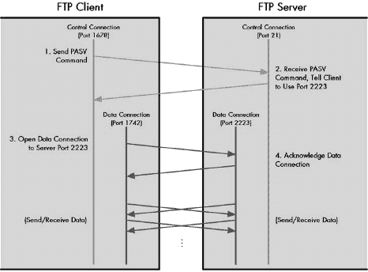
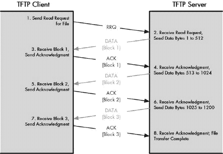
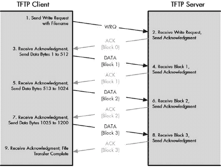
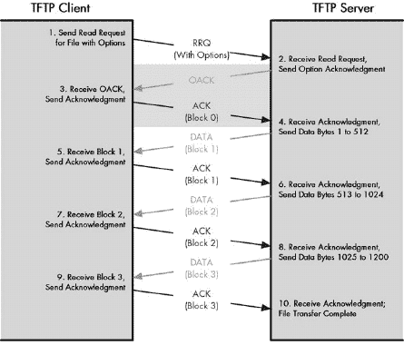
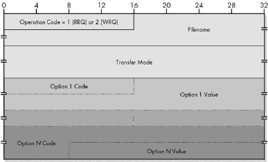
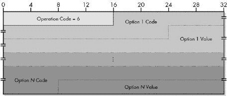

# 第 III-6 部分。TCP/IP 通用文件传输协议

第七十二章")

第七十三章")

文件和消息传输协议代表了最基本的网络通信类型：简单的数据块移动。在众多文件和消息传输方法中，最基本的应用是我所说的 *通用文件传输*。通用文件传输协议执行一个主要功能：允许文件从一个计算机复制到另一个计算机。

由于文件传输协议在移动文件时很少考虑其内容，因此与某些消息处理应用相比，它们相对简单。然而，能够移动文件的想法如此重要，以至于通用文件传输协议是互联网互连中最早的应用之一。尽管现在许多人使用电子邮件或网络浏览器来执行以前仅通过通用文件传输执行的功能，但这些较老的协议仍然非常重要且广泛使用，并且理解它们是很有必要的。

本部分涵盖了两个 TCP/IP 通用文件传输协议：文件传输协议 (FTP) 和简单文件传输协议 (TFTP)。每个协议都在其各自的章节中进行了描述。

FTP 和 TFTP 之间的关系类似于第 4 层的两个传输协议，即传输控制协议 (TCP) 和用户数据报协议 (UDP) 之间的关系（在第 II-8 部分中讨论）。FTP 功能全面，面向会话，并且相对复杂。它是两种协议中更常使用的一种，提供完整的命令接口，并利用其运行的 TCP 的可靠性和流传输功能。TFTP，就像它在传输层使用的 UDP 一样，是 FTP 的简化版本。它比 FTP 具有更少的命令和能力，但在需要简单性和小软件程序尺寸的情况下非常理想，例如在设备嵌入式软件的情况下。

# 第七十二章。文件传输协议 (FTP)


TCP/IP 套件中的主要通用文件传输协议通过其无修饰的名称直接展示了其通用性：*文件传输协议 (FTP)*。FTP 是世界上使用最广泛的应用协议之一。它被设计成允许在 TCP/IP 互联网中的任何两个设备之间高效地传输文件。它自动处理文件移动的细节，提供丰富的命令语法以执行各种支持文件操作（如导航目录结构和删除文件），并使用传输控制协议 (TCP) 传输服务来保证可靠性。

在本章中，我详细描述了 FTP 的操作。我首先概述了 FTP，讨论了其悠久的历史和定义它的标准。然后解释了与 FTP 相关的关键概念及其工作方式。这包括 FTP 操作模型的描述以及 FTP 控制连接的建立方式、何时以及如何使用正常和被动数据连接、FTP 的传输模式和数据表示方法。然后我继续讨论 FTP 命令的细节及其工作方式，包括 FTP 命令组、回复代码和用户命令的讨论。最后，我提供了一个用户 FTP 会话的示例，展示了每个动作所使用的内部命令。

# FTP 概述、历史和标准

我们今天所知道的 TCP/IP 协议套件是在 20 世纪 70 年代末和 80 年代初开发的，其中分水岭事件可能是 1980 年发布的 IP 和 TCP 版本 4 标准。现代 TCP/IP 是自 20 世纪 60 年代以来进行实验和开发工作的结果。这项工作包括设计并实现将实现互联网的协议，以及创建第一个允许用户执行不同任务的网络应用。

## FTP 开发和标准化

早期应用程序的开发者从概念上将网络使用方法分为两类：*直接*和*间接*。直接网络应用程序允许用户访问远程主机并像使用本地主机一样使用它，创造出远程网络甚至不存在（或者至少最小化距离的重要性）的错觉。间接网络使用意味着从远程主机获取资源并在本地系统上使用它们，然后再将它们传输回去。这两种使用方法成为了第一个正式化的 TCP/IP 网络应用的模型：Telnet 用于直接访问（见第八十七章*。能够在机器之间移动任何类型的文件的需求是如此基本，以至于 FTP 的历史可以追溯到 30 多年以前。FTP 通过 TCP 运行以确保文件可靠传输且无数据丢失。该协议使用一组从 FTP 客户端发送到 FTP 服务器的 *FTP 命令* 来执行文件传输操作；FTP 服务器向客户端发送 *FTP 回复*，以指示命令的成功或失败。

# FTP 操作模型、协议组件和关键术语

定义 FTP 的标准使用一个简单的概念工具来描述其整体操作，这个工具被称为 *FTP 模型*。该模型定义了参与文件传输的设备角色以及它们之间建立的两个通信通道。它还描述了管理这些通道的 FTP 组件，并定义了用于组件的术语。这使得它成为我们了解 FTP 在广义上如何工作的理想场所。

## 服务器-FTP 进程和用户-FTP 进程

如前所述，FTP 是一个经典的客户端/服务器协议。然而，客户端并不被称为这个名字，而是被称为 *用户*。这个名字来源于发出 FTP 命令的人类用户在客户端机器上工作的事实。在设备上运行的 FTP 软件的完整集合被称为 *进程*。服务器上的 FTP 软件被称为 *服务器-FTP 进程*，而客户端上的软件被称为 *用户-FTP 进程*。

### 小贴士

**关键概念** FTP 客户端有时被称为 **用户设备**，因为人类用户直接与客户端交互。FTP 客户端软件被称为 **用户-FTP 进程**；FTP 服务器软件是 **服务器-FTP 进程**。

## FTP 控制连接和数据连接

理解 FTP 的一个关键概念是，尽管它像许多其他应用程序一样使用 TCP，但它不像大多数协议那样仅使用一个 TCP 连接进行所有通信。相反，FTP 模型是围绕服务器和用户 FTP 进程之间的两个逻辑通信通道设计的：

**控制连接** 这是当建立 FTP 会话时创建的主要逻辑 TCP 连接。它在整个 FTP 会话期间保持不变，并且仅用于传递控制信息，例如 FTP 命令和回复。它不用于发送文件。

**数据连接** 每次从服务器向客户端或相反方向发送数据时，它们之间都会建立一个独特的 TCP 数据连接。数据通过此连接传输。当文件传输完成后，连接被终止。

使用单独的通道提供了在协议使用方面的灵活性，但它也增加了 FTP 的复杂性。

### 小贴士

**关键概念** 与大多数协议不同，FTP 不使用单个 TCP 连接。当会话建立时，使用 TCP 建立一个永久的 **控制连接**，用于传递命令和回复。当需要发送文件或其他数据时，它们将通过创建并按需拆卸的单独 TCP **数据连接**进行传递。

## FTP 处理组件和术语

由于控制和数据功能是通过不同的通道进行通信的，FTP 模型将每个设备上的软件分为两个逻辑协议组件，每个组件负责一个通道。**协议解释器（PI**）是一段负责管理控制连接、发布和接收命令及回复的软件。**数据传输过程（DTP**）负责在客户端和服务器之间实际发送和接收数据。除了这两个元素之外，用户 FTP 进程还包括第三个组件，即 **用户界面**，它与人类 FTP 用户进行交互；它不在服务器端存在。

因此，FTP 中包含两个服务器过程组件和三个客户端（用户）过程组件。这些组件在 FTP 模型中用特定的名称来指代，这些名称在标准中用于描述协议的详细操作。我计划在本章中做同样的事情，因此现在我将更详细地描述该模型中每个设备上的组件，这些组件在图 72-1 中进行了说明。


图 72-1. FTP 操作模型 FTP 是一个客户端/服务器协议，客户端的用户-FTP 过程与服务器端的服务器-FTP 过程之间进行通信。命令、回复和状态信息通过控制连接在用户-PI 和服务器-PI 之间传递，该连接一旦建立就保持会话状态。数据通过为每次传输设置的数据连接在设备之间移动。

## 服务器-FTP 过程组件

服务器-FTP 过程包含两个协议元素：

**服务器协议解释器（Server-PI）** 协议解释器负责管理服务器上的控制连接。它监听主保留 FTP 端口，等待来自用户的连接请求（客户端）。一旦建立连接，它接收来自用户-PI 的命令，发送回回复，并管理服务器数据传输过程。

**服务器数据传输过程（Server-DTP）** 服务器端的 DTP 用于向用户-DTP 发送或接收数据。服务器-DTP 可以建立数据连接或监听来自用户的连接。它与服务器的本地文件系统交互，以读取和写入文件。

## 用户-FTP 过程组件

用户-FTP 过程包含三个协议元素：

**用户协议解释器（User-PI）** 这个协议解释器负责管理客户端的控制连接。它通过向服务器-PI 发出请求来启动 FTP 会话。一旦建立连接，它处理从用户界面接收到的命令，将它们发送到服务器-PI，并接收回复。它还管理用户数据传输过程。

**用户数据传输过程（User-DTP）** 用户侧的 DTP 向服务器-DTP 发送或接收数据。用户-DTP 可以建立数据连接或监听来自服务器的数据连接。它与客户端设备的本地文件系统交互。

**用户界面** 用户界面为人类用户提供了一个更友好的 FTP 接口。它允许使用更简单的面向用户的命令来执行 FTP 功能，而不是使用一些加密的内部 FTP 命令，并允许将结果和信息传达给操作 FTP 会话的人。

### 提示

**关键概念** 服务器-FTP 进程和用户-FTP 进程都包含一个*协议解释器（PI）*元素和一个*数据传输过程（DTP）*元素。*服务器-PI*和*用户-PI*通过 FTP 控制连接在逻辑上连接；*服务器-DTP*和*用户-DTP*通过数据连接在逻辑上连接。用户-FTP 进程包括第三个组件，即*用户界面*，它为人类用户提供了一种更友好的 FTP 接口，允许使用更简单的面向用户的命令来执行 FTP 功能，而不是使用一些加密的内部 FTP 命令，并允许将结果和信息传达给操作 FTP 会话的人。

## 第三方文件传输（代理 FTP）

FTP 标准实际上定义了一个用于替代协议使用方式的独立模型。在这种技术中，一个主机上的用户从一个服务器向另一个服务器执行文件传输。这是通过打开两个控制连接来完成的：一个从用户的机器上的用户-PI 到两个服务器上的两个服务器-PI。然后，在每个服务器上调用一个服务器-DTP 来发送数据；用户-DTP 没有被使用。

这种方法，有时被称为*第三方文件传输*或*代理 FTP*，目前在市场上并不常见。其主要原因在于它引发了安全担忧，并且在过去曾被滥用。因此，尽管它值得提及，但我不会在我的 FTP 介绍中进一步讨论它。

# FTP 控制连接建立、用户认证和匿名 FTP 访问

您刚刚看到了 FTP 如何使用在 FTP 客户端（用户）和 FTP 服务器之间建立的独立逻辑数据和控制通道。在可以使用数据连接发送实际文件之前，必须建立控制连接。遵循特定的过程来设置此连接，从而在可以用于文件传输的设备之间创建永久的 FTP 会话。

与其他客户端/服务器协议一样，FTP 服务器在控制连接过程中假定一个被动角色。服务器协议解释器（服务器-PI）监听为 FTP 控制连接保留的特殊知名 TCP 端口：端口 21。用户-PI 通过从用户设备到该端口的服务器打开 TCP 连接来启动连接。它在 TCP 连接中使用一个临时端口号作为其源端口。

一旦建立了 TCP 连接，设备之间的控制连接就建立起来，允许从用户-PI 向服务器-PI 发送命令，并回送响应代码。在通道运行后的首要任务是*用户认证*，FTP 标准称之为*登录序列*。这个过程有两个目的：

**访问控制** 认证过程允许将服务器访问限制仅限于授权用户。它还允许服务器控制每个用户具有哪些类型的访问权限。

**资源选择** 通过识别建立连接的用户，FTP 服务器可以做出关于向用户提供哪些资源的决定。

## FTP 登录序列和认证

FTP 的常规认证方案相当基础：它是一个简单的*用户名/密码*登录方案，如图 72-2 所示。我们大多数人都熟悉这种类型的认证，无论是在互联网上还是在其他地方。首先，通过使用 USER 命令从用户-PI 向服务器-PI 发送用户名来识别用户。然后，使用 PASS 命令发送用户的密码。

服务器将用户名和密码与其用户数据库进行核对，以验证连接用户是否有有效权限访问服务器。如果信息有效，服务器将向客户端发送问候以表明会话已打开。如果用户认证不正确（指定了错误的用户名或密码），服务器将要求用户再次尝试授权。在多次无效授权尝试后，服务器可能会超时并终止连接。

假设认证成功，服务器随后建立连接以允许用户有权访问的类型。某些用户可能只能访问某些文件或某些类型的文件。某些服务器可能允许特定用户在服务器上读写文件，而其他用户可能只能检索文件。管理员可以根据需要调整 FTP 访问权限。


图 72-2. FTP 连接建立和用户认证 FTP 会话从客户端和服务器之间建立 TCP 连接开始。客户端随后发送用户名和密码以验证服务器。假设服务器接受这些信息，它将发送一个问候回复给客户端，会话即打开。

一旦建立连接，服务器也可以根据用户的身份做出资源选择决策。例如，在多用户系统中，管理员可以设置 FTP，使得任何用户连接时，都会自动被带到她的个人主目录。可选的 ACCT（账户）命令还允许用户在拥有多个账户时选择特定的账户。

## FTP 安全扩展

与大多数较老的协议一样，FTP 使用的简单登录方案是早期互联网相对封闭性质的遗产。它不符合当今全球互联网的安全标准，因为用户名和密码以明文形式通过控制连接发送。这使得登录信息被中间系统拦截相对容易，账户也可能被破坏。RFC 2228，“FTP 安全扩展”为那些需要在 FTP 软件中增加安全性的用户定义了更复杂的认证和加密选项。

### 小贴士

**关键概念** FTP 会话从 FTP 客户端和服务器之间建立控制连接开始。在 TCP 连接建立后，用户必须通过客户端和服务器之间简单的用户名/密码交换来验证服务器。这仅提供了基本的安全保障，因此如果需要更高的安全性，必须通过 FTP 安全扩展或其他方式来实现。

## 匿名 FTP

可能令人惊讶的是，许多组织并没有看到提高安全级别的重要性。实际上，这些组织采取了相反的方向：它们使用 FTP 而不进行任何认证。但任何企业为什么要允许任何人访问其 FTP 服务器呢？答案很简单：任何想要使用服务器的人都可以用来向公众提供信息。

现在，大多数组织使用万维网向客户和其他希望获取文件的人分发文档、软件和其他文件。但在 20 世纪 80 年代，在万维网变得流行之前，FTP 常被用来分发此类信息。例如，如果今天你有一张 3Com 网络接口卡并想获取其驱动程序，你会去访问网络服务器*www.3com.com*，但几年前，你可能需要访问 3Com 的 FTP 服务器*(ftp.3com.com)*来下载驱动程序。

显然，要求每位客户在这样一个服务器上都有一个用户名和密码将是非常困难的。因此，1994 年发布的 RFC 1635 定义了该协议的一种用途，称为*匿名 FTP*。在这种技术中，客户端连接到服务器，并提供一个默认用户名以作为访客登录。通常支持*匿名*或*ftp*这样的名称。看到这个名称后，服务器会回送一条特殊消息，例如“访客登录成功，请发送您的完整电子邮件地址作为密码。”在这种情况下，密码实际上并不是密码；它只是用来允许服务器记录谁在访问它。

然后，访客能够访问该网站，尽管服务器通常会严格限制系统上访客的访问权限。许多 FTP 服务器同时支持已识别和匿名访问，授权用户拥有更多权限（例如能够遍历完整的目录路径，以及有删除或重命名文件的权限），而匿名用户仅限于从为公共访问设置的特定目录中读取文件。

### 小贴士

**关键概念** 许多 FTP 服务器支持*匿名 FTP*，这允许没有服务器账户的访客有限地访问服务器资源。这通常用于希望向公众提供文件的组织，例如技术支持、客户支持或分发。

# FTP 数据连接管理

使用 FTP 连接建立和认证过程在服务器-PI 和用户-PI 之间创建的控制通道在整个 FTP 会话期间保持开放。在控制通道上，协议解释器交换命令和回复，但不传输数据。

每次需要在服务器和用户 FTP 进程之间发送文件或其他数据时，必须创建一个数据连接。数据连接将用户-DTP 与服务器-DTP 连接起来。此连接对于显式文件传输操作（获取或接收文件）和隐式数据传输（例如从服务器上的目录请求文件列表）都是必需的。

FTP 标准指定了创建数据连接的两种不同方式，尽管它并没有以非常容易理解的方式解释它们。这两种方法主要区别在于哪个设备——客户端或服务器——发起连接。这最初可能看起来像是一件微不足道的事情，但正如你很快就会看到的，这实际上非常重要。

## 正常（主动）数据连接

第一种方法有时被称为创建一个**正常**数据连接（因为它默认是方法）有时也称为**主动**数据连接（与我们将要讨论的被动方法相对）。在这种类型的连接中，服务器-DTP 通过打开到用户-DTP 的 TCP 连接来启动数据通道。服务器使用特殊的保留端口号 20（比知名的控制 FTP 端口号 21 小 1）进行数据连接。在客户端机器上，默认使用的端口号与用于控制连接的临时端口号相同，但正如你很快就会看到的，客户端通常会为每次传输选择不同的端口号。

让我们用一个例子来看看它是如何工作的。假设用户-PI 从其临时端口号 1678 建立了一个到服务器 FTP 控制端口 21 的控制连接。然后，为了创建数据传输的数据连接，服务器-PI 会指示服务器-DTP 从服务器的端口 20 到客户端的端口 1678 发起一个 TCP 连接。客户端会确认这一点，然后就可以进行数据传输（双向——记住 TCP 是双向的）。

实际上，将客户端的控制和数据连接放在同一个端口上不是一个好主意；它会复杂化 FTP 的操作，并可能导致一些棘手的问题。因此，强烈建议在数据传输之前，客户端使用 PORT 命令指定不同的端口号。例如，假设客户端使用 PORT 指定了端口号 1742。那么，服务器-DTP 就会从其端口 20 创建一个连接到客户端的端口 1742，而不是 1678。这个过程在图 72-3 中展示。

## 被动数据连接

第二种方法被称为**被动**数据连接。客户端告诉服务器要处于被动状态——也就是说，接受由客户端发起的数据连接。服务器回复，向客户端提供它应该使用的服务器 IP 地址和端口号。服务器-DTP 随后监听这个端口，等待来自用户-DTP 的 TCP 连接。默认情况下，用户机器使用与控制连接相同的端口号，就像在主动情况下一样。然而，在这里，如果需要的话，客户端可以选择为数据连接使用不同的端口号（通常是临时端口号）。

让我们再次考虑我们的例子，客户端的控制连接从端口号 1678 到服务器的端口号 21，但这次考虑使用被动连接进行数据传输，如图图 72-4 所示。客户端会发出 PASV 命令告诉服务器它想要使用被动数据控制。服务器-PI 会回复一个客户端可以使用的端口号——比如说端口 2223。然后，服务器-PI 会指示服务器-DTP 监听这个端口 2223。用户-PI 会指示用户-DTP 从客户端端口 1742 到服务器端口 2223 创建连接。服务器会确认这一点，然后数据就可以发送和接收，再次是双向的。

 在传统的或主动的 FTP 数据连接中，服务器通过打开到客户端的数据连接来启动数据传输。在这种情况下，客户端首先发送一个 PORT 命令，告诉服务器使用端口 1742。然后，服务器从其默认端口 20 打开数据连接到客户端端口 1742。然后，使用这些端口在设备之间交换数据。

图 72-3. FTP 主动数据连接 在传统的或主动的 FTP 数据连接中，服务器通过打开到客户端的数据连接来启动数据传输。在这种情况下，客户端首先发送一个 PORT 命令，告诉服务器使用端口 1742。然后，服务器从其默认端口 20 打开数据连接到客户端端口 1742。然后，使用这些端口在设备之间交换数据。

## 连接方法相关的效率和安全性问题

到目前为止，你可能想知道主动和被动连接类型之间的实际区别是什么。我之前已经说过，在两种情况下，数据传输都可以双向进行。那么，谁启动数据连接有什么关系呢？这不是像争论谁打本地电话一样吗？

答案与令人恐惧的“S”词有关：*安全*。FTP 使用多个 TCP 连接的事实可能会给人们用来确保系统安全性的硬件和软件带来问题。

考虑到主动数据连接的情况，如图 72-3 中所述。从客户端的角度来看，存在一个从客户端端口 1678 到服务器端口 21 的控制连接。但是数据连接是由服务器发起的。因此，客户端看到的是对端口 1678（或另一个端口）的传入连接请求。由于在正常情况下，客户端是*建立*连接的——它们不会响应它们，许多客户端对收到此类传入连接持怀疑态度。由于传入 TCP 连接可能存在安全风险，许多客户端被配置为使用防火墙硬件或软件来阻止它们。



图 72-4. FTP 被动数据连接 在一个被动 FTP 数据连接中，客户端使用 PASV 命令来告知服务器等待客户端建立数据连接。服务器响应，告诉客户端它应该在服务器上使用哪个端口进行数据传输——在这个例子中，端口 2223。然后客户端使用服务器上的该端口号以及自己选择的客户端端口号（在这个例子中，1742）来打开数据连接。

为什么不直接让客户端总是接受比用于控制连接的临时端号高一个数字的端口的连接呢？这里的问题是客户端经常使用 PORT 命令为每次传输使用不同的端口号。这样做是因为 TCP 的规则。正如我在第四十七章中描述的，在连接关闭后，必须经过一段时间才能再次使用该端口，以防止混淆连续的会话。这会导致在连续发送多个文件时出现延迟，因此为了避免这种情况，客户端通常为每次传输使用不同的端口号。这更有效率，但这也意味着保护客户端的防火墙需要接受看似将前往许多不可预测端口号的入站连接。

被动连接的使用在很大程度上消除了这个问题。大多数防火墙在处理入站连接到奇数端口方面比处理出站连接困难得多。RFC 1579，“防火墙友好的 FTP”详细讨论了这个问题。它建议客户端默认使用被动数据连接，而不是使用带有 PORT 命令的正常连接，以避免端口阻塞问题。

当然，被动的数据连接并不能真正消除问题；它们只是将问题推给了服务器。现在，这些服务器必须面对各种端口上的入站连接问题。然而，总的来说，在相对较少的服务器上处理安全问题比在大量客户端上更容易。FTP 服务器无论如何都必须能够接受来自客户端的被动模式传输，因此通常的做法是为这个目的预留一段端口，服务器的安全设置允许接受这些端口的入站连接，同时阻止其他端口的入站连接请求。

### 小贴士

**关键概念** FTP 支持两种不同的模型来在客户端和服务器之间建立数据连接。在正常或*主动*数据连接中，当客户端请求传输时，服务器发起连接，客户端响应；在*被动*数据连接中，客户端告诉服务器它将发起连接，服务器响应。由于 TCP 是双向的，在两种情况下数据都可以双向流动；这两种模式的主要区别在于安全性。特别是，被动模式经常被使用，因为许多现代客户端设备无法接受来自服务器的入站连接。

另一个值得注意的问题是，在 FTP 命令（如 PORT 和 PASV）及其回复中传递 IP 地址和端口号违反了网络分层原则。这不仅仅是一个哲学问题。应用程序不应该处理端口号，这在使用某些底层技术时会引发问题。例如，考虑使用网络地址转换（NAT；见第二十八章协议"))，它修改 IP 地址和可能端口的情况。为了防止 NAT 在 FTP 使用时“破坏”协议，必须采取特殊措施来处理该协议。

# FTP 通用数据通信和传输模式

一旦在服务器-DTP 和用户-DTP 之间建立了数据连接，数据就会直接从客户端发送到服务器，或从服务器发送到客户端，具体取决于发出的特定命令。由于控制信息使用单独的控制通道发送，因此整个数据通道都可以用于数据通信。（这两个逻辑通道在底层与设备上的所有其他 TCP 和用户数据报协议（UDP）连接一起复用，因此这实际上并不代表性能上的提升。）

FTP 定义了三种不同的*传输模式*（也称为*传输模式*），这些模式精确地指定了数据如何在开放数据通道中从一个设备发送到另一个设备：*流模式、块模式*和*压缩模式*。

## 流模式

在流模式下，数据被简单地作为无结构的字节流连续发送。发送设备只需开始将数据推送到 TCP 数据连接的接收方。不使用具有不同标题字段的报文格式，这使得这种方法与其他许多协议以离散块发送信息的方式大不相同。它强烈依赖于 TCP 的数据流和可靠传输服务。由于没有标题结构，文件结束的指示仅由发送设备在完成时关闭数据连接来表示。

在这三种模式中，流模式在现实 FTP 实现中是最广泛使用的，主要原因有三：

+   它是默认的，也是最简单的方法，因此最容易实现，并且对于兼容性是必需的。

+   它是最通用的，因为它将所有文件视为简单的字节流，而不关注其内容。

+   它是最有效的方法，因为不会浪费任何字节在标题等开销上。

## 块模式

块模式是一种更传统的数据传输模式，其中数据被分成数据块，并封装成单独的 FTP 块或记录。每个记录都有一个三字节的标题，指示其长度并包含有关正在发送的数据块的信息。使用一种特殊的算法来跟踪传输的数据，并检测和重新启动中断的传输。

## 压缩模式

压缩模式是一种传输模式，其中使用一种称为 *运行长度编码* 的相对简单的压缩技术来检测正在发送的数据中的重复模式，然后以这种方式表示数据，使得整体消息的字节数更少。压缩信息以类似于块模式的方式发送，使用标题加有效负载记录格式。

表面上看，压缩模式似乎很有用。然而，在实践中，压缩通常在网络软件堆栈的其他地方实现，使得在 FTP 中变得不必要。例如，如果你正在使用模拟调制解调器通过互联网传输文件，你的调制解调器通常在第一层执行压缩。FTP 服务器上的大文件也经常使用类似 ZIP 格式的某种东西进行压缩，这意味着进一步的压缩没有意义。

### 小贴士

**关键概念** FTP 包含三种不同的 *传输模式：流模式、块模式和压缩模式*。在流模式下，这是最常用的模式，数据以连续的字节序列发送。在块模式下，数据被格式化为带有标题的块。在压缩模式下，字节使用运行长度编码进行压缩。

# FTP 数据表示：数据类型、格式控制和数据结构

设计 FTP 的最通用方式可能是将其设计为将所有文件视为“黑盒”。文件将被表示为一组字节。FTP 不会关注文件包含的内容，而是一字节一字节地将文件从一个地方移动到另一个地方。在这种情况下，FTP 似乎与大多数文件系统上实现的复制命令非常相似，后者同样创建一个副本，而不会查看文件的内容。

那么，这会有什么问题呢？你可能想知道。嗯，对于某些类型的文件，这正是我们想要的，但对于其他文件，这会引入问题。某些类型的文件在不同的系统上使用不同的表示形式。如果你在同一台电脑上使用复制命令从一个地方复制文件到另一个地方，就没有问题，因为在该电脑内部，文件使用的是相同的表示形式。但是，当你将其复制到使用不同表示形式的电脑上时，你可能会遇到困难。

最常见的例子可能会让你感到惊讶：简单的文本文件。所有 ASCII 文本文件都使用 ASCII 字符集，但它们在标记文本行结束的控制字符上有所不同。在 UNIX 上，使用换行符（LF）；在苹果电脑上，使用回车符（CR）；而 Windows 机器则两者都使用（CR+LF）。

如果你使用常规 FTP 将文本文件从一个系统类型移动到另一个系统，数据将完全按照原样移动。将文本文件从 UNIX 系统移动到 PC 作为一组字节意味着程序将无法正确识别行结束标记。为了避免这种困境，FTP 超越了所有文件只是字节的想法，并融入了一些智能来处理不同类型的文件。FTP 标准通过允许在传输之前指定有关文件内部表示的一些细节来认可这一点。

## FTP 数据类型

关于文件可以提供的第一条信息是其*数据类型*，它决定了文件的整体表示。FTP 标准中指定了四种不同的数据类型：

**ASCII** 此数据类型定义了一个 ASCII 文本文件，行由某种类型的行结束标记标记。

**EBCDIC** 从概念上讲，EBCDIC 与 ASCII 类型相同，但它用于使用 IBM 的 EBCDIC 字符集的文件。

**图像** 使用图像数据类型，文件没有正式的内部结构，并且每次发送一个字节，没有任何处理；这就是之前提到的黑盒模式。

**本地** 此数据类型用于处理可能存储在包含多于八个比特的逻辑字节中的数据的文件。指定此类型以及数据结构的方式允许数据以与本地表示一致的方式存储在目标系统上。

### 注意

*术语字节传统上指代八个比特，但严格来说，描述八个比特的术语是八位组。在某些系统中，一个字节实际上可能包含多于八个比特。有关详细信息，请参阅第四章中的“二进制信息和表示：比特、字节、半字节、八位组和字符”*。

在实践中，最常使用的两种数据类型是 ASCII 和图像。ASCII 类型用于文本文件，并允许它们在自动转换行结束码的系统之间移动。图像类型用于通用二进制文件，例如图形图像、ZIP 文件以及其他以通用方式表示的数据。因此，它也常被称为*二进制*类型。

## ASCII 数据类型行分隔问题

当使用 ASCII 数据类型时，系统之间内部表示的差异通过使用一种通用的外部表示来处理，这种表示充当一种通用语言。正在传输的文件行由发送 FTP 进程从发送方的内部表示转换为 Telnet 协议（NETASCII）使用的中性 ASCII 表示，每行以 CR+LF 结束。接收设备然后将此中性表示转换为接收方文件系统使用的内部格式。

例如，当使用 FTP 将文本文件从 Macintosh 传输到 UNIX 系统时，每行中的 CR 都会被转换为 CR+LF，以便通过 FTP 数据通道进行传输。接收的 UNIX 系统会将每个 CR+LF 转换为仅 LF，以便 UNIX 程序能够正确读取。

注意，由于这些变化，如果使用 ASCII 模式在不同系统之间传输，生成的文件可能比原始文件大或小。此外，由于 FTP 通过转换为通用表示来工作，因此从 UNIX 系统发送 ASCII 文件到 UNIX 系统意味着每个 LF 都会被转换为 CR+LF 进行传输，然后接收方会将其转换回 LF。这稍微有点低效，但不是什么大问题。

确保使用适当的用户命令指定正确的数据类型非常重要。在没有设置 ASCII 模式的情况下，在类似系统之间发送文本文件会导致在目标系统上无法正确读取的文件，或者包含杂乱字符的文件。相反，二进制文件必须以二进制模式发送。如果您以 ASCII 模式发送类似 ZIP 文件或 JPG 图形，FTP 软件会认为它是一个文本文件。它会将文件当作文本处理，并且每次遇到文件中看起来像 CR、LF 或 CR+LF 的字节时，都会将其转换，而这正是您不希望发生的。（设置错误的数据类型是使用 FTP 在 PC 和 UNIX 系统之间移动文件时文件损坏的主要原因之一。我有经验！）

### **提示**

**关键概念** FTP 定义了四种数据类型：*ASCII、EBCDIC、图像*和*本地*。*ASCII*和*EBCDIC*分别用于 ASCII 和 EBCDIC 字符集中的文本文件。*图像*类型用于没有特定结构的文件。本地类型用于本地表示。ASCII 类型很重要，因为它允许在可能使用不同方法指示文本行结束的文件系统之间成功传输文本文件。图像类型，也称为二进制，用于必须逐字节发送和接收且不进行转换的文件，例如可执行文件、图形和任意格式的文件。

## FTP 格式控制

对于 ASCII 和 EBCDIC 类型，FTP 定义了一个可选参数，称为*格式控制*，允许用户指定用于描述文件的特定表示方式，以使用垂直格式。格式控制选项是为了处理从主机设备传输到打印机的文件而创建的。据我所知，今天不再使用（或者如果使用，也仅限于特殊应用）。

可以使用三种选项进行此控制：

**非打印** 这是默认设置，表示没有垂直格式。

**Telnet 格式** 文件使用 Telnet 协议中指定的垂直格式控制字符。

**回车控制/FORTRAN** 文件使用格式控制字符，作为每行的第一个字符，如 FORTRAN 编程语言中指定的那样。

## FTP 数据结构

除了指定文件的数据类型外，还可以以三种方式指定文件的数据结构：

**文件结构** 文件是一个没有内部结构的连续字节流。这是默认设置，用于大多数类型的文件。

**记录结构** 文件由一系列顺序记录组成，每个记录都由一个记录结束标记分隔。记录结构可用于 ASCII 文本文件，但这些文件更常见的是使用 ASCII 数据类型与常规文件结构一起发送。

**页面结构** 文件包含一组特殊索引数据页面。这种结构不常用；它最初是为早期 ARPAnet 中使用的现已过时的计算机类型创建的。

# FTP 内部命令组和协议命令

一旦 FTP 服务器与用户之间建立连接，所有用于管理协议操作的通信都将在控制通道中进行。用户-PI 向服务器-PI 发送*协议命令*，服务器-PI 处理这些命令并采取适当的行动。服务器-PI 以*回复代码*的形式响应，告知用户-PI 其发出的命令的结果，并传达其他重要信息。

有趣的是，FTP 命令在控制通道中的实际传输是使用基于 Telnet 协议的规范进行的。您可能还记得本章前面的“FTP 概述、历史和标准”部分，Telnet 和 FTP 是两个非常古老的 TCP/IP 应用程序，前者用于直接网络使用，后者用于间接资源访问。它们是在大约同一时间开发的，而设置 FTP 控制通道以作为 Telnet 连接的一种类型，是互联网标准试图不重复造轮子的一个很好的例子。

## FTP 命令组和命令

每个命令都通过一个简短的三或四字母*命令代码*来识别，以便于使用，并且命令在 FTP 的整体功能中执行特定的任务。有几十个这样的协议命令可用，为了帮助组织它们，FTP 标准根据整体功能类型将它们分为三组：

**访问控制命令** 这些命令是用户登录和身份验证过程的一部分，用于资源访问，或是一般会话控制的一部分。参见表 72-1。

**传输参数命令** 指定数据传输参数的命令。例如，本组中的命令指定要发送的文件的数据类型，指示是否使用被动或主动数据连接，等等。参见表 72-2。

**FTP 服务命令** 执行实际文件操作的命令，例如发送和接收文件，以及实现支持功能，如删除或重命名文件。这是最大的组。见表 72-3。

### 提示

**关键概念** FTP 操作通过 FTP 客户端向 FTP 服务器发出*协议命令*来控制。每个命令都有一个三或四字母的命令代码，表示其功能。命令被组织成三个组：*访问控制命令*用于登录和一般会话控制，*传输参数命令*用于控制传输方式，以及*FTP 服务命令*用于执行实际文件操作。

由于这些命令基于 Telnet 规范，它们按照 Telnet 的网络虚拟终端(NVT)约定以纯文本形式发送。表表 72-1、表 72-2 和表 72-3 列出并描述了 FTP 内部协议命令，包括访问控制、传输参数和服务命令组。它们按照在 FTP 标准（RFC 959）中出现的顺序展示。

表 72-1. FTP 访问控制命令

| 命令代码 | 命令 | 描述 |
| --- | --- | --- |
| USER | 用户名 | 识别尝试建立 FTP 会话的用户。 |
| PASS | 密码 | 在登录认证期间指定由 USER 命令之前给出的用户的密码。 |
| ACCT | 账户 | 在 FTP 会话期间指定已验证用户的账户。仅在需要单独识别的系统上使用；大多数系统根据 USER 命令中输入的名称自动选择账户。 |
| CWD | 更改工作目录 | 允许用户在 FTP 会话期间指定不同的目录进行文件传输。 |
| CDUP | 切换到父目录（"更改目录向上"） | CWD 命令的特殊情况，用于进入服务器目录结构中的一级目录。它被单独实现，以抽象出不同文件系统之间的目录结构差异；用户可以使用 CDUP 而不是知道在服务器上导航目录树的具体语法。 |
| SMNT | 结构挂载 | 允许用户挂载特定的文件系统以访问不同的资源。 |
| REIN | 重新初始化 | 重新初始化 FTP 会话，清除所有设置的参数和用户信息。这使会话回到控制连接刚刚建立时的状态。本质上，它是 USER 命令的相反操作。接下来的命令通常是 USER，用于登录不同的用户。 |
| QUIT | 登出 | 终止 FTP 会话并关闭控制连接。请注意，此命令的命名是不幸的。REIN 命令实际上与传统的登出命令最为相似，因为它终止已登录用户并允许其他用户登录。相比之下，QUIT 命令关闭整个会话。 |

表 72-2. FTP 传输参数命令

| 命令代码 | 命令 | 描述 |
| --- | --- | --- |
| PORT | 数据端口 | 用于告诉 FTP 服务器客户端希望在特定端口号上接受一个主动数据连接。 |
| PASV | 被动 | 请求 FTP 服务器允许用户-DTP 发起被动数据连接。 |
| TYPE | 表示类型 | 指定要传输的文件的数据类型（ASCII、EBCDIC、图像或本地），以及可选的格式控制（非打印、Telnet 或换行控制）。 |
| STRU | 文件结构 | 指定文件的数据结构（文件、记录或页面）。 |
| MODE | 传输模式 | 指定要使用的传输模式（流、块或压缩）。 |

表 72-3. FTP 协议服务命令

| 命令代码 | 命令 | 描述 |
| --- | --- | --- |
| RETR | 下载 | 告诉服务器向用户发送一个文件。 |
| STOR | 存储 | 向服务器发送一个文件。 |
| STOU | 存储唯一 | 与 STOR 类似，但指示服务器确保文件在当前目录中有唯一的名称。这用于防止覆盖可能已经存在的同名文件。服务器会回复用于文件的名称。 |
| APPE | 追加（与创建一起） | 与 STOR 类似，但如果指定的文件名已存在，则发送的数据将附加到它而不是替换它。 |
| ALLO | 分配 | 一个可选命令，用于在发送文件之前在服务器上预留存储空间。 |
| REST | 重新启动 | 在特定的服务器标记处重新启动文件传输。仅用于块或压缩传输模式。 |
| RNFR | 重命名自 | 指定要重命名的文件的旧名称。参见 RNTO 命令。 |
| RNTO | 重命名到 | 指定要重命名的文件的新的名称。与 RNFR 命令一起使用。 |
| ABOR | 中断 | 告诉服务器中断最后一个 FTP 命令和/或当前的数据传输。 |
| DELE | 删除 | 在服务器上删除指定的文件。 |
| RMD | 删除目录 | 在服务器上删除一个目录。 |
| MKD | 创建目录 | 创建一个目录。 |
| PWD | 打印工作目录 | 显示 FTP 会话的当前服务器工作目录；显示用户在服务器文件系统中的位置。 |
| LIST | 列表 | 请求从服务器获取当前目录的内容列表，包括名称和其他信息。在概念上类似于 DOS/Windows 中的`DIR`命令或 UNIX 中的`ls`命令。 |
| NLST | 名称列表 | 与 LIST 类似，但仅返回目录中的名称。 |
| SITE | 站点参数 | 用于实现特定站点的功能。 |
| SYST | 系统 | 请求服务器向客户端发送有关服务器操作系统的信息。 |
| STAT | 状态 | 提示服务器发送关于当前正在进行的文件或传输状态的指示。 |
| HELP | 帮助 | 向服务器请求可能有助于用户确定如何使用服务器的任何帮助信息。 |
| NOOP | 无操作 | 不执行任何操作，除了提示服务器向客户端发送一个“OK”响应以验证控制通道是否活跃。 |

### 注意

*FTP 命令对大小写不敏感，但在表格表 72-1、表 72-2 和表 72-3 中为了清晰起见，已显示为大写字母*。

FTP 命令都是在 FTP 元素之间发送的；它们通常不是由用户直接发出的。相反，使用一套特殊的用户命令来完成这个目的。FTP 用户界面实现了用户与用户-FTP 进程之间的连接，包括将用户命令转换为 FTP 命令。我们将在本章后面探讨这些命令。

# FTP 响应

每当用户-PI 通过控制连接向服务器-PI 发送命令时，服务器都会发送一个回复。FTP 响应有三个主要用途：

+   它们作为服务器已接收命令的确认。

+   它们告诉用户设备命令是否被接受，如果发生错误，错误是什么。

+   它们将各种类型的信息传达给会话用户，例如传输的状态。

## 使用文本和数字响应的优点

对于人类用户来说，一串回复文本就足以满足上述要求，FTP 响应确实包括描述性文本。但只有文本字符串会使客户端的 FTP 软件难以或无法解释来自服务器的结果。FTP 被设计成允许软件应用程序通过 FTP 命令链相互交互。因此，该协议的回复系统使用*响应代码*。

FTP 响应代码是三位数字响应，可以很容易地被计算机程序解释。它们对熟悉 FTP 的人类用户也很有用，因为它们可以一目了然地传达各种操作的结果。虽然每个 FTP 服务器实现可能对每种类型响应发送的文本不同，但响应代码的使用方式是基于 FTP 标准的规范。因此，检查代码以确定命令的结果；文本只是描述性的。

## 响应代码结构和数字解释

为了使回复代码更加有用，它们不是按线性或随机顺序分配的。相反，使用了一种特殊的编码方案，其中每个代码有三个数字，每个数字都传达特定类型的信息并对回复进行分类。一个代码可以被认为是*xyz*的形式，其中*x*是第一位数字，*y*是第二位，*z*是第三位。

第一位数字表示命令在一般意义上的成功或失败，成功的命令是否完整，以及是否应该重试失败的命令。表 72-4 显示了可能的值。

表 72-4. FTP 回复代码格式：第一位数字解释

| 回复代码格式 | 含义 | 描述 |
| --- | --- | --- |
| 1yz | 正初步回复 | 表示命令已被接受且处理仍在进行中的初始响应。用户应在发送新命令之前期待另一个回复。 |
| 2yz | 正完成回复 | 命令已成功处理并完成。 |
| 3yz | 正中间回复 | 命令已被接受，但处理已被延迟，等待接收更多信息。这种回复用于命令序列的中间。例如，在收到 USER 命令后但在发送匹配的 PASS 命令之前，它用作身份验证序列的一部分。 |
| 4yz | 临时负完成回复 | 命令未被接受且未采取任何行动，但错误是临时的，可以再次尝试该命令。这用于可能是暂时故障或可能改变的条件所导致的错误——例如，当请求文件时，由于其他资源正在访问它，文件正忙。 |
| 5yz | 永久负完成回复 | 命令未被接受且未采取任何行动。再次尝试相同的命令很可能会导致另一个错误。例如，请求服务器上找不到的文件，或发送无效命令（如 BUGU）将属于此类。 |

回复代码的第二位数字用于将消息分类到功能组中。这些组在表 72-5 中显示。

表 72-5. FTP 回复代码格式：第二位数字解释

| 回复代码格式 | 含义 | 描述 |
| --- | --- | --- |
| x0z | 语法 | 语法错误或杂项消息 |
| x1z | 信息 | 对信息请求的回复，如状态请求 |
| x2z | 连接 | 与控制连接或数据连接相关的回复 |
| x3z | 认证和计费 | 与登录程序和计费相关的回复 |
| x4z | 未指定 | 未定义 |
| x5z | 文件系统 | 与服务器文件系统相关的回复 |

第三个数字表示第二个数字描述的功能组中的特定消息类型。第三个数字允许每个功能组对于第一个代码数字（初步成功、暂时性失败等）给出的每种回复类型都有十个不同的回复代码。

这些*x, y*和*z*数字含义的组合形成了特定的回复代码。例如，考虑回复代码 530，如图图 72-5。第一个数字告诉你这是一个永久性负面回复，第二个数字表示它与登录或计费相关。（实际上，这是在登录失败时接收到的错误消息。）第三个数字告诉你发生了特定类型的错误。


图 72-5. FTP 回复代码格式 此图展示了三位 FTP 回复代码格式的解释。在回复代码 530 中，数字 5 表示永久错误，数字 3 指定错误与认证或计费相关，而数字 0 是具体的错误类型。在许多其他 TCP/IP 应用协议中，包括简单邮件传输协议（SMTP）和超文本传输协议（HTTP）的回复代码中，也使用了类似的方法。

使用编码的回复代码允许代码本身立即传达信息，并提供了一种保持不同类型响应组织的方式。这个想法被其他几个应用协议所采用，包括用于电子邮件的简单邮件传输协议（SMTP）、用于网络新闻的网络新闻传输协议（NNTP）和用于万维网的超文本传输协议（HTTP）。

表 72-6 包含了从 RFC 959 中摘取的一些更常见的 FTP 回复代码列表。它们按数字顺序排列，并展示了在该文档中作为典型示例的回复文本以及所需的其他描述性信息。

表 72-6. FTP 回复代码

| 回复代码 | 典型回复文本 | 描述 |
| --- | --- | --- |
| 110 | 重启标记回复。 | 在块模式下传输时作为标记重启功能的一部分使用。 |
| 120 | 服务在 *nnn* 分钟后就绪。 | *nnn* 表示服务将可用的分钟数。 |
| 125 | 数据连接已打开；传输开始。 |   |
| 150 | 文件状态正常；即将打开数据连接。 |   |
| 200 | 命令正常。 | 有时文本会指示成功执行的命令名称。 |
| 202 | 命令未实现，或在此站点多余。 |   |
| 211 | 系统状态，或系统帮助回复。 | 将包含特定于系统的状态或帮助信息。 |
| 212 | 目录状态。 |   |
| 213 | 文件状态。 |   |
| 214 | 帮助信息。 | 包括对服务器的人类用户有用的帮助信息。 |
| 215 | *NAME* 系统类型。 | *NAME* 是操作系统类型名称。通常在响应 SYST 命令时发送。 |
| 220 | 服务就绪，等待新用户。 | 在发送 USER 命令之前建立命令通道时发送。 |
| 221 | 服务关闭控制连接。 | 在会话关闭时发送“再见”消息。 |
| 225 | 数据连接已打开；没有传输进行。 |   |
| 226 | 关闭数据连接。 | 在成功传输文件或文件中止后发送。 |
| 227 | 进入被动模式（h1,h2,h3,h4,p1,p2）。 | 作为对 PASV 命令的回复发送，指示用于数据连接的 IP 地址和端口号。 |
| 230 | 用户已登录，继续。 | 在成功进行 USER 和 PASS 认证后发送。系统通常在登录后使用此代码发送额外的问候或其他信息。 |
| 250 | 请求的文件操作正常，完成。 | 文本描述将提供有关成功完成的更多详细信息，例如确认更改目录或已删除文件。 |
| 257 | *PATHNAME* 已创建。 | *PATHNAME* 被替换为创建的路径。 |
| 331 | 用户名正确，需要密码。 | 在发送 USER 但在发送 PASS 之前的中继结果。 |
| 332 | 需要账户登录。 |   |
| 350 | 请求的文件操作待进一步信息。 |   |
| 421 | 服务不可用，关闭控制连接。 | 有时在 FTP 服务器正在关闭的过程中发送。 |
| 425 | 无法打开数据连接。 |   |
| 426 | 连接关闭；传输已取消。 |   |
| 450 | 请求的文件操作未执行。文件不可用。 | 文件不可用；例如，它可能被另一个用户锁定。与回复代码 550 对比。 |
| 451 | 请求的操作已取消：处理中的本地错误。 |   |
| 452 | 请求的操作未执行。系统存储空间不足。 | 文件系统已满。 |
| 500 | 语法错误，命令不可识别。 | 发送了不良或过长的命令行。 |
| 501 | 参数或参数中的语法错误。 |   |
| 502 | 命令未实现。 |   |
| 503 | 命令序列错误。 |   |
| 504 | 对于该参数未实现命令。 |   |
| 530 | 未登录。 | 如果由于用户名错误或密码不正确而导致身份验证失败，则发送。 |
| 550 | 请求的操作未执行。文件不可用。 | 文件未找到或用户无法访问。此错误代码可能在用户尚未成功登录时作为对任何文件传输命令的回复发送。与回复代码 450 相对比。 |
| 551 | 请求的操作被终止：页面类型未知。 | |
| 552 | 请求的文件操作被终止。超出存储分配。 | |
| 553 | 请求的操作未执行。文件名不允许。 | |

### 提示

**关键概念** 每个由 FTP 客户端发送的命令都会导致 FTP 服务器发送一个回复。FTP 回复由一个三位数的数字 *回复代码* 和一行描述性文本组成。回复代码用于标准化 FTP 回复，以便它们可以被客户端软件解释，并且经验丰富的用户可以一眼看出命令的结果。回复代码的结构使得前两位数字表示回复的类型及其所属的类别。

## FTP 多行文本回复

回复可能包含多行文本。在这种情况下，每一行都以回复代码开头，除了最后一行之外，回复代码和回复文本之间有一个连字符，以表示回复的继续。最后一行在回复代码和回复文本之间包含一个空格，就像单行回复一样。此功能通常用于用户登录后通过 230 回复代码提供额外的响应信息。示例 72-1 包含了一个示例。

示例 72-1. FTP 多行文本回复示例

```
230-Welcome user to FTP server jabberwockynocky.
230-
230-You are user #17 of 100 simultaneous users allowed.
230-
230-
230-Please see the file "faq.txt" for help using this server.
230-
230 Logged in.
```

正如我提到的，每个回复代码的实际文本字符串是特定于实现的。有时你可以找到一些与这些错误消息相关的一些相当幽默的文本字符串。例如，我尝试使用我的一个互联网账户上的 FreeBSD FTP 客户端发送了一些命令。在我登录之前，我尝试发送或接收一个文件，它没有返回像“请求的操作未执行。文件不可用。”这样的错误，而是告诉我：“先登录，然后我可能让你做那件事。”

# FTP 用户界面和用户命令

FTP 命令集提供了一套丰富、完整的指令，用于实现 FTP。一个人类用户可以使用这些命令直接与 FTP 服务器执行文件传输功能。但要做到这一点，用户必须对 FTP 的工作方式有深入了解。用户必须确切知道在何时发送哪些命令，以及它们的顺序。

了解内部 FTP 命令可能是一个网络专家的合理任务，但不是典型 TCP/IP 应用程序用户的任务。因此，FTP 协议定义了一个额外的协议组件，作为用户-FTP 过程的一部分：FTP *用户界面*。它为 FTP 用户提供了三个主要好处：

**用户友好性** FTP 用户界面以比发出协议命令更容易、更简单的方式向人类用户展示 FTP。用户界面不需要用户了解所有那些四字母代码，可以允许使用更直观的人类语言命令来执行功能。例如，我们可以说 `get` 一个文件，而不是必须使用 RETR 命令。

**定制** 执行特定功能的命令可以根据网络行业的常用术语进行定制，而无需对 FTP 本身进行更改。例如，图像传输模式现在也通常称为二进制模式，因此创建了一个名为 `binary` 的用户命令来设置此模式。

**细节抽象和命令序列简化** 单个用户命令可以发出多个 FTP 协议命令，隐藏内部 FTP 细节，使协议更容易使用。特别是，与维护连接和其他用户不希望处理的开销问题相关的命令可以自动化。例如，FTP 客户端通常在每个数据传输之前发出 PASV 或 PORT 命令。用户界面可以在用户告诉 FTP 获取或发送文件时，自动在 RETR 或 STOR 命令之前发出此命令。

## 命令行和图形化 FTP 界面

传统上，FTP 客户端使用 *命令行界面*。在这种熟悉的安排中，FTP 客户端被调用，用户会自动被要求输入用户名和密码以建立 FTP 会话。然后用户会看到一个命令提示符，用户可以在其中输入各种 FTP 命令以执行不同的功能。服务器返回的文本响应会显示给用户，以指示各种命令的结果。通常，客户端发送的内部协议命令（如 PASV 和 STOR）会被抑制以避免屏幕杂乱，但在调试模式下可以启用显示。

命令行工具效率高，但有些人并不喜欢它们。在现代图形操作系统和应用程序的背景下，它们显得有些“老式”。因此，许多现代 FTP 客户端本质上是图形化的。它们允许用户通过点击按钮而不是输入命令来执行操作。一些 FTP 客户端允许通过从本地文件系统显示拖放到远程服务器上的显示来传输文件。这使得 FTP 更加易于使用。

### 小贴士

**关键概念** FTP *用户界面* 是 FTP 客户端中充当人类用户和 FTP 软件之间中介的组件。用户界面的存在使得 FTP 可以以友好的方式使用，而无需了解 FTP 的内部协议命令。大多数 FTP 软件使用一种理解类似英语的用户命令的 *命令行界面* 或一种 *图形界面*，其中鼠标点击和其他图形操作被转换为 FTP 命令。

## 常见 FTP 用户命令

要了解 FTP 客户端支持的具体命令，请参阅其文档。在命令行客户端中，您可以输入命令`?`以查看支持命令的列表。表 72-7 显示了在典型的 FTP 命令行客户端中遇到的常见命令，以及它们所需的典型参数。

注意这些命令中有多少实际上是同义词，例如`bye`、`exit`和`quit`。同样，您可以使用命令`type ascii`来设置 ASCII 数据类型或使用`ascii`命令。这一切都是为了用户的方便，并且是具有与 FTP 命令集不同的灵活用户界面的好处之一。

最后，使用 FTP 的另一种方法是通过指定 FTP 统一资源定位符（URL）。虽然 FTP 本质上是一个交互式系统，但 FTP URL 允许快速简单地执行简单功能，例如检索单个文件。它们还允许将 FTP 文件引用与超文本（万维网）文档集成。有关 FTP 如何使用 URL 的更多信息，请参阅“URL 方案和方案特定语法”部分，见第七十章。

表 72-7. 常见 FTP 用户命令

| 用户命令 | 描述 |
| --- | --- |
| `account <account-name>` | 向服务器发送 ACCT 命令以访问特定账户。 |
| `append <file-name>` | 使用 APPE 向文件追加数据。 |
| `ascii` | 设置后续传输的 ASCII 数据类型。 |
| `binary` | 设置后续传输的图像数据类型。与`image`命令相同。 |
| `bye` | 终止 FTP 会话并退出 FTP 客户端（与`exit`和`quit`相同）。 |
| `cd <directory-path>` | 使用 CWD 协议命令更改远程服务器的工作目录。 |
| `cdup` | 返回当前工作目录的父目录。 |
| `chmod <file-name>` | 在 UNIX 系统上，更改文件的权限。 |
| `close` | 关闭特定的 FTP 会话，但用户仍停留在 FTP 命令行。 |
| `debug` | 设置调试模式。 |
| `delete <file-name>` | 在 FTP 服务器上删除一个文件。 |
| `dir [<optional-file-specification>]` | 列出当前工作目录的内容（或匹配指定文件名的文件）。 |
| `exit` | `bye`和`quit`的另一个同义词。 |
| `form <format>` | 设置传输格式。 |
| `ftp <ftp-server>` | 打开与 FTP 服务器的会话。 |
| `get <file-name> [<dest-file-name>]` | 获取一个文件。如果指定了*`<dest-file-name>`*参数，则用于获取文件的名称；否则，使用源文件名。 |
| `help [<optional-command-name>]` | 显示 FTP 客户端的帮助信息。与`?`相同。 |
| `image` | 设置图像数据类型，类似于`binary`命令。 |
| `ls [<可选文件指定>]` | 列出当前工作目录的内容（或符合指定的文件）。等同于 `dir`。 |
| `mget <文件指定>` | 从服务器获取多个文件。 |
| `mkdir <目录名>` | 在远程服务器上创建目录。 |
| `mode` **`<传输模式>`** | 设置文件传输模式。 |
| `mput <文件指定>` | 向服务器发送（放置）多个文件。 |
| `msend <文件指定>` | 与 `mput` 相同。 |
| `open <ftp 服务器>` | 打开到 FTP 服务器的会话（等同于 `ftp`）。 |
| `passive` | 开启或关闭被动传输模式。 |
| `put <文件名> [<目标文件名>]` | 将文件发送到服务器。如果指定了 *`<目标文件名>`* 参数，则用作目标主机上文件的名称；否则，使用源文件名。 |
| `pwd` | 打印当前工作目录。 |
| `quit` | 终止 FTP 会话并退出 FTP 客户端（等同于 `bye` 和 `exit`）。 |
| `recv <文件名> [<目标文件名>]` | 接收文件（等同于 `get`）。如果指定了 *`<目标文件名>`* 参数，则用作检索到的文件的名称；否则，使用源文件名。 |
| `rename <旧文件名> <新文件名>` | 重命名文件。 |
| `rhelp` | 显示远程帮助信息，使用 FTP `HELP` 命令获取。 |
| `rmdir <目录名>` | 删除目录。 |
| `send <文件名> [<目标文件名>]` | 发送文件（等同于 `put`）。如果指定了 *`<目标文件名>`* 参数，则用作目标主机上文件的名称；否则，使用源文件名。 |
| `site` | 向服务器发送特定站点命令。 |
| `size <文件名>` | 显示远程文件的大小。 |
| `status` | 显示当前会话状态。 |
| `struct <结构类型>` | 设置文件结构。 |
| `system` | 显示服务器的操作系统类型。 |
| `type <数据类型>` | 设置传输的数据类型。 |
| `user <用户名>` | 以新用户身份登录到服务器。服务器将提示输入密码。 |
| `? [<可选命令名>]` | 显示 FTP 客户端帮助信息。等同于 `help`。 |

# 示例 FTP 会话

现在我们已经看到了 FTP 的工作细节，让我们通过查看 FTP 客户端和服务器之间的一个示例 FTP 会话来将所有这些内容串联起来，以查看 FTP 命令和回复的实际操作。在这个例子中，我将从客户端调用 FTP 来从 FTP 服务器检索一个文本文件，然后我会从服务器及其包含的目录中删除该文件。在这个过程中，我将发出一些额外的命令来展示 FTP 的工作方式。我将在 FTP 客户端中启用调试模式，以便对于每个用户命令，您都可以看到实际生成的 FTP 命令。

表 72-8 展示了样本 FTP 会话，略有简化。第一列包含用户在 FTP 客户端输入的命令（当然，那是我输入的）。第二列显示了发送到 FTP 服务器的实际协议命令（以高亮文本显示）和服务器返回给客户端的纯文本响应。第三列包含描述性注释。

表 72-8. 样本 FTP 会话

| 用户命令 | FTP 协议命令/FTP 服务器响应 | 备注 |
| --- | --- | --- |

|

```
ftp -d
pcguide.com
```

|

```
Connected to pcguide.com.
220 ftp199.pair.com NcFTPd Server (licensed
copy) ready.
Name (pcguide.com:ixl):
```

| 这是启动 FTP 的命令。`-d` 选项启用调试模式。在这个初始步骤中，建立 TCP 控制连接，服务器以 220 响应码回复，表示它已准备好进行用户身份验证。FTP 客户端会自动提示输入用户名。 |
| --- |
| `ixl` |

```
`USER ixl`
331 User ixl okay, need password.
```

| 我通常使用 `ixl` 作为用户名。在这里，FTP 客户端发送用户名，服务器响应，请求密码。 |
| --- |
| `****` |

```
`PASS XXXX`
230-You are user #1 of 300 simultaneous users
allowed.
230-
230-
230-Welcome to (<system name>)
230-
230 Logged in.
`SYST`
215 UNIX Type: L8
Remote system type is UNIX.
Using binary mode to transfer files.
```

| 我输入密码，密码被发送到 FTP 服务器，服务器验证我并发回一个 230 消息。这告诉我登录成功。它还提供了额外的信息。然后 FTP 客户端自动发送一个 SYST 命令，告诉我服务器使用的是哪种类型的系统，在这个例子中是 UNIX。客户端告诉我默认选择了二进制模式；当从 UNIX 到 UNIX 进行 FTP 操作时（就像我现在这样做），这通常是默认的，因为在类似系统之间移动文本文件时不需要 ASCII 模式。 |
| --- |
| `pwd` |

```
`PWD`
257 "/usr/home/ixl" is cwd.
```

| 我检查当前工作目录（`cwd`），服务器告诉我这是该系统上的我的主目录。 |
| --- |
| `cd ftptest` |

```
`CWD ftptest`
550 No such directory.
```

| 我尝试进入一个名为 ftptest 的目录，但名字错了，所以我得到了一个 550 错误。 （我并不是真的想这么做；我忘记了目录名，但我想我还是应该向你展示一下！） |
| --- |
| `cd ftpdemo` |

```
`CWD ftpdemo`
250 "/usr/home/ixl/ftpdemo" is new cwd.
```

| 这次我输入的名字正确，服务器确认了新的工作目录。 |
| --- |
| `dir` |

```
`PASV`
227 Entering Passive Mode
(ip1,ip2,ip3,ip4,193,224)
`LIST`
150 Data connection accepted from
ip5.ip6.ip7.ip8:4279; transfer starting.
-rw-r-r- 1 ixl users 16 May 22 17:47
testfile.txt
226 Listing completed.
```

| 我请求从服务器获取文件列表。FTP 客户端自动发出 PASV 命令，服务器响应并返回用于连接的端口号和 IP 地址。（出于安全原因，我没有在这里显示 IP 地址。）然后目录列表从服务器传输到客户端。 |
| --- |
| `asc` |

```
`TYPE A`
200 Type okay.
```

| 我设置了 ASCII 模式，尽管我真的不需要这么做。请注意，这个客户端允许我将 `ascii` 命令缩写为 `asc`。 |
| --- |

|

```
get
testfile.txt
```

|

```
`PASV`
227 Entering Passive Mode
(ip1,ip2,ip3,ip4,193,226)
`RETR testfile.txt`
150 Data connection accepted from
ip5.ip6.ip7.ip8:4283; transfer starting for
testfile.txt (16 bytes).
226 Transfer completed.
17 bytes received in 0.10 seconds (0.17 KB/s)
```

| 我使用 `get` 命令从这个演示目录获取文件。服务器接受 PASV 命令并发送文件。传输开始时，它最初发送一个 150 响应码（初始积极响应），完成后发送 226 响应码。请注意，这里使用的端口号（服务器和客户端）与我之前进行的目录列表中的端口号不同。 |
| --- |

|

```
del
testfile.txt
```

|

```
`DELE testfile.txt`
250 Deleted.
```

| 我删除了服务器上的原始文件。 |
| --- |
| `cdup` |

```
`CDUP`
250 "/usr/home/ixl" is new cwd.
```

| 我返回到父目录。 |
| --- |

|

```
rmdir
ftpdemo
```

|

```
`RMD ftpdemo`
250 Directory removed.
```

| 我删除了文件所在的目录。 |
| --- |
| `quit` |

```
QUIT
221 Goodbye.
```

| 我结束了 FTP 会话。`quit`命令也会自动关闭 FTP 客户端并返回 UNIX shell。 |
| --- |

# 第七十三章。简单文件传输协议 (TFTP)


在第七十二章")中，你看到了文件传输协议（FTP）如何实现一套完整的命令和回复功能，使用户能够执行一系列文件移动和操作任务。尽管 FTP 作为计算机之间文件传输的通用协议是理想的，但在某些类型的硬件上，它过于复杂，难以轻松实现，并且提供了实际上并不需要的更多功能。在只需要最基本文件传输功能，而简洁性和小程序大小至关重要的场合，可以使用 FTP 的伴侣协议，即*简单文件传输协议 (TFTP)*。

本章提供了对 TFTP 操作的描述，从对协议的概述描述开始，包括其历史和动机，以及描述它的相关标准。我以一般性术语讨论其操作，涵盖 TFTP 客户端和服务器如何通信，并详细解释 TFTP 消息。然后讨论 TFTP 选项和 TFTP 选项协商机制。本章最后展示了各种 TFTP 消息格式。

### 小贴士

**背景信息** *虽然 TFTP 与 FTP 是不同的协议，但读者熟悉 FTP 时解释前者更容易。我假设读者对 FTP 有一些了解，因为它是更常用的协议。如果你在阅读第七十二章")之前来到这一章，我建议至少阅读该章节中的“FTP 概述、历史和标准”部分，然后再继续阅读*。

# TFTP 概述、历史和标准

FTP 是 TCP/IP 互联网中大多数通用文件传输所使用的主要协议。FTP 设计者的一个目标是将协议保持相对简单，但这只可能在一定程度上实现。为了使协议能够在各种情况下以及许多类型的设备之间有用，FTP 需要一套相当大的功能和特性。因此，虽然 FTP 不像某些其他协议那样复杂，但在许多方面仍然相当复杂。

## 为什么需要 TFTP

FTP 的复杂性部分源于其自身协议，拥有数十条命令和回复代码，部分源于需要使用 TCP 进行连接和数据传输。对 TCP 的依赖意味着任何想要使用 FTP 的设备不仅需要 FTP 程序，还需要完整的 TCP 实现。它必须处理 FTP 对同时数据和控制通道连接的需求以及其他要求。

对于传统的计算机，如常规 PC、Macintosh 或 UNIX 工作站，这些问题实际上并不重要，尤其是在今天的大硬盘和快速、廉价的内存的情况下。但请记住，FTP 是在三十多年前开发的，当时硬件速度慢，内存昂贵。此外，即使在今天，常规计算机也不是网络中使用的唯一设备。一些网络设备没有真正的计算机功能，但它们仍然需要能够执行文件传输。对于这些设备，完整的 FTP 和 TCP 实现是一个非平凡的问题。

这种设备的显著例子之一是*无盘工作站*——没有永久存储的计算机，因此当它们启动时，它们不能像大多数计算机那样轻松地从硬盘读取整个 TCP/IP 实现。它们仅从少量内置软件开始，必须从服务器获取配置信息，然后从另一个网络设备下载其余的软件。对于某些没有硬盘的硬件设备，也存在同样的问题。

启动这些设备的过程通常被称为*引导*，并分为两个阶段。首先，工作站通过使用主机配置协议，如引导协议（BOOTP；参见第六十章"))或动态主机控制协议（DHCP；参见第第六十一章至第六十四章)，获得一个 IP 地址和其他参数。其次，客户端下载软件，例如操作系统和驱动程序，使其能够在网络上像其他设备一样运行。这要求设备能够快速且轻松地传输文件。执行此引导的指令必须适合写入只读存储器（ROM）芯片，这也使得软件的大小成为一个重要问题——再次强调，尤其是在许多年前。

为了满足这一需求，创建了一个“轻量级”的 FTP 版本，该版本强调小程序大小和简单性，而不是功能性。这种新协议 TFTP 最初在 20 世纪 70 年代末开发，并于 1980 年首次标准化。现代版本*TFTP 版本 2*在 1981 年的 RFC 783 中进行了记录，该文件在 1992 年被修订并发布为 RFC 1350，“TFTP 协议（修订 2）”。这是当前标准的版本。

## 比较 FTP 和 TFTP

理解 TFTP 和 FTP 之间关系最好的方法可能是将其与传输控制协议（TCP）和用户数据报协议（UDP）在传输层的关系进行比较。UDP 是 TCP 的简化、精简的替代品，当简单性比丰富功能更重要时使用。同样，TFTP 是 FTP 的极大简化版本，只允许基本操作，并缺乏 FTP 的一些复杂功能，以保持其实施简单（甚至简单）且程序大小小。

由于其局限性，TFTP 是 FTP 的补充，而不是替代品。只有在简单性很重要而功能不足不是问题时才会使用 TFTP。它最常见的应用是引导，如上所述，尽管它可以用于其他目的。TFTP 标准为该协议描述的一个特定应用是传输电子邮件（电子邮件）。虽然该协议明确支持这一点，但今天 TFTP 并不通常用于此目的。

FTP 和 TFTP 在至少四个重要方面存在显著差异：

**传输** 与 TCP 和 UDP 的比较不仅基于功能/简单性权衡，而且因为 FTP 使用 TCP 进行传输，而 TFTP 使用 UDP。与 TFTP 一样，UDP 简单，这使得两者非常适合在网络设备中作为硬件程序集嵌入。

**有限的命令集** FTP 包含丰富的命令集，允许文件发送、接收、重命名、删除等操作。TFTP 只允许文件发送和接收。

**有限的数据表示** TFTP 不包括 FTP 的一些复杂数据表示选项；它只允许简单的 ASCII 或二进制文件传输。

**缺乏认证** UDP 不使用登录机制或其他认证手段。这又是一种简化，尽管这意味着 TFTP 服务器运营商必须严格限制他们提供的可访问文件。（这也是为什么 TFTP 明确不允许客户端执行如删除等危险文件操作的原因。）

## TFTP 操作概述

由于每个协议使用的传输层协议不同，TFTP 中的通信和消息与 FTP 非常不同。FTP 利用 TCP 的丰富功能，包括其流数据方向，允许它直接通过 FTP 数据连接发送数据字节。TCP 还负责为 FTP 确保数据的可靠传输，确保文件正确接收。相比之下，由于 TFTP 使用 UDP，它必须将数据打包成单独的消息，用于协议控制和数据通信。TFTP 还必须注意传输时间，以检测丢失的数据报，并在需要时重新传输。

TFTP 服务器允许 TFTP 客户端建立连接以执行文件发送和接收操作。许多运行 FTP 服务器的宿主机也会运行一个单独的 TFTP 服务器模块。TFTP 用户通过启动 TFTP 客户端程序来发起连接，该程序通常使用类似于许多 FTP 客户端的命令行界面；主要区别是 TFTP 中的命令数量要少得多。

### 小贴士

**关键概念** 对于全 FTP 既不必要也不实用的场合，开发了更简单的*Trivial File Transfer Protocol (TFTP)*。TFTP 与 FTP 类似，因为它用于客户端和服务器设备之间的通用文件传输，但其功能被简化了。与 FTP 不同，它包含完整的命令集并使用 TCP 进行通信，TFTP 只能用于读取或写入单个文件，并且它使用快速但不可靠的 UDP 进行传输。在需要快速且简单地传输小文件的情况下，如引导无盘工作站，它通常更受欢迎。

自从 RFC 1350 发布以来，TFTP 的基本操作没有改变，但在 1995 年该协议中增加了一个新功能。RFC 1782，“TFTP 选项扩展”定义了一种机制，通过该机制 TFTP 客户端和 TFTP 服务器可以在传输开始之前协商某些参数，这些参数将控制文件传输。这增加了 TFTP 的使用灵活性，给 TFTP 增加了一点点复杂性，但不是很多。

选项扩展与常规 TFTP 向后兼容，并且仅在服务器和客户端都支持它时才使用。两个随后的 RFC 定义了可以协商的实际选项：RFC 1783，“TFTP 块大小选项”和 RFC 1784，“TFTP 超时间隔和传输大小选项”。这组三个 RFC（1782、1783 和 1784）在 1998 年被 RFC 2347、2348 和 2349 中的更新版本所取代。

# TFTP 通用操作，连接建立和客户端/服务器通信

由于在*TF TP*中的*T*代表*Trivial*，并且该协议被特别设计为简单，你可能认为描述它是如何工作的实际上应该是简单的，不是吗？实际上，这基本上是正确的。TFTP 通信是基于客户端/服务器的，如概述中所述。文件传输的过程包括三个主要阶段：

**初始连接** TFTP 客户端通过向服务器发送初始请求来建立连接。服务器回应客户端，连接实际上就打开了。

**数据传输** 一旦建立连接，客户端和服务器交换 TFTP 消息。一个设备发送数据，另一个发送确认。

**连接终止** 当发送并确认了包含数据的最后一个 TFTP 消息后，连接就被终止了。

## 连接建立和识别

在 TFTP 中，连接的问题与使用 TCP 的 FTP 等协议有所不同。FTP 必须在 TCP 级别建立连接之后才能执行任何操作。然而，TFTP 使用无连接的 UDP 进行传输，因此在 TCP 中存在的那种连接不存在。在 TFTP 中，连接更多是在*逻辑*意义上，意味着客户端和服务器正在参与协议并交换 TFTP 消息。

TFTP 服务器持续监听在知名 UDP 端口号 69 上的请求，该端口号是为 TFTP 保留的。客户端在初始通信时选择一个临时端口号，这在 TCP/IP 中通常是这种情况。这个端口号实际上标识了数据传输，被称为*传输标识符（TID）*。

然而，TFTP 的不同之处在于服务器还选择了一个伪随机的 TID，用于向客户端发送响应；它不是从端口号 69 发送的。这样做是因为通过使用唯一的客户端端口号和源端口号，服务器可以同时进行多个 TFTP 交换。每个传输通过源和目的端口号自动识别，因此不需要在数据消息中标识每个数据块所属的传输。这使 TFTP 头部大小降低，允许每个 UDP 消息包含更多的实际数据。

例如，假设 TFTP 客户端为其初始消息选择了一个 TID 为 3145。它会从其端口 3145 向服务器的端口 69 发送 UDP 传输。假设服务器选择了一个 TID 为 1114。它会从其端口 1114 向客户端的端口 3145 发送其回复。从那时起，客户端会向服务器端口 1114 发送消息，直到 TFTP 会话完成。

## 锁步客户端/服务器消息

在初始交换之后，客户端和服务器以*锁步*方式交换数据和确认消息。每个设备为其收到的每条消息发送一条消息：一个设备发送数据消息并等待确认；另一个设备发送确认并等待数据消息。这种严格的通信方式不如允许发送者在发送一条数据消息后继续发送另一条数据消息高效，但它很重要，因为它使 TFTP 在重要问题上的处理变得简单：重传。

与所有使用不可靠 UDP 的协议一样，TFTP 无法保证发送的消息实际上会到达目的地，因此它必须使用计时器来检测丢失的传输并重新发送。TFTP 与其他不同之处在于，客户端和服务器都会执行重传。发送数据消息的设备如果在合理的时间内没有收到确认，将会重新发送数据消息；发送确认的设备如果在没有及时收到下一个数据消息时，将会重新发送确认。这种同步通信大大简化了这一过程，因为每个设备只需同时跟踪一个未决消息。它还消除了处理诸如重新组织乱序接收到的块等复杂情况的需要（FTP 等协议依赖于 TCP 来管理这些）。

### 小贴士

**关键概念** 由于 TFTP 使用 UDP 而不是 TCP，因此不存在像 FTP 那样的显式连接概念。TFTP 会话使用逻辑连接的概念，当客户端向服务器发送请求以读取或写入文件时，该连接会被打开。客户端和服务器之间的通信以同步方式进行：一个设备发送数据消息并接收确认，以便知道数据消息已被接收；另一个设备发送确认并接收数据消息，以便知道确认已被接收。

## TFTP 简化消息机制的问题

这种技术的最大缺点之一是，虽然它简化了通信，但这样做是以性能为代价的。由于一次只能有一个消息在传输中，这限制了客户端和服务器之间消息交换的吞吐量，最大为 512 字节。相比之下，当使用 FTP 时，可以大量数据流水线传输；在发送第二份数据之前，无需等待第一份数据的确认。

另一个复杂的问题是，如果数据或确认消息被重发，而原始消息并未丢失而是延迟了，将会出现两个副本。原始的 TFTP 规则指出，在接收到重复的数据报文时，接收该数据报文的设备可以重发当前的数据报文。因此，当客户端进行读取操作并接收到重复的块 2 时，客户端会发送重复的块 2 确认。这会导致服务器接收到两个确认，进而发送两份块 3。然后会有两个块 3 的确认，以此类推。

结果是，一旦初始重复发生，之后的所有消息都会被发送两次。这个问题被亲切地称为*Sorcerer's Apprentice bug*，这个名字来源于电影*Fantasia*中著名的场景，米老鼠将动画扫帚切成两半，却发现每一半都复活了。这个问题通过改变规则得到解决，即只有接收重复数据消息的设备可以发送重复的确认消息。收到重复的确认消息不会导致发送重复的数据消息。由于只有两个设备中的一个可以发送重复消息，这解决了问题。

还值得强调的是，TFTP 根本不包含任何安全性，因此没有登录或认证过程。如前所述，管理员在决定通过 TFTP 提供哪些文件以及允许对 TFTP 服务器进行写入访问时必须谨慎。

# TFTP 详细操作和消息

你之前看到，TFTP 操作由三个基本步骤组成：初始连接、数据传输和连接终止。所有操作都是通过交换特定的 TFTP 消息来完成的。现在让我们更详细地看看这三个操作阶段和 TFTP 消息的具体细节。

## 初始消息交换

客户端发送的第一个消息用于启动 TFTP，要么是读取请求（RRQ）消息，要么是写入请求（WRQ）消息。这个消息隐式地建立了逻辑 TFTP 连接，并指示文件是从服务器发送到客户端（读取请求）还是从客户端发送到服务器（写入请求）。该消息还指定了要执行的类型文件传输。TFTP 支持两种传输模式：*netascii*模式（ASCII 文本文件，如 Telnet 协议所使用的）和*octet*模式（二进制文件）。

### 注意

*最初，存在一个名为邮件模式的第三种文件类型选项，但 TFTP 从未真正设计用于传输邮件，这个选项现在已经过时了*。

假设请求过程中没有出现任何问题（例如服务器问题、无法找到文件等），服务器将返回一个积极的回复。在读取请求的情况下，服务器将立即将第一条数据消息发送回客户端。在写入请求的情况下，服务器将向客户端发送一个确认消息，告知它可以继续发送第一条数据消息。

在初始交换之后，客户端和服务器按照之前描述的方式，以同步的方式交换数据和确认消息。对于读取操作，服务器发送一条数据消息，并在发送下一条消息之前等待客户端的确认。对于写入操作，客户端发送一条数据消息，服务器对它进行确认，然后客户端发送下一条数据消息。

## 数据块编号

每个数据消息包含 0 到 512 字节的数据块。这些块按顺序编号，从 1 开始。每个块的编号放在携带该块的数据消息的头部，并在对该块的确认中使用，以便原始发送者知道它已被接收。发送数据的设备将始终在它有足够的数据填充消息的情况下，每次发送 512 字节的数据。当它到达文件末尾并且要发送的数据少于 512 字节时，它将只发送剩余的字节数。（有趣的是，这意味着如果文件的大小是 512 的精确倍数，则最后发送的消息将没有数据字节！）

接收到包含 0 到 511 字节数据的数据消息表示这是最后一个数据消息。一旦确认，它将自动表示数据传输结束。无需显式终止连接，就像建立连接时不需要显式一样。

## TFTP 读取过程步骤

让我们看看一个示例，展示 TFTP 消息是如何工作的。假设客户端想要读取一个长度为 1200 字节的具体文件。以下是简化的步骤（也显示在图 73-1)):

1.  客户端向服务器发送读取请求，指定文件名。

1.  服务器发送包含块 1 的数据消息，携带 512 字节的数据。

1.  客户端收到数据并发送对块 1 的确认。

1.  服务器发送包含 512 字节数据的块 2。

1.  客户端收到块 2 并发送对其的确认。

1.  服务器发送包含 176 字节数据的块 3。它在终止逻辑连接之前等待确认。

1.  客户端收到数据并发送对块 3 的确认。由于此数据消息少于 512 字节，它知道文件已完成。

1.  服务器收到确认并知道文件已成功接收。



图 73-1. TFTP 读取过程 在此示例中，客户端通过向服务器发送请求来启动读取文件的过程。服务器通过立即发送携带块 1 的数据消息来确认此请求，其中包含文件的第一个 512 字节。客户端通过为块 1 发送 ACK 消息来确认。然后服务器发送包含字节 513 到 1024 的块 2，客户端确认。当客户端收到包含 176 字节的块 3 时，它意识到这是文件的最后一个块。

## TFTP 写入过程步骤

这里是相同过程中的步骤，但客户端正在写入文件（参见图 73-2)）：

1.  客户端向服务器发送写入请求，指定文件名。

1.  服务器发送回确认。由于此确认是在接收到任何数据之前发送的，因此它在确认中使用块 0。

1.  客户端发送包含块 1 的数据消息，其中包含 512 字节数据。

1.  服务器接收数据并发送对块 1 的确认。

1.  客户端发送包含 512 字节数据的块 2。

1.  服务器接收数据并发送对块 2 的确认。

1.  客户端发送包含 176 字节数据的块 3。它在终止逻辑连接之前等待确认。

1.  服务器接收块 3 并发送对其的确认。由于此数据消息少于 512 字节，传输完成。

1.  客户端收到块 3 的确认，知道文件写入成功完成。



图 73-2. TFTP 写入过程 本例展示了客户端向服务器发送与图 73-1 中读取的相同 1200 字节的文件。客户端向服务器发送写入请求，服务器确认后；它使用块 0 来表示在收到任何数据之前对请求的确认。然后客户端一次发送一个数据块，每个数据块都由服务器确认。当服务器收到包含少于 512 字节数据的数据块 3 时，它知道已经收到了整个文件。

### 提示

**关键概念** TFTP 的*读取操作*开始于客户端向 TFTP 服务器发送读取请求消息；服务器随后发送 512 字节的文件数据消息，并在每次发送后等待客户端确认接收，然后再发送下一个。TFTP 的*写入操作*开始于客户端向服务器发送写入请求，服务器进行确认。然后客户端以 512 字节的数据块发送文件，并在每次发送后等待服务器确认接收。在这两种情况下，都没有明确的方式来标记传输的结束；接收文件的设备只是在收到包含少于 512 字节的数据消息时知道传输已完成。

如果在连接建立或传输过程的任何阶段遇到问题，设备可能会回复一个错误消息而不是数据或确认消息，具体情况而定。错误消息通常会导致数据传输失败；这是 TFTP 简单性所付出的代价之一。

每个 TFTP 文件传输都使用所描述的过程进行，该过程仅传输单个文件。如果需要发送或接收另一个文件，将建立一个新的逻辑通信，方式类似于 FTP 创建数据连接。主要区别是 TFTP 没有 FTP 那样的持久控制连接。

# TFTP 选项和选项协商

简单协议和应用的设计者似乎面临的一个困难是保持它们的简单性。许多协议最初规模较小，但随着时间的推移，一些有良好意图的用户会逐渐提出改进建议，这些改进虽然缓慢但确实被采纳。最终，曾经精简高效的程序变得，让我们说，"过于复杂"。在软件行业中，这种现象被称为 *功能蔓延*，并且已经发生在许多协议和应用中。

当程序或协议最初功能较少时，增加功能的诱惑尤其强烈。鉴于这一点，TFTP 的维护者多年来一直做得很好，避免了这种陷阱。然而，他们在 1995 年确实允许在协议中增加了一个新功能："TFTP 选项扩展"，它描述了 TFTP 客户端和服务器在传输文件之前如何协商 *选项*。

添加这种功能的原因是原始的 TFTP 根本无法让客户端和服务器在发送文件之前交换重要的控制信息。这限制了协议处理特殊情况的灵活性，例如在非同寻常的网络类型上传输数据。TFTP 选项协商功能允许客户端和服务器之间交换额外的参数，以控制数据传输的方式。它这样做而没有显著复杂化协议，并且与正常 TFTP 向后兼容。它仅在客户端和服务器都支持它的情况下使用，如果一个设备尝试使用该功能而另一个不支持，则不会引起问题。

## TFTP 选项协商过程

客户端通过发送修改后的 TFTP 读取请求或写入请求消息来开始协商。除了此消息中出现的正常信息（在本章后面的 "TFTP 消息格式" 部分中描述）外，还可以包括一个选项列表。每个选项都指定了一个选项代码和一个选项值。名称和值以 ASCII 字符串的形式表达，并以空字符（0 字节）结尾。请求消息中可以指定多个选项。

服务器接收包含选项的请求，如果它支持选项扩展，则处理它们。然后，它向客户端返回一个*特殊选项确认（OACK）*消息，其中列出客户端指定的服务器识别并接受的所有选项。客户端请求但服务器拒绝的任何选项都不包括在 OACK 中。客户端只能使用服务器接受的选项。如果客户端拒绝服务器的响应，它可以在收到不可接受的 OACK 消息时发送一个错误消息（错误代码 8）。

如果服务器识别某个选项但不满意客户端建议的值，它可以在其响应中为某些选项指定一个替代值。显然，如果服务器根本不支持选项，它将忽略客户端的选项请求，并以正常 TFTP 的方式响应，发送数据消息（用于读取）或常规确认（用于写入）。

如果服务器确实发送了 OACK，客户端将继续发送消息，使用上一节中描述的常规消息交换。在写操作的情况下，OACK 替换了消息对话中的常规确认。在读取操作的情况下，OACK 是服务器发送的第一个消息，而不是它通常发送的第一个数据块。TFTP 不允许同一设备连续发送两个数据报，因此必须在发送第一个块之前收到客户端的回复。客户端通过发送一个包含 0 号块的常规确认来实现这一点——这与服务器通常用于写操作的确认形式相同。

### 小贴士

**关键概念** TFTP 本应是一个小而简单的协议，因此它包含很少的额外功能。它支持的一个功能是*选项协商*，其中 TFTP 客户端和服务器试图就他们将在文件传输中使用的附加参数达成一致。TFTP 客户端在其读取请求或写入请求消息中包含一个或多个选项；然后，TFTP 服务器发送一个选项确认（OACK）消息，列出服务器同意使用的每个选项。在读取文件时使用选项意味着客户端必须发送一个额外的确认——以确认 OACK——在服务器发送文件的第一块之前。

为了复习，让我们逐一查看四种可能的情况：读写操作，带选项和不带选项。

正常读取（无选项协商）的初始消息交换，如图图 73-1 所示，如下：

1.  客户端发送读取请求。

1.  服务器发送数据块 1。

1.  客户端确认数据块 1。

    以此类推 …

在选项协商过程中，读取过程如下（参见图 73-3)）：

1.  客户端发送带有选项的读取请求。

1.  服务器发送 OACK。

1.  客户端发送对块 0 的常规确认；即，它确认了 OACK。

1.  服务器发送数据块 1。

1.  客户端确认数据块 1。

    以此类推 …



图 73-3. 带有选项协商的 TFTP 读取过程 此图显示了与 图 73-1, 但增加了一个用于选项协商的消息交换。客户端的初始读取请求包括它希望用于此传输的选项。服务器不是立即发送第一个数据块，而是发送一个 OACK。客户端通过发送使用块 0 的确认来表示已收到 OACK。服务器发送数据块 1，其余的交换按正常进行。

正常写操作的初始消息交换（没有选项协商）如下：

1.  客户端发送写请求。

1.  服务器发送确认。

1.  客户端发送数据块 1。

1.  服务器确认数据块 1。

    等等 …

下面是一个带有选项协商的写操作：

1.  客户端发送带有选项的写请求。

1.  服务器发送选项确认（而不是常规确认）。

1.  客户端发送数据块 1。

1.  服务器确认数据块 1。

    等等 …

## TFTP 选项

表 73-1 包含了当前定义的三个 TFTP 选项的摘要。

表 73-1. TFTP 选项

| TFTP 选项名称 | TFTP 选项代码（用于请求消息） | 定义 RFC | 描述 |
| --- | --- | --- | --- |
| 块大小 | blksize | 2348 | 允许客户端和服务器发送大小为 512 字节以外的数据块，以提高效率或解决特定类型网络的限制。 |
| 超时间隔 | interval | 2349 | 允许客户端和服务器就用于重传计时器的指定秒数达成一致。在具有高延迟或其他特殊要求的某些网络上，这可能很有价值。 |
| 传输大小 | tsize | 2349 | 允许发送文件的设备（在写操作中为客户端，在读取操作中为服务器）在传输开始之前告诉另一设备文件的大小。这允许接收设备提前为其分配空间。 |

# TFTP 消息格式

与 FTP 不同，TFTP 中的所有通信都是以离散消息的形式完成的，这些消息遵循特定的消息格式。TFTP 和 FTP 在这方面差异如此之大的原因是它们使用的传输协议不同。FTP 使用 TCP，允许数据逐字节流式传输；FTP 还使用一个专用通道来发送命令。TFTP 运行在 UDP 上，它使用传统的头部/数据格式化方案。

原始 TFTP 标准定义了五种不同类型的消息：读取请求（RRQ）、写入请求（WRQ）、数据（DATA）、确认（ACK）和错误（ERROR）。TFTP 选项扩展功能定义了第六种消息：选项确认（OACK）。在这六种消息中，前两种具有相同的消息格式。每个 TFTP 消息中唯一的公共字段是操作码（Opcode），它告诉消息的接收者消息的类型。

TFTP 的消息格式与某些其他协议使用的格式不同，因为 TFTP 中的许多字段长度是可变的。通常，消息中的可变长度字段使用前导长度字段来表示可变字段的大小。相反，TFTP 使用 ASCII 字符的字符串形式通过 netascii（ASCII 的 Telnet 版本）发送这些字段。字符串的结尾由一个零字节标记。例外的是数据消息中的数据字段，其内容取决于传输模式。

本章的其余部分包含对每个 TFTP 消息的详细说明。

## 读取请求和写入请求消息

这些消息使用一个通用的消息格式，在表 73-2 中描述，并在图 73-4 中以图形方式展示。

表 73-2. TFTP RRQ/WRQ 消息格式

| 字段名称 | 大小（字节） | 描述 |
| --- | --- | --- |
| 操作码 | 2 | 操作码：指定 TFTP 消息类型。值为 1 表示 RRQ 消息，而值为 2 表示 WRQ 消息。 |
| 文件名 | 可变 | 要读取或写入的文件名。 |
| 模式 | 可变 | 传输模式：字符串 netascii 或字节，以零字节结尾。 |
| 选项 | 可变 | 当客户端支持 TFTP 选项时，它将在模式字段之后按顺序编码它们。每个选项由两个可变长度子字段组成。optN 子字段是选项 N 的选项代码，包含指定选项名称的字符串；目前支持 blksize、interval 和 tsize。valueN 子字段是选项 N 的选项值，包含客户端请求此选项的值。（注意，这与其他 TFTP 可变长度字段一样，是一个零终止的字符串，即使是数值。） |



图 73-4. TFTP RRQ/WRQ 消息格式

## 数据消息

数据块使用表 73-3 和图 73-5 中显示的简化格式发送。

表 73-3. TFTP 数据消息格式

| 字段名称 | 大小（字节） | 描述 |
| --- | --- | --- |
| 操作码 | 2 | 操作代码：指定 TFTP 消息类型。值为 3 表示数据消息。 |
| 块编号 | 2 | 块编号：正在发送的数据块的编号。 |
| 数据 | 可变 | 数据：0 到 512 字节的数据。 |


图 73-5. TFTP 数据消息格式

## 确认消息

确认消息具有任何 TFTP 消息中最简单的格式，如表 73-4 和图 73-6 所示。

表 73-4. TFTP 确认消息格式

| 字段名称 | 大小（字节） | 描述 |
| --- | --- | --- |
| 操作码 | 2 | 操作代码：指定 TFTP 消息类型。值为 4 表示 ACK 消息。 |
| 块编号 | 2 | 块编号：被确认的数据块的编号；值为 0 用于确认无选项的写入请求的接收或确认 OACK 的接收。 |


图 73-6. TFTP 确认消息格式

## 错误消息

在检测到通信中的问题时，客户端或服务器都可以发送错误消息。它们的格式如表 73-5 和图 73-7 所示。


图 73-7. TFTP 错误消息格式

表 73-5. TFTP 错误消息格式

| 字段名称 | 大小（字节） | 描述 |
| --- | --- | --- |
| 操作码 | 2 | 操作代码：指定 TFTP 消息类型。值为 5 表示错误消息。 |
| 错误代码 | 2 | 表示正在通信的消息类型的数字代码。值 0 到 7 由 TFTP 标准定义，而值 8 由 TFTP 选项扩展添加：0 = 未定义；请参阅错误消息字段以获取详细信息 1 = 文件未找到 2 = 访问违规 3 = 磁盘满或分配超出 4 = 非法 TFTP 操作 5 = 未知传输 ID6 = 文件已存在 7 = 没有此类用户 8 = 由于不可接受选项协商，客户端传输终止 |
| 错误消息 | 可变 | 错误消息：描述性文本错误消息字符串，如标准所述，旨在供“人类消费”。 |

## 选项确认消息

OACK 消息用于确认接收 TFTP 选项。其结构如 表 73-6 和 图 73-8 所示。

表 73-6. TFTP OACK 消息格式

| 字段名称 | 大小（字节） | 描述 |
| --- | --- | --- |
| 指令码 | 2 | 操作码：指定 TFTP 消息类型。值为 6 表示 OACK 消息。 |
| 选项 | 可变 | 服务器确认的选项列表。每个选项由两个可变长度的子字段组成。optN 子字段是选项 N 的选项码，包含指定选项名称的字符串，从 RRQ 或 WRQ 消息中复制而来。valueN 子字段是选项 N 的选项值，包含选项的确认值，这可能是客户端指定的值或替代值，具体取决于选项类型。 |



图 73-8. TFTP OACK 消息格式
