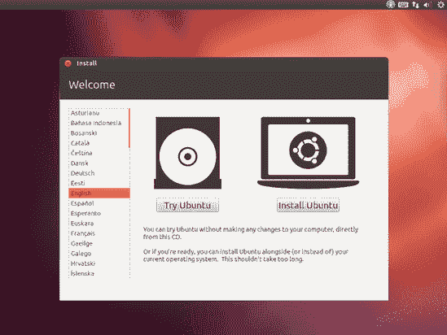
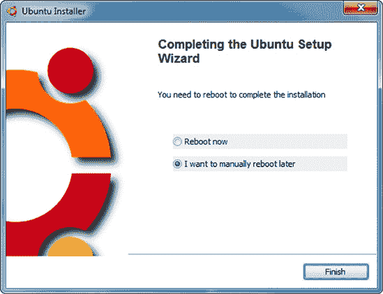
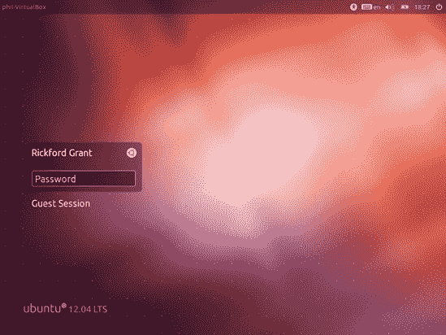
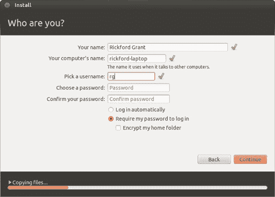

# 第二章. 涉水与潜水

### 运行和（如果您喜欢）安装 Ubuntu

正如我已经提到的，Ubuntu 的一个优点是它提供了一个 live CD，这意味着您可以在安装之前尝试它……或者如果您愿意，根本不安装它。更好的是，与 Ubuntu 的早期版本不同，如果您选择安装它，您不需要额外的安装 CD——Ubuntu CD 既可以作为 live CD，也可以作为安装光盘。而在“好-更好-最好”的节奏中，最好的点是，从 live CD 安装实际上比您处理过的任何其他安装过程都要简单得多，甚至提供了多种方法。

在本章中，我将介绍从 live CD 启动和运行 Ubuntu 的基础知识，然后，假设您已经感染了 Linux 病毒，我将介绍将 Ubuntu 安装到您的硬盘上作为操作系统的无痛苦步骤，无论是在您硬盘上的独立分区中，还是在传统的双启动设置（Windows 在其自己的分区中）中，或者对于稍微不那么冒险的人来说，在 Windows 系统内部。

如果您的计算机没有 CD 光驱，不用担心，您仍然可以参与其中。请参阅附录 A，了解如何从 USB 闪存驱动器运行或安装 Ubuntu。无论您最终选择哪种方式，让我们使用这本书，让 Ubuntu 运行起来。

# 浸入其中

要体验 Ubuntu 的精髓（并检查您的硬件是否与 Ubuntu 兼容），可能没有比直接从 live CD 运行 Ubuntu 更好的方法了。为此，只需将 Ubuntu CD 放入光驱，然后重启您的计算机。当计算机启动时，它应该从 CD 启动，一两秒后，您应该看到一个带有底部几个图标的紫色 Ubuntu 启动屏幕。如果屏幕没有出现，而您的计算机反而启动到您通常的操作系统，那么很可能您的计算机的 BIOS 设置需要更改，以便您可以从 CD 启动。不用担心：尽管这个过程听起来可能相当技术性，但更改 BIOS 设置并不是什么麻烦事。

您可以通过重启并按屏幕启动说明中分配给访问 BIOS 设置的任意键来访问您的计算机的 BIOS。这通常是删除键或 F1，但 F2、F10、F12 和 esc 也很常见——不是所有计算机都一样。如果屏幕上的信息过快，以至于您错过了，您可以查看用户手册以了解正确的键是什么。

进入 BIOS 设置后，更改启动顺序，使您的 CD 驱动器排在第一位。为此，您可能需要使用键盘上的箭头键在选项之间导航，并使用回车键选择它们。如何操作的简要说明通常会在屏幕上显示。完成设置后，请确保保存您的更改，然后重新启动计算机。

一旦您的计算机从 Live CD 启动并显示紫色 Ubuntu 启动屏幕，您可以选择等待几秒钟让 Ubuntu 开始启动到 Live CD，或者按下一个键（任何键）以显示一个菜单，您可以在其中选择您的语言和其他设置。默认设置应该足够满足我们的需求，所以请保持键盘几秒钟不动，紫色屏幕将让位给一个加载屏幕（也是紫色的）。

### 注意

如果您决定探索这个菜单，您会发现一旦您选择了语言等，您必须决定如何继续。选择*不安装尝试*以回到正确的轨道。

几分钟后，加载屏幕将消失，取而代之的是一个带有紫色桌面背景的安装窗口（图 2-1). 点击“尝试 Ubuntu”，安装窗口将让位给一个全新的 Ubuntu 桌面，左侧有一排彩色图标和相同的紫色背景。现在您应该能够使用鼠标以及键盘了，所以请随意探索。记住，您的硬盘将保持不变，所以请放心——您不会改变，更不用说损坏任何东西。当您到达这个阶段，您就可以开始体验 Ubuntu 了——但我会在第三章（第三章)中再谈这个问题。

图 2-1. Ubuntu live CD 的安装窗口

### 注意

在 Live CD 会话中不支持某些语言所需的特殊输入机制（即中文、日文和韩文）。

如果您想从 CD 退出并恢复计算机到正常状态，请点击屏幕右上角的电源按钮（它看起来像是常规电源图标和齿轮的混合体），选择**关机**，然后从出现的窗口中选择**重启**。过一会儿，您将被要求从驱动器中取出 CD 并按回车键。计算机将重新启动并很快带您回到正常的 Windows 桌面。如果您按下重启按钮没有成功，只需使用机器前面的电源按钮关闭并重新打开计算机应该就可以了。

# 选择，选择，选择——安装选项

如果你已经在你的机器上安装了 Ubuntu，并且满意从 live CD 运行它，或者你还没有决定要做什么，你可以跳过本章的其余部分，继续到下一章开始使用 Ubuntu 桌面。然而，如果你还没有安装 Ubuntu，并且准备好并且渴望这样做，那么请继续阅读。

## 去游泳——在 Windows 中安装 Ubuntu（Wubi 安装程序）

以前，如果你非常喜欢 Ubuntu 并想从硬盘上运行它，但又害怕这样做会破坏你 Windows 设置的脆弱状态，那么你……运气不好。然而，情况已经改变，因为现在有一个名为 Wubi 的安装选项，它允许你将 Ubuntu 直接安装在 Windows C:驱动器上，就像安装任何其他 Windows 程序一样。一旦安装完成，每次启动你的机器时，你都将能够在 Windows 引导加载程序屏幕中选择启动 Windows 或 Ubuntu。你的 Windows 系统保持不变；你不需要分区硬盘，如果你以后出于任何原因想要删除 Ubuntu，你可以像删除任何其他 Windows 应用程序一样做。这对于胆小的人来说是一个处理事情的好方法。

诚然，这种方法可以描述为一种折衷方案，因为它并不能给你从专用 Ubuntu 安装中获得的全套体验。它不如完整的 Ubuntu 安装稳定，并且安装时间更长，因为 Wubi 需要从互联网上下载安装文件（正确的文件不在 CD 上）。但这是一个相当好的折衷方案——它确实运行得更快，并且比 Ubuntu live CD 会话更加可用和愉快。你还可以享受将文件和设置保存到磁盘的好处，这意味着你可以跟随本书中描述的任何内容。非常酷。

如果这种替代安装方法对你来说没有吸引力，请继续阅读彻底投入——在 Windows 外安装 Ubuntu，在彻底投入——在 Windows 外安装 Ubuntu 中。如果你还没有下定决心，并且想了解更多关于这个 Wubi 安装程序的信息，请将浏览器指向[`wubi.sourceforge.net/`](http://wubi.sourceforge.net/)。另一方面，如果你已经决定 Wubi 安装程序是你祈祷的答案，以下是你需要做的：

1.  当 Windows 正在运行时，将本书附带的 Ubuntu live CD 插入到你的计算机光驱中。一个像图 2-2 中那样的窗口将自动出现。

    

    图 2-2。在 Windows 中自动启动的 Ubuntu live CD

1.  在那个窗口中，点击**在 Windows 中安装**按钮。Ubuntu 安装程序窗口将出现（图 2-3）。

    

    图 2-3。选择在 Windows 中安装 Ubuntu

1.  使用**安装驱动器**选项来指定您希望将 Ubuntu 文件放在哪里。确保您在该驱动器上有足够的空间！

1.  Windows 和 Linux 不能共享相同的磁盘空间，因此您需要为 Ubuntu 保留一些空间（您可以通过稍后讨论的卸载 Ubuntu 来轻松恢复空间）。通过从安装大小下拉列表中选择大小来选择您希望在 Ubuntu 中可用的磁盘空间量。少于 10GB 可能会相当受限。

1.  将桌面环境设置为默认值（Ubuntu），然后选择用户名和密码。一旦您对您的选择满意，请点击**安装**按钮。

1.  如果您的机器在此阶段尚未连接到互联网，您将被告知连接互联网。如果需要，请连接，并在警告窗口出现时点击**重试**按钮。

    在这个阶段，Wubi 将开始下载它需要的文件，以便在您的 Windows 环境中创建一个可引导的 Ubuntu 安装。根据您的连接速度，这可能需要相当长的时间；大约需要下载 1GB（约 1000MB）的数据。

    完成所有操作后，您将看到一个窗口，类似于图 2-4 中的窗口，提示您重启。

1.  选择**现在重启**，并在该窗口中点击**完成**按钮，之后您的机器将重启。不要忘记在重启之前从 CD 驱动器中取出 Ubuntu 光盘；否则，计算机将尝试从该光盘启动。

1.  当机器重启时，您将看到 Windows 引导加载程序，一个带有白色文字的黑屏，允许您决定是启动 Windows 还是 Ubuntu。使用您的向下箭头键选择**Ubuntu**，然后按回车键。

图 2-4。Ubuntu 已完成其 Windows 内安装的第一阶段。

然后，你的机器将开始 Ubuntu 启动过程，这对您来说应该是新的领域。一旦 Ubuntu 桌面出现，Ubuntu 将开始为您设置一切；这可能会花费一些时间，具体取决于您机器的速度。完成后，您将被带到登录界面（图 2-5）；现在您可以翻到第三章，因为您在这里已经完成了。

图 2-5. Ubuntu 登录界面

如果你决定不想在机器上保留 Ubuntu，你可以通过访问 Windows 控制面板，选择**添加或删除程序**，然后选择卸载来从 Windows 内部将其移除。

## 全力投入——在 Windows 之外安装 Ubuntu

如果你机器上还没有安装 Windows，你可以跳过这一节。如果你已经安装了，那么你将不得不决定是否要保留它。

在同一台机器上安装 Windows 和 Linux，并且它们可以愉快地共存是可能的。这被称为**双启动**设置。设置这样的系统已经变得极其简单。我最初使用的是双启动设置，尽管我最终发现我只使用 Linux 的部分。有一个我没有使用的 Windows 系统占据了大量的磁盘空间，这似乎是对宝贵空间的浪费，所以我最终放弃了整个系统，选择了纯 Linux 的设置。

我的建议是，您应该先尝试在 Windows 内部安装 Ubuntu 的 Wubi 方法，然后，当您准备好时，再进行一个仅 Linux 的设置，并完全放弃 Windows。大多数人发现 Ubuntu 可以做他们需要的所有事情，所以除非你需要一些 Linux 上没有的特定应用程序，否则没有必要双启动。

如果你选择双启动设置，启动任一系统都很简单。当你启动你的机器时，你会看到 GRand Unified Bootloader（更广为人知为 GRUB）的屏幕，你可以选择继续启动 Linux 或选择启动 Windows。之后，启动过程将像您选择的系统那样正常进行。

所以无论你决定走哪条路，你都不会出错。只是确保在开始安装之前备份你的重要文件。用常识、耐心和积极的态度进行操作，你就会没事的。简而言之，不要担心。

## 准备行动

准备安装 Ubuntu 所需的工作比许多其他 Linux 发行版要少。一旦你决定是否要走双启动路线，你真正需要准备的就是你的单个 Ubuntu 光盘，以及为了指导和安全，这本书。你可能唯一需要消耗的精神能量就是想出一个用户名和用户密码，就像你在大多数其他操作系统中所做的那样。

### 用户名和用户密码

你的用户名是你将会经常看到的东西。它将在屏幕右上角永久显示，等等，所以请确保它是一个你可以接受的名字。它可以只是你的名字或首字母，或者你想要的任何东西。然而，它必须以小写字母开头，后面跟着数字和/或其他小写字母。例如，我的用户名只是 *rg*，但你也可以使用像 *hope4u2pal* 这样的名字，尽管看起来可能会有些累。你还需要想出一个用户密码，每次登录时都需要输入。当你安装新软件或更改某些系统设置时，你也需要使用它。它应该至少有八个字符长，并包含数字、字母（大小写）和符号，以提高安全性。越难被别人猜到越好。当然，如果你愿意，你可以使用更少的字符和仅字母。安装程序会告诉你输入的密码是否不可接受，所以不用担心这一点。务必写下它，并将写有密码的纸张放在安全的地方，至少暂时如此，以免不小心将自己锁在系统外面。

### 注意

如果你曾经使用过其他 Linux 发行版，你可能会惊讶地发现，在 Ubuntu 中默认禁用了 root 账户。因此，没有输入 root 密码的安装步骤。你可以查看论坛（[`www.ubuntuforums.org/`](http://www.ubuntuforums.org/)）来了解如何绕过这种设置。你也可以在系统安装后随时设置 root 密码，所以如果你认为拥有 root 账户很重要，请不要担心。

## 做这件事

好吧，既然我已经涵盖了所有这些初步内容，让我们开始实际的 Linux 安装过程。把这本书放在你的腿上，以便你可以跟随，然后准备行动。是时候做这件事了！

幸运的是，安装过程极其简单，因为其中真正需要你做的步骤非常少。你大部分时间都在屏幕上点击按钮。这没什么难的，对吧？

当然，当你查看这里列出的说明和描述时，这个过程可能看起来很漫长且繁琐。其实并非如此。它将会比你想象的更快完成。作为一个经常参考此文本的初学者，你可能需要花更多一点的时间，但总的来说，这个过程比 Windows 或 Mac OS X 要快得多且容易得多。记住，在使用 Windows 和 OS X 时，你只是安装了操作系统和一些捆绑的应用程序。而在 Ubuntu 安装中，另一方面，你不仅安装了操作系统本身，还包括了你可能想要或需要的绝大多数应用程序。因此，你将一次性完成很多事情。

在我们开始之前，还有一件事。有些人安装系统时会有很多恐惧。这个过程让他们感到紧张，好像如果他们点击了错误的东西，房子就会着火。不用说，没有必要有这样的担忧。只要你的数据已经备份，理想情况下备份到外部硬盘或类似设备，你就没问题了。如果你第一次安装就搞砸了，那又怎样？重新开始。没有造成伤害，因为你没有什么可以伤害的——所有你的文件都在备份副本中安全且完好无损。只是确保你给自己留出比实际所需更多的时间。不要在你必须上班或必须去市中心见朋友之前一个小时就开始安装。匆忙会让人们做出奇怪的事情。给自己留出足够的时间，就像我之前提到的，备份任何你可能会哀悼失去的数据。

如果你准备好了——你为什么不呢？——以下是步骤：

1.  **启动**。如果你还没有这样做，请从 Ubuntu CD 启动你的机器。

1.  **开始安装**。一旦加载了 Live CD，你应该会看到安装窗口。这是安装向导的第一页，欢迎页面（见图 2-1）。

1.  **选择你的语言**。从窗口左侧的列表中选择你的语言，然后点击**安装 Ubuntu**。

1.  **准备安装**。安装程序现在将执行一些检查，以确保一切正常。检查的结果将在向导的“准备安装 Ubuntu”页面顶部显示（如图 2-6 所示）。绿色的勾号表示一切正常，而灰色的叉号表示发现了问题。最重要的是确保安装程序已经找到了足够的驱动器空间来使其满意；如果没有，安装无法进行。其他检查，比如你是否连接到互联网，对于安装来说不是必要的，所以通常可以忽略它们。

    

    图 2-6. 准备安装 Ubuntu

1.  如果你连接到了互联网（我们将在第四章中讨论这个话题），你可能想检查“安装时下载更新”。这将在安装过程中获取任何可用的系统更新，为你节省一些时间（你将在第六章中了解系统更新）。

1.  在准备安装 Ubuntu 页面的最后一个复选框中，询问您是否想要安装一些软件。这指的是用于播放 MP3 音频文件的插件，遗憾的是，它有一些许可条款意味着 Ubuntu 不能不询问您就安装它。勾选复选框并点击**继续**；我们将在第十四章中返回 MP3 支持的话题。

1.  **选择安装类型**。现在将显示安装类型页面。您在此处所做操作取决于您的机器上已有的内容。假设您的硬盘上已经安装了操作系统，例如 Windows，请接受最高选项（与 Windows 一起安装 Ubuntu）并点击**继续**。当安装开始时，此选项将减小 Windows（或其他操作系统）安装的大小，以便在新的分区中安装 Ubuntu。默认情况下，分区器将使用安装 Ubuntu 所需的最小空间量，但您无疑会想要更多一些，以便给自己留出扩展和存储文件的空间。要为 Ubuntu 创建更大的分区，请将窗口中央白色和灰色条上的分隔线拖动，直到您找到一个认为适合您的组合（参见图 2-7）。

    

    图 2-7. 为 Ubuntu 分区硬盘（或不分区）以腾出空间

1.  如果您的硬盘上没有操作系统，或者您打算消除当前的内容并用 Ubuntu 取代它，那么您应该选择第二个选项，列出的选项为 *用 Ubuntu 替换 Windows* 或 *删除磁盘并安装 Ubuntu*。点击**继续**，如果给出选择，请选择您想要安装系统的主驱动器。

    如果您想对磁盘空间进行更复杂的操作，例如为数据和系统文件创建单独的分区（如果您需要重新安装或想要在 Windows 和 Ubuntu 之间轻松共享文件，这将很方便），您需要使用最后一个选项，即别出心裁地命名为 *Something else* 的选项手动指定分区。（这更高级——有关指导，请参阅附录 C。）一旦您对选择满意，请做好准备：下一步将开始安装。

    什么是硬盘分区？

    我已经多次提到了*分区*，但还没有解释它们是什么。分区是硬盘上被“隔离”的区域，与其他硬盘区域分开。这是一种将诸如操作系统等事物分开的有用方式。由于它们彼此隔离，不同的分区被当作是连接到你的计算机的不同硬盘，尽管实际上它们实际上是在同一个物理硬盘上。

    大多数计算机只有一个分区，占满了整个硬盘。这就像有一个完全开放的平面布局的房屋——整个房屋就是一个大房间。如果你想完全删除 Windows 并安装 Ubuntu，Ubuntu 可以愉快地接管整个分区（以及整个磁盘），并将前居民 Windows 踢出去。

    如果你想在同一台计算机上安装两个操作系统，你必须为每个操作系统分配它自己的分区（毕竟，它们需要隐私）。用房屋的比喻来说，就像建造一堵隔断墙来将房屋分成两个房间。如果你想双启动 Windows 和 Ubuntu，安装程序会自动为你完成分区。当然，你可以选择每个分区的大小：你使 Ubuntu 分区越大，在 Ubuntu 中可用的磁盘空间就越多（而在 Windows 中则越少）。毕竟，房屋的大小是相同的；你只是改变了隔断墙的位置。

    你可以在附录 C 中找到有关手动分区硬盘的一些信息，如果你喜欢自己控制这个过程的话。然而，实际上没有必要这样做，因为 Ubuntu 安装程序很乐意为你处理这个任务。

1.  请记住，这是无法回头的点，点击**现在安装**按钮。一个进度条将出现在窗口底部，安装过程将开始。

1.  **指定你的位置和键盘类型**。安装所有内容需要一段时间，所以在这期间，安装程序会问一些问题，这些问题将用于设置你的用户账户。第一个问题要求你指定你的位置；通过点击世界地图选择附近的城镇来完成此操作。

1.  点击**继续**并从列表中选择你的键盘布局。安装程序应该会自动选择正确的布局，或者你可以尝试点击**检测键盘布局**。你可以通过在提供的框中输入来测试它是否按预期工作；请注意引号、英镑和@符号以及类似的键，因为这些是你最有可能遇到麻烦的键。当你满意时，再次点击**继续**。

1.  **输入用户账户详情**。将出现“你是谁？”屏幕（如图 2-8 所示 Figure 2-8）。这可能是最有意思的一步——你可以选择你电脑的名字、用户名和密码。首先输入你的名字，在最上面。安装程序会为其他一些字段提供建议，但你不必接受它们。对于计算机名，选择一个简短且简单的名字，不要有空格。用户名也是如此——正如我在用户名和用户密码中提到的彻底投入——在 Windows 外安装 Ubuntu，它将始终出现在你的电脑屏幕上，所以最好不要选择可能会最终变得令人烦恼的名字。正如我也上面提到的，你应该选择一个包含字母、数字和符号的混合密码，以确保安全。

    

    图 2-8. 在安装向导屏幕中提供您的用户名、密码和计算机名

1.  最好选择屏幕底部的**要求输入密码才能登录**选项。虽然这必然会增加从开机到 Ubuntu 桌面出现之间的时间，但放置一个密码输入框会大大增加任何人获取你电脑和存储在其上的所有宝贵（以及可能机密）文件访问的难度。

    完成后，点击**继续**按钮进入下一步。

    ### 注意

    对于那些注重安全的人来说，可以考虑选择**加密我的家目录**选项。这将加密你的家目录（所有文档都存储在这里）的内容，这样没有你的密码，任何人都不可能看到其中的任何文件。然而，这不会影响你访问文件的方式，因为当你登录时，文件会为你解密。如果你处理的是机密信息，这将是个不错的选择，因为即使你的电脑被盗，数据也会相当安全。

1.  **迁移文档和设置**。如果你的机器上已经安装了另一个操作系统，并且你正在设置双启动系统，安装程序将扫描你的硬盘以尝试找到某些设置、文件夹和文档，并将其自动转移到你的新 Ubuntu 系统环境中。这一步实际上并不重要，因为你（希望！）在开始安装之前已经备份了所有重要的文档和设置。尽管如此，在安装完成后手动将备份中的所有内容复制到新的 Ubuntu 系统中会更方便。如果出现迁移窗口，只需勾选你想要转移的项目旁边的复选框，然后点击**继续**。

1.  **等待安装完成**。现在，你已经输入了所有详细信息，安装程序将继续进行。坐下来观看 Ubuntu 的幻灯片演示。安装进度将在其下方的进度条中显示，这样你就不必担心（并且你会知道你还有多少时间可以坐在电视前放松）。

1.  **安装完成**。你会在一个新窗口中收到这个通知。你将可以选择继续使用 Live CD 或重新启动机器并直接从硬盘运行 Ubuntu。嗯，你不会经历所有这些只是为了继续使用 Live CD，所以点击**立即重启**按钮，当 Live CD 自动弹出时将其从驱动器中移除，并在提示时按回车键。然后你的机器将重新启动。

之后……嗯，基本上就是这样。你现在已经在你的机器上安装了 Ubuntu。恭喜！

# 我怎样才能重新进入 Windows？

如果你是在双启动配置中安装的系统，Ubuntu 与 Windows 并存，那么在电脑启动时你应该会看到一个新出现的启动菜单。10 秒后，Ubuntu 会自动启动，但你也可以直接按回车键来加快这个过程。

如果你想要启动 Windows，请使用键盘的方向键在启动菜单中选择**Windows**选项，然后按回车键。Windows 应该会正常启动。如果你想将 Windows 设置为默认启动项或更改启动时间延迟，请查看第十九章。

# 哦不，我的电脑无法启动！

如果安装过程失败，你可能无法启动你的电脑。幸运的是这种情况非常罕见——但如果不幸发生在你身上，不要慌张！你可以做很多事情来重新启动电脑，所以翻到第二十二章获取一些故障排除建议。
