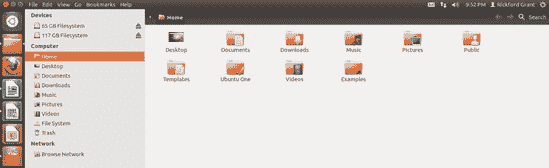
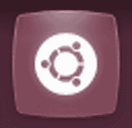
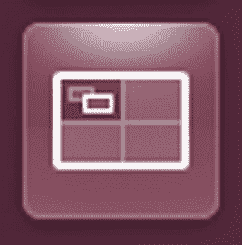
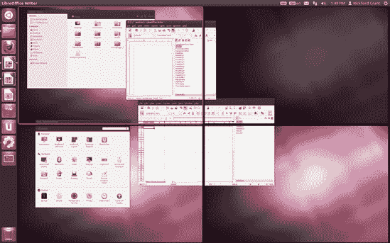

# 第三章. 一个新的家

### 了解桌面

所以，我们来到了你新世界的入口。你已经安装了 Ubuntu，它正在运行，你准备好跃跃欲试了。如果你是从硬盘上运行 Ubuntu，那么你可能会看到的第一个东西，取决于你的设置，是每次启动时都会出现的登录屏幕(图 3-1).如果是这样，请输入你的密码并按回车键，你将面对 Ubuntu 桌面。如果你在安装过程中设置了跳过登录阶段，或者你仍然是从 Live CD 上运行 Ubuntu，那么你已经在那里了。无论如何，让我们开始了解你的新家。

图 3-1. Ubuntu 登录屏幕

# 欢迎来到桌面

如你所见，Ubuntu 桌面(图 3-2)看起来相当熟悉。事实上，它看起来与你在 Windows、Mac OS 或甚至是其他 Linux 发行版中可能习惯的非常相似。然而，仔细观察你会发现，事情并不完全一样。屏幕底部没有任务栏或开始按钮，没有桌面图标，似乎顶部面板中只有一个菜单，屏幕左侧有一个类似 Mac OS X Dock 的东西。是的，事情确实有些不同。

图 3-2. Ubuntu 中的 Unity 桌面

欢迎来到 Unity 桌面环境，自 11.04 版本发布以来，Ubuntu 一直在使用这个环境。Unity 被设计成可以在任何数量的设备上使用，而不仅仅是 PC 上，这意味着有一天你可能会在 PC、手机、平板电脑以及其他你不知道的设备上使用完全相同的操作系统。尽管 Unity 在操作上可能与你习惯的不同，但它并不完全陌生，很快在 Unity 中工作就会变得像第二本能一样。为了让你开始，我会尽量让你熟悉桌面元素以及它们是如何协同工作的。

# Unity 桌面环境的部分

Ubuntu 的 Unity 桌面有三个明显可观察的部分：顶部面板、桌面本身，以及屏幕左侧的启动器。我将讨论这些部分，从非常有用的顶部面板开始。

## 面板

屏幕顶部是面板（图 3-3)，乍一看与 Mac OS 菜单栏非常相似。并且像 Mac OS 菜单栏一样，面板包含全局菜单，它显示当前聚焦应用程序的菜单（与 Windows 或其他 Linux 发行版不同，那里的菜单连接到应用程序窗口本身）。要显示全局菜单，将鼠标悬停在面板的左上角，菜单将出现在窗口标题的右侧（图 3-4)。如果您没有打开任何窗口，桌面菜单将在这里显示。

### 注意

并非每个应用程序都与 Unity 的全局菜单协同工作。例如，LibreOffice 的菜单将在它们自己的窗口中显示。

图 3-3. Unity 顶部的面板

图 3-4. 顶部的面板同时作为系统本身和大多数应用程序的菜单栏

与 Mac OS 菜单栏相似的是面板右侧的一组图标。其中一些是指示器，而其他则是像小程序一样的菜单，允许您执行某些功能。以下是标准集的功能（从左到右）：

**消息**

当您收到电子邮件或聊天消息时，它会通知您，并允许您轻松发送电子邮件消息和查看您的通讯录。它还允许您通过名为 Empathy 的应用程序检查和发送消息到社交网络网站，如 Facebook、Twitter 和 Flickr（您将在第五章中了解更多关于 Empathy 的信息）。

**网络**

允许您查看网络状态并配置网络设备。当与无线网络连接一起使用时，此图标指示无线信号的强度，并允许您轻松地在无线网络之间切换。

**音频**

允许您调整系统音量并控制音乐播放（图 3-5)，通过 Ubuntu 捆绑的音乐播放器 Rhythmbox（您将在第十四章中了解更多关于 Rhythmbox 的信息）。

图 3-5. 顶部的音频菜单允许您通过 Rhythmbox 控制音乐播放

**时钟**

显示日期和/或时间。

**用户**

显示当前用户的名字，并允许您切换用户账户。

**系统**

允许你锁定屏幕、注销、关机或重启。它还提供了访问许多系统设置的方法。

根据你的硬件配置或系统状态，将出现其他指示器，例如电池指示器或蓝牙管理器。某些应用程序，如 Tomboy 的便签系统，也可能在这里放置指示器或小程序。

总结我们对顶部面板的讨论，值得注意的是一个相当不寻常的特性：当你通过点击最大化按钮或双击标题栏来最大化一个窗口时，顶部面板变成了该窗口的菜单栏和标题栏，正如你可以在图 3-6 中看到的那样。（**标题栏**是位于窗口顶部，包含窗口标题及其控制按钮的栏。）这当然不应该成为问题，但这是你需要记住的事情，以免当你找不到窗口顶部时感到恐慌。它不在面板下面——它**就是**面板！幸运的是，这种看似神秘的变形很容易改变。要使窗口恢复到之前的大小，只需双击顶部面板或再次点击面板左侧的最大化按钮。

图 3-6. 顶部面板成为最大化窗口的菜单和标题栏。

## 桌面

Unity 桌面环境最大的部分就是桌面本身。从出厂设置来看，它是完全空白的，所以不能像 Windows 和 Mac OS 系统，甚至其他 Linux 桌面环境那样充分利用。这并不是说你不能以你熟悉的方式使用桌面，但就目前而言，你基本上只能在那里放置两种东西：文档和文件夹。要在桌面上创建文件夹，只需在桌面上任何位置右键单击，然后选择**创建新文件夹**。然后你可以将任何你想要放入该文件夹的东西拖动、复制或粘贴。当然，如果你想将文档或文件夹拖动到桌面上，你也可以这样做。

## 启动器

Unity 桌面环境中最不熟悉的部分可能是启动器。正如我之前提到的，**启动器**是出现在桌面左侧的那条图标带。在某种程度上，启动器的功能非常类似于 Mac OS Dock。出厂时，它自带了一些最常用应用程序、文件夹和工具的**启动器图标**。同样，就像在 Mac Dock 中一样，当你运行任何其他应用程序时，该应用程序的启动器图标也会出现。

# 使用启动器

现在您已经熟悉了 Unity 桌面环境的部分，是时候更详细地查看它们了。由于启动器是桌面中如此显眼（并且非常重要！）的一部分，所以我将从那里开始。默认情况下，启动器包含一些图标，这些图标实际上是快捷按钮，可以帮助您快速访问系统中最重要工具和应用程序。从顶部开始，以下是您将找到的内容：

**Dash**

可能是您系统中最重要的一部分，Dash 是您从那里完成几乎所有事情的地方：在您的系统上查找和运行文档、应用程序和其他文件。

**主文件夹**

这里存储了您所有的文件，并显示了驱动器和设备。

**Firefox**

这是 Ubuntu 的默认网络浏览器。

**LibreOffice Writer**

这是 Ubuntu 随带的文字处理器。

**LibreOffice Calc**

这就是随 Ubuntu 一起提供的电子表格应用程序。

**LibreOffice Impress**

在这里，您可以找到 Ubuntu 的 PowerPoint 替代品。

**Ubuntu 软件中心**

这里可以访问 Ubuntu 可用的所有应用程序和其他支持文件。

**Ubuntu One**

这可以帮助您安装、设置和连接到 Ubuntu 的 Ubuntu One 服务，该服务为您提供了自己的“个人云”。从这里，您可以在您的各种设备之间共享文件。

**系统设置**

打开系统设置窗口，这是一个访问常用系统设置（如键盘、显示器、声音、网络等）的入口点。

**工作区切换器**

显示并允许您在各种通常看不到的桌面工作区部分之间切换。这将在工作区切换器—虚拟桌面中更详细地讨论。

**回收站**

我认为无需介绍。它看起来就是这样。

使用启动器非常直观。要运行应用程序或打开文件或文件夹，只需单击其图标。如果您在启动器中右键单击任何图标，将出现一个菜单，其中的选项根据项目以及它是否已经运行或打开而有所不同。至少，您将获得将图标锁定到启动器或从启动器解锁的选择。唯一例外的是 Dash、回收站和工作区切换器。无论您是否喜欢，它们都保持原位。对于许多其他启动器图标，还有其他选项，如图 3-7 所示，它显示了 LibreOffice Writer 的选项。

图 3-7. 右键单击启动器图标可显示可用的子菜单选项。

正如我刚才提到的，你可以轻松地将额外的图标锁定到启动器或删除那些你不需要或不想放在那里的图标。要添加一个图标，运行你想要添加的应用程序，在启动器中右键单击其图标，然后选择**锁定到启动器**。要删除启动器图标，只需右键单击它并选择**从启动器解锁**。至于清空回收站，因为它就在附近，让我们来谈谈它：只需右键单击回收站图标，然后选择**清空回收站**。

如果你最终在启动器上放置了很多图标，或者你恰好同时打开了大量的应用程序，你会发现启动器底部的图标会挤在一起，就像 图 3-8 所示。然而，如果你只是将鼠标移到启动器的底部，内容就会开始向上移动，每个按钮依次展开。然后你可以轻松地单击你正在寻找的启动器图标。一旦完成，图标将返回到它们之前节省空间的状态。

图 3-8. 当东西太拥挤时，启动器会挤在一起你的图标

# Dash

启动器中最上面的图标通常被称为 Ubuntu 按钮，因为它上面有 Ubuntu 的标志 (图 3-9)，尽管它也被称为 Dash 按钮，因为它打开——你猜对了——Dash。Dash 帮助你在电脑上找到应用程序和文件，甚至还能帮助你找到互联网上的东西。你可能认为 Dash 听起来像是 Ubuntu 对 Windows 开始按钮的回应，从某些方面来说，你是对的，尽管使用起来它相当不同，而且它的功能更强大。

图 3-9. Ubuntu 按钮，又称 Dash 按钮

点击 Dash 按钮，即可看到 Dash 的第一个视图。你还可以通过按键盘上的 Windows 键（也称为 *super* 或 *meta* 键）来调出 Dash。第一次使用时，Dash 将以它几乎完全透明的辉煌状态为空 (图 3-10). 在你使用系统一段时间后，Dash 在打开时会显示你最近使用的应用程序和文件，但现在你只能看到顶部的搜索栏和底部的一系列白色图标。点击这些图标会将你带到 Dash 的不同透镜。

图 3-10. Dash

## 透镜

你可以将 *镜头* (图 3-11) 视为一种导航工具——一种分类标签，通过它你的系统帮助你缩小搜索范围，不仅是在你的电脑上，而且通过 Ubuntu 软件中心或从其他网站也可以。默认情况下，Ubuntu 中有五个这样的镜头——*Dash 主页*、*应用程序*、*文件与文件夹*、*音乐* 和 *视频*。

图 3-11. Dash 中的镜头

如果你点击这些镜头之一，Dash 将会填充你在该类别下当前安装的前五个项目。如果你在该类别下安装了更多项目，你可以通过点击每个部分标题旁边的 **查看** x **更多结果** 链接来查看它们。在应用程序的情况下，它还会建议你从 Ubuntu 软件中心下载该类别中的其他应用程序，正如你在 图 3-12 中看到的那样。（查看 第七章 了解其他镜头的一些预期效果。）

图 3-12. 首次点击 Dash 镜头应用程序的结果

如果你点击 Dash 按钮之前就知道你想去哪个镜头，那么了解你可以通过右键点击 Dash 按钮并在弹出的菜单中选择你希望使用的镜头来直接打开 Dash 到你选择的镜头（图 3-13）。

图 3-13. 右键点击 Dash 按钮会显示当前安装的 Dash 镜头菜单。

关于镜头最有趣的事情之一是开发者正在创建更多的镜头。您可以下载并安装这些新镜头，它们将为您提供快速搜索更多专业结果的方法，尤其是在网络上。如果您感兴趣，在第十八章中您将学习如何安装一个搜索网络食谱的烹饪镜头。如果您想了解其他类型的镜头有哪些以及如何安装它们，请查看 AskUbuntu ([`askubuntu.com//38772/what-lenses-for-unity-are-available/`](http://askubuntu.com//38772/what-lenses-for-unity-are-available/)) 和 OMG!Ubuntu! ([`www.omgubuntu.co.uk/tag/lenses/`](http://www.omgubuntu.co.uk/tag/lenses/))，这两个网站都提供了大量关于该主题的信息。

## 过滤器

与镜头紧密协作的是*过滤器*。您可以将过滤器视为微调设备——就像勺子相对于镜头的铲子一样。当您点击一个镜头时，您将在 Dash 的右上角看到“过滤器结果”的字样。如果您点击它，您将看到一个可以应用的过滤器列表，以进一步缩小搜索。例如，如果您点击应用镜头然后点击游戏过滤器，您将只看到系统上安装的游戏以及来自 Ubuntu 软件中心的游戏建议（图 3-14

图 3-14. Dash 中应用镜头带有游戏过滤器的结果

正如您开始看到的那样，过滤器不仅限于应用类别，根据镜头的不同，还可能通过其他类别选择结果，例如在应用镜头中的评分和来源。查看音乐镜头可用的过滤器可以发现多种不同的过滤器类型（图 3-15

图 3-15. 音乐镜头的过滤器选项

## 使用键盘查找和运行应用

使用透镜和过滤器是查找你想要运行的应用程序的一种方法；然而，如果你知道你想要运行的应用程序的名称，或者甚至知道你想要打开的文档的名称，你只需在 Dash 顶部的搜索框中开始输入即可。随着你输入，结果将开始出现。你输入得越多，结果就会越精确。如果你想要运行的应用程序（或你想要打开的文档）在列表中排在第一位，你可以简单地按回车键来打开它。否则，你可以使用箭头键导航到目标应用程序，然后按回车键来打开它。

# 抬头显示

与 Dash 类似的功能，Ubuntu 的新抬头显示（HUD）旨在允许用户在不离开他们关注的区域的情况下完成他们需要做的事情——换句话说，让他们能够专注于目标。为此，HUD 允许你通过键盘完成许多通常由鼠标驱动的任务。无论当前聚焦的应用程序是桌面、文件管理器、Firefox 还是终端，按下 alt 键都会在屏幕左上角为该应用程序弹出一个命令框。（图 3-16 展示了使用 Firefox 的一个示例。）在这个框中，你可以通过输入命令或关键词来告诉应用程序你想做什么，你想去哪里，或者你在寻找什么，然后按回车键。基本上，如果可以在应用程序的菜单中完成，也可以在 HUD 中完成。

图 3-16. 通过 HUD 在 Firefox 中标记页面

HUD 允许你通过键盘完成你可能从未想象过的各种操作。例如，你可以通过输入 **`save`** 来保存文件，通过输入你想要移动到的文件夹的名称在文件管理器中导航到另一个文件夹，或者通过输入 **`print`** 来打印文档。你甚至可以通过输入歌曲名称在 Rhythmbox 中播放歌曲。你越是在 HUD 上玩耍并尝试使用它，它就会变得越容易，因此也越有用。

最好的是，你不需要学习键盘组合或知道确切的命令来完成任务。只需输入一个单词，HUD 就会与你合作，显示它认为与你刚刚输入的内容相关的所有选项。我必须说，这非常方便。

# 在众多打开的窗口中导航

一旦你开始真正使用你的系统而不是仅仅了解它，你可能会遇到同时打开几个应用程序和许多窗口的情况。当你只想更整齐地排列几个窗口时，你只需将一个窗口拖到屏幕的任一边，然后它会自动调整大小以适应该区域。你也可以对另一个窗口做同样的事情，这样就可以轻松地同时处理这两个项目。

然而，当您同时使用多个不同的应用程序和多个不同的窗口时，弄清楚哪些正在运行或甚至某个特定窗口在哪里，可能会变得令人困惑，因为它似乎被埋在一百个其他窗口中。在这种情况下，启动器可能会派上用场——它不仅对启动常用应用程序很有用，而且在切换应用程序或窗口之间也非常出色。

为了帮助用户了解正在打开和运行的内容，启动器有一个指示系统。当任何启动器项目正在运行且其窗口是当前具有*焦点*的窗口（意味着它是当前正在使用的应用程序窗口）时，该项目的启动器图标右侧将出现一个小箭头（如图图 3-17 中的家庭启动器所示）。当打开或运行的启动器项目的窗口没有焦点时，其启动器图标左侧将出现一个箭头（如图图 3-17 中的 LibreOffice Writer 图标所示）。如果打开的应用程序窗口不止一个，无论是否有焦点，快捷按钮左侧将出现白色破折号而不是箭头——如果打开两个窗口则有两个标记，如果打开三个或更多窗口则有三个标记（如图图 3-17 所示）。当然，如果启动器项目没有运行或打开，则该启动器图标两侧都不会出现任何标记。

图 3-17. 启动器显示正在运行的应用程序以及哪些应用程序打开了多个窗口。

通过单击要切换到的应用程序的图标，可以在不同运行中的应用程序之间切换。您也可以通过在键盘上反复按 alt-tab 键直到到达您想要使用的应用程序来完成此操作。

另一种切换应用程序（或启动当前未运行的应用程序）的方法是按住 Windows 键。大约一秒后，启动器上的图标将变为编号，如图图 3-18 所示。然后，你可以通过按键盘上对应编号的数字来切换到你想要的应用程序。如果该应用程序有多个窗口打开，最近使用的窗口将获得焦点。

图 3-18. 通过数字在启动器之间切换应用程序和窗口

即使你已经到达了你想要的应用程序，你仍然可能不在正确的位置——当前有焦点的窗口可能不是你当时想要处理的窗口。例如，假设你有六个文件管理器窗口打开，它们都堆叠在一起。当前有焦点的窗口是“文档”，但你正在寻找去年夏天去塞浦路斯的照片所在的窗口。你可以用鼠标拖动窗口，直到找到你想要的窗口。

一个稍微简单的方法是点击任何一个打开的窗口以将其聚焦，然后反复按 alt 键和 tab 键上面的键（在大多数美国键盘上，这是带有*重音符号*和波浪符号的键）直到你到达你想要的窗口。或者，你可以通过再次点击启动器图标来以更直接的方式找到窗口（在这种情况下是主页按钮），之后所有与该启动器图标相关的打开窗口将一次性出现（图 3-19）。然后你只需点击你想要去的窗口。

同时查看所有当前打开的窗口，而不仅仅是特定应用的窗口也是可能的。要这样做，请按 Windows 键和 W 键。如果您想隐藏所有窗口以便看到桌面本身，请按 ctrl-alt-D。

图 3-19. 通过启动器查看单个应用程序的所有打开窗口

# 工作空间切换器—虚拟桌面

既然我们在讨论在桌面空间中导航的话题，现在讨论*虚拟桌面*是个好时机。尽管虚拟桌面功能最近才被引入其他操作系统，但它已经作为 Linux 的一个特性存在多年了（是的，它从这里开始，朋友们）。将虚拟桌面想象成比你的桌面大四倍的桌面顶部左象限是一个简单的思考方式。大多数时候，你只使用你全部工作空间中的一小部分。但如果你点击启动器上的工作空间切换器按钮（图 3-20），你可以看到你桌面王国的其余部分。

图 3-20. 启动器中的工作空间切换器按钮

虽然你可以看到，你的桌面实际上比看起来大四倍，但你必须亲自体验才能真正感受到这一点。如果你再次点击工作区切换按钮，你将回到你最初熟悉的桌面部分。现在打开几个窗口。例如，点击“主页”文件夹、LibreOffice Writer、LibreOffice Calc 和系统设置（或你喜欢的任何应用程序）的按钮。一旦为每个应用程序打开一个窗口，首先将系统设置窗口拖动到桌面的底部，直到只能看到大约一半。将 LibreOffice Calc 窗口拖动到屏幕的右侧，直到只能看到一半，然后将 LibreOffice Writer 窗口拖动到屏幕的右下角，直到只能看到大约四分之一。这次当你点击桌面切换按钮时，你的屏幕应该看起来像图 3-21。

图 3-21. 查看你的虚拟桌面

正如你所见，你的四个虚拟桌面看起来就像一个巨大的桌面，你可以将窗口移动到这个相当大的区域的任何四分之一。现在就试试吧。拖动这些窗口，直到你的桌面上每个四分之一都有一个窗口。现在，如果你想使用这些窗口中的任何一个，只需双击屏幕的相应部分。你的屏幕现在将只显示桌面上的这部分。

想要切换到桌面上的另一个窗口？点击工作区切换按钮，然后双击窗口所在的四分之一。一旦你掌握了技巧，这一切都变得非常简单。这也非常方便。你可以将桌面分成工作区域，例如，一部分用于写信，另一部分用于处理所有预算项目，还有一部分用于当你需要短暂休息时玩游戏。

# 为什么我的桌面看起来不像那样？

如果你的桌面看起来与本章截图中的不完全一样，这很可能意味着 Ubuntu 自动启动了你所谓的*回退模式*。回退模式是一种外观更简单、对视频硬件要求更低的模式。它也被称为*2D 模式*。如果你想知道自己处于哪种模式，最明显的标志是 Dash 按钮。如果 Dash 按钮是深炭灰色，带有白色 Ubuntu 标志，那么你处于 2D 回退模式。如果它是令人愉悦的紫罗兰色，带有白色标志，那么你处于标准的 3D 模式。

当你的硬件，尤其是你的显卡，没有 Ubuntu 运行 Unity 所需的功能时，Ubuntu 默认进入回退模式。这可能是因为你的显卡太旧或太新，或者只是性能不足，或者可能是因为系统需要安装的驱动程序才能充分利用显卡的功能尚未安装。你可以通过点击启动器中的**系统设置**按钮来检查你的机器是否有可用的驱动程序。当系统设置窗口出现时，点击**附加驱动程序**。附加驱动程序窗口（图 3-22）将出现，并告诉你是否有可安装的驱动程序。如果有，那么请根据推荐进行选择并点击**激活**。

图 3-22. 安装视频驱动程序

# 键盘快捷键

在本章以及本书的其他地方，我都提供了常见系统操作的键盘快捷键。键盘快捷键并非 Ubuntu 独有，但其中许多与你在当前操作系统中所知的不同。幸运的是，查看 Ubuntu 键盘快捷键的列表非常容易。只需按下并按住 Windows 键。除了在启动器图标上显示数字外，这还会显示一个图表，列出所有 Unity 的键盘快捷键（图 3-23）。这是一个非常实用的参考！如果你愿意，甚至可以将它作为你的默认桌面壁纸，但关于这一点将在第九章中详细介绍。

图 3-23. 查看 Ubuntu 键盘快捷键列表

# 关闭

现在你已经非常熟悉你的桌面环境了，你可能想结束一天的工作并关闭你的机器。为此，只需点击顶部面板最右角的**退出**按钮（它看起来像一个电源按钮）。在出现的菜单中，下半部分将会有几个选项可供选择：锁定屏幕、注销、挂起和关闭。选择**关闭**，将弹出一个小窗口询问你确认你的决定或选择重启（或取消）而不是关闭（图 3-24）。点击关闭，关闭过程将开始。

图 3-24. 关闭或重启 Ubuntu

实际关机过程将花费几秒钟，因为系统正在关闭其各种服务。当一切完成后，系统应该也会关闭您的电脑，这样您就完成了。然而，在少数机器上，系统可能无法关闭电脑。您可以通过观察屏幕活动是否结束来判断这种情况是否发生在您身上。如果您达到那个阶段，大约 15 秒内没有其他任何动作发生，那么只需手动按下电源按钮关闭机器即可。在那个时刻这样做是完全安全的。
