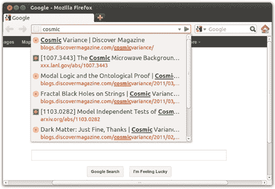
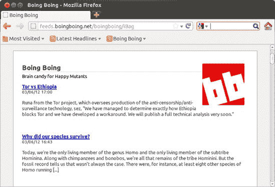
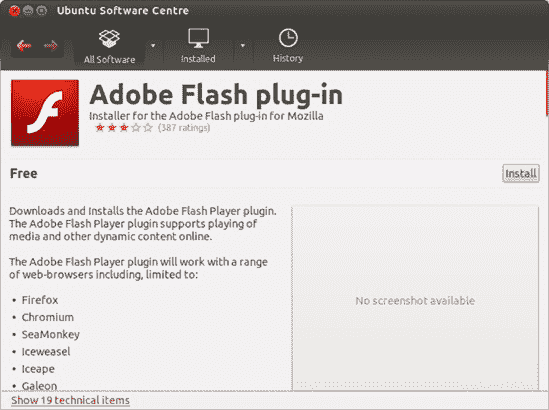
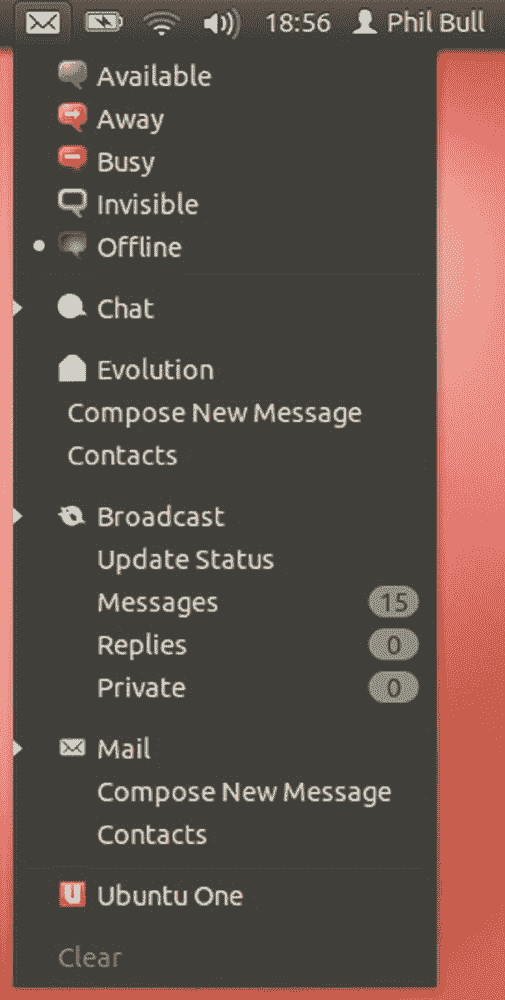
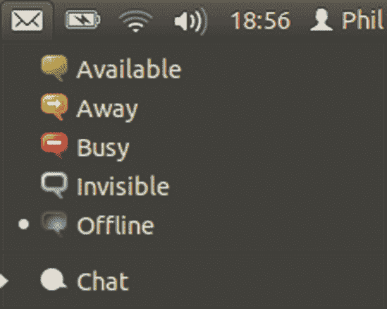
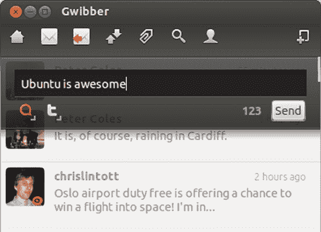

# 第五章. 滑行和滑动

### 以 Linux 风格探索互联网

现在你有了稳定的互联网连接，你能用它做什么呢？好消息是 Linux 可以匹配你之前操作系统能在线做的任何事情，而且在很多情况下，它做得更快或更简单。Ubuntu 诞生于网络，因此它自带一套非常健康的互联网应用程序套件也就不足为奇了。

在本章中，你将游览 Ubuntu 的互联网软件，以便了解这种 Linux 功能的能力。你将从像网页浏览器和电子邮件客户端这样的老牌软件开始，简要浏览即时消息，然后转向更时尚的 Twitter 和微博方向。

# Firefox：你的互联网浏览器

你的 Ubuntu 系统中的默认网页浏览器是 Firefox，它在 Linux 世界、Windows 和 Mac 世界中都越来越受欢迎。你很可能是 Firefox 的用户，如果不是，也没有关系。所有浏览器的工作方式大致相同，所以你应该能够在不任何指导的情况下使用 Firefox 的基本功能。当然，其中一些功能使 Firefox 与竞争对手区分开来，所以我会提到这些。

## 使用标签控制浏览器窗口杂乱

通常情况下，当你点击网页上的链接时，新页面会在同一窗口中打开。在某些页面上，链接被编码成在新窗口中打开新页面，或者你可能偶尔会通过右键点击链接并选择“在新窗口中打开链接”选项来打开链接。这非常有用；然而，一旦你打开了几个浏览器窗口，找到你想要的东西就会变得有点困难。这也会稍微减慢一些速度。

这就是 Firefox 标签功能派上用场的地方（实际上非常方便，以至于几乎每个其他浏览器都效仿了它）。要了解它是如何工作的，现在就亲自试试。通过点击启动器中的 Firefox 图标（如图 5-1 所示）或通过在 Dash 中搜索 Firefox 来打开 Firefox 浏览器。

图 5-1. 启动器中的 Firefox 图标

然后，使用 Firefox 方便的搜索框搜索单词*nyckelharpa*，该搜索框位于浏览器窗口的右上角（见图 5-2). 默认情况下，Firefox 将使用搜索框中输入的关键词使用 Google 进行搜索。如果你愿意，可以选择其他搜索引擎或通过点击搜索框中的彩色*g*图标并做出选择来搜索特定网站。Amazon.com、eBay 和 Yahoo!等网站可供选择，你甚至可以添加更多。然而，现在让我们坚持使用 Google，在搜索框中输入 nyckelharpa。完成输入后，按回车键。Firefox 窗口的主面板应该会显示一页搜索结果。

图 5-2. 在 Firefox 搜索框中执行 Google 搜索

最上面的结果之一应该是美国 Nyckelharpa 协会，你现在将打开该页面在新标签页中，而不是在同一个或新窗口中。要做到这一点，右键单击链接，在出现的弹出菜单中选择**在新标签页中打开链接**。如果你更喜欢，可以简化操作并省略弹出菜单选择步骤，只需用鼠标中键（或同时使用两个鼠标键）点击链接，或者按住 ctrl 键点击链接。无论如何，新页面将在新标签页中打开（见图 5-3)，而你的原始搜索结果页面将保留在另一个标签页中，准备等待。我相当有信心地说，一旦你习惯了这个功能，你就会想知道在没有它的日子里你是如何度过的。

图 5-3. 在 Firefox 中在新标签页中打开的链接

## 保存以备后用：使用历史记录和书签

很可能，你有一些喜欢的网站，你经常返回这些网站，甚至可能一天检查它们几次。每次想检查 Facebook 时都输入整个网址可能会感到厌烦，而且每天将相同的搜索词输入 Google 五次也感觉笨拙。当然，有更好的方法？实际上，Firefox 中充满了更好的方法！让我们来看看其中的一些。

### 书签

首先是 Firefox 的书签功能。为了方便阅读，保存网页，你只需点击地址栏右下角的空星形图标。当你这样做时，星号会变成黄色，表示页面已被保存。但是保存在哪里呢？去书签菜单，查看**最近书签**菜单项。一个包含你最近书签的列表会展开，包括你刚刚添加的那个。要重新访问页面，只需点击该菜单中的相应项。

除了书签菜单外，还有其他方法可以访问你的书签，其中一些可能对你来说更方便。一种是**书签侧边栏**：点击**查看** ▸ **侧边栏**并选择**书签**来打开它（或者如果你更喜欢键盘快捷键，可以按 ctrl-B）。一个新面板将出现在窗口的左侧，其中包含可展开的书签列表以及一个搜索框（如图图 5-4 所示）。通过列表点击或开始在搜索框中输入以找到你想要的网页。完成后，你可以通过点击侧边栏右上角的*X*或通过在**查看** ▸ **侧边栏**菜单中取消选中它来隐藏侧边栏。

Figure 5-4. Firefox 中的书签侧边栏

另一种访问书签的巧妙方法是使用**书签工具栏**。默认情况下，它是隐藏的，所以你无法使用它。要唤醒工具栏，点击**查看** ▸ **工具栏**并选择**书签工具栏**。一个新条带将立即出现在地址栏下方，其中只包含两个链接(图 5-5). 其中之一是“最常访问”，包含你访问最频繁的网站列表。只需点击**最常访问**，从弹出的列表中选择一个网站，你将被直接带到你最喜欢的网站之一。第二个项目是一个指向“入门”说明的链接，你可能稍后会查看。现在，让我们集中精力用常规书签填充书签工具栏。

Figure 5-5. 书签工具栏

将书签添加到工具栏非常简单。当你第一次通过点击地址栏中的星号来收藏页面时，再次点击（现在变为黄色的）星号。会出现一个“编辑此书签”的框，就像图 5-6 中所示，提供了多个选项。要保存页面到书签工具栏，只需适当地更改“文件夹”选项，然后点击**完成**。一个新的书签将出现在工具栏上，你可以通过单次点击访问它。

如果你是一个特别勇敢的网页探险家，你可能会很快发现你积累的书签数量变得难以管理。与其限制你的探险，你可能会尝试进行一些春季大扫除。点击**书签** ▸ **显示所有书签**，一个图书馆窗口将打开。从这个窗口，你可以根据需要组织所有的书签，重命名、删除并将它们归档。要了解这是如何工作的，从窗口左侧的列表中选择**书签菜单**，然后点击**组织** ▸ **新建文件夹**。将出现一个新的文件夹，你可以按你喜欢的方式重命名。完成这个步骤后，尝试将一些书签拖动到文件夹中。重复这个步骤几次，你很快就会有一个整洁分类的书签集合。

图 5-6. 编辑书签

### 历史

书签的问题在于你必须记得首先将页面添加到书签中。如果你第一次访问网站时觉得它值得保留以备后用，那当然很好，但如果你几天前发现了一些只有在事后看来才显得重要的东西怎么办？为了应对这样的情况，Firefox 会保存你过去几个月甚至更长时间内访问的所有网站的详细历史记录。要查看你的网页浏览历史，点击**查看** ▸ **侧边栏**并选择**历史**或按 ctrl-H。这将打开**历史侧边栏**，其中包含你访问过的所有网站的完整列表，按日期排序。你可以像使用书签工具栏一样浏览或搜索这些内容。点击列表中的任何页面，它将在 Firefox 主窗口中再次打开。

要查找一个页面，你也可以按日期以外的其他方式对列表进行排序。点击历史侧边栏中搜索框右侧的**查看**按钮，并从弹出的菜单中选择一个选项来重新排序列表。例如，要按网站分组查看你的浏览历史，而不是按访问日期，请选择**按网站**。

当然，每次想要找到之前浏览过的网站时都翻遍整个网页历史记录并不是每个人的乐趣所在。为此，Firefox 有一个我认为你会同意的相当酷的功能：令人惊叹的地址栏。这实际上只是地址栏的另一个名字，这可能会让你觉得那个单调的老文本框可能比表面看起来要复杂得多。确实如此：打开一个新标签页并开始输入。随着字母在地址栏中显示，下面会立即出现一个列表，包含你之前访问过的网站链接（如图 5-7 所示）。Firefox 正在直接搜索你的网页历史记录，查找与你在地址栏中输入的内容相匹配的任何内容。通过输入更多几个字母来细化搜索，或者向下滚动列表直到找到你想要的网站。只需单击一下，页面就会加载，无需完整输入其地址。酷吧？你还可以使用键盘上的上箭头和下箭头键从列表中选择项目，并使用回车键访问当前高亮的页面——无需点击。

图 5-7. 令人惊叹的地址栏，显示网页浏览历史记录中的项目

除了网址之外，你还可以在地址栏中输入搜索词。例如，在地址栏中输入**`猫图片`**并按回车键。Firefox 会识别出 *猫图片* 并不是网址，而是会执行搜索，就像你将那些词输入到右侧的搜索框中一样。虽然可能需要一点时间来习惯令人惊叹的地址栏的工作方式，但这确实是一个相当巧妙的特性，可以节省你大量的点击。

当我说 Firefox 记录了你最近查看的所有内容时，我确实是这个意思。如果你不希望 Firefox 记录你访问的页面，至少暂时不记录，那么你可以尝试 *私密浏览模式*。如果你想要查看一些机密内容，比如银行网站，这会很有用。点击 **工具** ▸ **开始私密浏览** 并开始浏览——当私密浏览启用时，Firefox 会立即忘记你访问的所有页面，它们不会出现在你的网页历史记录中或以其他方式出现。当你想要将 Firefox 返回到正常操作时，只需回到工具菜单并点击 **停止私密浏览**。窗口将返回到你开始私密浏览之前的状态，而不会留下你刚刚访问的网站的任何痕迹。

## 使用实时书签保持最新状态

互联网充满了各种新闻和信息，跟踪它们可能很困难。我个人讨厌错过来自 Boing Boing 的每日离奇故事，这个网站恰如其分地被称为“奇妙事物的目录”([`www.boingboing.net/`](http://www.boingboing.net/))。幸运的是，Firefox 有一个处理信息过载的巧妙方法，称为*动态书签*（也称为*RSS 订阅源*）。这些为你提供了任何支持它们的网站的自动更新文章列表（图 5-8）。

图 5-8. 动态书签的实际应用

你可以通过访问书签菜单并检查*订阅此页*菜单项是否启用来检查一个网站是否有 RSS 订阅源。如果它是灰色的，那么很不幸——没有 RSS 订阅源。如果它是白色的，而不是灰色的，那么你就成功了！让我们以 Boing Boing 为例：在 Firefox 中加载[`www.boingboing.net/`](http://www.boingboing.net/)，然后转到书签菜单。订阅此页项将是白色的，这意味着它是可点击的。点击它，你将看到一个包含最新文章列表以及邀请您在页面顶部的框中订阅该订阅源的提示。点击**立即订阅**，然后在出现的窗口中点击**订阅**，将动态书签添加到与最新头条链接相同的工具栏中。

一些网站提供指向其 RSS 订阅源的链接，而不是在地址栏中显示它们。如果你找到这样的链接（通常称为*ATOM*或*RSS/XML*），点击它，你应该会看到一个包含顶部框的文章列表，就像之前的例子一样。从那里，将订阅添加到书签的步骤是相同的。

## 弹窗管理器

Firefox 还有许多其他有用的功能。其中一个就是它的弹窗管理器，它可以抑制那些当你访问新网页时经常出现的令人烦恼的弹窗窗口。你可以从首选项窗口（**编辑** ▸ **首选项**）中启用或禁用此功能；点击该窗口顶部面板中的**内容**图标，然后勾选或取消勾选**阻止弹窗窗口**复选框。你也可以通过点击“阻止弹窗窗口”条目右侧的**例外**按钮，并输入相关网站的网址，允许某些网站提供弹窗窗口（一些弹窗不仅有用，而且对于网站的正常运作也是必要的）。

## 多媒体插件

Firefox 最酷的特性之一是它允许你通过添加各种扩展来扩展其功能。最常用的扩展以*插件*的形式存在。这些插件使得网页能够做更多的事情，而不仅仅是显示文本和图片——例如，你通常需要一个插件来在线观看视频或玩游戏。有三个插件的使用范围远超其他任何插件，因此我将在这里集中讨论这些插件。

### Flash

任何系统中最常用的浏览器插件是 Adobe 的 Flash Player。Flash 为网站提供了各种令人兴奋的多媒体效果和能力，因此它被相当多的网站使用。实际上，你很可能已经看到了许多增强的 Flash 页面，甚至没有意识到。例如，如果你曾经在 YouTube 上看过视频，你就享受了 Flash 的奇妙。 

如何获取 Flash Player 插件？好吧，如果你在第一次安装系统时选择了安装第三方软件，那么你已经有它了。如果没有，只需几点击和一个有效的互联网连接即可：

1.  通过点击启动器上的图标或通过在 Dash 中搜索来打开软件中心。（你将在第六章中了解更多关于软件中心的信息；如果你需要，可以跳过前面的内容。）

1.  在窗口右上角的搜索框中输入 **`adobe flash`**。

1.  在出现的列表中，双击 **Adobe Flash 插件** 项。将出现一个信息窗口，希望有一个安装按钮（图 5-9）。安装按钮应该在完成之后出现。

1.  点击 **安装**；如果提示，输入你的密码并点击 **认证**。插件将被下载并安装。

1.  当插件安装完成后，在其图标旁边的列表中将出现一个绿色的勾号。关闭 Ubuntu 软件中心并打开 Firefox（如果已经打开，请先关闭再重新启动）。

    

    图 5-9. 使用 Ubuntu 软件中心安装 Flash 插件

1.  要检查插件是否工作，找一个使用 Flash 的网站。如果你手头不知道，试试 YouTube ([`www.youtube.com/`](http://www.youtube.com/))。一旦你到达 YouTube，点击你看到的任何视频链接。如果 Flash 安装成功，视频应该会出现并开始播放（图 5-10）。

    

    图 5-10. 安装 Flash 插件后播放 YouTube 视频

### Silverlight/Moonlight

插件场景中的新来者是微软的 Silverlight。它不如 Flash 常见，但似乎在许多电视频道和大型体育赛事的网站上使用。不幸的是，微软有点落后于时代，它还没有将 Silverlight 适用于 Linux。但不用担心：有一个名为 Moonlight 的开源插件可以作为替代。要安装 Moonlight，请按照以下步骤操作：

1.  打开 Firefox 并访问 [`www.go-mono.com/moonlight/`](http://www.go-mono.com/moonlight/)。

1.  在 Moonlight 页面上点击 **安装** 按钮，然后滚动到第二部分，下载插件。

1.  现在点击绿色的向下箭头。屏幕顶部会出现一个气泡，说明网站被阻止安装软件。

1.  在气泡中点击 **允许** 按钮，然后会出现一个插件下载气泡。等待插件下载完成。

1.  完成后，会出现一个软件安装窗口。点击 **立即安装**，然后在出现的气泡中点击 **立即重启** 以完成插件的安装（当你再次打开 Firefox 时，你打开的所有页面都将重新出现）。

1.  前往 [`www.farseergames.com/waterdemo/`](http://www.farseergames.com/waterdemo/)。如果 Moonlight 安装正确，你现在应该会看到一个小船在波浪上起伏（图 5-11）。

    

    图 5-11. 检查 Moonlight 插件是否正常工作

一些启用 Silverlight/Moonlight 的网站可能需要你安装额外的插件，尤其是如果它们试图显示视频的话。如果是这种情况，页面上方将出现另一个条，告诉你插件缺失。点击 **安装缺失插件** 按钮，并按照屏幕上的说明安装所需的所有内容。

### Java

你可能会遇到的一个插件是 Java，它用于运行 *Java 小程序*。Java 小程序是一些可以在你的网页浏览器中运行的小应用程序，它们通常用于游戏和演示。安装 Java 与安装 Flash 类似。只需打开软件中心，但这次搜索 *IcedTea Java 插件* 并安装它。安装完成后，查看 Java 的实际运行情况是个好主意，因此前往 [`www.turbotanks.com/`](http://www.turbotanks.com/)。如果 Java 运行正常，应该会加载一个“坦克”街机游戏（图 5-12）。

图 5-12. 在 Firefox 中运行 TurboTanks 游戏

# 项目 5：安装 Firefox 扩展

我刚才提到的插件几乎是每个人都必须安装的必备插件，但 Firefox 也有数百个其他不那么重要的扩展可用。这些扩展以 *插件* 的形式出现，包括各种各样的事物；其中许多功能强大，而另一些则纯粹是好玩和古怪的。它们包括从博客写作工具和待办事项列表到图片查看器和旅行指南。对于这个项目，你将安装一个名为 ScribeFire 的博客编辑器（图 5-13

图 5-13. 在 Firefox 中安装的 ScribeFire 扩展

### 注意

如果你没有博客但想尝试博客写作，你可以在免费托管网站上注册一个账户，例如 [`www.blogger.com/`](http://www.blogger.com/)、[`wordpress.com/`](http://wordpress.com/)、[`www.tumblr.com/`](http://www.tumblr.com/) 或 [`www.livejournal.com/`](http://www.livejournal.com/)。

## 5-1：下载并安装 ScribeFire 扩展

要开始安装任何 Firefox 扩展的过程，你首先需要找到并下载一个。为此，转到 Firefox **工具** 菜单，并选择 **插件**。随后会出现插件管理器标签页，显示你已安装的扩展、主题和插件。要添加 ScribeFire 插件，请确保左侧窗口上的 **获取插件** 标签已被选中。Firefox 将显示一些特色插件和其他推荐，你可以随意查看或忽略。

当我撰写这篇文章时，ScribeFire 并不是 Firefox 的推荐之一，而且当你打开插件标签页时，可能性也不大。在这种情况下，只需在搜索框中搜索 *scribefire*（图 5-14

图 5-14. 在 Firefox 中添加扩展

安装过程完成后，插件管理器标签页将出现一条消息，提示您重启 Firefox。为此，请点击 ScribeFire 项顶部的 **立即重启** 链接（图 5-15

图 5-15. 安装完成后，会显示一条消息提示您重启 Firefox。

## 5-2: 设置 ScribeFire 扩展程序

在您安装了 ScribeFire 扩展程序后，Firefox 首次启动时，点击 **工具** ▸ **ScribeFire**，ScribeFire 将作为可调整大小的面板出现在当前 Firefox 窗口的下半部分。同时，还会弹出一个带有添加博客说明的白色气泡消息。按照说明操作，以使它与您的博客一起工作。

# 使用 Thunderbird 发送电子邮件

Thunderbird (图 5-16) 是 Ubuntu 的默认电子邮件应用程序。它使用非常简单，并且包括了您期望的大多数重要电子邮件功能，例如垃圾邮件过滤器。实际上，它在外观和处理方面与 Windows Mail 有一些相似之处。Thunderbird 同时也提供 Mac 和 Windows 版本，这意味着您可能已经熟悉它了。

图 5-16. Thunderbird 邮件客户端

要打开 Thunderbird，请打开 Dash 并搜索它。当它启动时，您将在启动器中看到一个蓝色鸟图标。如果您希望将其保留在那里以便轻松访问您的电子邮件，请右键单击图标，并在弹出的菜单中选择锁定到启动器。

当 Thunderbird 首次启动时，您将看到一个邮件账户设置窗口，该窗口会要求您输入一些关于您的电子邮件账户的基本信息。请输入您的姓名、电子邮件地址以及您的电子邮件账户密码，然后点击 **继续** 以进行下一步。现在，当您在此窗口中输入信息时，具体操作将根据您的个人情况而有所不同。如果您使用的是像 Gmail、Hotmail 或 Yahoo! 这样的主要电子邮件服务提供商，Thunderbird 将会自动设置您的电子邮件账户，无需太多麻烦，只需回答几个额外的问题即可更新邮件账户设置屏幕。然而，如果您使用的是像您工作场所的 Exchange 邮件服务器这样的不太知名的提供商，您将需要输入更多详细信息才能使一切正常运行。幸运的是，Thunderbird 是最受欢迎的电子邮件应用程序之一，因此大多数电子邮件服务提供商都会在其网站上发布如何设置其工作的详细说明。

一旦你填写了所需的所有详细信息，或者遵循了你的电子邮件服务提供商的说明，点击**创建账户**。Thunderbird 将开始更新，检查你的电子邮件账户是否有新消息等。你会注意到，一些与电子邮件相关的文件夹出现在屏幕左侧的栏中，例如收件箱、已发送邮件和草稿文件夹。从现在开始，一切都很正常；你可以做任何其他电子邮件客户端能做的事情。在 Thunderbird 窗口顶部的工具栏中，你可以点击**获取邮件**来从你的电子邮件提供商那里检索任何未读消息，或者点击**撰写**来开始撰写新消息。还有一个地址簿用于管理你的联系人，以及一个方便的搜索功能，你可以用它来查找消息。正如我提到的，Thunderbird 有很多其他功能；在这里详细介绍所有这些功能会花费一些时间，所以我会留给你自己探索。你可能想查看 Thunderbird 优秀的帮助和支持网站，该网站可在 [`support.mozillamessaging.com/`](http://support.mozillamessaging.com/) 找到。除了故障排除建议外，它还提供了一些入门指南和有关 Thunderbird 能够做什么的所有信息。

# 消息菜单

在我们继续查看 Ubuntu 预装的其它互联网应用程序之前，展示一个可爱的小功能是很有价值的，这个功能将多个通信应用程序整合到一个整洁的界面中。你看屏幕顶部的面板右侧的邮件图标吗？这就是消息菜单（图 5-17）。点击它，你会看到电子邮件、聊天和“广播”的条目，“广播”指的是社交媒体和微博服务，如 Twitter 和 Facebook。你可以使用消息菜单做各种事情——撰写新电子邮件、开始聊天、更新你的 Twitter 状态。简而言之，用它来处理与外界沟通的任何事情。你很快就会了解到聊天和广播选项的更多内容，但现在，让我们看看消息菜单是如何处理电子邮件的。

图 5-17. 通过点击邮件图标访问的消息菜单

如果 Thunderbird 已关闭，您可以通过打开消息菜单并点击邮件来启动它。只要 Thunderbird 正在运行，消息菜单就会跟踪您的电子邮件账户的当前状态。当您收到新邮件时，顶部面板上的信封图标将从白色变为蓝色。当这种情况发生时，点击信封以显示消息菜单，您将在菜单底部找到您有多少新邮件的摘要。如果您有多个电子邮件账户，这将特别方便；每个账户的新邮件数量将分解显示，点击账户菜单项将在 Thunderbird 中显示新邮件。消息菜单还具有快捷方式，以便您可以快速访问您的联系人列表或编写新邮件。总的来说，非常方便，我相信您会同意。

# 通过 Empathy 与您的朋友聊天

电子邮件是一个非常有用的工具，但发送消息和收到回复之间通常会有相当大的延迟。如果您只是想进行快速聊天怎么办？这就是*即时通讯（IM）*发挥作用的地方。如果您不熟悉这个概念，您只需在 IM 网络上找到您的朋友，并向他发送一条简短的消息。您的消息将瞬间出现在他的屏幕上。然后他可以回复，您也会迅速收到回复。这样一直持续到您说再见并从网络上断开连接。

现在有许多不同的即时通讯网络，例如 AIM、Google Chat、MSN/Windows Live 和 Yahoo! Messenger。您通常只能与使用相同网络的人交谈，并且您需要一个*即时通讯客户端*应用程序来连接到任何一个。Ubuntu 预装了一个功能齐全的即时通讯客户端，名为 Empathy，它能够同时连接到多个网络。

## 开始聊天

对于本节，我将假设您已经在即时通讯网络上拥有一个用户账户。如果您没有，您需要前往该网络的网站并注册（大多数都是免费的）。准备好您的账户详情后，让我们将 Empathy 连接到您选择的网络。

1.  通过点击顶部面板上的信封图标打开消息菜单，然后点击**聊天**。Empathy 账户窗口将打开。

1.  如果您喜欢，可以更改您的名字和昵称，然后点击**连接**。

1.  您将被带到消息和 VoIP 账户窗口，该窗口会告诉您它正在搜索附近的人。现在请忽略这一点，并点击窗口左侧列表下方的**+**按钮。

1.  从打开的窗口顶部的下拉列表中选择您的 IM 网络，然后输入您的账户详情（图 5-18

    图 5-18. 输入你的即时通讯账户详情

1.  点击**应用**完成操作。

1.  Empathy 将尝试连接到你的即时通讯网络。如果连接成功，你的联系人将出现在联系人列表窗口中， Messaging 和 VoIP 账户窗口中还将出现一些其他选项。你从这里不需要做任何事情——你现在已经完全连接。如果 Empathy 在建立连接时失败，它将通过在窗口顶部的彩色栏中显示消息来告诉你。可能出了很多问题，但最常见的问题是输入的用户名或密码不正确，所以点击**编辑连接参数**并再次尝试输入你的详细信息。

你的账户现在应该已经设置好并准备好使用，让我们进行一次测试运行。如果有人在线并且可以聊天，她的名字旁边将有一个绿色的对话气泡图标。双击她的名字开始对话。会出现一个新窗口——在窗口底部的框中输入消息，然后按回车键发送（见图 5-19）。你的消息和你的朋友的消息将在对话屏幕的主要部分显示。结束对话也很简单——只需关闭对话窗口。

图 5-19. 使用 Empathy 即时通讯客户端与朋友聊天

在任何时刻关闭联系人列表窗口都是可以的；你将保持在即时通讯服务中登录状态，因此你仍然可以发送和接收聊天消息。然而，如果你想和某人开始新的聊天，你需要在操作之前将联系人列表放在面前。要再次打开它，请打开消息菜单并点击**聊天**。联系人列表将重新出现，你可以通过双击联系人名称来开始新的聊天，就像之前一样。这也是你首次登录 Ubuntu 时打开 Empathy 的方式。与一些聊天应用不同，Empathy 在登录时不会自动启动，因此你需要通过从消息菜单中选择**聊天**来手动启动它。

我在这里只是触及了表面。Empathy 还有很多其他你可能想要尝试的功能：你可以向人们发送图片和文件，进行电话和视频通话，使用*地理标记*广播你的位置，甚至可以在其他人的计算机屏幕上显示你的桌面。解释所有这些可能需要单独的一章，所以相反，我将引导你查看 Empathy 的用户指南，它应该会告诉你还能做什么以及如何操作。在任何 Empathy 窗口中，选择**帮助** ▸ **内容**，等待几秒钟直到帮助窗口弹出，然后浏览主题列表，直到找到相关的内容。

## 当你不想要聊天时告诉人们

聊天很棒，但很少有人有耐心（或者有闲暇时间）整天都在聊天。如果你在忙碌时有人试图和你交谈，可能会感到很烦人。幸运的是，有一个简单的方法可以让每个人都知道你不想被打扰。打开消息菜单。你的当前聊天状态将在菜单顶部用一个小白圆圈标记出来。如果你连接到即时消息网络，圆圈将位于绿色“在线”状态旁边，这意味着其他人可以知道你在网上。点击菜单中的其他任何一项，可以选择不同的状态（例如“离开”或“忙碌”）(图 5-20). 根据你选择的状态，其他人要么在尝试开始聊天时被告知你很忙，要么根本看不到你在线。宁静与安宁，只需点击几下即可。

图 5-20. 更改你的即时消息状态

# 微博——Twitter 和朋友们

*博客*（写在线日记/日志）现在已经成为一个根深蒂固的互联网娱乐活动。有成千上万的博客覆盖了各种各样的主题，从天文学到经济学到毛茸茸的小猫。内容质量差异很大，但大部分博客文章都是典型的报纸观点专栏类型的文章。那么，如果你有一个博客，你被迫在 140 个字符以内写出你想要说的所有内容，那会怎么样？这就是微博背后的想法：发布频繁的、非常短的、公告式的帖子。

Twitter 是最知名的微博网站([`www.twitter.com/`](http://www.twitter.com/))。人们为 Twitter 找到了各种各样的用途：你可以让你的朋友知道你现在在忙什么，接收突发新闻，与其他用户讨论热门话题，用手机写帖子……等等。我最近关注了我几位朋友观看现场足球比赛的 Twitter 对话。每当发生令人兴奋的事情，他们就会发送消息，所以我能够在事情发生后几秒钟内以文本形式跟进。新闻在 Twitter 上传播得很快。

可能是那种需要尝试才能欣赏的东西，所以如果您还没有账户，请按照 Twitter 主页上的说明注册一个账户。一旦您完成了，浏览一下网站，看看事情是如何运作的。基本想法是您发布消息（*推文*）供您的*关注者*查看。人们可以选择在查看您的用户资料时点击按钮来关注您。您也可以选择关注其他人——当您这样做时，他们所有的推文都会显示在您的 Twitter 主页上供您阅读。大多数人关注少数人，通常自己也有几个关注者，但没有任何限制您能有多少个。

Ubuntu 进入微博世界的门户被称为 Gwibber。让我们来设置它，以便您可以看到它能做什么：

1.  通过点击顶部面板上的信封图标打开消息菜单，由于这是您第一次这样做，请选择设置广播账户。广播账户窗口将出现，询问您想添加哪种类型的账户。

1.  可用多种类型的账户，但在这个例子中我将使用 Twitter。从下拉列表中选择**Twitter**，然后点击其下方的**添加**按钮。

1.  将会显示一个 Twitter 账户屏幕，就像图 5-21 中的那样。点击**授权**，然后在出现的窗口中输入您的 Twitter 用户名和密码。

    

    图 5-21. 输入您的 Twitter 账户详情

1.  在同一窗口中点击**授权应用**，假设您正确输入了详细信息，您将被返回到广播账户窗口。在那里，一条简短的消息将告诉您您的账户已被授权。

1.  在 Gwibber 账户窗口的左侧列表中会显示一个新的账户。点击**关闭**以完成添加账户。

现在是时候开始微博了！点击指示应用程序（信封图标）并从弹出的列表中选择**广播**。Gwibber 窗口将出现，应该看起来像图 5-22 中的那样。其他用户的推文显示在主面板中。如果那里没有内容，您可能需要去 Twitter 网站并开始“关注”一些人——只需点击他们个人资料页面上的**关注**按钮，他们发布的任何帖子都会在 Gwibber 中显示给您阅读。

图 5-22. 在主 Gwibber 窗口中查看最近的推文

要发送自己的推文，请点击 Gwibber 窗口右上角的新消息按钮（如图 5-23 所示）并在窗口底部的消息框中输入一些内容：例如，**`Ubuntu 很棒`**。

图 5-23. Gwibber 窗口中的新消息按钮

每条推文允许的最大字符数为 140 个，你剩余的字符数会在框的右下角显示。当你对所写内容满意时，点击**发送**按钮，将消息发布给所有人查看。你也可以通过点击消息菜单中的“更新状态”项来发送推文。你可以随时这样做；你可以整天都在发推文！

Twitter 不仅仅是一个广播媒介，你还可以以几种方式与其他用户进行对话。将鼠标移到主面板中的消息上，消息内部将出现一个彩色图标（一个 t 代表 Twitter），位于消息的右上角。点击它，并从弹出的菜单中选择**回复**，消息框将出现，其中包含该人的用户名，前面有一个@符号（图 5-24

图 5-24. 回复推文

图 5-25. 使用“转发”选项传播有趣的推文

如果你现在完成了 Gwibber，只需关闭窗口。你可以很容易地再次打开它，就像你之前做的那样，点击信封图标。

# 其他互联网应用

我到目前为止所涵盖的互联网应用只是冰山一角（在冰山都消失之前，不妨再用一下这个陈词滥调，对吧？）。在你完成第六章之后，还有更多互联网应用你可能想要考虑下载和安装，包括 Liferea（一个独立的 RSS 订阅阅读器）和 Miro（一个互联网电视浏览器）。如果这听起来很有吸引力，那就让你的手指动起来吧——宝藏就在眼前！
