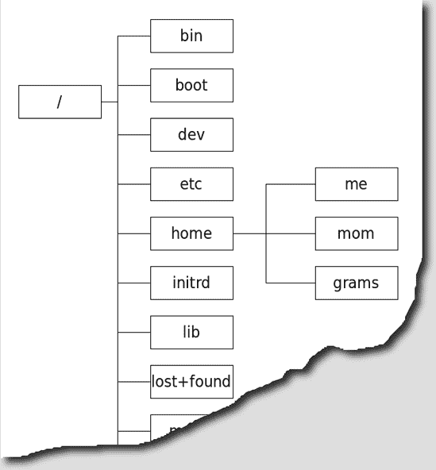
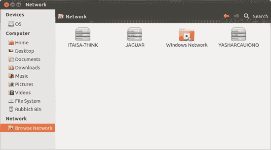
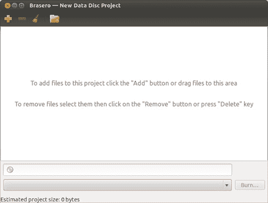
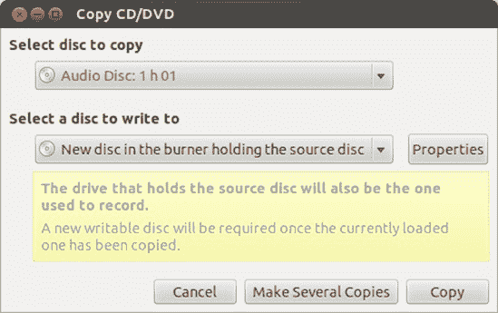
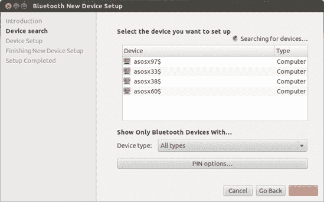
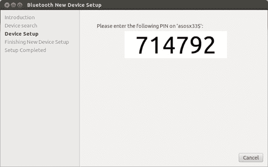
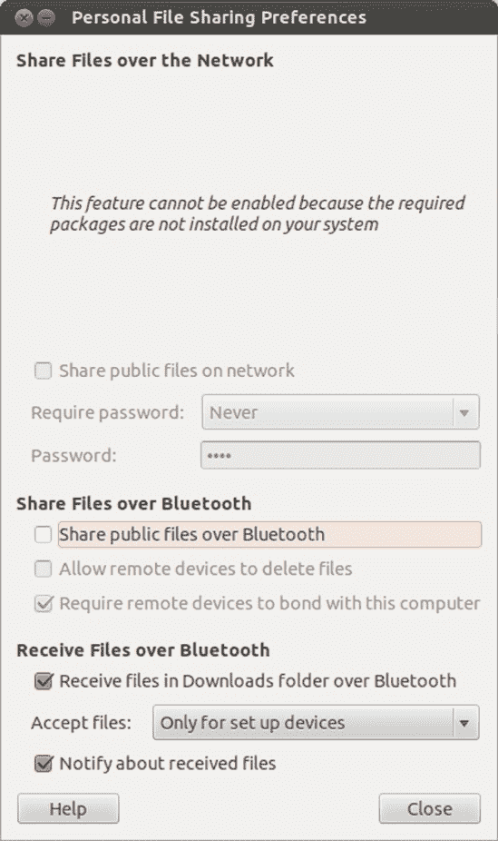
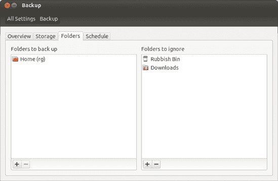
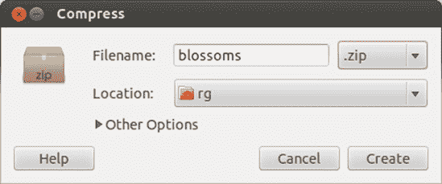
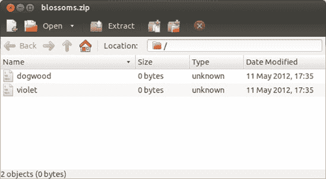

# 第七章. 整洁的巢穴

### Ubuntu 中的文件和磁盘处理

无论你使用的是哪个操作系统，你都必须处理文件。有些人非常有条理，一旦文件第一次保存，就会将其放入一个逻辑命名的文件夹中。然后有像我这样的人，将所有东西都保存在桌面上，直到它充满了垃圾，以至于无法辨认壁纸，只有到那时才开始认真整理（如果将所有这些文件放入一个名为*March17Cleanup*的文件夹中可以称为整理的话）。

当然，文件不仅存储在你的硬盘上，还被复制到 CD、DVD、外置硬盘、U 盘以及其他存储媒体和设备中。它们也常常被保存在存档中，然后被压缩以减小其大小，这使得它们更容易通过电子邮件发送或适应可移动存储媒体。

通过这个介绍，你可能已经猜到，在本章中，我将处理 Ubuntu 中的文件处理，特别是与 Dash 和 Nautilus 文件管理器的文件搜索相关，这是 Ubuntu 文件处理能力的心脏。

# 快速找到它——使用 Dash 搜索文件

如果你和我一样，你现在已经收集了相当多的计算机文件。我的笔记本电脑装满了文件，从度假照片、信件、财务文件和电子表格到我的音乐收藏、家庭录像、电子书和工作文件。它甚至托管了我 Windows 时代的许多文件——糟糕的计算机艺术作品、未完成的诗歌和旧的桌面背景图片。东西实在太多了——实际上太多东西了。有一个时刻，即使是最有能力的组织者也会举手投降：在同时保持对这么多文件的整理和方便访问时，几乎是不可能的。这就是 Dash 的作用所在。

正如你在第三章中已经看到的，Dash 有一个相当强大的搜索功能。你只需要打开 Dash 并开始输入。然后，在一两秒钟内，来自你电脑四个角落的搜索结果将开始涌入。之后，你可以使用透镜和过滤器来缩小搜索结果，直到找到你想要的东西。就这么简单，对吧？

嗯……不是完全如此。除了我在第三章中提到的基本搜索和过滤功能外，Dash 还有一些巧妙的额外功能来帮助你找到你的文件。在本节中，我将带你去看看有哪些选择，并伴随着一些可能帮助你更快找到东西的小技巧（无论“它”是什么）。继续阅读！

## 最近文件和下载

你可能已经发现了，搜索是找到文件最快的方式。但是当你第一次打开 Dash 时，你会发现在你还没有输入任何内容之前，就已经显示了三组结果。在最上面是最近使用的应用程序列表；现在先忽略它。在中间，你会看到一个名为*最近文件*的带状区域，下面是*下载*。不出所料，最近文件带状区域是一个简短的列表，列出了你最近正在处理的文件。如果你在找昨天写的信，没有必要搜索——它可能就在这个列表中。

如果你像我一样，在网络上花费相当多的时间，下载带状区域也非常方便。它是一个列表，列出了你最近使用网络浏览器下载的所有文件，如第五章中所述。你在网上保存的所有内容都会存储在一个特殊的*下载*文件夹中，以便将来参考，所以没有必要坐在那里挠头，想知道上周你在哪个网站上找到了那份税表——它可能就在*下载*文件夹的某个地方。

## 寻找更难以捉摸的文件

如果你找不到你正在寻找的文件，可以尝试一些方法。首先，再次检查你正在搜索的内容。Dash 中的搜索不区分大小写（你可以使用大写和小写字母，它并不关心），但它确实关心拼写。如果你使用的搜索词没有在文件名中精确出现，那么它就不会出现在搜索结果中。此外，请注意，搜索不会查看文件内部——只查看文件名。例如，如果你用标题“Clouds Are Fluffy”编写的文档，并以*clouds.doc*为文件名保存，搜索*clouds*会找到文件，但搜索*fluffy*则不会。你保存文件的位置也很重要：一般来说，你可能保存文件的地方都是可以的（它们应该在你的*家文件夹*中，你很快就会了解更多关于它的信息），但如果你在可移动的 USB 闪存驱动器上保存它，它就不会出现在结果中。

## 仔细观察镜头和过滤器

有时候，文件实在太多了。无论你输入搜索框中的内容有多具体，你仍然会得到数十个，甚至数百个搜索结果。正如你所看到的，Dash 配备了几个实用的工具来帮助你通过镜头和过滤器来处理这些洪水般的搜索结果。在本节中，我将向你展示如何充分利用三个基于文件的镜头——*文件与文件夹*、*音乐*和*视频*。

### 文件与文件夹

要打开文件与文件夹视图，点击 Dash 底部看起来像折叠纸张的图标。点击**过滤结果**，屏幕右侧将出现一系列新选项（图 7-1

图 7-1. 在文件与文件夹视图中过滤搜索结果

为了具体说明，让我们考虑一个例子，看看你如何使用过滤器来查找文件。你的叔叔加菲尔德将在几个小时后过来，他绝对喜欢千层面。幸运的是，你记得几个月前写过一个美味的千层面食谱，这个食谱是在你成功尝试了你的香草收藏之后调味得恰到好处的。但那个讨厌的食谱去哪里了？你打开 Dash，输入**`recipe`**，对于一个像你这样的烹饪高手来说，不出所料，出现了 112 个结果。快速浏览前几个文件，你会发现你那些奇妙作品的图片，一些包含食谱的文档，以及雷·查尔斯专辑《灵魂食谱》中的一两首歌曲。嗯，不太有帮助。那么你该怎么办呢？

逐个浏览结果似乎是一项繁琐的工作，所以点击进入文件与文件夹视图，然后点击**过滤结果**。你通常使用文字处理程序编写食谱（关于这一点，请参阅第十二章)，所以你知道食谱必须在一个常规文档中——它不是音频或视频文件，至少不是。这里要做的就是从类型过滤器下选择文档。搜索范围缩小了，照片和歌曲从结果中消失了。尽管如此，仍然有 40 个结果。由于你只在大约两个月前找到了这个食谱，你点击最后修改过滤器下的**去年**（这意味着将显示过去一年内修改的文件）。*瞧，千层面食谱就在那里，从只有 12 个搜索结果的可管理列表中露了出来*。*祝您用餐愉快!*

### 音乐

随着 iPod 和其他音频设备容量不断提高以及在线音乐商店越来越受欢迎，大型数字音乐收藏已成为常态。快速浏览我的收藏发现，有 202 位艺术家共 3,206 首歌曲。这相当于大约九天的不间断音乐！无论您的音乐爱好与我的相比如何，您必须承认，在没有一些可靠的计算机辅助的情况下，在众多歌曲中找到那首喜欢的圣诞歌曲将是一项艰巨的任务。您将在第十四章中了解更多关于使用名为 Rhythmbox 的便捷应用程序来管理您的音乐收藏的信息，但在此期间，Dash 为您提供了许多音乐大师级的功能。

点击 Dash 底部的音乐符号，如果您已经将音乐传输到计算机上（如果没有，请参阅第十四章了解如何操作），您的音乐收藏将展现在您面前。与处理 Dash 的其他部分完全一样，您可以开始键入以进行搜索。然而，与搜索其他类型的文件不同，音乐搜索不仅可以匹配歌曲的文件名，还可以匹配歌曲标题、艺术家姓名和专辑标题。更重要的是，搜索结果将显示每首歌曲的专辑封面——这是一个很好的细节，使得体验更加接近翻阅实体唱片堆栈。

当你搜索某物时，这次的结果将显示在三个区域——歌曲、专辑和可供购买。最后一个与内置在 Ubuntu 中的音乐商店有关——关于这一点，请参阅第十四章。前两个区域只显示当前存储在您计算机上的歌曲和专辑。从现在开始，这与您在文件和文件夹透镜中看到的情况非常相似——您可以点击**显示更多结果**来查看与您的搜索词匹配的所有内容的完整列表，您也可以点击**过滤结果**来缩小搜索范围。唯一的区别是，这次您可以按**年代**和**流派**进行过滤，而不是按**大小**和**文件类型**。不错吧？

### 视频

Dash 不仅仅为音乐提供了一个专用的镜头。还有一个视频镜头，图标看起来像一条带有箭头的电影胶片。我不再详细说明——它的工作方式与其他镜头非常相似——除了要指出一个相当有趣的功能。打开 Dash，通过点击其图标来调用视频镜头，然后搜索*猫*。如果你连接到互联网，你将看到一系列名为“在线”的结果，其中包含一些猫或其他动物的图片。这里发生的事情是，Dash 正在搜索 YouTube 和 Vimeo 等众多流行视频网站，并将结果直接带到你的屏幕上。如果你点击**过滤结果**并展开名为*来源*的部分，你可以看到正在搜索的网站的全列表。点击其中一个视频，它将在你的网络浏览器中弹出，准备观看。Ubuntu Dash：完美的拖延工具。谁能想到呢？

# Nautilus：功能齐全的文件管理器

Dash 是一个方便的工具，可以让你在紧急情况下快速找到你的文件，正如你刚才看到的。但是，如果你需要移动、收集或以其他方式组织你的文件，它就不那么有用。它对更高级的功能也很少，比如通过网络访问文件和将文档传输到 USB 闪存盘和其他设备。幸运的是，Ubuntu 有一个更实质性的工具来处理这类事情，那就是 Nautilus。Nautilus 是创建你系统上文件查看和组织界面的程序。你可能以前没有把操作系统的文件管理器当作一个程序来考虑，但实际上，它就是这样。（Windows 文件管理器被称为 Windows 资源管理器。）要查看 Nautilus，请点击启动器中的**主文件夹**图标，如图 7-2 所示。

图 7-2. 在启动器中的主文件夹图标

当 Nautilus 打开到你的主文件夹（如图 7-3 所示），你会发现你可以按主题存储你的文件：文档、下载、*音乐*、*图片*、*公共*、*模板*和*视频*。另一个名为*桌面*的文件夹，如果双击，将显示你存储在桌面上的所有内容（在我的情况下有很多；在你那里可能没有多少），。还有一个名为*示例*的文件夹，其中包含一些示例文件，让你了解 Ubuntu 为你准备了什么。

图 7-3. 在 Nautilus 窗口中查看的主文件夹内容

你可以随心所欲地创建额外的文件夹和文件，因此一旦你真正开始使用系统，这种预配置的状态肯定会发生变化。实际上，你将在第九章中进行一些更改，这将使一切看起来更加生动。

## 侧边栏

Nautilus 有很多有趣的功能值得提及，其中最明显的是侧边栏，它出现在窗口的左侧。侧边栏允许你通过几个可选视图查看各种信息。你可以通过在菜单中转到**查看** ▸ **侧边栏**来做出选择，并选择“位置”或“树”。

Ubuntu 的默认视图是“位置”，这是一种快速导航工具。在“位置”中，你会找到代表系统可用的各种数据存储位置的图标，例如你的家文件夹、桌面、完整的文件系统、你连接到的任何网络共享（稍后将有更多介绍），以及你系统内或连接到系统中的任何可移动存储介质或设备。点击这些图标中的任何一个，将在 Nautilus 窗口的右侧面板中显示该位置的内容。另一种视图是“树”，它为你提供了一个可展开的层次视图，用于查看文件系统。

## 现在看到，现在看不到

侧边栏是一个方便的功能，但有时你可能更喜欢有更多的空间来查看窗口的内容，因此想要暂时移除该栏。你可以通过在 Nautilus 菜单中转到**查看** ▸ **侧边栏**并取消选择**侧边栏**来轻松完成此操作。该条目旁边的勾选标记将消失，侧边栏也将随之消失。（或者，按键盘上的 F9 键也可以完成同样的操作。）要恢复侧边栏，只需返回到**查看** ▸ **侧边栏**菜单并再次选择**侧边栏**。勾选标记将重新出现，侧边栏本身也会恢复。

如果你不想隐藏侧边栏但仍然希望有更多空间，你可以改变其宽度。将鼠标移至标记侧边栏与窗口其余部分边界的狭窄灰色线上（注意，线条两侧的背景颜色也有细微的变化）。当鼠标指针正好位于线上时，鼠标指针将从其通常的外观，一个单箭头，变为一对指向相反方向的横向箭头。这表明侧边栏的边界，细灰线，可以被拖动以调整侧边栏的大小。将指针直接移至线上可能会有些令人沮丧，因为它可能需要几次尝试才能出现双箭头，但一旦出现，点击并拖动即可调整侧边栏的大小。

# Nautilus 中的文件处理

由于 Nautilus 主要是一个文件管理器，所以在那个层面上使用它是有意义的。当然，今天使用计算机的大多数人已经熟悉拖放和创建文件夹以及复制、剪切和移动文件的其他一些方法。但如果你对这些基本程序不熟悉，不用担心——我会一一解释。

## 创建、命名和重命名文件夹

创建文件夹是一个足够简单的任务，有两种方法可以完成。在我看来，最简单的方法是在 Nautilus 窗口中的任何空白区域上右键单击，然后在出现的弹出菜单中选择**创建文件夹**。如果你更喜欢使用菜单而不是右键单击空白区域，你可以通过选择**文件** ▸ **创建新文件夹**来开始操作。

无论你在哪里选择了创建文件夹，一个名为*未命名文件夹*的新文件夹都会出现在 Nautilus 窗口中。文件夹的名字框会被突出显示并围绕一个黑色框，这意味着你可以立即通过简单地输入一个名字来给这个文件夹命名——除了输入之外，不需要点击或做其他任何事情。按回车键或点击 Nautilus 窗口中的任何空白区域来完成工作。

如果你后来决定你给文件夹取的名字需要一些调整，甚至需要完全修改，你可以通过右键单击它并在弹出的菜单中选择**重命名**来重命名它。或者，你可以单击文件夹一次以突出显示它，然后选择**编辑** ▸ **重命名**。之后，你可以输入文件夹的新名字，然后按回车键，或者你可以点击 Nautilus 窗口中的任何空白区域来完成操作。

## 移动文件和文件夹

在 Nautilus 中你可以执行的所有文件操作中，最简单的大概就是通过拖放移动文件。然而，移动文件和文件夹还有另一种方法：剪切粘贴。

剪切粘贴的最简单方法是右键单击你想要移动的文件（或文件夹），然后从弹出菜单中选择**剪切**（**编辑** ▸ **剪切**也可以达到同样的效果）。此时，看起来好像什么都没发生，因为文件仍然在那里，但不要担心。

之后，在您想要移动文件的文件夹中的任何空白区域上右键单击，然后在弹出的菜单中选择**粘贴**。文件将从其原始位置消失，并出现在新的位置。

你可以使用快捷键来完成这个操作吗？当然可以。按照我刚才给出的指示，但按 ctrl-X 剪切，按 ctrl-V 粘贴。

## 复制文件和文件夹

根据你刚才读到的说明，你可以很好地想象如何复制文件和文件夹，因为复制本质上是对同一主题的变体。只需右键单击你想要复制的文件，从弹出的菜单中选择**复制**，然后在目标位置内的任何空白区域上右键单击，然后选择**粘贴**。按键方面，那就是按 ctrl-C 复制，和之前一样，按 ctrl-V 粘贴。

你也可以通过拖放的方式复制文件夹和文件，尽管这比简单的拖放操作需要更多的手部动作；幸运的是，你手头上的两只手就足够了。当你拖动想要复制的文件或文件夹到目标位置时，请按住 ctrl 键。确保首先释放鼠标按钮，然后释放 ctrl 键（如果顺序相反则不会工作），你会在新位置找到文件的副本，而原始文件仍然安全地留在原地。

# Nautilus 中的导航

在 Nautilus 中浏览你的各种文件夹和子文件夹非常直接。实际上，所有这些概念上都与你在 Windows 和 Mac OS 中习惯的差不多。你可以通过双击文件夹和点击后退和前进按钮的组合来进入和退出文件夹。

## 在 Nautilus 中使用面包屑浏览

除了侧边栏中提供的分层视图选项外，另一个方便的功能可以使你的导航任务更加容易：Nautilus 的面包屑栏功能。当你深入到文件夹森林中时，Nautilus 会在导航栏中留下面包屑的痕迹（实际上它们看起来像按钮）来记录你打开的每个文件夹，直到你当前查看的文件夹。

例如，假设你有一个名为 *gooseberries* 的文件夹，它位于名为 *Dalarna* 的文件夹内，而这个文件夹又位于名为 *SwedeStuff* 的文件夹内，而 *SwedeStuff* 文件夹本身又位于你的 Home 文件夹中。当你点击路径到达那个 *gooseberries* 文件夹时，从双击 *NordicStuff* 文件夹开始，Nautilus 将会显示一个按钮来代表那个文件夹 . . . 以及之前打开的任何文件夹。看看 图 7-4 来理解我的意思。

图 7-4. Nautilus 中的面包屑导航

如你所见，从你的 Home 文件夹到目标文件夹路径中的每个文件夹都有一个按钮：*gooseberries*。那么，这有什么问题吗？好吧，假设你想要回到 *NordicStuff* 文件夹去打开一个文件，从中提取一些文本并将其复制到 *gooseberries* 文件夹中的文档里。这听起来像是一个小麻烦，对吧？

好吧，与其在“后退”按钮上浪费时间，不如直接跟随面包屑！只需点击 **NordicStuff** 面包屑按钮，那个文件夹的内容就会出现在你面前。需要回到 *gooseberries* 吗？只需点击 **gooseberries** 按钮。回到 *SwedeStuff*，你说？只需点击 **SwedeStuff** 按钮。这一切都相当 *fantastisk*！

## 明确指出——在 Nautilus 中输入文件路径

如果你更喜欢输入而不是点击，你将很高兴地知道你可以通过输入路径来导航到文件夹。只需点击**前往**菜单并选择**位置**（喜欢使用键盘快捷键的人可以按 ctrl-L）。在位置栏中会出现一个框（图 7-5

图 7-5. 输入目标文件夹的路径

## Nautilus 中的书签

在你点击进入深层子文件夹的过程中，值得提一下 Nautilus 的另一个非常实用的功能：书签。是的，Nautilus 允许你为已经导航到的文件夹创建书签。尽管你可能熟悉为常访问的网页创建书签，但你可能会想知道为什么要在文件系统中创建书签。

好吧，想象一下，你有一个经常需要使用的文件夹，但它甚至比上一节中我的*覆盆子*文件夹还要深藏不露。到达那里需要过多的鼠标点击，而且所有这些点击最终很可能会让你患上腕管综合征。虽然这对你的医生来说是个好消息，但对你来说绝对不是什么好事。与其自残，你可以在 Nautilus 窗口中点击一次到达那个文件夹，然后选择**书签** ▸ **添加书签**。之后，无论何时你想回到那个隐藏的文件夹，你只需点击书签菜单，文件夹就会在那里等待你，出现在下拉列表中。

Nautilus 书签的另一个方便之处在于，它们也会出现在“另存为”对话框中，例如当你保存 LibreOffice 文档或通过 Firefox 下载文件时。要在任何此类“另存为”对话框中使用它们，只需在左侧的列表中找到你的书签。

## 理解 Linux 文件系统

通过你刚刚学到的所有路径输入、导航和书签操作，你应该基本上能够弄清楚如何在你的主文件夹中从这里到那里。尽管如此，了解你的主文件夹在整体结构中的确切位置可能是个好主意，以防万一你有一天真的迷路了。为了理解这一点，你应该对 Linux 文件系统有一个基本的了解，正如你将发现的，它与你在之前的操作系统中习惯的文件系统略有不同。

与 Windows 不同，Linux 文件系统所有内容都源自一个称为*root*的单一点，并且用一个单独的斜杠(/)表示。您的用户账户文件夹位于名为*home*的 root 子文件夹中。这表示为*/home*，或者说，root 中的 Home 文件夹。如果您的用户账户与我的名字相同，*rg*，那么该文件夹的路径将是*/home/rg*，或者 root 中的*home*下的*rg*文件夹。无论您的用户账户或您机器上的其他账户的名称是什么，只要记住，当您迷路时，您的文件夹以及所有其他用户账户的文件夹都位于 Home 文件夹内。如果您是一个更倾向于图形化的人，图 7-6 中的地图应该能帮到您。

图 7-6. Linux 文件系统中用户文件夹的位置

## 所有那些其他文件夹里有什么？

不言而喻，Linux 文件系统除了根、Home 和用户账户文件夹之外还有更多内容。几个其他目录与 Home 处于同一级别，尽管在大多数情况下，除非您知道自己在做什么，否则您不应该随意操作它们。幸运的是，大多数这些文件夹都是写保护的，所以您应该相当安全。尽管如此，由于它们确实存在，对那些其他文件夹的用途自然会感到好奇。所以，为了满足您的求知欲，我将稍作解释。

在 Ubuntu 中，有四个文件夹包含了您系统上的大多数应用程序。您系统的基本元素位于*/sbin*。其他需要放置在那里如命令等元素，尽管可能没有被使用，但它们位于*/bin*。您实际认为的应用程序，并且实际使用的大多数应用程序都位于*/usr*。最后，一些附加应用程序，如 RealPlayer，会自动安装到*/opt*。

有三个其他可能对您感兴趣的顶级文件夹是*/etc*、*/lib*和*/media*。第一个，*/etc*，是系统中所有配置文件的位置。第二个，*/lib*，是系统中或安装在其上的应用程序所需的所有库的所在地。这些库是 Linux 中 Windows *.dll* 文件的等价物。最后，*/media*是各种附加外部媒体（如 USB 驱动器和 CD）内容出现的地方，当它们存在时。

还有其他顶级文件夹，但它们的目的对于普通的 Linux 新手来说可能不太直接，坦白说，在这个阶段可能对您来说也不那么有趣。无论如何，正如我提到的，您现在没有必要在这些文件夹中捣鼓，因为您可以通过不同的、更安全的方式访问它们内部的项目。

## 使用 Nautilus 作为网络浏览器

Nautilus 的另一个实用功能是它能够作为一个网络浏览器运行。例如，您可以通过点击 Nautilus 窗口侧边栏中的网络部分中的 **浏览网络**，或者在前往菜单中选择 **网络** 来查看您在家庭或办公网络上的可用网络和共享。该网络或该网络上的任何计算机的图标将随后出现在 Nautilus 窗口中，就像在 图 7-7 中所示。从该窗口，您可以双击访问您有权限访问的共享，例如 Windows 机器上的 *共享文档* 文件夹或 Mac 的公共文件夹。如果您想知道什么是共享，我会为您澄清：*网络共享* 是计算机上的一个位置，例如一个文件夹，网络上的其他用户可以访问和保存文件。Windows 系统上的 *共享文档* 文件夹是一个很好的例子。网络上的其他用户可以从和（通常）向 *共享文档* 文件夹复制文件，而他们无法访问该主机计算机上的文件系统的任何其他部分。

图 7-7. 查看您的网络上的计算机

如果您要尝试打开的共享需要用户名和密码，您将在新窗口中要求输入这些信息。请注意，在这种情况下，您需要输入的用户名和密码是您要连接的计算机的用户名和密码——而不是您在 Ubuntu 上使用的那些（除非用户名和/或密码碰巧相同，当然）。然后，您可以像复制到和从您自己的硬盘上的文件夹一样复制到和从这个共享中。

在某些情况下，尤其是在尝试访问运行 OS X 的 Mac 上的共享时，双击方法可能不起作用。即使该机器的图标出现在 Nautilus 窗口中，您也无法访问该机器上的任何共享。在这种情况下，双击您要访问的机器的图标，然后，一旦它打开（到一个空窗口），选择 **前往** ▸ **位置**。在位置栏中会出现一个文本框，其中已经列出了您要访问的机器的位置（就像在 图 7-5)。

在那个位置，添加一个正斜杠（/）后跟目标机器上使用的用户名。例如，如果目标机器名为 *cowboycats*，用户名为 *mewtoyou*，则位置为 `smb://cowboycats/mewtoyou`。你也可以通过在已输入的路径中添加来缩小到机器上的特定文件夹，只要你知道那个文件夹的路径，例如 `smb://cowboycats/mewtoyou/Documents`。如果你愿意，你可以输入 **`smb://`** 和你的 Mac 的 IP 地址，该地址由四个由点分隔的数字组成。以我的某台机器为例，我会输入 **`smb://192.168.0.100`**。（你可以通过转到 Mac 的系统偏好设置，点击 **共享**，然后点击 **Windows 共享** 来找到 Mac 的 IP 地址。地址应立即出现在服务选择面板下方。）

### 注意

如果你在想，那个路径开头的 `smb` 代表的是 *服务器消息块*，但为了使事情更简单（也许在记忆方面更有用），你可以将其简称为 *Samba*，这是 Unix 系统（如 Linux 和 Mac OS X）用来与 Windows 网络交互的软件。

一旦你到达你想要在连接的网络机器上浏览的文件夹，使用 Nautilus 中的书签功能来书签那个打开的共享窗口可能是个好主意。然后你可以通过在 Nautilus 书签菜单中选择共享的名称来轻松访问该共享。很酷，不是吗？

## 使用 Nautilus 作为 FTP 客户端

Nautilus 不仅允许你在本地网络中浏览和挂载共享，还可以作为文件传输协议（FTP）客户端。例如，当你想要在远程服务器上更改你的网站文件时，会使用 FTP。要这样做，请转到连接到服务器窗口（**文件** ▸ **连接到服务器**），然后选择服务类型为 **FTP（带登录**）。输入你的网站主机提供的信息，然后点击 **连接** 按钮。一个 FTP 网络共享图标将出现在侧边栏中。点击该图标，当提示时输入你的密码（针对该账户——不是你的 Ubuntu 系统的密码，除非它们恰好相同），你将能够查看和添加那里的文件。

## Nautilus 中的文件和文件夹权限

在你探索 Ubuntu 世界的过程中，你会发现偶尔你会遇到一些文件或文件夹，在你能读取、修改或两者兼而有之方面有所锁定。这些可读性和可修改状态被称为 *权限*。

现在，你可能想知道这个权限问题的意义何在，所以我会给你一些例子来说明它如何有用。假设你有一些你不希望配偶或孩子看到的文件——比如一些糟糕的诗歌或圣诞购物清单。通过拒绝这些文件或包含这些文件的文件夹的读取权限，你可以防止其他人偷看，除非那个人擅长更改权限并且有更改这些文件或文件夹权限的必要权限。

作为另一个例子，想象一下你花了很多小时工作在一个文件上，并最终完成了它。为了减轻你可能会意外损坏该文件的担忧，你可以拒绝自己对该文件的写入权限。通过这样做，你将无法保存对该文件所做的任何更改。你会得到“另存为”选项，这样你就可以保存文件的新副本，但如果你想要更改原始文件，你必须更改权限。当你对文件或文件夹施加此类限制时，其图标上会出现一个锁形标志，如图图 7-8 所示。

图 7-8. Nautilus 会告诉你当权限限制你的行动自由时。

## 在 Nautilus 中更改文件和文件夹权限

在 Nautilus 中更改文件或文件夹权限，请右键单击要更改的文件或文件夹，然后在弹出菜单中选择**属性**。一旦属性窗口打开，点击**权限**选项卡，您将看到文件或文件夹的所有者是谁以及您和其他人可以或不可以对其做什么。如图 7-9 所示，文件夹和文件的选项略有不同。

你可能会觉得这个权限问题有点复杂，但实际上它非常简单。权限可以授予或拒绝给文件或文件夹的**所有者**（你），指定的**组**，或**其他人**（所有人）。传统上，这些权限被称为以下内容：

**读取**

查看文件或文件夹内容的权限

**写入**

修改文件或文件夹内容的权限

**执行**

运行程序或脚本（或，对于文件夹，浏览文件夹内文件）的权限

Nautilus 试图更详细地说明事情，正如您在图 7-9 中看到的。然而，总的来说，您不必过于担心设置您自己文件的权限，因为您确实是唯一可以访问您的用户账户的人。您可能会遇到的一个可能的例外是，当您从光盘将文件传输到硬盘时。在这种情况下，文件可能被设置为写保护，这意味着您必须更改这些文件的权限才能修改它们。您可以通过转到属性窗口的**所有者**部分，并在“访问”旁边的菜单中选择**读取和写入**（对于文件）或**创建和删除文件**（对于文件夹）来更改此类文件的权限。完成之后，点击**关闭**按钮，您就可以继续了。

图 7-9. 在 Nautilus 属性窗口中更改文件（左）和文件夹（右）的权限

## 保护您的 Home 文件夹隐私

我关于您不需要担心权限的说法的一个例外，而且可能是一个重要的例外，就是您的 Home 文件夹的权限状态，尤其是在其他人在您的机器上有用户账户的情况下。在 Ubuntu 中，当某人登录到您的计算机上的自己的账户时，他可以点击自己的用户文件夹并查看其内容。

为了解决这个问题——并因此保护您的 Home 文件夹的完整性、其内容的隐私以及所有者的安宁（即您自己）——您可以更改您的 Home 文件夹的权限。以下是您需要做的：

1.  打开 Nautilus 窗口，然后在侧边栏中点击**文件系统**。您的整个硬盘内容将出现在 Nautilus 窗口的右侧面板中。

1.  查找并双击名为**home**的文件夹。当您刚才点击的 Home 文件夹的内容出现在右侧面板中时，那里应该只有一个文件夹——您的个人文件夹，其名称将与您的用户名相同。例如，我之前提到的，我的名字叫*rg*。

1.  右键单击您的文件夹，然后在弹出菜单中选择**属性**。

1.  在**用户名**属性窗口中（我的窗口称为**rg 属性**），点击**权限**选项卡。

1.  在权限选项卡中，向下滚动到组和其他人部分，并在“文件夹访问”旁边的下拉菜单中选择**None**。务必在组和其他人部分都这样做。完成之后，您的窗口应该看起来像我的图 7-10 中的那样。如果是这样，请点击**关闭**。

    

    图 7-10. 更改主文件夹权限以保护隐私

# 读取数据 CD 和 DVD

在 Ubuntu 中处理数据 CD 和 DVD 相当简单，因为一切都是自动的。要读取带有数据的 CD 或 DVD（而不是音乐或视频），只需将光盘放入驱动器中，CD 或 DVD 图标（它们看起来一样）将自动出现在启动器底部和 Nautilus 侧边栏中。你可以点击一次图标，之后光盘的内容将出现在 Nautilus 中。然后你可以使用标准的拖放或复制粘贴程序将文件从 CD 或 DVD 复制到你的硬盘上。

当你想取出 CD 或 DVD 时，只需在侧边栏中右键单击该光盘的图标，然后在弹出菜单中选择**弹出**。光盘将自动弹出。

## 烧录数据 CD 和 DVD

在 Ubuntu 中烧录数据 CD 和 DVD 非常简单，只要你将 CD 或 DVD 刻录机连接到你的电脑上！你只需将一张空白 CD-Recordable（CD-R）或 DVD（DVD-RW、DVD-R 和 DVD+RW 都受支持）放入驱动器中，确保选择你的驱动器支持的媒体格式，然后会出现一个空白光盘窗口询问你想做什么。点击**确定**以打开 Nautilus 的 CD/DVD 创建器窗口，正如你无疑注意到的，它看起来与其他 Nautilus 窗口非常相似，只是窗口顶部的选项和按钮不同（图 7-11）。

一旦 CD/DVD 创建器窗口打开，将你想要烧录到光盘上的文件复制过去基本上就是一个简单的拖放操作。只需打开一个新的 Nautilus 窗口，然后将你想要烧录到光盘上的文件从该窗口拖放到 CD/DVD 创建器窗口。

图 7-11. 一个准备烧录到光盘的 Nautilus CD/DVD 创建器窗口

如果你更喜欢以 Windows 式的风格做事，你可以通过按住 ctrl 键并单击每个文件一次来选择你想要传输到光盘上的文件进行多选。如果你想选择多个连续的文件，你可以点击组中的第一个文件，按住 shift 并单击组中的最后一个文件，自动选择所有介于两者之间的文件。一旦你做出了选择，释放 ctrl 或 shift 键，右键单击任何高亮显示的文件，并在弹出菜单中选择**复制**。之后，回到 CD/DVD 创建器窗口，右键单击任何空白区域，然后在弹出菜单中选择**粘贴**。

值得注意的是，你复制到 CD/DVD 创建窗口中的文件实际上并没有被复制。相反，你在 CD/DVD 创建窗口中看到的是指向原始位置原始文件的链接。因此，如果你在将 CD/DVD 创建窗口的内容刻录到光盘之前移动了其中一个文件，链接将不再工作，文件也不会被复制到光盘上。这并不是太大的问题，因为所有其他文件都将正确地复制到光盘上，但这是需要注意的事情。

一旦你复制了你想要刻录到光盘上的所有文件，点击**写入光盘**按钮，之后会出现一个窗口（如图图 7-12）。它告诉你许多事情，包括你还可以添加到光盘上的文件兆字节数（如果你想添加更多文件，点击**取消**返回并添加）。大多数人都会乐意接受默认选项（这些选项相当合理），所以剩下的只是为光盘选择一个更有趣的名字。然而，如果你不想冒险，你可以通过点击**属性**并选择一个更慢的速度来调整光盘刻录的速度（较慢的速度意味着错误的机会更少）。

图 7-12. 在刻录 CD 或 DVD 之前设置选项

一旦你准备好刻录光盘，只需点击**刻录**按钮，CD/DVD 创建器就会完成其工作。

### 注意

如果你打算将文件传输到 Windows 系统，在开始实际刻录之前，确保根据 Windows 命名约定重命名你的文件。特别是，避免使用特殊字符和重音符号（如元音符号和重音符号），并且不要使用以下字符，这些字符是为 Windows 系统功能保留的：`/ : ? * ' < > | .`

一旦刻录开始，其进度将在新窗口中显示，当工作完成时，你会被问及你接下来想做什么。假设你当天已经完成了光盘刻录，点击**弹出**然后**关闭**。

如果你有所疑问，你用 Linux 刻录的光盘在其他操作系统*将是*可读的。

## 处理 CD-RWs

CD-RWs 基本上与 CD-Rs 相似，只是它们可以被擦除并再次写入。它们也比 CD-Rs 贵得多，并且通常无法处理更快的刻录速度。

使用 CD-RWs 与使用 CD-Rs 非常相似。如果光盘是空的，整个过程没有任何区别。即使 CD-RW 上已经有一些你想要替换的数据，过程也仅仅略有不同。

其中一个区别是，Nautilus 会将你的 CD-RW 视为普通数据光盘，而不是空白光盘。这意味着当你将光盘放入驱动器时，将自动打开一个常规的 Nautilus 窗口，而不是 CD/DVD 创建者窗口。

要将内容写入光盘，你需要手动从 Nautilus 窗口切换到 CD/DVD 创建者窗口，这可以通过点击 **转到** ▸ **位置** 并在位置栏中输入 **`burn:///`**（然后按回车键）轻松完成。完成此操作后，窗口将变为 CD/DVD 创建者窗口。现在将你想要烧录到光盘上的文件拖到该窗口中；准备好烧录后，点击 **写入光盘** 按钮。

正如常规的 CD-R 或 DVD 一样，会弹出 CD/DVD 创建者窗口。然而，当你点击该窗口中的 **烧录** 按钮并将已使用的 CD-RW 放入驱动器时，会发生一些不同的事情。此时，将出现一个新窗口，告诉你光盘似乎已经写入了文件。点击该窗口中的 **空白光盘** 按钮，CD/DVD 创建者将擦除 CD-RW 上的现有文件，并用你拖到 CD/DVD 创建者窗口中的新文件替换它们。这并不坏，对吧？

## 将 ISO 镜像烧录到光盘

当你从互联网下载 Ubuntu 或其他 Linux 发行版时，通常以一个或多个光盘镜像的形式下载，这些通常被称为 *ISOs*，因为这样的文件以 *.iso* 扩展名结尾。ISO 是光盘文件内容的镜像，这意味着它是光盘本身减去媒体。换句话说，如果光盘有灵魂，ISO 就是光盘的灵魂；移除光盘的金属和塑料，剩下的数据就是 ISO。

当然，在互联网上下载实体光盘是不可能的，但无形的 ISO 镜像是次优选择。例如，要从网络获取 Ubuntu 的有效副本，通常需要下载一个 ISO 文件，然后将它烧录到空白光盘上，以便恢复其“实体”，换句话说。在这个过程中，你创建了安装 Ubuntu 所需的工作安装光盘。

幸运的是，将 ISO 镜像烧录到光盘上是一项相当简单的任务。只需打开 Nautilus 窗口，找到你想要烧录到光盘上的 ISO 文件图标。右键单击该图标，在出现的弹出菜单中选择 **写入光盘**。完成此操作后，CD/DVD 创建者窗口将出现；只需点击 **烧录** 按钮，你就可以开始了。

## 创建你自己的 ISO 镜像

当谈到 ISO 文件时，了解您可以创建自己的 ISO 文件是很有帮助的。虽然您可能不会四处创建自己的 Linux 发行版，但您可能会找到一组需要反复烧录到光盘的文件，例如。要创建自己的 ISO 文件，请遵循创建数据 CD 的正常流程，但当 CD/DVD 创建窗口（图 7-12)出现时，从下拉菜单中选择**镜像文件**，然后点击**属性**。这将打开一个新窗口，询问您为新光盘镜像输入的文件名。给它起个名字，点击**关闭**，然后点击**创建镜像**按钮。在很短的时间内，您将拥有自己创建的 ISO 文件。

## 烧录多会话 CD

如果您来自 Windows 环境，您可能熟悉多会话 CD。这些是在每次会话中添加数据的 CD。例如，您今天将一些文件烧录到光盘上，明天再添加一些，后天再添加一些文件。每次您将额外的文件烧录到同一张光盘上时，您都在添加一个会话，这也解释了为什么叫“多会话”。您基本上可以将这些 CD 视为像软盘一样工作（尽管存储容量大得多）。

Nautilus 对多会话光盘有基本支持，但让我们这次尝试一个更专业的工具：Brasero，这是一个功能更全面的程序，您可以使用它来完成所有光盘烧录任务。

您可以通过在 Dash 中搜索“Brasero 光盘刻录器”来运行 Brasero。在随后打开的 Brasero 主窗口中，点击**数据项目**按钮。

要将第一个会话烧录到 CD，将您想要烧录的文件从 Nautilus 拖到空的 Brasero 窗口中（图 7-13)或点击 Brasero 工具栏上的**添加**按钮（看起来像加号）手动浏览文件。

图 7-13. 使用 Brasero 创建多会话光盘

当您已经准备好所有要烧录的文件时，将空白光盘放入驱动器中，使用屏幕底部的框为光盘选择一个名称，然后点击**烧录**按钮。将出现一个属性窗口。在该窗口中，勾选**烧录完成后保持光盘打开以添加其他文件**复选框。（这是设置多会话光盘的步骤。）完成此操作后，点击**烧录**以开始烧录过程。Brasero 将在烧录完成后弹出光盘。

## 烧录后续会话

在 Brasero 中向多会话光盘添加新会话的过程与创建初始会话的过程类似。以下是您需要做的步骤：

1.  运行 Brasero 并点击**数据项目**按钮。

1.  将你的多会话光盘插入驱动器中，当驱动器停止旋转并且你已经将任何关于该光盘的 Nautilus 窗口移除后，点击**导入**按钮，之后你之前会话的内容将出现在 Brasero 窗口中。

1.  使用你在创建原始会话时使用的方法（通过拖放或选择并点击**添加**）将文件添加到之前的会话中。

1.  当你添加了你想要的文件后，点击**刻录**。从那时起的过程与第一个会话完全相同。要在后续会话中添加文件，只需再次遵循前面概述的过程即可。

## 复制 CD 和 DVD

现在你已经熟悉了 Brasero，我将介绍其另一个功能：CD/DVD 复制。要复制光盘，请将其放入驱动器中，启动 Brasero，然后点击**光盘复制**按钮。在出现的窗口中（图 7-14)，点击**复制**按钮。

Brasero 将开始复制你的光盘。完成后，它会弹出光盘并要求你插入一张空白光盘。插入空白光盘几秒钟后，Brasero 将自动开始写入。当过程完成后，光盘将被弹出。很简单。

图 7-14. 使用 Brasero 复制光盘

# USB 存储设备

你可能很熟悉 USB 设备。你的打印机很可能是一个 USB 设备，扫描仪也是如此。尽管你的数码相机在传统意义上不是一个 USB 设备，但每次你将其连接到电脑以传输照片时，你很可能都是通过 USB 连接器来做的。在所有流行的 USB 设备中，用于文件存储的设备最为常见。这些包括外置硬盘；闪存卡读卡器；以及被称为*闪存驱动器*（图 7-15

图 7-15. USB 存储设备

使用 USB 存储设备很简单。只需将设备插入电脑上的一个 USB 端口即可。设备上的 LED 在系统读取其内容时会闪烁一会儿，然后几秒钟后，Nautilus 窗口将打开，显示设备的内容。USB 设备的图标也将出现在 Nautilus 窗口的侧边栏和启动器的底部。然后你可以使用我在这章前面提到的拖放或复制粘贴程序将文件复制到设备上或从设备复制文件。

完成操作并想要移除设备时，在启动器或 Nautilus 侧边栏中右键点击其图标，然后在弹出菜单中选择**安全移除驱动器**。如果需要将数据写入设备，系统将开始写入。完成后，设备的图标将从 Nautilus 中消失。请确保您始终以这种方式安全地移除 USB 驱动器，而不是简单地断开它们——否则，您可能会丢失数据。

# 与蓝牙设备协同工作

当我们谈到文件处理时，现在是学习如何与蓝牙设备协同工作的好时机。正如我在第三章中提到的，如果您在机器中有一个蓝牙适配器，无论是内置的还是插入 USB 端口的，蓝牙图标将出现在顶部面板的右半部分。

## 配对设备

在您可以在蓝牙设备之间传输文件之前，您需要将它们配对。这是您需要这样做的方式：

1.  在开始之前，请确保您要配对的计算机和设备上的蓝牙都已开启。对于计算机来说，至少您可以通过点击顶部的蓝牙图标并检查弹出菜单顶部是否显示**蓝牙**：开启来完成此操作。

1.  您还应该确保您想要配对的设备设置为*可发现*或*可见*。这使得 Ubuntu 在扫描附近的蓝牙设备时能够找到它。

1.  再次点击顶部面板上的蓝牙图标，并选择设置新设备。

1.  在出现的蓝牙设置向导中，点击**继续**。

1.  Ubuntu 将随后在您的计算机附近搜索蓝牙设备。一旦发现设备，该设备将出现在窗口的中心面板中，如图 7-16 所示。当您想要配对的设备出现时，点击它，然后点击**继续**按钮。

    

    图 7-16. 在 Ubuntu 中搜索和选择附近的蓝牙设备

1.  在向导的下一页，将出现一个个人识别码（PIN）(图 7-17)。在您尝试连接的蓝牙设备中，也应出现一个输入窗口。将 PIN 输入到那个输入框中。

    

    图 7-17. 蓝牙向导为您提供用于配对设备的 PIN

1.  假设配对成功，向导的最后一页将随后出现。点击**关闭**以完成配对过程。

## 通过蓝牙发送文件

要通过蓝牙从你的电脑发送文件到另一个蓝牙设备，请点击蓝牙面板图标并选择**发送文件到设备**。将出现一个窗口，你可以导航到目标文件。一旦你做出了选择，请点击**选择**。然后会出现**选择设备**窗口（图 7-18

图 7-18. 选择要发送文件的蓝牙设备

## 通过蓝牙接收文件

要通过蓝牙从另一个蓝牙设备接收文件，你必须首先设置你的电脑以允许此类传输。为此，打开 Dash 并打开个人文件共享。在出现的个人文件共享首选项窗口中，勾选**通过蓝牙在下载文件夹中接收文件**复选框。为了你的安全（以确保没有人可以在未经你许可的情况下向你发送文件），在**接受**文件下拉菜单中选择**仅限已设置设备**。如果如此，请点击**关闭**。你的机器将自动接收通过蓝牙发送给它的文件并将它们保存到下载文件夹中。

图 7-19. 设置系统以接收从其他蓝牙设备发送的文件

只有你已经配对的设备才能成功发送文件。为了在你遇到新设备时使事情变得稍微容易一些，你可以允许另一台设备为你电脑完成配对的繁琐工作，而不是自己来做（如上所述）。启用此功能只需点击顶部的蓝牙图标，并确保在出现的菜单中勾选了可见选项。只要可见选项被勾选并且蓝牙处于开启状态，其他设备就可以与你的电脑配对，而无需你启动配对过程。当发生这种情况时，会弹出一个消息请求确认，一旦配对成功，另一台设备就能发送文件——就这么简单。

# 备份你的文件

你辛苦积累的所有文件。数小时的打字、数百张照片、一堆音乐 CD——它们都在硬盘上。那么，如果你的电脑出了问题，会发生什么呢？在许多情况下，不幸的是，所有数据都将永远丢失。为了避免这种痛苦的经历，你需要定期进行备份。

有许多备份工具可用，但 Ubuntu 默认安装了一个名为“备份”的工具。打开 Dash 并搜索备份来打开它。由于你还没有创建任何备份，你可以在出现的窗口中点击**仅显示我的备份设置**。

现在是决定你将使用什么来存储备份的好时机。我有一个外部 USB 硬盘，它完成了这项任务，但你也可以使用 USB 闪存驱动器、可刻录 CD 或 DVD，甚至是一个网络服务器。我不建议将备份放在同一台电脑上。最好的做法是将原始文件和备份之间保持一定的距离，这样如果发生火灾或其他灾难，你将有一个完整的副本。确保你也有足够的空间来存储备份；常规的可刻录 CD 只有 700MB，但我的*图片*文件夹就重达 5.8GB！

连接、插入或准备你选择的备份设备，然后在备份窗口中点击**存储**标签。你将看到一个类似于图 7-20 的窗口。从下拉菜单中选择你想要保存备份文件的位置。根据你选择的选项，你可能需要输入一些更多细节；例如，如果你选择本地文件夹，点击选择文件夹按钮来选择备份将确切存储的位置（这可以是一个 USB 闪存驱动器或类似的外部磁盘）。

如果你想要将备份文件放在 CD 或 DVD 上，你首先需要将它们保存到某个文件夹中，然后使用本章前面提到的刻录软件将那个文件夹复制到光盘上。

现在，选择“文件夹”标签，你将看到图 7-21 中的屏幕。你的第一个任务是决定你想要备份什么，所以查看标记为“要备份的文件夹”的列表，目前应该是空的。你可以根据需要使用列表底部的加号和减号添加和删除项目。

图 7-20. 在备份应用程序中选择保存备份文件的位置

图 7-21. 选择要备份的文件

在那个屏幕上还有一个列表，标记为“要忽略的文件夹”。你可以使用这个列表来定义任何你*不*想要备份的文件或文件夹。比如说，如果你想备份你的 Home 文件夹中的所有内容，除了你的图片——也许你的备份磁盘没有足够的空间来存储它们。你只需要确保你的 Home 文件夹在“要备份的文件夹”列表中，而你的“图片”文件夹在“要忽略的文件夹”列表中。

当你选择了要保留和要忽略的内容后，转到“概览”标签以查看摘要页面。确认一切看起来都很正常，然后点击**现在备份**以开始备份。一旦完成，关闭窗口并安全地移除你的备份磁盘（或你有的任何东西）。

至此……目前是这样。但请记住，如果你不定期备份，备份就没有什么意义，因为如果出现问题，你只能恢复较旧的文件（而不是最近的文件）。我大约每月备份一次，但我应该比这更频繁地备份。这并不是什么麻烦事；当你下次使用备份时，它将记住你上一次备份的所有设置。如果你想做些不同的事情，只需在点击**现在备份**之前在备份窗口中更改设置。你还可以找到自动备份的选项；在备份窗口中查看**计划**标签，然后选择你希望备份发生的频率。

### 注意

Ubuntu 背后的公司 Canonical 现在提供了一种名为 Ubuntu One 的在线备份服务，你可能已经在存储标签下的备份位置列表中看到了它。有关更多信息，请访问[`one.ubuntu.com/`](https://one.ubuntu.com/)。

## 从备份中恢复

理想情况下，你永远不需要从备份中恢复，但如果你需要，这里有一个快速指南：

1.  找到你的备份磁盘（如果你有的话），将其连接到计算机，并打开备份。确保你正在查看“概览”标签，然后点击**恢复**。

1.  你将被要求选择你想要从哪个备份位置恢复。选择你最初保存备份的位置（例如，可移动磁盘或 Ubuntu One）并点击**前进**。

1.  如果你希望文件被放回原来的位置，请选择**将文件恢复到原始位置**。否则，你可以选择一个文件夹来恢复它们。再次点击**前进**。

1.  快速浏览总结以确保一切正常，然后点击**应用**以恢复你的文件。

1.  恢复完成后，点击**关闭**并检查文件是否已正确放回。

现在一切应该都恢复正常了。呼！

# 删除不需要的文件

记得章节开头关于保持整洁巢穴的讨论吗？现在，是时候拿出你的春季清洁工具，给你的主文件夹进行一次彻底检查。

首站是回收站。有时候我惊讶于这里积累的东西有多少；我可以连续几周都不清理它。幸运的是，这个回收站的气味并不像现实世界中的那样令人不快，所以你唯一需要做的就是快速检查以确保你没有不小心扔掉任何重要的东西。点击启动器底部的回收站图标，当窗口打开时，点击**清空回收站**以删除那里的所有文件。它们将被永久删除，无法恢复。

接下来是稍微复杂一点的事情。如果你硬盘空间不足，想知道原因（或者只是想对你的文件进行一番窥探），打开 Dash 并搜索**磁盘使用分析器**。打开它，当窗口出现时，点击**扫描主文件夹**。等待一会儿，你的文件夹会被测量大小。一个彩色环形图将出现，附有一个列表显示你的硬盘空间被消耗在哪里。将鼠标悬停在图表上的一个彩色段上，可以看到占用空间最多的是什么，或者双击一个段以放大特定文件夹。之后，就由你自己来清理硬盘上的“大胃王”：在左侧列表中点击一个文件夹，然后选择**移动到回收站**以删除它。

# 项目 7：创建和提取压缩文件

既然我已经在谈论文件存储，那么通过教你们如何创建和提取压缩文件来结束这一章似乎很合适。在 Windows 世界中，这些通常被称为*Zip 文件*，而在 Linux 世界中，*tarball*是通用的名称。如果你想知道，Linux 的名称来源于创建此类文件存档的应用程序，Tar。压缩存档有两个优点：它们让你可以将大量文件捆绑成一个方便的包，并将所有文件压缩，以便在硬盘上占用更少的空间。如果你曾经尝试过给某人发送大量文件，你就知道这有多有用。

为了获得一些实际操作的经验，你将创建一个 Windows/Linux/Mac 兼容的 Zip 文件，然后提取它。你可以通过打开 Nautilus 窗口并创建一些用于操作的虚拟文件来开始工作。通过前往 Nautilus **文件**菜单并选择**新建文件** ▸ **空文档**来完成此操作。一个新文件将在 Nautilus 窗口中出现，其名称被高亮显示。你可以为文件输入一个名称；我使用的是*dogwood*。现在重复此过程以创建第二个文件；我将称之为*violet*。为您的文件选择一个同样富有启发性的名称。

现在你有了两个文件可以处理，你可以按照以下步骤创建压缩归档：

1.  您可以通过点击文件旁边的鼠标并拖动光标（鼠标按钮保持按下状态）覆盖两个文件直到它们被高亮显示，或者通过按住 ctrl 键并单独点击每个文件来选择这两个文件。

1.  当两个文件都被高亮显示后，右键点击其中的任何一个，并在弹出的菜单中选择**压缩**。

1.  在出现的压缩窗口中，在文件名文本框中输入**`blossoms`**，然后从右侧的下拉菜单按钮中选择**.zip**。一旦一切看起来像我图 7-22 中设置的那样，点击**创建**按钮，之后你的两个文件(*blossoms.zip*)的压缩归档将出现在你的主文件夹中。

    

    图 7-22. 创建压缩归档

现在你已经知道了如何组合事物，让我们学习同样简单的任务——拆分它——好吧，好吧，*提取*你的文件：

1.  将原始*dogwood*和*violet*文件拖到垃圾桶中以清除它们。

1.  双击你刚刚创建的*blossoms.zip*文件。一个显示文件内容的窗口将出现（图 7-23）。

    

    图 7-23. 提取压缩归档

1.  在那个窗口中，点击**提取**按钮，之后将出现一个名为**提取**的新窗口。

1.  在该窗口中点击**提取**按钮，最多一秒钟（两秒钟）内，你将在主文件夹中找到*dogwood*和*violet*的两个新副本。

现在你已经创建并提取了压缩归档，在这个例子中是一个 Zip 文件。你还可以通过遵循相同的程序（可能使用真实文件而不是虚拟文件）在将来创建压缩 tarball，但在选择归档类型时，选择*.tar.gz*而不是*.zip*。除了这一步之外，创建和提取的过程是相同的。
