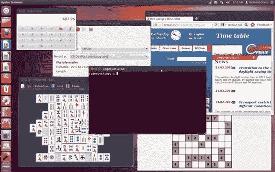
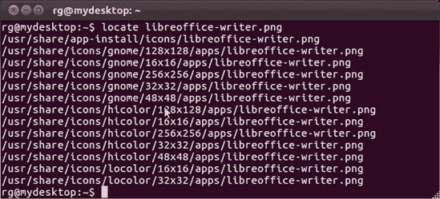
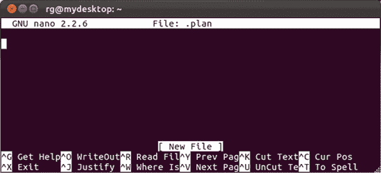
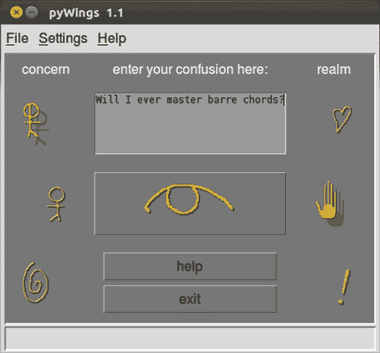
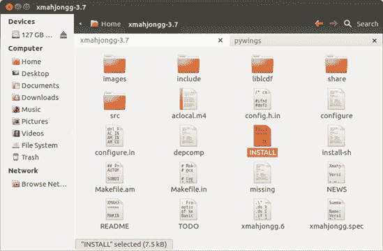
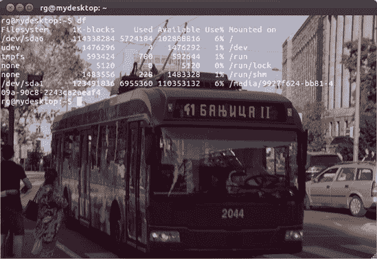

# 第八章. 简单的小猫方式

### 了解 Linux 终端和命令行……以及它能做的酷事


许多人避开 Linux，因为他们将其视为一个为电脑极客设计的系统，一个你必须通过命令行以艰难方式做所有事情的环境。在这个图形界面的时代，通过输入命令来完成事情的想法似乎是对 DOS 时代的可怕回归，这让许多人望而却步，尤其是那些记得“旧日子”的人。

这个反应还算公平，但它并不能准确反映 Linux 世界的现实。毕竟，如今的大多数 Linux 用户都在使用某种图形界面。他们可以，而且经常只通过下拉菜单和鼠标点击就能实现他们希望实现的一切。许多人能够非常快乐地生活，从未打开过他们的终端。对你来说可能也是如此。

尽管如此，命令行的强大和便利性仍有可说。命令行现在可以在图形环境中使用，这也使得它不那么令人畏惧。终端只是图形海洋中的一个微小的基于文本的岛屿（参见图 8-1）。使用命令行可以像你在系统上做的任何其他事情一样不痛苦，而且如果你愿意尝试，它实际上可以给你带来一些乐趣。



图 8-1. 将终端置于正确的视角

不幸的是，许多关于使用命令行的指南都是由那些狂热的命令行爱好者所写，他们对他们认为的好事的热情无意中使得他们所写的内容对最近加入 Linux 的新手或想成为 Linux 用户的人来说更加令人望而却步。

为了你的利益，我会尽量不表现出过度的热情，以免让你再次退缩到第六章和更舒适的 Ubuntu 软件中心的世界。我还会尽量通过尽可能教你使用命令行作为你拥有的各种图形工具的补充或替代品，而不是将其作为做事的唯一方式。当然，我并不会涵盖这个方面的每一个可能的角度——只是足够让你有所接触和经验，并理想情况下让你对命令行至少感到稍微自在一些。谁知道呢？你可能会真的开始认为使用命令行是……有趣的？好吧，我不会太过分。

# 认识终端

您可以通过前往 Dash，输入 **`terminal`** 并按回车键，在您的 Ubuntu 系统中运行 Linux 命令行终端应用程序。当终端打开时，它将以其简洁的方式，看起来与 图 8-2 非常相似。


图 8-2. 终端应用程序

如您所见，它只显示 `rg@mydesktop:˜$`。在这种情况下，`rg` 是我的用户名，`mydesktop` 是我在安装时给我的电脑起的名字，波浪号 (`˜`) 表示我正在我的主文件夹中。如果它显示 `˜/Music`，例如，这意味着我目前在我的主文件夹中的 *Music* 文件夹中。当然，所有这些都将因人而异，因为您的用户名和电脑名将不同。例如，如果您的用户名是 *frog*，而您的电脑名是 *wetrock*，那么命令行将显示 `frog@wetrock:˜$`。如果这一切听起来相当晦涩难懂，就想想这样：在终端中的 `*username*``@`**computer_name**`:˜$` 等同于在 Nautilus 中的您的 Home 文件夹。

在终端中打字很简单；您只需像平时一样打字。您还可以通过使用删除键、退格键和箭头键来删除和插入字母或短语。为了练习，请尝试以下操作：

1.  输入 **`I like strawberries so very much`**。

1.  将 `strawberries` 改为 `cherries`。（您改变了主意！）首先，使用您的左箭头键将光标移到 `strawberries` 中第一个 s 前面。

1.  按下删除键，直到删除单词 `strawberries`（我想应该是 12 次）。

1.  输入 **`cherries`**，然后使用您的右箭头键将光标移回这个有意义的句子的末尾。

现在您已经完成了这个有趣的打字练习，请按回车键。您几乎会立即看到，终端对您迄今为止所做努力的回应只是一个轻蔑的 `I: 命令未找到`。尽管您输入了一串对您有意义的文本，但对您的系统来说，这毫无意义。事实上，系统如此短视，以至于它只能看到您在终端中输入的第一个单词（`I`），因为 `I` 不是一个有效的命令，所以系统不知道该如何处理它。

# 一些关于命令终端的有趣而实用的乐趣

在命令终端中打字的一个相当酷的事情是它有您可能称之为 *短期记忆* 的功能。通过输入单词 **`cherry`** 并按回车键来尝试它。忽略命令未找到的消息，继续输入 **`vanilla`** 并按回车键。现在输入 **`gelato`** 并按回车键。到目前为止，这一切看起来都很愚蠢，对吧？但实际上并非如此。让我们再次输入我们迄今为止输入的所有内容，但这次我们只使用一个键。

哎？

是的，只需按一次上箭头键，你看到了什么？没错——你最后输入的命令出现了，在这个例子中就是 gelato。再按一次上箭头键，就会出现你之前输入的命令——`vanilla`。再来一次？是的，`cherry`。再来一次，作为压轴戏……`I like cherries so very much`。

考虑到目前为止我们所学的，这一切可能看起来有点愚蠢，但想象一下，你不是在输入这些古怪的小词，而是必须处理相当长的字符串，比如一个简单的复制命令（你将在本章后面学到）如下：

```
cp Photos/mypics/stpierre/coastal/onthebeach1_27.jpg /home/frog/photos_for_mom/stpierre
```

通过输入那个字符串，你正在将名为*onthebeach1_27.jpg*的图片从*coastal*文件夹复制到另一个名为*stpierre*的文件夹中。如果你想复制*coastal*文件夹中的另一张照片，比如*onthebeach1_16.jpg*，你只需简单地按一次上箭头键，使用左箭头键和删除键移动到并删除`27`，然后替换为**`16`**。总的来说，这将简单得多，也快得多。这也有助于你避免输入错误。不再那么笨拙，对吧？

# 无毒命令

如你所知，所有这些输入都足够简单，但为了真正在终端中做些有用的事情，你需要输入命令——而且命令的数量比你希望或需要知道的要多。为了让你开始，我们将从一些容易理解、无毒且完全适合猫咪友好的命令开始。

## `$ whoami`

没有任何命令比`whoami`更容易、更安全，甚至看起来更无用的了。`whoami`命令并不是帮助那些有多重人格障碍的人在任何时刻发现自己是谁，它只是简单地告诉你当前登录的用户是谁。尝试在`$`之后输入**`whoami`**并按回车键。记住，命令是区分大小写的。

终端现在会告诉你当前登录的人的用户名。如果你以*frog*登录，你应该得到`frog`作为你命令的答案。

## `$ pwd`

如果你知道你是谁，但不确定你在哪里，`pwd`（打印工作目录）应该会很有用。`pwd`命令会告诉你终端在你的目录树中的确切位置。

假设，例如，我的终端在我的个人主目录（称为*rg*）中，在系统的主目录（称为*home*，所有用户账户目录都位于此处）。当我使用`pwd`命令时，我会在终端上打印出`/home/rg`。如果你尝试它，你应该得到类似的结果。

### 注意

在这个例子中，单词*print*与你的打印机无关；它仅仅意味着响应将被打印到，或在终端中显示。

## `$ df`

另一个安全且简单，但非常有用的命令是 `df`（磁盘文件系统）。`df` 命令会告诉你你在各个挂载的磁盘分区上使用了多少磁盘空间，以及你还剩下多少可用空间。尝试键入 **`df`** 并按回车键。你的输出应该看起来像 图 8-3 中所示的那样（当然，这取决于你挂载的磁盘大小和它们的设置。）


图 8-3. `df` 命令的输出

你会注意到，大小是以千字节（KB）而不是你更熟悉的千兆字节（GB）和兆字节（MB）来表示的，但有一个解决办法。许多命令接受一个 *标志* 或 *选项* 来进一步微调命令的执行方式。你直接在主命令后键入标志，并在它们前面加上一个空格和一个连字符。

在这种情况下，你可以尝试使用 `-h`（人类可读）标志，让你的数字以你最熟悉的方式显示。尝试在命令行中键入 **`df -h`** 并按回车键。现在输出应该以更熟悉的形式出现（见 图 8-4）。


图 8-4. 使用 `-h` 标志的 `df` 命令输出

## $ ls

另一个无害但实用的命令是 `ls`（列出目录内容）。`ls` 命令显示你当前目录中的内容。这是在 Nautilus 中双击文件夹以查看其内容的非图形等效操作。尝试键入 **`ls`** 并按回车键。

如果你一直按照 *我的* 命令操作，你的结果应该会列出你主目录中的所有文件夹。你也可以使用 `-R` 标志来显示文件夹中的文件列表，以及子文件夹中的内容。当然，你可能还没有创建任何子文件夹，所以你可以暂时不尝试这个命令。相反，尝试键入 **`ls -a`** 来查看你的不可见或 *隐藏* 文件。

## $ calendar

我会让你自己尝试这个命令。只需键入 **`calendar`** 并按回车键，就可以看到一些有趣的结果。

## $ exit

`exit` 命令是一个简单的命令，允许你退出终端。只需键入 **`exit`** 并按回车键。终端窗口将关闭。

# 带有“牙齿”的命令

你迄今为止尝试的简单命令都是安全且理智的，消防队长批准的类型；它们只是将信息打印到你的终端。现在你将尝试从命令中获得一些有形的结果。如果你遵循我的指示，这些命令基本上也是安全且理智的。

## $ mkdir

你已经学会了如何通过菜单和鼠标创建文件夹，但你也可以使用命令行来完成这项操作。命令是 `mkdir`（创建目录），使用起来就像吃派一样简单（尽管我从未完全明白派为什么会这么简单）。

为了了解这个命令的工作原理以及与后续命令一起工作，现在使用 `mkdir` 命令创建一个名为 *command_exp* 的文件夹（用于命令实验）。你只需要在一个新的终端窗口中输入 **`mkdir command_exp`** 然后按回车键。新文件夹应该出现在你的主文件夹中，所以你可以点击桌面上的主图标来检查它是否在那里。

好的，很好，*bra*，*bueno*！现在让我们在那个新文件夹内创建另一个新的文件夹——一个 *subfolder*，如果你愿意。我们将称这个为 *sub*。所以，只需输入 **`mkdir command_exp/sub`** 然后按回车键。如果你愿意，可以查看 *sub* 文件夹是否已经出现在 *command_exp* 文件夹中。

## $ mv

下一个命令是 `mv`（移动）命令，但在你尝试它之前，你需要创建一个虚拟文件——毕竟你需要一些东西来移动。你可以通过使用另一个命令——`touch` 来做到这一点。为了创建文件——让我们称它为 *expfile.txt*——转到终端，输入 **`touch expfile.txt`**，然后按回车键。新文件将出现在你的主文件夹中。

要移动你刚刚创建的文件，你将使用 `mv` 命令，当然。只需输入 **`mv expfile.txt command_exp/sub`**（这告诉系统要移动哪个文件以及移动到哪个位置）然后按回车键。现在文件将位于你的 *sub* 文件夹中。

## $ cd

到目前为止，你一直都在使用主文件夹中的命令行。使用 `cd` 命令，你可以将终端的位置更改为另一个文件夹。在本书的项目中，你将非常频繁地使用这个非常实用的命令。为了试一试，让我们通过输入 **`cd command_exp`** 并按回车键进入 *command_exp* 文件夹。如果你操作正确，你的终端提示符现在应该显示为 *`username`*`@`*`computer_name`*`:˜/command_exp$`。如果是这样，你可以给自己鼓掌。

当你在那里时，不妨尝试使用带有 `R`（递归）标志的 `ls` 命令来看看它是如何工作的。只需输入 **`ls -R`** 并按回车键。你的终端应该显示你这里有一个名为 *sub* 的子文件夹，以及该子文件夹中的一个名为 *expfile.txt* 的文件。

目前你真正想要做的就这么多，所以为了回到你的主目录，只需输入 **`cd`** 并按回车键，这样你就可以“回家”了。

为了将来参考，值得注意几个其他的 `cd` 命令快捷方式。如果你在一个子文件夹的子文件夹中，并且想要退回一步（例如，从 */home/rg/peas/pudding* 退回到 */home/rg/peas*），你可以通过输入 **`cd ..`**（在 `cd` 和 `..` 之间有一个空格）并按回车键来实现。你也可以输入 **`cd -`**（在 `cd` 和 `-` 之间有一个空格）来回到你之前所在的目录（例如，从 */home/rg* 回到 */home/rg/peas/pudding*）。

## $ cp

你可能会决定，不仅要在子文件夹中保留你的 *expfile.txt* 文件，还希望在家目录中有一个副本，那里原本就是它的位置。要复制 *expfile.txt*，你可以使用 `cp`（复制）命令。

命令需要知道你想要复制的文件的位置、文件名以及你想要复制到的位置，在这个例子中是复制到你的家文件夹。通常你会输入 `cp command_exp/sub/expfile.txt /home/`*`username`* 来完成这个操作，但如果你还记得，你可以将命令字符串中的 `/home/`*`username`* 部分缩写为 `˜/`，这表示相同的意思。（这是一个需要记住的重要提示，因为波浪号在在线说明中经常被使用。）因为减少手指磨损总是个值得追求的目标，输入以下命令然后按回车键：

```
`cp command_exp/sub/expfile.txt ˜/`
```

确保在你要复制的文件名和目标位置之间留一个空格（在这个例子中，在 `expfile.txt` 和 `˜/` 之间）。

完成这些操作后，你应该会有两个 *expfile.txt* 的副本，一个在你的家文件夹中，一个在你的 *sub* 文件夹中。去看看你努力的成果吧。

## $ rm

当你还是一个孩子的时候，你可能已经体验过用乐高积木建造城堡的乐趣，然后是拆掉整个城堡的更大乐趣（最好是朝它扔去 D 型电池）。现在你将开始类似的操作。在这个怀旧任务中的第一个工具是 `rm`（删除）命令，你可以用它来删除文件。

虽然 `rm` 命令非常实用且易于使用，但应该谨慎处理。一旦你使用这个命令删除了一个文件，就无法回头。文件不会被放入回收站——它永远消失了。

为了安全起见，让我们尝试使用 `rm` 命令来删除我们刚刚在家文件夹中创建的新副本 *expfile.txt*。基本的 `rm` 命令结构包括命令本身 `rm`，后面跟着你想要删除的文件名。在这个例子中，你想要删除位于你家文件夹中的名为 *expfile.txt* 的文件。假设你的终端显示你处于家目录，通过输入 **`rm expfile.txt`** 然后按老式的回车键来删除文件。文件将会消失，并且永远消失。

现在，通过删除位于子文件夹 sub 中的*expfile.txt*版本来加倍你的乐趣。在这种情况下，你需要指定文件的位置，因为它不在终端所在的文件夹中。只需键入**`rm command_exp/sub/expfile.txt`**然后按回车。哇，非常酷。这让你想起了什么吗？

## `$ rmdir`

你现在将继续使用`rmdir`（删除目录）命令的乐趣，这是`rm`命令的一个更大、更强大的版本。

你应该像使用`rm`命令一样小心地使用`rmdir`命令。使用`rmdir`没有重做的机会。一旦使用此命令删除了目录或文件夹，它就永远消失了。

要尝试此命令，你可以删除你创建的*sub*文件夹。键入**`rmdir command_exp/sub`**然后按回车。*sub*文件夹现在应该消失了。最后，为了圆满结束这个乐趣，再次使用`rmdir`命令来删除你之前创建的*command_exp*文件夹。你知道该怎么做：键入**`rmdir command_exp`**然后按回车。

## `$ chmod`

在第七章中，你学习了如何通过 Nautilus 界面更改文件权限。毫无疑问，这是一个处理此类事情的好方法，但有时可能更倾向于使用命令行方法。

更改文件权限的命令是`chmod`（更改模式）。要使用它，只需键入命令，然后是想要扩展到文件的权限，然后是文件本身的路径。例如，假设你从 CD 复制了一个 JPEG 文件，*mybirthday.jpg*，到硬盘上*Photos*文件夹内的*personal*子文件夹中，并且文件是写保护的。要更改文件以便你有写权限（这意味着你可以更改文件），你会键入以下内容然后按回车：

```
`chmod 644 ˜/photos/personal/mybirthday.jpg`
```

要一次性更改所有文件和子文件夹（以及这些子文件夹中的所有文件）的权限，你可以在`chmod`命令中添加`-R`（递归）标志。因此，命令如下所示：

```
`chmod -R 744 ˜/photos/personal`
```

顺便说一句，数字`744`将读、写和执行（运行）权限扩展到所有者，但其他人只有只读权限。这是一个相当安全的选项，当不确定时。如果你想自己找出权限数字，这相当简单。你基本上在处理三个数字位置，每个位置都有八个数字可能性（`0`-`7`）。最左边的槽位代表所有者的权限，中间的槽位代表组的权限，第三个槽位代表其他人的权限。这些数字本身的意义如下：

`7`

读写和执行权限

`6`

读写权限

`5`

读写执行权限

`4`

只读权限

`3`

写和执行权限

`2`

只写权限

`1`

只执行权限

`0`

没有权限

图 8-5 指出了这些数字的含义以及每个数字槽位代表什么。实际上，如果你不介意一点简单的加法，事情甚至更容易理解。首先，记住 1 = 执行，2 = 写入，4 = 读取。将这些数字相加，你就可以得到其他的权限组合。例如，1（执行）+ 4（读取）= 5（读取和执行）。正如你所看到的，权限并不那么复杂。


图 8-5. 权限数字的含义

如果你更倾向于字母而不是数字，你可能会很高兴地知道还有另一种更改权限的方法，这可能更容易。使用这种方法，你只需要处理两组字母和符号`+`和`-`。

第一组包括以下内容：

`u`

用户（文件所有者）

`g`

组（指定用户组）

`o`

其他（任何不是用户或组成员的人）

`a`

所有（上述所有）

第二组包括以下内容：

`r`

读取

`w`

写入

`x`

执行

你可能已经能够猜出这一切是如何工作的，但我还是把它写出来以防万一你的直觉今天已经用完了。假设你想改变一个文件（例如*butterhaters.txt*）的权限，以便所有机器上的用户都可以读取和写入它。在打开一个终端窗口后，你可以通过输入**`chmod a+rw butterhaters.txt`**并按回车键来做出更改。

哦！刚刚想起你不想让任何人更改文件的内容，对吧？好吧，要收回该文件的写权限，你只需要输入**`chmod a-w butterhaters.txt`**并按回车键。正如你所看到的，`+`赋予权限，而`-`则取消权限。

这要简单得多，你必须承认。

## $ sudo

当你在第六章中尝试从 Ubuntu 软件中心安装软件时，你被要求输入密码。正如我那时提到的，这样做的原因是 Ubuntu 软件中心会将下载的文件安装到系统中的各个文件夹中，几乎所有的文件夹都是只读保护的。通过提供密码，你是在告诉你的系统，作为密码的持有者，你有权允许 Ubuntu 软件中心这样做。

那个密码提供过程的命令行版本是`sudo`命令。要在受写保护的文件夹中执行操作，你首先输入**`sudo`**，然后输入你想要执行的命令。例如，如果你想复制一个图标图像——让我们称它为*myicon.png*——到全局位置和受写保护的*pixmaps*文件夹（*/usr/share/pixmaps*），你将输入**`sudo cp myicon.png /usr/share/pixmaps`**。

在输入以`sudo`命令开头的命令并按回车键后，你将需要输入密码。一旦你输入密码并再次按回车键，命令将被执行。我应该提到，一旦你输入了密码，它将在大约五分钟内保留在内存中，所以在这段时间内使用`sudo`命令时，你不需要再次输入密码。

## $ locate

现在你已经熟悉了`sudo`命令，让我们通过使用`locate`命令来试一试。`locate`命令本质上是一个图形搜索工具的命令行替代品，该工具位于“位置”菜单中。使用这个命令相当简单：只需输入命令，然后输入空格和你要查找的文件名。

然而，在使用这个命令之前，你应该更新`locate`使用的文件名数据库。这就是使用`sudo`命令以及另一个命令`updatedb`发挥作用的地方。只需输入**`sudo updatedb`**并按回车键。当被要求时输入你的密码——然后似乎什么都没有发生。但不要担心。只要你的终端光标在闪烁，进度就在进行中，当你的用户提示符返回时，你就已经成功创建了数据库文件。之后，你就可以使用`locate`命令了。

哦，而且在未来，如果你觉得这个过程似乎越来越慢，不要担心——它确实是。你添加到系统中的文件和应用程序越多，你的系统整理这些文件所需的时间就越长。

为了测试这个新命令，让我们查找 LibreOffice Writer 图标，*libreoffice-writer.png*。只需输入以下内容并按回车键：

```
`locate libreoffice-writer.png`
```

你的结果应该看起来像图 8-6 中的那样。



图 8-6. `locate`搜索的结果

## $ apt-get

接下来，让我们看看一个可能有点熟悉的命令：`apt-get`。是的，这个命令确实是控制强大的包下载和安装工具 APT（我在第六章中介绍过）的一种方式。虽然通过命令行使用 APT 可能不如通过 Ubuntu 软件中心那样令人愉悦，但这样做有时会很有用。在这里，我会为你介绍这个命令的基础知识。

为了好玩，并且为了练习一下`apt-get`的使用，打开一个终端窗口，输入**`apt-get moo`**并按回车键。正如你将看到的，这个尝试的结果是一个复活节彩蛋（图 8-7)，那些程序员似乎喜欢在他们的工作中加入的只是为了乐趣的小段代码。它们可能没有用，但它们是无害的，而且这是使用`apt-get`的一个安全的第一步。


图 8-7. 通过 `apt-get` 发现彩蛋

要实际使用 `apt-get` 命令，首先确保关闭你可能打开的任何 APT 前端，例如 Ubuntu 软件中心。正如我在 第六章 中提到的，你一次只能运行一个 APT 工具。一旦情况明朗，你应该始终以更新 APT 数据库开始涉及 `apt-get` 的任何操作，这样你将下载最新内容。为此，只需输入命令 **`sudo apt-get update`**。

如果你想在不前往 Ubuntu 软件中心的情况下安装单个软件包，你可以通过输入 **`sudo apt-get install`** **``*`package-name`*``** 来实现。例如，如果你想下载并安装 Shufflepuck 游戏克隆版 Tuxpuck，你将输入 **`sudo apt-get install tuxpuck`**。如果你在 Tuxpuck 中输得太多，最终感到厌烦，你可以通过输入 **`sudo apt-get remove tuxpuck`** 来卸载它。

最后，考虑到 第六章 中提供的所有警告，如果你想通过命令行升级整个系统，你可以通过输入 **`sudo apt-get dist-upgrade`**（但首先必须先执行 **`sudo apt-get update`**）来实现。

## $ finger

如果你之前在本章中通过 `whoami` 命令发现你是谁感到很有趣，那么你可能喜欢使用 `finger` 命令来了解更多关于自己的信息。你可以用多种方式使用 `finger` 命令，但一个非常简单的方式是了解某个特定用户的信息。为了亲自尝试，你必须首先安装 finger，因为它不再与 Ubuntu 一起打包。

这是一个很好的机会来练习你刚刚学到的 `apt-get` 命令。打开一个终端窗口，输入 **`sudo apt-get install finger`** 并按回车。一旦你输入了密码并且安装完成，你将再次看到终端提示符，并准备好尝试使用 finger。只需输入 **`finger`** 然后是你的用户名。在我的例子中，那就是 `finger rg`。一旦你输入了命令，按回车键，看看你得到了什么。你可以看到我的结果在 图 8-8。


图 8-8. `finger` 命令的输出

正如你所见，我的登录名是 *rg*，我的真实姓名是 Rickford Grant，我的家目录是 */home/rg*，我正在使用 Bash shell 来输入我的命令。我从 3 月 21 日星期三的 10:44 美国东部夏令时（EDT）开始登录，我没有邮件或计划。它不会告诉你我的社会保险号码或我母亲的婚前名字，但确实很酷，不是吗？

### 什么是 Shell？

正如你所注意到的，我提到`finger`命令的结果显示我正在使用 Bash shell，所以你可能很好奇 Bash 究竟是什么。好吧，*Bash（Bourne Again Shell）*是 Linux 系统中使用的许多 shell 之一，它恰好包含在你的 Ubuntu 发行版（以及大多数其他发行版）中。*shell*是一个程序，它解释你在终端中输入的命令，并将它们“传递”给你的系统，以便它可以对其执行操作。我倾向于将其视为一个命令处理子系统，而终端则充当图形前端。

### 什么是计划？

我还提到结果显示我没有计划，所以你可能也在想这是怎么回事。*.plan*文件是一个保存在你的主目录中的小文件，当其他用户使用`finger`命令查看你时，他们会看到这个文件。传统上，*.plan*文件包含有关你将去哪里或你在做什么的信息。然而，如今，大多数人使用它们来留下奇怪的小信息、引用或其他内容，就像他们在电子邮件签名中做的那样。看看图 8-9，看看我在主目录中添加*.plan*文件后会发生什么。


图 8-9. `finger`命令的输出计划

你现在可以看到我的计划，这是一句来自库尔特·冯内古特《泰坦的号角》（或者说是阿尔·斯图尔特同名歌曲）的引用。当然，你可以根据自己的意愿放入任何内容。你将在项目 8A：创建计划中创建自己的计划文件，在压缩和解压缩单个文件中，所以如果你觉得这很有趣，还有更多的乐趣在等着你。

### `finger`命令的其他用途

在继续之前，我应该提到你也可以使用`finger`命令进行一些类似间谍活动的小操作。比如说，你的孩子 Chris 在你的机器上有一个用户账户。Chris 想要得到你去看电影的许可，声称他整天都在电脑上努力写学校的报告。如果你对此有所怀疑，你可以输入**`finger chris`**来查看事实的真相。这可能有点不光彩和卑鄙，但它有效。它也可以双向进行；其他人也可以检查你。如果你在第九章中创建一个新的用户账户，你可以试试这个。只需输入**`finger`**，你当前不在的账户名称，然后按回车键。

您甚至可以使用 `finger` 命令来了解其他系统上的人的信息，前提是他们的网络 finger 服务是激活的，并且您知道他们的电子邮件地址。输入类似 **`finger`** **``*`username@hostname.com`*``** 这样的命令就可以做到这一点。这有点酷，但也有一点令人毛骨悚然，我想。

# 您很快就会使用的一些其他命令

这是个介绍两个您将在本章和本书的其他地方需要使用的命令的好地方：`ln` 和 `tar`。您现在不需要练习这些命令，因为您很快就会使用它们，但您最好了解一下它们是什么。

## $ ln

您可以使用 `ln`（链接）命令创建一个链接文件，该文件可以启动或激活位于单独文件夹中的另一个文件。当您想激活位于硬盘深处某个子文件夹的子文件夹中的文件时，这非常有用。该命令通常与 `-s`（符号）标志一起使用，它基本上与您在 Windows 中所熟知的快捷方式或 Mac 上的别名相同。

使用 `ln` 命令的最简单方法是首先使用 `cd` 命令将终端的位置更改为您想要放置链接的文件夹。然后您可以在命令行上输入 **`ln`** 命令，后面跟您想要链接的文件的路径。例如，假设您想在您的家目录中创建一个指向您的自传 LibreOffice Writer 文件 *myLife.odt* 的链接。

该文件深深埋藏在家目录中一个子文件夹的巢穴中：*/home/<username>/Documents/personal/self/autobiography/myLife.odt*。要创建链接，您需要打开一个新的终端窗口，输入以下命令字符串，然后按回车键：

```
`ln -s Documents/personal/self/autobiography/myLife.odt`
```

完成后，链接将以与原始文件外观相匹配的图标形式出现在您的家目录中，尽管它有一个箭头表示这是一个链接。

## $ tar

在 第七章 中，您学习了如何创建和提取存档，或称 *tarballs*，但您知道您还可以使用命令行创建和提取 tarballs 吗？`tar` 命令是您实现这一点的关键。

要创建存档，您只需输入 **`tar -cvf`**，然后是最终 tarball 的名称，然后是您想要存档的文件夹或文件的名称。例如，假设您想创建一个名为 *pics4pals* 的照片文件夹存档。在这种情况下，您需要输入以下命令并按回车键：

```
`tar -cvf pics4pals.tar photos`
```

您无疑已经注意到，在那个字符串中 `tar` 命令后面有一些标志。`c` 告诉 tar 程序 *创建* 一个新的存档。`v` 告诉程序要 *详细* 或换句话说，在它执行时在终端中告诉您它在做什么。最后，`f` 告诉程序接下来的是 *文件信息*。

如果在创建存档后，你突然想起还有另一个文件想要添加进去，你可以使用 `-r` 标志来追加存档。

例如，要将名为 *cranky.png* 的文件添加到存档中，你需要输入以下内容并按回车键：

```
`tar -rvf pics4pals.tar cranky.png`
```

当然，你可能会做更多解压缩 tarball 的工作而不是创建，因此你无疑想知道如何进行。幸运的是，这个过程与创建 tarball 的过程非常相似。主要区别在于第一个标志。你不会使用带有 `-c` 标志的 `tar` 命令，而是使用带有 `-x` 标志的命令，这告诉 tar 程序 *提取* 指定的存档。所以如果你想提取名为 *spicyfood.tar* 的 tarball，请输入以下命令并按回车键：

```
`tar -xvf spicyfood.tar`
```

到目前为止你所做的是创建和提取存档，这些存档基本上只是文件的集合。然而，它们并不是压缩的。实际上，你找到的大多数 tarball 都是压缩的，你可以通过文件扩展名 *tar.gz* 来判断。那个 *gz* 表示存档是用 gzip 程序压缩的。解压缩压缩的 tarball 与解压缩普通的 tar 存档一样简单；你只需要添加 `-z` 标志，告诉你的系统使用 gzip 程序解压缩存档。例如，如果你想解压缩名为 *goosedown.tar.gz* 的压缩 tarball，请输入以下命令并按回车键：

```
`tar -xzvf goosedown.tar.gz`
```

好吧，现在你已经知道了如何解压缩和提取 gzipped tarball，你可能想知道如何创建一个。这又与创建 tar 存档本身几乎没有什么区别；你只需要添加 `-z` 标签来告诉程序使用 gzip 压缩文件夹。例如，要创建名为 *tightpics.tar.gz* 的 *Pictures* 文件夹的压缩版本，请输入以下内容并按回车键：

```
`tar -czvf tightpics.tar.gz Pictures`
```

在这一点上值得提到的是，你也可能会遇到一些用 bzip 程序压缩的文件。这些文件可以通过 *.bz* 或 .*bz2* 文件扩展名的某种变体来识别。处理这些文件应该不会引起任何问题，因为命令几乎与 gzip 的命令相同。只需在命令字符串中将 `-z` 替换为 `-j` 即可。

### 压缩和解压缩单个压缩文件

如果你想要压缩或解压缩单个文件，实际上并不需要使用 tar 程序，因为它的目的是创建包含多个文件的存档。你可以直接使用 `gzip` 和 `gunzip` 命令。例如，要压缩名为 *matilda.jpg* 的文件，你需要输入 **`gzip matilda.jpg`** 并按回车键。*matilda.jpg* 文件随后将变为 *matilda.jpg.gz*。要解压缩该文件，你需要输入 **`gunzip matilda.jpg.gz`** 并按回车键，之后 *matilda.jpg* 文件将恢复到正常状态。

那么，您能否使用 `tar` 命令压缩您已经创建的存档？当然可以。例如，要压缩前面提到的 spicyfood.tar 存档，您将输入 **`gzip spicyfood.tar`**，然后 voilá——您就得到了一个压缩的 *spicyfood.tar.gz* 存档。相当酷，不是吗？

# 项目 8A：创建计划

现在您已经有一些命令经验了，是时候进行一些练习，并充分利用所有这些命令了。在这个项目中，您将创建一个 *.plan* 文件，就像在 $ finger 中提到的 $ finger 一样。

实际的 *.plan* 文件是一个隐藏文件（您可以通过其名称前的点来看到），它包含您添加的计划或信息。当某人使用 `finger` 命令来了解更多关于您的情况时，这条信息将出现在他的终端输出中。您可能不需要这样的 *.plan* 文件，但它是一个很好的方法来更多地使用命令和终端本身，所以让我们试试看。

首先，您将打开基于终端的 Nano 编辑器来创建 *.plan* 文件。为此，打开一个终端窗口，输入 **`nano .plan`**（确保在 `nano` 和 `.plan` 之间有一个空格），然后按回车键。现在您的终端看起来会有点不同，如图 图 8-10 所示。



图 图 8-10

现在，您将在 Nano 编辑器中查看您的新、完全空的 *.plan* 文件。您只需输入您的计划或信息。完成之后，按 ctrl-X 退出 Nano 编辑器，它将询问您是否要保存您的作品。您需要保存，所以输入 y，之后您将看到一个保存选项集。您已经将文件命名为 *.plan*，如屏幕底部所示，所以您只需按回车键。您将回到现在熟悉的终端窗口的用户提示符。

为了结束这个话题，在终端窗口中输入 **`chmod 644 .plan`** 来更改新 *.plan* 文件的权限，然后按回车键。现在 *.plan* 文件应该在您的家目录中，并且对所有用户都是可读的（见下文说明），所以继续测试您的作品，输入 **`finge`** **``*`username`*``** 并按回车键。您在 *.plan* 文件中输入的信息现在应该出现在结果中，而不是您之前找到的 `No Plan`。如果您以后想更改 *.plan* 文件的内容，只需遵循相同的步骤，并在 *.plan* 出现在 Nano 编辑器中时更改文本。

### 注意

*.plan* 文件的名称前面有一个点，这意味着它是一个隐藏文件。因此，如果您查看您的家目录，除非您在文件管理首选项窗口中勾选了显示隐藏和备份文件选项，否则您将看不到该文件。

# 项目 8B：使用 pyWings 进行更多命令练习

现在，让我们通过安装一个简单且诚然有点愚蠢的占卜程序 pyWings（见图 8-11）来获得更多关于终端的经验。图 8-11。pyWings 会根据你提出的任何问题给出神秘的指导。



图 8-11. 从 pyWings 寻求智慧

要使用 pyWings，请在输入框中输入你的困惑或困境，点击左侧的其中一个关注图标（自我、他人、世界），点击右侧的其中一个领域图标（爱情、工作、真理），然后点击那个看起来像半个眼睛的大按钮。随后，占卜师会告诉你它想说的话。例如，我向占卜师询问我是否能够掌握吉他的扫弦技巧，我将“自我”作为我的关注点，将“工作”作为领域。图 8-12 展示了赋予我的智慧。


图 8-12. pyWings 赐予智慧。

如你所见，占卜师告诉我，“最大的激情可以容纳在最小的空间里”，我将它解读为……嗯，我不确定如何解读。

嗯。我想这很鼓舞人心。

pyWings 是用一种名为 Python 的编程语言编写的，它实际上创建的是脚本而不是传统的程序。你将在本章后面学到更多关于这种区别的知识，但我可以立即提到的不同之处在于，你实际上不需要安装 pyWings；你只需将其放在你的 Home 文件夹的硬盘上，然后从那里运行它，基本上就是这样。

## 8B-1: 为 pyWings 做准备（安装 Tkinter）

正如我提到的，pyWings 与大多数你使用的其他应用程序之间的一个区别是，pyWings 是一个 Python 脚本。为了为自己创建图形界面，pyWings 使用一个名为 Tkinter 的工具箱，它是 Python 的事实上的标准（尽管不是唯一）GUI 工具箱。然而，Tkinter 不再随 Ubuntu 捆绑提供，因此你需要自己下载并安装它。幸运的是，这相当容易完成。

虽然你可以打开 Ubuntu 软件中心并通过在 第六章 中学到的简单方法安装 Tkinter，但在这个以命令行为导向的章节中似乎更合适的是……是的，你猜对了，使用命令行。话虽如此，打开一个终端窗口，输入 **`sudo apt-get install python-tk`** 并按回车键。当被要求输入密码时，输入它并按回车键。APT 将搜索在线仓库并找到你的文件，以及它正常运行所需的所有其他文件。一旦准备就绪，它将询问你是否想继续。你会，所以输入 **`y`** 并按回车键。当你的用户名提示符再次出现时，你就知道工作完成了，你可以继续下一步。

## 8B-2: 获取 pyWings

你差不多准备好“安装”pyWings 了，但在你这样做之前，你需要从 [`sourceforge.net/projects/pywings/`](http://sourceforge.net/projects/pywings/) 获取它。一旦到达那里，点击 **下载** 按钮，这将下载文件 pywings-1.1.tar.gz。当提示时，选择 **保存文件** 并点击 **确定**。文件将被下载到你的 *下载* 文件夹中。

## 8B-3: 为 pyWings 创建一个 LocalApps 文件夹

如我之前所述，你将在你的 Home 文件夹中本地安装 pyWings 程序。本地安装一个程序意味着你将程序及其所有支持和数据文件安装在你的 Home 文件夹中。这使得事情变得稍微容易一些，但也意味着程序将不可供其他用户使用。这也意味着如果你不小心，你可能会意外地删除它。

为了使事情变得更容易、更安全，你将在你的 Home 文件夹中创建一个文件夹，用于放置 pyWings 以及你将来可能在本机上本地安装的所有其他应用程序。你将足够逻辑地称这个文件夹为 *LocalApps*。

让我们通过使用命令来创建文件夹，以便获得更多的实践。转到终端，确保你在你的 Home 文件夹中，输入以下命令，然后按回车键：

```
`mkdir LocalApps`
```

## 8B-4: 解压 pyWings Tarball

现在是时候解压 tarball 文件了。你可以通过在 第七章 中学到的双击方法来做这件事，但由于你在这里使用的是命令行，让我们使用命令行吧。

首先，你将把 tarball 文件放在你提取文件的同个文件夹中。通常这并不是必要的，因为大多数 tarball 的内容已经打包在自己的文件夹中。通过双击 tarball 在 File Roller 中打开它，你可以看到东西是打包在文件夹中还是简单地作为一组文件。在 pyWings 的情况下，后者是正确的，所以按照以下步骤操作：

1.  通过输入 **`mkdir pywings`** 并按回车键创建一个 *pywings* 文件夹。

1.  通过输入 **`mv Downloads/pywings*.gz pywings`** 并按回车键，将 pyWings tarball 移动到该文件夹中。

    你可以看到，在这个步骤中，你使用了星号 (`*`) 来节省一些手指的磨损。星号是一个通配符，在这种情况下，它告诉你的系统移动任何以 *`pywings`* 开头并以 *`.gz`* 结尾的文件。幸运的是，你只有一个符合这些条件的项目。

1.  通过输入 **`cd pywings`** 并按回车键，移动到新的 *pywings* 文件夹。

1.  现在你开始使用 `tar` 命令提取 tar 包本身。为此，输入 **`tar -xzvf pywings*.gz`** 并按回车键。

    再次注意，你使用了星号来节省一些按键，尽管你也可以直接输入 **`−1.1.tar`**。

1.  最后，输入 **`cd`** 并按回车键，将终端返回到你的家目录。

## 8B-5: 将 pyWings 文件夹移动到您的 LocalApps 文件夹

提取过程现在已完成。然而，在运行 pyWings 之前，让我们将其移动到你在 8B-3: 为 pyWings 创建 LocalApps 文件夹 中创建的新 *LocalApps* 文件夹，该文件夹位于 8B-2: 获取 pyWings。为此，输入以下命令并按回车键：

```
`mv pywings LocalApps`
```

## 8B-6: 运行 pyWings

现在你已经安装好并准备好使用 pyWings，让我们立即启动这个伟大的预言家，以便你能更好地了解如何处理生活中困扰你的方面。

在终端中，确保你处于你的家目录，输入以下命令字符串，然后按回车键：

```
`python ˜/LocalApps/pywings/pywings.py`
```

由于 *pywings.py* 是一个 Python 脚本，而不是一个应用程序，你需要让 Python 注意到这一点，以便 Python 知道它需要处理该脚本。如果一切按计划进行，pyWings 将很快使你成为一个更明智的人。

## 8B-7: 为 pyWings 创建可启动链接

你刚才使用的运行 pyWings 的方法足够好。然而，每次你想知道你将面临什么样的命运时，打开终端并输入那个相对较长的字符串都是一件麻烦事。让我们找到一种方法，让未来更容易一些。

要从终端运行应用程序，你通常输入该应用程序的名称，或者更准确地说，该程序的可执行文件名称；因此，应用程序的名称充当了一种命令。然而，为了让你的系统识别该命令，该命令（可执行文件或指向它的链接）必须位于系统可以找到的位置。每次你运行任何类型的命令时，你的系统都会检查一系列位置（其中大多数是 *bin 文件夹*，可执行文件位于其中）以找到该命令。

你可以通过在新的终端窗口中输入 **`echo $PATH`** 来轻松地找出这些位置，然后按回车键。正如你所看到的，在你的 Ubuntu 系统中，这些位置如下：

| */* |
| --- |
| */usr/lib/lightdm/lightdm* |
| */usr/local/sbin* |
| */usr/local/bin* |
| */usr/sbin* |
| */usr/bin* |
| */sbin* |
| */bin* |
| */usr/games* |

`echo $PATH` 命令的结果不会像这里显示的（更容易阅读）图表那样出现，而是一个由冒号分隔的单行。实际在终端中显示的输出是 `/usr/lib/lightdm/lightdm:/usr/local/sbin:/usr/local/bin:/usr/sbin:/usr/bin:/sbin:/bin:/usr/games`。

如果你输入的命令位于这些位置之一，程序或脚本将运行。然而，如你所知，pyWings 并不在这些位置之一。它在 */home/*username*/LocalApps/pyWings* 中，因此在某种程度上，它超出了你系统的视线。

为了解决这个问题，你可以将你的 pyWings 脚本路径添加到系统检查运行命令的路径列表中，以便让系统知道你的新应用程序的存在。但是，让我们尝试另一种我认为更简单的方法。你将要做的是在系统检查命令的一个位置创建一个指向 pyWings 的链接，一种可启动的别名。

要创建此链接，你将使用三个命令：cd（更改目录）、`sudo`（给自己提供对目标文件夹的写入访问权限）和 `ln -s`（创建链接）。

1.  在终端中输入 **`cd /usr/games`** 并按回车键。这将使你进入系统在输入命令时搜索的文件夹之一。

1.  输入 **`sudo ln -s /home/`****``*`username`*``****`/LocalApps/pywings/pywings.py pywings`** 并按回车键。（注意，在命令字符串的末尾，`pywings.py` 和 `pywings` 之间有一个空格。）

    `pywings` 在该命令字符串的末尾是你为链接指定的名称；因此，链接的名称变成了你将用于运行应用程序的命令。如果你不输入任何内容，链接将被命名为 *pywings.py*，这意味着每次你想启动程序时都需要多按三个键。

1.  当提示输入密码时，输入你的密码然后按回车键。

1.  现在通过更改权限使你的新启动器可执行：输入 **`sudo chmod +x pywings`** 并按回车键。

1.  输入 **`cd`** 并按回车键，将终端返回到你的主文件夹。

## 8B-8：再次运行 pyWings

现在你已经创建了链接，应该能够更容易地运行 pyWings 程序。为了尝试它，退出 pyWings（如果它仍在运行），在终端窗口中输入 **`pywings`**，然后按回车键。你的个人 pyWings 占卜师应该再次出现。

你已经成功减少了在终端运行 pyWings 所需的按键次数。然而，如果你真的喜欢 pyWings 并经常使用它，那么在面板、抽屉或应用程序菜单中添加一个启动器可能更方便。

# 项目 8C：使用 Briscola 的命令练习回顾

如果你想要加强你在上一个项目中使用的技能，为什么不尝试一下大陆风格的 Briscola 呢？Briscola 是一种简单而又非常传统的意大利纸牌游戏（见图 8-13），在克罗地亚和黑塞哥维那的亚得里亚海地区也广泛流行，称为 briškula，在西班牙和墨西哥也流行，称为 briscas。与 Python 脚本 pyWings 不同，Briscola 是一种不同口味的脚本。它使用一种名为 Tcl 的脚本语言编写，该语言使用 Tk 创建其图形界面——与 pyWings 界面使用的相同的 Tk。


图 8-13. Briscola

## 8C-1：获取 Briscola

你差不多准备好开始“安装”Briscola 了，但在这样做之前，你必须先获取它。你可以通过访问项目的首页 [`www.rigacci.org/wiki/doku.php/tecnica/download/local_software`](http://www.rigacci.org/wiki/doku.php/tecnica/download/local_software) 并以传统方式下载它来获取 Briscola，但由于我们正在使用命令，让我们使用一个新的命令：`wget` 来获取 Briscola。

要这样做，只需打开一个终端窗口，输入以下命令字符串，然后按回车键：

```
`wget http://www.rigacci.org/comp/software/briscola/briscola-4.1.tar.gz`
```

在你的终端窗口中，你会看到 `wget` 正在连接到存储 Briscola 的网站并下载文件。完成后，你将在主文件夹中找到 Briscola tarball。

## 8C-2：解压 Briscola Tarball 并重命名 Briscola 文件夹

解压 Briscola tarball 的过程基本上与 pyWings 的过程相同。唯一的区别是 Briscola 已经打包在其自己的文件夹中，因此你不需要为它创建一个特殊的文件夹。

你知道该怎么做：只需打开一个终端窗口，输入以下命令，然后按回车键：

```
`tar -xzvf briscola*.gz`
```

一个名为 *Briscola-4.1* 的新文件夹将出现在你的主文件夹中，其中包含所有 Briscola 文件。为了使未来的处理更加方便，让我们将文件夹的名称缩短为简单的 *briscola*。你已经知道如何通过右键点击方法来完成这个操作，但这次我们通过命令行来完成。你使用，可能令人惊讶的是，`mv` 命令后跟你要更改名称的文件名，然后是文件的新名称。

通过输入以下命令并按回车键来尝试一下：

```
`mv briscola-4.1 briscola`
```

## 8C-3：准备 Briscola 脚本

大多数以 tarball 形式提供的应用程序都包含一个 README 文件，其中包含了关于如何安装和使用该应用程序所需的信息。如果你在文件管理器中的 *briscola* 文件夹中双击 **README** 文件，你会看到“如何开始”部分告诉你需要调整 *briscola.tk* 脚本的第一行，使其指向你的 Tk shell，并调整脚本的第二行，使其指向存放各种 Briscola 文件所在的目录。

按照 README 文件中的说明进行调整，只需遵循以下步骤：

1.  通过在终端窗口中输入**`locate wish`**并按回车键来查找名为*Wish*的 Tk 外壳。在一张纸上记下位置。您可能会在搜索结果中获得多个位置，但您想要的是`/usr/bin/wish`。如果您看不到它，那可能是因为您自从在项目 8B：pyWings 的更多命令练习中执行以来没有更新数据库，所以输入**`sudo updatedb`**，按回车键，然后再次尝试定位 Wish。

1.  通过在终端窗口中输入**`cd briscola`**并按回车键，将终端指向*briscola*文件夹。

1.  使用我们在项目 8A：制定计划中使用的 GNU Nano 编辑器，通过输入**`nano briscola.tk`**并按回车键来编辑*briscola.tk*文件。*briscola.tk*文件将出现在您的终端窗口中的 Nano 编辑器中。

1.  将*briscola.tk*文件的第一行从`#!/usr/local/bin/wish`更改为**`#!/usr/bin/wish`**。

1.  在第二行，将`/usr/local/games/briscola`更改为**`/usr/share/games/briscola`**，这是您稍后将放置 Briscola 的位置。此时，您的编辑器窗口应类似于图 8-14。

    

    图 8-14. 使用 GNU Nano 编辑器配置 Briscola

1.  按下键盘上的 ctrl-X 键。

1.  输入**`y`**并按回车键以保存您的更改。

1.  输入**`cd`**并按回车键，将终端返回到您的家目录。

## 8C-4：将 Briscola 文件夹移动到全局位置

您可以将*briscola*文件夹移动到*LocalApps*文件夹，并从那里玩游戏，就像您使用 pyWings 时做的那样。但这次，让我们通过将整个文件夹移动到全局区域来做一些不同的事情。这不仅使它免受您可能有的任何强迫性的整理倾向的影响，而且允许同一台电脑上的所有用户玩游戏。您需要使用`sudo`命令来完成此操作，以便您可以在受保护的文件夹中获得写入权限。

只需在终端窗口中输入以下命令并按回车键：

```
`sudo mv briscola /usr/share/games/briscola`
```

当您被提示输入密码时，输入它并按回车键。

## 8C-5：为 Briscola 创建可启动链接

尽管你已经将 Briscola 移动到全局位置，但你仍然不能通过简单的单字命令来运行它，因为*briscola.tk*文件不在系统的命令搜索路径中。就像你为 pyWings 所做的那样，你现在将创建一个可启动的链接来解决该问题。以下是步骤：

1.  在终端中，输入**`cd /usr/games`**并按回车键。

1.  现在通过输入**`sudo ln -s /usr/share/games/briscola/briscola.tk briscola`**并按回车键来创建链接。

1.  输入**`cd`**并按回车键将终端返回到你的主文件夹。

现在，你可以在终端中通过输入**`briscola`**并按回车键轻松运行 Briscola。

## 你能用 pyWings 做同样的事情吗？

当然。如果你想将 pyWings 移动到全局位置，只需按照移动*pywings*文件夹和创建链接的相同程序进行，就像你为 Briscola 所做的那样，当然需要做必要的替换。不过，你必须通过输入以下命令并按回车键来删除之前创建的 pyWings 链接：

```
`sudo rm /usr/games/pywings`
```

之后，通过输入**`sudo mv ~ /LocalApps/pywings/usr/share/games/pywings`**并按回车键将*pywings*文件夹移动到全局区域。当提示输入密码时，输入密码并按回车键。然后，你可以通过输入**`cd /usr/games`**，按回车键，输入**`sudo ln -s /usr/share/games/pywings/pywings.py pywings`**，再按一次回车键来创建可启动的链接。

## 玩 Briscola

正如我之前提到的，Briscola 很简单——几乎和任何纸牌游戏一样简单。它是一种技巧牌游戏，这意味着你先出一张牌，然后你的对手出一张牌，出点数更高的牌的人赢得这一轮，或者称为*技巧*。根据那一轮中涉及的牌来计算分数。赢得那一轮的人接着*领先*下一轮，这意味着赢家将首先出牌。当所有牌都出完时，计算每位玩家的分数，分数更高的玩家获胜。这甚至比描述的要简单得多。

如果你想要更详细的 Briscola（以及世界上几乎任何其他纸牌游戏）的规则，请查看[`www.pagat.com/`](http://www.pagat.com/)。YouTube 上也有许多优秀的视频指南，包括我最喜欢的[`www.youtube.com/watch?v=jpXpMNBPN8c`](http://www.youtube.com/watch?v=jpXpMNBPN8c)。

# 项目 8D：从源代码编译和安装程序——Xmahjongg

虽然在早期更为常见，但*从源代码编译程序*似乎是一个在 Linux 世界中比在其他任何地方都更常听到的短语。对于初学者来说，仅仅提到从源代码编译程序似乎就让人望而却步。*编译*和*源代码*这两个词似乎在新用户心中灌输了一种不安的感觉。至少对我来说是这样的。

你可以在不费心在你的系统上编译任何东西的情况下长寿并繁荣。你可以带着你的系统继续快乐地前进，或者你可以通过更方便的 Ubuntu 软件中心安装程序。尽管如此，一旦进入 Linux 世界，你很可能会遇到这种安装方法，并且可能会对此产生好奇心，尤其是如果你转向社区的更技术的一面。

## 什么是源代码？

要开始学习，可能先了解什么是*源代码*是个不错的主意，这样你就能对程序是如何从程序员电脑上的原始状态转变为在你的机器上运行的应用程序有一个大致的了解。首先，程序员用一种编程语言编写程序。你可能听说过像 BASIC 或 C 这样的编程语言，还有很多其他的语言。程序员实际上用这种语言编写的是一组被称为*源代码*或*源*的指令。然而，你的电脑实际上并不能理解这些源代码中的任何一部分。这就像电脑说的是古希腊语，而源代码全部是用法语写的。

程序员使用的各种语言被称为*高级语言*——它们相对容易阅读。另一方面，电脑只理解*低级语言*，这对大多数普通程序员来说处理起来相当困难。要将高级语言指令转换为低级语言，电脑需要另一个程序来翻译。换句话说，电脑需要一个解释器。

如果这个翻译过程在程序运行时进行，那么这个翻译程序实际上被称为*解释器*。使用解释器运行的应用程序通常被称为*脚本*。本章前面提到的 pyWings 和 Briscola 应用程序就是这类脚本应用程序的例子。

这种脚本的问题在于，它们可能比你所熟悉的多数应用程序运行得慢——电脑必须运行解释器，解释源代码，然后运行应用程序。这就像有一本法语书由一个现场翻译员翻译成希腊语；确实非常慢。

作为一种替代，大多数程序使用编译器而不是解释器。*编译器*在应用程序运行之前将高级源代码转换为电脑可以理解的低级*机器代码*或*目标代码*。一旦完成这种转换，电脑就再也不必担心这些高级指令了；每次运行程序时，它只需读取翻译后的版本即可。这就像有一本你可以随时阅读的外国书的翻译版本。因为电脑可以在不同时使用解释器的情况下运行编译程序，所以编译程序比脚本运行得更快。因此，所有操作系统的应用程序大多数都是编译的。

## 基础知识

从源代码编译应用程序然后安装的过程很简单——一个真正的“一、二、三”的魔术变化。基本上，在从归档文件（通常是 tarball 形式）中提取源代码后，你会使用以下命令来完成这项任务：

**`./configure`**

要配置一个**makefile**，它为 `make` 命令提供指令

**`make`**

将源代码翻译成计算机可以理解的目标代码

**`sudo make install`**

为了在受保护的文件夹中获得写入权限然后安装应用程序

**`make clean`**

在过程完成后整理残留物（清理混乱）

我知道这听起来像很多命令，但正如我经常说的，实际操作比在页面上阅读它要容易得多，所以不要害怕。

## 8D-1：安装所需的工具

在做任何事情之前，你必须让你的系统准备好执行你即将要求它做的事情。因为 Ubuntu 是为普通计算机用户设计的，它没有包含你编译源代码所需的各种应用程序和库。然而，幸运的是，你需要的所有东西都可以通过 Ubuntu 软件中心获得。为了准备本章的工作（以及你未来可能自己做的许多其他工作），请搜索并安装以下软件包：

+   build-essential

+   libgtk2.0-dev

## 8D-2：下载和提取 Xmahjongg 文件

为了获得从源代码编译程序的实际操作经验，你将使用一个名为 Xmahjongg 的游戏，你可以在图 8-15 中看到它。如果你尝试过随 Ubuntu 发行版一起提供的 Mahjongg 版本，你会注意到这个版本对眼睛更友好，颜色也更加丰富（查看项目网站 [`www.lcdf.org/xmahjongg/`](http://www.lcdf.org/xmahjongg/)，以一睹其全彩风采）。


图 8-15. Xmahjongg 游戏

Xmahjongg 可通过 Ubuntu 软件中心获得，所以按照你即将要做的方式安装它并不是绝对必要的，但这样做提供了一个学习如何从源代码编译程序的理想机会。源代码的数量并不多，编译不会花费太多时间，也不需要调整。

要开始，你必须下载 Xmahjongg 源代码。你可以从 Xmahjongg 项目页面 [`www.lcdf.org/xmahjongg/`](http://www.lcdf.org/xmahjongg/) 获取。下载 *xmahjongg-3.7.tar.gz* 或更新的版本（如果有的话）。不要下载该页面上提供的其他文件类型。

如果你更喜欢，你可以使用你在 8C-1：获取 Briscola 中学到的 `wget` 命令来下载 Xmahjongg 的 tar 文件。只需打开一个终端窗口，输入以下命令，然后按回车键：

```
`wget http://www.lcdf.org/xmahjongg/xmahjongg-3.7.tar.gz`
```

一旦你在硬盘上有了这个文件，解压 *xmahjongg-3.7.tar.gz* 文件。你可以通过使用命令行来完成，就像你在本章前面学到的，或者通过双击文件并将内容拖动到适当的文件夹中。为了让你更容易跟随我将给出的指示，请确保将解压后的 Xmahjongg 文件夹放在你的主文件夹中。然后你就可以开始操作了。

通常在这个时候，你会浏览文件夹以找到处理该软件包的一些说明，就像你在本章前面为 Briscola 做的那样。在大多数源代码软件包中，这些信息包含在一个名为 INSTALL 的文件中，就像 *xmahjongg-3.7* 文件夹中的那样（图 8-16）。要阅读 INSTALL 文件，只需双击它，它将在文本编辑器中打开。



图 8-16. 识别软件包的 INSTALL 文件

在这种情况下，你可以简单地关闭 INSTALL 文件，因为它规定了我接下来要列出的相同步骤。然而，在将来，当你从源代码安装其他程序时，你需要遵循源代码文件中包含的 INSTALL 文件中的说明。幸运的是，大多数 INSTALL 文件中的说明将与我将要描述的过程相匹配。

当然，你可能会查看 INSTALL 文件的内容，并开始怀疑它使用的是哪种外星语言。在你对 INSTALL 文件的内容一无所知的情况下，只需在软件包文件夹中寻找一个 *configure* 文件。如果你找到了，你应该能够遵循这个项目中的说明。

## 8D-3：为 Xmahjongg 运行配置和 make

现在你已经下载并解压了 Xmahjongg 的 tar 文件，安装过程相当标准。以下是你需要做的：

1.  打开一个终端窗口，然后通过输入 **`cd xmahjongg`** 并按回车键进入新文件夹。

    下一步是一个设置阶段，在这个阶段中，会在 *xmahjongg-3.7* 文件夹中运行配置脚本。配置脚本会检查它需要哪些文件、编译器和其他东西，然后它会搜索你的电脑以查看这些东西是否存在，以及如果存在，它们在哪里。基于这些信息，它会写一个名为 *makefile* 的文件，这是一个指令集，它将在后续步骤中告诉 `make` 命令如何针对你的系统配置具体设置东西。

1.  通过输入 **`./configure`** 并按回车键来配置程序。

    当您运行 `configure` 时，您将在终端窗口中看到很多奇怪和神秘的事物；这基本上是对整个过程每一步正在发生的事情的记录。这可能需要一些时间，但请放心。只要神秘的文字继续流动，并且在整个过程的最后没有错误信息，一切都会顺利。

    一旦 `configure` 完成其工作，您将再次看到提示符，然后可以继续进行翻译，或*编译*步骤。`make` 命令读取 `configure` 创建的 makefile，以查看需要在您的机器上如何设置。然后它调用编译器将高级源代码转换为低级、机器可读的文件，这些文件可以在后续步骤中安装。

1.  要执行此翻译，请输入**`make`**并按回车键。

    再次，您将看到更多神秘的文字在窗口中流动，以及一段短暂的等待，通常比 `configure` 过程稍长一些。一旦 `make` 完成其工作，您再次看到提示符，您就准备好安装程序了。

到目前为止，您以任何方式都没有更改您的系统。到目前为止的所有更改都只发生在 *xmahjongg-3.7* 文件夹中——您的系统仍然像您开始时那样纯净。当然，所有这些都将随着您执行最终安装步骤而结束。

## 8D-4：安装和运行 Xmahjongg

现在您已经到达了这个过程这一部分的最后一步，`make install`。在这里，您正在告诉系统安装您在 `make` 步骤中创建的或*编译*的内容。请注意，由于安装发生在系统权限受保护的区域，您需要在命令字符串中添加 `sudo` 以获得管理员权限。

要执行安装，请输入**`sudo make install`**并按回车键。系统将提示您输入密码。输入密码并按回车后，安装过程将开始。一旦您的终端返回到用户提示符，Xmahjongg 将安装完毕，并可以从终端运行。只需输入**`xmahjongg`**并按回车键即可。

## 8D-5：清理和/或卸载 Xmahjongg

一旦您完成，并且一切似乎都按预期工作，您通常会通过终端清理 Xmahjongg 文件夹，删除任何不必要的文件。您可以通过使用 cd 命令回到 Xmahjongg 文件夹，输入**`make clean`**，然后按回车键来完成此操作。

如果您想卸载 Xmahjongg，打开一个终端窗口，使用 `cd` 命令回到 Xmahjongg 文件夹，输入**`sudo make uninstall`**，然后按回车键。对于以这种方式安装的任何应用程序，这个过程基本上是相同的，尽管如您所想象的那样，卸载过程并不总是像我所描述的那样顺利（而且肯定没有通过 Ubuntu 软件中心那么简单）。

安装过程不合作的主要原因在于`make uninstall`程序要求你保留原始项目文件夹，这意味着你必须保留一些你通常不需要麻烦的杂乱东西。除此之外，一些项目甚至根本不提供`make uninstall`程序。这意味着你必须跟踪系统中所有内容的安装位置，然后使用一系列`sudo rm`命令逐个删除每个项目。

除了这些，尽情享受，测试你的命令行技能。将来你会有一些可以告诉孙子辈的故事。

# 定制终端

从外观上看，终端是一个非常简单的应用程序，尽管如果你愿意，你可以稍微装饰一下。你不仅可以在终端中更改背景和文本颜色，甚至还可以显示你最喜欢的一张照片作为背景（如图 8-17 所示）或使背景透明。



图 8-17. 带有定制背景和字体颜色的终端窗口

要更改终端背景，在终端的任何位置右键单击并选择**配置文件** ▸ **配置文件**首选项。当出现编辑配置文件窗口时，点击你想要编辑的配置文件部分的标签页。例如，要添加背景图片，点击**背景**标签页，选择**背景图片** (图 8-18)，然后通过点击旁边文字“图片文件”旁边的**菜单**按钮并找到你想要用作背景的图片。一旦找到你选择的图片，点击**打开**。根据你用作背景的图片，你可能会发现一旦图片出现在终端中，你很难看到文本。如果是这样，尝试在编辑配置文件窗口中移动“*阴影透明度*”或“图像背景”下的滑块。如果这仍然不起作用，点击**颜色**标签页，取消选择**使用系统主题颜色**，然后尝试一些预设的前景和背景组合，这些组合位于“*内置方案*”旁边的菜单按钮。


图 8-18. 定制终端窗口

如果你只想使背景透明，回到**背景**标签页，选择**透明背景**，并将滑块拖到右边。如果你选择这样做，你也可以使用滑块来调整背景图像的阴影。

根据您的背景图片或桌面壁纸中的颜色（如果您选择了透明模式），您可能还希望更改终端的字体颜色以便更容易看到。为此，点击**颜色**标签，取消选择**使用系统主题颜色**，然后进行适当的字体颜色选择。

# 终端中的标签式 shell 会话

为了结束本章内容，我想提及 GNOME 终端的一个特别方便的功能：标签。就像您可以通过使用标签在单个 Firefox 网络浏览器窗口中查看多个网页一样，终端应用程序中的标签允许您同时运行多个 shell 会话，而无需打开更多的终端窗口（参见图 8-19). 这减少了桌面上的杂乱，通常也使得处理事情变得更加容易。您可以通过在终端中点击任何位置并选择弹出菜单中的**打开标签**来打开一个新的终端标签。


图 8-19. 在终端中通过标签运行多个 shell 会话
