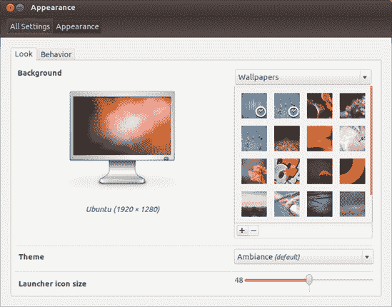
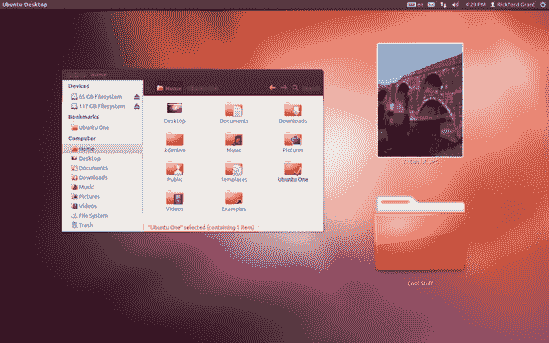
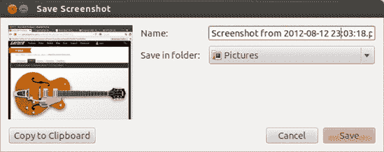
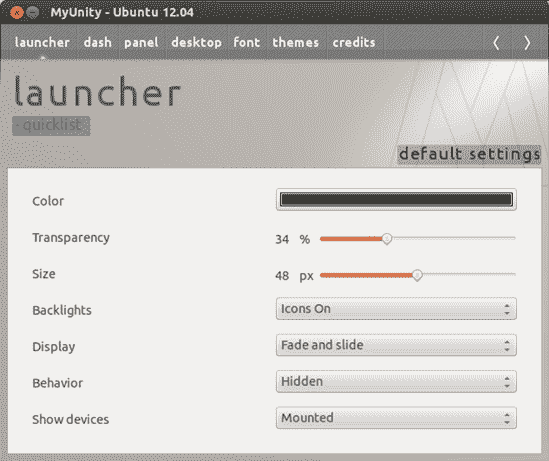
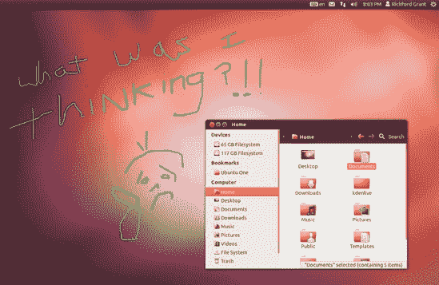
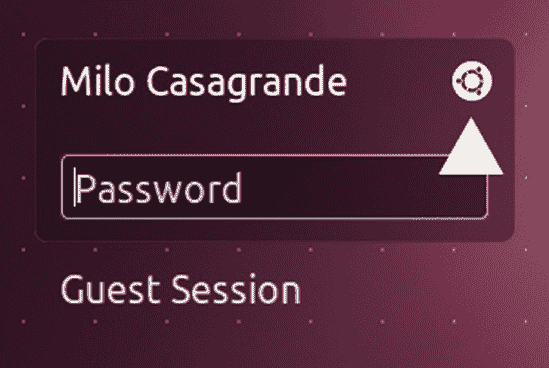
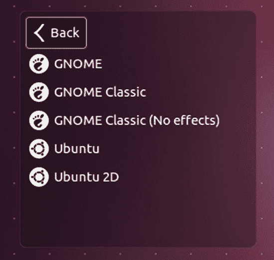

# 第九章. 美化小鸟

### 定制系统的外观和感觉

Linux 一直以来的一个很好的特性是你可以根据不同的程度改变其外观。我说的不仅仅是桌面背景、颜色和显示字体，还包括窗口边框等。如果你愿意，甚至可以改变整个桌面环境。

然而，对于喜欢定制的人来说，关于 Ubuntu 中的 Unity 环境有一点稍微令人失望，那就是它不像其他环境那样容易定制。给你完全定制自由的主要方式是实际上去掉 Unity，这涉及到相当技术性的领域，但也有一些事情你可以做而不必那么极端。所以，让我们先从讨论你可以做的简单调整开始，然后逐渐进入那些想要深入一点（只是稍微深入一点）的少数人的小技术领域。

# 项目 9A：创建新的用户账户

如果你不愿意改变当前设置的样式，你可以创建一个新的用户账户，并在登录到新账户时在此章节中尝试进行更改。如果你选择走这条路，你的常规家庭环境将保持不变，因为在一个用户账户中执行的外观和感觉定制不会影响其他用户账户。当你完成项目后，你可以简单地删除这个新的用户账户。

## 9A-1：创建账户

要设置新的用户账户，请按照以下步骤操作：

1.  在启动器中点击 **系统设置** 按钮。

1.  当系统设置窗口出现时，滚动到系统部分的底部并点击 **用户账户**。

1.  在用户账户窗口中，点击 **解锁** 按钮。当被要求时提供你的密码，然后点击 **认证**。

1.  现在点击窗口左下角的 **+**。

1.  在出现的新窗口（图 9-1

    图 9-1. 创建新的用户账户

1.  点击 **创建** 添加新用户。当被要求时提供你的密码，然后在该窗口中点击 **认证**。

1.  现在点击用户账户窗口左侧的新账户，然后点击单词 *密码* 旁边的 **账户禁用**。

1.  在出现的窗口中（图 9-2)，为新账户输入一个新密码（对于这个实验，使用与常规账户相同的密码即可），然后在“确认密码”框中再次输入，然后点击**更改**。

1.  完成后，点击用户账户窗口右上角的**锁定**按钮，然后关闭窗口本身。

### 注意

通常情况下，在新用户账户上默认不选择安装软件和执行其他系统级更改（管理员）的权限，因为你可能不希望你的孩子、工作伙伴或任何其他人在你的电脑上安装各种奇怪的东西并搞乱你的系统设置。但在这里我们需要它，因为我们将要安装一些东西。

图 9-2. 输入新用户账户的密码

## 9A-2: 登录新账户

当你创建一个新用户账户时，它将自动出现在用户菜单中，该菜单在点击面板右端的用户名时出现。点击该账户名称，几秒钟后，你将进入登录界面。新账户的用户名应该被突出显示，但如果不是，点击一次，输入账户密码，然后按回车键。几秒钟后，你将到达你刚刚创建的用户的新、未触动的桌面。当你想回到原来的用户账户时，只需遵循相同的步骤，但在菜单中选择你的原始用户账户。非常酷。

当你*切换用户*，就像我刚才描述的那样，你正在运行的程序和打开的窗口都会暂停，等待你回来。换句话说，当你离开时，你会回到原来的账户，一切都会保持原样——你的浏览器仍然打开着，GIMP 中正在编辑的图像，以及你的简历仍然在 Writer 中打开。当你需要在账户之间切换，或者你的孩子需要登录他的账户进行快速电子邮件检查，在去海滩的路上烧录 CD，或者为学校打印文件时，这非常方便。当你的孩子完成时，你可以快速回到你之前正在做的事情，而无需重新打开文件、网页或你当时正在处理的其他任何东西。你甚至可以在点击面板右端的用户菜单时看到哪些账户是打开的（图 9-3). 所有打开的账户，无论是休眠还是活跃，都会在它们的右侧有勾选标记，而当前打开并处于活动状态的账户在其菜单条目左侧也会有一个点。

图 9-3. 在用户账户之间切换

这一切都非常酷且方便，但假设您完成了您正在做的事情，您正在将机器交给您的配偶或孩子。那么，您可能只想通过*注销*来关闭您的部分。为此，点击面板右侧的齿轮图标，并选择**注销**。将弹出一个对话框，询问您是否确定要关闭所有程序并从计算机注销。如果您确定，请点击**注销**。如果不，请点击**取消**。如果您选择注销，您将返回登录屏幕，在那里您可以点击账户名称并输入该账户的密码来选择要登录的账户。

# 自定义：基础知识

正如我提到的，在 Ubuntu 的默认设置中，可用的自定义选项并不多，但确实有一些。首先，我们将讨论那些无需安装任何软件或无需使用命令行即可使用的选项。

## 更改桌面背景

更改您的桌面背景（通常称为*壁纸*）是您可以做的最简单的自定义之一。只需在桌面上右键单击任何空白区域，并在弹出菜单中选择**更改桌面背景**。这将打开外观窗口，您可以在其中查看已安装的壁纸并从中选择（参见图 9-4）。

图 9-4. 更改您的桌面壁纸

### 安装额外的壁纸

Ubuntu 的默认壁纸被称为*Ambiance*。如果您不喜欢 Ambiance 的紫色世界，点击其他任何壁纸即可立即进行更改。可供选择的有相当多，但也许您更愿意使用一些自己的图片。这些可以是数码相机中的照片，您在计算机上创作的艺术品，或者几乎任何您想放在那里的东西。

如果您打算上网冲浪，许多网站提供免费的桌面壁纸。两个专门针对 Linux 用户的网站是[`www.gnome-look.org/`](http://www.gnome-look.org/)和[`art.gnome.org/`](http://art.gnome.org/)，但您可以从您喜欢的任何地方获取壁纸。每日天文图片([`apod.nasa.gov/apod/astropix.html`](http://apod.nasa.gov/apod/astropix.html))是我特别喜欢的。许多公司网站（汽车、汽水、吉他，等等！）也提供壁纸。

下载您的壁纸后，将其从*下载*文件夹移动到*图片*文件夹中。（您可能想要创建一个*壁纸*子文件夹以更好地组织文件，但这完全取决于您。）之后，您可以通过在外观窗口中壁纸面板下方点击**+**按钮来安装新图片。在出现的窗口中，导航到您的新的壁纸，点击一次以突出显示它，然后点击**打开**。壁纸将在外观窗口中突出显示，并在几秒钟内出现在桌面上。

一旦壁纸出现，您可以使用外观窗口中+按钮左侧的小下拉菜单按钮调整它在桌面上的显示方式。您的选择有*平铺*、*缩放*、*居中*、*缩放*、*填充*和*填充至边缘*。尝试它们以查看哪个最适合您选择的图片。完成后，点击**关闭**以完成此过程。

### 从互联网到桌面——快速且简单

您还可以通过在网页浏览器中右键单击该图片并选择**设置为桌面背景**来几乎自动地将网页上的图片设置为您的桌面壁纸。一个小窗口将出现，您可以在其中预览下载到屏幕上的效果（图 9-5）。

图 9-5. 选择网页图片作为桌面壁纸

您也可以在此窗口中调整您桌面的位置（例如平铺或居中）和背景颜色。一旦您完成调整，请点击**设置桌面背景**按钮。然后，图片将出现在您的桌面上，而图片文件将被保存在下载位置（默认为您的家目录）中，文件名为*Firefox_wallpaper.png*。

## 更改主题

在离开外观窗口之前，值得提一下您可以从此窗口执行的一些其他自定义操作。第一个操作可以直接在壁纸面板下方完成。在那里您将看到一个标有“Ambiance”的下拉菜单按钮，这是默认的 Ubuntu 主题的名称。如果您点击该按钮，您将看到还有另外三个主题：Radiance、高对比度和高对比度反转。选择不多，但足够有趣。要查看效果，只需尝试每个主题，几秒钟内您就会看到它们的外观。如果您喜欢您看到的效果，您可以直接关闭窗口。

## 更改启动器图标大小（仅限 Unity 3D）

您可以进行的另一种自定义操作与启动器中图标的大小有关。如果您查看窗口的底部部分，您会看到一个滑块，允许您更改这些图标的大小。启动器图标的默认大小为 48×48，但您可以将其缩小到非常易于管理的 36×36，或者将其放大到 60×60。只需移动滑块，图标就会改变大小。当您满意时，关闭外观窗口。

## 自动隐藏启动器

您还可以从外观窗口执行一项自定义操作——自动隐藏启动器并设置桌面热点，以便在您想要它出现时再次显示。为此，请单击**行为**选项卡。在行为选项卡（图 9-6）。

图 9-6. 自动隐藏启动器并设置热点以使其再次出现

图 9-7. 桌面图标可以拉伸到您想要的任何大小。

要拉伸桌面图标，右键单击图标，并在弹出菜单中选择**调整图标大小**。在图标的每个角落周围会出现四个蓝色方块（如图图 9-8 所示）。只需单击并拖动这些方块中的任何一个，直到图标达到您想要的大小。一旦完成拉伸，请单击桌面上的任何位置，方块就会消失。如果您有其他想法，想要将图标恢复到原始大小，请右键单击它，并从菜单中选择**恢复图标原始大小**。

图 9-8. 拉伸桌面图标

## 捕获屏幕截图

现在您已经了解了一些使您的 Ubuntu 桌面看起来更像您自己的方法，您可能想要分享或记录您努力的成果——无论是现在还是在本章的其余部分之后。捕获屏幕截图可以让您做到这一点。最简单的方法是通过快捷键组合。要拍摄整个屏幕的截图，只需按打印屏幕键。要拍摄单个窗口的截图，请按 alt–print screen。

如果您想为您的截图添加定时延迟或微调其他功能，那么您将需要使用截图应用程序，如图 图 9-9 所示。您可以通过点击应用程序透镜，然后点击 **附件** 过滤器按钮，然后在结果中查找截图来运行截图。您也可以直接在 Dash 中输入 **`screenshot`** 并按回车键。

图 9-9. 截图应用程序

无论您是通过按键还是通过截图应用程序来截图，当截图完成时，您都会听到类似快门的声音 *kashya*，之后会出现一个类似于 图 9-10 中的窗口。在该窗口中，您可以命名图片并决定将其保存到何处。

图 9-10. 在 Ubuntu 中保存截图

# 自定义您的桌面环境：下一个层次

现在您已经知道了一些可以在不借助任何外部帮助的情况下对系统进行的美观调整，现在是时候进入下一个层次，以便您可以进行更多调整。有两个应用程序允许您操作您无法使用系统捆绑工具更改的内容。这些是 MyUnity 和 CompizConfig 设置管理器，您都可以轻松地从 Ubuntu 软件中心获得。这两个应用程序都允许您执行各种系统调整，而无需使用命令行。

### 注意

本节讨论的功能适用于 Unity 3D 环境。如果您正在运行 Unity 2D，您会发现讨论的许多功能不可用。

## 使用 MyUnity 进行自定义

MyUnity (图 9-11) 专注于启动器、您的窗口和其他固定图形界面元素的外观和行为。您可以通过点击 Dash 中的应用程序透镜，然后点击自定义过滤器按钮来运行它。您也可以直接在 Dash 中输入 **`myunity`** 并按回车键。

### 更改启动器属性

如您在 MyUnity 的启动器标签页中看到的，MyUnity 允许您更改启动器的外观和行为。确实，您已经可以通过外观窗口完成一些调整，例如更改图标大小和自动隐藏启动器，但 MyUnity 还允许您做其他一些事情。例如，您可以在启动器中显示或隐藏驱动器和磁盘，并调整启动器的背景透明度和图标背光。您可以通过尝试不同的选项并查看会发生什么来最好地理解后者的效果（如果您想将一切恢复到图中的样子，只需将设置改回即可）。

图 9-11. 使用 MyUnity 更改启动器设置

### 更改仪表盘属性

通过点击仪表盘标签，您可以在 MyUnity 中看到可用于自定义仪表盘的选项（图 9-12)，您可以选择希望在桌面上自动显示的项目（默认情况下没有任何项目，如您所知）。这些可以包括您的家目录、驱动器、网络、垃圾箱等。您还可以打开和关闭窗口动画，如果您正在尝试加速旧机器或者对此类事物不太关心，并且您可以调整您拥有的虚拟桌面的数量，包括水平（H 桌面）和垂直（V 桌面）。

图 9-12. 在 MyUnity 中更改仪表盘属性

图 9-13. 在 MyUnity 中更改顶部面板的透明度

图 9-14. 使用 MyUnity 自定义桌面

### 更改显示字体

字体标签页（图 9-15

图 9-15. 使用 MyUnity 更改显示字体

### 更改主题

最后，主题标签页（图 9-16

图 9-16. MyUnity 允许您更改窗口和图标主题。

图 9-17. 通过 MyUnity 更改主题和图标的结果

## 使用 CompizConfig 设置管理器自定义视觉效果

从 MyUnity 停止的地方开始，CompizConfig 设置管理器，也称为 CCSM（图 9-18

图 9-18. CompizConfig 设置管理器

只有当您有支持其基本功能集的显卡时，Compiz 才会在启动时自动启用。一个简单的方法来判断 Compiz 是否在您的机器上启动，是打开任何窗口（例如您的家目录）并检查该窗口是否有阴影。如果没有阴影，那么 Compiz 没有在工作，本节对您来说可能不太有用——跳到下一节。如果有阴影，那么 Compiz 正在工作，所以请继续阅读。

您系统默认启用的图形效果实际上只是冰山一角。根据您的显卡功能，您将获得一些阴影效果以及其他一些小功能，比如更酷的窗口开启过渡效果，但也就这些了——至少在表面上是这样。如果您愿意，现在就可以通过提高效果级别来感受一下。首先，通过前往 Dash，点击应用程序镜头，然后点击**自定义**过滤器按钮，在显示的结果中找到它。或者，如果您喜欢，只需在 Dash 中输入**`compiz`**并按回车键即可。

您首先会看到的，除了 CCSM 窗口外，还有一个窗口警告您 CCSM 是一个高级工具，您应该谨慎操作。警告是正确的，所以如果您不确定 CCSM 中的某个功能是什么或做什么，那么可能您不应该随意操作它。然而，您可以安全地尝试这里提到的功能，从**Wobbly Windows**开始。

要尝试 Wobbly Windows（并因此亲身体验 CCSM），请点击 CCSM 窗口左侧的**效果**按钮，然后在下一屏幕中勾选**Wobbly Windows**。在之后的屏幕中，勾选旁边带有**启用 Wobbly Windows**字样的复选框。在随后出现的窗口中，点击**禁用窗口吸附**按钮。现在拖动窗口。您会看到，当您移动它时，整个窗口会像果冻一样开始晃动——既奇怪又完全分散注意力，但有点酷。如果您觉得这个功能让您感到烦恼，可以取消勾选 Wobbly Windows 复选框。

另一个有趣的工具是 Annotate 工具，它实际上有一些实际用途，因为它允许您在屏幕上书写（图 9-19)。要激活 Annotate 工具，请点击屏幕左侧的**额外工具**按钮，然后在新的屏幕中勾选**Annotate**旁边的复选框。点击**Annotate**这个词本身即可进入该工具的偏好设置（这是访问所有工具和功能设置的方式），如图图 9-20 所示，从而学习如何激活工具的功能。

图 9-19. Compiz Annotate 工具允许您在屏幕上书写。

图 9-20. 几乎每个 Compiz 功能和工具都有自己的设置。

### 注意

一些用于默认 Compiz 快捷键的按键可能看起来不熟悉；其中最常用的是*Super*键（通常是键盘上的 Windows 键）和*Button1*（通常是您的左鼠标按钮）。

您还可以通过单击显示当前按键组合的按钮，然后在出现的编辑窗口中做出新的选择来编辑某些工具的各种按键组合（图 9-21

图 9-21. 更改用于启动或使用 Compiz 功能的按键组合

# 项目 9B：自定义桌面环境——没有比 GNOME 更合适的地方

我们现在已经介绍了您可以使用图形前端更改系统外观的主要方法。然而，您还可以做一些其他相当戏剧性的事情，这将给您机会将您在第八章中获得的高级命令行技能发挥到极致。现在，如果您愿意，您将有机会进入另一个世界……好吧，至少是另一个桌面环境。

虽然 Ubuntu 是目前最受欢迎的 Linux 发行版之一，但许多人并不太喜欢 Unity 桌面环境，尝试之后，您可能会发现自己加入了不满的用户行列。如果是这样，您不必绝望太久——有替代方案，在这个项目中，您将学习如何安装其中最著名的之一：GNOME。您不仅将安装并学习如何登录到 Unity 之前的桌面环境，即*GNOME 经典桌面*（图 9-22

图 9-22. GNOME 经典桌面环境

图 9-23. GNOME Shell 桌面环境

## 9B-1: 安装 GNOME 桌面环境

尽管安装 GNOME 桌面环境可以带来许多重大变化，但令人惊讶的是，操作过程非常简单。以下是步骤：

1.  打开一个终端窗口，输入**`sudo apt-get install gnome-session-fallback`**，然后按回车键。

1.  当提示输入密码时，请输入您的密码，然后按回车键。

1.  您将很快被询问是否希望继续。输入**`y`**（表示*是*）然后按回车键。整个过程可能需要一分钟才能完成。

1.  当您返回到用户提示符时，输入**`sudo apt-get install indicator-applet-appmenu`**并按回车键。这个过程可能只需要几秒钟。

1.  当您再次回到用户提示符时，输入**`sudo apt-get install gnome-tweak-tool`**并按回车键。

1.  当提示时，通过输入**`y`**（表示*是*）并按回车键继续。这个过程可能需要最长时间，可能超过一分钟。

1.  当进程完成并且您回到用户提示符时，关闭终端。

1.  登出。

## 9B-2: 切换到 GNOME 桌面环境并返回

安装过程完成后，您登出后，在桌面环境之间切换非常容易。在登录界面，点击您账户名称旁边的 Ubuntu 标志，如图 图 9-24 所示。另一个菜单（图 9-25）将出现，显示可用的桌面环境。这些应该是 *GNOME*（用于 GNOME Shell）、*GNOME 经典*（用于过去的经典 GNOME）、*GNOME 经典（无效果）*（用于图形能力有限的系统）、*Ubuntu*（默认的 Unity 环境）和 *Ubuntu 2D*（第三章 中提到的默认 *回退模式*）。

在您即将登录的会话中，只需选择您想要使用的环境，然后您将返回到常规登录界面。在那里输入您的密码，按回车键，搞定！

图 9-24. 登录界面中的 Ubuntu 标志

图 9-25. 从登录界面选择您想要的桌面环境

# 项目 9C：从 Unity 切换到 Cinnamon

最近在受欢迎程度上与 Ubuntu 竞争的另一个基于 Ubuntu 的 Linux 发行版，称为 Mint。Mint 使用一个名为 Cinnamon 的桌面环境，可以描述为 GNOME 经典和 MS Windows 的结合。这是一个简单、干净且感觉非常熟悉的环境，这可能解释了它的受欢迎程度。幸运的是，您不必切换到 Mint 就能获得它；您可以自己添加它。要安装 Cinnamon（如图 图 9-26 所示），您必须向 apt-get 和 Ubuntu 软件管理器已经使用的存储库中添加一个，因此您可以说是在 Ubuntu 纯粹的界限之外扩展，但如果您想尝试一下，这里是什么步骤：

1.  在终端窗口中输入 **`sudo add-apt-repository ppa:gwendal-lebihan-dev/cinnamon-stable`** 并按回车键。这将添加存储库。

1.  当提示输入密码时，请输入密码然后按回车键。

1.  您将被询问是否要继续添加 PPA 的过程或取消。按回车键继续（或按 ctrl-C 取消，就像终端中说的那样）。

1.  当您回到用户提示符时，通过输入 **`sudo apt-get update`** 并按回车键来更新数据库，就像您在 第八章 中学习的那样。这个过程可能需要一分钟左右。

    

    图 9-26. Cinnamon 桌面环境

1.  接下来，通过输入**`sudo apt-get install cinnamon`**并按回车键来安装 Cinnamon。

1.  你将被询问是否继续。输入**`y`**并按回车键。下载和安装可能需要几分钟。

1.  安装完成后，你将回到用户提示符。此时你可以关闭终端。

要查看你的新桌面环境，请注销，然后在登录屏幕上，点击你用户名旁边的 Ubuntu 标志。在出现的列表顶部（你之前在章节中切换到 GNOME 桌面时已经看到），你将在列表中看到一个新条目：*Cinnamon*。点击它，然后按照正常的登录程序进行操作。

一旦进入 Cinnamon 环境，你可能想要进行一些自定义设置，以便 Unity 的 Ambiance 主题的残留部分不会与 Cinnamon 的 *Adwaita* 主题显得格格不入。要进行这些更改，只需按照以下步骤操作：

1.  点击屏幕左下角的**菜单**按钮，将鼠标悬停在**偏好设置**上，然后点击**Cinnamon 设置**。

1.  在 Cinnamon 设置窗口中，点击其他设置选项卡。然后，从旁边带有 GTK+ 主题字样的下拉菜单按钮中选择 Adwaita。

1.  如果你想，也可以通过在旁边带有*图标主题*的下拉菜单按钮中选择选项来更改图标主题。
