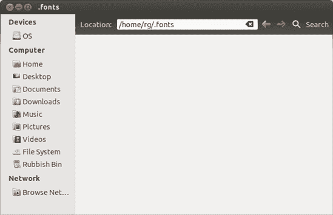
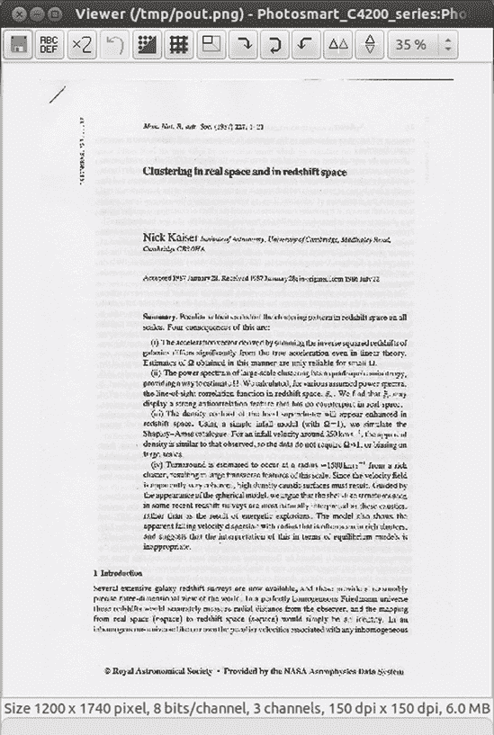

# 第十章。古腾堡

### 设置和使用您的打印机和扫描仪

两种最常见的计算机外围设备是打印机和扫描仪。这完全说得通，因为正是这两样工具将上网冲浪、玩游戏、制作音乐、处理数据的芯片盒子变成了一种有意义的生产工具——如果你愿意的话，就是一个虚拟出版社。这些设备帮助您的计算机将数字信息转换为纸质副本（在打印机的情况下）和将纸质副本转换为数字信息（在扫描仪的情况下）。因此，这些工具如今常常以多功能打印机的形式一起出现。

在本章中，您将学习如何将这些有用的设备连接到您的计算机，如何设置它们，以及如何使用它们。您还将学习如何查找和安装新字体，以便使您的打印文档看起来最佳。如果您对使用数码相机比对扫描仪更感兴趣，您可能想先看看第十三章；否则，穿上您的打印机围裙继续阅读。

# 打印机

除非您使用计算机的唯一目的是玩游戏、听 MP3 或在大风炎热的天气里阻止门，否则您无疑会想将您的机器连接到打印机。尽管个人计算机本应引领无纸化办公时代，但计算机作为桌面出版和通用工作工具的强大功能使得生产高质量的打印文档比以往任何时候都更有吸引力。

## 确认您的打印机得到支持

将打印机设置为新系统使用是一项相当简单的任务，而且看起来 Linux 世界中的打印机支持随着每个版本的发布而变得越来越好。总的来说，大多数打印机的支持都相当不错，只有极少数品牌和型号在兼容性方面存在问题。

如果您真的想确保您的打印机得到支持，只需按照下一节中的说明尝试即可。如果您正在考虑购买打印机或正在考虑是否切换到 Linux，请访问[`www.openprinting.org/printers/`](http://www.openprinting.org/printers/)，在那里您可以查看在线数据库以了解您的打印机是否目前得到支持，以及支持的程度如何。支持打印机的列表还包括有关哪些驱动程序最适合您用途的信息。如果您打算为 Linux 系统购买打印机，惠普和爱普生的产品通常是一个相当安全的选择。您还可能想查阅 Ubuntu 的列表[`wiki.ubuntu.com/HardwareSupportComponentsPrinters/`](https://wiki.ubuntu.com/HardwareSupportComponentsPrinters/)。

## 让 Ubuntu 自动识别并设置您的打印机

在 Ubuntu 中处理打印机几乎不需要动脑筋，因为 Ubuntu 会自动检测大多数打印机。如果您有 USB 打印机，将其连接到计算机，然后打开打印机（反之亦然应该也能正常工作）。如果 Ubuntu 识别了您的打印机——可能性很大——它将在后台自动设置，您不需要点击任何按钮。这个过程只需要几秒钟，所以您应该可以立即打印。要检查一切是否正常，点击顶栏最右侧的电源按钮，然后从出现的菜单中选择**打印机**（或者，在 Dash 中搜索**打印机**）。如果您的打印机已正确设置，打印窗口将包含一个图标，其下方列出了打印机的型号和制造商。在这种情况下，您不需要做任何事情——您的打印机已设置好，准备使用。 

然而，Ubuntu 可能会识别您的打印机，但找不到与它完全匹配的驱动程序。在这种情况下，在您连接打印机后，应该会弹出一个窗口，提供一个替代驱动程序。如果您发现自己处于这种情况，打印一个测试页面来查看替代驱动程序是否按预期工作并不是一个坏主意。您可以通过从顶栏的电源按钮菜单中选择**打印机**，然后在出现的打印窗口中双击您的打印机来实现这一点。一个打印机属性窗口将打开。请确保从窗口左侧的列表中选择**设置**，然后点击**打印测试页面**按钮（图 10-1)。如果测试页面看起来正常（类似于图 10-2)，那么一切应该都正常，您可以关闭打印机属性和打印窗口。

图 10-1. 通过打印机属性窗口使用您的全新打印机打印测试页面

图 10-2. Ubuntu 打印机测试页面

如果您的打印机连接到计算机的并行端口，那么在您打开计算机时如果打印机已经连接，自动检测和设置也应该可以工作。如果没有连接，请关闭您的系统并关闭计算机，然后将打印机连接到计算机，打开打印机，然后再次启动计算机。如果有幸，这次您的打印机应该会被自动识别并设置。您也可以尝试用这种方法来处理最初未被识别的 USB 打印机。

## 手动配置打印机

如果您的打印机没有被自动识别，您仍然可以手动设置。在本节中，我假设您有一个通过某种类型的电缆连接到计算机的打印机，无论是 USB 还是并行端口。如果您有一个无线功能的打印机，或者一个连接到本地网络的打印机，请跳到下一节或下一节以获取说明。但对于使用电缆连接的您，以下是您需要做的：

1.  点击顶部的电源按钮，并从出现的菜单中选择**打印机**。要么会出现一个打印窗口，显示已经识别的打印机，要么会有一条消息告诉您尚未配置任何打印机。

1.  点击**添加**按钮，之后系统将在新打印机窗口中显示任何新找到的打印机（图 10-3）。

    

    图 10-3. 手动设置打印机

1.  在该窗口的左侧面板中点击您的打印机条目，然后点击**前进**。系统将开始搜索您的打印机驱动程序。

1.  如果您的打印机受支持，向导的下一页或两页将要求您输入一些关于打印机的基本详细信息。这些可能包括其品牌和型号。根据您的需求填写空白，然后，当您到达最后一页时，点击**应用**。

1.  向导将关闭，您将被询问是否要打印测试页。为了确保一切正常，打印测试页总是一个好主意，因此点击**是**。

    您的系统将向您的打印机发送一个测试文档，并在一个小窗口中通知您已经发送，您可以将该窗口关闭。打印机应该会很快打印出测试页。

### 注意

如果您的测试页没有按照预期打印出来，或者如果系统没有自动或正确地配置您的打印机，请访问[`www.openprinting.org/printers/`](http://www.openprinting.org/printers/)以查看是否对您的型号有任何特殊要求或注意事项。

## 设置无线打印机

带内置无线（Wi-Fi）适配器的打印机越来越常见。您通常可以选择使用 USB 电缆以传统方式连接它们，或者将它们设置为连接到您的无线网络。在后一种情况下，任何连接到网络的计算机都可以访问打印机。不错吧？如果您有这样的打印机，并希望从您的 Ubuntu 机器上利用其无线功能，请继续阅读：

1.  确保打印机已开启并连接到您的无线网络。具体如何操作取决于打印机的型号，因此请查阅打印机手册以获取说明。

1.  在您继续之前，您需要获取有关打印机无线网络设置的一些关键信息。特别是，您正在寻找其 IP 地址。打印机可能有一种方式自行显示此信息，无论是通过一个小型内置屏幕还是通过打印信息页。请查阅打印机手册以获取详细信息。

1.  拿到打印机的 IP 地址后，回到 Ubuntu 电脑前，点击顶部面板最右侧的电源按钮。从出现的菜单中选择**打印机**，一个打印窗口将会出现。

1.  点击**添加**按钮，之后将出现新的打印机窗口。

1.  在该窗口的左侧面板中，通过单击一次该条目选择**网络打印机** ▸ **查找网络打印机**。现在，将打印机的 IP 地址输入到主机框中，如图图 10-4 所示。（注意，您的打印机 IP 地址可能与这里显示的不同。）

    

    图 10-4. 连接到无线打印机

1.  点击**查找**。过一会儿，您的电脑应该会找到打印机，您将被带到可以指定其品牌、型号等信息的一页。

1.  现在继续从手动配置打印机中的第 4 步进行操作。

不幸的是，一些无线打印机在 Ubuntu 中设置起来可能有些麻烦，所以上面的说明可能不起作用。您可能需要安装额外的软件或尝试与我讨论的不同类型的“网络打印机”配置。如果您怀疑您的打印机可能是那些难以设置的打印机之一，请尝试在[`www.ubuntuforums.org/`](http://www.ubuntuforums.org/)上搜索，看看是否有人已经找到了设置方法。当然，如果什么方法都不起作用，您始终可以使用 USB 线缆作为备选方案。

## 通过网络设置打印机

如果您想使用通过家庭或办公室网络连接的打印机，只需按照以下步骤操作：

1.  点击顶部面板最右侧的电源按钮，并从出现的菜单中选择**打印机**。一个打印窗口将会出现，显示已识别和/或配置的打印机。

1.  点击**添加**按钮，之后将出现新的打印机窗口。

1.  在该窗口的左侧面板中，通过单击一次该条目选择**网络打印机** ▸ **通过 SAMBA 的 Windows 打印机**，然后点击页面右上角的**浏览**按钮。

1.  在出现的 SMB 浏览器窗口中（图 10-5

    图 10-5. 在 Windows 网络上浏览连接的打印机

1.  现在从 手动配置打印机 中的第 4 步开始继续操作。

## 对于无驱动程序的用户

如我所述，Linux 目前还没有为一些打印机提供内置支持。如果你发现自己有一台这样的打印机，你可以采取几种途径来使它工作。

### 检查连接

你可能会惊讶，我多少次通过简单地打开打印机或摇晃或重新插拔 USB 或并行连接器来解决某人的打印机问题。如果打印机的型号名称没有出现在打印机设置向导的第一页上，那么关闭电源和/或连接松动的打印机通常要承担责任。

如果那种方法失败，请浏览到 [`www.openprinting.org/printers/`](http://www.openprinting.org/printers/)，因为有时 Linux 只能在打印机通过并行端口连接时支持某些打印机，即使在其他系统中它们通过 USB 工作。

### 尝试您的 Windows 驱动程序

如果你的打印机附带安装光盘，你可能想看看是否能在那里找到它的驱动程序。此类光盘上的驱动程序应以 .*ppd*（表示“PostScript 打印机描述”）结尾。要使用这些驱动程序之一，请按照前面描述的方法添加打印机，但当你到达选择打印机型号的新打印机窗口时，请点击**提供 PPD 文件**选项。然后通过点击页面中间的**（无）**按钮尝试定位适当的文件。如果你找到了你的驱动程序，请点击**前进**按钮，然后继续打印机设置。

### 使用第三方驱动程序

最近，越来越多的 Linux 打印机驱动程序变得可用。如果您在打印机设置向导的第二页上找不到您的打印机，只需尝试在网络上搜索您的打印机制造商和型号加上单词*linux*。例如，过去我有一台激光打印机没有出现在[`www.openprinting.org/printers/`](http://www.openprinting.org/printers/)上，所以我搜索了打印机，*samsung+SCX4100+linux*，这让我找到了[`www.driverstock.com/`](http://www.driverstock.com/)，这是一个为大多数操作系统提供免费打印机驱动程序的网站，包括 Linux。在那个网站上，我不仅找到了我打印机的驱动程序，还找到了其内置扫描仪的驱动程序。

您还可能想检查您打印机制造商的网站，因为许多现在为他们的打印机提供 Linux 驱动程序。兄弟、利盟、惠普、佳能和三星就是其中的一些。还有一家德国公司([`www.turboprint.info/`](http://www.turboprint.info/); 网站为英文)提供 Linux 驱动程序，尽管需要付费，但它们是为难以处理的机器和高品质图形解决方案提供的。

如果您偶然发现并下载了一个没有自带安装程序的打印机驱动程序，只需按照尝试 Windows 驱动程序的说明进行操作。最后，别忘了尝试 Ubuntu 论坛([`www.ubuntuforums.org/`](http://www.ubuntuforums.org/))，看看那里是否有人有让打印机在其系统上工作的经验。

### 尝试与错误

最后，总是有旧的尝试与错误方法，有时它也会奏效。当通过向导窗口设置打印机时，尝试选择打印机制造商提供的其他打印机型号和/或驱动程序之一。

在完成向导后，双击打印窗口中添加的打印机，点击**设置**选项卡，然后点击**打印测试页**按钮以查看发生了什么。如果没有发生任何事情，点击设置屏幕上制造商和型号行最右端的**更改**按钮；选择不同的打印机型号和/或驱动程序；然后，在设置屏幕上再次点击**打印测试页**按钮。重复此过程，直到某个选项生效。如果有任何运气，某个选项可能会……好吧，如果您真的绝望了，就试一试吧。

## 打印详情

现在您的打印机已经设置好了，您无疑想要开始打印！这是一个简单的任务，并且与 Windows 和 Mac 世界中的操作并没有太大的不同，所以您不需要太多解释就可以继续。事实上，在 Ubuntu 中打印变得比以往任何时候都要简单，因为您通常想要调整的所有设置都在打印窗口中，该窗口在您在应用程序的文件菜单中选择打印时出现。我甚至敢说，现在在 Ubuntu 中找出打印选项比在 Windows 或 OS X 中还要容易。

你应该知道，选项卡的功能可能会根据你打印的应用程序而有所不同。例如，当你从 GIMP 打印时，你看到的选项卡将与从 Firefox 打印时看到的选项卡略有不同。然而，通用和页面设置选项卡几乎总是存在的。话虽如此，我会给你一些关于在打印窗口选项卡中可用的设置的想法：

**通用**

打印机选择，打印页数，副本数量，打印顺序，整理

**页面设置**

每页纸张数，缩放，纸张类型，纸张来源，输出托盘

**选项**

打印框架，缩放到页面大小，打印背景，页眉和页脚

**图像设置**

尺寸，分辨率，页面定位

**作业**

打印时间（现在，稍后，指定时间），封面页

**图像质量/高级**

输出分辨率（DPI），打印速度和质量

### 在 LibreOffice 中打印

有时，你会遇到像 LibreOffice 这样的应用程序，它在处理打印方面略有不同。幸运的是，这些差异实际上可能使 LibreOffice 的打印更类似于 Windows，因此对于来自 Windows 世界的新手来说更容易跟上。正如你在图 10-6 中可以看到的，LibreOffice 应用程序的主要打印窗口允许你选择要使用的打印机，打印的页面范围以及你想要打印的副本数量。你可以通过点击“属性”和/或“选项”按钮来访问其他选项。

图 10-6. LibreOffice 中的打印设置

### 打印到 PDF

Linux 中的一个很好的特性是你可以将大多数文档和网页保存为 PDF 文件。在某些情况下，例如在 LibreOffice 中，你可以通过将文档导出为 PDF 来完成此操作。然而，在大多数其他应用程序中，你通过打印窗口来完成此操作，在这种情况下，你被称为“打印到 PDF”。无论你是“另存为”PDF、“导出为”PDF 还是“打印到”PDF，本质上你都是在做同样的事情：创建你文档的 PDF 文件。

这非常方便，因为它允许你创建其他人无法更改的文档，同时可以轻松地被阅读，无论读者使用的是哪种字处理器程序或操作系统。最好的是，这个在 Windows 世界中可能需要支付一大笔钱的功能，在你的系统中是免费的，因为它内置其中。

在大多数应用程序中，您可以通过访问相关应用程序的**文件**菜单并选择**打印**来打印到 PDF。当打印窗口（图 10-7

图 10-7. 在大多数 GNOME 应用程序中将文件打印为 PDF

### 取消打印作业

这是我们所有人都会遇到的情况。您只想打印 57 页文档中的一页，但您不小心开始打印了整个文档。您能做些什么来节省墨水和 56 张纸？幸运的是，解决方案很简单。

点击顶部面板最右侧的电源按钮，从菜单中选择**打印机**。右键单击正在处理您的文档的打印机图标，从弹出菜单中选择**查看打印队列**。将出现一个显示您当前和队列中的打印作业的窗口（如图 图 10-8

图 10-8. 通过打印队列窗口取消打印作业

完成此操作后，队列窗口中列出的打印作业将消失，您的打印机将停止打印。然后您可以关闭打印队列窗口。您可能会发现这个简单的流程比您在其他操作系统中的体验更有效。

在某些情况下，事情会变得更容易，尤其是如果您通过随打印机一起打包的安装程序自行安装了打印机驱动程序。在这种情况下，驱动程序可能提供自己的进度窗口，该窗口会在您打印文档时出现。如果是这样，您只需在该窗口中点击**取消**按钮（或等效按钮）即可取消打印作业。

### 注意

在某些情况下，您可能需要在取消打印作业后清除打印机。您可以通过关闭打印机，等待几秒钟，然后再次打开它来完成此操作。

### 检查墨水水平和其他打印机维护任务

打印机墨水或碳粉有消失得像新鲜出炉的饼干一样的本领，因此检查你的墨盒状况是很自然的。你也可能会遇到打印机的问题，比如打印出来的条纹或本应直线的锯齿状线条，因此可能需要清洁或校准打印头。不幸的是，由于每种打印机的处理方式都不同，没有一种简单的方法来做这件事。我只会提到一些你可以访问这些选项的方法，针对最常见的品牌：

**HPLIP**

这仅适用于惠普打印机。打开 Ubuntu 软件中心并安装 HPLIP Toolbox。在 Dash 中搜索**HPLIP Toolbox**来运行它；使用“用品”选项卡来检查墨水水平，使用“操作”选项卡来校准和清洁你的墨盒。

**Mtink**

这适用于许多 Epson、Canon 和 HP 打印机——请访问[`xwtools.automatix.de/english/overview.htm#PRINTERS`](http://xwtools.automatix.de/english/overview.htm#PRINTERS)查看你的打印机是否受支持。打开 Ubuntu 软件中心，安装 Mtink，然后从 Dash 中打开它来检查墨水水平。

**escputil**

这适用于一些 Epson 打印机，如果 Mtink 不支持你的型号，值得一试。打开 Ubuntu 软件中心并安装 escputil。然后通过 Dash 中的搜索打开一个终端。输入**`escputil -i`**（不要忘记空格）并按回车键以显示墨水水平。要清洁打印头，输入**`escputil -c`**。

如果你尝试了这些工具但无济于事，或者你的打印机品牌没有列出，你可能仍然可以通过制造商自己的 Linux 驱动程序（如果有的话）来访问墨水水平和维护功能。此外，一些较新的打印机允许你通过打印机上的控件来检查墨水水平、校准和清洁墨盒。如果有疑问，请查阅你的打印机手册。

# 项目 10：安装 TrueType 字体

在某种程度上，打印主要关乎展示。如果你费尽周折去打印某物，那么你很可能希望它看起来**好**。没有什么比你的字体选择更能影响展示效果了：除非你是儿童娱乐表演者，否则你可能在简历上使用像 Comic Sans 这样的古怪字体时不会走得太远。同样，一种中世纪风格的哥特字体可能在你写给银行经理的信件上显得有些浪费。幸运的是，你的 Ubuntu 系统自带了各种非常实用且至少在我看来很漂亮的 TrueType 字体。然而，这些字体在美学谱系上可能略显保守，许多用户可能希望向系统中添加一些更具特色的字体。

您的银行经理可能不会欣赏那种哥特字体，但您可能想用它来打印一个活动的奖项。或者，您可能正在为您的蜗牛养殖协会的地方分会准备一份通讯，并想使用一种圆润、泡沫状和粘滑的字体。无论您的偏好、目的或愿望如何，您可能会达到想要在系统上安装其他 TrueType 字体的某个点，因此在这个项目中，我将告诉您如何做到这一点。

您安装字体的方式取决于谁将使用它们。如果您在机器上只有一个用户账户，最简单的方法是本地安装字体，如 10-2: 本地安装字体中所述。10-2: 本地安装字体中提到的本地安装的字体是指只有您或登录到您用户账户的人才能使用的字体。另一方面，如果您有多个用户账户并且希望字体对所有机器上的用户都可用，您需要全局安装它们——在这种情况下，请参阅 10-3: 全局安装 TrueType 字体中的 10-3: 全局安装 TrueType 字体。

## 10-1: 获取字体文件

互联网上充满了免费字体。对于这个项目，我将向您推荐[`www.fontfreak.com/`](http://www.fontfreak.com/)网站，它有一个非常好的字体收藏。一旦您到达 FontFreak 主页，点击页面左侧“免费字体”标题下的**字体**链接。下一页将询问您是否想一次性下载网站上所有的免费字体；点击**不用了，我会一个一个下载**。这将带您到免费字体的主列表；浏览各个页面，直到找到您喜欢的字体，然后点击它。您下载哪种字体完全取决于您，但请确保选择 PC 版本，而不是 Mac 版本。您可以通过点击字体名称右侧的小 Windows 图标来完成此操作。当下载窗口弹出时，选择**保存文件**并点击**确定**以将字体保存为 Zip 文件。为了跟随这个项目，下载一些字体——我选择了 Aajax Surreal Freak 和 Accidental Presidency。

下载完成后，将字体文件从“下载”文件夹（或您保存它们的任何位置）拖到您的家文件夹中，这样就可以轻松地按照我的指示操作。此外，确保在安装步骤之前解压缩您的字体文件。（右键单击每个 Zip 文件，然后选择**在此处提取**。）

## 10-2: 本地安装字体

如果您是您电脑的唯一用户，本地安装字体就足够了。要开始，您需要通过为您的字体提供一个位置来设置您的系统。您只需在第一次做这件事。以下是您必须做的：

1.  打开您的家文件夹，并在该窗口中通过选择 **File** ▸ **Create Folder** 创建一个不可见的字体文件夹。

1.  当文件夹出现时，将其命名为 *.fonts*（名称前的点表示它将被隐藏）。

1.  通过选择 **Edit** ▸ **Reload** 隐藏新文件夹。您的 *.fonts* 文件夹不应再可见。如果是这种情况，您可以关闭窗口——您的设置成功了。

现在一切都已经设置好了，让我们继续使用您下载的字体之一来完成这个项目。在您决定使用哪种字体后，请按照以下步骤操作：

1.  选择未解压的字体文件（其名称可能以 *.ttf* 结尾），通过右键单击并选择 **Copy** 来复制它。

1.  按 ctrl-L 或选择 **Go** ▸ **Location**。这将显示 Nautilus 的位置栏。

1.  在位置栏中，输入 **`˜/.fonts`** 并按回车键。`˜` 符号是一个快捷方式，表示“我的家文件夹”。

1.  您应该会被带到您刚刚创建的空 *.fonts* 文件夹，就像 图 10-9 中的那样。在文件夹的任何位置右键单击并选择 **Paste** 以将字体复制到文件夹中。

现在您已经安装了您的字体，您可以在您的应用程序之一中尝试使用它，例如 LibreOffice Writer。（在新的字体出现在应用程序的字体菜单之前，任何正在运行的应用程序都需要重新启动。）

图 10-9. 空的 *.fonts* 文件夹

## 10-3：全局安装 TrueType 字体

如我之前所述，您刚刚本地安装的字体只能在您使用常用用户名登录时使用。然而，如果您想安装可供您和任何拥有您电脑账户的人使用的字体，则过程略有不同，并且需要一点“超级用户”操作。您可以为这个项目部分使用您下载的其他字体。

全局安装字体的文件夹位于根区域，因此您需要以超级用户身份打开文件浏览器来安装字体。“超级用户”是根（管理员）用户的另一个名称。您可以通过使用名为 `sudo` 的系统（在第八章中讨论）在不切换到不同的用户账户的情况下以根身份运行程序，但由于根可以修改重要的系统文件，除非您绝对必须，否则您不应在 `sudo` 模式下运行程序。

下面是将您的字体文件放入全局字体目录的步骤：

1.  按 alt-F2 然后在出现的框中输入 **`gksudo nautilus /usr/share/fonts/truetype`**。按回车键，如果提示，请输入您的密码。

1.  将会打开一个文件浏览器窗口。选择**文件** ▸ **创建文件夹**来创建一个新的文件夹；命名为*MyFonts*。

1.  通过右键点击启动器上的 Nautilus 图标并选择**打开新窗口**来打开一个正常的文件浏览器（Nautilus）窗口。找到你想要安装的.ttf 字体文件，并复制它（例如，通过右键点击并选择**复制**）。

1.  切换回 TrueType 文件浏览器窗口，打开你刚刚创建的*MyFonts*文件夹，并将字体文件粘贴进去。

1.  一定要关闭超级用户文件浏览器窗口——让它保持开启状态是灾难的源头！

### 注意

第一步中的`gksudo`命令是非图形化`sudo`命令的图形环境版本，你可以在第八章中通过命令终端了解到如何使用它。

现在，你可以通过打开 LibreOffice 并查找字体菜单中的字体来测试一下。记住，如果你在安装字体时 LibreOffice 已经打开，你需要重新启动 LibreOffice。

# 扫描仪

扫描仪非常实用，几乎是你能买到的最便宜的周边设备之一。它允许你将图像或文本页面转换为数字形式，并将其输入到你的电脑中——这与你在复印机上复制文档的方式非常相似。

尽管扫描仪已经存在了相当长的时间，但在 Linux 中对它们的支持仍然有些零散。幸运的是，随着每个新的 Linux 版本发布，这种情况正在变得越来越好。后端——处理 Linux 中扫描仪识别和支持的系统隐藏部分——被称为 Sane。如果你想知道 Linux 是否能够识别你的扫描仪，或者你正在试图确定要购买哪种类型的扫描仪，你可以访问 Sane 网站[`www.sane-project.org/sane-mfgs.html`](http://www.sane-project.org/sane-mfgs.html)。在那里，你将能够查看你的扫描仪是否受支持，或者获得有关购买哪种扫描仪的建议。页面相当长，你可能需要使用你的网络浏览器的查找功能（在 Firefox 中选择**编辑** ▸ **查找**)来搜索你的扫描仪型号。正如我提到的，你还可以尝试 Ubuntu 论坛([`www.ubuntuforums.org/`](http://www.ubuntuforums.org/))，并在那里寻求 Ubuntu 特定的推荐。

## 无需提问，使用 Simple Scan 进行扫描

Simple Scan 是 Ubuntu 默认应用程序系列中相对较新的成员，它确实如其名——从扫描仪平台到电脑屏幕，不需要很多点击就能完成文档的转换。要运行 Simple Scan，请确保你的扫描仪已连接并开启，然后从 Dash 中打开**Simple Scan**。如果你收到一个警告说没有检测到扫描仪，请跳转到未识别的扫描仪。在未识别的扫描仪中。

假设您的扫描仪已被识别，您将看到图 10-10 中的屏幕。

从这里开始就很简单了——从扫描按钮旁边的下拉菜单中选择您要扫描的文档类型（文本或照片）（菜单的图标是一个小向下箭头），然后点击**扫描**。您的扫描仪将开始工作，稍等片刻后，您将看到放置在扫描仪上的图片或文件的预览。您可以通过页面菜单中的选项或通过右键单击预览来裁剪和旋转图像。当您对扫描结果满意时，选择**文档** ▸ **保存**以完成操作。

一个小贴士：要更改扫描的分辨率，请选择**文档** ▸ **首选项**，然后在出现的窗口中调整设置。高分辨率扫描需要更长的时间，并且占用更多的磁盘空间，但低分辨率可能会看起来很糟糕，所以请明智选择！

图 10-10. 使用 Simple Scan 扫描

## 使用 XSane 进行不太简单的扫描

Simple Scan 可以处理您的大部分扫描需求，但如果您有一些特别复杂的扫描需要完成，您可以使用 XSane。XSane 是一个真正的扫描程序巨兽，功能齐全，具有专业功能和微调选项（见图图 10-11）。使用 Ubuntu 软件中心搜索并安装 XSane，然后从 Dash 中打开**XSane 图像扫描程序**。XSane 将搜索连接的扫描仪。如果找到，它将启动。如果没有找到，将出现一个窗口，显示“没有可用的设备”。如果发生这种情况，请点击**关闭**按钮，跳转到未识别的扫描仪。

图 10-11. 使用 XSane 扫描

要扫描某个东西，请将您的照片或文件放在扫描仪平台上，然后点击 XSane 预览窗口左下角的**获取预览**按钮。一旦预览出现，使用选择工具定义您想要扫描的确切区域。然后在主 XSane 窗口中选择您的分辨率和颜色深度设置。一切准备就绪后，点击**扫描**按钮。您的扫描图像将出现在查看器窗口中（如图图 10-12 所示）。

图 10-12. 扫描结果在单独的查看器窗口中显示

在那个窗口中，你可以使用提供的按钮和菜单项对扫描的图像进行一些小的调整，然后通过选择 **文件** ▸ **保存图像** 来保存图像。

如果你想将扫描的文档转换为文本文件，你首先需要使用 Ubuntu 软件中心安装 *Gocr* 软件包。Gocr 执行一个称为 *光学字符识别* 的过程，通过识别单个字母的形状来尝试确定图像包含的文本。（它只适用于打印文本，不适用于手写文本。）

安装 Gocr 后，像以前一样将文档扫描到 XSane 中。这次，在点击 **保存图像** 之前，点击从左数第二个按钮（上面写着 **ABCDEF**），你会发现现在你也可以将文件保存为文本文档。文本识别并不完美，所以确保在之后检查文本文件以查找错误。

XSane 还有更多技巧——访问 [`www.xsane.org/doc/sane-xsane-doc.html`](http://www.xsane.org/doc/sane-xsane-doc.html) 了解可用的功能和如何使用它们。

## 未知扫描仪

如果你打开扫描程序时收到消息说没有检测到扫描仪，Ubuntu 可能没有识别你的扫描仪。以下是一些你可以尝试的解决方案来解决这个问题：

+   使用 Ubuntu 软件中心安装 *libsane-extras* 软件包。这个软件包包含了一些默认未安装的扫描仪驱动程序。安装完成后，再次尝试打开你的扫描程序，看看是否有效。

+   按 alt-F2 打开运行命令窗口。输入 **`gksudo simple-scan`** 并按回车键，如果提示输入密码，请输入。这将使用管理员（root）权限启动 Simple Scan，有时这一步可以成功唤醒扫描仪。

+   查看是否有任何特殊说明需要遵循或向 Ubuntu 论坛（[`www.ubuntuforums.org/`](http://www.ubuntuforums.org/)）寻求建议 [`wiki.ubuntu.com/HardwareSupportComponentsScanners/`](https://wiki.ubuntu.com/HardwareSupportComponentsScanners/)。

## 为什么我的扫描图像这么大？

为了总结本节关于扫描的内容，让我回答一个似乎让很多人困惑的问题：为什么电脑屏幕上的扫描图像看起来比现实生活中的图像大得多？第一个困惑的领域通常源于对术语 *每英寸像素（ppi）* 和 *每英寸点数（dpi）* 的使用的一般模糊。大多数应用程序将这些术语互换使用，但它们实际上并不是同一件事。为了简化，当你谈论屏幕上的图像时，你是在谈论 *像素*（组成屏幕图像的小方块）每英寸，而当你谈论打印机分辨率时，你是在谈论 *点*（打印机墨水）每英寸。

您的计算机屏幕通常分辨率为 96ppi，而大多数现代喷墨和激光打印机分辨率范围为 300 到 1200dpi，有时甚至更高。这意味着在 96ppi 下扫描的照片在屏幕上看起来很好，但打印出来时效果相当差。另一方面，当您以 300ppi 扫描图片时，打印出来的图像会更好，但如果您在屏幕上全尺寸显示，它将会非常大。这是因为每英寸的像素数将是三倍，所以在屏幕上看起来大三倍。

例如，看看图 10-13，您可以看到同一张图片以三种不同的分辨率扫描：96ppi、150ppi 和 300ppi。如您所见，最左边的 96ppi 图片（尺寸为 5 英寸×6 英寸——大约与打印件本身大小相当）是最小的，而其他两张图片按比例更大（150ppi 的图片大约为 10 英寸×12 英寸，300ppi 的图片大约为 22 英寸×25 英寸）。

图 10-13. 在三种不同分辨率下扫描的同一张图片

## 扫描时我应该使用哪种分辨率？

您在扫描时使用的分辨率取决于多种因素，其中最重要的是您完成扫描后打算如何使用这张图片。当我在我电脑屏幕上查看图 10-13 时，最小的图片看起来最好，中间的图片看起来还可以，而最大的图片看起来有点奇怪，不如其他两个图片清晰。基本上，当扫描图片用于在计算机上显示——例如在网页上——可能最好坚持使用与典型屏幕分辨率相似的 ppi 或稍大一些：96ppi 到 150ppi。

当涉及到打印时，会有一系列全新的考虑因素。首先，是你的扫描仪的限制，因为不同型号的扫描仪有不同的最大分辨率。你的打印机分辨率限制也是一个重要的考虑因素。例如，激光打印机和喷墨打印机有不同的特性；激光打印机通常能产生比喷墨打印机更好的图像质量，而喷墨打印机的输出会受到所用纸张类型的更大影响，相比之下激光打印机则不会。当然，如果你在扫描图像时使用的分辨率高于你计划打印的分辨率，你的打印输出不会受到影响，但你最终会得到很多占用过多磁盘空间的文件。记住，*扫描图像的分辨率越高，在磁盘空间方面的文件大小就越大*。如果你对此感到担忧，你可以在打印完成后使用像 GIMP 这样的应用程序调整图像大小（更多关于这一点在第十三章)，但如果你希望从一开始就不那么随意地使用磁盘空间，你可以遵循以下非常一般的指南：

+   如果你使用的是激光打印机，扫描时请使用与打印相同的分辨率。

+   如果你打算使用带有照片质量纸张的喷墨打印机，扫描时请使用大约 80%的目标打印输出分辨率——对于 300dpi 的打印输出大约是 240ppi。

+   如果你使用的是带有普通纸张的喷墨打印机，扫描时请使用大约 65%的目标打印输出分辨率——对于 300dpi 的打印输出大约是 195ppi。

不言而喻，这些只是一些起始建议。对你和你的特定扫描仪/打印机设置来说，可能略有不同。没有什么比一点实验和试错更有效。在这种情况下，你实际上不会出错。给自己一些时间，不要沮丧，最重要的是，不要等到你迫切需要扫描某样东西之前才尝试——保持领先。
