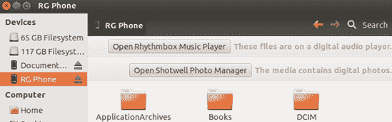
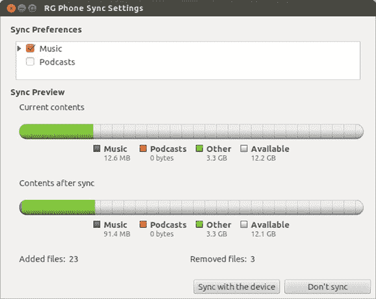
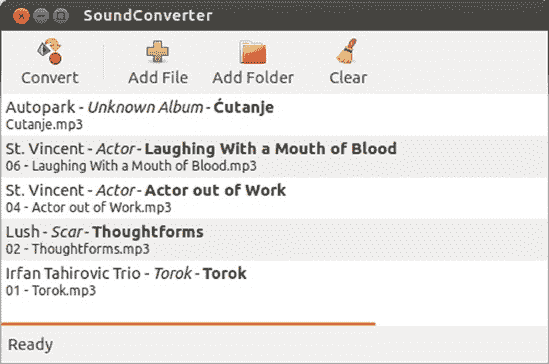

# 第十五章. 插入企鹅

### 使用你的 iPod、iPhone 和其他数字媒体设备

在上一章关于抓取、编码和播放音频文件的讨论之后，你可能想知道 Ubuntu 是否允许你将任何这些文件传输到你的数字媒体设备，比如你的 MP3 播放器、手机或 iPad。好消息是，使用你的设备与 Ubuntu 系统相当简单——实际上比以往任何时候都要简单。你不再需要使用挂载和卸载命令或编辑系统表，如果你不知道我在说什么，那么你很幸运。只需将你的设备插入，Ubuntu 就会完成剩下的工作。

# 了解你的极限

假设 Ubuntu 帮助你下载并安装了第十四章中提到的所有音频编解码器和支持文件，那么你处理数字媒体设备上的任何媒体文件时应该不会遇到任何问题。即使你没有安装这些编解码器和文件，如果你尝试播放 Ubuntu 尚未提供支持的文件，Ubuntu 也会自动帮助你找到必要的项目。然而，并非所有格式都能以相同程度的舒适度或成功率工作——这取决于你的设备和文件格式与 Ubuntu 的兼容性。一般来说，大多数播放器都能处理 MP3 文件和未锁定的 AAC (*.m4a*) 文件。查看你的设备手册以获取有关其他文件格式的具体信息（或者直接尝试一下）。

就 Ubuntu 而言，它可以与提到的所有文件格式兼容——除了锁定的 AAC 文件。你将在本章后面学习到处理它们的方法。

### 注意

虽然在 Ubuntu 中使用数字媒体设备变得越来越简单，但始终值得谨慎行事。在 Ubuntu 上处理设备之前，请确保备份设备上的文件。

# 挂载和弹出你的 iPod、iPhone 或 iPad

使用你的 iPod、iPhone 或 iPad 非常简单。基本上，只需通过 USB 连接器将设备连接到你的电脑，Ubuntu 就会挂载该设备以便你可以访问它。你的设备图标和另一个文档图标将出现在你打开的任何文件管理器窗口的左侧面板中。Ubuntu 还会在你的启动器中放置设备图标和文档图标。

此外，还将出现两种“您想如何处理这些内容”类型的显示。（这些显示与您将音乐 CD 或 DVD 插入驱动器或通过 USB 电缆将数码相机连接到机器时出现的显示相同。）您将看到一个用于音乐和播客的，还有一个用于照片的（图 15-1

图 15-1. Ubuntu 立即识别您的 iPod、iPhone 或 iPad。

图 15-2. 启动 Rhythmbox 和 Shotwell 以处理设备上的音频和图像文件

# （不）自动更新您的 iPod 或 iPhone

在简单说明如何使用 Ubuntu 与您的 iPod 或 iPhone 配合使用的问题解决之后，值得考虑其他一些事情。其中最重要的是设备的自动更新设置。当您通过 iTunes 在您的 iPod 或 iPhone 上启用自动更新时，该功能在设备内部设置。您可以在 Windows、Mac OS 或 Linux 上使用您的 iPod——或者全部互换使用。但是，如果您将 iPod 设置为自动更新歌曲和播放列表，除非您在所有机器上都有完全相同的音乐收藏，否则您可能会遇到麻烦。

原因如下：虽然 iTunes 允许您将文件添加到您的 iPod，但它不允许您从其中复制文件。因此，自动更新功能严格是一条单行道。这意味着每次您将启用了自动更新的 iPod 连接到启用了 iTunes 的电脑时，iTunes 会自动将库中的曲目添加到您的 iPod——到目前为止一切顺利。更令人恐惧的是，它会从您的 iPod 中删除任何不在该机器 iTunes 库中的曲目。当我带着现在已离异的妻子的满载 iPod 去工作时，将其插入了我办公室的 Winbox，而我的 iTunes 库却是空空如也，我就知道了这一点。当我带着什么都没有的小 Podster 回到家给她时，发生的事情并不美好。

在将设备带入 Linux 世界之前，请确保禁用您的 iPod 的自动更新功能。为此，将您的 iPod 连接到 Mac 或 Windows 电脑，并打开 iTunes。在 iTunes 窗口的左侧面板中，点击设备部分中的您的 iPod，然后在右侧面板的**摘要**选项卡中，勾选**手动管理音乐**（或视频功能型 iPod 中的**手动管理音乐和视频**）旁边的复选框，如图图 15-3 所示。接下来，如果您有拍照功能的设备，请在右侧面板中点击**照片**选项卡，然后取消勾选**从以下位置同步照片**旁边的复选框。

图 15-3. 在 iTunes 中禁用 iPhone/iPod 的自动更新功能

# 与基于 Android 的设备一起工作

虽然 iPhone 仍然是智能手机之王的宝座，但运行谷歌 Android 操作系统的手机和平板电脑开始给苹果带来挑战。幸运的是，在 Ubuntu 中使用任何 Android 设备都非常简单，并且与使用苹果的“i”设备几乎没有什么不同。基本上，这个过程是这样的：

1.  使用随设备附带的 USB 线将您的 Android 设备连接到电脑。

1.  在您的 Android 设备上出现的对话框中，询问您现在连接到外部设备后想做什么，请按**存储设备**按钮。

1.  在您的 Android 设备上出现的下一个屏幕上，按**将存储连接到 PC**。

1.  第一次这样做时，您的设备上会弹出一个小的窗口，告诉您当您的设备作为 USB 存储设备连接时，某些应用可能无法正常工作。点击**确定**。

### 注意

由于 Android 系统的不同版本正在使用中，因此这里描述的过程的细节可能与您在手机上需要做的有所不同。您仍然应该能够跟随操作。

与 iPhone、iPod 和 iPad 的情况类似，随后将出现一个或多个窗口，询问您想对设备上的照片和音乐文件做什么，并且您的设备图标应该出现在任何打开的文件管理器窗口的侧面板和启动器中。

要“弹出”您的 Android 设备，右键单击设备文件管理器或启动器图标，然后在弹出的菜单中点击**弹出**。然后在您的手机上，按**从 PC 断开存储**。

# 关于 Kindles、NOOKs 和基于 Android 3.0+“蜂巢”的设备怎么办？

在最近过去，要让 Kindles 或 NOOKs 或运行较新 Android 3.0+操作系统（称为“蜂巢”）的平板电脑与 Ubuntu 协同工作，需要在命令行上进行大量调整。原因是这些设备没有使用此类设备中大多数其他设备使用的 USB 协议。相反，它们使用了一种名为 MTP（媒体传输协议）的文件传输协议，这对 Linux（甚至 Mac）来说并不友好。好消息是，尽管这些设备仍然使用 MTP 文件传输协议，但截至本 Ubuntu 12.04 版本，Linux 没有与这些设备协同工作的问题。这意味着所有那些连接和文件传输问题都消失了，您的设备应该与本章中提到的其他所有设备一样，与 Ubuntu 协同工作。

# 与其他数字媒体播放器和手机一起工作

虽然 iPod 可能是最受欢迎的数字媒体播放器，而 iPhone 在智能手机市场占据着王座，但它们绝不是市场上唯一的游戏。正如我已经展示的，基于 Android 的手机相当受欢迎，还有其他设备可供选择，比如您几乎可以在任何大型百货商店找到的简单 10 美元 USB MP3 播放器。

在 Ubuntu 中如何使用这些设备可能会有所不同，但大部分情况下，它们将以与 iPod 或 Android 设备相同的方式工作，或者以与 USB 数据设备相同的方式工作。查看您的设备将如何工作的最简单方法是，通过 USB 线将其连接到您的计算机。如果未出现询问您如何处理设备的窗口，请打开文件管理器窗口，查看是否在那里找到了设备的图标。如果是这样，您可以使用经过验证的拖放方法来处理您的设备。您还可以通过以下方式使用 Rhythmbox 处理通用设备上的音频文件：

1.  在 Rhythmbox 中，转到音乐菜单并选择**检查新设备**。

1.  如果您的设备在左侧面板中未显示，请在 Rhythmbox 窗口中主面板上方的**导入**按钮，导入您设备上存储音频文件的文件夹。

1.  在出现的“将文件夹导入到库”窗口中，单击左侧面板中的您的设备。然后在右侧面板中导航到包含音频文件的文件夹（图 15-4）。

1.  单击右侧面板中的文件夹以选择它，然后单击**打开**。

    

    图 15-4. 告诉 Rhythmbox 在设备上找不到音频文件的位置

# 使用 Rhythmbox 管理您的音频设备的音频文件

正如我已经提到的，Rhythmbox 被设置为 iPhone、iPod、iPad、Android 设备以及 Ubuntu 中任何其他音乐播放器的默认应用程序。一旦 Rhythmbox 启动并运行，事情的工作方式几乎与 iTunes 相同。

+   要查看您的 iPod 或其他设备的内容，请单击窗口左侧面板中的设备图标。然后，设备的内容将显示在窗口右侧的面板中。

+   要将歌曲从您的库复制到您的设备，只需在左侧面板的库部分单击**音乐**，然后将您想要从右侧面板拖到左侧面板中设备图标的艺术家、专辑或单首曲目拖动到您的设备图标。

如果将文件拖到您的设备上感觉有点繁琐，您可以将设备同步到 Rhythmbox 音乐库。只需单击 Rhythmbox 窗口左侧面板中的设备图标，然后单击主面板上方的**与库同步**按钮。将出现一个窗口，类似于图 15-5。在窗口顶部部分检查您想要同步的项目，然后单击**与设备同步**。Rhythmbox 将开始同步过程，将库中的所有音乐和播客（如果您选择了该选项）复制到您的设备，并在窗口右下角显示传输进度。

图 15-5. 使用 Rhythmbox 同步您的音频设备

## 将音频设备中的歌曲复制到您的硬盘

大多数数字媒体播放器的一个特性是 iTunes（至少在没有安装特殊免费软件插件的情况下）没有提供的，就是能够将歌曲从您的 iPhone/iPod 复制到您的硬盘（甚至到外部 USB 驱动器）。幸运的是，Rhythmbox 允许您轻松地完成这项操作。

要使用 Rhythmbox 从您的 iPhone/iPod/iPad、基于 Android 的手机或其他数字媒体设备复制音乐，请选择您想要导出的曲目（按住 ctrl 键进行多选或使用标签选择您喜欢的整个艺术家或流派），然后将选定的项目拖到您的桌面、音乐文件夹或您想要它们的地方。这种主要简单的方法的唯一缺点是，当从 iPod/iPhone 复制文件时，您最终会在您的硬盘上得到一些奇特的文件名，如*ZPAD.m4a*或*ATDT.mp3*，而不是在您的 iPhone/iPod 或 Rhythmbox 中出现的名称。这意味着您必须在文件传输到您的硬盘后重命名这些文件。除非您处理的是大量文件或您忘记了哪个文件是哪个，否则这并不是什么大问题。在后一种情况下，右键单击文件，点击**属性**，然后点击**音频**选项卡，在那里您将找到原始文件名（图 15-6）。一旦您知道了文件名，点击**基本**选项卡，在名称框中输入正确的名称，然后点击**关闭**。

图 15-6. 查找标签错误的音频文件的文件名属性

## 在 Rhythmbox 中从您的 iPod 或其他数字设备中弹出

当您在 Rhythmbox 中完成与您的 iPod 或其他数字设备的工作后，您可以通过两种方式之一弹出它。要么点击 Rhythmbox 窗口左侧面板中的条目，然后点击窗口顶部附近的**弹出**按钮，要么在左侧面板中右键单击其图标，并在出现的弹出菜单中选择**弹出**。如果 Rhythmbox 已关闭，此右键单击弹出方法也可以从 Nautilus 窗口或挂载设备的启动器图标中进行。

# 写入您的 iPod 时遇到的问题

如果您有一个之前与 Mac 一起使用的 iPod（不包括 iPhone、iPod Touch 和 iPad），您可能会发现尽管您可以在您的 iPod 上读取文件，但您无法将其写入。如果是这种情况，您的 iPod 很可能是格式化为苹果的本地 HFS+文件系统——尽管这本身并不是问题。问题是 HFS+格式化的 iPod 启用了日志记录。*日志记录*是 HFS+的一个功能，旨在通过保护文件系统免受电源浪涌、电源故障或硬件故障的损害。

然而，正如命运所安排的那样，Linux 内核并不擅长处理启用了日志记录的 HFS+格式化设备。幸运的是，修复这个问题的调整相当简单，而且并不特别需要技术知识：您只需在您的 iPod 上禁用日志记录即可。

如果您附近有 Mac，禁用 HFS+格式 iPod 上的日志记录很容易。只需将您的 iPod 连接到 Mac，当它自动打开时关闭 iTunes，然后运行磁盘工具（在应用程序文件夹中的实用程序文件夹内）。当磁盘工具打开时，在窗口的左侧面板中选择您的 iPod（按名称），按住选项键，然后在**文件**菜单中选择**禁用日志记录**。片刻之后，您的 iPod 上的日志记录将被禁用，而不会丢失任何数据。如果您再次将 iPod 连接到您的 Linux 机器，您将能够像平常一样使用它。

# 在您的数字设备上处理照片

如我之前提到的，如果您的手机或数字设备具有拍照功能，并且 Ubuntu 能够自动识别它，您将被引导到 Shotwell，就像您将数字相机连接到 Ubuntu 机器时一样。同样，Shotwell 会检查您的设备上有什么，然后允许您将照片复制到硬盘。

如您在图 15-7 中可以看到，您首先选择您想要复制到硬盘的照片，如果您喜欢，可以添加标签，然后点击**复制**。照片复制到您的硬盘后，它们将出现在 Shotwell 库中，您可以从那里按需处理它们。

图 15-7. 使用 Shotwell 从您的 iPhone/iPod/iPad 或其他数字设备导入照片

# 转换音频文件格式

正如我在本章开头所指出的，当涉及到某些音频文件格式、您的硬件和 Ubuntu 时，可能存在一些不兼容的问题。幸运的是，SoundConverter（如图 15-8 所示）可以轻松地将 Ogg Vorbis 文件转换为 MP3 格式，反之亦然。如果您感兴趣，它还可以将 AAC 文件转换为 MP3 或 Ogg Vorbis 格式。由于 SoundConverter 不是 Ubuntu 的捆绑软件，您将不得不从 Ubuntu 软件中心安装它。

图 15-8. 使用 SoundConverter 转换音频文件格式

要使用 SoundConverter，通过点击**添加文件**或**添加文件夹**按钮将您想要转换的歌曲添加到主面板。您还可以从您的*音乐*文件夹（或您存储它们的任何其他位置）拖动音频文件。

一旦你选择了要转换的文件，你需要选择将它们转换成哪种格式。你可以通过选择**编辑** ▸ **首选项**，然后在首选项窗口中做出选择（图 15-9

图 15-9. 在 SoundConverter 中设置转换首选项

一旦设置好并准备好转换，请在“首选项”窗口中点击**关闭**，然后在主窗口中点击**转换**。SoundConverter 将开始执行其操作。

# 播放受保护的 AAC (M4P) 文件

如果你是在苹果公司在其音乐中废除数字版权管理（DRM）之前从 iTunes Store 购买的音乐，那么你很可能拥有一些受保护的 AAC 文件，你可以通过*.m4p*扩展名来识别这些文件。这些文件只能通过 iTunes 在注册的机器上播放。正如你可能已经发现的，在你的系统上对这些文件几乎无能为力。当你尝试播放其中一个文件时，你将得到一个错误消息，并有一个选项让 Ubuntu 搜索缺失的插件。接受该选项是获取在 Ubuntu 中播放此类文件所需支持的最简单方法。

一旦接受，Ubuntu 将搜索插件和必要的支持文件。一旦 Ubuntu 找到它们，它将在新窗口中显示其搜索结果。点击**安装**以继续。当过程完成后，你将能够在你的系统上播放之前受保护的 AAC 文件。然而，如果在安装过程中 Rhythmbox 正在运行，那么你需要重新启动它，它才能处理这些文件。

# 在你的 iPod、iPad 或 Android 设备上使用 Linux？

如果你用谷歌搜索如何在 Linux 下使用你的 Android 或 Apple “i” 设备，你可能会注意到，实际上可以用一种 Linux 系统替换你的 iPod 的苹果设计的操作系统。现在，我并不是在提倡你这样做（而且我肯定自己也没有这样做过），但有些人对用他们手中的任何小玩意儿来搞怪感兴趣。如果你是这样的人，或者你只是好奇，可以查看 Linux on iPod 网站 ([`ipodlinux.sourceforge.net/index.shtml`](http://ipodlinux.sourceforge.net/index.shtml)) 或者更受欢迎的 Rockbox ([`www.rockbox.org/`](http://www.rockbox.org/))，它也运行在许多非苹果设备上。你还可以在 Geeknizer 网站上找到有关在 Android 设备上安装 Ubuntu 的信息，例如 ([`geeknizer.com/install-run-ubuntu-on-android/`](http://geeknizer.com/install-run-ubuntu-on-android/))）。
