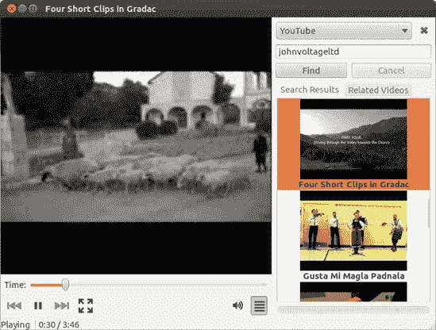
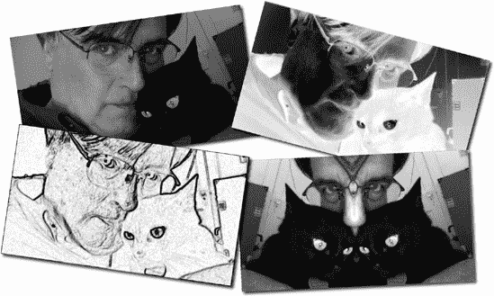
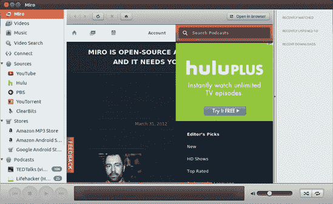

# 第十六章。沙发企鹅

### Ubuntu 中的视频和 DVD 播放


现在我已经介绍了 Ubuntu 在音频方面的许多功能，现在是时候转向同样重要的视频领域了。在视频方面，Ubuntu 相当强大，允许您观看 DVD、视频 CD（VCD）、从互联网下载的视频文件，以及一些互联网视频流。它还允许您从数码相机下载视频电影文件，或者从基于磁带的数码视频摄像机捕获电影，然后对其进行编辑。

# 应用程序所在之处

本章中的所有应用程序都可以通过点击应用程序透镜然后点击**媒体**过滤器按钮从 Dash 运行。与所有应用程序一样，您也可以通过在 Dash 的搜索框中键入应用程序的名称然后按回车键来运行应用程序。

# DVDs

您的系统允许您播放 DVD；然而，由于版权问题，默认情况下播放仅限于未加密的光盘。不幸的是，这排除了您在当地视频店购买或租借的绝大多数 DVD 电影，并且您在计算机上可播放的电影选择有限。鉴于未加密 DVD 世界的有限供应，您无疑会希望启用您的系统以播放加密版本。

# 项目 16：安装加密 DVD 支持

正如我之前提到的，Ubuntu 默认不允许您播放加密的 DVD，除非您在安装 Ubuntu 时选择了安装第三方软件支持。如果您没有这样做，那么为了观看这样的 DVD（这将是绝大多数），您需要安装一大堆东西——最重要的是安装包*libdvdread4*。幸运的是，现在 Ubuntu 在您需要时告诉您需要什么，就像在上一章中做的那样，这已经变得相当容易了。

第一步是最简单的：将 DVD 电影光盘插入您的光驱。几秒钟后，会出现一个窗口告诉您已经插入 DVD（废话！）并询问您想做什么。在下拉菜单中，选择**电影播放器**并点击**确定**。当 Ubuntu 确定您在开始播放 DVD 之前需要安装什么时，将出现一个新窗口。一旦完成，通过点击**确定**并输入您的密码来接受窗口中出现的默认建议的软件包。然后坐下来等待一分钟或更少的时间，直到安装过程完成。一旦完成，您就成功安装了*libdevread4*和其他一些必要的文件。所以现在您准备好播放您的 DVD 了，对吧？嗯，还不完全是这样。

对于其他大多数应用程序，您现在就可以完成了，但如您所注意到的，电影播放器将打开，但您的 DVD 仍然没有播放。原因是*libdvdread4*需要您运行它附带的一个安装脚本才能完成任务。要运行脚本，打开终端，键入以下内容，然后按回车键：

```
`sudo /usr/share/doc/libdvdread4/install-css.sh`
```

你很快就会提示输入密码，所以请输入密码并按回车键。一旦终端返回用户提示符，进程就会完成。关闭电影播放器，将 DVD 电影光盘重新插入驱动器，然后在弹出的窗口中再次选择电影播放器。点击**确定**后，电影播放器应该会打开并开始播放 DVD。（你很快就会了解更多关于电影播放器的信息。）

# 我能播放外国 DVD 吗？

你的电脑可以播放任何广播标准的 DVD（NTSC、PAL 或 SECAM）以及任何区域编码。这比连接到电视的 DVD 播放器设置要好，因为美国绝大多数（我敢打赌 99.9%）的独立 DVD 播放器不允许播放除区域 1 NTSC 光盘以外的任何光盘（NTSC 是美国广播标准，也是美国电视设计用来显示的，1 是 DVD 区域）。通常，这些信息会提供在 DVD 包装的背面（参见图 16-1)，尽管大多数针对美国市场生产的 DVD 包装上不包括这些信息。


图 16-1. DVD 包装上的区域编码标签示例

尽管你的电脑在 DVD 播放方面具有奇妙的全能性，但有一个严重的注意事项需要牢记。根据你的 DVD 驱动器制造商，你只能在不同区域编码的 DVD 之间切换四到五次。之后，驱动器将永久锁定为你当时正在播放的盘片的区域编码。这与你的操作系统无关——这是一个纯粹硬件的问题。这个区域锁定规则的唯一例外是那些标有*区域码自由*或 ALL（有时不准确地标为*区域 0*）的 DVD，它们可以在任何地区的任何 DVD 播放器上播放，因此当你将其中之一放入电脑的 DVD 驱动器时，不会注册为区域编码切换。

如果您的光驱最终锁定在一个区域编码上，尤其是您只有少量 DVD 的情况，有一些好消息。这以 Videolan 的*libdvdcss2*库的形式出现，该库包含在您在项目 16A 中安装的*libdvdread4*包中。*libdvdcss2*库允许您播放加密的 DVD。除了这个主要功能外，*libdvdcss2*理论上还允许您播放来自多个区域的 DVD，即使您的 DVD 光驱已经锁定在一个区域。它是通过对你的光驱执行一种神秘的攻击（使用 Videolan 对该术语的称呼）来实现的，直到它找到该光驱的碟片密钥。当然，这个过程需要几分钟，所以这不是最佳的做法。但总比卡住要好。绕过区域编码的过程是否合法仍然是一个有争议的话题，所以如果您对此类事情感到担忧，您应该做一些研究。

# 使用电影播放器观看视频文件

在 Linux 世界中，有许多视频播放器可用。Ubuntu 捆绑的播放器恰如其分地被称为电影播放器。如图图 16-2 所示，电影播放器界面非常简单，使用起来同样简单。


图 16-2. 电影播放器

## 使用电影播放器播放 DVD、VCD 和其他多媒体文件

因为电影播放器是 Ubuntu 默认的视频播放器，所以您只需将 DVD 放入光驱，在提示时选择电影播放器，然后点击**确定**，就可以用它来播放 DVD。如果您有一张想看的*《红色娘子军》* VCD，也可以用同样的方法播放。只需将 VCD 放入光驱，按照相同的步骤操作，电影播放器应该会启动并开始播放光盘。

电影播放器不仅能够播放光盘、DVD 和 VCD，还能播放 MPEG 和 WMV 文件。只需直接双击文件，或者进入电影播放器的**电影**菜单，选择**打开**，然后导航到您想观看的视频文件。如果您还没有安装播放此类文件所需的库，Ubuntu 会通知您，告诉您需要什么，并允许您在那个时刻安装它们。很简单。

## 电影播放器作为音频播放器？

当你在“首选项”窗口的“显示”选项卡上时，你可能已经注意到有一个“视觉效果”部分。嗯，这些视觉效果并不是为你播放的视频准备的，而是当你通过 Movie Player 播放音频文件时的可视化效果（图 16-3). 是的，Movie Player 不仅处理视频，还处理音频。你可以通过选择**电影**菜单中的**打开**并导航到你想播放的歌曲来从 Movie Player 播放这些文件。如果你光驱中有 CD，你甚至可以使用 Movie Player 作为 CD 播放器，通过转到**电影**菜单并选择**播放光盘‘音频光盘’**。


图 16-3. Movie Player 作为音频播放器

## 几个其他酷炫的 Movie Player 功能

Movie Player 还有一些你可能想了解的酷炫功能。其中一个功能是它能够捕捉你正在观看的任何视频的屏幕截图。只需选择**编辑** ▸ **截图**，你就能得到一个屏幕截图——从视频文件中捕获的静态图像。

另一个值得提到的功能是 Movie Player 的侧边栏。正如你无疑已经注意到的，在 Movie Player 窗口的右下角有一个侧边栏按钮。如果你点击该按钮，Movie Player 窗口的右侧将打开一个新的面板。在那个面板中，你可以选择并收听 BBC 播客；搜索并观看 YouTube 视频（图 16-4）；以及加载、创建和保存播放列表。你可以从侧边栏顶部的下拉菜单中选择这些各种功能。

你创建的播放列表可以包含任何支持的音频或视频文件的组合，从而为你提供完整的多媒体香蕉。任何时候你在 Movie Player 中播放文件，该文件都会出现在播放列表面板中，但你也可以通过简单地从桌面或任何 Nautilus 窗口拖拽文件到那里来添加项目到列表中。



图 16-4. 在 Movie Player 中观看 YouTube 视频

# 一个替代（并且可以说是更好）的视频播放器：VLC

虽然 Movie Player 自从首次出现以来已经取得了很大的进步，但许多用户发现它有些情绪化和古怪。幸运的是，有替代品，一个名为 VLC 的媒体播放器是最受推荐的。VLC (图 16-5)是一个非常强大的播放器，拥有庞大的用户群，不仅在 Linux 世界，在 Mac 和 Windows 世界也是如此。像 Movie Player 一样，VLC 处理音频文件以及视频和音频流，包括 YouTube。然而，与 Movie Player 不同的是，VLC 似乎总是能正常工作，尤其是在处理 DVD 时。事情本就应该这样。


图 16-5. VLC 媒体播放器

VLC 不是 Ubuntu 的捆绑软件，因此您需要从 Ubuntu 软件中心自行下载。我相当确信您不会失望。

# 从您的数码相机将电影传输到电脑

数码摄像机已经存在多年了，尽管静止数码相机和手机在视频功能方面的显著进步导致许多视频爱好者根本不使用专用视频摄像机。这意味着人们比以往任何时候都更多地制作自己的视频，现在有了通过 YouTube 与家人、朋友和全世界分享视频作品的能力，可以说家庭数码视频几乎无处不在。

在您可以在电脑上处理视频之前，您必须将它们从相机传输过来。幸运的是，这个过程相当简单，尽管具体步骤会根据您用来录制视频的设备类型略有不同。不同的设备以不同的方式存储视频。

## 从带有存储卡的相机传输视频文件

如今，大多数数码相机和专用数码摄像机都将视频存储为存储卡上的文件，最常见的存储卡是 SD 卡。从带有这些卡的设备将文件传输到电脑的过程很简单，而且有几种方法可以做到这一点。虽然许多视频类型可以通过 Shotwell 以与导入照片相同的方式导入，但有时这并不奏效，这取决于视频在相机上保存的文件格式。然而，有一种始终有效的方法，那就是像从 USB 驱动器传输文件一样，直接将视频文件从相机传输到电脑。以下是您需要做的：

1.  将您的相机 USB 线连接到电脑。

1.  将相机设置为播放模式。

1.  在随后出现的对话框中，选择**打开文件夹**并点击**确定**。

1.  将会出现一个文件管理器窗口。双击文件夹，直到找到您的视频文件。您可以通过文件扩展名识别这些文件，通常是*.avi*、*.mp4*、*.mts*或*.m2ts*。

1.  将您想要复制的文件拖放到窗口左侧的*视频*中，然后释放鼠标按钮。然后文件将被复制到您的*视频*文件夹中。

## 从手机或其他移动设备传输视频文件

大多数手机和其他便携式计算设备现在都能拍摄高质量的视频，这些文件通常以修改后的 MPEG4 格式（带有*.3pg*文件扩展名）存储，也可以传输到电脑上进行编辑。尽管传输此类文件的过程通常很简单，但具体步骤可能因设备类型而异。要了解如何从您的手机或其他便携式设备传输文件，请参阅第十五章。

## 从带磁带存储的摄像机捕获数码视频

我们之前介绍的数据传输方法易于理解和处理——你基本上只需要找到你的文件，然后将它们从相机复制到电脑上。然而，当你想从存储在磁带上的数码视频（DV）相机或视频流中传输视频片段到电脑时，无法简单地拖动文件从一个地方到另一个地方。你必须在你播放视频的同时将其视频流捕获到磁盘上，为此，你需要某种软件解决方案。这通常以视频编辑器的形式出现；然而，并非所有视频编辑器都具有这种功能。一个具有这种功能并且能够轻松完成这项工作的是 Kino（图 16-6）。


图 16-6. Kino，另一个数字视频编辑器

Kino 没有捆绑在 Ubuntu 中，因此你需要从 Ubuntu 软件中心下载并安装它。一旦完成，你就可以从相机捕获视频了。为此，将你的相机连接到电脑（如果尚未连接），打开相机的播放模式，启动 Kino，然后按照以下步骤操作：

1.  点击播放面板右侧的**捕获**标签。

1.  播放面板底部的控制按钮现在将控制你的相机功能。首先点击**倒带**按钮，直到到达你想要捕获的视频段落的开始。

1.  点击**播放**按钮。你将能够在 Kino 窗口中看到你的相机中的视频播放（图 16-7）。

    

    图 16-7. 使用 Kino 从数码相机捕获视频

1.  当你到达想要开始捕获的点时，点击 Kino 窗口中播放控件上方的**捕获**按钮。Kino 将开始将你的视频保存到电脑的硬盘上。

1.  当你想停止捕获时，点击**停止**按钮。

现在捕获的视频将存储在你的磁盘上（默认情况下在您的家文件夹中）。为了便于以后管理，捕获的视频流将被自动分割成几个较小的文件，文件数量取决于播放视频的长度。

你可以通过点击**编辑**标签，然后使用播放面板底部的播放控件来查看捕获的视频。你还可以在时间轴视图中查看视频（图 16-8)，在视频的不同段落之间导航。只需点击**时间轴**标签，点击你想要查看的段落，然后使用播放面板下方的播放控件。

如果你想要有点艺术感，也可以尝试 Kino 中可用的效果（一些示例显示在图 16-9

图 16-8. Kino 的时间线视图



图 16-9. Kino 视频效果示例，前后对比

# 使用 PiTiVi 编辑数字视频

现在你已经学会了如何将视频文件从摄像机传输到电脑，你可以通过双击任何一个文件并在电影播放器（或任何其他视频播放器）中观看它们来查看它们。然而，许多人想要通过剪辑拼接或剪辑来编辑电影。其他人喜欢添加过渡和其他效果，尽管 Kino 有一些这些功能，但应用程序 PiTiVi (图 16-10) 有更多这些功能，并且通常更容易使用。像 Kino 一样，PiTiVi 可从 Ubuntu 软件中心获取。


图 16-10. PiTiVi 视频编辑器

如你立即会看到的，PiTiVi 缺乏像 iMovie 或在一定程度上 Windows Live Movie Maker 这样的应用程序的华丽功能。PiTiVi 允许你应用一些效果和相当基本的剪辑间过渡，并且它允许你处理音频轨道。然而，它缺少一个面向消费者的视频编辑器应该具备的最基本功能，即标题和字幕，尽管这些功能承诺将在未来提供。

除了限制和特殊性之外，PiTiVi 中的实际编辑过程相对简单。首先你开始一个新项目并决定其名称和设置（**项目** ▸ **项目设置**）。然后你将文件添加到该项目中，无论是通过从你的主文件夹拖放到 PiTiVi 窗口，还是通过点击**导入剪辑**按钮，然后通过出现的导入剪辑窗口选择你想要添加的文件。这些文件现在被称为*剪辑*，将出现在 PiTiVi 窗口的剪辑库面板中。从该面板中，你可以将你想要工作的剪辑拖到下面的时间轴上，然后分割剪辑，删除尴尬或无聊的部分，并合并文件（图 16-11

图 16-11. 使用 PiTiVi 编辑视频

完成编辑后，你可以通过点击**渲染项目**按钮来制作你的新电影，之后将出现一个渲染项目窗口。在那个窗口中，点击**选择文件**按钮，并在**选择文件以渲染到**窗口中给你的新电影命名。这将是要生成的实际文件的名称。完成后，点击**确定**然后点击**渲染**按钮。渲染过程的进度将在渲染项目窗口中显示，完成后，将出现*渲染完成*的字样。然后你可以关闭渲染项目窗口以及 PiTiVi。当提示时，请务必保存你的项目。

要获取有关使用 PiTiVi 的更详细信息，请查看用户手册，该手册可在 PiTiVi 网站上获得：[`www.pitivi.org/`](http://www.pitivi.org/)。

# 其他视频应用

我已经介绍了 Ubuntu 中的主要视频应用，但还有一些其他的应用程序你可能想要考虑，所有这些都可以通过 Ubuntu 软件中心获得。如果你对另一个视频/DVD 播放器感兴趣，可以尝试 GNOME MPlayer，它因其处理多种视频格式的功能而长期拥有大量的追随者。

另一个适合视频流媒体爱好者的酷炫应用是 Miro Internet TV (图 16-12)，它允许你轻松搜索、下载和播放在线视频流。只需在 Ubuntu 软件中心搜索 *miro*。

如果你有一个网络摄像头，你可能想尝试一个名为 Cheese 的应用程序，它允许你从你的网络摄像头拍照和录制视频，并添加酷炫的图形效果。Camorama 是另一个可以考虑的网络摄像头查看/捕获应用程序。



图 16-12. Miro，视频流媒体爱好者的梦想

如果你正在寻找 PiViTi 和 Kino 的替代品，你可以尝试 Avidemux。一个非常有用的功能使其值得一试，即使你不将其作为你的主要视频编辑器：它可以从视频文件中提取音频轨道。如果你对定格动画视频感兴趣，那么务必也检查一下 Stopmotion。

对于那些对刻录 DVD 感兴趣的人来说，DVD:Rip、AcidRip DVD Ripper 以及不那么令人畏惧的 Thoggen DVD Ripper 都值得一试。你也许还会对 DVD95 和更高度可配置的 K9copy 感兴趣，它们是 Linux 世界对 DVDShrink 的回应。这些应用程序允许你刻录双层 DVD（DVD9）并将输出压缩，以便它能够适应单层空白 DVD 光盘（DVD5）。如果你想要从头开始创建自己的 DVD（就像使用 iDVD 一样），那么考虑以下几款应用程序是值得的：DVD Styler 和 Bombono DVD。
