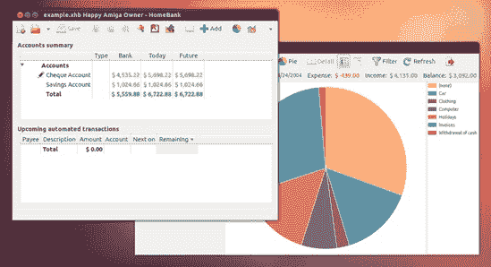
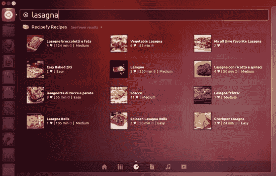
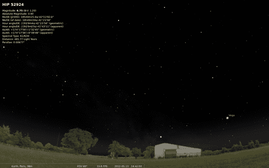
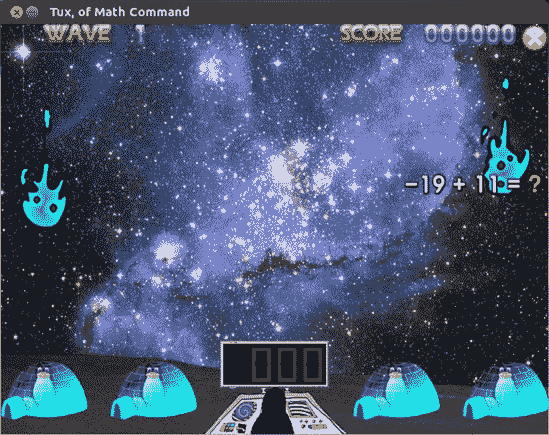
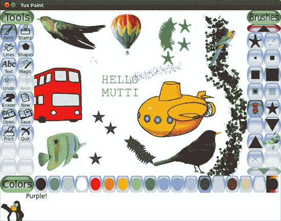
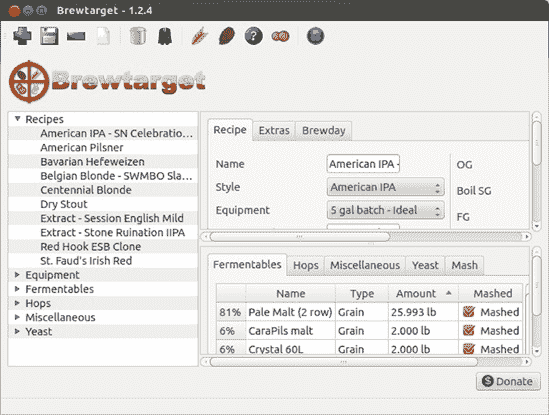

# 第十八章. 甜蜜的南极洲

### 家居中的 Linux

到目前为止，你已经接触到了许多与 Ubuntu 捆绑或可在 Ubuntu 软件中心找到的应用程序，其中许多可以被认为是“家居”类型的应用。然而，还有一些其他的应用程序甚至是一些可以添加到你的系统中的扩展，这些扩展将提供更多的家居功能。这些包括可能不适合任何前面的章节，但确实适合在“家居”标签下的内容。在这里，你将了解一些可以使你的 Ubuntu 设备成为你家庭生活更全面功能部分的应用程序。除非另有说明，所有这些应用程序都可在 Ubuntu 软件中心找到。

# 应用程序的位置

本章中的应用程序属于多个不同的类别。如何在 Dash 中找到每个应用程序的说明将在相关部分提供。与所有应用程序一样，你也可以通过在 Dash 的搜索框中输入应用程序的名称并按回车键来运行这些应用程序。

# HomeBank

正如俗话所说，“金钱使世界运转”，在家中的这种认识尤为强烈。如果你正在寻找个人财务管理软件，以便使家庭预算更容易处理，那么你可能会很高兴地知道，有许多针对 Linux 的软件供你选择。其中可能最容易使用的是 HomeBank (图 18-1)，它也适用于 Windows 和 Mac OS 系统。HomeBank 具有许多功能，包括显示多个账户、生成报告和图形图表的能力。它可以导入和导出由流行的财务程序 Quicken (*.qif*) 和 Intuit (*.qfx*) 创建的文件，还可以导入由电子表格生成的逗号分隔值 (*.csv*) 文件。因为它是一个跨平台应用程序，所以它拥有相当庞大的用户群体，所以如果你需要的话，你应该能够轻松地在网上找到帮助。实际上，在[`homebank.free.fr/`](http://homebank.free.fr/)你可以找到 HomeBank 的用户手册、教程、常见问题解答和社区 LaunchPad 论坛的链接。

图 18-1. 使用 HomeBank 进行家庭财务管理

你可以通过在 Dash 中输入**`homebank`**并按回车键或在 Dash 中点击应用程序透镜然后点击**办公**过滤器按钮来运行 HomeBank。

# 项目 18A：安装食谱透镜

既然我们谈论到了家，没有哪个房间比厨房更能代表“家”的概念，因此我们将稍微偏离一下这个主题。正如你在第三章中学到的，你可以在 Dash 上安装额外的镜头以允许更具体的搜索，尤其是在互联网上。在本章中，你将学习如何安装食谱镜头，这将允许你轻松地从 Dash 中搜索食谱。这需要向系统已使用的仓库中添加一个新的仓库，以便在查找更新和新软件时使用；你已经在第六章中学习了如何添加仓库。以下是你需要做的：

1.  首先，打开终端（从 Dash 中，输入 **`terminal`** 并按回车键）。

1.  在终端中输入 **`sudo apt-get-repository ppa:scopes-packagers/ppa`** 并按回车键以添加新的仓库。

1.  当提示输入密码时，请输入密码并按回车键。

1.  几秒钟后，你将被要求按回车键继续——请这样做。

1.  现在请在终端中输入 **`sudo apt-get update`** 更新仓库数据库，然后按回车键。

1.  通过输入 **`sudo apt-get install unity-lens-cooking`** 并按回车键来获取并安装镜头。

1.  当被问及是否想要继续时，请输入 **`y`**（代表“是”），然后按回车键。

1.  最后，注销并重新登录。

一旦你重新登录，打开 Dash，你将在之前存在的镜头中间找到你的新镜头（它看起来像是一个瞄准器和 Pac-Man 的结合）。只需点击它，然后开始搜索。结果将随后出现，如图 18-2 所示。

图 18-2. 通过 Dash 的食谱镜头在线搜索食谱

# 个人健康

由于我们刚刚在谈论食谱，而你吃什么就是什么，这是一个完美的机会过渡到 Ubuntu 在个人健康领域的部分产品。其中之一是 Pytrainer (图 18-3)，它允许你记录你所有的各种锻炼活动，包括通过从 GPS 设备导入数据。另一个这样的应用程序是 Pondus (图 18-4)，它允许你以数字和图形形式记录你当前的减肥进度。最后，是 QuitCount (图 18-5)，它显示你戒烟后每天节省的金额以及你为生命增加的周数。

图 18-3. 使用 Pytrainer 跟踪你的锻炼计划

图 18-4. 使用 Pondus 跟踪你的体重

图 18-5. 使用 QuitCount 跟踪戒烟后的储蓄和寿命增加

这些应用程序可以通过在 Dash 中输入 pytrainer、pondus 或 quitcount 分别运行，然后按回车键。您还可以点击 Dash 的应用程序透镜，然后通过点击 **附件** 过滤按钮运行 Pondus 和 QuitCount，或者通过点击 **办公** 过滤按钮并找到 Pytrainer 应用程序。

# 有趣（但又有教育意义）的内容

Ubuntu 拥有大量适合各个年龄段的人的教育应用程序。不同的应用程序针对各种兴趣和学习需求。在本节中，我们将查看 Marble Virtual Globe（图 18-6

图 18-6. 使用 Marble Virtual Globe 查找地点

图 18-7. 使用 Stellarium 观赏天空

图 18-8. 用 gbrainy 保持大脑敏锐

这些应用程序可以通过在 Dash 中输入 marble、stellarium 或**`gbrainy`**分别运行，然后按回车键。您也可以点击 Dash 的应用程序镜头，然后通过点击教育过滤器按钮运行 Marble Virtual Globe，通过点击**科学与工程**过滤器按钮运行 Stellarium，或通过点击**游戏**过滤器按钮并找到应用程序运行 gbrainy。

# 儿童用品

当然，Ubuntu 为各个年龄段的人提供了大量游戏，包括儿童，其中许多也是教育性的。这些包括 Tux 应用程序，Tux Typing（图 18-9

图 18-9. 使用 Tux Typing 学习如何打字

图 18-10. 使用 Tux Math 练习数学技能

Tux Typing 和 Tux Math 都可以通过在 Dash 中输入**`tux typing`**或**`tux math`**分别运行，然后按回车键。它们也可以通过点击 Dash 的应用程序镜头，然后点击**教育**过滤器按钮找到。

### 注意

Tux Typing 和 Tux Math 默认情况下以全屏模式运行。您可以通过在终端中输入**`tuxtyping -w`**或**`tuxmath -w`**并按回车键，在它们自己的窗口中运行它们。

另一个不错的 Tux 应用程序是 Tux Paint(图 18-11)。孩子们发现它的大号彩色按钮和有趣的功能很容易操作，而且非常有趣。Tux Paint 的最好功能（至少在我看来）是它从苹果到海马到欧元硬币等各种图案的印章！哦，是的，它还会和你说话。点击一只鸭子印章，你不仅会听到一个声音说“鸭子”，还会听到我们蹒跚学步的朋友的“嘎嘎”声。您可以通过点击 Dash 中的应用程序镜头，然后点击**教育**过滤器按钮，或者在 Dash 中输入**`tux paint`**并按回车键来找到 Tux Paint。

图 18-11. Tuxpaint

最后，还有海龟艺术(图 18-12)，它被设计成允许孩子们（或他们的父母）在创作艺术的同时学习编程的基础，所有这些都可以通过图形化地拼接编程元素来实现。您可以通过点击 Dash 中的应用程序镜头，然后点击**教育**过滤器按钮，或者通过在 Dash 中输入**`turtle art`**并按回车键来运行海龟艺术。

图 18-12. 使用海龟艺术学习编程基础

# 项目 18B：安装家长控制

大多数父母的一个主要担忧是他们的孩子花在电脑上的时间有多长。大多数系统都通过家长控制设置提供了一种方式，让父母能够监控这一点。Ubuntu 有几个家长控制软件包。其中一个叫做 Nanny，在 Ubuntu 软件中心，但尚未与新的 Ubuntu 12.04 版本兼容。另一个叫做 timekpr，在命令行进行一些小技巧后可以工作，但并未包含在 Ubuntu 软件中心中。Nanny 很有用，因为它允许您控制网络访问，但因为我们想要一个能工作的，所以我们现在就选择 timekpr，并希望 Nanny 在不久的将来得到修复（请继续检查）。

在您可以使用 timekpr 之前，您需要为您的孩子创建单独的标准（非管理员）账户；否则，timekpr 将无法工作。所以，如果您还没有为孩子们创建用户账户，请先这样做（如果您需要复习，请参阅第九章）。

完成此操作后，您可以继续项目的第一部分：创建一个符号链接，将 timekpr 从它需要的支持文件（称为 GDM）中引开，该文件在 Ubuntu 中不再存在，到另一个本质上相同但名称不同的支持文件（LDM），它存在于 Ubuntu 中。这是必要的，因为您将要安装的 timekpr 版本是为 Ubuntu 的先前版本（Oneiric Ocelot）准备的。但不用担心，修复方法是有效的，而且并不困难。以下是步骤：

1.  打开终端（从 Dash 中，输入**`terminal`**并按回车键）。

1.  通过输入**`sudo ln -s /etc/mdm /etc/gdm`**并按回车键创建符号链接。当提示输入密码时，输入并按回车键。

1.  您现在可以关闭终端。

由于 timekpr 包在 Ubuntu 软件中心不可用，下一步是下载该包：

1.  打开网页浏览器并访问[`launchpad.net/~timekpr-maintainers/+archive/ppa/+files/timekpr_0.3.2~ppa1~ubuntu2_all.deb`](https://launchpad.net/~timekpr-maintainers/+archive/ppa/+files/timekpr_0.3.2~ppa1~ubuntu2_all.deb)。

1.  将出现一个窗口，询问您想对该文件做什么。选择**保存到磁盘**并按回车键。

最后一步是安装您刚刚下载的包，这相当简单。以下是方法：

1.  双击 timekpr DEB 包，它应该在您的*下载*文件夹中。

1.  Ubuntu 软件中心将出现，打开到您的软件包页面。点击**安装**按钮。

1.  安装完成后，关闭 Ubuntu 软件中心。

您现在可以通过输入**`timekpr`**并按回车键或在应用程序透镜中点击系统过滤器按钮来从 Dash 运行 timekpr。在 timekpr 窗口打开之前，您将需要输入密码，所以输入它并按**确定**。timekpr（图 18-13)将随后出现，您可以从那里决定每个孩子可以在线多长时间以及何时可以在线。

图 18-13. 使用 timekpr 设置家长控制

# 其他家庭相关应用程序

当然，还有许多其他与家庭相关的应用，因此我们将以三个彼此完全不相关但都很有用且能很好地代表 Ubuntu 可用应用多样性的应用来结束本章。首先是名为 Gramps 的应用 (图 18-14)，它允许你记录关于你祖先的信息（甚至照片），然后通过各种报告类型和/或家谱查看这些信息。Gramps 还允许你导入或导出 GEDOM 文件，这是家谱软件的行业标准文件格式，因此你可以轻松与其他家谱学家分享信息。有关 Gramps 的文档和更多信息可在 [`gramps-project.org/`](http://gramps-project.org/) 获取。

图 18-14. 使用 Gramps 跟踪你的祖先

你可以通过点击 Dash 中的应用镜头然后点击 **办公** 过滤按钮来运行 Gramps。你也可以直接在 Dash 中输入 **`gramps`** 并按回车键。

另一个有用的应用是 Sweet Home 3D (图 18-15)，这是一个带有 3D 预览的 2D 室内设计程序。它允许你通过拖放家具和其他物品到自定义房间中来尝试不同的房间布局。文档和其他信息可在 [`www.sweethome3d.com/index.jsp`](http://www.sweethome3d.com/index.jsp) 获取。

要运行 Sweet Home 3D，请转到 Dash，输入 **`sweet home`** 并按回车键。或者，点击 Dash 的应用程序镜头，然后点击 **图形** 过滤按钮。

最后，我们来到了 Brewtarget (图 18-16)，这是一个设计用来让你创建和管理啤酒配方的工具。还有什么能比这更好的！它还与家庭酿酒软件 BeerSmith 兼容。

你可以通过在 Dash 中输入 **`brewtarget`** 并按回车键或在 Dash 中点击应用程序镜头然后点击 **教育** 或 **科学与工程** 过滤按钮来运行 Brewtarget。

图 18-15. 使用 Sweet Home 3D 设计你的房间

图 18-16. 使用 Brewtarget 管理和创建啤酒配方
