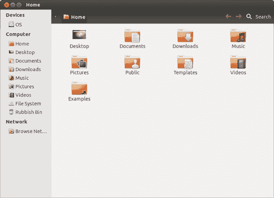
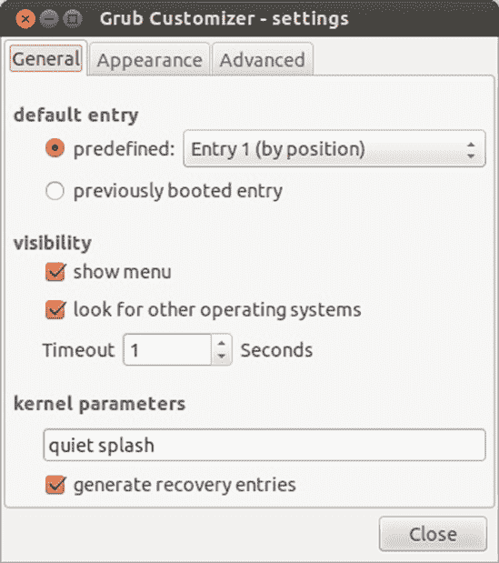
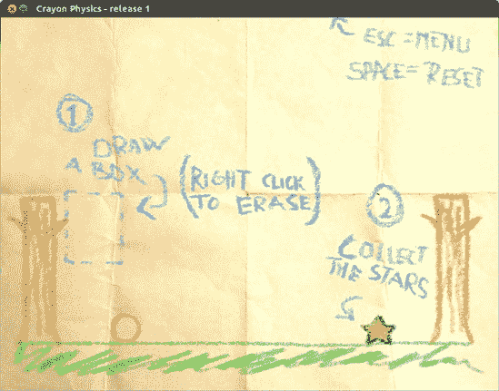
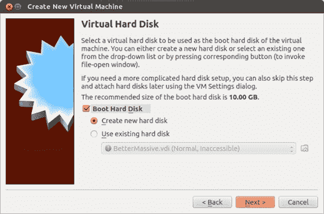

# 第十九章。企鹅在门口

### 在 Windows 世界中使用 Ubuntu

尽管 Linux 的流行度迅速增长，但它仍然是一个非常典型的 Windows 世界。如果你像我一样，你经常会发现自己在与使用 Windows 的人一起工作，因此了解如何让 Ubuntu 与微软无处不在的操作系统愉快共存是很重要的。幸运的是，Linux 几乎是最宽容的操作系统之一，并且没有问题共享文件、读取 Windows 磁盘等等。事实上，你的 Ubuntu 程序可能支持的文件格式范围比它们的 Windows 等价物更广；不止一次，我尝试在 Windows 中打开一个文件，失败了，然后启动到 Ubuntu 中，那里我可以轻松打开它。

当然，与他人共享文件可能不是你唯一的 Windows 相关担忧，尤其是如果你是双启动用户。很多人决定在他们的电脑上同时运行 Windows 和 Linux，因此了解如何最小化在两者之间切换所涉及的官僚程序是很有用的。如果你保留 Windows 的唯一目的是运行特定的应用程序，而你又找不到与之兼容的 Linux 版本，那么你可能可以省去双启动的麻烦，直接在 Ubuntu 上安装该程序。我告诉你 Linux 是多么宽容……它甚至可以接受 Windows 程序作为自己的！

在本章中，你将学习如何充分利用你的双操作系统设置：你将安装一些 Windows 字体，安装一些 Windows 程序，并在 Windows 网络上共享文件。而且如果这还不够 Windows，你甚至将看到如何在 Ubuntu 中运行 Windows（在一个窗口中！）如果你已经厌倦了“窗口”，那么到本章结束时你一定会厌倦！

# 项目 19A：访问你的 Windows 分区上的文件（适用于双启动用户）

如果你安装 Ubuntu 时选择了双启动与 Windows，那么你的硬盘上某个地方将隐藏着一个分区，里面装满了你的 Windows 文件和程序（如果你需要复习分区的工作原理，请参阅第二章）。你可以通过在 Ubuntu 内部挂载分区来访问 Windows 上的文件。当你挂载一个分区时，文件将通过 Nautilus（以及其他程序）供你使用——挂载只是 Linux 识别分区并为其使用做准备的方式。

## 19A-1：挂载你的 Windows 分区

在 Linux 中挂载你的 Windows 分区曾经是一件有点麻烦的事情，但现在已经不再是了（至少在 Ubuntu 中不是）。实际上，你所要做的就是打开一个 Nautilus 窗口，然后在侧边栏中点击 Windows 分区。

您可能在侧边栏中看到多个硬盘图标，所以您可能不确定您的 Windows 分区实际上是哪一个。只需记住，您的 Linux 分区由名为*文件系统*的硬盘图标表示，该图标列在 Nautilus 侧边栏的计算机部分下。不幸的是，Windows 分区的情况并不简单。它应该列在设备部分而不是计算机部分，但它可能被标记为*OS*（如图 19-1 中的侧边栏所示）或分区的尺寸后跟单词*媒体*（例如，如果您的 Windows 分区大小为 80GB，它可能在侧边栏中显示为*80GB 媒体*）。或者，它可能是其他完全不同的东西。如果需要，猜测它是哪一个——即使猜错了也不会有什么影响。

图 19-1. 在 Nautilus 中挂载 Windows 分区

现在您已经知道哪个磁盘图标代表哪个，是时候挂载它了！只需点击 Nautilus 侧边栏中 Windows 分区的图标。可能会出现一个认证窗口；如果出现，请输入您的 Ubuntu 密码并点击**认证**按钮。然后会弹出一个新窗口，显示您的 Windows 分区内容。

### 注意

如果您选择休眠而不是退出 Windows，那么在尝试挂载 Windows 分区时，您很可能会收到“无法挂载卷。您没有挂载此卷的权限。”的错误信息。一些休眠的 Windows 分区在 Linux 中可能无法安全地挂载以进行读写操作，因为当 Windows 休眠时添加新文件可能会在它再次启动时严重混淆它。要完全访问驱动器，请确保关闭 Windows 而不是休眠。

## 19A-2: 卸载您的 Windows 分区

在完成对 Windows 分区的操作后，您可以立即卸载该分区，或者您也可以等到系统关闭时自动卸载。在您自己卸载之前，必须首先确保没有任何程序正在访问该分区上的文件或文件夹。Nautilus 和终端是常见的嫌疑对象，因此在卸载之前，请关闭任何正在浏览该分区的 Nautilus 或终端窗口。完成这些操作后，点击 Nautilus 窗口侧边栏中 Windows 分区旁边的那个小弹出图标（图 19-2

图 19-2. Nautilus 侧边栏中的 Windows 分区“OS”，包含弹出图标

# 在运行 Windows 时访问 Linux 分区

如你所知，在 Ubuntu 中查看 Windows 文件并不太令人紧张。但反过来，让 Windows 识别你的 Linux 分区又如何呢？不幸的是，在这方面 Windows 并不太有帮助——它只能查看 FAT 或 NTFS 格式的分区，并且没有内置对 Linux 通常使用的 ext 格式的支持。因此，如果你需要在 Windows 中访问 Linux 文件，最简单的方法可能是创建一个单独的 FAT 分区，以便两个操作系统共享（参见附录 C 下载 Linux Reader。它看起来相当可用，并且具有明显的优势，那就是它是免费的！

# 项目 19B：安装 Microsoft Windows Core 字体

无论你是否喜欢，计算世界在很大程度上仍然是一个 Microsoft 的世界，这意味着绝大多数用户，甚至是 Mac 用户，都在使用 Microsoft 字体。因此，你不可避免地必须处理使用诸如 Georgia、Verdana、Times New Roman 和 Courier 等字体的文档。当然，你的系统可以用它自己的字体替换文档中使用的字体。但为了让你看到事物如预期的那样，并允许他人以你预期的方式查看你的文档，最好是在自己的系统上安装这些 Microsoft 核心字体。

幸运的是，有两种方法可以获取这些字体。一种是通过 Ubuntu 软件中心下载并安装它们，而对于那些双启动设置的用户来说，另一种方法就是简单地从 Windows 分区复制它们。在前一种情况下，你只需要使用 Ubuntu 软件中心安装 Microsoft Core Fonts 包。为此，在软件中心中搜索*mcorefonts*并安装 Microsoft TrueType 核心字体包的安装程序（应该是唯一的结果）。请注意，这是来自 Windows XP 的较旧字体集，因此安装此包不会为你带来后来 Windows 版本捆绑的新字体。一旦安装过程完成，你的新 Microsoft 字体将已成功安装并准备好供机器上的每个用户账户立即使用。

如果你是一个双启动用户，你可以直接从 Windows 安装中复制字体。这有一个优点，就是可以将所有 Windows 字体都复制到 Ubuntu 中，即使是新版本的字体（如果你安装了 Vista、Windows 7 或 Windows 8）。以下是你需要做的：

1.  按照在项目 19A：访问 Windows 分区上的文件（适用于双启动用户）"]中描述的方法挂载 Windows 分区。

1.  在 Nautilus 中打开 Windows 分区，浏览到*Windows/Fonts*文件夹。

1.  现在有一个小技巧：选择**编辑** ▸ **选择匹配项**，在出现的框中输入***`.ttf`**，然后点击**确定**（图 19-3）。这将选择所有以*.ttf*结尾的文件，它们都是 TrueType 字体文件。

    

    图 19-3. 在*Windows/Fonts*文件夹中选中所有 TrueType 字体

1.  将文件复制到方便的位置（在你的 Home 文件夹中的任何地方都可以）。

1.  现在，回到*Windows/Fonts*文件夹，再次选择**编辑** ▸ **选择匹配项**。然而，这次在框中输入***`.TTF`**（注意这次是大写字母）。这将选择剩余的所有字体文件——项目选择功能是区分大小写的，并且由于某种原因，文件名使用了不同的大小写。像之前一样复制选定的文件。

1.  将所有字体文件复制到 Ubuntu 后，你现在可以像安装其他字体一样安装它们。最简单的方法是将文件复制到你的 Home 文件夹中的隐藏*.fonts*文件夹中，但你应该查看项目 10：安装 TrueType 字体以获取完整详情。

# 双启动：更改引导顺序和超时

如果你选择在双启动设置中将 Ubuntu 与 Windows 一起安装，你现在应该已经习惯了看到 GRUB 引导菜单屏幕（图 19-4）。这是每次启动计算机时出现的屏幕，它给你选择运行 Windows 或 Ubuntu 的选项。

图 19-4. GRUB 引导菜单屏幕

如果在几秒钟内没有选择不同的选项，Ubuntu 将会自动启动。这对于那些几乎想用 Ubuntu 做所有事情但偶尔需要使用 Windows 的人来说是没问题的。然而，如果你在 Windows 上花费的时间更多，你可能更喜欢将其作为默认操作系统。要做出这个改变，你首先需要安装一个名为 Grub Customizer 的小巧应用。遗憾的是，它还没有在常规的 Ubuntu 软件仓库中提供，但你可以从 PPA 中轻松获取。你可能还记得 第六章 中提到的，PPA 是第三方应用开发者让他们的软件对更广泛的 Ubuntu 用户可用的一种方式。项目 6B：从 PPA 安装软件——龟竞技场 和 APT-URL：从网站安装 中介绍了如何查找和启用 PPA，但这里有一个快速提醒，以节省你翻页的时间：

1.  打开软件中心，点击 **编辑** ▸ **软件源**，然后在弹出的软件源窗口中点击 **其他软件** 选项卡。

1.  点击 **添加** 并在提供的框中输入 **`ppa:danielrichter2007/grub-customizer`**。这是 Grub Customizer 的 PPA 名称。

1.  点击 **添加源**，如果需要，输入你的密码。PPA 将被添加到其他软件列表中。

1.  关闭软件中心并等待一会儿；PPA 将在后台启用。（令人烦恼的是，它不会告诉你何时完成——参见 第六章 了解更多）。

一旦 PPA 成功添加到你的系统中，打开软件中心并搜索 Grub Customizer。安装它（就像安装任何其他应用一样），然后转到 Dash 并打开它。你可能需要输入密码，所以请这样做，然后等待一会儿，直到它加载完成。完成之后，按照以下说明将 Windows 设置为默认操作系统：

1.  在 Grub Customizer 窗口中，点击 **首选项** 并在弹出的设置窗口中转到 **常规** 选项卡（图 19-5）。

    

    图 19-5. 使用 Grub Customizer 更改引导选项

1.  在 *默认条目* 下方的 *预定义* 下拉列表中选择 Windows。Windows 选项的实际名称将取决于你安装的版本——例如，我的显示为 *Windows 7 (loader)*。

1.  关闭设置窗口，然后点击**保存**按钮。窗口将暂时变为灰色，在此期间，启动菜单设置将被更新。

1.  当窗口恢复正常时，进程已完成。从您下次重启开始，Windows 将自动启动，而不是 Ubuntu。

### 注意

如果您在某个时候对 Ubuntu 进行了重大更新，您可能会发现下次启动计算机时 Windows 不再是默认选项。这是因为更新会在启动列表中添加一个新的条目，导致 Windows 项目在列表中下滑，不再被识别为默认选项。要解决这个问题，请打开 Grub Customizer 并重新选择 Windows 作为默认操作系统。

Grub Customizer 还允许您更改启动超时。默认情况下，GRUB 在加载默认操作系统之前会等待 10 秒钟，但我很没有耐心，觉得等待时间太长——事实上，我甚至将超时选项（也在设置窗口的常规选项卡上）改为 1，这样菜单只显示一秒钟。这听起来可能很快，但当我想要进入 Windows 时，我只需在计算机启动时按几次向下箭头键。GRUB 会在您按下一个键时停止计时器，并保持菜单在屏幕上。一旦发生这种情况，我就可以随意选择 Windows 选项。

一旦您对修改后的启动超时和/或默认操作系统满意，请点击**保存**以应用设置。Grub Customizer 将花费几秒钟来执行请求的更改，之后您可以安全地关闭窗口。重新启动计算机以查看更新的启动菜单。

# Linux 中 Windows 应用程序的等效程序

在费尽周折在 Ubuntu 中运行 Windows 程序之前，尝试一些等效的 Linux 应用程序是个好主意。通常情况下，有一个本地的 Linux 程序可以完全满足您的需求，而无需经历为其他操作系统设计的应用程序所带来的任何麻烦。

然而，首先您必须找到那些 Linux 等效程序。幸运的是，许多网站列出了 Windows 软件的良好替代品：例如[`www.osalt.com/`](http://www.osalt.com/)和[`www.linuxalt.com/`](http://www.linuxalt.com/)相当全面。或者您可以直接在 Ubuntu 软件中心中寻找，安装那些让您感兴趣的应用程序。毕竟，尝试一个程序是了解您是否喜欢它的最佳方式！

### 注意

一些 Windows 程序在 Ubuntu 中没有直接等效程序，因此您可能需要安装几个程序来获得类似 Windows 软件的功能。在极少数没有合适替代方案的情况下，您可以尝试使用 Wine 或在虚拟机上安装 Windows，我将在下一节中讨论这一点。

# 项目 19C：运行 Windows 程序

在 第六章 中，你学习了众多将应用程序添加到系统中的方法，但你可能没有考虑过另一种方法——安装 Windows 应用程序。尽管大多数你需要的 Windows 程序都有 Linux 等效程序，但你可能仍然会错过一两个程序。幸运的是，借助名为 Wine 的程序，你可以在 Linux 中运行一些 Windows 应用程序。Wine 通过欺骗应用程序，让它们认为它们正在 Windows 下运行。它是通过提供程序在 Windows 上期望找到的所有库和支持文件来做到这一点的，而无需实际安装 Windows。兼容的软件列表包括 Microsoft Office、Internet Explorer、Adobe Photoshop 以及大量游戏，所以如果你非常想念某个特定程序，那么 Wine 确实值得一看。

公平地说，应该指出 Wine 仍然是一个持续发展的项目。它与某些程序配合得很好，而与其他程序则完全不兼容。然而，情况正在改善，Wine 现在似乎与更多应用程序配合得更好。如果你对哪些应用程序在 Wine 下运行以及运行效果如何感到好奇，请访问 Wine 主页 [`www.winehq.org/`](http://www.winehq.org/) 并点击 **AppDB** 链接。程序的应用程序数据库条目通常包含有关在 Wine 下运行这些程序的实用建议，所以如果你遇到问题，请首先查看那里。

## 19C-1：安装和测试 Wine

你可以通过在 Ubuntu 软件中心搜索 *wine* 并安装 Microsoft Windows 兼容层（它应该是第一个搜索结果）来获取 Wine。安装完成后，你可以通过打开 Dash 并搜索 Notepad 来测试它。当结果出现时，点击 Notepad 应用程序的图标（上面有酒杯图标的那一个），经过几秒钟（第一次使用 Wine 时可能更长），Windows 记事本就会出现 (图 19-6)。

图 19-6. 在 Wine 下运行的 Windows 记事本

## 19C-2：在 Wine 中安装 Windows 应用程序

现在你已经看到 Wine 下运行的一个 Windows 应用程序，你不妨学习如何自己安装更多。我会指向一个肯定能工作的应用程序——一个相当酷的文本编辑器，名为 NoteTab Light (图 19-7)。

图 19-7. 在 Wine 下运行的 NoteTab Light

要获取 NoteTab Light，请访问 [`www.fookes.com/ftp/free/NoteTab_Setup.exe`](http://www.fookes.com/ftp/free/NoteTab_Setup.exe)，选择 **保存文件**，并在出现的窗口中点击 **确定** 以将文件保存到你的 *下载* 文件夹。

下载完成后，前往 *下载* 文件夹，右键点击 *NoteTab_Setup.exe* 文件，并在弹出菜单中选择 **打开方式** ▸ **Wine Windows 程序加载器**。几分钟后，你将看到与在 Windows 中安装 NoteTab 时相同的安装向导（图 19-8). 按照向导操作，接受许可协议，然后在整个安装过程中接受所有默认设置，直到安装完成。

图 19-8. 在 Wine 下运行的 Windows 安装向导

运行 NoteTab Light 很简单，因为它为你提供了一个桌面启动器。双击该启动器（它看起来像前面有瑞士国旗的记事本），NoteTab Light 很快就会出现，就像一个常规的 Linux 应用程序一样。（放在桌面上的另一个文件，以 *.lnk* 结尾，可以安全删除以减少杂乱。）你还可以通过在 Dash 中搜索它们来运行 NoteTab Light 和其他在 Wine 下安装的 Windows 应用程序，就像搜索任何其他应用程序一样。

## 19C-3: 使用 PlayOnLinux 在 Wine 中运行 Windows 应用程序

有些 Windows 软件除非你以特定的方式设置，否则在 Wine 中固执地拒绝运行。Wine 网站充满了关于如何调整设置直到找到似乎适用于特定程序的神奇公式的提示（这些设置实际上对于你用 Wine 安装的其他程序几乎肯定不会起作用）。甚至有些说明要求你为不同的程序安装不同版本的 Wine！幸运的是，有一个巧妙的方法可以绕过这些问题，那就是 PlayOnLinux。它为你处理所有设置调整，并支持许多常用的 Windows 程序（以及大量游戏）。你可以从 Ubuntu 软件中心以常规方式安装 PlayOnLinux。

安装完成后，通过 Dash 搜索 PlayOnLinux 来启动它。当它打开时，会出现一个 PlayOnLinux 首次使用窗口。点击 **下一步**。它将花费一两分钟更新其支持的程序数据库。更新完成后，再次点击 **下一步**，它将带你进入主 PlayOnLinux 窗口（图 19-9). 在那个新窗口中，点击 **安装**，并使用出现的窗口中的分类面板或搜索栏查找你选择的 Windows 程序。

图 19-9. 主 PlayOnLinux 窗口

在这个例子中，你将安装令人愉快的 Crayon Physics 游戏：

1.  选择 **游戏** 分类，并在列表中找到 Crayon Physics 条目（不是 Deluxe 版本）。

1.  选择**Crayon Physics**（如图 19-10 所示 Figure 19-10)，然后点击**安装**以开始安装过程。

    

    图 19-10. 在 PlayOnLinux 中选择要安装的 Windows 应用程序

1.  将会打开一个安装向导。点击**下一步**，等待游戏下载和安装完成。

1.  完成后，点击**下一步**以完成安装。您将返回到主 PlayOnLinux 窗口。

1.  要开始游戏，请双击主 PlayOnLinux 窗口中程序列表中的 Crayon Physics 条目，或者从列表中选择该游戏并点击**运行**。

假设游戏安装成功，你将看到一个 Crayon Physics 窗口。点击该窗口的任何位置，你会在显示上看到用蜡笔描绘的风景，类似于图 19-11Figure 19-11 中的。游戏的目标是用鼠标在屏幕上画盒子，使其以这种方式滚动到一个星星上。每次你得到星星，你就可以进入下一关，在那里你将被迫想出一个更巧妙的滚动球策略。听起来很简单，但很容易上瘾！

图 19-11. 在 PlayOnLinux 的帮助下玩 Crayon Physics 游戏

# 在 Ubuntu 中安装 Windows

你可以用电脑做的奇怪事情之一是在其中运行计算机的模拟。这种模拟，称为*虚拟机（VM）*软件，允许你在另一个操作系统内安装一个操作系统，这样你就可以同时运行它们，而无需重新启动。如果你需要出于某种原因运行 Windows，比如需要一些专门的软件，但又太习惯于在 Ubuntu 中工作而不想考虑进行双启动用户必须遵循的相对耗时的重新启动程序，这将非常有用。你甚至可以让 Windows 在一个窗口中运行，这个窗口可以像任何其他程序一样打开和关闭。

有一些注意事项。首先，虚拟机必须与你的所有其他程序共享你的计算机资源，所以如果你在进行任何计算密集型操作，它可能会减慢速度。其次，它不像“真实”操作系统那样访问你的计算机硬件，所以你很可能无法轻松通过虚拟机使仅限 Windows 的设备工作。最后，也许是最尴尬的，你需要一个 Windows 安装光盘才能将 Windows 放入虚拟机中，但大多数计算机只配备了恢复光盘，这无法解决问题。

如果您确实有安装光盘，将 Windows 安装到虚拟机中并不比安装到真实计算机上多花多少功夫：

1.  打开 Ubuntu 软件中心并安装 VirtualBox。其他虚拟机也可用，但我发现这个最容易使用。在 Dash 中搜索 *VirtualBox* 并启动它。在出现的窗口中，点击 **新建** 然后点击 **下一步**。

1.  为您的虚拟机选择一个名称和类型。名称由您决定，但操作系统应设置为 Microsoft Windows。确保您选择了正确的 Windows 版本。

1.  点击 **下一步** 并选择您希望虚拟机可以访问的内存量（系统内存，而不是硬盘空间）。(图 19-12). 这可能是一个艰难的决定；一方面，您需要足够的内存以便“虚拟”操作系统能够运行（例如，Windows XP 至少需要 128MB），但另一方面，您又希望为 Ubuntu 程序留出足够的内存。VirtualBox 通常会建议一个合理的值。

    

    图 19-12. 为虚拟机分配多少内存

1.  再次点击 **下一步** 并选择 **创建新硬盘** (图 19-13). 确保勾选了 **启动硬盘**。然后点击 **下一步** 打开创建新虚拟硬盘窗口。

1.  运行虚拟硬盘向导，完成后点击 **完成**；大多数选项的默认值应该就足够了，但您可能想自己选择虚拟硬盘的大小。这将用作虚拟机的硬盘，并存储在您家目录中的一个隐藏文件夹中。再次提醒，选择一个足够大以运行虚拟操作系统，但又不会占用您整个硬盘的空间的大小。

    

    图 19-13. 创建新的虚拟硬盘

    ### 注意

    如果您选择 *动态扩展存储* 作为存储类型，虚拟硬盘将从一个较小的尺寸开始，并在虚拟机中添加更多文件时增长。这是一种节省磁盘空间的好方法。

1.  虚拟硬盘设置完成后，您将被带到摘要页面，您可以点击 **完成** 来创建虚拟机。

到目前为止，一切顺利。有了准备好的虚拟机并迫不及待地想要使用，现在是时候安装 Windows 了。我将把 Windows 的具体细节留给你（它们略超出了本书的范围，不是吗？），但以下是你需要做的来开始安装：

1.  将 Windows 安装光盘插入您的 CD 光驱，并关闭任何打开的窗口，询问如何处理它。

1.  在 VirtualBox 的主窗口中，从左侧面板中选择您的虚拟机，然后点击**启动**。将打开一个黑色窗口，以及一个首次运行向导；点击**下一步**。

1.  确保在媒体类型下选中 CD/DVD-ROM 设备，然后再次点击**下一步**。

1.  点击**完成**，虚拟机应该会尝试从您的 Windows CD 启动。几秒钟后，您应该会面对 Windows 安装程序。享受这个过程吧！

1.  Windows 安装完成后，虚拟机将重新启动。当提示时，请取出 CD，并在设置几分钟之后，您应该会看到 Windows 桌面。呼，辛苦的工作结束了！

### 注意

您可以在虚拟机中安装 Linux 和其他操作系统，而不仅仅是 Windows。实际上，您甚至可以在虚拟机中安装另一个虚拟机，尽管如果您同时运行这两个虚拟机，您可能需要预留半天时间来检查您的电子邮件。

# 在您的网络中与 Windows 用户共享文件

连接到网络的主要理由之一（除了访问互联网之外）是在计算机之间共享文件。您可能已经熟悉这个概念了；网络共享在许多工作场所中都被使用，您可能之前在自己的家庭网络中已经设置过。对于初学者来说，网络共享是另一台计算机上的一个文件夹，您可以像访问自己的文件夹一样访问它。文件在网络中传输，因此不需要使用便携式硬盘或闪存驱动器来在不同地方之间传输文件。

## 访问存储在 Windows 计算机上的文件

网络共享是双向的：您可以通过创建**共享文件夹**与他人共享文件，或者访问其他人创建的现有共享文件夹。如果您连接到一个 Windows 计算机的网络，那么您可能已经有了一些网络共享。我在使用 Nautilus 作为网络浏览器中详细讨论了浏览网络共享，但在您翻回这么多页面之前，这里有一个快速概述，说明您需要做什么才能从 Ubuntu 访问共享：

1.  通过点击启动器中的橙色文件夹图标打开 Nautilus。在侧边栏的网络部分中点击**浏览网络**，然后双击**Windows 网络**以查看连接到网络的全部 Windows 计算机列表。双击其中一台计算机以查看其共享文件夹。如果没有列出任何计算机，尝试打开一个带有网络图标的前面文件夹（如图 19-14 中的那个）并查找其中的计算机。

    

    图 19-14. 包含指向网络上 Windows 计算机链接的文件夹

1.  选择一个共享文件夹，双击它以访问其中的文件。根据共享文件夹的设置，您可能需要输入托管该计算机的用户名和密码。

## 使您的文件可通过 Windows 电脑访问

由于您的 Windows 电脑已经非常乐意在网络上共享文件，让我们通过共享 Ubuntu 自己的文件夹来作为回报：

1.  打开 Nautilus 并找到您想要共享的文件夹；然后右键单击它并选择**属性**。

1.  转到**共享**选项卡，并勾选**共享此文件夹**。

1.  您将被告知共享服务尚未安装——点击**安装服务**，然后在出现的窗口中点击**安装**。如果需要，请输入密码并等待安装过程完成。您可能需要安装其他包，因此当提示时也请点击**安装**。

1.  安装完成后，您将收到提示重新启动会话。现在请点击**取消**；您需要先注销，然后稍后再重新登录。

1.  在文件夹共享窗口（图 19-15

    图 19-15. 在网络上共享文件夹

1.  如果您希望网络上的其他人能够修改您那里的文件，请勾选**允许其他人在此文件夹中创建和删除文件**。如果不勾选此选项，其他人只能读取和复制这些文件。

1.  默认情况下，只有在你电脑上拥有用户账户的人才能访问你的共享文件夹。为了使网络上任何人都能访问你的共享文件，请勾选**来宾访问**选项。

1.  点击**创建共享**以完成操作。

1.  要完成此过程，您需要重新启动会话。因此，请保存所有工作并注销您的用户账户。然后，再次登录。

前往您的 Windows 电脑并尝试访问新创建的共享。Ubuntu 电脑上的共享文件夹可以像访问任何其他共享一样访问，所以您只需做您通常会做的事情来找到它。（例如，在 Windows XP 中，您会在您的*网络共享*文件夹中找到它。）如果您能够打开共享文件夹中的文件，那么您就会知道一切设置都正确无误。

如果您不再想共享文件夹，请在 Nautilus 中右键单击它，点击**属性**，然后在**共享**选项卡下取消勾选**共享此文件夹**。
