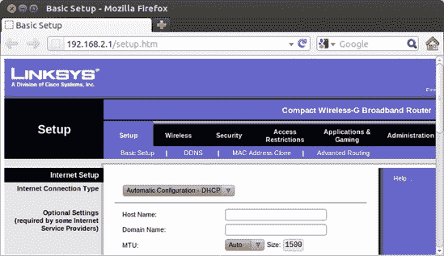
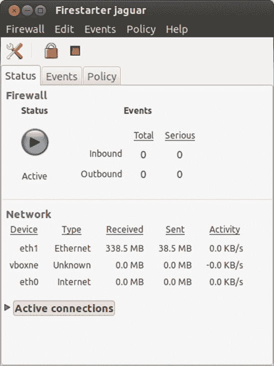
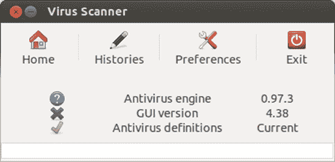

# 第二十章 保护家园

### 安全

许多 Windows 用户在经历了 Windows 世界中的大量恶意软件（病毒、间谍软件以及难以想象的众多其他恶意软件）的糟糕经历后，进入了 Linux 阵营。Windows 还受到似乎无穷无尽的网络安全漏洞的困扰，使系统容易成为心怀不轨的入侵者的猎物。因此，每次进入网络空间都像是在医院的传染病科跑一趟。对于 Windows 用户来说，有时似乎花在清除系统中的病毒害虫和防御入侵者身上的时间比真正完成任务的时间还要多。

幸运的是，Linux 并没有遭受如此严重的问题，这导致了广为流传的说法，即 Linux 几乎不受病毒侵害，非常安全。已经提出了许多理由来解释 Linux 对恶意软件和漏洞的抵抗力。一个简单的原因是流行度——或者说缺乏流行度。因为 Linux 不像 Windows 那样广泛使用，所以它对数字恶棍来说也远不是一个有吸引力的目标，他们往往被创造真正全球性的病毒或发现迄今为止未知的后门所带来的挑战和头条新闻的荣耀所驱动。

另一个原因是，Linux 用户通常以非特权模式在计算机上工作，在这种模式下，用户没有密码就无法安装软件。在一些较老的 Windows 版本中并非如此。因此，附着在电子邮件上或寄生在其他文件或应用程序上的病毒或其他形式的恶意软件无法在没有密码的情况下安装到您的 Linux 系统中……至少在理论上是这样。当然，现在较新的 Windows 版本默认使用与此类似的权限结构，这个点的问题就小多了。

结构设计也是一个问题。每个系统都有可以被数字和人类敌人利用的安全漏洞。在这方面，Windows 可能被称作操作系统的瑞士奶酪。当然，Linux 也有它的漏洞，尽管显然比 Windows 少得多，而且一旦发现，Linux 通常能通过可下载的更新更快地填补这些漏洞。

最后，Ubuntu 的预配置安全策略带来了一种防御优势——默认情况下已开启防火墙。这意味着您的 Ubuntu Linux 系统对不受欢迎的入侵更加不易受影响。

# 我的系统需要保护吗？

因此，在谈论 Linux 卓越的安全性的同时，你可能想知道是否真的需要担心漏洞。好吧，如果你查看 Ubuntu 论坛，你可能会感到有些困惑。当被问及 Linux 用户是否需要安装防病毒软件或防火墙时，大多数用户都会断然回答“不”。另一方面，你会发现很多人已经安装或正在尝试安装那种软件。嗯。

那么，Linux 用户该怎么办呢？

如果你在一个网络中，需要在很多 Windows 机器之间传输大量文件，你可能想要考虑安装一些防病毒软件，如果只是为了实现涉及 Windows 系统的良好状态和那些系统用户（比如你那些未开化的、即使用 Windows 的电子邮件朋友）的利益。如果你天生谨慎，你也可以尝试一下。基本上，如果你通过安装一些保护措施感到更安全，那就去做吧。如果你通过安装我在本章中涵盖的完整防御机制感到更安全，那就去做吧。毕竟，无论哪种方式，都不会让你付出任何代价，而且肯定不会伤害到你。另一方面，你也许不安装这里描述的任何软件也能过得很好。

# 第一道防线

无论你使用的是哪种系统（尽管我现在假设你已经成为了 Linux 的忠实信徒），任何永久连接到互联网的计算机的第一道防线都是一个**路由器**——这是一种电子设备，它允许本地网络（如你的家庭或办公室）中的多台计算机连接并共享来自你的互联网服务提供商（ISP）的单个连接。路由器通过电缆连接到你的互联网连接，但路由器与本地网络中的计算机之间的连接可以是有线、无线或两者兼有。

路由器与你的计算机防御有什么关系呢？嗯，大多数路由器都包含一个**防火墙**，它本质上起到将所有网络上的不良内容隔离在你的计算机之外的作用，就像你的汽车中的防火墙将发动机的热量、烟雾和噪音隔离在乘客舱外一样。这个内置的防火墙是即使只有一台计算机的人，他们本可以直接连接到电缆或 DSL 调制解调器，也会使用路由器的一个原因。当然，你的路由器中的防火墙提供的安全性取决于你在防火墙设置软件中选择的过滤器。例如，一个非常常见且有用的过滤器（尤其是对于无线网络用户来说）限制了只有防火墙访问列表中指定的计算机才能访问互联网。这阻止了你的邻居通过你的 ISP 连接使用无线网络。毕竟，他们没有支付账单。

路由器的设置软件是内置在路由器中的，因此你不必担心软件安装和系统兼容性问题。在 Linux 上使用路由器与在 Windows 上使用没有区别。你可以通过简单的网页浏览器访问软件和修改设置，如图 20-1 所示。只需在浏览器的地址栏中输入路由器的 IP 地址（通常在用户手册中提供），按回车键，你就可以开始了。

图 20-1. 设置路由器

# 软件防火墙

如果你没有路由器，或者不打算购买，或者你有一个但几乎到了偏执的地步，你可能想考虑使用软件防火墙，特别是 Linux 上最受欢迎的软件防火墙之一，Firestarter。

你可以通过 Ubuntu 软件中心搜索*firestarter*来获取 Firestarter，并安装它。安装完成后，从 Dash 中打开 Firestarter（可能需要输入你的密码）。Firestarter 第一次打开时会带有一个说明性的设置向导。只需仔细阅读每一屏；如果建议进行选择，请做出选择（默认值应该足够好），然后在向导的每一屏上点击**前进**按钮，直到到达最后一屏（如图 20-2 所示）。在该屏幕上，确保“现在启动防火墙”旁边的框被勾选，然后点击**保存**按钮。向导窗口将关闭，主 Firestarter 窗口将出现。假设检测到了正确的网络设备并进行了正确的选择，防火墙将启动并运行。

图 20-2. Firestarter 设置向导的最后屏幕

如果选择了错误的网络设备，将会弹出一个警告窗口告诉你这一点。在这种情况下，你可以在 Firestarter 主窗口中选择**编辑** ▸ **首选项**进行一些尝试和错误的操作，然后点击首选项窗口中的**网络设置**（图 20-3

图 20-3. 在 Firestarter 中选择网络设备

图 20-4. Firestarter 正在运行

## 控制 Firestarter

你可以通过创建自己的*策略*来控制 Firestarter 如何处理各种网络事件。Firestarter 中默认设置的策略允许你通过互联网做任何你通常做的事情，同时它阻止来自互联网或你网络上的任何其他计算机到你的计算机的新连接。

要使事情变得更为严格，你可以点击**策略**标签，从编辑下拉菜单中选择**默认限制性，白名单流量**。然后你必须具体允许访问任何给定的网站，通过将其添加到主机列表中。这听起来对我来说很麻烦。如果你只想阻止任何在计算机上工作的人访问特定的网站，例如，只需选择**默认允许，黑名单流量**；右键单击**拒绝连接到主机**字段；然后在弹出菜单中选择**添加规则**。在添加新出站规则窗口中，输入目标网站的域名（如*example.com*），点击**添加**，然后在主 Firestarter 窗口中点击**应用策略**按钮（它看起来像绿色的勾号）。

## 确认 Firestarter 自动运行

在第一次运行 Firestarter 之后，它将自动设置为每次启动系统时启动。当你第一次启动时没有看到你看到的图形界面时，不要担心；Firestarter 将在后台运行，默默地保护你的计算机。

如果你是一个怀疑论者，你可以通过打开终端窗口，输入**`sudo /etc/init.d/firestarter status`**，然后按回车键（如果提示，输入你的密码）来检查 Firestarter 是否实际上在后台运行。如果 Firestarter 正在运行，你将在终端窗口中看到消息`* Firestarter is running...`。不用担心。如果 Firestarter 没有运行，响应将显示`* Firestarter is stopped`。

## 获取更多信息

如果防火墙的世界对你来说很陌生，你可以查看 Firestarter 的主页来了解更多信息。要查看在线手册，只需转到 Firestarter 的**帮助**菜单并选择**在线用户手册**，它将在你的网页浏览器中打开。如果你想在安装 Firestarter 之前查看手册，请将浏览器指向[`www.fs-security.com/docs.php`](http://www.fs-security.com/docs.php)。在那里你也会找到一个相当不错的快速教程。

# ClamAV：Linux 风格的杀毒软件

尽管能够对 Linux 系统造成破坏的病毒相对较少，但你的计算机仍然可能成为 Windows 病毒的传播者。因此，为那些希望帮助保护 Windows 用户免受病毒侵害的 Linux 用户提供了一些免费的杀毒扫描程序。这些包括 Panda Desktop Secure ([`www.pandasecurity.com/usa/homeusers/downloads/desktopsecure/`](http://www.pandasecurity.com/usa/homeusers/downloads/desktopsecure/))、F-PROT ([`www.f-prot.com/`](http://www.f-prot.com/))、avast! ([`www.avast.com/linux-home-edition/`](http://www.avast.com/linux-home-edition/))以及许多其他软件。然而，对于大多数 Linux 用户来说，首选的病毒扫描器是开源的竞争者：*ClamAV*。

虽然 ClamAV 可以在多个操作系统上使用，但它被认为是*Linux*的杀毒软件包。它是开源的，完全免费，你不必担心许可证或麻烦地更新它们。不幸的是，ClamAV 本身是一个基于命令的应用程序，这使得它稍微不太用户友好。幸运的是，有一个图形界面，尽管很简单，可用；它被称为 ClamTk。ClamAV 和 ClamTk 都可以通过 Ubuntu 软件中心获得——只需搜索并安装*ClamTK*。然后，Ubuntu 软件中心将自动安装 ClamAV 以及它运行所需的所有其他软件包。

一旦安装了 ClamAV，你就可以通过从 Dash 中打开 ClamTk 来执行病毒扫描。这将打开 ClamTk 病毒扫描器窗口（图 20-5）。

图 20-5. ClamTk，ClamAV 的图形界面

现在 ClamAV 已经启动并运行，你可以从扫描菜单中按需扫描你的系统。要扫描单个文件夹，选择**一个目录**。要扫描目录及其所有内容，请选择**递归扫描**。在两种情况下，都会出现**选择目录**窗口。选择你想要扫描的文件夹或磁盘，然后点击**确定**。ClamAV 将开始扫描你的系统。ClamTk 将在按钮栏下方空白的区域告诉你它正在扫描什么。如果它发现任何可疑内容，它将在窗口的主面板中列出该条目。

ClamAV 默认设置为在启动时检查**签名更新**。这些签名更新告诉 ClamAV 需要留意哪些新的病毒。如果您连续几天不关机，那么将 ClamAV 设置为每天自动检查签名更新而不是仅在启动时检查可能也是一个好主意。为此，转到**高级**菜单并选择**调度程序**。在调度窗口中，选择 ClamAV 进行更新检查的时间，位于窗口的下半部分。完成后点击添加按钮（看起来像加号）。您还可以使用此窗口设置定期扫描系统的时间——只需选择您希望扫描发生的时间并点击**添加**。完成设置后，点击**关闭**。

正如我提到的，在病毒扫描过程中，您可能遇到的唯一病毒是为 Windows 系统设计的，这些病毒不会影响您的 Linux 系统。尽管扫描整个系统对病毒没有害处，但如果您有一个 Windows 分区，或者您将文件作为电子邮件附件发送，尤其是发送给 Windows 用户，那么将病毒扫描活动集中在 Windows 分区和这些文件上可能更好。

# 项目 20A：加密您的文件

保护自己免受互联网恶意软件的侵害是件好事，但如果有人获得了对您的计算机的物理访问权限怎么办？数据盗窃是一项严肃的业务，所以如果您有任何敏感文件，您应该考虑保护它们。一种好方法是**加密**您的敏感文件。加密是一种将文件打乱的方式，只有拥有正确**解密密钥**的人才能恢复原始信息。如果有人试图在文件加密时查看它，他将看到的只是一堆无意义的字符。

## 20A-1: 创建加密文件文件夹

Ubuntu 有一个加密文件的好方法，但使用时请小心！加密文件的全部意义在于除了您之外没有人能够访问它们，所以如果您忘记了密码，几乎没有机会恢复它们。以下是您需要遵循的步骤来获取加密：

1.  打开 Ubuntu 软件中心，搜索并安装*ecryptfs-utils*。

1.  安装完成后，打开 Dash 并搜索终端。当终端窗口出现时，输入**`ecryptfs-setup-private`**并按回车键。

1.  您将被提示输入用于登录 Ubuntu 的密码。输入它并按回车键。（字母不会显示在屏幕上，这是正常的。）

1.  您将被要求输入挂载密码（密码）。选择一个**非常**容易记住的密码——如果您忘记了密码，将无法恢复！按回车键，重新输入密码（以确保没有打字错误），然后再次按回车键。

1.  关闭终端窗口，注销用户账户，然后再次登录。

1.  当你登录时，将出现一个更新信息窗口（图 20-6

图 20-6. 检查你的加密密码

## 20A-2：如果出现问题恢复加密文件

如果你的电脑出现问题，需要恢复加密的 *Private* 目录中的文件，在 Ubuntu 重新启动并运行后，请按照以下步骤操作。如果你不自信按照这些说明操作，你绝对应该在 Ubuntu 论坛上先寻求建议。

1.  打开终端，输入 **`sudo mount -t ecryptfs /home/username/.Private /home/username/Private`**（注意第一个路径中的点），然后按回车键。当然，你应该将 **`username`** 替换为你自己的用户名。

1.  你将被提示输入密码。输入你的挂载密码（密码）并按回车键。

1.  现在，你将多次被提示进行选择。连续按几次回车键，直到你收到一个 `WARNING` 消息。

1.  输入 **`yes`** 并按回车键；然后输入 **`no`** 并按回车键。

1.  如果你输入了正确的挂载密码，*Private* 文件夹将被解密，你将能够访问你的文件。将它们从该文件夹复制到安全的地方！

如果你没有成功恢复你的文件，请查看 [`help.ubuntu.com/community/EncryptedPrivateDirectory/`](https://help.ubuntu.com/community/EncryptedPrivateDirectory/)，看看是否还有其他可以尝试的方法。

# 项目 20B：数字粉碎文档

尽管大多数人删除不再需要的文件时感到满意，但他们可能没有意识到被删除的文件数据仍然可以恢复。对于你夏季度假去马里兰州的照片或为泰国烹饪课程写的报告来说，这可能没什么大不了的，但如果你在硬盘上存储了银行账户详情或其他机密信息，那就完全是另一回事了。即使你重新格式化该磁盘，数据仍然会保留。如果你不小心删除（或格式化）了文件，这当然是个好消息，但如果你的电脑丢失或被盗，或者你只是决定将其赠送出去，那就不是什么好消息了。为了应对这种情况，进行一些数字粉碎可能不是一个坏主意。

## 20B-1: 尝试使用 shred 命令

在 Linux 中，使用`shred`命令进行数字粉碎。它的用法与你在第八章中学到的`rm`命令非常相似，尽管在删除方面，`shred`要彻底得多。要尝试一下，通过打开 Nautilus 窗口的文件菜单并选择**创建新文档** ▸ **空文档**来创建一个虚拟文件。将新文档命名为*myShredExp.txt*，然后双击文件。这将打开 gedit。在文档中输入几句话——任何内容都可以——然后保存。关闭 gedit。你现在应该能在你创建的新虚拟文件图标上看到你输入的前几个单词（如图 20-7 左侧的示例所示)。

图 20-7. 文件被粉碎后外观发生变化。

拿着你的新文件，将其放置在主文件夹中以方便跟随，你现在可以尝试使用`shred`命令了。打开一个终端窗口，输入**`shred myShredExp.txt`**，然后按回车键。如果你查看主文件夹，你会立刻注意到差异：你的原始文件仍然在那里，但图标上的文本现在看起来像乱码（如图 20-7 右侧的示例所示），这就是你的文件变成的样子。如果你双击该文件，gedit 会像之前一样打开，但这次它将无法读取你的文件，并会告诉你（图 20-8)。

因此，现在您文件夹中有一个粉碎的文件，但将其删除而不是让它在那里乱糟糟的会方便得多，不是吗？当然，您可以通过在终端中使用 `rm` 命令来删除文件，但如果有粉碎后的文件能立即被删除会更容易。幸运的是，通过使用带有 `-u` 标志的 `shred` 命令，这很容易做到。您可以在已经粉碎的文件上尝试它，通过打开一个终端窗口，输入 `shred -u **`myShredExp.txt`**` 并按回车键。然后您的文件将被进一步粉碎并删除。

图 20-8. gedit 无法打开您已粉碎的文件。

## 20B-2: 粉碎命令的图形等效

虽然使用 `shred` 命令并不困难，但大多数普通用户更喜欢以图形方式做事。毕竟，您不必输入命令来删除或移动文件，对吧？这就是 BleachBit 的作用。BleachBit (图 20-9) 是一个应用程序，以多种方式帮助保护您的隐私——最重要的是为您粉碎各种东西。以下是您需要遵循的步骤来粉碎一个文件：

1.  从 Ubuntu 软件中心安装 BleachBit。安装完成后，通过 Dash 打开它。

1.  当 BleachBit 窗口打开时，您将看到一个首选项窗口。默认设置对我们的目的来说已经足够好了，所以只需点击 **关闭**。

1.  假设您不想做任何更复杂的事情，让我们粉碎单个文件。点击 **文件** ▸ **粉碎文件** 并选择您想要粉碎的文件（按住 Ctrl 键以选择多个文件）。请注意不要选择错误的文件，因为您在粉碎后无法恢复它！点击 **删除**。您将被要求确认删除。这是无法回头的点，如果您愿意继续，请点击 **删除** 以完成工作。

1.  文件将消失，被粉碎到无影无踪，并且安全地免于恢复。

正如我提到的，您可以使用 BleachBit 做很多事情来保护您的隐私，而不仅仅是粉碎一些文件。主 BleachBit 窗口左侧的列表包含各种奇怪而奇妙的方式来安全地删除可能潜伏在您电脑上的某些个人信息。以 Firefox 为例：在 BleachBit 列表中点击 Firefox 列表项，主面板将出现一个信息页面，告诉您 BleachBit 如何安全地删除 Firefox 保留的各种信息。

图 20-9. 使用 BleachBit 保护您的隐私

例如，您可以检查 Cookies 列表项。选中后，您只需在窗口顶部按下 Clean 按钮，即可删除 Firefox 累积的所有网络 cookies。简单，对吧？

### 注意

Cookies（cookie）是您的网络浏览器用来存储有关网站信息的文本片段。网站使用 cookies 作为一种记录您访问过它们的方式。例如，如果您登录到一个网站，它会在其中存储一个包含您用户名的 cookie，以便下次您访问时记住您是谁。
