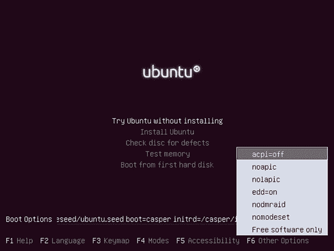
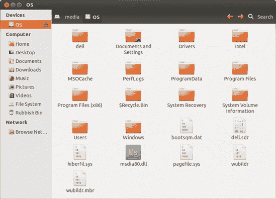
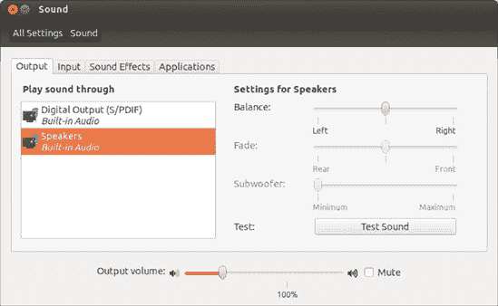
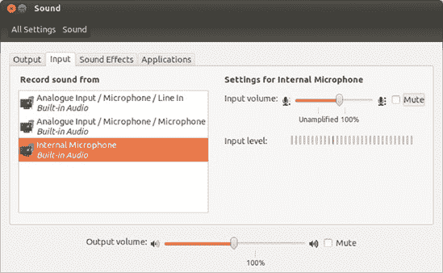
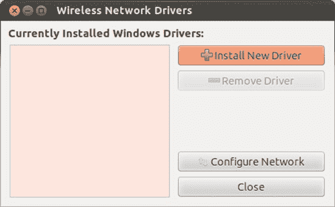
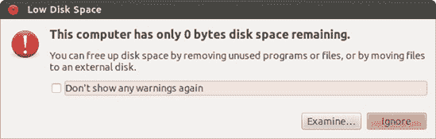
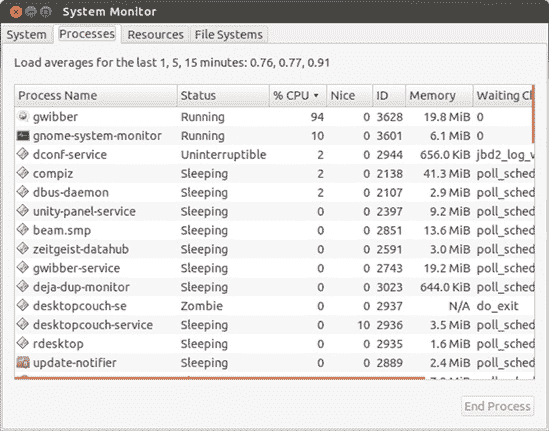

# 第二十二章。受伤的翅膀

### 解决常见问题

就像死亡和税收一样，电脑问题是生活中不可避免的事实。Ubuntu 也有它自己的烦恼，尽管我似乎在 Ubuntu 上花费的时间远少于以前在 Windows 上，但最好还是不要忽视你可能会有一天遇到硬件故障或棘手的软件情况的可能性。

本章的目的是为你提供一些通用的技巧、窍门和故障排除提示。你将找到如何解决几个具体问题的分步说明，但大部分内容我尽量保持通用。这是因为解决某些问题的方法将很大程度上取决于你设置的特定性，而且没有足够大的书架来存放涵盖所有可能情况的详细指南。幸运的是，互联网上藏有大量的 Ubuntu 相关指南，所以即使你在这里找不到你想要的精确答案，我也希望你能使用我的建议在网络上找到正确的信息。

如果你遇到了问题，翻阅这一章看看是否有能帮到你的内容。我涵盖了安装、启动、声音和视频、互联网和网络连接、硬盘和存储以及显示和显卡等方面的问题，还包括了一些令人烦恼的软件问题，比如程序冻结或减慢电脑速度。如果你没有遇到任何特定的电脑难题，你可能想快速浏览这一章，了解一下未来不幸发生时应该怎么做。或者，你可以选择我更喜欢的路线：泡一杯热饮，然后回到游戏章节（第十七章)，享受一些应得的休息和娱乐。

# 我无法安装 Ubuntu

无法安装 Ubuntu 是一个特别令人不快的问题，因为这意味着你可能错过了这本书前 21 章中所有的乐趣！不要担心；你有很多方法可以让 Ubuntu 在你的电脑上安装，如果你仍然在努力，你可以尝试从 USB 闪存驱动器启动的替代安装方法，我在附录 A 中进行了介绍。

## 我的电脑无法从光盘启动

如果你尝试从 Ubuntu 安装光盘启动电脑，但从未看到紫色启动屏幕（参见跳入水中），或者电脑每次都直接启动到 Windows，请尝试以下选项之一：

**检查启动顺序**。

当你的计算机启动（*引导*）时，它会按照一定的顺序检查列表中的设备，以查看它们是否安装了操作系统。一旦找到操作系统，计算机将从该设备启动，而不会检查其他任何设备。这意味着如果硬盘驱动器在引导顺序中排在光盘驱动器之前，计算机将从硬盘驱动器启动而不是从光盘驱动器启动。要使计算机从光盘启动，你需要确保光盘驱动器在引导顺序中排在第一位。请参阅跳入水中中的跳入水中，了解如何正确设置引导顺序的说明。

**检查光盘的完整性**。

你可能有一个损坏的光盘，计算机无法从其启动。你可以通过进行校验和测试来检查光盘是否有故障。校验和有点像指纹；你取 Ubuntu 光盘的校验和，并将其与一个已知无故障的 Ubuntu 光盘的校验和进行比较。如果两个光盘之间只有一个微小的差异，校验和也会不同——指纹不会匹配。Ubuntu 使用 MD5SUM 程序来进行校验和。请访问[`help.ubuntu.com/community/HowToMD5SUM/`](https://help.ubuntu.com/community/HowToMD5SUM/)并滚动到“Windows 上的 MD5SUM”部分，了解如何找到你光盘的校验和。如果校验和不相符，你需要获取另一张光盘（例如，通过从[`www.ubuntu.com/download/desktop/`](http://www.ubuntu.com/download/desktop/)下载光盘镜像或通过联系 No Starch Press 要求更换）。

**确保你正确地烧录了光盘**。

如果你下载了光盘镜像文件 (*.iso*) 而不是使用本书附带的光盘，请确保你正确地烧录了光盘。人们常犯的一个错误是将 *.iso* 文件直接复制到光盘上，就像它是一个普通文件一样。这是行不通的；你需要使用光盘刻录软件中的“烧录光盘镜像”选项（或类似选项）来正确地进行操作。有关说明，请参阅[`help.ubuntu.com/community/BurningIsoHowto/`](https://help.ubuntu.com/community/BurningIsoHowto/)。

## 我无法运行安装程序

如果你可以从 Ubuntu 光盘启动（显示紫色引导屏幕图 22-1），但在选择尝试或安装 Ubuntu 时出现问题，你永远不会到达安装程序屏幕，那么计算机可能正在努力启动运行 Live CD 所需的一些软件。你可以尝试以下操作：

**尝试一些内核选项**。

一旦到达紫色启动屏幕，请按任意键（我最喜欢的是空格键）并使用箭头键从出现的列表中选择您的语言，然后按 enter。然后按 F6 打开一个带有一系列神秘选项的小菜单（图 22-2 获取替代的基于文本的安装 CD；您需要自行下载 CD 映像文件 (.iso) 并将其烧录到光盘上才能使用（有关详细信息，请参阅 [`help.ubuntu.com/community/BurningIsoHowto/`](https://help.ubuntu.com/community/BurningIsoHowto/)）。这种方法不如 live CD 的图形安装用户友好，但如果您遇到问题，这种方法更有可能成功。您还可以尝试按照附录 A（apa.html "附录 A. 从 USB 闪存驱动器安装 Ubuntu"）中描述的方法从 USB 记忆棒安装。

图 22-1. 首次从 Ubuntu CD 启动时显示的紫色启动屏幕。

图 22-2. 通过 Ubuntu live CD 启动菜单禁用内核选项

## 安装程序在途中停止

这可能是您可能遇到的最令人烦恼的问题之一。您从 Ubuntu CD 启动，浏览 第二章 中描述的所有选项页面，然后点击 **安装** 以开始安装 Ubuntu。但是，在所有这些之后，安装程序没有完成，在 100% 之前卡住了几百分比。

这种情况可能有很多原因，其中大多数与硬件问题有关。我在本节中简要描述了一些您可以尝试的方法，但由于潜在问题可能仅与您电脑的硬件有关，您可能需要向 Ubuntu 论坛寻求帮助。

**稍等片刻**。

在某些计算机上安装所需的时间比其他计算机长。这种情况可能由许多原因造成（例如硬件问题），但如果你额外给 20 或 30 分钟，它可能就会完成。

**断开互联网连接**。

如果你连接到互联网，安装程序在运行时可能会尝试获取额外的设置或查找软件包更新。如果在尝试这样做时出现问题，它可能会停滞，安装不会完成。重新启动计算机并再次从 Live CD 启动，但这次在启动安装程序之前确保断开互联网连接。

**断开任何不必要的设备**。

一些计算机硬件仅通过插入就可能使安装程序困惑。关闭计算机并断开或关闭你绝对不需要连接的任何设备。特别是打印机、扫描仪、USB 无线网卡和外置硬盘应该断开连接。然后启动计算机并再次尝试安装。一旦安装完成，你应该能够将所有设备重新连接而不会出现任何问题。

**检查 CD 的完整性**。

如果 CD 上有故障，安装程序可能无法从光盘访问它所需的某些内容。请参阅我的计算机无法从 CD 启动中的我无法安装 Ubuntu，以获取检查光盘完整性的建议。

# 在 Ubuntu 完成引导之前出现问题

引导问题尤其棘手——如果 Ubuntu 无法启动，你如何访问修复问题的软件？为了绕过这个特定的烦恼，你可能需要从 Live CD（如本书中包含的）启动计算机或使用一些特殊选项来帮助这个过程。

本节涵盖了两种最常见的引导问题类别，GRUB 错误和内核问题。对于其他类型的引导问题也有一些一般性建议，包括帮助双启动用户解决 Windows 启动困难的小贴士。

## 我遇到了 GRUB 错误

当你尝试启动计算机时，你可能会遇到一个黑屏，这意味着出现了 *GRUB 错误*。这意味着 GRUB 引导加载程序存在问题，它负责告诉计算机硬件如何启动 Ubuntu。修复这些错误通常涉及输入一些看起来很神秘的命令或从 Live CD 启动，所以请做好心理准备。你可以在[`help.ubuntu.com/community/Grub2#GRUB_Errors`](https://help.ubuntu.com/community/Grub2#GRUB_Errors)找到处理常见 GRUB 错误的简要指南。

## 我遇到了内核恐慌或计算机冻结

内核崩溃有一个令人恐惧的名字是有原因的。如果你收到一个错误消息说发生了*内核崩溃*，那么在 Linux 系统中可能发生了相当严重的问题，你可能会发现直到解决问题之前你无法使用电脑。幸运的是，这种错误很少发生，即使你遇到了一个，你也应该能够通过不太多的工作来修复它。我还应该指出，内核崩溃之所以严重，是因为它们使得在电脑上运行软件变得困难——你的电脑的物理硬件部分根本不会损坏，所以一旦软件恢复正常工作，一切都会回到正常状态。所以，实际上完全没有必要恐慌。

冻结和内核崩溃常常是相伴而生的，但它们并不一定是同一件事。你可能之前见过电脑冻结的情况——移动鼠标或按键盘上的键没有任何反应，显示也保持冻结状态。如果电脑冻结了，你能做的只是给它一分钟左右的时间看看它是否会恢复，如果不行，就重启电脑或者按住电源按钮几秒钟来关闭它。

如果你频繁遇到内核崩溃或冻结，以下章节将详细介绍一些可以尝试的方法。如果似乎没有方法奏效，请在 Ubuntu 论坛上寻求建议，并且，如果运气好的话，你很快就能重新启动并运行。

### 拔掉不必要的硬件

许多冻结都是由硬件设备的问题引起的。如果你最近购买了新的硬件，尝试拔掉它并看看是否仍然会冻结。如果你最近安装了一些系统更新，某些硬件的驱动程序也可能导致问题。值得拔掉任何不必要的硬件（如扫描仪、打印机、外置硬盘等）来检查它们是否导致了问题。

### 禁用受限驱动程序

一些冻结问题是由加速图形驱动程序的问题引起的（参见显示和图形卡问题/游戏/Unity 无法工作：安装加速图形驱动程序），或者是对其他硬件的受限驱动程序（参见安装您的网络/无线卡的驱动程序）。如果您怀疑可能是这种情况，如果可能的话，请禁用受限驱动程序。为此，打开 Dash 并打开硬件驱动程序应用（图 22-3

图 22-3. 使用硬件驱动程序工具禁用受限驱动程序

### 检查您的系统内存是否存在缺陷

您的系统内存（也称为 RAM）对您计算机的运行至关重要。当它们运行时，所有程序（以及 Linux 本身）都会将信息存储在这里。如果您的系统内存出现故障，可能会开始出现看似无原因的冻结和崩溃。

要检查系统内存的问题，请从本书附带的光盘 Ubuntu CD 启动（参见第二章以提醒自己如何操作）。一旦出现紫色启动屏幕，请按下一个键，并从弹出的灰色菜单中选择您的语言。然后从主菜单中选择**测试内存**并按回车键。屏幕将变为蓝色，Memtest86 程序将开始运行（图 22-4

图 22-4. 使用 Memtest86 检查内存故障

### 使用较旧的内核

一些冻结是由于内核更新或驱动程序的问题引起的。如果你安装了较旧的 Linux 内核版本，你可以尝试使用它。查看如果更新破坏了你的日子……或系统中的如果更新破坏了你的日子……或系统以获取运行较旧内核的说明。

### 使用救援模式

如果你已经在网上寻求帮助，很可能会被要求输入一些命令来尝试修复你的电脑。但是，如果你无法启动机器，就无法输入任何命令，所以你需要使用救援模式来获得命令行。

重新启动你的电脑，尽可能快地按住 shift 键，直到出现类似于图 22-5 的 GRUB 引导菜单。如果你有双启动设置，你通常已经习惯了看到这个引导菜单。然后使用键盘选择带有*(恢复模式)*名称的最上面的项目并按回车键。屏幕上会闪烁一段时间文本，然后你会被留在恢复菜单屏幕上。

使用箭头键高亮显示**netroot**选项并按回车键。在更多文本通过之后，你会被带到一条类似`root@`*`rg-laptop`*`:˜#`的根命令行，并且有一个闪烁的光标。从这里，你可以输入可以帮助你修复电脑的命令。

特别是，你可能想尝试更新你的系统，看看后续的更新是否解决了你的问题。（这只有在连接到互联网的情况下才会有效。）输入**`apt-get update`**；按回车键并等待更新包列表。然后输入**`apt-get dist-upgrade`**以查看是否有更多可安装的更新。

### 注意

无线互联网连接在恢复模式下不太可能工作。如果你可以，请用以太网线将电脑连接上。

图 22-5. GRUB 引导菜单

### 重新安装 Ubuntu

很遗憾地说，如果你尝试了各种方法都无法解决问题，重新安装 Ubuntu 可能是个不错的选择。为此，请遵循第二章中的说明。你可能还需要从附录 C 中获取一些关于手动分区的建议。

在您重新安装之前，请记住备份您想要保留的任何文件。您可以在运行 Live CD 时通过将它们复制到外部硬盘或 USB 闪存驱动器来完成此操作——您要访问文件只需按照项目 19A：访问 Windows 分区上的文件（适用于双启动用户）")中所述挂载您的硬盘即可（但挂载的是 Ubuntu 分区而不是 Windows 分区）。

## Windows 无法启动

如果您在双启动设置中安装了 Ubuntu，您可能会发现当您尝试引导 Ubuntu 而不是 Windows 时，计算机重新启动或显示错误消息。双启动 Windows 设置有时会有休眠和磁盘检查的问题，因此请尝试以下步骤，看看您是否可以再次使其工作：

1.  引导到 Ubuntu 并挂载您的 Windows 分区（有关如何操作的详细信息，请参阅第十九章）。

1.  找到*hiberfil.sys*（它应该位于 Windows 分区的顶级文件夹中，如图图 22-6 所示）并将其重命名为类似*old_hiberfil.sys*的名称。这将导致 Windows 忽略它存储的所有休眠信息。

    

    图 22-6. Windows 分区的顶级文件夹，包括*hiberfil.sys*文件

1.  重新启动您的计算机，并从 GRUB 引导菜单中选择它来进入 Windows。理想情况下，Windows 现在应该可以启动。

1.  如果 Windows 无法启动并且您看到空白屏幕或它重新启动，请再次重新启动计算机进入 Windows，但这次，在选择从 GRUB 菜单引导 Windows 后立即按几次 F8 键。应该会出现一个 Windows 引导菜单。

1.  选择**安全模式（带网络）**选项并查看是否可以运行。如果可以，请在 Windows 中进行磁盘检查。您可以通过转到（我的）电脑，右键单击您的硬盘，并选择**属性**来完成此操作。您可以在工具选项卡上找到所需的**错误检查**选项。一旦检查完成，重新启动计算机以查看 Windows 是否可以正常启动。

您可能需要重复重新启动并按 F8 键的步骤一两次，以便它能够生效——每次它要求进行磁盘检查时，让它运行。

# 声音和视频问题

如果你尝试观看电影或播放歌曲时遇到静音，要么是你租了查理·卓别林的电影，要么是你的声卡存在问题。假设是后者，你会发现 Ubuntu 中大多数与声音相关的问题都是由使用错误的声卡设置引起的。不幸的是，这些设置的数目往往令人难以承受，而且很少明显知道应该更改哪些设置才能让一切正常工作。对于声音问题，恐怕只能通过试错来解决，尽管我已经尽力在本节中解释尽可能多的相关选项来帮助你。

如果问题更多地与你看不到的东西有关，而不是听不到的东西，那么你可能会有一个更轻松的旅程。视频问题通常更容易解决——大多数时候，你只需要找到正确的软件进行安装，然后，嗯，安装它。有关视频问题的更多信息，请跳转到本节的末尾。

## Ubuntu 不播放任何声音

Ubuntu 可能不播放任何声音的原因有很多。在本节中，我将重点介绍一些更基本的问题，但如果这些问题都没有帮助，你总是可以尝试 Ubuntu 论坛或 IRC；这两个话题在第二十一章中有详细讨论。

要开始故障排除，在你的电脑上找到一首歌曲，并在 Rhythmbox 或 Totem 电影播放器中播放它。（如果你需要，名为“Josh Woodward - Swansong”的示例歌曲位于*/usr/share/example-content/Ubuntu_Free_Culture_Showcase*文件夹中。）你需要有一个声音文件在后台持续播放，这样你才能知道更改这些设置中的任何一个是否有效。

如果你无法开始播放文件，Ubuntu 可能没有正确检测到你的声卡。使用 Dash 打开一个终端，输入**`aplay -l`**，然后按回车键。如果播放硬件设备列表为空，则你的声卡没有被检测到。在这种情况下，你肯定需要获得一些社区支持——再次，请参阅第二十一章以获取有关使用 Ubuntu 论坛和 IRC 的更多信息。

假设你可以播放文件，检查你的扬声器是否打开，音量调高，并且已正确插入电脑的正确插座（通常是浅绿色）。过去很多次，我把我的扬声器插到麦克风插座上，然后坐那里纳闷为什么它们是静音的。当你确信你的扬声器没有问题时，尝试以下步骤：

1.  点击顶部面板上的扬声器图标，并从弹出的菜单中选择**声音设置**。声音窗口将出现（图 22-7）。

1.  确保不要勾选静音选项，并且将窗口底部的输出音量滑块拉到最右边。

1.  点击**应用程序**选项卡，并确保列表中的任何应用程序都没有被静音或设置为低音量。

1.  点击**输出**选项卡，并确保选择了正确的连接器。如果你不确定，可以通过试错法尝试选择不同的连接器，直到找到一个可以工作的。如果都不行，请将此选项恢复到其原始设置（通常是*扬声器 - 内置音频*）。

如果以上方法都没有帮助，请查看[`wiki.ubuntu.com/Audio/`](https://wiki.ubuntu.com/Audio/)或[`wiki.ubuntu.com/DebuggingSoundProblems/`](https://wiki.ubuntu.com/DebuggingSoundProblems/)。后者是识别声音问题的简要指南，需要在终端中进行一些工作。（如果你需要刷新对终端工作的记忆，请参阅第八章）。其中最有趣的建议可能是尝试 Ubuntu 的声音故障排除工具，你可以在终端中输入**`ubuntu-bug audio`**然后按回车键来运行它。它将收集有关你的声卡的信息，并检查一些可能导致你的音频问题的常见问题。

图 22-7. 声音设置窗口

## 我的麦克风无法工作

只要你的声卡被 Ubuntu 正确检测到，任何带有标准音频插孔连接的麦克风（类似于耳机上的插头）都应该可以工作。

要测试你的麦克风，点击顶部的面板上的扬声器图标，并从弹出的菜单中选择声音设置。在出现的声音窗口中，转到**输入**选项卡（图 22-8）。在那里，你会看到一个输入电平指示器，当你发出声音时，它应该上下跳动。如果你发出声音时指示器没有任何反应，那么你的麦克风没有被检测到，所以请尝试以下一些建议：

**插入它**。

确认麦克风已正确插入到正确的插孔中（应标记有小型麦克风符号，通常是粉红色）。此外，请注意，某些声卡可以在不同的插孔之间切换输入和输出，因此你认为的麦克风插孔可能实际上被分配给了其他设备。在这种情况下，请尝试将麦克风插入到其他插孔中。

**调高音量**。

返回声音窗口的**输入**选项卡，并将输入音量调到尽可能高的程度。如果你的声卡或麦克风有音量控制，请确保它也被调高。

**检查它是否没有被静音**。

在**输入**选项卡上，确保位于输入音量控制旁边的静音选项没有被勾选。

**选择正确的输入**。

Ubuntu 有时会将声卡检测为多个设备。这通常是笔记本电脑的情况，可能有多于一个输入（例如，麦克风插座和内置麦克风）。如果你可以的话，尝试在输入选项卡下的*从以下设备录制声音*列表中选择不同的设备（图 22-8）。确保设备没有被静音，并且音量已调高。

**使用不同的程序进行测试**。

你的麦克风没有声音可能是你使用的录音程序的问题，而不是麦克风设置的问题。尝试使用不同的程序来测试麦克风。声音记录器（在 Dash 中搜索它）通常很有帮助。

图 22-8. 声音窗口的输入选项卡

### 注意

有一种程序似乎比其他程序更容易出现麦克风相关的问题，那就是 Skype。请参阅[`help.ubuntu.com/community/Skype/`](https://help.ubuntu.com/community/Skype/)以获取一些针对 Skype 的特定声音故障排除技巧。

## 我无法播放音频或视频文件

无法播放音频或视频文件的最常见原因是您没有安装必要的*编解码器*来播放文件。编解码器是一小块软件，它将特定音频/视频格式的支持添加到程序中。Rhythmbox 和 Totem 电影播放器通常会为你找到正确的编解码器（例如，请参阅为音频应用安装 MP3 支持，位于为音频应用安装 MP3 支持）。然而，如果它们失败了，请尝试安装*Ubuntu 受限额外组件*包——这个包包含了许多额外的编解码器。一旦安装了该包，请关闭并重新打开你的音频/视频文件，看看它是否能够播放。如果它仍然无法播放，你可以尝试使用不同的程序，可能内置了正确的编解码器。尝试安装 MPlayer 媒体播放器或 VLC 媒体播放器——这两个程序都支持广泛的格式。

如果你发现无法在网络上播放视频（例如，在 YouTube 上），请参阅多媒体插件，位于弹出管理器中。

你的文件无法播放的另一个原因可能是它已损坏。如果你下载了该文件，请尝试重新下载——有时在下载过程中会意外遗漏文件的一部分，因此重复下载应该可以解决这个问题。同样，如果你像第十四章中描述的那样从 CD 上抓取了文件，请再次尝试抓取。

最后，您可能遇到的问题是您的声卡有问题。请参阅 Ubuntu 无法播放任何声音以获取建议。

# 互联网和网络连接问题

如果您无法将 Ubuntu 连接到互联网（或网络），最可能的原因是您的无线/网络卡没有被正确检测到。其他人可能之前也遇到过相同网络卡的问题，因此始终在网上搜索以查看是否可以找到设置您的卡的特定说明是个好主意。然而，您并不保证找到有用的（或可理解的）东西，因此我将提供一些诊断连接问题和安装网络和无线卡驱动程序的一般性说明。

## 寻找连接问题的原因

连接问题有如此多的不同原因，知道从哪里开始可能很困难。在本节中，我提供了一些提示，说明您如何获取更多信息以帮助您确定连接问题。不幸的是，这些信息中的大部分相当技术性，因此您可能会发现这些测试的结果有些令人困惑。如果是这样，请记下结果，因为这些信息可能对论坛或其他可以帮助您解决问题的人有用。

**您有互联网连接吗？**

打开 Firefox 并尝试访问一个流行的网站，如[`www.google.com/`](http://www.google.com/)或[`www.bbc.co.uk/`](http://www.bbc.co.uk/)。如果这两个页面都没有加载，并且您收到“服务器未找到”的消息或类似消息，您可能没有互联网连接，或者您可能只是 Firefox 有问题。为了检查，使用 Dash 打开一个终端，然后输入**`ping 209.85.227.106`**并按回车。这应该 ping Google 的服务器——ping 服务器是检查您的计算机是否可以与其通信的一种方式。如果您收到以文本`64 bytes from`开头的消息（如图 22-9 所示），您有一个正常工作的互联网连接。（按 ctrl-C 停止 ping Google。）在这种情况下，问题可能是 DNS 设置或其他软件的问题，而不是您的连接或您的网络/无线卡。如果您收到任何其他消息，您可能没有连接到互联网，因此您可能有一个硬件问题。

图 22-9. 如果您有正常工作的互联网连接，则 ping Google 服务器之一的结果

**您的卡被识别了吗？**

打开终端，输入**`lshw -c network -short`**，然后按回车（确保在输入时所有空格和连字符都放在正确的位置，就像这里打印的那样）。您的计算机上识别的网络和无线网卡列表将被显示出来，类似于图 22-10 中所示；检查是否有任何描述与您的网卡品牌或型号匹配。如果有，则表示该网卡已被识别，但它可能不一定有使其正常工作的正确驱动程序。

图 22-10. 计算机上识别的网络和无线网卡列表

**您的网卡是否已开启？**

如果您有一个无线网卡，它可能已经被关闭了。请参阅无法找到无线网络中的说明，了解如何检查是否是这种情况。

**您是否使用了正确的驱动程序？**

Ubuntu 有时会为网络/无线网卡使用错误的驱动程序。要检查您的网卡正在使用哪个驱动程序，请打开终端并输入**`lshw -c network`**然后按回车。向下滚动查看所有文本，找到具有与您的网卡匹配的`product`或`vendor`的网卡。然后继续向下滚动几行，直到到达`configuration`行。这将告诉您正在使用哪个驱动程序以及驱动程序的版本号。您可以将这些信息与[`wiki.ubuntu.com/HardwareSupportComponentsWiredNetworkCards/`](https://wiki.ubuntu.com/HardwareSupportComponentsWiredNetworkCards/)（有线网络网卡）或[`help.ubuntu.com/community/WifiDocs/WirelessCardsSupported/`](https://help.ubuntu.com/community/WifiDocs/WirelessCardsSupported/)（无线网卡）上的信息进行比较。

**您是否检查了您的设置？**

点击顶部面板上的网络图标，从弹出的菜单中选择**编辑连接**，然后在适当的选项卡上找到您的连接条目（如第四章中所述）。然后选择连接并点击**编辑**。检查编辑窗口中的设置，看是否有任何错误——通常的嫌疑人是您的默认网关和 DNS 服务器（如果您手动配置了有线网络）以及无线安全密钥（如果您有无线连接）。

对于那些在无线连接上遇到困难的朋友们，您可以在[`help.ubuntu.com/community/WifiDocs/WirelessTroubleShootingGuide/`](https://help.ubuntu.com/community/WifiDocs/WirelessTroubleShootingGuide/)找到无线故障排除指南。在某些地方，它相当技术性，所以如果您发现自己有点迷失方向，可能更喜欢在 Ubuntu 论坛上寻求帮助。

## 为您的网络/无线网卡安装驱动程序

如果您的网卡或无线网卡没有被识别或没有按预期工作，您可能需要为它安装一些不同的驱动程序。您可以尝试几种方法，而哪种方法有效将很大程度上取决于您的卡的品牌和型号。我在以下部分中包括了两种最通用的方法，但某些卡需要您遵循非常具体的说明才能使其工作。在[`wiki.ubuntu.com/HardwareSupportComponentsWiredNetworkCards/`](https://wiki.ubuntu.com/HardwareSupportComponentsWiredNetworkCards/)（有线网卡）和[`help.ubuntu.com/community/WifiDocs/WirelessCardsSupported/`](https://help.ubuntu.com/community/WifiDocs/WirelessCardsSupported/)（无线网卡）的列表应该能够帮助您确定使用哪种方法。

## 检查受限驱动程序

一些无线网卡有*受限驱动程序*，您可以通过下载来使您的网卡工作。这些驱动程序通常由网卡制造商提供，并且是“受限”的，这意味着如果它们出现问题，Ubuntu 开发者无法修复它们（换句话说，它们不是开源的）。

您需要连接到互联网才能下载受限驱动程序。如果您没有有效的连接（可能是因为您目前正在尝试使您的网卡工作！），请尝试使用以太网线将计算机直接连接到您的无线路由器或电缆调制解调器（有关更多信息，请参阅第四章）。这仅当您有一个功能正常的有线网卡时才有效。如果您的有线网卡不工作，您将无法遵循这些说明。

1.  前往 Dash 并打开硬件驱动程序。Ubuntu 将开始搜索受限驱动程序。如果找到任何，它们将在窗口顶部的列表中显示（如图 22-3 所示）。

1.  检查是否有任何受限驱动程序与网络或无线有关（它们的描述中应该会提到）。如果您找到一个相关的，选择它并点击**激活**以下载和安装它。某些卡需要两个驱动程序，所以如果您找到两个看起来相关的驱动程序，请安装它们。

1.  安装完成后，您可能会被告知重新启动计算机。无论如何这样做都是一个好主意，所以请重新启动。

1.  理想情况下，在重新启动并再次登录后，您现在应该能够使用您的网络/无线连接。有关如何连接的详细信息，请参阅第四章。

信不信由你，有时你可以在 Ubuntu 中让您的网络/无线卡的 Windows 驱动程序工作。为此，您需要您的卡上的 Windows 驱动程序以及一个名为 *ndiswrapper* 的程序，该程序将驱动程序转换为更符合 Ubuntu 的格式。完整的说明可在 [`help.ubuntu.com/community/WifiDocs/Driver/Ndiswrapper/`](https://help.ubuntu.com/community/WifiDocs/Driver/Ndiswrapper/) 找到，但以下是一个帮助你开始的概述：

1.  找到您卡的 Windows 驱动程序。这些通常与您的计算机一起提供在 CD 上，或者您可能可以从卡制造商的网站上下载它们。驱动程序的列表可在 [`sourceforge.net/apps/mediawiki/ndiswrapper/`](http://sourceforge.net/apps/mediawiki/ndiswrapper/) 找到。

1.  找到您卡上 Windows XP 版本的驱动程序的 *.inf* 文件。通常，驱动程序以 Zip 文件的形式提供，您可以在其中打开并搜索 INF 文件，或者在驱动程序 CD 上的文件夹中找到它。如果您找不到文件，您可能可以在前一步中提到的 ndiswrapper 网站上获取更多信息。

1.  将 *.inf* 文件保存在您的桌面上或其他方便的位置。

1.  借一台可以上网的计算机，并从以下链接下载 *.deb* 文件（在文件可以下载之前，您需要点击链接选择附近的地点）：

    +   [`packages.ubuntu.com/precise/all/ndiswrapper-common/download`](http://packages.ubuntu.com/precise/all/ndiswrapper-common/download)

    +   [`packages.ubuntu.com/precise/i386/ndiswrapper-utils-1.9/download`](http://packages.ubuntu.com/precise/i386/ndiswrapper-utils-1.9/download)

    +   [`packages.ubuntu.com/precise/i386/ndisgtk/download`](http://packages.ubuntu.com/precise/i386/ndisgtk/download)

1.  将三个 *.deb* 文件保存到闪存驱动器或其他存储设备中，并使用它将它们复制到您的 Ubuntu 计算机上。再次提醒，将它们复制到桌面上会更方便。

1.  现在双击 *ndiswrapper-common* 文件并安装它（有关如何操作的说明，请参阅项目 6C：通过 Ubuntu 仓库安装不可用的 DEB 软件包——Google Earth）。

1.  安装完成后，安装 *ndiswrapper-utils* 文件。

1.  最后，安装 *ndisgtk* 文件。

    ### 注意

    安装这些文件的顺序很重要。

1.  现在从 Dash 打开 Windows 无线驱动程序，如果提示，请输入您的密码。无线网络驱动程序窗口将打开（图 22-11）。

1.  点击**安装新驱动程序**，然后点击**位置**按钮。选择您之前找到的*.inf*文件，然后点击**打开**。

    

    图 22-11. 无线网络驱动程序窗口

1.  点击**安装**。如果一切按计划进行，您的卡将安装 Windows 驱动程序。

1.  重新启动您的计算机，登录后再次尝试连接（第四章）。

如果出现问题，不要担心——在执行此过程中可能会遇到几个小问题。访问步骤 1 中提到的 ndiswrapper 网站或向 Ubuntu 论坛寻求更具体的建议。

## 没有找到无线网络

如果您知道您的无线卡在 Ubuntu 中工作正常，但似乎找不到任何网络，请尝试以下步骤：

1.  检查您的无线卡是否已开启。许多笔记本电脑有一个键盘快捷键可以切换无线卡的开关（在我的电脑上它是 fn-F2）。有些卡有一个需要翻转的物理开关。如果您的卡有一个带电缆的天线，请确保电缆牢固地固定在卡上。

1.  点击顶部面板上的网络图标，确保已勾选**启用网络**和**启用无线**（图 22-12

    图 22-12. 确保在 Network Manager 中已启用无线和网络连接

1.  您还应该检查您想要连接的网络没有隐藏的网络名称（也称为*SSID*）。如果有，它将不会出现在 Network Manager 的列表中，您将需要手动输入 SSID 才能连接。为此，请点击网络图标，从菜单中选择**连接到隐藏的无线网络**，并在出现的窗口中填写详细信息。

1.  如果你还在挣扎，你确定你足够接近无线基站吗？如果信号太弱，你的卡可能根本无法检测到网络。如果你在一个特别繁忙的地区——比如会议场所——也可能很难建立连接。试着找一个交通稍微少一点的地方，看看是否有所帮助。

## 我的电脑上的其他用户无法连接

如果你电脑上有多个用户账户，你可能发现你可以连接到互联网，但其他用户却不能。要解决这个问题，你需要让你的网络连接对所有用户可用：

1.  在你的用户账户中工作时，点击顶面板上的网络图标，并从弹出菜单中选择**编辑连接**。

1.  在其中一个标签页中找到你使用的网络连接。例如，如果你使用一个名为“Marconi”的无线网络，你会点击**无线**标签页，并在列表中查找*Marconi*。

1.  选择网络并点击**编辑**。

1.  在屏幕底部检查**对所有用户可用**选项，并点击**保存**。

1.  当提示输入密码时，请输入密码。网络将会断开，你可能需要再次使用顶面板上的网络图标来重新连接（有关连接的更多详细信息，请参阅第四章）。

1.  登录到不同的用户账户。现在你应该也能在该用户账户中连接到网络。

# 显示器和显卡问题

最近，Ubuntu 在检测显卡方面做得非常好，所以你不太可能面对一个空白的屏幕。然而，事情并不总是能完美解决。本节涵盖了诸如获取 3D 加速支持（如果缺失）和调整屏幕分辨率（如果看起来很奇怪）等问题。以防万一，还有一些东西可以帮助你解决令人讨厌的空白屏幕问题。

## 游戏/Unity 无法工作：安装加速显卡驱动程序

如果你无法让 Ubuntu 的默认界面“Unity”工作，或者某个游戏不愿意运行，你可能需要安装一些加速显卡驱动程序。这是因为由于缺乏合适的开源替代品，默认情况下为某些显卡安装的只是基本驱动程序（无法处理复杂效果和 3D 游戏）。如果你的显卡有加速驱动程序，你可以通过从 Dash 中打开硬件驱动程序，从列表中选择显卡驱动程序，然后点击**激活**来安装更强大的（但可能不太开源）驱动程序。安装完成后，重新启动计算机，新驱动程序应该会被启用。

你可以直接从一些制造商那里下载 Linux 显卡驱动程序。这些驱动程序通常比 Ubuntu 自带的更新更频繁，并且可能还有一些额外的功能。接下来的几节将介绍如何从最大的两个制造商 ATI/AMD 和 nVidia 获取这些驱动程序。

### ATI/AMD 显卡

1.  前往 [`support.amd.com/us/gpudownload/Pages/index.aspx`](http://support.amd.com/us/gpudownload/Pages/index.aspx)，回答有关你拥有的显卡型号的问题，然后从操作系统列表中选择 **Linux x86**（该页面的第 4 步）。

1.  点击 **显示结果**，你将被带到驱动程序的下载页面。点击 **下载**，当提示时，点击 **保存文件** 下载驱动程序。

1.  下载完成后，找到驱动程序文件。它可能保存在你的 *下载* 文件夹中，并且其名称应该以 *.run* 结尾。

1.  打开一个终端，输入 **`cd Downloads`**（然后按回车键）以切换到你的下载文件夹（如果它存储在那里）。

1.  现在输入 **`chmod +x amd-driver*.run`** 并按回车键，以便能够将文件作为程序运行。

1.  要启动安装程序，输入 **`sudo ./amd-driver`** 然后按 tab 键。这应该会为你完成安装程序文件的名称，因此你可以按回车键并运行安装程序。

1.  输入你的密码。然后按照屏幕上的说明安装驱动程序。

### nVidia 显卡

1.  前往 [`www.nvidia.com/object/unix.html`](http://www.nvidia.com/object/unix.html)，点击“Linux x86/IA32”标题下的最新版本链接（如果你运行的是 64 位版本的 Ubuntu，则点击“Linux x86_64”标题下的链接）。

    ### 注意

    根据你的显卡有多旧，你可能需要下载 *最新遗留 GPU 版本* 而不是普通的最新版本。点击最新版本的链接，检查下载页面上的支持产品列表；如果你的显卡没有列出，尝试使用遗留版本。

1.  点击 **下载**，然后点击 **同意并下载**。当提示时，点击 **保存文件** 下载驱动程序。

1.  找到驱动程序文件；它可能在你 *下载* 文件夹中，名称以 *.run* 结尾。

1.  打开一个终端，输入 **`cd Downloads`** 并按回车键，以切换到你的 *下载* 文件夹（如果它存储在那里）。

1.  现在输入 **`chmod +x NVIDIA-Linux*.run`** 并按回车键，以便能够将文件作为程序运行。

1.  要启动安装程序，输入 **`sudo ./NVIDIA-Linux`** 然后按 tab 键。这应该会为你完成安装程序文件的名称，因此你可以按回车键并运行安装程序。

1.  输入你的密码，然后按照屏幕上的说明安装驱动程序。

### 注意

因为它们不是开源的，一些图形驱动程序的质量可能会有所不同，而且问题不能由 Ubuntu 开发者（如开源版本那样）来解决。因此，一些加速图形驱动程序可能会引起问题，最常见的情况是在你尝试休眠或挂起你的电脑时。如果你确实遇到了问题，考虑卸载驱动程序，这样你就可以恢复到默认的开源版本。

## 屏幕看起来拉伸或大小不正确

如果你的屏幕看起来不太对劲，屏幕分辨率可能检测错误。要解决这个问题，点击顶部面板最右侧的电源按钮，并从出现的菜单中选择“显示”。然后，将分辨率设置更改为与屏幕默认分辨率匹配（如果你不知道默认值是什么，可以尝试试错）。点击**应用**；如果一切看起来都正常，点击**保留此配置**。如果你的屏幕变黑，不要担心——只需等待 30 秒，分辨率将恢复到原始设置。

如果你的显示器没有从列表中提供正确的分辨率，你可能需要使用不同的显示驱动程序。参见显示和显卡问题中的游戏/Unity 不工作：安装加速图形驱动程序。

## 屏幕为空白

空白屏幕的一个可能原因是你的显卡或其驱动程序出了问题。幸运的是，这种情况相对罕见，而且更有可能发生的是一些小问题（并且容易解决）。在开始担心显卡末日之前，先浏览以下提示：

**检查显示电缆是否连接**。

大多数台式电脑都有一个独立的显示器，它连接到电脑箱的后面。查看显示器背面，确保从后面伸出的两根电缆两端都牢固地插好。你可能还想检查显示器是否已开启，以及电源线是否没有熔断。

**尝试唤醒电脑**。

你的电脑可能进入了省电（睡眠）模式；你可以通过移动鼠标或按键盘上的键来唤醒它。如果这不起作用，尝试按一次电脑上的电源按钮。这有时可以在只是“挠痒”电脑时唤醒它。

**切换到命令行**。

负责在屏幕上显示内容的 Ubuntu 部分被称为*X11*，*Xorg*，或者简单地称为*X*。有时 X 无法启动。要查看是否发生了这种情况，按 ctrl-alt-F2。如果除了 X 之外一切正常，你应该会看到一个`login:`提示符。你可以输入你的用户名和密码（在输入每个之后按回车键）以访问命令行，就像你在第八章中遇到的终端一样。当你使用命令行时，尝试输入**`sudo startx`**，然后按回车键；如果提示，再次输入你的密码。这将尝试启动 X——它可能成功，也可能给你一个错误信息，告诉你问题是什么。或者，输入**`sudo reboot`**重新启动你的计算机。（如果你想知道这里发生了什么，按 ctrl-alt-F2 切换到了不同的*虚拟终端*。Ubuntu 启动了一些虚拟终端，并用于不同的事情；按 ctrl-alt-F7 将切换回 X 用于显示一切的虚拟终端。）

**重启计算机**。

一些计算机偶尔会启动，但显卡或显示器没有开启。（这通常在较老的计算机上是个问题。）作为最后的手段，尝试通过按电源按钮关闭并重新开启计算机。如果计算机最初没有关闭，按住电源按钮几秒钟直到它关闭。

# 硬盘和存储问题

直到买了数码摄像机，我从未真正理解你如何能完全填满硬盘。如果你也有类似的昂贵磁盘使用习惯，这一节就是为你准备的。我们将介绍一些释放磁盘空间的小技巧，以及最坏的情况，如何处理一个**完全**填满的磁盘。

## 我的硬盘快满了

如果你的硬盘快满了，Ubuntu 会弹出一个类似于图 22-13 的警告信息。点击**检查**按钮以启动磁盘使用分析器——它将扫描你的磁盘，并显示一个颜色图表，显示占用磁盘空间最多的是什么。你可以使用这些信息来查找占用你磁盘容量最多的文件和文件夹。如果你想知道你还有多少磁盘空间，从 Dash 中打开系统监视器，查看文件系统选项卡，以查看每个磁盘剩余多少空间。

图 22-13. 一个警告信息，提示你的硬盘快满了

除了翻找你的家目录并删除不需要的文件外，你还可以尝试其他一些方法来释放磁盘空间：

**清空回收站**。

当你删除文件时，它们会被移动到 *回收站* 文件夹中，以防你改变主意，想要撤销删除。要清空 *回收站* 文件夹（从而永久删除其中的所有文件），点击启动器底部的回收站图标，然后在出现的 Nautilus 窗口中点击 **清空回收站** 按钮。

**清理不需要的软件包**。

当你使用 Ubuntu 软件中心删除一个软件包时，有时它会留下一些在系统上同时安装的其他软件包，即使它们现在不再需要。要删除它们，打开终端，输入 **`sudo apt-get autoremove`**，然后按回车。如果提示输入密码，请输入密码然后按回车，查看是否有可以删除的遗留软件包。如果有，输入 **`y`** 并按回车来删除它们。

**清空软件包缓存**。

当 Ubuntu 软件中心安装一个程序时，它会保留安装该程序所用的软件包一段时间，以防再次需要。这些缓存文件可能会占用相当多的磁盘空间，但删除它们是可以的（程序不会被卸载或类似的事情）。打开终端并输入 **`sudo apt-get clean`** 然后按回车。如果提示输入密码，请输入密码然后按回车以清空缓存。

## 我的磁盘已完全满了

如果你的硬盘已完全满了，你可能根本无法启动 Ubuntu，你只会看到一个空白屏幕。如果发生这种情况，请按 ctrl-alt-F2 切换到终端登录提示符。输入你的用户名，然后按回车，输入密码，然后再次按回车以访问命令行。一旦进入，尝试通过输入前一节中推荐的一些命令来清理一些磁盘空间，我的磁盘快满了。你也可以使用 `rm` 命令从你的家目录中删除一些文件，但请注意：使用 `rm` 没有撤销操作。

一旦你清理了一些磁盘空间，输入 **`sudo reboot`** 来重启计算机。如果有幸的话，现在应该有足够的磁盘空间让你能够登录。

如果这一切对你来说显得有些繁琐和技术性，你可以尝试从本书附带的光盘启动 Ubuntu Live CD。一旦你面前有了一个 Ubuntu 桌面，你可以使用 Nautilus 来挂载你的硬盘，这样你就可以使用更友好的图形界面来查找和删除文件。（不用说，但请小心删除！）有关从 Live CD 启动的更多信息，请参阅第二章，有关挂载硬盘分区的技巧，请参阅第十九章。

## 我无法删除文件

无法删除文件的一般原因是您没有删除文件的正确权限（有关文件权限的解释，请参阅第七章）。右键单击存储文件的文件夹中的空白区域，选择**属性**，然后选择**权限**选项卡。如果您是所有者，请确保您的文件夹访问权限设置为创建和删除文件。点击**关闭**，然后再次尝试删除文件。

如果您不是文件夹的所有者，您必须先获得对该文件夹的所有权，然后才能删除文件。这时您需要问自己，“我真的应该删除别人的文件吗？”有时文件权限会搞乱，所以文件可能是您的——在这种情况下，删除它是可以的。但如果文件是别人的，请先征求他的许可。

如果您确信删除文件是个好主意，请打开终端并使用**`chown`**命令更改文件夹的所有者。以下是操作方法：如果我想从共享文件夹中的宠物文件夹中删除名为*cats.jpg*的文件，我会输入**`sudo chown phil ˜/Shared/Pets`**，然后按回车键（记住，`˜`代表“我的家目录”）。在输入密码并再次按回车后，我会成为*宠物*文件夹的所有者，并可以像平常一样删除*cats.jpg*。当然，您应该用您自己的文件夹名和用户名替换我的名字才能使这适用于您。

### 注意

除非您确信自己知道自己在做什么，否则不要使用此方法删除系统文件（换句话说，不是存储在*/home*文件夹中的文件）。您默认没有权限删除系统文件是有充分理由的；如果您移除了某个关键文件，您可能会真的搞砸您的系统。

# 软件安装问题

Ubuntu 的软件管理工具如今运行得相当顺畅。尽管如此，我还是提供了一些关于两个或三个曾经常见（但现在似乎随着每个版本的发布而变得越来越少）问题的故障排除技巧。如果你在安装、删除或更新软件包时遇到问题，本节内容对你来说很有帮助。

## 我收到关于未认证软件包的错误

如果您在尝试安装程序时收到有关未认证软件包的错误消息，请尝试以下方法：

1.  从仪表板打开更新管理器。

1.  点击检查按钮，如果需要，输入您的密码。软件包列表将被更新，以及所有用于检查您的软件包是否“真实”的文件。

1.  当更新管理器完成软件包列表的更新后，关闭它并再次尝试安装您的程序。

如果你仍然收到错误信息，你可能没有添加软件仓库的 GPG 密钥。*GPG 密钥*是进行错误信息中提到的认证操作所必需的。如果情况如此，请参阅添加额外软件仓库中的说明，了解如何为仓库添加 GPG 密钥。

## 我收到一个 dpkg 错误

有几个常见的原因可能导致你在尝试安装、更新或删除软件包时收到与 dpkg 相关的错误信息。

如果你收到一个错误信息，显示 `E: Sub-process /usr/bin/dpkg returned an error code (1)`，那么你的系统中可能有一个损坏的软件包。以下是一些你可以尝试修复损坏软件包的技术：

1.  通过 Dash 搜索打开终端。

1.  输入 **`sudo apt-get install —fix-broken`** 并按回车键。当提示输入密码时，输入你的密码并再次按回车键。这个命令会查找损坏的软件包并尝试修复它们。

1.  希望这样能解决问题；尝试通过 Ubuntu 软件中心安装一个软件包，看看是否还会收到 dpkg 错误信息。

1.  如果你仍然收到错误信息，请在终端中输入 **`sudo dpkg —configure -a`** 并按回车键。如果存在半安装的软件包，这个命令会尝试修复它们。

1.  再次尝试从 Ubuntu 软件中心安装软件包。此时，如果你仍然收到错误信息，请在 Ubuntu 论坛上寻求帮助。

如果你收到一个错误信息，显示 `E: Could not get lock /var/lib/dpkg/lock - open (11: Resource temporarily unavailable)` 或 `E: Unable to lock the administration directory (/var/lib/dpkg/)`，那么你可能同时运行了多个软件包管理器（APT 前端）。例如，如果你在终端中使用 `apt-get` 命令安装软件包的同时，还尝试使用 Ubuntu 软件中心安装程序，你会收到这个错误信息。

等待其中一个软件包管理器完成其操作，然后关闭它并再次尝试使用另一个软件包管理器。如果没有其他软件包管理器正在运行，你不会收到这个错误信息。如果你认为没有其他软件包管理器正在运行，更新管理器可能在后台运行并导致问题。等待几分钟，直到更新管理器完成其操作，然后再次尝试。

### 注意

如果你使用终端中的 `apt-get` 命令时没有以 `sudo` 前缀，你可能会收到这些错误信息。参见第八章（Chapter 8. 简单的小猫方法）中关于使用正确命令的说明。

## 我有一个损坏的更新

如果你使用更新管理器更新计算机，但收到一个错误信息说你的更新已损坏，请尝试在 我遇到 dpkg 错误 和 我遇到关于未认证软件包的错误 中的说明来尝试解决问题。如果这还不行，尝试在 Ubuntu 论坛上寻求帮助——错误发生时可能更新包中存在一个错误。

## 我添加的软件仓库/PPA 没有在软件中心显示

在 添加额外软件仓库 中，我提到添加的任何仓库在 Ubuntu 软件中心中显示可能需要一段时间。这是因为 APT 正在后台更新其软件源列表，但令人沮丧的是，它不会告诉你何时完成。如果你已经等待了一段时间，并且已经尝试过关闭然后重新打开软件中心（如 第六章 中建议的那样）但没有效果，那么可能是时候使用“重型武器”并 *强制* 软件中心注意到新的仓库了。

要这样做，首先关闭 Ubuntu 软件中心。然后打开 Dash，打开一个终端，并输入 **`sudo apt-get update`**。当提示输入密码时，输入你的密码并等待 APT 更新其软件源列表。现在再次打开软件中心，点击所有软件按钮右边的箭头，看看软件仓库/PPA 是否最终出现。

如果这仍然没有解决问题，那么可能是仓库本身存在问题。如果情况是这样，当你输入 apt-get 命令到终端时，你可能已经看到了一个错误信息。例如，如果仓库已经不存在，你会看到一个以 W: `Failed to fetch` 开头的错误信息。恐怕如果仓库已经消失，你也没有什么办法了！

或者，可能是仓库的 GPG 密钥存在问题，这将阻止软件中心识别它。如果你怀疑这是问题所在，请按照 添加额外软件仓库 中的说明手动下载并添加仓库的正确 GPG 密钥。

# 应用程序常见问题

在 Ubuntu 上可用的应用程序如此之多，以至于不可能逐一检查并指出可能出现的任何问题。相反，在本节中，我选择提供一些处理行为异常程序的一般性建议，并且我还提供了一个关于常见 Firefox 问题的秘密小节。如果你需要处理特定的事情，查看给定程序的帮助文件从来不是一个坏主意。选择**帮助** ▸ **内容**应该会带你到大多数软件的说明书。如果那样做不起作用，谷歌搜索通常对我很有帮助。

## Firefox 表示它已经在运行

当你退出 Firefox 时，有时需要一段时间才能正确关闭——窗口会消失，但 Firefox 可能仍然在你的电脑的深不可测的深处运行。当你再次尝试打开 Firefox 时，你可能会收到一条消息，表明 Firefox 在后台运行，因此你无法打开新窗口。这很不好，因为你需要一个你能看到的 Firefox 窗口！如果发生这种情况，打开一个终端，输入**`killall firefox`**，然后按回车键。（命令区分大小写，所以请确保你全部使用小写。）这将强制 Firefox 立即关闭。完成这个操作后，再次尝试打开 Firefox，窗口应该像正常一样弹出。如果它仍然不起作用，尝试遵循[`support.mozilla.org/en-US/kb/Firefox%20is%20already%20running%20but%20is%20not%20responding/`](http://support.mozilla.org/en-US/kb/Firefox%20is%20already%20running%20but%20is%20not%20responding/)中的建议。

## 一个程序总是崩溃

如果你有一个不断崩溃的程序，尝试在终端中运行它以查看出了什么问题。你首先需要获取运行程序所需的命令名称——详见 Reporting a Bug 中的 Reporting a Bug 部分，了解如何找到它。一旦你有了命令，将其输入终端并按回车键。程序应该正常运行，所以继续使用它，直到它崩溃。当它崩溃时，查看终端以查看是否留下了任何关于那里出了什么问题的线索。终端中的错误信息可能是难以理解的，所以你可能需要向论坛或 IRC（这两者都在第二十一章中讨论过）的人询问，看看他们是否知道这意味着什么。

如果终端中的信息没有帮助，你应该报告一个错误。详见 Bugs, Bugs, Glorious Bugs 中的 Bugs, Bugs, Glorious Bugs 部分。

## 一个程序无法启动

如果你点击 Dash 中的程序时它没有启动，尝试按照上一节中描述的方法在终端中运行它。它可能在启动后不久就崩溃，并可能在终端中留下一些关于崩溃的信息。

# 我的电脑运行缓慢

某些任务会占用大量计算能力，导致您的计算机运行缓慢。刻录 CD、安装软件以及将音乐文件转换为不同格式都会使系统压力增大，所以当类似操作运行时，感觉有点缓慢也不足为奇。但如果是您没有进行任何密集型操作时，计算机运行缓慢，那该怎么办呢？您可以通过 Dash 打开系统监视器来调查减速的原因。选择资源选项卡并检查您的 CPU（处理器）使用情况——如果它接近 100%，那么后台运行的程序可能就是问题的原因（例如，图 22-14 中的那个）。选择进程选项卡并单击% CPU 列标题一次或直到它旁边出现向下箭头。这将按程序使用的处理器量对程序列表进行排序。使用所有 CPU 的程序应该出现在列表的顶部。

图 22-14. 系统监视器，显示 Gwibber 服务程序长时间使用不健康的 94%的处理器

通常最好等待几分钟，看看程序是否会自行减少其 CPU 使用率。毕竟，也许某些系统软件正在运行扫描或处理其他维护操作。如果 CPU 使用率保持高，程序可能已经卡住，因此选择它并点击**结束进程**来强制它关闭。您的系统应在几秒钟内恢复到正常速度。

如果您在资源选项卡上没有注意到高 CPU 使用率，那么可能是有东西过度使用了您的硬盘。几乎总是这样做程序在 5 到 10 分钟内完成它们正在做的事情，所以您可能需要耐心等待。如果缓慢的情况持续，修复问题的最简单方法就是重新启动计算机。

# 失踪文件

失去一个重要的文件是生活中那些独特的令人沮丧的经历之一。如果您已经查看了所有最可能的位置（比如您的家文件夹）并在 Dash 中尝试了搜索，请尝试以下选项之一：

**最近文档**

打开 Dash 并点击屏幕底部的文件和文件夹透镜，查看丢失的文件是否在最近编辑的文件列表中。如果是 Office 文档，也可以在 LibreOffice 中尝试**文件** ▸ **最近文档**菜单。

**基本搜索**

基本的文件搜索工具只有在你能记住文件名的一部分时才有用。打开 Dash 并打开文件搜索工具。在出现的窗口中，在“名称包含”框中输入文件名的一部分，然后点击**查找**。它可能会出现在搜索结果列表中。

**重型搜索**

更高级的 Tracker 搜索工具可以查看文档内容，如果你记得文件的部分内容但忘记了文件名，这会很有用。从软件中心安装桌面搜索应用程序。安装完成后，Tracker 将开始构建其搜索索引。这应该需要大约 15 到 20 分钟，所以你可能想要暂时离开去做其他事情。当你回到电脑前，从 Dash 打开桌面搜索应用程序，并在那里搜索你丢失的文件。（注意，你可能需要调整 Tracker 搜索设置以确保搜索了所有相关位置。你可以通过 Dash 打开搜索和索引工具来完成此操作。）

**查看回收站**

有可能你意外地删除了文件。点击启动器上的回收站图标，并在其中寻找。

失去文件的可能解释之一是它被保存在了临时文件夹中。例如，当你打开电子邮件附件时，文件会被你的电子邮件客户端放入临时文件夹，然后使用该类型文件的默认应用程序打开。不幸的是，一些程序没有意识到文件是临时的，它们允许你在临时目录中保存文件……这个目录会定期被清理。如果你怀疑这可能发生了，并且自从你上次保存文件以来已经重新启动了你的电脑，那么它可能永远消失了。

如果你还没有重新启动，可能仍然还有希望；尝试再次打开（未修改的，原始的）文件，看看它被存储在哪个文件夹中，通过在使用的程序中选择**文件** ▸ **另存为**（或类似操作）来完成。然后检查保存窗口打开的文件夹。例如，Thunderbird 邮件客户端临时将你打开的附件保存在*/tmp*文件夹中（见图 22-15）。注意文件夹的名称，然后在 Nautilus 中打开你的主文件夹。然后，选择**前往** ▸ **位置**，在出现的框中输入临时文件夹的名称，并尝试在打开的文件夹中找到你的文件。这并不方便，但如果找到了重要的文件，那就值得了。

图 22-15. 在 Thunderbird 保存的临时文件夹中寻找文件

# 我可以去哪里获取更多帮助？

本章中的许多说明相当通用，因此它们可能省略了你需要让计算机正常运行的具体细节。如果你怀疑这是这种情况，或者本章中的任何内容似乎都没有帮助你解决问题，那么寻求其他地方的帮助是个好主意。Ubuntu 拥有一个庞大且充满活力的在线支持社区，它自豪于其友好和乐于助人的特点。你有很多选择可供选择：

+   访问 [`help.ubuntu.com/`](https://help.ubuntu.com/) 并使用搜索功能查找帮助指南和教程。

+   在 #ubuntu IRC 频道提问（参见 Chatting on IRC 中的 Chatting on IRC）。

+   在邮件列表上提问（参见 An IRC Alternative: Mailing Lists 中的 An IRC Alternative: Mailing Lists）。

+   在 Ask Ubuntu 网站上提问（参见 What’s All This Bean Business? 中的 Ask Ubuntu）。

+   在 Ubuntu 论坛上发帖提问（参见 The Ubuntu Forums 中的 The Ubuntu Forums）。

从现在开始，由你和 Ubuntu 社区来找出问题所在。祝你好运，修复你的问题！
