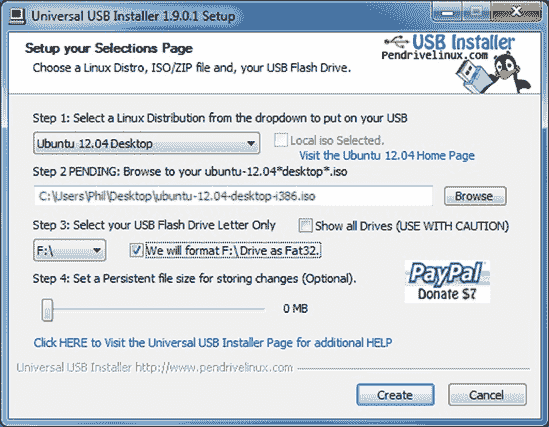

# 附录 A. 从 USB 闪存驱动器安装 Ubuntu

如果你有一台没有 CD 光驱的上网本、超极本或其他计算机，不要担心：你仍然可以使用 USB 闪存驱动器来安装 Ubuntu。从 USB 驱动器启动可能比从 CD 或使用 Wubi 启动要复杂一些，但一旦安装程序启动并运行，安装过程是相同的。我将假设你在这附录的其余部分使用 Windows，但也可以使用其他操作系统创建 USB 安装盘；有关说明，请参阅[`help.ubuntu.com/community/Installation/FromUSBStick/`](https://help.ubuntu.com/community/Installation/FromUSBStick/)。

### 注意

一些较旧的计算机没有从 USB 磁盘启动的能力。如果是这种情况，你将无法使用这种方法安装 Ubuntu。其他替代安装方法也是可用的，例如直接下载 Wubi；有关选项列表，请参阅[`help.ubuntu.com/community/Installation/`](https://help.ubuntu.com/community/Installation/)。

# 准备安装文件

首先，你需要一个足够大的闪存驱动器来存放 Ubuntu 安装程序：大约 2GB 就足够了。确保闪存驱动器上没有文件——你很快就会格式化驱动器，所以上面的文件将被永久删除。接下来，你需要下载一个 Ubuntu 光盘镜像。如果你觉得聪明，可以使用你的刻录软件从本书提供的 CD 制作一个*.iso*镜像，否则请访问[`www.ubuntu.com/download/desktop/`](http://www.ubuntu.com/download/desktop/)并点击**开始下载**来下载 Ubuntu 光盘镜像。这个镜像大约有 700MB，所以可能需要一段时间才能通过你的互联网连接。

有时，大文件下载可能不会正确完成，你可能会得到一个不完整的 CD 镜像。一个简单（尽管不是万无一失）的方法来检查镜像是否正确下载，是打开你保存镜像的文件夹，右键点击镜像，选择**属性**。检查镜像文件的大小是否*几乎*为 700MB（例如 690MB）。如果它比这个数值低得多，那么可能没有正确下载，所以你需要再次尝试。

你还需要的是用于将安装程序放入 USB 驱动器的软件。使用你的网络浏览器从[`www.pendrivelinux.com/universal-usb-installer-easy-as-1-2-3/`](http://www.pendrivelinux.com/universal-usb-installer-easy-as-1-2-3/)下载 Universal USB Installer（点击页面底部的下载链接）。

# 创建可启动的安装盘

下载了安装文件后，你现在将能够制作一个可启动的 Ubuntu 闪存盘。将你的 USB 驱动器插入计算机，并按照以下说明操作：

1.  双击您刚刚下载的*Universal-USB-Installer-<XYZ>.exe*文件以运行它（XYZ 将被通用 USB 安装器的当前版本号替换）。

1.  将出现一个许可协议屏幕。点击**我同意**，然后您将被带到设置选择页面。

1.  在*步骤 1*处，从列表中选择**Ubuntu 12.04 桌面**。

1.  在*步骤 2*下点击浏览按钮，找到您之前下载的 Ubuntu CD *.iso*镜像。单击一次以选择它，然后单击**打开**。

1.  在*步骤 3*下，从列表中选择您的闪存驱动器（确保它是正确的；否则，您可能会从其他磁盘上擦除大量重要文件！）并勾选旁边的框以表示您想要格式化驱动器。现在您的屏幕应该看起来像图 A-1 中的那样。

1.  点击**创建**并等待几分钟，直到安装程序被放置到磁盘上。

一旦过程完成，关闭通用 USB 安装器窗口，并像通常一样安全地弹出您的闪存驱动器。

图 A-1. 创建可启动的 USB 安装盘

# 从 USB 驱动器启动

现在将闪存驱动器重新插入并重新启动计算机。这是您检查是否已设置从 USB 驱动器启动的地方——如果您看到紫色 Ubuntu 启动屏幕，那么您就一切准备就绪了！接下来的过程将与从 CD 的常规安装相同，您可以在第二章中了解更多信息。如果计算机只是重新启动到 Windows（或您正在使用的任何操作系统），您需要更改一些设置才能从闪存驱动器启动。再次重新启动计算机，并在屏幕上寻找与计算机启动顺序或 BIOS 设置相关的文本。您通常需要按下一个键（例如删除、esc 或 F2）来访问这些设置，但这很大程度上取决于您的计算机的品牌和型号。有关访问 BIOS 的更多信息，请参阅第二章。

一旦您找到设置屏幕，找到允许您选择从 USB 驱动器启动的选项（即，使 USB 驱动器成为第一个启动设备），保存您的更改，并重新启动。理想情况下，您现在将被带到紫色 Ubuntu 启动屏幕。在这种情况下，前往第二章并继续正常安装。

如果遇到任何问题，请查看[`help.ubuntu.com/community/Installation/FromUSBStickQuick/`](https://help.ubuntu.com/community/Installation/FromUSBStickQuick/)以获取提示和技巧，或者前往论坛([`www.ubuntuforums.org/`](http://www.ubuntuforums.org/))寻求建议。
