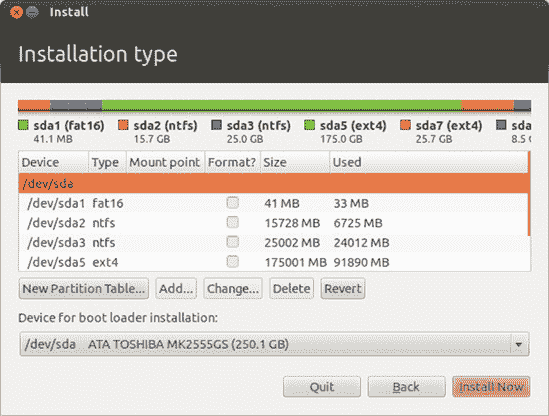
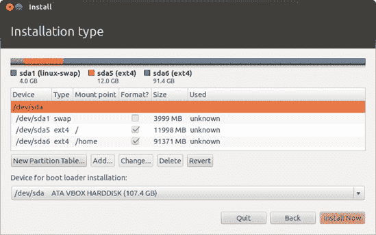

# 附录 C. 手动分区硬盘

当您使用 Ubuntu 安装程序分区硬盘时，前两个选项（使用整个磁盘和调整现有分区大小）应该涵盖大多数情况。这两个选项都在第二章中进行了讨论。但如果您有更技术性的心情，您可以用几种花哨的方式划分您的磁盘空间。例如，您可以创建一个共享数据分区，以便您的文件可以在 Windows 和 Ubuntu 之间共享，或者您可以为您的主目录*/home*创建一个单独的分区，这样您就可以在不完全备份所有文件的情况下重新安装 Ubuntu（或安装不同的 Linux 发行版）。

当您到达安装程序的安装类型屏幕时，选择**其他**并点击**继续**。您将看到一个彩色条形图，显示您当前的分区设置（图 C-1）以及下面的分区列表。您在此窗口中做出的任何更改都不会生效，直到您点击**现在安装**，如果您想完全放弃手动更改，可以点击**后退**按钮。（有一个例外：调整分区大小时所做的更改会立即且不可逆转。有关更多信息，请参阅编辑现有分区。）

图 C-1. 使用手动分区工具

# 创建和删除分区

您只能在有“空闲空间”可用的情况下创建新分区。这里的空闲空间是指该磁盘部分没有分区，而不是没有文件。创建空闲空间的一种方法是通过删除现有分区；为此，点击分区列表项，然后点击**删除**。几秒钟后，它将在列表中变为空闲空间（图 C-2）。或者，如果您打算完全更改分区设置，选择要修改的硬盘，然后点击**新建分区表**。您将得到一个完全空白的画布，您只需添加新的分区即可。

### 注意

您可以通过检查设备列中的条目后是否有数字来确定列表中的哪些项是硬盘；任何没有数字的项（例如，*/dev/sda*）都是硬盘，其余的都是分区。

选择任何空闲空间并点击**添加**以在其中放置新分区。您将看到一个创建分区窗口（图 C-3），它将询问您想要将分区设置多大（以兆字节为单位，1GB 大约是 1,000MB）。有关如何设置分区大小的建议，请参阅编辑现有分区中的分区种类。

使用选项让您可以指定您想要使用的文件系统类型。*文件系统*告诉您的操作系统如何在分区上存储文件。您可以从多种不同的文件系统中选择，但并非所有这些文件系统都会被 Windows 和 Mac OS 理解。Ext4 是仅用于 Linux 分区的最佳选择，但如果您想与 Windows 或 Mac OS 共享文件，则需要使用 FAT32。

图 C-2. 创建一些空闲空间

图 C-3. 创建新分区

您还可以选择**挂载点**，这是 Ubuntu 将对应分区文件夹放置的位置（如果您不熟悉 Linux 如何组织文件夹，请参阅第七章）。例如，您会将主分区挂载为*/home*文件夹。有关挂载点的更多详细信息，请参阅分区种类中的编辑现有分区。

创建分区窗口中还有两个选项，在我看来这两个选项都很技术性和无聊。新分区类型选项让您可以选择创建**主分区**或**逻辑分区**。您可以在磁盘上最多有四个主分区，但可以有大量的逻辑分区——磁盘分区器会为您选择正确的选项，因此无需更改此设置（它不会以任何方式影响您对分区的使用）。另一个选项，新分区的位置，让您可以选择在磁盘上的哪个位置放置新分区。这实际上并不重要，所以也请将此选项设置为默认值。

点击**确定**以完成添加分区；几秒钟后它应该出现在列表中。

# 编辑现有分区

如果您有一个现有的分区，您想调整其大小或更改其挂载点或文件系统类型，请选择它并点击**更改**。将出现一个编辑分区窗口（图 C-4）。

图 C-4. 编辑分区

使用作为和挂载点选项与创建分区窗口中的选项工作方式相同。如果您希望删除所有数据以便从头开始，也可以勾选**格式化分区**。请注意，如果您正在更改分区的文件系统（例如，从 FAT32 更改为 Ext4），您别无选择，只能进行格式化。

要调整分区大小，请使用*新分区大小（以兆字节为单位）*选项。如果您更改大小然后点击**确定**，您将收到警告，表示更改将被写入磁盘。点击**继续**，分区器将立即开始调整分区大小——您无法撤销此更改，因此在点击继续之前请仔细考虑您是否选择了正确的选项。

# 分区种类

当您手动分区磁盘时，您需要熟悉几种分区类型。我在以下部分中总结了这些内容，并提供了一些关于选择它们的大小、挂载点和文件系统的建议。

## 根分区

您必须有一个根分区；这是存储重要系统文件和安装软件的地方。我建议至少设置为 10GB，如果能的话，目标是 12GB 到 15GB，以留出安装新程序的空间。如果您不打算有单独的家分区（稍后描述），所有文件都将存储在根分区中，因此在这种情况下，您应该尽可能将其设置得尽可能大，以容纳所有东西。挂载点应设置为*/*，文件系统设置为*ext4*。

## 交换分区

您必须有一个交换分区。交换分区就像系统内存（RAM）的额外区域；如果您的计算机系统内存满了，它将开始使用这个分区来处理溢出。当您休眠计算机时，它还用于存储系统内存的内容（如所有打开的文件和程序）。有关交换的更多详细信息，请参阅[`help.ubuntu.com/community/SwapFaq/`](https://help.ubuntu.com/community/SwapFaq/)。

作为粗略的指导，您的交换分区应该略大于您计算机的 RAM 量。例如，如果您有 2GB 的 RAM，请创建一个 2.2GB 的交换分区。文件系统应设置为*swap area*，并且不需要设置挂载点。

### 注意

在安装 Ubuntu 后，您可以通过创建一个*交换文件*来避免使用交换分区，但这种方法超出了本书的范围。

## 家分区

*/home* 文件夹（参见第七章以获取描述）可以放在一个单独的分区中。你不需要这样做，但如果发生任何问题需要重新安装 Ubuntu，这会很有用——当 Ubuntu 在根分区重新安装时，所有个人文件和配置设置都将保留在主分区上。这可以在恢复系统时节省大量工作。如果你没有单独的主分区，*/home* 文件夹将与其他所有内容一起放在你的根分区中。无论你是否将其放在单独的分区中，你访问主文件夹（例如，通过启动器）的方式都将完全相同。

主分区是存储所有文件和设置的地方，因此你希望它尽可能大。（关于多大才算足够大的各种观点，请参阅示例分区布局，位于共享分区。）文件系统应该是*ext4*，挂载点应设置为*/home*。

## Windows 分区

如果你已安装 Windows，你需要调整 Windows 分区的大小以腾出空间给 Ubuntu。当你这样做时，请确保至少留有足够的磁盘空间供 Windows 正常运行。Windows XP 至少需要一个 2GB 大小的分区，而对于 Vista 和 Windows 7，你应该至少留有 16GB。你可能希望留出比这更多的空间，以便在 Windows 中安装程序和保存文件，并记得为现有的 Windows 文件也留出空间。主分区窗口中的“已使用”列将告诉你你的 Windows 文件当前占用了多少空间。

Windows 分区将是 NTFS 或 FAT32 类型。记住不要格式化 Windows 分区，否则你的当前 Windows 安装将被删除。

## 共享分区

如果你想要一种简单的方法在 Windows 和 Ubuntu 之间共享文件，请创建一个共享分区。在两个操作系统中，它都会显示为一个独立的硬盘，你可以用它来存储你喜欢的任何东西。

将分区设置为你认为需要的最大大小：如果你只在 Ubuntu 和 Windows 之间复制小文件，那么 1GB 到 2GB 应该足够；如果你想在其中永久存储所有 Windows 和 Ubuntu 文件（有点像共享的主文件夹），请尽可能将其设置得尽可能大（参见下一节中的示例）。你应该选择 FAT32 作为文件系统，但对于挂载点，你可以使用几乎任何东西——*/windows* 将是默认建议之一，但如果你喜欢，你可以在挂载点框中输入类似 */shared* 或 */wormhole* 的内容。只需确保你使用一个不带空格的名称即可。

# 示例分区布局

如果你以前从未进行过分区，分区可能会让人感到困惑，因此我提供了一些示例分区布局，以使事情更清晰。在所有这些示例中，我使用了一个 100GB 的硬盘，但你可以根据分区种类在编辑现有分区中的建议，根据你的磁盘调整所有分区的大小。

## 标准仅 Ubuntu 安装

只有 Ubuntu 将被安装在磁盘上，因此只需要根分区和交换分区（图 C-5）。由于我有 4GB 的 RAM，我将交换分区设置为 4.2GB。根分区占据了剩余的磁盘空间，以便尽可能地为文件和程序留出更多空间。（在这种情况下不需要手动分区磁盘；Ubuntu 安装程序的“擦除磁盘并安装 Ubuntu”或“用 Ubuntu 替换 Windows”选项可以达到相同的效果。）

## 仅 Ubuntu 与独立家目录分区

只有 Ubuntu 将被安装，但将有一个独立的家目录分区，以防我需要重新安装时可以保护我的数据（图 C-6）。我计划将家庭电影存储在这个分区上，这意味着会有很多非常大的文件，所以我选择了较小的 12GB 根分区和略小的 4GB 交换分区。这为家目录（以及我的视频）留下了更多的空间，它占据了磁盘剩余的 84GB 空间。

图 C-5. 仅 Ubuntu 的简单分区布局

图 C-6. Ubuntu 的独立家目录分区布局

## Ubuntu 和 Windows 共享分区

Ubuntu 将与 Windows XP 一起安装，并且我想有一个共享分区，以便我可以在两个操作系统之间复制文件（图 C-7）。由于我在上面安装了文件和程序，现有的 Windows 安装使用了 6.7GB 的磁盘空间。我将 Windows 安装调整为 15GB，为未来的扩展留下了 8.3GB 的空闲空间。请注意，Windows 分区将*不会*被格式化，因此 Windows 和该分区上的所有文件都将保持完整。我在剩余的约 40GB 磁盘空间中创建了一个 40GB 的 Ubuntu 根分区和一个 4.2GB 的交换分区，然后在剩余的约 40GB 磁盘空间中创建了一个共享的 FAT32 分区。

图 C-7. Ubuntu、Windows 和共享分区

# 完成设置

当你完成操作后，点击**立即安装**以最终确认你的更改。如果你正在删除或格式化任何分区，更改将被写入磁盘。这是一个不可逆的更改，所以请确保你已经备份了受影响分区上的任何有价值的数据！
