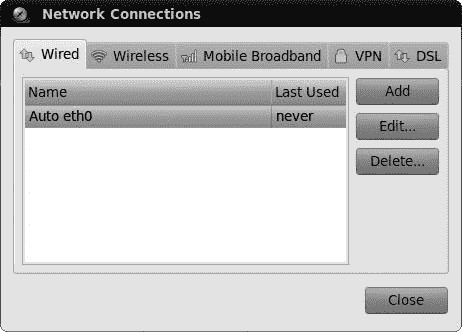
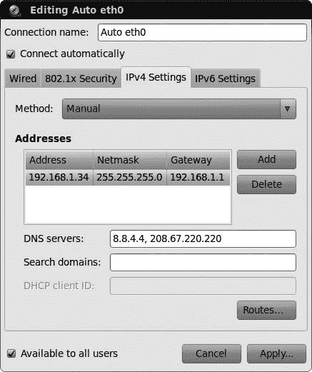
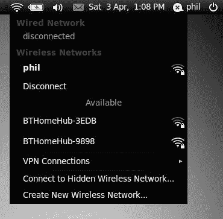
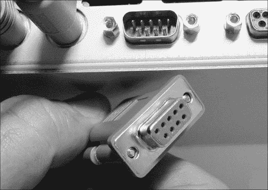
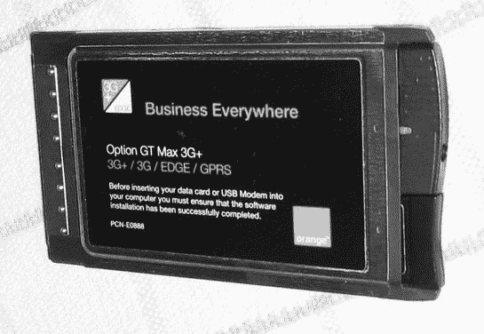
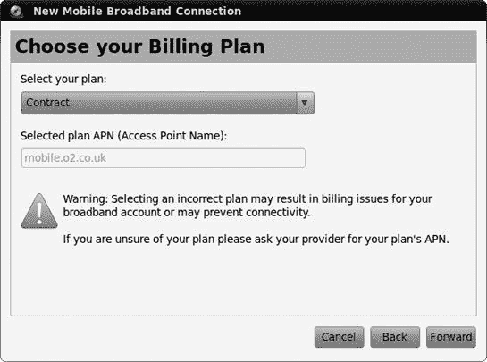

# 第四章. 超越网状脚

### 连接到互联网

现在，普通家庭电脑用户花在上网和写电子邮件上的时间比做其他任何事情都要多。即使你不是一位冲浪高手，仍然有许多其他应用并不是真正的互联网应用，但它们以某种方式使用互联网，例如当你将音频 CD 抓取成 MP3 文件时收集歌曲和专辑信息。拥有一台未连接到互联网的电脑就像买了一辆新的玛莎拉蒂然后拒绝将其开出车库一样。

当然，你如何连接到互联网取决于你的硬件和提供商。在这个领域有许多可能性，包括高速局域网（LAN）、电缆调制解调器、移动（3G）宽带以及来自电话公司的 ADSL 连接。一些电脑仍然内置 56Kbps 调制解调器，或者可以通过外部拨号调制解调器连接到常规电话线进行较慢的连接。根据你所拥有的设备，在局域网连接以及使用你的以太网端口（如电缆调制解调器）的任何其他连接中设置系统应该很容易，而在无线和移动连接的情况下可能需要更多的工作，而在拨号连接时有时会面临一些挑战。在本章中，你将学习如何设置这些连接，在下一章中，你将了解 Linux 在提供最常用的互联网应用方面能提供什么。

# 你如何连接？

你设置连接的方式实际上取决于你试图如何连接到互联网。以下是一个列表，帮助你决定使用哪种方法：

+   如果你使用以太网电缆将电脑连接到墙壁插座、路由器或电缆调制解调器，请转到设置有线连接部分，该部分位于你如何连接？中。

+   如果你连接到无线网络或你自己的无线路由器，请转到设置无线连接部分，该部分位于设置无线连接中。

+   如果你使用连接到电话线的拨号调制解调器进行连接，请参阅设置拨号连接部分，该部分位于设置拨号连接中。

+   如果你有一个内置在电脑中或连接到 USB 端口的 ADSL 或 DSL 调制解调器，请尝试使用 ADSL 或 DSL 调制解调器连接，该部分位于使用 ADSL 或 DSL 调制解调器连接中。

+   如果您使用连接到电脑的移动（3G）宽带连接，请跳转到移动（3G）宽带连接。

# 设置有线连接

如果您从有线电视公司或 ISP 那里有高速互联网连接，或者如果您在办公室通过局域网连接到互联网，那么您真的很幸运，因为这些设置可能是最容易处理的。我将假设您已经根据互联网提供商的说明设置了您的路由器或调制解调器，所以剩下的只是将一条以太网线连接到调制解调器/路由器（或局域网墙上的插座）和您的电脑网络插座。完成这些后，您应该可以准备出发，无需进行任何进一步的设置。

# 检查您的连接

如果您愿意，可以通过打开 Firefox（点击顶栏中紧挨着系统菜单的 Firefox 启动器）并尝试导航到常见的网站，例如[`www.yahoo.com/`](http://www.yahoo.com/)来查看您是否已连接。如果网站出现，您就知道一切设置正确。

如果您在尝试通过局域网或电缆调制解调器连接到互联网时遇到问题，您可以尝试通过在顶栏中右键单击网络管理器图标，在弹出菜单中取消选中**启用网络**复选框，等待几秒钟，然后再次在弹出菜单中选中**启用网络**复选框来刷新您的连接。如果这不起作用，请尝试在用以太网线物理连接到互联网源的情况下重新启动您的机器。如果连接问题仍然存在，可能是因为您的网卡不支持 Linux。这种情况相对较少见，但幸运的是，很容易解决（通过更换它）。

问题也可能是您的网络或服务提供商没有通过动态主机配置协议（DHCP）自动分配地址。*DHCP*是您的互联网提供商自动向您的系统提供连接到互联网所需的配置信息的一种方式。如果您的提供商不使用 DHCP，您将不得不从网络管理员或服务提供商那里获取有关设置的必要信息，并自行输入设置。

## 为不使用 DHCP 的提供商设置电缆或以太网连接

要自行输入您的电缆或以太网设置，首先从您的网络管理员或互联网提供商那里获取所需的设置，然后执行以下步骤：

1.  选择**系统** ▸ **首选项** ▸ **网络连接**。

1.  选择**有线**选项卡（图 4-1)，并从列表中选择网络连接，只需点击一次（它应该有一个像*Auto eth0*这样的名称）。如果列表中没有条目，那么您的网络卡可能没有被正确识别。请查看安装您的网络/无线卡的驱动程序以了解如何修复此问题。

    

    图 4-1. 网络连接窗口

1.  点击**编辑**，您将看到一个设置窗口。选择**IPv4 设置**选项卡，并将方法设置从自动（DHCP）更改为**手动**。

1.  点击**添加**按钮以输入您电脑的 IP 地址信息。这应由您的 ISP 或网络管理员提供，并包括 IP 地址、默认网关和子网掩码（见图 4-2 以获取示例）。输入您获得的 DNS 服务器地址。

    

    图 4-2. 手动输入网络 IP 设置

1.  确保选中了**可供所有用户使用**的选项，如果您的电脑的其他用户将使用此连接。

1.  点击**应用**以保存设置。您将被要求输入您的用户账户密码，请输入并点击**验证**。

1.  网络管理器将尝试使用您刚刚提供的详细信息建立连接。如果成功，会弹出一个消息提示网络已连接。如果未发生这种情况，点击顶部面板上的网络管理器图标，然后选择*断开连接*。

1.  然后，再次点击网络管理器图标，并在*可用*下选择您的网络。

### 注意

如果您想知道关于互联网协议（IP）和域名系统（DNS）是什么，您可以简单地这样想：DNS 将您已经熟悉的易于记忆的 URL，例如[`www.google.com/`](http://www.google.com/)，转换成互联网可以理解的数字或 IP 地址。因此，地址[`www.google.com/`](http://www.google.com/)变成了[`209.85.229.104`](http://209.85.229.104)。您可以在浏览器中输入这个数字版本，亲自查看。

# 设置无线连接

使用合适的无线硬件，你现在几乎可以在任何可以接收到（无线电）波的地方上网，换句话说。无论你恰好在餐桌前吃早餐，在大学的图书馆里，还是在当地的星巴克，你现在都可以上网，而无需将电脑物理连接到任何设备上。

幸运的是，在 Ubuntu 中设置无线网络的过程相当简单，并且与上一节中阅读的内容没有太大不同。

## 硬件

如果你完全依赖有线生活，或者在这个特定领域缺乏经验，有一些事情是值得了解的。要开始，你需要拥有正确的硬件。如果你只想无线连接，那么你只需要一个无线网卡（有时被称为*802.11a/b/g/n 网卡*或*WiFi 网卡*）。这些几乎都内置在现代笔记本电脑中，而对于旧型号，它们通常是作为卡片添加的，这些卡片可以插入到电脑侧面的 PCMCIA 插槽中（如图 4-3 所示）。

图 4-3。WiFi 设置所需的所有设备——接入点和网络接口卡

一些无线网卡可以插入到你的机器的 USB 端口，或者在台式机模型中，插入其 PCI 插槽之一。尽管过去几年中此类卡的支持已经有所改善，但仍存在一些差距，有些卡可能相当难以处理。你可以在第二十一章中找到一些处理这些尴尬卡片的技巧，但如果你在寻找万无一失的解决方案，Centrino IPW-2100 和 IPW-2200 卡片在 Ubuntu 上确实得到了支持。至于内置或 PC 卡类型的卡片，你会发现支持要好得多，但即便如此，你仍然需要确保，或者至少希望，你使用的卡片与 Linux 兼容。无论你考虑的是哪种无线网卡，最简单的方法就是试一试。Linux 内核现在内置了许多无线驱动程序，Ubuntu 的更新经常提供新的驱动程序，所以如果你使用的是与这些驱动程序兼容的卡片，事情将会顺利。如果事情似乎没有按预期进行，请检查 Ubuntu 支持的卡片列表([`help.ubuntu.com/community/WifiDocs/WirelessCardsSupported/`](https://help.ubuntu.com/community/WifiDocs/WirelessCardsSupported/))，或者检查 Ubuntu 论坛以寻找兼容的驱动程序，或者看看是否有人有使用你特定卡片的经验。

如果您想在您的家庭或办公室设置无线系统，那么您还需要获取一个*无线接入点*（WAP），如图 4-3 左边的所示（ch04s04.html#all_you_need_for_a_wifi_setupman_access "图 4-3. 设置 WiFi 所需的所有东西——一个接入点和一张网络接口卡"）。幸运的是，在这个部门中，Linux 兼容性并不是一个大问题，因为接入点在物理上并不与您的计算机接口，设置是通过您的网络浏览器来处理的。

### 注意

接入点有多种不同类型。最常见的是无线路由器，许多 ISP 免费提供。

然而，您应该知道，一些接入点要求您使用 Internet Explorer 来处理它们的设置任务。尽管您可以通过 Wine 在 Linux 中启动 Internet Explorer（如第十八章中所示），但您不能 100%确定它是否有效。除非您家里或办公室里有 Windows 机器来处理这类任务，否则避开这类接入点可能是个好主意。

## 激活您的无线网卡

设置一个与 Linux 兼容的无线 PC 卡实际上相对简单。首先将接入点连接到您的互联网源，然后打开接入点。一旦它启动并运行，将无线卡插入笔记本电脑的 PCMCIA 插槽或 USB 端口（除非您的无线连接是内置的，在这种情况下您可以跳过此步骤）。外部卡上的任何 LED 灯在这个时候很可能会亮起。

如果在您启动计算机时接入点已经开启，并且无线网卡在启动过程中已经安装，那么您可能不需要做太多其他事情来访问互联网。只需按照以下步骤操作：

1.  点击顶部面板上的网络管理器图标，以显示下拉菜单，该菜单显示了您附近存在的无线信号以及每个信号的强度（图 4-4）。

1.  从该菜单中选择您的接入点信号（或您有权连接的任何其他波），通过点击它来选择。

1.  系统将尝试连接到互联网。一旦建立连接，网络管理器图标将变成一个小信号强度指示器。非常方便。

1.  如果您的网络有 WEP 或 WPA 密码，您将需要输入它。在您输入密码之前检查**显示密码**可能很有用，这样您可以检查是否有任何错误。完成输入后点击**连接**。

### 注意

大多数接入点都采用有线等效隐私（WEP）或 Wi-Fi 保护访问（WPA）密钥这种形式的安全级别。如果您在设置接入点时没有选择自己的密码，请尝试在接入点的底部或侧面寻找贴纸，看看是否使用了默认密码。如果您试图连接到一个您不知道密钥的网络，那么很可能是您本来就不应该建立这种连接。真是不良行为，真是不良行为。

图 4-4. 网络管理器显示可用的无线网络及其信号强度。

如果您在建立无线连接时没有成功（系统会告诉您是否如此），除了令人烦恼的不兼容网卡场景之外，您还有几种可能性。首先，请再次确认您的网卡实际上已经物理开启。我知道这听起来很愚蠢，但我自己就犯过这种疏忽多次。许多笔记本电脑有一个按键可以用来启用或禁用无线网卡；在我的电脑上，您必须同时按下功能键（fn）和 F2。

另一种，不那么常见的情况是，您的网络不使用 DHCP，在这种情况下，您将必须手动输入由您的网络管理员或服务提供商提供的连接设置。有了这些信息，只需按照为不使用 DHCP 的服务提供商设置电缆或以太网连接中列出的步骤操作即可。只需确保使用无线选项卡而不是有线选项卡即可。

如果您仍然无法无线连接，可能是您的网卡没有安装驱动程序，或者 Ubuntu 不支持该网卡。您可以尝试很多技巧来解决问题，所以请转到第二十一章，并查找为您的网络/无线网卡安装驱动程序。

## 关闭或刷新您的无线连接

有时候您可能想要断开无线网络的连接，例如当您在飞机上使用笔记本电脑或当您只是想连接到另一个网络时，比如将笔记本电脑从一个无线热点移动到另一个无线热点时。

要做到这一点，请单击一次网络管理器图标以显示可用的无线网络列表（即信号）。在该列表中，单击您已连接的无线网络名称下方的**断开连接**选项。在一两秒钟内，您将被断开连接。

如果您想关闭无线网卡（如果您正在登机，您应该这样做）并且您没有物理方法来关闭它，比如开关或按钮，只需右键单击网络管理器图标，然后取消选择**启用无线**。如果您想再次打开该网卡，只需回到那个菜单，并再次选择**启用无线**。

有时，您的无线网卡可能没有明显的原因就失去了连接，因此刷新连接（即关闭并重新打开）以尝试重新连接可能很有用。这样做最快的方法是单击网络管理器图标，然后在列表中单击您的无线网络名称。您将被断开连接，然后自动重新连接。

如果这不起作用，请尝试使用网络管理器中描述的启用无线选项禁用并启用无线连接。如果您仍然没有成功，请尝试使用开关或按钮（如果您有的话）关闭并重新打开无线网卡，或者拔掉它并重新插上。最后，如果似乎什么都没起作用，请尝试重新启动计算机。

# 使用 DSL 或 ADSL 调制解调器连接

设置您的 DSL 或 ADSL 调制解调器的难易程度取决于它所具有的连接器。如果它可以使用以太网线连接，请使用它，并遵循如何连接？中设置有线连接部分中的说明；这将比尝试使用 USB 线要容易得多！如果您有 USB 或内置调制解调器，请尝试本节中的说明，并希望一切顺利。

第一步是检查 Ubuntu 是否识别了您的调制解调器。假设它已经插好，请单击**系统** ▸ **首选项** ▸ **网络连接**，然后选择**DSL**选项卡。如果在窗口中列出了连接，则您的调制解调器已被识别，您可以从设置它开始。如果列表为空，请参阅[`help.ubuntu.com/8.04/internet/C/modems-adsl-usb.html`](https://help.ubuntu.com/8.04/internet/C/modems-adsl-usb.html)，以查看是否有任何步骤可以遵循以使您的调制解调器工作。

通过单击一次选择连接，然后点击**编辑**。点击出现的编辑窗口的**DSL**标签页，并将用户名和密码输入到相应的字段中。然后，将你的连接信息（通常是一个电话号码）输入到服务框中，并点击**应用**。现在，点击顶部的网络管理器图标，并从列表中选择你的 DSL 连接。网络管理器将尝试使用你的调制解调器进行连接——如果连接不成功，返回并尝试更改一些设置，看看是否能让它合作。

# 设置拨号连接

尽管世界上许多地方都在向高速互联网连接过渡，但你们中许多人可能仍在使用拨号互联网连接，这意味着你需要一个传统的拨号调制解调器才能连接到外部世界。以防宽带冲浪之神们忘记了，调制解调器是在你拨打互联网服务提供商时发出哨声、铃声、尖叫声和喷溅声的奇妙机器。我想你可以把它们想象成需要好好打嗝的嘈杂电话。

现在是坏消息的时候了——在 Linux 的世界里，内部调制解调器的支持非常有限，对于那些得到支持的，设置过程可能会相当令人沮丧。这种兼容性问题背后的主要原因是大多数内置调制解调器是软件依赖的，而它们依赖的软件是 Windows 的一部分，或者是为 Windows 设计的。因此，这样的调制解调器被称为*Winmodems*。

当然，Linux 社区一直在努力寻找处理这些 Winmodem 怪物的方法，以便它们能在 Linux 系统上工作。尽管对各种 Winmodem 型号的支持仍然相当零散，但情况比以前好多了，所以你可能只是运气好。我的建议是不要过多地猜测和担忧，只需尝试一下你的调制解调器是否工作。如果它工作了，那么你就准备好了。如果它没有工作，那么你确实有一些选择，而且至少你没有对你的系统造成任何损害。

在介绍性的废话都讲完之后，让我们开始设置拨号连接的步骤。首先，从你的互联网服务提供商那里获取所需的设置信息。大多数服务提供商针对 Windows 用户进行操作，并且通常也会为 Mac 用户提供服务，但提供 Linux 支持的服务提供商非常少。尽管如此，你的 Linux 系统没有技术上的理由不能通过他们的设置工作，所以只需不断催促他们，直到他们给你你想要的信息。之后，确保你的调制解调器连接到了一个活跃的电话线路——例如，你墙上的电话插孔。

现在是时候设置连接了。我将使用 GNOME PPP 程序来完成这里的所有设置，但有一个注意事项：它默认没有安装，您需要互联网连接来安装它！如果您可以访问一些可以临时使用的其他互联网连接，请连接到该连接，并使用 Ubuntu 软件中心下载和安装 GNOME PPP（参见第六章了解如何安装软件）。另一种选择是使用默认安装的 `pppconfig` 命令，但它使用起来比较困难。如果您没有其他选择，只能使用 `pppconfig`，请查看[`help.ubuntu.com/community/DialupModemHowto/SetUpDialer/`](https://help.ubuntu.com/community/DialupModemHowto/SetUpDialer/)以获取说明。

假设您使用借用来的互联网连接安装了 GNOME PPP，您可以按照以下步骤设置您的调制解调器：

1.  选择**应用程序** ▸ **互联网** ▸ **GNOME PPP**，之后 GNOME PPP 将会显示。

1.  点击**设置**，并确保您正在查看**调制解调器**选项卡。

1.  点击**检测**按钮以识别您的调制解调器。如果您收到一条消息说您的系统上没有找到调制解调器，那么您运气不佳——您能做的最好的事情就是去 Ubuntu 论坛([`www.ubuntuforums.org/`](http://www.ubuntuforums.org/))寻求建议或者尝试通过试错法从设备下拉列表中选择项目。

1.  如何更改其余的设置取决于您的调制解调器和 ISP 的设置，所以现在先选择默认设置。如果这些设置不起作用，试错法可能又是前进的一种潜在方式。

1.  点击**关闭**以返回到 GNOME PPP 窗口。输入您的用户名和密码，并输入您的 ISP 提供的电话号码。

1.  点击**连接**。然后您应该会听到您的调制解调器开始拨号、吐线和旋转的序列，因为它与您的服务提供商建立连接。

1.  如果您成功连接，您就可以开始浏览、发邮件或进行您在网上做的其他任何事情。如果您收到一个错误消息，您能做的很少，但您可以深呼吸并点击**设置**按钮尝试调整您的设置。

## 如果您的调制解调器不兼容怎么办

虽然听起来可能不是这样，但我刚刚描述的几乎是一个最佳情况。然而，如果您的调制解调器和 Ubuntu 不兼容会发生什么呢？好吧，有几个选择。我的第一个、更激进的建议是放弃您的拨号 ISP，并找到一个覆盖您所在地区的宽带提供商。如果这不是一个选择，那么您有两个选择。一个是尝试与您的调制解调器进行一些技术操作，看看您是否能让它工作。这是一个稍微复杂一些的过程，但有一些说明可以在[`help.ubuntu.com/community/DialupModemHowto`](https://help.ubuntu.com/community/DialupModemHowto)找到。如果您胆小或是一个新手用户，您可能会发现这个过程需要处理的比您愿意的要更多。

虽然成本较高，但让您的调制解调器正常工作的简单方法之一是购买真正的硬件调制解调器。*硬件调制解调器*不依赖于软件，因此可以与任何操作系统一起工作。您可以将它们想象成没有听筒的电话。

这些调制解调器有两种形式：内置和外置。至于内置型号，USRobotics 的 56K V.92 Performance Pro 调制解调器（内置插槽）和 56 PC 卡调制解调器（笔记本电脑的 PC 卡插槽）是真正的硬件调制解调器，易于购买，并且据说可以正常工作。您可以在 USRobotics 网站上查看这些型号的更多信息（[`www.usr.com/`](http://www.usr.com/))，尽管在 Ubuntu 论坛上寻求建议总是一个好主意。也许最安全的解决方案之一是购买一个外部拨号调制解调器。它们带有串行或 USB 连接器，并放置在电脑外部的一个盒子里。因为调制解调器不使用您的操作系统来操作，所以在它忙碌时不会占用系统资源，这可能会导致电脑速度的提升。

Linux 对 USB 调制解调器的支持可能不稳定，因此在购买之前请做好研究。外部串行调制解调器是一个更安全的赌注，因为大多数应该能与您的系统一起工作……如果您有串行端口的话。现代计算机很少再配备串行端口，因此请检查您的电脑后面是否有带有小刺的连接器（参见图 4-5）。如果您担心并且正在寻找一个稳妥的解决方案，Zoom Telephonics ([`www.zoom.com/`](http://www.zoom.com/)) 生产了一种与 Linux 兼容的外部串行调制解调器，并且公司直接在其网站上说明了这一点。据说 USRobotics 56K V.92 外部传真调制解调器也能正常工作，尽管我本人尚未尝试过这款型号。

图 4-5. 串行端口和连接器

如果您发现另一个型号，并认为它可能有效，在您通过支付现金来做出承诺之前，请使用该调制解调器的品牌和型号编号以及单词 *linux* 在 Yahoo! 或 Google 上进行搜索，看看您能得到什么搜索结果。当然，您也可以尝试 Linux 论坛，并在那里询问关于该调制解调器的品牌和型号。很多人都在同一条船上，因此您肯定能得到很多意见和建议。

# 移动（3G）宽带连接

尽管无线网络提供了便利和自由，但它们的范围仍然相当有限。如果您的电脑从未离开过您家或办公室的周围区域，这不会成为问题，但如果您在远离最近无线咖啡馆的路上，这可能会非常不方便。在这个 21 世纪，当然有绕过这种限制的方法。

如果您是一位配备电脑的旅行者，您可能已经遇到过移动宽带技术，也称为*3G*。您只需一张 3G 卡（也神秘地称为*调制解调器*），将其插入电脑，通过手机网络连接到互联网（图 4-6）。Ubuntu 从一开始就对大多数 3G 卡提供了相当好的支持，设置过程非常简单：

1.  将您的 3G 卡或调制解调器插入电脑；新的移动宽带连接向导应自动打开。如果它没有打开，请点击**系统** ▸ **首选项** ▸ **网络连接**，打开**移动宽带**选项卡，然后点击**添加**。

1.  向导的第一页有一个下拉列表，其中应显示您的 3G 卡的制造商和型号。如果显示为*任何设备*，则您的卡可能未被识别，因此请查看[`wiki.ubuntu.com/NetworkManager/Hardware/3G/`](https://wiki.ubuntu.com/NetworkManager/Hardware/3G/)以查看是否需要采取任何步骤让 Ubuntu 识别该卡。

1.  点击**前进**，从列表中选择您的国家，然后再次点击**前进**。

1.  从列表中选择您的移动宽带提供商，然后点击**前进**。

1.  现在，您需要从下拉列表中选择您的宽带计费计划（图 4-7）。选择正确的计划很重要，以避免被错误收费。如果您看不到看起来合适的计划，请选择**我的计划未列出**，并联系您的宽带提供商询问应在接入点名称（APN）框中输入什么。

1.  点击**前进**，检查所有详细信息是否正确，然后点击**应用**。您将被带到编辑窗口，您可以在此处输入如账户 PIN 码和密码等详细信息（如果需要）。

1.  点击**应用**，然后关闭网络连接窗口以完成操作。

    

    图 4-6. 一张 3G 移动宽带卡

图 4-7. 选择宽带计费计划

要连接到移动宽带，请点击顶部面板上的网络管理器图标，并从列表中选择您的宽带服务。网络管理器将花费几秒钟建立连接，之后您将收到通知，告知您已连接（或未连接，视情况而定）。断开连接的方式大致相同：再次点击网络管理器图标，但在列表弹出时，选择您的宽带服务名称下方刚刚的**断开**选项。

# 我已连接……接下来做什么？

理想情况下，你已经连接到互联网，无论是通过有线连接、无线连接还是其他方式。 (如果没有，请查看第二十一章以获取一些连接故障排除技巧。) 这是个好消息，因为现在你可以通过尝试预装的一些有趣的网络相关软件来测试 Ubuntu 的功能。准备好你的点击手指，翻到下一页，看看作为新 Linux 用户在线生活是什么样的。
