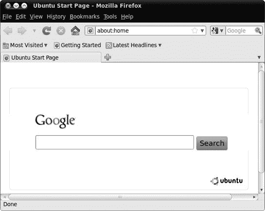
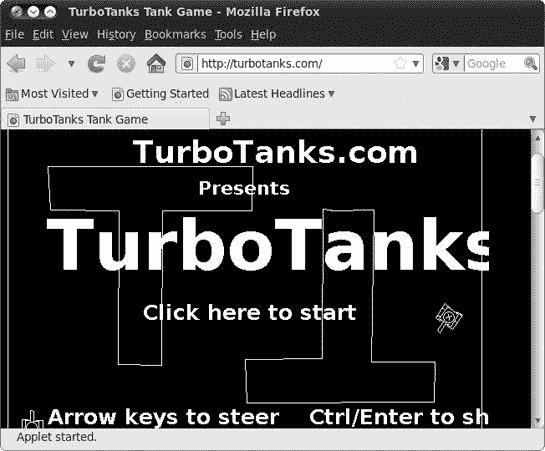
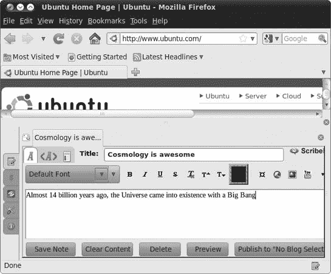
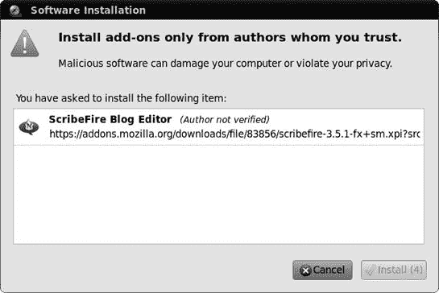
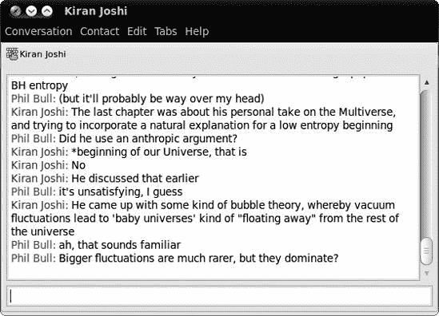
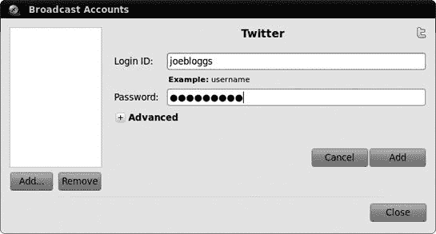
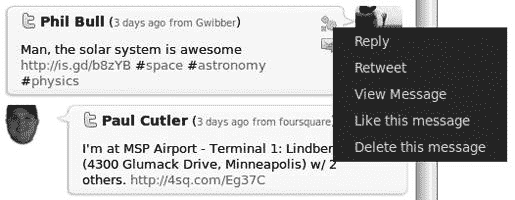

# 第五章。滑动和滑动

### 以 Linux 风格探索互联网

现在你已经拥有了稳定的互联网连接，你能用它做什么呢？好消息是，Linux 可以匹配你之前操作系统在线能做的任何事情，而且在很多情况下，它还能更快或更简单地完成。Ubuntu 诞生于网络，因此它自带一套非常健康的互联网应用套件也就不足为奇了。

在本章中，你将游览 Ubuntu 的互联网软件，以便真正了解这种 Linux 功能。你将从老牌的网页浏览器和电子邮件客户端开始，简要浏览即时消息，然后转向更时尚的 Twitter 和微博方向。

# Firefox：你的互联网浏览器

你的 Ubuntu 系统中的默认网页浏览器是 Firefox，它在 Linux 世界、Windows 和 Mac 世界中都越来越受欢迎。很可能你已经是 Firefox 用户了，但如果你不是，那么你不必担心——所有浏览器的工作方式大致相同。在这种情况下，你应该能够使用 Firefox 的基本功能而无需任何指导。当然，其中一些功能使 Firefox 与其竞争对手有所区别，所以我会提到这些。

## 使用标签控制浏览器窗口杂乱

通常情况下，当你在一个网页上点击链接时，新页面会在同一个窗口中打开。在某些页面上，链接被编码成在新窗口中打开，或者你可能偶尔会通过右键点击链接并选择“在新窗口中打开链接”选项来打开新窗口。这非常有用；然而，一旦你打开了几个浏览器窗口，要在这众多打开的窗口中找到你想要的东西就会变得有点困难。这也会稍微减慢一些操作速度。

这就是 Firefox 标签页功能派上用场的地方（实际上非常方便，以至于几乎每个其他浏览器都模仿了它）。要了解它是如何工作的，现在就亲自试试。通过点击顶部 GNOME 面板上的启动器（或选择**应用程序** ▸ **互联网** ▸ **Firefox 网络浏览器**）来打开 Firefox 浏览器；然后使用 Firefox 方便的搜索框搜索单词*nyckelharpa*，该搜索框位于浏览器窗口的右上角（见图 5-1). 默认情况下，Firefox 将使用 Google 搜索搜索框中输入的关键词。如果您愿意，可以通过点击搜索框中的彩色*g*图标并做出选择来选择其他网站进行搜索。Amazon.com、eBay 和 Yahoo!只是其中的一些，您甚至可以添加更多。然而，现在让我们继续使用 Google 进行我们的搜索，在搜索框中输入**`nyckelharpa`**。完成输入后，按**enter**键，之后应该会在 Firefox 窗口的主面板中显示一页搜索结果。

最上面的结果之一应该是美国 Nyckelharpa 协会，现在您将打开该页面在一个新标签页中，而不是在同一个或新窗口中。为此，右键单击链接，在出现的弹出菜单中选择**在新标签页中打开链接**。如果您愿意，可以简化操作并省略弹出菜单选择步骤，只需用鼠标中键（或同时使用两个鼠标按钮）点击链接，或者按住**ctrl**键点击链接。无论哪种方式，新页面都会在新标签页中打开，而您的原始搜索结果页面将保留在另一个标签页中，准备就绪并等待（见图 5-2). 我非常确信，一旦您习惯了这一功能，您就会想知道在没有它的情况下是如何度过的。

图 5-1. 从 Firefox 搜索框中执行 Google 搜索

图 5-2. 在 Firefox 中在新标签页中打开的链接

## 保持 Live Bookmarks 的更新

互联网上充满了各种新闻和信息，跟踪它们可能很困难。我个人讨厌错过来自 Boing Boing 的每日奇闻轶事，这个网站恰如其分地被称为“奇妙事物的目录”([`www.boingboing.net/`](http://www.boingboing.net/))。幸运的是，Firefox 有一种处理信息过载的巧妙方法，称为 *实时书签*（也称为 *RSS 订阅源*）。这些为你提供了任何支持它们的网站的自动更新的文章列表。要查看一个例子，点击 Firefox 地址栏下方的 **最新头条** 链接——这是一个 BBC 新闻网站的实时书签，应该会显示一系列当前新闻故事。

你可以通过查看地址栏中的橙色信标符号（如图 5-3 所示 Figure 5-3) 来检查网站是否有 RSS 订阅源。如果有，你就成功了！以 Boing Boing 为例：在 Firefox 中加载 [`www.boingboing.net/`](http://www.boingboing.net/)，并点击信标图标。你将获得最新文章的列表，以及一个邀请你订阅订阅源的框。点击 **立即订阅**，然后在出现的窗口中点击 **订阅**，将实时书签添加到与最新头条链接相同的工具栏中。

图 5-3. 当网站关联了 RSS 订阅源时，会显示信标图标。

一些网站提供链接到它们的 RSS 订阅源，而不是在地址栏中显示。如果你找到了这样的链接（通常称为 *ATOM* 或 *RSS/XML*），点击它，你应该会看到一个包含顶部框的文章列表，就像之前的例子一样。从那里，将订阅源添加到书签的步骤是相同的。

## 弹出窗口管理器

Firefox 还有一些其他有用的功能。其中一个就是它的弹出窗口管理器，它可以抑制当你访问新网页时经常出现的那些讨厌的弹出窗口。你可以通过点击窗口顶部的 **内容** 图标，然后在该窗口中检查或取消检查 **阻止弹出窗口** 复选框，从偏好设置窗口（**编辑** ▸ **偏好设置**）中启用或禁用此功能。你也可以通过点击该 **阻止弹出窗口** 条目右侧的 **例外** 按钮，并输入相关网站的网址，允许某些网站提供弹出窗口（一些弹出窗口不仅有用，而且对于网站的正常功能是必要的）。

## 多媒体插件

Firefox 最酷的功能之一是它允许您通过添加各种扩展来进一步扩展其功能。最常用的扩展形式是 *插件*。这些插件允许网页执行比仅显示文本和图片多得多的操作——您通常需要一个插件来在线观看视频或玩游戏。有三种插件的使用范围比其他任何插件都要广泛，所以我会在这里集中讨论这些插件。

### Flash

任何系统中最常用的浏览器插件是 Adobe 的 Flash Player。Flash 为网站提供了各种令人兴奋的多媒体效果和能力，因此它被越来越多的网站使用。实际上，您可能已经看到了许多增强的 Flash 页面，甚至没有意识到。例如，如果您曾经在任何地方观看过 YouTube 上的视频，您就已经享受了 Flash 的奇妙之处。

您如何获取 Flash Player 插件？嗯，只需几步点击和一个正常工作的互联网连接即可：

1.  选择 **应用程序** ▸ **Ubuntu 软件中心** 以打开软件中心。

1.  在窗口右上角的搜索框中输入 **`adobe flash`**。

1.  在出现的列表中，单击一次 **Adobe Flash 插件** 项。将出现一个安装按钮（图 5-4）。

    

    图 5-4. 使用 Ubuntu 软件中心安装 Flash 插件

1.  点击 **安装**；然后，如果需要，输入您的密码，并点击 **认证**。插件将被下载并安装。

1.  插件安装完成后，列表中 Adobe Flash 插件的图标旁边将出现一个绿色勾选标记。关闭 Ubuntu 软件中心，并打开 Firefox（如果它已经打开，请先关闭，然后重新启动）。

1.  要检查插件是否工作，找到一个使用 Flash 的网站。如果您手头没有，可以尝试 YouTube ([`www.youtube.com/`](http://www.youtube.com/))。到达 YouTube 后，点击您看到的任何视频链接。如果 Flash 安装成功，视频应该会出现并开始播放（图 5-5）。

    

    图 5-5. 安装 Flash 插件后播放 YouTube 视频

### Silverlight

插件场景中的新来者是微软的 Silverlight。它不如 Flash 常见，但似乎在许多电视频道和大型体育赛事的网站上被广泛使用。不幸的是，微软稍微落后于时代，它还没有为 Linux 提供 Silverlight。但不用担心：有一个名为 Moonlight 的开源插件可用。要安装 Moonlight，请按照以下步骤操作：

1.  打开 Firefox，并浏览到 [`www.go-mono.com/moonlight/`](http://www.go-mono.com/moonlight/)。

1.  在 Moonlight 页面上点击 **安装** 按钮，然后滚动到第三部分，下载插件。

1.  现在，点击绿色的向下箭头。屏幕顶部将出现一个窄条，显示网站被阻止安装软件。

1.  在（通常是黑色）的条上点击 **允许** 按钮，将弹出一个软件安装窗口。点击 **现在安装**，等待插件下载。

1.  完成后，在附加组件窗口的顶部将出现另一个栏。点击 **重启 Firefox** 以完成插件的安装（当你再次打开 Firefox 时，所有打开的页面都将重新出现）。

1.  转到 [`www.farseergames.com/waterdemo/`](http://www.farseergames.com/waterdemo/)。如果 Moonlight 安装正确，你现在应该会看到一个小船在波浪上起伏（图 5-6）。

    

    图 5-6. 检查 Moonlight 插件是否正常工作

一些启用 Silverlight/Moonlight 的网站可能需要你安装额外的插件，尤其是如果它们试图显示视频的话。如果是这种情况，页面上顶部将出现另一个条，告诉你插件缺失。点击 **安装缺失插件** 按钮，并按照屏幕上的说明安装所需的所有内容。

### Java

你可能会遇到的一个插件是 Java，它用于运行 *Java 小程序*。Java 小程序是一种可以在你的网页浏览器中运行的小应用程序，它们通常用于游戏和演示。Ubuntu 预装了名为 IcedTea 的 Java 插件，因此无需安装任何额外的东西。不过，查看其运行效果仍然是个好主意，所以请转到 [`www.turbotanks.com/`](http://www.turbotanks.com/)。如果 IcedTea 运行正常，应该会加载一个“坦克”街机游戏（图 5-7）。

图 5-7. 在 Firefox 中运行 TurboTanks 游戏

# 项目 5：安装 Firefox 扩展

我之前提到的插件几乎是每个人都安装的必备工具，但 Firefox 也有数百种不那么重要的扩展可供选择。这些扩展以*插件*的形式出现，包括各种各样的事物；其中许多功能强大，而另一些则纯粹是好玩和古怪的。它们从博客写作工具和待办事项列表到图片查看器和旅行指南应有尽有。然而，对于这个项目，你需要安装一个名为 ScribeFire 的博客编辑器(图 5-8)，它允许你撰写条目、登录你的博客以及上传你的内容。所有这些操作都可以通过窗口右下角图标的一键点击完成。

### 注意

如果你没有博客但想尝试博客写作，你可以在免费托管网站上注册一个账户，例如[`www.blogger.com/`](http://www.blogger.com/)、[`wordpress.com/`](http://wordpress.com/)、[`www.tumblr.com/`](http://www.tumblr.com/)或[`www.livejournal.com/`](http://www.livejournal.com/)。

图 5-8. 在 Firefox 中安装的 ScribeFire 扩展

## 5-1：下载和安装 ScribeFire 扩展

要开始安装任何 Firefox 扩展的过程，你首先需要找到并下载一个。为此，前往 Firefox 的**工具**菜单，并选择**插件**。随后会出现插件窗口，显示你已经安装的扩展、主题和插件。要添加 ScribeFire 扩展，点击窗口顶部的**获取插件**按钮，之后 Firefox 会提供一些下载推荐，你可以接受或忽略。

在撰写本文时，ScribeFire 并不是 Firefox 的推荐之一，而且在你打开插件窗口时可能也不会是。在这种情况下，只需在搜索框中搜索*scribefire*(图 5-9). 找到它后，点击**添加到 Firefox**按钮。

将会弹出一个类似于图 5-10 所示的软件安装窗口。只需在该窗口激活后点击**立即安装**按钮即可开始安装。

图 5-9. 在 Firefox 中添加扩展

图 5-10. Firefox 在安装前给出警告。

安装过程完成后，在附加组件窗口中会出现一条消息，提示您重新启动 Firefox。为此，请点击警告消息右下角的**重新启动 Firefox**按钮（图 5-11）。

图 5-11. 安装完成后，出现提示您重新启动 Firefox 的消息。

## 5-2：设置 ScribeFire 扩展

在您安装了 ScribeFire 扩展后，Firefox 第一次启动时，您将在窗口的右下角看到一个小的图标。只需点击该图标，ScribeFire 就会作为可调整大小的面板出现在您当前 Firefox 窗口的下半部分。还会弹出一个 ScribeFire 账户向导，询问有关您的博客的详细信息。按照说明操作，使其与您的博客一起使用。

# 使用 Evolution 发送电子邮件

Evolution 是 Ubuntu 的默认电子邮件程序，它可能最好被描述为一个更整洁、更有活力的 Microsoft Outlook 克隆（见图 5-12）。它允许您发送和接收邮件，安排约会，并保持任务列表。它还可以过滤垃圾邮件，这在当今是必需的，如果您还有 PalmPilot，它甚至可以与您的 PalmPilot 同步。此外，如果您认为这些功能很重要，它还可以连接到 Microsoft Exchange 服务器。

图 5-12. Ubuntu 的默认电子邮件客户端——Evolution

要开始使用 Evolution，只需点击顶部面板上的信封图标（称为*指示器小程序*），然后选择**设置邮件**；或者选择**应用程序** ▸ **互联网** ▸ **Evolution 邮件**。

### 注意

一旦您输入了账户详情，设置邮件选项将变为纯邮件。

当您第一次运行 Evolution 时，您将看到一个设置向导，因此请准备好从您的电子邮件提供商那里收到的账户详情。这些应该包括您接收邮件的 POP 主机地址、您发送邮件的 SMTP 主机地址以及您的邮件密码，这通常与您的互联网登录密码不同。在向导的各个步骤中，实际上并没有输入您的邮件密码，因此在填写 POP 详情时请勾选**记住密码**复选框。当您第一次连接到您的邮件服务器时，您将被提示输入邮件密码，因此您可以在那时输入它，并且您将不再需要处理它。

# 电子邮件替代品：Thunderbird

Evolution 是 Linux 世界中功能最全面的电子邮件软件，但尽管它具有明显的吸引力且广受欢迎，我还是更喜欢使用更直接的 Thunderbird 来处理我的电子邮件事务。与多功能的 Evolution 相比，Thunderbird (图 5-13) 是一个更专注于邮件的程序，使用起来非常直观，同时包含了您期待的大多数重要电子邮件功能，例如垃圾邮件过滤器。实际上，它在外观和处理方式上与 Windows 邮件非常相似。Thunderbird 同时在 Mac 和 Windows 版本中可用的事实意味着您可能已经熟悉它。

图 5-13. Thunderbird 电子邮件客户端

Thunderbird 并未随 Ubuntu 一同打包，因此如果您想尝试它，您将不得不自行下载并安装。然而，既然您已经将机器设置好以连接到互联网，您可以在阅读完第六章（好吧，我又提前了一步）的内容后轻松完成这一操作。只需在 Ubuntu 软件中心搜索 *thunderbird*，点击一次 **Mozilla Thunderbird 邮件/新闻** 项，然后点击 **安装** 以安装它。您可能需要输入 Ubuntu 用户账户的密码，因此请这样做并点击 **认证**。安装完成后，您可以通过选择 **应用程序** ▸ **互联网** ▸ **Mozilla Thunderbird 邮件/新闻** 来运行 Thunderbird。

正如我提到的，Evolution 和 Thunderbird 在邮件处理方面能力相当，在功能上基本上是相同的。区别主要在于外观和感觉。为什么不尝试一下 Evolution 和 Thunderbird，看看您更喜欢哪一个？

顺便说一句，如果您发现您更喜欢 Thunderbird 而不是 Evolution，您可以为它添加一个面板启动器，这样在您想要运行程序时会更方便。只需转到 **应用程序** ▸ **互联网** ▸ **Mozilla Thunderbird 邮件/新闻**，右键单击该条目，然后在出现的弹出菜单中选择 **将此启动器添加到面板**。

# 通过 Empathy 与您的朋友聊天

电子邮件是一个非常实用的工具，但发送消息和收到回复之间往往存在相当大的延迟。如果您只是想进行快速聊天怎么办？这就是即时消息（IM）发挥作用的地方。如果您不熟悉这个概念，您只需在 IM 网络上找到您的朋友并向他们发送一条简短的消息。您的消息会立刻出现在他们的屏幕上。然后他们可以回复，您也会迅速收到他们的回复。这样一直持续到您说再见并从网络上断开连接。

现在有各种各样的即时消息网络，例如 AIM、MSN/Windows Live 和 Yahoo! Messenger。您通常只能与使用相同网络的人交谈，并且您需要一个**即时消息客户端**应用程序来连接到任何一个。Ubuntu 预装了一个功能齐全的即时消息客户端，名为 Empathy，它能够同时连接到多个网络。

## 开始聊天

对于本节，我将假设您已经在即时消息网络上有一个用户账户。如果您没有，您需要访问该网络的网站并注册（大多数都是免费的）。现在您已经有了账户详情，让我们将 Empathy 连接到您选择的网络：

1.  选择**系统** ▸ **首选项** ▸ **消息和 VoIP 账户**。Empathy 账户窗口将打开。

1.  选择**是的，我现在将输入我的账户详情**，然后点击**转发**。

1.  从窗口顶部的下拉列表中选择您的即时消息网络，然后输入您的账户详情（图 5-14

    图 5-14. 输入您的即时消息账户详情

您的账户现在应该已经设置好并准备好使用，让我们进行一次测试运行。点击顶部面板上的信封图标/指示器小程序，然后从列表中选择**聊天**（见图 5-15

图 5-15. 通过指示器小程序访问您的聊天账户

如果有人在线并且愿意聊天，他们名字旁边会有一个绿色的对话气泡图标。双击他们的名字开始对话。会出现一个新窗口——在窗口底部的框中输入消息，然后按回车键发送（见图 5-16 以获取示例）。你的消息和你的朋友的消息将在对话屏幕的主要部分显示。结束对话也很简单——只需关闭对话窗口。

图 5-16. 使用 Empathy 即时消息客户端与朋友聊天

我在这里只是触及了表面。Empathy 有许多其他你可能想尝试的功能：你可以向人们发送图片和文件，进行电话和视频通话，使用 *地理标记* 来广播你的位置，甚至可以在其他人的电脑屏幕上显示你的桌面。解释所有这些可能需要单独的一章，所以在这里我将指向 Empathy 的用户指南，它应该会告诉你还能做什么以及如何操作。在任何 Empathy 窗口中，选择 **帮助** ▸ **内容**，等待几秒钟直到帮助窗口弹出，然后浏览主题列表直到找到相关的内容。

## 当你不想聊天时告诉人们

聊天很棒，但很少有人有精力整天都在聊天。一旦你连接到即时消息网络，如果人们在你在忙的时候试图与你开始对话，可能会很烦人。幸运的是，有一个简单的方法可以让大家知道你不想被打扰。

在顶部面板上，你应该看到你的用户名旁边有一个对话气泡图标。如果你连接到了即时消息网络，气泡将被实色填充，这意味着其他人可以知道你在在线。点击对话气泡图标，并从弹出的菜单中选择不同的状态（例如，离开或忙碌）(图 5-17). 根据你选择的状态，其他人要么在尝试开始聊天时被告知你很忙，要么根本看不到你在线。

图 5-17. 更改你的即时消息状态

# 微博——Twitter 和其他社交平台

*博客写作*（撰写在线日记/日志）现在已成为一种成熟的互联网娱乐方式。有成千上万的博客覆盖了各种主题，从天文学到经济学到毛茸茸的小猫。内容质量差异很大，但大部分博客文章都是典型的报纸观点专栏类型的文章。那么，如果你有一个博客，你被迫在不到 140 个字符内写出你想要说的话呢？这就是微博背后的想法：制作频繁的、非常短的、公告式的帖子。

Twitter 是最知名的微博网站([`www.twitter.com/`](http://www.twitter.com/))。人们发现 Twitter 有各种各样的用途：你可以让你的朋友知道你现在在忙什么，接收突发新闻，与其他用户讨论热门话题，用手机写帖子……等等。我刚刚关注了我几个朋友观看现场冰球比赛的 Twitter 对话。每当发生令人兴奋的事情时，他们都会发消息，这样我就能在事情发生后几秒钟内以文本形式跟进。新闻在 Twitter 上传播得很快。

或许这正是一种你需要尝试才能欣赏的东西，所以如果你还没有账户，请点击 Twitter 主页上的**立即注册**按钮，并按照指示操作。完成之后，浏览网站看看它是如何运作的。基本思路是，你发布消息（*推文*）供你的*关注者*查看。人们可以在查看你的用户资料时点击一个按钮来选择关注你。你也可以选择关注其他人——当你这样做时，他们的所有推文都会显示在你的 Twitter 主页上供你阅读。大多数人只关注少数人，并且通常自己也有几个关注者，但对你能有多少关注者和被关注者没有限制。

Ubuntu 进入微博世界的门户被称为 Gwibber，这在第三章中首次提到。让我们设置它，以便你可以看到它能做什么：

1.  选择**应用程序** ▸ **互联网** ▸ **Gwibber 社交客户端**以启动 Gwibber。由于这是你第一次运行它，会出现账户窗口，询问你想要添加哪种类型的账户。

1.  可用多种类型的账户，但在这个例子中，我将使用 Twitter。从下拉列表中选择 Twitter，然后点击其下方的**添加**按钮。

1.  Twitter 账户屏幕将出现，就像图 5-18 中所示。输入你的 Twitter 用户名和密码，然后点击窗口右侧的**添加**按钮。

1.  在 Gwibber 账户窗口的左侧列表中会显示一个新的账户。点击**关闭**以完成添加账户。

    

    图 5-18. 输入你的 Twitter 账户详情

现在是时候开始微博了！点击指示应用小程序（信封图标），然后从弹出的列表中选择**广播**。Gwibber 窗口将出现，应该看起来像图 5-19 中的那样。其他用户的推文显示在主面板中。如果那里没有内容，你可能需要去 Twitter 网站并开始“关注”一些人——只需点击他们个人资料页面上的**关注**按钮，他们发布的任何帖子都会在 Gwibber 中显示给你阅读。

要发送你自己的推文，在窗口底部的消息框中输入一些内容：例如**`Ubuntu 很棒`**。你每个推文允许的最大字符数是 140 个字符，你剩余的字符数会在框的右下角显示。当你对所写的内容满意时，点击**发送**以发布消息供所有人查看。你可以随心所欲地这样做；你可以整天发推文！

图 5-19. 在主 Gwibber 窗口中查看最近的推文

Twitter 不仅仅是一个广播媒介，你还可以通过多种方式与其他用户进行交流。将鼠标移至主面板中的消息上，几个按钮将出现在其中。点击看起来像带箭头的信封的按钮，该用户的用户名将出现在消息框中，位于一个@符号和一个冒号之间（图 5-20). 这就是如何回复他人的推文——就像平常一样输入你的消息，但要在冒号后面。

另一个看起来像一组齿轮的按钮，当你点击它时会显示一个菜单（图 5-21). *转发* 是该菜单中的一个有趣选项——点击它，你将为所有你的朋友/关注者发布消息的副本。这就是 Twitter 用户如何分享链接并在整个网络中传播新闻。通常情况下，你从朋友的朋友的朋友那里听说一些酷的事情，这一切都归功于这些转发。

如果你现在想结束 Gwibber 的使用，只需关闭窗口。你可以很容易地再次打开它，就像之前一样，点击信封图标。

图 5-20. 回复推文

图 5-21. 使用转发选项传播有趣的推文

# 其他互联网应用

到目前为止，我在互联网应用方面所涉及的内容只是冰山一角（在所有的冰山都消失之前，不妨再用一下这个陈词滥调，对吧？）。在你完成第六章之后，还有更多互联网应用你可能想要考虑下载和安装，包括 Liferea（一个独立的 RSS 订阅阅读器）和 Miro（一个互联网电视浏览器）。如果这一切听起来很有吸引力，那就让你的手指动起来吧——宝藏就在眼前！
