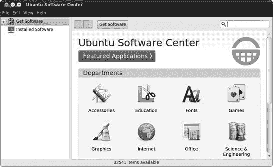
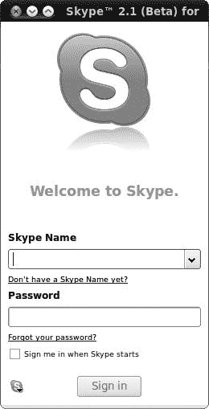
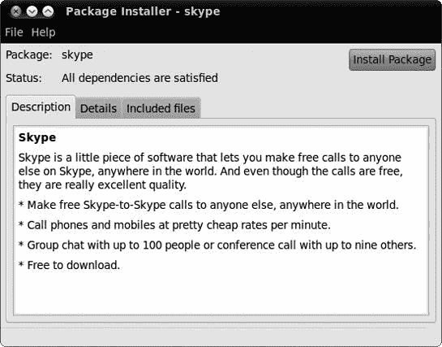

# 第六章。完善鸟儿

### 简单方式下载、安装和更新程序

关于 Ubuntu，最方便的事情之一是它配备了一个非常简单易用的应用程序安装机制。这个机制背后的引擎被称为高级包工具 (APT)，它允许您轻松下载、安装、更新和删除打包在 DEB 归档中的软件，或称为 *软件包*。

APT 是一种相当可靠的安装程序的方法；由于它会自动下载并安装您安装的主应用程序所需的任何文件，因此不会丢失任何文件。追踪这些被称为 *依赖项* 的文件，对于大多数 Linux 用户来说，证明是一个重大的头疼问题。寻找并安装这些文件，以及这些文件可能拥有的任何依赖项，导致了所谓的 *依赖地狱* 问题的出现。APT 使得这个问题几乎成为过去式。

那么，APT 是在哪里找到所有这些文件和应用程序的呢？嗯，APT 搜索、下载和安装的软件包位于一组特定的在线仓库中。这些 *仓库* 是在线服务器，其中存储了大量的应用程序、支持文件等，以供您的特定系统使用。所有最初随系统捆绑的文件，包括系统（内核）本身和可用的更新，也都存储在那里。这与 Windows 或 Mac OS 完全不同，在 Windows 或 Mac OS 中，您通常需要购买一张 CD 或从网站下载安装文件来获取新软件。

关于 APT，有些人，尤其是初学者，可能会认为它是一个问题的是，它是一个基于命令的应用程序。这意味着您通过命令行中的命令来控制它。幸运的是，Ubuntu 为 APT 提供了多个不同的图形前端，允许您绕过命令行，使一切尽可能容易。在本章中，您将专注于这三个前端之一。

# 项目 6A：通过 Ubuntu 软件中心安装应用程序

在 APT 前端中，最易于使用的是 Ubuntu 软件中心。作为图形界面最令人满意的前端之一，它在浏览酷炫或实用的应用程序时特别有用。为了感受它，请转到 **应用程序** 菜单并选择 **Ubuntu 软件中心**。打开的窗口将类似于 图 6-1。

图 6-1。Ubuntu 软件中心

如你所见，Ubuntu 软件中心中的项目分类方式与 Ubuntu 应用程序菜单中的分类方式几乎相同。如果你点击窗口主面板中的任何部门图标，你将跳转到该类别所有项目的列表。已安装的应用程序在其图标上用绿色勾选标记标记，而未安装的应用程序仅显示普通图标。不出所料，你会发现每个类别中的已安装项目与应用程序菜单的相关子菜单中的项目相匹配。要查看所有已安装程序的列表，点击窗口左侧面板中的**已安装软件**项目。

## 6A-1：选择要安装的应用程序

Ubuntu 软件中心可以同时安装多个应用程序，所以为了试试看，你可以在本节尝试安装一些有趣的应用程序。让我们先选择非常酷且非常有用的地址簿应用 Rubrica（如图 6-2 所示图 6-2

图 6-2. Rubrica——一个非常酷的地址簿

## 6A-2：搜索应用程序

接下来是声音转换器（我将在第十四章

图 6-3. 使用 Sysinfo 监控系统信息

## 6A-3: 卸载应用程序

如您所见，通过 Ubuntu 软件中心安装应用程序非常简单。幸运的是，卸载它们也同样简单。导航到（或搜索）您想要删除的程序，在列表中单击一次，然后单击出现的**移除**按钮。如果需要，再次输入密码，并观察程序被卸载。

# 通过更新管理器执行系统升级

本章将要介绍的 APT 的第二个图形前端是更新管理器，它用于更新您的系统。更新非常定期地提供，包括您已安装的软件包的新版本。大多数情况下，新版本已经发布，因为它们修复了一些安全问题，但更新也可以修复软件问题并引入新功能。

要开始，请选择**系统** ▸ **管理** ▸ **更新管理器**，并确保 Ubuntu 软件中心当前没有正在安装或删除任何内容（你无法同时使用两个 APT 前端）。一旦更新管理器窗口出现（图 6-4

图 6-4. 通过更新管理器批量升级软件包

如果你不想升级某些应用程序，你可以通过列表逐个取消勾选它们旁边的复选框。但就目前而言，最安全的方法是保留所有复选框勾选。无论哪种方式，一旦你准备好了，点击**安装更新**按钮。选定的更新将被下载并安装。安装完成后，你将在一个单独的窗口中收到通知。点击该窗口中的**关闭**按钮和在更新管理器窗口中的**关闭**按钮以完成操作。根据你安装的内容，可能会出现另一个通知告诉你，为了使更改生效，你需要重新启动系统。如果是这样，最好是服从并重新启动。

## 你应该多久安装一次更新？

Ubuntu 每天都会检查更新，如果发现更新，更新管理器窗口将出现在你的桌面上。如果这发生得太频繁，你发现自己被更新所困扰，请选择**系统** ▸ **管理** ▸ **软件源**。当软件源窗口出现时，选择**更新**选项卡（图 6-5

图 6-5. 软件源窗口中的更新选项卡

## 如果更新破坏了你的日子或系统

现在，我不想让你太过担心，但关于大规模系统更新有一点需要注意，那就是更新之后，有时候事情会变得一团糟，让你满腹遗憾，一肚子脏话等着发泄。无论你使用什么操作系统，这都是生活的一个事实。这可能在 Windows 上发生，也可能在 Mac OS 上发生，甚至在 Linux 上发生。因此，在安装看似重大的更新之前先等等，并先查看用户论坛，看看是否有关于特定更新的灾难性故事，总是一个好主意。在发现更新和安装之间留出一周的时间应该能保护你免受大多数罕见故障的影响，但没有任何保证。

### 注意

要决定一个更新是否是“重大”的，请查找名称中包含*linux-*的更新（例如，图 6-6

图 6-6. 命名为 *linux* 的更新通常是很重要的系统软件包

如果你安装了一个更新，却发现你的系统无法再次启动，不要担心。一切并未丢失。事实上，很可能什么都没丢……。只需重新启动你的机器。如果你有一个双启动系统，你将到达 GRUB 启动菜单，就像往常一样。如果你不是双启动用户，你需要在启动计算机时立即按住 shift 键来进入这个菜单。不要松开 shift 键，直到 GRUB 菜单出现（或者 Ubuntu 启动，在这种情况下你错过了提示，你将不得不重新启动计算机并再次尝试）。

在 GRUB 菜单中，你会看到似乎你的硬盘上安装了不止一个 Ubuntu 系统，这在某种程度上是正确的。作为一个短期的解决方案，你可以利用这个机会回到你之前不幸升级之前的核心系统（Linux 内核）。只需使用箭头键选择一个以数字结尾低于最高数字的内核（例如，2.6.32-20 而不是 2.6.32-22），按 **enter** 键，*voilà*，你就回到了你熟悉和喜爱的系统。你每次启动机器时都必须这样做，但至少你有机会在研究问题并稍后再次尝试之前备份你的宝贵文件。

在所有这些灾难和恢复的讨论中，我希望我没有让你对更新系统的想法感到害怕。毕竟，这种情况发生的可能性很大，这种情况永远不会发生在你身上。然而，了解如果事情出了差错，没有必要恐慌是很好的。你还有备份。

# 添加额外的软件仓库

Ubuntu 软件仓库包含超过 30,000 个软件包——足够你用一辈子，你可能这样认为。但事实是，还有整个软件世界在官方 Ubuntu 仓库之外等待着你，而且获取它们并不困难。各种个人和公司会将 Ubuntu 中不可用的少量软件包编译到他们自己的 *第三方仓库* 中。如果你能找到它们，这些仓库通常是免费的。你只需要告诉 APT 在这些仓库以及 Ubuntu 的仓库中搜索软件包，你就能访问额外的软件。

每个仓库都有自己的*APT 行*。这类似于一个网址，但包含有关仓库的额外信息，APT 使用这些信息来确定它包含哪些类型的软件包。您需要从您要添加的仓库的网站上获取正确的 APT 行，所以让我们举一个例子来看看它是如何工作的。打开 Firefox，转到[`www.getdeb.net/updates/Ubuntu/all#how_to_install`](http://www.getdeb.net/updates/Ubuntu/all#how_to_install)。GetDeb 专门为那些尚未正式进入 Ubuntu 的软件制作软件包。页面上顶部应该有一个框中包含有关从 GetDeb 安装软件包的说明，所以跳到列表中的第二项，找到 APT 行，它看起来可能像这样：`deb` [`archive.getdeb.net/ubuntu`](http://archive.getdeb.net/ubuntu) `lucid-getdeb apps`。这遵循所有 APT 行的相同格式：单词`deb`，后面跟着一个网址，然后是几个其他单词，指定 APT 在查找程序时应该检查仓库的哪个部分。选中 APT 行，右键单击，并从弹出菜单中选择**复制**。

当你在 Firefox 中时，你还需要获取仓库的*GPG 密钥*（我将在本节末尾解释更多）。它应该链接到您获取 APT 行的同一个网站；在 GetDeb 的情况下，转到[`archive.getdeb.net/getdeb-archive.key`](http://archive.getdeb.net/getdeb-archive.key)；当打开 getdeb-archive.key 窗口时，选择**保存文件**，然后点击**确定**以保存密钥文件。

现在你已经拥有了这些关键信息，将仓库添加到系统中相当简单：

1.  选择**系统** ▸ **管理** ▸ **软件源**。如果需要，输入您的密码，然后点击出现的软件源窗口中的**其他软件**选项卡。

1.  点击**添加**。您将被提示输入 APT 行，将其粘贴到框中，然后点击**添加源**（图 6-7

    图 6-7. 输入 GetDeb 仓库的 APT 行

    

    图 6-8. 检查受信任的软件提供者列表以查看 GetDeb 密钥是否存在

1.  关闭软件源窗口。您将被告知可用的软件信息已过时，因此点击 **重新加载** 以获取最新的软件包信息。下载可能需要一些时间。

1.  打开 Ubuntu 软件中心（如果它已经打开，请先关闭再重新打开），并从新仓库中搜索您想要的程序。例如，尝试搜索 BookWrite，这是一个帮助您编写自己小说的小程序。它应该像任何其他应用程序一样出现在搜索结果中，因此您可以像往常一样安装它。

这需要经过很多步骤，但这就是全部。这比开车去当地的电脑店买新程序要方便多了，对吧？

最后一点注意事项：还记得关于身份验证和 GPG 密钥的所有事情吗？这与一个安全措施有关，该措施检查软件包是否来自您认为它们来自的地方。（理论上，有人可能会劫持仓库并将有害的假软件包放入其中。）如果您不添加 GPG 密钥，Ubuntu 软件中心将拒绝显示来自该仓库的任何软件包，因为它不会信任它。尽管拥有 GPG 密钥并不能让您完全免受意外惊吓，但您在使用第三方（即非 Ubuntu）仓库时应该始终谨慎行事；在添加它之前，请确保它是可信赖的。

## APT-URL: 从网站安装

现在您已经将 GetDeb 添加到可用的软件仓库列表中，您可以利用另一个 APT 前端。访问 [`www.getdeb.net/`](http://www.getdeb.net/)，并点击 **应用程序** 选项卡。浏览程序列表，直到找到您满意的应用程序——我选择了一个名为 *hamster-applet* 的时间管理应用程序——然后点击其图片下方的 **立即安装**。现在您可以通过点击网站上的链接来安装软件，而无需访问 Ubuntu 软件中心！

将出现一个带有 apturl 选项选中的启动应用程序屏幕——点击 **确定**，如果提示，请输入您的密码。然后您将看到一个类似于 图 6-9 的窗口；点击 **安装**，等待常规的下载和安装活动进行。完成后，点击窗口中出现的 **关闭**，然后在应用程序菜单（或它最终所在的位置）中找到您的新程序。快速且简单。

图 6-9. 使用 APT-URL 从网站安装软件

许多网站支持 APT 链接，但除非你在电脑上添加了它们的仓库，就像你在 GetDeb 上做的那样，否则你无法从它们那里下载软件。然而，如果链接是针对 Ubuntu 仓库中已经存在的程序，那么可以像通常一样安装，无需在软件源中进行任何进一步的混乱操作。

# 项目 6B：从 PPA 安装软件：OpenSonic

许多 Ubuntu 爱好者感染了编程病毒，并决定开发自己的软件。有许多小型的程序是由某人编写的，以解决他们自己的需求，如果你知道在哪里获取，这些程序都是免费的。幸运的是，现在大多数这些程序都可以在 Ubuntu 的项目网站 Launchpad 上的个人软件仓库 (PPA) 中找到。PPA 是小型软件仓库，是人们与他人共享自制软件的简单方式（强调自制——有时 PPA 中的软件可能无法正常工作）。你可以通过访问 [`launchpad.net/ubuntu/+ppas`](https://launchpad.net/ubuntu/+ppas) 并搜索你想要的内容来找到 PPA 中的软件。

在这个例子中，你将了解如何安装 OpenSonic，这是经典刺猬索尼克游戏的开源混音版本（参见 图 6-10）：

1.  在 [`launchpad.net/ubuntu/+ppas`](https://launchpad.net/ubuntu/+ppas) 的搜索框中输入 **lucid games**，然后点击 **搜索** 开始。

1.  第一搜索结果应该是游戏（Lucid），点击该链接，查看加载的页面上的 *将此 PPA 添加到您的系统* 部分内容。

1.  复制显示为 `ppa:falk-t-j/games` 的部分——这是一个你可以用来添加此仓库的快捷方式，而不是必须使用更繁琐的 APT 行。如果你好奇，可以通过点击 **关于此 PPA 的技术细节** 链接来查看 APT 行。

1.  选择 **系统** ▸ **管理** ▸ **软件源**，并选择 **其他软件** 选项卡。

1.  点击 **添加**，并将 PPA 快捷方式粘贴到提供的框中。然后，点击 **添加源**。

1.  这次，GPG 密钥将自动添加，因此你现在可以关闭软件源窗口了。

1.  当提示更新软件包信息时，点击 **重新加载**，然后打开 Ubuntu 软件中心，像安装任何其他软件包一样安装 OpenSonic。

    

    图 6-10. 播放 OpenSonic

这只是一个例子——PPA 不仅被爱好者用来分发怀旧游戏。一些 Ubuntu 开发者使用 PPA 来提供软件的最新版本，尽管这种方式是非官方的且未经测试的。例如，如果 OpenOffice.org 或 Firefox 发布了主要的新版本，你可以关注 Ubuntu 论坛 ([`www.ubuntuforums.org/`](http://www.ubuntuforums.org/))，看看是否有人通过他们的 PPA 提供了最新和最好的版本。

# 项目 6C：安装 Ubuntu 仓库中不可用的 DEB 包：Skype

如您所忆，您通过 Ubuntu 软件中心从各种仓库安装的应用程序是以 DEB 包的形式。尽管这些仓库可能包含几乎所有的软件，但某些包由于各种原因，永远不会进入仓库。Skype 就是这些包之一。

如 图 6-11 所示，Skype 是一种语音 over IP (VoIP) 软件，允许您通过互联网与其他 Skype 用户通话，其清晰度与普通电话线路相当。而且最好的部分是，它完全免费——即使您拨打海外用户。Skype 还提供付费服务，例如 SkypeOut，允许您以比普通电话低得多的价格从您的电脑拨打普通移动电话和固定电话号码。

图 6-11. Skype

虽然开源 VoIP 包如 Ekiga Softphone 在 Ubuntu 中可用，但它们与更知名且更广泛使用的 Skype 不兼容。鉴于您认识的大多数使用 VoIP 软件包的人很可能都在使用 Skype，因此使用 Skype 以便您能够轻松与他们沟通是很有意义的。

由于 Skype 不可从 Ubuntu 仓库中获取，您需要从 Skype 网站自行获取 ([`www.skype.com/`](http://www.skype.com/))。到达那里后，点击 **下载** 按钮，这将自动带您到 Skype Linux 版本的下载页面。在该页面上，点击 Ubuntu 的链接，然后点击出现的窗口中的 **保存文件** 按钮。

下载完成后，您将在您的硬盘上找到 Skype DEB 包，可能位于您的 *下载* 文件夹中。双击该包以打开包安装器窗口 (图 6-12). 点击 **安装包**，之后您将被提示输入密码。安装完成后，点击出现的窗口和包安装器窗口中的 **关闭** 按钮。

### 注意

与所有 APT 前端一样，当另一个 APT 前端打开时，您不能使用包安装器。在使用包安装器之前，请确保更新管理器和 Ubuntu 软件中心都已关闭。

一旦所有组件都安装完毕，您可以通过选择**应用程序** ▸ **互联网** ▸ **Skype**来运行 Skype。如果您发现您无法拨打电话或声音工作不正常，请查看[`help.ubuntu.com/community/Skype/`](https://help.ubuntu.com/community/Skype/)以获取故障排除提示。此外，当我们谈论声音问题时，请记住，最好使用耳机使用 Skype。尝试使用长话筒交谈可能会导致回声或回音，因为麦克风会拾取并传输扬声器发出的声音。

图 6-12. 软件安装窗口
