# 第七章。一个整洁的家

### Ubuntu 中的文件和磁盘处理

无论您使用的是哪种操作系统，您都必须处理文件。有些人非常有条理，一旦文件第一次保存，就会将其放入一个逻辑命名的文件夹中。然后有像我这样的人，将所有东西都保存在桌面上，直到它充满了垃圾，以至于无法辨认壁纸，然后才开始认真整理（如果将所有这些文件放入一个名为*March17Cleanup*的文件夹中可以称为整理的话）。

当然，文件不仅存储在您的硬盘上，还被复制到 CD、DVD、外置硬盘、闪存驱动器和其他存储媒体和设备上。它们也常常保存在存档中，然后被压缩以减少其空间占用，这使得它们更容易通过电子邮件发送或适应可移动存储媒体。

通过这个介绍，您可能已经猜到，在本章中，我将处理 Ubuntu 中的文件处理，特别是与 Nautilus 文件管理器相关，它是 GNOME 文件处理功能的核心。

# Nautilus：您的文件管理器

如我所述，在您的系统上创建文件查看和组织界面的程序被称为 Nautilus，它是 GNOME 桌面环境的一部分。您可能以前没有将操作系统的文件管理器视为一个程序，但实际上，它就是这样。 （Windows 文件管理器被称为 Windows Explorer。）要查看 Nautilus，只需转到**位置**菜单，然后选择**主页**。

当 Nautilus 打开到您的主页文件夹（如图 7-1 所示），您会发现您可以按主题存储您的文件：*文档*、*下载*、*音乐*、*图片*、*公共*、*模板*和*视频*。还有一个名为*桌面*的另一个文件夹，如果双击，将显示您在桌面上存储的所有内容（在我的情况下有很多；在您的情况下可能没有多少）。还有一个名为*示例*的另一个文件夹，其中包含一些示例文件，让您了解 Ubuntu 为您准备了什么。

您可以随心所欲地创建额外的文件夹和文件，因此一旦您真正开始使用系统，这种预配置的状态肯定会发生变化。实际上，您将在第八章中进行一些更改，这将使一切看起来更加有人气。

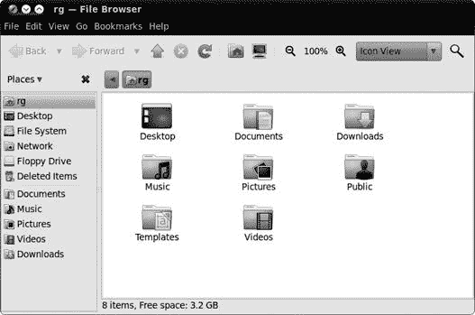

图 7-1.在 Nautilus 窗口中查看您的主文件夹内容

## 侧边栏

Nautilus 有许多有趣的功能值得提及，其中最明显的是侧边栏，它出现在窗口的左侧。侧边栏允许你通过可选视图查看各种信息。你可以通过点击侧边栏顶部的下拉菜单来做出选择（参见图 7-2）。

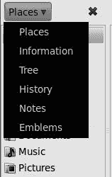

图 7-2. 为 Nautilus 侧边栏选择视图

在 Ubuntu 中，默认视图是“位置”，这是一种快速导航工具。在“位置”中，你可以找到代表系统可用的各种数据存储位置的图标，例如你的家目录、桌面、完整的文件系统、你连接到的任何网络共享（稍后将有更多介绍），以及你系统内或连接到系统中的任何可移动存储介质或设备。点击这些图标中的任何一个，都会在 Nautilus 窗口的右侧面板中显示该位置的文件内容。

当然，还有其他视图，例如树状视图，它为你提供了一个可展开的层次视图，以及历史视图，它显示了你在文件系统中的最近位置，这与网页浏览器中的历史功能非常相似。还有其他视图供你选择，其中一些你将在第八章中用到。

## 现在看到了；现在看不到

侧边栏是一个相当方便的功能，但有时你可能更喜欢有更多的空间来查看窗口的内容，因此想要暂时移除窗格。你可以通过点击窗格右上角的小灰色关闭按钮，或者通过转到 Nautilus 窗口的“视图”菜单然后取消选择“侧边栏”来实现这一点。该条目旁边的勾选标记将会消失，侧边栏也会消失。要恢复它，只需返回到“视图”菜单，并再次选择“侧边栏”。勾选标记将会重新出现，侧边栏本身也会出现。

另一种隐藏侧边栏的方法，许多人似乎都是意外发现的，通常会导致一些不必要的恐慌。如果你查看侧边栏右侧的灰色边框，你会注意到中心有一个小波浪形部分（参见图 7-3). 拖动这个波浪形部分可以调整窗格的宽度。然而，大多数人一开始并没有意识到，只需点击这个波浪形部分就可以作为切换来隐藏或显示侧边栏。当以这种方式隐藏窗格时，波浪形部分仍然出现在窗口的左侧边框，而早先提到的方法隐藏窗格时则不是这样。

所以，这就是侧边栏的小秘密。不，这并不是一个特别有趣的秘密，但它应该不仅能为你提供额外的便利，还能让你感到一些安心。

图 7-3. 另一种显示和隐藏 Nautilus 侧边栏的方法

# Nautilus 中的文件处理

由于 Nautilus 主要是一个文件管理器，所以在那个层面上使用它才是合理的。当然，现在大多数使用电脑的人都已经熟悉拖放和创建文件夹、复制、剪切和移动文件等基本操作。但对于那些对这些基本程序不熟悉的人来说，我会详细解释。如果你觉得这些内容有点多余，请为了大众的利益而忍受一下。

## 创建、命名和重命名文件夹

创建文件夹是一个相当简单的任务，有两种方法可以完成。在我看来，最简单的方法是在 Nautilus 窗口中的任何空白区域右键点击，然后在出现的弹出菜单中选择**创建文件夹**。如果你更喜欢使用菜单而不是右键点击空白区域，你可以通过选择**文件** ▸ **创建文件夹**来开始操作。

无论你在哪里选择了创建文件夹，一个新的名为*untitled folder*的文件夹都会出现在 Nautilus 窗口中。文件夹的名称框会被高亮显示，并围绕着一个黑色框，这意味着你可以立即通过简单地输入一个名称来给这个文件夹命名——不需要点击或做其他任何事情。按**enter**键，或者在 Nautilus 窗口中的任何空白区域点击来完成这项工作。

如果你后来决定你给文件夹取的名字需要一些调整，甚至需要完全修改，你可以通过右键点击它并在弹出菜单中选择**重命名**来重命名它。或者，你可以点击文件夹一次以突出显示它，然后选择**编辑** ▸ **重命名**。之后，你可以输入文件夹的新名称，然后按**enter**键，或者你可以在 Nautilus 窗口中的任何空白区域点击来确认。

## 移动文件和文件夹

在 Nautilus 中，你可以执行的最简单的文件操作之一就是通过拖放来移动文件。我非常确信，任何使用过鼠标的人都会熟悉这个特定的动作。然而，还有另一种移动文件和文件夹的方法：剪切和粘贴。

做这件事最简单的方法是右键点击你想要移动的文件（或文件夹），然后从弹出菜单中选择**剪切**（**编辑** ▸ **剪切**也会起到同样的作用）。此时，看起来好像什么都没发生，因为文件仍然在那里，但请放心。

之后，在你想移动文件的文件夹中的任何空白区域右键单击，然后在弹出菜单中选择**粘贴**。文件将随后从原始位置消失，并出现在新位置。

你可以使用快捷键组合来完成这个操作吗？当然可以。只需按照我刚才给出的指示操作，但请按**ctrl**-X 来剪切和**ctrl**-V 来粘贴。

## 复制文件和文件夹

根据我刚才给出的指示，你可以很好地想象复制文件和文件夹的方法，因为它们本质上是对同一主题的变体。只需右键单击你想要复制的文件，从弹出菜单中选择**复制**，然后在目标位置内的任何空白区域右键单击，然后选择**粘贴**。按键操作上，复制是**ctrl**-C，而粘贴，如之前所述，是**ctrl**-V。

通过拖放功能的神奇之处，你也可以复制文件夹和文件，尽管这比简单的拖放操作需要更多的手部动作；幸运的是，你手头上的两个操作就足够了。在你拖动想要复制的文件或文件夹到目标位置时，请按住**ctrl**键。确保释放鼠标按钮，然后释放**ctrl**键（以相反的顺序释放将不会起作用），你将在新位置找到文件的副本。

# 在 Nautilus 中导航

在 Nautilus 中浏览你的各种文件夹和子文件夹非常直接。实际上，所有概念上都与你在 Windows 和 Mac OS 中习惯的几乎相同。你可以通过双击文件夹和点击后退、前进和向上按钮的组合来进入和退出文件夹。

## 使用 Nautilus 中的面包屑浏览

除了侧边栏中提供的分层视图选项之外，另一个方便的功能可以使你的导航任务更加容易：Nautilus 的面包屑栏功能。当你深入到文件夹森林中时，Nautilus 会在导航栏中为你在前往当前查看的文件夹过程中打开的每个文件夹留下一条面包屑（实际上它们看起来像按钮）。

例如，假设你有一个名为*gooseberries*的文件夹位于名为*Dalarna*的文件夹内，该文件夹又位于名为*SwedeStuff*的文件夹内，而*SwedeStuff*文件夹又位于名为*NordicStuff*的文件夹内，而*NordicStuff*文件夹本身又位于你的主文件夹中。当你点击进入那个*gooseberries*文件夹时，从双击*NordicStuff*文件夹开始，Nautilus 会显示该文件夹的按钮……以及之前打开的任何文件夹。请查看图 7-4 以了解我的意思。

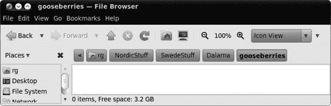

图 7-4. Nautilus 中的面包屑导航

如你所见，从你的家文件夹到目标文件夹路径中的每个文件夹都有一个按钮：*gooseberries*。那么，这又怎么样呢？好吧，假设你想回到 *NordicStuff* 文件夹打开一个文件，你想要复制一些文本并将其粘贴到 *gooseberries* 文件夹内的文档中。这听起来像是一个小麻烦，对吧？

好吧，与其在“后退”按钮上浪费时间，不如跟随面包屑导航！只需点击 **NordicStuff** 面包屑按钮，那个文件夹的内容就会出现在你面前。需要回到 *gooseberries* 吗？只需点击 **gooseberries** 按钮。回到 *SwedeStuff*，你说？只需点击 **SwedeStuff** 按钮。这一切都相当 *fantastisk*！

## 明确指出——在 Nautilus 中输入文件路径

如果你更喜欢输入而不是点击，你一定会很高兴地知道你可以通过输入路径来导航到文件夹。只需点击 **Go** 菜单并选择 **Location**（喜欢使用键盘快捷键的人可以按 **ctrl**-L）。然后，在地址栏中会出现一个框，显示当前位置，在我的例子中，会是 `/home/rg/NordicStuff/SwedeStuff/Dalarna/gooseberries`。你可以在那个框中输入目标文件夹的路径，然后按 **enter**，之后目标文件夹的内容就会出现在 Nautilus 窗口的主面板下方。

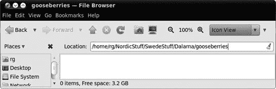

图 7-5. 在 Nautilus 中输入目标文件夹的路径

## Nautilus 中的书签

在点击深入到隐藏的子文件夹的过程中，值得提一下 Nautilus 的另一个非常实用的功能：书签。是的，Nautilus 允许你将已导航到的文件夹添加为书签。虽然你无疑熟悉为常访问的网页创建书签，但你可能想知道为什么要在文件系统中创建书签。

好吧，想象一下，你有一个经常需要使用的文件夹，但它比上一节中提到的 *gooseberries* 文件夹还要深藏不露。到达那里需要过多的鼠标点击，而且所有这些点击最终肯定会让你患上腕管综合征。虽然这对你的医生来说是个好消息，但对你来说绝对不是什么好事。与其伤害自己，你可以在 Nautilus 窗口中点击一次到达那个文件夹，然后选择 **Bookmarks** ▸ **Add Bookmark**。之后，无论何时你想回到那个隐藏的文件夹，只需点击 **Bookmarks** 菜单，文件夹就会在下拉列表中等待你。

Nautilus 书签的另一个方便之处在于，它们也会出现在“另存为”对话框中，例如当您保存 OpenOffice.org 文档或通过 Firefox 下载文件时。要在任何此类“另存为”对话框中使用它们，只需点击**保存到文件夹**按钮，您就会找到您的书签。

# 理解 Linux 文件系统

通过您刚刚学习到的所有路径输入、导航和书签操作，您应该基本上能够弄清楚如何在您的家文件夹中从这里到那里。尽管如此，了解您的家文件夹在整体结构中的实际位置可能是一个好主意，以防万一您有一天真的迷路了。为了理解这一点，您应该对 Linux 文件系统有一个基本的了解，正如您将发现的，它与您之前所习惯的操作系统略有不同。

与 Windows 不同，Linux 文件系统所有内容都源自一个称为*root*的单一点，并且用一个单独的斜杠(/)表示。您的用户账户文件夹位于名为*home*的 root 子文件夹中。这表示为*/home*，或者说，是 root 中的家文件夹。如果您的用户账户与我的名字相同，*rg*，那么该文件夹的路径将是*/home/rg*，或者说是 root 中的*home*文件夹内的*rg*文件夹。无论您的用户账户或您机器上的其他账户的名称是什么，只要记住，当您迷路时，您的文件夹以及所有其他用户账户的文件夹都位于家文件夹内。如果您是一个更倾向于图形化的人，图 7-6 中的地图应该能帮到您。

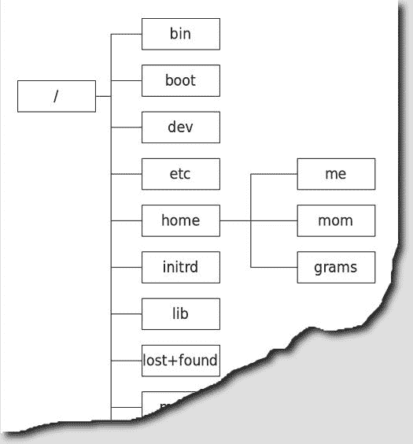

图 7-6. Linux 文件系统中用户文件夹的位置

# 所有那些其他文件夹里有什么？

不言而喻，Linux 文件系统不仅仅包括 root、home 和用户账户文件夹。还有几个其他目录与 home 处于同一级别，尽管在大多数情况下，除非您知道自己在做什么，否则您不应该随意操作它们。幸运的是，这些文件夹大多数都是写保护的，所以您应该相当安全。然而，出于好奇，自然想知道那些其他文件夹是用来做什么的，因为……好吧，它们就在那里。所以，为了满足您的好奇心，我会稍微解释一下。

在 Ubuntu 中，有四个文件夹包含了系统上大部分的应用程序。系统的基本元素位于 */sbin* 中。其他需要放置但可能未被使用的元素，例如命令等，位于 */bin* 中。你真正认为的应用程序，并且实际操作使用的，大多数位于 */usr* 中。最后，还有一些附加应用程序，如 RealPlayer，它们会自动安装到 */opt* 中。

可能对你感兴趣的另外三个顶级文件夹是 */etc*、*/lib* 和 */media*。其中第一个 */etc* 是系统中所有配置文件的存放位置。第二个 */lib* 是系统中或安装在其上的应用程序所需的库的存放地。这些库是 Linux 系统中 Windows *.dll* 文件的等价物。最后，*/media* 是各种连接的外部媒体（如 USB 驱动器和 CD）内容出现的地方，当它们存在时。

还有其他顶级文件夹，但它们的目的对于普通的 Linux 新手来说可能不太直接，坦白说，在这个阶段可能对你来说也不那么有趣。无论如何，正如我提到的，你现在没有必要在这些文件夹中乱动，因为你可以通过不同的、更安全的方式访问它们内部的项。

# 使用 Nautilus 作为网络浏览器

另一个 Nautilus 的实用功能是它能够作为网络浏览器运行。例如，你可以通过点击 Nautilus 窗口的侧边栏中的 **网络** 或者在 GNOME 面板中的 **位置** 菜单选择 **网络** 来查看你在家或办公室网络上的可用网络和共享。你还可以通过在 Nautilus 窗口的 **前往** 菜单中选择 **网络** 来在 Nautilus 窗口中完成同样的操作。任何网络或该网络上的计算机的图标都会在 Nautilus 窗口中显示，就像在 图 7-7 中所示。从那个窗口，你可以双击访问你拥有权限的共享，例如 Windows 机器的 *共享文档* 文件夹或 Mac 的公共文件夹。顺便说一句，如果你想知道什么是共享，我会为你解释清楚：*网络共享* 是计算机上的一个位置，例如一个文件夹，网络上的其他用户可以访问和保存文件。Windows 系统上的 *共享文档* 文件夹是一个很好的例子。网络上的其他用户可以从 *共享文档* 文件夹中复制文件，并且（通常）可以向该文件夹中写入文件，而他们不能访问该主机机器上的文件系统中的任何其他部分。

如果您尝试打开的共享需要用户名和密码，您将在新窗口中要求输入这些信息。请注意，在这种情况下，您需要输入的用户名和密码是您尝试连接的机器的用户名和密码——而不是您在 Ubuntu 上使用的那些（除非用户名和/或密码恰好相同，当然）。然后您可以将文件复制到该共享，就像它是在您自己的硬盘上的一个文件夹一样。

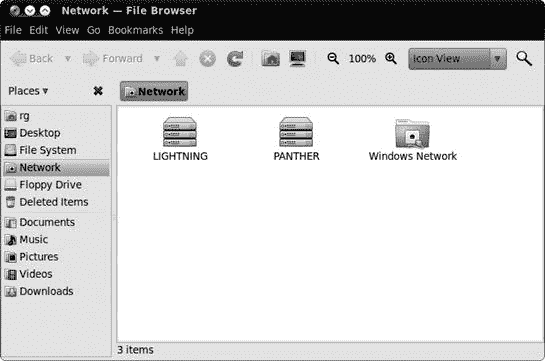

图 7-7. 查看您网络上的计算机

在某些情况下，尤其是在尝试访问运行 OS X 的 Mac 上的共享时，双击方法可能不起作用。您可能无法访问特定机器上的任何共享，即使该机器的图标出现在 Nautilus 窗口中。在这种情况下，双击您要访问的机器的图标，然后，一旦打开（到一个空窗口），选择**前往** ▸ **位置**。在位置栏中会出现一个文本框（就像在图 7-5)，其中已经列出了您要访问的机器的位置。

在该位置，添加一个正斜杠（/）后跟目标机器上使用的用户名。例如，如果目标机器名为*cowboycats*，用户名为*mewtoyou*，则位置为`smb://cowboycats/mewtoyou`。您还可以通过在已输入的路径中添加来缩小到机器上的特定文件夹，只要您知道该文件夹的路径；例如，`smb://cowboycats/mewtoyou/Documents`。如果您愿意，也可以输入**smb:**//和您的 Mac 的 IP 地址，该地址由四个由点分隔的数字组成。以我的某台机器为例，我会输入`smb://192.168.0.100`。（您可以通过前往 Mac 的系统偏好设置，点击**共享**，然后点击**Windows 共享**来找到 Mac 的 IP 地址。地址应立即出现在服务选择面板下方。）

### 注意

如果您感到好奇，路径开头的`smb`代表*服务器消息块*，但为了使事情更简单（也许在记忆方面更有用），您只需将其视为*Samba*的简称，Samba 是 Unix 系统（如 Linux 和 Mac OS X）用来与 Windows 网络交互的软件。

一旦您到达要浏览的网络连接机器上的文件夹，使用 Nautilus 的收藏夹功能将打开的共享窗口收藏起来可能是个好主意。然后您可以通过在 Nautilus 书签菜单中选择共享的名称来轻松访问该共享。如果我说这很酷，那也是真的。

## 使用 Nautilus 作为 FTP 客户端

Nautilus 不仅允许你在本地网络上浏览和挂载共享，还可以作为文件传输协议（FTP）客户端使用，比如当你想在远程服务器上更改网站文件时。为此，转到“连接到服务器”窗口（**文件** ▸ **连接到服务器**），然后选择**FTP（带登录）**作为服务类型。然后输入你的网站托管商提供的信息，并点击**连接**按钮。随后，一个 FTP 网络共享图标将出现在桌面和侧边栏中。双击该图标，当被提示时输入你的密码（该账户的密码——不是你的 Ubuntu 系统的密码，除非它恰好是同一个），然后你将能够查看并添加你那里的文件。

## Nautilus 中的文件和文件夹权限

在你探索 Ubuntu 世界的过程中，你会发现偶尔你会遇到一些文件或文件夹，在你能读取它们、能修改它们或两者兼而有之方面存在某种锁定状态。这些可读性和可修改状态被称为*权限*。

现在，你可能想知道权限这事的目的是什么，所以为了帮助你理解，我将给你一些例子，说明它如何有用。假设你有一些文件，你不想让你的配偶或孩子看到——比如一些糟糕的诗歌或圣诞购物清单。通过拒绝这些文件或包含这些文件的文件夹的读取权限，除非他们擅长更改权限并且有更改这些文件或文件夹权限的必要权限，否则没有人能偷偷看一眼。

作为另一个例子，想象一下你花费了很多小时完成了一个文件。为了减轻你可能会意外损坏该文件的担忧，你可以拒绝自己写入权限。这样做的话，你就无法保存对该文件所做的任何更改。你会得到“另存为”选项，但如果你想更改文件本身，你必须更改权限。当你对文件或文件夹施加此类限制时，其图标上会显示一个锁形标志，如图图 7-8 所示。

图 7-8. Nautilus 会告诉你当权限限制你的移动自由时。

### 在 Nautilus 中更改文件和文件夹权限

在 Nautilus 中更改文件或文件夹权限，只需右键单击要更改的文件或文件夹，然后从弹出菜单中选择**属性**。一旦属性窗口打开，点击**权限**选项卡，你将看到文件或文件夹的所有者是谁以及你和他人可以或不可以做什么。如图 7-9 所示，文件夹和文件的选项略有不同。

图 7-9. 在 Nautilus 属性窗口中更改文件和文件夹的权限

你可能会觉得这个权限问题有点复杂，但实际上理解起来非常简单。权限可以授予或拒绝给文件或文件夹的**所有者**（你），指定的**组**，或者**其他人**（其他人）。传统上，这些权限被称为如下：

**阅读**

查看文件或文件夹内容的权限

**写入**

修改文件或文件夹内容的权限

**执行**

运行程序或脚本的权限

Nautilus 试图更详细地说明，如图 7-9 所示。然而，总的来说，你不需要过于担心设置你自己的文件权限，因为你确实是唯一可以访问你的用户账户的人。你可能遇到的一个可能的例外是当你从光盘将文件传输到硬盘时。在这种情况下，文件将是写保护的，这意味着你无法更改文件，直到你更改它们的权限。你可以通过转到属性窗口的**所有者**部分，并在单词*访问*旁边的菜单中选择**读取和写入**（对于文件）或**创建和删除文件**（对于文件夹）来更改此类文件的权限。完成操作后，点击**关闭**按钮，你就可以继续了。

### 保护你的主目录隐私

另一个例外是我所说的你不需要担心权限声明的情况，而且这可能是非常重要的一个，那就是你主目录的权限状态，尤其是在其他人在你的机器上有用户账户的情况下。在 Ubuntu 中，当某人登录到你的电脑上的自己的账户时，他们可以点击进入你的用户文件夹并查看其内容。

为了解决这个问题——从而保护你主目录的完整性、内容的隐私以及所有者（你）的安宁——你可以更改你主目录的权限。以下是你需要做的：

1.  打开一个 Nautilus 窗口，然后在侧边栏中点击**文件系统**。随后，你整个硬盘的内容将出现在 Nautilus 窗口的右侧面板中。

1.  查找并双击名为**home**的文件夹。当你点击的 home 文件夹的内容出现在右侧面板时，那里应该只有一个文件夹——你自己的文件夹，它的名字将与你的用户名相同。例如，我之前提到的，我的名字是*rg*。

1.  右键点击你的文件夹，然后在弹出的菜单中选择**属性**。

1.  在**用户名**属性窗口中（我的显示为**rg 属性**），点击**权限**选项卡。

1.  在**权限**选项卡中，向下滚动到**组和其它**部分，并在**文件夹访问**旁边的下拉菜单中选择**无**。务必在**组和其它**部分都这样做。完成之后，你的窗口应该看起来像我的图 7-10 中那样。如果是这样，点击**关闭**。

    

    图 7-10. 更改家目录权限以保护隐私

# 读取数据 CD 和 DVD

在 Ubuntu 中处理数据 CD 和 DVD 相当简单，因为一切都是自动的。要读取带有数据的 CD 或 DVD（而不是音乐或视频），只需将光盘放入驱动器中，一个 CD 或 DVD 图标（它们看起来一样）将自动出现在桌面上，如果你有一个 Nautilus 窗口打开，它也会出现在侧边栏中。你可以双击这些图标中的任何一个，之后光盘的内容就会在 Nautilus 中显示出来。之后，你可以使用标准的拖放或复制粘贴程序将文件从 CD 或 DVD 复制到你的硬盘上。

当你想移除 CD 或 DVD 时，只需右键点击桌面上的该光盘图标或侧边栏中的该光盘图标，然后在弹出的菜单中选择**弹出**。光盘将自动弹出。

# 烧录数据 CD 和 DVD

在 GNOME 中烧录数据 CD 和 DVD 非常简单，只要你将 CD 或 DVD 刻录机连接到你的电脑上！你只需要将空白 CD-R 或 DVD（Ubuntu 支持 DVD-RW、DVD-R 和 DVD+RW）放入驱动器中，确保选择你的驱动器支持的媒体格式，一个空白光盘窗口将出现询问你要做什么。只需点击**确定**以打开 Nautilus 的 CD/DVD 创建者窗口，正如你无疑注意到的，它看起来与其它 Nautilus 窗口非常相似，只是在位置栏下方有一个彩色带和写盘按钮（图 7-11）。

图 7-11. 准备烧录到光盘的文件已就绪的 Nautilus CD/DVD 创建窗口

一旦 CD/DVD 创建窗口打开，将你想要烧录到光盘的文件复制进去基本上是一个简单的拖放操作。只需打开一个新的 Nautilus 窗口，并将你想要烧录到光盘的文件从该窗口拖到 CD/DVD 创建窗口。如果你更喜欢 Windows 式的操作方式，你可以通过单击每个文件一次，同时按住**ctrl**键来进行多选。如果你想选择多个连续的文件，你可以单击组中的第一个文件，按住并保持**shift**键，然后单击组中的最后一个文件，自动选择所有介于两者之间的文件。一旦你完成了选择，释放**ctrl**或**shift**键，右键单击任何高亮显示的文件，并在弹出菜单中选择**复制**。之后，返回到 CD/DVD 创建窗口，右键单击任何空白区域，然后在弹出菜单中选择**粘贴**。

可能值得提一下，你复制到 CD/DVD 创建窗口中的文件实际上并没有被复制。相反，你在 CD/DVD 创建窗口中看到的是指向原始文件及其原始位置的链接。因此，如果你在将 CD/DVD 创建窗口的内容烧录到光盘之前将其中一个文件从其原始位置移动，链接将不再工作，文件也不会被复制到光盘上。这并不是太大的问题，因为所有其他文件都将正确地放入光盘，但这是值得注意的事情。

一旦你复制了你想要烧录到光盘的所有文件，点击**写入光盘**按钮，之后会出现一个窗口（如图 7-12 所示），告诉你（以及其他信息），你还可以添加多少兆字节的文件到光盘（如果你想添加更多，点击**取消**返回并添加）。大多数人都会接受默认选项（这些选项相当合理），所以剩下的只是为光盘选择一个更有趣的名字。然而，如果你不想把任何事情留给运气，你可以通过点击**属性**并选择一个更慢的速度来调整光盘烧录的速度（较慢的速度意味着错误的机会更少）。

一旦你准备好烧录光盘，只需点击**烧录**按钮，CD/DVD 创建器就会完成其工作。

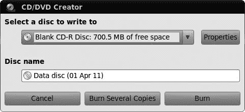

图 7-12. 在烧录 CD 或 DVD 之前设置选项

### 注意

如果你打算将文件传输到 Windows 系统，请在实际刻录之前确保根据 Windows 命名约定重命名你的文件。特别是，避免使用特殊字符和重音符号（如元音符号和重音符号），并且不要使用以下字符，这些字符是为 Windows 系统功能保留的：/ : ? * '' < > |。

一旦开始刻录，其进度将在新窗口中显示，当任务完成后，系统会询问你接下来想做什么。假设你当天已经完成了光盘刻录，请点击**弹出**然后**关闭**。

如果你有所疑问，你用 Linux 刻录的光盘在其他操作系统*将是可读的*。

## 处理 CD-RW

CD-RW 基本上与 CD-R 相似，只是它们可以被擦除并重新写入。它们也比 CD-R 贵得多，并且通常无法处理更快的刻录速度。

使用 CD-RW 与使用 CD-R 相似。如果光盘是空的，整个过程没有任何区别，这使得事情变得相当简单。即使 CD-RW 上已经有你想要替换的数据，过程也只有稍微不同。

这些区别之一是，Nautilus 会将你的 CD-RW 视为一个普通数据光盘，而不是空白光盘。这意味着当你将光盘放入驱动器时，将自动打开一个常规的 Nautilus 窗口，而不是 CD/DVD 创建者窗口。

要写入光盘，你需要手动从 Nautilus 窗口切换到 CD/DVD 创建者窗口，这可以通过在为该光盘打开的 Nautilus 窗口的**转到**菜单中选择**CD/DVD 创建者**轻松完成。如果你看不到 CD/DVD 创建者选项，请点击**转到** ▸ **位置**并在位置栏中输入**`burn:///`**（然后按**enter**）。完成此操作后，窗口将变为 CD/DVD 创建者窗口。现在将你想要刻录到 CD 的文件拖到该窗口中；一旦你准备好刻录，请点击**写入光盘**按钮。

正如常规 CD-R 或 DVD 的情况一样，会出现一个 CD/DVD 创建者窗口。然而，当你点击该窗口中的**刻录**按钮，并且驱动器中有已使用的 CD-RW 时，会出现一个细微的区别。此时，将出现一个类似于图 7-13 的新窗口，告诉你光盘似乎已经写有文件。点击该窗口中的**空白光盘**按钮，CD/DVD 创建者将擦除 CD-RW 上已有的文件，并用你拖到 CD/DVD 创建者窗口中的新文件替换它们。这还不错，不是吗？

图 7-13. 使用 Nautilus 擦除 CD-RW

## 将 ISO 镜像刻录到光盘

当您从互联网下载 Ubuntu 或其他 Linux 发行版时，您通常以一个或多个光盘镜像的形式下载它们，这些文件通常被称为 *ISOs*，因为它们的扩展名为 *.iso*。ISO 是光盘文件内容的镜像，这意味着它就是光盘本身，但没有媒体。换句话说，如果光盘有灵魂，ISO 就是光盘的灵魂；移除光盘的金属和塑料，剩下的数据就是一个 ISO。

由于无法通过互联网下载实体光盘，因此无身体的 ISO 镜像是次优选择。例如，要从网络上获取 Ubuntu 的有效副本，您通常需要下载一个 ISO 文件，然后将它烧录到空白光盘上，以便将这些镜像恢复其实体，换句话说。在这个过程中，您将创建安装 Ubuntu 所需的工作安装盘。

幸运的是，将 ISO 烧录到光盘是一项相当简单的任务。只需打开一个 Nautilus 窗口，找到您想要烧录到光盘上的 ISO 文件图标。右键单击 ISO 文件，在出现的弹出菜单中选择“**写入光盘**”。一旦这样做，就会出现“写入光盘”窗口；只需点击“**烧录**”按钮，您就可以开始了。

## 创建您自己的 ISO 镜像

在谈论 ISOs 的同时，了解您可以创建自己的 ISO 镜像是很好的。当然，您可能不会四处创建自己的 Linux 发行版，但您可能会找到一组您现在或将来需要重复烧录到光盘上的文件。要创建自己的 ISO，请遵循创建数据 CD 的正常流程，但当出现“写入光盘”窗口（图 7-12

图 7-14. 使用 Brasero 创建多会话光盘

## 烧录后续会话

在 Brasero 中向多会话光盘添加新会话的过程与创建初始会话的过程类似。以下是您需要做的：

1.  运行 Brasero，并点击**数据项目**按钮。

1.  将您的多会话光盘插入驱动器中，当驱动器停止旋转并且您已经将任何与该光盘相关的 Nautilus 窗口移除后，点击**导入**按钮，之后您上一个会话的内容将出现在 Brasero 窗口中。

1.  使用创建原始会话时使用的方法之一（通过拖放或选择并点击**添加**）将文件添加到上一个会话中。

1.  当您添加了所需的文件后，点击**烧录**。从那时起的过程与第一个会话完全相同。要在后续会话中添加文件，只需再次遵循前面概述的过程即可。

## 复制 CD 和 DVD

现在您已经熟悉了 Brasero，我将介绍其另一个功能：CD/DVD 复制。要复制光盘，将其放入驱动器中，启动 Brasero，然后点击**光盘复制**按钮。在随后出现的窗口中（图 7-15

图 7-15. 使用 Brasero 复制光盘

# USB 存储设备

如果在过去几年里你没有躲在一个数字岩石下，你无疑非常熟悉 USB 设备。你的打印机很可能是一个 USB 设备，同样，你的扫描仪也是。尽管你的数码相机在传统意义上不是一个 USB 设备，但每次你将其连接到电脑以传输照片时，你很可能都是通过 USB 连接器来做的。

在所有流行的 USB 设备中，用于文件存储的设备尤为突出。这些设备包括外置硬盘、闪存卡读卡器和被称为*闪存驱动器*（图 7-16

图 7-16. USB 存储设备

# 与蓝牙设备协同工作

在我们讨论文件处理的话题时，学习如何与蓝牙设备协同工作可能是一个好时机。正如我在第三章中提到的，如果你在机器上有一个蓝牙适配器，无论是内置的还是通过 USB 端口连接的，蓝牙图标将出现在 GNOME 上方的面板右侧。

## 配对设备

在你可以在蓝牙设备之间传输文件之前，你需要将它们配对。以下是操作步骤：

1.  点击顶部的蓝牙图标，并选择**设置新设备**。

1.  在出现的蓝牙设置向导中，点击**前进**。

1.  Ubuntu 将在您的计算机附近搜索蓝牙设备。一旦它发现一个设备，该设备将出现在窗口的中心面板中，如图 7-17 所示。一旦您想要配对的设备出现，请点击它，然后点击**前进**按钮。

1.  在向导的下一页，将出现一个个人识别号码（PIN）(图 7-18）。同时，您尝试连接的蓝牙设备也应该出现一个输入窗口。将 PIN 码输入到那个输入框中。

1.  假设配对成功，向导的最后一页将随后出现。点击**关闭**以完成配对过程。

    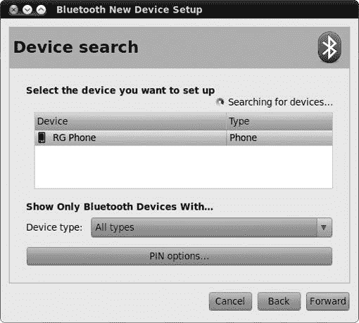

    图 7-17. 在 Ubuntu 中搜索和选择附近的蓝牙设备

    

    图 7-18. 蓝牙向导为您提供用于您要配对的设备的 PIN 码。

## 通过蓝牙发送文件

要通过您的计算机通过蓝牙将文件发送到另一台蓝牙设备，请点击蓝牙面板图标，然后选择**发送文件到设备**。随后将出现一个窗口，您可以在其中导航到目标文件。一旦您做出了选择，请点击**打开**。此时将出现选择设备窗口（图 7-19

图 7-19. 选择已配对的蓝牙设备以接收发送的文件

## 通过蓝牙接收文件

要从另一台具有蓝牙功能的设备通过蓝牙接收文件，您必须首先设置您的设备以允许此类传输。为此，点击蓝牙面板图标，并选择**偏好设置**。在蓝牙偏好设置窗口中，点击您想要设置的设备，然后点击**接收文件**。随后将出现一个个人文件共享偏好设置窗口。在该窗口中，勾选“蓝牙中接收文件到下载文件夹”旁边的复选框。为了您的安全，在“接受文件”右侧的下拉菜单按钮中选择**仅限设置设备**。如果一切正常，点击**关闭**。您的计算机将自动接收通过蓝牙发送给它的文件，并将它们保存到下载文件夹中。

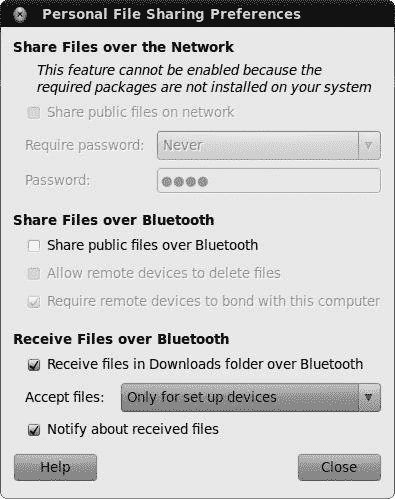

图 7-20. 设置系统以接收来自其他蓝牙设备的文件。

# 备份您的文件

您辛苦收集了所有文件。数小时的打字、数百张照片、一堆音乐 CD——所有这些都存储在硬盘上。那么，如果您的计算机出现问题，会发生什么呢？在许多情况下，不幸的是，所有数据都将永远丢失。为了避免您遭受这种痛苦，定期备份是个好主意。

可用的备份工具很多，但对我来说，*Déjà Dup* 是最容易使用的。打开 Ubuntu 软件中心，安装 *Déjà Dup 备份实用程序*。它将自动出现在 **应用程序** 菜单的 **系统工具** 部分中，所以前往那里并启动它。

现在是决定您将使用什么来存储备份的好时机。我有一个外部 USB 硬盘可以完成这项任务，但您也可以使用 USB 闪存驱动器、可记录的 CD 或 DVD，甚至是一个网络服务器。不过，我不建议将备份放在同一台计算机上。最好的做法是在原始文件和备份之间保持一定的距离，这样如果发生火灾或其他灾难，您至少会保留一份完好的副本。还要确保您有足够的空间来存储备份；常规 CD 只有 700MB，但我的 *图片* 文件夹就重达 4.3GB！

连接、插入或以其他方式准备您选择的备份设备，然后在 Déjà Dup 中点击**备份**按钮。会出现一个偏好设置窗口，就像图 7-21 中的那样。从下拉菜单中选择您想要保存备份文件的位置。如果您有不想让别人窥探的敏感文件，请勾选**加密备份文件**。

图 7-21. 在 Déjà Dup 中选择备份文件的保存位置

### 注意

如果你想要将备份文件放在 CD 或 DVD 上，你首先需要将它们保存到某个文件夹中，然后使用本章前面提到的刻录软件将那个文件夹复制到光盘上。

点击**前进**按钮，你将看到图 7-22 所示的屏幕。你的第一个任务是决定要备份什么，所以查看标有*包含文件夹中的文件*的列表，目前它应该只包含你的*主文件夹*。这对大多数人来说是一个相当合理的选项，因为你的所有文件都应该在你的*主文件夹*中。你可以使用列表右侧的按钮添加和删除其他项目。

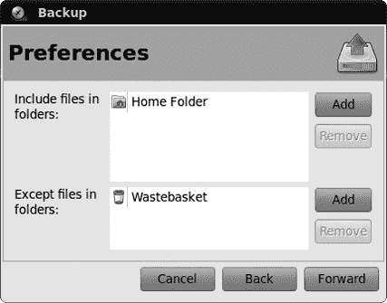

图 7-22. 选择要备份的文件

在那个屏幕上还有一个列表，标为*排除文件夹中的文件*。你可以使用这个列表来定义任何你*不希望*备份的文件或文件夹。比如说，如果你想备份你的*主文件夹*中的所有内容，除了你的图片——也许你的备份磁盘没有足够的空间来存储所有这些图片。你只需要确保你的*主文件夹*在*包含文件夹中的文件*列表中，而你的*图片文件夹*在*排除文件夹中的文件*列表中。

当你选择了要保留的内容和要忽略的内容后，再次点击**前进**按钮，进入摘要页面。检查一切看起来是否正常，然后点击**备份**按钮开始备份。如果你选择加密备份，系统会要求你输入密码，因此请输入密码并点击**继续**。

确保你保管好那个密码；否则，你将来可能无法恢复你的备份文件！如果备份的文件很多，文件复制的过程可能会持续一段时间。一旦完成，点击**关闭**，并安全地移除你的备份磁盘（或你使用的任何其他设备）。

这应该就足够了……目前来说。但记住，如果你不定期备份，备份就没有意义，因为如果出了问题，你只能恢复较旧的文件（而不是最近的文件）。我大约每月备份一次，但我应该可能需要更频繁地这样做。这并不是什么麻烦事；当你下次使用 Déjà Dup 时，它将记住你上一次备份的所有设置。如果你想做些不同的事情，请点击主窗口中的**编辑** ▸ **首选项**，并在那里更改选项。你将找到自动备份的选项；在首选项窗口中检查**自动定期备份**设置，然后选择你希望备份发生的频率。点击**关闭**，Déjà Dup 应该会处理剩下的工作。

### 注意

Ubuntu 背后的公司 Canonical 现在提供了一项名为 Ubuntu One 的在线备份服务。更多信息请查看[`one.ubuntu.com/`](https://one.ubuntu.com/)。

# 从备份中恢复

理想情况下，你永远不需要恢复你的备份，但如果你需要，这里有一个快速指南：

1.  找到你的备份磁盘，将其连接到电脑上，并启动 Déjà Dup。

1.  选择**编辑** ▸ **首选项**，并确保磁盘被选为**备份位置**。点击**关闭**以返回主屏幕。

1.  点击**恢复**，如果你对备份进行了加密，请输入你选择的密码。

1.  你将被要求选择你想要恢复的备份。选择看起来正确的那个（通常是最近的那个），然后点击**前进**。

1.  如果你希望文件恢复到原始位置，请选择**将文件恢复到原始位置**。否则，你可以选择一个文件夹来恢复它们。再次点击**前进**。

1.  快速查看摘要以确保一切正常，然后点击**应用**以恢复你的文件。有可能你需要重新输入你的加密密码，所以如果被要求，请继续这样做。

1.  恢复完成后，点击**关闭**，并检查文件是否已正确恢复。

现在一切应该都恢复正常了。呼！

# 删除不需要的文件

记得章节开头提到的保持整洁的巢穴吗？现在，是时候拿出你的春季清洁工具，给你的主文件夹进行一次彻底检查。

第一个目的地是回收站。有时候我会惊讶于这里积累的东西有多少；我可以连续几周都不清理它。幸运的是，这个回收站没有现实世界中对应的令人不愉快的气味，所以你唯一需要做的就是快速检查以确保你没有不小心删除任何东西。点击底部面板上的回收站图标，当窗口打开时，点击**清空回收站**以删除那里的所有文件。它们将被永久删除，无法恢复。

接下来是稍微复杂一些的操作。如果你硬盘空间不足，想知道原因（或者只是想对你的文件进行一番窥探），请选择 **应用程序** ▸ **附件** ▸ **磁盘使用分析器**。当窗口出现时，点击 **扫描家庭目录**，等待一段时间，直到你的文件夹被测量。一个彩色环形图将出现，并伴随一个列表显示你的硬盘空间被消耗在哪里。将鼠标悬停在图表上的一个彩色段上，以查看占用空间最多的内容，或者双击其中一个以放大特定文件夹。之后，你可以自己清理硬盘上的“大胃王”：在左侧列表中点击一个文件夹，然后选择 **移动到垃圾桶** 来删除它。

# 项目 7：创建和提取压缩文件

由于我一直在谈论文件存储，因此在这个章节结束时，通过教你如何创建和提取压缩文件来结束似乎很合适。在 Windows 世界中，这些通常被称为*Zip 文件*，而在 Linux 世界中，*tarball*是通用的名称。如果你想知道，Linux 的名称来源于创建此类文件存档的应用程序，Tar。压缩存档有两个很好的原因：它们让你可以将大量文件捆绑成一个方便的包，并且它们还可以将所有文件压缩，以便在硬盘上占用更少的空间。如果你曾经尝试过给某人发送大量文件，你就知道这有多有用。

总之，为了掌握一些实际操作，你需要创建一个 Windows/Linux/Mac 兼容的 Zip 文件，然后提取它。你可以通过打开 Nautilus 窗口并创建一些用于工作的虚拟文件来开始工作。这样做是通过访问 Nautilus **文件** 菜单并选择 **创建文档** ▸ **空文件** 来实现的。一个新文件将在 Nautilus 窗口中显示，其名称被突出显示。你可以为文件输入一个名称，例如我正在使用的：*狗木*。现在重复此过程以创建第二个文件。我将称之为*violet*。为你的文件选择一个同样富有启发性的名称。

现在你有了两个文件可以工作，你可以按照以下步骤创建压缩存档：

1.  你可以通过点击文件旁边的鼠标并拖动光标（鼠标按钮仍然按下）直到两个文件都被突出显示，或者通过按住**ctrl**键并单独点击每个文件来选择这两个文件。

1.  当两个文件都被突出显示时，右键单击任何一个文件，并从弹出菜单中选择 **压缩**。

1.  在随后出现的压缩窗口中，在文件名文本框中输入 **blossoms**，然后从右侧的下拉菜单按钮中选择 **.zip**。一旦一切看起来都像我设置的 图 7-23 一样，点击 **创建** 按钮，之后你的两个文件 (*blossoms.zip*) 的压缩归档将出现在你的主文件夹中。

    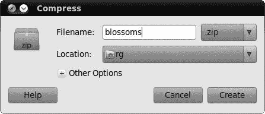

    图 7-23. 创建压缩归档

现在你已经知道如何将事物组合在一起，让我们回到工作中，学习同样简单的任务——拆分它——好吧，好的，*提取*：

1.  将原始的 *dogwood* 和 *violet* 文件拖到垃圾桶中以清除它们。

1.  双击你刚刚创建的 **blossoms.zip** 文件。随后将出现一个显示文件内容的窗口 (图 7-24)。

    

    图 7-24. 提取压缩归档

1.  在那个窗口中，点击 **提取** 按钮，之后将出现一个名为 **提取** 的另一个窗口。

1.  在那个窗口中点击 **提取** 按钮，在一秒内（最多两秒），你将在主文件夹中找到两个新的 *dogwood* 和 *violet* 复制文件。

现在你已经创建并提取了一个压缩归档文件，在这个例子中是一个 Zip 文件。你将来也可以通过遵循相同的程序（可能使用真实文件而不是虚拟文件）创建一个压缩 tarball，但在选择归档类型时，请选择 .tar.gz 而不是 *.zip*。除了这一步之外，创建和提取过程都是相同的。
