# 第八章。装扮小鸟

### 定制您系统的外观和感觉

在进入 Linux 世界之前，我几乎使用过所有桌面操作系统。然而，尽管它们之间存在着差异，但我在每种情况下最终都会遭受一种视觉上的厌倦。我想你可能称之为 GUI 疲劳。这并不是因为我厌倦了使用图形界面；只是我不禁对那些陈旧的图标、窗口边框和配色方案感到厌倦。当然，可以进行一些更改，但如果没有牺牲性能的附加组件，就无法改变基本的外观和感觉。

Linux 中的一个让我非常满意的功能，并且一直如此，是用户可以极大地改变事物的外观。我说的不仅仅是图标和背景，而是 *一切*，包括实际的窗口边框和控制。再加上 Linux 可用的各种图形桌面环境和窗口管理器，你就有了一个完全可定制的系统。难道你不觉得，为什么在网络上 Linux 桌面截图比任何其他系统都多吗？如果你不相信我，只需看看一个专门提供 Linux 截图的网站，[`www.lynucs.org/`](http://www.lynucs.org/)，然后点击 **截图** 链接。

你可能不像我那样对系统的外观和感觉如此挑剔，但当你通过本章工作时，你可以学会使用并享受 Linux 提供的所有图形定制功能。

# 项目 8A：创建新用户账户

如果你不愿意改变当前设置的外观，你可以在新账户中创建一个新的用户账户，并在登录到新账户时尝试本章中提到的更改。如果你选择这条路，你的常规家庭环境将保持不变，因为在一个用户账户中执行的外观和感觉定制不会影响其他用户账户。当你完成项目后，你可以简单地删除新的用户账户。无论如何，这取决于你。

## 8A-1：创建账户

要设置新的用户账户，请按照以下步骤操作：

1.  选择 **系统** ▸ **管理** ▸ **用户和组**。

1.  一旦出现用户设置窗口，点击 **添加**。如果要求输入密码，将其输入到框中，然后点击 **验证**。

1.  在出现的创建新用户窗口中（图 8-1)，在简称框中输入新的用户名；我在我的示例中使用 *graphika*。在名称字段中，你可以输入任何你喜欢的；我在这里使用 *Graphics Lover*。

1.  点击 **确定** 添加新用户。将出现一个更改用户密码窗口。

1.  应该选择“手动设置密码”选项。为新用户输入密码；你应该在密码中包含数字和字母，使其更难以猜测。在确认框中重新输入密码以确认你的选择，然后点击**确定**。

1.  你将被带回到用户设置窗口（图 8-2）。从窗口左侧的列表中选择新的*graphika*账户，然后点击“账户类型”旁边的**更改**按钮。

1.  在出现的窗口中，通过选择**管理员**来给自己在新账户中安装软件和执行其他管理任务的能力。点击**确定**返回主用户设置窗口。

1.  点击**确定**，关闭用户设置窗口。新账户应该可以使用了。

### 注意

通常情况下，在新的用户账户中，默认不会选中安装软件和执行其他系统级更改（管理员）的权限，因为你可能不希望你的孩子、同事或任何其他人在你的电脑上拥有自己的用户账户，安装各种奇怪的东西并搞乱你的系统设置。虽然我们这里需要它，因为我们将要安装一些东西。

图 8-1. 创建新的用户账户

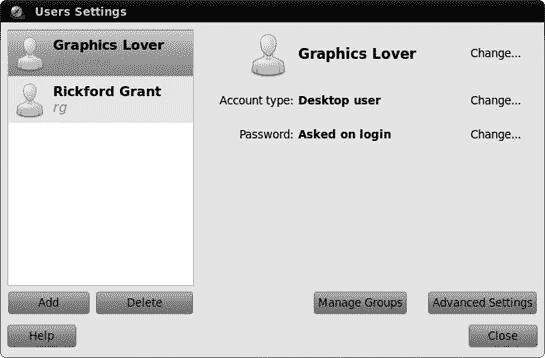

图 8-2. 在用户设置窗口中显示的新用户账户

## 8A-2: 登录到你的新账户

要使用这个新账户，点击顶部面板最右侧的电源按钮，然后点击**注销**。会出现倒计时，但你可以跳过它；只需点击**注销**按钮。几秒钟后，你将回到登录屏幕。点击窗口中的新用户名，输入账户密码，然后按**回车键**。你很快就会到达你刚刚创建的用户的新、未触及的桌面。

当你注销用户账户时，你正在运行的程序将会关闭——如果你只是打算用另一个账户使用几分钟，当你回到原始账户时再次打开所有东西可能会很烦人。幸运的是，有一个替代方案：你可以临时**切换用户**。切换用户与注销/登录方法不同，因为你登录到另一个账户（或其他人登录到他们的账户）时，你仍然登录到原始账户。走这条路会保留你打开的所有窗口和应用程序。这些窗口不会出现在你切换到的账户中，但当你切换回原来的账户时，它们会方便地在那里等待你。

如果你打算在两个账户之间来回切换，这是一个很好的方法。当，比如说，你的孩子需要登录他们的账户进行快速电子邮件检查，或者在去海滩的路上烧录 CD，或者打印文件用于学校时，这也是一个很好的方法。当你的孩子完成之后，你可以快速回到你切换时的状态，无需重新打开文件、网页或其他你当时正在处理的事情。

你可以通过点击顶部 GNOME 面板上的电源按钮并选择你想要切换到的用户账户来非常容易地切换用户。几秒钟后，你会被要求输入你选择的账户的密码，所以将其输入到框中，然后按**回车**键。之后，你将处于所选用户账户的桌面。

在切换用户之后想要回到原始用户账户，只需点击电源按钮，点击你来自的用户名，几秒钟的黑暗之后，会出现一个窗口，你必须输入你返回的账户的用户密码。输入你的密码，点击**解锁**，你将回到原始桌面，一切都将恢复到你上次看到的状态，包括打开的窗口等。非常酷。

# 项目 8B：定制你的桌面环境

无论你决定玩哪个用户账户，你现在都已经准备好采取行动了。当我们到达过程的尽头时，你将创建一个比你之前见过的更加狂野和花哨的桌面环境。当然，这一切都是为了好玩，当你完成之后，你应该能够完全自信地按照自己的意愿定制一切。那么，让我们开始吧。

## 8B-1：向文件夹添加徽标

Nautilus 最酷的事情之一是它允许你添加一些称为*徽标*的小文件夹顶部图标。这些徽标可以图形化地提醒你每个文件夹的用途，而且它们不仅限于文件夹——你还可以将它们添加到文件中。当你的桌面主题改变时，这些徽标的样式也会改变，所以你将在本章的后面部分享受到更多的视觉兴奋。然而，现在，让我们通过向*文档*文件夹添加一个徽标来学习如何使用它们。打开你的家目录，右键点击**文档**，然后在弹出菜单中选择**属性**。当属性窗口出现时，点击**徽标**标签，然后向下滚动直到你看到名为*个人*的徽标(图 8-3). 点击旁边的复选框，然后点击**关闭**按钮。徽标现在应该出现在你的文件夹上。

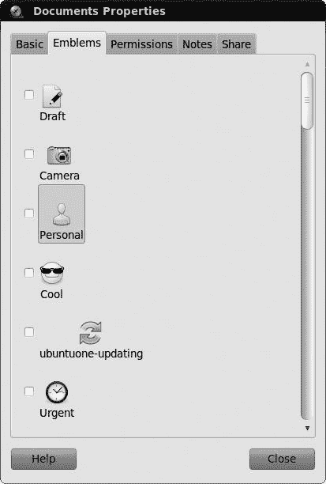

图 8-3. 为你的文件夹选择徽标

现在，为了额外的练习，尝试将声音徽章添加到你的*音乐*文件夹。只需使用之前相同的步骤，并替换适当的项目和条目。完成之后，你应该有一个被音符包围的*音乐*文件夹——一个是徽章，另一个是文件夹的默认图标。并非所有文件夹都有默认图标，所以这就是徽章真正派上用场的时候。

## 8B-2：设置窗口背景（以及再次设置徽章）

一旦你添加了这两个徽章，你的文件夹看起来应该会更加有活力（而且你将在本章后面使这些徽章看起来更加有活力）。尽管如此，Nautilus 窗口的背景仍然是平淡的白色。如果你不想这样，你完全可以改变它。要做到这一点，只需转到你的主窗口，点击**编辑**菜单，然后选择**背景和徽章**。此时，背景和徽章窗口将出现（见图 8-4）。

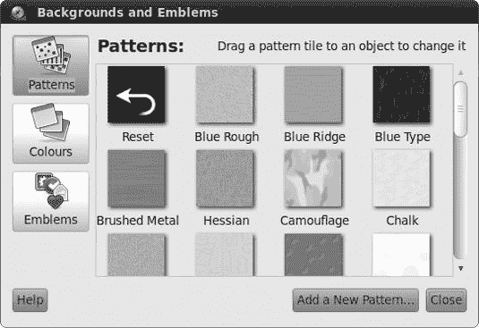

图 8-4. 为你的 Nautilus 窗口选择背景

从这个窗口，你可以将任何图案拖动到你的主窗口，或者任何其他 Nautilus 窗口，这样图案就会成为你所有 Nautilus 窗口的背景。所以，为了体验一下，向下滚动找到名为*Manila Paper*的图案，然后将其拖动到主窗口主面板的空白区域。一旦完成，之前白色的窗口区域将看起来像律师办公室的壁纸。如果你喜欢这种类型的东西，那真是太好了。当然，你也可以用同样的方式更改背景，或者你可以通过将**重置**样本拖动到窗口中，回到默认的白色。

### 注意

如果你更喜欢使用自己的图片作为 Nautilus 窗口的背景，你可以非常容易地做到这一点。只需在新 Nautilus 窗口中定位图片，用左键和右键（如果你有三键鼠标，也可以只用中键）点击它，然后将图片拖动到目标窗口中的任何开放空间。当你释放按钮时，在随后出现的弹出菜单中选择**设置为背景**。

除了图案和颜色样本的按钮外，在背景和徽章窗口中还有一个第三按钮，称为*徽章*。点击徽章按钮会显示你在项目 8B-1 中看到的所有徽章，从而为你提供了另一种将它们添加到文件夹中的方法。这种方法在一次性添加多个文件夹或文件徽章时更为方便。

要了解这是如何工作的，请点击**徽章**按钮。然后将**相机**徽章拖动到你的*图片*文件夹，将**人物**徽章拖动到你的*公共*文件夹。选定的徽章将立即出现在这些文件夹上，增加了窗口中图标日益增多的趋势。

## 8B-3：装饰侧边栏（以及徽章再次）

现在我们来改变 Nautilus 侧边栏的外观。保持背景和徽章窗口打开（如果你已经关闭了它，请再次打开），在 Nautilus 侧边栏中点击 **位置** 菜单按钮，然后选择 **信息**。

你现在也可以为侧边栏添加不同的背景图案，但为了练习，让我们添加一种颜色。为此，在背景和徽章窗口中点击 **颜色** 按钮。窗口现在将填充各种颜色的色卡。将 **葡萄柚** 色卡拖到你的侧边栏中，它将从灰色变为，所有事情中，葡萄柚的颜色（尽管是一种非常暗淡且颜色异常的葡萄柚）。你还可以通过添加另一种颜色来创建双色渐变效果。将 **芒果** 色卡拖到侧边栏的底部（但仍在侧边栏内），你应该在侧边栏内有一个从葡萄柚到芒果，从上到下的渐变效果。当然，如果你对这个热带色彩组合不满意，你可以通过将 **重置** 色卡拖到该区域来恢复到原始默认的灰色面板。完成操作后，你可以关闭背景和徽章窗口。

Nautilus 窗口的侧边栏提供了另一种使用徽章的方式。但在向你透露这第三（也是最后）种方式之前，让我们在你的家文件夹中添加另一个文件夹。创建一个文件夹，并将其命名为 *财务*，你可以用它来存储关于你在现代体系中的相对价值的文件。

在你创建新文件夹后，转到侧边栏，点击 **信息** 下拉菜单，然后选择 **徽章**。侧边栏内将出现徽章列表。选择 **金钱** 徽章，并将其拖到你的 *财务* 文件夹上。接下来，选择 **计划** 徽章，并将其也拖到 *财务* 文件夹上。如果你喜欢，还可以添加更多徽章——在 Nautilus 决定结束混乱并防止更多显示之前，你应该能在上面放大约四个徽章。你的窗口现在应该看起来像图 8-5 中所示的那样。

一旦完成，返回下拉菜单，选择 **位置** 以将一切恢复到相对正常的状态。

即使这不是你的菜，你不得不承认你的 Nautilus 窗口现在确实更加多彩了。当然，你可以将其更改为你想要的任何外观，但我会请你稍后再做，因为你很快就会对它进行更多的操作。

## 8B-4：更改桌面背景

现在你的家文件夹窗口已经装饰得很好（或者根据你的审美观，可能显得有些俗气），你可能认为你的桌面相比之下显得相当单调。

您可以通过在桌面上右键单击任何空白区域并从弹出菜单中选择 **更改桌面背景** 来轻松更改桌面背景（通常称为 *壁纸*）。这将打开外观首选项窗口，并切换到背景选项卡（参见 图 8-6）。

图 8-5. 从 Nautilus 侧边栏选择图标

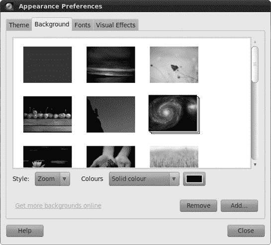

图 8-6. 更改您的桌面背景

### 安装额外的壁纸

如您所看到的，当您将鼠标悬停在其上时，Ubuntu 的默认壁纸被称为 *Ubuntu*。如果您不喜欢紫色的小圆点，可以点击其他任何壁纸来立即更改桌面壁纸。可供选择的有许多，但也许您更愿意使用自己的图片。这些可以是数码相机中的照片，您在电脑上创作的艺术品，或者几乎任何您想放置的东西。然而，在这种情况下，您将前往网络以获取并安装一些壁纸。

许多网站提供免费的桌面壁纸——两个专门针对 Linux 用户的是 [`www.gnome-look.org/`](http://www.gnome-look.org/) 和 [`art.gnome.org/`](http://art.gnome.org/)，但您可以从任何您喜欢的地方获取壁纸。每日天文图片 ([`apod.nasa.gov/apod/`](http://apod.nasa.gov/apod/)) 是我特别喜欢的。如果您想使用这里使用的同样巨大的 Tux 壁纸，可以直接通过将您的网络浏览器指向 [`www.taiabati.com/linux/OLDindex.php/`](http://www.taiabati.com/linux/OLDindex.php/)，将页面向下滚动一点到第二个 TUX 部分，然后点击与您的屏幕最匹配的图像大小的下载按钮。当图片出现在浏览器窗口中时，右键单击它，然后选择 **另存为图片**。在保存图片窗口中，给它一个容易记住的名字（*wall_TUX-2_1024x768.png* 可能是正确的，但过一段时间可能有点难以处理），或者使用我给出的名字，*mightyTux.png*，然后点击 **保存**。如果您愿意，您可以从任何您喜欢的地方下载任何您喜欢的壁纸，只要它是支持的格式，如 BMP、PNG 或 JPEG。一切都取决于您。

下载壁纸后，将其从*下载*文件夹移动到*图片*文件夹。您可能想要创建一个*壁纸*子文件夹以更好地组织文件，但这完全取决于您。之后，您可以通过在外观偏好设置窗口中的背景选项卡中点击**添加**按钮来安装新的图片。在随后出现的添加壁纸窗口中，导航到您的新的壁纸，点击一次以突出显示它，然后点击**打开**。壁纸随后将在外观偏好设置窗口中突出显示，并很快出现在桌面上（图 8-7）。一旦完成，点击**关闭**以完成此过程。

### 从互联网到桌面的壁纸——快速且简单

您也可以通过在网页浏览器中右键点击该图片，然后选择**设置为桌面背景**来几乎自动地将网页上的图片设置为您的桌面壁纸。随后将弹出一个小窗口，您可以在其中预览下载到屏幕上的效果（图 8-8）。您还可以在此窗口中调整桌面背景的位置（例如平铺或居中）和背景颜色。调整完成后，点击**设置桌面背景**按钮。图片将随后出现在您的桌面上，而图片文件将被保存到下载位置（默认为您的家目录）并命名为*Firefox_wallpaper.png*。

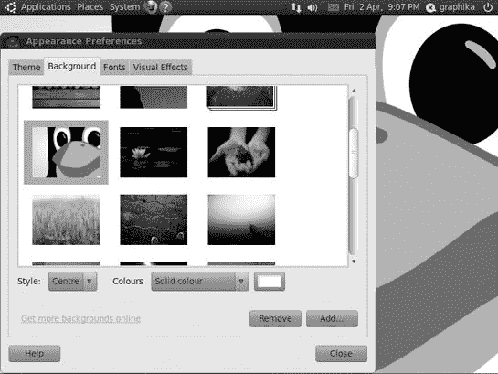

图 8-7. 新壁纸后的桌面

图 8-8. 选择网页图片作为桌面壁纸

## 8B-5：隐藏底部面板

您可能已经注意到，在图 8-7 中几乎看不到屏幕底部的面板。这是因为面板遮挡了新壁纸的底部，这让我感到烦恼。我通过在底部面板的空白区域右键点击并从弹出菜单中选择**属性**来进入面板属性窗口。在面板属性窗口中，我点击了**自动隐藏**复选框，然后点击**关闭**。自动隐藏功能与 Windows 或 Mac OS X 中的功能相似——面板在您将鼠标移动到它应该出现的大致位置之前都处于不可见状态。如果您喜欢，也可以进行相同的更改，但这完全是一个美学问题，我将留给您决定。啊，艺术自由的甜美滋味。

## 8B-6：下载和安装艺术管理器（GNOME Art）

在互联网上搜索壁纸进行安装本身可能是一项相当有趣的冒险，但有时它也可能感觉像是一项相当繁琐的工作。幸运的是，对于您、我以及所有参与此类事情的人来说，有一个更简单的方法：艺术管理器。艺术管理器，也称为 GNOME 艺术，是一个方便的应用程序，它搜索[`art.gnome.org/`](http://art.gnome.org/)网站，并下载一个包含缩略图的壁纸列表。它还可以为以下部分项目中可用的各种窗口边框、控件和图标主题集执行此操作。使用缩略图列表，您可以轻松下载和安装您想要的任何内容——而无需在网页浏览器中移动光标。不用说，艺术管理器绝对是一个很酷的工具！

不幸的是，艺术管理器不是默认安装的。然而，在阅读了第六章之后，您知道下载和安装像艺术管理器这样的应用程序是多么容易。您所要做的就是运行 Ubuntu 软件中心，搜索*gnome-art*，然后安装艺术管理器。

您可以通过选择**系统** ▸ **首选项** ▸ **艺术管理器**来运行艺术管理器。然后，GNOME 艺术窗口将出现，里面没有任何内容。为了将其投入使用并消除这种空旷感，请选择**艺术** ▸ **背景** ▸ **GNOME**。（如果您喜欢，可以选择**所有**而不是 GNOME，但这将需要更长的时间来下载壁纸列表。）

一旦您做出了选择，艺术管理器将开始下载一份包含您在[`art.gnome.org/`](http://art.gnome.org/)可用的所有内容的列表。可能看起来一分钟或更长时间内没有任何动静，但这很正常；请耐心等待。下载背景预览可能需要几分钟，但完成后，您将看到一张供您选择的缩略图列表（图 8-9）。

现在，您可以通过向下滚动直到找到您喜欢的壁纸，点击一次以突出显示它，然后点击**安装**按钮来安装壁纸。然后，艺术管理器将下载并安装它。之后，打开外观首选项窗口，选择您刚刚下载的壁纸作为您的桌面壁纸。正如我之前所说，艺术管理器是一个非常实用的工具，尤其是在您很快将在本项目中使用它的时候。

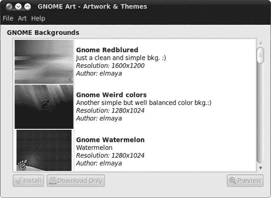

图 8-9. 使用艺术管理器安装桌面壁纸

## 8B-7：更改窗口边框、控件和图标集

现在我们来到了这次数字美容手术之旅中最喜欢的部分——改变 GNOME 中窗口边框和控件的外观。这个过程实际上非常简单。选择**系统** ▸ **首选项** ▸ **外观**。外观首选项窗口将打开到主题标签页，显示您系统上安装的主题列表（见图 8-10）。Lucid Lynx 的默认主题被称为*Ambiance*，但如您所见，还有其他几个。

为了熟悉操作，点击列表中的每个主题，逐一查看。更改将立即生效。只需点击一个主题，就会更改您的窗口边框、控件，甚至如果您查看您的家目录，图标也会改变。当您点击 Dust Sand 或 New Wave 时，这种变化尤为明显。

每个主题都包含一个窗口边框、一组控件和一组图标。您也可以自己混合匹配这些元素。例如，假设您喜欢 Dust 中控件低调的外观和颜色，但您更喜欢 Clearlooks 的窗口图标和 DarkRoom 的边框。好吧，您不必绝望，因为您可以创建一个包含这三个不同元素的定制主题。

要创建自己的混合匹配主题，只需点击外观首选项窗口的主题标签页上的**自定义**按钮。将打开一个新窗口，其中包含五个标签：控件、颜色、窗口边框、图标和指针（见图 8-11）。在每一个标签页内，您可以选择您偏好的组件。现在，让我们首先点击**控件**标签，并选择**Dust**。然后点击**窗口边框**标签，并选择**DarkRoom**。最后，点击**图标**标签，并选择**GNOME**。

图 8-10. 在 GNOME 中选择主题

图 8-11. 在 Ubuntu 中创建自定义主题

现在保持自定义主题窗口打开，但打开您的家目录，看看您所做的一切。嗯……还不错。但，也许您并不真的喜欢那些 DarkRoom 窗口边框的外观。为了找到更适合您的样式，再次点击**窗口边框**标签，向下滚动列表，并点击每个条目，直到您看到您喜欢的样式（New Wave 对我来说似乎很有效）并选择它。更好了吗？现在您满意了，可以点击**关闭**按钮。

现在，你将回到外观首选项窗口，你会注意到你的新主题以 *自定义* 的名称列出。如果你想保存这个新的组合以供以后使用，点击 **另存为** 按钮。这样做将打开一个对话框，你可以为你的主题命名并简要评论它。所以，给你的主题命名，如果你喜欢的话写个评论，然后点击 **保存**。你的新主题现在将以你选择的名称在主题列表中按字母顺序出现。

一切都完成后，你的主文件夹窗口应该看起来像图 8-12 中那样（同时检查你的面板和应用程序菜单）。啊，非常酷！

图 8-12. 更改系统窗口的外观

## 8B-8: 安装额外的窗口边框、控件和图标

如果你对此定制化事物感到兴奋，但你对系统包含的主题选择不满意，你可以下载并安装更多的窗口边框、控件和图标。为了展示如何做这件事，我将带你通过创建一个仿 Mac 主题，它将看起来相当类似于 Mac OS X 的标准 Aqua 主题，正如你在图 8-13 中看到的那样。

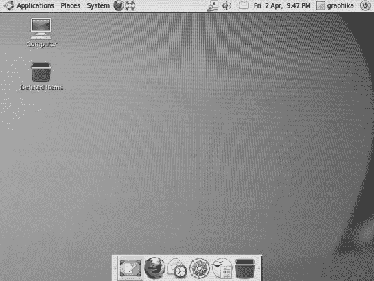

图 8-13. 一个 "Aquafied" 的 Ubuntu 桌面

### 获取和安装所需的文件

要获取执行此操作所需的文件，再次使用艺术管理器。一旦它启动并运行，选择 **艺术** ▸ **背景** ▸ **其他**。一旦艺术管理器窗口中出现可用的壁纸列表，向下滚动直到找到名为 *Real shoot* 的一个，通过点击 **安装** 按钮安装它，然后在外观首选项窗口的背景选项卡上选择并应用它。

### 注意

如果你在艺术菜单中选择时，艺术管理器没有自动开始下载可用文件列表，只需重新启动艺术管理器并再次尝试。

接下来，通过在艺术管理器中选择 **艺术** ▸ **桌面主题** ▸ **应用程序** 来获取一组匹配的应用程序控件小部件和窗口边框。当列表下载完成后，查找一个名为 *Yattacier 3* 的文件，并安装它。在随后出现的外观首选项窗口中，在主题选项卡上的列表中选择 **Yattacier 3**。

为了总结一下，让我们回到艺术管理器，选择 **艺术** ▸ **桌面主题** ▸ **图标**，来添加一些新的图标。一旦列表下载完成，查找并安装 Snow-Apple。之后，基本上是重复之前的步骤，但这次在自定义主题窗口中点击 **图标** 选项卡，然后选择 **Snow Apple**。

### 完美收尾

嗯，事情现在确实有点儿像 Mac 的风格，但我们还可以做更多的事情来强调这种效果。通过右键单击面板的空白区域并从弹出菜单中选择**属性**来打开您底部面板的“面板属性”窗口。在那个窗口的“**常规**”选项卡中，取消选中“**展开**”，然后增加面板的大小到大约 54 像素。完成后，点击**关闭**，然后开始添加您最常用的应用程序的启动器。您可能还想移除工作区切换器和窗口列表来完成效果。右键单击显示当前打开窗口名称的左侧的小点状或凹凸部分，选择**从面板移除**以移除窗口列表，然后右键单击底部面板上的四个方框组中的任何一个，选择**从面板移除**以移除工作区切换器。

### 注意

如果您想要一个更类似 OS X 的 Dock，有很多选择；尝试 Avant Window Navigator、Cairo Dock 或 Docky，所有这些都可以通过 Ubuntu 软件中心获得。您必须在外观首选项窗口的视觉效果选项卡上打开视觉效果（即设置为正常或额外）才能使用这些。

完成后，转到顶部菜单，移除系统菜单旁边的两个图标。之后，添加一个窗口选择器小程序，以便您能够浏览您打开的窗口。您可能还想更改您主目录中的背景，因为目前那里的暖色调与您的新冷却配置不再匹配。

变换现在已完成，但您还可以通过进入项目 8B-10 来将垃圾桶和计算机图标添加到您的桌面上，之后您的桌面应该看起来像我之前在图 8-13 中的那样。您可以保留您的新 OS X 风格主题或切换到其他主题。为了保持一致性，我现在将切换回默认主题。顺便说一句，如果您决定保留仿 Aqua 主题，请记住在外观首选项窗口中点击**另存为**按钮并给主题命名。

## 8B-9：更改窗口按钮的顺序

如果您习惯了 Windows，您可能会觉得窗口顶部的按钮顺序有点儿……奇怪。Ubuntu 不是将最小化、最大化和关闭按钮放在窗口的右上角，而是放在顶部左端。我不太介意这种布局，但如果您觉得不适应，您会很高兴地知道很容易将其更改为正确的位置：

1.  按**alt**-F2 打开运行应用程序窗口。

1.  在该窗口中键入**`gconf-editor`**并按**enter**键运行 GNOME 配置编辑器。

1.  当配置编辑器窗口出现时，点击“*apps*”旁边的较小**+**号，向下滚动到“*metacity*”，然后点击该旁边的**+**号。

1.  在扩展的 metacity 部分中点击**general**以显示一组选项。

1.  向下滚动到*button_layout*选项。目前它应该设置为*close, minimize, maximize:*——这给出了按钮的顺序（例如，最大化按钮是第三个按钮）以及它们出现在窗口的哪一侧（例如，所有三个都在冒号的左侧，因此按钮将出现在窗口的左侧）。

1.  要将按钮调整到熟悉的 Windows 顺序，点击按钮 _layout 选项的*值*以开始编辑。将**`:minimize,maximize,close`**替换为旧值。

1.  按下**enter**键完成编辑，您所有窗口中的窗口按钮应立即切换到另一侧（如图图 8-14 所示）。

    

    图 8-14. 将窗口按钮放置在窗口的右侧

## 8B-10: 将家文件夹和垃圾桶图标放置在桌面上

正如您所意识到的，与 Windows、Mac OS X 或其他 Linux 发行版不同，Ubuntu 在安装时桌面是完全空的。很多人推崇这种方法，因为它会阻止将桌面永久用作存储文件和程序启动器的位置。毕竟，正如论点所说，您不会在办公室的桌面上放置垃圾桶或文件柜，对吧？

不考虑所有这些逻辑，很多人更喜欢在他们的桌面上放置垃圾桶、硬盘和家文件夹，非常感谢。如果您是其中之一，就像我一样，这里是需要您做的：

1.  打开 GNOME 配置编辑器，就像在 8B-9: 改变窗口按钮顺序中做的那样，在完成细节。

1.  点击*apps*旁边的**+**，向下滚动到*nautilus*，然后点击其旁边的**+**。

1.  在 nautilus 部分中点击**desktop**，之后该项目的选项将出现在窗口的右侧面板中（图 8-15）。

    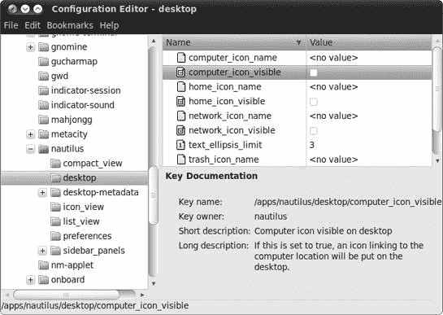

    图 8-15. 使用配置编辑器将图标添加到桌面

1.  检查您希望出现在桌面上的项目旁边的框。您有四个未选中的选项可供选择：computer_icon_visible，类似于 Windows 中的（我的）电脑文件夹；home_icon_visible，用于快速访问您的家文件夹；network_icon_visible，如果您使用它，则用于创建到您的网络文件夹的链接；以及 trash_icon_visible，用于您知道的那个。

1.  检查任何看起来有用的选项，完成后关闭配置编辑器。

## 8B-11: 调整桌面图标

在 GNOME 桌面中，有一个非常酷的功能，即可拉伸图标。这允许您将单个桌面图标调整为任何大小，这不仅美观，而且非常实用。例如，您可以将您最常用的启动器之一拉伸，以便更容易定位，或者您可以将照片文件的缩略图拉伸，使其看起来像桌面艺术（见图 8-16）。

要拉伸桌面图标，右键单击图标，并在弹出菜单中选择**拉伸图标**。四个蓝色方块将出现在围绕图标的每个角落（如图 8-17 所示）。只需点击并拖动这些方块中的任何一个，直到图标达到您想要的大小。一旦完成拉伸，点击桌面上的任何位置，方块将消失。如果您改变主意并想将图标恢复到原始大小，右键单击它，并从菜单中选择**恢复图标原始大小**。

图 8-16. 桌面图标可以拉伸到您想要的任何大小。

图 8-17. 拉伸桌面图标

## 8B-12：再次全部完成！

现在你已经掌握了定制几乎所有东西所需的知识，是时候告别 *graphika* 并开始创建自己的用户账户了。点击屏幕右上角的电源按钮，选择**注销**，然后点击**注销**按钮返回登录界面。现在，登录到您的常规用户账户，开始将您的风格感施加到这个地方……

# 字体羽毛狂欢：更改您的字体

到现在为止，Ubuntu 应该开始感觉有点像您自己的了；您有了最喜欢的桌面壁纸，选择了最吸引人的窗口边框，添加了大量的图标……那么还有什么可以调整的吗？当然，是您的字体！大多数时候您都会花时间阅读电脑屏幕，所以想要美化文本也是合乎逻辑的。要开始这样做，请选择**系统** ▸ **首选项** ▸ **外观**，这将再次打开外观首选项窗口。点击该窗口中的**字体**选项卡以查看您可用的选项（见图 8-18）。

图 8-18. 字体选项卡

正如你所见，你可以在五个类别中指定字体偏好：应用程序、文档、桌面、窗口标题和终端（固定宽度字体）。要更改这些中的任何一个，只需点击相应的字体按钮，就会弹出一个“选择字体”窗口。这让你可以选择字体家族、样式和大小，并且它将在窗口底部预览你的当前选择。

一旦你点击**确定**，你所做的选择将立即生效，因此你很快就会知道你是否能接受它们。与其他定制方面不同，这些选择可能会让你发疯。当然，与想象中最花哨的桌面、地球上最不搭调的色彩搭配和史前智人从未见过的最滑稽的图标一起生活是既容易又有趣的，但如果你的字体选择过于离谱，小心了！毕竟，你还得能看清楚结果。

你屏幕上看到的字体通常看起来相当平滑和干净。然而，如果你使用的是液晶显示器，你可能会发现，如果你在“外观偏好”窗口的字体标签页的“渲染”部分选择**子像素平滑（LCDs**），字体看起来会更好。如果你不确定是否需要这样做，只需试一试，看看你是否能注意到任何区别。GNOME 在选择后立即应用更改，所以如果你在偏好窗口后面保持一个包含文本的窗口打开，你可以在做出选择时轻松地看到每个选择的效果。

# 项目 8C：安装 TrueType 字体

你的 Ubuntu 系统附带了许多非常实用且至少在我眼中相当漂亮的 TrueType 字体。然而，这些字体在美学光谱上可能有点过于保守，许多用户可能希望向系统库中添加一些更具特色的字体。以我自己的情况为例，我有一个非常酷的想法，就是用古老的斯堪的纳维亚符文给我的朋友写信息。（当然，我的朋友对这个想法泼冷水，所以一切都化为乌有……）

你可能不会对向朋友发送神秘的符文信息感兴趣，但你可能想用某种哥特字体打印一个活动的奖状，或者你可能正在为你的蜗牛养殖协会的地方分会准备一份通讯，并想使用一种圆润、饱满、粘滑的字体。无论你的偏好、目的或愿望如何，你可能会达到想要在你的系统上安装其他 TrueType 字体的地步，因此在这个项目中，我将告诉你如何做到这一点。

你如何安装字体取决于谁将使用它们。如果你在机器上只有一个用户账户，最简单的方法是按照 8C-2：本地安装字体中的说明进行本地安装。8C-2：本地安装字体中描述的本地安装的字体是只有你或登录到你的用户账户的人才能使用的字体。另一方面，如果你有多个用户账户并且希望字体对所有机器上的用户都可用，你需要全局安装它们——在这种情况下，请参阅 8C-3：全局安装 TrueType 字体中的 8C-3：全局安装 TrueType 字体。

## 8C-1：获取字体文件

互联网上充满了免费字体。对于这个项目，我将指导你访问[`www.fontfreak.com/`](http://www.fontfreak.com/)网站，它有一个非常好的字体集合。一旦你到达 FontFreak 主页，点击页面左侧“FREE FONTS”标题下的**Fonts**链接。下一页会询问你是否想一次性下载网站上所有的免费字体；点击**No thanks, I will download them one by one**。这将带你到免费字体的主列表；浏览各个页面，直到找到你喜欢的字体，然后点击它。你下载哪种字体完全取决于你，但务必选择 PC 版本，而不是 Mac 版本。你可以通过点击字体页面底部的 Windows 图标（在它说*Download*的地方旁边）来做这件事。当下载窗口弹出时，选择**Save File**并点击**OK**将字体保存为*.zip*文件。为了跟随这个项目，下载一些字体——我选择了 Aajax Surreal Freak 和 Accidental Presidency。

下载完成后，将字体文件从*Downloads*文件夹（或你保存它们的地方）拖到你的主文件夹中，这样就可以轻松地按照我的说明操作。此外，确保在安装步骤之前解压缩你的字体文件。（右键单击每个*.zip*文件，并选择**Extract Here**。）

## 8C-2：本地安装字体

如果你是你电脑的唯一用户，本地安装字体就足够了。要开始，你需要通过为系统提供一个放置字体位置来设置你的系统。你只需要在第一次做这件事。以下是你必须做的：

1.  打开你的主文件夹，在那个窗口中，通过选择**File** ▸ **Create Folder**创建一个不可见的字体文件夹。

1.  当文件夹出现时，将其命名为*.fonts*（名称前的点意味着它将是隐藏的）。

1.  通过点击**重新加载**按钮隐藏新文件夹。您的*.fonts*文件夹将不再可见。如果情况如此，您可以关闭窗口——您的设置已成功完成。

现在一切准备就绪，让我们使用您下载的字体之一继续这个项目。在您决定使用哪种字体后，按照以下步骤操作：

1.  选择解压后的字体文件（其名称可能以*.ttf*结尾），通过右键单击并选择**复制**来复制它。

1.  按**ctrl**-L，或选择**转到** ▸ **位置**。这将显示 Nautilus 中的位置栏。

1.  在位置栏中，输入**`˜/.fonts`**，然后按**enter**键。`˜`符号是一个快捷方式，表示“我的家目录”。

1.  您应该会被带到您刚刚创建的空*.fonts*文件夹，就像图 8-19 中的那样。在文件夹的任何位置右键单击，并选择**粘贴**以将字体复制到文件夹中。

现在您已经安装了字体，您可以在 OpenOffice.org Writer 等应用程序中尝试使用它。（在新的字体出现在应用程序的字体菜单之前，需要重新启动任何正在运行的应用程序。）

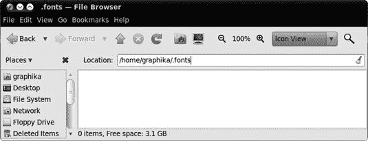

图 8-19. 空的 *.fonts* 文件夹

## 8C-3：全局安装 TrueType 字体

如我之前提到的，您刚刚安装的本地字体只能在您以常用用户名登录时使用。如果您想安装可以由您和任何拥有您计算机账户的人使用的字体，则过程略有不同，并且需要一点“超级用户”操作。您可以为这个项目的一部分使用您下载的另一个字体。

全局安装字体的文件夹位于根目录区域，因此您需要以超级用户身份打开文件浏览器来安装字体。"超级用户"是根（管理员）用户的另一个名称。您可以使用名为`sudo`的系统（关于这一点，请参阅第九章 Chapter 9）以 root 身份运行程序，而无需切换到不同的用户账户，但鉴于 root 可以修改重要的系统文件，除非您绝对必须，否则您不应在`sudo`模式下运行程序。

下面是将您的字体文件放入全局字体目录的步骤：

1.  按**alt**-F2，然后在出现的框中输入**`gksudo nautilus /usr/share/fonts/truetype`**。点击**运行**，如果提示，请输入您的密码。

1.  将打开一个文件浏览器窗口。选择**文件** ▸ **创建文件夹**以创建一个新文件夹；命名为*MyFonts*。

1.  通过选择**位置** ▸ **主页**打开一个正常的文件浏览器（Nautilus）窗口，找到您想要安装的*.ttf*字体文件，并将其复制（例如，通过右键单击并选择**复制**）。

1.  切换回 truetype 文件浏览器窗口，打开您新创建的*MyFonts*文件夹，并将字体文件粘贴到其中。

1.  一定要关闭超级用户文件浏览器窗口——让它保持打开状态是灾难的根源！

### 注意

第一步中的`gksudo`命令是非图形化`sudo`命令的图形环境版本，您将在第九章通过命令终端学习使用。

现在，您可以通过打开 OpenOffice.org 并在字体菜单中查找字体来测试一下。记住，如果您在安装字体时已经打开了[OpenOffice.org](http://OpenOffice.org)，那么您将需要重新启动。

# 项目 8D：更改您的登录界面

总是有一些顽固的人。您可能已经将桌面和窗口设置得您满意，但登录时显示的屏幕一点都没变——它仍然是那个老式的默认主题，背景也是老样子。是时候给它换一个新面貌了。

登录界面，也称为*欢迎界面*，会显示给您的计算机上拥有用户账户的每个人，所以在进行以下一些外观更改之前，您可能需要先与别人商量。如果您是唯一使用这台电脑的人，那么请自己请求许可并继续操作。

## 8D-1：美化登录界面

显示登录界面的软件被称为 GDM，并在您的计算机上拥有自己的隐藏用户账户。这可能会显得有些奇怪，但许多 Linux 程序在多个用户之间共享时就是这样做的。现在您需要做的就是登录到这个隐藏用户账户并更改 GDM 的设置。幸运的是，这是一个相当直接的过程，甚至不需要您注销自己的账户：

1.  按**alt**-F2 打开运行应用程序窗口。

1.  在框中输入**`gksu -u gdm dbus-launch gnome-appearance-properties`**，如图图 8-20 所示。

    

    图 8-20。在运行应用程序窗口中输入命令

1.  点击**运行**。您将被要求输入密码，所以请输入它，然后点击**确定**。

    ### 注意

    在执行此步骤时，您可能在面板上看到一些额外的图标。不用担心，它们是无害的，并在您注销并重新登录时消失。

1.  应该会出现外观首选项窗口。这个外观首选项窗口与本章前面使用的相同。

1.  使用“背景”选项卡更改登录界面背后的壁纸，使用“主题”选项卡更改登录窗口的外观。

1.  当您对更改满意时，点击**关闭**，并注销您的用户账户以返回登录界面并检查您的更改。

查看图 8-21（图 8-21

图 8-21. 调整登录屏幕的外观

## 8D-2: 为你的用户账户添加图片

除了美学之外，现在是时候让事情变得有点**个性化**了。还有什么比在你的用户账户中添加一张图片更好的方式呢？选择**系统** ▸ **首选项** ▸ **关于我**，当窗口出现时（图 8-22

图 8-22. 关于我的窗口

## 8D-3: 自动登录

当你在调整登录屏幕时，提到一些你可以更改的其他登录相关选项似乎是个好主意。再次登录到你的用户账户，并选择**系统** ▸ **管理** ▸ **登录屏幕**。点击**解锁**按钮，并输入你的密码以访问登录屏幕设置窗口中的设置。

如果你使用的是唯一一台电脑，你可以在电脑启动时让用户账户自动登录来节省时间。选择**登录为**选项，并从下拉列表中选择你的用户名（它应该自动选中）。如果你不是唯一用户，但你是使用电脑时间最多的人，你也可以设置让其他人有机会在你自动登录之前登录。检查**允许其他人先登录 30 秒**，并更改你希望 GDM 在登录之前等待的时间。

此窗口中的最后一个选项（关于默认会话的选项）可以用来在不同的**桌面环境**之间切换。正如你所知，Ubuntu 默认使用 GNOME 桌面，但你也可以安装其他桌面环境，如 KDE 和 Xfce。这对你这些潜在的极客来说是个小小的诱惑——如果你想要进行终极定制并更改整个桌面环境，这是你需要更改的设置之一。然而，更改桌面环境超出了本书的范围，所以我只是在这里提一下！（如果你有兴趣尝试不同的桌面环境，你可能觉得[`help.ubuntu.com/community/FromUbuntuToKubuntu/`](https://help.ubuntu.com/community/FromUbuntuToKubuntu/)很有用。）

### 注意

如果你不喜欢每次登录时播放的声音，请在登录屏幕窗口中取消选中“播放登录声音”选项。

当你对所做的更改满意时，请关闭登录屏幕设置窗口，并重新启动计算机以使更改生效。然后，根据你选择的选项，你将立即登录或出现一个自动登录按钮，并倒计时直到登录。在后一种情况下，你可以通过选择不同的用户名来停止自动登录。

# 选择屏幕保护程序

屏幕保护程序曾经是想要防止其显示器损坏（烧蚀）的计算机用户必须拥有和使用的项目。然而，视频显示技术现在已经发展到屏幕保护程序不再是必需的地步。尽管如此，屏幕保护程序看起来很酷，并且网上有大量可供选择，以补充默认安装的 15 个屏幕保护程序。直接从盒子里出来，屏幕保护程序被设置为在 5 分钟后仅使屏幕变黑。然而，你也可以选择让各种屏幕保护程序每隔几分钟随机切换，或者你可以选择一个你特别喜欢的单个屏幕保护程序。你可以通过选择**系统** ▸ **首选项** ▸ **屏幕保护程序**来更改这些设置，之后将出现屏幕保护程序首选项窗口（图 8-23

图 8-23. 设置屏幕保护程序首选项

# 捕获屏幕截图

现在你已经知道如何让你的 Ubuntu 桌面看起来更像你自己的，你可能想要分享或记录你的艺术成果，而捕获屏幕截图正是这样做的途径。最简单的方法是选择**应用程序** ▸ **附件** ▸ **截图**。

如图 8-24 所示，截图应用会出现。在这个窗口中，你可以决定是否要截图整个屏幕、屏幕的一部分或选定的窗口。你还可以在截图前设置延迟，给自己一些调整时间。你甚至可以为窗口截图添加效果，例如阴影效果。

图 8-24. 在 Ubuntu 中截图

当你准备好时，点击“截图”，就会出现一个类似于图 8-25 的窗口。在那个窗口中，你可以命名图片并决定将其保存到何处。

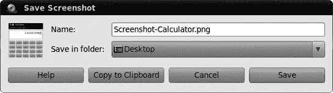

图 8-25. 在 Ubuntu 中保存截图

如果你更喜欢，也可以通过快捷键组合来截图。要截图整个屏幕，只需按下**打印屏幕**键。要截图单个窗口，请按**alt-print screen**。

如果你尝试截图单个窗口，可能会发现无论你做什么，窗口边框都不会出现。这不是截图机制的问题，而是你系统视觉效果引擎 Compiz 的副作用，我将在下一节中详细讨论。一个解决方案是使用 GIMP 来处理截图任务（在第十三章中讨论），或者你也可以直接关闭 Compiz：选择**系统** ▸ **首选项** ▸ **外观**，然后在出现的外观首选项窗口中点击**视觉效果**选项卡。一旦进入该选项卡，选择**无**(图 8-26); 变更应该几乎立即生效，一旦生效，你可以关闭外观首选项窗口，然后再次尝试截图。

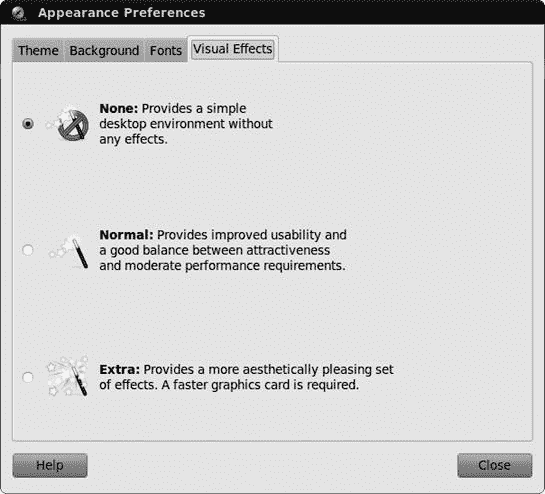

图 8-26. 使用视觉效果选项卡关闭 Compiz

# 自定义视觉效果

在学会了如何使用你手头的传统工具自定义系统之后，现在是时候放松一下，享受 Linux 世界提供的最新自定义工具了。Compiz，Ubuntu 的视觉效果引擎，为你的桌面提供了各种疯狂和有趣的视觉效果。

如果你的显卡支持 Compiz 的基本功能集，启动时 Compiz 将会自动启用。判断 Compiz 是否在你的机器上启动的一个简单方法是打开任何窗口（例如你的家目录），然后检查该窗口是否有阴影（参见图 8-27)以获取示例。如果有，Compiz 正在运行。

图 8-27. 左侧的窗口有阴影；右侧的没有。

默认激活的效果实际上只是冰山一角。根据你的显卡能力，你将获得阴影和一些其他的小功能，比如更酷的窗口打开过渡效果，但也就这些……至少在表面上是这样。如果你愿意，可以通过选择**系统** ▸ **首选项** ▸ **外观**，点击首选项窗口的**视觉效果**选项卡，并在该选项卡中选择**额外**来提高效果级别。

我应该提醒你，当你尝试移动窗口而它们开始像果冻一样晃动时，不要一开始就感到惊慌——这是额外的效果之一（摇摆窗口）。

无论你的系统硬件能力如何，如果你真的想控制 Compiz 提供的一切，安装 CompizConfig 设置管理器是值得的（如图 8-28 所示），你可以在 Ubuntu 软件中心获取（搜索“高级桌面效果设置”并安装它）。安装完成后，你可以通过选择**系统** ▸ **首选项** ▸ **CompizConfig 设置管理器**来运行它。

一旦安装了 CompizConfig 设置管理器，你就可以看到 Compiz 能够做的一切，你可以根据自己的需要选择那些功能。尽管 Compiz 提供的大部分内容本质上都是视觉上的装饰（毕竟这也是本章的主题），但也有一些实用的工具和附加功能。我最喜欢的是注释工具，它允许你在做演示、头脑风暴或只是发泄情绪时在屏幕上写写画画（如图 8-29 所示）。

要激活注释工具——或任何其他 Compiz 功能——请打开 CompizConfig 设置管理器，并勾选其名称旁边的复选框。要了解如何实际使用您已启用的功能，请单击该功能的名称。这将打开一个标签页，显示其设置，包括启动该功能所需的按键（图 8-30）。

图 8-28. 掌握 Compiz 的特殊效果

### 注意

一些用于默认 Compiz 快捷键的按键可能看起来不熟悉；其中最常用的是 *Super* 键（通常是键盘上的 Windows 键）和 *Button1*（通常是您的左鼠标按钮）。

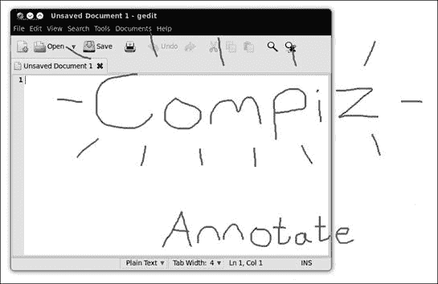

图 8-29. Compiz 的注释工具在操作中

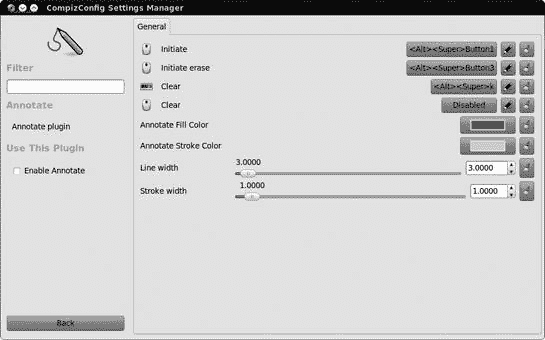

图 8-30. 几乎每个 Compiz 功能都有自己的设置。

您还可以通过单击显示当前按键组合的按钮，然后在出现的编辑窗口中做出新的选择来编辑各种按键组合（图 8-31

图 8-31. 更改用于启动 Compiz 功能的按键组合
