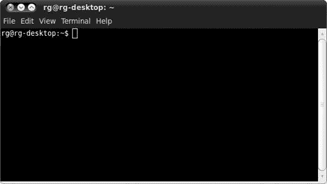
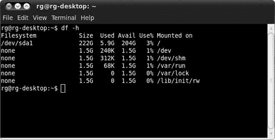
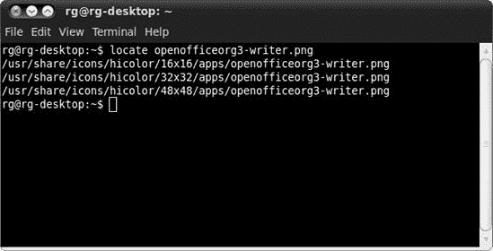
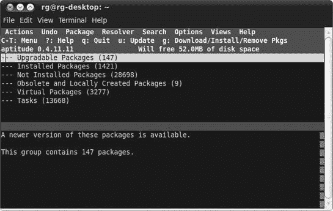
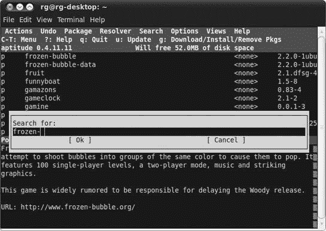
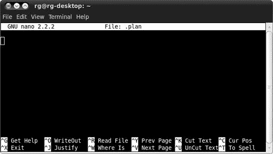

# 第九章. 简单的小猫方式

### 了解 Linux 终端和命令行……以及它能做的酷事


许多人避开 Linux，因为他们将其视为一个为电脑极客设计的系统，一个你必须通过命令行以艰难方式做所有事情的的环境。在这个图形界面时代，通过输入命令来完成事情的想法似乎是对 DOS 时代的可怕回归，这让很多人望而却步，尤其是那些记得“旧时光”的人。

这种反应是合理的，但它并不真正准确地反映了 Linux 世界的现实。毕竟，今天的大多数 Linux 用户都在使用某种图形界面。他们可以，并且经常只通过下拉菜单和鼠标点击就能实现他们希望实现的一切。许多人能够非常快乐地生活，甚至从未打开过他们的终端。对你来说也可能如此。

尽管如此，命令行的强大和便利性仍然有很多可说的。命令行现在可以在图形环境中使用，这也使得它不那么令人畏惧。终端只是图形世界中的一小块基于文本的岛屿（参见图 9-1). 使用命令行可以像你在系统上做的任何其他事情一样不痛苦，而且如果你愿意尝试，它实际上可以给你带来一些乐趣。


图 9-1. 将终端置于视角中

不幸的是，许多关于使用命令行的指南都是由那些对命令行作为真正的好东西充满热情的硬核命令行爱好者所写，他们的热情无意中使得他们对新来的 Linux 移民或想要成为 Linux 用户的人所写的内容看起来更加令人反感。

为了你的利益，我会尽量抑制自己的热情，以免让你再次被吓回到第六章和 Ubuntu 软件中心这个更舒适的世界。我还会尽量通过教你，在可能的情况下，将命令行作为你拥有的各种图形工具的补充来使用，而不是将其作为唯一的方法来处理事情。当然，我并不会涵盖这个方面的每一个可能的角度——只是足够让你有一些接触和经验，并且理想情况下，让你对命令行至少感到稍微自在一些。谁知道呢；你实际上会不会开始认为使用命令行是……有趣的？好吧，我不会太过分。

# 认识终端

你可以通过在 Ubuntu 系统中选择**应用程序** ▸ **附件** ▸ **终端**来运行 Linux 命令行终端应用程序。当终端打开时，它将以其所有的简单性，看起来与图 9-2 非常相似。



图 9-2. 终端应用程序

如你所见，它只显示`rg@rg-desktop:˜$`。在这种情况下，`rg`是我的用户名，`rg-desktop`是我安装时给电脑取的名字，波浪号（`˜`）表示我正在我的主目录中。如果它显示`˜/Music`，例如，那就意味着我目前在我的主目录中的*Music*文件夹内。当然，所有这些在你那里都会有所不同，因为你的用户名和电脑名会不同。例如，如果你的用户名是*frog*，电脑名是*wetrock*，那么命令行将显示`frog@wetrock:˜$`。如果这一切听起来相当晦涩难懂，就想想这样：在终端中，`*user-name*``@``*computer_name*``:˜$`相当于在 Nautilus 中的你的主目录。

在终端中输入非常简单；你只需像平时一样输入即可。你也可以通过使用**删除**和**退格**键以及箭头键来删除和插入字母或短语。为了练习，尝试以下操作：

1.  输入**`我喜欢草莓非常非常地喜欢`**。

1.  将`strawberries`改为`cherries`（因为实际上樱桃要好得多）。只需使用你的左箭头键将光标移动到`strawberries`中的第一个*s*之前。

1.  按下**删除**键，直到将单词`strawberries`删除（我想是 12 次）。

1.  输入**`cherries`**，然后使用你的右箭头键将光标移回这个有意义的句子的末尾。

现在你已经完成了这个有趣的打字练习，按**回车**键。你几乎会立即看到，终端对你迄今为止所做努力的回应只是一个轻蔑的`I: 命令未找到`。尽管你输入了一串对你有意义的文本，但对你的系统来说，这毫无意义。事实上，系统如此短视，除了你在终端中输入的第一个词（`I`）之外，什么也看不到；因为`I`不是一个有效的命令，系统不知道该如何处理它。

# 与命令终端的一些古怪但有用的乐趣

在命令终端中打字的一个相当酷的事情是它有所谓的*短期记忆*。通过输入单词**`cherry`**并按**回车**来尝试。忽略命令未找到的消息，继续输入**`vanilla`**并按**回车**。现在输入**`gelato`**并按**回车**。到目前为止，这似乎很愚蠢，对吧？但实际上并非如此。让我们再次输入我们迄今为止输入的所有内容，但这次只使用一个键。

哎？

是的，只需按一次上箭头键，你看到了什么？没错——你最后输入的命令出现了，在这个例子中就是`gelato`。再按一次上箭头键，你之前输入的命令就会出现——`vanilla`。再来一次？是的，`cherry`。再来一次，作为高潮……`I like cherries so very much`。

考虑到我们到目前为止所学的，这一切可能看起来有点愚蠢，但想象一下，你不是在输入愚蠢的小词，而是必须处理相当长的字符串，比如一个简单的复制命令（你将在本章后面学到）：

```
cp Photos/mypics/stpierre/coastal/onthebeach1_27.jpg /home/frog/photos_for_mom/stpierre
```

通过输入那个字符串，你正在将名为*onthebeach1_27.jpg*的图片从*coastal*文件夹复制到另一个名为*stpierre*的文件夹中。如果你想从*coastal*文件夹复制另一张照片，比如*onthebeach1_16.jpg*，你可以简单地按一次上箭头键，使用左箭头键和**delete**键移动到并删除`27`，然后替换成**`16`**。总的来说，这将更加简单和快速。它还可以帮助你避免输入错误。不再那么愚蠢，对吧？

# 无毒命令

正如你所知，所有这些输入都是足够简单的，但要在你的终端中实际做些有用的事情，你需要输入命令——而且命令的种类比你希望或需要的要多。为了让你开始，我们将从一些容易理解、无毒且完全适合猫咪友好的命令开始。

## $ whoami

没有命令像`whoami`这样简单、安全，甚至看似无用。`whoami`命令并不是帮助那些有多重人格障碍的人在任何时刻发现他们是谁，它只是告诉你当前登录的是哪个用户。试着在`$`后面输入**`whoami`**然后按**enter**键。记住，命令是区分大小写的。

终端现在会告诉你当前登录的人的用户名。如果你以*frog*登录，你应该得到命令的答案是`frog`。

## $ finger

如果你喜欢使用`whoami`命令来发现你是谁，那么你可能也会喜欢使用`finger`命令来了解更多关于自己的信息。你可以以多种方式使用`finger`命令，但一个非常简单的方式是了解某个特定的用户。试着对自己做这个实验，输入**`finger`**然后输入你的用户名。以我的情况为例，就是**`finger rg`**。一旦你输入了命令，按下**enter**键，看看你得到了什么。你可以在图 9-3 中看到我的结果。


图 9-3. `finger`命令的输出

如你所见，我的登录名是*rg*，我的真实姓名是 Rickford Grant，我的主目录是*/home/rg*，我正在使用 Bash shell 来输入我的命令。我从 4 月 14 日星期三的 19:59 东部标准时间（EDT）开始登录，我的终端会话从 4 月 15 日星期四的 19:26 开始。我没有邮件或计划。它不会告诉你我的社会保险号码或我母亲的婚前名字，但确实很酷，不是吗？

### 什么是 shell？

正如你所注意到的，我提到`finger`命令的结果显示我正在使用 Bash shell，因此你可能很自然地想知道 Bash 究竟是什么。好吧，Bash（Bourne Again Shell）是 Linux 系统中使用的许多 shell 之一，它恰好包含在你的 Ubuntu 发行版（以及大多数其他发行版）中。*shell*是一个程序，它解释你在终端中输入的命令，并将它们“传递”给你的系统，以便它可以对其执行。我倾向于将其视为一个命令处理子系统，其中终端充当图形前端。

### 什么是计划？

我还提到结果显示我没有计划，因此你可能也在想这究竟是怎么回事。*.plan*文件是一个保存在你主目录中的小文件，当其他用户使用`finger`命令查看你时可以看到它。传统上，*.plan*文件包含有关你将去哪里或你在做什么的信息。然而，如今，大多数人使用它们来留下奇怪的小信息、引言或 whatever，就像他们在电子邮件签名中做的那样。看看图 9-4，看看我在主目录中添加*.plan*文件后会发生什么。


图 9-4. 使用计划后的`finger`命令输出

现在，你可以看到我的计划，这是一句来自库尔特·冯内古特《泰坦的号角》（或同名歌曲 Al Stewart）的引言，尽管你可以放入你想要的任何内容。在项目 9A 中，你将有机会创建自己的计划文件，所以如果这一切看起来很有趣，就坚持下去吧。

在继续之前，我应该提到，你也可以使用`finger`命令进行某种程度的家庭间谍活动。假设你的孩子 Chris 在你的机器上有一个用户账户。Chris 想要你的允许去看电影，声称他整天都在电脑上写学校的报告。如果你对此表示怀疑，你可以键入**`finger chris`**来查看实际情况。这可能有点不光彩和卑鄙，但它有效。这也同样适用于双方；其他人也可以检查你。你可以通过查看你上次登录到你的 graphika 账户的时间来尝试（假设你在第八章)中创建了这样一个账户）。只需键入**`finger graphika`**，然后按**回车键**。

你甚至可以使用`finger`命令来了解其他系统上的人的信息，前提是他们的网络上的 finger 服务是活跃的，并且你知道他们的电子邮件地址。键入类似**`finger`** *`username@hostname.com`*的内容就可以做到这一点。这有点酷，但也有一点令人毛骨悚然，我想。

## `$ pwd`

如果你知道自己是谁，但不确定自己在哪里，`pwd`（打印工作目录）应该会很有用。`pwd`命令会告诉你终端在你的目录树中的确切位置。

假设，例如，当我使用`pwd`命令时，我的终端位于系统主目录下的个人主目录（实际上称为*rg*）中（实际上称为*home*，这里是所有用户账户目录的位置）；按下**回车键**后，`/home/rg`会显示在我的终端上。如果你尝试这样做，应该会得到类似的结果。

### 注意

在这个例子中，单词*print*与你的打印机无关；它仅仅意味着响应将被打印到，或在终端中显示。

## `$ df`

另一个既安全又简单，但非常有用的命令是`df`（磁盘文件系统）。`df`命令会告诉你你在各个挂载的磁盘的每个分区上使用了多少磁盘空间，以及你还剩下多少可用空间。通过键入**`df`**然后按**回车键**来尝试。你的输出应该看起来像图 9-5 中所示的那样（当然，这取决于你挂载的磁盘的大小和它们的设置）。


图 9-5. `df`命令的输出

如你所注意到的，大小是以千字节（KB）而不是你更熟悉的千兆字节（GB）和兆字节（MB）给出的，但有一种方法可以解决这个问题。许多命令接受一个*标志*或*选项*来进一步微调命令的执行方式。这些标志直接写在主命令之后，并且前面有一个空格和一个连字符。

在这种情况下，你可以尝试使用`-h`（人类可读）标志，让你的数字以你最熟悉的方式显示。通过在命令行中输入**`df -h`**并按**enter**键来尝试这个。输出现在应该以更熟悉的形式出现（见图 9-6）。



图 9-6. df 命令带有-h 标志的输出

## $ ls

另一个无害但实用的命令是`ls`（列出目录内容）。`ls`命令显示你当前目录中的内容。这是在 Nautilus 中双击文件夹以查看里面的内容的非图形等效操作。通过输入**`ls`**然后按**enter**键来尝试它。

如果你一直按照*我的*命令来做，你的结果应该会列出你主目录中的所有文件夹。你也可以使用`-R`标志来显示文件夹中的文件列表以及子文件夹中的内容。当然，你应该在你的第七章和第八章中创建的任何文件夹中都没有子文件夹，所以你可以暂时不进行实验。相反，尝试输入**`ls -a`**来查看你的不可见或*隐藏*的文件。

## $ calendar

我会让你自己尝试这个。只需输入**`calendar`**，然后按**enter**键，看看那些有点意思的结果。

## $ exit

`exit`命令是一个简单的命令，允许你退出终端。只需输入**`exit`**，然后按**enter**键。终端窗口将会关闭。

# 带有牙齿的命令

你迄今为止尝试的简单命令都是安全且理智的，消防队长批准的品种；它们只是将信息打印到你的终端。现在你将尝试从你使用的命令中获得一些真正的可触摸的结果。如果你遵循我的指示，这些命令基本上也是安全且理智的。

## $ mkdir

你已经学会了如何通过菜单和鼠标创建文件夹，但你也可以使用命令行来完成。命令是`mkdir`（创建目录），使用起来就像吃派一样简单（尽管我从未完全确定派是怎么简单的）。

为了了解这个命令的工作原理以及使用接下来的命令，现在使用`mkdir`命令创建一个名为*command_exp*（用于命令实验）的文件夹。你只需要在新的终端窗口中输入**`mkdir command_exp`**并按**enter**键。新文件夹应该出现在你的主目录中，所以你可以点击桌面上的主图标来检查它是否在那里。

好的，很好，*bra*，*bueno*！现在让我们在那个新文件夹内创建另一个新的文件夹——一个 *subfolder*，如果你愿意。我们将称这个为 *sub*。所以，只需输入 **`mkdir command_exp/sub`**，然后按 **enter**。现在你可以查看 *sub* 文件夹是否出现在 *command_exp* 文件夹内，如果你喜欢的话。

## $ mv

下一个命令是 `mv`（移动）命令，但在你尝试它之前，你需要创建一个虚拟文件——毕竟你需要一些东西来移动。你可以通过使用另一个命令——`touch` 来做到这一点。为了创建文件——让我们称它为 *expfile.txt*——前往终端，输入 **`touch expfile.txt`**，然后按 **enter**。新文件现在将出现在你的主文件夹中。

要移动你刚刚创建的文件，你当然会使用 `mv` 命令。只需输入 **`mv expfile.txt command_exp/sub`**（这告诉系统哪个文件要移动以及移动到哪里），然后按 **enter**。现在文件将位于你的 *sub* 文件夹中。

## $ cd

到目前为止，你一直在使用从你的主文件夹开始的命令行。使用 `cd` 命令，你可以将终端的位置更改为另一个文件夹。这是一个非常实用的命令，你将在本书的项目中经常使用它。为了试一试，让我们通过输入 **`cd command_exp`** 并按 **enter** 来进入 *command_exp* 文件夹。如果你做得正确，你的终端提示符现在应该显示为 *`username`*`@`*`computer_name`*`:˜/command_exp$`。如果是这样，你可以给自己鼓掌。

当你身处其中时，不妨尝试使用带有 `R`（递归）标志的 `ls` 命令来看看它是如何工作的。只需输入 **`ls -R`**，然后按 **enter**。现在你的终端应该会显示你有一个名为 *sub* 的子文件夹，以及该子文件夹内有一个名为 *expfile.txt* 的文件。

目前你真正想要做的就这么多，所以为了回到你的主目录，只需输入 **`cd`** 并按 **enter**，这样你就可以“回家”了。

为了将来参考，值得注意的是几个其他的 `cd` 命令快捷键。如果你在一个子文件夹的子文件夹内，并且想要退回一步（例如从 */home/rg/peas/pudding* 退回到 */home/rg/peas*），你可以通过输入 **`cd ..`**（在 `cd` 和 `..` 之间有一个空格）并按 **enter** 来做到这一点。你也可以输入 **`cd -`**（在 `cd` 和 `-` 之间有一个空格）以便回到你之前所在的目录（例如从 */home/rg* 回到 */home/rg/peas/pudding*）。

## $ cp

由于人类天生多变，你可能会决定不仅想在子文件夹中保留 *expfile.txt* 文件，还希望在家目录中有一个副本，那里是它最初所在的地方。要复制 *expfile.txt*，你可以使用 `cp`（复制）命令。

要做到这一点，命令需要知道你想要复制的文件的位置、它的名称以及你想要复制到的位置，在这种情况下是复制到你的主文件夹。通常你会输入 `cp command_exp/sub/expfile.txt /home/`*`username`* 来完成这个操作，但如果你记得我在本章开头提到的，你可以将命令字符串中的 `/home/`*`username`* 部分缩写为 `˜/`，它意味着相同的意思，这是一个重要的提示要记住，因为波浪号在在线说明中经常被使用。因为减少手指磨损总是个可取的目标，输入以下命令，然后按 **enter** 键：

```
cp command_exp/sub/expfile.txt ˜/
```

确保在你要复制的文件和它的目的地之间留一个空格（在这种情况下，在 `expfile.txt` 和 `˜/` 之间）。

完成这些后，你应该有两个 *expfile.txt* 的副本，一个在你的主文件夹中，一个在你的 *sub* 文件夹中。去看看你努力的成果吧。

## $ rm

当你还是一个孩子的时候，你可能已经体验过用乐高积木建造城堡的乐趣，然后是拆毁整个建筑的更大乐趣（最好是朝它扔去 D 型电池）。现在，你将开始类似的行动。在这个怀旧的努力中，第一个工具是 `rm`（删除）命令，你可以用它来删除文件。

虽然 `rm` 命令非常实用且易于使用，但应该谨慎使用。一旦你用这个命令删除了一个文件，就无法回头——文件不会被放入回收站；它将永远消失。

为了安全起见，让我们尝试使用 `rm` 命令来删除我们刚刚在主文件夹中创建的新副本 *expfile.txt*。基本的 `rm` 命令结构由命令本身 `rm` 组成，后面跟着你想要删除的文件名。在这种情况下，你想要删除的是位于你主文件夹中的名为 *expfile.txt* 的文件。假设你的终端显示你处于主目录，通过输入 **`rm expfile.txt`** 并按一下那个老式的 **enter** 键来删除文件。文件将会消失，并且永远消失。

现在，通过删除位于子文件夹 *sub* 中的 *expfile.txt* 的版本，来加倍你的乐趣。在这种情况下，你需要指定文件的位置，因为它不在终端所在的文件夹中。只需输入 **`rm command_exp/sub/expfile.txt`**，然后按 **enter** 键。哇，非常酷。这让你想起了什么吗？

## $ rmdir

现在，你将继续使用 `rmdir`（删除目录）命令的乐趣，这是 `rm` 命令的一个更大、更强大的版本。

你应该谨慎使用 `rmdir` 命令，就像使用 `rm` 命令一样。使用 `rmdir` 没有撤销的机会。一旦你用这个命令删除了一个目录或文件夹，它就永远消失了。

要尝试这个命令，你可以删除你创建的那个 *sub* 文件夹。输入 **`rmdir command_exp/sub`**，然后按 **enter**。现在 *sub* 文件夹应该已经消失了。最后，为了增加一些乐趣，再次使用 `rmdir` 命令来删除你之前创建的 *command_exp* 文件夹。你现在可能已经掌握了这个，但以防万一你还没有，输入 **`rmdir command_exp`**，然后按 **enter**。

## $ chmod

在 第七章 中，你学习了如何通过 Nautilus 界面更改文件权限。毫无疑问，这是处理此类事情的最简单方法，但你可能会发现有时使用命令行方法更容易。

更改文件权限的命令是 `chmod`（更改模式）。要使用它，只需输入命令，然后是想要扩展到文件的权限，然后是文件本身的路径。例如，假设你从一个 CD 上复制了一个 JPEG 文件，*mybirthday.jpg*，到你的硬盘上 *Photos* 文件夹内的 *personal* 子文件夹中，并且文件是写保护的。要更改文件以便你有写入权限（这意味着你可以更改文件），你将输入以下内容并按 **enter**：

```
chmod 744 ˜/photos/personal/mybirthday.jpg
```

要一次性更改所有文件和子文件夹（以及那些子文件夹中的所有文件）的权限，你可以在 `chmod` 命令中添加 `-R`（递归）标志。因此，命令如下：

```
chmod -R 744 ˜/photos/personal
```

顺便说一句，数字 `744` 将读取、写入和执行（运行）权限扩展到所有者你，但给其他人只提供只读权限——当不确定时这是一个相当安全的选择。如果你想自己找出权限数字，这相当简单。你基本上在处理三个数字位置，每个位置都有八个数字可能性（`0`–`7`）。最左边的槽位代表所有者的权限，中间的槽位代表组的权限，第三个槽位代表其他人的权限。

数字本身的含义如下：

| `7` | 读取、写入和执行权限 |
| --- | --- |
| `6` | 读取和写入权限 |
| `5` | 读取和执行权限 |
| `4` | 只读权限 |
| `3` | 写入和执行权限 |
| `2` | 只写入权限 |
| `1` | 只执行权限 |
| `0` | 没有权限 |

图 9-7 指出了每个数字的含义以及每个数字槽位代表的内容。实际上，如果你不介意一点简单的加法，事情甚至更容易理解。首先，记住 1 = 执行，2 = 写入，4 = 读取。将这些数字相加，你就可以得到其他的权限组合。例如，1（执行）+ 4（读取）= 5（读取和执行）。正如你所看到的，权限并不那么复杂。


图 9-7. 权限数字的含义

如果你更倾向于字母而不是数字，你可能会很高兴地知道还有另一种更改权限的方法，可能甚至更简单。在这种方法中，你只需处理两组字母和符号`+`和`-`。

第一组包括以下内容：

| `u` | 用户（文件的所有者） |
| --- | --- |
| `g` | 组（指定的用户组） |
| `o` | 其他（任何不是用户或组成员的人） |
| `a` | 所有（上述所有） |

第二组包括以下内容：

| `r` | 读取 |
| --- | --- |
| `w` | 写入 |
| `x` | 执行 |

你可能已经能够猜出这一切是如何工作的，但我会详细说明，以防你的直觉今天用完了。假设你想更改一个文件（例如*butterhaters.txt*）的权限，以便你的机器上的所有用户都可以读取和写入它。在打开一个终端窗口后，你可以通过输入**`chmod a+rw butterhaters.txt`**并按**enter**键来做出更改。

哎呀！刚刚想起你不想让任何人更改文件的内容，对吧？好吧，要撤销该文件的写权限，你只需输入**`chmod a-w butterhaters.txt`**然后按**enter**键。正如你所见，`+`表示赋予权限，而`-`表示撤销。

这要简单得多，你不得不承认。

## $ sudo

当你在第六章中运行 Ubuntu 软件中心时，你首先被要求输入密码，然后才能运行程序。正如我那时提到的，这样做的原因是 Ubuntu 软件中心会将下载的文件安装到系统中的各个文件夹中，几乎所有的文件夹都是只读保护的。通过提供你的密码，你是在告诉你的系统，作为密码的持有者，你有权允许 Ubuntu 软件中心这样做。

那个相同的密码提供过程的命令版本是`sudo`命令。要在一个只读保护的文件夹中执行操作，你首先输入**`sudo`**然后输入你想要执行的命令。例如，如果你想复制一个图标图像，我们可以称之为*myicon.png*，到全局位置和只读保护的*pixmaps*文件夹（*/usr/share/pixmaps*），你将输入**`sudo cp myicon.png /usr/share/pixmaps`**。

在输入以`sudo`命令开头的命令并按**enter**键后，你将被提示输入密码。一旦你输入密码并再次按**enter**键，命令将被执行。我应该提到的是，一旦你输入了密码，它将在内存中保留大约五分钟。这意味着在此期间，当你再次使用`sudo`命令时，你将不会被提示输入密码。

## $ locate

现在你已经熟悉了 `sudo` 命令，让我们通过使用 `locate` 命令来实际操作一下。`locate` 命令本质上是在“位置”菜单中找到的图形搜索工具的命令行替代品。使用这个命令相当简单：只需输入命令，然后跟一个空格和你要查找的文件名。

然而，在使用此命令之前，你需要为 `locate` 命令创建一个文件名数据库。这就是使用 `sudo` 命令以及另一个命令 `updatedb` 发挥作用的地方。只需输入 **`sudo updatedb`**，然后按 **enter** 键。当你被要求输入密码时，一段时间内似乎没有任何反应，但请放心。只要你的终端光标在闪烁，进度就在进行中，当你的用户提示符返回时，你就已成功创建了数据库文件。之后，你可以使用 `locate` 命令。

哦，还有，将来如果你觉得这个过程似乎越来越慢，请不要担心——它确实是这样。你添加到系统中的文件和应用程序越多，你的系统整理这些文件所需的时间就越长。

为了测试这个新命令，让我们查找你在第三章中使用的 *openofficeorg3-writer.png* 文件。只需输入以下内容，然后按 **enter** 键：

```
locate openofficeorg3-writer.png
```

你的结果应该看起来像图 9-8 中的那样。



图 9-8。`locate`搜索的结果

## $ apt-get

让我们继续到一个可能对你来说有点熟悉的命令：`apt-get`。是的，这个命令确实是控制强大的包下载和安装工具 APT（我在第六章中介绍过）的一种方式。虽然通过命令行使用 APT 可能不如通过 Ubuntu 软件中心那样令人愉悦，但这样做有时会很有用。这里我会为你介绍一些基础知识。

为了好玩，并且为了练习一下 `apt-get` 的非毒性操作，打开一个终端窗口，输入 **`apt-get moo`**，然后按 **enter** 键。正如你将看到的，这次尝试的结果是系统中隐藏的另一个彩蛋的例子（图 9-9）。虽然无实际用途，但这是使用 `apt-get` 的一个安全第一步。


图 9-9。通过 apt-get 发现彩蛋

要实际使用`apt-get`命令，首先确保关闭你可能打开的任何 APT 前端，例如 Ubuntu 软件中心。正如我提到的，你一次只能运行一个 APT 工具。一旦情况允许，你应该始终在涉及`apt-get`的操作开始时更新 APT 数据库，以便下载最新内容。为此，只需输入命令**`sudo apt-get update`**。

如果你想要安装单个软件包而不去 Ubuntu 软件中心，你可以通过输入**`sudo apt-get install`** *`软件包名称`*来实现。例如，如果你想下载并安装 Shufflepuck 游戏克隆版 Tuxpuck，你将输入**`sudo apt-get install tuxpuck`**。如果你在玩 Tuxpuck 时输得太多，最终感到厌烦，你可以通过输入**`sudo apt-get remove tuxpuck`**来卸载它。

最后，考虑到第六章中提供的所有警告，如果你想通过命令行升级整个系统，你可以通过输入**`sudo apt-get dist-upgrade`**（但在此之前，请先执行**`sudo apt-get update`**）来实现。

## $ aptitude

为了结束本节，让我们以越来越受欢迎的`apt-get`替代品`aptitude`为例。导致`aptitude`受欢迎的一个差异是它被认为在依赖处理方面优于`apt-get`；此外，由于它的半图形界面，它可能更容易使用（图 9-10）。正因为这种混合图形界面，关于如何使用`aptitude`的详细讨论将使我们偏离本章的主要目的，即学习如何使用命令。因此，我只会简要地提及它的使用。

在终端窗口中输入**`sudo aptitude`**并按**回车键**来启动`aptitude`。要安装一个软件包，你会在窗口顶部的蓝色菜单带上点击**搜索**，在出现的下拉菜单中选择**查找**，在搜索框中输入你想要查找的软件包名称，然后点击**确定**（图 9-11）。



图 9-10. `aptitude`的半图形界面



图 9-11. 在`aptitude`中执行软件包搜索

在主 `aptitude` 界面中，您会选择您想要的软件包，点击页面顶部蓝色菜单条上的 **Package**，然后选择 **Install**。如果您愿意，在选择目标软件包后，只需按下 + 键即可完成相同操作。您的软件包现在应该以绿色文本显示。您可以用同样的方式选择其他要安装的软件包。完成后，按键盘上的 G 键，下载和安装过程将开始。如果您首先看到一个屏幕告诉您某些软件包也将被安装或删除，请阅读该屏幕，然后再次按 G 键继续实际安装。

您也可以几乎以与 `apt-get` 相同的方式，使用几乎相同的参数，在命令模式下严格使用 `aptitude`。为了确保 `aptitude` 使用的软件包列表是最新的，您需要从命令 **`sudo aptitude update`** 开始。要安装一个软件包，例如拼图游戏 Tangrams（又名 gtans），您需要输入 **`sudo aptitude install gtans`**。您可以通过输入 **`sudo aptitude remove gtans`** 来卸载该软件包。

# 您很快就会用到的其他几个命令

这是个介绍您在本章以及本书其他部分将要使用的两个命令的好地方：`ln` 和 `tar`。您目前不需要练习这些命令，因为您很快就会用到它们，但您最好了解一下它们是什么。

## $ ln

您使用 `ln`（链接）命令创建一个链接文件，该文件可以启动或激活位于另一个文件夹中的另一个文件。当您试图激活位于硬盘某个子文件夹的子文件夹的子文件夹中的文件时，这非常有用。该命令通常与 `-s`（符号）标志一起使用，它基本上与您在 Windows 中所熟知的快捷方式或 Mac 上的别名相同。

使用 `ln` 命令的最简单方法是首先使用 `cd` 命令将终端的位置更改为您想要放置链接的文件夹。然后您可以在命令行上输入 **`ln`** 命令，后面跟您想要链接的文件的路径。例如，假设您想在您的家目录中为名为 *myLife.odt* 的 OpenOffice.org Writer 自传文件创建一个链接。

该文件深深埋藏在家目录中的一个子文件夹的巢穴中：*/home/*username*/Documents/personal/self/autobiography/myLife.odt*。要创建链接，您需要打开一个新的终端窗口，输入以下命令字符串，然后按 **enter**：

```
ln -s Documents/personal/self/autobiography/myLife.odt
```

完成后，链接将以与原始文件外观相匹配的图标出现在您的家目录中，尽管它有一个箭头表示这是一个链接。

## $ tar

在 第七章 中，你学习了如何创建和提取存档，或者说是 *tarball*，但你是否知道你还可以使用命令行来创建和提取 tarball？`tar` 命令是你完成这项任务的关键。

要创建一个存档，你只需输入 **`tar -cvf`**，然后是最终 tarball 的名称，接着是你想要存档的文件夹或文件的名称。例如，假设你想要创建一个包含你的照片文件夹的存档，并且你想将其命名为 *pics4pals*。在这种情况下，你会输入以下命令，然后按 **enter** 键：

```
tar –cvf pics4pals.tar photos
```

如你所注意到的，在那个字符串中 `tar` 命令之后有一些标志。`c` 告诉 `tar` 程序去 *创建* 一个新的存档。`v` 告诉程序要 *详细*，换句话说，就是在它执行时在终端告诉你它在做什么。最后，`f` 告诉程序接下来的是 *文件信息*。

在创建存档之后，如果你突然想起还有另一个文件想要添加到其中，你可以使用 `-r` 标志来追加存档。

例如，要将名为 *cranky.png* 的文件添加到存档中，你只需输入以下内容并按 **enter** 键：

```
tar -rvf pics4pals.tar cranky.png
```

当然，你可能会做更多的 tarball 提取而不是创建，所以你无疑想知道如何进行。幸运的是，这个过程与创建 tarball 时使用的非常相似。主要区别在于第一个标志。你不会使用带有 `-c` 标志的 `tar` 命令，而是使用带有 `-x` 标志的 `tar` 命令，这告诉 `tar` 程序 *提取* 指定的存档。所以如果你想提取一个名为 *spicyfood.tar* 的 tarball，请输入以下命令，然后按 **enter** 键：

```
tar -xvf spicyfood.tar
```

到目前为止你所做的是创建和提取存档，这些存档基本上只是文件的集合。然而，它们并不是压缩的。事实上，你找到的大多数 tarball 都会被压缩，你可以通过它们的扩展名 *tar.gz* 来判断。那个 *gz* 表示存档是用 gzip 程序压缩的。提取一个压缩的 tarball 和提取一个普通的 tar 存档一样简单；你只需要添加 `-z` 标志，告诉你的系统使用 gzip 程序解压缩存档。例如，如果你想提取一个名为 *goosedown.tar.gz* 的压缩 tarball，请输入以下命令，然后按 **enter** 键：

```
tar -xzvf goosedown.tar.gz
```

好吧，现在你已经知道了如何解压缩和提取一个 gzipped tarball，你可能想知道如何创建一个。这和创建 tar 存档本身几乎没什么区别；你只需添加 `-z` 标签来告诉程序使用 gzip 压缩文件夹。例如，要创建你的 *Documentia* 文件夹的压缩版本，我们将其称为 *tightdocs.tar.gz*，你将输入以下内容并按 **enter** 键：

```
tar –czvf tightdocs.tar.gz Documentia
```

值得注意的是，你可能会遇到一些使用 bzip 程序压缩的文件。这些文件可以通过 *.bz* 或 .*bz2* 文件扩展名的变体来识别。处理这些文件应该不会遇到问题，因为命令几乎与 gzip 的命令相同。只需在命令字符串中将 `-j` 替换为 `-z` 即可。

### 压缩和解压缩单个压缩文件

如果你只想压缩或解压缩单个文件，实际上你根本不需要使用 tar 程序，因为它的目的是创建包含多个文件的存档。你可以直接使用 `gzip` 和 `gunzip` 命令。例如，要压缩名为 *matilda.png* 的文件，你将输入 **`gzip matilda.png`** 并按 **enter**。*matilda.png* 文件将变成 *matilda.jpg.gz*。要解压缩文件，你将输入 **`gunzip matilda.jpg.gz`** 并按 **enter**，之后 *matilda.jpg* 文件将恢复正常。

那么，你能使用 `tar` 命令压缩你已创建的存档吗？当然可以。例如，要压缩前面提到的 *spicyfood.tar* 存档，你将输入 **`gzip spicyfood.tar`**，然后——恭喜你——你得到了一个压缩的 *spicyfood.tar.gz* 存档。非常酷，不是吗？

# 项目 9A：创建计划

现在你已经有一些命令经验了，是时候进行一些练习，并充分利用所有这些命令了。在这个项目中，你将从创建一个 *.plan* 文件开始，就像本章前面提到的那样。

实际的 *.plan* 文件是一个隐藏文件（正如你可以在其名称前的点号看到的那样），它包含你添加到该文件的计划或信息。这条信息将出现在某人使用 `finger` 命令了解更多关于你的信息时的终端输出中。你可能不需要这样的 *.plan* 文件，但它是一个简单易行的方式来开始使用命令和终端本身进行更多的工作，所以让我们试试看。

要开始，你将打开基于终端的 Pico 编辑器来创建 *.plan* 文件。为此，打开一个终端窗口，输入 **`pico .plan`**（确保在 `pico` 和 `.plan` 之间有一个空格），然后按 **enter**。现在你的终端看起来可能会有点不同，就像你在图 9-12 中看到的那样。

现在，你将在 Pico 编辑器中查看你的新文件，一个完全空的 *.plan* 文件。你现在需要做的就是输入你的计划或信息。一旦完成，按 **ctrl**-X 退出 Pico 编辑器，它会询问你是否想要保存你的工作。你确实需要保存，所以输入 **`Y`**，之后你会看到一系列的保存选项。正如你在屏幕底部看到的，你已经将文件命名为 *.plan*，所以你只需要按 **enter**。你将回到终端窗口中现在熟悉的用户提示符。



图 9-12. The Pico editor

为了总结，你需要在终端窗口中输入 **`chmod 644 .plan`** 来更改新 *.plan* 文件的权限，然后按 **enter**。现在 *.plan* 文件应该在你的家目录中，并且对所有用户都是可读的（见下文说明）。接下来，通过输入 **`finger`** *`username`* 并按 **enter** 来测试你的工作。你之前在 *.plan* 文件中输入的消息现在应该出现在结果中，而不是你之前找到的 `no Plan`。如果你想以后更改 *.plan* 文件的内容，只需遵循相同的步骤，并在 Pico 编辑器中 *.plan* 出现时更改文本。

### 注释

*.plan* 文件名前有一个点，这意味着它是一个隐藏文件。因此，如果你查看你的家目录，除非你在 Nautilus 预设窗口中勾选了 *显示隐藏和备份文件* 复选框，否则你将看不到该文件。

# 项目 9B：使用 pyWings 进行更多命令练习

现在，让我们通过安装一个简单且有点愚蠢的占卜程序 pyWings 来获得更多关于终端的经验（见图 9-13）。pyWings 将根据你提出的任何问题提供神秘的指导。

要使用 pyWings，在输入框中输入你的困惑，点击左侧的一个关注图标（自我、他人、世界），点击右侧的一个领域图标（爱情、工作、真理），然后点击那个看起来像半个眼睛的大按钮。占卜师随后会告诉你他有什么要说的。例如，我向占卜师询问为什么天空如此晴朗时我感到如此沮丧，我选择了 *自我* 作为我的关注点，*真理* 作为领域。图 9-14 显示了我得到的智慧。


图 9-13. 从 pyWings 寻求智慧


图 9-14. pyWings 传授其智慧。

如你所见，占卜师告诉我，“我们拉近的，就会长到我们身上，”我将它解释为……好吧，我不确定该如何解释。

嗯嗯。

pyWings 是用一种叫做 Python 的编程语言编写的，它实际上创建的是脚本而不是真正的传统程序。你将在本章后面学到更多关于这种区别的知识，但我可以立即提到的不同之处在于，你实际上不需要安装 pyWings；你只需将其放在你的家目录的硬盘上，然后从那里运行它，基本上就是这样。

## 9B-1: 准备使用 pyWings（安装 Tkinter）

如我之前提到的，pyWings 与你了解的大多数其他应用程序之间的一个区别是 pyWings 是一个 Python 脚本。为了为自己创建图形界面，pyWings 使用一个名为 *Tkinter* 的工具箱，它是 Python 的既定标准（尽管不是唯一）GUI 工具箱。然而，Tkinter 已经不再随 Ubuntu 一起打包，所以你需要自己下载并安装它。幸运的是，这很容易做到。

虽然你可以打开 Ubuntu 软件中心，通过在 第六章 中学到的简单方法安装 Tkinter，但在这个以命令行为导向的章节中，似乎更合适的是……是的，你猜对了，使用命令行。话虽如此，打开一个终端窗口，输入 **`sudo apt-get install python-tk`**，然后按 **enter** 键。当被要求输入密码时，输入它，然后按 **enter** 键。APT 将搜索在线仓库，找到你的文件，以及它正常运行所需的所有其他文件。一旦准备就绪，它将询问你是否想继续。你会，所以输入 **`y`**，然后按 **enter** 键。当你的用户名提示符再次出现时，你就知道任务完成了，你可以进行下一步。

### 注意

如果你愿意，你可以使用我们在本章前面讨论的技术，用 `aptitude` 来执行此安装。

## 9B-2：获取 pyWings

你差不多准备好开始“安装”pyWings 了，但在你这样做之前，你需要从 [`sourceforge.net/projects/pywings/`](http://sourceforge.net/projects/pywings/) 获取它。一旦到达那里，点击 **查看所有文件** 按钮，然后下载文件 *pywings-1.1.tar.gz*。然后将文件放在你的主文件夹中，这样你就可以轻松地跟随这个项目的其余部分。

## 9B-3：为 pyWings 创建 LocalApps 文件夹

如我之前提到的，你将在主文件夹中本地安装 pyWings 程序。本地安装一个程序意味着你将程序及其所有支持和数据文件安装在你的主文件夹中。这使得事情变得容易一些，但也意味着程序将不会对其他用户可用。这也意味着如果你不小心，你可能会意外地删除它。

为了让你更容易、更安全地操作，你将在主文件夹中创建一个文件夹，用于放置 pyWings 以及你将来在机器上本地安装的所有其他应用程序。你将逻辑地将其命名为 *LocalApps*。

让我们使用命令来创建文件夹，以便获得更多的实践机会。转到终端，确保你处于你的主文件夹中，输入以下命令，然后按 **enter** 键：

```
mkdir LocalApps
```

## 9B-4：提取 pyWings 的 Tarball

现在是时候提取 tarball 文件了。你可以通过在 第七章 中学到的双击方法来做这件事，但由于你在这里使用命令行，所以我们还是使用命令行吧。

首先，您需要将 tarball 放置在与您提取文件相同的文件夹中。通常这并不是必要的，因为大多数 tarball 的内容已经打包在自己的文件夹中。通过双击 tarball 在 File Roller 中打开它，您可以查看内容是打包在文件夹中还是简单地作为一组文件。在 pyWings 的情况下，它是后者，所以按照以下步骤操作：

1.  通过输入 **`mkdir pywings`** 并按 **enter** 创建一个 *pywings* 文件夹。

1.  通过输入 **`mv pywings*.gz pywings`** 并按 **enter** 将 pyWings tarball 移动到该文件夹。

    您可以看到，在这个步骤中，您使用了一个星号（**`*`**）来节省一些手指的磨损。星号是一个通配符，在这种情况下，它告诉您的系统移动任何以 *`pywings`* 开头并以 *`.gz`* 结尾的文件。幸运的是，您只有一个项目符合这些标准。

1.  通过输入 **`cd pywings`** 并按 **enter** 移动到新的 *pywings* 文件夹。

1.  现在您开始使用 `tar` 命令提取 tarball 本身的过程。为此，输入 **`tar –xzvf pywings*.gz`** 并按 **enter**。

    再次注意，您使用了星号来节省一些按键，尽管您也可以用 **`-1.1.tar`** 代替。

1.  最后，输入 **`cd`** 并按 **enter** 将终端返回到您的家文件夹。

## 9B-5: 将 pyWings 文件夹移动到您的 LocalApps 文件夹

解压过程现在已完成。在继续运行 pyWings 之前，让我们将其移动到您在项目 9B-3 中创建的新 *LocalApps* 文件夹。为此，输入以下命令，然后按 **enter**：

```
mv pywings LocalApps
```

## 9B-6: 运行 pyWings

现在，您已经将 pyWings 安装好并准备使用，让我们立即启动这个伟大的先知，以便您能更好地了解如何处理困扰您的生活方面。

在终端中，确保您处于您的家目录，输入以下命令字符串，然后按 **enter**：

```
python ˜/LocalApps/pywings/pywings.py
```

由于 *pywings.py* 是一个 Python 脚本，而不是一个应用程序，您是在提醒 Python 注意这一点，以便 Python 知道它需要处理该脚本。如果一切按计划进行，pyWings 应该已经启动并运行，并很快会使您成为一个更聪明的人。

## 9B-7: 为 pyWings 创建可启动链接

您刚才使用的运行 pyWings 的方法效果足够好，但每次想要找出命运为你准备的安排时，打开终端并输入那个相对较长的字符串确实很麻烦。让我们找到一种方法，让未来事情变得更容易。

要从终端运行应用程序，您通常输入该应用程序的名称，或者更准确地说，该程序的可执行文件名称；因此，应用程序的名称充当了一种命令。然而，为了让您的系统识别该命令，该命令（可执行文件或指向它的链接）必须位于系统可以找到的位置。每次您运行任何类型的命令时，您的系统都会检查一系列位置（其中大多数是*bin 文件夹*，可执行文件位于其中）以找到该命令。

您可以通过在新的终端窗口中输入**`echo $PATH`**并按**enter**键来轻松地找出这些位置。正如您将看到的，在您的 Ubuntu 系统中，这些位置如下所示：

| */usr/local/bin* | */bin* |
| --- | --- |
| */usr/local/sbin* | */usr/bin* |
| */sbin* | */usr/games* |
| */usr/sbin* |   |

### 注意

`echo $PATH`命令的结果不会像这里所示的那样容易阅读的图表中显示，而是一个由冒号分隔的单行。实际在终端中显示的输出是*`/usr/local/sbin:/usr/local/bin:/usr/sbin:/usr/bin:/sbin:/bin:/usr/games`*。

如果您输入的命令位于这些位置之一，程序或脚本将运行。然而，如您所知，pyWings 不在这些位置中的任何一个。它位于*/home/*username*/LocalApps/pyWings*，因此在某种程度上，它超出了您系统的视线。

为了解决这个问题，您可以将 pyWings 脚本的路径添加到系统检查运行命令的路径列表中，以便让系统知道您的新应用程序的存在。但是，让我们尝试另一种我认为更简单的方法。您将要做的是在系统检查命令的其中一个位置创建一个指向 pyWings 的链接，一种可启动的别名。

要创建此链接，您将使用三个命令：`cd`（更改目录），`sudo`（给自己提供对目标文件夹的写访问权限），以及`ln -s`（创建链接）。

1.  在终端中输入**`cd /usr/games`**，然后按**enter**键。这会将您置于系统在您输入命令时搜索的文件夹之一。

1.  输入**`sudo ln -s /home/`***`username`***`/LocalApps/pywings/pywings.py pywings`**，然后按**enter**键。（注意，在该命令字符串的末尾，`pywings.py`和`pywings`之间有一个空格。）

    命令字符串末尾的`pywings`是您赋予链接的名称；因此，链接的名称就变成了您运行应用程序时使用的命令。如果您不输入任何内容，链接将被命名为`pywings.py`，这意味着每次您想要启动程序时，都需要多按三个键。

1.  当提示输入密码时，请输入您的密码，然后按**enter**键。

1.  输入**`cd`**，然后按**enter**键将终端返回到您的家目录。

## 9B-8：再次运行 pyWings

现在您已经创建了链接，应该能够更容易地运行 pyWings 程序。要尝试它，退出 pyWings（如果它仍在运行），在终端窗口中输入**`pywings`**，然后按**回车**。您的个人 pyWings 占卜师应该再次出现。

您已经成功减少了在终端中运行 pyWings 所需的按键数。然而，如果您真的对 pyWings 情有独钟并想经常使用它，将启动器添加到您的面板、抽屉或应用程序菜单中可能最方便。 

例如，要添加 pyWings 面板启动器，请右键单击面板上的任何空白区域，并选择**添加到面板**。当出现添加到面板窗口时，单击**自定义应用程序启动器**项，然后单击**添加**。在出现的创建启动器窗口中，在名称部分输入**`pyWings`**，在注释部分输入您想要的任何内容（例如**`您的愚钝导师`**），并且假设您在项目 9B-7 中创建了一个可启动的链接，在命令部分输入**`pywings`**。对于图标，单击**无图标**按钮，然后四处寻找一个适合您口味的图标。我自己喜欢*gnome-eog.png*。一旦您做出了选择，在浏览图标窗口中单击**添加**，然后在创建启动器窗口中单击**确定**。

## 9B-9: 将徽章添加到您的 LocalApps 文件夹

现在 pyWings 已成功安装并运行，给您的新的*LocalApps*文件夹添加一个徽标可能是个好主意，这样您就不会不小心把它扔进垃圾桶。您已经在第八章中学到了如何这样做，所以我就不会给出逐步说明。

# 项目 9C：使用 Briscola 进行命令练习复习

如果您想加强在前一个项目中使用的技能，为什么不尝试一下大陆风格的 Briscola——一种简单但非常传统的意大利纸牌游戏（见图 9-15)？与 Python 脚本 pyWings 不同，Briscola 是一个不同口味的脚本，用一种称为 Tcl 的脚本语言编写，它使用某种称为 Tk 的东西来创建其图形界面。


图 9-15. Briscola

## 9C-1: 获取 Briscola

您差不多准备好开始“安装”Briscola 了，但在您这样做之前，您必须先获取它。您可以通过访问项目的首页[`www.rigacci.org/comp/software/`](http://www.rigacci.org/comp/software/)并以传统方式下载 Briscola 来获取它，但由于我们正在使用命令，让我们使用一个新的命令：`wget`来获取 Briscola。

要这样做，只需打开一个终端窗口，输入以下命令字符串，然后按**回车**：

```
wget http://www.rigacci.org/comp/software/briscola/briscola-4.1.tar.gz
```

### 注意

如果您以这种方式下载 Briscola 遇到任何问题，您也可以从本书的网站下载：[`www.edgy-penguins.org/UFNG/`](http://www.edgy-penguins.org/UFNG/)。

在你的终端窗口中，你会看到 `wget` 正在连接到存放 Briscola 的网站并下载文件的动作。完成后，你将在你的家目录中找到 Briscola 的 tarball。

## 9C-2：解压 Briscola Tarball 并重命名 Briscola 文件夹

解压 Briscola tarball 的过程基本上与 pyWings 的过程相同；然而，Briscola 已经打包在其自己的文件夹中，因此你不需要为它创建一个特殊的文件夹。

虽然我相信你现在已经知道了步骤，但我还是要再告诉你一次。只需打开一个终端窗口，输入以下命令，然后按 **enter** 键：

```
tar –xzvf briscola*.gz
```

现在你的家目录中会出现一个新的文件夹 *Briscola-4.1*，其中包含所有的 Briscola 文件。为了使未来的处理更加方便，让我们将文件夹的名称缩短为简单的 *briscola*。你已经知道如何通过右键点击方法来完成这个操作，但这次我们通过命令行来完成。为此，你使用，可能令人惊讶的是，`mv` 命令，后面跟着你要更改名称的文件名，然后是文件的新名称。

通过输入以下命令并按 **enter** 键来尝试：

```
mv briscola-4.1 briscola
```

## 9C-3：准备 Briscola 脚本

大多数以 tarball 形式提供的应用程序都包含一个 README 文件，其中包含了关于如何安装和使用该应用程序所需的信息。如果你在 Nautilus 中的 *briscola* 文件夹中双击 **README** 文件，你会看到“如何开始”部分告诉你需要调整 *briscola.tk* 脚本的第一行，使其指向你的 Tk shell，并调整脚本的第二行，使其指向存放各种 Briscola 文件所在的目录。

要按照 README 文件中的说明进行调整，只需按照以下步骤操作：

1.  通过在终端窗口中输入 **`locate wish`** 并按 **enter** 键，找到名为 Wish 的 Tk shell，并记下给出的位置。你可能会在搜索结果中得到多个位置，但你需要的是 `/usr/bin/wish`。

1.  通过在终端中输入 **`cd briscola`** 并按 **enter** 键，将终端指向 *briscola* 文件夹。

1.  使用我们在项目 9A 中使用的 Pico 编辑器，通过输入 **`pico briscola.tk`** 并按 **enter** 键来编辑 *briscola.tk* 文件。*briscola.tk* 文件将出现在你的终端窗口中的 Pico 编辑器中。

1.  将 *briscola.tk* 文件的第一行从 `#!/usr/local/bin/wish` 更改为 **`#!/usr/bin/wish`**。

1.  在第二行，将 `/usr/local/games/briscola` 更改为 **`/usr/share/games/briscola`**，这是你稍后将要放置 Briscola 的位置。你的编辑器窗口现在应该看起来像 图 9-16。

    

    图 9-16. 使用 Pico 编辑器配置 Briscola

1.  在键盘上按 **ctrl**-X。

1.  输入**`y`**，然后按**enter**键保存你的更改。

1.  输入**`cd`**，然后按**enter**键将终端返回到你的主文件夹。

## 9C-4：将 Briscola 文件夹移动到全局位置

你可以将*briscola*文件夹移动到*LocalApps*文件夹中，并从那里玩游戏，就像你对 pyWings 所做的那样，但这次，让我们通过将整个文件夹移动到全局区域来做一些不同的事情。这不仅使它免受任何强迫性的家务整理倾向的影响，而且允许同一台电脑上的所有用户玩游戏。你需要使用`sudo`命令来做这件事，这样你就可以在受保护的文件夹中拥有写入权限。

要这样做，只需在终端窗口中输入以下命令，然后按**enter**键：

```
sudo mv briscola /usr/share/games
```

当提示输入密码时，输入它，然后按**enter**键。

## 9C-5：为 Briscola 创建可启动链接

即使你已经将 Briscola 移动到了全局位置，你仍然不能通过简单的单字命令来运行它，因为*briscola.tk*文件不在系统的命令搜索路径中。就像你为 pyWings 所做的那样，你现在将为 Briscola 创建一个可启动的链接来解决这个问题。以下是步骤：

1.  在终端中，输入**`cd /usr/games`**，然后按**enter**键。

1.  现在通过输入**`sudo ln -s /usr/share/games/briscola/briscola.tk briscola`**并按**enter**键创建链接。

1.  输入**`cd`**，然后按**enter**键将终端返回到你的主文件夹。

现在，你可以通过在终端中输入**`briscola`**并按**enter**键轻松运行 Briscola。

## 你能用 pyWings 做同样的事情吗？

当然。如果你想将 pyWings 移动到全局位置，只需按照移动*pywings*文件夹和创建链接的相同程序进行，当然需要做必要的替换。不过，你将需要通过输入以下命令并按**enter**键来删除之前创建的 pyWings 链接：

```
sudo rm /usr/games/pywings
```

之后，通过输入**`sudo mv ˜/LocalApps/pywings /usr/share/games/pywings`**并按**enter**键将*pywings*文件夹移动到全局区域。当提示输入密码时，输入它，然后按**enter**键。然后你可以通过输入**`cd /usr/games`**，按**enter**键，输入**`sudo ln -s /usr/share/games/pywings/pywings.py pywings`**并再次按**enter**键来创建可启动的链接。

## 玩 Briscola

正如我已经提到的，Briscola 很简单——几乎是最简单的纸牌游戏之一。它是一种技巧游戏，这意味着你先出一张牌，然后你的对手出一张牌，出点数更高的牌的人赢得这一轮，或者称为*技巧*。根据参与该技巧的牌来计算分数。赢得技巧的人接着*领先*下一轮，这意味着赢家将首先出牌。当所有牌都出完时，然后计算每位玩家的分数，分数更高的玩家获胜。这比描述的要简单得多。

### 想了解更多吗？

如果你想了解玩布里斯科（以及世界上几乎所有其他纸牌游戏）的更详细规则，请查看[`www.pagat.com/`](http://www.pagat.com/)。

# 项目 9D：从源代码编译和安装程序：Xmahjongg

虽然在早期更为常见，但**从源代码编译程序**似乎是一个在 Linux 世界中比在其他任何地方都更常听到的短语。对于初学者来说，仅仅提到从源代码编译程序似乎就足以让人望而却步。**编译**和**源**这两个词似乎在新用户心中灌输了一种不祥之感。至少对我来说是这样的。

你可以在不费心在你的系统上编译任何东西的情况下长寿并繁荣。你可以带着你的系统继续快乐地前进，或者你可以通过更方便的 Ubuntu 软件中心安装程序。尽管如此，一旦进入 Linux 世界，你很可能会遇到这种安装方法，并且可能会很好奇，尤其是如果你转向社区的更技术的一面。

## 那么，什么是源代码？

要开始，了解**源代码**是什么可能是个好主意，这样可以帮助你理解程序是如何从程序员电脑上的原始状态变成你机器上运行的应用程序的。首先，程序员用一种编程语言编写程序。你可能听说过像 BASIC 或 C 这样的编程语言，还有很多其他的。程序员实际上用这种语言编写的是一组称为**源代码**或**源**的指令。然而，你的电脑实际上无法理解任何这些源代码。这就像电脑说古希腊语，而源代码都是用法语写的。因此，电脑需要某种解释器来帮助它。

程序员使用的各种语言被称为**高级语言**——它们相对容易阅读。然而，计算机只理解**低级语言**，这对大多数普通程序员来说相当难以处理。为了将高级语言指令转换为低级语言，计算机需要其他程序来翻译。

如果这个翻译过程在程序运行时实际发生，那么这个翻译程序被称为**解释器**。使用解释器运行的应用程序通常被称为**脚本**。本章前面提到的 pyWings 和布里斯科应用程序就是这样的脚本应用程序的例子。

这种脚本的问题在于，它们的速度可能比你所熟悉的多数应用程序都要慢——计算机必须运行解释器，解释源代码，并运行实际的应用程序，这一切都要同时进行。这就像有一本法语书籍由现场翻译成希腊语；确实非常慢。

作为一种替代方案，大多数程序使用编译器而不是解释器。**编译器**将高级源代码翻译成低级的**机器代码**或**目标代码**，在应用程序实际运行之前，计算机可以理解。一旦完成这种翻译，计算机就再也不必担心高级指令了；它只需每次运行程序时读取翻译后的版本即可。这就像拥有一本可以随时阅读的翻译版外国书籍一样。因为计算机可以在不同时使用解释器的情况下运行编译程序，所以编译程序比脚本运行得更快。因此，所有操作系统的应用程序大多数都是编译的。

## 基础知识

从源代码编译应用程序然后安装的实际过程相当简单——真正的一“二”三“魔术”。基本上，在从归档文件（通常是 tar 包的形式）中提取源代码后，您可以使用以下命令来完成此任务：

**`./configure`**

要配置一个**makefile**，它为`make`命令提供指令

**`make`**

将源代码翻译成计算机能理解的**目标代码**

**`sudo make install`**

为了在受保护的文件夹中获得写权限然后安装应用程序

**`make clean`**

在过程完成后整理残留物（清理混乱）

我知道这听起来像很多命令，但正如我经常说的，实际上做起来比看起来容易，所以不要害怕。

## 9D-1：安装您需要的工具

在做任何事情之前，您必须使您的系统准备好执行您即将要求它做的事情。因为 Ubuntu 是为普通计算机用户设计的，所以它没有包含您从源代码编译应用程序所需的各个应用程序和库。幸运的是，然而，您完成这项工作所需的一切都可以通过 Ubuntu 软件中心获得。为了准备本章（以及您未来可能自己做的许多其他工作）的工作，请搜索并安装以下包：

+   build-essential

+   libgtk2.0-dev

## 9D-2：下载和提取 Xmahjongg 文件

为了获得从源代码编译程序的实际经验，您将使用一个名为**Xmahjongg**的游戏，您可以在图 9-17 中看到它。如果您尝试过您 Ubuntu 发行版中包含的 Mahjongg 版本，您会注意到这个版本对您的眼睛更友好，颜色也更丰富（查看项目网站[`www.lcdf.org/xmahjongg/`](http://www.lcdf.org/xmahjongg/)，一睹其全彩风采）。


图 9-17. Xmahjongg 游戏

Xmahjongg 通过 Ubuntu 软件中心提供，所以按照你即将要做的方式安装它并不是绝对必要的，但这样做提供了一个学习如何从源代码编译程序的理想机会。源代码的数量并不多，所以不会花费太多时间，而且不需要任何调整。

要开始，你首先需要下载 Xmahjongg 的源代码。你可以从 Xmahjongg 项目页面 [`www.lcdf.org/xmahjongg/`](http://www.lcdf.org/xmahjongg/) 获取。下载 *xmahjongg-3.7.tar.gz* 的 tarball，或者如果有新版本的话，也请下载。不要下载该页面上提供的其他文件类型。

如果你愿意，可以使用你在项目 9C-1 中学到的 `wget` 命令来下载 Xmahjongg 的 tarball。只需打开一个终端窗口，输入以下命令，然后按 **enter** 键：

```
wget http://www.lcdf.org/xmahjongg/xmahjongg-3.7.tar.gz
```

一旦你在硬盘上有了该文件，就可以解压 *xmahjongg-3.7.tar.gz* 文件。你可以通过命令行来完成，就像你在本章早些时候学到的，或者通过双击文件并将内容拖放到适当的文件夹中。为了让你更容易跟随我将给出的指示，请确保将解压后的 Xmahjongg 文件夹放在你的家目录中。然后你就可以开始了。

通常在这个时候，你会浏览文件夹以找到处理该包的一些说明，就像你在本章早些时候为 Briscola 做的那样。在大多数源代码包中，这些信息包含在一个名为 INSTALL 的文件中，就像 *xmahjongg-3.7* 文件夹中的那样 (图 9-18). 要读取 INSTALL 文件，只需双击它，它将在 Gedit 中打开。

在这种情况下，你可以简单地关闭 INSTALL 文件，因为它规定的步骤与我接下来要列出的步骤相同。然而，在将来，当你从源代码安装其他程序时，你需要遵循源代码文件中包含的 INSTALL 文件中的说明。然而，对于大多数 INSTALL 文件，说明将与我要描述的过程相匹配。

当然，你可能会查看 INSTALL 文件的内容，并开始怀疑它使用的是哪种外星语言。当你对 INSTALL 文件的内容一无所知时，只需在包文件夹中寻找一个 *configure* 文件。如果你找到了，你应该能够遵循本项目的说明。


图 9-18. 识别包的 INSTALL 文件

## 9D-3: 为 Xmahjongg 运行 configure 和 make

现在你已经下载并解压了 Xmahjongg 的 tarball，安装过程相当标准。你需要做的是：

1.  打开一个终端窗口，然后通过输入 **`cd xmahjongg`** 并按 **enter** 键进入新文件夹。

    下一个步骤类似于一个设置阶段，它会在*xmahjongg-3.7*文件夹中运行 configure 脚本。configure 脚本检查它需要哪些文件、编译器和其他东西，然后它搜索你的电脑以查看这些东西是否存在，如果存在，它们在哪里。基于这些信息，它编写一个名为*makefile*的文件，这是一个指令集，将告诉后续步骤中的`make`命令如何针对你的系统配置进行具体设置。

1.  通过输入**`./configure`**并按**回车**来配置程序。

    当你在运行`configure`时，你会在终端窗口中看到很多奇怪和神秘的事物流动；这实际上是对每一步正在发生的事情的运行记录。这可能会花费一些时间，但不要担心。只要神秘的文本继续流动，并且在整个过程的最后你没有收到错误信息，一切都会顺利。

    当`configure`完成其任务后，你将再次看到你的提示符，然后你可以继续到下一步，即翻译或*编译*步骤。`make`命令读取`configure`创建的 makefile，以查看在你的机器上需要如何设置。然后它调用编译器将高级源代码翻译成低级、机器可读的文件，这些文件可以在后续步骤中安装。

1.  要执行这个翻译，请输入**`make`**，然后按**回车**。

    再次，你将看到更多的神秘文本在窗口中流动，以及一段短暂的等待，通常比 configure 过程稍长一些。一旦`make`完成其工作，你再次看到提示符，你就准备好安装程序了。

到目前为止，你还没有以任何方式改变你的系统。到目前为止的所有更改都只发生在*xmahjongg-3.7*文件夹中——你的系统仍然像你开始时一样纯净。当然，所有这些都将随着你执行最终的安装步骤而结束。

## 9D-4：安装和运行 Xmahjongg

现在你已经来到了这个流程部分的最后一步，`make install`。在这里，你正在告诉你的系统安装你在`make`步骤中创建的，或者说是*编译*的内容。请注意，由于安装发生在系统权限保护的部分，你需要将`sudo`添加到命令字符串中，以赋予自己管理权限。

要执行安装，输入 **`sudo make install`**，然后按 **回车键**。你将需要输入密码。输入密码并按 **回车键**后，安装过程将开始。一旦你的终端带你回到用户提示符，Xmahjongg 将被安装并准备好运行。一般来说，从源代码编译的程序不会自动在你的应用程序菜单中安装启动器；你必须通过命令来运行它们。虽然你可以通过在运行应用程序面板小程序中输入命令来首次运行程序，但最好是在终端窗口中输入命令来首次运行程序。如果在安装过程中有任何问题，终端会告诉你问题是什么，而运行应用程序方法只会让你感到困惑。

要运行 Xmahjongg，只需在终端窗口中输入 **`xmahjongg`**，然后按 **回车键**。如果一切正常，你可以在你的应用程序菜单、GNOME 面板或面板抽屉中创建一个 Xmahjongg 的程序启动器。

## 9D-5：清理和/或卸载 Xmahjongg

一旦你完成工作，并且一切似乎都在按预期工作，你通常会清理 Xmahjongg 文件夹，删除任何不必要的文件。你可以通过终端使用 `cd` 命令回到 Xmahjongg 文件夹，输入 **`make clean`**，然后按 **回车键**来完成此操作。

如果你想要卸载 Xmahjongg，请打开一个终端窗口，使用 `cd` 命令回到 Xmahjongg 文件夹，输入 **`sudo make uninstall`**，然后按 **回车键**。对于以这种方式安装的任何应用程序，这个过程基本上是相同的，尽管你可能想象得到，卸载过程并不总是像我所描述的那样顺利（而且肯定没有通过 Ubuntu 软件中心卸载那么简单）。

安装过程不合作的主要原因在于，`make uninstall` 程序要求你保留原始项目文件夹，这意味着你必须保留一些你通常不需要麻烦的杂乱东西。除此之外，一些项目甚至根本不提供 `make uninstall` 程序。这意味着你必须跟踪系统中所有内容的安装位置，然后使用一系列 `sudo rm` 命令逐个删除每个项目。

不谈这些负面的事情，继续前进，享受乐趣，并测试你的命令行技能。将来你会有一些可以告诉你的孙子辈的故事。

# 定制终端

从外观上看，终端是一个非常简单的应用程序，尽管如果您愿意，可以稍微装饰一下。您不仅可以在终端中更改背景和文本颜色，甚至还可以显示您最喜欢的照片作为背景（如图 9-19 所示）或使背景透明。

要更改终端背景，请转到终端，并选择**编辑** ▸ **配置文件**。当配置文件窗口出现时，选择您想要编辑的配置文件，第一次通常是默认配置文件，然后点击**编辑**按钮。在出现的编辑配置文件窗口中，点击**背景**选项卡，选择**背景图片** (图 9-20), 然后通过点击“*图像文件*”旁边的**菜单**按钮并找到您想要用作背景的图片，在“选择背景图片”窗口中进行导航。当您找到您选择的图片后，点击**打开**。根据您用作背景的图片，您可能会发现一旦图片出现在终端中，您可能很难看到文本。如果是这样，请尝试在编辑配置文件窗口中移动“*阴影透明或图像背景*”下面的滑块。如果这仍然不起作用，请点击**颜色**选项卡，取消选择**使用系统主题颜色**，然后尝试从“*内置方案*”旁边的菜单按钮中选择预设的前景和背景组合。


图 9-19. 定制背景和字体颜色的终端窗口


图 9-20. 定制终端窗口

如果您只想使背景透明，请返回**背景**选项卡，选择**透明背景**，并将滑块拖到右侧。如果您选择这种方式，您也可以使用滑块调整背景图片的阴影。

根据您的背景图片或桌面壁纸（如果您选择了透明方式）中的颜色，您可能还希望更改终端的字体颜色，以便更容易看到。为此，请点击**颜色**选项卡，取消选择**使用系统主题颜色**，然后进行适当的字体颜色选择。

# 终端中的分页 Shell 会话

为了结束本章内容，我想提及 GNOME 终端的一个特别方便的功能：标签。正如您可以通过使用标签在单个 Firefox 浏览器窗口中查看多个网页一样，终端应用程序中的标签允许您同时运行多个 shell 会话，而无需打开更多的终端窗口（参见图 9-21). 这减少了桌面上的杂乱，通常也使得处理事情变得更加容易。您可以通过在终端中选择**文件** ▸ **打开标签**来在终端中打开一个新的标签。


图 9-21. 在 GNOME 终端中通过标签运行多个 shell 会话
