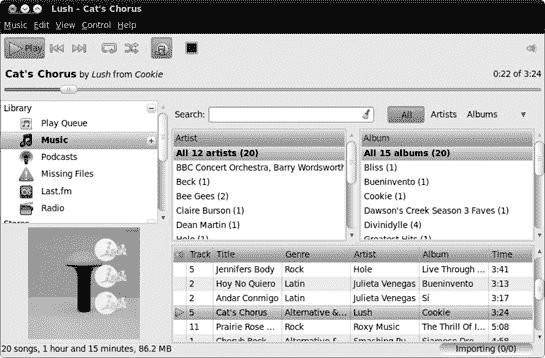
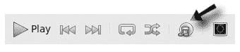
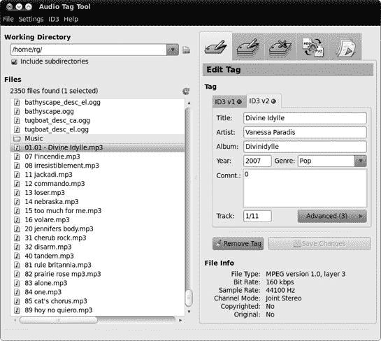
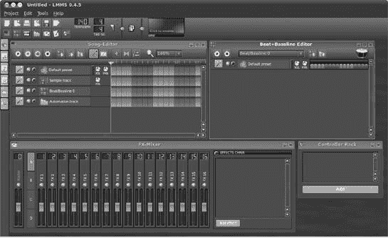
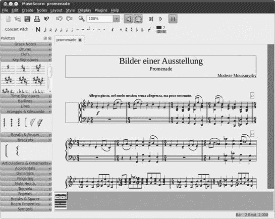

# 第十四章。TUX 摇滚

### Linux 风格的音乐

现在是时候转向音频方面了。是的，Linux 确实很酷，在本章中，你将了解到你的系统拥有的音乐才能。你将学习如何抓取 CD，创建 MP3 和 Ogg Vorbis 文件（你可以通过它们的*.mp3*和*.ogg*文件扩展名来识别这些文件），添加专辑封面艺术，更改文件标签，播放音乐文件，并将文件烧录到可以在任何 CD 播放器上播放的音频 CD 上。你还将学习如何播放各种音频流。如果你对学习如何使用 iPod、iPhone 或其他数字媒体设备，或者如何将音频文件从一种格式转换为另一种格式感兴趣，那么，你将不得不等到第十五章。

# 音频文件格式

在我们继续前进之前，最好讨论一下音频数据可以在您的计算机上存储的各种格式。长期以来，事实上的标准一直是 WAV（由微软/IBM 创建并使用*.wav*扩展名）、AU（来自 Sun/Unix 并使用*.au*扩展名）和 AIFF（来自苹果并使用*.aiff*扩展名），所有这些都是未压缩格式。因此，以这些格式保存的文件非常大，一张 CD 质量的 WAV 文件平均约为每分钟 10MB。为了更直观地理解这一点，回到 1988 年，我的第一台 Macintosh 有 40MB 的硬盘——比我预想的需要的空间要多，但不足以存储 Nirvana 的“Come as You Are”的 WAV 文件。

随着计算机从多媒体机器的演变到今天的状态，很明显，必须对那些消耗磁盘空间的音频文件采取一些措施。因此，开发了音频压缩格式。这些压缩格式通过简化来说，是通过删除人耳听不到的声音信号部分来工作的——有点像狗哨子的方法。最广为人知并被广泛接受的音频压缩格式是 MP3。以 MP3 格式编码的音频文件可以缩小到原始 WAV 文件大小的十二分之一，而不会在质量上产生任何明显的损失。

另一种开发的音频压缩格式是 Ogg Vorbis。Ogg Vorbis 是开源社区的产品，因此，与 MP3 不同，MP3 一直处于尚未行使的专利权阴影之下，它从一开始就免除了专利和许可的担忧。由于这一点以及它在质量和性能方面与 MP3 相当（如果不是，正如许多人声称的，更好），Ogg Vorbis 成为了 Linux 社区的宠儿。

在本章中处理音频文件的提取时，你一定会注意到另一个编码选项——FLAC。无损音频编解码器（FLAC）是一种编码格式，与 MP3 和 Ogg Vorbis 格式不同，它在编码过程中不会从音频文件中删除任何音频信息。这种方法的缺点是 FLAC 只能提供 30% 到 50% 的空间节省，这比 MP3 或 Ogg Vorbis 达到的 80% 邻域要少得多。当然，优点是 FLAC 文件在质量上应该与 CD 相当。

考虑到音频质量的保留，如果你对 Ogg Vorbis 或 MP3 文件提供的音频质量不满意，FLAC 成为一个理想的选择。如果你想要创建 Ogg Vorbis 和 MP3 文件，或者你还没有确定想要使用哪一个，FLAC 同样是一个不错的选择。在这种情况下，你只需将文件提取出来，并以 FLAC 格式进行编码。正如我之前提到的，一旦你到达第十五章，你将学习如何在知道你想要或需要什么时，如何转换 FLAC 文件。

# 项目 14A：为音频应用安装 MP3 支持

不论是关于 Ogg Vorbis 和 FLAC 的讨论，还是其他话题，仍有很多人喜欢或需要处理 MP3 文件。例如，你可能已经从你的音乐收藏中提取了大量的 MP3 文件，或者你可能喜欢收听那些以 MP3 格式广播的众多网络电台流。不幸的是，由于版权问题，MP3 播放和编码支持并未包含在 Ubuntu 中。即使你计划在未来使用 Ogg Vorbis 格式进行提取和编码，安装 MP3 支持也是一个好主意，以便覆盖所有音频基础。这同样是一个非常简单的过程。

安装 MP3 播放支持的最简单方法是在你的硬盘上双击一个 MP3 文件。会出现一个窗口，询问你是否想要搜索播放该文件所需的插件。点击 **搜索**，之后会出现另一个窗口，显示你需要安装的内容（图 14-1

图 14-1。Ubuntu 帮助你找到所需的插件。

如果您愿意，您也可以通过在 Ubuntu 软件中心搜索*gstreamer*并安装*gstreamer0.10-ffmpeg*（GStreamer ffmpeg 视频插件）、*gstreamer0.10-fluendo-mp3*（Fluendo mp3 解码器 GStreamer 插件）和*gstreamer0.10-plugins-ugly*（GStreamer 额外插件）来轻松下载和安装这些插件。

对于 MP3 编码支持，这使您能够抓取 CD 并创建自己的节省空间的 MP3 文件，嗯，事情并不那么自动。但也不是什么繁重的工作，因为您只需要使用 Ubuntu 软件中心搜索并安装*gstreamer0.10-plugins-ugly-multiverse*。如果您还想给自己添加 AAC 编码能力，也应该安装*gstreamer0.10-plugins-bad-multiverse*。然后您就可以按照下一节所述准备行动了。

# Rhythmbox——您的音频播放器

Ubuntu 中的主要音频播放器称为 Rhythmbox（见图 14-2)，它似乎与苹果的 iTunes 应用程序的简化版功能相似。它是一个相对容易使用的音频播放器，尽管在早期阶段有一些小问题，但在 Linux 世界中已经发展出相当多的追随者。要运行 Rhythmbox，只需转到**应用程序**菜单，选择**声音与视频** ▸ **Rhythmbox 音乐播放器**。

图 14-2. Rhythmbox 音频播放器

## 将歌曲和专辑添加到 Rhythmbox 库中

如果您熟悉苹果的 iTunes，那么您也应该了解 Rhythmbox 中的库，因为它本质上是一个相同的概念。Rhythmbox 应该会自动导入您在*音乐*文件夹中的所有内容，而无需您做任何额外的工作。如果您更喜欢手动将歌曲添加到 Rhythmbox 库中，您可以打开首选项窗口（**编辑** ▸ **首选项**），点击**音乐**选项卡，然后取消选中**监视我的库中的新文件**复选框。之后，您可以通过转到**音乐**菜单，选择**导入文件夹**，然后导航到您想要添加的新专辑文件夹来将新专辑添加到您的 Rhythmbox 库中。如果您想添加同一艺术家的多张专辑，只需导航并选择该艺术家的文件夹即可。如果您只想添加单个音频文件，您也可以这样做——选择**音乐** ▸ **导入文件**，然后导航到相关的歌曲。

如果您不喜欢导航，您也可以通过其他方式添加文件和文件夹。最简单的方法是将您想要添加到库中的文件夹或歌曲拖放到 Rhythmbox 窗口的右侧面板中。您也可以通过右键单击文件并从出现的弹出菜单中选择**打开方式** ▸ **用 Rhythmbox 打开**来直接将歌曲添加到库中。

## 使用 Rhythmbox 抓取音频 CD

与 iTunes 类似，Rhythmbox 也允许你直接从 CD 抓取歌曲；将它们转换为 Ogg Vorbis、MP3 或其他音频格式；然后将抓取的曲目添加到其音乐库中。步骤如下：

1.  打开首选项窗口（**编辑** ▸ **首选项**），点击**音乐**选项卡，并选择你想要使用的编码格式（Ogg Vorbis 是默认格式）。完成后，点击**关闭**。除非你经常更改编码格式，否则你不需要重复此操作。

1.  在 Rhythmbox 窗口的左侧面板中选择你的音频 CD。

1.  在 Rhythmbox 窗口右上角点击**复制到库**按钮。随后将开始抓取和编码过程，进度将在 Rhythmbox 窗口的右下角显示。完成后，抓取的歌曲将自动出现在 Rhythmbox 库中。

### 注意

如果你没有安装**gstreamer0.10-plugins-ugly-multiverse**包，MP3 选项将不会出现在输出格式菜单中。

## 浏览 Rhythmbox 库

Rhythmbox 库，你可以通过点击 Rhythmbox 窗口左侧面板中的**音乐**来使其可见，这是你添加到其中的所有音乐的集合。随着收藏的增长，这可能会变得有些难以管理。幸运的是，Rhythmbox 有一个很好的浏览器功能，类似于 iTunes 中的功能，可以通过点击**浏览**按钮来切换开启和关闭，如图图 14-3 所示。此功能允许你在主库列表上方两个单独的面板中看到艺术家和专辑的列表。如果你在艺术家面板中点击一个特定的艺术家，该艺术家的专辑列表将出现在右侧面板中。然后你可以双击右侧面板中的任意专辑来播放它。如果你想要播放该艺术家所有的专辑，只需在左侧面板中双击艺术家的名字。总的来说，这是一个非常实用的功能。

图 14-3. Rhythmbox 中的浏览按钮

如果你想在浏览器中添加一层分类，可以通过添加流派面板来实现。为此，只需转到**编辑**菜单，选择**首选项**，选择出现的窗口的**常规**选项卡，然后选择**流派、艺术家和专辑**。在首选项窗口中点击**关闭**按钮后，你将在 Rhythmbox 中拥有一个三面板浏览器（图 14-4）。

图 14-4. Rhythmbox 浏览器扩展分类

## 在 Rhythmbox 中创建播放列表

当然，你可以进一步调整以适应每一种情境和你的每一种心情。毕竟，有时候你会感到有点过于飘渺，不适合亚当·兰伯特（感谢这一点）。为了准备这样的时刻，你可以创建*播放列表*，这些列表是按照预定顺序播放的歌曲列表。只需想象每个播放列表就像一个点歌电台……所有点歌都是你自己的。

要在 Rhythmbox 中创建播放列表，请选择**音乐** ▸ **播放列表** ▸ **新建播放列表**。当播放列表图标出现在 Rhythmbox 窗口的左侧面板时，为列表输入一个名称，然后通过简单地将歌曲从库面板拖动到播放列表图标来添加你想要的歌曲。歌曲本身将保留在库中，所以你实际上并没有移动任何东西——只是创建了别名。

你还可以创建*自动播放列表*，这些列表会自动扫描库中的歌曲，以匹配你的创建标准。你可以选择创建一个包含你库中所有特定艺术家或特定流派歌曲的列表。为此，只需选择**音乐** ▸ **播放列表** ▸ **新建自动播放列表**。会出现一个窗口，你可以指定列表包含的内容。你甚至可以指定列表中想要的歌曲数量。

一旦你创建了你的列表，你可以通过单击列表一次然后单击窗口顶部附近的播放按钮（或者直接双击列表）来播放一个列表。

## 通过 Rhythmbox 访问在线音乐商店

虽然 iTunes 只有 iTunes 商店，但 Rhythmbox 为你提供了选项，所有这些选项都可以通过 Rhythmbox 窗口左侧的“商店”标题下的左侧面板访问。其中两家商店，Jamendo 和 Magnatune，提供独立艺术家发布的 Creative Commons 或开放许可的音乐。另一家商店是 Ubuntu One 音乐商店，它提供来自 7digital 目录的主要艺术家的音乐。那里出售的歌曲不受许多其他在线商店购买的歌曲中常见的数字版权管理（DRM）限制。

## Rhythmbox 中的其他酷炫功能

Rhythmbox 包含一些值得注意的酷炫功能。除了能够管理播客外，它还支持显示专辑封面。正如你在图 14-2 和图 14-4 中可以看到的，每次你在 Rhythmbox 中播放一首曲目时，该曲目的专辑封面会自动下载并显示在窗口的左下角（假设 Rhythmbox 能在网上找到封面）。

另一个酷炫的功能与歌词有关。要使用此功能，你必须首先通过选择**编辑**菜单并选择**插件**来激活它。在出现的配置插件窗口中（图 14-5)，勾选**歌曲歌词**复选框，然后点击**关闭**按钮。之后，转到**视图**菜单，并选择**歌曲歌词**。Rhythmbox 将搜索互联网上当前播放曲目歌词，并在单独的窗口中显示它们（图 14-6）。

图 14-5. 激活 Rhythmbox 的歌词功能

最后，如果你是 iTunes 用户，并且喜欢在播放音乐时有一些视觉刺激，Rhythmbox 现在可以满足你的需求，它自带了一个可视化器。要激活它，请转到**视图**菜单并选择**可视化**（你可以用同样的方式关闭它）。此时，Rhythmbox 窗口的右侧将充满你熟悉并喜爱的迷幻风格的狂野、旋转的形状和颜色。

图 14-6. Rhythmbox 显示当前播放曲目的歌词。

# 项目 14B：使用 Rhythmbox 收听流媒体

除了允许你播放音频 CD 或存储在硬盘上的音乐外，Rhythmbox 还允许你以 MP3 或 Ogg Vorbis 格式播放互联网广播流。要添加流，请点击 Rhythmbox 窗口左侧的**广播**图标——第一次你将只面对大约十几家电台。在这个项目中，我将通过向你展示如何自己添加流来丰富你的收藏。

## 14B-1：将广播流添加到 Rhythmbox

要开始，让我们尝试添加 FIP，这是一家专注于多元文化的法国音乐电台。添加 FIP 的过程与添加任何其他流基本相同。以下是步骤：

1.  点击 Rhythmbox 窗口左侧的**广播**。

1.  在菜单栏下方的按钮条右侧端，点击**创建新的互联网广播电台**按钮（看起来像一个小红电台）。

1.  在随后出现的窗口中，输入[`www.tv-radio.com/station/fip_mp3/fip_mp3-128k.m3u/`](http://www.tv-radio.com/station/fip_mp3/fip_mp3-128k.m3u/)，然后点击**添加**。

1.  双击你的流媒体新条目来播放它。

你刚才所做的一切唯一的问题是，流的标题在 Rhythmbox 窗口中显示为你在其中输入的 URL，而流派部分则显示为*未知*。不用说，这并不是一个特别方便的方式来处理事情，尤其是当你有超过几个流列出来，并且需要在这些流中摸索以确定它们是什么的时候。

改善这种状况是一个简单的过程。只需右键单击流，然后选择**属性**。在出现的窗口中，更改标题和流派框的内容，以便它们代表对你更有意义的东西。如图图 14-7 所示，我使用了*法国广播电台 – FIP*作为标题，*杂食性*作为流派。

图 14-7. 在 Rhythmbox 中更改流的标题和流派属性

## 14B-2：向 Rhythmbox 添加额外的广播流

现在你已经尝到了 Rhythmbox 处理广播的方式，你可能会渴望更多。啊，但是你从哪里找到这些广播流呢？对于最大的 MP3 流集合，请访问[`www.shoutcast.com/`](http://www.shoutcast.com/)，找到一个看起来对你有吸引力的流，右键单击该流的**收听！**按钮，然后在弹出菜单中选择**复制链接位置**。之后，将 URL 粘贴到 Rhythmbox 新互联网广播电台窗口的 URL 框中，然后单击**添加**。然后你可以在 Rhythmbox 窗口的右侧面板中双击该流来播放它。

# 创建音频 CD

所有关于在计算机上编码和收听 MP3 和 Ogg Vorbis 文件的讨论听起来都很不错，但无疑有时你想要在你的歌曲在普通的音频 CD 上，这样你就可以在前往新泽西州际公路或文图拉高速公路的路上播放它们。幸运的是，这很容易做到，而且有几种方法可以做到这一点。

## 使用 Rhythmbox 刻录音频 CD

对于 Rhythmbox 用户来说，最简单的方法是在 Rhythmbox 内部完成所有操作。为此，首先创建一个包含你想要刻录到 CD 的歌曲的播放列表，然后单击**创建音频 CD**按钮。将出现一个确认窗口，询问你是否想要创建你刚刚设置的 CD。你无疑想要这样做，所以单击**创建**按钮，你的曲目将以 WAV 格式创建副本。当这个过程完成时，你将提示插入空白 CD，所以将一张 CD 放入你的驱动器，单击**确定**，刻录过程将开始。完成后，进度窗口将消失，你的新音频 CD 应该从你的驱动器中弹出。很简单。

## 使用 Brasero 刻录音频 CD

从你抓取的 MP3 和 Ogg Vorbis 文件创建“随时随地播放”的音频 CD 的另一种方法是使用 Brasero，这是我们首次在第七章中讨论的。要采取这条路线，将一张空白 CD 放入你的驱动器（并关闭弹出以处理它的 Nautilus 窗口），然后选择**应用程序** ▸ **声音与视频** ▸ **Brasero 光盘刻录器**。当 Brasero 出现时，点击**音频项目**。现在将任何混合的歌曲（任何音频格式混合）添加到窗口的空白区域。你可以通过在左侧窗格中导航到你想添加的歌曲并点击**添加**按钮（或者直接将文件拖到右侧窗格）来完成此操作。你还可以将文件从任何打开的 Nautilus 窗口拖到 Brasero 窗口的右侧窗格。

当你在 Brasero 窗口中添加歌曲时，窗口底部的条形图会显示你还有多少磁盘空间可用（图 14-8）。请注意这一点，以免排入比磁盘容量更多的内容。一旦准备就绪，只需点击**刻录**按钮，然后点击随后出现的设置窗口中的**刻录**。将出现一个进度窗口，一旦刻录完成，Brasero 会通知你并弹出光盘。然后你可以取出光盘，放入你的车载音响或其他你想播放的地方，享受结果。

图 14-8. 使用 Brasero 准备刻录音频 CD

# 项目 14C：使用 RealPlayer 收听 RealMedia 流

现在你已经知道如何播放 MP3 网络广播流，是时候通过安装 RealPlayer 11 来完善你的系统了（图 14-9）。尽管不如过去常见，但 RealMedia 流在互联网上仍然很常见。当可用时，你也可以使用 RealPlayer 播放 RealVideo 流。

图 14-9. RealPlayer 11

## 14C-1: 下载和安装 RealPlayer

在 Ubuntu 中安装 RealPlayer，曾经是一种有点儿运气成分的小麻烦，但现在比以前任何时候都要简单，所以你可以安心完成这个项目。以下是你需要做的：

1.  打开 Firefox，访问[`www.real.com/realplayer/linux/`](http://www.real.com/realplayer/linux/)，并点击**下载 DEB 安装程序**链接。

1.  在随后出现的窗口中，通过点击**确定**接受默认选项，即使用 Gdebi 包安装程序打开。

1.  将很快打开一个包安装程序窗口，显示你即将安装的内容。点击**安装包**按钮，然后根据提示提供你的密码。

几秒钟内，RealPlayer 和你的系统运行 RealPlayer 所需的全部依赖项将被安装。当过程完成后，关闭包安装程序。

## 14C-2: 设置 RealPlayer 并测试您的安装

一旦 Real Player 11 安装到您的机器上，您需要完成最终的设置步骤，然后进行测试。您可以通过选择 **应用程序** ▸ **声音与视频** ▸ **RealPlayer 11** 来开始。将出现一个简单的设置向导，您自己操作不会有任何问题，因为您真正需要做的就是点击窗口右下角按钮几次。完成向导后，RealPlayer 窗口将出现。

您可以通过访问一个提供 RealAudio 内容的网站来测试 RealPlayer 的安装，例如 [`www.notmuch.com/`](http://www.notmuch.com/)。点击您想要播放的任何文件的链接，之后将出现一个窗口询问您如何处理该文件。通过点击**确定**接受默认设置 */opt/real/RealPlayer/realplay (默认)*。然后 RealPlayer 将打开，播放您选择的流。

# 其他酷炫的音频应用程序

我到目前为止所介绍的应用程序只是 Ubuntu 在其软件仓库中为您准备的一小部分。您可以从浏览 Ubuntu 软件中心中列出的提供内容开始。尝试它们，如果您喜欢它们就保留，如果不满意就删除。毕竟，在 Linux 中这不会让您付出任何代价。

为了给您一个起点，我将提到一些我认为值得调查的应用程序。

## 替代播放器

如果我在本章中提到的音乐播放器已经激起了您对更多内容的渴望，那么您很幸运——还有许多其他选择，正如浏览 Ubuntu 软件中心的“声音与视频”类别所揭示的那样。查看 Exaile、Banshee、Audacious 和 Listen 以开始使用。哦，并且正如您将在第十六章中了解到的那样，如果您还没有发现，与您的系统一起提供的 Totem 视频播放器也可以作为音频播放器使用。哇。

## 使用 Streamtuner 流式传输音乐

如果你是一个网络电台爱好者，可能没有哪个应用对你来说比 Streamtuner (图 14-10) 更有用。Streamtuner 正如其名所示，是一个在线电台流调谐器。它通过从各种来源下载可用流列表来实现，然后你可以轻松浏览。当你找到喜欢的电台时，只需选择该流，点击**收听**按钮，流就会在你的选择播放器中打开。大多数流的默认播放器是 Audacious，所以当你下载 Streamtuner 时，Ubuntu 软件中心也会自动下载 Audacious，这是一个相当酷的音频播放器。然而，你可以通过访问其**编辑**菜单，选择**首选项**，然后在首选项窗口的右侧面板中，通过输入你想要使用的应用程序的命令来切换 Streamtuner 播放的默认播放器。这通常是应用程序的全小写名称。例如，如果你想使用 Totem 进行播放，你将点击**收听.m3u 文件**，向右滚动，并将`audacious %q`更改为**`totem %q`**。

你还会很高兴地知道，你可以将你正在收听的流（甚至是你没有收听的流）转录并保存为 MP3 文件。要在 Streamtuner 中录制流，只需右键单击目标流，并在弹出菜单中选择**录制**。

图 14-10. 使用 Streamtuner 浏览网络电台流

## EasyTAG 和 Audio Tag Tool

对于真正的音频爱好者来说，这两个应用程序允许你更改你的 MP3 和 Ogg Vorbis 音乐文件的标签。EasyTAG 是这两个中功能更全面的，但 Audio Tag Tool (图 14-11) 具有更友好的用户界面。尝试一下，看看你的想法。在 Ubuntu 软件中心搜索*easytag*或*tagtool*，安装一个或两个，然后通过选择**应用程序** ▸ **声音与视频**来定位它们，并在子菜单中进行相应的选择。

图 14-11. 在 Audio Tag Tool 中编辑 MP3 和 Ogg Vorbis 文件标签

## LMMS

Linux 多媒体工作室 (LMMS) 是一个结合了跟踪器/序列器/合成器/采样器的现代、用户友好的图形用户界面——至少这是 LMMS 主页所暗示的。我无法保证它有多容易使用，因为我对这个类别的应用程序了解不多。但在 Linux 界，关于它的炒作很多，而且它确实看起来很酷，如图 14-12 所示（图 14-12）。它的声音听起来也很酷（安装后尝试一下演示）。在 Ubuntu 软件中心搜索 *lmms*，安装程序，然后通过选择 **应用程序** ▸ **声音与视频** ▸ **Linux 多媒体工作室** 来运行它。

图 14-12. 使用 LMMS 创建音乐

## Audacity

如果你对播客感兴趣，你将反复提到的一个应用程序就是 Audacity。Audacity (图 14-13) 是一个多平台音频录制和编辑应用程序，它不仅在 Linux 界，而且在 Mac 和 Windows 界也经常被使用。它允许你剪切和粘贴声音片段，提高音调，增加速度，添加回声和其他效果，以及……好吧，所有 sorts of 其他有趣的功能。通过在 Ubuntu 软件中心搜索并安装 *audacity* 来获取它。然后，通过选择 **应用程序** ▸ **声音与视频** ▸ **Audacity** 来使用 Audacity。

## MuseScore

如果不提一下这个简单而功能强大的音乐记谱程序 *MuseScore*，那么结束音乐章节将是一件遗憾的事情。Mus-eScore (图 14-14) 允许您通过鼠标、键盘或 MIDI 设备创建乐谱，每行最多可包含四个声部。它还允许您播放您已记录在页面上的作品。这对于像我这样的人来说是一个很好的功能，我们不会阅读音乐，但发现自己想根据乐谱找出

图 14-13. 使用 Audacity 进行音频录制和编辑

一个基于乐谱的旋律。只需将音符复制到 MuseScore 的一个页面上，点击播放按钮，之前难以捉摸的旋律就会出现在您的耳边（以及您的眼前）。通过在 Ubuntu 软件中心搜索 *musescore* 安装 MuseScore，然后从 **应用程序** ▸ **声音与视频** ▸ **MuseScore** 运行它。

图 14-14. 使用 MuseScore 将音符记录在纸上
