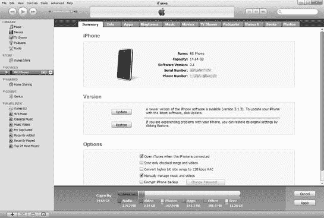
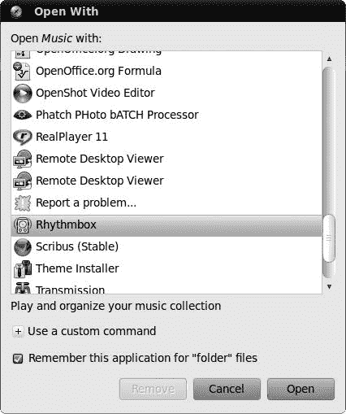
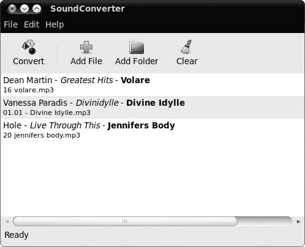
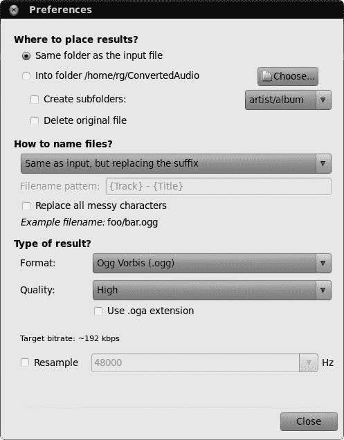

# 第十五章。连接企鹅

### 与你的 iPod、iPhone 和其他数字媒体设备一起工作

在上一章关于音频文件的剪切、编码和回放的所有讨论中，你可能想知道 Ubuntu 是否允许你将其中任何文件传输到你的数字媒体设备，比如你的 MP3 播放器或手机。好消息是，在你的 Ubuntu 系统上使用你的设备相当简单——比以往任何时候都要简单。你再也不必与挂载和卸载命令纠缠，也不必编辑系统表，如果你不知道我在说什么，那么你很幸运。只需将你的设备插入，Ubuntu 就会完成剩下的工作。

# 了解你的极限

假设你已经下载并安装了第十四章中提到的推荐音频编解码器，你就不应该在 Ubuntu 的数字媒体设备上处理音乐或播客时遇到任何问题。即使你没有安装它们，如果你尝试播放 Ubuntu 出厂时不支持的文件，Ubuntu 也应该自动帮助你找到必要的项目。然而，并非所有格式都能以相同程度的舒适度或成功率工作——这取决于你的设备和文件格式与 Ubuntu 的兼容性。一般来说，大多数播放器都能处理 MP3 文件和解锁的 AAC (*.m4a*) 文件。查看你的设备手册以获取有关其他文件格式的具体信息（或者直接尝试一下）。

就 Ubuntu 而言，它可以处理除锁定 AAC 文件之外的所有提到的文件格式，但你将在本章后面学习如何处理这个问题。

### 注意

虽然在 Ubuntu 上使用你的数字媒体设备已经变得越来越简单，但这仍然是一个相对较新的过程。在 Ubuntu 上处理设备之前，确保备份设备上的文件，总是谨慎行事是值得的。

# 挂载和弹出你的 iPod 或 iPhone

与您的 iPod 或 iPhone 一起工作是一个非常简单的过程。基本上，只需通过 USB 连接器将其连接，Ubuntu 就会挂载该设备，以便您可以访问它。您的设备图标将随后出现在桌面上（图 15-1

图 15-1. Ubuntu 立即识别您的 iPod 或 iPhone。

# (Not) Auto-updating Your iPod or iPhone

在说明如何使用 Ubuntu 与您的 iPod 或 iPhone 配合使用之后，值得考虑一些其他事情。其中最重要的是设备的自动更新设置。当您通过 iTunes 在您的 iPod 或 iPhone 上启用自动更新时，该功能在设备内部设置。您可以在 Windows、Mac OS 或 Linux（或所有这些）上使用您的 iPod，或者它们可以相互交换。但是，如果您将 iPod 设置为自动更新歌曲和播放列表，除非您在所有机器上都有完全相同的音乐收藏，否则您可能会遇到麻烦。

原因很简单。虽然 iTunes 允许您将文件添加到您的 iPod 中，但它不允许您从其中复制文件。因此，自动更新功能严格上是单向的。这意味着每次您将启用自动更新的 iPod 连接到启用 iTunes 的计算机时，iTunes 会自动将库中的曲目添加到您的 iPod 中；更令人恐惧的是，它会从您的 iPod 中删除任何不在该计算机 iTunes 库中的曲目。当我带着妻子充满歌曲的 iPod 去上班，并将其插入我办公室的 Winbox（其 iTunes 库为空）时，我就是这样学到的。当我带着什么都没有的小 Podster 回到家时，结果并不美好。

在将设备带入 Linux 世界之前，请确保禁用你的 iPod 的自动更新功能。为此，将你的 iPod 连接到你的 Mac 或 Windows 电脑，并打开 iTunes。在 iTunes 窗口的左侧面板中，点击设备部分中的你的 iPod，然后在右侧面板的**摘要**选项卡中，勾选旁边带有文字*手动管理音乐*（或在视频功能齐全的 iPod 中为*手动管理音乐和视频*），如图图 15-2 所示。接下来，如果你有一个支持拍照的设备，通过在右侧面板中点击**照片**选项卡，然后取消勾选旁边带有文字*从...同步照片*的复选框，重复几乎相同的步骤来对你的照片进行操作。

图 15-2. 在 iTunes 中禁用你的 iPhone/iPod 的自动更新功能

# 与基于 Android 的手机协同工作

尽管 iPhone 仍然是智能手机之王的宝座，但它现在面临着运行谷歌 Android 操作系统的手机的强烈竞争。幸运的是，在 Ubuntu 中使用你的 Android 设备相当简单，并且与使用 iPhone 或 iPod 几乎没有区别。基本上，这个过程是这样的：

1.  使用随设备附带的 USB 线将你的电脑和 Android 设备连接起来。

1.  应该在你的手机屏幕顶部的通知栏上出现一个“USB 已连接”的通知。下拉通知栏，然后触摸**USB 已连接**。

1.  应该在你的手机上出现一个对话框，询问你是要挂载还是取消连接。触摸**挂载**。

### 注意

由于目前有不同版本的 Android 系统在运行，因此这里描述的过程可能与你的手机略有不同。你应该仍然能够跟随操作。

与 iPhone、iPod touch 和支持拍照的 iPod 一样，接下来将出现两个窗口，询问你是否要运行 Rhythmbox 来处理你的音乐文件和 F-Spot 来处理你的照片文件。你的设备图标应该随后出现在你的桌面和任何 Nautilus 窗口的侧边栏中（图 15-3）。

图 15-3. Ubuntu 识别你的 Android 设备并提供多种与之协同工作的方式。

要“弹出”您的 Android 设备，要么右键单击桌面上的设备图标并选择 **弹出**，要么从 Nautilus 窗口点击窗口侧边栏中您的设备图标旁边的弹出按钮。然后在您的手机上，拖动打开通知栏，触摸 **关闭 USB 存储空间**。在随后出现的对话框中，触摸 **关闭**。

# 与其他数字媒体播放器和手机一起工作

虽然 iPod 可能是最受欢迎的数字媒体播放器，iPhone 在智能手机市场占据主导地位，但它们绝不是市场上唯一的游戏。正如我已经展示的，基于 Android 的手机也非常受欢迎，还有其他设备，从简单的 15 美元 USB MP3 播放器到基于 Linux 的 Palm Pre 手机。

在 Ubuntu 中如何使用这些设备可能会有所不同，但大部分情况下，它们应该以与 iPod 或 Android 设备相同的方式工作，或者以与 USB 数据设备相同的方式工作。使用基于 Linux 操作系统的 Palm Pre 在 Ubuntu 中的工作方式与 iPhone 相同，而我从 Office Depot 购买的 19 美元通用 MP3 播放器则像 USB 移动硬盘一样工作。查看您的设备将如何工作的最简单方法是通过 USB 线缆将其连接到您的计算机。如果未出现 Windows 询问您如何处理该设备的提示，请打开 Nautilus 窗口查看是否在那里找到了设备的图标。如果是这样，您可以使用经过验证的拖放方法来处理您的设备。您还可以通过以下方式使用 Rhythmbox 来处理您的通用设备上的音频文件：

1.  如果设备上还没有，请创建一个 *音乐* 文件夹。

1.  右键单击 **音乐** 文件夹，并选择 **打开方式**。

1.  在“打开方式”窗口中，选择 **Rhythmbox** (图 15-4)，然后单击 **打开**。

# 使用 Rhythmbox 管理您的音频设备音频文件

正如我已经提到的，Rhythmbox 被设置为 Ubuntu 中 iPhone、iPod、Android 设备以及任何其他音乐播放器的默认应用程序。一旦 Rhythmbox 启动并运行，事情的工作方式几乎与 iTunes 相同。

+   要查看您的 iPod 或其他设备的内容，请单击窗口左侧的设备图标。然后，设备的内容将出现在窗口右侧。

+   要将歌曲从您的音乐库复制到您的设备，只需在左侧面板的“音乐”部分单击 **音乐**，然后将您想要从右侧面板拖到左侧面板中设备图标的艺术家、专辑或单首曲目拖到您的设备图标上。复制进度将在 Rhythmbox 窗口的右下角进度条中显示 (图 15-5).

图 15-4. 选择 Rhythmbox 作为处理你的通用 MP3 播放器上的音频文件时使用的应用程序

图 15-5. 通过 Rhythmbox 向你的数字音频播放器添加歌曲

## 将歌曲从你的音频设备复制到你的硬盘

大多数数字媒体播放器的一个特性是 iTunes（至少在没有安装特殊免费软件插件的情况下）没有提供的，就是能够将歌曲从你的 iPhone/iPod 复制到你的硬盘（甚至到外部 USB 驱动器）。幸运的是，Rhythmbox 允许你非常容易地做到这一点。

要使用 Rhythmbox 从你的 iPhone/iPod、基于 Android 的手机或其他数字媒体设备复制音乐，选择你想要导出的曲目（按住 **ctrl** 键进行多选，或者如果你喜欢，可以使用标签选择整个艺术家或流派），然后将选定的项目拖动到你的桌面、音乐文件夹或你想要它们的地方。这种看似简单的方法的唯一缺点是，当你从 iPod/iPhone 复制文件时，你会在硬盘上得到一些奇特的文件名，如 *ZPAD.m4a* 或 *ATDT.mp3*，而不是出现在你的 iPhone/iPod 或 Rhythmbox 中的名称。这意味着你需要在文件传输到硬盘后重命名这些文件，除非你处理的是大量文件，或者如果你只是忘记哪个文件是哪个，这并不是什么大问题。在后一种情况下，右键单击文件，点击**属性**，然后点击**音频**选项卡，在那里你可以找到原始文件名（图 15-6

图 15-6. 查找标签错误的音频文件的文件属性

## 在 Rhythmbox 中弹出你的 iPod 或其他数字设备

当你在 Rhythmbox 中完成与你的 iPod 或其他数字设备的工作后，你可以通过以下两种方式将其弹出：点击 Rhythmbox 窗口左侧面板中的设备条目，然后点击窗口顶部附近的**弹出**按钮；或者右键单击左侧面板中的图标，在出现的弹出菜单中选择**弹出**。如果 Rhythmbox 已关闭，这种右键弹出方法也可以在 Nautilus 窗口内或使用已挂载设备的桌面图标进行。

# 向你的 iPod 写入时遇到的问题

如果您有一个 iPod（不包括 iPhone 和 iPod touch），您之前曾与 Mac 一起使用，您可能会发现尽管您可以读取 iPod 上的文件，但不能向其写入文件。最有可能的情况是您的 iPod 格式化为 Apple 的本地 HFS+文件系统，尽管这本身并不是问题。问题是 HFS+格式化的 iPod 启用了日志记录。*日志记录*是 HFS+的一个功能，旨在通过保护文件系统免受电源浪涌、电源故障或硬件故障的损害。

然而，正如命运所安排的，Linux 内核并不擅长处理启用了日志记录的 HFS+格式化设备。幸运的是，修复这个问题的调整非常简单，甚至并不特别技术性：您只需禁用您的 iPod 上的日志记录。

如果您附近有 Mac，禁用 HFS+格式化 iPod 上的日志记录是一个非常简单的任务。只需将您的 iPod 连接到 Mac，当它自动打开时关闭 iTunes，然后运行磁盘工具（在应用程序文件夹中的实用程序文件夹内）。当磁盘工具打开时，在窗口的左侧面板中选择您的 iPod（按名称），按住**选项**键，然后在**文件**菜单中选择**禁用日志记录**。片刻之后，您的 iPod 上的日志记录将被禁用而不会丢失任何数据。如果您再次将 iPod 连接到您的 Linux 机器，您将能够像平常一样使用它。

# 在您的数字设备上处理照片

正如我之前提到的，如果您的手机或数字设备具有拍照功能，并且 Ubuntu 能够自动识别它，您将被引导到 F-Spot 照片管理器，就像您将数字相机连接到 Ubuntu 机器时一样。同样，F-Spot 会检查您的设备上有什么，然后允许您将照片复制到您的硬盘。

如图 15-7 所示，您首先选择要复制到硬盘的照片，如果您喜欢，可以添加标签，然后点击**复制**。照片复制到您的硬盘后，它们将出现在主 F-Spot 窗口中（图 15-8)，您可以从那里按需处理它们。

图 15-7. 使用 F-Spot 从您的 iPhone/iPod 或其他数字设备导入照片

图 15-8. F-Spot 让您组织您已下载到硬盘的照片

# 转换音频文件格式

正如我在本章开头所指出的，当涉及到某些音频文件格式、你的硬件和 Ubuntu 时，可能会有一些不兼容的点。幸运的是，SoundConverter（如图 15-9 所示）可以轻松地将 Ogg Vorbis 文件转换为 MP3 格式，反之亦然。如果对你来说感兴趣，它还可以将 AAC 文件转换为 MP3 或 Ogg Vorbis 格式。由于 SoundConverter 不是 Ubuntu 的捆绑软件，你将不得不安装它。要这样做，只需运行 Ubuntu 软件中心，搜索*soundconverter*，然后安装应用程序。

图 15-9. 使用 SoundConverter 转换音频文件格式

要使用 SoundConverter，只需选择**应用程序** ▸ **声音与视频** ▸ **Sound Converter**。一旦 SoundConverter 启动，通过点击**添加文件**或**添加文件夹**按钮将你想要转换的歌曲添加到主面板。你也可以从你的*音乐*文件夹（或你存储它们的任何其他地方）拖动音频文件。

一旦你选择了要转换的文件，你需要选择将它们转换成哪种格式。你可以通过选择**编辑** ▸ **首选项**并在首选项窗口中进行选择来实现这一点（图 15-10). 当你在那里时，告诉 SoundConverter 将转换后的文件放在原始文件存储的文件夹之外的位置也是一个好主意。这样做可以防止在 Linux 音频播放应用程序（如 Rhythmbox）自动扫描你的*音乐*文件夹时遇到重复文件。你可能还希望勾选**创建子文件夹**选项以保持文件组织有序。

一旦你设置好一切并准备好转换，点击首选项窗口中的**关闭**，然后在主窗口中点击**转换**。然后 SoundConverter 将开始执行其操作。

图 15-10. 在 SoundConverter 中设置转换首选项

# 播放受保护的 AAC（M4P）文件

如果你是在苹果公司取消其音乐中的数字版权管理（DRM）之前从 iTunes Store 购买的音乐，那么你很可能会拥有一些受保护的 AAC 文件，你可以通过*.m4p*扩展名来识别这些文件。这些文件只能在通过 iTunes 注册的机器上播放。正如你可能已经发现的，在你的系统中，你无法对这类文件做太多。当你尝试播放其中一个时，你只会得到一个错误消息和一个让 Ubuntu 搜索缺失插件的选项。接受该选项是获取在 Ubuntu 中播放此类文件所需支持的最简单方法。

一旦你接受，Ubuntu 将搜索插件和必要的支持文件。一旦 Ubuntu 找到它们，它将在新窗口中显示搜索结果（图 15-11)。点击**安装**以继续。当过程完成后，你将能够在你的系统上播放之前受保护的 AAC 文件。然而，如果在安装过程中 Rhythmbox 正在运行，那么你需要重新启动它，它才能处理这些文件。

图 15-11. Ubuntu 让你知道它找到了哪些插件，以便你可以播放受保护的 AAC 文件。

# 在你的 iPod 上运行 Linux？

如果你用 Google 搜索如何在 Linux 下使用 iPod，你可能会注意到，实际上可以用一种形式的 Linux 替换 iPod 的苹果设计的操作系统。现在，我并不是在提倡你这样做（而且我肯定自己也没有这样做过），但有些人对用他们手中的任何小玩意儿摆弄感兴趣。如果你是这样的人或者你只是好奇，可以查看[`www.ipodlinux.org/`](http://www.ipodlinux.org/)，或者更受欢迎的 Rockbox ([`www.rockbox.org/`](http://www.rockbox.org/))，它也运行在许多其他非苹果设备上。

# 在你的 iPad 上使用...？

苹果最新推出的产品，iPad，上架时间不长，但 Linux 爱好者们已经尝试在 Linux 机器上使用 iPad 了。据报道，截至当前版本 Ubuntu 10.04，iPad“基本上”可以正常工作。如果你想看看 iPad 如何与你的 Ubuntu 驱动 PC 配合使用，只需通过 USB 线连接两台设备，然后尝试看看效果如何。但请记住，你这样做是在承担自己的风险。
