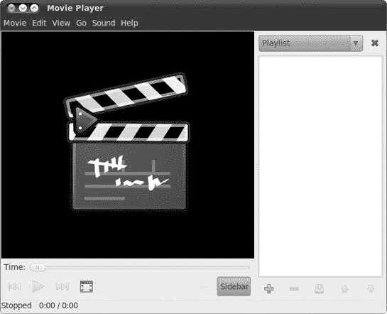
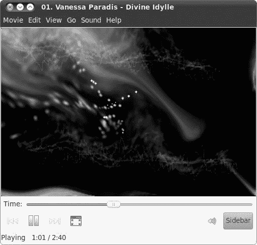
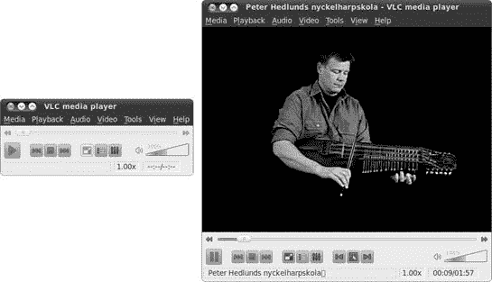
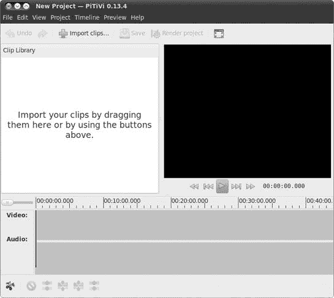
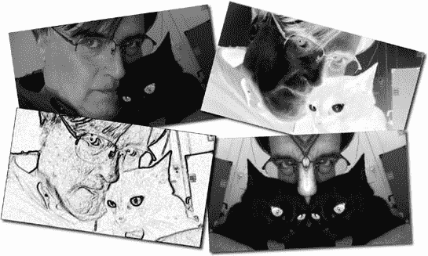
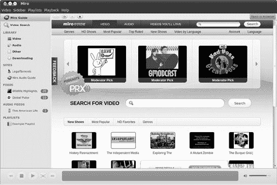

# 第十六章。COUCH PENGUINS

### Ubuntu 中的视频和 DVD 播放


现在我已经介绍了 Ubuntu 在音频方面的许多功能，现在是时候将你的注意力转向在 CNN/MTV 时代被认为是其第二大才能的事情：视频。Ubuntu 在视频播放方面相当强大，允许你观看从互联网或你的数码摄像机下载的视频文件，视频 CD（VCDs），DVDs，以及一些互联网视频流。它甚至允许你从你的数码摄像机下载电影，然后编辑它们。

# DVDs

你的系统允许你播放 DVD；然而，由于版权问题，默认情况下播放仅限于未加密的光盘。不幸的是，这排除了你在当地视频店购买或租借的大多数 DVD 电影，并且让你在电脑上可以播放的电影种类相当有限。鉴于未加密 DVD 世界的有限供应，你无疑会希望启用你的系统来播放加密版本。

# 项目 16A：安装加密 DVD 的支持

正如我之前提到的，Ubuntu 不允许你从一开始就播放加密 DVD。为了观看这样的 DVD（那将是其中绝大多数），你需要安装一大堆东西，最重要的是，安装包*libdvdread4*。幸运的是，如果你安装了我提到的第十四章中的音频支持文件，你已经完成了一半。如果你没有安装它们，或者只是想再次检查，首先运行 Ubuntu 软件中心，然后确保安装了这些文件和一些有用的其他文件。如果缺少任何东西，请安装它。你需要有以下内容：

+   *gst-plugins-base*

+   *gstreamer0.10-plugins-good*

+   *gstreamer0.10-plugins-ugly*

+   *gstreamer0.10-plugins-bad*

+   *gst-ffmpeg*

+   *libdvdread4*

现在你已经到达了这个项目所需的最后和关键的一步。对于这个任务，你将不得不求助于可靠的旧式终端（**应用程序** ▸ **附件** ▸ **终端**）。一旦终端打开，输入以下命令，然后按**回车**：

```
sudo apt-get install libdvdread4
```

对于几乎任何其他应用程序，你在这个时候就已经完成了，但 libdvdread4 需要你运行它附带的一个安装脚本才能完全完成工作。要运行脚本，回到终端，输入以下内容，然后按**回车**：

```
sudo /usr/share/doc/libdvdread4/install-css.sh
```

一旦终端返回用户提示符，过程就完成了。试着在你的驱动器中放入一张 DVD——Totem 应该会打开并开始播放 DVD。（你很快就会了解更多关于 Totem 的信息。）如果不起作用，打开 Ubuntu 软件中心，检查确保安装了之前列出的所有支持插件。如果一切都在那里，回到终端，再次执行最后两个步骤。

## 我可以播放外国的 DVD 吗？

你的电脑可以播放任何广播标准（NTSC、PAL 或 SECAM）和任何区域编码的 DVD。这比连接到电视的 DVD 播放器设置要好，因为美国绝大多数（我敢打赌 99.9%）的独立 DVD 播放器不允许播放除区域 1 NTSC 光盘（NTSC 是美国广播标准，也是电视设计用来显示的内容，而 DVD 区域是 1）之外的内容。通常，这些信息会提供在 DVD 包装的背面（参见图 16-1)，尽管大多数针对美国市场生产的 DVD 包装上没有提供这些信息。


图 16-1. DVD 包装上的区域编码标签示例

尽管在 DVD 播放方面，你的电脑具有一切皆可的神奇特性，但有一个严重的注意事项需要牢记。根据你的 DVD 光驱制造商不同，你只能在不同的区域编码 DVD 之间切换四到五次。之后，光驱将永久锁定在你当时播放的 DVD 的区域编码上……*永远如此*。这与你的操作系统无关——这是一个纯粹硬件问题。这个区域锁定规则的唯一例外是那些标有*区域码自由*或*ALL*（有时不准确地标为*区域 0*）的 DVD，它们可以在任何地区的任何 DVD 播放器上播放，因此当你将其中之一放入电脑的 DVD 光驱时，不会注册为区域编码切换。

如果你的光驱最终锁定在一个区域编码上，尤其是你很少使用的区域编码，有一些好消息。这个好消息以 Videolan 的*libdvdcss2*库的形式出现，这个库包含在你安装的 Project 16A 中的 libdvdread4 包中。libdvdcss2 库允许你播放加密的 DVD。除了这个主要功能外，*libdvdcss2*理论上还允许你在你的 DVD 光驱已经锁定在一个区域的情况下播放来自多个区域的 DVD。它是通过对你的光驱执行一种神秘的攻击（使用 Videolan 对该攻击的术语）来实现的，直到它找到该光驱的碟片密钥。当然，这种神秘轰炸的过程可能需要几分钟，所以这不是最佳的做法。但总比卡住要好。绕过区域编码的过程是否合法仍然是一个有争议的话题，所以如果你对此类事情有所顾虑，你应该做一些研究。

# Totem 电影播放器

Ubuntu 的默认视频播放器是 Totem，如图 16-2 所示，它有一个非常简单的界面，使得使用它同样简单。你可以通过选择**应用程序** ▸ **声音与视频** ▸ **电影播放器**来运行 Totem。你也可以像你刚刚学到的，通过将 DVD 放入光驱来运行它，因为 Ubuntu 被设置为在这样做时运行 Totem。



图 16-2. Totem 电影播放器

## 使用 Totem 播放 DVD、VCD 和其他多媒体文件

如我之前提到的，你只需将 DVD 放入光驱，Totem 就会打开并开始播放你的电影。如果你有一张 VCD 版本的《红菱艳》想要观看，也可以用同样的方式观看。只需将 VCD 放入你的光驱；Totem 应该会启动并开始播放。

Totem 不仅能播放 DVD 和 VCD，还能播放 MPEG 文件，而且因为你安装了我一直提到的那个大杂烩包，它也能播放 WMV 文件。你可以通过直接双击这些文件或者进入 Totem 的**电影**菜单，选择**打开**，然后导航到你想观看的视频文件来播放这些文件。

## Totem 作为音频播放器？

当你在“首选项”窗口的“显示”选项卡上时，你可能已经注意到了有一个“视觉效果”部分。嗯，这些视觉效果并不是为你播放的视频准备的，而是当你通过 Totem 播放音频文件时的可视化效果(图 16-3). 是的，Totem 不仅能播放视频，还能播放音频。事实上，它在 Ubuntu 中是 Ogg Vorbis 和 MP3 文件的默认音频播放器。只需双击其中一个文件，Totem 就会弹出，用你最喜欢的旋律震撼你的耳朵。当然，你也可以通过 Totem 的**电影**菜单选择**打开**并导航到你想播放的歌曲来播放这些文件。如果你光驱里有 CD，你甚至可以使用 Totem 作为 CD 播放器，通过进入**电影**菜单并选择**播放光盘‘音频光盘’**。



图 16-3. Totem 作为音频播放器

## Totem 的其他一些酷炫功能

Totem 还有一些其他你可能想了解的酷炫功能。其中之一是它能够捕捉你当时正在观看的任何视频的屏幕截图。只需选择**编辑** ▸ **截图**，你就有了一个屏幕截图——从视频文件中捕获的静态图像。

值得一提的另一个功能是 Totem 的侧边栏。正如您无疑已经注意到的，在 Totem 窗口的右下角有一个侧边栏按钮。如果您点击该按钮，Totem 窗口的右侧将打开一个新的面板。在该面板中，您可以选择并收听 BBC 播客；搜索并观看 YouTube 视频 (图 16-4); 以及加载、创建和保存播放列表。您可以从侧边栏顶部的下拉菜单按钮中选择这些各种功能。

您创建的播放列表可以包含任何支持的音频或视频文件的组合，从而为您提供整个多媒体香蕉。每次您在 Totem 中播放文件时，该文件都会出现在播放列表面板中，但您也可以通过简单地从桌面或任何 Nautilus 窗口拖动文件到那里来添加项目到列表中。


图 16-4. 在 Totem 中观看 YouTube 视频

# Totem 的替代品：VLC 媒体播放器

尽管 Totem 视频播放器自从首次出现以来已经取得了巨大进步，但一些用户发现它有些喜怒无常和古怪。幸运的是，有替代品，比如 VLC 媒体播放器。VLC (图 16-5) 是一个非常强大的替代播放器，并且也适用于 Mac 和 Windows 平台。与 Totem 一样，它也处理音频文件以及视频和音频流，包括 YouTube。



图 16-5. VLC 媒体播放器静止和播放状态

从 Ubuntu 软件中心下载并安装 VLC，安装完成后，通过选择**应用程序** ▸ **声音与视频** ▸ **VLC 媒体播放器**来运行它。要使用 VLC 查看 DVD，将 DVD 插入您的驱动器，在出现的窗口中下拉菜单按钮选择**打开 VLC 媒体播放器**，然后点击**确定**。

# 使用 PiTiVi 编辑数字视频

近年来，数字视频摄像机变得越来越普遍，而静止数字摄像机（甚至手机！）在视频处理能力方面也变得更加令人印象深刻。此外，越来越多的人正在 YouTube 上分享他们的视频创作——可以说家庭数字视频几乎无处不在。Linux 对视频处理的支持也在迎头赶上，尽管它还没有达到 100%。

Ubuntu 的默认视频编辑器被称为 PiTiVi (图 16-6). 您可以通过前往**应用程序**菜单并选择**声音与视频** ▸ **Pitivi 视频编辑器**来运行它。



图 16-6. PiTiVi 视频编辑器

如您立即所见，PiTiVi 缺乏像 iMovie 或 Windows Live Movie Maker 这样的应用程序的华丽功能。它实际上只是一个电影编辑器，只允许您剪辑和组合视频片段。它最大的局限性包括无法从数字视频摄像机或视频流中捕获视频，无法将转场或效果应用到视频上，以及最糟糕的是，无法为视频添加标题。尽管这些功能承诺将在未来提供，但它们目前不可用的事实使得将 PiTiVi 捆绑到 Ubuntu 的决定显得相当奇特。

除了局限性及特殊性之外，PiTiVi 的实际编辑过程相对简单。首先，您开始一个新的项目并决定其名称和设置（**项目** ▸ **项目设置**）。然后，您将文件添加到该项目中，无论是通过从您的家目录拖放到 PiTiVi 窗口，还是通过点击**导入剪辑**按钮，然后通过出现的导入剪辑窗口选择要添加的文件。这些文件现在被称为*剪辑*，将出现在 PiTiVi 窗口的剪辑库面板中。从该面板，您可以拖动您想要工作的剪辑到下面的时间轴上，然后分割剪辑，删除尴尬或无聊的部分，并组合文件（图 16-7

图 16-7. 使用 PiTiVi 编辑视频

完成编辑后，您可以通过点击**渲染项目**按钮来制作您的新电影。之后，将出现一个渲染项目窗口。在该窗口中，点击**选择文件**按钮，然后在**选择要渲染的文件**窗口中为新电影命名。这将是要生成的实际文件的名称。完成后，点击**确定**，然后点击**渲染**按钮。渲染过程的进度将在渲染项目窗口中显示，完成后，将出现*渲染完成*的字样。然后您可以关闭渲染项目窗口和 PiTiVi。当提示时，请务必保存您的项目。

如需有关使用 PiTiVi 的更详细信息，请查看用户手册，该手册可在 PiTiVi 网站上找到：[`www.PiTiVi.org/`](http://www.PiTiVi.org/)。

# 项目 16B：使用 Kino 捕获数字视频

当你想从你的数码相机将数字图像或数字视频传输到你的电脑时，你只需从相机下载到电脑即可。然而，当你想从存储在磁带上的数字视频（DV）摄像机或视频流中传输视频片段到你的电脑时，却无法简单地将其拖动到另一个地方。你必须在你播放视频的同时将其捕获到磁盘，为此你需要某种软件解决方案。这通常以系统视频编辑器的形式出现；然而，正如我在上一节中提到的，Ubuntu 捆绑的视频编辑器 PiTiVi 还无法做到这一点。这意味着你将不得不安装另一个编辑器，而在这个领域中的老牌选择是 Kino（图 16-8）。


图 16-8. 另一个数字视频编辑器，Kino

## 16B-1：安装 Kino 和设置系统

第一步也是最简单的一步是下载并安装 Kino。只需前往 Ubuntu 软件中心即可完成此操作。安装后，你可以通过选择**应用程序** ▸ **声音与视频** ▸ **Kino**来查看 Kino。此时，你可以使用 Kino 来处理你硬盘上已有的视频文件并开始捕获视频。如果你的摄像机通过 FireWire（IEEE 1394）连接到电脑，你第一次连接时必须执行几个步骤，以便你的系统可以识别连接：

1.  使用随摄像机一起提供的（或你被迫购买的）FireWire 电缆将你的摄像机连接到你的电脑。

1.  在播放模式下打开你的 DV 摄像机。一旦你这样做，*raw1394*模块将出现在你的系统*/dev*目录中，尽管你一开始不会看到任何迹象。

1.  几秒钟后，关闭你的摄像机，但保持电缆连接。

1.  打开一个终端窗口，输入**`cd /dev`**，然后按**回车**。

1.  在同一个终端窗口中，通过输入**`sudo chmod a+rw raw1394`**并按**回车**来更改*raw1394*模块的权限，以便你的机器上的每个人都可以读取和写入它。

1.  当提示输入密码时，输入你的密码，然后按**回车**。

如果一切顺利，你将返回到用户提示符，而终端中不会出现任何其他消息。然后你可以关闭终端窗口。

## 16B-2：使用 Kino 捕获和编辑数字视频

一旦你完成了我刚才提到的准备工作，你就可以从你的摄像机捕获视频了。为此，将你的摄像机连接到你的电脑（如果尚未连接），打开摄像机到播放模式，然后启动 Kino。一旦 Kino 打开，点击播放面板右侧的**捕获**标签。

现在，您可以使用位于播放面板下方的播放控制按钮。这些控制按钮实际上控制着您相机的功能。首先，点击**倒带**按钮，直到到达您想要捕获的视频段落的开始。一旦到达那里，点击**播放**按钮，之后您的相机中的视频将在 Kino 窗口中播放。当您到达想要开始捕获的点时，点击 Kino 窗口中播放控制按钮上方的**捕获**按钮。Kino 随后将开始将您的视频捕获到磁盘（默认情况下在您的家目录中），并在窗口的主面板中显示它正在捕获的内容（图 16-9）。为了便于管理，捕获的视频流将被分割成几个文件，文件的数量取决于播放的视频长度。


图 16-9. 使用 Kino 从您的数码相机捕获视频

当您到达想要停止捕获的点时，点击**停止**按钮。然后，您可以通过点击**编辑**选项卡并使用播放面板底部的播放控制按钮来查看捕获的视频。您也可以在时间线视图中查看视频（如图 16-10 所示图 16-10. Kino 的时间线视图)来在视频的不同段落之间导航：点击**时间线**选项卡，点击您想要查看的段落，然后使用播放面板下方的播放控制按钮。

如果您想要尝试一些艺术效果，您还可以通过点击**FX**选项卡，然后在“视频滤镜”一词下方的下拉菜单中尝试各种效果（如图 16-11 所示[图 16-11. Kino 视频效果示例，前后对比]）。做出选择后，通过在“覆盖”一词下方的框中输入您想要转换的段落的起始和结束帧号来指定您想要转换的段落（或至少进行实验）。为了在不保存更改到磁盘的情况下查看滤镜的效果，点击**播放**按钮。如果您决定要将该段转换为保留效果，点击**渲染**按钮，Kino 将创建一个仅包含该段的新文件。您还可以双击这些文件（以及原始捕获的文件）在 Totem 中查看，Totem 更适合查看视频，而不是 Kino。


图 16-10. Kino 的时间线视图



图 16-11. Kino 视频效果示例，前后对比

# 其他视频应用

我已经介绍了 Ubuntu 中的主要视频应用程序，但还有一些其他的应用程序你可能想要考虑，所有这些都可以通过 Ubuntu 软件中心获取。如果你对另一个替代视频/DVD 播放器感兴趣，可以尝试 GNOME MPlayer，它因其能够处理多种视频格式而长期拥有相当多的追随者。

另一个适合视频流媒体爱好者使用的酷炫应用是 Miro Internet TV (图 16-12)，它允许你轻松搜索、下载和播放在线视频流。只需在 Ubuntu 软件中心搜索*miro*即可。

如果你有一个网络摄像头，你可能还想尝试一个名为 Cheese 的应用程序，它允许你从网络摄像头拍照和录制视频，并添加酷炫的图形效果。Camorama 是另一个值得考虑的网络摄像头查看/捕获应用程序。

如果你正在寻找 PiViTi 和 Kino 的替代品，可以尝试 Avidemux。它有一个非常实用的功能，即使你不将其作为主要视频编辑器使用，也值得拥有：它可以从视频文件中提取音频轨道。你可以在 Ubuntu 软件中心获取 Avidemux。请确保安装 GTK+版本（而不是 Qt 版本）。

对于那些对刻录 DVD 感兴趣的人来说，你可以尝试 DVD:Rip、AcidRip DVD Ripper 或更易于理解的 Thoggen DVD Ripper。你可能还对 DVD95 和更高度可配置的 K9copy 感兴趣，它们是 Linux 世界对 DVDShrink 的回应。这些应用程序允许你刻录双层 DVD（DVD9）并将输出压缩，以便它适合单层空白 DVD 光盘（DVD5）。对于从头开始创建自己的 DVD（就像使用 iDVD 一样），有几个应用程序值得考虑：DVD Styler、QDVDAuthor 和 Bombono DVD。



图 16-12. 视频流媒体爱好者的梦想：Miro
