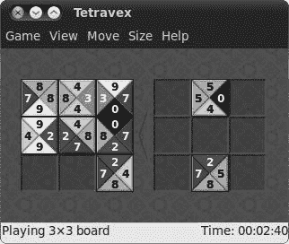
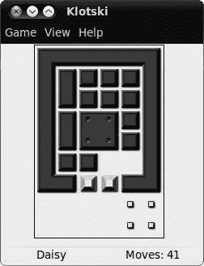
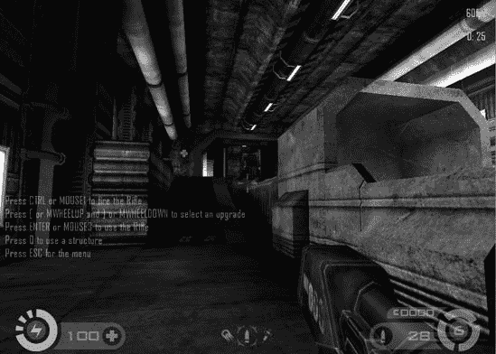
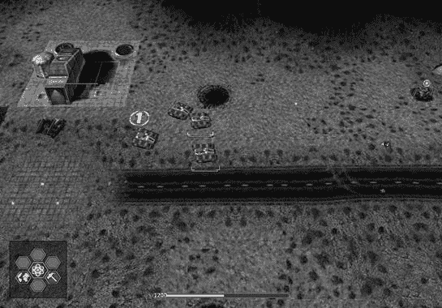
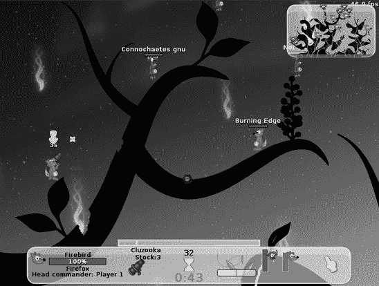
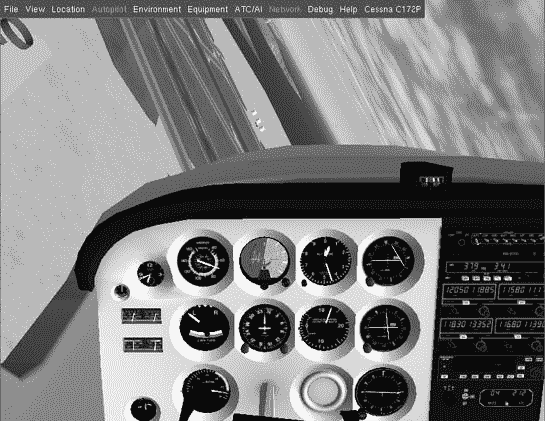
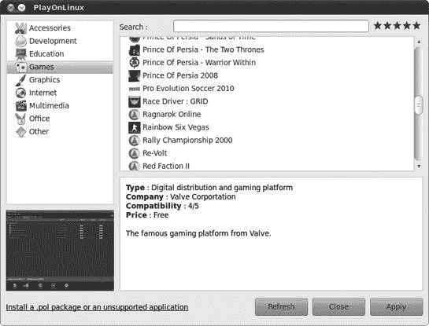
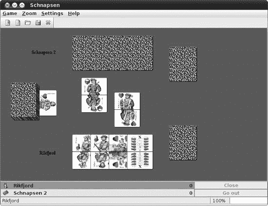
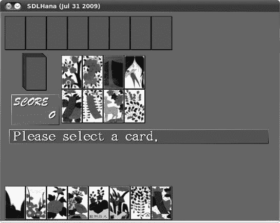

# 第十七章. 羽毛翻飞者

### Linux 游戏

许多人不愿承认，但游戏对几乎每个在个人电脑前的人都有很大的吸引力。即使那些否认自己是玩家的人，也常常发现自己在工作项目之间快速玩一局单人纸牌。作为一名 Linux 用户，你很可能会发现，其他操作系统的用户问你的关于 Linux 的最常见问题之一是，“它有什么游戏？”虽然 Linux 世界中的游戏可能没有 Windows 世界的那么多，但 Linux 仍然有很多可供选择。事实上，大多数 Linux 发行版都附带了一些游戏。

例如，Ubuntu 预装了 AisleRiot Solitaire（超过 80 种单人纸牌游戏集合）、gbrainy（包括谜题、记忆力训练和脑力游戏，如图 17-1 所示 Figure 17-1)、Mahjongg（一种拼图游戏，类似于第九章中介绍的 Chapter 9)、Mines（Linux 世界的扫雷游戏）、Quadrapassel（俄罗斯方块克隆版）和 Sudoku。许多其他免费游戏可通过 Ubuntu 软件中心（和其他来源）获得，其中一些你将在本章中了解到。

图 17-1. gbrainy

# 项目 17A：通过 Ubuntu 软件中心扩展你的游戏收藏

通过 Ubuntu 软件中心扩展你的游戏收藏非常容易。在这个项目中，你将通过安装一些经典 Linux 游戏来填补一些游戏空白。这个项目中的步骤基本上是对你在 第六章 中学到的内容的复习，所以不会涉及任何挑战性的工作——只需启动 Ubuntu 软件中心并点击即可。

## 17A-1: 安装缺失的 GNOME 游戏

标准的 GNOME 游戏集合中包括了一些在 Ubuntu 10.04 中为了节省空间而没有包含的游戏。这些包括几个传统的热门游戏，如谜题 Tetravex (Figure 17-2)，你可以将其视为一种三角形的多米诺骨牌形式，以及 Klotski (Figure 17-3)，这是一种挑战性的方块移动练习。集合还包括 Same GNOME（Same Game 的 GNOME 版本，一种日本弹珠匹配游戏）、Tali（一种使用骰子玩的古老罗马扑克）、Iagno（Reversi 的 GNOME 克隆版）、Nibbles（那些老式的蛇形游戏之一）、Five or More（基于旧 Windows 游戏 Color Lines 的匹配游戏）、Robots（一个小巧的“经典”游戏，你在其中四处跑动以避开机器人）、Blackjack 和 Chess。

图 17-2. Tetravex

图 17-3. Klotski

这些游戏捆绑在一个名为*GNOME Games*的单独包中。要使用 Ubuntu 软件中心下载和安装该包，只需搜索*gnome-games*，然后安装它。安装完成后，游戏将出现在**应用程序**菜单的**游戏**部分。

## 17A-2：安装一些 Linux 经典：Frozen Bubble、Tux Racer 和 Pingus

几款其他游戏可能被称为 Linux 经典，要么因为它们是 Linux 原创的，要么因为它们以企鹅为主题，以纪念 Linux 可爱的企鹅吉祥物 Tux。其中最知名和最受欢迎的是 Frozen Bubble (图 17-4). Frozen Bubble 可以被认为是终极 Linux 经典：它是为 Linux 编写的，以 Linux（企鹅）为主题，并且 Linux 版本总是首先发布。它后来被移植到 Mac OS、Windows，甚至 iPhone 和 Android 系统，但 Frozen Bubble 的灵魂是纯粹的企鹅。

图 17-4. Frozen Bubble

Frozen Bubble 的目标很简单：通过匹配相同颜色的气泡来清除屏幕，然后进入下一级。这听起来可能很无聊，但不用担心——您很快就会上瘾。

要获取 Frozen Bubble，请在 Ubuntu 软件中心搜索*frozen-bubble*，然后安装它。安装完成后，您可以通过选择**应用程序** ▸ **游戏** ▸ **Frozen-Bubble**来运行 Frozen Bubble。

您可能还对另一款以 Linux 为主题的游戏感兴趣，那就是 Extreme Tux Racer (图 17-5). 它是一款相当奇特（但有趣）的计时赛跑游戏，您需要引导 Tux 沿着一条长而冰冷的雪山小径滑行。然而，您应该知道，除非您有加速的显卡，否则 Extreme Tux Racer 将运行得非常慢。如果您不确定您的电脑能否处理它，只需试一试，看看结果如何——毕竟它是免费的！

要安装 Extreme Tux Racer，请在 Ubuntu 软件中心搜索*extreme tux racer*，然后安装它。它将出现在游戏菜单中。

与 Extreme Tux Racer 不同，Pingus (图 17-6)是一款没有特殊图形要求的游戏。它是一款迷宫游戏，基于经典的 Lemmings。您的目标是带领您可爱的小企鹅队伍安全地到达每个级别的终点，不要让他们在等待他们的危险障碍物上被撞成碎片。游戏包含 22 个可玩级别，如果您喜欢冒险，可以尝试玩一些未经测试的级别——总共有 200 多个！有关玩这些额外级别的说明，请访问[`pingus.seul.org/faq.html/`](http://pingus.seul.org/faq.html/)。

要玩 Pingus，请在 Ubuntu 软件中心搜索*pingus*，然后安装它。您会发现它就在您预期的游戏菜单中。

图 17-5. Extreme Tux Racer

图 17-6. Pingus

# 3D 游戏

我之前提到的大多数游戏都是有点，嗯，二维的。当然，2D 游戏可以很有趣——我确实因为数独游戏浪费了很多时间——但它们没有射击外星人群或将高性能跑车撞向墙壁时的那种兴奋感。不幸的是，游戏设计师传统上忽视了 Linux，专注于更大的 Windows 市场，所以直到几年前，可供选择的 Linux 友好型 3D 游戏很少。然而，随着企鹅的流行，人们开始注意到这一点，现在越来越多的 Windows 游戏附带 Linux 版本。

开源游戏社区也取得了飞跃性的进步，现在有一些真正高质量的游戏。在本节中，我将会介绍一些我最喜欢的游戏，但首先确保你的电脑能够处理 3D 图形的压力。

## 检查硬件加速

要玩 3D 游戏，你需要一块能够处理 *硬件加速* 的显卡。如果没有硬件加速，你的电脑处理器必须尝试自己完成所有复杂的图形渲染（这项任务它并不适合），因此你的游戏运行速度会非常慢，甚至可能无法运行。大多数现代显卡都内置了某些硬件加速支持，但是否启用将取决于你显卡的 Linux 驱动程序状态。你可以在[`wiki.ubuntu.com/HardwareSupportComponentsVideoCards/`](https://wiki.ubuntu.com/HardwareSupportComponentsVideoCards/)上找到你显卡的 3D 支持情况。

如果你只想知道你是否拥有玩游戏的最低加速级别，那么打开终端（**应用程序** ▸ **附件** ▸ **终端**），输入 **`glxinfo | grep rendering`**，然后按 **enter** 键。 （那个垂直线是“管道”符号，通常可以通过按 **shift** 和 \ 键插入。）如果你收到一条消息告诉你 glxinfo 没有安装，请使用 Ubuntu 软件中心安装 *mesa-utils*，然后再次尝试。

如果启用了硬件加速，你将在终端中看到 `direct rendering: Yes`。这是个好消息，因为它意味着你可以跳到下一部分，享受一些三维游戏的美妙。

如果你收到的是“直接渲染：否”的消息，那么如果你想硬件加速工作，你需要安装不同的图形驱动程序。请参阅显示和图形卡问题中的游戏/Compiz 无法工作：安装加速图形驱动程序部分以获取说明。

### 注意

许多 Linux 的默认图形驱动程序无法处理**抗锯齿**功能，这是移除图形锯齿边缘的功能，使其看起来更平滑、更逼真。如果你不能没有抗锯齿，你还应该查看第二十一章以获取有关安装更好的图形驱动程序的信息。

## 射击游戏

和许多人一样，我的第一次真正的 3D 游戏体验是第一人称射击（FPS）游戏。事实上，我仍然对 Doom 情有独钟，它可以说是所有 FPS 的鼻祖。还有什么比在火星的军事基地与无尽的恶魔怪物战斗更有趣的吗？没有！

Doom 现在看起来有点过时了，但如果你对这个经典游戏有类似的怀旧之情，你会很高兴地知道有一个适用于 Ubuntu 的版本。它被称为 Freedoom (图 17-7)，你可以从 Ubuntu 软件中心（就像本节中的所有游戏一样）安装它。

图 17-7. Freedoom

Doom 的游戏玩法可能已经优雅地老化，但图形确实没有。如果你觉得像素化的球体无法让你感到恐惧，为什么不尝试一些更平滑的东西，比如 Nexuiz (图 17-8)？在游戏玩法方面，Nexuiz 感觉与 Unreal Tournament 非常相似——你在昏暗的关卡中奔跑，收集各种武器和升级，射击不同级别（人工）智能的对手。与大多数死亡竞赛风格的游戏一样，目标通常是成为最后一个存活的人，但还有其他游戏模式，如“夺旗”。如果你觉得电脑控制的对手挑战不足，还有在线多人游戏选项。

Tremulous (图 17-9) 是另一个流行的开源 FPS，尽管其游戏玩法也包含实时策略元素。你可以在网上玩，选择人类或外星人的阵营。在你努力摧毁对方队伍的同时，你建立结构并收集升级来获取尽可能多的优势。这可能会变得相当复杂，所以我建议你在开始玩之前先阅读[`www.tremulous.net/`](http://www.tremulous.net/)上的说明。

图 17-8. Nexuiz

图 17-9. Tremulous

许多其他 FPS 游戏可供选择：AssaultCube、Warsow 和 Alien Arena 立刻浮现在脑海中。查看 Ubuntu 软件中心的**游戏** ▸ **街机**部分，看看你还能找到什么。

## 策略游戏

我喜欢第一人称射击游戏，但我的反应时间并不够快。如果你觉得在虚拟世界中四处跑动并射击东西让你感到寒冷（或者笨拙），那么可能策略游戏更适合你的风格。在 Ubuntu 软件中心有许多这样的游戏等待被发现，但我认为在这里提一下几个不错的游戏会更好。

战区 2100 (图 17-10) 与命令与征服系列游戏大致相似。你从一个战场开始，有一小批车辆，你必须指挥它们建立基地并防御敌人。一旦你的基地状况良好，你就可以建立新的单位并将它们派去攻击你的敌人。然而，你的对手也在做同样的事情，所以战斗可能会变成微妙的战术事务，你必须平衡成功发动攻击的能力与有限的资源可用性和基地被摧毁的持续威胁。

图 17-10. 战区 2100

如果你发现很难找到时间策划一场完整的军事战役，那么 Wormux (图 17-11) 可能更适合你。这是一款 Worms 游戏的克隆版，你将指挥一支装备精良的虫子小队（在 Wormux 中，像 Firefox 狐狸这样的开源吉祥物）散布在一个形状奇特的景观中。你们轮流使用你过剩的武器库，以巧妙的方式在对手能够对你做同样的事情之前将他们从地图上清除。仅就有趣的声音效果而言，这绝对值得一玩。

图 17-11. Wormux

## 模拟器

发动战争并不是每个人的逃避方式，这就是为什么 Linux 上有大量的模拟游戏可供选择。我已经尽可能在这个部分涵盖了尽可能多的内容，但就像往常一样，如果你在这里没有找到吸引你的东西，你应该浏览一下 Ubuntu 软件中心。

当我想起模拟游戏时，我的大脑立刻跳到了 Sim City，这款受人尊敬的城市建设游戏。作为市长，你负责管理你的城市：你计划建设工作，建立和维护交通联系，并设定预算和税收。加入一些自然灾害，你手头就有一个挑战！Linux 上的 Sim City 等价物是 LinCity-NG 和 OpenCity。我更喜欢 LinCity (图 17-12)——图形看起来更友好、更卡通化——但你应该尝试两者并自己决定。原始的 Sim City 游戏也是可用的，如果你不介意玩一款带有老式图形的游戏。只需在 Ubuntu 软件中心搜索*Micropolis*（出于法律原因，它已被重命名）。 

在你们中间，那些热衷于飞行模拟器的玩家可能会想看看 FlightGear (图 17-13). 重点是绝对的真实感，有各种各样的驾驶舱控制和飞机供你玩耍。如果你真的想要完整的体验，甚至还有一个地球大小的在线多人地图可以飞行。如果你还没有飞行员执照，那么在玩游戏之前阅读说明书可能是个好主意；你可以在[`www.flightgear.org/Docs/getstart/getstart.html/`](http://www.flightgear.org/Docs/getstart/getstart.html/)找到它。

图 17-12. LinCity-NG

图 17-13. FlightGear

与 FlightGear 相比，Torcs 稍微轻松一些，是一款赛车游戏 (图 17-14). 它是一个相当标准的赛道赛车游戏，你在赛道上与电脑控制的对手竞速。它有很好的汽车、赛道和赛车风格选择，更多可以在 Torcs 网站上找到，网址为[`torcs.sourceforge.net/`](http://torcs.sourceforge.net/)。如果你更喜欢越野赛车，可以看看 Trigger rally 游戏。它不如 Torcs 发达，但也是一种变化。

图 17-14. Torcs

如果允许我稍微扩展一下“模拟器”的定义，还有一个叫做 Frets on Fire 的酷炫摇滚明星模拟器 (图 17-15). 游戏玩法非常类似于 Guitar Hero，但有一个主要的不同点：你使用键盘来演奏音符，而不是吉他形状的控制器。然而，如果你不介意做一些调整，你可以让你的 Guitar Hero 控制器与 Frets on Fire 一起工作。（见[`fretsonfire.wikidot.com/using-guitar-hero-controller/`](http://fretsonfire.wikidot.com/using-guitar-hero-controller/)。）无论有没有塑料吉他，它都是一个上瘾的游戏。

图 17-15. Frets on Fire

## 更多 3D 游戏——超越 Ubuntu 软件中心

我希望到目前为止，你在我推荐的列表中找到了一些你喜欢的，但这绝对不是一份详尽的清单。实际上，还有数百款游戏可以在 Ubuntu 上运行，但尚未进入 Ubuntu 软件中心。

PlayDeb ([`www.playdeb.net/`](http://www.playdeb.net/)) 是额外游戏的好来源。PlayDeb 上的所有内容都可以通过其自己的 Ubuntu 友好软件仓库获取，因此一旦您将 PlayDeb 仓库添加到列表中，您就可以通过 Ubuntu 软件中心安装其游戏。有关详细信息，请参阅 添加额外软件仓库——您需要的 APT 行是 `deb` [`archive.getdeb.net/ubuntu`](http://archive.getdeb.net/ubuntu) `lucid-getdeb games`。

在下一章中，我还会解释如何在 Ubuntu 中使用 Wine 运行 Windows 游戏。实际上，这就是许多人享受那些没有 Linux 版本的商业大作的常用方法：Guild Wars、Spore 和 Call of Duty 只是少数几个可以通过这种方式完美运行的游戏的例子。如果您觉得这符合您的口味，那么 Project 18C-3 将特别吸引您——一个叫做 PlayOnLinux (图 17-16) 的小巧应用可以用来处理通常需要以 Wine 运行不太受支持的游戏的繁琐配置。

图 17-16. PlayOnLinux，显示它支持的一些 Windows 游戏列表

# Project 17B：安装基于 Java 的游戏：Schnapsen

如您从本章迄今为止讨论的所有游戏中可以看到，Ubuntu 软件中心是大多数 Linux 游戏的一个一站式商店。然而，您也已经了解到，除了 Ubuntu 软件中心中的游戏之外，还有很多其他游戏。这些包括您在 第九章 中使用的，用脚本语言编写的游戏，如基于 Python 的 pyWings 和基于 Tcl/Tk 的 Briscola，但似乎不应该遗漏用可能被认为是所有脚本语言之母的 Java 编写的游戏。在这个项目中，您将学习如何安装 Java 运行时环境以及如何安装和运行经典奥地利纸牌游戏 Schnapsen 的 Java 版本。

## 17B-1: 安装 Java 运行时环境

要运行基于 Java 的应用程序或 *脚本*，您首先需要安装 Java 运行时环境。您可以通过在 Ubuntu 软件中心搜索并安装 *openjdk java 6 runtime* 来完成此操作。整个 Java 软件包在下载重量方面相当庞大，所以如果它看起来比平时花费的时间更长，请不要感到惊慌。当过程完成后，关闭 Ubuntu 软件中心，继续项目的下一部分。

## 17B-2: 获取和提取 Schnapsen

一旦安装了 Java 运行时环境，你需要运行一个 Java 应用程序才能看到它的工作状态。你将要安装的应用程序是我自从进入 Linux 世界以来一直在寻找的，一款名为 Schnapsen 的 20 张牌的奥地利纸牌游戏，如图 图 17-17 所示。

要开始，你需要下载并提取 Schnapsen。以下是你需要做的：

1.  打开你的网络浏览器，并转到 [`projects.hagru.at/tjger/en/`](http://projects.hagru.at/tjger/en/)。

1.  在该页面上，点击左侧框架中的 **Schnapsen** 链接。

1.  在右侧框架中点击 **Schnapsen.zip**。

    

    图 17-17. 奥地利纸牌游戏 Schnapsen 的 Java 版本

1.  在随后出现的 Opening Schnapsen_1.00.zip 窗口中，通过点击 **OK** 接受默认选项，*使用归档管理器打开*。

1.  当归档管理器窗口出现时，点击 **提取** 按钮，这将打开提取窗口。

1.  在该窗口中，点击 **创建文件夹** 按钮，并在你的主文件夹中创建一个名为 *Schnapsen* 的文件夹。

1.  在该窗口中点击 **提取** 按钮，当提取过程完成后，退出归档管理器。

## 17B-3: 运行和英语化 Schnapsen

现在 Schnapsen 已在你的主文件夹中，是时候运行它了。打开一个新的终端窗口，然后执行以下操作：

1.  通过输入 **`cd Schnapsen`** 并按 **enter** 进入新的 Schnapsen 文件夹。

1.  输入 **`java –jar Schnapsen.jar`**（确保在 `java` 和 `jar` 之间有一个空格，并在 *Schnapsen* 的开头使用大写 *S*），然后按 **enter**。Schnapsen 将很快出现，之后你就可以开始玩了……如果你会说德语。

如果你对此感到好奇，这里是你刚才那一行所做的事情：命令字符串的第一部分 `java` 调用 Java 运行时环境；之后的 `-jar` 标志告诉 Java 你将运行一个 JAR 文件，这就是 Java 脚本被称作的东西；最后一部分是你将要运行的文件，`Schnapsen.jar`。 (将来，如果你选择运行其他基于 Java 的应用程序，只需遵循相同的模式：`java –jar` *`应用程序名称`*`.jar`.)

1.  要将界面切换到英语，转到 **设置** 菜单，并选择 **Sprache** ▸ **Englisch**。

1.  如果你对德语的纸牌面和花色（在此游戏中称为传统）不熟悉，你可以通过转到 **设置** 菜单并选择 **French** 在 **卡片集** 和 **王牌标志** 菜单中切换到你可能更熟悉的法国花色（方块、红心、黑桃和梅花）(图 17-18).

    

    图 17-18. 在 Schnapsen 中从德语到法语的花色和牌面切换

现在你已经准备好玩游戏了。帮助菜单中有一些基本规则，但你也可以在[`www.pagat.com/`](http://www.pagat.com/)上更深入地学习 Schnapsen（以及世界上任何其他纸牌游戏）的规则。祝您玩得开心！

# 在线游戏

在讨论安装游戏的这些话题中，很容易忘记有很多游戏你根本不需要安装。众多网站允许你免费在线玩游戏，只要你安装了适当的浏览器插件。（有关安装插件的说明，请参阅多媒体插件和保持实时书签更新。）例如，你可以访问[`www.popcap.com/`](http://www.popcap.com/)和[`gametrick.net/`](http://gametrick.net/)来体验一些优秀的在线时间消磨者。你还可以在 Facebook 或其他社交网站上玩到任何游戏，如 Farmville 和 Mafia Wars，而无需离开你的 Ubuntu 桌面。

# 搜索更多游戏

还有许多其他优秀的 Ubuntu 游戏我没有介绍，但请放心，它们确实存在。有些游戏以 DEB 文件的形式提供，可以像在第六章中安装 Skype 一样安装。一个很好的例子是 SDL Hana，这是日本花牌游戏 Hanafuda 的 Linux 版本（图 17-19），可以从[`savannah.nongnu.org/pr/sdlhana/`](http://savannah.nongnu.org/pr/sdlhana/)获取。

图 17-19. SDL Hana

Ubuntu 软件中心还有更多可供选择的游戏：我的一些老牌最爱包括塞尔维亚的 Pac Man 克隆版 Njam；以及捷克迷宫游戏 Fish Fillets NG，在那里你引导两条鱼穿过各种繁琐但非常吸引人的水下地点。

在 3D 方面也有大量可供选择的内容。在精心设计的 Yo Frankie!（图 17-20）中，你扮演一个被不友好动物追赶的邪恶投掷松鼠 Frank，他在田园风光中奔跑——孩子们（和审美家）会喜欢它。你还可以在 Balazar 角色扮演游戏中迷失自我，那里有足够的魔法和怪物陪伴你；在 Adanaxis（是的，他们设法在那里挤进了一个额外的维度，某种程度上）中驾驶太空战斗机；在 SuperTuxKart（图 17-21）中以企鹅风格赛车。

当然，您也可以通过浏览 Ubuntu 软件中心的“游戏”类别来查看还有哪些游戏等着您。外面有整个游戏世界，所以享受搜索吧。

图 17-20. Yo Frankie!

图 17-21. SuperTuxKart
