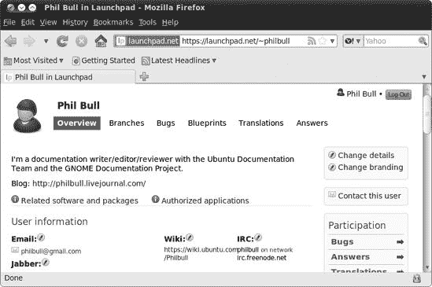
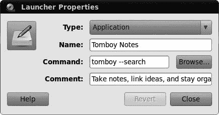
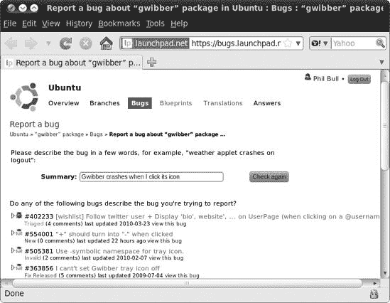
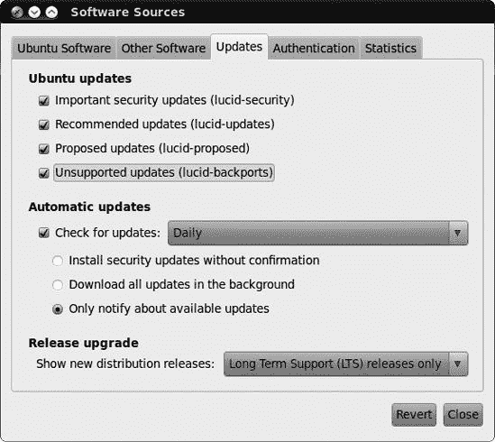
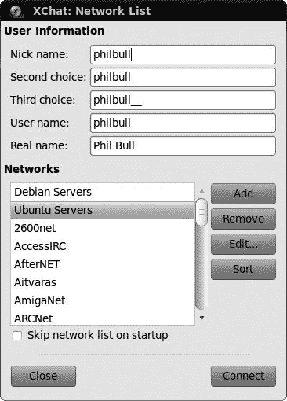
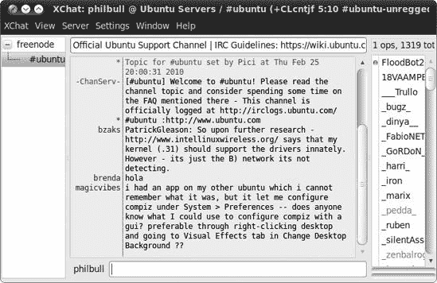
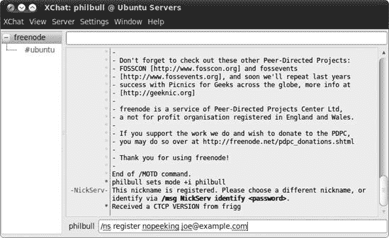
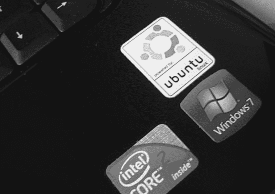

# 第二十章. 企鹅殖民地

### Ubuntu 社区

真正将开源世界与商业软件世界区分开来的是对*社区*的重视。这可以包括几乎所有与软件有关的人：使用它的人、设计它的人、帮助他人解决问题的人……他们每一个人都是宝贵的社区成员。

考虑一下商业软件世界，那里的事情往往是从上到下的。当你有问题时，你会去找一些提供支持的公司。这家公司可能也设计了并卖给你软件，而你在这个过程中可能没有扮演任何角色——你是客户；他们是供应商。开源则不同：不是一家企业管理一切，而是每个人都一起投入并互相帮助。人们编写软件和修复错误是因为这有助于他人，也因为想要帮助他人。每个人都可以在提供反馈和提出建议以及帮助他人解决问题中发挥作用，没有人绝对控制整个过程。总的来说，这更加民主，在我看来，也更加有趣！

Ubuntu 社区尤其庞大、充满活力，并且以友好著称。在本章中，您将了解如何充分利用它，以及您可以通过加入其中并回馈一些东西（如果您愿意）来发挥自己的作用。

# 带我见你的 SABDFL

开源社区通常具有明确的结构，Ubuntu 也不例外。在最顶层的是 Ubuntu 的创始人马克·舍伍德（Mark Shuttleworth），您在第一章中见过他。他是自封的终身仁慈独裁者（SABDFL），根据[`www.ubuntu.com/community/ubuntustory/governance/`](http://www.ubuntu.com/community/ubuntustory/governance/)，他的角色是“在困难问题上提供明确的领导，并为项目设定节奏。”这并不意味着他制定所有的计划和决策——这更多是技术委员会的职责，这是一个由高级 Ubuntu 贡献者组成的团队，他们决定下一个 Ubuntu 发布将采取什么形式。马克只是在那里，如果没有人能达成一致时才介入。

此外，还有社区委员会，它监督着构成项目主体的贡献者团队。有许多团队，承担着各种职责：文档团队负责编写 Ubuntu 每个版本的文档，安装团队负责 Ubuntu 安装所使用的软件，等等。您可以在[`wiki.ubuntu.com/Teams/`](https://wiki.ubuntu.com/Teams/)找到它们的列表。这些团队由来自世界各地的成员组成(图 20-1)，团队成员可能承担各种职责：例如，开发者是编写和更新软件的人。最后，但同样重要的是，全球数百万的 Ubuntu 用户构成了社区的最大部分。这个群体包括您！

图 20-1. 显示 Ubuntu 文档团队成员位置的全球地图

参与的每个人都应遵守行为准则([`www.ubuntu.com/community/conduct/`](http://www.ubuntu.com/community/conduct/))，对项目进行更改的人（如开发者）被要求签署这份文件的副本，以表明他们对 Ubuntu 原则的承诺。最后一点：Ubuntu 是一个*精英主义*社区，为项目贡献最多的人拥有最大的话语权。最活跃的贡献者（如果他们申请）会被授予*Ubuntu 会员资格*，并享受诸如*ubuntu.com*电子邮件地址等福利。

# Launchpad：通往 Ubuntu 社区的大门

每个开源软件项目都需要一个可以称之为家的地方。在 Ubuntu 的情况下，这就是 Launchpad，一个增强版的类似项目信息网站。无论您是想报告问题、寻求帮助、设计一个酷炫的新功能，还是编写自己的程序，Launchpad 都是您需要去的地方。

启动 Firefox，浏览到[`www.launchpad.net/`](http://www.launchpad.net/)。除非您之前已经注册，否则您可能需要注册一个账户，因此请点击页面顶部的**登录/注册**，并回答“尚未注册？”标题下的相关问题。点击**注册**，然后检查您的电子邮件以获取完成注册的详细信息。当消息到达时，点击第一个链接，填写您的详细信息，然后在您收到的页面上点击**继续**，以便开始使用您的账户。

一切都完成之后，点击页面右上角的你的名字，查看你的个人资料。目前可能看起来相当空，除了许多三个字母的缩写和一个神秘的邀请改变你的“品牌”。点击一个圆形的黄色铅笔图标开始更改你的详细信息。你可以根据需要在你账户上添加或多添加信息——例如，如果你想让人们能在 IRC 上找到你（参见在 IRC 上聊天中的创建自己的线程)，确保你在页面上输入你的昵称（图 20-2). 否则，你可以留空大多数内容。

如果你刚刚创建了账户，你可能会注意到“Karma”部分挂着一个悲伤的小零。幸运的是，这不是形而上的 karma，你的永恒灵魂也没有任何危险。相反，这是一个奖励系统，用于认可那些帮助使 Ubuntu 变得更好的人。你贡献越多，你得到的 karma 点就越多，因此你就有更多的理由在 Ubuntu 狂热的朋友面前炫耀（他们都是，对吧？）。查看[`help.launchpad.net/YourAccount/Karma/`](https://help.launchpad.net/YourAccount/Karma/)了解所有工作的详细信息。

图 20-2. 我的 Launchpad 账户页面

# 缺陷，缺陷，辉煌的缺陷

过去计算机是巨大的、复杂的生物，占据了整个房间，充满了精致的电子设备和嗡嗡作响的磁带驱动器。著名的计算机科学家格蕾丝·霍珀（Grace Hopper）在一次从这样的巨型继电器中取出一只蛾后，将这只讨厌的昆虫贴在她的日志簿上，并评论说她在计算机中找到了一个“缺陷”。嗯，自从 20 世纪 40 年代以来，计算机可能已经发生了很大的变化，但一些术语却没有改变。无论是像程序崩溃或冻结这样的大问题，还是像缺少图标这样的小问题，任何你在软件中发现的问题仍然被称为 *缺陷*。

你很可能之前遇到过缺陷——无论是商业软件还是开源软件，都没有一个是完美的。与开源软件的区别在于，你被强烈鼓励在发现问题时报告它们。开发者需要以缺陷报告的形式获得反馈，以便知道需要修复什么，如果早点报告问题，问题就能更快得到解决。提交缺陷报告是向社区回馈的一种相对简单的方式；它不费时，有助于提高所有人的软件质量，而且你可以免费解决一个令人烦恼的软件问题！

## 什么是“缺陷”？

缺陷有很多不同的类型，但通常你可以将它们归入以下几类：

+   当程序崩溃、冻结或没有明显原因显示错误消息时（例如，图 20-3），在分享改进 Ubuntu 的想法中。其次，你不应该通过报告错误来寻求软件帮助，因为你可能不会得到回复。相反，使用论坛或 IRC；更多关于这些的信息可以在 Ubuntu 论坛和在 IRC 上聊天中找到，在创建你的帖子中。最后，重要的是错误是**可复现的**。这意味着你可以提供一套指令供其他人遵循，他们将会遇到与你相同的问题。有时计算机只是做一些奇怪的一次性事情，所以如果它不可重复，那么问题被识别和修复的机会很小。

图 20-3. 如果程序崩溃（如这里的 Gwibber），可能是错误

## 报告一个错误

如果你确信你找到了一个错误，那么是时候告诉别人了！如果错误发生在特定的程序中，如果该程序菜单中有此选项，请选择**帮助** ▸ **报告问题**，然后跳到下一段。如果没有这个选项，你可能需要手动查找有问题的程序的命令名称。这通常与窗口标题中显示的名称不同，所以你需要做一些调查以确保你找到正确的名称：

1.  选择**系统** ▸ **首选项** ▸ **主菜单**以打开菜单编辑器。

1.  使用窗口左侧的菜单列表找到你的程序。例如，如果你想报告 Tomboy 笔记程序的错误，你会点击**附件**项，然后在屏幕中间的项目列表中找到*Tomboy 笔记*。

1.  右键点击你的程序名称，从弹出的菜单中选择**属性**。

1.  当启动器属性窗口出现时，查看命令框的内容——对于 Tomboy，它应该显示`tomboy --search` (图 20-4). 您可以忽略第一个空格之后的所有内容（只有第一部分是重要的）——所以在这种情况下，程序的命令名称是`tomboy`。

1.  按**alt**-F2 打开运行应用程序窗口，输入**`ubuntu-bug tomboy`**（将**`tomboy`**替换为您程序的命令名称），然后点击**运行**。

    

    图 20-4. 查找 Tomboy 的命令名称

错误报告工具将启动并收集有关程序的一些信息（例如您正在使用哪个版本）。接下来，它将询问您是否希望将此报告发送给开发者——您希望，所以点击**发送报告**，并将打开一个网页（如果您还没有这样做，请登录到 Launchpad）。输入您问题的简要描述，尽可能具体，然后点击**下一步**。

## 是否已经报告过？

许多人都在使用与你相同的程序，所以很可能有人已经费心报告了你的错误。Launchpad 将会去寻找它认为与您提供的描述相匹配的现有错误，因此请查看出现的列表，看看是否有任何结果听起来熟悉（图 20-5). 如果您找到了一个，点击旁边的箭头，阅读描述以确保，然后点击**是的，这就是我要报告的错误**。这可能是一个好兆头，因为可能有人已经在修复这个问题了！

选择**仅标记错误影响我**，然后点击绿色的勾选按钮直接进入错误页面（另一种选择，订阅我，意味着每次有人对错误发表评论时，您都会收到一封电子邮件）。查看其他人关于错误的评论，看看是否有任何有用的信息可以帮助您绕过问题。评论有时是技术性的，所以可能需要在论坛上寻求帮助以解决一些更晦涩的指令。如果您看不到任何有用的信息，您可以尝试提供更多关于问题的详细信息，以帮助开发者追踪它。他们通常会要求您提供一些命令的输出副本，他们可以使用这些信息来找出问题所在。如果您认为您可以帮助，请滚动到错误页面的底部，并在评论框中输入您所知道的信息。

图 20-5. Launchpad 认为与您报告的错误相似的错误列表

## 新的错误

如果似乎没有人遇到相同的问题，那么你遇到的就是一个真实的问题！点击页面底部建议问题列表下方的**不，我需要报告一个新错误**，并在“更多信息”框中描述错误。以下是一些关于如何撰写令人叹为观止的错误报告的提示：

**每个错误只报告一个问题**。

如果你一次报告多个问题，开发者将难以追踪他们已经修复和尚未修复的问题。

**描述错误发生时你在做什么**。

上下文很重要，因此你应该描述你在遇到问题时正在做什么。例如，如果你的音乐播放器在你插入 iPod 时崩溃，那么你应该提到这一点。

**提及你使用的程序版本**。

错误报告工具应自动提供有关软件版本的信息，但自己记下这些信息也是一个好主意。在程序菜单中选择**帮助** ▸ **关于**通常会给出程序的版本号，你可以通过选择**系统** ▸ **关于 Ubuntu**来找出你正在运行的 Ubuntu 版本。

**描述如何重现错误**。

开发者需要看到错误是如何发生的，以便修复它。提供一个逐步的指令列表，描述某人如何在他们的电脑上重现相同的问题。如果你不知道如何再次触发错误，只需尽可能详细地描述错误发生时你点击或更改的内容。

一旦你将报告填满信息，点击**提交错误报告**以完成过程。

## 现在会发生什么？

你将收到来自 Launchpad 的电子邮件，确认你的错误报告已成功提交，但这并不是故事的结束。让我们看看一个典型的错误报告，看看事情是如何发展的：打开 Firefox，转到[`bugs.launchpad.net/ubuntu/+bug/121853/`](https://bugs.launchpad.net/ubuntu/+bug/121853/)，查看我于 2007 年报告的 Rhythmbox 音乐播放器的错误。首先要注意的是页面顶部的信息（图 20-6)：*影响*列列出受错误影响的软件包，*状态*告诉你错误在修复道路上的进展情况，*重要性*告诉你错误的严重性，*分配给*是负责修复错误的开发者或团队的名字。随着识别和修复问题的进展，这些细节将由开发者进行更改。

图 20-6. Launchpad 错误报告页面，针对我的`Rhythmbox`错误

### 注意

改变你自己的错误的状态或重要性是不好的做法，因为人们经常高估他们的问题的重要性。把它留给 Ubuntu 开发者或其他社区成员吧。

在下面，你会看到我的原始错误报告，随后是超级 Ubuntu 开发者 Sebastien Bacher 提出的问题。在错误被发送到上游——即发送到处理 Rhythmbox 错误的另一个开源项目之前，还有一些来回的交流。从那里，我只需要等待 Rhythmbox 的开发者修复问题。

如果你已报告了一个错误，请留意你的电子邮件。每当错误被更改或有人发表评论时，你都会收到通知。如果有人要求了解更多关于问题的信息（就像 Sebastien 对我的那样），你所需要做的就是回复电子邮件。你的回复将自动添加到错误报告中，供每个人查看。开发者拥有的信息越多，他们修复问题的速度就越快。

## 我的错误何时会被修复？

每天都有数百个新的错误报告针对 Ubuntu，当你想到有大约 30,000 个包可供安装时，这并不令人惊讶。错误的数量如此之大，处理起来并不容易，处理它们被比作“从火龙头喝水。”为了平息混乱，一群志愿者被称为“错误小队”，他们仔细审查所有新的错误，对它们进行分类，识别已经报告的错误，询问错误发生的情况细节，并通常尝试收集足够的信息，以便开发者能够迅速介入并解决问题。在实践中，这意味着解决问题可能需要相当长的时间，尽管实际的时间表将取决于错误被认为有多重要。我通常预计等待两到三个月来修复一个“平均”错误。话虽如此，我的 Rhythmbox 错误还没有被修复，而且已经过去好几年了！（公平地说，那是一个特别小的问题，很少有人可能会遇到。）

一旦错误被修复，其状态将更改为“已发布修复”，Ubuntu 开发者通常会提供一个更新的包，你可以安装它来修复电脑上的问题。修复不会立即提供，因为它们必须通过一系列严格的测试，以确保它们不会破坏其他东西。这意味着一些错误修复可能甚至要到下一个 Ubuntu 版本发布时才能提供！

## 更快的修复

如果您知道问题已经修复，但尚未发布更新包，可能有一种绕过延迟的方法——如果您不介意承担一点风险。当更新正在测试以准备官方发布时，它们会在网上提供给任何人尝试。更新版本可能会引起问题（毕竟，它们正在测试！），但通常它们是好的。还有*回滚*包，这是程序的未经官方更新的版本。这些包已经过测试，但测试并不严格，因此也请自行承担风险使用这些包。

要访问这些不太稳定的软件包，请选择**系统** ▸ **管理** ▸ **软件源**，然后点击**更新**选项卡。确保已选中**建议更新**和**不受支持更新**（如图 20-7 所示），然后点击**关闭**。你会看到一个消息说有关可用软件的信息已过时，因此请点击**重新加载**，新信息将被下载。一旦完成，选择**系统** ▸ **管理** ▸ **更新管理器**以查看哪些软件包可以更新。

图 20-7. 使用软件源工具启用建议和不受支持的更新

### 警告

当使用未经测试的更新时，您确实需要小心。一个常见的问题是由 Linux 内核本身引起的——在更新管理器中的软件包列表中向下滚动，如果有的话，查找“建议更新”部分。如果您发现一个名为*linux*或*linux-generic*的软件包，请考虑取消选中它旁边的复选框，以防止它暂时更新。

# 分享如何改进 Ubuntu 的想法

您是否曾坐在电脑前想，“如果……会更好”但因为没有告诉任何人而放弃了这个想法？提出您最好的想法：Ubuntu 有一个适合像您这样的有远见的人的地方。它被称为 Brainstorm，您可以在那里分享您对 Ubuntu 下一个版本想要看到的变化的想法。前往[`brainstorm.ubuntu.com/`](http://brainstorm.ubuntu.com/)看看我在说什么。理论是，您写下您精彩想法的描述，其他人会投票决定他们认为它有多重要，或者他们认为其他计划是否更有效。

您必须登录到该网站才能参与。不幸的是，您不能使用 Launchpad 用户名登录，但必须通过点击页面顶部的**登录**并填写**创建新账户**选项卡来创建一个新账户。

网站上已经有了成千上万的投稿，你可以在脑力激荡首页上看到最受欢迎的列表。如果你发现某个内容引人入胜，只需点击旁边的绿色箭头为其投票（或者点击红色箭头表示反对）。当然，你也可以上传自己的想法：从首页点击**提交你的想法**，然后按照屏幕上的说明操作。

所有这些想法会怎样？一个非常好、受欢迎的想法可能会被一个希望将其变为现实的 Ubuntu 开发者发现，但并不能保证这一定会发生。点击脑力激荡页面顶部的**已实施想法**链接，看看最近哪些投稿被选中——可能性不大。如果一个想法没有被正式采用，这并不是世界末日。Ubuntu 社区充满了愿意尝试编写软件的人，所以有人可能会看到你的想法并将其付诸实践。

黑客文化——简短插叙

如果林纳斯·托瓦兹没有将他的爱好项目与世界分享，我们就不会在这里讨论 Ubuntu，或者任何形式的 Linux（如果你不知道我在说什么，可以查看第一章）。开源运动建立在像林纳斯这样的人的辛勤工作和独创性之上，这些人被社区亲切地称为*黑客*。通过这句话，我强烈地不是指那些闯入计算机、编写可怕的计算机病毒或以其他方式破坏大家聚会的人。这个术语“黑客”有一个更早的计算机历史背景的另一种用法：简单地说，它意味着把编写计算机程序作为一种消遣的人。微软和苹果的创始人都是黑客——在各自的车库中热衷于摆弄早期台式计算机的爱好者。

黑客文化不仅限于计算机，还扩展到各种活动。它关乎实验、提出酷炫的想法，然后与志同道合的人分享，正是这种哲学使得开源运动成为可能。

# Ubuntu 论坛

在线*论坛*是一个你可以发布关于某个话题的消息的地方，其他论坛用户可以公开阅读并回复。互联网上有成千上万的论坛，将世界各地的人们聚集在一起，讨论各种各样的事情。Ubuntu 论坛是一个提问、寻求帮助和与其他使用 Ubuntu 的人交流的好地方。目前大约有 50,000 名活跃用户，迄今为止已经发表了超过一百万篇帖子。如果你确实有问题，有很大可能性它已经被回答过，或者有人会为你解答。

摘下您的探险家帽子，让我们去论坛周围看看。前往[`www.ubuntuforums.org/`](http://www.ubuntuforums.org/)，您首先会注意到首页上有许多不同的类别。选择正确的类别相当简单——例如，寻求计算机问题帮助的人会在主支持类别中发布他们的问题。现在，让我们检查为新 Ubuntu 用户预留的论坛部分。点击**绝对初学者论坛**链接，然后滚动到写着*粘性线程*的部分（图 20-8

图 20-8. 查看绝对初学者论坛中的粘性线程

论坛上有很多线程，手动筛选它们可能需要一生的时间。幸运的是，有一个相当不错的搜索功能。只需点击页面顶部的**搜索**按钮，在出现的框中输入一些搜索词，然后点击**搜索**以查看结果。

## 回复帖子

您可以阅读论坛上的任何线程，无需用户账户，但您需要登录才能回复其中的任何一个。点击页面顶部的**注册**链接以创建账户。您需要浏览几页，在过程中输入您的详细信息，但应该相当简单。完成时，点击**完成注册**，然后检查您的电子邮件。一旦收到确认邮件，点击其中包含的第一个链接以完成账户设置，并使用页面右上角的表单登录。

现在您已经登录，找到您想要回复的线程，然后点击页面顶部（或底部）的**新回复**按钮。输入您的消息，点击**提交回复**，您的帖子将被添加到线程的末尾。如果您意识到您的回复中犯了错误，您可以回到线程并点击您帖子右下角的小**编辑**按钮。

## 创建您的个人线程

如果你搜索了论坛但没有找到与你的问题相关的内容，为什么不创建一个新的主题呢？第一步是找到最适合你想要讨论的主题的分类。回到论坛首页，浏览列表直到找到看起来合适的内容。例如，如果你对你的无线连接有一个迫切的问题，你会在“主要支持分类”标题下的**网络与无线**分类下点击。

一旦你找到了一个分类，点击它的名字来查看它包含的所有主题。点击页面顶部的**新建主题**按钮开始写作。确保为你的新主题选择一个描述性的标题，如果你是在询问一个遇到的问题，请提供足够的细节。最后，点击**提交新主题**，等待回复的到来！

## 这所有的豆子业务是什么意思？

你可能在浏览论坛的过程中注意到很多人在谈论咖啡和豆子。别担心，你并没有误入一个咖啡上瘾支持小组——豆子只是用来记录一个人发了多少帖子的方式。（这据说是一个内部玩笑，指的是极客们对咖啡的喜爱，但就我个人而言，我实在无法忍受那种东西！）你每回复一个帖子或创建一个新主题，就会得到一个豆子。随着你收集越来越多的豆子，你会发现出现在你名字下的描述会发生变化。截至本文写作时，我被告知我的豆子是绿色的，我成为“终极咖啡研磨者”的机会似乎每天都在减少。

# 在 IRC 上聊天

互联网中继聊天（IRC）是 Ubuntu 用户可以在线交谈的地方。聊天是实时的，并且与即时消息服务非常相似。如果你在论坛上等不到回复，并且想尽快与某人讨论你的问题，它们尤其有用。

IRC 一开始可能会让人感到有些难以应对，所以让我们来了解一下一个典型的会话。首先，你需要确保你有正确的聊天软件。打开 Ubuntu 软件中心，搜索*XChat IRC*（不要与 XChat-GNOME 混淆），然后安装它。一旦完成，准备好你的点击手指，按照以下步骤操作：

1.  选择**应用程序** ▸ **互联网** ▸ **XChat IRC** 来启动 XChat。会出现一个类似于图 20-9 的网络列表窗口。

1.  为你的昵称做出一些选择。你的昵称是其他用户用来识别你的方式，所以选择一个能体现你独特性的名字（我的昵称是*philbull*）。你应该尝试几个替代方案，以防有人已经使用了你的首选——在首选名称的末尾添加随机数字似乎效果不错。只是确保不要在昵称中使用空格。

1.  确保在“网络”列表中选择了**Ubuntu 服务器**，然后点击**连接**。

1.  当你连接到 IRC 服务器时，屏幕上会快速闪过一大段文本。几秒钟后，你将被切换到*#ubuntu*频道。

    

    图 20-9. XChat 的网络列表窗口

如果事情看起来很混乱，不要慌张；你现在就会弄清楚这一切。把这当作是 IRC 的速成课程吧！

*频道*只是一个你可以去和其他人聊天的地方。在 IRC 上有很多频道，每个频道都专注于不同的主题。在 XChat 中，窗口左侧的面板中有一个你连接到的频道列表，所以你应该能看到你现在在*#ubuntu*频道，这是一个提供一般 Ubuntu 帮助和支持的频道。你可以选择**服务器** ▸ **加入频道**来连接到另一个频道，但现在没有必要，因为我们已经在正确的频道了。在右侧面板中是当前连接到同一频道的其他用户列表；*#ubuntu*非常受欢迎，所以可能有很多用户！

当你进入频道时，屏幕中心面板中已经有一系列消息闪过。前几条是自动消息，描述了频道的用途，设定了一些基本规则等等，但到现在你应该也能看到其他人的消息在屏幕上滚动（图 20-10). 聊天的人的昵称在垂直分隔线的左侧，他们的消息在右侧。频道中的每个人都能看到相同的消息，通常同时进行几场对话。当有人加入或离开频道时，你也会看到不同颜色的消息。人们来来往往，所以你可以忽略这些消息。

图 20-10. 其他用户在#ubuntu IRC 频道聊天

如果你想发送消息，请在屏幕底部昵称旁边的消息框中输入，然后按**enter**键。你会看到你的消息出现在中心面板中，同样，频道中的每个人也能看到。你接下来只需等待回复……

## 注册昵称

注册你的昵称是个好主意，这样别人就不能偷走它，下次你使用 IRC 时人们也能认出你。在窗口左侧的面板中，点击 **freenode** 项切换到 Freenode 的欢迎频道，这是 Ubuntu 使用的 IRC 服务器（图 20-11）。现在，在消息框中输入 **`/ns register`** **``*`password email`*``**，用你的电子邮件地址替换 **``*`email`*``**，用好的密码替换 **``*`password`*``**。例如，如果你使用的是这些详细信息，输入 **`/ns register nopeeking joe@example.com`** 就可以了。按 **enter** 完成注册。

如果一切按计划进行，你会看到一个类似的消息，例如 `一封包含昵称激活说明的电子邮件已发送至 joe@example.com`。检查你的电子邮件，应该有一个包含输入类似 **`/msg NickServ VERIFY REGISTER`** **``*`nickname`*``** **`jeaxzqxmgzqv`** 到你之前所在的 Freenode 频道的说明的激活邮件。这样做，你应该会看到一个类似 `-NickServ- 昵称已验证` 的消息。就这样，你已经注册了！点击左侧面板中的 *#ubuntu* 频道返回你之前的位置。

图 20-11. 注册您的 IRC 昵称

如果你收到一条消息说 *`nickname`* `已注册`，而不是关于激活邮件的消息，那么有人已经注册了你正在使用的昵称。在这种情况下，输入 **`/nick`** **``*`newname`*``**，将 **``*`newname`*``** 替换为你选择的新昵称，然后按 **enter**。你会看到一个消息说 `你现在被称为` *`newname`*。理想情况下这次没有人有相同的名字，所以请再次尝试注册。

下次你进入 IRC 时，你可以通过访问 *freenode* 频道，输入 **`/nick`** **``*`nickname`*``**，然后按 **enter** 来检索你的注册昵称。然后输入 **`/msg NickServ identify`** **``*`password`*``**，再次按 **enter**。当然，用你的昵称和密码替换 **``*`nickname`*``** 和 **``*`password`*``**。

## IRC 礼仪

在 IRC 上，就像在其他任何地方一样，都有规则和社会规范需要遵守。不言而喻，你不应该故意去冒犯或骚扰任何人，就像在“现实世界”中一样。还有一些更微妙的传统你应该知道：

**不要大喊大叫**。

全大写字母写作在 IRC 上等同于一直大喊大叫。对于大喊大叫的人有一个特殊的地狱圈；这几乎是每个人的痛处，你肯定会因为这样做而受到批评。

**只说一次**。

有时候你可能需要一段时间才能收到回复，因此可能会觉得一直重复相同的消息直到有人回应。反复多次也是被认为很烦人的。在 IRC 上保持耐心是一种必要的技能，因为人们往往会在聊天中偶尔出现和消失，而不是一直监视它们。不过，如果你在 10 分钟左右还没有收到回复，重复你的消息是可以接受的。

**不要发送大量文本**。

一次性发送多行文本被称为*洪水攻击*。这会让其他人难以进行对话，所以你应该避免这样做。如果你有很多文本想要别人阅读，可以使用像[`pastebin.com/`](http://pastebin.com/)这样的服务来保存文本，然后在 IRC 上简单地发布一个链接。

**保持主题相关**。

有不同的频道用于不同的目的，所以你应该尽量坚持特定频道的目的。在大多数频道中，广告被认为是离题的，并且特别不受欢迎。

**对着摄像头微笑**。

公共 Ubuntu 聊天室中的大多数对话都被记录下来，可以在[`irclogs.ubuntu.com/`](http://irclogs.ubuntu.com/)查看。如果你忘记了上周某人提到的链接，这很有用，但如果你说了不应该说的话，可能会很尴尬。一般来说，永远不要在 IRC 上发布任何敏感或个人信息（尤其是你的密码或信用卡详情），因为这可能会让你后患无穷。

## 更多关于 IRC 的帮助

我希望这次对 IRC 的初次探险没有让你对它产生终身的厌恶。很多人一开始会觉得它很复杂，但一旦你习惯了，它真的是与其他 Ubuntu 用户交流的一种非常好的方式。如果你觉得你需要磨练你的 IRC 技能，[`www.irchelp.org/`](http://www.irchelp.org/)上的 IRC 帮助网站是一个非常有用的资源。

## 一种 IRC 替代方案：邮件列表

如果你不能掌握 IRC，你可以选择另一种更温和的选项，那就是支持邮件列表。你只需要向适当的列表发送一封电子邮件，并希望得到回复。访问[`lists.ubuntu.com/`](https://lists.ubuntu.com/)查看你的选项——*ubuntu-users*列表可能是你想要的。

# 跟踪新闻

如果你想了解 Ubuntu 世界正在发生什么，新闻来源并不短缺。这里只是其中的一些（你也会在附录 D)中找到额外的资源）：

**Full Circle 杂志** ([`fullcirclemagazine.org/`](http://fullcirclemagazine.org/)):

Full Circle 是一本独立制作的 Ubuntu 杂志，可以免费下载 PDF 版。它包含了你可能在传统纸质杂志中找到的一切，如评论、访谈、读者故事和实用的指南。

**Ubuntu 每周新闻通讯** ([`wiki.ubuntu.com/UbuntuWeeklyNewsletter/`](https://wiki.ubuntu.com/UbuntuWeeklyNewsletter/)):

UWN 旨在每周概述社区的活动，通常包括引人注目的 Ubuntu 新闻故事、开发者的访谈以及软件近期变更的更新。它针对的是更技术性的那一端。

**冰箱** ([`fridge.ubuntu.com/`](http://fridge.ubuntu.com/)):

冰箱是一个社区成员可以粘贴便条和即将发生的事件更新的地方。有时也会在这里发布访谈。

**Ubuntu 星球** ([`planet.ubuntu.com/`](http://planet.ubuntu.com/)):

这是你可以阅读 Ubuntu 开发者个人博客的地方。一些帖子是技术性的，但如果你对前沿发展感兴趣，这就是你需要去的地方。

新闻和观点也在微博服务上流传。在 Twitter 上订阅*#ubuntu*标签，或者在 Identi.ca 上加入 Ubuntu 小组([`identi.ca/group/ubuntu/`](http://identi.ca/group/ubuntu/))，以参与推文、打孔或其他你想要称呼的活动。

# LoCos 和 LUGs

到目前为止，整个 Ubuntu 社区可能在你看来有点，嗯，*虚拟的*。为什么不应该呢？Ubuntu 是一个非常国际化的项目，在线沟通是完成事情最实际的方式。不管怎样，通过本地社区（LoCo）团队和 Linux 用户组（LUGs），你有很多机会联系和遇到你所在地区的其他 Ubuntu 用户。这些团体通常拥有多样化的计算技能成员，因此它们是寻求 Linux 帮助的好地方，以及其他事情。

*LoCos*通常覆盖相当大的地理区域，通常在国家级或州级规模。因此，他们不太经常面对面地见面，尽管许多 LoCos 会在全年安排与 Ubuntu 相关的活动，包括在每次 Ubuntu 发布时的“发布派对”。你可以在[`wiki.ubuntu.com/LoCoTeamList/`](https://wiki.ubuntu.com/LoCoTeamList/)找到 LoCo 团队的列表。

*LUGs*比 LoCos 更普遍，并且更注重聚会。通常，一个 LUG 会在当地社区中心（如果你幸运的话，是一个酒吧）举行定期会议，并可能组织演讲或其他与 Linux 相关的活动。你可以在[`www.linux.org/groups/`](http://www.linux.org/groups/)找到你最近的 LUG。

# 贴纸和其他好东西

如果你喜欢炫耀你对 Ubuntu 的热爱，那么你很幸运！Ubuntu 友好的电脑制造商 system76 提供免费贴纸，非常适合替换你电脑机箱上可能隐藏的丑陋 Windows 标志（参见图 20-12")). 要订购你的，浏览到[`www.system76.com/article_info.php?articles_id=9`](http://www.system76.com/article_info.php?articles_id=9)，并将贴好邮票并写好地址的信封寄送到该页面上的相关地址。没有会员徽章的俱乐部是不完整的，对吧？

如果你不喜欢贴纸，其他 Ubuntu 品牌的商品也可以通过 Canonical 商店购买([`shop.canonical.com/`](http://shop.canonical.com/))。

图 20-12. 我的笔记本电脑，贴有 Ubuntu 贴纸（我无法去除 Windows 的那个）

# 参与其中

许多人喜欢成为 Ubuntu 社区的一部分，并希望通过志愿服务来回报。报告错误和使用 Brainstorm 是做出贡献的好方法，但这只是开始！

如果你与现有的贡献者交谈，你会很快看到每个人的故事都是不同的。我在 2006 年初偶然开始为 Ubuntu 做贡献，当时我开始整理一些缺少信息的错误报告。这只是为了消磨时间，每天大约占用半小时。那时 Launchpad 还比较新，所有的错误报告都是从旧系统中转移过来的，所以这项工作相当有趣。Bug Squad 的成员们非常鼓舞人心，我很快就发现自己花越来越多的时间在做 Ubuntu 相关的事情。随着时间的推移，我开始编辑维基上的帮助页面([`help.ubuntu.com/community/`](https://help.ubuntu.com/community/))，并最终找到了我的道路，加入了文档团队，在那里我共同编写了一篇关于从 Windows 切换到 Ubuntu 的指南。如今，我成为了官方帮助文件维护者之一。作为一个贡献者，这是一段非常棒的体验——我遇到了许多有趣的新人，满足了我对写作和计算机的兴趣，在世界各地的会议上旅行，最重要的是，在这个过程中玩得非常开心。

浏览到[`www.ubuntu.com/community/`](http://www.ubuntu.com/community/)以获取一些关于您如何提供帮助的想法。您不需要成为极客就能参与其中：艺术家、作家、多语言者、市场营销人员……参与的方式不胜枚举。您甚至可以参加一个会议，像图 20-13 找到)")中的贡献者一样享受乐趣！要开始，您只需加入相关的团队并在他们的邮件列表上自我介绍。如果您感兴趣，特别要注意的是 Ubuntu OpenWeek，届时所有 Ubuntu 团队都会在 IRC 上举行讨论和教程。查看[`wiki.ubuntu.com/UbuntuOpenWeek/`](https://wiki.ubuntu.com/UbuntuOpenWeek/)以了解下一次活动的时间。

找到)](httpatomoreillycomsourcenostarchimages656737.png.jpg)

图 20-13. Ubuntu 众多贡献者中的一小部分在会议上的照片（由 Kenneth Wimer 创作；在 Creative Commons 许可下使用；原始图片可在[`en.wikipedia.org/wiki/File:Uds_karmic.jpg`](http://en.wikipedia.org/wiki/File:Uds_karmic.jpg)找到)]
