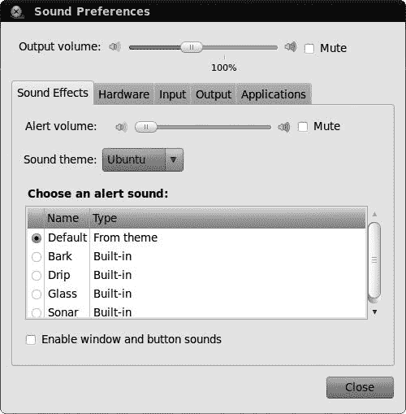
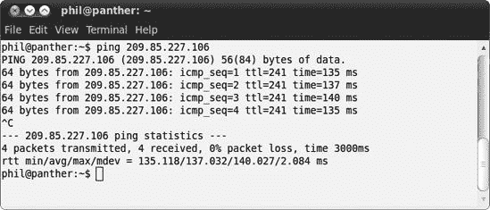
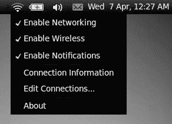
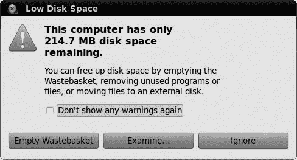
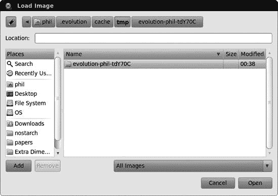

# 第二十一章. 受伤的翅膀

### 解决常见问题

就像死亡和税收一样，电脑问题是生活中不可避免的事实。Ubuntu 也有它自己的烦恼，尽管我似乎在 Ubuntu 上解决问题的花费时间比以前在 Windows 上少得多，但最好还是不要忽视你可能会有一天遇到硬件故障或棘手的软件情况的可能性。

本章的目的是为你提供一些通用的技巧、窍门和故障排除提示。你将找到如何解决几个具体问题的明确说明，但大部分内容我尽量保持一般性。这是因为解决某些问题的方法将很大程度上取决于你设置的特定性，而且没有足够大的书架来存放涵盖所有可能情况的详细指南。幸运的是，互联网上藏有大量的 Ubuntu 相关指南，所以即使你在这里找不到你想要的精确答案，我也希望你能利用我的建议在网络上找到正确的信息。

如果你遇到了问题，翻到这一章看看是否有能帮到你的内容。我涵盖了安装、启动、声音和视频、互联网和网络连接、硬盘和存储以及显示和显卡等方面的问题，还有那些令人烦恼的软件问题，比如程序冻结或减慢电脑速度。如果你没有遇到任何特定的电脑难题，你可能想快速浏览这一章，以便在将来不幸发生时知道如何应对。或者，你可以选择我更喜欢的路线：泡一杯热饮，回到游戏章节（第十七章中已经介绍过。

## 我的电脑无法从 CD 启动

如果你尝试从 Ubuntu 安装 CD 启动电脑，但连紫色启动屏幕都没有出现（参见跳入水中中的深入浅出。

**检查光盘的完整性**

你可能有一个损坏的 CD，你的电脑无法从它启动。你可以通过进行 *校验和* 测试来检查光盘是否有故障。校验和有点像指纹；你取你 Ubuntu 光盘的校验和，并与一个已知无故障的 Ubuntu 光盘的校验和进行比较。如果两个光盘之间只有一个微小的差异，校验和也会不同——指纹不会匹配。Ubuntu 使用 MD5SUM 程序来进行校验和。前往[`help.ubuntu.com/community/HowToMD5SUM/`](https://help.ubuntu.com/community/HowToMD5SUM/)，滚动到“Windows 上的 MD5SUM”部分，了解如何找到你光盘的校验和。如果校验和不匹配，你需要获取另一张光盘（例如，通过从[`www.ubuntu.com/getubuntu/download/`](http://www.ubuntu.com/getubuntu/download/)下载 CD 镜像或通过联系 No Starch Press 要求更换）。

**确保你正确地烧录了光盘**

如果你下载了 CD 镜像文件 (*.iso*) 而不是使用本书附带的光盘，请确保你正确地烧录了光盘。人们常犯的一个错误是将 *.iso* 文件直接复制到光盘上，就像它是一个普通文件一样。这是行不通的；你需要使用 CD 刻录软件中的“刻录光盘镜像”选项（或类似选项）来正确地进行操作。有关如何操作的说明，请参阅[`help.ubuntu.com/community/BurningIsoHowto/`](https://help.ubuntu.com/community/BurningIsoHowto/)。

## 我无法运行安装程序

如果你可以从 Ubuntu 光盘启动（显示图 21-1 中的紫色启动屏幕），但在选择尝试或安装 Ubuntu 时出现问题，你从未到达安装程序屏幕，那么电脑可能正在努力启动运行 Live CD 所需的某些软件。你可以尝试以下方法：

**尝试一些内核选项**

一旦进入紫色引导屏幕，按下任意键（我最喜欢的是空格键），然后使用箭头键和**回车键**从出现的列表中选择你的语言。然后，按 F6 键打开一个包含一系列神秘选项的小菜单（图 21-2). 这些是**内核选项**，可以用来关闭在尝试启动计算机时有时会引起问题的功能。使用箭头键上下移动列表，并使用**回车键**选择一个选项（旁边会出现一个`x`）。在第一次尝试时，我建议选择`acpi=off`、`noapic`、`nodmraid`和`nomodeset`。然后，按**esc**键隐藏菜单，并尝试通过在主列表中选择一个选项并按**回车键**来正常从光盘引导。如果那样没有起作用，你可能需要尝试一些传统的试错法来找到适合你的内核选项组合。

**尝试使用备用光盘/闪存驱动器**

有些计算机根本无法运行 live CD。可以从[`www.ubuntu.com/getubuntu/downloadmirrors#alternate/`](http://www.ubuntu.com/getubuntu/downloadmirrors#alternate/)获取一个基于文本的安装光盘；你将需要自己下载光盘镜像文件 (*.iso*) 并将其烧录到光盘上才能使用（有关详细信息，请参阅[`help.ubuntu.com/community/BurningIsoHowto/`](https://help.ubuntu.com/community/BurningIsoHowto/)）。这种方法不如从 live CD 的图形安装用户友好，但如果遇到问题，这种方法更有可能成功。你也可以尝试按照附录 A（apa.html "附录 A. 从 USB 闪存驱动器安装 Ubuntu"）中描述的方法从 USB 闪存驱动器安装。

图 21-1. 首次从 Ubuntu 光盘引导时显示紫色引导屏幕。

图 21-2. 通过 Ubuntu live CD 引导菜单禁用内核选项

## 安装程序中途停止

这可能是你可能会遇到的最令人烦恼的问题之一。你从 Ubuntu 光盘引导，浏览了第二章中描述的所有选项页面，然后点击**安装**以开始安装 Ubuntu。但是，在所有这些之后，安装程序没有完成，并且在大约 99%的地方卡住了。

发生这种情况的原因有很多，其中大多数与硬件的不当行为有关。我在本节中简要描述了一些你可以尝试的事情，但由于潜在问题可能仅与你的计算机硬件有关，你可能需要在 Ubuntu 论坛上寻求帮助。

**等待一段时间**

在某些计算机上安装所需的时间比在其他计算机上更长。这种情况可能由许多原因造成（例如硬件工作问题），但如果你额外给 20 或 30 分钟，它可能就会完成。

**断开互联网连接**

如果你连接到了互联网，安装程序在运行时可能会尝试获取额外的设置或查找软件包更新。如果在尝试这样做时出现问题，它可能会停滞，安装将无法完成。重新启动你的电脑，再次从 Live CD 启动，但这次在启动安装程序之前，请确保你已经断开了互联网连接。

**断开任何不必要的设备**

一些电脑硬件仅通过插入就可能使安装程序困惑。关闭你的电脑，断开或关闭任何你绝对不需要连接的设备。特别是打印机、扫描仪、USB 无线网卡和外置硬盘应该断开连接。然后，启动电脑，再次尝试安装。一旦安装完成，你应该能够将所有设备重新连接而不会出现任何问题。

**检查 CD 的完整性**

如果 CD 有故障，安装程序可能无法从光盘访问它需要的东西。参见我的电脑无法从 CD 启动在我无法安装 Ubuntu 中的建议，了解如何检查 CD 的完整性。

# 在 Ubuntu 完成启动之前出现问题

启动问题尤其尴尬——如果 Ubuntu 无法启动，你如何访问你需要修复问题的软件？为了克服这个特定的烦恼，你可能需要从 Live CD（如本书中包含的 CD）启动电脑，或者使用一些特殊选项来帮助这个过程。 

本节涵盖了两种最常见的启动问题类别，GRUB 错误和内核问题。对于其他类型的启动问题也有一些一般性建议，包括双启动用户在尝试启动 Windows 时遇到的问题的技巧。

## 我遇到了 GRUB 错误

当你尝试启动电脑时，你可能会遇到一个黑屏，上面显示有一个 GRUB 错误。这意味着 GRUB 引导加载程序存在问题，它负责告诉电脑硬件如何启动 Ubuntu。修复这些错误通常涉及输入一些看起来很神秘的命令或从 Live CD 启动，所以请做好心理准备。你可以在[`help.ubuntu.com/community/Grub2#GRUB%20Errors/`](https://help.ubuntu.com/community/Grub2#GRUB%20Errors/)找到处理常见 GRUB 错误的简要指南。

## 我遇到了内核恐慌或电脑冻结

内核恐慌有一个可怕的名字是有原因的。如果你收到一个错误消息说发生了内核恐慌，那么在 Linux 领域中可能发生了相当严重的问题，你可能发现直到解决问题你都无法使用计算机。幸运的是，这样的错误很少发生，即使你遇到了一个，你也应该能够通过不太多的工作来修复它。我还应该指出，内核恐慌之所以严重，是因为它们使得在计算机上运行软件变得困难——你的计算机的物理硬件部分根本不会损坏，所以一旦软件再次运行，一切都会恢复正常。所以实际上，根本不需要恐慌。

冻结和内核恐慌常常是相伴而生的，但它们并不一定是同一件事。你可能之前见过计算机冻结——移动鼠标或按键盘上的键没有任何反应，显示也保持冻结。如果计算机冻结，你能做的只是给它一分钟左右的时间看看它是否会唤醒，如果不会，就重新启动计算机或按住电源按钮几秒钟来关闭它。

如果你持续遇到内核恐慌或冻结，可以尝试以下几件事情，具体细节将在以下章节中详细说明。如果似乎什么都没有起作用，请在 Ubuntu 论坛上寻求建议，并且，如果有点运气，你很快就能重新启动并运行。

### 拔掉不必要的硬件

许多冻结问题都是由硬件设备的问题引起的。如果你最近购买了新的硬件，尝试拔掉它并看看是否仍然出现冻结。如果你最近安装了一些系统更新，某些硬件的驱动程序也可能导致问题。拔掉任何不必要的硬件（如扫描仪、打印机、外置硬盘等）以检查它们是否引起问题是有意义的。

### 禁用受限驱动程序

一些冻结是由加速图形驱动程序的问题（参见显示和显卡问题中的游戏/Compiz 不工作：安装加速图形驱动程序）或其他硬件的受限驱动程序引起的（参见安装您的网络/无线网卡驱动程序）。如果您怀疑可能是这种情况，如果可能的话，禁用受限驱动程序。为此，选择**系统** ▸ **管理** ▸ **硬件驱动程序**以打开硬件驱动程序工具（图 21-3

图 21-3. 使用硬件驱动工具禁用受限驱动程序

### 检查您的系统内存是否存在缺陷

您的系统内存（也称为 RAM）对计算机的运行至关重要。当它们运行时，所有程序（包括 Linux 本身）都会将信息存储在这里。如果您的系统内存出现故障，可能会开始出现冻结和崩溃，似乎没有原因。

要检查系统内存的问题，请从本书附带的光盘 Ubuntu CD 启动（参见第二章以提醒自己如何操作）。一旦出现紫色启动屏幕，请按下一个键，并从弹出的灰色菜单中选择您的语言。然后，从主菜单中选择**测试内存**，并按**Enter**键。屏幕将变为蓝色，Memtest86 程序将开始运行（图 21-4）。

Memtest86 会反复将信息写入您的系统内存，然后在几分钟后访问它们。这有点像对您的 RAM 进行压力测试。让它运行，直到屏幕右上角的`Pass`百分比超过 100%一次或两次——这可能会持续一个或两个小时，具体取决于您的系统内存量。到那时，Memtest86 应该已经找到了系统内存中的任何故障，并在屏幕上报告了它们。如果它确实发现了一个问题，您可能需要更换一些 RAM，因为它可能已经损坏。

在 Memtest86 运行时，您可以随时关闭计算机——您不需要像通常那样正确地关闭它。

图 21-4. 使用 Memtest86 检查内存故障

### 使用较旧的内核

一些冻结是由于内核更新或驱动程序的问题引起的。如果你安装了较旧的 Linux 内核版本，你可以尝试使用它。查看如果更新破坏了你的日子……或系统中的如果更新破坏了你的日子……或系统以获取运行较旧内核的说明。

### 使用救援模式

如果你已经在网上寻求帮助，很可能会被要求输入一些命令来尝试修复你的电脑。但是，如果你无法启动电脑，就无法输入任何命令，因此你需要使用救援模式来获得命令行。

重新启动你的电脑，尽可能快地按住 shift 键，直到出现一个类似于图 21-5 的 GRUB 引导菜单。如果你有双启动设置，你可能会习惯看到这个引导菜单。然后，使用键盘选择带有(*恢复模式*)的顶部项目，并按**enter**键。屏幕上会闪烁一段时间文本，然后你会留在恢复菜单屏幕上。

使用箭头键高亮显示`netroot`选项，然后按**enter**键。在更多文本通过之后，你会被带到根命令行，它可能会显示类似`root@rg-laptop:˜#`的内容，并有一个闪烁的光标。从这里，你可以输入可以帮助你修复电脑的命令。

尤其，你可能想尝试更新你的系统，看看后续的更新是否解决了你的问题。（这只有在连接到互联网的情况下才会有效。）输入**`apt-get update`**；然后按**enter**键，等待更新包列表。然后，输入**`apt-get dist-upgrade`**以查看是否有更多可安装的更新。

### 注意

在恢复模式下，无线互联网连接不太可能工作。如果你可以，请用以太网线将电脑连接上。

图 21-5. GRUB 引导菜单

### 重新安装 Ubuntu

很遗憾地说，如果你尝试了各种方法都无法解决问题，重新安装 Ubuntu 可能是个不错的选择。为此，请遵循第二章中的说明。你可能还需要从附录 C 中获取一些关于手动分区的建议。

在您重新安装之前，请记住备份您想要保留的任何文件。您可以在运行 Live CD 时将它们复制到外部硬盘或 USB 闪存驱动器上——您要访问文件只需按照项目 18A：访问 Windows 分区上的文件（适用于双启动用户）")中描述的方法挂载您的硬盘 Project 18A: Accessing Files on Your Windows Partition (for Dual-Booters)")（但挂载 Ubuntu 分区而不是 Windows 分区）。

## Windows 无法启动

如果您在双启动设置中安装了 Ubuntu，您可能会发现当您尝试启动 Ubuntu 而不是 Windows 时，计算机重新启动或显示错误消息。双启动 Windows 设置有时会有休眠和磁盘检查的问题，因此请尝试以下步骤，看看您是否可以再次使其工作：

1.  启动到 Ubuntu，并挂载您的 Windows 分区（有关如何操作的详细信息，请参阅第十八章）。

1.  找到*hiberfil.sys*（它应该位于 Windows 分区的顶级文件夹中，如图 21-6 所示 Figure 21-6)，并将其重命名为类似*old_hiberfil.sys*的名称。这将导致 Windows 忽略它存储的所有休眠信息。

1.  重新启动您的计算机，并从 GRUB 启动菜单中选择它来启动 Windows。理想情况下，Windows 现在应该可以启动。

1.  如果 Windows 无法启动，出现黑屏或重启，请再次重新启动计算机进入 Windows，但这次在选择从 GRUB 菜单启动 Windows 后立即按 F8 键几次。应该会出现一个 Windows 启动菜单。

1.  选择**安全模式（带网络）**选项，看看它是否可以运行。如果可以，请在 Windows 中进行磁盘检查。您可以通过转到（我的）电脑，右键单击您的硬盘，然后选择**属性**来完成此操作。您可以在工具选项卡上找到所需的错误检查选项。一旦检查完成，重新启动计算机以查看 Windows 是否可以正常启动。

您可能需要重复重新启动并按 F8 的步骤一两次才能使其生效——每次它要求进行磁盘检查时都让它运行。

图 21-6. 包含 hiberfil.sys 文件的 Windows 分区的顶级文件夹

# 声音和视频问题

如果您在尝试观看电影或播放歌曲时遇到静音，那么您可能租的是查理·卓别林的电影，或者您遇到了声卡问题。假设是后者，您会发现 Ubuntu 中大多数与声音相关的问题都是由使用不正确的声卡设置引起的。不幸的是，这些设置的数目往往令人难以承受，而且很少明显知道您应该更改哪些设置才能使一切正常工作。对于声音问题，恐怕您只能通过试错来解决，尽管我已经尽力在本节中解释尽可能多的相关选项来帮助您。

如果问题更多地与您看不到的内容有关，而不是您听不到的内容，那么您可能会有一个更轻松的旅程。视频问题通常更容易解决——大多数时候，您只需要找到正确的软件进行安装，然后，嗯，安装它。有关视频问题的更多信息，请跳转到本节的末尾。

## Ubuntu 不播放任何声音

Ubuntu 可能不播放任何声音的原因有很多。在本节中，我将重点介绍一些更基本的问题，但如果这些问题都没有帮助，您始终可以尝试 Ubuntu 论坛或 IRC；这两个话题在第二十章中有详细讨论。

要开始故障排除，在您的计算机上找到一首歌曲，并在 Rhythmbox 或 Totem 电影播放器中播放它。（如果您需要，可以在*/usr/share/example-content/Ubuntu_Free_Culture_Showcase*文件夹中找到一个示例歌曲，名为“挫折蓝调”）。您需要在后台持续播放声音文件，以便您能够判断更改这些设置是否有效。

如果您甚至无法开始播放文件，那么 Ubuntu 可能没有正确检测到您的声卡。打开终端（**应用程序** ▸ **附件** ▸ **终端**），将其中的**`aplay -l`**输入到终端中，然后按**回车键**。如果播放硬件设备列表为空，则您的声卡没有被检测到。在这种情况下，您肯定需要获得一些社区支持——有关使用 Ubuntu 论坛和 IRC 的更多信息，请参阅第二十章。

接下来，检查您的扬声器是否已开启，音量已调高，并且已正确插入到计算机的正确插孔上（通常是浅绿色）。过去很多时候，我把扬声器插到麦克风插孔上，坐那里纳闷为什么它们是静音的。当您确信扬声器没有问题时，尝试以下步骤：

1.  点击顶部面板上的扬声器图标，然后从弹出的菜单中选择**声音首选项**。声音首选项窗口将出现（图 21-7）。

1.  确保未选中静音选项，并且窗口顶部的输出音量滑块已拉到最右边。

1.  点击**应用程序**标签页，并确保列表中的应用程序没有静音或音量设置得过低。

1.  点击**输出**标签页，并确保选择了正确的连接器。如果你不确定，可以通过试错法尝试选择不同的连接器，直到找到一个可以工作的。如果它们都不工作，请将此选项恢复到其原始设置（通常是模拟扬声器）。

1.  点击**硬件**标签页，并从配置文件选项中选择不同的设备。然后，重复之前的步骤，检查是否没有静音或音量过低，并且已选择正确的输出设备。试错法通常有效。

如果以上方法都没有帮助，请查看[`ubuntuforums.org/showthread.php?t=205449/`](http://ubuntuforums.org/showthread.php?t=205449/)。这是一份相当全面的指南，用于识别声音问题，尽管它需要在终端中做大量工作。（如果需要刷新对终端工作方式的记忆，请参阅第九章。）

图 21-7. 声音首选项窗口

## 我的麦克风不工作

只要你的声卡被 Ubuntu 正确检测到，任何带有标准音频插孔连接（类似于耳机插孔）的麦克风都应该可以工作。

要测试你的麦克风，选择**系统** ▸ **首选项** ▸ **声音**以打开声音首选项窗口，然后转到**输入**标签页（图 21-8）。在那里，你会看到一个输入电平指示器，当你发出声音时，它应该上下跳动。如果你发出声音时指示器没有任何反应，那么麦克风没有被检测到，所以尝试以下一些建议。

**插入设备**

确认麦克风已插入正确的插孔（应标记有小型麦克风符号，通常是粉红色）。此外，请注意，某些声卡可以在不同的插孔之间切换输入和输出，所以你认为的麦克风插孔可能实际上被分配给了其他设备。在这种情况下，尝试将麦克风插入其他插孔。

**调高音量**

返回声音首选项窗口的**输入**标签页，并在必要时将输入音量调至最高。如果你的声卡或麦克风有音量控制，请确保它也被调高。

**检查是否未静音**

在**输入**标签页上，确保位于输入音量控制旁边的静音选项没有被勾选。

图 21-8. 声音首选项窗口的输入标签页

**选择正确的设备**

Ubuntu 有时会将声卡检测为多个设备。在声音首选项窗口中点击**硬件**选项卡，并尝试从列表中选择不同的声音设备或为设备选择不同的配置文件。你也可以尝试在输入选项卡的“选择声音输入设备”列表中更改设备。

**选择正确的输入**

一些声卡拥有多个麦克风输入。这种情况在笔记本电脑上很常见，可能有一个麦克风插孔和一个内置麦克风。请检查你是否已启用正确的输入，通过在声音首选项窗口的输入选项卡上更改连接器选项（图 21-8）。

**使用不同的程序进行测试**

如果你的麦克风没有声音，可能是你使用的录音程序有问题，而不是麦克风设置的问题。尝试使用不同的程序来测试麦克风。声音录音机（**应用程序** ▸ **声音与视频** ▸ **声音录音机**）通常很有帮助。

### 注意

似乎 Skype 程序特别容易受到麦克风相关问题的困扰。请参阅[`help.ubuntu.com/community/Skype/`](https://help.ubuntu.com/community/Skype/)获取一些针对 Skype 的特定声音故障排除技巧。

## 我无法播放音频或视频文件

无法播放音频或视频文件最常见的原因是你没有安装必要的*编解码器*来播放文件。编解码器是一小段软件，它将特定音频/视频格式的支持添加到程序中。Rhythmbox 和 Totem 电影播放器通常会为你找到正确的编解码器（例如，参见项目 14A：为音频应用程序安装 MP3 支持，位于项目 14A：为音频应用程序安装 MP3 支持）。然而，如果它们失败了，尝试安装 Ubuntu 受限额外包——这个包包含了很多额外的编解码器。安装完成后，关闭并重新打开你的音频/视频文件，看看是否能够播放。如果不能，你可以尝试使用不同的程序，可能内置了正确的编解码器。尝试安装 MPlayer 媒体播放器或 VLC 媒体播放器——这两个程序都支持广泛的格式。

如果你发现难以在网络上播放视频（例如 YouTube 上的视频），请参阅多媒体插件，位于保持实时书签更新部分。

文件无法播放的另一个原因是文件已损坏。如果你下载了该文件，请尝试重新下载——有时在下载过程中可能会意外遗漏文件的部分，因此重复下载应该可以解决这个问题。

最后，你可能遇到的问题是你的声卡。参见 Ubuntu 无法播放任何声音以获取建议。

# 互联网和网络连接问题

如果你还没有能够将 Ubuntu 连接到互联网（或网络），最可能的原因是你的无线/网络卡没有被正确检测到。其他人可能之前也遇到过相同网络卡的问题，所以总是建议在网上搜索，看看是否可以找到设置你的卡的具体说明。然而，你并不保证能找到有用的（或可理解的）东西，所以我在这部分提供了一些诊断连接问题和安装网络和无线网卡驱动程序的一般性说明。

## 寻找连接问题的原因

连接问题有如此多的不同原因，以至于很难知道从哪里开始。在本节中，我提供了一些提示，告诉你如何获取更多信息，帮助你找出你的连接问题。不幸的是，其中一些信息相当技术性，因此你可能觉得这些测试的结果有些令人困惑。如果是这样的话，只需记下你得到的结果。这些信息可能对论坛或其他地方的人有所帮助，他们可以帮助你解决问题。

**你有互联网连接吗？**

打开 Firefox，尝试访问一个流行的网站，如[`www.google.com/`](http://www.google.com/)或[`www.bbc.co.uk/`](http://www.bbc.co.uk/)。如果你无法加载这两个页面，并且收到“服务器未找到”的消息或类似消息，你可能没有互联网连接，或者你可能只是 Firefox 有问题。为了检查，打开终端（**应用程序** ▸ **附件** ▸ **终端**），然后输入**`ping 209.85.227.106`**并按回车。这应该会 ping 谷歌的服务器；*ping*服务器是一种检查你的电脑是否可以与其通信的方法。如果你收到以文本`64 bytes from`开头的消息（如图 21-9 所示），你有一个正常工作的互联网连接。按**ctrl**-C 停止 ping 谷歌。在这种情况下，问题可能是你的 DNS 设置或其他软件的问题，而不是你的连接或你的网络/无线网卡。如果你收到任何其他消息，你可能没有连接到互联网，所以可能是硬件问题。

图 21-9. 如果你有正常工作的互联网连接，ping 谷歌服务器的结果

**你的网卡被识别了吗？**

打开终端，输入**`lshw -c network -short`**，然后按**enter**键。你的电脑上识别到的网络和无线网卡列表将会显示出来，类似于图 21-10 中所示；检查是否有任何描述与你的网卡型号相匹配。如果有的话，说明网卡已被识别，但可能不一定安装了正确的驱动程序。

图 21-10. 我的电脑上识别到的网络和无线网卡列表

**你的网卡已经开启了吗？**

如果你有一个无线网卡，它可能已经被关闭了。请参阅找不到无线网络中的说明，了解如何检查是否如此。

**你使用的是正确的驱动程序吗？**

Ubuntu 有时会为网络/无线网卡使用错误的驱动程序。要检查你的网卡正在使用哪个驱动程序，打开终端，输入**`lshw -c network`**然后按**enter**键。滚动查看所有文本，找到与你的网卡`product`或`vendor`相匹配的网卡。然后继续向下滚动几行，直到到达`configuration`行。这将告诉你正在使用哪个驱动程序以及驱动程序的版本号。你可以将此与[`wiki.ubuntu.com/HardwareSupportComponentsWiredNetworkCards/`](https://wiki.ubuntu.com/HardwareSupportComponentsWiredNetworkCards/)（有线网络网卡）或[`help.ubuntu.com/community/WifiDocs/WirelessCardsSupported/`](https://help.ubuntu.com/community/WifiDocs/WirelessCardsSupported/)（无线网卡）上的信息进行比较。

**你检查过你的设置了吗？**

选择**系统** ▸ **首选项** ▸ **网络连接**，在相应的标签页中找到你的连接条目。然后选择该连接，点击**编辑**。检查编辑窗口中的设置，看是否有任何错误——常见的问题包括默认网关和 DNS 服务器（如果你手动配置了有线网络）以及无线安全密钥（如果你有无线连接）。

对于那些在无线连接上遇到困难的人，你可以在[`help.ubuntu.com/community/WifiDocs/WirelessTroubleShootingGuide/`](https://help.ubuntu.com/community/WifiDocs/WirelessTroubleShootingGuide/)找到无线故障排除指南。不过，它有些地方相当技术性，所以你可能更愿意在 Ubuntu 论坛上寻求帮助。

## 安装网络/无线网卡驱动程序

如果你的网卡或无线网卡没有被识别或按预期工作，你可能需要安装一些不同的驱动程序。你可以尝试几种方法，而哪种方法有效将很大程度上取决于你的网卡的型号。以下章节中包含了两种最通用的方法，但某些网卡需要你遵循非常具体的说明才能使其工作。[`wiki.ubuntu.com/HardwareSupportComponentsWiredNetworkCards/`](https://wiki.ubuntu.com/HardwareSupportComponentsWiredNetworkCards/)（有线网卡）和[`help.ubuntu.com/community/WifiDocs/WirelessCardsSupported/`](https://help.ubuntu.com/community/WifiDocs/WirelessCardsSupported/)（无线网卡）的列表应该能够帮助你确定使用哪种方法。

## 检查受限制的驱动程序

一些网络/无线网卡有*受限制的驱动程序*，你可以下载这些驱动程序来使你的网卡工作。这些驱动程序通常由网卡制造商提供，并且是“受限制的”，这意味着如果它们出现问题，Ubuntu 开发者无法修复它们（换句话说，它们不是开源的）。

你需要连接到互联网才能下载受限制的驱动程序。如果你没有有效的连接（可能是因为你目前正在尝试使你的网卡工作！），请尝试使用以太网线将计算机直接连接到无线路由器或电缆调制解调器（有关更多信息，请参阅第四章）。这仅在你有一个功能正常的有线网络网卡时才有效。如果你的有线网络网卡不工作，你将无法遵循这些说明。

1.  选择**系统** ▸ **管理** ▸ **硬件驱动程序**。Ubuntu 将搜索受限制的驱动程序。如果找到任何，它们将显示在窗口顶部的列表中（如图 21-3 所示）。

1.  检查是否有任何受限制的驱动程序与网络或无线有关（它们的描述中应该会提到）。如果你找到一个相关的，选择它，然后点击**激活**以下载和安装它。某些网卡需要两个驱动程序，所以如果你找到两个看起来相关的驱动程序，请安装它们。

1.  安装完成后，你可能会被告知重新启动计算机。无论如何这样做都是一个好主意，所以请重新启动。

1.  理想情况下，在重新启动并再次登录后，你现在应该能够使用你的网络/无线连接。有关如何连接的详细信息，请参阅第四章。

### 安装 Windows 驱动程序

信不信由你，有时您可以在 Ubuntu 中使您的网络/无线网卡驱动程序工作。为此，您需要您的网卡 Windows 驱动程序，以及一个名为 *ndiswrapper* 的程序，该程序可以将驱动程序转换为更符合 Ubuntu 的格式。完整的说明可在 [`help.ubuntu.com/community/WifiDocs/Driver/Ndiswrapper/`](https://help.ubuntu.com/community/WifiDocs/Driver/Ndiswrapper/) 找到，但以下是一个帮助您开始的概述：

1.  找到您的网卡 Windows 驱动程序。这些通常与您的电脑一起提供的 CD 一起提供，或者您可能可以从网卡制造商的网站上下载它们。驱动程序列表可在 [`sourceforge.net/apps/mediawiki/ndiswrapper/`](http://sourceforge.net/apps/mediawiki/ndiswrapper/) 找到。

1.  找到您网卡驱动程序的 Windows XP 版本的 *.inf* 文件。驱动程序通常以 Zip 文件的形式提供，您可以在其中打开并搜索 INF 文件，或者在驱动程序 CD 的文件夹中。如果您找不到文件，您可能可以在之前步骤中提到的 ndiswrapper 网站上获取更多信息。

1.  将 *.inf* 文件保存在您的桌面上或其他方便的位置。

1.  借一台可以上网的电脑，并从以下链接下载 *.deb 文件（在文件可以下载之前，您需要点击链接选择附近的地点）：

    | [`packages.ubuntu.com/lucid/all/ndiswrapper-common/download`](http://packages.ubuntu.com/lucid/all/ndiswrapper-common/download) |
    | --- |
    | [`packages.ubuntu.com/lucid/i386/ndiswrapper-utils-1.9/download`](http://packages.ubuntu.com/lucid/i386/ndiswrapper-utils-1.9/download) |
    | [`packages.ubuntu.com/lucid/i386/ndisgtk/download`](http://packages.ubuntu.com/lucid/i386/ndisgtk/download) |

1.  将三个 *.deb 文件保存到闪存驱动器或其他存储设备中，然后使用它将它们复制到您的 Ubuntu 电脑上。再次提醒，将它们复制到桌面上会方便一些。

1.  现在，双击 *ndiswrapper-common* 文件，并安装它（参见 项目 6B：从 PPA 安装软件：OpenSonic 在 APT-URL：从网站安装 中了解如何进行此操作）。

1.  安装完成后，安装 *ndiswrapper-utils* 文件。安装这些文件的顺序很重要。

1.  最后，安装 *ndisgtk* 文件。

1.  现在，选择 **系统** ▸ **管理** ▸ **无线网络驱动程序**，如果需要，请输入您的密码。无线网络驱动程序窗口将打开（图 21-11）。

1.  点击 **安装新驱动程序**，然后点击 **位置** 按钮。选择您之前找到的 *.inf* 文件，然后点击 **打开**。

1.  点击 **安装**。如果一切顺利，您的网卡 Windows 驱动程序将被安装。

1.  重新启动您的计算机，登录后再次尝试连接（第四章）。

如果在这个过程中出现问题，请不要担心——在过程中可能会遇到几个小问题。访问步骤 1 中提到的 ndiswrapper 网站，或在 Ubuntu 论坛上寻求更具体的建议。

图 21-11. 无线网络驱动程序窗口

## 没有找到无线网络

如果您知道您的无线卡在 Ubuntu 中工作正常，但似乎找不到任何网络，请尝试本节中的步骤：

1.  检查您的无线卡是否已开启。许多笔记本电脑有一个键盘快捷键可以切换无线卡的开关（在我的电脑上是**fn**-F2）。一些卡有一个需要翻转的物理开关。如果您的卡有一个带电缆的天线，请确保它牢固地固定在卡上。

1.  现在，在顶部面板上右键单击网络管理器图标，并确保已勾选**启用网络**和**启用无线**（图 21-12). 如果没有勾选，请勾选它们，并等待一分钟或两分钟，直到无线卡唤醒。

1.  如果已勾选启用无线选项，请尝试取消勾选，等待一分钟左右，然后再次勾选。您的无线卡可能需要重新开启和关闭才能唤醒。您还可以尝试使用我在步骤 1 中提到的硬件开关/键盘切换。

1.  如果这些都没有效果，请尝试重新启动您的计算机。一些无线卡在休眠或挂起计算机后工作正常，之后它们会进入深度睡眠。重新启动应该足以唤醒它。

1.  您还应该检查您想要连接的网络没有隐藏的网络名称（也称为*SSID*）。如果有，它将不会出现在网络管理器的列表中，您需要手动输入其名称才能连接。为此，请单击网络管理器图标，从菜单中选择**连接到隐藏的无线网络**，并在出现的窗口中填写详细信息。

1.  最后，如果您仍然有困难，您确定您足够接近无线基站吗？如果信号太弱，您的卡可能根本无法检测到网络。

    

    图 21-12. 在网络管理器中确保无线和网络连接已启用

## 我的计算机上的其他用户无法连接

如果您的计算机上有多个用户帐户，您可能会发现您可以连接到互联网，但其他用户不能。要解决这个问题，您需要使网络连接对所有用户可用：

1.  当你在用户账户中工作时，选择**系统** ▸ **首选项** ▸ **网络连接**。

1.  在其中一个标签页中找到你使用的网络连接。例如，如果你使用名为“Marconi”的无线网络，你将点击**无线**标签页，并在列表中查找*Marconi*。

1.  选择网络，然后点击**编辑**。

1.  在屏幕底部检查**对所有用户可用**选项，然后点击**应用**。

1.  当提示时，输入你的密码。网络将断开连接，你可能需要通过在顶栏使用网络管理器图标来重新连接它（有关连接的更多详细信息，请参阅第四章）。

1.  登录到不同的用户账户。现在你应该也能在该用户账户中连接到网络了。

# 显示器和显卡问题

最近，Ubuntu 在检测显卡方面做得非常出色，所以你不太可能遇到屏幕一片空白的情况。然而，事情并不总是完美的。本节将介绍如何解决诸如获取 3D 加速支持（如果缺失）和调整屏幕分辨率（如果看起来很奇怪）等问题。以防万一，这里还有一些帮助解决令人讨厌的空白屏幕的方法。

## 游戏/Compiz 无法工作：安装加速显卡驱动

如果你无法让 Compiz 或某个游戏工作，你可能需要安装一些加速显卡驱动。这是因为由于缺乏合适的开源替代品，一些显卡默认安装的只是基本驱动程序（无法处理复杂效果和 3D 游戏）。如果你的显卡存在加速驱动，你可以通过选择**系统** ▸ **管理** ▸ **硬件驱动程序**，从列表中选择显卡驱动程序，然后点击**激活**来安装更强大的（但可能不太开源）的驱动程序。安装完成后，重新启动计算机，新的驱动程序应该会被启用。

你可以直接从一些制造商那里下载 Linux 显卡驱动程序。这些驱动程序通常比 Ubuntu 自带的那些更新得更频繁，而且可能还有一些额外的功能。接下来的几节将介绍如何为最大的两个制造商 ATI 和 nVidia 获取这些驱动程序。

### ATI 显卡

1.  访问[`support.amd.com/us/gpudownload/Pages/index.aspx/`](http://support.amd.com/us/gpudownload/Pages/index.aspx/)，并在页面左侧的列表中选择*Linux x86*。

1.  从下一个列表中选择你拥有的卡类型，并从旁边的列表中选择你的卡的型号/系列。

1.  点击**GO**！，你将被带到驱动程序的下载页面。滚动到页面底部，然后点击**下载**。

1.  当提示时，点击**保存文件**以下载驱动程序。

1.  下载完成后，找到驱动程序文件。它可能被保存在你的*下载*文件夹中，并且文件名可能以*.run*结尾。

1.  打开终端（**应用程序** ▸ **附件** ▸ **终端**），并输入**`cd Downloads`**（后跟**enter**）以切换到你的下载文件夹（如果它存储在那里）。

1.  现在，输入**`chmod +x ati-driver*.run`**，然后按**enter**键使其可以作为一个程序运行。

1.  要启动安装程序，输入**`sudo ./ati-driver`**，然后按**tab**键。这应该会为你完成安装程序文件的名称，因此你可以按**enter**键并运行安装程序。

1.  输入你的密码。然后，按照屏幕上的说明安装驱动程序。

### nVidia 显卡

1.  前往[`www.nvidia.com/object/unix.html`](http://www.nvidia.com/object/unix.html)，并点击“Linux IA32”标题下的最新版本链接（如果你运行的是 64 位版本的 Ubuntu，则点击“Linux IA64”标题下的链接）。

1.  点击**下载**，然后点击**同意并下载**。当提示时，点击**保存文件**以下载驱动程序。

1.  查找驱动程序文件；它可能位于你的*下载*文件夹中，文件名以*.run*结尾。

1.  打开终端（**应用程序** ▸ **附件** ▸ **终端**），输入**`cd Downloads`**，然后按**enter**键切换到你的*下载*文件夹（如果它存储在那里）。

1.  现在，输入**`chmod +x NVIDIA-Linux*.run`**，然后按**enter**键使其可以作为一个程序运行。

1.  要启动安装程序，输入**`sudo ./NVIDIA-Linux`**，然后按**tab**键。这应该会为你完成安装程序文件的名称，因此你可以按**enter**键并运行安装程序。

1.  输入你的密码，然后按照屏幕上的说明安装驱动程序。

### 注意

由于它们不是开源的，一些图形驱动程序的质量可能会有所不同，而且问题不能由 Ubuntu 开发者解决（就像开源驱动程序那样）。因此，一些加速图形驱动程序可能会引起问题，最常见的情况是在你尝试休眠或挂起计算机时。如果你遇到问题，考虑卸载驱动程序，以便恢复到默认的开源版本。

## 屏幕看起来被拉伸或大小不正确

如果你的屏幕看起来不太对劲，屏幕分辨率可能检测错误。要解决这个问题，选择**系统** ▸ **首选项** ▸ **显示器**，并将分辨率设置更改为与屏幕默认分辨率相匹配（如果你不知道默认值是什么，可以通过试错法）。点击**应用**；如果一切看起来正常，点击**保留此配置**。如果你的屏幕变黑，不要担心——只需等待 30 秒，分辨率将恢复到原始设置。

如果您的显示器没有从列表中提供正确的分辨率，您可能需要使用不同的显示驱动程序。请参阅显示和显卡问题中的游戏/Compiz 不工作：安装加速显卡驱动程序。

## 屏幕变黑

空白屏幕的可能原因之一是显卡或其驱动程序出现了问题。幸运的是，这种情况相对罕见，更有可能的是发生了小问题（并且容易解决）。在开始担心显卡末日场景之前，请先查看以下提示：

**检查显示线缆是否连接**

大多数台式电脑都有一个独立的显示器，可以插入电脑的后面。查看显示器的后面，确保从其后面伸出的两根线缆在两端都牢固地插好。您还可能想检查显示器是否已开启，以及其电源线是否没有熔断。

**尝试唤醒电脑**

您的电脑可能进入了省电（睡眠）模式，您可以通过移动鼠标或按键盘上的键将其唤醒。如果这不起作用，请尝试按一次电脑上的电源按钮。这有时也能唤醒处于睡眠状态的电脑。

**切换到命令行**

负责在屏幕上显示内容的 Ubuntu 部分被称为*X11*，或简称*X*。有时 X 无法启动。要查看是否如此，请按**ctrl**-**alt**-F2。如果除了 X 之外一切正常，您应该会看到一个`login:`提示。您可以在命令行中输入您的用户名和密码（在每个输入后按**enter**键），就像在第九章中遇到的终端一样。当您使用命令行时，尝试输入**`sudo startx`**，然后按回车键，如果提示，请再次输入您的密码。这将尝试启动 X；它可能成功，也可能给您一个错误消息，告诉您问题所在。或者，输入**`sudo reboot`**来重启您的电脑。（如果您想知道这里发生了什么，按**ctrl**-**alt**-F2 是将您切换到了不同的*虚拟终端*。Ubuntu 启动了几个虚拟终端，并用于不同的事情；按**ctrl**-**alt**-F7 将切换回 X 用于显示一切的虚拟终端。）

**重启电脑**

一些电脑偶尔会启动，但显卡或显示器没有开启。（这个问题在较老的电脑上更为常见。）作为最后的手段，尝试通过按电源按钮关闭电脑，然后再打开。如果电脑无法关闭，请按住电源按钮几秒钟，直到它关闭。

# 硬盘和存储问题

我直到买了数码摄像机后，才真正理解了如何完全填满硬盘。如果你也有类似的昂贵磁盘使用习惯，这一节就是为你准备的。这里有一些关于如何释放一些磁盘空间以及在最坏的情况下如何处理**完全**满的磁盘的建议。

## 我的磁盘几乎已满

如果你的硬盘几乎已满，Ubuntu 会弹出一个类似于图 21-13 的警告信息。点击**检查**按钮以启动磁盘使用分析器——它将扫描你的磁盘并显示一个彩色图表，显示占用磁盘空间最多的是什么。你可以使用这些信息来查找占用你磁盘容量最多的文件和文件夹。如果你想知道确切有多少磁盘空间可用，选择**系统** ▸ **管理** ▸ **系统监视器**，在文件系统选项卡上查看每个磁盘剩余的空间。

图 21-13. 一个警告信息，提示你的磁盘空间几乎已满

除了翻找你的家目录并删除不必要的文件外，你还可以尝试其他一些方法来释放磁盘空间：

**清空垃圾箱**

当你删除文件时，它们会被移动到**垃圾箱**文件夹，以防你改变主意想要撤销删除。要清空**垃圾箱**文件夹（从而永久删除其中的所有文件），点击底部面板上的**垃圾箱**图标，然后在出现的 Nautilus 窗口中点击**清空垃圾箱**按钮。

**清理不必要的软件包**

当你使用 Ubuntu 软件中心移除一个软件包时，它有时会留下一些在系统上同时安装的其他软件包，即使它们现在不再需要。要移除它们，打开终端，输入**`sudo apt-get autoremove`**，然后按**回车**。当提示输入密码时，输入密码后按**回车**，查看是否有可以移除的遗留软件包。如果有，按 Y 然后按**回车**来移除它们。

**清空软件包缓存**

当 Ubuntu 软件中心安装一个程序时，它会保留安装程序所用的软件包一段时间，以防再次需要。这些缓存文件可能会占用相当多的磁盘空间，但删除它们是可以的（程序不会被卸载或类似操作）。打开终端，输入**`sudo apt-get clean`**，然后按**回车**。如果提示输入密码，输入密码后按**回车**以清空缓存。

## 我的磁盘已完全满

如果您的硬盘已完全满载，您可能根本无法启动 Ubuntu，您将只看到一个空白屏幕。如果发生这种情况，请按**ctrl**-**alt**-F2 切换到终端登录提示符。输入您的用户名，然后按**enter**，接着输入您的密码，然后再次按**enter**，以访问命令行。一旦进入，尝试通过输入我的磁盘几乎满了中推荐的某些命令来清理一些磁盘空间，该命令位于硬盘和存储问题。您也可以使用`rm`命令从您的家目录中删除一些文件，但请注意：使用`rm`时没有撤销操作。

一旦清理了一些磁盘空间，输入**`sudo reboot`**来重启计算机。如果有幸的话，现在应该有足够的磁盘空间供您登录。

## 我无法删除文件

无法删除文件的一般原因是您没有删除文件的正确权限（有关文件权限的解释，请参阅第七章）。右键单击文件存储的文件夹中的空白区域，选择**属性**，然后选择**权限**选项卡。如果您是所有者，请确保您的文件夹访问权限设置为创建和删除文件。点击**关闭**，然后再次尝试删除文件。

如果您不是文件夹的所有者，您必须先获得对该文件夹的所有权，才能删除文件。这时您需要问自己，“我真的应该删除别人的文件吗？”有时文件权限会搞乱，所以文件可能是您的——在这种情况下，删除它是可以的。但如果文件是别人的，请先征求他们的许可。如果您确信删除文件是个好主意，请打开终端，并使用**`chown`**命令更改文件夹的所有权。以下是它是如何工作的：如果我想从我的*图片*文件夹中的*宠物*文件夹中删除名为*cats.jpg*的文件，我会输入**`sudo chown phil ˜/Pictures/Pets`**，然后按**enter**键（记住，*˜*代表“我的家目录”）。在输入我的密码并再次按**enter**后，我会成为*宠物*文件夹的所有者，可以像平常一样删除*cats.jpg*。当然，您应该用您自己的文件夹名和用户名替换我的文件夹名和用户名，这样它才能为您工作。

### 注意

除非您确信自己在做什么，否则不要使用此方法删除系统文件（换句话说，不是存储在 */home* 文件夹中的文件）。您没有权限删除系统文件，这是有原因的；如果您移除了关键文件，可能会真的搞砸您的系统。

# 软件安装问题

今天的 Ubuntu 软件管理工具通常运行得很顺畅。尽管如此，我还是包括了一些针对曾经很常见（但随着每个版本的发布似乎变得越来越少）的两个或三个问题的故障排除技巧。如果你在安装、删除或更新包时遇到问题，本节就是为你准备的。

## 我在安装程序时遇到了未认证包的错误

如果你在尝试安装程序时收到关于未认证包的错误消息，请尝试以下操作：

1.  选择**系统** ▸ **管理** ▸ **更新管理器**以打开更新管理器。

1.  点击**检查**按钮，如果提示，请输入你的密码。包列表将被更新，以及所有用于检查你的包是否“认证”的文件。

1.  当它完成更新包列表后，关闭更新管理器，然后再次尝试安装你的程序。

如果你仍然收到错误消息，你可能已经添加了一个软件仓库，但没有添加其 GPG 密钥。GPG 密钥是执行错误消息中提到的认证操作所必需的。如果是这种情况，请参阅添加额外软件仓库中的说明，了解如何添加仓库的 GPG 密钥。

## 我遇到了 dpkg 错误

有几个常见的原因可能导致你在尝试安装、更新或删除软件包时收到与 dpkg 相关的错误消息。

如果你收到一个错误消息说`E: 子进程 /usr/bin/dpkg 返回错误代码 (1)`，你系统上可能有损坏的包。以下是一些你可以尝试修复损坏包的技术：

1.  选择**应用程序** ▸ **附件** ▸ **终端**以打开终端。

1.  输入**`sudo apt-get install --fix-broken`**，并按**回车键**。当提示时，输入你的密码，然后再次按**回车键**。此命令查找损坏的包并尝试修复它们。

1.  希望这样能解决问题；尝试通过 Ubuntu 软件中心安装一个包，看看是否仍然收到 dpkg 错误消息。

1.  如果你仍然收到错误消息，请在终端中输入**`sudo dpkg --configure -a`**，并按**回车键**。如果存在半安装的包，此命令尝试修复它们。

1.  再次尝试从 Ubuntu 软件中心安装一个包。如果你仍然收到错误消息，请在 Ubuntu 论坛上寻求帮助。

如果你收到一条错误消息说 `E: 无法获取锁 /var/lib/dpkg/lock - open (11: 资源暂时不可用)` 或 `E: 无法锁定管理目录 (/var/lib/dpkg/)`，你很可能同时运行了多个包管理器（APT 前端）（参见 第六章 末尾的注释）。例如，如果你在终端中使用 `apt-get` 命令安装包的同时，还尝试使用 Ubuntu 软件中心安装程序，你会收到这条错误消息。

等待其中一个包管理器完成其操作，然后关闭它并再次尝试使用另一个。如果没有其他包管理器正在运行，你不会收到此错误消息。如果你认为没有其他包管理器正在运行，更新管理器可能在后台运行并导致问题。等待几分钟，让更新管理器完成其操作，然后再次尝试。

## 我有一个损坏的更新

如果你使用更新管理器更新你的电脑，但收到一个错误消息说你有损坏的更新，请尝试在 我收到 dpkg 错误 中找到的 软件安装问题 的说明来尝试解决问题。如果不起作用，请尝试在 Ubuntu 论坛上寻求帮助——错误发生时可能存在正在更新的软件包中的错误。

# 应用程序常见问题

对于 Ubuntu 可用的应用程序如此之多，以至于不可能逐一检查并指出可能有一天会出错的地方。因此，在本节中，我选择提供一些关于如何处理行为不端的程序的一般性建议，以及一个关于特别常见 Firefox 问题的巧妙小节。如果你需要处理某些具体问题，查看给定程序的帮助文件永远不是一个坏主意。选择 **帮助** ▸ **内容** 应该会带你到大多数软件的说明书。如果不行，谷歌搜索通常对我很有帮助。

## Firefox 表示它已经在运行

当你退出 Firefox 时，有时需要一段时间才能正确关闭——窗口会消失，但 Firefox 可能仍然在你的电脑的模糊深处运行。当你再次尝试打开 Firefox 时，你可能会收到一条消息，说 Firefox 在后台运行，因此你无法打开新窗口。这很不好，因为你需要一个你能看到的 Firefox 窗口！如果发生这种情况，打开一个终端（**应用程序** ▸ **附件** ▸ **终端**），输入 **`killall firefox`**，然后按 **enter**。 (命令对大小写敏感，所以请确保你输入的是全部小写。) 这将强制 Firefox 立即关闭。完成此操作后，再次尝试打开 Firefox，窗口应该会正常弹出。如果仍然不起作用，尝试重复之前的命令一两次。

## 程序总是崩溃

如果你有一个经常崩溃的程序，尝试在终端中运行它以查看出了什么问题。首先，你需要获取运行程序所需的命令名称——参见报告错误以获取如何找到它的信息。一旦你有了命令，将其输入到终端中，然后按**回车**。程序应该像往常一样运行，所以继续使用它，直到它崩溃。当它崩溃时，查看终端以查看是否留下了任何关于那里发生错误的线索。终端中的错误消息可能相当晦涩，所以你可能想向论坛或 IRC（这两者都在第二十章中的 Bugs, Bugs, Glorious Bugs。

## 程序无法启动

如果你点击应用程序菜单中的快捷方式而程序没有启动，请尝试按照上一节中描述的方法在终端中运行它。它可能在启动后不久就崩溃，并可能在终端中留下一些关于崩溃的信息。

# 我的电脑运行缓慢

某些任务会占用大量计算能力，导致电脑运行缓慢。例如，刻录光盘、安装软件、将音乐文件转换为不同格式都会使系统压力增大，所以当运行这类任务时，感觉稍微有点卡顿是很正常的。但如果你在没有任何高强度任务运行的情况下，电脑仍然运行缓慢，你可以通过选择**系统** ▸ **管理** ▸ **系统监视器**来打开系统监视器，以调查减速的原因。选择资源选项卡，检查你的 CPU（处理器）使用情况——如果使用率接近 100%，那么可能是后台运行的程序导致了问题（例如，图 21-14

图 21-14. 系统监视器，显示 gwibber-service 程序使用不健康的 89%的处理器

# 失踪的文件

失去一个重要的文件是生活中那些独特的令人沮丧的经历之一。如果你已经查看了所有最可能的位置（比如你的家目录），尝试以下方法之一：

**最近文档**

选择**位置** ▸ **最近文档**来查看丢失的文件是否在最近编辑的文件列表中。如果它是一个办公文档，也可以在 OpenOffice.org 的**文件** ▸ **最近文档**菜单中尝试。

**基本搜索**

基本的文件搜索工具只有在你能记住文件名的一部分时才有用。选择**位置** ▸ **搜索**，在“名称包含”框中输入文件名的一部分，然后点击**搜索**。它可能会出现在搜索结果列表中。

**强力搜索**

更高级的 Tracker 搜索工具可以查看文档内部，如果你记得文件的部分内容但忘记了文件名，这会很有用。从 Ubuntu 软件中心安装 Tracker 搜索工具，选择**系统** ▸ **首选项** ▸ **搜索和索引**。在“常规”选项卡上检查**启用索引**选项，然后点击**应用**。在出现的警告窗口中点击**重启**，等待 Tracker 构建其搜索索引（大约 15 到 20 分钟应该足够了）。完成之后，选择**应用程序** ▸ **附件** ▸ **Tracker 搜索工具**，在那里搜索你丢失的文件。

**查看回收站**

有可能你意外地删除了文件。点击底部面板上的**回收站**图标，并在那里寻找它。

失去文件的另一个可能解释是它被保存在临时文件夹中。例如，当你打开电子邮件附件时，文件会被你的电子邮件客户端放入临时文件夹，然后使用该类型文件的默认应用程序打开。不幸的是，一些程序没有意识到这是一个临时文件，它们允许你在临时目录中保存它……这个目录会定期被清理。如果你怀疑这可能已经发生，并且自从你上次保存文件以来已经重新启动了计算机，那么它可能已经永远消失了。

如果您还没有重新启动，可能还有希望；尝试再次打开（未修改的，原始的）文件，通过在您使用的程序中选择**文件** ▸ **另存为**（或类似操作）来查看它被存储在哪个文件夹中。然后，检查保存窗口打开到的文件夹。例如，Evolution 邮件客户端会将您打开的附件临时存储在*/home/username/.evolution/cache/tmp*文件夹中的一个随机命名的文件夹中（参见图 21-15 中的示例）。注意文件夹的名称，然后打开您的家目录。然后，选择**前往** ▸ **位置**，在出现的框中输入文件夹的名称，然后在打开的文件夹中尝试找到您的文件。这很不方便，但它可能正是您找到文件的方法。

图 21-15. 在 Evolution 保存的临时文件夹中寻找文件

# 我可以去哪里获取更多帮助？

本章中的许多说明相当通用，因此可能会遗漏您需要让计算机正常运行的具体细节。如果您怀疑这是这种情况，或者本章中没有任何内容似乎能帮助您解决问题，那么寻求其他地方的帮助是个好主意。Ubuntu 有一个庞大且充满活力的在线支持社区，它自豪于其友好和乐于助人的态度。您有很多选择：

+   访问[`help.ubuntu.com/`](https://help.ubuntu.com/)，并使用搜索查找帮助指南和教程。

+   在*#ubuntu* IRC 频道提问（参见在 IRC 上聊天中的创建自己的线程）。

+   在邮件列表上提问（参见 IRC 的替代方案：邮件列表中的更多 IRC 帮助）。

+   在 Ubuntu 论坛上发帖提问（参见 Ubuntu 论坛中的 Ubuntu 论坛）。

从现在开始，就由您和 Ubuntu 社区来找出问题所在了。祝您好运，修复您的问题！
