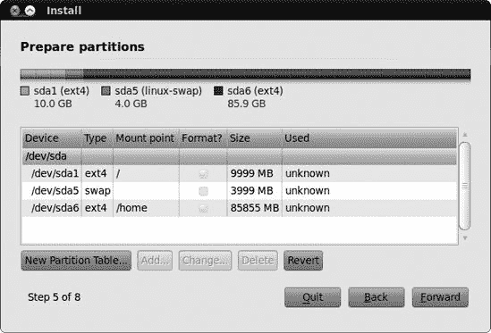

# 附录 C. 手动分区硬盘

当你使用 Ubuntu 安装程序分区硬盘时，前两个选项（使用整个磁盘和调整现有分区大小）应该可以覆盖大多数情况。这两个选项都在第二章中进行了讨论。但如果你有更技术性的心情，还有一些巧妙的方式来划分你的磁盘空间。例如，你可以创建一个共享数据分区，这样你的文件就可以在 Windows 和 Ubuntu 之间共享，或者你可以为你的 */home* 目录创建一个单独的分区，这样你就可以在不完全备份所有文件的情况下重新安装 Ubuntu（或安装不同的 Linux 发行版）。

当你到达安装程序的“准备磁盘空间”屏幕时，选择**手动指定分区**，然后点击**前进**。你将看到一个彩色条形图，显示你当前的分区设置（图 C-1）以及下面的分区列表。你在这个窗口中做出的任何更改都不会生效，直到你再次点击**前进**，如果你想完全放弃手动更改，可以点击**后退**按钮。（有一个例外：当你调整分区大小时，更改会立即生效且不可逆。有关更多信息，请参阅编辑现有分区。）

图 C-1. 使用手动分区工具

# 创建和删除分区

你只能在你有一些“空闲空间”可以放置它们的情况下创建新的分区。这里的“空闲空间”是指在磁盘的这一部分还没有分区，而不是说那里没有文件。创建空闲空间的一种方法就是删除现有的分区；为此，点击分区列表项，然后点击**删除**。几秒钟后，它将在列表中变为空闲空间（图 C-2）。或者，如果你打算完全改变你的分区设置，选择你想要修改的硬盘，然后点击**新建分区表**。你将得到一个完全空白的画布，你只需要添加新的分区。

选择任何空闲空间，然后点击**添加**以在其中创建一个新的分区。您将看到一个创建新分区窗口（图 C-3)，该窗口将询问您想要将分区设置多大（以兆字节为单位）。(1GB 大约是 1,000MB。)有关如何设置分区大小的建议，请参阅分区种类，在编辑现有分区中。

使用选项允许您指定想要使用的文件系统。一个**文件系统**告诉您的操作系统如何在分区上存储文件。您可以选择多种不同的文件系统，但并非所有文件系统都能被 Windows 和 Mac OS 理解。对于仅用于 Linux 的分区，Ext4 是最好的选择，但如果您想与 Windows 或 Mac OS 共享文件，则需要使用 FAT32。

图 C-2. 创建一些空闲空间

图 C-3. 创建新分区

您还可以选择**挂载点**，这是 Ubuntu 将放置与该分区对应的文件夹的位置（如果您不熟悉 Linux 如何组织文件夹，请参阅第七章）。例如，您会将主分区挂载为*/home*文件夹。有关挂载点的更多详细信息，请参阅编辑现有分区中的分区种类。

在创建新分区窗口中还有两个额外的选项，它们都比较技术性和无聊。新分区类型选项让您可以选择创建**主分区**或**逻辑分区**。在一个磁盘上，您最多可以有四个主分区，但可以有大量的逻辑分区——磁盘分区器会为您选择正确的选项，因此无需更改此设置（它不会以任何方式影响您对分区的使用）。另一个选项，新分区位置，允许您选择在磁盘上的哪个位置放置新分区。这实际上并不重要，所以也请将此选项设置为默认值。

点击**确定**完成添加分区；几秒钟后它应该会出现在列表中。

# 编辑现有分区

如果您有一个想要调整大小或更改挂载点或文件系统类型的现有分区，请选择它并点击**更改**。将出现一个编辑分区窗口（图 C-4）。

“用作”和“挂载点”选项与创建新分区窗口中的选项工作方式相同。如果您希望删除该分区上的所有数据以便从头开始，也可以选择**格式化分区**。如果您正在更改分区的文件系统（例如，从 FAT32 更改为 Ext4），那么您别无选择，只能进行格式化，因此也要注意这一点。

要调整分区大小，请使用“新分区大小（MB）”选项。如果您更改了大小然后点击**确定**，您将收到警告，表示更改将被写入磁盘。点击**继续**，分区器将立即开始调整分区大小——您无法撤销此更改，因此在点击继续之前请仔细考虑您是否选择了正确的选项。

图 C-4. 编辑分区

# 分区类型

当您手动分区磁盘时，您需要熟悉几种分区类型。我在以下部分中总结了这些内容，并提供了一些关于选择它们的大小、挂载点和文件系统的建议。

## 根分区

您必须有一个根分区；这是存储重要系统文件和安装软件的地方。我建议至少设置为 8GB，如果可能的话，目标是 10GB 到 15GB，以便为安装新程序留出空间。如果您不打算有单独的主分区（稍后描述），所有文件都将存储在根分区中，因此在这种情况下，您应该尽可能将其设置得尽可能大。挂载点应设置为*/*，文件系统设置为*ext4*。

## 交换分区

您必须有一个交换分区。交换分区就像系统内存（RAM）的额外区域；如果您的计算机的系统内存满了，它将开始使用此分区来处理溢出。当您休眠计算机时，它还用于存储系统内存的内容（如所有打开的文件和程序）。有关交换的更多详细信息，请参阅[`help.ubuntu.com/community/SwapFaq/`](https://help.ubuntu.com/community/SwapFaq/)。

作为粗略的指南，它应该略大于您计算机的 RAM 容量。例如，如果您有 2GB 的 RAM，请创建一个 2.2GB 的交换分区。文件系统应设置为*交换区*，并且不需要设置挂载点。

### 注意

在安装 Ubuntu 之后，您可以通过创建一个*交换文件*来避免使用交换分区。进行此操作的方法超出了本书的范围。

## 主分区

*/home* 文件夹可以放在一个单独的分区中。你不需要这样做，但如果将来出了问题需要重新安装 Ubuntu，这会很有用——当 Ubuntu 在根分区上重新安装时，所有个人文件和配置设置都将保留在 home 分区上。这可以在恢复系统时节省大量工作。如果你没有单独的 home 分区，*/home* 文件夹将与其他所有内容一起放在根分区中。无论你是否将其放在单独的分区中，访问你的 home 文件夹（例如，通过“位置”菜单）的方式都将完全相同。

家分区是存储所有文件和设置的地方，所以你希望它尽可能大。文件系统应该是 *ext4*，挂载点应设置为 */home*。

## Windows 分区

如果你已经安装了 Windows，你需要调整 Windows 分区的大小，为 Ubuntu 留出空间。当你这样做的时候，请确保至少留出足够的磁盘空间，以便 Windows 能够正常工作。Windows XP 至少需要一个 2GB 大小的分区，而对于 Vista 和 Windows 7，你应该至少留出 16GB。你可能想要留出比这更多的空间，这样你就可以在 Windows 中安装程序和保存文件，并且记得也要为现有的 Windows 文件留出空间。主分区窗口中的“已使用”列会告诉你你的 Windows 文件目前占用了多少空间。

Windows 分区将是 NTFS 或 FAT32 类型。请记住不要格式化 Windows 分区，否则你的当前 Windows 安装将被删除。

## 共享分区

如果你想要一个简单的方法来在 Windows 和 Ubuntu 之间共享文件，请创建一个共享分区。在两个操作系统中，它都会显示为一个独立的硬盘，你可以用它来存储你喜欢的任何东西。

将分区设置得尽可能大：如果你只是偶尔在 Ubuntu 和 Windows 之间复制小文件，那么 1GB 到 2GB 应该足够了；如果你想要永久存储所有 Windows 和 Ubuntu 文件（有点像共享的家用文件夹），请尽可能将其设置得更大。你应该选择 FAT32 作为文件系统，但对于挂载点，你可以使用几乎任何东西—*/windows* 将是默认建议之一，但如果你喜欢，你可以在挂载点框中输入类似 */shared* 或 */blackhole* 的内容。只需确保你使用一个不带空格的名字。

# 示例分区布局

如果你以前从未进行过分区，分区可能会让人感到困惑，所以我提供了一些示例分区布局，应该会使事情更清晰。在所有这些示例中，我使用了一个 100GB 的硬盘，但你可以根据 编辑现有分区 中的 分区种类 的建议，根据你的硬盘调整所有分区的大小。

## 标准仅安装 Ubuntu

仅在磁盘上安装 Ubuntu，因此只需要根分区和交换分区（图 C-5

图 C-5. 简单的仅 Ubuntu 分区布局

图 C-6. 带有独立 Home 分区的 Ubuntu 分区布局

## 带有共享分区的 Ubuntu 和 Windows

Ubuntu 将安装在 Windows XP 旁边，并且我想要一个共享分区，这样我就可以在两个操作系统之间复制文件（图 C-7

图 C-7. Ubuntu、Windows 和共享分区

# 完成设置

完成后，点击**前进**以最终确认更改。如果你正在删除或格式化任何分区，更改将被写入磁盘。这是一个不可逆的更改，所以请确保备份了受影响分区上的任何有价值的数据！
