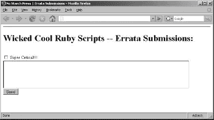

# 第二章 网页脚本


Ruby 和网络是相辅相成的。互联网和万维网提供了如此多的信息，以至于找到具体的信息可能会让人感到不知所措。流行的搜索引擎使得网络爬取变得更加容易管理，但这些搜索引擎缺乏定制。如果你要编写自己的脚本，就有可能定制收集信息的各个方面以及如何展示这些信息。

* * *

### 注意

*如果你听说过 Ruby，那么你很可能也听说过 Ruby on Rails。这本书不涉及 Rails，因为 Ruby 本身就是一个强大的工具，可以用来利用网络。但如果你想探索使用 Ruby 进行 Web 应用程序开发，你绝对应该检查 Rails 框架* ([`www.rubyonrails.org/`](http://www.rubyonrails.org/))).

* * *

# 网页链接验证器

## 网页链接验证器

### linkValidator.rb

这个脚本的目的是验证网页上的所有链接。检查链接的有效性有几个原因。首先，作为一个观众，遇到断链是非常令人沮丧的。其次，有效的链接使网站看起来更专业。最后，如果你的网站包含指向其他网站的链接，而他们移动或删除了页面，除非你特别检查，否则你无法知道。

没有自动化这项任务，一个人就必须逐个点击每个链接来验证路径是否有效。极小的网站很容易验证，但包含许多链接的网站既繁琐又耗时。这是一个手动完成可能需要几个小时的任务的例子。通过使用一些 Ruby 技巧，你可以将时间缩短到 10 秒！编写脚本会花费一点时间，但它可以重复使用。

## 代码

` require 'uri'  require 'open-uri'  require 'rubyful_soup'   begin      print "\n\n 请输入要爬取的网站（例如：http://www.google.com）: "      url = gets      puts url      uri = URI.parse(url)  html = open(uri).read  rescue Exception => e       print "无法连接到 url："       puts "ERROR ----  #{e}"   end   soup = BeautifulSoup.new(html)   links = soup.find_all('a').map { |a| a['href'] }   links.delete_if { |href| href =~ /javascript|mailto/ }   links.each do |l|      if l          begin              link = URI.parse(l)              link.scheme ||= 'http'              link.host ||= uri.host              link.path = uri.path + link.path unless link.path[0] == //              link = URI.parse(link.to_s)               open(link).read          rescue Exception => e              puts "#{link} failed because #{e}"          end      end  end`

## 运行代码

你将通过首先以这种方式启动脚本来验证任何给定网站上的链接：

``**`ruby linkValidator.rb`**``

脚本会提示您输入想要爬取的网站。您需要输入带有完整 URL 地址的网站（例如，[`www.nostarch.com/`](http://www.nostarch.com/)）。从那里，脚本将列出它难以访问的链接。

## 结果

作为测试，我将脚本运行在一个不便透露的网站上，结果如下。

``输入要爬取的网站（例如：http://www.google.com）：*`http://www.url.com`* http://www.url.com/products/specials.html 失败，因为 403 禁止访问```

该网站大约有 50 个链接。除了一个名为 *specials.html* 的链接外，其他所有链接都经过了验证。正如从错误报告中可以看出，specials 页面无法访问的原因是 "403 禁止访问"。这是因为网站所有者不想让公众查看 special 页面。

## 它是如何工作的

首先，我们需要谈谈 HTML 操作和与网站交互。Ruby 有几种访问网络的方式，但最简单易用的，无疑是 open_uri。如果你熟悉 `wget`，那么了解 open_uri 应该很容易；通过我的邪恶小宝石，我已经在抓取网页的路上走了一半。对于网络抓取活动，我通常使用 rubyful_soup，这是一个 Ruby 的 HTML/XML 解析器，结合 uri 和 open_uri 使用。rubyful_soup 宝石可以像书中使用的其他宝石一样安装。当你跟随书中的示例时，你会看到 rubyful_soup 有多强大。

脚本开始时有一些错误处理，以防用户错误地输入了错误的 URL 或无法连接到网址的根目录！[](../Images/00003.jpg)。无论如何，用户将有多于一次的机会来纠正他的错误。

在输入了 URL 之后，它使用 uri 库进行解析。你提供的 URL 使用 `open(uri).read` 命令打开！[](../Images/00002.jpg)。这一行打开了 URL 并读取了所有的 HTML 源代码。很酷，对吧？你曾想过抓取网页会这么简单吗？

如果在导航到你的 URL 时出现任何问题，脚本将显示错误并打印出具体的错误信息！[](../Images/00004.jpg)。现在轮到有趣的部分了，这是 rubyful_soup 展示其力量的时刻。

通过初始化 `BeautifulSoup` 并传入我们的 HTML 源代码，制作了一批新的 rubyful_soup。这个 soup 允许我们轻松解析 HTML 源代码。当然，你可以写一个复杂的正则表达式或者检查每一行是否有 `HREF`，但这个功能已经由 soup 支持了！只需告诉 soup 在源代码中查找所有链接并将它们保存到我们名为 `links` 的数组中！[](../Images/00005.jpg)。我们想要移除的是 `javascript` 和 `mailto` 链接，因为这些链接在开始测试链接有效性时会让解析器感到不高兴！[](../Images/00006.jpg)。一旦链接清理完毕，脚本开始遍历每一个链接。

由于我们正在检查每个链接的有效性，我们实际上是在检查任何会抛出错误的链接。如果没有错误被抛出，我们可以确定链接是有效的。为了解释输出，我们使用了更多的错误处理技巧，并开始检查每个链接 。如果链接有效，脚本将继续。如果链接有问题，它将被记录。在这个脚本中，我选择将坏链接输出到命令提示符，但你也可以修改脚本以将其输出到文本文件或其他你想要的格式。

## 脚本黑客技术

对于这个脚本，另一个技巧是爬取在初始根域名中找到的有效链接。你可以通过指定一个爬取的链接深度来限制爬虫。这将允许你爬取整个网站上的每个链接。如果该网站不是你自己的，你可能还希望在页面抓取之间添加延迟，这样就不会拖垮服务器。你也可以使用 open_uri 来集成 HTTPS 支持。

如果你希望爬取特定的网站，你可以将地址硬编码到脚本中，这样你就不必每次都输入它。这是一个非常棒的爬虫脚本基础。

# 孤儿文件检查器

## 孤儿文件检查器

### orphanCheck.rb

在本节中，我们将查看无效链接文件的逆过程——我将向你展示如何找到完全没有链接的文件。"孤儿文件"是指任何在 Web 服务器上丢失链接的文件。这些文件不仅浪费空间，还有可能用多余的文件让网页管理员感到困惑。

我可能被一些人称为整洁狂热者。我喜欢事物井然有序，就像我喜欢的那样。我讨厌杂乱和浪费空间。我对我的计算机系统也是同样的态度，所以我更喜欢只保留我需要的文件。如果你曾经做过很多更改或升级，或者如果你曾经不得不与他人共享系统，那么你就知道文件系统可以变得多么混乱和无序。孤儿文件检查器脚本的独特之处在于它提供的信息可以解决两个问题。第一个问题是找出哪些文件在你的 Web 服务器上不可访问。其次，该脚本允许你看到那些不应该被列出的文件。显然，有些文件不应该有链接，但在运行此脚本之前，你应该知道哪些文件是这样的。

## 代码

` links = Array.new  orphans = Array.new  dir_array = [Dir.getwd]   unless File.readable?("links.txt")      puts "文件不可读。"      exit  end   File.open('links.txt', 'rb') do |lv|      lv.each_line do |line|          links << line.chomp      end  end   begin      p = dir_array.shift      Dir.chdir(p)       Dir.foreach(p) do |filename|          next if filename == '.' or filename == '..'          if !File::directory?(filename)                 orphans << p + File::SEPARATOR + filename          else              dir_array << p + File::SEPARATOR + filename          end      end  end while !dir_array.empty?   orphans -= links   File.open("orphans.txt", "wb") do |o|        o.puts orphans  end`

## 运行脚本

要运行脚本，你必须已经创建了一个名为 *links.txt* 的文件，该文件包含网站上所有超链接的列表。这个列表可以使用 The Code 上的修改版 "#10 Web Page Link Validator" 或你自己的脚本完成。格式是一个单独的文件，每行包含完整路径。我用于此示例的文件基于一个用于跟踪我一些 Ruby 网页脚本的网页；它看起来像这样：

`/ruby/scripts/website_scripting\index.html /ruby/scripts/website_scripting\orphanCheck.rb /ruby/scripts/website_scripting\rssParser.rb /ruby/scripts/website_scripting\ipAdderGen.rb /ruby/scripts/website_scripting\formGenerator.rb`

脚本完成所有工作；你只需输入：

``**`ruby orphanCheck.rb`**``

现在，请坐下来放松，等待脚本写入 *orphans.txt*。

## 结果

此脚本的输出结果将保存在名为 *orphans.txt* 的文件中。该文件将包含每个在 *links.txt* 文件中没有列出的文件的完整路径。如您所回忆的，*links.txt* 文件包含网站上找到的所有文件的列表。以下是一个 *orphans.txt* 文件的示例：

`/ruby/scripts/website_scripting\form.html /ruby/scripts/website_scripting\linkValidator.rb /ruby/scripts/website_scripting\subnetting.rb /ruby/scripts/website_scripting\historicalStockParse.rb /ruby/scripts/website_scripting\links.txt`

这些是在网页服务器上找到但不在 *links.txt* 文件中的文件。如果我想将这些文件与全世界分享，那么在我的网页上为它们添加 `<a href="link">` 标签。但如果这些孤儿文件仍在制作中且尚未准备好公开查看，那么就不会有任何问题（情况就是这样）。

## 如何工作

该脚本不使用任何外部库，因此保持了其执行简单。我开始初始化我将使用来跟踪我的链接和孤儿文件的数组 。接下来，我检查我的*links.txt*文件是否存在。如果不存在，那么继续运行脚本就没有太多意义了，所以它会以一个友好的错误消息退出 。如果*links.txt*文件存在，那么我们将继续打开文件并逐行读取所有内容。你可以将其更改为*逗号分隔值 (CSV)* 文件，但我更喜欢每行一个链接的易读性。

在将链接存储在数组`links`之后，脚本开始索引当前工作目录中的每个文件。结果将存储在一个名为`orphans`的数组中 。如果有子目录，脚本也会索引那些文件。假设你会在这个脚本的根目录下运行它，以充分利用这个脚本。

现在脚本已经对链接和本地文件进行了索引，是时候开始比较这两个数组，看看还剩下什么 。我称第二个数组为`orphans`，因为我将删除任何存在于`link`数组中的条目。剩下的将是不包含在公共服务器端的文件。

脚本最后在脚本目录中创建一个名为*orphans.txt*的文件，并将结果写入该文件 。最后，在代码块完成后，文件被关闭，脚本结束。

# 表单生成器

## 表单生成器

### formGenerator.rb

当表单首次出现在 HTML 场景中时，它们是被低估的工具。现在你几乎可以访问任何网站，并找到底部有那种酷炫的小提交按钮的表单。谷歌为*提交按钮*搜索返回了惊人的 6000 万条结果。不用说，网络表单已经成为我们数字生活的一部分。表单可以收集许多不同类型的信息。它们还可以匿名化收件人的电子邮件地址。如果你的电子邮件地址发布在网站上，并且电子邮件收集器收集了它，你可以预期会收到大量的垃圾邮件。如果你在你的网站上使用表单，你的电子邮件将保持对用户（和机器人）隐藏，但你仍然可以收到来自网站用户的电子邮件。此外，表单允许用户在不需要他们自己的*简单邮件传输协议 (SMTP)* 服务器或电子邮件服务的情况下进行通信。

表单简单灵活。如果你想收集客户反馈，创建一个表单。如果你想进行调查，创建一个表单。你明白这个意思。

知道如何创建它们是一项很好的技能，但更酷的技能是知道如何自动创建它们！使用这个脚本，您可以即时构建表单或创建表单模板。创建网页表单并不是什么大问题。随着您对这个脚本的实验，您将生成大量的表单文件。如果您不想跟踪每个文件，那么请使用脚本 #11，孤儿文件检查器（见 Hacking the Script），来清理您的混乱。

## 代码

`require 'cgi'   cgi = CGI.new("html4Tr")   print "Enter Form Page Title: "  title = gets.chomp  print "Enter Head Title: "  input_title = gets.chomp  print "Enter value for button: "  value = gets.chomp  print "Enter group: "  group = gets.chomp   $stdout = File.new("form.html","w")  cgi.out{      CGI.pretty(          cgi.html{                      cgi.head{ "\n"+cgi.title{title}}+                  cgi.body{"\n" +                      cgi.form{"\n" +                      cgi.hr +                      cgi.h1 { "#{input_title}:" } + "\n" +                      cgi.br +                      cgi.checkbox(group, value) + value + cgi.br +                      cgi.br +                      cgi.textarea("input",80,5) + "\n" +                      cgi.br +                      cgi.submit("Send")                      }                  }           }     )  }   $stdout.close`

## 运行代码

这个脚本通过用户输入来创建 HTML 表单。像执行其他脚本一样执行此脚本，并遵循其指示。

## 结果

`form.html` 的内容：

`Content-Type: text/html Content-Length: 724  <!DOCTYPE HTML PUBLIC "-//W3C//DTD HTML 4.01 Transitional//EN" "http://www.w3.org/TR/html4/loose.dtd"> <HTML>   <HEAD>     <TITLE>       No Starch Press | Errata Submissions     </TITLE>   </HEAD>   <BODY>      <FORM METHOD="post" ENCTYPE="application/x-www-form-urlencoded">       <HR>       <H1>         Wicked Cool Ruby Scripts -- Errata Submissions:       </H1>       <BR>       <INPUT NAME="Bad Errata Submissions" TYPE="checkbox" VALUE="High Priority">       Super Critical!!!       <BR>       <TEXTAREA NAME="input" ROWS="5" COLS="80">       </TEXTAREA>       <BR>       <INPUT TYPE="submit" VALUE="Send">     </FORM>   </BODY> </HTML>`

在 图 2-1 中查看其效果。



图 2-1. 在网页浏览器中看到的最终形式

## 它是如何工作的

表单生成脚本使用 cgi 库，因此在 `require` 语句中包含它。我创建了一个新文档，并指定使用 `html4Tr` 作为参数来生成我的代码，使用 HTML 4.0 Transitional 版本的方法 。其他选项是 `html3`（HTML 3.*x*）、`html4`（HTML 4.*x*）或 `html4Fr`（带有框架集的 HTML 4.0）。在设置 cgi 方法之后，脚本请求用户的信息 。此脚本创建了一个包含一个复选框和一个文本框的提交表单。这个例子是为勘误表单开发的。

首先请求表单的头部，然后是网页表单的标题。接下来展示复选框的值。在这个例子中，我给了用户提交值 `High Priority` 的选项，以展示复选框选项。复选框在你需要寻找必须做出特定选择的信息时很有用；例如，晚餐选择——`chicken` 或 `beef`。最后，我添加了一个文本框，允许用户详细说明她可能发现的任何错误。一旦收集到信息，脚本将开始编写一个漂亮的 HTML 表单。

在标准输出的重定向中包含了两个重要的代码行 。`$stdout` 被重定向到一个名为 *form.html* 的新文件中，它将捕获 HTML 表单。调用 cgi 方法 `out` 准备文件以创建 HTML 代码。然后使用 `pretty` 方法；虽然不是必需的，但它清理了 HTML 代码，使其易于阅读，具有适当的行间距和缩进。

然后 `HTML` 方法开始构建我们表单的每一部分。首先是头部，这是我们之前指定的；接下来是主体，包含表单的每一部分 。最后，也是最重要的，是提交按钮，我恰当地命名为“发送”。为了清理我们打开的文件，我们关闭它并退出脚本。我们闪亮的新 HTML 表单已准备好使用。

## 脚本破解

这个脚本的优点在于如何使编写 HTML 代码变得简单。你可以进一步探索 cgi 库，以包含单选按钮、多组和其他表单元素。你可以通过指定需要多少组和每组应该有多少选项来使这个脚本更加灵活。

# RSS 解析

## RSS 解析

### rssParser.rb

*真正简单的聚合（RSS）* 是一种自 2000 年初以来越来越受欢迎的奇妙技术。RSS 源允许用户保持对经常变化的信息的最新了解，例如新闻标题或产品公告。许多网站都提供 RSS 源，需要一个源阅读器来提取源中包含的重要数据。

分发可以扩展信息的功能和互操作性。Ruby 有一个库，允许你自定义获取、发布、聚合和操作 feed 的方式。此脚本将允许你从 No Starch 的博客[`nostarch.com/blog/?feed=rss2/`](http://nostarch.com/blog/?feed=rss2/)获取信息。

## 代码

`require 'rss/1.0'  require 'rss/2.0'  require 'open-uri'   source = "http://nostarch.com/blog/?feed=rss2" # rss feed 的位置  content = ""   open(source) do |info|      content = info.read  end   rss = RSS::Parser.parse(content, false)   print "你想查看 feed 描述吗（y/n）？ "    input = gets.chomp   desc = input == 'y' || input == 'Y'   puts "\n\n 标题：#{rss.channel.title}"  puts "描述：#{rss.channel.description}"  puts "链接：#{rss.channel.link}"  puts "发布日期：#{rss.channel.date} \n\n"   rss.items.size.times do |i|      puts "#{rss.items[i].date} ... #{rss.items[i].title}"      if desc          print "#{rss.items[i].description}\n\n\n"      end  end`

## 运行代码

要运行此脚本，请输入：

``**`ruby rssParser.rb`**``

脚本将询问你是否想查看 feed 描述以及标题。输入`yes`或`no`。如果你输入`no`，脚本将只显示每个条目的标题。

## 结果

关闭描述：

`标题：The No Starch Press Blog 描述：内容丰富，无冗余 链接：http://nostarch.com/blog 发布日期：Thu, 07 Aug 2008 13:42:08 -0400  Thu, 07 Aug 2008 13:42:08 -0400 ... 在拉斯维加斯的美食 Tue, 29 Jul 2008 22:44:17 -0400 ... 布尔运算符 Thu, 10 Jul 2008 03:18:18 -0400 ... 窗口升级地狱 Sat, 05 Jul 2008 02:47:27 -0400 ... 谷歌的问题？ Thu, 03 Jul 2008 15:35:30 -0400 ... 尼克·霍恩比关于电子书 Tue, 17 Jun 2008 17:37:15 -0400 ... 下载快乐日！ Tue, 17 Jun 2008 14:22:08 -0400 ... 如何写一本书 Mon, 16 Jun 2008 19:08:22 -0400 ... 周一下午链接节 Mon, 02 Jun 2008 04:36:47 -0400 ... 博客无聊吗？ Wed, 21 May 2008 05:15:18 -0400 ... 巨大的乐高巨石`

保持描述：

`标题：更多内容，更少废话 描述：唯一一个没有淀粉的博客 链接：http://nostarch.com/blog 发布日期：Thu, 07 Aug 2008 13:42:08 -0400 Thu, 07 Aug 2008 13:42:08 -0400 ... 拉斯维加斯的美食 DEFCON 时间到了，这意味着是拉斯维加斯的时候了。虽然 1.99 美元的自助餐很诱人，但你可能已经吃够了当天的便宜牛排。查看 Bill 的餐厅地图，看看其他想法。这里有很多种类的美食，从喜马拉雅菜系到传统的美国食物。如果你去过 [...] Tue, 29 Jul 2008 22:44:17 -0400 ... 布尔运算 在司法部内部职位候选人“审查”过程中，Monica Goodling 执行的搜索：[候选人名字]! and pre/2 [候选人姓氏] w/7 bush or gore or republican! or democrat! or charg! or accus! or criticiz! or blam! or defend! or iran contra or clinton or spotted owl or florida [...] Thu, 10 Jul 2008 03:18:18 -0400 ... Windows 升级地狱 很不幸，我们这里很多人还在使用 Windows。（我现在几乎只使用 Ubuntu，除非我需要修复 Windows。）而且，更不幸的是，当遇到那个不可避免的 Windows 问题时，我经常不得不修复它。今晚我选择将我们的一台 XP 机器升级到 XP Pro。你可能会认为 [...] ---[省略]---`

## 如何工作

幸运的是，这个脚本相当直接。脚本首先识别 RSS 源的位置 。这可以是任何活网站或本地文件，但必须是 RSS 格式。接下来，我们初始化变量 content，并继续从我们的源文件中读取所有信息——在这个例子中，源文件是 No Starch 的博客 。

在将原始数据保存在变量 content 中后，RSS 解析器开始施展其魔法。解析器会将 RSS 源解析成特定的格式，并将结果数据保存到名为`rss`的变量中 。变量`rss`有很多属性可供操作，所以请随意深入探索，看看你能从中获取哪些其他信息。

现在困难的部分已经解决，我决定向用户展示哪些信息。我最感兴趣查看的信息是日期、标题，以及可能的描述。这样我就可以快速浏览一个信息源，寻找可能进一步吸引我的内容。一些 RSS 源的描述可能很长，占用很多空间。我给自己提供了查看描述的选项，如果我真的需要的话 。正如你上面看到的，没有冗长描述的输出更容易处理。

## 操纵脚本

如果你对特定主题感兴趣，你可以加入一个搜索功能，在 RSS 条目的标题中或甚至在其描述中查找特定的关键词。另一个想法是使用这个脚本扫描多个源，寻找相似的文章，并将它们聚合起来以便于访问。你可能记得日期属性；你可以根据条目被放入源中的日期来过滤结果。例如，如果你正在寻找上周内的条目，你可以编写一个条件语句来仅显示最新的信息。

# 股票交易所 grep

## 股票交易所 grep

### stockGrep.rb

股票太棒了！我喜欢投资公司，并观察它们如何成长和发展成为行业领导者。观看一场灾难性的失败也同样有趣。股市既迷人又复杂，许多人花费他们的一生试图理解它。我不尝试玩游戏或理解它；我只是观察。

但是，每当我看到我认为有潜力的股票时，我喜欢密切关注它。我可以通过网络服务或打开电视来观察股票，但这对我来说不够快。我喜欢以我想要的方式、地点和时间获取信息。

这个脚本允许我检索有关特定股票的不同信息，并根据某些事件执行操作。例如，这个脚本可以被修改为当股票达到预定义的水平时发送短信。它还可以将同一行业的多个股票聚合在一起，以便于比较。股市中有如此多的数据——能够提取重要信息是无价的。这个脚本可以以多种不同的方式修改，所以请阅读它，让你的想象力自由驰骋。

## 代码

` require 'open-uri'  require 'csv'  def get_info stock_symbol       puts "#{stock_symbol} 当前股票信息"        url = "http://download.finance.yahoo.com/d/     quotes.csv?s=#{stock_symbol}&f=sl1d1t1c1ohgv&e=.csv"       puts "连接到 #{url}\n\n\n"        csv = CSV.parse(open(url).read)       csv.each do |row|           puts "--------------------------------------------------"           puts "信息截至 #{row[3]} 在 #{row[2]}" "\n\n"           puts "#{row[0]} 的最后交易价格为 - $#{row[1]} (上涨了 #{row[4]})" "\n\n"           puts "\t 开盘价为 $#{row[5]}"           puts "\t 当日价格范围为 $#{row[7]} - $#{row[6]}"       end           puts "--------------------------------------------------"       end    print "请输入股票代码（如果有多个，请用空格分隔）: "    stock_symbols = gets.upcase    stock_symbols.split.each do |symbol|           get_info(symbol)       end`

## 运行代码

运行脚本很简单——你只需提供一个股票代码，它就会拉取数据。就是这样。通过输入以下内容来执行脚本：

``**`ruby stockGrep.rb`**``

你将被提示输入你想要查询的股票代码。

```Enter stock symbol (separate by space if > 1): **``*`arun`*``**```

此脚本可以从 Yahoo! Finance 获取任何信息。

## 结果

Yahoo! Finance 上可用的任何信息都会在命令提示符中输出。*StockGrep.rb*以美观的格式输出标准股票信息。在这个例子中，我搜索了 Aruba Networks, Inc.，这是一家提供企业无线解决方案的公司。结果很有希望：

`ARUN 当前股票代码信息 连接到 http://download.finance.yahoo.com/d/quotes.csv?s=ARUN&f=sl1d1t1c1ohgv&e=.csv --------------------------------------------------  信息截至 2007 年 6 月 1 日下午 4:00  ARUN 的最新交易价格为- $20.20（上涨+0.85）      开盘价为$19.35    当日价格范围为$19.34 - $20.73 --------------------------------------------------`

## 工作原理

脚本首先引入了两个库，以提供脚本的完整功能。我们之前提到过 open_uri，这是第一个库。为了提醒，请参阅代码中的脚本“#10 Web Page Link Validator”。第二个库是 csv，它能够解析逗号分隔值文件！[](../Images/00002.jpg)。从 Yahoo!返回的对象将是一个 CSV 文件，正如你很快就会看到的。

接下来，我定义了一个简短的方法，该方法将用于从多个股票代码中检索信息！[](../Images/00003.jpg)。如果我想将脚本限制为一次处理一个股票代码，这个部分可以直接添加到代码的主体中。在名为`get_info`的方法中，第一步是打印正在分析的股票代码。然后，为了从 Yahoo! Finance 请求正确数据，会构建一个自定义的 URL！[](../Images/00004.jpg)。注意 URL 中嵌入的`#{stock_symbol}`；这就是定制的发挥作用的地方。当这个 URL 发送到 Yahoo!时，会返回一个逗号分隔的值文件给脚本。

变量`csv`将用于存储由`CSV.parse()`方法解析的任何数据。CSV 文件中的每个元素都将放入一个数组！[](../Images/00005.jpg)。Yahoo!的股票文件包含相同的字段，因此在输出应该是什么方面没有猜测的余地。六个`puts`行只是以用户友好的方式显示信息。

脚本的最后一步，实际上是首先执行的一步，是检索股票代码，然后将其拆分！[](../Images/00006.jpg)。对于每个拆分的代码，都会调用上面解释的`get_info`方法。

* * *

### 警告

*由于许多网站会不断更改其产品，所以如果 URL 不再有效，你必须找到新的一个。此脚本的更新将发布在* [`www.nostarch.com/wcruby.htm/`](http://www.nostarch.com/wcruby.htm/)。

* * *

## 脚本破解

几种修改可以使这个脚本更加强大。如果你对趋势分析感兴趣，可以将历史数据集成到这个脚本中，或者让脚本检索数据并将信息写入另一个文件以进行进一步分析。

还值得考虑使用网络爬虫跟踪的其他趋势。

# IP 地址生成

## IP 地址生成

### ipAdderGen.rb

是否曾需要生成一系列的 IP 地址？我发现自己处于需要这种情况的几种情况中，而且我知道我不想手动生成列表。这里没有魔法，但这个脚本的实用性使其变得值得注意。

在日常工作中处理网络意味着处理 IP 地址。有时会使用简单的 `ping` 扫描来识别网络上的机器。此脚本可以生成我选择的任何格式的预定义 IP 地址列表。

然后，可以将这些 IP 地址输入到其他执行与每台机器相关任务的实用脚本中。此脚本可以被转换成一个可重用的库，并集成到各种场景中。

## 代码

` class IP      def initialize(ip)          @ip = ip      end       def to_s          @ip      end       def==(other)          to_s==other.to_s      end       def succ          return @ip if @ip == "255.255.255.255"          parts = @ip.split('.').reverse          parts.each_with_index do |part,i|              if part.to_i < 255                  part.succ!                  break              elsif part == "255"                  part.replace("0") unless i == 3              else                  raise ArgumentError, "Invalid number #{part} in IP address"              end          end          parts.reverse.join('.')      end       def succ!          @ip.replace(succ)      end  end   print "Input Starting IP Address: "  start_ip = gets.strip   print "Input Ending IP Address: "  end_ip = gets.strip   i = IP.new(start_ip)   ofile = File.open("ips.txt", "w")  ofile.puts i.succ! until i == end_ip  ofile.close`

## 运行代码

要运行此脚本，请输入：

``**`ruby ipAdderGen.rb`**``

然后将提示你提交 IP 地址范围：

```Input Starting IP Address: **``*`192.168.0.1`*``** Input Ending IP Address: **``*`192.168.0.20`*``**```

输出将是一个文本文件，每行包含一个 IP 地址。

## 结果

在脚本成功执行后，查找名为 *ips.txt* 的文本文件。正如预期的那样，输出将是：

`192.168.0.1 192.168.0.2 192.168.0.3 192.168.0.4 192.168.0.5 192.168.0.6 192.168.0.7 192.168.0.8 192.168.0.9 192.168.0.10 192.168.0.11 192.168.0.12 192.168.0.13 192.168.0.14 192.168.0.15 192.168.0.16 192.168.0.17 192.168.0.18 192.168.0.19 192.168.0.20`

## 工作原理

此脚本没有参数或选项。脚本会要求用户输入两个 IP 地址 。一个是 IP 范围的开始，另一个是结束。接下来，使用定义的 `IP` 类创建一个新的 `IP` 对象，名为 `i` 。在生成 IP 地址之前的最后一步是初始化将要写入 IP 地址的文件，命名为 `ofile` 。现在，有趣的部分开始了。

对于返回的每个项目，结果将被输出到 `ofile`。使用 `IP` 类的 `succ!` 方法，一个 until 循环调用 `succ!` 方法，直到 `i` 等于 `end_ip` 。一旦这两个值相等，这意味着已生成结束 IP 地址，并且输出文件被关闭。

该脚本依赖于一个名为 `IP` 的自定义类，它有四个方法：`initialize`、`to_s`、`succ` 和 `succ!`。`IP` 类很重要，因为一旦创建了一个对象，IP 地址就被存储为类变量，以便于跟踪。当声明 `i` 时，首先调用的方法是 `initialize`。这会将 `@ip` 设置为 `start_ip` 。接下来，调用 `succ!` 以开始创建 IP 地址的范围。`succ!` 调用 `succ` 并使用 `replace` 方法在 `succ` 返回值时覆盖 `@ip` 中的内容 。`IP` 类的核心位于 `succ` 方法 。如果 `@ip` 增加到最高的 IP 地址，脚本将返回 `255.255.255.255`。IP 地址只能达到那个值。

接下来，存储在 `@ip` 中的 IP 地址以反向顺序分割，使用点作为分隔符。这些值存储在一个名为 `parts` 的数组中。在 IP 地址被正确分割后，使用 `each_with_index` 方法调用数组上的新代码块来访问两块信息——传递的索引和值 。在这个块中，`part` 中的值与 255 进行比较，再次以防止无效的 IP 地址。如果值等于 255，则将其重置为零 。唯一的例外是当 `i` 的值为 3 时，因为那是 IP 的第一个八位字节。如果 `part` 小于 255，则调用 `succ!` 方法，并且 `if/else` 语句中断。

在每个部分通过代码块运行后，IP 地址将按照拆分它的相反顺序重新组合。脚本使用 `join` 方法将每个部分重新组合起来，元素之间用点分隔，所有这些都在反向顺序中 。如前所述，调用 `succ!` 方法，直到 `end_ip` 地址等于 `succ!` 的结果。这就是完美生成 IP 地址范围的全部内容。

# 子网计算器

## 子网计算器

### subnetCalc.rb

IP 地址空间不是无限的，因此网络管理员必须意识到他们如何分配 IP 地址。一种通过使用子网掩码或*无类别域间路由*来分割网络的方法。为了正确计算*子网*或*子网掩码*，您需要一些信息。如果您不知道如何计算子网，那么希望这个脚本能给您带来启发。

您可以手动计算子网，但这可能很耗时，而且经过多次重复后，从十进制到二进制再回到十进制的转换会变得很繁琐。此脚本解决了必须记住子网计算的问题。只要您有可供脚本输入的信息，就可以放松一下……您的一天因此变得更加轻松。

* * *

### 备注

*本例基于 IPv4 地址*。

* * *

## 代码

` require 'ipaddr'   begin      print "Enter the IP address: "      ip = IPAddr.new gets.chomp       print "Enter the Subnet mask: "      subnet_mask = IPAddr.new gets.chomp   rescue Exception => e      puts "An error occurred: #{e}\n\n"  end   subnet = ip.mask(subnet_mask.to_s)   puts "Subnet address is: #{subnet}\n\n"`

## 运行代码

脚本完全交互式，会引导您完成创建子网的过程。只需使用以下命令来运行它：

``**`ruby subnetCalc.rb`**``

## 结果

`Enter the IP address: 192.168.1.130 Enter the Subnet mask: 255.255.255.192 Subnet address is: 192.168.1.128`

## 工作原理

首先，脚本需要 ipaddr 库 ，这在处理互联网协议地址时非常有用。该库不仅包含预定义的 IP 地址数据结构，还包括用于操作 IPv4 和 IPv6 地址的方法。计算子网地址的第一步是定义 IP 地址。用户会被提示输入地址，该地址将被保存到`ip` 。

依赖于`IPAddr`数据结构，我初始化了一个`begin/rescue`块，以防 IP 地址有任何问题，例如地址超出范围。顺便说一句，我本可以使用正则表达式来检查 IP 地址的完整性，但正则表达式相当长。如果检测到错误，`rescue`子句会捕获它并输出具体的错误原因 。

计算子网地址所需的第二项是子网掩码 。接下来，将 IP 地址和子网掩码转换为十进制数字，以便在两个地址上执行二进制算术运算`AND`。得到的二进制地址转换回十进制，就是最终的子网地址。您很快就会看到，ipaddr 库的`mask`方法抽象了所有的数学运算，使得子网地址计算变得简单。

如果两个地址都通过了 ipaddr 库的检查，则会调用`mask`方法 。`mask`方法期望传入一个字符串对象作为子网掩码地址，因此使用了`to_s`方法将`IPAddr`对象转换为字符串。最后，`mask`方法返回子网地址，然后将其显示给用户。

## 漏洞脚本

您可以轻松地将此脚本转换为同时处理 IPv6 地址和 IPv4 地址。我使用了 ipaddr 库的`mask`方法来实现二进制的`AND`操作，但您也可以显式地进行计算。
